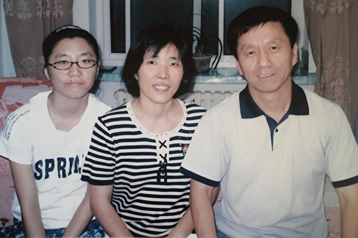
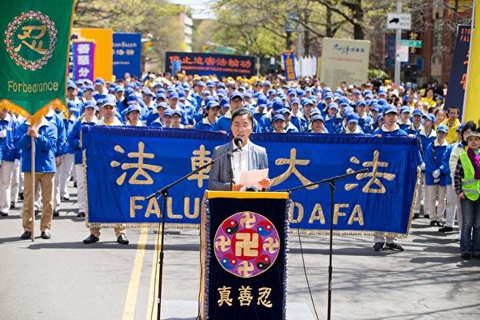
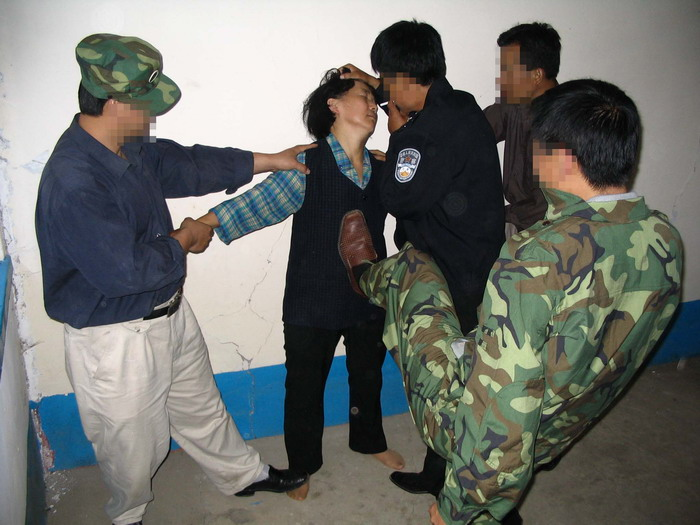

<a href="https://git.io/ffq">
</a>

<h1 align="center"><a href=https://github.com/3fmd/gm/blob/master/epub.md>免费下载好书 下载 epub 视频 音频 图文 电子书</a></h1>
<h2 align="center"><a href="https://github.com/3fmd/gm/blob/master/gm/download/Reasily1802h.apk?raw=true">手机必备Reasily - EPUB 阅读器apk 请下载安装 才能阅读影视epub</a></h2>

<h1 align="center"><b>七十年党龄的老军人父亲退党</b></h1>

香港举行声援中国民众退出中共党、团、队大游行。图为游行队伍中的图文“退出中共保平安”。

跟中共干了一辈子已有七十年党龄的军人父亲，一天在饭桌上突然说了一句：“中共真是流氓！”
 
父亲1939年入伍，1944年加入中共，是一个经历了抗战、内战为中共卖命一生的老军人。2013年他八十八岁，患有心脏病、高血压、失眠、颈椎病、脑梗等十多种疾病。父亲迷信医院的检查与治疗，因此那些年他频繁住院、出院，日子大都是在医院度过的。

我和丈夫都是法轮大法修炼者，丈夫年轻时曾患疑难疾病，丧失工作能力，因修炼法轮大法重获新生。我因他而走入修炼，修炼后道德升华、身心健康，也同丈夫一样无病一身轻！

父亲住医院，请了二十四小时的护工。我们每天都去看他，送去一些他爱吃的饭菜和水果。父亲长年受无神论的洗脑教育，形成了党文化思维，听不得说中共不好的话。我们经常将大法真相资料夹在父亲要看的报纸中，希望他能阅读。起初父亲由于受中共欺骗宣传的影响，不愿听也不愿看真相，对有关“法轮大法”祛病健身的信息也将信将疑。我们一说到中共的罪恶，他就会很气愤的反对。

一天我去给父亲送菜，他翻报纸时看到其中夹有真相资料，顿时火冒三丈，对我挥掌怒吼：“难道你当初也是这样天天让你婆婆看的吗？！”他当晚头痛一夜未睡。

次日，查脑CT虽未见异常改变，但父亲极为痛苦的对我说：“头痛的非常厉害。”我说：“医生说过头表皮痛是颈椎引起的，不要紧。”但父亲说：“我现在是脑袋里面痛，而且痛得就像要裂开一样，血压一百六十。”我说：“那你就找医生想办法呀”？父亲说：“医生没办法”。我说：“那你就相信我早就跟你说过的：默念九个字（法轮大法好，真善忍好）试试吧。据我所知世界上成千上万的人都因此受益了，我是你女儿不会骗你的。”

晚上，我打电话问父亲情况如何，他说：“没事了，头基本不痛，血压一百三十也正常了。”于是第二天我拿了一篇《医生出身的老父亲心服口服了》的真相故事给父亲看，父亲看后说：“我懂了。”后来在我的督促下，父亲每天都会默念几十遍“法轮大法好，真善忍好”。

虽然父亲已体验到了大法的超常神奇，但由于受习惯性思维的影响，一旦症状消失，他又会将其说成是吃某种药吃好的。为此我郑重地提醒父亲：“你得福报不承认，福报必然不会长久。”

记得有一次我对父亲说：“天安门自焚是中共对法轮功的栽赃陷害。”他说：“这我不知道，我又不在场。”我说：“你这不是善恶不分吗？这完全是可以根据常识、逻辑、良知去判断的。”事后我悟到：我与父亲讲话的方式不善也是造成他排斥真相的原因，所以我必须修掉它！

一个月后，父亲因服用治疗失眠的药物，其副作用造成抽搐再次住院。抽搐控制了却造成心律加快，使安装了十多年的心脏起搏器失控不再工作；失眠情况更加严重，人很疲劳但头脑却清醒得让他无论昼夜始终睡不着觉。

父亲说：“我觉得睡觉的功能都丧失了。”他情绪低落的几次对我们说：“我快不行了，我两边都靠不上了。”这就是父亲一直迷信科学，对大法将信将疑最终所陷入的困境。

父亲在连续三天三夜睡不着觉的情况下，一天早饭后，突然坚定地对我们说：“我决定不吃药了。”我俩听后十分惊讶！
 
“吃了一辈子的药了，根本不管用。现在我决定跟你们一块修炼法轮大法。”父亲接着说。 

父亲说到做到，按大法弟子的标准努力去做：白天跟我们一块学法、学功、发正念；晚上父亲睡不着觉就干脆通宵阅读《转法轮》，放师父教功录像边看、边学。

当父亲认真观看了两遍《九评》后，有一天，跟中共干了一辈子已有七十年党龄的父亲，在饭桌上突然说了一句让我们震惊的话：“中共真是流氓！”父亲终于从本质上彻底认清了中共，亲笔写了退党声明，摆脱了邪党的束缚！

当父亲修炼了四十六天后，六十六年的失眠顽疾消失了。双手十个严重的灰指甲有一个已全好，其它的也已从根部泛红逐渐转好……

从此父亲享受到了自由自在的完美睡眠，每天都过得很开心、满足。

<h1 align="center"><b>听法轮功真相　弃恶从善</b></h1>

【明慧网二零一八年八月十四日】我是九六年喜得法轮大法的女弟子，修炼二十二年，每一步都有师父保护，我的家人也受益于大法。下面我把世人明白法轮功真相后人心归正、弃恶从善的事例略举几例，希望有缘人了解法轮功真相，有不妥之处敬请指正。

<b>（一）仇人相互善解了</b>

二零零九年一月，我因给一位青年城管讲真相被他诬告，把我关進拘留所，头天晚上一夜没有入睡，我与同一监室的两个女青年谈了一晚话，谈话中知道她们是一对仇人，冤家路窄，她们因做生意争门面地盘斗殴后，派出所处理不服，被关到拘留所同一监室的。之前这间监室就她们两个人，尬尴、无奈、烦躁的气氛，在我的介入后才转变。

她俩分别问我：炼法轮功有什么好处？政府不让炼为什么还要炼？你们家人让你炼吗？等等很多问题，我一一给她俩做了解答。听着听着，她俩忘了她们是仇人。

我告诉她们牢记“法轮大法好，真善忍好”，你俩心情不烦躁不尴尬，很快就回去。她俩很高兴，看得出来她俩愿意听我说话。

我跟她俩讲了“六尺巷的故事”，舜帝不记父母兄弟之仇的故事，窦娥寃的故事，红眼石狮子的故事，讲了很多大法弟子忍让割舍利益的故事，讲了我让地给邻居起屋。我告诉她们有失才有得的天理。

她俩豁然开朗，会心一笑。我知道她们会善解了。然后我告诉她们，要求拘留所的警察告诉派出所我们不打不斗了，相互道歉，善解矛盾。快过年了，我们家上有老下有小，我们要回家了。

第二天她们照做了，第三天派出所把她们接走了。她们退了邪党团队，都怀着感激的心情与我握手离别。

<b>（二）警察管不了的女犯归正了</b>

我在拘留所的第二晩仍然无法入睡，因为隔壁监室来了六个卖淫吸毒的女犯人，都很年轻，大的不到三十岁，小的才十六岁，晚上她们淫心发作、毒瘾发作乱喊乱叫，调戏男监室的人，不堪入耳。警察多次打招呼制止卑劣言行都没有用，警察一走她们就再来，闹的人们都无法入睡。

第二天放风的时候，我们都在大院里交谈，我问她们为舍不顾尊严什么脏话都说、喊叫不停，你们叫的累不累，警察骂你们难不难受？她们说，我们在发泄，我们习惯了。我听了真伤心，可怜她们。

我告诉她们，我是炼法轮功的，是被人迫害来这里的。一个女孩说，奶奶你是好人，你和我们不一样。我内心知道那是她明白的一面说出的话，我说，姑娘们，我来这里是与你们来结缘的，你们是来得救的，你们想改变自己做好人吗？她们说我们好不了了。我说，有办法，只要你们相信神佛，你们就可以改变，脱胎換骨。她们说：“我们已坏透了，能好吗？”我说，你们被这个腐败社会所害，被变异的文化所腐蚀，你们是受害者，你们个个都长的漂亮，你们是高层次的生命转生到这个世上来的，是与法轮大法来结缘得救的。

她们似懂非憧的听着，有一个女孩流泪。我说，我有责任帮你们跳出误入歧途的苦海，去寻找你们美好的未来。她们听的很认真，我说，姑娘们，你们记住“法轮大法好，真善忍好”，神佛会保护你们去毒瘾、除淫魔，你们能改邪归正做好人。

放风回监室时，警察看这几个女孩围着我静静的听我说话，他们问我说些什么？我说教她们改邪归正做好人，然后我们各自回监室。

吃过晚饭后八点多钟，我见隔壁六个女孩抱着被子来到我这间监室，说是同炼法轮功的奶奶住一起，想跟我说说话。我说只要警察不管，我欢迎你们，但是要肃静，不能象昨天晚上那样吵闹。她们说，好。

我教她们跟我念“法轮大法好，真善忍好”，我又回答了她们提出的我为什么炼法轮功，政府为啥不让人炼法轮功，天安门自焚是怎么回事，等等一些问题。我又讲了修炼法轮功的神奇故事，讲了很多礼仪道德传统文化的故事，讲了善恶有报，改邪归正天神赐福的故事。

她们听的津津有味，一个女孩说，我第一次听到这些好话。有的问你怎么知道这么多？我说我们师父告诉的。

这个晚上她们安安静静，下半夜她们睡的呼呼的，警察也没来监室查房。听一个警察在院子里说，今天怎么这么安静？！

然后几个女孩就与我同住一个监室，警察说把她们交给你了。我带领她们把监室卫生搞好，不准她们乱扔乱摆，教她们叠好被子。天气冷，让她们围着坐一圈念“法轮大法好，真善忍好”，她们也不说冷了。

一天下午，警察叫一个吸毒女孩去见来探监的人，哪知外面来探监的人把毒粉从接待室玻璃小孔里用小纸卷着递進来了。我从未看到过吸毒，突然我看到三个女孩围在一起，一个女孩端着一张纸好象纸里有什么东西，我厉声说：“你们干什么？！”一个卖淫的女孩告诉我她们有毒粉了。我起身走到那三个女孩跟前说：同我念“法轮大法好，真善忍好”，你们把这张纸和纸里的东西扔厕所坑里去。

迟疑了好一会，我用目光盯住她们，然后手拿毒粉的女孩把纸和毒粉扔進了粪坑。

我拉着她们坐在我身旁，告诉她们常念“法轮大法好，真善忍好”，毒瘾就没有了。我告诉她们我不会告诉警察的，你们扔了毒粉说明你们想远离毒品，这是难能可贵的举动，我为你们点赞。我帮五个女孩退了团队（其中一个没有入队入团），我告诉她们退党团队保平安的道理，她们都认同，我给她们唱大法弟子的歌，我炼功、发正念，她们也学着做。

几天下来，她们听懂了天安门自焚是造假，她们认为迫害法轮功是错的。她们与我住在一起后安静了、老实了。警察见我管好了这几个女孩，都用敬佩的眼光瞅着我。

在拘留所我讲真相、劝三退，主动搞好卫生。警察善待我，我有幸接听了国际营救被非法关押的大法弟子的长途电话，在师父的保护下我提前六天回家了。

<b>（三）想叫人打架的妇女知道错了</b>

二零一零年二月的一天，我们在火车站讲真相，看到一个四十多岁的妇女一边哭一边往售票厅走去，我走到身边问她，小妹你有什么困难吗？她说，我被我老公和小叔子打了，你看我头发扯掉了，衣服扯烂了，我要回娘家喊人来还打。说着急忙往售票厅走去。

我拉住她说，小妹我们同是出嫁女，被婆家人打，我很同情你，你能歇一会我与你聊一聊能为你出点主意吗？

她停下来了，我把她拉到花园旁坐下来了。我问她你与老公打架，小叔子帮哥打你是吗？她说，我们婆家起房子，老公让地给小叔子，我不同意，老公说我不讲理，我和老公吵架，我婆婆帮我老公，我和婆婆争辩，我老公骂我，我骂了我婆婆，老公就打我，我翻过身来打了我婆婆，小叔子就打我。我骂他们一家人欺侮我，我去打老公，结果老公和小叔子一起打我。

我问她，你怎么打婆婆？她说婆婆帮儿子，我现叫我娘家来人还打，替我出这口气。我对她说：我告诉你，你的想法错了，不但出不了气，反让娘家受气。如果你娘家人是明理人，不会来打人，反而会指责你，你会更气。如果娘家人帮你来打，就会酿成灾祸，打伤打死哪方人都是你的亲人，谁负责医药费？谁来负法律责任？

她问我是干什么的，我说我来给你讲真相，神佛指引我来告诉你免灾难的。我劝你别去娘家喊人来打架，否则你会大难临头。

她傻了，说我吃这么大的亏，挨一顿打，我不甘心。

我说，吃亏挨打是好事，你有一劫，你不挨打，你生病你招灾或被汽车撞了或被人盗了你钱财你甘心吗？你挨骂挨打，别人给你德，这个德是最珍贵的东西，给你祈福给你添寿，这还不好吗？

她问我，你是信什么的？我说我信仰真善忍，做到打不还手、骂不还口，知道有失有得的道理，我们做人要真诚，善良，忍让，做好人只求一生平安。她说象你这样做人的人太少了。我说太多了。

我问她，你听说过法轮功吗？她说听说过但不了解法轮功。我说法轮功是叫人做好人的，按真善忍的标准做人的，为别人着想愿意别人好，别人有好事为别人高兴，别人有不好的事为别人排忧解难，与别人发生矛盾时先检查自己哪里不对，错了就主动道歉，我们崇尚仁、义、礼、智、信，重视传统文化，百善孝为先，做人媳妇要守妇道……

她听着情绪转变了。我说我炼法轮功十四年了，身体上的病都好了，心胸开朗了，只想做好事，为别人好特别高兴，你今天遇上我你太幸运了，你家要发生的灾祸没有了，你家平安我高兴。

她激动的抓住我的手说，你真是好人呀！我说炼法轮功的人都是做好人的。我叫她记住“法轮大法好，真善忍好”，你经常诚念这九个字，身体健康家人平安，她立即念了几遍。

我送她一个真相护身符，她高兴的接了。我又告诉她三退保平安的道理，她明白了并退出了少先队，她脸上露出了笑容，再次握着我的手，连声说谢谢。我说，要谢就谢我师父。她又说“法轮大法好，真善忍好”。

她说，大姐再见，我要回家了。我送她离开了车站，我俩挥手再见了。

<h1 align="center"><b>默默修补坑洼路、让电让水</b></h1>

【明慧网二零一八年八月七日】我是一名法轮功修炼者，师父要求弟子们按真、善、忍的标准要求自己，在我现有境界的理解，就是要做到真诚、善良、谦逊、忍让。因此在日常生活的点点滴滴中，我都遵照师父的教导处处做好人，尽管中共十多年来不停地对法轮功打压迫害，造谣诬蔑，可我周围的人就从我身上看到法轮功是最正的，最好的，因而破除了中共的谎言。

<b>一、默默修补坑洼路</b>
 

我的家住在县城一条两里多长的居民线上，共住着一百多户居民，都是菜农，靠种菜为生。我门前的路很是糟糕。说来奇怪，尽管周围都是高楼大厦，道路宽广，可我的门前却是一条弯弯曲曲坑坑洼洼的泥土路，路边是一条小排水沟。只有部份居民将自家门前铺了水泥，有些人家也没铺水泥。大约有一里多路是垂直于这条路的几排居民线，因路边没有住户，更是没人管，路就更难走了。这条路每天都有运菜的大车小车碾过，对路面损坏很大。尤其是下雨天，大坑小坑的泥水，给菜农们造成很大不便。

我深深感受到菜农们的苦难，每天夜以继日的种菜、摘菜、洗菜、卖菜，已是千般辛苦，雨天还要泥泞路上跋涉。我就想默默为大家做点好事，将路面的坑洼填补好。我的经济条件也不好，因为信仰真、善、忍而受中共迫害，在南方打工又被公司要挟要保证不炼功才能继续在那工作，就决定回老家，又被公司克扣两万元工资，基本两手空空回来。回家后靠种菜供女儿念完大学，家中还有老母，因此手头没有什么节余。我就不畏辛苦，到处找废弃的碎砖渣，在附近的一个新建小区有些人家搞装修，有些丢弃的砖渣，我就用三轮车拖来填补。隔段时间路面不行了，就又重新填，这样默默地坚持了一年多。

其中还有一段小插曲。去年年底我正忙着卖芹菜，眼看到了腊月间，家家都在忙着准备过年。这时有一段路上又大坑小坑的了，当时自己实在没时间，也找不到砖渣。但心里总想着在年前把路修好，让菜农们及来往的路人、各家的客人在过年时走在这条路上感到快乐。年关时，我们附近一家在搞装修，有一个做小工的来找我去拖砖渣，我当时确实没时间，就没去。过了几天，那位小工又来找我邻居，说把砖渣拖在他那让他扩宽门前场子，让邻居给一包十元的香烟就行了。

我听见后就出来与邻居打商量说：不如您先放一放，把砖渣让给我去填路，要过年了，让大家有好路走。邻居一听很高兴，就满口答应了。我就跟着那个小工去看有多少砖渣，去了一看大约有两立方米左右，正好把那些坑坑洼洼填上。我就对那个小工和另一名开三轮车的人说：“我给你们五十元钱，你们自己去买烟抽，但你们要做点善事，从那段没住户的地方开始填坑，一直到有住户的几户人家的门前都填好，有多的砖渣就放在那没住户的地方，方便以后路面坏了我有时间再填。”那二人满口答应，高兴地接下五十元钱。

我以为这下心愿了了，晚上收了工我就高兴地去查看路面。谁知一看心都凉了，那些砖渣全堆在一个空地上了，他们连一个坑也没填。我心里有些不平衡了，光是花钱不说，我还得花时间，花力气，眼下正忙得不可开交。但转念一想，我是修炼人，怎么能跟他们一般见识呢？他们没填我去填不就行了吗？于是第二天一大早我就用两只桶一担一担地挑砖渣把路面填补好了。虽然吃点苦，但心里很踏实。

周围的人知道后都很敬佩我，但又为那五十元钱为我抱不平，就极力让我母亲去把钱要回来，那小工自知理亏，就将钱还给我母亲。我知道后，还是给那个小工十五元钱让他买包烟抽。

<b>二、让电让水</b>
 

连续多年来，我都是以种菜为生。现在中国大陆道德下滑，菜民为了利益，不考虑他人身体健康，总是打些增长剂促使菜快长，这种增长剂对人体是有毒的。我是修炼人，宁可少收入一点也不给菜用不好的药物，但年年蔬菜都有好的收获。

菜农种菜第一就是需要浇水，浇水就需要大的水池，还有抽水、供电等问题。然而这一切蔬菜社却根本就不管，都是菜农自己想办法解决，可菜农中也没人愿意为大家出力出钱。我就把自家的水池和一个长三米、宽两米、深一米五的公用水池用自己的电机一次又一次地抽满水，以方便大家浇菜和洗菜用。有时供电的开关、电路板坏了，就默默地自己掏钱买了换上。别人大量用我水池的水浇菜我也从不计较。

常言道：日久见人心。这天长日久的，谁也知道炼法轮功的人好，也都知道法轮功好。

去年年底，公用的大水池已灌满了淤泥，基本不能装水了，这样以后菜农浇水就成了问题。我就在繁忙中挤出一天时间清理水池，用大铁锹一锹一锹地往外翻泥土，一直从清晨起干到天黑，终于清理完了。看到露出水泥底的大水池，我深感欣慰。菜农日后又能方便地取水浇田了。

亲爱的朋友，您也许觉的不好理解是吗？其实也好理解，修炼人就是这样的心境，以他人的快乐为快乐，以他人的忧愁而忧愁，这就是伟大的“真、善、忍”精神铸就的为他的生命。但愿朋友听了我的小故事能有所思考，愿朋友早日了解法轮功真相，您也会得到很大的福祉。

<h1 align="center"><b>英议员和医生致信首相 吁调查尸体展</b></h1>

英国伯明翰国家展览中心（NEC）举办“真实人体展”。

【大纪元2018年08月10日讯】（大纪元记者鲍天雨英国伦敦报导）8月6日，伦敦召开了有关制止在英国伯明翰国家展览中心（NEC）举办的“真实人体展”（The Real Bodies exhibition）研讨会，会上公布了两封呼吁调查尸体来源并完善相关法律的公开信。

与会者包括资深调查记者、中共活摘器官问题专家Ethan Gutmann，曾参与过中共摘取死刑犯器官的前乌鲁木齐铁路局中心医院外科医生安华•托蒂，以及曾被中共非法关押并经历过目的可疑的体检的法轮功修炼者、原北京律师Grace， 一起与会场多家媒体记者共同探寻事实真相。

<b>“多是年轻男性” 医生呼吁调查尸体</b>
 
“真实人体展”中被剥去皮肤，使用液体硅胶塑化并切割、摆放成不同造型的尸体，具有明显亚洲人生理特征，一直被质疑其来源问题。目前该尸体展在以色列、法国、美国的夏威夷州等多个城市遭到禁止，捷克也在2017年7月变更法律条款，规定这类尸体展必须要有死者同意捐赠的证明，否则禁止入境。

此次在英国伯明翰展出了20具尸体、人类胎儿以及200多个器官等，NEC展览中心表示所有人体组织均由大连鸿峰生物科技公司提供，这些尸体标本“都是中共公安局向中国医科大学捐赠的无人认领的尸体”，是“合法捐赠的，不是任何形式的囚犯”。

展览组织者、Imagine Exhibitions首席执行官Tom Zaller承认，没有证据能证明尸体的身份，或任何书面证明表示死者愿意死后捐赠尸体。

在研讨会上公布了由53名英国医学界人士向伯明翰验尸官办公室（Birmingham Coroner office）发出的公开信，呼吁该展览在英国期间，应调查所展尸体的死因、死者身份，并要求完善《人体组织法》（Human Tissue Act）（2004）中对进口人体组织器官管理的漏洞加以限制等。

根据英国2004年《人体组织法》，“未经适当的同意，移动、储存或使用人体组织”都是违法行为，但由于该展览是从中国引进的人体组织，目前法案并不适用。

对此，政府表示，该展览已得到正规许可，但“举办展览和维护道德的标准责任由NEC把握”。

公开信发起人之一的伯明翰市医院顾问、神经学家David Nicholl博士在接受《卫报》记者采访时表示，调查员已进入展览馆，记录了死者的年龄、性别，“多是年轻男性，没有年纪大的人。”

他说：“大部分人上了年纪才会亡故，而该展览全是年轻人，性别极度不均，而在大连附近有好几处劳教所，所以这样一个展览的尸体来源十分令人怀疑。”

来自NEC的Rachel Dunachie表示，如果发现这次展览是不道德的，他们愿意“接受人体组织管理局的指导”，同时也将“不会获得许可证明”。

<b>致首相公开信 吁关闭展览做调查</b>
 
在研讨会上还公布了一封由30多位英国议员、医疗专业人士、法律工作者、社会活动家等，向英国首相、反对党领袖、外交部长和卫生部国务秘书发出的公开信，以下为公开信部分内容：

“未经同意展示的人类遗骸违反了《人体组织法》（2004年），以及它的创建精神，还应要求进口人类遗骸的商业活动须遵守这些标准，以确保不允许被贩运的人体进入英国并在英国展示。

“未经许可使用人体器官和组织获取经济利益是《伊斯坦布尔器官贩运和移植宣言》和《欧洲委员会打击人口贩运公约》所规定的道德和法律实践的对立面。

“在未经确认同意的情况下公开展示死者，包括不同孕育时期的胎儿，是对人权、尊严和道德的严重侵犯，不应以‘艺术’或‘教育’为由进行。

“这种人体交易不仅从中共政权广泛使用死刑中获益，也从中共关押‘不受欢迎’的囚犯中获益。

“商业利润不应超过基本人类尊严，该展览严重践踏基本人类尊严。

“我们相信这个展览已侵犯英国价值观和法律，应该停止。还应进行DNA测试，以便将来可以进行家族基因鉴定。我们敦促政府确保制定适当的立法，使这些展品不能自由进口到英国。”

英国伯明翰国家展览中心（NEC）举办的“真实人体展”（The Real Bodies exhibition）。

<b>直接证据：调查DNA </b>

目前没有任何直接证据证明这些尸体的身份信息，与众多议员、医生共同签署公开信的英国人权理事会主席Fiona Bruce议员在信中表示，应该进行DNA检测，以便在将来进行家族DNA比对。

Gutmann也呼吁从此展览中获取DNA样本，以追寻来源。“中国现在正在推行一项试图测试中国人活体DNA的政策。”他在研讨会上表示，如果能获得DNA样本，就可以揭开中共摘取良心犯器官的谜题，这也正是他十余年来一直所呼吁的核心主题。

他在接受《卫报》采访时说：“英国人有权知道自己看到的是什么，中国人有权知道自己的亲人遭遇了什么。”

Gutmann认为，中国目前发生的活体摘取器官以及尸体展的受害者，与被中共当局持续打压的法轮功团体有密切联系。大连、锦州和沈阳的“辽宁三角区”，是迫害法轮功最严重的地域，有多家关押政治犯，特别是关押法轮功学员的监狱、劳教所。

目前已知有几千人被非法关押、迫害致死。“追查国际”于2014年发布调查报告证明，大连鸿峰生物科技公司有极大嫌疑参与针对法轮功修炼者的集体迫害。

<b>中共治下人命不值钱</b>
 
安华•托蒂表示，中国对少数族裔的迫害也在逐步升级，“目前中共政府将25%的维族人口送到所谓的‘学习班’，这也是一个潜在的器官来源。”在中国大陆，维族人、西藏人、基督家庭教会信徒、法轮功学员以及上访人士等均属此列，有报导说在被非法抓捕后很多人接受过目的可疑的体检。

他说：“如今中国最便宜的就是人命了。一条人命只值两元人民币——那是行刑者讨要一颗子弹的费用。”

<b>北京女子亲述体检经历</b>
 
原北京律师Grace因修炼法轮大法，2010年在北京朝阳区被非法拘留，随后被送到北京女子强迫劳改营，直到2012年才重获自由。

她表示曾在看守所遇到一个来自南方的女士，她的姐姐和姐姐的两个孩子都修炼法轮功，2003年在北京失踪，从此杳无音信。

“我在劳教所被监禁期间，接受了多次身体检查，包括肺部X光检查和血液检查，他们甚至还检查了我的皮肤，看是否有小伤疤，却从来没有解释为什么要我接受这些检查。”

2012年初，体检场所变为一辆装满医疗设备的昂贵面包车，“我记得一个官员对这车非常满意地说：‘看看政府如何关心你！专门为你们从德国进口这辆车。’”

劳教所里对法轮功学员实施酷刑，甚至有人被虐待致死，据明慧网报导，通过民间途径能够传出消息的，自1999年至2018年上半年，已有4245名法轮功学员被迫害致死。

据不完全统计，在2018年上半年，光是北京地区的法轮功学员，就有191人遭受不同程度的迫害，其中21人为65岁及以上的老年修炼者，年龄最大者86岁。

Grace表示，所有这些秘密行为给她带来了巨大的心理压力，这种精神上的折磨甚至比肉体折磨还要痛苦，“这是一种无尽的、绝望的担忧和可怕的感觉，任何时候都可能出现更糟糕的情况。”

目前已有多名英国医护人员联名在网上发布请愿书，呼吁民众制止中共迫害法轮功。

<h1 align="center"><b>法轮功学员无罪获释　迫害还能继续多久</b></h1>

【明慧网二零一八年八月十日】从2016年开始，大陆法院、检察院、公安机关无罪释放法轮功学员的案例越来越多，这在过去是不可想象的。
据明慧网《2017上半年法轮功学员获释综述》一文，2017年1月到6月，在公安局、检察院、法院、中级法院，都有阻止或终止迫害程序的案例，54名法轮功学员获释，另有97人被退卷。

这些案例发生在中国大陆的21个省、直辖市，包括安徽、北京、贵州、甘肃、广东、河北、河南、黑龙江、湖北、湖南、江苏、辽宁、内蒙古、宁夏、山东、陕西、上海、四川、天津、新疆、云南等。

中共对法轮功的迫害已持续了19年，近期出现这种变化是偶然的吗？当然不是！迫害法轮功天理不容，世间理也是不容的！促成形势变化有哪些原因呢？

<b>1. 按中国目前的法律，法轮功学员也是无罪的</b>

法轮功修炼真、善、忍，不仅让修炼者祛病健身，而且通过修炼能让人道德升华，是于国于民有百利无一害的正法 。中共一直以《刑法》第三百条“组织、利用会道门、邪教组织、利用迷信破坏法律实施罪”来迫害法轮功学员。可是，立法、司法机关均无法律文件明确法轮功是邪教组织。法轮功教人向善，中共才是真正的邪教。

1999年10月30日，全国人大《关于取缔邪教组织、防范和惩治邪教活动的决定》，全文内容也没有提到法轮功三个字。公安部2000年《关于认定和取缔邪教组织若干问题的通知》（公通字[2000]39号）中，明确的邪教组织有14个，但法轮功并未在列。

实际上，邪教的污蔑来源于1999年10月25日江泽民接受法国《费加罗报》记者的采访谈话，而江泽民的个人谈话不是法律。相反正是江泽民自己践踏了法律！

《宪法》第36条规定：“公民有宗教信仰自由”；第35条规定：“公民有言论、出版、集会、结社、游行、示威的自由”。公民信仰法轮功是合法的，法轮功学员告诉人们真相、制作、散发法轮功真相资料，完全是法律允许范围之内的事，也是合法的。《宪法》第5条规定：“一切法律、法规都不得同宪法相抵触。”

还有，法轮功书籍出版禁令也早已解除。2011年3月1日，《新闻出版总署废止第五批规范性文件的决定》中第99项、第100项明确废止以下两个1999年发布的文件：（1）关于重申有关法轮功出版物处理意见的通知；（2）关于查禁印刷法轮功类非法出版物，进一步加强出版物印刷管理的通知。

所以，在中国大陆民众修炼、宣传法轮功是完全合理合法的。正象中国东南大学法学院教授张赞宁为法轮功学员做无罪辩护时指出：“真正在破坏国家法律实施的是江泽民，江泽民才是真正的罪犯！610办公室是江泽民为了镇压法轮功而非法设立的组织，应该依法撤销。”法庭立即爆发热烈掌声。

越来越多的正义律师敢为法轮功伸张正义；越来越多的法官、检察官、警官、公务人员良知发现做出了正确判断和行为。

<b>2.全世界控告江泽民</b>

自2002年至今，迫害法轮功的元凶、中共前头目江泽民被以群体灭绝罪、反人类罪、酷刑罪在美国、德国、加拿大、澳大利亚、阿根廷、瑞典等19个国家和地区被控告。

2015年5月司法系统出台“有案必立，有诉必理”的立案登记制，中国大陆掀起了大规模的控告江泽民的浪潮，至今已有超过20万名大陆及海外法轮功学员及家属向中国最高检察院和最高法院递交了诉状，实名控告迫害法轮功的元凶江泽民。同时，全世界有几百万人签名声援起诉元凶江泽民。

<b>3.迫害者恶报频发</b>

人在做，天在看。过去几年高压反腐中的落马高官，大都是积极追随江泽民团伙迫害法轮功的败类，包括周永康、薄熙来、徐才厚、郭伯雄、令计划、苏荣、李东生、周本顺、奚晓明、马建、王力军、张越、武长顺等等。表面上，这些人是因贪腐落马；实质上是他们迫害法轮功而遭了恶报。

“十八大”以来，习近平当局“老虎苍蝇一起打”，迄今共查处了200多名副省部级以上中共高官，而落马的“苍蝇”更是数以万计，范围涵盖军队、政法、国安、民政等多领域。其中，中共政法系统被大清洗和降格，在过去4年间，有24省的公安厅长、31省的武警总队职务被更换，多省份的政法委书记、公安厅长落马，更有2名政法官员被判死刑。

外界观察发现，这些落马官员贪腐是中共官员娘胎里带来的不新鲜，但这些人普遍有两个突出特点：中共江泽民派系背景，积极参与迫害法轮功。中共官员们在这阴云密布、噩耗频传的形势下，也悟出些道道来：赶快善待法轮功、和江系切割，是当务之急！

<b>4.形势已变　迫害法轮功会被清算</b>

2013年8月现政权出台了《关于切实防止冤假错案的规定》：“法官、检察官、人民警察在职责范围内对办案质量终身负责。对法官、检察官、人民警察的违法办案行为，依照有关法律和规定追究责任。”

当今最大的冤假错案就是迫害法轮功。这对于执法人员可以说是敲响了警钟。说白了就是，赶快和江系切割，不要被江氏集团迫害法轮功政策绑架，谁做谁负责，终身负责。

2013年底当局废除了劳教制度，并将其内被非法关押的法轮功学员全部释放。劳教制度是江泽民集团迫害法轮功的最主要的工具之一，在劳教所关押的有一半以上是法轮功学员。这是对江氏集团迫害法轮功的直接否定。

2016年3月1号开始，新修订的公安机关警察《执法过错责任追究规定》正式施行，同一天，1999年6月11号实施的公安机关警察《执法过错责任追究规定》废止。旧规定中，因执行上级命令而犯错，可以不追究警察责任的条款，在新规定中予以撤销。仍然执行上级违法命令、且有悖天理的迫害法轮功的警察，责任是要终身追究的。所有的退路都堵死了，还不醒悟不就是等着被收拾吗？

2016年4月23日时隔15年后再次召开了全国宗教工作会议，主政者强调“依法管理宗教事务”，“用法律规范政府管理宗教事务的行为，用法律调节涉及宗教的各种社会关系。”这个讲话是对江泽民宗教镇压政策的纠正。会议上不再有迫害法轮功的任何文字和言论。当局又在提法上明确表态“对宗教信仰不能用行政力量、用斗争方法去消灭”。

<b>5.法轮功学员的慈悲唤醒良知</b>

十八年来，法轮功学员坚守真、善、忍信仰的正念和在自己都处在危难中还苦口婆心地向参与迫害他们的公检法司及其他有关人员讲真相，这种行为本身就具有强大的道德感召力。一旦外界环境有所松动，就比较容易唤醒执法人员们的良知、善念与人性，感化着他们善待好人，也为自己留后路。

表面上看，是法轮功学员在恳请执法人员给他们一个公道，维护信仰自由。实质上，现在的时间是不是也给了执法人员们一个展示正义良知，对得起自己和家人，避免遭到清算的机会呢？如果真是等到形势完全变过来了，天理能容你吗？

今天“三退”（退出中共党团队）自救大潮席卷全球，已有3.1亿人以真名或化名退出了中共的党、团、队组织，天灭中共已成为不可逆转的历史潮流。自古邪不胜正，这场迫害终究会停止，惩恶扬善，正其时也。

<h1 align="center"><b>如何得到神佛保佑？</b></h1>

【明慧网二零一八年八月八日】在中国的传统文化中，有很多神佛保佑人的记载，得到神佛的保佑是每一个人的美好向往。可是怎样得到神佛保佑？换而言之，神佛会保佑什么样的人呢？这个问题也困扰着很多人。有的人认为烧香拜佛、往功德箱里多扔钱就能得到神佛保佑，是这样吗？
据媒体报道，河北省原省委书记周本顺，曾经在其多处住所摆设佛堂佛龛，每逢初一、十五及佛教节日，他都按时烧香拜佛。其在二零一五年被查，被判刑十五年，可见他的烧香拜佛只是白忙活。

据明慧网《多行不义必自毙　周本顺遭恶报》一文报道，一九九九年七月二十日江泽民宣布迫害法轮功后，周放弃良知，曾多次主持、参加迫害法轮功的会议，驱动省各地中共官员加重迫害法轮功，是一九九九年七月至二零零零年十一月期间迫害邵阳法轮功学员的第一责任人。湖南省至少有四十九名法轮功被迫害致死，周本顺负有重要责任。

周本顺搞迫害的邪恶表现，给当时江泽民和政法委书记罗干留下深刻的印象。二零零一年，周本顺升任湖南省委常委、政法委书记、省公安厅厅长、党委书记。在河北任省委书记期间对法轮功学员的迫害更是丧心病狂、变本加厉，其制造多起群体绑架事件；绑架、骚扰、监视监控法轮功学员；利用电视新闻教育系统传播污蔑抹黑法轮功的谎言毒害世人。

周本顺一边迫害虐杀修炼法轮功的好人，一边祈求神佛保佑，神佛岂能保护这类人？！在长达十九年对法轮功学员的迫害中，象周本顺这类的人很多，他们或者烧香拜佛、求签问卜、念咒画符，或者看风水、修祖坟、供菩萨佛像，动辄花费几十万、上百万、千万（据国内媒体报道，四川省迫害法轮功学员的高官李春城，为迁坟曾花费千万做道场）的民脂民膏，妄图得到神佛保佑。一边他们又不断迫害残害残杀信仰“真、善、忍”、修炼正法的法轮功学员，诽谤佛法正法。他们的罪业何其深重！

据报道，迫害元凶江泽民见庙就拜，在家里抄念《地藏经》，还找来许多气功师为他看病看前程。这又有何用呢？犯下罪恶滔天的“反人类罪”、“群体灭绝罪”、“酷刑罪”他的前程就是面临越来越近的大审判和地狱中无尽的恶报！

“获罪于天，无所祷也”，最近几年恶报如影随形，江泽民政治流氓集团的势力被不断清洗，周永康、李东生、薄熙来、徐才厚、张越、万庆良、郭伯雄、苏荣、王立军等等百余名高官被绳之以法，其实这还仅仅是他们恶报的开始。

“命自我作，福自己求”、“积善之家，必有余庆”、“天道无亲，常与善人”　、“诸恶莫作，众善奉行”，中国人几乎对这几句话都是耳熟能详，在明慧网“天人之间”这个栏目大量刊登了善、恶之报毫厘不爽两方面的例子，其中神佛保护好人的例子比比皆是，限于篇幅，本文仅举两例。

《两亲戚诚信“法轮大法好”得福报》一文报道，湖北省一位法轮功学员的两名亲属，一名六十二岁，坚持看法轮大法真相资料、《九评共产党》，全家退出中共邪党一切组织。二零一六年的一天，他开手扶拖拉机耕田，因拐弯急，拖拉机把手撞到胸脯上，当时也不觉得疼，就自己骑摩托车回家了。因身体不太舒服，就在家做些轻松活，看法轮大法资料。过了几天，他发现胸肋处有一道大凹槽，不疼不痒，也没把它当回事。又过了些日子，凹槽不见了，这时他才想到是胸肋骨撞断后又自动恢复好了。他媳妇高兴地跟他说：“一定是大法救了你，还为我们家节省了几千元钱啊！大法太神奇了，我们要感谢大法师父！感谢大法！”在另一次车祸中他也安然度过。自此后，他在乡邻里广传大法真相。

这位学员的弟媳也相信大法真相，早已三退。在她突患尿毒症时，医生断言她只能活三个月，可几年过去了，到现在人都好好的。只因她诚心诵“法轮大法好！真善忍好！”而转危为安。

《大车司机：北京延庆雪天逃生记》一文讲的是，二零一三年冬天，一位大车司机载着两名法轮功学员出车，在车上两个学员给司机讲真相，他非常相信。那天是在延庆公路上，雪下得太大了，司机踩刹车想把车停下，但是都踩死了，大货车还是停不下，在往山下滑，眼看着车滑了十二公里。他们在车上求师父（法轮功创始人李洪志师父）保护。那时，路上有许多的车已掉到路下山沟去了，直升飞机救援都没法救。凡是掉下去的都是车毁人亡。在大车就要撞上前面车的紧要关头，车竟然奇迹般地停下了！事后这名司机感慨地说，真是有神保佑啊！那年冬天，北京光司机就死了三百多人。

在这个时期，明白法轮功真相，及时退出邪党一切组织，曾经参与迫害的人，立即停止迫害，尽快赎回给法轮功及法轮功学员造成的损害，才能得到神佛的宽恕和保佑啊！

<h1 align="center"><b>销售冠军的成功秘诀</b></h1>

【明慧网二零一八年八月七日】作为法轮大法修炼者，在二十年的修炼中，我从一个病业满身、执着自我的凡夫俗子，迅速提升至先他后我的修炼人。即便是在长达十多年的被迫害中，我也能牢记师父的教诲，时时处处以修炼人的标准来要求自己，善待他人。
在此，仅截取自己修炼中的几个小片段，见证大法的神奇，感恩师父的慈悲救度。

<b>一、诚念“法轮大法好”　神威显</b>

去年三月，公司开展为期两天的客户答谢活动，A经理与我同行。按照活动流程，第一天上午在前往景区的途中，我们应向客户做新产品推荐，但不知何故，车载话筒突然出现了故障，无法正常使用。随行导游焦急万分，不时的要求司机停车购买话筒。一路上，车开开停停，却一直未能找到适配的话筒，一时间客户微言四起，司机也因此情绪低落。

情急之中，我对坐在身旁的A经理说，你与我一起念“法轮大法好，真善忍好”吧，也许到了下一个服务区导游就能找到话筒了。A经理用迟疑的眼光看着我，默不作声。

大约过了一刻钟的时间，车途经一个简易的小服务区，有人要求下车方便，司机极不耐烦的说，到前面大服务区才能停。我说停吧，也不急这一会儿。车缓缓的驶進了服务区，刚停稳，导游就迫不及待的奔向服务站寻找话筒，正当她失望的往回走时，突然眼前一亮，看到服务区内停着一辆本地的大巴车，她急忙上前跟大巴司机说明了情况，司机二话没说就把话筒借给了她。当导游举着话筒，气喘吁吁的跑回车上时，A经理不由得鼓起掌来，连声说太神奇了，太神奇了。

<b>二、神奇的真相护身符</b>

C先生是我公司的高端客户，资产过亿。他每次见到我，都会冲着我喊“法轮大法好”，并把珍藏在皮夹子里的大法护身符拿出来给我看，然后再小心翼翼的收好。他告诉我，这护身符太神奇了，几年来一直随身携带着，现在他不仅生意越做越顺，企业也越做越大，真可谓事事如意。

故事还得从几年前说起。几年前的一天，我刚来到单位准备上班，同事就告诉我，当地媒体上有许多关于C企业的负面消息。开始，我并没有太在意，因为C在当地颇有名望，社会关系广泛。两天后，我在公司大厅遇到了C夫人，她一脸愁容。从她那里我大致了解到了一些情况：C的企业遭遇了同行的恶意竞争，对手企图搞垮他们，C虽然动用了一切社会关系，试图摆平事端，但无奈对手实力很强、后台很硬，目前企业已陷入困境，情况也会越来越糟。C夫人绝望的看着我说：“这几天C快要给逼疯了，你去看看他吧。”

晚上，我如约来到C家，与他们夫妇俩交流了自己的一些看法。我说，现在国人尤其是年轻人不信神、不信佛，贪念很大，为了挣钱不择手段，甚至无恶不做，其根本原因是多年来的无神论洗脑使人没有信仰，不懂得善恶有报。C颇有同感，他问我有没有办法可以帮他摆脱眼前的困境（C知道我炼法轮功）？我说有，只要你和夫人退出党、团、队，并一起诚念“法轮大法好，真善忍好”，就能得到上天的护佑。C疑惑的看着我：“这能行吗？”我说：“心诚则灵，你可以试试”，并把《九评》和大法护身符递给了他。

几天后，C夫人慎重的告诉我，她和C都同意三退，并诚念“法轮大法好，真善忍好”。大概又过了一周左右的时间，C夫人激动的打电话给我：“你给的那个护身符可灵了，事情突然发生了逆转，那家企业主动退出了竞争，一切已恢复正常”。从那时起，C见到我，都会喊一声“法轮大法好”，这是众生对大法的感恩。

<b>三、销售冠军的成功秘诀</b>

我是大陆一家大型金融企业的销售经理。近几年来，受国内经济持续低迷的影响，公司经济效益逐年下滑，而我却能一枝独秀，销售业绩一直稳中有升，让人啧啧称奇。

尤其是在前年，我因诉江被绑架至洗脑班迫害近一个月的情况下，仍然取得了年度销售全国第二的佳绩。分公司领导和同事们纷纷向我表示祝贺。面对鲜花和掌声，我微笑的告诉大家，荣誉属于你们，这是上天的恩赐，因为你们善待了修炼人（我被迫害期间，分公司领导多次到洗脑班要人）。

由于我所在的分公司，规模小，客户资源稀缺，与其它实力雄厚的分公司相比，能取得如此骄人的成绩实属不易。为此，上级主管部门给我发来了邀请函，邀请我以冠军的身份在全国年度销售精英表彰会上发言。在表彰会上，我不仅把自己多年来积累的成功经验毫无保留的与大家做了分享，同时也把销售业绩名列前茅的秘诀告诉了与会者：一切成功源于我修炼真、善、忍。

<b>四、上天的恩赐
</b>

同事D是个善良、活泼的人，相信并同情大法。她结婚多年，一直未怀上孩子，工作中也时常闷闷不乐。几年来，她奔波于医院、寺庙，求医问药，烧香拜佛，然而却一直未能如愿以偿。

一天上午，我正在单位上班，单位门口突然出现了几个便衣警察。D见状，迅速跑到办公室通知我，并将我新买的移动硬盘及银行卡转移至她的抽屉里。随后，我被蜂拥而至的警察绑架，待警察离去，她立即打电话通知我的家人，并安慰他们不要害怕。

两个月后，D身体呈现出异样，她到医院检查，惊喜的发现自己怀孕了。D如其所愿生了个大胖儿子，小家伙非常可爱，一家人其乐融融。现在她逢人便说，儿子是上天的恩赐，还说我修大法给她带来了好运。我告诉她，是她自己的善行给自己带来了善报，因为她在危难中保护了大法弟子，所以大法师父就给她送来了儿子，让她也在大法中得到福益。

<h1 align="center"><b>【西人修炼故事】金融科技界菁英缘结法轮大法</b></h1>

修煉法輪大法的西人中，有很多是金融、科技界的新生代菁英。

【大纪元讯】自从法轮大法1992年5月13日由李洪志先生自中国传出以来，感化着亿万人心，唤醒着每一个有缘人，其中包括那些生活在西方的各国民众。在这些人当中，很多是金融、科技界的新生代菁英，他们在现代人繁忙的生活中，某一日于不经意间或收到了一份传单、或从朋友处听说，便和法轮大法结上了圣缘，从此开始了他们全新的人生。

<b>美国证券交易委员会的设计师</b>

2000年夏季的一天，正在马萨诸塞州艺术学院（Massachusetts College of Art）读书的美国大学生罗伯．康茨（Rob Counts）从一个展销会的摊主手中接过一份传单，他那时从没想过这张小小的传单会改变他的一生。

当时19岁的罗伯生长在一个天主教的家庭，从小就对各种宗教学说感兴趣。14岁的时候他看到了老子的《道德经》，被深深地吸引，开始寻找那种让人冷静并能控制自己思想的修炼方法。

「看完这份法轮功的传单后，我意识到法轮大法是一种性命双修的功法，在提高心性的同时，通过打坐和动作修炼身体。」罗伯回忆说。「我炼功时我的身心感觉好极了。」

毕业后，罗伯在「美国证券交易委员会」（United States Securities and Exchange Commission，简称SEC）中做平面设计师的工作。「因为法轮大法教人去掉执着，让你做什么事情首先考虑他人。修炼后我的学习和工作成绩迅速提高。」他说。「同事们对我另眼看待，我也开始理解父母把我和兄弟拉扯大的不易，我对周围的人越来越尊敬，因为我意识到每个人的生活都有困难和阻碍。」

由于罗伯的出色表现，他很快就被提拔为高级设计师，又从高级设计师晋升为品牌经理，在他离开委员会一年后他又被聘为SEC的品牌顾问。

2013年，罗伯离开了证券委员会，加入纽约的自由媒体行业。到目前为止，36岁的罗伯已经带领他的英文大纪元团队获得了「纽约新闻联合会」（New York Press Association」和「新闻设计协会」（Society for News Design）等机构的30多个奖项。

「『真、善、忍』的思想对我的设计产生了巨大的指导作用。我们努力让设计激发人们内心善良的一面。」罗伯说。「我们做出的东西反映的就是我们对人和事物的看法。我们关心人，我们努力把这种关心渗透在我们所做的一切当中。」

<b>慕尼黑的银行投资经理人</b>

现年34岁、家乡在德国巴伐利亚慕尼黑的瓦伦丁．施密德（Valentin Schimid）2009年在法国最大的银行－－「法国巴黎银行」驻香港的资产管理公司（BNP Paribas Investment Partners）担任投资经理。他的上司是一个法轮功学员，耳濡目染的过程中他知道了很多关于法轮大法的事情。终于，在那年的9月，上司给了他一本《转法轮》。

「我那时还不知道学法的重要性，我只和他探讨宇宙和人类的奥秘。」瓦伦丁说。「但是我一开始就知道讲真相，从修炼开始还没怎么看书，我就出去征签（反迫害签名）了。」

修炼前，他是个从来不笑、也不和别人开玩笑的孤独严肃的德国青年，他只看足球和电影，当然也喝酒、交女朋友。但是自从他炼了法轮功以后，他戒掉了一切不良嗜好。

「其实这是我开始修炼的原因之一，因为我意识到我的过分物质化的生活方式快要把我毁掉了，我需要一种变化。」有一天晚上，他真切体会到师父给他调整身体。瓦伦丁说。「我如愿以偿，师父开始管我。我不再做不该做的事情，这是我从常人生活走出来的一个主要的进步。」

因为工作的关系，他频频往返于香港和欧洲各地。他开始用心地修炼、勤奋地工作，同时生活也变得愉快，他经常欢笑，也可以跟别人开玩笑了，同事们越来越喜欢他。

「我那个上司曾经说，我的根基非常好。」瓦伦丁说。「但是一个人，你是当一个天使还是一个魔鬼，全靠你自己的选择。我原来选择的不好，我现在也不知道我是不是一个天使，这也许就是人每天都需要作出的选择。」

显然，瓦伦丁选择当「天使」，因为他「拒绝一切负面的思维，遇到问题都用正面的想法来看待」。他参加各种弘扬佛法、反迫害的活动，并参加欧洲的天国乐团游行、他推广神韵，他向每一个认识的人介绍法轮大法。

一次在荷兰，当他给一位女士讲完法轮功的真相后，那个人突然给了他一个大大的拥抱。「也许她明白的那一面感到非常幸福吧。」瓦伦丁这么说。

<b>圣地亚哥的IT科技公司总裁</b>

中国人说，缘分是一条无形的线；「佛度有缘人」；现年33岁已经拥有自己一家中型IT公司的财务专家锡亚梅克．霍勒米（Siyamak Khorrami）对此深有体会。

出生于伊朗，后移民到墨西哥，再到美国读大学和就业的他早在2003年就从同乡那里听说过法轮功，他当时在圣地亚哥大学（University of San Diego）读金融专业，听说家乡伊朗的主要城市都有大法弟子；连他的第二故乡、美洲的墨西哥也有很多修炼人，但是他一直没有炼。

缘分的这条线一直牵着他。从2006年起，他在叔父公司的北京办事处做财务总监。在他的管理下，公司从30多个人壮大到300人。2009年，他成立了自己的IT服务公司Skyriver。

2010年的一天，他在圣地亚哥市内开车等红灯的时候，赫然发现，在并排停着等红灯的一辆车里竟然坐着那个当年给他介绍大法的人。对方给他介绍神韵演出，锡亚梅克这回毫不犹豫地去看了。

「结果，我发现整个演出讲述的是我的生活，我的故事。」锡亚梅克无法形容那种感觉，就是「和神韵有关联」。另外一件奇怪的事情，就是看演出前的很长时间的胸痛在看演出后消失得无影无踪。他开始正式修炼。在炼静功时，他明显感到能量；在第三套功法推转法轮时，他真切地感到自己在人工推着什么东西。「这个法是真的！」他对自己说。

「大概在修炼一个月后，我突然发现我的视力变好了，不再散光了。」他说。以前，他夜晚开车看不清前面的汽车。炼功后，不仅前面的车看到，车前面的桥，再前面的桥，桥上的公共车和公共车里面的人都看清楚了。「这也太神了，简直难以置信！」

到此时，锡亚梅克与法轮大法的缘分完全接上了。他发现，当他把「真、善、忍」的理念融入到公司管理当中时，公司也发生了奇迹般地转变。

「不用去竞争、不用去钻营，你只要做对的事情，只要按照真、善、忍标准，首先为别人着想的时候，大法的威力就会显现出来。好人都围绕在你身边，不论是好员工还是好顾客都来了。」锡亚梅克说。

「以前，我们总是谈企业文化，如何控制人，如何让职工参与，我现在发现，按照大法的要求做，要求自己做到先他后我，这就是最好的企业文化。」

他的公司越办越好，从最初的几人发展到现在的二十来人；销售额也迅速增长到了200多万美元。去年春天，他受邀在全球知名的Vistage论坛上发言，他给与会的CEO们讲述了自己如何在法轮大法指导下管理他的公司；他还定期给他的1万多个客户发送电子邮件介绍法轮大法，收到很多积极的反馈。

「我从心底里感谢我的师父，谢谢他把如此深刻的修炼方法弘传于世。」锡亚梅克说。「我想对世人说：无论你来自何种信仰体系，『真善忍』这个普世原则对你们都是好的；希望大家不妨试着按照『真善忍』的准则去做，你就会发现你的生活会变得多么美好；因为我这么做了，我的生活确实发生着奇迹。」

<h1 align="center"><b>法轮大法改变了一个伊朗学员的人生</b></h1>

修炼人通过学法、炼功并遵照法理去做，在这个道德堕落的人世中能拥有一种平和、有目标的生活，并能避免在压力大的环境中产生精神疾病和身体疾病。

【大纪元2018年07月26日讯】在当今世界，修炼法轮功的不止是中国人，在除中国之外的一百多个国家和地区，都有人修炼法轮功。下面我想跟大家介绍的就是一位伊朗法轮功学员的修炼故事。

他修炼法轮大法至今已经七年了。在这之前的十年里，他练过许多其它法门，也看过许多其它的书籍。而法轮大法最吸引他的是，他能使修炼者身心得到同步改善，换句话说，既可以提升修炼者的思想与道德，同时还能让他们得到健康的身体。

在之前的十七年里，由于两条椎骨受伤，他的脊椎一直承受着巨大的痛苦，即使腰部承受最轻的负重，都得休息或进行物理治疗。观看了法轮大法的教功视频后，他首先想到的是，自己无法双盘打坐，也无法完整的炼完动功。但当他通过《转法轮》了解到病产生的原因后，他决心要净化自己的思想并开始炼功。

渐渐地，他能够双盘打坐了，也能站着炼完动功了。在修炼法轮功的七年里，他再也不用花很长的时间休息，再也不用吃药了。当身体哪里痛或不适时，他就炼功。

更重要的是，通过学习《转法轮》，他明白了许许多多以前想要明白而又不得其解的问题，这些都是他以前研究心理学、形而上学和哲学都无法得到答案的。

在学习心理学时，他学到的是通过识别别人的行为模式和利用有效因素去改善人际关系，以保护自己免受来自社会和不良关系的伤害。而学习了《转法轮》之后，他明白了修炼人做每件事都要先替别人着想，而不是为了自己的利益。修炼人必须遵循“真、善、忍”的原则去生活，放下多年来形成的各种执着心和人的观念，包括妒嫉心、争斗心、说假话、自以为是、显示心、依赖心、自卑心等等，他们必须逐渐辨别出这些心并提高自己的心性。当出现问题或冲突时，修炼人不能再像以前那样行事，而是要用法的标准去衡量。

他还发现，修炼人通过学法、炼功并遵照法理去做，在这个道德堕落的人世中能拥有一种平和、有目标的生活，并能避免在压力大的环境中产生精神疾病和身体疾病。人类的科学只能用有限的方式解决自己的问题，而修炼人则能用法理来更好地认识到自己的执着心，不是去批评他人或试图改变他人，而是在改变自己上下功夫。当他们用法理衡量自己的生活时，会明白很多事情的因缘关系，与家人、朋友和同事的关系也会因此变得更加亲密、和谐。

有感于修炼法轮大法改变了自己的人生，他经常告诉别人：“我希望每天都有更多的人能够真正了解这部大法，这会使他们的身体和心灵都得到升华，并从中受益。”

<h1 align="center"><b>倡导宗教自由 川普政府开创全球新格局</b></h1>

美国国务院举行史上首次宗教自由部长级会议，40多个国家的部长级代表，80多个国家的民间团体代表与会。（新唐人电视台）

【大纪元2018年08月04日讯】（大纪元记者李辰综合报导）一个多月前，美国正式宣布退出联合国人权理事会；一个多月后，美国国务院举行史上首次宗教自由部长级会议，40多个国家的部长级代表，80多个国家的民间团体代表与会，不含中共等迫害宗教自由和人权的国家。

“这个会议意义深远。你能感到那些来自世界各地与会者的激动和能量。”美国国际宗教自由委员会（USCIRF）前主席Katrina Lantos Swett在接受新唐人电视台采访中说。

宗教信仰是一项基本人权，也是美国的立国之本。分析表示，美国此次历史性的宗教自由部长级会议在全球开创了新格局，为孤立中共、改革美中关系等铺垫道路。

<b>美国为何退出联合国人权理事会</b>

 “长期以来，人权理事会一直保护人权践踏者。”今年6月退出人权理事会时，美国驻联合国大使黑利向记者表示，“看看理事会的成员，你可以看到对最基本权利的令人发指的践踏。”她提到的践踏人权国家含中共、委内瑞拉、古巴和刚果民主共和国等。

联合国人权理事会成立于2006年。当年，美国政府拒绝加入，但是2013年奥巴马政府执政期间，美国成为其成员国。

黑利在2017年就曾警告，美国可能会退出由47个成员国组成的人权理事会。原因是该理事会长期反以色列的偏见，同时把人权记录很差的国家也吸收进来。

中共多次在联合国人权理事会上阻挠人权团体人士发出声音：

2013年10月26日，西班牙人权律师Carlos Iglésias在联合国人权会议上，点名江泽民迫害法轮功，活摘法轮功学员器官，却遭中共代表多次打断。中共同样的戏码，也在10月19日法轮功人权代表陈师众博士的演讲中上演。各国代表亦纷纷发言，不满中共的粗暴干涉。

2018年3月，流亡美国的中国民主人士杨建利在联合国人权理事会上发言，指控中共人权问题。其短短90秒的发言，被中共代表团人员打断3次。

除了退出联合国人权理事会，川普政府上台后，美国的对华人权政策也出现新气象。

<b>改变美中闭门人权对话模式？川普政府新行动</b>
 
7月27日，美国驻华大使馆和领事馆网站，转发美国国务院发布的一份针对中共的正式声明。声明含中共在网络上极力封杀的敏感词，包括法轮功。

声明说，“中国宗教少数群体的许多成员──包括维吾尔人、回民、哈萨克人穆斯林、藏人佛教徒、天主教徒、新教徒以及法轮功学员──都因自己的信仰而面临严重的打压和歧视。”

除了在其官方网站，美国驻华大使馆也在推特和微博上发布了相关信息和网页链接。其中，在微博上中国网民转发5,743次，评论11,746次，点赞4,178次。

这不是美国驻华大使馆首次在微博上发布人权信息。

今年5月29日，美国驻华大使馆和领事馆官网，发布了中文版的《中国（含西藏、香港和澳门）2017年人权报告》；当天中午，美国大使馆在微博贴出讯息“现在有中文版了”，并附上“中国（含西藏、香港和澳门）2017年人权报告”中文版全文链接，向大陆民众披露包括法轮功在内的各类遭受人权迫害的证据。

美国国际宗教自由委员会（USCIRF）前主席Katrina Lantos Swett在受访中说：“这届美国政府发出一个非常强有力的信息，他们真正在将国际宗教自由列为优先事务，进行倡导，这对世界上被迫害的团体来说非常重要，比如尤其是法轮功。”

“川普总统看起来愿意使用制裁、政治和外交的强势方式，来获得改变。我希望在这些对话的后面看到一些实在的外交力量。”她说。

种种迹象，似乎回应了美国国会及行政当局中国委员会（CECC）对川普新政的提议。

川普当选美国总统不久，2016年12月7日，CECC举行一场主题为“在中国遭受人权迫害的异议人士：回顾与展望”的听证会。多位议员和证人建议，川普政府应该重新评估美中关系，将人权和宗教自由等议题置于核心位置。

主持当天的听证会的时任CECC主席、史密斯议员在接受大纪元和新唐人的联合专访中说，要改变美中闭门人权谈判的做法，“闭门的人权对话是没有用的。闭门的安静外交不是外交。”

<b>建立全球联盟 孤立中共</b>
 
美国国务院国际宗教自由大使布朗巴克（Sam Brownback）表示，美国将在世界范围建立联盟，摧毁宗教迫害的铁幕；本次宗教自由部长级会议是在全球推进宗教自由的开始。

“宗教信仰自由是神赋予每个人的权利，也是人类尊严的一个美丽的组成部分。任何一个地方缺少宗教自由，都会对全球的和平、繁荣和稳定构成威胁。”他说。

此次部长级正式会议的前一天，美国联邦参议院举行了一场宗教自由会议的开场边会（Side Meeting），聚焦发生在中国的宗教迫害，包括中共对法轮功、维吾尔等群体的迫害。

如何帮助制止中共对这些信仰群体的迫害？会议主持人Greg Mitchell对大纪元表示，“我们必须有长久的计划。我们需要建立这些联盟、不同面孔的、全球的联盟和网络，向中共施压。”

这个联盟“不仅局限在华盛顿DC、美国和西方世界，而是来自全球，甚至来自中共的盟友，比如俄罗斯、巴西、南非等”。

他表示，希望推动中国社会发生转型，“我个人不喜欢共产主义。我愿意和中国人站在一起，帮助他们回归人的尊严，重获自由、民主和权利。”

本次宗教自由部长会议结束不久，华府“共产主义受难者基金会”宣布今年9月27日和28日将举行“中国论坛”活动，以帮助美国人认识“中国共产党的本质，为美中关系改革铺平道路”。

2017年11月，白宫宣布7日为“全国共产主义受难者日”，谴责共产主义压迫人民。同期，包括“共产主义受难者基金会”在内的华府机构举行一系列“十月革命”共产主义百年反思活动；美国议员还成立了跨党派“共产主义受难者议员团”。

<b>回归传统 发布宣言和行动计划</b>
 
本次宗教自由部长级会议期间，美国国务卿蓬佩奥发布了《波托马克宣言》（Potomac Declaration）和《波托马克行动计划》（Potomac Plan of Action），敦促世界各国政府把宗教自由作为优先政策。外界将之称为“真正具有历史意义”的文件。

“宗教自由是一项意义深远、普遍而深刻的人权，所有善良的人民和国家都必须在全球范围内进行维护。”《波托马克宣言》说。

美国副总统彭斯当天在主题发言中说，“这种宝贵的自由（宗教自由）不是由政府赋予的，而是由我们的创世主赋予的。我们相信他不仅属于美国人民，而且属于所有人。”

宗教信仰自由是美国的立国之本，并写进美国宪法。美国国父、首任总统华盛顿曾告诫国人：“国家兴盛的两大支柱，是宗教和道德。”

大纪元评论员高天韵说：“川普总统自上任以来，不畏强大的阻力，引领美国回归传统价值观，向神奉献荣耀。他以非凡的勇气和行动，树立了敬神、爱国、爱民、抵抗邪恶的典范。一年多来，川普及其领导的内阁正在逐渐把传统和正气带回美国，也以此影响和改变着世界。

“《波托马克宣言》体现了川普总统对创国先驱的教导的遵循，对宗教和道德两大基石的守护。”

“维护宗教信仰自由，实则是维护人的尊严，回归人对神的谦卑，唯此，人类社会才能享有真正而持久的繁荣昌盛。”

<h1 align="center"><b>反强摘器官研讨会美首都举办</b></h1>
【明慧网二零一八年八月一日】（明慧记者夏延初综合报道）二零一八年七月二十六日，“医生反对强制摘取器官”组织（Doctors Against Forced Organ Harvesting，DAFOH）在位于华盛顿DC使馆区的宇宙俱乐部（Cosmos Club）举办研讨会。当天是美国国务院主办的首届“促进宗教自由”部长级会议的最后一天。研讨会有关法轮功学员在中国因器官被杀害的内容凸显出维护宗教自由的重要性。

<b>强摘器官是隐形群体灭绝</b>
 

“医生反对强制摘取器官组织”执行主任托斯坦•特瑞（Torsten Trey）表示，自一九九九年七月以来，中共开始迫害法轮功。当时在中国有七千万至1亿人在修炼法轮功。强摘器官在此迫害中扮演了重要角色。“我们发现，在强摘器官背后的机制已符合隐形群体灭绝（Cold Genocide）的定义。在此情况下，法轮功团体是中共试图铲除的目标。”

图1：“医生反对强制摘取器官组织”执行主任托斯坦•特瑞（Torsten Trey）

 
杰西卡•卢梭（Jessica Russo）医生进一步介绍了“隐形群体灭绝”（Cold Genocide）的概念，即以不为人知的方式逐渐清洗某一群体。她认为，法轮功遭受的迫害就是隐形群体灭绝——从肉体、心理、精神和社交方面，中共当局对法轮功学员施以多重打击，而手段多是不可见的，又渐渐地在中国社会里被“正常化”。对于被害人来说，这种阴险强力的群体灭绝是致命的。

卢梭医生请与会的医学界专家们想象一下发生在中国的真实残酷场景：

“警察突然把你抓走，就因为你有自己的信仰。他们用各种刑具轮番折磨你，而如果你是女性，还会被扒光衣服、投入男牢。你的身上伤痕累累，警察却带你去做复杂的体检，尤其要查血型和器官。你听到警察说‘打她哪儿都行，但别伤了内脏’，你还听到老犯人讲起其他良心犯被拉去活摘器官，你知道，自己就是下一个备选的供体。”

“直到有一天，你被拖出牢房，扔到手术台上，周围全是警察和医务人员。他们给你注射一种药物，让你浑身不能动弹，但是感官仍然清醒。锋利的手术刀割开你的皮肤，这种痛无法言说。你感觉到他们在杀你，生命就要到尽头了……”

图2：杰西卡•卢梭（Jessica Russo）医生

 
研讨会上播放了韩国四大综合电视台之一的“朝鲜放送”（TV Chosun）在中国天津拍摄的器官移植纪录片。摄影师于二零一七年以韩国病人家属的身份走访天津的移植医院，拍摄了“购买”器官的经历——单单在这一家医院里，三年内就有三千多名韩国病人进行了移植手术。在韩国需要等待五年的肝脏移植，如果肯出十九万美元，在天津只需十几天，出价越高，速度越快。影片中还提到，其中的一些主刀医生曾在美国受过培训，能说流利的英语。

<b>与会医生探讨相关行动</b>
 

与会医生对于中共强摘法轮功学员的暴行感到震惊，并认为这是医学界必须关注的伦理问题。

泌尿科医生马塞尔•霍罗维兹（Marcel Horowitz）表示，对于美国的医生来说，是否为接受了不道德移植的病人继续提供医疗服务，也是医学界需要探讨的伦理问题。“对于中国的状况，显然需要在美国被讨论，并公开揭露出来，因为显然没有足够多的人了解这些。〞

犹他大学医学副教授格林•吉尔克里斯（Glynn Weldon Gilcrease）强调，强摘法轮功学员器官（在中国）是国家（中共）批准的行为。他说应在医生专业协会等机构的章程中加入伦理条款，约束医生的此类不道德行为，督促美国的医学院停止为来自中国的移植医生提供培训。吉尔克里斯教授表示，美国国务院应当考虑在签证申请和出境提示方面，加入更多有关器官移植的信息，如禁止参与强摘器官的个人进入美国，提醒去往中国接受器官移植的美国病患慎重考虑。

<b>美国发表有关中国宗教自由的声明</b>
 

美国国务院主办的首届“促进宗教自由”部长级会议于同一天结束。当天，美国务院发表有关宗教自由的关注声明（Statement of Concern）。其中特别有一份是关于中国的。

声明提到：“作为国际社会的代表，我们对中国对宗教自由的严重限制深表关切，并呼吁中国政府尊重所有个人的人权。中国宗教少数群体的许多成员，包括维吾尔族、回族和哈萨克斯坦穆斯林、藏传佛教徒、天主教徒、新教徒和法轮功，由于他们的信仰而面临严重的镇压和歧视。这些团体一直不变地报告，当局以与他们宗教信仰和相关和平活动为由，对他们实施酷刑，身体虐待，任意逮捕，拘留，判刑或骚扰。”

图3：美国前国会众议员弗兰克•沃尔夫（Frank Wolf）在“促进宗教自由”部长级会议上强调关注法轮功学员被强摘器官的问题。

在该会议上，美国前国会众议员弗兰克•沃尔夫（Frank Wolf）特别提到强摘器官问题：“法轮功面临残酷迫害，关于强摘器官有明确报导，（中共）杀害他们，并把其器官贩卖。今天，我们不应对全世界极不公正的宗教迫害负起责任吗？”

<h1 align="center"><b>中共公检法：陷害好人的犯罪链条</b></h1>

【明慧网二零一八年八月三日】一九九九年七月二十二日，中共开动所有媒体，连篇累牍的诬陷法轮功，栽赃法轮功是非法组织。这是中共对待异己“欲加之罪、何患无辞”的一贯表现。这一“非法”的定性被中共已经沿用了十九年。
要想将一个遵纪守法的群体当成非法组织去迫害，参与迫害的所有中共人员就必然违背法律，去进行非法的迫害。我们看一看二零一八年七月二十二日，中共诬陷法轮功为非法组织十九周年的日子里，法轮大法明慧网在这一天的报道中所报道的中共公、检、法的工作人员都是怎样非法对待法轮功学员的。

<b>中共公安：绑架、钻锁、“为了钱”</b>

《一句真心话　合肥市杭霞女士被非法庭审》中说，二零一七年十一月二十二日，安徽省合肥市皖江厂法轮大法学员杭霞，到瑶海公园散步，被一个穿黑衣服的人带到路边的警车上，说有人举报她。车子开到七里塘派出所，警察搜走杭霞家里的钥匙，非法到杭霞家抄家。说起举报的内容，直到开庭时人们才明白，原来就是因为她说了一句“真善忍好，法轮大法好”。

《黑龙江依兰县法院预谋非法庭审14位法轮功学员》中，提到佳木斯市桦川县法轮功学员施凤兰被依兰县公安局与桦川县公安局去家中绑架时，她家里的门锁都被他们强行钻坏。

中共警察绑架法轮功学员有什么借口？法轮功学员说一句“法轮大法好”都能成为被绑架的借口，这该有多荒唐！再看看警察绑架起法轮功学员来真象土匪一般，钻锁破门，肆意抢劫。那么是什么力量诱使这些警察为中共卖命呢？“综合消息”上有一条消息给出了答案。这条消息说，河北省涿州市公安局国保大队大队长杨玉刚自己说，他抓法轮功学员就是为了钱，可以从家属那儿压榨钱财。抄家时法轮功学员家的钱财物也可以顺手牵羊拿走。

<b>检察官：你是共产党员吗？</b>

上面提到的因一句“法轮大法好”遭绑架的杭霞，被瑶海区检察院非法批捕。家属为她聘请了北京律师。律师两次到合肥，瑶海区检察院公诉科副科长刘雯两次拒绝北京律师阅卷，并且每次都问律师：“是不是共产党员？”当律师回答“不是”时，她站起来就赶律师走。

检察官为何那么看重为杭霞辩护的律师是不是共产党员？从公正的角度上讲，律师最好是无党派人士。特别是涉及到信仰这一类案件，律师要是中共党员的话，就很难为其所代理的当事人作公正的辩护了。因此，检察官要求为法轮功学员辩护的律师必须是中共党员的作法从根本上就是错误的。

在以往对法轮功学员的非法审判中，许多法轮功学员都堂堂正正的申请共产党员身份的法官与检察官回避。其理由很简单，中共是无神论者，而法轮功学员都是信仰神佛的，法官与检察官如果是共产党员的话，就根本做不到公正的审判。而如今，当检察官一听律师不是中共党员时，竟然赶律师走，检察官的行为本身就是非法的。检察官已经做好在法庭上对法轮功学员进行非法起诉了。

<b>法官：“他是境外势力”，“就是没有法律依据”</b>

杭霞一案中，家人被逼，法院辞退了为杭霞准备作无罪辩护的律师后，又为她聘请了广东律师。可是当这个律师去法院阅卷时，法官竟然叫来三个法警说：“把他抓起来，他是境外势力。”

《长春市朝阳区法院剥夺高级工程师请律师的权利》中讲，二零一八年三月十七日，吉林省环境监测中心站高级工程师金燕，在与路人交谈时，涉及到法轮功问题，被举报后遭绑架，后又被非法起诉到朝阳区法院。七月二十日，金燕家人聘请的律师，到法院递交代理手续。法官拒绝接收，其理由是，律师必须提供律师所在地司法局开具的书面备案登记证明，可是这样的登记证明是没有法律依据的。律师经过多方沟通后对法官说：你索要这样的证明、拒绝接收律师的手续，是没有法律依据的。该法官竟然脱口而出：“就是没有法律依据！你别给我较这个真！”

这是什么法官？怎么拿“没有法律依据”当真理了，这么理直气壮！你法官怎么能没有法律依据呢？没有法律依据的审判不是非法审判是什么？

杭霞一案的法官更是蛮不讲理。律师到法院阅卷不应该吗？不阅卷怎么为当事人辩护？可是此案的法官竟然血口喷人：“把他抓起来，他是境外势力。”

在对以上案例的剖析中，我们可以看出中共对法轮功学员的迫害全部都是非法的。从警察的绑架，检察官的起诉，到法官的审判，每一个环节都在违背法律。公检法等部门联合起来非法的运作，形成了一个完整的迫害链条，而且，这样的迫害历时十九年。

这是一个多么邪恶的政党！为了将好人打成坏人，竟然无耻到这种地步。这场对好人持续十九年而不停止的迫害，将中共自己非法的本质暴露无遗！

<h1 align="center"><b>修法轮大法　我们学会以德报怨</b></h1>

【明慧网二零一八年八月一日】修炼前，我家生活在农村，我父亲兄弟五个，只有我们家没有男孩，我的大爷大娘们以及堂兄们都看不起我们家，重男轻女，经常对我们家说一些难听的话，常常欺负我们，有时见到我们还打骂，所以小时候我们很少和他们一起玩，从小对他们就有一种恐惧和仇恨的心理。
他们对待我们父母也不尊重，处处刁难我们家，我们受够了他们的欺负。随着我们几个姐妹渐渐长大，相继参加了工作，后来我们家就搬到县城居住。

搬家前一晚，我们家把家里的大爷和堂兄聚在一起，请他们吃饭。第二天我们家搬家的时候，只有大爷过来看了一下，别人都没有来帮忙搬家。临走前，我们还给大爷买了好多东西。我父亲把老家的房子的钥匙交给了大爷。

过了一段时间，我们村有一家，家庭比较困难，来到县城找到我父亲，想住我们在农村的房子，我父亲很痛快的答应了，告诉他钥匙在大爷家，让他去大爷家拿。可是大爷比较霸道，想要我家的房子，没让人家住。在没有通知我们的情况下，把我们老家房顶上的木头抽走，去搭猪棚了。后来把我们家房子的门窗全部拆走，所有房子的木头全部拿走了。经过风吹雨淋，好好的房子现在变成了废墟。

一九九八年，我们修炼法轮大法了，明白了因缘关系，明白了不失不得的法理，在大法中明白了人生的真谛，心性得到了提高，也看淡了名利情，对过去大爷大娘们及堂兄弟对我们的欺侮，也不再怨恨了，并且我们每年都回去看望他们，并告诉他们法轮大法好，帮助他们三退。

几年前，我的二堂哥因得抑郁症，喝农药自杀，被送到县城医院，当时情况危急，气管被切开，用呼吸机维持生命，抢救了好多天，由于家人不愿花钱继续治疗，就想放弃，给堂哥穿上了寿衣，准备回家。我们家人去探望，问了医生继续医治能治好吗？医生说继续接受治疗很有希望能治好。

了解到这个情况后，我们就劝说他的家人请不要出院，还有治愈的可能，不能眼睁睁的看着他死掉，多可惜呀，如果现在出院，拔掉呼吸机，人很快就会死亡。我们姐妹几个商量，拿出钱来帮他医治，告诉他的家人这个钱我们不要了，后来他的家人勉强同意治疗。

我们每天都到医院去看望他，并告诉他在心里默念“法轮大法好”，奇迹出现了，堂哥的身体一天比一天好，最后完全康复。我们也感到特别欣慰，一个生命得救了。堂哥一家人非常感激我们姐妹几个，救了堂哥一条命，就连老家的人都说我们真是活菩萨。不计前嫌救了堂哥一条命，现在堂哥和堂嫂每年都来看望我母亲，从此我们关系越来越好。

前年我的大堂哥得了直肠癌，到市医院住院，我们姐妹几个去看望，还给他们送去了钱，后来又到县医院治疗，我们也多次去看望他，让他念“法轮大法好”，给他买营养品。他很感激，多次给我们通电话，我们也常鼓励他，他明白大法真相也得福报了。在直肠癌晚期，经常睡觉，也减轻了痛苦，就在前几天去世了，走的时候很安详。

在此，我要感谢慈悲伟大的师父，感谢法轮大法，是因为修炼法轮大法才使我变得宽容善良，放弃仇恨，善待曾经伤害我的人，能做到以德报怨。

<h1 align="center"><b>还老人一个自由的晚年</b></h1>

【明慧网二零一八年八月一日】（明慧网通讯员山东报道）青岛市市北区法院于七月十八日再次非法在普东第二看守所对无辜被绑架的法轮功学员宿桂花、于宪荣、吕勇华开庭。在610的监督下，法官厉建军和第一次开庭的态度决然不同，不顾宿桂花老太太的病情，不断地打断律师的辩护，坚持所谓“庭审”。
而此前六月二十八日第一次非法开庭时，宿桂花老人脚抖得很厉害，声音很大，在场的人都能听到。法官问宿桂花能否坚持开庭，宿桂花说：“我不知道能坚持多长时间，开庭前医生给我吃了六片药。”法官让医生给宿桂花量血压，“是二百二十（高压）、一百二十（低压）”。最后因为宿桂花身体不好，律师要求休庭，最后审判长说休庭。

二零一七年十月十六日，因为中共要开十九大，青岛市市北区警察无故闯入法轮功学员宿桂花家中，把宿桂花和来她家中串门的于宪荣、藏咏梅三位善良老人绑架。因为宿桂花身体状况很差，看守所一直拒收。但是，市北区警察和青岛市公安局狼狈为奸，逼迫看守所非法收押宿桂花。宿桂花老人很长一段时间生活不能自理，连看守所的警察都看不下去，说：“（公安）真是没事找事，为什么非要关押一个七旬的老人？”

于宪荣老太太被非法关押后，她女儿向青岛市公安局、检察院、法院、青岛市政府、人大、政法委等多个部门和单位发出申诉和控告信，抗议对母亲的非法抓捕和关押，陈述了母亲修炼法轮功前后身心的巨大变化，希望他们能够明白真相，释放无辜的老人。结果，有关单位和部门均给予无视。在上合峰会期间，青岛市610办公室还向她女儿单位施加压力，进行安全管制，给她人格尊严造成了极大伤害。

下面是于宪荣女儿所述她母亲的修炼经历，呼吁还老人一个自由的晚年：

<b>一、运动中当主角　拼出一身病</b>

母亲自幼丧父，从小就是家庭主要劳力。认识母亲的人都知道，她是典型的男人性格，办事风风火火，走路脚下生风，争强好胜，干什么都不甘于落人后，小学都没有毕业的她却引起了“上级”的关注，1964年任村妇代会主任、1965年任中共的团书记，不到20岁就在中共基层的政治运动中充当主角：破四旧、立四新、烧族谱、斗走资派、横扫牛鬼蛇神、砸碑文、挖祖坟、铲除资产阶级思想……文革中被推荐为村文革主任，白天上学、晚上闹革命，党指向哪儿就冲向哪儿。中央强制推行计划生育政策之后，作为公社妇联主任的她整天带着人到处抓人，逼迫已经怀孕的妇女堕胎，完全没有是非观念，弄得亲戚反目、家人责骂，在神的面前犯下了罪。

在文革后期，母亲得了头疼病，经常不自觉地拿脑袋撞墙，以求缓解。从1971年开始吃药治头痛，后来病越治越多：低血压、严重贫血、心脏窦性过缓、心律不齐、二尖瓣闭缩不全、早搏、心脏辐射造成前胸后背隐痛、腰痛、肚子胀、肝肿大、慢性浅表性胃炎、胃窦部溃疡、慢性胆囊炎、痔疮、关节游走性疼痛、膝关节骨质增生、小腿常年浮肿、乳腺增生、失眠多梦、耳鸣、胸闷憋气，不到四十岁就闭经数月，提一点重物就心跳加速，感觉心脏会跳到口中，常年不敢吃生冷，每天早上嘴里都苦得像吃过黄连。

更糟糕的是，先后骑车两次摔伤，第一次是掉到桥下，造成脊椎十二、十三节压缩粉碎性骨折，治愈后，感觉常年背部像背着一块面板。第二次是骑车时突然车子来了个倒立，为了保护坐在前面的我，双手没有脱把，造成肩部着地，右锁骨骨折、颈椎受挫弯曲。因为当时没有发现颈椎受伤，只治疗了断骨，所以七八年过去之后，右手胳膊出现麻木，最后连笔也拿不住。去医院拍片发现颈椎弯曲变形，因为受伤后没有得到及时治疗导致后来颈椎严重骨质增生、粘连，无法手术，依靠牵引治疗根本行不通。

在这些病痛的折磨下，在争强、虚荣心的驱使下，母亲那些年一直有病默默承受、偷偷去医院、偷偷吃药，从不在人前叫苦示弱，在繁忙的工作面前依然争先创优，年年评先进、当劳模。中药、西药、营养品、偏方药私下不知吃了多少，花了多少钱，均不见效。中医大夫讲她是气血严重双亏、心脏严重供血不足、收缩无力、肝胃脾肾虚弱不调、肝气上移、脉息很弱……西医大夫讲她是植物神经功能紊乱，每次看病都问母亲要先治什么病。

连大夫都对她治病失去了信心，母亲自己也逐渐陷入了绝望。后来听说气功能治病，从1985年开始她又学练气功，十年先后学了四种功，不仅一个病都没治好，而且越治病越多，花了多少钱，赔进去多少时间，无从计算。那时候，母亲感觉生活得很苦、很累，看不到希望，觉得只能等待被病痛慢慢折磨到死。

<b>二、幸遇法轮功　百病去无踪</b>

就在母亲对治病失去信心，对生活失去希望的时候，1995年有朋友推荐她去修炼法轮功。原本受共产党洗脑多年，她根本就不接受“修炼”、“佛”这些字眼，一听说学功还不要钱，就认为是“骗局”，坚决排斥。架不住功友多次软磨硬泡，她碍于面子才不得已去学。

听了李洪志老师的讲法报告后，她一下子就被其中高深的法理所折服。李洪志老师说不重视心性修炼就不长功，炼功人必须按照“真、善、忍”的要求做个好人中的好人等。母亲一明白了“人为什么有病”、“为什么有人长期练功而不长功”、“什么是修炼”、“什么是佛”等从来没有人揭示出的谜题。

从此，母亲按照功法的要求，修身养性做好人，逐渐放淡名利情，陶醉在佛法修炼的快乐之中，身心得到净化，精神得到升华，宛如脱胎换骨一般。身体的各种疾病逐渐消失，后来完全达到无病一身轻的状态。

修炼二十多年，母亲没有吃过一粒药，没用过一分钱的保健品，精神矍铄、身体康健，为国家节省了大笔的医疗费。古稀之年的老人，有一次把从老家拿来的50斤一袋的面粉，一口气扛上了五楼，竟然心不慌、气不喘，让年轻人都瞠目结舌，这在以前简直是天方夜谭。去医院体检，各项指标都基本正常，连大夫都说“这个年龄，血压不高不低，心脏跳动均匀有力”，与以前形成鲜明对比。因为摔伤伤到颈椎压迫神经导致的手臂发麻在修炼后症状也完全消除，2000年的时候去医院体检拍片，神奇地发现以前弯曲的颈椎竟然完全直立起来，连大夫都不相信。

大法展现的神奇实在是太多了，耳闻目睹周围功友身上发生的奇迹更是数不胜数。有得了绝症被医院推出门外而痊愈的；有在危急时刻诚念“时刻诚念“法轮大法好，真善忍好”而化险为”而化险为夷的……在道德层面，大家都努力按照“真、善、忍”的标准去践行做一个好人中的好人，拾金不昧、助人为乐等各种好人好事层出不穷。以前有抽烟喝酒、吃喝嫖赌、损公肥私等恶习的也纷纷弃恶从善，彻底改掉陋习，踏踏实实做一个符合标准的修炼人。凡是真正了解这个群体的人都知道，在世风日下的现实社会中，法轮功真的是一块净土！这也是迫害持续近20年来，遭惨重迫害的法轮功学员及家人没有抗暴的真实原因所在。

<b>三、佛法被诽谤　好人被冤屈</b>

1999年“七.二零”迫害发生之前，整个神州大地，据说有1亿人在修炼法轮功，依靠人传人、心传心，这个修炼的队伍迅速发展壮大。据说是因为当时超过了党员的全体人数而招致时任中共领导人江泽民的嫉妒与敌视，因此他不顾其余中共中央政治局常委的一致反对，不惜动用整部国家机器下令在三个月之内彻底消灭法轮功，并一手策划了“1400例”造假、“天安门自焚”伪案等，污蔑法轮功，给取缔寻找借口。“名誉上搞臭、经济上截断、肉体上消灭”、“打死算自杀、不查身源直接火化”这些恐怖政策，一度让华夏大地充满血雨腥风，无数的修炼人因为坚持信仰而被投入牢狱，遭受各种酷刑折磨，并很快就有人付出了生命的代价。

记得2000年的时候，我从母亲那里获悉，海洋大学研究生毕业的法轮功学员邹松涛因为去北京上访，被恶警抓捕后几个月就折磨致死，他的妻子张云鹤与我同是青岛大学会计学系毕业的，因为丈夫屈死去讨回公道，后来也被绑架，至今十多年音信全无、生死未卜，只留下当时不满一岁的孩子和年迈的父亲，母亲因为承受不住打击也早早含冤而逝。这样一个好端端的家庭就这么毁了，而这只是960万平方公里土地上的一个缩影。

当时整个中国社会，各行各业的修炼人，人人被逼迫表态过关，无论你以前对国家贡献多大，只要表明坚持修炼法轮功，过去的功绩一笔勾销，轻则降职降薪，重则判刑劳教，更有甚者被迫害折磨致残、致疯、致死，造成一个又一个家破人亡、妻离子散的人间悲剧。母亲也因此被降职（副处级降到科级）、停职行政留察一年只发放生活费、撤职在单位打扫卫生、四年无奖金也不准评先进、停两次工资普调、提前五年退休等不公正对待。

因为想争取合法的修炼环境，向政府反映真实情况，获得基本的人权自由，坚持不放弃自己的信仰，十几年里，母亲先后经历四次非法抄家、七次近200天失去人身自由，被非法关押、拘禁，警察不顾其年迈曾将其铐锁在冰冷的铁椅上长达三个多小时并施以拳脚和谩骂。

归根结底，是“假恶斗”容不下“真善忍”。我们国人在中共六十多年“斗争哲学”和“无神论文化”的洗脑下，远离佛法、远离天意，道德迅速下滑，人与人之间勾心斗角、尔虞我诈，彼此没有了起码的关爱和信任，生存环境被肆意破坏，水源污染、雾霾肆虐、假冒伪劣泛滥，黄赌毒蔓延，乱象丛生。就连动物尚且怜悯于它的同类，而面对自己这么多同胞身陷苦难，被抓被打，失去自由，失去生命，有些人竟然不为所动、袖手旁观，甚至对这群善良人恶语相向、检举揭发，责怪他们与政府“对立”，对施暴者予以支持，认为执政就需要强权，维护国家稳定就需要付出代价，哪怕牺牲一部份人。这些冷眼看客，不顾良知正义、不顾善恶是非，自以为事不关己、高高挂起，其实已经丧失了做人的底线，在神的眼中不配为一个合格的生命。那些参与施暴的当权者，泯灭人性，违背天理，自掘坟墓，下场可悲又可怜。

对于现在很多人都说法轮功搞政治，我想反问一句，邹松涛的死、张云鹤失踪也是参与政治的结果吗？如果不是迫害在先，谁又会舍得放弃安定的生活想要去讨还一个公道呢？99年之前那么多人在修炼中，谁又曾去上访？当公民合法的权利被践踏的时候，去表达合理的诉求，争取自由和权利不是宪法赋予的基本人权吗？如果遇到不公正对待，大家都退避三舍，生怕惹祸上身，就好比路遇土匪，如果你我都选择视而不见或溜之大吉，那么早晚有一天，我们及家人也难以幸免，到时候谁又会来帮助我们呢？“路见不平，拔刀相助”，这是对正义最浅显的诠释。只有这样，老百姓才能生活在安全稳定之中。在中国，敢于向政府说不，这种大无畏的精神，非匹夫之勇，而这个拥有信仰的人群做到了。

也有的人认为法轮功修炼者没有人情味，不顾家人的感受，只在乎自己能否圆满，是极端自私自利的。这其实是一种误解，因为只在乎小家而不顾大家的行为，才是自私的表现。谁不想为自己、为子孙后代开创一个和谐、安定的社会环境呢？敢于讲真话的张志新，也有自己幸福的家庭，她的宁死不屈难道也是为私的吗？一个政府，在执政的道路上，难免有过错，只有以人为本，多听取老百姓的呼声，才能够真正实现强大。所谓“得民心者得天下”，历朝历代都是如此。以前的帝王看到天灾人祸，都要首先检讨自身是不是做错了事情、失了民心才招致天谴，因此要祭天拜祖、反省纳谏、力求修正，以图获得上天的庇佑。历史上的“贞观之治”、“开元盛世”无不是顺天意、得民心的清明时期，因为君主提倡广开言路，所以才使社会太平、人心归向。要想立于不败之地，必须能够听得进不同意见。要知道，敢于冒死进谏的都是魏征那样的贤人，是真正希望国家富强、民族昌盛的有德之士。

处理法轮功案件的公检法人员，你们最先接触这群无辜的善良民众，请不要认为只是在奉命行事，而违背良知。我母亲当年，在历次政治运动中，她也只知道服从命令，而失去了辨别是非的能力，因此造业无数、百病缠身，只有自身去承受恶报。所谓“三尺头上有神灵”，人在做，天在看，善恶有报，这是亘古不变的天理。君子不立于危墙之下，参与处理法轮功事件的执法人员，请你们“将枪口抬高一厘米”，手下留情，您的明智之举会给一个善良的生命以希望，让一个幸福的家庭得以存续，同时也给自己及家人赢得福报和赞誉。

希望每一个可贵的中国人都能够站对立场，认清是非善恶，选择正义善良，拥有美好的未来！

<h1 align="center"><b>见证千年之交的天安门广场</b></h1>

【明慧网二零一八年七月二十八日】一九九九年十二月三十一日，早上一起床，我做出一个决定，今晚去天安门广场炼功！
回想起来那时是很恐怖的。中共迫害法轮功已有五个月，各地大法弟子在残酷迫害面前，挺身而出，前赴后继的到北京上访，说句公道话，希望制止迫害。我修炼法轮功两年多，深知法轮功是按照“真、善、忍”修炼人的心性，于社会有百利而无一害。自己在修炼实践中受益无穷，有很多亲身体验，我有义务以亲身经历去证实大法，反映实情。所以在迫害开始时，我曾進京上访过一次，可是被北京警察非法拘押，遣送回来关入牢房，还办洗脑班。回到单位被解聘干部，下放基层，并暗中派人监控我。

图：二零零一年法轮功学员在天安门广场展开横幅请愿

我曾经历过文革等政治运动，知道中共是为所欲为，死不悔改。不能对中共抱希望。当时正是千年交替的关键时刻，我想去天安门广场炼功，向世人展示真相，并表达大法弟子在新世纪里维护大法的坚定信念。

来到单位，八点开始上班，依然是俩人一组干活，领班经常来查看我的动向。我抽空给Z同修打了电话，请她代买了去北京的飞机票。然后九点钟突然离开单位，与Z同修会合，她提出与我同去，就一起直奔机场，搭上了去北京的飞机。

经过两个小时的飞行，下午到达北京。那天还不太冷，零下一度。我们在前门附近找好住处。吃过晚饭，来到了天安门广场观察环境，试着在心中辨别出哪些是大法弟子，以便零点的时候同时一起炼功。

天渐渐的黑下来，广场上的人群熙熙攘攘，沉浸在辞旧迎新的欢乐中。但是除了纪念碑前有几个迎接2000年的巨型灯箱标语外，并没有多大节日气氛。广场东侧停有很多警车，能感受到暗含的恐怖。而在这个特殊的时刻，我们没有心思去欣赏夜景。时刻不忘这表面的欢庆的背后，中共的黑手正在行恶，慈悲救人的法轮大法及大法师父正在被污蔑、诽谤，广大修心向善、带动社会道德回升的大法弟子正在被中共残酷迫害中。

在黑夜的灯光下，我和Z同修都感受到这熙攘的人群中，有我们的同修，还有很多便衣人员。

在接近零点的时候，我俩看到有近三十个人在缓步走动，四目一相对，无声似有声，就跟着他们来到纪念碑以北约二十米处。

报时的新年钟声响起，广场上响起人们的欢呼声，象过年的鞭炮震耳欲聋。与此同时，我们大法弟子庄严的席地而坐，盘起双腿，开始炼法轮大法第五套功法。

瞬间，闪光灯不断，大法弟子中有人专门照相，周围游人也有人在拍照。周围有人发出惊叹，这是法轮功。

我与Z同修坐在最后一排，打完手印，开始加持神通。不到一分钟，就听有人喝斥，暴力收缴照相机，然后急促呼喊警车，对讲机里的声音一片混乱，听得出其它方位可能也有人炼功，都在呼唤警车。

几个警察（都是便衣，没有穿制服）同时开始暴力驱赶围观的群众。一边暴跳叫骂，一边挥舞棍棒乱打，用脚乱踢。由于围观的人太多，驱赶没有多大效果，回过头来，这些便衣对着前排打坐的大法弟子，开始拖拽，有的用手打，脚踢，最后每两人架着一个打坐同修的胳膊，提起来往下狠摔，再快速拖到警车上，几个警察来回拖，累的上气不接下气。

这时我睁眼看了四周，周围的群众还在围观。我看见纪念碑前一个小青年正在猛烈的欢呼、疯狂的拍打巨型千禧灯箱标语，被驱赶的警察飞起一脚踢倒在地，小青年吃惊的回头一看，见是警察，仓皇的撒腿就跑。周围的警察使尽全力追打驱赶群众，唯恐他们看见这里发生的事情。我再回过头来，看见警察在慌乱、快速的拖走大法弟子，一个接着一个。

我想闭目静心，仍听到整个广场由欢呼声转为驱赶的叫骂声。人们都被追赶着在往广场外走，但我身后还有一些人在围观。我坐在最后一个位置，听到拖人的声音慢慢接近了，就眯缝着眼看着……

等到有两人拖着、摔着身前的Z同修离开时，就只剩我一人了，这时有两个彪形大汉向我扑来，我心里突然生出一念：不准许这样迫害。突然站立起身，双脚叉开，站在那里，威严的正视对方。那两人有一个拿着一根棍棒，向我挥来，但也没有打着，实际是在驱赶我；然后横着棒子将我往外一推。

我被推入了身后的人群中。这样，我就顺势和游人一起离开广场。这时大约是零点二十分，我回望天安门广场，人流仍在向八方扩散，警察仍在驱赶游人，但广场中心的人已很少。估计下半夜广场就是宵禁状态。

离开广场，我回到住处，带上我和同修的行李，准备打出租车去北京西站。广场上突然涌出这么多人，出租车相对较少。等了一会，我见一位大爷牵着一个六、七岁的小女孩也要去西站，就和他俩合租了一辆的士。

上车后，大爷突然气愤的说：“这个共产党看来要完了，我今天是倒了它的大霉了。”

司机问他怎么了？他愤愤不平的叙述起来。他说：今年是千禧年，千年一次，很早就决定要来北京见证一下千年交替的盛景。他家住保定市，今天很早就带着孙女坐火车专程来到北京，想着去世纪坛观看世纪庆典活动。因为电视中早就在预告，他当然想象会很热闹。到了晚上，来到世纪坛，人家不让進，也没对外卖票。里面参加活动的人都是内部发的票，很多人進去不了，在门口聚集，官方开始驱赶，最后用高压水枪向群众喷射。他也在其中，混乱之中他和小孩全身被水淋湿。北京的寒冬冰冷刺骨，让他气愤不已，但又没有办法。他想这里倒了霉，那就去天安门广场吧，那里肯定热闹；抓紧赶过来，又遇上警察驱赶打人，他又被人踢了几脚。拉着孙女赶快逃走。

大爷说，“你说这个节过的！真丧气！你世纪坛活动不对外，为啥不说明白？早说我就不来了。还有，天安门广场为什么要乱打人？我们庆祝新年又没有违反哪条法律！”

司机笑着说，这段时间法轮功很多人到广场炼功，警察们都被搞成神经病了，他们非常害怕。

我说，炼功锻炼身体，是好事，警察不该害怕的。在广场炼功，锻炼身体，不违犯什么。共产党搞运动整他们，他们肯定有冤屈吧！

司机长叹一声：这社会到处是冤屈，看来真完了。

来到北京西站，我买了一张硬座票，天亮前就上火车了。开车一段时间后，我到列车办公席去补一张卧铺票，已有十多个人排队。我排上队，就有一个中年的列车员悄悄拉我到车厢连接处，劝我买他的票，便宜几十元，说保证我出站。我觉的这是不正当的行为，没有答应。并认真的对他说，兄弟，你这样做不好，是损公肥私的行为，单位知道了会对你不利的。你要珍惜自己的工作。我是修炼法轮功的，这样做有违我的信仰，也有损国家的利益。我还是到柜台上明码实价买票吧。他听了很惊奇，也有点羞愧，提醒我不要在车上讲法轮功，车上有暗探。我谢谢他的善意。并简单给他讲了法轮功是按“真、善、忍”做好人，报纸电视宣传的都是不实的。他也基本接受。然后我还是到列车办公席买了正价的卧铺票。

其实，我本是一名铁路职工，在修炼前，坐火车经常是不买票的，认为干一行吃一行，拿着工作证当车票，别人不干就软磨硬磨，很少不奏效。但是修炼法轮功以后，从师父教的法理中，我认识到在任何情况下都要以“真、善、忍”为标准做人，要诚实、善良，不做假，讲信用。虽然我在铁路单位工作，但因私坐车时，同样是一名旅客，都应该购票坐车。同事中有些人不解，笑话我。我不为所动，坚持自己的做法。因为法轮大法是正法，就是教我们去掉不好的思想，不断的归正自己。

后来有朋友告诉我，我这次离开单位时，单位领导极其紧张。因为江泽民迫害法轮功，没有任何法律依据，知道法轮功学员会依法上访，强令基层单位“看好自家门，管好自家人”，不准上访反映问题，还株连单位及负责人。当发现我失联后，单位领导立即就报告了铁路公安部门，在進京列车上拦截我，甚至还不惜打乱列车运行秩序，将本市两列進京快车强行扣留在铁路局分界站，反复搜查，把列车搞晚点。那时对進京列车要求是很严的，晚点一列罚款几万元。但在迫害法轮功时，他们也顾不得这些。可见当时迫害是压倒一切的“任务”。

转眼中共迫害法轮功十九年，我们在这漫长的反迫害、讲真相的艰难历程中，每当有所松懈的时候，我都会想起千年之交的那一刻，激励自己善始善终。

<h1 align="center"><b>中共对付老百姓的犯罪手段——绑架</b></h1>

绘画：中共的暴力绑架。（明慧网）

【大纪元2018年07月26日讯】（大纪元记者罗琼综合报导）中共自1999年7月20日迫害法轮功以来，使用犯罪手段——绑架，把难以数计的法轮功学员关进洗脑班、劳教所、看守所、拘留所、精神病院、监狱等进行迫害。

根据《中华人民共和国刑法》第239条规定， 绑架罪是指勒索财物或者其它目的，使用暴力、胁迫或者其它方法，绑架他人的行为，或者绑架他人作为人质的行为。

其中规定：杀害被绑架人的，或者故意伤害被绑架人，致人重伤、死亡的，处无期徒刑或者死刑，并处没收财产。

然而讽刺的是，众多案例证实，中共对成千上万的法轮功学员犯下“绑架罪”。

很多公检法官员甚至公开叫嚣，对法轮功学员，不用讲法律，想怎么收拾就怎么收拾。例如，西昌市政法委副书记刘某公然对法轮功学员辩护律师称：“不要跟我讲法律，我们不讲法律。”铁岭市国保大队长谢祥军对法轮功学员张英东说：“共产党对法轮功从来就不讲法律！”

2017年2月1日，52岁的华裔加拿大籍富商孙茜被北京公共安全保卫分局及北京朝阳区大屯派出所非法从家中绑架，后被非法批捕，北京朝阳检察院两次退补后，被非法追诉。

加拿大从政要、媒体到民众各界人士都在营救孙茜。前加拿大参议员迪尼诺（Consiglio Di Nino）出席今年加拿大法轮功学员举行的“7•20”反迫害的集会并发言说：“基本权利及自由没有国界，它不讲具体的语言，也不跟从任何政治或其它团体，它是一种地球上人类的基本原则。在拒绝给予中国人这些自由方面，中共是最恶劣的犯罪分子。不幸的是，它甚至越过了中国的国界。”

据明慧网不完全统计，2018年3月，至少有365名法轮功学员被绑架；4月，至少有377名法轮功学员被绑架；5月，至少有608名法轮功学员被绑架；⋯⋯绑架案分布于26个省、自治区、直辖市的96个城市。被绑架骚扰的法轮功学员最长者81岁、最小的22岁。

此外，中共当局绑架法轮功学员的手段多而残暴，常用的形式为：路上劫持、骗门、破门而入、集体出动。

<b>路上劫持</b>
 
警察多采用路上绑架的手法，被绑架者没有任何防备，也无任何抵抗能力，会被迅速塞到车里拖走，周围一切又恢复平静。

<b>下班回家 被强行架进车里</b>
 
明慧网2018年7月2日发表题为“大量绑架事件是中共警察在干”一文，一位大陆法轮功女性学员揭露她被绑架的经历。

一次，她下班回家，快到家时，突然从一辆面包车里下来两人，不由分说，强行把她架进车里。车里坐着几个人，立刻把她按坐在座位上，前后左右被这堆人包夹在中间。

“我挣扎著，大声质问：‘你们干什么？’他们按住我，强行蒙上我的眼睛，车子迅速开走了。大约开了半个多小时，当取下我的眼罩时，人已在一个房间里了。”

她被劫持到洗脑班后，坚决要求给一人在家的孩子打电话，遭拒，后来她被允许给单位打电话。她谴责单位和“610”（迫害法轮功的非法机构）联手绑架她的流氓行为，要求单位给孩子打电话，对方说一定。但是单位并没有通知她家人，从此她就这么蒸发了。

一年半后，她从劳教所给家里打电话，当她说“我是妈妈”后，孩子在电话里立刻嚎啕大哭。

“这是十几年从不曾听过的孩子的大哭声，之后很久想起这些还心有余悸，可想当时孩子的精神压力有多大，大哭是长期极度的恐惧和压抑瞬间的宣泄。”被绑架的妈妈伤心地写道。

明慧网记载了大量的法轮功学员在路上被绑架的案例，见下面几例：

2016年7月21日，四川攀枝花67岁的法轮功学员蒋贤凤买完菜回家，在无人的路上被王姓警察等四人绑架到五一派出所非法关押。她被警察强行戴上手铐和脚镣，背后用一根很长的皮带绑着，强迫坐在老虎凳上非法讯问。

2017年3月13日，山东省寿光市城里村刘洪君在去朋友家回来的路上，被寿光国保大队长张洪伟、杨义贵伙同纪台多名警察绑架到寿光纪台派出所。他们对他刑讯逼供，并朝其脸上喷辣椒水，后将他劫持到寿光看守所。他于同年11月遭冤判三年。

山东省烟台市海阳市发城镇村芦头泉村的法轮功学员范翠珍多年在青岛打工，2018年3月29日早上7点左右，她在上班路上被蹲点的警察绑架。之后大约六个警察胁迫她回家敲开出租房，非法抢劫了她家中两台电脑等。她被劫持到看守所。

2018年4月23日，武汉市法轮功学员蔡满意在早晨上班的路上被江汉区“610”人员劫持。当日，江汉区北湖街派出所警察闯入她家中，绑架了她的丈夫鲍裕农。

两人至今被关押在臭名昭著的武汉市“玉笋山洗脑班”

<b>骗开门</b>
 
警察会以各种谎言把门骗开，闯进去后抄家，抢劫钱、私人用品，最后将法轮功学员劫持走。他们不出示任何证件，有些身着便衣；骗不开门，就砸门、撬门等。

<b>谎称水管坏了</b>

2017年10月7日下午3时许，深圳市南山区高新派出所的十几个警察到法轮功学员杨波、肖颖家敲门，骗说他们家的车被撞了，要他们协助处理，杨波没开门。警察又谎称水管坏了，杨波仍拒绝开门，于是警察叫来开锁人来撬门，开锁人没能打开，走了。最后警察用冲击钻，钻坏两道铁门后，非法闯入、抄家。

期间一个警察甚至掏出手抢，指向杨波恫吓，毫不在乎手枪是否会走火。随后，杨波和肖颖夫妇俩被非法劫持。

<b>以检查房屋漏水为名</b>
 
2017年10月8日下午3点左右，辽宁省大连开发区黄海路派出所所长黄海、刘运峰，带领朱姓等十多名警察，以检查房屋漏水为名骗法轮功学员周海燕开门，将门骗开后冲进去。

警察没出示蒐查证，给周海燕双手戴上手铐而且铐得很紧，铐进肉里，并非法抄家，抢走私人用品和人民币7万多元（后经家属去要，要回5万多，还有1万多没还）。周海燕被劫持到大连姚家看守所。

<b>谎称没交水电费</b>
 
2017年3月22日下午3点多，十来个便衣警察，利用郝明媚的房东谎称没交水电费，骗开房门，未出示任何证件绑架了她，并非法抄家，抄走笔记本电脑等私人物品。

警察是由黑龙江省公安厅国保处主任杨波、大庆国保支队队长冯海波指使的。之后郝明媚被非法起诉、庭审。

郝明媚（明慧网）

<b>找兽医为名</b>
 
2017年12月21日夜，秦皇岛昌黎县公安局国保大队长高接力与新集派出所的警察，到新集镇桃园村兽医、法轮功学员张合民的家。警察以找兽医为名，骗开门，将张合民绑架。之后，他遭非法批捕、庭审。

<b>破门而入</b>
 
实施绑架的警察往往是一伙人，七八个人不等，进门不成，就用电钻钻开防盗门等，把人强行劫走。

<b>八九个警察破门闯入 大学教师被殴打</b>
 
2014年8月1日上午，家住吉林市高新区的吉林省北华大学教师魏修娟一人在家。吉林市高新区长江街派出所的七八个男警察和一个女警破门而入。其中一个上来就殴打她，将她的嘴用透明胶带封上。

警察开始在她家里到处乱翻，打人的那个警察挑着魏修娟的下巴说：“我经常抓杀人犯，信不信我敲碎你骨头？”又拿着一本《九评共产党》书，指著说：“我今天就让你看看共产党的暴政！”接着又把她双手反背着戴上手铐，拖到另一个卧室里。

魏修娟（明慧网）

魏修娟在恐惧与屈辱中晕倒后，被拖到大厅里。她极度虚弱，无法站立，被警察硬薅著头发拎起来，由两个警察架著拎下楼，塞进车里，拖到医院体检，检查结果为：心律不齐，心绞痛，血压高等。之后她被关进一个小黑屋里，被铐在铁椅子上，当天下午就被送进洗脑班，后来被非法庭审。

<b>电钻钻门76岁老太被押上警车</b>
 
2018年1月16日11点左右，大连76岁的法轮功学员王秀香租住的房屋有人敲门，家人没有开门。大约敲了半个小时后，来人开始用电钻钻门。几分钟之后，两男一女破门而入。女的手里拿著录像机，一直录像。

家人问：“你们是干什么的？”穿警服的男警察说：“是天津街派出所的”。他问王秀香在哪里，让去派出所一趟。家人说：“为什么去派出所？”他说，有事需要配合一下，问完就回来。

王秀香说：“我又没有做坏事，没有犯法，我不去！”男警说，因为以前的事，法院下达指令，让他们抓人。

2015年，大连市中山法院非法判王秀香三年，当时她身体不好，看守所拒收。她回家后，一直在外流离失所，公安局给定为“网逃”。

这次，警察又破门来劫持王秀香，走时叫家人付撬门费200元。家人问：“你们撬的门，为什么叫我们拿钱？” 一个穿便衣的说：“我敲门你们不开门。”家人说：“我开不开门是我的权利，你有什么权力撬门？”他说他是派出所的。家人说：“派出所也没有这个权力。”

那个便衣说：“再说也把你带到派出所。”然后强行把王秀香押上了警车。

王秀香被劫持到辽宁女子监狱，服三年冤刑。

<b>砸毁三道门锁 把老人从床上拖到地上</b>
 
2018年5月11日上午，有人来敲广州市的法轮功学员老赵的门，一男子说有人举报煤气泄漏。老赵说，自家煤气未开，不可能。此人又敲了三次。老人认为可能是坏人，没理睬。

接着来一帮八九个人咚咚地敲门，老赵没开门。大约20分钟左右，那帮人把三道门锁全部砸毁，破门而入。

几人进屋就非法抄家，抄走私人物品。老赵不配合他们，一警察把他从床上拖到地上，另外两个人把他从地上抬到客厅沙发上。老人身心遭受严重伤害。

之后，老赵又从医院被抬到警车上，开到天河公安预审大队，被非法问讯。

直至深夜12点多，一人向老赵宣读，他被拘留10天，取保候审。老人被家人接回，后来得知，这帮人是棠下派出所和天河公安分局的警察，他们都不报姓名。

<b>集体出动劫持</b>
 
四十多名特警荷枪实弹 劫持残疾女子
陕西省礼泉县的法轮功学员李美化自幼腿残疾，走路离不开拐杖，于2017年10月11日下午被柞水县国保大队队长郭淑琴带领四十多名特警绑架，他们头戴钢盔、荷枪实弹封路。李美化被非法关押至今。

柞水县当局不但不放人，还在2018年1月11日下午绑架了李美化的丈夫袁玉龙，家中只剩下10岁左右的小男孩，上学、生活无人照管。

<b>三十多个警察包围房屋</b>

因哈尔滨市平房区的树上挂了一条“法轮大法好”的横幅，平房区国保大队和平新镇派出所警察通过调取监控录像，怀疑条幅是双城区周家镇东安村法轮功学员韩忠一挂的。因韩忠一那天正开车出去拉活，车在路上停了几次。

2017年1月的一天早上，哈尔滨市平房区国保大队、平新镇派出所、周家镇派出所共三十多个警察将韩忠一的家包围。他们破坏韩忠一家车库卷帘门，砸碎车库玻璃、住屋玻璃，破门而入，把他家翻得乱七八糟，也没找到什么。

韩忠一当时不在家，他们把他妻子和儿子绑架到周家镇派出所，后又带到平新镇派出所非法审问。直到下午5点多，他们才被放回家。

“警察绑架法轮功学员比黑帮土匪绑架人质有过之而无不及。残忍暴虐、执法犯法、无法无天的程度只有普通百姓想不到的，没有他们做不到的。难怪百姓中流传着‘过去土匪在深山，现在土匪在公安’。”亲身经历过被绑架的法轮功学员如是说。（见报导《大量绑架事件是中共警察在干》）

<h1 align="center"><b>《求救信》多伦多影院公映　震撼中西方观众</b></h1>
【明慧网二零一八年七月二十八日】（明慧记者章韵综合报道）正值法轮功学员反迫害十九周年之际，加拿大多伦多的Hot Docs Ted Rogers剧院在二零一八年七月二十一日至二十六日公映了揭露中共劳教所里对法轮功学员惨无人道迫害的纪录片——《求救信》（Letter From Masanjia）。这是反映法轮功学员遭受迫害的纪录片第一次在剧院里进行大规模的院线发行，多伦多是全球第一站。
此片在今年四月北美最大纪录片电影节Hot Docs上首映时场场爆满，经观众的要求，剧场决定七月份公映四场，后又加演两场，共六场。许多观众表示这部影片令他们深受感动，并希望能有更多人前来观看。

公映期间的前三场，放映结束后导演李云翔与现场观众探讨影片的内容及背景话题。

图1：二零一八年七月二十一日至二十六日，《求救信》（Letter From Masanjia）在多伦多的Hot Docs Ted Rogers剧院公映了六场。

图2：导演李云翔在前三场的放映结束后与观众做回答问题的互动。

纪录片《求救信》讲述的故事是，主人公孙毅因修炼法轮大法而被中共非法劳教。他在沈阳马三家劳教所被迫做苦役期间，将一封求救信偷偷放入了一包万圣节装饰物当中。这封信后来被一名美国女士发现，从而引起了一场国际性的反应。中共的劳教制度于二零一三年被废除。

纪录片《求救信》从美国俄勒冈州的一名普通女性朱丽•凯斯（Julie Keith）在超市购买的万圣节装饰品中意外发现了一封信开始。这封信竟是从八千公里之外的中国沈阳马三家劳教所秘密传出的求救信。她将信上传到社交媒体后，引起了包括CNN、FOX News、《纽约时报》、《环球邮报》等多家国际媒体的关注，引发一系列连锁反应；在世界另一端——中国，神秘的写信者命运如何？他又在经历着什么？

这部纪录片在中国秘密拍摄，求救信作者孙毅在严密监控下用镜头记录下他真实的生活，并走访曾经的马三家劳教人员，取得第一手资料。影片还根据孙毅本人手绘的场景，用动画的方式反映了他在马三家劳教所期间的遭遇。

<b>省议员：通过来参加电影公映表明我的支持</b>
 

图3：加拿大安省议员山姆•奥斯特霍夫（Sam Oosterhoff）与多伦多青年法轮功学员合影，他表示通过来参加电影公映表明他的支持。（左二是导演李云翔，左三是议员山姆•奥斯特霍夫）

图4：加拿大安省议员山姆•奥斯特霍夫（Sam Oosterhoff，左）与导演李云翔合影。

加拿大安省有史以来最年轻的省议员、现年二十岁的山姆•奥斯特霍夫（Sam Oosterhoff）前来观看此次的公映。他说：“法轮大法的价值观，真、善、忍，是人们值得庆祝的价值观。这些价值观非常伟大，真的对每个人都非常有益。”而信仰这个理念的法轮功学员却遭到残酷的迫害，“观看这部影片真的让我感到很悲伤。希望我能够帮助（结束迫害），不管是否只是对一些人和政府施加压力等，我今天就是通过来参加此次的电影公映来表明我的支持。”

他表示第一次听到法轮功学员被中共活体摘取器官时他非常的震惊，“我简直不敢相信，我曾经对中共的劳改所以及正在发生的这些事情了解甚多，但我却不知道有这么多人正在被活摘器官。这令我大吃一惊。”他说：“对我来说一件重要的事情就是要争取宗教自由。”

电影结束后的现场问答环节，山姆问了李云翔导演一个问题：你们是如何拍摄他们（中共）的一些秘密的？

李云翔回答说：“这是我迄今为止制作的最难的一部电影，因为我没有去中国，孙毅也不知道如何使用摄像机。”

李云翔讲述了他如何在网上与孙毅沟通及培训使用摄影器材。他还说：“在拍摄的时候，孙毅本人还在中国，他是承受了非常大的压力，也冒着很大的风险。很多观众反应，他们都被孙毅的这种精神所感动。因为不管你是什么样的背景、什么样的信仰，当你看到孙毅的故事，我想你会被他的精神所打动。”

<b>观众被主人翁的精神所打动</b>
 

图5：华裔观众杨女士（Susan Yang）为《求救信》主人公孙毅的无私所感动。

多伦多亚洲国际电影节的捐助者之一杨女士（Susan Yang）观看完后说：“影片主人翁是一个非常善良、非常坚强、非常无私的人。他摆脱酷刑折磨后，还帮助别人重获自由。尽管磨难重重，他始终坚持自己的信仰。”杨女士表示她很钦佩摄制组的勇气，“他们克服资金、干扰等困难，把记录片搬上大银幕。”

图6：多伦多观众凯伦•奥利里（Karen O'Leary）说孙毅给她留下深刻印象。

多伦多观众凯伦•奥利里（Karen O'Leary）说：“主人翁是非常强大的一个人。他看起来只是一个低调的人，但他有能力在非常难以改变的中国改变一件事（指废除劳教制度）。因此，他本人以及无论在何种情况下，他的心都是勇往直前，给我留下了深刻印象。所以我认为人们可以改变这个世界，虽然这个世界对他和他的家人来说非常不友善，但我认为（他的）力量是惊人的。”

凯伦表示希望更多人能观看这部电影，“在离场时，我对我的朋友说，特别是针对将自己的所有工作本身都视为回报的人权活动家们来说，应让这个故事传播得更广，让人们了解他们所不知道的中国背后正在发生的事情。我认为这在以前没有太多宣传。所以，这部影片非常强有力。”

图7：多伦多观众刘女士（Paula Liu）觉得人们应该来了解中国正在发生的事情。

多伦多观众刘女士（Paula Liu）说：“在中国发生的事情太令人震惊了，我之前听说过这部电影，今天亲自观看了，这部电影真是令人心碎。虽然是一部纪录片，这却是一部非常令人感动的电影。更多人应前来观看，了解中国真正正在发生的事情。”“毫无疑问，我觉得很多人应该知道这些并应该做些什么来帮助那些陷入此种困境的人。”

电脑工程师安德鲁（Andrew Cheremiov）表示《求救信》让他感到非常震撼和忐忑不安。“这部电影让我产生共鸣，唤起童年的回忆。我来自乌克兰，在共产党的极权统治下，百姓可能因说了一些话失踪，甚至遭受酷刑折磨。”

安德鲁的女友伊莉娜（Iryna）表示，商店里的大部份货物都是中国制造，有些可能来自劳教所。监管部门应要求商家说明商品的产地。企业应该有社会责任感，不应让劳教所犯人（尤其是良心犯）当苦力。这是非常不人道的作法。她今后购物时会远离这类商品。

创建于1913年的Hot Docs Ted Rogers剧院位于加拿大多伦多，是全世界最大的专门播放纪录片的影院，共有650个座位。“Hot Docs加拿大国际纪录片电影节”是北美最大记录片影展，在今年4月多伦多举办的第25届影展中，《求救信》从247部作品中脱颖而出，成为观众票选的“观众最喜爱20部影片”之一。

<h1 align="center"><b>山东莱西市美满家庭被中共迫害、骨肉分离</b></h1>

【明慧网二零一八年七月二十四日】2018年7月17日上午，山东省莱西市城区法轮功学员郑全花家的楼下停着三辆警车，十多个警察进家不由分说，到处乱翻，非法抄家，连小底屋都抄了，最后强行将郑全花绑架。
郑全花遭绑架后，她的儿子、儿媳去找莱西公安要人，并询问警察为什么绑架他们的母亲？警察说，因为郑全花给习近平邮寄信件（诉江状），使上面的压力很大。警察问郑的儿媳梁燕妮，你诉状上写的都是真的吗？梁燕妮告诉警察：诉状上写的都是事实，都是自己经历过的事情，没有半点虚假。问完，警察便要梁燕妮签字以证实所说都是事实，这样梁燕妮就天真的相信了警察签了字。

时隔一日，7月19日上午，莱西公安局三个警察又到了郑全花家，诱骗郑全花的丈夫于海波跟他们去给郑全花查体交费，结果于海波去后随即被绑架，当日被送往莱西看守所非法关押。

7月20日上午，莱西公安又非法抓捕了郑全花的儿媳梁燕妮，将其送往普东看守所非法关押。

就这样，原本美满的五口之家短短数日被中共警察抓捕了三口关入大牢。

郑全花的小孙子浩浩四天之内亲眼目睹了奶奶、爷爷与妈妈相继被抓，孩子惊恐极了，整天不说话，因为没人照顾，现在只得暂住亲戚家。这个年幼的孩子正经历着同龄人所永远都无法承受的灾难。而这场灾难的起因只因为奶奶给这个国家的当权者邮寄了一份血泪写成的诉状而招致的。

郑全花原本是山东省平度市祝沟镇南黄同村人，因坚守对真善忍的信仰，多次受到中共的残酷迫害，后辗转来到莱西定居。她的儿媳在她的善心感召下一改往日陋习，也走入了大法修炼，她们婆媳关系很好，相处的像母女一样，每遇到矛盾时都能按“真善忍”法理找自己的不足，她们的家庭其乐融融令亲友羡慕。一家五口挤在并不宽敞的房子里，儿子儿媳却不愿分家。

这样一个美满的家却被中共迫害的骨肉分离，令人痛心！

中共自建政以来，血雨腥风，运动不断，杀地主、杀资本家、杀中共自己队伍中还有良知的人、杀知识分子、杀学生，杀的都是精英，中国有一半以上的家庭（包括习近平家）遭受迫害， 8000万无辜的中国民众被害死，超过了两次世界大战死亡人数的总和。传统的文化、珍贵的历史文物都被毁掉，空气、水等自然环境被毁坏，现在迫害真、善、忍，把人们心中的道德、是非彻底破坏、颠倒，假、恶、斗横行中华大地。

这次抓捕中，莱西公安警察为了制造恐怖，动用了三辆警车，十多个警察抓捕一个六十多岁的老太太，真是令人耻笑！并且抓捕的理由竟然是因为给习近平寄信。言论自由，寄信是宪法赋予公民的权利，怎么会遭到抓捕关押迫害呢？

天理昭昭，善恶必报。每个人必定为自己的所作所为承担后果，这是任何人都逃脱不了的定律！而事实已经证实了这一切，残害修炼人必遭天谴！现在天灾人祸不断，就是一种警示。试想一想：做好人遭迫害、讲真话遭迫害的社会，可不可怕？而你与你的孩子却生活在一个这样的社会。

中国百姓希望中国的法制能够更加健全，公安警察、检察官、法官等执法人员都能维护善良、公平、正义，尽快从中共江泽民集团的操纵中解脱出来，抵制邪恶的指使，找回公检法司人员应有的尊严，给子孙后代开创一个公平、正义的生活环境。

<h1 align="center"><b>大量绑架事件是中共警察在干</b></h1>

【明慧网二零一八年七月二十三日】过去在百姓的认知中，绑架多是指黑社会、流氓土匪为获得不义钱财或寻仇绑票人质，是违法的。但在当今中国大陆，更多的绑架不再是百姓认知的通常意义的绑架，绑架天天发生、到处都有，大量的绑架恰恰是警察直接干的——知法犯法、执法违法。为了维护中共邪党一党专制统治，绑架对象是他们认为的可能妨碍极权统治的一切人。比如维权律师、异见人士、上访人士、民运人士等等。从一九九九年七月二十日至今十九年里，遍布中国大陆所有省份，绑架法轮功学员从没停止过。
在元凶江泽民的授意操控下，“六一零”、国保、警察绑架法轮功学员，完全是中共邪党掌控的国家行为，不择手段、肆无忌惮、无法无天。我经历过两次被绑架：

一次是被绑架到洗脑班。我下班回家，快到家时，突然从一辆面包车里下来两人，不由分说，强行把我架进车里，车里坐着几个人，立刻把我按坐在座位上，前后左右被这堆人包夹在中间，我挣扎着，大声质问：你们干什么？他们按住我，强行蒙上我的眼睛，车子迅速开走了。大约开了半个多小时，当取下我的眼罩时，人已在一个房间里了。其实他们很心虚，怕我辨识路，怕曝光洗脑班的地址，揭露他们的邪恶。

我在被绑架的那一刻就完全失去了人身自由，在洗脑班里一天二十四小时被两个保安贴身看着，上厕所不能关门，晚上睡觉不能关灯。手机被收走，我强烈要求给孩子打电话，因只有孩子一人在家，他们不允许。在我一再抗争下，他们同意让我给单位打电话。我谴责单位与“六一零”联手绑架我的流氓行径，要求通知我的孩子，对方说一定的，其实他们没通知。也就是说孩子根本不知道他的妈妈去哪了，从此人就消失了，渺无音讯，以致一年半多后，当我第一次在劳教所给孩子拨通电话时，我说“我是妈妈”，片刻，电话里传来哇哇的号啕大哭声。这是十几年从不曾听过的孩子的大哭声，之后很久想起这些还心有余悸，可想当时孩子精神压力有多大，大哭是长期极度的恐惧和压抑瞬间的宣泄。

还有一次被绑架是在出租屋内，警察以房东收费为名骗开房门，冲进房间把我双手背铐，并立即套上黑头套，推到墙边贴墙而站，随即听到翻箱倒柜和摔坏东西的声音，如同电影电视中演的黑帮土匪绑票一般。然后将人扔到车里，直接拉到派出所的黑屋子里。这两次绑架只是因为我不肯放弃修炼法轮功，第一次是为了送洗脑班“转化”，第二次只因我没“转化”在外流离失所。

从周围熟知的法轮功学员被绑架，或从明慧网揭露的法轮功学员被绑架事件看，除了路上绑架或骗开房门绑架外，有的悄悄翻墙入院破门闯入，有的强行用电钻钻开防盗门，有的断电断水胁迫开门-……绑架中有的被暴打当场昏厥，有的被拳打脚踢强拉硬拽拖下楼，有的被背铐着扔到后备箱里，有的被背铐着强按着坐在车座间的脚踏处，头压低到脚面——堵住嘴、蒙住眼、戴黑头套。这些人被绑架后就再无音讯，家里人不知他们在哪里，不知他们死活，被劳教、被判刑、被投入监狱都不会通知家人，甚至有人从此消失再没回来。

警察绑架法轮功学员比黑帮土匪绑架人质有过之无不及。残忍暴虐、执法犯法、无法无天的程度只有普通百姓想不到的，没有他们做不到的，难怪百姓中流传着”过去土匪在深山，现在土匪在公安”。其实有的警察在绑架法轮功学员时，心虚，知道灭良心、悖天理、不得人心，撒谎说是抓小偷盗贼──中共邪党动用全部国家机器，投之巨额国家财力，对付手无寸铁的秉持着真、善、忍信仰的善良百姓，就是为了强迫这些人放弃信仰。邪恶知道这些坚信真、善、忍的人会影响社会带动大批的人道德回升——回归传统，会映出中共邪党的假恶暴、道德败坏的邪恶本质，动摇并摧毁其邪恶统治的根基。中共邪党的邪恶本质与人类的普世价值是不共戴天的。

中国大陆对法轮功的迫害旷日十九年，已揭露出来的迫害致死有据可查的就有四千多人，被迫害家破人亡的有多少人？被致伤、致残的有多少人？被活摘器官的又有多少人？更多的罪恶还没有昭告天下。元凶江泽民及其追随者们血债累累，人神共愤，天理难容。大审判——江泽民及其追随者偿还血债的一天不会远了。

非常希望有机会听到法轮功学员讲真相的世人不要错过机会，祝愿你们能选择美好的未来，退出中共邪党组织（退党、退团、退队）保平安。

<h1 align="center"><b>真理在哪里</b></h1>

【明慧网二零一八年七月二十三日】两千四百年前，在希腊雅典，七十岁的苏格拉底被处死。他被指控的罪名是反对城邦的旧神、试图引入新神和腐蚀青年。其实他只是与青年们在街头谈天说地、讨论哲学，启发思想。后来雅典意识到错误时，就开始追究那些控诉苏格拉底的人。有人因此被流放，也有人被判处死刑。再后来，苏格拉底被誉为“亘古以来最有智慧的人”。
两千年以前，当耶稣回到家乡传道，家乡人不解地说：“这不是木匠的儿子吗？”（《马太福音》）言外之意，不可能。他并不被推崇，而是被驱赶。“会堂里的人听见这话，都怒气满胸，就起来撵他出城，他们的城造在山上，他们带他到山崖，要把他推下去。他却从他们中间直行，过去了。”（《路加福音》）在今天，在世界各地，金碧辉煌的教堂随处可见，耶稣、上帝，亿万信众虔诚地膜拜、赞美、歌颂着。

时光行走过两千个春夏秋冬，天地在变，世界在变，人类在变，而耶稣说的“先知在自己家乡往往不受欢迎，而在家乡之外却受到尊敬。”依然不变。

在中国大陆，自从一九九九年中共非法镇压法轮佛法以来，人类对信仰的迫害再次达到巅峰，人类对圣者的诋毁也再次达到顶点。报纸、电台、电视台频繁的播出诽谤音讯；李洪志先生的画像被扔在地面上，强制百姓踩踏走过；先生的书籍被用卡车碾压，被焚烧。据不完全统计，在短短的半年之间，中共媒体在海内外对法轮功的诬蔑报导和批判文章，竟然高达三十余万篇次，亿万中国民众被中共洗脑毒害。

而事实上，李洪志先生传出的法轮大法是佛法，揭示出宇宙不但有物质也有精神；任何物质中都包含真、善、忍的特性，同化宇宙特性就是得道者。他告诉人真理，引领人认识真相，却被谩骂诋毁。

在世界各地，李洪志先生得到褒奖和荣誉越来越多，法轮大法也备受瞩目与欢迎。在美国大纽约地区，从今年五月十日至十三日连续举办集体炼功、大游行等活动，庆祝“法轮大法日”。纽约州各级政要也发出上百份褒奖表示祝贺。每年“法轮大法日”，加拿大三级政要都会发贺信祝贺并褒奖法轮大法。在毗邻大陆的香港、台湾，在欧洲的俄罗斯、西班牙、德国、瑞士，在澳洲，在南美，法轮功洪传世界各地，只有在中国遭到迫害。

真理在哪里？真理也许就在你身边，正在被践踏、被攻击、被扭曲。先知在哪里？先知也许曾在你的家乡，被陷害、被污蔑、被中伤。

两千年前，耶稣在他的家乡，有人要撵他出城，有人要推他下山崖。他在讲真理，他在救世人，而世人却不相信他，讨厌他，驱赶他，置他于死地。两千年以后，还是同一个耶稣，却被尊为拯救者，日夜朝拜。当然也有人依然认为是想象和传闻。也许这就是人们认识先知的过程，很多执迷过深的人行走千年才能认识智慧的神。

今天的人对待李洪志先生，与先前的人当年对待耶稣如出一辙。祖国故园，对他诅咒威胁；异国他乡，对他褒扬称颂。时间让真理熠熠生辉。希望更多的人不要再与先知迎面而遇、然后匆匆擦肩而过。抓住机缘不再蹉跎、不再错过。

法轮功修炼者在十九年里，在自身遭受严重迫害下，仍然坚持讲清真相，就是要帮助被谎言迷惑了的世人。救人一命胜造七级浮屠，救人是佛家的夙愿，也是最大的善举，却被中共歪曲为反党、搞政治、造谣。学员们被肆意抓捕与任意蹂躏，仅二零一七年被中共非法判刑的法轮功修炼者就有1097人。因讲真相被中共绑架的法轮功修炼者，在阴暗的牢笼里，承受着被灌食辣椒水，注射不明药物，打骂体罚等等的酷刑折磨。这与两千四百年前苏格拉底与雅典青年辩论思想，探求真理，被指控为反对城邦的旧神、试图引入新神和腐蚀青年，罪名极其相似，迫害更加惨烈。苏格拉底只是被迫自尽，而中共却让人生不如死。

当雅典意识到错误之后，那些控诉苏格拉底的，被放逐、被处死，既是咎由自取，也是可悲可怜。而今天，千万名修炼者日复一日地澄清事实，劝善止恶，就是希望中国人不要重蹈覆辙，别再害人害己。不为虎作伥，才不为罪人，才不落恶报，才远离灾难。

拨云雾见青天，晓真相明是非，真理在哪里？用你的心去看，用你的灵去判。

<h1 align="center"><b>反迫害十九载 正信迎来曙光</b></h1>

法轮功学员坚守“真、善、忍”的信仰与持续不懈的反迫害，体现了平和与超凡的修炼风范，顶住了来自专制政权的灭绝镇压。

【大纪元2018年07月20日讯】一九九九年七月二十日中共与江氏集团动用整部国家机器迫害法轮功，动用一切媒体、司法、军警、特务、党政、外交，进行了全方位的镇压，对法轮功学员非法关押、洗脑、毒打、电刑、强奸、强迫注射破坏中枢神经药物，乃至活摘器官，惨无人道的迫害手段令人发指。迄今至少有四千二百名法轮功学员被迫害致死，难以计数的无辜公民被绑架进看守所、劳教所、监狱、洗脑班与精神病院，被迫害致伤残、失学、失业、流离失所、家破人亡。

坚持理性平和 唤醒良知善念
十九年来，法轮功创始人李洪志先生一直教导学员们秉持大善大忍的精神，以理性、宽容的方式抵制这场毫无人性的迫害，唤醒世人的良知善念。在遭到各种酷刑的肉体折磨和精神摧残下，中国大陆法轮功学员没有仇恨和愤怒，完全以真诚、善良、坚忍的方式抵制这场迫害。法轮功学员坚守“真、善、忍”的信仰与持续不懈的反迫害，体现了平和与超凡的修炼风范，一群正信坚定的善良百姓顶住了来自专制政权的灭绝镇压。

在近七千个日子里，中国大陆法轮功学员不畏强权，无惧暴力，以真实对谎言、以和平对暴力、以善良对残酷，去天安门广场炼功、打横幅，在街头发放真相传单、贴标语与发光盘，给民众打电话、传真和寄邮件，深入社区，电视插播真相，资料点遍地开花。

世界各地的学员则以横幅标语、游行集会、烛光夜悼、征集签名、SOS徒步、汽车之旅、反酷刑演示、新闻发布会、起诉首恶帮凶、举办真善忍美展、图片展、摄影展与晚会等文艺演出诸多方式，锲而不舍的向世人澄清事实，更以办电台、办报纸、办电视台，全方位向各国政府和议会讲述真相，彻底曝光了中共的弥天谎言和迫害罪行。

弃暗投明 公开退党
在中国国内，对法轮功的迫害政策遭到了越来越多人的抵制。据大陆消息披露，中共一些官员早已开始“留后路”并私下整理收集文件，以证明自己是“被迫”执行“六一零办公室”的迫害命令。许多党委、书记、公安、国保大队人员纷纷弃暗投明，私下帮助法轮功学员脱离迫害。明白真相的官员、领导、雇主、学员的亲友甚至开始学炼法轮功。

二零零四年底《大纪元时报》发表系列社论《九评共产党》，引发了全球华人的退党大潮，迄今在网站公开发表声明退出中共（党、团、队组织）的人数，已逾三亿一千万人。许多中国大陆民众，早年多受中共谎言蒙蔽而仇视法轮功，现在他们都知道法轮功学员是好人中的好人；很多人看完《九评》后，主动退党来摆脱中共邪灵的箝制，对法轮功的态度也从同情、理解，逐渐转为认同、支持，甚至国内许多律师公开为法轮功学员做无罪辩护。

“三退”人数也如滚雪球般的迅速扩大，从每日数千人到现在的每日六、七万人，从使用化名到今日公开用真名退党，从一般党、团员到现在的政界、军队与“公、检、法”高层干部，更有驻外的中国领事馆官员家属以公开退党方式表达唾弃暴政，近年在欧洲旅游景点很多中国游客集体退党已成常态。

国际社会的正义呼声
法轮功学员长年坚持讲真相，彻底曝光了中共的欺世谎言和迫害罪行。随着真相的广泛传播，魔消道长之势也日益明显。十多年来国际社会包括美国、加拿大、欧洲、澳洲与台湾议会已数十次提案，屡屡针对中共迫害法轮功发出正义呼声，如二零零二年七月二十四日，美国国会以四百二十票全数通过188号决议，要求中共停止迫害法轮功；同年十月二十四日，加拿大国会众议员表决，全体一致通过声援法轮功的动议案；二零零四年十月四日，美国国会一致通过304号决议案，参众两院决议要求中共应该立即停止迫害法轮功并释放所有在押的法轮功学员；二零零五年六月二十日，澳洲参议院通过了170号动议案，重申澳大利亚对信仰自由的承诺，保证澳大利亚公民有修炼法轮功而无须惧怕遭受骚扰的自由。

国际社会要求“制止中共迫害法轮功”的呼声成为风潮，也标志着这场迫害正走向尽头。二零一六年六月美国国会众议院表决，全体通过343号决议案，要求中共立即释放被关押法轮功学员，并停止强制摘取法轮功学员器官的行为。二零一八年六月八日，美国联邦众议员达纳‧罗拉巴克（Dana Rohrabacher）发起《第932号决议案》，声援中国民众退出共产党及其附属组织，要求中共立即停止迫害法轮功。这项决议案已提交给美国国会众议院外交事务委员会。

在海外，从二零零二年以来，江泽民及罗干、周永康、薄熙来、夏德仁、赵致真、黄华华等近六十名严重参与迫害法轮功的中共官员，在全球五大洲三十多个国家及地区遭到刑事控告其触犯“反人类罪”、“酷刑罪”、“群体灭绝罪”。

在中国大陆，自二零一五年五月起，已有超过二十万人向最高法院、最高检察院递交刑事控告书，控告江泽民迫害法轮功，由于网络封锁和信息传输的不便，实际数字不止于此。堂堂正正在中国国内“诉江”，已将这股惩恶除奸、匡扶正义的呼声，推向另一波高峰。

魔消道长 黎明在望
十九年过去了，当初疯狂嚣张、妄图三月镇压功成的中共及江氏集团，现在只剩下苟延残喘、垂死挣扎的呻吟了。十九年间，坚忍卓绝的海内外法轮功学员在腥风血雨中把真相传播到社会的各个角落，如今气竭奄奄的中共只能乏力的面对日趋成熟理智的法轮功学员，和越来越多明白真相的广大民众，法轮功洪传一百多个国家、广获各国三千多项褒奖即为明证。

法轮功学员向世人讲清真相的义行壮举，犹如黑夜中的熊熊火炬，引领着人们逐步走向光明。迫害虽然还在继续，回首过往，不过是连宵风雨。祝愿更多的世人能发挥良知，站在正义与善良的一方，共同让这场迫害早日结束。

<h1 align="center"><b>跟“党”往哪走</b></h1>

【明慧网二零一八年七月十八日】几十年来，中共利用其所掌控的一切宣传舆论工具和各种艺术形式，向中国人灌输“听党的话，跟党走”。中共表面上让中国人跟它走向社会主义和共产主义，而实质上共产党是把中国人领向了地狱的大门，把中华民族推到毁灭的危险境地。这是共产邪党的最终目的。
共产党的教主马克思在十八岁时写了一个叫《oulanem》的剧本，其中写道：“毁灭、毁灭……伴随着一声狂野的嘶吼，说出对全人类的诅咒……黑暗中，无底的地狱的裂口对你我同时张开，你将堕入去，我将大笑着尾随，并在你耳边低语：‘下来陪我吧，同志！’……如果存在一种吞没一切的东西，我将跳进去，以毁灭这个世界。”（引自《共产主义的终极目的——中国篇》）

我们在大陆的影视作品中，常常听到中共官员说这样的台词：“死后去见马克思。”到哪去见马克思？地狱！凡是曾经加入过党、团、队的人，死后都到地狱向马克思报到。这绝不是危言耸听，是马克思及共产党在往地狱里拉人。那么马克思及中共是怎样把人拉入地狱的呢？

首先我们要认清共产党是什么：“一个幽灵，共产主义幽灵，在欧洲上空游荡。”这是马克思在《共产党宣言》中写的第一句话。在西方的词汇中幽灵与魔鬼是同义词；在汉语词汇中，幽灵就是阴间的鬼魂。我们把没有人性残害人的邪灵称为魔鬼。共产邪灵能附着人体，操控人的大脑和思想意识。

中共是从以下几方面把人拉入地狱的。

<b>一、让中国人道德沦丧</b>

中华传统文化敬天重德，道德是国家稳定与兴衰的基石。传统道德提倡“仁、义、礼、智、信”，讲“善有善报，恶有恶报”，而中共把中华传统文化视为封建迷信加以批判破坏。中共将阶级斗争、暴力革命、无产阶级专政、唯物论、假恶骗斗的党文化强行灌输给中国人，使中国人放弃了做人准则。大家看看现实的中国社会政治腐败、官员腐败、司法腐败、军队腐败、教育和医疗腐败；假冒伪劣商品随处可见；有毒有害食品防不胜防。真话难讲，好人难做。国家无诚信、政府无诚信，新闻媒体说假话。中国社会道德的沦丧已经到了难以挽回的境地。

大家知道，我们在制造生产一个产品时，如果不严格按照设计标准，工艺流程制作的话，那就是残次品，甚至是废品，只能贱买或报废。一个人失去了做人的道德准则，就不配做人了，将面临被淘汰和销毁的危险，一个国家道德沦丧就会衰亡。

<b>二、让人战天斗地</b>

我们人类生存于天地之间，天地孕育了万物，天地给予人类得以生存的阳光、空气、水、各种动植物及矿物质，人类才能生存繁衍。《周易》把天视为乾，为阳为父；把地视为坤，为阴为母。宇宙乾坤，天地阴阳育化万物，是我们人类的衣食父母。作为天地的子民，理应尊天敬地，顺天顺地。而中共却向中国人灌输“战天斗地”、“与天斗、与地斗，与人斗，其乐无穷”、“人定胜天”、“改造自然，改造山河”、“敢叫日月换新天”的大逆不道的歪理邪说。战天斗地给中华民族带来了严重恶果：空气、土地、江河湖海严重污染；雾霾天气、沙尘暴时常发生。土地沙漠化严重，中国已成为绿色植被最少的国家之一。中共对物质资源的乱采滥用已经严重影响了我们子孙后代的生存。

如果人能够敬天敬地，必会风调雨顺、四季平安，天地人和谐共处。人敢反天反地，天地必降灾祸于人，甚至毁灭人类。地震、海啸、飓风、洪水等地质气象灾害就是对人类的惩戒。中共让人战天斗地，破坏自然环境，就是让人失去天地对人的养育和庇护。堵死上天路，打开地狱门是中共毁灭中国人的终极目的。

<b>三、让人与“善”为敌</b>

人之初、性本善。善良是做人的准则，是每个人都应坚守、尊崇的。人无善念就失去了做人的标准。而中共却把善良的好人踩在脚下，把坏人捧上天。中共历次搞的政治整人运动，迫害的都是讲真话、与人为善、忧国忧民、勤劳致富的好人。如：土改迫害的是勤劳致富的“地主”，工商改造迫害的是经营有方的“资本家”；反右迫害的是敢于讲真话的知识分子；文革时迫害的是坚信中华传统文化及信佛修道的善良好人；八九六四镇压屠杀的是忧国忧民、反贪污腐败、反独裁专制的爱国学生；九九年至今迫害的是以“真、善、忍”为理念的法轮功修炼者。中共治下的中国，好人难做、好人难当。就连真善忍这三个字都被中共视为敏感词，在互联网上被屏蔽和删除。

特别值得一提的是，中共对修炼真善忍的法轮功群体的迫害，把中华民族和中国人民推向了毁灭的深渊，重蹈了古罗马帝国因迫害耶稣和基督徒而亡国的历史悲剧。上天先后降下四次大瘟疫，所有追随、参与迫害并仇视耶稣和基督徒的人都被瘟疫夺去了生命，强大的古罗马帝国因此而灭亡。

跟党走是什么结局？跟党走，中共官员都腐败堕落了；跟党走，工人下岗失业了；跟党走，农民成了低等公民；跟党走，教师失去了师德，医生失去了医德；跟党走，司法成了中共迫害好人的邪恶工具；跟党走，武警、军队成了镇压、杀害中国人的刽子手；跟党走，学生成了分数的奴隶；跟党走，中国人喝着被污染的水，呼吸着被污染的空气，吃着有毒有害的食品，用着假冒伪劣的商品；跟党走，中国成为全世界癌症和多种慢性病发病率最高的国度；跟党走，中华传统道德、诚信尽失，中华民族将面临道德与诚信的危机……跟党走的最终结局就是每个人的自毁与中华民族的灭亡！

二零零四年十一月海外中文媒体《大纪元时报》刊登长篇系列社论《九评共产党》，全面系统地揭示了共产党的产生及其邪恶本质，论述了中共对中华传统文化的破坏，对自然界的毁坏，以及杀害中国人，迫害好人的种种罪行。《九评共产党》的问世引发了全球退党大潮，迄今已有超过三亿中国人退出了中共党团队组织，从而敲响了中共的丧钟。

“善有善报，恶有恶报”是中华传统文化佛家思想的精髓。善与恶、正与邪是人性的两方面，为善为恶都是人的选择，但结局却不同。为善者必有福报，从恶者必得祸殃，只是或早或晚。希望所有中国人都看一看《九评共产党》和大纪元新书《共产主义的终极目的》，认清中共邪党反天反地反人类的邪恶本质，认清共产党毁灭人类的邪恶目的，不再相信它的一切谎言。不再仇视真、善、忍，不参与迫害法轮功修炼者，不再残害善良正义的好人，退出曾经加入过的党团队组织，不与邪恶为伍，不跟邪党走，不给邪党当陪葬，做善良正直的好人，走向光明之路。地狱之门只为那些愚迷不醒、死心塌地跟党走的人而开。

认清中共邪党，退出中共的党团队组织，是对每一个中国人生命的救赎，也是避免中华民族灭亡的唯一选择和希望。自清、自省、自救才是中华民族和中国人民的唯一出路。

<h1 align="center"><b>河北邯鄲市永年區六月初一下雪在警示甚麼？</b></h1>

【明慧網二零一八年七月二十日】（明慧網通訊員河北報導）2018年7月13日（陰曆2018年6月初一），在河北邯鄲市永年區突然天降大雪，永年河北鋪的一位老農仰望紛飛的雪花，大聲地驚呼：「六月初一，永年河北鋪下雪了啊！看下多大！」
7月13日左右，邯鄲天氣最高氣溫在攝氏29度左右；低溫在攝氏24度左右。六月初一（陽曆7月13日）永年區突然天降大雪，警示當地有冤情，要有劫難降臨。

邯鄲市永年區有95萬人口，百姓以務農為生。永年區百姓忠厚善良、遵紀守法、都是勤勞樸實的好公民。中共永年區官員，由於受中共「無神論」、造假等謊言毒害，認不清當前形勢，盲目執行江澤民反為類、群體滅絕的迫害政策，對信仰真善忍的好人持續騷擾迫害，做著違背天意良知道義的惡事，天理不容！上天看到危險已經向他們走來，如不立即懸崖勒馬、將功贖罪，就會造下被天理嚴懲的罪惡，就會給百姓帶來劫難。神佛慈悲，用六月天下雪來警示執迷不悟的官員及其追隨者。

法輪大法（也叫法輪功）是佛家上乘修煉大法，以真、善、忍作為修煉人的最高標準；以返本歸真作為修煉人的最終目的。法輪功教人修心向善做好人，做事先想到別人，遇到矛盾找自己；法輪大法祛病健身有奇效；法輪大法目前已洪傳世界一百多個國家和地區、上億人修煉；法輪功主要著作《轉法輪》被譯成四十種語言在世界各地出版發行；法輪大法和師父受到世界各國褒獎、議案、信函三千多項；深受世界人民的讚譽和愛戴。

自從99年7.20中共江澤民發動對法輪功的迫害以來，永年不法官員19年來對法輪功學員的迫害：迫害致死的7人；非法判刑6人，非法勞教60人次；非法拘留86人次；非法抄家81人次；敲詐勒索強行罰款達103.6978萬元。（因篇幅有限在此不作詳述）

在國內外形勢發生巨變的今天，永年區區委書記侯有民、610主任訾印芳、政法委書記申建民、公安局長劉軍海等人仍執迷不悟，頑固執行江澤民殘餘勢力的迫害政策，持續不斷地向法輪功學員施壓、騷擾迫害，下面是對永年區近期搜集的部份迫害實例。

2018年5月10日，邯鄲市永年區劉營鄉派出所到榆林二村法輪功學員張蘭芹家騷擾。

2018年5月15號，邯鄲市永年區洺關鎮派出所到洺陽村法輪功學員和彩虹、趙引秀家騷擾。

2018年5月16日上午，邯鄲市永年區公安局洺關鎮派出所到洺陽村法輪功學員和彩虹家騷擾。

2018年5月15號左右，永年南街法輪功學員王香君被城南派出所（工商派出所，工商局大院內）上門騷擾。

2018年5月22號上午，邯鄲市永年區劉營鄉派出所到睢寧村騷擾胡進社、高陶蘭夫妻二人。

2018年5月20號晚9點左右，邯鄲市永年區洺關鎮派出所到洺陽村法輪功學員夏美雲家騷擾。

2018年5月23號左右，永年區教育局法輪功學員靳捧花被洺關派出所電話騷擾。

2018年5月26晚上，永年南街法輪功學員王玉恩被城南派出所敲門騷擾。還有永年的張想玲、苗芬、小琴、忠文的父親等都受到敲門騷擾。

2018年5月29號，永年區小北汪法輪功學員郝志順被劉營派出所上門騷擾，錄像。

2018年5月，永年區施莊法輪功學員便娥、花亭被洺關派出所騷擾。

2018年6月14日傍晚，公路派出所三人到永年日雜公司法輪功學員李建民家，非法敲門騷擾、照相等。

2018年6月14日鐵西派出所對永年棉麻公司法輪功學員韓學禮電話騷擾五次。

2018年6月14日辛莊堡派出所到永年席莊法輪功學員趙中文家，遭非法敲門騷擾。

2018年6月15號，邯鄲市永年區文教局派出所逼迫親屬配合騷擾法輪功學員張桂芹及其家人，如照相、簽字等。

2018年7月6日上午11點多鐘，邯鄲市永年區國保大隊的兩個警察到洺關鎮詳西街法輪功學員張引（女）的家，用手機照相，並說不要出去散資料，到了院子裏，還給院子拍照，他們一人穿警服，一人穿便衣。

2018年7月7日上午11點30分，邯鄲市永年區公安局洺關派出所的兩個警察，到洺關鎮北西街法輪功學員劉俊河、胡風花家，以查戶口為名，索要手機號碼及妻子的名字、兒子、女兒工作住址等情況，他們都是著便裝。

2017年8月中旬，在邯鄲市永年區臨洺關鎮北東街治保主任王有民帶領下，與本地的610、政法委、公安局伙同各鎮居委會以走訪為名，敲眾多法輪功學員家門，強行摳門入戶、照相、各屋查看拍照。他們以看一看學員在家沒有、不要去北京等等為藉口，由王有民親自上前叩門，只要有人一開門、後面的人公然拿著照相機馬上強行照相，如此荒謬行徑，竟然得以大行於光天化日之下。

2017年8月10日，永年區榆林二村村支書趙彥兵、鄉鎮包隊幹部趙雙海、區公安局劉營鄉派出所的三警察，一行六人到法輪功學員宋仙霞家，說是敲門行動，問宋仙霞還煉不煉法輪功，家有幾口人，都幹甚麼工作？一個警察問話，另兩個警察沒有出示任何證件就四處翻家，找到幾個條幅，就讓宋仙霞去派出所，宋仙霞不去，他們打電話給國保大隊來了三個人，其中一個叫馬帥的警察，把宋仙霞非法抓捕到永年區國保大隊，給宋仙霞照相、做筆錄、按手印、在手指上抽血驗血，然後把宋仙霞送到邯鄲市第一看守所。看守所要求體檢，在邯鄲市中醫院體檢不合格，又把宋仙霞拉回永年區國保大隊，辦了一個取保候審的手續，當晚讓家人接回家。

永年區各級官員對法輪功學員的騷擾迫害，已經成了他們在永年區的中心工作，別的工作都可以不做、都能不管不顧，但對按照真善忍做好人的法輪功學員的騷擾迫害卻一個都不能放過，甚至連被脅迫早就不煉了的學員都不放過，給所有法輪功學員及其家人造成了無可挽回的精神傷害和經濟損失。

<b>迫害法輪功必遭報應</b>

「禍福無門，唯人自召；善惡之報，如影隨形」。自古以來，參與迫害佛法，都是天定之

大罪必遭天懲，這天理亙古不變，下面僅舉永年區迫害以來遭惡報的部份實例。

1、原永年縣大名縣縣委書記邊飛 被判死刑 緩期兩年執行

邊飛，男，漢族，1961年3月生人，河北省順平縣人，曾在原永年、大名任縣委書記，副廳級職務。邊飛在任職期間貪腐超億元被判死緩，緩期二年執行，剝奪政治權利終身，並處沒收個人全部財產。

邊飛極端仇視法輪佛法，在他任職的地方積極推行中共的迫害政策，導致這些地方的很多大法學員遭到殘酷迫害。查閱明慧網記錄，邊飛任魏縣、永年、大名縣縣委書記期間，指使、教唆當地惡人殘酷迫害法輪功學員實例達上百例。邊在原永年任縣委書記時，不但殘酷迫害法輪功學員，還在永年縣招募了1000名網絡五毛監視、迫害民眾上網。

2013年12月20日，時任大名縣委書記邊飛在其辦公室被抓捕，2015年6月判處死刑。表面上看，邊飛是貪腐受賄、在中共的內鬥中落敗，實際是他因為迫害法輪功而遭到天理的懲處，這是他應該得到的因果報應。

2、永年縣城關派出所所長李海聚──遭惡報死亡

永年縣城關派出所所長李海聚，男，三十九歲，大北汪北街人，迫害善良，抓捕法輪功學員邀功請賞。自99年以來，永年縣法輪功學員們因證實大法被非法關押、罰款、恐嚇、拘留、勞教、判刑等。二零零一年臘月二十五日，李海聚又抓兩名法輪功學員，一名重罰，一名送看守所。二零零二年正月初五，李海聚飲酒過度遭惡報死亡。

3、永年縣講武鄉派出所趙紅斌遭惡報肝癌死亡

永年縣講武鄉派出所警察趙紅斌，一直積極參與迫害法輪功學員， 2006年4月趙紅斌得肝癌，兩個月後（6月）惡報死亡。

4、永年縣一中隊警察呂建輝夫妻遭惡報煤氣死亡

永年縣一中隊警察呂建輝是永年縣呂七方鄉人，多年來追隨惡黨迫害法輪功學員，對法輪功學員使盡各種毒刑，對女法輪功學員電擊乳房等。呂建輝遭惡報，夫婦二人中煤氣身亡，幾歲的小女兒卻沒有事。

5、永年縣講武鄉派出所所長陳曉陽遭雙開

永年縣講武鄉派出所所長陳曉陽，此人非常邪惡，為邪黨賣命迫害法輪功學員。2006年底，陳曉陽遭惡報被雙開。

6、永年縣看守所所長郝玉明──遭惡報下獄

郝玉明，原邯鄲市永年縣看守所所長，是導致法輪功學員蓋新中死亡的直接兇手。2004年3月郝玉明因受賄犯人靳某一百萬被告發，丟官棄職，潛逃在外，惶恐不可終日，可郝玉明還能躲藏幾天？

7、永年縣化肥廠廠長馮明奎等多人遭惡報

永年縣化肥廠邪黨書記兼廠長馮明奎、副書記馮光忠、廠辦主任劉俊才、保衛處處

長趙風元、電儀車間副主任劉老二等人，是當年迫害法輪功學員的主要責任人，他們明知道修煉法輪功的職工都是好人，仍積極配合邪黨進行迫害，將多位法輪功學員非法拘留和勞教。當時他們誰也不相信惡有惡報，現在看看這些人的狀況是多麼悲慘：

馮明奎2011年夏天因與人發生錢財爭執，脖子被人用菜刀砍斷三分之二，死後發臭才被發現。

化肥廠邪黨副書記馮光忠，患肺癌後轉為骨癌，在萬般疼痛折磨中，於2011年8月死去。

化肥廠保衛處處長趙風元，患有骨壞死、肝硬化滿身膿包，於2010年4月死於胃癌。

化肥廠電儀車間副主任劉老二，2001年患腦梗塞，2010年全癱瘓在床，苟延殘喘。

化肥廠廠辦主任劉俊才，2010年腦梗塞，行動已不便。

8、永年縣東名陽村幹部翟聚奎遭惡報死亡

永年縣東名陽村大隊幹部翟聚奎，從99年7.20以來緊跟江澤民迫害法輪功學員。2002年陰曆12月28日晚，翟聚奎帶領永年縣臨洺關派出所惡警到法輪功學員家中抄家，並把法輪功學員非法抓走。2004年一天晚上，翟聚奎在家喝醉酒，又要到法輪功學員家中抓人，被四名村民制止，才沒有得逞。第二天一名法輪功學員被非法抓走。法輪功學員給他講真相勸他不知悔改。2006年翟聚奎惡報上身突發腦血栓，住院沒過幾天惡報死亡。

9、永年縣劉營鄉村長遭現世報應

永年縣劉營鄉某村唱戲的舞台廣場大門口貼有一張法輪功真相傳單，該村村長看到後，大聲吼叫道：「法輪功又把這個貼到這兒啦。」上去就要撕。當場正好有一名法輪功學員，勸其不要撕，這樣真的對他不好。村長根本聽不進去，一邊撕一邊大聲說：「我甚麼也不怕，我不怕你們說的甚麼報應不報應的！」他撕下往地上一扔，就往旁邊的跑步機上上，可腳還沒活動幾下，突然就趴倒在了跑步機上不動彈了。在場的人們大吃一驚，趕緊通知他家人送進了醫院，經搶救後他是活過來了，可落下個半身不遂後遺症，才六十歲就甚麼活兒也幹不了。在場的人都知道是他說了不該說的話上天對他的警告，在此奉勸人們對神佛要有敬畏之心，才能得到神佛的護佑。

10、永年縣李溝村李樹林癌症死亡

邯鄲永年縣永合會鎮李溝村李樹林誹謗大法，迫害法輪功學員，不聽真相和善勸，於2003年4月遭報癌症死亡。

文革時的真實事例，永年縣七里店村的一座寺廟，門前兩側各坐一尊獅子，甚是威嚴。中共邪黨文革時有個民兵連長，20來歲，邪黨的黨徒，其人緊跟形勢，帶頭批鬥別人，搞打、砸、搶，破壞村古建築樣樣有他。一天他帶領一夥民兵去砸廟，他對一民兵說：「你去把佛像的眼睛摳下來。」那人不敢去，侯說：「你不去我去！」他瘋了似地跑回家拿來一根鐵火炷，把佛像的眼摳了下來。來年結婚生子，生了兩男一女，可全是瞎子，萬般無奈中夫婦倆去外村找了一個明眼（開著天目）的人問問？那人直截了當的給他說，「你挖過佛像的眼睛，遭報應了。」侯莽恍然大悟，連聲說：「是！是！」

到今天為止，除瞎女兒出嫁外，兩個兒子仍在黑暗之中，在集市廟會說書賣藝。當有人問起他們弟兄倆眼睛是怎麼回事時？弟兄倆兒也認真地說，「是上代人摳了寺廟中佛像的眼睛，我們弟兄倆兒遭報應的結果。」

真誠奉勸永年區還在迫害法輪功修煉人的中共官員侯有民及其追隨者──訾印芳 、申建民、劉軍海等人，能以保護人民為己任，以迫害者的報應為戒，明白真相，分清正邪與善惡，懸崖勒馬、將功贖罪，終止對法輪功的迫害，避免災禍的降臨，這是作為永年區一方衣食父母官的良心與責任，同時也保護了自己及家人。在這生命攸關的歷史轉折時刻，神佛用六月天下雪這種形式來警示你們！千萬不要辜負了上天的慈悲與恩澤。

<h1 align="center"><b>黄洁夫央视炒作死囚器官 泄中共更多黑幕</b></h1>

黄洁夫在央视访谈中高调承认中共长期使用死囚器官，被揭是掩盖真正的器官来源。

 
【大纪元2018年07月19日讯】（大纪元记者骆亚采访报导）近日，前中共卫生部副部长、移植专家黄洁夫上了中共央视《面对面》访谈节目，其除了承认中共移植器官长期使用死囚器官外，还披露了一些新的细节，让外界一窥中共器官移植领域更多的黑幕。专家表示，黄炒作死囚器官是为掩盖真正的器官来源，而其最新披露的内容，隐晦承认了中共活摘器官。

<b>黄洁夫炒作死囚器官13年 掩盖真正器官来源</b>

15日黄洁夫在央视节目中承认，“器官移植成了一个灰色的地带。”他还称：“长期以来，中国器官移植来源主要依靠死囚，尽管法律规定死囚应‘自愿捐献器官’，但是法律执行上仍存在漏洞。”

中共卫生部前高官陈秉中认为，中国大陆作为世界自愿捐献器官人口比例极低的国家，却在2000年迅速窜升为世界移植大国，其器官来源不仅是一个“灰色地带”，更是“黑色地带”。

长期关注中共器官移植黑幕的旅美政论家横河对大纪元表示，“中国器官移植使用死囚器官，从头至尾都是黄洁夫一个人在那里炒作。从2005年11月世卫组织（WHO）在菲律宾首都马尼拉召开会议时他第一次提出来后，这十三年来他通过各种方式炒作死囚器官，现在承认以前对很多死囚没有按国际标准来做，目的就是让大家把注意力集中在死囚身上，而掩盖真正的器官来源。”

获得2017年“好莱坞国际独立纪录片”最佳外语纪录片奖和最佳导演奖的纪录片《活摘‧十年调查》披露，江泽民1999年迫害法轮功后，为了达到消灭法轮功的目的，下令可以摘取法轮学员的器官。于是这种活摘行为从死刑犯延伸到了法轮功学员、良心犯和政治犯。与此同时，从2000年起，中国的器官移植业呈现出爆炸性的几倍、几十倍的增长。

该纪录片援引移植专家的话表示，器官移植，一个最重要的道德前提就是自愿捐献。但是中国的器官移植在起步就违反了这个底线——从死刑犯身上强摘器官。

横河认为，光强摘死囚器官这一条，国际社会就没有理由去承认中共用死囚器官仅仅是犯错误，这是犯罪。

<b>黄洁夫的角色</b>

黄洁夫在节目中还称是自己宣布从2015年1月1日起停止使用死囚器官，没有得到上面的命令。

国际追查在2015年3月发布的一份报告《“2015年1月1日停止使用死刑犯器官”是中共掩盖活摘器官罪恶的骗局》中早揭示背后实质，中共对使用死囚器官从否认到承认，甚至高调承认，现在又宣布停止使用死刑犯器官，中共利用黄洁夫的言论，有效地起到了替中共解释和回避国际舆论对中共活摘法轮功学员器官反人类罪指控的作用，误导人们聚焦死囚器官讨论，转移了对中共活摘法轮功学员器官的注意。

报告还指，中共官方从未给黄洁夫公开授权，对他的言行和形成的结果也从未否定。这样一来，中共从中受益，但又不需为其负责，是一种不着痕迹的操控。

<b>黄洁夫承认：刑场上拿不到合格器官</b>

黄洁夫在节目中披露了一个细节，他说：“死囚器官的质量是非常不好的。器官的来源要求也十分严格的，在刑场上拿不到这样的器官。”他还称，因为心中总是有阴影，所以从来没有取过器官，只“负责做受体手术，把器官接上去”。

中共卫生部前高官陈秉中认为，黄洁夫隐晦地承认了“活体”移植器官的事实。他说，自己在对医疗公共卫生事件的调研中，也曾听闻远比“死囚器官移植”更骇人的“活摘”事件。

横河表示，如果死囚器官是枪决打死后再取器官，器官能保存的时间很短，因此在中共的司法系统跟医疗系统的配合下，为了让医院拿到新鲜的器官，在处决死囚的时候故意不打死，这是他们解决死囚死后拿不到好质量器官的方法。

他说：“黄洁夫知道这些器官来源，作为跟国际社会接轨的移植专家、卫生部副部长，他就可以任凭人家这样去取器官，自己不取就没有责任了？你知道器官的来源，你还这么做就有罪责。”

横河表示，关于利用死囚器官，中共在1984年出台过包括最高法、最高检、公安部等六个部在内的一个暂行规定。黄洁夫作为卫生部副部长分管器官移植最主要的人，他本人也是移植医生，他前几年竟然说自己没有看过这个规定。他们脑中何时有过法律、遵照什么规定，全部是做戏，做给别人看的，包括后来的一些改革也都是假的，经不起第三方调查的。

<b>黄洁夫自曝取器官怕被别人看见出车祸</b>

央视的报导中披露，在2015年前，黄洁夫担任中山医科大学的校长期间，由于取器官怕被别人看见，在匆匆忙忙赶过来的途中，中山医科大学出现翻车事故，死了两名医生，一名护士重伤，一位司机至今残废。

横河表示，他们取的器官肯定不是死囚的，因为到死刑执行场所去取器官，这是公开的，中共官方1984年就有规定，连秘密都不是，所以不可能是怕被人看见，匆匆忙忙、慌慌张张的。至少当局不会有人来质疑他们，老百姓更不可能管。

据调查报告《血腥的活摘器官》一书披露，自1999年以来，中共政府及其分布在全国各地的机构，尤其是医院，还有拘留所和法院，已处死了大量法轮功良心犯，但具体数目不详。他们的重要器官，包括肾脏、肝脏、眼角膜和心脏，都被强行摘取并高价出售，有时出售给外国人，这些外国人在自己本国往往要长期等待有人自愿捐献此类器官。

<b>追查国际：黄洁夫是中共卫生系统活摘法轮功学员器官的重要组织者</b>

黄洁夫在受访中还自吹其对中国器官移植的所谓“贡献”，包括“改变了中国的器官移植”现状等。

追查国际在2017年2月5日发布的调查报告中，指黄洁夫是中共卫生系统活摘法轮功学员器官的重要组织者。

报告说，在2001年10月至2013年初的近12年间，黄洁夫是中共卫生部/卫计委负责中国器官移植的掌门人，这期间也正是江泽民集团活摘法轮功学员器官直线发展至最高峰期间。他推动大批医院成立了器官移植中心，连不具备条件的市级中医院、乡镇医院、基层军队医院都开展了大量器官移植手术。

报告还指黄洁夫本人涉嫌直接大量使用法轮功学员的器官做移植手术。黄洁夫曾公开对陆媒说，2012年一年，他一人主刀的肝移植就达500多例，其中仅一例是自愿捐献的。

国内媒体还曾高调宣传，黄洁夫2005年9月随以中共政法委书记罗干为团长的中央代表团去新疆参加自治区五十周年庆期间，为新疆一个患肝癌的党官做手术，在一天之内就临时分别从广州和重庆找到、取来两个匹配的活体肝脏。

加拿大前国会议员、《血腥的活摘器官》作者大卫．乔高说，黄洁夫打了两个电话给两个地方，要了两个肝脏，这意思很清楚，有两个人因此被杀了，他们的器官在等著备用。

<h1 align="center"><b>沈阳孟宪光、苏晓华夫妇再被非法抓捕</b></h1>
【明慧网二零一八年七月二日】2018年6月28日中午12时许，沈阳市法轮功学员孟宪光、苏晓华夫妻俩人在家中被警察非法绑架，并抄家。
11点多，孟宪光、苏晓华夫妻正在沈河区大南街怡静园社区的家中，听到有人敲门，说是警察。苏晓华打电话告诉亲属，等亲属赶到已经是家中无人，房门大开。警察找开锁的已经打开房门，将孟、苏两人非法绑架，并抄家。

后来得知是皇姑区国保大队长、马姓警察伙同皇姑区三洞桥派出所警察，跨区将孟宪光、苏晓华在家中绑架。

孟宪光、苏晓华夫妇

孟宪光先生今年五十二岁，二零零一年八月被沈阳市皇姑区公安分局国保警察绑架、抄家，后被皇姑区法院枉判四年，被劫持到沈阳市大北监狱迫害。二零零五年八月，冤狱期满被放回家。

这次六月二十八日，孟宪光、苏晓华夫妇又被皇姑区国保大队长及马姓警察，伙同皇姑区三洞桥派出所非法绑架。办案警察姓马，很胖。国保大队长对孟说：2001年绑架孟，现在跨区绑架是翻老底子“凑数”。

二零一四年三月二十六日，孟宪光、苏晓华在沈阳辽宁展览馆附近公交车站讲述法轮功真相时，被沈阳市和平区公安分局南湖派出所警察绑架，家被抄；孟宪光被劫持到和平区看守所迫害，苏晓华被劫持到沈阳市看守所迫害；二零一四年四月二十九日，苏晓华被放回家；七月十六日，苏晓华再次被南湖派出所警察绑架，家被抄。二零一五年六月二十六日，苏晓华被和平区法院枉判三年半，后被劫持到辽宁女子监狱继续迫害，直到冤狱期被放回家。

在苏晓华被枉判之前，孟宪光被和平区法院枉判三年半。

二零一五年二月十五日，孟宪光被劫持到辽宁本溪监狱继续迫害；曾连续三十七小时被酷刑折磨。

二零一五年四月，在本溪监狱狱警指使下，孟宪光被犯人杨忠华叫到一个没人住的监舍里（里面有监控），把他踹倒后，又用拳击打他的头部和胸部，一直被打到墙角。杨忠华用脚踹他头部、胸部，又用脚踢他的大腿，孟宪光被踢得站立不稳。杨忠华持续打了二十多分钟，直到打累了才收手让孟宪光走。孟宪光被打得一瘸一拐、很吃力地扶着墙走回监舍。

二零一五年十月十八日，本溪监狱为“转化”孟宪光，他被强制从八监区到六监区。当天下午，六监区狱警队长陈耿（后来调到八监区）指使犯人史德君、姜天术、郭永程等，把孟宪光弄到一间屋里，用塑料袋套头，用袜子堵住嘴，把他的胳膊、腿都用透明胶带缠在椅子上，狱警刘明浩撕开孟宪光衣服，往头上浇凉水并毒打他，边打边说：你不是炼吗，让你炼！六监区一分队队长刘斯桐拿起一根电棍电击，直到电棍没电；刘斯桐还搧他嘴巴子、击打他的头部、前胸等部位。

演示图：电棍电击

打完之后，孟宪光被弄回到原来的屋子里。犯人们扒掉他穿的衣服、鞋子，把他绑在窗户旁的凳子上，敞开窗户；两个犯人一班，两小时一换，轮换看管孟宪光，不许他睡觉，不许他闭眼睛。

晚上七点左右，孟宪光被几个犯人弄到另一间屋里。在这间屋里，法轮功学员陈秀被绑在一把椅子上。陈耿指使两个犯人抻住孟宪光的两臂；陈耿抡起一根用透明胶带缠好的粗约4厘米PPR塑料管（建筑用的水管）击打孟宪光的后背，一口气打了二十多下。接着，刘斯桐也抡起这根塑料管子，击打了半个多小时；直到打累了才停手。刘斯桐歇了一会儿，抡起这根塑料管子又击打陈秀的后背。

打完之后，孟宪光被弄回到原来的屋子里。犯人们扒掉他穿的衣服、鞋子，把他绑在窗户旁的凳子上，敞开窗户；两个犯人一班，两小时一换，轮换看管孟宪光，不许他睡觉，不许他闭眼睛。

第二天早八点，陈耿又指使犯人石健拿着电线的一端，把裸露的电线头触到孟宪光的身上，陈耿把电棍触到电线另一端裸露的电线头上，通过电线传导电击孟宪光；石健把裸露的电线头触到孟宪光的阴部，边电边说：让你断子绝孙。孟宪光被电得浑身剧烈抽搐；而石健等却在孟宪光痛苦的抽搐中哈哈大笑，以此取乐。
下午两点多，又进来三个狱警队长：郎鹏程、刘明浩、张芝玉，他们拿着两本书，用胶带把书缠在孟宪光两条大腿上，其中两人各拿一米多长的塑料管子，同时隔着书往孟宪光腿上击打（这样击打造成内伤外表又看不出来）；孟宪光被三个狱警队长轮番打了二个多小时；直到打不动了，才把书拿掉；三人再用塑料管子直接击打大、小腿，然后再用手搓，使腿上的肉和骨头分离。孟宪光被折磨得呼吸困难、精神恍惚。

孟宪光已经于六月三十日平安回家，苏晓华仍被非法关押在沈阳市第一看守所，绝食抗议。

<h1 align="center"><b>谎言重复一千遍也不会成为真理</b></h1>

【明慧网二零一八年二月二十日】近日辽宁省锦州凌海市电视台利用有线电视网向市民连续播放污蔑法轮功的电视片，重拾一九九九年央视的陈词滥调，误导毒害广大民众，为继续迫害法轮功涂脂抹粉。这不由得使人想起在第二次世界大战期间，纳粹德国的宣传部长戈培尔的一句所谓“名言”：重复是一种力量，谎言重复一百次就会成为真理。这也叫做“戈培尔效应”。

<b>惊人的相似</b>
 

希特勒时代不仅是一个独裁暴政的时代，更是一个充满了谎言与诱骗的时代。正如希特勒自己所表述的：人们“常常是察觉不到坚决支持的是一种背弃人类社会价值的世界观。人性和人道主义的价值观从我们的头脑中完全排除了。”

时任宣传部长的戈培尔对新闻媒体，包括出版、报刊、广播和电影等实行严格的管制，建立起德国文化协会。协会的会员必须是热心于纳粹事业的人，在政治上和纳粹保持一致，什么新闻可发，什么新闻能发，都要经过严格的审查，作品的出版或上演必须经过纳粹宣传机构的审查和许可等等，整个德国的舆论完全处在了疯狂的法西斯文化思想氛围中。

通过宣传机器喋喋不休的灌输，德国人民接受了纳粹的一整套思想：纳粹专政具有合理性，其价值观合乎历史发展规律；为了“德意志民族的振兴”，“为了日耳曼民族获取更大的生存空间”，有理由将“不适合生存的个体、低劣的民族、堕落的阶级，驱逐并消灭”。

相信戈培尔部长心里也清楚，谎言重复一千遍也不会成为真理，但谎言如果重复一千遍而又不许别人戳穿，许多人就会把它当成真理。因为谎言的陷阱到处都是，人们不掉进这个陷阱，就会掉进那个陷阱。

这样的历史悲剧本不该重演，但今天却正在你我身边同样上演。当年戈培尔的宣传部早已搬到了中国，宣传手段更加多样，但其实本质如出一辙。

“如果撒谎，就撒弥天大谎，因为弥天大谎往往具有某种可信的力量。”中共是戈培尔这句话的忠实践行者，一九九九年七月二十日开始，中共开动全部宣传机器抹黑法轮功，为迫害法轮功制造舆论。其控制的两千家报纸、一千多家杂志、数百家电视台和电台，全部超负荷运转，进行了铺天盖地的造势宣传，将这些谎言灌输到中原大地每个角落和世界许多国家地区。据不完全统计，在短短的半年间，中共媒体配合迫害法轮功需要撒下了大量弥天大谎，堕落成最大的谎言制造者，在海内外对法轮功的诬蔑报导和批判文章，竟然高达三十余万篇次。

电视作为一种民众喜闻乐见的媒体形式，以声音和图像相结合，给人强烈的视觉和听觉的冲击，而且覆盖面大，普及率高，综合表现能力最强，具有感染力，对民众的影响更直接、更具有强制性。中共正看中了这一点，炮制出了一系列伪案，在电视中滚动播出，为打压进一步升级找借口。如所谓的“一千四百例”、“天安门自焚”伪案、“京城血案”、“浙江毒杀乞丐案”等等，不一而足。在这些指鹿为马、颠倒黑白的欺世谎言中，最具煽动性的莫过于在迫害法轮功走向穷途末路时，中共自编自导的“天安门自焚”伪案，在电视播出后，本来难以为继的迫害得以全面升级。 

中共在抹黑法轮功的同时，全力封锁消息，禁止海内外任何法轮功的正面声音。十几年来全国上下只有一个口径，一种论调，舆论高度统一，营造了文革式的黑暗恐怖。而且每当人们的记忆中对法轮功的仇恨稍有淡忘时，中共便利用报纸、电视、网络等进行新一轮的洗脑，开头提到的凌海市电视台如此，近期波及全国的所谓“对邪教说不”的网上签名活动更是如此。

《九评共产党》一书中讲的非常精辟：“历史上任何一个流氓无赖，都没有像江泽民和中共的弥天大谎来得彻底，来得无所不在。它针对每一个人心中的各种各样的观念，用各种各样的谎言，全方位地来迎合人的想法，再加以利用放大，让人接受谎言，以制造对法轮功的仇恨。”

“你相信政府不会再撒那么多谎吗？它就把谎越来越大地撒下去，从自残自杀到自焚，从杀亲人到杀他人，从杀一个人到杀一群人，多得让你不得不信。”

中共的宣传确实奏效了，一些中国人没有看过任何一本法轮功的书籍，甚至连法轮功的法理“真、善、忍”都没听说过，但思想中潜移默化地植入了仇恨法轮功的思想。一提到法轮功就想到血淋淋的镜头，有病不治，邪教，自杀等等，而且还不自觉地把他和世界上最邪恶的组织联系在一起，无意中充当了这场迫害的帮凶！当这些观念被塞进人们的头脑后，血雨腥风的迫害便登场了。

在江氏集团“名誉上搞臭，经济上截断，肉体上消灭”的灭绝政策下，无数名善良无辜的法轮功学员被非法关押在洗脑班、劳教所与监狱中，长期遭受惨绝人寰的酷刑折磨与精神摧残，更令人发指的是大量法轮功学员被活体摘取器官，制造了这个星球上前所未有的邪恶。

十九年来，通过民间途径能够传出消息的已有四千一百八十二名法轮功学员被迫害致死，这是明慧网突破中共的层层封锁而得以核实的案例，只是实际发生案例的冰山一角。因为中共竭力掩盖其犯罪事实，太多的案例仍然被掩盖，尤其是活摘器官的案例数量，因为中共焚尸灭迹，仍然没有被揭露出来。

<b>前车之鉴</b>
 

纳粹固然猖獗，但谎言重复一千遍也成不了真理，而造谣者只能吞下自己种的苦果。一九四五年希特勒任命戈培尔为德国总理，不久后自杀；五月一日戈培尔夫妇先让纳粹军医毒死自己的六个孩子，之后两人一起在帝国总理府地下室外自杀“以身殉党”，死后尸体被党卫军成员浇满汽油焚毁。

一九四五年十一月二十日，德国纽伦堡大审判，二十一名纳粹战犯被告上法庭。在审判中，犯下累累罪行的大部分战犯在自我辩护中都说：“我没罪”、“我在恪守职责”、“你们没有资格审判我”等等。他们狡辩的理由是：军人应该服从命令；杀害犹太人是按照国家法律行事的。

执行法律的人就不受法律追究吗？德国著名哲学家拉德•布鲁赫在这个问题上有个非常精辟的论述，他说：“法律分法上之法和法下之法，以人类的共同理性，以人的尊严和权利作为展示内容的法是法上之法；凡是以背弃人类理性，漠视人的尊严、践踏人的权利为特征的法都是法下之法。法下之法是恶法，恶法非法也。”正基于此，纽伦堡审判中法官们以“恶法非法”的原理驳斥了纳粹的辩护理由。历时七个多月的审判，最终有十八个纳粹分子被判以“战争罪”和“反人类罪”，其中十二人被判处死刑。纽伦堡大审判是人类文明史上的一个里程碑，它不仅有力地震慑了邪恶，保护了人类的和平，也在良知层面建立了一个道德标准。

德国人也对纳粹战犯的罪行进行了反思，因为当初很多人认为造成这次灾难主要是领导人的责任，下级只是服从命令，所以纽伦堡审判没有涉及中下层军官。受波兰对奥斯维辛集中营管理人员的审判的启发，德国也于一九六三年在法兰克福开始对奥斯维辛集中营的中下层管理人员进行审判，审判中确立了“服从上级命令即是谋杀共犯”的原则。“服从即是犯罪”的思路形成后，一九七九年德国联邦法院取消了特别手段谋杀的追溯时效，使德国能够对纳粹分子实行无限期追责。

在中国对法轮功的迫害虽然还在继续，但人间自有正义。在海外从二零零二年以来，江泽民及罗干、周永康、薄熙来、夏德仁、赵致真、黄华华等近六十名严重参与迫害法轮功的中共官员，在全球五大洲三十多个国家及地区遭到刑事控告其触犯“反人类罪”、“酷刑罪”、“群体灭绝罪”。在中国大陆，自二零一五年五月起，已有超过二十万人向最高法院、最高检察院递交刑事控告书，控告江泽民迫害法轮功，由于网络封锁和信息传输的不便，实际数字不止于此。

对于众多的迫害参与者，法轮功学员虽然没有起诉，但不等于他们没有罪，这是给这些人悬崖勒马，将功补过的机会。只要你是迫害群体中的一员，你就是有罪的，因为中共及江泽民再邪恶，靠他一人或几个人迫害不了那么大的群体，服从者帮助他完成了罪恶，这些人都脱不了干系。正如德国对待纳粹战犯的审判原则一样，无论有没有直接杀人都得清算，因为你充当了犯罪工具。

善恶有报是宇宙运行的法则，那些积极参与的党羽即使暂时逃脱法律之网，也逃不出天理之网，恶报时刻会以各种方式降临到其头上。薄熙来、周永康、苏荣、徐才厚、郭伯雄、王立军、万庆良等中共高官锒铛入狱，表面上因为贪腐，在政治斗争中被剔除，实际是遭到了天谴。

很多参与造谣的电视人也遭到报应：原中央电视台副台长、公安部副部长、导演“天安门自焚”伪案的李东生获刑十五年；原中央电视台新闻评论部副主任陈虻，“天安门自焚”伪案的制片人，二零零八年死于胃癌和肝癌，时年四十七岁；最具代表性的是播音员罗京，作为中共宣传机器的主要传声筒，二零零九年死于淋巴结癌，死前舌头溃烂、无法言语，这昭昭果报不正是上苍警示世人吗？

紧跟央视进行造谣宣传的地方电视台追随者也未能幸免：原辽宁广播电视台台长史联文遭恶报被判无期；原大连广播电视台党委书记、台长王卫涉嫌严重违纪，接受审查；重庆市广电局局长张小川被判十七年，殃及兄弟被判十二年，儿子吸毒死亡；原昆明电视台台长孙福遭恶报患直肠癌死亡等等。

香港的凤凰卫视中文台貌似公允，实质是中共在香港的喉舌。在江氏集团对法轮功的疯狂迫害中，凤凰卫视播放大量恶毒污蔑法轮功的电视节目，充当着助纣为虐的帮凶角色。多行不义必自毙，凤凰卫视的参与人员纷纷遭到报应：如二零零二年凤凰卫视总裁刘长乐遭“双规”，中文台副台长赵群力驾机坠毁身亡，二零零四年六月，凤凰卫视前副主席周一男更惨遭灭门之灾。

<b>兼听则明</b>
 

媒体应该是应该向公众传播事实、宣传真理和正义的载体，但在中共的严密控制下成了散布谎言、欺骗公众、制造谬论、为迫害善良找借口的工具。但谎言虽然可以蒙蔽所有人于一时，也可以蒙蔽某些人很久，但却决无永远蒙蔽所有人的可能。

与戈培尔相反，另一位德国军官的故事值得我们深思。冯•法尔肯豪森中将，一九三四年至一九三八年在中国担任国民党的军事顾问时，与国民党军官钱卓伦成为挚友。回国后在任德军驻比利时和法国北部战区的最高行政长官时，旅居比利时的钱卓伦的堂妹钱秀玲多次求见法尔肯豪森将军，请求他从人道主义角度出发，释放抵抗纳粹的比利时人，有许多人因此获救。

德国投降后，冯被引渡到比利时，作为德国在比利时的头号战犯接受审判。钱秀玲到处奔走呼吁对他的功过应该全面评价。她说：“我在二战期间为比利时人做过一点事情，国家因此授予我勋章。我的成功恰恰就是因为冯•法尔肯豪森冒着生命危险，做了最大限度的努力。”

最后因为冯•法尔肯豪森作为德军占领军的首领，对战争有不可推卸的责任，被判处有期徒刑十二年。冯服刑三年多，被提前释放，与比利时著名的反德国纳粹女英雄希茜拉•温特携手回到德国的波恩定居，八十八岁去世。与其他纳粹军官相比冯的结局是不错的，这都缘于他的正直、善良，能听取别人的建议。

其实人们都希望能够保持理智与清醒的头脑，为自己的人生做出正确的选择，然而在一个充满了谎言的环境中，这真的很难。俗话说“兼听则明，偏听则暗。”在迫害法轮功问题上听听不同的声音，对我们正确判断没有坏处，凭大家的智慧，多问几个为什么，一定能得出明智的结论，做出正确的决定。

我们不妨领略一位律师在法庭上为法轮功学员做辩护时的精彩陈述：“各位法官、审判长、审判员、公诉人，今天我站在这里，为坚守自己信仰做好人的法轮功学员做无罪辩护，我感到非常自豪，因为我有充分的法律依据来维护他们的信仰，也是在维护法律的尊严和人类的普世价值。他们所做的一切无论对社会还是对人都是好事，有功而无过。然而当法轮功被昭雪平反那一天来临，当你们站在被告席上时，还有谁用什么样的法律来为你们辩护呢？这是我最担心的。”发自肺腑的话语值得每一位参与迫害者深思，也给普通民众带来一个选择：在大是大非面前，我们该如何面对？

在这历史巨变的时刻，静下心来，冷静分析一下形势，辨一辨方向，就能找到自己；当命令与良知冲突时，守住良知，真正自己作出理性抉择，就不会留下遗憾。君子不立于危墙之下，当中共这个危墙倒塌时，如何及时躲开，保得性命，这是当下每个中国民众必须面对和需要慎重思量的。

法轮功学员没有世人的仇恨，在承受十九年的残酷迫害中，不但没有放弃信仰，还冒着生命危险给公检法人员讲真相，给各级官员讲真相，给被欺骗的百姓讲真相，只为了可贵的中国人认清中共的谎言，从它的罪恶链条中脱离出来。

只要大家愿意去接触更多的信息，不再人云亦云，道听途说，去读一读在大陆广泛流传的法轮功真相资料，点击一下安全快捷的破网软件，就会走出那堵红墙，看到那个本应该属于大家的真实世界。

<h1 align="center"><b>浙江省第四监狱迫害法轮功学员的手段</b></h1>

【明慧网二零一八年七月四日】（明慧网通讯员浙江报道）浙江省第四监狱，位于浙江省余杭市临平镇，自一九九九年中共迫害法轮大法后，这里先后关押迫害过一百多名法轮功学员。四监就像一部机器，盲目地执行着中共的意志，对法轮功学员进行全方位的摧残。
首先，就是入监分监区迫害，穿囚衣，坐姿、站姿、队列训练，背监规、唱红歌，写“思想汇报”，洗脑。

然后是去各分监区，对在入监分监区已“转化”的人分到各生产分监区，以体力劳动为主，规定任务，完不成会受到相应的处罚，但对法轮功学员而言，思想改造（洗脑）不会放松，除了劳动外，还要写出令警察满意的“思想汇报”。不肯“转化”的法轮功学员分到第四分监区，那里有一套很完善的“转化”系统。监狱有一个“转化”领导小组并配有几名帮教警察，监区成立以冯云为主的一线“转化”者，有分管民警，专门寻找法轮功学员的弱点，找到后，就调集相应人员“攻关”。他们从监狱中抽调几个大学教授从理论上企图摧毁法轮功学员的正信。给每位法轮功学员安排若干名包夹，两到八名不等，包夹看管法轮功学员的行动和言论并压迫其思想。

监狱的根本目的是要“转化”法轮功学员，“转化”的标志是要写“四书”（“转化书”、“保证书”、“决裂书”、“揭批书”），其中“揭批书”要上台宣读，三级“揭批”——分监区、监区、监狱，“揭批”后由警察点评并给奖分，监狱揭批后通常由副监狱长黄建英点评，并当众给予记功“奖励”。

对于不肯“转化”的法轮功学员，用各种酷刑，如洗脸（把头摁进灌满水的水盆）长时间罚站、铐死人床、不让睡觉、坐小板凳……

酷刑演示：死人床

如有一名法轮功学员点名时不肯报“到”，四肢被绑在床的四脚，吃饭解下来，小便一下，吃好绑回去，轻一点的晚上不绑，重一点的晚上也绑到天亮。

长时间罚坐小凳子

坐小板凳要求小腿与大腿呈直角，大腿与身板直角，头直颈正挺胸收腹，两手平放膝盖，五指并拢，手指不得超出膝盖，戴上眼罩。臀部必须全部坐在小凳中间，一点不合要求就打，或坐半条凳。这种酷刑，不出三天臀部就皮开肉绽。有的法轮功学员受过这种酷刑之后白细胞急剧减少，行走不稳。

另外，还有酷刑和虐待：

打：包夹在第一线管人，使用拳头、巴掌是最直接的。有一个法轮功学员炼功，四个包夹一齐上，没头没脑乱打，其中一拳打在肾脏上，当场直不起腰来，走路须弯着走，但分管警察却若无其事，他们默许包夹打人，包夹如同领到御旨，当着警察的面也敢打。虽然如此，年终还给奖励。有的包夹手都打破了，还找理由说头比拳头硬，打人是受害者。

中共酷刑示意图：殴打

不许睡觉：上面要求“转化”的命令下来，下面如同领到了圣旨，把法轮功学员关到单独一房间，制造恐怖气氛。那里只有一名法轮功学员、包夹、帮教。不转化不让睡觉，白天不能闭眼，晚饭后被拉到警察办公室，有时分管民警憋不住，会来个左右开弓扇巴掌。尽管监狱监控器遍布，但有些房间是没有装的，或者那时没装。而且监控器也有死角，他们就利用死角行凶。晚上也不能闭眼，一闭眼就摇醒。

憋大小便：利用生理机能迫害是用的最多的方式，二十四小时小便一次，七十二小时大便一次，不忘侮辱人格，大便时往大便池里扔师父法像（A4纸印的），并说：师父来了，憋住！憋不住。他们就趁机取笑：你还是法轮功学员吗？敢往师父头上拉大便。你这种人师父还会要你吗？他们为了破除法轮功学员对师父的信仰，将师父法像扔地上，要法轮功学员踩上去，不踩，包夹就把法轮功学员的脚拉起来，将A4纸踢进去。

监狱硬性规定要背监规，如不背，不能大便，有一位法轮功学员憋了十一天，终于憋不住，拉在裤子里。开恩洗掉，继续……第二次又憋不住，拉裤子，不能洗了，用被子裹起来睡觉。

挨饿：他们为了“转化”法轮功学员，想出一招歪理：监狱里只有两种饭，警察吃的和犯人吃的饭，你如果不把自己当犯人，就别吃饭。要想向上反映情况，必须包夹批准。如有这种思想，连与警察接触的机会都不给。当然为了平息怒气，给你一小块，每天如此。稍不如意，饿一餐、两餐。食堂的菜也是犯人吃的，也不能吃，每餐一包榨菜。这样还不能达到目的，加重处罚，连续七天早饭没了，连续十五天早饭没了，以后干脆早饭取消了。

贴金术：为了破除法轮功学员认为师父法身无所不能，将法轮功学员用约束带捆住，躺倒，头下可以枕一点东西（如面包纸之类），往面部浇点水，然后用一张塑料纸蒙住脸（嘴和鼻子封死），然后往脸部浇水，如能化解，就再蒙一张，再浇水。

十几年的“转化”迫害，使他们积累了很多迫害“经验”，是违法的，但他们有恃无恐。他们有一套对付法律的办法，如有一位法轮功学员长期罚站，每天超过十二小时，包夹记录开始写着：“×××静站”，天天如此，大概他们发觉不对劲了，换了个本子，把静站全部改成“行为养成训练”。包夹记录每天都要警察检查批示，这种改动不是包夹自己想改就能改的。

他们执行的不是法律，执行的是共产党的意志——只要能“转化”法轮功学员，可以不顾法律。这里的犯人很多都有这样的认识：监狱是共产党办的，法律是共产党订的，中国是共产党的天下。许多警察也执法犯法，也这样认识。

<h1 align="center"><b>台北七二零反迫害游行和平理性感动民众</b></h1>

【明慧网二零一八年七月十五日】（明慧记者刘文新、沛蓉、宋心明、黄宇生采访报道）十九年前，中共发动了对法轮功的残酷迫害。法轮功学员持之以恒的反迫害历程，见证了修炼者坚持不懈，和平理性的精神，让更多的世人识善恶，明真相。
二零一八年七月十四日，在台北市政府前市民广场，来自大台北、桃竹苗、宜兰花莲二千名的法轮功学员举行游行，呼吁各国认识邪恶的罪行，一起制止中共对法轮功的迫害，法办元凶。

游行队伍所经之处，很多人驻足观看，有的竖起大拇指称赞，有的高喊：“法轮功，加油！”浩荡的千人游行场面震撼不少台北市民及大陆游客。

图1～9：七月十四日下午，超过二千名台湾北部的部份法轮功学员在台北举行七二零反迫害游行，呼吁善良正义的民众，共同制止中共的邪恶迫害。

游行队伍出发前，有一团来自吉林的旅游团，虽然已到自由的台湾，仍然感受到他们在一言堂谎言下被桎梏已久的思想。他们看到游行队伍有“法轮功”的字样非常惊吓与害怕，不明真相的导游赶着他们绕道走，不让陆客接受法轮功学员赠送的真相资料，但是仍有陆客大方的在游行队伍出发前的地方，以“解体中共，制止迫害”真相展板为背景拍照。

游行队伍行经大马路的时候，对面的车流看到游行的队伍，有仙女向对面车子招手，许多司机及乘客也挥手回应并且摇下车窗比赞的姿势。

在炎热的七月，有一群人平和地走在街上，他们要诉说的是一段将近二十年的迫害真相，他们要告诉大家的是法轮功的美好，请停下匆忙的脚步，多看多听，多一个善良人知道真相，就多一份揭穿谎言，制止邪恶的力量，越能早日结束这场迫害，让善良的人都能有美好的未来。

下午三点三十分由气势磅礡的天国乐团演奏雄壮的乐曲领队，法轮功学员游行队伍开始出发，后面有“大法洪传”，“千古奇冤”，“结束迫害”等整齐的队伍，行经台北市政府及各大学等文教区域，穿越台北最繁荣的信义商圈与东区街头，终点抵达台北市政府市民广场，全程共四点二公里。

<b>明真相大陆游客三退</b>

来自北京的胡先生，以个人行来台湾旅游十天，台北是他第三天行程，他沿途用单眼相机、手机跟着游行队伍录像、摄影，他表示，他想要记录着难得一见的画面，因为前几天的旅行，也看到过景点的法轮功学员，但是这次是看到这么大一群有纪律的团体——法轮功，他非常的好奇。

他表示，曾经到过巴黎，看到当地工会的游行抗争活动，有冲突的场面。但是今天看到修炼法轮功的群体是非常有纪律的，而且他发现，学员年龄大大小小，男女老少都有，他感受到法轮功在台湾的自由发展，和大陆很不一样。他表示，虽然在大陆禁止学炼法轮功，但是他个人对法轮功的信仰，认为是个人自由，他是尊重的。他希望透过跟着游行队伍的过程，能了解真相，并且把这震撼的画面带回大陆，也接下一旁学员送给他的真相光盘及莲花书签。

来自广东的罗先生和北京的宋先生第一次来台湾旅游，看到法轮功学员和平游行的队伍，忍不住拿起手机记录下这难得的画面。宋先生说：“来台湾这几天在景点都看得到法轮功没学员，在国外也有看过，但没想到原来有这么多人炼法轮功。”

罗先生兴奋地说：“很震撼，没想到这么多人，这在大陆是不可能看到的。”罗先生表示，中共对法轮功的负面（抹黑）宣传，加上网络的屏蔽，让他们很难知道真相，他说：“中共一党专政嘛，很多信息和网络都是封锁的，这些信息在大陆是不会知道的，但是来台湾就没这个问题了。哇，看到这个游行真是挺好的，很难得啊。”宋先生开心地说：“我们也经常去香港，但从没看过法轮功游行，今天看到了，运气真好啊。”

今天有不少大陆旅客对游行队伍感到好奇，拿起手机，相机一路跟拍，跟着游行队伍走。长年在国父纪念景点讲真相的陈女士表示，现在有很多大陆游客来到台湾旅行，尤其是自由行的旅客，都会好奇到景点真相点拍照，观看真相展板，也会大方和法轮功学员交谈，不少游客明白真相后，选择退党，不像前几年戒心，防备心很重，不敢看不敢拿真相资料。

也有许多中国旅客分享，在国内透过翻墙软件，了解到真相，在国内就退党了。现在，许多明白真相的导游，对法轮功学员的态度很友善，天气热，叮咛学员要戴帽子防晒。有些导旅还会交待团员到法轮功那个标帜集合，走丢的时候就上法轮功那儿去，就不会丢，法轮功学员会帮助你们的。

<b>市民：“法轮功，加油！要坚持下去”</b>
 

台北的谢先生看到法轮功传递的真、善、忍精神，让他内心感到无比的向往并直呼“真、善、忍这就是我想要的”。他看到每位学员个个身体健康，神清气爽，他迫切询问法轮功的学炼方式，表示要参加法轮功的九天班并学炼法轮功。谢先生表示，中国太可惜了，人民是善的，而党是恶的，它为了手中的权力，对人民<b>进行残酷迫害。他对此深表遗憾。</b>
 

台北的萧先生在一旁看游行的队伍通过，正好眼前展示的是中共活摘法轮功学员器官的画面，萧先生表示，他知道中共活摘法轮功学员器官的消息，他曾经主动上网收信看到这场惨无人道的真相，进了参与反对活在器官的征签活动。他表示，这样的事情是无法容忍的，甚至比清朝十大酷刑还可怕，因为是强摘活人的器官，他除了自身知道真相，更主动传真相，让更多的人知道，而且他感慨地说：只有中共，才会发生这样的事情。

台北的张先生表示，他本来就知道法轮功团体在大陆是被打压的，他很淡定地说：很多团体在中国大陆都被打压，因为那是一个不自由的国家。但是当他知道法轮功是因为修炼人数太多才遭受迫害，他露出惊讶的神奇。

二位外国旅客，从法轮功学员手中接下了真相资料，看到了活摘器官的讯息，她们感到十分震撼，直呼“活摘器官，真的是太糟糕了”。她表示会到相关网站关注这件事情。

<b>法轮功秉持着真善忍的原则传递良善讯息</b>
 

台北的白先生从事贸易推广的工作，一九九七年开始修炼法轮功，修炼两年，当时中共利用电视，报纸、广播掌控所有的媒体一言堂铺天盖地诬蔑法轮功，对法轮功进行史无前例残酷的迫害，许多中国人及世人听信中共的谎言，以为法轮功是不好的。他表示，十九年来，法轮功学员秉持着真善忍的原则，日以继夜，坚持不懈的精神，透过各种管道向中国民众及世人讲述法轮功真相。

法轮功学员秉持着善心，自掏腰包印真相资料，免费义务地向广大的中国民众及世人传递法轮大法的美好及真相。白先生表示中共有八千万党员，希望他们能够明白真相后与中共划清界线，退出中共等一切相关组织，在台湾各大著名观光景点有些中共党员明白真相后退出党团队，并有许多的人向法轮功学员表达谢意，让他们明白真相，可以做出正确的判断，有缘的人因而走入修炼。

从事幼儿园老师工作的张小姐，自从二零零五年修炼法轮功之后，每年她都会参加反迫害活动，她希望将亲身经历法轮大法美好的体会，法轮功弘传一百多个国家，是一个最正，最好的功法的讯息传递给街坊邻居，亲朋好友以及世人，虽然台湾是一个民主自由的国家，资讯很发达，但是，还是有不少人受到中共一言堂的谎言所蒙蔽，而对法轮功产生负面的看法，十几年来她身边周遭的人，越来越明白真相，还经常主动向她大纪元报纸或是电子报。

张小姐认为修炼是一件非常美好的事情，修炼后她的身心有着巨大的变化，以前她有地中海贫血的问题，经常头晕目眩，神经衰弱常常晚上失眠睡不好觉，腰酸背痛，通过修炼，现在这些症状都没了，她以前经常坚持己见，现在她会先看自己，查找自己的不足，错了就改进。

图10：李娸嘉夫妻和小孩全家参加七二零反迫害游行活动

从事教育工作的李娸嘉，三年前，在一个因缘际会下，一位德国的朋友介绍法轮功，送他们一本《转法轮》，夫妻俩看到书中的内容觉得浅显易懂，但内涵却是博大精深，每看一次，随着心性的提升，都有不同的体会与收获，夫妻之间的相处经常用会用书上的内容对照，遇到矛盾先找自己，互相包容谦让，两个小孩也跟随学《洪吟》。

虽然修炼不久，每次大型活动，他们都是全家参加，参与的过程他们都感到无比的殊胜，感受到很强大的能量场。李娸嘉表示， 她希望世人都能够来了解真相，别错过这难得的机缘，否则就太可惜了。

<h1 align="center"><b>从两件小事看迫害势衰</b></h1>

【明慧网二零一八年六月三日】最近，河北沧州市一些地区出现社区、派出所人员上门骚扰法轮功学员事件，这些行为无疑是非法的、不得人心的。
在这次骚扰过程中，出现了这样一件事：沧州某地的派出所为了向上面交差，又不打扰大法弟子，竟然去了两户早就不炼了的村民家，问他们还炼不炼法轮功，他们当然说不炼了，期间录音也好，录像也罢，完成任务向上面交差去了。

无独有偶，沧州某县请法律工作者向百姓普及法律常识，授课的老师讲着民事纠纷的一些普遍现象，比如财产纠纷、债务纠纷、各种各样的矛盾，说这些最难调解。讲到这里，这位老师话题一转，说：这些事在法轮功学员身上就不会出现，因为法轮功学员信仰“真、善、忍”，遇事首先为别人着想。

接着，老师滔滔不绝讲起法轮功及法轮功学员如何遵照“真、善、忍”修炼心性做好人的事。学习班上有个人是法轮功学员家属，但是他很固执不愿听家人讲真相，可是他从学习班一回来就高兴地讲起学习班听到的，并说原来法轮功这么好，炼功根本不犯法啊！

中共江泽民政治流氓集团迫害法轮功及学员长达十九年，江氏集团为了抹黑法轮功，为了挑起民众对法轮功的仇恨，制造了无数谎言，如臭名昭著的“天安门自焚事件”等等，毒害了无数世人。在这十九年里法轮功学员冒着被抓、被打、甚至失去生命的危险，坚持不懈地向世人讲述真相，越来越多的人明白真相后纷纷作出良心选择。

令人担忧的是，还有一些不明真相的人，以“这是工作”、“完成任务”为借口，还在干着助纣为虐的事。据悉，沧州某小区有人撰写通知要求举报散发真相的法轮功学员。法轮功学员讲真相、散发真相资料是为了让人了解法轮功，解除谎言毒害，消除人们对佛法的仇恨，是做救人的大好事啊！

古语云：“宁搅千江水，不扰道人心”，就是说，迫害修炼人的罪业真的是太大了，甚至是生生世世都偿还不清。以史为鉴：后周世宗柴荣亲自用大斧子砍毁菩萨像，胸生恶疮而死，年仅三十九岁。再如：文革前后，追随中共卖力砸庙砸佛像的人没一个有好下场，经历过这些事的农村老一辈都记忆犹新。法轮功是真正佛家高德大法，真善忍是普世的价值。对法轮功迫害，是犯下如天重罪，是真正在迫害自己。

中共自建政以来，血雨腥风，运动不断，杀地主、杀资本家、杀中共自己队伍中还有良知的人、杀知识分子、杀学生，杀的都是精英，中国有三分之二以上的家庭遭受迫害，传统的儒释道文化、珍贵的历史文物都被毁掉，空气、水等自然环境被毁坏，现在迫害真、善、忍，把人们心中的道德、是非彻底破坏、颠倒，假、恶、斗横行中华大地。

古今中外，迫害正信的强权暴政从来没有一个成功过的，所有残害良善的元凶、爪牙没有一个善终的。还在参与迫害法轮功的人，你们看看人心明白后的良心选择，听听法轮功学员的心声，赶紧悬崖勒马！

<h1 align="center"><b>局领导退党记</b></h1>

【明慧网二零一八年七月十五日】我有一个亲戚在本市某局当领导。有一次，我拿着《共产主义的终极目的》光盘给他看，他说：“你叫我看这个干什么？我是坚定的马克思主义者！我如果不信这个，共产党不给我发工资。”
我说：“你看看吧，饭要吃，命也要保。”他说：“好，放在这我看看。”

过了一段时间，我再次去他家。他没有再提“我是坚定的马克思主义者”。但他说：“我知道，你很关心我，你的心意我领了。我这个人很固执，你可能也知道。我这么多年的党龄了，这个党我是不能退。”

我说：“你觉得你是党员很光荣，是吗？你如果想办绿卡或去国外常住，你千万别说你是中国共产党员，你如果说了，很多国家都会拒绝你入境。中国共产党在国际上已经臭名昭著；相反，如果说是法轮功学员，在中国叫共产党迫害的生活不下去了，全世界都会给你办难民证，收留你。”

他说：“我也不想去国外。”我说：“你在百度上输入《共产党宣言》，马克思的第一句话就是‘一个幽灵，共产主义的幽灵，在欧洲游荡。’”他说：“我知道，我都能背下好几段来。我是共产党员能不知道吗？”

我说：“幽灵是个好东西吗？中国人从来都没有怀疑过这是个坏东西。”

他没有吱声。我说：“咱这里地主某某某，以前共产党说人家这么坏，那么坏，把人家整的家破人亡，妻离子散；现在又反过来了，说人家这么好，那么好。共产党是揪着自己的胡子打自己的嘴巴。翻手为云，覆手为雨，拿着老百姓的命瞎折腾。”他说：“其实，这个地主一点都不坏，很善，以前，他家门口经常支个大锅熬粥，施舍给穷人和要饭的。”

我说：“共产党不仅杀地主、资本家，文化大革命十年，中共害死七百七十一万‘臭老九’、‘走资派’、‘反革命’；‘打到孔老二’！死了两千多年的孔子要是活到现在，早就被共产党给整死了；习近平的父亲习仲勋，被打成‘反党分子习仲勋’被揪斗，被共产党迫害了十六年，习近平九岁被打成狗崽子，十三岁戴着大铁帽在台子上被低头认罪，十六岁到农村务农。这些不都是事实吗？八九年六月四日，中共机枪扫、坦克碾压手无寸铁希望国家兴旺、反腐倡廉的爱国学生。死伤人数至今是个未知数。”

他说：“这些都已经过去了。”我说：“近几年，有一个全省第一的高材生，被保送到清华读书。只因为信仰法轮功，修真善忍被共产党打毒针害疯，一位法轮功学员义务去照顾她，被当地公安绑架到黑窝迫害。最后这位高才生悲惨死亡。”他不说话。而是不时的用毛巾擦汗。

我说：你认为已经过去了，上天可是记着的。善恶有报是天理，古人说：“善恶若无报，乾坤必有私。”“人间私语，贯耳如雷，暗室亏心，神目如电”。贵州“藏字石”内藏六个大字：中国共产党亡，科学家多次鉴定：天然形成。你这么讲道理的人，面对事实还这么犟，这说明你不是个聪明人。告诉你前面有陷阱，你不听，真有那么一天，后悔都来不及。时间会证明一切，我不希望你用生命来证实。

他不坦然的说：“有的时候该跳（陷阱）就得跳。”

我说：“中共的残暴，我深有体会。我就是为了一句话：‘法轮大法好，真善忍好；天安门自焚是造假’，被投进冤狱这么多年，他们利用种种酷刑折磨我，逼我违背良心说假话。别说我是修真善忍的，就是不修真善忍，我还有个良心。好人为什么非要逼着说不好？法轮功于国于民有百利而无一害，为什么非要用酷刑折磨，强逼人家说假话？这是个什么党？甚至坐老虎凳、绑死人床、手指插竹签、吊铐、打毒针、穿束身衣、扒光衣服、蹲小号、不让睡觉、被拳打脚踢……”

他说：“这些都是真的？”我说：“我能不能说假话？”他肯定的说：“你不能。”

我说：“还有更残酷的。在黑窝里，警察经常叫狱医给法轮功学员验血，检查身体，而不给其他的犯人做。”

他说：“为什么？”

我说：“适当的时候以备活摘器官用。共产党对法轮功学员根本就不当人待。自从中共迫害法轮功以后，中国的活体器官移植居世界首位，占世界活体器官移植总数的百分之八十五以上。”

他沉思不语。我说：“九十年代，东欧一夜巨变，共产党说解体就解体了，包括强大的苏联在其内。共产党是逆天理而行，它维持政权的手段就是：谎言和暴力。我们的老祖先：孔子、老子教我们以‘和’为贵，‘仁义礼智信’，法轮功讲‘真善忍’。都是主张善解矛盾，认为普天下的老百姓都是一家人，都是亲人。而共产党则是讲斗争，消灭异己，独裁专制。竟敢对救度世人的高德大法不惜一切代价的搞镇压。把一群修炼真善忍的好人当作敌人，往死里整。全世界都支持法轮大法，唯有中共在镇压。”

他不再言语。我说：“你这么好的人，在共产党的队伍里是耻辱！”他说：“我要学（法轮功）的话，共产党不给我发工资。”我说：“不是让你学，是让你明辨是非。全世界都知道。天都要灭中国共产党。不是在共产党组织里退，是在国际大纪元网站退。”

他犹豫着说：“共产党对我还行。”

我说：“你给老板工作，老板要付给你工资，在哪个国家都这样，甚至同样付出，国外给的工资更高。”

他的汗不住的流，拿着毛巾不时的擦汗。

我说：“你应该知道人不是猴子变的，也不是猿变的，要不怎么到现在也没人看到哪个猴子和猿变成人呢？而且科学家至今也没有发现猴子变成人的过程。相反科学家却发现了很多史前文化及现在科学无法解释的东西。比如2.6亿年前的三叶虫化石上有一个人穿着鞋踩上去的脚印。那个时候就有人。其实人不是猴子变的，是神造的。你看看现在人道德什么样了？这个社会都烂透了。以前都是人心变坏了，不符合神造人的标准了，神就开始淘汰人。几千年前的大洪水淘汰人的故事，不是神话，是真实存在的。当年的诺亚方舟被发现在土耳其的高山上。古罗马帝国迫害基督徒，招来四次大瘟疫灭掉了强大的罗马帝国，这也是真的。中共迫害法轮功一定也要招来更大的天灾，这是肯定的。现在人类的道德又滑到了最危险的边缘了。为了挽救人类，我师父带着高德大法下世救人，只要认同真善忍，就能得救。可是共产党却制造谎言污蔑高德大法，迫害救人的大法徒，阻碍大法救人。所以老天就要灭掉这个中国共产党。但是，认同真善忍的就要脱离共产党的无神组织，才能被神救度。因为全世界唯有共产党在加入其组织时，让你举着拳头宣誓：为它奋斗终生！永远跟党走！所以每个入过党团队的中国人，在额头和右手上都被打上了兽的印记。必须声明退出才行，真名、小名、化名都行。退不退是你个人的事，我不告诉你，我良心受谴责。”

他说：“我的档案在组织部，恐怕退不了，叫人知道了不行。”我说：“谁知道？只有天知道。不用通过共产党组织退，天都要灭它，共产党规定的杠杠统统不好使。”他说：“法轮功给退管用？”

我说：“就法轮功给退才管用，因为法轮功是来救人的！我给你用化名某某某把党团队退了。”

他说：“好。”他不再拿毛巾擦汗。我临走时，又问了他一遍：“我给你用某某某化名把党团队退了？”他点着头坚定的说：“好，好。”

<h1 align="center"><b>看似不经意的际遇 竟然是重塑人生的转捩点</b></h1>

人生旅途中，有时料想不到在何处能收获一大片美景。

【大纪元2018年03月22日讯】倘若偶有美事降临在自己身上，那真教人开心啊！生活中有许多快乐只是片断，有时在逆境中自得其乐过的也还好。很难想像还会遇上什么美事，能超越自己心底，那曾经感受过的美好。就在1999年的冬季，让我遇上了。

那一年，在外商公司上班的我，晚上下班后又赶忙着７点钟到古董店工作，直到10点才收工回家，连续一个月的超时工作相当疲惫。就在我离职前夕，一位陌生客人到访带给了我全新的人生。

古董店开在马路边上，在店里浇花整理环境的我，却感觉格外宁静，连踩在地毯上的脚步声，都异常清晰。走进店里的客人令我好奇，因为他们懂真迹，所以没买老板摹拟的书法。

古董店。示意图。

也因为他们懂名作，所以敢对老板说：“这不是真的”。我从惊讶到噗嗤笑出声，只历经了很短的时间。艺术的殿堂啊不是这般经营的。

兼职二份工作感觉很累。我即将要离开了，古董店老板送二个字给我留念～“侠女”，挺喜欢他写的这二个字。老板书法写得不错呀，但摹拟真迹卖钱，幸运之神并没有眷顾他。

<b>陌生远客竟是我的贵人</b>

距离正式离开这家店，还有一小段时间。有一天股东的朋友来台湾造访，古董店老板为了欢迎远来的朋友，特地在圆山饭店办了聚餐，而我也在受邀之列。

穿越冷冽的冬季夜晚，走进气氛暖烘的餐厅包厢里，第一眼见到了2位远道而来的朋友，令我印象十分深刻。一位老爷爷是退休顾问，另一位年纪大约是50岁。

他们脸上始终挂着亲切笑容，即使是面无表情，嘴角也是轻轻上扬的。一群人围坐一桌，就属他们二位远客显的格外亮眼。“脱俗”这美丽的辞藻听说过，但我是在这天才真见过！

“气宇轩昂”应该是对他们二位比较贴切的形容吧！

台北圆山大饭店房间走道。

餐叙即将结束了，古董店老板提议再续摊，二位远客礼貌的拒绝，笑容可掬地说道：“已经很晚了，我们回房晚上还要炼功呢 ！”一整晚好奇心浓烈的我心里想着：“炼什么功啊？这么认真，出国玩还炼呢？”

天真又霸道的古董店老板嚷嚷着：“没住过圆山饭店的客房，走！大家一起去参观他们的房间！”

在古意盎然的客房里，大家继续聊著，而我被书桌上的一叠书吸引。

我站在书桌旁呆看着金黄色书封面«转法轮»，约有10来本，原来，是在台湾买的要带回去送朋友啊。那位远客拿起其中一本对我说：“«转法轮»这本书很好，你也去买来看看”。

他补充了一句：“如果你修炼法轮功也会和我们一样，我们都是没有病的！”，听着他这般自信的谈吐，莫名的好奇心，使我当晚就想着要尽快到书店买！

法轮功主要书籍《转法轮》。

<b>我的心灵和身体彷若新生</b>

从我外表可能看不出来，年纪轻轻却是大病小病一箩筐。“修炼法轮功身体都没有病”，这句话重重敲在我心上。还记得，“转法轮”这本书买回家后，我是如饥似渴地读完它。

在公车上，在办公室中午吃便当时，都在阅读著这本书。一页接着一页，看到了心中的疑问，又在书里看到了答案。像是拿到了一本宝书！看着书中内容，听到自己心底声音不停问著：“然后呢？然后呢？”

（林海柔／大纪元）

很快我看完了整本书，300多页。心中燃起了希望。原来，这是提升心性和改变身体的性命双修功法。能够去掉自己不好的，保留好的，好似一层又一层地剥去旧壳，一天比一天更提高。这我很想要～“修炼自己”。

修炼大法几个月之后，我的干眼症好了，眼睛不知不觉有了泪水。原本膝盖骨膜发炎无药可根治，每一到下雨天就会痛。修炼法轮功之后，膝盖好了，也能奔上楼梯跑着上楼了。

身体最严重的问题是，医生说恐怕我无法生育，然而我修练几年过后，却在36岁高龄自然产，生下了第二胎。

（左图）女儿小时候背着她做饭。（右图）女儿长大后的合照。

朋友们说我像变了另一个人。是啊，想法的出发点不同了，个性越是接近“真善忍”越感觉充实快乐。粹炼自己的过程啊，锥心而又孤独。谁能真正理解别人的内心世界呢，连自己都不一定理解自己的。

能够找到好方法，明明白白地改变着自己，那是多么幸福的事啊！我想，在修炼自己的基点上成为美好的人，这是别人拿不走的幸福！也只有在修炼自己的基点上才能体会到，美好的人，已经拥有了美好！

（林海柔／大纪元）

 
 

<h1 align="center"><b>历史不堪回首 波兰老翁又见共产主义新罪恶</b></h1>

八旬老翁Jażnicki怒斥共产主义，表示要为法轮功祈祷

【大纪元2018年04月19日讯】“我已经快八十岁了，我见证了波兰的战争年代，见到过希特勒的法西斯行为，最后总算盼到战争结束了，幻想着过上安静的日子，没想到黑色的法西斯走了，又来了红色的法西斯，就是那个俄国的布尔什维克，那个共产主义。”
在华沙古城广场，Jażnicki老先生和太太，看到法轮功学员在给过路的游人讲法轮功受迫害真相，就站在那里认真的听起来。听着听着，历史的往事不由一幕一幕出现在Jażnicki的脑海中。

他接着说： “共产主义是什么？就是魔鬼主义，希特勒只能消灭我们的肉体，而共产主义消灭的是我们的灵魂，共产主义可以把人都变成魔鬼，它比法西斯还邪恶，在我的生活经历中是实实在在看到听到接触到的事实太多了。我庆幸波兰共产政权倒台了。今天又见识了共产主义的新罪恶 ：活摘器官。”

明慧网报导， 2018年3月下旬至4月初，波兰气候转暖，华沙景点游人大增，市民们走出家门踏春赏花。波兰法轮功学员也带着中、波、英三种文字展板在华沙古城广场或哥白尼塑像等地介绍法轮功，征签反对中共对法轮功的迫害，受到市民和游人们的真诚欢迎和支持。Jażnicki老先生就是其中一位。

他说：“虽然我不怎么了解法轮功，但是魔鬼镇压的一定是天使，一定是好人。我为你们祈祷，希望中国人有一天也能生活在没有共产主义的社会里，希望这世界上永远没有这万恶的共产主义！”

Jażnicki和太太走到征签台前，工工整整的在反对活摘器官的征签表上写下他们的名字。

波兰市民和游客纷纷参加反对中共迫害法轮功的征签活动（明慧网）

4月15日， Maszewski先生路过华沙古城，看到长长的法轮功真相展板，不由驻足观看，他越看越感到震惊，随即和法轮功学员做了长时间的交谈，了解到包括活摘器官等中共迫害法轮功的残酷事实。

Maszewski说：“你们办这样的活动太重要，太必要，也太需要了，你们应该让所有的人都知道这个事实，特别是波兰主管器官移植的各个部门，应该阻止这样的器官进入波兰，也应该阻止波兰人去中国做器官移植，最重要的是要让所有的人都知道中共的罪行。”

“我从来不参加任何形式的征签，但今天破例，我要写下我的名字，有良知的人都要支持你们，支持你们就是支持正义。”

2006年，中共活摘人体器官黑幕首次在国际社会曝光，十几年来，大量调查报告指证中共这一罪行。

近年来，美国、欧洲议会、澳洲、意大利、加拿大、爱尔兰等多国政府部门、机构都相继通过决议案，制止中共强摘法轮功学员等良心犯器官。其中，以色列、西班牙和台湾还通过立法，遏阻本国公民到中国做器官移植。

波兰法轮功学员在古城中心广场景点展示法轮功功法（明慧网）

波兰法轮功学员在古城中心广场景点展示法轮功功法（明慧网）

<b>“支持你们的正义活动”</b>

四月初，一名来自印度的男士，第一次看到法轮功功法，就感到十分亲切，在了解到中共残酷迫害法轮功真相后，心情难以平静，他一边在反对中共强摘法轮功学员器官的征签簿上签下自己的名字，一边告诉法轮功学员说：“我住在Hilton旅馆，我今天回去就上网让我的朋友都来签名，这个世界需要正义，需要道德良知，需要真善忍，不容中共这种迫害人权，灭绝人性的活摘罪行横行世上。”

这位中年乌克兰游人（左）含泪签名，表示支持法轮功（明慧网）

一位中年的乌克兰游人在听到法轮功真相后说：“在乌克兰，曾有数以百万计的乌克兰人死于共产主义”，他含着眼泪在反对中共迫害法轮功的征签表上，签下了自己的名字。

Latoszek全家支持法轮功反迫害活动（明慧网）

Latoszek先生带着太太和两个孩子来古城散步，看过法轮功真相展板后，又来索要法轮功传单，全家人站在那里观看法轮功学员展示的法轮功功法，最后夫妇二人都在征签簿上签名反对中共活摘法轮功学员器官的罪行。

他和太太都说：“没有想到给人带来益处的法轮功，在中国会受到这么严重的迫害，没有人能接受这种事实，太残酷了，我们都签名支持法轮功，支持你们，（迫害法轮功的）罪行一定会被审判的，法轮大法的能量一定会照亮全世界。”

一位来自南韩的先生，看过法轮功真相展板后，来到征签台用中文说：“中国共产党太坏了，我签名支持你们，支持法轮功！”

市民和游客驻足观看法轮功真相展板（明慧网）

游客（右）学炼法轮功的第五套功法（明慧网）

法轮功学员给游客讲法轮功受迫害真相（明慧网）

法轮功学员给游客讲法轮功受迫害真相（明慧网）

法轮功学员（右）给游客讲法轮功受迫害真相（明慧网）

<b>中国人主动听真相</b>

来自中国的一位张姓男士，站在法轮功展板前一直观看，也向法轮功学员提出很多问题，一边听真相一边沉思，他说：“很多事实都知道，但是就是觉得中国的现状还不错，不知怎样认识这个问题？误在哪里？”

法轮功学员告诉张先生 ，“去看看中国人目前的道德状况：中国的水土污染，中国的伪劣产品，中国的有毒食品，无不来源于人的道德品质，一个没有道德的民族，分不清是非，会有未来吗？表面上的高楼大厦有可能站得长久吗？

中国共产党最大的罪恶就是斩断了中国人对神的信仰，从对法轮功的迫害上就能看出共产党对信仰的惧怕，可是在一个没有信仰只知向钱看的国家里生活，你有安全感吗？不觉得危险吗？”

张姓男士一直点头表示赞同，他说：“看来还是要多了解真相才能清醒，很多是非标准现在都搞不清了，真需要好好想想了。”他表示要上网，系统地看看事实真相以及中国人“三退”（退出中共党、团、队）的内容。

2004年大纪元发表了系列社论《九评共产党》，通过大量史料全面、深刻地剖析了共产党的邪恶本性给中华民族及中国人带来的灾难，从而引发了中国人“三退”，至今人数已突破三亿。

一位姓高的中国男士看见法轮功学员，高兴地走过来说：“上次在（中国）大使馆门前看到过你们，我就说过这话，现在我还是要说：“中共的防火墙一旦被推倒，中国人不用脸书，不用推特，只一个youtube，就会让共产党倒台”

“在真相面前那个共产党什么都不是，中国人被欺骗的太久了。目前对这个共产党我还做不了什么，可我明白了是非，我可以选择——远离邪恶。” 他说。

<h1 align="center"><b>黄洁夫涉嫌参与强摘器官 被指控三大罪状</b></h1>

22日国际器官移植大会于香港湾仔会议展览中举行颁奖礼。图为中国器官移植发展基金理事长黄洁夫。（宋祥龙／大纪元）

【大纪元2016年08月23日讯】（大纪元记者古清儿综合报导）两年一次的国际器官移植协会大会于8月18日起在香港举行。与会发言的中共卫生部前副部长黄洁夫以及另外53位中国医生，被指涉嫌参与大量强行摘取包括法轮功学员在内的中国良心犯器官作移植而牟利。同时，黄洁夫被指控有三大罪状。

作为专题演讲嘉宾的黄洁夫，其向与会医疗专业人士介绍中国器官移植的所谓“改革”，再次为中共站台，掩盖强摘器官真相，引起外界强烈质疑和抵制。

去年中共两会敏感期间，黄洁夫罕见向港媒指证中共前党魁江泽民集团要员、前政法委书记周永康涉及器官移植黑幕，凸显习阵营与江派背后的激烈交锋。

<b>黄洁夫亲口承认：移植黑幕肮脏</b>

此次器官移植大会期间，8月18日，中共官方移植机构主办一场“中国专场会议”，对外拒绝传媒采访，但安排了大批本地亲共传媒和中共官媒记者在场内采访，被质疑借国际学术会议“洗白”国际对中共强摘器官罪行的指控。

黄洁夫曾担任中共卫生部副部长近12年，并任人体器官捐献与移植委员会主任，权倾国家医疗卫生系统，包揽全国器官移植方面所有职务。黄洁夫被视为中国大陆移植器官的所谓权威与发言人。

2015年3月15日，在中共召开两会的敏感时期，黄洁夫在香港《凤凰卫视》节目中透露，中国大陆取消死囚器官移植，与周永康落马有关，周永康涉及“器官移植利益链和器官来源”。

在谈到器官移植的巨大利益分配时，黄洁夫说：“变得肮脏，变得说不清道不明，变成了一个为什么特别敏感、特别复杂的区域，就是这个禁区，应该是2014年是最关键的一年。”

<b>黄洁夫称器官来源涉周永康</b>

黄洁夫接下来说：“没有这个打老虎、打苍蝇，就没有我们今天的宣布取消这个，明白我的意思了吗？”至于大老虎到底是指什么人？黄洁夫回答：“太清楚 了，周永康是‘大老虎’，周永康是我们政法委书记，是原来的政治局常委，这个大家都知道的。报纸天天在这讲他的背景。那这个死囚器官的来源在哪里，这不是很清晰了吗？”

黄洁夫还透露说，是在上一届胡、温及这届的习、李的支持下，作出取消死囚器官移植的决定。

黄洁夫提到取消死囚器官移植得到温家宝的支持。《大纪元》此前报道，温家宝曾在中南海内部会议上痛斥周永康：“不施麻药，摘活人器官，还拿去赚钱，这是人干的事情吗？这种事情发生多年了，我们要退休了，还没解决……”

这是中共官方第一次对外公开承认，此前无论是中共外交部还是卫生部，一直坚称中国器官移植非常合法，没有黑幕。

<b>分析：为公布强摘罪行试水</b>

因当时黄洁夫指控周永康的时机敏感，外界认为，黄洁夫是当局为公布周永康活摘器官牟利的罪行试水温。

黄洁夫为何要在电视上曝光这件事，是否是高层的授意？中共党史学者辛子陵曾说：“如果没有高层的批准，他怎么可能说这个话呢？那不可能的事。他还是个政府官员嘛！”

美国华府中国问题专家季达说，就黄洁夫本人来说，在一般情况下，他既没有意愿，也没有胆量通过媒体去指证周永康涉及大陆器官移植黑幕。故此，黄洁夫的这一举动，很可能带有高层背景因素，他不得不出面来做这个事情。

季达进一步分析说明，不管是出于何种原因，黄洁夫的指证客观上成为影响周永康案进展的关键性转折点，最终导致周永康案急速结案。

<b>退休军医揭军方器官黑幕</b>

就在黄洁夫亲口承认中国器官移植很肮脏的前一个星期，曾以实名公布SARS真相的前北京301军方医院外科医生蒋彦永，3月初接受了有线电视访问。

蒋彦永在受访时踢爆中共军中腐败内幕，称总后勤部掌控的军医院普遍违法，有“擅自移植、买卖死囚器官”的违法行为，甚至连301军方总医院都要派车到刑场拉死囚争抢活鲜器官。尤其在中共前军委副主席徐才厚任内，这只是冰山一角。

蒋彦永表示，大陆肝移植来源自被处以极刑的死囚，包括301医院、北京军区总医院等都设有“器官移植中心”，这些部门主要是做器官移植和买卖等违法勾当，经济效益很高，也是医院和医护人员灰色收入的主要来源。

而黄洁夫指证周永康涉及器官移植黑幕，及前北京301军方医院外科医生蒋彦永披露军方与政法委勾结买卖器官的黑幕，这也等于间接证实了中共的活摘器官罪恶。

<b>周永康政变反人类罪被掩盖</b>

2015年4月3日，前中共政治局常委、政法委书记周永康涉嫌受贿、滥用职权、故意泄露国家秘密一案被提起公诉。

此公诉通报掩盖周永康的政变罪和反人类罪，对中共最高法院3月18日定性的周永康“践踏法治”、“搞非组织政治活动”并未提及黄洁夫指控的周永康涉及“器官移植利益链和器官来源”的部分。

大陆时政评论员陈明慧表示，从中共公布的周永康被起诉信息来看，没有提到前段时间被热议的“非组织政治活动”，也就是政变，也没有提到黄洁夫披露的器官移植黑幕，也就是活摘器官，还是在以前的反腐框架里打转，说明习当局是做了妥协。这突显中共内部最高层的权斗和博弈非常激烈，发动迫害法轮功的江泽民利益集团在疯狂的反扑。

2015年6月11日，中共官方通报，周永康被判处无期徒刑。但周永康的核心罪行──政变与活摘法轮功学员器官，仍被掩盖。

季达认为，如果公布周永康的政变罪和活摘器官反人类罪，可能会导致中共倒台。

<b>黄洁夫被指控的三大罪状</b>

2015年10月10日《清算江泽民迫害法轮大法国际组织》发布了“活摘法轮功学员器官主犯黄洁夫罪状公告”。公告以大量事实指出，黄洁夫被任命为中共卫生部副部长的12年间，正是江泽民集团活摘法轮功学员器官呈直线发展至最高峰期、最猖獗的12年。

黄洁夫被指控三大罪状：一、在全国组织、推广把七百多家医院纳入“活摘器官”的屠杀场；二、黄洁夫是活摘法轮功学员器官的头号刽子手，至少有数千法轮功学员惨死在其刀下；三、对海内外欺骗再欺骗，掩盖再掩盖，隐瞒中共活摘法轮功学员器官的罪恶黑幕。

<b>大量移植供体来源不明</b>

中共官方过去曾长期否认盗用死刑犯器官。直到2007年1月，中共卫生部新闻发言人毛群安才开始承认中国存在摘取死刑犯器官；到2012年，黄洁夫在国际医学杂志《柳叶刀》上发表的英文文章中承认：“中国是唯一一个系统性地在移植手术中使用死囚器官的国家。”

2014年3月，黄洁夫承认，大陆仍有死囚在自己及家属不知道的情况下“捐献”器官，并首次披露，死囚器官的捐献都是医生跟局部的人，包括法院和武警来互相沟通，没有办法说清道明。

据人权组织报告的数据，中共一年处决死刑犯也就是二、三千人，最多不超过一万人。

《三联生活周刊》刊登的《器官移植立法之难》一文中表述：“中国98%器官移植源控制在非卫生部系统。”言外之意，是在司法和军事系统中。

根据国际特赦组织估计，2000至2005年这6年间，有41,500宗移植手术的器官来源无法解释。

此前多个录音证据显示，江泽民直接下令用法轮功学员器官做移植，由周永康、薄熙来等直接指挥和执行。

<b>法轮功问题是中国政局核心</b>

在王立军、薄熙来事件爆发后，中共内部分崩离析，习近平阵营与江泽民集团博弈激烈。据报道，中国政局的核心问题就是迫害法轮功的问题。江泽民迫害法轮功不但耗费巨资维持迫害，同时为阻止镇压法轮功的强摘器官罪恶曝光，正极力逃避清算，阻击习近平当局的清理行动。

今年6月，美国国会通过谴责中共活摘器官罪恶的343号决议案，国际社会对中共的谴责越来越强烈。分析认为，这也将加快习近平当局与江集团进行切割，清算江泽民。

季达认为，现在习近平当局正通过司法系统改革入手，通过整顿中共司法部门，继续打曾庆红和江泽民这两只“超级大老虎”。

<h1 align="center"><b>说说咱们屯里的法轮功</b></h1>

【大纪元2018年07月11日讯】我们屯是一个七、八百人口的小屯，法轮功于九二年从长春传出，我们屯最多时七、八十人修炼法轮功，常年坚持修炼的就有四、五十人。九九年中共江氏集团迫害法轮功后，这个屯也是被邪党迫害最重的地方之一，从老人到小孩，几乎无一幸免的曾被绑架到看守所或被恐吓，七十多岁的就有好几位。

然而，实实在在发生在屯里的事实，却让这里的百姓看到了“法轮大法好”。

<b>村书记：等我们有钱了，给法轮功盖个大炼功场房</b>

一天，一个村民去派出所办事，警察一看证件就说，你那屯炼法轮功的多吧？村民笑着说，是啊。接着，这个村民就告诉警察说：“法轮功，你不服气不行，这回你们再去屯里抓法轮功，全屯百姓都不让。”警察瞅瞅他问，为什么？这个村民娓娓道来：

那一年冬天，雪下一米来深，大雪封道，送粮车出不了屯，还有两天送粮期限就到了，送不出去，政府就罚款。学生上不了学。我们村某某赶牛车送粮，车陷在雪里拉不出来，他死劲赶牛，差点把牛打死。

村书记在大喇叭里喊：共产党员、共青团员都出来清理道路积雪。可是，无论怎么喊，没有一个党团员出来清雪。你看人家炼法轮功的，连老带小，年岁大的七十多岁，小的十几岁，都出来了，硬把道路清理出来了。

当各家送粮的车开在路上时，喜笑颜开，对还在清理积雪的法轮功学员竖起了大拇指。你说，哪个村民不感谢人家法轮功啊！

是啊，当时村书记非常感动，还特意手指著这条路留下了一张纪念照，并说，等我们有钱了，给法轮功盖个大炼功场房。

今年春天，村西边的桥年久失修，塌了，在桥西的村民不能种地了，眼看着春天播种的黄金季节就要过去了，是村里的大法弟子出人、出钱、出车，拉土和沙石，把桥修好了，咱村人才播上了种子。

大家都在背后说，你不服气不行，还是人家法轮功，心眼好，还都那么齐心，共产党员能做到吗？

警察看着屋子里办事的村民，笑了笑没有言语。

<b>村民签字要求释放好人</b>

屯里有一个大法弟子，是位医生，他学大法后，不但给村民看病热情周到，而且有钱无钱都给治病，全屯村民都知道大法弟子的热心肠。法轮功被迫害，这位大法弟子被绑架到市看守所，全屯百分之九十以上的村民都签名摁手印，证明他学大法做好人，没有错，并要求无条件释放他。

此事震惊县“六一零”，特派出一伙人到这个屯来找村民核实，做工作，可是无论他们怎么连哄带吓，没有一个村民信他们。老实的村民说，我们打心眼里说实话，签名都是自个儿愿意的，是心里话。这伙人一看没有吓唬住，就都走了。

一次，一个大法弟子被绑架，一个村民主动从派出所找到县六一零，要求放大法弟子回家，村民把他从新唐人电视上看到的法轮功在世界洪传的真相，和屯子法轮功的真相故事一个个讲给他。

县六一零主任听他滔滔不绝的讲，突然吼道：“你是不是也是炼法轮功的？”他说，法轮功好，谁不想炼？我可没炼，因为我不配，法轮功要求做好人嘛，打不还手，骂不还口，我做不到，就连抽烟喝酒我都放不下。但是，我就说真话，好就是好。

六一零主任气的站起身，跑出了办公室。

<b>村长亲自出面要回法轮功学员</b>

一天，屯里的四位姥姥早晨起来，沿着公路挂法轮功真相条幅，越挂越起劲，一直沿着路挂到了乡政府，她们还在挂。那天正是周一早晨八点多，被新来的乡党委书记上班看到了，通知派出所来抓人。

四位姥姥就开始给他们讲真相，聚集的人越来越多，几乎把道路堵塞了。最后，警察说：大娘、大婶，你看都讲累了，咱们都听明白了，人多影响交通了，咱们到派出所去讲吧。几位姥姥一商量，一位姥姥说，正好派出所所长是新来的，还没给他讲呢，去就去。

他们到了派出所，就又开始讲，最后让几位姥姥摁手印，几位姥姥不配合，他们就硬拉着手摁手印。几位姥姥告诉他们，你们这样做就是在犯罪，我们都是好人。结果奇迹出现了，手印就是摁不上，一个警察说，这法轮功的手怎么这么奇怪，按不上手印呢？！

就在这时，村长赶来了，不知道村长都和所长说了些什么，只听所长说；“他们被乡书记看到了。”村长说，这帮老太太都是好人，你放了也没啥事，你要是把她们抓起来，我们屯的法轮功都去北京上访，咋办？我可管不了。

后来真的无条件把几位姥姥放回家了。

<b>百分之九十以上的村民退出中共邪党</b>

海外大纪元网站发表《九评共产党》后，一场风起云涌的退出邪党的大潮逐渐席卷大陆。屯里也掀起了退党热。

很多村民公开说：“我们相信法轮功说的都是真话，共产党迫害法轮功，电视上说的都是给法轮功造的谣！我们亲眼看到了这些人炼功后身体好了，做啥事都为别人着想。”“我们屯没有人杀人和自杀的。”

一个说退，大多都说退，有的村民主动到法轮功学员家里去要求“三退”；有的把自己的外地的朋友领到家里找学员给讲真相，做“三退”。在这种形势下，连村书记也三退了。那个称自己是“铁杆党员”的姥爷也说：“看来共产党是完了，我也退出来吧！”

目前，屯里百分之九十以上的村民都退出了邪党的党、团、队。村民外出打工都不忘了带上“法轮大法好”护身符。

村民们在大法中受益的事层出不穷。一次，几个村民坐四轮车去城里早市卖菜。回来的路上车翻到沟里，几个人都平安无事。在中共迫害刚开始、搜大法书的时候，有个村民把大法弟子的书保护下来了。结果，有一天他在建筑工地打工时，不慎从七楼掉下来，昏迷半个月后竟然神奇的康复了。

<b>派出所警察说：“法轮功，得平反”</b>

每当全乡镇赶大集的日子，又是聚集各村屯村民最多的时候，也是法轮功学员讲真相的机会，两、三个人一组的就去集市上发资料，劝三退。

有一天，一个不明真相的人慌慌张张的跑到乡镇派出所，进门就对值班的警察说，“你们怎么不管呢，这法轮功（学员）就在集市上发资料。”

这个值班的警察看看他笑了，说：“管啥管，我看等不到来年五月，法轮功就得平反。”这一幕正好被一个去派出所办事的法轮功学员的家属看到了。

是啊，那些警察也天天看大法真相的传单和小册子，可知道自己该怎么做了，谁还想替江泽民当替罪羊呢？

<h1 align="center"><b>丹麦医生日 DAFOH再曝光中共活摘器官</b></h1>

11月17日，丹麦首都哥本哈根Balle Centre的展览大厅里，民众了解中共迫害法轮功真相签名支持法轮功。（大纪元）

【大纪元2016年11月18日讯】（大纪元特约记者陈默丹麦报导）11月17日，丹麦首都哥本哈根Balle Centre的展览大厅里人头攒动，来自丹麦各地区的医生和护士到哥本哈根参加一年一度的医生日（Lægedage）活动。每天有大约700—1,200人参加了此次活动。据主办方透露，参加活动的人数在5,000人次左右。

在国际人权机构《医生反对强摘器官协会》（DAFOH）的展位前，不少参加活动的医生和护士驻足观看美国著名作家、人权活动家葛特曼以及加拿大著名人权律师大卫·麦塔斯和大卫·乔高调查中共活摘法轮功学员器官的纪录片，在了解活摘器官的真相后，他们在征签单上郑重的签下自己的名字。

DAFOH的志愿工作者向来宾详细地介绍了发生在中国大陆的强制活体摘取法轮功学员和良心犯器官的暴行，让来宾对这场中共以国家的名义、通过强制机关系统性地对无辜者进行杀戮以牟取暴利的邪恶行径有了具体的了解。

一位来自奥胡斯的医生说：“这太令人难以置信了，我从来没有听说过。你们应该更广泛地向整个丹麦社会揭露这场迫害，更广泛地让人们知道。”

这位医生问，如何能够更好地让丹麦人民知道这场迫害的真相时，DAFOH志愿工作者陈女士推荐了两家专业的医生杂志，希望能够在媒体上大力介绍这场史无前例的邪恶迫害。

展览期间，不同展位的各类医疗器械公司和机构的参展人员也不断地到DAFOH展位来了解活摘器官的真相。一位医疗机构的参展人员称：“你们做了一件非常了不起的工作。我支持你们。”

来自瑞典的DAFOH志愿者马库斯·古柏向本报记者简要介绍了DAFOH的性质，他说：“DAFOH是建于美国的非营利性志愿者机构，其目的是揭露中共活摘器官的暴行，特别是针对法轮功学员进行的活摘器官的邪恶行径。”

当记者问及马库斯为何要参加这样的志愿工作时，马库斯说：“到丹麦来参加这次医生日的活动，可以让更多的医生了解发生在中国的活摘法轮功学员器官的罪恶，让更多的医生能够支持并帮助制止这场迫害，不再接受从那些良心犯身上活摘的供体。由于在中国做这些活摘器官的都是行业医生，如果丹麦的医生知道这些真相，或许当他们在国际场合遇到中国大陆的医生时会向他们提出质疑。”

马库斯对发生在中国大陆的活摘器官的情况了解较多，他谈到，大约有超过上千家中国大陆的医院、医学院的医院和军队医院的医生参与了活摘器官，而供体都是来自被非法判刑和关押的法轮功学员和良心犯，数量巨大，手段残忍异常。通常活体摘取器官，人还是鲜活的，然后直接开膛破腹摘取器官。“目前，似乎主流媒体开始意识到这个问题的严重性，并开始做相关的报导。” 马库斯说。

另一位志愿者班尼‧布利克斯表示：“通常参加这样活动的都是受过良好教育的专业人士，你能从他们被震惊、悲伤的眼神中看到，尽管这场罪恶发生了十多年，但是仍然没有被揭开，没有在社会上广为人知，没有走向公众传媒，更像是遇到一种忌讳，甚至在丹麦社会，也好像是在故意隐瞒这个迫害真相。”

班尼谈到，他也时常被问到，为什么我从没有听到过这样的事情？为什么会发生这样的邪恶？班尼说：“这太过邪恶了，人们在许多年以前本就应该知道这场邪恶的迫害的。好在现在越来越多的人开始了解这些，这样将有助于尽早结束这场对无辜受害者的罪恶。”

班尼认为，DAFOH的志愿工作是一件极其重要的事情，责无旁贷，因为这个工作可以帮助那些在中国大陆遭受迫害而无法发声的无辜受害者传递他们的声音，他们被非法判刑，没有言论自由，所以代表他们发声，是良心的问题。

班尼说：“对我而言，能够代表他们发声是我的荣幸。我内心时常感觉到我是能给予他们支持的。他们的声音一定能够被听到，他们不会被遗忘。这样的痛苦，令人难以置信，难以想像。这样的痛苦还在继续中，我多少能够理解一些的。”

作为DAFOH的志愿者华裔刘女士表示，参加这场医生日活动“是一件挺重要的事情。” 她说：“中共活体摘取法轮功学员器官的邪恶，通过DAFOH可以让更多人知道，尤其西方的人了解中共的邪恶，尽快地停止这场邪恶，不能让这场邪恶继续下去。让中国人民尽早的从中共的魔爪下解脱出来。因为每天都在死人啊！”

刘女士表示，“很多人看到活摘罪恶首先表现的是很震惊，他们有些人是知道真相的，但是不是很详细。那些不知道的人，都觉得太可怕了，怎么会发生这样的事情。当他们了解真相后，都认为DAFOH的工作非常重要，鼓励我们继续做下去，让更多的人了解真相。”

<b>丹麦医生日</b>

为期一周的医生日活动从11月14日开始，到11月18日结束，是丹麦医疗系统中执业医生的大型活动，由“执业医生组织” （Praktiserende Lægers Organisation ，PLO）和“丹麦全科医师学院”（Dansk Selskab for Almen Medicin （DSAM）在每年的第四十六周主办。

该活动由两方面内容组成：一方面是为执业医生提供不同的专业进修课程，以不断提高丹麦执业医生的医术水平与能力; 另一方面是由丹麦与健康、医疗设备有关的公司及各种医生组织等组办的展览，供参加课程学习的执业医生们在中间休息时参观，为执业医生们提供最新的医疗设备、服务、资讯等信息。此外，主办方还提供相关方面热点议题的辩论会等活动。

DAFOH曾于2013年参加丹麦医生日活动，当时有2,590名医生参加了各种课程的学习和培训，DAFOH展位也成为当时展览的热点，引起丹麦医生群体的高度关注。

<h1 align="center"><b>发生在大连金州炮台的恶报</b></h1>
【明慧网二零一八年六月十三日】大连金州炮台开发区坐落在岚崮山南麓，相传有这样一个关于岚崮山的神话故事。
岚姑在岚崮山上隐居时，东海小龙王云游时看中了这里秀丽的风景，想据为己有，于是布云施雨，方圆几十里顷刻变作汪洋大海，荼毒生灵、毁坏房屋、淹没良田。岚姑义愤填膺返回天庭向玉帝禀报，得到许可，带领九龙将军将小龙王捉住，关进牢房。东海龙王得知后，想偷偷救回爱子，有人将这消息报告岚姑，岚姑一怒之下，用一条坚固的铁链将小龙王牢牢地锁住，下令：千年后方可脱身。一千年过去了。那条铁链真的消失了，随之一条又白又亮的大河出现在岚崮山上，就是现在的岚崮河……

听着自己家乡那善恶有报故事长大的人们，今天亲眼见到的是发生在身边的善恶报应。

“炮台书记王德世的家被抄了！”这个消息不胫而走，成为当地老百姓的热门话题。当然，此消息更令平时官场上跟王德世走的比较近的那些人胆战。那个在大连炮台经济开发区，曾经可以呼风唤雨的王德世，被老天派兵一下子捉住，坠入峡谷。

王德世，男，一九六零年九月出生，大连炮台经济开发区管委会党组书记、主任，大连金州区炮台街道党委书记。二零一八年五月二十五日，以涉嫌严重违纪违法被审查并抄家。

此前，炮台前任书记姜云胜与炮台迫害法轮功的六一零主管姜仁全已分别于二零一七年、二零一六年遭恶报，患多种癌症不治身亡。

其实贪腐违纪被查只是表面上的原因，现今中共内部已经是无官不贪，无官不腐，这一点谁都是心知肚明，而且贪污的金额、数量令老百姓瞠目结舌。可是为什么有些贪官被查，而有的就没被查呢？这就是个值得引人深思与警醒的问题。如果你是一个有心人，就会发现这样一个现象：就是被查办的这些人，大多都有一个共同特点：那就是为了捞取政治资本，积极参与对法轮功、对修炼真善忍好人的迫害。

姜云胜任职期间，炮台街道发生多起绑架、迫害法轮功学员的恶性事件，其中法轮功学员王某曾被迫害到教养院导致精神失常。

且看王德世在担任炮台党委书记期间，是如何对待管辖范围内修炼法轮功，遵循真、善、忍做好人的无辜百姓的？

据内部人士透露：为了讨好上级捞政绩，王德世积极响应江泽民邪恶势力对法轮功的打压政策，在炮台袁屯村、炮台干河村二道沟建立所谓的“无邪教村”，不让村民接触修炼真、善、忍的法轮功，几乎家家户户的门口都挂着一个“无邪教家庭”的铜色牌子。

政府给老百姓规定的福利待遇和各种补助，针对法轮功学员，炮台街道多个村委会扣留不给，他们对法轮功学员实行的就是赤裸裸的经济迫害。

二零一一年二月二十三日至二十八日，大连地区以中共“两会”为借口迫害法轮功学员。炮台街道红星村三名法轮功学员，被炮台政府及派出所等工作人员绑架到炮台派出所，逼迫这些法轮功学员签写所谓“四书”（放弃信仰的悔过书等），并入室抢走大法书籍、光盘等，言行十分恶劣。最后又把她们劫持到大连戒毒所迫害。为此致使两名法轮功学员被迫流离失所。

二零一二年六月六日，金州区炮台街道宋某等五名法轮功学员，因为向老百姓讲法轮功被迫害的真相，被炮台派出所警察绑架，宋某某此次被劫持到马三家教养院遭受非人迫害。

二零一七年三月十三日，大连市普兰店吴月菊等三名法轮功学员，在金州区炮台街道讲真相，被炮台街道派出所绑架到大连姚家看守所遭受迫害。

二零一八年三月十八日晚，大连金州石河镇九位法轮功学员，去炮台袁屯村免费发放《共产主义的终极目的》，被袁屯村书记吴兆坤追赶并诬告，最后伙同炮台派出所的警察把这些法轮功学员全部绑架。其中已经七十八岁的刘希永老人，现已被劫持到辽宁本溪第四监狱迫害。其余的法轮功学员至今仍被非法关押在看守所。

后来法轮功学员打电话劝善、邮信，吴兆坤仍没有悔改之意，继续命令村民监控、追踪、围堵做真相的法轮功学员。王德世与吴兆坤私人来往密切，多次结伴公款旅游，去美国、台湾等地，面对国外大法洪传的形势和法轮功学员的善意讲真相，不屑一顾。

是啊，那个小龙王对于自己残害百姓的事不也是同样不屑一顾吗？岂不知正是自己的不知天高地厚与狂妄傲慢，才招来了天惩，这就是厄运自招。炮台街道前任参与迫害法轮功的书记和六一零主管都死了，这一任仍在参与迫害法轮功的书记被查、被抄家了，这一切不是巧合。

善恶是有报的。无论人平时怎样得势，甚至狂妄嚣张，恶报来临时，也都是个个怕的要命、后悔也晚了。大家都知道按图索骥这个成语，在今天，所有参与迫害大法的人，都被上天的神佛记下一笔账，如还不能够及时醒悟悔改，恶报迟早是要降临在这些人身上的。

古语说：“衙门里面好修行”。一个人能够当官，也是因为这个人或祖上有德，如果借这个机会替百姓着想、多做善事，百姓拥护，上天自会佑护你从而有更大的福报；反之，如果只想一味的向上爬，利用手中的权力打压百姓、助纣为虐，那就会自损德行与福份，招致厄运缠身甚至死于非命，也就是“人行恶之，天必惩之”了。

说这些，我们没有一点幸灾乐祸的意思，相反，我们的心里很难过，这也不是我们想要看到的结果，我们是真的是为了你们好、想叫醒你们啊。因为我们知道，这些人也不过都是被中共欺骗、捆绑、利用的角色而已。我们本应是相亲相敬的家乡人，是中共在这场打压中，把你们推到了迫害法轮佛法的位置，推到了一个迫害好人、一个极其危险的、甚至能够给自己和家人带来灭顶之灾的罪大恶极的位置！历史上迫害正信的从来都没有好的下场。

近期大连地区迫害法轮功的官员遭恶报的太多了，大连市副市长张军、曹爱华、袁克力相继落马；市中级法院院长李威、沙河口区法院院长曲云杰、西岗区法院院长张明鹏被撤职调查；辽宁省公安厅副厅长王庆国（原大连市公安局副局长）、大连市中山区政法委书记胡家耿恶报死亡；大连市电视台台长王卫被调查等等。这些被查、被判、死于非命的官员，无一例外，都是曾经积极参与迫害法轮功的人。

人所做的一切坏事，都是需要偿还的，无论你是听从谁的命令，你听了、做了，这个罪责就是你的，这是逃脱不了的。三尺头上有神灵。尽管无神论在毒害着百姓，人已经不太相信神的存在，但是对于摆在面前的一些事实也不得不让人深思与警醒。

所有仍在参与迫害法轮功的人啊，醒悟吧！上天已经为你们一再敲响警钟，还在给你们机会：不要让这些人的今天成为你们的明天，等到那个时候，就什么都晚了，赶紧悬崖勒马、摆脱中共的邪恶捆绑，回到人的本性和善良中来，将功补过，善待大法与大法弟子，才能天赐洪福平安。

愿岚崮山下不再发生这样的悲剧，让炮台王德世等人的故事成为警示后人的范例吧！

<h1 align="center"><b>父亲在中国被非法绑架 女儿纽约营救</b></h1>

图为张鸿玉（左）与父亲张明（右）、母亲修金秋（中）在一起。

【大纪元2018年07月09日讯】（大纪元记者李桂秀报导）日前，纽约居民张鸿玉在美国奔走营救，要求中共立即释放被非法绑架的父亲、法轮功学员张明，以及另一名法轮功学员李全臣。

2018年6月29日，张明在与李全臣，在辽宁省宽甸散发法轮功真相资料时被警察非法绑架，现被关押在宽甸看守所。

警察至今只给一封快递拘留票，不许家人探视张明。

张明被绑架次日，在家中无人的情况下，警察去张明家非法抄家。据目击证人说，家中一片狼藉，书籍电脑及各种证件不知去向。

张鸿玉2017年4月25日在纽约法轮功学员集会上讲述家人受迫害经历。

旅居纽约的张鸿玉表示，非常担心父亲的安危，她说，“五年前，我母亲修金秋因为向世人讲述法轮功真相被绑架，受尽酷刑折磨后被迫害离世。如今父亲又身陷囹圄，目前每分每秒都在经受折磨，每分每秒都面临着生命危险。”

她要求：“立即无条件释放我父亲张明！呼吁国际社会所有有正义良知的人士关注此事。”

张明，原东港市中国银行职员，1996年开始修炼法轮功。修炼后，按照法轮大法“真、善、忍”的标准要求自己， 工作兢兢业业，做信贷员不卡要企业好处；下乡到企业办事，主动略过中午饭时间，不给企业添麻烦；单位的物品从不往家里拿，而且把修炼以前拿的物品都送回单位；做出纳时，他从不贪单位一分钱，是单位领导和同事有口皆碑的好人。

1999年7月，中共前党魁江泽民以法轮功修炼人数太多等为理由，下令镇压。2000年12月，张明去北京上访无门，后到天安门请愿，高喊“法轮大法好”，被北京警察绑架，后被非法劳教3年。

张鸿玉的母亲修金秋因坚持修炼法轮功被中共酷刑折磨致死。提及母亲修金秋，张鸿玉含泪说：“母亲多次被关押，最后一次被非法关押期间遭受了惨无人道的迫害；不到三个月就遭到两次非法关押。”

“他们把妈妈关到一间屋子里，将她的双手、双脚铐在一把铁椅子上。几天后妈妈的腿脚被铐肿。一个年轻警察穿着皮鞋狠劲蹂踩她已经肿胀的脚趾，脚趾被踩得变成黑紫色，右脚大脚趾盖儿被踩得脱掉了，露出的脚趾血肉模糊。（后来，）一直被捆绑的妈妈全身浮肿，身体抽动厉害，腹部肿胀得凸起很大，不能进食，不能行走。”

“2013年11月16日，妈经昏迷不醒，被送进丹东市人民医院抢救。医生说已无能为力。”她说，“被绑架不到三个月，母亲被酷刑迫害含冤离世。”

在中共的迫害中，张鸿玉的外公外婆因恐惧而停止修炼法轮功，后旧病复发，也含冤离世。

<h1 align="center"><b>那段父母不在身边的日子</b></h1>
【明慧网二零一八年五月十一日】那是十八年前的事了，那时的我正处在人生的转折点，面临着高考最后半年的紧张复习中，而我的父母却因为修炼法轮功，被非法关押在当地看守所。我没有抱怨，而是坚强乐观的面对一切，因为我也想让人们看看炼法轮功家的孩子是很棒的！
那时我学艺术，想要考外省的重点工艺院校，文化课和术科都要求很高，对我来说难度都很大。我的老师劝我考个师范就行了，我说我要拼一下！这个学校的术科里，除了基础课之外，就是需要画一张客厅的效果图，这个以前我没怎么接触过，还有半个月就要考试了，必须在这个时间里熟练掌握。

我思考着怎么去表达自己的设计呢？用什么颜料，才准确而又干净利落呢？突然脑中闪现着透明水色加水彩，这个透明水色的色彩是很难控制的，我怎么会想到它？我决定试试吧。经过一番设计决定用它来画地板砖，而且是米色的，也不能用画笔，就用老式废胶卷皮来画。没想到调色时麻烦就来了，颜色很难调，不是脏了，就是很生。

神奇的是，这时脑子里闪现出三种颜色混合。我跟着感觉真的调出来了，非常清雅的淡米色。就这样，我开始了不断巩固的练习着，每天三餐只啃面包，从早画到晚，不停地裱画上色，半个月，画了百十张的稿子。到最后娴熟到每张画用最短的时间来画出最出色的效果图。

考试那天，我只用了四十多分钟就画完了一张自己有史以来最棒的画面，当时的几个监考老师纷纷过来围观，问我哪个学校的，赞叹画的很棒。我环顾四周，那些考生们还都紧张的画着。后来梦中听到有人告诉我名次，现实中就是那个名次，老师让我接下来一定把文化课考好。

一天，学校通知交水费，那时每个班有纯净水，每个人交20元。我就和班主任反映情况，说我要是不喝水，能不能不交水费了？班主任说，全班就你可以不用交费了，而且可以喝水，并关心的问我，是不是有什么难处？我听了老师的话很感动，决定把实情告诉他。

我说：“老师，我父母因为炼法轮功，都被关起来了，我不知道他们什么时候回来，所以我想节省钱……”之前，我不知道老师听到这个事会是怎样表情，因为当时有的不明真相的老师在课堂上抹黑过法轮功。没想到，他叹口气，从兜里掏出五十元钱，塞给我，告诉我，他母亲也炼，他明白怎么回事，让我一定要收下这钱，照顾好自己。我哭了，谢谢老师，并摇头不能要这钱。老师要我一定收下，并嘱咐我不要和别的老师说我家的事，然后就匆匆的离开了。多少年了，我都忘不了这么善良的老师！

在文化课考试那天，别人的父母们都去考场外陪考，我独自上考场，并没有伤心，而是坚强乐观的想我已经长大了，不需要他们陪。考场上，也发挥的奇佳，连附加题都答上了，而且思路变得异常清晰开阔。

等估分的考试答案下来时，我惊呆了，因为是文科题，文字表述很多，我的答题思路，文字表述和正确的答案不差几个字，要不是高考，还以为自己照抄答案了。我知道这一切都不是偶然的，冥冥之中有神助！

一天梦中，我来到一间屋子里，满屋挂的古代红色状元服。醒来后，明白了自己一定考中了！

考完后的某一天，被通知能去看父母，当时他们被非法关押快半年了。我是独生女，一直生活在父母的宠爱中，这半年，因为高考无暇顾及这些，而如今独自面对空荡荡的家，感到有些孤独难过，心想到时见面，一定要和妈妈哭闹一番。

可当见到妈妈时，心情反而变得平静了，我说了自己考得很好。在妈妈快要离开时，我突然流泪了，她以为我一定是觉得很委屈了，我却说：“妈妈，我是想你们，但是你们知道吗，我为你们而感到骄傲！”我自己都没想到会说出这样的话，妈妈流泪了，说女儿真的长大了！

在我快开学报到时，父母奇迹般的都回来了。片警在送我母亲回来的路上说：“你们这些炼法轮功的在里面关着，你的孩子反而考上大学了，还考个一本！唉，真给你们争气啊！”妈妈自豪的说：“那当然了，炼法轮功家的孩子都是有福报的！”

父母的朋友同事见面都说，没想到你们这样的遭遇，不但没影响到孩子的学业，反而还考上这么好的大学。那时父母决定不办酒席，不收礼，一周之后，就带着我去千里之外的大学报到去了。

回想那段父母不在身边的日子里，感恩慈悲伟大的师父一直保护着我，并给予了我人生的福报！

<h1 align="center"><b>黑龙江国家级贫困县浪费人力物力搞迫害</b></h1>

【明慧网二零一八年七月八日】（明慧网通讯员综合报道）黑龙江省绥化市兰西县是国家级贫困县，距省城哈尔滨市67公里，总人口约五十三万。兰西县政法委和防范办（610）无视国家法律，滥用职权，浪费人力物力，追随江泽民流氓集团污蔑法轮大法、迫害法轮功学员。从学校、街道到机关企事业单位，甚至街头摆摊发放诽谤大法的宣传资料，毒害世人。

<b>一、颠倒黑白的宣传煽动仇恨</b>
 

2018年3月15日，兰西县政法委、防范办在兰西县十字街中央商场北门，摆桌发放诽谤大法的宣传单和小册子，两边特警持戒站岗，旁边停着几辆特警黑车，还有警车鸣笛，以发放小兜子引诱世人排队去拿他们的宣传单。当时他们还在街上挂了诽谤大法的条幅和宣传画。有消息称他们还去农村发宣传单和小册子。

2017年，政法委和防范办从学校下手，甚至连幼儿园都不放过，在办公楼内张贴诽谤大法的宣传画；还在几所学校大门口悬挂污蔑大法的条幅；让家长签署有诽谤大法内容的信；个别学校在班级播放诽谤诬蔑大法的宣传视频，看后让学生表态。

各街道社区办公楼内张贴诽谤大法的宣传画，尤为严重的是正阳街道及其三个社区（新河社区，新建社区，新政社区）办公楼内贴满了邪恶宣传画煽动仇恨。

<b>二、敲门骚扰、抢劫</b>
 

十九大前，兰西县政法委打着维稳的幌子，由国保大队、派出所及社区等组成敲门小组，私闯民宅，不经本人同意强行照相，强迫法轮功学员签字按押，逼其说不学不炼，还经常电话骚扰法轮功学员家人或亲属，给亲人施加极大的压力。

2017年9月24日下午，国保大队长张玉铁伙同赵庆学、荣力及卫民派出所所长赵成波等，未出示搜查令，非法闯入法轮功学员肖淑梅家抢走了师父法像、大法书籍，以及包里的160元现金。当时只有肖淑梅的老伴一人在家，一下子上来四、五个警察把老伴吓坏了，问啥说啥，本来老伴身体刚刚恢复，还不能完全自理，不法人员见肖淑梅不在家就到处翻东西，四点多肖淑梅回家时，警察正在清点大法书，肖淑梅见状就往外走，被警察拽回来，肖淑梅冲窗户向外喊：我家来强盗了，被几个警察按着抢东西。

<b>三、构陷法轮功学员并非法判刑</b>
 

2017年1月5日，黄立成等八名法轮功学员在长江乡孟家窩堡发真相资料，遭不明真相的村民李洪生、邵海军诬告，被长江派出所绑架。黄立成被非法关押在兰西县看守所，其余七名学员取保候审回家，但多次被非法传唤。在这期间，国保大队长张玉铁多次编造构陷材料送交检察院。

2017年4月10日，兰西县检察院起诉科科长史晓冬将构陷几位法轮功学员的所谓“案件”转检察院公诉科科长李洪波，并送交兰西县法院立案。黄立成家属委托律师做无罪辩护，法院公职人员惧怕律师出庭，公然违法，在没有通知律师与当事人黄立成的情况下，于6月13日上午，突然传唤取保候审的法轮功学员下午两点开庭。

黄立成家属听到消息后，立即起草了一份延期开庭申请书，递交到法院。但是，法院办案员无视法律的公正，蛮横无理不予延期。当家属质问办案人员“为什么不提前通知律师和家属？”时，审判长杨海涛说：“我们没有义务通知”。下午非法开庭时，黄立成为自己做无罪辩护，被审判员多次阻止。

2017年6月26日中午，几位被取保候审的法轮功学员，突然接到法院的电话，让他们去法院取判决书，恰缝律师正在兰西看守所会见黄立成，于是在下午开庭前及时赶到了法院。结果法官没让黄立成出庭，律师也被拦截在庭外。法官质问出庭的法轮功学员是谁通知的律师，当得知律师是碰巧赶上才算罢休。兰西县法院非法判决：黄立成三年半有期徒刑，罚金五千元；其余六名法轮功学员判6个月，缓刑1年执行，罚金1000元；张亚杰另案处理。

黄立成提出上诉，家属为他聘请了二审律师。但是，律师几次去绥化中级法院见审判长张文泉都被拒之门外，而且不让律师阅卷，绥化中院二审不开庭就宣布了维持原判。2017年9月27日至今，黄立成被劫持到呼兰监狱迫害。

另被非法判缓刑的六名法轮功学员，至今还被兰西司法局司法所控制着，要求他们24小时开机，随叫随到，每月必须参加一次长达2小时的所谓“传统文化”学习，声称如果一次不参加送回检察院，2～3次不参加送回法院判实刑。

<h1 align="center"><b>七旬老人被打断五根肋骨真“没事”？</b></h1>

【明慧网二零一八年七月七日】河南省信阳市商城县七十四岁的法轮功学员柯方华，二零一四年因修炼法轮功被非法判刑四年，投入河南省新乡女子监狱。狱中体检发现柯方华得了乳腺癌，二零一六年保外就医回家。
二零一七年十月前后，商城县国保大队将乳房切除后尚未康复的柯方华从家中抓走，二零一八年一月十八日再次将她劫持到新乡女子监狱。

在狱中柯方华被关进小号，遭五个犯人持续毒打二天，从床上打到地上，左胸肋骨打断五根。到医院检查，监狱医生却说“没事”，也不给治。

拳打脚踢

中国有句老话叫“七十不打，八十不骂”，是说老人到了这个年纪，即使犯了错，也不能打骂，这是中华民族敬老惜老的体现。可大家看这个案例，老人只是因为修炼法轮功就被判重刑投入监狱迫害。从国家层面上讲，把没有过错的老人反复投入监狱，肯定是这个国家的执政党有问题。投入监狱后对老人如此虐待，表面看是犯人受到狱卒的教唆在行凶，实际是因为有邪恶的迫害政策在驱使，其实质仍然是这个国家的执政党在对善良的百姓作恶。

狱医在明知老人被打断五根肋骨的情况下却说“没事”，很显然，这是狱医在配合监狱包庇犯人和狱警。不要说一个七十四岁的老太太，就是一个身强力壮的男子，要是断了五根肋骨，你看他治不治疗，看看他的家人和朋友会不会当成大事来对待？狱医说“没事”那是在安抚老人吗？连基本的治疗都没有哪来的安抚！狱医说的“没事”就是在替监狱推卸责任。

一个七十四岁的老人被打断五根肋骨，可以说是一个重大事件。在正常的国度里，对行凶的犯人和指使的狱警都要进行追责或控告，监狱方也有推卸不掉的责任。可是在中共统治的国度里，狱医的态度就代表了狱警与狱方直至中共的态度，一句“没事”暴露出行凶者与包庇者阴毒而漠然的心态。

通过这个案例人们看到，狱医的态度太过冷漠，而表现出来却又是如此的轻松和自然。其实这种态度正是中共对待法轮功学员的真实态度，这也是中共对待法轮功学员的一贯态度。柯方华老人在上次被劫持到这座监狱时就曾发生过一次类似的事件。

二零一零年一月，柯方华老人被非法判刑四年半，被绑架到河南省女子监狱。狱警背地教唆刑事犯折磨柯方华。二零一三年二月四日，刑事犯由玉美趁柯方华没注意，猛地一脚把柯方华坐的高塑料凳踢飞，导致柯方华老人重重摔落地面，当场休克，心脏停止跳动，没有了呼吸，头部也撞了一个大包，脊椎骨末端两节摔弯在一侧，有四寸长的尾椎变的弯曲，行动不便，疼痛不止。狱方刻意隐瞒事实，串通医生，用假透视片欺骗柯方华，说脊椎没有问题，不给治疗，造成柯方华的椎骨重叠在一起，最后长错位了。

那次医生说的“没有问题”与这次狱医说的“没事”，不是同一个意思吗？只是说法略有差异而已。

其实狱医说的“没事”还有一种含义，对他们来说，他们将法轮功学员迫害至重伤乃至残疾，都不会有人找他们的事。也就是说，不管将法轮功学员摧残到什么样子都“没事”，即使将人摧残死了，他们也能把事情处理得跟“没事”一样。我们看下面这个案例。

河南新乡市法轮功学员朱颖，是全国人大代表、全国劳模，全国总工会委员。二零零四年因得了卵巢癌，做了手术，为使身体康复，二零零五年开始修炼法轮大法，从此身体健康。二零一零年四月，朱颖被绑架，同年十月被非法重判八年，绑架到河南省新乡女子监狱。十一月三十日凌晨三点四十分左右，朱颖家人被通知到医院。当时朱颖已死亡，遗体不仅腿很粗，而且肚子也很大。医院的医生说来时已经死了。究竟怎样死的，具体什么时间死的，家人无从得知。

十二月二日，朱颖的遗体，在二十多名身着警服和便衣警察的监视下，在新乡市火葬场被强行火化。警察威逼家属签字不准声张，且禁止看遗体。

朱颖有着那么高的声望和荣耀，是新乡市的一个名人，可是竟因为修炼法轮功而被迫害致死。怎么死的？遭到哪些迫害？这一切都被监狱处理得跟“没事”一样。

柯方华、朱颖的遭遇只是众多法轮功学员受到迫害的一个缩影。类似的事件，在中共任何一个迫害法轮功学员的监牢里，正普遍的发生着，而且长达十九年。对法轮功学员摧残得再狠，可是对中共来说都“没事”。

现在有许多中国人，当提到法轮功时，他们就会说，法轮功不是早就不提了吗？没听说过什么迫害啊。显然，从整个社会层面上来看，中共确实把对法轮功的迫害处理得不露痕迹，跟“没事”一样。可是这表面“没事”的背后掩盖着多少人间惨案啊！

中共对法轮功学员的迫害，也是中共迫害中国民众的一个缩影，中共对中国人犯下的罪恶也都是被这样刻意处理成“没事”的。这样的“没事”真的没事吗？中国人对中共的唾弃，正是民众根本不相信中共所说的“没事”的表现。三亿多中国人退出中共党团队的事实，使中共恶徒越来越感到末日的恐慌。表面“没事”的下面，不只有中共掩盖着的罪恶，同时也有民众的觉醒与唾弃。

<h1 align="center"><b>新报告：中共在改革的幌子下持续强摘器官</b></h1>

“中国强摘器官研究中心”发布最新报告《中国的器官滥用在改革的幌子下持续》。（网络截图）

【大纪元2018年07月06日讯】（大纪元记者李辰报导）7月2日，中国强摘器官研究中心（China Organ Harvest Research Center，COHRC）在西班牙马德里世界器官移植大会期间发布最新调查报告，题为《中国的器官滥用在改革的幌子下持续》。

这份报告得出以下结论：

1. 尽管缺乏器官捐献系统，2000年后中国在几年之内就成为世界上开展器官移植手术最多的国家。中共2006年强摘器官黑幕曝光后，其器官移植规模仍持续增长。

2. 每年10,000-15,000例移植的官方数据被明显低估，几家移植医院就可以超过这一数字。

3. 最新证据显示，中国大陆移植的数量继续超过捐赠器官数量，支撑庞大中国器官移植工业的大部分器官继续来自良心犯。

4. 海外赴中国医院移植旅游依旧兴旺，并且，中国正向亚洲及其它地区扩张共享器官协议，将整个国际社会卷入其器官罪恶。

加拿大人权律师大卫•麦塔斯（David Matas）在新报告发布会上表示，“器官的主要来源是良心犯，最主要的是法轮功学员，也包括维吾尔人、藏人和基督徒。”

7月2日，加拿大律师大卫•麦塔斯（David Matas）参加在西班牙马德里举行的新闻发布会。（COHRC提供）

<b>仅165家器官移植医院手术容量超过7万例</b>
 
COHRC执行主任Grace Yin表示，中共官方每年1万-1.5万例的移植手术量被明显低估，仅几家医院就可超过：

以天津东方器官移植中心为例：其互联网备份资料显示，在2003年中心建立时就有500张器官移植床位；自2006年中国强摘器官曝光以来，移植床位增到500-700张；2009年移植病床的利用率为90%，2013年进一步增至131%。

以500张床位、100%床位利用率和平均移植手术住院时间4周计，该中心每年施行6-8千例器官移植手术。

规模惊人的移植医院屡见不鲜：

北京大学人民医院肝移植中心主任朱继业在2013年表示：“我们医院曾在一年之内做过4000例肝肾移植手术……”

广州中山大学第一附属医院的网站显示：“已有数万患者在医院器官移植中心接受了肝肾移植。”

调查发现，很多中国医院的器官移植中心的床位利用率达100-200%，等待器官移植的病患名单很长。以一个月的住院期和100%的床位利用率保守计算，仅165家卫生部批准的器官移植医院每年的系统容量就达7万例以上。

“中国强摘器官研究中心”（China Organ Harvest Research Center, COHRC）执行主任、主要研究员、最新报告联合作者Grace Yin（讲台发言人左）和联合作者Huige Li（右）。

<b>按需移植</b>
 
德国美因茨约翰内斯‧古腾堡大学医疗中心的教授、2018报告联合作者Huige Li表示， 研究员们发现了大量在缺乏器官捐献系统情况下发生的令人触目惊心的按需移植的实例，比如：

2005年，一位以色列人提前两周预约到中国做心脏移植；2006年，一家医院同时开始5台肝移植和6台肾移植手术；2013年，一家医院在一个下午同时做4台心脏移植手术；2016年10月，一家医院同时做16台移植手术。

2009年，《天津医学杂志》发表了一项研究，分析了2004年至2008年间在天津东方器官移植中心进行的1600次摘取肝脏手术。在此基础上，该中心主任沈中阳创建了一种具有中国特色的“无心跳尸体”肝脏切取手术方法，将热缺血时间保持在5分钟以内。

新报告的联合作者们表示：鉴于中国在2010年以前没有器官捐赠系统，这意味着活供体因为器官摘取而成为“无心跳尸体”。

2003年至2009年8月，中国大陆仅130人在死后捐献了器官，每年全国平均不到30人捐献器官，而仅东方器官移植中心使用的肝脏数量就超过了全国公民器官捐献的数量。

在有着13亿人口的中国，估计处决的死囚犯最高约每年10，000人。按比例计算，天津市1200万人口每年被处决的死囚人数应少于100人，2004年至2008年5年内应不足500人。因此这一人群的活肝数量也甚至远不足以满足这家医院的1600例切取。

<b>“一夜之间”的器官捐献系统转型</b>
 
中国器官捐献自2010年3月开始试点运行，在基本没有捐献的情况下于2013年3月宣布在全国“铺开”，公民捐献占器官来源总量的比例从零达到23%；到2014年8月增至80%，到2015年1月达100%，从而“一夜间”实现了中国器官来源的转型。

截至2017年底，中国器官捐献官网显示自愿捐赠器官登记人数达到373,536人。

中国强摘器官研究中心基于美国登记捐献与实际捐赠的比例，估算中国37万3千位器官捐赠登记人仅可产生29位实际捐赠人。

在公民自愿捐献无法圆中国庞大器官移植来源的情况下，中国器官移植发言人黄洁夫又推说其真实来源是ICU，医院重症监护室。由于运作完全不透明，ICU的实际获取器官数量无可获知，但中国强摘器官研究中心对各地媒体和捐献管理机构发布的历年（包括来自ICU等未登记捐献在内的）实际捐献数据进行了统计分析，发现其汇总的数量甚至远远低于中国官方承认的1万到1万5千例的移植量。

而根据卫生部对批准的器官移植中心的移植床位数量的最低要求，中国器官移植的最低系统容量也在7万例以上（实际的移植数量应远大于此），ICU也不过只是中共洗白器官源的一个幌子。

<b>中共国家推动的群体灭绝运动</b>
 
报告联合作者David Li认为，强摘器官是中共国家推动的群体灭绝运动，医疗界和军方都卷入其中。

“中国强摘器官研究中心”（China Organ Harvest Research Center, COHRC）最新报告的联合作者之一David Li。

David Li举例说，中国原卫生部副部长黄洁夫2001年2月1日接受中共喉舌《人民日报》采访时公开表示：“反对法轮功是一场严肃的政治斗争，对一小撮的反动骨干决不能心慈手软。”

法轮功，是基于“真、善、忍”原则的身心修炼功法。1999年7月20日，前中共党魁江泽民以法轮功修炼人数多于共产党员人数等为理由，下令镇压。

2014年9月，“追查迫害法轮功国际组织”对原中共解放军总后勤部卫生部部长白书忠，进行电话调查。白书忠在这份电话录音中说：“当时是江主席啊……有一个批示，就是说开展这些事情，就是器官移植……当时江主席批示以后，反法轮功大家都做了很多工作……”

“中国模式”移植系统的最新发展与影响
2015年之后，中共通过系统编造的数据、令人眼花缭乱的移植中心橱窗展示、在海外的公关活动和在国际会议对“中国模式”捐献和移植系统发展蓝图与取得“成就”的展示，营造出中国已停止外国人器官移植旅游、转型道德捐献器官的假象，其所谓的改革得到了一些国际移植组织的认可。

然而，一家韩国主要电视台播出的2017年10月对中国最大的天津东方器官移植中心的实地调查发现：

来自中东、韩国等国的病人在医院附近酒店等待数日或数周内即可获器官移植；如果想医院基金会支付一笔特别捐款，将加速器官移植进程。该中心大厅的布局图中赫然显示多个国际器官移植病区，国际移植部护士向调查记者透露在头一天该部就完成了8例移植手术。调查组观察到中心的十多间手术室仍被全天使用，这与已拥有500多张专用移植床位满额后，将外国病人安置在附近的几层酒店，意味着该中心每年进行数千例器官移植手术，向中外患者按需要提供器官移植。

除延续蓬勃发展的入境移植旅游外，中国还竭力寻求将其在大陆采割的器官输出到其它国家或地区。鉴于“中国模式”的捐献与移植系统继续由杀戮无辜者支撑，通过其向亚洲其它地区，一带一路及以外地区扩张，中国政权正将国际社会牵连在其罪行之中。

国际医学伦理权威、纽约大学医学院伦理系主任阿瑟•卡普兰教授(Arthur L. Caplan)说：“中国强摘器官研究中心的关于中共强摘器官的最新报告能得到全世界器官移植界和各国政府的关注。”

目前，以色列、西班牙、意大利和台湾等国家和地区已立法，禁止民众赴中国“器官移植旅游”。

COHRT发布会的最后，报告作者们提出一个历史参考，七十多年前，当纳粹医生在二战后在纽伦堡接受审判时，美国首席检察官杰克逊说：“我们力图审判的这些罪恶，是被精心策划、极端邪恶、充满破坏性的，人类文明无法容忍其被忽视，更无法容忍其重演。”今天，在中国上演的活摘器官的犯罪正是对这个时代的考验，需要每个人作出回应与选择。

最新报告网址：https://www.chinaorganharvest.org/app/uploads/2018/06/COHRC-2018-Report.pdf

<h1 align="center"><b>“法轮大法帮我死里逃生” 英国人见证奇迹</b></h1>

2017年5月7日，在伦敦特拉法加广场，安东尼•朗斯通参加“5•13世界法轮法日”庆祝活动时留影。

【大纪元2018年06月19日讯】（大纪元记者唐文舒英国伦敦报导）安东尼•朗斯通先生（Anthony Langstone）来自英格兰西北部一个叫利镇（Leigh）的小镇，那里离曼彻斯特较近，他从2001年开始修炼法轮功， 迄今已经17年了。

在回顾自己得法修炼17年的过程时，安东尼感恩法轮大法给予他慈悲呵护，大法的师父延续了他的生命。他说自己对师父的感恩，用人类的任何语言都表达不了，他希望世界上每个人都别错过法轮大法。

 <b>从“练气功”到寻求大法</b>
 
安东尼的得法过程颇为神奇。安东尼的哥哥练一种气功，并大力向安东尼推荐气功净化身体的作用。在哥哥的大力推荐下，安东尼决定尝试一下哥哥推荐的气功。

哥哥教了他一些气功动作，结果在模仿尝试中他马上感受到热量和刺痛感，这让他感到惊奇，他哥哥解释说那是能量在他身体里流动造成的。这个体验立刻激发了安东尼对气功的兴趣，他想了解更多。

在初步接触了气功后，一天，安东尼嘱咐妻子帮他去书店看看能否找到有关气功的书。

安东尼的妻子来到水石书店（Waterstone Bookstore），信步走到摆放着有关治疗方法书籍的书架前，她立即被一本蓝色封面的书所吸引，简单翻阅后，她发现这还是一本有关气功的书，就立刻买了一本带回家。

他说自己曾看过一本东方的书，从而得知了“师父”这个概念，即徒弟对自己老师的尊称，他随后静坐在那里向宇宙寻问：哪位是我的师父？

妻子给安东尼带回来的是一本《转法轮》。安东尼这样回忆他初读法轮功书籍的感受：“我花几天时间把《转法轮》读了一遍，刚读完几章，我就知道，这就是我要找的。”

安东尼惊喜地发现，慈悲的宇宙听到了他的请求。17年来，安东尼一直守着这份珍贵的宇宙礼物。

<b>修炼后 身心发生巨大变化</b>
 
在开始读《转法轮》之后的三至五年里，安东尼发现这本宝书是“即时的指导”，每当他阅读过某一段，自己遇到的事情就会与刚刚读过的内容有关或相联系，这种现象的反复出现，让安东尼和他妻子感到神奇，更让他们感到惊喜的是安东尼的巨大变化。

“几年下来，我发现自己在道德、身体和精神方面都改善了，能够较轻松地对待冲突，变得更加体贴别人，远离了精神上的痛苦和偏执，”他说，“我终于能够用平和与宽容来对待曾经伤害过我的人。”

法轮大法祛病健身的神奇效果也反映在安东尼身上，在开始修炼法轮功后的几个月内，曾让他痛苦多年的疾病都消失了。

“我身体曾有许多疾病，比如几乎每天发作的坐骨神经痛、每年爆发两次的支气管炎、还有肠道疾病等，所有这些都消失了。”

<b>死里逃生的奇迹 “师父救了我的命”</b>
 
安东尼感触最深的，是他一次近乎死亡的经历，从这次死里逃生的经历让安东尼体悟到：法轮大法时刻给予他慈悲呵护，大法的师父救了他的生命。

安东尼的工作是建筑装饰工，他在一次工作时遇到了突发事故，“那一天，我在客户房子外面，把梯子延搭到烟囱上去涂染料。这时看到烟囱边上有一根电缆，我判断这是一根电话线。”

然而由于这个房子很旧，这条电缆其实是带电电缆，“我起初没意识到这一点，在没有任何防护的情况下，我把油漆罐挂到电缆上去时，刹那间我触电了，我的手痉挛起来并被吸在电缆上。在极度的恐惧中，我想尽一切力量把手臂抽回来，但做不到。”

“正在这时，我突然感到一阵平和的感觉，还感觉有人在我身后抱着我。最终我设法松开了手，但发现我双臂好像瘫痪了。就在同时，由于我的挣扎，曾经倾斜在烟囱上的梯子被拉出土壤，变成几乎是垂直而立在地上，看起来相当危险。”

“在接下来的十至十五分钟里，我一直在想着下梯子，但是动弹不了。当时四周没人，我孤立无援。我脑子里问了一个问题：‘怎么办呢？’然后有个意念打进我大脑：试着一步一步爬下去，于是我设法一步一步爬到梯子底。”

“我的客户回家了，他带我去了医院。医生对我死里逃生的经历感到十分吃惊，很困惑于他看到的奇迹。其间我无意中看到摆在旁边一份报纸上的星座页，上面对我的星座说法是：你是幸运的，在灾难到来时，又被给予一次机会。我明白发生了什么，我哭了起来。”安东尼说，这是法轮大法对他时时刻刻的慈悲呵护。

“法轮大法让我理解了西方文化里的善恶有报”
谈到修炼法轮大法对他意味着什么，安东尼带着喜悦和感恩说：“大法告诉我做人的意义，教会我应该怎样做人”。

安东尼说，自己学习了法轮大法之后，多年的困惑豁然开朗，甚至明白了一些西方社会里的修炼文化。“法轮大法还解答了一直让我思绪萦绕的一个问题：我们人生中为什么会这么受苦？这让我彻底走出了多年来对生活的沮丧感。”

“通过学习法轮大法，我相信了因果关系的存在，西方文化里也说善恶有报（‘what goes around comes around’），但是我以前从来没把这个说法当回事，直到我看到法轮大法对‘真、善、忍’原则的教导，我才明白这种说法是多么有道理。”

安东尼说，法轮大法的教导以“真、善、忍”为核心，这是无价的法宝，“他让我能够区分好与坏。这是一个在实践中去领悟的过程，也就是说在你走过了某个过程之后，你会觉醒。”

“人们经常谈到救赎，我认为自己就经历了被救赎的过程。我在生活中遇到了一些魔难，我相信如果没有遇到法轮大法，我是走不过来的。我们自己的毅力和决心是必需的，但是法轮大法给我们铺好了路，我们需要的就是在铺好的路上一步步走下去。”

<h1 align="center"><b>从天安门到埃菲尔铁塔 法轮功学员720传真相</b></h1>

孙女士在法国向中国大陆游客讲法轮功真相，发放给他们真相资料。

【大纪元2017年07月29日讯】（大纪元记者关宇宁法国报导）游客只要来巴黎，一定不会错过埃菲尔铁塔。无论登临这座“法国首都的瞭望塔”，俯瞰令人叹为观止的巴黎市容，还是坐在铁塔脚下的草地上，悠闲地望着塔尖上飘过的云，这里都有着浓得化不开的巴黎气息。

埃菲尔铁塔有一个传说：无论你在哪里，无论何时，假若你愿意回头看，我会一直在守候。如今，印证这句浪漫语的除了铁塔，还有铁塔下一群善良的人们──法轮功学员。他们经年累月、无论风雨，都在这里守候。为的就是讲述一句真相，送出一份祝福。

法国法轮功学员孙女士就是这样，从中共1999年720镇压法轮功开始，她走上了天安门，之后来到法国，就在埃菲尔铁塔下守候了多年，向海内外民众广传真相。

<b>幸遇大法 解开人生疑惑</b>
 
“我是1998年11月份开始修炼法轮大法的。”来自河南郑州的法轮功学员孙女士回忆当初得法前的心路历程，“从高中起我就对人生产生很多的思考，人为什么活着？活着的意义是什么？一直在追寻这些答案。后来我上大学、工作、结婚，有了家庭和孩子，但内心仍是苦恼的，觉得很茫然。”

找到答案的机缘悄然来临，但一开始孙女士差点错过。1998年时，她住的小区里已有不少人修炼法轮功，包括她的父母和邻居，但她觉得气功是老年人的事，所以没在意。

一次，小区里放法轮功创始人李洪志师父1998年在世界各地讲法的录像，一天晚上闲着没事，她就和母亲一起去法轮功义务辅导员家里看录像。

孙女士听到录像里讲：遇到任何矛盾你都要找自己，两个人发生矛盾，第三人看到了，你都要找找自己，为什么这事让你看到了。她说：“我一听到这，突然觉得心里豁然开朗。”

录像里李洪志师父还提到：你感觉自己的话是为对方好，但为什么对方听到后会生气？是因为你话里有想保护自己的东西，不想被伤害，维护自我的东西，对方接收到了话背后的信息，所以就生气了。

“那时我和我先生经常闹别扭，有时甚至互不说话。听了师父的讲法，我忽然明白了问题出在哪。”从那一天起，孙女士知道自己找到答案、找到师父了。

第二天开始，她白天在家学《转法轮》，晚上去辅导员家看师父讲法。学《转法轮》时，孙女士读到，当你决心要修炼时，那一念就像金子一样闪光。当时她就说：“我也要修炼！”从那时起她真正走入修炼了。

回忆起当时的情景，她的脸上露出幸福的笑容。从此以后，她就按照李洪志师父教导的“真、善、忍”宇宙法理指导自己修炼，家庭也越来越和睦了。

孙女士在法国向中国大陆游客讲述法轮功真相。

<b>迫害降临 走出去为大法说句公道话</b>
 
然而，孙女士修炼没多久，中共对法轮功的骚扰就开始了。1999年4月25日，一万名法轮功学员去中南海和平上访，孙女士也知道了此事，那时她还是新学员，也就没有去。

但从后来的广播中，她能感到有种“山雨欲来风满楼”的感觉，尽管报纸上还说“不限制法轮功修炼，群众有炼功自由，信仰自由”，但孙女士发现，她所在的炼功点上时常有陌生的面孔出现。

1999年7月20日，中共江泽民集团开始了对法轮功的全面镇压，在全国各地抓捕了大批法轮功学员。孙女士选择走出来，为大法说句公道话。

她回忆道：“7月21日，我们和往常一样在炼功点炼功，后来得知当地的辅导员被抓了，炼完功，学员们就商量一起去河南省省委信访办上访，觉得政府一定是不了解真相，搞错了。”

到了信访办，工作人员要求法轮功学员们登记名字及住址等信息。本着对政府的信任，他们都登记了真名，还给那里的工作人员讲自己炼功后的受益情况，要求赶快释放被抓的辅导站站长。

7月22日，中国大陆所有的电视台、电台和报纸开始铺天盖地地诽谤法轮功，从那时起，全国各地都有法轮功学员去当地政府或北京上访，要求释放被抓的法轮功学员，停止那些造谣宣传，还给学员自由炼功的环境。

当初在信访办登记的真名实姓，后来成了全面镇压的工具，连学员的家人也被牵连。“从那以后，我家就经常被警察骚扰。”孙女士说，“我先生不修炼，但警察经常去我先生的工作单位给他施压，他的正常生活和工作遭到了严重的骚扰。”

随着迫害升级，孙女士的家人也非常担心，因为他们知道共产党的株连政策。法轮功学员家的孩子不能参军，工作、上大学等方方面面都受到影响。孙女士说：“我的公公婆婆都是经历过文革的人，知道共产党的邪恶，所以他们非常担心孩子的前途。”

<b>去天安门告诉人们“法轮大法好”</b>
 
1999年7月23日早上，为了告诉人们“法轮大法好”，孙女士与学员们一起继续在炼功点炼功，结果派出所的人直接将学员们抬离炼功点。1999年11月，孙女士再次到户外炼功，结果被捕了。

“当时我已经怀孕，就这样还是被关押了十几天。2000年3月，因为中共召开人大会，学员们联名上访，我又被关押了一天。”

在上访和联名请愿信都无果的情况下，孙女士和同修们决定去天安门广场请愿：“那时就感觉既然大家没有说话的地方，只能去天安门广场了，在那里发出自己的呼声。”

孙女士第一次去天安门是在2000年6月20日左右。“那时我已是怀孕后期，离孩子出生只有10天了。去天安门打开横幅后，警察很快冲过来，把好几个人都推倒了。我们被带到天安门派出所。”

当时有个警察推孙女士，另一个同修就指著那个警察说：“你不准动她！”警察就吓得不敢推她了。后来警察就请示问：“这有一个孕妇，怎么办？”得到的答案是：“哪远给她扔哪去。”孙女士就没被关进派出所。

之后她又回到天安门广场，遇到别的同修，就在天安门广场一起炼功。一会儿警察又来了，其中有刚才的警察，就没抓她，而是抓走了另一位同修。

身怀六甲还冒险去天安门，难道孙女士不怕影响到胎儿吗？她怀这个孩子之前有好多年都有习惯性流产，一直无法再次怀孕，但修炼了法轮大法以后，身心受益的她终于怀上孩子，她说：“当我学大法修炼以后，我相信这个孩子一定会顺顺利利地来到世界上，健健康康地成长。”

为什么孙女士有勇气冒着生命危险去天安门呢？她还记得自己当时的心情，已将生死置之度外：“我希望到天安门广场上说句心里话：‘还我师父清白！还法轮大法清白！法轮大法好！’去天安门之前，我感到有一种巨大的力量促使我一定要去天安门喊出我们的诉求，去告诉他们‘法轮功还在！’”

<b>几次被抓 被迫与骨肉分离</b>
 
然而，骚扰、抓捕没有就此停止，孙女士讲述自己的惊险经历：“孩子出生不到十天，警察就到家里来骚扰。那时生活已经处于时时被监视的状态，随时都可能被抄家。”

孩子半岁时，2000年12月31日，孙女士第二次去北京天安门请愿，在警察抓捕过程中，她成功逃脱。从北京回郑州后，当地国安知道她曾去了北京，将她和婴儿一起劫持到洗脑班，想强迫她放弃法轮功。她又非常智慧地从洗脑班走了出来。

为了躲避警察的抓捕，孙女士不得不和嗷嗷待哺的孩子暂时分离，她说：“因为警察随时都会来抄家，为了安全，我被迫在外面租了房子，不能回家，儿子交给公婆照顾，不能接受我的正常哺乳。”

后来孙女士两次被非法劳教，被迫与年幼的孩子骨肉分离，“第一次是在2001年7月6日，儿子满一岁时，我被非法劳教了两年半；儿子上小学一年级时，我第二次被非法劳教两年，孩子就这样被剥夺了享受母爱的权利。”

孙女士含着眼泪回忆道：“孩子早上去上学，都不晓得下午是否能有妈妈来接她，可能妈妈又被抓走了。当我被释放回家后，儿子对我说，‘妈妈，那时我上学，常常望着天空，对着天空说，妈妈你快回来。’”

在孙女士第一次被劳教时，她的大女儿也刚上小学，女儿常对着窗户喊：“妈妈你快回来。”“在这个过程中，两个孩子确实承受了很多。”说到这，孙女士的声音哽咽，眼泪掉了下来。

孙女士很爱自己的孩子和家庭，可是在中共迫害正信铺天盖地的谎言下，她还是无法选择沉默，哪怕知道自己面临被抓的危险。

她平静又坚定地说：“那时知道出去炼功会被抓，但法轮大法是正法，在修炼中，我身心受益了，我知道大法好，知道电视上所说的每一句话都是假的，如果我不站出来，不修炼的人更不知道真假了，更多的人会被谎言蒙蔽。我要尽我自己最大的能力站出来说真话，尽管这意味着被关押，失去正常的生活。”

<b>来到法国继续讲真相</b>
 
多年来，孙女士虽然不断搬家，但一直遭到警察的骚扰和抄家。后来她在2014年12月有机会来到法国。在法国，她继续向中国大陆游客讲真相，真心希望帮助同胞认清中共的谎言，脱离它，免受中共的牵连。

孙女士在埃菲尔铁塔下的战神广场上炼功。

在法国巴黎埃菲尔铁塔下，常年都有法轮功学员给来往不绝的中国同胞讲法轮功的真实情况和学员遭受的非法迫害，也劝说中国同胞“退党、退团、退队”。

孙女士2014年来到法国后，干脆就把家安在了埃菲尔铁塔附近，方便来这里讲真相，劝“三退”。

她说：“被中共蒙蔽的中国人是真正被中共迫害的人，我们希望他们能了解真相，与邪党划清界限，天灭中共那一天，咱们这些无辜、善良的中国人都能保平安。”

她希望来到法国的中国同胞都能感悟到法轮大法的美好，也能感受到在这个自由社会中，信仰和言论的自由都是受到保护的。

虽然讲真相的过程不总是一帆风顺的，也会遇到不理解的游客，但是孙女士仍会继续善意地告诉他们真相，希望他们能明白。

<h1 align="center"><b>希望国际社会关注法轮功遭受的迫害</b></h1>

【明慧网二零一八年六月二十一日】据明慧网近日报道，二零一八年六月八日，美国联邦众议员达纳·罗拉巴克（Dana Rohrabacher）发起第932号决议案，声援中国民众退出共产党及其附属组织，要求中共立即停止迫害法轮功。这项决议案已提交给美国国会众议院外交事务委员会。
决议案中指出，中共在中国至少造成六千万人非正常死亡，中共继续暴力镇压和平运动，包括长达十九年、仍在持续的对法轮功的迫害。

决议案中说，中共对强摘法轮功学员器官负有责任，美国国际宗教自由委员会（USCIRF）二零一七年国际宗教自由年度报告中有关中国的章节指出，“（中共）政府继续拘留、监禁和折磨无数宗教自由倡导者、维权人士和宗教信仰者，包括受严重迫害的法轮功学员”。根据“追查迫害法轮功国际组织”（简称“追查国际”，WOIPFG）的调查，通过活体强摘器官而杀害大量法轮功学员是由中共策划和执行的群体灭绝罪行。成立于一九九九年六月十日的“610办公室”，专职协调和执行旨在消灭法轮功学员的行动。

决议案中还说，退党大潮支持中国人民的自由及退出中国共产党及其附属组织，退出中共及其附属组织的民众在二零一八年达到约三亿人。因此932号决议案声援法轮功学员及其家人，要求中共立即停止迫害法轮功，声援中国退党潮。

维护世界人权，制止中共迫害法轮功一直是美国民选官员关注的事情，早在2010年3月16日，众议院众议员以412票赞成，1票反对的压倒性票数通过了第605号决议案。

2013年6月27日，美国两党国会议员在众议院又共同发起“281号决议案”。

2016年6月13日，美国国会众议院一致通过343决议案，要求中共停止强摘法轮功学员等良心犯器官。2016年6月22号，美国国会第三次“中共强摘器官”听证会表示：对法轮功的迫害是“中国近代史上最大的耻辱。”

从中共开始迫害法轮功到二零一八年，中国（中共）一直被美国国务院列为宗教自由“特别关注国”。二零一八年五月二十九日，美国国务院发布二零一七年度《国际宗教自由报告》，中国（中共）再次被列为“特别关注国”。报告关注法轮功等信仰团体受迫害情况。美国国务卿蓬佩奥表示，美国对于侵犯宗教自由的行径不会袖手旁观。维护正义，惩罚邪恶是最正确的事情，美国政府、美国国会、美国总统的正义之举会给美国的国家和人民带来美好！

二零零六年沈阳苏家屯活摘器官黑幕首度曝光，震惊了整个世界。据大纪元2016年08月07日刊登的一篇《活摘──历史巨变前的黑暗（完整版）》文章中显示：2006年，来自中国的安妮在美国举行记者会。安妮是沈阳苏家屯医院的护士，她的前夫是苏家屯血栓医院的外科医师。她说出的事震惊了所有的人。苏家屯有一个地下室，2002年，里面关押了约六千个法轮功修炼人。她从来没有进去过，只能远远瞥见那些被关押的人。每年，那些人减少约两千。到了2006年，那里没有一个人活着出来。

据明慧网资料显示，二零一六年六月二十二日，加拿大前亚太司司长大卫·乔高（David Kilgour）、加拿大著名国际人权律师大卫·麦塔斯（David Matas）和调查记者伊森·葛特曼（Ethan Gutmann）发布了关于中共强摘器官的最新数据报告，报告显示中国器官移植手术数量每年约为六万～十万例，从二零零零年至今可能高达一百五十万例；这些器官的主要来源是法轮功学员，而且至今仍在继续着。

据明慧网显示，中共迫害法轮功十九年来，在中共的“名誉上搞臭、经济上截断、肉体上消灭”、“打死算白死，打死算自杀”和“不查身源，直接火化”的灭绝政策下，上亿法轮功学员被污蔑，数百万人被绑架、关押、劳教、判刑，甚至被酷刑致死或活摘器官致死，数百万家庭被迫害得支离破碎、妻离子散、家破人亡！

据明慧网资料显示，二零一八年四月份又有60名法轮功学员被非法判刑，有64名法轮功学员被非法庭审，其中律师为30人做无罪辩护。二零一八年一至四月份被中共非法冤判的法轮功学员达269人，对法轮功学员非法庭审达225场。一至四月份1287名法轮功学员遭绑架，447名法轮功学员遭骚扰迫害。中国大陆法轮功人权仍然在日益恶化，

中国大陆谢燕益和谢阳律师，在《致加拿大国会议员及全体公民的一封信》中说：“当今世界最大的人权问题在中国，中国最大的人权问题是法轮功问题。一场延续近二十年针对法轮功学员的迫害仍在持续当中。”中共肆意践踏和破坏中国的宪法和法律及相关国际法则，肆意践踏和破坏世界人权，已经到了不可容忍的地步！

解体中共，结束迫害，维护世界人权和人类和平安宁是全人类共同的责任。呼吁国际社会都能够象美国这样关注中国人权状况！关注仍在无辜承受中共血腥迫害的苦难中的法轮功学员！早日结束这场不应有的迫害，还人类应有的基本人权和尊严！

<h1 align="center"><b>中国器官移植供体到底从哪来？</b></h1>
 

【大纪元2016年10月17日讯】（大纪元记者李新丹麦报导）2016年9月底，加拿大著名人权律师大卫·麦塔斯（David Matas）在哥本哈根，向丹麦社会各界介绍他与加拿大外交部亚太司前司长大卫·乔高（David Kilgour）和记者伊森·葛特曼（Ethan Gutmann）一起合作的、对发生在中国大规模活体摘取器官罪行的最新调查报告：《血腥的器官摘取/大屠杀：更新版》（Bloody Harvest/The Slaughter ：An Update）。

<b>“震惊人类的堕落可以达到如此深重的程度！”</b>

丹麦广播电台“Radio24syv”在麦塔斯访问丹麦期间，邀请他到演播室做现场直播采访。

丹麦电台“Radio24syv”介绍：“中国的医院进行器官移植的数量远远超过官方公布的数字。一份新的报告提出了一个非常严重的问题，那就是为中国精英提供移植器官的来源问题。”

丹麦广播电台“Radio24syv”在麦塔斯访问丹麦期间，邀请他到演播室做现场直播采访。

<b>“器官供体多来自于法轮功学员”</b>

一开始，主持人阿拉普（Anne Sofie Allarp）就直奔主题，询问麦塔斯，在中国，目前所出现的大规模器官移植的供体究竟从何而来。麦塔斯立即给出了他10年来调查的结论：“（器官）大部分来自（监狱里关押的）良心犯，其中最大比例的是坚持信仰的法轮功学员。”

大卫·麦塔斯和大卫·乔高先生在10年时间里，通过对发生在中国的、对法轮功学员被活摘器官的独立调查中，接触了许多法轮功学员。

麦塔斯根据自己的了解，以第三者的身份向丹麦的听众介绍他的认识：法轮功是一种修炼功法，从1992年开始由李洪志先生传授，这是结合了佛家和道家理念的一种传统的气功。

一开始，中共当局很鼓励民众修炼法轮功，因为这对人民的健康有益，也减少了国家的医疗费用负担。由于法轮功在民众中非常受欢迎，学炼法轮功的人数增长飞速，这很快引起了中共当局的不安。1999年，中共政权开始了对法轮功的镇压，造成了十几万法轮功学员被捕，并被关进监狱受到强制洗脑和酷刑迫害。

<b>中国医院鼓吹兜售移植“成果”露罪证</b>

麦塔斯在广播采访节目中介绍了他们对活摘器官进行独立调查的数据来源。

他表示这些数据都是中国的医院自己“骄傲”地宣扬出来的。在主持人阿拉普好奇地追问下，麦塔斯解释道：“在中国（医院里的医生、护士）根本不公开讨论器官的来源问题，那是中共的红线，医生在他们的报告里面会介绍一年做了多少移植手术、有怎样的移植成功的经验，我们从中得知他们所做的移植的数量规模。”

麦塔斯表示，中共政府一直在掩盖着有关移植器官来源的真相。

他说：“中共政府对于器官来源的表态几乎就是信口雌黄。一开始，中共说这些器官都是来自捐赠者，但中国其实没有捐赠系统，同时他们也没有因车祸等突然死亡的器官分配系统。然后他们又说，是来自死刑犯，但是他们又不愿意公布死刑犯的数据，这样器官的真正来源还是无法追踪，况且，一般死刑犯在判决后7天内就被执行了。现在，他们又说器官都来自捐赠，我们也调查了他们的捐赠系统，数字非常小。总之，他们不敢去面对事实，只是不断改变着说法。”

麦塔斯表示，他和大卫·乔高的十年独立调查耗费了大量的精力和时间。他们对每一个做器官移植的医院进行数据信息的搜索，包括他们的网站、新闻、员工的确认和医院自己所做的报告等等。

他说：“其实每个医院都有很多资料信息可查。调查是枯燥而繁琐的，但我非常确信，我们的调查数据是准确的，只是要整合在一起非常花时间。”

在直播采访中，主持人阿拉普非常震惊于中共至今仍然在进行活摘器官。麦塔斯在节目中也表示，他虽然之前就对中共的邪恶有所知，但他还是对他们自己的调查结果感到震惊。

麦塔斯说：“事实上，我一开始的时候，真没想到会是这样的结果，我只是想确认这样的（活摘器官）罪行是否真的存在。当然我最初的希望是，通过调查证明，这些指控都是不存在的。但我们的结论却是：这些罪行全部都存在，而且数量惊人，这罪行已经持续了很多年！我不能说我很惊讶于中共的行为，因为我之前就与他们打过很多交道。但我还是有些震惊，我震惊于人类的堕落有时候可以达到如此之深重的程度！”

从2006年以来，麦塔斯和乔高开始对中共活摘器官罪行进行独立调查，已经走过了漫长的10个年头。麦塔斯表示，他将一如既往地对这场人类有史以来最邪恶的罪行调查、追踪、挖掘、曝光下去。

他说：“一开始我有点担心，一旦我不做了，这些数据就会丢失，因为除了我和乔高之外，好象没有人在做调查。但现在情况不同了，有许多非政府组织，比如医生反活摘组织（DAFOH），还有很多个人（例如伊森·葛特曼）都在参与追踪调查，在用各种方式揭露发生在中国的这场活体摘取器官的罪行。

我个人的认识是，绝不停止与罪恶的战斗，直到罪恶停止。

<h1 align="center"><b>当我身穿旗袍约见美国议员的那一刻</b></h1>

【大纪元2018年06月27日讯】为了这次的约见，我特意穿上了旗袍。我，一个70多岁的来自中国的老人，要约见美国参众两院的议员们。

孙常珍在议员办公室门前。（孙常珍提供）

6月中的这一天，天气不算太热，随着人流，通过安检，我站在了宽敞明亮的议员办公大楼的大厅里。

孙常珍步入美国参议院办公楼。（孙常珍提供）

那一刻，我的眼中有些发潮。在美国，每个州只有两个参议员，国会内共有100个参议员。而我，要给他们讲述我的遭遇，让他们听到我的心声。

<b>过去的一幕幕</b>
 

18岁时的孙常珍。（孙常珍提供）

我年轻时上山下乡，嫁给了黑五类的儿子，中年离婚、丧子，四十多岁就一身病，心情抑郁，基本处于等死状态。1997年修炼法轮大法后，让我有了重生的感觉。不但身体健康了，最让我开心的是，我放下了许多生命中不能承受的怨恨的心，掀开生活崭新的一页。

1999年4月10月，孙常珍（中）在北京首体参加集体炼功。

“滴水之恩将涌泉相报”，这个道理我是懂得的。1999年中共打压法轮功后，我不肯说违背良心的话。

之后，在我不知情的情况下，家里的电话被监听了。一天晚上，5个便衣警察以查水表交管理费的名义敲开我家楼下的大门，在他们去我家抄家抓人的时候，我神奇地走脱了。从此我开始了10个月的流离失所的生活。

在北京，我和朋友们租房住在一起。2000年6月19日的凌晨2点多，还在睡梦中，我们的房门被撬开，20多个警察用枪指向我们喊著“不要动”。

我和朋友们被抓到拘留所，关在铁笼子里，连厕所也不给上。我认识的一个小伙子被警察用大皮鞋把十个脚趾都踩得黑紫黑紫的，他右腿很久都无法弯曲，走路只能一瘸一拐的横著挪。他是个善良的人，从来也没有打过人，更没有被别人这样打过。他疼得满头大汗，对我说：“阿姨，真是生不如死呀！”

警察把我们身上的钱全部搜走，用手抖著那些票子，得意地对我们说：“这钱不是你们的。”这些钱，大概有一万元人民币。

2001年5月，我被非法判了劳教，送进北京劳教人员调遣处。被关押的人称这里是“人间地狱”。

被称为人间地狱的北京劳教人员调遣处。

<b>没有尊严的日子</b>
 
在进入调遣处的当天，所有人被剥光衣服，我们就这样赤条条、一丝不挂，光天化日之下，在露天的大院子里待了一整天，或站或蹲。

调遣处的房子很小，一个十几平方米的地方要住十几个人。在这里，吸毒卖淫的人可以睡床上，法轮功学员被迫挤著、睡在地上很小的一块地方。

我们白天被迫出去干苦力活，却不让洗澡。大夏天一个多月下来，身上的衣服都硬了，连内裤都不让洗，每个人身上都臭哄哄的。

<b>每天的早晨，我都欲哭无泪</b>
 

按照里面的规定，一个队10几个人总共只有5分钟洗漱和上厕所的时间。吸毒人员抢在前面，像我这样的老人根本没有时间洗漱上厕所，长时间下来，牙齿坏了，好多天不能大解。

一个多月后，我又被转送到了北京新安女子劳教所五大队。第一关就是不准睡觉。不“转化”的人不许进寝室，我被迫站在水房里，一站就是六七天。

经过看守所和调遣处的折磨，我脸上几乎没有什么肉，下颌骨的链接很弱。因为过于困倦，一次打哈欠，下颌骨就脱臼了，整个下巴掉了下来，那个负责转化我的人也不向警察报告。就这样，我在疼痛中度过了整整一个晚上。

第二天，他们找来了一个不懂行的医生，给我接了半天，把我的嘴里都抠烂了，也没有把我的下颌骨装上。后来又来了一个大夫，可能他用力气太大，把我的韧带给拉伤了，虽然这次是装上了，可是只要一动下巴还会掉下来。

他们逼我写不再修炼的《保证书》，还让我骂法轮功。我不会骂人，说不会写，劳教所就给了我一份写好的，逼着我签字，那上面的字句不堪入目，真是不堪入目。

我的经历已经令人发指。不过，因为我有女儿在海外，劳教所对我还是有所顾忌的，怕我女儿会追究。对于没有海外关系的人，他们则肆无忌惮。听说，有的人甚至给送到“沙漠里的集中营”里永远消失。

<b>外孙女的话</b>
 
在来见参议员之前，我已经见过我们州的一个众议员。因为走错方向，我还比预约的时间迟到了20分钟。我当时有些忐忑不安，毕竟和普通人约会迟到20分钟也是很失礼的，何况要见一个忙碌的众议员。没想到，那个众议员居然还在等我们。听了我的遭遇，他的表情变得凝重，他竟然用中文对我说，听到我的故事他感到很抱歉。他用双手握住我的手，表示他一定会关注这个话题。

虽然时间过去这么久，每次和议员们哪怕是简单地讲述我的经历，那种刻骨铭心的痛楚，依然让我控制不住地落泪。想到马上要见到的参议员，我努力镇定着自己的情绪。

……

在见参议员的过程中，发生了一个令我意想不到的小插曲。当时我们正在和参议员的助理说话。另一个助理把我的外孙女叫到参议员身边，11岁的外孙女对参议员说，我的外婆在中国因为炼法轮大法被迫害，还有很多法轮大法学员在中国被迫害，“我有一个愿望，请你帮助制止在中国的这场迫害。”

孙常珍的外孙女（右）在和参议员麦克李(Michael Lee，左)对话。

我看到参议员弯下身子，认真地听外孙女说话，连手势都和外孙女的一致。听完外孙女的话，参议员对外孙女说，他刚刚发出了一封支持法轮功的信，他也会一如既往地支持法轮功的，因为他的祖先也是受迫害的。（参议员支持信链接）

这个场面让我非常感动，我很难想像在中国，一个位居高位的大官能对一个小女孩弯腰说话，并且如此郑重地回答了她的问题。这个画面，让我看到了人性，看到了人的善良，看到了希望……

孙常珍（中）与参议员见面后很开心。

<h1 align="center"><b>一位大法修炼人的女儿的真情告白</b></h1>

【明慧网二零一八年六月二十七日】编者的话：此文章是修炼人的女儿写于二零零四年，当时她写好后，自己就出去发，给了许多世人看。这么多年过去了，她的妈妈（一位大法修炼人）在整理房间时，看到了这篇稿子，现投稿明慧网，与读者共享。

<b>真情告白</b>

 
我是一名普普通通的、善良的中国人，我愿以我的人格、幸福乃至于我宝贵的青春和生命担保我所记录的文字的真实性，送给尚被迷雾笼罩的朋友们。惟愿我的真情告白能助您走出迷雾……

我的父亲是一名受人尊敬的正直的老党员，长期兢兢业业的工作累垮了原本健壮俊朗的他，十分严重的胃病经常折磨他；几十年怎么也戒不掉的烟瘾又使他的肺部和气管严重受创。当时风华正茂的他曾被病魔折腾得身心憔悴，很长一段时间，吃的药比饭还多，但怎么也无法根治，在相信医学的同时，也参加过当时比较流行的健身运动，却收效甚微。母亲也因长期的操劳而积劳成疾。当时我们原本幸福的家庭曾一度面临破碎的边缘，善良的母亲将希望寄托在对神佛的信仰上，曾经在一座比较有名气的寺院皈依。尽管如此，他们的病情仍旧不见好转……

直到1996年，母亲一位身患绝症的朋友在对现代医学和形形色色的气功疗法彻底失去信心之后，抱着试试看的心态修炼起了法轮大法，因而发现了法轮大法的神奇功效，于是将法轮大法介绍给了我的母亲。我们的生活便展开了新的篇章。

从此，《转法轮》成为母亲每日的必读书目，“真、善、忍”成为其日常行为的准则，每日好几小时的打坐、炼功并没有令她减少对家庭重担的负荷，她以“真、善、忍”的标准要求自己，这些令原本性格倔强的母亲在不知不觉中更加温柔、理性与善良。

母亲不断将自己修炼时的真实感受告诉我们，与母亲患难与共的父亲当时尽管对此仍有怀疑，但最终还是和母亲一起走进了炼功场。谁知法轮大法炼功场上传递的力量吸引了我那一直崇尚唯物主义的老党员父亲。我们惊喜地发现父亲那几十年怎么也戒不掉的烟瘾居然离他远去，脸色也逐渐红润起来。双亲开始同修法轮大法，他们经常和对方交流自己的亲身感受，并且不厌其烦地告诉我们“法轮大法好”，他们在修炼中一步步精進。

看到父母的气色明显好了许多，身体更加健康，我们感到由衷地欣慰。我曾惊讶于法轮大法的威力，也曾读过《转法轮》，但长期受到的中国式唯物主义的教育使我难以对“神佛”的说法予以认同；又或许是由于工作太忙的缘故，我一直没能成为一名法轮大法弟子，然而法轮大法“真、善、忍”的标准却深深镌刻在我的脑海中。

从1996年至今（注：2004年），父母已经修炼法轮大法8年了，令人难以置信的是：这么多年来，原本疾病缠身的他们竟然在修炼法轮大法之后就从没住过一次院，甚至没有吃过一次药、打过一次针！尽管在“消业”时要忍受巨大的痛苦，他们总算熬过了一关又一关，并没有因此耽误过工作和照顾家庭。

对人们有着如此神奇功效的高德大法，在父母及其同修们的争相传颂中，渐渐为许多人所认识，更多的人修炼起了法轮大法（听说，法轮大法修炼者的人数超过了中国共产党党员的人数）。这成为某些中国统治者的巨大心病。为此，这些中国统治者从1999年起，开始通过各种卑劣的手段污蔑法轮功、镇压法轮功学员、愚弄善良的人们。铺天盖地的、不切实际的反面宣传让许许多多的老百姓陷入了迷惑之中——怎么我们眼睛看到的身边的法轮功学员并不像媒体报道的那样呢？共产党的媒体究竟在干什么？！

1999年至今，父母和同修们便一直走在为世人讲清真相的艰难的正法之路上。每当我看到一些尚在迷中的人们随手丢弃各种讲真相的宣传资料时，我十分难过。要知道那些都是由经济原本并不宽裕的法轮功学员将省吃俭用节省下来的钱聚拢来自费印制的啊！

作为儿女，曾经悲观地认为，逐渐长大的我们会慢慢肩负起照顾久病不愈的双亲的重任，没料到在世人眼中本应逐渐老去的父母却越来越健康、越来越精神！他们非但没有成为我们的负担，反而担负起照顾、教导我们的下一代的责任，让我们没有后顾之忧，在各自的工作岗位上一步一步迈向成功。

是法轮大法送给了我们再没有疾病缠身的双亲！是法轮大法让我们重新拥有幸福和美的家！在此我用我的亲身体会告诉大家：法轮大法好！法轮大法的真修弟子都是心地善良的好人！不要被别有用心的统治者制造的假相蒙蔽！善待大法！善待大法弟子！法轮大法会使你和你的家人朋友受益匪浅。我也将一如既往地为助父母讲清真相做点力所能及的事。

<b>后记</b>

写此文时午夜时分，窗外电闪雷鸣，我无法入睡，耳畔常常响起孩子稚嫩的童音：妈妈，记住真、善、忍，法轮大法好！看着孩子熟睡的脸蛋儿，我知道真、善、忍已深深扎根于他幼小的心田。明晨，我将指着天边的红日告诉他：雨过天空会更晴朗！我盼望着新的日出……

<h1 align="center"><b>中共高官青睐器官移植专家与产品的背后</b></h1>

中国富商郭文贵曝出，江绵恒（如图）换肾三次，杀了五个人；孟建柱为母亲换肾，杀囚取器官；李友换肝，供体选了几十个。（大纪元资料室）

【大纪元2017年11月07日讯】在国际社会持续曝光中共强摘法轮功学员器官等滔天罪恶，以及中共原卫生部长黄洁夫明确宣布从2015年起全面禁止使用死囚器官后，中国大陆每年的器官移植数量仍远远超过其所公布的实际器官捐献量，这不能不让人高度怀疑其供体的来源，而对此中共仍讳莫如深。

事实上，中共的器官移植业随着其建政开始发展，最初的器官移植医生通过为中共高层保健服务而得到特权，并利用国家机器，特别是军队系统发展器官移植技术。中共则利用这些医生进行器官移植的培训和推广，形成共产党体系内特有的器官移植系统。

关于文革前后器官移植的案例公开的很少见到，但还是有一些透露出来。如1977年10月，301医院泌尿外科医生李炎唐进行肾移植，活体取肾，取肾车由警车开道，一路开绿灯，通过通讯兵部队架一条线，从取肾地点直接通到手术室，当肾取下可用时，立即通知手术，病人开始准备并开刀等待，两不耽误。再如1978年，江西小学教师钟海源被活体取肾，移植给高干子弟飞行员。

显然，早在文革前后，利用军队系统搞器官移植，特别是使用活体器官来提高移植品质成为了中共器官移植的特色，而罔顾伦理正是中共器官移植的罪恶所在。毫无疑问，这背后的黑幕远超人们的想像。不过，或许我们从众多中共高官青睐器官移植专家与产品，可以寻找到蛛丝马迹。

<b>中共高官多次接见肝胆移植专家吴孟超</b>

今年95岁，现海军医院附属东方肝胆外科医院院长、亦是福建医科大学名誉校长的吴孟超，刚刚获得“上海医学发展终身成就奖”。他先后受到邓小平、江泽民等高官的接见，2012年吴孟超的“先进事迹”被大力宣传并要求对其学习，死去的中共原军委副主席徐才厚也对其大加夸赞，坊间还有消息称，他被视为江泽民的“大功臣”。

根据官方报导，吴孟超先后完成了国内第一例肝脏外科手术和世界第一例中肝叶肿瘤切除术，创下了切除肿瘤重量最大、肝脏手术年龄最小、术后存活时间最长等多项世界纪录，开辟了肝癌基础与临床研究的新领域，因此被誉为“中国肝脏外科之父”。

2012年2月，吴孟超还获得中共央视颁布的2011感动中国人物奖。官方简历上介绍说，那时“他已亲手完成了1万4000多台肝脏肿瘤手术，其中肝癌切除手术9300多例，成功率达到98.5%……90岁高龄依然奋战在肿瘤手术第一线”。这其中有多少是肝脏移植手术？有多少供体来自法轮功学员？

不过官方不敢介绍的是，吴孟超治疗晚期肝癌，最常用的手法就是做肝移植来取代被切除的癌变肝脏，他一人就做了1.4万例，这就存在一个问题：他是从哪里得到匹配的肝脏呢？作为全军器官移植会议的首席顾问，并曾在一些医院的器官移植庆祝大会上发表贺词的吴孟超，他会不知道供体来源吗？显然不是。

同样，中共媒体不敢披露的是，他是江泽民最为关心的医生，曾被江至少四次接见。有知情人于2014年向海外《新纪元周刋》透露，江和吴的关系很特别，每次江参加医学界开会，只要江到会，必定要问一句，上海的吴孟超到了吗？这其中的潜台词大家都懂的。据说，2011年，在江濒死之际，也是吴孟超给其做器官移植手术。

而在江泽民1999年7月镇压法轮功并将活摘法轮功学员器官产业化、军事化后，吴孟超带领的东方肝胆外科研究所解决了器官移植中的某些问题，这使得江提出的活摘器官产业化成为可能，且利润丰厚。吴孟超为此得到江和军委徐才厚的多次嘉奖和奖励。

除了在东方肝胆外科医院做器官移植手术外，吴孟超还在福建医科大学开设孟超肝胆医院，在上海建吴孟超医学中心，在宁波医院建上海吴孟超医学中心分支，等等，而这些医院都涉及器官移植。哪里来的那么多供体？

<b>中共高官大赞器官移植外科主要创始人裘法祖</b>

说完吴孟超，不得不说说他的导师、中共器官移植外科主要创始人裘法祖。他早年留学慕尼黑大学医学院，获医学博士，抗战胜利后回国，主持创建了中国最早的器官移植机构——同济医科大学器官移植研究所。中共建政后，高官早期的器官移植的背后都少不了他和弟子夏穗生的影子。1993年，他当选中科院院士。

2001年，裘法祖获得了中国医学基金会“医德风范终身奖”。2004年，他90岁生日的那一天，时任中共中央政治局常委的吴官正、全国人大常委会副委员长的路甬祥等发来贺信，彼时任中共中央政治局委员、湖北省委书记的俞正声在讲话中代表省委、省政府向其表示祝贺，原全国人大常委会副委员长吴阶平在发言中大赞裘法祖，而湖北省省长罗清泉向其颁发荣誉证书。

无疑，裘法祖是因为为中共器官移植做出了突出贡献，才获得如此带血的“荣誉”的。

<b>给江绵恒换肾的移植专家黎磊石跳楼后众高官发唁电</b>

日前，身在美国的富商郭文贵曾大曝中共高官为何得了癌症还活着的秘密，这是因为他们可以换器官续命，“活摘器官，按需杀人”。他曝出江泽民之子江绵恒换肾三次，杀了五个人；原政法委书记孟建柱为母亲换肾，杀囚取器官；北大方正的李友换肝，供体选了几十个。他并指南京军区总医院副院长黎磊石就是给江绵恒、孟建柱之母换肾的医生，而他2010年“跳楼”而亡的背后鬼影幢幢。

黎磊石堪称中国肾移植的鼻祖。官方媒体报导其头衔包括：中国工程院院士，解放军肾病研究所所长，南京大学医学院临床学院副院长、教授，国际著名肾脏病专家，中国肾脏治疗创始人，一代医学宗师。官方媒体还称，2004年，在他和学生进行的肾移植手术中，人、肾存活率达100%。可以推测，以江绵恒父子在中国的权势，为江绵恒换肾，非请黎磊石不可。

至于其肾移植中心，则从最初的每年移植十几例发展到一百多例，成为国内最大的肾移植中心之一，到2004年肾移植手术突破一千例。黎磊石还主持编写了《中国肾移植手册》，大陆很多肾移植医生都是读这本书出来的。

如此替中共效命的黎磊石不仅获得了江泽民的亲自接见，而且2007年中共军方还下发《向黎磊石学习的决定》，他亦立二等功五次，三等功八次。

耐人寻味的是，黎磊石死后，包括刘延东、李源潮、徐才厚、蒋树声、梁光烈等在内的中共高官纷纷发唁电、唁函或敬献花圈和花篮。是什么原因让这些高官如此做的呢？

<b>中共器官移植“掌门人”黄洁夫背后的高官</b>

提到中共原卫生部部长、中共器官移植的“掌门人”、现人体器官捐献与移植委员会主任黄洁夫，国内外移植届都不陌生。他历任中山医科大学附属第一医院肝胆外科主任，副院长、院长，中山医科大学校长兼党委书记；学术方向为肝脏移植和肝胆道恶性肿瘤外科学治疗；2001年11月任卫生部副部长，2005年7月升任中央保健局局长，是负责中央保健委员会专家组、中央保健会诊专家的总管，负责所有中共中央领导人的医疗保健。

而黄洁夫的前任吴阶平是泌尿外科医生。从1960年吴阶平进行第一例肾移植开始，利用活体器官进行移植手术，满足中共党、政、军界高级人员健康需要便成为惯例。

要知道，老年人的保健以心血管、慢性病为主，是内科医生的专长，泌尿外科医生和肝移植外科医生成为中共高级领导的保健总管，本身就是违背医疗常识的。这背后的猫腻中共高层心知肚明。黄洁夫背后有多少中共高官的支持也就可想而知了。

自然，黄洁夫这样的背景也使其成为了中共当局应对国际社会指责其强摘法轮功学员器官的最佳人选。

在这几年的公开表演中，正是黄洁夫公开承认中共使用死囚器官，也是他公开否认活摘法轮功学员器官。正是他在2009年9月公开宣布“中国目前已累计开展器官移植超过10万多例，成为仅次于美国的第二大器官移植大国。我国每年开展的器官移植手术已超过1万例次。其中，开展最多的是肾移植，累计8万6800例。目前每年进行肾移植手术6000例左右”，也是他避而不谈供体的来源。

而2005年9月，黄洁夫曾参加以时任中共政法委书记的罗干为团长的中央代表团前往新疆，为一名46岁的肝癌患者进行手术，手术中需要备用肝脏作移植准备，24个小时内就取来了两个匹配的肝脏，在医学界上创了世界纪录。

<b>诸多高官纷纷前往参观威高集团</b>

中共十九大前，有消息称，山东威海首富董事长陈学利的代表资格被取消，而这十分蹊跷。资料显示，在过去的十多年中，有多名中共高官先后考察过该集团，他们中有吴官正、吴邦国、罗干、李鹏、刘云山、王乐泉、薄熙来、张高丽、回良玉……如2003年8月，时任中共中央政治局常委、中央政法委书记的罗干来到威高；2004年8月10日，时任商务部部长的薄熙来到威高；2005年5月，时任新疆一把手的王乐泉率自治区党政考察团视察威高；7月6日，时任中共中央政治局常委、全国人大常委委员长的吴邦国来到威高；2007年9月，时任国务院副总理的回良玉也来到威高；2013年11月，刘云山亦来威高调研……

为何高官们如此青睐威高集团？这极有可能与其产品中用于血液透析或器官移植所产生的排异反应的免疫吸附柱有关，这是2005年威高集团与中科院大连化物所合作开发的，此产品打破了德国费森尤斯公司的垄断。

可以佐证威高集团深度介入器官移植的证明之一是，2016年6月，威高集团与红基会共同成立博爱基金，包括中国器官移植发展基金会理事长黄洁夫在内的若干官员和器官移植医生参加了成立仪式。

另外，2007年12月威高集团与世界500强之一的美国美敦力公司签署合作协议，建立战略合作伙伴关系，也不容忽视。在双方成立的合资公司中，美敦力公司控股51%。美敦力是世界最大的医疗科技公司之一，主要为慢性疾病患者提供终身治疗方案。

美国记者安妮．切尼（Annie Cheney）在她的《人体经纪人：透视美国的人类器官地下交易市场》披露，在美国，人体器官的市场很大，是个有数十亿产值的产业，支撑著尖端研究和每日的医疗过程。对于发展科学知识、完善医疗技术这样利润丰厚的重要事业而言，死者身上的组织、脏器、腱、骨骼、关节、四肢、手、脚、残缺部分和头颅是不可或缺的。强生、美敦力医疗产品等大公司需要依靠人类器官来指导他们开发医疗设备。研究者们依靠它们磨砺自己的外科手术技巧，甚至制造化妆品。医生们则用它们来替换心脏瓣膜、治疗烧伤病患、换骨，甚至垫高嘴唇、消除皱纹。

根据1968年美国通过的《统一组织捐献法》规定，买卖死者遗体都是非法的。但是这同一部法律又规定，如果是为了填补由保护、运输、储存和加工尸体而发生的成本，这样做是合法的。这样的漏洞也就意味着，骨骼、组织、脏器、关节、四肢、头颅甚至是残缺不全的遗体在市场上都是紧俏商品，研究人员、产品开发者和医生的需求远远超过供应。如头颅可以卖到900美元以上，腿将近1000美元，手、脚和胳膊每个几百美元。全部肢解和掏空以后的一具尸体在公开市场上可以卖到将近1万美元。

在美国获取尸体需要高额代价的背景下，美敦力公司和生产用于器官移植排异反应产品的威高集团合作，尽管没有明确的证据，但很难不让人联想这背后是否存在一些黑幕，比如将被强摘的尸体、器官卖到美国？

<b>结语</b>

除了郭文贵曝出中共强摘器官的黑幕一角外，今年9月20日，互联网上出现的“国安委骨干与某红二代的神秘对话”也部分涉及了这一话题。对话称，中共统治者爬到顶尖位置后，就只有两个目的：一是保持政权的永久稳固；二是琢磨如何长生不老，怎么能活得更长、更高质量地活下去。为了延长寿命，可以不惜一切代价。

对话中提到，中国最大的资源就是人口，那是取之不尽、用之不竭的DNA储存库。领导们都有几千亿、上万亿元的巨额财富，现在科技发达了，有了那么多钱后，都想延年益寿，想长生不老。经济上受益，身体也要受益！能换肾，能换肝，心、肺什么都能换，于是换完内脏换脑器官。人在接受器官移植后，会产生难以避免的排斥反应，因此需要定期地换血清、换血，而部队里的年轻战士就是第一梯队，他们的血清被源源不断、无偿地输送给中央领导们。

另据海外追查迫害法轮功国际组织的报告，中国存在着庞大的活人器官供体库，以法轮功学员为主体，同时也有藏族、维吾尔族、基督徒和其他中国人。强摘器官是中共集团操控整个国家机器而进行的，党、政、军、武警、司法和医疗系统等都有涉入。他们对普通百姓进行隐秘屠杀、盗取器官，从而为中共权贵的健康和利益服务。这也意味着有大量中共高官身上都不同程度沾染了这样的罪恶，而上天之眼已一一记下。他们需要记住的是，靠罪恶延长的生命并不能真正延长生命，反而招致恶报，遭天惩。生死有命，富贵在天，这个世界上人是说了不算的。
