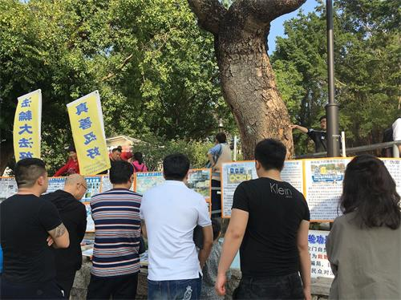

<h1 align="center"><b>过大年 大陆游客在澳门了解法轮功</b></h1>
<table border="0" cellspacing="3" cellpadding="3">
<tbody>
<tr>
<td align="center"></td>
</tr>
<tr>
 <td align="center"></td>
 </tr>
<tr>

澳门法轮功学员在大年初四真相点结束后，欢聚一堂，共贺新禧，同时交流多年来在真相点讲真相的心得体会。

新学员郑小姐忆述有一次在真相点，三个四十多岁的男子，站在法轮功真相展板前，久久不愿离开，一边看，一边竖起大拇指，大声说：“这些展板真好，非常清楚、全面，看了，什么都明白了。”郑小姐说，因为当时她刚去真相点不久，平时不敢开口讲真相，但看到这三个善良的男子，她知道自己必须帮助他们做三退，使他们有美好的未来。于是她鼓起勇气和他们对话。他们其中二位曾入过少先队，于是她帮助他们用化名退出了少先队。三退完成，他们马上就离开了。郑小姐明白，他们是在这里等着她为他们做三退。

胡小姐也讲她在真相点碰到很多善良的大陆民众，一边走，一边看着横幅大声念：“法轮大法好。”有的大陆游客说：“法轮大法就是好。”也有的游客向她竖起大拇指。在真相点，还会遇到其它国家及中国内地的法轮功学员，大家互相鼓励、支持。

余小姐碰到一些曾入过共产党的大陆民众，他们在明白真相后表示：“共产党就是坏，我都希望它马上倒。”

每天都有很多游客到澳门，澳门法轮功学员全心全意做好真相点，希望更多的世人明白真相，了解法轮大法的美好，为自己选择美好的未来。

<h1 align="center"><b>在温尼伯健康展上介绍法轮功</b></h1>

<table border="0" cellspacing="3" cellpadding="3">
<tbody>
<tr>
<td align="center"></td>
</tr>
<tr>

</tbody>
</table>

二零一八年二月十六日至十八日，加拿大温尼伯法轮功学员第二次参加了一年一度的健康与意志博览会（Health and Wellness Expo）。博览会每年的参观人数大约在五、六千人。法轮功学员在博览会上介绍功法，并讲述法轮功学员在中国无辜遭受迫害、被中共活摘器官的真相。
被法轮功展位吸引的人很多，他（她）们来自不同的族裔，年龄差异也很大。绝大多数人没有听说过法轮功，其中也有部份人了解中共对法轮功的迫害，但对功法本身并不了解，还有一些人对功法很感兴趣，情况不一。人们向在场的学员提出了不同的问题。如法轮功是什么样的功法，炼法轮功会不会出功能，法轮功是否收费，法轮功学员能不能治病，法轮功为什么在中国遭受迫害，法轮功在温尼伯的炼功点等等。学员一一给他们详细解答，并派发资料，资料中有各种联系方式，其中包括社交网络。人们可以很容易地联系到当地的学员。

有一位老年西人男士来到展位前，从书包里拿出了一张用塑料膜保护起来的传单，是一张十几年前的法轮功真相资料。学员问他是从哪里得到的，他说已经不记得了，但他一直保留着。学员给他进一步介绍功法，并赠送了一本最新的《明慧国际》期刊。

一位来自中国新疆的维族女士说：“我知道共产党活摘法轮功学员器官，共产党非常邪恶。共产党给我们弄的集中营，在新疆一个城市就关了十二万的维族人，进行活摘器官。我站在你们（法轮功）这一边，加油！”

通过这次博览会，更多的人了解了法轮功和发生在中国的迫害真相。
