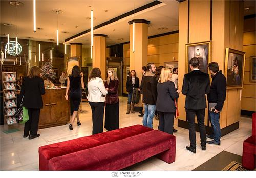
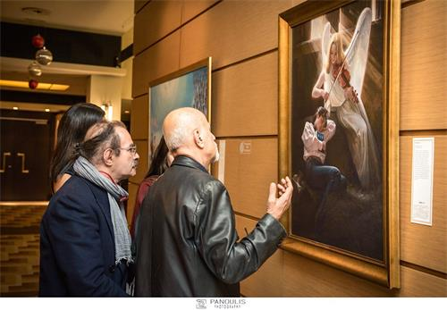
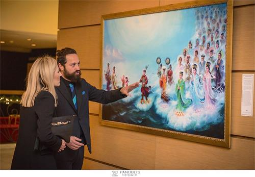

<a href="https://git.io/ffq">
</a>

<h3>

http://220.141.130.215</h3>

<h1 align="center"><a href=https://github.com/3fmd/gm/blob/master/epub.md>免费下载好书 下载 epub 视频 音频 图文 电子书</a></h1>
<h2 align="center"><a href="https://github.com/3fmd/gm/blob/master/gm/download/Reasily1802h.apk?raw=true">手机必备Reasily - EPUB 阅读器apk 请下载安装 才能阅读影视epub</a></h2>

<h1 align="center"><b>纪念信仰自由日 川普吁加强保障信仰自由</b></h1>

川普总统呼吁在美国和全球范围内保障信仰自由的基本权利。图为1月14日，川普在白宫前发表讲话。 （Holly Kellum/新唐人）

【大纪元2019年01月25日讯】（大纪元记者Emel Akan报导，孙洐源编译）在全国信仰自由日（National Religious Freedom Day），川普总统表示，信仰的基本人权在美国正受到攻击，并谴责在美国引发暴力事件的“对信仰自由的立法和政治攻击”。

川普宣布1月16日为信仰自由日，并呼吁美国保护国内和世界各地的信仰自由传统。“宗教信仰的自由权利与每个人的基本尊严息息相关，是追求真理的基础”，他在1月16日的一份声明中表示，“社会上限制信仰自由的行为正呈上升趋势，将其与财产权或言论自由等其它公民权利进行切割处理”。

根据川普的说法，对个人自由和良心进行限制的立法和政治行为是近年来发生暴力事件的罪魁祸首。例如去年10月在宾州匹兹堡的生命之树犹太教堂发生的大规模射击事件，这次袭击造成11人死亡，使其成为美国历史上对犹太社区最致命的暴力事件。

共和党人认为，美国的宗教信仰几十年来一直受到攻击。前众议院议长金里奇（Newt Gingrich）在他的著作《川普的美国》中指责奥巴马政府利用政治权力来削弱信仰自由。他写道：“奥巴马强硬地取消了一些保护信仰团体权利的法规”，金里奇补充道，奥巴马政府称反堕胎者和其他传统保守派是“极端分子”。

川普上任后不久便开始扭转美国当前的反信仰形势，并在2017年签署了一项总统行政令，以促进言论自由和信仰自由。该行政令指出，“行政部门应该全力执行联邦法律对信仰自由的强有力保护”。川普要求美司法部向行政部门提供有关信仰自由保护的法律咨询指南。该指南于2017年10月发布，解释了美国宪法和相关法规（如“信仰自由恢复法案”，Religious Freedom Restoration Act，简称RFRA）中的基本信仰自由原则。

<b>xxx</b>
对信仰自由的威胁
25年前国会以近乎全票通过了RFRA法案。从那以后，该法案阻止了政府侵犯个人和团体行使宗教信仰的自由。

然而，根据代理司法部长惠特克（Matthew Whitaker）的说法，上届政府近年来为限制RFRA做了很多动作。“RFRA由当时的国会议员舒默（Chuck Schumer）撰写，在众议院一致通过，并在参议院获得97对3票数通过”，惠特克在1月16日的传统基金会活动中说道。然而今天，RFRA原来的许多支持者似乎改变了主意，他补充道，而近年来，希望通过州内版RFRA的州曾遭到联邦政府的批评和抵触。

“信仰自由使我们国家更加强大”，惠特克说，“这就是为什么对信仰自由的威胁也是对我们国家力量的威胁。”

全国范围内的信仰自由日于1月16日举行，这是1786年维吉尼亚信仰自由法规（ Virginia Statute of Religious Freedom）通过的周年纪念日。该法规由杰斐逊（Thomas Jefferson）撰写，是几年后由麦迪逊（James Madison）起草的美国宪法第一修正案的前身。

“我对第一修正案和信仰自由的保护感到担心”，参加传统基金会活动的退休联邦雇员Lasca Low说道，“如果我们失去了道德基础，我们将失去我们的国家。”她强调了保护信仰自由的重要性，“信仰自由是公民的基本人权之一，我注意到这些年来对信仰自由的保护被悄悄地侵蚀了很多，这在我看来非常令人担忧。”

<b>xxx</b>
世界各地的信仰自由情况
川普政府还推动世界各国政府对不同信仰的更大包容。川普在1月16日的声明中提到，“人们因为他们的信仰受到独裁政府和恐怖主义团体的迫害”。

为了解决这个问题，去年7月，美国国务院在华盛顿举办了首届推进信仰自由的部长级会议（Ministerial to Advance Religious Freedom），四十多个国家的外长、八十多个国家的宗教团体和非政府组织代表出席了会议。

根据美国国际信仰自由委员会（U.S. Commission on International Religious Freedom）的最新报告，2017年世界各国的信仰自由状况继续恶化。该报告将包括中国在内的10个国家列为“特别关注的国家”。

几十年来，中共的人权记录受到外界的广泛批评。中国的信仰团体和少数民族，包括维吾尔族、西藏佛教徒、基督徒和法轮功学员，面临着中共政府的严厉镇压和歧视。这些团体遭受了系统性地非法逮捕、非法监禁、酷刑和洗脑。据研究人员表示，更为令人担忧的是强行摘取良心囚犯的活体器官，这在中国已发展成一个价值数十亿美元的地下产业。

<h1 align="center"><b>天安门自焚 公安局长军人610官员道实情</b></h1>

【大纪元2019年01月24日讯】（大纪元记者穆清综合报导）十八年前的1月23日，中共在天安门炮制了一出“自焚假戏”，用来栽赃法轮功，作为进一步镇压的借口。至今，自焚伪案尽管被国际社会公认为是一场世纪骗局，但中共仍在不断地利用骗局炒作，欺骗中国民众。

2001年的这一天，天安门广场一起5人“自焚”案，新华社以极快的速度发稿栽赃法轮功。7天后，央视《焦点访谈》播出自焚节目进一步煽动仇恨，诬陷法轮功。事后十几年中，中共军队、公安局、“610办公室” 等内部机构都有人坦承或间接证实，“自焚案”是中共造假。（鉴于大陆目前环境，隐去当事人姓名）

<b>高干子弟：自焚“部队干的”</b>
 
海外明慧网在2015年12月19日曾刊登一篇大陆法轮功学员的文章讲述，在生意场上，接触到一位曾在北京当兵的高干子弟，对他印象很好：“业务知识性强，思维缜密、健谈。”随后就向他谈到法轮功问题：“你经常在外工作，社会接触面广，你对法轮功怎么看？比如天安门自焚的事？”

高干子弟呵呵一笑便说：“法轮功啊！自焚那事我比你了解，那年自焚事件，我就在跟前。”这让法轮功学员感到有些意外，他说：“从焦点访谈的镜头上看，除了当事人，消防人员就是武警，没有群众的身影啊！”

高干子弟表示：“你说对了，那事之前广场就戒严了，我是高干子弟，在北京当兵，那是我们部队干的，别说群众，连一个炼法轮功的也没有。不过话说回来，法轮功影响太大了，有那么强的凝聚力，连我们部队都比不了，这样一个民间团体，他们能容得下吗？”

这位法轮功学员表示：“一个政府竟能光天化日之下撒这弥天大谎，颠倒黑白、迫害无辜，如何让人们讲诚信啊！信乃立国之本，老人常说：人无信不立。一个根本不讲诚信的国家，将来发展下去会是什么样？孩子们将来又会怎样？比如说：现今社会一个人跌在你眼前，你都不敢去看一下帮一下，这样下去中国人还有未来吗？”

高干子弟也深表忧虑，但表示“那有啥办法？”

法轮功学员告诉他，只有恢复传统道德良知，让人的善念、诚信复苏，国家和孩子们将来才有希望。

高干子弟对法轮功学员表示感谢，并说：“我们家有很多党员，我回去一定告诉他们，‘真、善、忍好！’‘法轮大法好！’”

<b>610人员目击自焚案造假现场</b>
 
明慧网2016年4月3日曾报导，一个省级610办公室（中共江泽民集团迫害法轮功的非法专职机构）的主要责任人向当地法轮功学员讲述他亲历的天安门自焚造假的现场情况。

据报导，这位大陆法轮功学员表示，这个610办公室的主要负责人透露，2001年1月那段时间因为接到省内公安的消息，本省有几位法轮功学员那几天要到北京上访，目的地预计是天安门广场。他负责在北京截访，所以这几天他每天早上和下午都要到天安门广场。

这位610责任人自述，2001年1月23日下午步行赶往天安门广场去截上访的法轮功学员，在路上他才知道广场其实已经戒严了，而且这次查得特别严，因为一路上他被各种便衣和穿制服的戒严人员三次要求出示了特别证件才让他通过。

他说，平时出示的那种通行证件那天都不管用了，他又出示了“610”的特殊证件（610办省厅级以上官员才发放的特殊证件）才放行。

到了广场后不大一会广场开始清场，他又出示了特别证件才让他留下，当时广场上留下的人很少，“这时看到广场上已经架好了的电影机机位（专业摄像机），纳闷以为有什么重要政治活动或者是要在这里拍什么片子。”

他因要截上访的法轮功学员，于是就一直在广场边上转着。

不一会，他就听见远处有人喊“着火了，着火了！”顺声音看去，“看到远处冒起了黑烟，然后看到广场上的人朝起火的地方跑去，然后看到马上有人灭火”，他当时的位置离自焚现场稍远，看不清楚现场具体情况，因为刚才路过看到起火那边是架著摄影机的，他还想：“可能是在拍电影吧！没当回事，也就没过去看热闹。”

由于已经戒严，广场根本没有人（上访的法轮功学员）可以进来，所以他就回宾馆了。

他说，当天晚上省里有事，就飞回省里了，晚上看电视才知道下午他亲历了“天安门自焚事件”的制造现场。

<b>新疆一公安局长被通知现场看“自焚”</b>
 
2018年6月2日海外明慧网一篇中国投稿文章透露，2001年天安门“自焚”案的前几天，大陆县以上的公安局长都被召集进京开会，并在“自焚”案发生的当天，他们收到紧急通知前往天安门，现场看到自焚的场景。

这篇文章的作者“长青”在新疆生活了六十年，任教几十年，经营过企业。2002年4月，她和先生回到他们长期生活过的城市办事。这个城市的公安局长特意驱车来找他们聊天，并叫他的司机到外边去。三人长谈三个多小时。

当他们讲到天安门“自焚”有种种疑点时，这位局长会意地说，他们当时就在天安门广场。

这位局长说：2001年天安门“自焚”案前几天，全国县以上的公安局长被召集到北京开会，他也参加了。“自焚”案发当天，他们正在故宫参观，突然通知他们赶快出去，到天安门广场来，亲眼目睹了“自焚”这场戏。

这位局长是汉族人，当时五十多岁，大概在1997年因工作原因结识了长青夫妇。夫妻俩1998年修炼法轮功后，局长和他们常聊到炼功的事，也很认同法轮功。

1999年法轮功学员“四•二五”大上访后，这位局长曾经对那位丈夫说：“都查过了，我们所在城市的这个地区炼法轮功的有两百多人，没有一个犯罪的，都是很好的人。只有一个人没炼功之前有男女作风问题，炼功后也变好了。”

局长还说，那次在北京召开的公安局长会议上，有一个单位的领导说，炼法轮功没什么，还给他们节约了不少医药费。

2010年10月13日，明慧网的另一篇大陆知情者文章披露，2001年过年前，他所在单位领导告诉他，大年三十期间天安门广场要发生自焚，并告诉他说，这个消息是上级通知的，北京方面下来的。

该文分析说，按照常理，若不是中共自导自演这场闹剧，既然它都能一级一级通知各地基层单位，有人要在天安门广场搞自焚，并明确说是大年三十，要想制止这件事情的发生，根据中国的现状及邪党的势力和防范能力，它完全可以控制天安门广场不让任何人出入，怎么会在天安门广场发生这场“自焚”闹剧呢？

<b>国际媒体质疑声</b>
 
1月23日，当年的大年三十，天安门广场这起震惊世界的“自焚”伪案，中共媒体第一时间报导此案诬陷法轮功，但是漏洞百出。

自焚事件两周后，《华盛顿邮报》记者菲力普‧潘在一篇名为“Human Fire Ignites Chinese Mystery”的报导中，访问刘春玲故乡开封市的当地居民有关刘春玲的身份时，获得以下回应：“没有人曾看到过她炼法轮功。”

随后，海外媒体人从央视“焦点访谈”的慢镜头中揭示：刘春玲是被现场的警察用重物击打致死，从而戳穿了这场骗局，央视焦点访谈在重播那段录像时删去了刘春玲被打死的镜头。

《华尔街日报》的伊恩‧约翰逊（Ian Johnson），一位富有洞察力的新闻记者跟踪这一事件，他的怀疑由报导这起事件的速度引起。

他注意到官方媒体“以非同寻常的敏捷报导了‘受害者’的死亡事件，这意味着，或是死亡事件的发生时间比报导中所说的时间要早，或是这个一贯谨慎的媒体已获上级批准快速推出电子报导和电视传送。”

Media Channel的责任主编丹尼‧斯盖特（Danny Schechter）撰文指出：“还有比这更富有戏剧性的吗？人们在北京的心脏——天安门广场自焚。CNN有线新闻网当时在那里，警察碰巧手边有灭火器，受害者的极度痛苦的表情被完全地拍摄下来以送交国家电视播放，然后他们被紧急送往医院。尽管政府控制的媒体一反常态地立即发布了这一新闻报导，制作录像却花了一个星期的时间才得以播出。”

国际社会还质疑：央视自焚录影有远景、有移动拍摄的近景，还有多个自焚者在不同位置的特写，并且录下了声音，显然摄影师做好了准备才能做到专业拍摄。

《基督教科学箴言报》的文章引用海外法轮功发言人的话，说法轮功是禁止自杀的，“自焚”是中共当局制造的骗局。美联社的报导也以法轮功的理论，说中国的报导是诽谤该组织。英国《金融时报》更指出：“没有任何证据表明自焚者是法轮功的人。”

路透社的电讯写道：“北京正在利用身体被烧焦的恐怖形象，来作为与法轮功打传媒战的最新武器。”《华盛顿邮报》发表社论，呼吁布什新政府要在宗教暨政治自由上敢于和中共政府碰硬。

<b>央视女记者承认“自焚”镜头有假</b>
 
此外，另一个自焚者王进东在天安门广场上安稳地坐着，且是典型中共部队里军人散盘的坐姿。警察拎着灭火毯在他身后静静地站立，等王进东对着镜头喊完台词，才盖上灭火毯；而且王进东两腿中间的塑料汽油瓶在大火中不燃烧、不变形。

明慧网2003年5月14日报导《央视“焦点访谈”女记者李玉强承认“自焚”镜头有假》一文披露，中央电视台“焦点访谈”女记者李玉强2002年初曾当众承认“天安门自焚”镜头有假。

该文披露：“2002年初，李玉强在河北省会法制教育培训中心采访王博时，曾和那里被非法关押的大法学员进行所谓的‘座谈’，当时有法轮功学员问她‘自焚’镜头的种种疑点和漏洞（尤其是已烧得黑焦的王进东，两腿间夹的盛汽油的雪碧瓶子却完好无损）。面对大家有理有据的分析，李玉强不得不承认：广场上的‘王进东’腿中间的雪碧瓶子是他们放进去的，此镜头是他们‘补拍’的。她还狡辩说是为了让人相信是法轮功在自焚，早知道会被识破就不拍了。”

<b>联合国：自焚“政府一手导演”</b>
 
2001年8月14日，“联合国国际教育发展组织”在联合国会议上，就“天安门自焚事件”，强烈谴责中共当局的“国家恐怖主义行径”，声明指出：录影分析表明，整个事件是“政府一手导演的”。中共代表团面对确凿的证据，没有辩词。该声明当时被联合国备案。

北美非盈利民间中文电视台“新唐人”制作的《伪火》（False Fire）影片，详细分析了2001年天安门自焚事件，该影片于2003年11月8日获第51届哥伦布国际电影电视节荣誉奖。

<b>公安部高官透露内幕</b>
 
在“自焚”伪案发生后的十多年中，有很多知情人向海外透露的消息证实，天安门“自焚”是中共一手策划的，在事件发生前，中共内部就已有消息走漏出来。

中国民主党国内负责人之一林春水曾经向海外透露，公安部一高级官员1月28日向他提供的消息指出：王进东23日自焚，时任中共公安部部长的贾春旺22日就知道消息。

他还表示，在中央政法委的会议上，罗干曾经说（大意），根据掌握的情况，即使我们不让王进东自焚，也会有张进东、李进东等跳出来表演。

<h1 align="center"><b>伪火十八年 造假害中国</b></h1>

1999年7月20日中共与江泽民集团动用整部国家机器迫害法轮功，为了实行“肉体上消灭、经济上搞垮、名誉上搞臭”的灭绝政策，不断制造假新闻，编造一连串自焚、杀人与敛财等弥天谎言，企图激发民众对法轮功的仇恨。这些假新闻中，荼毒世人最严重者，莫过于2001年1月23日炮制的“天安门自焚事件”。 

<b>天安门自焚伪案 漏洞百出 </b>
 

如果把十八年前的中央电视台“天安门自焚事件”录像画面进行慢镜头分析，便会暴露出很多疑点，说明这场“自焚”事件完全是一场精心布局的预谋与骗局。 

一、在“自焚”事件中被大面积烧伤的小女孩刘思影气管被切开后四天就能接受采访并能唱歌。 

二、《焦点访谈》录像证实，刘春玲不是被火烧死，而是被警察用重物击打头部倒下的。 

三、天安门巡逻的警察几分钟内从两辆警车里拿出二十多个灭火器和灭火毯应付该起“自焚”突发事件。 

四、北京积水潭医院治疗“自焚”大面积烧伤者，不作任何防护。允许记者近距离采访（下图）。 

中央电视台“天安门自焚案”中的“烧伤病人”全身包裹，记者不穿卫生服，不戴口罩，大胆采访。

  
 五、“王进东”在自焚时衣服已被烧焦（上图），但是最易燃烧的头发还在头上，他腿间的盛满汽油的雪碧瓶却完好无损。在他喊出那句似是而非的口号之前，警察手中的灭火毯却在他头上悠闲地摇晃很久，没有丝毫灭火的急迫。 

六、在央视和新华社的“自焚”报导中，先后出现了三个不同的“王进东”。台湾大学语音识别实验室对王进东的声音作了语音鉴定，得出明确结论：《焦点访谈》第一集中的王进东与后来的王进东不是同一人。“追查迫害法轮功国际组织”经可靠途径查获：参与“自焚”的“王进东”是由一名现役军人扮演。 

不仅上述造假的凿痕太过明显，《华盛顿邮报》在2001年2月4日头版头条发表了调查报告《自焚的火焰照亮了中国的黑幕──当自焚的动机乃加强对法轮功的斗争》。邮报记者菲力蒲•潘亲自到自焚身亡的刘春玲的家乡开封实地调查，邻居们说从来没有人看见过刘春玲炼法轮功。

国际教育发展组织于该年8月14日在联合国会议上声明：从录像分析表明，整个事件是“政府一手导演的”。 

<b>《伪火》影片获奖 民众明了真相 </b>

令中共极度难堪的是，2003年11月8日由新唐人电视台制作、揭露“天安门自焚真相”的纪录片《伪火》，从各国参赛的六百多部影片中脱颖而出，获得第五十一届哥伦布国际电影电视节荣誉奖。该奖项在记录片领域享有盛誉，其历史仅次于“奥斯卡”。《伪火》影片以触目惊心的画面和精辟严谨的分析，揭示了“自焚”案的诸多疑点，从而证实了整出事件是中共栽赃法轮功而炮制的伪案。 

<b>造假遍中国 回归传统救乱世 </b>

造假是中共一贯手法，其歪风引领人心沉沦，道德逐步下滑，造假在中国社会随处可见。夸大不实的经济数据，错误引导投资人进场；空气质量监测造假，剥夺了公众的知情权，明明是重度雾霾天气，受骗的人们仍在室外正常活动，等于变相害人。 

欲匡正社会，必先正人心。真、善、忍是普世价值，恰是整饬歪风邪气的解药良方。衷心祝愿中国人回归传统价值，早日唾弃造假，说真话，办真事，恢复良知善性。 

<h1 align="center"><b>大魔医，吴孟超活摘中国人后能退休？</b></h1>

   
【大纪元2019年01月20日讯】1月14日，97岁的中共党员、中科院院士、第二军医大学东方肝胆外科医院院长吴孟超高调向外界宣布退休，这标志着它暂时离开了中共大规模活摘人体器官的舞台。吴孟超在自己的退休仪式上表示：“虽然退休了，但只要组织需要，只要病人需要，我随时可以进入战位，投入战斗！”对此泯灭人性，绝对服从中共组织安排的言论，中共《人民日报》给予了高调宣传，并称赞其为“大国医”。然而据外界调查发现，“大国医”吴孟超却十几年如一日的干着活摘中国人器官的勾当，所以他是名副其实的“大魔医”。

1922年夏天，吴孟超出生在福建闽清，5岁时吴孟超随母亲移居马来西亚，初中毕业后，他回到了中国。1943年秋天，吴孟超考取了国立同济大学医学院，1947年成为裘法祖的学生。但在1949年毕业考试时，吴孟超外科只考了65分，小儿科却考了95分。按当时惯例，他只能成为小儿科医生。为此，吴孟超还曾找到教导主任，说自己想去外科当外科医生，但被拒绝，理由是“他不太合适当外科医生”。1949年5月27日，上海被中共占领，同年8月，中共上海华东军区人民医学院（中共第二军医大学前身）在社会上公开招聘医生，于是国民政府培养出的吴孟超带着对国民政府的情绪投共了，成为了“听党指挥”的军医，开启了他的魔鬼人生之路。

据中共官媒报道，1956年，外国的一个肝脏外科专家访问中国时断言，中国的肝脏外科水平要达到世界水平，至少要二三十年的时间。而为了中共的“国家荣誉”，吴孟超带领他的肝脏外科团队，仅用七年时间，从无到有，不断创新，实现了我国肝脏外科理论基础研究和临床治疗的重大突破。1959年，吴孟超创立了中国人肝脏“五叶四段”的解剖学理论；1960年，他又发明了“常温下间歇肝门阻断法”；1963年，他成功完成世界首例中肝叶切除术……这些重大突破的背后需要多少临床实践经验的积累？又有多少中共的“阶级敌人”被用作临床活体试验？只有吴孟超自己知道。

正如中共所言，肝脏是人体的“营养库”和“化工厂”，由于肝脏血管极其丰富，解剖极其复杂，一直被视作外科手术的禁区。在中国，肝脏外科直到20世纪50年代初还是一片空白。而吴孟超从医以来，不断刷新纪录，使肝脏外科手术死亡率降低为0.30%，肝癌术后5年总体生存率56.1%，小肝癌术后5年生存率79.8%。这些“巨大成就”的背后，是大量临床试验的结果，是大量人失去生命换来的宝贵临床经验。

2006年，为表彰吴孟超在肝脏外科界，尤其是肝脏移植领域做出的突出贡献，吴孟超获颁国家最高科学技术奖和500万奖金。中共解放军总后勤部也奖励它100万元。吴孟超每周几台肝脏移植手术的骄人“成绩”引发了国际社会的广泛关注。据追查迫害法轮功国际组织独立调查显示，吴孟超涉嫌大规模活摘人体器官暴行，它曾任东方肝胆外科医院肝外科主任医师，第二军医大学东方肝胆外科医院院长，东方肝胆外科研究所所长。2004年3月到2006年7月，它亲自参与74例供肝切取，供体男72例，女2例，年龄26～45岁。而吴所在的单位，中共解放军第二军医大学第三附属医院（东方肝胆外科医院，东方肝胆外科研究所），2007年5月23日，是被中共卫生部指定开展肝移植的医院。调查发现，东方肝胆外科医院，从2004年起至今至少进行过10万次以上的肝脏器官移植手术。

吴孟超在96岁时，曾自己透露，它依然坚持每周至少完成三台手术，并且是比较复杂的手术。从中共公布的采访画面显示，吴孟超的这些所谓的“比较复杂的手术”均是肝脏器官移植手术。按每周三台肝脏器官移植手术来算，每年它亲自参与的肝脏器官移植手术就有156台，也就是至少有156个肝脏器官供体被它用作移植手术，换句话说，每年至少有156个中国人因它的肝脏器官移植手术而死。从2002年至今，至少有2500中国人死于吴孟超亲自主刀的肝脏器官移植手术。一边宣扬救死扶伤珍惜生命，一边活摘掉自己组织不喜欢的人的器官，吴孟超究竟是“大国医”还是“大魔医”？吴孟超不仅自己参与活摘人体器官的暴行，它还积极培育年轻医生参与活摘，为持续活摘中国人“做贡献”。这样听党指挥的“军医”，是天使还是魔鬼？

实践证明，没有丝毫人类医学伦理和道德约束的医生，不是医生，而是杀人魔鬼。中共的肝脏器官移植事业是一种随意剥夺“阶级敌人”生命权的罪恶，是赤裸裸的反人类罪。1月14日，97岁的中共党员吴孟超高调宣布退休了，在它的职业生涯中，它亲手救活了上万病患，但同时也有上万中国人因此而被活摘器官；在它的领导下，第二军医大学东方肝胆外科医院十几年间活摘了十万以上中国人的器官；这些赤裸裸的反人类暴行，注定了大魔医吴孟超永远无法退休，它与所有活摘参与者都将受到人类正义的审判！中共《人民日报》此时高调的宣传，必将成为日后审判“大魔医”的历史罪证。

<h1 align="center"><b>中国朋友你们好！</b></h1>

天安门自焚是假的。早在2001年在联合国会议上，「国际教育发展组织」对世界各国宣布: 「天安门自焚」是中共蓄意导演的伪案，目地是为了煽动民众仇恨法轮功，为迫害找借口。此事件已在联合国正式备案。

纪录片《伪火》，伪装的「伪」，大火的「火」，就是揭露「天安门自焚」伪案的，荣获哥伦布国际电影电视节特别奖。法轮功严禁杀生，严禁自杀，所以自杀、自焚的人绝不是法轮功修炼者。法轮功主要书籍《转法轮》阐述了为甚么不能杀生的法理，修炼法轮功的人肯定不敢再杀生了，更何况自杀。

天安门自焚是中共一手导演的。不过谎言编得太拙劣，比如说一般情况下头发、塑料瓶见火就化了，男的王进东的头发和装汽油的雪碧瓶却完好无损；小女孩刘思影做了喉管切开手术是发不出清晰声音的，却能唱歌。自焚是突发事件，从起火到灭火90秒，怎么可能巡警携带大量消防设备巡逻并在90秒内出现。录像中的摄影师在军警间从容拍摄，有远景、移动拍摄的近景、多个自焚者在不同位置的特写，并且录下了声音，显然是事先准备好才能做到的专业拍摄。把中央电视台播放的自焚录像慢镜头播放就能看到：刘春玲是被身后穿军大衣的人用硬物击打头部当场倒地死亡的，还有很多漏洞，不一一列举。

天安门自焚总策划，时任中央电视台副台长的李东生后来被判重刑。「天安门自焚」制片人陈虻，47岁突发癌症死亡。播音员罗京、主持人方静相继患癌症死亡。

1400例死亡也是中共为了迫害编造的，其中有把精神病患者病发时的意外事故栽赃为法轮功学员所为，有用减刑为条件唆使杀人者冒充法轮功学员，有用报销医药费为诱饵让危重病人冒充法轮功学员，还有的是把普通人的正常病逝说成是炼法轮功造成的，所有这些都是中共对法轮功的栽赃嫁祸。

1999年迫害法轮功之前，中共官方媒体上报导说修炼法轮功的人数是7000万到1亿人，祛病总有效率达到98%，于国于民有百利而无一害。但是江泽民犯罪集团发自内心的恐惧和嫉妒法轮功，1999年迫害时就造假说修炼法轮功的人数是210万，也有说200万的，然后处心积虑的编造了1400例死亡。国际人士分析说，从1992年法轮功传出，到1999年中共编造谎言，一共7年的时间，就算按照中共捏造的假数据计算，1400例除以7年，再除以中共所说的210万法轮功人数，得出的死亡率不到万分之一，远远低于中国统计年鉴记载的中国人口正常死亡率--万分之六十五。可是您再回头看那些案例，又自杀又杀人的，这个逻辑也不通啊！

国际社会无法理解，共产党编的谎言是零智商，能骗谁呢？可是却骗了很多中国人。为甚么能骗得了？因为共产党搞信息封锁。了解真相是判断是非的必要条件，共产党把这个必要条件一刀砍断，中国人就失去了判断是非的能力。

法轮功按「真善忍」修炼使人道德回升，祛病健身有奇效，这么好的功法全世界一下就传开了，洪传世界100多个国家和地区，获得各国各级政府的褒奖、支持决议和信函超过3000多项。几十个国家为自己的民族设立了一个节日来纪念和感恩法轮大法。每年的5月13日被定为「世界法轮大法日」。法轮功书籍被翻译成40多种语言，是中华五千年文明历史中翻译成外国语言最多的一本书籍。根据联合国教科文组织的统计推算，在整个人类历史的跨度，古今中外，这样的传播范围和速度也是达到了顶峰。

<h1 align="center"><b>墨尔本越裔学员：阅读《转法轮》身心升华</b></h1>

【明慧网二零一九年一月十五日】（明慧澳洲墨尔本记者站报道）“我曾是一个无神论者，在我心情非常沮丧、变得脾气暴躁的时候，修炼法轮功的妈妈劝我阅读《转法轮》，我当时自己都不喜欢自己，就想，如果读这本书真的能让我变成一个好人，那我就试试看吧。”这是墨尔本越南裔青年法轮功学员海蒂（Heidi），回忆自己二零一五年处于人生低谷、在越南家乡第一次认真阅读《转法轮》时那难忘的感受。

图1：墨尔本越南裔青年法轮功学员海蒂（Heidi）（左一）。

她说：“我觉得这本书真是太好了，立即开始和妈妈、外婆等一起修炼法轮功，我的人生也从此开始逆转。从母亲开始，法轮大法的美好以及发生在家人身上的奇迹，让我们家族里八口人相继走入大法修炼。”

据明慧网报道，越南文《转法轮》于二零零一年第一次出版，二零零四年七月新版发行。自从一九九五年一月四日《转法轮》中文版首发式在北京举行，二十四年来《转法轮》已被翻译为四十个语言版本，吸引无数人阅读。随着法轮功传播到全球一百多个国家和地区，《转法轮》引导全球上亿人走入法轮功修炼并身心受益。

“修炼法轮功后，家里的每个人都经历了身心的巨大变化和升华。” 海蒂说。

<b>从喜好奢华到娴静朴素</b>
 

海蒂秀美活泼，快人快语，流利地道的英文让人惊讶，其实她在澳洲生活不到十年，期间经历了令人感叹的人生起伏。

完成大学学业后，海蒂虽然在墨尔本任职于一家五星级酒店，工作稳定，但申请永居签证很不顺利，二零一五年，她不得不辞去工作，离开澳洲、离开男友，回到越南从新申请，而且需要再等待一年。

“我很绝望，心情糟透了，觉得好日子到头了。”她说，“我靠旅游打发时间，但不管用，我变得悲伤和消极，脾气暴躁。”海蒂说。

“当时，我的母亲修炼法轮功已经好几年了，她看到我这个样子，就劝我静心阅读《转法轮》。”

“我知道，这本书是讲真善忍，那时的理解就是要做到真正的善良和有耐心，当时的我正变得越来越急躁、动不动就发火、情绪很不稳定，真是非常糟糕，自己都很讨厌自己了。”

“妈妈曾经劝我，任何事情都不是偶然的，现在，她希望我读这本书能自己找到答案，为什么一个小时候非常友善的孩子变成了现在这样。”

抱着希望借助读《转法轮》让自己变得好一些的目的，海蒂开始认真阅读这本书。

“《转法轮》太神奇了，我被深深吸引，从此开始修炼法轮大法。”

海蒂的人生也开始逆转，“我的心情变得祥和、宁静，遇事也不急躁了，渐渐去掉了以前很强烈的妒嫉心、好胜心。”海蒂说。

二零一六年，她顺利回到澳洲和男友团聚，很快举行了婚礼。她原先任职的五星酒店继续聘请她做前台接待，海蒂吃苦耐劳，无论客人态度如何，都能耐心、友善地解决客人的问题，客人们反馈的好评不断。六个月后，经理提拔她专门接待贵宾。

“这些贵宾多数是大企业的老板或者娱乐界的明星，因为这些客人非常挑剔，接待他们的确需要宽容和善心，也需要随机应变的技巧。”海蒂说，“但作为修炼人，我都能轻松应对。”

“我的丈夫没有修炼法轮功，但他亲身体会到我的变化后，非常开心、非常支持我。他说我变得更好更成熟了。”

过去，海蒂说，自己喜欢经常和朋友们聚会、吃早午餐（brunch），在高档饭店享受数百元一餐的美食，不喜欢呆在屋里，动不动就要外出、购物，穿着也追求时尚性感，花钱如流水。

“修炼后，道德水平提高了，我的衣着很庄重，不再大手大脚地花钱，而是喜欢呆在家里，和丈夫一起享受生活，有时间就读法轮功书籍、炼功。”她说。

“丈夫是以色列裔，上次陪他回特拉维夫探亲的时候，他主动帮忙找到了当地的法轮功学员，所以探亲期间我还能去炼功点炼功，并参加当地法轮功学员举办的活动。真的非常开心。”

海蒂说：“修炼法轮大法后，我对丈夫更有耐心了，我能遇事而安、一切随其自然，不论好事、坏事，对我来说都是好事，我生活的更幸福了。周围多年的同事都注意到，我变得比原先随和很多，而且一直都很开心。朋友们遇到事情，和我聊过之后，也都说感觉好多了。”

“觉得很幸运，我有师父。”她说，“真的非常感激师父、感激法轮大法保护我们全家。”

<b>发生在家人身上的奇迹</b>
 

图2：海蒂（左一）和部份越南裔法轮功学员合影。

类似海蒂亲历的身心巨变和神奇的修炼体会，同样发生在她的亲人身上。现在家族中有八人先后走入法轮大法修炼。

“我的外婆有严重的腰椎间盘突出症，严重到已经不能行走了。到处求医，包括最昂贵的西医专家、中医针灸，都无济于事，整天处在难以忍受的疼痛中，洗澡、上卫生间都需要人帮助。母亲修炼法轮功后，也推荐外婆阅读《转法轮》，并教她炼五套功法。在很短的时间内，外婆的脊柱就恢复正常了。现在，外婆不再感到疼痛，除了坚持炼功，她在生活中时时处处按照‘真善忍’的原则要求自己。”

母亲的一次经历对海蒂的触动很大。她说：“我的母亲曾经遭遇过一场严重车祸，但却安然无恙，真是一个奇迹。她告诉我，当时正在横穿马路，一辆电动自行车开得很快，把她撞倒了，撞得很厉害，手还被夹在轮子的辐条间。妈妈说，脑子里的第一念就是自己会没事的。结果，虽然手都变成紫黑色、肿起来了，但没有感到疼痛。之后几天就恢复了。”

海蒂的父亲是一家人中最晚开始修炼法轮功的，他的故事颇具戏剧性。

“我的父亲是去年五月全家在香港度假的时候，转变心意的。这次我和家人约好，在香港团聚，因为能一起参加法轮功学员在香港举行的大游行。父亲跟在游行队伍后面走完了全程。因为没想到会走这么长的时间，当天他穿的是正装皮鞋，所以游行结束后，脚上长满了水泡，非常疼。游行期间，看到中共安排的人员对法轮功学员的骚扰表现非常不堪入目，他说，中共如此反对法轮功，就说明法轮功一定是好的。于是，他决定当天就开始修炼法轮功，从此没有再动摇。他表示，第二天脚上的所有水泡都不见了，就是一个奇迹。”

<b>分享修炼体会</b>
 
海蒂表示，在和同事们、客人们聊天的时候，提及自己的修炼体会，他们都很感兴趣。“最近，和一对来自美国的客人聊起了我去纽约参加法轮功大游行的经历，他们对法轮功学员在中国遭受迫害、甚至被活摘器官的事实，都很震惊，准备去上网了解详情。” 她说。

“还有一次，需要联络澳洲税务局的一位工作人员，对方是一位女士，让我提供国民健保卡（Medicare）号码，结果发现我的卡号已经过期了，我告诉她自己很健康，根本不需要。她很好奇，希望我分享秘诀。我笑着说，我的秘密就是法轮大法。于是分享了自己的修炼体会，并告诉她可以从网上了解到一切，所有信息都是公开、免费的。这位女士听了之后很感激我的分享，表示要去查看。”

现在，海蒂每周都利用轮休日，和其他法轮功学员一起在墨尔本市中心和其它城区、景点等地，向市民和游客讲述法轮大法的美好以及法轮功学员反迫害的真相。

<h1 align="center"><b>拜年</b></h1>

【明慧网二零一九年一月十六日】〖大陆来稿〗我今年八十八岁，离休干部，在省城住着宽敞明亮的厅长楼，月薪不菲。可是，最近这几年，我却过的很不开心，家人连遭不幸：唯一的儿子、老伴、二女儿先后患癌症手术，独生孙女离异，老伴在饱受病痛折磨后凄然离世。可谓一波未平，一波又起。
垂暮之年的我，悲伤而无奈，时常面壁叹息，望月垂泪。但偶尔也有高兴事，如，老友来访，涨工资等。更值得一提的是，每年新年前夕，我姐姐的两个儿子（我外甥）赶来拜年。

姐和我出身于书香世家。姐姐自幼聪慧善良，她的婆家，是在距省城两百多公里的一个小乡村。婆母体弱多病，不能下田劳作，姐夫是个教书先生，家里十几亩地，姐姐一人种不了，就雇了个长工。土改时，按当时的所谓“框框”，被划为“地主成份”。在那个“阶级斗争年年讲，月月讲，天天讲”的恐怖岁月，姐姐戴着一顶“五类分子”的帽子，饱受屈辱摧残。家里也穷的叮当响，一家三代八口人，只有两间土坯草房，吃了上顿愁下顿。

那时，我和丈夫在省直机关任职。我侥幸躲过一次次“运动”的劫难，却成了惊弓之鸟。为自保而免受牵累，我逐渐变的比较“左”，对姐姐家不曾援手，甚至连她家的门都没踩过，偶尔回复家信，为怕被人拆看抓了把柄，末尾总要加一句教育姐姐：“老实认罪守法，别乱说乱动。”

后来，姐姐家是芝麻开花节节高：二子三女陆续都进了城，有的大学毕业当了干部，有的做生意成为富商。特别是，大姐的几个子女都修真、善、忍法轮大法，身体健康，为人真诚、和善、厚道，亲邻多有美誉。

姐夫、姐姐辞世后，几个晚辈对我们老俩口非但没冷淡，反而敬重有加。外甥女经常打电话问候；我家有重要事儿，外甥不请自到；每逢过年，两个外甥都会带着当地土特产，驱车数百里前来拜早年。在每一次暂短相聚的交谈中，外甥那真切朴实的话语，恰似寒冬里的缕缕春风，温暖着我们的心。

每当送走外甥后，我们老俩口照例会议论一番。老伴喜读书，粗通文墨，感慨说：“外甥所为，可谓古风犹存，以德报怨！姐姐这几个孩子，和别人不一样。我观察，俩外甥衣着朴素，说话谦卑，有见识，有内涵，与当今那些浅薄浮躁的‘暴发户’，不可同日而语。外甥是真正的来孝敬我们，真心实意为我们好。”

我说：“我也有同感！现在的人，金钱至上，人情比纸薄。修炼人，就是不一样。看起来，电视、报纸的宣传不可轻信，法轮大法是很不错的！”

二零一六年七月，我老伴病故。老伴虽然是以高寿辞世，可六十多年的风雨同舟，一朝永别，仍令我痛惜不已。斗转星移，离年关越近，我越感失落孤寂。

腊月二十以后，天气不佳，一连几天都是雨夹雪。我自忖，今年外甥可能不来了。二外甥在外地经商，回乡晚，回家后还得忙着置办年货，加上雨雪天，路不好走，千里往返，来一趟太辛苦，太不容易，就别来了。一会儿，又期盼着他们到来。

就这样，左思右想了好几天，到了腊月二十六，下午一点多，我想躺下午休，想躺下还没躺下，听见敲门声，开门一看，是外甥来了。

风雪天，佳节里，孤寂之中，看到远道而来的亲人，我泪眼婆娑。

饭后聊天，我对外甥说：“冰天雪地的，家里那么忙，路那么远，你们还来看我，令我于心不安。”大外甥说：“作为晚辈，尽孝道是本份，我们应该来。您与我娘是一奶同胞的亲骨肉，姨娘姨娘，姨就等于娘，我娘不在了，您老人家就是我们的娘。孝敬姨，就等于孝敬我娘。”

二外甥说：“家有老，是一宝。如今，我们两家几十口，仅有您这一宝了，当然更珍贵！姨父刚走几个月，又赶上年关，您老人家心里会不好受，我们来拜年，见见面，您老人家心情会好一些。所以，今年我们更得来。”

外甥的话，我听着心里暖暖的，同时，也有隐隐的愧疚。就借机问他们：“孩子，在你家最困难的那些年，姨没帮助过，你们真的不怨恨吗？”二外甥回答：“姨，说实话，对于您和姨父，我们曾经自豪过，也曾经沮丧过。自豪的是，我们家有一门当‘高官’的亲戚；沮丧的是，这门官亲只能是水中月，镜中花。”

大外甥微微一笑，说：“自豪也罢，沮丧也罢，那都是在我们炼功之前。自从修大法以后，那些狭隘自私的情绪，很快就随风飘散了。师父教我们要慈悲宽容，处处为别人着想。我们想象过，当时，您身上贴着娘家‘成份不好’的标签，在‘唯成份论’政治运动的高压下，如履薄冰，肯定没少受委屈。您对娘家人的冷漠疏远，所谓的‘划清界限’肯定是违心的。说到底，那是因为政策邪恶。自从炼功以后，对于您，我们真的是理解了！”

听着外甥的话，遥想起那不堪回首的年代，我不免一阵痛心酸楚。晚辈的理解和体谅，打开了我多年的心结，身体从里到外的轻松。

时光匆匆！经历了今年的春与夏，秋与冬，又到了辞旧迎新的腊月，我的俩外甥又该来拜年了！这些天，我一直在默默的，愉悦的回味着，期待着。

在回味期待的同时，我想到，托大法之福，我方能受到外甥们如此礼遇。我应该感谢大法，感谢给天下送福的李大师。为表寸心，特借明慧一角致谢，给李大师拜个早年，恭祝大师新年快乐！万事如意！

<h1 align="center"><b>芬兰坦佩雷市健康展　法轮功受欢迎</b></h1>

【明慧网二零一九年一月十八日】芬兰法轮大法学会应邀参加了二零一九年一月十二日至十三日在坦佩雷市举办的VIRE健康展会。简单易学的五套功法和真、善、忍修炼原则吸引了很多民众前来了解与尝试功法。

人们得知中共对法轮功这个修炼群体迫害的消息感到非常震惊，表示非常难以理解为什么这么平和的功法，并按照真善忍做好人，却被中共不容，遭受打压。

图1：芬兰坦佩雷市健康展上，民众在展位前了解关于法轮功的详情。

图2～3：芬兰坦佩雷市健康展上，民众学炼法轮功

一对夫妇在展位前停住脚步，当听到迫害事实时，妻子说她曾在中国居住五年，知道在中国各种对人权的迫害非常严重。他们在呼吁停止迫害的征签本上签名，并希望法轮功学员得到更多的签名，早日制止这场迫害。

一位年轻人之前对气功很感兴趣。他跟学员深入交谈后想购买《转法轮》书籍。

一对夫妇带着小孩经过展位时对功法非常感兴趣，并表示这功法对他们很重要。学员当场教功。临走时，他们非常高兴地带走各种真相资料和精致的手折莲花。

Aslak跟学员长时间的交谈。他一直在寻找内心的平和，并对法轮功非常感兴趣。他当即购买了《转法轮》一书，想深入了解。

功法展示吸引了很多民众的关注。很多人询问当地炼功点的信息，获取相关的联系方式和更多的资料。有些人在展位上当即学炼功法，并表示感受到很强的能量。

<h1 align="center"><b>古代诗人的修炼故事</b></h1>

【明慧网二零一九年一月十五日】古代许多诗人不但诗作的好，而且修炼出了很高的神通。或者可以说他们的诗作也是他们神通的表现。他们的诗作和神通相互辉映。
东晋大诗人陶渊明，不但预知自己去世的准确时间，而且平静而安详地在前一天为自己预先写好了挽歌诗三首，在诗中描述了自己死时家人的反应。对此，后人盛赞其“视化如归”，真正做到了他自己所说的“纵浪大化中，不喜亦不惧。应尽便须尽，无复独多虑。”诗的意思是说，“我的身躯将归于尘土，但这并不是生命的终结，不会欢喜终于脱离尘世，也不会对死亡有任何恐惧；该结束的时候就会结束，没有必要为此而悲伤。”

盛唐前后，许多朝廷命官和文人都修佛，其中一些人也都知道自己的前世。白居易曾在一首诗《自解》中说：“房传往世为禅客，王道前生应画师。我亦定中观宿命，多生债负是歌诗。……”意思是，“据说房太尉前世是个修佛的和尚，而大诗人王维王右丞前生是一个画家；我也在打坐入定中，用宿命通看过自己的往世，结果发现我原来的好多世中都一直与诗歌有着不解之缘。”他在这里告诉我们，原来他的诗歌天才是在许多世中不断地积累起来的。这一说法为“天才”找到了最自然的解释，并且也被当今西方“轮回转世”的科学研究所证实。比如一个几岁的小孩能够不学自会地开机动船，显出非凡的“天赋”，但研究发现，他前世是一个机动船的船长，有着几十年的驾船经验。

唐朝代宗有名的诗人韦应物，在四十二岁因病辞官而住到“善福精舍”里去时，就已经下定决心要做一个真正的修炼人了。韦应物最后修为到了哪一步，虽无从考查，但他曾在一首诗中写到“名虽列仙爵，心已遣尘机。即事同岩隐，圣渥良难违。”韦应物一生波折起伏，但心志不改，一心向道，在放下尘世的名利之时，他感悟到自己已经得道了，达到了一种返本归真的境地，名列“仙爵”，是一种与天地同在的荣耀。

唐宪宗时代的诗人张志和，写下了流芳千古的名句：“西塞山前白鹭飞，桃花流水鳜鱼肥。”唐大历九年秋冬，颜真卿偕同门生、弟侄、宾客前来平望驿游览，大家饮酒作词，酣畅淋漓，张志和酒酣耳热，忘乎所以，飘然若仙，他乘兴要为众人表演水上游戏。他将坐席铺在水上，并坐上去，那坐席能在水上漂浮自如，左右来回，有行舟般的声音。霎时间，一群白鹤飞来，围绕着张志和委婉鸣叫，在岸上的人们无不惊讶。张志和向颜真卿摆摆手，以示谢意。最后，他与白鹤一起飞上云霄。

张志和修炼的情况在《续仙传》中有零星的披露，说他是个“守真养气”的人，可以“卧雪不寒，入水不濡。天下山水，皆所游览。”在常人看来，躺在雪中不冷、跳进水里不湿，已经很了不起了，但那还只是道家修炼中显现出来的某些术类功夫而已。从张志和的诗文、书画的表现力，可以看出张志和远远超出了术类的层次，心性已经很高了。

有的修炼人并没有烧香拜佛、打坐参禅，或者安鼎设炉、采药炼丹之类的修炼活动。这是对修炼形式的理解太狭隘和表面化，而这种狭隘和表面化又是受到生活经验局限的结果，因为人们在生活中或者见闻中所知道的修炼人一般都是干这些事的。

其实，按照任何正法去修心都是修炼，不断地去掉自己心中对世间万物的执著，一步步地提高自己的心性，最终达到该法门相应的标准。烧香拜佛、打坐参禅和安鼎设炉、采药炼丹当然也是佛道两家的一种修炼方法，但那是表面的也是比较初等的方法。

“大道无形”，到了高层次上以后这些方法就看不到了，一切都在“修心”这个过程中進行。诗人的修炼形式就是诗歌的创作，而古代诗歌是神传文化。诗人在不断提升人生的境界，他的道德水准不断升华，而他的诗歌创作水平也在逐渐炉火纯青，这本身就是修炼过程，用修炼界的话讲，也可以称之为“不修道已在道中”，是一个随其自然，水到渠成的过程。

<h1 align="center"><b>矿下重车砸身　大法护佑化险为夷</b></h1>

【明慧网二零一九年一月十五日】一九九八年，我在当地一家私人煤矿打工，在井下采煤，干三班倒体力活儿，那活儿又脏又累又危险，经常出事。我干活的那个井口是一个斜井，每天上班坐矿车下到很深很深的井底，徒步再走很远的一段平巷，然后是第二道斜井向下延伸一百多米，又是平巷，再向前几十米分出几个岔，通向各个工作面。
我们每天把从工作面采出的煤用大板锹装满矿车后由一个人推出来，推到第二道斜井下面，挂上钢丝绳，由上面的小绞车把矿车拉上去，再沿着平巷把车推到第一道斜井下面，等攒够五、六个车时连接在一起，由地面的大绞车把它们拉出井口。放车的人回去时再捎带着推一个空车皮按原路返回到工作面，如此循环，直到下班。

每个矿车里的煤装到平箱，就是一吨。可是老板为了出产量多挣钱，每车煤必须满满的装到上尖。由于装的太满，绞车向上拉车刚起步时就会抖落一些煤，时间一长，矿车下的两根铁轨就被散抖落的煤盖住了，在钢丝绳的抖动下，车轱辘就容易脱轨、掉道，造成翻车，所以需要时时清理。在此之前已有两次翻车。

那天我上白班，到下午快下班的时候，我从工作面推着满满一车煤来到第二道斜井下。挂好钢丝绳，打完拉车的电铃，我就蹲在车前方钢丝绳与煤车铁销子的连接处。因为忙于出煤出产量，大家疏忽了清理散落在铁轨上的煤面。绞车启动了，钢丝绳拉着煤车缓缓向上爬去。这时我发现车轱辘掉道了，车身摇摆着直奔旁边的木头棚子去了。（第二道斜井铺设的铁轨偏向巷道一侧，闪出另一侧方便走人和运送木头杏条等采煤用料）

此时如果有经验的矿工，他会快速跳下车向前猛跑，无论身后发生什么情况都不要管，谁也管不了，因为你没有任何能力阻止将要发生的一切，唯一要紧的是先保证自己的安全。

当时我这样想，赶快回去按响电铃让绞车司机停车，避免翻车。我扭身跳下车向后跑，可就在这时，煤车顶到木头棚子上瞬间翻了，正好砸在我身上，重重的泰山压顶一般，一下子把我砸倒在地。我还没有反应过来，满满一车煤兜头盖脸灌到我的头上、身上。安全帽也被打掉了，矿灯也灭了，眼前一片漆黑，我的左腿被重重的压在矿车下面。

我心里一阵惶恐绝望：这下完了，指不定砸成什么样。但马上一转念：我不能这样想，我没事，我是炼功人，我没事，我有师父保护，求师父救救我。我就这样祈求着，想从地上爬起来，但是起不来，左腿压在矿车下面。

我费力的地把腿拽出来，膝关节有点疼，我挣扎着站起来，赶紧活动活动胳膊腿儿，两只手从头到脚胡噜了一遍，没什么事儿。脑袋上有几个包，左胳膊和左侧身体被矿车砸过的地方有些木木的疼，没什么大事儿。

我顺着身后矿灯盒子上的灯线找到安全帽，戴在头上，再把上面的矿灯拧亮。上面绞车司机见拉不动车，便停了绞车，拿矿灯向我这边照着晃着问怎么了，我说车掉道了，翻了。

我忍着腿疼走回到工作面找到班长，向他说明情况。班长找了六、七个人来，把矿车弄起来，摆正，又重新把煤装满。我也勉强跟着干。但是我不能放车了，班长安排了人替我。我和众人回到工作面又干了一会儿，就下班了。

洗完澡，我找到老板的四弟（老板不在时，他在井口管事），把我在井下被矿车砸到一事跟他说了，要求回家歇几天，他答应了。

回家睡了一宿觉，第二天早晨醒来，左腿膝关节疼的厉害，左脚不太敢着地，走路一瘸一瘸的。而且左腿大腿外侧和小腿外侧的肌肉一片青紫。我想，不管它，打坐炼功。我忍着痛，把腿盘上，炼了一个小时的静功，腿好多了，不那么疼了。我坚持学法炼功，过了四、五天，左腿就好了，我又上班了。

这期间，我没向老板要过一分钱医药费、误工费。我想我是炼功人，不能借此讹人家，不能给人家找麻烦。

这次事故要搁常人身上非出大事不可。一车煤就一吨多重，再加上矿车自身七、八百斤的重量，要砸在常人身上，不残废那腿也得筋断骨折。可我却没有什么大事。我知道这是在关键时刻弟子按照师父的教导，按照大法的标准守住了心性；在关键时刻相信师父相信大法，大法显现了神迹。

是师父保护了弟子，是师父替弟子承受了这次大难。我对师父的救度之恩无以言表，在此叩谢师恩。

<a href="https://git.io/01"><h6 align="right">回首頁</h6></a>
<h1 align="center"><a href="https://github.com/jkujkkj/bird/blob/master/bird03.md"><b>看更多bird03.md</a></b></h1>
<h1 align="center"><a href="https://github.com/jkujkkj/bird/blob/master/bird02.md"><b>看更多bird02.md</a></b></h1>
  
<h1 align="center"><b>伪火十八年　造假害中国</b></h1>

【明慧网二零一九年一月十三日】一九九九年七月二十日中共与江氏集团动用整部国家机器迫害法轮功，为了实行“肉体上消灭、经济上搞垮、名誉上搞臭”的灭绝政策，不断制造“假新闻”，编造一连串自焚、杀人与敛财等弥天谎言，企图激发民众对法轮功的仇恨。这些“假新闻”中，荼毒世人最严重者，莫过于二零零一年一月二十三日炮制的“天安门自焚事件”，意图诬蔑陷害法轮功，以所谓的五人“自焚”谎言欺骗海内外民众。

<b>天安门自焚伪案 漏洞百出</b>
 

如果把十八年前的中央电视台“天安门自焚事件”录像画面进行慢镜头分析，便会暴露出很多疑点，说明这场“自焚”事件完全是一场精心布局的预谋与骗局。

一、在“自焚”事件中被大面积烧伤的小女孩刘思影气管被切开后四天就能接受采访并能唱歌。

二、《焦点访谈》录像证实，刘春玲不是被火烧死，而是被警察用重物击打头部倒下的。

三、天安门巡逻的警察几分钟内从两辆警车里拿出二十多个灭火器和灭火毯“应付”该起“自焚”突发事件。

四、北京积水潭医院治疗“自焚”大面积烧伤者，不作任何防护。允许记者近距离采访，所有被严重烧伤的人都被紧紧的用纱布包裹，违反医学常识。

五、“王进东”在自焚时衣服已被烧焦，但是最易燃烧的头发还在头上，他腿间的盛满汽油的雪碧瓶却完好无损。在他喊出那句似是而非的口号之前，警察手中的灭火毯却在他头上悠闲的摇晃很久，没有丝毫灭火的急迫。

六、在央视和新华社的“自焚”报导中，先后出现了三个不同的“王进东”。台湾大学语音识别实验室受“追查迫害法轮功国际组织”委托，对王进东的声音作了语音鉴定，得出明确结论：《焦点访谈》第一集中的王进东与后来的王进东不是同一人。“追查迫害法轮功国际组织”经可靠途径查获：参与“自焚”的“王进东”是由一名现役军人扮演。

真假王进东

不仅上述造假的凿痕太过明显，《华盛顿邮报》在二零零一年二月四日头版头条发表了调查报告《自焚的火焰照亮了中国的黑幕──当自焚的动机乃加强对法轮功的斗争》。邮报记者菲力蒲•潘亲自到自焚身亡的刘春玲的家乡开封实地调查，邻居们说从来没有人看见过刘春玲炼法轮功。

<b>《伪火》影片获奖 民众明了真相</b>
 

国际教育发展组织于该年八月十四日在联合国会议上，就天安门自焚事件，强烈谴责中共当局“国家恐怖主义”的行为，指控“天安门自焚事件”是对法轮功的构陷，涉及惊人的阴谋与谋杀。声明中说：从录像分析表明，整个事件是“政府一手导演的”。中国代表团面对确凿的证据，没有辩词。该声明已被联合国备案。

令中共极度难堪的是，二零零三年十一月八日由新唐人电视台制作、揭露“天安门自焚真相”的纪录片《伪火》，从各国参赛的六百多部影片中脱颖而出，获得第五十一届哥伦布国际电影电视节荣誉奖。该奖项在记录片领域享有盛誉，其历史仅次于“奥斯卡”。《伪火》影片以触目惊心的画面和精辟严谨的分析，揭示了“自焚”案的诸多疑点，从而证实了整出事件是中共栽赃法轮功而炮制的伪案。《伪火》的视频可在《伪火（中文版）》下载观看。

<b>造假遍中国 回归传统救乱世</b>
 

天安门自焚案出于中共构陷，十几年来，《伪火》在海内外广泛传播，无数民众通过了解“自焚真相”从而明了迫害法轮功的真实情况；但“造假”是中共一贯手法，其歪风却引领人心沉沦，道德逐步下滑，温、良、恭、俭、让等高尚品格被鄙视成迂腐幼稚的思想。近年中国很多社会乱象，看似人的素质日益低下，实肇因被假、恶、斗的党文化耳濡目染所致。

当年号称亩产万斤粮，却饿死中国人四千万；中共统计本质是造假，信用早已破产。民间广传顺口溜，所谓“村骗乡，乡骗县，一直骗到国务院”，顽疾已久，根治也难。不仅地方造假，上梁不正下梁歪，基层政府需要政绩来升职，高层政府要保GDP增长速度。二零一六年十二月八日，李克强智囊、中共国家统计局局长宁吉喆在《人民日报》撰文表示，一些地方时有发生的统计造假、弄虚作假，违反法律法规。

流风所及，造假在中国社会随处可见。夸大不实的经济数据，错误引导投资人进场；空气质量监测造假，剥夺了公众的知情权，明明是重度雾霾天气，受骗的人们仍在室外正常活动，等于变相害人。官员造假是普遍现象，表面上是为了政绩与维稳，背后的始作俑者不正是中共当局吗？

澳洲科技网站Science Alert报导，北京食品药品监督管理局（SFDA，简称食药监局）在检查等待批准的1,622件新药临床试验数据时发现，八成的数据不符合分析规定，不完整，或者凭空捏造。不止是医药行业，实际上中国大陆一切都是假的，只要有利可图，就会有人造假。

据多家媒体披露，演艺圈明星流量造假已是行业公开的秘密，“买微博热搜”、“买粉丝”、“买评论、转发、点赞”、“打话题榜”、“维护百度指数”等，是制造流量艺人的“标配”，而背后都是艺人经纪公司在操盘。电视剧收视率也能造假，还形成了黑色产业链。购买一集电视剧的收视率价格已飙升至30万至50万元人民币，以此推算，制作假收视率数据的公司全年收入至少有40亿元人民币。

“士大夫无耻，是谓国耻”。目前毕业生论文抄袭现象，在中国各高等院校也广为人知。从本科生、研究生到博士生，从学生到教授，从校长到中科院的院士，甚至爆出学术界跨国论文造假的丑闻。美国一家名为“剽窃监督”（Plagiarism Watch）的抄袭监测网站，挖出了一家被称为“世界科学史上最大规模”的英文论文造假公司。该公司疑似为研究人员跨国批量生产、发表学术论文。研究者发现，二零一六年该杂志发表的中国学者文章达到1605篇，占总发表量的78.1%。

十九年来，中共与江氏集团残酷迫害修炼真、善、忍的法轮功学员，无数善良的学员被非法关押在劳教所与监狱中，长期遭受酷刑折磨，迄今至少已有四千两百多人被迫害死亡。正因为迫害真、善、忍，遂使假、恶、斗毒害全中国，伦理道德沦丧，人人且为近敌。目前许多中国人唯物是尚，不信神佛。在党文化的熏染下，逐渐迷失善良本性。

中共炮制自焚伪案，只突显了自身的愚蠢无知。随着真相广传，人心日渐觉醒，迄今已有三亿两千多万有识之士退出了中共的党团队组织，现在正以每天十万人退党的速度逐步解体中共。欲匡正社会，必先正人心。真、善、忍是普世价值，恰是整饬歪风邪气的解药良方。衷心祝愿中国人回归传统价值，早日唾弃造假，说真话，办真事，恢复良知善性。

<h1 align="center"><b>父陷冤狱、儿遭酷刑——看中共公检法司的罪恶</b></h1>

【明慧网二零一九年一月十一日】（明慧网通讯员湖南报道）郴州市七十七岁的法轮功学员廖松林于二零一八年十二月二十日被劫持到湖南省网岭监狱继续非法关押。廖松林的儿子廖志军同年四月被枉判四年，非法关押在网岭监狱，现正遭受酷刑迫害。
二零一八年十月二十二日，廖松林被郴州市北湖区法院冤判三年，面对枉法判决，十月二十八日廖松林依法向郴州中级法院提起上诉。十二月七日，中级法院告知廖松林法院决定不公开审理，只进行会议审理，可是，第二天中级法院就告知廖松林已经下了枉法判决书，维持原判。审理只是一句空话。中级法院视刑事案件的冤情如儿戏，又酿冤假错案。

廖松林生于一九四一年十月，郴州市军人接待站退休职工，一九九四年，开始修炼法轮功。修炼法轮功之后，以前患的神经官能症、肺结核、鼻窦炎、前列腺炎及三十多年的胃病、工伤引起的脑震荡后遗症，都好了。他按照真、善、忍做好人，曾多次为单位维修水电设施，不要一分钱报酬；为邻居维修水电器具，不收礼，也不让他们请吃喝。单位领导委托廖松林做生活区物业管理，他不收一分钱管理费，义务为大家服务。

一九九九年中共迫害法轮功后，廖松林曾多次被迫害，二零零一年被绑架到洗脑班非法关押；二零零二年八月被非法抓捕，非法关押在郴州市看守所一年；二零零三年九月六日被郴州市北湖区法院非法判刑三年，被关押在湖南常德津市监狱。二零零八年又被冤判四年，共计七年冤狱。

如今，廖松林又遭冤狱，从非法抓捕到冤判，整个过程，就是北湖区公、检、法跟随六一零迫害法轮功犯罪的过程。

<b>公安机关犯罪行为</b>

二零一八年五月十三日凌晨五点多，廖松林一出门就被蹲坑的北湖区国保大队警察绑架、扣押电动车。早上九点多，国保大队刘劲松等数人，调来消防车从阳台翻入室内，非法抄家，抄走法轮功书籍和资料，下午四点才离开，没有出示任何手续。当天晚上九点左右廖松林回家。

七月十九日早晨八点多，北湖区国保大队刘劲松等十多人再次非法抓捕廖松林，没有出示任何手续、证件。并强行闯入廖松林家抄家，抄走法轮功书籍、九千多元人民币等财物。

随后，廖松林被非法关押在郴州市看守所。期间，七十七岁高龄的廖松林被医生检测出身患高血压、冠心病、轻微脑梗、肺结核等病症。因此缘故，廖松林被劫持到一九八医院继续非法关押。

<b>检察机关犯罪行为</b>

北湖区检察院对于北湖区公安机关的违法行为不予监督处理，并非法批捕和非法起诉廖松林。

八月二十日，北湖区检察院非法批捕廖松林，但家属没有收到任何通知，相隔数日才知晓。九月三日，廖松林的妻子孟庆莲向北湖区检察院公诉科邝良聪反映廖松林信仰法轮功按照真善忍做好人，没有违反法律，应当释放。邝良聪说：“我们同事已经做出批捕的决定，我又驳回他们，这不是自己打自己的脸吗？”

九月十三日，孟庆莲再次到检察院询问关于廖松林的情况时，才知道廖松林的案件已移交到法院。此前，廖松林本人和家属都未接到任何形式的通知。

<b>法院犯罪行为</b>

九月二十七日，郴州市北湖区法院在一九八医院的一间会议室非法庭审廖松林，在此之前，廖松林并未得到法院关于非法开庭的任何消息，廖松林的家属也没接到法院关于非法开庭的任何通知，是孟庆莲到法院去询问廖松林的情况时，法院工作人员才告知次日非法开庭的消息。

法院说是公开审理，但是庭审当天，官方来了两辆警车，十几辆小车，警察，便衣四十多人，还有政法委、市区“六一零”、北湖区国保大队等单位及部门数人，在庭审的医院门口围堵、驱逐旁听人员，他们还用手机对所有前去旁听的人员进行非法拍照，最后，只有廖松林的妻子进入了会议室参加了旁听，使案件变成了实际上的不公开审理。

非法庭审时，法官罗文多次打断廖松林的辩护，剥夺廖松林的自我辩护权。且廖松林被非法戴上了手铐和脚镣。

十月二十二日，郴州市北湖区法院枉法判决廖松林三年刑期。

《宪法》第三十六条规定：公民有宗教信仰自由。廖松林信仰法轮功，要求自己按真善忍做好人，应受到法律保护，应当无罪释放。郴州北湖区法院依据两高司法解释构陷廖松林触犯刑法三百条。可判决书中并没有说明廖松林的行为到底破坏了哪些法律、行政法规当中的哪一条款的实施。诉讼中没有围绕这一点举证、质证、辩论、查明。引用的两高司法解释（法释﹝2017﹞3号）因违反《宪法》、《立法法》的规定，直接违反《刑法》第三百条的立法宗旨和本意，应归于无效，不能作为判案依据。

面对枉法判决，十月二十八日廖松林依法向郴州中级法院提起上诉，并提交了上诉书。十二月八日，中级法院突然取消前一天的决定，急忙下达枉法判决书，维持原判酿成冤案。

<b>廖志军正遭网岭监狱酷刑迫害</b>

廖志军，原是郴州市衡阳车辆段郴州列检所职工，心地善良，憨厚勤快，一九九六年开始修炼法轮功，他按照真、善、忍的标准要求自己，处处为别人着想，到哪里都要做一个好人，工作中挑脏活累活干、不迟到，不早退，到战友、同学家玩，主动帮助做家务搞卫生，成了单位领导喜欢、人见人夸的小伙子。

九九年中共发动迫害后，廖志军曾被单位软禁、开除、非法关押看守所、非法劳教两年，并于二零零八年、二零一三年被中共法院非法判刑，曾陷冤狱九年半。在湖南网岭监狱，廖志军遭受了各种酷刑：关禁闭、电棍电击、戴上脚镣、手铐罚站、禁止洗漱、不让睡觉、扒光衣服毒打、曝晒、穿束身衣等。

廖志军二零一六年十一月十八日结束冤狱回家，与久别的亲人团聚仅半年，又遭绑架、构陷，二零一八年四月八日被枉判四年，再次被劫入网岭监狱。

在网岭监狱，廖志军又遭受了种种酷刑，恶警李刚、刘轶刚故意把他安排在正当西晒的102监舍，那里室内气温高出5度。对廖志军的迫害手段还是远远超越人体承受能力的那一套：天天坐站二十小时左右（如果有人受得了，就会再增加时间至二十二、二十三小时甚至二十四小时），每餐只有一点点饭菜，饿的他人衰竭，坐站不稳，夹控犯人就打骂他，不准他昏睡，仍然强迫他坐站。廖志军体力超支衰竭的巨大痛苦漫长无期，还天天有狱警、协教犯人上洗脑课（污蔑法轮功），他不认真听，就会遭到夹控犯人王强等人打骂。

二零一六年十一月十一日，网岭监狱把全监狱法轮功学员集中关押到十监区（又名高度戒备监区），其它几所男子监狱非法关押的法轮功学员也陆续被转押到这里，便于集中“攻坚转化”迫害，据说是中共司法部命令的。“教转监区”采用的“攻坚转化”手段之一是“熬鹰”——长期不准法轮功学员睡觉，加上长期体罚，坐站持续二十小时以上，再不转化，劈腿撕胯趴一字、老虎凳、暴打、关禁闭等非人手段，企图达到使法轮功学员放弃对真、善、忍的信仰。

至一九九九年七月中共江泽民集团残酷迫害法轮功以来，致使中国亿万法轮功学员及家属承受了常人难以想象的身心煎熬。廖松林一家的悲惨遭遇正是这个善良群体的一个缩影。廖松林的老伴孟庆莲已是头发花白、步履蹒跚的老人，却还要承受儿子与丈夫同时遭受残酷迫害的苦难。

<h1 align="center"><b>巨难中的奇迹</b></h1>

【明慧网二零一九年一月二日】法轮大法，以真、善、忍为根本指导，有五套缓慢柔和的动作，使修炼者身心净化，道德回升，已经从中国传至世界一百多个国家，其主要著作《转法轮》已翻译为四十种语言，在世界各地出版。大法洪传至今二十六年过去了，有多少绝症患者获得新生，有多少迷于尘世的人明白了人生的意义，有多少苦苦寻觅的修心向道者终于找到了返本归真的通途！
尽管自一九九九年法轮功承受不白之冤，受到江泽民集团以及中共的残酷镇压，然而在过去的十九年中，在法轮功学员的坚持讲真相中，世人明白了大法的美好，无数有缘人真切体会到了法轮大法的神奇与师尊的恩泽。

大法的神奇，亦微亦宏，难以简单表述，让我们从几件具体事例来看看巨难中出现的奇迹。

<b>汶川大地震中的一家人</b>

明慧网报导，一家三口人，丈夫陈幸、妻子玉平、女儿兴兴住在四川什邡，什邡是这次地震中的重灾区之一。陈幸、玉平都是什邡某厂的工人。大地震来临了，毫无准备的陈幸被压在震垮下来的水泥烂砖块下面三天三夜，直到第四天才被救出来，可他全身毫发无损。五月十二日这天，玉平本来要顶班，因她有重要事顶不了。没想到地震发生了，她的班组里的职工被压死在烂砖烂水泥下，她幸免于难。兴兴上小学二年级，当天下午正在教室上课，地震刚开始，她的同桌同学当时就被震垮掉下来的水泥、砖块砸死，兴兴被埋在水泥砖块下面，第二天被救了出来，也是全身完好无损。

这家人的长辈听说这件事后，感慨地说，这个三口之家能在大灾难中保平安，是因为他们都明白法轮功真相，并在今年二月份都退出了邪党的组织党、团、队。他们发自肺腑的对大法弟子说：“你们师父什么时候回来，我们要当面去感谢你们的师父。这次，我真正的亲身体会到法轮大法好，是大法师父和你们大法弟子救了我们全家。千声万声感谢你们师父！”

<b>南亚大海啸中的二十分钟</b>

在明慧网第十届法会《人间小住　完成使命》一文，写出了一位法轮功学员的女儿，在二零一四年十二月二十六日南亚大海啸中的经历：“二零零四年圣诞节，女儿和朋友去泰国有名的普吉岛海滨度假，期间，震惊世界的印度洋海啸发生了！可就在那吞噬了几十万生命的巨浪来袭之前的二十多分钟，女儿乘船离开了普吉岛前往另一景点皮皮岛（也是重灾地）。

在去皮皮岛的航程中，女儿在船上享受着阳光美景，压根都没感到波涛汹涌的海啸正悄无声息的从船下潜过，袭向普吉岛。当女儿看到海水变的浑浊并得知真相后，立即对身边同伴说：快念“法轮大法好！”同伴疑惑道：管用吗？女儿坚定的回答：“管用！”

女儿太幸运了，如果她从普吉岛晚走二十多分钟或者早到皮皮岛哪怕半小时，都绝无可能躲过这场灾难。数小时后，当她返回普吉岛时，素有人间天堂美称的海岛已变成人间地狱。她走进酒店，只见大堂里横七竖八全是尸体。回程前女儿把身上带的钱全部捐给了当地受灾民众。

凡是得知女儿这次经历的亲朋好友无不为她庆幸，更觉的神奇的不可思议！”

<b>张家口货车大爆炸前 小工“就想回家”</b>

还有一个例子。在明慧网的《善待大法弟子得福报　幸运躲过大爆炸》一文中，记述这样一件事情：“二零一八年十一月二十八日发生在张家口市的大货车大爆炸事件中，五十多辆车被毁，大货车里和周围的货车司机全部遇难，可一位大法弟子的儿子却因明白大法真相，诚念：“法轮大法好，真善忍好”而避开了灭顶之灾。

这位大法弟子的儿子叫小工（化名）。十一月二十八日那天夜里十一点左右，小工感到异常疲倦困乏，但就是不想在车上睡，于是就花了五、六十元钱，乘出租车回家睡觉去了。一个多小时后，小工到家刚洗完脚，就接到爆炸现场的排在很后边的司机朋友打来的电话问：“你在哪呢？快来看看，这里发生爆炸了，你的车……”

小工一听，很快赶到爆炸的现场，看到的竟然是数十辆五、六十吨的大卡车的残骸，自己的车也被烧毁，排在他的车的前后车的司机都不幸遇难。据说爆炸原因是化工厂氯乙烯泄露，导致一辆化工原料的大货车突然起火、爆炸。

小工明大法真相，始终保护修炼法轮功的家人，平时在自己的车上挂着法轮功的真相护身符，他在这次大爆炸中得到了福报，神奇的避开了这场灾难！他和全家人以及他的朋友都感恩大法师父救了小工的命！

类似的真实故事，明慧网上发表过很多很多，此处不赘述。

在新的一年到来之际，象雪花一样的贺卡和贺信从中国大陆纷纷飞向明慧网，衷心恭祝大法师父新年快乐！感恩师父的慈悲救度与浩荡洪恩。发来贺卡和贺信的，除了广大的法轮功学员外，也有在大法中受益的普通人，包括军队、政府、公检法、及各界各行业的民众。在对大法师父表达新年祝贺的同时，也向师父表示，无论出现何种情况，无论还有多少魔难，对真、善、忍的信念，会更加坚定！

<h1 align="center"><b>一名个体老板的心声──法轮大法就是好</b></h1>

【大纪元2019年01月11日讯】我今年六十岁，是一名个体老板，我妻子是一名法轮功学员。

修炼前，妻子身体状况很差，上楼上不去，下楼要歇三次，三十多岁就百病缠身，但无论是吃偏方、做针灸，还是去北京各大医院做检查、吃药，都不起作用。修炼后，妻子一粒药都没吃过，却顺利康复。她的变化让我很震惊，所以我特别支持她修炼法轮功。

除了妻子，我还见证过别人学大法祛病健身的奇迹。

我的四大舅哥曾经全身浮肿，整个人肿的走不了路，皮肤就像要被水撑爆一样，于是妻子把他接到我家，让他听大法师父的讲法，听了二十一天后，四哥从一个几近残废的人脱胎换骨变成了一个完全看不出疾病的健康人。病好后，他可以骑着自行车出门卖豆腐，这是让我震惊的第二件事。

第三件让我震惊的事源于我的妹夫。他在打工时，发现自己小便次数增多，于是去做检查，两次检查结果都显示患了肺癌。后来妻子告诉他，诚心默念“法轮大法好，真善忍好”，妹夫全家都非常诚心的默念。几天过后，妹夫再次去医院，检查结果显示只是炎症。

这三件我亲眼见证的事，让我真心信服大法的神奇与伟大。我自己还有一次化险为夷的福报。

我经营的是肉食品行业，在妻子修炼大法后，公司的一切事情都很顺利，但我总觉得这个行业不太好，而且我也干了一辈子了，和妻子商议后，我俩决定卖掉这个场子，后来很顺利的就卖掉了。而在同行业中，有多少厂家想卖场子，都卖不掉，因为买这个场子的钱不是小数目，不是想卖就能卖的，所以同行们都很羡慕我，我心里知道，是大法师父帮了我。

后来我投资了房地产，由于合伙人经营不善，且拿贪污的钱每天胡吃海喝，导致他们无法按期归还从银行和社会集资借来的两亿款项，为此，法院把公司正在建设中的地产给保全了，也就是说，我投资近千万的专案即将化为泡影。

当晚得知这个消息后，我感觉像天要塌下来一样，但妻子说：“没事，有师父看着呢。”就这样，在惊愕和错乱中，等到了第二天，法院通知我说：“你们那块地，银行漏下了！”这个消息简直让人不敢相信，也就是说我的财产在这次保全中没受到一丝损失。我知道这是师父为我们做的，不然这样的事情是绝对不可能发生的。

我再一次感受到了大法师父的慈悲保护，法轮大法就是好，救了我们全家人，我也要走进大法修炼。

<h1 align="center"><b>一位大陆学生对法轮功的思考</b></h1>

纵然人在迷中，也要上下求索，才能悟出宇宙间最朴素的道理。

【大纪元2019年01月08日讯】说来惭愧，作为一个长春人，这么久以来我对法轮功的了解却一直都是片面的。在这个问题上，中共当局的各种宣传，以及我从小到大所看到的政治教科书上，无不采用了同一种不容置疑的说法。因为没有深思就全盘接受了当局的宣传灌输，从小时候时开始，我的思想就被无形枷锁束缚了，以至於潜移默化中养成的观念一直持续了很久，直到有一天和一个学法轮功的朋友交谈，才算真正意义上听到了不一样的声音。

在得知他是修炼人的时候，我的第一想法是恐惧，然后想要逃避。不过呢，这位朋友是很好很好的一个人，是那种三观很正的人，他平时的所作所为我都看在眼里，我对他也一直存在一种敬仰。我那时候只是抱着一个想法，如他这般善良的人，断然不可能是邪恶。大概是这样的信念，才让我强行按捺住心中的不安，静静的听完了他的讲述。可能因为经常读历史的缘故，我倒也不认为政治立场的不同会导致朋友之间的反目。所以我们心平气和的探讨和沟通，他也拿出了大量的证据。然后我才发现，也许，有些事，我的想法从一开始就想错了。

各种深植脑海的观念从来都不是一朝一夕间铸就而成的，所以说，突然一天被告知之前所信奉的一切全都是假相，世界观、人生观、价值观在一朝之间全部崩塌，那种绝望，那种无助，真的可以让一个人沉寂很长一段时间，甚至可能对一切都失去了信心的。

最开始的那段日子很黑暗。我用朋友给的途径开始流览大量书籍，包括《九评共产党》和《马克思的成魔之路》等。然后又翻阅了其中各种引用段落的全文，包括《圣经‧启示录》等。那时的我对一切都开始充满怀疑，泡图书馆，查资料，无论是海外还是国内的论述，企图通过逻辑思维来找出点谬论以安慰自己充满质疑的心。

最后，我叹息著承认，现如今世风日下人心不古日益浮躁的现实无处不展现著表明这个时代确实是缺少了一种正念。法轮功当真如当局所说是所谓的反华势力吗，却不知，究竟何为华夏？千百年来，中华民族经历了朝代迭起，风云变幻，一个传承了千百年的民族灵魂岂是由某一个政权所控制的？我想，我忠于这个国家，忠于这个民族，但我，真的做不到盲目忠于某一个执政党。

然后我在朋友的劝说下开始阅读明慧网上的文章了，可是，就如同二维生物无法理解三维空间的存在一样，我的已有认知完全不能接受那些与修炼有关的资讯，无论怎样，心里都拒绝相信。后来试图用网路上的修仙小说思想来代入，更是南辕北辙。朋友倒是很理解，无论我问出多么不经过大脑的愚蠢问题，朋友都耐心为我一一解答，并不时安慰我，给我指点前路。

当时也不是很在意那些的，只想着或许还是缘分不到吧，就这样怀揣著将信将疑的态度，算是勉强同意了“三退”。不过呢，当时并没有多少真心，还是抱着两不得罪的心态，想着反正是化名，也不怕什么。

后来有一天睡不着，夜里爬起来读了一会儿《转法轮》，然后又上了明慧网，不小心看到了李洪志先生的照片。他的眼睛似乎蕴藏了星辰大海，如同坐在对面看着我一样，不知为何心里一惊，竟不敢直视。偷眼瞄了好久，我突然醒悟过来，仅仅是靠朋友给我做所谓的“三退”是没有用的，只有我自己内心深处真正意识到了什么是正确的，什么是错误的，我才能算是真正从中逃离。

想着朋友以前一直跟我强调缘分的重要性，总是跟我交流沟通，费尽心力的想要救我出来，我却总是抱着无所谓的态度，难怪心性总是难以提高了。

我既然有幸得以窥到真相，就一定会珍惜这一切，才不辜负朋友的苦心，也不辜负李洪志先生的暗中关照。纵然人在迷中，也要上下求索，才能悟出宇宙间最朴素的道理。

<h1 align="center"><b>法光普照下的幸福之家</b></h1>

【明慧网二零一九年一月七日】我是一九九八年有幸得法的大法弟子。那年三月的一天，妈妈来看我，因我从小体弱多病，脾气大爱生气；婚后和婆婆打的不可开交，身体更是雪上加霜。

<b>修大法　看淡名利</b>

妈妈牵挂我，就来看我。这次她带来一本《转法轮》，说是别人给她看的，她没时间看就拿来了。我说我先看看。没想到这一看就放不下了，书中的法理解开了我人生中的种种迷惑，心里真象一下开了两扇门。原来我已经多年不能看书了，因为浑身上下都是病，可是这回却越看越精神，越看越想看，就这样很快看完一遍。我的世界观彻底改变了，明白了人为什么会生病，为什么有那么多的灾难，明白人活着的真正目地就是返本归真。明白自己得到的是天书，从此我就按照真、善、忍大法去做。听师父的话，用自己的言行证实大法的美好。

我是从事英语教学的私人老师。一开始是邻居孩子学习不好找我帮忙，结果孩子的成绩考的突出的好，其他邻居的孩子就不断的往我这送，于是就办起补习班。

由于大法给我开智开慧，只要来了新学生，打眼就能看出学生自身学习不好的原因，然后我用他们能理解的方式和他们沟通。由于是从大法中明白的法理，所以往往学生们一听我讲的道理，就很容易接受，也明白了自己的不足，再加上我智慧有趣的教学方法，很快学生就喜欢上英语，成绩也就随之上升。

成绩的上升，学生们的心情也好了。通过在我这一段时间的学习，很多孩子原来在家和父母没有共同语言甚至是经常发脾气，家长打来电话说孩子变开朗了；有的孩子身体很弱经常生病，家长也告诉我，病的次数逐渐减少了。我告诉他们这都是我修大法，孩子们受益了。

孩子们的成绩成了广告，我的学生越来越多。那时候别人办班只学会音标就收二百元钱，我只收五十元。因为我教的学生大多数是工人家庭，挣钱不容易，如果学费贵了，有很多学生就不能学完课程。虽然那时候我家也很困难，但是我一直没涨学费，我按照师父告诉的处处替别人着想。

几年之后，没想到的事情发生了：我住的地方动迁，我家得租房住。我的同学知道后，就劝我在一个小镇买个楼，我当时手里没有钱就不同意买。这位同学在路上碰到我丈夫，又跟他说了，丈夫动心了就去看楼，还没决定买呢，亲戚们知道了，就把钱给准备好了，但一部份还得贷款，没办法只好买了。一次我心里说，师父我不想借钱买房。一个声音说：“你这些年少要的学费足以买个楼。”不长时间我家把另一处房子卖了，不但这个房子的钱全款给了，手里还存了十万多。以后就越来越有钱了。我知道这都是修大法带来的福份，包括我的家人也受益也发生了很大变化。

<b>丈夫保护大法书　少白头黑了</b>

我在一九九九年和二零零零年间三次去北京上访，三次被非法关押。丈夫顶着巨大的压力，坚持去派出所要人，去拘留所、劳教所看望我给我买东西。警察和“六一零”人员让他跟我离婚，他说：“我不能因为她的信仰而离婚，而且在她受难时落井下石。如果我不喜欢她了，我也不用谁劝自然就去离婚了。”警察跟他要大法书，他说：“你看我家这条件，根本买不起书。”其实他把所有大法书都送亲戚家藏起来了。

二零零一年我恢复了自由，把大法书拿回来了。我天天看大法书，开始看完我就放在书桌上，转身就没了，我就问他拿大法书了吗？他说：“我给你收起来了。”我说：“我还要看呢，你老收起来干嘛呀？”他说：“你不知道保护大法书多不容易！”现在回忆起来这件事，差点眼泪掉下来。我知道是慈悲的师父一直在保护我们，同时也真实的看到他那颗善良的心。

一次我们去丈夫的叔叔家，他的叔伯弟弟看到他满头黑发说：“哥，你染头发了？你的头发怎么变黑了？”这时我才想起来，丈夫原是很明显的少白头。十几年过去了，至今丈夫的头发依然是黑的，只是仔细看，才能看到很少的白头发。这真是保护大法书，丈夫得了福报。

<b>xxx</b>
丈夫想调动工作　三次心想事成

记得刚开始每天四个整点发正念的时候，早晨六点的正念时间，正好是孩子吃早餐要上学的时候，所以几乎不能参与。一天，丈夫说他想调动工作，他说要能调成，他就能给孩子做早餐再去上班，这样我就能早晨六点发正念。我说：“你的基点是为了孩子和为了我发正念，你一定会成功的。”过一段时间真的成功了。

二零零七年，孩子去外地上学，丈夫在外地租了房子，让我去陪读，表面上只是为了孩子，后来我才知道，他也是为了保护我。因当地警察和居民委的人时不时的去我家骚扰。

我在外地陪儿子读书五年，丈夫遭了很多罪。他为了省钱，就在单位很简陋的沙发住宿，晚上火车和铁轨摩擦声震耳欲聋。每周还要去外地看我们娘俩，等到上班时，天不亮就得去很远的火车站赶火车。多亏他又一次调动工作成功，因原来的工作要上夜班的，晚上连眨眼睛都不让，看得很紧，被抓到就罚款。他想换个工种，不长时间又一次成功。这回是一年只有一个多月的活，其余时间基本是闲着，而且只上白班，还休周六周日。调成后，别人都以为我家朝中有人呢。工资照样没少开。

就在这次调动工作之前，发生这样的事，就是每个月必须要扣一个工人的五十元钱，这是上级规定的名额。为了完成扣款指标，领导只好每个月扣我丈夫五十元钱，因为他看我丈夫老实善良，扣别人的就得干起来。开始丈夫心里很纠结，跟我说去找领导说道说道。我说你看我修大法，处处按照真、善、忍去做，一身病好了，心里也敞亮了，多好。你也知道真、善、忍，你也按照去做，你也会受益的。再说咱的钱财不是谁能动得了的，不该失的就会回来的，不该得的咱也不要。丈夫真的看开了没去找也不纠结了。就这样整整扣了一年。

一天，这位领导说找丈夫去拔草，把丈夫领到没人的一块草地。他认真的问丈夫：“你不恨我吗？”丈夫明白他的意思，就找高一点的地面迈步站上去说：“这个问题我是站在高处看的，我不是怕你不敢吱声，我是理解你，你也不容易。你不扣我的你扣谁的？扣别人的他们就得跟你干仗。我不就是每月少开五十块钱吗？我家就少花五十块钱也没什么。”那位领导感动的不知说什么好。从那以后就再也没扣丈夫的工资，还以各种原因给丈夫发了东西。其中一次给丈夫发了一个微波炉，那时刚时兴。别人争，领导说丈夫每次考试都是A。

二零一六年，丈夫再一次调动工作成功。那时他已经有两个好工作，一个是在铁路上班，一个是搞销售工作。在调动工作之前，他跟我说想调工作，如果调成，是上一天班休两天，上班也没什么累活，打扫打扫卫生就完事。这样他既能上班又能搞销售，两不耽误。我说：“只要你做的正，就会心想事成。”也是一路顺风调动成功。原来认为钱会比以前开的少，可实际上并没少开。在二零一七年末，有一个月开了一万多，另一个月开了八千多，他自己都惊讶。

自从丈夫搞化肥销售工作，他就一直雇用大法学员的车。开化肥店也是用信仰大法的人，而且从未让他们吃亏。他说：“信大法的人可信可靠，和这些人相处不累。”有机会他也让讲真相，但是他强调要理智。

丈夫经常和我交流心声。我经常把自己在大法中悟到的理跟丈夫讲。因做买卖处处牵扯经济利益，现在的人很多是跌破道德底线，为了利益不择手段。我跟丈夫说：“无论在什么时候，当利益和良心必须选择的时候，一定选择良心。良心就是德行，什么也没有这个重要。你看人干什么刚开始时，往往不是一下就成功 ，我觉的那是老天在考验你的德行深浅。所以有的人你看他越来赚的钱越多，且平安幸福；而有的人却相反，或者是暂时挣到了钱，随后就有不幸的事出现，这恰恰证明德行出了问题，所以一切事情德是根本。”丈夫也常常说：“我也有不足，我也向内找找自己的问题，我要改变自己。”了解他的同修说他是：“不修道已在道中。”

<b>大法在儿子心中扎了根</b>

我得法的时候我儿子刚六岁，那时我只要学法就带着他，他边玩边听，听進去了。在一九九九年邪恶迫害大法时，我跟他说谁在为众生承受，他说是师父。我说要去北京为大法说句公道话，他说：把我的压岁钱拿着。后来我被非法关押，回来他告诉我他想我就偷偷的在被窝里哭，不让奶奶和爸爸看到。

一次学校上思想品德课，讲自焚诽谤大法。他举手向老师和同学们讲真相，说自焚是造假，人全身烧伤怎么能缠绷带呢？老师一时语塞，匆匆下课。

儿子上初中时，老师看他学习好，主动给他入团。他说不入，妈妈也不会同意。老师立刻给我打电话，我说是我的意见。那老师立刻说明白了不会为难他的。后来我上老师家想讲真相，遇到老师的父母，给二老讲了真相，做了三退。

儿子上高中的时候，一次老师收团费，儿子说不是团员不交团费。老师说：“我立刻让你是团员。”儿子说：“给你钱可以，我不入团。”

在高中，儿子学习开始不好了，但是他经常主动擦黑板打扫卫生，晚上最后走锁门关窗户。邻居是一个教重点班的老师，看到儿子品行，很喜欢儿子，主动给他补课。孩子就是学不進去，邻居老师没说看不起他。等儿子毕业时她请我们吃了饭。我也给她和她丈夫讲了真相。

儿子上大学时，主动帮助有困难的同学，帮助辅导员老师做课件等等。他曾多次要求给他的档案里“政治面貌”一栏填写团员的都更正，老师一一都给改过来了。

现在儿子大学毕业被安排在化肥厂负责销售，还给他花十五万多全款买了车。亲戚朋友都羡慕我家 ，孩子懂事有了工作，他爸有正式工作还搞销售赚外快，我给一辅导班补习英语。这真是师恩浩荡，普照我家。

<h1 align="center"><b>新年祝愿：认同真善忍　远离假恶斗</b></h1>

【明慧网二零一九年一月五日】又逢每年除旧布新的交替之时，终年奔忙的人们，对今年有反省与总结，对来年有期许与希望。二十一世纪公认是物质昌明，但人心沉沦的年代。科技日新月异，道德却逐步下滑。尤其现今的中国，在经济繁荣表象下，社会潜藏的危机已濒临一触即发的地步，有识之士莫不引以为忧。
中华自古即是文明大国，“仁、义、礼、智、信”等处世为人之道深植民心，“敬畏天地、信奉神佛”与“因果轮迴、善恶有报”贯穿着五千年历史。源远流长的中华民族，溶汇着佛道两家的修炼内涵，讲究“内修自省、天人合一”，许多故事演绎了返本归真与修道成仙，从帝王以至庶民皆心嚮往之，孕育着中国人的文化底蕴。

唯中共长期以来，对中国人民灌输它的党文化，钳制自由、戕害人权，将悠久的传统价值破坏殆尽。回顾中共的历史，堪称为消灭中华神传文化的历史。一如《九评共产党》一书所揭露的史实，早在二十年代毛泽东的痞子运动从杀豪绅开始，到后来的“文化大革命”，对中华文化进行了一场史无前例的摧残，文献图书被大量销毁，古蹟庙宇被肆意破坏。

在此等氛围下，在中国各级学校里，“无神论”邪说与马列主义成为教材正宗，使年轻人不知伦理道德为何物，“温、良、恭、俭、让”等高尚品格被鄙视成迂腐幼稚的思想。很多社会乱象，看似人的素质日益低下，实肇因被“假、恶、斗”的党文化耳濡目染，谦和古风已不复见。

二零零八年，中国爆发“三聚氰胺毒奶粉事件”震惊全球，造成六个婴儿死亡、超过三十万儿童罹患肾结石和其它併发症。毒奶粉事件催生了代购市场，家长们不相信中国的供应链，他们认为直接进口婴儿配方奶粉更安全。这些採购代理商在新西兰、澳大利亚以及英国等至少六个国家採购奶粉，造成这些国家的奶粉短缺。广东省居民每逢周末到香港“扫货”，当地人却处处买不到奶粉，民怨沸腾，屡暴冲突。

“碰瓷”一词的本义是，店主将瓷器放在有可能被顾客撞翻打破的地方，然后要求涉事顾客赔偿。近年来，中国大陆屡见有人故意倒卧在行驶的车辆前，谎称被撞倒，进行讹钱的行为被戏称为碰瓷。去年浙江宁波有一对夫妻，让自己十四岁的儿子故意撞车碰瓷讹钱。他们强迫儿子一次次从车上跳下或摔下，更甚的是，儿子因此头部骨折，遍体鳞伤，父母却说，“骨折是个好机会，多做几次”。此现象遍及各省市，愈演愈烈，人际之间的友好与信任荡然无存。

再如“救死扶伤”是传统美德，近年中国却频传“见死不救”的冷血之举。湖南一名六岁男童不慎从八米天台坠下，急救医生到场后称男童已死，拒绝抢救、送医。家属跪求无果后自行送医，男童“死而复生”。民众怒斥该医生见死不救，不是误诊而是无德。相较于德国媒体报导，去年一名老人在银行昏倒，多名顾客因见死不救，遭到检察官起诉，将面临一年以下的监禁或罚款，诚让人有“礼失而求诸野”之叹。

“造假”也在中国社会随处可见。夸大不实的经济数据，错误引导投资人进场；空气质量监测造假，剥夺了公众的知情权，明明是重度雾霾天气，受骗的人们仍在室外正常活动，等于变相杀人。官员造假已是普遍现象，表面上是为了政绩与维稳，背后的始作俑者不正是中共当局吗？

上梁不正下梁歪。中共前党魁江泽民即曾伪造“两假”档案、掩盖“两奸”历史，从而骗得最高权力。二零零九年，大陆著名学者吕加平曾刊文揭露江泽民的《二奸二假》文章。二奸是：江本人和其亲生父亲都是日伪汉奸；他也是一个效力于苏联克格勃情报间谍机关并向俄国出卖大片中国领土的奸细。二假是：他冒充一九四九年前加入中共地下党的假党员；他冒充中共所谓“烈士”江上青养子的假“烈士”子弟。

法轮功是中华传统文化的代表，溶合了儒家、佛家、道家等文化中的精华，包含了中国道德与哲学思想的核心，强调重德修善，遂不见容于倡导“假、恶、斗”的中共。一九九九年七月起，中共与江泽民动用整部国家机器迫害法轮功，对一亿名遵循“真、善、忍”的法轮功学员进行了残暴的镇压。在江氏“名誉上搞臭，经济上截断，肉体上消灭”的灭绝政策下，无数善良的法轮功学员被非法关押在劳教所与监狱中，长期遭受酷刑折磨，更令人髮指的是活体摘取法轮功学员器官这种骇人听闻的暴行。

正因为迫害“真、善、忍”，遂使“假、恶、斗”毒害全中国，伦理道德沦丧，人人且为近敌。目前许多中国人唯物是尚，不信神佛。在党文化的熏染下，逐渐迷失善良本性。欲匡正社会，必先正人心。“真、善、忍”是普世价值，恰是整饬歪风邪气的解药良方。

相较于神州大地发生的严重迫害，迄今法轮大法已经洪扬世界一百多个国家和地区，使全球一亿多人身心受益。特别是北美、欧洲、亚洲、澳洲等地的各级政府、议会、非政府组织等民间团体，都高度推崇法轮功在提升道德、淨化人心、与强身健体、福国利民方面的卓越成果。

近年国际社会颁与法轮功的各类褒奖（包括奖状、奖盃、奖牌、奖旗等）、支持议案与支持信函合计已逾三千六百个。来自世界各国的“李洪志大师日”、“法轮大法日”、“法轮大法周”、“法轮大法月”等，表彰了对李洪志先生和法轮大法的嘉奖，万分推崇法轮功给社会带来的幸福祥和，一致对中共迫害法轮功表达强烈的谴责。

新年伊始，象征万物更新，祝愿人心皆向“真、善、忍”，抛弃“假、恶、斗”，回归中华文化与传统价值。

<h1 align="center"><b>巨难中的奇迹</b></h1>

【明慧网二零一九年一月二日】法轮大法，以真、善、忍为根本指导，有五套缓慢柔和的动作，使修炼者身心净化，道德回升，已经从中国传至世界一百多个国家，其主要著作《转法轮》已翻译为四十种语言，在世界各地出版。大法洪传至今二十六年过去了，有多少绝症患者获得新生，有多少迷于尘世的人明白了人生的意义，有多少苦苦寻觅的修心向道者终于找到了返本归真的通途！
尽管自一九九九年法轮功承受不白之冤，受到江泽民集团以及中共的残酷镇压，然而在过去的十九年中，在法轮功学员的坚持讲真相中，世人明白了大法的美好，无数有缘人真切体会到了法轮大法的神奇与师尊的恩泽。

大法的神奇，亦微亦宏，难以简单表述，让我们从几件具体事例来看看巨难中出现的奇迹。

汶川大地震中的一家人

明慧网报导，一家三口人，丈夫陈幸、妻子玉平、女儿兴兴住在四川什邡，什邡是这次地震中的重灾区之一。陈幸、玉平都是什邡某厂的工人。大地震来临了，毫无准备的陈幸被压在震垮下来的水泥烂砖块下面三天三夜，直到第四天才被救出来，可他全身毫发无损。五月十二日这天，玉平本来要顶班，因她有重要事顶不了。没想到地震发生了，她的班组里的职工被压死在烂砖烂水泥下，她幸免于难。兴兴上小学二年级，当天下午正在教室上课，地震刚开始，她的同桌同学当时就被震垮掉下来的水泥、砖块砸死，兴兴被埋在水泥砖块下面，第二天被救了出来，也是全身完好无损。

这家人的长辈听说这件事后，感慨地说，这个三口之家能在大灾难中保平安，是因为他们都明白法轮功真相，并在今年二月份都退出了邪党的组织党、团、队。他们发自肺腑的对大法弟子说：“你们师父什么时候回来，我们要当面去感谢你们的师父。这次，我真正的亲身体会到法轮大法好，是大法师父和你们大法弟子救了我们全家。千声万声感谢你们师父！”

南亚大海啸中的二十分钟

在明慧网第十届法会《人间小住　完成使命》一文，写出了一位法轮功学员的女儿，在二零一四年十二月二十六日南亚大海啸中的经历：“二零零四年圣诞节，女儿和朋友去泰国有名的普吉岛海滨度假，期间，震惊世界的印度洋海啸发生了！可就在那吞噬了几十万生命的巨浪来袭之前的二十多分钟，女儿乘船离开了普吉岛前往另一景点皮皮岛（也是重灾地）。

在去皮皮岛的航程中，女儿在船上享受着阳光美景，压根都没感到波涛汹涌的海啸正悄无声息的从船下潜过，袭向普吉岛。当女儿看到海水变的浑浊并得知真相后，立即对身边同伴说：快念“法轮大法好！”同伴疑惑道：管用吗？女儿坚定的回答：“管用！”

女儿太幸运了，如果她从普吉岛晚走二十多分钟或者早到皮皮岛哪怕半小时，都绝无可能躲过这场灾难。数小时后，当她返回普吉岛时，素有人间天堂美称的海岛已变成人间地狱。她走进酒店，只见大堂里横七竖八全是尸体。回程前女儿把身上带的钱全部捐给了当地受灾民众。

凡是得知女儿这次经历的亲朋好友无不为她庆幸，更觉的神奇的不可思议！”

张家口货车大爆炸前 小工“就想回家”

还有一个例子。在明慧网的《善待大法弟子得福报　幸运躲过大爆炸》一文中，记述这样一件事情：“二零一八年十一月二十八日发生在张家口市的大货车大爆炸事件中，五十多辆车被毁，大货车里和周围的货车司机全部遇难，可一位大法弟子的儿子却因明白大法真相，诚念：“法轮大法好，真善忍好”而避开了灭顶之灾。

这位大法弟子的儿子叫小工（化名）。十一月二十八日那天夜里十一点左右，小工感到异常疲倦困乏，但就是不想在车上睡，于是就花了五、六十元钱，乘出租车回家睡觉去了。一个多小时后，小工到家刚洗完脚，就接到爆炸现场的排在很后边的司机朋友打来的电话问：“你在哪呢？快来看看，这里发生爆炸了，你的车……”

小工一听，很快赶到爆炸的现场，看到的竟然是数十辆五、六十吨的大卡车的残骸，自己的车也被烧毁，排在他的车的前后车的司机都不幸遇难。据说爆炸原因是化工厂氯乙烯泄露，导致一辆化工原料的大货车突然起火、爆炸。

小工明大法真相，始终保护修炼法轮功的家人，平时在自己的车上挂着法轮功的真相护身符，他在这次大爆炸中得到了福报，神奇的避开了这场灾难！他和全家人以及他的朋友都感恩大法师父救了小工的命！

类似的真实故事，明慧网上发表过很多很多，此处不赘述。

在新的一年到来之际，象雪花一样的贺卡和贺信从中国大陆纷纷飞向明慧网，衷心恭祝大法师父新年快乐！感恩师父的慈悲救度与浩荡洪恩。发来贺卡和贺信的，除了广大的法轮功学员外，也有在大法中受益的普通人，包括军队、政府、公检法、及各界各行业的民众。在对大法师父表达新年祝贺的同时，也向师父表示，无论出现何种情况，无论还有多少魔难，对真、善、忍的信念，会更加坚定！

<h1 align="center"><b>真善忍国际艺术展在希腊雅典举办</b></h1>

【明慧网二零一九年一月二日】二零一八年十二月十五日至十二月二十二日，国际艺术展“真善忍艺术”在希腊雅典成功举办。该展览于十二月十五日在雅典市中心著名剧院“帕拉斯（Pallas）”的门厅举办。帕拉斯剧院坐落在雅典最昂贵的街道之一，毗邻议会大厦。在为期一周的画展中，剧院“帕拉斯”每天都迎来了希腊各界人士，有艺术家、时装设计师、画家、音乐家，艺术爱好者和上层主流社会人士，并吸引了很多媒体现场采访或转载。

图1：国际艺术真善忍美展吸引了各界人士

阿格罗斯（Aggelos）是希腊最著名的画家之一，观看了美展后他说：“这个展览必须有很多的人来参观——人们需要看到这个展览并得到更多的推广，因为它促进了人类必须拥有的生命价值观。这很重要。这次展览的意义非常深刻，艺术性很精湛。”他表示：这些是由心创造的作品，怎么可能不触动人心？让他印象深刻的是画作中脸上描绘出的宁静。他说那些画真的很美。

图2：右侧著名油画家Aggelos，左侧Dimitris Varvaresos

另一位著名画家迪米特里斯•瓦尔瓦雷索斯（Dimitris Varvaresos）在看到这个小女孩抱着父母的骨灰泪流满面时，他说：这些艺术家从神圣中获取灵感。

很多媒体都报道了国际真善忍美展。有在线报纸、博客、艺术网站和社交媒体，比如销售量比较大、著名的Kathimerini报，Athinorama杂志，Zoogla新闻媒体等等。在线生活方式网站fayscontrol.gr 在评论中写道：“在世界各地二百多个城市展览了几年后，艺术活动于十二月十五日至二十二日在Pallas剧院免费入场。开幕式由豪华礼宾部与希腊法轮大法协会合作举办，获得了巨大的成功。在尊贵的嘉宾中，著名画家阿格罗斯（Aggelos）在开幕式上对真善忍画展表示敬意，他对他们的作品和技巧表示感动，并表示他们在心里对他说话，因为他们带着巨大的爱来完成作品。 ”

在线活动网站elculture.gr 在题目为“真善忍的艺术：中国的人权报告”一文中报道：“参展作品的艺术家们是法轮功（或法轮大法）修炼人，法轮大法是修炼身心的古老的修行方法。

“自一九九二年法轮功在中国传出以来，在短短的几年内已有超过七千万人修炼法轮功。有这么多人修炼真、善、忍，法轮大法这三个基本原则，中国社会已经开始变得更好。

“然而，在一九九九年，为了阻止炼功人数的迅速增长，中国当局开始迫害。所有作品都受到真实学员经历的启发，即使是具有很‘严酷’场景的作品也散发着光，散发出微妙、灵性和罕见的情感。高雅的艺术和主题反映了艺术家的善良人性的道路和人的内在修为的美。这是一份令人震惊的最新报告，呼吁停止在中国的侵犯人权的行为。 ”

图3：学员为参观者讲解

许多人是因为媒体而来，而更多的人则在剧院的门厅等待一场戏或节目的开始，却看到意外的艺术展。许多人花时间看画，阅读和听取解释。他们花时间思考他们刚学到的东西。当他们质疑中国令人震惊的情况时，同时开始反思自己。

一位女士写道：“谢谢你们指导我参观这个展览。虽然这是一个令人震惊的问题，但我同时感到平和与灵性。”

一位医生说：“我们需要与政治家和媒体谈谈，以阻止这种迫害和对法轮功学员犯下的罪行。”她继续说道：“更多的人需要知道（真相）。”许多人拿走了信息材料，说他们会让其他人了解法轮功和中国的迫害。

<h1 align="center"><b>发自心底的敬仰与感恩</b></h1>

【明慧网二零一九年一月三日】二零一九年元旦前，中国大陆百姓将发自心底的敬仰与感恩制作成精美的贺卡与贺词寄给明慧网，以表达心中对李洪志师父的无比敬仰与感恩。俗话说邪不胜正，中共及江泽民流氓集团迫害法轮功二十年，换来的是什么呢？是法轮大法在世界一百多个国家的洪传，是亿万人对法轮大法创始人李洪志师父的无比敬仰与感恩。笔者在此从中国大陆寄给明慧网的元旦贺词中摘录几个片段，看看这些民众是怎么说的：
山东招远一大法弟子代表家族三十口人敬祝慈悲伟大的师父新年快乐！他们在贺词中说：我们有缘生在大法洪传时代，见证了大法的伟大神圣超常，也目睹了中共的邪恶残暴。正与邪、好与坏，我们心明眼亮清清楚楚，决不会受邪党任何谎言的欺骗和毒害。法轮大法祛病健身有奇效，能使人道德升华，归正不正，造福人类，是万古难遇的最正最好的高德大法。我们有人身能闻到这伟大的法真的是无比的幸运！人身难得，正法难遇。我们一定会珍惜这瞬间即逝的无比珍贵的机缘，相信大法，支持大法弟子的正义行为，远离邪恶的中共，珍惜自己的生命。感恩师父的救度之恩！诚心叩拜尊敬的师父！

吉林省东丰县某家族五十余人恭贺师尊元旦快乐！他们在贺词中说：我们是吉林省东丰县在法轮大法中受益良多的一个大家族。在我们的家族中，数人多年来蒙受大法洪恩，原来智力不够好的孩子超常发挥顺利考入当地最好的省重点高中，并且智力越来越好；身体不好的老人不但身体奇迹康复而且年纪越大越年轻了；还有癌症晚期患者家属明白真相，天天念“法轮大法好”，使患者病情好转并延寿十六年，至今还活得很好，患者本人也由原来不明真相转而不再反对大法了；大法弟子的家人也因为大法弟子修炼法轮功而受益，不论老幼，身体都很健康，而且收入稳定丰厚，过去很困难的孩子们，老人没操心，现在都住上了二百平的大房子，买了小轿车……在二零一九年元旦到来之际，我们家族五十余人感恩师尊的精心保护，恭贺慈悲伟大的师尊元旦快乐！

一位中学生写道：我是一名北京重点学校的中学生，学习压力很大，也没有玩儿的时间，放学后还要参加课外补习班，补三门功课，三个月花了六万元补习费，学校也要收费，一年下来，不敢想象，我很心疼父母，可是在学校真学不到什么，就靠补习应付考试，很郁闷。

一次偶然的机会，大法弟子给我讲了真相，并且退出了少先队，他让我记住：“法轮大法好、真善忍好”，遇事能逢凶化吉。我问他考试管用吗？他说诚心默念会有神奇的事情发生。

期末考试时，我心中默念这九个字，神奇的事情发生了，所有的题我都会做，心里还特别淡定，真是如有神助，我很快交了卷子，考试结果全家、学校都很震惊，从排名倒数，反转成前几名，我对未来充满了信心，因为我有法宝，因为我知道：法轮大法好、真善忍好、李洪志大师好，李大师能扭转乾坤，在我心中就是最大的佛，谢谢师父的恩赐。

一位北京“翻墙”市民恭祝李大师新年快乐！他在贺词中说：带着好奇、神秘，在初春的雾霾中，我颤抖地“翻墙”，想看看外面的真实世界。当打开明慧网，李大师端坐在山中，放射出巨大的能量，我好象被沐浴了一样，没有了任何想法，脑子一片空白，呆呆地不知所措。恐怕对李大师不敬，我赶快整整衣襟、快速的又去洗了脸、梳理了头发、端正坐姿，“贪婪”的浏览墙外的“无限风光”。

那里有真善忍、有我不知道的真相，明慧网拨开了遮眼的云烟，使我不再迷茫，法轮大法好啊，使我看到了中国百姓的未来希望，我找到了大纪元网站，自己先退党团队，收到了证书，好象脱了一件狼皮，轻松愉快、幸福陪伴着我度过美好的时光。

感恩李大师的救度，派天使送给我一张“翻墙”的光盘，使我迷途找到了人生的方向，幸福可以传递，我会把真善忍的温暖告诉我的挚爱亲朋、告诉和我一样迷茫的邻里街坊，盼望李大师早日回国，恩泽众生，我们已经看到了新世纪的曙光！

一位老人说：我今年九十一岁了，知道法轮大法能使人身体健康，教人做一个心地善良的好人。我家里也有多位亲人修炼大法，他们身体健康，精神愉快，家庭和睦。他们告诉我：诚心敬念“法轮大法好”“真善忍好”能有福报，能逢凶化吉。我就认真的念，把这九个字牢牢的记在了我的心里。之后我的确受益很大，身体健康，心情好，耳不聋，眼不花，脸上光滑，连皱纹和老年斑都没有。这几年无论去哪里，不用儿女们接送，都是我自己买票坐车来回走。我生活不仅能自理，还经常做好吃的饭给小辈们吃，全家老少都爱护我，保护着我，盼望我能多活几年。我的形象和我的年龄差别不少，别人见到我都说我最多也就是七十多岁。

我知道这都是托大法师父的洪福啊！我非常感谢大法师父的慈悲救度！我诚心敬祝大法师父新年幸福快乐！盼望能在有生之年见到大法师父回到中国来。

一位脑瘤手术者说：我是两年前做脑干切瘤手术的病危者。手术前我诚念“法轮大法好，真善忍好”使我的手术非常成功 ，成为亚洲第一例的奇迹。现在我已正常上班了，身体健康一切正常。万念俱灰的我开始了生命的新进程，衷心祝李大师新年快乐！谢谢大法师父！

北京自媒体数名主播恭祝李洪志大师新年快乐！他们在贺词中说：在国外的中文演讲会上，北京著名学者在演讲中提到北京法轮功学员的处境，没有人权，在街上被警察暴打，没人拦的住，当时参加演讲会的学者、教授有上千人吧，这与法轮功在国外的盛传形成了鲜明的对比。

我们还算是良知尚存的人，身边也有修炼的人，从他们的言行知道“法轮大法好、真善忍好、李洪志 大师好”。盼望李大师早日回国，恩泽百姓，我们都是神的子民，李大师是我们心中的神！

北京一大法弟子家的邻居们恭祝李大师新年快乐！他们说：我们家的邻居是大法弟子。十二月三日邻居被抄家关押了，现在还没有回家。

作为老邻居，我们这群人都知道她是好人，是被冤枉的。她很简朴，对快九十岁的婆婆象对自己母亲一样对待，知冷知热的，买最好的食品给老人吃，现在社会这种婆媳关系实属罕见。再有，她是教师，从来不收学生家长的礼品，有时有的学生请她补课，孩子家长给她购物卡、红包什么的她都婉言谢绝。她真的是与众不同。从她的身上我们看到了法轮大法的美好。那是因为她有一位好师父——李大师，全世界只有李大师才能教导出这么善良的弟子。

我们邻居中也有很多人出国旅游，看到过法轮大法洪传世界的情景，知道了原来只有中共不让炼法轮功，还迫害大法弟子。善恶美丑一目了然。在此新年来临之际，我们——这位大法弟子的邻居们，向李大师问好！恭祝李大师新年快乐！

河北省秦皇岛市明真相世人恭祝慈悲伟大的师尊新年快乐！他在贺词中写道：

法轮大法是我仰望的高山
法轮大法是净化人心的良方
法轮大法是这个世间的一片净土
法轮大法是中华民族的脊梁
法轮大法是恢复传统、还我炎黄的希望

千言万语，万语千言，感恩无尽言；冬去春来，年复一年，众生心不变。在这末劫乱世，世风日下的危难之际，法轮大法像一片纯洁无瑕的净土，荡涤着肮脏的世界，冲刷着人们的心灵，焕发着几乎泯灭的良知人性。有这样一副对联：佛光普照败物灭尽，万物复苏光明尽显。感恩法轮大法的佛光普照，感恩大慈大悲挽救众生的李洪志师父给人类带来了无限光明！
