

<b>突破封锁看世界 分享翻墙工具 请先下载软件 https://git.io/ffq</b>

<b>直连不必翻墙 中国禁闻  每日更新 http://36.228.8.66</b>

<b>正义大潮迅猛推进 快看真相才能保平安 https://git.io/Ffor</b>

<b>生命的抉择 稍纵即逝的良机！…你想知道的都在这里https://git.io/01</b>

<h1><b><a href="https://github.com/awwkk/usdom/blob/master/forfor.md">红潮即将倾覆  天之将明</a></b></h1>

<h1 align="center"><a href=https://github.com/3fmd/gm/blob/master/epub.md>免费下载好书 下载 epub 视频 音频 图文 电子书</a></h1>
<h2 align="center"><a href="https://github.com/3fmd/gm/blob/master/gm/download/Reasily1802h.apk?raw=true">手机必备Reasily - EPUB 阅读器apk 请下载安装 才能阅读影视epub</a></h2>

<h2 align="center"><a href="https://github.com/jkujkkj/bird/blob/master/bird02.md"><b>明真相能保命(二)</a></b></h2>

<h2 align="center"><a href="https://github.com/jkujkkj/bird/blob/master/bird03.md"><b>明真相能保命(三)</a></b></h2>

<h1 align="center"><b>芬兰媒体报导「中共掠夺器官研讨会」</b></h1>

【明慧网二零一九年九月二十三日】芬兰几家大媒体在2019年9月19日的头版报导了在赫尔辛基举办的国家掠夺器官专家研讨会。这些媒体中包括芬兰畅销全国具有最大影响力的报纸《赫尔辛基日报》（《Helsingin Sanomat》）和HSL（HSL是芬兰发行量最高的瑞典语报纸）。该研讨会揭示中国器官移植率上升的真相，国际社会对此作出的反应，和人们对中共强摘法轮功学员器官牟利的愤怒。

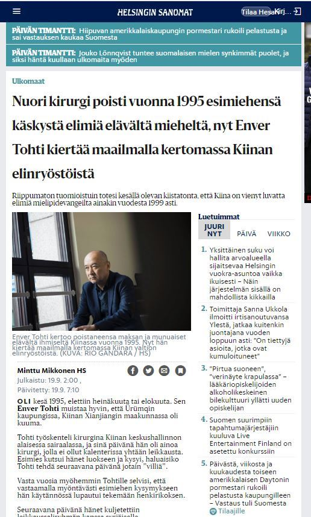

芬兰畅销全国具有最大影响力的报纸《赫尔辛基日报》关于「中共掠夺器官研讨会」的报导网络版

《赫尔辛基日报》纸媒版关于「中共掠夺器官研讨会」的大篇幅报导

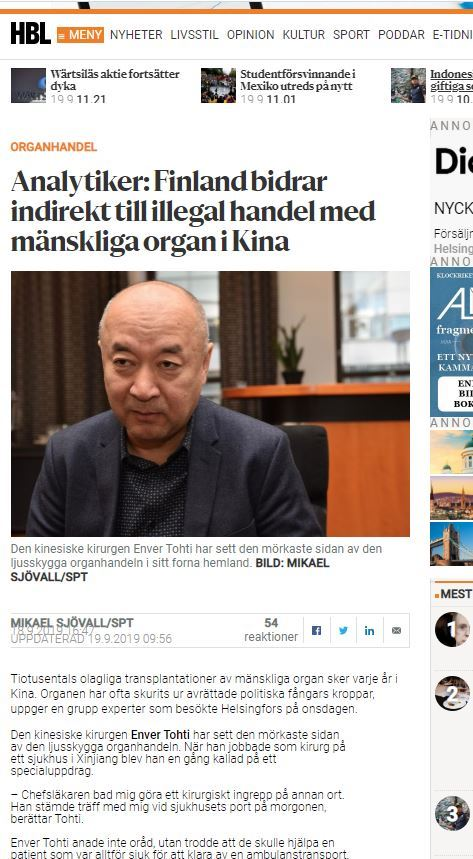

芬兰发行量最高的瑞典语报纸HSL关于「中共掠夺器官研讨会」的报导

<b>法轮功学员是器官活摘主要受害者</b>
 
两家媒体都提到，「中国每年都有成千上万的人体器官被非法移植。」

「中国共产党于1999年开始系统地迫害法轮功。此后，中国器官移植率迅速上升。该国的自愿器官捐赠系统直到2013年才建立。中共承认使用被判刑囚犯器官进行器官移植，并表示已于2015年初停止了这项工作。然而，处决的程度尚未达到解释器官移植率高的程度。调查活摘器官的人权律师、医生和活动家收集了多方证据。据他们说，中国每年通过从良心犯身上取出的器官进行了6万至10万例器官移植手术。大部份器官是从法轮功学员身上摘取。」

「近年来，人们一直怀疑生活在新疆的维吾尔族穆斯林的器官被盗取，维吾尔人正在经历健康测试和血液测试。根据托蒂的说法，测试目的是组建一个活人的『人体器官库』，还有来自地下教会的藏人和基督徒器官的信息。但是，大多数证据都证明器官来自法轮功学员。中国集中营和监狱中有80万至300万人。这些营地的透明度有限，这意味着没有关于问题严重程度的确切数字。」

<b>国际社会关注器官来源</b>
 
「欧洲议会于2013年通过一项决议，报告称有系统地摘取法轮功学员和其他良心犯的器官的指控是可信的。议会表示，欧盟将谴责中共的行为，并警告其公民不要前往中国进行器官移植，因为器官可能来自良心犯。」「医生社会责任组织的医生Marja Heinonen-Guzejev表示，西班牙、以色列、意大利、挪威和台湾已禁止其公民到中国的器官移植旅行。」

「Heinonen-Guzejev说，国际研究界已经开始关注中国有关人体器官移植的科学文章的伦理方面。她说，今年8月的科学期刊Plus One和Transplantation已经删除了15篇中国科学论文，理由是研究人员无法解释医学研究所用器官的来源。」

<b>读者反映强烈</b>
 
文章发表后，《赫尔辛基日报》官方脸书上分享点赞和讨论也很热烈。

Saru Nina留言说：「真实难以想象。联合国和世界卫生组织未对此事采取任何立场。对这样可怕的生意要继续沉默吗？」

Ossi Vuorilampi说：「这种中国的行为可以与纳粹德国进行比较，纳粹德国的集中营囚犯（在俄罗斯，不在西方国家）和战俘都接受了医学检查。然而当时并没有做器官移植。」

Marjatta jokinen说：「可恶的行为！人性在哪里？」

Hanna Riski说：「联合国应该发声的时候却保持了沉默。真是不可思议！而且是很多国家没有否认这个事实。」

Juha Ingerttilä说：「中国实际上是一个独裁的国家，仍会继续这样做下去……」

【文章来源】http://big5.minghui.org/mh/articles/2019/9/23/393699.html

<h1 align="center"><b>国际社会关注宗教信仰自由　中共面临绝境</b></h1>

【明慧网二零一九年九月二十五日】前些时明慧网公布了一个数据：在迫害法轮功的二十年当中，据明慧网的不完全统计，截止2019年7月10日，有86，050名法轮功学员被绑架，28，143人被非法劳教，17，963人被非法判刑，18，838人被绑架关入洗脑班，809人被绑架进精神病院，各种迫害案例518，940起。
截至2019年9月15日，至少有4，360名法轮功学员被迫害致死。而这只是法轮功学员被虐杀的冰山一角。有多少法轮功学员被活摘器官致死目前还没有确切数据。

据明慧网信息统计，二零一九年一至七月份，中共警察至少绑架3080名法轮功学员及亲属；421名法轮功学员遭非法判刑；二零一九年上半年中国大陆至少有45名法轮功学员在迫害中含冤离世。

这些数据告诉了人们一个事实，中共迫害法轮功是世界上最严重的侵犯人权，是最严重的反人类罪、酷刑罪和群体灭绝罪。制止这场罪恶已是当今世界最大的最迫切的事情，刻不容缓！

法轮功人权的日益恶化，引起了国际社会特别是美国的关注，仅从近期美国政界对法轮功问题的态度，我们可以预测中共迫害法轮功难以维持下去。

7月16日至18日，第二届全球宗教自由部长级会议在美国首都华盛顿举行，美国副总统彭斯强调宗教自由是美国的立国之本，更是外交政策的要务，「《独立宣言》中写道，我们宝贵的自由不是来自政府，而是由创世主赋予的、不可剥夺的权利。」「美国人民永远坚定地与有信仰的中国人民站在一起。」

美国国务卿蓬佩奥指出，「中国正发生着这个时代最恶劣的人权侵犯行为，是本世纪的污点！」

美国众议院议长佩洛西表示，中共对人权的迫害是「对全世界良知的挑战」，「如果我们不为中国的人权侵犯和宗教迫害发声，就没有道德立场去讨论世界上其它地区的问题。」

7月17日，美国总统川普在他的白宫椭圆形办公室里，会见了27位来自17个国家的宗教迫害幸存者，其中包括来自中国的法轮功学员张玉华女士。川普对这些幸存者表示：「我很荣幸能跟你们在一起，我将永远与你们并肩站在一起。」「宗教信仰自由至关重要，真的很重要。」川普还与张玉华进行了短暂交谈，在张玉华告诉川普活摘法轮功学员器官的罪恶仍然在中国发生，并请求其帮助制止中共政权发动的这场迫害后，川普对张玉华连声说：「我明白。」

法轮功和平反迫害二十年之际，美国国会及行政当局中国委员会（CECC）发布一份声明，要求中共停止迫害法轮功，立即无条件释放被关押的法轮功学员，并要求中共允许国际社会对法轮功所遭受的迫害进行独立和透明的调查。

二零一九年五月，美国国务院告知法轮功学员，向国务院提交迫害者名单。美国国务院将更严格地审核签证申请、对人权及宗教迫害者拒发签证，包括移民签证和非移民签证（如旅游、探亲、商务等），已发签证者（包括「绿卡」持有者）也可能被拒绝入境。

美国国务院国际宗教自由大使山姆﹒布朗巴克（Sam　Brownback）发表推特，谴责中共迫害法轮功。布朗巴克在七月二十九日的推特中说，今年的七月二十日是法轮功在中国被禁长达二十年的日子。现在，法轮功学员仍然受到中共政权的迫害，面临被抓捕、酷刑和强迫放弃信仰。中共的行径是不能接受的。

他说，「中共在迫害法轮功学员，还在强制摘取被关押的信仰人士的器官，包括法轮功学员器官。我们会继续推动中共政权停止对法轮功学员的侵害和虐待，迫害已经持续了二十年，一定要停止。中共必须听见人民要求信仰自由的呼声，并采取行动改正错误。中国人是伟大的人民，很快将有一天，他们能自由地实践信仰。」

据海外媒体报导，二零一九年九月二十三日上午11点半，美国总统川普在联合国总部主持全球呼吁保护宗教自由活动并发表主题演讲。

川普说：「今天，美利坚合众国以明确的声音呼吁那些国家结束宗教迫害；制止打击信仰者的罪行；释放良心犯；废除限制宗教和信仰自由的法律。保护弱势群体，手无寸铁的人和被压迫者。」

「作为总统，保护宗教自由是我的最高优先事项之一。」

川普说，我想再次感谢来到现场的、遭受宗教迫害的幸存者，你们鼓舞着全世界的人，你们提醒我们，没有甚么力量比宗教信仰人士的力量更强大，美国永远站在你们一边，永远站在寻求宗教信仰自由的人士一边。

会上，与川普总统一起入座主席台的还有副总统迈克﹒彭斯（Mike　Pence）、国务卿迈克﹒蓬佩奥（Mike　Pompeo）、联合国秘书长安东尼奥﹒古特雷斯（Antonio　Guterres）和美国驻联合国大使凯利﹒克拉夫特（Kelly　Craft）等。多位宗教受迫害者也受邀参加此次会议，包括法轮功学员代表张而平。

在联合国美国总统川普为捍卫宗教自由发声，这对世界上迫害宗教信仰自由最严重的中共来说无疑是一记丧钟！

目前，中共已经看到了末日来临，面临着被清算的结局，所以迫害仍然在肆无忌惮地进行着，妄图把迫害法轮功视为挽救中共的一根稻草。

殊不知人做恶，都得偿还，阳间还不清，阴间还得继续，这是天理，谁也逃不过。据明慧网2019年2月9日报导，据不完全统计，在19年中，有20，784人因迫害法轮功遭恶报，其中包括，被殃及的亲友等4，149人，在遭恶报形式的八项分类统计中死亡人数最多，高达7，405人，占总人数的35.6%。在对遭恶报人员所分的九大类中，公安系统本人作恶遭恶报的最多，高达4，540人，占公安系统总数的26.5%，他们殃及的亲友也最多，高达972人。

因迫害法轮功遭报的国级省部级高官达138名，包括中共邪党高官周永康、郭伯雄、徐才厚、令计划、薄熙来、孙政才等。

2013年7月19日，《清算江泽民迫害法轮大法国际组织》发布公告指出：「现政权当权者必须立即制止和停止这场血腥的屠戮和残酷的迫害！必须立即逮捕和惩办迫害法轮功学员的凶手！必须立即把迫害法轮功真相公布于众。中共这个危害人类道义正信，以强权暴力、血腥屠杀横行于世的邪党绝不能继续存在下去！」

7年过去了，中共政权对法轮功的迫害仍然没有停止，有的地方甚至更加肆无忌惮。这笔账该记在谁的头上呢？上天是看的清清楚楚的。迫害好人，重用奸佞，上逆天道，下违民意，中共的气数尽矣！

俗话说：天网恢恢，疏而不漏。善恶到头终有报，只争来早与来迟。奉劝那些仍在参与迫害法轮功继续做恶的人，立即停止迫害，悔过自新，将功赎罪，为自己也为家人留一条后路。特别是那些身居高位的人，更要珍惜自己，别落个千古骂名，遗臭万年的可悲下场！

【文章来源】http://big5.minghui.org/mh/articles/2019/9/25/393798.html

<h1 align="center"><b>信念是一盏烛灯</b></h1>

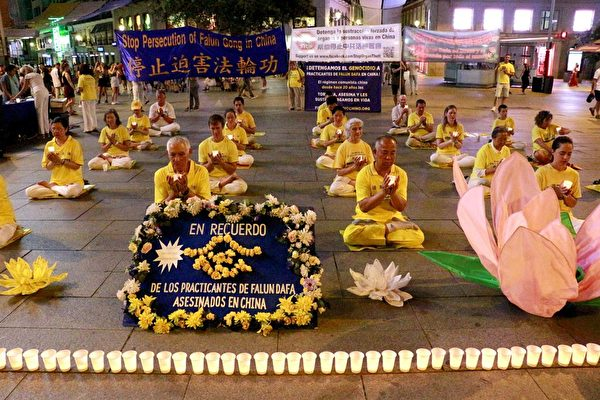

2019年7月19日，法轮功学员在卡亚俄广场烛光夜悼。

【大纪元2019年09月16日讯】信念，是一盏烛灯，在黑暗退去之前，为人指引道路，见证光明。

在风中，烛光一闪一闪，不停地与黑暗抗争。每次仿佛它已被风吹灭，看不到任何光亮，瞬间又奇迹般地复活，又仿佛那光明从未逝去。

烛光，就是为了照亮黑暗而生。生命，在与黑暗的搏弈中周而复始，直至永恒。

2019年7月19日晚上，马德里卡亚俄（Callao）广场仿佛一下子变成了佛国净地。几十位法轮功学员排列整齐，手捧烛灯，席地盘坐，气氛祥和，庄严静穆。

那一晚，在摇曳的烛光中，我端身盘坐两个多小时，沐浴佛光，心中升起无限感恩。

不知什么时候，烛泪已在我手中汇成一片小小的海洋，就像滚烫的泪海，隔着烛杯，温暖着我的心。记忆中想起一个佛家修炼故事。

传说在古印度，一位老婆婆听说释迦牟尼佛要去村里讲法。经舍在一个山洞里，需要自带油灯照明。她不想错过亲自聆听佛陀讲法的机会，但她是一个乞丐，买不起油灯，心里很着急。

老婆婆走了很远的路，遇到一家卖油的店铺。她脱下自己的百衲衣，想换一些灯油，但卖油人说，店里不收百衲衣。她又剪下自己的头发，想换点油，也被拒绝了。最后，卖油人被老婆婆的诚心打动，同意送给她一些油。

在老婆婆聆听佛陀讲法的时候，突然狂风大作。经舍里的油灯几乎都被狂风吹灭了，只有老婆婆的油灯一直持续地亮着。

据说，地狱的魔王总是对佛陀充满妒忌，因为它知道，如果人们遵从了佛陀的教化，就会摆脱邪魔的控制。因而，修行的人往往会受到邪魔的干扰。而老婆婆的心并未被狂风所动。相由心生，她的油灯未被熄灭，她和同伴们借着微弱的烛光继续聆听佛陀讲法。

自人类伊始，正与邪的较量从未停歇。当今世界，法轮大法普世洪传，开启了亿万人的佛性回归之路，这同样触动了邪魔的妒忌。

自1999年7月20日以来，中共邪灵化身乱世恶党，对法轮功修炼者实施了恐怖迫害，桩桩恶行都显露其恶魔本性。

中共邪党集古今邪恶之大全，以洗脑、关押、酷刑、甚至活摘器官等邪魔手段，肆意剥夺法轮大法修炼者性命，经核实至少4000余人悲惨离世，而这只是实际数字的冰山一角。

每年的7月20日前后，在世界许多地方，都会举行烛光守夜，悼念那些因坚持信仰而被中共虐杀的宝贵生命。

善恶交锋亘古已有，然而，人类追寻生命永恒意义的道路却未因邪魔的干扰而断绝。

在艰辛的寻道之路上，无论是在古印度简陋的经舍里，还是在现代繁华大都市的广场上，信念，是一盏烛灯，它在狂风中屹立，在黑暗中坚守，与光明同在，直至永远。

【文章來源】http://www.epochtimes.com/gb/19/9/16/n11525307.htm

<h1 align="center"><b>《求救信》全澳首映 观众：所有人都应该看</b></h1>

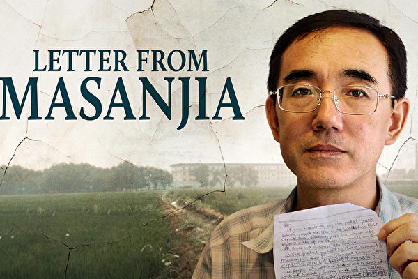

2019年9月17日，纪录片「求救信（Letter from Masanjia）」在澳大利亚首都堪培拉举行全澳首映。（制作单位提供）

【大纪元2019年09月18日讯】（大纪元记者何蔚、安平雅堪培拉报导）曾入围第91届奥斯卡最佳华语纪录片《求救信》，9月17日晚在澳大利亚首都堪培拉Canberra Centre内的丹迪电影院（Dnedy Cinema）举行全澳首映会。有观众在观看后表示，所有澳洲人都应该来看。

当晚一票难求，一些观众站着观赏完影片。玛格丽特（Margaret）女士观看记录片后表示，她很震惊地得知这样的事情在中国发生，「我们需要澳洲政府特别关注这场发生在中国的迫害，我们需要关闭所有的孔子课堂与孔子学院，这是中共设立在澳洲影响我们文化与价值的工具，从长期来看对我们澳洲的学校有很不好的影响。」

同时，她也表示，政府也应该切断中共对澳洲政党的政治捐款，因为中共想利用此来改变澳洲社会及政治体制。「我们应该保护澳洲自己的文化与价值观。」她说。

玛格丽特最后说，现在越来越多的澳洲人在关注中国发生的事情，当越来越多澳洲人关注中共对澳洲的渗透与影响，就会有越来越多的澳洲人行使自己的选举权来决定政府将由谁来管理。「有些澳洲政治家以为我们这些普通人不知道发生了什么，其实我们都知道，我们如果发出我们的声音，提出我们的担忧，我们就会影响到联邦一级的政治家。」

财务顾问梅斯（Leasa Mayes）观看影片后表示，这是一部非常好的纪录片，来到影片现场的法轮功学员讲述自己的迫害经历以及展示中国劳教所的奴工产品，这有助于观众理解影片。

她认为，法轮功团体应该让更多澳洲人了解到底什么是法轮功，她说，也许我们在堪培拉知道法轮功，但在澳洲远一些的地区，如达尔文等地或许还有很多人不知道。

梅斯建议，「所有澳洲人都应该来看这部影片」，对于每个澳洲人来说，我们应该曝光中共这样的行为，就像之前亲中共的学生对香港学生语言肢体暴力行为被媒体曝光那样。另外，澳洲也应该用贸易来约束中共，应该直接向中共提出其恶劣行为。」

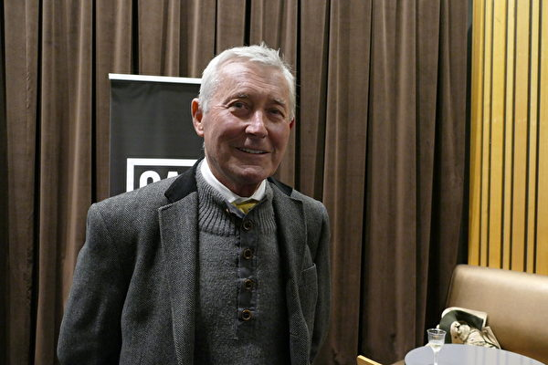

大律师、前首都行政区律政厅长考乐瑞（Bernard Collaery）观看了纪录片《求救信》。

大律师、前首都行政区律政厅长考乐瑞（Bernard Collaery）在影片结束后的互动时间向观众讲述了他多年前代理了法轮功团体与前外长唐纳的诉讼案，当时在搜集证据期间他去了台湾，「有大陆法轮功学员冒着生命危险去台湾跟我见面，给我提供证据。因为我有直接与法轮功学员接触的经历，所以知道孙毅与妻子的遭遇完全是真实的。」他告诉观众，中共迫害法轮功的原因就是因为炼法轮功学员的人数超过了中共党员的人数。

他还谈到有两名中共的前官员申请了澳洲庇护，其中一名公安背景的前官员带来了一个USB，里面是大量关于中共在监控定居世界各大城市的华人和他们的家属以及他们的经济状况的信息，中共掌握着这些详细信息。

「基于这些事实，及获得的这些重要情报，帮助我赢得了诉讼前外长唐纳的官司。」考乐瑞说。

鲍勃（Bob）观看了纪录片后说：「我获得了更多关于法轮功的信息，以前只是知道中共在迫害法轮功团体，因为我经常在路过中共大使馆时，看到法轮功学员在那里坚持了很多年，这部纪录片让我更清晰地知道了中共对法轮功的迫害。」

他表示，他会在自己的生活圈子里去告诉更多人，「我有个华人同事，我要告诉他这些信息」。

<b>互动热烈 观众了解中共更多迫害手段</b>
 
影片结束后，法轮功学员讲述了他们曾在中国大陆遭受关押、酷刑及奴工的亲身经历。令观众了解到更多中共对中国人控制及迫害的实例。

法轮功学员刘占胜曾被关押在上海的劳教所两年，监狱三年半，期间受到多种酷刑。例如，在40度高温下长时间暴晒后令他的头肿大，皮肤晒伤，长期不让睡觉，经常让其他犯人提着他的脚把他的头浸在水里，强行灌食等。他在监狱做的奴工产品有毛绒玩具。

法轮功学员庄玮拿出了很多类似于她在监狱时制作的奴工产品样品，她告诉观众她在被关押期间每天工作12小时，有时甚至通宵。庄玮说因为她的丈夫也是法轮功学员，中国政府以此为理由不给他办理护照。「今年七月，国安找到我丈夫说，『你妻子在国外做的所有事情我们都知道，』意图警告我。我在澳洲除了正常的生活工作以外，就是告诉更多人中国发生的迫害。」她说。

在提问环节，有观众问目前中共对待中国人的情况是否有所好转？

刘松发博士表示，中共享尽权力给世界以假象，让世界以为它越来越好，其实中共花费大量金钱做面部识别、网络封锁等监控百姓，香港示威者遭受到野蛮对待，从这些都可以看出中共对待中国人并没有好转，而是加强了控制。

还有观众担忧中共大力发展面部识别技术等情况。

刘松发博士谈到其实不止是面部识别技术，微信在中国大陆使用得相当普遍，甚至是海外留学生华人也都在使用微信，它实际上就是一个中共的监控网络，使用微信的人就成为了被中共监控的对象，中共利用微信监控你的每分每秒。

刘松发博士谈到自己的经历时说，「我和妻子孩子常年生活在澳洲，但我的妻子曾经接到中国警察的电话说，『你丈夫所有的事情我们都了如指掌』。」

多次获奖并入围第91届奥斯卡最佳纪录片候选名单的《求救信》，是由加拿大「皮博迪奖」获奖导演李云翔（Leon Lee）指导，由法轮功修炼者孙毅本人冒着生命危险在中国大陆秘密拍摄的。该片讲述的是孙毅在中国恶名昭彰的马三家劳教所受到的惨烈迫害，他冒着生命危险，偷偷写了大约20份求救信，揭露劳教所的迫害酷刑，每天像奴工一样被强迫工作16小时以上，制作出口到西方国家的万圣节玩具。美国的朱丽‧凯斯（Julie Keith）在买到的一个装饰品发现了一封藏在其中的求救信，她联系了媒体，并引发了一系列连锁反应。《求救信》真实地向公众展示了这名中国工程师孙毅和一位美国普通家庭主妇Julie Keith是如何改写历史的。

【文章来源】http://www.epochtimes.com/b5/19/9/17/n11528381.htm

<h1 align="center"><b>唤世界伸出你的手</b></h1>

【大纪元2019年09月17日讯】
人类到了最紧要的关头：唤正义，大步向前走！唤世界，伸出你的手！灭中共，这是上天的意志。灭中共，这是人间的大义。
 
中共邪恶，骂神佛，拜马列，谁人还糊涂？中共暴虐，害人命，夺人财，谁人还犹豫？

中共不是一个政党，它是祸害世界的魔鬼。中共不是一个政府，它是毁灭人类的孽罪。
问世界，谁还看不清？问世人，谁还看不明？灭中共，天地同行，神人共鸣。

人类到了最紧要的关头：
唤正义，大步向前走！唤世界，伸出你的手！灭中共，这是历史的大命。灭中共，这是今天的注定。
 
中共嗜血，杀国人，八千万，谁人还幻想？中共好斗，与天斗，与人斗，谁人还迷妄？

中共不是为了中华，它窃取了中华的外衣。中共不是为了人民，它高举着人民的花枝。
问世界，谁还看不见？问世人，谁还看不厌？灭中共，刀横剑斩，电扫风卷。

人类到了最紧要的关头：
唤正义，大步向前走！唤世界，伸出你的手！灭中共，这是世界的主题。灭中共，这是人类的大旗。

中共是祸，谁招惹，谁堕落，谁人还助纣？中共是灾，谁跟随，谁灭亡，谁人还取咎？

中共在拷问着世界，它是检验人类的标坐。中共在毁灭着人类，它是断绝未来的鬼火。
问世界，谁还不识贼？问世人，谁还不出力？灭中共，一同出击，万道霹雳。

【文章來源】http://www.epochtimes.com/gb/19/9/17/n11526942.htm

<h1 align="center"><b>法轮功学员坚持20年的和平反迫害抗争</b></h1>

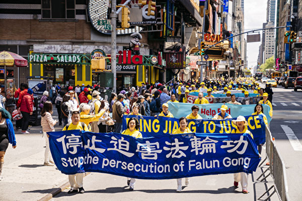

2019年5月16日，来自欧洲、亚洲、南美洲、北美洲、非洲、大洋洲六大洲的部分法轮功修炼者，聚集在纽约曼哈顿，游行庆祝法轮大法洪传27周年。

【大纪元2019年09月17日讯】近代出现了一种独特和成功的争取自身权益的方式﹐即用大规模非暴力不服从的方式来反抗强权的歧视﹑压迫和剥削。非暴力抵抗运动，指通过非暴力抗争捍卫人权，争取自由和正义，起源于圣雄甘地（Mohandas Karamchand Gandhi）领导的印度独立运动。二十世纪五十年代末和六十年代﹐美国非裔民权运动领袖马丁•路德金（Martin Luther King, Jr.）受甘地的影响﹐采取同样非暴力不合作的方式﹐争取美国黑人的合法权益。

在面对暴政的不公平对待时﹐能够用和平﹑理性和非暴力的方式来对待和处理社会的不公﹐这本身就具有强大的力量。今天，在香港发生了如火如荼的和平“反送中”运动。而在大陆和海外，千千万万法轮功修炼者理性非暴力抵制镇压与迫害的和平抗争、讲真相的努力也已经持续了20年。

近期，在职44年、曾三次担任参议院司法委员会主席，并担任过参议院临时议长的佛蒙特州（Vermont）民主党籍美国联邦参议员莱希（PatrickLeahy）发表了一份被列入国会记录的声明，要求中共停止迫害法轮功。莱希参议员表示，法轮功是中国传统信仰，但中共将之视为威胁，他说，“法轮功学员打坐（炼功），以‘真、善、忍’为修炼指导原则。但是，中国共产党因恐惧无法控制任何宗教组织或团体，而将（法轮功）这一中国传统宗教视作对其生存的威胁。”

1999年7月20日，中共前党魁江泽民出于妒嫉和权谋，以信仰“真、善、忍”的法轮功学员人数超过了中共党员人数为由，在中央政治局其他常委反对的情况下，发动了对上亿法轮功学员的血腥镇压，剥夺了法轮功学员包括信仰自由在内的一切合法权益。法轮功学员被逮捕、关入再教育营、殴打、剥夺睡眠、强制饥饿、性侵犯，电击、强迫灌食、戴镣铐……除非他们放弃信仰。在对法轮功要“名誉上搞臭、经济上搞垮、肉体上消灭”、“打死算白死”、“不查身源、直接火化”等政策下，中共媒体以前所未有的舆论攻势，全国报纸、电台、电视一时间全方位的充斥着对法轮功的造谣污蔑宣传，并迅速传向海外。江泽民还秘密建立了专门负责迫害法轮功“610办公室”，把法轮功学员投入劳教所进行残酷折磨甚至活摘器官死后通知家属说是“自杀”。

镇压法轮功过程中，据估计江泽民动用全国四分之一甚至更多的经济资源。他曾宣称3个月内消灭法轮功，但20年过去了﹐法轮功学员坚持“真善忍”的信仰﹐没有向暴政屈服﹐不承认江泽民违犯中国宪法的行为﹐坚持争取自己被非法剥夺的权益。法轮功修炼者秉承着对“真善忍”的信念﹐用和平非暴力的方式﹐展开了大规模的和平上诉活动﹐抵制镇压和迫害。事实上﹐法轮功的申诉活动都是中国大陆法律允许的。例如：上访﹐申诉自己受到的不公正对待——中国宪法规定公民有上访权﹐可以用上访的途径向政府反应情况﹐解决自己受到的不合理对待；坚持自己有信仰自由的权力——中国宪法明文规定公民有信仰自由；揭露遭到的非人迫害和虐待﹐实际上是检举和揭发公安﹑警察执法犯法等违法犯罪行为——中国宪法规定对于犯罪现象公民有检举权。

20年来，随着法轮功学员不懈地传递真相，许多国家的人民、政府从不了解不关注到积极支持法轮功。至今美国国会、欧洲议会等通过了多项决议要求中共停止迫害，联合国人权组织也密切关注法轮功学员人权受侵害的状况，越来越多的正义之声在各界响起。以下仅举发生在近半年的几个例子：

2016年12月，美国通过了《全球马格尼茨基人权问责法》，对确认的人权侵犯者，针对其财富和自由进行制裁；今年5月，美国政府开始推动《全球马格尼茨基人权问责法》的施行。美国国务院官员并告知法轮功学员可以提交迫害者名单，且不局限于直接参与迫害者，也包括制定具体迫害政策、下达命令以及协同者。美国政府将更严格地审核签证申请、对人权及宗教迫害者拒发签证，包括移民签证和非移民签证（如旅游、探亲、商务等），已发签证者（包括“绿卡”持有者）也可能被拒绝入境。

今年5月20日，美国福克斯新闻11台播出了一部名为“一个姐姐的救赎”的特别调查影片。该片的制片人在系统了解法轮功真相后将原定3分钟的报导增加到近10分钟。在历时3个月的调查报导期间，福克斯内部曾担心“画面是否太残酷”。记者回答：“但这是现实”。这是美国主流媒体首次深度报导中共对法轮功长达20年迫害的黑幕，其中揭露出的迫害残酷程度，让观众感到震惊。

今年6月17日，英国伦敦的“独立人民法庭”（Independent People’s Tribunal /China Tribunal）终审判决，中共一直从法轮功学员等良心犯身上强摘器官，证据确凿，中共犯下反人类罪，其中包括谋杀罪和群体灭绝罪。判决要求世界各国“政府和国际机构必须尽自己的责任义务抵制中共”。数十家国际主流媒体报导了这条新闻。独立人民法庭这一判决轰动世界同时震撼人心，但令中共备感恐惧，因为“独立人民法庭”终审判决可为世界各国政府乃至国际法庭直接采纳。

今年7月17日，美国总统川普在白宫会见来自17个国家的27位宗教迫害幸存者，其中包括法轮功学员张玉华女士。张玉华请求总统帮助制止中共迫害，川普说：“我明白。”这是美国总统第一次在白宫正式与受中共迫害的法轮功学员会见，为美国历届政府首次。

……

《北京之春》前主编胡平曾说：“法轮功为争取信仰自由而展开的和平抗争，英勇壮烈，可歌可泣。法轮功的抗争已经成为当今世界上最大的人权运动之一。法轮功对非暴力的坚定执著，尤其令人感佩。法轮功为中国，也为全世界，树立了一个非暴力抗争的典范。法轮功在当前中国的维权运动中扮演了重要角色，我们相信，法轮功还必将在未来中国的道德重建中发挥重大作用。”台大新闻所资深学者张锦华教授曾表示，法轮功不只是和平非暴力，更是善良而非暴力。这不仅赢得了世人的信任和尊敬，也让这股力量不断向外扩散。

二十年多来﹐法轮功学员非暴力反迫害传真相的和平申诉活动感动了无数中国人也感动了世界。待昭雪之日，这个有关千千万万修炼人的传奇故事必定会被世代传颂。

【文章來源】http://www.epochtimes.com/gb/19/9/17/n11526509.htm

<h1 align="center"><b>师恩浩荡师恩重　寸草难报三春晖</b></h1>

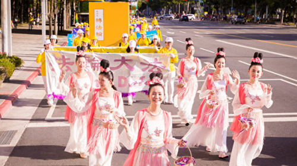

【明慧网二零一九年九月十日】修炼大法前，我性格孤僻，多愁善感，像林黛玉那样，泪水不断，自卑自怜，事事难如意。我的身体是百病缠身：类风湿性关节炎、低血压、崩漏、肩周炎、月子受湿潮、受惊吓、两次受产后风、各骨节肿胀、全身酸痛、失眠、眼睛疼、眼眶疼、眩晕、失忆、肌无力、休克、心绞痛、心脏病、皮肤病、浅表性胃炎、神经性胃病、洁癖、呕吐等。吃不下饭、睡不着觉，度日如年。

<b>一、天空中传来的声音</b>
 

一九九四年的时候，我的病情更加严重，眩晕、失忆。我从事现金工作，有两次把现金、支票放在保险柜外面，钥匙插在保险柜上人就回家了，幸亏同事及时提醒。我的眼睛不能直视东西，精神恍惚，不能工作，只好休假。多方求医无果，病情严重到有人在旁边呼吸心脏都受不了，吃不吃东西都吐。身体各部位都出现了异常，手拿不住东西，碗筷常常脱落在地，手没有知觉，有时还得用嘴把手咬过来。门铃响了，想下地开门，下地就趴在地上起不来。睡不着觉，吃不下饭，每天就像晕车那样难受，像妊娠反应那样吐。

一九九五年，我生命已危在旦夕，大夫断言我的病一天不如一天。听了大夫的话，丈夫对我失去了信心，渐渐冷落我，婆家人都不理我，只有儿子每天放学回家蹑手蹑脚的到我身边，把小手伸到我鼻子下试呼吸。这是我妈妈交代给他的，没有呼吸时告诉大人。

我死去活来的折腾，却迟迟不咽这口气。冥冥之中好像在等甚么，期盼着甚么，总觉的自己活得窝囊，没过上一天好日子，做一回人就是来受苦吗？不甘心啊！

家人的冷落，使我心生怨恨。想想人世沧桑，世态炎凉，生活凄苦，我早已厌倦了这一切，只因儿子还小，舍不得。我决定把儿子托付给二姐，彻底来个了断，一了百了，了却恩恩怨怨和无尽的烦恼，解脱痛苦。

我写好遗书后去了二姐家，请她照顾好我儿子，二姐觉察到异常后一口回绝了我，并报信给我丈夫。丈夫把家里的药都藏了起来。于是，我又从新偷偷的攒药。又写了一份遗书，照了遗照。然后给妈妈打了个电话以此作为告别。准备好后事，打算再跟儿子吃顿团圆饭。饭好了，儿子却找不见了。发现茶几上的留言：妈妈，儿子走了。原来儿子玩游戏没有完成作业，遭到他爸的训斥：等晚上回去扒了你的皮。儿子害怕便离家出走了。发现孩子离家出走，我心急如焚，发动亲友邻居四处找孩子。城里已是万家灯火，城外却是凛冽的寒风，儿子会不会被冻坏？我们大声呼喊着。二姐跟我说：「你看到了吧，你还没死呢，他爸就要扒他皮了，你死了，再来个后妈。你儿子非受气不可。你有志气去死，没志气活着？」儿子的意外出走，加上二姐的激将之法，使我放弃了轻生的念头。我不能这么自私，我要活着，不能让儿子受气，我要把他养大成人。

儿子找回来后，我决定为了儿子锻炼身体。又是一夜未眠，天未亮我就走出家门，寂静的马路上就我一个人，心生惆怅，百感交集。天啊！难道我连选择死的自由都没有吗？难道就让我这样生不如死的活着吗？儿子你得啥时候长大！？我得熬到啥时候是个头啊！？正这样想着，天空中突然传来一个浑厚的声音：「过了这个年你就会好！」我惊异的抬头望去，天空中悬挂着几颗星星，周围静静的一个人也没有。

<b>二、师父给我读《转法轮》</b>
 

过了这个年，真应验了那句话。也就是一九九六年一个偶然的机会我去了局长办公室，两年的病假我已经面容憔悴骨瘦如柴。局长对我说：「你的病有治了。我已经考察好了，现在有个气功叫法轮功，是李洪志先生创编的高德大法，祛病健身有奇效。按照「真善忍」做好人，提高人们的道德质量。师父给真修者直接净化身体，达到无病状态，义务教功。我看到北京有一些老干部，炼功之后病毒症、癌症、心脏病等各种疑难杂症，医院治不了的病都好了。有的头发变黑了，不但解除病人的痛苦，而且还给国家节省大量医疗费用。经过调查后，乔石委员长亲自批示：「法轮功于国于民，百利而无一害。」国家给法轮功颁发好几个奖。法轮功书籍都是正式出版发行的。现在有中央领导人的家属，高级军官将领，高科技人员，高级知识分子，包括清华北大师生，各机关工矿企业、各阶层的人都在修炼法轮功。而且一人炼功，全家受益。我这两天准备就去北京请书，每个职工发一套，叫全局职工都受益。你上班吧，我给你安排一个轻松的工作。主要是好好炼功，身体好比啥都强，这可是可遇不可求的高德大法，心诚则灵哪。」

局长是个信神佛的人，常做善事，相信善恶有报，三尺头上有神灵。我已病入膏肓，无药可医。而且药也吃不了了，见到药更难受。我想尝试一下法轮功。我请回一套书。局长说先看《转法轮》，要一心不乱的看，最好先看三遍为益。我吃过早饭，翻看《转法轮》，神奇的事情出现了，那个浑厚的声音，急促、紧迫、有力、慈悲而又祥和，一句一句的读起了《转法轮》，带着立体声、轰轰的。一种神奇的力量带动着我紧跟着，就这样静静的一心不乱的听着、看着、学着。法理沁透心扉，那样的美妙、舒心。好像我已等待许久，好像我生不如死的苦苦煎熬时期盼的就是这个大法。有师父真好！多年的烦恼，烟消云散。整个夜晚沐浴在佛法中，泪水一次次静静的从脸颊流淌。师尊布道，答疑、解惑。解开了我在人生中想明白而不得其解的诸多疑问。明白了人为甚么得病，为甚么有苦，有难、有是非。找到了人生的真谛，使我整个世界观都发生了改变。大法给我开启了心智。使我的心明亮了起来。就这样我一口气看完第一遍《转法轮》。整个夜晚被强大的慈悲、祥和、纯正的能量包围着。身心净化了，全身轻松，平生第一次感受到无病一身轻的美妙。

<b>三、大法净化我的心灵</b>
 

法轮大法要求修炼人从做好人做起，大法净化了我的心灵，提升了我生命的质量。有一次我在工作中遇到一个顾客，需要他出示身份证办理业务，可他不想回去取身份证，就对着我破口大骂。我把自己当作修炼的人，不动气，心如止水。这要是在修炼前非跟他干起来。当他取回身份证再来时判若两人，给我赔礼道歉。

我是分局的负责人，我手下的职工大都是总局优化组合后被淘汰下来的，素质比较低，好闹事的，无能力完成任务的。我的前任是被他们给告倒的，正在停职查看。有这前车之鉴，谁都不愿、也不敢带。都怕自己闹不好被他们弄得身败名裂。局长知道我是法轮功修炼人就叫我来带，并告诉我，看谁不听话就开除谁。我没有先发制人的想法，那时是失业高峰，看不得失业人员没有饭吃的那种无助。我想把他们带好，叫他们都有饭吃。这是我的出发点。到位之后，我新换了一些设备，可是不久一职工就把新电话机拿家去了，换上一个旧的，我没有生气，平静的告诉她，明天给换回来。新官上任三把火，他们以为我会就其大做文章，会去打小报告，杀一儆百。这都是多虑了。

由于我和一职工的业绩高，所以每月可以叫完不成任务的人也能拿回满工资、拿回奖金，这是总局都望尘莫及的。在生活上，工作中，我能帮上他们的，就会给予帮助，过年节时给他们搞福利。其它局的人好羡慕。那年冬天很冷，暖气却冰冰凉，他们穿着羽绒服喊冷，我却穿的很薄，却感到身体汩汩热流不断涌进，一职工一语道破天机：「你是炼功不觉的冷！」在大法的熔炼中，我的身心发生了质的变化。身体总能感受到被一种强大的能量场包围着，非常舒服，心情愉悦，整个人温文尔雅，气质非凡，面带祥和之意。

有一次，我的手下联名把我给告到了总局，理由是年初总局发给我局一笔资金，叫我给贪污了。这叫总局领导又是气又是笑，子虚乌有，总局没给呀。局领导气得不行：这些白眼狼，是不是脑袋进水了，就是欠收拾，开除两个就老实了。前任局长给告倒了，这个局长对他们那么好，他还告，这不欺人善吗？总局局长决定亲自带队整治他们，开除两个给我出气。我当时觉的脸上很不光彩，因为我有虚荣心。我的手下人都告我？我对他们不薄啊，平时相处的很溶洽的，怎么突然都翻脸了呢？心里很不平衡，要求领导去查我的账，以证实我的清白（有怕丢名的心）。领导说：「不查，太给他们脸了，直接收拾他们。」局长从来都是说到做到。我一想，他们这不是引火烧身自找倒霉吗？他们要是失业，将来生活怎么办？他们被开除怎么面对家人，面对社会？他们会破罐子破摔吗？我开始心疼他们了，我可不能因为自己的一时之快毁了他们。

我决定退一步，以修炼人大善大忍的胸怀对待他们。但是我也要维护自己的尊严。我强烈请求局领导查我的账。账目当然是清清楚楚，一目了然。甚至是总局给我个人的活动经费，我都按比例发给了下面的人，这叫局领导惊叹不已：现在人人贪财，局里还有这样大度的人。这法轮功太好了！会上局领导赞美我的品德，高尚的风范，业绩的突出，对我工作给予高度评价。随后局领导就给他们一个一个总结劣质，叫他们羞愧难当，说开除他们哪个都够格，叫我说开除谁，随时立即生效。我以修炼人祥和的心态，没有怨恨与指责，说出的话平易近人，平息了这场闹剧。我给了他们一个台阶，他们从此对我非常尊重，人也变的和善起来。过后，大家都说我人善良，换成别人，不会饶他们的。我想，如果我不修炼法轮大法不会有这样的胸襟。因为我从小遵从以恶治恶的斗争哲学，争强好胜，把自己搞的一身病，幸遇大法才得以新生。大法净化了我的心灵，告诉我人生真谛，大法给了我永生的生命。

我感谢师父，感谢大法。师恩浩荡师恩重，寸草难报三春晖。

【文章来源】http://big5.minghui.org/mh/articles/2019/9/10/389018.html

<h1 align="center"><b>一家10人受迫害 英留学生中领馆前吁停止迫害</b></h1>

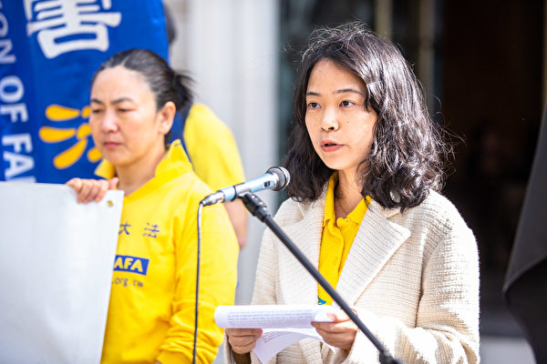

在英国留学的珍妮特‧冯（Janet Feng）（右）8月30日在伦敦中领馆前讲述了她的大家庭中10人因坚持修炼法轮功而在中国遭受迫害的情况。

【大纪元2019年08月31日讯】（大纪元伦敦记者站报导）在英国留学的珍妮特‧冯（Janet Feng）周五（30日）在伦敦中领馆前讲述了她的大家庭中10人因坚持修炼法轮功而在中国遭受迫害的情况。

8月30日，在英国伦敦举行的2019欧洲法轮功反迫害活动进入第二天。上午10点，来自三十多个国家的逾千名法轮功学员在中共驻伦敦大使馆前举行集会，谴责中共残酷迫害法轮功，并要求中共立即停止长达20年的迫害。

以下是珍妮特‧冯在集会上的发言内容整理。

我叫珍妮特‧冯（Janet Feng）。我想简要地跟大家介绍一下，由于坚持修炼法轮功，我的大家庭在中国遭受迫害的情况。

2000年，我的父母被拘留了大约一个月。

2002年，我的母亲被非法判处5年监禁；我的父亲被拘留了大约9个月，然后被判3年缓刑。

2007年，我母亲被关入劳教所1年半；我父亲被拘留了半个月。

2015年，我母亲被判处有期徒刑2年半，并被罚款8,000元人民币；我父亲和我被关在洗脑中心21天。

2017年，我被拘留了一个星期。

我的其他亲属也遭受了中共的迫害。 2007年，我的三姨被关入劳教所1年半，我的大姨被判处8年监禁，大姨夫被判处2年监禁，表兄被判处3年监禁，我的四舅被判处4年监禁。并未修炼法轮功的四舅母，在午夜被警察提审和威胁，她很快得了抑郁症并自杀了。

2015年，我的三姨被判处1年半徒刑，并被罚款5,000元人民币。

除了拘押和监禁之外，在过去20年中，警察、610办公室人员和街道人员肆意对我们进行抄家和骚扰，已成为一种惯例。

在我小时候，我的家人没有告诉我他们经历了什么。后来，我多次问我母亲和我姨，才略知一二。

在拘留所，他们遭受被长期监禁的威胁，长时间坐在一个非常短小的凳子上，在夜间被暴露在强光下，并被剥夺了几天的睡眠，导致他们视力模糊、听力受损。

在监狱中，只要他们不放弃信仰，他们就会被单独监禁，食不裹腹，并且每天都被两名辱骂他们的囚犯看守着。他们以塑料桶当作厕所用，不允许使用卫生纸，不允许洗脸或刷牙，更不用说换衣服或洗澡了。

此外，他们每天被逼迫听诽谤法轮功的宣传广播，声音震耳欲聋，并被逼迫看类似的录像。在观看或收听洗脑宣传片后，他们被迫写下“反思”。如果他们拒绝写或写一些监狱官员认为“含有危险思想”的东西，他们就会遭受到不同方式的折磨。我姨告诉我，由于拒绝写反思，她被罚站，从清晨一直站到深夜。第二天，她仍然拒绝写反思，结果再次遭受罚站折磨。日复一日，她虚弱地站在那里，而两名囚犯则侮辱她为“半人半鬼”。此外，他们被迫做奴工，制作袜子、帽子等。

很长一段时间里，我打电话给我的母亲时，如果她没有拿起电话或者没有很快回电话的话，我就会担心她再次被捕。警察和610警察曾对我说过：“你母亲是自私和不负责任的。她出去发传单，然后被捕，置你和家人不管不顾，她只考虑自己。”但是，我永远不会同意这种观点。

信仰自由是人类与生俱来的权利。我母亲相信“真、善、忍”并没有错，那些镇压信仰“真、善、忍”的这群好人的人，则应该为自己感到羞耻。此外，人类也拥有言论自由的权利。我的母亲发放传单，解释法轮功的真相，不包含任何危害社会的言论。如果这就是她被捕的原因的话，我谴责中共滥用权力镇压持有不同看法的人。

我的母亲清楚地知道她告诉人们法轮功在中国存在的真相时所面临的风险。她坚持这样做不是为了她自己，而是让更多的中国人了解真相，不再被政府的宣传所愚弄。这不是一种自私的行为，相反，它是一种无私的行为，展示了她的信仰所给予她的勇气。

此外，法轮功还教导人们遵循“真、善、忍”。我的母亲遵循了这个原则，成为一位更好的人。她引导我也遵循这个原则，成为一个正直善良的人。将来，我也会以这种方式教育我的孩子。无论从短期还是长期来看，法轮功都有益于社会。

今天，带着最诚挚的善意，我呼吁更多的人把法轮功的真相传递给中国人民，并敦促中国的当权者、警察和610官员停止对那些拒绝放弃信仰“真、善、忍”的人的残酷迫害。

【文章來源】http://www.epochtimes.com/gb/19/8/30/n11488770.htm

<h1 align="center"><b>泪洒中秋盼月圆</b></h1>

【明慧网二零一九年九月十日】支离破碎多少家？泪洒中秋盼月圆。中秋节到来了，在这万家团圆，欢度中秋的时刻，不由得使人想起了那些被中共迫害得支离破碎、妻离子散、家破人亡，再也无法团圆的家庭。
在此列举几个饱受中共摧残的迫害案例，看看那个整天吹嘘自己「伟光正」（畏光症）的恶党是如何欺压迫害自己的人民的。

案例1：河北省法轮功学员李惠云博士，原是河北科技大学机械电子工程学院副教授，李惠云博士的专利成果在二零零三年德国国际发明博览会上获「国际发明先锋奖」，获二零零三年香港国际专利技术博览会「金奖」，第三届亚洲国际专利技术专利产品博览会「金牌奖」和「科技发明进步奖」。从这些荣誉中我们就知道了这位博士为了这个国家做出了突出的贡献，可是她却仅仅因为追求信仰做个好人，遭受了惨无人道的迫害。

李惠云

十多年来李惠云博士遭受连番的洗脑班迫害、二年劳教、二十九个月看守所非法关押、四年零十个月的判刑。二零一六年一月二日出狱，身体尚未恢复，二零一七年三月二十三日又再遭绑架，被非法关押至今。已经被中共迫害致精神分裂的她，灭绝人性的中共当局仍试图对她再次判刑。

案例2：据明慧网二零一九年九月二日报导：陕西省西安市莲湖区七十岁老年法轮功学员马蕴华，被非法判九年、勒索罚金两万。马蕴华上诉。

自从一九九九年七月二十日中共迫害法轮功以来，马蕴华女士多次遭受各种迫害，两次被非法劳教，曾被非法判刑七年。马蕴华的另一个姐姐马蕴静女士多次被劫持在西安市洗脑班迫害，尤其在二零一零年九月，被迫害致内脏器官全部衰竭，一直没有恢复，于二零一二年六月十八日四时去世。

案例3：据明慧网近日报导，二零一九年八月十三日上午九点半前，广东茂名电白法轮功学员林丽珍与林燕梅的家属和律师来到看守所门前，林丽珍与林燕梅的八十六岁的父亲想见两个女儿和外孙，警察不给进看守所。九点半，茂名市茂南区法院主审法官柯学军非法宣判：林燕梅被判刑四年六个月，罚金八千；林丽珍被判刑五年，罚金一万：吴朝棋被判刑五年，罚金一万。

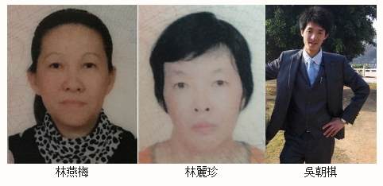

八十六岁的林燕梅、林丽珍的父亲、吴朝棋的外公林桐，盼望三个亲人能无罪释放回家，可是，亲人们不敢给老人讲实情，只告诉老人，他们三人都被判了。老人很伤心、泪流满面的说：「为甚么要这么迫害好人啊？我要挂牌去市政府上访。」

案例4：四川泸州市工商局干部梁文德女士，二零一五年十二月二十五日早上在家门口被绑架，被非法判刑五年零六个月，于二零一九年六月二十四日在四川成都龙泉女子监狱被迫害致死，终年六十四岁。

梁文德先后被中共非法囚禁十二年，第二次被非法判刑，还有两年时间才能冤狱期满，梁文德没有熬到头。中共利用监狱迫害法轮功，对法轮功学员毁灭性的身心摧残，手段残忍繁多，灭绝人性。希望全世界正义人士关注。

案例5：据明慧网报导，黑龙江绥化市北林区法轮功学员王芳被非法关在安达看守所，二零一九年六月二十九日在里边炼功，被看守所警察迫害，给她戴上沉重的脚镣，至今快一个月了。每天从早到晚都戴，睡觉时都不给她打开。

王芳是绥化市北林区尚志小学教师。一提起王老师，家长们无不感叹，现在这样的好老师太少了！王芳多年担当班主任工作，学校差班交给她，她毫无怨言。她用自己在法轮大法中修炼出的慈悲、善良、真诚对待学生，对学生一视同仁，用自己的言传身教在影响着一批批学生和家长。王芳从不收受家长送的钱和物品，有很多家长执意感谢，她都婉言谢绝了；有的实在推辞不了，放学后放到学生的书包里带回去；有的她亲自上门或当面说清，自己是法轮功学员，要按法轮大法真、善、忍的要求去做人，所做的一切都是自己应该做的，家长们都很感动。就是这样的好老师却屡遭绑架迫害。

二零零七年王芳被恶人构陷，被绥化北林区610（专门迫害法轮功的非法组织）绑架关押，此事当时在社会上引起了很大的反响。学生家长们自动组织起来，到学校及市教委要人，家长不愿失去好老师，强烈要求王芳回来给孩子上课。有些家长通过各种关系帮助王芳家人到公检法要人。家长们议论纷纷这样的好老师天底下难找，好人被抓太冤枉了！这是甚么世道？！

二零一九年五月二十四日，安达市法院对绥化市北林区王芳等七名法轮功学员被非法判刑。这七名学员有三名是教书育人的好老师。王芳被非法判刑两年，处罚金一万元。

一个个信仰「真善忍」做好人的善良民众无辜遭受残酷迫害，一个个幸福美满的家庭被迫害得支离破碎、妻离子散、家破人亡！在今天的中国大陆，被中共残酷迫害的不仅仅是法轮功学员，还包括为法轮功学员主持公道伸张正义的维权律师，如高智晟、王全璋、李和平、余文生等，他们为了维护和重建中国法制的未来，为了千千万万遭受中共残酷迫害的法轮功学员及其他民众，也在无辜承受着痛苦和折磨，遭受着中共的残酷迫害。

据明慧网二零一九年九月五日报导：八月十五日，吉林省长春市有29名法轮功学员及家属遭绑架，至十八日，共31位被绑架。其中，法轮功学员王克民、王凤芝夫妇，以及儿子王东吉、儿媳于健莉，一家四口被绑架，至今仍被非法关押。

另据明慧网同日报导，二零一九年八月三十至三十一日，河南省南阳市市区及十几个县三十名法轮功学员被绑架。这次非法行动是由南阳市委、政府、政法委、610、公安局等参与实施的。

据明慧网信息统计，二零一九年一至七月份，中共警察至少绑架3080名法轮功学员及亲属；421名法轮功学员遭非法判刑；二零一九年上半年中国大陆至少有45名法轮功学员在迫害中含冤离世。截止2019年9月6日，至少有4，338名法轮功学员被迫害致死。这远远不是实际发生的迫害致死案例的全部，只是实际发生案例的冰山一角。

法轮功和平反迫害20周年之际，美国国会及行政当局中国委员会（CECC）发布一份声明，要求中共停止迫害法轮功，立即无条件释放被关押的法轮功学员，并要求中共允许国际社会对法轮功所遭受的迫害进行独立和透明的调查。

美国国务院国际宗教自由大使山姆﹒布朗巴克（Sam Brownback）布朗巴克在七月二十九日的推特中说，今年的七月二十日是法轮功在中国被禁长达二十年的日子。现在，法轮功学员仍然受到中共政权的迫害，面临被抓捕、酷刑和强迫放弃信仰。中共的行径是不能接受的。

在国际社会普遍关注中国大陆法轮功人权的时刻，中共仍然肆无忌惮地继续迫害法轮功，法轮功人权仍然在持续恶化，凸显了中共末日前的疯狂。中共不解体，迫害不会停止，人民难以安生，国家无有宁日！

在中秋万家团圆的日子，有多少法轮功学员家庭却在泪洒中秋盼月圆，盼望着这场惨无人道的迫害早日结束，盼望着法轮功学员也能过上一个平静安宁的生活，盼望着中秋月圆人也圆！

【文章来源】http://big5.minghui.org/mh/articles/2019/9/10/392447.html

<h1 align="center"><b>香港加油 暴政必亡</b></h1>

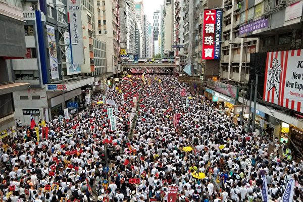

2019年6月9日，香港反送中大游行人数挤满整个街道。

【大纪元2019年09月03日讯】香港“反送中”至今3个月不衰，全球见证，港人坚决捍卫自由、自治、法治，港府特首不改颟顸，港警暴力不断升级，中共武力威胁不断升高。

中共发动宣传攻势抹黑“反送中”的抗议活动，其实是《香港基本法》保障的权利与自由之一，也是完全属于香港的地方事务。中共港澳办、外交部、政法委、军队等多次就抗议活动及抗议民众公开发表评论的行径，已涉嫌违反《基本法》第14及22条。

《香港基本法》是基于《中英联合声明》而生，并作为守护“一国两制”的关键宪制文件。中共国防部发言人吴谦在7月24日记者会上表示，香港的反送中示威者正挑战“一国两制”的底线。事实上，中共外交部在2017年曾公然宣称《中英联合声明》是历史文件、不具约束力。中共自己才是背信毁诺《中英联合声明》、“一国两制”的罪魁祸首。

《中英联合声明》确立以“一国两制，高度自治、港人治港”为中共取回香港管治权后的最高治港原则。《香港基本法》明定香港享有高度自治权，香港应循序渐进实现普选，但至今香港“小圈子选举”由1200人选出700万人特首，遂有2014年雨伞运动争取求“真普选”。

香港前港督彭定康批评新《逃犯条例》是1997年香港移交以来最糟糕的事，此法一旦通过，50年不变的“一国两制”随即不保。

新《逃犯条例》，再加上近年港府滥用的《公安条例》（97前夕中方另组临时立法会强行修订），两者相乘加倍冲击香港司法以及新闻、言论、集会等自由，变本加厉迫害“一国两制”的香港自治权利。

英国保守党人权委员会副主席Benedict Rogers在《The Spectator》发表文章指出，港府滥用《公安条例》最荒谬的例子之一，有2位议员因在立法会内“非法集会”而被下狱。想象一下，英国若有国会议员因在国会内进行抗议就坐牢，会引发生什么样的反应。

Benedict Rogers文章还指出，因违法《公安条例》而被起诉的，在1997至2010年的13年之间仅仅39人。相比之下，今年截至5月已有45人遭到此法起诉；雨伞运动发生5年以来起诉超过100人，包括黄之锋、罗冠聪、周永康、梁天琦。如梁天琦被重判6年，这比某港警在旅馆房间强暴女性所判的刑期还要长。

事实上，过去一直是亚洲最开放城市的香港，现在居然产生了必须向外寻求庇护的难民，香港法治之恶化、一国两制之危机可见一斑。

香港法律专业团体“法政汇思”4月发表今年首份《法治报告》就直指香港法治威胁来自中共政府。报告指出：在香港实施法治原则，所受的压力愈来愈大。根据《中英联合宣言》，英国与中国对香港都有责任，至少一直到 2047年为止：中共必须尊重香港的自治，英国必须为香港的基本自由挺身而出，香港政府则必须放弃修订《逃犯条例》、并对《公安条例》进行修法，以保全香港自由民主的名声。国际社会必须为香港的基本自由发声。不这样做的话，意谓着香港的死亡。

香港大律师梁家杰对《大纪元》表示：反送中运动是“正邪对决”。香港的自由、自治、法治不断地面临共产党专制威胁。

衡诸历史邪不胜正、暴政必亡；世界潮流、普世价值尊重人权法冶。胜利之前最黑暗，香港加油！

原文: http://www.epochtimes.com/gb/19/9/2/n11494539.htm

<h1 align="center"><b>滴水穿石 乌克蘭夫妇的坚韧诚心感化民众</b></h1>

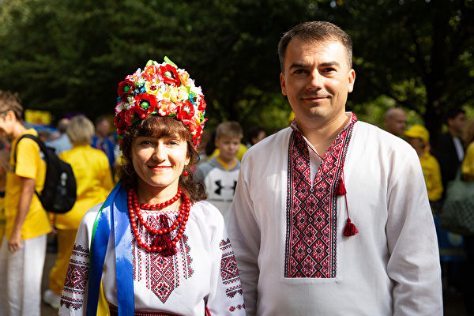

8月30日上午，乌克蘭法輪功学员Karolina Nagorniuk（左）和Denys Nagorniuk夫妇身着乌克蘭传统服饰在英国倫敦摄政公园为当天的大游行做准备。 

【大纪元2019年09月05日讯】（大纪元记者启心英国倫敦采访报导）基辅曾是九世纪时俄罗斯民族的发源地，它目睹过中世纪黄金般的昌盛，历经五个多世纪的战火纷争，走过苏聯共产主义的无情肆虐，这座命途多舛的城市，凝聚着乌克蘭的历史缩影。如今，这座乌克蘭的首都，正在見证着一段荡气回肠的人类历史，记录着乌克蘭人对正义与良知的抉择。

2019年8月30日在英国倫敦举行的34国法輪功学员大游行中，有这样一对夫妇格外引人注目，他们是來自乌克蘭首都基辅的Karolina Nagorniuk和Denys Nagorniuk。游行当天，他们身着色彩绚丽的乌克兰民族服饰，脸上洋溢着幸福和喜悦，目光坚定，由内而外散发着宁静与平和。他们在这个特别的日子，分享了乌克蘭人与众不同的修炼感悟。

<b>寻寻觅觅 终获生命意义</b>
 
如同很多法輪功学员一样，Denys Nagorniuk怀着对生命意义的求索而走入法輪大法的修炼之中，“长久以來，我一直在问自己，生命到底从何而來？我为什么出生在地球上？人类真的是这个宇宙中唯一的生命吗？而对我来说最重要的问题是，我这一生的意义究竟是什么？在这个社会中，人们有各种学说和理理论，然而那些都不能让我信服。”

从2003年开始修炼的Denys Nagorniuk回忆起刚刚走入修炼的情形，内心依旧激动，“当我第一次读到《转法輪》时，我找到了所有的答案。我知道自己终于找到了这一生追寻的人生意义。而且我找到了最重要的生命准则、判断好坏的准则，那就是‘真、善、忍’。”

Karolina Nagorniuk在修炼之初，就体会到了发生在身体上的奇迹，“很长时间以來，我一直在寻找一种对身心有益的功法。”她说，“我曾经患有胃病，然而在我开始修炼法輪功三个月后，我的胃病就不翼而飞了，而这期间，我并没有服用任何药物。”

身体上的转变让Karolina深感惊喜，然而法輪功深刻的法理，对于修炼人道德的严格要求才真正让Karolina下定决心走上修炼之路，“当我第一次读完《转法輪》后，我知道必须首先要净化我的心灵。我理解让灵魂变得纯洁和纯粹是第一重要的，我那时就决定，我一定要让‘真、善、忍’的原则成为我这一生的准则。”

<b>滴水穿石 身负重任</b>
 

9月1日上午，Nagorniuk夫妇在英国倫敦特拉法加广场向当地民众讲述法輪功真相。

走入修炼的Nagorniuk夫妇还來不及沉浸在刚刚得法修炼的巨大喜悦中，在中国大陆持续发生的对法輪功修炼人的迫害让Karolina和Denys深感肩负沉重的使命，那就是如何向乌克兰民众讲述中共发起的这场惨绝人寰、史无前例的迫害，然而这条路却举步维艰。

从2004年的橙色革命到2014年的乌克兰革命，十年间乌克蘭饱经政坛的风云诡谲，前苏联共产主义意识依然在侵蚀着这个国家。而民众们似乎对游行抗议早已麻木了，当Nagorniuk夫妇在基辅街头讲述真相时，面对的是民众们一张张冷漠的脸。更糟的是，当年听信中共谎言的乌克蘭华人的蓄意破坏，让讲真相工作更加艰难，但是经过当地法轮功学员多年的努力，现在情况已经好多了。

Karolina Nagorniuk回忆起十几年前讲真相时的困难，“我记得在2006年，我们曾经在中共驻乌克蘭Kiev使馆前举办真相活动，一些在乌克蘭的中国移民，他们对我们集会现场进行各种捣乱破坏，比如扯我们的条幅。而当地警察则无所作为，当地乌克兰人更是视而不見，在那时进行讲真相工作真的很难。”

然而乌克蘭的法輪功学员并没有因此而选择放弃，他们深知责任之重，他们坚信滴水穿石，只要不放弃，终有一天这个社会将听到他们的呼声。

Karolina继续说：“我们那时，头脑中有一个很明确的目的，就是要进行更深入的针对乌克蘭政府讲真相，同时继续向民众们面对面讲真相。当民众们真正了解了中共迫害法輪功的事实，他们会知道讲述和传递这个真相的重要性。”

身在首都基辅的法轮功学员们集中起力量，在基辅最著名的街头举行持续不断的讲真相活动。
“我们做了一个非常重要的事情。在乌克兰首都基辅最重要的大街赫雷夏蒂克街（Khreshchatyk Street），连续不断讲真相。我们一周五天，每天集体炼功，用多种语言向民众讲述法轮功学员在中国被中共迫害的真相。这样我们坚持了4年，直到现在。而且我们在乌克兰其它大城市的重要政府机构大楼前，也同样连续不断地进行讲真相的活动。”

<b>退共产主义化后 讲真相获全民支持</b>
 
十年的时间，弹指一挥间。乌克兰法轮功学员们十年如一日地坚守在这个国家的各大街道，传递着法轮功被迫害的真相。而乌克兰的政局也在悄然间发生剧变，从2014年至今，乌克兰全国掀起退共产主义化运动，政府推行一条条崭新的法律，这个饱经共产主义蹂躏的国家逐渐蜕变，显露新的面貌。

Denys Nagorniuk说：“这个退共产主义化，意味着在全国范围内，改变长久以来带有共产主义意味的称呼，比如更改了所有街道的名字；去除所有共产主义的象征；推翻所有前苏联政治人物的雕像，禁止任何有关共产主义的意识型态在乌克兰传播。”

Deyns眼中闪烁着光芒，充满对未来的希望，他说：“在乌克兰全国开启去共产主义化后，乌克兰人们越来越看清了共产主义的本质，觉察到那些在人们思想中隐藏的共产主义式思维。在2014年前，在乌克兰向民众讲真相是非常困难的。然而随着全国人们的清除共产主义余毒，我们讲真相的工作越来越容易了。”

Karolina喜悦地说：“现在情况完全不一样了，当地乌克兰人非常支持我们的讲真相活动，警察也对我们很保护。”

“宝剑锋从磨砺出，梅花香自苦寒来。”十几年风雨路，乌克兰法轮功学员们用滴水穿石的坚韧散发着法轮功的真相，用善心和真诚感化着这个社会。在久远的未来，一位位曾经坚守在乌克兰街头的大法弟子不屈的形象将永远留存在乌克兰历史的扉页中，熠熠生辉。

原文: http://www.epochtimes.com/gb/19/9/5/n11500416.htm

<h1 align="center"><b>维稳「黑洞」</b></h1>

【明慧网二零一九年九月五日】看得见的「维稳费」是修建监狱、看守所等的费用，看不见的「维稳费」遍及教育、外交、科技、出版等诸多领域，「维稳」如同黑洞一样呑噬着整个社会。
中共控制了所有的土地、银行、企业、军队、警察、外交、教育、科技，对于正常的国家，国家财富，本来应该取之于民，用之于民，而中共的逻辑从来都是反过来的，用人民创造的财富奴役人民。

最近，一则消息表明，中共对民众的监控不断升级。继人脸辨识系统后，中共当局二零一九年七月发布号称全球首个「步态识别」监控系统。目标人物即使将脸遮住，系统也可以通过走路姿态辨认出来。

而在二零一八年十一月二十日，美国国家标准与技术研究院（NIST）公布了有工业界黄金标准之称的全球人脸识别算法测试（FRVT）结果，排名前五的算法被中国公司全部包揽。而中国获奖公司，均获得了中共官方包括公安部等机构的全方位支持。这让中共的监控「截访」技术处于世界绝对领先位置。

目前人脸识别技术应用的是深度学习（deep learning）领域的卷积神经网络（convolutional neural networks），这种模型以及训练这种模型的逆向传递（back-propagation）算法早在八十年代就已存在，最近这类模型的卷土重来得益于图形处理器（graphic processing units, GPUs）的并行计算能力和海量的标注训练数据。上述中国公司的人脸识别算法并没有真正的创新，而是使用了数十亿的人脸图象进行训练，获得这类数据应该由公安系统提供，这些公司的营收也多来自于公安部门。

据《21世纪经济报导》引述官方发行的「图解『国家账本』」的数据，公共安全支出占今年235,244亿元的全国一般公共预算支出的5.9%，即1.39万亿元，比公布的军费开支还多。所谓的「公共安全支出」就是「维稳费」，拦截访民、监控社会。

奥威尔小说《1984》的监狱国度，就在眼前，大陆已经是一座大监狱，除了处处都是监控摄像头，微信内容被监视，手机随时被监听，哪怕处于关机状态，警察可以在大街上随机拦下一个人来检查他的手机。

维稳费来由

维稳费是怎么来的呢？在一九九九年之前，安保、军费均为正常开支，恰恰是从江泽民迫害法轮功开始，才有了「维稳办」（即610，专门迫害法轮功的机构，纠集成立于一九九九年六月十日，类似纳粹盖世太保）。江泽民一意孤行，动用国资民财用于迫害法轮功群体。用辽宁一位官员的话说：「对付法轮功的钱已经相当于一场战争」。

一九九九年十月以前，归属司法部直辖的沈阳马三家教养院连年亏损，连电费都入不敷出。一九九九年迫害法轮功开始，由当地政府按每人一万元拨款给马三家，从一九九九年十月至二零零四年，非法关押的法轮功学员总人数已达到4000余人，那就是4000万元。

在江泽民眼皮底下的北京，首当其冲从公共财政中大肆抽血：根据北京一九九八年至二零零二年官方财政数据，二零零一、二零零二年北京基本建设的财政预算急剧下降，农业和教育支出也于二零零二年开始回落，而政法支出增长率的排名，却从二零零二年的倒数第二跃升至二零零二年的第一，增长幅度（37%）大于其它所有各项投资预算。而一九九九这个分水岭，恰恰是江氏集团大规模打压法轮功的开始。

不为外界所知的是，江泽民集团为了迫害法轮功，全方位动用社会资源，绑架了整个体制，维稳费成为了一个隐藏在社会体系深处的「黑洞」，从各个层面消耗着人力、物力、资金等各种资源。

<b>一九九九年开始的黑洞效应</b>
 

在直接关押法轮功学员的看守所、监狱、劳教所（二零一三劳教制度解体之前）洗脑班、精神病院等暴力设施之外，对法轮功学员的迫害是从全社会各个维度的精细渗透，当站在高点，向下腑视中共及江泽民对于迫害法轮功的全景时，其规模之大、覆盖之广，是世人难以想象的。

<b>黑洞一：传媒业与全部国家宣传机器</b>
 

中国有两千家报纸、八千家杂志、一千五百家电台、电视台、千余家网站，中共镇压法轮功以后，这些媒体铺天盖地的造谣抹黑法轮功。比如《人民日报》在镇压头一个月中就出了347篇诋毁法轮功的文章，每天就有10多篇。

中央电视台仅二零零二年四月二十五日至二零零三年底，「焦点访谈」，「新闻节目」等栏目，就制作了332个诬陷诽谤法轮功的节目。仅「中国反××协会」就编辑了30多部诋毁法轮功的影视片，每部花费都在百万元，全国各省市地区举办各种反法轮功的大型展览，还印制散发了各种展板、书籍，光盘，小册子，招贴品等，这些加起来又是数量惊人。

<b>黑洞二：教育界、知识界变成了战场</b>
 

教育部长陈至立强制要求高校开发网络封堵技术，资助各类诋毁、迫害法轮功的所谓「研究」，校园内外举办各类诋毁法轮功的活动等。如二零零一年二月六日一天内，全国100个大中城市的近千个小区的800万青少年，当天共张贴诬蔑法轮功的宣传画50多万幅，发放相应的宣传资料1000多万份，举行集会200多场，当天的材料费用150多万。

从二零零一年起，四川省每年拨给省社科院100万元用于诋毁法轮功的所谓研究。江还命令各地纠集「反××协会」，「中国反××协会」搞了展览活动近千场次，报告会、座谈会千余场，编辑影视作品30余部。二零零四年后，还通过中国驻外使馆在海内外大搞诽谤法轮功的图片展，花费巨大。

<b>黑洞三：天空与陆地的全方位监视系统</b>
 

中共耗资60亿搞了全方位的监视系统「金盾工程」，几十万网络监控人员的工资、开发拦截信息软件，重金购买西方国家网上封堵技术与设备等，都是庞大的开支。

一位知情人士称，「每一个安防监控项目，被各路蛀虫吞噬的资金远高于50%！你或许想象不到，价值千元的摄像头被卖到10万元！」。

<b>黑洞四：海外的巨资投入</b>
 

以投资控股、大陆商业利益、购买媒体广告、提供免费节目等为诱饵，对中文和西文媒体加以控制和渗透。二零零一年据美国詹姆斯通基金会调查，「美国主要四种中文报纸：《世界日报》、《星岛日报》、《明报》和《侨报》，都受着中国大陆直接或间接的控制。」要买通这些媒体，中共花费了天文数字。从二零零零年到二零零四年，转播中央电视台CCTV-4和CCTV－9的卫星，从8颗急增到37颗，连中共内部官员对此也有大量争议。

为了阻止国际社会对中共人权的谴责和制裁，一九九九年以来，中共每年派出庞大的代表团参加日内瓦联合国人权会议，以二零零一年为例，500多人的代表团，每人按1500美金（机票加食宿），仅此一项五年开支至少3000万人民币。更重要的是，为了让各国保持沉默，每次给亚非拉各国官员的行贿黑金都是天文数字。

为了威胁海外的法轮功学员，大批国安、公安特务还被派往海外，收集法轮功学员的个人信息，仅美国南央坊南加州特务人员就达上千名。美国法轮功发言人盖尔-罗奇琳（Gail Rachlin）女士的公寓被中共特工至少入侵过五次，很多海外法轮功学员收到国安的骚扰，二零零二年六月来自十几个国家和地区的一百余名学员前往冰岛抗议来访的江泽民，被拒入境，据冰岛媒体披露，根据就是中国方面提供的黑名单。这个黑名单的得来也反映了中共间谍高昂的海外公务费。

为换取各国对迫害法轮功的沉默，江氏集团不惜出卖国家利益，以签订各种协议，大肆从事银弹外交。

<b>黑洞五：迫害政策严重加深了贪腐</b>
 

自从江氏集团迫害法轮功以后，借用类似「中央文革小组」特别权力机构的政法委、610，大肆违背法律，开始他们只是执行命令镇压法轮功，但当这些公检法司里面的人因出卖良知而得到好处后，他们贪婪的心会膨胀放大，并扩散到其它行业和其他群体。比如很多警察把对付法轮功的酷刑手段用在访民和异议人士身上，连活人器官都敢摘下来卖钱的人，甚么贪腐还做不出来呢？中共维稳经费逐年上升，其中不少流进政法委的贪官腰包。

江泽民开启的官员全面贪腐时代，直接导致了社会犯罪率攀升，体制内官员违法犯罪，公检法人员执法犯法。据中国法学教授陈忠林研究结果得知，从一九九九至二零零三年最高检察院与最高法院报告等相关数据计算，中国普通民众犯罪率为1/400；国家机关人员犯罪率为1/200；司法机关人员犯罪率为1.5/100。

在对真、善、忍普世价值的残酷迫害中，使公检法及相关权力机构，彻底丧失了道德底线，「公安」成了「公害」，「国保」成了「国祸」。

<b>「维稳费」与社保、养老金的碰撞</b>
 

一边是用于迫害人民的「维稳费」越来越高昂，另一方面，却是不顾老百姓的活命钱日益亏空。全社会、全方位系统性的迫害法轮功，致使公检法及相关各方面的资金支出，只上不下，越来越庞大，必然挤压民生民用。

从二零一六年开始，社会科学院、公众媒体逐渐发现，社保、养老金出现开始亏空。然而，祸根是从江泽民从二零零零年开始就埋下了，作为「一把手」工程，调动行政、公检法、财政、教育、外交等全社会资源迫害法轮功，冠冕堂皇地称之为「维稳」，正是这个「维稳」，让老百姓赖以养老、生存的资金变得「不稳」。

中国社科院世界社保研究中心今年四月发布《中国养老金精算报告二零一九～二零五零》，其测算结果显示，未来三十年间全国城镇企业职工基本养老保险基金当期结余在勉强维持几年的正数后便开始加速跳水，赤字规模越来越大，到二零三五年将耗尽累计结余。

对于此消息，中共予以否认，从网络删除。然而，在其官方数据早已说明一切：二零一七年十二月人社部发布的数据显示，全国有十三个地区养老保险基金累计结余的可支付月数已不足一年，而黑龙江省的累计结余已为负数，赤字232亿元。

对于法轮功迫害，一天不结束，一天就需要巨大的资金来维持，维稳费与养老金已经开始对撞，也就是说，中共及江泽民对于信仰的迫害，已经实实在在与每一个人相关。然而，仍然有相当多的民众对法轮功漠不关心，甚至在中共的谎言欺骗中充满仇视，与中共吞噬民资相比，让社会良知淡漠，才是中共最为邪恶之处。

原文: http://big5.minghui.org/mh/articles/2019/9/5/392316.html

<h1 align="center"><b>来自摩尔多瓦的心声：道德是人类真正价值</b></h1>

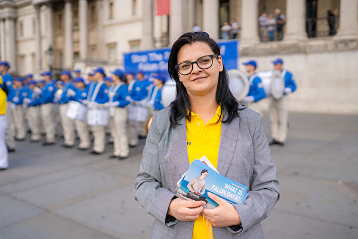

9月1日上午，来自摩尔多瓦共和国的法轮功尤利娅•伊霍芙（Iulia Iovv）在英国伦敦著名的特拉法加（Trafalgar）广场向当地民众讲述真相。

【大纪元2019年09月01日讯】（大纪元记者启心英国伦敦采访报导）2019年是全世界法轮功学员和平反迫害20周年。经常有人问，中共为什么要迫害法轮功？那么请倾听这些来自东欧国家学员的心声吧。

从东欧国家来的法轮功学员，有的曾饱经前苏联共产主义的肆虐，面对如今中共对法轮功学员的迫害，他们更清楚地认识到共产国家邪恶的本质。他们努力地在各自的国家中讲述真相，用真诚的态度和坚毅的意志感动着世界。

来自34个国家、1200多名的法轮功学员参加了在伦敦召开的2019年欧洲法轮大法心得交流会，其中尤利娅•伊霍芙（Iulia Iovv）是唯一一位来自摩尔多瓦共和国的学员。

“大法是我这一生都在寻找的生命的意义”，尤利娅•伊霍芙说，“我一直都知道我的一生是有使命的，然而年少时，我还不知道自己的使命是什么。”

修炼三年多的伊霍芙满怀激动地分享了她对大法的感恩，她说大法让自己终于找到人生的真正意义。“直到我找到了大法，我才知道了我的使命。每一天当我在拯救那些珍贵的世人，我的内心感受到前所未有的充实。”

伊霍芙说：“现在我要做的就是完成使命，兑现自己史前的承诺，真正按照‘真、善、忍’原理去行动，归正自己，同时尽最大努力讲真相救度众生，因为这是这个世界上最重要的事情。”

寻获生命真谛的伊霍芙是幸运和幸福的，然而法轮功遭到中共的迫害，伊霍芙要完成她的使命，道路上布满荆棘。

“在我们的国家中，如果你想说发自内心的话，想要做个符合‘真、善、忍’的好人，你周围的人却不会理解你，他们会认为你愚蠢和懦弱，那是因为共产主义仍在扭曲着人们的心灵和思想。”

摩尔多瓦共和国是东欧的内陆国家，曾经一度为前苏联统治的社会主义国家。东欧剧变后，1991年摩尔多瓦才成为如今独立的议会共和国。然而当今的摩尔多瓦仍然受到共产主义余毒的侵害，很多摩尔多瓦人脑中仍然残留着共产主义式的思维方式。

“摩尔多瓦的媒体几乎都在转载中共的虚假谎言。我知道我们政府中的一些政客和中共使馆保持着紧密的联系。很多政客受到中共的贿赂，被邀请到中国免费旅游。”

2010年摩尔多瓦当地法轮大法协会被强行取消，在人口两百多万的摩尔多瓦，法轮功学员仅有不到20人。他们心怀着对大法法理的坚信，而奔走呼吁，尽一切努力唤醒这个社会的人们的良知道义。

摩尔多瓦的法轮功学员们将本国的司法系统代表告上欧盟法院，控告他们无视欧洲法律，对摩尔多瓦法轮功学员做出的虚假和不公的对待。

伊霍芙坚定地说：“我们决不允许法轮大法学员被贴上虚假的标签。”几年来的努力终于换来摩尔多瓦民众的关注，支持的声音开始奏响，2019年大选，摩尔多瓦也迎来一位保持传统道德的国家总理，一改以往亲中共的政治风向。

今天在伦敦街头，伊霍芙用她的经历讲述着中共和共产主义对世界的侵蚀与危害，她想要提醒人们传统和道德才是人类未来之路。“道德才能是人类真正的价值，才是当今社会真正需要的。请保持道义良知，不要让你高贵的膝盖屈向邪恶，请永远不要忤逆神的选择。”

最后伊霍芙坚定地说：“我坚信真相一定会展现给世人，善良一定会战胜邪恶，时间会见证这一切。”

原文: http://www.epochtimes.com/gb/19/8/31/n11490640.htm

<h1 align="center"><b>美媒：法轮功群体在戈申找到自由</b></h1>

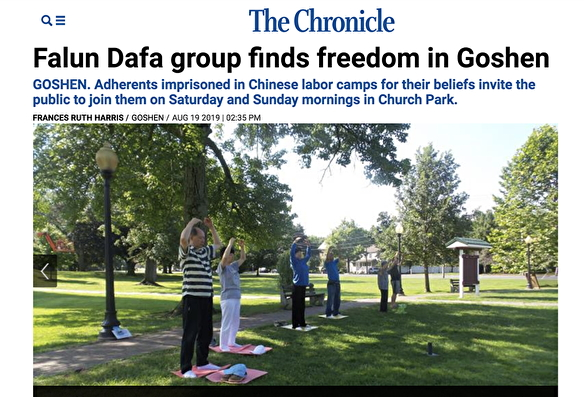

日前，纽约上州一家媒体《编年史报》（The Chronicle）报导了法轮功学员在戈申地区的一个公园炼功活动，并向读者介绍了法轮功以及法轮功学员在中国遭受迫害的情况。（网页截图）

【大纪元2019年09月03日讯】（大纪元记者施萍编译报导）日前，纽约上州一家媒体《编年史报》（The Chronicle）报导了法轮功学员在戈申（Goshen）地区的一个公园炼功活动，并向读者介绍了法轮功以及法轮功学员在中国遭受迫害的情况。
戈申位于纽约上州，在纽约曼哈顿北部约60英里处。这篇题为“法轮功群体在戈申找到自由”的文章中说，一群在中国曾被关押在劳教所里的信仰法轮功的学员周六和周日在教堂公园炼功，他们邀请公众参加。

文章介绍，法轮功是一个精神运动，包括打坐冥想和优美的功法。记者采访了从中国大陆逃出来的法轮功学员山尼•杨（Sunny Yang），他讲述了他本人和他的家人被中共迫害的经历。

山尼的母亲耿改彩（音译，Gai-Chai Gen）曾因信仰法轮功而在中国的劳教所里被关押两年，山尼本人也被关入劳教所，他们被释放出来后又受到中共当局的监控。“整个国家就像一个大监狱。”山尼对记者说。

母子俩现在都居住在戈申，每周六和周日在戈申村的第一长老会教堂公园（First Presbyterian Church park）炼功。任何人如果想学都可以参加，这个功法从网站上也可以找到。

该文章还介绍了中共镇压法轮功的罪行以及法轮功学员的和平反迫害运动。记者引用了前美国大使和“自由之家”（Freedom House）副主席帕尔默（Mark Palmer）的话说， “我认为法轮功是一个当代亚洲最伟大的精神运动，他们的勇气与重大意义没有任何人可比拟。”

文章中说，因为1999年修炼法轮功的人数达到1亿，所以这个从来没有暴力和恐怖主义历史的，也没有组织阶层的团体，只因为人数众多就被共产党视作威胁。到目前为止，数百万中国人因为修炼法轮功被绑架、拘禁、折磨、剥夺工作、开除学校以及失去家园；根据明慧网报导，已经有超过8万个酷刑折磨的案例以及数千死亡案例记录。

文章最后介绍了法轮功的宗旨以及主要内容等，并附上了法轮功信息中心网址：FalunDafa.org。

原文: http://www.epochtimes.com/gb/19/9/3/n11495010.htm

<h1 align="center"><b>生命可以选择</b></h1>

【明慧网二零一九年八月二十九日】多年以前看过一部经典的电影《辛德勒的名单》，作品讲述了二战时期德国商人辛德勒用智慧保护大批犹太人免遭杀戮的故事，这是一部感人至深的电影，为我们展现了人性的善，在重重压力下生命的选择和对生命的敬畏。结尾的一段情节尤其令人动容：主人公辛德勒将他工厂里的犹太人全部集中起来，告诉他们战争即将结束，他们可以回家和亲人团聚，同时告诉看守他们的士兵，他知道他们的上级下达了杀死这些人的命令，但他诚恳的希望他们恪守做人的良知，不当刽子手，士兵们被辛德勒的真挚和善良感动，纷纷放下武器转身离开。 
这个情节告诉我们，虽然军人的天职是服从命令，但这并不绝对，因为所谓的命令有可能是违背天理和做人良知的，在这样的时候，作为个体的人是可以有选择的，电影中的士兵做出了正确的选择，其实也是选择了自己的未来。

和平时期，军人的作用被淡化，警察的作用和职责显得很突出。在专制的国度里，政权尤其强调要绝对的服从，其目的就是为了维护其统治，以便能最大化的压榨人民，满足权贵阶层的私利，但人依然是可以选择的，这个选择不是为了别人、恰恰是为了自己。

获得奥斯卡多项大奖的电影《窃听风暴》讲述了一个秘密警察在执行窃听任务的过程中良心发现保护了持不同政见的作家，在暴政被解体后避免了被清算的故事。

东西方同理。记得有一部在大陆风靡一时的小说叫《便衣警察》，主人公作为一个警察没有积极执行上级的邪恶命令，尽自己的能力保护了善者，最后得到了好的结局。

当然也有反面的例子，还是文革，这场运动结束后几百个积极参与的军警被拉到云南秘密处决，这个结局就是他们自己选择的，不止是文革，中共建政以来的历次运动中都可以找出无数这样正反两方面的例子。

一九九九年七月二十日开始，中共恶首江泽民发动了对修炼「真、善、忍」的法轮功民众的疯狂迫害，这场迫害集中共历史上所有的邪恶因素于一身，至今没有停止，参与其中的人员，再次面临生命的选择，是积极参与、绝对服从，还是把枪口抬高一厘米，在不得不执行恶法的情况下尽可能的恪守良知，保护善者。这个选择关乎生命的永远。人间是善恶并存，两种选择的人都大有人在，明慧网上已经有许许多多这样的例子，在此不重复。

写到这里，我只是想说，作为个体的生命，无法改变天象，但在天象下是可以有选择的，如同春天来了，到了播种的季节，可以选择努力的耕作，也可以选择三天打鱼两天晒网，而到了收获的季节最终的结果怨不得任何人。在这场迫害中，生命也是同理，其实选择的标准也很简单，就是对善恶的评判和自己内心良心的坚守。

原文: http://big5.minghui.org/mh/articles/2019/8/29/392031.html

<h1 align="center"><b>多少老人正在遭受红魔的迫害、蹂躏？</b></h1>

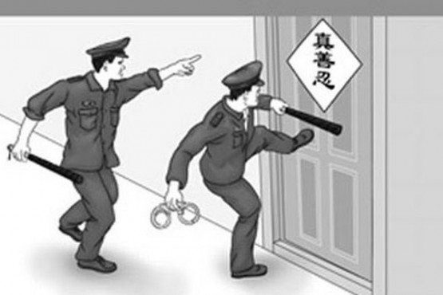

【大纪元2019年08月27日讯】据明慧网近日报道，中共对老年法轮功学员冤判的案件不断发生，许多年过花甲、古稀的老人被冤判重判入狱，给他们的家人带来无尽的痛苦。下面列举几个近期发生的案例：

四川泸州市工商局干部梁文德女士，二零一五年十二月二十五日早上在家门口被绑架，被非法判刑五年零六个月，于二零一九年六月二十四日在四川成都龙泉女子监狱被迫害致死，终年六十四岁。梁文德先后被中共非法囚禁十二年。

黑龙江省哈尔滨市79岁的法轮功学员孟红，二零一二年五月二十二日在黑龙江大学发放法轮功被迫害真相资料时，被非法抓捕、抄家，不久被南岗区法院非法判刑7年。由于年龄过大，被取保在家中；二零一三年三月二十七日被审判长文莉荣及警察突然闯入家中，劫持到黑龙江女子监狱至今六年多，于二零一九年七月二十六日在非法关押中突然离世。

辽宁朝阳市现年七十二岁法轮功学员王孝芝老太太，曾身患绝症不能自理，修炼法轮功后重获新生。老人在把亲身感受到的法轮大法美好告诉给人们时，被中共警察绑架，被朝阳市龙城检察院、龙城法院以莫须有的罪名枉判五年，于二零一九年三月十八日被劫入辽宁女子监狱。

安徽合肥市六十四岁的法轮功学员章欣宏，五月三十日被合肥蜀山区法院非法庭审，近期被非法判三年四个月。这是章欣宏第三次被非法判刑，他在二零零一年被浙江省温州市鹿城区法院非法判刑十年，二零一零年五月初又被绑架、非法判刑四年半。

广西壮族自治区桂林市荔浦县四位老年法轮功学员二零一九年五月被非法判刑：七十一岁的潘梦芬被非法判刑七年半，七十岁的罗桂芬被非法判刑七年，五十三岁的姚德焕被非法判刑八年，五十九岁的黄穆清被非法判刑三年，六十岁的曾凤玲被迫害致乳腺癌晚期，没有宣判。

黑龙江省大庆市法轮功学员吕观茹，六十七岁，原大庆石油管理局房建公司职工，二零一九年七月遭中共法院非法判刑七年，于七月三十日被劫持到呼兰监狱。

黑龙江省哈尔滨尚志市67岁的法轮功学员杜桂英，二零一九年七月被阿城市法院枉法冤判四年。杜桂英和她丈夫王德金在二零零四被尚志市法院枉法冤判四年，王德金在狱中被迫害至痴呆，现如今生活不能自理。

据明慧网统计：2019年7月份，8名65岁以上老年法轮功学员被非法判刑。106名65岁以上老年法轮功学员被绑架，至少有124名65岁以上老年法轮功学员被绑架和骚扰，年龄最大的90岁。中共对信仰真、善、忍的老人们的残酷迫害，凸显了中共丧尽天良、灭绝人性的邪灵本性。

尊老爱幼是中国古老的传统美德，古人提出「老吾老，以及人之老；幼吾幼，以及人之幼」，「百善孝为先」，守孝悌，举孝廉，并把它作为治理社会的准则和做人的道德规范。

孔子曰：「……五十而知天命，六十而耳顺，七十而从心所欲不逾矩。」传统的中国老年人因为其智慧和经验，自尊和仁厚，是社会中最受人尊敬的群体。

清朝康熙帝曾经两次在畅春园和干清宫举行千叟宴，宴请65岁以上蒙、满、汉文武大臣以及致仕人员达千人以上。干清宫的两次筵席上，康熙与赴席老人们飞觞饮宴，皇子、皇孙们侍立观礼，并为老人们斟酒。为纪念这两次盛会，康熙帝即席有赋《千叟宴》诗一首，并命大臣们「赋诗记事」。

如今的中共不但不能尊老爱幼，反而对老人们横加迫害、惨无人道、丧尽天良，把中华民族承传数千年的优良传统破坏殆尽，上述对老年法轮功学员的残酷迫害的案例就是一个真实的明证。

中秋节又要到来了，在这合家团圆的时刻，在家家都在准备置办节货的时候，那些将他们合谋构陷判刑的法官、检察官、警察们，那些正在监狱中酷刑逼迫他们放弃信仰的狱警们，你们可曾想到这些被冤判的法轮功学员及他们的家人们是如何度过这痛苦的日日夜夜？古语说：人心都是肉长的，你们是什么样的心？「与人方便，自己方便。」、「但行好事，莫问前程。」奉劝你们别再做这些缺德造孽的事情了，早日悔过自新，为自己的及家人留点儿后路吧！

据新唐人北京时间2019年08月23日讯，今年8月22日，是联合国设立的首个「国际宗教信仰受迫害者纪念日」，在全球第一个「国际宗教信仰受迫害者纪念日」这天，联合国安理会举行非正式会议，由波兰、英国、美国、巴西、加拿大和约旦等国共同举办，关注宗教少数群体在暴力冲突中的安全保障。

波兰外交部长查普托维奇：「全球的宗教自由状况令人震惊，非常糟糕。据估计，世界上有三分之一的人口正在遭受某种形式的宗教迫害。」其中，中共对法轮功的迫害是最严重的，正在引起举世关注！

原文: http://www.epochtimes.com/b5/19/8/27/n11479950.htm

<h1 align="center"><b>大山里的少年幸遇大法洪传</b></h1>

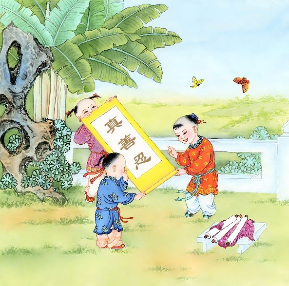

【明慧网二零一九年八月二十五日】我家住在西南，那里山连山，每一个村庄都被山环绕着，我们村就是这十万大山中的一个村庄，我是一九九八年走入大法修炼的，那年我九岁。
两、三岁时，家人常发现我屁股、腿上有淤青，一次，我整个左腿肿胀青紫，妈妈带我去市儿童医院检查，医生诊断为血友病，自身先天缺乏凝血八因子，外伤伤口会数月流血不止，走路或运动都会造成关节肌肉血管破裂、内出血、肿胀压迫关节肌肉造成剧痛，长久会导致关节变形，肌肉萎缩，如果是内脏或颅内出血，连抢救的必要都没有了，俗称的「玻璃人」，磕着碰着摔着都有生命危险，这是种无法治愈的病，医生让我出院回家了。

回家后，幼小的我成了「药罐子」，饱受病痛的折磨，关节肌肉的剧痛常常几天十几天才能缓过来，一到冬天，鼻子就流血不止，一整个冬天，有一两个月都在流血，堵上左边鼻子，从右边流，两边堵上，就从嘴里流，换牙时，早上起床，枕头上全是血，眼睛耳朵也会出血，有时还会便血尿血，被小刀不小心划伤手指，数月不能愈合，一直流血，流血太多，要跑医院输血，脚关节肿痛时，不能行走，上学只能妈妈背我去，放学再接我。整个家庭都被我的病所累，爸爸累急了，就发火，妈妈偷偷掉眼泪，去学校给我请假的路上，晕倒过，家里少见欢笑。

小学二年级暑假，听说三外公学炼了法轮功，多年的疾病都炼好了，爸爸送我去三外公家，跟三外公学炼法轮功，去的路上，我一直在想，我不能剧烈运动，怎么炼功啊，作为小孩子的我以为炼功就像练武术那样。当晚跟随三外公炼功，发现不是我想的那样，五套功法是缓、慢、圆的，很适合我炼。

从此我跟随三外公进入了法轮大法的修炼，早上我们五点起来炼动功，白天我自己看书，吃过晚饭和三外公去他们村的学法点和大家一起学法，晚上五套功法一起炼。学法中，我逐渐明白了吃苦是在消我们生生世世欠下的业，炼功人没有病，痛苦能消去业，转化成德，炼功人要的就是德，心性多高功多高的法理。

我的身体也在发生着变化，走远路关节不会肿痛了，还能去爬山了，不小心划开的伤口血很快凝固，到冬天鼻子不会频繁流血了，偶尔流血，我知道是师父在给我净化身体，不用管它，很快就止住了。暑假结束回家，妈妈见证到大法的神奇，也走入了修炼，学法明法理后，妈妈一扫过去的抑郁担忧，身心轻松愉悦。家人也陆续走入大法修炼，整个家庭沐浴在得法的喜悦中！

一九九八年下半年，三外公和他们村学法点的同修到我们村洪法，在我们村学校旁的礼堂放教功录像，那天学校通知下午不上课了，放学的小学生们没回家，他们好奇的到礼堂看热闹，也跟炼起了功。第二次来我们村洪法，更多的人接触了大法，学功的人越来越多。

班主任在课堂上问起我炼功动作，校长也走入了大法修炼。短短几个月，我们村成立三个炼功点，一个是我家，一个在校长家，一个在村南边的同修家。有两个学员家有VCD播放器，每天播放师父的讲法录像，听讲的村民把堂屋挤得满满的。炼功后的人们身心受益，心性道德升华了，身体没病了，有的一人炼功，全家受益，不再为个人利益去争去斗，不再计较个人得失，能够为别人付出。看过师父讲法录像，不修炼的村民也知道做好人了！

感受到大法美好的学员们，自愿加入洪法中。我们这里是身处西南十万大山中的坝子，许多村子被大山包围，九九年经济还很落后，去洪法的同修们只能坐拖拉机、骑自行车，走过了好多村子，所到之处，受到村民的热情欢迎，有要留同修吃饭的，有要给同修送东西的，像见了亲人一样。大法所到之处，给人们带来幸福和希望，使当地道德回升，好人好事越来越多，给社会带来的巨大好处无法估量。感恩师尊将宇宙大法传度世人！感恩师尊慈悲苦度！

原文: http://big5.minghui.org/mh/articles/2019/8/25/391761.html

<h1 align="center"><b>吸取教训　不要步徐邦利的后尘</b></h1>

【明慧网二零一九年八月二十八日】（明慧网通讯员湖北报导）二零一九年中国新年期间，湖北省麻城市实验二小副校长徐邦利因癌症死亡，撇下妻女而去。
二零零七年，实验二小教师彭静因为坚持信仰法轮大法被麻城市六一零、国保大队、教育局绑架到武汉汤逊湖洗脑班迫害；教师程学开因为坚持信仰法轮大法被绑架到麻城市看守所关押。校长戴大明、副校长吴思权被株连迫害，就地免职，全市教育系统通报批评，大会作检讨。其后，徐邦利被调到麻城实验二小任副校长，先后分管教学和德育工作。

慑于中共邪党的淫威，为了保住自己的官职，在对待法轮功的问题上，徐邦利和妻子不听真相，与邪党保持所谓高度一致，积极执行麻城市六一零（后改称综治办、防邪办）和教育局的邪恶指示，迫害大法弟子，灌输谎言，毒害广大学生、家长及教师，犯下了很大的罪业，致使自己在任期内（二零一八年）得了膀胱癌，不得不离开工作岗位，去武汉大医院手术治疗。

但现代医学终究没能挽救徐邦利的生命，手术后癌细胞迅速扩散，他受尽病痛折磨，终于二零一九年初离世，成为永远的遗憾，结束了可悲的一生。

徐邦利是一个对邪党愚忠的典型。在工作中，他尽职尽责，兢兢业业。如果是在正常的社会制度下，应该是位好老师，好校长，但在中共邪党统治的大陆，他不听真相，自觉洗脑，将真相资料扔进垃圾桶。颠倒黑白是非，沦为中共毒害学生的黑手，这样的工作，做的越认真，造业就越深重。

例如：

1、不让炼法轮功的优秀教师上讲台，监视工作，不准评职称、涨工资、评优等；
2、要求各班班主任在教室内张贴麻城市610印发的反邪教挂历；
3、年年给学生发六一零和教育局印发的所谓《安全手册》，里面有诽谤大法的内容；
4、利用升旗仪式举办「反邪教启示录」，毒害四千学生；
5、在校园内设置诽谤法轮大法的展板；
6、每学期开学和结束时强制要学生和家长签名的「安全责任书」中也隐晦含有诬蔑大法的内容；

像徐邦利这样的受害者还很多，基本上每个单位都有。希望大家引以为戒，广开言路，兼听则明，了解大法真相，选择美好的未来。

原文: http://big5.minghui.org/mh/articles/2019/8/28/392010.html

<h1 align="center"><b>“中共是所有人噩梦”美智库主席吁解体中共</b></h1>

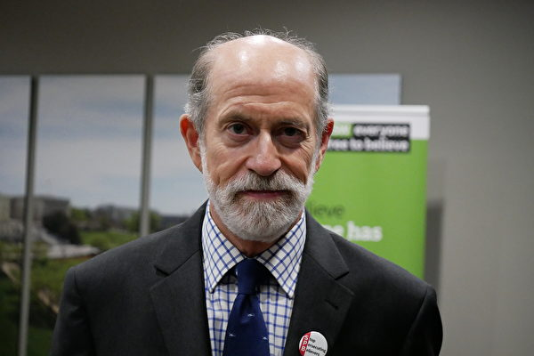

美国智库机构——国家安全政策中心（Center for Security Policy）的创始人兼主席盖夫尼（Frank Gaffney ）认为，认清中共本质，共同抵制中共，是当务之急。

【大纪元2019年08月18日讯】（大纪元记者李辰美国华盛顿DC报导）美国智库机构——国家安全政策中心（Center for Security Policy）的创始人兼主席盖夫尼（Frank Gaffney ）近日接受大纪元和新唐人电视台采访表示，中共不仅迫害法轮功等信仰团体，而且是整个人类的威胁。

他认为，认清中共本质，共同抵制中共，是当务之急。他呼吁，国际社会参与，共同解体中共。

盖夫尼先生（Frank Gaffney）是外交、国防及国家安全政策专家，目前担任“应对中共当前危险委员会” （Committee on the Present Danger:China）的副主席，并是一家电台的主持人。他曾担任里根政府时期国防部代理助理部长，也曾是《华盛顿时报》（Washington Times）的专栏作家和国家评论（National Review）网上杂志的编辑。

“我的心和法轮功学员相连”
今年正值中共迫害法轮功20年，也是法轮功学员反迫害20周年。盖夫尼在接受采访时说：“我的心和法轮功学员相连，和那些遭受共产党残酷迫害的人相连。”

“看到这么多中国人遭到中共的毒手，我的心情很沉重。 （中共）对法轮功学员、对藏人、对维吾尔人的迫害，是否还会加重？”

据不完全统计，北美明慧网突破中共的层层封锁、通过民间渠道核实：自1999年以来，四千多名法轮功学员被迫害致死。

他们中有的被活活打死，有的被电棍电击电死，有的被野蛮灌食插入肺部致死，有的被灌开水烫死，有的被打毒针当场死亡，有的被活摘器官致死，有的被活活冻死，有的被注射不明药物回家几天后去世……有的一家六口被迫害得只剩一人，有的夫妻双双被迫害致死，有的父子在相隔10天内被迫害致死……

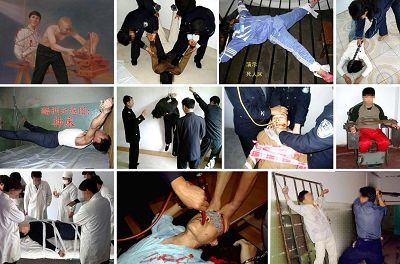

中共对法轮功学员实施种种酷刑。图为酷刑演示。

对于中共的残忍迫害，盖夫尼说，“我们应该采取怎样的行动？这些都是很大的问题。”

他表示，中共强摘法轮功学员等良心犯器官“是令人难以置信的野蛮行径”。他建议，美国政府应对此展开正式调查。

<b>中共给全世界带来巨大伤害</b>
 
“中共的脑子里灌了些什么？它给整个世界带来了这么大的伤害！” 盖夫尼说。

他表示，中共的迫害和伤害针对所有中国人以及整个世界，“它们（中共）到处实施技术（进行迫害），针对法轮功学员、它信仰者、异议人士、人权活动人士、律师。你知道，针对普遍的中国人。”

“中共害死了很多人，这一点是确定的。” “现在有3亿多人被中共迫害，包括基督教徒、法轮功学员、藏人以及维吾尔人。”

“我认为这是绝不能容忍的。我们试图在做的一件事是追究迫害者的责任。我们发起了一项名为‘拯救被迫害基督徒’（save the persecuted Christians）的活动，从而使他们为他们所做的、破坏人道主义的罪行，真正付出代价。”

<b>中共是所有人的噩梦 包括美国人</b>
 

盖夫尼说，“（中共）对所有人都是噩梦。”

“我认为中共有一个计划，是针对（整个）人类的，不仅仅是中国公民，或者其它国家的人，其中也包括美国人。它们（中共）的想法，就是要搞垮（他们）。

“也是出于这些原因，我们成立了‘应对中共当前危险委员会’，以便在美国提升认识，认识在中国都发生了些什么事情；认识在共产党的统治下，中国（中共）对整个星球都做了些什么。我希望，我们能够及时做到这一点。”

“应对中共当前危险委员会” 于2019年3月25日成立。在美国历史上，此类委员会一共组建过四次。第二个“应对当前危险委员会”曾帮助里根政府解体苏共。

盖夫尼表示，中共是美国最大的威胁，“我认为，中共是美国面临的最严重威胁。坦率地说，对世界其它地区也是一样，当然眼下是对中国人民（威胁最严重）。”

他认为，认清中共的本质，共同抵制中共是当务之急。

“共产主义意识形态和所有极权一样，毫不珍惜人的生命，特别是对那些被认为是国家的敌人、中共政党的敌人⋯⋯这绝对是共产主义固有的。它们为达目的不择手段。”

“坦率地说，包括（中共）党员在内的，任何人如果背离了党的阵线，如果成为领袖的反对者，无论这个领袖是谁，最坏情况下（这个人）可能会被判死刑，最好情况下也可能在劳教所服刑很长时间。”

“因此，这是一个恐怖的系统，（并且，）它的历史充满了恐怖。”

“他们（中共）已非常明确地表示，想要统治全人类，而且已经在这么做了。所以，我认为是到了弄清这一威胁的本质的时候了。确定共同的目标，抵制它（中共），这是当务之急。”

<b>共同终结中共</b>
 

盖夫尼说，美国会站在中国人民的一边，“我坚信美国会和民众站在一起，不会和迫害者站在一起，无论是在中国，还是世界其它施加迫害的国家。”

他建议，有必要共同努力，共同“终结中共”，“我们将尽最大可能予以鼓励，我们可以主动参与、促进结束中国共产党，这对中国民众来说是福音，对我们和世界来说也是如此。”

“我认为凭借神的恩典，我们会有幸看到最终将发生一些非常重要的变化。”

原文: http://www.epochtimes.com/gb/19/8/18/n11461393.htm

<h1 align="center"><b>请关注中共对法轮功的迫害</b></h1>

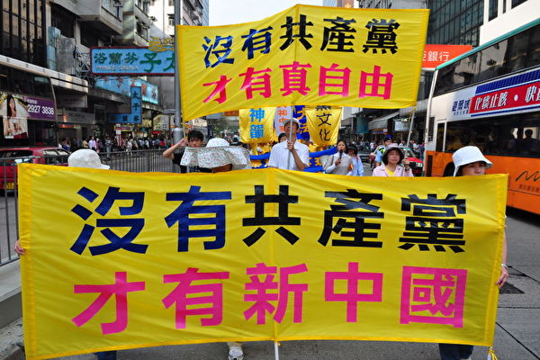

多年来的呼吁请愿都没能阻止中共残酷迫害法轮功，人们最后明白，只有解体中共，才能停止迫害。

【大纪元2019年08月22日讯】据明慧网二零一九年八月十五日报导：黑龙江省佳木斯法轮功学员杨胜军，二零一九年八月二日与八十一岁的母亲在家被警察入室绑架、抢劫，母亲当天晚上被放回，杨胜军遭绑架九天后即被迫害致死。

四川省巴中市巴州区法院对九名法轮功学员做出枉法判决，其中七位是六十岁以上的老年人，最大的89岁。89岁高龄的法轮功学员张新伟白发苍苍，双手扶着拐杖，走上法庭，用自己的亲身经历，讲述了法轮功教人向善、祛病健身有奇效的故事，令很多旁听人感动。82岁的法轮功学员张明朗是检察院退休职工，谈了自己修法轮功后的变化：过去一身病，修炼后身体变好了，主动做好事，多次捐款扶贫，修炼法轮功既净化了身体、又净化了心灵的事实。

二零一九年八月五日，太原市五位女性法轮功学员被太原市迎泽区法院非法庭审，最大的78岁。在法庭上，贺爱华和陈玉花被铐着手铐和脚镣，张凤英由女儿搀扶着，任清华坐着轮椅被家人推着参加了开庭。这次被构陷、非法开庭的法轮功学员都是曾经身患重症、绝症，修法轮大法得以延续生命的善良老太太。

长春市南关区法轮功学员王建华，因修炼法轮大法，二零一九年五月十日和八月九日，合计十五分钟的两次非法庭审，被南关区法院冤判四年，勒索现金一万元。法庭上未公布任何参与庭审人员的名字。
山东青岛法轮功学员高铭霞，于二零一八年五月份被中共邪党借「峰会」之名绑架，后来一直被非法关押在青岛即墨青岛第二看守所。今年七月二十四日，高铭霞被青岛市市北区法院非法判刑九年。

深圳市善良的杨波和身为外企高管的妻子肖颖，经过一年十个月的非法关押，分别被非法判刑八年和二年。

杨波，是一位正直善良、平和热心的人，从小就乐于助人。妻子肖颖，是某国际知名外企深圳总公司的高管——财务总监，学法轮功时间还不长。

二零一七年十月七日，深圳市国保警察、高新派出所警察，用电钻钻坏二道铁门，破门入室，绑架了杨波和肖颖，他们十三岁的女儿也被警察绑架到派出所，被警察讯问。几小时后，孩子被亲属接回。
杨波的母亲耿良君呼吁释放善良的儿子、儿媳.。

据明慧网信息统计，二零一九年七月份，至少愈千名法轮功学员被中共迫害，其中被非法判刑52人，庭审52人，绑架923人，骚扰289人，批捕及构陷到法院、检察院的66人，强制送入洗脑班42人，敲诈勒索法轮功学员现金386,098元（其中警察抢劫勒索现金
222,098元，法庭非法罚金164,000元）。七月份又有7名法轮功学员被中共迫害致死。其中4名法轮功学员是在中共的看守所、监狱非法关押期间被迫害致死的，年龄最小的仅45岁。

二零一九年一至七月份，中共警察至少绑架3080名法轮功学员及亲属。绑架最严重地区有河北省、四川省、山东省、辽宁省、吉林省、广东省等。

二零一九年一至七月份中共非法判刑421名法轮功学员。非法判刑最严重地区有山东省、黑龙江省、河北省、吉林省、辽宁省等。
据明慧网报道，仅在二零一九年上半年中国大陆至少有45名法轮功学员在迫害中含冤离世。

据明慧网的不完全统计，截止2019年7月10日，有86,050名法轮功学员被绑架，28,143人被非法劳教，17,963人被非法判刑，18,838人被绑架关入洗脑班，809人被绑架进精神病院，各种迫害案例518,940起。

截止2019年7月10日，至少有4,322名法轮功学员被迫害致死。这远远不是实际发生的迫害致死案例的全部，只是实际发生案例的冰山一角。因为中共竭力掩盖其犯罪事实，太多的案例仍然被掩盖，尤其是大量的活摘器官的案例，因为中共焚尸灭迹，仍然没有被揭露出来。
今年七月份是中共迫害法轮功二十周年，从明慧网、大纪元的报道中得知，二十年来中共对法轮功的迫害惨绝人寰、罄竹难书！就在中共迫害法轮功二十周年，举世关注法轮功人权之际，中共对法轮功的迫害丝毫没有缓解，愈显末日疯狂，凸显中共邪灵的邪恶本质。

从佳木斯法轮功学员杨胜军遭绑架九天后被迫害致死的迫害案例及二零一九年中国大陆法轮功学员遭受迫害的事实，让我们进一步认清了中共邪灵的嗜血本性，看到了尽快制止这场迫害刻不容缓。

呼吁国际社会关注日益恶化的法轮功人权，利用各种方式对中共政权施压，加速解体中共，尽快结束这场惨无人道的邪恶迫害！

原文: http://www.epochtimes.com/b5/19/8/22/n11470026.htm

<h1 align="center"><b>“真、善、忍是我们应该遵从的道德和价值”</b></h1>

【明慧网二零一九年八月二十一日】（明慧记者周文英法国巴黎报导）二零一九年八月十七日星期日下午，法轮功学员照常在埃菲尔铁塔的人权广场，进行了法轮功功法展示和讲真相的活动。经过人权广场的来自世界各地的游客，很多人接过了法轮功学员递上的真相传单，上面有对法轮功的简介和法轮大法网站网址。有些人对炼功表现出极大的兴趣，当场学炼五套功法。很多人签字支持法轮功反迫害。还有来自大陆和香港的游客，在法轮功学员的帮助下，当场三退。游人离开时对法轮功学员说：“我支持你们！”“多保重啊！”“加油！”

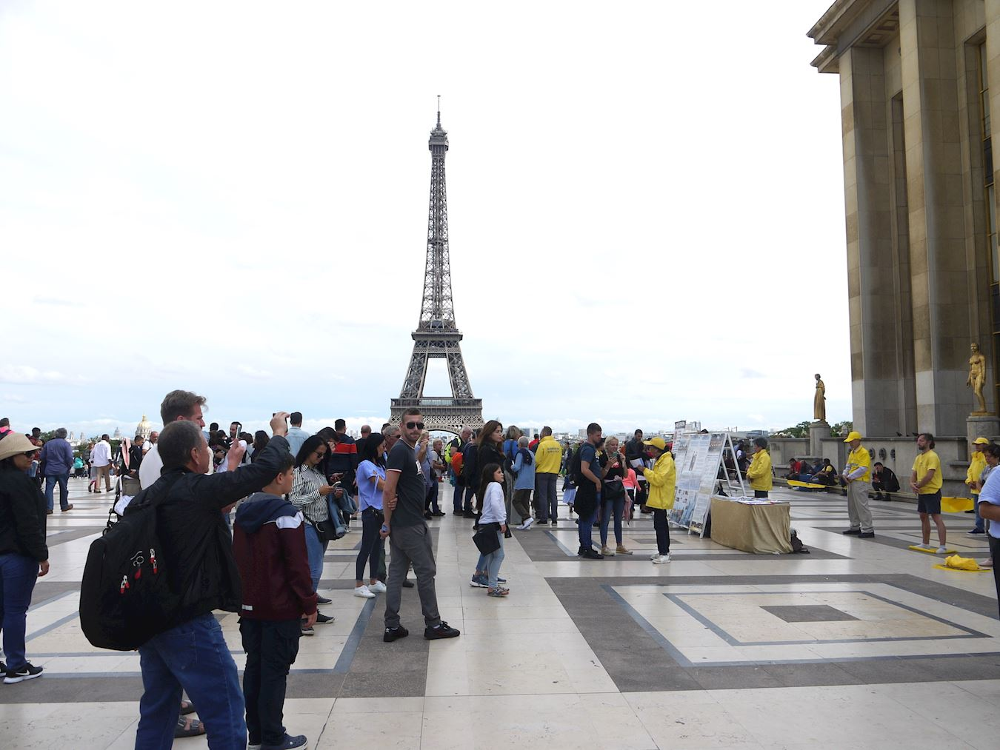

图1：八月十七日星期日下午，法轮功学员在巴黎人权广场，进行了演示法轮功功法和讲真相的活动，吸引各国游人。

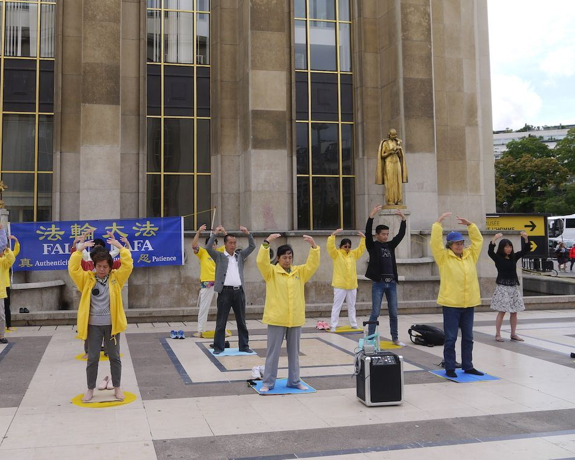

图2：法轮功学员集体炼功

德尼斯•莫拉莱斯（Denise Morales）是委内瑞拉一所艺术大学的艺术教师。她在征签表上签字后，面对正在炼功的法轮功学员，双手合十，站立许久。她说：“这很可怕，这是灾难，在世界的一个确切的地方和时间，进行种族的灭绝。针对对人类有益的功法，这种种的迫害，所有的这些行径，都是野蛮的行为。我很震惊地得知在中国所发生的这一切，对这样一种美好的身心修炼的功法的禁止和打压，也很震惊地知道，（中共）很邪恶地利用被关押和迫害的人的器官，来牟利，而且是一个政府在操控，这真的是……我没有语言来表述。我的心在哭泣。”

她赞扬法轮功学员：“我祝贺你们，和平的举动，在这里——全世界的游客经过的地方，开创一个和平的空间，安静地炼功，呼吁良知，你们做得很棒！”

莫拉莱斯女士认为：“真、善、忍是我们应该遵从的道德和价值，是我们应该修炼的价值，以这些价值为基础，如果我们能知道和同化这些价值，可以说我们没有白来这个世上一趟，我们来在这个世上是有目的的。”她确认了炼功点的时间和地点，准备学炼法轮功。

露茜玛丽亚（Lucie Maria）原籍墨西哥，来自加拿大。她表达了自己的想法：“我坚信任何人都不能没有理由地被迫害，每个人有权利自由地选择自己的生活方式。我签字，因为我不同意（中共）！”

巴黎音乐人士若赛夫（Josephe）先生：“中国政府压制百姓，压制自己的人民，关押民众，损害全人类，应该停止了。西方政府应该对中共施加压力，那里没有自由，没有言论自由。”

法国工程师米歇尔：“在我们国家，因为经济利益，媒体少有报道，要多谈这方面的事，人们知之甚少。”

雷杜阿纳•拉比亚（Redouane Rabia）和太太及一岁的孩子来到人权广场，他说自己一直以来就对中国的文化很感兴趣，曾经练过武术，当场他很自然地学炼了五套功法。第一次炼功，炼完之后非常舒服，他感受到身心舒适，平静，头脑清晰，几个月以来的压力突然消失了，使他从精神压力下解放出来。他很高兴，决定要修炼法轮功。

原文: http://big5.minghui.org/mh/articles/2019/8/21/391738.html

<h1 align="center"><b>法轮大法台湾青年学子营 感受超强正能量</b></h1>

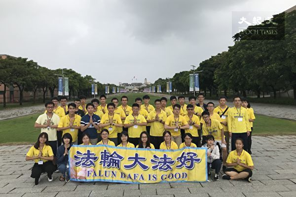

集体感谢师尊并恭祝师尊中秋节快乐。

【大纪元2019年08月21日讯】（大纪元记特约者刘益廷台湾云林报导）台湾廿余所大专院校的部分法轮功学员，2019年8月16日到8月18日于环球科技大学举办为期3天2夜的“法轮大法青年学子营”暑期活动。学子们举行密集大量的学法交流会，分享他们在法轮功修炼中的美好体验。

环科大学生、承办者沈孟贤表示，活动目的是希望透过学法、交流促进全台修炼法轮功的学子了解修炼的意义，在比学比修中，互相学习更多真诚、善良的为人处世态度，将真善忍之道德精神融入于生活实践中，在校园中发挥正向的影响力。
众多青年学子当中大多数都谈到在这个场当中感受到相当强大的正向能量，在生活中遇到困难、矛盾、过关当中，依据法轮大法真善忍的指导，很快就能找到出口，走出逆境，感受到法轮大法的超常与美好。

此次“法轮大法青年学员交流营”由社团法人台湾法轮大法学会办理。沈孟贤表示，“法轮功教导人以真、善、忍作为待人处事的标准。更多真诚、善良的为人处世态度，相信对世界来说会更加的美好。”

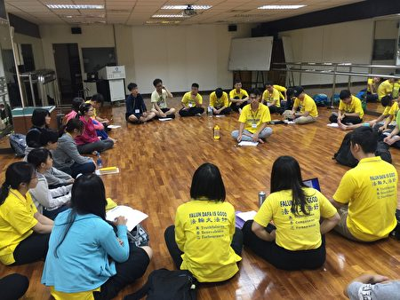

青年学子学法后集体交流谈体会。

据了解，台湾的大专院校包括台大、清大、交大、成大、台科、云科、中兴、中正、中央等将近20所大学皆有法轮功的相关社团。对于年纪轻轻，就走入修炼的同学来说，他们平常的生活与一般学生大致相同，但每天会安排时间，学习法轮功著作《转法轮》，此外因当今中共政府对法轮功信仰持迫害、抹黑的态度，所以也会利用假日或课后时间到中国游客常“出没”的地带，例如台北101大楼前广场、西门町等观光胜地，举展版、揭露中共对信仰迫害的现况，盼中共政府能早日停止迫害。

目前就读中国医药大学的王琼仪，今年第一次参加交流营活动，她在受访中表示，来到营队前多认为，炼法轮功除了自己之外，大多是中、高龄层人士居多，没想到台湾的年轻修炼者数量也不少。

王琼宜分享，自小就跟妈妈一起修炼，但有一大段时间远离修炼，在生活中遇到很多困难、矛盾、挫折，在无助中迷失了方向，也许是小时候曾埋修炼的因素，有一天突然想起大法，再度拿起《转法轮》，再开始炼功，身心变得很平静祥和，再度感受到大法的超常和美好。”

她说，在社会中，当一位好人中的好人，过程中的心性必然存在；法轮功对她来说是人生方向的一个重要指导棋。

对于中共政府当今仍对法轮功团体进行严厉的打压与迫害，感到非常难过。她更提及：“身为青年学员，对于法轮功反迫害在这个（网路媒体）时代，应更擅于厘清反迫害诉求与表达，应多站出来为让自己所受益良多的功法发声！”

营队中，还有另一位来自日本的青年学员杨雪莹，从小在中国大陆出生、长大，但自从13岁那年起，因中共迫害缘故，全家搬迁到了日本定居。大学毕业两年后，在几个月前透过工作签证，来到台湾的民间补习班担任日语教师。

年仅27岁的杨雪莹，在营队中分享许多修炼心得与体会，她谈到，在这次营队能有缘与同为修炼者的台湾各地青年学员，一起生活、相处，时常感受到一股很正的能量场，特别是大家在一起的时候。她也强调，非常珍惜台湾的生活环境，以及信仰自由的享有，盼生在幸福台湾的年轻法轮功修炼者，能多让自己在修炼道路上更加坚持不懈。

目前在工研院工作的徐晟桓分享他在炼功中超常的感受，他说，“在炼第五套功法时，最有考验。但发正念时莫名的感受到温暖、被满满能量包围的感觉。尤其跟很多同修一起在发正念的时候。”

目前就读国防大学研究所的林同学表示，在学校也有研究与实际参与心理学活动，最大不同之处是，一般心理治疗是病患之间负面能量的交流，互相之间彼此的安慰，而这边的交流完全是非常正向，那种感受是满满的能量，让人头脑非常清晰，完全正向思维，感受非常超常。

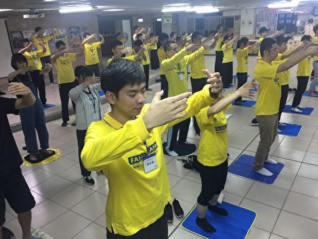

青年学子早上集体晨炼第二套功法 法轮桩法。

就读军校一年级的吴同学分享，由于在军中没有太多时间炼功学法，参加这次活动，在炼功中感受到法的力量，师父再度帮他净化身体，他说，“炼第二套功法时，以前常流鼻血的症状突然出现，当下就想没事，师父在帮我消业呢！这是在考验我对法坚不坚定！我不能被这个干扰，我要跟大家一起炼功，这个念头一起，血就停了。”

“炼功当下就感觉手麻麻的，有通电的感觉，整个人是被暖暖的能量包围着，很舒服，真的很神奇。”

参与这次活动的同学多数都表示受益良多、能量满满，感受到法轮大法超常与神奇感受，真是不虚此行。

原文: http://www.epochtimes.com/gb/19/8/20/n11465859.htm

<h1 align="center"><b>美共和党全国委员会通过决议
谴责中共强摘器官</b></h1>

【明慧网二零一九年八月十四日】美国共和党全国委员会（The Republican National Committee，RNC）八月二日全体一致通过一项决议案，谴责中共强摘法轮功学员等良心犯器官。

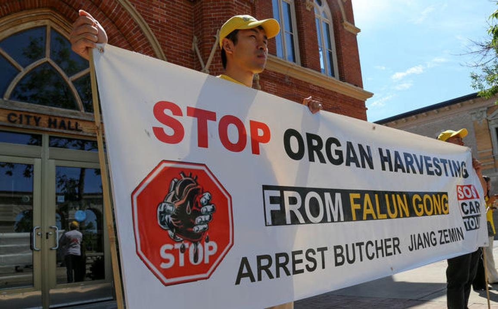

共和党全国委员会委员、前加州共和党主席肖恩﹒斯蒂尔（Shawn Steel）是这一决议案的发起人。斯蒂尔在接受英文新唐人记者霍莉﹒凯勒姆（Holly Kellum）专访时表示，希望全世界了解中共强摘人体器官的行径，他说，「我们希望这个世界了解这个持续的人权问题。」「这是世界历史上最邪恶的行径之一。」

斯蒂尔介绍，他第一次听说中共强摘器官的事情是几年前在芬兰首都赫尔辛基（Helsinki）旅行的时候，但是他当时并不相信。

「甚么政府会参与从活人身上摘取器官，并将其售卖？」这些器官每个可卖到高达数万美元。

他说，最近英国独立人民法庭公布的调查结果，促使他发起这一决议案 。「这是不可原谅的罪行，将被作为人类历史的最低点（最黑暗点）而被铭记。」

六月十七日，调查中共强摘器官的国际独立人民法庭在伦敦公布宣判结果，判定中国（中共）活摘良心犯器官的行为已存在多年，并仍然存在，法轮功学员是器官供应的最主要来源。法轮功是以「真、善、忍」为原则的佛家修炼功法；中共前党魁江泽民因妒嫉法轮功修炼人数太多，在一九九九年下令血腥镇压。

斯蒂尔说，「如果没有白宫的认可，这个决议案不会被批准。」他表示，希望民主党全国委员会也能通过同样的决议，谴责中共强摘器官。

以下为决议案的中文翻译：

鉴于，在二十年的大部份时间里，中共政权一直卑鄙地从被监禁的囚犯身上强摘器官用于移植，据信这些人是「良心犯」，是西藏佛教徒、基督徒和法轮功学员；

鉴于，人们正在涌入中国进行「移植旅游」，其中急需移植的人前往中国支付数万美元进行器官移植。中国每年进行六万至九万例移植手术，这个数字远远超过中国自愿捐献器官的数量；

鉴于，中国医院能够在两周内安排主要器官的移植，器官「捐赠」存在邪恶的因素；

鉴于，相比之下，美国高度发达的器官捐赠计划要求器官接受者被列入等待名单，等待器官移植的人要等待数百天才有可能进行移植，其确切日期无法预测；

鉴于，据信，自二零零零年以来，已有数十万人被谋杀，他们的器官被强制摘取；

鉴于，二零一九年六月，独立中国法庭宣布了中共政权数十年来从良心犯身上强制摘取器官的调查结果；

鉴于，加拿大国会和欧盟议会，以及美国众议院外交事务委员会都通过决议，谴责从良心犯身上摘取器官；并且

鉴于，联合国特别报告员要求中共对移植手术所用器官的来源承担责任，世界医学会、美国移植学会和其它移植学会呼吁对中国医疗机构实施制裁；

因此决定：共和党全国委员会（RNC）强烈谴责中共强制摘取器官的行径； 并且

还决定，共和党全国委员会认为，中共强制摘取器官的行径是重大的侵犯人权行为。

原文: http://big5.minghui.org/mh/articles/2019/8/14/391460.html

<h1 align="center"><b>命运能改变吗？他钻研各种算命术有惊人发现</b></h1>

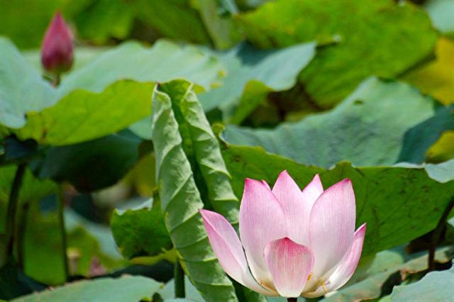

他钻研各种算命方法，却没有逃过命运的安排。最后终于找到了改变命运的法门。

我自小生长在乡下，由于当时生活普遍清苦，因此求神问卜是生活常事。远房舅舅是职业的乩童，外祖父是业余高手，而父亲是跑龙套偶尔客串演出。神怪之事对我而言早已司空见惯，童年时期我常阅读的课外书籍，就是中国神话故事或传说之类，脑中不免想象神仙之逍遥，兴起找神仙修炼之念。

国中年代巧遇同好，常一同研读经咒符法、武术典籍，或是彻夜漫谈神鬼之事。高中以后各分东西，唯一无法忘怀的是神仙大梦。

<b>探寻生命真理 开启算命之术</b>
 

我从小就一直在思考：人的命运是固定的吗？如果是固定的，人的一生是为了什么？努力或是随缘是否结果相同？有方法去改变吗？如果不是必然的，那要如何做才能一帆风顺呢？

我知道我要的不是「哲学」或「宗教」性质的「说法」，这答案必须清清楚楚交代一切，同时让人知道解脱的方法。于是我选择「算命术」来当做我探索命运的工具，自修自学来验证，是真是假，骗得了别人，骗不了自己。儿时同好与他的伙伴们都是「五术」的爱好者，藉由他们的帮助，我开启了探索之旅。

边学边算，不到三个月就有了准确度，那就从家人开始算起吧！我发现家人的运势不佳，于是告诫他们两年内不可以跟会或大笔金额来往，一切以保本为上策。结果会也跟了，也被倒了；钱也借了，也收不回来；收回来的部分又借给同一个人，再也收不回来了。

合伙做生意，本也不见了。我为此曾大发脾气，为什么他们明知故犯；这时我对「知命运可以趋吉避凶」的说法产生了严重的怀疑！

<b>姓名看人生 越看越真？</b>
 

后来为了孩子的即将来临，我开始专攻「姓名学」，因为「姓名学界」都说这占了命运的三成，「传子千金不如授其一技，授其一技不如赐子一名」，这可是件大事，于是花了整整一年的时间做研究。

皇天不负苦心人，只花了一些钱就学到了真诀，让我算命的功力突飞猛进。又历经两年的磨练，我已经能够在数分钟内藉由姓名知道这个人的一生。

朋友皆知我是半仙，遇有疑难皆来相问，举凡婚配、新生儿命名、考试、官运等等，这曾经让我自负了好一阵子，并且打算进一步研习其它科目：易经八卦、阳宅地理等，让自己成为真正的「大师」，但是我的心不久又失落了。

<b>算尽人生 也逃不过福祸</b>
 

算的准确反而让我有点恐惧，这不摆明了「命运之说」是真的。而且那些事我已经看到了，为什么逃不开呢？如果是这样，那所谓的「趋吉避凶」根本是不可能的，连那些所谓的「大师」也在命运之中。

接下来我开始研究最神秘的「玄学」，这大概是能解开命运之谜的最后方法了。 「玄学」包含两大部分：「神通」与「术法」。 「神通」是什么？说穿了就是特异功能，如能知道人的过去与未来的「宿命通」，这是最常见的。而「术法」就是大家耳闻的「茅山道法」「五鬼搬运」「符咒」「收惊驱邪」等等。

不知道的人以为他们是「神」的「发言人」，对之敬畏三分，但是我们看到这些神与人的「中间人」，绝大部分是在做「中介」收取佣金，处理的仍是不脱凡尘俗事，「玄」的只是方法罢了。

「花钱消灾」是否真的达到了目的呢？那拥有这种「技能」的「大师」是否可以比一般人容易「趋吉避凶」吗？答案依然是：「没办法」。我的舅舅是职业高手，一生为人消灾解厄、处理婚姻失和、寻人寻物、求神问卜、驱邪治病，神奇事迹不少，然而自己的儿子却遭车祸半身不遂，自己老年得「帕金森症」而死。

<b>山穷水尽疑无路 柳暗花明又一村</b>
 

走到此时已是「山穷水尽」，用外部的手法改变命运是不可能了，也许唯有「心念」变，命运才可能变。有哪一种学问可以改变人的心呢？看来只有宗教信仰的力量才有可能。正当我准备开始朝宗教发展时，一位同事偶然买下《转法轮》一书，尚未展阅就被我借读，从此以后我的一生被改变了。

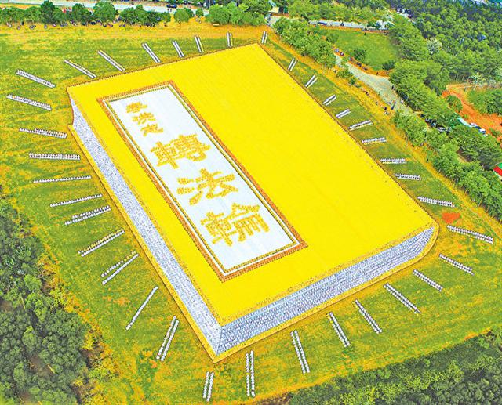

一位同事偶然买下《转法轮》一书，尚未展阅就被我借读。

天啊！我二十年来的疑惑都得到解答了！原来气功是为了修炼；宗教也是为了修炼；玄学、五术之学还是为了修炼！什么是「功能」、什么是「术法」、乩童现象的根本原因等等疑惑都得到了解答！

修炼原来是为了返回先天之本源；人的磨难是为了还业债，唯有修炼的人才能解脱；病的原理、气功现象、不同的时空概念，处处都是天机。

在书中也告诉读者高层次的道理，知道如何修炼去提高层次；如何排除不必要的干扰，指出种种不良现象与修炼中应注意的事项，使学员知所警惕，避免了弯路与死巷。除此之外，还有更多呢！我的亲友皆受惠于大法，每个人都彻彻底底的被改变了命运，每个人的修炼历程都充满了师父的慈悲。在以后的时间慢慢告诉各位。

──转载自「正见网」
原文: https://www.epochtimes.com.tw/n269414/

<h1 align="center"><b>见证生命的传奇　感恩法轮大法救度之恩</b></h1>

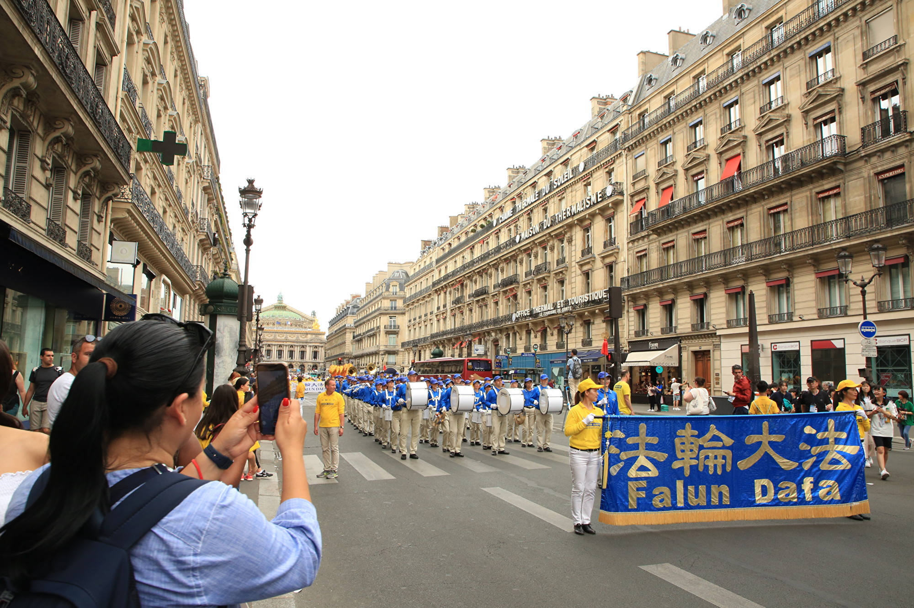

【明慧网二零一九年八月八日】我是一个普通的农家女子，可是我的人生又充满了苦难与传奇。这传奇来自于我修炼了法轮大法，修炼中，在我身上发生了许多神奇的事情。我的人生于是就在传奇与神奇中并行。在此，我讲述我的人生故事，见证法轮大法救度世人的神迹，感恩法轮大法对我的救命与救度之恩！

<b>（一）在生与死的边缘挣扎</b>
 

我出生在黑龙江省一个小村庄，家中兄弟姐妹多人，我排行老三，母亲无业，父亲是小学体育教师。我从一出生就体弱多病，农村老人说，我就是好招狐黄白柳的那种人，动不动就像要死过去一样，就在父母悲痛欲绝以为我要小命玩完之际，突然我又活了过来。整个幼年和少年时期，我都是在这种生与死的边缘挣扎，总是要死要活的，父母就在我给他们制造的这种悲喜交织的险境中生活。

我从小就能看到大人看不到的东西，修炼以后才知道是因为我的天目是开着的。比如今天我家要有哪位客人来，家里甚么东西不见了到哪里能找到，过几天要有甚么大事发生等等，我提前就能知道。到了上学的年龄，父母都犯愁，成天迷迷糊糊，赖赖巴巴的，能学啥呀？可是，没成想，我学习成绩还挺好，班级考试总是第一第二的。初中学习也挺好，平时不用怎么听课，一考试大部份都能答上，有时刚走进考场，就犯困，于是我就趴在桌上睡一会儿，十分钟或二十分钟后醒来再答卷，飞快，作文一挥而就，老师都称奇，觉的我和所有的学生都不一样，虽然身体不好，可是学习一点没落下。

到了高中学习就不行了，因为我的身体情况太差了，各种疾病与日俱增：心脏病、胆囊炎、胃炎、鼻炎、膝关节炎、背疼，腰疼、肝郁气滞、神经衰弱、脑神经痉挛、贫血，迷糊。总之，我不知道这世上还有没有我没得着的病！别人都用异样的眼光看着我，父母也只能唉声叹气，我感觉我在人们眼中就是个「活死人」，我活着没有乐趣只有痛苦。生命就像游丝一样随时会断掉，活着的力气都没有哪里有力气去学习？

无奈之中，父母给我找了个对象，让我结婚，我不乐意，他们不管我同不同意，就把我硬嫁了出去，从此我又增加了一项不幸：丈夫的拳脚，稍不如意就是张口骂，举手打，他喝了大酒就耍酒疯，本来我就百病缠身，再加上他的暴打，我就想，死了吧，要是一下子就死掉也挺好啊，总比活受罪强。可是居然没死！正是死罪没有，活罪难逃啊！后来有了儿子，丈夫对我照打不误，我想我既然死不了，我也不要受你的气，就在儿子十个月大的时候，我离家出走，到外地打工，被丈夫找到又是一顿暴打。这次我父母知道后，终于给我做主，让我跟他离了婚。

结束了挨打受气的日子，我就在吉林的一个小城市打工，每天撑着病弱的身体勉强干活儿，攒下一些钱用来买药，另一些钱要留着在我犯大病不能工作的时候过活。那时候就想，我活着就是来遭罪的吗？可能罪遭完了我才能死吧？不明白。

<b>（二）大法救了我</b>
 

一九九九年七月初的一天早上大约五点多吧，我穿上毛衣毛裤（因为风湿病，怕冷，大夏天也不例外）甚么都没想就向附近的广场走去，以前我从来没去过那里。见广场上一些人在那里像做体操一样，我好奇的看着。一位胖胖的阿姨和蔼的跟我说：这是法轮功，佛家上乘功法，教人向善，按「真、善、忍」做好人，可以达到祛病健身的效果、但不治病。我说我也想炼，就跟着炼起来。

正赶上炼第二套功法──抱轮，刚炼几分钟的「头顶抱轮」，我就说啥也坚持不住了，虚脱似的坐在地上。那时候我干不了活了，吃不下饭，成天迷迷糊糊的睡觉，瘦得皮包骨头，站一会就得坐下，胖阿姨鼓励我说没事的、慢慢炼。阿姨说光炼动作还不行，要学法，就是学《转法轮》才能知道如何去修炼，如何去做个好人，更好的好人。

我刚刚读《转法轮》就开始发烧，我想起来胖姨说这是李洪志师父在给我清理身体，实在挺不住我就放下书睡一会儿，醒来继续看，就这样三天看完了这本书。再去炼功点晨炼，我就完全能跟着炼下来了，半个小时的抱轮也坚持下来了。

也就这样三、四天功夫，我竟然浑身轻松，吃饭也香了，也不迷迷糊糊晕头晕脑了，我喜出望外：活了二十五岁，才知道没有病的滋味，真是太好了！法轮功真是太好了！我没病了！我没病了！我真想大声喊出来！

我一个「活死人」能幸遇起死回生的神奇功法，真是做梦也想不到的好事呀！我感到从未有过的舒心，走路都连蹦带跳的。没有病痛的折磨真舒服呀！

没过几天，我照例去广场晨炼，可是那里静悄悄的一个人都没有，我那时住在一间宿舍里，也没有电视，也不知道发生了甚么事，找不到同修，我心里空落落的，回到住处大哭起来。这时脑子里有个声音在说：你不是有书吗？可以自己学炼哪。我擦干眼泪自己在家学炼。后来才知道是中共江泽民一伙栽赃抹黑法轮功，迫害法轮功，痛心的是千千万万的老百姓竟然相信了这无端的造谣和欺骗，我在各种机会都跟人讲，用自己的亲身经历告诉他们，法轮功是好的，法轮功是被冤枉的！法轮大法是正法！

后来我也去了北京上访，五次被绑架受到残酷的摧残，但是我都没有动摇对法轮大法的坚定信念。我曾对相关人员说，「我只要有一口气就要炼到底」。记得有一位检察院的工作人员跟我说，「真佩服你对大法信仰的坚定，从你身上看到的我就敢肯定法轮大法是好的，以后有机会，我去找你跟你学炼法轮功」。我为他明白真相而高兴，在黑白颠倒的乱世，能够明辨是非，这才是可贵的生命，就会有美好的未来。

我愿意用辛苦的付出，用我的亲身经历告诉世人：法轮大法真的是来救度世人的，不要听信打压的谎言，静心了解法轮功到底是甚么，您会身心受益，如果有幸走入修炼，那才是一个人真正的幸福，那是人来在世上的真愿。

原文: https://big5.minghui.org/mh/articles/2019/8/8/391180.htm

<h1 align="center"><b>一份传单圆梦 罗马青年吁中国人脱离暴政</b></h1>

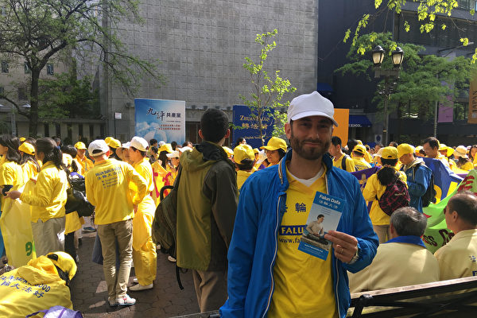

2019年5月16日，意大利青年法比奥•科特罗内奥（Fabio Cotroneo）在美国纽约联合国对面的哈玛绍公园，庆祝法轮大法日。

【大纪元2019年05月16日讯】（大纪元记者唐云燕美国纽约报导）“今天我感到非常高兴， 我们这些理念相同的人在一起，今天有着同一个念头 ：就是结束中共对法轮功的这场迫害。希望人们来了解法轮大法，同时祝福他们有一个美好的人生。”2019年5月16日，意大利青年法比奥•科特罗内奥（Fabio Cotroneo）在美国纽约联合国对面的哈玛绍公园说。当天，来自全世界的万名法轮功学员来到这里，庆祝世界法轮大法日。

一张小小的传单，对在意大利罗马出生长大的科特罗内奥来说，就像是一张圆梦的门票。

科特罗内奥说，自己从小一直在寻找人生哲学，想知道人生的智慧和准则。他小时候立志做一名医生，希望帮助人们解除肉体之苦；长大后他逐渐明白，帮人找到精神上的解脱才是更重要的。他十六岁去了修道院寻找真理，自此开始了一条二十年的漫漫长路，直到他遇到了法轮大法。

他尝试过参加多种门派，但总感到不能找到真正的答案，到一定程度就停滞不前。 直到有一天在罗马的斗兽场附近，他拿到了一张法轮功的传单。回到家他从网站上下载了意大利文版的《转法轮》并在很短的时间内通读了一遍，书中的内容让他感到一股无法形容的“善的力量”。

科特罗内奥说，对他触动最大的是书中好像是把他这二十年里苦苦探索的东西一股脑儿地总结了出来，字字句句都是他所追寻的生活智慧和准则。他说，“我找到了自己一直所追寻的真法。”

当说到修炼之后的变化，科特罗内奥说道：“首先就是修炼给了我一个强有力的依靠，让我感到心中无比踏实。大法的无量智慧时时在帮助我往前走。”

“修炼之后我的性格也发生了变化，以前的我有很多局限，胆小怕事；现在我可以大方地与人交谈，面对困难和问题也不再躲避或者是掩盖了。在工作上，我可以更加理智地去处理问题，对人更有礼貌和耐心，对待工作更加有责任感。修炼大法让我内心保持平静，我真的找到了一条通天之路。”

3年前科特罗内奥与一位中国姑娘喜结良缘。虽然中西方文化交融中会产生摩擦，但两人有着共同的价值观，时时刻刻要求自己按照“真、善、忍”的原则做一个更好的人，双方能主动理解、考虑对方，小家庭充满幸福，他开玩笑地说道：“但她爱吃虾，我不爱吃，这个问题还没有解决。”

今年是法轮功反迫害20年，也是科特罗内奥得法修炼的第七个年头，他想对中国大陆的法轮功学员们说：“每一次想起你们在监狱中遭受酷刑，甚至可能被活摘器官，但你们仍坚持信仰，这使我感到震撼。中共的谎言暴力与杀戮没有将你们打垮，反而让世界看清了它毁灭人类的本质。你们放心，世界上道德与良知尚存的人们今天都会为你们的付出而感动，今天的罪恶将成为历史深刻的教训。”

同时他也想对中国人说：“亲爱的朋友们，你们是一个伟大、智慧的民族，在五千年的历史发展中给人类奠定了杰出的哲学思想基础；但近七十年中，你们不幸成为一个最残暴无知政权的受害者。你们有足够的力量和智慧从中解脱，只要睁开双眼，你们一定可以改变现状。”

“在你们的血液中，有着传统的价值观给你们的力量、能力和智慧，要相信，也会有神佛帮助你们。”他接着说，“不要再为一点点利益就出卖自己的灵魂。你们为这个政权，已牺牲了太多的灵魂。请选择正确道路，你们善良的本性会重现，你们的国家也会重新得到世界的尊重。”

“我知道在中文里‘天’还可以指代神佛，今天的中国看不到‘天’，是因为无神论的政权钳制着你们，当你们认识到这个政权邪恶的本质后，重新回归你们的传统，一定会再一次看到‘天’！”他最后表示，“我知道这一张传单的分量，他改变了我的人生。我要将他传递下去，让更多人感受到大法的美好！”

原文: http://www.epochtimes.com/gb/19/5/16/n11262985.htm

<h1 align="center"><b>美国审核签证新规 震慑迫害人权的中共官员</b></h1>

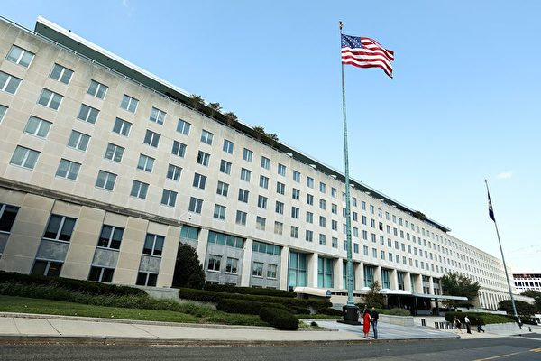

图为美国国务院大楼外景。

【大纪元2019年08月06日讯】美国最近出台的审核签证新规对中国大陆很多官员，特别是迫害法轮功学员的直接参与者震慑极大。

2019年5月，美国国务院告知法轮功学员，向国务院提交迫害者名单。美国国务院将更严格地审核签证申请、对人权及宗教迫害者拒发签证，包括移民签证和非移民签证（如旅游、探亲、商务等），已发签证者（包括“绿卡”持有者）也可能被拒绝入境。

近期，法轮功学员已向美国国务院递交了第一批参与迫害者名单。名单包括中共宣传部门负责人、各级政法委、“610”负责人、涉嫌活摘法轮功学员器官的医生、监狱系统负责人、法官等。

美方采取的措施对参与迫害法轮功者来说产生了直接的效应，以下是近日在黑龙江、山东发生的几则实例。

<b>黑龙江某市国保放人 害怕被通报</b>
 
明慧网报导，黑龙江省某市法轮功学员把美国惩治人权迫害者的移民政策以传单等形式，在全市散发。该市国保、“610”（专门迫害法轮功的非法机构）得知美国政府对迫害法轮功的人拒发签证的消息后，很惊恐。

他们把刚绑架到看守所被关押15天的四位女性法轮功学员释放了，把她们随身带的物品全部归还，并且说：“我没打你们吧？我没骂你们吧？不要通报我，不能不让我家孩子出国。”

<b>公安局长担心孩子不能出国</b>
 
报导说，那些迫害法轮功的人大多都是些贪腐的既得利益者，他们中很多人下一步就计划着转移资产、出国。美国对迫害者实施拒发签证，拒绝入境等，引起这些人极大的恐慌。

某地，有一家三口都是法轮功学员，均被非法抓捕，他们的亲属对参与迫害的公安局长说先让法轮功学员的孩子上学吧。那位公安局长强辩说：“你们法轮功学员的孩子是孩子，我们的孩子就不是孩子，为啥不让我们的孩子出国？”

<b>山东潍坊市派出所放人、还车</b>
 
2019年7月27日，山东寿光市侯镇两名法轮功学员外出讲法轮功真相，被潍坊市某派出所警察绑架。警察抢走了其中一名法轮功学员的十几本法轮功书籍，还有美国禁止迫害法轮功学员的恶人入境、明慧网让法轮功学员收集迫害者名单的通告单页。

两名法轮功学员向此派出所和从其他派出所来协助绑架的几个警察讲法轮功真相，有的警察很明白了。有警察在读清单时，重点说了有两个单页传单（美国审核签证的通告）。

第二天晚上，两名法轮功学员顺利回家，被抄走的电动车现已要回来。

明慧网7月21日报导，美国国务院官员向法轮功学员告知一些重要信息，其中包括：近年在中国，有多人因迫害法轮功学员而被拒发美国签证。

美国官员强调，“他们不看重迫害案例的数量，而看重具体事实，只要某恶人有一个案例具备足够的具体事实描述，就可将其放入特殊名单。”

同时，美方新近还有一个做法：严重侵犯人权的恶行（如酷刑、殴打），一个官员只要是恶行实施单位的负责人，即可列入惩罚之列，而不需像以往那样证明此官员对某次具体恶行下达了命令或进行了指挥。

原文: http://www.epochtimes.com/gb/19/8/6/n11434512.htm

<h1 align="center"><b>越南武术教练的跌宕人生</b></h1>

【明慧网二零一九年八月七日】（明慧记者沈容采访报道）从小就勤练武术的阮琼川（Quynh Xuyen Nguyen），以保护自己、强身健体作为努力目标，在冬练三九、夏练三伏的苦学之下，阮琼川成为越南空军防空学院武术教练之时，也不过二十二岁。英雄年少，此后他凭借实力、平步青云，不仅自身在国家锦标赛等国际赛事获奖，所教授的学生更连年囊括五个金奖、六个银奖、两个铜奖等诸多奖杯奖牌。
勤勉成就武者、强者、胜利者，阮琼川一直是这样认为的。然而，当人生走过大半辈子，一场大病彻底扭转了他的人生观。这时阮琼川才领悟到，武术传授的内涵不只是格斗与技巧，生命延续的意义更不只有成就和名声。

那时在二零一五年，阮琼川身任荣誉武术教练，却在一次全国比赛前夕，被查出左侧心脏尖瓣关闭不全（也叫二尖瓣逆流），导致血液无法顺畅流出心脏引发高血压。阮琼川听闻病情不敢置信，“我拥有几十年的武术功底，还被评比是军队最健康的体格，得过身体最健康的奖金，怎么会是这样？”

那一年，阮琼川五十一岁，他被取消参赛资格，住进108军队医院。然而，一连串的疗程并没有让他好转，阮琼川不时感到气短、胸痛、身虚体弱。医生说如果要根治，只能尝试昂贵的心脏瓣膜修复手术，但伴随的高风险却可能让下半生浑身无力，甚至失去工作。

面对命运的玩笑，阮琼川失落而绝望，他不时问天问自己：“我还有没有未来？就这样告别武术生涯吗？我的光辉岁月结束了？以后要怎么面对学生？”这时他才发现，没有了健康，荣誉与胜利也都失去了意义。

<b>跌入人生谷底后　转祸为福</b>
 

福祸相倚。就在患病那年夏天，阮琼川的妻子刚刚学了法轮功。妻子是一位小学老师，患有关节炎、胃病、高血压、前庭功能紊乱等多种疾病，每个月都必须向学校请病假看医生。妻子向阮琼川介绍的时候，连一遍《转法轮》都还没有看完，可是炼功后不久，困扰她多年的病症却缓解消失了！事实摆在眼前，阮琼川依旧半信半疑，妻子鼓励他：“你不用担心，这本书很多人看完之后都会出现奇迹，法轮大法可以改变你的身体和未来的命运。”

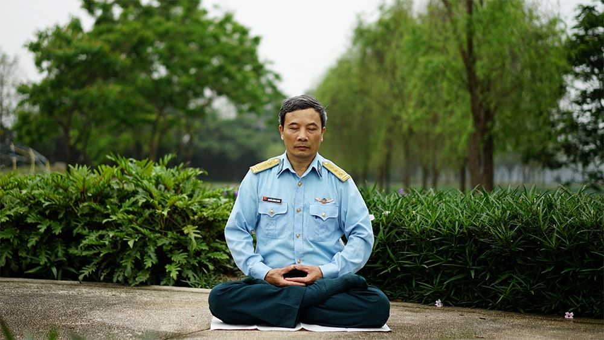

图1：阮琼川正在炼第五套功法。

阮琼川决定先从炼功开始学起，出乎意料的是，短短一个礼拜，他亲身见证了西方医学都达不到的奇迹。“之前在医院治疗觉得呼吸很累、很沉重，可是才炼了一个礼拜，就觉得全身轻飘飘的，走路、上楼梯都是轻飘飘的，胸口的疼痛开始缓和，呼吸变得正常，身体感觉到好轻松。”

更奇妙的是，拥有三十几年酒瘾的他，竟在学功后不久感到不是滋味了。他想进一步了解法轮功，便上网找了许多学员的修炼心得，也看到中共对法轮功铺天盖地的污蔑与迫害。这些讯息在他脑海不断冲击，“为什么炼功身体就能好转？这么好的功法为什么会被迫害？炼法轮功会不会有问题？”

心中谜团尚未解开，阮琼川在同修鼓励下上了九天学法炼功班，并开始阅读《转法轮》，“我一开始先学功时，每天都很喜欢炼功，现在学法之后，又变得很喜欢学法，这是我第一次从头到尾阅读这么厚的一本书，越读越想读，仿佛身体围绕着一股能量，不想睡觉也不会累。”

《转法轮》书中有一段法：“我在北京办班的时候，有一个学员，骑自行车过马路，走在马路一拐弯的时候，有一辆高级轿车在急转弯处把我们这位学员给撞了，这位学员是个女的，五十多岁。那轿车一下子就撞上她了，撞的够狠的，就听那动静‘当’的一声撞在头上了，她的头正好撞在车棚上。这时这个学员的脚还跨在车子上，头撞上了，却不觉的疼。不但不觉的疼，也不出血，连包都没有。”

阮琼川表示：“我当时读到这一段的时候觉得怎么可能有这样的事，结果不久后，我的眼睛就被网球重击，大家要我赶快上医院去，我却想到师父的法，马上说：‘没事。’当天回家后眼睛立刻肿了起来，整个黑黑的，我继续炼功学法，却越读眼睛越亮，越看字越清楚，隔天醒来一照镜子，完全好了，没有痕迹。”

实实在在经历的一切，让阮琼川从迷惘到坚信，他知道自己遇上了万年不遇的高德大法，不仅让他重拾健康与自信，更在法中明白人来世上的意义。可以说，阮琼川的幸福人生是从陷入谷底后才真正开始的。

为了让更多人象他一样幸运，阮琼川在家里开设了“九天班”。阮琼川表示：“刚开始来的人只有几个，后来增加到每个月三十几个，多的时候还有四、五十个。”每天二至三小时，连续九天播放李洪志师父的讲法录像，义务教授五套功法，法轮大法表面浅白却内涵深邃的法理激荡着所有人的心灵，也不断启发阮琼川对生命全新的认识与理解。

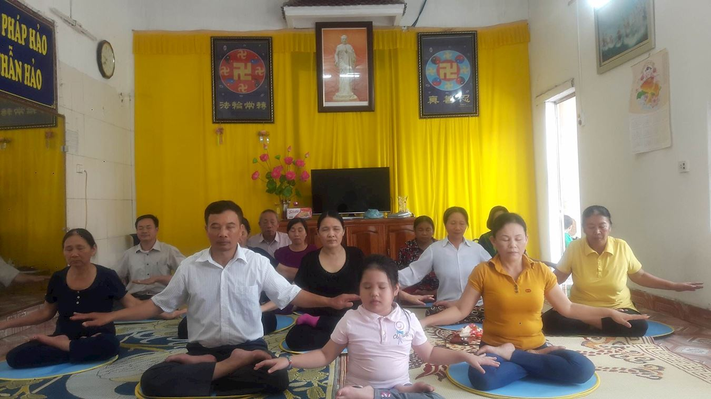

图2：阮琼川希望能有更多有缘人一起学炼法轮功。 

阮琼川说：以前我兢兢业业工作，自认是个好人。但修炼法轮功后，我从小事上要求自己真正做到真、善、忍。比如找工作塞红包本为越南的普遍现象，之前我觉得这种行为是等价交换、理所当然，但修炼后就要用更高标准要求自己。一次有个毕业的学生请我帮忙找工作，给我一千五百万越南盾（相当于六百五十美元）。但我想到师父的法，越想越不对劲，这样我得给他多少德啊！我将红包还给学生，告诉他我修炼了法轮功，不能拿这不义之财，大法师父教导弟子要有一颗善心，无条件对别人好，这个忙我会帮，但不求名不求利。学生和他的家人很感动也很惊讶，觉得现在怎么会有这样的人，钱拿到手还要还回去。后来学生和他父亲都说法轮大法是正法，也走入了大法修炼。

<b>堂堂正正开创修炼环境</b>
 

回到军队的阮琼川，将自己修炼后起死回生的亲身经历和大家分享，也让许多同事相继得法。然而，中共媒体的诬陷造谣使不明真相的同事产生误解。一天，阮琼川因为谈论法轮功，被告发到单位的管理部门，主管告诉他不能再这样洪法了，如果不停止，将立刻开除工作。

阮琼川知道自己没有做错任何事，他祥和平静地向主管澄清事实：“我告诉他法轮大法是佛家修炼大法，按照宇宙‘真、善、忍’的最高标准要求自己，从一九九二年传出以来，国际社会颁与法轮功的各类褒奖合计已经超过三千六百项，李洪志师父除了高居二零零七年‘全球百大在世天才’华人榜首，也曾经连续四年获得诺贝尔和平奖提名，这代表着‘真、善、忍’的普世价值深植人心，也是国际社会不断以具体行动戳破中共的弥天大谎。”

然而，干扰与压力一波接一波，不久，阮琼川收到正式公函，要求他立即停止修炼，主管表示这是上级指令。阮琼川没有畏惧，他拿着《转法轮》一书理性告诉主管：“我修炼没有错，我没有违反国家的法令，这本书教导人们‘真、善、忍’，要求我修心性做好人。”他把这本书送给长官。

当时，军队甚至透过开会，要求所有人针对阮琼川能不能炼功投下不记名选票，阮琼川为此义正词严写下一段话：“如果越南军队不准我修炼法轮功，我明天就退伍离开军队。如果越南共产党不准我修炼法轮功，那我明天就退党！”面对层层施压和阻挠，阮琼川坚如磐石的一念，反让局势开始改观。

他说：“那段期间我的思绪非常平静，我知道这是师父安排给我讲真相的好机会。”他保持着慈悲与正念，不断往上层主管接洽，找到一个讲一个，遇到一个说一个，不放弃任何机会。“我发现越到高层越好讲，讲到最后，一位上校接见了我，他静静地听完，明白了真相，对我的行为感到理解。”还有许多长官摆手说道：“他都快退休了，如果坚持的话就让他继续炼吧，不阻止他了。”从此，阮琼川在军队堂堂正正修炼法轮大法，并在二零一八年光荣退休，官至上校。

过去，阮琼川总是分秒必争往前冲，从没有停下脚步问问自己，到底人生要往哪里去？现在，阮琼川可以确信，他已走在生命最光辉灿烂的康庄大道。他说：“我要感谢师父慈悲救度我和家人，让我能够充满智慧与正念地助师正法。我希望能有更多人透过我的故事了解法轮功真相，让您往后的人生都能拥有美好幸福的未来。”
原文: http://www.minghui.org/mh/articles/2019/8/7/391073.html

<h1 align="center"><b>懦夫与勇士</b></h1>

【明慧网二零一九年五月十四日】在这个世界上，没有人愿意当懦夫，很多的胆小怕事、唯唯诺诺、明哲保身，后面有着太多的无可奈何、太大的压力苦涩、太重的左右为难。每个人都渴望成为勇士，堂堂正正，挺身而出，救危扶困。当生命真正的明辨是非善恶，生命其实已经不再畏惧，生命就在走向觉醒，生命就在走向勇敢。
有一位法轮功修炼者，因为坚持信仰和讲真相，先后四次被绑架。在她第四次被绑架「取保候审」期间，她控告了江泽民的罪行。警察把她拉到拘留所门口时，从里面出来一个警察，据说是拘留所副所长。下面是随后发生的事情。

他（副所长）问我（法轮功修炼者）：「你有心脏病吗？」我说：「没有。」又问：「血压测了没有？」「没有。」他命令式地说：「测血压去！」测完血压回来，我还没反应过来呢，拉我来的警察就对我说：「走，回去！」我才明白过来，那个副所长问我有没有心脏病，又叫测血压，是在找个借口叫我回家去。在回来的路上，我继续给车上的警察讲真相，其中一个警察由衷地说：「其实我们心里真的是很佩服你们法轮功的！我们都是些懦夫。」

警察由衷地佩服法轮功修炼者，称自己为懦夫，这是很多警察的心声，只是这个警察直白地说了。

警察为甚么说自己是懦夫呢？因为他们十分清楚──中共的迫害完全是在践踏法律、违法犯罪，中共的宣传其实是诋毁，中共抓捕的缘由是恐惧。而中共体制内的警察，如果执行中共的政策，就成为中共的打手，就在助纣为虐，就是害人的恶人；如果完全不执行中共的政策，就会被中共视为异己，轻则受到威胁恐吓，重则失去工作。

十几年来，因为迫害法轮功修炼者，而受到道德谴责、遭受身体疾患的人，越来越多。中共的迫害政策，不但摧残了修炼者的身心，也让迫害链条上的每个人，都犯下害人的重罪，走向危险的歧途。很多警察陷入两难境地，孰是孰非清清楚楚，何去何从茫然若失。怎么办？生命必须认真思考，权衡利弊，取舍定夺。

随着迫害真相的逐步揭示，越来越多的中国人，明白了中共的宣传是诽谤，清楚了中共在煽动仇恨，导致社会道德全面崩溃，将把人类带入深重的灾难。人们开始独立的思考，他们不再唯命是从，他们在悄悄改变。

重庆市大足区法轮功学员曾祥金于2018年1月16日9点30分在大足主城区东关菜市场发真相数据，被菜市管理和协警绑架，又被公安车劫持到大足区北门派出所。曾祥金给警察讲真相，派出所当天放人。

还有一个警察送法轮功修炼者回家的故事──「我与同修一起到集市上去发真相材料、劝世人三退，不料要回家时却被警察绑架了。警察把我俩拉到了派出所，从我们身上搜出了十几个护身符。」「我们跟警察讲了两个来小时的真相，给三人做了三退（退出中共党团队），后来小警察举着护身符连喊两句：「法轮大法好！法轮大法好！」大约两个半小时后，警察跟我们说：「你们被坏人告了，我把你们送回家吧。」我们说：「不用了，你把我们送到车站就行了。」警察连连说：「不，不，那样不安全。」说着开车把我俩送回了家。」（《明慧周刊801期 庆祝5.13世界法轮大法日特刊》）

近两年来，已有二十多个省、直辖市检察院依法对法轮功学员不予批捕并退卷、法院撤销原判，法轮功学员被无罪释放的事例越来越多。也就是说，随着真相的传播，中共的谎言再也无法惑众。明辨是非，伸张正义，保护良善，已经成为了很多中国人的选择。很多公安局、检察院、法院公务员，接到构陷法轮功学员的案件后，都高调地、煞有其事地按照中共的政策，按部就班地走走形式，然后低调地、悄无声息地保护法轮功修炼者。

曾经被谎言愚弄了的人们，曾经被暴力裹挟着的人们，看清了中共的邪恶，明白了修炼者的善良。他们不愿再麻木冷漠地执行迫害政策，不愿再沦为对中共俯首帖耳的懦夫。拘留所的副所长、开车送法轮功学员的警察，他们在形式上无法摆脱中共操控，就在认认真真地走过场后，无条件地释放法轮功修炼者。他们发自内心地敬佩法轮功修炼者，他们策略地保护好人，他们也在从怯懦走向勇敢。

当佛法走过劫难，当罪恶被绳之以法，当一切都尘埃落定时，我们每个人所作所为，就在为自己选定归宿。那些在迫害中，给予修炼者同情理解、帮助支持、庇护搭救的人，他们的名字将被铭记，他们的故事将被传诵，他们的精神将被称赞。

在谎言满天的时候，清醒而不迷惑；在暴力横行的时候，理智而不屈从；在善良被凌辱的时候，救助而不陷害。这样的生命，是真的勇士。

原文:https://big5.minghui.org/mh/articles/2019/5/14/386640.html

<h1 align="center"><b>西方地产大亨之子的佛法奇缘</b></h1>

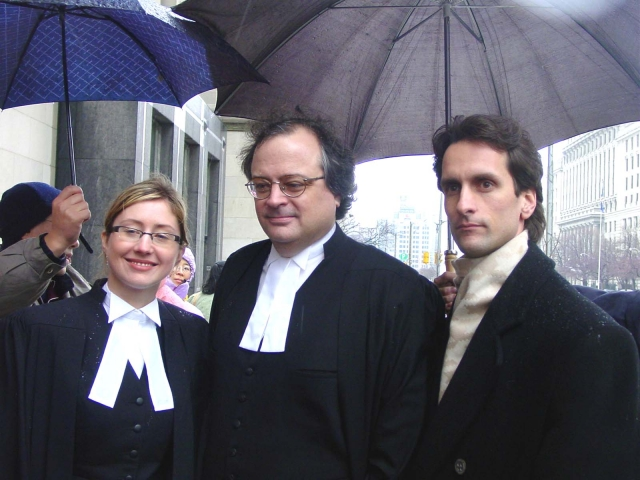

加拿大地产大亨富二代乔•契布卡（右一）。

乔•契布卡，是个富家公子，他的父亲是一位白手起家、实力雄厚的加拿大地产大亨。他子承父业，努力工作，并赚了很多钱，过着一般人难以想象的奢侈生活。
他曾无限度地追求昂贵的服装和汽车，穿德国名牌的西服和500美元一件的意大利名牌衬衫，他曾拥有过18辆汽车，也拥有同样多的女朋友，还有更多其他的奢侈挥霍。这样的一个人，居然能与佛法结缘，可能连他自己都没有想到。

契布卡大学毕业后，就参与了家族的投资业务。可能是因为家庭与投资业务搅在一起，他与父亲之间的关系也变得紧张起来，他们经常争吵，以致发展到几乎无法愈合的地步。

在30岁出头的时候，他开始对自己的生活和财富感到不满足。经常感到一种无名的空虚，却又无法摆脱这种空虚；无论做什么，都好像在填补他自己都感到茫然的一个空洞。金钱、美女、派对，所有这些都无法填补那种缺失的感觉。

为了寻求精神的解脱，他休假一年。他先后去了埃及、以色列和印度，在印度的8个月里，他会见了一个又一个的宗教门派领袖，参观了一座又一座的寺庙。最后，他觉得好像只要他有钱，每个人都会给他一个答案。但是，这些都解决不了他心中的困惑。

从印度回来一年多后，契布卡的妈妈接触到了一种古老的东方功法──法轮功，也叫法轮佛法。 起初，他还经常跟妈妈开玩笑说：「妳几乎每个月都要研究一个不同的精神流派，法轮功也是其中之一。」

随着时间的推移，契布卡看到妈妈在生活中的巨大变化，她变得更快乐、更满足，这引起了他对法轮功的关注。最触动他的是，学炼法轮功不收费。联想到自己在印度寻求精神解脱的经历，他感受很深，真正纯正的教导，一定是免费的。法轮功的这个原则，使他对法轮功产生了敬意。

随后，他开始跟妈妈一起炼功，真的就像童话电影《绿野仙踪》演的那样，如果想要寻找答案，答案其实就在自己家的后院，而不是在数千英里之外的他乡。

契布卡越来越体会到，法轮功的功法很简单，但能量却非常强大。他惊喜地发现，自己终于能控制自己的大脑了，不再陷入压力和紧张中了。炼完功后，「晚上，我睡得像婴儿一样安宁。」现在，他深深的体会到了什么是真正的慈悲和怜悯，感受到了平静和满足，职业道德也有了改善， 甚至在父亲去世之前，愈合了他与父亲之间的裂痕。

1999年7月20日，中共开始迫害法轮功。这个在西方大都市郊区长大的富家子弟，从来不知道歧视是什么，迫害是什么，宣传是什么。为了制止中共对法轮功的残酷迫害，他成了一名人权倡导者。

2018年已届50岁的契布卡，仍然喜欢开名车、穿好衣服和洽谈生意。但是他更加明白了，什么是生活中最优先的事情，安宁不再取决于外部事物，而是取决于如何以真、善、忍来对待他人，对待自己。

原文: https://www.epochtimes.com.tw/n268092/html

<h1 align="center"><b>谁让她们的童年成为噩梦</b></h1>

【明慧网二零一九年七月三十一日】在中国大陆，中共对法轮功学员进行绑架、抄家、非法关押，造成很多法轮功学员的子女失去亲人的呵护而无依无靠，无人抚养，他们在失去父母陪伴的情况下生活的很艰苦，得不到父母的爱护与教养，他们有的不能上学，外出打工，小小的年纪就得干活挣钱，养活自己，他们幼小的内心里经受着无比的孤独与痛苦。这些都是中共迫害法轮功、搞运动迫害民众造成的恶果。

<b>九岁的她：不知妈妈为何被抓走，一去十年</b>
 

二零零一年夏天，孙英九岁。一天深夜，一帮警察突然闯入家中，把孙英的妈妈陆凤玲绑架走了，这帮警察还将家里洗劫一空，把所有能拿的东西都拿走了，甚至把家里煮熟的鸡蛋也连锅端走。

孙英的妈妈被关进洗脑班。警察说如果不签字放弃信仰就要被送去判刑。她的妈妈坚持信仰、没有签字。之后，她的妈妈遭非法判刑，被整整关了十年。

之后孙英只好住在爸爸和继母的家里。她的爸爸开出租车，没有时间管她，她成了没有母爱的孤儿了，在学校里还得强颜欢笑。记得有一次孙英犯了急性阑尾炎，当时疼得都直不起腰来了，也只能自己忍着，当时孙英多么希望妈妈能在她身边啊！

然而，妈妈到底犯了甚么罪要被判十年？没人能告诉她。

孙英的家里人总对她说，就算她考上大学也不会供她读书，每天都这么跟她说，迫于无奈，孙英上到初二就只好退学了。

退学之后，未成年的孙英必须出去打工，她要挣钱，要养活自己，要去看妈妈。每当过年过节，谁能体会到一个女孩没有父母的心情？

孙英的妈妈是好人，她一心向善，她一点错都没有，可是却被关押了整整十年！人生有几个十年啊？

孙英的舅舅陆诚林被非法劳教，二零零一年大年初二在伊春劳教所里被恶徒残忍灌食窒息而死，年仅三十八岁。

孙英的大姨陆彩霞、三姨陆凤云多次遭绑架、劳教，表哥闫思佟未满十八岁就被非法劳教，遭受残酷迫害。

<b>十二岁的她：父母双陷冤狱，被迫寄人篱下</b>
 

女孩包丽清，家住黑龙江省伊春市，她的父母都修炼法轮大法，按「真善忍」的标准做好人。

由于法轮大法神奇的祛病效果及「真善忍」巨大的道德力量，使修炼人数迅速增长。这触动了中共的「假恶暴」神经，于一九九九年七月二十日发动了对法轮功的全面迫害。二零零二年，包丽清的父母先后被中共法院枉法诬判。

那是二零零二年四月，包丽清十二岁，她的爸爸包永胜从家中被警察绑架，后被非法判刑四年，被关入佳木斯监狱。

包丽清的妈妈邓凤香因不断替爸爸申冤上告，被一群男警察暴打致遍体鳞伤，全身紫黑，警察怕恶事败露，把她秘密转移到看守所非法关押。从五月至八月，正是天气炎热的季节，邓凤香是穿着棉衣在看守所里度过的。最后，邪党法院在不开庭的情况下，黑箱作业，对包丽清的妈妈非法判刑三年，将她劫持到黑龙江女子监狱迫害。

家里经营的豆腐店被迫关闭了。豆腐房由于无人看管，导致漏雨无人修补，房盖的木板都被雨淋烂了，房子只剩下四个框子。年仅十二岁的小丽清从此开始了无法想象的噩梦般的生活。

面对父母被绑架、判刑的巨难，小丽清一个人在家里冰冷的炕上躺了六天，不吃不喝，一个劲地哭，她左手搂着爸爸的衣服，右手搂着她妈妈的衣服，上面还分别放着他们的照片，小丽清太害怕失去他们了。六天里，她不知道自己睡没睡觉，只觉得一会哭的抽过去了，一会又呼喊着爸爸妈妈惊醒了，她甚至失去了活下去的勇气，用脑袋往墙上撞。

万般无奈的情况下，小丽清开始了寄人篱下的生活。亲戚们商量，让她轮流到各家住，每家住一个月，学不能再上了，衣服也不给买，只能给个地方睡觉和填饱肚子。这样小丽清在小学五年级就辍学了。

亲戚家有住在哈尔滨的、佳木斯的、巴彦的，还有伊春大风的，小丽清往返于各家之间，由于说好一家三十天，因此每到月末这天一大早不让吃早饭就撵小丽清到另一家去。有时两家在一个城市小丽清就走着去，村与村之间很少看到人，在一望无际的玉米地里走，一不小心就掉到大坑里，费了好大劲爬出来继续往前走。无论春夏秋冬，小丽清只有一双鞋，后来破的几乎整个脚都露在外面，还得穿。冬天里，有的亲戚家让她睡在用砖块和石头临时搭建的冰冷的炕上，墙上还挂着冰。

身体上的痛苦和生活上的艰难都不算甚么，最难以承受的是亲戚们把她当成包袱，给她脸色看。一次，小丽清在二大爷家住时，她二娘把家里的钱放在一个饼干盒里，她怕小丽清动，就偷偷在盒子外面抹上油。二大爷着急买摩托车，拿着钱就走了，小丽清一看二大爷上市里买东西，心想他回来时一定会给自己买好吃的，于是小丽清就把屋子里里外外收拾的干干净净，把饼干盒子也擦了。二娘一进屋冲到饼干盒子那大叫：「好啊，你还真有心眼啊，拿了我的钱还把证据都销毁了。」小丽清跪下跟二娘说自己没拿钱，可二娘还是不依不饶，把全村的人都喊来，让大家一起看看她把钱藏哪了。小丽清让他们翻自己的身体，二娘气呼呼的说：「谁会那么傻啊，拿了别人的钱还放在身上，说不定藏哪里去了，你爸妈都进监狱了，我让你也进去。」二大爷回来了，看到这场面急忙说是他拿钱去买摩托车了，可二娘还是不停地骂，第二天一早就让小丽清搭运猪的车上别的亲戚家去了。

还有一次在四大爷家，快过年时，四娘提前就说：「告诉你，大过年的不许在我家哭，要哭你就走。」小丽清强装笑颜陪着他们吃完年饭。但她实在太想爸爸妈妈了，偷偷跑到村外三十多米的桥头上大哭，她跪在地上祈求上天快点让她的爸爸妈妈回来，她要承受不住了。那年她才十六岁。她满肚子的委屈没人诉说，后来忍不住告诉姥姥，当时姥姥已经七十八岁高龄了，自己一个人生活都很吃力，可是看到小丽清在别人家更遭罪，就把她接到自己身边住。

小丽清终于把妈妈盼回来了，后来爸爸也结束了四年冤狱，他们一家终于团聚了。她怕爸妈难过，不告诉他们这几年的事，可姥姥忍不住告诉了他们。爸爸妈妈一点也不怨恨亲戚，反而带着小丽清买上礼物挨家去感谢他们。爸爸妈妈说，不是亲戚们不好，是中共邪党使用卑鄙的株连手段，亲戚们是因为对邪党的恐惧才那样的，他们也是受害者。

二零零八年十二月二日，包永胜再次被金山派出所警察绑架，遭到金山屯区公安分局刑警队副队长陶绪伟等人残忍的酷刑折磨。陶绪伟、王海龙、孙立龙、曹万才等人用木方子殴打包永胜；用装满沙子的硬质塑料管（俗称小白龙）殴打包永胜；把包永胜的衣服扒光反铐在地上；还把包永胜弄到室外的院子里冻，十一月份的伊春已经很冷了，他们往包永胜身上泼了十几桶凉水，还把矿泉水瓶装满水，冻成冰，然后围在包永胜光着的膀子前后，从晚上七点一直冻到第二天早上四点，包永胜被冻得晕过去好几次。之后，包永胜被金山屯区法院非法判刑十一年。

此时的包丽清已经长大了。她去佳木斯莲江口监狱看爸爸，她问爸爸在难熬的冤狱生活中是不是心底深处还有对参与迫害的警察的怨和恨？包永胜沉默了一下后点了点头。这次，包丽清告诉爸爸：「不要恨他们，咱们承受的这些苦难不算甚么，他们才是最可怜的人啊。」包永胜听了女儿的话，重重的点了点头，他说明白了。当时在旁边用电话监听他们说话的警察听完他们父女俩的对话，马上放下了手中的监听电话把身子转到一边去，包丽清看到了警察眼眶里含满了泪水。

二零一四年五月三日，那个曾经对包永胜进行酷刑折磨的恶警、金山屯区公安分局刑警队副队长陶绪伟车祸身亡，遭到天谴。临死也没有明白自己当了中共的替死鬼，下了地狱。这些参与迫害佛法的人，确实是最可怜的人。

法轮功学员是一群善良的民众，因为信仰「真善忍」，有一个想做好人的愿望，但是中共却不能容忍。哪个国家的领导人都是希望自己的国民幸福，好人越多越好，然而追求假、恶、斗的中共邪党却不希望看到人们幸福，因为人人都做好人了，相信真、善、忍的时候，中共邪党就不会存在了，因为当所有人都选择善良的时候，邪恶就会自灭了。

只要中共存在一天，就会有人被迫害，就会有子女亲属遭受牵连、承受各种痛苦，就会有人为之流血、失去生命，就会有人被蒙蔽当打手、犯下不可饶恕的罪行，所以作为普通老百姓的我们，要想能够自保，要想不被中共的谎言所蛊惑而充当炮灰，就要从中共邪恶的深渊中选择自救，就是声明退出中共的党、团、队组织，让生命从罪恶的深海里得到解脱，从而获得真正的幸福与自由。

注﹕法轮功学员包永胜现被非法关押在黑龙江省双鸭山市比架山监狱二监区三分队，应于二零一九年十二月出狱。

原文: http://big5.minghui.org/mh/articles/2019/7/31/390831.html

<h1 align="center"><b>曝光河南辉县南寨镇派出所韩世清的恶行</b></h1>

【明慧网二零一九年七月二十九日】（明慧网通讯员河南报导）河南辉县南寨镇派出所原所长韩世清，辉县市峪河镇人，自上任以来，在执行迫害法轮功这个邪恶政策中，不分青红皂白 ，他与南寨镇原镇长王建庄、原武装部长侯振山和他的手下警察，对本镇所有修炼法轮功的学员都是满脸杀气，大打出手。法轮功学员的家成了韩世清及其同伙的行恶场。他们身穿着中共享老百姓的纳税钱制成的警服，耀武扬威，一会儿到东家，一会儿又到了西家，所到之处都是犬叫鸡跳，老百姓背后说：「老日又来了（指当年侵华的日本人）。」
在南寨镇修炼法轮功的学员中，有两名学员被迫害致死，这两名法轮功学员的离世，韩世清有着不可推卸的责任。为了我们的同修安息，为了落实明慧网《通告》，将迫害者曝光在光天化日之下，对两位同修被迫害而造成死亡做了深一步的查实和了解。

下面是秦爱荣、申翠英两人被迫害最后造成死亡前后的基本情况。

<b>第一位：秦爱荣，辉县市南寨镇北流村人。</b>
 

在学法轮功前，秦爱荣的家实在是令人同情，她和丈夫共有两子一女，这对一个正常的农村家庭来说，也算是儿女双全，本该是个大好事，可在秦爱荣的家庭中两个儿子成了她人生中最大的负担。大儿子生下后逐渐发现和其他正常小孩不一样，从小在生理方面就没有任何反应，后来经各方医疗部门诊断确定是先天性痴呆，类似植物人，没有抚养的价值，这样的消息对秦爱荣来说像是当头一棒，可是又万般无奈，只好就这样白天不是白天、黑夜不是黑夜的伺候着儿子，虽然没有抚养的价值，但秦爱荣和其丈夫从来都没有放弃对儿子抚养和照顾，百厌不烦的生活在每一个日日夜夜里！

秦爱荣有一个傻儿子在村子里是家喻户晓，在她的要求下，当时的计划生育组织批准了二胎生育指标，允许秦爱荣生育第二胎。当秦爱荣生下第二胎后，又是一个不祥之兆，先天性残废，第二个儿子活到三岁而亡。接着秦爱荣又生了第三胎，第三胎是个女儿，健康无忧。

秦爱荣的丈夫原先就有肺结核的病史，并不是个很健康的人，为了家庭的生活开支白天时不时的忙碌在田间地头，夜里还得照顾痴呆的儿子撒尿、拉屎。这样的艰辛生活一直延续了整整十八年，痴呆的儿子十八岁离开了人世。可丈夫因劳累过度而旧病复发，因家庭生活十分困难无钱医治，病情转化为肝腹水，他和大儿子同年离开了人间。

此时的秦爱荣已是手无缚鸡之力，面黄肌瘦骨瘦如柴，儿子和丈夫的死亡这塌天的压力落在了秦爱荣一人身上，本来就破烂不堪的家庭压力迫使她再无力承受，导致成精神失常，自己已不能控制自己，时哭时笑，打自己的脸、摔家伙的事时有发生，她本人的生命力与死亡的边缘仅一步之遥。

一九九八年五月，法轮大法传到了当地，秦爱荣在当地学员的帮助下开始修炼法轮功，一个月后，秦爱荣的身体发生了翻天覆地的变化，骨瘦如柴的身体胖了起来，面黄肌瘦的脸色开始红润，精神失常的症状完全消失，她浑身都有用不完的劲儿，她高兴地逢人就说：「法轮功真好，法轮大法救了我的家，救了我的命。」

秦爱荣深深地知道，要不是法轮大法，她已经命归黄泉，不会再活在世上。为了报答师父的救命之恩，她除了学法之外其余的时间就是和同修们外出贴标语、撒传单，方圆四十里开外都有她和同修们的足迹，她要把自己的亲身经历传给有缘人，使得人们都知道法轮大法好，真、善、忍好。不论炎热或寒冷，刮风或下雨，都没有阻挡了她和同修们弘法的决心。

一九九九年七﹒二零中共迫害法轮功后，疯狂的「六一零」组织对法轮功学员进行严酷的打压，秦爱荣理所也成了被迫害的对像，时任南寨镇派出所所长的韩世清把迫害法轮功当作自己升官发财的阶梯，对修炼法轮功的学员大打出手，恨之又恨。

二零零零年十月，韩世清和当时的南寨镇镇长王建庄、副所长曹启国、武装部长候振山（河南省林州市临淇镇李家寨村人，现已退休在家）将本镇修炼法轮功的秦爱荣、蔡群叶、候桂花、李先瑞绑架到南寨派出所。

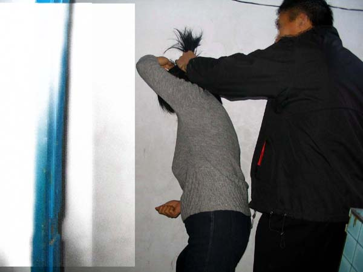

酷刑演示：揪头发撞墙

韩世清、王建庄、曹启国、候振山四人轮换着对他们每个人大打出手，揪着头发往墙上撞，撞得每个学员顺脸流血，被打的浑身都成了黑紫色，眼睛成了一条缝，累的打手们气喘吁吁满身冒汗都不住手。当时的北流村村长王东喜也跟随本村的法轮功学员去了南寨，亲眼目睹了法轮功学员被打的过程，王东喜觉得人要被打死了回家无法向他们的家属交代，跪在王建庄面前又哭又喊：「王镇长，别打了，人快要死了，我回家咋交代啊？」此时王建庄才叫住了手（王建庄，个子不高皮肤黑紫色，打起人来可真算是心狠手辣），将法轮功学员关押在一间水泥地的车库里，当时的黄历十月夜里的天气很凉， 又没饭吃，还被打得遍体鳞伤，在这个阴暗寒冷的车库里 ，她们四人抱作一团失声痛哭，觉得学「真、善、忍」做好人有甚么过错，遭到共产党政权的如此对待，滴滴血，声声泪像针一样刺在每个法轮功学员的心头。在这个车库里，她们又相互安慰，相互鼓励，帮对方用自己的衣服擦去脸上的血迹，在这个车库里整整三天不让吃饭，不准去厕所，当脸上的伤恢复后才把她们送回了家。

二零零一年七月，秦爱荣在三郊口乡贴标语、讲法轮功被迫害真相时，被三郊口乡派出所江克国绑架，便通知了韩世清，韩、江二人直接将秦爱荣送到了公安局看守所，在看守所里用各种手段逼迫秦爱荣放弃修炼法轮功，在看守所的58天里，残酷的洗脑、摧残和折磨迫使秦爱荣旧病复发，精神失常傻笑不止，县公安局、看守所、国保大队为推卸责任，将秦爱荣送回了家。一个星期后秦爱荣投井而亡，家里只剩下尚在幼年的小女孩儿。

秦爱荣死了，秦爱荣为了有一个自己的家，有一个好的身体，修炼了法轮功，反而被中共的政权帮凶们逼得投井而亡。

<b>第二位：申翠英，辉县南寨镇后地村人。</b>
 

二零零三年五月二十日早上，韩世清带着十五、六个同伙，对申翠英实施绑架。当时申翠英在一个邻居家吃早饭，当得知派出所来绑架她时，申翠英扔下饭碗就跑，可还是被韩世清发现，他们十五、六个强壮的男子汉一哄而上，围着一个弱小的女子，拖的拖，推的推，往车上拉。

当时的申翠英觉得逃是逃不了了，她被警察们推推搡搡的，申翠英根本无还手之力，申翠英的家人牛学山也随跟其后，但根本到不了跟前，也助不上甚么力。要说明的是，从申翠英的家到马路有一段距离，在这段距离中间， 路边有一个先前用过的干水池，五、六米深，当申翠英被警察们簇拥着往前走到干水池边时，一伙人突然停在那儿不走了，没有了动静，跟在后边的申翠英的家人牛学山突然感到奇怪，当走到跟前时发现，申翠英已经四脚朝天一动不动躺在了干池中。牛学山很惊讶，不知怎么回事，慌忙找了工具下到池中，大喊翠英的名，但申翠英没有回应，这时的牛学山也慌了神，失去了自我控制，大骂警察不是人，这时的警察也失去了当时的威风，你看看我，我看看你的随地转悠，在牛学山的催促下，才把申翠英从水池中弄上来，将申翠英送到了辉县人民医院。

在辉县人民医院治疗一段时间申翠英神志清醒后，被确诊下肢瘫痪，生活不能自理，因家中还有两个年幼的孩子，无人照顾，再加上经济比较困难，这样申翠英和家人牛学山含冤吞气的从医院回了自己的家。好好的一个大活人，为学「真、善、忍」做好人，修炼宇宙大法遭到中共恶党和像韩世清这样的帮凶的如此摧残，也真是触目惊心！

回家后，当问起申翠英自己是怎样掉到池中的，她说当时的情景一概不知，据牛学山回忆，申翠英当时没这个机会跳出去，牛学山对申翠英这次事故的发生心里时常有个念头：十五、六个壮年男子围着一个女人出现这种意外，感到不可思议，是不是警察们的故意行为，这种阴影时隐时现，挥之不去。

申翠英为不放弃信仰修炼法轮功，被迫害造成下肢瘫痪，当地的同修们看在眼里，痛在心上，为减轻她的家庭负担同修们轮流到申翠英的家，帮她学法和进行身体护理，给牛学山腾出一些时间到派出所找韩世清要说法。一日牛学山被叫到乡政府，韩世清也在那里等着，韩世清对牛学山说：「你家出的这件事（指申翠英掉池内的事）给你五千元现金，一次性解决，以后不要再提这件事，再找也不管了，你写个收据把钱给你。」牛学山听后气的悲愤难忍，恨恨的回了韩世清一句：「我不会写。」韩世清说：「我替你写。」韩世清替牛学山写了收条，收条的日期是二零零四年一月七日（此收条扫描件和申翠英身份证照附后），韩世清收了收据塞给牛学山五千元现金让牛学山走，牛学山的心像打翻了五味瓶，满眼泪水，有苦无处诉，拖着像灌了铅似的两条腿慢慢回到了家。

二零零六年九月，申翠英在床上躺了三年，再也没有站起来，含冤离世。

在我们了解申翠英被迫害致死的过程中，看到牛学山时不时的两眼噙泪，心情十分悲痛，当牛学山给我们拿出来当年申翠英在辉县医院的病历、开支发票和当时韩式世清代写的收据时。我们心里有一种说不出来的滋味，临别时安慰他：「请你一定相信大法师父，迫害即将结束，善恶有报是天理，天灭中共在即，上天会给申翠英一个公道，一定要把这单据和收据条保存好，这是他们迫害法轮功的罪恶证据。」

韩世清替牛学山代写的收据条，内容是：领到条：我叫牛学山，男，现年39岁汉族，小学文化程度，系南寨镇后地村人，2004年1月7日我从南寨派出所一次性领到救济款5000元正，人民币大写五千元正。领款人牛学山，2004年1月7日

原文: http://big5.minghui.org/mh/articles/2019/7/29/390759.html

<h1 align="center"><b>见证中共迫害法轮功 平面设计师回忆童年经历</b></h1>

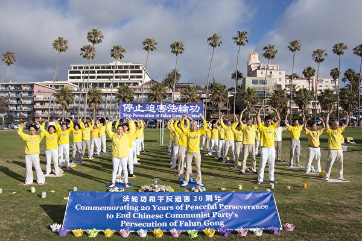

今年7月20日标志着中共迫害法轮功20年，也标志着法轮功和平理性反迫害20年。许多当年跟随父母炼功的孩子如今已经长大成人。他们见证了中共的残酷迫害，也见证了法轮功“真善忍”的美好。图为加州圣地亚哥法轮功学员在当地著名景点拉荷亚海滩炼功，纪念法轮功反迫害20年。

【大纪元2019年07月26日讯】（大纪元记者邓舒语美国圣地亚哥报导）今年7月20日标志着中共迫害法轮功20年，也标志着法轮功和平理性反迫害20年。许多当年在中国大陆跟随父母炼功的孩子如今已经长大成人。他们见证了法轮功“真善忍”的美好，也见证了中共对法轮功修炼者的残酷迫害。

居住在圣地亚哥的年轻华裔平面设计师吴小姐自幼随父母修炼法轮功。“真善忍”的做人准则“自幼在心里扎根”。她的学业不管是在中国时，还是后来到海外留学，都属顶尖。

在中国时，她以高分考入全省最好高中，语文考试也曾获全省联考第一。到美国后她以全A、及全系第一的成绩获得室内与建筑设计专业的本科学位，读硕士时的多个设计作品被做为优秀教学范例，其中一个作品还被学校的荣休校长收藏。

“我总是记住法轮功师父告诉我们的，在社会上要做一个好人，学生就是要认真学习。”她表示，学业一直如此顺利，是“因为我从小修炼了法轮大法，知道用什么样的态度来对待学习。”

然而，她也亲身体验了中共对法轮大法修炼者的迫害。1999年中共开始非法镇压法轮功时，她才7岁。本应是无忧无虑的童年，她却被迫体验了亲眼看着母亲被破门而入的国安强行抓走、周末花三小时车程到劳教所探望母亲却常常不得见，等等至今回忆起来还令人心酸的经历。

<b>中共镇压下 母女被迫分离</b>
 

吴小姐自幼随父母一起修炼法轮功。1999年前，中国大陆很多地方都可以看到法轮功学员炼功的景象。“那时家乡广场上每天都有很多法轮功学员一起炼功，我与其他‘小同修’经常见面、在炼功点一起玩耍嬉戏。法轮功修炼的‘真善忍’原则也让我明白做人的道理，让我在学校成了品学兼优的班干部，”她回忆。

然而，“一切的美好都在中共镇压法轮功后破碎了，取而代之的是强迫亲人放弃信仰的折磨。”

时任中共总书记的江泽民对法轮功学员实施了臭名昭著的三个政策，即“名誉上搞臭、经济上搞垮、肉体上消灭”，吴小姐及其家人也难以幸免。

2000年6月，吴小姐随母亲到当地体育中心参加集体大炼功，炼功还未开始，就被大批的警察包围了，随后就被一批一批的押上车、绑架到派出所。8岁的她和母亲一起被推进带有铁栅栏的牢房，与其他两个法轮功学员関在一起。

在那里，吴小姐看到了骇人的一幕：一个男性法轮功学员，衣衫褴褛，四肢被“大字型”地绑在铁栅栏上，脚不着地。她幼小的心灵受到强烈冲击，她担心母亲也会受到如此残酷的对待。

2001年，吴小姐的母亲因不放弃修炼法轮功，被强行送到洗脑班进行“转化”。为了探望母亲，周末2个小时的公交车程加上20分钟的泥路步行成了惯例。

然而，“洗脑班的狱警并不是每次让我们见到妈妈，而且还经常威胁我，让我劝妈妈转化，他们说：‘否则别想和你妈见面’，我常常都在一次次地失望与绝望中流着眼泪离开。”

与母亲的寥寥几次见面都是在洗脑班狭小阴暗、满是烟味的传达室里，“见面时总有一两个彪形恶汉跟在妈妈身边监控她。妈妈身上有明显伤痕、头发变得又干又稀疏，人也消瘦、憔悴了很多。”

但是，“由于旁边总有人跟着、监视着，每次妈妈都不敢说出自己在里面受的苦。只是嘱咐我不要担心她。”

就这样，9岁的吴小姐在一般人无法体会的心痛中度过了一个又一个周末。

<b>警察非法抄家抓人 母女再被拆散</b>
 

从洗脑班出来后，为躲避再次被绑架，吴小姐的母亲曾寄住在吴小姐的伯伯家中。“周五放学，为了去见妈妈一面，我要坐一个多小时的公车，还要躲避中共特务的跟踪、先在大商场中绕几圈再去伯伯家。”

即使如此小心谨慎，有天傍晚，6个警察还是破门而入，如强盗一般抄了伯伯的家，在吴小姐面前强行抓走了她的母亲。

“那时我苦苦哀求他们，能不能等我爸爸出差回来再说？但是恶警十分凶狠，手指着我的鼻子对我吼‘这没你说话的份！你再说，连你一起抓走！’”吴小姐心酸地回忆。

吴小姐的10岁生日得到的，是母亲被非法判处劳教的噩耗。

母亲被劳教的两年中的一个个周末，吴小姐就是跟着爸爸花上3个小时、转上三趟车到劳教所探望妈妈，同之前一样，他们也时常不被允许同母亲见面。

“每次见到妈妈我就止不住眼泪、一直哭一直哭，根本停不下来。旁边看着的恶警简直没有人性，像恶魔一样，看到我们的痛苦反而发笑或更加凶狠。”

后来从妈妈那里，她得知，在劳教所里面，妈妈遭受到了“法西斯集中营一样的待遇”，包括六天五夜不让睡觉、不让大小便、逼迫看污蔑法轮功的录像、被辱骂、被24小时严管监控、长时间无报酬的劳动等等。

<b>希望世人明真相</b>
 

“到了初中时，妈妈虽然已经从劳教被放回来，可我们家仍然长期受到中共的监控，那些恶警时不时会上门来骚扰、恐吓我们。”

2009年，警察的又一次非法抄家坚定了父母让女儿到国外的决心。吴小姐也于当年到美国留学。

亲历20年来亲人受到的迫害，以及成千上万法轮功学员因为修炼“真善忍”而遭受的迫害，吴小姐表示，希望更多的中国人能够了解：中共对法轮功的迫害，完全是建立在谎言和暴力的基础上。

她说，人们早一天了解真相，不配合中共迫害法轮功，迫害也就能早一天结束。

<h1 align="center"><b>遗爱湖的遗憾</b></h1>

【明慧网二零一九年七月十八日】遗爱湖是黄州人消夏的好去处。其名取自苏东坡《遗爱亭记》中的“遗爱”二字。
苏东坡因乌台诗案贬谪黄州。黄州太守徐君猷敬佩他的品节，对他多方关照。两人悉成好友，经常诗酒相酬。三年后徐太守调任湖南，苏东坡写下了千古名篇《遗爱亭记》，表达出对这位清廉仁爱的徐太守的敬仰之情。其文开篇曰：“何武所至，无赫赫名，去而人思之，此之谓‘遗爱’。”（意思是：何以一个人足迹所到之处，虽无显赫的名声，但他离去之后，老百姓都思念他，这就是所谓的“留下仁爱”。）

前不久，黄州传着一个消息：六月一日，有个男青年因赌博失利而投遗爱湖自尽了，尸体打捞上来已严重腐烂，放在太平间里好多天，经过DNA鉴定，最后确认死者是湖北省麻城市拘留所所长王正杰的儿子王越。这件事很快在麻城传的沸沸扬扬。

街谈巷议很多，最常听到的是：“王越当过兵，人很机警，二十七、八岁，怎么会寻短见呢？”

“听说是作伥（当地方言：被邪灵操控之意），他临死前一段时间人就很不正常了，老是烦躁，给父母发不详的信息……”

“麻城公安局这几年出的事可真不少！”

“祸福无门，唯人自招。王六也太那个了……”

<b>王正杰迫害法轮功学员的事实</b>
 

王正杰是湖北省麻城市拘留所所长，他曾在麻城好几个乡镇派出所工作过，是麻城的“名人”。圈子里的人叫他王六（弟兄排行老六），黑道称他六哥。麻城警察捞钱方式很多，前几年流行的有：抓赌、扫黄等，搜身的钱大部份进了私人腰包；以各种名义办宴席请客收钱；黑道上供；敲诈勒索；抄大法弟子的家，洗劫……

王正杰的前妻是一余姓老师，就曾多次向人诉说：“女人嫁给警察一定是瞎了眼睛……不管到他哪个所，见到的都是土匪，个个吃喝嫖赌，流里流气的。他们还大言不惭地当着我的面吹嘘怎么搞女人、做坏事，好象做坏事越多越能干。这哪里是人，简直是一群鬼！”

王正杰任职的麻城拘留所，是邪党迫害大法弟子的一个重要黑窝。最常见的迫害手段有：强迫大法弟子穿号衣、背监规、按手印、签字、饿饭、毒打、加重劳役等。还有经济迫害：高价出售日用品、接见须给高额的接见费、勒索（很多大法弟子被迫交了五千元才让出来）。

二零一三年七月一日，拘留所所长王正杰带着十几人强制给大法弟子曾金环、刘咏梅打毒针，假说是打葡萄糖。打了毒针后，她们感觉身体内燥热，五脏六腑象烧着了一样，头很痛，肚子痛，渴的难受，昏昏欲睡。

<b>麻城公安局恶报多</b>
 

除了王正杰的儿子自杀事件以外，麻城公安局这几年出的事还有很多：

▼王全新，原中驿派出所副所长，二零零一年三月份，其妻乳腺癌开刀；他于二零零一年六月份遭遇车祸。

▼罗学健，麻城市公安局法制科科长，二零零三年七月一日，他在北正街一发廊嫖娼，死在发廊，被小姐暴尸街头。

▼涂青松，曾任南湖派出所副所长，于二零零一年腊月死于癌症晚期。

▼邓祖胜，曾任麻城市第一看守所副所长，二零零二年黄历新年，骑摩托车在106国道上与外地大货车相撞，当场死亡，死状极惨。

▼彭宏辉，曾任阎河派出所副所长，二零一一年十一月喝酒醉死。

▼程涛，龙池桥派出所所长，二零零七年他就读麻城一中的儿子游泳淹死了；他于二零一三年六月二十三日突发心肌梗塞死亡，年仅五十岁。

▼何利斌，现麻城市禁毒大队副大队长，二零零八年，弟弟车祸身亡；二零一四年，他二十二岁的儿子骑摩托车途中，突然遭遇大货车爆胎，被当场击倒身亡（这是几率非常小的事情）。

▼马兴斌，铁门派出所所长，被人打断手肘。

▼殷波，龙池派出所警察（其父曾任福田河派出所所长），二零一七年被人打死了。

▼陈开源，原麻城市公安局长，曾打死法轮功学员，后被撤职。

▼黄绍魁，原市公安局副局长，落马。

▼孙广文，麻城火车站派出所所长，落马。

……

麻城市公安局这几年出的事真的是触目惊心。公安局这些人都有一个共同点：参与迫害了法轮功。这些年，被麻城警察直接迫害致死的法轮功学员就有九人：黄建勇、李学春、王华君、何行宗、李继菊、罗开军、李长茂、李瑞兰、董纯厚。被麻城警察毒打、罚款、抄家、送洗脑班、劳教所、监狱迫害的人次非常多。这滔天大罪上天能饶过谁？

何止麻城市，黄冈市参与迫害大法的恶人也是恶报连连：原黄冈市委书记刘善桥已落马；原黄冈市政法委书记、公安局局长汪治怀，二零一八年九月被逮捕；黄冈市“610”第一任主任张石明，二零零五年二月十三日突发心肌梗塞身亡，年仅四十八岁。其继任者王克武上任不久患了肝癌，于二零零五年死亡。

人类历史上，迫害正信的从来没有成功过。当年古罗马迫害基督徒、中国历史上“三武一宗”灭佛，最后，参与迫害者的结局都非常悲惨。善恶有报，千古未变。

一位年轻的生命逝去了，又一个家庭被邪党毁了……人啊，怎么还不醒悟？

遗爱湖如一面明镜，映照着一群势利之徒疯狂迫害善良大法弟子的丑恶嘴脸；也见证了上天对狂徒们的严厉惩罚。

垂柳依依，荷香阵阵，遗爱湖不语。凭栏问，不知苏子所尊崇的“清廉仁爱”的“遗爱”之风何时吹拂黄冈大地，吹遍我神州？

原文:http://big5.minghui.org/mh/articles/2019/7/18/390180.html

<h1 align="center"><b>欧洲名校毕业的一代骄子 难忘童年之痛</b></h1>

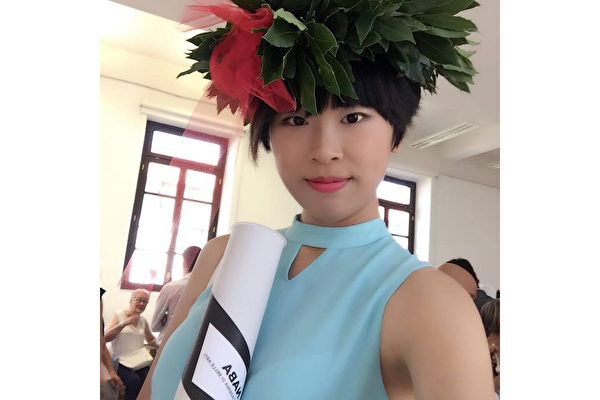

在欧洲留学时的李佳林。

【大纪元2019年07月16日讯】（大纪元记者于佩报导）自意大利顶尖艺术学院硕士毕业、在纽约从事平面设计的李佳林，每天心无旁骛，如鱼得水般发挥着自己的特长。这位26岁、刚刚走出象牙塔的女子，外表文静秀气，很难使人相信她的童年充满了恐惧、身心饱受创伤。

1999年7月20日以来，中共对法轮功“真、善、忍”信仰发动了一场史无前例的迫害，这场浩劫不仅使许多成年人遭受严重摧残，也使一代青年人从儿时起心灵受伤，成长蒙上阴影，李佳林便是其中一位。

<b>幼年得法 全家健康幸福</b>
 
来自河北石家庄的李佳林，3岁时就开始和父母一起修炼。那一年是1996年。“父母身体不好，是姥姥姥爷先得法，发现这个功法很受欢迎，就推荐父母学。”李佳林说。

李佳林的父亲是名桥梁设计师，硕士毕业；母亲也拥有硕士文凭，在一所技工学校担任副书记。二人当时虽然在事业上顺风如意，但在健康方面，他们却都是病怏怏的。自从修炼法轮大法后，这个家就有了生机和希望。

“父母的变化最大”，李佳林说，以前她父亲体弱多病，药不离身，输液打针是家常便饭，“爸爸身体免疫力很低，只要身边有人生病，他就会被传染，没人生病时，他也会经常发烧。”

“得法后，他再也没有吃过一片药，打过一次针，更没有去过医院，样貌年轻，整个人很有精神。”她说。

她的妈妈以前也是精力不济，“除了能坚持上班，回到家就累得只能躺着，根本就起不来，没法干家务活，得法之后，干多少活都没有问题。”

而她本人，听父母讲，两岁开始她就非常顽皮淘气，一次竟拿着菜刀追着大人到处跑，小小年纪令人头疼。但自从跟随父母修炼后，家里这个无法无天的“小霸王”开始变得温顺。此后，一家人的生活健康幸福。

<b>7‧20之后 被迫远离父母</b>
 
1999年7月20日，中共悍然发动了对法轮功的迫害，许多人因不肯放弃修炼而被非法监禁，被强制洗脑、转化。一夕之间天塌地陷，无数家庭支离破碎。

李佳林记得7月21日那天，父亲被所在单位的书记无故扣押，要强迫他放弃修练法轮功。期间父亲单位让她的母亲去说服丈夫放弃修炼，但母亲见了书记直接就问：“大法这么好，为何不让炼？”

书记一看家属态度如此坚决，赶紧让她离开。“结果父亲继续被软禁，一周后才放回来。”

因父母仍然坚定修炼，时时面临被抓的风险，李佳林的姥姥、姥爷觉得压力很大，为了让后代少受牵连，在两位老人的强烈要求下，父母只好同意老人把孩子带回老家。此后三年，李佳林不得不跟随姥姥姥爷生活。

“迫害前，父母、姥姥、姥爷和我都修炼，但迫害后，姥姥姥爷就不敢再修炼，带6岁的我到农村躲起来。”在农村，李佳林无法接触到大法。

那时李佳林已经开始上小学，每天渴望见到父母，却又不能轻易相见。“他们一个月甚至几个月才去看我一次，单程要坐三个小时的车。”

李佳林还不到入学年龄时，因成绩优异，被当地小学破格录取。但之后对父母的思念，让她无法专心学习。“我上课经常分心，到了三年级在班里变成了倒数。”

“身边所有的同学都是跟着父母，只有我是跟着姥姥姥爷（生活）”，至今，她对失去父母之爱的那段日子仍心有遗憾。

<b>担惊受怕  决定出国留学</b>
 
离开大法的李佳林不仅心理受到打击，身体也出现状况，“后来身体很弱，姥姥姥爷带我去输液，结果去了医院也没有好转。”这样，她又回到父母身边，那时父亲经常出差，她与母亲一起学法，身体才逐渐恢复健康。

思念与孤独的日子结束了，整天提心吊胆、担惊受怕的日子却开始了。“迫害发生后，家里总是把大法书藏起来。”放学回家，她经常感觉家的周围好像有人在监视。

李佳林的担心并非空穴来风，她家周围的其他法轮大法学员家附近，也经常出现便衣，他们非法监视、跟踪，伺机绑架学员。甚至有警察私自配住家钥匙，非法抄家，搜索法轮功真相资料，不断有学员被非法绑架，有的受到严重迫害。据明慧网报导，石家庄市610和市公安局积极执行中共对法轮功的迫害政策，指挥国保警察和刑警队警察利用电话监听、跟踪、蹲坑等特务手段，对当地法轮功学员监控并图谋非法抓捕。

“我父母身边的同修栾福生被迫害死了，杨苗阿姨被抓三次，也被折磨得很惨。”李佳林一家担心不知道哪一天会有同样的迫害降临，为了躲避跟踪、监视，她跟着父母多次搬家。

李佳林高中毕业后，她得到了去欧洲留学的机会，她先到欧洲名校欧洲设计学院（IED）留学，学习平面设计；毕业后，她留在艺术之都意大利米兰，在意大利米兰新美术学院（NABA）攻读硕士学位，在艺术领域继续深造。

<b>便衣监视 险被迫害</b>
 
李佳林从欧洲名校毕业不久，回国探望父母。期间发生的一系列事情，迫使他们逃离中国。那是2017年底至2018年初，他们家所在的当地学法小组的3个学员，被当地公安跟踪监视，有人收到了警察的警告。

2018年8月，她与妈妈出去向人讲述法轮功真相，一名老年男子给她妈妈录音、录像，并扬言要举报她们。

之后，她家的楼下，出现许多陌生人走来走去。“我们感觉很危险。”李佳林说。

李佳林和父母随后安排日程，坐上了飞往美国的班机。进了美国海关，他们一家才松了口气。没过多久，他们听到消息，住在距她家一墙之隔的一位法轮功学员被非法绑架，国保大队直接告诉这名同修：“我们已经盯了你很久了。”

<b>盼世人明真相  迫害早日结束</b>
 
来到海外，她和其他同修一样加入义工的行列，纽约中领馆前经常可以看到她的身影。

“在国内讲真相，环境非常险恶，现在好不容易有了一个宽松的环境，可以光明正大的炼功学法，不受威胁，觉得很幸福。”

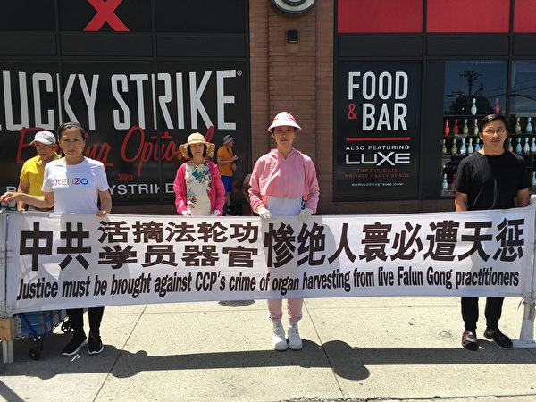

李佳林（前排中）在纽约中领馆前揭露中共活摘器官罪行。

她回忆起过去多年的经历，亲眼看到身边好多人被抓，有的跟她差不多同龄，还有的学员被迫害得精神失常。

李佳林对中共惨无人道的迫害感到无法理解，“为何邪恶到这种程度，一定要抓一群善良的人，只因为他们修佛，有信仰，要做好人，就遭受这么大的磨难。”

“希望迫害早日结束，还在监狱被关押的、仍然在受难的同修，能够快点被释放出来。”她运用自己的特长参与了法轮大法的真相项目，“我会继续留在大法的项目里，让更多人了解法轮大法的真相，一起停止这场迫害。”

她呼吁曾被中共宣传误导的中国人，“请赶快了解真相，不要跟随中共犯错（迫害好人），什么是对，什么是错，要用自己理智、明白的一面来衡量。”

原文: http://www.epochtimes.com/gb/19/7/14/n11384505.htm

<h1 align="center"><b>德国小伙修炼法轮功 戒毒戒烟获新生</b></h1>

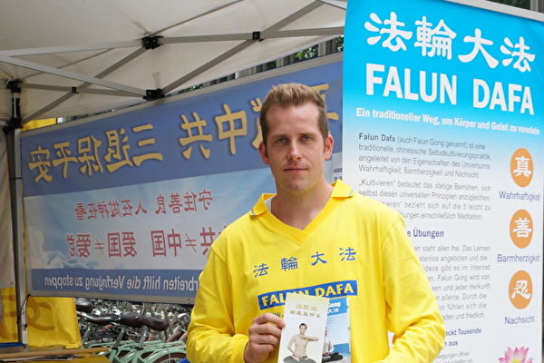

2019年6月22日星期六，修炼法轮功不到半年的德国青年温特在慕尼黑景点上传播法轮功真相。

【大纪元2019年07月14日讯】（大纪元记者祝兰德国报导）随着夏天的到来，德国南部大都市——慕尼黑，作为国际著名旅游景点，迎来了许多中国游客。

中国游客云集的地方，往往是信仰“真、善、忍”的法轮功学员讲真相的地方。今年7月20日，是法轮功学员反对中共迫害法轮功整整20年的日子。德国南部的法轮功学员多年来坚持在慕尼黑主要景点向公众介绍，什么是法轮功以及在中国发生的迫害。近几个月来，一张神采奕奕的年轻德国人面孔多次出现在这里。

这位二十多岁的德国小伙子叫马赛•温特（Marcel Winter），他总是穿着黄色上衣，上面印有“法轮大法好”的字样。他精神十足，一点都看不出来他曾经吸毒、酗酒多年。自从去年接触了法轮功之后，他的人生“完全转向了正面”。

<b>初识法轮功</b>
 
五年前的一天，温特在自己家乡乌尔姆经过了一个法轮功学员举办的反迫害信息台。他了解迫害事实后，马上在反对器官活摘的请愿书上签了名字。

他说，“在现代社会发生这种事情，非常可怕；当年纳粹迫害犹太人，甚至将他们送进毒气室，而现在中共政权为了获取器官而杀人，更加糟糕。中共拿器官来做买卖，没有比这更糟糕的了。”

温特回忆道，当时觉得法轮功学员非常勇敢，敢于向他人揭露这些在中国大陆发生的事情，并为制止罪恶做出努力，这“非常勇敢、非常勇敢”。

在那之后，有很长一段时间，他没有再接触法轮功，直到有一次在YouTube上发现了法轮功创始人李洪志先生的教功录像。那时候他正在寻找一些不同寻常的东西，就跟着录像学起功来。“第一次（炼功）感觉非常美好，全身有一种神圣的感觉，双手发热。”

大约半年前，也就是在他自学功法后不久，通过一位朋友，他得到了法轮功主要书籍《转法轮》。他说，通过阅读《转法轮》，他明白了人生的意义，为什么自己在（人世）这里。

<b>戒掉毒瘾和烟瘾</b>
 
温特开始修炼后，把很多不良嗜好，包括毒瘾、酗酒等都戒掉了。他以前吸大麻，也曾试过用其它来戒掉它，但一直没成功。修炼一段时间之后，尤其看明白了《转法轮》关于吸烟的内容后，神奇的事发生了，他很快就轻松断了毒瘾。目前他还在努力找出自己的其它不良习惯，并努力去掉。

身边的人看到了他的变化，尤其是他的同事，都觉得很好，有的甚至说他完全变了一个人，“上班准时了，看起来也精神多了，给人印象也很积极，以前是睡了很多觉，做了很多糊涂事”，他笑着说。

<b>传播法轮大法</b>
 
温特在当地一家德国大公司的餐厅上班，他在单位里摆放了一些介绍法轮大法的传单供同事取阅，因为自己从炼功中获益，所以想让更多人也能受益，“尤其许多同事干体力活，经常腰酸背疼的”。

除此之外，他也多次参加当地法轮功学员举办的信息日活动，穿着黄色上衣，展示功法，给人介绍法轮功，讲述法轮功学员在中国大陆遭受的迫害。

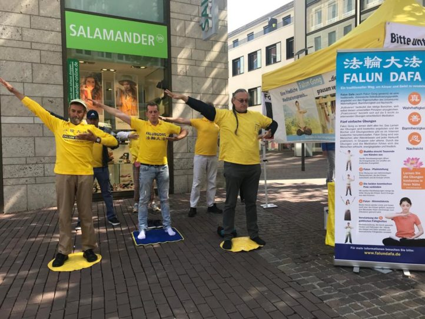

2019年6月8日，德国部分法轮功学员在乌尔姆市步行街举办信息日。图中法轮功学员在展示功法，中间站在蓝色垫子上的是温特。

只要时间允许，他就去离乌尔姆市一个多小时车程的慕尼黑，支援那里的信息日。慕尼黑景点经常有许多中国游客。虽然他不会讲中文，但希望通过现场炼功来启发中国人，重新思考法轮功是什么。他内心想跟中国人说，快快醒来，不要等得太久。

<b>法轮功简介</b>
 
法轮大法，又称法轮功，是以“真、善、忍”为指导原则的佛家修炼法门，包括五套缓慢的功法。1992年在中国长春由创始人李洪志先生传出。因法轮功祛病健身奇效和教人向善的道德力量，法轮功在中国大陆迅速传播，到1999年，官方估计有七千万到一亿人修炼法轮功。

因修炼法轮功人数众多，超过当时中共党员人数，1999年7月，时任中共党魁江泽民不顾多数常委反对，执意取缔和镇压法轮功，并成立专门迫害法轮功的特权部门。难以计数的不愿放弃信仰的法轮功学员因此失去工作、学习、家庭，甚至失去生命，或者成为器官摘取的受害者。

从迫害开始，海外法轮功学员一直利用各种和平的方式讲清真相，反对迫害。法轮功在大陆被残酷镇压的同时，在海外得到越来越多的褒奖，越来越多人也走入修炼，迄今一百多个国家都有人修炼法轮功。

原文: http://www.epochtimes.com/b5/19/7/14/n11383793.htm

<h1 align="center"><b>律师和法官的对话</b></h1>

【明慧网二零一九年五月十日】这是在某次庭审过程中，法官听了律师为法轮功学员做无罪辩护后，从法律的角度上认可了律师的辩护意见，但心中对法轮功学员的修炼及所为还是有些不解。于是在休息的时候就有了下面的对话。
法官：既然政府不让炼，他们（指法轮功学员）为什么非要炼？干嘛非要和政府对着干？

律师：当然是他们觉得好了，修炼法轮功让他们身心受益，为什么不能炼？

法官：可是政府认为会危害社会。

律师：你出国去看看，全世界到处都有炼法轮功的，没有一个国家和地区的政府认为法轮功会危害社会，包括同是中国人的台湾和香港，都支持法轮功，唯有中共政权迫害，这种对比难道不说明问题吗？

法官：觉得好就自己在家炼，干嘛非要出去说。

律师：自己觉得好就想告诉别人、与大家交流，让大家都受益这是很自然的。

法官：那为什么还要劝人退党呢？

律师：这要从两个方面来看。从法律的角度看中共是执政党，法轮功学员作为国家公民谈论执政党存在的问题，就入党、退党发表个人的意见是公民的权利，没有任何违法行为。从我个人角度看，我本人不炼法轮功，但我相信神佛的存在，相信善恶报应。中共宣扬无神论，摧毁人们对神佛的信仰。对中华民族的传统文化、社会道德、生态环境造成的严重破坏，对人民实行暴政不讲人权，不讲法律没有民主，没有自由，肆意欺压百姓，其做法与黑社会没有什么区别。法轮功学员劝人退党就如同让人们脱离黑帮，真是件大好事！

在当今的中国法轮功问题就是一块试金石，中共迫害法轮功，孰正孰邪，孰善孰恶，稍有头脑的人只要了解事实真相，都会看得清楚，只是在现实利益和道德良知之间如何选择而已。

法官：你这样做难道你就不担心会影响你和家人的幸福生活？

律师：我这样做恰恰是为了我和家人能够拥有更好的生活环境。面对暴行，如果每个人都选择退缩和沉默，那只能使恶人越来越猖獗，好人的空间越来越狭小。不为正义发声，就是对好人犯罪，就是对自己和后代不负责任。我们总不会希望中国也变成北朝鲜吧。我为法轮功学员辩护，是因为我佩服这群人，面对暴虐他们坚守信仰不放弃，他们所考虑的不仅仅是他们自己的得失，他们善良、平和。如果面对这样一群善良的人还不能够唤醒一个人的良知，那这个人真是无可救药了。

法官：唉，话说起来容易，共产党那么强大，就凭他们这些人（指法轮功学员）就能改变过来？我们吃这碗饭也不容易，只能按上面的意思办。这个你还不明白吗？

律师：以我的感觉，似乎法轮功学员并不是与共产党对着干，他们劝人退党是为退党的人好，而不是要把共产党如何。他们这样做是发自于他们内心的善良，就象人渴了要喝水、饿了要吃饭那样自然。然而这种源于内心善的力量却是无比的强大，他能唤醒更多人的良知。一旦世人都开始觉醒了，那中共的极权统治也就岌岌可危了。你回顾一下历史，看看前苏联和东欧的共产政权哪个不是这样解体的？你再看看，当今世界潮流是向极权独裁方向发展、还是向民主自由方向发展？其实对这点，中共高层是非常清楚的，要不然他们为什么把自己的家人和财产都转移到海外去了？其实他们早就把自己的后路安排好了。至于你该怎么做，关键还是看你自己想怎么选择。你们不是常说：上有政策、下有对策吗？在以权谋私的时候，你们有那么多的聪明才智，怎么到了该伸张正义的时候却没有智慧和勇气了呢？不好意思话说重了，我无恶意，只是劝你别给中共当替罪羊。

此时法官若有所思不再言语。

原文: http://www.minghui.org/mh/articles/2019/5/10/386611.html

<h1 align="center"><b>西方地产大亨之子的佛法奇缘</b></h1>

加拿大地产大亨富二代乔•契布卡（右一）。

乔•契布卡，是个富家公子，他的父亲是一位白手起家、实力雄厚的加拿大地产大亨。他子承父业，努力工作，并赚了很多钱，过着一般人难以想象的奢侈生活。
他曾无限度地追求昂贵的服装和汽车，穿德国名牌的西服和500美元一件的意大利名牌衬衫，他曾拥有过18辆汽车，也拥有同样多的女朋友，还有更多其他的奢侈挥霍。这样的一个人，居然能与佛法结缘，可能连他自己都没有想到。

契布卡大学毕业后，就参与了家族的投资业务。可能是因为家庭与投资业务搅在一起，他与父亲之间的关系也变得紧张起来，他们经常争吵，以致发展到几乎无法愈合的地步。

在30岁出头的时候，他开始对自己的生活和财富感到不满足。经常感到一种无名的空虚，却又无法摆脱这种空虚；无论做什么，都好像在填补他自己都感到茫然的一个空洞。金钱、美女、派对，所有这些都无法填补那种缺失的感觉。

为了寻求精神的解脱，他休假一年。他先后去了埃及、以色列和印度，在印度的8个月里，他会见了一个又一个的宗教门派领袖，参观了一座又一座的寺庙。最后，他觉得好像只要他有钱，每个人都会给他一个答案。但是，这些都解决不了他心中的困惑。

从印度回来一年多后，契布卡的妈妈接触到了一种古老的东方功法──法轮功，也叫法轮佛法。 起初，他还经常跟妈妈开玩笑说：「妳几乎每个月都要研究一个不同的精神流派，法轮功也是其中之一。」

随着时间的推移，契布卡看到妈妈在生活中的巨大变化，她变得更快乐、更满足，这引起了他对法轮功的关注。最触动他的是，学炼法轮功不收费。联想到自己在印度寻求精神解脱的经历，他感受很深，真正纯正的教导，一定是免费的。法轮功的这个原则，使他对法轮功产生了敬意。

随后，他开始跟妈妈一起炼功，真的就像童话电影《绿野仙踪》演的那样，如果想要寻找答案，答案其实就在自己家的后院，而不是在数千英里之外的他乡。

契布卡越来越体会到，法轮功的功法很简单，但能量却非常强大。他惊喜地发现，自己终于能控制自己的大脑了，不再陷入压力和紧张中了。炼完功后，「晚上，我睡得像婴儿一样安宁。」现在，他深深的体会到了什么是真正的慈悲和怜悯，感受到了平静和满足，职业道德也有了改善， 甚至在父亲去世之前，愈合了他与父亲之间的裂痕。

1999年7月20日，中共开始迫害法轮功。这个在西方大都市郊区长大的富家子弟，从来不知道歧视是什么，迫害是什么，宣传是什么。为了制止中共对法轮功的残酷迫害，他成了一名人权倡导者。

2018年已届50岁的契布卡，仍然喜欢开名车、穿好衣服和洽谈生意。但是他更加明白了，什么是生活中最优先的事情，安宁不再取决于外部事物，而是取决于如何以真、善、忍来对待他人，对待自己。

原文: https://www.epochtimes.com.tw/n268092/html

<h1 align="center"><b>人权专员：间接参与者也难逃迫害法轮功罪责</b></h1>

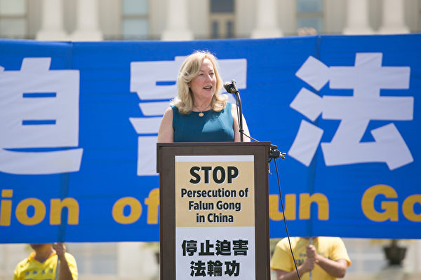

2019年7月18日，琳达•拉格曼博士（Dr. Linda Lagemann）在华盛顿DC法轮功7‧20反迫害20周年集会上发言。

【大纪元2019年07月19日讯】（大纪元华盛顿DC记者站报导）在2019华盛顿DC法轮功7‧20反迫害集会中，琳达•拉格曼博士（Dr. Linda Lagemann）代表“公民人权委员会”，呼吁国际刑事法院介入，制止中共迫害法轮功的罪行，特别要追究精神病医药行业间接参与迫害人员的罪责。

7月18日中午，在美国国会西边草坪，来自美东、美中地区的近两千名法轮功学员及其支持者举行大型集会游行活动，呼吁停止在中国大陆长达20年的对法轮功的迫害。公民人权委员会（Commissioner Citizens Commission on Human Rights，简称CCHR）拉格曼专员在演讲中说，没有精神病学专业人士的密切参与，中共的很多迫害暴行就不可能发生，“我们需要立即采取行动，追究相关人士的责任。”

以下是琳达•拉格曼的发言全文。

*  *  *

谢谢。能够站在这里支持法轮功，并与许多人一道站在历史正义的一面，强烈谴责中共对法轮功学员的迫害，我感到非常荣幸。

公民人权国际委员会成立于50年前，是一个非政治性的心理健康监督机构和人权组织。

为政治目的滥用精神病诊断，在国际上已有很长历史，但今天我们关注的是中共对法轮功的迫害。

二十年前，在中国开始了一场针对无辜法轮功修炼者的迫害。迫害手段包括信息误导、政治宣传等心理工具、劳教所监禁、强迫关入精神病院、心理胁迫、强行使用精神病药物，以迫使人们放弃法轮功；也包括强摘器官、身心两方面的酷刑，以及杀戮。

没有精神病学专业人士的密切参与，这些极不合情理的暴行就不可能发生。我们需要立即采取行动，追究相关人士的责任。

打坐炼功的传统精神修炼和法轮功的道德准则帮助人们达到身、心、灵的健康。虽然法轮功不是治疗精神疾病或抑郁症的医疗机构，但其炼功打坐的功法替代危险的精神药物，其可行性已获得广泛认可。

在20世纪90年代，中国有7千万到1亿人炼习法轮功。1999年7月20日，旨在铲除法轮功的运动开始了。这场运动的策略，包括把法轮功称为邪教，是为了制造恐惧感，以使人们不再修炼这种改善身心健康的功法。

自从法轮功在中国被禁止，中国的抗抑郁药物销量在短短4年里就增加了138％；同时，所有主要精神病药物在中国的销量都大幅增加。很明显，精神病医药行业不容许法轮功这样可行的替代疗法存在，是因为这关系到其切身利益。

位于伦敦的独立人民法庭（Independent Tribunal）近期公布了其最终判裁决。在此，公民人权委员会呼吁国际刑事法院（International Criminal Court）出手制止针对法轮功学员的令人发指的人权暴行。

我们也呼吁世界精神病学协会（World Psychiatric Association）与美国国会、其它立法机构及联合国站在一起，代表法轮功，追究该行业人员所承担的罪责，有罪不罚的状况不能再继续了。

今天我们聚在一起，要求结束对法轮功的迫害。希望我们下次相聚是庆祝迫害的终结。谢谢。

原文: http://www.epochtimes.com/gb/19/7/18/n11393972.htm

<h1 align="center"><b>美众议员：制止迫害法轮功 永远不会放弃</b></h1>

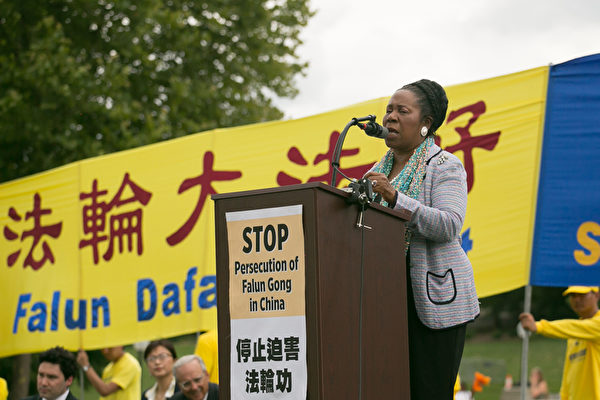

 2019年7月18日，美国民主党众议员希拉•杰克逊•李在华盛顿DC法轮功7‧20反迫害20周年集会上发言。

【大纪元2019年07月19日讯】（大纪元华盛顿DC记者站报导）中共对法轮功的迫害已持续20年。美国国会议员希拉•杰克逊•李（Sheila Jackson Lee）在演讲中表示，“邪恶不能够再继续”，必须制止对“正派又充满爱心”的法轮功学员的迫害。

希拉•杰克逊•李是代表德州13选区的民主党众议员，也是众议院汤姆•兰托斯人权委员会和安全委员会成员。7月18日中午，她出席了在美国国会西边草坪举办的2019华盛顿DC法轮功7‧20反迫害大型集会。面对来自美东、美中地区的近两千名法轮功学员及其支持者，她表达了和法轮功学员一起坚定反迫害、永不放弃的决心。

以下是希拉•杰克逊•李发言全文。

“NI-HAO！”（中文：你好！）我们非常感谢汪志远博士的演讲，他告知我们很多阴森恐怖的事实。这就是我们在这里集会的原因：将真相告诉给人，谈论在中国大陆对法轮功学员长达20年的迫害，并告知它们（中共）“够了！”我们在为此抗争，我们将结束这场迫害。

我是美国国会的议员，众议院汤姆•兰托斯（Tom Lantos）人权委员会成员，也是众议院安全委员会成员，我们会前往欧洲讨论世界人民的自由问题。

我相信所有人都应该享有宗教信仰的自由；我也相信，那些仅仅由于信仰而死亡或失踪的人应该得到一个说法。因此我今天想来参加集会，站在这片非常神圣的土地上，站在这片播种自由的土地上，重申这个事实。

正如我们宪法所规定的，我们美国人拥有信仰自由，我们相信中国也必须站起来接受一个事实，就是我们不能允许对信仰群体的持续迫害，也不能允许对法轮功学员家属的持续迫害。这长达 20年的迫害，延续的时间太长了，我们必须制止对正派又充满爱心的人士的迫害。

我们必须博爱，并为人类祈祷。因此我今天与你们一起站在这里，对你们说，我们永远把你们放在心上，将继续要求我们的政府在这个世界上坚持人道主义理念，要求政府帮助寻找你们失踪的亲人，并给予那些因修炼法轮功失去生命的人以荣耀。

这种邪恶不能够再继续了，而你们不能停止你们的抗争，不能够放弃。你们必须进行非暴力的抗争，因为非暴力抗争会战胜邪恶和暴力。我们不会失败，因为当我们的信仰强大而坚定时，我们就处于不败之地⋯⋯

当想到有1亿人遭到镇压，而且这个数字仍在增加，多么令人悲哀。

因此我只是请你们保持坚强，请你们明白我们这片土地，就如马丁•路德•金的名言所说，“任何一个地方的不公正都威胁着所有地方的公平和公正”。你们所遭受的不公就是对我们的不公，你们不放弃也意味着我们不会放弃。

在我收到手中这束花时候，我只请求你们不要放弃，这些照片所代表的人们（被迫害致死的法轮功学员）值得我们敬重、值得我们抗争。如汪志远博士所说， 向别人讲述你们的故事，讲述你们失去、失踪、被监禁的亲人们的故事。

我想对你们大家说，也对所有还在中国大陆和其它地方抗争的人们说，不要放弃。我们将永远永远不放弃。只要我们还在，就将不再允许这种颠倒黑白的罪行延续。

法轮功学员，你们必须坚定地前行，带着人道主义理念、带着力量走向胜利。非常感谢你们大家。

原文: http://www.epochtimes.com/gb/19/7/18/n11393805.htm

<h1 align="center"><b>接见宗教受迫害者 川普询问法轮功学员情况</b></h1>

美国总统川普（特朗普）7月17日下午在白宫与来自中国、土耳其、朝鲜、伊朗和缅甸在内的17个国家的宗教迫害幸存者会面，其中包括法轮功学员张玉华（左一）。

【大纪元2019年07月18日讯】周三（7月17日）下午4点半，美国总统川普在白宫椭圆形办公室会见来自17个国家的27位宗教迫害幸存者，其中包括来自中国的法轮功学员张玉华女士。这是川普总统第一次在白宫正式与遭受中共迫害的法轮功学员会见。

川普总统对到访白宫的宗教迫害幸存者说：“你们每个人都因信仰遭受了巨大的痛苦，你们受到骚扰，威胁，审判，监禁，酷刑。”“你们每个人现在都见证了在全世界推动宗教自由的重要性。”

“在美国，我们始终明白我们的权利来自上帝（神），而不是来自政府。”他说。

<b>张玉华请求总统帮助制止中共迫害 川普：我明白</b>
 

张玉华女士先向川普总统问好，并自我介绍说：“我是法轮功学员，我丈夫还在监狱里，他也是法轮功学员。”

川普总统问张玉华：“在哪个监狱？”

张玉华回答说：“江苏省苏州监狱。我很担心我丈夫，因为在这个监狱有一名法轮功学员坐牢三年，回家的第二天吐了很多血后就死了。”

她说，就像美国营救被朝鲜关押的那个年轻人一样，他（指被朝鲜关押的美国大学生）回到美国几天后就死了。

她告诉川普总统，活摘法轮功学员器官仍在发生着，她请求川普总统帮助制止中共政权发动的这场迫害。

川普总统对张玉华女士连声说：“我明白。”

张玉华是原南京师范大学外国语学院俄语系系主任，南京市第12届人大代表及法制委员会委员。但是，因为信仰法轮功，她被绑架四次，其中三次劳教、一次判刑，共失去自由长达7年零7个月，期间遭受过被剥夺睡眠和烈日下暴晒等多种酷刑。

她的先生马振宇是原中国电子科技集团第14研究所雷达设计工程师，曾主持过很多大型项目，设计完成过重大军工电子产品。马振宇因为坚持修炼法轮功而被中共当局长期迫害，已经多次被中共当局绑架、监禁和遭受酷刑折磨，累计坐牢7年多。2017年9月18日，马振宇第五次被中共非法绑架，只是因为给中共领导人写信讲述中共迫害法轮功的真相，他被非法判刑三年，罚款三万元人民币。

<b>“我将永远与你们并肩站在一起”</b>
 
川普总统在谈到捍卫宗教自由时表示，任何一位总统都不像他这样认真对待信仰自由问题。“在我看来，宗教信仰自由至关重要，真的很重要。”

川普对到访白宫的27位因坚持信仰遭受迫害的人士说：“你们所承受的痛苦是大多数人无法承受的，我要向你们祝贺，我很荣幸能跟你们在一起，我将永远与你们并肩站在一起。”

美国国际宗教自由大使布朗巴克（Sam Brownback）与宗教受迫害幸存者一起参与和总统的会面。参与会面的宗教迫害幸存者感谢川普总统在宗教自由方面所做的努力。

前中共党魁江泽民出于妒忌和恐惧法轮功修炼人数太多，在1999年下令迫害，大陆至少四千多位法轮功学员确认被迫害致死。这场迫害持续20年至今。

原文: http://www.epochtimes.com/gb/19/7/17/n11391208.htm

<h1 align="center"><b>中共活摘器官 澳学者：不容忍这种邪恶罪行</b></h1>

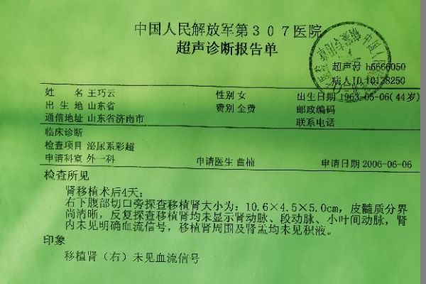

 2019年7月15日，澳洲法律界学者弗林特（David Flint）教授接受了新唐人及大纪元的采访。

【大纪元2019年07月17日讯】（大纪元悉尼记者站报导）上月，国际独立法庭对中共活摘器官罪行的终审宣判公布后，引发全球聚焦，在澳洲主流界也引发讨论。“我们永远不应该容忍这种极端邪恶。” 澳洲法律界学者弗林特（David Flint）教授在接受采访时，引用英国御用大律师杰弗里．尼斯爵士（Sir Geoffrey Nice QC）在国际独立法庭中的话说道。

澳洲法律界学者弗林特（David Flint）教授以长期担任澳洲广播管理局负责人的职务而广为人知，他也是支持澳洲君主立宪制的领军人物。

在法轮功和平反迫害20周年之际，弗林特教授表示，他认为法轮功修炼者非常勇敢，法轮功是一种有益的功法，“如果任何政府觉得遵循‘真、善、忍’理念的他们有问题的话，那就是件离奇的事。‘真、善、忍’是美德，并无危险，也不是政治活动。”他说。

弗林特教授谈到，很多西方人以为，中国已脱离集权时代，会逐渐发展为一个民主国家。但在他看来，“1999年7月20日（中共对法轮功学员开始迫害）发生的事情，再清楚不过地表明，（中国）仍由同一个共产独裁政权在掌控，它迫害民众至无以复加的程度。（它）所做的是如此邪恶，非常可怕的邪恶。”

<b>中共操控牟利 活摘器官成产业</b>
 
“很难想像还有比这更恶劣的情况，大律师杰弗里•尼斯爵士（Sir Geoffrey Nice QC）描述的情况更可怕，”他说，“这是最极端的邪恶，因为独裁者发现了一种方法，不仅可以迫害和杀害法轮功（修炼者），还可以将其（将其器官）货币化并转化为利润。 这是可怕的活摘器官产业。事实已被证明，这显而易见地是一个庞大的交易，远远超出了中国非常少的自愿器官捐赠计划可以实现的数量。”

弗林特教授认为中共活摘器官是一个政府操控的罪行。

“毫无疑问的是，中共最高层有意犯下这些罪行，中共党魁必须回答，他允许罪行的发生吗？他支持这样的罪行吗？整个中共政治局，他们都知道这样的罪行。他们不能掩盖，他们不能假装不知道，就像二战后纳粹说‘我们不知道发生了什么’。当然他们知道发生了什么，每个人都知道发生了什么！我们在西方并不是了解那么多，因为很多媒体以某种未知的原因不进行报导。但是，中共高层知道这一点，那（活摘罪行）就是由政府下令进行的。”他说。

“我们不知道有多少人死亡，估计约有一百五十万。但我们知道这是一个庞大的交易。 那些器官来自哪里？他们来自活着的、年轻的、较为年轻的、健康的人。他们受到惩罚的唯一原因就是因为他们都来自一个信仰‘真、善、忍’的团体，但这并不应该受到惩罚。”弗林特教授说。

他认为联合国人权理事会只关注了某些问题，却忽视了世界其它地方发生的危害人类的罪行。如果联合国人权理事会是受到尊重并有公信力的机构，就应将这样（中共活摘）的罪行置于联合国议程的首位。

<b>西方社会应如何应对？</b>
 
弗林特教授认为，西方政府和西方人正受到来自中共的强大的金钱攻势。他们害怕如果采取什么行动，或坚持调查（活摘器官）并制止这件事，中共会给予报复，停止贸易。例如，减少国际留学生或者矿石与煤炭的交易。“他们（西方政府）必须要知道这在道德上是错的，因为这些人完全是无辜的，他们甚至没有像其他罪犯那样被指控犯罪，他们有的只是信仰‘真、善、忍’。”

他认为西方政府和西方权威人士，商业、金融和法律领域的人们都没有对共产党说：“这必须停止，否则我们将曝光它。”他引用杰弗里尼斯爵士的话说，“共产政府是一个犯罪政权，这是永远不能容忍的。”

他认为，从许多方面来看川普政府是一届出色的政府，我认为这是人们所期望的道德力量的展现。

“我认为澳洲政府应该做同样的事情。川普总统和莫里森总理之间的关系似乎很密切，这是件好事，但我希望莫里森总理能向美国人学习，采取更有力的措施。实际上，我们与中国有重要的经济关系的事实，并不意味着我们必须容忍这种邪恶。”他说。

弗林特教授最后引用尼斯爵士在独立法庭上的话，“我们永远不应该容忍这种极端邪恶。”

原文: http://www.epochtimes.com/gb/19/7/16/n11387460.htm

<h1 align="center"><b>平凡人不凡的修炼经历</b></h1>

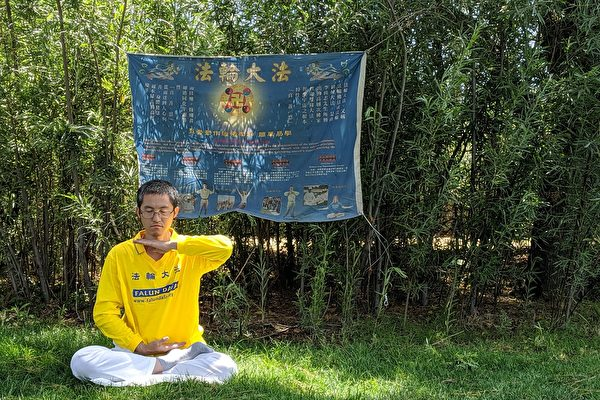

吴佳昊于阿罕布拉公园炼法轮功第五套功法。

【大纪元2019年07月11日讯】（大纪元记者徐绣惠阿罕布拉报导）尽管已移居美国近五年，但至今有人敲门都会让吴佳昊的妻子紧张，担心是中共国保上门骚扰，当意识到自己在美国正常生活后才松了一口气。因为修炼法轮大法，让吴佳昊平凡的人生出现不平凡的遭遇。他说：“感谢李洪志师父传大法，感谢师父教我如何做好人。”

<b>大法洪传：长春处处见法轮章</b>
 
1994年，16岁的吴佳昊从舅舅那里第一次听到“法轮大法”。当时他的母亲浑身病痛，就是个“药篓子”，经常吃药。在舅舅的推荐下，吴佳昊与母亲走入了修炼法轮大法的行列。他说：“当时长春有很多炼功点，走在街上，随处都可以看到配戴法轮章的人。”

最吸引吴佳昊的是“真善忍”的法理，他从头到尾将《中国法轮功（修订本）》看了一遍，对于“人为什么会存在”、“人存在的意义是什么”有了全然不同以往的体会，之后他又读了《转法轮》。吴佳昊说：“可以做好人、修心性的大法，真好！”

长春是法轮功创始人李洪志先生的家乡，又因修炼法轮大法可使人健康，在人传人、心传心的作用下，感召力很大。过去父母也教导吴佳昊做个好人，但从来没有像法轮大法讲得这么全面；每日勤炼法轮大法五套功法，约莫经过一年的时间，吴佳昊母亲失眠、头痛、坐骨神经痛等各种毛病都好了，一个大抽屉的药都不用吃了。

<b>风暴袭来：假新闻铺天盖地xxx</b>
720 
就读长春第五中学的吴佳昊修炼法轮大法后，发现自己的学习更有效率了。他说：“我可以从有效的角度去学习，不是死记硬背。有一种从高处去看的感觉。”而且他也不会陷入当时同学间攀比、竞争的习气中，炫目的流行文化也很难引起他的兴趣；青少年抽烟、喝酒或混社会等不良行为，更不会影响到他，吴佳昊说：“那些东西污染不到我。”

1998年高考放榜，吴佳昊考取了南京航空航天大学，主修经济。他在大学内与法轮功学员一起户外炼功、学法。但好景不常，1999年7月20日，一场类似文革的污蔑法轮功的运动在中国卷起，中共利用媒体大肆谩骂、制造假新闻，迫害法轮功学员的风暴袭来。

面对中共铺天盖地的宣传，吴佳昊说：“我脑子一下子空白，这法这么好，怎么可能是电视说的那样？”因从小在中共的教育体制下，吴佳昊从没有怀疑过中共的教条，甚至对1989年参与六四民运的市民、学生产生一种怨恨，他说：“假新闻宣传，对人的影响根深蒂固。”

<b>艰难正确的选择</b>
 
中共除了用各种舆论抨击法轮大法，学校也组织了许多“揭弊会”。从未经历文革的吴佳昊体验了中共的“思想管控”，当他在院系大会上听到校领导、副书记说的“一派胡言”，所有指控都与自己修炼的法轮大法完全不同时，他豁然开朗。被指定发言时，吴佳昊说：“大家这样认识法轮功，是因为大家不知道真相，如果知道，就会做出正确的选择。”

尽管在校成绩优异，但因修炼法轮功，所以吴佳昊被系主任约谈。吴佳昊说：“其实就是威胁，党和国家不让炼，继续炼的话要被停课，毕业证也拿不到。”当时校园里各级领导的主要工作就是保证学生没有炼法轮功，老师对学生进行心理战攻坚。

一开始，吴佳昊也被吓住过，他承受不住精神压力写了“保证书”，表示不再修炼法轮功。但不久后，吴佳昊又感到后悔，下定决心要坚持学法、炼功，在网上发表了保证书无效声明。

<b>两次被拘捕关押</b>
 
在中国，只要说出自己的意见，对中共的政策有异议，就会被扣上帽子。1999年之后，成千上万的法轮功学员被剥夺就学、升学、就业等基本的公民权利。

2000年，吴佳昊在学校体育馆后面平台炼功，遭人举报，他与另一名法轮功学员遭派出所便衣捉走。当时白下区镇压法轮功的负责人，表示政府会参考他们的意见，要吴佳昊与同伴大胆写出自己的想法，吴佳昊说：“这其实就是共产党的引蛇出洞。”只是当时他还不明白，后来吴佳昊就因这份说明而被判“行政拘留”，罪名是“扰乱社会秩序”。

从小以做好人、奉公守法为座右铭的吴佳昊怎么也没想到自己会有这一天。他说：“我竟然在派出所被关了15天。”尽管内心冲击很大，但他仍选择法轮大法，不愿听信中共的宣传。

对吴佳昊而言，这是一个艰难的选择，因为远在东北长春的母亲也被叫到南京，声泪俱下的要求吴佳昊别再炼功。吴佳昊明白，母亲被吓坏了，因为经过文革一代的人，早被共产党吓得没胆量了。母亲担心他在继续修炼法轮大法，可能就会被中共剥夺学习、毕业的机会。

2001年，吴佳昊和老师、同学在学校附近发法轮功的真相资料，再次被发现、逮捕。当时老师被判劳教两年，吴佳昊和同学被判“刑事拘留”30天，一开始警察还恐吓他，不写“保证”就不能出去，但他仍坚持修炼法轮大法，不签署放弃修炼保证书。后来在学校领导努力下，关押三十天后，吴佳昊被放了出来。2002年，他拿到毕业证，但找工作遭遇到重重困难。

<b>心中有大法度过狱中难忍岁月</b>
 
吴佳昊的第一份工作在南京，但几个月后，公司同事接到电话，派出所警察询问他的情况，不久后老板就委婉的要求吴佳昊离职。换过几次工作后，吴佳昊明白自己求职，无论是明里、暗里都受中共阻扰影响，于是决定自己做生意，解决生计问题。

2005年10月，中共第十届全运会在江苏举行，610国保大规模的抓捕法轮功学员，吴佳昊与30几名法轮功学员被逮捕。610国保不允许他请律师，甚至说：“请也是白请”，最后吴佳昊在法庭上自己为自己辩护，他被非法判刑四年，在看守所关了一年，之后转到江苏无锡监狱关了三年。

在监狱里，吴佳昊被列在“严管队”，顾名思义，就是严加管训的队伍。他每天进行超负荷的走正步，吃饭、睡觉、上厕所都有严格的时间控制；警察要求吴佳昊写认识，背监狱规则，看各种污蔑法轮大法的录像、书籍；晚上睡觉时也不能关灯，还有犯人监视、包夹不让他休息。

吴佳昊表示，狱警无所不用其极，心理恐吓、体罚等各种方式让人崩溃，他时常听到其他犯人的哀号声，如果没有法轮大法的支撑，一定熬不过来，他说：“如果是普通人被这样高压对待，人都会变得麻木、会发疯，人都不正常了。”

吴佳昊的妻子本来没有修炼法轮功，但在他坐牢其间开始仔细阅读《转法轮》，她想了解究竟是什么原因，让丈夫坚持不愿放弃，甚至可能牺牲财产、生命。最后吴佳昊的妻子看明白了，“法轮大法好”、“真善忍”没有错，所以在吴佳昊服刑期间，给予他很大的支持。

<b>同一个地球不同的资讯</b>
 
因为修炼法轮大法，吴佳昊做生意也是秉持着“真善忍”的原则。他以提高自己，变成更好的人的方式经商，逐渐的生意也有了起色。但公司仍是三天两头被找麻烦，吴佳昊说：“这些国保没有任何搜捕令，堂而皇之说来就来，企图在经济上截断我的生活。”

2014年妻子怀孕，吴佳昊决定来美国生活，因为他不希望自己的小孩和自己有一样的境遇。他说：“要给孩子一个安全的环境，这是我们的责任。”

刚到美国，吴佳昊很感慨，他发现在这里的人与人之间比较信任、友好，人们的各种权力都可以被保障，而在中国，只要修炼法轮功，想要做个好人，生命都可能随时被剥夺。他说：“同一个地球上，却是截然不同的情形。很多在国外的人不可能想像，我经历过，很多人都经历过。”中共将人教育到失去思考的能力，很多人的头脑中都没有正确的概念。

吴佳昊认为中国缺乏真实资讯，在禁锢思想的环境中，人很难做出正确的判断。他说：“我的同龄人、同学们都很聪明，但因为没有获得真实的资讯，所以做出错误的判断。”例如美国对中国增加关税时，很多中国防火墙里的民众根本不知情，隔日中国股市暴跌，成了被牺牲的股民。

海外真实的讯息与中国人的切身利益越来越相关，吴佳昊说：“我希望所有国内的人都可以知道海外真实信息，知道国外正在发生什么，都能够知道法轮功真相。”

原文: http://www.epochtimes.com/b5/19/7/11/n11377666.htm

<h1 align="center"><b>迫害大法徒者已尝苦果</b></h1>

【明慧网二零一九年七月九日】天网恢恢，疏而不漏，谁逆天理迫害忠良，早晚都要被上天惩罚，吃亏的是自己，若不听忠告，为了一己私利一意孤行，到时后悔都来不及了。
法轮大法是佛法，在世间弘传是在救度世人。大法徒有着博大的胸怀和高尚的品德，为救世人在慈悲的讲述着真相，是顺天意而行，他们放下个人的生死和利益，顶着压力在救世人，为了使人分清正邪，免于淘汰。

中共江氏集团自一九九九年七月发动的这场对法轮大法和大法弟子的残酷迫害，害了无数的生命。追随江氏集团参与迫害大法弟子的人，多数都遭了报应，吃了自己酿造的苦果。

我们地区，据我所知，就有多个因积极参与迫害大法弟子而遭恶报死亡的。仅举两例。

有个叫刘宝森（记忆中大概叫这个名字，因十六、七年前见过他）的，退了休被返聘到伊春洗脑班工作，负责给被绑架到洗脑班的法轮功学员作所谓的转化工作，每天播放中共邪党污蔑大法的恐怖录像，让学员写思想汇报和所谓的转化三书。大法弟子劝他不要在这里卖命了，对他前程不好。他也表示说不想干了，回家抱孙子去。但他没有马上离开这个黑窝，又干了几年。结果厄运临头，患了肺癌。在省城医院住了十来天就花了二十万医疗费，不长时间就在极其痛苦的折磨中死去了。

伊春市翠峦区有一个叫刘继峰的人，是区机关某科室下岗的科员。江氏集团疯狂打压法轮功以后，刘被聘为街道邪党支部书记。他紧跟江泽民集团迫害法轮功，非常卖力。每天到法轮功学员家骚扰、恐吓，说是没办法，上边让干的，有时也觉得不好意思天天来，但脚步没停，依旧骚扰大法弟子和家人。给大法弟子和家人造成了很大的精神伤害。还时不时的逼大法弟子写所谓的保证书等。他不听大法弟子的劝告。后来突然得了怪病，腿疼得不敢走路。其实是上天对他的警告。过一段时间好了之后，他没有醒悟，还是死心塌地的参与迫害法轮功。在几年前刘继峰在下班的路上突然猝死。当时才五十多岁。走错了路，害了自己。

自古以来，迫害正信的都没有好下场。写出这两个例子，不是幸灾乐祸，而是想警醒世人，相信善恶有报的天理。那些还在参与迫害大法弟子的人，你已站在悬崖上了，赶快清醒，远离危境吧。不要再迫害善良的大法弟子了。善待大法一念，天赐幸福平安。天灭中共在眼前，快快退出邪恶党团队，记住法轮大法好，利用你的职权，保护大法弟子，赎罪，也许你会有一个美好的未来。

原文: http://big5.minghui.org/mh/articles/2019/7/9/389767.html

<h1 align="center"><b>二十年前的7•20 北京青年郭为民彻夜未眠</b></h1>

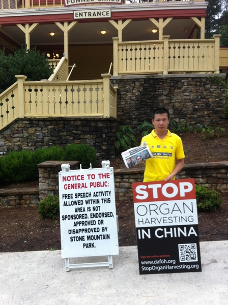

来自北京的法轮功学员郭为民。

【大纪元2019年07月09日讯】夜深了，北京城却没有宁静。郭为民往天安门方向走，走到虎坊桥时，已是凌晨5点了，街头上有联防的在巡逻，查问路人……彻夜未眠的他到了天安门后，在那里待了一整天，炎炎烈日下，气温高达41摄氏度，人都被晒晕了，这一天是1999年的7月21日。

之前一天，7月20日，家住北京市的郭为民经历和目睹了一辈子都难以忘怀的一天。

<b>7•20当日 警察用公交车拉人 北京体育场变拘留所</b>
 
郭为民回忆说：“我和一个年轻男同修一起先去了府右街，就是4•25万人上访的地方，我们想还像4•25一样大家聚集起来。那里到处都是警察和便衣，还有用来装人的公交车，他们几乎见人就问是不是炼法轮功的，并叫法轮功的人上公交车，装满一车就拉走，我们也不知道被拉到哪里去了。”

那是在法轮功学员4•25和平访之后，中共党魁江泽民一意孤行宣布取缔和镇压法轮功，首都北京一时间乌云密布，全城警察不由分说地抓捕来自全国各地的法轮功学员。

那天，郭为民从家里出来，因为不是外地人，他没有成为警察抓捕的主要对象，但最终还是被抓了，“快到永定门火车站时，碰到一帮警察对行人搜身，他们从我们身上搜出了《转法轮》书籍，就这样我们也被抓了，然后是登记个人信息。”他说。

“之后，我们也被送上一辆公交车，车里装满40、50人左右时就开走。我们被拉到了丰台区体育场。”眼前的情景郭为民至今记忆犹新，“体育场的场地上一片一片地坐了很多人，有警察在场，按不同地区的人分开坐，在车上就问是哪里的人，然后就归到那一片人群去。当得知我们是北京的，就又把我们拉走。我们一行三人被带到了永定门附近一个宾馆的院子里，那里有很多警察，当时已经是夜里11点多了。 ”

“然后有三个警察分别一对一地向我们三人问话。”与其说问话，不如说骂人，郭为民形容道：“他们满嘴酒气，说话带脏字，胡搅蛮缠不讲理。”前两位学员试图和问话的两名警察讲道理无果，结果是在他们的骂声中离开了。

他也试图和警察解释法轮功的真实情况，“我思路一直很清晰，说话一直很有逻辑性，他找不到丝毫破绽，最后他自己说不下去了，理屈词穷，没趣地走了。”这时大概已是凌晨2点多了，他们最后让我离开。

<b>苦苦寻觅 找到人生的意义</b>
 
和千千万万修炼法轮功的学员一样，郭为民修炼法轮功的原因再简单不过了，那就是寻觅一种提升身心健康的功法。

“我年轻时喜欢武术、气功，那时又有气功热，有关气功的杂志、书籍及各种功法在社会上传，我很喜欢看这方面的书籍。”他说，“但没有一种功法是我满意的，我总认为它们里面有不对的东西。那时我20多岁，也常思考一些人生问题，感觉人的道德在整体下滑，不知人为什么活着，心里很苦。”

迷茫中，郭为民给自己定了人生的原则：“不抽烟，不喝酒，不做对不起自己良心的事，孝敬父母，本本分分、平平淡淡过一生。”

1996年5月6日，郭为民清楚地记得，一直反对他看气功书的父亲，一改常态，给他带回家一本气功书，“他也不看，就放在了桌子上，那也是当时很有名的功法，我就翻了翻，觉得里面没讲什么实质的东西，我就放那不动了；第二天下班，我父亲像昨天一样又拿回另一本气功书，也是当时有名的功法，我又翻了翻，对里面讲到的东西也不认同，就又放那里不动了。”

第三天，“我父亲又拿回来一本书——《中国法轮功（修订本）》，这次不同的是我父亲主动对我说，‘我拿回一本书你看看’。我以为还跟以前一样，就漫不经心地拿到自己屋里看去了。”读完后，郭为民大为振奋，“我一口气读完了这本书，觉得真是太好了，这就是我要的！”，“父亲还跟我说，书摊上还有几本这个作者的书，你可以自己去买。”

于是，第二天一早，他就去书摊买回来了《转法轮》和《法轮大法义解》。就这样，郭为民开始了修炼法轮功，经常到北京天坛公园的西门炼功点去炼功。

<b>没有犯罪 却被判刑十年</b>
 
好景不长，在郭为民开始修炼的第三年，中共启动了史无前例的对法轮功学员的镇压迫害，从1999年到2002年三年间，他因为坚持炼功和讲真相，多次遭警察非法关押，最后一次在没有任何法律程序的情况下，被判刑10年。

1999年7月20日后，就不断有法轮功学员到北京上访。郭为民和家人自愿接待了一些来自外地的同修。“1999年9月17日，我因为给一些外地同修送衣服时，被警察抓了。一个警察拽着我的耳朵，让我带路去找同修。”他为了不出卖同修被拘留了28天，“警察审问了我一天一宿，这一天一宿没吃没喝没睡觉，也不让上厕所。”

他的父亲，也仅仅因为好意接待外地同修而被拘留了15天。“在看守所里，我隔着牢房的铁栅栏门，看到自己60多岁的父亲，光着脚，双手抱头，像犯人一样被警察叫出去提审，我心里真是很难受。”

2000年黄历新年期间，郭为民和当地同修大概20人左右，重新开始每天早晨在外面集体炼功，“炼到第七天时，来了一帮警察把我们都抓了。这次我被拘留了30天。”

2000年底，郭为民因为做真相资料又被当地警察分局下令抓捕。拘留了37天后，因为警方没有找到所谓的“证据”，只好放人。

多次的被拘留并没有影响郭为民讲真相的决心。他回忆道：“2001年大概3、4月份时，一位学员找到我，让我负责真相资料的转递。这个学员主要负责制作真相资料，印制各种真相小册子，刻录光盘等，还有制作真相图片、横幅等，为了资料点的安全，这些资料都由我转给其他学员。我在不同的地方租了几个仓库，让和我联系拿资料的学员去仓库取资料。这些资料大概要供给1000多位学员用。”

“2002年8月，我们被抓了。这次我被判刑10年。”2002年8月9日，郭为民和法轮功学员张振忠在福州因讲真相再次被中共警察非法抓捕，和法轮功学员王益，但凌，张鸿儒，李海，晋源涛，徐若辉和白丽丽一起， 9位学员被北京市第二中级法院作为同案进行所谓的审理，9人中除白丽丽被非法判刑三年外，其余8位被非法判刑9至14年，郭为民被非法判刑10年。

<b>冤狱8年半受尽折磨 母亲也被非法劳教两年</b>
 

郭为民在8年半的冤狱中，承受了很多的痛苦和折磨。每天被4个犯人24小时贴身“包夹”看管，长期做奴工，长期被强迫看污蔑法轮功的视频，连续多日不让睡觉，不让洗澡，不让理发，不让剪指甲，长时间不让上厕所，长时间坐小板凳等等。

“坐小板凳是长时间不许动，有人屁股都坐烂了。有一次我泻肚子，警察却不许我去厕所，我脸色发白，浑身出虚汗。”

2011年2月9日，郭为民提前一年半回到家中，得知母亲朱秀珍也因不放弃修炼法轮功，在2007年5月至2009年5月期间被非法劳教迫害两年，73岁的父亲因此受到很大打击。“身体一度出现严重病态，却根本无人照顾他”。

郭为民还披露，很多法轮功学员因不放弃修炼而被警察活活打死。2002年8月至2003年2月期间，郭为民被关在北京大兴一个所谓“法制学习班（洗脑班）”内，一天晚上他清楚地听到隔壁房间有两个警察谈论法轮功学员王益。“其中一个警察说，王益被“熬鹰”40多天，怎么也不肯转化，是个难啃的骨头。另一个警察大声说：哪那么多废话呀，不行就打，我都打死两了。另一个警察马上说，隔壁有人，说话小点声。”

自监狱回家后，郭为民仍时刻处在当地司法所、派出所、社区居委会的轮番监管下，不准郭为民离开北京市，还要经常向他们汇报动向。“我仍然像生活在一个大监狱里。”

2013年2月16日，郭为民辗转来到美国。2015年7月14日，郭为民从美国向中共最高检察院和法院寄出了《刑事控告状》，控告江泽民犯下群体灭绝罪、酷刑罪及反人类罪。

在法轮功学员反迫害20周年即将来临之际，郭为民说，“这20年来，有多少大法弟子被迫害而失去了生命，有多少本应是幸福的家庭被迫害得妻离子散，家破人亡，有多少法轮大法弟子甚至被活体摘取器官，这个冲破人类道德底线的罪恶如今还在继续。而这一切的发生，仅仅是因为大法弟子遵循‘真、善、忍’这一普世价值观，做个好人，以至更好的人。我相信有良知的人都会选择站在正义这一边。”

原文: http://www.epochtimes.com/gb/19/6/29/n11354195.htm

<h1 align="center"><b>【专访】英人权专家吁各国立法 清算中共</b></h1>

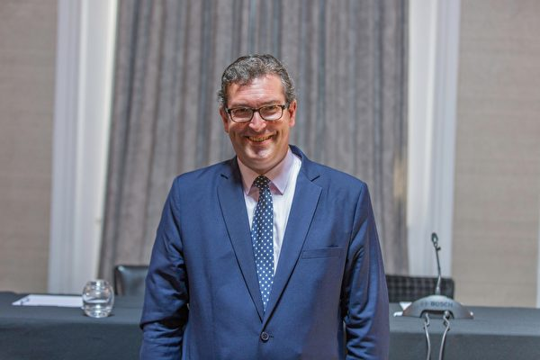

 6月17日，罗杰斯出席了“独立人民法庭”在伦敦的宣判。

【大纪元2019年07月05日讯】（大纪元记者文沁英国伦敦报导）在法轮功7.20反迫害20周年前夕，英国著名人权活动家罗杰斯（Benedict Rogers）先生接受了大纪元专访。他表示，中共对法轮功持续20年的迫害非常糟糕，令人极度震惊。他呼吁各国政府进行立法，制止暴力迫害，并对中共政权进行清算。

罗杰斯是英国保守党人权委员会联合创始人兼副主席、“香港监察”创办人兼主席。

<b>“中共暴政将结束 中国民众也将重获尊严”</b>
 
今年5月，美国福克斯11台播出的纪录片给出更多证据，证明中共残酷迫害信仰真、善、忍的法轮功学员。罗杰斯说，更多的人应该看看这部纪录片，进一步认识中共政权的残酷本性。

1999年7月20日，中共党魁江泽民利用整个国家机器，对法轮功修炼群体发动了史无前例的残酷镇压。从那时至今，人类历史上最邪恶、最惨烈的人权迫害，在华夏古国的大地上持续了20年。

这20年里，中国大陆和海外法轮功学员不畏巨大压力，和平理性反迫害。他们展现了善的力量和不畏强权的坚忍精神，一直呼唤正义和良知。

罗杰斯相信，中共暴政迟早会结束。他说，“现在世界各地的政治形势动荡不安，出现很多意想不到的事态发展。但是借鉴历史，我确信暴政不会永远在位，那天迟早会到来。中共暴政有结束的那天，中国民众也会重获尊严。”

<b>“独立法庭是重大突破 吁各国政府立法制暴”</b>
 
此外，罗杰斯盛赞6月中旬伦敦“独立人民法庭”（又称中国法庭）对中共活摘法轮功等良心犯器官做出的最终判决。“独立人民法庭”宣判中共反人类罪成立，并认为其很可能犯下种族灭绝罪。在不到一个星期的时间内，全球有近30家主流媒体对此进行了报导。

他说：“中国法庭（的判决）是一个重大突破，我对此深表欢迎。法庭由杰出的、有名望的、身份独立的成员组成。他们事先并不了解活摘器官问题，也没介入中国相关议题。

“（在这种前提下，）法庭成员们经过长时间听取证词和证据，最后基于事实依据，做出以下独立判决：活摘器官在中国大规模存在，并且还在发生着，没有任何停止的迹象。这说明（中共）已经构成反人类罪。

“此外，法庭也多次邀请中国（中共）以及那些反驳活摘指控的人来出庭，陈述他们的观点，但是他们一再拒绝回应。人民法庭是独立的，其调查结果和判决得到国际社会的严肃对待。现在是采取行动的时候了。”

罗杰斯认为，各国政府应该高度关注这一判决。“我认为英国议会，世界各国政府以及立法机构，都应立即关注独立法庭的判决并做出回应。（他们）有必要通过立法、外交和其它方式制止这些暴行，把中共及人权侵犯者绳之以法。”

<b>应对中共官员实施“马格尼茨基”法案</b>
 
近期，美国政府表示将严审签证申请，对人权迫害者拒发签证，或冻结他们在美国的资产与拒绝其入境。罗杰斯相信这是“重要且有效的手段”，并提议应该对那些参与酷刑或犯有其他侵犯人权罪行的中共官员实施“马格尼茨基”法案。

罗杰斯还说，中共还把人权迫害输出到国际上，“许多国家都存在严重侵犯人权行为，但是毫无疑问，中共是侵犯人权最严重的政权之一，而且是少数几个试图打压境内外异议者的国家之一。”

“同时，它（中共）通过各种手段，伙同其它人权记录不良的国家共同犯罪，比如（中共）向它们提供外交、政治和经济上的保护，出售设备，影响联合国（运作），以及贿赂各国决策者。”

近期，多名英国学者曝光中共领馆以拒发/吊销签证作为威胁，要求他们对言论进行自我审查，不许对中共作出批评。对此无理行为，罗杰斯说：“中共正在试图霸凌、恐吓、威胁和遏止世界各地的批评者，包括英国学者。我们不能任由中共在英国和英国的高校压制学术和言论自由。（英国）是时候对中国（中共）说‘不’了。”

原文: http://www.epochtimes.com/gb/19/7/5/n11367315.htm

<h1 align="center"><b>前加拿大小姐纽邮刊文 谴责中共活摘器官</b></h1>

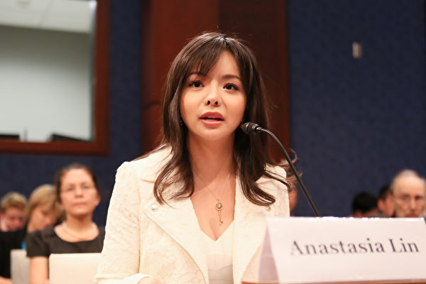

加拿大世界小姐林耶凡在美国国会听证。

【大纪元2019年07月03日讯】（大纪元记者张北编译报导）日前，位于伦敦的“独立人民法庭”裁决，中共政权一直在大规模地从良心犯身上强制摘取器官，而法轮功学员是器官供体的最主要来源。裁决一出，引起国际广泛关注。《纽约邮报》于6月23日刊登了前加拿大小姐林耶凡的评论文章，该文谴责中共活摘器官的丑恶暴行。

以下是林耶凡文章的译文：

6月17日，独立人民法庭最终宣判，判定在过去20年里，中共政权系统地、大规模地从良心犯——主要是法轮功学员和穆斯林人士身上强制摘取器官。

这个独立法庭位于伦敦，首席法官是英国御用大律师、国际刑事犯罪领域的知名人士杰弗里•尼斯爵士（Sir Geoffrey Nice QC）。他曾主导国际刑事法庭对前南斯拉夫总统米洛舍维奇的起诉。

法庭收集的证据显示，中共对囚犯执行死刑后，强制摘取他们的器官，贩卖给需要做移植手术的中国人和到中国“器官移植旅游”的外国人。由于受儒家思想的深刻影响，中国人都希望死后保留完整的个人躯体。因此在2015年以前，中国并没有自愿捐赠器官系统。然而在这种情况下，中国医院却能每年做60,000到90,000台器官移植手术。

中国医院向患者承诺，他们在两周内就能为患者找到血型、尺寸都匹配的心脏、肝脏、肾脏和眼角膜等器官。更不可思议的是，移植手术的时间都可以提前预约，仿佛医院确切地知道“捐献者”会在何时去世。与之形成鲜明对比的是，美国拥有非常完善的自愿器官捐赠系统，但是患者通常要等待几百天才能找到适合的器官。

根据人权研究员的调查报告，中国（中共）监狱一直对被关押的法轮功学员施以酷刑，同时对他们进行体检，以掌握他们的器官健康状况。被拘的维吾尔族穆斯林也反映他们经历过类似的体检。

有逃离中国大陆的前中国执业医生向法庭提供证词，提醒西方政府和医务人员，中共活摘良心犯的暴行仍在继续。

然而，这项调查工作并不容易。一位研究人员将他的工作难度比作检查核爆炸后的现场。中共政府机构和医院从不对外提供真实的数据，因此调查人员必须通过医院翻新通知、患者更替率和医学研究论文等证据进行推断，以估算每家医院进行移植手术的数量。

目前，中共当局在网络上删除了一切反映活摘的信息。因此对人权研究员来说，保存现有的证据变得极其重要。

我真正意识到活摘的严重性，是在2016年拍摄电影《尖端医疗的真相》的时候。电影里，我饰演一位被非法抓捕的法轮功学员，这位学员被绑在手术台上，重要器官都被摘除、贩卖。

之后，我加入了那些勇敢的研究员和活动家的工作。我们在立法听证会上作证，推动立法禁止外国人前往中国进行移植手术、禁止参与活摘的中国医务和警务人员入境西方国家。

这是一场艰苦的战斗。虽然以色列和台湾都通过了法律，阻止其公民去中国进行器官移植，但大多数其它民主国家政府却避免谈及这一反人类的罪行，也许是因为一旦正视这个问题，他们就必须立即采取应对行动。

与此同时，中共发动了对活动人士的人身攻击，对我们进行污名化宣传。我主演的多部电影和相关题材纪录片原计划在一些大学及其它场所放映，但是很多主办方在接到中共外交官的电话后，取消放映计划。

一年前，我原定参加一个著名的西方公共广播公司节目，讨论强摘器官。但是在直播前几个小时，一位制片人取消了节目。我的工作人员被告知，这个决定来自“更高层”，我的“背景”使得采访无法进行。中共的官方媒体称我是被X教利用的工具，和“反华势力”勾结传播谎言。

自2000年以来，中共将器官移植产业化，大规模强摘器官以谋取暴利 。几十数百万无辜的人因此被杀害。那些受害者，是普通的中国公民，是不愿放弃信仰的善良人群。

对于像我们这样致力于揭露这一反人类罪的人们来说，“独立人民法庭”的判决如同是对祈祷者的有力回答。很多人早已向西方自由世界政府提供了大量中共活摘的证据，但这些政府一次次地置若罔闻。中国的全球合作伙伴们，一次次地因为真相“不合时宜”而无视中共犯下的罪恶。如今，“独立人民法庭”判定中共系统地、大规模地强制活摘器官，西方国家再无理由不采取行动。#

原文链接：https://nypost.com/2019/06/23/the-ugly-truth-about-chinas-organ-harvesting

<h1 align="center"><b>托斯坦‧特瑞：强摘器官背后的空前罪恶</b></h1>

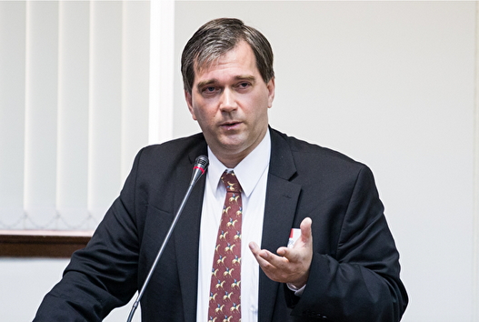

“医生反对强摘器官组织”（简称DAFOH）执行长托斯坦．特瑞（Torsten Trey）医生。

【大纪元2019年07月03日讯】从2001年到2014年，中共官方一再地针对移植器官的来源，发表自相矛盾的声明。这种反复无常的说词，误导并欺骗了西方国家，导致西方认为中共的承诺和保证既不可靠也不值得相信。基于这样的背景，黄洁夫说，“现在还不是时候”并不令人感到意外。中共只是在拖延时间。

中共反复无常的说词并不是巧合，而是有意的。企图混淆，对于被低估的强摘良心犯器官黑幕，转移焦点，阻挡国际社会对于调查与检查中国医院的严正要求。任何对于国际调查的延迟，都延误了我们的专业要求：停止医疗滥用。而这个延误的代价是人的生命。无疑地，西方组织与政府确实展现出耐心，但是在王国齐医师提出证词之后的14年几无作为，已经有超过15万个器官，从差不多等量的囚犯和良心犯身上被取走。

值得注意的是，自从（中共）开始迫害法轮功之后，四年内中国的器官移植案例出现了指数式的增长。为什么法轮功修炼者遭受这种恶行？法轮功学员依照宇宙的特性：真、善、忍，致力于修炼他们的心灵来成为一个好人。这些修炼者，在1999年7月后，竟成为被洗脑、强迫劳动和酷刑的对象。在中国各地都有法轮功修炼者被酷刑致死。

如果用一些时间来检视法轮大法信息中心网站（www.faluninfo.net），就可以了解迫害的野蛮程度。这基本的问题是，人一旦被剥夺了生而为人的尊严，生存权和信仰权利，那么他将一无所有。对于加害者而言，酷刑致死与杀死良心犯摘取器官是一样的，除了一点：后者可以把数以万计良心犯的尸体转换成数十亿美元的金钱利益。

摘自《前所未有的邪恶迫害》一书中作者托斯坦‧特瑞的《强摘器官背后的空前罪恶》

书籍官网网址：http://www.unprecedentedevilpersecution.com/

<b>作者介绍：</b>

托斯坦‧ 特瑞（Torsten Trey），医师、医学博士、美国“医师反对强制摘取器官组织（DAFOH）”执行长，与诺贝尔和平奖候选人大卫‧麦塔斯合编《国家掠夺器官》，并经常在医学专业杂志发表中共器官移植滥用相关研究文章。

原文: http://www.epochtimes.com/gb/19/7/3/n11360830.htm

<h1 align="center"><b>快找真相　大难来时能得救</b></h1>

【明慧网二零一九年七月二日】「快找真相，大难来时能得救」这句话乍听起来好像有点玄，使人好像有点摸不着头脑似的。现在的社会不是好好的吗？物质丰富给人们带来充份的享受，科学的发达，给整个社会带来繁荣。人们在其中尽情的享乐。你们说这话好像很遥远吧？
也许这就是眼下的现实，可是不能过了今天没有了明天，谁又能知道明天的命运该如何呢？老子曾言：「福兮、祸兮」。可能在物质尽情享受下，隐藏着很大的灾难。

大几岁的人对南亚大海啸记忆犹新，对中国发生的非典还心有余悸。人在大难面前显得多么无奈、渺小。可这两件大灾难发生前都有人告诉你预兆，海啸前有一个当地土著人高喊「快跑，有海啸！有海啸！」当时人们玩的正兴奋，认为他是扫他们的兴，还有人骂他。

中国的非典发生前，正是江泽民疯狂迫害法轮佛法修炼的人最残酷的时候，修炼的人告诉他，这是佛法修炼，是信仰，迫害要遭天惩的。可江就是不听，利用手中的权力，一意孤行非要迫害。现在的中国，由于共产党迫害神佛的弟子，用假恶暴拼着命的纵容官员贪腐，来对付真善忍。致使整个中华大地贪官遍地，冤魂遍野，怨声载道，道德低劣，人的质量低下，逐步失去做人的准则。你想，这还不遭天惩，大难能有多远，可以说就在眼下。

笔者从几个方面谈谈中国的现状，是不是大难的前夕！

<b>一、从现实的社会乱象上看</b>

说到人们生活富裕，过的好了，这也不假。这是整体人类发展的必然，如不搞改革开放，看中国可和北朝鲜一样，也就说中国人民生活好了是被逼出来的。但中国人的生活美好，不是真的过的美好，从人们精神颓废方面来看，由于中共政权畸形政策舆论的引导，一切向钱看，做任何事情不讲道德，在日常生活中，随时都有被伤害的可能。如假烟、假酒、地沟油这类的，已不足为怪。毒奶粉、假药、假疫苗，为了赚钱，大的厂商都往牛奶里加甚么化工原料「三聚氢胺」之类的。在日常生活中，说不定吃喝是有毒的，大人和小孩很可能就是注射的假疫苗。随时都有致命的危险。你说你活的幸福吗？

记得前些年流传一个段子说，有一个人的钱被人骗了，气的回家喝农药寻死，结果喝的假药，没死。家里人认为大难不死，很高兴，买酒喝两盅。结果买的假酒，一喝死了。是真是假，无法考证。但现实的生活中，使人烦心的事是常有的吧！

再加上空气污染、水污染，吃的喝的呼吸的都带有毒素，人能不生病？不是有报导，全国有多个癌症村、癌症县，艾滋病村、艾滋病县吗？这些社会的乱象可不可怕。

上学难、看病难、住房难，已成为中国人的三座大山。有的人可能说：上学难，大学里国家有无息贷款，但学校变着法的收学生的钱，使有的家庭为孩子上学，不得已外出打工，背负债务。有病了虽有医保，可医院里以各种名目检查不给报销的费用多的吓人，又不能讲价，任其漫天要价宰割，病好没好是另一回事，可能因病会花去终生的积蓄。住房，房价逐年攀升价高惊人，使你成为终生的房奴。所以说人坏了，甚么都坏了。

特别是江泽民执政时期，大搞腐败治国，各级官员心照不宣，拼着命的腐败，有权不使，过期作废，老百姓只能忍气吞声，说句牢骚话，说不定给维稳了，只能眼巴巴的挨宰。社会的乱象何止这些，你想想，人治不了，天能不治？

<b>二、从现实中国人的道德沦丧说起</b>

说起中国人的道德沦丧问题，这是大家都公认的。有的人可能无奈的说「中国人啥都不缺，就缺德了。」的确是这样的。当自己遭到被欺诈或不公时，可能都抱怨别人没道德，甚至太黑了。细想起来中华民族从过去一个被称作神州大地，礼仪之邦，万邦来朝外夷敬仰的天朝，到现在互相伤害或到国外所到之处，给外国人印象是：语言粗鲁，行为低下，随地吐痰，乱扔垃圾，小孩乱拉乱尿，被外国人看不起的境地，能是偶然的吗？

究其原因大家深思深思。自共产党建政以来，连番的政治运动，搞死了中国人多达八千多万，其实打掉的是社会精英，民族的信仰，国人的善良本性。小人得志，好人受辱，强行灌输的马列邪说，与天斗、与地斗、与人斗。腥风血雨、冤魂遍地、江河断流、大地失色，人人都诚惶诚恐，说不定自己甚么时候成了专政的对像。

特别是残酷的迫害法轮佛法以真善忍原则修炼的人，更是残酷，打死的、判刑的多的无法统计，甚至活摘他们器官到外国牟取暴利，使人闻之胆寒，令天地震怒。

你想这样的政党对待统治下的人民，能懂得用礼仪、道德教化人民吗？不信你问一问江泽民之流和现行官员，道德是啥，他会哈哈大笑，道德值多少钱一斤。中华民族哀哉，还谈甚么复兴中华，做甚么梦。

贪腐已成了执政党代名词，当官的在职不是为人民做些公益善事，而是有权不使，过期作废，变着法子捞钱、捞资本，买官卖官已成中国社会主义的特色，大型国企都垄断在太子党、官二代手中，动辄上千亿的贪，富可敌国。还讲甚么为人民服务，实为人民币服务，为了钱，这些人道德已丧失殆尽。

那在社会上呢？也无道德可言，如前些时候曝出的北京红黄蓝性虐待幼儿案，可耻至极，如对社会不满，杀人灭门，在学校砍杀儿童事件层出不穷。由于执政者不用道德引导民众，动不动搞严打、整治、抓、关，人们在暴力的熏染下，日趋形成狠、斗、打、杀的心理，人与人之间互相戒备，以防不测。近期搞的甚么打击黑社会行动，真的弄不清到底谁是黑社会了。人们为了自保，已麻木不仁了，得过且过，只顾自家门前雪，不问他人瓦上霜，更甚者遇老弱病残没人相救，老人走路如摔倒了，没人敢扶，生怕碰瓷、讹诈。

人类到了这一步，道德已沦丧至尽，已没有了当人的资格，还能继续下去吗？人不治天治，天惩，人类已危险在即，神的使者在世上救人，如再不听，可能再也没有机会了。

特别是被江泽民利用的执法人员，这些年在对待法轮佛法修炼人的过程中，也不分善恶更不讲法律，穷凶极恶的诽谤佛法，不择手段的迫害着大法弟子（神佛的弟子），做完恶事，完了就完了，怎么可能呢？善恶有报是绝对的天理，天理难容啊！在大难未到之前这些人如不赶紧醒悟、立功、赎罪，到时遭清算的不止这些人，可能连家人都要因你做恶而遭殃的，这在被以反腐拿下的高官已证实这一点，其实在基层各级政法机关每天大量遭恶报的也是触目惊心的，上天在救人，可别再失去得救的机会了。

<b>三、从古代著名预言说说</b>

上边谈到了中国的社会已走到了这一步了，绝非天方夜谭，危言耸听，有人可能说，那该怎么办呀？其实上天没有放弃每个民族和每个人，大家熟知的中国许多朝代留下的警世预言，都精准记载每个朝代兴衰，特别是今天的中国现状，更叫人深思。

如汉代诸葛亮的《马前课》、唐朝的《推背图》、明代刘伯温的《烧饼歌》都精确预测今天的中国由于遭外来邪灵侵扰的现状，对神佛的亵渎和对佛法修炼人的打压以及遭天惩的可怕后果，《烧饼歌》曾言：「天有眼，地有眼，人人都有一双眼，此时世上有人行大善，遭了此劫不上算，富人一万留二三，穷人一万留一千，十户可能留一户，看看几十里路无人烟，贫富若不回心转，看看死期在眼前」

……因篇幅有限，请查看这些警世预言全文，到时别给自己和家人留下遗憾。人类虽有大劫之忧，神佛是慈悲于人的，若能听进去神佛的忠告，还是有生路的。

下边就谈谈救度人类的真相，这可是千载难逢的机遇，转眼即逝。别再被无神论误导，丧失得救的机会。

<b>四、真正得救的真相是甚么？</b>

人类之所以有大劫之忧要遭天惩，因人类此时道德已沦丧至尽人心变坏，人只有人的躯壳，没有人的道德是不能被称作是人的，那只是徒具人形的兽。那猴子也具人的外壳，那不是人，上天是不允许的，那就要淘汰只有人外壳的兽。近年来，天灾越来越大，不就是一再警示人吗？给人醒悟的机会。

1992年李洪志大师传出法轮佛法，以真善忍的普世价值理念教人做好人，提升人们的道德，人还是佛性尚存的，善良的中国人真的看到了中华民族有了希望，不会被神佛抛弃，一时间中华大地，大江南北，人传人，心传心，人心的复苏，善心被唤醒，整个神州大地荡漾在佛恩浩荡之中，就连当时退休的全国人大委员长乔石在充份的调查后，得出了「法轮功于国于民百利而无一害」的结论。

人们闻到了佛法的真谛，人心变好了，道德回升，社会稳定。同时人的精神文明也给社会带来经济效益，社会各层因大量人群修炼法轮大法，好人好事层出不穷，这在当时都有报导.

正的善的出现，同时也触动了邪的、恶的势力，当时执政的汉奸江泽民妒嫉得心血冲头，利用西来的幽灵共产党掌控的权力，在七常委有六常委的反对下，他非要迫害，因此造成人权大灾难，打压的理由，全是弥天大谎，也违反现在实行的所有法律，见不得人的。我们看到在谎言宣传下，可真的有些人给糊弄住了，在这里，我们奉劝不明真相的，赶快了解了解法轮功真相，上天给的机会，错过可后悔莫及。

特别是二零零二年六月，在贵州省平塘县掌布乡发现了2.7亿岁的「藏字石」，五百年前崩裂的巨石断面内惊现六个排列整齐的大字「中国共产党亡」，其中那个「亡」字特别的大。经地质专家考察一致认为，乃天然形成。共产党在历史运动中杀人如麻恶贯满盈，上天早已判其灭亡这是天意，如加入其组织的党团队，赶快退出来，不然到天灭其党时，会随其党一块被销毁的，这可不是儿戏。

江泽民为甚么利用共产党非要迫害法轮功，迫害修炼人，请阅读一下海外大纪元发表的《九评共产党》、《江泽民其人》及《共产主义的终极目的》等系列文章，就一目了然了，再者寻找一下大法弟子无偿散发的真相数据，一定会使你和你的家人在大劫中平安得救。时间可是转眼即过，真心的愿你和家人平安的度过大劫大难。

原文: http://big5.minghui.org/mh/articles/2019/7/2/389430.html

<h1 align="center"><b>那段父母不在身边的日子</b></h1>

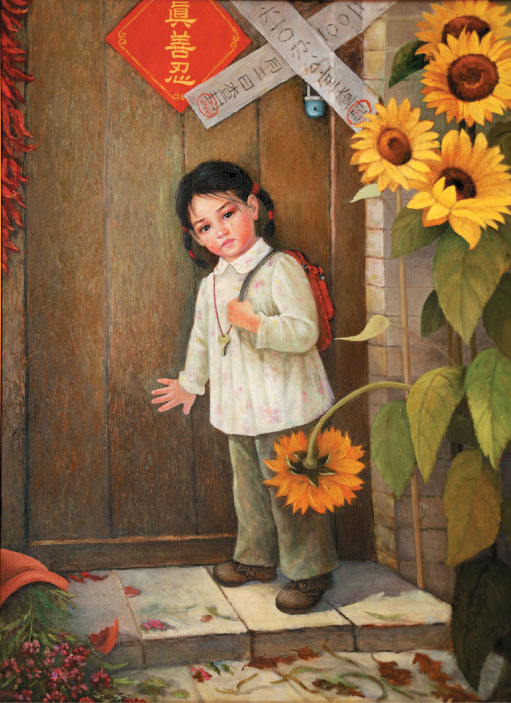

【明慧网二零一八年五月十一日】那是十八年前的事了，那时的我正处在人生的转折点，面临着高考最后半年的紧张复习中，而我的父母却因为修炼法轮功，被非法关押在当地看守所。我没有抱怨，而是坚强乐观的面对一切，因为我也想让人们看看炼法轮功家的孩子是很棒的！
那时我学艺术，想要考外省的重点工艺院校，文化课和术科都要求很高，对我来说难度都很大。我的老师劝我考个师范就行了，我说我要拼一下！这个学校的术科里，除了基础课之外，就是需要画一张客厅的效果图，这个以前我没怎么接触过，还有半个月就要考试了，必须在这个时间里熟练掌握。

我思考着怎么去表达自己的设计呢？用甚么颜料，才准确而又干净利落呢？突然脑中闪现着透明水色加水彩，这个透明水色的色彩是很难控制的，我怎么会想到它？我决定试试吧。经过一番设计决定用它来画地板砖，而且是米色的，也不能用画笔，就用老式废胶卷皮来画。没想到调色时麻烦就来了，颜色很难调，不是脏了，就是很生。

神奇的是，这时脑子里闪现出三种颜色混合。我跟着感觉真的调出来了，非常清雅的淡米色。就这样，我开始了不断巩固的练习着，每天三餐只啃面包，从早画到晚，不停地裱画上色，半个月，画了百十张的稿子。到最后娴熟到每张画用最短的时间来画出最出色的效果图。

考试那天，我只用了四十多分钟就画完了一张自己有史以来最棒的画面，当时的几个监考老师纷纷过来围观，问我哪个学校的，赞叹画的很棒。我环顾四周，那些考生们还都紧张的画着。后来梦中听到有人告诉我名次，现实中就是那个名次，老师让我接下来一定把文化课考好。

一天，学校通知交水费，那时每个班有纯净水，每个人交20元。我就和班主任反映情况，说我要是不喝水，能不能不交水费了？班主任说，全班就你可以不用交费了，而且可以喝水，并关心的问我，是不是有甚么难处？我听了老师的话很感动，决定把实情告诉他。

我说：「老师，我父母因为炼法轮功，都被关起来了，我不知道他们甚么时候回来，所以我想节省钱……」之前，我不知道老师听到这个事会是怎样表情，因为当时有的不明真相的老师在课堂上抹黑过法轮功。没想到，他叹口气，从兜里掏出五十元钱，塞给我，告诉我，他母亲也炼，他明白怎么回事，让我一定要收下这钱，照顾好自己。我哭了，谢谢老师，并摇头不能要这钱。老师要我一定收下，并嘱咐我不要和别的老师说我家的事，然后就匆匆的离开了。多少年了，我都忘不了这么善良的老师！

在文化课考试那天，别人的父母们都去考场外陪考，我独自上考场，并没有伤心，而是坚强乐观的想我已经长大了，不需要他们陪。考场上，也发挥的奇佳，连附加题都答上了，而且思路变得异常清晰开阔。

等估分的考试答案下来时，我惊呆了，因为是文科题，文字表述很多，我的答题思路，文字表述和正确的答案不差几个字，要不是高考，还以为自己照抄答案了。我知道这一切都不是偶然的，冥冥之中有神助！

一天梦中，我来到一间屋子里，满屋挂的古代红色状元服。醒来后，明白了自己一定考中了！

考完后的某一天，被通知能去看父母，当时他们被非法关押快半年了。我是独生女，一直生活在父母的宠爱中，这半年，因为高考无暇顾及这些，而如今独自面对空荡荡的家，感到有些孤独难过，心想到时见面，一定要和妈妈哭闹一番。

可当见到妈妈时，心情反而变得平静了，我说了自己考得很好。在妈妈快要离开时，我突然流泪了，她以为我一定是觉得很委屈了，我却说：「妈妈，我是想你们，但是你们知道吗，我为你们而感到骄傲！」我自己都没想到会说出这样的话，妈妈流泪了，说女儿真的长大了！

在我快开学报到时，父母奇迹般的都回来了。片警在送我母亲回来的路上说：「你们这些炼法轮功的在里面关着，你的孩子反而考上大学了，还考个一本！唉，真给你们争气啊！」妈妈自豪的说：「那当然了，炼法轮功家的孩子都是有福报的！」

父母的朋友同事见面都说，没想到你们这样的遭遇，不但没影响到孩子的学业，反而还考上这么好的大学。那时父母决定不办酒席，不收礼，一周之后，就带着我去千里之外的大学报到去了。

回想那段父母不在身边的日子里，感恩慈悲伟大的师父一直保护着我，并给予了我人生的福报！

原文: https://big5.minghui.org/mh/articles/2018/5/11/365014.html

<h1 align="center"><b>瑞士资深政治家支持法轮功：世界开始苏醒</b></h1>

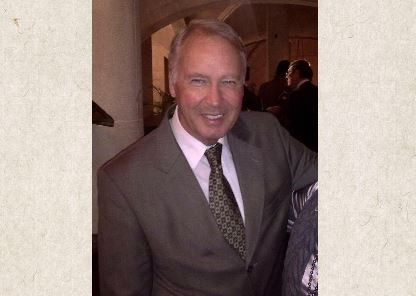

日内瓦州大议会前议员亨利‧哈伯斯（Henry Rappaz）多年来支持法轮功学员的反迫害活动。

【大纪元2019年06月26日讯】（大纪元记者张妮采访报导）“我觉得他们（法轮功学员）非常勇敢，我向他们表示衷心祝福。”日内瓦州大议会前议员亨利‧哈伯斯（Henry Rappaz）真诚地说。

<b>迫害初期纽约结缘 哈伯斯支持法轮功</b>

哈伯斯先生跟法轮功的缘分可以追溯到近二十年前，他当时在纽约遇到一幅感人画面，铭记至今。

“当时，我看到人们展示一百多张法轮功学员被迫害致死的照片。”他回忆说，“我原以为这样的活动只在美国才有，后来这样的（反迫害）活动也来到了日内瓦。”

于是从那时起，哈伯斯先生就开始支持法轮功学员和平反迫害的行动。在每年的某些重要日子里，法轮功学员都会聚集在日内瓦威尔逊宫（Palais Wilson）——联合国人权事务高级专员办事处门前进行和平抗议，呼吁制止中共的迫害。这些活动当中，人们常会看到哈伯斯先生的身影。

“今年的‘7.20’，我将再次出席他们在瓦威尔逊宫前的纪念活动。” 哈伯斯先生告诉大纪元记者。

<b>“世界开始苏醒 这是法轮功学员努力的结果”</b>
 
他表示自己非常钦佩法轮功学员坚持不懈的精神：“他们都是虔诚的信徒，在（和平地）抵制迫害，他们通过喇叭讲（真相），拉起横幅，并深信坚持做下去就会看到结果。”

他还形容说，反迫害是一个非常庞大的工程，但是法轮功学员“做得非常出色，我期待在未来的几年，能看到更好的（各界支持的）结果”。

作为资深政治家， 哈伯斯先生深深了解到世界各国的很多政治人物为利所迷，忽视人权迫害， “今天的世界，（西方）政界常常在中共的利益诱惑面前妥协，（对迫害）视而不见。” 他说，“法轮功学员要继续抵制迫害，要继续唤醒这个世界。”

对于美国Fox新闻在5月中旬首次报导法轮功学员在监狱和劳教所遭受酷刑、受到严重奴役等事实，哈伯斯先生认为：“世界开始苏醒，我想这是法轮功学员不懈努力的结果，其中包括在日内瓦参与反迫害的学员们。他们坚持地揭露迫害，才让世界了解了真相。”

近期，美国政府公布了将严审来自中国的签证申请，对人权迫害者拒发签证的消息。哈伯斯先生表示，“如果此项措施得到落实，这将是富有意义的举动。”

哈伯斯先生曾是日内瓦州大议会议员和Chêne-Bougeries市议员，也是前日内瓦民主联盟中心（Union Démocratique du Centre）主席，他同时还是电影导演和作家，早在上世纪70年代曾制作过《L’Aube ne s’est pas encore levée》（1971年）和《Voyou Voyou》（1984年）等作品。

原文: http://www.epochtimes.com/gb/19/6/26/n11347551.htm

<h1 align="center"><b>被夺走20年 见证一对中国人跨越生死的爱</b></h1>

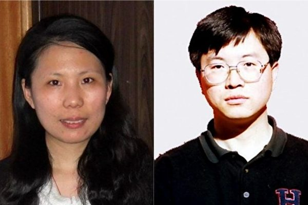

李珊珊与周向阳。

【大纪元2019年06月17日讯】(英文大纪元Joan Delaney报导/张北编译）中共对法轮功的残酷镇压已有二十个年头。这场迫害使成千上万原本幸福的家庭支离破碎。多少老人因失去孝顺的子女而晚景凄凉，多少孩子因失去慈爱的父母而无家可归，多少夫妻被生生拆开而连理分枝。

因为不放弃信仰，法轮功学员周向阳多次被抓捕关押、劳教、判刑。在周向阳遭受迫害前，李珊珊对周向阳知之甚少。但后来，她却毫不犹豫地嫁给了他。

“我们真正在外面只有过三面之缘，手都没牵过。对丈夫的了解完全是通过他的家人、朋友和探监通信得知的。因为感动，我选择了他，也开始了我不平凡的人生。”在一篇发表在法轮大法明慧网的公开信中，李珊珊这么说。

很快，李珊珊得知周向阳的家人都是法轮功修炼者，也因此都被严重迫害关押。只有一位不修炼的姐夫，支撑着整个家庭探监的重任。

李珊珊被这一家人坚信真理的无畏精神感动了，她决定承担起到监狱看望周向阳的责任。可是到了监狱，她被告知只有亲属才有权接见。她被挡在了外面。

然而，李珊珊没有放弃。大雪纷飞，孤零零的她站在监狱的高墙外，心中升起一个念头——她要向监狱提出要求，和周向阳结婚，这样就能以亲属身份见到向阳。

李珊珊的举动震惊了监狱。自法轮功被迫害以来，监狱接到的从来都是离婚诉求，这结婚诉求还是头一回碰到。

然而，这个勇敢的尝试并没有很快获得成功。李珊珊仍然见不到周向阳。但是她不放弃，不断地和狱方沟通。5个月后，她终于以未婚妻的身份见到了。

这是2004年12月，距离周向阳获释还有7年，距离他们可以正式结婚的日子，也是7年。在这漫长的7年里，他们不得不承受的是中共对法轮功学员疯狂的迫害。

<b>替未婚夫申冤 反遭陷害被监禁</b>
 
1999年“七二零”后，周向阳为争取合法炼功的权益，为了坚持“真、善、忍”信仰，去北京和平请愿。可是，他竟因此被劳教一年半，受尽折磨。

2003年，周向阳再次被抓，后被冤判9年刑期。李珊珊不顾巨大的压力和自身的安危，想方设法为他申诉。她写了两封控告信，曝光监狱对周向阳施以酷刑；经常给监狱长打电话；并不顾狱方的百般刁难一直尝试与周向阳见面。

2006年1月，中共将迫害的魔爪伸向了李珊珊。她被国保警察跟踪，骚扰恐吓不断。三个月后，天津南开区国保大队长带人无故抄家，并将她刑事拘留三十天、转监视居住十五天，后被非法劳教一年三个月。

在公开信里，李珊珊说：“被劳教那一年我只有二十五岁，经历了劳工奴役和暗无天日的寂寞难熬的日子，但想到是为向阳这样的好人讨还公道，心里无悔。”

“二零零七年五月七日劳教到期的前一天，天津国保领导到劳教所找我谈话，让我放弃对周向阳的帮助。我郑重的表明态度：从人道讲作为普通朋友有难还要去帮助，更何况我现在是他的未婚妻。”

被劳教期间，李珊珊被折磨得几乎精神崩溃。被释放的时候，家人差点没认出眼前这个瘦骨嶙峋、憔悴不堪的人就是她。

李珊珊被非法劳教期间，周向阳在天津市港北监狱（现改名为滨海监狱）也受尽酷刑折磨。

据明慧网报道，他一直被毒打、禁止洗漱、长时间关小号、高压电棍电击。有一次，他被电击了整整一晚上，全身都是深深浅浅的烫伤。还有一次，他被连续剥夺睡眠长达30天。为了逼周向阳放弃信仰，监狱逼他看诽谤法轮功的视频，且不顾他因酷刑浑身带伤，强迫他参加高强度奴工劳动。

在所有酷刑中，周向阳经历过最残忍的一种被称作“地锚”。为逼法轮功学员放弃信仰，监狱“研究”出不同的“地锚”姿势。有些时候，周向阳的手脚都被铐在贴地的铁环上，双腿被分开达130度。他的两只手被铐在一只脚的地环上，手脚紧锁；另一只脚被紧紧铐在另一个地环上，撕裂般的疼痛难以忍受。还有些时候，他被仰躺在木板上面，两个胳膊成“V”字形向外张开（屋宽一米，手臂不能伸直），手腕反铐在地环上。膝盖以下小腿部位和脚悬在水泥地上，坠着锁在地上的脚镣。手铐和脚镣没有任何活动的余度。时间长了腰、胳膊疼的受不了，着力点的脚后跟都硌烂了。 “地锚”酷刑将人的手脚以各种姿势拉紧后，二十四小时、数星期、甚至数月，持续长时间不放。据明慧网报道，有些法轮功学员就是这样被折磨致死。

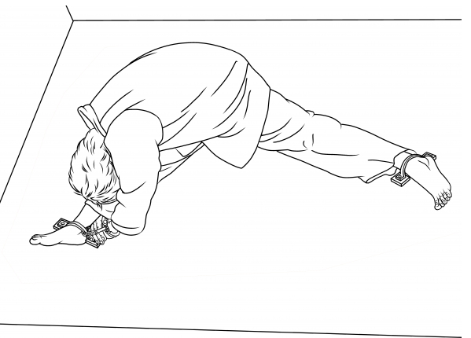

「地錨」酷刑示意圖。（明慧網）

周向阳经历过好几次“地锚”折磨。在一次绝食反迫害后，他被关小号、一天24小时施以“地锚”酷刑，折磨近一个月。

“向阳从港北监狱刚回来的时候，身体虚弱，”李珊珊说，“一米七五的个头体重只剩下七十八斤，勉强能自己走路，胃萎缩了，只能吃流食。从“地锚”上下来的时候，腰一直没有直起来，弯了好几个月。 ”

法轮大法是超常的，在周向阳恢复看书学法、炼功后，他的身体逐渐地好起来。2009年10月26日，这对磨难中的有情人终成眷属。

“11年的迫害，向阳家生活非常困难，我们本来不打算举办婚礼了。向阳的为人在亲友的口碑中一直很好，所以很多亲戚朋友主动给我们提供帮助，热热闹闹地办了酒席。 ”李珊珊说，“我终于穿上了向往已久的雪白婚纱，像做梦一样。”

<b>再陷冤狱</b>

然而，周向阳和李珊珊的婚后生活并没能维持太久。2011年3月5日，俩人再次双双被抓。

20天后，被释放的李珊珊开始了又一轮艰难的申诉。她奔走于唐山国保、天津港北监狱和天津检察院之间营救丈夫，并写下公开信——《一对年轻人的苦难经历：七年等待 九年冤狱》，投递到天津司法部门、唐山公安系统。文章朴实纯善，感人至深，引发秦皇岛昌黎县2300名民众的联名救助。

因坚持申诉，李珊珊再次被陷害。2011年10月29日，她被非法抓捕，关进河北省女子劳教所劳教1年半（后被延期关押，直至2013年11月8日才释放）。由于不放弃信仰，她被长期单独监禁、强迫做奴工产品、整整一年不许任何人接见。

然而，李珊珊为营救丈夫所做的努力没有白费。 2012年4月，在众多正义力量的帮助下，周向阳走出冤狱。这次，轮到他为妻子奔走申冤。

他写下妻子《七年等待 九年冤狱》公开信的续篇——《纯真纯善　蒙难蒙冤》，呼吁更多人关注李珊珊。为救珊珊，向阳和母亲一次次站在劳教所铁门前，向人讲述珊珊救夫的故事，讲述珊珊一封公开信唤醒家乡两千多民众的善念和联署义行，讲述珊珊遭到唐山国保非法劳教的冤案。最后，河北唐山及周边地区共5291名善良的民众签名声援。

周向阳在公开信里写道：“在我们的社会中，是不是为了这一点基本的信仰和维护信仰的权利，我们将在这条申冤之路上穷尽我们的整个青春呢？！”

2013年11月，李珊珊走出劳教所。但是苦难远没有结束，2015年3月，他们短暂的团聚再次被打断。这次，周向阳被诬判7年，被关入天津滨海监狱；李珊珊被诬判6年，被关入天津女子监狱。

据明慧网报道，这次被抓后，周向阳一直绝食抵制迫害长达三年半时间。每天，包夹（全天贴身监控法轮功学员的刑事罪犯）用担架抬着周向阳去监狱的医院灌食。据包夹说，有一次给周向阳灌食，包夹按着他的胳膊和双腿，监狱医院的人强行把胃管从周向阳的嘴里插进去，灌完食之后，周向阳自己把胃管拔出来，管子上面沾满了鲜血。长期的绝食和强制灌食，使年仅45岁的周向阳看上去苍老、虚弱。

李珊珊母亲多次去监狱探望女儿，却因她也是法轮功学员而被狱方刁难，不许见面。有一次，不修炼的李父被允许和女儿见一面。李珊珊出来时，身边有两个包夹跟着。

父亲问珊珊里面的情况，包夹指着她说，让她罚站三个月。李珊珊告诉父亲，监狱一天只给她一个馒头一碗粥，配点咸菜，不给水喝。一个包夹听了立马把通话的电话抢过去，不再让她说话。

根据法轮大法信息中心收集的资料，自中共1999年开始迫害法轮功后，上百万无辜善良的法轮功学员经历了周向阳和李珊珊这样骇人听闻的磨难。

“数百万人遭到了非法监禁，洗脑和酷刑。在监禁中被迫害致死人数确认有数千。”法轮大法信息中心网站写道，“今天，对于在中国的成千上万法轮功学员来说，他们每天都面临有可能被中共当局带走的危险——被监禁，折磨或者更难以想像的可怕处境。”

原文: http://www.epochtimes.com/gb/19/6/16/n11326496.htm

<h1 align="center"><b>长路漫漫　信仰最坚</b></h1>

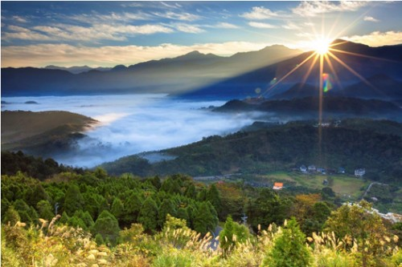

【明慧网二零一九年六月二十四日】人的一生很漫长，也很短暂，不同的人会有不同的人生向往，带着各自的美好与梦想，在社会中奔波、闯荡，时而飞黄腾达，时而走入低谷沮丧。有的为了名声远扬，有的为了事业腾达，有的为了养家糊口，还有的为了人生理想。
人一辈子，多数在忙于挣钱，因为钱可以换来很多人们想要的，但是，有很多东西是钱换不来的，比如：身体的健康，家庭的和睦，知心的朋友，子女孝顺且不随波逐流等等。这些是用再多的钱都换不来的，还有对宇宙奥妙，对生命真理的理解与领悟，这些也是钱买不到的。

然而一个真正有信仰的人，信奉真善忍的人，他会通过修炼法轮大法，使自己身心受益，在提升层次与境界的同时，会得到很多更有价值的东西，这些都是无法用钱换来的，这就是为什么在中共迫害法轮功近二十年来，一直有很多人坚修法轮功的原因所在。

在中国古代，不乏为了寻找真理而付出的人。唐朝的三藏法师，为了取得佛经，步行从长安去西天印度取经，走了十多年，经历了无数艰辛才取回真经，从而丰富了中国的传统文化；明朝的张三丰，七十多岁时得道，在修道的过程中，领悟高层的法理，创编太极拳，成为一代宗师。西方的耶稣，为了救赎世人而被钉在十字架上，在痛苦中离世；释迦牟尼为了修佛放弃了印度王子的位置，入深山修行，在菩提树下开悟后，在世间又向信徒传法四十九年，最后修成如来佛，涅槃而去。

人世间虽然是个名利情仇的混杂场所，但是真理、佛法亦在其中。如果有人一旦闻得佛法、真理，他会不惜一切的去探索、研究、修行，因为佛法的道理超出了人们追求的东西，是用钱买不到的，佛法的奥妙会让生命在升华中得到永恒，就是修成正果，回归天国世界。

即使在最残酷的迫害面前，真修者也会坚如磐石，一修到底，哪怕付出生命的代价，也不会动摇的。

法轮大法是千古以来，第一次揭开了宇宙的真法，传度给了世人，其珍贵与奥妙，穷尽世间的言语也无法表达。法轮大法从一九九二年由李洪志师父在中国的长春传出后，短短几年时间里，修炼人数达到了上亿人，并且遍及世界各地、遍布社会的各个领域与阶层，包括政要人员、名人、学者、艺人、企业家、白领、知识分子，工人，农民等等，法轮功在世界各地收到各国政府与组织的褒奖和支持议案信函等达到三千多项，人们纷纷加入了法轮功的修炼行列，成为了法轮功学员。

一九九九年，中共江泽民发起了对法轮功的迫害，使得大量的法轮功学员遭到绑架、抄家、非法关押、酷刑虐待、甚至被活体摘取器官。这种对佛法信徒的迫害是从古至今未曾有过的恐怖与规模庞大，一个国家以及民众整体参与对手无寸铁的法轮功学员的迫害，而且持续了近二十年，这是地球上从来没有过的邪恶。法轮功学员被迫害致死的有4313人（已被证实的），还有太多被秘密迫害死的，更是无从得知。在这近二十年的时间里，有数不尽的法轮功学员被冤判而投入监狱、劳教所、看守所、洗脑班被折磨。他们凭着对真善忍的坚定信仰，度过了一场又一场磨难，走到了今天。

原文: http://big5.minghui.org/mh/articles/2019/6/24/388830.html

<h1 align="center"><b>生命的感恩</b></h1>

【明慧网二零一九年五月二日】我是一名医生，二零零零年五月份，我病情开始严重，不能吃饭，腹部刀割一样疼痛，四处寻医治病，在北京协和医院住了一个半月，然后医生说：你的胃粘膜，几乎全部萎缩，不能消化食物，没有办法，你回家养着吧。实则是叫我回家等死，回来后，又去看了中医，医生对家人说：没有治疗价值了，她的身体各个器官都衰竭了，无药可治了。家人不甘心，又领我去看“猴仙”，开始说能看，结果花了很多钱，又说看不了。折腾了将近一年时间，能看的都看了，都说不行了，只好回家等死了。
二零零一年五月份，我的病情更加严重，体重只有不足六十斤，水米不進，二十多天就靠输液维持，腹痛十多分钟一阵，象刀割一样痛，疼一阵一身汗，双腿蜷着能减轻点腹痛，时间长了，双腿不能伸直，无法行走，只能躺在床上。受长期病痛的折磨，那时的我只求早点死了，能得以解脱。

有天晚上肚子疼的不能入睡，突然很想看书，我这一生最快乐的时候，就是学大法的那一段时间。我一九九八年曾修炼大法，由于对大法没有很深的认识，九九年中共迫害以后，受到各方压力，我放弃了修炼。这时我很想很想再看看大法书，心想我已经这样了，也没人来抓我了，然后就把放在床头柜里的《转法轮》拿出来看，翻开书看到师父法像时，感觉特别恐惧，头发都竖起来了，凉气从发根顺着头发往外走，百会穴有凉水往下泼的感觉，阴凉阴凉的东西在往外出。大概半个小时，这种感觉逐渐没有了，感到身体轻松了很多，我就学了一讲法。感觉有点累，就睡着了，醒来时发现睡了一个多小时，之前几乎不能睡觉，迷糊十来分钟，就疼醒了。

早上起来能喝水了，家人看到我没有吐，就熬了些粥，吃了以后也没有吐。之后我就把所有的药都停了，不再输液了。家人还想让我输液，我说输了那么长时间，也没有用，只学了一讲法，就能吃饭了，我就一心一意学法了，把我的命交给师父吧。

那时的我不能下地炼动功，只能在床上打坐，只要我炼功双盘，结上印马上身体就发热，腰和肚子就不疼了，非常舒服。就这样身体一天比一天好起来，二十多天后，我就能下地了。开始时站十分钟都很吃力，后来一个小时的动功，都能炼下来了。那时我的体重增加到七十多斤，可以出去找同修一起学法了。同修看到我都很吃惊，当知道是因为我从新学大法，病才好了时，都感恩师尊的伟大，大法的神奇。

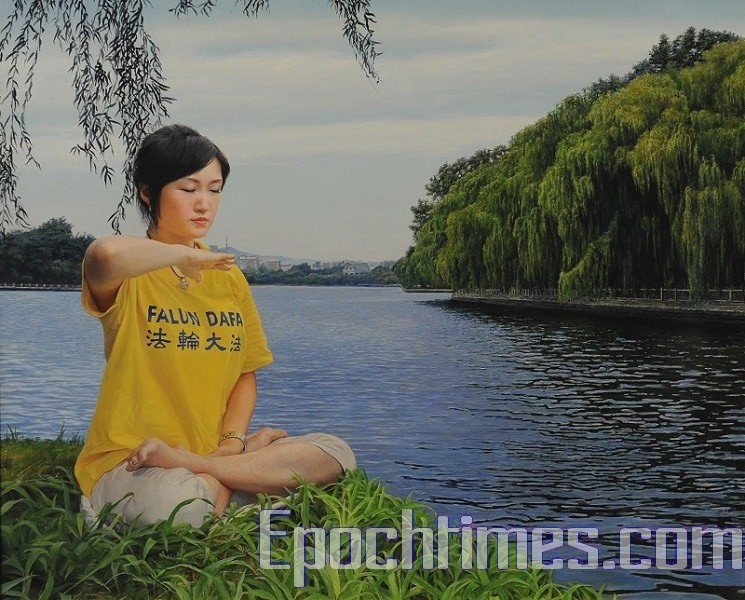

十月份我就可以正常上班了，同事们看到我，也很吃惊，觉得不可思议，因为他们以为我活不了多长时间了，我告诉他们是大法救了我的命，他们都说：法轮功太神奇了！家里的亲人也都觉得大法太神奇了。感恩师尊救了我的命，使我有了一个完整的家。

半年多以后，当地的参与迫害大法的副主任去我家找我，让我放弃修炼，他说你是公职人员，你不能炼法轮功。我说我是医院诊断要死的人，现在学大法好了，你不让我炼，你能让我起死回生吗？能保证我的身体健康吗？他说你是在大法中受益了，你要觉得好，就在家炼吧，不要出去宣传，别人可不一定都受益。我说，大法谁学了都受益，大法是教人按照真、善、忍做好人的。我学法后，明白了因果报应，这一世婆婆对我不好，可能是我哪一世对婆婆不好，都是有因缘关系的。我不再觉得委屈、抱怨。后来婆婆有病时，我经常为她输液、打针、照顾她，我们的关系也和谐了。他表示认同，之后再没来过。

大法师父给了我第二次生命，我不仅仅是身体健康了，精神也得到了升华，家庭和睦了，按照真、善、忍做好人，每天我都觉得很快乐。我的亲身经历证实了法轮大法的神奇和伟大，希望被谎言蒙蔽的人们，能正确的认识大法，选择一个美好的未来。

原文: http://www.minghui.org/mh/articles/2019/5/2/371906.html

<h1 align="center"><b>英法庭： 制止中共活摘器官 全世界有责任</b></h1>

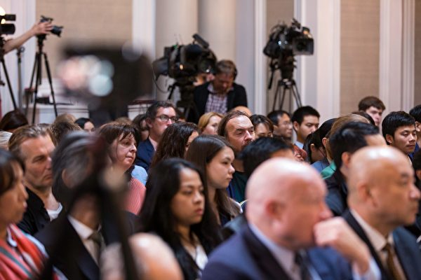

6月17日, 主持“独立人民法庭”的英国大法官杰弗里•尼斯爵士（Sir Geoffrey Nice QC）说，各国应采取行动，制止中共活摘器官。图为参加开庭的现场民众。

【大纪元2019年06月18日讯】（大纪元记者文沁、Jane Werrell英国伦敦报导）在过去的十年，外界一直指控中共在进行活摘器官的罪行，即对还有呼吸的活人进行解剖，把器官摘取后当作商品出售。但从来没有一个清晰的法律文件，来判定这种行为是如何触犯国际法律的。

直到6月17日，“独立人民法庭”在伦敦举行终审判决，判定中共政府对以法轮功学员为主的良心犯进行大规模器官摘取，无可置疑地犯有危害人类罪以及酷刑罪。法庭认定中共治下的政府是一个犯罪政权。

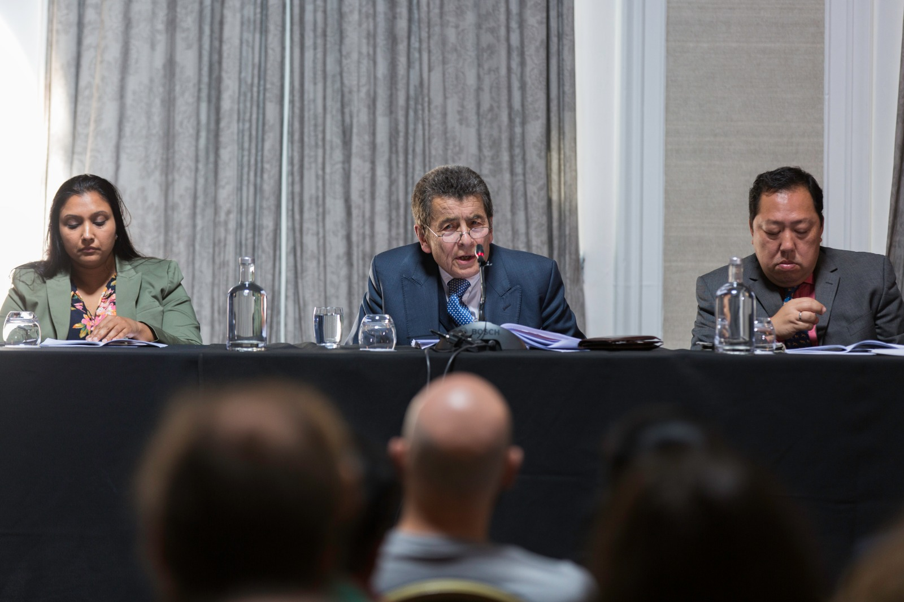

6月17日，英国大法官杰弗里•尼斯爵士（Sir Geoffrey Nice QC，中）主持的人民法庭判定，中共犯有危害人类罪。

在过去的8个月里，由英国大法官杰弗里•尼斯爵士（Sir Geoffrey Nice QC）主持的人民法庭从医学专家、人权调查员和受害人那里广泛搜集证据，调查中共政府是否继续从事活摘器官的罪行。

<b>法庭多次邀请中共代表出席 后者无人露面</b>
 

6月17日，英国保守党人权委员会副主席、非政府组织《香港观察》主席本•罗杰斯（Ben Rogers）也出席了法庭宣判。

一直参与促成此独立法庭的英国保守党人权委员会副主席、非政府组织《香港观察》主席本•罗杰斯（Ben Rogers）说：“这次调查过程中，法庭曾多次邀请中共政府的代表、中国相关医疗机构的代表，以及支持中共政府所给出的解释的人出庭。很有趣的是，没有人愿意出席，或给法庭提供证据。”

判决书写道：“从那时（调查初期）起，法庭在试图获取证实活摘器官的资料时，就遇到来自中共无所不在的保密、沉默和混淆视听。法庭不会被吓倒，并会根据当前的证据，做一个判决。”

中国问题分析专家伊森•葛特曼（Ethan Gutmann）调查中共活摘已有十多年了。他曾在2016年联合发布深度报告《血腥的器官摘取／大屠杀：更新版》。他说，独立法庭的判决对他来说喜忧参半，“从某种程度上说，这个审判来得太晚了，晚了六、七年，甚至十年，”葛特曼说，“从（活摘）一开始，就应该审判，已经有太多人被夺走了生命——因为不理解，也因为西方社会的忽视。”

<b>受害人：逃过活摘器官 心有余悸</b>
 
法庭宣判结果中表示，在持续多年的大规模活摘器官罪行中，法轮功学员是器官供应的最主要来源。

6月17日，阿姆斯特丹的欧洲问题专家Nevenka Tromp博士也出席了开庭，她说，法轮功团体是活摘器官的最大受害群体。

来自阿姆斯特丹的欧洲问题专家川慕坡（Nevenka Tromp）博士说：“这次法庭经过独立调查后，拥有非常详实的证据。这些证据明确表明，受到活摘器官罪行迫害的人属于一个团体，这个团体叫法轮功。”

出庭作证的一位法轮功学员曾铮，现为海外人权活动家和作家，曾出版书籍《静水流深》，讲述她因修炼法轮功被关押在劳教所一年所遭受的迫害经历。

她对记者说：“我知道为什么很多人不相信活摘器官的事情，因为在我写《静水流深》的时候我都没有想到把检查身体写进去，因为我不知道那是为什么。”“现在回想起来，真的犹如恐怖电影一般，我们被戴上手铐；被装上密不透风，窗户上蒙着黑布的面包车，驶往医院。”

曾铮在被关押期间有三次被身体检查的经历。在2001年逃出中国后，曾铮在得知中共活摘器官的罪行时，回想到自己当初被反复要求做身体检查很可能是活摘器官的医疗筛选程序。

<b>呼吁各国政府采取行动“中共就是犯罪政权”</b>
 
在一项持续一个半小时的判决中，杰弗里•尼斯爵士在大约200出庭民众面前宣读了审判结果，批评一些西方政府没有对中共活摘器官采取行动。尼斯爵士说：“各国如果采取行动，不让中共逃避法律监管，就会让中共明白必须停止犯罪。”

川慕坡博士说：“在判决书中的最后一段，是向世界表明，所有与中共政府打交道的组织，无论在政治、医疗、文化还是经济方面的任何机构，你们要清楚，和中国（中共政府）打交道，就是在和一个犯罪的政权打交道⋯⋯越来越多的人因为经济利益想和中共往来，却忘了人道主义。”

曾铮谈到国际漠视中共罪行时说：“我理解为什么很多政府都没有表态，因为一旦承认这样的邪恶在发生着，这些政府面临的第二个问题就是采取行动，来制止恶行。如果他们还没有准备好承担这种道义责任，就只能说不相信。但我相信‘正义会迟到，但不会缺席’。”

原文: http://www.epochtimes.com/gb/19/6/18/n11330691.htm

<h1 align="center"><b>全美器官移植大会　波士顿学员讲真相</b></h1>

【明慧网二零一九年六月十六日】一年一度的全美器官移植大会于二零一九年六月一日至五日，在美国波士顿举行。会议期间法轮功学员在主会场海因斯会议中心外，向参与会议的医学界专业人士讲活摘真相，同时还在波士顿公共图书馆、州议会前，向世人和州政府工作人员讲大法真相，揭露迫害，启发人心善念，得到了专业界人士和广大民众的广泛支持，反响很好。

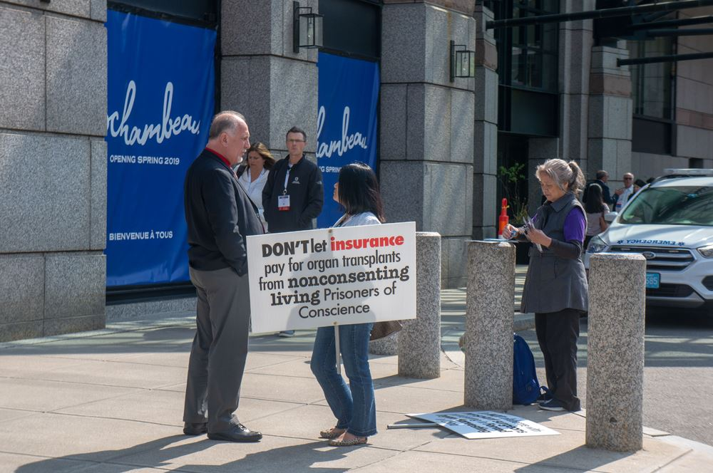

图1：波士顿法轮功学员向州政府工作人员讲大法真相

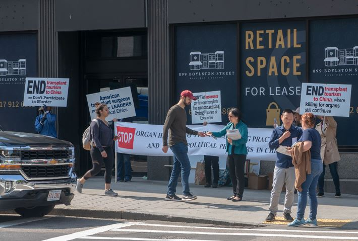

图2：波士顿法轮功学员向世人讲大法真相

大会期间连续几天都是晴天，这在多雨的波士顿是难得的。当地学员们在街头高举揭露活摘和迫害真相的标语牌、展板、横幅，向路人发放大法真相资料，讲述至今还在中国大陆持续发生的针对法轮功学员的迫害，特别是中共活摘法轮功学员器官用作器官移植供体的国家犯罪行为。引起民众的震惊和愤慨，同时对法轮功学员站出来对此发声表示由衷的感谢。

据组织者陆女士介绍，今年针对器官移植大会的反活摘街头活动有一个突出的特点，就是打出强有力的信息，要求美国社会的反活摘不能只停留在申讨的层面，更要在立法等方面采取实际行动来制止活摘。反映在行动上除了标语内容的选择，还进行征签要求世人支持州议会立法阻断去中国做移植旅游的途径，包括对中国医生在移植技术方面的培训等等。此动议得到了许多麻州居民的支持，有不少人主动要求签名。

医学界人士对这次活动中传递的真相反馈也较以往更为积极，普遍反应正面。不少同修表示，三年前同样是在波士顿的这个活动，当时一些参会的医生对中共政府以法轮功学员为主要受害对象，进行强摘器官的罪行还不太了解，有的持怀疑、观望、将信将疑的态度。通过几年来全世界法轮功学员和明白真相的世人坚持不懈地传播真相，今年形势就大不一样了。很多医生在会场外接过真相资料，用手机拍下法轮功学员手持横幅标语的照片，很多会场内的医生透过落地玻璃窗拍照，并告诉学员会把照片发到社交平台，为这个活动做宣传。更有医生要把照片发到川普总统的Twitter上要求总统为反活摘发声。

每当参会的中国医生路过标语展板时，同修们都会不失时机地提醒他们，中共时日不多，崩溃在即，不要再为中共的罪恶买单，更不要直接参与迫害，成为迫害好人的工具，一旦犯了反人类罪，天网恢恢，在劫难逃。特别是美国政府通过的《马格尼斯基人权法案 》，拒绝那些有不良人权记录的个人进入美国，并给予其严厉制裁。

由于正值旅游季节和大学放假期间，很多华人家庭走在波士顿繁荣的商业街道上，会看到法轮功学员的标语横幅。同修们在发资料的同时也会不失时机地告诉他们，面对迫害法轮功学员，面对活摘器官不作声，是在毁掉自己的生存环境，造成的道德危机，正在吞噬中国社会的每一个人。谁也不能保证会不会成为下一个被杀戮者。在这个过程中，有些中国人是听明白了真相做了三退的。

原文:http://www.minghui.org/mh/articles/2019/6/16/全美器官移植大会-波士顿学员讲真相（图）-388755.html

<h1 align="center"><b>法庭就中共活摘器官宣判　国际媒体聚焦</b></h1>

【明慧网二零一九年六月十八日】（明慧记者王英编译报道）调查中共强摘器官的“独立人民法庭”（Independent people's tribunal）于六月十七日在伦敦宣判结果，判定中共活摘良心犯器官的行径已存在多年，并仍然存在，法轮功学员是器官供应的最主要来源。当天，《路透社》、英国《卫报》、美国《新闻周刊》、《福布斯》、《澳洲广播电台》、加拿大《环球新闻》等国际主流媒体纷纷报道并转载了这一新闻。

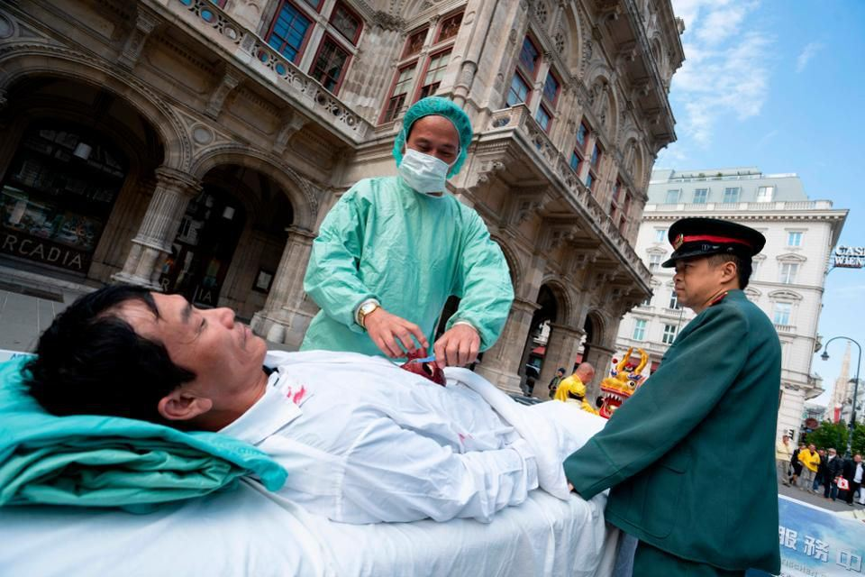

图：二零一八年，法轮功学员在维也纳摹拟中共活摘器官暴行

 
 路透社六月十七日报道，中共正在谋杀法轮功学员，并摘取他们的器官进行移植。

在独立法庭的最终判决中，专家小组说他们听到了明确的证据，中共活摘器官已经至少二十年了。

文章说，虽然中共当局不承认这些指控，但专家小组表示，活摘器官行径仍在继续，而且被监禁的法轮功学员“可能是活摘器官的主要来源”。

“结论显示，很多人无缘无故地被剥夺生命，死得骇人听闻，无法形容。”法庭主席杰弗里·尼斯爵士在判决中说。

该独立法庭由“终止中国（中共）移植滥用国际联盟（ETAC）”发起。

由七人组成的陪审团在去年十二月举行的听证会上，“无可置疑地认定，在中国，从良心犯身上强行摘取器官的做法已经进行了相当广泛的规模，而且涉及大量受害者。而且是由（中共）国家支持或批准的机构和个人干的。”

陪审团认定，中共对法轮功学员和维吾尔人犯下了反人类罪和酷刑罪。

法轮功学员曾铮告诉法庭，她被关押在劳教所期间，接受了验血和体检，她说她希望法庭的调查结果能够促成实际行动。

她说，“我希望更多的国家通过法律，禁止自己的公民去中国做器官移植手术”。

“我希望国际社会能够找到一种方法来阻止目前在中国进行的杀戮。”

美国《新闻周刊》（Newsweek）六月十七日报道，一个独立法庭星期一裁决，被关押在中国监狱中的人被摘取器官死亡。

《新闻周刊》引述《卫报》的报道说，主持独立法庭的杰弗里·尼斯爵士星期一在伦敦对记者说，法轮功学员“可能是被强摘器官的主要来源”。

“根据多种信息来源，良心犯被杀是为了摘取他们的器官，进行有利可图的移植手术，”法庭说。

法轮功学员曾铮表示，她在劳教所经历了几次大规模的“身体检查”，包括拍X光片和血液检查。

她告诉法庭，她现在怀疑这项测试可能是筛选过程的一部份。 她说：“当有人从劳教所消失时，我当时会认为她被释放并回家了。”

她接着说：“但实际上无法确认，因为我在获释后无法追踪其他人，我现在担心他们可能被送往医院，并且在未经同意的情况下被摘取器官，并因此在此过程中被杀死。”

英国《卫报》（The Guardian）同一天的报道说，位于伦敦的独立法庭得出结论，中共仍在杀人取器官，受害者包括被监禁的法轮功学员。

担任独立法庭的主席杰弗里·尼斯爵士曾主导国际刑事法庭对前南斯拉夫总统米洛舍维奇的起诉。他说：“法轮功是强摘器官的来源，可能是主要来源”。

“结论表明，很多人无缘无故地死去，死得难以形容，骇人听闻，更多的人可能会以类似的方式遭受痛苦。”尼斯爵士说，“我们所有的人都生活在一个星球上，在这个星球上，中国曾是人类最古老的文明之一，其现政权的当权者，在从事极端邪恶的勾当。”

他补充说：“没有证据表明强摘器官这种行径已经停止，法庭认为强摘器官行径仍在继续。”

法庭一直在从医学专家、人权调查员和其他人那里获取证据。

在被杀害的人中，有法轮功学员。 法轮功于一九九九年开始受到迫害。

法庭指出，中国医院提供的移植等待时间非常短，通常只有几周。

调查人员打电话到中国的医院，为病人询问移植器官的事，被告知某些器官来自法轮功学员。

法轮功学员曾铮表示，她在被关押在劳教所期间，多次被要求做验血和体检。

现在民众呼吁英国议会立法禁止去中国进行器官移植。目前有四十多位国会议员支持这一提案。以色列、意大利、西班牙和台湾已经禁止器官旅游。

《福布斯》（The Forbes）报道，六月十七日，独立法庭发布了长达六十页的最终判决摘要，希望能够为幸存者和受害者的亲属提供某种形式的解决方案，记录可能用于敦促国际组织采取行动的材料。

在分析种族灭绝罪时，法庭承认法轮功和维吾尔族是特定目标群体，犯下的暴行属于“联合国防止及惩治种族灭绝罪公约”（“种族灭绝罪公约”）第二条的范围。

法庭认定，中共已经实施了“罗马规约”第七条所界定的反人类罪。其中包括“谋杀；灭绝；违反国际法基本规则的监禁或其它严重剥夺人身自由的行为。”

仅在几周前，英国国会议员菲奥娜·布鲁斯（Fiona Bruce）在英国下议院讨论了采取行动的提议。在辩论中，布鲁斯议员呼吁英国政府带头提出并在联合国支持这一议题。这可以通过联合国人权理事会的决议来实现，首先是“设立联合国特别报告员调查中国人权状况”，其次是成立调查中共系统的、广泛和严重侵犯人权事件的调查委员会。

独立法庭审议的问题显然需要作出适当的回应。法庭收集和分析的证据是我们不能视而不见的，需要进一步调查。布鲁斯议员提出的提案是向前迈出的合理一步。剩下的问题是，是否有人会勇敢地采取下一步措施。

原文:http://big5.minghui.org/mh/articles/2019/6/18/388880.html

<h1 align="center"><b>港人护港 二百万人大游行震撼全球</b></h1>

6月16日，近二百万香港民众走上街头，向特区政府提出五大诉求：不检控示威者；取消定性暴动；追究开枪责任；撤回送中恶法；五、林郑月娥下台。

【大纪元2019年06月17日讯】6月16日，近二百万香港民众走上街头，向特区政府提出五大诉求：不检控示威者；取消定性暴动；追究开枪责任；撤回送中恶法；五、林郑月娥下台。
本次抗议行动创下香港有史以来游行人数最多的纪录，书写了抗击中共暴政的壮观篇章。大陆人、台湾人、海外港人、华人及所有正义民众都为勇敢的香港人加油。

<b>港人护港 直击中共</b>
 
相隔一周，两次百万人大游行，有力地打击了中共的气焰，打散了乱港势力的如意算盘。

自1997主权移交以来，中共一步步严控特区政府，侵蚀香港自治权和民主自由，并借助当地流氓特务，扰乱社会治安。在文化传媒领域，党文化公然渗透，甚至趋向主导地位。此外，港府听命于中共，制造黑名单，多次无理拒绝学者、人权活动者入境参与学术交流，也曾强制遣返大批台湾法轮功学员，拒绝神韵艺术团技术人员的签证。

今年4月，香港法院判决“占中九子”全部罪成，凸显香港司法在中共治下的可悲逆转。至于随之而来的修订《引渡条例》，分析人士指出，此乃中共为日后清理金融界、打击异见人士铺路，兼有恐吓台湾之意。换句话说，此条例一旦立法，中共便可借香港这条通道，想打谁，就打谁。

中共打着“一国两制”的幌子，在香港为所欲为。今次修例遇阻，它悍然施暴，以为用警棍和枪弹可以解决问题，以为“不要干涉内政”可以阻挡外援。它没有料到，一百万香港人站了出来，大声反对恶法；一周后，两百万香港人走上街头，打出了“没有暴动，只有暴政”，“暴政必亡”的口号。它更加没有料到，全球几十个城市掀起了声援香港的游行和集会，与争取自由的港人同步、同进退。美国、英国、加拿大、德国、台湾等多国政府和政要纷纷谴责中共，并考虑相应的制裁措施。

中共一向横行霸道，这回被正义阻截，它只得放下大棒，宣布暂缓修例，特首在压力下被迫道歉，以求平息风波。可以说，这是中共几十年来遇到的最激烈、最直接的大规模民间抵抗。香港的反恶法、反暴政行动，发生在中美贸易战和华为风暴期间，对四面楚歌中的红色极权，是一次重创，将加速中共的解体。 

<b>《引渡条例》风暴惊醒世界</b>
 
世界声援香港，香港鼓舞世界。在中共推行“一带一路”等渗透和扩张计划之际，香港“反送中”行动震动了香港、台湾、大陆和国际社会。

香港人走出来，因为他们悲哀地看到：香港变了。他们意识到，退无可退，“自己的香港自己救。”

香港大学社会行政学系助教徐沛筠说：“我都不知道现在算不算被共产党统治，因为我们见到那些做事的人是香港警察，或者是香港高官。其实他们是土生土长的香港人，为什么可以这样对自己的学生和孩子呢？”

许多人指出，林郑月娥也是孩子的母亲，却对于警察打伤年轻人无动于衷。若不是两百万人潮的汹涌意志，若不是上方有令，林郑恐怕不会道歉。

特首的位子，肯定是最听从中共、最让中共放心的人才能坐的。林郑作为行政长官，是四任特首中支持度最低的，也是执行中共指令最积极的一个。她的角色，和所有为中共所用者一样，就是被利用、被操控、最后因为协同作恶而背负骂名。

在中共牵线掌控的行政体系内，港府的其他官员不可避免地会受到中共党令的制约、党文化的侵蚀。中共所需要的港府不是为香港人民服务，也不以保障自由法治为使命，因此，跟随着这样的大方向，官员、警察在日复一日的听令中，价值观也在不断地受到腐蚀和扭曲。如能坚守原则，不与中共同流合污，才是真正为香港效力。

6月16日早，台湾总统蔡英文再次回应“反送中”事件表示，这几天看到香港要保护他们自己的民主、自由、人权，这“证明一国两制绝对不可行”，大家要团结起来，保护台湾主权、民主、自由和人权。

6月16日下午，近万名在台香港学生及台湾民间团体举行了“616撑香港，反送中”活动，谴责港府暴力侵犯香港人权。

众所周知，中共对台湾一直虎视眈眈，对台的渗透和颠覆活动已持续了几十年之久，近年发展到操控黑社会、当街摇晃五星旗的嚣张程度。正值台湾总统大选启动，本次香港的反恶法行动，向台湾政界和民间发出警示，是一件大好事。

再看中国大陆。相对于中共对香港的温水煮青蛙，大陆人民承受着极度的恐怖和高压。70年来，中共践踏法律，压制人性，侵犯人权，利用肉体杀戮、洗脑、威胁等多种方式，在全体国民头上撒下了巨大的恐惧网，令绝大多数国人丧失了抗争的意志，甘愿臣服和沉沦。此时，香港人民的怒吼，强烈地震撼着大陆民众。他们看到，自由并未陷落，香港同胞在用鲜血抗争。只有突破恐惧，才能自救、救国。

对于国际社会，“反送中”事件提供了生动的、密集的现实教材。中共欲以法律之名大肆乱法，对和平示威者滥用武力，进一步撕毁“一国两制”。同时，中共官媒、外交部发言人及驻外大使等人仍谎话连篇，声称修例获得主流支持，西方势力干涉内政云云。面对中共不变的残酷和无耻，谁还会相信它的“和平协议”，以及它自称的遵守贸易秩序、双边互惠？

<b>为了孩子 为了未来</b>
 
在两次百万人大游行过程中，港人的未来意识感人至深、发人深省。

“612”罢课前，英华书院两百多学生以真名实姓联署，在声明里写道，“长辈常说：‘未来是属于年轻人的’，而我们，决定争取属于自己的未来。” 一家响应“612”罢市的婚纱店贴出信息：“为了孩子，为了未来，请允许我们勇敢”。

参与抗议活动的大学生David Ng表示，人是要有尊严的，哪怕是可能会失败，仍然要表示坚毅的决心：“如果是通过这个法案，白色恐怖会迅速变成红色恐怖。如果在现在最后的一个时间点，我们还不站出来，我们将来连站出来的机会也没有。”

正义之声回荡在香港的上空，响彻四方，传递勇气的启示。

原文:http://www.epochtimes.com/gb/19/6/17/n11327302.htm

<h1 align="center"><b>加拿大魁北克小镇节　法轮大法展位受欢迎</b></h1>

【明慧网二零一九年六月一日】二零一九年五月二十五日和二十六日，瓦勒-莫汗节（FestiVal-Morin）在加拿大魁北克省的劳伦田地区举行，这是一个以健康、艺术和精神活动为主题的活动，目的是帮助人们融入大自然、寻找精神上的宁静。介绍法轮大法的展位吸引了很多民众来学功，不少人表示在这里感受到很好的能量。

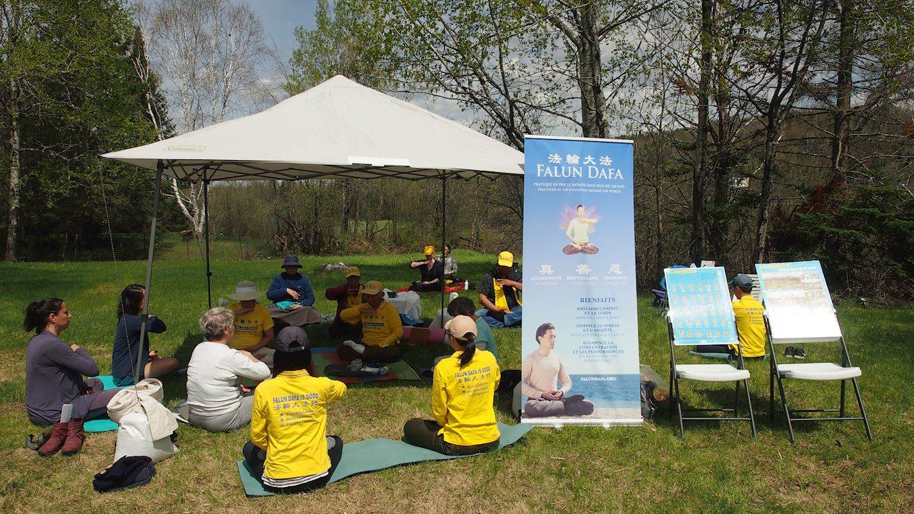

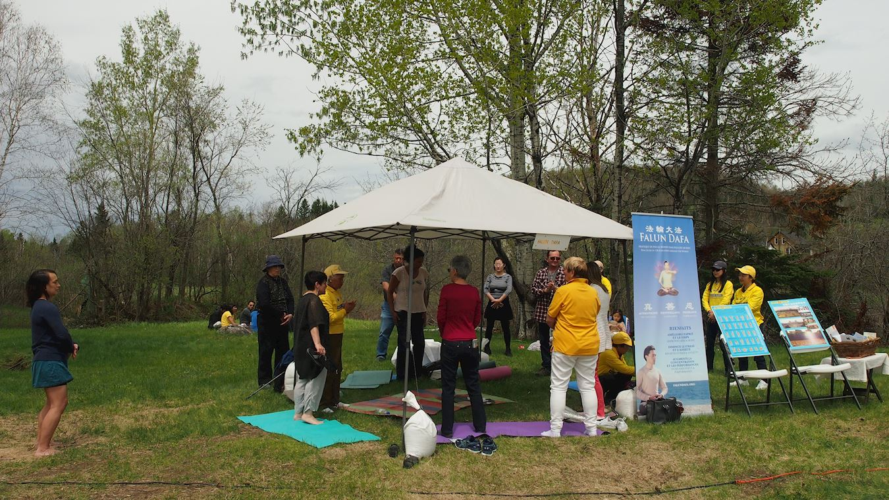

图1～2：法轮功学员参加在加拿大魁北克省的劳伦田地区举行的瓦勒-莫汗节（FestiVal-Morin），现场为民众教功。

主办方特意在靠近河边的草地上，为法轮功学员免费提供了一大块宽敞场地，以便于为民众教功。活动组织者布赫博涅（Marc A. Bourbonnais）来到展位上向法轮功学员们表示感谢，称赞法轮功学员带来祥和，“谢谢你们来参加，今天早上我非常紧张，但我感受到了你们的能量，让我放松下来了。”

很多人对法轮大法的功法感兴趣，有人询问如何学功，有人表示会从网上下载《转法轮》书。当得知在劳伦田地区有多个小镇上都有炼功点，人们非常高兴，表示将会加入。还有人邀请法轮功学员到附近的小镇上去教功，并可提供市政的室内场所。

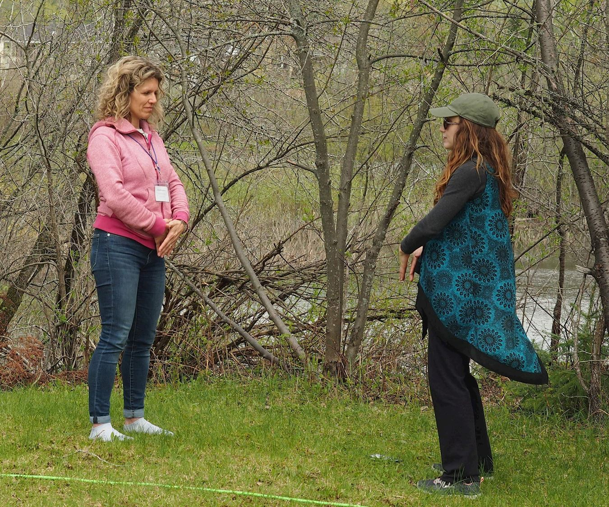

<b>图3：主办方的一名成员加入炼功队伍，学习了一个小时，她表示接下来将参加当地的炼功点。</b>

折纸莲花活动吸引了儿童及家长，许多人学习并制作了莲花。法轮功学员在桌边指导时，讲述了折纸莲花的初衷——在中国修炼法轮功的父母无辜遭受中共迫害，他们的孩子处在悲惨的境地，每一朵莲花象征一份美好的祝愿，希望早日结束迫害。很多人非常感动，一位母亲对六岁的女儿建议说，在几天后举办的生日派对上，请小朋友们一起为此折纸莲花，小女孩非常高兴地接受了。

当地一所知名的私立中学——劳伦田学院（Collège Laurentien）的退休老校长带着三岁的孙子参加折纸莲花，完成后他惊奇地说：“这真是个奇迹！”他说自己缺乏灵巧，从不擅长做这一类手工作品。之后，小孙子参加了打坐炼功，坐了将近十分钟，让老校长觉得这又是个难以置信的奇迹。第二天祖孙两再次来到展位，他告诉法轮功学员，自己在社交媒体上和学校的老师及同学们分享了法轮大法的网站，自己还打算到炼功点去炼功。

一名男青年折莲花，他的女友在另一边学打坐。他听到中国法轮功学员经历的残酷迫害，受到很大震动。他们离开一小时后，重新经过展位时，男青年告诉法轮功学员，他女友炼功时感受到强烈的能量，到现在还没有散去。他表示当时机来临时，他也要尝试炼功，“你们已经在我心里播下了种子。”

活动结束后，法轮功学员收到了主办方的信息，称赞法轮大法的展位充满和谐，邀请法轮功学员明年再来参加瓦勒-莫汗节。

原文: http://www.minghui.org/mh/articles/2019/6/1/388121.html

<h1 align="center"><b>在海外参与迫害法轮功者 美国将调查其恶行</b></h1>

2016年5月13日，李华红（中）因为干扰法轮功的活动被纽约警察当场拘捕。

【大纪元2019年06月01日讯】（大纪元记者林丹纽约报导）法轮大法明慧网5月31日发出《通告》：“在美国的一些宗教及信仰团体日前被告知，美国政府意在更加严格地审核签证申请、对人权及宗教迫害者拒发签证，包括移民签证和非移民签证（如旅游、探亲、商务等），已发签证者（包括“绿卡”持有者）也可能被拒绝入境。美国国务院官员并告知美国法轮功学员可以提交迫害者名单。”

通告指出，关于向美国政府提交在美国参与中共海外迫害者的个人信息，还包括“那些在美国参与中共海外迫害者的个人信息，比如在神韵艺术团和神韵交响乐团演出剧场外、在法轮大法修炼心得交流会场外，在法拉盛、真相点、邪恶网站等场所参与中共海外迫害者。”

一些亲共者，在法轮功学员游行、召开修炼心得交流会时，攻击、诽谤法轮功，骚扰法轮功学员举办的活动。据大纪元了解到，其中一些参与者是通过办理“政治庇护”而获得移民身份的，还有一些参与者在美国没有合法身份。

根据美国移民政策，在美国申请政治庇护时，美国移民局要调查申请人是否因他人的宗教、信仰而参与迫害他人。申请政治庇护的美国移民局I-589表中的PartC-3款，是关于申请人的附加个人信息，要求填写：申请人、其配偶、子女是否有命令、煽动、协助或以其它的参与方式，来对任何人的种族、信仰、国籍、加入某个社会组织成为成员或特定的政治观点进行伤害，带来痛苦？

由此可见，那些针对种族、信仰等，指使、参与、协助开展伤害的，若被发现，不能通过政治庇护获得合法身份；那些曾经或正在参与攻击、迫害法轮功的，正是I-589表中的PartC-3款所要求识别的内容。

这些参与迫害者在办理政治庇护时，如果否认自己因他人的信仰而迫害他人，但他们同时又攻击法轮功，参与迫害法轮功，那么这些人在办理身份时显然向移民局撒谎，犯下“移民欺诈”。

法拉盛移民律师刘汝华此前曾接受采访表示，“如果移民局发现申请人撒谎，还可以回到你的申请，取消你获得的批准，甚至是公民是身份都可能被取消。”

另外，美国移民和国籍法第212条关于禁止入境美国的条款，规定侵犯宗教自由、纳粹迫害、群体灭绝或任何酷刑行为的参与者，都适用该条款，禁止进入美国。

有些攻击法轮功、骚扰法轮功活动者，本身连合法身份都没有，处于时刻面临被递解出境之列。其参与骚扰法轮功的活动，侵犯美国的宗教信仰自由，他们的举动恐将加快其自身被递解的进程。

原文: http://www.epochtimes.com/gb/19/6/1/n11293842.htm

<h1 align="center"><b>老伯终生保密的故事</b></h1>

【明慧网二零一九年五月二日】本市有一位长者，鹤发童颜，慈眉善目，当年，我们同在一个机关大院炼功，老者年长我二十多岁，我就喊他“老伯”。他曾被多种顽病折磨，生不如死。后来有缘修炼了法轮功，无病一身轻，也明白了很多事情。
老伯抗战时期参加了共产党的八路军。老伯讲，他离休前，先后在几个单位上班的时候，都有好奇的同事想听听他抗战时期的故事，他都摇头拒绝：“对不起，我执行的特殊任务，终生保密。”

二零一五年，老伯看了奇书《九评共产党》以后，他告诉我，《九评》写的真好，里面说的每件事都是真的。三五九旅在南泥湾开荒，大面积种植罂粟、熬制大烟（鸦片）千真万确，我就是一个地区贩烟的负责人，把延安转来的烟土批发给毒贩贩卖，赚取银元，用于招兵买马。中共知道这事太肮脏，所以，刚一窃取政权，就密令将参与毒贩的全部处死。毒贩们做梦也没想到，为共产党出了力，不但不奖赏，还要吃枪子儿。刑场上，众毒贩大喊“冤枉”！行刑者冷冷抛出几句话：“别喊了，喊也没用。冤枉啥？贩卖毒品害人，犯的不就是死罪吗？”

老伯讲，在当时军民抗战时期，中共黄克诚领导的八路军三师驻扎在江苏淮阴，他那时就在三师当兵。据他讲，三师在淮阴驻扎七年，与城里的日军“和平共处”，一次仗也没打过。三师的任务不是抗日，而是扩充部队，抢占地盘。期间，曾有国军的一个旅，从安徽淮北急行军六百里到达淮阴，准备突袭城中日军，收复失地。该旅刚抵淮阴，立足未稳，竟遭到“友军”八路军夜袭，被八路军三师包抄围困，打了一天一夜，这支抗日国军官兵全部牺牲在八路军的枪口之下。此杀害同胞、破坏抗战之大罪，却被中共党官倒黑为白，说什么：“日军是反革命，国民党也是反革命，都是革命对象，都得消灭，早消灭晚消灭都一样。”

一九四五年，日本侵略者投降了。一九四九年国军战败，中共胜了。当时老伯美滋滋的想着：幸福生活从此就要开始了！没想到共党大权在手以后，毁人不倦，血雨腥风的政治运动一个连一个，大运动里还夹带着若干小运动。老伯被搅在漩涡里，成了个 “老牌运动员”，在几十场大大小小的运动中，不是他 “运动”人家，便是人家“运动”他，受了不少凌辱，也做过不少糊涂事，造了很多业，最后呢，落了一身病，从头到脚没有好地方。老友给他开玩笑：“我看你除了没有妇科病，别的病都到齐了。”

为了好病，老伯不知跑过多少医院，也曾练过其它气功，但都无济于事，不仅没好病，身上还招来了坏东西，被弄到生命垂危的地步。到了夏季，人家穿着短袖衫还嫌热，他穿着棉袄，围着火炉才不冷。夜里睡不着觉，生的，冷的，辣的，一概不敢吃。

一九九六年七月十六日，是老伯命运的转折点。那天早上，他起床后，想去街面上走走。走到离家不远的一个政府大院，看到里边有好多人在炼功，临街挂着《法轮功简介》，上前一看，觉的很好，当时就想学。他发现有个邻居也在那儿炼功，回家问邻居：“像我这样的能炼功吗？”邻居说：“谁都可以炼，但精神病人、危重病人不能進场。”他心想，不叫進场，我就在后边学。

次日早上，老伯就站在炼功场后面，跟着辅导员炼动作。说来真是神奇，他才炼了两天，就把棉衣脱掉了，身上的浮肿消了不少，走路轻快了。炼到第五天，他感觉饿，一气吃了五个桃，心里那个高兴啊，就别提啦（好多年了，没敢吃过水果）！“这功真好，我就炼这个功了。”

于是，老伯请了《转法轮》，每天晚上参加集体学法。他真学实修，心性提高快，身体变化很大。四十天后，学员们在学法点集体看师父的讲法录像，看完九讲录像，交流心得体会。他谈到大法的神奇，师父的慈悲，感激不已。谈完体会，年届古稀的他，走到一边的空地上，展臂舒身，腾空一跃，打了个漂亮的“旋风脚”。他与同修分享修炼的喜悦，证实着大法的超常。

九九年七月风云突变，邪党疯狂打压法轮功，而很多世人不明真相面临着为邪灵陪葬的险境。为了让人们明白真相，老伯买了一辆电动三轮，专门用于去乡下农村送真相福音。他每天带着干粮和开水，早出晚归，风雨无阻。

有一次，他在地头给一名正在播种的瘦弱老农讲真相。那人听了一会儿，劝他：“您是老干部，工资一个顶几个，这么大年纪了，跑出来受这苦，还有危险性，在家里享福多好啊！”他说：“大兄弟，我知道你是个善良人，为我好。可是，共产党坏事干绝，天要收它。打个比方吧，它是一个大厦，乡亲们都在大厦里面，睡着了，你也在里面睡着了。如今这个大厦已经腐朽透顶，随时都会倒塌，我在外边看的一清二楚，那你说，我是赶快把你喊醒好呢？还是看见只当没看见，只顾自个享福好呢？”那老农听罢，连连点头，朝老伯竖起了大拇指。

几年下来，方圆三十多里以内的每个村庄，都留下了老伯的身影。

原文: http://big5.minghui.org/mh/articles/2019/5/2/385794.html

<h1 align="center"><b>停止迫害　才有未来</b></h1>

【明慧网二零一九年六月十日】自从一九九九年七月二十日以后，中共开始了对法轮功一次又一次的疯狂迫害，对法轮功学员进行绑架、关押、酷刑迫害，甚至活摘器官等残忍手段，这些迫害的实施都是通过“六一零”（江泽民一伙为迫害法轮功而专门成立的非法组织）来指挥，公检法人员具体操办的，由江泽民发起至各级“六一零”，再到各地的公安局、刑警大队、派出所、街道等等，迫害就是这样一级一级下达实施的。被迫害的法轮功学员并没有触犯国家的任何法律与规范，只因修炼了法轮功或传播了法轮功真相，就将法轮功学员进行非法抓捕，抄家，非法关押至看守所、监狱、劳教所、洗脑班，进行精神上、肉体上、经济上、名誉中的多重迫害。
法轮功是佛家上乘修炼大法，是教人按着宇宙的最高特性真、善、忍修炼的，在社会上要求修炼者做一个好人，要善待他人，做事为别人着想，不争名夺利，不做坏事，遵纪守法，在任何一个环境中都要做一个好人，道德高尚的人。这样的人在现在的社会上是真正的浊世清莲，但是这样的人在中共的统冶下却被以无情的迫害与镇压，所采用的手段完全是非法与恐怖的，而且秘密地施行。

在中国的五千年历史中、在世界各国的历史上，都记载了诸多迫害好人、迫害正教徒而遭恶报的案例，如当年强大的罗马帝国迫害基督徒，将罗马城焚毁，把罪名嫁祸给基督徒，让人们由此而仇视基督徒，把基督徒扔进斗兽场喂野兽，导致很多基督徒为此而失去生命，但是罗马帝国由此而招致天降四场瘟疫，很多被谎言迷惑的人们因此而患瘟疫死去，就连参与迫害基督徒的罗马帝国皇帝尼禄，最后也落得自杀而亡的下场。

中国的历史上有过“三武一宗”的灭佛事件，这些参与迫害佛法的皇帝也都没有好下场。如：北魏的太武宗发动灭佛，结果被宦官所杀，参与灭佛的谋臣崔浩被灭九族；北周武帝宇文邕发起灭佛，其三十六岁就驾崩了，周武帝灭佛在公元574年，驾崩在578年，北周灭亡在581年，这不是报应吗？唐武宗在会昌五年发动灭佛，全国拆毁寺院、招提、兰若共4.46万余所，强迫僧尼还俗26.1万人，没收大量寺院土地，结果下一年唐武宗就驾崩了；后周的周世宗在显德二年发起灭佛，显德六年就驾崩了，下一年后周就被赵匡胤灭国了，可见迫害佛法的代价是极其可怕和巨大的！

现如今，时光到了二十一世纪，在中国大陆同样的发生了对佛法信徒的迫害，只是这一次迫害规模之大是史无前例的，而且动用了最先进的工具和大量百姓的资金进行的。但是随着时间的推移，这些参与的人都在纷纷落马和各种遭报，如薄熙来、周永康、徐才厚等人，均参与过迫害法轮功。在明慧网上报到过上万条由于参与迫害法轮功学员而遭恶报的例子，他们有的是自身遭恶报，有的是殃及家人的，有的遭报死亡的，有得疾病、失去公职，还有的身入牢笼。

下面就针对黑龙江省伊春市一地，列举几例：

<b>一、公安分局局长崔玉中遭恶报丧命</b>

伊春市金山屯区原公安局局长崔玉中，瘫痪三年后，于二零一八年十月份左右在痛苦的折磨中结束了其罪恶的一生。

崔玉中自二零零零年四月至二零零七年担任金山屯公安局长，在这八年中一直参与残酷迫害法轮功学员，在其指挥操控下先后有十九名法轮功学员被非法判刑，有近五十多人次被非法劳教，有近百人次被非法拘留，有百余人被勒索五百元至五千元不等，迫害致死的法轮功学员有七人：张淑华、朱秀清、孙文昌、李长生、秦月明、付桂春，王新春。

法轮功学员付桂春，女、四十多岁，家住丰茂林场，二零零二年四月被绑架后关在乌伊岭看守所，当时付桂春已怀胎数月，在崔玉中指使下被逼迫堕胎又被判刑，身心受到极大伤害，冤狱期满后数月含冤离世。

法轮功学员王新春二零零一年十一月四日在山上林场发真相传单，被崔玉中指使下的数十个警察包围。在深山里三天三夜，王新春双脚冻僵、不能走路，被丰派出所绑架，警察将王新春双脚插在热水中，然后用剪刀剪开棉鞋，致使王新春双脚起了大泡并感染脚烂掉，终身残疾。此后的十多年里，法轮功学员王新春不断地遭到警察的各种骚扰、抄家、毒打、非法关押等等，最后王新春于二零一九年四月二十三日含冤离世，年仅四十三岁。

崔玉中由于长期参与迫害法轮功学员，不知悔过从善，一直助纣为虐，所以遭到了恶果的报应，对他报应的开始是身患恶疾，然后在二零一五年象植物人一样瘫痪，在二零一八年十月份左右，在痛苦的折磨中死亡。

<b>二、伊春原副市长、公安局长李伟东涉嫌严重违纪违法被查</b>

李伟东，男，一九五六年生。一九八五年起，历任七台河公安局党委书记、七台河公安局局长，二零零三年一月至二零零四年二月任七台河政法委副书记，二零零四年二月任伊春市公安局中共党委书记、局长（副厅级），二零零七年二月任伊春市政府副市长、公安局长，二零一六年三月退休。

李伟东在七台河市任公安局局长、政法委副书记期间，曾在二零零三年四月十二日，将法轮功学员郑丽波绑架到七台河市公安局，仅仅两天时间，郑丽波就被公安人员活活打死！法轮功学员房翠芳、张长明，只因上访说句真话“法轮大法好”，被非法劳教，被惨无人道地迫害致死。

伊春市法轮功学员秦月明家庭的四位成员都是善良淳朴的普通百姓，由于他们不放弃自己对法轮大法的信仰，遭到惨无人道的迫害，秦月明于二零一一年二月被迫害致死。还对其家人进行绑架、非法劳教、酷刑等迫害以阻止家人对秦月明的死因的调查与上诉。

李伟东在伊春公安局任职期间，指挥操控下辖派出所绑架，逼问法轮功学员，对所谓“不招供”的，也就是不配合警察行恶的法轮功学员，就弄到刑警队，或由刑警队在各个派出所抽派警察组成所谓的“专案组”，来刑讯逼供，酷刑折磨等。仅从二零一三年至二零一四年这两年期间，伊春地区法轮功学员，就有六人被非法判刑，一人被迫害流离失所，多人被抄家、绑架到洗脑班。

二零一三年五月十七日，法轮功学员吴文锦、刘艳华去伊春弘江市场兑换零钱时，被当地红升派出所便衣跟踪、绑架。伊春区法院三次开庭非法庭审两位法轮功学员，过程中法院人员不让、并干扰律师为当事人做无罪辩护，导致律师愤而退庭。最终法庭对刘艳华、吴文锦分别非法重判十年。

由于李伟东在职期间参与中共对法轮功学员的迫害，所以最终遭恶报，报应的表现就是因涉嫌严重违纪违法被调查。

<b>三、伊春警察王学刚遭恶报车毁人亡</b>

二零一八年十一月的一天下午，伊春市警察王学刚开着别人的出租车，在丰林高速公路上与对面驶来的一辆大货车相撞，导致王学刚车毁人亡，死相非常凄惨，胳膊都断在了车里。

王学刚是奋斗派出所的片警，每次中共迫害法轮功学员时，刑警队队长在各派出所抽打手，组成所谓专案组干坏事，每次都有王学刚做刑警队的打手。王学刚通过迫害法轮功学员往上爬，从一个片警爬到刑警队。金山屯区很多法轮功学员在被逼供时都有王学刚参与，迫害手段极其残忍。

王学刚用生命的代价偿还自己所造的恶果，也给家人和朋友造成了巨大的伤害，又造成了一起人间悲剧，如早日知道悬崖勒马，停止迫害法轮功学员的行为，也不会落到如此的田地。

还有很多因参与迫害法轮功而遭恶报的例子，他们都是听信了中共的谎言，为了利益、为了权职而干出助纣为虐的坏事，结果给自己和家人带来了非常惨痛的后果，这样做你有再多的钱、再高的权力你能享受到吗？到头来只能留下悲痛。

迫害的发生是很荒诞登场的，就是因为江泽民出于对法轮功创始人的妒嫉，但是下面参与的人们是为了权利，为了职位，为了利益，一次次地出卖良心，黑白颠倒，充当罪恶的角色，发生了很多不该发生的惨痛事情，造成了无数的人间悲剧。

那么作为一名公检法人员，首先你要好好的了解一下法轮功是什么？共产党是什么？不要从党给你的资料中了解，那是歪曲事实的，通过这些你是了解不到真相的。要想了解真相，就要从真正的法轮功学员这里，从明慧网上这些正规的途径去了解，你才能有明辨是非的机会。然后你再看一看中共历次的运动，有多少人有过好的下场，包括历任中共党魁，都是以很悲惨的结局收场的。每一次运动都会有一些替罪羊来承担责任，把共产党犯下的罪恶都推到了替罪羊的身上，然后共产党再掉过头来唱平反的角色，你还要感谢党的平反之恩，其实里外都是党的鬼把戏，只是迷局中的人为了自身的安危，为了往上爬，为了利益迷住了双眼，看不到事情的全貌。

在文化大革命过后，中共将全国参与迫害的七百多个警察打手拉到云南后秘密枪决，然后给家属一张因公殉职单来了事。

法轮功学员不希望公检法人员被搅到这场事件中来，不愿意看到你们因为参与迫害法轮功而遭恶报或被审判，但是善恶必报，人不治天治。奉劝仍参与迫害法轮功的人员立刻停手，善待法轮功学员，为自己的将来，为家人的幸福，赢得未来。

原文: http://big5.minghui.org/mh/articles/2019/6/10/388520.html

<h1 align="center"><b>欢迎举报江泽民等人权恶棍美国资产</b></h1>

欢迎举报江泽民等人权恶棍。

【大纪元2019年06月06日讯】中共制造了举世罕见的贪官群体。自上世纪90年代初始，江泽民独揽党、政、军大权长达二十多年，大搞“腐败治国”，使得中共官场的贪腐和淫乱走向极致。几十年来，以江泽民为首的高官家族把持着全中国的经济命脉，控制着中国大部分财富，聚敛了高达天文数字的国家资财，造成社会贫富的巨大差距。

江泽民于1999年7月发动了残酷的迫害法轮功运动，以升官发财为诱饵，收买和胁迫大批官员参与迫害。这些贪官构成了“血债帮”利益集团，他们鲸吞的民脂民膏里，浸透着无数善良民众的鲜血。

近年来，中共贪官携款外逃的情况日益严重，“裸官”成风。他们首先把配偶、子女送到国外定居，继而通过在他国购置房产、银行存款、现金走私、企业投资控股、股票交易等多种方式转移财产。美国是这些人藏匿资产和出逃的首选地。

美国司法部于2010年制订了“追回盗窃资产计划”（Kleptocracy Asset Recovery Initiative），此计划由美国司法部刑事司财产没收暨洗钱科主导实施，检察官与美国联邦调查局（FBI）、国土安全部等联邦执法机构合作，搜查并没收外国腐败官员的贪腐资金，并尽力将这些非法资产部分归还涉案官员所在国家。

2015年，美国联邦调查局在全国范围内成立了“国际腐败调查行动组”，打击外国贿赂及盗窃资产的犯罪活动。

2019年2月22日，美国司法部在针对1MDB贪污案发布的文告中提示，“任何人，如有关于存放在美国境内，或经由美国洗净可能是来自外国的贪污资金的信息，应当与联邦执法部门联络，或发电邮至 kleptocracy@usdoj.gov。”

美国移民和国籍法第212条关于禁止入境美国的条款规定，侵犯宗教自由、纳粹迫害、群体灭绝或任何酷刑行为的参与者，都适用于此。江泽民集团迫害法轮功，犯下了群体灭绝罪及酷刑罪，属于美国移民法禁止入境的对象。

据明慧网2019年5月31日发布的《通告》，“在美国的一些宗教及信仰团体日前被告知，美国政府意在更加严格地审核签证申请、对人权及宗教迫害者拒发签证，包括移民签证和非移民签证（如旅游、探亲、商务等），已发签证者（包括‘绿卡’持有者）也可能被拒绝入境。美国国务院官员并告知美国法轮功学员可以提交迫害者名单。”

6月3日，美国驻华使馆微博发布了《全球马格尼茨基人权问责法》的相关介绍。法律规定，实施人权迫害的官员和打手均可受到美国政府的制裁，制裁方式包括限制其签证以及冻结其在美资产等。

江泽民家族及“血债帮”贪官转移至美国等地的巨额资产，全是非法所得，理应归还于民。因此，曝光以江泽民为首的中共迫害人权高官及其家族的美国资产，将有助于美国政府排查人权迫害者，有助于追查人权迫害及贪腐罪行，乃是伸张正义之举。

在此，新唐人电视台和《大纪元时报》欢迎各界知情人提供关于江泽民等中共迫害人权的高官及其亲属在美国及他国的房产、资产的信息，请通过如下安全平台提供信息。

电子邮件：
editor@epochtimes.com (海外)
talkdjy@gmail.com (大陆)

举报电话：1-929-253-3935

大纪元网上投稿系统：
https://luntan.epochtimes.com/tougao/gb/index.php

<h1 align="center"><b>波特兰星光游行 法轮功团体获第一名</b></h1>

【明慧网二零一九年六月五日】二零一九年六月一日，美国俄勒冈州波特兰市第四十三届玫瑰花节星光游行（Starlight Parade）如期举行。由华盛顿州法轮功学员精心设计制作的“法船”造型花车，再次应邀参加了本次游行，并得到了评委和观众的一致好评，荣获非商业团体第一名。

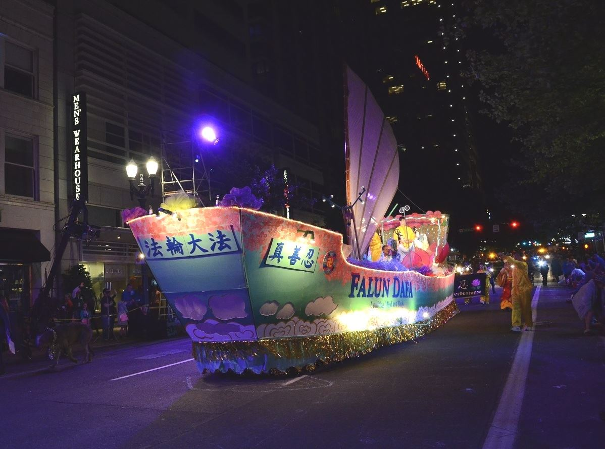

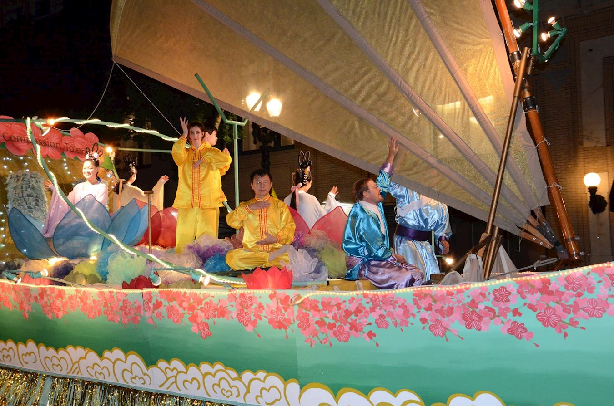

法轮功学员参加美国俄勒冈州波特兰市第四十三届玫瑰花节星光游行（Starlight Parade），荣获非商业团体第一名。

玫瑰花节是波特兰市一年一度的盛会，在每年的六月份举行，已经有上百年的历史了，曾被国际节庆活动协会评为世界最佳嘉年华。整个玫瑰花节持续将近一个月的时间，期间会举行许多大型娱乐活动，而星光游行（Starlight Parade）是最受市民欢迎的活动之一。游行是在晚上举行，但是人们早早地就会到路边等候，通常是整个家庭，无论老幼，全体出动。据本地媒体报导，今年约有三十万人在波特兰市中心现场观看了游行，再加上电视观众，上百万民众得以一饱眼福。

“法船”花车造型独特，整个船体以绿色为基调，象征春天的到来；船身上缀有朵朵梅花，象征法轮大法弟子不畏严寒风霜，傲然屹立的精神。船上金帆高悬，彩云环绕莲台左右，仙女们端坐莲台，衣袂飘飘。“法轮大法”、“真善忍”的字样和法轮图形饰于船头两侧，向人们传递着珍贵的信息。

官方网页已连续几年把“法船”花车的照片放在主页上。主办方一位今年新上任的负责人经其他负责人的介绍，得知法轮功学员的花车独一无二， 每年都得奖，因此他在花车装置时特地前来观赏。另一位去年参与评比的评委前来研究了花车的内部设计，有恍然大悟的惊喜，并从学员那里了解到法轮大法弘传世界的盛况，感叹不已。

在等待游行出发的时间里，不断有过路人给“法船”花车照相，或者站在花车前拍照留念，还过来询问一些更为详细的信息。

一个中年人，手里拿着手机在给他的朋友做视频直播，沿着“法船”一路拍过来，当他看到学员手里拿的横幅时，赶快走过来询问横幅上的字都是什么意思，并实时直播给他的朋友看。

一群年轻人经过“法船”时，学员向他们讲真相，其中一个年轻人说他在中国上过学，他知道中共很恶，但并不知道法轮功被迫害的情况。他听了学员讲的真相后表示，迫害不会持久的，他相信法轮功学员很快就会有自由修炼的环境了。

在游行快开始的时候，一对很有素养的白人夫妇经过游行队伍时，很激动地跑过来跟法轮功学员们打招呼。他们表示，前不久在纽约看到了法轮功学员的大游行，印象深刻。那位女士兴奋地强调，她在纽约看了两个小时的法轮功游行，感觉游行队伍长得不得了。没想到今天又在波特兰看到了法轮功学员的花车，所以她感到很惊喜，高兴地站在花车前，让先生给她拍照留念。

本次游行，“法船”花车最后一个压轴出场，法轮功学员的游行队伍非常引人注目。所到之处，人们不时地发出欢呼：“Falun Dafa（法轮大法）！”有些准备离开的人，也停下来看。有的大声赞美“法船”漂亮；有的鼓掌欢迎；很多人合十表示敬意。还有不少孩子和大人随着花车上学员的功法展示，一起做着炼功动作。有的人干脆用手机将学员的动作录了下来。

在游行过程中一个当地的年轻人跑过来问法轮大法是什么。学员给他简单介绍了大法的基本情况：“我们遵循真善忍的原则，要求自己做一个好人；我们有五套功法，对身心健康都有好处。”他一开始没有听清“真善忍”三个英文单词，又让学员重复了一遍，然后表示：那很好啊！

几位观众看到队伍走过来，互相询问什么是法轮大法？学员告诉他们：法轮大法源于中国古代，是一种性命双修的功法，有一亿人通过修炼法轮大法达到了身心健康。他们听了以后都很高兴，得知在中国大陆的法轮功学员遭到了中共的残酷迫害，甚至被中共活摘器官，他们感到非常震惊。其中一位说，这怎么能行？！必须停止啊！他们表示要上网了解更多真相。

当晚福克斯（Fox12）电视台对游行进行了现场直播，沿途还设有多个解说台，主持人向观众介绍，法轮大法是按照“真、善、忍”宇宙准则的传统修炼方法，福益全球各民族上亿人。法轮功适合所有年龄，免费教功，一切信息都可在网上查询：www.falundafa.org。

<h1 align="center"><b>三退大潮势不可挡 副市长也声明退党保平安</b></h1>

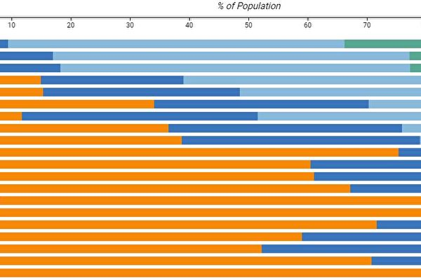

由《九评共产党》引发的大陆三退潮持续不减，目前已有3亿3千多万人加入此行列。图为多伦多大游行，庆祝三亿人退出中共党、团、队组织。

【大纪元2019年05月12日讯】（大纪元记者易如采访报导）2004年11月，大纪元发表的系列社论《九评共产党》引发的“三退”大潮已使3亿3千多万的中国民众退出了中共的党、团、队组织。海外退党义工表示，尽管中共监控得越来越厉害，但三退的中国民众还是连续不断，甚至越来越多的高官也加入了退党行列。

加拿大温莎市退党义工李女士向大陆民众打电话讲真相、劝“三退”已有十余年了。她对大纪元表示，现在很多大陆民众都在说，共产党不行了，要完蛋了，知道真相的人赶快声明“三退”。

李女士说，昨天（5月10日）打了6通电话，就有11个人退出党团队，“其中一通广西桂林的，一家4人都是党员，都全部退党了。”

近年来，中共对中国民众监控越来越严，“控制老百姓就像笼子里的鸟一样，就像犯人一样，不准动不准说。接听电话的民众反应，他们放下电话就有警察来找他。”李女士说，“中共为什么要控制，就是不让你保命，那你恰恰要保命，赶紧三退。”

李女士表示，三退大潮势不可挡，中共这样的做法只能是物极必反。

<b>副市长退党</b>
 
“近期接听‘三退’电话的有不少是高官。”加拿大温哥华退党义工王女士对大纪元说。

王女士一直坚持在景点讲真相，近3个月来，她又参加了向大陆民众拨打讲真相、劝“三退”的电话，“这些高官给我留下的印象是，他们早就心明肚亮，对邪党的黑看的是最清楚，接受三退，谋求出路，是顺理成章的事。”

一天，接听电话的是湖南某市的一位副市长，王女士对他说，“今年是猪年闹猪瘟，老百姓都在说不吉利，在寻求神佛保佑、保平安。怎么保？把当年入党宣誓的那句话，一切献给它，这个毒誓都抹去，声明作废。”

王女士对他还说：“你一切都给党了，老婆孩子跟你喝西北风啊？你是民之父母官，只有保护好自己，才能保护好你的臣民。”最后，王女士说，“送你一个吉祥的名字，三退保平安，接受我的祝福好吗？”那位副市长几乎立马回答说，“好、好，谢谢了。”

王女士还给这位副市长讲了法轮大法的真相，“法轮功讲真、善、忍，大姐是学法轮功的，希望你为官一任福泽四方，对大法弟子要多加保护，这是对你的子孙后代修桥铺路。”这位副市长表示都已知道真相，并不断地表示感谢。

<b>党校官员退党</b>
 
不仅中共政府官员退党，王女士说，现在中共党校里面的人也都在表示退党，“广东某市一所党校的副校长和教导主任他们做了‘三退’，还有浙江某市一所党校的一位副教授和办公室主任也做了‘三退’。”

王女士说，那位党校副校长接听电话时表示，他要退休了，不想管这些事，“我回答说，我知道，你知道的事情比我多，现在我叫您三退，只不过是叫您惹不起躲得起。之后，这位副校长就三退了，最后带着诚意，一再表示非常感谢。”

“这非常有讽刺意味。”王女士说，中共邪党党校是专门给共产党的党头打气的地方，按中共的说法，是“保先”的地方，老百姓把它讽刺为“保鲜”（所谓保鲜只是延缓它的腐败过程，而不可能越保越新鲜），“这些地方的官员都主动三退，说明他们心里都有数，共产党那一套没人再相信了。”

在谈到法轮功时，王女士说，他们都表示知道法轮功，“他们在电话里一直用感谢来表达他们的意思。而更多的民众则会直接喊出‘法轮大法好。’”

王女士说，她有一次打电话还碰到一个自称邪党的坚定分子，“电话刚一通，对方就表态说，他是共产邪党的坚强骨干，别跟他讲这些，他不会三退的。”

王女士回答他：“当今社会像你这样的人不多啦，对自己的信仰很慎重，不像有的人一会捡起一会丢下，很随便。我不认为你坏。”接着王女士和他慢慢聊了起来，在谈话的过程中，王女士说：“说句不太好听的话，满山的树，你为什么就偏偏选上这一棵树上吊呢？可不可以换一棵，说不定柳暗花明又一村。”那位“坚定分子”听王女士这么一说感觉好笑。

之后，王女士又给他列举了那些富可敌国的贪官，“政府说这些人是掏空了国库，我说不对，它是把老百姓锅里的碗里的都掏空了，很多老百姓还不知道。‘坚定分子’表示非常认可，并对那些巨贪表示憎恨。”

王女士接着对他说，中共现在是大势已去，“君子不立于危墙之下”，“三退就是叫你远离灾难、远离危险，中共干什么坏事，遭报的时候不要牵连你。最后这位‘坚定分子’高高兴兴地表示退党保平安。”

<h1 align="center"><b>警察绑架构陷老百姓竟如此肆意</b></h1>

【明慧网二零一九年六月一日】近几日浏览法轮大法明慧网，发现多起中共警察肆无忌惮地绑架构陷法轮功学员的案例，真是到了匪夷所思的地步。事实上，修炼法轮大法、按照真、善、忍做人，福益家庭社会，提升大众道德，不仅是合法的，而且应该受到表彰；法轮功学员根本就不应被抓被关押。
我们看几桩案例。

<b>（一）打个电话，将人绑架</b>
 

明慧网二零一九年五月二十四日报道了这样一个案例，说的是二零一八年七月二十五上午十点多，辽宁省大连市七贤岭派出所给大连和众信拓科技有限公司的软件工程师刘肖雄打电话，说是让他到派出所办理暂住证。刘肖雄跟单位请了假，就去了派出所。刘肖雄到达派出所一楼大厅后正询问办理暂住证的事情时，所长毛宏亮从楼上下来问刘肖雄：你炼不炼法轮功？刘肖雄诚实地回答说：炼啊。毛宏亮说：炼那你就别走了！就这样刘肖雄便被非法扣押了。当天下午派出所警察对他进行非法抄家。随后，刘肖雄的案件被逐渐升级，已被秘密非法审判。

请问，刘肖雄犯了什么罪？派出所警察只知道他修炼法轮功，打个电话把人骗过来一问，就把人绑架了，这个派出所绑架好人有多无赖。

<b>（二）丈夫找工作遭绑架，妻子问情况被判九年</b>
 

五月十八日的报道有一个案例更荒唐。吉林省松原市法轮功学员李国军到长春市找工作，还不到十天，二零一七年九月十三日，长春市民康路派出所警察（可能还有南关区国保警察）六、七人，突然闯入南关区西四道街宏达小区三栋五单元709室（法轮功学员刘庆杰的租房），将刚刚进屋的刘庆杰、李国军绑架。期间警察将法轮功学员李国军带到厨房，上去就是一拳，把李国军右眼、脸部打得鲜血直流。

经几天的查找，家属在长春市新康监狱医院找到李国军，但是官方不让家属接见，家属只好请律师会见，才知道李国军被打骨折。为了掩盖事实真相，警察非法对李国军批捕。其实，即使按照中共现有的不合法的内部规定，李国军也不具备被非法批捕的条件，就是因为他被警察打伤，警察要掩盖罪恶，所以就将他逮捕了。

李国军的妻子王淑华和姐姐王淑芬于二零一七年十月十二日上午到民康路派出所去要人时，俩人被非法扣押了两天一夜。王淑芬在十月十三日晚六点被放回，李国军妻子王淑华被劫持构陷。二零一七年十二月末，王淑华被非法批捕，并被非法判刑九年，于二零一八年六月四日送到兰家女子监狱继续迫害。

李国军是去打工去了，能做什么呢？不到十天就被绑架了。警察将他打成重伤，为掩盖罪责，竟然以编造假证、加重案情将他批捕达到不释放他的目的。他的妻子去要人，竟然无任何理由将他妻子绑架，后又判重刑九年。

<b>（三）买张火车票遭绑架</b>
 

法轮功学员出去打工，中共警察是怎么知道的呢？我们看看这个案例就明白了。

明慧网五月十七日有个报道，说的是原湖南省郴州市苏仙区工商银行职工李木朵，因遭不明真相的学生恶告，于二零一八年五月二十八日被绑架和关押。释放时，郴州市看守所开具了证明，写明“因撤案释放”。

且不说法轮功学员讲真相本身就无罪，但就这起非法案件来讲，已经被撤案了，从法律上说李木朵就是清白的了，谁再追究谁就是在犯罪了。可是到了今年三月六日，李木朵因购买一张郴州至长沙的火车票，却被郴州市苏仙区国保大队副队长张斌、南塔派出所所长唐铭奎等人非法抓捕。当天就被以“破坏法律实施罪”非法批捕。家属探询后得知，警察构陷李木朵的原因竟然还是上次被绑架的事。李木朵已被非法审判。

已经被撤了案，为什么还要绑架？这完全是执法犯法。那么如果他不买这张火车票呢？恐怕警察还想不起来绑架他呢。那么警察怎么知道他买火车票了呢？原因很简单，警察早已经把他的信息上了网。这也说明了法轮功学员去外地打工被当地警察绑架的原因了。

<b>（四）只因怀疑就将人绑架</b>
 

四月十二日有一则报道，说的是二零一八年十一月七日下午，广东省广州市越秀区法轮功学员吴健明在上班时，被越秀区光塔派出所警察绑架，并非法抄家，随后被劫持到越秀区看守所。为什么被绑架，家属经多方打听，才被告知，是因为当局“怀疑”吴健明参与跨省制作真相台历。

吴健明被绑架后，广州市至少有六名法轮功学员被警察上门骚扰或非法抄家，但警察在吴健明的住处以及其他法轮功学员的家里，并没有找到台历及制作证据。这也说明警察因怀疑绑架吴健明的借口根本就不成立。更令人不敢相信的是，在没有找到关于怀疑的丝毫线索时，竟将人投入看守所几个月。

<b>（五）路上行走被绑架</b>
 

五月十九日报道的是一则河北省的事，说的是五月十二日晚约十点多钟，万全县万全镇五十五岁的法轮功学员杭世珍，和一位女法轮功学员在路上行走时，被身份不明的人员开车拦截。下车就对杭世珍拳打脚踢，并将杭世珍按倒在地骑在她身上猛击头部，致使杭世珍整个头部沾满血迹，大口大口地吐血。当时杭世珍的脸被打得变形，四颗门牙被打得脱落、鼻梁骨骨折、人昏迷不醒。

那个凶手一边打一边打电话，不一会来了两三辆警车和许多警察。这些警察不但没有对此人的恶行进行审问拘留，反而将手无寸铁的两名法轮功学员带到了派出所非法关押。由于杭世珍已经无法行走，无法体检，拘留所拒收。杭世珍被丈夫接回后一直昏昏欲睡。

明慧网五月二十四日还报道了类似的一桩在路上行走就被绑架的案件。此事发生在辽宁省抚顺市。二零一九年四月十九日下午，法轮功学员贾秀花从王维菊家串门出来不远，就被抚顺国保的魏振兴及新抚派出所人员绑架，随即被非法抄了家，两台笔记本电脑及大量私人物品被抢。贾秀花本人也被送进抚顺看守所。

上述的这些绑架法轮功学员的案例，不断地在中国大陆上演着，并且持续了二十年。这是一个怎样的国度啊？警察说绑架谁就绑架谁，而且无须任何借口，哪怕绑架错了，也要将人劫持到看守所里，以方便其编造证据，将好人投入监牢。

中共对法轮功的迫害有二十年了，这二十年来，这种先对法轮功学员定罪，然后再搜集所谓的证据的做法一直被中共警察广泛的使用着。在此正告参与迫害的公检法司人员，在未来法制昌明、回归正义、面临正义法庭终身追责时，面对未来法庭对你的正义审判时，你如何去面对？你如何为自己开脱罪责？你说是上边让我这样判，你觉得这个理由能保护得了你吗？

在江泽民发动的这场惨绝人寰的迫害中，那些曾经参与和正在参与迫害的人，从省、市到基层，明知法轮功学员都是善良的好人，为了职务、为了饭碗、为了自保，昧着良心犯罪，都将面临正义的审判，善恶必报。现在没有遭报，是老天爷想给其中还有可能改过的人留下希望与机会，其实他们才是这场迫害的受害者、牺牲品。

<h1 align="center"><b>迫害中两位母亲离世 三个家庭支离破碎</b></h1>

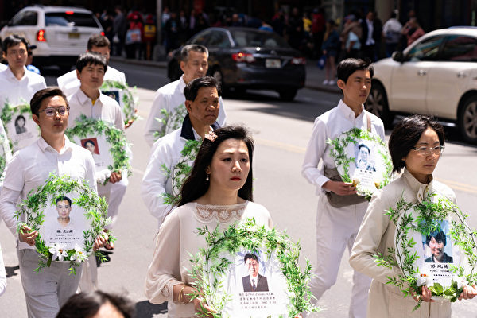

据不完全统计，1999年7.20以来，通过民间途径能够传出消息的，已有4304名法轮功学员被迫害致死。图为2019年5月16日，纽约，法轮功学员在游行中持被迫害致死学员的遗像表达追悼。

【大纪元2019年05月27日讯】自从2012年河北唐山市迁西县东莲花院乡法轮功学员王志新被迫害得流离失所后，她的家、父母和公婆的家被当地公安局、派出所疯狂骚扰，以致其妈妈和婆婆含冤离世，其他的亲人们至今仍在骚扰和悲苦中度日。

明慧网报导，2019年5月的一天，东莲花院乡派出所警察又开车闯到西陆庄村，准备再去王志新的母亲马银春的家骚扰，迎面碰上为马银春送葬的队伍，警察慌忙掉转车头跑了。

王志新和她的亲人们遭受了怎样的迫害呢？

<b>流离失所近七年</b>
 
王志新，1982年2月出生于东莲花院乡西陆庄村。她的父母都是地地道道的农民，除了种地，几乎没有其它生活来源。

王志新从小就懂事、勤快、学习很努力，毕业后又经考试被招聘到新庄子乡政府工作。上班不到四年，就连续两年被评为“优秀工作者”，并被提为办公室主任。她工作尽职尽责，工作能力强、成绩突出，无论在学校还是在工作单位里都可以说是个佼佼者，也是大家公认的好人。

2010年4月22日，海外明慧网曝光了一份中共“610”（专门迫害法轮功的非法机构）借上海世博会攻击法轮功的名为“宣讲提纲”的黑文件。警察怀疑王志新与曝光黑文件的事有关，迁西县公安局十几人闯入王志新家中抄家，将王志新夫妇绑架。她的娘家也被抄。丈夫赵洪涛于第二天被释放。

王志新被非法关押八个半月之后，因“事实不清，证据不足”取保候审。王志新的生活短暂地恢复了正常，回到新庄子乡政府继续上班。

然而在2012年6月7日，在中共十八大召开前，迁西县检察院人员要求王志新重新做笔录。国保大队的警察也再次加入对她的迫害。

王志新说：“我被非法关押八个半月的名誉和精神损失费谁来赔偿？如果没有法律依据，只因为我修炼法轮功做好人，对我施加压力、侵犯我的人权，我绝不配合你们的无理要求。”

面对反复骚扰，王志新只得被迫采取回避的方式，却又遭到警察非法“网上通缉”。从此王志新被迫害得流离失所，有家难回。

<b>遭非法通缉</b>
 
几年来，警察疯狂地骚扰王志新的各位家人，逼迫他们交出她。尤其自2018年12月以来，这几个家庭随时面临警察的上门骚扰。

从2019年3月1日起，警察在县城部分区域和超市、公交站点及西陆庄村几次张贴对王志新的“悬赏通告”，并将此通告发布到网上。在悬赏通告中不敢说她是因为修炼法轮功被通缉，而是谎称其“涉嫌刑事犯罪，刑拘在逃”。

花院派出所的警察在她妈妈马银春的家门口也贴了好几张对她的“悬赏通告”，还每天开车到村里转，不分白天晚上，每次都在大喇叭里念几遍“悬赏通告”，把村里搅搞得乌烟瘴气的。

<b>三家被疯狂骚扰</b>
 
尤其自2018年12月17日以来，迁西县公安局的警察对马银春她家的骚扰、恐吓达到了近乎疯狂的程度，用尽了各种手段逼其家人交出王志新。

迁西县公安局副局长付国强、国保大队警察贾振生、李绍峰、徐志刚、东莲花院乡派出所警察、迁西城关派出所警察到王志新家、她的父母家、公爹赵奎祥家、她丈夫的单位等处，已经记不清进行了多少次骚扰、威胁、恐吓、哄骗、欺诈了。王志新的家人因此而承受了巨大的精神压力。

2019年1月29日，警察又到三家骚扰了一遍。当天下午5点，东莲花院乡派出所警察闯到马银春家，直奔各屋查看。晚上11点，国保大队贾振生等六七个警察闯入王志新的公爹家。

4月中旬的一天，马银春在上厕所时晕倒，醒来后头疼，后来脖子也疼了，一只眼睛睁不开，晚上浑身疼得在床上滚来滚去。她通过炼功身体很快好转，已能够骑电动车去赶集买菜了。

然而4月25日凌晨5点，四辆警车载着约二十个警察闯到西陆庄村里，在各路口留一人看守，十几人一起涌到马银春家的两处住宅大肆抄家、到处翻找。

警察还每天在村里的大喇叭里念好几遍对王志新的“悬赏通告”。

4月28、29日，迁西县公安局副局长付国强、国保大队警察贾振生再次轮番到马银春家骚扰，并威胁说以后天天来。

4月28日，王志新的公爹赵奎祥被贾振生等四人从家中绑架。赵奎祥每天负责接送孙女上下学。王志新流离失所多年，她丈夫每天工作脱不开身，孩子无人照顾，被送到了奶奶家。

<b>妈妈和婆婆含冤离世</b>
 
王志新的母亲马银春得知亲家公被绑架，外孙女无人照顾，巨大的压力袭来，她终于承受不住，于2019年5月2日凌晨5点永远离开人世。

家人连王志新的母亲去世的消息都无法通知她。女儿连给母亲送葬甚至到坟前祭奠的机会都没有……

在马银春去世后，迁西县公安局副局长付国强、国保大队贾振生仍然没有放过王志新的家人，对被非法关押在拘留所的王志新的公爹赵奎祥、对刚刚失去妻子的王志新的父亲施加压力。

早在2010年王志新遭到非法抓捕后，她的婆婆李春贤就受到了极大的精神打击。因王志新在外流落，家人不断受到骚扰，婆婆李春贤长期在高压恐惧的环境下，精神压力太大，以致卧床不起，于2012年春离世。

<b>家人在凄苦中煎熬</b>
 
2012年12月8日晚8点，王志新的丈夫赵洪涛被绑架，被非法判刑1年，在河北省冀东管理局八监狱遭受迫害。

王志新和丈夫本有个幸福的家，又有了一个可爱的女儿。然而中共的迫害一次次向这个家袭来，家中没有妻子的打理，做丈夫的每天不仅要辛苦工作赚钱养家，还要面临警察的一次次的骚扰，警察还多次以不让他上班相威胁。

王志新的女儿在2010年妈妈被绑架时还不到2岁，小小年纪的她在成长过程中经历了妈妈爸爸被绑架、奶奶离世，一次次的抄家、骚扰，接着是爷爷被绑架、姥姥去世。她本应有个无忧无虑的童年，却历尽了难以想像的悲怆。

王志新的父母是典型的农村老人，辛苦操劳一辈子只为儿女们有一个稳定的生活。王志新流离失所后，她的父亲常说的一句话就是：“心不落体，总是悬着。”他常常在睡梦中惊醒，为女儿担心受怕了十来年，如今相依为命的老伴又撒手人寰。

王志新的公爹赵奎祥被骚扰、威逼、关押，老伴已离世多年，他不仅承受着巨大的压力，还要尽心照顾着孙女的学习和生活。孤独的老人的内心充满着凄苦。

<h1 align="center"><b>谴责中共活摘器官 美密苏里州通过决议案</b></h1>

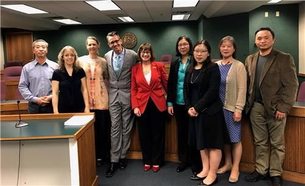

二零一九年四月九日，密苏里州参议员吉尔•舒普（中）、众议院国土安全委员会主席罗恩•希克斯（左四）与在听证会上发言的法轮功学员合影

【大纪元2019年05月26日讯】二零一九年五月十五日，美国密苏里州议会正式通过参议院第六号联合决议案，要求中国政府（中共）立即停止从良心犯，特别是法轮功学员身上活体摘取器官的罪行。该决议案同时要求中国政府（中共）停止对法轮功的迫害，并释放所有被关押的法轮功学员。

在参议院第六号联合决议案通过后，密苏里州州务卿将把决议案副本抄送给美国总统和副总统，联邦参、众两院议长和参议院外交委员会主席等，呼吁当局对中共器官移植手术进行更全面和透明的调查。

明慧网报导，这份由参议员吉尔•舒普发起的联合决议案，在为期五个月的立法期之间，历经参议院规则委员会、众议院国土安全委员会和行政监督规则委员会听证，并且由州参、众两院同时投票通过。

在此过程中，许多议员对法轮功学员表示支持，纷纷谴责中共活体摘取法轮功学员器官这一令人发指的罪行。

舒普议员表示：“这是一个早就应该通过的决议案。即使通过了，我们仍会继续为正义而战。在密苏里州，我们决不能容忍这些侵犯人权的行为。”

参议院规则委员会副主席、参议员戴夫•沙茨表示，“这是一个非常重要的问题，我很高兴可以帮助你们。”

沙茨议员不仅促成决议案在参议院迅速投票通过，同时还在他给选民的每周简报中，用全部篇幅讲述了中共从法轮功学员和其他政治犯活体摘取器官的罪行。

二零一九年四月九日，在由众议院国土安全委员会举行的听证会上，来自圣路易市的法轮功学员耿飒做了发言。耿飒曾和妻子管戈在中国因向民众邮寄揭露迫害的真相信，被警察跟踪并绑架。管戈在被关押期间遭受酷刑“约束衣”的折磨，后被迫害致死。耿飒在警察用螺丝刀撬开嘴进行暴力灌食的过程中，大部分的牙齿被撬坏并脱落。

众议院国土安全委员会主席罗恩•希克斯听到耿飒的发言后很受触动，表示迫害的惨烈程度让他惊讶不已。他认为这项决议案很有意义，并且会产生很大的影响。他表示将竭尽全力帮助法轮功学员推动这一决议案。“这就是我们（议会）在这里存在的目的”，他说。

该决议案引用了一篇长达六百多页的活摘器官调查报告。该报告估计，中国每年进行六万至十万例移植手术，远远高于中共声称的一万例移植。由于中国缺乏有效的器官捐献系统，法轮功学员和其他良心犯就成了这一国家罪行的受害者。

法轮功，也称法轮大法，是基于“真、善、忍”修炼原则的高德大法。法轮功于一九九二年五月在吉林长春公开传出，短短几年就吸引了上亿中国人修炼。在一九九九年七月，中共发动了对法轮功的残酷迫害，持续至今。

<b>参议院第六号联合决议案全文</b>
 
鉴于，广泛而可信的报告显示，中华人民共和国大规模杀害良心犯，主要是法轮功修炼者，还有其它宗教和少数民族团体，以获得移植器官；

鉴于，中国的器官移植系统不符合世界卫生组织“器官采购途径的可追溯性和透明度指导原则”，中共政府已经抵制了对该制度的独立审查；

鉴于，传统的中国习俗要求身体在死后完好无损地保存。然而，即使自愿器官捐赠非常罕见，中国移植行业还是自二零零零年以来大幅增长；

鉴于，“自由之家”二零一七年发布的名为《中国灵魂争夺战》的报告中说，“有证据显示法轮功学员被大规模强摘器官，用于器官移植手术，并且这种情况仍在继续。”

鉴于，二零一六年六月发布的新的调查报告是由人权律师大卫•麦塔斯，加拿大前亚太司司长大卫•乔高，和记者伊森•葛特曼所进行的。此报告估计中国每年的移植量为六万到十万次。这是“通过国家政策和资金控制的”工业规模的国家指导性器官移植系统，并涉及军民卫生制度；

鉴于，中国的肝移植登记系统表明，超过25%的病例是紧急移植手术，在几天甚至几个小时内发现器官匹配。非紧急肝移植的等待时间通常在几周内。其它国家的大多数患者都要等待多年才能进行移植手术；

鉴于，中国政府声称90%的中国器官移植源来自死刑犯。但是，自二零零二年以来，处决次数已经每年下降了10%，远低于移植人数。政府从来没有承认从良心犯中获取器官；

鉴于，法轮功是以气功冥想为中心的精神实践，以真、善、忍的价值为中心，九十年代在中国受到极大的欢迎，多方估计，修炼人数达七千多万人；

鉴于，一九九九年七月，中国共产党在全国范围内进行了严重的迫害，旨在消除法轮功的精神实践，包括身体和精神上的折磨，反映了中共长期以来对大型独立民间社会团体的不宽容；

鉴于，自一九九九年以来，成千上万的法轮功学员在中国劳教所、拘留中心和监狱中被拘留，对法轮功学员进行酷刑、虐待和不合理的体检和血液检查常规；

鉴于，“自由之家”二零一五年报道，中国法轮功学员占中国良心犯人的最大部分，面临死亡或被羁押的危险；

鉴于，联合国反酷刑委员会和酷刑问题特别报告员已经表达过对法轮功学员被强摘器官的指控的关注，并呼吁中共提高器官移植系统的问责和透明度，惩罚那些滥用职权者；

鉴于，二零一六年六月，美国众议院一致通过了《第三四三号决议》，谴责（中共）对法轮功和其他良心犯的系统性、国家授权的器官摘取；

鉴于，为了出售其移植器官而杀害宗教或政治犯是对基本生活权的严重和不可容忍的侵犯；

鉴于，对中国的器官旅游不应被医疗保密屏蔽，而应接受公开监督，任何一个国家都不应该允许其公民去中国获取器官，直到中国允许对过去和现在的良心犯的器官摘取进行全面调查。

<h1 align="center"><b>举世瞩目法轮功 呼吁结束迫害</b></h1>

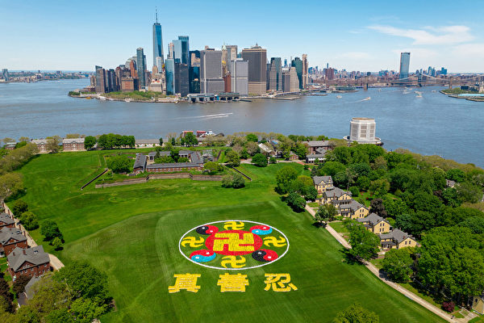

2019年5月18日，来自全球的部分法轮功学员会聚纽约，在纽约总督岛排出“法轮图形”和“真、善、忍”三字，庆祝世界法轮大法日。

【大纪元2019年05月20日讯】春光明媚圣节到，举世瞩目法轮功。五月十三日，是一个神圣的日子，今年的这一天是慈悲伟大的李洪志师父六十八岁华诞，法轮大法洪传世界二十七周年，又是第二十届世界法轮大法日。这一天全世界的大法弟子都会以各种方式表达自己的感恩。

据明慧网报道，在中国大陆，从新疆到广东，从黑龙江到云南，来自中国大陆三十个省、自治区、直辖市的大法弟子及明白真相的世人敬贺李洪志师父华诞快乐！同庆世界法轮大法日！从中我们看到了那些身陷中共统治下的苦难百姓对大法师父的感恩之心和期盼拯救的迫切心情，看到了民心所向，众望所归。

在世界各地，包括：美国、加拿大、芬兰、台湾、香港等五十多个国家和地区的大法弟子给李洪志师父发来了精美的贺卡及由衷感恩的肺腑之言。大法弟子们恭祝师父华诞快乐！庆祝法轮大法洪传世界二十七周年！庆祝世界法轮大法日！

5月16日，一场声势浩大、气势磅礴的游行在美国纽约曼哈顿中城展开。来自欧洲、亚洲、南美洲、北美洲、非洲、大洋洲六大洲的近万名法轮功修炼者，聚集在纽约曼哈顿，游行庆祝法轮大法洪传27周年。

法轮大法自1992年在中国传开之后，主要著作《转法轮》被翻译成43种语言，迄今全球至少有114个国家、上亿人学炼。这套中国传统修炼功法在27年内，成功超越语言、文化的隔阂，受到各国各族裔人士喜爱，洪传世界。

法轮大法中心发言人张而平表示，法轮功能在海外迅速洪传，是由于法轮大法的内涵涵盖人类社会每一个方面和各个领域，其指导原则“真、善、忍”，是人类社会道德文明的根基，世界上无论是任何一个国家或族群都认同并遵循这种精神文化。

然而，在中国大陆，就是这样一部于国于民有百利而无一害的高德大法，却被中共极度打压迫害。中共迫害法轮功二十年来，近亿法轮功学员长期被污蔑、监控，数百万学员被非法绑架、关押、劳教、判刑及关洗脑班，甚至被酷刑致死或活摘器官致死，数百万家庭被迫害得支离破碎、妻离子散、家破人亡！最让人痛心的是这场惨无人道的迫害至今仍在继续，这是人类巨大的耻辱！

法轮功之友主席艾伦•阿德勒（Alan Adler）在集会上发言表示，法轮功修炼者和平地抵制了一场严酷的迫害。在这个过程中，他们的努力感动了这个世界上的民众，世界人民出于钦佩也站出来支持法轮功学员。无论在任何情况下，法轮功修炼者都鼓舞了这个世界。

前中共总书记赵紫阳的政治秘书鲍彤表示，法轮功自从传出以来，坚持真善忍的精神，这宗旨很好，“我觉得‘真、善、忍’的宗旨很好，是我们需要坚持的价值。”

看到法轮功学员长期坚持“真、善、忍”的精神，鲍彤觉得非常佩服，他希望正义的力量最终能成功，“我祝福法轮功学员维护自己信仰自由的努力能获得胜利、成功，我也希望所有中国人维护自己的自由权、信仰权努力都能胜利、成功。”

台湾大学新闻研究所教授张锦华在集会上发言，庆贺世界法轮大法日，呼吁解体中共、结束中共对法轮功的迫害，并声援三亿三千万人退出专制邪恶的中国共产党。“然而，很不幸，专制独裁的中国共产党，却对千千万万善良的修炼人拘捕监禁、酷刑迫害、甚至还发生活摘器官、贩卖牟利这样邪恶残忍、天理不容的暴力行为！”“让我们继续携手努力，

告知更多人共产党迫害人性的真相！让更多人们选择善良正义，一起走向更美好的未来。”

台湾法轮功人权律师团发言人朱婉琪在集会上发言：目前，世界上已有34个国家、逾303万人举报发起迫害法轮功的江泽民的反人类罪行，要求法办元凶。我们愿世上所有的人守住心中的善，善待大法修炼人，善待众生；我们同舟共济，解体邪恶的中共，结束中共对人类的迫害。

追查迫害法轮功国际组织发言人汪志远说，中共对法轮功学员的迫害至今没有停止，尤其是中共大量活摘法轮功学员器官的罪行仍在继续。他呼吁参与迫害的人及早自首，方是上策。

香港法轮大法学会会长简鸿章在发言中表示，正义必将战胜邪恶的进程已接近尾声。他说，20年过去了，法轮功没有在严酷的迫害中倒下，随着真相广传和三退大潮的推进，向中共说“不”的民间正义力量越来越壮大，而中共邪党也走向了穷途末路，四面楚歌。

目前，世界上许多国家已经清醒的认识到了共产主义邪恶因素的渗透，全面清除围剿共产邪灵的战斗已经打响，正义必将战胜邪恶，一个没有邪恶、没有迫害存在的新纪元即将到来！

<h1 align="center"><b>救母何惧强暴 正义存于人心</b></h1>

象征子女对母亲的爱及感恩之情的康乃馨。

【大纪元2019年05月10日讯】我今年三十三岁，一名公务员。两年前，母亲从遥远的家乡赶来照顾已经怀孕七、八个月的我。母亲是一名法轮功弟子，很精进，在这陌生的城市，照顾我之余，还要给她遇到的人讲法轮功真相。

一天，母亲在讲真相时被人打电话诬告到派出所，警察把我母亲抓走关进看守所。我这一生中从没遇上过这么大的难事，整理被转送回来的母亲的衣服时，我发现衣服上有血迹。我又惊又恐，万箭穿心般为母亲的安危担忧，每晚都在哭，除了哭我不知道能做什么？

这时，有一位陌生的法轮功学员找到我，对我说：「不要怕，我们会像家人一样跟你一起营救你母亲。」母亲刚来这里，她们并不相识。我像找到主心骨一样失声痛哭。她们鼓励我不要怕，要勇敢面对那些抓我妈妈的警察，妈妈没有错，去找他们要求他们无罪释放母亲。

这样我开始放下惊恐，知道我可以做什么了，我要为母亲讨公道，去营救她！

两位法轮功阿姨陪着大肚子的我去了看守所，我要求见他们的主管领导。见到她，我立即大声质问：「为什么我妈妈的衣服上有血？你们对她做了什么？」那女警察不敢承认，只是说不知道，不是她干的。我立即大声质问：「你穿的是警服吗？你身为所长坐视手下打人？三、四个警察半夜打一个手无寸铁的老太太，狠毒到打掉她的门牙，满身是血，你们不觉的是在犯罪、这是你们的耻辱吗？」我完全没有怕，为了保护没有能力保护自己的母亲，我真想跟他们拼了。

从那以后，我再去看守所，她们就一直躲着不见我。还有一次，我看见一个警察拽我母亲，我立即大喊：「别硬拽她！」那个警察马上放手，以后再没人敢虐待我妈妈了，还夸我是一个优秀、孝顺的好女儿。

我给母亲写信告诉她：「我跟您的朋友在一起商量给您聘请律师，她们虽然与我素未谋面，但每个人都在尽全力帮助您，一定要有信心！有什么需要的，您就告诉我。」

后来知道母亲在那样恶劣的环境中还依然给里面的人讲法轮功真相，我真为母亲感到骄傲！梦中我梦到妈妈回家了，大法师父在向她微笑着招手……我知道师父是认可我妈妈的，她会在任何环境下都笑呵呵的去面对，她行！

有几次一个主管迫害法轮功的警察向我扬言，要如何如何我妈妈，据说这个人十几年来非法抓捕法轮功学员，敲诈勒索钱财，很多学员被判刑关进监狱，害得善良的法轮功学员妻离子散，民愤很大！我也看出他几次暗示我拿钱，而且出尔反尔，根本不可信任，是个恶棍。我无视他的威胁，不给他钱，而是积极为母亲聘请三位律师打官司。母亲告诉律师让我控告恶警。那我责无旁贷，立即和父亲一起找遍所有公、检、法相关部门和人员，给他们写信揭露这个恶警的罪行。我和父亲、律师多次去公安局找他，他很害怕，根本不敢见我们。律师在公安局说：「我们就是要控告某某。」

我一直忙，直到我分娩。最终那个恶警被免职，恶有恶报。

在法院开庭时，检察院公诉人竟说我是我母亲犯罪的「证人」，我当庭举手澄清：「正像律师辩护所说，按着道德规范，我不可能指证自己的母亲；在法轮功这方面讲，我作为家属受益良多，我现在还不知怎么报答，但在母亲受难时，我自当尽最大努力去营救母亲，怎么还会去指证呢？那不是滑天下之大稽吗？」我看透他们的把戏了，没有证据，找不到替罪羊和害人的借口，就栽赃陷害。老百姓都说共产党是假、恶、斗，真是不错。

开庭那天，法庭外去了那么多法轮功学员，有的人没钱打车，甚至是远道走去的，这让我很震惊！警察撵他们，没有人害怕，没有人走。我感受到他们的能量和慈悲，连警察都感佩！法轮功讲「真、善、忍」，这是普世价值，是全人类的希望！

一年后，妈妈回家了。接妈妈回家的路上，她问我：「你帮我控告他们时不怕失去公职吗？」我说：「我想过这种可能，如果是那样，我就一直告到北京去，豁出去了。」

妈妈又说：「看守所的警察就怕你去找他们。有一次警察高兴地喊我，说：『你的好女儿又给你请律师了，你真有福啊！』律师也跟我说：『你的女儿文笔很好，一切都帮你做了。』警察也说：『你女儿很优秀啊！』」我说：「妈，其实你一直对我要求很严格，也不让别人多夸我，是怕我飘飘然，会失德吧。」

我怀孕后期总是在哭，替妈妈担心，也许是这个原因，婴儿出生后也天天夜里哭。妈妈回来后，告诉我常给孩子念「法轮大法好」就会好的，还给了我一个生命的护身符。儿子从此以后夜里不哭了，真神奇啊！

大法弟子说我为修炼的母亲声援，也是为法轮功声援，会有福报的。真的，我不但没失去工作，几年前考试都没考进去的部门，这次事过后，天赐良机，连考都没考就调过去了。并且我还拥有个美满的三代同堂的幸福家庭――公婆慈爱，孩子可爱，真感谢慈悲伟大的法轮功师父！

<h1 align="center"><b>用实际行动赎罪 派出所所长胃癌痊愈</b></h1>

幡然醒悟， 则见希望的阳光

【大纪元2019年05月23日讯】二零零六年，我地东城派出所来了一位新所长C，三十七岁，是自一九九九年七月中共疯狂迫害法轮功后，东城区派出所的第三任所长。

都说“新官上任三把火”，这个C所长，哪里只是三把火啊，简直是天天都在烧火。只要与法轮功有牵连的事就不放过，自己还一马当先，跑在前面：上任后第一天，就抓了一名发真相册子的法轮功学员，将这位法轮功学员送拘留所，拘留所不收，他硬是捣鼓了一天，好不容易才送进去；第二天，又把一位在学校门口讲真相的老太太给塞进了看守所；还对所辖区大法弟子非法罚款；派人跟踪、盯梢法轮功学员等。全派出所的人忙得团团转。

所里怨声载道，但也不敢吱声。因他是市局派来的。市局认为这些年来，东城派出所在处理法轮功问题上一直不得力，不积极，派个新生力量来扭转一下局面。

这样过了大半年，这位C所长在打压法轮功“先进者受奖大会”上获得奖励，还戴上了大红花。可谁也没想到，就在他春风得意、一心等着升迁的时候，却被查出得了胃癌。这可把他吓了个半死，万念俱灰。

此时他忽然想起抓法轮功学员时，法轮功学员给他讲的话——“善恶有报是天理”、“迫害大法有罪”。他心里打着鼓，暗想：难道自己真是遭恶报了吗？他连夜跑到办公室，把以前收缴的法轮功的书籍、光盘、小册子都偷偷地拿回自己的家里，认认真真地看了一遍。越看越觉得法轮功师父说的好，有道理；越觉得法轮功好，心里越是后悔自己干的那些迫害法轮功的事……

在等待安排手术这段时间里，C所长有时间就看法轮功真相光盘，还找法轮功学员给他解答一些不明白的问题。这时他真正相信法轮大法是佛法，更相信善恶有报的天理了。他想用行动救赎自己的灵魂。

所里的人发现C所长变了：有举报法轮功的事，他就装作没听见；有人打电话来要求派车，去拉被抓的讲真相的法轮功学员，他就说，“哪有车？别瞎忙了，放了吧。”他亲自打电话通知本辖区遭非法罚款的法轮功学员来把钱领回去；通过他的熟人关系，把一位将要送劳教的老年法轮功学员，用“在外就医”的方式放回家，等等，类似的事情做了不少。

不知不觉中，C所长发现难忍的胃疼消失了，感觉全身有力气，胃口大开，吃什么都香。上医院一检查，呵，这胃癌痊愈了！他那个高兴啊，就别提了。他跟自己的助手老唐说了自己癌症好了的经过。老唐说：“你知道前两任所长，为什么迫害法轮功不积极？”他摇摇头，问为什么？

老唐说，第一任所长的母亲和嫂子都炼法轮功。他经常跟我们说，炼法轮功的都是好人，如果都炼了法轮功，国家就不腐败了。所以，抓法轮功（学员）的事，他不干。他母亲也跟他说，就是工作丢了，也不干这伤天害理的事，干了，就跟他脱离母子关系。嗨，你说奇怪不奇怪，别看这所长对整法轮功不积极，后来却被上调到省厅了。

这第二任所长嘛，就是老秦。老秦工作能力非常强。调来的时候，差不多是退休年龄了，市局想用他那股天不怕地不怕的倔劲，发挥最后的余热，用在迫害法轮功上。可是没想到，老所长对法轮功的事更是不沾，还说“三尺头上有神灵”，自己要为儿子孙子积德。一年后走后门办了内退。退休工资比上班时拿的还多，都说他有福气，办退休踩在点上了。后来才知道，原来是他儿子、媳妇都炼法轮功。是他儿子、媳妇劝他提前退休的。

这位C所长听了，一个劲地感叹：“唉，人家是明白真相得福报啊！幸亏我明白得还不算晚，癌症痊愈了，不然，这命就搭上了！”

据明慧网不完全统计，从一九九九年七月到二零一八年十二月，在中共发动迫害法轮功的十九年中，有二万七百八十四人遭恶报。在遭恶报死亡人数中，公安系统人员数目最多。但是，也有人在得绝症或顽疾后，开始悔悟，不再参与迫害，并尽全力帮助法轮功学员，挽回罪过，最后得了福报。

<h1 align="center"><b>中共迫害老人更显其邪恶本性</b></h1>

【明慧网二零一九年五月十一日】进入二零一九年以来，中共对法轮功学员的迫害依然疯狂，依然肆无忌惮。据明慧网近期报道，近段时间许多法轮功学员特别是许多老人被重判甚至被迫害致死。人们越来越看清中共的邪恶本质，中共就是祸乱人间的恶魔。
据明慧网信息统计，二零一九年一至三月份被中共绑架的法轮功学员达五百七十四名；被中共非法判刑的法轮功学员达一百六十九名。

在此仅举几个近期老人被迫害的案例，看看中共是怎样残害这些信仰“真善忍”的老人们的：北京怀柔区孙福义、徐俊明夫妇三月七日回九渡河老家没多久，就被尾随的怀柔区警察、国保、“六一零”（中共专门迫害法轮功的非法组织）人员在家中绑架，被劫持到怀柔看守所，徐俊明血压高压一百九十，低压一百四十，看守所拒收。四月二十三日（或二十二日），四个警察非法翻墙闯入室对六十五岁的徐俊明威胁恐吓。

二零一九年四月二十六日，住在徐俊明家后院的婶子几天都没见到她，怎么叫门也没人答应，就找来儿子翻墙进去看看情况，结果发现徐俊明已经死在了西厢房的炕上，头朝里躺着，一条腿搭在炕沿下，尸体已经僵硬。家人给穿寿衣时徐俊明尸体的嘴角还流出了血。据猜测应该是四个警察跳墙而入对徐俊明造成恐吓使其疾病发作后致死。

徐俊明的丈夫孙福义今年七十一岁，怀柔区电信局退休职工。村里有人到怀柔区办事，有人听说他是九渡河的，就说：“九渡河有一个叫孙福义的，那可是个大好人，这人在世上少有！”然而徐俊明与丈夫孙福义却因为坚定信仰法轮功，按“真、善、忍”做好人屡遭中共骚扰、监视居住、跟踪绑架、拘留、劳教、判刑、罚款、强制洗脑，曾被迫流离失所。

二零一九年一月十日孙福义结束三年冤狱回到家中与家人团聚，可是还不到两个月，孙福义和徐俊明又遭绑架。

四月二十六日，家人得信后前后赶来，儿子找到“六一零”洗脑班，要求让父亲孙福义回来料理后事。警察跟着孙福义一起回九渡河老家，怕孙福义跑了，就连刨坑、下葬警察都寸步不离地跟着孙福义。

四月二十六日当天，孙福义和家人们将妻子徐俊明的后事料理完，徐俊明的骨灰入土为安后，警察又欲将孙福义带回洗脑班关押，遭到孙福义和众亲友全力抵制。孙福义儿子质问警察：没有你们迫害我妈能死吗？孙福义说：我妻子人都给害死了，你们还想要迫害我。儿子拿出手机打举报电话举报警察的违法犯罪行为，警察这才走了。

二零一九年一月二十一日，山东济南市八十七岁的法轮功学员王洪章老人含冤离世。这位饱经风霜的老人，熬过了冤狱酷刑折磨，却因生活困顿、精神压抑而辞世于家中。直至去世，这位济南钢铁集团退休工程师也没得到应有的待遇。

王洪章老人生前是济南钢铁集团第一炼铁分厂的退休工程师，一九九四年开始修炼法轮大法后，他和老伴一共参加过九期李洪志师父讲法面授班。多种疾病不翼而飞，面色红润，头发也由白变黑。在一九九九年七月二十日中共邪恶集权疯狂迫害法轮功后，王洪章老人遭非法关押、强制洗脑、劳教等严重迫害，在七十六岁高龄时还被非法判刑五年，在山东省监狱遭受种种酷刑折磨，九死一生。出狱后，仍遭单位及公安分局不法人员的监控、骚扰。更惨无人道的是，济钢集团长期剥夺他的退休金。

王洪章老人多次去单位要属于自己的养老钱，最终一个月只能拿到五百元生活费。从二零一八年开始多一些了，逐渐能拿到一千九百元。没几个月，老人即撒手人寰。粗略算起来，王洪章老人被克扣的退休金至少二十几万。

王洪章的老伴十几年前在迫害中离世后，照顾精神病女儿的担子就落在了他的身上。女儿的精神病发作起来，就赤身裸体的躺在地上……虽已是耄耋老人，却没有生活的保障，没有家庭的温暖，加之随时随地的监控，有形无形的枷锁，这种境遇，怎能安度晚年？相信凡有点恻隐之心的人，都不会对王洪章老人的遭遇无动于衷的。

二零一九年一月二十一日，大寒节气后的第二天，天气异常寒冷。八十七岁的王洪章老人一个星期前摔伤了腰。中午，一位友人来看望他，还给他带去了二十多块钱的包子。家中光线昏暗，空气中弥漫着怪味。看着饥饿的老人，友人心情沉重，只有多安慰鼓励他几句。没承想，这一次看似平常的探望竟成了与老人的诀别。下午，家人发现老人不知何时已停止了呼吸。

四川省达州万源市七十九岁的法轮功学员肖大富， 二零一八年十月十六日被达州市通川区国保从家中绑架，劫持到达州市看守所，至今已非法关押了六个多月，家人一直未见到其人。

据悉，肖大富遭受了七次长时间的逼供。警察把编造的构陷他的所谓“案子”已经移交到万源市检察院。国安警察为了给他施压，逼迫他的三个孩子和他断绝父子关系。

看了几位老人的悲惨遭遇，不禁泪眼模糊。中共迫害法轮功二十年来，有多少法轮功学员遭受到这样悲惨的遭遇？有多少法轮功学员的家庭被迫害得支离破碎、妻离子散、家破人亡？

中共就是一个没有丝毫人性的邪魔，一个具有黑社会组织性质的货真价实的国家恐怖主义组织。中共对法轮功的迫害，对其它宗教信仰团体的迫害，对其他民众的迫害，已经引起世界许多国家及国际组织的关注，谴责中共人权迫害，制止中共活摘器官罪恶的国家越来越多。

四月二十九日，美国国际宗教自由委员会（USCIRF）公布了二零一九年年度报告。报告显示，中共仍然在大规模强摘法轮功学员器官。中国在二零一九年再次被美国国际宗教自由委员会列为侵犯宗教自由的“特别关注国”，这是中国连续第二十年被列为“特别关注国”。

愿世界上更多的国家及国际组织关注目前中国大陆的人权状况，帮助中国民众尽快结束人权迫害，还人类永久的和平与安宁！

<h1 align="center"><b>欧洲法轮功学员在纽约　把真相带给全世界</b></h1>

【明慧网二零一九年五月十八日】二零一九年五月十六日上午，来自全世界万名法轮功学员在纽约集会，举行了声势浩大的曼哈顿游行，纪念法轮功反迫害二十周年。长长的游行队伍浩浩荡荡横穿曼哈顿，历时几个小时，吸引了很多路人观看和了解真相。
走在队伍中的各族裔法轮功学员们为自己能有机会向中国人讲真相而感到欣慰，因为法轮大法来自中国。

来自法国的艾莱娜（Helene）女士居住在法国巴黎。她说自己是一九九九年七月二十日那天在加拿大开始修炼法轮功，那一天也是法轮功在中国开始遭受迫害的日子。

埃莱娜很年轻的时候就对中国文化很感兴趣。她认为中华文化中有很深的智慧，其中包括佛教道教和儒教的东西，这些都深深地吸引着她。机缘巧合，她遇见了法轮功。于是就如饥似渴地开始修炼 。为了反迫害，很多学员都去讲真相，她本人也经历了从害怕在人前讲话，到走在游行队伍的最前面。二零零一年十月，她和二十九名来自世界各地的西人大法弟子去了天安门广场，在那里喊出了法轮大法好！在世界舆论界造成了巨大的影响。

艾莱娜女士是因为喜欢中国文化找到了法轮功，并开始修炼。她认为中国传统文化和世界上的其它文化都不一样，博大精深，特别是与神性的联系，深深地吸引着艾莱娜。她说：“找到了法轮功后，就让我安心地学下去了，因为她是最高的知识，她包涵了一切。”

今天来到纽约，她要告诉中国人：“西方社会人们可以自由地修炼法轮功，热爱法轮功。法轮功是中国古老的文化，还是免费就可以学到，我为自己可以修连法轮功而感到骄傲、幸福和自豪。”

作为法国人，她还想告诉中国人：“你们要珍惜法轮功，她在你们的文化中是很特别的、很高深的修炼功法。共产党的迫害，让你们失去了可能修炼的机会，真是很可惜。”

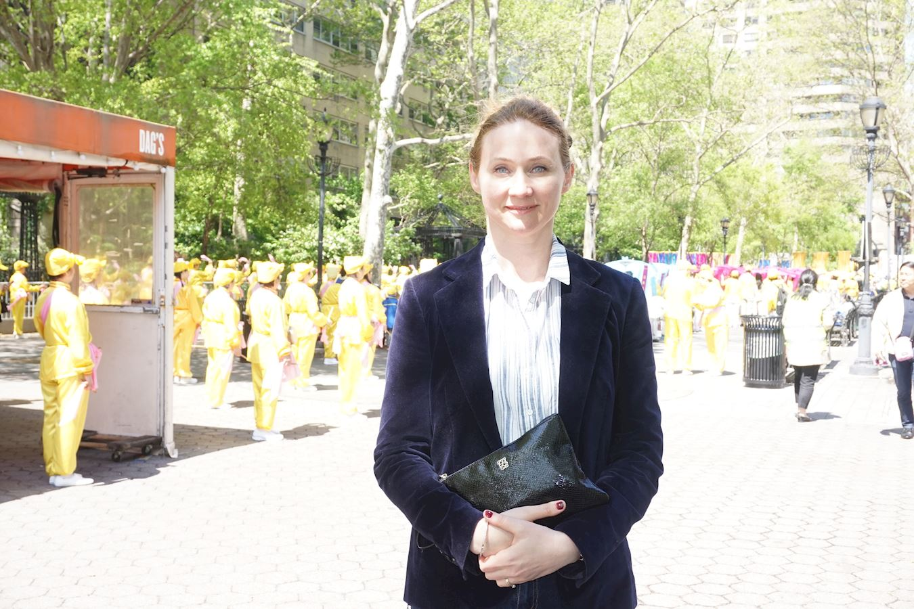

图1：法国学员的艾莱娜（Helene）女士居住在法国巴黎在纽约集会上

法国学员伊沃（Ivo Paulovic）祖籍是斯洛伐克人，他是二零一一年开始修炼法轮大法。他说：“我在修炼法轮大法前，可以说是五毒俱全，不仅抽很多烟，喝很多酒，还经常吸毒，离家出走，没有固定工作，远离社会，一个无业游民。”

后来经由一位朋友介绍，他开始学习《转法轮》，他发现这就是自己等待的！得遇大法后，他整个人都变了。刚开始修炼就遇到了父亲生重病住院，他和母亲一起把父亲的公司接过来经营，一边工作，一边还要照顾住院的父亲，最终父亲去世了。他说那时是大法帮了他太多太多，如果不是修炼了大法，自己不可能挺过来还做得那么好。

他说：“今天能来纽约参加反迫害大游行，有机会见到这么多的大法弟子，彼此交流心得，互相鼓励，真是太棒了。”他今天很想对大陆的中国人说：“法轮大法好！真善忍好！法轮大法真的太好了，他真的可以做到让你本人生命有改变，就像我们这些走过来的人，个人会变得心情愉悦，再也不想回到过去的状态了。再也不害怕死亡，面对困难时不再惧怕，你们一定要亲自去尝试。”

今天和伊沃走在一起的朋友叫麦尔斯•赛格尼（Miles Segni），来自美国中部的法轮功学员，现在是一家公司的数据分析师，二零一一年底开始修炼法轮大法。从那以后，他戒掉吃了十几年带有毒品性质的药，还戒掉了打电子游戏等瘾，他说：“炼了法轮大法后，自己有能力克服遇到的困难了。” 他用了近一年半的时间戒掉所有的坏毛病，让自己变成了更幸福的人。

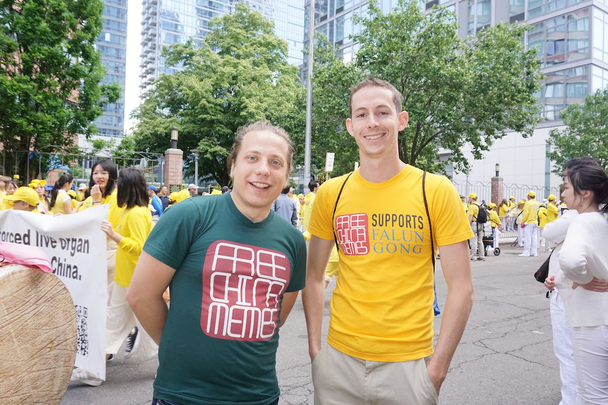

图2：法国学员伊沃（Ivo Paulovic）（左）和朋友Miles　Segni（右）一起走在集会的现场。

住在法国靠近瑞士汝拉省的斯蒂芬-迈耶（Stéphane Mayer）是一位葡萄园主和草药专家。他是一九九九年由瑞士学员介绍得遇大法，他说：“在《转法轮》中讲述了很多东西，都让我确信不疑，这就是法。特别是修炼五套功法时，那种能量就像一种物质一样冲击着我。”今天他带着两个孩子一起走在纪念反迫害二十周年的游行队伍中。

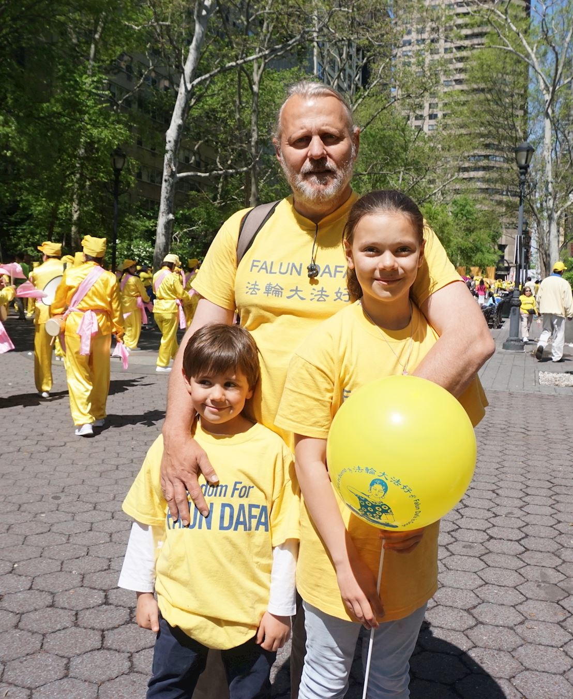

图3：住在法国靠近瑞士汝拉省的斯蒂芬-迈耶（Stéphane Mayer） 带着两个孩子一起参加了大游行

住在瑞士苏黎世（Zürich）市的学员阿尔弗佐登•丹尼斯（Alfjorden Denise）和她先生带着他们的小女儿莱拉尼（Leilani）一起来纽约参加大游行。她说：“因为我觉得法轮大法中的‘真善忍’这三个字非常重要，她是传统文化的根本，是人们精神的价值。我想和中国人说，心中永远要有一条正确的路，确立一个正确的价值观非常重要。想的和做的一致才能走在正确的路上。

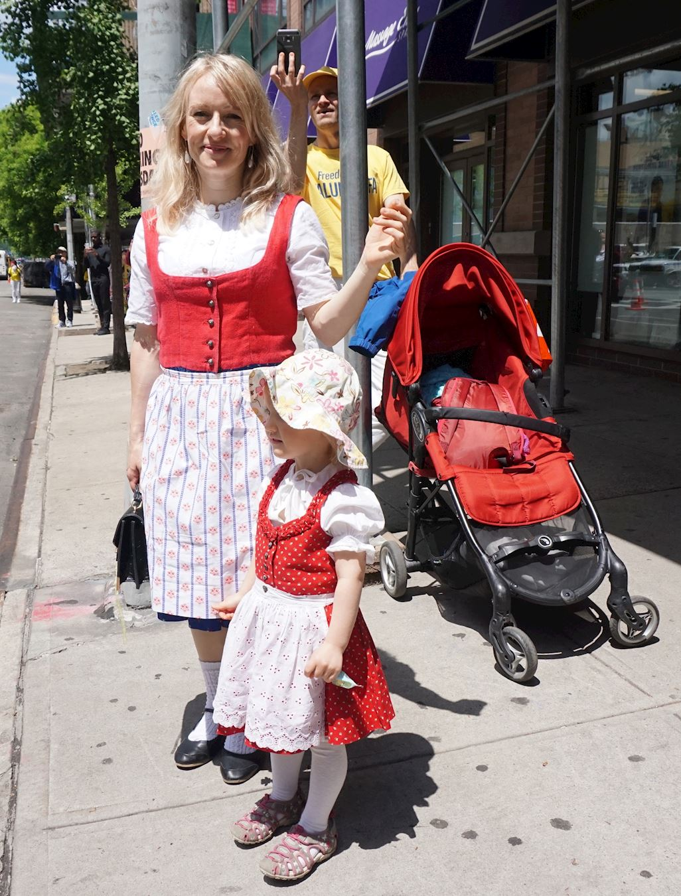

图4：瑞士学员Alfjorden Denise和她先生Alfjorden Dan带着他们的小女儿Leilani一起来纽约参加大游行。

<h1 align="center"><b>天降透雨这一方</b></h1>

【明慧网二零一九年五月二十三日】近年辽宁大部分地区连年干旱，农民无法种田。去年整个一个冬季，我们这里天没有降雪，老百姓忧心忡忡，无不担心春旱种不上田。果然，到了谷雨春播节气，基本没有降雨，田里干旱得一镐刨下去没有一点湿土。农民们一筹莫展，这田怎么种啊？
转眼间节气到了立夏，这个时节紧该种地了。中国有一句民谚：立夏到小满，种啥啥不晚。意思是说这一段时节种的庄稼秋天能够成熟。小满一过，下一个节气是芒种。中国还有一句民谚：忙种不可强种。意思是说这一段时节种的庄稼秋天难以成熟。

所以一过立夏，我们这里的农民们面对旱情如坐针毡，种上田害怕出不来苗，再不种害怕秋天庄稼成熟不了。有人挺不住了，便干埋上了（在干土上播种）。种完后也不乐观，非常闹心：老天爷不给下雨的话，不但出不来苗，而且种子、化肥连顾机器播种的工钱都得搭进去。有人背井离乡去外打工。有人只能等老天爷发慈悲给下雨。

五月十二日夜，天空阴云密布，终于开始下起了雨，整整下了一宿中雨。这一场雨实乃一场及时雨，干涸的田野湿润了，一镐刨下去没有一点干土，老天爷给久旱的大地下了一场透雨，干埋的田野有希望了，没种的田野也有希望了，这真是天赐洪福啊!我们这一方的众生能不乐吗？真是人人是笑逐颜开呀！

老天给我们这里下了透雨，绿油油的禾苗盖满了大地。可是，距我们仅仅八华里的本镇几个村却没有下雨，我们这儿都种完了地，他们那里还在抗旱。

今年，老天又给我们这里下了透雨，农民们欣然种上了地。反之，距我们这里二、三十华里的不少乡镇只是下了小雨，还是种不上田。

老天为什么慈悲我们这一方的老百姓哪？因为我们这一方的老百姓都知道法轮大法好，这一方的法轮功学员把法轮大法的福音不断的传送给这一方的百姓，这一方的百姓都是最幸运的，获得了福报！

值得庆幸的是，我们这一方的法轮功学员每当把法轮功真相传给他们时，百分之九十以上的人都接过去，拿回家看。特别是真相护身符、台历、对联、福字，人人都要，甚至一抢而光。老百姓的家里年年都摆放和贴着法轮大法好的东西。

法轮大法是佛法。老百姓如此的拥护法轮大法，神佛能不保护这一方的百姓吗？善待大法一念，天赐幸福平安。

<h1 align="center"><b>“神佛真实存在” 法轮功新学员喜悦感恩</b></h1>

2019年5月16日，刚刚修炼法轮功一年多的学员，耿继平首次参加辉煌殊胜的纽约近万人大游行，心情格外激动。

【大纪元2019年05月17日讯】（大纪元记者王晓莲美国纽约采访报导）5月16日，“世界之都”纽约迎来年度盛事，来自近60个国家的部分法轮大法学员在曼哈顿机会游行，欢庆法轮大法洪传世界27周年，刚刚走入修炼不久的耿继平和钟灿也在游行队伍之中。

<b>前大陆教师得法 彻底抛却无神论</b>

近万人组成的游行方阵，将繁华的曼哈顿42街变成了色彩明丽的海洋。作为刚刚走入修炼一年多的学员，耿继平首次参加辉煌、殊胜的大游行，心情格外激动，“在如今浮躁、堕落的尘世中，竟然有这么一支追求‘真、善、忍’、无私救度众生的神圣队伍，我为自己能加入其中而自豪。”

半个多月来，耿继平参与了游行花船的制作，深深为大法弟子们伟大的创意、舍己的奉献、协调的配合而感动。她表示，自己作为新学员，还有很大提升空间。

法轮大法学员耿继平参与了游行花船的制作，深深为大法弟子们伟大的创意、舍己的奉献、协调的配合而感动。

耿继平于2018年5月在美国南加州走入修炼。回忆自己的前半生，她唏嘘不已。

耿继平出生于文革中期，父亲因遭批斗，精神失常过好几年；姥爷和大姨死于五九年的大饥荒。全家人对中共噤若寒蝉，即使在家里也不敢大声批评邪党。

耿继平高中时赶上八九学运，考进大学后，整天听到的都是中共的谎言和歪曲；1999年开始，中共又发起了对法轮功学员的疯狂迫害，作为中学政治老师的她听信了谎言宣传。多年后去香港旅游，面对大法弟子讲真相的展板和视频，她感到极为震惊。

2015年，耿继平从中国大陆移民到信仰自由的美国，在网上看到“六四真相”、“法轮功真相”等翔实资料。最让她震撼的当属《九评共产党》，这本奇书让她明白了中共的邪灵本质。让她不寒而栗的是，中共竟是邪灵、是魔鬼；而自己竟然被邪灵欺骗了那么久、那么深。

一年前，耿继平开始阅读《转法轮》。“这本书让我明白了太多人生真相、宇宙真相”，她说，自己的人生观、世界观发生了翻天覆地的变化。2018年5月，她坚定地走上了修炼法轮功之路，成为了一名真正的法轮大法弟子。

耿继平这样形容自己过去迷在谎言中的滋味，“眼睛和心犹如核桃仁，被厚厚的核桃壳包裹着，轻易敲不碎砸不开的，只有经过真相的重锤反复锤击才行”。现在看到那些听信中共谎言的的民众不愿、不敢接受真相，或是攻击对神佛的信仰、攻击法轮功，她心里非常难过，对他们满怀惋惜。

她想对所有中国人说，“当有大法弟子给你讲真相的时候，请你抛弃成见、耐心倾听。万古机缘来之不易，稍纵即逝，愿你珍惜，请你对神佛有感恩和敬畏的心！”

<h1 align="center"><b>法轮大法洪传 多国学员会聚纽约</b></h1>

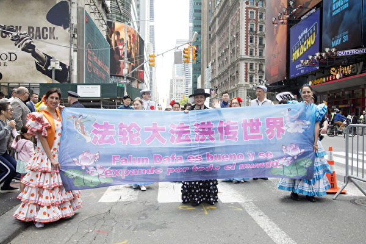

2019年5月16日，部分法轮功学员在纽约曼哈顿中城举行盛大游行，庆祝世界法轮大法日。图为游行队伍中来自世界各地不同国家和不同族裔的法轮功学员。

【大纪元2019年05月17日讯】一场声势浩大、气势磅礴的游行在世界的中心——纽约曼哈顿中城展开。5月16日，来自欧洲、亚洲、南美洲、北美洲、非洲、大洋洲六大洲的法轮功修炼者近万人，会聚在纽约曼哈顿，游行庆祝法轮大法洪传27周年。

游行队伍从曼哈顿岛东端的二大道出发，途经大中央车站、布莱恩公园、时代广场等多个纽约地标景点，游行路线横贯曼哈顿岛，直至曼哈顿岛西端的十一大道。游行队伍绵延42街数个街区，沿途民众纷纷为之驻足，或拍照，或挥手致意。

游行队伍由“法轮大法好”、“停止迫害法轮功”和“声援3亿3千多万中华儿女退出中共 ”三个主题方阵组成。天国乐团打头阵，威武雄壮的鼓号声充满能量，直冲霄汉；法轮功主要著作《转法轮》中文版和英文版的巨型书籍模型紧随其后；舞龙队、大花船、法轮功功法展示、横幅、彩旗、莲花船、腰鼓队、舞龙队、舞狮队等众多方阵，以壮观的队伍、明亮的色彩吸引各族裔民众驻足观看。

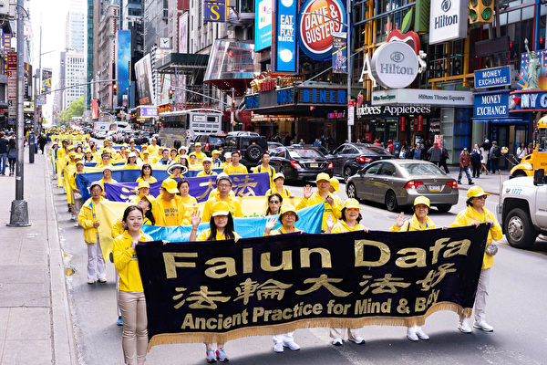

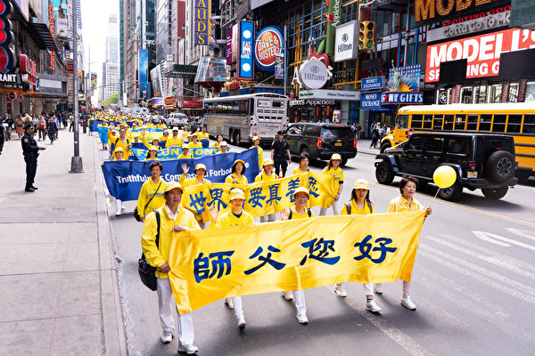

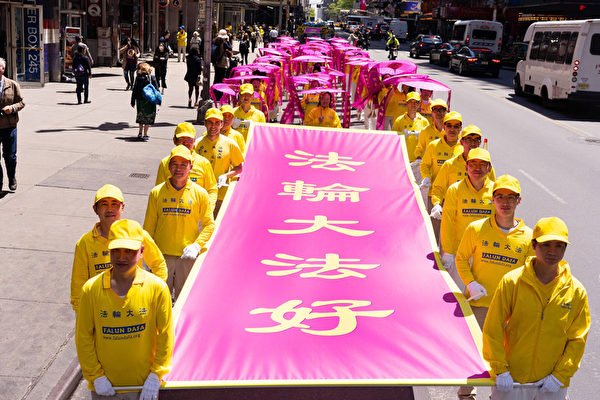

5月16日，来自欧洲、亚洲、南美洲、北美洲、非洲、大洋洲六大洲的部分法轮功修炼者，聚集在纽约曼哈顿，游行庆祝法轮大法洪传27周年。

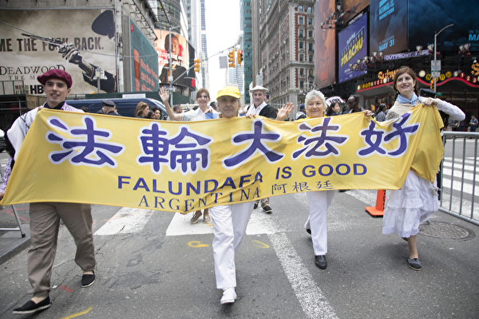

2019年5月16日，部分法轮功学员在纽约曼哈顿中城举行盛大游行，庆祝世界法轮大法日。图为游行队伍中的阿根廷法轮功学员。

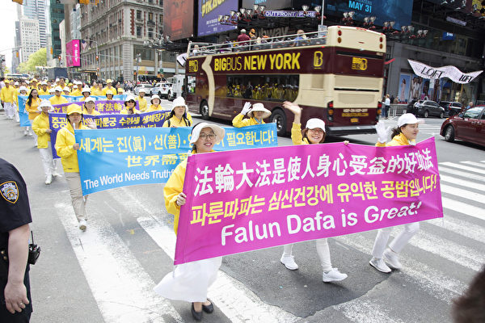

2019年5月16日，部分法轮功学员在纽约曼哈顿中城举行盛大游行，庆祝世界法轮大法日。图为游行队伍中的韩国法轮功学员。

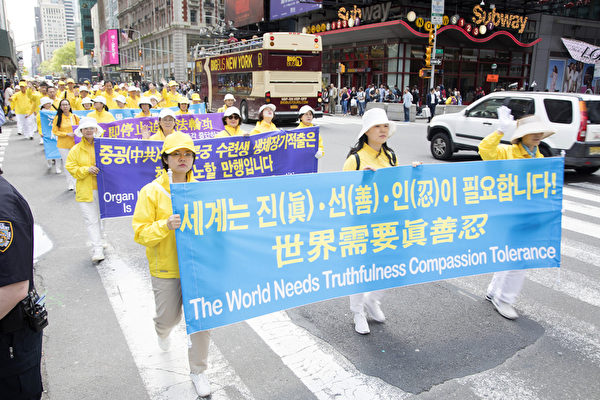

2019年5月16日，部分法轮功学员在纽约曼哈顿中城举行盛大游行，庆祝世界法轮大法日。图为游行队伍中的韩国法轮功学员。

2019年5月16日，部分法轮功学员在纽约曼哈顿中城举行盛大游行，庆祝世界法轮大法日。图为游行队伍中的捷克法轮功学员。

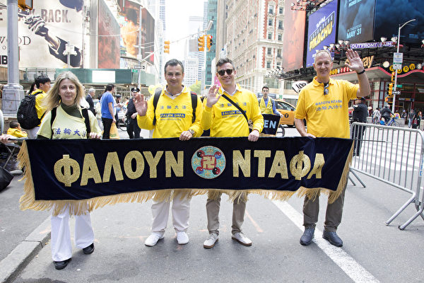

2019年5月16日，部分法轮功学员在纽约曼哈顿中城举行盛大游行，庆祝世界法轮大法日。图为游行队伍中的希腊法轮功学员。

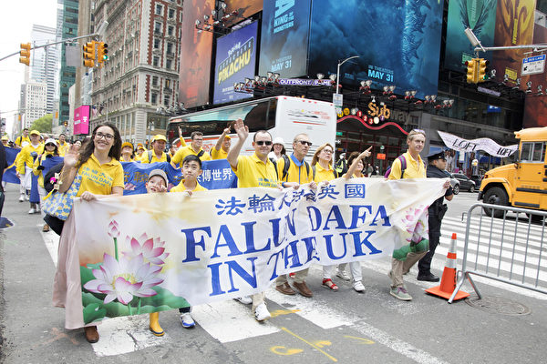

2019年5月16日，部分法轮功学员在纽约曼哈顿中城举行盛大游行，庆祝世界法轮大法日。图为游行队伍中的英国法轮功学员。

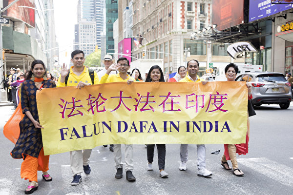

2019年5月16日，部分法轮功学员在纽约曼哈顿中城举行盛大游行，庆祝世界法轮大法日。图为游行队伍中的印度法轮功学员。

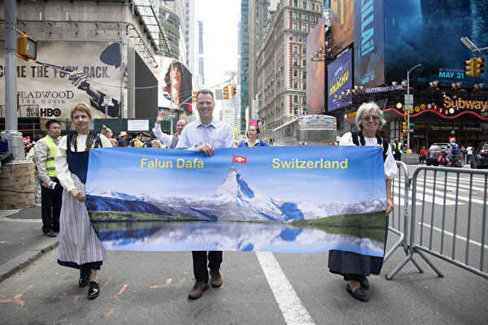

2019年5月16日，部分法轮功学员在纽约曼哈顿中城举行盛大游行，庆祝世界法轮大法日。图为游行队伍中的瑞士法轮功学员。

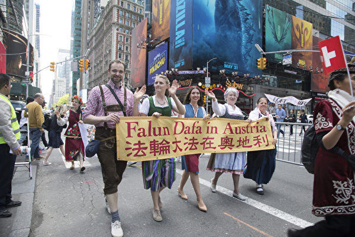

2019年5月16日，部分法轮功学员在纽约曼哈顿中城举行盛大游行，庆祝世界法轮大法日。图为游行队伍中的奥地利法轮功学员。

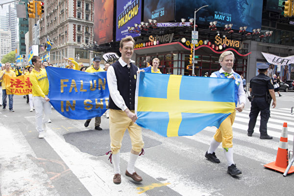

2019年5月16日，部分法轮功学员在纽约曼哈顿中城举行盛大游行，庆祝世界法轮大法日。图为游行队伍中的瑞典法轮功学员。

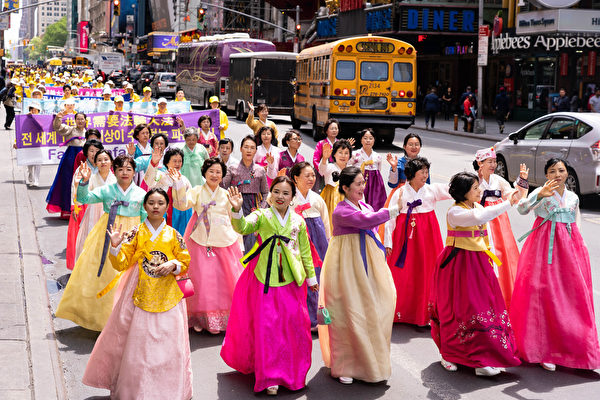

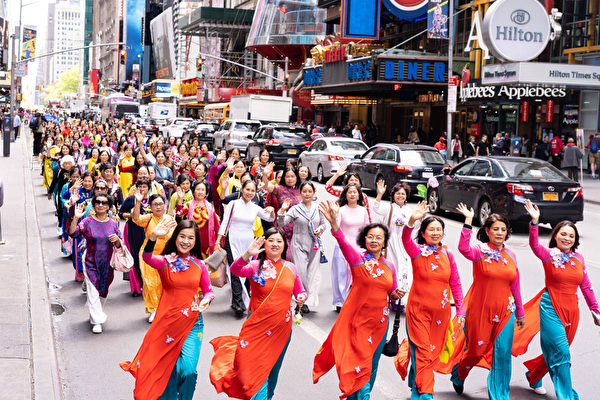

<h1 align="center"><b>守护心中的文明之光</b></h1>

人类经过数千年的演化，才达到如今的程度，我们称之为「文明」社会。如何检视我们的文明？却始终考验这个星球上包括香港人在内的所有智慧生命。放眼世界，人类仍然为了利益尔虞我诈，有时候，也仍然为了眼前的食物厮杀得血肉模糊。但终究这类争夺或者厮杀，有了一些共同的默契和规则，形成了法制，多了一些理解和包容，然后才有了进步。但文明的步伐永远都会受到挑战，那些随心所欲的肆虐，任意妄为的野蛮行为，在挑战文明和进步。

过去半年多来，香港发生了许许多多这类的挑战。然而，其中最令人不齿和鄙夷的，却是那些置人类之间基本尊重而不顾的行为。

由香港青关会组织的一些身分不明人士，在香港闹市铜锣湾和其他一些地点，置放黑色棺材道具，并以恶意攻击法轮功信仰及其创始人的语言，大张旗鼓，极尽污蔑侮辱之能事。不仅如此，这些人甚至冒充法轮功学员，以造谣、造假方式操办所谓的丧事。这些可笑又可鄙的造假行为，不但令市民极为反感，令外来游客大为惊诧，也为香港一国两制和法制的沦陷，作了最好的说明和脚注。

值得留意的是，这些行为，却是在香港警方和政府部门刻意包庇之下进行的。

法轮功是李洪志先生1992年在中国大陆创立的一种修炼法门，包含了以「真善忍」为核心的精神信仰，和五套修身健体的修炼功法。1999年7月，中共政府宣布在北京的法轮功研究会为「非法组织」，禁止其在中国活动。

在过去的18年，中共当局以各种野蛮和非人道的方式对坚持修炼法轮功的人士进行打击，至今为止，已有4203人证实被迫害致死，数以十万计的人被判刑或非法关押，数以百万计的人被抄家。中共对法轮功的打压，无论从时间跨度上，还是从涉及人数的规模及暴烈程度上，都超越了中共建政69年以来的其他镇压运动。

但法轮功学员仍在坚持自己的信念，他们没有被压垮，也绝不采取暴力反击，并且在全球各地都生根发芽，不断成长。

法轮功创始人李洪志先生每年都会莅临在美国举办的法轮功修炼交流会，指导法轮大法弟子修炼。

因此，每个人都知道，香港青关会这种傀儡组织背后的魔手来自哪里。他们那种针对人类基本尊严和人格底线的攻击，除了自曝其丑恶之外，也证明了黑暗们的绝望。

「卑鄙是卑鄙者的通行证，高尚是高尚者的墓志铭」。

黑暗们总以为他们可以掩盖光明，卑鄙者也常以为能取得对善良的最后胜利。

对那些人，我们除了投以鄙视的目光，更应该守护心中的那一点良善和文明之光，以太阳升起和漫天彩霞。

在香港公众场合出现多个有中共背景的青关会成员假冒法轮功学员设立的假灵堂，这种卑劣事件的发生和持续是对港人的侮辱，也是对文明社会基本尊严的挑衅，每个人都应该用自己的方式尽快阻止青关会的流氓行径。

<h1 align="center"><b>瞒天昧地　欺人害己</b></h1>

【明慧网二零一九年五月十二日】2018年11月6日，《人民日报》旗下杂志《新闻战线》前总编辑胡欣，从该报社三十六号楼十九楼跃下身亡，终年六十六岁。《新闻战线》在江泽民迫害法轮功期间大量发表污蔑、丑化法轮功和法轮功创始人的文章；中共理论刊物《求是》杂志副主编朱铁志2016年6月25日凌晨在地下车库自缢死亡；《人民日报》副刊主编徐怀谦2012年8月22日跳楼自杀；西安灞桥区宣传部长张浩然2015年10月22日在西安市水晶岛酒店割腕自杀；新华社安徽分社副社长、总编辑宋斌2014年4月28日在办公室自缢死亡；深圳《晶报》原编委、广告部总经理张敬武2014年5月8日自杀……
这些舞文弄墨的才子佳人，饱读诗书、仕途顺利、生活安逸，为什么抑郁苦闷，为什么精神恍惚，为什么自缢自杀呢？是鬼使神差，是谁在不依不饶？是自己后悔莫及，还是天理难容？在唏嘘慨叹的同时，人们也在追问探求。

其实，“文章千古事，得失寸草心”。一个人撒谎，愚弄的是几个人；一个媒体撒谎，可能惑众万千；一个政府撒谎，欺骗的是全世界。舆论可以促进文明和谐，舆论也可以导致动乱屠杀。媒体影响力越大，媒体人的责任也就越大。苍天有眼，谁在瞒天昧地、撒谎骗人，谁也就在引火烧身，玩火自焚。

约瑟夫·戈培尔是纳粹的宣传部长，纳粹的喉舌，煽动民族仇恨，通过谎言洗脑与仇恨灌输，鼓噪清洗、杀戮、战争，暴虐横行。据统计，有近600万犹太人在纳粹的民族清洗中丧生。1945年5月1日，48岁的他与妻子将自己的6个孩子毒死，然后自杀了。

七十载光阴似箭，在信息爆炸的当下，谎言还能大行其道吗？戈培尔那样疯狂的骗子还有吗？事实上，哪里有独裁，哪里就有谎言、欺骗、暴力、迫害。自从中共一九九九年七月迫害法轮功以来，中共动用了所有的国家宣传机器，捏造谎言，罗织罪名，肆意抹黑、栽赃陷害法轮功。

据不完全统计，在迫害开始后的六个月里，中共媒体在海内外对法轮功的诋毁文章，就达三十余万篇次。时至今日，中共还在诬陷法轮功，迫害还在持续。那些弥天谎言，或是在领导授意下、或是在强迫要挟下、或是在主动积极下，撰写完成了，登载发表了。而作者、主编、社长、宣传部长，人人都难辞其咎，因为他们都参与了。

法轮功不仅仅是一种气功，而是真正的佛法。一篇违背了事实，诬蔑、批判佛法的文章，不仅仅是撒谎欺骗，是如山如天的罪业。为什么这么说呢？佛法是宇宙的真理，是造化万物的根本，是衡量好坏的标准。万事万物都是佛法造就的，人咒骂佛法，就如孩子虐杀父母，父母可以原谅孩子，但是法律必须依法治罪。佛法是慈悲的，也是威严的。诽谤佛法的人，犯了毁佛之忤逆重罪，为天理天法所不容。

中共媒体的栽赃陷害，把教人向善的正法歪曲为残忍暴力的邪法，把善良的修炼人描绘成狂徒暴徒，继而把迫害合法化，为迫害的加剧推波助澜。二十年来，施加在法轮功学员身上的酷刑有鞭打、电刑、冷冻、烙烫、吊刑、性虐待、强奸等等，至少有4000名法轮功学员被迫害致死，无数万家庭妻离子散，更有活摘法轮功学员器官出售的罪恶被曝光。

还有，一些偏听偏信了谎言宣传的中国人，积极主动地参与到迫害的链条中。他们在参与迫害的同时，自己也误入歧途，走向危险，有的恶疾缠身，有的身陷囹圄，有的家破人亡。据统计，因参与迫害法轮功，19年间逾两万人遭恶报，其中死亡人数高达7000多人。

苍天有眼，神目如电，善恶有报，如影随形。从古至今，诽谤佛法都是如山如天的重罪，也是生受煎熬，死入地狱的罪孽。诋毁佛法者，谎言诬陷，欺骗害人，罪恶斑斑在册、罄竹难书。天朝地府都在怒斥他们，天罗地网都在捉拿他们，天地鬼神都在鞭挞他们，所以他们才活的煎熬难耐，死的蹊跷离奇。

媒体是社会的公器，媒体人的责任是客观、准确、公正地报导真相。如果媒体人能起到匡扶正义、抑恶扬善的作用，也就在为自己积德累福。反之，在谎言欺骗的同时，也在毁灭自己。请记住：瞒天昧地、欺人害己。

<h1 align="center"><b>长夜尽头 一缕金色的彩霞</b></h1>

金色的霞光

【大纪元2019年05月09日讯】我今年七十一岁，退休职工。我因家庭出身问题，从小到大吃尽苦头。二十三年前，在身患绝症、痛苦无望之际，我喜得法轮大法，很快无病一身轻。境界不断升华，深切体悟到师父的慈悲、修炼的美妙和殊胜、快乐和幸福。

<b>“资本家老婆”</b>
 
我家在河南沙河边。爷爷原本是个卖苦力的纤夫。爷爷、父亲及全家节衣缩食，攒了半辈子，终于买了一条运货的船，满心欢喜能靠运货过上不愁吃穿的日子。可船刚刚买来不久，共产党来了，想不到的是这只船成了我家的大“祸根”――爷爷被扣上“资本家”的大帽子，我们子孙都变成了“狗崽子”……

那种苦这里不多说，就从成家说起吧。

到了婚嫁的年龄，别人给介绍了几个对像，都因我“成分不好”而告吹。几年以后，我与一位男士相亲，他不计较我的出身，愿意娶我。结婚后，丈夫认可我的省事：能吃苦、节俭，笑说自己找对像“没有看走眼”。接着，我又调动了工作，过了几天比较顺心的日子。

可惜好景不长！丈夫听到了一些闲言碎语：某某找了个资本家老婆，一块臭肉坏一锅汤，自己前途受影响，孩子大了，连个兵都当不上……他听了感到很憋屈，烦躁，对我的态度一下子就变了：开始看我不顺眼，接着就动手打，而且是狠打。再后来，打我就成了他的家常便饭，我的身上、脸上经常是青一块紫一块的。有一次，因为一点鸡毛蒜皮的小事拌嘴，他把我的锁骨打断了。面对没完没了的家暴，我一个弱女子，除了痛苦和哀伤，还能如何？对丈夫的怨恨在心中层层累积。

尽管婚姻如此，但毕竟丈夫没有抛弃我。我安慰自己：咬着牙凑合着过吧，为了孩子。

谁知后来，我又不幸患上绝症，原本的苦日子更是雪上加霜！

<b>死亡边缘苦挣扎</b>
 
那是在一九八八年，我经常出现头晕，开始没有当回事，想着挺一挺就好了。没想到，后来越来越严重。有一天，我突然晕倒在地，不省人事。好心的同事随即把我送到医院检查，查来查去，没查出是什么病。

经医生介绍，丈夫送我到北京宣武区医科大学和天坛国际中医研究院就诊。做了脑血管造影，核磁共振等相关检查，确诊为“脑血管畸形并伴有不定期出血”，此病属于极罕见的疑难杂症。据医生说，在该院接诊的病例中，包括我只有三例，前两例，病人已经死亡。

现代仪器冷冰冰的结论，让我伤心落泪：活不长了，两个儿子都还没成年，谁来照顾他们？可有啥办法？全国最好的医院都治不了，还上哪治呢？回家等死去吧。回家后，病情不断恶化。不但脑病越来越重，又添了肺气肿、心脏病、癫痫、气管炎等几种病，都是让医生头痛的顽症。

看我病到这一步，本性不坏的丈夫心软了。加之当时邪党引诱世人“一切向钱看”，沉湎物欲，堕落迷失，不再拿“成分不好”开刀。随着“心病”的消除，丈夫逐渐回心转意，不再打我，还主动送我到当地医院住院治疗。住一段时间，感觉好点了就出院，出院不几天，病情加重，再去住院。一年中至少有三百天，我是躺在医院的病床上度过的。

后来，听说某野战部队医院进口了一台伽玛刀，做脑外科手术的医生是个医学博士，国内一流的脑外专家。家人带我前往就诊，做了伽玛刀手术。没想到手术后病情非但没有好转，还留下了手术后遗症――头痛、恶心、呕吐、全身浮肿，头痛时脑、眼欲裂，惨叫不止。专家也无计可施，劝我出院。

我回到当地住院，打针、输液，不见效。因为我哀嚎不止，针药不济，搅得四邻不安，医生催我们转院。丈夫百般无奈，又把我送回那家部队医院，恳求收留我。专家试用了多种方式，我的疼痛未能减轻，病情一天天恶化。

这几年，我治病花了很多钱，成了单位的包袱，自家的钱也花得光光的。我和丈夫商量：“医院住不起了，咱们回家吧，死在自己家里，总比死在外头好。”就在我们收拾东西准备出院的时候，专家过来了，对我说：“你先别走，我明天要去广州参加国际医学研讨会，我把你的病例带上，让国外权威专家会诊一下，看看有没有办法，等我回来再说。”

于是，我们抱着一线希望，在医院焦急的等待。等了半个月，专家回来了，告诉我们：“在会上，专家们对这病例做了专题研讨，一致认为，脑浆和颅内积液混在一起，就当前的医疗水平，无法分离。很遗憾，你们回去吧。”听到此言，我求生的一线希望彻底破灭！没路了，只有回家等死。

<b>“师父救了我”</b>
 
我从野战医院回到家是一九九六年的金秋十月。那年，法轮大法洪传到我市。

回家刚刚两天，单位一个年轻男同事就来到我家，劝我炼法轮功。他给我介绍了法轮大法祛病健身方面的神奇效果，并讲了他自己的亲身经历。原来一年前，他因脑瘤在北京做了开颅手术，术后的化疗使他大伤元气，头发稀疏，面黄肌瘦，走路气喘吁吁。经人介绍他修炼了法轮功。炼功时间不长，身体奇迹般的康复：头发长出来了，体重增加，面色红润，浑身是劲。

同事的经历打动了我的心，当时没去想我的病会怎样，只是隐隐感到，好像自己久久期待的某种事情到来了！

机不可失！当天晚上，我就让儿子用自行车带着我去了附近的学法点学法。当时的我极度虚弱，脸肿的吓人，走不了路，人迷迷糊糊的。学法点在一个单位院子里的空地上。灯光下，几十个法轮功学员围坐在一起学法，没人理我（后来才知道大法有要求，不让危重病人进场）。我坐在一边，听着同修读书，读的什么听得不是太清楚，但置身于那个场里，感觉特别舒服。回到家，那一夜睡得很踏实。起床后，我很饿，这是多年没有的感觉。一顿饱饭，一个安稳觉，我就像换了个人，有力气了，能站起来走路了。

到了晚上，我又去点上听大家读法。去时，是儿子推车我坐在后架子上，回来的时候，我就能自己走了，头一点也不痛了，不晕，不喘，全身舒服了。心里那种愉悦，对师父的感恩，实在是没法说！

第三天早上，我就自己去了炼功点学炼动功。炼完功回来，走到我家单元楼门口，看到儿子的自行车在楼下放着。家属院治安状况不好，经常丢车，我也没多想，直接把车子扛到肩膀上，一口气上到五楼我家房门口，把车放在走道里。当时，儿子正和他的一个伙伴在屋里，听到动静，开门一看，他的车在门口，儿子大吃一惊！“妈，你咋扛上来的？！”伙伴也惊奇的瞪大了眼睛，因为几天前他来我家，看见我儿子背着我，从一楼背到五楼，每上一层，还得放下来歇一歇，否则，我就难受的顶不住了。今天倒过来了，是我扛着车子，从一楼扛到五楼。

太不可思议了！看到俩孩子那副惊奇模样，才使我回过神来：哎呀，我是咋上来的？哎呀，我的病这不是好了吗？我是炼法轮功炼好的！是法轮功师父救了我的命！感激的泪水一下子奔涌而出。我跪下来向师父磕头：“师父啊，您把我从苦海中捞出来，给了我新生，弟子一定好好修大法……”

到了炼功点上，我讲了自己的经历，同修们都拍手，为我高兴，也都再一次见证了大法的神奇，增加了修炼的信心。我的奇事，成了同修引导有缘人得法的典型例子，很快周围很多人都知道了。

当地一位高官，人很善良，很稳重，下属向他介绍法轮功祛病健身如何有奇效，他听了觉得不错，但感觉有点玄，于是，就亲自走访了十几位法轮功学员，有市内的，也有县、乡的，其中也找了我。后来，这位官员成了法轮功学员，我们成了同修。在大法遭打压以后，这位同修顶住重重压力，毅然坚持信仰，助师正法，讲真相，真名实姓向最高法院递交诉讼状，控告迫害法轮功的元凶江泽民。

<b>精进 报师恩</b>

我只上过几天夜校，识字不多，学法困难。我不怕困难，一个字一个字的学，不会的就虚心问别人，查字典。一有空闲就看法，饭前饭后，干家务休息的一小会儿，都要看上一段。晚上参加集体学法回来，再看上一段才去洗漱休息。短短几个月的功夫，不知不觉的，我已能通读《转法轮》了，连《转法轮卷二》、《精进要旨》和《法轮大法义解》，都能读下来了。大法真是超常的科学，真的能开智开慧。

学法后，我明白了人生真谛，明白了人受难有病、没三天好日子过的根本原因，明白了很多过去想不明白的问题。对丈夫的宿怨，对曾经伤害过我的那些人的怨恨，很快就变得云淡风轻。我知道，那是我生生世世欠下的，他们是来讨债的，尽管他们用心不良，但是从修炼的角度看，是在给我消业，送德，为我今天得法修炼而铺路。

我不再怨天尤人，没有了自卑，没有了愁眉苦脸，唯有幸福和自豪：我是师尊的亲传弟子，修的是万古不遇的宇宙大法。那时的我，浑身是劲，无忧无虑，天天乐呵呵的。为了洪传大法，引导有缘人与法结缘，我四处串亲访友，与同修一起到县城，下农村，以苦为乐，风雨无阻。每天都是高兴事：有缘人得法了，我高兴；自己在法中有了升华，成功过了心性关，我高兴；听到世人对大法、对炼功人的赞扬，我高兴。遇到的都是高兴事，感觉修炼真是殊胜，美妙。

我的家人看我因修了大法，百病皆除，为人也变了，变得乐观开朗，宽容祥和，人人佩服大法，非常支持我学大法。我炼功，家人受益，家庭温馨和睦。丈夫对我修炼更是全力支持。那些年，他花干了家产耗尽精力为我治病，承受已达到极限。我的迅速康复，使他眉开眼笑，对大法和师父的感恩溢于言表。为了让我有更多的时间学法、炼功、洪法，他每天帮我做家务、做饭，还逢人就讲法轮功如何好。就是在大法遭诬陷打压之初，听到谁说大法一个“不”字，丈夫都要和对方争辩一番。

单位的同事看到我修了大法绝处逢生，都认可大法。一个管老干部的负责人对我说：“过去你一年几次住院，每年报销的药费能买一套单元楼。如今炼了功，不报药费了，等于每年为单位省下一套房。你受益，单位也受益。这功挺不错的，好好炼吧。”

算起来，从一九九六年十一月我修大法开始，到一九九九年七月大法遭中共打压之前，两年多时间，是我一生最幸福的时光！师父的无量慈悲，放下人心的轻松，向内找的玄妙，洪传大法的快乐，使我每天都被幸福快乐包容着！

<h1 align="center"><b>如何带好问题生 真善忍解难题</b></h1>

学生能做到“真、善、忍”这三个字，一定是个好学生。

【大纪元2019年05月09日讯】我是一名教师，1999年江泽民发动了对法轮功和法轮功修炼者的残酷迫害，我因不放弃自己的信仰，被一票否决竞聘教师资格，得不到任何说法，被赶出学校大门。无奈，我便利用我的特长，开设了一个学生课后作业辅导班谋生。

一个朋友向我介绍了一个九岁刚上小学二年级的小女孩美美来上辅导班。美美的父母离异。这造成她的逆反心理特别强，脾气大，不听话，尤其不爱写作业，班主任老师办的课后作业辅导班不肯收她，爷爷、奶奶管不了她。

美美的爸爸第一天送她来的时候对我说，美美的班里有五十四个学生，一年级期末考试美美的成绩是倒数第三，数学只得了六十多分，说我每天辅导她完成作业就行。

我原本以为，对一般孩子来说，完成当日作业不难，没想到对美美来说还真是很难。美美的语文学得还行，不会的不多，难的是她不爱写字，刚开始写得挺好，字写得多一点，累一点，就不好好写了，字写得歪歪扭扭。让她擦掉重写，她就抹眼泪。到做数学作业时就更难了。

二年级的数学题多数是应用题，需要自己列式计算。美美不会审题，见着数字就按加法做，告诉她错了，不管题目中问的是什么，直接改成减法。我只好一个字一个字带她读题，可她因为我没有直接告诉她答案就生起气来。好不容易列完了式、算完了，因是应用题，那个答案又得写一长串的字，她就气急败坏地发脾气，看着后边还有那么多没做的题，干脆就不做了，哭起来了，一边哭一边不断地叨叨说：“这老师不留这些作业能死啊！”

有时她不愿意做了，我坚持让她把作业做完，她就和我大声嚷嚷，收拾书包回家，说不在这学了。一个朋友来我家正好碰到美美在发脾气，说：这孩子让她做作业怎么就像要杀她一样？

我和美美的爸爸商量，我说，对这个孩子不能着急，不能硬来，得一点点和她讲道理，让她慢慢归正。因为我从大法的法理知道，孩子错了，打她骂她，她不知道哪里错了，也不会变好，告诉孩子什么是对的，什么是错的，孩子从心里会想按照对的去做的。我发现，美美每次在跟我说学校老师怎么提问她的时候她的腿会发抖，显然她是个很不自信的孩子。这就需要给予她鼓励。孩子都希望老师给予表扬和肯定，于是每当发现她一个小小的进步时我就表扬和鼓励她。她会一点点进步，愿意去做好。

美美的爸爸很认同我按照大法的法理教育孩子，在听明白了我讲的法轮大法真相后，退出了加入过的共产党的组织。

我对美美的学习不采取强制的办法，当她学习累了的时候，就让她休息一会，给她讲“法轮大法好”、讲中国神传文化故事，我和美美讲按“真、善、忍”做，一定会成为一个好孩子，美美就和我约定：她要做个好孩子。每当美美表现不好的时候，我都会提醒她：“美美，你答应过我要做个好孩子的。”

在不断的要求自己做好孩子的过程中，美美变了，写作业的畏难情绪克服了，学习成绩有了提高。一个月后的期中考试，美美的成绩在班上排了第三十三名。美美的自信心上来了，说要当个学习更好的孩子。期末考试在班上排第二十五名！

现在，美美已经快小学毕业了，养成了良好的学习习惯，学习成绩稳定，数学有时还能达到满分。当她拿到打满分的奖状时，那种从来没有过的幸福感洋溢在她稚嫩的脸上，她变成了一个自信满满的孩子。美美有时候还以我俩是几年的好朋友自居呢。美美的爸爸经常对我表示感谢，他说再也不用为美美的学习操心了。

美美上三年级的时候，她的奶奶得了肺癌，住院期间出现多次昏迷，家人已经为她准备了后事。美美是奶奶一手带大的，她很害怕失去奶奶。看到美美伤心的样子，我买了水果到医院去看望她的奶奶，给美美的奶奶带去了“法轮大法好”的护身符，告诉她：如果诚心敬念“法轮大法好”身体就会出现奇迹的。

美美的爷爷、奶奶都是中共党员，我告诉他们，法轮大法是佛法，邪党迫害大法，天要灭它，“三退”保平安。美美的爷爷、奶奶都同意退出他们加入过的中共恶党组织。几天以后，美美的奶奶出院了，后来能接美美放学回家，还能给家人做饭呢，直到现在三年过去了，身体一直很好。

2017年，美美的爸爸又结婚了。美美的继母叫丽丽。丽丽有个十岁的小男孩，名叫毛豆。因为看到美美的变化，丽丽也把毛豆送到我这来上课后作业班。

毛豆虽然想好好学习，但说得容易，做起来很难。刚开始写字时很认真也很投入，字迹也比较工整，看得出写出的字是经过一番加工的，但是写一会儿发现有不满意的字时，就抑制不住怒吼，或者发出很大的尖叫声，气得嘴里不停的喘着粗气，然后就把刚写过的字撕掉，撕掉几张还不能消气，甚至会把整个本子撕烂，最后躺在地上气急败坏地大声说：“不写了！”我说地上脏，要他起来，他越发在地上滚来滚去，说自己是个“擦地机”。

第一次遇到这样的学生，我有点不知所措。

晚上，他妈妈来接他的时候，我表达了自己的畏难情绪，他妈妈说，她不对孩子的学习有什么指望，只是孩子在家一个字也不写，她也管不了这孩子。孩子的爸爸有了外遇，对她造成很大的伤害，加上孩子不听话，现在她全身都是病，如果自己带孩子，身体就要垮了。只要能有人给她看着孩子就行了。丽丽边说边流下了眼泪。

我在婚姻上也有过和她相同的经历，我告诉她是法轮大法使我深深受益。给她讲了大法真相后，她选择退出了中共恶党的组织。

每次我都给新来的学生介绍法轮大法“真、善、忍”，以及为什么要退出中共少先队。

我对毛豆说：一个学生如果能按照“真、善、忍”三个字学习，一定能学好，对小学生来说，我理解的“真”是真假的真，要做到真学，那就得态度认真，学习时大脑里不能有杂念干扰，人在这学习，心里想别的事，就不是真学；

我对“善”的理解就是与人为善，为别人着想，要想着对得起妈妈的付出不辜负她的期望，对老师的付出也要用好的学习成绩给予回报；对“忍”的理解，学习很苦很累，不能想学就学，简单地说，学习的时候，想玩得忍，累了得忍，想吃东西得忍，不想学心烦的时候得忍等等。

如果学生做到这三个字，一定是个好学生，所以说“真、善、忍”好。毛豆当时就退出了少先队组织，也拿起书本想要好好学习。

毛豆对大法非常感兴趣，他反复地让我给他再多讲一点，我给他听了师父的广州讲法。从此，每周六、周日来学习时，他都坚持听十分钟师父的讲法录音。

一段时间以后，毛豆发生了很大的变化，每个周末来学习时都要与我分享、交流他这一周在学校和家中发生的事。一次，他说：“我这一周做了一个缺德事。”我一听吓一跳，赶紧问发生了什么事，他说：“我班有个同学笔丢了，我笑了。”我一听，悬着的心放下了，毛豆每周都有新故事，每次来都有说不完的话。

忽然有一天，毛豆很伤感，对我说：“你的城市怎么那么好，我的城市怎么那么不好呢？”我知道他的天目开了，他能够看到他的空间，也能看到我的空间，但他不懂空间的概念，就把“空间”叫作“城市”了。

毛豆说：“你的城市人成千上万的，还有三个电视台，人都在电视前学大法呢，而我的城市人那么少，都在看不好的东西。”

我告诉他是因为他平时看的东西、玩的东西都不好。他当时就把一个新买的、带骷髅的发出很恐怖的音乐的玩具销毁了。后来，又把一个有很多正在用枪支杀人图案的活页夹扔掉了。

毛豆有个很富有的家庭，但他爸爸有了第三者。他恨他爸爸抛弃了他和妈妈。毛豆就有想杀爸爸和那个小三的心。一天，他告诉我，他的天目看到他的城市发生了战争，很多人都死了，很多人在逃命。他说，有一个人质问他：“你为什么发动战争？”我问他：“你怎么回答？”他说：“我没说话。”后来，他的城市又发生了地震，我问他发生什么事了？他说，他向奶奶要两元钱，奶奶只给了他一元，他大发脾气，和奶奶干起来了。

我让他向内找原因，他说是因为有了争斗心而发脾气，导致他的城市发生战争和地震。再后来他的城市又要地震但没震，只是发生了晃动，这次毛豆自己知道是心态不稳造成的。

下一个周末，毛豆说，他与大伯家的哥哥发生了矛盾。以前，他恨哥哥，因为爷爷喜欢哥哥，不喜欢自己。这回哥哥抢了他的东西，他没像以前一样和他打起来，而是忍住了，并把自己的东西与哥哥分享。他对我说，现在，他的城市战争结束了，人们不再逃命，有八十个人定居下来。他的城市越来越繁荣了。

毛豆的妈妈发现毛豆有了很大的变化，毛豆知道妈妈的辛苦，知道关心体贴妈妈了。在家不乱扔垃圾，也不像从前对继父直呼其名，而是改叫“叔叔”了，他妈妈从此脸上有了笑容。他妈妈特意打电话告诉我孩子的变化，说班主任老师也经常表扬孩子，说孩子学习进步，心态阳光，再三对我表示感谢。我对孩子的妈妈说，不是我有什么本事，是“法轮大法”使他变成一个道德高尚的孩子，化解了他心中对爸爸深深的仇恨，能够在自己吃到很好吃的食物时，想着：我爸爸都不能吃到。

以前，毛豆偷偷学大法，现在，妈妈支持毛豆在家里堂堂正正学大法。

美美、毛豆这两个活泼可爱的孩子生在乱世中，得不到传统文化的教育，加之家庭的变故，给这两个孩子的心灵造成了极大的伤害，使他们脾气暴躁，不懂得怎样做一个好孩子。通过学法轮大法，这些不良习气都去掉了，在大法中健康成长，变成一个道德高尚超常的好孩子，父母不再为他们操心了；他们懂得尊敬老师，学习上进，受到老师的表扬。他们全家人在佛恩浩荡中身心受益！

<h1 align="center"><b>日本法轮功学员连续十八次参加广岛鲜花节</b></h1>

【明慧网二零一九年五月七日】二零一九年五月三日，第四十三届为期三天的广岛鲜花节，在广岛市中区和平公园和平大街一带拉开了帷幕，日本法轮功团体连续第十八次应邀参加本次鲜花节，展现法轮大法美好，深受观众喜爱。今年五月一日，日本新天皇即位，年号由“平成”变更为“令和”，因此，本届鲜花节的主题是：鲜花盛开、梦与和平、新时代。
著名的和平公园，近年来观光客连年激增，再加上黄金周期间晴空万里、气候宜人，日本各地及世界各国的人们纷纷涌向了广岛和平公园。据当地媒体报道鲜花节三日间的观众数达一百七十万三千人。因为当地电视台现场直播做专题报导，所以除现场观众之外的日本民众也可以通过电视、广播、报纸等媒体了解到鲜花节的盛况。

法轮功学员组成方阵中，有二三十位居住在日本的越南青年法轮功学员们，他（她）们的到来，使本来就充满活力的法轮功队伍显得更加年轻。有的观众说：“原来这么多阳光的年轻人都在炼法轮功，看来法轮功不仅是健康身体，肯定与其它气功不同，有更独特的魅力。”

在五月三日参加综合队列表演的一百个团体当中，法轮功团体特别引人注目。法轮功的队伍由天国乐团、花车、炼功队、狮子舞和仙女队组成：气势雄壮的天国乐团打头阵；花车上的仙女和身着炼功服的男士在表演法轮功的五套功法动作，色彩鲜艳又和谐体透；炼功队乐曲悠扬而又充满祥和与宁静；狮子舞活泼可爱，仙女队婀娜轻盈的向路旁的观众频频招手；沿途大会主席台通过放送向观众介绍法轮功。所到之处掌声阵阵，人们不断地拍照或录视频做纪念。

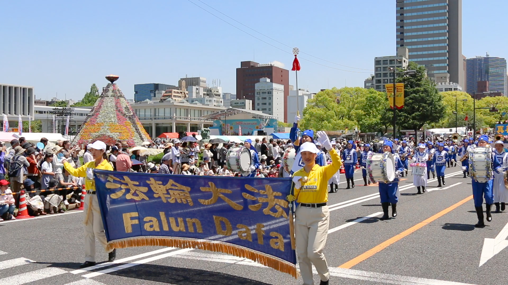

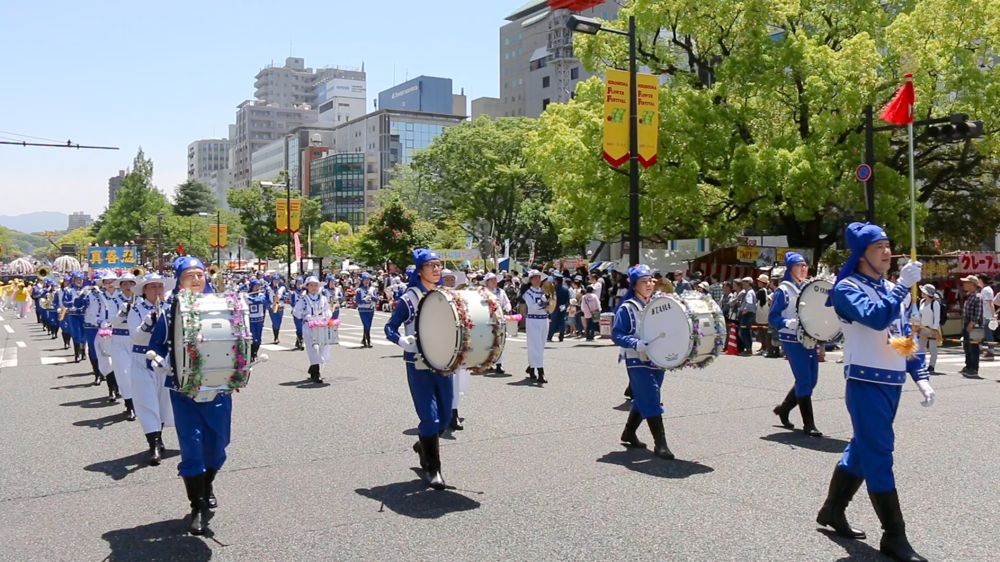

法轮功学员参加广岛鲜花节综合队列表演

一位来自澳大利亚的游客对法轮功学员说：“法轮功在澳大利亚很有名，我经常看到，我喜欢法轮功。”临走前在花车前留影。

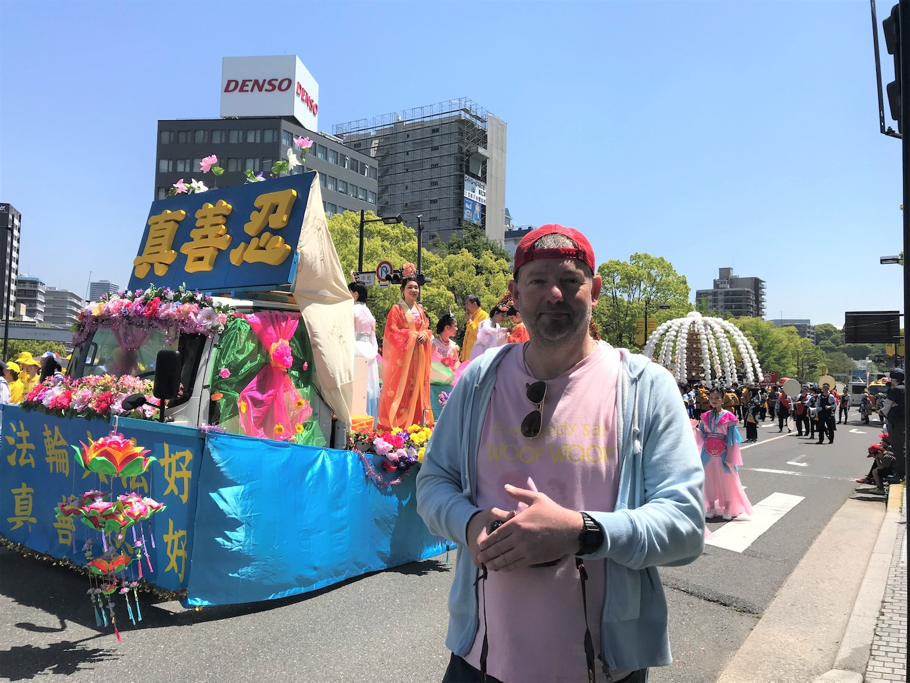

澳大利亚的游客喜欢法轮功

还有来自泰国的游客、日本的女孩子和更多的观众都表示喜欢法轮功，太美了，以法轮功队伍为背景拍照。

有一位日本男士表示他知道法轮功，也听说过法轮功在中国遭受迫害的事情，回去之后一定要详细了解一下法轮功。

在路旁的观众当中，有很多是来自中国大陆的游客和居住在海外的华人。当法轮功学员告诉一位中国男士，天安门自焚事件是江泽民找人拍出来的，法轮功在中国是受冤枉的，那位男士说：“是呀，谁能烧自己呢。”

还有一位七十九岁的老人，是在女儿的带领下来观看表演。法轮功学员告诉他说：“常念‘法轮大法好’、‘真善忍好’。”老人的耳朵听不见，他女儿趴他耳边大声告诉他，老人听后开心地笑了。

其中一位华人观众说：非常华丽、鲜艳，场面挺祥和的。

另一位华人观众说：今天非常高兴，非常愉快，很震撼。她一边说一边指着旁边的亲人说：“她从中国刚到这儿，他也非常高兴，在中国是看不到的，所以今天看到后非常震撼，真的是很高兴。”

<h1 align="center"><b>神灵赐福 巴西一企业稳步发展壮大</b></h1>

阿陆依先生和两个儿子。

【大纪元2019年05月08日讯】当看到明慧网发出二零一九年世界法轮大法日征稿启事的一刻，我在脑中思索了一下，立即闪出一念：这么多年来，每天从我手里发出的法轮功真相传单、期刊、画展用的请柬、纸莲花下面吊挂的“法轮大法好”的小卡片等都是那同一个印刷厂制作的，从第一次到现在，十年来，这个厂的巨大变化历历在目……于是对自己说：“对，就写它！”

这是一个在大法无声保护下稳步发展壮大起来的企业的可喜故事。

我认识阿陆依先生是在十年前，即二零零九年。当时我要印一些“法轮大法好”、“同化真善忍”的小卡片。来到印刷工业街，在一个工人夸赞的介绍下走进了阿陆依先生的不到四平方米的接待室。

阿陆依中等身材，态度安详、温和，当我说出想要制作的卡片式样后，他犹豫了。因为当时他只有印名片和切名片的三台机器，没有制版机，而且我要求卡片上要有一个曲线边框，这对他是非常难做到的。我并不懂印刷方面的事情，只是鼓励他试试看。最后他下决心说：“那你下周来看样品吧。”

直到近期我想写这篇文章去专访他时，他才说出当时的情况，他说：“那时对我来说，这项工作也是第一次，我费了三天的时间才用手工把卡片的模版做出来，还有中文字，真是费了我许多精力呀！”十年后的他头发和胡子都花白了，脸上的笑容依旧透着善良。

从此我们建立了良好的关系，他也相当认可“真、善、忍”宇宙法理，对被中共残暴迫害的信仰者深表同情，对共产邪论嗤之以鼻。之后我们的真相资料都在他那里印刷，他的工厂也顺势进入高速发展阶段——从租用厂房，只有三台机器和一个儿子帮助，到现在已成为拥有近两千平方米的两层楼厂房、十三名固定职工、有专业美术设计人员、有先进的全自动制版机及各种印刷机和后加工机械二十多台，成为在本市印刷行业中的一个中型企业，并且每年都有扩大投资的盈额。

阿陆依先生坚定地表示：“按照真、善、忍做好人，用善心对待每个客户，用爱心善待每个职工是我不会改变的人生理念。”他很感慨：自从一九九三年他开始做名片，到二零零九年，经过十六年的努力仍处在那种家庭式的小厂模式。可自从结识了法轮大法后，他的厂子已成为中型企业。

他说：“要知道，有许多当时比我强大的工厂都消失了，我能发展至今，肯定是有神灵保护的！”

现在厂里的日常管理大多由两个儿子承担，他已处于半退休状态。但他身体健康，每天愿意到工厂来走走，他喜欢听到印刷机的转动声，怀念油墨和纸张的气息。两个儿子精明能干，都成立了家庭，并都拥有了小宝宝，过着和谐的生活，与当今巴西年轻人不愿结婚、经常换情人的不良风气完全不同。

厂里职工都像一家人一样相互帮助，厂方为他们提供早餐和下午的点心，中饭大多自带。有专门的餐室，大家坐在桌边，边吃边聊。每次我去印真相资料都同他们一起吃饭和聊天，他们对中共强行限制中国人的信仰自由、言论自由和在中国频频出现的毒疫苗、毒奶粉、毒食品等现象表示极大震惊，都不敢相信这些真会发生在地球上，一再说巴西坚决拒绝共产主义指导下的社会主义。

工厂负责美术设计和排版的员工叫卡洛斯，为人谦逊和蔼，对大法真相了解得最多、最深刻。当看到众多的中国大法修炼者被迫害得如此惨烈，他的眼泪都掉下来了，说：“仅仅是一个对神的信仰的人群，中共就使用这么狠毒的手段，世界历史上都没有过！中国人民真是苦难深重呀！”他对我说：“巴西就是你的家园，这里欢迎你！”

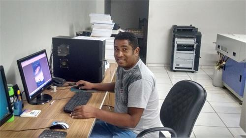

负责美术设计和排版的卡洛斯。

每次我要印制的大法资料要求都蛮高，有很大的难度。其中还有一个原因是，因为资金问题，必须压缩页数，众多的文字和图片压缩在有限的版面上，排版难度自然很大。然而卡洛斯都能耐心地想办法并从专业性的角度把内容安排得很合理，他对每份真相资料都会付出最大的努力做到最好。

他有一个很漂亮的女儿，现在已经大学毕业，开始工作了，一家三口非常幸福快乐。他经常告诫家人，“千万记住‘真善忍’宇宙法理，神灵会赐福我们的。”

阿陆依先生的印刷厂里的人们，都很善良，认可法轮大法好，使他们拥有心灵的安详、家庭的美满、事业的发达。

祝愿世上能有更多更多的人拥有善心，幸福长伴！

<h1 align="center"><b>俄罗斯学员在圣彼得堡夏季展会传播法轮功</b></h1>

【明慧网二零一九年四月二十七日】二零一九年四月中旬，俄罗斯圣彼得堡法轮功学员参加了在当地大型室内体育馆内（Saint Petersburg Sports and Concert Complex ，SKK Peterburgsky）举办的为期四天的夏季展销会，向民众介绍法轮功，传播“真、善、忍”美好。

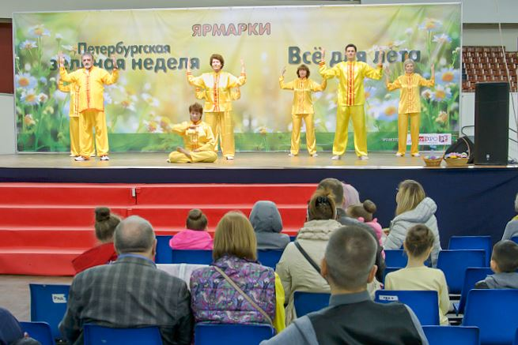

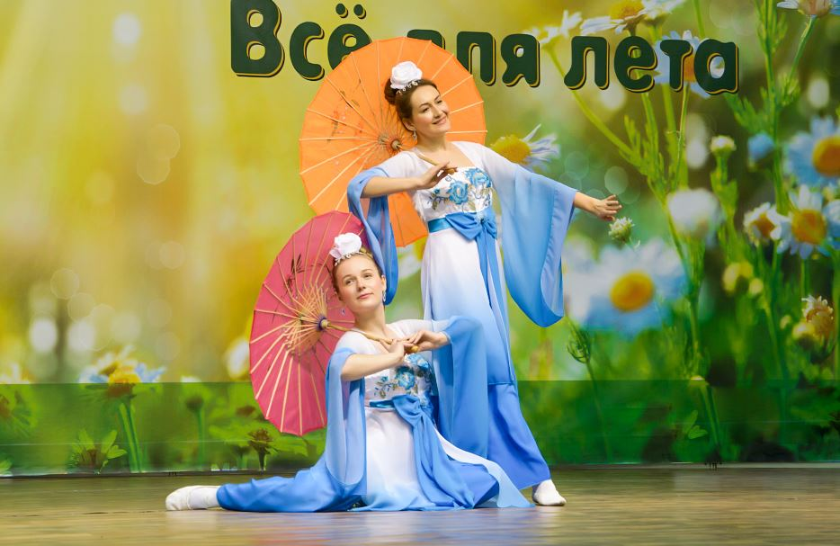

在展会的舞台上，学员们展示了法轮功的五套功法动作，表演了腰鼓和舞蹈，吸引了很多人观看。

首先，法轮功学员展位周围的其他展会参与者仔细阅读了展板资料，向学员提出了问题，了解了在中国遭受迫害的法轮功学员的情况后，表示同情和理解。伊琳娜（Irina）女士已经听说过了关于法轮功学员遭受迫害的相关信息，她表示，她肯定会在社交场所和自己的同事和熟人分享这一信息。圣彼得堡郊区的残疾人福利院的其他员工也对法轮功学员在中国遭受的不公正的迫害深表同情。

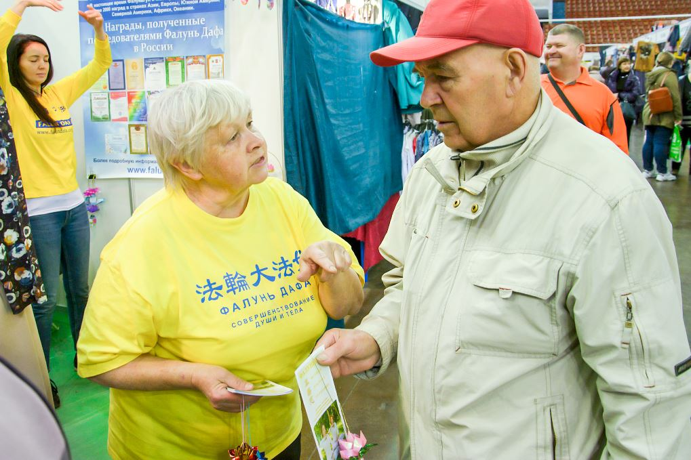

前来展会的民众与学员交谈，了解法轮功。

四天来，参观者们好奇地来到法轮功展位上，与学员交谈。展位上学员自己制作的美丽的小莲花引起了很多人的注意。娜塔莉女士（Natalya）是一名中年雇员，她首先认真阅读了展板内容，然后与一名学员攀谈了起来。她说听了学员的讲述后，感觉自己“打开了眼界”，她决定来公园学习炼功。

说到法轮功学员遭到中共的迫害，前任教师尼娜（Nina）深表理解，她说：“在共产主义政权下，我们曾生活在泥泞中，分为工人和统治者阶层，没有过公正。”她在一个图书馆偶然的了解了法轮功，想了解他的原理，因为她曾经练过气功，但只是作为一种治疗身体的方法。她想更深入地了解生命的意义；并专门在学员在舞台上展示法轮功功法动作时前来观看。

艺术家安德烈（Andrei）在听了学员对他的讲述后，表示理解，还谈起了自己的一些情况，他认为一个人有灵魂的存在，并表示想深入了解法轮功。

<h1 align="center"><b>民营企业家见证中共对法轮功残酷迫害</b></h1>

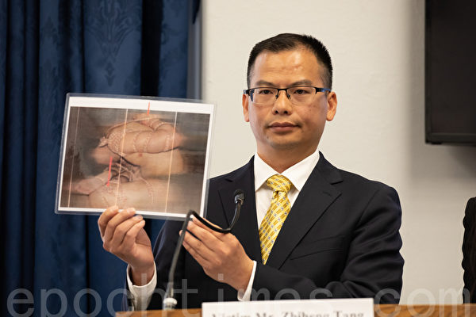

2019年4月25日，纪念“四二五”和平上访二十周年研讨会在美国国会举办。大陆企业家汤志衡展示酷刑示意图。

【大纪元2019年04月28日讯】4月25日，“法轮功4.25和平大上访20周年纪念研讨会”在美国国会举办，多位资深国会议员致信支持，关注中国人权状况的政要、专家现场发言，对法轮功学员和平反迫害的勇气表示赞赏，感谢法轮功学员为中国民众的自由带来希望。

法轮功学员汤志衡在研讨会上讲述了他被迫害的经历。汤志衡曾是广东省一位成功的企业家，他用三年时间让一家皮具厂起死回生，业绩年年翻倍，缔造了“阿里巴巴”全国十大网商皮具品牌。

然而，仅仅因为不愿意放弃自己的信仰，他被非法抓捕8次，经受残酷的毒打、灌食、不准睡觉等折磨，被迫害至精神崩溃的边缘。他熟悉的许多企业家法轮功修炼者至今仍在狱中遭受折磨。

<b>以下为汤志衡发言全文：</b>
 

我是民营企业家汤志衡，原广州圣迪露皮具厂执行董事长兼总经理，员工接近100人，公司旗下有三个加工厂。在同行眼中曾被视为商业奇才，2012～2014短短三年时间内让一家皮具厂起死回生，业绩年年翻倍上升，营业额接近二千万人民币，并缔造了“阿里巴巴”全国十大网商皮具品牌。

自1999年7月中共迫害法轮功始，我因坚持修炼法轮功，坚持对真、善、忍的信仰，持续不断遭受中共的残酷迫害。被非法抓捕8次，曾被非法劳教两年、非法判刑四年半。几经生死，历经各种酷刑折磨，包括毒打至少3次（包括整个人跳起来利用下降的重力用肘部猛击后腰椎，用拖鞋猛打屁股），4天4夜不给睡觉，多次被摧残性灌食，15天被迫绝食绝水，常常被迫害至精神崩溃的边缘。我太太黄腾文同样深受中共迫害，被劳教二年，曾遭绑死人床等酷刑折磨。

<b>我见证的酷刑</b>
 
<b>1. 毒打</b>
 
二零零零年七月，因进京上访被非法关押于广州花都看守所，非法关押半个月。仓头以所谓仓规为名，几个犯人强行把我按住，强迫我趴在墙上，叫同仓的打手，轮番高高跳起来用肘部猛击我后腰，，每打一下我都情不自禁惨叫，整个人给打趴在地上，导致我后腰很长一段时间没法直起来。这种酷刑可致腰椎断裂，严重可致瘫痪。

<b>2. 摧残性灌食</b>
 
二零零二年一月，我被非法关押在广州花都梯面戒毒所，实施了三个月的非法监视居住。因多次被毒打，为了抵制非法关押及（捍卫）信仰无罪，我绝食抗议，被戒毒所狱医及四五个犯人强行压在地上，用拇指粗的胶管直接从鼻孔插入至胃部灌食，每插进一分都会撕心裂肺地痛，为了增加受刑者的痛苦不定时把胶管拔出又插进，让你求生不得、求死不能，真的是毫无人性而言。

<b>3. 广州第一劳教所“捆刑”</b>

二零零二年四月，仅仅因有人举报我炼法轮功，我就被绑架、非法劳教两年。在劳教所除了参加高强度劳动外，（还遭到）精神虐待、恐吓、长期罚站罚坐。

为了“转化”我，曾四天四夜不允许我睡觉，（我）每天被强迫写思想汇报。见证了同期广州第一劳教所“捆刑”，触目惊心，惨无人道——数米长的布条（从军用棉被的被面上撕下的长布条）把两个手的手腕勒死，再把腋窝处用布条勒死，这样胳膊就不流血了；然后把双手反剪到背后，两小臂并排朝上捆邦在一起，手几乎提到后脖颈处，用布条捆紧，感觉极其疼痛；腿也一样，两脚脖子处和两大腿的根部分别用布条死死弟勒死，两腿发胀，血液难以流通，然后像打坐盘腿一样一只脚和小腿先搬上来压到另一条腿的大腿上，用布条死死捆住，再把压在下面那条腿的小腿和脚搬上来压在盘好的那条腿上；打手用脚踩住法轮功学员的腿，拉着绳子用力往上搬，盘得非常紧，两腿膝盖几乎上下重叠，十分疼痛；最后从腿上留出来的一段布条套住颈部，使头向腿部弯着曲，把身体弯成低头弓腰驼背状，整个人被捆成一个球状，抬不了头，直不起腰，坐也坐不成，躺也躺不下，呼吸困难。

这样被绑后极其痛苦，因为血液不通发胀又麻木，有心力交瘁的感觉，呼吸又十分困难。半小时左右，两臂、两腿冰凉状态，然后恶警又令打手解开布条，解开时更是令人十分痛苦，过一会儿再绑回去……

<b>4.广东四会监狱的酷刑</b>
 
二零零五年一月，警察在我住处搜出法轮功资料及电脑、打印机等，将我绑架、关押到广州白云区石井看守所。期间，即使在我绝食绝水十五天的情况下，仍不放弃对我的折磨，所有同仓犯人都担心我会出现生命危险，狱警却说：死了算自杀，不用管他，等他晕过去后我们再抢救。

二零零五年五月，我再次遭受到狱警用胶管从鼻子插入野蛮灌食，并以送大西北、跪玻璃、放飞机等恐吓。

二零零五年九月，我被非法判刑四年半。在广东四会监狱非法关押期间，我长期被四个夹控（死缓及重刑犯）二十四小时监控，中共利用这些犯人求生的本能，其迫害手段阴险邪恶至极，无所不用其极，现在提起仍心有余悸。（我）曾被强迫固定姿势坐小板凳，罚站、罚坐，不允许大小便，强迫看污蔑法轮大法的录像，每天被强迫写思想汇报，从事高强度劳动，不允许任何犯人跟我说话，对我进行隔离，同时用尽各种办法对我进行人格及精神侮辱。

<b>因不放弃对法轮功的信仰面临再次冤狱迫害 被迫出国</b>
 
2015年6月因实名起诉江泽民，遭中共多次骚扰并面临再次被迫害，我被迫离开中国，被迫放弃如日中天的企业。即使在我离开中国后，中共仍一直不断对我家人及公司进行骚扰、威迫、恐吓。

中共甚至通过我姐姐转告我，扬言他们在美国有很多人（特务），我的一举一动他们都了如指掌，叫我不要惹事，他们随时可以让我身死异乡。我如同千千万万法轮功学员一样，面对冤狱酷刑我们都无所惧，还会怕中共下三流的卑劣手段吗？

<b>中共肆意迫害主流社会企业家</b>
 
众所周知，企业家为社会作出重大贡献，对当地经济发展社会稳定起到非常大的正面作用，有很高的声望地位及影响力。在任何一个国家任何一个社会企业家都是受尊重及保护的。然而中共对法轮功的迫害已达完全失去理智的程度，肆意迫害中国成功企业家，破坏当地经济发展及社会稳定。

我身边法轮功学员有来自不同行业的企业家、老板，对社会发展作出重大的贡献。他们是成功的企业家，拥有令人羡慕的财产、声望和地位；他们是践行“真、善、忍”的法轮功学员；20年来，他们却见证了中共的冤狱、洗脑、勒索、酷刑……

同关在广东四会监狱的前深圳千万富翁李建辉，曾是广东省的一位成功企业家。1992年，其创办的深圳弘达实业公司固定资产已达到几千万元人民币，员工二百多人。2000年3月30日，李建辉被非法判刑4年，是广东省因修炼法轮功被判刑的第一人。

<b>营救认识的广东优秀企业家张仕珍</b>
 
张仕珍，男，年约六十多岁，广东深圳人，曾在广东广州、深圳、珠海等地开公司承包工程项目，是个优秀的企业家。被冤判七年三个月，现仍关在冤狱。

自一九九九年七月中共江泽民一伙发动对法轮功的迫害后，张仕珍先是被深圳市西丽洗脑班洗脑迫害长达十七个月，后被深圳市第二劳教所、广东三水劳教所非法劳教累计三年七个月。二零一六年三月一日下午，张仕珍在佛山市顺德区法院被非法庭审，顺德法院冤判张仕珍七年三个月，现仍被非法关押在监狱中。

<b>呼吁美国政府关注及帮助制止中共对法轮功的迫害</b>
 
中共对法轮功的残酷迫害已达二十年，而且还在持续升级中。今天，有幸站在美国国会，我强烈呼吁美国政府及所有正义人士关注、帮助及制止中共对法轮功的迫害，尤其是对主流社会精英、企业家的迫害。

<h1 align="center"><b>有多少家庭被中共摧残毁掉？</b></h1>
<h1 align="center"><b>——清除共产邪灵是全人类共同的责任</b></h1>

从更深层来看，中共的党纪是带有强烈邪性的，因为这是共产邪灵的家。

 
 【大纪元2019年04月29日讯】据明慧网近日报导，法轮功学员张子文与妻子刘玉红，小儿子张希明一起修炼法轮功，十几年来，一家人多次被绑架、抄家、劳教、判刑。早在二零一六年十二月，法轮功学员张子文被冤判四年。目前，父亲张子文在天津滨海监狱遭冤狱。
 
 二零一七年，母亲刘玉红曾在军粮城集市讲真相，被东丽区法院诬判一年三个月，于二零一八年十月刚刚释放回家。如今，儿子张希明被非法关押已一周余。四月十八日上午，军粮城派出所两个警察给刘玉红送来张希明被非法刑事拘留的通知。

四川遂宁市大英县法轮功学员胡延顺老太太，在中共对法轮功近二十年的迫害中，长期遭受中共不法人员的骚扰、监视、拘留和关押，在她七十六岁高龄时还被判刑九年，出狱后，身体每况愈下，大英派出所警察还不断给他儿子打骚扰电话，逼迫家人限制她的自由，老人于二零一八年十二月三十日在女儿家含冤离世，终年八十七岁。

胡延顺老人曾经四次被绑架迫害，遭到了警察的非法搜身、辱骂、还被打耳光等。大英县司法部门为了迫害胡延顺老人，将老人的出生年份从1932年改为1938年，也就是将老人的实际年龄76岁改为70岁，于二零零八年四月二十三日非法判老人九年重刑。

在监狱胡延顺老人被迫害得双腿和腹部肿胀，坐骨神经疼痛难忍，走路打晃，心紧，生活难以自理，记忆力衰退，目光呆滞，于二零一六年一月十一日，被提前一年零四个月从冤狱回到了久别的家乡。

胡延顺从监狱回家后，大英派出所警察多次给她儿子打电话，询问其下落，说要去见她面；社区居委会的人也上门骚扰。在德阳女儿家时，警察也打去电话骚扰，给她家人造成了很大的思想负担，致使家人对其施加压力，既不让她外出，也不给她门钥匙，不让其他法轮功学员接触，更不准法轮功学员到她家去，每天就关在房里。

社区工作人员还以她曾被冤判入狱为借口，不给她办理低保，导致老人失去基本生活来源。二零一八年十二月三十日，胡延顺含冤离开了人世。

长春市六十四岁的法轮功学员李晶女士，被绑架、非法关押、构陷一年多，于二零一九年四月二日得知李晶被非法判刑十年，已上诉到长春市中级法院。

李晶老家在通化市辉南县朝阳镇，在长春市经开区福临家园小区租房。在中共对法轮功持续至今近二十年的迫害中，她曾于二零零零年被绑架、非法劳教一年，二零零三年再次被绑架、非法劳教两年，家中丈夫与儿子相继离世，只有老家辉南县的老母亲，已是八十六岁高龄。

二零一九年三月二十日，河北省衡水地区安平法院通知田杏保的辩护律师，对深县牛庄村法轮功学员田杏保非法判刑十年。

另据大纪元2019年04月23日讯：2018年11月9日，黑龙江宾县的25位法轮功学员被绑架。其中，安国强、曲洪华夫妇被关押至今已有五个多月，家中的老人和残疾的女儿痛苦不堪。

安国强、曲洪华夫妇被绑架后，家中89岁高龄的老母亲因忧虑亲人几次病倒，并且伴有休克昏迷症状。病情稍有缓解后，老人见人就说：“我可能再也见不到儿子了。”

安国强夫妇唯一的女儿安秋菊是先天残疾，看不清东西，严重时只能看到一寸远的光亮。安国强夫妇为了把全部的爱给这个孩子，没有再生第二胎。平时有父母的呵护，虽然眼睛残疾，安秋菊心里却是健康快乐的。她的丈夫虽然手臂残疾，但是随着孩子的出生，这个特殊的家庭有了不尽的快乐。

可是，安国强、曲洪华的被绑架，给这个家庭带来了沉重的打击，没有了父母亲的照顾和呵护，女儿整日以泪洗面。安国强的老母亲因思念儿子儿媳患病在身，只能靠药物维持身体。

一个个被中共迫害得支离破碎、妻离子散、家破人亡的家庭，就是一件件对中共极权的血泪控述。自中共迫害法轮功二十年来，有多少幸福美满的家庭被中共无端摧残毁掉？真是罄竹难书啊！

据明慧网信息统计，二零一九年三月份，中共又绑架了245名法轮功学员（其中100人已经回家），骚扰162人，批捕18人，强制送洗脑班4人，判刑43人，庭审39人。其中，107被抄家，36名65岁以上老年法轮功学员被绑架骚扰，其中，9名80岁以上老人，年龄最长者83岁。

二零一九年一至三月份被中共绑架的法轮功学员达574名；被中共非法判刑的法轮功学员达169名。

中共是一个邪灵，祸乱人间、毁灭人类是它存在的终极目的。纵观中共窃国七十年历史，就是迫害人、杀人的历史。一个镇反运动使数百万人头落地；一场“反右”毁掉了数十万国家的精英人才；一场“文革”使七百万人死于非命；一次“六四屠城”造成数万学子伤亡；一场迫害法轮功运动，有多少法轮功学员被迫害致死或活摘器官致死，多少幸福家庭被中共摧残毁掉？

目前，中共不仅仅迫害法轮功，对其他宗教信仰人士、异议人士、少数民族人士、维权律师、上访民众等的迫害也越来越严重。整个中国就是一个大监狱，目前中共已经把迫害的触角延伸到整个世界，目的只有一个——祸乱人间、毁灭人类。

全人类都应该有一个清晰的认识，中共是人类社会的公敌。解体中共，在全世界将共产邪灵清除灭尽，维护世界的和平与安宁，是全人类共同的责任。
 

<h1 align="center"><b>医生见证人病人重生的神奇</b></h1>

她丈夫两次神奇地闯过生死劫难。医生说，医院的专家都在研究⋯⋯

 
 【大纪元2019年04月04日讯】4月4日，明慧网刊登了一篇文章，讲述了一对夫妻重生的神奇经历。医院的医生对她丈夫能活过来感到十分惊奇，告诉她，医院里的专家都在研究⋯⋯

<b>巨变感动着她</b>

 
过去，她是一个受多种疾病折磨而时刻在痛苦中挣扎的人。1978年，她被迫做计划生育结扎术后患了肠粘连的疾病，后引发全身疾病，常住大小医院治疗，也未能根治。大夫都说她得的是一个老大难病，不用住医院了。

就这样，她只好回家，休息一天算一天。

俗话说：久病成医。在毫无办法的情况下，她开始在家里给自己打针，自己开处方吃中药，这样过了好多年。她还到处拜庙，求神佛保护，可身体不见好转，度日如年。

那些年，她的家人也跟着受累，家不像家，人也不像人样。

1997年6月19日，经朋友介绍她学了法轮功。没想到，只炼了三天功，她的天目打开了，什么美妙的景象都看见了。她知道是法轮功的李洪志师父把她从海底里捞起来的。

有一天，她在广场炼功，炼第三套功法“贯通两极法”，两手在腹前推转的时候，明显感到小腹部有东西被推了四下。回家的路上， 她觉得自己的身体变得轻飘飘的。

回到家，她对家人说：“我的肠粘连好了。”家人问：“你怎么知道好了？”她解释说，她感到师父给她小腹部位下了机制。

从此以后，她天天可以用大碗吃饭了，走路好像脚要起空一样。这些神奇的巨变震撼了她，感动了她。她觉得，这些神奇体会，用人类的语言是无法表达的。

她常常在心底里呼喊：“是李洪志师父救了我！是法轮大法给了我新生！”

<b>两次生死劫难</b>

 
她丈夫又喝酒又抽烟，不过他是见证了法轮功在妻子身上发生过的神奇，也一直支持妻子修炼。

2016年到2017年间，他身体忽然出现大病，心脏一连做了三根支架，去地区医院急诊抢救了几次。

一次，他进医院只有几分钟，就突然眼睛一反，嘴里吐出白泡，人休克过去。连看医生都来不及了，家里人都在哭。

她心里却非常冷静，平静地对大家说：“你们都不要哭，都喊：‘法轮大法好！’请师父来救！在这种紧急情况下，只有求师来救他的命。”

她大声呼喊：“法轮大法好！”很快神迹就出现了，他醒过来了。大家都见证了法轮功的神奇。

后来，丈夫又一次被送到地区医院抢救。

大夫检查了他的病情后，说：“这次无效了，我们不是神。这回就是从天上搬仙人下凡，都无效了。”

她说：“您就记住‘法轮大法好、真善忍好’，一定会有奇迹出现。”

一个星期过去了，她丈夫的身体康复了。

医生感到惊奇，问她：“你有什么信仰吗？”

她说：“信法轮功。”

医生说：“我们医院的专家都在研究，法轮功祛病健身为啥有这么好的疗效。”

经过两次生死劫难，她丈夫现在也开始修炼法轮功。他们家的亲朋好友都支持他俩修炼，都说“法轮大法真伟大！”

<h1 align="center"><b>“我能活着就是生命的奇迹”</b></h1>

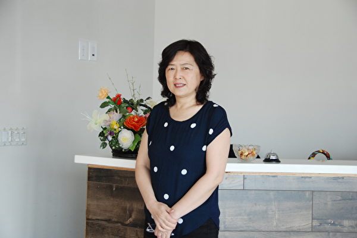

贾平近照。

【大纪元2019年04月23日讯】（贾平口述，伊铃撰文）60年代初，我出生在中国某小城一个知识分子家庭。那是个讲阶级成分的年代。我天生老实、懦弱，总是受欺侮。走在路上有时都会挨调皮小孩打。 加上 “家庭成分”问题，从小很自卑。

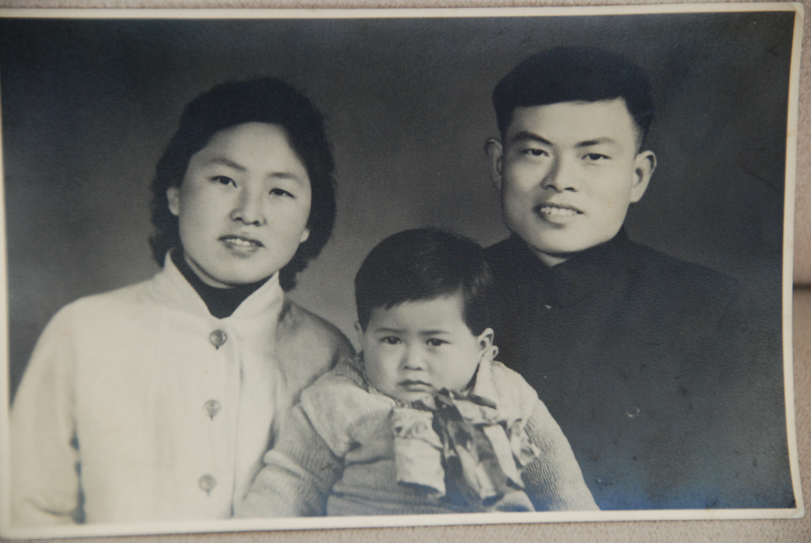

幼年时代的贾平跟父母合影。

上学时，老师在课堂上动不动就喊：“谁家成分不好？举手！”学校经常给学生讲旧社会富人如何剥削穷人的故事 ，真的假的不知道，只知道恐惧、害怕。

那时正赶上文化大革命，学校不上课，老师都去乡下集中接受再教育。高年级学生参加全国大串联，爬火车到处跑……低年级学生由工宣队、农宣队管，成天讲忆苦思甜，喊口号，到山上挖石头，到农村捡麦穗，到工厂去学工。

后来中共政府号召“知识青年上山下乡”，我妈妈想办法把我留城，因为没法正常上学，父母就在家里教我。

那是个疯狂的年代。当时，整个环境给人一种压抑感。我就在那种紧张压抑的气氛下成长。

<b>xxx</b>
体弱多病
我从小鼻子就不通畅，稍遇风寒，就会鼻塞，呼吸不顺畅，只能张嘴呼吸，很痛苦。

5岁那年，长托幼儿园放暑假，我跟着邻居姐姐到附近一所小学去玩。当时，一个高年级的小学生正在校园操场耍镰刀。我很好奇，就凑上去看，结果被挥舞的镰刀背砍伤鼻梁，顿时鲜血直流。

当时没造成更严重后果，但从此后，本来有些堵的呼吸道就更不通畅，分泌物流出更困难，需要借助药物扩张才能呼吸，非常痛苦。真不知当时怎么活过来的。

二十多岁，我在中国北京友谊医院做鼻中隔手术，但效果不理想，还得经常靠药物维持呼吸通畅。

<b>切除肿瘤 又患丙肝</b>
 
30岁那年，有一天下班，我走在人行道上，突然眼睛失明，啥也看不见。赶紧摸到人行道边上的大树坐下。去医院检查，发现肚子里有一个拳头大的瘤子。

当时经血哗哗地流，必须紧急手术。临上手术台时，发现血色素很低。医生给我紧急输血。抢救过程中，共输入2400CC血浆。

手术很成功，恢复也很快。正当我准备回单位上班时，突然出现恶心、呕吐。又住进传染病医院，医院查来查去，除了转氨酶高，啥也查不出来。最后送到上海化验，结果是丙肝（丙型肝炎）。

跟我住在一起的许多病人都有相同症状。据说这种病是有名的输血病，很多人都得这个病。我的主治医生说：“这个病治不好，只能把转氨酶控制住。最后结果大多是肝硬化，很难活过十年。”

当时治疗最好的药就是打胰岛素；找最好的中医师看病，每次取中药就是12副药。每天吃药，大碗大碗的药水灌下去，真的就像被药水泡着一样。

<b>一波未平 一波又起</b>
 
我手术前就时常腰疼，后来发展到各大关节疼，有时骨头里又疼又痒，挖不着，挠不到，特别难受。有时半夜被疼、痒折磨醒，必须剧烈活动，直至累到极度才能再睡下。医院也查不出是什么病，最后就按类风湿治疗。

为了治病，我四处求医，西医不行看中医。吃了无数的药，反复治疗，反复发作，时轻时重，一直得不到彻底根除。

疾病加上各种药物的副作用，使我面黄肌瘦，虚弱不堪。整天躺着不想动，更不能工作。病痛的折磨，也使我性格也变得极其急躁和烦躁，爱生气，家里、外面都不和睦，身体和精神都处于极度痛苦之中。

<b>初遇大法</b>
 
我自幼接受唯物主义教育，非常排斥现代医学以外的东西。但现代医学又治不了我的病。我开始接触一点气功和佛教。

1995年，就在我苦苦挣扎、四处求救时，妈妈接触到了法轮功，她炼了几个月后，感觉很好，就劝我炼。

当时中国大陆有很多人炼法轮功，大家相互传颂着法轮功祛病健身的奇迹，这大大增加了我炼功的信心。

开始炼动功，站半个小时都无法坚持，盘腿根本就盘不上。好在周围有不少同修，大家比学比修。我们一起看师父讲法录像，阅读《转法轮》。慢慢我明白了，修炼不是为了治病，病是因为自己生生世世的业力造成。修炼就是要修心性，做好人。

于是我下定决心修炼，打坐不管多痛我都坚持。不久，呼吸道的分泌物越来越少，最后完全消失，我的呼吸道顽症好了。当我体会可以完全自由通畅呼吸的时候，我又激动又感慨：我的生命如同重生一样。

<b>修炼使我脱胎换骨</b>
 
随着不断修炼及各方面的提高，整个身体也随之改变。各种顽症在不知不觉中消减、消失。当状态好时，真是感到身轻如燕，走路生风。

修炼还有一个更大的收获，那就是心性上的提高。我明白应该怎么做人了，心也越来越宽，过去看不开的事情渐渐看开了。逐渐地学会善待别人，宽容别人，遇事多替别人着想。生气少了，不失眠了。我觉得修炼给我开启了智慧，头脑比以前清醒了，思维比以前敏捷了。

有了健康的身体，平和的心态，聪慧的头脑，我在工作中积极进取。为了提高自已业务能力，又读取了在职硕士学位……

2008年我来到海外，经常参加天国乐团活动。不论严寒酷暑，体力不比别人差，说走抬腿就走，坐汽车多远也不晕车，也不怕冷了。这在过去是绝对不可能的，真是脱胎换骨，做梦都不敢想的变化。

现在全新的工作环境，一切从新学起，新知识，新技能，不断地开阔思维，打开视野，在各个方面不断提高和突破自己……

如今，我已修炼23年了，从修炼的第一天起，就再没打过一针，没吃一粒药。身体健康，内心愉悦。能有缘遇到这么好的修炼大道，我的命运完全改变了。

我时常为此感动：我真是一个好幸运的生命。修炼才是我真正要走的路，我找到了真正人生解脱的路。感谢法轮大法给予我全新的人生。

<h1 align="center"><b>公安部前副部长孟宏伟涉受贿被起诉并逮捕</b></h1>

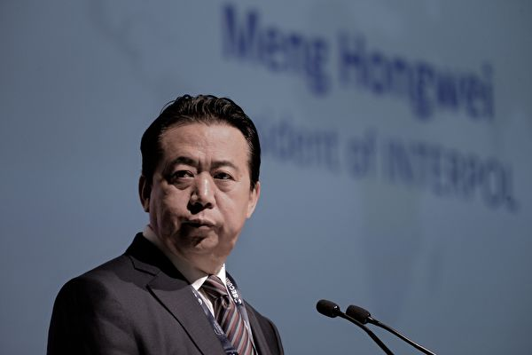

中共公安部前副部长孟宏伟资料图。

【大纪元2019年04月24日讯】中共公安部前副部长孟宏伟案再有进展，其以涉嫌受贿被起诉。日前，当局已对其发出逮捕令。孟宏伟的双开通报中，官方指其“拒不执行中央决定”等，被视为是严重的政治问题。孟曾长期在中共公安部任职，是中共前“政法王”周永康的心腹。

中共最高检24日消息，公安部前党委委员、副部长孟宏伟涉嫌受贿一案，已调查终结，移送审查起诉。日前，最高检以涉嫌受贿罪对孟宏伟做出逮捕决定。

3月27日，孟宏伟被双开（开除党籍和公职）。

孟宏伟被指不按规定报告个人有关事项，对抗“组织”，拒不执行中央决定；公权私用，滥权妄为，肆意挥霍国家资财满足家庭奢靡生活；利用职务影响为其妻谋取职务，纵容其妻利用其职权搞特殊、谋私利；非法收受他人巨额财物等。

时政评论员石实表示，孟宏伟的双开通报，当局指他“对抗组织”、拒不执行当局决定、“滥权妄为”等，这些都是严重的“政治问题”，与当局强调的“维护习核心”背道而驰，这是他被查的根本原因。

孟宏伟落马前还有一个身份：国际刑警组织主席。但自从孟落马以来，官方通报从未提及此身份，亦未提及孟妻的名字。

去年10月5日，孟宏伟的妻子Grace Meng（中文名：高歌）在法国报案，称孟宏伟9月回国后失踪，事件引起国际关注。10月7日，中共宣布孟宏伟因“涉嫌违法”正在接受调查。大约2小时后，国际刑警组织在推特上表示，孟宏伟辞职。

孟宏伟被双开的当日，中共公安部党委书记、部长赵克志主持召开公安部扩大会议时提到，要全面彻底肃清周永康、孟宏伟的遗毒遗害；要深刻剖析孟宏伟案件的根源等。

孟宏伟曾长期在中共公安部任职，被指是中共前政法委书记周永康的心腹。周永康2003年任公安部部长，第二年，孟宏伟就被提拔为副部长、党委委员，并兼任国际刑警组织中共国家中心局局长，成为周的重要副手。

孟宏伟在2016年11月出任国际刑警组织主席时，曾引发国际人权组织的广泛批评和谴责。

旅居法国的评论人士王龙蒙指出，政法系统当年对法轮功、维权人士的迫害，孟宏伟都有参与。从1999年以来，中共江泽民集团对法轮功实施了近20年的疯狂迫害。作为中共公安部副部长，孟宏伟早就被海外明慧网列为迫害法轮功学员的涉案责任人之一。

<h1 align="center"><b>“她是我们院最好的护士”</b></h1>

【明慧网二零一九年四月二十二日】我今年六十六岁，退休前是一家医院的护士。虽然我在医院工作，可我自己浑身是病，腰椎骨质增生、肩周炎，时常腰痛、肩膀痛，胃痛发吐，最要命的是后脑痛还伴有头晕，发作起来生不如死，只有大把大把的吃止痛药。眼睛也近视，拿药或给患者打针必须戴上眼镜。
一九九七年的一天，一个熟人给我看了一本书——《转法轮》，里面讲了人为什么会生病，为什么要做好人，怎样做好人、修心性等很多道理与玄机，我一下子看进去了，觉得这就是我想要的。就这样我就开始修炼法轮大法。

一个星期后，我忽然发现眼睛没戴眼镜看东西很清楚了，我拿药、打针再也不用戴眼镜。随着我不断的修炼（炼功和提高心性），头痛、胃痛、骨质增生、肩周炎都不翼而飞，我终于可以轻轻松松的上班、生活了。我别提多高兴了，更加认真修炼，在各种环境中努力按照师父的要求做一个好人，多为别人着想。

一次在河边散步，走在我前边的人忽然停下了，我一看，地上一个钱包被他捡起来翻开，他见我走上来就要把钱给我对半分（共一万八千元），我不要。一会儿失主来找钱包，我告诉失主是谁捡到了，捡钱的人只好把钱包还给了失主。

在医院，我工作认真负责，技术过硬，打针输液从来都是一针准。甚至一次给患者穿刺静脉（通常由医生亲自做），医生不太敢做，最后科主任决定让我来做，我一次就做成功了。

而且我对患者耐心体贴有求必应，处处为病人着想，不怕脏不怕累，甚至别人不愿干的活我都抢着去干。所以很多患者特别感激和尊重我，我虽然只是个护士，患者们却都称呼我“某老师”。

有些病人家属为了得到好一点的照顾，常请医生、护士吃饭、送礼。修炼法轮大法后我再也不收礼，谢绝请吃饭。有同事被请去吃饭，我就去帮同事顶岗干活。

我们医院较大，病人也多，医生也很辛苦。轮到我上夜班，病人有什么事，只要在我能力范围之内能解决的，我尽量自己处理，不轻易叫醒医生，让他们夜里多休息一会。原来一个医生因我炼法轮功对我有偏见，后来感觉我真正对他们好，也尊称我“某老师”。同事感慨的说：炼法轮功的就是好。

后来医院在全院范围之内征求病人对护士的满意程度，我的满意度最高。年终医院聚餐时，医院总护士长向我翘起大拇指，对院长说：“她是我们院最好的护士！”

一九九九年七·二零中共邪党开始疯狂污蔑、残酷迫害法轮功，我因讲法轮功真相数次被警察非法抓捕，一次在派出所被警察打了几十耳光，致使上下大牙全部脱落。但不管怎么迫害，也不能泯灭我对佛法真理的向往。我希望善良的人啊，都能明白“法轮大法好”！

<h1 align="center"><b>乱世中的中流砥柱</b></h1>

<h1 align="center"><b>写在“四·二五”二十周年之际</b></h1>

【明慧网二零一九年四月二十四日】河南省三门峡黄河河段下遊河中心有一块巨石在河道中挺立，无论狂风暴雨、还是惊涛骇浪，屹立几千年而不倒，被人称为“砥柱”，中流砥柱一词由此而來，象征着中华民族的精神，也比喻能在动荡、险恶环境中刚强无畏、支撑危局、承担重任的超群人物或群体。公元638年，唐太宗李世民来到这里，写下了“仰临砥柱，北望龙门；茫茫禹迹，浩浩长春”的诗句，并命大臣魏征刻于砥柱之阴。
今年的四月二十五日是法轮功学员和平请愿二十周年的日子。二十年前，面对暴力和不公，法轮功学员没有听之任之、更没有退缩，而是秉承真善忍精神，和平、理智地讲出真相，维护基本人权、信仰和人类的尊严。在之后的二十年间，法轮功学员虽经受巨大的苦难，依然坚持不懈地将真善忍的光芒撒向人间，让世人在善恶之间做出正确的选择，为自己的未来开创美好和希望。

许多人称赞法轮功学员是乱世中的中流砥柱，面对强大的冲击，就象砥柱石一样，坚定地维护良知和信仰，屹立不倒。可以说，二十年来，法轮功学员用自己的行动，证实了真善忍。面对百余种酷刑、洗脑宣传、经济截断，甚至这个星球上前所未有的邪恶——活摘人体器官，他们都没有屈服、退却。

黄河上的艄工还流传着这样一个神话传说，一个老艄工为了能让在惊涛骇浪中的小船把握好方向，跳入湍急的黄河水中，喊道：“把好舵，朝我来！让船朝我这开，就不会触礁了。”在老艄工的引导下，小船化险为夷，船上的人们安然无恙，老艄工却消失在暴风骤雨中，化身为“中流砥柱”，从此以后，中流砥柱就成了峡谷中的航标，艄工们把砥柱石称为“朝我来”。

在迫害中，法轮功学员们最为难能可贵的是为了世人的安危，舍生忘死地、智慧地讲真相，传播传统的价值观，让人类摆脱共产邪灵的控制，重归精神的家园。
“四·二五”法轮功学员的和平上访行动在告诉世人，邪恶不会因为善良人的隐忍和无视而消亡，相反，沉默只能让邪恶更疯狂。近年来，国际社会上越来越多的国家也发现了中共对西方国家的渗透和无声影响，正改变着文明国家的基本价值和立国之本。正如澳洲学者汉密尔顿（Clive Hamilton）所言，中共对民主国家的主要威胁是，它一直在努力左右那些国家的精英舆论，试图让西方国家的决策者遵守中共的议程。

法轮功学员的不断讲真相，象激流中的航标，在凝聚着全球的正义力量。就在一周前的四月十八日，欧洲议会以压倒性多数票通过了一项谴责中共迫害人权的决议。决议声明，鉴于中国的人权状况越来越恶劣，欧洲议会谴责中共对宗教信仰团体的迫害，要求中共立即释放被非法关押的包括法轮功学员在內的受迫害的少数民族和信仰群体。

二零一九年三月十四日，欧洲议会压倒性通过决议，敦促欧盟与二十八个成员国，都各自制定类似美国的《全球马格尼茨基人权问责法》（The Global Magnitsky Human Rights Accountability Act），以期制裁迫害人权的外国政权政客。《全球马格尼茨基人权问责法》在美国、加拿大、欧洲与澳洲相继完成立法与生效，将震慑所有迫害参与者。

二零一六年六月，美国众议院通过了343号决议，呼吁终止在中国的强摘器官行径。

近日，在大纪元网站上声明退出中共党团队的中国民众已经突破三亿三千万。真相让人觉醒，也会让乱世中的中流砥柱更加强大。

<h1 align="center"><b>“四．二五”铸就道德丰碑</b></h1>

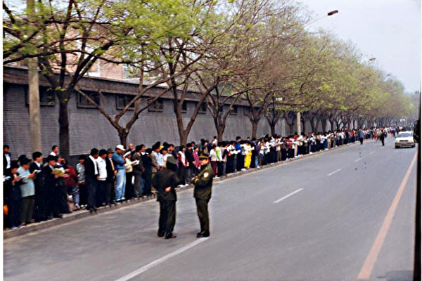

一九九九年四月二十五日，上万名中国大陆法轮功学员闻悉天津动用防暴警察抓打法轮功学员的消息后，赶到位于中南海附近的国务院信访办和平上访。

【大纪元2019年04月16日讯】一九九二年五月传出的法轮大法（法轮功），使学炼者身强体健、心性道德提升，广受民众喜爱，仅凭口耳相传即迅速广传于全中国。一九九九年四月二十五日，上万名中国大陆法轮功学员闻悉天津动用防暴警察抓打法轮功学员的消息后，赶到位于中南海附近（府右街）的国务院信访办公室，为在天津市被非法逮捕的四十五名法轮功学员和平上访。此次上访得到当时国务院总理的亲自接待和开明处理，于当晚和平落幕，此即“四．二五”事件。

当天一万多人上访过程极其平和安静，没有口号，没有标语，既无大声喧哗，也没阻碍交通，只是单纯向“信访办”反映真实情况，希望政府能给法轮功一个宽松的修炼环境，制止一些职能部门对法轮功的不公正对待。警察看到访民们一派祥和、平静、自律，根本不用出面做什么，有些警察甚至去休息或跟法轮功学员聊天起来了，和谐、互敬，而无严肃氛围。

最被人称道的是，即使那么多人有两顿饭就地饮食，没有一个人乱扔垃圾，全留在自己的包包里。有一些学员拎着塑料袋拣取大家不慎掉下的垃圾，连周边的厕所都被法轮功学员打扫的干干净净。附近的居民频频称赞：这群人的素质真好。

高标准的道德源于信仰的力量。法轮功要求学炼者恪遵“真、善、忍”，修心重德，“严以律己、宽以待人”给社会带来可敬清新的风貌。恶妇成为孝媳；暴戾之徒转变为慈祥好人；作奸犯科者改邪归正；乡里口中的麻烦人物变成模范公民，好人好事层出不穷。

现今中国，道德下滑极严重，为谋私利不择手段，假食品、冒牌货与“山寨版”早已不是新闻。从毒奶粉到地沟油，从经济数据到硕博士文凭，只要有利可图，就会造假、诈欺。世风日下，人心不古，中国大陆屡见有人故意倒卧在行驶的车辆前，谎称被撞倒，再讹钱勒索。再如“救死扶伤”是传统美德，近年中国却频传“见死不救”的冷血之举。两相对照，法轮功学员的高洁行谊，真如浊世清莲，出淤泥而不染。空谷幽兰，难掩出尘芬芳。

媒体大幅报导“四．二五”事件，也使法轮功知名度大大提高，迅速推向世界舞台。以台湾为例，民众纷纷前来了解法轮功，每个月的“九天学法炼功班”常爆满，修炼的人口激增，目前台湾已有数十万名法轮大法修炼者，一千多个炼功点，几乎涵盖全台三百个乡镇，连外岛的澎湖、金门、马祖都有十几个炼功点。法轮功广获各国三千六百项褒奖，人们对法轮功给社会带来的幸福祥和予以高度赞扬。

然而，“四．二五”事件过后不到三个月，一九九九年七月二十日，中共与江氏集团动用整部国家机器迫害法轮功，对中国大陆的学员进行大抓捕，动用一切媒体、司法、军警、特务、党政、外交，进行了全方位的镇压，编造弥天谎言，厉行信息封锁，一场铺天盖地的疯狂镇压就此展开，对法轮功学员非法关押、洗脑、毒打乃至活摘器官，迄今至少有四千二百多名法轮功学员被迫害致死，难以计数的修炼者被迫害至家破人亡、妻离子散。

即使遭受各种酷刑的肉体折磨和精神摧残，法轮功学员依然坚持信仰真理，面对毫无人性的凌辱与迫害，他们没有仇恨和愤怒，完全以平和、理性、宽容的方式抵制这场迫害，在人间演绎着一幕幕感人肺腑的修炼故事，一群手无寸铁的善良百姓顶住了来自邪恶政权的灭绝镇压。

随着法轮功学员坚持不懈的揭露迫害真相，许多原本受中共谎言蒙蔽的世人对法轮功的态度，逐渐从同情、理解，转为认同、支持。中共一些官员、党委、书记、公安、国保大队人员纷纷弃暗投明，私下帮助法轮功学员脱离迫害。中共对法轮功的迫害政策，近年遭到了中国各地民众的抵制，他们对法轮功学员遭到无辜迫害感到愤慨，一听是为了营救法轮功学员，都愿意签名或按手印，挺身而出声援反迫害。

古云：“德不孤，必有邻”，二十年来海内外法轮功学员采取各种方式向世人讲清迫害真相，启发人们的善念良知，这义行壮举犹如黑暗中的熊熊火炬，引领着人们逐步走向光明。大规模民众声援反迫害，印证了越来越多的世人认清中共的邪恶本质，迄今公开表明“三退”（即退出中国共产党、共青团和少先队）的人数已超过三亿三千万。魔消道长，法轮功则洪传至世界一百多个国家和地区，使上亿人因修炼法轮功而身心受益。法轮功学员以大善大忍的胸怀制止迫害，赢得世人尊敬，见证了“四‧二五”和平上访在人类历史留下永恒的丰碑

<h1 align="center"><b>塞班岛火树节　法轮功学员传真相</b></h1>

【明慧网二零一九年四月十七日】二零一九年四月十一日至四月十四日，塞班岛迎来了第三十八届火树文化艺术节（Flame Tree Arts Festival），一年一度的传统节日汇集了当地及周边地区各民族及民间艺术团体的参与。舞台表演、艺术品的展卖、各国和当地丰富多彩的传统文化、美食，每天都吸引众多的民众和游客前往观赏。塞班岛法轮功学员也借此机会，利用展棚向人们展现法轮功真相。
塞班岛法轮功学员在展棚内展出的法轮大法弘传世界、反迫害、活摘黒幕、正义支持、世界褒奖、三退保平安的图片及中英文解释等内容，吸引着过往的民众进入观看了解。通过学员们的讲解与答疑，很多有缘人对法轮功真相有了更全面的了解。

法轮功学员向每一位走进真相展棚的民众讲真相，传递大法的美好

所有进到展棚来观看图片、了解真相的人都对中共邪党迫害法轮功，特别是活摘法轮功学员器官的行为表示非常震惊，非常愤怒。很多人纷纷来到征签桌前在征签本上签名，有时候征签的人非常涌跃，排着队候签。

人们来到征签桌前签名，支持法轮功学员反迫害

学员们还把真相资料和精美的小莲花派送给过往的行人，讲真相的同时告诉人们记住“法轮大法好”，台湾学员制作和送来的精致小莲花深受人们的喜爱，收到资料和小莲花的人们都一再表示感谢。

展棚边的义务教功和功法演练场地也吸引了许多想了解想炼功的人，有人让学员教炼动作，有的人模仿着学员的动作跟着炼，很多人了解功法功理，也有的人要了炼功地址和联系方式。四天的火树节，越来越多的人了解了法轮大法的美好，并支持声援法轮功学员反迫害。还有许多明白了真相的中国人做了三退，给自己选择了美好的未来。

<h1 align="center"><b>说说“中共不让的……”</b></h1>

【明慧网二零一九年四月七日】十多年前，一位因不放弃信仰而遭到中共酷刑折磨的男士，在一次次被逼迫放弃信仰的惨烈毒打中，勇敢的守住了自己的信念。可是当他被强制去看别人遭受酷刑折磨后，崩溃了，因为那电棍“啪啪”的火花、毒打的惨叫声，让他善良的心无法承受，从此精神失常了。
中共非法侵占中原大地后，采用的就是杀5%来恫吓95%的人的手段，以达到它让人民向它低头的目的。它早已深谙此道，知道精神折磨比肉体折磨更能瓦解人的意志。时至今日一提到中共，仍然有许多人谈虎色变。最近看到一则故事，很耐人寻味。原文是这样的：

二零一七年的一天，我在菜市口看见一个老太太。一打听，才知道，她其实年龄并不大，我向她讲起了修炼法轮功的神奇。她说：国家都反对，你还敢炼。我说国家不要你健康，你还敢健康吗？这一下把她问傻了，张口结舌的望着我。我说你身体好吗？她说很差，“三高”，又是尿毒症，又是脱发，钱再多都没有用。我告诉她，我曾经是个病秧子，修炼法轮功现在无病一身轻。她说她很羡慕我。我就送给她真相平安符，真相资料，我们互相留了电话，给她做了“三退”（退出中共党、团、队组织）。

故事讲完了，有独立思考能力的人都会恍然大悟。是啊，中共不让的就不做是对的吗？现在那些遭难的人，恰恰都是听中共的；而灾难中能获救的，都是不信中共鬼话的人。

中共搞暴力革命，自篡权以来，血雨腥风，运动不断，杀地主、杀资本家、杀中共自己队伍中还有良知的人、杀知识分子、杀学生，杀的都是精英，中国有三分之二以上的家庭遭受迫害，害死了八千万无辜的中国民众。这个死亡数字，超过了两次世界大战死亡人数的总和。中共还搞文化大革命，把传统的儒释道文化、珍贵的历史文物都毁掉，把空气、水等自然环境也毁坏，现在迫害信仰真、善、忍的好人，把人们心中的道德、是非彻底破坏、颠倒，假、恶、斗横行中华大地，从到处道德沦丧、无官不贪污腐败，就可以看出来。

法轮功在救人。法轮功也叫法轮大法，是上乘的佛家修炼大法，于一九九二年由李洪志师父传出，以真、善、忍为原则指导人修炼，辅以简单优美的五套功法，可以使修炼人在极短的时间内达到身心净化，道德回升。一九九九年中共迫害法轮功之前，在中国大陆据官方统计有上亿人修炼法轮功。而在中共全面迫害后的近二十年中，法轮功不仅没有被中共打倒，相反，传遍了世界一百多个国家和地区，法轮大法的主要书籍《转法轮》被翻译成四十种语言文字在全世界公开发行。

中共在害人。搞不清的人就会在上天清算中共罪恶的过程中，成为江泽民的陪葬品。另外，中共并不是中国，它只是附在中国母亲身上的吸血鬼。如果癌细胞叫嚷“我是这人生命的主宰”，那个癌症病人会同意吗？中共就是那癌细胞，现在倒楣的都是听中共的人，你说他们傻不傻？

<h1 align="center"><b>当秘密曝光在阳光下那一天</b></h1>

【大纪元2019年03月24日讯】对于邪恶，有一种类型的人是少不了的，就是躲在暗中监视人民的“特务”，收集人们的言行，制造迫害善良人士的“证据”。这种阴暗、肮脏的职业，在其历史角色终结的时候，往往会遭到后人的唾弃，以及严厉的惩罚。

明朝的特务机构叫“东厂”就是个著名例子。宦官魏忠贤设立“东厂”，专门用于监督反对他的人，做了无数伤天害理的事。有一年魏忠贤过生日，忽然来了一个道人。道人一手拿拂尘，一手持藤杖，见到魏忠贤后厉声痛骂：我与公公你久别之后，今日才得在此相见。现在你富贵已极，怎么就把我给忘了呢？你能欺君欺人，难道还能欺天吗？你这猪狗不如的家伙，我还要看着你将来被千刀万剐呢！随后他两袖拂空一甩顿时就消失不见，大家都惊讶不已。

当魏忠贤倚靠的熹宗皇帝去世，崇祯帝上位之后，开始了对魏忠贤的肃清，各地官民上奏折诉说魏忠贤之罪的竟达数百本。魏忠贤被免职，自知末日已到，生不如死，于是悬梁自尽。崇祯皇帝下令凌迟魏忠贤尸体（即被碎尸万段），并悬其首级于河间示众。同时，斩杀了许多魏党党羽，抄没他们的家产。魏忠贤畏罪自杀后还被碎尸万段，完全应验了道人的预言：魏忠贤真的被千刀万剐了。

不但如此，那些助纣为虐的“秘密警察们”都没有好下场。曾经担任厂卫提督的刘瑾，遭凌迟处死；西厂的缔造者汪直，最终落了个被放逐南京御马监，废弃而死的下场。甲申明亡，很多东厂的特务带头投降李自成，但李自成对他们不是打杀，就是赶走。这些曾经横行一时的“秘密警察们”，被民众追逐喊打，“哀号奔走，青肿流血”，衣服被扯得稀烂，随身的钱也被抢得精光。

“秘密警察”，虽然一时间“秘密”，但终究有曝光的一天，而见光之时，他们造下多少罪孽，也将受到多大惩罚。

三百年后，集古今中外邪恶之大全的中共很不光彩的粉墨登场了。当上亿人以“真、善、忍”为修身准则，坚信法轮大法时，恶首江泽民被妒嫉冲昏头脑，一意孤行在中华大地上再一次掀起了血雨腥风。为迫害法轮功专门建立了一个犯罪机构“610办公室”，超越法律和宪法之上，指挥当地“610”、国安、公安、检察院、法院和社区特务，甚至渗透到海外，迫害法轮功学员，是江泽民集团迫害法轮功最得力的恐怖工具，也是最大的特务组织。

在中共迫害法轮功的组织中，有一类特别的机构，隐藏的很深，却又无处不在——网络监控系统。原中共公安部科技信息化局原副局长马晓东，曾是参与国内信息网络封锁和监控的“金盾工程”的头目，据报道，截至二零零二年底，“金盾工程”初期费用就已花费六十四亿元人民币，二零一零年末在编的网警达三十万人以上。

据二零零五年美国哈佛大学约翰·帕弗雷（John Palfrey）教授的研究报告，中共封锁色情网站的概率是百分之十；封锁六四信息的概率约百分之五十，含反共政治主张的信息为百分之六十，而《九评共产党》达百分之九十，正面报导法轮功的信息封锁率则为百分之百。

二零一三年八月二十六日晚，辽宁省大连青年安祥宇因在网吧发布法轮功的信息而遭绑架。父亲安秀被迫流离失所，母亲被迫害致心脏病发作。二零一四年，安祥宇被大连市甘井子区法院非法判刑五年。

二零一四年，大连税务专科学校教师王仁国被大连沙河口区法院诬判三年，遭单位无理开除。原因是二零一三年八月王仁国在大纪元网站发表文章，被大连网警监控，被中共当局扣上“颠覆国家安全罪”的罪名。

然而，追随中共恶首江泽民打造所谓的“金盾工程”封锁法轮功真相信息、参与对法轮功学员监控迫害的马晓东，最终难逃善恶有报的天理，二零一五年四月十六日被陕西省检察院以涉嫌受贿罪将马晓东逮捕。

江苏省南京市公安局“大数据”中心主任沈鹰，被中共视为“大数据”精英，如其主导研发的“数字警务综合信息平台技术研究及应用”项目，成为公安部指定的推广项目，至今已在全国包括江苏、湖北、湖南、广东、云南等十二个省一百三十个地市公安机关使用。这些所谓“科研成果”却参与了迫害修炼“真善忍”的法轮功学员，南京法轮功学员被中共非法绑架、非法判刑、直至被迫害致死，这些累累罪恶都与沈鹰负责的大数据监控系统脱不开关系。

沈鹰在二零一九年二月二十日晚加班时，突感身体不适，遂去医院做检查，第二天凌晨经医院抢救无效死亡。二零一九年二月二十一日下午，江苏省公安厅党委副书记、副市长，南京市公安局党委书记、局长孙建友，即前往其家中吊唁，可见沈鹰在南京警方数字化监控民众方面起的作用不言而喻。

善恶有报，如影随形，那些隐形在网络上的所谓的中共精英们，听党话，跟党走，为求高官厚禄，不惜泯灭良知，让知识和技术参与迫害中国民众、特别是按“真善忍”修炼的法轮功学员。他们不知苍天在上，当恶报来时，党却保不了他们的命。

冥冥之中皆有定数，善恶到头报应就会来临。魏忠贤及东厂锦衣卫们的昨天就是迫害法轮功的犯罪者们的明天。历史的前车之鉴就是要帮助人们在当今这个历史的紧要关头，分清是非善恶，从而做出正确选择。在是非善恶的真相面前，每一个人都要做出这个选择，那是关系到你未来的生死存亡的重要问题。

——转自明慧网

<h1 align="center"><b>只为方便路人 十七年无偿扫雪</b></h1>

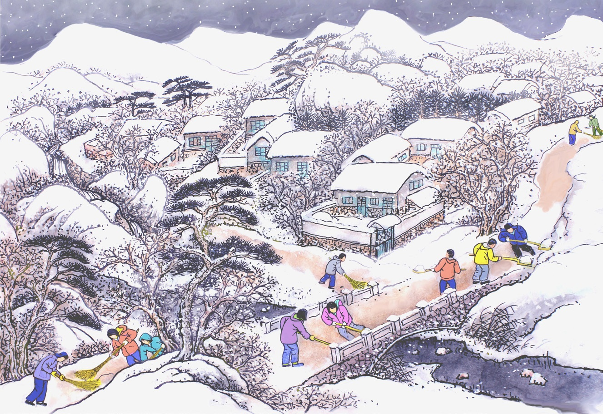

我们村地处东北边远乡镇，村里通往周边村落的道路高低起伏，坡道多，特别是下雪天，车辆打滑，爬坡更费劲，经常出交通事故，司机路过这里总是提心吊胆。雪大时客车干脆就停止运行了，给老百姓出行带来很多困难。多少年过去了，政府相关部门没人过问。 
　 
我村里几位法轮功学员看到这个状况，就在一块合计，这事别人不管，我们得管。法轮功修“真、善、忍”，处处要为别人着想，扫雪这件事咱们就义务担负起来。 

那时正是法轮功开始遭受全面迫害时期，村里的法轮功学员经常被警察绑架，自身安全随时都受到威胁。但大家都表示，为了让村民出行方便，一定要把这件事做好。 

说干就干。一到下雪天，几位法轮功学员就按约定的时间外出除雪。有铲的，有扫的。有些地方未来得及清理就被过往车辆碾压结了厚厚一层冰，就只能一小块一小块的铲冰。大家经常一干就是半天。 
　　 
头几年，仅限于清扫附近的一段路，后来延长到两个村的六条坡路。劳动量增大，时间会拖得很长，有的路有时来不及清理，就花几百块钱买一车炉灰渣分成六处扬在路上防滑。有的年份雪下得频繁，一车还不够用，就得临时再买。 

从2000年至今，十七年过去了，法轮功学员一直坚持着，不论过年还是过节，扫雪从不间断。

刚开始扫雪，路人都好奇地问：“你们是道班？一天挣多少钱？”法轮功学员就告诉他们：“我们是学法轮大法的，是为大伙走路方便，义务劳动，不挣钱。” 

时间长了，来往的人都知道了，原来是法轮功学员自愿为大家义务服务呢！ 
　 
过路的人说：“你们太了不起了，自己花钱为大家服务，做一两次可能可以，可你们已经这样干了十多年了，换谁谁也做不到。”“说法轮功不好的那些人呢？怎不见他们来扫雪？”一位老人发自肺腑地说：“如果中国人都像你们这样，就不需要警察了。”村干部更是直接说：“咱村从南到北都说你们法轮功好！” 

时不时地也有本村的村民主动加入到这个义务扫雪的队伍中，其中一位村民说：“全村都该感谢你们啊！” 
　　 
扫雪的过程中，有很多感人的场面：过路司机按喇叭挥手感谢；行人面带笑容竖起大拇指、挥手致敬；有的司机非常感激，特地买来了饮料、水果、面包送给他们。见学员不要，司机扔下东西开车就跑。跑这趟线路的客车司机说：“要是他们坐我的车，我一分钱不要。”司机对乘客说：“谁要说法轮功不好，我都不干。” 

<h1 align="center"><b>迫害善良天不容　作惡多端終有報</b></h1>

【明慧网二零一九年四月九日】（明慧网通讯员山东报道）二零一九年四月二日，山东省烟台市公安局原党委书记、局长聂作坤受贿案，在山东省菏泽市开庭审理。庭审结束后，法庭宣布择期宣判。
聂作坤是二零一八年八月三十日被立案调查；二零一八年十一月二十七日，以涉嫌受贿罪被移送检察部门审查；二零一八年十二月六日，由菏泽市检察部门决定逮捕；二零一九年一月十七日，被菏泽市检察部门提起公诉。

聂作坤，男，汉族，一九六五年五月生，山东潍坊人，曾经在潍坊安丘、寿光担任公安局长，二零一零年七月担任山东省公安厅教育处处长，二零一六年九月担任烟台市公安局局长。在担任三地公安局长期间，聂作坤积极参与、指挥、策划对当地法轮功学员的迫害。

聂作坤被抓遭难，表面看是其受贿腐败所致，其实根本原因是因为其在公安部门任职期间，积极追随江泽民流氓集团，肆意迫害法轮功。

据海外明慧网报道，聂作坤在安丘任公安局局长时，先后有六十多名法轮功学员被劳教、判刑。

聂作坤在安丘任职期间（二零零一年四月至二零零七年一月），积极追随中共恶党及江氏流氓集团迫害坚持“真、善、忍”信仰者，先后非法劳教、判刑法轮功学员六十余人，致使近二十名法轮功学员被迫害致死。安丘市法轮功学员郭瑞雪，因进京上访说明法轮功真相被非法拘留；后因向世人讲真相，再次被警察绑架，关押在看守所，全身遭电击，手、脸布满水泡、小便失禁，生命垂危，于二零零一年夏含冤去世。 二零零一年十月，安丘“610”、恶警非法闯入法轮功学员宿宝兰家中，将她绑架到洗脑班迫害，十几天后她的尸体出现在金冢子乡三合村的小河里。

二零零七年一月，聂作坤调任寿光市公安局局长后，在一年多的时间里，该市就有一百多名法轮功学员被绑架、抄家、毒打、罚款，超过十八名法轮功学员被非法劳教。还有不少学员被迫害得妻离子散、有家难回，甚至家破人亡。

二零零八年六月九日，新唐人电视台电话采访时任寿光市公安局长聂作坤时，聂作坤喊要把法轮功学员“赶尽杀绝”。与臭名昭著的重庆公安局局长王立军同出一辙。

二零一六年，聂作坤担任烟台市公安局局长后，直接参与指挥多起迫害烟台市法轮功学员的案件，几起大规模的迫害案件都是由其直接下令和亲自策划的。

从二零零零年起，聂作坤所到之处，都成为山东省法轮功受迫害最严重的地方，潍坊市和烟台市也成为全国法轮功受迫害最严重的城市。聂作坤因参与迫害法轮功学员，被海外明慧网列入“恶人榜”。

善恶有报是天理，多行不义必自毙。一九九九年中共江泽民集团对信仰真、善、忍的法轮功学员发动迫害以来，直接执行该命令的公安系统官员厄运连连，有的早年病死，有的被查处、判刑，有的在事故中丧命等，其中二百多名中共公安局长或派出所长遭恶报。奉劝那些继续作恶的人，立即停止迫害法轮功，不要成为中共的陪葬品。

<h1 align="center"><b>修心向善得福报</b></h1>

【明慧网二零一九年四月五日】我今年六十岁，一九九七年开始修炼法轮大法，至今二十个年头了，在大法中受益匪浅。
我一九八二年结婚后，婆家人欺负我是农村出身，房子没有我的，生孩子、流产没给我做过一顿饭，也不帮忙带孩子，因此我和婆婆积怨十五年。由于我家在外地，娘家也帮不上忙，所以我自己带孩子、上班、忙家务。丈夫是孝子，每天我们都因为琐事吵架。劳累、忧愁加之我性格倔强，落了一身的病，神经衰弱，几天几夜睡不着觉，只有靠安眠药维持，还有功能性头痛、头昏、贫血、小肠火的顽疾，真是苦不堪言。由于没人带孩子，工作还要强，家务活没人干，加上一身的病，那时的我对生活没有任何的乐趣，整夜以泪洗面，看不到光明，更不知人生的意义。

一九九七年，我开始修炼法轮功，不久身心发生了翻天覆地的变化，全身的病不治自愈，走路一身轻，全身有法轮旋转，每天精神焕发。十五年的婆媳不合一夜就解决了，以后再没有和婆婆发生任何不和，婆婆、丈夫和孩子看到我的变化后，也开始看书学法，那时我们全家乐融融的。

一九九九年“七·二零”江泽民发动了对法轮功的迫害。我家遭到非法抄家，丈夫也受到了干扰，开始以侮辱、经济截断来威逼我离婚。但我始终坚信师父、坚信大法，做好人，做更好的人，做到打不还手，骂不还口，家务活全包。我自四十岁下岗、打工至今，再没见过丈夫的工资卡，我退休后，两千两百元退休金全部用来维持家庭开支。我始终按照师父的要求去做，遇到矛盾向内找，丈夫挑食找茬，我能平心对待。

修炼大法二十年来，我没有吃过一粒药，精神焕发，身心都得到了净化。现在我每天上午讲真相救人，下午学法、做家务。讲真相时，世人都说我最多五十岁，因为我红光满面，皮肤细腻，腰板笔直，走路生风，我也从没有过什么更年期，吃啥啥香，这都是大法的威力，师父的加持。

这一切丈夫都看在眼里，我用行动破除了邪党的谎言，现在丈夫也看大法书、看新唐人的电视节目，也非常支持我修炼、做三件事。这一切都要感谢师父！感谢大法！

下面交流几个自己修炼的小故事：

二零零九年冬，我突然左脚不能动，疼痛难忍，还发热，不能弯曲，那时我还打工，骑电动车腿都是伸直在地上拖着走，上、下楼扶着楼梯，左腿比右腿明显的短了一截，呈瘸的状态，丈夫和孩子都叫我上医院，可我没有动心，就是坚持学法炼功、救人，这样持续一个月就完全好了。通过这次全家和同修也见证了大法的神奇。

二零一二年丈夫强迫我离婚，我不同意，他就用拖鞋底打我的脸，几鞋底打在我的右眼珠上，当时只觉眼前一黑，照镜子一看，整个眼球都是红的。第二天早晨起来，我对丈夫说，你看看我的眼，他连看都不看顺手又给我一巴掌。我照镜子一看，整个眼球就是个血球，很吓人。单位同事都说怎么这么狠，让我到医院去看一下，否则视力很危险。但我确实没有太疼的感觉，我想这是师父又一次保护了弟子，替弟子承受了，否则我的眼球就毁了。

二零零六年六月十一日下午五点半，我下班后去超市买了一箱优惠奶，回家晚了点，進门丈夫就大动肝火，破口大骂。我赶紧做饭，做好饭后他说他在外面吃过了。由于一天的劳累加上他暴跳如雷，当我走出厨房时感觉头脸有点不对劲，右眼紧闭，我用手扒开，它又闭上了，嘴也有点抽搐的感觉，我赶紧坐下发正念，发了一会，效果不明显，我急忙到同修家让同修帮我发正念，回家后请师父加持，长时间发出了强大的正念，到夜里抽的症状基本消失了。但第二天、第三天又反复出现这种症状，我继续坚持学法、炼功、发正念、讲真相、上班，一天也没耽误，一个月后左右，我就完全恢复正常了。

如果不是修炼大法，没有师父的加持，就会出现常人的半身不遂，这一切同修做了见证。这只是二十多年来在大法中受益的点滴，再次感谢师父的慈悲救度，只有在今后不多的时间里精進，精進再精進，做好三件事报师恩！

<h1 align="center"><b>中共强摘器官 芬兰议会九议员吁惩罚罪犯</b></h1>

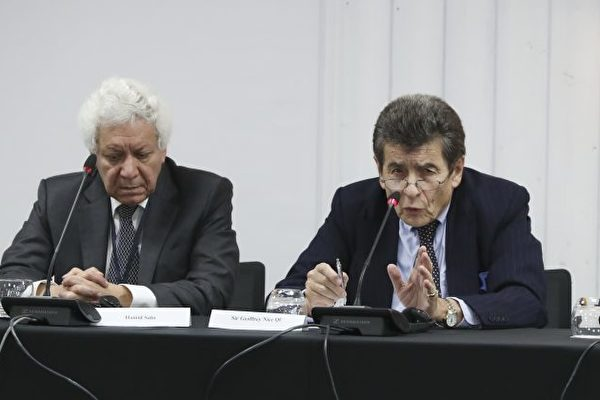

伦敦“独立人民法庭”法律顾问Hamid Sabi（左）和法庭主席尼斯爵士（Sir Geoffrey Nice QC）。

【大纪元2019年04月02日讯】3月1日，芬兰议会全球问题小组主席萨图‧哈西（Satu Hassi），与八位芬兰议会议员联名致信中国国家主席习近平、人大常务委员会委员长栗战书和中共驻芬兰大使陈立，表示关注中共对法轮功的迫害，同时要求将强摘法轮功学员器官的罪犯绳之以法。

九位议员分别来自芬兰七个不同的政党，包括正统芬兰人党、中心党、左翼联盟党、绿色联盟党、芬兰社会民主党、芬兰基督教民主党和瑞典人民党。

联名信中强调，依据英国“独立人民法庭”的临时裁定，即对中国发生的强摘法轮功学员器官和其他中国良心犯器官的罪行的指控是确凿的，以及面对大量的证据，不能将这些视为“谣言或宣传”，因而呼吁中共当局进行调查，采取措施，并对罪犯绳之以法。

信中所指的英国“独立人民法庭”（Independent people’s tribunal）成立于2018年10月16日，宗旨为调查中共强制摘取良心犯器官的罪行。该法庭的主席由英国御用大律师尼斯爵士（Sir Geoffrey Nice QC）担任。

芬兰九位议员的联名信的全文翻译如下：

赫尔辛基
2019年3月19日

中国国家主席习近平
人大常务委员会委员长栗战书
中共驻芬兰大使陈立

各位阁下，

作为芬兰议会议员，我们对有关中共暴力虐待法轮功学员的报导日益关注。这一议题已在中芬人权双边会谈中多次讨论过。

最近，我们注意到杰弗里尼斯爵士（Sir Geoffrey Nice）主持的独立法庭的工作。独立法庭正在调查在中国发生的强摘法轮功学员器官和其他中国良心犯器官的罪行。2018年12月，独立法庭做出临时判决，裁定这些指控是确凿的。

杰弗里尼斯曾在海牙国际法庭主导对塞尔维亚前总统斯洛博丹‧米洛舍维奇（Slobodan Milošević）的审判。

此外，欧洲议会和美国国会众议院在其决议中认定，强摘器官的供体来自良心犯的报告是“一贯的、可信的”。

预计独立法庭将于今年春天做出最后判决，届时犯罪者更多的罪行将曝光于天下。

这是极其严重的反人类罪指控。我们知道中国当局否认所有这些指控并将其称为反华宣传。

作为芬兰议会议员，我们认为，在大量证据面前，加上独立医疗专业人士和国际法律专家的介入，我们不能漠视这些证据，我们不能将它们视为谣言或宣传。因此，我们呼吁中国当局进行调查，并采取必要措施，将那些被证实参与这些罪行的组织或个人绳之以法。

芬兰议会全球问题小组主席萨图‧哈西（Satu Hassi）

议会议员：
维勒‧塔维奥（Ville Tavio）
艾拉‧帕洛涅米（Aila Paloniemi）
汉娜‧萨尔基宁（Hanna Sarkkinen）
欧蒂‧艾尔兰科-卡希洛托（Outi Alanko-Kahiluoto）
埃尔基‧图奥米奥亚（Erkki Tuomioja）
纱丽‧埃赛亚（Sari Essayah）
汉娜‧哈尔米帕（Hanna Halmeenpää）
伊娃‧比奥代（Eva Biaudet）

<h1 align="center"><b>追寻真理者无畏</b></h1>

从小我一直在追寻着生命的意义和宇宙的真理。就读北京大学后，一有空我就会到图书馆里，去了解各种文化。但一直没有找到我想要的真理。 

2002年，我去国外学习。在那个学校里，我发现法轮功并不是像国内媒体所宣传的那样。于是，我就上法轮大法网站想了解更多的情况。我在计算中心的电脑上，打开《转法轮》（法轮功主要著作）这本书。当看完第一段后，我的心就激动得嘣嘣直跳，抑制不住内心的喜悦。在那一瞬间我明白了：这才是我一直在追寻的真理，也是做人的准则——真、善、忍。在一天时间里，我把《转法轮》通读了一遍，读的过程中泪水经常夺眶而出。我决定开始修炼法轮功，而且我会尽己所能让周围的人了解法轮功真相，不再被中共谎言蒙蔽。 

四个月之后，我回国了。回国后按照规定要写所谓的思想汇报。我就把我在国外所了解到的当时法轮大法弘传世界80多个国家和地区，和大陆法轮功学员遭到残酷迫害的情况写上。每周开例会的时候，或开班会的时候，我也从各种角度谈到对法轮功的迫害。 

我的老师和同学们都很惊讶，他们都很信任我，也明白了迫害真相。即使这样，他们还是希望我不要炼功。 

记得最后一次，那位老师跟我说，如果你还继续炼法轮功，将取消你的博士生保送资格。我沉默了一会儿，然后跟他说：“不管你们怎么对待我，要让我放弃法轮功是不可能的。这是我一生追寻的真理，是我一生的意义所在。您以前器重我，是因为您觉得我有一颗为国为民为天下的心，可是我告诉您，法轮功是中华民族的希望所在。只有‘真善忍’才能让今天的中国变好。如果为了法轮功，需要我放弃什么，我没有什么犹豫的。您看着办吧。”说着说着，我的眼圈红了，那位老师的眼圈也红了。从此以后，他再也没有劝我放弃法轮功。 

有个同学不理解信仰，有时会说一些对法轮功不敬的话。他跟我说：“我真不明白，你炼了法轮功那些老师为什么还对你这么好，什么好事都给你。” 

我告诉他：“正是因为我炼法轮功他们才对我那么好！因为他们知道真正炼法轮功的人都是好人。在这样的压力下还能够坚持自己的信仰，还能够坚持正义，在他们的眼里，是可造之材，是中国的希望。而法轮功正是教我们做这样无私无我只为别人的人。”从那以后我就没听他再说过法轮功不好的话了。 

有一次，国家宗教局局长叶小文来我校办讲座，给学生讲国家宗教政策，最后提问时我站起来跟他说：我们很多同学在宿舍里都收到过法轮功的真相光盘，我们也看了，里边列举了很多证据说明天安门自焚是栽赃嫁祸，法轮功是教人做好人的。我们也知道我们中国有很多事情是很难说的。如果是那样的话，我们真心的希望作为国家的官员而且是高层官员，能够体察民意，真正为国家和百姓着想，为中华民族的未来着想，重新审视这个问题。叶小文听完之后，嘀咕了一句：“也只有在这所高校才有人敢提这样的问题。” 

其实，这是“真善忍”信仰的力量赋予的修炼者的勇气。追寻真理者无

<h1 align="center"><b>人的命天注定</b></h1>

【明慧网二零一九年三月二十九日】“人的命天注定”，有些人就是不信这个理，为啥？原因当然很多了，其中主要原因就是无神论和进化论造成的，有人说你难道不是吗？这个咱先不说，我把一个真实故事讲出来，就可见这句话的份量了。
那是一九四六年夏天的事。北方农户种庄稼，当庄稼长到膝盖深时就开始蹚地，一是除草垄苗，二是松土抗旱。一天，我妻子娘家大伯要上后山蹚自家山坡地。大伯早晨三点就到山上了。他把牛儿套好，扶正犁杖从东头往西头蹚。牛刚开始往前走，他就见牛头上悬着一颗夜明珠，把他自己前后左右照的通亮，绿油油的禾苗在小风下吹着动，看得十分真切。他又惊又喜，在心里感谢老天爷。

十多天之前大伯就听村里人说，他家山坡地上有夜明珠，有人说那不是夜明珠，那是鬼火；还有人说，北山上住过土匪，说不定还真的有什么金银财宝呢！这些话他听了只当是说笑，根本没当回事。可今天他真的看见了，他真想放下活儿去取那颗夜明珠，可牛在往前走，那颗夜明珠也跟着往前走，牛蹚地快，那夜明珠也走得快，不一会功夫就蹚到地头了。

他把牛梨安置好，就去拿取夜明珠，可那颗夜明珠象是在跟他开玩笑，他快走，那夜明珠就快走，他慢走那颗夜明珠也慢走，就是够不着。不一会儿工夫，那颗夜明珠就把他引到一个土崖边上，钻到一个崖缝里不见了。他趴到崖缝边往里看，那里面还有一些微光。他伸手去摸，可头就开始天旋地转，把手拿下来又好了。再去摸还是那样。他不甘心，闭着眼把手又往下伸，一下摸到一块硬东西，拿上来一看，是一小块金子。他又伸手去摸想把那颗夜明珠摸上来，可他摸到一块大一点的东西，不知是啥？把手刚拿出来，突然那崖发出一声巨响，象是土崖要塌，他吓得连滚带爬退了回去。

等他静下心来，再看那土崖还真的塌下一坯子，他这个后怕呀！

当他再看拿起来那个大一点的硬东西，发现也是一块金子。这时天已经大亮，他只好向犁杖走去，他把牛犁调理好，又向东边蹚去。到了地头，他觉得身子发软，一点劲也没了，只好把犁杖放在车上，套上牛，赶车回家去了。家人问他为啥回来这么早？他把今天早上发生的事跟家人说了一遍，并拿出一大一小的金子给家人看，家人说他有福气，一片喜气。

可好景并不长，自那天起，他就病倒在炕上了，又吐又拉，家人为他请先生（中医）看，他吃了不少药，一个月过去了，也没见好转，又过了几天，病情才好些。

一天他勉强坐起，问妻子家里还有钱吗？妻子对他说，还有那块小一点的金子，他说，你叫儿子拿上它到镇上买酒和一些吃的，多买些鱼和肉，把全村人请到家里来吃一顿，我的病也就好了。妻子迷惑，又不好说什么，就叫儿子去办了。

第二天，他在酒宴上对全村父老乡亲们说，我这次得病大家也都知道为什么，人的命天注定，不信不行呀！命里没有就强求不得，本来我是得一块金子的命，可我太贪，想多得点，到头来怎样？多得的那一块儿金子都买药看病了，钱花完了病也好了。

这时他又讲起童年时老人给讲的一个故事，说：一个佃户住在一个财主家的西边，是这家财主的邻居，又是他家的佃户，每年过年午夜财主家都扫钱龙。他想到时也扫钱龙，多扫几个钱花花。这年午夜钱龙从东院过来了，人家财主又扫了不少金银财宝，他叫老婆快去屋里拿盆儿接钱，等钱龙过来，他使劲用扫帚扫，结果扫下一串铜钱，正好落在盆里，把瓦盆打破了。过年后到市场去买盆，结果这串钱正好够买一个瓦盆的。不义之财不能得，我就象那个佃户。今天我想开了，人不要把钱财看的太重，要注重德修行，做个善良的好人，有个好身体就行了。最后他说：谢谢大家来我家参加庆贺我康复的酒宴。大家都喊好！划拳猜令，酒宴一直延续到下午。

这个故事当时四乡八村的人都知晓，一直传到文化大革命之前。文化大革命破四旧立四新就没人敢再传再讲了。

我今天为啥把它又讲出来？“人的命天注定”，因现在的人很多都不信了，认为这些故事都是编出来骗人的。还不是因为这世道变得太糟，不成人道了？中国五千年传统文化不恢复，中国各民族就没有希望了。

<h1 align="center"><b>煤矿井下的奇迹</b></h1>

在黑龙江依兰县三道岗镇北兴村，有个叫关春江的村民，他曾在七台河市的市政煤矿打工。二零零四年的一天，他在井下采煤时，突然，一块两吨多重的巨石从头顶落下，把关春江整个人都压在下面。 

当时，大伙儿全都给吓坏了，赶紧过去一起用力抬石头，石头却纹丝不动，经验十足的班长这时也束手无策。只听关春江的声音越来越微弱，忙乱中大家不知如何是好。 

就在这时，一个法轮功学员大声喊：“小关，快喊法轮大法好，你没事，马上就能出来。”关春江在石头下喊起了“法轮大法好”，声音越来越大。法轮功学员急中生智，用千斤顶顶起了石头，关春江从石头下滑出。 

关春江保住了性命，而且没有任何后遗症，这在煤矿事故中简直是个奇迹。他对法轮功学员万分感激，不停的道谢。 

法轮功学员告诉他：“不用谢我，是法轮大法、是我师父救了你！你也应该谢谢你自己啊，是你相信了‘法轮大法好’，救了自己。” 

由于中共一直在迫害抹黑法轮功，这件事始终没被媒体公布出来。事后，关春江常对人说，是大法救了他的命。

<h1 align="center"><b>无悔的抉择　人生的指航</b></h1>

【明慧网二零一九年三月二十五日】我从小爱看书，书中所写的神仙世界的美好、纯净让我向往。十几岁时，一次在家看电视，演的是“崂山道士”，当那个道士穿墙而过时，我脑中冒出一念：我要学这个。当时心里很踏实，好象一定会等到。
我是个不合群的人，总觉的周围人们说的、做的不太对，又不知道对的该怎么做，想随俗，不甘心，不随俗，社会大潮又如此。我象个局外人，生活在人群中，却又在人群外，不知路在何方。

二零零零年，我第一次拿到《转法轮》这本书，一气看完，只是吃饭耽误了一会儿，我知道了这是一本修炼的书，我今后的人生有了指航。

我决定炼法轮功的那一刻，已经笃定那是心中无悔的抉择。但是对师父所讲的高深法理还悟不到，只知道做好人，不能撒谎，不能骗人，不能骂人，不能打人，要忍，要吃苦。

当年工厂倒闭，工人刚下岗时，给了每个人一份表格，因为当时有些乱，没有人会查证你所填是否属实，别人也告诉如何填表就有钱。但我还是如实填写，没得到补助，但我没撒谎，守住了心性，听了师父的话。

下岗以后，我又在一个食品加工厂工作了八、九年，那里是计件工资，干多少得多少，每天都能在账上看得明明白白。在利益面前，人人都放松了质量，关注着产量。我牢记大法要求我们做好人，对工作负责，做事为别人着想，看淡利益。但在那个环境中，做到真的不容易，我本来就手慢，保证了质量也就没有了多少产量，看到别人糊弄事也曾心动，我不断学法，用法归正自己的思想，做真事，不骗人，保证质量，产量随其自然。那一刻，我知道我的付出得到了最高的回报，良心无价！谢谢师父的恩赐！

最近，我又找了一份扫马路的工作，是扫菜市场那一段，道两边是商铺、饭店，当菜上市时，附近村民把自家地里的菜拿来，在路边摆摊，丰富了居民的饭桌，但菜底、烂叶也留在了街道上，有的人会收走，有的人根本不管，卖完就走。我都会耐心细致的扫干净，不生气、不责怪。

一个商铺大哥知道我是修大法的，说：“他们这么扔你也不吱声，谁扔你都收拾，扔多少收拾多少，也不生气。”我说：“我还差得远哪，法轮大法是佛法修炼，是教人做好人，更好的人，最后修成神佛。”他听后似有所悟，点了点头。

还有一些卖菜人也对我说：你扫的真好，我要是领导，我就用你。我都会对他们说：“是法轮大法指导我这么做的，我是修真善忍的，是法轮大法好、真善忍好。”他们都表示认可。

有些人明白了真相，知道了电视上是骗人的，就说：“法轮功这么好啊，我也学。你告诉我怎么做。”我就对她说：要对别人好，要为别人着想，常念“法轮大法好”。她高兴的说：知道了。

愿天下苍生都能得到大法的恩泽，都能拥有平安和未来。

谢谢师父！

<h1 align="center"><b>让善念在人间传递</b></h1>

听过这样一个感人的故事，这个故事发生在美国。是一个大雪纷飞的夜晚，布朗先生独自驾车返家，不料车子却在一片四下无人的荒野中抛锚了。正当他着急的不知该如何是好且又冷又饿之际，一个年青人正好驾车经过，当他知道布朗的遭遇后，立刻拿出绳索绑住两部车，然後拖着抛锚的车到下一个城镇去修理。 

可以想见布朗对这位年青人的感激之情，他当下拿出一笔钱做为报答之意，不料年青人却摇摇头微笑地拒绝了。他告诉布朗说：“我不是为了获得报酬才做这件事，若你真想报答我，就请答应我一个要求就好。”布朗略感讶异地凝神倾听年青人所讲的要求是什么？ 

“希望今后当你遇到需要帮助的人，你都能够尽你所能的去帮助他，若他也像你现在这样想要报答，请你把我现在告诉你的话一样的告诉他，这就是对我最好的报答了。” 

时光飞逝，一晃20多年过去了，这段时间布朗从没有忘记对年青人的承诺，只要遇见需要帮助的人，他总是义不容辞地去助人，碰上受助者想要回报他时，他也总是照着当初那个年青人告诉他的话去说。在不断帮助别人的经验中，布朗深深体会到助人为快乐之本的真谛，日子过得充实而愉快。 

有一天布朗独自驾小船出海去钓鱼，不幸遇上了一个迅速发展的海上暴风雨，小船禁不起大浪的折腾翻覆了，布朗抱着救生圈在海上载浮载沉的漂流了一天一夜，最后被冲上一座荒凉无人的小岛。 

过了几天，一个来孤岛附近钓鱼的小伙子，发现了遇险已命在旦夕的布朗并救了他。对於救命之恩，布朗事後非常感激的拿出一笔钱作为答谢，没想到小夥子竟告诉他，不需要这样，只要今後当你遇到需要帮助的人，你都能够尽量帮助他，并且请他跟你一样，懂得去帮助需要帮助的人，这就是对我最好的报答了。 

“这就是对我最好的报答了”，多么耳熟能详的一句话，这句话刹那间让布朗热泪盈眶，他突然明白，原来过去这20多年，他都自以为是自己在帮助别人，其实他真正帮助的是他自己。助人的善念在人间传递，若干年后像圆圈一样又传递回他身上，若不是有这么多的人共同传递这份善念，他今天或许不会获救。 

然而，不仅善念会传递，恶念亦如是。一辆行驶马路上不守交通规则乱按喇叭的车，能够瞬间影响数十部开车者的心情，这些受影响者，若没有足够的宽容心量与智慧，很可能将这份不好的情绪扩散至办公室或家庭中，让社会多了许多不必要的矛盾与冲突。 

遇见令人不愉快的事，若我们搅入其中，扮演破坏人间祥和的角色，那对于这个世界的纷纷攘攘，我们谁也责怪不了，因为我们也都在起推波助澜的作用；反之，若我们能智慧的让不愉快的事仅及自身而不波及他人，相信用不了多久，连不愉快的事你可能都会很少再能遇到。 

生命充满无限的可能，让人间变成天堂或地狱，常在你我的一念间。愿我们一起努力，让恶念的涟漪不起，让善念在人间传递。

<h1 align="center"><b>见证善良 九成村民退出中共</b></h1>

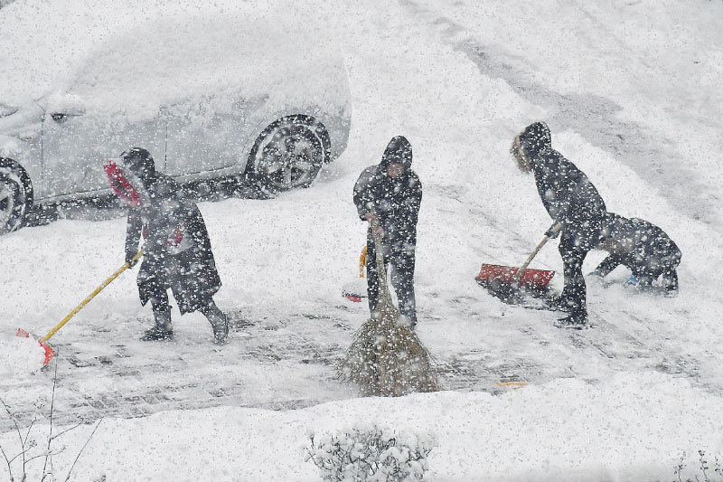

一年冬天，大雪封道，送粮车出不了屯。法轮功学员连老带小一起把道路清理出来。大家都在背后说法轮功心眼好。

<b>1999年中共江氏集团迫害法轮功后，我们屯是被邪党迫害最重的地方之一。
然而发生在屯里的事实，却让这里的百姓看到了「法轮大法好」。
村民签字要求释放大法弟子，村长亲自出面要回法轮功学员， 超过九成村民退出中共组织。</b>

我们屯是一个七、八百人口的小屯，法轮功于1992年从长春传出，我们屯最多时七、八十人修炼法轮功，常年坚持修炼的就有四、五十人。1999年中共江氏集团迫害法轮功后，这个屯也是被邪党迫害最重的地方之一，从老人到小孩，几乎无一幸免的曾被绑架到看守所或被恐吓，七十多岁的就有好几位。

然而，实实在在发生在屯里的事实，却让这里的百姓看到了「法轮大法好」。

等有钱给法轮功盖个大炼功场房
一天，一个村民去派出所办事，警察一看证件就说：「你那屯炼法轮功的多吧？」村民笑着说是啊。接着，这个村民就告诉警察说：「法轮功，你不服气不行，这回你们再去屯里抓法轮功，全屯百姓都不让。」警察瞅瞅他问为什么？这个村民娓娓道来：

那一年冬天，雪下一米来深，大雪封道，送粮车出不了屯，还有两天送粮期限就到了，送不出去，政府就罚款。学生上不了学。我们村某某赶牛车送粮，车陷在雪里拉不出来，他死劲赶牛，差点把牛打死。

村书记在大喇叭里喊：「共产党员、共青团员都出来清理道路积雪。」可是，无论怎么喊，没有一个党团员出来清雪。你看人家炼法轮功的，连老带小，年岁大的七十多岁，小的十几岁，都出来了，硬把道路清理出来了。

当各家送粮的车开在路上时，喜笑颜开，对还在清理积雪的法轮功学员竖起了大拇指。你说，哪个村民不感谢人家法轮功啊。

是啊，当时村书记非常感动，还特意手指着这条路留下了一张纪念照，并说：「等我们有钱了，给法轮功盖个大炼功场房。」

今年春天，村西边的桥年久失修，塌了，在桥西的村民不能种地了，眼看着春天播种的黄金季节就要过去了，是法轮功（学员）自己出人、出钱、出车，拉土和沙石，把桥修好了，咱村人播上了种子。

大家都在背后说：「你不服气不行，还是人家法轮功，心眼好，还都那么齐心，共产党员能做到吗？」

警察看着屋子里办事的村民，笑了笑没有言语。

<b>村民签字要求释放好人</b>
 
屯里有一个大法弟子，是位医生，他学大法后，不但给村民看病热情周到，而且有钱无钱都给治病，全屯村民都知道大法弟子的热心肠。法轮功被迫害，这位大法弟子被绑架到市看守所，全屯百分之九十以上的村民都签名摁手印，证明他学大法做好人，没有错，并要求无条件释放他。

此事震惊县「610」，特派出一伙人到这个屯来找村民核实，做工作，可是无论他们怎么连哄带吓，没有一个村民信他们。老实的村民说：「我们打心眼里说实话，签名都是自个儿愿意的，是心里话。」这伙人一看没有吓唬住，就都走了。

一次，一个大法弟子被绑架，一个村民主动从派出所找到县「610」，要求放大法弟子回家，村民把他从新唐人电视上看到的法轮功在世界洪传的真相，和屯子法轮功的真相故事一个个讲给他。

县「610」主任听他滔滔不绝的讲，突然吼道：「你是不是也是炼法轮功的？」他说：「法轮功好，谁不想炼？我可没炼，因为我不配，法轮功要求做好人嘛，打不还手，骂不还口，我做不到，就连抽烟喝酒我都放不下。但是，我就说真话，好就是好。」

「610」主任气得站起身，跑出了办公室。

<b>村长亲自出面要回法轮功学员</b>
 

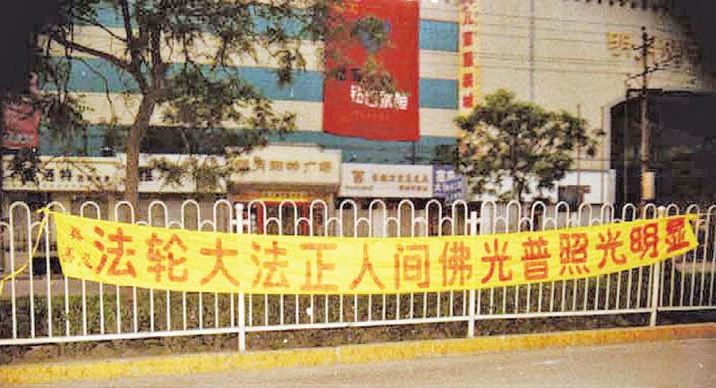

四位姥姥沿着公路挂法轮功真相条幅，被带到派出所，就给警察讲真相。村长亲自出面把她们要回来。

四位姥姥早晨起来，沿着公路挂法轮功真相条幅，越挂越起劲，一直沿着路挂到了乡政府，她们还在挂。那天正是周一早晨八点多，被新来的乡党委书记上班看到了，通知派出所来抓人。

四位姥姥就开始给他们讲真相，聚集的人越来越多，几乎把道路堵塞了。最后，警察说：「大娘、大婶，你看都讲累了，咱们都听明白了，人多影响交通了，咱们到派出所去讲吧。」几位姥姥一商量，一位姥姥说，正好派出所所长是新来的，还没给他讲呢，去就去。

他们到了派出所，就又开始讲，最后让几位姥姥摁手印，几位姥姥不配合，他们就硬拉着手摁手印。几位姥姥告诉他们：「你们这样做就是在犯罪，我们都是好人。」结果奇迹出现了，手印就是摁不上，一个警察说，这法轮功的手怎么这么奇怪，按不上手印呢？！

就在这时，村长赶来了，不知道村长都和所长说了些什么，只听所长说；「他们被乡书记看到了。」村长说：「这帮老太太都是好人，你放了也没啥事，你要是把她们抓起来，我们屯的法轮功都去北京上访，咋办？我可管不了。」

后来真的无条件把几位姥姥放回家了。

<b>超过九成村民退出中共邪党</b>
 

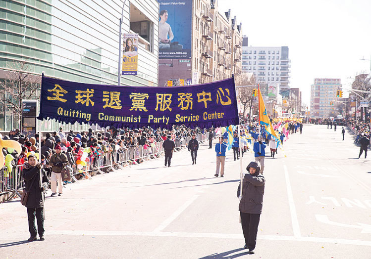

《九评共产党》发表后，退党大潮席卷大陆，屯里超过九成的村民都退出邪党的党团队。图为2月4日，全球退党服务中心参加「纽约华人新年大游行」。

海外《大纪元》网站发表《九评共产党》后，一场风起云涌的退出邪党的大潮逐渐席卷大陆。屯里也掀起了退党热。

很多村民公开说：「我们相信法轮功说的都是真话，共产党迫害法轮功，电视上说的都是给法轮功造的谣！我们亲眼看到了这些人炼功后身体好了，做啥事都为别人着想。」「我们屯没有人杀人和自杀的。」

一个说退，大多都说退，有的村民主动到法轮功学员家里去要求「三退」；有的把自己的外地的朋友领到家里找学员给讲真相，做「三退」。在这种形势下，连村书记也三退了。那个称自己是「铁杆党员」的姥爷也说：「看来共产党是完了，我也退出来吧！」

目前，屯里百分之九十以上的村民都退出了邪党的党、团、队。村民外出打工都不忘了带上「法轮大法好」护身符。

村民们在大法中受益的事层出不穷：一次几个村民坐四轮车去城里早市卖菜，回来的路上车翻到沟里，几个人都平安无事；一个村民在中共迫害刚开始、搜大法书的时候，他把大法弟子的书保护下来了，一天在建筑工地打工时，不慎从七楼掉下来，昏迷半个月后神奇的康复了。

<b>派出所警察：法轮功，得平反</b>

每当全乡镇赶大集的日子，又是聚集各村屯村民最多的时候，也是法轮功学员讲真相的机会，两、三个人一伙的就去集市上发资料，劝三退。

有一天，一个不明真相的人慌慌张张的跑到乡镇派出所，进门就对值班的警察说：「你们怎么不管呢，这法轮功（学员）就在集市上发资料。」

这个值班的警察看看他笑了，说：「管啥管，我看等不到来年5月，法轮功就得平反。」这一幕正好被一个去派出所办事的法轮功学员的家属看到了。

是啊，那些警察也天天看大法真相的传单和小册子，可知道自己该怎么做了，谁还想替江泽民当替罪羊呢？

<b>大法悠扬的音乐又在村里回荡</b>
 
法轮功被迫害之前，每天早上，几乎小半个村屯都能听到法轮功学员炼功的音乐声，江泽民集团迫害大法后，人们不得不回到自己的家里炼功了。

四年前，屯里的法轮功学员又在户外炼功了。特别是夏天，大家围在一起，在院子里学法，已经是村里独特的一道风景线，路过的村民都会好奇的瞧上几眼。（转自明慧网）

<h1 align="center"><b> 320国际幸福日 大陆各界人士谈感想</b></h1>

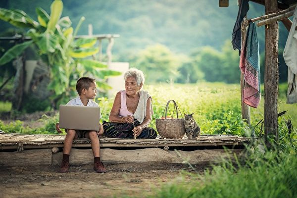

 3月20日是每年的“国际幸福日”，但很多中国大陆民众表示不幸福。图为祖孙示意图。

【大纪元2019年03月22日讯】（大纪元记者骆亚、林岑心采访报导）3月20日是每年的“国际幸福日”，在这一天记者采访了中国大陆各界人士，谈谈他们对幸福的定义和感受，他们普遍反映，毒食品、毒空气、毒疫苗随处可见，以及思想上、行动上的禁锢，是造成他们最不幸福的主要原因。

 “国际幸福日”由联合国于2012年创立，每年的这一天联合国都会发表“全球幸福指数报告”，2019年报告指出，在156国家评比中，北欧的芬兰连续第二年排名第一，在东亚地区，台湾比去年上升1名到25名，香港第76名，中国从86倒退为第93名。

报告指出，幸福指数的衡量标准不只限于经济表现，还包含健康预期寿命、社会支持、信任感、政府的贪腐程度、在生活上能自由选择等等。

<b>恐惧、麻木不是真幸福</b>
 
大纪元采访了多名中国大陆民众，其中北京新公民运动的张宝成提到，食安与假疫苗等问题泛滥，让中国民众没有幸福可言，“每天呼吸毒空气、吃毒食品、孩子被打假疫苗、牛奶喝的是三聚氢氨，不像权贵阶层吃特供，普通中国老百姓根本没有幸福。”

在思想的禁锢上更为明显，张宝成说，“中国人没有一丝一毫幸福，我们最起码的言论自由没有、思想被禁锢，谈什么幸福呢？70年了，我们绝大多数人都生活在谎言、恐惧中，多数人以追求物质生活来自我麻木，但不是真正的幸福。”

一位大陆保障权益方面的专家谈到“国际幸福日”时表示，消极意义上，幸福是忍受、超越痛苦；从积极意义上讲，幸福就是自我实现，就是自由、平等、公正和爱的实现。

他认为，对于现在大陆底层的劳工而言，能够生存并得到平安，就很幸运了，哪里有什么幸福可言？“中国人的幸福指数最低，即使是有钱有势的人，也没有人身和财产安全，更没有政治自由和心灵的平静。”

<b>不随共产党干坏事 心安理得</b>
 
大陆北京的一名大学生接受大纪元采访时说，“我感觉我的很多同学，虽然在很好的学校，也有很好的成绩和履历，看上去很光鲜，但是他们是在追名逐利，每天还要算计别人，而且经常要为了迎合中共说一些他们自己都不相信的话，他们并不幸福。”

“另外，现在整个高校乃至中国社会肯定都是处在极权专制的高压恐怖下，有时候我也会感到彷徨和害怕，但是我会尽力做一个行得正的人，即便可能因为坚守自己的理念，丧失一些诸如入党、攀附权力带来的物质机会和好处，但是这都没有我的内心平和重要。”

大陆一位遭受迫害仍坚持信仰的法轮功学员，经历了8次被抓、3次劳教，亲兄弟在劳教所被折磨死，谈及幸福，他说，“幸福就是能够做自己认为有意义的事情，坚持真理、讲清真相，这是最值得的事情，也是最根本的幸福。”

<b>维权人士 320仍需外界关注</b>
 
维权律师余文生被关押一年三个月，一直无法获得与辩护律师会见的机会，妻子许艳近一年多来，一直在为余律师维权奔波，3月2日到16日她被限制出门、遭受女警恶骂，在这天，刚给官派律师打电话询问余文生的情况，官派律师没说什么就挂掉了，让家属深感得不到法律的保障。

亲身经历这些，许艳接受大纪元采访时表示，在“320国际幸福日”这天，她并不悲观，因为有许多公益人士的关注与支持，“我心里一直相信会有对良知、对法律有信念的人，会帮助我的家庭，虽然眼下遭遇困境，但我还是相信余文生律师，相信我们的爱能战胜一切困境。”

<b>推翻暴政 为下一代幸福着想</b>
 
大陆一位追求民主自由的伍先生接受采访说：“我觉得推翻中共暴政，重建一个自由、尊严和安全的生活，不让我们的孩子活在谎言和恐惧中，能够在阳光下，表达自己的观点，拥有自己的信仰和追求，这就是最大的幸福

<h1 align="center"><b>见证奇迹 一位越南女子修炼法轮功的故事</b></h1>

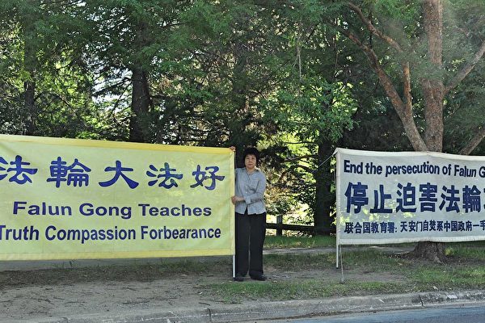

在澳洲首都堪培拉，越南裔法轮功学员金（Kim）常年坚持每天清晨在中领馆对面展开法轮功真相横幅。

【大纪元2019年03月18日讯】2013年12月3日，发生了一件让越南裔女士金（Kim）刻骨铭心的事。她及三位家人在一次重大的车祸中安然无恙。所有到场的救护人员都觉得不可思议，称“这真是奇迹”。

从2010年至今，九年多的时间里，不管风吹雨打、酷暑寒冬，一位干练稳重的越南裔女士，从周一到周五，每天清晨7点30分，在澳洲首都堪培拉的中共大使馆对面的街边，展示“法轮大法好”、“停止迫害法轮功”的横幅。

这位打横幅的女士正是那位在劫难中生还的金。

看到金端庄的面容、轻盈的步伐，没有人想到她今年已60岁了。她的职业是厨师，和妹妹从十九年前开始修炼法轮功，如今全家三代近十口人都相继走入修炼，共同见证了法轮功（也称法轮大法）修炼的神奇、美好。

金说：“能修炼法轮功、能成为李洪志大师的弟子，我感到非常幸运。能有机会为真理而生存、能成为更好的人，那种幸福和感激之情是无法用语言描述的。”

是什么机缘促使金修炼法轮功的呢？

<b>枯木逢春</b>
 
四十年前，金和家人逃离被共产党入侵的越南后，几经辗转来到堪培拉定居。虽然来到了自由的国度，但身体的病痛折磨着她，使她感受不到生活的快乐。

金回忆说：“我那时身体很不好，刚过了20岁，就患有高血压、严重的胃溃疡，持续性的疼痛折磨着我。记得常常因为剧痛，我不得不躺在床上好几天，什么也做不了，止痛片之类的药物不起作用。”

金寻访了很多医生，吃了很多种类的药，但都无济于事。她觉得人活着很苦、很累、很空虚，看不到希望。

2000年，金的妹妹开始修炼法轮功，不久就推荐给金学炼。

“我看了《转法轮》这本书很受触动，觉得很好，从此我也走上了修炼的路，也是返本归真的路，按照‘真、善、忍’的标准要求自己，两个月后我身上的病痛都消失了。”金说。

金修炼法轮功后重获新生，无病一身轻，“我没再看过医生、没再吃过药，师父对弟子的保护、大法的神奇伟大，让弟子无限感恩，也使弟子对大法坚信不疑。”

<b>化险为夷</b>
 
修炼至今，她多次通过亲身经历见证了法轮功的神奇。

金说，不久前，她正在厨房上班，测量了一下油锅里的油温是260度，当她一转身的时候，不知怎地一锅油都洒在她身上、手上。“我当时没有害怕，心里想着：没事，没事，没事。最后，真的什么事都没出现，皮肤跟以前一样，也没有一点疼痛感。”

她十分感恩于李洪志师父的保护，最让她不能忘怀的就是在2013年12月3日的那场劫难中生还的奇迹。

那天，金驾车行驶在高速公路上，车上还有三位家人，都修炼法轮功。途中有一段马路在维修，所有车辆都需要减速。

她回忆说，坐在后座的妹妹后来告诉她，当时突然有一股力量让妹妹回头，看到距离他们的车大约十米远，一辆大卡车飞速地向他们冲过来。

金说：“那时我透过车窗玻璃发现，我的车被白色雾状的东西包围着，我已经看不到前方，同时听到一声轻微的碰撞声，身体都没有感觉到怎么震动。但大家都意识到一场车祸已经发生了……”

当时，金和家人都意识到应该赶紧出去，但车顶已经被严重压坏，车门一开始打不开，第二次再试，车门能打开了，他们就一个接着一个出来了。

那时救护人员已经在旁边等着他们，看到四个人毫发无伤，在场的所有人都说：“这真是奇迹！”

那场车祸的视频截图。

金介绍说，那辆大卡车满载着几吨重的砂石，由于没能控制好刹车，酿成了这场大祸。大卡车的前半部越过了他们的车，车体前后连接的部分断开，连接杆支撑着车的前半部，没有压在他们的车上，而车的后半部正好落在他们的车后。

在那场严重的车祸中，多人伤亡。金的车也报废了，但他们却发现四人的座位部分却没有受到任何损伤。

“我明白，这次又是有师父的保护。我心里充满了对师父、对大法的感恩。没有师父的保护就没有今天的我，我会很珍惜修炼的机缘，做一个符合宇宙特性‘真、善、忍’的真正的好人。”金说。

<b>一如既往</b>
 
至今已经九年多了，金坚持在澳洲首都堪培拉中共大使馆对面的街边打横幅，她要告诉人们法轮功的美好，呼吁制止中共对法轮功的迫害。

每天清晨，金的真相横幅都在迎接着上班族。川流不息的车流经过此地，人们都能看到横幅上醒目的大字。

她坚持不懈的和平抗议感动了首都各界民众，她经常听到司机的鸣笛声、看到他们打出“赞”的手势表示支持。

这一切已经成为澳洲首都的一道独特的风景线。

<h1 align="center"><b>修炼大法 荣辱不惊</b></h1>

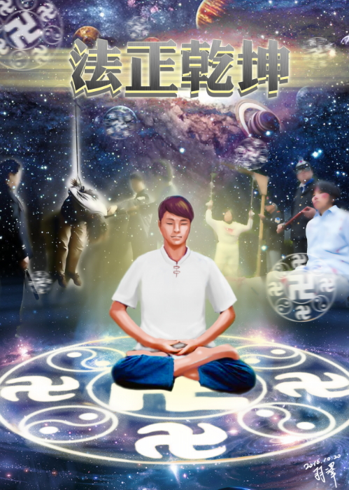

 
 1993年，我31岁，当时在一电子研究所担任某大型电子产品的电讯主持设计师。由于长时间加班和微波辐射，导致白血球降低，恶心，再加上过去的鼻炎、神经衰弱等，身心极度疲惫。但是产品的周期及对工作的责任心，使我无法在工作上有丝毫放松。
1995年5月我开始修炼法轮功，微波辐射的不适感很快消失了，以后再也没出现过，其他病也不见了。修炼法轮功到现在，除被迫害造成的身体损害外，没得过病，也没吃过药。我已经忘记吃药是什么滋味，但是在修大法之前，我几乎不停的吃药。

<b>严格律己 祥和待人</b>

修炼法轮功后，我身体健康，精力充沛。更主要的是：明白了生命存在的真正意义，身心获得巨大的解脱。在单位任劳任怨，领导交给什么工作从不推辞，既努力工作，又不为名利所累，再忙、再累，心里总是轻松、祥和的；严于律己，不贪单位一点便宜，到外地出差，凡是我自己私事的花费从不报销，而我却很多次花自己的钱为单位办事，却从未提起过。

我作为产品的电讯主持设计师，要和众多的分系统技术人员、专家接触，但我从来不会因为工作而生气、着急，总是笑瞇瞇的和分系统负责人商量。但是因为我们修真，我也要为产品质量负责，绝不含糊。如我们产品有一分系统性能不稳定，分系统负责人不想改进了，我会一次次找他，态度是祥和的，就是不妥协，最后他还是愉快的重新设计新的分系统，使用性能非常稳定。我修炼法轮功后，遇事荣辱不惊、宽容忍让的良好心态给工作带来很多方便，避免了很多人为因素对工作的干扰。凡是和我合作过的各专业技术人员都愿意再次与我合作。直到现在，我们原单位的领导和同事对我及其他大法弟子的工作能力和工作态度及为人都是肯定的。

修炼法轮功前，我妻子患有癫痫，她每次发病时，我总是心里莫名的惆怅。我修炼法轮功以后，明白了因缘、得失的关系，心里彻底解脱。在家庭中，我们夫妻和睦，尊老爱幼。我用大法真、善、忍的标准教育孩子，从不打骂孩子，只是正面引导。 我的女儿5岁就能通读《转法轮》，和我们一起修炼法轮功，小学历年都是「三好生」，曾获省会城市小学生形象大使比赛「综合素质」第一名。（江泽民迫害法轮功后，孩子也不能幸免，各种名誉被拿掉，遭受歧视。）

我们在社会上奉公守法，晚上12点也不闯红灯，因为根据修炼人的心性要求，遵法守纪是自觉的，不需要别人监视。和邻居友好相处，我们住的小区，多年来一直是两家修炼法轮功的大法弟子利用周末时间带自己的孩子打扫的，我们从不提起。做好事是内心升华后的自然状态，无需别人承认，并不刻意表现。

<b>超越魔难 心灵升华</b>

1999年7月20日江泽民公开迫害法轮功后，我被非法抄家4次、非法刑事拘留3次、关洗脑班6个月、非法劳教1年半、非法判刑7年，总计在监狱、洗脑班、劳教所被非法关押、失去自由的时间达9年之多，曾经5次几乎被逼到死亡和精神崩溃的边缘。

感谢李洪志大师对弟子无微不至的看护和教诲，才使我这样一个个性软弱的生命，能在如此邪恶的迫害中走过来；虽然绑架、坐牢，历尽劫难，我却能超越魔难，在大法中升华，无怨无恨，仍然充满对世人的慈悲。

如果没有这场迫害，我无疑会成为一个很有造诣的技术专家。作为修炼人，个人的毁誉真的不算什么。因为我们知道生命存在的意义，今生只是生命长河中的一瞬间，我们不过是借一块地方修炼而已。

然而能救众生的法轮大法在其故国被残酷迫害，真是中国人最大的悲哀。由于迫害者的残暴和铺天盖地的谎言，使很多人对佛法犯罪，也使很多人失去了得救的机会。但愿人们能看一看《转法轮》，那是你久远久远的等待。

<h1 align="center"><b> 老人8年无私修路竟遭抓捕 村民不畏强权发出最强声援</b></h1>

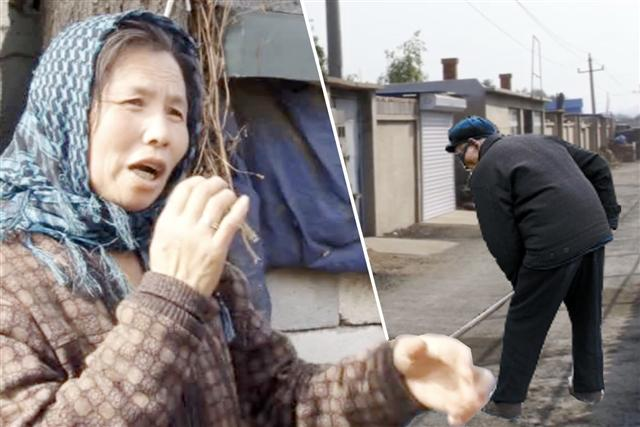

年迈老人自掏腰包，并自己付出辛苦为村民修路，没想到只因起诉迫害自己的人，老人竟被中共当局抓捕。村民得知情况后，实名联署，要求当局释放老人。

 
一位善良的老人无私地为村民修整了村里年久失修的道路，并数年如一日地维护这条道路。没想到，中共强权只因老人起诉迫害他的人就把其强行关押，让村民们气愤，联名上书，要求释放老人，还老人自由。

中国一名七十一岁的老人，被派出所抓走。

一百五十多名村民联署签字，要求无罪释放他。

他到底做了什么？派出所要关他？又为何村民要救他？

八年前他开始用自己个人的生活费，修理附近那条年久失修、湿滑难行的路，铺了共计三千公尺长。

白发苍苍的他，在大太阳底下修补道路，总是满头大汗，衣服湿了又干，干了又湿。

有时为了不影响交通，他会在夜里干活。

他的车停在哪里，总有感谢他的村民，给他送蔬菜、水果。

稻池村村民说：「就那大道上，哪嘎㗳（哪里）有坑，都他去垫去，都是他垫的！那老爷子，真是好人！」

他是高文志，是村里远近闻名的好人，村里的人都爱戴他。

一个交通局长曾想让电视台采访他，被老人婉拒了。

老人说：「我不要礼物，也不上电视。你也不敢在节目中说这是大法弟子在修路吧？」局长惊讶地说：「不提法轮功不行吗？」

老人说：「我以前得了癌症，大夫说我活不过一年了。现在全好了，比年轻人还能干。我做这些，都是因为信仰真、善、忍，怎能不提呢？」

派出所警察得知他学法轮功，想让房东撵他走。

但听了村干部介绍的老人如何无私为大家修路，警察对老人说：「我要撵你走，村民来抗议啦，大家都说你好，你就住下吧！你可不能走。」

2016年6月23日晚上，这位老人遭到警察绑架，被拘留至今。

只因他向法院提出对中共前党魁江泽民的控诉，控诉他对善良信仰的迫害。

村民听到老人被抓，纷纷站出来说公道话，甚至盖手印，要求无罪释放他，没有人害怕。

没有人会懂，像这样的好人，为什么要被关押呢？

<h1 align="center"><b>贤妻修大法 全家都受益</b></h1>

法轮大法李洪志师父说：「一人炼功，全家受益。」这是千真万确的。我妻子修炼法轮功20年了，我们全家都跟着沾了光啊！下面我就说说我们家因为我妻子修炼法轮功给我们家带来的福报。

我和妻子都是60年代出生的人，我妻子1995年秋开始炼法轮功，她能炼法轮功没人相信，因为之前她一个女人家打牌赌博、抽烟喝酒、脾气暴躁，样样都占齐了，因为抽烟喝酒、打牌赌博熬夜，30多岁的人就是一个黄脸婆，脾气又大，输了钱回到家还要和我吵架，家务也不做，唉！想起那时候我的日子真是难熬啊！

可是自从她修炼法轮功开始，我的好日子就来了，人家法轮功讲真善忍啊！首先就要做到打不还手、骂不还口，什么恶习、坏事都不再沾边了，即使开始不能一一做到，也要在修炼中慢慢去掉。从她炼法轮功后我就再没有被她骂过。

一次，我因为在外面看人家打牌多了一句嘴，那人就和我大打出手，结果我把那人打得破了点皮，流了一点血，他纠结一帮子地痞敲诈我，要我出医疗费、营养费好几千呢。我心里不服，隔壁左右的人也都气不过，纷纷要找人帮我出这口气。结果全被我妻子拒绝了，妻子说：「你把人打伤了是事实，给点医疗费和营养费也是应该，要多少那是他的事，做错了就该承担责任，如果你听那些人的挑唆也找人和他干，弄出事来还得你去收拾，事弄大了你能担待的起吗？」哎！这可不是我妻子的一贯做法啊！她平时得理不饶人，没理也要打出一片天来，这是怎么回事呢？这刚炼法轮功还不满3个月就转变这么大，真是不可思议！

我们按照那人的要求赔偿了他。事后妻子不但没责怪我，还不断的开导我想开点，凡事不要钻牛角尖，退一步海阔天空，妻子现在变得这么通情达理，我还有什么好说的，从那以后我也不再打牌了。

妻子每天起早贪黑的都要到炼功点去学法炼功，身体好了，精神头十足，皮肤也变得白里透红，隔壁左右的人都说你妻子真是变了个人，以前他们都不喊我妻子的名字，都喊她赌婆，现在大家都很自然的喊起她那许久没有被喊的名字了。

这种好日子才过了几年，1999年7月电视突然24小时滚动式的播报诬蔑法轮功的新闻，接着厂保卫科的人也不断的到我家找我妻子了解情况。后来就来硬的了，不管青红皂白就把我妻子关起来了，绑在死人床上好几天，从1999年开始到2004年，妻子没在家过一个年节的。那时我孩子正上小学六年级，孩子上初中时把我妻子非法劳教两年，孩子没人管，同学们还取笑他，孩子的精神受到了极大的伤害。

妻子从劳教所回来后，厂子已经垮了，30年的工龄用两万块钱就把我们打发走了，没办法我们只好出去打工。我妻子以前是个心高气傲的人，可是为了生活现在却要去做保姆，而在她做保姆的几年里，我却找不到一份工作，最后去给人家当搬运工都没人要，说年纪大了。但我妻子从来都没有怨过我，就这样她在哪儿打工，我就在她附近租个房子，后来孩子也来了，我们一家人就这样漂泊在外面，靠我妻子打工的钱维持一家人的开支。

因为我妻子处处都按照真善忍去做，工作做的很出色，所以她的工资高出同行业人很多。也是在那个时候，我跟着妻子出去发放法轮功真相资料，她说这样做就像电影「诺亚方舟」里面的那个诺亚一样；神要毁灭诺亚的家乡，神叫诺亚造个大船把他认为好一点的人叫到船上去，等灾难来时船上的人就可平安无事。我妻子说，大法弟子发真相资料也是这个道理，能看明白的人，愿意看的人，愿意退出党员、团员、少先队员的人就等于拿到了一张得救的船票，等到天灭中共时你已经在渡船上了，什么瘟疫啊、天崩地裂都与你无关了，如果不听不看法轮功弟子冒着生命危险发给你的真相资料，就等于你拒绝上平安渡船，等到灾难来时哭都没机会了。

也正因为我帮着妻子做了那么一点点的救人的好事，得到了法轮大法的很多恩赐。几次遇险都转危为安：一次在建筑工地上午休时和工友到马路上散步，我和工友并排走在马路的人行道上，那时马路上的车不是很多，我们慢慢的走着走着，突然我被一股很大的力量推到人行道的沟里去了，等我爬起来时看到工友的人头已经落在一边了，我当时吓傻了啊！就是一瞬间啊，人就这样没了。很快工地上的工友们都来了，他们都说我命大，其实我明白是法轮功的师父救了我，很庆幸我家有个法轮功弟子，不然小命没有的是我啊！

我目前在一家私企上班，50多岁的人工资有5千左右，高时还拿了1万元，辛苦是辛苦了些，但想想我以前连工作都找不到，给人当搬运工人家还嫌老，山南海北的打工转了大半个中国也没有赚到钱，就是因为我妻子修炼法轮功，我们全家都支持她，无论暂时受多大的委屈我们都毫无怨言，我们始终相信早晚都会还法轮功清白的！因为这个功真的太好了，我们是家属、是亲身受益者，我妻子修炼二十年没看过病，更没吃过药，连我们家里人也很少生病。

我的儿子、媳妇也都很听话，没有现在年轻人的坏习惯，特别是我儿媳妇，也是修大法的，80后的人，把家里收拾得有条不紊，还做得一手好菜，家里一天三餐都是她做，家里不管来多少客人她都能很从容的做一大桌子菜，客人走后他们小两口又去收拾桌子和碗筷。亲朋好友没人不羡慕的，个个都说：现在到哪儿能找到这样的好媳妇哦！这都要感谢李洪志师父教出了这么多好

<h1 align="center"><b>美国务院人权报告关注中共迫害法轮功</b></h1>

【明慧网二零一九年三月十五日】三月十三日，美国国务院公布《2018年人权国别报告》，对全球近二百个国家过去一年的人权和劳工状况加以记录。有关中国的部份有一百二十六页内容，其中六次提到中共对法轮功学员的残酷迫害。

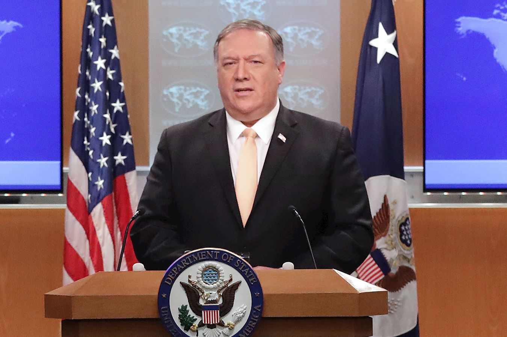

图：美国国务卿迈克•蓬佩奥三月十三日公布国务院二零一八年年度人权报告

美国国务卿蓬佩奥在发布会上表示，中共当局在侵害人权方面“无人可比”。

今年的人权报告说，一些活动家和组织继续指责中共仍从良心犯身上强摘器官，尤其是从法轮功学员身上强摘器官。

此次国务院人权报告中，列举了“卞丽潮”和“马振宇”两位法轮功学员仍被中共当局监禁。

卞丽潮是河北省唐山市开滦第十中学的优秀教师，二零一二年，被唐山路南法院判十二年重判。马振宇是原中国电子科技集团第十四研究所雷达设计工程师，二零一八年，被南京中级法院判刑三年。

报告说，在刑罚制度和拘留营内工作的执法人员和官员对被关押的人实施了有系统的酷刑以及侮辱人格的虐待。曾被关押过的维吾尔族幸存者说，当局对被拘留者进行电击、水刑、殴打、体罚以及注射不明药物等。

同时报告揭示：“法轮功学员在被关押期间也遭受到系统性的酷刑。”

这一指控在二零一八年国务院的人权报告中也有提到，且法轮功学员遭受的酷刑比其他群体都更为严重。

此次，周三的报告说，中共当局利用行政拘留来恐吓政治及宗教支持者，并防止公众示威。行政拘留形式包括强制戒毒治疗以及“拘留和培训”，他们将政治活动家以及宗教信仰者，特别是法轮功学员关押在这些地方。强制戒毒中心的最长停留时间为两年。

报告还指出，（中共）政府暂停或撤销一些接受敏感案件的律师的营业执照或法律许可，案件人士包括，例如捍卫民主的异议人士、家庭教会活动家、法轮功学员或政府批评者。

报告说，（中共）当局使用由中华全国律师协会管理的年度许可审查程序，以扣留或延迟专业律师执照的续期。

其它威胁人权律师或以其它方式施加压力的政府策略包括非法拘留，对律师事务所进行模糊的“调查”，取消律师资格，骚扰和实际恐吓，以及拒绝律师查卷和会见当事人。

曾代理法轮功等敏感案件的多位人权律师失踪，被当局秘密关押。其中包括人权律师高智晟，他自二零一七年八月失踪后，二零一八年一年都渺无音讯。

还有许多政治犯在二零一八底仍在监狱或被其它形式拘留，包括作家杨茂东（笔名：郭飞雄）、活动家王炳章、牧师张少杰、维权律师王全璋和余文生等人。

美国国务院下属的民主、人权和劳工局，每年都会依据美国法律发布《人权国别报告》，以便国会和政府官员充分了解各国的人权状况。今年的人权国别报告已经是第四十三份。

<h1 align="center"><b>从“夹边沟”到“马三家”</b></h1>

【明慧网二零一九年三月十五日】
夹边沟，夹边沟，三千白骨无人收！
夹边沟，夹边沟，遍地冤魂声啾啾。
夹边沟，夹边沟，临风遥祭几人忧？

这凄惨的哀声是纪录片《死魂灵》中的一个片段。这部描述大饥荒期间夹边沟惨案的纪录片记载着“右派”的血泪史，它描述了远在甘肃酒泉戈壁沙漠中的劳改和劳教农场夹边沟鲜为人知的惨剧：在1959年至1961年的大饥荒时期，每月口粮只有12斤，被关押的“右派”（大多是知识份子）还要承受苦役，每天都有数十人被活活饿死，三千多人的农场，最后幸存者不到三百。

夹边沟惨案的幸存者之一祁录基回忆：“埋人的时候，（他们）把肚子划开以后，把里面的心肝肺都挖出来，架在火上烤着吃了，这我是知道的。”这么惨烈的场景，今天的年轻人恐怕难以相信。对中共的暴政，中共当局至今一直力图掩盖和修饰，以至今天的许多中国年轻人对一个发生在其父辈身上，高达三千多万人死亡的人为大饥荒竟然一无所知。

“死者的遗体被饿得发狂的人们从沙地里扒出来，开肠破肚掏出内脏，割下大腿和屁股上的肉。有些人躲到沙堆后面用干草烧着吃，也有悄悄焙干了存着慢慢吃的。……”知识份子能放下尊严去吃同伴呕吐出来的食物，能去吃人肉，在今天难以想象，但在当时却实实在在发生着，可以想见那是一种什么样的绝境。

毛泽东时代，以强制政治犯和刑事犯从事奴役劳动为特色的劳改农场遍及全中国，臭名昭著的有东北兴凯湖农场、北京清河农场、青海劳改农场、四川峨边沙坪劳改农场、长寿湖劳改农场等，但在整个中国的古拉格系统（“古拉格”是苏联劳改集中营的代号，也是苏共迫害人民的劳改苦役、监狱和政治迫害的象征）中，夹边沟这个中国戈壁沙漠边缘的小型农场引起的关注最大，因此“夹边沟”成为代表中国古拉格的符号象征，也是中共极权主义制度制造的灭绝灾难的一个缩影。

事实上，比夹边沟更惨烈的不是没有。文革时期广西爆发了上千人的“人吃人”事件。《红色纪念碑》记述了广西文革期间的“红色风暴”：在1968年7、8月期间，广西就有3681人被枪杀、戳死、勒死、叉死、溺死、砸死，甚至活埋。武宣县竟然出现了人吃人的惨剧，开始是偷偷地吃，高潮阶段是大张旗鼓地吃，到最后进入群众性疯狂阶段，演化成吃人的群众运动。在“《九评共产党》之七：评中国共产党的杀人历史”中也提到这段历史。

滋事者从活人身体内割下心脏和肝脏，然后煮而食之。“当受难者被推上街头游行批斗时，老太太们会提着菜篮子守候。一当受害者被处死，众人蜂拥而上。那些冲在前面的人将会得到一块好肉。”一个老太太养成了专挖眼睛的习惯，认为吃了它们会增进她自己的视力。另一个年轻女干部，一旦可能，要消受的是男性生殖器。在一个中学里，学生吃掉了他们的老师。据称当时至少有一千多人被吃，吃人者中84%是共产党员。该书公开出版十多年来，没人敢说“不”字，连共产党也一句话不敢多说。

翻阅共产党的历史，就是一部灭绝人寰的历史：苏联共产党曾于1932年至1933年对乌克兰人进行种族灭绝，斯大林时代死亡无数，中共暴政下更惨烈到极致。毛泽东时代有丰年饿死3000余万平民的“国家机密”，江泽民把一亿修炼“真善忍”的法轮功修炼者及其家人视为敌人，下令屠杀，最邪恶的是杀人与发财兼顾，制造了冲破人类底线的“活摘器官”杀人卖钱的反人类暴行。

如果说在国际上，夹边沟已经成为中国劳教体系的一个代名词，那么辽宁省马三家也已成为中共迫害法轮功学员的缩影。描述马三家劳教所奴役、残酷迫害法轮功学员的影片《求救信》在海外上映后，在国际上引起高度关注。

主人公孙毅在《求救信》里记述：不得不一天工作15个小时，没有周六周日休息和任何节假日。否则将遭到酷刑、殴打和粗暴的话语。……我们与世隔绝一样，不知道能否活着出来，而哭在劳教所是被禁止的。……比活摘还要残酷的是“精神摘除”，酷刑的目的是“精神摘除”。 ……没有想象中的刑具，任何一件东西都可以成为刑具。他曾连续不间断被挂168小时，期间被剥夺睡眠。

三次被关押在马三家的辽宁法轮功学员尹丽萍回忆说，不仅要承受奴隶般的奴工迫害，还被昼夜被洗脑、体罚、手背被指甲掐，腕下被针扎、关禁闭室被超分贝声音迫害，野蛮窒息性灌食、电棍电击、被禁止见家人，被注射不明药物导致她一度丧失记忆、眼睛暂短失明。因拒绝穿劳教服装，被一群男女警察和男犯人扒光衣服，任由男犯人观看。在这十八年的迫害中，她认识的十位法轮功学员被迫害致死……

马三家教养院（劳教所）是迫害法轮功学员的集中营，也是中共迫害法轮功的急先锋和头号罪恶标志，被关押的法轮功学员长期维持在一两千人，多时曾超过四千人。

马三家还曝出过疑似活摘器官的线索。据法轮功学员王春英回忆，二零零八年五月十二日下午，马三家一、二大队二百多法轮功学员、普教全部被强制抽血化验。以她做了三十年护士工作的医学经验，她知道做生化检查只需要二毫升的血，他们却抽了五毫升，说明他们一定还有其它检查项目，疑似为活摘器官做血型准备。

马三家所长苏境二零零零年就曾在大会上说：“这是一场没有硝烟的战争，国家为法轮功动用的经费相当于一场国际战争。”她强调这是上面的命令，要百分之百地转化法轮功学员。

这场没有硝烟的战争是更为隐秘的、更不为人所知的精神迫害，记录了中共采取种种恶行迫害信仰者的罪恶，十九年来有四千多名（已确认的）法轮功学员被迫害致死。时至今日这场迫害也没有结束，中共仍投入大量人力、物力及财力迫害法轮功。仅今年一至二月过年期间，至少有295名法轮功学员被绑架，骚扰150人，批捕36人，送洗脑班5人，非法判刑98人，非法庭审60人，迫害致死9人，1人被迫害做开颅手术在抢救中。

如果说夹边沟已经成为历史，那么马三家的迫害却是正在发生的现实，也是我们必须面对的血淋淋的现实。事实上，中共这一杀人机器从未停止过，只是在不同时代，不同背景下迫害不同的人。正如《九评共产党》所说，中共正是靠着一路杀走过来的，否则就无法维持强权政治。

共产党信奉“无产阶级专政”和“无产阶级专政下不断革命”的理论。因此在建政后，它采取“杀地主”的办法解决农村的生产关系；“杀资产阶级”完成工商改造，解决城市的生产关系。这两个阶级杀完，经济基础的问题就基本解决了。上层建筑的问题也要靠杀人来解决，包括镇压“胡风反党集团”和“反右”以整肃知识份子；“文革杀人”破坏传统文化道德；“六四”杀人；迫害法轮功等等。这都是中共在维护其统治的过程中，不断处理其经济危机、政治危机、信仰危机的过程中，采取的必然反应。

同时共产党杀人也是出于现实的需要。共产党当年靠流氓无赖杀人起家。既然杀开了头儿，中间就绝不能停手，而必须不断制造恐怖，使人民在颤栗中接受对手过于强大而只能俯首称臣的现实。

不过，共产国家的倒台已经证明共产主义的失败，没有一个强权政治能一路走到黑，没有一个违反普世价值的政权不受到抨击。中共在和平时期人为地发动各种运动，造成八千万人死亡，目前仍在打压法轮功及维权律师、异己人士，这些血债能不偿还吗？如果你是中共的一份子，你还愿意与邪恶为伍吗？还愿意与这一杀人机器同在吗？还心甘情愿为它卖命而最终成为替罪羊吗？历史不会忘记，停止迫害，才不会成为历史的罪人。

<h1 align="center"><b>他们为何而来</b></h1>

【明慧网二零一九年三月十四日】二零一九年三月二日中午，雪后天晴，近千名法轮功学员在纽约的第三大华人社区——布碌仑八大道，举行了盛大游行，给民众送去法轮大法的真相和祝福。浩浩荡荡的游行队伍鼓乐齐鸣，龙腾狮跃，受到当地民众的欢迎。
更可喜的是，围观民众纷纷响应三退（退出曾经入过的共产党、共青团和少先队）大潮。游行当天共有441人选择了三退，其中退党团队38人，退团队152人，退队251人。并有两千多份真相特刊送到观看游行的民众手上。

观看游行的武女士说：“觉得很激动，因为在国内看不到嘛，是被制止的，在这可以自由地发声，很好。”来美十多年的福州移民董燕新说，小时候在中国时误以为法轮功不好，现在看到法轮功的队伍，明白了法轮功学员都是“正派和善的好人”。

游行大道上每个街口都有警察维持秩序，警察局长站在游行队伍前留影，并说，法轮功的游行队伍文明有秩序，“他们（法轮功）在传播好的信息，看来今天我们的工作很有意义。”

二零一八年十月二十一日在布碌仑第八大道举行的盛大游行期间，也有四百多人三退，其中四十五人声明退出中国共产党，共青团，少先队，一百二十四人退出共青团和少先队，二百五十人退出少先队。

法轮功学员抽出自己的时间来这里参加游行，就是希望民众了解真相，抵制中共的迫害。青年法轮功学员于佩手举“制止中共活摘器官”的牌子，由于中国大陆发生迫害，令她一直无法回国，已有九年没有与父母见面。虽然来到海外自由世界，但是也与大陆的法轮功修炼者一起控告江泽民，“因为江泽民出于妒嫉，发动这场残酷的迫害，虐杀了成千上万无辜的法轮功学员，使无数家庭支离破碎。”

一位参加该地游行的法轮功学员在《参加纽约法轮功大游行所想到的》一文中说，中国人到海外旅游，有不少导游散布中领馆的无端污蔑，说散发资料、讲真相、领馆静坐抗议、游行的法轮功学员，是每人每天50美元雇佣来的，不少中国游客不假思索、信以为真。按照这个谎言逻辑，一次游行或请愿活动以3000个人计，报酬应该是15万美元，折合人民币约100万元。这是很大一笔费用了对吧，但多吗？我说一点都不够，你知道这个游行队伍里有多少不同族裔、不同行业、年薪按人民币计过百万、几十万的法轮功学员，很多都是工程师、律师、医生、艺术家、企业高管、商人等行业精英，他们是50美元一天这个低廉价格能雇佣来的吗？法轮功学员的做人境界以及他们在干什么，还在糊涂的人真得静下心来了解了解、思考思考了。

在一次纽约游行开始前，一位穿着得体五十多岁的男士表情严肃，看着法轮功学员的游行队伍，见状，一位法轮功学员拿着真相资料走到他面前说：“您好，送您一份平安了解一下真相。”

这位男士开始时面无表情不回应，稍顿一会儿，他问法轮功学员：“你发这资料他们给你多少钱？”学员微笑回答：“我一分钱都不拿。不论您在哪里看到的拿着真相资料救人的法轮功学员都是不拿一分钱的。大家都是法轮功受益者，每个人都按着真善忍去要求自己怎么会拿钱呢，您看那些吹号的、打鼓的都是自己买的乐器。”

学员指着天国乐团说：“你看这些年轻人中有的是博士，有哈佛大学、哥伦比亚大学毕业生，他们的学历都很高。他们自己掏钱买乐器买服装来参加游行，他们都是法轮功的受益者，身心健康。按真善忍做个好人。这就是为什么这么多年法轮功打不倒，还要出来救人！希望大家都有一个美好的未来，不要在老天灭中共时做陪葬。”

这时，这位男士的表情开始变缓和，又问：“队伍这么多人是美国北半部的所有你们炼法轮功的人吗？”学员笑着回答：“不是。这只是纽约这地方的。”他说：“这里就这么多人？”学员说：“是啊，如果都来那人可多了。”他不由自主地点点头小声说：“这么多人哪。”接着，学员又跟他说：“先生，您这个年龄已经看过很多事了，什么事情自己应该很清楚。现在这个岁数，保持一个健康的身体与心态很重要。”他点点头，高兴接过真相资料，并声明了退党，还说看完游行再走。

台北故宫是台湾法轮功学员于二零零二年建立的第一个真相点，每天都有法轮功学员自发自愿地来在这里讲真相。常有好奇的台湾民众趋前询问：“你们在这里做什么？”听学员讲述法轮功真相，以及学员们自发自愿来在这里对中国大陆游客讲真相的唯一目的，是让他们明白真相，清除共产邪灵灌输的毒素和钳制，选择正义善良，与中共划清界限，以免天灭中共来临时，成为恶贯满盈的中共的陪葬。民众听言之后都会竖起大拇指表示钦佩与支持。也有不少大陆游客三退之后对学员竖起大拇指表示敬佩与感激。

法轮功学员玉治到台北故宫景点讲真相将近十年，她说，遇到思想观念受到很大冲击的陆客凶狠谩骂，那时会很着急：他们不及时觉醒过来，天灭中共的时刻到来时，他们怎么办？能够把握的话，还是不能放弃。因为她感到：有时陆客恶狠狠地谩骂也不是真心要骂，而是一种掩饰。

有一次，四、五位中年男士同行，从他们的穿着举止判断都是党员，其中一位冲着学员放声大骂，骂声中却一面放慢脚步，与同伴的距离越拉越远，玉治鼓起勇气上前讲真相，对方不但聆听，而且还请玉治帮他退党。玉治说，这才理解，原来这位男士的高声大骂是做给同伴听的，实际是想退党。

正是怀着慈悲救人的心，法轮功学员才能坚持十几年到景点讲真相，到领馆门前静坐，风雨无阻。有的是利用自己退休后的休息时间，有的则是工作之余抽空就来，有的每天往返车程四小时，有的在机场等到最后一拨大陆客离开，到家已是凌晨一点半。而在大陆讲真相的法轮功学员更是顶着重重压力，所以希望您有机会了解真相时，千万不要错过机缘。

<h1 align="center"><b>美宗教自由大使：关注中共迫害法轮功</b></h1>
【明慧网二零一九年三月十二日】（明慧记者方慧台湾台北综合报道）首届由亚洲国家与美国共同合办的“印太区域保卫宗教自由公民社会对话”二零一九年三月十一日在台北登场，美国宗教自由大使布朗贝克（Sam Brownback）演讲，关切印太区域国家的宗教自由现况、包括中共严重迫害法轮功等信仰；美国在台协会（AIT）处长郦英杰（William Brent Christensen）谈到法轮功在台湾广传的明显对比。

<b>批压制人权国家　总统：台湾与受压迫者同在</b>

台湾总统蔡英文强调：大家聚集在此，是因为世界许多地方的宗教自由仍然受到威胁，在那些压制人权和民主价值的国家，政府歧视，甚至以暴力镇压那些只不过是想追寻信仰的人。在这些国家，我们看到政府试图摧毁宗教组织、摧毁神像和宗教象征物、迫使宗教领袖流亡，人民因为信仰被关进再教育营，并被强迫违反宗教禁忌。

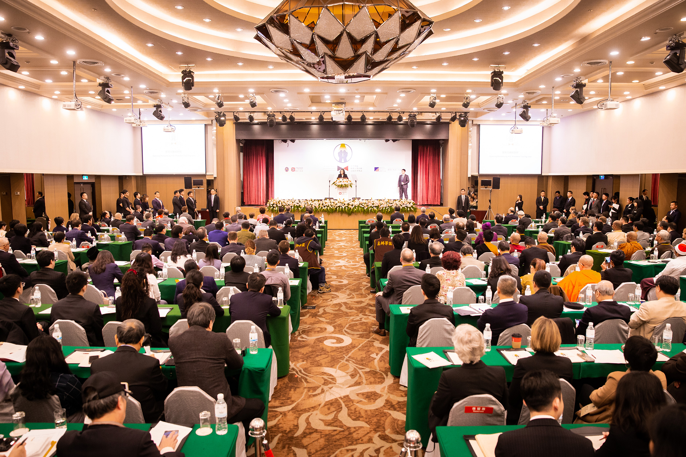

图1：台湾总统蔡英文致词

她说，台湾了解权利和身份被剥夺的痛苦，也了解生活方式被挑战的感受，“所以我们选择与受专制政权压迫、被剥夺宗教自由的人民站在一起。”

<b>中共迫害法輪功20年 美宗教自由大使：停止迫害 刻不容緩</b>
 

宗教自由大使布朗贝克致词时表示，在中国大陆等地区，仍有数以百万计无法享有信仰、心灵自由的人们，而繁荣的台湾充分体现了享有宗教自由的社会样貌，应作为普世的范例。

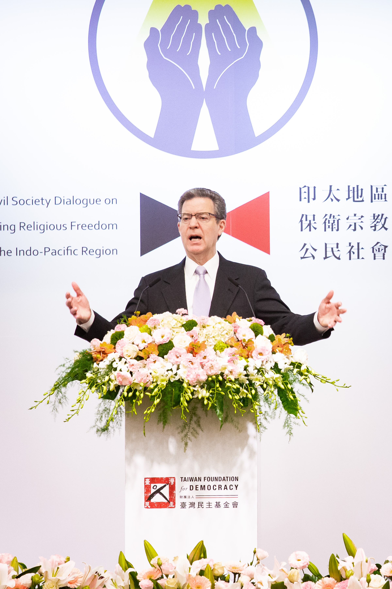

图2：美国国际宗教自由大使布朗贝克（Sam Brownback）致词

谈到多次被美国列入宗教自由“特别关注国”的中国，布朗贝克提到“法轮功修炼者也遭到酷刑折磨及拘禁”。

布朗贝克说：“现在是行动的时候，而且刻不容缓。根据报告，法轮功学员遭到中国（中共）政府的酷刑和关押。宗教自由的大门，将在世界各地开启，压迫宗教、和压迫宗教的铁幕，将在世界各地倒塌。”

<b> AIT处长：台湾信仰自由 随处可见法轮功</b>
 

美国在台协会（AIT）处长郦英杰指出，“台湾对信仰的法律保障与尊重，堪称十足成功的故事”，台湾遍布多元宗教组织，诸如基督教、佛道信仰，或是清晨在公园里打坐的法轮功修炼团体等，不论规模大小，在台湾都能受到尊重及法律保护。
<b>xxx</b>

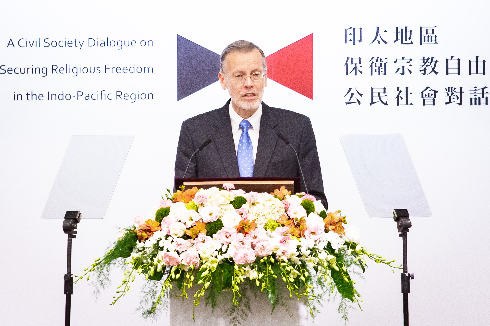

图3： 美国在台协会处长郦英杰（William Brent Christensen）致词

郦英杰进一步提到，“自由”除了安全、免于其他国家胁迫、选择价值观与政治体制的自由外，还包含选择信仰或不信仰的自由；而美台共享的价值，在核心本质上正是“普世价值”，正如世界上的正教指向“普世真理”，信仰能超越国家或种族身份的认同，能成为团结众人的力量。

<b>十五国宗教代表带来第一手讯息</b>
 

本次会议共有十五国、七十位宗教代表与会，包括受中共迫害严重的基督教、西藏、新疆、法轮功等团体代表 ，他们将与倡议宗教自由的国际组织分享信仰自由所面临的挑战，并探讨如何促进宗教自由。

图4： 台湾法轮大法学会理事长张锦华（中）、台湾法轮功人权律师团发言人朱婉琪（左三）等七位法轮功代表出席“印太区域保卫宗教自由公民社会对话”

布朗贝克表示，来自不同地区的宗教受迫害者、幸存者带来第一手的讯息，让人们对宗教自由有更深的认识，看到最实质的内容。

布朗贝克强调，信仰自由亦代表“心灵上的自由”，这是不可剥夺的权利，也是他热爱这个工作的原因。他呼吁更多人加入捍卫信仰的行列，因为这也是在捍卫“纯洁、高贵及美丽”，若这样的会议能在世界各地举办，就能帮助数百万人脱离宗教迫害。

<b>中共迫害宗教 美大使呼吁建反迫害联盟</b>
 

记者会上，被问到如何制止对法轮功的迫害，是否未来将采取进一步（对中共）的制裁时，布朗贝克表示，国会的确有在讨论制裁的事情，而《全球马格尼茨基人权问责法》是制裁工具的一种，而川普政府的确有祭出制裁过，象是一年多前，美国籍的牧师布伦森（Andrew Craig Brunson）被土耳其政府抓捕，川普就曾使用制裁手段，而且成功地营救出布伦森，“川普是行动派人士，虽然我不能透露内部在讨论什么具体行动，但我们很关心这些迫害的情况。”

图5：美国国际宗教自由大使布朗贝克（Sam Brownback）出席记者会

另外，被问到这类宗教自由会议如何帮助缓解中共的迫害，布朗贝克表示，宗教自由不是新观念，早在联合国《世界人权宣言》中就载明了，而且宗教自由也标明在中国的《宪法》中，但现实上却发生了许多大规模的迫害，“中共政府正在与宗教宣战，这是个他们不会赢的战争。我们正在呼吁团体与个人联盟起来反对迫害，这是我们第一次的努力来建立联盟。”

他再次强调，“宗教自由是人权的基础，如果有宗教自由，其它人权也会兴盛，社会也会繁荣，经济也会得到发展，若有宗教自由，就会比较少恐怖主义，但若没宗教自由，一切都会出问题，这就是为什么川普政府这么强调宗教自由。”

<h1 align="center"><b>莫斯科举办九天班 新学员受益</b></h1>

【明慧网二零一九年三月十三日】二零一九年三月二日至十日，在俄罗斯莫斯科举办了“法轮大法九天学法班”（简称“九天班”），期间大家观看了李洪志师父的讲法录像，并且现场学炼了法轮功的五套功法，十六位新学员参加。九天班结束后，他们交流了自己的身心获益的心得体会。

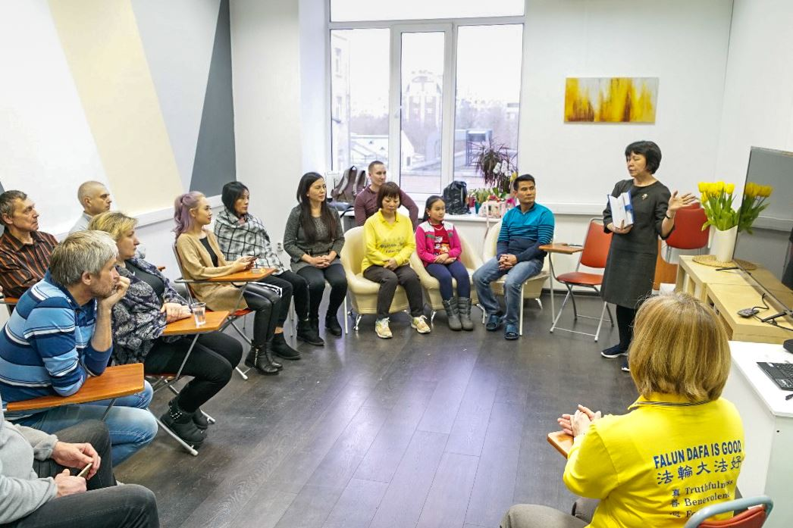

图1：二零一九年三月二日至十日，在俄罗斯莫斯科举办了“法轮大法九天班”，参加者们正在听法轮功学员的介绍

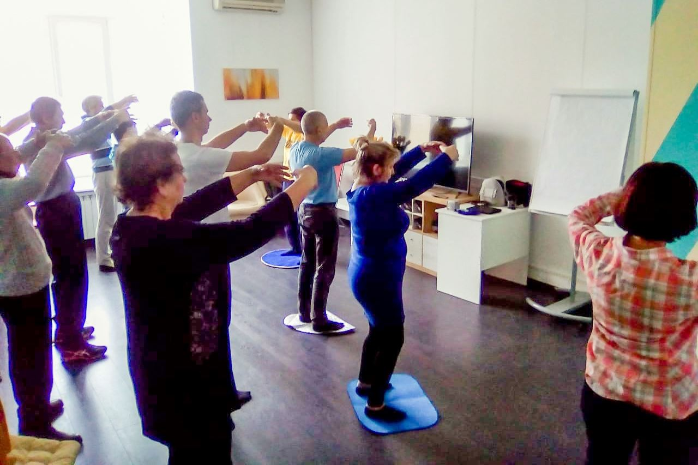

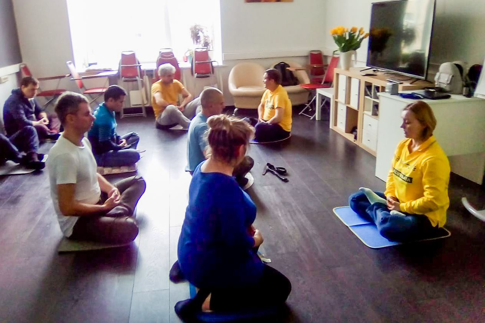

新学员在学功。

 
现年五十八岁的奥列格（Oleg）来自雅尔塔市（Yalta），已经退休。要来莫斯科办事，当得知在莫斯科举办九天班后就来参加了。不久前奥列格在雅尔塔市已经和当地学员开始学功。九天班结束时，他交流了自己在提高心性方面的体会，当别人粗鲁地对待他时，他没有按照以前习惯的方式回应，而是表现出了善意，因此情况发生了改变。

安德烈（Andrey）偶然看到了九天班的消息，他当时正在寻找一种修行方法，在看了李洪志师父的讲法后，他意识到如果没有内心的修炼和自我的改变，动作就不会有效果。未来他打算继续去他家附近的炼功点炼功。

越南裔的法轮功学员莉莉今年五十一岁，她交流了自己开始学炼法轮功后出现的奇迹。那时她的眼睛有很严重的问题，经常出现高眼压，她被诊断出患有青光眼，脸上有严重的黑斑。一次，眼内的血管爆裂后，视力变得非常不好，几乎什么也看不见。她还患有关节和脊柱的问题：膝盖、腰部和颈部经常疼痛。她开始接受传统的越南医学治疗，但是没有帮助。然后莉莉开始尝试瑜伽，其它种类的气功，但都没有效果，那时她四十八岁，却已经一身病痛。此外，她说自己的脾气暴躁易怒。修炼法轮功后，她眼睛的毛病都消失了。现在阅读很小的文字，眼睛也不会感到疲倦。她的脸变得干净，没有了黑斑，甚至脸上的皱纹都减少了，看起来比她本身的年龄年轻得多。她的性格也发生了变化，人变得善良平静。以前的熟人都几乎认不出她了，因为她变成了和以前不一样的人：善良，而且充满活力。现在她有足够的力气工作，并帮助自己的女儿带一个小孩子。

安德烈（Andrei）一年前就听说了九天班的消息，但是没能参加上第一次和第二次在莫斯科举办的九天班，一直等待着下一次的机会。当地一位法轮功学员跟他介绍了修炼法轮功的益处和法轮功学员在中国遭受的残酷迫害。在那之后，安德烈自己在互联网上找到了相关信息，仔细阅读后，对在中国发生的严重人权侵犯的事感到震惊，法轮功学员因其信仰受到如此残酷的迫害。安德烈说，在观看了李老师的讲法录像之后，他明白了很多以前他只是直觉猜到的东西。盘腿打坐对于他来说还很困难，但是他坚持盘腿坐了三十分钟。课程结束后安德烈想继续到他所在地区的炼功点炼功，并打算继续学习大法书籍。

来自达吉斯坦（Dagestan）的一名医生正在研究中国的针灸反射疗法，来到莫斯科接受专业培训课程。与病人一起工作后，她常常疲惫不堪地回家，所以她一直在寻找恢复精力和心情平静的方法。她说参加九天班时感到了善意和积极的能量，学员们身上散发出善良和耐心。她想告诉在达吉斯坦她的同事医生们有这么好的功法，而法轮功学员被中共迫害的真相使她震惊。

瓦伦蒂娜（Valentina）是和她的丈夫一起来参加学习班的，她说，一九九七年在中国生活过一段时间，到处都能见到练气功的人，包括法轮功学员。瓦伦蒂娜接触过不同的团体，有一次，她好像看到了李洪志大师，现在，在视频中，她认出了李洪志师父。

列昂尼德（Leonid）曾经研究过各种佛教书籍，感到李洪志老师在讲课中揭示了非常深刻的问题，他从炼功中感受到了强大的能量和平静。

伊戈尔（Igor）已经退休，过去他曾是一名运动员，后来为奥运会运动员做培训。他的女友被诊断得了重病，他开始寻找能帮助她的方法。他本人也想找到一种强身健体并修心养性的方法。九天班结束后，他了解人患疾病的原因，同时也明白了要保持健康，人就需要修炼并改善自己。伊戈尔计划继续在公园里与其他学员一起炼功并学习大法书籍。
 

<h1 align="center"><b>身陷囹圄十五载返家 八旬父母思儿命垂危</b></h1>

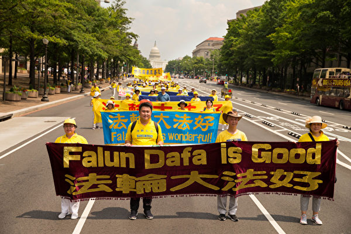

2017年7月20日，美国华盛顿特区国会山前，来自美东地区的部分法轮功学员举办盛大的“720”法轮功反迫害集会和游行。图为“法轮大法好” 的中英文横幅。

 
 【大纪元2019年03月09日讯】河南大学本科毕业的李明，因坚信法轮大法，二十几岁时被中共非法判刑16年，今年元月终于走出冤狱。
 
 
明慧网报导，李明的父母不能接受儿子做好人而坐牢这一残酷的现实，终日牵肠挂肚，母亲已卧床不起多年，父亲因劳累过度而不能直立行走只能爬行，爬几步就气喘吁吁，生活状况令人担忧。

李明，男，现在四十出头，东北人，1995年考入河南理工大学。就读期间开始修炼法轮大法，是个善良正直、品学兼优的好学生。

1999年，李明毕业时正值中共开始疯狂迫害法轮功，他放弃了刚分配的工作，留在学校所在地反迫害。

2004年12月底，李明在向人们讲述法轮功真相时遭当地警察绑架，被非法关押在当地看守所。

在法院开庭的当日，他突然从怀里掏出一条自制的“法轮大法好”条幅，高举过头顶，在场的人都惊呆了，这一举动让法官恼羞成怒，随后将李明冤判15年，关进了河南省新密监狱。

在监狱里，李明遭遇剥夺睡眠、24小时罚站、罚坐、罚蹲、毒打等酷刑折磨。但就是在这样的环境下，他仍然坚守信仰，不写所谓放弃修炼法轮功的“三书”，不妥协，坚持15年不转化。

一次，李明连拉带吐长达七天七夜，整个人瘦得脱相，呼吸微弱，生命已走到极限，但在他心底有一念：“我不能死，我要一修到底！”

中国有句俗话：度日如年。李明在监狱的切身体会用“度秒如年”正合适。他每天处在恐怖的气氛中过着非人的生活，也日夜思念著含辛茹苦抚育他的双亲，盼著早一天能够回到他们身边尽孝道。

2019年元月，李明整整15年的冤狱生涯结束了，伫立在监狱的大门前，望着前来接他的法轮功学员们，顿感悲喜交并。而见到他的同修却不敢相信自己的眼睛，眼前的李明，面色黧黑、骨瘦如柴，过去茂密的黑发几乎掉光，剩下的寥寥数根还全是白发，曾经朝气蓬勃的阳光少年变成了一位久经风霜的老者。

几天后，李明和同修告别回到久别的故乡，不顾一路风尘的疲惫，迫不及待地赶着回家与15年未曾见面的父母团聚。

可当他走进家门，看到的却是满目的凄凉与萧瑟，母亲已瘫痪在床，眼窝深陷，两鬓如霜，见到儿子回来，她激动地伸出手，那粗糙的手上爬满了一条条蚯蚓似的血管，令人不敢直视；而父亲也已是“艰难苦恨繁霜鬓”且身患重病不能正常行走，靠着艰难的爬行来料理家务和照顾母亲，他每爬行几步便累得气喘吁吁，歇息片刻方能继续前行。

李明的眼泪无声地流淌著，从弱冠之年身陷囹圄十五载，蓦然回首却恍如隔世。

父母曾身体健康、健步如飞，那时李明是他们的骄傲，因为他们的儿子从小聪明好学、乖巧孝顺，还顺利地考上了大学。

可他们做梦也没想到德才兼备、才华出众的儿子，只因信仰真、善、忍，努力成为一个更好的人，被判了15年重刑。

在人生最宝贵、最能为社会创造价值的十几年的时光，儿子被迫在铁窗中度过！他们怎么也想不通，为什么要将一个好好的家庭逼成这样？这个社会难道不是好人越多越好吗？

15年来，二老劳累奔波、投诉无门，吃不好、睡不好，分分秒秒都在煎熬中度过，没有收入的困窘，令二老的身体每况愈下，酿成了以上那一惨景。

如今的李明只想留在父母身边，这个充满快乐和幸福的家庭已支离破碎15年了，年过八旬的父母在风雨飘摇中身患重病，不知又能和自己相伴多久？

<h1 align="center"><b>中共害怕人民想往自由</b></h1>

【大纪元2019年03月08日讯】前几天看新闻：中共教育部组织编写的最新版初中三年级教材已经将《史记》中经典篇目中的《陈涉世家》选段删除，被认为担心民众效仿。该文给后人留下：“苟富贵，无相忘”，“燕雀安知鸿鹄之志”；“壮士不死即已，死即举大名耳，王侯将相，宁有种乎？ ”；“今亡亦死，举大计亦死，等死，死国可乎？” 等经典名句。

无独有偶，新学期一开始人教版小学三年级英语第一单元认识国家，其中每个国家都用其标志性建筑物为代表，从2012年出版以来USA对应的都是自由女神像，然而新学期一开学拿到课本之后发现USA对应的建筑物已由“自由女神像”变成了“金门大桥”，课本其他内容没变。

矗立在美国纽约哈德逊河口附近的自由女神像，是自由的象征，正式名称是“自由照耀世界”。女神穿着古希腊风格服装，头戴光芒四射冠冕，七道尖芒象征七大洲。右手高举象征自由的火炬，左手捧著一块铭牌，上面写着July IV MDCCLXXVI（1776年7月4日，《独立宣言》颁发的日期）；脚下是打碎的手铐、脚镣和锁链，象征着挣脱暴政的约束和自由。

中共害怕人民有“民主”“自由”的意识，所以拚命给国民洗脑，灌输斗争理论，煽动仇恨，封锁网络、阻挡国外民主、自由活动消息在国内的传播。在学校给学生从小灌输共产党“伟光正”的洗脑文化，扭曲历史，以致于现在中国社会到处充满戾气，人人互骗互害，再无长幼尊卑，仁义礼智信可言。然而民主、自由是世界潮流，天意如此，更多的国人也在不断的走出国门，在国外自由民主的国家，通过真实的新闻报道，也正在认清中共的嘴脸，即便是一母同胞的台湾、香港和澳门都能见到、听到真实的消息，甚至在台湾都能体验到真正的自由与民主，这是中共根本无法阻挡的历史大势。

中共害怕人民起义就删除与农民起义有关的课文；害怕人民意识到自由就替换掉与自由有关的图片……然而自由、民主是世界性的，删的掉、删的完吗？！删掉图片，自由、民主就不存在了吗？殊不知这种治标不治本的方法，不但解决不了日益严重的官民冲突，更是在一定程度上提醒了人民要争取自由，这些欲盖弥彰的做法更加速了人民觉醒的速度。即使连一张小小的图片中共都紧张成这样，可见中共这种害怕已经到了极度恐惧的地步，犹如惊弓之鸟，脆弱不堪。

<h1 align="center"><b>我为你而来 只愿你平安</b></h1>

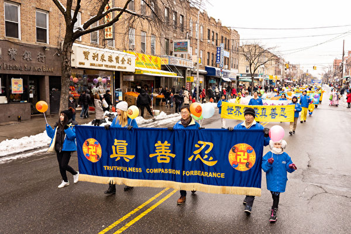

2019年3月2日，纽约部分法轮功学员在纽约布碌崙举行大游行。

【大纪元2019年03月07日讯】很多中国大陆法轮功学员的亲友常会劝告学员：“我知道你炼功身体健康了，觉得好，就在家炼，别到外面去”。也有些警察非法抓捕法轮功学员之后，疑惑不解地询问：“法轮功好，祛病健身就在家炼呗，不要往外走；共产党不让你炼，你还到外面发资料、劝三退。被抓了，你这不自找的吗？”
自一九九九年七月迄今，中共仍持续残酷地迫害法轮功，用欺骗、谎言来维持对法轮功的仇恨及镇压，突破消息封锁能被确认的至少有四千两百多名法轮功学员被迫害致死。大规模活体摘取法轮功学员器官、贩售牟利并焚尸灭迹，更是人神共愤、天理难容的恶行。

十九年来，恪遵“真、善、忍”的法轮功学员秉持大善大忍的精神，以和平、理性、宽容的方式抵制这场毫无人性的迫害，唤醒世人的良知善念。在遭到各种酷刑的肉体折磨和精神摧残下，中国大陆法轮功学员没有仇恨和愤怒，完全以真诚、善良、坚忍的方式抵制这场迫害，发放真相传单，打横幅、贴标语、发光盘，给民众打电话、传真和寄邮件，深入社区，资料点遍地开花。

海外的学员则以横幅标语、游行集会、烛光夜悼、征集签名、SOS徒步、汽车自行车之旅、反酷刑演示、新闻发布会、起诉首恶帮凶、举办真善忍美展、图片展、摄影展与晚会等文艺演出诸多方式，锲而不舍的向世人澄清事实，更以办电台、办报纸、办电视台，全方位向各国政府和议会讲清真相，彻底曝光了中共的弥天谎言和迫害罪行。

在不公不义的对待下，得允许人有说话的权利。谎言终不长久，真相渐入人心。现在中国大陆，很多网民透过动态网、无界网、自由门等突破中共网络封锁的软件，得以看到外界的真实资讯，中国人逐渐走出谎言的迷雾。

据媒体报导，在大纪元退党网站公开表明“三退”（即退出中国共产党、共青团和少先队）的人数已逾三亿二千七百万。中共就像沉船一样，覆灭之期已不远。法轮功学员是修善的，自己身心受益了要告诉别人，何况人们正面临着生命危险呢？

天意不可违。十多年前，贵州省平塘县掌布乡发现了世界地质奇观的“藏字石”，“中国共产党亡”六个横排大字浮雕般突出于石面上。据中国著名地质学家们实地考察，该“藏字石”上的字位于距今二亿七千万年左右的二叠统栖霞组深灰色岩中，没有人工雕凿及其它人为加工痕迹。

在中国，很多人当年加入少先队、共青团或共产党，并不是真心诚意想参加，但无论出于主动或被动，只要是参加过共产党的组织，就在灵魂深处打上了邪恶的烙印，所以退出中共及相关组织就是救赎自身的灵魂，使生命远离罪恶，在共产党解体灭亡时，已退党的人不再与共产党共同承担责任，免受牵连。

近年大量中共官员想为自己寻找退路，纷纷将家人和资产转移到国外，妄图在中共垮台之日能全身而退，然而这番处心积虑注定徒劳无功。就像当年的纳粹党羽一样，无论躲到何方，都难逃被追查究责并绳之以法。他们唯一的出路就是退出中共相关组织，忏悔救赎。

佛教中“红眼狮子”的故事，足堪说明法轮功学员救人之忱。一位老婆婆虽家徒四壁，丝毫动摇不了她对神佛的虔诚信仰，即使仅余一碗饭也要把它供奉神佛。神明被她感动，一日显现在她面前告诉她，一旦看到庙前石狮子的眼睛红了，就赶快向山上跑，那时洪水来袭，整个村子都会被吞没。老婆婆是个善良人，岂能眼睁睁看着乡民邻居被淹死呢？所以她急切的把这件事告诉每一个人。别人虽不信，她仍一遍又一遍不厌其烦地向人们讲述著神谕，希望人们能因此躲过这场灾难。后来人们见到她就嘲笑她、躲避她，认为她精神有毛病，甚至有年轻人恶作剧想耍弄老婆婆，故意涂红了石狮子的眼睛。老婆婆一见，在全村猛喊：狮子眼睛红了，快跑呀，不跑来不及了。只有少数几个人相信她的话，跟着她跑到了山上。回头一看，整个村子一片汪洋，人们都在洪水里挣扎。

殷鉴不远。二零零三年的南亚海啸，当时海水急速下降，当地的土著居民立即大喊：快跑，海啸要来了。一位随母亲度假的小学生，一见海水迅速下降，海岸线出现了隐约可见的一道白光，正好与课堂上老师讲过的海啸来临前的征兆相同，于是叫妈妈赶快离开，要发生海啸了。旁边的人得知原因后，有的相信了也跟着跑。就这样在小学生和土著人的带动下有二百多人得救了。而那些不相信的，看见海水急速下降仍不以为意、照样玩乐戏水，三十万人一瞬间就被滔天巨浪卷走了。

在过去七千多个日子里，笃信善恶有报的法轮功学员之所以不畏艰难、不厌其烦地向人们讲真相，劝民众退出中共党、团、队组织，完全是出于同样的目的──救人，希望在大劫难来临前，众人能幸免遇难。更可敬的是，法轮功学员是在自己遭受巨大苦难的同时，冒着失去工作、家庭、自由乃至生命的危险在劝善、示警、救人，是利他的珍贵情操与悲悯的无私胸怀。

法轮功学员是实践“真、善、忍”的修炼人，却无辜遭中共迫害。当自身蒙冤受害时，以种种途径，透过智慧与善巧让中国人不受谎言所惑，展现的是悲天悯人的高尚义举，而不是搞政治或对抗政府。在中共崩解覆亡之前，眼下正是退党自救的关键时刻，也是行恶者弃暗投明的最后机会，以免成为中共的陪葬品。历史终将证明，法轮功学员苦口婆心地讲清真相、揭露谎言是大善大忍的义行，“无私忘我、不求回报，只愿你平安”正是人间至高的典范丰碑。

<h1 align="center"><b>新年里失去的欢声笑语</b></h1>

<h1 align="center"><b>记黑龙江省鸡西市法轮功学员王淑桂</b></h1>

【明慧网二零一九年三月七日】（明慧网通讯员黑龙江报道）每逢佳节倍思亲，她不在的新年里，家人失去了往年的欢乐，年迈的老母整日思念女儿，脸上堆满了忧伤。
二零一八年十一月九日下午，在黑龙江省公安厅的操纵下，鸡西市公安局、公安分局、电工路派出所警察，用电钻钻开门锁闯入法轮功学员王淑桂家中，强行绑架了她，现在还非法把她关押在看守所，所谓“刑事拘留”。

王淑桂是在一九九九年前开始修炼法轮大法的，修炼前家庭矛盾重重，自从修炼以后，按大法严格要求自己，无怨无悔的为家庭付出着，破碎的家庭和睦了；在单位里也处处为别人着想，深受家人、单位、邻里的称赞。

过年的时候，想起王淑桂在家时的欢声笑语，家人更加思念她。

<b>一、不和谐的家庭和睦了</b>
 

王淑桂结婚时嫁到一个大家庭，上有公婆、两个大伯哥、三个大姑姐，一个小姑子、一个小叔子。这一家人可热闹了，一个人要长好几个心眼，唯恐自己吃亏，饭有人吃，碗筷无人收拾。只要聚到一起的时候你看我不顺眼，我看你也不顺眼，总是不欢而散。

王淑桂修炼法轮大法以后，严格用大法“真善忍”要求自己，别人不干的活她干，大伯哥身体不好又没有工资，没人愿意养他，婆婆说王淑桂的丈夫接替他父亲的班了就得在她家养，王淑桂二话没说就把大伯哥接到家里来照顾。

后来王淑桂的老公公得了小脑萎缩不能自理，她又把公公接到自己家中照顾，公公经常拉、尿在裤子里，她就给收拾，就这样一直伺候到公公去世。婆婆不好意思在王淑桂家住，就去了小儿子家，没住几天就呆不下去了又回到王淑桂家，王淑桂无怨言的照顾婆婆。

每到逢年过节，王淑桂就让她大姑姐和小叔子一家到她家团聚，她同他们唠家常，自然的就讲起大法好。他们看到王淑桂的为人和善，处处关心他们，逐渐地也都认同了大法。这个不和谐的家庭，也变得越来越和睦了。

<b>二、深受家人、邻里、同事称赞</b>
 

王淑桂的丈夫得了糖尿病综合症、不能照顾自己，这些年中她尽心尽力的照顾丈夫。丈夫有病心情经常不好，动不动就发脾气骂，王淑桂从不发火，面带祥和的微笑悉心照料，有时像逗小孩一样让他开心。家人们都说王淑桂给他们家带来的福报。王淑桂就告诉她们记住法轮大法好，也会给他们带来福报。

左邻右舍一看到王淑桂这么有耐性照顾丈夫，都夸她好，王淑桂就告诉他们：是她学了法轮大法后越来越能包容、体谅人了，是大法教人做好人、更好的人，让邻居了解大法真相。

王淑桂在单位担任生产厂长兼调度，同事都信任她，无论大事小事都愿意问她，在单位里很受人尊重的。有一次她安排车间主任工作，这个主任突然暴跳如雷直冲她去了，王淑桂心情平静很坦然，这个主任立马就熄火了，悻悻地走了。在场的其他主任就跟王淑桂说：“明明是他不对，还跟你发火，你怎么不跟他干呢？”王淑桂就跟他们说：我修炼法轮大法了，师父叫我们要按 “真、善、忍”做一个好人，更好的人，我要不修炼法轮大法决不会放过他的。在场的人都说，确实不像你原来的性格呀！我们都想为你打抱不平来着。

<b>三、请乡亲们伸出援手共同制止迫害</b>
 

法轮功也叫法轮大法，是上乘的佛家修炼大法，于一九九二年由李洪志师父传出，他以宇宙最高特性真、善、忍为原则指导人修炼，辅以简单优美的五套功法，可以使修炼人在极短的时间内达到身心净化，道德回升。一九九九年中共迫害法轮功之前，在中国大陆据官方统计有上亿人修炼法轮功。而在中共全面迫害后的近二十年中，法轮功不仅没有被中共打倒，相反，传到了世界一百多个国家和地区，法轮大法的主要书籍《转法轮》被翻译成四十种语言文字在全世界公开发行。今天，在世界所有的主要国家和地区，都有法轮功的炼功点，也都可以看到法轮功学员集体炼功、弘扬法轮功的美好画面。

在刚刚过去的二零一八年，在黑龙江省鸡西地区，修炼真、善、忍的法轮功学员仍遭严重迫害：有两人（赵春艳、罗井山）被迫害致死；张成花、常广军、隋桂兰、张传胜、郑淑梅、毛淑芬、马桂珍、马翠芝、郑金萍、刘淑云十人被非法判刑，至少二十二人被绑架迫害。

法轮功学员们洁身自好，不贪不占，却被中共邪党人员剥夺了家庭、工作；他们真诚善良，无私为他，却遭非法抄家、绑架；他们讲真相维护民众知情权，无私地为他人的平安健康而奔忙，却被非法劳教、判刑，被迫害致死……

在中共治下的国度里，只因为做好人不放弃信仰被迫害，这是莫大的冤屈。为不让好人蒙冤，希望乡亲们伸出援手，共同制止这场迫害。

许多人觉得中共迫害法轮功和自己无关，这是错误的认识。在这场善与恶、正与邪的较量中，沉默其实就是怂恿邪恶，沉默就是邪恶的帮凶，因此保持沉默，保持所谓的中立是没有选择，其实质是帮助了邪恶，助长了邪恶的气焰。现在天灾人祸不断，就是一种警示。

中共江泽民集团对修炼“真、善、忍”的法轮功学员的迫害，颠倒了所有的是非善恶，败坏了社会道德，同时也使中国的法制越发黑暗，给中国社会带来了无法估量的损失，从今日中国“假、恶、斗”遍地，道德沦丧，贪污腐败，就可以看出来。所有的中国人都是这场迫害的受害者。

<h1 align="center"><b>台湾灯会 法轮大法主题花灯光彩夺目</b></h1>

【明慧网二零一九年三月三日】二零一九台湾灯会在屏东举办，今年恰逢台湾灯会三十周年，也是南台湾的屏东三十五年来首次迎来“台湾灯会”。以展示和介绍法轮大法为主题的花灯在灯会上格外受到欢迎。
此次灯会规划有三大灯区，分为大鹏湾灯区、东港小镇灯区及屏东灯区，陆域面积逾42公顷，海域面积达200公顷。其中大鹏湾主灯区，沿着全国最大的舄湖打造海洋湾域灯区，是台湾灯会三十年来首创，山海景致壮丽，被赞为历年来最美的灯会场地。

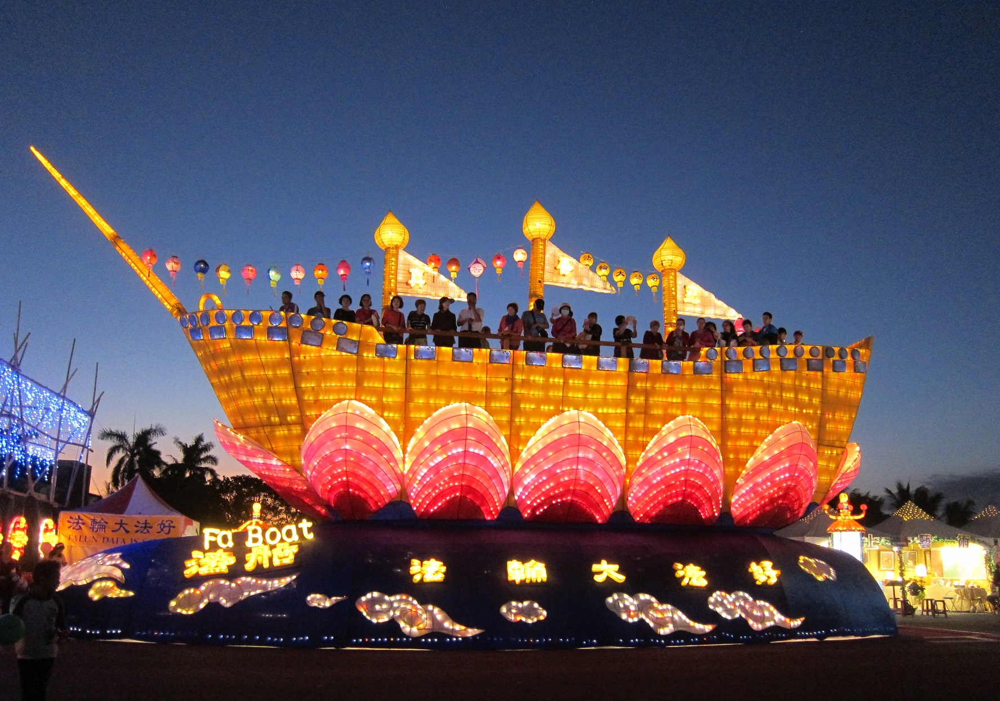

图1：“法轮大法”灯区的法船花灯

位于灯会东转运站的“法轮大法灯区”，矗立着船身长达25公尺的巨大“法船”及“神驹天马”等13座传统艺术花灯，壮观美丽、金碧辉煌。二月十九日点灯后，璀璨闪耀令国内外游客惊艳，纷纷驻足拍照，排队登上“法船”体验祥和美好的殊胜场景。

赏灯游客赞叹说，“从没见过这么神圣的大法船。”“登上法船真象在天上飞一样。”有位地方官员特别登上法船参观后赞叹道，“灯区绕了几圈，就你们的最特别、很祥和。”

<b>法船花灯 遵循传统工序打造</b>
 

台湾灯会每年轮流在不同县市举办，“法船花灯”从二零一三年在新竹县首次展出以来，历经南投、台中、云林、嘉义等，已连续六年都在台湾灯会展出，每年吸引百万民众观看。《法船》纪录片也荣获美国休士顿国际影展等十项国际大奖。

“法船”艺术花灯，由法轮功学员遵循传统花灯制造工序，以纯手工打造，巨大法船长25米、宽8米，底部是2米高的云层，围绕船身是12片大莲花瓣底座，共有9层，船体本身也有9层，甲板为第10层，甲板上约可容纳50人登船，旗桅上有“真、善、忍”三面令旗迎风飘扬，远远望去，大法船似腾飞在云层上，充满祥瑞之气。

为了参与二零一九年台湾灯会，屏东法轮功学员花了三个多月的时间，超过一千五百多次人力，重新完成裱布、装灯等展出修护工作。法船展出负责人陈明玉表示，“法船花灯”是大鹏湾主灯区唯一可以让人登上船顶，远眺整个灯区的超大型花灯，踏入场区有股祥和、殊胜的氛围。

法船花灯设计总监庄逸中介绍了花灯创作的构思和寓意，“大法船”周围桃红色渐层的九层莲花瓣，代表人在世间修心去执着，吃苦修到很高的神佛境界。而“法轮”花灯正转九圈、逆转九圈转动，常转不止。他说，数字九代表着九九归真，从一至九周而复始，直至修炼圆满。

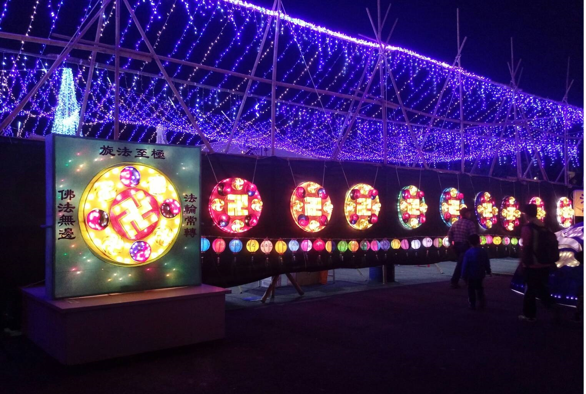

图2：“法轮大法”灯区的法轮墙花灯

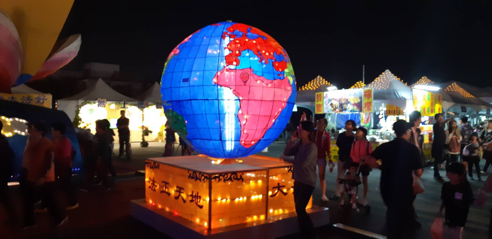

图3：展示大法洪传世界的地球花灯

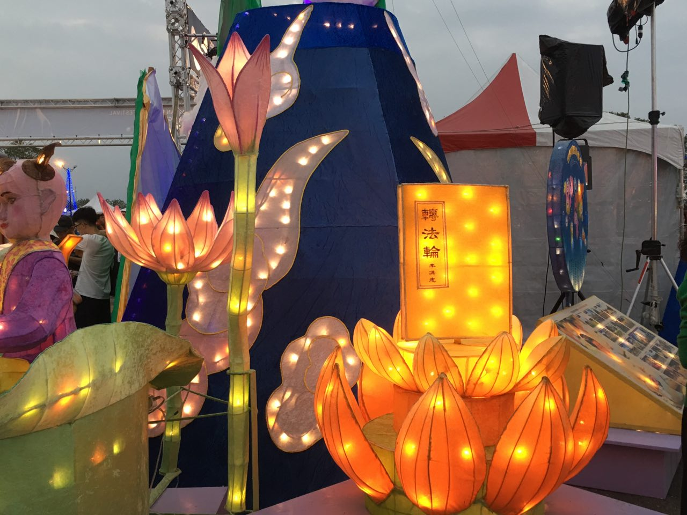

图4：“《转法轮》”主题花灯

这些以介绍法轮大法为主题的花灯全部依传统方法制作完成，庄逸中期望将中华传统美好艺术保留下来，也希望透过“法船”、“神驹天马”、“法轮”、“《转法轮》”、“《论语》”、“法轮功五套功法”、“法轮大法洪传全世界”等主题的传统花灯作品，让前来观赏的民众认识法轮大法，感受法轮大法及真善忍法理的殊胜美好。

<b>登“法船” 游客赞叹能量很强</b>
 

“第一次看到这么壮观的大法船花灯，人生难得有这个机会能登上法船，觉得很幸福、很棒！”屏东县狮子会一生一世联谊会主席许添益，二月二十一日带领十多位历届会长主持点灯仪式，他说：“要制作这样巨大的法船不是一件容易的事，法轮功学员能齐心合力完成，真是不简单，很令人感动！”

来自台南，从事制造业的郑先生和太太慕名前来参观法船花灯，他表示感觉很殊胜，“登上法船俯瞰四周，一望无际，身心非常舒畅。”

高雄吴先生去年在嘉义灯会错过登法船机会，今年特别带着家人前来，他说，“登上法船让人有远离尘嚣、幸福宁静的感受。”

东港在地徐小姐带着儿子来看灯会，她说，逛了大鹏湾整个灯区，走到腿软，来到介绍法轮大法的灯区，祥和的音乐、壮丽的传统花灯，让她觉得“能量很强，有充电的感觉，尤其登上法船，心中杂念没有了，心情很平静、平和。”

台湾灯会展期至三月三日止，“法轮大法”灯区每晚六时、七时、八时、九时四个整点，都有法船花灯点灯仪式，可以随时免费登“法船”欣赏灯区景观。

<h1 align="center"><b>凝聚全球力量　制止中共活摘器官</b></h1>

【明慧网二零一九年三月三日】二零一九年二月十八日，美国阿肯色州众议院通过一零二二号决议案，谴责中共迫害法轮功和活摘法轮功学员器官的罪行。决议要求中共立即停止摘取法轮功学员器官，并立即停止迫害法轮功，释放所有被关押的法轮功学员。

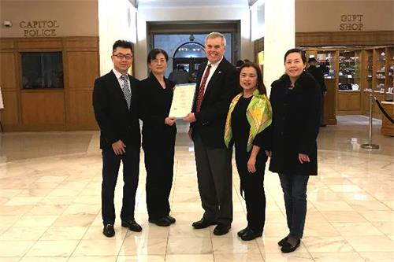

美国阿肯色州众议院决议的发起人、阿肯色州众议员丹尼尔•沙利文（Dan Sullivan，中）与法轮功学员合影。

二月二十七日，加拿大国会外交和国际发展常设委员会通过《S-240法案》，旨在打击强制摘取、非法贩运人体器官。该法案将在海外移植未经许可的器官视为刑事犯罪，且不接受参与过非法器官交易者以移民或难民身份进入加拿大。

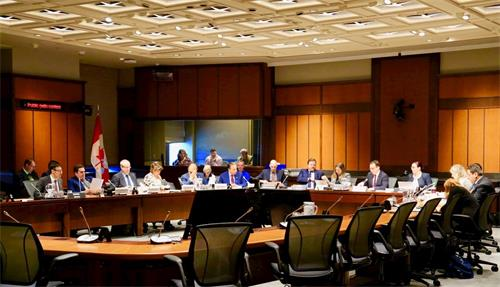

加拿大国会外交和国际发展常设委员会二零一九年二月二十七日下午修改并全体通过了S-240号法案。图为加拿大国会外交和国际发展常设委员会听证会现场。

一九九九年七月，中共迫害法轮功。中共江氏集团以洗脑、酷刑、虐杀等手段，逼迫法轮功学员放弃信仰真善忍，更对法轮功学员进行活摘器官，残酷暴行被称为“这个星球上前所未有的罪恶”。在江氏集团命令“六一零办公室”系统的对法轮功学员实施“名誉上搞臭、经济上截断、肉体上消灭”、“打死白打、打死算自杀”与“不查身源、直接火化”的灭绝政策下，十多年来在中国大陆各监狱、劳教所普遍对法轮功学员进行抽血等异常体检，早已启人疑窦。

加拿大自由党国会议员博里什•瑞兹纽斯科基（Borys Wrzesnewskyj）用“当今时代最黑暗的罪恶”来形容强摘人体器官。他说：“自二战以来，我们从未看到过象中国那样，由一个国家、一个政府运作的工业规模的人类恐怖。”新民主党议员特雷西•拉姆齐（Tracey Ramsey）表示，“在全球范围内，我们强烈反对贩运人体器官，以及操纵、虐待人们以攫取其器官的恶行。”

前述美国与加拿大的决议案，并不罕见。中共活摘法轮功学员器官，并进行器官买卖牟取不法暴利，严重违反国际人权公约，受到联合国、美国国会、欧洲议会高度关切。随着中共活摘器官多项证据在全世界大量曝光，引起了各界的震动与关注，越来越多国家的国会议员相继对这种罪行表示愤慨与谴责，制止迫害成为国际主流社会的共同愿望。已颁布相关立法的国家，包括以色列、西班牙、意大利、挪威和台湾等，在阻止其公民从中国非法获得器官方面，已有了显著成效。

二零一二年十月三日，一百零六位美国国会议员联名致信，要求美国国务院公开所掌握的中共活体摘取法轮功学员器官的罪行。二零一三年六月二十七日，美国国会众议院外交事务委员会前主席、佛罗里达州共和党众议员罗斯－雷婷恩（Ileana Ros-Lehtinen）和前新泽西州民主党众议员安德鲁斯（Robert Andrews）共同发起281号决议案，要求中共立即停止针对法轮功学员的强摘器官行为，并要求美国国务院对中国的器官移植业进行全面和透明的调查，起诉那些参与这罪行的人。决议还要求中共立即停止对法轮功的残酷迫害，立即释放所有法轮功修炼者。

二零一五年六月二十五日，美国第114届国会共和党与民主党议员在众议院共同发起343号决议案，要求中共立即停止针对法轮功学员和其他良心犯的“强摘器官”行为；要求对中共器官移植系统进行可信、透明和独立的调查；并要求中共立即停止对法轮功已持续十六年的迫害。

二零一三年三月二十一日，澳洲联邦参议院通过了一份议案，就联合国和欧洲理事会提议的一项防止贩卖器官，打击贩卖被摘除的人体器官的国际协议，要求澳洲政府支持联合国和欧理会的倡议并反对活体摘取器官的行为。各地民众极为关注此事，许多人主动签名声援反迫害，仅仅新州一地在短时间内就收到逾十万份澳洲市民签名的请愿书，递交该州上议院，强烈要求制止中共对法轮功学员活摘器官的暴行，并支持新州立法禁止非法器官移植和交易。

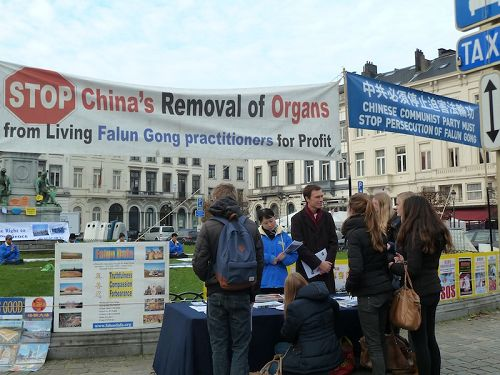

二零一三年十一月底至十二月五日在布鲁塞尔欧洲议会大楼外广场，欧洲法轮功学员在此和平请愿：要求欧洲议会做出决议——谴责并制止中共政权活摘法轮功学员器官牟取暴利的罪恶。

二零一三年十二月十二日，欧洲议会高票通过一项紧急议案，要求“中共立即停止活体摘取良心犯，以及宗教信仰和少数族裔团体器官的行为”。

法轮功学员只是一群遵循真善忍的善良好人，无辜遭到中共铺天盖地的残酷迫害。活摘人体器官这一暴行的残酷血腥，超过二战时的纳粹行径，却发生在当今共产党统治下的中国。中共活摘法轮功学员器官是泯灭人性与良知的灾难，美国新泽西区的众议员史密斯表示活摘器官的罪恶，正挑战英语这种语言，因为即使采用“残忍”一词仍是太过于平静的字眼（来形容这一罪恶）。所有明白“活摘器官”真相的人，对于中共恶行莫不予以强烈谴责。

近年许多正面反馈代表了世人逐渐觉醒，中共已无法掩盖它残酷迫害法轮功的事实。可预见的是，对无辜法轮功学员的残酷迫害与活摘器官，这批丧心病狂的加害者，最后都将在法律的审判与严惩中偿还其罪恶。正如各国议员的诚挚呼吁，祝愿更多的人能站在正义与善良的一方，凝聚全球力量，共同让这场迫害早日结束。

<h1 align="center"><b>阿肯色州众议院通过决议案
谴责中共活摘器官</b></h1>

【明慧网二零一九年三月一日】二零一九年二月十八日，美国阿肯色州众议院通过一零二二号决议案，谴责中共迫害法轮功和活摘法轮功学员器官的罪行。该决议案由阿肯色州众议员丹尼尔•沙利文（Dan Sullivan）于二月十二日在第九十二届议会上提出。

图1：美国阿肯色州众议院决议的发起人、阿肯色州众议员丹尼尔•沙利文（Dan Sullivan，中）与法轮功学员合影。

众议院一零二二号决议案全文如下：

<b>众议院决议案</b>

鼓励美国国会和阿肯色州国会议员，制止在中国发生的强摘良心犯器官行径

鉴于，广泛而可信的报告显示，中国大规模杀害良心犯，主要是法轮功修炼者，还有其他宗教和少数民族团体，以获得移植器官；

鉴于，中国的器官移植系统不符合世界卫生组织“器官采购途径的可追溯性和透明度指导原则”，中共政府已经拒绝了对该制度的独立审查；

鉴于，传统的中国习俗要求身体在死后完好无损地保存。然而，即使自愿器官捐赠非常罕见，中国移植行业还是自二零零零年以来大幅增长；

鉴于，“自由之家”二零一七年发布的名为《中国灵魂争夺战》的报告中说，“有证据显示法轮功学员被大规模强摘器官，用于器官移植手术，并且这种情况仍在继续。”

鉴于，二零一六年六月发布的新的调查报告是由人权律师大卫•麦塔斯，加拿大前亚太司司长大卫•乔高，和记者伊森•葛特曼所进行的。此报告估计中国每年的移植量为六万到十万次。这是“通过国家政策和资金控制的”工业规模的国家指导性器官移植系统，并涉及军民卫生制度；

鉴于，中国的肝移植登记系统表明，超过百分之二十五的病例是紧急移植手术，在几天甚至几个小时内发现器官匹配。非紧急肝移植的等待时间通常在几周内。

鉴于，其它国家的大多数患者都要等待多年才能进行移植手术；

鉴于，中国政府声称百分之九十的中国器官移植源来自死刑犯。但是，自二零零二年以来，处决次数已经每年下降了百分之十，远低于移植人数。

鉴于，中国政府从来没有承认从良心犯中获取器官；

鉴于，法轮功是以气功打坐为中心的修炼，以真、善、忍的价值为中心，九十年代在中国受到极大的欢迎，多方估计，修炼人数达七千多万人；

鉴于，一九九九年七月，中共在全国范围内进行了残酷的迫害，旨在消除法轮功，包括身体和精神上的折磨，反映了中共长期以来对大型独立民间社会团体的不宽容；

鉴于，自一九九九年以来，成千上万的法轮功学员在中国劳教所、拘留中心和监狱中被拘留，法轮功学员遭到酷刑、虐待和不合理的体检和验血；

鉴于，“自由之家”二零一七年发布的报告中说，二零一五年，中国法轮功学员占中国良心犯的大多数，面临死亡或被羁押的危险；

鉴于，联合国反酷刑委员会和酷刑问题特别报告员已经表达过对法轮功学员被强摘器官的指控的关注，并呼吁中共提高器官移植系统的问责和透明度，惩罚那些滥用职权者；

鉴于，二零一六年六月，美国众议院一致通过了第三四三号决议，谴责（中共）对法轮功和其他良心犯的系统性、国家授权的器官摘取；

鉴于，为了出售其移植器官而杀害宗教或政治犯是对基本生活权的严重和不可容忍的侵犯；

鉴于，对中国的器官旅游不应被医疗保密屏蔽，而应接受公开监督；

鉴于，任何一个国家都不应该允许其公民去中国获取器官，直到中国允许对过去和现在的良心犯的器官摘取进行全面调查。

鉴此，阿肯色州第九十二届众议院决定：

美国国会和阿肯色州国会代表

（1）呼吁中国：

（A）立即停止从所有被关押者和良心犯身上摘取器官，包括从法轮功学员和其他宗教和少数民族群体身上摘取器官；并且

（B）立即停止对法轮功的迫害，释放所有被关押的法轮功学员和其他良心犯；并且

（2）支持美国国务院对中国的器官移植进行全面透明的调查，并要求起诉那些从事不道德行为的人。

阿肯色州进一步决定：

（1）鼓励阿肯色州的医疗界对阿肯色州的居民进行有关前往中国进行器官移植的风险的教育，以防止阿肯色州居民无意中被牵扯进对良心犯的强摘器官和谋杀中；并且

（2）同意采取措施禁止参与非法摘取人体组织和器官的人入境，一经发现他们入境，就要对这些人进行起诉。

另外还决定，阿肯色州众议院首席职员将这份决议案的副本，转交给美国众议院议长、参议院外交委员会主席、众议院外交关系委员会主席和阿肯色州国会议员，并将本决议在国会备案。

<h1 align="center"><b>请看“两会”前夕中共制造的桩桩冤案</b></h1>

【大纪元2019年03月02日讯】一年一度的中共“两会”到来了，迫害法轮功的冤案没有因为过年和元宵节的到来而稍微停息，仍在肆无忌惮的制造著桩桩冤案。

据明慧网近日消息，法轮功学员李军旗，今年四十六岁，是河南省周口市淮阳县刘振屯乡李菜园村人，因修炼法轮功按真、善、忍做好人，曾被河南省郑州新密监狱两次非法关押。李军旗于二零一四年六月二十四日被淮阳县国保大队绑架，二零一五年被非法判刑三年。二零一七年六月二十五日，李军旗结束了三年冤狱，从郑州新密监狱回到家中。后于二零一七年十月二十一日，被刘振屯派出所警察绑架到看守所，非法关押一年。李军旗回到家不到四个月，于二零一九年二月十二日，含冤离世。

李军旗的父亲和母亲也是法轮功学员，他的父亲曾经被非法拘留（时间不详），回家后，出现病症，不久离世。李军旗的母亲被多次骚扰，精神受到压力，含冤离世。一家三口因为信仰真、善、忍被邪党迫害而死。

北京顺义区法轮功学员柳艳梅，二零一六年十一月邀请民众旁听对法轮功学员的非法庭审而被中共人员绑架，在通州看守所遭受惨无人道的虐待折磨，并于二零一七年七月被非法判刑四年，于二零一八年十二月十一日被迫害致死，终年五十二岁。

广州市天河区四十四岁的法轮功学员杨秋仁，曾遭八年冤狱，二零一八年九月二十五日又被广州市天河区法院诬判八年。杨秋仁坚信自己无罪，聘请律师上诉。在律师还在争取二审开庭或当面向法官陈述辩护意见、还没有提交书面辩护词的情况下，广州市中级法院二零一九年一月二十四日做出非法维持原判的裁定。

杨秋仁因为通过快递给广州市天河区派出所警察邮寄法轮功学员无辜被迫害的真相资料，于二零一八年九月二十五日，被广州市天河区法院诬判八年。杨秋仁认为迫害在先，被迫回应在后。没有迫害就根本不需要去讲什么真相。更何况讲真相是合法的，采用的方式也是平和的，是宪法赋予公民的言论自由，与“破坏法律实施”没有任何关系。开庭时杨秋仁问法官，我究竟破坏了哪一条法律的实施？法官完全回答不上来。

杨秋仁坚信自己无罪，依法聘请了两位律师为自己上诉，及时向广州市中级法院提交了上诉状。在上诉状中杨秋仁表示，一审法院认定事实不清，适用法律错误。信仰法轮功属于信仰自由，受《宪法》第三十六条保护。在中国没有法律认定法轮功为邪教。广州市天河区公、检、法紧随中共江氏集团的暴政，藐视国法践踏人权，是在迫害百姓。

二零一八年十一月十二日下午四点左右，辽宁沈阳康平县法轮功学员闫守礼在百货商场门前讲述真相，被一个退伍兵李庆勇冒充警察，劫持到康平县公安局。

十二天后，闫守礼又被劫持到康平县看守所，非法关押至今。目前，闫守礼已被构陷到检察院，并被非法批捕。

闫守礼，男，六十九岁，为人纯朴、善良。多年前因事故造成一条腿有残疾，走路很不方便。尽管如此，为了生计不得不出去打工。他老伴也年近七十，常年给别人当保姆。老俩口的生活很是艰辛。

山东泰安市两位六十四岁的老太太朱桂贞和平秀英，因修炼法轮功，向百姓传播法轮大法的真相，二零一九年一月二十二日被泰安市泰山区法院非法开庭，朱桂贞被诬判四年，平秀英两年。

内蒙古赤峰市元宝山区法轮功学员任素香被绑架关押两个多月，于二月二十八日面临非法庭审，法院指派的律师不仅不维护任素香的权利，还威胁任素香与她家人。

这名律师以任素香家里的打印机、真相币做威胁的条件，在看守所见到任素香后，没有达到他预期的目的，就威胁任素香的子女，说什么你妈再不认罪，再不交代，再这么固执下去，法院要判她十五年或无期徒刑。任素香的子女们听了这番恐吓的话语，精神几乎崩溃，放声大哭，担心五十五岁的妈妈，将会老死在监狱里了。

据明慧网二零一九年三月一日报道：辽宁省锦州市太和区法院在不通知家属的情况下，在锦州看守所，对法轮功学员李艳秋秘密开庭，并非法判刑五年。（二零一八年腊月二十三中国小年期间，家属找到法院，才知道李艳秋已经被非法重判五年。更为令人痛心的是，就在家家团圆的正月十五元宵节那天，李艳秋被劫持到辽宁省女子监狱迫害。）

李艳秋，女，现年五十二岁。她修炼法轮功十多年来，身心受益，所以她非常感激大法师父。在法轮大法遭到中共的迫害后，她因讲真相，多次被非法拘留、劳教，但始终没有改变信仰。

李艳秋已经退休，与八十多岁的老父亲相依为命。对于这个最小的女儿，老人疼爱有加。

如今因中共的迫害，令他老人家非常难过，本来非常乐观的性格，一下子变的少言寡语，他彻夜难眠，身体几天就消瘦下来，而且他鼻子经常出血、血压很高、头晕、心脏疼痛。儿女们有事都瞒着他，怕他着急上火，承受不住。但是这个瞒不住的事实，几乎还是把老人击垮了，谁看了心都痛。

以上只是过年后近几天明慧网才报道出来的几个迫害案例，法轮功学员们的悲惨遭遇令人伤心落泪。中共迫害法轮功二十年了，遭受中共非法绑架、关押、劳教、判刑甚至被致残致死、活摘器官的案例究竟有多少？真是罄竹难书啊！

中共一向标榜自己“伟光正”，提出要维护法律公正实行“依法治国”，可是其实际做的完全背道而驰。数十年来中共一直靠谎言维持政权，靠谎言忽悠人民，仅从迫害法轮功一事来看，“依法治国”只是中共一句欺骗人民的谎言罢了。

从《九评共产党》、《共产主义的终极目的》和《魔鬼在统治着我们的世界》这三本书中我们得知，“共产主义的本质是一个‘邪灵’，它由‘恨’及低层宇宙中的败物所构成，它仇恨且想毁灭人类。”中共邪灵不但对信仰“真善忍”的法轮功学员进行灭绝性的摧残迫害，对为法轮功学员主持公道并为他们作无罪辩护的维权律师也极力打压迫害。今天，无论信仰神佛的基督徒、佛教徒或者与中共持不同政见的民主、异议人士及被其侵权的广大民众，都成为中共极力打压迫害的对象。所有的国人都被网在大数据、大监控之中，整个中国如同一个大监狱。

肆无忌惮的践踏宪法和法律的尊严，肆意侵犯人权，疯狂镇压迫害民众，已经成为中共（极端恐怖组织）的一个重要特征。中共是危害人类、祸乱人间的魔鬼，人类要想获得世界的永久安宁与太平，就必须解体灭亡中共，尽快将这个危害人类的共产主义邪恶因素清除灭尽！

<h1 align="center"><b>制止强摘器官法案获加国会委员会全体通过</b></h1>

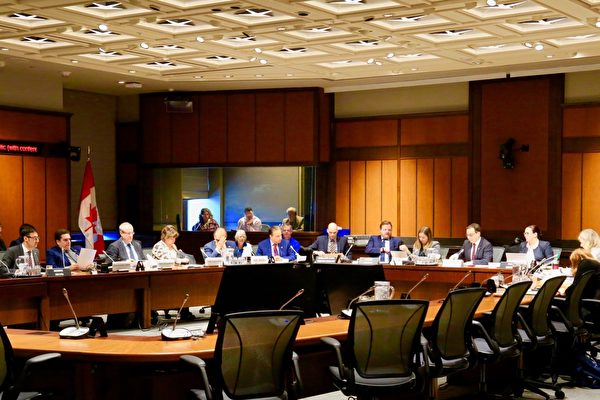

经过两天的听证，加拿大国会外交和国际发展常设委员会2月27日下午修改并全体通过了S-240号法案。图为加拿大国会外交和国际发展常设委员会听证会现场。

【大纪元2019年03月01日讯】（大纪元渥太华记者站报导）经过两天的听证，加拿大国会外交和国际发展常设委员会2月27日下午修改并全体通过了S-240号法案。该法案旨在打击强制摘取、非法贩运人体器官。该法案将提交国会进行最后的审阅。

源于加拿大参议院的《S-240法案》涉及两方面法律：一个是刑法，将在海外移植未经许可的器官视为刑事犯罪；二是涉及移民及难民保护法，即不接受参与过非法器官交易者以移民或难民身份进入加拿大。

<b>《S-240法案》——针对中共强摘器官撰写</b>
 
将《S-240法案》引入国会的保守党国会议员加内特•吉尼斯（Garnett Genuis）于2月26日投票前一天对委员会说：“（该法案）是寻求应对中国的（强摘器官）情况，他们正在从活着的、经常是清醒的政治犯身体上提取重要器官，并将此作为国家政策。”通过胁迫和掠夺方式获取器官。“该法案也是对此作出的反应。”

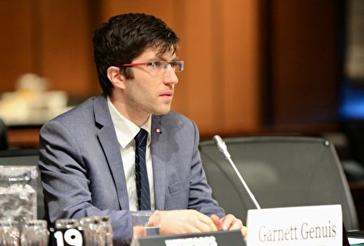

保守党国会议员加内特•吉尼斯（Garnett Genuis）在听证会上发言。

吉尼斯在去年11月20日的第一次辩论发言中说：两位著名的加拿大人大卫•麦塔斯和大卫•乔高发现了一些令人震惊的事情。他们通过艰苦的研究发现，中国医院每年有六万至十万例人体器官被移植，那里几乎没有自愿捐赠的制度。大多数器官来自良心犯，主要是法轮功学员。

在前几个议会提出类似法案的自由党国会议员博里什•瑞兹纽斯科基（Borys Wrzesnewskyj）用“当今时代最黑暗的罪恶”来形容强摘人体器官。 他对委员会说: “自二战以来，我们从未看到过像中国那样，由一个国家、一个政府运作的工业规模的人类恐怖。”

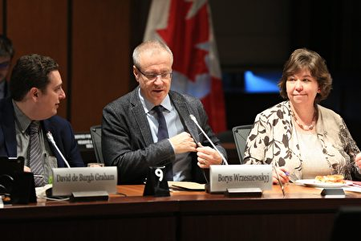

2月26日，提出类似法案的自由党国会议员博里什•瑞兹纽斯科基（Borys Wrzesnewskyj）在听证会上用“当今时代最黑暗的罪恶”来形容强摘人体器官。

<b>议员：S-240是立法者对至关重要工作恪尽职守的展示</b>
 
吉尼斯说，他希望该法案在本届议会获得通过，“这样我们就可以看着我们的孩子的眼睛，告诉他们，我们不仅仅是在谈论想法，而是实际上我们把好事办好了。”

Wrzesnewsky议员说，《S-240法案》创造了一个难得的机会——全部政党以及议会两院的支持，使该法案成为 “立法机构和立法者对更重要、至关重要工作恪尽职守的展示”。

新民主党议员特雷西•拉姆齐（Tracey Ramsey）表示，10月即将举行下一次联邦选举，在时间很短的情况下，新民主党希望该法案能迅速获得通过。她说 : “在全球范围内，我们强烈反对贩运人体器官，以及操纵、虐待人们以攫取其器官的恶行。”

自由党国会议员安妮塔•万顿贝尔德（Anita Vandenbeld）女士在听证会上感谢Genuis等议员的工作，她表示，自己100%的绝对支持该法案成为立法，非法器官贩运是国际上最暴力、反人性的犯罪之一，在反对强摘器官方面，加拿大应该成为全球表率。她说，我们也同样认识到了立法的紧迫性。

<b>麦塔斯：立法的国家有效地制止了强摘器官</b>
 
委员会还通过电话听取了大卫•麦塔斯的意见。麦塔斯说，颁布了类似立法的国家，在阻止其公民从器官来源非法的中国获得器官方面，有了显著成效。

麦塔斯说：“以色列立法通过后，（到中国移植器官的）情况从非常普遍变成了完全消失，或者几乎完全消失……现在（台湾有）立法，那里到中国的移植旅游急剧下滑。因此，这两个政府的立法实际上是非常有影响力的。 ”

其它已将类似立法纳入法律的国家包括西班牙、意大利和挪威。

<b>国会议员呼吁立法 十年坚持不懈</b>

吉尼斯称，来自不同政党的议员努力出台类似立法已有十多年，他希望这次该法案能成为法律。“这方面的法案已经有十年了。这代表世界上一些最优秀的人权领袖所做工作已被推向高潮，比如 （前司法部长） 欧文•科特勒、大卫•麦塔斯和大卫•乔高。”

瑞兹纽斯科基议员在去年11月20日的新闻发布会上特别提到，十年前他提出这一法案时，多数加拿大人为此感到震惊。调查表明，被强摘器官的受害人大多来自众多良心犯等弱势群体，都是西方富有者猎取器官的对象，而法轮功修炼团体是遭受迫害人数最多的。“对此，与我们联手合作的经验人士掌握了这个黑行业的第一手证据。”

加拿大前亚太司司长、活摘器官调查员大卫•乔高接受采访时提到，他和加拿大人权律师麦塔斯已走访了世界上五十多个国家。

他说，很多国家都有了这方面的立法。但是，“令人非常尴尬的是，加拿大人长期以来一直参与这个议题，但仍未立法。我知道国会议员鲍里斯、前司法部长考特勒（Irwin Cotler）都曾提出过类似法案，并获得了参众两院议员的支持。因此，我希望能尽快看到这项法案的通过。”他说。

<h1 align="center"><b>从“苦黄连”到“笑菩萨”</b></h1>

我现居住在中国大陆一个小县城。我曾经身患多种疾病：胃病、肠炎、附件炎，经常性重感冒，每年吊针好几次，40岁不到就满脸皱纹,还有老年斑。尽管身体不好，全家的家务活还得我一人承担。 

我的丈夫身是政府机关官员，在家中他不但从不干家务活，还非常霸道，脾气暴躁，动辄就发脾气骂人，甚至打人，而且家中的一切开支他全不负担，钱不往家拿。尽管我对他百依百顺，连洗脸水都备好端到他面前，但他从未给过我好脸色。 

一次我几个要好的姐妹在家中小聚，他竟然当着她们的面大发雷霆、狠扇我几个耳光。还有一次，我俩走在大街上，他又对我骂骂咧咧不休，唾沫四飞、满口脏话不绝于耳。我小声顶几句，他便“呼”的一掌用力将我推倒在大街上、摔出几米远，我刚挣扎着从地上爬起来，他又“哐”的一脚将我踢翻在地……在我第二胎生下了小女儿后，重男轻女的丈夫更是夜不归宿，整个月子里，我流着泪自己照顾自己。 

亲戚朋友、左邻右舍都指责丈夫的绝情和暴虐，都替我忿忿不平，每逢见到我都叹息：“你怎么摊上个这样的老公，真是‘苦黄连’的命啊！”我内心充满了对丈夫的强烈怨恨！ 

过度的操劳使我身体亮起红灯，婚姻生活也了无转机，我下决心向丈夫提出协议离婚，但他横竖就是不答应；我一个人到法院要求诉讼离婚，却被他法院的朋友私下告诉了丈夫，被他违规撤下了“诉状”，没离成。 

那时我心中就一个念头，无论如何我都不会原谅他的，等孩子们长大后，我就离开这个家，永远永远都不回头。 

就在我对家庭绝望之时，1999年2月，我远在外地的小妹热心向我推荐法轮功，给了我一本《转法轮》。我一生从不喜欢阅读书籍，但我一拿到《转法轮》就迫不及待的拜读了一遍。仅仅只读了一遍，书中真、善、忍的法理便使我的心豁然开朗，一下子明白了我人生当中许多百思不得其解的问题，长期堆积在心口的怨恨也象积雪般的溶化…… 

从此，我的生活有了希望，人生有了目标，我再也没有怨天尤人了。法轮功师父在书中要求修炼者按真、善、忍的标准善待周围的一切有缘人，修炼中“就得做到打不还手，骂不还口，用高标准要求自己。”有矛盾向内找自己，我明白了做人的道理，反思自己，认识到自己以前也有错，凡事只会单方面找丈夫的不对，没有向内找自己的错，不符合真、善、忍，我决心改变自己。 

从那以后，再遇到丈夫对我大发雷霆时，我都会扭转观念向内找自己的不足：是不是自己言语上或行为上伤害了他，或者什么地方做错了，才导致他发那么大的脾气？过程中内心保持祥和慈悲，不争吵、不怨恨。丈夫不拿钱回家，我就将自己的工资精打细算，尽量将家中生活安排妥当。丈夫休息日找朋友来家小聚喝几杯，我一改原来冷脸相对的厌烦面孔，笑脸相迎、周全招待。后来家中添了两个小外孙，我不怕劳累精心照顾。 

当我发自内心为丈夫考虑，善念对待他时，丈夫也渐渐地发生着变化，暴躁脾气变好了，还会帮着我干点家务活了。他从我身心的巨变切身体会到了法轮功是福益家庭、福益社会的高德功法，不仅支持我看书炼功，而且自己经常阅读法轮功的真相资料。 

2014年上半年，我发放法轮功真相资料被非法关進当地看守所，县政法委和“六一零”负责人反复向他施压，以撤销他科长职务为由胁迫他逼我放弃修炼法轮功。他顶住重重压力，表示不离开我，还在亲朋好友中说我现在对他关心体贴，这都是炼法轮功后才变好的。 

现在我已近六十岁了，可我看上去象四十岁左右，无病一身轻，脸上老年斑、皱纹没有了，皮肤细嫩、白里透红，身材挺拔苗条、可以穿高跟鞋轻松行走。 

当我走在大街上时，熟人笑着对我说道：“你现在看上去你就象个‘笑菩萨’！”

<h1 align="center"><b>游澳洲明真相 大陆游客三退</b></h1>

【明慧网二零一九年二月二十七日】（明慧澳洲墨尔本记者站报道）位于澳洲东南部的维州首府墨尔本，是风光秀美的海滨城市，每年吸引众多中国大陆客。墨尔本法轮功学员的真相点，无论是在唐人街、城市广场还是游人必到的著名景点，也常年迎候来自各国各地的游客。
中国新年期间，是中国大陆游客出境高峰期，不少有缘人在墨尔本了解真相做了三退（退出中共党、团、队），为自己选择了美好未来。

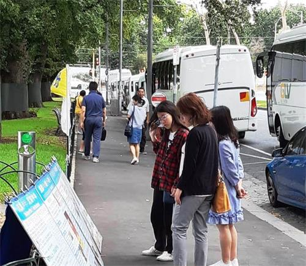

墨尔本市中心著名景点费茨罗伊公园是大陆游客了解法轮功真相的窗口。图为中国新年期间，大陆客在阅读摆放在公园入口处的大法真相展板。

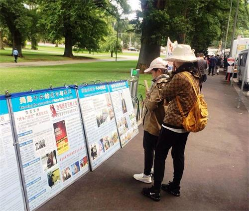

墨尔本市中心著名景点费茨罗伊公园是大陆游客了解法轮功真相的窗口。图为中国新年期间，大陆客在阅读摆放在公园入口处的大法真相展板。

<b>我们就是那个义务守在窨井口的老人

</b>
 

二零一九年二月中的一天，法轮功学员小刘正举着真相版给过往的游客讲真相劝三退，这时迎面过来一位大爷，直接冲小刘说道：“年纪轻轻的，干点啥不好？”他连忙说：“大爷，我们这是义务的，不拿钱！我有工作，我这是利用业余时间出来讲真相的。”

大爷冷笑道：“义务的，骗谁呢？现在哪有不拿钱出来做事的？”


小刘微笑着对他说：“以前网上有报道，说南方某大城市下大暴雨，河水倒灌把马路上的窨井盖给冲走了，有个老人发现后就站在窨井口边，守在那里等雨水退去，那您说说看这位老人他拿不拿钱？”他听后一本正经地说：“这种时候还讲什么钱不钱的，不及时处理就得有人掉下去啊，要我碰到了也这么做呀！”


小刘紧接着说：“我们在这里讲真相劝三退，我们就是那个守在窨井口没人给他钱的老人。讲真相就是要大家真正地了解法轮功，认清中共究竟是个什么东西；劝三退就是退出中共的党、团、队，也就是要让大家远离那个要人命的窨井口下水道啊！”

大爷听了之后略微地点了下头，接着开始看小刘举着的真相展板，看得很仔细，还时不时地问些问题。

过了一会儿，小刘看到他读得差不多了，就悄声问他：“大爷您是党员吗？”“是的，我是党员。”小刘说：“我给您起个化名退了吧，免得跟它一起遭殃受它牵连。”他点着头很干脆地说道：“好！”


<b>没有这个大贪党，国人的生活不知要好多少倍！</b>
 

还有一次，一位游客大妈过来看着小刘举的展板说：“共产党好，共产党给我钱，否则我哪来的退休金，还能出来旅游啊！”

小刘说：“大妈呀，你现在能拿到钱，是您儿子儿媳、女儿女婿他们交的社保基金呀，共产党哪来的钱啊！”

大妈听了后，说：“小伙子你说的不是没有道理，可没有共产党中国怎么办？”

小刘说：“没有了中共等于改朝换代了呗，您看中国的历史，没有了唐朝有宋朝，没有了宋朝有元朝，没有了元朝有明朝，没有了明朝有清朝，中国还是中国。”大妈静静地听着。

小刘继续说：“您看现在国内贪官这么多，有人说贪个几百万算是清官，如果没有这个大贪党我们的生活不知要好多少倍呢！”

大妈说：“现在共产党不是在大力反腐抓贪官吗？它还是在变好的。”小刘回答：“现在无官不贪，还用抓吗？让它‘抓’几个清官出来看看，还有清官吗？”

大妈邹着眉头想了想说：“是啊，哪还有好官呀，真是烂透了！”小刘说：“大妈，您也看到它烂透了，已到了灭亡的时候了。”接着问她：“大妈您是党员还是团员？”

大妈说：“都不是。”

“那戴过红领巾吗” 大妈回答：“那是小时候的事了。”

小刘说：“大妈，我帮你起个化名赶紧退了它吧！”大妈不解地问：“退它干吗？”小刘说：“中共恶事做尽，老天灭它的时候，加入过它组织的成员都会受到它牵累。”

大妈接着问：“我现在都不是了还会怎样？”小刘回答说：“我们加入的时候都举着拳头发过毒誓，要为它的事业奋斗终生的，等于把小命都交给它了呀！”

大妈听了赶紧说了一句：“退了吧！”



<h1 align="center"><b>鲜为人知的中共“饿刑”</b></h1>

【明慧网二零一九年二月二十六日】在历史上，基督教经历了三百多年的镇压与打击，为了证实信仰，坚定护法的基督徒经受了种种残酷的刑罚与磨难。尼禄（Nero）曾命令将不少基督徒投进竞技场中，罗马权贵们看着这些人被猛兽活生生地撕裂咬死。他甚至吩咐人把很多基督徒与干草捆在一起，制成火把并排列在花园中，然后在入夜时点燃，照亮皇帝的园游会。根据史学家沙夫（Schaff）的描述，“殉道者的尸首，满布街头”。
历史又一次重演。一九九九年七月二十日，以恶首江泽民为主的中共统治集团，掀起了对于法轮功的残酷镇压，至今将近二十年快过去了。集古今邪恶于一体的中共，为了让法轮功学员放弃信仰，几乎用尽了历史上所有的邪恶手段。

从初期公开的抓捕、残酷的打压，到后来，由于全世界法轮功学员的讲真相，揭露中共迫害法轮功学员的恶行，中共对于法轮功的迫害由公开转入地下，世人只知道法轮功学员被镇压、拘捕，但不知道，表面上声称“春风化雨”的中共公检法系统相关人员，对于法轮功学员采用了历史上从未有过的暴行，狡猾、阴暗、毫无人性，其邪恶程度远远超过了历史上任何一次对于正信的打压。

对于基督教的迫害，一直是公开、不加掩饰的，而中共对于法轮功却采取了公开与秘密相结合的迫害手段，闻所未闻，残忍至极。然而这些手段，在监狱高墙之外的人，却无以得见，加上中共加以掩盖、恐吓，因此世人更是难以得知。

中共邪党对于法轮功学员采用的一种酷刑，是各种各样的“饥饿”。

<b>吃一碗饭</b>
 

限制吃饭时间、吃“秒饭”是中共摧残法轮功学员的常用手段之一。

四川省成都市天府新区程怀根，从患绝症，到修炼法轮功后，绝处逢生，象换了一个人。二零一五年五月十三日在小区悬挂条幅“世界需要真善忍”，后被绑架、非法判刑四年，被劫持到乐山嘉州监狱。程怀根多次被九监区管理的大组长犯人张衡要求写所谓“四书”，程不写。二零一七年一月下旬，程怀根被严管，吃“秒饭”。“秒饭”是嘉州监狱特有的一种惩罚方式。

所谓“秒饭”是早上“一级严管”只有两口米汤，而这个米汤不是家里做饭的那种糊状的米汤，而是昨天剩下的饭，放到开水里煮一下，没有开水那么透明而已，喝完米汤后，看不到碗底一粒米。中午和下午的两餐，警察规定的是二十秒钟吃完一碗饭，但实际上张衡只给吃十五秒钟左右。据吃过“秒饭”的人说，吃得快的，饭到嘴里不嚼，只管往下咽，能咽下四口饭，吃得慢的人只能咽下二、三口饭。

一般关押者吃“秒饭”的时间为三天、五天、十天、十五天不等。但是程怀根从二零一七年一月下旬直到二零一七年五月中旬，吃了三个多月的“秒饭”。在二零一七年五月二十九日被迫害致死，年仅五十四岁。

<b>绑架相依为命者，让另一个人活活饿死</b>
 

居住在大巴山深处的四川省巴中市恩阳区九镇乡二村三组的李月英老大娘和赵刚先老大爷，两个女儿早已出嫁，老俩口节俭度日，相依为命。浑身是病的赵刚先，在修炼法轮大法后，按真善忍做好人，身体告别了病痛，获得新生。

二零一三年九月的一天，老大娘李月英在回家途中被毒蛇咬伤后全身肿痛，照顾自己非常困难。二零一三年十月八日，巴中市公安局恩阳区分局局长兼“610” 办主任蒲江荣、区国保大队长徐文、副队长辛蓉、教导员周红兵、区政法委书记戴远荣等恶人，在明知李月英大娘无人护理就会被饿死的情况下，仍将她老伴赵刚先绑架到看守所，李月英老人整整在床上饿了十八天，到十月二十六日早上含冤离世。

<b>虚假记录 颗粒皆无</b>
 

辽宁省沈阳市鲁迅美术学院财务处职工高蓉蓉，在二零零四年五月七日下午三点，受到连续七个小时的电击，被严重毁容。她的情况被报道到海外后引起极大的轰动。法轮功学员将她从医院中营救出来后，又遭绑架。二零零五年六月六日，她被送到中国医科大学。

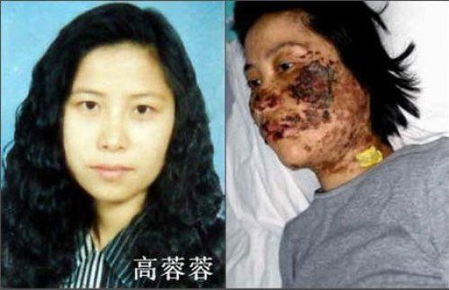

法轮功学员高蓉蓉被中共警察电击前后对比照片

高蓉蓉在“医大”的十天内，很多不明来历的人把医大所有的门都把守得严严的，还有穿保安服和便装的人每天在医大急诊室高声问：“什么时候死？”与此同时，高蓉蓉家大门口也有人蹲坑把守，并向周围的邻居说：“高蓉蓉绝食，快死了。”显然，中共在为谋杀高蓉蓉提前放风。

据知情人讲：高蓉蓉被马三家恶警送到沈阳医大急诊室时，当时神智清醒，瘦得只剩皮包骨，能够坐起。有七、八个便衣轮流看守，不许她讲话。看守不给她饭吃，但却在记录时都记上吃了这个、那个。其实什么也不给她吃！便衣说不给饭吃就因为她炼法轮功而没吃，称记上是：“领导让这么干的，回去好交差。”由此可以看出，中共对病危中的高蓉蓉不进行实质性的抢救，并不给她饭吃，而且还在观察她的记录上写上吃了东西，就是为了饿死她，并将谋杀的责任洗刷干净。高蓉蓉被劫持到医大十天后，被饿死，年仅三十七岁。

中共曾把中国人的人权状况歪解成解决温饱，而把人的信仰权利、思想自由、人格独立、政治权利等等的保障排除在外。人的最基本权利被剥夺后，吃饭问题就很自然的成了中共要挟中国人民的手段，所以才会出现在监狱中利用饥饿来摧残法轮功学员的现象。

在此，正告那些仍在继续迫害法轮功的“610”恶人、警察、检察官、法官和帮凶们，你们迫害善良好人的罪行人神共愤，全国已经有两万多名恶人遭到天谴或者报应。古人说天网恢恢，疏而不漏，中共气数已尽，败象频现，唯有停止迫害法轮功，退出共产党，才能确保你们和你们家人的平安。

<h1 align="center"><b>你一定会为自己的父母感到自豪</b></h1>

写给父母因信仰遭迫害的一对孩子

【明慧网二零一九年二月二十一日】
孩子：你们好！

我们是你父辈的朋友，应该是阿姨了。

这些年，你们承受了父母因坚守信仰而惨遭迫害、有的甚至被迫害致死的痛苦，要独自承担生活的压力，还要应付不断的骚扰，更要面对来自亲朋好友的误解、训斥、歧视和白眼，你们受苦了！

孩子，你们今天所承受的痛苦，不是父母的错，他们没有错，更没有罪。因为法轮功教人修心向善做好人，于国于民有百利而无一害，在全世界都是合法的，不是中共邪党宣传机器诬蔑的所谓邪教。况且世界公认的准则是：一种信仰本身的正与邪，只能用人性、人道等普世公认的标准来判断，不能由某个政党来认定。而中共是假恶暴的本质，百毒俱全，本身就是邪教，根本没有资格给任何信仰定性。

宪法规定公民信仰自由、言论自由。所以修炼法轮大法、拥有法轮大法书籍，都是合法的行为，根本不构成犯罪。法无明文规定不为罪；刑法只惩罚行为，思想、信仰不构成犯罪，这是刑事司法的铁律。

可是中共邪党借法律之名，利用法院迫害法轮功学员，但却连形式都是走过场，根本不敢在法庭上公开法轮功书籍《转法轮》和真相资料的内容。

炼法轮功，是享受宪法保护的信仰自由；家中的电脑、法轮功书籍和资料是个人的合法财产，不是犯罪证据；说法轮功好，是在享受宪法赋予的宣教自由、言论自由。父母不放弃修炼就被以“破坏法律实施罪”非法审判，你们想想就知道了，父母是平头百姓，因不放弃修炼，连工作都失去了，他有什么能力、什么资格、什么权利去破坏国家法律的实施？又破坏了哪一部、哪一条法律的实施？无罪者不应该受审判，谁判无罪者有罪，谁就在犯罪！

在中国大陆，已有上百位律师为法轮功学员做了上千场无罪辩护。为天津法轮功学员周向阳做无罪辩护的律师在辩护中，不但阐明迫害法轮功信仰是完全非法的，而且当庭指证，以江泽民的个人意志来定罪法轮功是违法行为，应追究违法者的刑事责任。

律师还说：“每一位为法轮功做过辩护的律师都深深知道，他们是无辜的，他们的言行本应得到赞许和尊敬。可是唯有在我们的国度里，十八年来他们却因为真善忍的信仰被定了罪名送上法庭，这是极度荒谬的。这场不顾事实与法律的政治迫害运动，源于前党魁欲加之罪的非法意志，一人之令，将惩恶扬善的法律当成了犯罪工具；把公检法监狱变成了程序化的犯罪链条；导致整个法制体系被沦为犯罪体系。许多公职人员麻木着自己，被卷入共同犯罪，甚至积极做恶、邀功请赏，残害着数以千万计的我们善良同胞、兄弟姐妹，制造着我中华民族之千古奇冤！” 这是良心律师在真相面前的肺腑之言。

法轮大法的修炼原则要求修炼者做到打不还手，骂不还口，做事先考虑别人，遇到矛盾向内找自己。修炼法轮功的人，当官的不贪不占，经商的诚实守信……试问当今几人能做到？

你们的父母坚持真、善、忍的原则做一个好人没有错，更没有犯法。法轮大法使无数人顽疾消除、绝处逢生；著名歌唱家关贵敏曾患肝硬化，奥运名将黄晓敏曾面临瘫痪，他们都因为修炼法轮功重获新生，如今仍活跃在自己的舞台上。

法轮功教人向善、使人健康、福益社会，对法轮功学员的迫害，就是冤案。你们的父母不但无罪，而且是真真正正的好人，他们坚持真善忍理念，面对迫害而不屈，他们是值得你们敬佩的。

明白了这些，你们就知道了修炼法轮功是合法的，迫害他们是有罪的。如果人们都能够从内心辨别是非善恶，不畏强权，守住自己的良知，能给善良一份空间，给正义一份支持，给冤屈一份同情，邪恶就不会存在。

孩子，你们可能暂时还不能理解，你们有缘成为大法弟子家的孩子，是你的福份；你们今天在压力下承受的一切将来都会得到福报。

孩子，你们要记住，乌云不会永远遮住太阳，邪恶终将被除尽，当正义战胜邪恶的那一天，你一定会为自己的父母感到骄傲和自豪。同时你们也一定要记住：无论在任何环境和条件下，也不要对法轮大法和大法师父有任何不敬的言行。法轮大法是佛家上乘高德大法，对佛法不敬是有罪的。有个节目主持人说的很好：“你可以是一束光，去照亮黑暗；你也可以不是一束光，但是你需要做的只是选择，选择睁开眼睛，迎接光明的到来。”

佛法是慈悲与威严同在，道德与良知衡量着每一个人的未来；当真正的危险来临时，每个人今天的选择就是自己未来的去向。

神佛不会因为人不相信而不存在，也不因为人的激将而显现给人看，就象空气、电波、黑暗中的树，人看不见，但它们无处不在。一切在上天的掌控之中，人从来没有自己说了算过。二零零二年六月，贵州平塘县掌布乡发现了2.7亿年前形成的“藏字石”，崩裂的巨石断面的天然石头纹路呈现着六个大字“中國共產党亡”，天然神工、震撼人心，科学无法解释。经中国科学院、中国地质专家综合鉴定，确认是自然形成，非人工所为。冥冥之中呈现的是天意，其意甚明！

古今中外有许多预言，如中国的《推背图》、《烧饼歌》、《梅花诗》、《马前课》及国外的《圣经启示录》、《格庵遗录》等，都惊人一致地预言中共的灭亡，还记载着天灭中共时其追随者被一同诛灭的可怕惨景。这些不同国家、不同时代的人，绝不会事先约好，编个相同的预言来哄骗今天的我们。如果真到了那一步，人类社会不危险吗？父母为什么要向世人讲真相？因为明白真相的人才能保命。这是不是在救人呢？

孩子，因为时间有限，想跟你们说的很多很多，有些不说你们自己也会慢慢明白的。衷心希望你们生活的更阳光一些，穿着整洁得体，家里干净利落，走路昂首挺胸，说话慷慨大方，处事大度妥帖，待人和善包容……你们是大法弟子家的孩子！不要害怕，更不要因为父母炼法轮功被迫害而觉的自卑、羞愧，不要生活的灰头灰脸的，父母不偷不抢、不贪不淫，处处为别人着想，讲“真善忍”做个好人，有什么过错？要让大家看看：到底是大法弟子的孩子，就是与别人不一样！这也是在证实大法啊！

不知道你们什么时候生日，给你们兄弟一人一个红包，就算是提前给你们的生日礼物吧，你们自己去买几件衣服，穿着漂漂亮亮的。记住，不必在任何人面前灰头灰脸的，你们不比别人矮一等！记住时刻牢记“法轮大法好、真善忍好”九字吉言，神佛会看护你们的。

希望你们早点找到善良明理的好女孩，早点成家，幸福的生活！

关心你们的众多阿姨

二零一九年二月十六号

<h1 align="center"><b>黑暗中高贵的生命</b></h1>
<h1 align="center"><b>一位大学体育教师狱中不平凡的经历</b></h1>

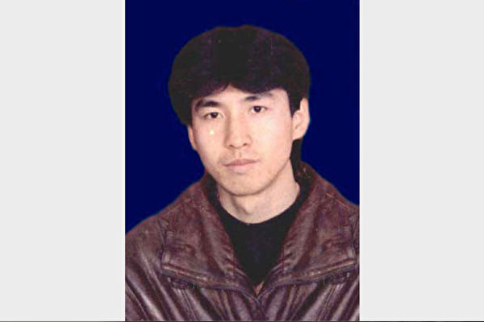

黑龙江省牡丹江师范学院体育系教师金宥峰，因坚守信仰，被冤判13年，遭受酷刑折磨，于2009年1月被迫害离世。（明慧网）

【大纪元2019年02月21日讯】他长有一张帅气的脸，一对浓黑的眉毛、挺直的鼻梁，脸上写着坚毅、正气，一双清澈见底的眼睛透出善良，身材挺拔高大。他是朝鲜族人，叫金宥峰，40多岁，曾是黑龙江省牡丹江师范学院体育系的教师。

1999年7月，中共对法轮功发起了铺天盖地的迫害，把风华正茂的他打入人间地狱。他信仰“真、善、忍”，被关押、劳教3年、判刑11年，在牡丹江监狱里，度过了五年惨烈的日子。2008年端午节前，他被保外就医，因患上肺结核已至晚期，人已奄奄一息。

没人敢相信，他就是从前那个金宥峰。

回家时，他的身体只剩下一副骷髅架，那双仍是明亮的眼睛，充满着悲伤，脸上刻着痛苦的记忆⋯⋯

2009年1月21日晚上9点，他的心脏停止了跳动。他走完了短暂的一生，经历了近十年的非人折磨，只因他不放弃修炼。

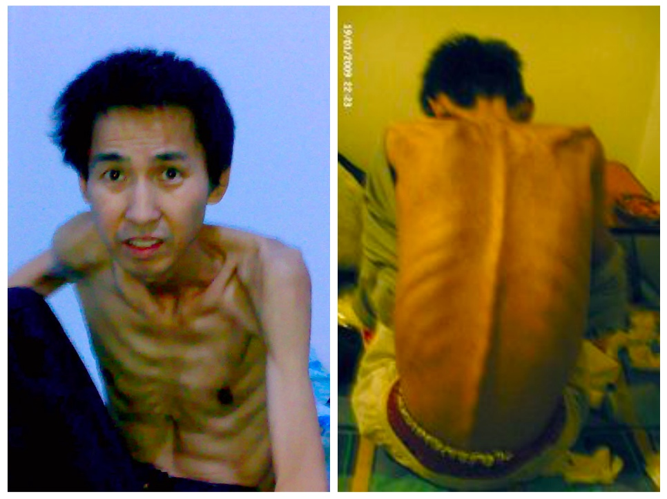

金宥峰（左图摄于2008年11月29日，右图摄于2009年1月19日离世前两天）。

<b>他的善良</b>
 
1999年9月，金宥峰因上访为法轮功说公道话，被单位开除工职、被非法劳教三年，关进牡丹江劳教所。

刚到那儿时，那里几乎所有的人都相信了中共对法轮功的妖魔化的宣传，犯人对他心狠手辣，打他、掐他、拧他胳膊，让他“开飞机”。

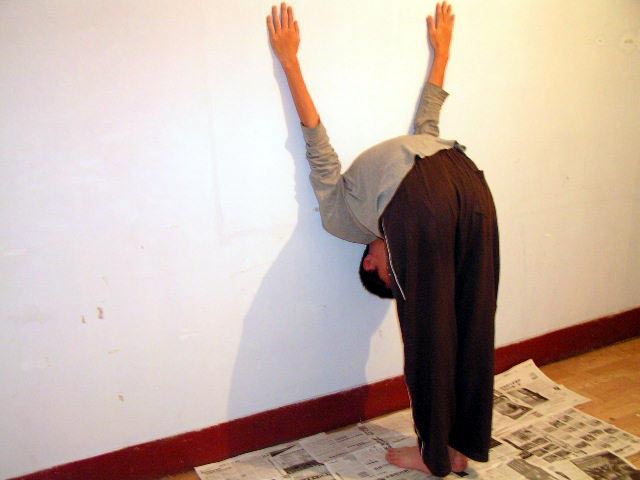

中共酷刑示意图：开飞机。

“邦！邦！邦！”牢头儿用硬木凳子板用力砸在他的骨头上，旁边的人揪心得看不下去。那是实实在在地砸在骨头上啊。

他却始终一声不吭、岿然不动、脸不变色，令周围的人极为震惊。

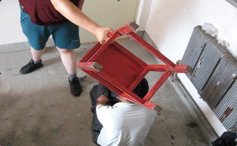

酷刑演示图：凳子砸头。

他每天被强制长时间码铺（盘腿坐），被要求身体纹丝不动，他就一动不动坐在那里，没有任何声响。

一次，他下床要去上厕所，看到别人掉在地上的东西，就慢慢弯下腰，捡起来，把它搁在床上放好，再静静地走出去。

过后，牢头儿感慨地对屋里的众人说：“那么多人出来进去，对掉在地上的东西都视而不见，没有一个人管，就人家金宥峰给捡起来了。”

牢头儿还说：“法轮功学员和咱们这些人真不一样。”

牢头儿对金宥峰非常敬佩，对法轮功学员的印象改变很大。据说，这个牢头儿赌钱一桌都上百万，谁都瞧不起，但对金宥峰却刮目相看。

金宥峰尽管遭到严重的迫害，但他无怨无恨，对谁都好，那是一种发自心底的善良。据说，原本没心没肺的犯人都被他感动了。

在押人员说：“金宥峰人太好了”

狱警说：“这小金子真有毅力。”他们不再主动迫害法轮功学员了。

以前劳教所从不允许劳教人员说一个不字，但法轮功学员却在那种环境中，开辟了一片天地，他们的信念无法撼动，他们的善良、坚忍、不屈，感动了所有的人。

<b>他的坚韧</b>
 
2003年10月22日，金宥峰及妻子姜春梅再次被非法抓捕。妻子是牡丹江师范学院的公共外语讲师，也是法轮功学员，当时她正在哺乳期，家中剩下75岁的老母亲、一个10岁和一个不满15个月大的孩子。

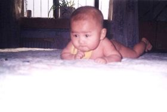

金宥峰被非法抓捕时，他的小儿子才15个月大。

他们被兴平路派出所送至牡丹江第二看守所关押，家中的孩子被亲属接走。

之后，金宥峰被非法判刑13年，被转到牡丹江监狱关押；妻子被非法判刑后关在哈尔滨女子监狱里。

牡丹江监狱设有集训队，专门用于强制“转化”（逼迫放弃修炼）法轮功学员。一次，法轮功学员在那儿集体绝食，金宥峰和另几个人被关进了禁闭室（小号：专门迫害法轮功学员的狭小的屋子）。那里极其阴冷，还没有被褥，他们只能睡光板铺。

他被戴上38斤重的脚镣，手戴手捧子，再用铁链穿上与脚镣一同被定位，一定就是15天。

被关进“小号”的第二天，他和其他法轮功学员被强制灌食。狱警用较粗的管子在他嗓子眼上乱插，插到胃里后继续往里送，为的是折磨他，而且大量地灌食，灌的是生玉米面、辣椒面等，灌的东西都冒到体外来，呛气管。

灌食的第二天，有一个狱警领着三四个犯人，为了“制服”金宥峰，用手指头堵他的鼻孔，强行给他灌水，不给他喘息的机会，不知道灌了多少瓶水。

2005年5月26日，他被分到7监区一中队。第二天出工时，在车间里他被队长栾玉用手铐铐在窗外铁栏杆上。

次日上午，他又被铐了半天。下午，他被吊在狱警厕所的墙角横梁上，被用手铐单臂交替吊了一下午。

大队长朱再良骂那些犯人 “转化”不了他，在朱的威逼唆使下，那些刑事犯又将他带到那个厕所里，狠狠地打他的脸、打腰、拧胳膊、用脚踢脸。

他因不“转化”，遭到种种摧残，毒打、关禁闭、冰冻、饿饭、野蛮灌食、高压电棍电击生殖器⋯⋯

<b>他的正气</b>
 
金宥峰被关在禁闭室里时，那里面非常阴冷，他却不顾自身的寒冷，把衣服让给了别人。

一次，狱警带领一帮犯人进入监室，殴打一名法轮功学员，他立即站出来，大声制止道：“不许打人，法轮大法好！”随后，一起被非法关押的法轮功学员全都跟着高喊起来：“不许打人！法轮大法好！”

狱警看到法轮功学员们的正气，都惊呆了，就把那位学员放回来了。狱警和犯人们也都散了。

到了2007年8月，金宥峰的身体出现了肺结核症状，左侧肺子全部丧失功能，右侧只剩了一小部分，医生说已到了晚期。

监狱长期不给他医治，到保外就医时，狱警强迫他写所谓的“三书”（“ 认罪书”、“悔过书”、 “保证书”），逼他放弃自己的信仰。他断然拒绝。

狱警又把他送回监狱继续迫害了10个月，直到2008年端午节前，才让生命垂危的他保外就医一年。然而回家半年后，他含冤离世。

<h1 align="center"><b>造假是中共党媒的一贯手法</b></h1>

【明慧网二零一九年二月二十二日】中共喉舌惯于造假，无论是出于“党的政策”或哗众取宠，都背离了新闻媒体“求真求实”的基本要求，只是充当中共宰制民众的愚民工具。它历年编造的假新闻不胜枚举，甚至自己也承认。曾在《人民日报》麾下《人民论坛》担任副主编的邱明伟揭示一桩事实：记者、编辑常常被迫造假，编造假新闻、假报导，在中共媒体工作的人，大多深谙其道。二零一二年十二月，《人民日报》海外版一篇名为《经济数据造假成统计领域最大腐败 获利大处罚轻》的报导，该报即承认中国的经济数据造假。

造假也获得中共高层的亲口认证。维基解密公布的一份美国驻北京大使馆在二零零七年三月十五日发往美国华府的机密电报显示，时任辽宁省委书记的李克强，在北京参加两会期间与美国大使共进晚餐谈到辽宁经济时说，“中国的GDP数字是人造的，因此不可靠。”二零一六年十二月八日，李克强智囊、中共国家统计局局长宁吉喆在《人民日报》撰文表示，一些地方时有发生的统计造假、弄虚作假，违反法律法规。现在大多数中国人都知道，《人民日报》只有日期是真的。

中共官方这些造假固然愚昧，毕竟只是自取其辱，未波及一般百姓，不值得识者一哂；但刻意造假蒙骗世人，为罗织罪名而栽赃陷害，则与所有民众权益息息相关，就不是造假两字所能涵盖的了。世人所熟知者，莫过于为了遂行中共迫害法轮功“肉体上消灭、经济上搞垮、名誉上搞臭”的灭绝政策，不断制造假新闻，编造一连串自焚、杀人、敛财等弥天谎言，企图激发民众对法轮功的仇恨。

这些假新闻中，荼毒世人最严重者，莫过于二零零一年一月二十三日炮制的“天安门自焚事件”，意图诬蔑陷害法轮功，以所谓的五人“自焚”谎言欺骗海内外民众。如果把十八年前的中央电视台“天安门自焚事件”录像画面进行慢镜头分析，便会暴露出很多疑点，说明这场“自焚”事件完全是一场精心布局的预谋与骗局。

一、在“自焚”事件中被大面积烧伤的小女孩刘思影气管被切开后四天就能接受采访并能唱歌。

二、《焦点访谈》录像证实，刘春玲没被火烧死，却被警察用重物击打头部倒下。

>

三、天安门广场巡逻的警察几分钟内从两辆警车里拿出二十多个灭火器和灭火毯应付该起“自焚”突发事件。

四、北京积水潭医院治疗“自焚”大面积烧伤者，不作任何防护。允许记者近距离采访，所有被严重烧伤的人都被紧紧的用纱布包裹，完全违反医学常识。

五、“王进东”在自焚时衣服已被烧焦，但是最易燃烧的头发还在头上，他腿间的装汽油的雪碧瓶却完好无损。在他喊出那句似是而非的口号之前，警察手中的灭火毯却在他头上悠闲的摇晃很久，没有丝毫灭火的急迫。

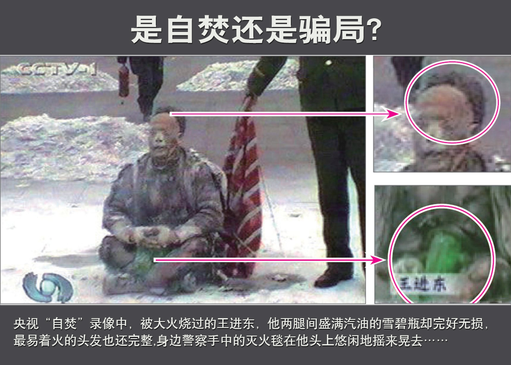

六、在央视和新华社的“自焚”报导中，先后出现了三个不同的“王进东”。台湾大学语音识别实验室受“追查迫害法轮功国际组织”委托，对王进东的声音作了语音鉴定，得出明确结论：《焦点访谈》第一集中的王进东与后来的王进东不是同一人。“追查迫害法轮功国际组织”经可靠途径查获：参与“自焚”的“王进东”是由一名现役军人扮演。

不仅上述造假的凿痕太过明显，《华盛顿邮报》在二零零一年二月四日头版头条发表了调查报告《自焚的火焰照亮了中国的黑幕──当自焚的动机乃加强对法轮功的斗争》。邮报记者亲自到自焚身亡的刘春玲的家乡开封实地调查，邻居们说从来没有人看见过刘春玲炼法轮功。

国际教育发展组织于该年八月十四日在联合国会议上，就天安门自焚事件，强烈谴责中共当局“国家恐怖主义”的行为，指控“天安门自焚事件”是对法轮功的构陷，涉及惊人的阴谋与谋杀。声明中说：从录像分析表明，整个事件是“政府一手导演的”。中国代表团面对确凿的证据，没有辩词。该声明已被联合国备案。

令中共极度难堪的是，二零零三年十一月八日由新唐人电视台制作、揭露“天安门自焚真相”的纪录片《伪火》，从各国参赛的六百多部影片中脱颖而出，获得第五十一届哥伦布国际电影电视节荣誉奖。该奖项在记录片领域享有盛誉，其历史仅次于“奥斯卡”。《伪火》影片以触目惊心的画面和精辟严谨的分析，揭示了“自焚”案的诸多疑点，从而证实了整个事件是中共栽赃法轮功而炮制的伪案。《伪火》的视频可在《获奖影片：伪火（中文版）》下载观看。

中共的历史就是在残暴镇压的同时反复愚弄广大民众的历史，其喉舌的谎言宣传，完全是为了维护少数人的权力，事件的真相及民众的利益从来不在它们考虑之列。二十年来对法轮功的迫害中，一贯造假的谎言诬陷更是逐步升级、变本加厉，并一再重复炒作。但中共迄今仍极力掩盖对法轮功学员的酷刑虐杀、活摘器官等罪行，持续欺骗并误导善良的民众。

造假的本质就是虚构，中共炮制自焚伪案，只突显了自身的愚蠢无知。随着真相广传，人心日渐觉醒，自二零零四年十二月开始，迄今已有三亿二千多万有识之士退出了中共的党团队组织，现在正以平均每天十万人退党的速度逐步解体中共。曾经为虎作伥、推波助流的人们应该慎思明辨，分清真伪与善恶，为自己选择未来。

<h1 align="center"><b>武术教练走正道 解开心锁破迷雾</b></h1>

【明慧网二零一九年二月二十一日】（明慧记者沈容采访报道）一双拳，一身胆，纵横江湖，行侠仗义，曾是刘大雁年轻时的梦想。
“记得国二时，学校学长和学弟有了嫌隙，两帮人马就约在外头谈判，学长问我要不要去，我说好啊，当然去。我们没有带任何武器，赤手空拳就跟着几个学长跷课走了。当时相约地点是某捷运站，刚走出去就看到对方满满都是人，从捷运出口一直延伸到大马路。那时候也没有想到怕，心想，不过是人多，要打就来吧！后来因为对方人太多，警察很快就来了。”

胆子大、讲义气、不轻易妥协，正是当时年轻气盛的刘大雁。“刚上国中时，有个老师说，你不好好读书，将来怎么会有出息？听了那句话后，我就笃定不再读书了，心里就一个想法，我要证明给那个老师看，就算不读书，我以后也会有出息。”此后国中三年，他和师长眼中的“问题学生”玩在一起，友情成了刘大雁逃避课业、释放压力的宣泄口。

尽管学长们抽烟喝酒样样都来，但刘大雁心中却有一把尺，清楚什么该做、什么不该做。“其实我在幼儿园的时候，爸爸就带着我学法轮功了，小学也有一阵子，会在清晨四、五点，跟着爸爸一起去公园炼功。所以我从很小的时候就知道法轮大法很好，知道人生是要返本归真返回天上去，我也知道做坏事会有黑色物质业力，做好事会有白色物质德。”

《转法轮》书中一句“真、善、忍是衡量好坏人的唯一标准”，无形中影响着刘大雁，成为迷途时的指路灯。“那时我听不进去父母、老师的话，不肯好好念书，也不把自己当作一个法轮功修炼人，但我始终知道法轮大法好。现在回想起来，师父似乎一直在身边保护我，让我无法跨出那条界线、做出难以弥补的错事来。”

<b>用心学大法　晨光破雾</b>
 

图1：刘大雁在国父纪念馆炼法轮功。

考上文化大学国术系后，刘大雁接下了法轮大法社团社长一职，“在筹备各种活动、举办青年学子大专营的过程中，为了要让更多人了解法轮大法是什么，我们写出让他们理解的介绍台词，当我用心去准备的时候，才发现过去以为的大法好，只是很浅显的体悟，事实上，大法的每句话不只是表面的好，那是天机与真理，大道至简至易，表面看似简单，却有太多内涵，非常深刻，没有止境。”

“我还记得我们在大专营播放师父录像时，师父说：‘我觉的能够直接听到我传功讲法的人，我说真是……将来你会知道，你会觉的这段时间是非常可喜的。当然我们讲缘份，大家坐在这里都是缘份。’[1]当我听到这里的时候，胸口震动着，眼泪流了下来，那时候感觉师父就在眼前跟我们讲这些话，我觉得自己怎么这么幸运，能够修炼大法，甚至为那些能听闻师父讲法的人们感到高兴，希望他们能够珍惜这段机缘，能够明白师父的语重心长、用心良苦。”

此后，不管多忙多累，刘大雁坚持每天读法轮大法书籍。“当我静下心读大法时，能感受到大法不断向身体里灌输能量，法学的越多身体的能量越强，而且思想中充满正念，对我的思考行为都有很大的影响。但假如我很久没学法，身体那些好东西就会渐渐地没有，做任何事情就象一般人在做，身体跟精神也容易疲惫。有时因为忙，回到家已经一两点，但我还是会捧起《转法轮》学法。”

<b>身体力行　实践“真善忍”</b>
 

这么好的功法要怎么和同学介绍呢？“我知道最好的方法就是按照师父的话去做，不管是课业也好、人品也好，都要从一个好人做起，用真善忍来衡量自己的言行，身边的人感受到你的好，跟他们介绍大法时就会很容易接受，大家也会知道我就是因为修炼法轮功才能变得那么好。”

大学生跷课、迟到是常态，很多同学也会拜托刘大雁帮忙，刘大雁表示：“我会果断拒绝，并告诉他们这样的行为是说谎的、不真的，不能帮他们点名。结果同学反而因为了解我的为人，知道我不会去做不该做的事情，更放心将事情托付予我。我也会邀请他们来参加法轮大法社的活动，進一步了解法轮大法，了解真、善、忍。”

厚道正直、善良乐观、遇到事情总要求自己先向内找，刘大雁一改过去的年少轻狂，认真对待每件事情，不仅学业成绩名列前茅，也自发带着班上同学晨间练习、参加比赛，凝聚大家的向心力。

“上大学后，我发现同学大多死气沉沉，好象只是来混张文凭，我觉得大家应该一起做点什么，改变这种气氛，日后毕业回想起大学生活，才不会觉得虚度光阴。于是我在班上组了一个舞龙队，邀集大家每天早上六点半到学校练习，一起去参加比赛，取得不错的名次。在这过程中，我尽量去关心每个人的状况，帮助他们解决生活中遇到的问题和矛盾。其实很多事情做起来不象想象中容易，但我会在能力范围内去关心他们。系上的大型活动也会主动帮忙组织，让大家的感情变得更加溶洽。”

<b>重德修心　弘扬武德</b>
 

势如飞雁，迅若游龙，二十六岁的刘大雁，在二零一六年荣获全世界华人武术大赛铜奖，耍起拳法来扎实稳健、虎虎生风。

图2：刘大雁参加新唐人电视台第五届“全世界华人武术大赛”亚太区初赛。

从国中时期接触武术，高中正式习武，到就读文化大学国术系，兴趣、天分加上吃苦耐劳，他对自己在心性上的要求从未放松。“中国传统武术讲究实用性，一招一式都有章法，要有恒心及毅力才能练出真功夫，而且习武除了武艺外很重视道德与个人的修养。我是法轮大法修炼人，知道真正的习武者不会只单纯追求技术的提升，还要不断修自己，向更高境界攀登。”

刘大雁说，遇到问题的时候他会虚心求教，不能急，因为他知道技艺的提升需要时间，更是在磨炼自己的心性，“所以要有耐心，静得下来、沉得住气，比如一个动作可能要练上百甚至上千遍才能掌握，那就是扎扎实实的去练，练拳时要一丝不苟，不能有偷懒或随便的心态。”

但也有遇到瓶颈的时候，“有一次我参加武术大赛，每天反复练习却练不好，后来在心性上过了一个关，在我经过门口警卫时，听到他说了一句话，我马上知道是在点自己的问题，悟到后顿时豁然开朗，动作也能练好了。”

“类似这样的点悟经常都有，不胜枚举，曾经我把这样的修炼体会写在笔记本上，后来发现在法轮大法中修炼提高实在太快了，只要你向内找，层次一个一个就这样上去，前几天我的领悟是这样，但过几天又提升了，或者才刚写完心得体悟就提升了，最后因为自己写的速度还没有境界提升的速度快，索性就不写了，就专注修炼心性，时刻向内找自己。”

目前刘大雁担任弘观禅武中心的教练，在教导学生习武的过程中，透过拳法的道理、大自然的运作，言行身教告诉他们做人的道理，教导他们传统武术重在武德，武德是武术的灵魂，因为有德能吃得了苦，得名师传授，有德能生出智慧，明辨善恶，止恶扬善。他常提醒学生们，习武要正直，要有骨气，一定要守住正念、守住心中的善！

刘大雁感叹末法乱世自己还能有这样美好的修炼机缘，修炼如此纯正高深又实实在在的高德正法，真的太幸运了！“不管我过去做得多不好，只要我有向善向上的心，师父一直都在身边给予我最好的，时刻点悟看护着我！对师父的感恩实在没有办法用文字及语言来表达，我唯一能回报师父的就是把自己修好，告诉更多人法轮大法好！”

注：
[1]李洪志师父著作：《转法轮》

<h1 align="center"><b>首尔新年首个九天班 新学员谈心得</b></h1>

【明慧网二零一九年二月十六日】韩国首尔天梯书店二零一九年首个法轮功九天班于一月三十一日结束，参加的新学员交流了参加的体会，下面让我们一起交流其中几位的心得。

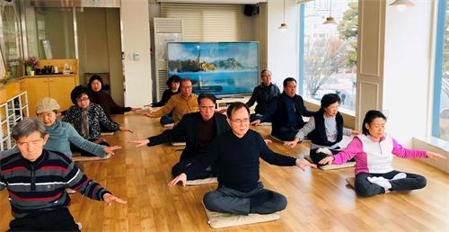

图1：新学员在学炼法轮功第五套功法——神通加持法

 
 

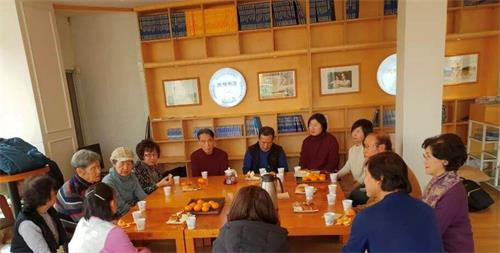

图2：新学员交流心得体会

 
 寻觅中幸遇大法　找到人生真谛

一九九七年韩国经济危机时，姜纂植所有的财产都失去了，当时他心力交瘁，甚至苦恼自己该不该活下去，“反正人是赤身而来，赤身而去，我何必执着呢？”他后来想明白了。

他试图通过读书、登山、运动、去教会使自己振作起来，并希望寻找人生真谛，从而找到真正的自我。他想，“虽然我连宇宙的尘埃都不如，但如果我能接受宇宙的能量，身体变得健康，同化宇宙就好了。”

一天晚上，他在家附近的小区运动过程中，偶然看到了法轮功学员们炼功的场面。看完介绍法轮功的传单后，他想，“我得炼这个。”

之后，他来到天梯书店，在那里他被推荐看《法轮功》这本书。“看完后我好象找到了人生的答案。”他说。于是他参加了天梯书店的九天班学习法轮功。

他表示，参加九天班过程中，师父的话触及到了他心灵深处。他感到，通过修炼，身体要得到净化，坏的毒素要得以清除，心性得跟上，要遵循“真、善、忍”去做，达到能吃苦中之苦的境地才行。

“试着修炼发现，修炼好象并不简单，不具备一定的忍耐力是不行的。我得抱着一颗修道的心修炼。”他说。

他过去常常抱着想成为神仙的想法，“如今我感到通过修炼法轮功我可能会成为神仙了。”他说，以后会利用闲暇时间来这里，进一步学习炼功，多读法，努力修炼。

<b>变健康变漂亮　感受巨大能量</b>

金正基以前试着信仰佛教、基督教，也练过其它气功，但是他的心都没有被吸引，感到都好象是悬在虚空中一样，没有任何感觉。

一天早晨，他在富平公园里运动，发现一名女法轮功学员独自在炼功。“从那里我感受到了很强烈的能量，同时，感到她的炼功动作比跳舞还优美。”他说。

抱着“我也能象她那样吗？”的想法，他拿走了一张大法介绍传单。从此，他开始了法轮功的修炼。

在富平公园，金正基跟随这位学员一天不落地坚持炼功。一年半以来，他领悟了很多，深受启迪。

金正基表示，修炼以后，身体变得非常健康，以前很消瘦，如今体重恢复正常，脸色也变得健康，别人都说他面部闪耀着光泽。

“但是，法轮功可不仅局限于祛病健身，他有更高的层次。”他说，“我感到努力从修炼的角度进行心性修炼的话，自然就会获得健康。”

修炼过程中，他还体会到很多神奇的感受。“炼第五套功法入定的那一瞬间，我感到自己成了神仙。”

他称赞在富平公园一起炼功的学员，炼功一天都不落，坚如磐石，“不仅如此，我在学员们出去讲真相的场所也能感受到强大的能量。”

在金正基的影响下，他的妻子也对修炼法轮功产生了兴趣。这次九天班，金正基和妻子一起来了。本来是想参加一天试试的，可是坚持下来了，金正基的妻子说，经过九天的修炼，感到变漂亮了，以前腰部不适，可能是体型不正引起，如今，体型也似乎得到矫正。

<b>同化真善忍感受幸福　急躁不安变平静舒适</b>

姜仁顺去年七月攀登冠岳山时，看到法轮功学员在那里炼功的场面，从此与法轮功结缘。两个月后，她参加了九天班。之后，她自己开始努力修炼。由于感到仅参加一次九天班不够充分，期间她又参加了两次，本次是第三次。

“修炼以后，感到身体变得非常轻松，尤其今天炼功以后，感到身体非常美妙，非常好。”她说，“我感到付出多大努力，就会获得多少。”

她很喜欢读法。这期间，她只要有时间就看大法书，乘坐地铁的时间也不放过。她表示，目前正在看第三十本师父讲法。“经常学法，每天都同化真善忍的感觉，十分幸福。”她说。

来自中国的朝鲜族金女士是从中国同一个公司的朋友那里了解到法轮功的。那位朋友在社会中的优秀表现，令她印象深刻，从而对法轮功也抱有很好的想法。受朋友影响，她常常抱着希望身体和心灵得到净化的心态。

她趁临时有事来韩国，特意在电脑中搜索到天梯书店九天班，得以参加本次开班。

她表示，来到天梯书店后，看到法轮大法的书，眼泪竟止不住直流。“参加九天班后，我原来的急躁、担忧、不安等心理全都消失了，感到内心安宁舒适。”她说，回中国后，一定认真修炼。

<h1 align="center"><b>涉嫌活摘器官　海南省前医院院长李灼日遭恶报</b></h1>

【明慧网二零一九年二月十九日】（明慧网通讯员海南报道）二零一九年二月十二日，海南省人民医院原院长、党委副书记李灼日涉嫌严重违纪违法，日前正接受审查和调查。
李灼日，男，汉族，一九五九年十月出生，湖南安仁人，一九九二年八月至二零零二年七月，历任湖南省人民医院主治医师、副主任医师、院长助理。二零零二年七月至二零零五年九月，任新疆吐鲁番市人民医院党委副书记、院长。二零零五年九月至二零一零年八月，任湖南省人民医院副院长。二零一零年八月至二零一八年九月，任海南省人民医院院长、党委委员或党委副书记。二零一八年十月，被免去党委副书记职务。二零一九年二月十二日，涉嫌严重违纪违法，接受审查。

据医院官网等公开资料显示，李灼日擅长肝胆胰外科，从医三十年，施行肝胆胰手术4000余例，包括肝、肾移植手术，网页明确提及李灼日的肝移植术8例，肾移植术11例。由此可知，李灼日并非只是主持行政工作的医院高官，他在二零零五年至二零一零年，在湖南任职期间，从事肝胆外科实际临床工作。

李灼日在转往海南省人民医院后，据报导，自二零一零年，李灼日主持之下的海南省人民医院，“填补了省内无肝移植手术的空白”，其中一场手术发生在二零一五年，即海南省人民医院为一极危重病人郑南生换肝。

<b>二十天找到配型肝源</b>

据相关报导，患者郑南生时年四十四岁，曾是汶川地震医疗队的随队医师。二零一五年一月八日，郑南生病重入住海南省人民医院治疗。二零一五年一月九日晚，院长李灼日亲自主刀，为郑南生手术。

到二零一五年四月一日，郑南生再次出现消化道大出血等病症，转入重症监护病房，多个科室联合会诊，医生认为肝功能衰竭和门静脉血栓形成是郑南生再次大出血的主因，只能做肝移植手术。到四月二十二日，海南省人民医院的器官移植团队，与中山大学医学院的移植医生，给郑南生做了肝脏移植手术。

郑南生这起换肝手术在器官移植医疗上的真正罕见之处，是仅仅二十天，获取配型供体器官。

一般人都知道，要进行肝移植手术，肝源是最大的难题。郑南生移植的肝从哪里来？海南省人民医院肝胆外科副主任陈劲松说：“郑南生是幸运的”，经多管道联系肝源，终于在省外找到了可以移植的肝。

在关注中国器官移植新闻的人不难发现，陈劲松的说法令人耳熟，也是几乎每起公开报导器官移植案情的典型情节，重大危急病患需要器官移植，供体器官不论肝、肾，说有就有，而且取得时间之短，在移植医学上明显不合理。

<b>质疑供体器官来源不明</b>

这就让人合理质疑供体器官来源不明。如众所周知，国际长期指控的中国境内至今受迫害的法轮功学员被“按需杀人”取器官，那么每个移植器官恐牵涉另一条无辜人命——被非法关押的法轮功学员。

据海南人民医院官网介绍，在李灼日二零一零年八月起担任院长开始，积极开展肝、肾移植手术，至二零一五年这五年来，已移植40例。那么包括郑南生在内的这些肝脏、肾脏等供体器官来源哪里？这无疑是比经济腐败更应该交代清楚的问题。

李灼日分别在湖南省人民医院、海南省人民医院任职约15年和8年。这两家医院都是大陆的三级甲等医院。因涉嫌活摘法轮功学员器官，海外的相关追查组织曾对两家医院和李灼日发出追查通告。

据对公开资料的不完全统计，截至二零一四年，海南省人民医院、海南省农垦总局医院、海口市人民医院等海南6家医院共实施肾移植至少323例，肝移植至少9例，角膜移植至少76例。

如李灼日任海南省人民医院院长期间，二零一零年十二月至二零一三年一月，该医院进行了6例肝移植；二零一一年至二零一二年，该医院有肾移植手术9例，基本都是活体移植。

李灼日担任湖南省人民医院肝胆外科主任医师时，二零零零年十一月二日至十二月八日曾参与实施3例全肝原位移植。

李灼日担任湖南省人民医院副院长时，二零零六年四月下旬，该医院曾通过湖南官媒发表了“免费进行20例器官移植”的消息，称将免费为20人换肝换肾，患者可通过热线报名等。这些供体的来源是否合法，令人怀疑。

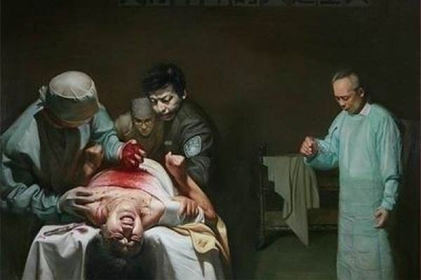

活摘器官示意图

 
 这一桩桩一件件器官移植背后的活摘内幕令人惊骇，李灼日发表的论文、主编的著作、担任的职务、移植的器官都沾满了法轮功学员的鲜血。

美国人权作家葛特曼（Ethan Gutmann）调查法轮功学员在中国被摘器官的《屠杀》一书最近在台湾出了中文版，再次引起人们对中国器官移植黑幕的关注。

自从一九九九年中共迫害法轮功以来，这些被称为“白衣天使”的中共医生追随元凶江泽民的迫害政策，为一己之私，泯灭良知，助纣为虐，对这场迫害的延续，负有不可推卸的责任。

然而，天道轮回，报应不爽，李灼日今天的下场，就是他助纣为虐的报应。在此，奉劝那些还在打着救死扶伤旗号，大肆活摘他人器官进行器官移植手术的医生们，前有车，后有辙，赶快停止丧尽良知的器官移植手术，保留活摘器官的证据，给自己留条生路，否则，李灼日的今天，就是你们的明天。

<h1 align="center"><b>忏悔赎罪 把握机缘</b></h1>

【大纪元2019年02月15日讯】据明慧网信息统计，二零一八年至少有68名法轮功学员被中共迫害致死。他们中有农民、工人，个体经营者，也有副教授、博士、工程师、校长、教师、农业专家、军队转业干部等社会精英人士。其中36人由监狱迫害致死，27人屡遭迫害骚扰致死，4人在看守所非法关押期间被迫害致死。
近期则有130多名公安局局长遭恶报。从二零一七年至今，已经有56名中共派出所所长（副所长、教导员）因参与迫害法轮功学员遭恶报死亡；自一九九九年七月中共迫害法轮功以来，已经有445名中共政法委书记遭恶报。

一九九九年七月，中共以洗脑、酷刑、虐杀等手段，逼迫法轮功学员放弃信仰“真、善、忍”。在江氏命令“六一零办公室”系统性的对法轮功学员实施“名誉上搞臭、经济上截断、肉体上消灭”、“打死白打、打死算自杀”与“不查身源、直接火化”的灭绝政策下，无数善良的法轮功学员被非法关押在劳教所与监狱中，长期遭受酷刑折磨与精神摧残。迄今至少有四千二百多名被迫害致死，难以计数的无辜百姓被绑架进看守所、劳教所、监狱、洗脑班、精神病院，被迫害致伤残、失学、失业、流离失所、家破人亡。大规模的活摘法轮功学员器官，更被称为“这个星球上前所未有的罪恶”。

据不完全统计，在十九年中，有20,784人遭恶报，其中包括，被殃及的亲友等4149人，在遭恶报形式的八项分类统计中死亡人数最多，高达7405人，占总人数的35.6%。在对遭恶报人员所分的九大类中，公安系统本人作恶遭恶报的最多，高达4540人，占公安系统总数的26.5%，他们殃及的亲友也最多，高达972人。

自古善恶有报是天理，证诸中外历史，迫害正信者最终都无好下场。从二零零二年以来，江泽民及罗干、周永康、薄熙来、夏德仁、赵致真、黄华华等近六十名严重参与迫害法轮功的中共官员，在四十多个国家及地区遭到刑事控告其触犯“反人类罪”、“酷刑罪”、“群体灭绝罪”。近年亚洲、欧洲、澳洲、北美的多国议会也陆续通过决议，谴责中共强摘法轮功学员器官的罪行，制止迫害成为国际社会的共同愿望，参与迫害者将面临全球的的追查和究责。

在中国大陆，自二零一五年五月起，逾二十万人向最高法院、最高检察院递交刑事控告书，控告江泽民迫害法轮功，由于网络封锁和信息传输的不便，实际数字不止于此。二零一七年四月二十日最高检察院举报中心的网上举报职务分类中首次公开表明可以举报“正国级”官员，最高检以这种迂回、“你懂的”方式，回应了海内外对迫害元凶的控告。堂堂正正在中国国内“诉江”，已将这股惩恶除奸、匡扶正义的呼声，推向另一波高峰。
如今，江氏集团已濒临覆灭：以周永康、徐才厚、薄熙来、郭伯雄、李东生为首的一大批替江泽民疯狂迫害法轮功的刽子手被以贪腐的名义法办，或死或抓，纷纷遭恶报锒铛入狱。包括谷俊山、苏荣、周本顺、奚晓明、马建、朱明国、张越、武长顺、赵黎平等许多曾经呼风唤雨的贪官污吏，急转直下，剩下的只是恶名昭著，只有身陷囹圄。继续把自己和江氏集团捆绑的中共各级官员，也不断地被抓，这场迫害显已走入末途。

另一方面，在法轮功学员近二十年如一日的讲真相中，大量海内外民众已经觉醒。迄今，三亿二千多万中国人退出了中共的党、团、队组织。各地释放法轮功学员的案例越来越多，仅从二零一六年上半年至今，中国大陆已有二十一个省、直辖市出现不予起诉、释放法轮功学员或退卷的案例。不愿参与迫害的中共各级人员以各种形式与江氏集团切割，这些释放无辜法轮功学员的案例，是很多公检法人员在明白真相后的自保和赎罪。

这种时候，只有那些最没有头脑的人，才继续积极参与迫害，被江氏集团利用着，他们不知道的是，目前得到的一点蝇头小利，和将来因此付出的惨痛代价远远不能相比。迫害法轮功的江氏集团已经失势，把希望寄托在它们身上的人都是自绝未来。

在各种迫害法轮功学员的事件背后可能真的有政法委、六一零人员，有“上头”在施压。但基层人员做了坏事，自己得承担罪责，不能以“我说了不算”当借口推脱。因为违法骚扰就是你上门干的，绑架的行为就是你实施的，冤判的“判决书”就是你的签名。

中国《公务员法》第五十四条规定：“公务员执行明显违法的决定或者命令的，应当依法承担相应的责任。”实际上把参与迫害者的推脱罪责的退路给堵死了。

同时警察已无职务犯罪免责条款。二零一六年三月一日新修订的《公安机关人民警察执法过错责任追究规定》删除了一九九九年六月十一日出台的同文件第十四条“执行上级命令的，不追究人民警察的责任”，这将使很多为江泽民卖命迫害法轮功且至今不明真相的公检法司人员要为自己的罪恶负责了。

身为公检法人员，如果上司命令你参与迫害，“枪口抬高一厘米”是人类面对恶政时的抵抗与良知的自救，也是明哲保身的智慧宝典。

柏林墙倒塌两年后的一九九二年二月，一名东德卫兵因为开枪杀死偷越柏林墙的青年接受审判。二十七岁的卫兵英格．亨里奇在法庭上为自己辩护时说：“那个时候我只是在遵循法律和执行上级的命令，根本没有选择的权利，罪不在己。”法庭最终的判决是：判处开枪射杀无辜平民的卫兵亨里奇三年半徒刑，不予假释。法官当庭指出：“作为士兵，不执行上级命令是有罪的，但是枪打不准是无罪的。作为一个心智健全的人，此时此刻，你有把枪口抬高一厘米的权利，这是你应主动承担的良心义务。”

尊重生命与维护人权，是放诸四海而皆准的普世原则。因为类似的辩护，早在二战后的纽伦堡审判法西斯战犯时，已有先例：不道德的行为不能以是奉政府的命令为借口而求得宽恕。

天网恢恢，疏而不漏。邪恶可能逞凶一时，但终究不能长久。迫害法轮功的江氏集团已呈土崩瓦解之势，迫害正信的恶徒已到了穷途末路。无论首恶或帮凶，都逃不过人间法律、道德法庭的终极审判。天理昭昭，报应不爽，那些仍在参与迫害法轮功学员的各级人员，应该赶快停止迫害，将功补过，才能弥补罪愆、赎罪自救。真诚奉劝所有行恶之徒不要再助纣为虐，赶紧悬崖勒马，珍惜救赎的机缘，否则恶报临身之际，悔恨晚矣。

<h1 align="center"><b>医生说：“把你的事写成书吧！”</b></h1>

【明慧网二零一九年二月十五日】〖大陆来稿〗二零一八年五月份的一天，我骑电动车载着一岁半的小孙女，从十字路口向前直行。突然，一辆大货车把我撞倒，连车带人拖走老远。
司机赶忙下车，一看，前车轮子压着我的右手，司机就要向前开车，好拿出我的手。旁边一人大喊：“不能开车，车下还有一个小孩！”孩子大哭着从车底下向外爬，围观的人抱起来一看，一点事没有，只是额头上擦了一点皮。

再一看我的手，被车轱辘连压带搓，手背上的皮肤、肌肉都被搓开了，露着白花花的骨头，筋血流一地，旁边的人都担心的说，这人的手肯定保不住了。

我被送到医院一检查，骨头、筋没事，只是手腕错了位，手腕到指头被搓开了一条六寸半长的大口子。医生说：“你手的骨头真硬，体质真好，大货车压成这样，骨头都没事。”我说：“我是炼法轮大法的，是我师父保护了我。”

医生一边检查，一边又说：“这皮肤成这样了，不知道还能不能要？”我心想：没事，有师父保护我。赶紧对他们说：“你们把皮肤盖上，缝住就好了。”连说两遍后，医生照我说的话做了。

几天后，医生需要给我揭开手背上的真空膜，刚一动手，疼的我大喊，医生对我说：“求求你师父吧！”我大声喊：“师父救我！师父帮助我！”马上就不疼了，医生顺利的揭掉了真空膜。我的手很快好了。

在这过程中，我给医生、护士、同病房的病人都讲了真相。目睹这一切的他们都明白了真相，四个人还做了三退。

医生感到很神奇，还对我说：“把你的事写成书吧！”

出院后，亲人、乡亲们都来看我，都说：“你真是命大、福大！我们都认为你的手肯定保不住了呢。”我说不是我命大，是师父保护了我和小孙女。他们说：“你们师父真是太好了，法轮功真是太神奇了！”还有的说：“你以后可要更好的修炼，要不就太对不起你师父了。”

现在手恢复的和以前一样了，什么活都能干了。想起来，我这个整天忙于家务，不精進的弟子，师父还这样保护我，我不知该怎样感谢师父，只有精進修炼。

<h1 align="center"><b>追寻真理者无畏</b></h1>

从小我一直在追寻着生命的意义和宇宙的真理。就读北京大学后，一有空我就会到图书馆里，去了解各种文化。但一直没有找到我想要的真理。 

2002年，我去国外学习。在那个学校里，我发现法轮功并不是像国内媒体所宣传的那样。于是，我就上法轮大法网站想了解更多的情况。我在计算中心的电脑上，打开《转法轮》（法轮功主要著作）这本书。当看完第一段后，我的心就激动得嘣嘣直跳，抑制不住内心的喜悦。在那一瞬间我明白了：这才是我一直在追寻的真理，也是做人的准则——真、善、忍。在一天时间里，我把《转法轮》通读了一遍，读的过程中泪水经常夺眶而出。我决定开始修炼法轮功，而且我会尽己所能让周围的人了解法轮功真相，不再被中共谎言蒙蔽。 

四个月之后，我回国了。回国后按照规定要写所谓的思想汇报。我就把我在国外所了解到的当时法轮大法弘传世界80多个国家和地区，和大陆法轮功学员遭到残酷迫害的情况写上。每周开例会的时候，或开班会的时候，我也从各种角度谈到对法轮功的迫害。 

我的老师和同学们都很惊讶，他们都很信任我，也明白了迫害真相。即使这样，他们还是希望我不要炼功。 

记得最后一次，那位老师跟我说，如果你还继续炼法轮功，将取消你的博士生保送资格。我沉默了一会儿，然后跟他说：“不管你们怎么对待我，要让我放弃法轮功是不可能的。这是我一生追寻的真理，是我一生的意义所在。您以前器重我，是因为您觉得我有一颗为国为民为天下的心，可是我告诉您，法轮功是中华民族的希望所在。只有‘真善忍’才能让今天的中国变好。如果为了法轮功，需要我放弃什么，我没有什么犹豫的。您看着办吧。”说着说着，我的眼圈红了，那位老师的眼圈也红了。从此以后，他再也没有劝我放弃法轮功。 

有个同学不理解信仰，有时会说一些对法轮功不敬的话。他跟我说：“我真不明白，你炼了法轮功那些老师为什么还对你这么好，什么好事都给你。” 

我告诉他：“正是因为我炼法轮功他们才对我那么好！因为他们知道真正炼法轮功的人都是好人。在这样的压力下还能够坚持自己的信仰，还能够坚持正义，在他们的眼里，是可造之材，是中国的希望。而法轮功正是教我们做这样无私无我只为别人的人。”从那以后我就没听他再说过法轮功不好的话了。 

有一次，国家宗教局局长叶小文来我校办讲座，给学生讲国家宗教政策，最后提问时我站起来跟他说：我们很多同学在宿舍里都收到过法轮功的真相光盘，我们也看了，里边列举了很多证据说明天安门自焚是栽赃嫁祸，法轮功是教人做好人的。我们也知道我们中国有很多事情是很难说的。如果是那样的话，我们真心的希望作为国家的官员而且是高层官员，能够体察民意，真正为国家和百姓着想，为中华民族的未来着想，重新审视这个问题。叶小文听完之后，嘀咕了一句：“也只有在这所高校才有人敢提这样的问题。” 

其实，这是“真善忍”信仰的力量赋予的修炼者的勇气。追寻真理者无畏。

<h1 align="center"><b>日本熊本法轮功学员中领馆前抗议迫害</b></h1>

【明慧网二零一九年二月十四日】二零一九年二月四日大年除夕，日本熊本地区法轮功学员与往年一样，来到在福冈中领馆前和平抗议中共对法轮功长达十九年的残酷迫害，并悼念无辜被迫害致死的中国大陆法轮功学员。
自一九九九年七月二十日以江泽民为首的中共邪党发起对法轮功的迫害以来，熊本地区法轮功学员每逢大年除夕之际，都会来到位于九州福冈的中领馆前进行和平抗议。二零一九年二月四日大年除夕的傍晚，法轮功学员来到驻福冈中领馆前，打出“法轮大法好！”、“解体中共，停止迫害”、“立即停止对法轮功的迫害”、“立即停止对法轮功学员活摘器官”等横幅和标语牌，呼吁各界关注在中国发生的残酷的人权迫害。

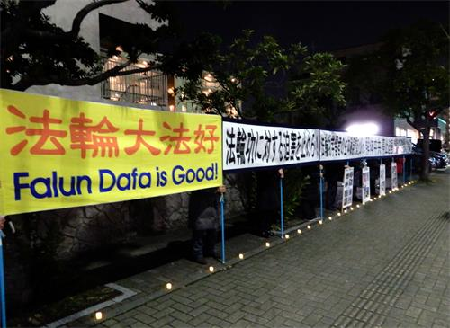

图1-2：日本熊本法轮功学员福冈中领馆前抗议中共迫害

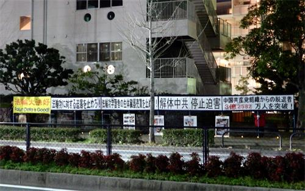

横幅和标语牌、真相图片展板吸引了很多过路行人和车辆。一位过路中年男士说：“你们呼吁的这些都没有错，这些都是事实，我支持你们。加油！”还有一位过路男士鼓励学员们说：“你们很辛苦，坚持，一定要坚持住。”

熊本法轮功学员表示：中共对法轮功的迫害受到越来越多的正义国家和人士的谴责和唾弃。这场长达十九年多的残酷迫害让千千万万无辜的法轮功学员的基本人权遭受了严重的侵犯，无法与家人朋友团聚。希望这场浩劫早日结束。

<h1 align="center"><b>悉尼民众：真善忍是宇宙真理</b></h1>

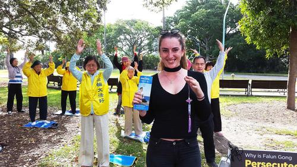

女性自我防范教练布鲁克·威恩（Brooke Wern）表示：我相信真善忍是宇宙真理，我很喜欢法轮功的打坐和炼功方法。

 
 在悉尼市中央火车站侧面的阿尔弗雷德王子公园（Prince Alfred Park），法轮功学员常在这里为来自世界各地的游客和当地民众展示功法，揭露中共对法轮功持续十九年迫害的罪行。 

来自悉尼东区的女性自我防范教练布鲁克·威恩（Brooke Wern）驻足签名支持法轮功后说：“之前我在城里看到过法轮功学员讲真相，他们给我一张传单。我回去后在网上查询了解了更多法轮功真相。我了解到中共残酷迫害法轮功学员、活摘他们的器官的可怕罪行。” 

“我知道中共封网，在中国网站上看不到这些法轮功的真相和传统修炼文化的内容。这是一个很大的问题。”“我相信‘真善忍’是宇宙真理，我很喜欢法轮功的打坐和炼功方法。有时，我看到法轮功学员在悉尼的帕拉马塔市（Parramatta）炼功，我很高兴地在他们旁边非常欣赏地看他们展示功法，他们是那么的祥和、美好！” 

布鲁克表示，当她听到中共的迫害还在持续时很难过。她说：“全世界人民应该是一个整体，我相信我们能够一起支持法轮功不断努力地讲真相、反迫害，直至迫害停止。” 

有一天正值酷暑，公园对面健身房走出来一位女士，给法轮功学员每人一瓶冰水解渴，表示感谢和支持法轮功。对面办公室的电脑软件工程师威廉（William）也过来表示：“看到你们这么祥和，感受到你们纯正强大的能量场，我也希望能来学打坐、炼功。” 

在慈善机构工作的莱昂妮·李棋（Leonie Lynch）表示：“当我走过法轮功展位时，我能够感受到他们祥和的能量场。我看到他们是那么的祥和、善良，他们有股神奇的力量吸引着我。”

“之前我看到他们在悉尼城里展示功法和揭露‘活摘’真相，我当时很震惊，这太残忍了。但我认为法轮功做得很好，他们能这样坚持把真相揭露给全世界知道，真了不起！” 

莱昂妮还表示她会把法轮功真相用脸书介绍给朋友和同事，请他们去网上签名支持，她说：“如果我们能站出来一起制止迫害，那么公正、道德、和平就会永远伴随我们。今天这么忙碌的我们应该学习法轮功，修炼做好人，找回平静的传统生活方式。” 

近七十岁的天主教徒克里斯蒂娜（Christina Ringsell），走到征签桌前签名支持法轮功反迫害。她说：“听到中共迫害法轮功已经十九年了，我非常震惊。刚刚听了法轮功学员海伦（Helen）在中国被中共迫害的亲身经历后，我非常难过，心都碎了。她能够活着逃出中共魔窟真是太幸运了。中共活摘法轮功学员器官实在是太残暴了。那个迫害元凶江泽民应该被绳之以法，其实他已经被天地审判了，他所犯的罪行将被判入地狱。” 

<h1 align="center"><b>一本书让70岁的她成为有福人</b></h1>

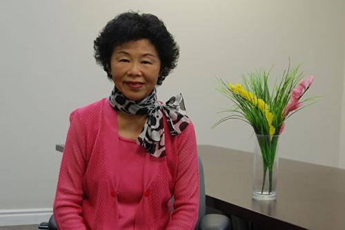

今年70岁的任志宏说：“我真的很有福气，因为我修炼了法轮大法。”

 幼年时的她，因为长得乖巧可爱，受到亲友喜爱：“这个女儿长大以后，将会是很有福气的人。” 

因为勤奋、乖巧，从小到大，她一直成绩优异，深得父母、老师的喜爱。从小学到大学，不是当班长，就是班代表。大学还未毕业，就被教授推荐到外籍洋行工作。20岁刚出头，她就独自担当一万多员工的出纳小姐。 

之后，她又遇上如意郎君，缔结幸福婚姻，还生了一对聪明、可爱的儿女，先生事业有成。她辞去洋行职务，全职在家照顾儿女，相夫教子。生活看似顺风顺水。 

然而，在决定移民的那一刻，她的人生开始出现转折。 

<b>从亚热带移民到加拿大 </b>

1990年7月，为了让女儿成就更高的钢琴造诣，42岁的任志宏和先生带着一双儿女移民加拿大多伦多。从温暖如春的台湾，来到遥远的北美。他们一家还没来得及熟悉周围的环境，就迎来了白雪漫漫的冬季。 

“背井离乡，举目无亲，环境陌生。”在那个寒冷而漫长的冬天里，任志宏感到前所未有的孤寂和焦虑。作为新移民，她适应得十分艰难。 

不久，她患了胃溃疡，稍不小心就发作，便血、眼冒金星，全身无力。那时，她除了看医生，就是卧床休息，每次持续一至两周。她成了一个病恹恹的人。 

与此同时，她又患了“富贵手”病，10个手指头皲裂，一沾水就痛得不行。她什么都做不了。这对于勤力而爱整洁的任志宏来说，无疑苦不堪言。 

日复一日，一拖就是好几年，胃溃疡和“富贵手”根本无法根治。 “人到中年，就遭受病魔打击，这日子什么时候是个头？”她感到人生一片茫然。 

为了寻求生命的意义，她开始接触基督教、道教、佛教等。辗转一大圈，始终没有找到完美答案。 

<b>转机 </b>

1996年冬天，任志宏的丈夫陈先生的朋友，送来一本书——影印本《中国法轮功》。陈先生花一整晚读完，得出结论：“此书内容太好了，这就是我要找的人生意义。”他决定修炼法轮功，也建议太太看一看。那时，她还没有完全理解修炼的真正意义，对法轮功没有做深入了解。 

1998年3月，任志宏获得一本《转法轮》，阅读之后，内心受到强烈震撼。她清楚地意识到，这是一本教人重德向善、返本归真的书。从书中，她明白人为什么有病，为什么有苦难；也明白了生命的意义到底是什么。 

此时，任志宏已经非常清楚，《转法轮》是她生命中的无价之宝，她决定要好好修炼法轮功，按真善忍的标准要求自己，做个真修弟子。 

仅炼功半年，折磨任志宏多年的胃溃疡和富贵手痊愈了。 

任志宏为此欣喜不已，“这是超越现代医学的奇迹，是法轮大法的超常。”她感觉自己好幸运。 

<b>把大法的美好带给他人</b>
 

任志宏在大法修炼中深受其益，也想让更多的人受益。每当乡亲朋友问起：“你看起来精神很好啊。”她总是回答：“我修炼法轮功，身体健康，无病一身轻。” 

1999年7月，中共发动对法轮功的残酷镇压，媒体铺天盖地诬蔑法轮功，任志宏很震惊： “这么好的功法为什么要被打压？”她挺身而出，深入社区，给乡亲朋友讲真相：法轮功是被冤枉的，中共打压是错的。 

由于民众接收了中共诬蔑法轮功的负面信息，许多人对她投来异样的目光。但任志宏不为所动，坚持不懈地在社区讲清真相。她的平和、理性，获得一些正义人士的认同，他们明白中共的邪恶，相信法轮功是好的。还有的人主动找上门来学炼法轮功。 

2000年，任志宏先生的大学同学谢女士患乳腺癌，手术后需要做化疗。为了减轻化疗后遗症，她找上门来，向任志宏夫妻俩学炼法轮功。 

任志宏就在家里开办免费九天学习班，那时来了好多乡亲朋友学功。通过一段时间炼功，谢女士恢复健康，成了一位真正的大法弟子。 

王女士患了忧郁症，精神萎靡不振，成天卧床不起，家人忧心忡忡，想把她送到医院治疗。谢女士介绍王女士来参加任志宏家的九天班。从此，王女士精神好起来了，之后一天比一天好，不久就恢复了健康，也成了一位真正的法轮功修炼者。 

王女士的姐姐亲眼见证了发生在妹妹身上的奇迹，后来也走进了法轮功的修炼行列。 

<b>任劳任怨的合唱团团长</b>
 

任志宏和先生都是音乐爱好者，1997年，多伦多台湾合唱团成立，他们是第一批团员。2004年，合唱团处于风雨飘摇之际，任志宏临危受命，被推荐担任团长。 

合唱团汇集了社区一批爱好音乐的人士，他们来自各行各业，年龄不同，性格不一。任志宏通过修炼，放下刚强、急躁、自负的个性，用真诚和谦卑的心态与团员们相处。有事大家商量、讨论，共同作出决策。对于团内事物，事无钜细，她亲力亲为，处理得又快又好。 

任志宏的女儿说：“妈妈，你的服务精神很好。如果你去竞选代表，你一定会做得很好。” 

担任团长14年来，任志宏用大法修炼人的心态和处事方式，赢得团员们信任。合唱团就像一个大家庭，大家相处和睦。合唱团每年多次参加社区演出，受到观众的欢迎。 

2014年4月，合唱团参加了加拿大多元文化“Singing Together ”合唱音乐会，获得主办方肯定，此后每年都应邀参加，还被意大利裔的大会主席推荐到意大利节庆活动表演。 

年复一年，任志宏热心服务社区，也把法轮大法的美好带到社区。 

2018年，在台湾妇女会50周年庆年刊上，任志宏女士撰文，用自己的经历，见证了法轮大法和真善忍的美好。 

<b>一个有福气的人 </b>

“我从一个伶牙俐齿、个性急躁、得理不让人的人，变成一个平和、谦卑、处处为他人着想的人，是《转法轮》这本书改变了我。”任志宏说。 

任志宏用大法修炼出的心态教育孩子，让一双儿女健康成长。儿子曾是滑铁卢大学精算系金榜上的优秀生，现任职多伦多一家金融大公司副总经理；女儿毕业于西安大略大学音乐演奏硕士，现在是一位出色的钢琴演奏家。姐弟俩也相继走入法轮功修炼行列。 

任志宏女士已走过20年的修炼历程。如今，她无病一身轻，身体健康，家庭幸福。不久前，她又喜得第二个孙女。 

回忆当年亲友讲的话，70岁的任志宏感慨不已：“真是这样，我真的很有福气，因为我修炼了法轮大法。” 

<h1 align="center"><b>警察以买菜为由 骗农妇到派出所 害其命危</b></h1>

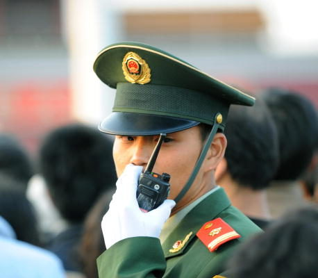

图：在中国，百姓的言论处处受到中共国安和警察的监视。

  
 【大纪元2019年02月09日讯】四川泸州老年法轮功学员丁国琴，2017年9月被警察以买她的菜为名在派出所绑架，并被非法判刑两年半，于2018年8月22日被劫持到成都龙泉女子监狱，不到3个月就被迫害至手脚不能动弹，生命垂危。
 
 目前，丁国琴已转到成都双流四川警官医院。

明慧网报导，丁国琴，泸州市分水镇农村妇女，以前人家常叫她“聋子”，八岁起左耳朵开始灌脓（当地叫灌耳心），长期流脓，发病时，疼痛难忍，左耳早已丧失听力，右耳也要顺着那股风才好使。

1999年6月丁国琴开始修炼法轮功，炼功仅两三天，耳朵干燥，不流脓了，几十年治不好的左耳恢复了听力。

她的身体从里到外也发生了意想不到的变化：她的个子长高了半个头，皮肤变得光滑，面部、身体的肌肉变得结结实实；身材变得匀称。以前拿东西要垫凳子的地方，后来一伸手就拿到了。

丁国琴学法轮功还不到一个月，中共对法轮功铺天盖地的迫害就发生了。20年来，在社会和家庭的强大压力下，她一直修炼法轮功，并告诉人们法轮功无辜被迫害的真相。

2017年5月，一个周一的晚上八点左右，泸州市江阳区分水镇派出所的三名警察，闯进丁国琴家中一阵乱翻，抢走大法书籍等物品。一个警察在追问下说自己姓王，其他人不敢报姓名。

2017年9月中旬的一天，丁国琴在镇上卖菜，三个警察说要买菜，把价讲好后，叫丁国琴把菜送到分水派出所。丁国琴到分水派出所就被非法抓捕，而后被送到弥陀镇派出所非法讯问。

丁国琴被非法关押近一年，没有人告知其家人丁国琴被关押的理由，没有谁向其家人送达执法机关剥夺公民人身自由所必须出具的拘留通知书等等法律手续和法律文书。

当时，只是有人用电话口头告诉丁国琴家人说，人在看守所，可以送钱、送衣物棉被去。

丁国琴的家人去找分水派出所要人，分水派出所推说是弥陀派出所抓的；找弥陀派出所，弥陀派出所说案子已经交给江阳区法院了；找到法院，法院却说没有这个人。

直到2018年8月下旬，其家人才得知，丁国琴已被非法判刑两年半。

<h1 align="center"><b>陋室记</b></h1>

【明慧网二零一八年十二月十二日】二零一六年创城运动中，市里要求小区里所有自己加盖的建筑全部拆毁，并派了推土机来小区强行执行。当时我们没在家住，于是就把钥匙给了邻居并委托他们全权处理。
没想到过了几天，邻居竟打来电话，说我们家那个棚子不用拆了：一方面是因为我们家住在小区的最里面，那个棚子影响不到别人，另一方面是天公作美帮了我们。她说，最后那天推土机拆呀，拆呀，当拆到我们家的时候，天下起了雨，推土机就回去了。结果等雨停了，小区管委会的人再打电话叫推土机，司机不来了，说：“就剩一户了，又影响不了什么，不值当的再跑一趟了，算了吧。”

古时候刘禹锡说：“山不在高，有仙则名。水不在深，有龙则灵。斯是陋室，惟吾德馨。”我们心里知道：是师父又一次帮弟子化解了这么大的事，给予了我们一个平稳的修炼和证实法的好环境。

<b>（一）“竹园”</b>

那一年，我和丈夫同时被绑架到劳教所迫害，公公也被邪恶迫害致死，婆婆带着年幼的孩子寄住到亲戚家里，房子就没人管了。

两年多后，我从劳教所回来一打开院门就愣住了：院子里的草长到齐二楼阳台那么高，整个一院子满满的，真是荒草凄凄啊！

但走进去仔细看，那一根根的草姿态优雅，不蔓不枝，就象一杆杆高洁的竹子，整个院子简直就是一个竹园！而且那些草还充当了保护门户的使者，因为它们把整个院子遮得严严实实的，所以院子里的东西都保存得完好无损：铁锹、大锤、煤气罐、螺丝刀……无一丢失，甚至连搁置了两年多的自行车都没生锈。我把自行车推到修车铺稍微上了点油，它就运转自如了，这很出乎我的预料。

厨房的门一直敞着，里面的锅碗瓢盆全都完好无损。从抽油烟机里流出来的油在灶台上竟形成了一层自然的保护膜，那些不好的虫子甚至爬行的蜥蜴都被粘住了，死在那儿。

院门口的那棵树，尽管上面生了好多大白蛾的幼虫——毛毛虫，但它仍然郁郁葱葱长得很茂盛，而且那些毛毛虫也从另一面保护着这个院子，因为一般人因为讨厌毛毛虫而不接近院子。

<b>（二）躲过火灾</b>
 

考虑到老人年龄大，多点阳光对身体有好处，所以我就带着孩子睡在北边的房间里，南边朝阳的卧室就让给了婆婆住。

一天半夜，我听到院子里似乎有动静，心里有点害怕就在心里喊师父。一会儿就感觉那个动静悉悉簌簌地穿过屋子跑到屋后去了。没隔几天，屋后的那家院子里的柴火垛起火了，据说当时火势很大，火头都窜到了二楼的窗户里，大家急得没办法，最后叫来救火车才把火熄灭了。

那柴火垛就在北边屋后的墙根底下，挨着我家的窗户，柴火垛烧没了，而我家的窗户玻璃只是有一点点裂纹，不妨碍使用，而且当时我们正好串门出去了，精神上也没有受到任何惊吓。

<b>（三）那棵树</b>
 

再说门前那棵树，它离我家的院子大门也就一尺远，但是有一次，村里有个人和邻居私下里商量好，硬说那棵树应归邻居家所有，他们决定要把它砍掉。作为修炼人，我们对这事根本没放在心上，心想：说他们家的那就他们家的吧，任由他们去处理好了。

一天趁我们都上班的时候，那人就悄悄爬上了那棵树，开始动斧头了。没想到正在那时，我丈夫（同修）正好班上要用扳手回家去拿，看到那人在树上砍树枝，丈夫什么也没说，拿着东西锁上门就走了。

下班后丈夫刚走进胡同，住胡同口的老阿姨就迎上来说：“你可回来了，你知道吗你们不在家，老季（化名）就要砍你家的那棵树，没想到刚砍下一条小树枝，他自己竟从树上掉下来了，摔断了一个小脚趾，身上没什么大碍，但吓得不轻。”

后来有人开玩笑：“老季呀，砍下那棵树做柴火烧吧！”老季直摇头：“不不不，谁愿砍谁砍，我可不敢了！”

<b>（四）吉人自有天相</b>
 

我们家这个房子是公公买的，当时公公因为手头紧没有立刻办房产证，只是找大队的领导作证，买卖双方一手交钱一手交房并签了个协议，现在因为孩子上学需要，必须得办房产证了。但是买卖双方的签字人现在都不在世了，再办房产证就得双方的孩子都签字同意才行。

卖主那边有三个儿子，在中国大陆当今这个社会氛围中，无论哪一个礼送不到，事情都不好办。婆婆一次路遇卖主的大儿子就和他提了这事，对方答复道：“那可麻烦了，再说吧！”见此情景，婆婆愁得不行，不知道该怎么办才好。我们虽然不知道怎样能安慰婆婆，但是自己心里却没有怎么愁，因为我们是大法修炼者。

古人说：“吉人自有天相。”家里有一个亲戚那段时间正好调到我们这个区专管房产这些事，这下好了，卖主的三个儿子主动去签了字。他们还找到婆婆说：“你们怎么不早说呀，你们家还有这么大一个官呀，早知道我们走动走动啊！”

过年的时候，婆婆一次和那个亲戚坐在一起吃饭，那个亲戚特意坐到婆婆身边给婆婆拜年。婆婆很是过意不去，说：“你看，我们家这样（指我们因修炼法轮功多次遭迫害）总是麻烦你，真是过意不去……怕连累你们，都不敢说和你们有什么关系。”

没想到，那位亲戚安慰婆婆说：“哎呀，婶子！你想多了，这有什么，咱们这些关系都是明摆着的，怕什么呀！法轮功怎么啦，那时候我们市府大院里可都是有见识的老干部才学炼法轮功的呢！咱们这一片到现在仍坚持炼的，光我这儿有登记的就还有四十多个呢！你看这俩孩子（指我和丈夫）学了法轮功，生活中从来不叫苦，真叫人佩服！”

婆婆回家说给我们听，我们很感动，也很受鼓舞。

二零一零年的时候，我们家的栅栏防盗门上还盛开了圣洁的优昙婆罗花呢！

<h1 align="center"><b>多少幸福家庭被中共残害？</b></h1>

【明慧网二零一九年二月六日】在新年到来前夕，明慧网报道了北京市部份法轮功学员惨遭迫害的系列文章《北京百余夫妻法轮功学员遭迫害案例》，看着这些用血泪凝聚的案例，令人心酸落泪。北京市部份法轮功学员惨遭迫害的案例是中国大陆千千万万法轮功学员遭受中共迫害的一个缩影，中共迫害法轮功近二十年来该有多少这样的悲剧啊！
不妨从《北京百余夫妻法轮功学员遭迫害案例》中摘录几例，看看中共是如何摧残和毁灭这些无辜的幸福家庭的：

案例1：江泽民下令正师级军官于长新夫妇被非法判重刑。于长新，原空军指挥学院教授，正师级，军队离休干部，原法轮大法研究会成员。于长新是空军第一代飞行员，参加过“国共内战”，曾主编空军指挥学院教科书，为空军做出几十年重要贡献。一九九九年四·二五，于教授即失去自由，七月一日，单位保卫处与干休所两个人将于长新从家中骗走。总政和空军组成了一个二十多人专案组，对于长新教授进行隔离审查，采取诱骗、威逼等卑劣手段，连续不准许老人睡觉，给老人精神身体造成很大伤害，期间非法抄家两次。原本空军有关人员根据于教授的一贯表现和“审查”结果，认为没有根据和理由给他大的处分。

然而江泽民对于教授怀恨在心，以权代法，先下令逮捕法办，又指令重判二十一年。军事法庭无奈于二零零零年一月六日，判于长新十七年徒刑，排在李昌之后。致当时已经七十多岁的老人被关进军队监狱，长期关押迫害。于教授对判决不服，曾提出上诉。当时军队高层对于老被判重刑反响强烈，一些高级将领为于教授鸣不平。

于长新教授夫人姜昌凤，毕业于北京农业大学，退休干部。于长新被判刑后，姜昌凤也被赶出空军指挥学院宿舍区的家。二零零一年因坚信法轮功，参加印刷法轮功真相材料被绑架，被非法重判十年，当时已近古稀。入狱初期被关在少管所迫害，后关在北京女子监狱迫害，是女子监狱关押的年龄最大的法轮功学员。在女监被迫害一度满脸长满大脓包，眼睛肿胀的睁不开，严重便秘，腰部严重弯曲成九十度，手不停地抖动，生活自理困难。出狱后又被非法送进劳教所，二零一一年十一月，这位八旬老人，被人目睹关押在北京女子劳教所，被单独关在一个牢房，身体已经很虚弱。

案例2：曹东长期遭受残酷迫害，妻子杨小晶被迫害离世。曹东，北京外国语大学毕业，原籍甘肃省，曾在北京旅游服务公司工作。二零零零年十一月，在京被警方绑架，后判刑四年半，送甘肃监狱关押。杨小晶原北京供电设计院工程师，迫害发生后被东城区警方多次绑架、关押，被非法劳教。二零零一年、二零零四年，分别被两次劳教，共四年。在劳教所期间，遭受多种精神和身体摧残。劳教回家后，长期遭受骚扰，被迫流离失所。

二零零六年五月，曹东为营救被关押在劳教所的妻子杨小晶，在北京与欧洲议会副主席斯考特见面，讲述了自己和妻子及熟识的法轮功学员所遭受的残酷迫害。会面之后两小时，曹东即遭国安特务非法抓捕，二零零七年二月，再次被非法判刑五年，秘密关押在甘肃天水监狱单间，遭受残酷迫害。

二零零六年八月，杨小晶从女子劳教所回到家中，为关押的丈夫奔走呼吁遭到恐吓。曹东两次被判刑期间，她在自己遭受迫害的间隙，先后两次拖着虚弱的身体远赴甘肃狱中探望丈夫，第一次在平凉租住十一个月，第二次在天水见到丈夫伤痛不已。

杨小晶结婚后，夫妻在一起的时间不到一个月，双方轮流被非法拘留、关进监狱、劳教所。长期迫害中，杨小晶身心严重受损，又遭遇当地警方突然恐吓，病情急剧恶化，于二零零九年十月一日在兰州凄然离世，年仅四十五岁！当时曹东关在天水监狱，杨小晶病危期间及离世后，家人多次要求让曹东见杨小晶最后一面，均被拒绝。

二零一二年六月八日，七、八个警察突然闯进曹东在北京的临时住处，将他又一次绑架并劳教二年零六个月，劫持到新安劳教所迫害；曹东从法律角度反迫害，委托律师提出行政复议和诉讼，但是没有结果。

案例3：于宙被迫害离世，妻子许那遭遇酷刑迫害。于宙，四十八岁，毕业于北京大学西语系法国文学专业，是通晓多种语言的青年才子。于宙是乐队“山谷里的居民”的鼓手、歌手，中国大陆人所熟悉的《爱的箴言》的原唱音乐人。这样一个修炼法轮功做好人且才华横溢的精英人才，最终被中共恶党以“迎奥运”为借口，绑架虐杀。

二零零八年一月二十六日晚，于宙在演出结束后与妻子许那驾车返家途中，行驶到通州区北苑路段被警察拦截，进行所谓奥运搜查，随即将他们抓到通州区看守所。二月六日，当家属接到通知赶到北京清河急救中心时，原本身体健康的于宙已离开人世。医生面对家属的质询，一会儿支吾说是因“绝食”而亡，一会儿说死因是“糖尿病”。看守所逼迫家属立即火化遗体，于宙的亲属坚决不同意并要求尸检。目前于宙的遗体仍在冰柜里保存。

于宙的妻子许那，原籍长春，毕业于北京广播学院（现中国传媒大学），从事油画创作，作品在海内外很受欢迎。一九九九年七·二零邪恶迫害开始后，许那坚定的证实大法，多次被绑架关押，两次被非法判刑。在女子监狱里，许那坚定信仰、抵制迫害，始终没有妥协。

二零零一年七月四日，许那被房山和通州警方从住处绑架，家中大量财物一概被抄走，后被非法判刑五年。她在少管所曾单独跑出队列拦住路过的监狱长，当面反映所遭受的种种摧残，要求停止迫害；许那在北京女子监狱关押期间，曾遭受集训队小号严管隔离、酷刑等折磨，被强制盘腿捆绑、不让睡觉洗漱、在雪地里冻、禁止家人探视、软硬兼施、频繁调队等，但她始终正念正行没有转化。

二零零八年一月她与丈夫再次被绑架，在丈夫刚刚被迫害致死的情况下又被非法判刑三年。许那第二次在北京女子监狱期间，依然坚定信念，正念正行，没有向邪恶妥协。

案例4：韩俊青被迫害致死，妻子王秀红被劳教，女儿因控告元凶被关押。韩俊青，房山区窦店镇人。曾是当地有名的地痞，他自己讲炼功前没干过好事。修炼法轮功后脱胎换骨，去掉了恶习。他的变化在当地引起轰动，老百姓赞扬法轮功真神，让坏人变成了好人。二零零零年他被劳教一年，在劳教所被洗脑欺骗转化。从劳教所出来后，韩俊清再一次清醒，痛改前非。二零零四年二月再次遭绑架，关押在房山区看守所，五月四日传出死讯，房山分局不让亲属看遗体，说要解剖验尸，当年约四十七岁。之后其亲属看到刀口一直开到肚子，内脏器官被摘除，肚子里灌的都是冰，遗体虽然被化妆，但脸上的伤痕清晰可见，人很消瘦，左眼下方皮肤、肌肉严重损伤，整体缺了一块肉，喉咙处有开刀缝合的疤痕。

韩俊青的妻子王秀红，从丈夫修炼后的巨大变化，看到了法轮大法的美好，也开始修炼大法。二零零零年七月被绑架并劳教一年。二零零四年韩俊清在看守所被迫害致死期间，也被拘留关押。二零一五年八月十四日，她再次遭窦店镇派出所警察绑架关押。同年七月十六日，韩俊青的女儿韩雨，因控告迫害死父亲的元凶江泽民，被海淀区公安分局警察绑架，在海淀看守所关押四十天。

案例5：杨占明被劳教、妻子吴尭被迫害致死。杨占明，北京应用物理与计算数学研究所高级工程师。杨占明和妻子吴垚修炼法轮功后身体健康，二零零零年二月十二日，二人带着写给中央的一封真相信，到国务院信访接待站递交，因此杨占明被关进海淀区拘留所一个多月；后又三次关进洗脑班强制转化。二零零二年十月，夫妻同被非法劳教两年，杨占明被送进劳教人员调遣处、团河劳教所迫害。

吴垚一九四六年生，北医附中英语教师，二零零二年四月流离失所期间第二次被绑架，迫害致生命垂危；同年九月九日，吴垚和老伴杨占明向世人讲真相时再次被绑架，关押在丰台区看守所，后被非法劳教两年，二零零三年六月十一日被送往劳教人员调遣处。吴垚被劫持到调遣处的当天遭到毒打等摧残，十天时间吴垚被迫害致死。

二零零三年六月二十二日，家属被告知吴垚已去世，说是“猝死”。当时杨占明和吴垚家人看到，吴垚的遗体左手是黑的，有大片瘀血；生前穿的短袖白背心上有鲜血印。同吴垚关押在一起的法轮功学员回忆，警察逼她转化，她始终不肯，并给警察和刑事犯人讲真相。吴垚遗体火化时，调遣处处长张继忠见到吴垚的二弟，对吴尭的死亡，表现出心虚的样子，笑嘻嘻的伸出右手说“谢谢你”。

案例6：清华大学虞超、褚彤夫妻双方被非法判重刑。虞超，清华大学精密仪器系九零级毕业生，网络工程师，原在北京一家外企任职。二零零零年因去天安门广场打横幅“法轮大法是正法”，被劳教一年（所外执行）；二零零二年八月与妻子褚彤在北京被绑架，住处遭劫掠，后虞超曾被秘密关押在北京法治培训中心，虞超遭受警察毒打、上大板成大字型、双手双脚铐、绑在床上近四个月等长期酷刑折磨，致肌肉开始萎缩；“转化”他的帮教与警察换了一批又一批，无法动摇虞超坚信大法之心。后虞超被冤判九年徒刑，关押在前进监狱，遭“坐小凳”、强迫体力劳动等迫害。

褚彤，清华大学微电子学硕士毕业，清华大学微电子所讲师。曾被非法判刑两次。一九九九年十月上天安门城楼为法轮功请愿，遭警察野蛮殴打，被绑架后判刑一年六个月；出狱后在明慧网刊登“严正声明”表示继续坚修大法。为避免再遭迫害，与丈夫虞超带孩子被迫放弃待遇优厚的工作流离失所。面对高压迫害和颠沛流离的生活，褚彤只得把不满四岁的儿子虎虎托给朋友抚养，母子分离的场面令人心酸，当妈妈跟儿子说再见的时候，小家伙懂事的说，“妈妈，等坏人没有了，你就来接虎虎回家。”二零零二年八月褚彤与丈夫虞超在北京被秘密绑架，此次迫害由所谓“专案组”专管，被认为“案情重大”，先被国安和610秘密送到“法制培训中心”洗脑班迫害几个月；二零零四年四月二十二日，朝阳区法院非法判褚彤重刑十一年、虞超九年。褚彤被关进北京女子监狱遭受长期迫害，遭强迫灌食、剥夺睡眠、强制洗脑、单独关押等。褚彤的母亲在她出狱前数月离世，没有看到女儿最后一眼。

案例7：清华大学研究生刘文宇、姚悦夫妇被非法判刑。刘文宇，清华大学热能工程系九七级硕士研究生，因成绩优异提前攻读博士学位。二零零零年一月十五日到三十日，刘文宇被清华校方非法软禁在二零零号核试验基地，强迫其改变信仰；二零零零年六月，刘文宇因到天安门广场为法轮功和平请愿，被以“涉嫌非法聚集”之名刑拘一个月，并被清华勒令退学，后刘文宇被非法判刑三年六个月。

刘文宇的妻子姚悦，清华大学微电子所九六级硕士研究生。一九九九年九月三日，因在学校内公开炼功被清华大学派出所强行带走，后被开除学籍。二零零一年一月一日凌晨，被中关村派出所匪警破门而入抓走，警察将姚悦的两手铐在床栏杆上，用电棍电击手腕；后关押在北京市公安局七处看守所。二零零一年十二月十三日，姚悦被北京市中级法院捏造多种罪名，非法判重刑十二年，关押在北京女子监狱遭长期精神和身体迫害。

《北京百余夫妻法轮功学员遭迫害案例》一文中说：“许多法轮功修炼者的家庭，经常是父、母、兄、弟、姐、妹、子、女、夫妻被同时迫害。夫妻双方同时遭到迫害的案例尤为突出，且触目惊心！有多少夫妻双双被迫害致死；又有多少夫妻被迫害的阴阳两界、天各一方；他们被非法判刑、劳教、关押洗脑班等等。迫害导致家庭中老人无人赡养，老人失去照顾加上精神创伤致病或病情加重以致离世；孩子成了孤儿，或辍学、或被开除失去读书的机会。幼小的孩子离开了父母的保护关心，心灵深处留下了永远无法弥合的创伤，身体和学业蒙受难以挽回的损失。”

看着这些令人触目惊心的迫害案例，深知中共一手发起的长达二十年至今不能停止的迫害有多么惨绝人寰，它给这些奉公守法一心做好人的善良民众带来的灾难有多么深重，同时让人们进一步看清了中共这个一贯自吹“伟光正”的党真正是一个什么货色，自此它的流氓本性和邪恶本质暴露无遗！

家庭是组成社会的基本单位，没有家哪有国？没有这些重德行善奉公守法的善良好人，哪有国家的长居久安及人民的安居乐业？中共就是要把这些重德行善奉公守法的善良好人摧残毁灭，把传承五千年的中华民族敬仰神佛重德行善的传统文化破坏殆尽，让共产邪灵称霸人间、统治世界的阴谋得逞。

中共迫害法轮功二十年来，北京市是中国大陆遭受迫害最严重的地区之一。据明慧网资料显示，在2018年绑架迫害最严重地区中北京市142人，位列第八。骚扰迫害最严重地区中北京市113人，位列第六。2018年933名法轮功学员被非法判刑，其中北京市36人，位列第十一。近二十年来，北京市当局一直紧随江泽民集团打压迫害法轮功，走在迫害的最前面，就是到目前为止仍不收手。

又一个新年到来了，在这万家团圆的时刻，可知有多少法轮功学员的家庭是伴随着痛苦、思念与泪水在过年？可知如今他们已经被迫害得支离破碎、妻离子散、家破人亡，亲人团聚欢庆佳节的日子已经永远离他们而去？这一切是谁给造成的？就是那个仍然在用谎言欺骗蒙蔽着人们的邪恶中共，用各种卑鄙流氓手段残酷迫害民众的邪恶中共，用各种手段监控、追踪民众的行为、视人民为敌的邪恶中共！

愿那些仍然被中共利用的人们能够早日清醒，不再助纣为虐，做一个明真相、知善恶的正常人。愿所有正在或可能将会遭受中共迫害的人们，能够唤醒自己的良知善念，共同起来反迫害、解体中共。愿国际社会能够站在维护世界人权的角度，关注中国的人权恶劣状况，帮助制止中共对善良人的迫害，使饱受中共欺凌的中国人民也能享有真正的自由与人权！

<h1 align="center"><b>“绝版”女孩儿</b></h1>

我有一个漂亮、聪明的女儿。在物欲横流、善恶不分、没有安全感的当今社会里，孩子未来命运如何是我们全家人最放心不下的事情。
女儿上高三时，我看了一遍《转法轮》这本书后觉的真好，就想推荐给女儿看。当时我有两个顾虑：她们从小受恶党灌输无神论，学习的课本里就有诬蔑、诽谤大法的谬论，大法的真相她能相信吗？另外，大法书表面虽浅显，内涵却高深，而且修炼要吃苦，蜜罐里泡大的她能接受吗？出乎我的意料是，女儿看书后立刻走入了大法修炼。真是天大的洪福降我家！

得法后的第二年，女儿考上大学满意的科系。岂料学校却突然「调包」，强制把女儿分到了另一个科系。当时我明知道是过心性关，可那心真是剜心透骨的痛。朋友知道这事后，非常气愤，要用自己的权力帮女儿重新安排、摆平这件事，像师父讲的：「他搞我，我搞他。他有人，我也有人，咱们干吧。」我让孩子自己决定。女儿流着泪说：你告诉叔叔，我尝到了被别人强行占有利益的痛苦，我不能再做伤害他人、让别人痛苦的事。还安慰我说：师尊说「难忍能忍，难行能行」，我会做到的。朋友听到女儿的话，眼圈也红了，说：多善良的好孩子呀！

开学一段时间，女儿回家告诉我，在校园里遇到一个同学，向她打听报到处，并一再让她帮忙带路。路上他得意的告诉女儿，凭他的成绩根本就考不上现在这个热门科系的，是家里花巨资托人把考进这个科系的一个学生挤走了。因怕人家闹事，所以等到那个学生入学后，确定没有甚么事了，学校才敢通知他来报到。那正是女儿考入的那个科系。女儿说：「过心性关真像师尊说的那样：『不刺激到人的心灵，不算数，不好使，得不到提高。』师尊告诉我还有没放下的东西，今后再见到那个同学就能坦然面对了。」

大学期间，女儿按照大法的法理要求去做个好学生，更好的学生。住宿时她自己花钱买扫除用具打扫宿舍卫生，干其他同学不干的活儿，做到宽容、理解、忍让，整个宿舍干净、舒适，室友关系和谐，别的宿舍同学非常羡慕，经常来聚。她就在聊天中给大家讲大法法理、做好人的道理。学习时她特别努力。她说：「现在想想师尊这件事安排的真好！我不但过了心性关，而且这个科系学的知识，有许多东西是将来做证实大法的项目时能用上的，一定要学好！我这是因祸得福！太好啦！」女儿不但学习校内的课堂知识，还到校外补充学习相关知识，成绩非常优秀，不但被同学们选为班负责人，学生会负责人，还得到奖学金。学校负责人找到女儿说，有让她留校的意向。

<h1 align="center"><b>万千感恩化一句：师父新年好</b></h1>

【明慧网二零一九年二月五日】二零一九年中国传统新年来临之际，中国大陆民众纷纷向明慧网寄发新年贺卡与祝福语，诚心敬祝法轮功创始人李洪志师父新年快乐，期盼李大师早日回国。
法轮功弘传至今二十七载，恩泽世界一百多个国家，“真、善、忍”的普世原则深入人心。今天中华大地仍经历着一场史无前例的浩劫，在中共血雨腥风近二十年的迫害中，李洪志师父教诲下的法轮功学员，承受身心巨难，不顾个人安危，向民众广传真相，拨云散雾，越来越多明白真相的民众由此敬谢李洪志大师的浩荡洪恩。

法轮大法传世以来，不仅修炼者在法中提高，法轮功学员们的家人及明白真相的世人也因为相信大法好、支持大法，从而得到善报和福寿；诸如罹患疑难病症彻底康复，贫困家庭生活得到改善，耄耋老人绝处逢生，在危急车祸中安然无恙等等，尽显法轮大法的威德光耀人间。适逢己亥年新年来临，在大法中受益的百姓恭祝李洪志师父节日快乐！

中国各地民众感恩李洪志大师给人们带来了希望，一位北京市民表示：“在我住院期间，有福听到了大法弟子给我讲的，使我真正明白了法轮功被迫害的真相。作为一个有良知的中国人，我为您与法轮功做不了什么大事，只有顺应天意，在退党大潮中，添一份光彩。永远支持您和大法弟子所做的一切”。

通过各种渠道了解了法轮功真相的中国民众，坚信大法好，表示：我们永远支持法轮大法。山东省诸城市王街道市民说：“我们都知道法轮功是受冤屈的，共产党十恶不赦。法轮大法非常好，应该大力推广，共产党不让人学好，太坏了。”河北秦皇岛市市民说：“法轮大法‘真、善、忍’的理念，就象日月的光辉，能照亮人心，使人道德升华，因此我非常敬重李洪志师父，在此恭祝师父新年好。”

湖南靖州县退休干部在写给李洪志师父的新年贺词中写道：“当时没有一个人敢给法轮功讲一句公道话，我相信法轮功学员很难挺过三个月。没想到多年以后，我家居然收到了法轮功真相资料。多年来我也就一直把自己知道的法轮功真相传递给其他人，并劝他们退党。”

一九九九年“七二零”，首恶江泽民叫嚣“三个月消灭法轮功”。近二十年过去了，法轮功不但没有被消灭，反而在法轮功学员坚持反迫害讲真相中，中国大陆许多直接参与迫害法轮功的公检法司、政府系统的人员也逐渐觉醒，不愿为虎作伥充当中共迫害法轮功的工具；有的利用自己的特殊条件或明或暗的保护着法轮功学员；更有的走入了法轮大法修炼，踏上返本归真之路。

近日世界各地的法轮功学员也陆续向李洪志师父拜年，来自学员们的感恩、家属得福报者的感激，通过精美贺卡、贺词、视频与闪画等形式，雪片般地汇向明慧网，向李洪志先生祝贺新年。这些法轮功学员们来自不同国家、不同族裔，遍及社会各阶层，受益于法轮大法赐给他们崭新的生命，从原本药罐子变成无病一身轻，“一人炼功，全家受益”，很多人亲身体会了心性提升、身体健康，家庭平安幸福的感受。“法轮大法好”、“真善忍好”、“谢谢师父”，是他们共同的心声。

路遥知马力，日久见人心。“师父新年好”之声来自全球各地与中国大陆，再次证明中共对法轮功迫害的彻底失败，任何谎言与暴力都改变不了法轮功学员对“真、善、忍”的坚定信仰，更无法阻挡真理在世间的弘扬。感恩是人间的珍贵情操，声声传颂“师父新年好”，表达民众衷心感恩于万一，不仅见证了法轮功真相的广传，也为传统“感恩”一词，做出跨时代的新诠释。

<h1 align="center"><b>瑞典学员冰雪天讲真相感动民众</b></h1>

【明慧网二零一九年二月五日】（明慧记者何平斯德哥尔摩报道）斯德哥尔摩这两天一直都在下着雪，二零一九年二月二日，瑞典首都斯德哥尔摩通往老城、最热闹的皇宫旁的钱币广场，笼罩在一片白雪皑皑之中。虽然天气寒冷，法轮功学员仍象往常一样，在这里展示法轮功的五套功法并向过往的民众讲述中共迫害法轮功的事实真相。

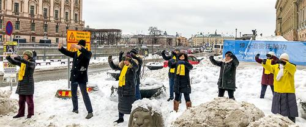

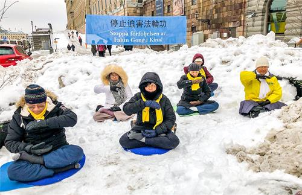

图1～2：二零一九年二月二日周六下午，虽然天气寒冷，法轮功学员象往常一样，在最热闹的皇宫旁的钱币广场上，展示功法并向过往的民众讲述中共迫害法轮功的事实真相。

  

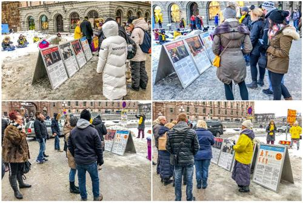

图3：人们正在仔细阅读真相展板，了解法轮功真相。

  

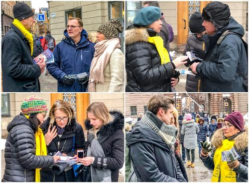

图4：法轮功学员面对面讲述中共迫害法轮功的事实真相。

  
 在活动场地前人们看到，学员们在堆积的高高的雪堆上竖起“停止迫害法轮功”的醒目横幅、摆上真相展板信息台，有的伴随着优美的音乐展示法轮功的五套功法，有的在散发真相传单，呼吁民众关注中共对法轮功学员的残酷迫害以及活摘器官牟取暴利的罪恶。

一对瑞典中年夫妇了解了法轮功真相后，站在活动场地前观看学员演示功法久久不愿离开。那位先生手拿着大法传单对学员说：“现在的人们每天都在为追求各自的目的而奔波着，活得很累啊！我站在这里感到了很强的能量场，有一种从未有过的宁静和祥和。看来人是应该换一种活法了。”俩人对学炼法轮功很感兴趣。

有一位由于工作原因常常往返于中国、瑞典之间已经很多年的瑞典先生和他的太太静静的听完了真相后表示，他完全相信中共迫害法轮功这个事实是存在的。他说，中共在背地里干了很多的坏事大家都是有目共睹的，这么如此残暴的迫害人权（法轮功学员），而且这么长时间了，在国外的人们都没能有所作为，他感到很遗憾。他表示很敬佩法轮功学员长期以来坚持反迫害所作出的努力。

一位来自法国的先生听完了中共迫害法轮功的真相后，他说：“我心里很难受。”他保存好真相传单，表示回去后会再仔细阅读同时自己也要为制止这场迫害做点什么。 
  
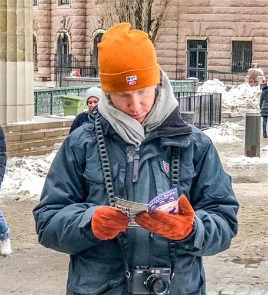

图5：这位年轻人保存好真相传单，表示回去后会再仔细阅读同时自己也要为制止这场迫害做点什么。

  
西人学员约翰说：“今天虽然天气寒冷，但看到又有这么多的民众了解了真相，不再被中共的谎言所欺骗，真的是很开心。还有那些明白了真相的人，给我们的鼓励，令我很感动！”他表示，会继续坚持不懈的帮助在中国大陆为做好人而被迫害的法轮功学员、帮助更多人来了解法轮功真相而从中受益，直至停止迫害的那一天。

<h1 align="center"><b>中国的“年味儿”哪儿去了？</b></h1>

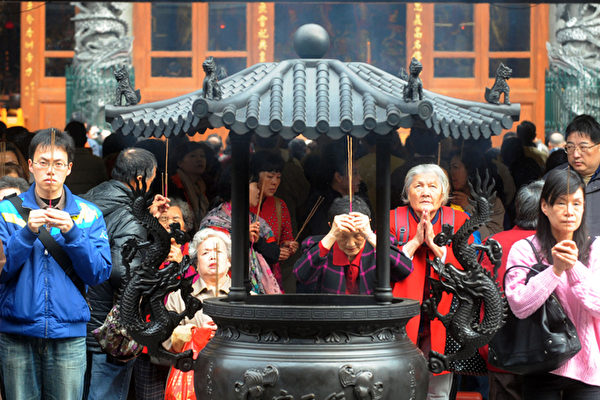

传统的过年习俗表现了中国古人敬畏天地神明、回溯传统的浓厚文化气氛。

  
  【大纪元2019年01月28日讯】近期多家海外媒体报导，2019中国新年将至，许多大陆游客却选择特地去台湾过年。主要原因是什么呢？大多数游客称是因为大陆越来越没有过年味，相比之下台湾却有着满满的传统朴实的味道。
  
  
什么是“年味儿”？新年是国人最大的传统节日，代表着团圆，一家人欢聚一堂，享受一年中难得的美好时光，”“年味儿”其实就是新年所给我们带来的欢乐、温馨、幸福的感觉，这个词是人们内心的真实反应。那么为什么中国人觉得大陆越来越没有年味儿了呢？根本的原因就是中共在刻意地在篡改破坏新年的习俗。

中国是一个拥有5000年文明的传统古国，新年是中国人最大的传统节日。传统的过年从腊月初八就开始，一直延续到正月十五。传统的过年习俗包括：腊月初八（“腊八节”）喝腊八粥，并以腊八粥供奉神佛、祭拜祖先，感谢神明让自己得到丰衣足食。以各色米果相杂熬制的腊八粥代表着感恩和祈盼来年丰收。雍和宫内至今仍有一口重数吨的古铜大锅，为昔时皇家煮腊八粥用具。寺院多在这一天举行浴佛会、诵经、散粥等等。

腊月二十三（“小年”）祭拜灶神。古人相信人间的一切事都有神灵掌管、安排和监看，不但灶台上有灶神，井有井神、门有门神、田里还有土地神等等。这些神灵各司其责监管着人间善恶，而迎送这些神灵都在腊月二十三至除夕期间举行。

腊月二十四或二十八大扫除。因为此时诸神上天去了，平日里扫帚不敢动的地方（怕亵渎无处不在的神灵），这时候都可以清扫了。

除夕这一天过新年进入高潮。除旧迎新之际最重要的事情是祭神祭祖。除了晚上阖家吃团圆饭和守岁之外，这天正午就开始在佛堂摆齐供品，燃蜡点香，俗称起香。从此时起香火不可中断，直到初五。此外还要置天地桌（供桌）以迎接诸神下界、贴门神、请灶神像、贴春联等，都与中国人敬神的传统有关，这不仅是古人对孝道的表达，也是表达对传统道德的继承。

正月初一老少黎明即起，整肃衣冠，点香烛放爆竹，开大门，设斋果茶酒于庭，拜天、地、祖先。

年节期间，还有庙会、唱戏、舞龙、舞狮、武术、杂耍等等活动。庆典的气氛一直持续到正月十五元宵节之后。正月十五相传是道教天官大帝的生辰，百姓在这一天为天官大帝庆生，祈求“天官赐福”。

这些传统的过年习俗表现了中国古人敬畏天地神明、回溯传统的浓厚文化气氛。事实上这也是中华正统文化的核心所在。这种文化氛围使得古人以谦卑的态度对待生活：比如取得了好的收成，人们相信那是因为神灵赐福给好人或祖上行善积德，而不是“战天斗地”的结果，所以要更加谦恭对待神灵，多行善事，因为处处都有神灵监看。传统上民间的祭祀内容主要在于表达恭敬、感恩、反省和许愿–许诺多做善事，希望得到赐福满足所愿，而不是求财、求官、求名等。

但是，自中共1949年篡权以来，它使用了一系列手段破坏过年的传统习俗，其中包括：

篡改名字－将“正月初一”改为“春节”，似乎新年只是个普通的庆祝“春天”的节日而已。这样一来，不但原本丰富多彩的“过大年”被简化成“欢庆春天”，和传统年节相联系的中华正统文化内涵也被割断。
炮制春晚－近二十几年的“春晚”贯穿了对邪党歌功颂德的党文化，依靠庸俗取乐、毫无内涵的方式迎合观众，越来越被人唾弃。

鼓吹“过年黄金周”－中共官媒极力鼓吹民众过年期间出境购物旅游，导致中国人在本应归乡、回家、团圆的黄历新年离家、远走他乡。

在1960年代，中共甚至曾煽动中国人抵制过中国新年。1967年1月25号《解放日报》刊登了一封“革命造反派来信”，倡议春节不回家，并评论说“春节算得了啥！我们无产阶级革命造反派的最盛大的节日来到了！”，同年，中共中央机关报《人民日报 》发表了“破除旧风俗，春节不休假”的倡议书，高呼要围绕春节，大造几千年来旧风俗、旧习惯的反——“什么敬神、拜年、请客、送礼、吃喝玩乐，都统统见鬼去吧 ！”。4天后，中共中央就所谓顺应“广大革命群众的要求”，发布了春节不放假的通知。传统的过年被贬低成“肮脏的旧习惯”，那期间许多家庭在政治斗争中支离破碎，无法团聚。即使能一起吃顿年夜饭的家庭，饭前也得召开所谓“斗私批修”的家庭会，初一早晨还要合唱红歌。

过去的近70年中，中共不断的发动如三反、五反、文化大革命等各种运动、斗争，不断的制造仇恨、制造恐怖来使人们屈服，与此同时激发了人们恶的一面。中国的传统文化被毁之殆尽，它用血腥、暴力和谎言不断的给中国人洗脑，把正统的、美好的、善良的歪曲成愚昧的封建迷信、反革命等并极力用各种手段铲除，斩断了人与神之间的联系，扭曲了人与人之间那种和谐美好的自然关系，摧毁了人们对神佛的信仰。

中国新年历史悠久，起源于殷商时期年头岁尾的祭神祭祖活动。但在当今中国，过新年背后的内涵已经被中共篡改，中国人怎么可能感受到过年那种真正的幸福与喜庆的味道？文化是民族之魂，社会的伦理价值观常常是通过文化具体反映出来。中华传统文化是神传文化。中共系统性、毁灭性地破坏传统文化，欲颠覆人们心中的道德良知，强制给人们灌输其邪恶的党文化，宣扬“与天斗，与地斗，与人斗”，破坏人与天地自然之间的和谐关系，使人们背离民族的传统。要想体会到真正的年味儿，让中华民族正统的文化重现辉煌，就只有抛弃中共，脱离其魔爪。现在全球多国联手剿共，相信那一天不会太远了。

<h1 align="center"><b>“退！巴不得呢！”</b></h1>

  一天家里来了位年轻客人，是个小伙子。他是来辞行的，马上要出国留学。

我试着跟他讲大法真相，没想到，刚说了一句：“其实你这样有独立思想的人，可能出国更合适。”他马上说，“是的，我反对共产党，为此吃了不少苦头，但义无反顾。”话匣子一打开，他给我讲了他和他家族的故事。他说：我从小就被老师当作差生对待，因为我不热爱党。小学第一批入队没我的份儿，第二批全班都入了，我才戴上红领巾。但我总不按老师的要求戴，我在红领巾上写满“爱”，然后当个三角巾来戴。为此被老师记了一次大过。

我大一点懂事后，我奶奶告诉我，我曾祖父是被共产党烧死的。奶奶说，我曾祖父是一个勤劳能干的人，家境殷实，有不少地，家里有长工。一家人对长工们很好，所以共产党抢我家土地的时候，长工们曾经想站出来保卫我们的家庄，但没敢。我曾祖父被打成地主，被共产党在我家自己的土地上，用自己家生长的柴草点着，活活烧死。我爷爷兄弟姊妹们拼命逃，才得以活下来。那时候，我就知道共产党是什么事都能做得出来啊！

上中学到了入团年龄，有一次老师在班会上要全班一起入团，还发团徽。我抓起团徽，摔在地上！全班大惊，就连我那些好朋友都纷纷指责我。老师生气地问我：你是中国人吗？我说：我不是你党国的人，我是华夏国人。我的身体来自盘古，来自女娲，我的血脉来自祖先少昊。这次我又被记了一次大过。

我申请出国，所有表格上国籍这一栏，我坚持填华夏国。老师威胁说，你这么填会影响你，拿不到OFFER（接收函）的。我问了我们学校的外籍老师，他说，你对华夏国做个解释就没问题。结果是，我顺利拿到好几个国外大学的OFFER（接收函）。

听完他的故事，我知道不用跟他多讲，他全明白。提到中共活摘法轮功学员器官的罪行，他说这比纳粹还要邪恶；提到“三退”，他说知道共产党邪恶，只是没想到自己这么反共的人也被打上了兽的印记。

我说帮你在网上退队，把发过的毒誓废掉，他说好。临别时，我再次确认他要退队，他斩钉截铁地说：“退！巴不得呢！”

<b>“退，用真名退。”</b>

在江边遇见了三十年没见的老邻居，俩人很是惊喜。这位老邻居说：几年前，他被医院确诊患了皮肤癌，疾病的折磨让他非常痛苦，让他感觉是到了生命的尽头。有一次，他做了个梦：有人告诉他一个治他的病的药方。一来因为他原本对药材有些了解，二来皮肤癌的痛苦很难让他忍受，于是他就按照梦中的药方为自己配了药，并喝了下去。很快他就昏死过去了。

他说，他到了阎王那儿了，阎王问他是不是共产党员？他说：“不是，我才不信它呢！”阎王说：“那你回去吧。”就这样他回来了。醒来，发现他身边围了很多人，一问家人才知道，家人都以为他不行了，所以才围了过来。

后来，他身体逐渐的恢复，并能下地了，能独自出来散步，蹓跶，和正常人一样了。现在听到甲给他讲“三退”的事，他想都不想就说：“退，用真名退。”

<h1 align="center"><b>墨尔本国庆日大游行　民众感佩“真善忍”</b></h1>

【明慧网二零一九年一月二十八日】（明慧澳洲墨尔本记者站报道）二零一九年一月二十六日，澳洲墨尔本市中心举行了一年一度的盛装大游行，庆祝澳洲国庆日（Australian Day）。游行队伍穿越繁华步行街（Swanston St）、跨过王子桥以及绿荫掩映的圣基尔德大街（St Kilda Road）直至国王公园（Kings Domain Gardens），成千上万的市民和游客簇拥在街道两旁观看载歌载舞的表演。
各族裔法轮功学员组成亮丽的游行队伍，把“真善忍”的普世价值和法轮大法的美好带给澳洲文化之都的各族裔民众。祥和的五套功法展示、优美的扇子舞以及喜庆的腰鼓表演，吸引人们纷纷拍照录影，从主席台上台下的嘉宾到旅游度假的大陆客，都被纯正的能量、绰约的舞姿、清脆激昂的鼓声激赏感佩。

队伍经过主席台时，主持人一字一句地认真解说道：“法轮大法是以宇宙特性‘真善忍’为原则的修炼方法，法轮大法队伍传播的是传统的中国文化。”这样的解说词随着队伍的行进不断重复着，不同位置的观众都能边看边听。

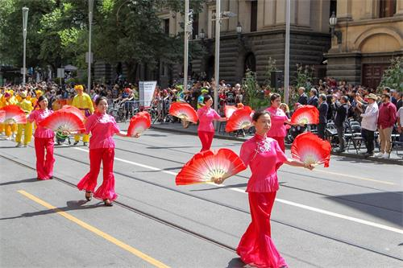

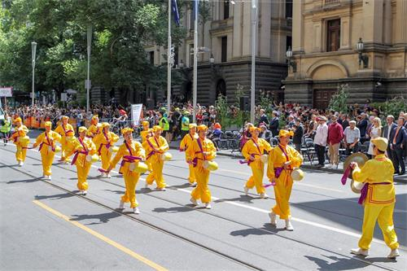

图1～2：二零一九年一月二十六日，参加澳洲国庆日（Australian Day）盛装大游行的法轮功学员队伍。

图3：法轮功学员方阵经过时，市民和游客簇拥在街道两旁观看、拍照

<b>“真善忍启迪心灵，每个人都需要”</b>
 

布鲁克（Brooke）是一名年轻的电脑专家，从事网络安全工作。她说：“法轮大法的队伍真的很棒，我感到很开心，（观赏扇子舞）感觉自己也象蝴蝶一样能翩翩起舞。”她感佩法轮功学员们分享美好的功法、传播普世价值“真善忍”，她说，“真善忍价值启迪心灵，每个人都需要。请坚持做下去，我们都需要。”她表示，会把法轮大法的传单和朋友们分享。

退休前任项目经理的计算机专家沃特•斯格尔顿（Walter Skilton）是当天游行队伍中Ringwood区高地管乐队的资深成员，了解到法轮功学员近二十年来作为社区的一部份积极参与这样的活动、共襄盛举，他表示，法轮功学员展现了美好的风采，这很重要。

谈到“真善忍“普世价值，他说：“心中有善，做事情就会想到其他人。每个人都是世界的一个组成部份，如果人人都秉持这一普世原则，那么地球就会成为一个更好的地方了。”

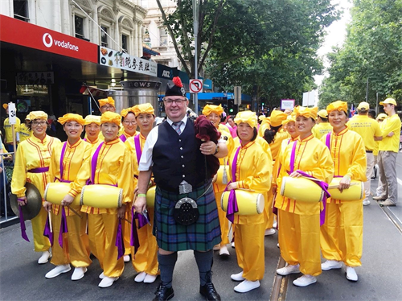

图4：退休的计算机专家、社区乐队的资深成员沃特•斯格尔顿（Walter Skilton）与法轮功学员合影。

巴基斯坦裔、在墨尔本出生长大的商业管理专业大学生阿里•乔和瑞（Ali Choudhary）也说：“法轮功学员的队伍很壮观，‘真善忍‘价值对澳洲社会很重要，提升道德、启迪心灵，能成为生活的指南。”

<b>获选美冠军的外科医生：我也会尝试炼法轮功</b>
 

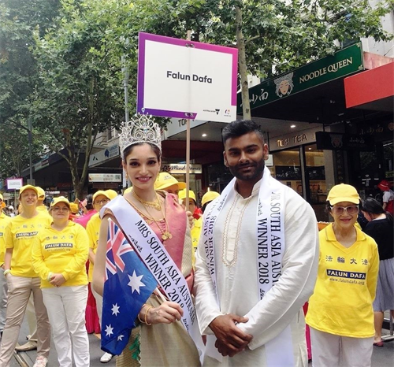

图5：分别获得2018年度“澳大利亚南亚夫人、先生”桂冠的塔瑞丽•费尔南多（Dr Tarini Fernando）（左）和尼杉•约瑟夫（Nishan Joseph），与法轮功学员队伍合影。

参加游行的2018年度“澳大利亚南亚夫人”选美比赛冠军、解剖生理学医生塔瑞丽•费尔南多（Dr. Tarini Fernando），在了解了法轮大法的五套功法后，她表示：“这一功法看起来很棒，特别适合朝九晚五的上班族。有时间的话，我也会试一试的。”她说：“和社区分享‘真善忍’的美好，是高尚的努力，我祝愿你们一切顺利。”

她的同伴、2018年度“澳大利亚南亚先生”比赛中获得冠军的尼杉•约瑟夫（Nishan Joseph），很欣赏法轮大法队伍亮丽的色彩，他也认为法轮功学员的努力很了不起，对以“真、善、忍”为指导原则、内涵丰富的功法十分感兴趣。

来自昆士兰黄金海岸的玛丽莲•杰克逊（Marilyn Jackson）和丈夫，在墨尔本游玩三天，在游行起始点，能仔细观看法轮大法队伍的预演，她说：“我炼瑜伽，知道打坐的好处，能感受到（法轮功学员的）能量，很美妙，他们所有人都如此安静祥和，色彩亮丽，真的很吸引人。真善忍很棒，意涵深邃。”

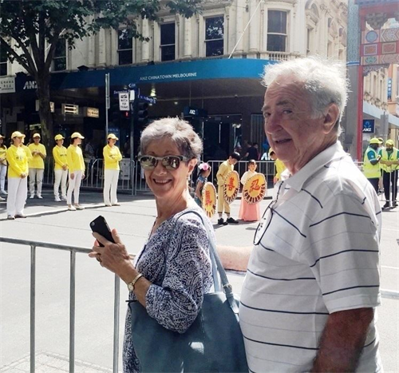

图6：来自昆士兰的观光客杰克逊（Jackson）夫妇。

<b>大陆华人：感受到信仰自由</b>
 

观看当天游行的华人沈先生来自上海，已经在墨尔本生活了五年，他说：“我们到了悉尼或者哪里，都看到法轮功学员。我觉得在多元化的澳洲，感受到海外生活的特点，就是尊重基本人权、信仰自由。”

虽然他没有深入了解法轮大法和接触法轮功学员，但是他表示知道由江泽民发动的对法轮功的迫害是不对的。

<b>西人法轮功学员：“作为大法弟子真是太幸运了”</b>
 

当天在法轮大法队伍里扇子舞方阵的学员乔安娜（Joanna）表示，这是她第二次参加国庆游行，她说：“觉得特别神圣，虽然脸上在笑，但是泪水就在眼睛里打转，很激动，心里很感恩师父。”

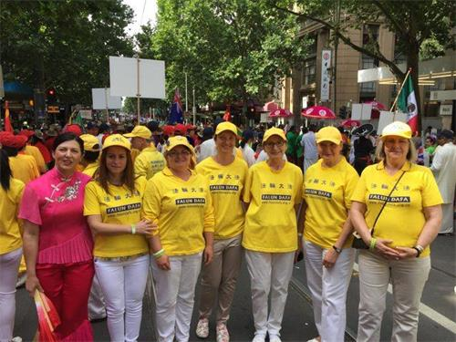

图8：参加游行的西人女学员

当天参加游行的西人法轮大法学员丹尼尔•卡梅隆（Daniel Cameron），在展示功法的队伍里，他说：“我觉得很棒，因为我在墨尔本向这么多人展示了法轮大法。游行的主持人介绍法轮大法的核心是真、善、忍，然后人们看到这些缓慢、温和的炼功动作，这些功法很舒缓，我很高兴与大家分享这一点，因为法轮大法让我受益良多，每个修炼法轮大法的人都能从中受益。所以，当人们看到他（法轮大法）时，我很高兴，我很高兴能与他们分享。

<h1 align="center"><b>正团级军医绝处逢生讲述真实的经历</b></h1>

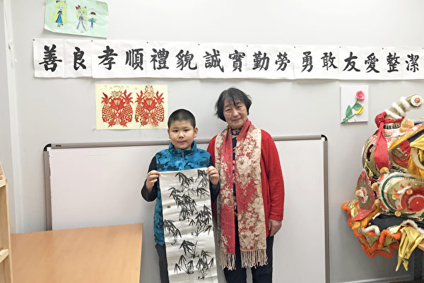

严成碧在温哥华的一所中文学校教孩子画国画。

【大纪元2019年01月31日讯】（大纪元记者陈璐温哥华采访报导）2018年末，在温哥华市中心圣诞大游行的队伍中，耄耋之年的严成碧容光焕发、精神矍铄，踏着轻快的舞步，喜气洋洋地挥舞著鼓槌打腰鼓。有谁能够想到，这位79岁的老人25年前曾经是一位“原发性血小板减少性紫癜”患者？严成碧不仅亲历了绝处逢生的奇迹，她亦是一场正邪交战的见证人。

严成碧1939年出生于四川重庆，1961年高中毕业入伍当兵，第二年进入第一军医大学检验专业学习，之后一直从事医学检验工作，退休前是第一军医大学附属南方医院正团级军医。

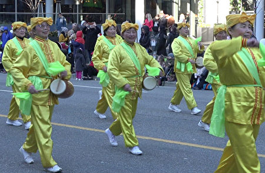

2018年12月2日，严成碧在温哥华市中心圣诞大游行的队伍里打腰鼓。

<b>被确诊不治之症 寻遍中西医无果</b>
 
严成碧回忆起1993年，她突然发现自己全身皮肤持续出现大大小小的出血斑块，当时她为自己查了血常规，发现血小板只有4-5万/mm3（正常人参考范围是100-300万/mm3，低于20万/mm3为症状体征）。当年5月，她住进了南方医院血液科，经骨髓穿刺，严成碧被确诊为“原发性血小板减少性紫癜”。

这种出血性疾病在世界范围都没有什么特效的治愈手段，只能用激素治疗缓解，长期用激素控制到能维持生命的一定水平。

严成碧住院期间曾用西药安络血、激素地塞米松治疗，激素用量达到10毫克，疗效还是不明显，后又采用昆明山海棠、云南白药等中药等治疗，均难以维持血小板的正常水平。于是又进行了脾动脉栓塞术并配合类激素达拉唑治疗，术后血小板一下就提上来了，可是一个月后又降了下去。

医生一再叮嘱她小心：不能激烈运动，起床时动作一定要缓慢，血小板低，脑袋里一旦出血看不见就很危险。

由于长期使用激素，严成碧体型异常，出现了满月脸、牛背肩，她的肝脏功能不正常，心电图也出现异常，血压增高，心肌缺血，全身大大小小关节疼痛难忍，连二层楼梯都爬上不去，外出要有人前拽后托才能上得了车。

四年期间，严成碧在医院的血液科住院没治好，心脏出问题了，又住进心内科，中西医的治疗手段都用尽了，身体每况愈下，她看不到自己有丝毫希望能恢复健康，期间还被怀疑患上子宫癌，真的感觉生不如死，家里人也暗中为她准备后事。

<b>修炼法轮功显奇效 从此远离病痛</b>
 
1997年10月，一位参军学医的同学来看望严成碧，见她陷入绝境，就建议她尝试炼法轮功。严成碧说，“我到心内科的医生那里找来《转法轮》（法轮大法的主要著作），在病房里白天晚上的看，我看到书里面讲的都是教人做好人的道理，越读越爱读，读到第5讲时，就感觉真的有法轮进入了我的身体”。

当时广州第一军医大学的院内炼功点有上百人在炼法轮功，本院军人（包括教师、医生、学生）、职工、家属有很多人炼功。晚上还在室内集体学法。严成碧每天早上到炼功点炼五套功法，不长时间就感觉关节疼痛减轻了，她试着把药量减少，结果病情不但没有加重反而明显好转，她信心大增。

炼法轮功3个月后，1998年1月严成碧要求出院，她回家即停止一切中西医治疗手段，一门心思修炼。从此，身体状况和精神状态越来越好，全身关节不再疼痛，血常规正常无异，感觉像是换了一个人。

二十年来，严成碧远离病痛，再也没有进过医院，再也没有服用过任何药物。严成碧的先生是外科副教授，女儿后来是耳鼻喉科博士，目睹她身体变化的亲友和周围的医学界同仁都对她的病能够痊愈啧啧称奇。

八年前，严成碧来到海外与孩子团聚，享天伦之乐，她还在一间中文学校教孩子们画国画。

2011年8月的一天，严成碧骑车在温哥华地区的列治文市横过马路时，在自行车道被一辆小轿车急驶过来撞倒在地，自行车压坏了，脚顺进了车底，她慢慢从车头爬出来，40多岁的女司机当时吓坏了，连声劝她赶紧去医院。严成碧说：“不用了，我没事，我是修炼法轮大法的，我有师父有大法保护，你看看我七十多岁的人，身上哪都没出血，没伤口，请你记住法轮大法好，真善忍好”。女司机感激的说：“我今天真遇到好人了!你的师父不仅保护了你，也保护了我呀。”她当着围观的人说：“法轮大法好，真善忍好！我记住了。”

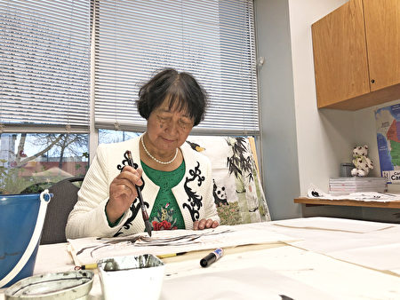

严成碧目前在温哥华的一所中文学校教授画国画。

<b>国家体总调查健身功法 严成碧以身说法</b>
 
1998年5月，国家体育总局下达一系列文件，对当时社会上流行的健身功法中发展最快，在群众中影响最大的法轮大法（法轮功）进行全面的调查了解。

由不同专长的医师、医学教授等专家组成的调查小组于1998年9月对广东省的广州、佛山、中山、肇庆、汕头、梅州、潮州、揭阳、清远、韶关等市约1.25万余名修炼法轮大法的学员身心健康状况进行了表格抽样调查，统计调查显示修炼法轮功祛病健身总有效率高达97.9%。

严成碧修炼法轮功的神奇变化在第一军医大学有目共睹。她也在这次调查中如实反映了自己身心变化的真实情况。

严成碧说：“通过学法，我知道了人得病的根本原因，知道了法轮功是修炼，是性命双修的功法，不光炼动作，还要修心性，用真善忍指导自己的言行。我的思想得到了升华，心胸变得开阔，对过去的恩恩怨怨不计不报，不怨不恨。我从一个悲观、绝望的人变成对生活充满信心、乐观向上。随着思想境界的升华，我的身体也在发生变化，原先缠绕我多年的顽疾都不翼而飞，我亲身体会到，原来修炼法轮大法真的是祛病健身有奇效”。

<b>中共媒体移花接木编谎言诋毁法轮功</b>
 
1999年7月中共开始全面镇压法轮功，严成碧没想到，她修炼前的病历竟被中共媒体歪曲，用以诋毁法轮大法。

1999年7月30日《文汇报》转发了新华社记者王炽、王雷鸣等写的文章，诋毁法轮功祛病健身功效。其中列举了严成碧的例子。文章称：“事实上，严XX于1996年5月8日入南方医院治疗，经过中西医综合治疗，于5月21日临床治愈出院，是先在医院经过现代化医学科技手段的治疗，而且是临床治愈出院的，练法轮功则是出院以后的事。”

这篇与事实不符的报导让人匪夷所思。事实真相是：严成碧1996年5月8日因体检被怀疑子宫癌，在南方医院妇产科行诊刮术，术后感染，经过抗感染治疗13天治愈出院。没想到这段经历，竟被讲成是原发性血小板减少性紫癜被临床治愈。

1997年10月之前，还没有炼法轮功的严成碧一直在血液科或心内科住院治疗，原发性血小板减少性紫癜根本无法痊愈，只能用激素治疗缓解，所有的中西医手段都无法消除激素治疗给她带来的痛苦。况且在妇产科短短13天的住院怎么就可以治愈血液科的顽疾呢？
严成碧完全不能接受新华社采用移花接木的手段编造谎言，面对整个国家机器的镇压，她仍继续坚持修炼，能让她提升精神境界和拥有健康身体，她只想讲述自己真实的经历，守着一份良知。

<b>被“610办公室”追捕 殃及亲友</b>
 
2000年6月严成碧在户外炼功，被警察抓捕，强行带上手铐，拷出血。一个警察还煽了她两个耳光，她被关进不到2米的黑屋子3天3夜，不让吃、喝。

2001年5月、中共军队总政、总后“610办公室”（专职迫害法轮功的党务组织）从北京派人到广州，要求军队系统的法轮功学员要一个不落地被送进“洗脑班”“转化”（强迫放弃修炼法轮功）。严成碧不愿去“洗脑班”，不愿被“转化”，于是离家出走。

军队“610办公室”派了二十多人到外地追查严成碧，一个班的警勤连战士拿着她的照片、天天在天安门广场巡查；又派人去新疆、重庆的亲友处，甚至到她先生的老家去找。

严成碧的家两次被抄，24小时被监视，她的丈夫（副师级外科专家）被监视管制；两个儿子被逼迫停职，受跟踪，女儿被军医大学停止研究生课程，威胁不让她研究生毕业。

<b>被强制洗脑 仍坚守良知</b>
 

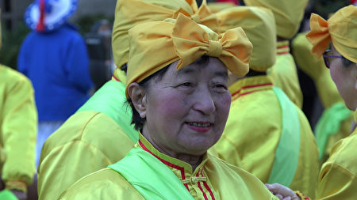

2018年12月2日，严成碧在温哥华市中心圣诞大游行的队伍里打腰鼓。

为了不连累家人，严成碧2001年7月被迫回家，刚到家即被关进“洗脑班”严管。“洗脑班”设在南方医院住院部的8楼，房间的窗外新加了防盗网，两个女军人24小时贴身监视，房间外还有一个持枪的兵。“610”每天对她进行“三帮一”的洗脑，不准看法轮功书籍，不准炼功，三个人想要强制转化她。

严成碧在精神上、肉体上被折磨和摧残，导至旧病复发。被关在洗脑班期间，严成碧开始隔两天被抽一次血、后来几乎天天抽血化验，血小板检查出的指标一次比一次低，一个半月后，血小板不到1万/mm3，“610”怕严成碧死在洗脑班，不得已放她回家。

回家后，严成碧坚持修炼法轮大法，身体很快就恢复了健康。

此后“610”一直监控，经常上门骚扰，企图再把她带去洗脑班。严成碧说：“洗脑班向我灌输的是‘领导不让炼就不要炼嘛，这是政治任务’，我对那个所谓的“政治”一点兴趣都没有。我是生命到了绝境走入修炼的，是法轮功把我从死神手中抢回来，我认定炼法轮功没有错，法轮大法教人向善，于国于民有百利而无一害”。

八年前，严成碧来到海外与孩子团聚。

无论身在何处，严成碧都乐于与他人分享她修炼法轮大法的亲身经历。她觉得自己有责任揭露中共喉舌的谎言，揭露中共政权对善良的修炼人的迫害，向民众讲清法轮功真相。

<h1 align="center"><b>中共发布人体捐献器官新规 难掩活摘黑幕</b></h1>

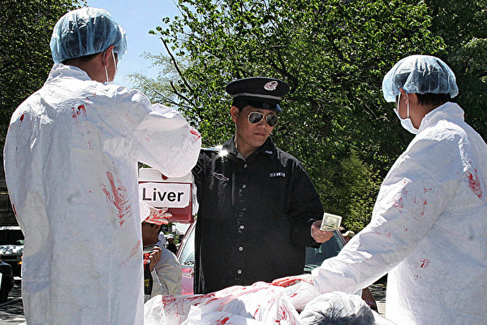

图为由真人演示的中共活摘器官暴行。

【大纪元2019年01月31日讯】（大纪元记者李新安采访报导）近日，中共发布人体捐献器官新规，称不得在医疗机构以外实施捐献器官获取手术。专家分析认为，这是中共对活摘器官黑幕的又一次掩盖，在中国，所谓器官捐献和分配不过是一个骗人的幌子。

据中共卫健委网站1月28日消息，中共卫健委日前公开发布了《人体捐献器官获取与分配管理规定》，相较2013年的试行条例，新规强调，人体捐献器官获取时，需在红十字会人体器官捐献协调员现场见证下获取，不得在医疗机构以外实施捐献器官获取手术。

外界关注，1999年江泽民迫害法轮功之后，中国器官移植业爆炸性增长，移植医院最多的时候有一千多家。而供体器官来源异常。

《器官移植立法之难》一文曾披露，2006年，“我国目前的亲属活体捐献率仅为1.1%，其余约98%的器官来源都控制在非卫生部系统。”

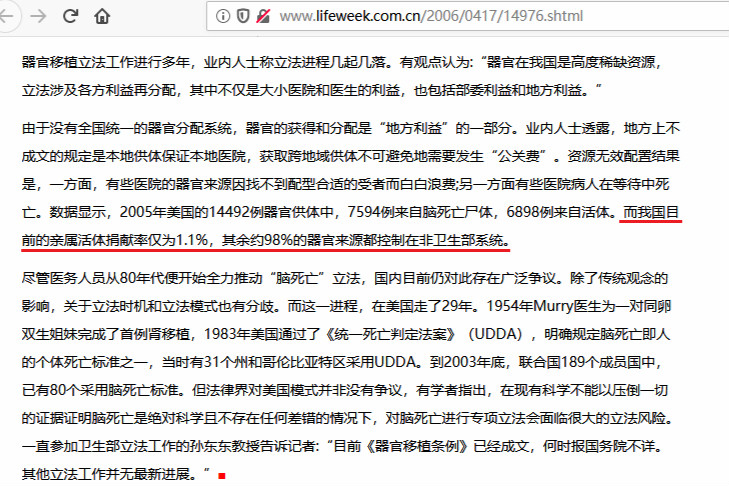

据披露，2006年，“我国目前的亲属活体捐献率仅为1.1%，其余约98%的器官来源都控制在非卫生部系统。”（网页截图）

中共所指的非卫生部系统、医疗机构外，被认为很可能就是在中共刑场的临时手术车上，来自军队系统、监狱系统，或者集中营、活人器官库等。

中国问题学者薛驰在接受大纪元采访时表示，自从2006年活摘器官被曝光后，中共就开始了一个巨大的漂白工程。现在中共推出的文件，在做一个更深层次的掩盖，意图用器官移植市场的“规范化”，来掩盖器官来源不明的巨大黑幕。而这个规定说明，中国大量的器官移植，不是在医院做的。

他说，在中共高层，习近平上台后，拿下周永康，就由黄洁夫出面，指证周永康和政法委涉及“死囚器官移植利益链”。这是中共做漂白的重大步骤，它过去不承认死刑犯是供体的。

但在2015年3月，中共前卫生部副部长黄洁夫对媒体表示，“死囚也是公民……有捐献意愿的死囚的器官一旦纳入我国统一的分配系统，就属于公民自愿捐献”。薛驰认为，黄洁夫在偷换概念，试图说中国捐赠器官的来源很大一部分是死刑犯，以转移外界对中共活摘法轮功学员等良心犯的器官的指控。

<b>中共器官捐献系统被指走形式</b>
 
追查国际负责人汪志远在接受大纪元采访时表示，“这些年来，不管中共怎么说，它所有的捐献器官在网上都是查不到的，都不透明，不能溯源，网上的捐献分配系统都是骗人的幌子。”

对于中共自称要规范人体器官获取与分配，汪志远认为这是贼喊捉贼。

据介绍，在国际上，OPO组织是人体器官的获取组织，应该由神经内科、神经外科、器官移植方面的专家和红十字认证的人员组成，鉴定器官捐献的合法性。理论上，获取器官的组织和器官移植科室应该是独立的，就是买方和卖方需要分开。

“而在中国，人体器官获取组织（OPO）是中共2013年4月成立的，2013年以前做了大量的移植手术，却没有OPO器官获取组织，2013年4月成立后，也是有名无实。中国大陆普遍的情况是，获取器官的医生还是器官移植科的医生兼职。”汪志远说。

薛驰也认为，中国的OPO组织只是器官移植医院内设的一个机构，它本身不具有独立性。中国的器官移植没有社会监督的机制。

追查国际调查还发现，他们调查过的医生护士、红十字会捐献器官协调人、医院器官协调人，都说没登录过国家卫计委的网络分配系统。如，山东烟台毓璜顶医院器官协调人王主任说，医院有自己（获取器官）的渠道，那个网什么问题也解决不了，是走形式，骗人的！

汪志远说，目前中国有178家器官移植准入医院，只不过是2006年以后，在国际的压力下，中共做出一个姿态，发执照，清理一下，表面上看它正规起来了，那实际上有些没发许可的医院照样做。

<b>中国器官捐献是谎言</b>
 
近日，中共官媒《北京日报》旗下的《北京商报》自曝，中国的“捐献器官存在大量浪费。据统计，2017年全国有5146个心脑死亡捐献，但肺移植仅299例。”

汪志远分析认为，这主要是因为活体摘取器官对热缺血时效有限制，受条件和环境限制；器官捐献全国分配系统不工作，大范围分配不可能，在当地使用造成器官浪费。

汪志远还举例说，黄洁夫2005曾在新疆医科大学第一附属医院演示了一场自体肝移植手术，以防自体移植失败，联系了重庆、广州、新疆三地，分别让他们准备一个备用肝。《中国护士》杂志报导中称几个小时之内广州中山三院和重庆西南医院就找到了“相同血型和基因位点”的备用肝。

汪志远指出，海外民主国家的器官捐献，是在网上公布的器官来源的，能够查到的；而中国的器官来源不公布，查不到，不透明。只是报个数字，而且只是一个全国的数字，连个别医院的数字都不报，这个捐献见不得人。

汪志远说，“2016年中共报导说公民自愿捐献的人数已经达到了30万。就算有30万人，在美国有1.4亿的捐献者，做一个肝肾移植的等待时间平均为2~3年，中国大陆平均等待1~2周。手术做得很多、很快，这都没法解释。”

“这30万我们算一下，它这是非常可笑的谎言。”他说，“正常情况下，捐献登记人的死亡率为7/1000，30万人也就是两千一百多人，由于捐献人因患病、外伤、器官摘取之间的时间差等原因，比如车祸抢救，心脏热缺血不能超过3~4分钟，肝脏5~8分钟，最终只有1%~2%的捐献者的器官可用，也就是21~42个人，中共一年要做1万多人，哪来的器官？显然是谎言。”

<b>活摘是国家群体灭绝犯罪</b>

追查国际调查发现，大量事实证明，自2006年3月中国辽宁沈阳苏家屯事件被曝光之后，十多年来，中共活摘器官的罪恶一天也没有停止。

习近平上台后，提出“全面停止军队一切有偿服务活动”，却一再展延，其中最复杂敏感的项目，被认为就是对军队医院的处置问题。在2010年10月中共卫生部公布的第一批具有人体器官移植资质的163家医院名单中，军队、武警医院占了25%以上。

汪志远指出，活摘器官是共产党做的一次群体灭绝犯罪。从组织上来看，有江泽民亲自下命令（有4个人证录音）；第二是从中央到地方的政法委、610组织实施；第三，涉入的主要单位是军队、武警和地方的器官移植单位，运用军队意味着是战争状态、国家行为；第四，全国大范围的医疗机构都大量开展了器官移植；第五，1999年以后爆炸性地增长。这么全国范围内的行动，怎么可能是局部的、民间的谋财害命事件呢？那一定是大规模的国家犯罪。

薛驰表示，“活摘器官是中共的死穴。中共对活摘器官黑幕的三字诀，一是否认，死活不承认；二是拖，时间长了，让大家麻木忘掉，一个惊心动魄的滔天罪恶在时光的流逝中成为现实中的一部分；三是漂白。要揭开这个黑幕，非要解体中共不可。”

<h1 align="center"><b>多伦多天国乐团获万锦市圣诞游行二等奖</b></h1>

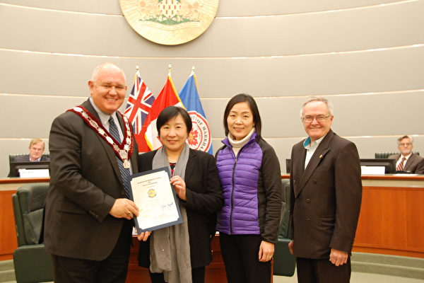

左起：万锦市市长薛家平、天国乐团代表丹雅、姚莲、扶轮社主席Jim Sandiford先生在1月29日的颁奖仪式上。

【大纪元2019年01月31日讯】（大纪元记者伊铃报导）1月29日，加拿大万锦市政府表彰为社会做出杰出贡献的社团，市长薛家平为社团代表颁奖，多伦多天国乐团获万锦市第46届圣诞游行二等奖。

万锦市圣诞游行由万锦扶轮社举办。第46届万锦圣诞游行于2018年11月24日举行，主题为“和平与和谐”，有近100个花车、乐队及来自城市商业和文化社区的代表参加。多伦多天国乐团是其中的华人乐团。自2006起，该团每年应邀参加圣诞游行，至今已12年，受到主办方和社区民众的欢迎。

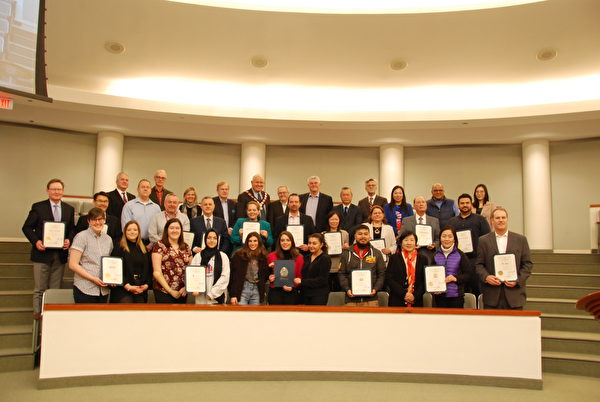

2019年1月29日，万锦市政府表彰为社会做出杰出贡献的社团，多伦多天国乐团获第46届圣诞游行二等奖。

万锦市扶轮社主席Jim Sandiford先生表示，万锦市圣诞游行是当地圣诞节一项重要而盛大的传统社区庆祝活动，至今已有46年的历史。每年参加的花车、乐队及其它商业文化团体达90至100个。

Jim Sandiford先生赞扬多伦多天国乐团是游行队伍中的杰出团体：“音乐、服装色彩都很出色，队伍整齐；并且多年来合作默契。”

多伦多天国乐团自2006年成立，多年来活跃于各族裔社区。乐团代表姚莲女士说：“天国乐团自成立以来，每年应邀参加多个社区庆典活动。从2006开始，每年参加万锦市圣诞大游行。因为万锦市华人很多，天国乐团能得到社区的认可，我们感到很高兴。”

姚莲说：“这个奖项对我们来说是个鼓励。未来我们希望能更好地融入社区，丰富社区生活。”

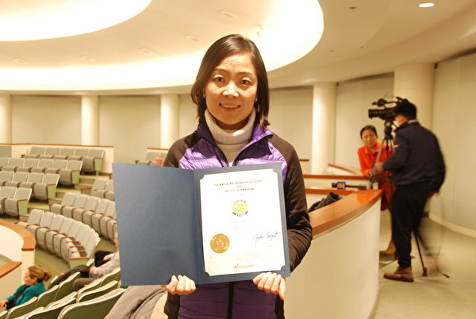

天国乐团代表姚莲。

<h1 align="center"><b>法官应遵从天命　勿为邪党卖命</b></h1>

【明慧网二零一九年一月二十三日】千古以来，对于执掌国法的人，人们寄予了很高的期望，权力可能会“暗无天日”，而执法者却可能拨云见日，让公堂的冤情重见光明，所以人们对于铁面无私，公正判案的法官都以“青天”来称谓，比如北宋的包拯，被称为“包青天”。
包拯任监察御史时，他曾在宋仁宗面前七次弹劾贪官王逵，三次弹劾外戚张贵妃的伯父张尧佐。

包拯为了防止权贵们找他“走后门”，完全断绝了与他们的私交。堵了后门却开了前门，规定大开官府正门，凡告状的都可以进去直接见官，面陈案情，任何人不得阻拦刁难，呈现了“前陈曲直，吏不敢欺，是非明辨”的局面。

包拯严于律己，生活俭朴，清正廉洁。他的“不持一砚归”的故事广为流传。端砚闻名天下，当时的权贵、大臣、学士们都以家中存有几方端砚为荣。包拯曾任职端州，任满后，端州百姓万人空巷来码头相送，携物相赠，都被包拯一一谢绝。有个人将一块最上等的端砚用黄布包好，悄悄放进舱内，想包拯到了地方也就收下了。包拯的船不久到了羚羊峡，本来风和日丽的天气却突然风起云涌，大浪不止，几乎快要将船给淹没了。包拯下令停船，暗自诧异：“我包拯在端州清淡如水，如何惹的天公这般动怒？”于是命人查看行李。果然发现了一件端砚。包拯将端砚扔进江中，砚一落江，顿时风平浪静，云开日出。

古人讲“皇天无亲，惟德是辅”。造物主造就了世间万物，并没有任何的偏袒，而只有赏善罚恶，奉行正义的道德信念才是人世间最高标尺，才是符合天意的行为！这样看来，法官的“天命”，应当是维护正义，维护天理，维护公正，从而制约权力的膨胀，规范社会的行为准则。

然而，自信奉无神论的中共执政以来，文革、破四旧、反封建、改造思想、划清界限，用了数十年时间，系统地切断了中华传统文化与中国现实社会之间的联系。造成了中国大陆社会不信神，不信佛，笑贫不笑娼的败坏状况。

而司法完全沦落为中共权力的统治工具，法官听法院的，法院听党的，没有什么公平正义，党说的话就是最大的法，本应代表公平正义的法官，置自身应当恪守的“天命”不顾，而完全任由“党命”摆布，跟随中共兴风作浪，为非作歹！

据明慧网报道，二零零七年九月十二日晚十点半左右，河北宁晋县法轮功学员李志勤正在一楼的房间里睡觉，屋里关着灯，十几个警察突然翻墙闯进，把李志勤拽起来就打。李志勤的儿子当时在场，大喊：“你们凭什么打人！”上前理论。李志勤戴着手铐被拖走，第二天晚上家属被告知李志勤死亡。李志勤的尸体被公安局悄悄送到邢台殡仪馆火化，说是突发心脏病死亡，可李志勤生前一直在干体力活。

二零一四年初案件的代理律师及李志勤的亲属开始向北京最高法院提出申诉，辗转数次奔波，把材料递到了最高法院赔委会办公室。二零一四年八月二十八日，最高法院做出立案决定并在网上公布，二零一四年九月一日成立合议庭，审期一百八十四天。家属和律师一直期待最高法院能开庭审理，揭开李志勤被迫害致死的真相，还家属公道，却迟迟等不到开庭的消息。直到二零一五年一月才打听到，案子已经在二零一四年九月二十八日审结，家属连判决文书也没有收到，律师询问后，最高法院才给律师寄了一份。最高法院裁定书认为河北省高级法院和邢台中级法院的判决并无不当，称“你们的申诉理由不成立，本院赔偿委员会予以驳回。”

没有开庭、没有质证、没有调查，最高法院在一个月内迅速做出驳回反应。这说明了什么？中共法制的幌子还能撑几天？

这次到北京最高法院申诉，律师通过调查，详细整理了宁晋公安局出具假材料的证据，和李志勤被打死的证明材料，但最高法院没有采纳，仍单方听信宁晋公安的荒唐举证，对公安人员夜间绑架对李志勤暴力行凶的行为不闻不问，维持原判。

古代的衙门设堂鼓，可以击鼓鸣冤官吏即刻升堂，即使大理寺、金銮殿也可以滚钉板立即受理。因为古人都知道民为重、君为轻、社稷次之的道理，决不会一个运动接连一个运动地折腾老百姓。制造一个又一个的冤假错案祸害人民。

清朝末年的杨乃武与小白菜是一部反映晚清慈禧太后为民申冤，不惜惩治二百多个贪官污吏的真实故事。而中共统治下的法轮功冤案比比皆是，中共各级公检法的罪恶更是罄竹难书。

有句古话，人不治天治。一些为中共卖命的法院正、副院长们，也纷纷厄运相随。据明慧网《迫害法轮功　70名中共法院院长遭恶报》报道，已有七十名中共法院院长，他们都是被官方网站公开通报、审查、免职、判刑等。善有善报，恶有恶报，七十名法官被惩治，也在警示着那些大大小小的法官们，在正义与邪恶面前，要做出明智的选择，对于被非法迫害的法轮功学员，不要再听信邪党的指使。

对于真善忍修炼者心生善念，就是对普世价值的尊重，就是在邪恶势力面前选择了正义，就是在践行法官这个角色所担负的“天命”，也是去除中共红魔强加给人的“党命”，选择在一念间，但这一念却是天壤之别！

<h1 align="center"><b>修大法去掉了我的赌性</b></h1>

【大纪元2019年01月24日讯】我今年四十三岁了，二零零八年开始修炼法轮大法，至今已有十年了。

我平时经商，这几年中国大陆整个经济萧条，生意普遍难做，但我一直能够平稳的走过来，收入稳定，小有积蓄，我认为这和这些年自己修炼法轮大法有很大关系。

在修炼大法前，我特别喜欢炒股、炒房。我从二零零四年就开始炒房，那时候炒房的人不多，在二零零四至二零零八年的四年中我投资按揭了两套房子，包括自住的共有三套房子，其中自住的那套房子后来抵押贷款了几十万用于炒股。二零零七至二零零八年期间股市大跌，房价也大跌，我炒股血本无归，一下陷入了危机中。当时需要卖掉一套房子才能解决危机，但是房价下跌很难出手。那时候，我真切的感觉到了被套的难受滋味，身心疲惫，真不知道人生如何生存才能够活的幸福！

就在这段时间，我从自己的电子邮箱里获得了“翻墙”软体，通过突破国内网路封锁，我上了海外中文网站，看到了以往很难知道的各类真相，其中最令我震惊的是法轮功真相，了解到江泽民团伙导演“天安门自焚”诬蔑法轮功，活摘法轮功学员器官贩卖牟利，这真是这个星球上从未有过的邪恶！

通过互联网，我还了解到法轮功也叫法轮大法，是一种佛家上乘修炼大法，要求修炼者按照真、善、忍不断的提高自己的心性，能够提升修炼者的道德境界，使其在短时间内达到身心健康。他让我明白了许多我一直不明白的问题，我感觉这就是我想要的，于是也就开始按照书中的方法去修炼。

修炼了一个月左右时，我感觉我一下子从危机中走出来了，而且明显感觉自己的危机马上能得到解决。果然，房子马上顺利的出手了，危机解除。同时，我的慢性病颈椎病也完全好了，腹痛也逐步消失了，想找份满意的工作也找到了。修炼大法太神奇了！

通过修炼我还明白了一个道理：要脚踏实地的工作，赚取自己劳动所得。靠投机去赚钱，比如炒房、炒股之类的等于就是变相赌博，来得容易，去得也快，不但把心态搞坏了，还养成了好吃懒做的坏习惯。于是，我决定不再炒股了，也不再炒房了。

近几年中国大陆又流行全民炒房，我身边的许多亲朋好友都纷纷加入炒房大军，按揭、借首付款，把自己陷入一个非常危险的赌局中，有的人每个月的收入除去生活费用都不够付按揭款的，有的负了几百万的债。我庆幸自己由于修炼大法没有参与这场全国性的大赌局。不仅如此，近年来我还有效的抵御住了各类高利息回报的诱惑，我就赚本分钱，不贪、不冒险，日子过的平平稳稳，丰裕有余。

我庆幸自己能够得到李洪志师父传的法轮大法，感谢大法去掉了我的赌性。

<h1 align="center"><b>纪念信仰自由日 川普吁加强保障信仰自由</b></h1>

川普总统呼吁在美国和全球范围内保障信仰自由的基本权利。图为1月14日，川普在白宫前发表讲话。 （Holly Kellum/新唐人）

【大纪元2019年01月25日讯】（大纪元记者Emel Akan报导，孙洐源编译）在全国信仰自由日（National Religious Freedom Day），川普总统表示，信仰的基本人权在美国正受到攻击，并谴责在美国引发暴力事件的“对信仰自由的立法和政治攻击”。

川普宣布1月16日为信仰自由日，并呼吁美国保护国内和世界各地的信仰自由传统。“宗教信仰的自由权利与每个人的基本尊严息息相关，是追求真理的基础”，他在1月16日的一份声明中表示，“社会上限制信仰自由的行为正呈上升趋势，将其与财产权或言论自由等其它公民权利进行切割处理”。

根据川普的说法，对个人自由和良心进行限制的立法和政治行为是近年来发生暴力事件的罪魁祸首。例如去年10月在宾州匹兹堡的生命之树犹太教堂发生的大规模射击事件，这次袭击造成11人死亡，使其成为美国历史上对犹太社区最致命的暴力事件。

共和党人认为，美国的宗教信仰几十年来一直受到攻击。前众议院议长金里奇（Newt Gingrich）在他的著作《川普的美国》中指责奥巴马政府利用政治权力来削弱信仰自由。他写道：“奥巴马强硬地取消了一些保护信仰团体权利的法规”，金里奇补充道，奥巴马政府称反堕胎者和其他传统保守派是“极端分子”。

川普上任后不久便开始扭转美国当前的反信仰形势，并在2017年签署了一项总统行政令，以促进言论自由和信仰自由。该行政令指出，“行政部门应该全力执行联邦法律对信仰自由的强有力保护”。川普要求美司法部向行政部门提供有关信仰自由保护的法律咨询指南。该指南于2017年10月发布，解释了美国宪法和相关法规（如“信仰自由恢复法案”，Religious Freedom Restoration Act，简称RFRA）中的基本信仰自由原则。

<b>对信仰自由的威胁</b>

25年前国会以近乎全票通过了RFRA法案。从那以后，该法案阻止了政府侵犯个人和团体行使宗教信仰的自由。

然而，根据代理司法部长惠特克（Matthew Whitaker）的说法，上届政府近年来为限制RFRA做了很多动作。“RFRA由当时的国会议员舒默（Chuck Schumer）撰写，在众议院一致通过，并在参议院获得97对3票数通过”，惠特克在1月16日的传统基金会活动中说道。然而今天，RFRA原来的许多支持者似乎改变了主意，他补充道，而近年来，希望通过州内版RFRA的州曾遭到联邦政府的批评和抵触。

“信仰自由使我们国家更加强大”，惠特克说，“这就是为什么对信仰自由的威胁也是对我们国家力量的威胁。”

全国范围内的信仰自由日于1月16日举行，这是1786年维吉尼亚信仰自由法规（ Virginia Statute of Religious Freedom）通过的周年纪念日。该法规由杰斐逊（Thomas Jefferson）撰写，是几年后由麦迪逊（James Madison）起草的美国宪法第一修正案的前身。

“我对第一修正案和信仰自由的保护感到担心”，参加传统基金会活动的退休联邦雇员Lasca Low说道，“如果我们失去了道德基础，我们将失去我们的国家。”她强调了保护信仰自由的重要性，“信仰自由是公民的基本人权之一，我注意到这些年来对信仰自由的保护被悄悄地侵蚀了很多，这在我看来非常令人担忧。”

<b>世界各地的信仰自由情况</b>

川普政府还推动世界各国政府对不同信仰的更大包容。川普在1月16日的声明中提到，“人们因为他们的信仰受到独裁政府和恐怖主义团体的迫害”。

为了解决这个问题，去年7月，美国国务院在华盛顿举办了首届推进信仰自由的部长级会议（Ministerial to Advance Religious Freedom），四十多个国家的外长、八十多个国家的宗教团体和非政府组织代表出席了会议。

根据美国国际信仰自由委员会（U.S. Commission on International Religious Freedom）的最新报告，2017年世界各国的信仰自由状况继续恶化。该报告将包括中国在内的10个国家列为“特别关注的国家”。

几十年来，中共的人权记录受到外界的广泛批评。中国的信仰团体和少数民族，包括维吾尔族、西藏佛教徒、基督徒和法轮功学员，面临着中共政府的严厉镇压和歧视。这些团体遭受了系统性地非法逮捕、非法监禁、酷刑和洗脑。据研究人员表示，更为令人担忧的是强行摘取良心囚犯的活体器官，这在中国已发展成一个价值数十亿美元的地下产业。

<h1 align="center"><b>天安门自焚 公安局长军人610官员道实情</b></h1>

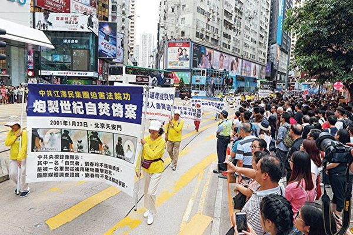

【大纪元2019年01月24日讯】（大纪元记者穆清综合报导）十八年前的1月23日，中共在天安门炮制了一出“自焚假戏”，用来栽赃法轮功，作为进一步镇压的借口。至今，自焚伪案尽管被国际社会公认为是一场世纪骗局，但中共仍在不断地利用骗局炒作，欺骗中国民众。

2001年的这一天，天安门广场一起5人“自焚”案，新华社以极快的速度发稿栽赃法轮功。7天后，央视《焦点访谈》播出自焚节目进一步煽动仇恨，诬陷法轮功。事后十几年中，中共军队、公安局、“610办公室” 等内部机构都有人坦承或间接证实，“自焚案”是中共造假。（鉴于大陆目前环境，隐去当事人姓名）

<b>高干子弟：自焚“部队干的”</b>
 
海外明慧网在2015年12月19日曾刊登一篇大陆法轮功学员的文章讲述，在生意场上，接触到一位曾在北京当兵的高干子弟，对他印象很好：“业务知识性强，思维缜密、健谈。”随后就向他谈到法轮功问题：“你经常在外工作，社会接触面广，你对法轮功怎么看？比如天安门自焚的事？”

高干子弟呵呵一笑便说：“法轮功啊！自焚那事我比你了解，那年自焚事件，我就在跟前。”这让法轮功学员感到有些意外，他说：“从焦点访谈的镜头上看，除了当事人，消防人员就是武警，没有群众的身影啊！”

高干子弟表示：“你说对了，那事之前广场就戒严了，我是高干子弟，在北京当兵，那是我们部队干的，别说群众，连一个炼法轮功的也没有。不过话说回来，法轮功影响太大了，有那么强的凝聚力，连我们部队都比不了，这样一个民间团体，他们能容得下吗？”

这位法轮功学员表示：“一个政府竟能光天化日之下撒这弥天大谎，颠倒黑白、迫害无辜，如何让人们讲诚信啊！信乃立国之本，老人常说：人无信不立。一个根本不讲诚信的国家，将来发展下去会是什么样？孩子们将来又会怎样？比如说：现今社会一个人跌在你眼前，你都不敢去看一下帮一下，这样下去中国人还有未来吗？”

高干子弟也深表忧虑，但表示“那有啥办法？”

法轮功学员告诉他，只有恢复传统道德良知，让人的善念、诚信复苏，国家和孩子们将来才有希望。

高干子弟对法轮功学员表示感谢，并说：“我们家有很多党员，我回去一定告诉他们，‘真、善、忍好！’‘法轮大法好！’”

<b>610人员目击自焚案造假现场</b>
 
明慧网2016年4月3日曾报导，一个省级610办公室（中共江泽民集团迫害法轮功的非法专职机构）的主要责任人向当地法轮功学员讲述他亲历的天安门自焚造假的现场情况。

据报导，这位大陆法轮功学员表示，这个610办公室的主要负责人透露，2001年1月那段时间因为接到省内公安的消息，本省有几位法轮功学员那几天要到北京上访，目的地预计是天安门广场。他负责在北京截访，所以这几天他每天早上和下午都要到天安门广场。

这位610责任人自述，2001年1月23日下午步行赶往天安门广场去截上访的法轮功学员，在路上他才知道广场其实已经戒严了，而且这次查得特别严，因为一路上他被各种便衣和穿制服的戒严人员三次要求出示了特别证件才让他通过。

他说，平时出示的那种通行证件那天都不管用了，他又出示了“610”的特殊证件（610办省厅级以上官员才发放的特殊证件）才放行。

到了广场后不大一会广场开始清场，他又出示了特别证件才让他留下，当时广场上留下的人很少，“这时看到广场上已经架好了的电影机机位（专业摄像机），纳闷以为有什么重要政治活动或者是要在这里拍什么片子。”

他因要截上访的法轮功学员，于是就一直在广场边上转着。

不一会，他就听见远处有人喊“着火了，着火了！”顺声音看去，“看到远处冒起了黑烟，然后看到广场上的人朝起火的地方跑去，然后看到马上有人灭火”，他当时的位置离自焚现场稍远，看不清楚现场具体情况，因为刚才路过看到起火那边是架著摄影机的，他还想：“可能是在拍电影吧！没当回事，也就没过去看热闹。”

由于已经戒严，广场根本没有人（上访的法轮功学员）可以进来，所以他就回宾馆了。

他说，当天晚上省里有事，就飞回省里了，晚上看电视才知道下午他亲历了“天安门自焚事件”的制造现场。

<b>新疆一公安局长被通知现场看“自焚”</b>
 
2018年6月2日海外明慧网一篇中国投稿文章透露，2001年天安门“自焚”案的前几天，大陆县以上的公安局长都被召集进京开会，并在“自焚”案发生的当天，他们收到紧急通知前往天安门，现场看到自焚的场景。

这篇文章的作者“长青”在新疆生活了六十年，任教几十年，经营过企业。2002年4月，她和先生回到他们长期生活过的城市办事。这个城市的公安局长特意驱车来找他们聊天，并叫他的司机到外边去。三人长谈三个多小时。

当他们讲到天安门“自焚”有种种疑点时，这位局长会意地说，他们当时就在天安门广场。

这位局长说：2001年天安门“自焚”案前几天，全国县以上的公安局长被召集到北京开会，他也参加了。“自焚”案发当天，他们正在故宫参观，突然通知他们赶快出去，到天安门广场来，亲眼目睹了“自焚”这场戏。

这位局长是汉族人，当时五十多岁，大概在1997年因工作原因结识了长青夫妇。夫妻俩1998年修炼法轮功后，局长和他们常聊到炼功的事，也很认同法轮功。

1999年法轮功学员“四•二五”大上访后，这位局长曾经对那位丈夫说：“都查过了，我们所在城市的这个地区炼法轮功的有两百多人，没有一个犯罪的，都是很好的人。只有一个人没炼功之前有男女作风问题，炼功后也变好了。”

局长还说，那次在北京召开的公安局长会议上，有一个单位的领导说，炼法轮功没什么，还给他们节约了不少医药费。

2010年10月13日，明慧网的另一篇大陆知情者文章披露，2001年过年前，他所在单位领导告诉他，大年三十期间天安门广场要发生自焚，并告诉他说，这个消息是上级通知的，北京方面下来的。

该文分析说，按照常理，若不是中共自导自演这场闹剧，既然它都能一级一级通知各地基层单位，有人要在天安门广场搞自焚，并明确说是大年三十，要想制止这件事情的发生，根据中国的现状及邪党的势力和防范能力，它完全可以控制天安门广场不让任何人出入，怎么会在天安门广场发生这场“自焚”闹剧呢？

<b>国际媒体质疑声</b>
 
1月23日，当年的大年三十，天安门广场这起震惊世界的“自焚”伪案，中共媒体第一时间报导此案诬陷法轮功，但是漏洞百出。

自焚事件两周后，《华盛顿邮报》记者菲力普‧潘在一篇名为“Human Fire Ignites Chinese Mystery”的报导中，访问刘春玲故乡开封市的当地居民有关刘春玲的身份时，获得以下回应：“没有人曾看到过她炼法轮功。”

随后，海外媒体人从央视“焦点访谈”的慢镜头中揭示：刘春玲是被现场的警察用重物击打致死，从而戳穿了这场骗局，央视焦点访谈在重播那段录像时删去了刘春玲被打死的镜头。

《华尔街日报》的伊恩‧约翰逊（Ian Johnson），一位富有洞察力的新闻记者跟踪这一事件，他的怀疑由报导这起事件的速度引起。

他注意到官方媒体“以非同寻常的敏捷报导了‘受害者’的死亡事件，这意味着，或是死亡事件的发生时间比报导中所说的时间要早，或是这个一贯谨慎的媒体已获上级批准快速推出电子报导和电视传送。”

Media Channel的责任主编丹尼‧斯盖特（Danny Schechter）撰文指出：“还有比这更富有戏剧性的吗？人们在北京的心脏——天安门广场自焚。CNN有线新闻网当时在那里，警察碰巧手边有灭火器，受害者的极度痛苦的表情被完全地拍摄下来以送交国家电视播放，然后他们被紧急送往医院。尽管政府控制的媒体一反常态地立即发布了这一新闻报导，制作录像却花了一个星期的时间才得以播出。”

国际社会还质疑：央视自焚录影有远景、有移动拍摄的近景，还有多个自焚者在不同位置的特写，并且录下了声音，显然摄影师做好了准备才能做到专业拍摄。

《基督教科学箴言报》的文章引用海外法轮功发言人的话，说法轮功是禁止自杀的，“自焚”是中共当局制造的骗局。美联社的报导也以法轮功的理论，说中国的报导是诽谤该组织。英国《金融时报》更指出：“没有任何证据表明自焚者是法轮功的人。”

路透社的电讯写道：“北京正在利用身体被烧焦的恐怖形象，来作为与法轮功打传媒战的最新武器。”《华盛顿邮报》发表社论，呼吁布什新政府要在宗教暨政治自由上敢于和中共政府碰硬。

<b>央视女记者承认“自焚”镜头有假</b>
 
此外，另一个自焚者王进东在天安门广场上安稳地坐着，且是典型中共部队里军人散盘的坐姿。警察拎着灭火毯在他身后静静地站立，等王进东对着镜头喊完台词，才盖上灭火毯；而且王进东两腿中间的塑料汽油瓶在大火中不燃烧、不变形。

明慧网2003年5月14日报导《央视“焦点访谈”女记者李玉强承认“自焚”镜头有假》一文披露，中央电视台“焦点访谈”女记者李玉强2002年初曾当众承认“天安门自焚”镜头有假。

该文披露：“2002年初，李玉强在河北省会法制教育培训中心采访王博时，曾和那里被非法关押的大法学员进行所谓的‘座谈’，当时有法轮功学员问她‘自焚’镜头的种种疑点和漏洞（尤其是已烧得黑焦的王进东，两腿间夹的盛汽油的雪碧瓶子却完好无损）。面对大家有理有据的分析，李玉强不得不承认：广场上的‘王进东’腿中间的雪碧瓶子是他们放进去的，此镜头是他们‘补拍’的。她还狡辩说是为了让人相信是法轮功在自焚，早知道会被识破就不拍了。”

<b>联合国：自焚“政府一手导演”</b>
 
2001年8月14日，“联合国国际教育发展组织”在联合国会议上，就“天安门自焚事件”，强烈谴责中共当局的“国家恐怖主义行径”，声明指出：录影分析表明，整个事件是“政府一手导演的”。中共代表团面对确凿的证据，没有辩词。该声明当时被联合国备案。

北美非盈利民间中文电视台“新唐人”制作的《伪火》（False Fire）影片，详细分析了2001年天安门自焚事件，该影片于2003年11月8日获第51届哥伦布国际电影电视节荣誉奖。

<b>公安部高官透露内幕</b>
 
在“自焚”伪案发生后的十多年中，有很多知情人向海外透露的消息证实，天安门“自焚”是中共一手策划的，在事件发生前，中共内部就已有消息走漏出来。

中国民主党国内负责人之一林春水曾经向海外透露，公安部一高级官员1月28日向他提供的消息指出：王进东23日自焚，时任中共公安部部长的贾春旺22日就知道消息。

他还表示，在中央政法委的会议上，罗干曾经说（大意），根据掌握的情况，即使我们不让王进东自焚，也会有张进东、李进东等跳出来表演。

<h1 align="center"><b>伪火十八年 造假害中国</b></h1>

1999年7月20日中共与江泽民集团动用整部国家机器迫害法轮功，为了实行“肉体上消灭、经济上搞垮、名誉上搞臭”的灭绝政策，不断制造假新闻，编造一连串自焚、杀人与敛财等弥天谎言，企图激发民众对法轮功的仇恨。这些假新闻中，荼毒世人最严重者，莫过于2001年1月23日炮制的“天安门自焚事件”。 

<b>天安门自焚伪案 漏洞百出 </b>
 

如果把十八年前的中央电视台“天安门自焚事件”录像画面进行慢镜头分析，便会暴露出很多疑点，说明这场“自焚”事件完全是一场精心布局的预谋与骗局。 

一、在“自焚”事件中被大面积烧伤的小女孩刘思影气管被切开后四天就能接受采访并能唱歌。 

二、《焦点访谈》录像证实，刘春玲不是被火烧死，而是被警察用重物击打头部倒下的。 

三、天安门巡逻的警察几分钟内从两辆警车里拿出二十多个灭火器和灭火毯应付该起“自焚”突发事件。 

四、北京积水潭医院治疗“自焚”大面积烧伤者，不作任何防护。允许记者近距离采访（下图）。 

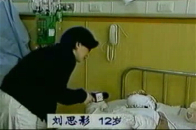

中央电视台“天安门自焚案”中的“烧伤病人”全身包裹，记者不穿卫生服，不戴口罩，大胆采访。

  
 五、“王进东”在自焚时衣服已被烧焦（上图），但是最易燃烧的头发还在头上，他腿间的盛满汽油的雪碧瓶却完好无损。在他喊出那句似是而非的口号之前，警察手中的灭火毯却在他头上悠闲地摇晃很久，没有丝毫灭火的急迫。 

六、在央视和新华社的“自焚”报导中，先后出现了三个不同的“王进东”。台湾大学语音识别实验室对王进东的声音作了语音鉴定，得出明确结论：《焦点访谈》第一集中的王进东与后来的王进东不是同一人。“追查迫害法轮功国际组织”经可靠途径查获：参与“自焚”的“王进东”是由一名现役军人扮演。 

不仅上述造假的凿痕太过明显，《华盛顿邮报》在2001年2月4日头版头条发表了调查报告《自焚的火焰照亮了中国的黑幕──当自焚的动机乃加强对法轮功的斗争》。邮报记者菲力蒲•潘亲自到自焚身亡的刘春玲的家乡开封实地调查，邻居们说从来没有人看见过刘春玲炼法轮功。

国际教育发展组织于该年8月14日在联合国会议上声明：从录像分析表明，整个事件是“政府一手导演的”。 

<b>《伪火》影片获奖 民众明了真相 </b>

令中共极度难堪的是，2003年11月8日由新唐人电视台制作、揭露“天安门自焚真相”的纪录片《伪火》，从各国参赛的六百多部影片中脱颖而出，获得第五十一届哥伦布国际电影电视节荣誉奖。该奖项在记录片领域享有盛誉，其历史仅次于“奥斯卡”。《伪火》影片以触目惊心的画面和精辟严谨的分析，揭示了“自焚”案的诸多疑点，从而证实了整出事件是中共栽赃法轮功而炮制的伪案。 

<b>造假遍中国 回归传统救乱世 </b>

造假是中共一贯手法，其歪风引领人心沉沦，道德逐步下滑，造假在中国社会随处可见。夸大不实的经济数据，错误引导投资人进场；空气质量监测造假，剥夺了公众的知情权，明明是重度雾霾天气，受骗的人们仍在室外正常活动，等于变相害人。 

欲匡正社会，必先正人心。真、善、忍是普世价值，恰是整饬歪风邪气的解药良方。衷心祝愿中国人回归传统价值，早日唾弃造假，说真话，办真事，恢复良知善性。 

<h1 align="center"><b>大魔医，吴孟超活摘中国人后能退休？</b></h1>

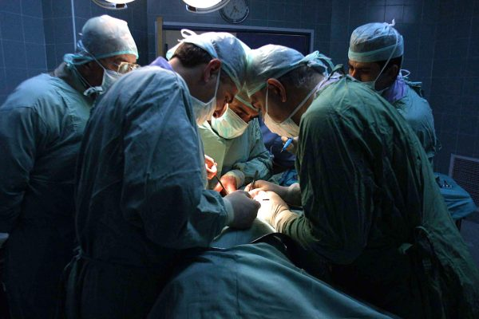

   
【大纪元2019年01月20日讯】1月14日，97岁的中共党员、中科院院士、第二军医大学东方肝胆外科医院院长吴孟超高调向外界宣布退休，这标志着它暂时离开了中共大规模活摘人体器官的舞台。吴孟超在自己的退休仪式上表示：“虽然退休了，但只要组织需要，只要病人需要，我随时可以进入战位，投入战斗！”对此泯灭人性，绝对服从中共组织安排的言论，中共《人民日报》给予了高调宣传，并称赞其为“大国医”。然而据外界调查发现，“大国医”吴孟超却十几年如一日的干着活摘中国人器官的勾当，所以他是名副其实的“大魔医”。

1922年夏天，吴孟超出生在福建闽清，5岁时吴孟超随母亲移居马来西亚，初中毕业后，他回到了中国。1943年秋天，吴孟超考取了国立同济大学医学院，1947年成为裘法祖的学生。但在1949年毕业考试时，吴孟超外科只考了65分，小儿科却考了95分。按当时惯例，他只能成为小儿科医生。为此，吴孟超还曾找到教导主任，说自己想去外科当外科医生，但被拒绝，理由是“他不太合适当外科医生”。1949年5月27日，上海被中共占领，同年8月，中共上海华东军区人民医学院（中共第二军医大学前身）在社会上公开招聘医生，于是国民政府培养出的吴孟超带着对国民政府的情绪投共了，成为了“听党指挥”的军医，开启了他的魔鬼人生之路。

据中共官媒报道，1956年，外国的一个肝脏外科专家访问中国时断言，中国的肝脏外科水平要达到世界水平，至少要二三十年的时间。而为了中共的“国家荣誉”，吴孟超带领他的肝脏外科团队，仅用七年时间，从无到有，不断创新，实现了我国肝脏外科理论基础研究和临床治疗的重大突破。1959年，吴孟超创立了中国人肝脏“五叶四段”的解剖学理论；1960年，他又发明了“常温下间歇肝门阻断法”；1963年，他成功完成世界首例中肝叶切除术……这些重大突破的背后需要多少临床实践经验的积累？又有多少中共的“阶级敌人”被用作临床活体试验？只有吴孟超自己知道。

正如中共所言，肝脏是人体的“营养库”和“化工厂”，由于肝脏血管极其丰富，解剖极其复杂，一直被视作外科手术的禁区。在中国，肝脏外科直到20世纪50年代初还是一片空白。而吴孟超从医以来，不断刷新纪录，使肝脏外科手术死亡率降低为0.30%，肝癌术后5年总体生存率56.1%，小肝癌术后5年生存率79.8%。这些“巨大成就”的背后，是大量临床试验的结果，是大量人失去生命换来的宝贵临床经验。

2006年，为表彰吴孟超在肝脏外科界，尤其是肝脏移植领域做出的突出贡献，吴孟超获颁国家最高科学技术奖和500万奖金。中共解放军总后勤部也奖励它100万元。吴孟超每周几台肝脏移植手术的骄人“成绩”引发了国际社会的广泛关注。据追查迫害法轮功国际组织独立调查显示，吴孟超涉嫌大规模活摘人体器官暴行，它曾任东方肝胆外科医院肝外科主任医师，第二军医大学东方肝胆外科医院院长，东方肝胆外科研究所所长。2004年3月到2006年7月，它亲自参与74例供肝切取，供体男72例，女2例，年龄26～45岁。而吴所在的单位，中共解放军第二军医大学第三附属医院（东方肝胆外科医院，东方肝胆外科研究所），2007年5月23日，是被中共卫生部指定开展肝移植的医院。调查发现，东方肝胆外科医院，从2004年起至今至少进行过10万次以上的肝脏器官移植手术。

吴孟超在96岁时，曾自己透露，它依然坚持每周至少完成三台手术，并且是比较复杂的手术。从中共公布的采访画面显示，吴孟超的这些所谓的“比较复杂的手术”均是肝脏器官移植手术。按每周三台肝脏器官移植手术来算，每年它亲自参与的肝脏器官移植手术就有156台，也就是至少有156个肝脏器官供体被它用作移植手术，换句话说，每年至少有156个中国人因它的肝脏器官移植手术而死。从2002年至今，至少有2500中国人死于吴孟超亲自主刀的肝脏器官移植手术。一边宣扬救死扶伤珍惜生命，一边活摘掉自己组织不喜欢的人的器官，吴孟超究竟是“大国医”还是“大魔医”？吴孟超不仅自己参与活摘人体器官的暴行，它还积极培育年轻医生参与活摘，为持续活摘中国人“做贡献”。这样听党指挥的“军医”，是天使还是魔鬼？

实践证明，没有丝毫人类医学伦理和道德约束的医生，不是医生，而是杀人魔鬼。中共的肝脏器官移植事业是一种随意剥夺“阶级敌人”生命权的罪恶，是赤裸裸的反人类罪。1月14日，97岁的中共党员吴孟超高调宣布退休了，在它的职业生涯中，它亲手救活了上万病患，但同时也有上万中国人因此而被活摘器官；在它的领导下，第二军医大学东方肝胆外科医院十几年间活摘了十万以上中国人的器官；这些赤裸裸的反人类暴行，注定了大魔医吴孟超永远无法退休，它与所有活摘参与者都将受到人类正义的审判！中共《人民日报》此时高调的宣传，必将成为日后审判“大魔医”的历史罪证。

<h1 align="center"><b>中国朋友你们好！</b></h1>

天安门自焚是假的。早在2001年在联合国会议上，「国际教育发展组织」对世界各国宣布: 「天安门自焚」是中共蓄意导演的伪案，目地是为了煽动民众仇恨法轮功，为迫害找借口。此事件已在联合国正式备案。

纪录片《伪火》，伪装的「伪」，大火的「火」，就是揭露「天安门自焚」伪案的，荣获哥伦布国际电影电视节特别奖。法轮功严禁杀生，严禁自杀，所以自杀、自焚的人绝不是法轮功修炼者。法轮功主要书籍《转法轮》阐述了为甚么不能杀生的法理，修炼法轮功的人肯定不敢再杀生了，更何况自杀。

天安门自焚是中共一手导演的。不过谎言编得太拙劣，比如说一般情况下头发、塑料瓶见火就化了，男的王进东的头发和装汽油的雪碧瓶却完好无损；小女孩刘思影做了喉管切开手术是发不出清晰声音的，却能唱歌。自焚是突发事件，从起火到灭火90秒，怎么可能巡警携带大量消防设备巡逻并在90秒内出现。录像中的摄影师在军警间从容拍摄，有远景、移动拍摄的近景、多个自焚者在不同位置的特写，并且录下了声音，显然是事先准备好才能做到的专业拍摄。把中央电视台播放的自焚录像慢镜头播放就能看到：刘春玲是被身后穿军大衣的人用硬物击打头部当场倒地死亡的，还有很多漏洞，不一一列举。

天安门自焚总策划，时任中央电视台副台长的李东生后来被判重刑。「天安门自焚」制片人陈虻，47岁突发癌症死亡。播音员罗京、主持人方静相继患癌症死亡。

1400例死亡也是中共为了迫害编造的，其中有把精神病患者病发时的意外事故栽赃为法轮功学员所为，有用减刑为条件唆使杀人者冒充法轮功学员，有用报销医药费为诱饵让危重病人冒充法轮功学员，还有的是把普通人的正常病逝说成是炼法轮功造成的，所有这些都是中共对法轮功的栽赃嫁祸。

1999年迫害法轮功之前，中共官方媒体上报导说修炼法轮功的人数是7000万到1亿人，祛病总有效率达到98%，于国于民有百利而无一害。但是江泽民犯罪集团发自内心的恐惧和嫉妒法轮功，1999年迫害时就造假说修炼法轮功的人数是210万，也有说200万的，然后处心积虑的编造了1400例死亡。国际人士分析说，从1992年法轮功传出，到1999年中共编造谎言，一共7年的时间，就算按照中共捏造的假数据计算，1400例除以7年，再除以中共所说的210万法轮功人数，得出的死亡率不到万分之一，远远低于中国统计年鉴记载的中国人口正常死亡率--万分之六十五。可是您再回头看那些案例，又自杀又杀人的，这个逻辑也不通啊！

国际社会无法理解，共产党编的谎言是零智商，能骗谁呢？可是却骗了很多中国人。为甚么能骗得了？因为共产党搞信息封锁。了解真相是判断是非的必要条件，共产党把这个必要条件一刀砍断，中国人就失去了判断是非的能力。

法轮功按「真善忍」修炼使人道德回升，祛病健身有奇效，这么好的功法全世界一下就传开了，洪传世界100多个国家和地区，获得各国各级政府的褒奖、支持决议和信函超过3000多项。几十个国家为自己的民族设立了一个节日来纪念和感恩法轮大法。每年的5月13日被定为「世界法轮大法日」。法轮功书籍被翻译成40多种语言，是中华五千年文明历史中翻译成外国语言最多的一本书籍。根据联合国教科文组织的统计推算，在整个人类历史的跨度，古今中外，这样的传播范围和速度也是达到了顶峰。

<h1 align="center"><b>墨尔本越裔学员：阅读《转法轮》身心升华</b></h1>

【明慧网二零一九年一月十五日】（明慧澳洲墨尔本记者站报道）“我曾是一个无神论者，在我心情非常沮丧、变得脾气暴躁的时候，修炼法轮功的妈妈劝我阅读《转法轮》，我当时自己都不喜欢自己，就想，如果读这本书真的能让我变成一个好人，那我就试试看吧。”这是墨尔本越南裔青年法轮功学员海蒂（Heidi），回忆自己二零一五年处于人生低谷、在越南家乡第一次认真阅读《转法轮》时那难忘的感受。

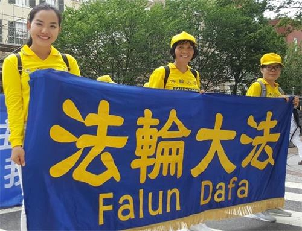

图1：墨尔本越南裔青年法轮功学员海蒂（Heidi）（左一）。

她说：“我觉得这本书真是太好了，立即开始和妈妈、外婆等一起修炼法轮功，我的人生也从此开始逆转。从母亲开始，法轮大法的美好以及发生在家人身上的奇迹，让我们家族里八口人相继走入大法修炼。”

据明慧网报道，越南文《转法轮》于二零零一年第一次出版，二零零四年七月新版发行。自从一九九五年一月四日《转法轮》中文版首发式在北京举行，二十四年来《转法轮》已被翻译为四十个语言版本，吸引无数人阅读。随着法轮功传播到全球一百多个国家和地区，《转法轮》引导全球上亿人走入法轮功修炼并身心受益。

“修炼法轮功后，家里的每个人都经历了身心的巨大变化和升华。” 海蒂说。

<b>从喜好奢华到娴静朴素</b>
 

海蒂秀美活泼，快人快语，流利地道的英文让人惊讶，其实她在澳洲生活不到十年，期间经历了令人感叹的人生起伏。

完成大学学业后，海蒂虽然在墨尔本任职于一家五星级酒店，工作稳定，但申请永居签证很不顺利，二零一五年，她不得不辞去工作，离开澳洲、离开男友，回到越南从新申请，而且需要再等待一年。

“我很绝望，心情糟透了，觉得好日子到头了。”她说，“我靠旅游打发时间，但不管用，我变得悲伤和消极，脾气暴躁。”海蒂说。

“当时，我的母亲修炼法轮功已经好几年了，她看到我这个样子，就劝我静心阅读《转法轮》。”

“我知道，这本书是讲真善忍，那时的理解就是要做到真正的善良和有耐心，当时的我正变得越来越急躁、动不动就发火、情绪很不稳定，真是非常糟糕，自己都很讨厌自己了。”

“妈妈曾经劝我，任何事情都不是偶然的，现在，她希望我读这本书能自己找到答案，为什么一个小时候非常友善的孩子变成了现在这样。”

抱着希望借助读《转法轮》让自己变得好一些的目的，海蒂开始认真阅读这本书。

“《转法轮》太神奇了，我被深深吸引，从此开始修炼法轮大法。”

海蒂的人生也开始逆转，“我的心情变得祥和、宁静，遇事也不急躁了，渐渐去掉了以前很强烈的妒嫉心、好胜心。”海蒂说。

二零一六年，她顺利回到澳洲和男友团聚，很快举行了婚礼。她原先任职的五星酒店继续聘请她做前台接待，海蒂吃苦耐劳，无论客人态度如何，都能耐心、友善地解决客人的问题，客人们反馈的好评不断。六个月后，经理提拔她专门接待贵宾。

“这些贵宾多数是大企业的老板或者娱乐界的明星，因为这些客人非常挑剔，接待他们的确需要宽容和善心，也需要随机应变的技巧。”海蒂说，“但作为修炼人，我都能轻松应对。”

“我的丈夫没有修炼法轮功，但他亲身体会到我的变化后，非常开心、非常支持我。他说我变得更好更成熟了。”

过去，海蒂说，自己喜欢经常和朋友们聚会、吃早午餐（brunch），在高档饭店享受数百元一餐的美食，不喜欢呆在屋里，动不动就要外出、购物，穿着也追求时尚性感，花钱如流水。

“修炼后，道德水平提高了，我的衣着很庄重，不再大手大脚地花钱，而是喜欢呆在家里，和丈夫一起享受生活，有时间就读法轮功书籍、炼功。”她说。

“丈夫是以色列裔，上次陪他回特拉维夫探亲的时候，他主动帮忙找到了当地的法轮功学员，所以探亲期间我还能去炼功点炼功，并参加当地法轮功学员举办的活动。真的非常开心。”

海蒂说：“修炼法轮大法后，我对丈夫更有耐心了，我能遇事而安、一切随其自然，不论好事、坏事，对我来说都是好事，我生活的更幸福了。周围多年的同事都注意到，我变得比原先随和很多，而且一直都很开心。朋友们遇到事情，和我聊过之后，也都说感觉好多了。”

“觉得很幸运，我有师父。”她说，“真的非常感激师父、感激法轮大法保护我们全家。”

<b>发生在家人身上的奇迹</b>
 

图2：海蒂（左一）和部份越南裔法轮功学员合影。

类似海蒂亲历的身心巨变和神奇的修炼体会，同样发生在她的亲人身上。现在家族中有八人先后走入法轮大法修炼。

“我的外婆有严重的腰椎间盘突出症，严重到已经不能行走了。到处求医，包括最昂贵的西医专家、中医针灸，都无济于事，整天处在难以忍受的疼痛中，洗澡、上卫生间都需要人帮助。母亲修炼法轮功后，也推荐外婆阅读《转法轮》，并教她炼五套功法。在很短的时间内，外婆的脊柱就恢复正常了。现在，外婆不再感到疼痛，除了坚持炼功，她在生活中时时处处按照‘真善忍’的原则要求自己。”

母亲的一次经历对海蒂的触动很大。她说：“我的母亲曾经遭遇过一场严重车祸，但却安然无恙，真是一个奇迹。她告诉我，当时正在横穿马路，一辆电动自行车开得很快，把她撞倒了，撞得很厉害，手还被夹在轮子的辐条间。妈妈说，脑子里的第一念就是自己会没事的。结果，虽然手都变成紫黑色、肿起来了，但没有感到疼痛。之后几天就恢复了。”

海蒂的父亲是一家人中最晚开始修炼法轮功的，他的故事颇具戏剧性。

“我的父亲是去年五月全家在香港度假的时候，转变心意的。这次我和家人约好，在香港团聚，因为能一起参加法轮功学员在香港举行的大游行。父亲跟在游行队伍后面走完了全程。因为没想到会走这么长的时间，当天他穿的是正装皮鞋，所以游行结束后，脚上长满了水泡，非常疼。游行期间，看到中共安排的人员对法轮功学员的骚扰表现非常不堪入目，他说，中共如此反对法轮功，就说明法轮功一定是好的。于是，他决定当天就开始修炼法轮功，从此没有再动摇。他表示，第二天脚上的所有水泡都不见了，就是一个奇迹。”

<b>分享修炼体会</b>
 
海蒂表示，在和同事们、客人们聊天的时候，提及自己的修炼体会，他们都很感兴趣。“最近，和一对来自美国的客人聊起了我去纽约参加法轮功大游行的经历，他们对法轮功学员在中国遭受迫害、甚至被活摘器官的事实，都很震惊，准备去上网了解详情。” 她说。

“还有一次，需要联络澳洲税务局的一位工作人员，对方是一位女士，让我提供国民健保卡（Medicare）号码，结果发现我的卡号已经过期了，我告诉她自己很健康，根本不需要。她很好奇，希望我分享秘诀。我笑着说，我的秘密就是法轮大法。于是分享了自己的修炼体会，并告诉她可以从网上了解到一切，所有信息都是公开、免费的。这位女士听了之后很感激我的分享，表示要去查看。”

现在，海蒂每周都利用轮休日，和其他法轮功学员一起在墨尔本市中心和其它城区、景点等地，向市民和游客讲述法轮大法的美好以及法轮功学员反迫害的真相。

<h1 align="center"><b>拜年</b></h1>

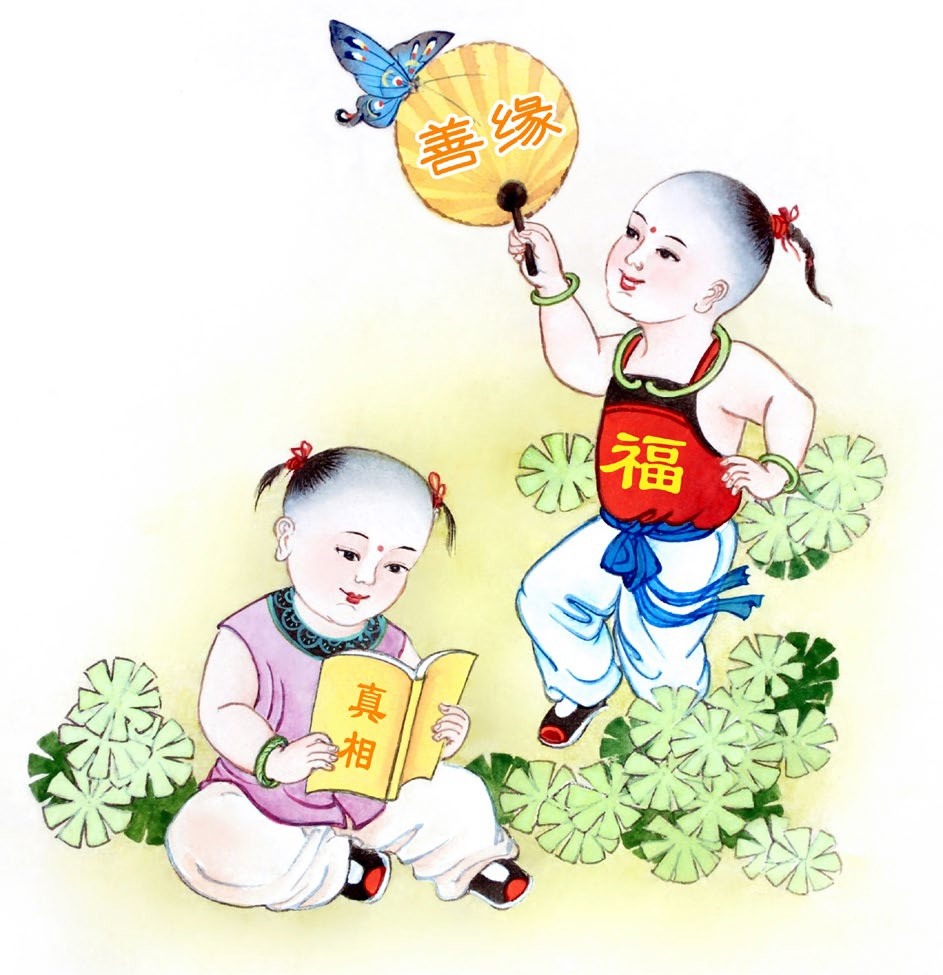

【明慧网二零一九年一月十六日】〖大陆来稿〗我今年八十八岁，离休干部，在省城住着宽敞明亮的厅长楼，月薪不菲。可是，最近这几年，我却过的很不开心，家人连遭不幸：唯一的儿子、老伴、二女儿先后患癌症手术，独生孙女离异，老伴在饱受病痛折磨后凄然离世。可谓一波未平，一波又起。
垂暮之年的我，悲伤而无奈，时常面壁叹息，望月垂泪。但偶尔也有高兴事，如，老友来访，涨工资等。更值得一提的是，每年新年前夕，我姐姐的两个儿子（我外甥）赶来拜年。

姐和我出身于书香世家。姐姐自幼聪慧善良，她的婆家，是在距省城两百多公里的一个小乡村。婆母体弱多病，不能下田劳作，姐夫是个教书先生，家里十几亩地，姐姐一人种不了，就雇了个长工。土改时，按当时的所谓“框框”，被划为“地主成份”。在那个“阶级斗争年年讲，月月讲，天天讲”的恐怖岁月，姐姐戴着一顶“五类分子”的帽子，饱受屈辱摧残。家里也穷的叮当响，一家三代八口人，只有两间土坯草房，吃了上顿愁下顿。

那时，我和丈夫在省直机关任职。我侥幸躲过一次次“运动”的劫难，却成了惊弓之鸟。为自保而免受牵累，我逐渐变的比较“左”，对姐姐家不曾援手，甚至连她家的门都没踩过，偶尔回复家信，为怕被人拆看抓了把柄，末尾总要加一句教育姐姐：“老实认罪守法，别乱说乱动。”

后来，姐姐家是芝麻开花节节高：二子三女陆续都进了城，有的大学毕业当了干部，有的做生意成为富商。特别是，大姐的几个子女都修真、善、忍法轮大法，身体健康，为人真诚、和善、厚道，亲邻多有美誉。

姐夫、姐姐辞世后，几个晚辈对我们老俩口非但没冷淡，反而敬重有加。外甥女经常打电话问候；我家有重要事儿，外甥不请自到；每逢过年，两个外甥都会带着当地土特产，驱车数百里前来拜早年。在每一次暂短相聚的交谈中，外甥那真切朴实的话语，恰似寒冬里的缕缕春风，温暖着我们的心。

每当送走外甥后，我们老俩口照例会议论一番。老伴喜读书，粗通文墨，感慨说：“外甥所为，可谓古风犹存，以德报怨！姐姐这几个孩子，和别人不一样。我观察，俩外甥衣着朴素，说话谦卑，有见识，有内涵，与当今那些浅薄浮躁的‘暴发户’，不可同日而语。外甥是真正的来孝敬我们，真心实意为我们好。”

我说：“我也有同感！现在的人，金钱至上，人情比纸薄。修炼人，就是不一样。看起来，电视、报纸的宣传不可轻信，法轮大法是很不错的！”

二零一六年七月，我老伴病故。老伴虽然是以高寿辞世，可六十多年的风雨同舟，一朝永别，仍令我痛惜不已。斗转星移，离年关越近，我越感失落孤寂。

腊月二十以后，天气不佳，一连几天都是雨夹雪。我自忖，今年外甥可能不来了。二外甥在外地经商，回乡晚，回家后还得忙着置办年货，加上雨雪天，路不好走，千里往返，来一趟太辛苦，太不容易，就别来了。一会儿，又期盼着他们到来。

就这样，左思右想了好几天，到了腊月二十六，下午一点多，我想躺下午休，想躺下还没躺下，听见敲门声，开门一看，是外甥来了。

风雪天，佳节里，孤寂之中，看到远道而来的亲人，我泪眼婆娑。

饭后聊天，我对外甥说：“冰天雪地的，家里那么忙，路那么远，你们还来看我，令我于心不安。”大外甥说：“作为晚辈，尽孝道是本份，我们应该来。您与我娘是一奶同胞的亲骨肉，姨娘姨娘，姨就等于娘，我娘不在了，您老人家就是我们的娘。孝敬姨，就等于孝敬我娘。”

二外甥说：“家有老，是一宝。如今，我们两家几十口，仅有您这一宝了，当然更珍贵！姨父刚走几个月，又赶上年关，您老人家心里会不好受，我们来拜年，见见面，您老人家心情会好一些。所以，今年我们更得来。”

外甥的话，我听着心里暖暖的，同时，也有隐隐的愧疚。就借机问他们：“孩子，在你家最困难的那些年，姨没帮助过，你们真的不怨恨吗？”二外甥回答：“姨，说实话，对于您和姨父，我们曾经自豪过，也曾经沮丧过。自豪的是，我们家有一门当‘高官’的亲戚；沮丧的是，这门官亲只能是水中月，镜中花。”

大外甥微微一笑，说：“自豪也罢，沮丧也罢，那都是在我们炼功之前。自从修大法以后，那些狭隘自私的情绪，很快就随风飘散了。师父教我们要慈悲宽容，处处为别人着想。我们想象过，当时，您身上贴着娘家‘成份不好’的标签，在‘唯成份论’政治运动的高压下，如履薄冰，肯定没少受委屈。您对娘家人的冷漠疏远，所谓的‘划清界限’肯定是违心的。说到底，那是因为政策邪恶。自从炼功以后，对于您，我们真的是理解了！”

听着外甥的话，遥想起那不堪回首的年代，我不免一阵痛心酸楚。晚辈的理解和体谅，打开了我多年的心结，身体从里到外的轻松。

时光匆匆！经历了今年的春与夏，秋与冬，又到了辞旧迎新的腊月，我的俩外甥又该来拜年了！这些天，我一直在默默的，愉悦的回味着，期待着。

在回味期待的同时，我想到，托大法之福，我方能受到外甥们如此礼遇。我应该感谢大法，感谢给天下送福的李大师。为表寸心，特借明慧一角致谢，给李大师拜个早年，恭祝大师新年快乐！万事如意！

<h1 align="center"><b>芬兰坦佩雷市健康展　法轮功受欢迎</b></h1>

【明慧网二零一九年一月十八日】芬兰法轮大法学会应邀参加了二零一九年一月十二日至十三日在坦佩雷市举办的VIRE健康展会。简单易学的五套功法和真、善、忍修炼原则吸引了很多民众前来了解与尝试功法。

人们得知中共对法轮功这个修炼群体迫害的消息感到非常震惊，表示非常难以理解为什么这么平和的功法，并按照真善忍做好人，却被中共不容，遭受打压。

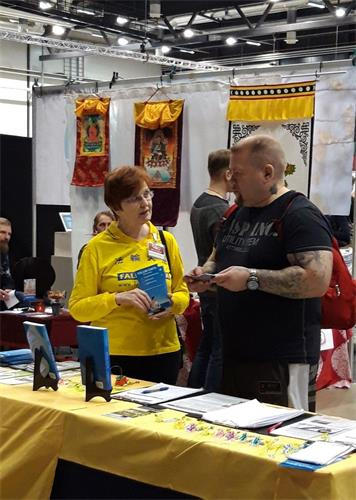

图1：芬兰坦佩雷市健康展上，民众在展位前了解关于法轮功的详情。

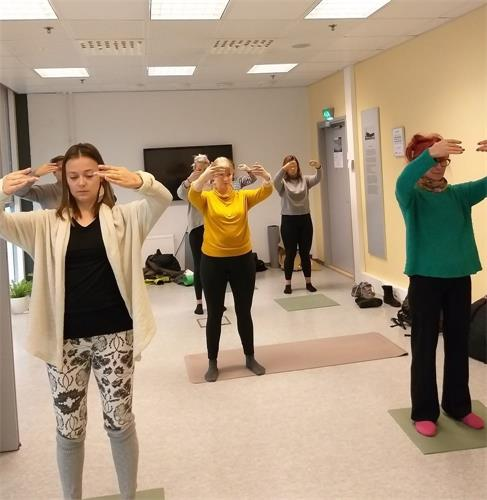

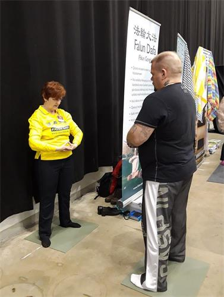

图2～3：芬兰坦佩雷市健康展上，民众学炼法轮功

一对夫妇在展位前停住脚步，当听到迫害事实时，妻子说她曾在中国居住五年，知道在中国各种对人权的迫害非常严重。他们在呼吁停止迫害的征签本上签名，并希望法轮功学员得到更多的签名，早日制止这场迫害。

一位年轻人之前对气功很感兴趣。他跟学员深入交谈后想购买《转法轮》书籍。

一对夫妇带着小孩经过展位时对功法非常感兴趣，并表示这功法对他们很重要。学员当场教功。临走时，他们非常高兴地带走各种真相资料和精致的手折莲花。

Aslak跟学员长时间的交谈。他一直在寻找内心的平和，并对法轮功非常感兴趣。他当即购买了《转法轮》一书，想深入了解。

功法展示吸引了很多民众的关注。很多人询问当地炼功点的信息，获取相关的联系方式和更多的资料。有些人在展位上当即学炼功法，并表示感受到很强的能量。

<h1 align="center"><b>古代诗人的修炼故事</b></h1>

【明慧网二零一九年一月十五日】古代许多诗人不但诗作的好，而且修炼出了很高的神通。或者可以说他们的诗作也是他们神通的表现。他们的诗作和神通相互辉映。
东晋大诗人陶渊明，不但预知自己去世的准确时间，而且平静而安详地在前一天为自己预先写好了挽歌诗三首，在诗中描述了自己死时家人的反应。对此，后人盛赞其“视化如归”，真正做到了他自己所说的“纵浪大化中，不喜亦不惧。应尽便须尽，无复独多虑。”诗的意思是说，“我的身躯将归于尘土，但这并不是生命的终结，不会欢喜终于脱离尘世，也不会对死亡有任何恐惧；该结束的时候就会结束，没有必要为此而悲伤。”

盛唐前后，许多朝廷命官和文人都修佛，其中一些人也都知道自己的前世。白居易曾在一首诗《自解》中说：“房传往世为禅客，王道前生应画师。我亦定中观宿命，多生债负是歌诗。……”意思是，“据说房太尉前世是个修佛的和尚，而大诗人王维王右丞前生是一个画家；我也在打坐入定中，用宿命通看过自己的往世，结果发现我原来的好多世中都一直与诗歌有着不解之缘。”他在这里告诉我们，原来他的诗歌天才是在许多世中不断地积累起来的。这一说法为“天才”找到了最自然的解释，并且也被当今西方“轮回转世”的科学研究所证实。比如一个几岁的小孩能够不学自会地开机动船，显出非凡的“天赋”，但研究发现，他前世是一个机动船的船长，有着几十年的驾船经验。

唐朝代宗有名的诗人韦应物，在四十二岁因病辞官而住到“善福精舍”里去时，就已经下定决心要做一个真正的修炼人了。韦应物最后修为到了哪一步，虽无从考查，但他曾在一首诗中写到“名虽列仙爵，心已遣尘机。即事同岩隐，圣渥良难违。”韦应物一生波折起伏，但心志不改，一心向道，在放下尘世的名利之时，他感悟到自己已经得道了，达到了一种返本归真的境地，名列“仙爵”，是一种与天地同在的荣耀。

唐宪宗时代的诗人张志和，写下了流芳千古的名句：“西塞山前白鹭飞，桃花流水鳜鱼肥。”唐大历九年秋冬，颜真卿偕同门生、弟侄、宾客前来平望驿游览，大家饮酒作词，酣畅淋漓，张志和酒酣耳热，忘乎所以，飘然若仙，他乘兴要为众人表演水上游戏。他将坐席铺在水上，并坐上去，那坐席能在水上漂浮自如，左右来回，有行舟般的声音。霎时间，一群白鹤飞来，围绕着张志和委婉鸣叫，在岸上的人们无不惊讶。张志和向颜真卿摆摆手，以示谢意。最后，他与白鹤一起飞上云霄。

张志和修炼的情况在《续仙传》中有零星的披露，说他是个“守真养气”的人，可以“卧雪不寒，入水不濡。天下山水，皆所游览。”在常人看来，躺在雪中不冷、跳进水里不湿，已经很了不起了，但那还只是道家修炼中显现出来的某些术类功夫而已。从张志和的诗文、书画的表现力，可以看出张志和远远超出了术类的层次，心性已经很高了。

有的修炼人并没有烧香拜佛、打坐参禅，或者安鼎设炉、采药炼丹之类的修炼活动。这是对修炼形式的理解太狭隘和表面化，而这种狭隘和表面化又是受到生活经验局限的结果，因为人们在生活中或者见闻中所知道的修炼人一般都是干这些事的。

其实，按照任何正法去修心都是修炼，不断地去掉自己心中对世间万物的执著，一步步地提高自己的心性，最终达到该法门相应的标准。烧香拜佛、打坐参禅和安鼎设炉、采药炼丹当然也是佛道两家的一种修炼方法，但那是表面的也是比较初等的方法。

“大道无形”，到了高层次上以后这些方法就看不到了，一切都在“修心”这个过程中進行。诗人的修炼形式就是诗歌的创作，而古代诗歌是神传文化。诗人在不断提升人生的境界，他的道德水准不断升华，而他的诗歌创作水平也在逐渐炉火纯青，这本身就是修炼过程，用修炼界的话讲，也可以称之为“不修道已在道中”，是一个随其自然，水到渠成的过程。

<h1 align="center"><b>矿下重车砸身　大法护佑化险为夷</b></h1>

【明慧网二零一九年一月十五日】一九九八年，我在当地一家私人煤矿打工，在井下采煤，干三班倒体力活儿，那活儿又脏又累又危险，经常出事。我干活的那个井口是一个斜井，每天上班坐矿车下到很深很深的井底，徒步再走很远的一段平巷，然后是第二道斜井向下延伸一百多米，又是平巷，再向前几十米分出几个岔，通向各个工作面。
我们每天把从工作面采出的煤用大板锹装满矿车后由一个人推出来，推到第二道斜井下面，挂上钢丝绳，由上面的小绞车把矿车拉上去，再沿着平巷把车推到第一道斜井下面，等攒够五、六个车时连接在一起，由地面的大绞车把它们拉出井口。放车的人回去时再捎带着推一个空车皮按原路返回到工作面，如此循环，直到下班。

每个矿车里的煤装到平箱，就是一吨。可是老板为了出产量多挣钱，每车煤必须满满的装到上尖。由于装的太满，绞车向上拉车刚起步时就会抖落一些煤，时间一长，矿车下的两根铁轨就被散抖落的煤盖住了，在钢丝绳的抖动下，车轱辘就容易脱轨、掉道，造成翻车，所以需要时时清理。在此之前已有两次翻车。

那天我上白班，到下午快下班的时候，我从工作面推着满满一车煤来到第二道斜井下。挂好钢丝绳，打完拉车的电铃，我就蹲在车前方钢丝绳与煤车铁销子的连接处。因为忙于出煤出产量，大家疏忽了清理散落在铁轨上的煤面。绞车启动了，钢丝绳拉着煤车缓缓向上爬去。这时我发现车轱辘掉道了，车身摇摆着直奔旁边的木头棚子去了。（第二道斜井铺设的铁轨偏向巷道一侧，闪出另一侧方便走人和运送木头杏条等采煤用料）

此时如果有经验的矿工，他会快速跳下车向前猛跑，无论身后发生什么情况都不要管，谁也管不了，因为你没有任何能力阻止将要发生的一切，唯一要紧的是先保证自己的安全。

当时我这样想，赶快回去按响电铃让绞车司机停车，避免翻车。我扭身跳下车向后跑，可就在这时，煤车顶到木头棚子上瞬间翻了，正好砸在我身上，重重的泰山压顶一般，一下子把我砸倒在地。我还没有反应过来，满满一车煤兜头盖脸灌到我的头上、身上。安全帽也被打掉了，矿灯也灭了，眼前一片漆黑，我的左腿被重重的压在矿车下面。

我心里一阵惶恐绝望：这下完了，指不定砸成什么样。但马上一转念：我不能这样想，我没事，我是炼功人，我没事，我有师父保护，求师父救救我。我就这样祈求着，想从地上爬起来，但是起不来，左腿压在矿车下面。

我费力的地把腿拽出来，膝关节有点疼，我挣扎着站起来，赶紧活动活动胳膊腿儿，两只手从头到脚胡噜了一遍，没什么事儿。脑袋上有几个包，左胳膊和左侧身体被矿车砸过的地方有些木木的疼，没什么大事儿。

我顺着身后矿灯盒子上的灯线找到安全帽，戴在头上，再把上面的矿灯拧亮。上面绞车司机见拉不动车，便停了绞车，拿矿灯向我这边照着晃着问怎么了，我说车掉道了，翻了。

我忍着腿疼走回到工作面找到班长，向他说明情况。班长找了六、七个人来，把矿车弄起来，摆正，又重新把煤装满。我也勉强跟着干。但是我不能放车了，班长安排了人替我。我和众人回到工作面又干了一会儿，就下班了。

洗完澡，我找到老板的四弟（老板不在时，他在井口管事），把我在井下被矿车砸到一事跟他说了，要求回家歇几天，他答应了。

回家睡了一宿觉，第二天早晨醒来，左腿膝关节疼的厉害，左脚不太敢着地，走路一瘸一瘸的。而且左腿大腿外侧和小腿外侧的肌肉一片青紫。我想，不管它，打坐炼功。我忍着痛，把腿盘上，炼了一个小时的静功，腿好多了，不那么疼了。我坚持学法炼功，过了四、五天，左腿就好了，我又上班了。

这期间，我没向老板要过一分钱医药费、误工费。我想我是炼功人，不能借此讹人家，不能给人家找麻烦。

这次事故要搁常人身上非出大事不可。一车煤就一吨多重，再加上矿车自身七、八百斤的重量，要砸在常人身上，不残废那腿也得筋断骨折。可我却没有什么大事。我知道这是在关键时刻弟子按照师父的教导，按照大法的标准守住了心性；在关键时刻相信师父相信大法，大法显现了神迹。

是师父保护了弟子，是师父替弟子承受了这次大难。我对师父的救度之恩无以言表，在此叩谢师恩。

<a href="https://git.io/01"><h6 align="right">回首頁</h6></a>
<h1 align="center"><a href="https://github.com/jkujkkj/bird/blob/master/bird03.md"><b>看更多bird03.md</a></b></h1>
<h1 align="center"><a href="https://github.com/jkujkkj/bird/blob/master/bird02.md"><b>看更多bird02.md</a></b></h1>
  
<h1 align="center"><b>伪火十八年　造假害中国</b></h1>

【明慧网二零一九年一月十三日】一九九九年七月二十日中共与江氏集团动用整部国家机器迫害法轮功，为了实行“肉体上消灭、经济上搞垮、名誉上搞臭”的灭绝政策，不断制造“假新闻”，编造一连串自焚、杀人与敛财等弥天谎言，企图激发民众对法轮功的仇恨。这些“假新闻”中，荼毒世人最严重者，莫过于二零零一年一月二十三日炮制的“天安门自焚事件”，意图诬蔑陷害法轮功，以所谓的五人“自焚”谎言欺骗海内外民众。

<b>天安门自焚伪案 漏洞百出</b>
 

如果把十八年前的中央电视台“天安门自焚事件”录像画面进行慢镜头分析，便会暴露出很多疑点，说明这场“自焚”事件完全是一场精心布局的预谋与骗局。

一、在“自焚”事件中被大面积烧伤的小女孩刘思影气管被切开后四天就能接受采访并能唱歌。

二、《焦点访谈》录像证实，刘春玲不是被火烧死，而是被警察用重物击打头部倒下的。

三、天安门巡逻的警察几分钟内从两辆警车里拿出二十多个灭火器和灭火毯“应付”该起“自焚”突发事件。

四、北京积水潭医院治疗“自焚”大面积烧伤者，不作任何防护。允许记者近距离采访，所有被严重烧伤的人都被紧紧的用纱布包裹，违反医学常识。

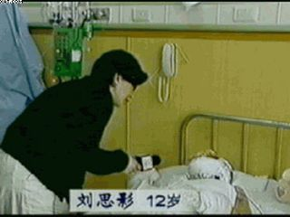

五、“王进东”在自焚时衣服已被烧焦，但是最易燃烧的头发还在头上，他腿间的盛满汽油的雪碧瓶却完好无损。在他喊出那句似是而非的口号之前，警察手中的灭火毯却在他头上悠闲的摇晃很久，没有丝毫灭火的急迫。

六、在央视和新华社的“自焚”报导中，先后出现了三个不同的“王进东”。台湾大学语音识别实验室受“追查迫害法轮功国际组织”委托，对王进东的声音作了语音鉴定，得出明确结论：《焦点访谈》第一集中的王进东与后来的王进东不是同一人。“追查迫害法轮功国际组织”经可靠途径查获：参与“自焚”的“王进东”是由一名现役军人扮演。

真假王进东

不仅上述造假的凿痕太过明显，《华盛顿邮报》在二零零一年二月四日头版头条发表了调查报告《自焚的火焰照亮了中国的黑幕──当自焚的动机乃加强对法轮功的斗争》。邮报记者菲力蒲•潘亲自到自焚身亡的刘春玲的家乡开封实地调查，邻居们说从来没有人看见过刘春玲炼法轮功。

<b>《伪火》影片获奖 民众明了真相</b>
 

国际教育发展组织于该年八月十四日在联合国会议上，就天安门自焚事件，强烈谴责中共当局“国家恐怖主义”的行为，指控“天安门自焚事件”是对法轮功的构陷，涉及惊人的阴谋与谋杀。声明中说：从录像分析表明，整个事件是“政府一手导演的”。中国代表团面对确凿的证据，没有辩词。该声明已被联合国备案。

令中共极度难堪的是，二零零三年十一月八日由新唐人电视台制作、揭露“天安门自焚真相”的纪录片《伪火》，从各国参赛的六百多部影片中脱颖而出，获得第五十一届哥伦布国际电影电视节荣誉奖。该奖项在记录片领域享有盛誉，其历史仅次于“奥斯卡”。《伪火》影片以触目惊心的画面和精辟严谨的分析，揭示了“自焚”案的诸多疑点，从而证实了整出事件是中共栽赃法轮功而炮制的伪案。《伪火》的视频可在《伪火（中文版）》下载观看。

<b>造假遍中国 回归传统救乱世</b>
 

天安门自焚案出于中共构陷，十几年来，《伪火》在海内外广泛传播，无数民众通过了解“自焚真相”从而明了迫害法轮功的真实情况；但“造假”是中共一贯手法，其歪风却引领人心沉沦，道德逐步下滑，温、良、恭、俭、让等高尚品格被鄙视成迂腐幼稚的思想。近年中国很多社会乱象，看似人的素质日益低下，实肇因被假、恶、斗的党文化耳濡目染所致。

当年号称亩产万斤粮，却饿死中国人四千万；中共统计本质是造假，信用早已破产。民间广传顺口溜，所谓“村骗乡，乡骗县，一直骗到国务院”，顽疾已久，根治也难。不仅地方造假，上梁不正下梁歪，基层政府需要政绩来升职，高层政府要保GDP增长速度。二零一六年十二月八日，李克强智囊、中共国家统计局局长宁吉喆在《人民日报》撰文表示，一些地方时有发生的统计造假、弄虚作假，违反法律法规。

流风所及，造假在中国社会随处可见。夸大不实的经济数据，错误引导投资人进场；空气质量监测造假，剥夺了公众的知情权，明明是重度雾霾天气，受骗的人们仍在室外正常活动，等于变相害人。官员造假是普遍现象，表面上是为了政绩与维稳，背后的始作俑者不正是中共当局吗？

澳洲科技网站Science Alert报导，北京食品药品监督管理局（SFDA，简称食药监局）在检查等待批准的1,622件新药临床试验数据时发现，八成的数据不符合分析规定，不完整，或者凭空捏造。不止是医药行业，实际上中国大陆一切都是假的，只要有利可图，就会有人造假。

据多家媒体披露，演艺圈明星流量造假已是行业公开的秘密，“买微博热搜”、“买粉丝”、“买评论、转发、点赞”、“打话题榜”、“维护百度指数”等，是制造流量艺人的“标配”，而背后都是艺人经纪公司在操盘。电视剧收视率也能造假，还形成了黑色产业链。购买一集电视剧的收视率价格已飙升至30万至50万元人民币，以此推算，制作假收视率数据的公司全年收入至少有40亿元人民币。

“士大夫无耻，是谓国耻”。目前毕业生论文抄袭现象，在中国各高等院校也广为人知。从本科生、研究生到博士生，从学生到教授，从校长到中科院的院士，甚至爆出学术界跨国论文造假的丑闻。美国一家名为“剽窃监督”（Plagiarism Watch）的抄袭监测网站，挖出了一家被称为“世界科学史上最大规模”的英文论文造假公司。该公司疑似为研究人员跨国批量生产、发表学术论文。研究者发现，二零一六年该杂志发表的中国学者文章达到1605篇，占总发表量的78.1%。

十九年来，中共与江氏集团残酷迫害修炼真、善、忍的法轮功学员，无数善良的学员被非法关押在劳教所与监狱中，长期遭受酷刑折磨，迄今至少已有四千两百多人被迫害死亡。正因为迫害真、善、忍，遂使假、恶、斗毒害全中国，伦理道德沦丧，人人且为近敌。目前许多中国人唯物是尚，不信神佛。在党文化的熏染下，逐渐迷失善良本性。

中共炮制自焚伪案，只突显了自身的愚蠢无知。随着真相广传，人心日渐觉醒，迄今已有三亿两千多万有识之士退出了中共的党团队组织，现在正以每天十万人退党的速度逐步解体中共。欲匡正社会，必先正人心。真、善、忍是普世价值，恰是整饬歪风邪气的解药良方。衷心祝愿中国人回归传统价值，早日唾弃造假，说真话，办真事，恢复良知善性。

<h1 align="center"><b>父陷冤狱、儿遭酷刑——看中共公检法司的罪恶</b></h1>

【明慧网二零一九年一月十一日】（明慧网通讯员湖南报道）郴州市七十七岁的法轮功学员廖松林于二零一八年十二月二十日被劫持到湖南省网岭监狱继续非法关押。廖松林的儿子廖志军同年四月被枉判四年，非法关押在网岭监狱，现正遭受酷刑迫害。
二零一八年十月二十二日，廖松林被郴州市北湖区法院冤判三年，面对枉法判决，十月二十八日廖松林依法向郴州中级法院提起上诉。十二月七日，中级法院告知廖松林法院决定不公开审理，只进行会议审理，可是，第二天中级法院就告知廖松林已经下了枉法判决书，维持原判。审理只是一句空话。中级法院视刑事案件的冤情如儿戏，又酿冤假错案。

廖松林生于一九四一年十月，郴州市军人接待站退休职工，一九九四年，开始修炼法轮功。修炼法轮功之后，以前患的神经官能症、肺结核、鼻窦炎、前列腺炎及三十多年的胃病、工伤引起的脑震荡后遗症，都好了。他按照真、善、忍做好人，曾多次为单位维修水电设施，不要一分钱报酬；为邻居维修水电器具，不收礼，也不让他们请吃喝。单位领导委托廖松林做生活区物业管理，他不收一分钱管理费，义务为大家服务。

一九九九年中共迫害法轮功后，廖松林曾多次被迫害，二零零一年被绑架到洗脑班非法关押；二零零二年八月被非法抓捕，非法关押在郴州市看守所一年；二零零三年九月六日被郴州市北湖区法院非法判刑三年，被关押在湖南常德津市监狱。二零零八年又被冤判四年，共计七年冤狱。

如今，廖松林又遭冤狱，从非法抓捕到冤判，整个过程，就是北湖区公、检、法跟随六一零迫害法轮功犯罪的过程。

<b>公安机关犯罪行为</b>

二零一八年五月十三日凌晨五点多，廖松林一出门就被蹲坑的北湖区国保大队警察绑架、扣押电动车。早上九点多，国保大队刘劲松等数人，调来消防车从阳台翻入室内，非法抄家，抄走法轮功书籍和资料，下午四点才离开，没有出示任何手续。当天晚上九点左右廖松林回家。

七月十九日早晨八点多，北湖区国保大队刘劲松等十多人再次非法抓捕廖松林，没有出示任何手续、证件。并强行闯入廖松林家抄家，抄走法轮功书籍、九千多元人民币等财物。

随后，廖松林被非法关押在郴州市看守所。期间，七十七岁高龄的廖松林被医生检测出身患高血压、冠心病、轻微脑梗、肺结核等病症。因此缘故，廖松林被劫持到一九八医院继续非法关押。

<b>检察机关犯罪行为</b>

北湖区检察院对于北湖区公安机关的违法行为不予监督处理，并非法批捕和非法起诉廖松林。

八月二十日，北湖区检察院非法批捕廖松林，但家属没有收到任何通知，相隔数日才知晓。九月三日，廖松林的妻子孟庆莲向北湖区检察院公诉科邝良聪反映廖松林信仰法轮功按照真善忍做好人，没有违反法律，应当释放。邝良聪说：“我们同事已经做出批捕的决定，我又驳回他们，这不是自己打自己的脸吗？”

九月十三日，孟庆莲再次到检察院询问关于廖松林的情况时，才知道廖松林的案件已移交到法院。此前，廖松林本人和家属都未接到任何形式的通知。

<b>法院犯罪行为</b>

九月二十七日，郴州市北湖区法院在一九八医院的一间会议室非法庭审廖松林
