<a href="https://git.io/ffq">
</a>

<h1 align="center"><a href=https://github.com/3fmd/gm/blob/master/epub.md>免费下载好书 下载 epub 视频 音频 图文 电子书</a></h1>
<h2 align="center"><a href="https://github.com/3fmd/gm/blob/master/gm/download/Reasily1802h.apk?raw=true">手机必备Reasily - EPUB 阅读器apk 请下载安装 才能阅读影视epub</a></h2>

<h1 align="center"><b>美展触动心灵　反思人生真理</b></h1>

【明慧网二零一八年五月二十日】二零一八年四月十六日至五月十六日，在俄罗斯克拉斯诺亚尔斯克市（Krasnoyarsk）最大的贸易展览中心举行了真善忍美展，期间大约八百多人参观了此次美展。参观者们对画作中表现出的修炼法轮功的美好感到惊叹，同时也对在中国遭受迫害的法轮功学员感到同情。

图1～2：在俄罗斯克拉斯诺亚尔斯克市（Krasnoyarsk）的“真善忍美展”上，人们观赏画作，了解法轮功真相。

“真善忍国际美展”是由修炼法轮功的艺术家们创作的美术作品展，表现的是各族裔民众修炼法轮功过程中的精神追求以及法轮大法给人们生活带来的美好，其中也包括揭露已经持续十九年的中共对法轮功进行迫害的作品。

在此地美展不是第一次举行，以前看过美展的人这次带来了自己的亲朋好友和同事来观看。一位来自西伯利亚地区诺里尔斯克市（Norilsk）年轻的运动员对画展深有感触，在留言簿上写道：“为精神的安详致谢。”

图3：心理学家娜杰日达表示，美展让她反思人生的真理，变得更善良和宽容。

一位名叫娜杰日达的女士是个心理学家，她在留言簿上写道：“这是一个内容丰富、精彩的‘真、善、忍”’艺术展览，让我印象非常深刻，反思人生的真理，变得更善良和宽容。”

瓦伦蒂娜（Valentina）是一位老师，她在留言簿上写道：“对这样一个美妙的、注入灵魂的、让人深受感动的画展表示深深的谢意。这些图片印入了心中，不可能冷漠的、无动于衷地离开这个大厅。感谢在记忆中留下这不可磨灭的印记，以及最重要的在心灵上！我开始完全不同地看世界、人们和很多东西。”

还有的参观者评论道：“美展触动心灵，有一些对人类和别人的命运不持冷漠态度的人非常重要。”

“展会留下了光明、干净的满意感和温暖感，这是在现代人们需要的。”

“画作触动了某种最深处的心弦，让人重新审视很多东西。”

“鼓舞和和谐——这是这个美好的画展所给予的。”

<h1 align="center"><b>美国药物经济学博士的奇妙人生历程</b></h1>

叶俊言正在读法轮功著作《转法轮》。

【大纪元2018年05月20日讯】（大纪元记者姜琳达洛杉矶报导）美国药物经济学博士叶俊言的人生看似一帆风顺——高学历、事业有成、家庭美满，但他在面对求学工作过程中的压力、眼睛一度接近失明的痛苦时，也曾让他感到迷茫无助。遇到了法轮大法后，他的眼睛恢复正常，性格与心灵才有了转变与升华。

药物经济学博士叶俊言在自家院子炼法轮功第五套功法。

<b>“人生从彩色变成黑白”</b>

出生于台湾的叶俊言，20几岁就获得台湾大学医学研究所的硕士学位。1999年5月，他选择到美国德州大学（University of Texas）攻读药物经济学博士（Pharmacoeconomics PhD），却遭遇眼睛突然看不到的变故。

叶俊言介绍，他被诊断出患上一般老年人才会罹患的急性青光眼，医生说是因为眼压太高导致压迫视神经。“就西医的角度而言，视神经坏掉了就没办法恢复，任何的药物或手术都对受损的视力于事无补。”

虽然他不断尝试西医、中医、气功等治疗方法，但即便在开刀之后，视力却始终时好时坏。这突如其来的遭遇让刚来美国的他非常沮丧。“这影响到我的学业和生活。我只能靠着药物控制，消极过日子。”叶俊言回忆说。

<b>得法时的“奇妙”经历</b>

直到2001年3月，叶俊言在自家书架上发现了一本法轮功著作《转法轮》。“本是我岳母在台湾得法后，希望我太太也修炼而带回来的书。然而却‘无心插柳柳成荫’，被我给看到了。”叶俊言说，“当我读到书中的‘第二讲’时，就感觉自己脑袋里有东西炸开了，两个晚上我就把整本书学完了，之后感觉整个人如醍醐灌顶。自此走进了修炼的行列。”

因有缘得法后，叶俊言才了解到所有的事情都是有安排的。他坦言自己的高学历，也成为他人羡慕的对象。当初到美国时，为人处事都是趾高气扬、不可一世。“而且我学医药、执著科学，以往是不会轻易接受什么。但因为眼力受损的经历，能让我静下心来学法。”

学法不久后，他说：“我真的亲身体验到了像师父讲的天耳通，会听到另外空间的音乐。早上起来常感到眼前有很多法轮在转，我知道这是师父在帮我调理眼睛。”

心境的豁然开朗，使他决定停止一切对眼睛的药物控制和治疗，却得到意想不到的结果。“以西医的角度来说，不治疗就会恶化。但从我修炼至今已10多年了，我的眼睛跟他人无异，开车、生活都毫无障碍。”2007年，他还如愿攻下了德州大学的药物经济学博士学位。

<b>学法后不断突破科学局限</b>

毕业后，叶俊言去了美国顶尖的综合医疗机构作研究专员，后来成为纽约一所大学药学院的助理教授。他去年搬到加州，目前在全球最大的安进制药公司（Amgen）担任全球卫生经济经理一职。

叶俊言坦言自己是个很“木讷”的人，不喜欢社交，没想到反而担任过助理教授，到处进行演说。而目前他的工作是做临床研究，药在核准之前，要与很多国家的医疗系统和保险公司联系，就要与他人接触。他认为修炼之后，他的整个性格都发生了改变。

然而在科学的道路上，越深入学习，叶俊言就越觉得科学非常有局限性，但大法却是永无止境的。“在搞科研时要突破自我、不断接触干细胞、癌症研究等尖端科技、做研发，当然会遇到瓶颈。得法后，我发现往往在做项目中，突然就有了灵感，出来的科研效果都很好。”

<b>冥冥之中有安排</b>

回想起自己修炼10多年的心路历程，叶俊言感觉一切事情都被安排得很完美。“无论是刚毕业时，面对有限的好公司的工作机会，或是工作中的提干和利益分配问题，或当别人在暗地里勾心斗角争夺时，我作为修炼人不争不斗，努力做好自己的本分工作，机会反而主动找上我。”

又或者在美国办身份时，当很多人觉得机会的大门都已经关掉了，“事实上，总会有一条路。到时间，就发现已经安排好了。从我得法到现在，回过头，真的觉得所有事情冥冥之中都有安排。”

<b>攻破谎言 以亲身经历传真相</b>

在求学期间，他曾拜于《药物经济学基础》作者、完成过上百个演讲和出版刊物的Karen Rascati博士门下，还曾与经验丰富的俄州克利夫兰家庭医学医生John Hickner博士一同做过研究。

因此，即便是被种种光环围绕，叶俊言选择在工作之余，主动走上街头、商场传播法轮功真相。他说：“学法之后，我的智慧源源不断。我现在有这样的地位和工作环境，是因为修炼后才得到的。我不再觉得我的身份有什么，只希望可以破除中共所有的抹黑，让人从正面了解大法。”

对于一些人听信中共的谎言，认为“只有学识不高的人才学大法”，叶俊言表示这完全是误解。他说大法弟子中有很多学识渊博的科学家和各界精英。

他在纽约作助理教授的5年期间，共教过几千名学生。“我教的是药学专业，是大学毕业后进修的课程。学生的素质较高，还有很多研究生。当学生们得知我的眼睛恢复正常的神奇经历，以及我时刻按修炼人标准为人处世，中共许多对法轮功的抹黑都不攻自破。有些学生表示有兴趣要修炼。”

<b>以“真、善、忍”教育孩子</b>

叶俊言有三个女儿，在管教方面，他也没有太费心。“在学业上，我从不强行控制女儿，但我会用‘真、善、忍’法理教导她们，培养她们高尚品德。偶尔有机会，我们会一起学《转法轮》。而她们的学业成绩却出乎我意料地好。”

他介绍，大女儿精通中、法、英三种语言，日文也自学成功。“她学习很轻松，没有太大压力。如今她读高中一年级，却已经修完Senior才能考的大学预修中文课程（AP）。其他女儿也是，成绩非常好。”

他觉得品德高了，孩子们就知道怎样去学习、什么是重要的，也不用父母操心学业上的事情，成绩自然而然就好了。他说他修炼后全家人都受益了。

“感恩师父，没有师父，就没有现在的我。也希望每个人，特别是不了解真相的人，不妨静心了解一下法轮大法。什么事情不是惊天动地才最好，我们的生活就在点点滴滴之中，如果有机会千万不要错过这个机缘。”叶俊言认为自己修炼大法，看似平常，但很多事情非常超常神奇。

<h1 align="center"><b>在中共治下，中国有实现“依法治国”的可能吗？</b></h1>

【明慧网二零一八年五月二十日】中共一再提要“依法治国”，那么在中共治下，能不能实现“依法治国”呢？最简单，最直观就看看掌握公权力的公检法司等人员能不能“依法执法”、“依法办事、办案”就可以知道答案了。因为只有这些掌握公权力的人才能让法律正常或有效的实施，也只有他们才能真正破坏和阻挠了法律的实施，整个国家的治理正是由各个地方一件件的具体事件组成。
时至今日，我们看到在中共江泽民集团迫害法轮功中，很多参与的中共公检法司人员对法轮功学员可以随意绑架、非法搜查、抄家、偷抢财物，刑讯逼供、敲诈勒索、毒打虐杀，肆意枉判，大量制造冤假错案……对给法轮功学员辩护的维权律师都可以殴打、绑架，非法关押、判刑，随时进行生命威胁，或用各种违法规定阻挠律师介入，阻挡律师和民众对他们违法行为的控告，耍尽流氓和无赖……在明慧网上，我们都可以看到大量这样的报道。

“依法治国”喊了这么多年，很多中共公检法人员仍然无法无天，不仅不依法办事、办案，反而是大量严重违法犯罪，视《宪法》和法律如手纸，让“依法治国”成了过场、口号和笑谈。那么是什么原因让众多中共的公检法人员至今没有依法办事、办案的意识，不能去掉执法犯法的习惯呢？

一、中共的法律观是让公检法人员养成了不依法办事和违法犯罪习惯的根源

这个习惯不是短时间养成的，其源头是中共的法律观，在中国大陆，学生从学校就被灌输：法律是统治阶级制定的，是为统治阶级服务的，中共的法律是无产阶级专政的工具，并不是国际社会普遍认为：法律是维护公平和正义的。虽然中国大陆的宪法和法律中也有维护公平、正义，甚至“保护人权”的字眼，但几十年不间断的政治运动，包括持续至今的对法轮功的迫害，吃够了中共苦头的中国民众没几个认为那些话是真的。

深知中共司法腐败黑暗内幕的各级公检法司人员内心中就更不相信了，说白了，中共的公检法司人员普遍认为法律是用来治别人，镇压民众的，而自己是专政工具的一员，是“执法者”和“特权者”，是用“法律”来打击别人的人，压根没有想用法律来约束自己。

所以在中共公检法人员这里，普遍没拿法律当回事，觉得执行上面的内部规定，政策往往比执行法律更实在，很多时候完全将法律抛之脑后，违不违法不在考虑范围，只要平时把领导搞好了，关系到位了，一切都可以在法律之外摆平。所以在中共的各级人员中不依法办事和违法犯罪才那么普遍。

在中国大陆，在大量的普通民事和刑事案件中，在冠冕堂皇的走法律过场的背后，还是权钱交易；还是方方面面的“勾兑”，比的谁的关系硬，后台大，送得多；还是吃了原告吃被告……这一点，相信中国大陆很多深受中共司法腐败之苦的民众有切身体会，相信在中共的司法黑暗环境中摸爬滚打的公检法司人员心知肚明。

中共的体制本身，“党”在法律之上，中共几十年来用暴力和谎言维护统治，正是让中共各级公检法人员养成不依法办事，执法犯法习惯的根本原因，中共不除，“依法治国”就无法实现。

二、中共江泽民集团长期对法轮功的迫害，彻底摧毁了中共公检法司人员的道德底线和法制观念

因为中共江泽民集团迫害法轮功本身就是严重的违法行为，为使迫害能进行和延续，所以中共江泽民集团在迫害中刻意“鼓励”、诱导、唆使各级中共公检法司人员，践踏法律，违法犯罪。并以各种规定、政策、命令给基层公检法人员违法犯罪“创造条件”，如原来的警察法中警察有在执行命令中的违法免责条款；违宪违法的两高司法解释一、二、三等等。

在迫害中，很多公检法司人员切身“体会”到：在中共治下，法律是可以随意变化对象和玩弄的，根本没有严肃性。宪法和法律是写得冠冕堂皇，但是是用来蒙骗民众和欺骗国际社会的。因此对法律更不当回事。

迫害十九年来，中共江氏集团彻底败坏了中国大陆的法制，破坏了法律的正常实施，比如610和政法委要求公检法司人员“对法轮功不用讲法律”。这些把持公权力，权力不受制衡的人，一旦可以对一个庞大的人群不讲法律，那么人性恶的一面必然会被无限放大，在这个过程中，违法犯罪还受保护、胡作非为还可以升官发财，那么这些人的道德观念和法制观念就必然被摧毁殆尽。

所以我们看到在中共江泽民集团长期迫害法轮功中，很多中共公检法司人员已被变成了穿着制服的大大小小的流氓、罪犯，满身的黑恶做派和习性。对法轮功的迫害，彻底摧毁了这些中共公检法司人员的道德底线和法制观，那么在面对法轮功学员—这些善良守法的公民都可以不用讲法律，都可以为所欲为的乱来的时候，他们会对其他民众讲法律吗？会依法行事，用法律来约束自己吗？在被鼓励违法犯罪的环境中呆久了，干久了，就必然养成违法的坏习惯，一旦养成深重恶习，要改那就不容易了。事实上很多中共各级人员早已将迫害法轮功学员的经验和手法“成熟”地运用到普通民众身上。

对不少地方的中共公检法人员来说，他们手中有不受民众监督的权力，有中共的罪恶体制为靠山，司法不能独立和相互制约，就可以上下串通，“勾兑”收买，沆瀣一气，看看今天中共大量的各级官员真实表现：塌方式腐败，大量涉黑、护黑，官商勾结，警匪一家，迫害善良、欺压民众、贪赃枉法，那些披露出来的“窝案”、“串案”只是冰山一角，这些乱象只不过是中共江泽民集团迫害法轮功带来的恶果之一。

所以大陆民众就看到本应精通法律，模范守法的公检法司人员普遍成了“法盲”，执法犯法成了“常态”。2017年公安部要求全国各地的基层公安、派出所警务人员对法轮功学员搞了一个所谓的“敲门行动”，过程中这些公安、警察的执法犯法的状态普遍到了惊人的程度。

“过去的土匪在深山，现在的土匪在公安”，“公安是公害”……就是民众对中国大陆法治现状的总结和概括。

目前，中国大陆正在“扫黑”，横行乡里的黑社会是该“扫”，但事实上，很多中共公检法司人员已在长期参与迫害法轮功中，被江氏集团变成了穿制服的“黑恶势力”，穿制服的“黑恶势力”比没穿制服的“黑恶势力”对社会的危害更大，他们对社会法制的破坏和道德的败坏起到的作用是非常突出和最恶劣的。他们的“政治保护伞”就是发动迫害法轮功的中共江氏集团元凶和各级死党。他们就是横在中国走向法治路上凶恶的“拦路虎”。

在中国大陆，不清算江泽民集团的滔天罪行，罪恶仍然继续，真善忍被打压，在迫害法轮功中犯下大量罪行的不法人员手握权力继续为非作歹，整个社会正义就不能伸张，公平无从谈起，道德就不能回升，而道德却是真正法治的基础，在没有道德观念，是非混淆、黑白颠倒、善恶不分的社会里，制定再多的法律不一定能实施，为压制社会矛盾制定更多的严刑峻法，很可能成为非法的恶法，对民众施以无孔不入的监视和监控，只可能带来暴政和苛政，造成更尖锐的社会问题，终将失尽民心，被人民和历史抛弃，而此时用高压和封闭制造出来的“稳定”，只是火山爆发“安静”的前夕，自古以来，未有施暴政能长久，能善终者。

不仅如此，在排斥和打压真善忍的国度，假恶暴必然横行，社会中充斥着无信无义，根本溶入不了国际主流社会，无法被人真正尊重。种种社会矛盾必然日趋尖锐，危机四伏……

现今的中国，不停止迫害法轮功，“依法治国”就没有实现的可能。

要实现依法治国，唯一的办法就是停止迫害法轮功，惩治江泽民犯罪集团，解体中共，清算罪恶，尊重和弘扬“真善忍” 普世价值，扶持社会公平和正义。唯有根本上的转变和深刻的变革才能使人心归正道，江山复清明，那时法律才能起到应有的作用，“依法治国” 才能真正实现。

<h1 align="center"><b>器官捐献受贿案 重点不在“受贿”</b></h1>

第26届“国际器官移植协会”（TTS）大会会议于8月18日到23日在港召开前夕，大陆湘雅三院被揭买卖器官。（大纪元）

【大纪元2018年05月19日讯】近日，大陆某网报道了江西人体器官捐献管理中心某副主任的“受贿案”。跟那些动辄涉及千万、甚至过亿贪腐资金的“大老虎”相比，该中心仅受贿了71.25万元的副主任谢某恐怕只能算是“小苍蝇”，根本不值一提。但蹊跷的是，官媒却把他作为典型、高调祭出示众，不免让人觉得小题大做。

然而，即便是小题大做，也不一定是无的放矢。从官媒积极报道由于谢某“当庭自愿认罪，可认定为自首”；“积极退缴了全部违法所得”；“检举揭发了龚某某、肖某的犯罪事实，具有立功情节”；因此只被轻罚了“十万元”；轻判了“有期徒刑二年”，且“缓刑二年六个月”来看，当局似乎想通过此案让其它牵涉类似案件的公职人员有所参照。认罪、检举，或许才是最明智的选择。

若真如此，就不难看出，中国涉及“人体器官捐献”的受贿案其实并不在少数，且大部分还都处于隐蔽状态。一直以来，有关“人体器官捐献”的报导向来都是正面的，比如捐献人数增加，一人能捐献多个器官等等。如今，首次曝出这种负面讯息，不可能没有导向或深意。

但相比“受贿”这种现象本身，我们更应该深究，为何在“器官捐献”这种有着人道意味的领域会出现“受贿”这种肮脏的行径？更重要的是，相比受贿者，我们更想知道，行贿者是谁？又为何要行贿？

对于该案的受贿者——江西人体器官捐献管理中心副主任谢某，官媒通篇报导在描述其行径时，只说了一句，即“利用职务之便，为相关医院在获取遗体器官捐献移植过程中出具捐献遗体执行通知书等方面提供便利和配合”，“收受相关医院贿赂”。

若对照人体器官捐献管理中心所负责的“器官捐献的宣传动员、报名登记、捐献见证、缅怀纪念、救助激励及信息平台建设等事务性工作”来看，“出具捐献遗体执行通知书”不是该中心人员的职责所在吗？为尽快办好相关手续“提供便利和配合”，及时给医院提供捐赠者的器官，不是理所应当的吗？如果不是买卖或交易，医院有什么道理给器官管理中心负责人钱呢？

更有意思的是，行贿的三家医院——“江西省人民医院、南昌大学第一附属医院、南昌大学第二附属医院”是“江西知名公立三甲医院”。要知道，官员所涉及的受贿案，基本都发生在官商之间。行贿者往往是有求于官员、方便自己牟利的奸商。而如今，中国的医院与管理中心所上演的，却是公办机构之间的“互通有无”，这就让人百思不得其解了。

难道江西这三家公立医院在器官移植过程中所扮演的，不是救死扶伤的角色，而是“奸商”的角色？若真如此，江西这起案子就不能止于审判、惩处受贿者。我们很想知道，行贿的医院、医生为何没有受到审判、惩处？

或许有人认为，这其中还存在着另一种可能，那就是器官稀缺。于是，三家公立医院为了抢夺稀有的器官而贿赂管理者，以便在他收到捐赠者的器官后，第一时间想到自己的医院。但问题是，三家医院抢一个器官，只有一家能拿到；那么两家没拿到器官的医院又为何要行贿呢？如果三家都能拿到，说明器官足够分配，也就不存在要通过非法手段来争抢的问题了。

此外，人体器官与其它商品（如果涉及买卖）有所不同的是，供体与受体之间必须达成较高的匹配度，才能实现移植。这种在器官移植中必须遵守的匹配原则，让类似“争抢器官”的说法难以成立。你可以说，很多人都在等一个器官，但并不是一有了器官，就能给其中任何一个人。

因此我们有理由怀疑，医院行贿器官管理中心必有其不可告人的内幕。而其中最有可能的就是，器官并非来自于正当的个人捐赠。由于医院得到的器官并不是某人自愿捐赠的，但仍要给器官“买家”一个合理、合法的交代，因此，只能伪造一份“捐献遗体执行通知书”，让这一器官来源合法化。

说到不合法的器官来源，很多人想到的就是黑市贩卖。我们且不说，正是由于纵容这种黑市贩卖的中共官方部门长期不作为，才导致这种非人道贩卖长期、且大量在中国境内存在。因为相比你情我愿的买卖，偷盗、甚至强摘器官的可能性要大的多。个中原因也同样基于“器官匹配原则”。即便有人上赶着要售卖自己的器官，那也得找到相匹配的受体才行，否则就是“剃头担子一头热”。

相比售卖者，器官需求者应该更加迫不及待。因此，按图索骥、按需获取器官便成为了最直接、最高效的途径。但问题是，“按需”能靠捐赠吗？

当中共卫生部的官员们还在竭力证明中国的器官捐赠数量如何呈大比例增长时，仅这样一起因伪造“捐献遗体执行通知书”而引发的医院行贿、器官管理中心受贿案，就足以推翻卫生部的说法。如果捐献者够多，又何必伪造证明？为了达到目的，医院不惜用金钱贿赂官员，不正是为了掩盖“器官来源非法”的事实吗？

可见，“按需获取器官”根本就做不到合法。未经供体许可、对其进行强摘，几乎就是惟一的方式。而更令人惊愕的是，本该救死扶伤的医院及医生，也在其中扮演着重要角色。一旦有人需要器官，中国的医生竟然能积极、主动的为其奔走，甚至不惜暗盗、明抢、置健康的大活人于死地。想来这背后定有着巨大的利益驱动。

如今，受贿者被审，但活摘器官、并为隐瞒这一罪恶而行贿的医院、医生却逍遥法外。刻意隐瞒、包庇，甚至为了利益、参与其中的政府官员，也没有受到任何审判；而大量良心犯被活摘的真相，亦是没有大白于天下。

如果说，高调祭出伪造证明的受贿者尚有一丝积极作用，能促使更多的受贿者自首、认罪；那么，我们就希望这点积极作用能够一直发挥下去，让犯罪的医院、医生都能停止作恶、并站出来指控如此庞大的非法交易背后的始作俑者。要知道，罪魁一天不遭到审判、真相一天不得以还原，受害者只会越来越多。

<h1 align="center"><b>国家级移植医院湘雅三院被揭买卖器官</b></h1>

第26届“国际器官移植协会”（TTS）大会会议于8月18日到23日在港召开前夕，大陆湘雅三院被揭买卖器官。（大纪元）

【大纪元2016年08月16日讯】（大纪元记者梁珍报道）第26届“国际器官移植协会”（TTS）大会会议将于8月18日到23日在港召开。会议前夕，百度突然解禁英文“法轮大法”和“活摘器官”两大关键词，同时与中共前卫生部副部长黄洁夫关系密切的器官移植医院——湖南长沙中南大学湘雅三医院，爆出一宗贩卖器官的丑闻。中共近年来大力宣扬的中共“人体器官获取组织”（OPO）也牵涉在内。

自2006年中共活摘法轮功学员器官罪行曝光以来，中共至今沉默以对。但就多次安排和邀请国际移植专家，到中共指定的移植医院参观，宣扬中共器官移植已经符合国际标准。其中一个定点医院为湖南湘雅三医院，第26届“国际器官移植协会”（TTS）的现任主席Philip O ’ Connell和前任主席Jeremy Chapman，都先后获邀参观。

如今，TTS现任和前任主席，以及中共前卫生部副部长等人，将到香港并进行专题演讲，预计会向数千名医疗专业人士宣称中共已经改革器官移植系统；但是，国际社会普遍认为，中共的“器官改革”，只是空话，并质疑中共是藉移植大会之机，掩盖活摘器官的罪行。

由于器官来源难以证实，国际移植界对中共器官移植一直采取“三不政策”，不同意大陆器官移植的医生在国际会议上宣读论文；大陆有关器官移植的文章，包括临床文章，在世界所有著名的杂志上不能发表；不接受大陆成为世界上任何器官移植协会的会员。但今年TTS邀请涉嫌强摘器官罪行的黄洁夫、郑树森等一批中国医生参加并进行专题演讲，因此受到国际组织抵制。包括黄洁夫等53名医生被追查国际列入追查名单，湘雅三医院也有三名医生上榜，包括副院长、OPO执行主任叶启发，医生马小倩和郭飞（Fei Guo译音）。

在会议前，大陆媒体高调曝光一宗湘雅三院及OPO系统涉“器官买卖”案。美国华府中国问题专家季达认为，案件经过中国司法认定，冲击了中国学者所提出的OPO真实性，而湘雅三院曾邀请国际移植专家到访，如今这些国际移植专家，连同被质疑活摘器官杀人的中国医生一起召开研讨会，令外界对今次TTS主题研讨会的真实性存疑。

<b>大陆媒体曝光器官买卖</b>

“2013年到湘雅三医院做肾移植手术时失败，连续又进行了三次手术，花了50万，其中肾脏费15万元，没有开发票，一分也没有报账的……现在我已被动手术造成9级伤残，不能做腹透了。只能做血透维持生命。”52岁的湖南道县农妇、尿毒症病人尹全珠，控告湘雅三院医生买卖器官的敏感案件，最近被大陆新浪网等媒体、网志转载，且有关内容并未被删。

8月12日，在湖南道县政府网页“政务公开”栏目上，民政局亦公开回应尹全珠的发帖。

尹全珠因移植肾区感染出血，植入23天的“新肾”即被切除，连续又进行了三次手术，花费50万，其中肾脏“供体费”15万元，没有开发单据，并无报账。

她先后将湘雅三医院以及两名移植医生明英姿、叶少军告上法庭。涉案医院最终赔偿18万元。另一宗指控两名医生非法收取15万的肾脏“供体费”的案件，于2015年6月24日在长沙岳麓区法院开审。

叶启发 湘雅三医院移植专科医生。（网络图片）

<b>医生认收15万肾脏费</b>

《潇湘晨报》去年6月25日引述原告尹全珠的丈夫熊进兴，称2013年11月其妻子转入中南大学湘雅三医院后，移植科医生要他交纳15万元“肾脏费”，“不是手术费用，说是买肾的钱。”

他其后筹集15万，交给在医生办公室的明英姿、叶少军。当时，前者是移植科主任医生，后者是具体负责治疗原告的医生。

明英姿、叶少军在警方的询问笔录中，都承认收受该笔款项。“这笔钱是供体费，就是所有获取器官的费用，这是没有发票和收据的。这笔钱是用来给发现、获取供体器官的所有费用以及给家属的补偿安葬等所有费用，我们交给OPO组织，让他们去安排。”

大陆媒体报道湘雅三院买卖器官。（网络图片）

<b>操刀女医生涉活摘器官</b>

明英姿为女外科医生、湘雅三医院移植科主任。她是今次来港参加会议移植专家叶启发的学生，2001年跟随叶启发加盟湘雅三医院。

根据湘雅三医院网页，明英姿的团队曾做过1,000多例移植手术。根据中南大学简历，叶启发个人累计完成肝移植1,000多例、肾移植2,000多例。从2002年至2012年，参与实施了407例腹部多器官切取手术。

“追查迫害法轮功国际组织”（追查国际）发言人、哈佛大学医学研究员汪志远指出，国际认可的肝肾移植比例为6.5%，即若一人需移植，须在15人中才能找到1个能够提供匹配器官的人，“还得等到这个人生病死亡或者是外伤死亡……那还是遥遥无期啊。”他又说，即使美国拥有公民自愿捐献器官率达47%的庞大发达全国器官捐献系统，肝移植的平均等待时间仍要2至3年。外界质疑有关医生能够在医学生涯内进行巨量移植手术，与国际移植数据严重不符，担心其用作手术的器官并非从合法渠道获得，甚至是从活人身上摘取。

明英姿和叶启发因涉嫌活摘法轮功学员器官，早在2014年就被追查国际列入首批追查的医生名单。

<b>被告未能解释器官费</b>

对于尹全珠肾移植手术的肾源，《潇湘晨报》报道称，湘雅三医院曾提供一份证明。该证明加盖了湖南省红十字会、湖南省器官移植控制中心和湘雅移植医学研究院的公章，辩解称尹全珠肾移植手术的供体来源于“中国人体器官移植分配与共用电脑系统”（COTRS）（编按：与OPO有关）。但庭审期间，被告未能说明15万“肾脏费”的收费标准及具体开支情况。

但尹全珠案的代理人，道县蓝天法律服务所法律工作者蒋家送则质疑医生收取15万无法律依据，也未提供证据证明其用途，“OPO是公益组织，为什么要交15万？”，“如果是正规收费，为什么没票据呢？”

根据资料，2006年之前，中共关于器官移植方面的管理条例几乎为零。2006年，自中共活摘法轮功学员器官黑幕被广泛曝光之后，黄洁夫与红十字会共同推行的器官捐赠试点、OPO、COTRS系统，试图消除国际社会对中共活摘法轮功学员器官的挞伐。国际人权组织“医生反对强摘器官”（DAFOH）曾发声明指出，在缺乏国际社会的监督下，中共器官捐赠电脑系统，可能以假身份把关押的法轮功学员登记为捐赠者，纳入国家器官捐赠制度。

<b>国际组织：中共器官系统违医学伦理</b>

2013年9月1日，《人体捐献器官获取与分配管理规定》正式实施，该规定在具备器官移植资质的165家医院中强制推行“中国人体器官移植分配与共用电脑系统”（COTRS）。COTRS系统设计者、港大医学院教学医院玛丽医院移植医生王海波，2009年受黄洁夫的卫生部委托，开始建立这套电脑分配系统。期望改变器官移植领域但被公众质疑有“有权有钱才能获得器官”的潜规则。

“医生反对强摘器官”（DAFOH）对参与组建COTRS系统的王海波，曾发声明指出：王海波称“死囚有权捐赠器官”的言论，有违全球公认的医疗伦理，令人担心王海波的话或隐寓中共仍将暗地延续之前摘取死刑犯器官的做法。

2014年11月23日，中共成立“人体器官获取组织”（OPO），称目的是对捐献者的人体器官进行获取、分配、保存和运送，并由原卫生部副部长黄洁夫任名誉主席。主席是移植专家郑树森，执行主席则是叶启发。黄洁夫也试图将器官调配共享机制引入港澳台，引发社会争议。

<b>湘雅三医院 存活摘器官疑点</b>

黄洁夫作为中国器官移植的专家，被指是中共国家掠夺器官在卫生系统的推行者，并直接筹划、推动建立了全国性器官库调配网络。而他重点培植的定点医院，以及推动OPO系统的单位就包括湘雅三院。

黄洁夫 中共前卫生部副部长。（网络图片）

郑树森 浙江大学附属第一医院肝胆外科医生。（网络图片）

早在2006年4月，《大纪元》就发表了系列文章，曝光湖南长沙是中共卫生部重点推出的器官调配中心，被质疑是另一个沈阳苏家屯（编按：中共大量关押法轮功学员并活摘其器官的集中营）。仅在湖南省长沙市区就有四家大型三甲医院从事大器官移植，包括湘雅三院。当时长沙市附近就有四、五所大型劳教所和监狱，里面关押着数千法轮功学员。

直至今日，湘雅三院依然存有大量疑点。追查国际在2016年上半年的调查中发现，湘雅三院的移植医生对调查员抱怨说他们的器官用不完，需要把多余的器官调配出去，或者要从外地调病人来做手术，并表示供体是活的。

追查国际8月8日发表调查公告，引述调查数据指，1999年中共全面迫害法轮功后，中国器官移植手术量呈爆炸性增长，如1999年至2006年8年间，中国肝移植手术剧增至14,085例，平均每年1,760多例，是91至98年的180多倍。实际人体器官捐献率仅为百万分之0.6，质疑中共当局用作移植的器官来自活人。

自2006年来，中共活摘法轮功学员器官的罪行不断在国际社会上曝光并引起重视，今年6月，美国国会通过了针对中共强摘法轮功学员罪行的决议案。同时最新调查报告显示，中共强摘法轮功学员等良心犯器官数量惊人。

追查国际发言人表示，中共活摘法轮功学员器官的罪恶真相在国际上已经被曝光多年。而中共这么多年来所做的器官移植手术每年都上万例，却说不清楚器官来源。如今成立OPO等组织就是为了掩盖器官来源的真相。

黄洁夫、郑树森、叶启发为该器官获取组织的名誉主席，追查国际认为，正说明该组织和活摘器官的罪恶有关。明英姿则透过此机构“获取器官”倒卖牟利。

早前移植大会举办方曾发表公开信，称执委会的几位高级官员被黄洁夫邀请到中国后，参观了中方安排的几个已停止使用死刑犯人器官的医院后，即认为中国已经没有使用死刑犯的器官。追查国际认为有关论点漠视全球对中共活摘法轮功学员器官滥杀无辜的指控，批评有关结论践踏医疗伦理，因此建议重新审视并以科学方式调查中国器官移植的真相。

以色列器官移植协会主席、著名心脏移植专家拉维（Jacob Lavee）则说，很多值得怀疑的中国医生的论文出现在移植协会的学术讨论上，“这是瓦解我们这个社会道德基础的又一个见证”。因此他宣布抵制本次移植大会，并倡议更多的医生采取同样行动。

<b>湘妇控告医生揭买卖器官事件簿</b>

˙湖南道县妇人尹全珠2013年起至中南大学湘雅三医院进行肾移植手术，因失败后又连续进行3次手术，花费50万元。术后出现尿毒症、手术位置9级伤残。

˙尹全珠先后控告湘雅三医院以及两名移植医生明英姿、叶少军。两名医生被指非法收取15万元肾脏“供体费”，案件于2015年6月24日在长沙岳麓区法院开审。

˙两名医生在给予警方的口供中承认曾收受该笔款项。

˙湘雅三医院辩称器官来自公益组织，但未能在庭上说明“供体费”明细，尹全珠代理人质疑收费正当性。

˙大陆新浪网等门户网站及网志转载有关案件细节，未遭“河蟹”。

˙2016年8月12日湖南道县政府公开回应事件。

<h1 align="center"><b>法院检察院头目频频落马的背后</b></h1>

自4月中旬至5月中旬，据相关公开信息的不完全统计，此一期间各地区法院、检察院至少有合计12名的院长、检察长被调查。

【大纪元2018年05月20日讯】自4月中旬至5月中旬，反腐通报在地方司法系统引发一股落马潮。据相关公开信息的不完全统计，此一期间各地区法院、检察院至少有合计12名的院长、检察长被调查。

中国大陆维权律师群体曾有公认，最能体现“依法办案”精神的是法轮功案件，若在此能够不“以权代法”的检察官和法官，大概也不会去主动制造其他冤假错案。而在公检法三机关当中，尤以居中的检察院扮演阻止冤假错案的关键角色。但这12名落马检、法双长，经查海外明慧网，都有迫害背景，择要分述如后。

以下是6名落马检察长：

4月23日，广东惠州市检察院检察长张思忠被查。张思忠1999年7月起任河源市检院副检察长，2011年起任揭阳市检院检察长，2016年9月至落马前任惠州市检院检察长，三地在其任内非法起诉迫害严重。如最新数据，2018年3月份各地经检院起诉至法院被非法判刑有58人，其中 9人被判重刑，又当中2人是惠州法轮功学员被判9年、10年的石雪梅、周育琴。

4月24日，山东烟台市检察院检察委员会委员徐志涛被查。徐志涛在担任莱州市检院检察长期间，检察院与法院、610办公室互相勾结，非法批捕、构陷，如吴加俊、孙寿煜、崔丽丽等人，其中，吴加俊在2012年9月被非法判刑后于山东监狱服期间的2014年11月被迫害致死。

5月5日，河南周口市检察院检察长高德友被查。高德友自2015年4月起担任周口市检院检察，2016年7月，周口市法轮功学员孔爱华、张东东、张卫、乔振华、张蕴（云）慧等5人被检院移送起诉后分别被非法判3年至7年不等刑期，其中，孔爱萍于2017年在监狱被迫害致死。

5月10日，甘肃庆阳市原政法委书记秦华被查。秦华2010年起曾任甘肃定西市检院检察长。关于秦华的种种迫害恶行，明慧网上有一篇以他的名字为题的特别报导。

5月10日，山西晋中市榆次区检察院检察长干晋左被查 。就在去年5月，榆次区检院以构陷的证据非法批捕温朔雁致其被非法重判9年。还有引起国际社会关注过的，如2014年2月，唐华峰、王双春、刘增芳、郑健美、程贤德将等5人，因证据不足曾遭起诉科三次退案，但作为检察长的干晋左仍对唐华峰5人非法批捕并构陷到法院非法判刑，其中75岁的程贤德老人被冤判3年后被迫害致死。

5月11日，山西太原市检察院前检察长周茂玉被查。在周茂玉被点名为主要责任人的迫害案中，以2016年披露因检院起诉至法院被非法判刑而于入狱后迫害致死的，有如太原市民赵存贵等，以及即将服刑期满而在出狱前夕猝死的中医师王继贵。

以下是6名落马法院院长：

4月16日，河北唐山市路南区法院院长马明旭被查。马名旭在任滦南县法院院长时已有参与迫害记录，调任路南区法院后，当地法轮功案件重判比率上升，包括坊间曾按手印签名营救而震惊中外的优良教师卞丽潮，以及卞丽潮的女儿卞晓晖、妻子周秀珍、卞晓晖的阿姨陈英华。

5月2日，江西莲花县法院院长李清萍被查。被点名的案件有2013年非法庭审荣爱梅、刘金萍、严新华等法轮功学员。

5月5日，辽宁大连市西岗法院院长张明鹏被查。张明鹏非法庭审的案件：英语教师王语丝2000年被非法判刑10年出狱后，又于2014年诬判6年，致其80多岁老母亲忧伤离世。2012年7月6日，涉及80名法轮功学员的“大连安锅案”（当地市民安装海外新唐人电视卫星接收器）。

5月8日，湖北武汉市中院院长王晨被查。明慧网上亦有以他名字为题的迫害报导，据不完全统计，王晨任武汉市中院院长期间，武汉地区法院对法轮功学员非法判刑达 82人。

5月9日，辽宁铁岭市中院刑一庭副庭长刘波被查。在明慧网上关于“六次被抓捕铁岭法轮功学员张淑霞”以及“‘上边’大于法律”等报导中，都可见刘波被点名。

5月17日，四川隆昌市法院院长李晓鹏被查。李晓鹏担任内江市中区法院院长时，曾于2012年内江市法轮功学员谭德刚、付天群等案中被点名。

在中共前党魁江泽民这场对法轮功学员全面性全方位的迫害中，既要虎官更要蝇官的协同，因此不论各种统计落马官员几乎都有迫害背景。今次12名被查的法院检察院头目，虽是一个小样本却具有广泛代表性。

<h1 align="center"><b>三位西方富豪的经商成功之道</b></h1>

从左到右：瑞典企业家瓦西柳斯•祖朴尼第斯（Vasilios Zoupounidis）、美国硅谷知名企业家、多家高科技公司的创始人、主席和合伙人克里斯•纪泽（Chris Kitze）、澳洲企业家马克•哈奇森（Mark Hutchison）。

【大纪元2018年05月17日讯】（大纪元记者叶枫综合报导）克里斯•纪泽（Chris Kitze），美国硅谷知名企业家、多家高科技公司的创始人、主席和合伙人；过去25年间，他创建的公司市值超过70亿美元。

瓦西柳斯•祖朴尼第斯（Vasilios Zoupounidis），年收入过千万美元的瑞典企业家，他相信这句话：正直的事业最能长久。2011年，他以优秀的公司业绩获得瑞典国王的颁奖。

马克•哈奇森（Mark Hutchison），白手起家，精彩创业，是引人瞩目的澳大利亚商界之星。不少国内外企业家专程组团访问，向他请教经营之道。

虽然远隔重洋，但三人都是法轮功学员，以下是他们的经商、做人、成功和快乐之道：

<b>硅谷知名企业家：解决棘手问题的秘诀</b>

克里斯•纪泽（Chris Kitze）介绍，经营公司时遇到很多棘手问题，但是由于他修炼法轮大法，总是有智慧不断涌出，使他能够冷静地对待各种挑战。

美国硅谷知名企业家、多家高科技公司的创始人、主席和合伙人克里斯•纪泽（Chris Kitze）（明慧网）

纪泽是2006年在纽约看到法轮功学员讲真相而步入法轮功修炼的。 以他在东德和西德的旅行经验，他知道共产党是怎么回事，他认为共产党说不好的，那一定是好的。

看到法轮功学员炼功，他有一种直觉：“哇，这一定不错。”接着，他发现修炼法轮功没有一定的形式，非常适合于他的生活方式，“很重要的一点是，从来没有一位法轮功学员找我要过一分钱。所以，当我发现这跟钱一点关系都没有的时候，我知道这是一门好功法，这就是我要找的东西。”

修炼法轮功后，他的失眠、身体过敏等问题都消失了。“再也没有睡不着觉的问题了。法轮功给我带来了平和，我有了干净和清晰的思想。”他说，当他炼功的时候，觉得非常美好，仿佛一切不好的东西都从身上清理出去了，心如明镜；如果几天不炼功，就觉得一身沉重。

作为一位知名企业家，他说，商业成功有三大要素：1、坚持；2、愿意接受失败；3、 好的商业道德。“作为生意人，你要服务社会和客户， 你要给别人需要的东西，而不是你要给的东西。”

纪泽发现，法轮功“真、善、忍”的原则，适用于他个人生活的方方面面，无论是家庭、朋友，还是商业客户……“这种价值是永恒的。”

修炼之后，克里斯的个人生活也发生了很大的改变，原本几乎已经要和妻子离婚的他，夫妻关系变得和睦，“法轮功让你向内找，找到自己的缺点，加以改善，提升你的道德，变成一个更好的人。”他说。

<b>瑞典富豪的致富之道</b>

瑞典的瓦西柳斯•祖朴尼第斯也是一位法轮功学员。1998年春天，他在网络上找到了法轮大法，这是一种来自中国的上乘佛家修炼法门。他很兴奋，在一个周末读完了《转法轮》和其他所有书籍，然后又开始炼习功法。非常神奇，他的过敏症和后背的疼痛很快消失了。

瑞典企业家瓦西柳斯•祖朴尼第斯是瑞典“国王创业奖”得主。（《品位》杂志）

他创建公司的过程也和法轮功有关呢。1999年7月，中共在中国大陆开始镇压法轮功后，他产生开设一家电信销售公司的想法。因为拥有自己的公司，就可以自行安排时间，而且可以澄清中共对法轮功的诋毁，让别人通过他的亲身经历看到，法轮功对人大有益处。

经过3年的筹备，2003年，公司成立了。祖朴尼第斯的公司通过销售各式电话，和瑞典众多的中小型公司建立了电信伙伴关系，赢得了客户的信任。由于业务发展迅猛，他在不同城市共开设了六家分公司。 在繁忙的日常经营之外，祖朴尼第斯和一些同仁以传真的方式向中国大陆发送了大量的真相讯息，揭露中共的人权迫害。

2011年10月17日，瓦西柳斯•祖朴尼第斯获得“国王卡尔十六世古斯塔夫奖”，瑞典国王亲自到场为他颁奖。

2011年10月17日，瓦西柳斯•祖朴尼第斯获得“国王卡尔十六世古斯塔夫奖” 。

打造成功的企业需要哪些策略？祖朴尼第斯认为，除了“努力工作，不断学习，构建团队”以外，最重要的是，要敢于面对真实的自我，知道你所做的事情的意义，并且在任何情况下都不忘初衷。

作为商人，祖朴尼第斯分享了他的金钱观：“很多人都想挣一大笔钱，他们认为这是快乐的关键。我并不这样以为。快乐的秘诀在于去掉所有的执著，包括对钱财的执著。”他强调，这并不意味着放弃实质的财富，而是要去掉拥有利益的欲望和贪心。

祖朴尼第斯这样指导公司的销售人员：“我会告诉他们，应该更多地站在客户角度，为他们着想，为他们提供实实在在有帮助的服务。当销售人员按照我说的去做时，他们都发现，这样客户会更喜欢和我们合作，甚至主动签下订单。”

祖朴尼第斯表示，修炼法轮功令他身心愉悦，因为这是内在的精神修行，能够从灵魂深处真正的改变一个人。他说：“我考虑别人多了，压力也减轻了，家庭更和谐了；原有的背痛、腿痛和胃病都不翼而飞。我在忙碌的工作中游刃有余。作为一个企业家，无论对客户、雇员、合作伙伴，我尽力遵照大法原则，待人以诚心、善意和宽容。我当然希望将‘真、善、忍’的原则作为公司的企业文化。

他笑着对记者说，“我从来不看重让自己‘过得开心’，我更在乎让我的员工享受乐趣。”瓦西柳斯感到最快乐的时候，是在他付出艰苦的努力后、克服了困难的那一刻。

<b>澳洲商界之星的经营理念</b>

2008年，马克•哈奇森的公司业务比2006年翻了一番，并且在珀斯南部成立分部。2009年，公司获得了澳大利亚年度企业奖。2010年，公司业务再增长50%，且入围澳洲年度家族企业奖、Telstra年度企业奖，哈奇森入围全澳年度企业家奖。2012年，公司业务比2010年再翻一番。2014年，哈奇森新成立的Lifewood公司获颁全澳年度最佳展厅奖。

澳洲企业家马克．哈奇森（左）。（明慧网）

澳洲企业家马克．哈奇森和女儿。（明慧网）

人们都想知道，白手起家的马克•哈奇森因何制胜？马克总会敞开心扉，道出自己修炼法轮功的故事。

修炼法轮功后，他意识到，他在原先的创业中欠缺“真、善、忍”；以前的奋斗历程是一条追求名利的路，名气越来越大，利润越来越多，身体的毛病也越来越多，内心的苦恼和波澜起伏越来越多。他需要按照大法的要求去做。

意识到这一点之后，哈奇森由内而外全变了，家人、员工和客户也都感受到了他的变化。

当哈奇森把按照“真、善、忍”修心性放在第一位，把追逐更多的利润放到一边时，他惊奇地发现，公司并没有因此失去客户，而是更加良性地蓬勃发展。

有一次，哈奇森的合作伙伴、一位马来西亚的顶尖企业家特意带着公司的销售总裁和另一名副总裁前来，在哈奇森的公司观察体验了一个星期，他们问：“你这么年轻，怎么能做到如此沉着、平和？你的员工为什么这样真诚地关心你？我希望我的员工也能这样对待我。”

哈奇森坦言，是“真、善、忍”令他悟到做人的道理，也启发了他的经营理念。那位销售总裁返回马来西亚的第二天，给哈奇森发了一条短信：“马克您好！我现在正在我家附近的公园学炼法轮功！”

<b>三人共同的选择</b>

身为社会精英的哈奇森，常常在业余时间站在澳洲的街头分发法轮功传单，或是深入社区向公众介绍法轮功。他的朋友看到后，觉得不可思议。马克深知，如果没有学炼法轮大法，他将会在纸醉金迷中沉沦。每当看到街上行色匆匆的人群，哈奇森便心生渴望：希望众人都能知晓，“真、善、忍”和真相对每一个生命是多么的重要。

获得瑞典国王颁奖的瓦西柳斯，把自己的成功归功于法轮大法，他说：“国王陛下知道我是法轮功学员，所有评委也都知道。我获奖的原因就是：不仅做了企业家该做的，还帮助世人了解中共对法轮功学员的迫害真相。”

美国硅谷知名企业家纪泽，还创建了一家网络公司, 提供免费、安全、私密的通讯方式，让法轮功真相能够透过安全的方式，传达给其他尚未得知真相的人。纪泽也常常到旧金山的中国城讲真相。他说，“人活着就必须做选择。”他希望人们通过了解真相，作出他们生命中重要的抉择。

<h1 align="center"><b>恻隐与冷漠</b></h1>
【明慧网二零一八年五月十七日】在孟子看来，“恻隐之心，人皆有之”，也就是：悲悯同情是人类的普世价值。当别人遇到灾难、冤屈、不幸时，其实也同样在考量着我们的良知。此时是心生怜惜，尽力帮助，还是幸灾乐祸，落井下石。我们如何对待他人，上天也就如何待我们。
欧阳修在《泷岗阡表》中记述母亲对他回忆他父亲欧阳观主管刑狱工作时，烛光下办案的情景。“汝父为吏，尝夜烛治官书，屡废而叹。吾问之，则曰：‘此死狱也，我求其生不得尔。’吾曰：‘生可求乎？’曰：‘求其生而不得，则死者与我皆无恨也，矧求而有得邪？以其有得，则知不求而死者有恨也。夫常求其生犹失之死，而世常求其死也。’”

欧阳观慎刑轻刑的判案理念，清廉公正的司法操守，皆源于其内心的恻隐悲悯。他一再为将死之人寻找活路生机，既是对他人生命的尊重，对国家法律的敬畏，也是对自己的负责。他的认真与努力，他的寻求与慨叹，有时并不能救活人命，而他的善心善举，已经感天动地，而且泽被后世。儿子欧阳修考中进士，还先后任翰林学士、史馆修撰等职，著作等身，留名千古。

当日月穿梭过千年岁月，谨慎刑狱的思维也深入人心了吧。可惜的是，我们今天看到的是：从中共一九九九年迫害法轮功以来，一些司法工作者不再珍惜生命，沦为了中共践踏人权的帮凶。

李秀丽，曾任内蒙古赤峰元宝山区检察院侦查监督科科长，负责承办对公安机关等部门提请批准逮捕的案件审查决定是否逮捕等工作。十几年来元宝山区公安局对法轮功学员的构陷案件上报检察院以后，李秀丽一律给定性为刑事案件而下达准予逮捕的批示。李秀丽任职期间，至少对三十二名元宝山区的法轮功学员非法下达逮捕令，致使三十多名法轮功学员被非法判刑，好人锒铛入狱，成为阶下囚徒。二零一七年十一月，四十八岁的李秀丽在检察院楼道内倒地而亡。

李秀丽中年猝死，对于她的家庭是莫大的悲哀和伤痛。然而这悲哀和伤痛缘何而来？当然，首先是中共的迫害政策，是违法违宪的，把她捆绑入迫害的链条。而作为李秀丽本人，她自身有没有责任呢？首先，信仰自由是受法律保护而不应该受迫害的，法律专业毕业的她是心知肚明的；其次，人命关天，公正执法，不能昧着良心作案件审查，工作多年的她也是心中有数的；利人利己，害人害己，不能趋炎附势，落井下石，聪明伶俐的她也是清楚明白。

可惜的是，李秀丽追随中共的政策，丧失了内心的恻隐，变成了冷漠无情的中共傀儡。心田没有了悲悯仁慈，也就没有了道德的标尺，没有了人生的方向，行为就不辨正邪、不分善恶、没有良知、丧失信义。这样的生命堕落为中共的犬儒，中共说抓谁，他们不问对错，就大肆抓捕；中共说谁有罪，他们不分善恶，还罪加三等。

李秀丽与法轮功学员无冤无仇，或许她不是故意伤害修炼者，可她没有利用她手中的权力为法轮功学员说一句公道话，她没有利用自己手中的那只笔画下正义的一笔，她害怕失去身名利益，她不敢秉公执法，她冷漠于别人的冤屈，她完全唯命是从于中共，才使得修炼者的处境雪上加霜。那些经她同意批捕的法轮功修炼者，在她下达逮捕令之后，境遇就更加恶劣悲惨。有的在铁窗中被打伤致残，有的在精神病院被灌食毒药，有的在监牢被凌辱。李秀丽没有用拳头去打人，没有用腿脚去踢打，也没有用嘴巴去咒骂。她可能觉得自己只是在完成她的工作，可是对那些残酷的迫害她能逃脱干系吗？每一个被她批捕的法轮功学员遭受的苦难都与她息息相关，她在迫害中推波逐流，她在参与迫害，她也就是迫害者之一。

善恶有报，如影随形。她必须为自己的行为承担代价。世界上不但有中共的法庭，还有正义的法庭，道德的法庭。所有的罪责都要追究到底，所有的迫害最终都必定受到神的审判。

恻隐与冷漠，人人必须面对，人人必须选择，人人必须作为。在中国，成千上万的法轮功修炼者正在被诋毁、被诬陷、被打压。我们应该做什么，是如欧阳观那样，同情悲悯，伸出援手；还是如李秀丽那样，助纣为虐，为虎作伥。珍惜生命，尊重人权，谨慎作为，就是珍爱自己，珍爱子孙；冷漠蔑视，袖手旁观，趁火打劫，就是作践自己，伤害子孙。

人命关天，悲悯感天，人在做，天在看，神在判。真正从自己做起，心地多一分悲悯，对别人多一份帮助，世界就少一分冤屈，自己也少一分愧疚，社会也才能多一分公正和和谐。

<h1 align="center"><b>感恩的话语代表着民心所向</b></h1>
【明慧网二零一八年五月十七日】怀着一年中最幸福和无比震撼的心情度过了第十九届世界法轮大法日，几天来浏览明慧网来自中国大陆明真相世人恭祝李洪志师父生日快乐及庆祝世界法轮大法日的贺卡贺词，一句句感恩的话语让人止不住地热泪盈眶，不由得想起那句“可贵的中国人”那句话。在此仅从成千上万份贺词贺卡中摘录几份中国大陆民众发之心底的感言：
北京怀柔区法轮功学员的家属对师父说：“您辛苦了，谢谢您让人们道德回升，转变了观念，摆脱共产邪灵的操控，使世人有了希望，中国人有了盼头。谢谢您给了世人带来的这美好的一切。‘法轮大法好，真善忍好’已铭记我们的心里。”

一位明真相的世人说：我是一个还未走入修炼的人，但是我明白大法真相，知道了李大师是多么的了不起！看到这些学法轮功的人为人处事的态度，让人感到和蔼可亲，还有他们那颗无私的善良的心，真让我敬佩。能有您这么伟大的师父，真让我万分羡慕，请允许我也叫您一声“师父！”这是我最大的心愿，我没修大法，但我敬仰大法师父，佩服法轮功学员。他们顶着巨大的压力，坚持传播真相救度世人，我觉的他们是民族的希望，中国的希望，我也尽我的力量，用自己的理解和能力去洪扬法轮大法。我期盼着这场迫害早日结束，盼望李大师早日回国，祝李大师永远快乐！ 

一位正义世人说：我本人虽然没炼法轮功，但我很虔诚地信仰“法轮大法好，真善忍好”！为什么呢？因为法轮功学员待人诚恳，又善良，又无私，他们放下生死、不顾个人安危向世人讲真相，救度他们，所以我就很羡慕他们，佩服他们。

从2001年至今，我一直在关注所有的法轮功弟子的安危，他们的不幸就是我的不幸，他们的欢乐就是我的欢乐。多数时间我也与人讲真相，有些时候，我也被那些被邪党文化洗脑了的人围攻，甚至被打、被骂，但我始终按“真善忍”待人，来感化他们，我很自豪地认为我就是法轮功学员的一员。我始终坚信法轮大法好！真善忍好！做人必须要善恶分明！直到现在我都一直在向民众讲真相，我的心愿是多救一个是一个。这就是我17年来的真实写照。苍天在上，请看我心！

值此2018年5月13日法轮大法日之际，我衷心地恭祝李洪志大师67岁生日快乐！是您的佛光普照，才使这世上少了一个坏人，多了一个好人，那就是我。

河南省的一位法轮功学员的家属说：大法师父您辛苦了！您为世人承受太多！在这里我也代表我周围的法轮功学员的家属和明白真相的世人给您叩拜！谢谢您对我的看护及付出！作为一名法轮功学员的家属，在高压下尽管我很害怕、很担心，但我非常清楚：我、母亲及世人的一切都拜您所赐！在此向您表示最真挚的感谢！愿您早日载誉归国！我们所有的中国人都盼着这一天早日到来！

一位明真相的世人说：我是政府部门工作人员，一位晚期糖尿病患者，多种严重并发症已经到了死亡的边沿，是李大师的弟子给我讲真相，让我退出中共并念“法轮大法好，真善忍好”，身体一天天好起来，现在能像正常人一样生活，感恩师父！感恩大法！恳请世人不要相信那欺世的谎言，相信“法轮大法好，真善忍好”确实能得福报。

一位中学生说：我生下来就患严重的先天性心脏病，是修大法的奶奶精心护理我八个月，对着我念：“法轮大法好，真善忍好”。李大师把我的病拿掉了，救了我的命。医生得知后无不称奇。我今年上高二了，法轮大法使我身心健康，学习成绩优秀，我永生相信大法，维护大法。

一位明真相的世人说：承蒙法轮大法的恩泽，我们两家大家庭四十三个人都幸福、健康的生活在世上。我们知道，没有大法师父弘传大法于世间，就没有人类的今天，我们也不可能还活在世上，对大法师父的救度之恩无法报答。我们相信大法是使人身体健康、教人道德升华的正法。我们会永远支持法轮功学员的正义行动，和大法、法轮功学员站在一起，走一条人生的光明大道。我们不会再受邪党谎言的欺骗，我们要心明眼亮，光明正大的活在人间。

一位明真相的世人说：李大师您好，您辛苦了，谢谢李大师安排了我家族中有修炼法轮功的学员。她们善良，热心，给我们讲宇宙大法是来救度众生的，讲法轮大法的美好，让我们能够在人类道德没有约束及其往下滑人人都推波助流的情况下，为自己选择了美好的未来，我们都勇敢的退出了中共邪党（党、团、队）一切邪教组织。参与控告江泽民迫害法轮功，出卖国土的罪行，将其绳之以法，为中国子孙找回真正的生命之源。我们再次感谢李大师，盼您回中国，您回到中国才有希望，人才能活的正直。

一位明真相的世人说：大法师父您好，您辛苦了，谢谢大法师父。送给我们拿千金万金都买不来的让我们能再一次重生的机会。您的大法徒冒着生命危险，不怕被抓，不怕坐牢，风雨无阻地给我们讲法轮功真相。使我们明白了大法的美好。了解了中共的邪恶，做了三退得以生命的永恒。大法师父的恩泽我们牢记心中。

一位法轮功学员说：弟子们感谢师父救度！从得法时的祛病健身，到修炼后的道德提升。从按真、善、忍做好人，到了悟人生真谛。从讲真相救度世人中，到大法展现的一幕幕神奇。这风风雨雨的路在师父的看护下一步步走到今天，师父用洪大的慈悲为弟子开创了回天的路，用博大的法理引领弟子前行的方向，启悟我们纯真的本性。师父赐予我们最神圣的使命，赋予我们最崇高的荣耀！我们无法用语言来表达对师父的感恩！

一位法轮功学员说：我修大法二十多年了，真是“一人炼功全家受益”啊，我老伴、儿子一家、女儿一家都明白真相，都从大法中受益：有病的念“法轮大法好，真善忍好”，病好了；有突发事件的喊“法轮大法好，真善忍好”，化解了；连我们的亲戚都因明白真相求师父遇难能绝处逢生了。

一位明真相的世人说：感谢您教出的好徒弟们又走过了一年，在这一年里又有了更大的收获！我们为你们师徒鼓劲！加油！加油！再加油！

笔者在整理这篇稿件中心中升起无尽感叹，在当今人类社会中这么短的时间内，有哪一本书能够翻译成四十多种文字在全世界传播？有哪一种修炼形式能够遍及世界一百多个国家？有哪一句吉言能够给人类带来平安幸福？有哪一个人能够得到数亿人的崇敬和赞誉？那就是能够在末劫时拯救人类的高德大法——法轮大法！以及将大法慈悲传给人类的伟大的李洪志师父！

就是这样一部受到举世敬仰的高德大法，在中国大陆却仍在遭受着极力打压迫害！据明慧网报道显示，在举世庆祝世界法轮大法日几日内，被中共非法骚扰、绑架，关押、判刑的案件达逾百起，有的法轮功学员甚至被酷刑迫害致死。中共是一个魔鬼，它是共产邪灵，只要中共存在一天，就会迫害人类，毁灭人类。这样一个给人类带来无尽苦难的恶魔，能够让它再存在下去吗？

历史上迫害正信的从来都是短命的，中共亦是如此！历史上民心所向是标志一个朝代兴衰成败的根本，中共独裁暴政，腐败透顶，民怨沸腾，已经无药可治，连中共自己也承认面临信仰危机，不得不把撒旦魔头马克思抬出来，真算是黔驴技穷了。看看这些明真相世人们的所言所行，民心所向，中共离彻底灭亡的日子还远吗？

<h1 align="center"><b>辉煌的日子——法轮大法洪传26周年</b></h1>

2018年5月11日，纽约法轮功学员曼哈顿中城42街举行盛大游行庆祝世界法轮大法日。

【大纪元2018年05月13日讯】1992年5月13日，法轮功创始人李洪志先生公开传授法轮大法。一幕意义非凡的历史大戏，由此开启。

26年来，“真、善、忍”的光芒，照耀全球。李洪志大师的教导，归正人心，重建道德。上亿名各族裔法轮功学员，同修高德大法，坚定地维护信仰，守护传统价值观。李洪志大师和法轮功现象，深刻影响和改变着中国乃至世界。

2000年，为纪念李洪志大师首次传法，法轮功学员们把5月13日定为“世界法轮大法日”。每年此际，全球大法弟子都会举办各种庆祝活动，向师父恭贺华诞，感谢大法的恩德。大陆法轮功学员突破网络封锁，发出数以万计的贺卡、贺辞，表达对师父的思念与坚修大法的决心。这一刻，最深挚的感恩与喜悦，如潮水般汇聚、激荡，跃动在五洲四海。

<b>缘起长春</b>

1992年的春天，在中国吉林省长春市胜利公园的猴山附近，李洪志先生来到一片绿树环抱的空地上，向人们教授一种动作舒缓、优美的功法——“法轮功”。他穿着一件灰色的旧毛衣，领着孩子，带着饭盒，不辞辛苦。渐渐地，这位气宇不凡的年轻人引起了群众的注意，跟他学功的人一天天多了起来。

同年5月13日，在长春市第五中学的阶梯教室，第一期法轮功学习班开班了。180多位学员在台下仰望——师父高大、英俊、慈祥，他说：“你们来了。第一期，难得啊。我给你的是多少年也得不到的。”

那一天，适逢李洪志先生41岁生日。李大师说过：“我这一生就是为传这部法来的。”

法轮功是上乘佛家修炼大法，以宇宙最高特性“真、善、忍”为根本指导，按照宇宙演化原理而修炼，性命双修。学员们通过习炼，在短时间内身心得到净化。从传出之日起，法轮功显现了数不尽的祛病神迹，感人的道德升华的故事也不断涌现。于是，人传人，心传心，法轮功传遍大江南北，从长春到京城，从都市到乡村，从中国到海外，盛名远扬。

从1992年5月到1994年12月，李洪志先生应各地官方气功科学研究会邀请，先后在中国大陆的23个城市举办了56期学习班，每期7至10天，总计近7万人次参加。

在长春的第三期班上，有一位瘫痪在床的中年妇女，被家人从医院抬到了李大师的授课班。学员回忆说：“师父讲课之前，让她家人把担架抬到讲台上，短短几秒钟的时间，师父让她坐起来，她就坐起来了；师父让她站起来，她就站起来了；接着师父让她走一圈看看，她就真的在台上走了一圈。”

胜利公园猴山炼功点。

1993年12月，在北京“东方健康博览会”上，法轮功引来人山人海。一位见证人描述当时的情景说：“人最多的就是法轮功的摊位，挤得水泄不通，好多人往里挤也挤不进去，从开始到最后一天都是人山人海的，展位前排了三行队，队排得很长，一直排到博览会大厅的门口去了。来找李洪志师父治病的大多是全国各地的疑难杂症，有轮椅推著的，有担架抬着的，还有一对农村来的夫妇用铁架子抬着孩子去的。不时从法轮功摊位拥挤的人群中传出‘法轮功能治病’、‘法轮功治病快’的惊叹声。不时地听到法轮功摊位的鼓掌声、喝采声、感激道谢声、哭声，‘（病）好了！（病）好了！’‘真神奇啊！’还看到了下跪的，磕头的喊‘恩人啊！恩人啊！’带着哭音喊：‘救命恩人啊！’‘活佛再世！’”

这届博览会结束后，李洪志大师获得了最高奖“边缘科学进步奖”和大会的“特别金奖”以及“受群众欢迎气功师”称号。

1994年12月，李洪志先生的主要著作《转法轮》在中国出版发行，此书连续几年位居北京和全国的畅销书之列。

据官方统计，至1999年初，全中国已有7千万至1亿人修炼法轮功，学员遍布社会各个阶层。大陆的多家报纸、电台和电视台都曾报导过法轮功祛病健身、提升道德的奇效以及民众学炼的盛况。

1999年1月初，因为对法轮功发源地的向往，22岁的法国青年托马斯．多布森斯来到长春。每天清晨，他在吉林大学和中国同修们一起炼功，晚间他在学法小组和大家一起通读《转法轮》。

托马斯回忆说：“几乎每家至少有一个法轮功学员，不是祖母、母亲，就是爷爷或父亲。无论你在哪里，差不多步行十分钟就会走到一个炼功点。……整个城市都在按‘真、善、忍’做，在向内找自己的不足。……就在这个城市里，有这么多的人正在这样实践著！那真是相当惊人的！”

长春法轮功学员在长春地质宫前炼功。（明慧网资料）

<b>众弟子感恩</b>

对于法轮功学员来说，最幸福的记忆莫过于有幸聆听李洪志大师讲法、曾与师父合影、交谈或相遇。师父的言谈举止、笑容、眼神，超凡脱俗而又慈悲温暖。即使是从未亲见李大师的学员，也都感佩之至。弟子们以“洪恩浩荡”来表达对师父的无比崇敬与感激。

为了把法轮大法的美好带给更多的人，李洪志先生走遍了中原大地，也到访过海外多国。李洪志大师以自己的一言一行展示了“真、善、忍”的境界。觉者风范、崇高品德，引人无限敬仰。

在大陆传法传功期间，李洪志大师奔波劳顿，粗茶淡饭。他曾夜宿北京火车站的长凳，也曾一路站在拥挤的车厢里，赶往学习班的下一站。他淡泊名利，不摆架子，不求回报，处处为他人着想。

阅读法轮功学员的修炼心得体会，浏览各国弟子献给李洪志大师的贺信，便会理解，为何，一位来自东方的功法创始人，赢得了亿万民众的爱戴和归心。

一位参加了湖北武汉第二期法轮功学习班的学员说：“在十天的讲课中，每天教功，台上有学员做示范，师父满面笑容，神态慈祥，亲自到学员中来纠正动作。最后一天是答疑，不管问多少问题，师父总是苦口婆心，不厌其烦地解答，让学员能弄明白法理。在整个的讲课中我们没有看见师父喝一口水。师父休息时叫学员休息，可自己从来没休息过。他那博大的胸怀，无私的品德，非凡的气度，叫人景仰不止，令人永世难忘。”

1993年3月29日至4月7日，李洪志大师在武汉举办了第二期法轮功学习班。（明慧网）

一位贵州法轮功学员自述：“修炼法轮功前，我是几十年的老病号。……我是被家人抬进师父传功场的，在师父给学员们清理身体时，我马上感到一大股阴凉气往脚底下去，顿时全身暖呼呼的，清理完后，师父说放松，站起来往前走！开始我心七上八下通通跳，师父鼓励说别怕，没事的，你走呀！于是，我竟行动自如走起来，全场鼓励掌声使我泪水涟涟。”“真是三生有幸啊！自此，我们全家三代人绝对信师信法，无论风云怎么变幻，邪恶有多疯狂，都动不了我们坚修大法的心。”

1994年12月21日至29日，约六千多人参加了在广州体育馆举行的广州第五期学习班。场馆工作人员说：“我们接待了多少活动啊，还真没见过这么虔诚的，几千人听课安静的简直掉根针的声音都能听见，感人，感人啊！”

有位黑龙江的男学员流着泪说：“我从最北边的佳木斯一路辗转来到最南边的广州，是八千里路云和月呀，为的是来这里听老师讲法，我得了大法，值！幸运啊！”

1998年，北京一个炼功点的法轮功学员集体晨炼场景。（明慧网）

一名大陆学员写道：“我虽然读书不多，但我知道我能够有这样珍贵的机缘修炼大法，那是我三生有幸、祖上积德，我知道我这一生为啥活着。”

澳洲的约翰‧德勃兹（John de Beaux）曾经烟酒毒品不离身，自暴自弃。他阅读《转法轮》和炼功以后，很快摆脱了不良嗜好，重拾信心。他说：“有好多次，在打坐以后，我很想哭出来。我曾是一个糟透了的人，竟能得到美好的大法，我无比感恩。”

越南女记者Phuong曾受结核病和视力障碍的折磨，面临失明的危险。修炼法轮大法后，多种顽疾不药而愈。她说：“‘真善忍’照亮了我的生活，就像阳光照耀大地。”

现居美国华府的Linh Phan来自越南，她的母亲曾经身患20种病，四处求医无果，修炼法轮大法后，所有的疾病好转。看到发生在亲人身上神奇的变化，Linh也走上修炼之路。她说，“我很感谢李洪志师父为我们做的所有这一切，让我们成为更好的人，帮助我们找回真正的自我。我希望人们都能从中体验修炼大法给生活带来的巨大改变，这是人生中更美好的旅程。”

迄今，世界各国政府机构、议员、团体组织等对法轮大法和创始人颁发褒奖（包括奖状、奖杯、奖牌、奖旗等）及感谢支持信函超过三千多项。在法轮大法网站，李洪志先生的著作、讲法音像资料和炼功音乐全部可以免费下载。

1999年6月25日，李洪志师父在接受伊利诺伊州州长、州财政部长和芝加哥市长嘉奖的颁奖仪式上讲话。（明慧网）

<b>奇迹与希望</b>

1999年7月，中共江泽民集团发动了对法轮功的镇压，以恶毒的谣言攻击李洪志先生、诋毁法轮大法。面对诽谤构陷，李洪志大师教导弟子们和平、理性地讲清真相，造就了一批又一批勇于为真理献身的当代圣徒。

19年来，大陆法轮功学员顶住了暴力虐杀、酷刑折磨，在血雨腥风中捍卫“真、善、忍”。海外大法弟子创办媒体，举办集会游行，以各种方式揭露中共的谎言、罪行和邪恶本质。

在讲清真相的同时，法轮功学员开创了和平解体中共的“三退”精神觉醒运动，有力地推动了全球去共化的进程，并且帮助各国政府和人民认清共产主义破坏道德和文化的阴谋与危害。此外，法轮功学员致力于复兴中华传统文化和价值观，通过文艺演出等形式再现五千年文明的辉煌，展现了一个真正美好的中国，传送回归传统、复苏神性的美好召唤，带给数百万观众深刻的精神洗礼。

在这一场前所未有的正邪交锋当中，法轮功学员们展示了大善大忍，以信仰的力量谱写烈火炼真金的正气壮歌。他们的勇气践行与不屈抗争，鼓舞著被暴政压迫的大陆百姓，激励更多的人选择良知、汇入正义的洪流。人们惊见中国“传统精神的复活”，看到了未来的希望。

今天，法轮大法修炼者遍布亚洲、欧洲、非洲、北美洲、南美洲和大洋洲，《转法轮》被翻译成41种语言，为越来越多的读者所珍视。而发动迫害的中共，谎言瓦解、恐怖失效、罪行败露，在民众觉醒和正义力量的围堵中走向解体、灭亡。

约1千名台北部分法轮功学员5月6日在国父纪念馆前举办活动，欢欣庆祝法轮大法洪传26周年，并高声恭祝“李洪志师父生日快乐！”

2016年9月，余文生等维权律师在为法轮功学员所做的无罪辩护中说：“（法轮功学员）17年来从来没有以暴易暴、以怨报怨，全国没有发生过一起法轮功学员因遭受迫害与不公而采用暴力或非法手段鸣冤雪耻的事件。这是一种怎样的舍身救世精神，这是一种怎样的大慈大悲情怀？所展现出的境界甚至已被看作中华复兴，道德回昇的希望。”

金光鸿律师说：“在严酷的迫害形势下，法轮功学员坚韧不屈，不顾个人的安危，持之以恒地讲真相，他们的大善大忍，让世人都看在眼里，他们的行动本身，就感动了人，成为世人的榜样。”

一位北京大法弟子的丈夫向李洪志大师致意，“在人类道德一日千里下滑，为了一点小利益而不择手段地伤害对方，让人看不到希望之时，在中共针对法轮功修炼者长达十八年之久的惨无人道的迫害中，您以慈悲唤醒世人。”

据明慧网报导，在瑞士的旅游景点，一位五十多岁的大陆男子接到法轮功资料时哭了。他对法轮功学员说：“我知道共产党打压法轮功最厉害，你们吃的苦、受的罪太大了，我心里特别难过。共产党毫无人性！你们受了这么大的冤屈，还千方百计帮助别人，法轮功伟大、太了不起了！”

著名学者仲维光先生对法轮功致以“高山仰止”的敬意，他说：“近代中国人丧失了根基、妄自菲薄、莫名其妙地崇洋，道德和人心江河日下，尤其是最近半个世纪以来，整个国家、民族在败坏。而法轮功就像中流砥柱一样，在直接对抗、扭转着世风，这影响还会越来越大。……这是一个奇迹。”

今年“法轮大法日”前夕，加拿大多个城市的市长向法轮大法学会发出贺信和褒奖，赞扬法轮大法提升社会道德，指出“真、善、忍”理念是所有社会的指路灯，启迪人心，也称赞法轮功学员“对‘真、善、忍’准则的坚守，对良心和宗教自由的坚守，为加拿大民众和全世界民众树立了榜样。”

<b>结语</b>

潮起潮落。乾坤的转盘，飞旋出诸多启示，把思考和选择留给苍生。

1997年，雪白纤细的优昙婆罗花，开放在韩国清溪寺冠岳山龙珠寺恋主庵的佛像上。释迦牟尼佛当初预言，此三千年一开的奇花在人间开放之日，就是法轮圣王下世传法度人之时。

当谎言欺世、暴虐嚣张，当世道沉沦、人心迷失，当动乱似乎就要吞噬安宁，李洪志大师把宇宙的法理捧给了众人，谆谆教诲、理白言明。法轮大法的法光照亮了物欲红尘——送来福音，洒下甘露，拨开心灵的迷雾，开示人生的真谛、令文明重绽光彩。法轮功传递的真相，就是乱世中的指路明灯，指引生命的归航。

2004年1月20日，李洪志大师通过新唐人电视台的专访，对所有世人说：“人生为何而来，人为什么活在世上，千万年人都在苦苦追寻答案，可是你所要找的，也许就是你现在已经知道的，千万别错过机缘。”

又到5月13日。在天南海北的都市街头，在“法轮大法”金色大字的引领下，天国乐团庄严地行进著。鼓号声声，冲破阴霾，焕发昂扬正气，昭示著寰宇的新生。

一个辉煌的日子，划出未来神话的开端、希望之路的起点，人类和历史将永远铭记。

<h1 align="center"><b>台学者盛赞法轮功 恭贺李洪志先生华诞</b></h1>

2010年11月27日，五千多名台湾法轮功学员在台北自由广场，排出立体莲花图形，映衬宝蓝的“真善忍”三个大字。（大纪元）

【大纪元2018年05月13日讯】（大纪元记者易如采访报导）今年是法轮大法洪传世界26周年。而自1999年中共迫害法轮功开始，在其残酷打压的19年里，法轮功不但没被打垮，并且已经洪传全世界100多个国家。为什么法轮功能顶住迫害广传世界？法轮功在世人眼里是怎样一群人？

对此，台湾大学国家发展研究所法学博士曾建元对大纪元讲述了他的感受。

<b>对真善忍理念的坚定超越一切</b>

1999年7月20日，中共党魁江泽民出于一己之私的妒忌之心，在其他中共常委的反对之下，发动对法轮功修炼团体的全面镇压。迫害之巨大，手段之阴毒，漫天的谎言及网路的封锁空前绝后，中共开足马力欲铲除法轮功。

台湾大学国家发展研究所法学博士曾建元对大纪元表示，中共从肉体和精神施加的暴力来压制法轮功是彻底失败的。

曾建元说，法轮功学员对真善忍有着坚定的信念，他们把苦难视为一种考验和修炼，而越是受到打压迫害，他们的意志信心更加坚定。

“精神上的坚定可以超越肉体受到的煎熬和痛苦，所以，中共要以国家的暴力对法轮功群体及对个别学员特别施加的暴力，只能是更加坚定了他们的信心而已。”

“另外，法轮功学员有一套超越政治、经济、世俗，超越的一种价值。甚至愿意为这些价值来奉献牺牲。所以这个是讲唯物主义的中共，希望通过威胁利诱来加以左右的做法所没有办法克服的问题。”

<b>中共迫害助推法轮功走向世界</b>

从中共迫害法轮功至今19年里，法轮功却迅速洪传世界130多个国家。

曾建元说，中共的迫害助推法轮功传到全世界，也让世界各国的人有机会见证法轮功的力量，同时也让外界了解到中共对宗教迫害的残暴。

“也就是说，随着迫害越来越多的甚至不是学员，他也会因为人性中的同情和恻隐之心来支持法轮功，这就是法轮功十几年的发展完全出乎当初中共的预期，反而随着中共的打压，现在遍布全球都有法轮功学员。”

“更让我印象深刻的是，在中共打压下，他们却高度发展，体现出一种组织经营的能力，像自由门翻墙软体，还有媒体，无论是传统的媒体，还是现代网路的媒体、电子及影视媒体，这些让法轮功跟一般其他的团体，展现出更不一样的地方及集体的力量，并在这个基础上呈现的成果也是非常惊人的。”

<b>法轮功的正面价值 中共迫害对中国造成的负面影响</b>

曾建元认为，法轮功是在儒释道传统文化及价值基础之上进一步的提升和发展，“法轮功倡导真善忍，其正面价值可以让社会文明提升、而通过道德文化的力量更容易促成社会的和谐。”

曾建元说：“这个迫害对中国的影响是非常负面，而且非常巨大。”

曾建元分析，首先，它是用国家力量去对具有这种宗教道德情怀的、对于自我要求向善、对社会对人群的关怀这些正面价值的直接打击。这个是非常糟糕的一个事情。

其次，大规模的持续镇压形成了一种寒蝉效应，“类似这种宗教的团体，或者是提倡有别于共产党的意识形态的美好的品德、美好价值的这些力量、声音，在中国大陆的土地上面，它就没有机会去萌芽、去发展去生长。”

第三，中共对法轮功的打压是对中国人民族性的一个根本的摧残，也是对中国人文化的一种根本的破坏，“是对整个民族的文化精神的灭绝。”

<b>法轮功维护和发扬中华传统文化</b>

“我认识这个群体很多的人，特别是在台湾，最早是在台湾大学的法学院，我周围的老师和同学很多都是法轮功学员。”曾建元说。

曾建元表示，法轮功学员有着共同的关怀、同情和慈悲这些人格的特质，另外，对公共事业也有高度的关怀。

“让我感到印象深刻的地方是，他们对怎样维护和发扬中华传统文化、传统的伦理道德哲学议题方面非常关心。”

“当然，他们在反抗极权专制的立场上的坚定也让我感到佩服，无论是苦难，或者诱惑都是对人性强大的考验，有时候人们抵抗诱惑的能力比抵抗苦难更难。法轮功学员在反共的阵营中，对名利的诱惑最具抵抗力，因为法轮功学员有更超越终极的价值的追求。所以，中共再怎样打压法轮功效果是非常有限的，反而更加淬炼了法轮功学员抗拒暴力的心性，这些都是我所看到的法轮功学员普遍共有的特质。”

<b>李洪志先生及法轮功赢得世界无数赞誉和褒奖</b>

法轮大法自1992年5月13日弘传世间已经二十六周年，今年的5月13日也是第十九届“世界法轮大法日”。而法轮功自传世至今已获得各国政府及非政府组织的各类褒奖数千项。

曾建元认为，法轮功之所以赢得自由民主国家共同的欢迎，是因为法轮功所提倡的真善忍在道德文化上对于社会的道德、社会的合作互助、社会的自治、公民社会的健全都有促进的作用，有助于这些国家整体文化、文明的提升。

他说：“法轮功源自于东方、源自于中国，他带来的正面教化、道德价值都具有共通性，从中会看到属于人类共有的美好的品德，所以能够在西方世界赢得普遍的欢迎和尊重，得到西方世界许多西方社会政治、文化领袖对法轮功的肯定。”

在过去时间里，法轮功创始人李洪志先生曾获得无数赞誉和褒奖。

2000年至2003年，李洪志先生连续四年获诺贝尔和平奖提名。2001年的《亚洲周刊》年度调查，李洪志先生获选“亚洲最有影响力人物”。

2007年10月，英国《每日电讯报》报导，全球咨询公司“Creators Synetics”公布“全球在世百大天才榜”，李洪志先生排名华人榜首。

2009年9月，李洪志先生获得美国亚太人权基金会“精神领袖奖”。2013年，被《外交政策》杂志评为全球最强大的500人之一。

2001年，国际人权组织自由之家在美国参议院外交关系委员会大厅颁发国际宗教自由奖给李洪志、法轮大法协会，表彰法轮功在中国大陆受迫害而为争取信仰自由进行和平抗争。

曾建元表示，面对中共暴政，法轮功展现出他坚定的反共立场，“他不是凭靠国家的力量，也没有军队，他依靠的是每一个学员、普通的人，通过修炼心性后，超越他原来的能力，为世界能够反抗中共暴政来发挥他的影响力，而且我看到更多的积极的利他俗世助人的社会行动。”

曾建元说，李洪志先生倡导的真善忍精神，对人类文明的提升带来一个巨大的影响力。“法轮功在李先生精神的领导下所展现出的力量和成就，和诺贝尔和平奖的宗旨是相符的，但在追求人类文明提升和全球和平的努力方面，其成就远远超过了诺贝尔和平奖的层次。”

<b>希望李洪志先生亲临亚洲及台湾传福音</b>

曾建元说，“我从身边的法轮功的学员身上认识到法轮功团体以及他们所谨守的价值和追求。”

曾建元表示，他和许多人期待能亲自见到李洪志先生，“如有机会我本人也很想目睹、近身向他请教，我想这应当是很多人的期待，大家也期待在这当中会得到人生丰美的收获。”

5月13日是李洪志先生的生日，曾建元说，他很高兴能借此机会表达对法轮功创始人的祝福，“祝李先生日快乐！身体健康！万事如意！祝福李先生继续用他的智慧和他的经验来带领人类文明的进步。”

同时他也向李先生表达了他的心愿：“也希望李先生在最近的未来能够有规划到亚洲和台湾访问和洪法，给予台湾人民精神智慧的启发，我想对台湾来讲是一个福音。

<h1 align="center"><b>日本学员在众议院会馆前呼吁制止中共迫害法轮功</b></h1>

【明慧网二零一八年五月十四日】日中韩首脑会谈于2018年5月9日在东京举行，中国总理李克强来日之时，法轮功学员在日本众议院会馆前呼吁各界关注中共对法轮功长达19年的残酷迫害，共同制止中共暴行，并打出“停止迫害法轮功”、“停止活摘器官”等日文版横幅。

法轮功学员在日本众议院会馆前呼吁制止中共迫害。

当天下着大雨，参加活动的法轮功学员李亦然女士表示：“中共江泽民集团对法轮功进行了19年的迫害。希望日本政府能向中国当权者发出呼吁，早日结束迫害，使那些无罪被关押的法轮功学员早日获得自由。我们也向日本社会揭露中共活摘法轮功学员器官的真相，共同制止这种罪恶。”

村山先生表示，活摘器官是不该发生的残酷事件。

从事建筑业的村山先生常常路过国会前，他说以前接到过法轮功真相资料。对于中共活摘器官的暴行，他表示“这种残酷行为应该停止”，应该请求日本政府采取措施阻止这种活摘器官用于移植的罪行。

从事农业的滝泽先生了解到活摘器官真相后说，“活摘器官简直没有办法想象”，“太过分！中国共产党的行为是不可容忍的。”

经营建筑业的井上先生得知法轮功学员被中共作为器官移植的活体器官库，他说这很不人道，并表示，他会为尽快制止迫害而祈祷。

当天，日本众议院会馆前人来人往，从工作人员到参加各种集会的人，都收到法轮功学员派发的资料，了解到法轮功真相。

<h1 align="center"><b>纽约法轮大法日游行 </b></h1>

 

2018年5月11日，纽约部分法轮功学员聚集在联合国公园向李洪志师尊祝寿暨庆祝法轮大法日。

【大纪元2018年05月12日讯】（大纪元记者施萍、洪雅文纽约报导）2018年5月11日早晨，一夜的风雨把纽约曼哈顿的天空洗得清澈碧蓝，正好映衬满地盛开的春花——身穿黄、蓝两色服装的法轮大法修炼者，和他们手中色彩缤纷的旗帜，在阳光下熠熠生辉。上午11点，约两千名法轮功学员聚集在联合国公园门前，开始了一年一度的“世界法轮大法日”游行。

今年5月13日是第十九届“世界法轮大法日”与法轮大法洪传世界26周年纪念日，也是法轮功创始人李洪志先生的67岁华诞。每年的这个时候都是大法弟子向全世界传递“真、善、忍”的美好的时刻，也是他们展现十几年如一日和平反迫害的坚韧不屈精神的时刻，更是他们向伟大的李洪志师尊表达感恩的时刻。

5月11日上午，纽约地区部分法轮功学员先在联合国公园向李洪志大师祝寿，随后在曼哈顿中城42街举行盛大游行，浩浩荡荡的队伍，吸引了大批民众驻足观看和拍照。

2018年5月11日，纽约部分法轮功学员在曼哈顿中城42街举行盛大游行，庆祝世界法轮大法日。

游行分“法轮大法好”、“停止迫害法轮功”及“声援三亿多中华儿女退出中共党、团、队”三大方阵。打头阵的是由两百多名法轮功学员组成的“天国乐团”，他们阵容壮观，步伐整齐，训练有素，威风凛凛，散发正面能量。紧随其后的是法轮功著作《转法轮》的中文版和英文版的巨型书模、送福小花船队、功法展示队、彩旗队、横幅队、腰鼓队等依次亮相。法轮功学员打出“爱国≠爱党”、“中国≠中共”、“法办江泽民”等横幅，传递著关乎每个中国人未来的信息，希望中国人为自己生命做出正确的选择。

2018年5月11日，纽约部分法轮功学员在曼哈顿中城42街举行盛大游行，庆祝世界法轮大法日。

2018年5月11日，纽约部分法轮功学员在曼哈顿中城42街举行盛大游行，庆祝世界法轮大法日。

2018年5月11日，纽约部分法轮功学员在曼哈顿中城42街举行盛大游行，庆祝世界法轮大法日。

俩俩相继而来 新学员感恩
自从1992年李洪志先生在中国东北长春市将法轮大法传出以来，无数人入道得法成为大法修炼者，当年的中国大陆到处可以见到学员炼功的场面，很多人就是在公园里得法的。在中共迫害18年之后，这样的情形搬到了纽约市。

“每天都有人过来拿小册子、拍照、学动作，所以即使到了寒冷的冬天我们都坚持出来炼功，怕落下学功的人。”在曼哈顿第五大道布莱恩公园炼功的法轮功学员李玉说，“就好像回到了当年大陆的公园一样。这里不同的是，不光是中国人来学，各个族裔、各个国家的人都有来学。”

在纽约学表演专业的28岁的荷兰姑娘Yulia Seijkens就是在布莱恩公园开始修炼的。去年夏天她路过公园时，突然从那些炼功人的身上感受到一股强大的能量，她立即跑过去问这是什么功法。

修炼不到一年的纽约女演员Yulia Seijkens在游行当日于欧洲表达她对法轮大法师父的感恩。图为资料照。

“一个人在我的背后回答说：法轮大法在不同空间和层次消灭邪恶。”后来Yulia发现那是一个陌生的路人，并不是法轮功学员。“可是那一刻我立即在心里说：这就是我要找的！”

修炼后她摒弃了一切不良习惯，身心健康得到极大改善。“我内心变得平静而祥和。”今天她因为出国办事不能参加游行，但是她通过网络发来她对大法的赞美和感恩。“大法是宇宙的法则，所有事情都不是偶然发生的，一切都是大法完美的安排。”她说，“师父是我们寻找已久的父亲，他是来救我们的，救我们所有的人，我没有任何语言能够描述他洪大的慈悲。”

2018年5月11日，纽约部分法轮功学员在曼哈顿中城42街举行盛大游行，庆祝世界法轮大法日。

2018年5月11日，纽约部分法轮功学员曼哈顿中城42街举行盛大游行庆祝世界法轮大法日。

无独有偶，去年5月底在曼哈顿麦迪逊广场花园第一次见到法轮功的纽约建筑师、31岁的Cristina Matei也是立刻感受到了能量。

“我真切地感受到了强大的能量，然后就是我后来知道的消业的感觉：冷飕飕地像针刺一样，有东西从我的脚、腿、胳膊上跑出去，然后就是温暖的能量从头上灌下来。”她在游行前说，“那一刻我听到我的内心说：这就是我一生要找的东西！因为那能量太强大了。”

纽约建筑师Cristina Matei去年在麦迪逊广场花园炼功点得法，在百忙当中也不忘参加5月11日曼哈顿的“法轮大法日”游行。

从那以后Cristina天天早晨5点起来炼功。“我发现我吃、睡都减少了，因为我不需要那么多了，我身体充满了能量。”她身上六七年的敏感症状也消失了，皮肤变得漂亮。“我发现，我修炼以后，周围一切都变得好起来，同事们对我好，我的工作也顺利。”

“我像变了一个人。以前我只为自己着想，现在我更多地为别人着想。”Cristina说，她今天来参加游行就是“为他”的举动。“因为你给人多少钱不如给他大法，大法能改变你的一切，这就是为什么我要来参加游行。虽然我很忙，我真的很忙，但是大法的活动对我来说是最重要的事情。”

今年是Cristina第一次给师父拜寿。提起师父，她停顿了一下，抑制住涌上的泪水。“我每天都在跟师父说：谢谢您啊师父！虽然我不够精进，可您一直在看着我。”她说，“我一生都在追寻着什么，一遇到大法，我感到我终于满足了，我拥有了一切，我找到了真正的家园，我不再孤独。”

她说，今年初她看神韵演出的时候，她突然意识到了什么，感动地流泪。

2018年5月11日，纽约部分法轮功学员在曼哈顿中城42街举行盛大游行，庆祝世界法轮大法日。

2018年5月11日，纽约部分法轮功学员在曼哈顿中城42街举行盛大游行，庆祝世界法轮大法日。

和Cristina有同样感悟的还有一个同样修炼才几个月的中国生意人于婷婷。去年8月她刚到美国的时候，在法拉盛的商场里遇到了法轮功学员，她听到的和国内电视上看到的大相径庭，于是她花了三天三夜看完了《转法轮》一书。

“太打动我了！我这么多年心中的问题全部在里面找到了答案！”她说，“我知道了生命的真谛、活着的意义，我的使命以及责任。”

参加5月11日曼哈顿游行、在法拉盛开始修炼才几个月的新学员于婷婷体悟到大法师父就是宇宙的造物主本人。

“师父度化我们所有人。”她说，“这些只有你亲身修炼才能体会到。”

于婷婷原来腿有毛病，上楼都很费劲，修炼后一切变得正常，而且人变得越来越漂亮。“因为法轮功净化了我的心灵，让我守住了内心的安宁，我现在感到非常幸福。”

“我感恩师父，我感到自己太幸运了，能有机缘修大法。我觉得我来美国就是为了得法的！我现在的使命就是助师正法，救度更多的人。”

2018年5月11日，纽约部分法轮功学员在曼哈顿中城42街举行盛大游行，庆祝世界法轮大法日。

2018年5月11日，纽约部分法轮功学员在曼哈顿中城42街举行盛大游行，庆祝世界法轮大法日。

民众走入游行队伍支持法轮功：“这是我的责任”
今年游行后方的“声援三亿人三退”的方阵中出现了很多非法轮功学员的民众。刚从大陆出来不久的刘建国带着儿子走在队伍中。

专程参加5月11日游行的大陆民众刘建国推著儿子在队伍中。

“今天是庆祝李洪志先生生日的游行，这么善良的一个群体一直遭到中共的邪恶镇压，我作为一个中国人，感到有责任来支持法轮功，所以我就来了。”他说他现在越来越相信法轮功学员说的话了，“昨天晚上下大雨，我还担心今天的天气，但是早晨一看，晴空万里啊，这正应了中国的一句古话：‘吉人自有天相！’”

“法轮功对中国的未来会起到非常重要的作用，我不仅参加游行，我还要把真相传到国内去。”

刚到美国的杭州人魏立斌也走在游行队伍中。“我来支持法轮功，我要贡献我的一份力量，早日结束这场迫害。”他说他佩服法轮功学员，“法轮功讲‘真、善、忍’，法轮功学员真正做到了‘真、善、忍’。今后我只要有时间都要来参加法轮功的活动。”

在长岛Molloy College学院读书的陈婷婷来美国半年了，受中共对法轮功妖魔化诽谤的影响，她一直把法轮功学员当怪物，对他们心怀恐惧。

刚来美国读书的陈婷婷参加游行并表示马上就要学法轮功。

“可是我接触了他们之后，发现他们都是正常的人啊，和国内宣传的完全不一样，这彻底颠覆了我的观念。”她说，“我现在没有恐惧了，但是我很愤怒，我以前得到的信息都是错的，我完全不能自己独立思考，现在还有那么多的中国人像我以前那样不知道真相。”

她认为，中国人最缺的就是信息渠道。所以她准备向更多的人传播真相。不仅如此，她自己也想学习法轮功。“现在学习压力重，心情经常烦躁，我感觉法轮功能让我的心静下来，对我本人以及我今后的病人都是有好处的，而且，法轮功也不要钱，我就想过来多了解一下，也要炼功。”

来自福建的闻洋表示，法轮功和国内说的一点也不一样，“他们是很正当合法的组织”。旁边的朋友说，看到这么多的老人家和小孩子都参加有游行，“这就说明法轮功好嘛”。

2018年5月11日，纽约部分法轮功学员在曼哈顿中城42街举行盛大游行，庆祝世界法轮大法日。

2018年5月11日，纽约部分法轮功学员在曼哈顿中城42街举行盛大游行，庆祝世界法轮大法日。

2018年5月11日，纽约部分法轮功学员在曼哈顿中城42街举行盛大游行，庆祝世界法轮大法日。

2018年5月11日，纽约部分法轮功学员在曼哈顿中城42街举行盛大游行，庆祝世界法轮大法日。

纽约和游人观众：“我们需要真善忍”“每个人都应站出来反迫害”
今天，很多纽约人以及国外游人目睹了法轮功盛大的游行场面，人们阅读传单、用手机拍照，还有媒体前来采访，当地很多观众收集了很多真相小册子，要回去在社区中告诉大家真相。他们认为：“真、善、忍”是普世价值，这个信仰却被中共禁止，所以每个人都应该站起来制止这场迫害。

来自福建的游客小陈等三人在路边看游行，和法轮功学员交谈，称赞游行让他们感到“做为中国人很自豪”。

“我从来没有意识到法轮大法的修炼者会因为‘真、善、忍’这个普世价值而遭到中共的迫害。”纽约市立大学的教授James Blake说，“这么阵容强大的游行让我思考，我祝福他们继续下去，让更多的人了解真相。”

住在哈林区的Suzanne Bellamy退休前在耶鲁戏剧学院当教师，她边看游行边流泪。

“我无法想像中共对信仰‘真、善、忍’的团体如此迫害，这么邪恶、可怕。”她说，她认为游行是揭露邪恶的最好方式之一，“这不仅仅是迫害中国人，这是迫害全人类，我们美国人要干预这件事，必须立即停止！”她给自己的社区带回一兜传单，因为她认为，从总统到社区成员都要站出来反迫害。

其实，一直有很多人在帮助传播真相。来自墨西哥城的教师Marilene Acevedo说，他经常旅游，看见法轮功的游行就带回传单，回去在课堂上给学生讲。

“这是一件大事。”他说，“身为一个教师，我有使命去传递真相，直到结束中共这场让人无法接受的行径为止。”

2018年5月11日，纽约部分法轮功学员在曼哈顿中城42街举行盛大游行，庆祝世界法轮大法日。

2018年5月11日，纽约部分法轮功学员在曼哈顿中城42街举行盛大游行，庆祝世界法轮大法日。

2018年5月11日，纽约部分法轮功学员在曼哈顿中城42街举行盛大游行，庆祝世界法轮大法日。

2018年5月11日，纽约部分法轮功学员在曼哈顿中城42街举行盛大游行，庆祝世界法轮大法日。

很多观众表达了他们对法轮功学员的赞美和感谢。
纽约市民Paula Steele在路旁跟着游行队伍走，她希望纽约人都过来看游行。“我感到来了强大的能量，一种纯净的、清澈的能量。虽然我很忙，但是我必须停下来，因为这一切太美好了！”她大声说，“纽约人需要‘真、善、忍’！这是全世界要遵循的价值观。停下来吧，看一看传单，这里是你灵魂需要的美好的东西。我感觉太好了！这些人让我感觉到了他们的慈悲！今天可真是我的幸运日！”

曼哈顿发廊业主Jeff Slater和店经理及全店员工都到门口看观看游行。“太美了，我们都爱看法轮功的游行，非常美好而平和，我们每年都看，一年都不落，是他们的忠实粉丝！太感谢他们了！”他说，“这个游行的所有元素我们都喜欢，无论是人、音乐还是这些春天的颜色，以及每个人的笑脸，他们让我们感受到神在保佑美国！”

荷兰游客Madeline说：“我们的世界需要更多的‘真、善、忍’。中共打压这些和平、善良的信仰实在让人气愤！我希望这些修炼人能够回到家乡去，继续传播福音、传播他们心中的善良。”

2018年5月11日，纽约部分法轮功学员在曼哈顿中城42街举行盛大游行，庆祝世界法轮大法日。

2018年5月11日，纽约部分法轮功学员在曼哈顿中城42街举行盛大游行，庆祝世界法轮大法日。

<h1 align="center"><b>【庆祝513】法轮大法使我眼中的艺术充满色彩</b></h1>

【明慧网二零一八年五月十日】作为一个艺术家，我认为那些致力于艺术的人，在他们的作品中展现了他们的内心世界，他们的思想、情感和感受。从这个意义上讲，当我内心的某些东西发生改变时，我的艺术和作品也发生了变化。
记得从孩提时代，我就开始关注生命的起因、目的和意义，有很多的思考。这些有关生命存在的问题一直伴随着我走过了青春期、成年期，和作为一个美术学生的时代。我开始创作作品、雕塑、物体、绘画，而这些作品的内容都和那些主题有关。我读书、学习、培训自己，寻找这方面的知识，然而，我从来没有找到那些有关本源问题的答案。

在那个时期，我作品中的一大主题就是虚无，一种存在主义的虚无，带着一定的负面色彩和世界末日的景象。比如像“玩偶”一样的物品，畸形的，烧毁的，或者是失败的科学实验产物，克隆，废墟中的未来城市，等等。

在那个阶段， 绘画不是我很喜欢的学科。但我喜欢单色（无色）绘画，用电线构成的物体，从街上找来的各种东西的拼凑组合，还有使用铁件焊接而成的雕塑。这是一种冰冷的，生硬的，还有点痛苦的审美……

我不太记得是哪年了，我想应该是二零零七年。一个朋友给了我一本小册子，是关于法轮大法的。我开始并没有太重视它。过了一段时间，我上网看到在我家附近有一个免费的炼功点，于是我就去了。很快，我开始阅读《法轮功》，接着是《转法轮》。

就是在那时，我心中的某些东西开始变化。有时我觉得，没有词语可以表达法轮大法是多么的伟大，或者法轮大法在各个空间代表了什么。但我可以说，大法开始改变我的思想和看待生命的方式。我甚至都没有意识到，对于那些我一直问自己而无解的问题，我开始有了答案。这些变化也自然改变了我对艺术的看法与理解。我的艺术作品也与从前不同了。

因此，我作品的内容一点一点的开始改变，开始传达一种精神上的东西，我们内在的生命，而舍弃了那种世界末日的景象，以及那种颓废与痛苦。于是，色彩也进入了我的绘画作品中。我的作品内容开始变得纯净和正派。

有一点很清楚，那就是我作品的变化来源于我修炼后内在的变化。我的作品开始拥有以前从未有过的色彩，和以前从未探索过的空间。随着时间的推移，我意识到，我可以通过我的作品向他人传递积极的信息。我运用具象和现实手法，创作了一些描述法轮大法学员典型场景的绘画作品。比如，周末在中国城讲真相，展示功法，或者庆祝世界法轮大法日。

另外，有些作品突出了法轮功在中国被迫害，另一些作品则展现了大法的神圣。

要说明一下，我修炼大法将近十年了。我觉得作为一个艺术家，我必须传递好的和正的。回顾过往，我的艺术作品有了极好的转变。我知道，这一切都来源于并取决于我的自我修炼。我也知道，要每天都保持向前，再迈進一步，不是一件容易的事。毫无疑问，法轮大法影响了我，这些影响在我所做的事情中体现出来。

在这里，我附上了我的一些作品。

图1：“阳光明媚的星期五”，在油画布上用丙烯颜料所作，1 x 1米。

图2：“穿越宇宙的极限”，在油画布上用丙烯颜料所作，0.92 x 0.65 米。

图3：“东方的问候”，在油画布上用丙烯颜料所作，0.50 x 0.60 米。

图4：“为信仰被囚禁”，在石膏板上用丙烯颜料所作，1.27 x 1.07 米。

<h1 align="center"><b>【庆祝513】播撒善的种子</b></h1>

【明慧网二零一八年五月十一日】怀着对大法的无比崇敬和对师父的感恩，写下我在修炼路上的点滴故事，在“法轮大法日”普天同庆的日子，感谢师父的洪恩，遥祝师尊生日快乐！
修炼前，我的妒嫉心很重，因为我们结婚没花多少钱，而小叔子结婚买的东西都比我们好，我妒嫉。后来给小叔子盖的房子也比我们的好，我更妒嫉，总怨公婆偏心，看他大儿子（我丈夫）老实好说话，二儿子脾气暴，不好惹，再加上其它许多矛盾，我们的积怨越来越深，最后发展到不相往来的地步。

修炼后，法轮大法渐渐开启了我尘封已久的本性，才知道一切都是因缘所定，才发现自己也有那么多不足之处，原来总认为自己是一朵花，都是别人对不起我，也不会站到别人的角度去替人考虑问题，是大法化解了我心中那座怨恨的冰山。我不再计较，学会了宽容，从此脸上有了笑容，生活有了生机。我和丈夫同时开始修炼，公婆看到我的变化，也相继看了大法书。那一年是一九九九年春天，我生命中最值得珍惜的时光。

我因坚持修炼遭中共迫害后，二零零四年才回到家中。家里很困难，丈夫还在家种着那点地，小叔子却有了工作。一问才知道，是因为我们的地被占了，占地那个公司给所占地的人家每户只能安排一个人工作，我们村其他几家都是安排老大上的班，丈夫却让给了他弟弟。我的心里有点不平衡，觉得我家因邪党的迫害，条件不好，应该照顾我们才对，转念一想，自己是修大法的，我所追求的是什么呢？怎么和常人争这些，也就坦然放下了。

不久，占地的四万元到账，公婆想把钱分成四份，公婆、我们、小叔子、小姑子，怕我们不同意，就一大早来找我，希望我同意并带个头。我想小姑子虽然出嫁，但是条件也不好，本来就他们兄妹三人，互相帮助互相照顾也是应该的，就很爽快地答应了，就这样我们家和平解决了这场占地财产分配问题。

农村重男轻女比较严重，因为占地钱的分配问题，很多家庭兄弟姐妹都打得跟仇人似的，看到我们的做法，在后来的占地分配上，村里人争相效仿，这件事成为村中美谈。

后来我们被占地的三十五万，小姑子也和我们一样平分了。兄妹各自买了房，他们两家都买了稍大平米的楼房，每人又都从公婆那里借了十多万；我买了小平米楼房，没有占用公婆的钱，因为我不想欠债。亲友说我傻，不借白不借，我不那样想，我是修大法的，我用大法的标准来衡量，欠债就得还，放下就是得到。

我的小姑子也走進大法修炼中来了，无论我走到哪，她就跟到哪。我租房的那段时间，她就租我的隔壁，我买了房，有一天她从报纸上看到我所在小区卖房，一打听是我的隔壁，激动的给我打电话要买那个房；也是缘份，她又成了我的隔壁邻居，用她的话说：“你上哪，我就上哪，别想甩掉我。”

她的丈夫也很少叫我嫂子，而是叫大姐。我那脾气火暴的小叔子现在很尊重我，听我的话。在一次家庭聚会上，公公说：“今后这个家就听你哥哥嫂子的，尤其你嫂子。”我半开玩笑似的说：“注意啊，我可是大权在握，话说回来，我们这个家最要感恩的是大法。”村里人也都感叹，我们那个曾经四分五裂的家能有今天，源自法轮大法，都知道大法好，护身符、台历都抢着要。

我出来打工的日子里，就想无论走到哪，就把大法的美好带到哪，我希望我结的都是善缘。我的第一份工作是机器按钮打食用油，都知道我是学法轮功的，我就从一点一滴，一言一行做起。

刚去那里时，那间小小工作室破烂不堪，我就每天细心打理，桌椅板凳，各类机器，擦得一尘不染，桌子摆上大法真相台历，墙上也贴上大法真相的画，把个小屋打理的既干净又喜庆，公司员工都说好。

可是我的业务不熟练，有时就把一种油打到另一个桶内，造成出油和打出的票数字不相符。经理是老板的侄子，他知道这种情况，几次想帮我抽出来，没抽成。到一个月开工资时，老板也许想给我长个记性吧，就扣除了那个油钱三百多。本来那时我的工资才一千，那个月我才开了六百多。同事们都为我鸣不平，心想这次非把我扣的不干了，可是我什么也没多想，觉得老板这么做也情有可原，毕竟数字不符，空口无凭，他没有亲眼所见，我内心无愧就行了。

第二天，我挎着小包笑呵呵照常上班，有一个同事曾对我说：“看过心大的，没见过你这么心大的。”一次，我把手机放到桌子上，就去办事，等回来时，发现手机没了，就找经理调了监控，发现是被一个打油的看到屋里没人，就偷偷拿走了。经理说：“他经常来，下次再来时，你告诉我，非得整治一下他不可。”我也知道这个人，可能他不知道我们这有监控器，才干出这事。

没过多久，他没敢来，就让他媳妇来打油，我一眼就认出了她的电瓶车。我想不能和她说，一个女人，一着急，骑个电瓶车也不安全啊，也不能和经理说，他们知道了，说不定会弄出啥事来，就装作什么也不知道的样子，给她打上油，叫她走了。

又过了几天，那个拿我手机的小伙子果然来了，经理就打算狠狠扣他钱，教训他一把，只等我发话。我想这件事由我自己处理最好，一来我不想怎么去制裁他，但我却也不能纵容他再去干坏事；二来他是公司老客户，我不想因此造成损失，我决定利用以后他再来的机会，点到为止，只要达到他以后别再贪图小利就可以了。至于我的手机，自己再买一个好了。

后来他来打油，我们唠嗑，就和他谈一些做人的道理，告诉他千万不可贪小便宜，贪小便宜吃大亏，也告诉他，现在的商场都有监控。他由开始的不好意思，到后来特别尊重我，我觉得他再也不会去干这种不道德的事了。后来单位同事问我，找到那个偷我手机的人了吗？我什么都没告诉他们，为了他个人名誉，只有经理和我知道。同事们看到我的为人，都特别信任我，尤其经理，只要我说的话，他就信。

公司打油，按钮上有点猫腻，原来在这按钮打油的职工都得听公司安排的去做，经理告诉我例外，想怎么打我自己去决定。我当然就按正常的打，也算为他们积点德吧，他也特别尊重法轮大法。有一次，经理看完一本杂志，就随手放在我的桌子上，一看我的大法书也在桌子上，就赶紧把他的杂志拿起来，扔到一边的沙发上说：“我的书太龌龊，不能和你的书放在一起。”听了他的话，我真的很欣慰，可以看出大法在他心中的神圣位置。还有一次，我捡了一个小葫芦，他就把小葫芦上刻上了“真善忍好”几个字，下面又刻上一个莲花座。这张照片直到现在我还保留着，一个生命真的得救了，就让它做个永久的见证吧。

同事说：“你这个人真好。”

兄弟姐妹说：“小时候你最笨，现在你最好。”

亲戚说：“你家钱挣得不多，可钱花不完似的，我们挣那么多钱却还不够用。 ”

同学说：“你的变化最大，有一种说不出来的气质。”

我知道是因为我走了最正最神圣的一条路，他们看到的只是表面，其实我的生命因得大法，将来更辉煌！穷尽人类语言都无法表达对师父的感恩！

<h1 align="center"><b>美国会研讨会关注3亿人三退 为世界带来希望</b></h1>

5月9日下午，在美国国会举办的“三亿中国人三退”研讨会上，来自不同国家的政治家和中国问题专家表示，民众大规模的精神觉醒为中国的未来带了光明的希望，也令国际社会振奋。

【大纪元2018年05月11日讯】（大纪元记者林乐予美国华盛顿特区报导）5月9日下午，在美国国会举办的“三亿中国人三退”研讨会上，来自不同国家的政治家和中国问题专家表示，民众大规模的精神觉醒为中国的未来带了光明的希望，也令国际社会振奋。

自从2004年底大纪元系列社论《九评共产党》发表以来，截至今年3月，已有超过三亿中国人声明退出共产党及其相关组织，这一现象也引起了国际社会的关注。

5月9日下午，“三亿中国人三退”研讨会在美国国会佳能大楼举办。

<b>美国国会议员：我们和中国民众站在一起</b>

资深众议员罗拉巴克（Dana Rohrabacher）来到研讨会现场，支持勇于退出中共的中国民众，并感谢三退义工。他说：“我向你们致敬，我了解你们的付出——在似乎没有可能打败中共流氓政权的情况下，你们坚定、顽强地站出来，鼓舞其他中国人，令全世界振奋。我很荣幸今天能到这里，告诉大家，我们和中国民众站在一起。”

资深众议员罗拉巴克（Dana Rohrabacher）来到研讨会现场，支持勇于退出中共的中国民众，并感谢三退义工。

罗拉巴克鼓励中国民众不要失去希望，他说川普（特朗普）总统和以往的美国总统都不一样，能做出许多大胆的决定，可能也会为中国的人权状况带来曙光。

<b>国会褒奖信：退党为中国重塑希望</b>

资深众议员史蒂夫．金（Steve King）发出褒奖信，赞扬退党运动对中国的重要意义。金议员已向国会众议院议长保罗．莱恩（Paul Ryan）正式提出此信，将列入国会纪录。

资深众议员史蒂夫．金（Steve King）发出褒奖信，赞扬退党运动对中国的重要意义。

他在信中说：“再一次，我为这些勇敢的退党活动的参与者、志愿者和支持者鼓掌。我期待人们意识到中国可以是一个自由的中国、自由的社会。”

资深众议员史蒂夫．金（Steve King）发出褒奖信，赞扬退党运动对中国的重要意义。

金议员表示，退党不是一场政治运动，也没有其政治方案，而是以一种平和的方式指引中国人提升自己的道德与良知，除去一个人和共产主义在精神上的联系，从而使人重拾传统以及对神佛的信仰。

“中共内部的解体对整个世界而言都是有利的。退党运动让世界展望一个没有共产党的中国，以及一个没有共产主义者参与的国际社会。”

美国国会及行政当局中国委员会（CECC）主席史密斯（Chris Smith）议员致信支持退党运动，他在信中说：“退党运动改变了中国人的思想，将许多人从中共的灌输教育和腐败中拯救出来。”

美国国会及行政当局中国委员会（CECC）主席史密斯（Chris Smith）议员致信支持退党运动。

史密斯议员对中国的未来充满希望，他说：“通过你们和众多正义人士为中国自由所做的努力，我相信，一个更美好的明天即将到来。”

<b>退党唤醒民众良知 洗刷灵魂</b>

全球退党中心主席易蓉介绍说，随着真相广传，越来越多的中国人选择退出中共邪党，为中国社会带来了重大的变革。易蓉说，退党运动为所有中国人和平抛弃中共提供了精神典范，是解决当前中国社会问题最包容、最和善的方式。

全球退党中心主席易蓉说，退党运动为所有中国人和平抛弃中共提供了精神典范。

美国国务院前助理国务卿埃伦．绍尔布赖（Ellen Sauerbrey）在支持信中表示：“这种和平的、非政治性的、基于社会底层的活动对打破民众心中被灌输的共产主义教条，让他们有机会能独立思考并自由选择自己和国家的命运是至关重要的。”

“当中国民众放弃他们曾给中共发过的毒誓并重新唤醒内心的良知时，全世界的人们都会从中受益的。这将为未来的中国奠定民主与和平的基础。”

美国国务院前助理国务卿埃伦．绍尔布赖（Ellen Sauerbrey）在支持信中表示，退党运动为中国的未来带来希望。

曾担任美国驻丹麦大使和国会众议员的理查德．史维特（Richard Swett）在现场表示，退党运动为黑暗的中国带来了光明。他说，是否敢于维护信仰自由，是许多人一生中最艰巨的道德挑战。史维特鼓励中国民众坚持正义的勇气。

曾担任美国驻丹麦大使和国会众议员的理查德·史维特（Richard Swett）鼓励中国民众坚持正义的勇气。

美国国际宗教自由委员会（USCIRF）主席丹尼尔．马克（Daniel Mark）在支持信中表示，出于无神论的意识形态及彻底的排他性，中共对各种信仰团体实施镇压。宗教自由委员会十分清楚无辜信仰人士遭受的迫害，因此格外赞赏退党运动帮助中国民众摆脱中共控制所做的努力。

美国国际宗教自由委员会（USCIRF）主席丹尼尔．马克（Daniel Mark）赞赏退党运动帮助中国民众摆脱中共控制所做的努力。

中国民主运动海外联席会议主席魏京生则表示，生活在中共强权之下的中国人承受了极大的压力和恐惧，退党为他们提供了表达真实意愿、洗刷灵魂的机会。

魏京生（左）表示，退党为中国人提供了表达真实意愿、洗刷灵魂的机会。

“六四”抗命军长徐勤先的驾驶员刘建国也来到研讨会现场，分享了自己退党的亲身经历，并感慨道：“在共产党的体制下，审计部门都时常会弄虚作假。退党是一个自发性的民间运动，义工们却用十分严谨、认真的态度对待，我真的感到很佩服。”

“六四”抗命军长徐勤先的驾驶员刘建国（左）分享自己退党的经历，对认真、严谨的退党义工表示钦佩。

<b>共产主义本质邪恶渗透全球</b>

根据美国国会的纪录，全世界的共产政体造成了总计1.35亿人的非正常死亡。评论员章天亮教授认为，实际数字可能远大于此。比起肉体消灭，共产主义最严重的罪行是通过剥夺信仰自由、摧毁道德体系和传统价值，扼杀人的灵魂。共产主义正以不易觉察的方式和速度渗透全世界，给人类带来毁灭性的灾难，只有保持良好的道德水准，才能幸免于难。

评论员章天亮教授表示，比起肉体消灭，共产主义最严重的罪行是通过剥夺信仰自由、摧毁道德体系和传统价值，扼杀人的灵魂。

前瑞典国会议员、前欧洲理事会议会副议长戈兰．林德布劳德（Göran Lindblad）通过视频连线表示：“将共产主义的目的揭示出来，这非常重要。如果对马克思和列宁有所了解的话，就会明白，在这样极端的政体下，不会有任何好的结果。”

前瑞典国会议员、前欧洲理事会议会副议长戈兰．林德布劳德（Göran Lindblad）通过网络视频与现场连线。

人权活动家李祥春博士说，共产主义悄然渗透美国及世界各国，退党运动揭示了共产党的本质，帮助人们分辨真伪，采取清晰有力的抵制措施。

人权活动家李祥春博士说，共产主义悄然渗透美国及世界各国。

追查迫害法轮功国际组织主席汪志远表示，认清共产邪灵的终极目的，追查和惩治中共的反人类罪恶刻不容缓。他说：“这不仅仅是因为罪行必须惩处，更因为是拯救人类最后的道德良知。天地之间正与邪的较量，构成了对每个人、每个组织、每个国家政府道德良知的全面检验。愿人们在这历史关头，选择正义良知，共同清除邪恶。”

<b>道德回升 有益世界 利在千秋</b>

前新西兰行动党副主席特雷弗．劳登（Trevor Loudon）说，中华文明已有数千年的历史，一直自给自足，孕育流传了令人惊叹的璀灿文化和内涵深厚的道德哲学。在这样浓厚的文化道德氛围中，人们拥有极高的职业素质和修养，在没有中共干涉的情况下，本可以为世界做出更大的贡献。

“我想看到一个真正强大的中国。因为你无法想像，一个真正自由的中国可以为这个星球做出什么贡献。中国民间的各行各业、文化和伦理，在适当机会摆脱中共控制的情况下，可能比其它任何国家更有助于改善这个世界。”

前新西兰行动党副主席特雷弗．劳登（Trevor Loudon）说，在没有中共干涉的情况下，拥有极高的职业素质和修养的中国人可以为世界做出更大的贡献。

劳登说，虽然退党义工背负着巨大的压力和风险，但这是造福子孙、利在千秋的伟大事业。他说：“我希望你会想到你将在历史上的位置，希望你在二百年的时间段里思考。当中国有真正的自由时，一些年轻的中学生选择一个关于中国历史题材项目，在他们看起来在中共崩溃时，中国就在真正意义上解放了。当他们对他们的祖先进行研究时，会发现自己的曾曾曾祖父和祖母是促成这一事件发生的一部分，这就是你在历史上的地位。我很自豪能够成为你们中的一员，并且我祝贺你们所做的事情，因为这对我们全人类都有益处。”

纽约州执业律师叶宁则表示，以“真、善、忍”为指导的正义人士们所付出的努力，使得退党成为了过去二十年中人类历史上最伟大的运动。他说：“因为你们的努力，中国一定会得到拯救，人类会有出路。”

纽约州执业律师叶宁则表示，以“真、善、忍”为指导的正义人士们所付出的努力，使得退党成为了过去二十年中人类历史上最伟大的运动。

<h1 align="center"><b>中共邪灵毁灭人类的终极目的不会改变</b></h1>
【明慧网二零一八年五月二日】进入二零一八年以来，中共迫害法轮功的形势仍然严重，法轮功人权仍在持续恶化，中共邪灵毁灭人类的终极目的不会改变！这是由中共的邪恶本质决定的，只要它存在一天，它就会作恶，它就会祸乱人间，人类就不会有安宁。
据明慧网不完全统计，三月份中共又绑架三百六十五名法轮功学员（其中，一百四十一人已经回家），骚扰一百九十七人，有一百五十六名法轮功学员被非法抄家，非法批捕十七人，强行送入洗脑班十三名，对五十八名法轮功学员非法判刑，非法庭审五十五场。其中被绑架骚扰的六十五岁以上老年法轮功学员四十四人，最年长者八十三岁。警察入室抢劫勒索法轮功学员现金十三万二千多元。绑架最严重的地区为：山东、吉林、河北、辽宁、湖北、四川、北京、黑龙江等地。

一至三月份，逾千法轮功学员遭受中共的绑架、骚扰迫害。中共绑架法轮功学员总数为八百七十名；骚扰法轮功学员三百一十三名。

在此仅举几个案例：

二零一八年三月十五日下午三点左右，天津市静海区法轮功学员张立芹在弟弟的手机店里被静海区西城派出所绑架。三月十六日上午，张立芹被非法拘留到天津市静海区看守所。张立芹的丈夫任东生，二零零三年修炼法轮功后获得身心健康，却在二零零六年三月被绑架、非法判刑五年，在天津滨海监狱遭受多种酷刑折磨，被迫害致精神失常。

任东升被绑架一个月后，张立芹的工作单位“津沪高速公路唐官屯收费站”强行与她解除了劳动合同，张立芹只好四处打工挣钱来维持生活供孩子上学。二零零九年二月十二日，张立芹在家中又被静海县六一零、城关派出所绑架，非法判刑七年，被非法关押在天津女子监狱。

近一年的时间里，张立芹为丈夫任东生被迫害致疯一事奔走于监狱、监狱管理局、司法机关、当地县政府、六一零办公室等，为讨回公道，顶着压力吃尽苦头，不仅沉冤难雪，过程中还不断遭到骚扰、恐吓。

迫害法轮功学员任东生致疯的犯罪嫌疑人狱警张士林及刑事犯包夹等八人至今仍逍遥法外。

明慧网二零一八年四月三日报道，加拿大华人孙茜因为真善忍信仰遭中共当局非法拘禁追诉一案，已面临开庭。由于加拿大政要、民众的呼吁，及孙茜富商的身份，此案已成为法轮功学员遭中共迫害的典型案例在联合国会议上提出，加拿大总理也在访华时提到了此案。然而多位孙茜代理律师却因受到来自中共的巨大压力而被迫退出。

令人匪夷所思的是，三月二十八日，加使馆与家属新请的律师分别会见孙茜后传出：自三月中下旬以来，三个自称是“民间组织”的人士（这里令人质疑其动机）先后四至五次前往北京市第一看守所会见孙茜，进行诱导性谈话。据说其中一个是心理专家，对孙茜进行了心理测试，但却谈到孙茜若肯认罪，若肯放弃修炼法轮功，则可以马上将她释放，可以出去尽快处理自己二十亿资产被侵夺的事情；否则一旦开庭会被重判。孙茜愤然表示，“你们明知我的资产被侵夺，不但不依法查处，反而用以诱迫我放弃信仰！”

一年多来，孙茜遭迫害一案，引起广泛社会影响和国际社会关注。前加拿大司法部长Irwin Cotler先生说：孙茜的案例是另一个（无辜定有罪的）案例，她是中共迫害法轮功的另一个受害者。这案例反映出中共的做法，以莫须有的罪名抓人。他表示，中共对法轮功学员的所作所为违反了国际公约和中国的法律规定。他要求中共立即按照法律和国际条约释放孙茜，停止对法轮功学员的不公正、非法逮捕、酷刑和监禁。

据明慧网报道，湖南湘潭法轮功学员彭时清、曾固、王庆生、林佳、索纪艳（女）、刘曼炎（女）被非法判刑。据悉，湘潭市五十四岁的法轮功学员彭时清一审被非法判刑九年。公检法人员要他放弃修炼，答应可以少判几年，但彭石清告诉他们：法轮大法是正法，绝不放弃。之前彭石清曾经被非法判刑八年。

二零一八年三月三十日下午三点钟左右，家属接到惠东县法院通知，广东省惠州市惠东县法轮功学员周育琴被冤判十年、勒索罚金五万元，石雪梅被冤判九年、勒索罚金三万元，刘庆强被冤判四年、勒索罚金一万元。

周育琴、石雪梅、刘庆强以及家属对本案判决表示强烈不服。目前已向广东省惠州市中级法院上诉，要求依法取消原判，无罪释放周育琴、石雪梅、刘庆强。

据明慧网报道，中共“两会”期间北京地区部份法轮功学员受到骚扰、监控。二零一八年三月二日开始至今，北京朝阳区马秀云、唐平顺夫妇家门口，由六一零、居委会、派出所，派人进行全天二十四小时监控。他们外出买东西时有人跟踪，人身自由、正常生活受到严重干扰、侵犯。

北京市昌平区马池口镇北小营村法轮功学员刘全桃自邪党开两会起就遭村官派人监视。三月初门口有两个人值班，中午都不休息。

通过上述案例我们看到，中共就是一个邪灵，从它附体中华大地以来的近百年历史，就是它毁灭人类的历史。窃取政权后的七十年独裁暴政历史，更证实了这一点。正像《九评共产党》中论述的：“纵观八十多年的中国共产党历史，其所到之处永远伴随着谎言、战争、饥荒、独裁、屠杀和恐惧；传统的信仰和价值观被共产党强力破坏；原有的伦理观念和社会体系被强制解体；人与人之间的关爱与和谐被扭曲成斗争与仇恨；对天地自然的敬畏与珍惜变成妄自尊大的‘战天斗地’，由此带来的社会道德体系和生态体系的全面崩溃，将中华民族乃至整个人类拖向深重的危机。而这一切灾难都在共产党精密的策划、组织和控制下发生的。”中共经过“镇反”、“反右”、“文革”、“六四”、“迫害法轮功”等历次政治运动，八千万人死于非命，多少家庭被迫害得支离破碎、妻离子散、家破人亡，其罪恶目的就是毁灭人类。

中国自古有神州之称，中国的文化是神传给人的，所以历史上从天子至臣民，一直以信仰为本，道德为尊，把敬天敬神、修身明德看作是最重要的。轩辕黄帝开创了五千年文明之后，历代天子圣明无不遵循道法，仁政爱民，励精图治。周朝文王以德治国，以善化民，奠定了数百年基业；唐朝太宗皇帝深得“载舟覆舟”之理，顺天应民，开创了“贞观之治”；清朝以一个小小的外族统治大清近三百年，开创了“康乾盛世”。

中共是反天、反地、反人类的共产邪灵，它窃取政权之后，传统的信仰和价值观被共产党强力破坏，五千年文明几乎被毁于一旦。正像《共产主义的终极目的》中所说：“二十世纪中叶，西来幽灵共产党篡取政权后，杀戮国民、摧残文化、破坏环境，使山河变色，生灵涂炭，曾经辉煌的文明黯然失色，几乎毁于一旦。”“本书第一次揭示，共产主义并非一种思潮、学说，或者在人类寻找出路时一个失败了的尝试。它是魔鬼，亦称共产邪灵，由恨和宇宙底层空间各种败坏物质构成，其终极目的是毁灭人类。”

近代中华民族的百年历史，就是被中共邪灵毁灭人类的历史。昨天迫害屠杀爱国学生，今天迫害屠杀法轮功学员及为法轮功学员主持公道的维权律师，明天不知迫害又会降临到谁的头上？制止并结束迫害不只是被迫害者本身的事，是生活在这个星球上的所有人类的事，是全人类共同的责任！愿人类共同起来制止并结束这场给善良民众带来巨大苦难的邪恶迫害，还人类应有的尊严！

<h1 align="center"><b>一位大学副教授的坎坷人生</b></h1>

温哥华地区法轮功学员岳先生在本拿比市中心的公园里炼功。

【大纪元2018年01月10日讯】（大纪元记者邱晨温哥华报导）四十九年前，太行山区、晋冀豫交界处的一个山村，一个男孩呱呱落地于一户贫寒之家。身处偏僻山村的他，小时候以为这世界就是自己和临近的几个村庄，岳中生童年的记忆就是拾柴禾，给猪挖草，放羊。

出身贫寒的岳先生从小就踏实、勤奋，学习成绩一直在班里名列前茅，1986年以优异成绩考入郑州大学，刷新了所在高中的高考纪录。1993年，岳先生考入天津外国语学院攻读硕士；并于1996年执教于中国民航学院外语系。

那时候，踌躇滿志的他，正打算大展宏图，创一番事业，1999年一场突如其来的“运动”从天而降，打破了他平静的生活。风华正茂的岳先生，就因为坚持讲真话，而遭受了一次又一次的挫折、磨难，包括失去教职、生活困顿，几度漂泊。

2017年7月，他辗转来到温哥华。自此，一颗疲惫的心总算安顿了下来。

日前，岳先生接受了大纪元记者的采访，向记者分享了自己坎坷人生背后令人心酸，也让人感佩的故事。

<b>爱上自己的职业－－大学老师</b>

岳先生硕士毕业刚找工作的时候，第一考虑并不是进高校教书，而是进外企挣钱。

当时，每年的硕士生很少，除进重点大学有一定难度外，进普通高校当老师是一件很容易的事。受商品经济大潮的影响，岳先生很想凭自己的英语专长，进一家不错的外企，有一番作为，然而由于各种原因未能如愿，于是他决定先进高校，把家庭安顿好，等有合适机会再跳槽。

就这样，1995年12月，他很不情愿到中国民航学院报到，成为外语系的一名教师。

令他欣喜的是，校园里清静的环境，以及与学生一起探讨知识的氛围，让他很满足。不久，他辅导了外语系三位毕业生的论文，其中一位女生离校前特意把自己的一张照片送给他，并在背面写下感人的赠言，感谢他的细心指导，称自己受益匪浅。

学生发自肺腑的话语，让他深受感动，他心中产生了一种强烈的职业自豪感：原来，当一名老师感觉这么好啊。从此，他改变心态，再也不想什么跳槽了，而是潜心于钻研学术，钟情于三尺讲台。

为了提高自身素养，他一本接一本地阅读英文原著；通读《新英汉辞典》；制订攻读英语博士的学习计划，开始涉猎文学、语言学、翻译学、美学……

如果按照这一条道路发展下去，他应该过一种很惬意的教授生活，甚至很有可能在学术上有所建树。

然而，树欲静而风不止。接下来的事情，完全超出了他的想像。他的人生轨迹，从此剧变。

<b>不愿说假话，险被戴手铐抓走</b>

岳先生在安心教学的同时，却也有两大苦恼：一是夜里睡觉多梦，睡眠不好；二是牙疼，不定期会犯，有时半夜睡不着觉，异常痛苦。

后来在别人推荐下，岳先生修炼了法轮功，结果不治自愈，让他非常意外。从此开始和单位同事一起正式炼功。同时，用“真、善、忍”的标准，不断地衡量自己，修正自己，努力工作，照顾家人，赢得了周围人的普遍尊重。

不料，1999年7月，中共当局开始对法轮功进行铺天盖地的诬蔑，对不放弃修炼法轮功的人开始疯狂的迫害，抓捕。

转年，各大高校开始在搞人人过关，逼迫所有教职工写保证，必须表示与党中央保持高度一致。当岳先生接到这个通知时，心里不禁嘀咕：这不“文革”嘛，当年文化大革命不就是这么搞的吗？于是就没写。这下惹了大祸了。

当天，外语系就把这个情况报告了保卫处。保卫处给岳先生打电话，让到保卫处一趟。岳先生到院办公楼三楼的保卫处，看到了处长刘路江。刘阴沉着脸，颇有深意地问：“岳老师，你（对法轮功）什么态度啊？”虽然岳先生从心眼里觉得法轮功让人身心受益，就是好，但当着保卫处长的面，又不好直说，怕发生正面冲突。就说了句：“我没有态度。”刘说：“没有态度也是态度嘛。好，你回去吧!”于是，岳先生就回家了，以为这事就过去了。

不料，刚到家一会，接到电话，说让再去保卫处一趟。岳先生想可能也就是再去当面解释一下，并没有当回事。等到走进保卫处的一间办公室后，进来两个陌生人。他们先简单问了一下他情况，然后突然开始高声训斥，房间里的空气一下子紧张起来。“我们是天津公安局四处的！知道为什么来了吗？就是来抓你的！手铐就在楼下的车里。就看你今天的表现了！”岳先生平时只知道认认真真教书，哪和什么警察打过交道啊，一下子懵了，突然意识到事态非常严重。

而那一边，保卫处则把岳先生的太太也从她工作的小学校叫过来，在旁边一间办公室里对她威胁、恐吓。岳太太哪见过这阵势，当时被吓哭了。

最后，在天津市公安局、校保卫处的软硬兼施下，岳先生被迫违心地写了一个不再炼功的所谓保证，才被放过。因为第二天全校正好开始“五一”放假，校保卫处又给他一个人专门办了一周的洗脑“学习班”，这才算勉强“过关”。

<b>在中国讲真话的后果</b>

上次的事情虽然过去了，但岳先生却为自己未能顶住压力，违心写了保证而深感后悔，认为那是自己一生的耻辱，因为做人应该诚实。

温哥华地区法轮功学员岳先生在本拿比市中心的公园里炼功。

2005年初，当他教的英语大专生即将毕业时，他想：师生一场，毕业之后各奔东西，可能后半辈子连见面都很困难了；作为教师，如果不把真相告诉他们，如果任由中共对法轮功诬蔑式的宣传毒害学生的心灵，那是自己的失职。 于是，他利用最后一次上课的机会，把真相光盘等资料给了部分学生。不料被一些不明真相的学生举报，2005年1月12日，岳先生被当地新立村派出所拘留，第二天被关进天津市拘留所。

这是岳先生有生以来第一次失去人身自由。在戒备森严的拘留所里，岳先生内心非常恐惧。高高的围墙，厚重的铁门，严厉的管教，同屋被关押的脸色蜡黄、下手很重的吸毒犯，让人心惊胆战。

<b>警察：律师敢辩护 我们就抓律师</b>

时间一天天地过去，但中共并未停止对法轮功的造谣、诬蔑，并未停止对法轮功学员进行迫害。同时，很多人被中共的虚假宣传所迷惑。而大纪元《九评共产党》的推出，从根本上阐述了共产党到底是怎么回事。岳先生认为，《九评》可以让迷信中共的人头脑清醒起来。于是，他匿名将《九评》寄给校领导，希望他们了解真相。不料，被校保卫处长、教务处长举报。2006年2月16日，岳先生再次遭到非法抓捕、抄家，并被关进东丽区看守所。

当东丽公安分局提审时，岳先生郑重提出要请律师为自己辩护，维护自己的合法权益。现场的警察李伟当即回应：“如果律师敢给你辩护，我们先把律师抓起来，”气焰十分嚣张。

东丽公安分局决定对岳先生进行劳教处罚。在天津市劳动教养管理委员会聆讯时，岳先生表示对劳教决定不服。他指出，如果东丽公安分局认为本人确实扰乱了法律实施，则必须出示自己违法行为的证据，应指证校领导收到的信件内容中哪些是凭空捏造、违背事实的，或违反了国家什么法律，哪些条款。然而，在场人员连原始证据都不出示，也不说明岳先生究竟违反了什么法律条款。就这样，岳先生被诬判劳教一年零三个月。不久，被转到天津市清泊洼劳教所。3月7日，又被转到天津市双口劳教所。

此时，他没有想到，一场更大的灾难在等着他。

<b>拒绝“悔过” 被打断九根肋骨</b>

在双口劳教所的当天，岳先生就感受到了高压、恐怖的气氛。

新进人员需办理入所手续，干警逐个登记个人信息。当有的人动作慢了一点的时候，帮着干警维持秩序的劳教人员（也被叫做包夹）就会大声叫骂，或过去抬腿就踢一脚。而现场干警则听之任之，根本不管，仿佛什么也没发生。

办完登记，新来人员分成几个班，被命令进房间坐马扎（一种可折叠的简易小木凳）。包夹人员史书泽挨个问因为什么进来的。当问到岳先生的时候，他回答是因为炼法轮功被抓的。史问要不要写悔过书，岳先生回答自己是冤枉的，还想复议。史当即骂了一句，随之一拳就打过去，正打在岳先生的脸上。

后来，负责看岳先生的包夹李斌见他不想写悔过书，就把他单独叫到水房，对他“做工作”。威胁说：“在这里炼法轮功的，都得写悔过书。否则，就一个字：死！”岳先生听了，心里非常害怕。

因岳先生不愿写悔过书，被严加看管，每天被罚坐，就是按规定姿势长时间坐马扎。时间一长，非常难受。

到了第三天，岳先生拒绝再坐这种惩罚性马扎。李斌去叫来其同伙史书泽等四五个人对岳先生疯狂地拳打脚踢，有的抄起马扎猛砸，直到打累了才住手。

遭受这番严重殴打后，岳先生疼痛难忍，坐都坐不起来。除一只胳膊外，全身上下没有一处不疼痛的。晚上躺在床上，连翻身都非常困难，都得咬著牙，用尽全身力气。

因为连续好些天疼痛未消，岳先生要求去医院做体检。经多次要求，大队长吴明星终于答应了。体检地点在天津市第一中心医院。体检结束后，医生告诉随行干警 “不能再让这个人干活了”。回到所里，队里让岳先生休息，生活上也有所照顾。但奇怪的是，虽然岳先生多次提出要看看自己的体检报告，但干警迟迟不给看，总是敷衍他，说“没事，只是受了皮肉伤，很快就会好”，并称体检报告由队里保管，劳教期满时都会交还本人。

可是，两个月过去了，岳先生的身体虽然好了很多，但还是没好彻底。又过了些日子，身体才不疼了。获释那天，岳先生提出把自己的看病记录带走，劳教所却说找不到了。

岳先生获释后，于2007年3月2日再次到天津市第一中心医院体检，找骨科同一位医生复查。这时，才看到当时被天津市双口劳教所隐瞒的病情：“左侧第8－10肋骨及右侧第7－12肋骨陈旧骨折。”即当时岳先生共有9根肋骨骨折。

<b>因书获罪</b>

岳先生获释后，转年去找原单位，希望恢复工作。然而经过与学校的一番交涉，校方罔顾岳先生被劳教是被公安非法迫害的事实，最终在2007年9月无理开除了岳先生。

二零零八年，岳先生向原学校的上级单位中国民用航空总局反映情况，但遭推诿，不了了之。为了维持生活，岳先生做起了自由译者，在北京开了一个小翻译公司。

2009年2月的一天，岳先生租住的招待所在整理其房间时，在枕头下面发现了岳先生的法轮功书籍，并向公安举报。北京市海淀公安分局曙光派出所晚上去他的房间搜查。在未出示任何警官证件，未出示任何法律依据的情况下，仅凭房间里有一本《转法轮》，他们就将其带走，关押在海淀看守所。一个多月后，转入海淀区拘留所。几天后转入北京市劳教人员调遣处。约三周后，转入河北省第一劳教所（唐山）。

在唐山被关押期间，岳先生继续申请行政复议。后来，他又委托律师向北京市宣武区法院提起诉讼，控告北京市海淀公安分局与北京市劳动教养管理委员会。但后来被律师告知，宣武区法院拒绝受理案件，也不开具《不受理通知书》。岳先生状告无门，心情极度低落。

在河北省第一劳教所，在很多个漫漫长夜里，岳先生回想自己的遭遇，怎么也想不通：难道做好人有错，讲真话有罪？为什么仅凭自己带了一本书，就被劳教两年半，天理何在？

为什么办案警察搜查时不出示警官证，不出示法律依据，不顾事实，就随便抓人？如果首都警察都这么胆大妄为，那么外地警察又会猖狂到何种程度？根据行政诉讼法第十一条第二款，涉及限制人身自由的案件，明确属于法院的受案范围，为什么宣武区法院不受理？而他们不受理，为什么又不按规定出具《不受理通知书》？如果执法机关都这么无法无天，人民会不会遭殃，国家会不会大乱？究竟是谁在祸害中华？

想到这里，岳先生坐不住了。他毅然决定向当时的国务院总理温家宝写信，反映情况。在信中，他指出司法不公是对人最大的不公正，希望纠正对自己的错误处罚，呼吁中国实现真正的法治。后来，这封信委托一位先行获释的可靠的朋友，按国务院地址寄给了温家宝。但此后未收到任何回复。

盼星星，盼月亮。在被囚禁了九百三十天之后，岳先生终于盼到了获释的那一天。这一天，他的太太也特意从天津过来接他。夫妇两人在回程途中，才发现岳先生记载了被关押期间真实经历的三本日记竟然被劳教所偷走了。

<b>走进枫叶之国，拥抱平静生活</b>

恢复人身自由后，岳先生继续坚持自己的信仰与修炼。但是，家里人却一直在为他的安全担心。

2017年7月20日，岳先生辗转来到加拿大这片自由的土地，来到温哥华。在这里，他感受到了西人的礼貌，和善，感受到了信仰自由带来的那份美好，感受到了挺直腰杆做人的尊严。

但是，另一方面，令人遗憾的是，他也感受到大温地区还有不少人，尤其是一些华人朋友依然迷信中共，对法轮功修炼者抱有敌意。

岳先生自己的亲身经历，无可辩驳的证明：中共所宣传的“依法治国”，“以法律为依据，以事实为准绳”，等等，不过是粉饰太平、给人洗脑的谎言而已。

而且，岳先生的个人遭遇绝非个案。中共对法轮功修炼者的迫害已长达十八年，这十八年里又发生了多少人间悲剧？仅岳先生自己在被关押期间所见所闻的悲剧就很多。这其中，既有法轮功修炼者，也有没修炼法轮功的民众，比如一些维权人士，等等。他们每个人的经历写出来，都会是一个很长的故事。如果不是身临其境，你真的很难相信这样的事情在中共控制下的中国正在发生著。

岳先生最后想与读者朋友们分享自己的一点感慨：一切罪恶都会大白于天下，并得到它应有的下场。正如印度诗人泰戈尔所说：人类的历史在耐心地等待着被侮辱者的胜利。

愿一切善良的人都能了解真相，站在正义的一边。愿一切善良的人都能得到上天的保佑，拥抱幸福的未来。

<h1 align="center"><b>8幅美丽的画——西方画家笔下的东方传统之美</b></h1>

西方艺术家用画笔描绘当代的励志故事，与世人分享美好与圣洁。图为美国纽约州画家Wattana Bo的绘画作品（Wattana Bo/Facebook）。

【大纪元2018年03月15日讯】（大纪元记者田云编译）丰富的油彩，流动的线条，汇合在画布上，讲述当代的励志故事，描绘善良、勇气和人间奇迹。两位西方艺术家，以谦卑的心弘扬东方传统文化，画出心灵的彩虹。

<b>一个心愿</b>

年轻画家罗思‧普拉特（Rose Pratt）来自英国的康沃尔郡，她开设了“一个心愿工作室”。她在脸书上写道：“‘一个心愿’以纯净的心绘画，呈现美好的事物，与世人分享。”

水彩画《兰花掌》是普拉特为神韵艺术团举办的脸书美术竞赛而作。她说，“当时我很担心，生怕赶不上截止日期。就在那时，我向窗外看去，看到天边出现了半个彩虹。这似乎传递了一个信息，我要试着推出整道彩虹……”

兰花掌是中国古典舞的基本手型。普拉特用了10个小时完成此画——几朵硕大的兰花盛开在枝头，素雅的花朵下方，是一位粉衣舞蹈家。她跪在地上，身体后仰，双臂合拢，向上托起兰花掌。花人相映，颇有空灵之意。

令普拉特欣慰的是，这幅画不仅顺利入围，还获得了竞赛的第二名。

罗思‧普拉特（Rose Pratt）绘制的《兰花掌》（Rose Pratt/NTD.tv）。

《金莲》是普拉特的第一幅油画，作于2014年。她谈到创意时说：“莲花出污泥而不染，圣洁纯净。画中的金色恰好说明我第一次体会到神奇力量的那种感觉。我努力表现身边的美好与神奇，就是在遵循法轮大法的指引，纯洁的心愿就会变成现实。”

罗思‧普拉特（Rose Pratt）绘制的《金莲》（Rose Pratt/NTD.tv）。

<b>传统与纯净</b>

画家瓦塔纳‧波（Wattana Bo）住在美国纽约州的金斯顿市。他告诉新唐人记者，他的美术作品都是“有目的的艺术”。他的创作宗旨是：以古老的传统和精神绘画，激发人们心中的善良美好。瓦塔纳在脸书上说：“完美的美丽就像纯净的水，恬淡自然。”

《静坐的艾伦》（Wattana Bo/Facebook）

西人女孩艾伦穿着黄色的法轮大法短袖衫，两手“结印”，正在静坐。在她身后，牡丹花开。这种布局的技巧，既平衡了画面，又增添了东方元素。

法轮大法于1992年从中国传出，26年来洪传全球，迄今吸引了全世界一百多个国家的各族裔民众修炼。在海外许多国家，都有“洋人”炼习法轮功，这一点也不稀奇。

《莫莉》同样刻画了静坐者的宁静。华人女子莫莉，身穿蓝色的传统服装，神情祥和地打坐炼功。一簇莲花环绕着她，还有碧绿的荷叶。净莲出尘，象征着莫莉内心的纯净无忧。

《莫莉》（Wattana Bo/Facebook）

紫衣仙女，纤指抚琴。悠悠清韵，回荡天上人间。据瓦塔纳介绍，他创作此画，受到了神韵艺术团演出的启发。此画引人遐想：在古代神州，德音雅乐，都是发自心灵的咏叹。

《弹古琴的飞天》（Wattana Bo/NTD.tv）

《真、善、忍》这幅画捕捉了法轮功游行队伍中的一个镜头。三位少女，素服端庄，分别手举“真”、“善”、“忍”三个大字。她们在提醒看客：请不要忘记，有成千上万名善良无辜的中国人，为了坚守真理，为了信仰的自由，献出了生命。

《真、善、忍》（Wattana Bo/NTD.tv）

作为一名艺术家，瓦塔纳一直致力于唤起公众对法轮功受迫害的关注。他利用自己的才华向世人发出呼呼：让我们共同制止迫害。

《停止迫害》（Wattana Bo/NTD.tv）

在《停止迫害》里，画家把三个人物置于图画的焦点：一位青年法轮功学员闭目打坐。在他身旁，一个穿绿色制服的警察一手抡起警棍，另一只手扯著一条写有“真、善、忍”大字的横幅。还有一位女学员坐在地上，手里攥著横幅的另一端。女学员抬起手来，似乎在对警察说：不许打人！

19年来，这一幅景象，在天安门广场，在大陆的千百个角落，都曾经出现过许多、许多次，直至今日。然而，恐怖和磨难，都不能摧毁修炼者的坚定意志。“法轮大法好”的声音，传遍了中国的大江南北。

《集体炼功》（Wattana Bo/Facebook）

漫天风雪，法轮功学员不畏严寒，坚持在户外炼功。尽管气候恶劣，修炼人却能以苦为乐。画家还附诗一首，题为“冬天的暖流”。一片白茫茫中，“法轮大法好”的横幅清晰明亮。天地间，法轮飞旋，见证修者的真心。

<h1 align="center"><b>历史故事：亵渎佛法　榜眼暴死</b></h1>

【明慧网二零一八年四月二十一日】中国古代科举考试制度的殿试中，取得第二名成绩的，被称为“榜眼”，与第一名状元、第三名探花合称“三鼎甲”。在古代这是极大的荣耀，在仕途上往往会因此飞黄腾达。明朝万历、天启年间有一位榜眼却恶报死亡，令人叹息，今天就讲讲他的教训。
庄奇显（西元1587-1622年），字允元，号九微，泉州晋江（今福建省晋江市）人，万历四十一年（西元1613年），仅二十六岁，就高中榜眼，是有名的青年才俊，补国子监司业之职，父母也因他受朝廷封赏。然而就在他即将在官场上大显身手时，却突然病故，其中的缘由在古籍《见闻录》里，有详细的记载：

庄奇显很喜欢喝酒。有一次，他在老家的承天寺里饮酒，大醉后跌跌撞撞走到藏经阁，他睁着惺忪的醉眼，看见大家正在听高僧传法，众人都很专注的聆听，根本没人理睬他这位榜眼。也许感觉受冷落伤了自尊，也许内心对佛法不满，也许他根本就不信佛法，总之，不管是哪种原因，庄奇显此时酒后发狂，他走到桌前，拿起桌上的佛经就扔到地上，还用脚对着佛经又踢又踩。一通胡闹之后，他才返身离去。快出庙门的时候，庄奇显恍然间觉的一尊护法神像正冷眼看着他，他的怒气借着酒劲又来了，竟然伸手就把神像推倒在地。在众人惊惧的目光中，扬长而去。

数月之后，有个小厮无意中惹怒了他，庄奇显抬脚就踢，不料却踢在了一根大柱子上。脚趾都踢裂了，伤口经久不愈，逐渐变成了一种怪疮，从脚慢慢肿到了全身，疼痛异常，昼夜难安。庄奇显被病痛折磨得神志不清，恍惚中，看见护法神似乎在责问自己，在痛苦与悲伤中，他留下了“憾者永憾”的遗言便去世了。

庄奇显酒后无德亵渎佛法，造下了巨大的业力，酒醒后也无任何悔改弥补，终至恶报加身而亡，给自己留下了永远的遗憾。他的悲剧除了告诉我们不可酗酒外，更说明了佛法不仅慈悲神圣，还是威严不可冒犯的，凡是破坏者必有恶报，庄奇显以身试法遭恶报而死的案例警醒着后人。

然而历史的进程到了今天，迫害佛法的悲剧依然在上演着。当今洪传世间的法轮功又名法轮大法，乃佛家上乘修炼法门，是真正的佛法。法轮大法传出直指人心，让人修心向善，在社会上传播越来越广泛。1999年时的中共头目江××出于妒嫉发动了这场延续至今的迫害。迫害中，中共用尽了从造谣污蔑到包括活摘器官在内的各种邪恶手段迫害法轮大法弟子，犯下了大罪，已注定其灭亡。相当多的世人，在无知中，在被欺骗中被卷入，参与到这场迫害中来，造下巨大的罪业，各种厄运相继而来，纷纷以各种形式遭报，承担自己种下的恶果。

中共高层最典型的例子就是周永康、薄熙来、李东生之流，靠迫害法轮功跻身中共高层，不相信善恶有报的天理，一意孤行的迫害，看他们今日下场，被判重刑。这还是中共现任当权者出于保党需要的妥协，只公布其贪腐罪名的结果。按他们参与活摘法轮功学员器官牟取暴利的罪恶，万死都难赎其罪。能逃得了一时，逃不了一世，更大的恶报肯定还在后边等着他们呢，其报应之惨烈可拭目以待。

各阶层中最普遍的遭报形式就是各种灾祸、意外和疾病，例如被中共捧成典型的任长霞，曾任河南省登封市公安局党委书记、局长，多次利用手中权力积极迫害抓捕法轮功学员。2004年任长霞所乘车辆在高速公路遭遇车祸，她坐在后排最安全的位置上，结果司机没事，她却当即重伤昏迷，抢救无效，年仅40岁正是年富力强大有作为的年纪就死了，尸体据说合不上眼睛，死不瞑目，惨不忍睹。她死后4年，其丈夫也突然死亡。为何如此？其实就是因为参与迫害，才招致恶果。

因为迫害法轮功而遭报的事例实在是太多了，数不胜数。看看当今的例子，再回头看看历史，从古代迫害佛教的三武一宗，到本文提到的榜眼庄奇显，再到今天任长霞，无数的事例都在劝告当今的世人：千万不要迫害佛法，法轮功是伟大的佛法，迫害法轮功者必有恶报。那些曾经参与迫害的人，只有赶快悔改，立刻停止迫害，想办法善待法轮功学员将功补过，否则庄奇显、任长霞的悲剧将会在你身上重演。

另外因为中共是这场罪恶的发动者，已经注定被淘汰了，对所有曾加入过中共党、团、队的人而言，跟党走就是走向毁灭，走向地狱深渊。不退出就意味着你是中共的一部份，是中共的一个细胞，中共灭亡时你就是它的殉葬品。所以，要想走向光明的未来还必须声明退出中共的一切组织。注意，不是让你到中共那里退，而是到法轮功学员那里声明退出，而且声明时完全可以用化名，姓名只是代号，神只看你声明退出党、团、队时真心一念。

法轮功学员为什么冒着生命危险讲真相？就是要唤醒人的正念与良知，不要相信中共制造的谣言，不要参与迫害，不要支持迫害，从而免遭迫害佛法的恶报；认清中共造谣诋毁法轮功的实质就是蛊惑全中国乃至全世界人直接或间接，主动或被动的参与迫害法轮功，最后遭恶报灭亡，中共就是为了毁灭人类而来的魔鬼。退出中共就是获得新生，从而有机缘得到神佛的救度。法轮功学员真的是救度众生的修行人，支持法轮功，常念“法轮大法好”，善待法轮功学员，必获大福报。

（资料来源：明代僧人智旭所著《见闻录》）

<h1 align="center"><b>“千年第一思想家”是对中国人的羞辱</b></h1>

《黄帝内经》为中国首次讲述经络存在的医书，流传至今，仍为医家所重视。（台北故宫博物院）

【大纪元2018年05月06日讯】5月4日，中共纪念马克思诞辰200周年大会在北京举行，中共称：“马克思是全世界无产阶级和劳动人民的革命导师，是马克思主义的主要创始人，是马克思主义政党的缔造者和国际共产主义的开创者……马克思至今依然被公认为千年第一思想家。”中共颠倒黑白的邪教式言论引发了国际舆论哗然。有观点认为：中共把全球公认的极端、煽颠、恐怖分子马克思称为“千年第一思想家”是在自己作践自己，取悦了外国人的同时，也羞辱了中华文明与中国人，极大的伤害了中国人的民族自尊心。

中共用“3个一生”评价了德国极端分子马克思的一生，称其为是：“为人类解放不懈奋斗的一生；为追求真理而勇攀思想高峰的一生；为推翻旧世界、建立新世界而不息奋斗的一生。”通俗的说，马克思一生是煽动颠覆国家政权的一生，是宣扬阶级斗争搞暴力革命让人相互残杀的一生，是鼓吹无神论让人背离道德无度作恶的一生。随后，中共又称，马克思有“4个理论”、“3个飞跃”和“9个思想”，但“X个XX”（如：X个代表、X个自信、X个意识等）其本身就是中共邪教惯用的思想管控手段，是中共邪教党文化的集中体现，更是邪党文化的重要组成部分。

纵观人类历史，真正伟大的思想家从来都是恪守道德准则，教人向善的，从来都不会用极端思想来向人灌输仇恨哲学，煽动人去相互斗争，更不会用“X个XX”来约束人，强制让每个人学习它的思想。实践证明，用极端思想向人灌输仇恨哲学，煽动人暴力革命，强制人进行思想“学习”的只有邪教与极端组织。我们见过摩西有“几个思想”，苏格拉底有“几个飞跃”？我们听说过孔子有“几个理论”？老子有“几个意识”？相反，那些自诩有“X个XX”的“思想家”本身就没有思想，只有“X个XX”的教条式思维模式，用枯燥的教条思维来约束人去主动思考，这本身毫无思想可言，更谈不上伟大，但这却是中共“思想家”们的共同鲜明特征。现在中共口中的“千年第一思想家”马克思只有“4个理论”、“3个飞跃”和“9个思想”，用这种可计数的“思想”妄称“第一”只能自爆中共邪教本性。

马克思宣传的“阶级斗争，暴力革命”能称之为思想吗？马克思这个所谓的思想家，倡导的价值观与思想对人类社会不仅没有一丝正能量，相反还对人类社会的稳定发展起到了巨大的破坏作用，这种充满负能量的人到底是思想家还是毁灭人类的魔鬼？现在中国人对中共的暴政有诸多不满，按照马克思的“教导”，中国人是否应该立即发动暴力革命把中共及其党徒全都送上断头台？现在国际社会对中共暴政不满，国际社会是否应该全部联合起来，立即通过暴力手段解体中共邪恶政权？如果现在每国家和中国人都把马克思主义活学活用，在中国搞第二次“阶级斗争”和“共产主义革命”，中共届时必定把马克思列为“千年第一祸胎”加以“活摘”，所以“千年第一思想家”与“千年第一祸胎”可以快速切换，它们均是中共独裁利益的产物。

真正了解中华文明的人会发现，中华文明博大精深，他能说清人体、生命与宇宙之谜，在中华文明中也曾出现过很多思想巨匠，他们对中华文明五千年的辉煌做出过巨大贡献，对人类文明的稳定发展也有深远的正面意义。黄帝，号轩辕，被誉为中华文明的“人文初祖”，他制定礼乐，立百官，制典章，举贤能，封禅祭天，劝谕百姓。黄帝及下属还始制衣冠、建造舟车，推算历法，造指南车，造文字，而且黄帝留下了巨著《黄帝内经》，用来治病救人。在《黄帝内经》中，黄帝道出了人体的五脏六腑与人的面相、手相之间的对应关系，道出了人体与天地之间的关系，其内容包括了摄生、阴阳、脏像、经络和论治之道，其深邃的思想内涵远超现代人类文明，若公开评选“千年第一思想家”黄帝当之无愧。司马迁在《史记》中还记载了黄帝获宝鼎神策，并白日飞升的事迹，可见神传文化是中华文化的显著特征，这样的文化与思想才称得上第一。

现在越来越多的研究发现，整个中华五千年文明其实质就是神传文明，又称神传文化，是神有意传给人类的文化。为何《黄帝内经》能对人体的经络、脏像、阴阳把握的如此透彻？为何中华先祖能认识到人体的五脏与人的面相、手相，与天地相对应？为何中华文化中含有“神”字的词汇如此之多？为何在《丹经》、《道藏》、《性命圭旨》中，中国人把人体的结构说得十分清楚？中华文明中很多博大精深的理论与思想，令人叹为观止的根本原因就是来自于神传文化。不仅是中华文明是神传文化，整个人类文明都是神有意缔造的。正是如此，人类历史上伟大的思想家都尊重天道，洞悉天机，并按天命行事。而天命的核心就是神给人留下的道德规范，这也是人类文明稳定的关键基石。失去了道德约束，任何人和任何组织都将走向毁灭，这是一个永恒不变的规律。

回顾过去200年，中共的“千年第一思想家”马克思都干了什么？它向人灌输无神论思想，教人否定神，教人背离人的道德准则，它还利用人们对现实生活的不满，向人灌输仇恨哲学，它还鼓动人搞阶级斗争与暴力革命，它还鼓励信徒搞共产共妻，淫乱人类社会。这种煽动人否定神，否定道德，搞淫乱和使用暴力的思想到底是伟大还是邪恶？把这邪恶极端学说当成“千年第一的思想”叫每个中国人学习，这是不是对中国人的最大羞辱？中共是政党还是邪教？

2017年6月9日，20多个国家的大使馆、国际组织代表和30多个人权组织在位于华盛顿的共产主义受难者纪念碑敬献花圈，纪念世界各地因共产主义暴力运动失去生命的人。2018年4月25日，全世界各国的法轮功学员举行集会，纪念被中共邪教迫害、活摘致死的中国法轮功学员。现在中国对外贸易摩擦频繁，各地房价疯涨，股市暴跌，各类低端人口被中共大肆驱赶，各类维权律师被中共抓捕，中国的领土被中共偷偷出卖……无数惨烈的事实证明，中共推崇的马克思不仅不能解决中国问题，相反还是带个中国无数苦难的“千年第一祸胎”，它对中华文明破坏巨大。

夏威夷大学鲁道夫·拉梅尔教授认为，共产主义是人类大规模死亡的关键原因。他指出，社会的大饥荒、社会的大屠杀均发生在共产主义这种集权邪恶国家。1960年代，中国发生的“自然灾害”——大饥荒，造成了数千万中国人死亡，实则是中共有粮不赈灾的人祸。当时中共认为根本没有饥荒，是农民故意藏粮跟中共作对，所以拒绝发粮赈灾。从1950年到2018年的68年间，全世界已有120个国家抛弃了马克思及其“共产主义”，掌握“宇宙真理”的共产主义国家，从40多个锐减到5个，其间卡扎菲被“爱戴”他的人民处死，独裁者萨达姆被人民亲手送上绞刑架，齐奥塞斯库夫妇被人民乱枪打死，朝鲜金正恩正处于崩溃边缘……这就是共产党人的最终结局。这说明什么？说明世界潮流不可阻挡，说明共产邪教不得人心。

现在中共颠倒黑白把“千年第一祸胎”马克思捧为“千年第一思想家”，中共如此大张旗鼓的崇洋媚外、卖祖求荣，连德国人都看不起它们。中共官媒曾“教导”中国人说：“污蔑中国、出卖祖国，为了搏出位在外国黑祖国，取悦了外国人的同时，你能获得他们的尊重和认同？一个不爱国的人，在世界上任何地方，都是受人唾弃的。”现在，中共为了独裁中国人的权利，在跪舔德国分裂分子马克思的时候，不仅侮辱了中华文明，而且还出卖了自己的祖宗，这样无耻的组织又如何能获得世界的尊重和中国人的认同，一个否定自己祖宗与祖宗文化的组织，在世界上任何地方，都是受人唾弃的。中共通过“千年第一思想家”羞辱了中国人和中华文明的同时，也暴露出它们毁灭中华文明的邪恶本质。

美国前美国驻匈牙利大使、《自由之家》副总裁、人权活动家帕尔默曾说：“苏联拒绝给自己的人民自由和人道尊严，那是对抗历史潮流的。”实践证明，对抗历史潮流的苏联突然间就解体了。现在中共把“千年第一祸胎”马克思捧为“千年第一思想家”，这表明中共及其党徒就是对抗人类历史潮流的小丑，它和它的“千年第一思想家”都

将被道德觉醒后的中国人扫进历史的垃圾堆。现在中共为了自己的利益，把德国暴徒马克思捧为“千年第一思想家”，这无疑是对中华文明的巨大羞辱，是对每个中国人的侮辱！一个失去道德约束的组织或个人，一定会走向毁灭；一个否定自己祖宗与祖宗文化的组织或个人，在世界上任何地方，都是受人唾弃的！

<h1 align="center"><b>组图：悉尼盛大游行庆祝世界法轮大法日</b></h1>

5月5日，约500名法轮功学员在悉尼市中心举行庆祝世界法轮大法日的游行。

【大纪元2018年05月05日讯】（大纪元悉尼记者站报导）5月5日，为庆祝5.13世界法轮大法日，来自澳洲及新西兰的部分法轮功学员500余人在悉尼市中心从清晨开始举行了大型功法演示、盛大游行、向法轮大法创始人恭祝华诞等一系列庆祝活动，为悉尼的周末增添了一道亮丽风景线。

5月5日早晨，部分法轮功学员在悉尼市中心的海德公园炼功。

法轮功学员在悉尼市中心的海德公园炼功。

5月5日中午，法轮功学员在悉尼市中心大游行，警车为游行队伍开道。

5月5日，法轮功学员在悉尼市中心游行庆祝世界法轮大法日。

5月5日中午，法轮功学员在悉尼市中心大游行。图为正在演奏的天国乐团。

5月5日中午，法轮功学员在悉尼市中心游行庆祝世界法轮大法日。

5月5日，法轮功学员在悉尼市中心游行庆祝世界法轮大法日。

5月5日，法轮功学员在悉尼市中心游行庆祝世界法轮大法日。

5月5日，法轮功学员在悉尼市中心游行庆祝世界法轮大法日。图为可爱的小仕女。

5月5日，法轮功学员在悉尼市中心游行庆祝世界法轮大法日。图为用鼓声表达喜庆欢乐的腰鼓队。

5月5日，法轮功学员在悉尼市中心游行庆祝世界法轮大法日。

5月5日中午，法轮功学员在悉尼市中心游行庆祝世界法轮大法日。

5月5日，法轮功学员在悉尼市中心游行庆祝世界法轮大法日。

5月5日，法轮功学员在悉尼市中心游行庆祝世界法轮大法日。

5月5日，法轮功学员在悉尼市中心游行庆祝世界法轮大法日。

5月5日，法轮功学员在游行终点合照恭祝法轮功创始人李洪志先生华诞。

<h1 align="center"><b>中共的奥斯威辛集中营——劳教所</b></h1>

【明慧网二零一八年五月四日】昨天看到一篇文章中说：中国前总理“在拿下薄收拾周后以中国总理的身份参观了波兰境内的‘奥斯威辛集中营’，从而令冷眼看中国的西方人眼前一亮。”这件事唤起了我多年前的一段回忆。
几年前，有事路过山东省淄博市周村区的女子劳教所时，远远地我瞅了一眼（因为遭其迫害，不愿再看到它的存在），那个大门紧闭的五层建筑，外界无论如何也想象不到：蓝天下那座表面上看起来窗明墙净的新建筑竟是“中国式的奥斯威辛集中营”——迫害法轮功修炼者的劳教所。那一刻我想到了高中语文课本中学过的：面对阳光下门前盛开着雏菊的奥斯威辛集中营，作者说“奥斯威辛不应该有阳光”。当时我对这句话感觉很费解，想不明白作者为什么会这么说，而就在这一刻，我深深地理解了这句话的分量，体会到了作者内心的震惊和痛楚。

在那个“中国式的奥斯威辛集中营”里，每天都上演着迫害法轮功学员的丑剧或惨剧。一般的，法轮功学员刚入劳教所的时候，狱警们首先是“哄”，装着很和善很友好的样子“开导”她们要面对现实，放弃修炼法轮功，甚至还“殷勤”地为“新来的”熬稀饭、切西瓜……装着自己很无辜的样子，但这一轮，法轮功学员们通常没有上当的；接下来狱警就是“藏”，他们躲在幕后，指使“帮教”们去“煽”，煽出他们那套“犹大”的邪悟歪论；如果不奏效，那接着就是“逼”，最常用的手段就是罚站、熬夜，有时是逼着“帮教”们一块儿陪着，这样对坚定的法轮功学员不仅造成身体上的摧残，而且心理上也会造成很大的压力，因为狱警们会一直数落她们，硬说那些“帮教”们的痛苦是因为她们不转化造成的；再行不通，那就是熬鹰、灌食、吊挂、关禁闭、蹲小号……

有一个法轮功学员，大约六十多岁，坚定地挺过了一个月的熬鹰，没有“转化”，最后狱警们放弃了对她的“转化”，但是劳教、劳动迫害并没有终止。

有一个幼儿园老师，被送进劳教所的时候，腰椎是向一侧弯的，脚踝骨断后没接好，往外伸出来一截，不能走路，生活不能自理，被迫害成这样了，当地610还大言不惭地说她危害社会。对她，劳教所一样进行各种迫害：熬鹰，熬得脸蜡黄蜡黄的；劳动，做手工活，她的劳动任务和别人都是一样的，她腰疼得坐不住，还得干，看着就让人揪心；灌食，狱警们恐吓她，买了一堆皮管子，一直要灌到她屈服为止，但是她没有屈服；再后来就是封闭式转化，至于在被封闭转化期间到底发生了什么，外人不得而知，据说最后是医院化验说她尿蛋白，才返回当地610的……

中共酷刑示意图：吊铐

还有一位大约四十岁，因为坚定修炼法轮大法，被狱警们带到禁闭室，双手被吊铐在窗棱上，脚尖刚刚够着地，但使不上劲，一直铐了半个月，直至她神智不清，出现幻觉。当她被送回大队的时候，双脚肿得如同两个“大红袍”茄子，走路一瘸一瘸的。

还有一个大约五、六十岁的法轮功学员，她耳朵不太好，可狱警们都诬蔑她是装的。有一天早晨在打扫厕所的时候，同伴们看着她倚着墙很难受的样子，就问她怎么了，她挥挥手有气无力地说：“歇会儿，歇会儿……”然后就慢慢地溜下去，倒在了地上，再后来，据值班人员说，她像是死了，被狱警们背出去了……那几天气氛特别紧张，每天都有邪警在大厅里值班，无论是谁上厕所，狱警们都会跟在后面看着。

其实这些也只是“中国式的奥斯威辛集中营”——劳教所迫害法轮功的冰山一角，将来，相信会有更多的迫害事实被曝光。

纳粹奥斯威辛已离我们远去，面对正与邪、善与恶，人们在心中都会有自己的选择。“真、善、忍”是人类普世的价值，他超越了一切国家、种族、肤色、语言及信仰。愿世人都能记住“奥斯威辛集中营”留给历史的教训，一起来解体江氏集团和中共相互利用对法轮功长达十九年的残酷迫害，为自己选择一个美好的未来！

<h1 align="center"><b>遭非法关押 14名法轮功学员联名控告警察</b></h1>

自1999年7月中共打压法轮功至今仍然持续。图为2016年7月14日，法轮功学员在美国首都华盛顿特区举行反迫害大游行。

【大纪元2018年05月04日讯】近日，14名法轮功学员针对他们于4月23日被牡丹江国保警察李学军等人绑架事件向中共各级纪检委、信访办等相关部门提起联名控告。

明慧网报导，在被绑架的14名法轮功学员中，有4位是70、80岁的老人（最大的已经83岁），有8人被非法关押四天，6人被关押数小时不等，7人被拽下头发，2人被非法抄家，1人被打掉牙齿、1人的脖颈被勒出血痕，其余的人不同程度受到执法人员的恐吓和威胁。

此外，他们的私人物品均被扣押在牡丹江东安分局，至今未归还，未出示扣押清单。

2018年4月23日晚9时，黑龙江省牡丹江市国保支队大队长李学军、国保支队警察尹航、马群、乔平伙同东安分局六七个警察闯入法轮功学员宫呈阁的家中，期间警察未出示工作证，未穿警服，未出示搜查证及立案决定书。

在场的法轮功学员高秀清指著国保警察说：“你认识我吗？我是高一喜（法轮功学员）的姐姐，我弟弟就是被你们送进看守所九天后被害死了，尸体还在殡仪馆，在家属不同意的情况下你们要强行火化。留下未成年的女儿，近90岁的母亲含恨而终。”

警察不由分说将屋内高秀清等14人绑架。在绑架的过程中，范丽敏被国保警察用手掐住脖子强行从四楼一直拖至一楼，致脖子立即出现几道深紫色血痕。

警察对宫呈阁非法抄家，抢走所有法轮功书籍、笔记本电脑两台、三个平板电脑、手机五个等私人物品；随后将14人送到东安分局非法拘禁。

此后，宫呈阁和曾德云因身体原因被放回。高秀清、王明艳、王楣泓、范丽敏、姜春梅、张淑敏、张丽、李洪伟8人在东安分局被扣押一天一宿。

在东安分局，法轮功学员连续三次将8人联名控告状递交给东安分局副所长梅永刚，均被拒收。

东安分局一警察拿着照片对83岁老人金龙金说：“这些条幅（写有法轮功真相信息）都是你们挂的吗？”老人说“不是”。另一警察对宫呈阁说，“你家早已被监控了”。

4月24日凌晨，李学军伙同东安分局五六个警察谎称送曹淑芳老人回家。到老人家后，他们未出示任何手续进屋就乱翻，非法抄家，连冰箱、床下柜子都不放过。75岁的曹淑芳吓坏了，心脏出现不适。

此外，警察在抢走法轮功学员私人财物同时，把高一喜在牡丹江看守所非法关押九天里被迫害致死的相关材料都抢走了，欲毁灭证据；还把78岁宋秀玉的身份证也抢走。

4月24日下午4时左右，东安分局副所长梅永刚下令将8人行政拘留15天，拘留证上没有以上8人的签字。

在牡丹江市拘留所期间，张丽被关在六号监室，另7人被关在五号监室，8人集体拒绝穿号服，不报号、不照相，一男性警察在大喇叭里面破口大骂，污言秽语。

25日早，住在六号监室里的张丽被警察暴力拖出来照相，其余7人齐声大喊“不许打人”、“迫害有罪”、“信仰合法”等等。

七八个警察冲进五号监房，其中警察李静伟（警号ZJ 2040）举起右手使劲连续搧打站在最前面的李洪伟的脸部，致使李洪伟一颗上门牙被打掉，其余几颗牙齿松动，脸部红肿，嘴角流血。

打完后，几个警察对李洪伟连拖带拽，欲将其拽出屋，屋内的六个人一齐把她拉回来。李洪伟大喊：“我要控告，警察把我的牙打掉了！”

法轮功学员李洪伟的一颗牙齿被打掉。

在第五监室，王楣泓被狱警于成龙等五六个警察强行拖出。几个警察就把她以“大”字形抬到第七监室扔在地中间，她的衣服被他们撕出两个大口子。

几个警察又给王明艳照相，揪住她的头发强行将其拖出，其左胳膊的衣袖被撕了两个大口子，衣服被蒙到脑袋上。警察用手按住王明艳的左脸，强行拍照后又把她拖回五号监室。

接下来警察又强行拖高秀清拍照，抓住头发，过程中踢打高秀清致腿部瘀青。

下午，拘留所所长王升进到五号监房，李洪伟在他面前举著那颗被打掉的门牙，控诉说：“这就是被你们警察打掉的牙齿！我要控告，我要纸笔！”王升扯开话题，随即溜走。

为了抢夺罪证，警察韩雪等六七人再次对李洪伟进行搜身，找被打掉的那颗牙齿。她们把李洪伟拖到走廊里强行把上衣拔下来，使劲按住其双手双脚，使其无法动弹。女警察韩雪从其脖领部位往下摸个遍，其中一男性警察也粗暴地上手乱摸。

随后，他们又一起把她180度翻转身体，前身摸完摸后身。最后，没找到牙齿，后就像扔货物似地把李洪伟扔进至六号监室地上。足足一个小时，李洪伟才缓过劲儿来，那时她浑身疼痛难忍，只能慢慢地从地上爬到床上休息。

26日上午，十余个警察进入六号监室，李洪伟仍继续维权，对警察们说：“我要控告警察把我牙打掉了！”其中一个警察说“牙在哪儿？”李说：“这是我要控告你们的证据，能给你们吗？”他们自知理亏，未说一句话，扭头撤出。

过了约两小时后，拘留所所长王升和女警察韩雪再次来到六号监室，伪善地对李洪伟说：“喝点水吧！”话音未落，韩雪把她身下被褥拽出，扔到另一张床上，又一次对她全身搜身，连脚上穿的袜子都不放过，完全不顾她三天绝食，虚弱无力的身体。随后他们又把她随身衣物拿到外面仔细搜查，不放过一个细节。

在拘留所期间，警察强行把被绑架的王明艳、张丽、姜春梅、高秀清、李洪伟、范丽敏、张淑敏7人的头发拽下几根，分别放到七个口袋里。

在牡丹江市拘留所，8人抗议非法关押，集体绝食4天，生命垂危，于27日上午被释放回家。

日前，牡丹江市国保大队副队长李学军，警察尹航、马群，牡丹江市东安分局副所长梅永刚，牡丹江市拘留所警察李静伟因非法剥夺公民宗教信仰自由罪、徇私枉法罪，滥用职权罪、非法拘禁罪、故意伤害罪、诬告陷害罪、非法搜查罪、非法侵入住宅罪等罪名被控告。

高秀清、王明艳、王楣泓、范丽敏、姜春梅、张淑敏、张丽、李洪伟、宫呈阁、曾德云、金龙金、金金玉、宋秀玉、曹淑芳14位法轮功学员依法追究被告人刑事责任并要求经济赔偿。

黑龙江省牡丹江市国保大队副队长李学军（明慧网）

黑龙江省牡丹江市东安分局副所长梅永刚（明慧网）

<h1 align="center"><b>电影《密码》美国公映 观众感动</b></h1>

【明慧网二零一八年五月三日】（明慧记者章韵综合报道）二零一八年四月二十九日，纽约上州的美国新世纪影视基地举办了电影《密码》的公映式，为附近社区近百名西人观众举行了公映仪式。这也是新世纪影视成立以来的第一场公映式，观众称赞影片真诚感人、触动心灵。
电影《密码》基于发生在中国大陆的真实事件改编，讲述的是法轮功修炼者与正义人士共同揭露中共迫害的故事，中共“活摘”法轮功学员器官的罪恶，是影片中的一根主线。影片中的故事发生在当今中国大陆某城市，某科技公司正在与外商举行一场重要的商业谈判，一份重要文件将决定这次谈判的成败。而这份文件恰好存在公司一位技术员的加密手提电脑中，如何破解电脑密码？文件能否顺利取出？电脑里面到底藏有怎样的惊天秘密？影片取材于一位目击活摘器官现场的中国警官提供的真实事件，故事围绕破解电脑密码展开。多方力量的角逐，展现正邪、善恶之间的较量。

电影《密码》（Code of Revelation）是二零一七年成立的美国新世纪影视基地（New Century Film）开篇之作。今年的三月二十号，该片在二零一八年加拿大国际电影节（Canada International Film Festival）中获得“最高奖”（Grand Prize Award）。

<b>“将觉醒意识从外部向中国传播”</b>

图1：纽约州橙县项目开发机构总裁兼执行长莫林·哈拉涵（Maureen Halahan）表示，让世界其它国家知道这场迫害，将觉醒意识从外部向中国传播。

纽约州橙县项目开发机构总裁兼执行长莫林·哈拉涵（Maureen Halahan）说：“电影很好看，很专业，制作很棒！电影也很有意义，因为在预算很低情况下（这部长度近五十分钟的电影，预算只有两千美元），这证明剧组人员努力制作，全出自于对内心信仰的热忱。”

她说：“这有很大不同，你的动机是心中那份热忱，而不是赚钱。当然两样都需要，但当你的动机是对信仰的热忱时，你做出的东西会有很大提升。电影感动了我，非常触动心灵，很诚恳。我的希望是，所有为这部影片制作付出的辛劳，能让（法轮功）在中国遭受的迫害让全世界知道。中国是一个共产专制国家，民众很难看到想看到的讯息。另一方面，中国人也很难冲破对共产党的恐惧，即便他们想帮忙，他们也害怕。所以应该让世界其它国家知道这场迫害，将觉醒意识从外部向中国传播。”

<b>电影感人并深有启发</b>

来自纽约百老汇发型及化妆设计师大卫·劳伦斯（David Lawrence）说：“我发现这部电影非常感人，真的很了不起！主角的故事非常吸引人，因为她必须给整个事件‘解密’”

图2：纽约百老汇发型及化妆设计师大卫·劳伦斯

宾州房地产商塔玛拉·咏·萨尔兹曼（Tamara Chant Saltzman）说：“主角坚持信任她的同事，并去了解到底发生了什么。她所做的事不只为了自己的公司，也是为了弄清真相。电影很感人，老实跟你说我都流泪了。”

图3：宾州房地产商塔玛拉·咏·萨尔兹曼

车行老板前纽约州汽车经销商协会主席霍华德·库珀曼（Howard E. Kuperman）说：“电影很有启发，是一种文化互动，对我来说以前并不熟悉的事物。”

图4：车行老板前纽约州汽车经销商协会主席霍华德·库珀曼

精神保健护理卡罗尔·库珀曼（Carol Kuperman）说：“这部电影节奏紧凑，带给生活更多意义。”

治疗师西尔维·阿库咯（Sylvie Acoulon）说：“我知道，影片基于真实事件，我觉得这点很吸引我。我觉得这很好，让我们知道发生了什么。”

图6：治疗师西尔维·阿库咯

<b>真实事件的展现</b>

电影《密码》女主角慧月说：“就是当她知道了有一场迫害，而这场迫害是不被接受的时候，她正常的反应应该是什么。所以有的人说你表演的很自然，其实我觉得我并不是在表演，而是说当时，我把第一时间我的感受，呈现给观众。”

电影《密码》副导演宇飞说：“最后出现的秘密录像部份，这份秘密录像的蓝本，就是由追查国际发布的，一位锦州的武警的证词。根据这位武警的证词，他就是活摘法轮功学员器官的一个目击证人。”（编者注：追查国际，全名“追查迫害法轮功国际组织”，于二零零九年十二月十二日发布了这一真实的录音证据。）

图7：新世纪影视基地发言人彼特·魏（Peter Wei）

新世纪影视基地发言人彼特·魏（Peter Wei）说：“法轮功在中国曾有上亿人修炼，故事太多了，取之不尽的素材。我们就想，基于那些素材，很生动的故事，我们也都知道，二十年来，太多太多的故事，就以那个为背景，我们想再去开发出更多的作品来。”

<h1 align="center"><b>冤狱10年 原中国药科大学女副教授离世</b></h1>

中共酷刑迫害示意图：手铐脚镣。（明慧网）

【大纪元2018年04月09日讯】成海燕最终还是和丈夫离婚了，虽然这个决定不是她的本意。她的丈夫是位现役高级军官，他所在的南京军区党委书记亲自出马，逼迫他与成海燕离婚，否则就命令他离开部队。这一切只因为成海燕的信仰。

同时，时任江苏省“610”主任配合军区党委对成海燕多面夹攻，不但逼迫家人把她送至南京精神病院迫害，还强逼她在不符合婚姻法的离婚协议上签字。不竟如此，还有恶人强令她丈夫必须在三个月内和一个毫不相识的女人结婚，以截断她的婚姻后路。

明慧网报导，江苏省南京市法轮功学员成海燕，在中共对法轮功长达18年多的迫害中，曾被非法判刑10年、被关押在精神病院遭受迫害两个半月、被非法刑事拘留三次、抄家五次、被关押洗脑班多次，被逼迫与军人丈夫离婚等。2018年3月28日，她含冤离世，终年63岁。

成海燕（明慧网）

成海燕，原中国药科大学副教授（双学位），为了支持军人丈夫的国防事业，离开了她热爱的教育事业，调到了江苏省物资总公司轻纺织品公司任经理。1998年初，她开始修炼法轮功。当时，她身患乙型性肝炎，“大三阳”指数超过三个加号，且有肝硬化迹象，西医对此已无可奈何。修炼法轮功一个月后，疾病痊愈。

她处处按照“真、善、忍”的理念做事。她曾去银行存钱，营业员把10,000元写成了100,000元。回家发现后，她立即回到银行要求纠正，营业员千恩万谢。一次去超市买东西，70多元的浓缩果汁没算钱，她发现后马上退了回去。超市负责人再三感谢说：“出了超市门还把东西退还的还没见过。”

成海燕和丈夫结婚后，怀孕、生孩子、养孩子，当军官的丈夫对她和家很少顾及。没修炼前她对丈夫怨气很大，说自己找了一个电话丈夫，光说话不见人，光说话不做事，什么忙也帮不上。

修炼以后成海燕知道自己要为他人着想，不再抱怨，就主动把家庭主妇该做的事做好，不让丈夫分心。丈夫看到她修炼后如此大的变化，曾感叹地说：“军嫂要都炼法轮功就好了！”

在2000年9月29日，成海燕去北京出差，因为从她包里搜查出了《转法轮》一书（法轮功的主要著作），南京火车站派出所将她非法扣押，并由南京市后宰门派出所非法抄家。抄家的警察声称：“我们倒要看看这个年轻的军级干部家里是什么样子。”看后使他们大失所望，并非如其所想像的奢华，相反很简朴。

2000年12月12日，成海燕因坚持修炼法轮功，被南京“610”和后宰门派出所绑架到南京脑科（精神病院）医院迫害两个半月。

当时南京军区党委书记温中仁和江苏省“610”主任王荣生逼她丈夫和她离婚。

为了使丈夫不受牵累，成海燕只得含泪写上：“只因我修炼法轮功，为了丈夫的前途，被迫签字。”

2001年9月19日，成海燕因散发法轮功真相资料，被徐州市青年派出所非法拘捕，对她实施大背十字铐夹酒瓶和上脚镣的残酷迫害十几个小时。她的手腕和脚踝当时就红肿、起泡、流血，受伤部位就此留下痕迹。

成海燕被徐州市云龙区法院非法判刑10年，被关押在南通监狱迫害。在一间不到10平方米阴暗的阁楼里，吃、喝、拉、撒、睡全在里面；被戴上脚镣手铐，被十几个杀人犯、吸毒、卖淫女轮流包夹（管制和强迫其放弃修炼）；不准探视，不准通信、通话，除了狱警辱骂、训斥，就是各级“610”的洗脑迫害，甚至在她的饭菜里下不明药物，她遭受了整整6年的迫害，于2009年4月21日她被家人保释出狱。

成海燕出狱后，无家可归，只能暂住亲戚家，为生活所逼，在一家药店打工度日。2011年，她去看望友人时，被守在那里蹲坑的南京国保警察绑架。2013年5月下旬，成海燕再次失踪，后在国内外人士正义呼声下，她被放回家。2014年3月5日，成海燕又被绑架。

成海燕在2011年4月向最高检察院、最高法院和江苏省高级检察院、高级法院邮寄不服徐州市云龙区法院对她非法判刑10年的申诉状 （无果）。 2014年4月，她分别向中央第十二巡视组（驻江苏组）和习近平写信反映她遭冤判10年的情况。2014年8月，她再次向江苏高级检察院、高级法院邮寄了对法院非法判她10年徒刑的控告状 （无果）。

2015年5月，南京江宁区有七八个警察在成海燕家附近蹲坑两三天，在5月24日下午4点左右，绑架了她，并非法抄家，后将她戴着手铐劫持走。

2015年6月，成海燕再向最高检察院、最高法院等机构控告江泽民破坏军婚、故意伤害、剥夺公民信仰与人身自由等罪。

近几年来，中共对成海燕女士迫害尤其严重， 每到节假日、所谓的敏感日，就有保安蹲坑、跟踪盯梢；电话被窃听，通信被拦截，楼前还安装电子眼；被派出所非法传唤，被“610”、街道、社区非法洗脑。

在残酷的迫害和巨大的精神压力下，成海燕女士的身体每况愈下。中共不法人员对她的迫害一直到她离世前都没有放松。

<h1 align="center"><b>为制止中共强摘器官发声 加州参议员：大声而自豪</b></h1>

11月2日，“停止中共强摘器官国际联盟”在圣地亚哥州立大学（SDSU）举行研讨会。加州参议员乔尔•安德森（Joel Anderson，右一）表示，面对强摘器官这样的大屠杀，他选择发声制止，并为自己的选择感到自豪。（杨婕／大纪元）

【大纪元2017年11月03日讯】（大纪元记者杨婕美国圣地亚哥报导）“面对中共强摘器官这样的大屠杀，我想让我的子孙知道，我不是那种事后说‘我希望我当时能够做什么’的那种人，我是当时就站起来反对的那种人。我没有犹豫，大声而自豪（Loud and proud），”在近日在圣地亚哥举行的“停止中共强摘器官”研讨会上，加州参议员乔尔•安德森（Joel Anderson）说。

由“停止中共强摘器官国际联盟”主办的研讨会，分别与11月1日晚在圣地亚哥州立大学（San Diego State University， SDSU），和11月2日晚在加州大学圣地亚哥分校举行。

11月1日，“停止中共强摘器官国际联盟”在圣地亚哥州立大学（SDSU）举行研讨会。

11月2日，“停止中共强摘器官国际联盟”在加州大学圣地亚哥分校（UCSD）举行研讨会。加拿大人权律师大卫•麦塔斯（David Matas，右二），加拿大前亚太国务卿大卫•乔高（David Kilgour，左二），加州参议员乔尔•安德森（Joel Anderson，右四）等应邀演讲。

安德森参议员今年7月份发起了支持法轮功为天赋人权和平反迫害、并谴责中共活摘法轮功学员器官的加州立法院SJR-10联合决议案，但是当议案在司法委员会得到全体通过后，参议院民主党（多数党）领袖受中共大使馆的威胁信所左右，中断了议案的正常投票程序。

安德森表示，他不会放弃，因为他坚信自己的选择：“留下历史的纪录，站在正义的一边，”“为人权发声。”

加拿大人权律师大卫•麦塔斯（David Matas）和加拿大前亚太国务卿大卫•乔高（David Kilgour）也应邀参加了研讨会。麦塔斯和乔高自2006年开始对中共活摘法轮功学员器官进行调查，他们收集了大量的独立调查证据，证实大量法轮功学员被摘取器官后被杀害。

11月2日，“停止中共强摘器官国际联盟”在圣地亚哥州立大学（SDSU）举行研讨会。麦塔斯（David Matas）在演讲中说，活摘器官的受害者被中共妖魔化、活摘器官参与者不会受到惩罚，这是活摘器官能过进行的重要原因。

11月2日，“停止中共强摘器官国际联盟”在圣地亚哥州立大学（SDSU）举行研讨会。乔高（David Kilgour）在演讲中说，中共的历史就是一个杀人的历史。

麦塔斯说，法轮功是一群有精神信仰的人，但是他们庞大的人数让中共担心无法控制。于是法轮功被镇压，被中共诋毁、妖魔化。中共一直以来就“合理地”摘取死刑犯器官，当对法轮功实行镇压后，中国医院的器官移植手术也随之巨大增长，而且等待时间非常短，很多甚至是预约手术。

他并说，中国的器官移植卷入了各层机构，包括医院、医生、法院、监狱、中介等，有着庞大的暴利，受害者则被中共妖魔化，成为“敌人”，而且，对参与强摘器官的人来说，他们不会受到处罚，这是使得活摘器官能够进行的一些重要原因。

中国辽宁省大连市西岗区法院原法官、现住圣地亚哥的李慧英在研讨会上讲述了自己和家人因修炼法轮功而遭受迫害的经历。她的父亲、一位检察官，被迫害致死。李慧英平静的讲述后，观众报以长时间的掌声，有的观众留下眼泪。

11月2日，“停止中共强摘器官国际联盟”在圣地亚哥州立大学（SDSU）举行研讨会。因修炼法轮功曾遭中共迫害的中国大连前法官李慧英（右一）讲述被迫害经历，有的观众伤心落泪。

在圣地亚哥州立大学的研讨会由该校国家安全系主任Eric Frost做开场介绍，圣地亚哥波因特洛马拿撒勒大学（Point Loma Nazarene University）“正义与和解中心”主席 Jamie Gates博士主持。参加者近150人，其中很多是大学生。

Jamie Gates博士说：““今晚离开这里，每个人都应该做些什么，你可以在行动前再多做一些阅读和调研，你可以给立法院写信，你可以写一篇课堂上的论文，有很多可做，但是你没法说，这不值得关心、我没什么可做的。”

11月2日，“停止中共强摘器官国际联盟”在圣地亚哥州立大学（SDSU）举行研讨会。图为研讨会主持人、Point Loma Nazarene大学“正义与和解中心”主任Jamie Gates。

<h1 align="center"><b>《真善忍美展》赏析 迫害中的坚定</b></h1>

来自中国的画家清心以画作《迫害中的坚定》并列第三届“全世界华人人物写实油画大赛”金奖。（新唐人提供）

<b>《迫害中的坚定》</b>

2011年新唐人《全世界华人人物写实油画大赛》的两幅金奖作品之一《迫害中的坚定》，取材于真实事件。表现了中共疯狂迫害法轮功使用的百种酷刑之一，也展现了修炼者为坚持真理，压不垮，打不倒的崇高精神。

从画中女孩的眼中人们读到了宽恕、平和、坚定、怜悯和慈悲……这目光穿越过了人类的一切的罪恶和阴暗心理，对良知的呼唤无声却震聋发聩！她散发出的神性的光辉深深触动着每一位观者的心。对于肉体正在承受着的苦难，她的精神似乎早已远离了这末世的尘嚣，远远的在高处淡然回望……是未尽的使命让她默默坚守着──直到人们摆脱这沉重的世纪梦魇，从人们曾经亲口发下的毒誓中苏醒过来。

画面中每个细节都是经过精心构思：面容清秀、皮肤光洁、目光平静而坚定的白衣女孩被粗暴的背铐在冰冷阴森的监狱铁栏上，画面强烈的反差令人震惊──为什么如天使一般纯净的妙龄女孩会身陷囹圄遭受毒打？！她身着白衣双臂被悬挂的姿势令人联想到受难中的耶稣及救赎的伟大主题。用铁链重重悬挂在脖颈下的五块红砖，象征强加于中国人民的红色独裁，甚至砖上的裂缝也强烈的传达着这个政权的暴力特征。滴在砖上的血滴提醒人们：半个多世纪以来，神州大地在独裁政权的统治下，善良的人们一直在流血，也突显了中共嗜血的本性。从女孩白衬衫上的大鞋印和血迹、胳膊上被抽打的痕迹、地上的血印和碎砖、碎纸片等，可以想见她拒绝被洗脑转化，使得恼羞成怒的狱卒撕碎转化书暴打女孩的场景。额头快滴落的汗珠、嘴角流出的血、脸上的创伤、已肿胀了的双手、双脚及脚下的一片湿渍，都显示她已承受长时间的刑罚……只有胸前衣服上的花饰似荷花静静绽放衬托着她依旧祥和宁静的面庞。

“你可以摧毁我的肉体，但却不能摧毁我对正信的坚定”，这从容的表白，足以让这个靠流氓无产者起家，打着无神论、唯物论幌子欺压人们已久的党几乎彻底崩溃。

画面中的一切元素都诉说着一个伟大的真相：这个修炼人群──法轮功对苦难的巨大承受不是为了别的，只是为了这世界的良知的复苏和人们得到度化。她也揭示出这世界的人们命运的密码──无论这世界已堕落到多么丑恶，神依旧在守护着人类，人只要坚守住心中的善念良知，就能够被救赎。

<h1 align="center"><b>起死回生的现代神话故事</b></h1>

臧爱霞参加天国乐团在社区的演奏活动。

【大纪元2016年03月04日讯】（大纪元记者伊铃报导）1996年8月的长春刚告别三伏的酷暑，空气中稍微有些凉意。位于长春市绿园区的208医院后面那片树林依然翠绿，三三两两健身的人在林子里进进出出。临近中午时分，臧爱霞从开水房打了一瓶水，正吃力的朝病房走去……

208医院是一家军队医院，是当时全军、乃致全国最权威的肝病治疗基地。臧爱霞的丈夫李建军患乙肝，已经治疗了7年。这次他们住院整整10个月了，可是病情依然不见起色，各项指标都不正常。医生已经对他们发话：“医院已经尽力了，能用的药都用了，再用会中毒，带些营养药回去养吧。”

“带着医院治不好的病回家，那不等于是等死吗？” 臧爱霞感觉万念俱灰，走头无路，手中的水壶越提越重，双腿像灌了铅似的。她走几步，歇一下，走几步，歇一下……

<b>7年求医之路</b>

臧爱霞在唐人街讲真相。（臧爱霞提供）

大庆石油化工总厂（现重组更名为大庆石化公司）位于大庆市龙凤区，是一家约有3万名员工的大型企业。臧爱霞曾在该厂一家商店工作，她的丈夫李建军是该厂消防支队的队长。1989年，李建军在一次车祸中，失血过多，输血时染上乙肝病毒。从此，这个被称为工作狂的健壮男子被病魔缠身，变得无精打采，肝区常感不适，疼痛。夫妻俩开始了漫漫求医问药之路。
他们走遍北京、上海、西安、大庆2院、长春……全国各地到处跑，不知道住了多少次院、进多少个医院。每年至少住院3个月，有时4、5个月。每年平均药费4、5万，7年时间，花费医疗费差不多30万。这在当时已经是巨大的数字了。

60年代中苏交恶，国家正处在最穷的时候。9岁的李建军随父母从苏联回到中国河北省，在物质匮乏的环境中长大，李建军养成吃苦耐劳的性格。17岁那年参加工作，他工作勤奋，年年得奖，他的奖状贴满了家里的墙壁。

他的职位也一步步上升，从消防员，消防班长、教导员，一直到消防支队队长，干到副处级的位置。工作经验也有了，前景一片光明……谁知，病魔却毫不留情地给他迎头一棒。他觉得不可思议，难道人生就这样完了吗？

那时，臧爱霞正读小学二年级的女儿无人照顾，只好寄托给邻居；远在河北的母亲又患直肠癌。她既要牵挂老人，孩子，又要照顾病患丈夫，她心力交瘁。1992年，臧爱霞患了病毒性心肌炎，出现一阵一阵昏迷，被送医院抢救。这一病就没止境，不是住院，就是去医院检查、拿药、打针。她成天病怏怏的，从从菜市场买三斤菜拎到家都困难。

家里出了两个病人，无疑雪上加霜。夫妻俩几乎轮流住院，为了照顾丈夫，臧爱霞多数是带药在家吃，或者是带着药陪丈夫住院。现在她已经心脏肥大，医生说：“没有更有效的药可用。”

<b>208医院炸开了锅</b>

臧爱霞参加法轮功游行活动。

“刘庆来了！刘庆来了！”突然一阵闹哄哄的声音传来，臧爱霞往走廊的一边靠，不知道发生什么事。她看到人们都往走廊的一个方向跑，一个个满脸的兴奋。她想过去看究竟，可是身体太虚弱，腿脚不灵敏，只得远远地看热闹。
不一会儿，又听到有人兴奋地喊：“围起来了，围起来了，里三层、外三层的围起来了。”这时已经是午饭时间，食堂大师傅正把饭菜推到走廊里。臧爱霞向一个打饭的师傅打听，到底发生了什么事?

打饭师傅说：“刘庆你不知道吗？他是这里的老病号，成天到处昏迷。昏死在走廊，我们就拽他；摔到厕所里，搞卫生的清洁工就拽他。哪个监区他都住过，住了14年了。最后肝坏死，治不好了。1年前抬回去了，所有人都以为他死了。没想到他回去炼法轮功炼好了，现在他又回来了。”

不一会儿，臧爱霞看到人群又往另一个方向走。听说是因为围观的人太多，堵塞过道，医院干脆让他们到会议室去。

臧爱霞到达会议室时已经有些迟了。她看到一个身材高大健壮的青年男子站在那比划，人看起来40来岁，皮肤白里透红，她估计这人就是刘庆。围观的人仍然兴奋不已，七嘴八舌地问这问那。刘庆说：“今天来，只是跟大家见见面，以后我会把书和录像带都带来。”

当时，整个医院炸开了锅，上下都轰动了。从军长、政委到医生、护士、病人、家属，就连打扫卫生的清洁工、厨房大师傅，全都惊动了，他们都赶来看刘庆。

医生说他吃了仙丹妙药，要把他当个活标本。医院还提供一个会议室，要在医院开个炼功点，让刘庆回来教大家炼功。

臧爱霞想起来208医院之前，有位朋友也推荐他们炼法轮功。还说：“你们炼了法轮功就不用到处住院了。”这位朋友曾去长春听过李洪志大师的讲座。她爸爸的一位战友因糖尿病，瞎了一只眼睛，后来另一个眼睛也不行了，结果炼法轮功练好了。

臧爱霞当时拒绝了，心里还责怪朋友：“炼个功也要拉人。” 她和李建军都是无神论者，只相信科学，有病看医生。别人讲的那些气功祛病的奇迹，他们都不相信，认为那都是迷信。

如今，两夫妻正处于人生的黄金阶段，李建军当时正处在事业的上升期，却身患重病，求医无望。臧爱霞的心脏病也越来越严重。医生说，已经心肌肥大，没有药可治…….他们已经走头无路。

摆在眼前的事实让臧爱霞不得不思考：刘庆患这么严重的病都好了，难道法轮功真能把病炼好？何况李建军的病比刘庆要轻的多。她心动了，要找刘庆谈谈。

<b>刘庆的故事</b>

刘庆答应了臧爱霞的请求。在李建军的病房里，病人、家属，加上刘庆夫妻俩，大概6、7人。病房里鸦雀无声，大家静静听刘庆讲他的故事……

刘庆是位军人，26岁那年，患了乙肝，每年都要住院，一住就是14年。刚开始住院时是保养性的，后来变成治疗性的，再后来变成抢救性的。病情越住越重，从肝炎、肝硬化、肝腹水到肝坏死。因为腹水，他的肚子挺得老大，医生说里面全是血水。刚开始，医生给他每周抽一次，再后来，每周抽2次。

刘庆有1米9个头，人聪明，有才华，深得领导器重，年纪轻轻就任营长职务了。得病以后，因为长年治病，就再没有提升了。他很不服气，怨天尤人，脾气变得非常暴躁。一不顺气，就向妻子发脾气。14年来，他的妻子跟着遭罪，每天着急上火，不到40岁就患了白内障。

1995年，刘庆已病如膏肓，肝脏出现坏死，肚子越来越大。医生跟他说：“唯一出路是把脾脏摘掉，可能会多活几个月。”

刘庆拒绝了，对医生说：“我已经住院14年了都没治好，现在要开膛剖腹，摘掉脾脏，就为多活几个月，这多活这几个月又有什么意义呢？”刘庆的家人也不同意摘脾脏。那时刘庆已经不能吃饭，家人把他抬回家。当时医生护士都知道，刘庆活不了几天了，回去只是准备办后事。

回去之后，刘庆听说李洪志大师要在长春办最后一期气功学习班，他也想去听。但他的要求遭到全家人一致反对：你还想去学气功? 我们都给你烧了成麻袋的气功书，你炼了那么多气功有用吗？哪个气功把你病治好了？你都住院14年了，医院都治不好，气功能治好吗？

但刘庆坚持要去。最后他妻子实在拗不过他，妥协了，并说服他的家人：“反正他要死了，就满足他最后一个愿望吧。”

那天，他们用被子把刘庆裹起来，用担架抬到会场前面的地上，然后就离去了。等到讲座结束，他们再进来把刘庆抬回去。 9天时间天天如此。

9天班下来，刘庆听明白了：原来人有病是业力造成的。他不再怨天尤人，也不恨这个那个了，回去之后也不再骂太太了，他决定要修自己：“反正要死了，能活多长时间，就修多长时间吧。”

从听课的第1天开始，刘庆又拉又吐，一直拉了15天，结果拉得他的大肚子不见了。接下来，他开始要喝粥；过了几天又要吃馒头；再过几天要吃其它东西……后来他能坐了，又可以慢慢站起来，再后来能走路了……他开始学着炼功，他的身体一天一个样，越来越有精神。

他发现是炼功带来的好处，就抓紧炼功，学法；每天除了吃饭睡觉，就是学法炼功。炼几个月以后，他变成一个身体强壮、完全健康的人。

生命获得重生，刘庆实在太高兴了。他的太太痛悔不已，后悔当时没有留在现场听讲座。最后他们开车追到哈尔滨去，总算赶上了。

刘庆决定要把自身的受益告诉他人，让别人也受益。他开始到处弘法，建立炼功点。长春是丘陵地带，地势高低不平，骑车很困难。但难不倒他，他每天骑着自行车到处奔忙。直到他回208医院时，已经建立了12个炼功点。当时，他跟在场的人说：“我现在不讲究营养了，吃一把爆米花就可以顶一天。”

<b>夫妻双双恢复健康</b>

听完刘庆的故事，臧爱霞思想受到很大震动，她的观念改变了，当场要求刘庆帮她把所有的书、磁带都买到，表示要诚心诚意修炼法轮功。

炼功第3天，臧爱霞就开始发烧。医生见状，赶紧给她开药。但她没有吃，她相信这是消业，是师父给她净化身体。3天以后，她完全好了，感觉身体轻飘飘的。她觉得太神奇了，炼了15天后，她跟李建军说：“我要回大庆。”

两个月后，李建军也回到大庆。他们夫妻天天都到炼功点炼功。李建军炼了两个多月，身体完全恢复健康。熟悉的人看到他们的变化，都觉得不可思议。人们互相传告，来炼功的人越来越多。不久，大庆龙凤区已经发展了多个炼功点，人数达数百人。

李建军再也不休病假了，再也不花医药费了。他本来是个工作狂，现在身体好了，工作更勤奋，作为一名合格的消防专家，加入了中国消防协会，官职升到正处级。当时，整个消防系统都知道李建军改变很大。他的司机说：“我们首长走路、办事像一阵风，我都追不上他。”

臧爱霞夫妻俩获得了身心健康，他们的独生女儿看了大法书籍，觉得受益匪浅，也走进了大法修炼。修炼使她一直保持平和的心态，最后以高分进入名牌法律院校。

<b>炼功点的故事</b>

臧爱霞所在的炼功点开始只有几个人，慢慢人越来越多，发展到200多人。来炼功的人大多都有重病，奇奇怪怪的病很多。其中有些癌症病人，年年都要做化疗、放疗，炼功以后全都好了。

臧爱霞有一位40多岁的邻居患直肠癌，医生说她最多只能活4年，炼功2个月以后全好了。直到现在，20过去了，她仍然健在。

有一个女士从小心脏瓣膜缺损，在沈阳一家大医院做手术，伤口缝合后发现掉落一块纱布，又打开重找也没找到。长年累月伤口不愈合，时好时坏。手不敢用力过猛，稍用力伤口就撕裂。她不能梳头，不能揉面，连盖章都困难。虽然心脏补好了，又留下这个病。整整15年，中间曾回医院打开伤口重找，结果还是没找到。

这位女士炼功两个月后的一天，她在炼功点打坐之后回家，伤口破裂，流出很多瘀血和纤维、硬块等乱七八糟的东西。她自己清理了一下，将伤口盖好。从那以后伤口彻底长好，再也没有裂开过。这以后，她天天抱着20多斤的孙子去炼功。

炼功点有一个大约4、5岁、患白血病的女孩，她父亲是大货车司机，每年挣20万。可这钱全都用来给女儿换血了，每年都换。孩子一病就发烧，高达40多度，经常昏迷，去医院是常事，导致家庭经济十分困难。

小女孩跟着大人炼功后，情况一天比一天改善，后来完全好了。奇迹发生在她家，当时，小女孩的爸爸非常激动，对全家人说：“我一个人挣钱，你们全都去炼功吧。”

臧爱霞说，这只是大庆其中的一个炼功点，这里出现的奇迹很多，讲出来的只是其中很少的几个。她当时做了一个粗略地调查：在两年时间里，这个炼功点为厂里节省了至少200万医疗费。

<b>风云突变</b>

1999年7月20日，江泽民发动了全面打压法轮功，开始全国范围的大抓捕。23号，大庆市石化总厂龙凤区乙烯公安局的警察闯入臧爱霞家，把大法书籍、音像都给拿走了。当时臧爱霞对警察讲大法如何好，能使坏人变好人，能使有病的人身体得到健康。这位警察说：“我也知道好，是上边不让炼了，我们是执行公务，不然饭碗都丢了。”

炼功点全部取消了。从此，法轮功学员成了被监控对象。不许炼功，电话被窃听，住宅被监控，出门要跟派出所请假。

江泽民操纵国家机器，利用媒体铺天盖地向公众造谣宣传，人们开始用歧视的眼光看待法轮功学员。相熟的朋友也出于压力，劝他们不要再练。说：共产党要打倒谁，谁也赢不了。胳膊拗不过大腿，好汉不吃眼前亏。 臧爱霞的公公一听她说法轮功好，吓得直哆嗦，头不停地摆动：“你们是在刀刃上活着。”

臧爱霞和她的同修们坚信自己的信仰没有错，他们天真地以为，是政府误解了法轮功，只要向政府解释清楚，澄清事实真相，政府一定会为他们做主。因此，他们前仆后继地前往北京，到信访办、天安门上访。

<b>8年监控</b>

2001年夏天，臧爱霞决定去北京上访。还没上火车就被警察发现，被送回了家。同行的部分法轮功学员到了天安门，他们被抓后，当局调查发现是臧爱霞为大家买的车票，就把她作为主谋抓进了大庆看守所。

那是一间20平米左右的房间，里面住着27个人。正是炎热的夏天，唯一的小窗户上盖着一块塑料布。吃喝拉撒全在这个小屋，晚上就睡在湿淋淋的水泥地上。27个人像摆带鱼一样，一人头朝下、一人头朝上，摆了一地。谁要去一下厕所，回来就没有位置睡觉了；谁要在那里炼功，就会受到各种酷刑折磨。

臧爱霞被关押。大庆市610办公室逼迫她写不修炼的保证书，不写就不放人，还要判刑。后来，臧爱霞的朋友拿了10,000元人民币给“610”，把她赎回来。她出来后被社区、单位、家人三方监督看管。李建军上班时就把臧爱霞反锁在屋里。

一次，“610”一把手对他说：“你还敢上班啊，你就好好在家看着她。她如果再上访，你的工作就没有了，我也会被处分。”就这样，臧爱霞被他们管制8年，在所谓敏感日会更严加看管。2008年奥运会期间，她被软禁到大庆市龙凤区龙凤招待所，75天不能回家。

<b>生命不堪承受之痛</b>

打压之前，大庆市曾举办过一次处级以上人员法轮大法修炼心得交流会，李建军在会上说：“我虽然有30年党龄，但自从修炼法轮功，无病一身轻，做事为别人着想，现在我相信有神佛的存在。我现在的生活是三点一线，从家、炼功点到工作单位。还帮大家请大法书籍，搬电视到体育馆，让大家看师父讲法。

这段交流被制作成录像带，后来成了迫害他的证据。在黑龙江省哈尔滨司法系统里，有15家机关有他的这段录像带。

黑龙江省610办公室来人，一次又一次找他问话，逼他写保证书。李建军感到一片迷茫：修大法使人获得健康的身体、让人做好人、人心向善，对社会有益。现在社会道德一日千里地向下滑，这么好的功法不让炼、这不是逼人学坏吗，这是什么社会？

他沉默了。离开大法他做不到，堂堂正正的修炼，又怕失去工作，被迫害，也怕妻子被抓；女儿在加拿大留学，已经上了特务的黑名单，又怕孩子回国被抓……在巨大的精神压力下，最后他违心地写下了不修炼的保证书，渐渐脱离了修炼。2007年，李建军旧病复发，不幸离开人世。

失去亲人，臧爱霞痛苦不堪。她想去加拿大看望女儿，可三次申办护照都被拒。她的身份证被做了特殊标记，一看就知道是炼法轮功的。炼法轮功的人办护照需要公安局提供证明信，证明不炼了才给办。公安局要求臧爱霞写“五书”， 否则拒绝给开信。“610”的人对她说：“你要去了加拿大，到中国领事馆一请愿，我们的饭碗全都得丢。”

天无绝人之路。2009年9月，臧爱霞辗转颠簸，终于来到加拿大，与女儿团聚，并在这个自由的国家平静的生活。她深感遗憾的是，出国以后，婆婆、父亲、公公、相继离世，临终前无法见上一面。

臧爱霞说，作恶多端的江泽民，操纵凌驾法律之上的盖世太保组织—610办公室，残酷迫害法轮功，使得我们原本幸福的家庭家破人亡。

“法轮大法给了我生命的健康、洗刷着我的心灵、历练出我高尚的道德，无论怎样的迫害，都动摇不了我对大法的坚信。做好人没有错，呼唤良知没有错，坚守道义没有错。法轮大法是正法，真、善、忍永远是世界上最美好的，是人类精神追求的最高境界。”臧爱霞说。

2015年8月，臧爱霞从加拿大多伦多向中共最高检察院、最高法院邮寄了刑事控告书，要求对迫害元凶江泽民绳之以法，她希望中国人也能过上自由而有尊严的生活。

<h1 align="center"><b>迫害法轮功 山东省逾1600人遭厄运</b></h1>

十八年来，山东省因参与迫害法轮功而遭厄运者达 1,646人，他们有的离奇猝死，有的跳楼自杀，有的患癌死亡，有的车祸丧命，有的成了植物人，有的落马入狱，有的殃及家人惨死。

【大纪元2017年10月18日讯】明慧网统计，截至2017年8月，十八年来山东省因参与迫害法轮功而遭厄运者达 1,646人，上至副省长、省委副书记、政法委书记、公安厅长，下至基层警察和不明真相的民众。
他们有的离奇猝死，有的跳楼自杀，有的患癌死亡，有的车祸丧命，有的成了植物人，有的落马入狱，有的殃及家人惨死……

遭厄运者中，死亡人数697人，约占总厄运人数的42%；患恶疾与车祸致残成植物人的案例为264人，约占厄运总人数16%；两者之和逾58%。

另外，被判刑者122人；伤病撤职的396人；殃及家人386人。遭厄运者中公安系统人员占383人；乡镇政府及街道人员占458人；普通民众为384人。

<b>省直属与下属机构人员典型案例</b>

王敏，中共山东省委原常委、济南市委原书记，曾任山东省 “维稳”工作领导小组成员，任职期间，利用电视台、报纸等污蔑法轮功，积极参与迫害。2014年12月18日，王敏被调查，后被判刑12年。

王仁元，山东省委常委、常务副省长、山东省“维稳”工作领导小组副组长，指挥迫害法轮功。2012年，患癌死亡。

杨鲁豫，原山东省济南市市长，积极迫害法轮功。2017年5月5日，被判刑14年。

李方明，山东省济南市司法局政治部主任，从事政工、人事工作，此人常年紧密追随中共迫害法轮功，是凡干部有提拔任用，就让对方在表格里必须填上法轮功是邪教的污蔑之词。2013年4月，李在办公室猝死。其人迫害法轮功的恶行也殃及家人，其妻身亡。

李玉妹， 现任山东省副省长、原临沂市市长、莱芜市委书记主管专职迫害法轮功的省610办公室。在临沂任职期间，参与迫害法轮功学员和下岗的弱势群体，两次被“追查迫害法轮功国际组织”通告。恶行累及家人，其弟车祸身亡。

蔡秋芳，山东省副省长，追随江氏集团迫害法轮功。2004年，蔡患肝癌；2005年9月，死亡，时年49岁。

杜世成，山东省委副书记、青岛市委书记，积极迫害法轮功。后被判无期徒刑。

郭永其，山东省“610”办公室负责人，专职指挥迫害法轮功。其独子车祸死亡。

才利民，山东省政法委书记、省委常委，参与迫害法轮功。近期被免职。

徐珠宝，山东省公安厅厅长，指挥迫害法轮功。刚被提拔为副省长兼公安厅厅长不久，即被查出胃癌，已做手术。

秦黎，山东省分管“610”办公室的副厅长，2年前刚退休，即被查出肺癌。

郭祥民，山东省济南市劳教所政委，任职期间，组建了专门迫害法轮功的“济南市法制培训中心”。2006年12月底，同警察就餐时，于众目睽睽之下，突然倒地死亡。

赵建华，山东省老干部活动中心主任（副厅级），长期卖力迫害法轮功。2015年10月31日，酒后回家开楼梯门时，突然倒地死亡，时年59岁。

牛庆芳，山东省监狱管理局副政委，积极迫害法轮功。后患乳腺癌；2006年大概在5月底6月初的时候，其车发生车祸，车体在失去平衡的情况下，连翻几个跟头，司机安然无恙，但牛庆芳高位截瘫。

王玉章，1999年至2004年任山东省监狱管理局局长，期间对山东监狱系统不放弃修炼的干警职工及家属和被非法关押的法轮功学员进行疯狂迫害。后被“双规”。

陈健，现任山东潍北监狱监狱长，对坚持修炼法轮功的干警、职工及被非法关押的法轮功学员疯狂迫害。法轮功学员李光就是在潍北监狱被活活迫害致死的。对此，陈健却对外统一口径，谎称死于心脏病。一人作恶，殃及家人，2006年5月，陈健之妻逄宏伟患乳腺癌。

刘秀占，山东大学“610”办公室副头目，积极参与迫害法轮功学员，对该校修炼法轮功的师生逐个施压，逼迫他们写“保证书”放弃信仰，不写者直接交派出所迫害，致使该校多位法轮功学员被关进洗脑班、看守所、劳动教养所；有的被反复多次非法劳教，至今仍被扣发工资和监视居住。2006年末，刘秀占被确诊患骨癌，后死亡。

苗仲华，2008年6月任山东农业大学党委书记（正厅级）。2010年1月，苗仲华将农大附校一位坚持修炼法轮功的女教师开除公职。2011年9月8日，被立案审查；2013年5月，被判刑12年。

元发顺，山东大学口腔医学院党委书记，配合“610”办公室迫害本单位法轮功学员，用恶毒语言攻击法轮功和法轮功创始人，被山东大学评为2001年度镇压法轮功所谓的先进个人。2002年，元发顺肝癌死亡。

郎庆田，山东新汶矿业集团有限责任公司原董事长，在任期间，一直竭力迫害法轮功。据不完全统计，其所属系统有上百名法轮功学员被强迫洗脑，至少10人被非法劳教，至少3人被迫害致死。2014年10月，郎庆田被判死刑，缓刑2年。

<b>遭厄运严重城市案例</b>

统计显示，青岛、潍坊、烟台、临沂遭厄运人数最多，分别是221人、272人、207人、231人 。以下是部分城市的部分案例：

<b>1.青岛</b>

刘命信，青岛市检察院检察长、党组书记，亲笔批捕法轮功学员，还组织手下罗织罪名，致使荆奉莉等学员被冤判7年多。2009年6月2日，刘突发心脏病死亡，上任两年多即丧命。

刘建华，青岛市委常委、政法委书记，指挥迫害法轮功。2005年下半年，患癌，后被双规。

王永利，2003年至2008年任青岛市公安局党委书记、局长、青岛市国家安全局局长。据悉，2012年以来一直被秘密关押受审。

赵敏，曾任青岛市公安局崂山区分局局长、青岛市经济技术开发区（黄岛区）公安局局长、青岛市公安局反恐支队支队长、青岛市610副主任等职。任职期间，疯狂迫害法轮功。2014年10月，赵被立案调查；2015年10月，被判刑8年半。

颜波，原胶州市（青岛下辖市）广电局记者，后调宣传部新闻报导科当记者，后提为科长。他跟随“610”（中共专门迫害法轮功的非法组织）编写污蔑法轮功的文章，时隔不久，突患肺癌，而立之年即死去。

张树建，莱西市（青岛下辖市）《莱西日报》报社总编，任总编期间，撰写和刊登诽谤法轮大法的文章，并参与“转化”迫害法轮功学员，毒害了很多不明真相的民众。2003年，发生车祸，张树建当场骨折。张的恶行还殃及家人，女儿即将大学毕业之际，被确诊为肝癌，不到一年即去世。

<b>2. 潍坊</b>

王立福，潍坊市委副书记，分管全市政法工作、主管迫害法轮功，早在1998年多次在大小会议上污蔑法轮功，主谋将原潍坊市法轮大法辅导站站长李天民判刑4年。2002年春，王立福死于肺癌，当时刚升任潍坊市政协主席不久。

陈白峰，潍坊常务副市长，参与组织、实施、推动迫害法轮功，其恶行多次被曝光，如《潍坊市多名善良的主流社会民众遭绑架》、《潍坊昌邑六一零四月以来劫持三十多名法轮功学员》等文章披露了陈白峰参与迫害的信息，被迫害人数之多，迫害程度之残酷，令人发指。2014年6月5日，多家媒体报导陈白峰自缢死亡。

陈冠峰，潍坊柴油机厂的《潍柴周报》编辑，采编污蔑法轮功的文章，蛊惑法轮功学员放弃信仰。2004年8月，陈冠峰骑摩托车带着妻子与其小姨子赴宴回家的路上， 与一辆汽车相撞，其妻与其小姨子当场死亡，陈的头骨被撞碎，后成了植物人，躺在医院8个月后死亡，时年40岁左右。

王建江，潍坊市潍城区国保队长，疯狂迫害法轮功。2010年9月18日，肝癌死亡，时年47岁。临死前几天，每天抽近一小盆水；死前一晚（9月17日）一整夜坐立不安，痛苦至极；弥留之际，他对妻子说：“我这是自作自受。”

董建华，潍坊市坊子区公安分局副局长，主管迫害法轮功。2001年9月，董建华与妻子去青岛游玩途中，乘坐的小车突然蹿入拉燃油的大卡车下，当即车毁人亡，夫妻双双被烧焦。

曹金辉，诸城市（潍坊下辖市）公安局政保大队副队长，人称“酒鬼打手”。诸城法轮功学员遭曹金辉毒打就有几百人。2000年，法轮功学员杨桂真惨死在看守所后，曹金辉曾嚣张无耻地说：“开膛破肚后，肠子里什么也没有，白生生的，拿了一挂来炒炒吃。” 曹金辉恶行殃及家人，50多岁的妻子2008年脑溢血不治死亡。2014年，曹本人也得脑溢血死去。

<b>3. 烟台</b>

张建中，烟台司法局原副局长，原烟台海阳市公安局局长，任职期间，积极参与迫害法轮功学员。海阳法轮功学员人数不多，被非法关押、劳教、判刑、罚款的人数比例却很大。2011年，张突发心脏病死亡。

姜忠勤，先后任招远市（烟台下辖市）委副书记、政法副书记、烟台市610办公室主任，疯狂迫害法轮功；招远市法轮功学员赵金华的死，与姜忠勤有直接关系。2015年12月，姜被双规。

胡风瑞，烟台市牟平区公安局国保大队科长。几年来，牟平区被非法抓捕的法轮功学员中，多人受到过他的酷刑，多人经过他手后被判刑、劳教、开除公职、无理罚款。他不听任何劝阻，还扬言说：“法轮功能平反，我就去死！” 2005年4月，胡风瑞患肺癌；2005年6月，身亡。

张永珲，龙口市（烟台下辖市）“610”人员，任职期间，龙口市发生过严重迫害法轮功学员的“411”事件，导致法轮功学员杨美娟被判刑9年，姜淑红5年，姜用占3年，隋玉红5年，唐祝龙劳教2年，苗春荣1年等；其中，苗春荣的婆婆因承受不了儿媳和孙女被迫害的打击，喝农药自杀。2013年，张患白血病；2017年1月，丧命。

于跃进，莱阳（烟台下辖市）公安局“610”办公室主任。自1999年至2009年，于跃进开办洗脑班长达九年，亲自动手毒打迫害法轮功学员。其恶行殃及家人，妻子姜丽娜2008年7月25日车祸身亡。2011年4月20日，于跃进突发脑溢血死亡，时年54岁。

<b>4. 临沂</b>

孙培群，临沂市委副书记、“610”负责人，主管迫害法轮功，在位期间，指挥残酷迫害法轮功学员，临沂市发生过用蛇咬、用蝎子蜇法轮功学员的恶性事件。孙恶行殃及家人，其大儿子2007年突然病故。

朱忠顺、赵佩俄，临沂市委大院“610”办公室人员，专职迫害法轮功，两人均于2008年暴病身亡。

张安柱，临沂大学学工部部长，恶毒攻击和诽谤法轮功及其创始人李洪志先生，胁迫师生观看诽谤法轮功的画展。2013年2月17日，张访问学生军训部队指挥员期间，在宾馆房间暴亡。

晁德明，临沂市公安局兰山分局法制室主任。本地多位法轮功学员被法制室立案、审批、上报。2013年4月9日，晁从十八楼跳下身亡。

孙立，临沂市沂南县公安局“610”人员，专职迫害法轮功。2004年7月1日那天，孙立在孟良崮做全市迫害法轮功学员的“经验”交流后，觉得身体不好受，出来休息一会，却离奇摔死在山谷中。警察费尽周折才找到其尸体，状惨不忍睹。人们都在议论：“这个人不干好事，经常抓捕炼法轮功的，这就是报应。”

吉兴梅，临沂市沂水县诸葛镇委女书记，疯狂迫害法轮功学员，曾拿棘子枝连头带脸地抽打女法轮功学员，棘子针刺刺到肉里；法轮功学员杨建国，被吉兴梅带多人殴打折磨致精神失常。吉兴梅后调到临沂市罗庄区任三把手；有一次，陪人醉酒后，自驾车追尾，撞在拉钢筋的车上，身体多处被钢筋戳穿，脸面像个蜂窝煤，在殡仪馆用蜡抹平，其状甚惨。

其它城市案例
唐华，原聊城市政法委常务副书记、综治办主任，指挥迫害法轮功。2017年5月18日，唐华死亡；家人怕说“自杀”引来事端，对外称心脏病死亡。

刘明星，冠县县长，参与迫害法轮功，拨款建洗脑班，在大会上公开诬蔑大法，致使冠县上千名法轮功学员被强制洗脑、劳改、劳教、被迫流离失所。2005年10月，刘得了肝癌，花100多万元换肝，只活了半年，于2006年5月死亡，时年58岁。

周西瑞，菏泽市公安局牡丹分局原政保侦查大队长，疯狂抓捕多名法轮功学员。2007年5月，肝癌死亡，时年52岁，临终前极其痛苦。

卢彦春，日照港铁运公司原党委书记，2000年至2002年任职期间，主动参与迫害法轮功，先后两次逼迫近十名法轮功学员下岗，并恶言攻击法轮功。2002年夏天，卢强行将数名法轮功学员押送到王村洗脑班。过了20天，卢突感身体不适，医院确诊肺癌，半年后死亡。

于吉海，威海市经区皇冠派出所警察，参与迫害法轮功，曾恶意攻击法轮功。2000 年一天中午，突然身体后仰暴死。

<b>更多案例包括：</b>

济南市公安局文化保卫支队调研员董建村，被列车撞得脑浆迸裂、身首异处死亡；

枣庄市公安局处长王世海，突发心脏病死亡；

山东省滕州市委常委政法委书记、司法局局长彭庆国，落马；

胜利石油管理局局长、中国石油天然气集团公司监事王立新，落马；

垦利县原“610”办公室主任李明信，肝癌死亡；

淄博市高青县原交通局局长李安君，胃癌死亡；

滨州市滨城分局治安大队长马爱国，突发心脏病死亡；

济宁金乡县公安局副局长刘宪文“表彰会”当天，离奇车祸死亡；

济宁市梁山县“610”头目刘传秀，突然倒地猝死；

泰安市政法委副书记董国吉，获刑15年半；

泰山疗养院护士长吴桂凤，得怪病死亡；

莱芜市莱城公安分局信访科科长孙京来，暴病死亡；

德州市经济开发区派出所副所长马廷照，被脑瘤折磨三年死亡；

……

<b>“希望所有人明辨善恶 看清方向”</b>

大纪元特稿评论说，“历史和现实已经给人类留下了很多深刻的教训：曾经强大的罗马帝国因为迫害基督徒长达三百年而遭受四次大瘟疫，最后灭国。北魏太武帝、北周武帝、唐武宗、后周世宗之‘三武一宗’的灭佛事件，令百姓受难，灭佛的皇帝都遭到恶报：或被宦官所杀，或遍体糜烂而死，或中毒身亡。史实表明，对修炼人的迫害会招致最严厉的天谴。”

“那些还在跟随中共迫害善良修炼者、尚未意识到严重后果的人，需要赶快警醒，反思发生在身边的恶报实例，并且以实际行动弥补以前犯下的错误。天理在衡定着世间的一切。希望所有的人都能够明辨善恶，看清方向，在这场前所未有的正邪较量中，做出正确的选择。”

<h1 align="center"><b>尹丽萍美国会作证 国际聚焦马三家骇人罪行</b></h1>

原辽宁省马三家劳教所门口（明慧网）

【大纪元2016年04月19日讯】（大纪元记者李辰综合报导）2016年4月13日，逃亡海外的法轮功学员尹丽萍在美国首都华盛顿DC的国会众议院听证会上作证，她作证说，2001年4月19日那一天，她和另外8名女性法轮功学员被马三家秘密转押到一个很特殊的地方，是专门用男人性迫害女法轮功学员的一所黑监狱。在这里，她和其他女法轮功学员被男犯人群体性侵。

马三家幸存者尹丽萍（左四）美国国会听证（李莎/大纪元

和尹丽萍当时在一起的法轮功学员邹桂荣已被迫害致死，有的女法轮功学员在18天后精神失常。

据大纪元记者亦平报道，尹丽萍在听证会上说：“在马三家，我双手被铐在床上被注射了二个多月不明药物，导致我眼睛出现短暂失明。我被无数次野蛮窒息性的灌食，导致我差点失去生命。”

二零零零年一月至九月，她被辽阳教养院奴役九个月。

“我的头发到那儿三天就白了大半，三个多月例假就不来了，白天干重体力活，到钢厂装铁，四个人每天压铁八吨的任务必须完成，铺铁路、做石棉瓦（有毒）、拆水泥袋子（全身上下五官都是水泥），及清理陈年冒沼气的垃圾等。晚上不许休息，扎花到凌晨两点，我的手指肚扎花扎的血肉模糊，指纹都看不到了。我的胳膊被铁条划的白花花的肉翻出、鲜血直流。”尹丽萍说：“二零零零年的九月中旬，辽宁省马三家教养院所长苏静在大会上说：‘这是一场没有硝烟的战争，国家为法轮功动用的经费相当于一场国际战争。’她强调这是上面的命令，要百分之百的转化法轮功。”

尹丽萍在听证会上展示了多幅酷刑迫害照片，她在讲述亲眼所见身边人遭受酷刑及被迫害致死的经历时，泪流不止。她说：“我们之间曾经相互有约：其中谁能活着出去，就要把这么毫无人性的迫害告知全世界，今天我九死一生来到了这里，讲出了她们再也无法讲出的话。”

尹丽萍在听证会当天向美国国会提交了参与对她迫害的部分主要责任人名单，CECC把这份名单也递交到美国国务院。这份名单包括江泽民、薄熙来、王立军、闻士震以及马三家及其它地方参与迫害的狱警等共四十一人。

美国国会及行政部门中国问题委员会（CECC）由负责处理中国事务的二十二位美国官员组成，包括九位联邦众议员、八位联邦参议员及劳工部副部长、国务院安全民主人权国务次卿、国际贸易署商业贸易部次长、国务院东亚太平洋事务助理国务卿及国务院民主人权劳工助理国务卿等行政官员。

尹丽萍的证词揭开了辽宁省马三家女子劳教所的滔天罪恶的冰山一角。过去十几年来辽宁省马三家劳动教养院一直是中共迫害法轮功的急先锋和头号罪恶标志，以残酷迫害法轮功而臭名昭著。马三家劳教所备有各种刑具，古今中外的各种刑具一应俱全，其中有地牢、电棍、猪镣、老虎凳、面具、大挂、抻床、死人床、括宫器、小号、吊绳、炮烙等等。以上各种刑具都是针对法轮功学员的。

尹丽萍在听证会上讲述家乡的法轮功学员高蓉蓉遭受酷刑﹑被迫害致死的经历时﹐泪流不止。

总部位于美国的《自由亚洲电台》，在挪威注册成立、海外制作播出的《西藏之声》电台对本次听证会进行了报导，包括尹丽萍所遭受的迫害。

<b>美国议员赞赏法轮功学员揭露迫害的勇气</b>

出席听证会的美国国会议员对法轮功学员敢于揭露迫害的勇气表示感谢和赞赏，并认为迫害法轮功的元凶江泽民及其追随者必须得到应有的惩罚。

CECC主席、美国国会资深众议员克里斯·史密斯（Rep. Chris Smith）说：“犯下性侵害罪行的中共官方人员应受到追究，而不是放纵他们对人民，包括对法轮功学员的性侵害，她们几乎被迫害致死。最终，那些人所发动和参与的残酷迫害都会被人们知晓。以纳粹为例，直到今天他们还在被追查。”

美国国会宪法和民事司法小组委员会（Subcommittee on the Constitution and Civil Justice）主席、联邦众议员特兰特·弗兰克斯（Rep. Trent Franks）向听证会上的作证者致以最深的谢意。他说：“你们的努力不会白费，只有神知道你们今天在这里作证的成果，你们担当起了责任，让你们的善和对人类的承诺在这次听证会上占了上风。”

代表明尼苏达州的联邦众议员蒂姆·沃兹（Rep. Tim Walz）向在听证会上分享自己的痛苦经历的证人表示感谢。他说：“把酷刑曝光，让人们知道，这非常重要，我永远想像不到，作为美国众议员，我要捍卫美国的立场──在任何情况下使用任何形式的酷刑都是不能被接受的。”

代表伊利诺伊州的联邦众议员兰迪·赫尔特格伦（Rep. Randy Hultgren）对尹丽萍的勇气表示赞赏和感谢。他在听证会上询问：“马三家还在运作吗？中共还在利用它迫害法轮功学员吗？你知道有其他法轮功学员仍在那里遭受像你所经历的酷刑迫害吗？”

尹丽萍回答说：“半个月前，我家乡的法轮功学员李忠渊因为起诉江泽民被判刑七年半。我先生的姐姐刘庆香二零一四年四月十日因为讲真相被清河区法院判刑三年，还有很多我认识的法轮功学员在马三家监狱遭受迫害。”

<b>马三家将18名女法轮功学员投入男牢房 震惊世界</b>

马三家教养院（劳教所）是迫害法轮功学员的集中营。

2000年10月，中共前政法委书记罗干在马三家劳教所蹲点之际，马三家劳教所的警察将18位坚持修炼不转化的女法轮功学员扒光衣服投入男牢房，任他们强奸，导致至少5人死亡、7人精神失常、余者致残。之后这一疯狂恶行被其他劳教所及监狱效仿。

有人目睹几个犯人直冲年轻姑娘去了，事后没有几天其中一位姑娘就自杀，后被救活。据一位被关押在那的女学员对亲友说，“那里面的情景是想像不到的邪恶。”

被关押的法轮功学员讲述，马三家恶警还叫嚣：“什么是忍?‘忍’就是把你强奸了都不允许上告！”

知情人士说，辽宁本溪辅导站站长蒋先生的女儿被关押时二十多岁，未婚姑娘，在马三家被强奸并被折磨致精神失常，回家后生下孩子，孩子已有十多岁。

据称，罗干曾多次给马三家作指示并亲自蹲点，叫嚣“要加大迫害法轮功的力度”。而对法轮功学员的性迫害成为马三家普遍使用的邪恶手段。并且传至全国各地的劳教所，强奸、轮奸等恶性事件频发，大批法轮功学员被虐杀。

而马三家女二所所长苏境当年因配合迫害法轮功得力而被司法部奖励5万元人民币，还被评为所谓的“一级英雄”。副所长邵力获奖3万元，大队长王乃民和各分队长紧随效仿。据报导，马三家教养院全体恶警被江泽民集团评为“集体二级英模”。

<b>《LENS视觉》揭露马三家女子劳教所迫害法轮功学员的惊人内幕</b>

2013年4月7日，大陆《财经》杂志旗下的《LENS视觉》杂志第62期发表了一篇长达两万字的深度报导——《走出“马三家”》，曝光了辽宁马三家劳教所使用酷刑虐待被劳教人员的罪恶黑幕，引起了国内外的广泛关注。

马三家劳教所位于中国大陆辽宁省沈阳市于洪区。其最主要的特点是在1999年10月29日成立了女二所，专收女性法轮功学员。2006年马三家的女二所和女一所合并，称为马三家女子劳教所。

《走出“马三家”》记录了亲历者在被关押期间所受的种种骇人听闻的酷刑，如：抻刑、上大挂、坐老虎凳、绑“死人床”、蹲“小号”、以子宫扩张器野蛮灌食、往阴道里灌辣椒粉、电击乳房和生殖器官、以牙刷刷阴道、将女人送进男牢凌辱等。报导称，数年间已有数千人在“马三家”遭受过这样的迫害。

年近六旬的女法轮功学员被一丝不挂地铐著 每天被来回拖拽 白花花的骨头和筋都露在外面

信淑华女士，辽宁省本溪市法轮功学员。2004年，她被绑架到马三家劳教所，当年她已经54岁。

狱警使用各种手段、采用各种酷刑折磨她，企图使她放弃修炼。因她一直不配合邪恶，狱警把她视为眼中钉、肉中刺。

据《明慧网》2010年的一篇报导，2005年12月至2006年1月，信淑华被狱警关到一个厕所里。狱警把她的衣服全部扒光，一丝不挂地把她铐在暖气管上，再把厕所的窗户打开。在东北的寒冬，这样冻她。

刚开始，每顿饭只给她一个窝头和几根咸菜条。几天后，狱警又变换花招，给信淑华套上外衣，把她的双手双脚都用铁铐铐著，每天把她拖下楼去饭厅吃饭。

去吃饭时，信淑华面朝上，被拽着脚镣，从楼上拖到楼下，每过一个台阶，都“当当”的响，她的整个后背、后脑杓被拖的血肉模糊，楼梯上和去食堂的路上全是血。回来的时候，面朝下，她被拽着手铐，从楼下拖到楼上。

每天这样来回拽三次，最后这位已年近六旬老人，全身没有了一块完好的皮肤，白花花的骨头和筋都露在外面，惨不忍睹……

其中的痛苦、忍受，外人无法想像！从厕所到食堂的三百米的沙石路面上，都是她的鲜血和烂肉！

在这种惨无人道的迫害下，信淑华女士浑身多处致残。

为了掩盖他们的罪恶，拽拖信淑华时，狱警走一个秘密通道，非常隐蔽。参与的狱警有：李明东、郝立新、任怀平。

此外，狱警还让她光着脚在雪地里站着，一站就是多少小时；用脚踢她阴部；不让睡觉，白天晚上轮番折磨她。

<b>马三家罪恶手段被各地劳教所效仿</b>

马三家罪恶至极的转化手段成为各地劳教所效仿的目标。

2001年5月24日，黑龙江省哈尔滨市万家劳教所副所长史英白、十二队队长张波等恶警把非法关押在十二队60名拒绝写“决裂书”的法轮功女学员强行送进男劳教队摧残折磨，被绑、吊、毒打、电击等，有几名女学员被警察和犯人轮奸。

黑龙江省宾县松江镇法轮功学员谭广惠因上访被绑架进万家劳教所非法劳教。2001年六、七月间，几个恶警强行把谭抬进男劳教队轮奸。她还告诉有机会接触的法轮功学员：万家医院给她打了一种针剂药物，在药物作用下，她眼睛看着恶警在强暴，却一点感觉都没有。7月中旬万家劳教所迫害十五名法轮功学员的惨案曝光后，劳教所突然让谭广惠家里接人，谭广惠已被迫害致精神失常。

从2002年8月至12月，贵州女子劳教所曾将法轮功女学员关入男所（即中八劳教所）警备大队的禁闭室（不足四平方米），由两名男吸毒劳教人员猥亵、奸污。其中一名涉嫌吸毒劳教人员叫王建强，贵阳人。

贵州省女子劳教所被关押的法轮功学员周女士28岁，被恶警队长顾兴英关在一楼警务室所谓“攻坚”时，遭到从外面进来的三个男畜生强暴、轮奸，持续时间大约四、五十分钟。第二次，周女士被关押在三楼“攻坚室”。流氓队长顾兴英又从外面叫了两个男畜生进去。

黑龙江齐齐哈尔市富裕县看守所有一名女学员，被扒光衣服扔进男号房，被男号房嫌犯轮奸。但事发后这名法轮功学员的家人怕事件曝光后会遭到更加惨无人道的迫害，将这位被迫害的学员看管起来，不让与任何人接触。

2007年，黑龙江省鹤岗市一位法轮功女学员被关押在绥滨看守所期间，恶警竟将这位女学员推到男号房，对男犯说：你们可以轮奸她。这位女学员后来又被送到佳木斯劳教所迫害。

<b>马三家劳教所“变身” 继续迫害法轮功</b>

2013年中共宣布废除劳教制度。不过，国际特赦中国问题研究员巴巴拉.弗朗西斯2013年12月17日表示，中国废除劳教制度是朝着正确的方向迈出的一步；但现在看来，可能是换汤不换药。

原臭名昭著的马三家劳教所目前已“变身”为辽宁省女子监狱马三家监区，直至今天一直继续残酷迫害法轮功学员。二零一三年七月二十六日至二零一三年十月五日，马三家劳教所被中共改装成了辽宁省女子监狱一个分监区，监区内又分三个小监区，继续实行迫害政策。

李丕云被“变身”的马三家迫害至奄奄一息 后含冤离世

明慧网二零一五年二月二十一日报导，二零一三年六月六日，法轮功学员李丕云在沈阳桃仙机场被沈阳东陵区公安分局国保大队绑架、非法抄家。二零一三年底,李丕云被东陵区法院非法判刑三年，秘密劫持到马三家监狱“入监队”迫害。李丕云两次遭到暴打，并长时间不让睡觉。

仅四十多天，人被迫害得奄奄一息。后来，监狱通知家属去本溪，当时李丕云正在本溪中心医院抢救。

李丕云本是高大的身躯，萎缩在床上一团，人瘦的皮包骨，呼吸困难，不能坐起，双下肢浮肿，心力已衰竭，胸内积满了水，院方给抽出相当于十多饮料瓶的液体。看到这情景，家人惊呆了，就四十多天人怎么就变成这样了？

李丕云于二零一四年十月三十一日含冤离世，终年六十五岁。

<h1 align="center"><b>一个原本善良警察被中共逼着变坏</b></h1>

【明慧网二零一八年四月二十四日】一九九九年四月二十五日晚上零点，我们到了北京，等联系上当地法轮功学员一问，上访已经圆满结束了，说总理接待了代表，还给予了很好的答复。早上我们到北京一个公园参加一个炼功点的集体炼功，晚上我们坐火车就返回了当地。
第二天正在上班，单位一把手告诉我，公安局打来电话，说要找我到公安局的经保支队了解情况。我到公安局后，还看到了其他几位法轮功义务辅导员。后来知道找我的是经保支队的教导员，主要问我谁通知你们的？为什么去北京？我觉得也没有任何隐瞒的，就把知道的情况和整个过程都和他说了。

然后他说：那是人家天津的事，你们就不应该去管。我说，那不对，我们不是去管，因为我们都是炼法轮功的，诬蔑法轮功，就等于污蔑我们，我们都可以找他们澄清事实。

他又说，还用你们澄清事实吗？其实，你们法轮功要是真有问题，还能让你们炼到现在吗？我们按照上级要求，早就开始关注你们法轮功了，我们也曾派出好多人去你们的各个炼功点摸底调查，发现法轮功真的挺好。特别是祛病健身很有奇效，我们还给总结出来“三多”，年岁大的多；有病的多；女的多。我们还去过一些单位搞过调查，就说你吧，你们领导不能和你说，我们都去调查过你，基本都是各单位的骨干，方方方面都挺好。这些我们都把报告打上去了，所以你们就放心，天津是天津，我们这里绝对不会不让炼。可以告诉你，我们公安局也有不少炼的，我们某副局长一家子人都炼，说不定哪天我也炼，如果真有谁不让炼，你就来找我。我就是管这个的，你看这样好不好？

也就从“四·二五”以后，这个经保支队的教导员开始和我打交道了。那时候，我们每个周末的周日都要举行大型集体炼功，一方面是为了更多的人了解大法，让更多的人在大法中受益，再就是很多同修都感到，集体炼功对祛病健身效果好。所以很多同修都不愿错过周末大型集体炼功的机会。就这样，公安局每个周末都要找我们几个义务辅导员，不是让去他们的办公室聊，就是要请我们去饭店去吃饭。其目地就是尽量的不搞集体炼功，要是炼就尽量的缩小规模。我们就不得不一次次地和他们讲，我们为啥要大型集体炼功，希望他们到现场去看我们都做啥。

那以后几乎我们每个周末的大型集体炼功他们都到现场。国保支队一个警察还说，我一到这个场中就要飘起来。

有一次这位教导员电话邀请我吃饭，我说，我们修炼人不能占人家便宜，我不去了。他说：你就来吧，你不来我就得去你单位找你。我说，那就我请你吧。饭桌上，他希望我别再搞大型的炼功。我说，搞不搞都是大家自愿的，不是谁能干涉得了的。再说你都说过不会有人干涉我们炼功，你这不就是干涉吗？你说话也不算数了？他说，你不知道，我们这碗饭也很不好吃，就关于你们法轮功的报告我都亲自打过多少次了，但是你们人一多了共产党就害怕，我吃人家饭，就得听人家的。

有一次我们正在大型集体炼功，这个教导员找我，说市政法委书记要见我，我一想让他了解法轮功也是好事，见面后这个教导员刚一介绍我，这个政法委书记就劈头盖脸的说，就你呀，共产党养活你，××妈的就不听共产党的话了，共产党无神，你就搞迷信。开始我不吱声，后来看他满嘴脏话。我就眼睛盯着他，心里想，这是政法委书记吗，这不是个骂人的书记吗。

这个教导员一看这样，连忙把我拉到一边，劝我别生气。我说，我不会和他一样的，但是，你怎么能把这样一个人介绍给我呢？他说，我哪知道政法委书记是这个熊样，太没素质了。要知道他这样我说啥也不能给你介绍啊，今天多亏您有度量，不然今天就更尴尬了。

一九九九年七月迫害开始了，二十一日那天还是这个教导员把我找到公安局，那天公安局一个副局长也在，这个教导员问我：这么多法轮功去北京谁组织的？我说，你们接触我们这么长时间了，法轮功不用谁组织。遇到对大法不公的事，谁受益了都想去说句公道话。法轮功就是让人做好人，我不理解为什么不让炼了？我说完这句话，室内一片寂静，很长时间谁也不说话。后来还是这个教导员说，我是共产党员，我就得听党的。共产党让我做我就得做。

晚上，还是这个教导员和一个警察开车把我送进了拘留所。再去看守所的路上这个教导员和我说：“实在对不起，你就先委屈几天吧，过几天无论如何我得把你弄出来，让你回家。”

第二天他又去拘留所，对我所谓的“提审”，一见面他就说，老某（指我的姓）呀！我实在对不起你，我知道你是好人，江泽民不喜欢法轮功，我吃人家的饭哪，就没办法，例行公务。

在前些年，我也没少见到他，告诉他不要参与迫害，多个法轮大法弟子给他讲真相，他表现的虽然不是那么凶恶，但是，他却一直被中共利用着参与迫害，能看得出他变得越来越坏。多次因为参与迫害，被上到恶人榜上，在我们本地的揭露迫害的真相中，他的名字也不断出现。

后来他因参与迫害法轮大法弟子造业太多，患上了糖尿病，整天靠打胰岛素维持生命。如果不是江泽民执意发动这场迫害，他也可能是个大法修炼的受益者；就是江泽民发动针对好人的这场迫害，使多少个无辜的生命，甚至是很善良的生命被中共逼着从一个有良知的人，到参与迫害，一步步变成了受害者，甚至走向犯罪的深渊。

<h1 align="center"><b>十九年的时间证明了什么？</b></h1>

 【明慧网二零一八年四月二十五日】一九九九年四月二十五日逾万法轮功学员上访事件已经过去了十九年。十九年已经是不短的一段岁月，对于一些事情，时间往往是最好的考验和证明。那么过去的十九年证明了什么？
 
<b>第一，法轮功团体是一个善良、和平和理性的团体。</b>

 
 这一点，在四二五上访时就已经表现的非常明显。尽管中共诬陷法轮功“围攻”中南海，可法轮功学员既没有“围”，更没有“攻”，他们只是依照宪法赋予的权利到中南海附近的府佑街国务院信访办公室上访，整个过程非常平和，没有人喧哗，没有影响交通，没有影响当地居民的生活，临走前，他们把地上的纸片、行人扔的烟头都捡起来。

中共还诬陷法轮功学员上访是“闹事”，可恰恰是中共闹事在先，法轮功学员和平上访在后。是中共警察在天津抓捕和殴打了45名当地的法轮功学员并拒绝放人，才有法轮功学员被迫上访。在此之前，中共喉舌媒体就以文革上纲上线的方式发表批斗文章，中共公安部以先定罪再调查的方式罗织罪名，并在各地骚扰法轮功学员炼功，中共宣传部非法禁止法轮功教人向善的书籍出版发行。面对中共的不断闹事，法轮功学员不得不上访，要求释放在天津被抓打的法轮功学员，允许法轮功书籍出版发行，给修炼者一个不受干扰的炼功环境。这些要求都是宪法赋予的最基本权利。

四月二十五日上访当天，当时的总理已经妥善解决了问题，可是当时的中共头目、被国际社会称为人权恶棍的江泽民，在恐惧和妒忌的变态心理驱使下，执意发动迫害。这个汉奸出身、踏着六四学生鲜血获得权力的奸诈小人，一方面释放烟幕，声称允许炼功，一方面在一九九九年六月十日纠集了专门迫害法轮功的“六一零办公室”这样一个类似纳粹盖世太保的恐怖组织，并在一九九九年七月二十日悍然发动了邪恶的迫害，一时间宛如文革再现，这场迫害至今已经持续了十九年。

在过去十九年的时间里，中共的监狱、劳教所、洗脑班等野蛮地折磨法轮功学员，造成至少4213位法轮功学员直接死于酷刑折磨等迫害，而这仅仅是突破消息封锁传出来的案例，实际案例数量远远超过这个数字。可是过去十九年里，从来没有发生一起法轮功学员暴力报复的案件。相反，法轮功学员认为参与迫害的警察等人也是中共谎言的受害者，对他们劝善，劝他们停止作恶，以免害人害己。尽管中共媒体炮制所谓一千四百例，并上演天安门自焚栽赃法轮功，可是过去十九年来，法轮功学员中从未发生一起类似的极端事件。

十九年的时间，足以证明法轮功群体的善良和理性。在世风日下的今天，这样一个善良的人群对所有人都有益处。

<b>第二，十九年的时间，见证了法轮功学员对真善忍信仰的坚定。</b>

 
 中共的监狱、劳教所、洗脑班用尽了酷刑和洗脑等手段，企图强迫法轮功学员违心表态放弃信仰，但这根本无法改变他们向善的心，十九年过去了，法轮功学员没有变，他们仍旧坚持和践行对真善忍的信仰，坚持向民众讲真相，以和平的方式揭露和抵制迫害。中共历次政治运动，没有谁可以挺过几天，可是十九年的迫害，法轮功仍屹立于世，并且在中国大陆和海外广传，有越来越多的人走入修炼。对真善忍的信仰是任何强权、暴力和谎言都改变不了的。

<b>第三，十九年的时间，证明了法轮功不参与政治。</b>

 
 法轮功修炼者根本无意于染指政权。在同样有着中华文化的台湾，法轮功从未介入选举和政治派别。在欧美等民主国家，法轮功也从未介入党派之争。他们经常参加社区活动，介绍功法，受到当地政府的褒奖和当地民众的欢迎。这是法轮功在一个正常的国家存在的状态。

在中国大陆，法轮功学员传播《九评共产党》，告诉人们共产党的邪恶，劝人们退出中共党团队组织（三退），如今三退人数已超过三亿。因为中共迫害法轮功，诬陷法轮功，法轮功学员当然应该告诉人们，迫害和诬陷法轮功的中共到底是一个什么样的组织，让民众不要被中共所欺骗。劝人三退，恰恰是让人退出中共的政治，不再参与中共的政治，获得精神的自救。对于共产党员，法轮功学员根本没有仇恨，相反，他们冒着风险劝人三退，恰恰是为了人们摆脱中共的毒害，走向美好的未来。

中共对法轮功的迫害已经持续了十九年，虽然罪恶的劳教制度因为其明显的违法已经解体，但江泽民纠集的六一零恐怖组织仍然在各地操纵公检法陷害法轮功学员。根据明慧网报道的案例所做的不完全统计，在二零一七年有974位法轮功学员被非法判刑，在二零一六年有1294位法轮功学员被非法判刑，在二零一八年一至三月有194位法轮功学员被非法判刑。中共践踏法律，侵犯公民基本权利，所有中国人都是受害者，中共才是真正的反华势力。我们不能让中共对好人的迫害持续下去了，希望社会各界和我们一起揭露迫害，尽快结束这场邪恶的迫害。

<h1 align="center"><b>大连警察为何对一位老人出言如此恶毒</b></h1>

<h1 align="center"><b>一位近80岁善良老人的遭遇</b></h1>

【明慧网二零一八年四月二十七日】（明慧网通讯员辽宁报道）二零一八年四月九日那天，午后的阳光正暖暖的洒在石河村畔，整个村子静悄悄的，充满了静谧。
山上有一个小屋子，里面住着老俩口，男的叫刘希永，今年七十八岁，平时总笑呵呵的。老俩口相依为伴，一起种地浇园、培植果树，日子虽不算富足，但是身体硬朗，能够自给自足，生活上也算是安闲自得。

下午三点，这个小屋子里突然闯进了一群不速之客，他们气势汹汹的要带刘希永走。问他们是谁？没有人回答，也没有人出示任何证件，只是看着像派出所的警察。刘希永拒绝配合，说：“我没有犯法，你们凭什么带我走！”可是那七、八个警察容不得刘希永分辨，强行的架起这位老人，连拎带拽的拖出屋子就往警车里塞。

“放开他！你们不能这样对待他！你们这样做是犯法的！他是好人哪！我老伴儿都这么大岁数了！你们要把他带到哪里去啊！”老伴儿着急的大喊。

面对眼前这位比自己母亲年龄还要大的老太太，一个警察竟然恶狠狠的回过头来，咬着牙说了一句：“这次就是死也得让他死里头！”……

“法轮大法好！——法轮大法好！！——法轮大法好！！！——”被七八个警察强制按着胳膊和脑袋往警车里塞的刘希永老人，发自肺腑的喊出这句话，他的呐喊声震撼了山谷。

悲怆的老伴儿跌跌撞撞的跟在后面不由得老泪纵横。

刘希永的老伴儿望眼欲穿

刘希永老人，一九四一年出生，曾经身患多种疾病，特别是腿，一直疼的很厉害，用各种方法医治也不见好转，到处寻医问药，在大连市金州区县医院找专家会诊也没好，医院要开刀做手术，因家里没钱就没做。后来病痛严重，导致刘希永瘫痪了两年多，全靠老伴照顾。

由于病痛的折磨，曾经使他产生过轻生的念头，加上脾气不好，与邻居经常闹矛盾，几次想和邻居以死相拼。

一九九六年那年，听说学法轮功能祛病健身，刘希永的大哥就用车子把他推到当时在石河镇（友利大酒店）举办的法轮功师父的讲法录像班，九天班听完，刘希永就在家学炼，二十多天后他就能挑水下地干活了。刘希永的变化邻居看在眼里，都觉得大法真是太神奇了。同时，刘希永抽烟、喝酒的顽固嗜好都戒掉了，按照大法的法理真、善、忍要求自己，在利益上也不去跟邻居争了，以前打过仗的邻居见面都主动笑脸说话了，再也不记恨别人了。

从那以后，刘希永性格变得乐观开朗，村子里谁家有事都找老刘头帮忙。他不但吃苦耐劳，又懂得果树技术，是村子里果树技术骨干，邻居家的果树都愿意找他帮忙剪枝。他扶弄过的樱桃树结的樱桃又大又多。在日常生活中，刘希永主动去帮助生产队和村民解决生产上的问题，处处为别人着想，默默地义务奉献，村民们都夸他说“这老刘头变化可真大啊！真是个大好人！”。

然而，一九九九年七月二十日，中共江泽民集团疯狂的污蔑、迫害法轮功，刘希永为法轮大法遭受到的无端诽谤和迫害而感到震惊，他以自己亲身受益的事实去和乡亲们讲明真相，结果遭到石河派出所及石河镇政府先后三次迫害。

第一次，是在二零零二年的四月，刘希永帮助生产队修理打井机器至晚上七点多钟才回家，刚一进门，就被早已蹲坑的石河派出所徐广悦等几个警察戴上手铐绑架到派出所，同时还有其他四位法轮功学员一同被绑架。当时的所长蔡杰无理要求每人交一万元钱才能放人回家。后来其中三人被勒索了一万元，一人被勒索了五千元，（都没有给任何收据）才被放回家。刘希永没有交钱，就被石河派出所上报，非法劳教二年。

酷刑演示：鞋底打脸

 
 二零零二年六月十六日，刘希永被非法关押到大连劳动教养院五大队（新收队）。犹大王长果在管教警察的唆使下，用木棍殴打刘希永、用鞋底抽打其头顶，逼迫他放弃信仰，但是这都没有动摇刘希永内心对大法的坚定信念。由于在教养院不能够正常炼功，里面的卫生环境又差，夏天雨季潮湿霉暗，刘希永不幸染上疥疮，于是老刘堂堂正正的开始炼功，被警察景殿科以治疥疮为名将其隔离、关入小号进行迫害。当时五、六个四防（其他常人劳教人员）把老刘按在铁床上毒打，郭鹏（中队长）穿着大皮鞋使劲踹、踩遍刘希永的全身，后来又把刘希永背铐在床上，使刘希永连续四十多天不能翻身，不能洗漱，刘希永在严管期间不畏强暴，喊“法轮大法好”，又被教养院大队长刘忠科及几名管教犯人凶狠地用布堵住嘴，牙被捅掉了好几颗。

中共酷刑示意图：殴打

 
 二零零三年十一月中旬，刘希永因与三中队队长李茂江谈话时，讲法轮大法好的真相，被再次送进严管进行酷刑迫害。他们叫普教强行把刘希永和其他法轮功学员的两手抻直，分别铐在两边的铁床上，头上戴上拳击帽（避免喊出声音），一铐就是一个多月、甚至几个月的进行酷刑“转化”。有的一连九天不让睡觉，法轮功学员被迫害的精神都出现了幻觉。刘希永当时六十四岁了，多次遭到隔离强制“转化”，从禁闭室严管出来后，身体遭到严重的迫害，视力下降，连字都看不见了。

在大连劳动教养院这个人间地狱的魔窟里，刘希永由于不放弃对“真、善、忍”的信仰，遭受到了各种酷刑折磨：蹲小号、绑死人床长达四十多天；被恶警毒打折磨得不成人样，生活不能自理。
 

酷刑演示：死人床

 非法劳教关押二年后，刘希永回家坚持修炼法轮大法，身体才慢慢的得到了恢复。

第二次，是二零零六年四月二十四日晚九点左右，石河派出所所长郭鑫，派警察徐广悦等七、八个人翻墙闯入刘希永家院内，象土匪一样撬开门又一次绑架了刘希永和他的老伴儿。并非法抢走电脑、大法书等私人财物。

后来刘希永被非法关押到金州三里看守所。在那里，刘希永坚持真、善、忍没有错、做好人无罪，绝食抗议这种无理迫害。看守所的五、六个警察对他大打出手，拳打脚踢，叫狱医对他进行野蛮灌食、灌入不明药物，导致刘希永肚子鼓胀，腿不能行走，再次生活不能自理。非法关押二十八天后，刘希永闯出金州三里看守所。回家经学法炼功，身体再次得到康复
 

酷刑示意图：摧残性灌食

后来，片警姜清山一直对刘希永进行非法监视，石河派出所也三天两头进行电话骚扰，迫使刘希永夫妇流离失所一年多。

第三次，是在二零零八年七月二十四日下午五点左右，刘希永在外面干完活刚回到家，就被石河派出所副所长徐广悦等四、五个人绑架，再次给关进金州三里看守所。之后，警察徐广悦翻墙进到刘希永的屋里进行非法抄家。

刘希永被非法关押到金州三里看守所后开始绝食抗议，看守所恶警就给他灌食，灌的是咸盐水，浓度非常大，灌完食后刘希永痛苦的浑身发抖、全身缩成一团，此次刘希永共绝食六十天。

六十天后，刘希永接到通知：被非法判了三年半。这个过程刘希永本人什么都不知道，也没有任何开庭等法律程序。

二零零八年九月二十四日，刘希永被非法转往监狱。往监狱转押的时候，因为长期被灌食迫害，刘希永的两条腿都不好使了，是几个人给架到警车上的。在这个期间，整整四个月的时间，都没有人通知家属刘希永在哪里。家人四处打听，派出所警察都不告诉。

直到二零零八年十一月份，本溪溪湖监狱新收队打电话告诉家属：要求送衣服。家属才见到刘希永，当时他被迫害的双腿不好使了，非常消瘦，家属看到都落泪了。

这次冤狱迫害，刘希永也是九死一生，一直到二零一一年十二月的二十五日，刘希永才被释放回家。

这位正直善良、而又命运多舛的老人啊，多次被无辜残忍迫害的经历，使他彻底看清了邪恶迫害的真面目，他更加坚信这个大法，他也越加明白：这个世上，唯有法轮大法师父是最慈悲的，也唯有法轮大法是最正的道。人世间为什么天灾人祸越来越多？在大自然的灾难面前，再高的科学家、国家领导人也是无能为力，其实，人类道德的下滑，才是导致天灾人祸越来越多的原因。而修炼法轮大法，能够使人真正的道德回升、人心归正。因为，这是一部能够真正指导人心向善的高德大法。中共电视、报纸里所说的对法轮功负面的言辞，都是江泽民集团当初为了迫害法轮功而制作的谎言。这一切，修炼法轮功的人太有亲身体会了。

历史上迫害正信的从来都没有好的下场。因为“善恶有报是天理”，大法弟子以修炼真、善、忍为根本，又怎能眼睁睁的看着人们被谎言迷惑、从而被拖入危险的深渊呢！二零一七年二月二十六日上午，刘希永在石河集市上发真相期刊，又被石河派出所两名执勤民警绑架，后因看守所的狱医看到刘希永的身体检查结果后拒收。刘希永的女儿当时被勒索了五千元钱。

后来仅在这一年里，刘希永老人相继多次被石河镇派出所警察骚扰迫害：二零一七年六月十八日，屯长张桂凤和一个警察到刘希永家骚扰，期间要照相，被刘希永制止；二零一七年七月份，石河镇派出所周某等警察闯到刘希永家，再次强行拉刘希永到金州中医院和中心医院体检两次，企图将刘希永关进金州区三里看守所，狱医看到两张诊断书后，再次拒收。

二零一七年八月十四日，石河镇派出所的警察，把构陷刘希永的材料送到金州区检察院，刘希永拒绝听检察院念构陷材料内容，说：我无罪，做好人没有错，真善忍没有错。你们不要念了，这样对你们也不好。八月十六日上午，石河镇派出所周某又带警察到刘希永家，强行要把刘希永关进看守所。三里看守所的狱医看了金州医院的诊断书后，告诉周某：身体不合格，人不能留。

二零一七年八月十七日下午，石河镇派出所警察徐新把刘希永叫到金州区法院，让刘希永在一份金州区检察院出具的非法起诉书上签字。刘希永拒绝签字，并告诉法院人员：“是他们（迫害法轮功的人）在犯法，我没有罪”。

二零一八年三月十八日晚，刘希永和其他法轮功学员一起给百姓送真相，结果遭到大连金普新区派出所以刘波为首的警察再次绑架，期间他们几次执意想把刘希永关进看守所，都因体检不合格，血压高达二百，看守所拒收。

刘希永在最后这一次被绑架回家后，身体出现高血压、心脏病、气喘，头晕、呕吐、浑身无力等症状。就是这样，派出所的警察们仍然没有停止对他的迫害，二零一八年四月九日下午，再次把刘希永绑架并强行关进看守所。

这些警察是明知违反相关规定，明知刘希永的身体和年龄都不符合关押的要求，也是硬要给这位近八十岁的老人关进去。面对刘希永老伴儿心急如焚的哭诉，他们竟然说：“这回死也让他死里头！”，并且在第二天就对刘希永下了非法批捕令，欲加重下一步的迫害。

据悉，此次行动是大连金普新区派出所（原瓦房店炮台镇）和金州石河派出所的警察联合所为。在这里，想问参与迫害警察们两个问题：

是什么让你们对一位近八十岁的老人如此恶言相向？他们，可能比你父母的年龄还要大，他们善良、勤劳，他们也有儿有女；当你说出“这回死也让他死里头！”这些话的时候，你是否意识到，你的人性已在迷失。又是什么让你们的内心对法轮功学员充满了仇恨？他们贩毒吗？不；他们贪污受贿吗？没有；他们偷谁的东西、抢谁的财物了？也没有；相反，他们“打不还手、骂不还口”，乐于助人，正直善良。

法轮功学员所做的一切都是为了世人好，为了你们好；而你们的仇恨来自哪里呢？如果你真的没有想过这个问题，那么我来告诉你：你们的仇视，更多来自于被邪恶灌输的谎言，你们是被蒙蔽的、被欺骗的。静下心来想一想，不是这样吗？当初迫害法轮功的时候，江泽民邪恶集团不惜一切代价栽赃、抹黑法轮功，连所谓的“天安门自焚”都是一场骗局（国际追查组织已经证明），是为了煽动仇恨、加重迫害。正因为你们被灌输了这样的谎言、相信了这样的谎言，你们才有了今天对法轮功学员的仇恨，是不是这样呢？

那么你们是否想过一个问题：如果法轮功真的是被冤枉的，这些法轮功学员真的是无辜的受害者，他们冒着生命的危险所做的这一切，又真的都是为了你们好、为了世人的未来，你该怎样看待你今天的行为？

就像南亚大海啸一样，人们正在海边玩乐，丝毫没有感觉，有人预知到了危险的来临，他不顾一切的喊叫，想让正在海边嘻玩的人们赶紧离开，可是，没有人听他的，甚至认为他很可笑，像个疯子。几十分钟后，数十米高的海浪铺天盖地而来，瞬间吞噬了几十万人的生命。

法轮功学员为什么这么执着的讲真相？就是因为，他们看到了这个危险，知道了世人如果不能够明白真相，就无法从这次劫难中走过来，就将失去一切。所以，他们着急啊，希望你们能够明白，能够从邪恶的谎言和捆绑中走出来，哪怕被冤枉、被抓、被打、被判刑，甚至失去自己的生命都无怨无悔！
你们，能理解吗？法徒滴滴血与泪，只为唤回众生归！

邪不压正，终有一天，人们会看到大法与大法徒被昭雪天下的那一天。那一刻，你在哪里？你们要知道：善恶有报，是永恒不变的天理。当年罗马帝国不计后果迫害基督教，最终遭到上天的惩罚，四次大瘟疫席卷全国，约一半人口丧生，曾经不可一世的罗马帝国由此走向灭亡。当年杀害六百万犹太人，发动第二次世界大战的头号战犯希特勒，最终自杀身亡。追随希特勒的纳粹战犯，在纽伦堡审判中，相继受到审判。臭名昭著的纳粹秘密警察机构的元凶赫尔曼.戈林等十二人，在第一轮审判中被判处绞刑；在十年“文化大革命”中制造了大量冤、假、错案的江青，一九七六年十月六日，被判处死缓。一九九一年五月十四日，绝望至极、生不如死的江青上吊自杀身亡！

这一切历史教训，都在眼前。而当今，中共江泽民集团，因为对法轮功的迫害犯下了群体灭绝罪、反人类罪，现在被全球追查、起诉，全民起诉中共前党魁江泽民等迫害法轮功的元凶，对国家恐怖主义超级犯罪集团实施正义审判的时刻正在到来，江泽民集团的恶报已经进入倒计时！你们该何去何从？还要继续当邪恶的傀儡，还要当邪恶的替罪羊吗？快快放下手中邪恶的鞭子，快快找寻真相、快快挣脱邪恶的捆绑吧！

迫害好人有罪；迫害修炼人有罪；迫害法轮功更是罪大滔天啊；如果说在迫害之初，大势所趋，每个人在谎言中都很难摆正自己的位置，也许还能够理解，但是现在，形势已经变了，快快停止作恶，将功补过，给自己和家人一个好的未来吧。不要等到历史的审判和恶报来临时，后悔已晚矣！

<h1 align="center"><b>5千法轮功学员台北大游行 声援三亿退党潮</b></h1>

【大纪元2018年04月22日讯】（大纪元记者张原彰、戴德蔓台北报导）超过5千名来自全台各地的法轮功学员4月22日下午在台湾台北展开盛大游行，这次游行的主题是“全球声援三亿人退出中共党团队暨纪念“4.25”中国法轮功学员和平上访19周年”。

活动中，即使烈日当头，法轮功学员们仍不畏艰辛走完全程5.7公里的路程，有法轮功学员说，“只要能见到民众了解真相后展现的笑容，身体的疲惫就会一扫而空。”

这次法轮功学员游行从台北市府前广场出发，路程行经多条台北市的重要路段，包括：忠孝东路、仁爱路，穿越多个繁华地区，包括：信义区、东区，队伍最终停在台湾的总统府之前的凯达格兰大道上，全长5.7公里。

超过5千名台湾部分法轮功学员齐聚与会，他们共分为四大方阵，以不同主题向台北市民展现法轮大法的美好，同时传递法轮功的真相资讯。

第一方阵主题“大法美好”，由天国乐团打头阵，仙女队紧接在后，接着由法轮功学员演示功法，展现学炼法轮功的纯净与美好殊胜等境界。

执掌天国乐团横幅旗帜的杨小姐走在游行队伍的最前头，她说，走在前方代表着队伍的门面，因此心境更要保持平和与纯净，展现亲切的笑容给一旁民众，让他们能对游行队伍留下好印象。

台湾法轮大法学会4月22日举办全球声援三亿人退出中共党、团、队暨纪念“4.25”中国法轮功学员和平上访19周年活动。图为法轮功学员在台北游行。

台湾法轮大法学会4月22日举办全球声援三亿人退出中共党、团、队暨纪念“4.25”中国法轮功学员和平上访19周年活动。图为天国乐团在台北游行。

台湾法轮大法学会4月22日举办全球声援三亿人退出中共党、团、队暨纪念“4.25”中国法轮功学员和平上访19周年活动。图为天国乐团在台北游行。

杨小姐说，“我走过十几年的游行，知道行径时的心态很重要，一定要体现出身为修炼人才有的祥和心境，这样步伐才会稳定，才能让民众感觉我们是非常美好与殊胜的修炼团体。”

杨小姐也说，许多中国游客是第一次见到法轮功，接触到被对岸封锁的真相，透过这次游行可以让包括陆客在内的全世界游客知道这些真相，这是件非常有意义的事情，她回忆，“我在游行时看见有民众从不知道法轮功，到理解了这次游行的意义，选择向我们比赞，这真的很让我触动。”

台湾法轮大法学会4月22日举办全球声援三亿人退出中共党、团、队暨纪念“4.25”中国法轮功学员和平上访19周年活动。图为法轮功学员在台北游行。

台湾法轮大法学会4月22日举办全球声援三亿人退出中共党、团、队暨纪念“4.25”中国法轮功学员和平上访19周年活动。图为仙女队在台北游行。

仙女队成员紧接着在天国乐团的身后，她们身穿粉红与白色相间的汉服，飘逸著裙䙓走向路旁民众，向他们送上精致小巧的莲花。仙女队成员常小姐回忆，游行过程时，不少民众主动向他们挥手，她们赶紧送上莲花后，民众们的心情总是非常的雀跃与欣喜。

常小姐说，仙女队有一项不同的任务，许多民众都知道法轮大法的美好，但没有机会与游行中的法轮功学员接触，仙女队就负责走向民众，向他们送上美丽的莲花，代表着把法轮大法的美好送给他们，“我们发自内心把修炼的喜悦，把大法的活动，带给一旁观看游行的民众。”

仙女队成员蓝小姐也说，民众接下莲花，这对她来说事件很美好的事情，“我们并不觉得疲累，因为只要能让民众知道法轮大法的美好，看到路人给予的正面反馈，即使辛苦都是非常值得的事情。”

假日的台北街头人潮熙来攘往，不只有台北市民、台湾民众，也有不少外国观光客把握来台旅游的机缘，品味台北街头的与众不同，与被称为台湾最美的风景－台湾人展开互动与交流。

<b>大陆游客：中国人有知道真相的权利</b>
 

台湾法轮大法学会4月22日举办全球声援三亿人退出中共党、团、队暨纪念“4.25”中国法轮功学员和平上访19周年活动。图为法轮功学员在台北游行。

台湾法轮大法学会4月22日举办全球声援三亿人退出中共党、团、队暨纪念“4.25”中国法轮功学员和平上访19周年活动。图为法轮功学员在台北游行。

浩大的法轮功游行队伍让外国观光客们感到印象深刻，尤其是大陆游客惊讶地拿起相机纪录这难得见到的画面。有陆客团见到“解体中共”的展板，拿起相机拍摄现场的画面。

来台湾旅游的中国民众孙先生就说这是他首次见到法轮功的游行，他说，他知道中共污蔑与迫害法轮功的事实，因为中共害怕政权被动摇，因此迫害人权与信仰，而中国人多数活在中共的洗脑资讯里，因此不能得知真实情况。

孙先生说，当中国人翻墙看到真相后，会发现中共真的太坏了，其实现在已经有许多中国人不相信中共，他也认为，法轮功学员这次的游行相当有意义，声援中国人三退的运动，这件事情就是在破除中共的洗脑，让中国人能拥有知道真相的权利。

从大陆来台湾出差的张先生与林先生（化名）表示，在红绿灯看到游行队伍的时候表示，“哇！法轮功团体在台湾的声势真是浩大。”

另一名年轻陆客林先生（化名）表示，他曾看过《九评》这本书，他觉得三退运动非常有意义，因此他全程参加完游行，并且最终选择加入退党大潮。

外国旅客Bob（化名）在看到法轮功的队伍时，举起双手的大拇指，比出赞赏的手势，他说，他曾经在信义区以及101大楼看到法轮功学员在炼功与讲真相的画面。

曾练过太极拳的他说，看到法轮功炼功的样貌，让他感觉身心灵非常的平静，并形容法轮功的气场很强（strong)，而且是非常纯净，非常高层次的修炼法门。

Bob也说，他非常佩服法轮功的勇气，目前全世界上只有法轮功敢于对世人讲出中共的真相。

台湾法轮大法学会4月22日举办全球声援三亿人退出中共党、团、队暨纪念“4.25”中国法轮功学员和平上访19周年活动。图为法轮功学员在台北游行。

台湾法轮大法学会4月22日举办全球声援三亿人退出中共党、团、队暨纪念“4.25”中国法轮功学员和平上访19周年活动。图为法轮功学员在台北游行。

台湾法轮大法学会4月22日举办全球声援三亿人退出中共党、团、队暨纪念“4.25”中国法轮功学员和平上访19周年活动。图为腰鼓队在台北游行。

台湾民众蔡先生表示，他曾在网路YouTube上面看过中共活摘法轮功学员器官的新闻，让他非常惊吓，没想到当今世上仍存在如此巨大的罪恶。

台湾民众孙小姐则表示，看到千古奇冤的队伍经过面前时，她向一旁的朋友说，“活摘器官在中国大陆是真实的事情”。她说，她知道法轮功在台湾能合法申请游行，法轮功学员能自由表达诉求，而在中国其实没有这样的自由。

家住台北的陈先生说，全世界都有人修炼法轮功，他在韩国旅游时曾在东大门遇见法轮功学员，他觉得法轮功是非常好的精神寄托。他认为法轮功学员总是展现出友善的态度，这点让他非常的赞赏。

家住台北的吴先生则认为法轮功学员非常的团结，看见法轮功学员的游行队伍让他觉得相当有规模，内心感到非常震撼。这天台北的太阳并不小，他也向法轮功学员说声“辛苦了，加油”。

台湾法轮大法学会4月22日举办全球声援三亿人退出中共党、团、队暨纪念“4.25”中国法轮功学员和平上访19周年活动。图为法轮功学员在台北游行。

台湾法轮大法学会4月22日举办全球声援三亿人退出中共党、团、队暨纪念“4.25”中国法轮功学员和平上访19周年活动。图为法轮功学员在台北游行。

台湾法轮大法学会4月22日举办全球声援三亿人退出中共党、团、队暨纪念“4.25”中国法轮功学员和平上访19周年活动。图为法轮功学员在台北游行。

台湾法轮大法学会4月22日举办全球声援三亿人退出中共党、团、队暨纪念“4.25”中国法轮功学员和平上访19周年活动。图为法轮功学员在台北游行。

台湾法轮大法学会4月22日举办全球声援三亿人退出中共党、团、队暨纪念“4.25”中国法轮功学员和平上访19周年活动。图为法轮功学员在台北游行。

台湾法轮大法学会4月22日举办全球声援三亿人退出中共党、团、队暨纪念“4.25”中国法轮功学员和平上访19周年活动。图为法轮功学员在台北游行。

<h1 align="center"><b>俄罗斯军医学院毕业生：大法解惑人生路</b></h1>

毕业于圣彼得堡军医学院的基里尔从2008年起开始修炼法轮功（明慧网）

【大纪元2017年05月24日讯】法轮大法1992年在中国传出后，现已洪传到了世界120多个国家和地区。在俄罗斯，毕业于圣彼得堡军医学院的基里尔从2008年起开始修炼法轮功。他说，阅读法轮大法的书籍后解开了他对人生的迷惑，让他明白了人真正应该追求的是什么。

据明慧网报导，基里尔还在上学的时就喜欢读有关气功和武术的文章。他的父亲那时也练气功，那时家里有很多这方面的书。他说：“我记得那个时候读过这方面的杂志后，就想试着去学习，例如飞檐走壁等。有时候也会练习气功，读相关的书籍。”

后来，基里尔考入了圣彼得堡军医学院，进入了另一个环境。“在我读大学四年级时，父亲给我送来一本法轮大法的书，建议我认真读一读。读过一遍后，我明白了善恶有报的道理，我当时很高兴，但还是没能正式走入大法修炼。”他说。

基里尔毕业后参军入伍，又开始思考之后的人生道路和最终的目地。他想起曾经读过的《转法轮》（法轮大法的主要著作）中说：“人要返本归真，这才是做人的真正目地，所以这个人一想修炼，就被认为是佛性出来了。”

“我突然明白了我应该修炼！”基里尔表示。

基里尔当时在军事学院从事科研工作，研究有毒化学品及其防护，利用动物做了大部分的实验。

他说：“我一直在追求事业成功，那时已经开始准备学术论文了，导师帮我从军队转到了部门。每次我读到书（《转法轮》）里讲的关于杀生问题的时候，都会流下眼泪来。当时感到压力很大，睡不着觉，内心很痛苦。”

面对工作与修炼之间发生的矛盾，基里尔曾一度徬徨。他说：“如果我想修炼就不能从事这项工作了，就必须从‘幸福生活’与修炼之间做出选择。后来我悟到了这就是我的生死关吧，看我能否按照大法（真、善、忍）法理真正实修。”基里尔作出了选择，离开了那份工作，但仍留在了军队里。

在基里尔所在的这座大城市里，只有他一个法轮功学员。每周末，基里尔都尽量到公园炼功洪法，讲真相发资料。由于当地民众知道法轮功的很少，感兴趣过来看展板的不多，有时他还会遇到不理解的人的嘲笑他或开玩笑。“那时得法不久，虽然就我一个人，但我还是坚持了下来。”基里尔说。

除了到公园炼功，他还意识到讲清法轮功真相的重要性，开始在网络上讲真相。

几年后，基里尔退伍回家，去了一所公立医院的内科工作。在工作期间，他常常送同事有关法轮功真相的小挂历和资料。有时同事们想了解更多，他就让他们读《法轮功》，并赠送教功光盘给感兴趣的人。

基里尔谈到了征集反对中共强摘法轮功学员器官签名的经历。他先拿着签名单去了主任医师的行政大楼，“在总会计师那儿找到主任后，他们都签了名。” 基里尔说，“走的时候总会计师告诉我一定要到她的下属那儿去一趟，告诉他们都签名。得到他们的支持，我很高兴。我的大部分同事都签了名。”

基里尔还有个愿望，就是想给同事们更深入的讲一讲法轮功到底是什么。为此，他做了一个题为“医学伦理学和道德” 的报告。

基里尔首先讲了修炼法轮功后自身受益的情况，他说：“修炼法轮大法让我明白，当一个好人和道德高尚的人对身体健康多么有益处！”同时，他还列举了各类医学调查的结果。报告会的气氛活跃，一些同事说起自己知道的例子。”基里尔感叹道：“我终于实现了愿望，进行了一次比较深入的演讲！”

<h1 align="center"><b>四·二五和平上访　开启讲真相契机</b></h1>

【明慧网二零一八年四月二十二日】（明慧记者唐恩综合报道）法轮大法于一九九五年四月传入台湾，已届二十三年，目前学员有数十万，是中国大陆以外法轮功修炼者最多的地方。台湾学员涵盖大学教授、医生、律师、工程师、公务员、军警、士农工商、学生、家庭主妇等各阶层，全台湾有一千多个炼功点，学炼者身强体健、心性道德提升，普遍受到政府部门及社会各界的高度赞扬。
一九九九年四月二十五日，上万名中国大陆法轮功学员闻悉天津动用防暴警察抓打法轮功学员的消息后，赶到位于中南海附近（府右街）的国务院信访办公室，为在天津市被非法逮捕的四十五名法轮功学员和平上访，要求一个合法宽松的修炼环境，此即“四·二五”事件。

“四·二五”事件经媒体大幅报导，逾万名上访的法轮功学员安安静静，没有口号、没有喧哗嘈杂，电视上只见法轮功学员自律地站在人行道上看书或是炼功的画面，离去时地上没有留下一张纸屑。共产党统治的国家也有一群高度文明的修炼者令海外人士印象深刻，打响了法轮功的知名度，促使台湾大批的新学员加入修炼的行列，奠定法轮功弘传台湾的基础。

<b>“四·二五”促使大批台湾学员加入修炼行列</b>

“四·二五”隔天，台湾报纸大幅报导该事件，许多人自己寻找炼功点，有人认为“中共说不好的事，这功法肯定是好的”，很多人就在那时候走进法轮大法修炼。“四·二五”之后，各地炼功点，如同雨后春笋般大量涌入新学员，全台湾北、中、南各地九天班场场爆满，每一班平均有七十名以上，黄埔新村学法点的辅导员表示，有时需开放炼功房和学法房，两台电视同时播放才够用。

图1：台湾媒体大幅报导一九九九年“四·二五”事件

铜山街炼功点的辅导员林先生说，当时开办的九天学法炼功班，连续三期均都涌入一百多名新学员，连前院玄关都挤满了人，同时播放两台电视仍不够用。由于人数众多，学炼功法时较难伸展开来，许多人还提前半小时甚至一小时到点上学炼功法，弥补前一天的不足。

一九九七年十一月李洪志师父莅临台湾讲法时，全台只有三十五个炼功点；一九九八年六月份法轮大法相关书籍正式出版二千套，一个月即全部售罄，至一九九九年四月已出版一万四千本《转法轮》。一九九九年五月以后，为了供应大量新学员的需求，当年再加印了一万五千本大法书籍，这增加的速度，更是书商始料未及的。

在台湾与美国两地执业律师的朱女士回忆说，她是看了报纸报导一万多名法轮功学员到中南海，离去时没留下一张纸屑而留下深刻的印象，她认为可以把中国人教育得如此有公德心，一定是个不寻常的功法，所以就自己打电话到九天班询问。那时朱女士患有子宫颈癌末期，都已经准备好后事，神奇的是上完九天班之后病症全好了。

家住宜兰苏澳的游先生也是在一九九九年时，因为看到“四·二五”事件的新闻报导后才走进法轮功修炼，他说：“回想当时报导提到法轮功学员去上访时，没有口号，没有扩音喇叭，没有投掷鸡蛋，也没有带什么抗议的东西，还很规矩的排队，有的在炼功，我就觉得可笑，心想这样抗议能使上什么作用？同时觉得在共产党极权社会里面的人连抗议都这么奇怪。但是电视上却报导说他们离开时，没有留下垃圾，甚至连警察丢的烟蒂都捡起来带走，这让我很惊讶，心想一定要了解法轮功到底是什么。”

就这样，游先生到书局去买了一套李洪志先生的《广州讲法》录影带，花了几天看完。他说：“我就是这样得法的。修炼后我戒酒了，脾气变好了，身体也变好了，精神非常好。”因此他经常告诉别人，他是修炼法轮功的受益者，要把这些美好的讯息和大家分享。

<b>法轮功教导做好人　印证中共诬蔑</b>

一位住在台北市木栅区的贸易商，一九九九年到大陆出差的时候，看到公共场所的电视播放着中共污蔑法轮功的新闻。他觉得这么大的国家，利用政权迫害一个功法，让他感到好奇，回台之后找到学法点参加九天班。当时他走进来的动机，纯粹抱着观望的态度，他想来看看法轮功到底有多“邪”？结果他发现法轮功都是教人做好人，没有一件是坏的，中共根本是在骗人。他原本患有十七年的失眠症，走访各大医院的名医，吃遍各种名药仍无法治愈，等他上到第四天时，晚上他睡得很香无需吃药，他的失眠症竟奇妙地不药而愈。

曾任带旅游团领队的杨小姐，在一九九九年春天，她父亲因为受伤求医，医生送给父母一本《转法轮》，杨小姐看完后告诉母亲：“这本书很好，教人向善做好人。”杨小姐说：“不料隔没多久，在电视上看到新闻报导说，中国大陆法轮功学员一万多人集体大上访，我非常惊讶，既震惊又兴奋：在这么极权的国家，这些人敢于上访说真话，真是了不起。尤其看到媒体报导，万人上访场面竟是那么祥和，离开时地上一张纸屑都没有，感到非常神奇与钦佩。”此后，杨小姐与母亲开始修炼法轮功。

在贸易局任职的房女士，一九九九年四月，因病在家休养，从电台广播中获悉“四·二五”万人和平上访的消息，当听到接受采访的学员介绍：“法轮功是性命双修的功法，法轮功不存钱不存物。”令房女士印象非常深刻，直觉这是个很正的功法，兴起了想要学法轮功的念头。五月初销假上班后，她喜出望外地发现，许多同事都在学炼法轮功，她与先生找到该月的九天学法炼功班，就这样“四·二五”开启夫妻俩的修炼机缘。

<b>两赴北京长春　交流促进提高</b>

一九九六年一月得法的刘先生提到，他是从报纸得知“四·二五”事件的。“四·二五”之前，有四、五十位学员到中国大陆与当地学员交流，见到大陆同修感觉像是见到亲人一样，法轮功学员总是那样的善良与美好；“四·二五”之后大陆的修炼环境感觉天差地别，其实中共很早就设下陷阱来迫害学员。

刘先生回忆了“四·二五”之前，两度与中国大陆学员一起学法交流的情况：第一次是在一九九六年的十月底到十一月初，约一个多星期的时间到北京与学员交流。那时安排家访，也有大型交流会，我觉得非常震撼，有相见恨晚的感觉。一些农妇，只有上了三个月扫盲班，短短的几个月就会读整本的《转法轮》。第二次去北京交流时，也有一位年纪很大的农妇，完全没有上过学，除了在短短几个月内能看懂《转法轮》之外，还背诵大法书籍。这位老妈妈上台讲述修炼心得，我们听了后相当感动，对台湾学员促进相当大。

图2：华侨饭店会议室集体学法交流

第二次是一九九七年的年底跨年到九八年的元旦，台湾学员去长春学法交流。那时辅导员拿着麦克风说我们今天来学《转法轮》第一讲，谁来背一背，一下就有四、五个人举手，还有辅导员点名谁先背几段，谁再接下来背，真象《法轮大法义解》里讲的，长春学法特别好，集体学法时就是背法。当时我们看了真是目瞪口呆，回来后也开始背法。

图3：台湾法轮功学员去长春学法交流

刘先生表示：“去长春交流对我最大的触动是，他们将法都背起来，早晨在零下十几度低温都还有上万人在炼功，台湾环境相对安逸许多，看不到学员在这么冷的天气出来炼功。‘四·二五’事件翌日，台湾媒体虽大幅报导，但都是转载大陆的不实报导，后来经过大家交流讨论，觉得应该透过媒体讲真相，因为我们都曾亲身受益，知道法轮功是好的。于是，只要有记者想要了解法轮功的真实情况，我们都接受采访。当时很多人不了解为何中共要打压这么好的功法，透过学员讲真相就明白了。”

一九九六年七、八月间得法的杨先生提到，“四·二五”之前大家在一起学法交流的环境很单纯，就觉得这功法好，教人修心性。我个人不是因为祛病健身走进来，因我觉得修炼可以返本归真，以法入门的，当时环境很单纯。九六年十月去北京国际交流会，那是我感受最深的一次。那次台湾去的四、五十位学员，大部份才得法几个月，比较资深的才一年。”

图4：方泽轩餐厅外面空地集体学法交流（一九九六年北京法轮大法修炼国际交流会）

提到“四·二五”事件前后的最大差异，杨先生觉得：“我个人的感受就是，‘四·二五’之前是弘法，想要使这么好的功法让更多的世人知道；而‘四·二五’之后就是要讲真相，让人们能明白真相。”

<b>“四·二五”开启讲真相的契机</b>

一九九六年九月底得法的徐女士，任职台湾电视公司（台视）助理导播，也写剧本、剪接片子等。她的先生是制片人，也得法修炼。徐女士说，一九九六年在台视得法的学员非常多，单单在台视炼功点就有五、六十位学员。发展至今，台湾已有数十万名学员。

徐女士说，当年去中国大陆学法交流时，大陆学员告诉我们台湾学员，要我们避开公安，可能是要保护我们。在台湾我们不会提防警察。有次我们在大陆学法时，一位公安跑来问我说是哪里来的，我很高兴的回答是台湾来的，因为法轮功很好，来学法交流。

徐女士补充说：三年后当法轮功被打压时，我完全不能理解这功法这么好，为什么要打压这些善良的炼功人呢？“四·二五”事件之后，因为我是做媒体的，就用这个便利条件去讲清真相，许多人受中共谎言欺骗，不了解法轮功，我们就是去讲真相，让世人明白。

“四·二五”之后不到三个月，一九九九年七月二十日，中共发动了对法轮功的残酷迫害。借着“四·二五”事件而听闻法轮功的国际社会，在其后的十九年里，因法轮功学员坚持不懈地讲清真相与反迫害，而越来越了解法轮功。如今，法轮功已经洪传至世界一百多个国家和地区，使上亿人因修炼法轮功而身心受益，见证了“四·二五”和平上访在人类历史留下的永恒丰碑。

<h1 align="center"><b>英议会大厦圆桌会议：立刻制止中共活摘暴行</b></h1>

【明慧网二零一八年四月二十二日】“要让事情变好，当下首要一步就是立即制止活摘器官罪行。”二零一八年四月十七日，加拿大前亚太政务司司长大卫·乔高（David Kilgour）在英国议会大厦揭露中共活摘良心犯器官罪行圆桌会议上这样说。

图1：二零一八年四月十七日，英国会议员吉姆·香农（Jim Shannon）和国会议员菲奥纳·布鲁斯（Fiona Bruce）在议会大厦内主持圆桌会议，揭露中共活摘良心犯器官的罪行。这是继二零一七年十二月十四日圆桌会议后的再次会议。

会议由北爱民主统一党国会议员吉姆·香农（Jim Shannon）和保守党人权委员会主席菲奥纳·布鲁斯（Fiona Bruce）国会议员共同主持，大卫·乔高（David Kilgour）、中国问题专家兼资深记者伊森?葛特曼（Ethan Gutmann）、英国保守党人权委员会副主席本尼迪克特·罗杰斯（Bennedict Rogers）、反强摘器官医生组织（DAFOH）秘书阿德南·谢里夫（Adnan Sharif）医师、前新疆维吾尔族外科医生安华?托帝（Enver Tohti）等九位专家和人权活动人士出席发言，揭露中共活摘法轮功学员和其他良心犯器官罪行，呼吁英国政府勇敢面对真相、支持正义，立即采取切实行动制止中共活摘器官罪行。英国多党派代表及关注这一重大议题的多领域专业人士出席聆听并参与互动。

图2：二零一八年四月十七日，伊森·葛特曼出席揭露中共活摘良心犯器官罪行圆桌会议并发言

图3：二零一八年四月十七日，英国保守党人权委员会副主席本尼迪克特·罗杰斯（右二）在揭露中共活摘良心犯器官罪行圆桌会议上发言

<b>立即制止中共活摘器官暴行</b>

大卫·乔高呼吁国际社会立即联手制止中共活摘良心犯器官暴行，并希望全社会人人为此行动起来；伊森·葛特曼这样结束他的发言：对英国政府来说，已不再是探讨迫害和活摘器官罪行为什么发生的时候，应该立刻采取行动，“公开严正谴责中共政府的恶劣行径。”他认为需要让英国外交部更直接地了解这一点：“如果有足够的压力，外交部将对压力做出回应。”

本尼迪克特·罗杰斯回顾保守党人权委员会两年来在制止中共活摘器官暴行上所做的努力，向英国议会和英国政府大声呼吁：“是我们为中国人民站起来的时候了！”与葛特曼一样，他认为英国政府在帮助制止中共活摘罪恶采取行动方面已经滞后。

主持会议的香农议员表示，他乐见各党派议员都开始关注制止中共活摘器官这一重大议题：“现在在这间会议室里，有保守党、北爱民主统一党、工党议员，可能还有一些上议院议员。我觉得我们体现了议会的民主程序和民主问责制度，各党派议员都很关注，并希望突出强调此议题。”

<b>中共活摘器官罪恶在蔓延</b>

自二零零六年起，大卫·乔高、加拿大人权律师大卫·麦塔斯、伊森·葛特曼等开始对中共活摘法轮功学员器官暴行展开独立调查，共同证实大量法轮功学员被摘取器官杀害，中共犯下令人震惊的反人类罪行。基于他们的历史追踪研究和更新报告，圆桌会议多位发言人指证中共滥杀无辜的罪恶行为在蔓延，而不是在减少。

乔高在发言中给出他们的调查结论要点：“至今大规模强行摘取法轮功学员器官的事情还在继续。”“至二零一六年中，中国每年器官移植数目不低于六万例，远远超过中共官方声称的一万例。”“若以每年六万例器官移植来计算，在中国每天会有一百五十人因被活摘器官而失去生命。”

作为世界基督教团结会（CSW）亚洲部负责人，罗杰斯提醒与会者，基督教成员在中国大陆也上了中共活摘器官暴行受害者名单，他呼吁各界对有关调查提供帮助。

葛特曼在发言中列举新疆一百七十万人被进行DNA检查、数万维吾尔族人和其他少数族裔被当局关押、社会上不断发生人员失踪等新现象，并提请大家关注中共活摘器官犯罪目标的扩大和转移，全社会要象对待传染病毒一样去奋力制止中共活摘器官的反人类罪恶。

<b>提请国际社会拒绝中共的谎言欺骗</b>

图4：二零一八年四月十七日，反强摘器官医生组织（DAFOH）秘书阿德南·谢里夫（Adnan Sharif）医师出席揭露中共活摘良心犯器官罪行圆桌会议并发言

大卫·乔高呼吁国际社会加强合作一起公开谴责中共的打压，他特别提醒国际器官移植界不要成为执行“中共党的路线”的牺牲品，不要主动自我欺骗（willful blind）。他说：

“独立调查员对中共大规模滥杀无辜的罪行揭露，不能指望中共政府来积极回应。”“如果国际器官移植界不做调查和验证就听信中共官员的对外宣传，那他们就等于接受了中共的党的路线。”“中国共产党是凌驾于国家法律之上的，共产党在各个方面控制着法律系统的实施。”

中共声称自二零一五年一月一日起全面停止使用司法途径来源器官，公民自愿捐献成为器官移植唯一合法来源，对此，罗杰斯表示质疑：“既然中共声称已经停止使用（司法途径来源器官），他们就应该开放所有医院，让真正独立的国际检查得以进行。”

阿德南·谢里夫医师指出：中共没有提高器官移植系统的透明度，所以无法让人相信事情真的发生了变化：“如果中共没有在掩盖，那它就应该更加开放、保持透明，允许进行独立调查，以及不受干扰、不受任何干涉的审查。如果一个完全道德的器官志愿捐献系统客观存在，那么就让人去看它、去了解。”作为医生，谢里夫认为中国大陆移植器官等待时间短这样一个因素足以说明一切。

针对二零一八年年初中共在梵蒂冈召开的国际会议上提出的“中国方案”，葛特曼提醒国际社会，包括梵蒂冈不要上中共的当，因为听信中共谎言与之进行交易不仅仅是主动失明（willful blindness）问题，更是与魔鬼为伍的危险行为。

图5：二零一八年四月十七日，大学政治系教授大卫·柯克姆（David Kirkham）博士出席揭露中共活摘良心犯器官罪行圆桌会议

大学政治系教授大卫·柯克姆（David Kirkham）博士出席会议后表示：活摘器官罪行是对人权最严重的侵犯，他必须让自己的学生充分认识了解这一点。

<h1 align="center"><b>新加坡学员纪念四二五和平上访</b></h1>

【明慧网二零一八年四月二十一日】二零一八年四月十七日，新加坡法轮功学员在芳邻公园举办活动，纪念“四·二五”和平上访十九周年，声援三亿中国民众退出中共党、团、队组织（简称三退）。学员们以功法演示、反活摘器官征签及美术作品展等形式，分享“真、善、忍”的美好，并向人们讲述法轮功无辜遭受中共迫害的真相。

图1：新加坡法轮功学员在芳邻公园举办活动，纪念“四·二五”和平上访十九周年

图2～3：新加坡法轮功学员在芳邻公园集体炼功

图4～6：路人驻足，详细了解法轮功真相

图7～8：路人签名，支持法轮功学员反迫害

新加坡法轮佛学会会长黄威强博士发表声明指出，十九年前的“四·二五”，万名法轮功学员上访，以和平、理性的方式所展现的道德风范在中国历史上前所未有，打破了共产邪灵半个世纪以来所营造的恐怖氛围，此前中国人曾失去了坚持真理的勇气。

黄博士表示，如今三亿中国人退出共产邪党的党、团、队，这预示着共产邪灵正在解体，人类新纪元必将到来。

<b>“不久的将来，每个了解真相的人都会站出来”</b>

来来往往的行人中除了新加坡本地人，还有从世界各地来此读书、工作、旅游的人。人们了解了法轮功学员十九年来坚持和平反迫害的真相后，纷纷主动在“呼吁制止中共活摘法轮功学员器官”征签表上签名，谴责迫害，支持学员们的义举。也有人与学员分享在自己国家看到的法轮功学员讲真相的情况，并表达钦佩之意。

新加坡女孩卡夫纳瑞娜（Kafnarina）骑脚踏车途经公园。她停下来和学员攀谈，询问来龙去脉。“这是怎么回事？中共为什么迫害法轮功？什么时候开始的？是否还在继续？为何这样对待法轮功？”学员一一耐心解答。卡夫纳瑞娜想要把了解到的诸多讯息告诉更多的人，便又询问是否有脸书网址，同时，她也想更深入地了解真相。学员送给她资料，还请她去网上观看相关纪录片。最后，她在征签表上签名以示对法轮功的支持。

来自墨西哥的马丁（Martin）欣然签名后告诉学员，他已经知道真相了。

一对法国情侣来新加坡观光，他们说还不了解法轮功，在听闻真相后，他们祝学员们好运。

马来西亚小伙子布莱恩（Bryan）说自己从没听说过法轮功，也不知道迫害的发生。学员向他讲述活摘器官真相，他毫不犹豫地签名支持法轮功学员反迫害。

一位三次拿到真相资料的印度财务经理问学员，这样做是否有用？当学员回答，发出声音好过沉默，他表示赞同，并立即在请愿书上签名。

一位从德国多特蒙德（Dortmund）来新加坡大学进行短期交流的先生说，当他看到学员们正在炼功的场面，就马上走过来，因为他在德国接触过法轮功学员。他说：“他们在多特蒙德的几个大学里演示功法、发放资料，他们坚持不懈地向当地学生讲述法轮功真相，获得了很好的反响。”“可以说，五年前，我们那里很少有人知道法轮功，他们就这样每天让两、三个人知道真相，然后扩散开来。看似缓慢，但是一直都在持续，现在越来越多的人了解了在中国发生的迫害。”他表示非常佩服这些法轮功学员。

对于发生在中国的迫害的惨烈程度，他表示难以想象，非常悲哀。他认为，纳粹当年对犹太人的迫害是非常可怕的，这种种族灭绝对人类是一个灾难，尤其是政府发起的迫害，它不仅影响一代人，而是两、三代人。他说：“要杜绝同样的事情发生，现在就要制止这场迫害再继续下去。”

他相信，“只要坚持，不久的将来，每个了解真相的人都会站出来。”

<b>“中国本来可以是另外一个样子”</b>

法轮功学员小兰的家乡在中国东北的一个乡村。回首九十年代修炼后受益的村民口耳相传法轮大法的神奇，村子里修者日众、人心向善的胜景，目睹二十年后破败不堪的村庄，日益下滑的道德风气，小兰不禁感叹中国本来可以是另外一个样子。

在小兰儿时，从记事起，她就知道，别人靠吃饭活着，自己的妈妈靠吃药活着。“在我的印象中，我妈就没有不吃药的时候。我们家长长的窗台上，大大的抽屉里，满满的都是药。我妈每天早晨第一件事，就是先拿一把药放嘴里，离了药就不能活，一直是一把一把地吃药。家里什么药都有，村子里任何一个人生病，到我们家都能找到药。”“我妈从头到脚没好地方，年轻时就象个老太太一样，体质实在太差了。”

一九九六年前后，法轮功以祛病健身功效显著，靠着村民们人传人，心传心，在中国东北的一座座村落中弘传开来。

“我们屯子有位大姑先炼的，她老父亲八、九十岁了，学完之后身体健壮了。老人知道我妈的情况，就到我家告诉我妈说，‘你就学呗，挺好的，也不要钱’。我妈就跟着学。我爸也说这个功挺好，什么都让，什么都不限制你，我爸也跟着学。”“就从那个时候，我妈的身体一天比一天好。不知道从什么时候开始，窗台上的药没有了，抽屉里的药也没有了，家庭的经济负担减轻了。”

小兰同妹妹、姐姐也走入了法轮功修炼的行列，姐夫和姐夫的父亲也学起来了，左邻右舍的乡亲们也跟着炼了……“大家都把大法书放在我家，每天干完农活之后，回家收拾收拾，洗洗手，就到我家一起学法。”“我爸去买了个大录音机，放炼功录音带，大家就一起炼功。我们还一起看师父教功录像，讲法录像。”

“那个时候特别特别好，无论是大人，还是小孩都特别特别幸福！我姐家的孩子，三岁多也跟着学，连我姐都不知道，他太小了，没人注意他，他自己在最后一排，跟着炼功。孩子自己讲，‘我也没出去玩呀，你们在前面，我就在后面跟着炼。’”

不觉中小兰的眼里已噙满了泪水，她叹道：“感觉再也回不去了！那时候干了一天的农活，所有的人本来很累的，结果炼完功，回家之后就感觉一身轻，都没有累的感觉。真的很好，很好！”

从艰苦劳作中解脱出来重获身心健康的村民们想象不到，法轮功的巨大吸引力让当权者小人妒嫉，引起中共极度恐慌。“四·二五”事件遭中共构陷，三个月后开始了全面疯狂打压。

修炼法轮功的村民们被抓、被打、流离失所，十几岁的小兰也流落异乡读书、求职。她说：“迫害发生后，感觉社会上人的道德在直线地下滑，原来的那个村子好多人得了绝症，以前没有的病现在都有了，很多都是年轻人。现在人也不重德啦，做事都是共产党教人的那一套吧，人不为己，天诛地灭，把人给弄得太坏了。如果没有这场迫害，走到今天，中国可能已经是世界第一强国了。”

<b>法轮功学员：“四·二五”将被载入史册</b>

谢先生在新加坡攻读完硕士学位后，进入金融行业工作多年。他是因为严重的心肌炎于一九九五年在中国大陆开始修炼法轮功的。

中学时代的他曾经是学校里的足球健将，因奔跑速度快，踢前锋的位置，时常参加校际比赛。他说：“我爱运动，不仅踢足球，还参加马拉松比赛等其它项目。”然而突如其来的心脏病让他离开了运动场，也陷入绝望之中。

他说：“医生讲这个病医院没有好的治疗方法，我感到很绝望。那时，我几乎每天都要在医院里打吊针，参加高考，我都是拔了吊针去考试，之后又得回到医院里。”“家人先得法后，介绍我这个功法好，之后我就一直炼，觉得很好，又恢复了体力，心里很开心。”于是，在大学的绿荫场上，人们又能够看到那个像风一样带球奔跑的小伙子了。

“当时在家乡读书，有很多人都在炼法轮功，包括博士后导师、中科院的院士，不少科学家都在炼法轮功。”“很遗憾，九九年迫害发生后，有的人就被抓走了，我与很多同学和老师一样，被以学业和工作相威胁，强迫我们放弃修炼。”“一位高中同学遭到警察绑架，在监狱里被非法关押了九年半，遭受重体力劳动奴役，还有剥夺睡眠、强制洗脑等迫害，他出来后头发几乎快掉光了。”

“如果没有这场迫害，中国一定是很美好的。我了解中国的金融行业有很多腐败现象，当年法轮功的出现让很多人了解说，其实这个社会不一定要那么坏，不是只有变坏才能赚钱。我周围的很多同学、朋友开始用‘真、善、忍’来要求自己，他们了解到其实做好人也可以有钱，也可以做生意。”“如果没有这场迫害，会有更多的人来修炼‘真、善、忍’，会对整个社会的精神文明起到巨大的正向作用，人会变得越来越好，包括对中国传统文化的回归，那些被共产党在历次运动中打掉的东西重新恢复后，中国一定会比现在好很多。”

对于“四·二五”事件的意义，谢先生表示：“我相信四二五在中国的历史上将会占有很重要的地位。在将来的史书里，会对这件事有一个公正、真实的记叙。在中国的整个历史发展中，未来的人再回头看的时候会很震撼。”

<b>四·二五”事件背景</b>

一九九九年四月二十五日，古都北京见证了历史性的一幕。万名法轮功学员自发来到国务院信访办，为被非法抓捕的天津法轮功学员集体上访，要求一个合法宽松的修炼环境。事件震惊中外，和平落幕，被外界赞为“中国上访史上规模最大、最理性平和、最圆满的上访”。

十九年前，在面对强加的不公时，法轮功学员所展现的坦荡、自律、平和与理性给后人留下了永久的参照。“四·二五”是一个里程碑，一个标志，一个起点。从那个永恒的日子出发，亿万法轮功学员穿越风雨，书写传奇，向世人展示希望和启迪。

<h1 align="center"><b>现世报应：狱医作恶暴毙、农家乐洗脑班作恶遭报</b></h1>

【明慧网二零一八年四月二十一日】一九九九年七月，中共江泽民集团对信仰“真善忍”、修炼法轮功的善良群体发动了一场罪恶滔天的迫害运动。在中共邪恶的高压与胁迫下，那些追随迫害的人很少去思考这场迫害违法的、邪恶的性质，很少去思考作恶的最终后果是什么。其实，慈悲的上苍一直在以恶报的形式频频警示世人，只是人不去悟，有些人至今抱着无神论的侥幸心理，继续参与迫害。在此，把我亲身见证的几则恶报实例讲出来，警醒世人。
<b>一、狱医作恶　暴毙家中</b>

二零零一年上半年，我们当地上访的法轮功学员被关进了看守所，我是其中之一。当时两个女监室都关着法轮功学员。一天因为法轮功学员炼功，一个女警去打另一个监室的人，值班的狱医（男的姓孔）就气势汹汹的闯进我们这一监室来问：谁在炼功？谁在炼功？他用手铐把我与另一名法轮功学员铐起来。一副手铐铐两个人，被铐的人吃饭、睡觉、上厕所都连在一起，不能洗澡，上板床睡觉都难。警察说，不写“决裂”不解铐，或曰，谁铐的找谁解。

这个狱医不给解铐， 我们一直被铐了十多天，直到被铐在一起的那位法轮功学员被非法劳教迫害去了，才给我解铐。狱医在铐我们时我们劝他说，你这样做对你不好。他说，等他不好。我们又说，到时候你后悔都没机会。他不吱声，仍然我行我素。

没多久，这个狱医暴死家中。死前的头天我背一个人到医务室看病，看见他还好好的，没想到第二天就听说他在早上五、六点的时候就死了，死在夏季最热最热的日子里。

<b>二、农家乐洗脑班作恶遭报 </b>

我们当地的洗脑班从二零零一年年初，到二零零三年八月，非法存在了长达三年多时间。七、八个人一直被非法关押到洗脑班解散。有人说，三年来我没单独出过房门，三年多我没见到过一丝户外的阳光。

洗脑班虽然设置在休闲的农家乐，但有铁门铁窗，二十四小时专人看管，是一个非法剥夺法轮功学员的信仰自由、人身自由的黑监狱，由公安、“六一零”、政法委、司法局、纪委等人员轮流值班，对法轮功学员进行洗脑，说什么，只要说声不炼了，就可以出去，点个头都行。可是真正要放人出去，可就不是那么简单的了，要在他们写好了的恶毒攻击大法的三书上签字，盖手印等。

洗脑班对法轮功学员极尽生活虐待，不给吃饱，又不准自己买方便面等任何东西充饥。有次家人给我带了一点香蕉来，值班的李公安一把夺去，留下几个给我，其余的全部让家人带走，理由是避免我分给大家吃，目的是要大家都处于饥饿中。

我被关在洗脑班两年多，清楚的记得洗脑班从没给我们吃肉。一次我姐姐来看我，带来一点肉，被管宗教的张部长抢走，叫姐姐带回去，说，不准吃。最可笑的是，有一次一盆水煮白菜几个人吃，可一盆菜里只有唯一的一小块肉。有个法轮功学员过生日，提出自己拿钱买点肉，都没能允许。

印象最深的是，一年过年，给我们吃一点没用油煎的油菜，黑幽幽的油菜水把饭也染的黑幽幽的。仅吃过两次肉，都是我在看管人员没注意的情况下，给钱请老板帮忙买的，买来分给大家吃。冬天没有热水用。

洗脑班从来不放风，有法轮功学员住的房间两扇窗户只开了一条缝。有来探望的家人看见我们的情况，就说，关在这里就象关的猪。我出洗脑班后，头昏、呕吐、全身无力，连一捆谷草都担不回去，走路打蹩脚，可见洗脑班对我们身心的极尽摧残。洗脑班解散时，他们还要法轮功学员家属拿钱来赎人……

这个设在农家乐的洗脑班辗转搬迁了几次，农家乐配合迫害法轮功学员，几处都发生了恶报事件。

<b>火炮厂农家乐厨师被烫，围墙垮塌</b>

在火炮厂农家乐洗脑班，一小盆饭一人分一勺，根本吃不饱。我们提出意见也不给增加。一个劳改释放犯给我们做饭，我们在楼上看见楼下对面的厨房里，那个厨师把南瓜汤煮好后，把原汤留起来，重新掺水搅和在南瓜里，清汤寡水的几片南瓜端上楼来给我们吃。没几天，保温瓶从厨师手中摔裂，烫伤了厨师的右手，厨师还陪了老板的钱。

一天火炮厂农家乐的围墙垮塌，压倒电桩，差点引发火灾。老板娘非常恼怒，怒气冲冲的说，围墙无缝无痕，好端端的怎么就垮了？还差点烧着人了。她不知道神目如电，迫害了法轮功会遭报应，就说是什么带来的霉运，于是催促洗脑班赶快搬走。

<b>xxx</b>
气象站农家乐大灶爆裂

洗脑班从火炮厂搬到瓷厂，因外国人要来参观，怕暴露中共迫害人权的行径，就搬到了气象站。

开始，气象站农家乐给法轮功学员吃桌席的残汤剩菜，后来不给剩菜吃了，就一点荤菜也见不到了。每天只给很少的饭菜，有时把面条做成夹生的，让人无法下咽。农家乐都是烧煤炭的大锅大灶，不久，这个可以放出热水的大灶突然爆裂，烧不成热水了，红红火火的生意也颓败了。

<b>仙鹤宾馆死生猪、水池渗漏</b>

二零零二年元月，洗脑班搬迁到农家乐仙鹤宾馆（现在叫度假村），开始对法轮功学员一人一间屋的单独囚禁，实行更严厉的封闭。过年了，一点水煮的油菜放在饭面上把饭染的黑幽幽的，经常是一碗饭上面放几块南瓜就算一顿。农家乐仙鹤宾馆配合邪恶迫害法轮功学员遭报应，突然好端端的生猪死了，水池突然渗漏，关不住水了，生意也出现败象。

仙鹤宾馆是洗脑班最后一个地点。二零零三年六月洗脑班开始解散。洗脑班解散时被关押的法轮功学员被当作人质，当绑票，向家属勒索钱财。如拿钱、签字写保证，才准许家属将这些被非法关押了两年、三年的法轮功学员接回家。有位法轮功学员的家属拿不出钱就用房产担保。我们有三名法轮功学员绝食抗议，管洗脑班的张部长威胁要给我们灌食、打迷魂药。我们没有妥协，并正告他：你这样做是要负全部责任的。

以上所举都是我亲眼看见的配合对法轮功迫害遭现世报应的实例。有些人认为自己迫害了法轮功做了伤天害理的事没人看见，没事。其实不是不报，是上天一再给其醒悟的机会，时辰一到恶报即到。奉劝那些还在参与迫害法轮功的各类人员停止迫害，善待法轮功，天赐幸福平安。

<h1 align="center"><b>為何永遠忘不了4.25那一天──我們的故事</b></h1>

1999年4月25日，上万法轮功学员到国家信访局和平上访。

【大纪元2017年04月26日讯】18年后的4月25日，她们依然忘不了18年前的那个日子。“四二五”那一天，铸就了永恒。暮然回首，依然可见那辉煌。

以下是1999年4月25日北京国务院信访办法轮功万人大上访亲历者所讲述的“我们的故事”：

<b>一位国家二等功臣的女儿的见证</b>

曲平穿了一件咖色风衣，将头发整齐地盘在脑后。没有人能看得出来，这位河北石家庄纺织工业学校的前校医已经年约60岁了，并且因为坚持信仰饱经风霜──她于1995年大年初一开始修炼法轮大法，虽然在中国大陆遭受过开除公职和数次非法关押，但她至今不悔。

亲身经历过四二五和平上访的曲平

大纪元记者梁博美国旧金山报导，在旧金山南湾桑尼维尔的一座小公园里，曲平说自己感到很荣幸，当初单纯、善良的一念使她走进历史，成为国务院信访办上访的上万法轮功学员中的一员，亲身见证了1999年“四二五”的辉煌。

曲平是1999年4月24日上午听说天津学员被抓被打的，“据说打得挺厉害。我那时候炼法轮功已经4年了，血管神经性头疼和胃病都炼好了，但是想不到炼功还能炼出打人、抓人来，我心里就挺着急的。当时也有政治方面敏感的人考虑该不该去上访，我性格比较单纯，没有考虑过。”

曲平的父亲是军人，曾经是国家二等功臣。文革时期，父亲暗中保护过不少老干部，但是文革结束后，他成了替罪羊，被迫离开部队、赶到地方。“从那以后他对好多事情都很迷茫，但是让我意外的是，四二五这件事，我父亲认为我做得对。 ”

回忆上访那天的情形，曲平说：“刚开始警察真是不了解我们，见到我们非常紧张、非常戒备，身体都是很僵硬的立正姿势，手里拿着电棍。上午9、10点钟的时候，从中南海大门还出来一辆防暴车在我们面前来回转悠，里面戴钢盔的武警举著很粗的枪口一直瞄准，拿我们当敌人了。 ”

不过一个多小时以后，警察们就从立正到稍息了。“他们发现我们全都站在那儿特别安静，尽量往里边靠，把车道和人行道都让出来，谁都不说话，就站在那儿默默地等。警察他们就比较放松了，抽烟、扎堆聊天，有的还跑到我们里边要《转法轮》看。他们把烟头扔到马路井盖的小洞洞里，很多法轮功学员用装食品的塑料袋把这些烟头都收起来。 ”

“那一天使很多人明白了什么叫‘真、善、忍’。 ”她说。

<b>他们在实践“真、善、忍”</b>

大纪元记者伊铃加拿大多伦多报导，现移民加拿大4年的贾女士（Daphne Jia）曾是一名形象设计师，她参加了当年的“四二五”和平上访。她表示，18年前的“四二五”那天，充分彰显了法轮功学员实践他们“真、善、忍”的理念。

贾女士于1999年4月24日深夜接到一位法轮功学员打来的电话，被告知有许多法轮功学员决定于4月25日去国家信访局上访，贾女士立即响应，并和先生一道连夜行车300多公里，于4月25日早晨赶到北京，和数万名来自全国各地的法轮功学员一起站在中南海旁边的信访办的围墙外。

“那天所有去上访的人都静静地站在那里，没有喧哗，没有口号，没有标语，神情淡定，举止从容。靠近马路最前排的是年轻的同修（指法轮功学员），上了年纪的同修站累了，就到后边坐一会儿。他们中有的在那里静静地看《转法轮》，有的在炼功。我看见有几位同修提着塑料袋来回走动，把食物包装袋和饮料瓶等废品收起来，然后放到垃圾箱里。”

贾女士还谈到，当天中午，她和另一个法轮功学员一起结伴去卫生间，被眼前的情景惊呆了：原本肮脏不堪的卫生间被打扫得非常干净，卫生间靠墙的一边整整齐齐摆放着6、7个崭新的痰盂。原来，是几位法轮功学员为了不给周围老百姓的生活带来不便，不仅清洁卫生间，还自费购买痰盂。

<b>街道管理人员脸上露出了由衷的微笑</b>

加拿大多伦多居民刘先生（Jeason Liu）也是当年“四二五”的见证者之一。他说，当时是与妻子带着保姆和一个1岁半的孩子参加了北京的“四二五”活动。他亲眼看到警察由当初的紧张兮兮，变得轻松自如，有的警察还主动走到上访学员中跟学员交谈，询问到底是怎么回事。

刘先生说，所有的学员都是以慈悲、祥和的心态静静地站在那里，没有任何出格的言行。中午时，他看到70多岁的老学员在旁边剥鸡蛋吃，这位老学员大约是农村来的，剥了鸡蛋顺手把鸡蛋壳丢在地上。刘先生走过说：“阿姨，我们……”，刚说完我们二字，这位老学员马上反应过来：“是、是、是，我们是大法弟子。”一边说，一边马上把地上的鸡蛋壳全部捡起，放到自己的口袋里。

当时旁边站着一个街道管理人员，一直双眉紧锁，一脸烦恼地看着这么庞大的人群，看到那一幕后，她一下放松了，脸上还露出了由衷的微笑。

<b>“巨大数量的人群很快静静地消失了”</b>

大纪元记者何蔚澳洲悉尼报导，18年前居住在北京朝阳区的陶女士曾亲自参加了1999年4月25日的万人上访。

2017年4月25日，澳洲悉尼法轮功学员在市中心海德公园烛光纪念四二五和平上访18周年。

面对着悉尼海德公园地上为纪念“四二五”而燃起的点点烛光，她回忆说：“那天早晨我6点不到去公园炼功，听说天津有40多名法轮功学员被当局抓捕，已经有学员主动去位于府右街的国务院信访办上访，要求释放被抓的天津学员，给法轮功学员一个修炼的环境。有人建议我们也去上访，于是，我和其他的学员便骑着自行车去国务院信访办了。6点半左右到了府右街，越往前走人越多，只见从各个地方来的法轮功学员已经很有秩序，而且非常安静地在府右街的人行道上排上了队。老人和孩子在里侧，有的坐，有的站，中青年和体壮的在外侧排成几行，没有人说话，大家都默默地站着。”

当时法轮功学员很多，警察也很多。警察一开始很紧张，“后来看看我们这么安静，没有人说话，也没有人移动，他们就放松了，抽烟的抽烟，聊天的聊天。”

“我们从一早一直站到晚上9点多钟。没有吃东西，也没有喝水，大家始终保持安静地站着，也没觉得疲劳，也没有饿和渴的感觉，直到后来学员从前面往后传，有结果了，总理已经会见了我们的代表，已经答应了我们的要求。于是，大家就很快地离去了，离开时我们也没有任何声音，没有人互相说话，就像水流一样，巨大数量的人群很快就在街上静静地消失了。我自己身在其中都感到惊讶。”她说。

<b>“永远都忘不了那一天”</b>

移民加拿大3年多的冯女士（Jassica Feng）也是1999年的“四二五”和平上访的亲历者。

“四二五”那天早上，冯女士来到国务院信访办西门，在沿着西墙拐角的灵境胡同口不远处坐了下来，和众多法轮功学员一样，默默地加入这群真诚希望政府能了解法轮功真相的队伍中。

冯女士说，当时，陆陆续续来的人越来越多，队伍一直延伸下去，望不到尾。有的在默默地学法、有的在打坐炼功、有的静静地站立在马路牙子上，主动地将人行道留出来，使过往行人毫无阻碍地行走，还有几位法轮功学员自愿地拿着塑料袋，将地上的垃圾捡起来装入袋中。也有三三两两地在小声交流。

“我们没有口号，没有标语，也没有大声喧哗。更没有影响交通和当地居民的生活。我们的平静、善良和祥和也感染了旁边的警察和坐在车里的便衣。他们由开始的紧张变得放松起来，抽著烟，在一旁聊起天来。”

晚上8点多，在得知天津方面已经释放了被捕的法轮功学员后，上万名法轮功学员静静地离去。离开时地上没有留下任何垃圾。连警察丢下的烟头都被清理干净。

“永远都忘不了那一天。‘四二五’是人类希望的开始，是伟大的历史丰碑，历史将永远记住这个不平凡的日子。” 冯女士说。

<h1 align="center"><b>历史故事：亵渎佛法　榜眼暴死</b></h1>

【明慧网二零一八年四月二十一日】中国古代科举考试制度的殿试中，取得第二名成绩的，被称为“榜眼”，与第一名状元、第三名探花合称“三鼎甲”。在古代这是极大的荣耀，在仕途上往往会因此飞黄腾达。明朝万历、天启年间有一位榜眼却恶报死亡，令人叹息，今天就讲讲他的教训。
庄奇显（西元1587-1622年），字允元，号九微，泉州晋江（今福建省晋江市）人，万历四十一年（西元1613年），仅二十六岁，就高中榜眼，是有名的青年才俊，补国子监司业之职，父母也因他受朝廷封赏。然而就在他即将在官场上大显身手时，却突然病故，其中的缘由在古籍《见闻录》里，有详细的记载：

庄奇显很喜欢喝酒。有一次，他在老家的承天寺里饮酒，大醉后跌跌撞撞走到藏经阁，他睁着惺忪的醉眼，看见大家正在听高僧传法，众人都很专注的聆听，根本没人理睬他这位榜眼。也许感觉受冷落伤了自尊，也许内心对佛法不满，也许他根本就不信佛法，总之，不管是哪种原因，庄奇显此时酒后发狂，他走到桌前，拿起桌上的佛经就扔到地上，还用脚对着佛经又踢又踩。一通胡闹之后，他才返身离去。快出庙门的时候，庄奇显恍然间觉的一尊护法神像正冷眼看着他，他的怒气借着酒劲又来了，竟然伸手就把神像推倒在地。在众人惊惧的目光中，扬长而去。

数月之后，有个小厮无意中惹怒了他，庄奇显抬脚就踢，不料却踢在了一根大柱子上。脚趾都踢裂了，伤口经久不愈，逐渐变成了一种怪疮，从脚慢慢肿到了全身，疼痛异常，昼夜难安。庄奇显被病痛折磨得神志不清，恍惚中，看见护法神似乎在责问自己，在痛苦与悲伤中，他留下了“憾者永憾”的遗言便去世了。

庄奇显酒后无德亵渎佛法，造下了巨大的业力，酒醒后也无任何悔改弥补，终至恶报加身而亡，给自己留下了永远的遗憾。他的悲剧除了告诉我们不可酗酒外，更说明了佛法不仅慈悲神圣，还是威严不可冒犯的，凡是破坏者必有恶报，庄奇显以身试法遭恶报而死的案例警醒着后人。

然而历史的进程到了今天，迫害佛法的悲剧依然在上演着。当今洪传世间的法轮功又名法轮大法，乃佛家上乘修炼法门，是真正的佛法。法轮大法传出直指人心，让人修心向善，在社会上传播越来越广泛。1999年时的中共头目江××出于妒嫉发动了这场延续至今的迫害。迫害中，中共用尽了从造谣污蔑到包括活摘器官在内的各种邪恶手段迫害法轮大法弟子，犯下了大罪，已注定其灭亡。相当多的世人，在无知中，在被欺骗中被卷入，参与到这场迫害中来，造下巨大的罪业，各种厄运相继而来，纷纷以各种形式遭报，承担自己种下的恶果。

中共高层最典型的例子就是周永康、薄熙来、李东生之流，靠迫害法轮功跻身中共高层，不相信善恶有报的天理，一意孤行的迫害，看他们今日下场，被判重刑。这还是中共现任当权者出于保党需要的妥协，只公布其贪腐罪名的结果。按他们参与活摘法轮功学员器官牟取暴利的罪恶，万死都难赎其罪。能逃得了一时，逃不了一世，更大的恶报肯定还在后边等着他们呢，其报应之惨烈可拭目以待。

各阶层中最普遍的遭报形式就是各种灾祸、意外和疾病，例如被中共捧成典型的任长霞，曾任河南省登封市公安局党委书记、局长，多次利用手中权力积极迫害抓捕法轮功学员。2004年任长霞所乘车辆在高速公路遭遇车祸，她坐在后排最安全的位置上，结果司机没事，她却当即重伤昏迷，抢救无效，年仅40岁正是年富力强大有作为的年纪就死了，尸体据说合不上眼睛，死不瞑目，惨不忍睹。她死后4年，其丈夫也突然死亡。为何如此？其实就是因为参与迫害，才招致恶果。

因为迫害法轮功而遭报的事例实在是太多了，数不胜数。看看当今的例子，再回头看看历史，从古代迫害佛教的三武一宗，到本文提到的榜眼庄奇显，再到今天任长霞，无数的事例都在劝告当今的世人：千万不要迫害佛法，法轮功是伟大的佛法，迫害法轮功者必有恶报。那些曾经参与迫害的人，只有赶快悔改，立刻停止迫害，想办法善待法轮功学员将功补过，否则庄奇显、任长霞的悲剧将会在你身上重演。

另外因为中共是这场罪恶的发动者，已经注定被淘汰了，对所有曾加入过中共党、团、队的人而言，跟党走就是走向毁灭，走向地狱深渊。不退出就意味着你是中共的一部份，是中共的一个细胞，中共灭亡时你就是它的殉葬品。所以，要想走向光明的未来还必须声明退出中共的一切组织。注意，不是让你到中共那里退，而是到法轮功学员那里声明退出，而且声明时完全可以用化名，姓名只是代号，神只看你声明退出党、团、队时真心一念。

法轮功学员为什么冒着生命危险讲真相？就是要唤醒人的正念与良知，不要相信中共制造的谣言，不要参与迫害，不要支持迫害，从而免遭迫害佛法的恶报；认清中共造谣诋毁法轮功的实质就是蛊惑全中国乃至全世界人直接或间接，主动或被动的参与迫害法轮功，最后遭恶报灭亡，中共就是为了毁灭人类而来的魔鬼。退出中共就是获得新生，从而有机缘得到神佛的救度。法轮功学员真的是救度众生的修行人，支持法轮功，常念“法轮大法好”，善待法轮功学员，必获大福报。

（资料来源：明代僧人智旭所著《见闻录》）

<h1 align="center"><b>“四•二五”上访：中共迫害在先 法轮功依法上访在后</b></h1>

中共警察和便衣在天安门广场上对上访请愿的法轮功学员大打出手。

一九九九年四月二十五日，逾万名法轮功学员行使宪法赋予的上访权利，集体到位于中南海附近的国务院信访办公室上访，要求释放此前在天津被当地警察无理抓捕的四十多名法轮功学员，并允许合法出版法轮功书籍。

中共江泽民集团为迫害法轮功，把法轮功学员的依法上访诬陷为“闹事”、“围攻中南海”，这完全是栽赃陷害。法轮功学员的上访极其和平理性，既没有大声喧哗，更没有阻塞交通。对中南海，他们既没有“围困”，更没有“攻击”，他们只是依法集体到信访办公室上访，而该办公室在中南海附近。

中共把法轮功学员和平上访污为“闹事”是倒打一耙，闹事的恰恰是中共。是因为中共迫害在先，才有法轮功学员依法上访在后。宪法第41条规定：“公民对于任何国家机关和国家工作人员，有提出批评和建议的权利”。

中共对法轮功的打压在一九九六年就已经开始。一九九六年六月十七日《光明日报》发表评论文章，诋毁法轮功。《光明日报》不是一个正常的民间媒体，而是中共喉舌。中共的历次整人斗人的运动都是从喉舌媒体的批斗抹黑开始。

一九九六年七月二十四日，中共中央宣传部下属新闻出版署向全国各省市新闻出版局下发内部文件，禁止出版发行《转法轮》、《中国法轮功》等法轮功书籍。《转法轮》等书籍都是教人向善的，很多人通过修炼法轮功，阅读《转法轮》等书籍，提升了自己的道德，诸恶莫做，诸善奉行。中共允许诲淫诲盗、厚黑权谋的书籍在社会上大行其道，却下令禁止教人向善的《转法轮》出版。

一九九七年初中共政法委书记罗干指使公安部以先定罪、后调查的方式，在全国搜罗罪证欲构陷法轮功。全国各地公安局调查后均上报反映“尚未发现问题”，调查就此停止。法轮功修炼来去自由，没有组织，不介入政治，炼功点不存钱、不存物，法轮功学员都在做好人，可是罗干等一些权欲熏心的人，在没有任何证据的情况下，给法轮功扣上了“×教”的大帽子，并让各地公安人员罗织罪证，试图弄出个大案，捞取政治资本。

一九九八年五月北京电视台《北京特快》栏目利用该台记者在北京玉渊潭法轮功炼功点采访炼功学员时的镜头，播放何祚庥对法轮功的诽谤。何祚庥是罗干的连襟，名为院士，却没有任何学术上的建树，此人居然能把量子力学和所谓的“三个代表”扯上关系，真是一个让科学蒙羞的科痞。何祚庥对法轮功的攻击，所用的例子和法轮功没有关系，是指鹿为马，栽赃陷害。

该节目播出后，北京及河北数百名法轮功学员以写信或直接造访电视台的方式，讲述亲身经历，指出节目内容与事实不符、误导观众。一九九八年六月二日，北京电视台在了解情况后，承认上次关于法轮功的节目失误，播放了一个表现法轮功学员清晨在公园里祥和的炼功场面及其他人士一同晨练的正面节目。

在北京被揭穿后，何祚庥不甘心，继续寻衅滋事。一九九九年四月十一日，科痞何祚庥又在天津教育学院的《青少年科技博览》杂志上发表文章，再次引述一九九八年在北京电视台用过的已被证明为不实的例子诽谤法轮功。该文章在天津发表后，天津的一些法轮功学员认为有必要向有关方面澄清事实真相。四月十八日至二十四日，部份法轮功学员前往天津教育学院及其它相关机构反映实情。在此过程中，法轮功学员非常平静、祥和，向杂志编辑和秘书讲述了他们通过修炼法轮功身心受益的事实。

然而四月二十三、二十四日，天津市公安局突然动用防暴警察殴打反映情况的法轮功学员，导致有的法轮功学员流血受伤，四十五人被抓捕。

当法轮功学员请求放人时，在天津市政府被告知，公安部介入了这个事件，如果没有北京的授权，被抓捕的法轮功学员不会得到释放。天津公安向法轮功学员建议：“你们去北京吧，去北京才能解决问题。”天津市政府的反常态度和警察的毫无顾忌，使人们明显感到一股来自中共高层的压力。

四月二十五日，上万名法轮功学员自发来到中南海附近的国务院信访办上访，行使宪法赋予公民的上访权利。

当时的总理下令天津警察放人，重申了不会干涉群众炼功的政策。当晚十点，学员们静静离去。整个上访过程秩序井然，离开后地上无一片纸屑，连警察扔的烟头都被上访学员清扫干净。

由上可见，四•二五上访之所以发生，完全是中共在不断地打压迫害，而法轮功学员只是本着善意和平的去讲理，以合法的方式制止从一九九六年就开始的中共的迫害。即使没有四•二五，中共这样一个与民为敌的邪党和江泽民这样一个嫉妒成性的独裁小丑还是会寻衅发动迫害。中共的本性就是“假、恶、斗”，中共的历史就是一部内斗外整的历史。从它的出生到今天，中共对中国人的迫害从未停歇。

<h1 align="center"><b>冰山下的呼声，你可听见？</b></h1>

尹丽萍在美国国会听证会上，展示法轮功学员受到的酷刑迫害。

【大纪元2016年04月17日讯】尹丽萍终于等到了这一天。她完成了那个约定：“谁能活着出去，就要把这么毫无人性的迫害告知全世界。”

一场没有硝烟的战争，一场惨绝人寰的镇压，发生在中共号称的中国人权最好时期。数以百万、千万计的善良法轮功学员成为被侮辱和蹂躏的对像，遭到了骇人听闻的迫害。无数的悲剧和拼着性命发出的呼喊，积成了一座巨大的冰山，在中国的大地上沉浮。

2016年4月14日下午，尹丽萍来到美国国会大厦，在“中国广泛使用酷刑”的听证会上作证。这位来自辽宁的法轮功学员，讲述了她在辽宁省“黑监狱”遭受群体性侵害并被录像等恐怖经历。在国内，尹丽萍经历了7次被抓捕，3次被判劳教，9个月的奴工迫害。在马三家劳教所，她曾被注射不明药物，并被无数次的野蛮窒息性灌食，九死一生。

据尹丽萍陈述，到目前为止，她认识的10位法轮功学员被迫害致死，她了解和认识的有30位法轮功学员被马三家迫害得精神失常或一度精神失常。沈阳的王杰就死在她的怀里。尹丽萍说：“今天我九死一生来到了这里，讲出了她们再也无法讲出的话。”尹丽萍还展示了多幅酷刑迫害照片，并且在听证会当天向美国国会提交了参与对她迫害的部分主要责任人名单，包括江泽民、薄熙来、王立军、闻士震以及马三家警察等共41人。

这个听证会由美国国会及行政部门中国问题委员会（Congressional-Executive Commission on China，CECC）主办。出席听证会的美国国会议员感谢并赞赏法轮功学员敢于揭露迫害的勇气，他们认为：迫害法轮功的元凶江泽民及其追随者必须得到应有的惩罚。

联邦众议员特兰特‧弗兰克斯（Rep. Trent Franks）的一番话意味深长。他说：“你们的努力不会白费，只有神知道你们今天在这里作证的成果，你们担当起了责任，让你们的善和对人类的承诺在这次听证会上占了上风。”

单单阅读这一篇新闻报导，就让人泪流满面。明慧网数据中心里收集的大量相关文章让人不忍卒读、浑身发抖。令人发指的酷刑、罪恶的咆哮、野蛮的兽行，加诸善良无辜的法轮功学员的肉体和精神。

2002年，血雨腥风里，王杰等几名法轮功学员开始收集被迫害法轮功学员的案例，人证和物证，想尽办法把被迫害伤残的法轮功学员送出国去，让全世界的人们都来看看中共邪党对中国大陆的法轮功学员们都干了些什么。在最艰难恶劣的条件下，他们想到的不是个人安危，而是曝光罪恶。多么伟大的心灵！

在听证会上，尹丽萍展示了杜斌的《阴道昏迷》一书中收集的法轮功学员所遭受的酷刑，尤其是性迫害的证据。中国作家杜斌是前《纽约时报》签约摄影师，曾经出版了多本揭露中共罪恶的书籍，其中《阴道昏迷——马三家女子劳教所的酷刑幸存者证词》于2014年7月在香港出版。该书首次将法轮功学员的真实案例曝光出来，收录了至少7名在马三家遭受酷刑折磨的法轮功学员案例，打破了中国大陆不准报导法轮功的禁区。

杜斌曾表示，他所做的一切，“就是要外面的人知道这些事情不能发生在人的身上，因为我是一个人，我不能接受，所以我才会做，我做了就不怕，怕了就不做了。有一点必须要说出来的，我们是一个人，不是牲畜，不能想怎么折磨我们就怎么折磨我们。……中国政府不能这样污辱我们人。”2013年，杜斌曾经被当局以“寻衅滋事罪”抓捕。他说：“我从来没有觉得自己犯罪，在任何时候，审讯我的时候我也很坦然。”他说：“我做了每个人都应该做的，那就是讲真话。”

守住真诚的底线，许下一份承诺，对自我，对人类，对信念。这就是和平的抗争和对正义的坚持。善与恶的对垒，在道德的天平上较量。面对同胞惨遭蹂躏，怎能沉默？

<h1 align="center"><b>德国会人权委员会关注中共大规模活摘器官</b></h1>

【大纪元2016年10月21日讯】（明慧记者吴思静德国报导）在中欧第35次人权对话前夕，德国联邦议会人权委员会主席米歇尔﹒布朗德（Michael Brand）和国会议员马丁﹒帕策尔（Martin Patzelt），于2016年10月17日，特邀德国法轮大法协会、追查迫害法轮功国际组织、德国国际人权协会（IGFM）以及劳改基金会的代表座谈，详细了解中共对法轮功学员的迫害，特别是在中国发生的大规模活体摘取法轮功学员及其他良心犯器官的情况。

图：中德人权对话前夕，德国国会人权委员会主席邀请人权组织对话，了解中共活摘法轮功学员和其他良心犯器官的情况。（左到右）德国法轮大法协会主席周蕾、法轮功学员丁乐斌、国际人权协会理事吴曼扬、国际人权协会理事科尔普、德国国会议员帕策尔、劳改基金会欧洲负责人穆勒、德国联邦议会人权委员会主席布朗德。

<b>议会人权委员会主席：器官移植背后有太多血腥</b>

布朗德连任三届国会议员，他在当选议员之前，就已加入国际人权协会，对人权问题尤为关注。今年5月，中共政府拒绝其访问中国。布朗德透露其中原因：中国大使在旅行准备阶段曾多次向他施压 ，要求他删除其个人网页上有关中国人权的文章等。他拒绝了。

此次座谈会上，布朗德表示，加拿大前亚太司司长大卫﹒乔高（David Kilgour）、加拿大著名国际人权律师大卫﹒麦塔斯（David Matas）和调查记者伊森﹒葛特曼（Ethan Gutmann）联合撰写的活摘器官（Bloody Harvest）更新版调查报告揭露了一个令人发指的罪行，中国器官移植业背后还有太多人不知道的血腥。

<b>国会议员：德国应制止去中国的“器官移植旅游”</b>

国会议员帕策尔表示，德国虽然在和中国做生意，但这不意味着可以为了生意而出卖灵魂。德国议会有必要认真考虑借鉴以色列和西班牙等国的范例，从司法角度制止德国民众去中国接受来历不明的器官移植，即所谓的“移植器官旅游”。

帕策尔还说：“法轮功学员拥有自由的精神，共产党知道自己控制不了一个有信仰的群体，害怕失去自己的权威，才会去迫害这样一大批好人。这个世界上只有极权政府才这样害怕精神自由的人。”

<b>德国法轮大法协会主席：大批中国法轮功学员失踪</b>

“在过去的16年里，中国的器官移植已经成为一本万利，拥有国际运作系统的行业”，德国法轮大法协会主席周蕾说，她向与会的议员和多位议员助理介绍了法轮功的弘传情况，“真善忍”的修炼原则以及中共镇压法轮功的原因。

法轮功是一种佛家修炼功法，1992年传出。一开始，中共当局鼓励民众修炼法轮功，因为这对健康有益，也减少了国家的医疗费用负担。由于学炼法轮功的人数增长飞速，很快引起了中共的不安。1999年，中共前党魁江泽民开始了对法轮功的迫害，成千上万的法轮功学员被关进监狱和劳教所，受到强制洗脑和酷刑迫害，数千人被迫害致死，实际人数远远超出这个数字，还有大批法轮功学员失踪。专家的调查报告指出，大批失踪法轮功学员成为器官供体。

<b>国际人权协会：德国应遵从欧洲议会“反活摘”决议</b>

德国国际人权协会（International Society for Human Rights）的两位理事会成员吴曼扬（Manyan Ng）和胡伯特﹒科尔普（Hubert Koerper）表示，10年前国际人权协会就已将中共活摘法轮功学员器官的事情通报给了德国政府，中国一年进行6万到10万器官移植手术，捐献器官的人数却少得可怜，而每年2,000到4,000的死刑犯也无法解释大批的器官从何而来。

两位理事还谈到，在过去10年里，美国国会通过了谴责中共活摘器官的决议，欧洲议会也于2013年12月通过了一项议案，要求“中共立即停止活体摘取良心犯、以及宗教信仰和少数族裔团体器官的行为”；要求“欧盟对中国境内的器官移植，以及与这种不道德行为相关的迫害做出全面、透明的调查。”今年9月欧洲议会又通过一项书面声明，督促欧洲理事会和欧盟委员会执行2013年的决议，并敦促欧盟各国公开谴责这一罪行。

国际人权协会呼吁德国遵从欧洲议会的决议，效仿西班牙和以色列，修改法律，有效制止德国人去中国进行器官移植。

<b>中国二十多万人控告江泽民</b>

法轮功学员丁乐斌重点介绍了中国的起诉江泽民的大潮，作为迫害法轮功的元凶，江已经被二十多万名法轮功学员控告。

丁乐斌还提到，2016年欧洲路德维希-特拉里奥国际人权奖获得者、北京律师王宇曾经多次为法轮功学员做无罪辩护，并因此一直受到中共打压。2015年7月9日凌晨，警察闯入王宇的家将其带走，并关押至今。

另外一名中国知名维权律师、东南政法大学法学院教授张赞宁，也因为为法轮功学员作辩护而受到中共公安部和司法部威胁。他在2015年11月27日在法庭上为法轮功学员吴红卫做了无罪辩护，并当庭指出：前中共党魁江泽民非法设立镇压法轮功的“610办公室”，迫害法轮功是破坏法制；江泽民才是真正的大罪犯。

会谈结束后，两位议员请国会摄影师为与会者留影，并刊登在议会内部的通告上。帕策尔还将此消息发布在他的个人网站上。

两位议员都表示，在大量的事实证据下，他们不怀疑活摘器官的真实性，他们会敦促德国政府作出举动帮助制止活摘器官，德国议会也需发出更强大的声音，抵制“这个星球从未有过的邪恶”。

<h1 align="center"><b>波士顿庆三亿人三退　鼓声激昂唤起良知</b></h1>

【明慧网二零一八年四月十六日】（明慧记者程德波士顿报道）二零一八年四月十四日，美国波士顿退党服务中心在波士顿中国城拱门处举行集会、海报展及腰鼓表演，声援三亿中国人退出中共邪党、及其团、队组织（简称“三退”），并呼吁更多的中国民众觉醒，加入三退大潮，活动受到在场民众的支持。

二零一八年四月十四日，波士顿退党服务中心在中国城庆三亿华人三退集会。

退党义工戴安娜女士致欢迎辞。

腰鼓表演，鼓声震撼人心。

华人观看真相展板。

退党义工（右）向市民讲真相反迫害。

波士顿人（左）签名反迫害。

<b>人们觉醒 良知复苏</b>

退党服务中心义工戴安娜女士集会上表示：“这是一个划时代的壮举，是一个普通的中国人真正为了生命的尊严，生命的未来而做出的理智选择。”

二零零四年十一月，《大纪元时报》发表揭露共产邪党本质的系列社论《九评共产党》后，触发了中国民众退出中共及相关组织的和平精神觉醒运动，亦称“退党大潮”。据大纪元退党网站统计，截至当日，已经有三亿二百零八万七千三百一十一人在该网站上发表声明三退。

戴安娜女士说：“三退人数每天以近十万的速度增长，显示人们在觉醒，良知在复苏，中华有望。“

<b>敦促结束 活摘器官</b>

国际人权律师大卫·麦塔斯（David Matas）前来支援三退活动，庆贺三亿中国人退出中共的党团队组织。

人权律师麦塔斯（Matas）致辞支援三退活动

麦塔斯表示，三亿人退出中共象征着一个不可阻挡的、认清中共后而拒绝中共的趋势。

“三退”、反迫害和反活摘都是帮助中国人了解真相，在善恶之间做个正确的选择。他认为退党运动本身就意味着中国群众对中共迫害法轮功和血腥活摘器官的的谴责。

麦塔斯于二零零六年开始致力于调查中共迫害法轮功，特别是活摘法轮功学员器官的调查，他敦促早日结束中国非法器官移植，并期盼通过反活摘来改变中国人权。

<b>抛弃中共 回归传统</b>

波士顿蔡女士阐述自身的迫害经历。她因坚持信仰法轮功，向中国政府部门上访、讲述“法轮功”的真相，却遭遇到多次被非法抄家骚扰及三年的拘留劳教，期间经历共十年的迫害。她呼吁人们认清中共本质，抛弃中共，回归中华传统文化，返回善良本性。

<b>支持三退 敬佩你们</b>

波士顿大学历史系退休教授比尔·圭瑞罗（Bill Guerriero），到展位上赞叹法轮功学员坚韧不屈的精神。在任教历史系时，他从网站上知道法轮功被迫害及大纪元的退党活动。他说：“我敬佩你们！支持三退反迫害活动！”

波士顿人伊萨列尔·席尔瓦（Israel Silva）在现场中签名支持，并感谢义工的付出，同时鼓励义工们继续努力，持续以恒。

<b>鼓声激昂 敦促三退</b>

诗人麦克在腰鼓表演的热烈掌声后，呼吁尚未三退的华人朋友，能像这三亿勇士一样，在正义与邪恶的较量中，拿出勇气，不与邪恶为伍，选择美好光明的未来，并亲自朗诵了他的新诗——“激昂的鼓声”：

<b>我们今天在阳光下聚集
与您分享这个消息
一个名为“三退“的运动
用真相唤起人们的良知
退党就像一个奔赴战场的号召
一场勇敢而激烈的战斗
尽管士兵们没有枪炮
却能引领人们和平的未来
半个多世纪以来
大陆人承受着暴力的迫害
谎言弥漫在人们的记忆中
正义的人们被打压禁声
听到声撼人心的鼓声
快快行动起来
衷心签下您的名字
从而能被救度</b>

<h1 align="center"><b>费城《娱乐时间杂志》社群分享法轮功修炼故事</b></h1>

《娱乐时间杂志》整版报导了费城法轮功学员举办的世界法轮大法日活动。上图1：法轮功学员伊薇特•斯嘉丽；中图1：费城市议员（前右）送来了费城对世界法轮大法日的褒奖；下图1：大费城部分法轮功学员在费城自由钟独立宫广场草坪上炼功。（明慧网）

【大纪元2017年07月04日讯】（大纪元记者肖捷费城报导）费城《娱乐时间杂志》（FunTimes）于6月23日晚在费城市中心52层高的金字塔俱乐部（Pyramid Club）举办了5、6月双月刊发行新闻发布会。娱乐时间杂志》是面向费城非裔和加勒比海裔的文化和生活杂志。父亲节刚过，最新一期杂志介绍了在费城/新泽西对非裔及加勒比海裔社区有影响力的11位父亲，其中有杂志发行商、摄影师、主教、公司总裁、学者作家、教授、音乐家、费城普通法官、警察局长、刑事辩护律师等。

费城市议员David Oh褒奖Chioma Nwachukwuis在美国及国际上对公共健康护理方面的贡献。左二起：获奖者Chioma Nwachukwuis、费城市议员David Oh和FunTimes杂志出版商Eric Nzeribe 

费城市议员David Oh前来颁发两份褒奖，其中一个是褒奖Chioma Nwachukwuis在公共和社区健康护理方面的贡献。Nwachukwuis现任马里兰州Washington Adventist University大学护理系兼职教授，她曾于2005年和2006年去尼日利亚（Nigeria）参加了两次医疗救援任务，于2011年又去尼日利亚参加了两次医疗救援任务，并以社区健康、门诊护理和专业教育的形式提供免费医疗讲座。Nwachukwuis最近获美国护士执业者协会（AANP）2017年DC卓越奖。

这一期杂志最引人注目的是里面有一页介绍了源自于中国、现洪传世界上亿人的法轮大法，也叫法轮功。其中还介绍了一位主流社会非裔女士Yvette Scarlett修炼法轮功的故事，Yvette说：“大约16年前我通过我的证婚牧师听到了法轮大法。那位牧师一直对武术和来自中国的高深的精神修炼感兴趣。法轮大法包括五套功法，教人在工作中、家庭中都要按‘真、善、忍’为准则，不断提高一个人的道德修养，达到身、心健康。”

Yvette表示： “有时在生活中，你知道做对了，可能很难用语言描述，但你知道你就像回家了一样。打坐帮我宁静，帮我解决焦虑。我们周末早上一起到自由钟公园炼功，让从大陆来旅游的华人及所有人了解法轮功的重要，可以自由炼功，但在中国法轮功却被中共残酷迫害了18年。你可以随时炼功，但一起炼功很舒服。全球有上亿的人炼法轮功。”

《娱乐时间杂志》于1992年在利比里亚成立，2008年迁至费城，它跨越文化、社区和国家，在本地三州地区发行2万9千份。

<h1 align="center"><b>制止“活摘” 法轮功学员万锦市传真相</b></h1>

【大纪元2016年08月11日讯】（大纪元记者伊铃报导）“制止活摘是全人类的共同责任。”菲菲（Fei Fei Zhang）说，“今天我站这里，就是要告诉所有的人，中共对法轮功学员所犯下的罪行。”

8月6日是个平凡的星球六。万锦市的16街夹Woodbine 地区一如往常一样的平静。所不同的是，这天中午，来了一群穿黄色T恤的人士，他们在十字路口的街边拉起大型横幅，给这里增添一道独特的风景。南来北往的车 辆从横幅旁经过，许多司机都看到了横幅等内容：“停止活摘器官”、“中共活摘器官，天理不容”、“君子不立于危墙下 ，三退保平安”……

这是多伦多的部分法轮功学员利用周末时间，给民众传播中共活摘器官真相。张菲菲是现场打横幅等法轮功学员之一。她说，17年来，中共对法轮功的迫害从来 都没有停止过，甚至还发生了活摘器官这样邪恶的事，而且至今还在继续。她和她的同修们会一直不断把中共和江泽民的罪恶告诉世人，直到把罪犯送上法庭。

“这么好的大法被打压，不可思议。”

张菲菲自中国东北，6年前移民加拿大。她从小对各种气功及宗教感兴趣，尝试过多种气功练习，也阅读很多宗教书籍，直到1995年，那时她还是个不到20岁的学生。一个偶然的机会，她遇到法轮功。通过阅读法轮功书籍，她觉得这正是自己一直在寻找的东西。从此，她成了一名法轮功的修炼者。

张菲菲一向身体健康，她走入法轮功修炼并不是为了健身，而是因为法轮功倡导“真、善、忍”，教人修心向善，提升的道德，使人在精神升华。自从修炼以后，她无论在工作中、生活中，处处以真、善、忍的标准要求自己。那时，她从事法律工作，每天接触的都是一些需要帮助的人，她就尽力去帮助他们。并因此受到同事、朋友的好评。

1999年7月，中共江泽民集团在全国范围发动镇压法轮功，许多法轮功学员被抓捕、关押。菲菲所在地区就有许多法轮功学员被抓捕，甚至被打死。2003年，许多法轮功学员向迫害元凶提起法律诉讼，菲菲帮助同修写诉状。为此，她和她的同修们被抓捕，并被判刑三年。

“这么好的大法被打压，不可思议。”从那以后，张菲菲再也没有发自内心的笑过。在那种环境下，她感觉活得很憋屈，没有人真正的尊严。直到2010年来到加拿大。

多伦多的法轮功学员将会在8月份的每个周末，在万锦市的多个不同路段，向民众传播中共迫害及活摘器官真相。

<h1 align="center"><b>祥和的炼功场</b></h1>

【明慧网二零一五年九月十四日】（明慧澳洲记者站报道）二零一五年九月五日上午，在参加澳洲法轮大法（又称法轮功）修炼心得交流会前夕，法轮功学员在位于悉尼市中心的贝尔莫尔公园（Belmore Park）里集体炼功、展示法轮功五套功法。祥和纯正的能量场和悠扬美妙的炼功音乐吸引了无数路人驻足观看和学功。

法轮功学员在悉尼市中心的贝尔莫尔公园（Belmore Park）集体炼功

法轮功学员在此以五套功法来展现他们修炼后身心受益，并始终坚韧不拔和平反迫害的精神；以及他们希望在展示法轮大法美好的同时，来表达他们对法轮功创始人李洪志师父的感恩之心。

伴随着悠扬的炼功音乐，法轮功学员以如此平和的方式展现修炼者的风范，并呼吁制止中共迫害法轮功，这场景吸引了一大队路经此地的澳洲大学生。看到炼功队伍里有不同年龄、不同种族的法轮功学员在一起炼功，他们放缓脚步，惊奇地关注着这闹市里平静祥和的炼功场，并纷纷拍照留念。

当天很多法轮功学员在炼完功后都感叹当时集体大炼功的能量场极强。珀斯学员李女士表示：我从珀斯赶到悉尼，两天的行程虽然很疲惫，但是收获却是很多的。下了飞机我们直接赶赴晨炼的炼功场地，和这么多澳洲大法弟子在公园里一起炼功，很难得。

李女士还表示：我刚刚走进法轮大法炼功场地，就被强大的能量场包围，浑身旅途的疲惫立刻消失得无影无踪，我还看到这洪大的炼功场面令众多的路人驻足观看。

当天还有不少过路行人停住脚步，请法轮功学员教他们炼功，并表示学习炼功过程中感觉能量场强大，回去要继续炼法轮功。

<h1 align="center"><b>祈福，在寒夜将尽……</b></h1>

本文作者滑雪（左）与父亲滑连有资料照。

深夜，雨越下越大，雨水拍打着窗上的玻璃后又哗哗流去，坐在窗前凝望着这漫天倾泻的大雨，泪水情不自禁顺着脸颊流淌，而我的心里淌的却是血泪。

十七年腥风血雨的迫害中，我从懵懂逐渐走向成熟。伴着那无端的惊恐，伴着那无望的期盼，伴着那无眠的长夜和无尽的忧伤，走了过来。而今，我的父亲却又一次被非法关押，酷刑折磨，生命危在旦夕！这处境怎能不让我心痛呢？好在我是背对着忙碌的母亲，有意不让她看到我的泪水，不想再让她多一份感伤。父亲的境况已经让善良的母亲平添了几多白发。

<b>重生的幸福小家</b>

我叫滑雪，我的父亲滑连有今年五十四岁，他原是天津市显像管厂的会计师，为人热情、开朗、善良、乐于助人；他喜欢打球，也擅长工艺毛衣的设计。

我出生后，父母视我如掌上明珠，百般呵护，父亲为我设计的毛衣款式新颖、独具匠心，加工后不是一般的漂亮。父亲下岗后和母亲经营了一家小服装店维持生计，从设计到请人编织，再到销售，父亲都是自己细细地安排，生意经营得也算小有名气了。

我记得在六岁生日的时候，父亲和母亲为我买了六只大对虾，烹好后一家三口围坐在餐桌前，他们却一口不吃，只是慈祥地看着我吃，那一刻好温馨啊！我感到这个世界是那么的美好，至今我还记忆犹新。父亲还教我打乒乓球，常带我到公园去游玩、照相。那时，我和父母拥有一个温馨的小家。

可是好景不长。有一天，父亲从店铺回来就动不了了，因腰痛难忍。母亲陪父亲到天津武警医院做检查，结果是腰间盘突出，回家后吃药也不管用，只能卧床。小店铺也不得不关门了，没有了生活来源，更没钱看病。我家这只小舟在风雨中摇曳，感觉真是走投无路了。

就在父亲躺在病床两个月的时候，我的表姑来了，临走时给父亲留下一本书──《转法轮》。表姑说，你先看看书吧！于是，父亲就虔诚地看起书了。当父亲看到书的三分之一时，突然自己下地了，并拎起了家里的脏水桶去倒水了。看到眼前这一幕，我和母亲顿时就惊呆了，不敢相信自己的眼睛，这难道是真的吗？母亲错愕地问：“你怎么能下地了呢？”父亲说：“我好了！”母亲问：“你怎么好的呢？”父亲说：“我看书时，有一股热流从头顶上通透全身，是一种炽热的感觉，我就好了！”

再过两天，父亲大声地宣布：“我以后不吸烟了。”母亲说：“怎么可能呢？以往你一天吸两包烟，从起床就开始吸，呛得我往外轰你你都戒不了。如今把烟戒了？真是太神奇了。”看到父亲只因看了《转法轮》这本佛书就发生了这么大的变化，母亲也赶紧捧起《转法轮》看了起来。

那是1997年3月5日，是我们一家重生的日子，父亲又能照顾生意了，家庭和睦其乐融融。我的身心也受益匪浅。

<b>父亲只是在做好人 诠释他的信仰</b>

还有一件事也让我记忆犹新。我爷爷买房子需要钱，父亲就把经营得好好的店铺兑了出去，把钱给爷爷送去，化解了爷爷家的矛盾。从此，我父亲就蹬著小三轮车去卖菜，因为高秤卖，再抹零，回来后只剩点菜，很难赚到钱。有一天，父亲遇到单位一位同事，她很感激父亲。因为她曾经在单位晕倒，我父亲及时帮她送诊后脱险。她看到后说：你一个大学生怎么卖菜呢？跟我送晚报吧。

就这样，父亲开始了早晨送奶、下午送报的工作，虽然辛苦但收入还不错。我家这只小舟又从新恢复了欢声笑语。还记得当时晚报站站长姓高，他经常说像我父亲这样的人没处去找，真是他的左膀右臂。站里一直摆着给我父亲的奖杯。订户也视父亲为亲人，谁家有事他都帮忙。订户说，我们是因为你才订报的，你要调走我们就不订了。父亲每年都超额完成订报指标。

<b>疯狂迫害 我家在暗夜风雨中飘零</b>

1999年7月20日，江氏流氓集团迫害法轮功，一时间天倾地覆，中华大地恶浪滚滚，我家这只小舟也被狂风恶浪无情地摧残。1999年7月19日，父亲被宁园街派出所非法关押了三天才放回来。

2001年2月23日，我父亲和母亲同被天津东楼派出所绑架。十一岁的我放学回家却找不到他们，天渐渐的黑了，我吓得大哭起来，惊动了邻居才帮我找到了舅舅。从此我失去了双亲的呵护，感觉这个世界充满了恐惧和绝望。那时周围的人都是用不解的眼神看我。晚上，我睡不着觉，半夜想起父母亲就痛哭流涕。我想不明白，这么好的父母亲怎么能抛下我不管呢？他们做好人错了吗？这个世界怎么变得如此黑暗了呢？

我当时正值小学毕业，学习成绩在班里名列前茅。宁园小学的校长很同情我，曾带我去河西看守所看望父母亲，还给我买了面包当午饭。看到父母后，校长问看守所的人：他们（指我父母）不都是挺好的人吗？怎么不放人呢？看守所的人说是上面的意思。无奈之下，校长只好带我回来了。之后一年多都没让我见到父母亲。

我姥姥那时是七十岁的老人，她每天从河北区真理道骑小三轮车到北站来照顾我，又要回去照顾姥爷，还要四处奔波替我找父母，结果四处碰壁。就连街道居委会的人都同情地说：这老太太真不容易呀！因来自各方面的压力太大，我性情大变，且焦躁不安，无知的我给姥姥平添很多的麻烦。

一年多后，得知父亲遭非法判刑五年，被劫持到天津市监狱；母亲遭非法判刑四年，劫持到天津市女子监狱。在这种情况下，我仍考入了重点中学——天津市七十八中，住在姥姥家。由于整个社会对法轮功的造谣、诽谤，学校也不是一块净土。有个姓彭的老师经常欺辱我，并告诉同学们不要理我，孤立我，并骂我“神经病”，在我已灼痛的心灵上又撒了把盐，气得我经常在学校晕倒。后来舅舅带我到儿童医院就诊，医生说：“这孩子没病，是因为情绪太压抑了造成的。”舅舅只好给我买了安神补脑液。

那时的我心里的仇恨达到了极点，产生了逆反心理。好在我还有姥姥和舅舅的呵护，冥冥之中有神佛的保祐，我才没有出太大的问题。后来看到一位炼法轮功的叔叔写的《女儿歌》，那首小诗是这样写的：

<b>小小白花 蓝天之下 因何而歌 不见爸爸
风呀云呀 我信爸爸 身在天涯 想着我呀
小小白花 蓝天之下 因何而歌 不见妈妈
孤零酸苦 我不会怕 只待雪化 一起回家
</b>

《女儿歌》。（明慧网

光阴荏苒，五年过去了，总算盼到了父亲回家的日子，母亲去接父亲，我放学赶紧往家跑，恨不得长上一双翅膀。当我气喘吁吁到家看到父亲后，我简直不敢相信自己的眼睛，这难道就是我的父亲？我被吓哭了，父亲已被折磨得不认人了（后来说是被监狱注射了不明药物造成的），瘦得皮包骨，脑门上有一个撞破的血洞，他站在墙边上不动，见人就躲。我那个笑容满面、健康、充满活力的父亲不见了，站在我眼前的是理智不清、目光呆滞、瘦弱且充满病态的父亲。这就是我朝思暮想的父亲？我的心再一次被撕裂！

刚被营救出狱的滑连有，绝食617天，体重仅剩70斤。（明慧网）

父亲回家后，不吃不喝，惊恐万状，把头向门上撞，把袜子说是娃子，半夜坐起来怒斥坏人，并且抓起桌上的苹果扔地上，自己的尿也要喝，刷土鞋的水也要喝，幸好被母亲阻拦。我的爷爷、大伯、姑姑们看到这个情景哭作一团，放下点钱就都走了，从此再不和我家联系了。

为了照顾父亲，母亲辞去了工作，每天给父亲读《转法轮》，带着他炼功。逐渐的，父亲好起来了，但时而还是神思恍惚、主意识弱，有一次竟然还打了我一个嘴巴子，气得我头撞墙，不懂事的我把父亲的胳膊也抓破了。我跑出家门躲了出去。据母亲后来说，她回家后看到父亲两眼通红，坐在床边一动不动。母亲出去找我，告诉我说，这是迫害的延续，让我不要上当，要理智清醒。然而我的身心受到了极大的伤害，一到半夜就大喊大叫，睡觉时一脚踢去，母亲被我踢得半天缓不过劲儿来。

通过不断的学法炼功，父亲渐渐恢复了健康，理智也正常了。有一次，他骑自行车被汽车撞碎腿骨，要动大手术才行，父亲跟肇事者说：我是炼法轮功的，给我送回家就行了。他忍着剧痛给司机和他的朋友讲真相。司机说：“我可遇到好人了，不然我就完了。”司机非要送父亲去打夹板。父亲回到家后就拿掉夹板，一粒药没吃，十天后就痊愈了。后来司机到家来探望，惊奇地说：“法轮大法太神奇了！我会告诉所有人法轮大法太好了。”

后来，父亲到一个毛巾店打工，受到老板的高度评价，把一个仓库的毛巾都交给他管理，并说：“我这里就招炼法轮功的人。”

2012年4月24日，父亲母亲又一次被绑架。这时我已经知道了，我的父母没有错，不是他们抛弃我，是中共的迫害使我们骨肉分离。我不再自卑，我为自己有这样的父母而骄傲，我再一次奔波在营救他们的艰辛的路上。

那时，父亲被关押期间绝食反迫害，我为他请了律师，律师为他作了有理有据的无罪辩护，但仍被冤判七年。母亲被批一年劳教。在各界正义人士的帮助下，在天津八千多正义民众的签名援救下（据说还有一千多个签名没来得及公布），在强大的民意呼声下，终于在父亲绝食六百七十一天时，狱方不得不同意母亲提出的保外就医的申请，把奄奄一息的父亲用担架抬了回来。

父亲回家时，体重仅剩七十斤。母亲喊他也没有回应，母亲让我和她一起喊“法轮大法好”，父亲在我们的喊声中慢慢睁开了眼，他活过来了。我又一次见证了大法的神奇。

天津八千民众为营救滑连有签名（部分）。（明慧网）

<b>为我们 也为他们祈福</b>

然而，2016年4月14日，刚刚恢复健康的父亲又一次被绑架到滨海监狱，他绝食反迫害至今。2016年5月5日，母亲见到了父亲，父亲又一次被迫害得骨瘦如柴，手拿不动电话，他说他被捆在床上灌食折磨，被灌辣椒水，他一直在喊“法轮大法好，真善忍好！”被恶徒用布带子勒嘴。

2016年7月6日，我和母亲去新生医院看父亲，他愈加虚弱了，仍然被捆在床上灌食迫害，我看到父亲的惨状，我心如刀绞，顿时怒火中烧……

回过神来看到父亲的脸上仍是那样的祥和、善良，我突然想起了父亲常说的话，对人要保持自己的善良，忍辱济世啊！那一刻我的火气消了，我不再怨恨那些警察，我甚至为了他们感到悲哀。是善的力量使我改变了心态。他们是被利用的，被谎言蒙蔽了双眼。而我的父亲则是在用自己的生命去诠释自己的信仰，我感到那瘦弱的身躯的背后是如此强大的内心世界。父亲用自己的大善大忍的胸怀去化解那些对大法弟子有仇视的生命的冤怨。我为父亲祈福！

我家所经历的只是众多被迫害的法轮功群体的一个缩影，还有更多的家庭正在遭受或已经遭受过更加惨烈的迫害。我为他们祈福！我不能也不会去仇恨那些警察。因为善良已注入我的生命！真心希望我和我家人的悲惨经历能唤醒更多世人的良知，奉劝那些还在迫害好人的人赶快悬崖勒马，因为善恶到头终有报呀！看清当前天象，放好人回家，你们自己也会有福报的！我也为你们祈福！

不知什么时候，外面的雨停了，黑夜已尽，黎明渐起。喜鹊在喳喳叫着，我擦干脸上的泪水，对喜鹊说：谢谢你给我带来了福音，请把我的祝福带给我的父亲和所有因真、善、忍而遭受苦难的人们。我也要告诉你们，我有一个伟大的父亲。喜鹊欢叫着飞上了蓝天……

<h1 align="center"><b>停止迫害才是最明智的选择</b></h1>

河北省秦皇岛市某些中共官员仍在不遗余力迫害法轮功

【大纪元2018年04月14日讯】据近日明慧网报道，截至二零一八年四月五日，河北省秦皇岛市有57名法轮功学员被非法关押，其中25人被非法关押在监狱，30人被非法关押在看守所、拘留所，1人被非法关押在精神病院。据明慧网消息，近来迫害法轮功仍然比较严重，其中最严重的有青龙县、昌黎县等。

在二零一七年十二月十八日至二十四日六天的时间里，河北省秦皇岛市青龙县公安局国保大队队长李印卿、政法委书记邵海庭、伙同综治办、木头凳镇派出所所长宋学强、双山子乡派出所所长郝印奎、大石岭乡派出所所长张闻天、干沟乡派出所、大巫岚乡、八道河乡、娄杖子镇、朱杖子乡、土门子乡、肖营子乡、平方子乡、青龙镇派出所，非法抓捕17名法轮功学员。

据悉此次迫害，是秦皇岛政法委610给青龙县政法委、青龙国保下达抓捕法轮功的人数和抓捕任务。

秦皇岛市青龙县法轮功学员张爱文二零一七年三月十四日开车去唐山的路上，在检查站被拦截、绑架，随后被非法抄家，目前被非法关押在青龙县看守所。二零一七年十一月一日上午在没有家人参加旁听的情况下，秦皇岛市青龙县法院伙同青龙县检察院、公安局对法轮功学员张爱文非法开庭，伪造了许多所谓“证据”，
并对他非法判刑三年，家属已提出上诉。

据明慧网二零一八年四月十日报道，在中共迫害法轮功学员的十八年中，中共集古今之大全，使用形形色色的酷刑折磨修佛向善的法轮功学员，以达到促使他们放弃信仰为目的。二零零零年，一个寒冷的冬天，河北青龙县看守所发生了这样卑鄙的一幕——警察对杨凤春等四位善良的女法轮功学员“肛门灌食”。在县公安局副局长张玺直接指使下，所长王金和名叫小黑（青龙县青龙镇蛇盘兔人，遭恶报已死）的五个男犯人，分别扒下四名女法轮功学员的裤子，由女护士于艳秋从肛门处插管，与男医生王景富一同灌食。所长王金还说些低级下流的话，恶警和犯人们围一圈儿哈哈大笑。

明慧网二零一七年十二月九日报道了河北省秦皇岛市昌黎县乡亲们为法轮功学员王绍平仗义执言的消息。十二月十九日晚，昌黎县国保大队长高接力带人到后马坨店绑架了呼吁释放王绍平的三位乡亲——贺永江、贺希德、李国星，和法轮功学员贺永方、李彦军、王秀花、李东云四人，共计七人。

昌黎县马坨店乡王绍平一家七口，六个大人都因为坚持信仰法轮大法被非法关押过，在二十年前，王绍平与老伴周振才学了法轮功后，老俩口身上的病都好了，看到父母亲身体的变化，他的两个儿子也都开始修炼。原本幸福的大家庭，在十几年中共的残酷迫害下，老两口都被非法劳教过，大儿子被冤判九年，大儿媳被冤判三年。二儿子周向阳是全国首批六十位造价工程师之一，因修炼法轮功，多次被非法抓捕关押、劳教、判刑，判刑时间长达九年。李珊珊因坚持为丈夫周向阳申冤，曾遭到监狱的报复，两次被非法劳教共计三年多。二零一五年三月二日，周向阳、李珊珊夫妻双双被绑架，又被非法判刑七年和六年，如今七十多岁的老太太王绍平又被非法判刑。一家人被迫害的支离破碎。

据明慧网近日报道，昌黎县法院在庭审前指使昌黎县城关镇派出所警察，将秦皇岛市北戴河区法轮功学员杨金梅的辩护人强制带离法院，之后暗箱操作非法冤判杨金梅五年。现在杨金梅本人和家属已提起上诉。（详见明慧网二零一八年四月八日《报假警劫持辩护人　河北昌黎县法院冤判杨金梅五年》）

二零一七年十月十日，秦皇岛法轮功学员卢家荣、白雪松、梁君，在秦皇岛卢龙法院被非法判刑。律师的辩护结论是：修炼法轮功不违反国家宪法，我的当事人法轮功学员无罪，指控我的当事人犯法证据不足，希望无罪释放我的当事人法轮功学员。卢龙检察院、法院的办案人员都称他们说了不算，压力还是来自河北省政法委、维稳办和秦皇岛政法委、维稳办。

河北省秦皇岛市因是北戴河所在地，是每年中共高层会聚的地方，历年来成为中共迫害法轮功的重点地区。近年来秦皇岛市政法委、六一零、公检法司等政法部门，在迫害法轮功上仍不收手，继续执行中共江泽民集团的迫害政策。据明慧资料统计，二零一七年河北省秦皇岛市法轮功学员遭当地政法委“六一零”、公检法司等部门迫害，造成张爱文等16人被非法判刑，左洪涛等73人被绑架（其中有9人被非法批捕，约42人已回家），另有4名不修炼法轮功的学员家属也遭到株连绑架，聂素君等119人遭骚扰迫害。两位法轮功学员郭道友、李秀玲在迫害中含冤离世。

余文生律师在为周向阳、李珊珊的辩护词中曾经说过这样一段话：“中国律师为法轮功的无罪辩护已经十多年了，这场人权灾难依然存在，这场错误的迫害运动中，司法人员也许自始至终都把双方的是非，善恶与正邪，合法与犯罪的关系颠倒了。而本应惩恶扬善，维护公平正义的司法人员却在麻木的或为眼前利益执行着非法意志，十七年来，还在重复著这样一场场非法的庭审，还在无休止的制造著冤案，无法遵从良知，反而助纣为虐。为法轮功的无罪辩护已经十年，今天站在这里，我们感到巨大的耻辱与悲哀！”

在此奉劝还在执行中共江泽民集团的迫害政策的中国大陆的中共党政官员及各级参与迫害的政法系统人员，执行迫害法轮功的政策绝对是错的，既违反国际相关法律与中国相关法律，是在和宪法与法律对着干，是在和“依法治国”的国策对着干，是在犯罪！习近平当局五年反腐打虎数据显示：截至二零一七年六月底，中共中纪委共立案审查省军级以上及其他中管官员四百四十人，其中中共十八届中央委员、候补委员四十三人，中共中央纪委委员九人；厅局级官员八千九百余人，县处级官员六点六万人，乡科级及以下党员人数则达到一百三十四点三万人。这些落马的官员中绝大多数都参与过迫害法轮功，善恶有报是天理，他们今天的下场就是做恶遭报的恶果。

在三亿民众抛弃中共，国际社会二百七十万正义人士声援二十万法轮功学员诉江而举报江泽民的形势下，希望秦皇岛市的各级官员赶快清醒，法轮功学员奉劝：君子不立于危墙之下，抛弃邪共，停止迫害，才是最明智的选择！

<h1 align="center"><b>燃起生活明灯 德国一女孩对李洪志先生的感恩</b></h1>

德国女孩、法轮功学员娜塔丽（明慧网）

【大纪元2017年08月27日讯】 “要不是遇到大法，我可能已经锒铛入狱了。”年轻的德国姑娘娜塔丽温和地说道。“那时我才十五、六岁，开始喝酒，抽烟，对什么都满不在乎。”在科隆市中心的一家考究的咖啡厅内，娜塔丽轻声的回忆著自己艰难的青少年时期。

<b>叛逆的女孩儿</b>

明慧记者雪莉报导，娜塔丽出生在德国中部的一个单亲家庭，妈妈独自抚养她和两个哥哥，为了给孩子们换一个比较好的环境，搬了好几次家。频繁的换校搬家明显影响了她的学习成绩，十三、四岁的她功课上显得吃力，时间长了就不愿意去学校，开始旷课。妈妈有一段时间不得不把她送往一个寄养家庭。娜塔丽早早便辍学出去找工作。十五、六岁的她对生活状况感到无奈，没有期待也看不到目标，感到“了无生趣。”

从小没有父亲的呵护，她更愿意显示自己的“强大”。那时的她戴着鼻环唇环，一身男孩儿的打扮，超短的头发也是今天染成蓝色、明天染成绿色，再加上鹤立鸡群的个头，使她显得非常突出。“我觉得自己强有力，也想把这体现出来，但实际上心里常常没有安全感，好像周围的人随时会伤害自己一样。我很小的时候看见过家庭暴力，特别害怕会发生在自己身上，特别担心会被男性伤害。我感到世上没有一个地方是安全的。”娜塔丽回忆道。

<b>人生果真有意义</b>

在一个人来来去去的日子里，娜塔丽没有停止过思考。“我常常问自己为什么生活是这样的。生命的存在意义和过程究竟是为了什么。艰难挫折不可能是生命的全部，一定有一个原因的。我很确信这一点。”对于这样的问题可不是马上就能找到答案的。

娜塔丽开始在工作之余上网查找关于生命的来源和归宿的问题。二零一零年四月底的一天，她在网上偶然点击开法轮大法的信息网站，浏览后震惊不已：“这群人哪里来的勇气面对那种残酷迫害？我无法想像是什么样的人能有如此的勇气和力量在这样残酷的情况下坚持信仰。”

在母亲不用电脑的空隙时，她迫不及待地在网上找到《法轮功》这本书，读完后接着读《转法轮》。“这就是我一直在找的！”“谜团解开了，一切仿佛都有了意义。我马上明白我找到了什么。那种兴奋和难以形容的幸运无法用语言形容。”

“我懂得了按照真、善、忍做好人，这就是生命的意义。了解大法前我从未思考过是不是要做一个好人。和许多同龄人一样，我觉得不值得把做个好人作为努力目标，因为我从中得不到什么，考虑这样的问题似乎没有意义。我觉得自己至少不是个心眼不好的人，这就够了。”

以前，娜塔丽与当今的很多人一样，想：人活着不就是工作赚钱消费吗？生活并不容易，尽管付出很多，也未必会得到应有的回报；帮助别人也不一定得到好的结果。辛苦一生，但是别人却比自己生活得好。

然而学习法轮法轮功后，她有了不同的想法：“通过大法我明白了每一个人的生命过程，这一切是有意义的。做人就应该做一个好人，生活的艰难都是有原因的。”

“那是比中了彩票还幸运的事。中彩票只一时的兴奋快乐。一切都突然有了意义。生命的意义找到了，心头的压力荡然无存，感到无比轻松，生命原来真的是有意义的。很多人也问过同样的问题，随着岁月流逝和为生活杂事所累，便不再继续寻找。我们都接受了社会告诉我们的那一套‘人活着就是为了过得好，追求各种享受，满足感官需要’。所以我马上知道这是真的，‘真、善、忍’三个字是实实在在的答案。我想做这样的人。”

<b>心中有了生活的明灯</b>

法轮大法的理念给了娜塔丽一个生活的指导。没有人要求她必须要如何如何做，而是她自己发自内心的想按照“真、善、忍”做，在这样努力的时候，她感到“从内心发出一种满足感”。

而且面对生活，娜塔丽也有了不同的态度。“渐渐的，别人对我不公的时候我不生气了。”

“有一次一个熟人无中生有地说我骂了谁谁，还和我的好朋友及我周围所有的人挑拨我们。我知道这是对我的心性考验，所以没有太放在心上。我想也许是他心里对我很生气，被自己的情绪弄得不理智了，所以对他只是同情。换在以前我一定会和他理论清楚，绝对不会咽下这口气的。但是那次我非常理性，我也很高兴自己能这样处理把握。”

对生活态度的转变，让娜塔丽变得乐观开朗。“以前的我幸灾乐祸。别人丢丑或者摔个跟头，我会哈哈大笑。别人有倒楣的事、不好的事我都觉得好笑。别人吵架我也会幸灾乐祸，原来别人也是会倒楣的。修炼大法后，负面的思维和情绪越来越少。做家务的时候不挑这个做那个不做，工作中也不挑挑拣拣。别人对我不好我还是对别人善。自己在困境中的时候，心里确信事情会向好的方面发展。这种感觉以前从未有过，我变得乐观开朗。”

<b>从不羁到体会亲情友情及安全感</b>

了解生活意义后，娜塔丽对家人朋友的心态和以前大大不一样。从前她对什么都不太关心；现在，她乐意和家人一起吃顿饭，出去散散步，或者和妈妈分享自己的喜怒哀乐。“妈妈对我的改变非常欣慰，常常在亲朋好友聚会的时候说，女儿学炼法轮功后，从一个叛逆少女成长为一个有责任心、尽义务的青年了。”

对待朋友，不再像从前，谈话总是围绕自己，而是能够倾听他人，和别人有交谈。与朋友的交往不再像从前，只是一起喝酒，感受刺激。她认识到，那种朋友关系其实本来就不是建立在很坚固的友谊的基础上的。但是改变后的自己得到了更结实的友情。她的朋友中有炼功人和不炼功的人，都有。现在结交的朋友们基本上都比较在意自己的生活品质，如何正确对待呵护健康。

<b>对大法师父心中充满感激</b>

人们常说：“相由心生”。内心的变化，娜塔丽的外表也改变了。“我现在没有那种惧怕了。在我身体力行按照“真、善、忍”原则做的时候，常常感到被保护。也没必要把自己有意打扮得中性了。我现在感觉到是很自然的自己，是个自然女性，我接受自己女性的特性。”

叙述著自己的成长故事，儿时的不快乐已经很淡，言语间，娜塔丽流露出的是乐观自信。她深切感受到大法师父的慈悲，心存无限的感激。“从一开始认识法轮功就觉得大法（师父）会接受自己，无论自己是怎样的，都会被接受。大法的慈悲，是我从未在任何地方任何角落感受过的。那种全部的自己马上被接受被呵护，好像有一只父亲的手牵起我说‘来，我们一起成长。’每天我的心里都感到踏实有安全感。”

她说，“我非常庆幸自己七年前找到真法真道，要不是大法，我不知道今天还在不在人世。我对我师父的感恩无法用语言来诉说。”

<h1 align="center"><b>澳洲艺术家：快乐源自修炼法轮大法</b></h1>

澳洲艺术家罗拉•道格拉斯和她的作品。(明慧网)

【大纪元2014年10月26日讯】在澳大利亚昆士兰西南部，距离首府布里斯本8小时车程的一个内陆小镇上，住着一位以绘画“善良快乐的马”而闻名的艺术家——罗拉•道格拉斯（Laura Douglas）。人们总是赞扬她的作品使人充满愉悦，而她则说这份快乐源于她对真、善、忍的信仰。

今年34岁的平面设计师兼绘画艺术家罗拉•道格拉斯是两个孩子的母亲，一家四口长年居住在天然旷野的澳洲大地上。骑马、写生和参加派对，在这看似无忧无虑的写意生活中，罗拉却总感觉在等待着什么。直到2007年她决定开始修炼真善忍，她才明白她一直期盼的就是法轮大法！人生中的不解之迷逐一揭开，上天一段又一段的巧妙安排，使她结下了许多善缘。七年来的修炼之路，使罗拉一点一滴地找回了先天自我纯真善良的本性。归真的喜悦无以言表，她要与周围的人分享这份喜悦。

<b>记忆的唤醒</b>

曾经信仰过基督教的罗拉总是在探索生命的真谛，她以前经常仰望星空，心中有个强烈的感受：“我想知道更多，我知道宇宙中还有很多我不知道的事，我必须知道更多！”

2003年，身怀六甲的罗拉偶然遇到两名法轮功学员，初步了解了法轮功（又叫法轮大法）。2007年，她和法轮功学员再度重逢。对法轮大法充满浓厚兴趣的罗拉问了很多问题，直到学员告诉她：“你必须自己看书才能得到所有的答案。”就这样，罗拉阅读了《转法轮》，读完后的感受是：“感觉对了，像回到了家一样，感到我和大法有一种很强的联系。我知道我会一直不间断地读这本书。”

第一次炼功时罗拉不由自主地哭了起来，她内心深处明白这就是她在等待的，也是她应该做的事。

罗拉表示，她从小就是个单纯善心的人，每次读到《转法轮》中说的“佛性一出，震动十方世界”就会忍不住掉泪。在阅读法轮大法书籍时她总能感觉自己更加认识了自己的本性，一次次被这种唤醒记忆的感受震撼得流泪。“我一直都知道自己是个心地善良的人，但是学法后才知道如何不带有观念和执著，当一个真真正正的好人。”

<b>挥别饮酒作乐的过去</b>

修炼前的罗拉不但很爱喝酒，而且酒量比男人还大，被朋友认为很“疯狂”。而她的瞬间戒酒过程也让了解她的人感到不可思议。

看到《转法轮》中有关喝酒的坏处后，罗拉动了一念：“我也想试着戒酒。”而当时她正好准备要去参加一个派对，她就想：“好吧，这是最后一次喝酒了，今天以后开始戒。”

没想到那次她醉得昏天暗地，不但丢失了贵重物品，还差点和人打架。罗拉回忆道，当时她体验到书中说的喝酒会乱性的道理，因此她痛定思痛决心戒酒：“那真是个非常糟糕的经历，我第二天醒来就下定决心不再喝酒。我认为这是个很好的安排，看似极端，但是却让我醒来感到喝酒真是件恶心的事，我再也不要靠近这东西。从那天起我再没喝过酒。”

罗拉轻松戒去酒瘾让身边的人都感到不可思议，也看到了法轮大法神奇的力量。

<b>画马的缘分</b>

罗拉与马好像有种特别的缘分。也许一切都是冥冥中的安排。从小就很喜欢马的她，却从未想过要画马。但有一天，她去郊外写生时，一匹马来到她的面前，并挡住了她正在描绘的山景，所以她移动了画板继续作画。这时，马也跟着她移动，她只好又移动，就这样移动了三四次，马始终站在她的面前不走。那时罗拉想：“好吧，那就画你吧。”这是她生平第一次画马。

不久后，她的作品获得悉尼一间艺术画廊的青睐，紧接着参加了展出。后来罗拉又因为马的作品而结识了一家大型百货公司的主管，之后也陆续参加了墨尔本大型赛马节等活动。每一次和那些喜欢马的人结缘时，罗拉总是告诉他们修炼法轮大法的美好，以及真、善、忍对艺术和世界的重要性。

罗拉举例说，一次她在布里斯本参加一个以马为主题的画展，一名男子对她说：“我向来讨厌马，我一直都很怕马，但是我不知道为什么我在这里感到很开心。”罗拉答道：“可能是因为我作画的时候内心感到很愉快，作品将这些快乐传递出来了。因为我修炼法轮大法，明白了我们创作的作品都带有能量和感受，所以在作画时我会注意带进好的能量，传递给他人。”对方问：“如果你心情不好怎么办？”罗拉说：“我就向我心里找一找，看看我为什么心情不好，作画前整理好自己的情绪，不让自己带着不好的情绪创作。”

罗拉也经常告诉人，传统的中华文化中，在做任何事前都要先管好自己的思想，无论是书法家、舞蹈家、艺术家都要在自己的心上下功夫。

身为艺术家，在谈到修炼后在创作上的最大改变时，罗拉说：“以前作画时，主意识不是很强，很随性。修炼后知道创作时要头脑清醒，明明白白。”“我要求自己画出的山水必须是美好的，马匹的眼神必须是善良的。”

<b>参与美展揭露迫害</b>

第一次听说中共在中国大陆对法轮功学员的残酷迫害时，罗拉震惊地说：“我的天啊！我必须做些什么来制止迫害。”内心难过不已的她开始从新思考自己的职业和如何传播真相的关系。从设计法轮功真相展板、传单到参与筹办“真善忍国际美展”，罗拉决定尽自己的力量，以艺术的形式反迫害。

罗拉的丈夫不是法轮功学员，原本对她在自己工作繁忙的情况下还参与“真善忍美展”不理解，罗拉就告诉他：“我们从大法中受益这么多，改变了我们的人生，如果今天我身在中国，被迫害的就是我，被活摘器官的就是我，你说我怎么能坐视不管？怎么可以只得好处而不付出？”她的丈夫听后问：“我能帮助你们做些什么？”

罗拉最大的心愿就是希望通过艺术让世人看清这场发生在中国大陆的史无前例的残酷迫害，唤起人们的良知善念，制止中共的恶行，让真、善、忍充满世界，人人都能找回自己纯真善良的天性。

<h1 align="center"><b>厄运与幸运 19岁女孩经历人生悲喜转折</b></h1>

在十九年的人生经历中，一个女孩体验了死而复生、脱胎换骨的经历。

【大纪元2014年11月23日讯】我叫明明，今年19岁，家住湖北省。在不到二十年的人生经历中，我却经历了死而复生、脱胎换骨的过程。

我生长在一个幸福的大家庭里，曾是个聪明乖巧、人见人爱的小女孩。然而，美好的一切在我12岁那年嘎然停止，一场厄运降临到我头上……

厄运
那年，我得了牛皮癣，是什么原因引起的，大夫也说不清楚。据奶奶说，我读小学四年级的时候，头上就有一点，不久就自己好了。

家人带我去了很多地方治疗，中医、西医都看过，也没能治好我的病。父母不甘心，继续载着我四处求医问药，各种药物吃了不少，抹了不少药，但都没有一丁点改善。

每年夏天和冬天，是我最难熬的季节。我不能像别的女孩那样穿短袖衫，穿漂亮的裙子。因为裸露在外面的肌肤会使我难堪，甚至感到接触我的人都厌恶我、排斥我、背后议论我，对我指指点点，说些不好听的话，瞧不起我。因此，我变得自卑起来，羞于见人，整天沉默寡言，闷闷不乐，胸中充满无奈与绝望，甚至自己也瞧不起自己。冬天，是牛皮癣高发期，加上冬天天气干燥，身体的患处裂很多很大的伤口，往出淌血，抹药也没用，令人难以忍受。

我整天唉声叹气，以泪洗面，动不动就向父母发脾气，不愿见人。身体上从表皮痒到肉里，从肉里痒到骨子里，那滋味真是痛不欲生。看着镜子里的自己，真不敢相信人见人爱的小女孩儿会变成这副模样。我已没有了活下去的勇气，常常把“死”字挂在嘴边。

那时，我终止了学业，一心在家养病，什么也没做。可似乎觉得有很多很重要的事在等著自己去做，不是自己的理想，也不是自己的什么梦，好像是自己必须要完成的事。就这样死了，好像有些不甘心。

为了给我治病，爸妈花光了家里所有积蓄，还欠了亲朋好友一屁股的债。可爸妈看到我这样，并没有因为家里欠债就放弃给我治疗。爸爸说：“就算我去要饭，我也得给你治。”听到这话，我心如刀绞。

2013年10月，爸妈又找亲戚苦苦哀求，借到了一笔钱，姐姐暂时放下工作，带我来到北京住院治疗。

住院期间，由于我的病情太严重，医生建议我把头发剃掉。我感到惊异和难过，毕竟是个女孩儿啊。可想想自己的病，就听了医生的劝告。剃完头照镜子，我惊呆了，这还像人的头么？头上布满一层一层白色的东西。来北京之前，我心里暗暗在想，这次还治不好，那就不治了，我真的累了，也不想再连累家人了。

在北京住了一段时间，也没有多大好转。因快要过年了，我戴着帽子，背着一袋子药和姐姐踏上了回家的路。到家没两天，身体上的牛皮癣迅速蔓延，比之前还严重：牛皮癣占据了身体表皮的百分之九十五，脸部的小红点急剧扩散，很快覆盖了整个脸部，看起来简直如魔鬼一般！

我心里一阵阵剧痛，彻底绝望了，心里冒出几个字：去死吧！还活什么活，活着都没脸见人。

家里人看着我，束手无策。母亲含着泪说，在北京住了这么长时间，怎么搞成这样？父亲唉声叹气。我边哭边说：“你们看我还像人么？鬼都没有我这么吓人，还说治得好，治什么治，越治它越发，它越给你来得猛，要想它彻底消失，除非我死，我死了，它就不存在了。”

一家人都愣住了。母亲说：“不要动不动就说死，谁会眼睁睁地看着你死啊？”父亲说：“谁看到你这样不心疼啊？”我哭得更伤心，说：“可我不想活了，我活着也没脸见人。你们不知道我有多痛苦，生不如死啊！我情愿我得的是绝症，死也死个痛快。”家里人都劝我不要这样想，坚持喝药。我端著药碗说：“喝这又没效，喝它干啥？”爸爸立刻吃不下饭了。

是啊，谁不希望自己的儿女好呢？爸妈因为我大吵小吵许多回，我也因烦恼和他们闹过许多次。家里自我生病后就再也没有安宁过。

<b>得救</b>

过年前，爸妈去伯父家喝喜酒，我没去。伯伯问到我的病情，妈流着泪说：“你们是没看到，简直体无完肤，惨不忍睹。真不知如何是好。”伯伯说：“法轮功能救她。”妈妈并没太把伯伯的话放在心里。

几天后，伯伯来到我家，向我介绍了法轮功，伯伯问我：“想不想病好，想不想和你姐姐、弟弟一样啊？”我说，我当然想，可想有什么用啊？伯伯说：“想，你就炼法轮功吧！”我犹豫了一下，半信半疑地说：“法轮功真的能救我吗？要不，我试试？”伯伯给了我几个光盘，还有真相资料和护身符。

其实，去年上半年，伯伯就给了我一张法轮功护身符，伯伯说只要念上面的九个字就能好病，我笑着不敢相信地说，这么神奇吗？伯伯说是真的。我也没往心里去。姐姐带我到北京住院时，我因为无聊，就把伯伯给的护身符拿出来看，心里想着，还挺好看的，边看边念上边的几个字，念了没几遍，脑海里就都是这些字，眼睛一闭，眼前也都是这些字——“法轮大法好，真善忍好”。

我心想，这个“真善忍好”我还懂，这个“法轮大法好”我就不懂了。出于好奇，我就用手机在百度搜索“法轮大法”。搜索结果没一条说法轮功是好的。我当时还想，伯伯为什么害我，我说给姐姐听，姐姐也在网上查了一下，结果吓坏了，把护身符偷拿出去扔了。但几天后，姐姐说：“你念九个字的那些天，看起来好像很高兴的。”我说，有吗？我怎么不觉得。后来想想，那些天，脑子里、眼前都是那九个字，哪知道自己是个病人啦！之后的几天，当我心里还是有那些字时，就控制自己不再去想，这事就不了了之了。

伯伯这次来我家时，我还在想他为什么害我，但我看伯伯的态度，真心诚意，看不出一点虚假。伯伯走后，我回忆，他说的“法轮功”三个字我好像在哪听说过。想起来了，原来在我15岁的时候，我从外地治疗回来，带来的药不久都吃完了，奶奶说：“明明，去炼法轮功不？”我问法轮功是什么？奶奶说，谁谁有病老治不好，炼法轮功炼好了。现在我再去问奶奶还记不记得此事，奶奶说不记得了，还劝我不要炼法轮功。隔壁的邻居也对我爸爸说不要让我炼。

周围人的话让我更感郁闷，这个说好，那个说不好，到底炼不炼啊？

我心里马上生出一念：“炼！要么好要么死，反正我都是不想活的人了。”我就抱着这样的心态，决定炼法轮功。晚上，我看了伯伯给的光盘和一些资料，突然明白了在网上看到的都是对法轮大法的造谣和诬陷，是有意不让别人了解真实的法轮功。我当时就想赶快学炼法轮功，可爸妈却不同意了，爸还重复著网上对法轮功的说辞。我一惊，马上说：“爸，你都知道李洪志呀？”爸爸说：“以前的电视、报纸都在说他，我怎么会不知道？”我说：“那是瞎说，他是好人，他是被诬陷的，我要炼法轮功。”他们都不做声了。

奶奶对他们说：“她想炼，你们就让她炼，随她好了，反正都这样了，万一炼好了呢？”虽然奶奶之前说我炼法轮功就不和我来往，但还是希望我的病好。奶奶发了话，他们才允许。我很高兴，药也不吃了，就是迫不及待地想快点学习法轮功。

元宵节过后，伯伯给了我一本《转法轮》书和其他一些法轮功真相资料。我回家打开书来，看到师父的照片，对家人说，这么慈祥的面容，哪一丁点儿像网上说的那样。看到第三页，我心里就美滋滋的，从未有过的快乐和美好。

后来每天读《转法轮》，我原来心中百思不得其解的问题在大法书中似乎都有答案。如，人总有一死，为什么还要活着？人到底是来干嘛的？就如姐姐常对我开玩笑说的：“你都病成这样了，干嘛还活着？”《转法轮》解开了我心中的结。

我明白了做人的真正道理，“真、善、忍”才是做人的准则。虽然我以前什么都不懂，在别人眼里我就是一个天真无邪的小女孩。可我心里一直在找寻人生的真谛，他人所知道的根本不是我要找的。有人跟我开玩笑说：“我像你这么傻乎乎就好了。”言外之意，懂太多，不该懂的也懂了，还不如傻乎乎的好。回过头来看，现在的人为了区区小事去争去斗，自私自利，什么都放不下，所以很累，觉得他们也很可怜，如果懂得了真正该懂的，就不会如此了。

开始我还不相信世上有这么好的东西，真正是人世间的宝啊！可这么好的东西有人却认识不到，甚至想摧毁。我也知道了我以前总认为自己还有很大的事要做，可就是不知道是什么事。其实就是这个事啊。这就是我一直在找的。现在我找到了，就要好好珍惜。

我修炼法轮大法不到一个月，病情就得到了控制，身上再也不痛、也不痒了，只是不断掉下皮屑，掉下不好的物质。现在我的身体正在康复，全身长出了红嫩的皮肤，整个人就像脱了一层壳，我又焕发了青春的活力。全家人见证了大法的神奇，都支持我了。

回想这几个月中所发生的事，以及这之前我所经历的一切，我真有一种死而复生、脱胎换骨的感觉，庆幸自己没有和大法擦肩而过。现在我明白了，为什么有那么多法轮功学员冒着被抓、被打、甚至失去一切的危险，还要告诉人们法轮功真相，因为那才是通向真正幸福的路啊。

<h1 align="center"><b>昔日迫害大法徒 今日恶报上身</b></h1>

2017年9月17日，纽约部分法轮功学员在布碌崙华人社区班森贺（Bensonhurst）游行，图为停止迫害方阵。

【大纪元2018年02月04日讯】自迫害法轮功以来，中共各级官员因参与迫害法轮功遭恶报的案例成千上万，其中警察占居的比例最大。2018年1月25日大纪元报道了《二百中共公安局长派出所长遭恶报实录》，此文仅从公安局长中摘录几例，看中共公安局长们因迫害法轮功而遭恶报的可悲结局。

案例1：原天津市公安局局长武长顺被判死缓、终身监禁。2017年5月27日，中共前天津政协副主席、公安局局长武长顺被判死缓，终身监禁，不得减刑、假释。

武长顺任天津市公安局局长时，紧随江泽民，实施对法轮功的迫害政策，天津市数千名法轮功学员被绑架、洗脑、劳教、判刑。截止二零一四年七月，已有九十二名法轮功学员被迫害致死，作为天津市公安局局长的武长顺对此负有不可推卸的责任。

案例2：原武汉市政法委书记兼公安局长杨世洪被判死缓。2002年中共“十六大”前夕，刚上任的武汉市“610”头目杨世洪执行江泽民集团对法轮功学员“从肉体上消灭、经济上搞垮、名誉上搞臭”的恐怖灭绝政策，并下令全市及各区继续绑架法轮功学员，强行进行精神洗脑，还硬性规定各洗脑班“转化率”必须达到85%以上，对拒不“转化”的法轮功学员可以采取各种残酷手段进行折磨。在此期间，全市无数法轮功学员在洗脑班被迫害致伤、致残，有人回家后不久便死亡。

案例3：原河南焦作沁阳市公安局局长邓予生坠楼身亡。邓予生为了升官发财，生前积极追随江泽民、周永康迫害法轮功学员。就在邓予生坠楼的前几天，沁阳市国保大队在邓予生的亲自指挥下，对赵秋风、赵正文等多名法轮功学员进行抓捕关押。

案例4：原牡丹江市公安局长韩健，任职期间，该市至少有11名法轮功学员被酷刑折磨致死，数十人被非法判刑，上百人被非法劳教；2000多人被绑架、拘留、勒索、监控。2004年韩健被判处无期徒刑。

案例5：河南省登封市女警任长霞因积极迫害法轮功被晋升公安局长。2004年4月13日，她的车撞上了前面一辆车的尾巴，任长霞坐在车的后排却死了，其他人安然无恙。就在死前一天她还亲自下令抓捕了二十多名法轮功学员。她亲妹妹都说是遭报应了。周永康在她死后追授其为全国公安系统一级英雄模范。

案例6：原长春市副市长兼公安局局长田中林，他是“610”办公室负责人之一，经其非法逮捕、拘留的法轮功学员有数百人。在任期间恰恰是长春市法轮功学员被迫害致死、致残，被拘留、劳教、判刑情况最严重时期。田中林于2005年被免职，连遭报应，继他的两个弟弟被汽车撞死后，其妻又得了喉癌，他的父母在不到一年内均死亡。

案例7：刘焕杰，现任长岭县政法委书记，在2003年初兼任长岭县公安局长以来，抓捕法轮功学员十余名。2003年底，年仅18岁的儿子得了心肌癌而死。2006年10月初，他的女儿结婚的前一天傍晚，他的小舅子（长岭就业局局长董岩）突发心脏病而死，喜事变丧事。他的妻子精神受到沉重打击，已精神失常。

案例8：董建华，42岁左右，原山东潍坊市坊子区公安分局副局长。积极参与打压法轮功，无数法轮功学员被非法巨额“罚款”，逼得家破人亡，流离失所。2001年9月，与妻子去青岛游玩途中，乘坐的小车突然蹿入拉燃油的大卡车下，当即车毁人亡，夫妻双双被烧焦。

案例9：，张福礼，原吉林白山市公安局副局长、“610”负责人，曾亲自组织、策划、抓捕迫害白山市五十多名法轮功学员，非法劳教三十多人，其中九人被迫害致死。于2008年猝死家中。其妻患帕金森综合症。

案例10：乔玉春，原河北廊坊大厂县公安局副局长。积极参与迫害法轮功，殃及独生女死于血癌，与妻子离婚，2008年12月份，乔玉春因经济涉黑等问题，被判有期徒刑11年，锒铛入狱。

中国大陆各地公安局长因迫害法轮功遭恶报的案例令人触目惊心，他们中除少数人一贯死心塌地追随中共江泽民集团迫害法轮功之外，其中的大多数人之前也许并没有那么坏，只是受中共的谎言蒙蔽欺骗，或为了获取利益、地位而参与迫害，造成了他们今日可悲的下场。而且还连累着他们的家人一同遭殃，教训何其深刻！

自古以来迫害修佛的人罪业极大，生前死后都要遭大恶报。历史上强大的古罗马帝国，当年为了铲除基督徒的信仰，以谣言污蔑基督徒，并蒙蔽百姓参与迫害，无数基督徒被罗马皇帝的帮凶砍头、烧死、淹死、甚至喂狮子。对基督徒的迫害使罗马帝国最终遭致恶报，四次大瘟疫席卷全国，约一半人口在瘟疫中丧生，强大的不可一世的古罗马帝国彻底衰败。

在中国历史上也出现过“三武一宗”灭佛，北周武帝宇文邕，佛、道齐灭，毁佛、道经书、塑像，令和尚、道士还俗，扬言不怕下地狱。灭北齐后，又在北齐境内禁断佛、道二教，夺寺四万多为宅第，焚毁佛迹，强迫300万僧尼还俗，使北方佛法几乎灭迹。北周灭佛，恶报不止，武帝年仅35岁时就暴病而亡，。581年杨坚废北周，建隋朝。不到两年，就灭绝了宇文皇族子孙43个家族，其余宇文宗室基本被遍杀无遗。

据说唐朝宰相李林甫飞扬跋扈，排挤陷害忠良，大行冤狱，坏事做绝，死后数次转身为牛或妓女，遭天雷击毙。有一世他转身为牛，遭雷击后肚子被劈开，显出一行字：“它是唐朝李林甫，十世为牛九世娼”。

传说，阴曹地府有一幅写给阳间的对联：上联云──“阳间三世，伤天害理皆由你”，下联云──“阴曹地府，古往今来放过谁”，横批──“你可来了”，地狱的大门无时不在向恶人们敞开着。曾经或仍在积极追随江氏集团参与迫害的人们，你们可曾想到这些？奉劝那些继续追随中共江泽民集团迫害法轮功的人，赶快清醒，悬崖勒马，抛弃中共，悔过自新，为自己选择一条后路。切莫再执迷不悟，继续做恶，毁了自己的前程和生命的永远！

<h1 align="center"><b>亚利桑那州议会签署制止中共强摘器官备忘录</b></h1>

图为亚利桑那州议会大厦。

【大纪元2018年04月07日讯】2018年4月4日，美国亚利桑那州参议院全票通过制止中共活摘器官备忘录法案（House Concurrent Memorial 2004，HCM2004），敦促美国政府尽早实施对中共活摘器官罪行的彻查并进行海外器官移植立法。

明慧网报导，HCM2004法案中提到，鉴于曾获诺贝尔和平奖提名的、十年间监测并客观报导中国移植情况的慈善医学伦理倡导协会医生反对活摘器官组织（Doctors Against Forced Organ Harvesting）的要求；鉴于杀害因宗教信仰或政治等原因被关押的良心犯，出卖他们的器官进行移植的行为，是令人震惊的，对生命基本权利的不能被容忍的侵犯，亚利桑那州众议院与参议院同意敦促：

1. 美国国会立即对中共器官移植和采购实践进行全面和透明的调查。

2. 美国国会禁止曾非法从中国囚犯身上采集器官或使用这些器官进行移植手术的医生进入美国。

3. 美国国会颁布立法，禁止美国公民在国外接受不可追踪或不透明器官源相关移植。

4. 亚利桑那州医疗界警告患者不要前往中国进行器官移植手术，并努力提高医疗服务提供者、学生、患者和公众对中共不道德器官移植行为的认识。

5. 亚利桑那州州务卿将这一备忘录的副本传送给美国国会参议院议长、美国国会众议院议长、亚利桑那州医学委员会执行主任和亚利桑那州医学院院长。

积极参与推动禁止中共活摘器官备忘录法案的法轮功学员戴安娜女士（左二）（明慧网）

“每个在场的代表都投了赞成票，亚利桑那州众议院和参议院的所有成员都一致通过了它”，五个孩子的母亲、法轮功学员戴安娜女士兴奋地表示，“这个法案是一个并行备忘录（Concurrent Memorial），它要求我们的政府采取行动，并告诉我们的医疗精英们关于中国法轮功学员遭到迫害的事实。”

“我认为我们的医疗界需要通知那些正在考虑去中国寻找器官源的人们活摘器官的可怕，因为可能会有人被残忍地谋杀。”

戴安娜说，推进HCM2004法案的过程很漫长，在过去的三年里她和其他志愿者一直为此奔波。“虽然三年间我见过很多议员和相关人员，但第一步只是为了让他们为我们打开会议室的大门。”

她说，为了让议员们认清中共活摘器官的事实花了很大一番功夫。“对一些议员们来说，特别难以理解的是，这不仅仅是少数的个体参与器官贩卖的个例，这是一场医疗种族灭绝，而中共政府是活摘器官事件发生的始作俑者。”

还有一些人想知道为什么这一法案需要在亚利桑那州通过。戴安娜告诉他们：“因为亚利桑那州有非常大量的诊所、疗养中心，而亚利桑那大学拥有世界知名的移植手术培训机构。中共很多时候会把医学院学生送到西方培训，而他们中的不少人来了亚利桑那大学。”

在戴安娜不断会见政府人员的过程中，有时会遇到一些显得很惧怕中共的美国政府事务人员，“这是最令我伤心的事”。

不过，为期三年的努力终于见到了成效，戴安娜表示，HCM2004已经在众议院和参议院获得通过，很快它就将被送到政府正式签署。

戴安娜希望这会让所有亚利桑那公民都意识到器官被活摘的可怕，也希望美国媒体开始帮助披露在中国的这场可怕的迫害。

“因为它确实影响了亚利桑那州及其公民。”她说，“这有助于中国人民了解真正在中国发生的事情。来到美国的中国人们可以享受全面的信息自由，他们很幸运，可以更好地了解中共真正在做什么，并有机会脱离这种反人类罪，站在历史的正确一方。”

“我认为像这样的法案会震慑中共，因为他们现在知道亚利桑那州公民和州立法者发现了他们肮脏的秘密。中共政府做了很多事情来试图掩盖它。”戴安娜表示，她为亚利桑那感到骄傲。

“它（这个法案）起初只是一个在志愿者会议间和电子邮件间的草案。但在推行过程中我们收集了非常多的来自亚利桑那州居民的签名，他们中的很多人都非常支持，并表示期待看到这个备忘录通过。随着法案的推进，我们的公民和立法者越发愿意站在正义的一方”，“这真是一个非常美妙的过程！”

戴安娜想借此机会告诉美国政府领导者们：“这不仅仅是法轮功问题，或是单纯的和他们不相干的中国问题。他们非常有权就此问题（和中共）开始对话。他们就这个问题谈得越多，消息的传播速度越快，而这场罪恶将会被终结得越快。”

<h1 align="center"><b>组图：炼功点遍地开花 法轮功在巴西</b></h1>

法轮功炼功点在巴西遍地开花。（明慧网）

【大纪元2017年09月03日讯】法轮功洪传世界，也包括远在南美洲的巴西。这里炼功点遍地开花，有缘人相继而来，步入法轮功修炼，体验“真、善、忍”的美好。

法轮功又称法轮大法，要求修炼者在日常工作、学习和生活中，以“真、善、忍”为原则提升自己的道德与境界。法轮功包括5套舒缓的功法动作，对祛病健身有奇效。

<b>圣保罗市居民区内的炼功点</b>

明慧网报导，为了方便居民得闻法轮大法，巴西法轮功学员Alberto在圣保罗市居民区内的一个小型广场上开设了炼功点。这个炼功点现已历经了八个春秋。

圣保罗市居民区内的炼功点(明慧网)

附近居民上下班经过这里，老人们每天聚在这里活动，家长们也带着孩子在这里纳凉，小区居民几乎都知道这里有一群人在炼法轮功。

Alberto介绍，有一段时间广场有一群说唱者在练习，音量很大。这需要他这个活动组织者要做到心不动，泰然处之，使这个炼功点保持稳定。现在环境在不断变好，说唱者已挪到很远的地方去了；原来有时会随风飘来大麻烟的味道，现在空气中大麻烟味也很少飘来了；这个炼功点上，法轮功学员逐渐增多，整个小区的状况也在好转。

<b>圣保罗市艺术博物馆前的真相炼功点</b>

圣保罗市艺术博物馆（MASP）位于该市最繁华的金融街Paulista上，每天众多市民乘车或步行经过那里，法轮功学员Gilberto和部分其他法轮功学员每月到那里传播法轮功真相，他们摆上展板、横幅与真相传单，展示功法。不少当地居民是从那里了解到法轮大法，并步入修炼的。炼功点吸引了不少市民和外国游客照相与录像。很多人对中共迫害正信者的暴行表示非常震惊。

圣保罗艺术博物馆前的法轮功真相点（明慧网）

炼功点的义务协调人Gilberto和Sueli夫妇俩都修炼法轮功。他俩还经营一个小型企业，有十几位员工，他们对待员工像家人一样，全部员工了解了法轮大法的美好及中共的迫害，他们还学习了法轮功五套功法。

在公司的经营上，夫妇俩秉承真诚原则，为客户着想，价格合理。多年来公司收入稳中有升，这两年巴西经济衰退严重，许多同行企业都关闭了，他们的公司还能走到今天。Gilberto说：“这是大法佛光普照的结果！”

圣保罗市还有一片街区，叫五月二十五街，布满了华人商铺。为了让这里的中国人明白真相，Gilberto每周六到这里发中文《明慧周报》。

以前，Gilberto有时会被不明真相的中国人扔报纸在脸上，自尊心一度受到伤害，不愿面对他们。通过一段时间的学法、修炼，他表示，自己已放下了是老板的心态，以更平和、更亲切的修炼者的慈悲心态去向中国商人讲真相。

<b>亚裔区Liberdade炼功点</b>

2017年7月，两位华人法轮功学员在亚裔区Liberdade建立了一个炼功点，讲真相，义务教功，不同族裔的人士在这里了解到法轮功真相，有的当即学功。

亚裔区Liberdade炼功点上，法轮功学员在义务教功。（明慧网）

一位吴姓法轮功学员炼法轮功两年多了，平时他一有空就去中国商铺发报纸，那里的商人都认识他了，人心也在悄然变化。一天他正在发《明慧周报》，一个20岁出头的小伙子走过来说：“大叔，您发的报纸我每期都看，我要三退（退出中共党、团、队组织），您能帮助吗？”

这位法轮功学员还把中共的杀人历史、贵州天然藏字石、法轮功是什么、普世价值“真善忍”等真相告诉中国人商家老板，他说，在这个过程中，慢慢地在不断去掉自己的爱面子心、争斗心和党文化。

<b>公园炼功点</b>

公园炼功点每周日的炼功（明慧网）

法轮功学员在炼功点教小朋友们打坐，这是法轮功第五套功法。（明慧网）

法轮功学员Ticiane 向学功者介绍《转法轮》（《转法轮》由法轮功创始人李洪志先生所著，是指导学员修炼的主要书籍）。（明慧网）

法轮功学员Ticiane女士是位博士，说到法轮功，她神采飞扬，这是从心底发出的欣喜，她说：“当思维进入到《转法轮》（法轮功主要书籍）里，沉浸在炼功音乐声中，就像脱离了这个尘世。纯净、祥和包围着我，太美妙了！”

她是一位成功人士，拥有高学位、美满的家庭，丈夫收入高，家里有精致的洋房，但她表示，法轮大法让她内心感到从没有过的充实。她还在自己住处附近的公园开设了炼功点。她在脸书上打出炼功点信息，不断有人前往学功，包括老人、孩子。她表示：“法轮大法带给我这么多的美好，我要让更多的人知道，不停地努力去传！”

年轻法轮功学员Matheus是位政府公务员，修炼法轮功近四年。回忆起得法当初的情景，欣喜浮上脸庞，他说：“修炼后，易感冒、易疲劳的体质很快消失了，身体轻健，心情愉快，对世界的认识起了根本的转变。”

修炼法轮功前，他热衷于摩托车俱乐部的活动，每个周末都泡在那里，攀比新车型；抽烟、喝酒乐此不疲；要想让他不去聚会真比登天都难。修炼后的几个月里，他的狂热执著就消失了，再不去会那些哥儿们了，并与心爱的人步入婚姻的殿堂，开始了全新生活。

Matheus曾过于执著自己的能力，一度认为“我多有能力呀，帮助解决了许多难题，我的帮助很重要。”但是他发现，他抱着这样的想法再去帮助别人时，效果往往不好。他也疑惑：为什么会这样？ 我是好心呀？通过读《转法轮》和向内找，他认识到这是证实自我的显示心在作怪，表现为不善和指责。认识到后，他不断抑制它、清除它。现在大家感到了他的变化，更有善心了，大家也更愿意接受他的建议了。

<b>巴西南部Curitiba市炼功点</b>

巴西南部的Parana州首府城市Curitiba的居民大都是德国、意大利、波兰和俄罗斯移民的后裔。这里民风自律、市容整洁，在世界上享有一定的名气。2017年5月起，本地部分法轮功学员在这里也开设了炼功点，每周三次在不同的炼功点炼功， 也包括市中心广场。

Curitiba 市市中心花园炼功点（明慧网）

Palmeira市市中心广场炼功点（明慧网）

<h1 align="center"><b>“四‧二五”中南海万人上访真相</b></h1>

1999年4月25日，一万余名法轮功学员来到中南海旁边的国务院信访办和平上访，要求当局给予一个合法的自由炼功环境。（明慧网）

 
 【大纪元2017年10月25日讯】（大纪元记者叶枫综合报导）1999年4月25日，一万余名法轮功学员来到中南海旁边的国务院信访办和平上访，要求中共当局给予一个合法的自由炼功环境，史称“四‧二五大上访”。
 
 这次上访所展现出的中国百姓的勇气与和平理性的精神风貌震惊世界。十八年过去了，亿万法轮功学员在风雨中正信不移，“四‧二五”精神延续至今。让我们回顾这段历史，看看当年这一事件的来龙去脉。

<b>1996年光明日报事件</b>

法轮功自1992年传出后，以其祛病健身的奇效和对道德的迅速提升，在民众中间口耳相传，短短数年，吸引了上亿人修炼。法轮功修炼人群的迅速扩大，引起一直严格控制意识形态领域的中共当局的注意。

1996年6月17日，中共官方喉舌媒体《光明日报》在中宣部副部长徐光春的授意下发表评论员文章，公开诋毁法轮功。

1996年7月24日，中宣部管辖的新闻出版署向全国各省市新闻出版局下发内部文件，禁止出版发行当时名列北京十大畅销书的《转法轮》等法轮功书籍。

1997年初，中共政法委书记罗干指示公安部在全国进行调查，网罗罪证欲诬陷法轮功为×教。全国各地公安局经充份调查后均上报反映“尚未发现问题”，调查不了了之。

<b>1998年北京电视台事件 </b>
　
1998年5月底，何祚庥在北京电视台的采访中批判法轮功如何有害，之后，北京电视台在播放对法轮功一炼功点的采访时，点名法轮功是“封建迷信”。节目播出之后，很多了解节目中何氏所提供的事例中当事人的学员，立即向何氏和北京电视台指出：节目内容违背事实，因为该人根本不是法轮功学员。

接下来的几日中，一些学员依据中央关于气功的“三不政策”（不打棍子、不争论、不报导），写信或直接访问电视台，用亲身经历说明实际情况。

事后，北京电视台领导说，这是建台有史以来最严重的一次失误，并很快播放了一个表现法轮功学员清晨在公园里祥和地炼功，还有其他人士一同晨练的正面节目作为更正。

<b>公安部构陷法轮功 要求各地公安“深入调查”</b>

1998年7月，公安部一局发出公政[1998]第555号《关于对法轮功开展调查的通知》。《通知》中先把法轮功诬陷为邪教，紧接着又提出：要掌握活动内幕情况，发现其违法犯罪的证据，各地公安政保部门要深入开展调查。

这一《通知》引发了全国许多地区基层公安部门在无任何证据的情况下非法取缔法轮功炼功点、强行驱散炼功群众、抄家、私闯民宅、没收属于个人的私有财产等行动。

<b>政府调查结果</b>

鉴于法轮功的传播越来越快，影响越来越广，并且大量群众来信反映公安非法对待法轮功炼功群众的问题，国家体育总局于1998年5月对法轮功进行了全面调查了解。9月由医学专家组成的小组为配合此次调查，对广东12，553名法轮功学员进行表格抽样调查，结果表明祛病健身总有效率为97.9%。

10月20日，国家体总派到长春和哈尔滨的调研组组长发表讲话说：“我们认为法轮功的功法功效都不错，对于社会的稳定，对于精神文明建设，效果是很显著的，这个要充份肯定的。”其间，大连、北京等地对法轮功功效的民间调查也得出了一致的结果。

1998年下半年，以乔石为首的部分全国人大离退休老干部，亦根据大量群众来信反映公安非法对待法轮功炼功群众的问题，对法轮功进行了一段时间的详细调查、研究，得出“法轮功于国于民有百利而无一害”的结论，并于年底向江泽民为首的政治局提交了调查报告。

1999年2月，美国一家权威性杂志《US News and World Report》发表文章谈到了法轮功在健身方面的好处：“国家体育总局局长说：‘法轮功和其它气功可以使每人每年节省医药费1000元。如果炼功人是一亿，就可以节省一千亿元。朱镕基对此非常高兴。国家可以更好地使用这笔钱。’”

<b>1999年天津抓捕法轮功学员事件</b>

1999年4月11日，何祚庥在天津教育学院《青少年科技博览》发表文章，以捏造事实的卑劣手段，恶毒攻击、陷害、诬蔑法轮功。

何在文章中再次引述了其在1998年北京电视台发表的例子批判法轮功。由于该例子在北京电视台事件中已被充分澄清，何的这篇文章也已受到北京市宣传系统的严格抵制，此次天津发表该文章，天津的一些法轮功学员认为有必要向天津有关方面澄清事实真相，并期望通过向杂志编辑部澄清事实来消除该文章的恶劣影响。

因此，4月18日至24日，一些法轮功学员前往天津教育学院及其它相关机构反映实情。

4月23、24两日，天津市公安局动用防暴警察殴打反映情况的法轮功学员，导致学员流血受伤。警察抓捕45人。当法轮功学员去天津市政府反映情况、请求放人时，却被告知：公安部介入了这个事件，如果没有北京的授权，被逮捕的法轮功群众不会得到释放。

天津的公安亦向法轮功学员建议：“你们去北京吧，去北京才能解决问题。”

<b>4月25日万人上访国务院信访办</b>

随着天津使用暴力抓人以及北京才能解决这个问题的消息在全国传开，从4月24日晚开始，法轮功学员怀着对政府的信任和期待，纷纷自发前往位于中南海西侧府右街的国务院信访办寻求“天津事件”得以公正解决。

4月25日早上，上万名法轮功学员从四面八方涌向北京市中心。起初，警察在通往天安门的各个路口拦截他们，后来由警察带路，把人流导向中南海，最后形成了所谓“围攻中南海”。

整个过程，法轮功学员是和平的，没有标语、口号，他们只是静静站立。他们是来信访办的，站在中南海外，只是为了配合警察指挥。

事后，很多参加上访的法轮功学员证实：当时他们本来都自发地去信访局上访，但是在警察的引领下，从中南海正门沿两边汇集成一圈。他们当时并未察觉事有蹊跷，他们始终努力配合警察的调度指挥。而最终围聚中南海的情势实为公安部门诱导调度所至。

<b>朱镕基总理和政府官员和平解决天津抓人事件</b>

4月25日早8点15分左右，朱镕基总理一行人从国务院正门（西门）出来走过马路来到上访学员的面前。

法轮功学员石采东先生，1999年四‧二五时正在中国科学院攻读博士学位，他回忆了那天朱镕基总理带他走进中南海的经过：

4月24日晚上，因为加班完成实验，我很晚才去学法。辅导员李阿姨见我来晚了，边走边简单地介绍了天津发生的事。她说大家自己决定是否去上访。四月二十五日早晨七点半，我到了府右街北口。附近街道两边和小区里站了许多学员，大家或站、或坐，有的手里捧着书在看。人虽然很多，但既没有阻塞交通，也没有喧哗声。马路上骑自行车上班的人们如往常一样地赶路。公厕旁排著十多米的队伍，秩序井然。

我是第一次来这里，连国务院信访办的门在哪里都不知道，心想先转一圈，希望遇到认识的法轮功。正往前走，忽然身后人群中响起了由稀而密的掌声，在清晨的宁静中显得清脆。我回头一看，朱镕基总理和几个工作人员正走出对面的大门（原来我刚才经过了中南海的西门），朝我们走来。

朱镕基大概已经得知法轮功学员上访，大声问道：“你们来这里干什么？谁叫你们来的？”站在他面前的学员不少是从农村来的，大多没有吱声。

“你们有宗教信仰自由嘛！”朱镕基接着说。

“我们是法轮功学员，我们来反映情况。”人群中有学员回答道。

“你们有什么问题，你们派代表来，我带你们进去谈。”朱镕基停了一下，接着说，“我也没法和你们这么多人一起谈呀！”

朱镕基让选代表进去反映情况。但是大家都是自觉来的，甚至彼此大多不认识，也从没有想过要选代表。因为平时炼功就是自觉自愿的，想炼就一起炼，没时间就忙自己的事，从来没人登记，也没查过人数，更不用说选代表。

他又问：“你们有代表吗？你们谁是代表？”

这时我已到了距离朱镕基不过两米的地方。“朱总理，我可以去。”我首先自告奋勇地从人群中来到他身边。

“还有谁？”朱镕基问道。

“我！”“我！”“还有我！”……这时大家纷纷举手。学员们个个都想进去反映情况。

“人不能太多。”朱镕基在站出来的学员中指了我们先站出来的三个人。其实，我们不是推选出的代表，而是毛遂自荐的。朱镕基转身带着我们朝中南海西门走去。他边走边大声问道：“你们反映的情况我不是做了批示吗？”

“我们没有看到呀！”我们几个都愕然地回答。（事后才知道是罗干给扣押了）他可能意识到了什么，换了话题说：“我找信访局局长跟你们谈”，说完他进中南海上班去了。

在传达室石采东认识了另外两位学员，一个是北大某电脑公司的女职员，一位是下岗工人。三人你一言我一语的讲了自己的修炼体会，四位信访办官员边听边记录。

4月25日中午时分，法轮大法研究会的李昌、王治文和其他三位北京学员作为法轮功代表进入国务院同政府官员会谈，申诉了法轮功学员的三点要求： 1）释放天津被抓的法轮功学员； 2）给法轮功修炼群众一个宽松的修炼环境； 3）允许出版法轮功书籍。

政府官员轮流参加会谈的有国务院信访办的负责人、北京市的负责人，还有天津市的负责人。

傍晚时分，天津按照中央指示释放了所有被关押的法轮功学员。

<b>一万多名法轮功学员安静散去 警察：这就是德！</b>

到晚上8点多，会谈完毕，在得知天津方面已经释放被捕的法轮功学员后，中南海前的法轮功学员也很快散去。临行时，地上清理得干干净净，一片碎纸都没有留下，连警察扔下的烟头都捡走了。整个过程，平静祥和，走后地上干干净净的。

一个当时现场的警察对周围的人说：你们看看，这就是德！

<b>公安武警不停录像</b>

这样的和平上访却被中共构陷为“围攻中南海”。

4月25日下午，中南海附近戒严。可靠消息透露，江泽民当天乘坐防弹轿车绕行中南海。

警察似乎是有备而来。据亲历“四‧二五”的一位法轮功学员讲，在4月25日当天，公安武警的录像车不断在府右街上出现，不停地录像拍照。公安和武警是公开录拍，还有很多便衣偷偷录拍。有些便衣还到法轮功学员队伍中，只要见有人说什么，就凑上去听。

这位法轮功学员的一个邻居在北京某医院当医生，第二天（4月26日）这位邻居就告诉她，她们医院昨天被武警奉命临时紧急征用，所有病房晚饭前全部腾出，并准备了大量外伤医疗用品，说有紧急任务，还有好几个同学所在的几家医院昨天也都接到这样的命令并做好准备。

这位法轮功学员说，25日下午傍晚前，武警部队的指挥车车队一遍遍地在府右街侦察（在此之前，武警在府右街只出过录像车），显然，中共已着手计划实施镇压法轮功学员的和平上访，是法轮功学员表现出的正和善使中共预谋的一场暴力流血事件解体。

现定居于澳洲的原中共一级警司郝凤军，2000年时曾任职于专门镇压法轮功的610办公室。他表示，在那里，他看到大量对于法轮功学员的监控数据和记录。

他认为，那些资料不可能在一两年内收集完成；北京当局早已关注法轮功，四‧二五事件其实是精心设计的。

<b>江泽民密件推翻总理结论 决定镇压</b>

4月25日当夜，江泽民以中共总书记的身份，模仿毛泽东“炮打司令部”的做法，给政治局常委及其他有关的领导写了一封信，决定全面镇压法轮功。在这封信中，江泽民提到了镇压的两个理由：一、修炼法轮功的人太多了；二、法轮功信仰与共产党意识形态不一致。

在信中，江泽民指控“四‧二五上访事件”是“一个新的信号”，有“幕后”高手在“策划指挥”。(绝密，中办发电[1999]14号“中共中央办公厅关于印发《江泽民同志给政治局常委及其他有关领导同志的信》的通知”)

这封信随后被中办作为通知印发，并特别注明：“请注意中央办公厅的通知要求的是：学习贯彻落实，不是征求意见、或讨论研究。”七年后，这封信被收录在《江泽民文选》第二卷公开出版发行，并加上标题《一个新的信号》，成为江泽民以个人独裁方式主导镇压法轮功的最有力证据之一。旅德政治学家仲维光对此表示:“这种对于民众上访的打压，无论从国际范围，从法制国家应有的规范来说，还是从中共自己口头声称的规范来说，都是非法的。”

当时的中共政治局常委朱镕基、李瑞环认为，对于一种“气功”完全没有必要大动干戈，更没必要搞成巨大的运动。

朱镕基引用调查数据说，法轮功能祛病健身，为国家节约了很多医药费，炼的人很多是中老年人和妇女，他们想练就练呗。哪知江一听咆哮到：“糊涂！糊涂！糊涂！亡党亡国啊！”“灭掉！灭掉！坚决灭掉！”

1999年6月10日，江泽民成立了“610办公室”，开始调动一切权力和社会资源镇压法轮功。

1999年7月19日晚，江泽民一意孤行，不顾其他6个政治局常委的反对，在中共高层会议上亲自拍板做出全面镇压的决定，以国家政府的名义取缔法轮功。

7月20日，全国展开逮捕法轮功学员。至此开始，法轮功学员在遭受各种谎言污蔑、诽谤的同时，被中共非法劳教判刑、酷刑折磨、甚至被活摘器官、迫害致死。

法轮功学员在中共灭绝人性的迫害下走过长达十八年的和平理性反迫害历程。自2015年5月起，中国大陆兴起诉江大潮，现已有近21万的法轮功学员及家属实名向中共最高检察院和法院实名控告迫害法轮功的元凶江泽民。
 

<h1 align="center"><b>面对中共罪行“我们可以闭上眼睛吗”</b></h1>

德国国会议员帕策尔特参加2016年10月28日在柏林举办的反强摘国际论坛。

【大纪元2016年10月30日讯】人的尊严，可以买卖吗？面对种族灭绝的暴行，我们可以闭上眼睛吗？发生在21世纪、对法轮功的迫害，事关生死和良知。迫害惨烈，史无前例；活摘器官，惨绝人寰。这不只是中国人的噩梦，而是邪恶在挑战人类的底线。

<b>来自德国的关注</b>

2016年10月17日，德国联邦议会人权委员会主席米歇尔·布朗德（Michael Brand）和国会议员马丁·帕策尔特（Martin Patzelt），特邀德国法轮大法协会、追查迫害法轮功国际组织、德国国际人权协会（IGFM）以及劳改基金会的代表座谈，详细了解中共对法轮功学员的迫害，特别是在中国发生的大规模活体摘取法轮功学员及其他良心犯器官的情况。

两位议员都表示，基于大量的事实证据，他们不怀疑活摘器官的真实性。他们会敦促德国政府作出举动帮助制止活摘器官，德国议会也需发出更强大的声音，抵制“这个星球从未有过的邪恶”。

2016年10月28日，在中德人权对话前夕，“追查迫害法轮功国际组织”在德国柏林Albrechthof饭店举办国际论坛，谴责中共强摘法轮功学员及其他良心犯器官的罪行、呼吁公众关注。德国议员马丁·帕策尔特和德国的欧盟议员盖立克到场发言，另有德国、美国和欧盟等多位议员以书面发言表示支持。

帕策尔特议员致开幕词。他以沉重的语气阐明制止中共活摘罪行的紧迫性，并强调政治家所应担负的责任。帕策尔特指出，一个国家参与强摘人体器官获利，这是史无前例的，是对人性尊严的藐视。这关系到生死问题，人的尊严不能被买卖。

他说：“我们能容忍这个罪行吗？我们想闭上眼睛吗？我们可以闭上眼睛吗？和经济利益与经济合作相比，人的权利这件事情难道不重要吗？这甚至是更为重要的。……但是只有我们议员行动起来也还是远远不够的，而是应该全社会都来关注。不只是在德国，在欧洲要进行讨论，在所有尊重人权的国家都要进行讨论。”

帕策尔特还说：“如果我们在这个问题上不共同为人权而奋斗，那么我们就要问问自己是不是还是人。我说的话很重，是因为我们今天讨论的事是非常可怕的。我们需要更多地思考，为什么会发生这样的事情？为什么没有那么多的社会反响？”

欧盟议员盖立克（Arne Gericke）是欧洲议会“第48号书面声明”的12个发起人之一，该声明于2016年9月通过，要求欧盟委员会和欧盟理事会采取行动制止中共强摘包括法轮功学员在内的良心犯器官，并立即进行独立的调查。

盖立克认为，对中国人民来说，“1999年开始的对法轮功的迫害是一个噩梦，回归自己文化的根的愿望又一次被践踏。”他说：“欧洲不能无视这种刑事犯罪行为，我们必须全力反对。”

美国国会资深众议员、中国事务委员会主席克里斯·史密斯（Chris Smith）在书面发言里写道：“17年来，中共想方设法从中国根除法轮功的所作所为，已成为21世纪首屈一指的最大犯罪。我深深的相信，这场迫害将被视为近代中国历史中最大的耻辱。”“我们必须继续把光明带给被迫害的人，为不能发声的人发出声音，并帮助那些遭受迫害，承受痛苦的人。”

<b>国际社会谴责中共强摘器官</b>

2006年3月，中共活体摘取法轮功学员器官的罪恶在海外被初次曝光。十年来，有关活摘的调查工作取得了重大进展和突破。“追查国际”和海外独立调查员坚持不懈，进行了细致深入的调查，发布了详尽的调查报告，呈现了大量确凿的证据。“追查国际”并且对于涉嫌犯罪者发出了追查通告、对其立案追查。

今年6月13日，美国国会众议院一致通过了343号决议，谴责中共强摘良心犯器官、要求中共立即停止迫害法轮功及释放关押的法轮功学员。

6月22日，加拿大前亚太司司长大卫•乔高（David Kilgour）、加拿大著名国际人权律师大卫•麦塔斯（David Matas）和中国问题专家兼调查记者伊森•葛特曼（Ethan Gutmann）发布了关于中共强摘器官的最新数据报告。该报告估计，每一年，中国器官移植手术的数量约为6万－10万例。在过去15年里，估计共进行了大概150万例器官移植手术，而这些器官的主要来源是法轮功学员。调查员指出，活摘器官实际是对法轮功的群体灭绝，残忍程度远超纳粹。

6月23日，美国国会众议院就法轮功学员等良心犯器官被强摘召开了听证会。6月29日，大卫·乔高、伊森·葛特曼和大卫·麦塔斯受邀在欧洲议会举办听证会，他们提交了最新调查报告，促请欧盟行动、制止中共活摘器官。

9月12日，在欧洲全会上，欧洲议会主席舒尔茨宣布了由12位欧洲议会议员联合发起的、在7月27日通过的48号书面声明。该声明要求欧盟委员会和欧盟理事会采取行动制止中共活摘良心犯器官，包括立即进行独立的调查。

近来，西方多家主流媒体对于中共活摘器官事件给予关注和密集报导，相关讯息通过报纸、电视、广播和网络大面积地传播开来。各界民众在了解真相后同声谴责中共的罪行，强烈要求凶犯被绳之以法。

<b>人类共同的责任</b>

在过去十余年里，数以万计的善良的中国人，因为信仰和良心而被中共江泽民集团系统化地宰割、屠杀。制止虐杀，维护生命的尊严，维护信仰的权利，向反人类罪行说“不”，不分国界。

加拿大人权律师大卫•麦塔斯说：“（活摘器官）这种犯罪不只是针对法轮功的，也是针对人类的犯罪。反人类犯罪会让所有人遭遇不幸。反人类犯罪，也是对我们（每个人）的犯罪。”

加拿大前亚太司司长大卫•乔高表示：“如果习近平主席想改变中国形象，最好的办法是立即制止这一强摘器官的行为。我想习和活摘器官的江泽民并无关联，他应该现在就制止，而不应再等上两年。每年有几千人，5万至10万人在死亡。”

联署支持343号决议案的克里斯·史密斯议员建议，海牙国际法庭应对中共的反人类罪行进行调查。他说：“参与活摘器官者应该受到法律制裁。活摘器官是中共又一令人发指的罪行明证。”

美国众议院议员达纳·罗拉巴克在6月份的听证会上发言说：“中国共产党是当今世界最邪恶的力量之一。中共支持的系统性强摘器官行为是滔天罪恶。”罗拉巴克表示，自由世界不能与中共拥抱。

英国议员杰拉德·巴登曾发言说：“中共政府迫害屠杀上百万无辜民众，我们怎能熟视无睹，与中国商讨战略合作？中国正在发生的事情，堪比纳粹德国（对犹太人的迫害），无人性，恐怖。……各国政府应该联合起来，国际上如联合国、所有大洲、所有政府应该一起反对在中国发生的（活摘器官）罪行。”

大陆前中共总书记赵紫阳的政治秘书鲍彤先生曾表示：“凡是活摘器官的人、活摘器官的党、活摘器官的政府都应该受到人类的谴责，都应该站到历史的审判台上成为被告，接受审判。”

有网友留言：“中共之邪恶，已远远超出人类的底线，可以说是魔鬼的化身，全世界有良知的人们，尽快联合起来，制止中共的暴行。”

以正义之名，对一切罪恶的清算，是历史的必然，罪犯们终将无处可逃。在最后的审判到来之前，刽子手的屠刀仍未放下，虐杀还在黑暗中进行。时间正悄然流逝。一声声急迫的呼喊在发出，期盼更多良知觉醒，为生命写下光明。

<h1 align="center"><b>“法轮功”这三个字是最响亮的</b></h1>

【明慧网二零一八年四月五日】四月初的台湾台北阳光和煦，正是春暖花开好时节，台湾国父纪念馆已是各国观光客到台旅游必到访之处，因此也不时有已在台湾生活、就学或工作的中国人以此为相聚据点，温馨迎接随团到台旅游的大陆亲人。

台湾国父纪念馆外的法轮功真相点

有对从重庆来的老夫妻正专注地看着国父纪念馆正门大厅外的法轮功学员演炼功法，老夫妻的女儿、已嫁作台湾媳妇的女子在一旁跟两老解释说：“你看法轮功他们人都很正常啊，不是国内电视台播出的那样！”“在台湾信仰是自由的、炼功也没问题啊，所以才能在这里公开炼。”两位老人不可置信地张大眼睛，正巧有法轮功学员经过，立即递上真相材料。老夫妻还是担心不敢拿，女儿就又在旁鼓励说：“拿啊拿啊，来了就看看，这里是台湾，看看可以啦！没关系！”

这天来了位北京年轻人，经过法轮功真相点时好奇地看了摊位上陈列出的报刊书籍一眼，当看到书名是《九评共产党》时，立即表示：不看了，这书带不回去。学员鼓励他：“这里是台湾，尽管自由自在去看去听或拿资料，不会有人监看监听的。”年轻人笑着接着说：是啊，虽然才刚到达没几个钟头，但已经明确感受到台湾很自由的气息了，尤其我来自北京，工作地点离中南海很近，感受特别深刻。学员接着问他：“了解法轮功吗？”他委婉地说是来旅游的，不想谈政治，但共产党的坏其实大多数中国人心里是清楚的，只是生活在那块土地上也没办法呀，所以法轮功这话题我不想多谈。学员简明扼要地说明了法轮功是什么，由于江魔头的妒嫉及恐惧而引起了这场长达十八年以上的民族浩劫，但法轮功学员没有放弃，坚持修炼，“在和平时期修炼，在被迫害时期还是修炼，这么多年来始终坚持对‘真善忍’的信仰，就是坚定的修炼！”

学员接着提醒这位年轻人：“你是能独立思考的知识分子啊，当你看到好人无辜被迫害但却保持冷漠、置身度外，那不就是在沉默中纵容了罪恶的蔓延，那不就是助共为虐吗？刚刚你不是说：知道共产党坏，总是欺负善良人群吗？那这种不闻不问、不关己事的态度不就是在助长邪恶、同流合污吗？”这位年轻人愣了一会后，点头称是表示赞同；接着学员说明了三退（退出中共党团队，简称三退）意义并帮他取了化名，他爽快坚定地说：行！展开了笑颜、神情清朗地离去。

接着来了一对说广东话的夫妻在展板前驻足观看，两位都主动表示了解法轮功受迫害情况，因为他们来自香港，除了能自由取得资讯之外，对中共那些匪帮行径也很有体会。这位中年男士还说：我对法轮功这么多年的坚持特别感谢，我常想：就是因为有你们的反对迫害才让那帮流氓有所节制、不能为所欲为，所以我们香港还称得上生活的自在，这是因为你们长期付出才换来的，我很感谢法轮功！

有位台湾导游趁着空档跟学员聊聊天，他表示现在大陆的经济确实比多年前好很多了，所以各个年龄层、各个阶层的人都来到台湾旅游了，这是两岸政策怎么变也阻挡不了的交流。只是那边经济再好，不允许信仰也是现在中国人最大的悲哀，人活着却没有信仰，整体素质跟道德水准真的很不好，带团这么多年下来，他实在感到遗憾与强烈无奈。

后来来了位闽东的年轻朋友，因为平时在网络上没翻过墙，当看到听到学员提到的讯息时很诧异，接着他反覆说：“党是党、人是人，党不相信神，那是党的事，人怎么能不信神呢？我就是修佛的，党是党、人是人啊！”尤其听到法轮功学员在大陆被迫害的惨烈事实，太出乎他意外了，“那是不信神的党才做得出来的啊！有信仰的人不可能会这样。”

傍晚时刻有位回台休假的台商经过时主动跟学员竖起大拇指：“法轮功在全世界到处都看得到，人数超多、凝聚力量超大，你们的坚持真的了不起！”“你们不要看这些陆客在经过时不说话或是没有表情，那是因为团里可能有人在监视，但他们心里都很明白的；因为共产党长期给人民制造了一种恐怖气氛，让人害怕，但其实这些陆客都在注意你们的。所以你们在景点只要把展板摆出来、传单资料放上去，再加上你们几位站出来，就让共产党感到很大的压力，因为你们精神力量超强、还有坚持不放弃的毅力，共产党反而很怕你们！”“我最近还去了西门町、看到你们在那么吵吵闹闹的地方还能打坐炼功，还在发传单，太厉害了！”这位台商接着说：“‘法轮功’这三个字是最响亮的，响当当，我认为‘法轮功’已经远远超越了其他各个宗教了，你们不为名也不为利，只为了争取信仰自由，而且在全世界各地你们都这样坚持着，真是很了不起！”学员感谢这位有缘人对法轮功的支持，也建议他下次来时带些台商或大陆友人到国父纪念馆真相点来聊聊天。

<h1 align="center"><b>一位加拿大生物学家无止境的神奇之路</b></h1>

法轮功是性命双修的佛家修炼法门，使人身心受益。图为海外法轮功修炼者在法国集体炼功。（明慧网）

【大纪元2018年03月29日讯】《大西洋月刊》网站设立了一个专栏《什么是你最大的宗教选择》，邀请读者分享他们的个人故事和思考，以及生命中最重要的决定。2016年9月，一名加拿大生物学家乔恩‧波特讲述了自己罹患罕见疾病、邂逅法轮功、身心得到救赎的经历。

以下是这篇文章的摘录：

我在青少年时，就摒弃了一切宗教，将科学作为我的世界观。在大学时，我发现自己对生态学、进化和自然保护特别有兴趣，于是选择了生物学作为专业。我获得了丰厚的研究奖学金；在自己的专业领域建立了良好的关系和合作；找到了理想的野外研究场地；并且开始为博士课题在马达加斯加进行实地调研……一切都在朝我希望的方向发展——我的愿望是成为教授。

<b>罹患重病</b>

可是，命运女神并没有继续青睐于我——从马达加斯加回来之后，我开始感到虚弱、抑郁，一段时间后，我做简单事情的能力也逐步退化，连使用微型实验室工具也变得越来越困难。我以为是过度劳累，但是睡觉没有多少帮助。

情况继续恶化，有一天，我过马路时突然发现双腿不能正常地动了，差一点都不能过马路了。我知道这不是过度劳累的问题，于是去学校的医院做了检查。

我被诊断出患有格林-巴利综合症（GBS）。它是一种因免疫系统损害周围神经系统，而导致的急性肌肉瘫痪疾病。从维基百科上我查到，患病的初期会感到下肢无力、麻木，之后上肢和脸部肌肉也会出现症状，最后吞咽和呼吸困难，直至危及生命。

艰难地过了6个月之后，我对医院的治疗已经不抱希望了，我知道，我曾经相信的科学已经救不了我。同时压向我的还有职业生涯的瓦解，已经开发的学术合作关系的蒸发，教书变得越来越不可能，感情问题也受到波及……

我回到家乡，在那里母亲鼓励我去尝试「另类疗法」。我照做了，但没有见效。于是我又回到大学城。在那里，我碰到了一位老熟人，他曾经探索过很多东方修炼功法。他给了我一张DVD盘，告诉我说，那里面的内容帮助他治愈了慢性疲劳综合症。

<b>命运转折</b>

我永远不会忘记第一次观看那个录像的情形。那是一个教授法轮功打坐炼功的录像，我试着缓慢地模仿录像中的炼功动作，半小时后，我头一次感觉身体开始好转。这是一种说不出的喜悦，我的心脏、身体和心灵都在歌唱。

我读了一本法轮大法的著作，看到里面有很多中国传统文化的东西，起初虽然有点难以理解，但我每天坚持看，并坚持炼功，我感觉越来越好。终于有一天，我意识到我的反射恢复了（反射丧失被现代医学认为是格林-巴利综合症的常见症状）。反射恢复意味着我曾患有的格林 – 巴利综合症在炼功后神奇地消失了。

这样坚持了几个月后，我回到神经科医生那里做体检。我永远不会忘记医生的话：「恭喜你！你完全缓解了。我解释不了，但不论你在做什么，请继续做。」

还有，开始炼功大约一星期，我开始讨厌香烟的味道；一段时间后，酒精的味道我也受不了了。事实上，《转法轮》（法轮大法的主要著作）里描述了这两种状况，只是我之前没有预料到真会发生这样的事。就这样，我戒了烟酒。

<b>心灵愈合</b>

一天晚上，我在打坐炼功时，眼前展现的似乎是一部电影，内容是我整个的一生。我看到了我人生的描述，一步接一步，从早年开始。而且，所有情节都是从我母亲的视角展现出来的。我曾经读到过这样的事，以为那是一种特异功能，但这种功能发生在自己身上时，那种震惊和对心灵的触动无以言表，我哭了好几个小时。

我和我母亲之间有种复杂的关系。我们彼此爱对方，但是不能在同一房间里待15分钟以上而相安无事。有了这次经历，我平生第一次能真正理解她，明白了她的良苦用心和内心深处的痛。

我也知道了如何去修补。再次回家时，开始了对我们之间关系的修补，虽然还不够完美，但是我们的关系变得完全不一样了——充满爱与尊重。

<b>神奇之路</b>

随着修炼的深入，我明白了，修炼就是不断地去除执着，更加宽广、更加包容和善良地看待这个世界。就我而言，我首先获得了身体的康复，而现在，我发现自己越来越有能力去克服自己性格上的弱点，修正自己以前的行为模式。

我在法轮功里看到了纯粹的信仰：收钱？等级？全无。我看到自己一天天变得更加真实，富有同情心和宽容。我知道，这不仅是一条身心愈合之道，更是一条让自己不断升华，使自己变得更好的无止境的神奇之路。

<h1 align="center"><b>三亿人三退　预示中共解体</b></h1>

【明慧网二零一八年四月五日】截至二零一八年三月二十三日退出中共邪党组织（党、团、队）总人数已突破三亿。三亿人三退这预示着中共解体的来临，预示着一个没有共产邪灵控制的中华民族的新纪元即将到来。
《九评共产党》敲响了共产党的丧钟

二零零四年十一月，大纪元发表的系列社论《九评共产党》，在全世界首次全面系统地揭露了共产党的邪教本质。大量详尽的、无可辩驳的、触目惊心的历史事实，将共产党的丑恶嘴脸彻底暴露在光天化日之下。

共产邪灵祸乱世间一百七十余年，中共作为邪灵在世上的代表，以其流氓本性和血腥暴政，祸乱中国，危害世界，共产邪灵妄图毁灭全人类。中国乃至全世界各国很多民众已经认清共产党的本质，迅速觉醒，自我救赎，远离邪灵。民众觉醒之时，就是邪灵解体之时！

《九评共产党》发表后，中共江泽民一伙吓得胆颤心惊，始终不敢正面应对《九评共产党》的讨伐，只能装聋作哑，自欺欺人。中共在网络限制词条中，把《九评共产党》摆在了第一位，可见中共已经吓破了胆。

<b>民众“三退”大潮　势不可挡</b>

中国乃至世界很多民众认清了共产党的邪教本质，认清了中共这个十恶俱全的流氓加邪教政党。觉醒的民众摆脱共产邪灵的控制、跳出恐惧的枷锁，放弃了对共产党的一切幻想。《九评共产党》开启了中国民众退出中共党、团、队组织的“三退”大潮。

十三年的时间，在大纪元退党网站声明“三退”的总人数已超过三亿。实际上，有大量的没有加入过中共组织的和由于各种原因没有办理声明的民众，也都认清了中共的邪恶本质和流氓本性，认同“真善忍”普世价值，从内心已经彻底抛弃中共。他们都将拥有美好光明的未来！

前奥运游泳名将黄晓敏二零零四年十二月十二日，发表退党声明。她说：“最近看到大纪元的《九评共产党》社论，让我认识到了共产党的真实面目，我深感自己曾经是共产党的一员感到耻辱。”

<b>二零零五年中共中央党校二十五人集体声明退党。他们在声明中写道：</b>

我们是来自中共中央党校各个不同部门的官员，我们中有“老革命”、“老干部”、“老党员”，有中青年在职官员，有正副部级、局级、处级官员，有一般科员和普通官员，也有博士、硕士研究生。我们大家同意借《大纪元时报》退党专栏，刊登我们的退出共产邪灵的声明。因为工作、生活、家庭、父母、子女等种种原因，我们不能写出真实姓名，所以以下众多的退党人员的姓名全是笔名、化名。其实据我们所知，中共中央党校两千多职工中，百分之九十的党员如果条件允许都会退党。
孙延军先生曾以访问学者身份被中共派到美国从事宗教心理学研究。孙延军于二零零九年二月十四日，在大纪元网站以真名公开退党，并声明辞去一切官方职务。他说：“专制不除，灾难不已；中共不灭，天理难容！”二零一零年他在集会上又说到：“对法轮功的疯狂迫害，是人类历史上最黑暗、最邪恶、最丑恶的一幕。是当代人类的最大耻辱。善恶有报，中共专制暴政在迫害法轮功的滔天罪孽中也耗尽了能量，面临着崩溃覆灭的结局。而法轮大法的庄严、慈悲、圣洁、美好，有乾坤作证，为人神共见。他将引导人类走向复兴之路，永世流传。”

明慧网刊登的《一百零八名警察三退名单的来历》文章，据说是一位明白真相的政法部门官员递来的这份名单。

无数事实证明，大批中共党徒的“三退”、亿万民众的觉醒，汹涌澎湃，势不可挡。中共的末日正在来临！天灭中共已成为不可逆转的历史潮流！

<b>现政权不想替江泽民政治流氓集团背黑锅</b>

今天“三退”自救大潮席卷全国，“真、善、忍”的普世价值已被世人称颂，法轮大法已弘传世界一百多个国家和地区，中共的解体和迫害法轮功罪恶的清算也必然是同时到来。现政权也认识到这一点，也不想替江泽民政治流氓集团背黑锅，例如：

2013年底废除了劳教制度，并将其内被非法关押的法轮功学员全部释放。劳教制度是江泽民集团迫害法轮功的最主要的工具之一。

2013年8月出台了《关于切实防止冤假错案的规定》，“法官、检察官、人民警察在职责范围内对办案质量终身负责。”和2016年3 月新修订的公安机关警察《执法过错责任追究规定》正式施行。这是为追究迫害法轮功罪行埋下了伏笔。

“十八大”以来，当局“老虎苍蝇一起打”，迄今共查处了200多名副省部级以上中共高官，而落马的“苍蝇”更是数以万计。其中，中共政法系统被大清洗和降格。这些落马官员普遍有二个突出特点：一个是中共江派背景、一个是迫害法轮功。

颁布改革措施，要求2015年5月1日起，施行立案登记制，对依法应该受理的案件，做到“有案必立、有诉必理”。2015年5月至今已有超过二十万名法轮功学员及家属向中共的最高司法机关实名控告迫害元凶江泽民，罪名包括“反人类罪”、“酷刑罪”和“种族灭绝罪”。诉江大潮，势不可挡，获得了国际社会的强烈反响和有力呼应。

<b>中共的解体不久就会到来</b>

二零一七年十一月十八日，《共产主义的终极目的——中国篇》继《九评》十三年后问世，该著述向世人系统深刻地分析并揭示了“共产邪灵”通过破坏文化、败坏道德而毁灭人类的天大阴谋及终极目的。现在在世界范围内讨伐“共产邪灵”的大潮正在形成，共产主义的末日、中共的解体不久就会到来！

<b>《共产主义的终极目的——中国篇》在结语中这样告诫世人：</b>

“五千年大戏已经接近收场，人类已经走到了最后的关头。共产邪灵此时魔乱人间，造成了人类史上空前的浩劫。除了直接致上亿人于死地之外，更加可怕的是，共产主义意识形态扩散全球，共产主义因素弥漫世界，造成人心魔变，直接排神、反神，这将使世人丧失被神救度的最后机缘。”

“对中国人来说，只要能让善良的本性战胜邪灵的诱惑和陷阱，坚决地脱开魔的轨道，人们就会看到，山还是中华的山，水还是中华的水，国还是中华的国，中国人却不再是共产邪灵掌控的马列子孙，而重新成为名副其实的中国人！中国人不仅可以拥有神赐予的富裕生活，更有内心的平静、祥和与幸福；中国也会真正繁荣强大，享有神授予的力量和荣耀，再现历史的辉煌。天地永固，生生不息。”

<h1 align="center"><b>日本冲绳县民众联署声援举报江泽民</b></h1>

日本熊本部分法轮功学员于2月23日至25日到日本最南端的冲绳县那霸市，进行了举报江泽民的联署签名活动，并面向中国旅游客讲真相促三退（退出中共党团队）。了解真相的很多民众主动接过真相资料，并主动签名举报江泽民。（朴龙鹤/大纪元）

【大纪元2018年03月24日讯】（特约记者南百合日本熊本报导）日本熊本部分法轮功学员于2月23日至25日到日本最南端的冲绳县那霸市，展开举报江泽民的联署签名活动，并面向中国旅游客讲真相促三退（退出中共党、团、队）。很多民众接过真相资料，并主动签名举报江泽民。

冲绳县富有独特的自然环境，气候温暖宜人，有“日本的夏威夷”之称，一年四季来自世界各地的旅游客都源源不断。为了使更多的海外旅游客了解法轮功被迫害的真相，法轮功学员们准备了日文、中文、英文、越南文、尼泊尔文和韩文等多语种真相资料。特别是学员们打开横幅和使用扩音器向日本民众呼吁声援诉江联署，不仅仅是过路行人，连等信号灯的司机和乘客也都能听得广播的真相说明。

仅这三天来到冲绳的中国旅游客超过了五千多人，不少人看到法轮功学员打开的呼吁停止迫害法轮功的横幅和展板感到很震撼，有的人拿着手机拍下横幅和展板，也有的人希望多拿几分真相资料表示要带回去给亲朋好友看，也有的人看资料了解真相后，敬佩法轮功学员们善良与和平的方式向世人讲真相传递真、善、忍，并签名支持诉江，希望法轮功学员早日获得自由找回人权。

<b>日本民众：这是我一生中第一次的签名</b>

有一位八旬老爷爷站在路旁，法轮功学员向老爷爷说明真相，呼吁他联署。听着学员的说明，老爷爷显得很着急的样子，比划自己听不见。看着真相资料和迫害图片，老爷爷感觉事情非同小可，便去找站在不远处的老伴回到学员的面前，让老伴好好听学员的说明。老爷爷的老伴听完学员的说明，很震惊地连声说：太残酷了，太残酷了。夫妇一起签名之后，从背包里拿出钱要给学员说：“你们太辛苦，买点饮料喝吧。”学员婉言谢绝，并把真相资料递给二位，希望他们把真相传达给周围的亲朋好友。

中午的时候，来自岛根县的高中棒球队的两名学生在看真相展板时，法轮功学员上前向他们讲真相，呼吁他们署名。其中的一名学生仔细地看完真相资料之后，向周围的其他学生喊：“这个迫害太残酷了。江泽民这个家伙我们不能容他，大家都来签名吧。”当时，周围大概有30多名学生，其中20多名在上午已经签过名了。剩下的没签名的学生听他这么一喊也都过来签了名。

有位年轻女士签名后向法轮功学员说：“我知道这个迫害事实。昨天我在这里拿过你们发的资料，因为当时有急事来不及签就走了。今天能够签得上名我感到非常高兴。”

还有一位中年妇女说：“昨天我已经看过你们的资料了。看这位被活摘器官的受难者的照片，我的心感觉很痛，真是很痛心啊！你们很辛苦，但一定要坚持，加油！”

还有来自北海道的两位年轻女士签名之后感慨地说：今天来到冲绳能够签上名感到非常高兴。

一名二十多岁的年轻男子来到真相展板前，听完学员的说明之后说了一句“过后我再来”，并匆忙的离开了现场。过一段时间那位年轻人又出现在学员面前主动签名，并对学员说：“我很想了解法轮功，可以详细地给我讲一讲吗？”年轻人足足听了近两个小时的说明之后激动地说：“我想要炼法轮功。”

一位六旬男士看完真相资料后签名说：“我从来不签名，这是我一生第一次的签名。因为我了解了这个迫害是多么残酷，我不能不签名。”

日本熊本部分法轮功学员于2月23日至25日到日本最南端的冲绳县那霸市，进行了举报江泽民的联署签名活动，并面向中国旅游客讲真相促三退（退出中共党、团、队）。

日本熊本部分法轮功学员于2月23日至25日到日本最南端的冲绳县那霸市，进行了举报江泽民的联署签名活动，并面向中国旅游客讲真相促三退（退出中共党、团、队）。很多民众主动接过真相资料，并主动签名举报江泽民。

日本熊本部分法轮功学员于2月23日至25日到日本最南端的冲绳县那霸市，进行了举报江泽民的联署签名活动，并面向中国旅游客讲真相促三退（退出中共党、团、队）。很多民众主动接过真相资料，并主动签名举报江泽民。

日本熊本部分法轮功学员于2月23日至25日到日本最南端的冲绳县那霸市，进行了举报江泽民的联署签名活动，并面向中国旅游客讲真相促三退（退出中共党、团、队）。很多民众主动接过真相资料，并主动签名举报江泽民。

<b>中国旅游客：我可以多要几份真相资料吗？</b>

联署活动的第三天，坐豪华游船来到冲绳的中国旅游客超过四千多人。那霸市的县民广场是海内外旅游客的必经之路，游客们在这里拍照、漫游国际通商店街和百货大厦，以及利用公共交通等，县民广场周围来自中国大陆的旅游客川流不息。

一群中国旅游团队路过真相展板前等候信号灯时，其中有一位年轻女士离团队有二三米远，法轮功学员给她讲真相时她听得非常认真。这时这位女士和团队的距离也接近了，当她要在“刑事举报书”上签名时，同团的游客走过来拦阻不让她签名。但这位女士手紧握著资料不放，等人行道的信号变绿灯，团队一行要过人行道的时候，她飞速地在“刑事举报书”上签上名，随后快步追上旅游团队。

还有一位中国旅游客，学员要给他发真相资料，他悄悄地从上衣的内兜里拿出真相资料微笑地说：“你看，我有（真相资料）了，我有（真相资料）了。”

一位中国旅游客一开始拒绝拿真相资料，随后转念向学员要了资料，并站在那儿一口气看完资料之后，又来到学员面前说：“我可以多要几分真相资料吗？我想给亲朋好友看。”

<b>《琉球新报》采访联署诉江活动</b>

联署活动的第二天，当地报社《琉球新报》以“呼吁停止中国（共）对法轮功的迫害”为题材采访了熊本法轮功学员的联署活动，并于2月27日发行的琉球新报上进行刊载报导。

报导文章说：熊本的法轮功学员自2002年起在熊本市内的公园以及公民馆里，做免费炼功指导和举办了法轮功学习班。法轮功学员在美化环境和救援震灾等社会奉献活动中表现显著，于2015年受到了熊本市政府的表彰。中国（共）政府把法轮功打成×教，但国际人权NGO国际特赦组织要求无条件释放在中国被拘留的法轮功学员。

那霸市议员：请留下签名纸吧，我要呼吁我周围的人签名
就那霸市的联署活动之宜，法轮功学员专程拜访那霸市议会，说明了中共对法轮功长达18年的迫害真相和呼吁民众起诉江泽民联署的意义。当听到中共对法轮功学员活摘器官牟利的暴行时议员们都感到非常的震惊：“太残忍，我们应该想办法去制止它。”

其中有位议员对法轮功学员说：“请留下签名纸吧，我要呼吁我周围的人签名。”数日之后，学员收到了该议员的邮件，里面有议员的签名之外，还有其他议员和很多民众也签上了名。

1999年7月20日中共前任党魁江泽民发动对法轮功的迫害以来，这场惨绝人性的迫害已经持续了18年。一天又一天，一年又一年越来越多的民众逐渐的明白了法轮功被迫害的真相，越来越多的正义之士及国家纷纷谴责中共迫害法轮功的罪行。

从2015年5月起，藉以世界各地正义和良知的启迪，中国大陆二十多万民众敢于站起来，向中共最高检察院及最高法院举报江泽民，强烈要求法办江泽民。呼应中国大陆诉江大潮，“全球声援中国民众控告江泽民的刑事举报连署活动”也在世界各地掀起热潮。

日本熊本的法轮功学员自2015年9月起在日本九州地区广泛开展了刑事举报江泽民联署活动。活动以熊本县为中心四方二百多公里，包括福冈县、宫崎县、长崎县、大分县、鹿儿岛县等，经过两年半的时间，有超过三十万的民众签名声援诉江，要求中共政府法办迫害法轮功元凶江泽民，立即停止长达18年的对法轮功的残酷迫害。

日本熊本部分法轮功学员于2月23日至25日到日本最南端的冲绳县那霸市，进行了举报江泽民的联署签名活动，并面向中国旅游客讲真相促三退（退出中共党、团、队）。很多民众主动接过真相资料，并主动签名举报江泽民。

日本熊本部分法轮功学员于2月23日至25日到日本最南端的冲绳县那霸市，进行了举报江泽民的联署签名活动，并面向中国旅游客讲真相促三退（退出中共党、团、队）。很多民众主动接过真相资料，并主动签名举报江泽民。

日本熊本部分法轮功学员于2月23日至25日到日本最南端的冲绳县那霸市，进行了举报江泽民的联署签名活动，并面向中国旅游客讲真相促三退（退出中共党、团、队）。很多民众主动接过真相资料，并主动签名举报江泽民。

日本熊本部分法轮功学员于2月23日至25日到日本最南端的冲绳县那霸市，进行了举报江泽民的联署签名活动，并面向中国旅游客讲真相促三退（退出中共党、团、队）。很多民众主动接过真相资料，并主动签名举报江泽民。

日本熊本部分法轮功学员于2月23日至25日到日本最南端的冲绳县那霸市，进行了举报江泽民的联署签名活动，并面向中国旅游客讲真相促三退（退出中共党、团、队）。很多民众主动接过真相资料，并主动签名举报江泽民。

日本熊本部分法轮功学员于2月23日至25日到日本最南端的冲绳县那霸市，进行了举报江泽民的联署签名活动，并面向中国旅游客讲真相促三退（退出中共党、团、队）。很多民众主动接过真相资料，并主动签名举报江泽民。

<h1 align="center"><b>中国军官们鲜为人知的悲惨遭遇</b></h1>

中共军方系统中很多人修炼法轮功，这并不是秘密。但是，中共发动迫害法轮功17年来，他们所经历的巨大痛苦鲜为人知。

【大纪元2016年09月08日讯】（大纪元记者叶枫综合报导）上至将军，下至军官士兵 ，中共军方系统中很多人修炼法轮功，这并不是秘密。但是，中共发动迫害法轮功17年来，他们所经历的巨大痛苦鲜为人知，很多人被非法监禁、遭受酷刑，甚至被迫害致死。

以下列举中共军队中部分法轮功修炼者的被迫害案例：

<b>将军之死</b>

丁翰将军，原海军旅顺基地政治部的代主任、军级老干部。

1996年5月，丁翰开始修炼法轮功，修炼后病都好了。丁翰一生研究马列理论，从一个无神论者成为法轮功修炼者，在军队系统内外影响很大。

1999年7月20日，中共开始打压法轮功后，大连老虎滩干休所连开3次党小组会，对丁翰实施高压迫害，强迫他放弃修炼，导致其出现脑血栓，于同年11月凄然辞世。

<b>警备区副司令含冤去世</b>

许修政，原山东烟台警备区副司令员。

因目睹妻子修炼法轮功后的巨大变化，1999年6月2日，许修政曾上书江泽民和政治局常委，希望制止即将开始的对法轮功的迫害。

上书信直接在互联网发表，引起国际社会强烈反响。江泽民对此恼羞成怒，亲自下令成立专案组彻查此事。

9月26日，中共下达严重警告处分，据说当时为了杀鸡儆猴，他们到处散布消息说：烟台警备区副司令员因替法轮功发声被一撸到底，打发回家。

许修政遭受了巨大精神压力。至2001年底，他浑身是病，饱受病痛折磨。

后来一次的偶然机会，许修政拿起《转法轮》（法轮功主要书籍），通读后豁然了悟人生，正式走入修炼法轮功。但是，在持续的高压迫害环境中，许修政后于2010年含冤去世。

<b>军医王纪平被迫害致死</b>

王纪平，佳木斯市驻军二二四医院麻醉科主治医师。

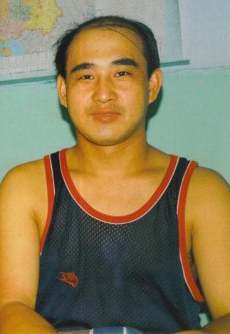

军医王纪平（明慧网）

王纪平先后遭到中共军队的强制洗脑、非法监禁、关押、劳教，在肉体、精神和经济等方面承受了巨大的苦难。

2009年2月4日，在居无定所和孤苦无依的颠沛流离中，王纪平凄惨离世，年仅39岁。

酷刑<b>原南京军区司令部作战处长遭“大劈叉”</b>

原南京军区司令部作战处长方志文，曾患过胃病、牙病、肛肠病、关节炎、偏头痛、荨麻疹、肾炎、肝炎等多种疾病。虽在处长职位上表面很风光，但他身心压力巨大，吃睡不香，工作精力不支。

1996年11月，方志文开始修炼法轮功。不知不觉中，他切身体会到无病一身轻的感觉，工作更为勤勉、投入。

因修炼法轮功，方志文于2000年被强制转业，并遭到非法关押和劳教折磨。

2007年8月底，方志文被非法关押在江苏方强劳教所，期间遭受“大劈叉”酷刑等多种迫害。

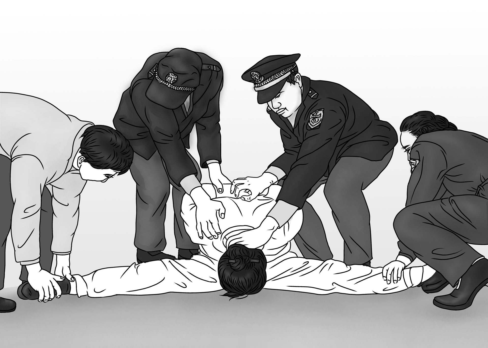

中共酷刑示意图：大劈叉（明慧网）

方志文在其控告江泽民的控告书中自述： 三个劳教人员彭海清、施伟、高某对我实施“大劈叉”，即：将我按坐在地上，彭（体重有140斤左右，只穿了件裤衩）坐到我的双肩上、按住我头，施、高两人强行将我双腿向两侧分开后拉（180度“一字形”），还用手顶抠双肋。压得我勾著背、出不了气、两腿像撕裂式的剧痛，疼得脸上直冒汗珠，苦不堪言。

<b>空军元老级人物、国家二等功臣被重判17年</b>

于长新是大陆空军第一代试飞员、国家二等功臣、空军指挥学院高级教官、副军级、著名教授。

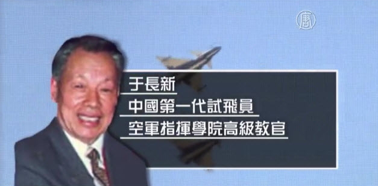

国家二等功臣、空军指挥学院高级教官、副军级、著名教授于长新

在1999年“4‧25”法轮功学员大上访之后，江泽民点了于长新的名，他就被空军指挥学院的领导们给软禁起来了，专门为他办了两个月的学习班做他的思想转化工作。

学习班上，于长新教授告诉对方：“我一位74岁的老人，祖国第一代试飞员、二等功臣、空军学院的高级教官、著名教授，就连空军指挥学院现在使用的教科书都是由我主编定稿的。论资历，我比你们在座的谁都高，试问像我这样的人能轻易相信什么吗？能是非好坏都不分吗？我修炼的亲身体会告诉我，我炼法轮功没有错，法轮大法是真正的科学。”

两个多月过去了，他们一看于长新教授如此地坚定，没了办法。最后在江泽民的淫威逼迫下，秘密审判，处以17年徒刑。很多退休的军队领导对此判决都表示不满。

于长新被秘密关押在北京朝阳区“空军小红门看守所”里，与世隔绝。

于长新的老伴姜昌风也被赶出空军指挥学院，家门上被打上封条。接着，老伴也被秘密判刑10年。

<b>原军校上校女教官被绑架6次</b>

王卫真，女，原沈阳军区大连医学高等专科学校，技术七级，副师级待遇。

修炼前，她一身病。作为医生，她却医治不好自己的病。1996年，她炼法轮功后，对职称名利看淡了，一身病也好了，精力旺盛，人年轻了十多岁，教书育人得心应手。

迫害发生后，王卫真多次遭受迫害，曾被绑架6次。2012年5月18日，她在大连友嘉超市索要自己存放于储存箱中的手机时，她被桃源派出所警察绑架抄家，被戴手铐、脚镣、黑头套，背铐一天一夜，非法关押48小时。

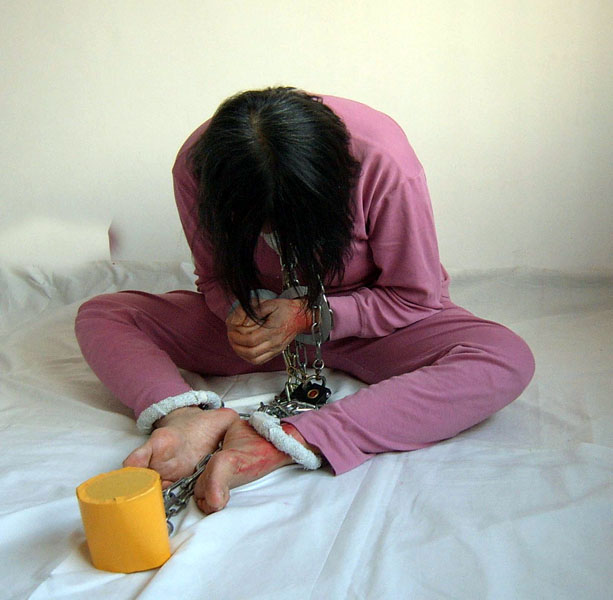

酷刑示意图：手铐脚镣（明慧网）

2014年12月26日，辽宁省大连市中山区法院强行非法判刑王卫真8年（又说7年）。当日，中山法院法官称病不出，没有开庭，也没有宣判。

据知情人叙述，中山法院见不得人似地把一张判决书塞到了王卫真手中，然后又发来一张逮捕证，强行将王卫真送往看守所。后因体检不合格，看守所拒收。

<b>原国防科大学文职军人被关小号</b>

李志刚，文职级别六级，助理研究员。他因修炼法轮功被枉判五年；后被开除军籍。地方派出所一直不给上户口，无身份证。

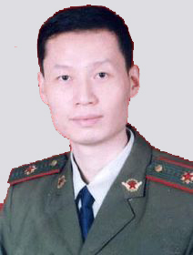

原国防科大学文职军人、助理研究员李志刚（明慧网）

2003年9月23日，李志刚被送往位于湖南郴州的广州军区军事监狱劳改队。

11月30日，军事监狱将其关入小号禁闭室。“小号禁闭室面积约一个多平米，内有一个小水龙头和一个便池，室顶是敞开的天窗，下雨、下雪都会往里飘。平时只能坐在冰冷的水泥地上，困了也只能蜷伏着身体躺地上睡……”

<b>一等战功少校军官遭十年迫害</b>

胡建华，1979年11月入伍，曾任连长、司令部管理股长，少校军衔，曾在中越战争中立一等战功。

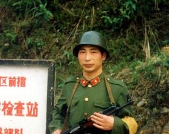

一等战功少校军官胡建华（明慧网）

江泽民迫害法轮功后，胡建华被取消公务员资格，并被单位开除。

2000年年底，胡建华被非法劳教一年；2003年3月底，被非法判刑七年半，遭受了惨无人道的迫害。

2005年，在广东省肇庆地区四会监狱十八监区新建队，“（他们）八天八夜不让我睡觉，只要一眨眼就是一棍子，专打脚踝骨。疼痛难忍，还不留任何痕迹。同时，洗衣、洗澡、刷牙等，大小便要打报告。经许可方能入厕，否则硬憋著。”

“在第八天半夜时，罪犯张次南看我眨了一下眼，就一棍子打在我的头顶。棍子被打断， 他接着上前拳打脚踢，将鼻子打破。（我）鲜血直流，衣服地上到处流的都是血。”

<b>前北京空军少校胡志明曾被迫害至不能行走</b>

胡志明，1990年入读西安空军工程学院，1997年获硕士学位，在北京空军司令部军训器材研究所工作，授少校军衔，并多次获嘉奖。

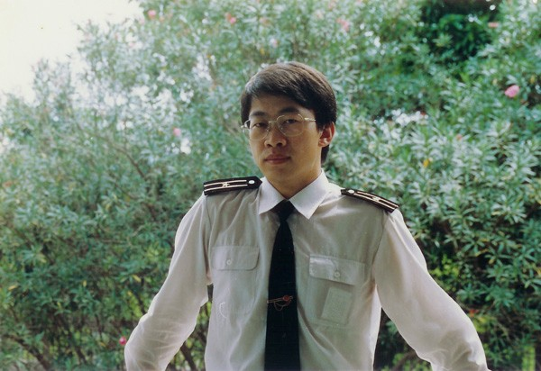

前北京空军少校胡志明（大纪元）

2000年10月4日，胡志明在上海一家宾馆内被捕。关押期间，遭公安连续夜审三个星期，不准睡觉，整个人几乎处于精神崩溃状态。2001年9月，胡志明遭非法判刑4年。2005年，再次被判刑4年。期间曾被迫害至下肢瘫痪。

“在北京的时候，是把我关在北京的监狱医院里面，一进去就用铁链子把脚拴在床上，一拴就是半年的时间，以至于他们后来做了个检查，说我腿骨神经有物理性的损伤，坏掉了。”

中共恶警酷刑凌辱企图改变胡志明对法轮功的信念，在医院指使犯人和医务人员共同参与迫害，大小便不给收拾，不准他睡觉，对他野蛮灌食，有时将鼻饲管子插入他的体内一米多长，并迅速拔出，导致胡志明鼻腔与食道部位大量出血，留下长期吞咽疼痛的症状。

<b>前少校军官王有江在兰州监狱惨遭虐待和暴打</b>

王有江，原兰州军区通讯部队少校军官。

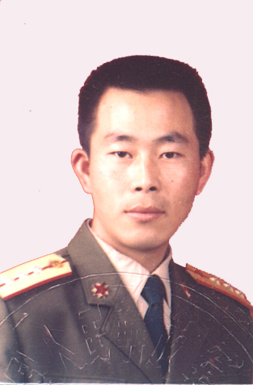

王有江(明慧网）

2014年3月17日，王有江被关押到兰州监狱。 为了迫使其放弃信仰，狱警对他虐待、殴打、电棍电击，进行群殴，拳打脚踢，电警棍烫，致使王有江大小便失禁。

他们白天强制王有江出工干活，劳动强度是其他犯人的数倍；晚上不允许他睡觉，强制背监规、写思想汇报。每顿饭只给一个馒头，没有菜，一天只有一杯水，不允许上厕所，不让洗澡、洗衣服。他们也不允许王有江购买日用品，半年不让亲人接见。

<b>南京军区副师级军官被3次劳教</b>

杨兴福，男，主任编辑职称，大校军衔，南京军区副师级军官。

1996年7月，杨兴福走入法轮功修炼。1999年中共迫害法轮功开始后，他被南京军区610先后3次绑架关押，3次劳教。

<b>海军大校屡遭迫害</b>

海军航空工程学院退休副教授周彝先生，大校军衔，因修炼法轮功屡遭迫害。

2009年3月20日，周彝被南京市鼓楼区公安分局非法拘禁，关押在看守所3个月。11月28日，鼓楼区法院对其非法判刑3年，缓刑4年。

原重庆军官杜汉文被抄家15次

杜汉文，男，原重庆某部队正营级军官，自1996年4月开始修炼法轮功。

杜汉文曾被非法抄家15次、刑事拘留2次、非法劳教3次、非法洗脑1次。

<h1 align="center"><b>费城庆三亿中国人三退 中西民众支持</b></h1>

【明慧网二零一八年三月二十九日】二零一八年三月二十四日，刚经历一场暴风雪的洗礼，阳光普照下的费城空气格外清新，充满早春的气息。美国大费城地区部份法轮功学员在中国城举办集会，庆贺三亿中国人退出中共的党团队组织，重获心灵与生命的自由。
费城退党中心的义工赵女士在集会上表示，《九评共产党》于2004年问世以来，大量的民众开始觉醒，选择脱离中共的党团队组织（三退），从而消去加入其组织时发誓而形成的烙印。“从2004到2011的7年间，三退人数突破1亿；到2015年4年时间三退人数突破2亿；到2018年3年时间三退人数突破3亿。”赵女士介绍说，现在三退人数急速增加，每天约有十万人退出中共的党团队组织。三退不是搞政治，而是中国人的精神觉醒运动”

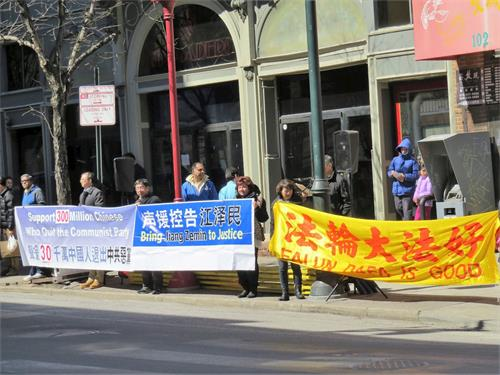

图1：二零一八年三月二十四日，大费城地区部份法轮功学员在费城中国城举办集会，庆贺三亿中国人退出中共的党团队组织，并向路人介绍法轮功的美好

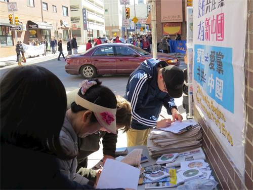

图2～3：当地居民与外地游客在制止活摘的请愿书上签字

<b>世界各地民众支持</b>

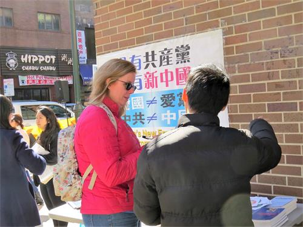

图4：来自阿拉斯加州的瑞秋（Rachel）了解法轮功学员在中国的遭遇。

来自阿拉斯加州的瑞秋（Rachel）在与法轮功学员的交谈时了解到法轮功及在中国发生的迫害。她对此感到不可思议：“这么平和的炼功应该在哪里都没有问题的。”她在制止活摘器官的请愿书上签字，并拿了一些资料以便以后进一步了解。

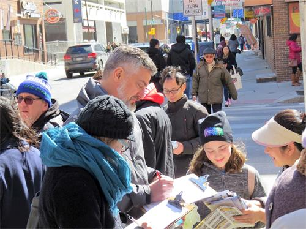

图5：马克与太太和女儿都对法轮功饶有兴趣。

费城居民马克（Mark）与太太和女儿途径中国城时被集会所吸引，上前询问发生了什么。他们过去听说过法轮功学员因信仰在中国遭受的打压，因此夫妻俩都签名支持。他们的女儿也在一旁阅读相关的资料，并对法轮功学员信仰的“真善忍”原则表示赞同。

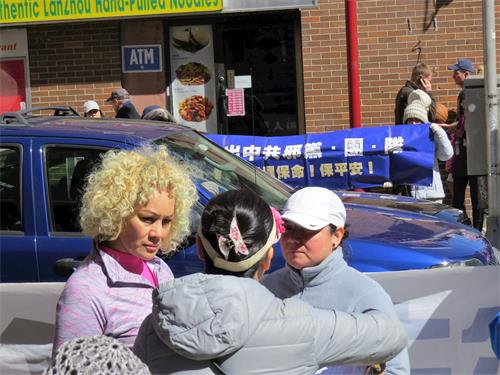

图6：莉丝（左）与她的朋友聚精会神地听学员介绍从法轮功身心受益的经历。

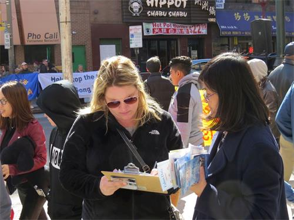

图7：艾米（左）希望对法轮功的人权迫害能早日结束。

莉丝（Liesbeth）与她的朋友则对法轮功祛病健身的效果非常感兴趣，得知所有炼功活动都是免费时表示很高兴。Amy也是第一次听说法轮功，当了解到中共在迫害中活摘法轮功学员器官时感到很震惊，于是签名希望这种悲剧能早日结束。她感谢法轮功学员告诉说她这些信息，并表示由衷的祝福。

<b>华人在觉醒</b>

在活动现场，有十多位中国人在与法轮功学员交谈后决定退出中共党团队组织，不再与这个邪恶组织为伍。一位华人表示对炼功促进身心健康很感兴趣，希望以后有机会尝试。

活动主持人王先生在发言中说，走过悠悠五千年，中华大地正在经历一场很深刻的变化。他说复兴中华是中国人的责任与使命，“历史证明，共产主义不是出路，而是绝路，退出中共利国利民利己。”

<h1 align="center"><b>参观“真善忍画展”　新泽西州议员谴责中共迫害</b></h1>

【明慧网二零一八年三月二十五日】2018年3月21日到23日，美国新泽西州法轮大法学会在州府所在地春顿市（Trenton）的议会大厦中，举办了当地首次“真善忍国际美展”。在州议会大楼工作的州参众两院议员、议会工作人员以及访客们都参观了画展。他们除了赞叹画展作品的精美之外，还感谢画展的主办方通过画展的形式让他们更多地了解了法轮功真相，表示应该站出来反对发生在中国的这场迫害。
“真善忍国际美展”是由修炼法轮功的艺术家们创作的美术作品展，表现的是各族裔民众修炼法轮功过程中的精神追求以及法轮大法给人们生活带来的美好，其中也包括揭露在中国发生的已经持续十八年的迫害的作品。

新泽西州议会有40位参议员和80位众议员。此次画展举办日正值州议会各委员会开会，人们在议会大厦穿梭往来，不时有机会在画作前观看，并同美展的讲解人员交谈，了解法轮功真相。

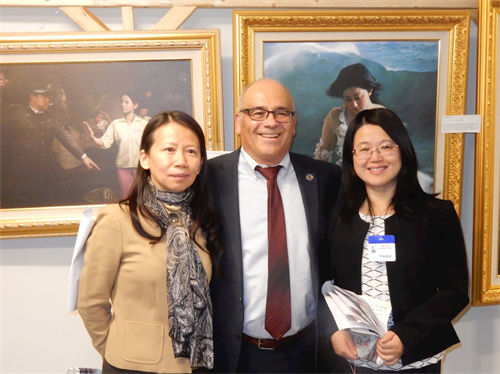

第15选区州众议员古索拉（Reed Gusciora，中）和美展的讲解人员在美展作品前合影

代表春顿市和普林斯顿地区的第15选区州众议员古索拉（Reed Gusciora）说：“这个美展传达了强大的信息，展现了中共当局对法轮功等不同意见人士的所作所为。人们应该有修炼的自由、信仰的自由以及表达的自由，不应受任何政府的限制。我对为让中国敞开大门，让人们真正拥有自由和人权的努力表示强大的支持。”

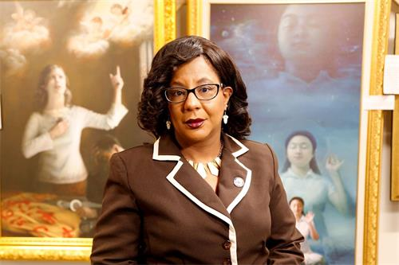

第15选区的另一位女众议员杰克森（Verlina Reynolds-Jackson）感谢法轮功学员们把真善忍美展带入议会大厦

第15选区的另一位女众议员杰克森（Verlina Reynolds-Jackson）在认真看完每一幅作品之后，在题为“迫害中的坚定”的油画前驻足，画面上是一位修炼法轮功的女学员在监狱中受刑的场面。

“这幅画表现了这个女孩为自己的信仰愿意付出生命的决心。”她说。“这些画作是美好的，但同时让人不安，让人心痛。”

她感谢法轮功学员们把真善忍画展带入议会大厦，让人看到中共当局对妇女儿童的迫害以及法轮功学员为坚持信仰所牺牲的一切。

“人们要站出来制止活摘器官罪行。”她说，她希望她的选区能够举办更多这样的画展，“我们会让这种唤醒人良知的活动继续下去，为此我非常感谢主办方，让我了解这件事情。”

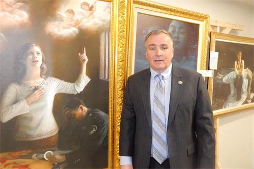

第24选区州众议员沃斯（Harold J Wirths）说迫害在任何国家都不应该发生，希望尽快停止

第24选区州众议员沃斯（Harold J Wirths）说：“这个画展非常感人，举办得非常成功。”他说，“这种迫害在任何国家都不应该发生，希望尽快停止。”

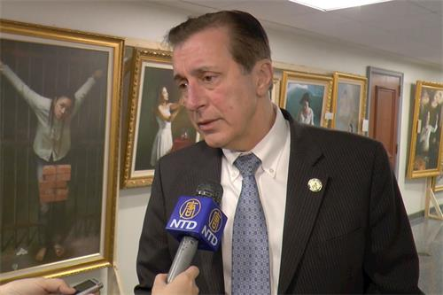

州众议会副议长、代表第三选区的众议员伯周利（John Burzichelli）认为，艺术作品是讲真相的强大武器

州众议会副议长、代表第三选区的众议员伯周利（John Burzichelli）认为，艺术作品是讲真相的强大武器，他从画作中感受到强大的能量。

“看了这个画展后，我个人非常感动，这种事（迫害）是非常严重的事情。”他希望画展能在天暖之际、人更多的时候再回到议会大厦来。

州众议院多数党领袖格林瓦德（Louis Grenwald）也赞扬画展“给人印象深刻”。

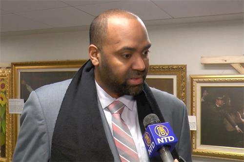

代表第5选区的州众议员巴克利（Arthur Barclay）称赞“这真是非常非常杰出、优秀的画作。”

代表第5选区的州众议员巴克利（Arthur Barclay）说：“真的很棒，看看这些巨作，让我深深折服，我自己作为一名艺术家，希望有更多的时间来仔细欣赏，这真的是非常非常杰出、优秀的画作。”

在议会大楼从事技术工作的吉娜（Gina）女士看完画展表示，她以前听说过法轮功，也知道在中国发生的迫害以及中共活摘器官的罪行。这次画展的讲解员给了她很好的介绍，让她对法轮功以及这场迫害有了更多的了解，她为此表示非常感谢，“这个画展无疑是美丽的，同时也让人心痛，但是画展也让我们看到希望以及改变。”

“真善忍国际美展”自从2004年第一次举办以来，已经在全世界50多个国家的900多个城市展出。所到之处，包括欧洲各国、以色列、澳大利亚、加拿大、南美以及美国各地，画展都受到当地民众的欢迎。

<h1 align="center"><b>黑龙江煤城双鸭山里的患难真情</b></h1>

【大纪元2017年08月31日讯】“疾风知劲草，患难见真情。”妻子冤狱十三载，丈夫大年三十晚上带着一双儿女到看守所包饺子，与她共度中国新年。他一介布衣，但顶天立地，把迫害妻子的警察、江泽民都一一告上了法庭。

以下是明慧网报导的这对共度生死患难的夫妻的故事：

中国大陆东北黑龙江省有一个煤城双鸭山，地处完达山北麓，城外丘陵连绵，城里地势起伏，平房和楼房错落排布，李刚、孙凤杰一家就生活在这里。妻子孙凤杰善良、吃苦耐劳，在三马路贸易市场做布匹生意，进货、卖货；她性格爽朗，乐于助人，在外有个好人缘，在家勤俭持家，干啥像啥，孝敬父母，对丈夫李刚知疼知热。两人一儿一女，女儿欣欣随母姓，儿子华麟随父姓，家庭美满幸福。

李刚户口填的是汉族，实际上是满族人，老祖宗弓马驰骋不会了，但是李刚爱读书，什么苏武牧羊、范仲淹贤相、许大年行善得福报，古代圣贤知道的不少，一辈子就认个“理”字，耿直。李刚爱好文艺，写点诗歌，吹吹笛子，颇有生活情趣。李刚对妻子唯一一点不满意的就是凤杰脾气急，正扫地呢，孩子犯了错误，拿起扫把就打，谁说都改不了。都说江山易改，本性难移。妻子最后这唯一的缺点，竟然后来改了。她是怎么改的呢？

1996年5月，市场一位大姐介绍凤杰修炼法轮功，孙凤杰身体好了，心性也变了，对李刚和孩子也总是笑眯眯的，教育孩子讲道理，讲要真诚、善良、宽容做人。李刚这回给凤杰打满分：嗯，够贤妻良母标准。

因为凤杰不上班，加上热心肠，能张罗事，大家就推举她当双鸭山法轮功辅导站站长。这个站长没有人任命，也没人给开工资，更没什么权力，就是来了新学员教教人家炼功动作、谁缺啥义务服务一下。

法轮功学员都干什么？李刚都知道──早上去益寿山公园炼功，晚上大家在一起读法轮功经书《转法轮》等，节假日洪法。该上班上班，该过日子过日子，大家都按“真、善、忍”来约束自己，不做坏事做好事。

自打炼功后，家楼前的雪，都是孙凤杰扫的。李刚不爱占便宜，身在供应处，装修房子连钉子都是自己买，以往孙凤杰就数落他不会占便宜。炼法轮功后，凤杰变了，即使家里有单位的东西，她都会让李刚送回去，境界不一样了。凤杰身体也好了，再没昏倒过，头痛也好了，李刚亲耳听、亲眼见各种疾病痊愈的例子太多了，法轮功做好事的也太多了。李刚对大法师父是由衷地敬佩，对大法“真、善、忍”的法理发自内心的认可。

江泽民出自对法轮功创始人李洪志先生的妒嫉，在大陆以群体灭绝的方式发动了对法轮功修炼者的迫害。孙凤杰经历了非法抄家、酷刑、 四次抓捕、一次劳教、判刑十三年，在牢狱中度过十五年。李刚家的布匹生意原来有几十万的固定资产，在尖山区平行路十九楼住的几百户人家中，李刚家是第一个安电话的，现在布店关了，商店黄了。去监狱探视两头跑的李刚，只有几百元的退休工资，李刚吸烟，买最便宜的，2元一包。有时为省2元的公交车费，走挺远的路。去哈尔滨10小时，多数是坐硬板，41块钱，来回82元。一个烧饼、一碗面条就是李刚的一顿饭。

每到八月十五、中国传统新年，李刚会点上灯，点上蜡烛，有饺子、有菜，摆上四双碗碟和筷子：这是凤杰的，这是女儿欣欣的，这是儿子华麟的。从三十一直摆到大年初一，他要为凤杰、为儿子、为女儿守住这个家。

李刚2004年写过一首《梅花颂》，有两句是：百花园中梅芬芳，一身正气迎春光。

十一年后， 2015年12月5日，一场漫天大雪席卷黑龙江大地，双鸭山“610”（中共专门迫害法轮功的非法组织）车没等上道，封路了。6日是孙凤杰冤狱期满的日子，“610”提前告诉李刚，他们要接孙凤杰，李刚说：“不需要！不欢迎！”那天，地近天远，孙凤杰一步一步走出了黑女监灰色的院子，把门的警察问：“叫什么名字。”“孙凤杰。”“什么罪？”“没罪，炼法轮功。”

<b>凤杰双鸭山历劫 李刚看守所过年</b>

1999年7月20日，对法轮功的公开迫害全面开始的当天，孙凤杰当天就赶到北京上访去了，回家当晚被双鸭山向阳派出所登门抓走，关进看守所，非法拘留三个多月。

10月份，江泽民在法国接受《费加罗报》采访时，信口污蔑说法轮功是×教，第二天中共党报《人民日报》马上刊登评论呼应。孙凤杰领着7岁的儿子再次进京，被陆续遣返回哈尔滨，孙凤杰走脱了，第三次踏上了进京的列车。这回孙凤杰的依法上访招致第三次被抓捕，被关进铁笼子里迫害。

孙凤杰被劫持回双鸭山，关进矿务局公安处看守所。看守所不让见妻子，李刚找公安局，找“610”头于永江，最后找到市委书记胡祥鼎，李刚心里硬气：孙凤杰她做好人没犯罪，凭什么不让见？李刚被“特批”可以见妻子。

为了让孙凤杰写“悔过书”、“保证书”，双鸭山公安局“610”、国保大队的李森、李洪波都来了，双鸭山矿务局公安处处长亲自来做工作：“我是李刚的小学同学，只要你写保证，我马上就让你回家。”

2000年中国传统新年，是步入21世纪的第一个新年，不知为什么，人人有一种庆幸感，那一年鞭炮简直放爆了。

三十晚上，不写保证的孙凤杰没有能回家，铁门一阵响，原来李刚领着13岁的女儿、8岁的儿子来了。全家在看守所过了一个“团圆年”。李刚在家剁好了馅子、和好了面，和孙凤杰一起在铁窗内包饺子、煮饺子、吃饺子。看守所还有一个法轮功学员胡老先生，和李刚家一起度过迫害后的第一个新年。

<b>西格木天日暗 益寿山冰雪寒</b>

2000年2月6日，孙凤杰被判劳教一年，送进佳木斯市西格木劳教所。孙凤杰在劳教所因为背经文、炼功被关小号、打骂、吊门框，遭到各种体罚。劳教所的警察想出“损”招儿害好人：把孙凤杰和另位两位法轮功学员连铐在床边，致使他们不能坐、不能卧，有人动一下，另外两人就会被铁拷抻得更惨。

2001年，为了生活，回家后孙凤杰和李刚开了一个小食杂店，卖蔬菜水果日杂，两口子上货精挑细选、公平交易、不掺假、不缺秤，生意很快就做得风声水起，有人多赶一段路也要来这里买货。孩子放学也来帮忙，一家人勤勤恳恳，日子似乎安定下来了。附近富安派出所政委李世文、片警朱卫东，有事没事就登门，东看西瞄，说一些不三不四的话，骚扰孙凤杰。

12月28日，一家人正忙里忙外。好几辆车、十多个警察呼呼啦啦把食杂店围上。双鸭山“610”、国保大队的李洪波、李森都来了。李刚问：“凭什么上我家来？”有人拿出一张纸，女儿欣欣平时是个文静孩子，这会儿一把扯过来撕了。他们叫着说要抓孩子，李刚一步挡住：“抓我吧！”李世文把孙凤杰的双手扭到背后，压她低头，李刚冲上去给了他一狠拳，和他扭打在一起。别的警察站着看热闹，李世文就骂他们不帮忙。警察才蜂拥把李刚、孙凤杰扭住拖上车，李刚一边挣扎一边喊：“法轮大法就是好！法轮大法就是好！”

在儿女的哭喊声中，夫妻两人被抓走了。孙凤杰绝食绝水九天，生命垂危，被担架抬回家。身体恢复一点，她就天天到公安局要丈夫。最后，连凤杰的老父亲也去找人，说：“他也不炼法轮功，你们关他干啥呀？”

李刚在看守所待了一个月零两天，天天吃硬窝头。

<b>集贤县妻受刑 寻亲路夫承难</b>

2002年4月，中共又对全国法轮功学员大抓捕。无法在双鸭山安身，孙凤杰就和另一位法轮功学员王关荣出外租房住，12月7日两人在大街上发传单，被举报，被集贤县公安警察绑架。孙凤杰身上的数千元现金被收走，王关荣的新式手机，当时警察就抢了起来。

双鸭山市一听说抓住孙凤杰了，即时成立了专案组，组长是公安局副局长凌清范，组员有李洪波、李森、代长鹏、刘维国，加上集贤看守所的张玉山、耿姓警察十七八人。他们对孙、王二人多次刑讯逼供、实施多次酷刑，天天不摘手铐。江泽民成立“610”的第二天，就让公安部下令，警察可以执行错误命令不承担法律责任，这一下有些警察就什么都敢干了。

12月12日，他们连续五十小时审讯孙凤杰和王关荣，不准她俩吃饭、喝水、睡觉。他们轮流休息，攒足精神折磨人，上来就对她们拳打脚踢，让她们大劈叉、开飞机，大男人坐在椅子上把腿、脚放在两个女人的背上，不许她们抬头。（罚站）两个多小时人站不住就踢脸、踢胸口、砸脊骨，孙凤杰被代长鹏踢得脸上鲜血直流。最后孙凤杰被拖回囚室，王关荣半个月不能走路，两人咳血多日。

30日晚六点，孙凤杰和王关荣再次被分开审讯，一进去，警察就把孙凤杰的棉鞋扒了，让她光脚站在水泥地上，当时正是寒冬，黑龙江滴水成冰啊。

代长鹏用打火机点着了孙凤杰的头发，火烧得吱吱响，李森的司机姓常，用塑料袋套住孙凤杰的脑袋，几乎令她窒息。他们逼迫她坐铁椅子并轮番毒打她，十二小时后，孙凤杰被抬了回去。

二十多天后，李刚才知道妻子孙凤杰被抓了。李刚就到处找人，开了介绍信，领着10岁的儿子华麟来探监。2003年5月8日，双鸭山市尖山区法院开庭，审理孙凤杰和另外六名法轮功学员，李刚和华麟被允许旁听。宪法不是规定信仰自由吗？不是规定出版、集会自由吗？可法官根本不让孙凤杰和其他法轮功学员说话，草草走过场就结束了。

远远看见憔悴的妻子被戴着手铐推到被告席，李刚心里五味翻腾，他就大声喊：“凤杰，我和儿子永远支持你！” 九个月中李刚跑了集贤县七八次。

最后一次李刚去集贤看守所探监，孙凤杰已经被送到黑龙江省女子监狱了，根本没通知家属。

<b>妻金刚不动 夫真情不移</b>

黑龙江省女子监狱，位于省城哈尔滨市郊，灰色的大门、灰色的高墙电网，远远就给人一种格外压抑的感觉。

服刑人员进监狱的第一站是集训监区，也称“新收”。集训监区最主要的事情是要“转化”法轮功学员，让他们放弃对法轮大法的信仰。集训监区时任监区长的是吕晶华、副监区长是王晓丽。

进监狱，警察要谈话，孙凤杰见的是警员陶丹丹，正常一问一答，陶丹丹问到家庭成员，孙凤杰正常回答，猝不及防陶丹丹上前就给孙凤杰几个嘴巴子，孙凤杰这才知道，在这里警察打人是不需要理由的。而不放弃信仰，此时此地成了警察和指使的犯人虐待法轮功学员最充分的借口，打骂是家常便饭。

2005年11月、12月孙凤杰被两次吊铐，一次四天四夜，一次十四天，孙凤杰昏过去两次。

2006年2月，她又被背铐铐在暖气管子数日。4月，吕晶华领人对孙凤杰大打出手，抓住她的头发往墙上撞，凤杰昏倒，吕晶华说：“让她在地上躺着吧。”便扬长而去。

孙凤杰在集贤县看守所拿到被判刑十三年的判决书。李刚对妻子说：“我等你，我领着孩子等你，咱这个家散不了！”李刚在给妻子的信里写过不少诗：十载夫妻难，恩爱道义不可丢，岁月明月照，百肠千回转春秋。

见不到人，李刚就给凤杰写信，凤杰有时候接不到信，都被警察给撕了。有时接到了，被撕得只剩两个窄纸条：一条两个字，称呼加一个冒号；一条两个字，李刚加年月日。自从凤杰进了监狱，李刚落笔就称凤杰“夫人”，在信里和日记中都一样。

人都说老来伴老来伴，可李刚和老伴凤杰进五十、奔六十却隔着高墙电网、隔了数百里。为了一个月、两个月隔着厚玻璃见上妻子，李刚开始从双鸭山跑哈尔滨，正常监狱一个月允许接见一次，一次十五分钟或半个小时。李刚头天晚上8点半在双鸭山上4138次火车，第二天6点5分在哈尔滨下火车，再坐434路公交车一个小时，再步行一段路，就看见黑女监高高的大铁门了。

不转化的法轮功学员经常被取消接见，李刚就找监区长、找狱长讲“理”，黑女监不少人都知道有个倔老头李刚是孙凤杰的丈夫，不让见人不回家。

2009年1月9日，女儿欣欣、儿子华麟从打工的地方回家，三个人一起去看孙凤杰。到门口接见室传出话：“不让见！”李刚就急了，说：“我老伴炼法轮功，没犯罪为什么不让见？”“就是炼法轮功，不转化不让见。”“你们墙上写着人性化管理，写着国家规定亲人接见，谁不让见？”李刚找到办公楼，要找管事的领导。最后副狱长包锐接待了李刚，还把教改科科长找来了，向李刚介绍说：“这是科长吕晶华。”一听这名字，李刚血往上涌：“你叫吕晶华呀， 听说你迫害我老伴孙凤杰和别的法轮功学员最坏！”吕晶华脸“腾”红了，不一会走了。

最后算包狱长“特批”，一家四口见了面，还一起在监狱的餐厅里吃了一顿饭。孙凤杰对已经长成漂亮姑娘的女儿说：“欣欣，妈妈不求你别的，只求你做个好人。”欣欣回答：“妈妈，你给我的精神财富，我一辈子取之不尽、用之不竭，您放心吧，我永远不会不走正路的。”

十三年来，监狱狱长换了好几个。李刚找过好几个狱长讲理，也有见不着的时候。这些年为见妻子，李刚没少找人：领导、亲属、同学、“610”、警察……

<b>妻陷囹圄志不改 夫持正义告恶人</b>

孙凤杰在黑龙江省女子监狱近十三年时间，经历了集训监区、第二监区，十一监区，一波又一波的转化“攻坚战”。奥运、“十八大”、评文明监狱、北京来了专家……天下大小事都和法轮功转化不转化联系上了，从讲演到酷刑折磨，孙凤杰都见识了。

2008年9月29日，李刚去监狱接见，从早上等到下午，不让见，说领导不在家，最后连接待的人都没影了。李刚回到双鸭山，一天粒米未进，上午给黑女监狱长写了封控告信，下午给省司法局局长写控告信。李刚的心还是放不下：不定又搞什么花样迫害了，等“十一”放完假。

8日早晨，李刚又站在黑女监接见室，不让见，找到狱长，特批，看见孙凤杰笑呵呵来了，李刚心中的乌云都散了。回到双鸭山，李刚给包狱长写了一封信，劝她多行善，积德积福。在了解法轮功真相后，警察们也在渐渐转变。也由于李刚不断控告，孙凤杰后来可以看到李刚的家信了。

2012年7月，北京来了“转化专家”，黑女监又对法轮功学员下手了。2日，李刚接见完了，走了。7日，他们把孙凤杰从二监区弄到集训九监区，开始“攻坚”。开始几天逼迫她坐小凳子到子夜12点，再后来，二十四小时不让睡，孙凤杰用强大的意志保持思想清醒，血压低压70，高压90，体重骤降40斤。

8月妹妹来看凤杰，监狱没让见。李刚一听说，第二天坐火车来了，见到妻子模样大变，李刚不让了。他这回把控告邮到海外，请联合国、各人权组织关注老伴孙凤杰被迫害案件。

2004年，李刚向双鸭山检察院控申科控告警察李森、李洪波、代长鹏、王维国等执法犯法，对孙凤杰、王关荣刑讯逼供、实施酷刑；控告尖山法院法官审判长姜枫、审判员高志新、代理审判员董曼、书记员林丹，违法枉判孙凤杰重刑。从2005年起，李刚向集训监区指证警察迫害老伴的事实，要求狱长查处处理。集训监区长吕晶华、二监区长杨华、狱长刘志强等等都接到过李刚的控告，有人是多次接到多封。

李刚说：“我老伴孙凤杰她在家是贤妻良母，在社会上是个好人，她修‘真、善、忍’有什么错？我要求立即无罪释放孙凤杰。”他警告警察：“天理昭昭，我老伴有什么闪失，我绝不答应！”

怕收不到，每封信李刚都邮挂号信，一封四块多钱。

监狱不回应，李刚向省监狱管理局、省司法局、省高级检察院控告黑女监监狱违法转化妻子，迫害手段违反宪法、刑法、警察法、监狱法、通信法，迫害的具体人是谁、责任人是谁都写得清清楚楚。

每一次，他把自己的姓名、住址、电话也都写清楚。李刚一介布衣，但他觉得自己头顶着天，脚踩着地，听到夜哭心不愧，头上打雷心不惊，为什么？“因为我李刚没干过坏事。”妻子蹲大牢，李刚一样理直气壮：“我老伴她做好人，没犯罪！”

2003年，孙凤杰和王关荣在集贤看守所时，就曾对当时的中共党魁、迫害法轮功的元凶江泽民提出控告。李刚复印留底，亲自把控告状送到双鸭山检察院。

到了2015年，看到大街上贴着法轮功学员控告江泽民的告示，这些年的苦与愁一下翻上了李刚的心头，“对，这个坏蛋，这个祸国殃民的败类，必须让他受到法律的审判！”

李刚找出十三年前妻子的控告书，补充事实，郑重签上自己的名字：孙凤杰丈夫、法定代理人李刚。7月30日，他将控告书邮寄至中国最高检察院。

<h1 align="center"><b>前新华社长田聪明病亡 曾参与天安门自焚伪案</b></h1>

曾任中共新华社社长8年的田聪明日前病亡。

【大纪元2017年12月27日讯】（大纪元记者方晓报导）曾任中共新华社社长8年的田聪明日前病亡。在其任新华社社长期间，新华社对震惊中外的“天安门自焚伪案”提供伪证，炮制谎言，田聪明因此被海外追查国际列为“相关责任人”予以追查。

12月27日，澎湃新闻报导，从多个权威渠道了解到，新华社原社长田聪明于12月26日晚病亡，终年74岁。

田聪明是陕西府谷人，早年在 内蒙古工作，曾任内蒙、西藏党委 副书记，1990 年转任广播电影电视 部副部长，10 年后的 2000 年 6 月升 任新华社社长，2008 年 3 月退休。

田聪明任新华社“一把手”的 8 年，是中共对法轮功迫害最严重的时期，新华社作为中共的喉舌，长年刊登污蔑法轮功的文章，煽动民众对法轮功的仇恨。 2001 年 1 月天 安门广场发生所谓“自焚事件”后， 中共开动了所有的舆论工具，借机诬蔑法轮功，田聪明把持的新华社就为此输送了大量的污蔑文章。

时事评论员横河表示：“对法轮功的迫害，从一开始就不是法律。迫害元凶江泽民知道法轮功学员没有任何违法行为，中国也没有任何法律可以为他所用，于是决定发动一场政治迫害运动。作为政治迫害的典型表现，就是铺天盖地的污蔑性宣传。这就是中共宣传机器新华社、人民日报和央视等喉舌起的作用。”

他说：“从宪法法律层面，修炼法轮功在中国大陆仍然是合法的，没有任何法律禁止。然而到今天很多人还以为法轮功在中国是被法律禁止的，很大程度就是受到宣传的迷惑。”

横河表示：“2001年，华盛顿邮报有一篇文章，谈到一位中共高官向邮报透露，开始迫害法轮功效果不好，民众也不积极，当年天安门广场自焚伪案发生后，中共从新组织力量，三种措施组合，即暴力、高压宣传和洗脑，对付法轮功。事实上，自焚伪案发生后就是通过那些中央级喉舌的谎言来煽动对法轮功的仇恨的。”

发生于2001年1月23日的天安门广场上五人自焚事件，是中共在天安门炮制的假戏，用来栽赃法轮功。新华社在事件发生的2小时后，向外国媒体发布录像；接着在一周后，1月30日当天，新华社又发布了一篇更为全面的新闻稿，作为对其它媒体的回应。2001年1月31日，央视的时事评论节目《焦点访谈》播出了一个30分钟的特别版本，宣称此录像取自广场附近的监视器，从中可看到5个人陷于火海之中。

在央视播放的录像中，漏洞百出。2001年8月14日， 国际教育发展组织（IED）在联合国会议上发表声明说：整个事件是中共“政府一手导演的”，该声明已在联合国备案。

路透社的电讯写道：“北京正在利用身体被烧焦的恐怖形象，来作为与法轮功打传媒战的最新武器。”英国《金融时报》更指出：“没有任何证据表明自焚者是法轮功的人。”

而该事件随即被江泽民集团着力广泛宣传并借此促成了镇压法轮功升级。同时中共开动所有的舆论工具，铺天盖地诬蔑法轮功。

海外“追查迫害法轮功国际组织”发通报说，“自焚事件”间接涉及数百乃至数千人失去生命。“追查迫害法轮功国际组织”所属的天安门自焚事件调查委员会2003年1月宣布开始追查，并公布了第一批事件当事人和相关者作为取证人名单。时任中共新华社社长田聪明就是被追查的当事人之一。

横河认为：“在追究中共迫害人权和信仰的罪行中，不仅要追究直接犯罪的司法机构，也要追究同样血债累累的宣传官员。”

田聪明还与江派人马刘云山、鲁炜等人关系密切。

2001年，田聪明在任新华社社长1年多后，把当时任新华社广西分社社长的鲁炜提拔进入新华社领导层。2002年，鲁炜担任新闻信息中心主任之初，新华社及新华网编造诋毁法轮功的文章明显增加，1到3月份期间，每个月都有十几篇。

今年11月21日，中宣部前副部长、网信办前主任鲁炜落马，成为十九大后“首虎”。鲁炜被查之后，其多名亲信下属也一一被查。11月26日，香港《东方日报》报导说，整个文宣系统风声鹤唳，山雨欲来风满楼，鲁炜被查只是推倒了文宣系统这个腐败骨牌的第一块，接下来恐怕还有雪崩效应。

<h1 align="center"><b>曼哈顿街心公园的美国大学生</b></h1>

约翰．佩里是乔治亚理工学院的大学生，两年前开始修炼法轮大法。

【大纪元2017年06月14日讯】（大纪元记者戴安采访报导）初夏的纽约，温暖干爽。黄昏，天色依然明亮。麦迪逊广场公园，以她的绿色和宽阔为曼哈顿带来宁静的凉意。隔街相望，是著名的熨斗大厦，百年摩天大楼，静静地矗立，俯瞰尘世的车水马龙。

麦迪逊广场公园一景，右后方建筑为熨斗大夏。

从26街进入公园，沿着行人路径，走过绿树掩映的草地，转过喷水池，来到邻近23街的地带。在甬路的一侧，是公众休息区域，人们三一群、俩一伙地围坐在桌旁，享受忙碌后的闲暇。几个男孩子追跑嬉戏，一个3、4岁的小女孩儿坐在地上摆玩沙子，还有人吹出硕大的肥皂泡，在光影中戏弄。

麦迪逊广场公园一景

休息区域的对面是一片沙地，有20多人排成整齐的队列，随着优美的音乐正在炼功。这些炼功人有男有女，年龄和种族各异。地上摆放着一个自制的小木架，上面贴著“法轮大法”的中英文简介，下面还摆放了中文和英语的传单。架子的顶部夹着一盏白色的小灯，估计是天黑时照明用的。

这是公园里的特殊画面，动中有静，静中有动。许多游客不自觉地停下脚步，静默凝视。他们在观望片刻后纷纷举起相机拍照，并且上前自取一份法轮功的简介，还有人加入了炼功的队伍，比划着炼了起来。

约翰‧佩里（John Perry）站在队列前端，明黄色的风衣格外醒目。他今年22岁，来自亚特兰大，是乔治亚理工学院的四年级学生。这个美国小伙子一直喜爱东方的哲学，研究过佛家和道家的学说。

两年前，约翰在网上搜索太极、气功方面的信息，无意间在一个论坛上看到了法轮功，立时产生了兴趣。他找到了法轮大法的网站，便开始阅读书籍，并且自学功法动作。就这样，约翰成了一名法轮功学员。

约翰‧佩里在公园里炼功。

西方的年轻人，缘结东方大法，这其中的心灵回转，会有多少奥妙？约翰娓娓道来，语调柔和，目光清澈。

“法轮大法的网站包括了所有的资讯，而且全部免费。第一次炼功后，我感觉非常好。我的思想清静，睡眠超好。修炼后获得的内在的平和是最重要的收益。大法的法理深深吸引了我，给我一种安全感。”约翰说：“修炼前，我和母亲常起冲突，我没有智慧去看自己的不足。修炼后，我意识到，所有矛盾的根源其实在我这里，即使表面上不是那样。于是，我向内查找自己，所有的问题都解决了。现在我和家人、朋友都相处得非常好。”

约翰对东方的静坐功法如此着迷，令家人惊讶。几个月后，约翰的亲人看到了他的变化，道德标准在不断提升。他们意识到，大法的益处是实实在在的。这不仅令约翰受益，也给全家人带来快乐。

约翰的家人都支持他修炼大法。“我身边的每一个人都受益了，因为我对他们比以前更好。”“由于中共在中国迫害法轮功，中共的宣传造成了负面影响，家人担心我会受到波及，不过，当他们看到了我的积极的转变，他们从怀疑、担心转为支持。5月份，我父亲驾车14小时把我送到纽约实习。我感到了满满的爱。”

东方的修炼理论，对于西方人来说，是否陌生或难以理解呢？约翰对此有独到的见解：“我认为，西方的文化和文明实际上都来源于古代中国文明的哲学思想。在深层，我们和东方文明中正直的思想价值观是紧密连结的。

“法轮大法的修炼原理植根于中国传统文化，而中国传统文化奠定了人类文明的根基。许多西方社会的价值观和一些中国传统价值观是相近的。当法轮大法把这些价值观呈现在生活的表层，产生了相当大的吸引力。这是一种生活方式，在生活中实践积极正面的准则，人们自然会喜爱和认同。”

今年暑假，约翰有机会在纽约的一家国际媒体公司实习，学习行销和媒体制作。下班后，他经常到麦迪逊公园炼功。

他说：“炼功让我精力充沛，同时也能和社区的公众互动。我们与大家分享一样好东西，有益健康、有益身心。我看到，有很多人停下来给我们拍照。到户外炼功，对我自己、对其他人都是件好事。”说到这儿，约翰轻轻地笑了起来。

约翰在公园里教功。

然而，有一个严肃的话题不可避免，那就是中共迫害法轮功。约翰修炼一两个月后，他就听说了法轮功在发源地被禁止，他很惊讶，也很难过。他当即感到，自己一定可以做些什么。

“我已经从修炼中受益了。如果我无动于衷，那就是个伪君子。我把迫害事实，特别是中共活摘器官的事情告诉了家里的人还有我的朋友。他们都签了致联合国的反对活摘器官的请愿书。起初我并不相信这是真的，但是有大量的证据显示，你不能不信。”约翰说。

约翰在大学校园里也积极传播真相。他表示，同学们的反应令他深受鼓舞。“很多人对中共的暴行一无所知，包括一些中国学生。他们听说后都立刻表示要为制止迫害出力。”

约翰‧佩里在乔治亚理工学院讲真相。

“每个人都知道法轮功在中国受到迫害。每个人都知道中共在掩盖罪行。当你听说此事后，你要决定如何行动。作为一个人，我们都有责任站出来维护人的尊严。当你看到好人受难，你必须选择，是要坚持正道，还是放弃原则。”

“最重要的是，坚持做你认为是对的事情，不要因为家庭或朋友的压力而放弃信仰和原则。这似乎有点困难，但你不会后悔的。放开你的思想，让心灵自由，你的选择会给周围的人都带来益处，你的选择可以让你脱离社会中负面的影响。”

关于负面因素，约翰特别提到了共产主义的危害。他说，共产主义已经渗透到了西方社会。“目前，西方世界已经在有意识地抵御共产主义，很多美国人刚刚认识到，共产宣传在细微中潜入，贻害四方。”

约翰对未来充满信心：“良知可以让世界变得更加美好。你要坚信，你的行动有意义，将会推动事件的变化。我们不应失去希望。”

约翰的家乡亚特兰大拥抱多元文化，这或许是助他心胸开放的一个潜在因素。今天，前所未有的国际化趋势令人们彼此相依。约翰珍惜在纽约的实习机会，期待着毕业后投入广阔的媒体天地。约翰的话语朴实，神情纯净。他已经找到了人生的方向，正在脚踏实地地向前行进。

 <h1 align="center"><b>汉中“最美油菜花节”背后的罪恶</b></h1>

每年三月的“汉中市油菜花节”风光怡人，闻名遐迩，然而在这美丽的外衣下，却发生著一桩桩令人发指的罪恶，已持续了近19年。

 
 【大纪元2018年03月28日讯】位于陕西省南部的汉中，是一座历史文化名城，有着“汉家发祥地，中华聚宝盆”的美称。三月的汉中，山清水秀，被金色的花海衬托得格外美丽，这里每年一度远近驰名的“汉中市油菜花节”登场了。然而在这美丽的外衣下，却发生著一桩桩令人发指的罪恶，已持续了近19年。

<b>“油菜花节”前施暴</b>

明慧网报导，2018年1月12日，汉中勉县肖荣的家突然闯进一帮人，是汉中市勉县刑警大队副大队长苟新武带来的，他们没有出示任何证件，把肖荣绑架走。

在今年勉县举办“汉中市油菜花节”前，当局兴师动众，成立了专案组，害怕花节期间大量出现法轮功真相的信息，扬言这次要迫害一批法轮功学员。

肖荣被绑架的原因，是因为勉县天荡山景区出现了传宣“法轮大法好”、“天灭中共”的小树挂。

1月12日，被绑架的当天，肖荣被关在刑警大队的铁笼子里。在汉中市看守所里有人看到她的手在后背被铐著。13日她被押到汉中市汉台区看守所拘禁。

中共酷刑迫害示意图：关铁笼子（明慧网

 

中共酷刑迫害示意图：背铐（明慧网）

1月25日，勉县检察院三人非法询问肖荣；2月8日，勉县武侯派出所出面非法逮捕肖荣。

绑架肖荣的那天，刑警副大队长苟新武在没有穿警服、没有《搜查证》的情况下，也闯到法轮功学员薛丽君家，非法抄家，抢走法轮功书籍、电子产品等个人物品；然后把薛丽君绑架到刑警大队，关押近30个小时，于第二天晚上7点多放回家。

肖荣于1958年9月25日出生，在中共1999年7月20日迫害法轮功之前，就修炼了法轮功，身心受益匪浅；2008年她从商业系统退休。肖荣坚持按“真、善、忍”标准做好人，却屡遭中共的迫害。

2000年，肖荣被非法拘留15天；2016年，被警察蹲坑绑架，被非法关押在汉中市看守所40天，遭残酷折磨，手脚被铐在一起，后被勒索1万元人民币取保候审。回家后其母看到她两个手腕有被手铐损伤的血痂。因被恐吓，回来后肖荣一直没有跟大家说。

中共酷刑迫害示意图：手脚铐在一起 （明慧网）

 
 <b>魔鬼兽行</b>

至今在汉中市被中共绑架的法轮功学员至少有157人，其中张汉云、余秀琴和杨秀莲遭到中共残忍至极的的迫害。

汉中市汉台区法轮功学员张汉云，修炼法轮功前5年，因闭经，始终未怀孕，修炼不到半年后月经正常，怀上了孩子，那年她33岁，全家人莫不感激法轮功创始人李洪志师父的恩德。

2001年3月，正是“油菜花节”，汉台区警察分局政保科科长马平安、汉中市“610”等人欲强行将张汉云送往洗脑班，没抓到人，就将她父亲和弟弟的建筑工地查封，将她丈夫铐在略阳县嘉陵江桥头示众。

躲在亲戚家即将临产的张汉云还是被他们抓进了洗脑班，当他们发现她要临产后，就将她拉到三十公里外的一个职工医院强行堕胎。因胎儿过大，竟将胎儿活活肢解，分块取出。

2002年6月18日，汉中法轮功学员余秀琴到复印部复印法轮功真相资料时，被人恶报，被抓到了汉台区公安局政保科，后被绑架到看守所。

在看守所里，余秀琴遭受种种暴行，如揪头发、搧耳光，用胳膊肘擂胸，更惨烈的是，打手们轮流用手挤她的乳房，号称“挤奶”，痛得她撕心裂肺，惨叫不绝……

53岁的汉中法轮功学员杨秀莲，因发法轮功真相资料和女儿一起被抓，遭受“挤奶”折磨，挤得鲜血顺着乳头一滴一滴往出流，那伙施暴者在一旁邪淫地怪笑，他们还用牙刷刷她的下身，用牙刷戳进阴道乱搅，她被折磨得奄奄一息。看到人快死了，让其家人拿1000元保出去，直到2002年7月19日，她回到家。

<b>坚守“真、善、忍”</b>

一位有良知的律师2016年在为法轮功学员辩护时说，法轮功学员面对侮辱、嘲笑、冤狱、酷刑，承受着漫长而巨大的苦难，他们依然坚守“真、善、忍”理念。

“按照‘真’，他们揭示、讲述著真相；按照‘善’，他们惨遭迫害而无怨无恨，希望唤醒世人的良知，拥有美好的未来；按照‘忍’，他们忍受着苦难，割舍个人的所求所得，坚守着和平、理性，他们忍得坚强不屈、无所畏惧。”

律师认为，十七年来，法轮功学员从来没有以暴易暴、以怨报怨，全国没有发生过一起法轮功学员因遭受迫害与不公而采用暴力或非法手段鸣冤雪耻的事件，这是一种怎样的舍身“救世精神”，怎样的“大慈大悲的情怀”？

“定罪这样的好人，打压‘真、善、忍’信仰，就是无视自己的良知，在摧毁人类的普世价值，毁我道德、毁我美好、毁我希望！”

<b>行恶者遭报</b>

在汉中迫害法轮功学员的行恶者频频遭厄运。

芦鹤鸣是汉中市委办公室副秘书长、汉中市“610”主任。“610”是江泽民为迫害法轮功于1999年6月10日成立的非法机构，是一个凌驾于宪法之上的恐怖机构。19年来全国各地“610”主任由于作恶多端，频繁遭报，又被戏称为“死亡职位”。

2013年3月23日，芦鹤鸣带上女儿、女婿、小外孙和秘书一行6人，乘三菱越野车外出，被两辆大货车夹撞，车上4人惨死。发生车祸时，芦鹤鸣一头撞击玻璃，头伸出窗外，玻璃将他脖子的动脉割断而毙命。

齐建文， 50岁，南郑县公安局局长，为了所谓的“政绩”，变本加厉地迫害信仰“真、善、忍”的法轮功修炼人。2008年“奥运”前夕，警察绑架法轮功学员肖艳萍。在肖艳萍被非法二审时，齐建文按照汉中“610”的指使，调集约40名警察和特务，手提摄像机、手铐、警棍等刑具，在法庭附近守候，当天还抓捕10多名站在路边和在小吃店吃饭的法轮功学员。

2010年9月，齐建文因严重心脏病需立即住院，他回家收拾东西准备第二天住院，当晚就暴死于家中，抛下他再婚的新妻子。

在汉中拘留所参与迫害的吸毒犯张军，20来岁，曾将牙刷塞进法轮功学员杨秀莲的阴道折磨她，致使她大出血。事发不久张军的小腹以下阴道附近出现一个小窟窿，24小时往外流脓，无药可治，苦不堪言。

据陕西《华商报》2015年5月7日报导，汉中市南郑县公安局民警“来中”，55岁，2012年1月的一天中午，突发脑溢血晕倒在地。2014年9月，来中再度突发脑溢血，脑神经损伤严重，并导致失语、全瘫、进食功能完全丧失。

明慧网报导，来中曾参与迫害法轮功学员。

<h1 align="center"><b>纯净的音乐 悲悯的心灵</b></h1>

芬兰民谣新星安娜•科克宁（Anna Kokkonen）

【大纪元2014年05月12日讯】2014年伊始，有一个芬兰女歌手的名字屡见报端，她的专辑《秘密花园》的一首主打歌曾经占据著名音乐台“Yle Radio Suomi”每周评选的冠军位置。她的音乐被芬兰资深唱片出版商Riku Pääkkönen称为他的“职业生涯中所作几百张唱片中最好的专辑之一”；她的歌声也受到了中国听众的喜爱，人们称她的音乐为“天籁之声”。她就是芬兰民谣新星安娜•科克宁（Anna Kokkonen）。

<b>坚持自己的音乐不妥协</b>

安娜出生在一个音乐世家。父亲是一个俄罗斯音乐家，母亲是一名医生。安娜在妈妈肚子里的第一年是在圣彼得堡度过的，然后妈妈回到芬兰生下了她。安娜从六岁开始学习小提琴、钢琴，后来又开始学吉他和唱歌，妈妈说她在儿时就开始创作自己的歌曲了。后来安娜被父亲允许使用他的音乐室，当别的孩子们在街头疯耍时，腼腆而又内向的安娜却在她的音乐王国中找到了天堂。

安娜毕业于芬兰流行与爵士音乐学院，主修电吉他。她同时兼修古典音乐与声乐，有人说安娜的歌像20世纪晚期最有影响力的加拿大民间摇滚艺术家琼尼•米歇尔（Joni Mitchell）和称霸英国歌坛30年的凯特•布什|（Kate Bush）。不过安娜自己却认为，她的音乐与她们不同，因为她在作品中结合了芬兰民谣、爱尔兰曲风甚至还有中国古典音乐。

《秘密花园》这张专辑最早创作于2009年。在今年四月的一次采访中（Demokraatti Newspaper），安娜对记者说，因为不想为了商业目的被唱片公司改动自己的音乐，所以她选择了自己出钱制作唱片。“歌如果卖得好那当然是好事，但是那必须是按照歌曲的原始创作来卖。我创作的时候从来不计算能不能卖得好。如果说我的生活来源全靠我能不能写出主打歌，那就太悲惨了。我只想把我的音乐用一张CD留下来，所以我用自己的钱制作了这张专辑，然后发给一些唱片公司。”

曾经拥有芬兰著名的Spine farm Records唱片公司的Riku Pääkkönen创办了一个新的音乐公司Ranka Kustannus，他想做一些不同于以前制作的重金属音乐的东西。慧眼识珠的Pääkkönen听了安娜的这张专辑之后，他不仅承诺对安娜的音乐不做一丝一毫的改动，就这么原汁原味地呈现，而且还补偿给了了安娜所有的制作费用。当这张全部由安娜自己作词、作曲、配乐、演唱及制作的专辑拿到电台播放的时候，有人还以为CD的导演和制作是唱片公司呢。

《Voima》什么杂志杂志说安娜的音乐“清新”，“如果你想听到音乐最开始想做到的样子，这就是个极好的例子。”

《Keskisuomalainen》杂志说：安娜的首张专辑展示了“精妙的民俗、民谣和流行结合的风格”。安娜的声音叙述“清新而流畅，她在用词上故意着色制造光明与黑暗的画面。整体听起来，是很长一段时间内在这个领域内不曾有过的最成功的唱片。”

安娜的音乐也传到了中国，QQ音乐空间的发烧友们对《秘密花园》好评如潮：“晶莹剔透的声音敲开你的心门，值得循环”、“清透”、“舒缓的旋律，丝丝入扣的吉他加上纯美的女声，心灵的防备一下被摧毁了，真的很棒！”、“可以称为心灵鸡汤了，疗伤的万能药。”、“浅吟低唱，天籁般的声音。”、“唯美至极，赞！”

<b>为中国人而歌唱</b>

安娜的作品不同于大众普遍涉及到的两性关系和爱情的主题，她的音乐充满了人文关爱。如专辑的题目《秘密花园》（ Salainen puutarha ）即比喻人的心灵犹如花园，需要被时时照顾，你要像剪除杂草一样抛弃你心里那些不好的东西；专辑的主打歌《我的兄弟》（ Veljeni ）讲述的是一个犯了大错的男孩的故事，安娜在歌中强调了“宽恕”。她说，一个人犯了错并不等于他就是个坏人，人们应该像家庭成员一样互相关心而不要让每个人自己独自挣扎。

安娜热爱中国古老的传统文化，她说：“中国传统文化强调美德，柔和的美学和艺术的内涵。我们西方人更注重表面。但是我确实也发现一些两种文化的相似之处。我认为在从某种角度说，芬兰人很纯洁，我们崇尚诚实和正直，而这些其实都是典型的中国传统文化。”

安娜的专辑中有些作品是为中国弱势民众而创作的。在她的这个专辑中，第二首主打歌叫做《金色的国度》（Kultainen maa）， 歌中唱道：

一位女士身着哀丧的狱服
无辜的人被绑在笼子中
黑暗中她没有忘记她是谁

留着眼泪她仍然讲述著真相
思想的代价如鲜血般殷红
“你不能锁住我的心灵” 
她轻声说 带着一丝笑容

将一支新的蜡烛点燃
他们从一颗心传到另一颗心
光明闪耀在烛炬后
融化着人们脸上的冰

金色的国度

大墙后一个年轻的父亲手带铁链
他的脸颊消瘦 皮肤苍白似雪
他在沉默中等待 
今天他的恐惧将被考验

在生死中抉择
他抬起头 伤痛并没有使他胆怯
平静的外表深处 
他的心比以往跳得更强烈

将一支新的蜡烛点燃
他们从一颗心传到另一颗心
光明闪耀在烛炬后
融化着人们脸上的冰

金色的翅膀遍及地球
我们共同挥动烛芯（蜡烛芯一词，在芬兰语中还有“心灵之线”的意思）
今夜黎明将升起
把泪痕擦干

金色的国度
金色的国度

安娜说，这首歌的意思是越来越多的人站出来点燃蜡烛，最后黑暗的大地就被烛光照耀，像金子一样闪亮；“金色国度”的另一层含义是指中国辉煌的古代文化。

《Demokraatti Newspaper》杂志的记者Julle Tuuliainen介绍说，像其他音乐家一样，音乐是安娜生命中不可缺少的一部分；但是在工作室外，安娜是一个女战士，她不能接受世界上的不公正，她要为更加美好的世界而战。安娜特别观注中国的人权问题以及中共对法轮功修炼者的残酷迫害。这首《金色的国度》就是为被迫害致死的法轮功修炼者而作。安娜对记者说：“如果你接受作恶，那么几乎等同于你自己作恶。我希望那些有政治影响力的人们能够认识到，对错误的行为进行干预是多么严肃的事情。”

“当我听到那么多无辜的好人在中国被迫害的时候我特别受震动，特别让我悲伤的是，因为中共政府的欺骗，很多中国人还不知道事情的真相。多年来我一直关注这件事情，我百分之百地肯定法轮功修炼者不应该这么被对待——你只要看世界其他地方的人们可以自由地修炼。人们做好人，改善自己健康何罪之有呢？”

安娜说：“当我创作的时候，我感觉我和更高的看不见的力量有联系，这给我希望，让我理解到这世界不像我们看到的这么令人忧虑，有一些你内在的东西会影响你的环境，这是你自己发出的光芒。我的方式是用我的音乐来放光明，当然其他的艺术家会用他们自己的方式来表达。”

海外华人听众奥斯汀听完安娜的音乐感动地说：“我很激动。当中国人对自己的同胞受苦受难视而不见的时候，有西方人跨越民族和国界送来呼吁和关爱的声音，只有善良和高贵的灵魂才能如此让她被远在地球另一边的受苦的中国人所牵动。”他说，这就是为什么安娜的音乐得到中国听众喜爱的原因。因为她的音乐“已经从悠扬动听提升到了纯净和神圣。”“纯净的音乐后面是一颗悲悯的心灵。”奥斯汀认为，安娜的歌如启迪人类心灵的圣歌，对中国听众来说，甚至不需要读懂内容就能打动他们。

安娜今年三十一岁了，她还和儿时一样的腼腆和内向，她谦虚地说，人们之所以如此喜欢她的歌，也许是现代人虽然听的大多是现代音乐，但是内心还是在寻找一种能带来抚慰和安宁的声音吧。

<h1 align="center"><b>原谅别人放过自己 修炼大法开启智慧</b></h1>

我曾经是个被婆婆欺负，每天只能暗自哭泣、怨天怨地的媳妇，每当想起自己的遭遇，一股油然而生的恨意，让我久久无法自己；然而要去明白这些因缘关系并不是一件容易的事情，直到我修炼法轮大法后，那个残破不堪的缺口，终于得到抚平。

<b>可怕的回忆</b>

我的婆婆是卖菜的摊贩，每天早上都会出门做生意，那是我一天中仅有的宁静时刻，而当她回家的时候，我的灾难即将开始。每天当时钟指到下午一点，我的心就会不自觉的揪在一起，紧接着听到外面铁门开启的声音，我的体内就从小腹升上来一股气直冲心脏，那股揪着的气就堵在那儿，十分痛苦。

刚结婚的时候，婆婆就告诉我，要煮三餐，要伺候婆婆、小姑、小叔，她的要求我都照单全收，但是不管我怎么做，永远都无法讨婆婆的欢心；有一天，丈夫的堂嫂来访，那时我正在洗碗，婆婆一下就把我推开，自己洗起碗来，等堂嫂走进厨房的时候，婆婆就跟她说：「妳看，我娶这个媳妇，饭也是我在煮、碗也得我来洗，她什么都不做！」当时我感觉很错愕，一句话也讲不出来，从此见识了婆婆虚伪的一面。

后来我怀孕了，害喜吐得很严重，什么东西都吃不下，感到全身无力，很不舒服，更没有办法做家事了，但是婆婆却对我大吼：「骗人没生过孩子啊！不要装了，赶快去煮饭！」

<b>寻寻觅觅终得法</b>

我常常在想，为什么婆婆总是这么对待我，到底我该如何做呢？每天要承受她的语言暴力，有时冷嘲热讽、有时辱骂怒吼，饱受精神折磨，那一段时间还真的不是人该过的日子，但我总不忘身为一个媳妇该有的规矩，然而这一切都只是表面上的忍耐，每天都在想着，要如何才能摆脱这个环境，当时我的心情濒临崩溃，真的是坐困「仇」城，对婆婆的怨恨日积月累，浓得化不开。

后来终于搬出了那个噩梦之地，但是即使没有住在一起，婆婆仍然时不时的还会找机会辱骂我，甚至教唆我丈夫不要养家了。婆婆是个烧香拜拜的人，对人却如此不善，我打从心底反抗着她，连信仰都不愿意跟她一样；但毕竟心里也苦，需要寻找生命的出口，在因缘际会之下，我成了一名基督徒；有了信仰之后，得到了精神上的支撑，在人生的路上渐渐的走得踏实起来。但我始终对基督教还存在着很多疑问，得不到合理的答案。最后我选择离开了基督教，前往中国学习中医。

37岁时，我毅然踏上求学之旅，前后10年漫长的时光，来回两地，于1999年研究生毕业。后来台湾政府开放中药商执业申请，我就到药专去修了认识药物学分，取得中药商贩卖执照，开始经营中药店。常常来买药的王小姐，很热心的送了我一本书，书名是《转法轮》，一开始阅读之后，就让我觉得非常惊讶，这本书的内容是我从来没有看过的，打动了我的心，回答了很多我找不到的答案。

<b>向内找是法宝</b>

法轮功改变了我往后的人生，最大的改变是由怨恨婆婆转而感谢她。

说真的，这一点都不容易，但是我为什么能做到？凭借的就是大法的力量，启发我的智慧。法轮功的师父曾说，「如果你不能爱你的敌人，你就不能圆满。」对此我感到十分的懊恼，可是，师父都这么说了，我该怎么办？我努力学法，希望透过法理能让自己明白该怎么做，终于有一天，我找到了，答案就在师父教的心法「向内找」中。

我开始试着去了解婆婆。婆婆是家中的老么，出生时她的父亲病重，她的母亲为了能全心照顾父亲，只好将她送给公公家做童养媳；婚后公公出外工作，没多久有了外遇，婆婆就这样被抛弃了；后来小三带着孩子去找公公，婆婆不得已也只能跟另一个女人同住，但是勉强挤在同一个屋檐下的两个女人打架了，公公要婆婆搬出去住，说好了要给生活费，结果都没实现，婆婆从此独立扶养孩子。

婆婆住院了，我带着孩子去医院看她，看到躺在病床上的婆婆，我发现自己已经不再恨她了，握着她的手，想着她可怜的一生，我原谅了婆婆，也放过了自己。如果没有大法，我还是浸泡在怨恨里，思维都被情绪牵着走，十分痛苦。师父要求的先他后我，真正受益的原来是自己。

<b>大法开启智慧</b>

我终于可以用同理心去理解婆婆，她是个在精神上有严重创伤的人，以前她整天又骂又念她的孩子们，娶媳后她就靠着不停的欺负我来获得舒压解恨，没有经历过的人很难想象那是什么样的感受。但为什么是我？为什么让我遇上？修炼法轮功以后，我知道了凡事都是有因缘关系的，终于从受苦中走了出来。同时也因为婆婆，我才能被激发出超常的毅力，面对人生的挫折，越挫越勇，直到学得一技之长，并在漫长的岁月里完成医学教育。

我深信大法的师父能给未来的人创造美好的世界，但是人必须懂得选择做对的事。就如同李洪志师父教的心法「向内找」，为善必须从自己做起，不是等着别人改，自己先变好最重要。

<h1 align="center"><b>纽约中领馆前 近十七年的无声抗议</b></h1>

一群来自意大利的游客听真相后，表示支持法轮功。

 
 【大纪元2018年03月27日讯】（大纪元记者王新一纽约报导）2018年3月23日，全球退出中共党、团、队的人数突破三亿。三亿数字的背后，是法轮功学员十几年来向世人传递真相的付出，其中包括纽约哈德孙河边、42街上的中共驻纽约领事馆的街对面这群打横幅、讲真相的法轮功学员。

连续第十一年六个月来这里的法轮功学员潘女士告诉记者，来过这里打横幅的学员都知道，这里是个河边风口，几乎是纽约市最冷、风最大的地方。

2018年3月20日，法轮功学员在风雪中坚守。（黄女士提供）

黄女士在向过往的民众讲述法轮功真相。

 
 <b>我们没说话 但发出了巨大声音</b>

48岁的法轮功学员阿霞，从去年冬天开始来中领馆，赶上了好几次纽约的风暴，她说，刚开始时心里挺苦的，手套棉裤全湿透了，风再一吹，特别冰冷，两小腿就一个劲要抽筋。但阿霞渐渐看到了自己所做的这件事的意义，“我们就站着，也不怎么说话，但对面中领馆排队办事的中国人，都会给法轮功的横幅录像、拍照。有时公交车挡住横幅，有的人就会很着急，从两个车缝里拍，车一走就赶紧接着拍。那一刹那，我是很感动，大家都有明白的一面。”

有一次，从中领馆出来一个男孩和一个女孩，女孩看到学员，赶紧就把手套和包塞给男孩，赶紧对着法轮功的横幅就拍，拍了很多张才走。阿霞当时想：“不管她出于什么想法，她就会把我们打横幅的景象传到中国大陆去，我想，好人他就会听到好的东西，他就会明白真相。”

“那时候我明白了，噢，原来我们是这样发声的！我们没说话，其实我们是在发出巨大的声音，告诉你‘法轮大法好’，我们要‘法办江泽民’，它是迫害大法弟子的元凶，把这个声音告诉国内的人。”

一群来自意大利的游客听真相后，表示支持法轮功。

<b>从谩骂到接受法轮大法好</b>

从2015年冬天开始，突然来了两个男子，在学员的横幅旁边摆出污蔑法轮功的横幅，还散发传单。一些民众开始拿他们的传单，但在听了法轮功学员讲述真相后，就把污蔑的传单交给了学员，并接受了法轮功的真相传单。摆污蔑横幅的其中一名年轻男子看到，便冲过来大骂学员，甚至还动手去推搡发传单的法轮功学员黄女士。

开始时，这个年轻男子十分凶恶，也十分积极，每天早早地来，把学员平日摆横幅的地方全给占上。不过，法轮功学员刘浏告诉记者，学员们从未与这名男子起过正面冲突，一再退让，并坚持善念，向这名男子讲述大法的美好，以及法轮功学员在大陆蒙冤受难的真相，目睹著学员的善，这名男子渐渐有些变化。

一次，一辆出租车停在了污蔑横幅前，黄女士过去给司机讲真相、挂莲花之后，正准备回头面对这名男子的谩骂，谁知，他竟说：“你做事真认真，像你这样子，做什么事都能成。”后来黄女士给国际游人讲真相，他总站在旁边紧盯着，他听不懂英文，黄女士就问他，是不是想知道讲了什么，这人便点点头。黄女士就把真相内容、游人明真相后的反馈翻译给他听，这名男子沉默了。

2015年一次冬天刮大风，一位90岁的老年学员不小心被风刮倒摔在地上摔懵了，这名男子看到后，立刻第一个冲了过来去扶这位学员。当时在场的学员刘浏告诉记者，这位老阿姨平时一直很和善地向这名男子讲真相，他虽然不说什么，但也听进去了，感受到老阿姨是为他好。

后来在其他法轮功学员的帮助下，这位老阿姨坐了起来，马上就又能走路了，刘浏说，这个男子看到学员年纪这么大，摔完后马上就没事了，当时很吃惊，也很受震撼，那天一连两三次跑过来问这位老学员，“你没事儿吧？”

刘浏说，这件事发生后不久，那个男子就对黄女士说，“我们再也不发传单了。”之后他们果然再未发过传单。又没过几天，这个男子说，“我以后不来了。”还跟黄女士开玩笑地说，“你得请我吃饭吧。”那人后来真的再也没出现。

<b>快十七年的朋友</b>

“9.11”恐袭之后，因为曼哈顿岛南端整片被封锁，原来在炮台公园向中国游客讲真相的法轮功学员，9月12日搬到了中领馆对面。今年73岁的香港移民谭少霞，从2001年开始在中领馆前打横幅、讲真相。

“我记得中领馆那以前有个保安，每次都冲我们挥手喊‘法轮大法好’。”后来谭少霞送了一本《转法轮》给他。还有一次，领馆那来了两百多个工人来干活，都听了真相，有的还说：“我妈妈也炼啊！”

学员们常在领馆前一家披萨店的门口给中国人发资料、讲真相。谭少霞笑着说：“这个店老板明白真相，人也很好，有时给我们煎肠吃。”谭少霞边说边来到对面81码头停车场洗手时，一个留着小胡子的美国员工追着她开玩笑。记者问她和这位员工是否认识，“何止认识啊！我们都熟的⋯⋯都快十七年了，都做了朋友了。还有巴士站的员工都对我们很好。”

学员打横幅的地方，刚好是M42的公交车站，每来一辆公交或出租车，法轮功学员黄女士都会热情地跟他们打招呼、讲法轮功被迫害的真相，送他们学员亲手制作的小莲花。不少公交的前门上，都挂着小莲花挂饰。

记者离开时，坐上了一辆M42的公交车，司机说自己是基督徒，听说中共也迫害基督教。他看着窗外的法轮功学员说，“中共政府他们如果看看这个世界，这些信仰像基督教、像法轮功，给世界带来的只是和平，就像那（横幅）说的带来‘真、善、忍’，这到底有什么错呢？”

<h1 align="center"><b>乔治亚州众议院通过决议案谴责中共活摘器官</b></h1>

美国乔治亚州众议院于2018年3月19日一致通过第944号决议案（明慧网）

 
 【大纪元2018年03月27日讯】美国乔治亚州众议院于2018年3月19日一致通过第944号决议案（House Resolution 944），谴责中共活摘法轮功学员和其他良心犯器官的罪行，并要求中共立即停止这种暴行。
 
 
明慧网报导，944号决议案为乔州众议院共和党与民主党议员联合提出，由共和党议员德韦恩‧希尔（Dewayne Hill）、民主党众议员比尔‧麦高恩（Bill McGowan）、众议院司法委员会主席、共和党资深众议员温德尔‧威拉德（Wendell Willard）、众议院教育委员会主席、共和党资深众议员布鲁克斯‧科尔曼（Brooks Coleman）等19位议员共同发起。

944号决议案得到了众议院跨党派的支持，最后投票表决时以156票赞成、零票反对而获得一致通过。

第944号决议案决议案发起人之一，德韦恩‧希尔（Dewayne Hill）议员在众议院投票表决前向全体议员介绍该决议案。（明慧网）

在投票讨论时，作为决议案发起人之一，德韦恩‧希尔（Dewayne Hill）议员指出：“本决议案会使更多的人来关注中共活摘法轮功学员和其他良心犯器官的罪行，同时也会帮助提醒乔州的公民，如果要去中国做器官移植的话，他们就有可能成为屠杀的帮凶。”

共和党众议员杰夫‧琼斯（Jeff Jones）对发起人说：“我本人百分之百地支持你这个议案。我们都希望看到中共活摘器官的暴行能很快被制止。谢谢你对此议案的推动。”

在此之前的2月12日，州议会州际政府合作委员会单独为此议案举行了听证会，当地六名法轮功学员应邀发言，其中五名学员作为中共迫害的幸存者，分别讲述了自己曾在大陆遭受酷刑迫害、被强制验血的亲身经历。与会的所有委员会成员被学员提供的中共活摘器官的多方面证据及他们的迫害经历深深触动。多位委员会成员在了解真相后，明确表示完全支持944号决议案。

在听证会上，民主党众议员杜威‧麦克莱恩（Dewey McClain）说：“首先，我十分感谢德韦恩‧希尔议员发起944号决议案，作为听证委员会成员，我被今天所了解到、听到的所有这一切深深触动了。大量法轮功学员在中国被迫害、被活摘器官是反人类罪，是绝对无法接受的。”

州议会州际政府合作委员会主席、共和党资深众议员马特‧达拉尔（Matt Dollar）说：“多方独立调查报告就中共系统性、大规模活摘器官提供了十分有力（compelling）的证据。在美国、英国、德国或澳大利亚，病人等待肾器官的时间往往是3至4年，然而在中国，等待时间非常短，甚至在一周之内。”

944号决议案谴责并要求中共立即停止活摘器官的暴行；鼓励乔治亚医学界对乔治亚州的居民进行教育，使其了解到中国器官移植旅行的风险，以防止乔治亚居民不经意地参与谋杀。

以下为乔州众议院通过的944号决议案全文译文：

<b>第944号决议案</b>

针对正在中国发生的强摘器官行径表达关切。

鉴于，持续、可信的，在中国发生的系统性从非自愿的良心犯、宗教和少数族裔人士身上摘取器官，导致法轮功学员、维吾尔人、西藏人和选定的基督徒大规模被屠杀，以获得移植器官的报告；

鉴于，中国的器官移植系统不符合世界卫生组织“器官采购途径的可追溯性和透明度指导原则”，中共政府已经抵制了对该制度的独立审查；

鉴于，新的调查报告认证，中国共产党大规模屠杀无辜公民获取移植器官，中国官方每年移植量为一万例的数字已被低估了一个数量级；

鉴于，一九九九年七月，中国共产党在全国范围内对以“真、善、忍”为指导原则、广受欢迎的法轮功精神实践进行了严重的迫害，成千上万的法轮功学员在中国劳教所、拘留中心和监狱中被拘留，对法轮功学员进行酷刑、虐待和不合理的体检和血液检查常规；

鉴于，联合国反酷刑委员会和酷刑问题特别报告员已经表达过对法轮功学员被强摘器官指控的关注，并呼吁中共提高器官移植系统的问责和透明度，惩罚那些滥用职权者；

鉴于，要求中共立即停止摘取所有良心犯的器官，特别是从被监禁的法轮功学员、宗教和少数族裔人士身上摘取器官，因为这是对基本生存权的严重和不可容忍的侵犯；

鉴于，对中国的器官旅游不应被医疗保密屏蔽，而应接受公开监督，任何一个国家都不应该允许其公民去中国获取器官，直到中国允许对过去和现在的良心犯的器官摘取进行全面调查；

鉴于，鼓励乔治亚医学界对乔治亚州居民进行教育，使其了解到中国器官移植旅行的风险，以防止乔治亚居民以获取强摘器官的形式不经意地参与谋杀。

现在，

鉴此，乔治亚州众议院决定：

<b>本州众议院全体议员敦促中国政府停止对所有囚犯强摘器官的不道德行径，特别是对法轮功和其他良心犯。

另外还决定，授权乔治亚州州务卿将该决议的副本发布给公众和媒体。</b>

决议案链接：http://www.legis.ga.gov/legislation/en-US/Display/20172018/HR/944

<h1 align="center"><b>江泽民迫害法轮功的三大机构被裁并</b></h1>

近日，习当局裁并了多个江泽民掌权时期成立，并参与迫害法轮功的机构：中共综治办、维稳办及“610”办公室。

【大纪元2018年03月27日讯】（大纪元记者古清儿综合报导）近日，习当局裁并了多个江泽民掌权时期成立，并参与迫害法轮功的机构：中共综治办、维稳办及“610”办公室。其中，“610”办公室是江掌权时期亲自下令成立的专门镇压法轮功的血腥机构。这一非法机构，当时直接归江泽民和中共政法委管辖，一直凌驾于中共的法律之上。

有分析认为，上述三大机构被撤并入政法委，实际代表着自江泽民掌权开始所设计的维稳系统彻底失势。随着当局在政法委高层的人事动作逐渐展开，中共政法委已经无法逃脱被清洗的命运。

<b>江掌权时成立的三大机构被裁并</b>

3月21日，当局公布了《深化党和国家机构改革方案》全文，中共中央社会治安综合治理委员会及其办公室[综治委（办）]、中央维护稳定工作领导小组及其办公室（维稳办）及中央防范和处理X教问题领导小组及其办公室（“610”办公室）被裁并，具体职责分别划归政法委、公安部。

之后，《人民日报》海外网旗下微信公号“侠客岛”发文解读指，这次的改革，政法委并入了综治委、综治办的职责，且并入了维稳办、610反X教办公室的部分职责。综治委（办）、维稳办、反X教委（办）不再单设。

香港《星岛日报》3月22日报导此消息时，在标题突出“防X办‘寿终正寝’”。

香港《信报》报导，在江泽民时代设立的多个机构近日被撤销，其中包括主要为打压法轮功而设的“610”办公室。

<b>“610”及其起源</b>

1999年6月10日，江泽民直接成立了专职迫害法轮功的组织“中央处理法轮功问题领导小组”，由时任副总理李岚清任组长，时任政法委书记罗干以及丁关根任副组长，成员单位包括最高法、最高检、公安部、国安部、中宣部、外交部等。

此后，从中共中央到各级党委，都设立了“处理法轮功问题领导小组”，其下设的常设机构叫“处理法轮功问题领导小组办公室”，因其设立时间为6月10日，又叫“610”办公室，属于党务部门。

2000年9月，中共“国务院防范和处理X教问题办公室”成立，与“610”办公室合署办公，即一个机构两块牌子。两个办公室皆与中央政法委合署办公。“中央处理法轮功问题领导小组”同时改称“中央防范和处理X教问题领导小组”，常设办公室亦同时改称，对外仍称“610”办公室。

海外“追查迫害法轮功国际组织”（下称追查国际）的报告指，在各省市（地）县乡四级都成立了这样的临时机构，均称为“610办公室”。1999年7月20日镇压法轮功开始后，中央“610”办公室被定为常设机构，并升格为正部级，地方“610”办也相应地定为司局、县处和科级。此外，在各个大学、机关和大企业中也建立了相应的“610”办公室。

“610”办公室拥有一个独立的权力体系，权力如同“中央文革小组”。在处理法轮功事务上，“610”办公室可以调用各方资源，权力在一般政府部门和公、检、法之上。

除了直接镇压法轮功外，“610”办公室还插手文化、教育等领域，审查并决定发行海外节目，并干涉律师办理有关法轮功的案件。

在过去十多年中，“610”办公室几经调整、加强，变更对外公开名称，之后管辖范围扩大到不信仰共产党的教会、其它宗教信仰团体和气功组织。虽然“610”办公室能在早期的新闻报导中见到，但并不见于中共中央一级公开的文件、正式的法律文件和政府文件。其存在即使按照中国的现行法律也是非法的。

“610”的历任组长是李岚清、罗干、周永康，“十八大”后组长人选不明。“610”办公室的历任主任分别是王茂林、刘京、李东生、刘金国、傅政华、黄明（未对外公布）。

<b>罗干、周永康借打击法轮功坐大“综治委”</b>

中共综治委（办）起自江泽民掌权时期，是一个非常设机构，成立于1991年3月21日。最早由乔石以常委身份兼任综治委主任，宣布时也很低调，时称“中央社会治安综合治理委员会”。

当年设立综治委的主要目的，用中共的话来说，是“清理‘六四风波’造成的社会治安后遗症”。当时预计用五年时间完成工作目标，即到中共“十五大”前撤销该机构。

但是中共“十五大”时，罗干进入中共政治局并任书记处书记，为了扩大权能，非但未撤销综治委，反而愈加坐大。至2002年中共“十六大”时，罗干晋阶为常委，仍任政法委书记兼综治委主任。

罗干之所以能够配合江泽民发起1999年对法轮功的打压，起初借的就是“治安”之名而非政法委的“法制”之名。罗干也借迫害法轮功，换取了其“十六大”晋阶常委。

2001年，综治委第一次全体会议在北京召开。时任中共综治委主任罗干在会议上多次提到“同法轮功的斗争”，并要求“加大对法轮功的打击力度”。

综治委在周永康于2007年进入常委后势力变得更加庞大。

2011年9月，“中央社会治安综合治理委员会”更名为“中央社会管理综合治理委员会”，将“治安”二字更改为“管理”，并大幅扩权，将“X教防范办”、武警与总政保卫部、总参动员部等11个单位也归并其中。因为“610”办公室已是常设机构，将“X教防范办”归入综治委，实际变相把综治委临时机构正规化。

更名后的综治委仍由周永康任主任，还有三名江派政治局委员级别的副主任：王乐泉、回良玉和刘云山。周永康的心腹周本顺从2003年11月至2013年3月，先后担任中央政法委副秘书长、秘书长、中央综治委副主任长达十年之久。

当时有报导称，周永康综治委扩权的实质是为其和薄熙来密谋政变打下基础。

周永康掌控综治委时，综治委触角深入各个社区。据福建长乐市综治委给各村、镇综治委各成员单位、镇直有关单位的“长江委[2012] 40号”文件中提到，要加强对“两非”、“维权”等重点人员的稳控措施，加强对“法轮功”等“精确打击”。

2014年10月10日，当局决定将“中央社会管理综合治理委员会”恢复为原名“中央社会治安综合治理委员会”，将“管理”二字重新改回“治安”，标志综治委权力开始收缩。

<b>“610”的权力被部分转到“维稳办”</b>

1998年3月27日，中共中央维护稳定工作领导小组成立。2000年5月11日，其办事机构维稳办设在中共公安部内。

维稳办历任主任为白景富、刘京、杨焕宁、李东生、刘金国。

原先隶属中共内部其它派系的罗干在迫害法轮功问题上，主动投靠江泽民，但据报导，曾庆红不希望罗干借综治委坐大，于是对中共的维稳体系进行权力重分配。

据2013年12月1日追查国际“关于610办公室的调查报告”，2002年4月以后，中央指示调整和加强“维护社会稳定工作领导小组”，中央和部分省市“处理法轮功问题领导小组”及其办公室的职能由“维护（社会）稳定（工作）领导小组”及其办公室取代。

在中共“十七大”召开之前，曾庆红已让自己的亲信周永康取代了罗干的权能。

“610”办公室重点迫害法轮功，后期也增加了其它信仰团体和民间气功，而维稳办打击范围更广泛，包括上访民众、维权人士等。

据时事评论员横河介绍，2008年奥运安保，中共重新整合了政法系统不同部分的力量，提出了维稳的新概念并落实到组织上。

<b>三个迫害机构互相之间的关系</b>

上述三个机构都是中共政法委在主管，都与政法委合署办公，名义上是几个机构，实际只有一套班子。到了基层，常常就没有分得那么清楚。

在中共江泽民集团开始迫害法轮功以后，“610”办已运作了好几年，很多时候就以“610”办为基础，直接在“610”办挂上“综治办”、“维稳办”的牌子，发文件通知时名称也混用。

比如安徽省宁国市发的一份通知中就把“维稳办”和“610办”混起来用，在有关宁国市委政法委的介绍中把“维稳办”和“防范办”（也就是“610办”的另一名称）混用。安徽省宁国市维稳办发的通知，混用“维稳办”和“610办”。宁国市委政法委简介中，把“维稳办”和“防范办”（也就是“610办”的另一名称）混用。

也有的中共基层把“综治办”、“维稳办”、“610办（防范办）”明确分开，都是归党委政法委管，由政法委的书记和副书记去兼任各个办公室的主任。

比如山东省青州市政法委网站上各个办公室分得很清楚。青州市政法委书记同时也兼任“综治委”主任和“维稳办”的主任，而一名政法委的副书记兼任“610办”的主任。

<b>分析：综治委和“610”在中共内部有争议</b>

2013年12月20日，“610”办公室的头目李东生被调查。在官方通告中，李的第一头衔是“中央防范和处理X教问题领导小组副组长、办公室主任”，其次才是“公安部党委副书记、副部长”，通告罕见地强调其跟迫害法轮功有关的二个隐秘头衔。

李东生落马后，从2015年开始，当局对“中央610办公室主任”一职人选讳莫如深。前中共公安部副部长黄明自任“610”办公室主任以来都没有公开宣布，在官方履历介绍中，黄明也没有“610”办公室主任这个头衔。

2016年中纪委对“610”办公室进行巡视后，与当时其它31个单位专项巡视反馈报导相比，“610”办公室专项巡视反馈报导中没有提及“610”办公室负责人姓名，仅称：中央防范和处理X教问题领导小组办公室主要负责人主持会议，并作了表态发言。

多年来，中共政法委书记一直同时兼任综治委主任。但在2012年孟建柱接任政法委书记时，在官方简历中，并没有按惯例立即公布其综治委主任的头衔。直到2013年5月31日，孟建柱才以综治委主任的身份出现在官方报导之中。

时事评论员李林一说，“综治委”、“610”一直在中共内部有巨大争议。这个从孟建柱接手政法委书记后没有立即公布其综治委主任的职务，以及“610”组长和办公室主任的人选，最后索性被当局雪藏起来了就可以看出。

李林一说，中共内部其实也一直有撤并“综治委”、“610”等机构的呼声。当局的这些动作，实际代表着自江泽民掌权开始所设计的维稳系彻底失势。

<b>分析：调虎离山 政法委无法逃脱被清洗</b>

“十九大”前，大陆31省份政法委书记全部被换。2018年“两会”后，公安部的高层纷纷发生变动，习近平的人马在政法委中已逐渐上位。

2017年11月4日，赵克志被任命为中共公安部部长。65岁的赵克志被指是胡锦涛、习近平的人马。

今年中共两会后，政法系统也出现大变动。

两会期间的人事显示，中共公安部排名第一的副部长傅政华转任司法部长。3月22日，公安部排名第二的副部长黄明出任新成立的“应急管理部”党组书记。

今年3月24日，湖北武汉市委书记陈一新调任中央政法委委员、秘书长。25日，中共公安部副部长王小洪已任公安部党委副书记、分管日常工作的副部长，并被明确为正部长级。

如无意外，王小洪未来将接替傅政华的位置，任中共公安部常务副部长。陈、王分别是习近平浙江和福建的旧部。

李林一说，将傅政华和黄明调走，明显是当局在“调虎离山”，未来清洗政法委和公安部的时候，阻力会小很多。再加上习派人马在政法委、公安部中已逐渐到位，中共政法委已无法逃脱被清洗的命运。

<h1 align="center"><b>中共军队610隐藏惊天罪恶</b></h1>

中共军队“610”系统，隐藏着惊天的罪恶，并且这样的惊天罪恶，如今仍在持续。

【大纪元2018年03月24日讯】3月21日，中南海公布了《深化党和国家机构改革方案》全文，其中第二十条提及将中央防范和处理邪教问题领导小组及其办公室（“610”办公室）的职责划归中央政法委员会、公安部。

中共迫害法轮功的专职机构“610”被裁并，从一个由江泽民和政治局常委垂直领导的超级机构和权力机构，降为政法委和公安部之下的一个部门，级别降低，改变了其独立于中共所有机构之外的现状。

从中共官方现在释放的信息来判断，裁并之后的“610”办公室，即使不再使用这一臭名昭著的名称，但中共对法轮功的迫害很大可能仍将持续，虽然其权力和可调动的资源可能将会缩减。未来中共这个迫害法轮功的系统如何具体运作，还有待继续观察。

但是，有一个外界对中共“610”系统比较容易忽视的部分，那就是中共军队的“610”系统。而中共军队“610”系统，在19年来对法轮功的迫害中，犯下的罪恶最为严重，也最为不为外界知道。

中共军队“610”系统，隐藏着惊天的罪恶，并且这样的惊天罪恶，如今仍在持续。

<b>中共军队“610”系统</b>

从整体上来讲，中共军队“610”系统是中共中央“610”系统的一部分，但是，由于中共军队相对独立和隐蔽的因素，军队“610”系统，基本属于一个独立运作的系统，直接听命于江泽民和其安排的军方高层将领。

在中共迫害法轮功之初，江泽民就在军队成立了全军“610”以及各军区“610”。首任全军“610”主任是于永波，各军区“610”主任则由军区政治部主任兼任。在于退休后，2004年，李继耐被江泽民提拔为总政治部主任，并兼任全军“610”主任，他也因此上了海外“追查迫害法轮功国际组织”的追查名单。

对于军队各级“610”的罪行，由于其特殊的隐蔽性，媒体报导相对较少。明慧网2012年6月6日曾报导了南京军区副师级军官、法轮功学员杨兴福遭受南京军区“610”迫害的经历，揭开了冰山一角。报导说，他被军队“610”先后两次劫持，两次劳教，长达四年之久。

1999年4月25日，上万名法轮功学员来到中南海国务院信访办公室前，向当局和平请愿。当天中共中央军事委员会副主席张万年，接到党魁兼军委主席江泽民的指示，要求全军特别是北京地区军队和武警部队对迫害法轮功的工作进行紧急动员部署。按照张万年的指示，总参谋部、总政治部立即下发紧急通知，要求全军迅速行动起来，查清军人及其家属子女、离退休老干部参加法轮功及其它类似组织的情况。其间，张万年多次给总政治部主任于永波打电话或当面指示，要求有关部门采取坚决果断措施，彻底清除军队内部的法轮功。

据一位军内人士透露，中共军队各级机要部门一天24小时值班，有关法轮功的文件电报一到，随时要传阅到领导手中，不能有半点延误，哪怕是深更半夜，否则，要承担政治责任，受到严重的政治纪律处分，最多时，某团级机关一周内曾收到几十份有关法轮功的电报。在军队政治机关值班中，也加进了迫害法轮功内容，要求每天定时电话向上级报告本单位迫害法轮功情况和本单位法轮功重点人情况，在各军、师、团，同样建立了相应的“610”组织，具体实施邪恶的迫害指示。以武警部队为例，由总部一名姓张的副政委具体负责，武警总部政治部、保卫部，下辖各省、直辖市武警总队、各师、各指挥所政治部、保卫处，全部建立“610”办公室，各部队政治主官任办公室主任，保卫部门具体负责操作，各团级机构建立“610”小组，政委任小组长，各部门领导和保卫部门人员为成员，具体贯彻江泽民的迫害指令。

中共军队内从1999年至今，每年定期、不定期要搞几次所谓的政审，专人审查，审查表填写本人对法轮功的认识、态度，有无炼过法轮功，还要填写亲属是否炼法轮功，并要亲属单位审查盖章，而后由主管领导签字，政治主官审阅，保卫部门审查备案上报，建立“重点人”档案。对法轮功学员则安排严密的部署监控，定人定位，出入监视跟踪，要求每日汇报，每周总结，层层向上级报告。

某部队有位法轮功学员说：“法轮功修‘真、善、忍’，叫人做好人，我认为党和政府在法轮功问题上做错了，我保留自己的意见并向上级反映。”结果，他被该部队罗织罪名，非法判劳教两年、停发工资、连其购买的单位集资住房也被强制收回。某部有位法轮功学员，去北京反映情况，被非法判劳教三年。

武警总部政治部保卫处一名姓罗的副处长坦言，是自己力主将河北、宁夏、新疆、广州等地的军队大法弟子非法关押到石家庄劳教所进行迫害的，因该劳教所二中队是全国迫害大法弟子的黑先锋，仅该劳教所二大队二中队一个中队就曾有四五百名大法弟子被邪恶非法关押、迫害，而该劳教所有五个大队曾非法关押迫害大法弟子。

对迫害大法弟子，军队“610”从不吝啬人力、财力、物力，某部队将大法弟子从军队转到地方劳教所，沿途飞机来往，派出团职中校级军官加上数名保卫干部非法押送大法弟子，并要向地方劳教所交纳为数不菲的代管金。

<b>中共军队“610”的惊天罪恶</b>

中共军队“610”系统的最大罪恶，是在江泽民的直接指示下，共同参与了活摘法轮功学员器官的罪恶。

十多年来，总部设在纽约的追查迫害法轮功国际组织，获取的大量证据显示，活摘法轮功学员器官是由江泽民、周永康等中共最高当局利用国家机器统一组织下的、大规模的、涉及全国范围的群体灭绝性大屠杀，是在官方的组织和保护下，由司法系统和军队、武警、地方等医疗机构联合进行的系统犯罪。

其中，该犯罪实施过程中，军队、武警医院和器官移植中心为活体摘取法轮功学员器官的主要场所。

“追查国际”通过几千通电话调查所获取的5类37个调查录音证据证实，是江泽民亲自下令，中央常委、中央军委等高层涉入，在全国范围进行，动用了军队、武装警察，和政府的武力包括公、检、法、司和政法委系统，以及全国所有的器官移植机构。

原中共军方总后勤部卫生部部长白书忠，2014年9月在追查国际的电话调查中承认，是江泽民下令用法轮功学员的器官做移植手术。通过中共政治局常委张高丽进一步印证了江泽民下令活摘法轮功学员器官几百万的罪恶。

<b>老军医的爆料</b>

2006年3月9日，大纪元一篇报导震惊全世界。报导公布了一名中国籍的前日本媒体记者的证词，指位于中国沈阳市苏家屯区的辽宁省血栓病中西医结合医疗中心（简称“苏家屯血栓医院”）有一秘密集中营，关押有6000多名法轮功学员，供活摘器官用来做移植手术，“没有人能活着出去”。

还有一位中国沈阳的前护士“安妮”证实，她的前夫曾在沈阳市苏家屯血栓医院工作，亲手活体摘取2000名法轮功学员的眼角膜。

3月底，沈阳军区老军医随后爆料，该集中营位于苏家屯医院的地下，并披露：“苏家屯地区医院的地下集中营在2005年之前的确曾经关押超过1万多人，目前日常的关押人数仅保持在600－750人，很多已被转移至其它集中营。苏家屯医院仅是中国36个类似集中营中的一个。”

这位老军医表示，其中位于吉林的代号为672-S的集中营，关押了超过12万法轮功学员和异见人士。

老军医还说，军警用封闭的铁路货车转移法轮功学员，一次专列转移超过7000多人，全副武装，夜间进行。这些都是需要军队（包括武警）的直接参与。

老军医在指证中还提到，大量的法轮功学员被秘密关押在军事战备仓库、防空洞里，这些军事禁区成为迫害法轮功学员的集中营。在群山环抱的山脉里有许多军事用途的山洞，许多重要军事设施、国防仓库转入地下深处。这些山里的军事设施大多都是绝密的，都能够装许多人，甚至小的都可以装一个团的人（千人以上）。

老军医指出：“中共中央同意将法轮功学员作为阶级敌人进行任何符合经济发展需要的处理手段，无须上报。”

1999年江泽民集团迫害法轮功之后，数百万上访者被非法抓捕失踪，随后全国器官移植爆炸性增长。中国器官的丰富，达到1至2周就可以配型做手术，创造了世界奇迹，到2005年底就吸引了数万国外器官旅游的人，直到2006年3月被证人指控大量活摘法轮功学员器官，许多事情转入了地下。调查证据证实：很多上访不报姓名的法轮功学员被秘密关押、用代号管理做为活人器官供体。

<b>活摘器官如今仍在持续</b>

前中共军队总政主任李继耐是军方“610”主任，廖锡龙是总后勤部长。中共总后勤部是活摘器官的核心机构。总后勤部利用军队系统和国家资源，将到北京上访而不报姓名的法轮功学员和各地被非法拘捕的法轮功学员验血编号，输入电脑系统，利用军车、军航、专用警备部队、各地军事设施和战备工程作为集中营，统一关押，统一管理，成为国家级的“活体器官库”。

据追查国际的报告显示，中共军队系统医院开展了超常量的器官移植（很多医院器官移植中心短短几年即可达数千例），中央军委直属部队医院、七大军区总医院和所有的军医大学附属医院无一例外参与了器官移植。

许多不符合移植手术条件的军队序号医院和武警医院都大力开展器官移植手术，器官移植的数量巨大。异常短暂的等候时间（第二军医大学附属上海长征医院肝移植病人的平均等候供肝时间为一周） 意味着军队医院系统随时有大批的潜在供体。而多所武警医院供体来源充足， 系统负责非法关押法轮功学员的看守所、劳教所和监狱的武警及其医院涉嫌用法轮功学员作活体器官供体库，为军队医院的器官移植提供“来源充足”的供体。鉴于军队自成系统的特殊性，一条龙的黑箱操作掩盖着军队医院系统全面参与活体摘除法轮功学员器官的黑幕，报告涉及的仅仅是冰山的一角。

2016年4月29日，中共国家卫生计生委、公安部、交通运输部、中国民用航空局、中国铁路总公司、中国红十字会总会六个部门联合发出《关于建立人体捐献器官转运绿色通道的通知》。随后，大陆各个航空公司争相开通“绿色通道”。

2016年5月9日，中共央视对全国首例通过“绿色通道”运送器官做了报导，当时是从700公里外的杭州转运到湖北武汉协和医院的一间移植手术室，全程仅用4个小时，“大大提高了器官成活率和手术成功率”。

据大陆媒体报导，南方航空公司自2016年5月开通“绿色通道”后，截至2017年10月，已运输活体器官超过500件，成功率达100%。

“追查国际”组织负责人汪志远对此评论称：“中共大张旗鼓地开通‘绿色通道’并大力宣传报导，其实是要为当局宣称自2015年1月1日起公民自愿捐献器官成为移植供体的唯一来源而站台，以掩盖活体器官获得的真实来源。”

截止2017年12月，据明慧网报导，从大陆传来的消息，在押的法轮功学员仍被大量抽血，同时在家的法轮功学员也被强行抽血，“追查国际”将其视为中共活摘器官至今仍然猖獗的佐证之一。

在2016年7月至2017年6月间，追查国际对中国大陆169家移植机构进行了电话跟踪调查。从获取的数据证明，这些医院至今几乎都在大量进行器官移植手术，年移植量达上百例至千例。

“追查国际”的调查显示，原中共军队总后勤部掌控全球最大的活体器官库，参与的医院以军方或者与军方有联系的器官移植医院为主。

<b>为清算罪恶做准备
