<a href="https://git.io/ffq">
</a>

<h1 align="center"><b>前新华社长田聪明病亡 曾参与天安门自焚伪案</b></h1>

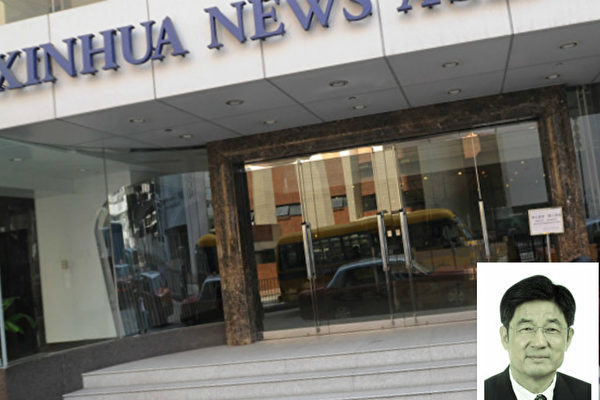

曾任中共新华社社长8年的田聪明日前病亡。

【大纪元2017年12月27日讯】（大纪元记者方晓报导）曾任中共新华社社长8年的田聪明日前病亡。在其任新华社社长期间，新华社对震惊中外的“天安门自焚伪案”提供伪证，炮制谎言，田聪明因此被海外追查国际列为“相关责任人”予以追查。

12月27日，澎湃新闻报导，从多个权威渠道了解到，新华社原社长田聪明于12月26日晚病亡，终年74岁。

田聪明是陕西府谷人，早年在 内蒙古工作，曾任内蒙、西藏党委 副书记，1990 年转任广播电影电视 部副部长，10 年后的 2000 年 6 月升 任新华社社长，2008 年 3 月退休。

田聪明任新华社“一把手”的 8 年，是中共对法轮功迫害最严重的时期，新华社作为中共的喉舌，长年刊登污蔑法轮功的文章，煽动民众对法轮功的仇恨。 2001 年 1 月天 安门广场发生所谓“自焚事件”后， 中共开动了所有的舆论工具，借机诬蔑法轮功，田聪明把持的新华社就为此输送了大量的污蔑文章。

时事评论员横河表示：“对法轮功的迫害，从一开始就不是法律。迫害元凶江泽民知道法轮功学员没有任何违法行为，中国也没有任何法律可以为他所用，于是决定发动一场政治迫害运动。作为政治迫害的典型表现，就是铺天盖地的污蔑性宣传。这就是中共宣传机器新华社、人民日报和央视等喉舌起的作用。”

他说：“从宪法法律层面，修炼法轮功在中国大陆仍然是合法的，没有任何法律禁止。然而到今天很多人还以为法轮功在中国是被法律禁止的，很大程度就是受到宣传的迷惑。”

横河表示：“2001年，华盛顿邮报有一篇文章，谈到一位中共高官向邮报透露，开始迫害法轮功效果不好，民众也不积极，当年天安门广场自焚伪案发生后，中共从新组织力量，三种措施组合，即暴力、高压宣传和洗脑，对付法轮功。事实上，自焚伪案发生后就是通过那些中央级喉舌的谎言来煽动对法轮功的仇恨的。”

发生于2001年1月23日的天安门广场上五人自焚事件，是中共在天安门炮制的假戏，用来栽赃法轮功。新华社在事件发生的2小时后，向外国媒体发布录像；接着在一周后，1月30日当天，新华社又发布了一篇更为全面的新闻稿，作为对其它媒体的回应。2001年1月31日，央视的时事评论节目《焦点访谈》播出了一个30分钟的特别版本，宣称此录像取自广场附近的监视器，从中可看到5个人陷于火海之中。

在央视播放的录像中，漏洞百出。2001年8月14日， 国际教育发展组织（IED）在联合国会议上发表声明说：整个事件是中共“政府一手导演的”，该声明已在联合国备案。

路透社的电讯写道：“北京正在利用身体被烧焦的恐怖形象，来作为与法轮功打传媒战的最新武器。”英国《金融时报》更指出：“没有任何证据表明自焚者是法轮功的人。”

而该事件随即被江泽民集团着力广泛宣传并借此促成了镇压法轮功升级。同时中共开动所有的舆论工具，铺天盖地诬蔑法轮功。

海外“追查迫害法轮功国际组织”发通报说，“自焚事件”间接涉及数百乃至数千人失去生命。“追查迫害法轮功国际组织”所属的天安门自焚事件调查委员会2003年1月宣布开始追查，并公布了第一批事件当事人和相关者作为取证人名单。时任中共新华社社长田聪明就是被追查的当事人之一。

横河认为：“在追究中共迫害人权和信仰的罪行中，不仅要追究直接犯罪的司法机构，也要追究同样血债累累的宣传官员。”

田聪明还与江派人马刘云山、鲁炜等人关系密切。

2001年，田聪明在任新华社社长1年多后，把当时任新华社广西分社社长的鲁炜提拔进入新华社领导层。2002年，鲁炜担任新闻信息中心主任之初，新华社及新华网编造诋毁法轮功的文章明显增加，1到3月份期间，每个月都有十几篇。

今年11月21日，中宣部前副部长、网信办前主任鲁炜落马，成为十九大后“首虎”。鲁炜被查之后，其多名亲信下属也一一被查。11月26日，香港《东方日报》报导说，整个文宣系统风声鹤唳，山雨欲来风满楼，鲁炜被查只是推倒了文宣系统这个腐败骨牌的第一块，接下来恐怕还有雪崩效应。

<h1 align="center"><b>曼哈顿街心公园的美国大学生</b></h1>

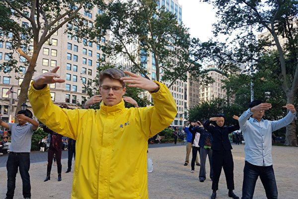

约翰．佩里是乔治亚理工学院的大学生，两年前开始修炼法轮大法。

【大纪元2017年06月14日讯】（大纪元记者戴安采访报导）初夏的纽约，温暖干爽。黄昏，天色依然明亮。麦迪逊广场公园，以她的绿色和宽阔为曼哈顿带来宁静的凉意。隔街相望，是著名的熨斗大厦，百年摩天大楼，静静地矗立，俯瞰尘世的车水马龙。

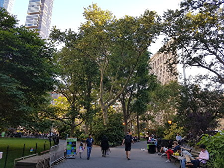

麦迪逊广场公园一景，右后方建筑为熨斗大夏。

从26街进入公园，沿着行人路径，走过绿树掩映的草地，转过喷水池，来到邻近23街的地带。在甬路的一侧，是公众休息区域，人们三一群、俩一伙地围坐在桌旁，享受忙碌后的闲暇。几个男孩子追跑嬉戏，一个3、4岁的小女孩儿坐在地上摆玩沙子，还有人吹出硕大的肥皂泡，在光影中戏弄。

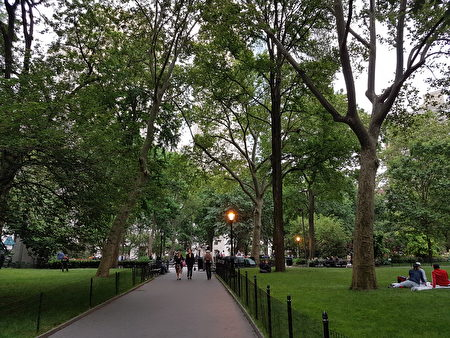

麦迪逊广场公园一景

休息区域的对面是一片沙地，有20多人排成整齐的队列，随着优美的音乐正在炼功。这些炼功人有男有女，年龄和种族各异。地上摆放着一个自制的小木架，上面贴著“法轮大法”的中英文简介，下面还摆放了中文和英语的传单。架子的顶部夹着一盏白色的小灯，估计是天黑时照明用的。

这是公园里的特殊画面，动中有静，静中有动。许多游客不自觉地停下脚步，静默凝视。他们在观望片刻后纷纷举起相机拍照，并且上前自取一份法轮功的简介，还有人加入了炼功的队伍，比划着炼了起来。

约翰‧佩里（John Perry）站在队列前端，明黄色的风衣格外醒目。他今年22岁，来自亚特兰大，是乔治亚理工学院的四年级学生。这个美国小伙子一直喜爱东方的哲学，研究过佛家和道家的学说。

两年前，约翰在网上搜索太极、气功方面的信息，无意间在一个论坛上看到了法轮功，立时产生了兴趣。他找到了法轮大法的网站，便开始阅读书籍，并且自学功法动作。就这样，约翰成了一名法轮功学员。

约翰‧佩里在公园里炼功。

西方的年轻人，缘结东方大法，这其中的心灵回转，会有多少奥妙？约翰娓娓道来，语调柔和，目光清澈。

“法轮大法的网站包括了所有的资讯，而且全部免费。第一次炼功后，我感觉非常好。我的思想清静，睡眠超好。修炼后获得的内在的平和是最重要的收益。大法的法理深深吸引了我，给我一种安全感。”约翰说：“修炼前，我和母亲常起冲突，我没有智慧去看自己的不足。修炼后，我意识到，所有矛盾的根源其实在我这里，即使表面上不是那样。于是，我向内查找自己，所有的问题都解决了。现在我和家人、朋友都相处得非常好。”

约翰对东方的静坐功法如此着迷，令家人惊讶。几个月后，约翰的亲人看到了他的变化，道德标准在不断提升。他们意识到，大法的益处是实实在在的。这不仅令约翰受益，也给全家人带来快乐。

约翰的家人都支持他修炼大法。“我身边的每一个人都受益了，因为我对他们比以前更好。”“由于中共在中国迫害法轮功，中共的宣传造成了负面影响，家人担心我会受到波及，不过，当他们看到了我的积极的转变，他们从怀疑、担心转为支持。5月份，我父亲驾车14小时把我送到纽约实习。我感到了满满的爱。”

东方的修炼理论，对于西方人来说，是否陌生或难以理解呢？约翰对此有独到的见解：“我认为，西方的文化和文明实际上都来源于古代中国文明的哲学思想。在深层，我们和东方文明中正直的思想价值观是紧密连结的。

“法轮大法的修炼原理植根于中国传统文化，而中国传统文化奠定了人类文明的根基。许多西方社会的价值观和一些中国传统价值观是相近的。当法轮大法把这些价值观呈现在生活的表层，产生了相当大的吸引力。这是一种生活方式，在生活中实践积极正面的准则，人们自然会喜爱和认同。”

今年暑假，约翰有机会在纽约的一家国际媒体公司实习，学习行销和媒体制作。下班后，他经常到麦迪逊公园炼功。

他说：“炼功让我精力充沛，同时也能和社区的公众互动。我们与大家分享一样好东西，有益健康、有益身心。我看到，有很多人停下来给我们拍照。到户外炼功，对我自己、对其他人都是件好事。”说到这儿，约翰轻轻地笑了起来。

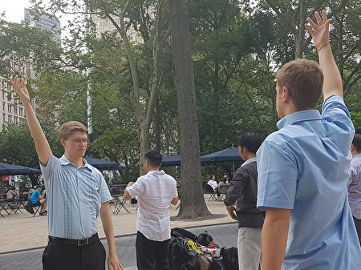

约翰在公园里教功。

然而，有一个严肃的话题不可避免，那就是中共迫害法轮功。约翰修炼一两个月后，他就听说了法轮功在发源地被禁止，他很惊讶，也很难过。他当即感到，自己一定可以做些什么。

“我已经从修炼中受益了。如果我无动于衷，那就是个伪君子。我把迫害事实，特别是中共活摘器官的事情告诉了家里的人还有我的朋友。他们都签了致联合国的反对活摘器官的请愿书。起初我并不相信这是真的，但是有大量的证据显示，你不能不信。”约翰说。

约翰在大学校园里也积极传播真相。他表示，同学们的反应令他深受鼓舞。“很多人对中共的暴行一无所知，包括一些中国学生。他们听说后都立刻表示要为制止迫害出力。”

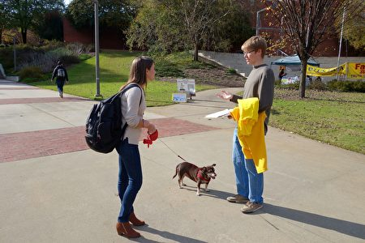

约翰‧佩里在乔治亚理工学院讲真相。

“每个人都知道法轮功在中国受到迫害。每个人都知道中共在掩盖罪行。当你听说此事后，你要决定如何行动。作为一个人，我们都有责任站出来维护人的尊严。当你看到好人受难，你必须选择，是要坚持正道，还是放弃原则。”

“最重要的是，坚持做你认为是对的事情，不要因为家庭或朋友的压力而放弃信仰和原则。这似乎有点困难，但你不会后悔的。放开你的思想，让心灵自由，你的选择会给周围的人都带来益处，你的选择可以让你脱离社会中负面的影响。”

关于负面因素，约翰特别提到了共产主义的危害。他说，共产主义已经渗透到了西方社会。“目前，西方世界已经在有意识地抵御共产主义，很多美国人刚刚认识到，共产宣传在细微中潜入，贻害四方。”

约翰对未来充满信心：“良知可以让世界变得更加美好。你要坚信，你的行动有意义，将会推动事件的变化。我们不应失去希望。”

约翰的家乡亚特兰大拥抱多元文化，这或许是助他心胸开放的一个潜在因素。今天，前所未有的国际化趋势令人们彼此相依。约翰珍惜在纽约的实习机会，期待着毕业后投入广阔的媒体天地。约翰的话语朴实，神情纯净。他已经找到了人生的方向，正在脚踏实地地向前行进。

 <h1 align="center"><b>汉中“最美油菜花节”背后的罪恶</b></h1>

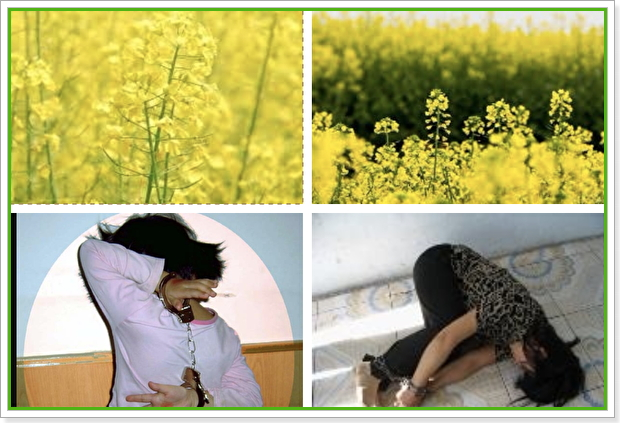

每年三月的“汉中市油菜花节”风光怡人，闻名遐迩，然而在这美丽的外衣下，却发生著一桩桩令人发指的罪恶，已持续了近19年。

 
 【大纪元2018年03月28日讯】位于陕西省南部的汉中，是一座历史文化名城，有着“汉家发祥地，中华聚宝盆”的美称。三月的汉中，山清水秀，被金色的花海衬托得格外美丽，这里每年一度远近驰名的“汉中市油菜花节”登场了。然而在这美丽的外衣下，却发生著一桩桩令人发指的罪恶，已持续了近19年。

<b>“油菜花节”前施暴</b>

明慧网报导，2018年1月12日，汉中勉县肖荣的家突然闯进一帮人，是汉中市勉县刑警大队副大队长苟新武带来的，他们没有出示任何证件，把肖荣绑架走。

在今年勉县举办“汉中市油菜花节”前，当局兴师动众，成立了专案组，害怕花节期间大量出现法轮功真相的信息，扬言这次要迫害一批法轮功学员。

肖荣被绑架的原因，是因为勉县天荡山景区出现了传宣“法轮大法好”、“天灭中共”的小树挂。

1月12日，被绑架的当天，肖荣被关在刑警大队的铁笼子里。在汉中市看守所里有人看到她的手在后背被铐著。13日她被押到汉中市汉台区看守所拘禁。

中共酷刑迫害示意图：关铁笼子（明慧网

 

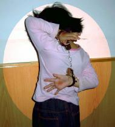

中共酷刑迫害示意图：背铐（明慧网）

1月25日，勉县检察院三人非法询问肖荣；2月8日，勉县武侯派出所出面非法逮捕肖荣。

绑架肖荣的那天，刑警副大队长苟新武在没有穿警服、没有《搜查证》的情况下，也闯到法轮功学员薛丽君家，非法抄家，抢走法轮功书籍、电子产品等个人物品；然后把薛丽君绑架到刑警大队，关押近30个小时，于第二天晚上7点多放回家。

肖荣于1958年9月25日出生，在中共1999年7月20日迫害法轮功之前，就修炼了法轮功，身心受益匪浅；2008年她从商业系统退休。肖荣坚持按“真、善、忍”标准做好人，却屡遭中共的迫害。

2000年，肖荣被非法拘留15天；2016年，被警察蹲坑绑架，被非法关押在汉中市看守所40天，遭残酷折磨，手脚被铐在一起，后被勒索1万元人民币取保候审。回家后其母看到她两个手腕有被手铐损伤的血痂。因被恐吓，回来后肖荣一直没有跟大家说。

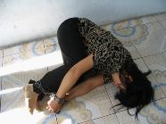

中共酷刑迫害示意图：手脚铐在一起 （明慧网）

 
 <b>魔鬼兽行</b>

至今在汉中市被中共绑架的法轮功学员至少有157人，其中张汉云、余秀琴和杨秀莲遭到中共残忍至极的的迫害。

汉中市汉台区法轮功学员张汉云，修炼法轮功前5年，因闭经，始终未怀孕，修炼不到半年后月经正常，怀上了孩子，那年她33岁，全家人莫不感激法轮功创始人李洪志师父的恩德。

2001年3月，正是“油菜花节”，汉台区警察分局政保科科长马平安、汉中市“610”等人欲强行将张汉云送往洗脑班，没抓到人，就将她父亲和弟弟的建筑工地查封，将她丈夫铐在略阳县嘉陵江桥头示众。

躲在亲戚家即将临产的张汉云还是被他们抓进了洗脑班，当他们发现她要临产后，就将她拉到三十公里外的一个职工医院强行堕胎。因胎儿过大，竟将胎儿活活肢解，分块取出。

2002年6月18日，汉中法轮功学员余秀琴到复印部复印法轮功真相资料时，被人恶报，被抓到了汉台区公安局政保科，后被绑架到看守所。

在看守所里，余秀琴遭受种种暴行，如揪头发、搧耳光，用胳膊肘擂胸，更惨烈的是，打手们轮流用手挤她的乳房，号称“挤奶”，痛得她撕心裂肺，惨叫不绝……

53岁的汉中法轮功学员杨秀莲，因发法轮功真相资料和女儿一起被抓，遭受“挤奶”折磨，挤得鲜血顺着乳头一滴一滴往出流，那伙施暴者在一旁邪淫地怪笑，他们还用牙刷刷她的下身，用牙刷戳进阴道乱搅，她被折磨得奄奄一息。看到人快死了，让其家人拿1000元保出去，直到2002年7月19日，她回到家。

<b>坚守“真、善、忍”</b>

一位有良知的律师2016年在为法轮功学员辩护时说，法轮功学员面对侮辱、嘲笑、冤狱、酷刑，承受着漫长而巨大的苦难，他们依然坚守“真、善、忍”理念。

“按照‘真’，他们揭示、讲述著真相；按照‘善’，他们惨遭迫害而无怨无恨，希望唤醒世人的良知，拥有美好的未来；按照‘忍’，他们忍受着苦难，割舍个人的所求所得，坚守着和平、理性，他们忍得坚强不屈、无所畏惧。”

律师认为，十七年来，法轮功学员从来没有以暴易暴、以怨报怨，全国没有发生过一起法轮功学员因遭受迫害与不公而采用暴力或非法手段鸣冤雪耻的事件，这是一种怎样的舍身“救世精神”，怎样的“大慈大悲的情怀”？

“定罪这样的好人，打压‘真、善、忍’信仰，就是无视自己的良知，在摧毁人类的普世价值，毁我道德、毁我美好、毁我希望！”

<b>行恶者遭报</b>

在汉中迫害法轮功学员的行恶者频频遭厄运。

芦鹤鸣是汉中市委办公室副秘书长、汉中市“610”主任。“610”是江泽民为迫害法轮功于1999年6月10日成立的非法机构，是一个凌驾于宪法之上的恐怖机构。19年来全国各地“610”主任由于作恶多端，频繁遭报，又被戏称为“死亡职位”。

2013年3月23日，芦鹤鸣带上女儿、女婿、小外孙和秘书一行6人，乘三菱越野车外出，被两辆大货车夹撞，车上4人惨死。发生车祸时，芦鹤鸣一头撞击玻璃，头伸出窗外，玻璃将他脖子的动脉割断而毙命。

齐建文， 50岁，南郑县公安局局长，为了所谓的“政绩”，变本加厉地迫害信仰“真、善、忍”的法轮功修炼人。2008年“奥运”前夕，警察绑架法轮功学员肖艳萍。在肖艳萍被非法二审时，齐建文按照汉中“610”的指使，调集约40名警察和特务，手提摄像机、手铐、警棍等刑具，在法庭附近守候，当天还抓捕10多名站在路边和在小吃店吃饭的法轮功学员。

2010年9月，齐建文因严重心脏病需立即住院，他回家收拾东西准备第二天住院，当晚就暴死于家中，抛下他再婚的新妻子。

在汉中拘留所参与迫害的吸毒犯张军，20来岁，曾将牙刷塞进法轮功学员杨秀莲的阴道折磨她，致使她大出血。事发不久张军的小腹以下阴道附近出现一个小窟窿，24小时往外流脓，无药可治，苦不堪言。

据陕西《华商报》2015年5月7日报导，汉中市南郑县公安局民警“来中”，55岁，2012年1月的一天中午，突发脑溢血晕倒在地。2014年9月，来中再度突发脑溢血，脑神经损伤严重，并导致失语、全瘫、进食功能完全丧失。

明慧网报导，来中曾参与迫害法轮功学员。

<h1 align="center"><b>纯净的音乐 悲悯的心灵</b></h1>

芬兰民谣新星安娜•科克宁（Anna Kokkonen）

【大纪元2014年05月12日讯】2014年伊始，有一个芬兰女歌手的名字屡见报端，她的专辑《秘密花园》的一首主打歌曾经占据著名音乐台“Yle Radio Suomi”每周评选的冠军位置。她的音乐被芬兰资深唱片出版商Riku Pääkkönen称为他的“职业生涯中所作几百张唱片中最好的专辑之一”；她的歌声也受到了中国听众的喜爱，人们称她的音乐为“天籁之声”。她就是芬兰民谣新星安娜•科克宁（Anna Kokkonen）。

<b>坚持自己的音乐不妥协</b>

安娜出生在一个音乐世家。父亲是一个俄罗斯音乐家，母亲是一名医生。安娜在妈妈肚子里的第一年是在圣彼得堡度过的，然后妈妈回到芬兰生下了她。安娜从六岁开始学习小提琴、钢琴，后来又开始学吉他和唱歌，妈妈说她在儿时就开始创作自己的歌曲了。后来安娜被父亲允许使用他的音乐室，当别的孩子们在街头疯耍时，腼腆而又内向的安娜却在她的音乐王国中找到了天堂。

安娜毕业于芬兰流行与爵士音乐学院，主修电吉他。她同时兼修古典音乐与声乐，有人说安娜的歌像20世纪晚期最有影响力的加拿大民间摇滚艺术家琼尼•米歇尔（Joni Mitchell）和称霸英国歌坛30年的凯特•布什|（Kate Bush）。不过安娜自己却认为，她的音乐与她们不同，因为她在作品中结合了芬兰民谣、爱尔兰曲风甚至还有中国古典音乐。

《秘密花园》这张专辑最早创作于2009年。在今年四月的一次采访中（Demokraatti Newspaper），安娜对记者说，因为不想为了商业目的被唱片公司改动自己的音乐，所以她选择了自己出钱制作唱片。“歌如果卖得好那当然是好事，但是那必须是按照歌曲的原始创作来卖。我创作的时候从来不计算能不能卖得好。如果说我的生活来源全靠我能不能写出主打歌，那就太悲惨了。我只想把我的音乐用一张CD留下来，所以我用自己的钱制作了这张专辑，然后发给一些唱片公司。”

曾经拥有芬兰著名的Spine farm Records唱片公司的Riku Pääkkönen创办了一个新的音乐公司Ranka Kustannus，他想做一些不同于以前制作的重金属音乐的东西。慧眼识珠的Pääkkönen听了安娜的这张专辑之后，他不仅承诺对安娜的音乐不做一丝一毫的改动，就这么原汁原味地呈现，而且还补偿给了了安娜所有的制作费用。当这张全部由安娜自己作词、作曲、配乐、演唱及制作的专辑拿到电台播放的时候，有人还以为CD的导演和制作是唱片公司呢。

《Voima》什么杂志杂志说安娜的音乐“清新”，“如果你想听到音乐最开始想做到的样子，这就是个极好的例子。”

《Keskisuomalainen》杂志说：安娜的首张专辑展示了“精妙的民俗、民谣和流行结合的风格”。安娜的声音叙述“清新而流畅，她在用词上故意着色制造光明与黑暗的画面。整体听起来，是很长一段时间内在这个领域内不曾有过的最成功的唱片。”

安娜的音乐也传到了中国，QQ音乐空间的发烧友们对《秘密花园》好评如潮：“晶莹剔透的声音敲开你的心门，值得循环”、“清透”、“舒缓的旋律，丝丝入扣的吉他加上纯美的女声，心灵的防备一下被摧毁了，真的很棒！”、“可以称为心灵鸡汤了，疗伤的万能药。”、“浅吟低唱，天籁般的声音。”、“唯美至极，赞！”

<b>为中国人而歌唱</b>

安娜的作品不同于大众普遍涉及到的两性关系和爱情的主题，她的音乐充满了人文关爱。如专辑的题目《秘密花园》（ Salainen puutarha ）即比喻人的心灵犹如花园，需要被时时照顾，你要像剪除杂草一样抛弃你心里那些不好的东西；专辑的主打歌《我的兄弟》（ Veljeni ）讲述的是一个犯了大错的男孩的故事，安娜在歌中强调了“宽恕”。她说，一个人犯了错并不等于他就是个坏人，人们应该像家庭成员一样互相关心而不要让每个人自己独自挣扎。

安娜热爱中国古老的传统文化，她说：“中国传统文化强调美德，柔和的美学和艺术的内涵。我们西方人更注重表面。但是我确实也发现一些两种文化的相似之处。我认为在从某种角度说，芬兰人很纯洁，我们崇尚诚实和正直，而这些其实都是典型的中国传统文化。”

安娜的专辑中有些作品是为中国弱势民众而创作的。在她的这个专辑中，第二首主打歌叫做《金色的国度》（Kultainen maa）， 歌中唱道：

一位女士身着哀丧的狱服
无辜的人被绑在笼子中
黑暗中她没有忘记她是谁

留着眼泪她仍然讲述著真相
思想的代价如鲜血般殷红
“你不能锁住我的心灵” 
她轻声说 带着一丝笑容

将一支新的蜡烛点燃
他们从一颗心传到另一颗心
光明闪耀在烛炬后
融化着人们脸上的冰

金色的国度

大墙后一个年轻的父亲手带铁链
他的脸颊消瘦 皮肤苍白似雪
他在沉默中等待 
今天他的恐惧将被考验

在生死中抉择
他抬起头 伤痛并没有使他胆怯
平静的外表深处 
他的心比以往跳得更强烈

将一支新的蜡烛点燃
他们从一颗心传到另一颗心
光明闪耀在烛炬后
融化着人们脸上的冰

金色的翅膀遍及地球
我们共同挥动烛芯（蜡烛芯一词，在芬兰语中还有“心灵之线”的意思）
今夜黎明将升起
把泪痕擦干

金色的国度
金色的国度

安娜说，这首歌的意思是越来越多的人站出来点燃蜡烛，最后黑暗的大地就被烛光照耀，像金子一样闪亮；“金色国度”的另一层含义是指中国辉煌的古代文化。

《Demokraatti Newspaper》杂志的记者Julle Tuuliainen介绍说，像其他音乐家一样，音乐是安娜生命中不可缺少的一部分；但是在工作室外，安娜是一个女战士，她不能接受世界上的不公正，她要为更加美好的世界而战。安娜特别观注中国的人权问题以及中共对法轮功修炼者的残酷迫害。这首《金色的国度》就是为被迫害致死的法轮功修炼者而作。安娜对记者说：“如果你接受作恶，那么几乎等同于你自己作恶。我希望那些有政治影响力的人们能够认识到，对错误的行为进行干预是多么严肃的事情。”

“当我听到那么多无辜的好人在中国被迫害的时候我特别受震动，特别让我悲伤的是，因为中共政府的欺骗，很多中国人还不知道事情的真相。多年来我一直关注这件事情，我百分之百地肯定法轮功修炼者不应该这么被对待——你只要看世界其他地方的人们可以自由地修炼。人们做好人，改善自己健康何罪之有呢？”

安娜说：“当我创作的时候，我感觉我和更高的看不见的力量有联系，这给我希望，让我理解到这世界不像我们看到的这么令人忧虑，有一些你内在的东西会影响你的环境，这是你自己发出的光芒。我的方式是用我的音乐来放光明，当然其他的艺术家会用他们自己的方式来表达。”

海外华人听众奥斯汀听完安娜的音乐感动地说：“我很激动。当中国人对自己的同胞受苦受难视而不见的时候，有西方人跨越民族和国界送来呼吁和关爱的声音，只有善良和高贵的灵魂才能如此让她被远在地球另一边的受苦的中国人所牵动。”他说，这就是为什么安娜的音乐得到中国听众喜爱的原因。因为她的音乐“已经从悠扬动听提升到了纯净和神圣。”“纯净的音乐后面是一颗悲悯的心灵。”奥斯汀认为，安娜的歌如启迪人类心灵的圣歌，对中国听众来说，甚至不需要读懂内容就能打动他们。

安娜今年三十一岁了，她还和儿时一样的腼腆和内向，她谦虚地说，人们之所以如此喜欢她的歌，也许是现代人虽然听的大多是现代音乐，但是内心还是在寻找一种能带来抚慰和安宁的声音吧。

<h1 align="center"><b>原谅别人放过自己 修炼大法开启智慧</b></h1>

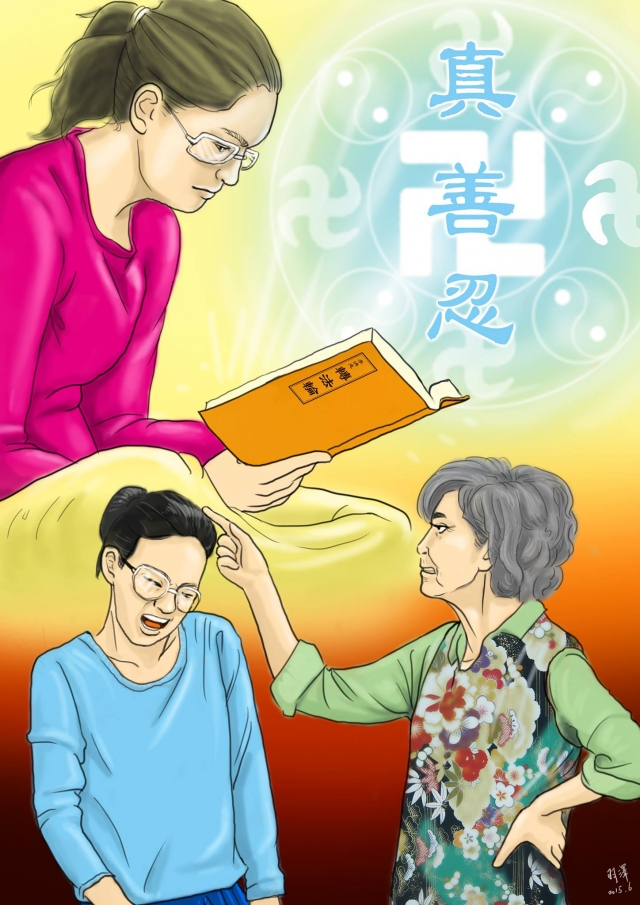

我曾经是个被婆婆欺负，每天只能暗自哭泣、怨天怨地的媳妇，每当想起自己的遭遇，一股油然而生的恨意，让我久久无法自己；然而要去明白这些因缘关系并不是一件容易的事情，直到我修炼法轮大法后，那个残破不堪的缺口，终于得到抚平。

<b>可怕的回忆</b>

我的婆婆是卖菜的摊贩，每天早上都会出门做生意，那是我一天中仅有的宁静时刻，而当她回家的时候，我的灾难即将开始。每天当时钟指到下午一点，我的心就会不自觉的揪在一起，紧接着听到外面铁门开启的声音，我的体内就从小腹升上来一股气直冲心脏，那股揪着的气就堵在那儿，十分痛苦。

刚结婚的时候，婆婆就告诉我，要煮三餐，要伺候婆婆、小姑、小叔，她的要求我都照单全收，但是不管我怎么做，永远都无法讨婆婆的欢心；有一天，丈夫的堂嫂来访，那时我正在洗碗，婆婆一下就把我推开，自己洗起碗来，等堂嫂走进厨房的时候，婆婆就跟她说：「妳看，我娶这个媳妇，饭也是我在煮、碗也得我来洗，她什么都不做！」当时我感觉很错愕，一句话也讲不出来，从此见识了婆婆虚伪的一面。

后来我怀孕了，害喜吐得很严重，什么东西都吃不下，感到全身无力，很不舒服，更没有办法做家事了，但是婆婆却对我大吼：「骗人没生过孩子啊！不要装了，赶快去煮饭！」

<b>寻寻觅觅终得法</b>

我常常在想，为什么婆婆总是这么对待我，到底我该如何做呢？每天要承受她的语言暴力，有时冷嘲热讽、有时辱骂怒吼，饱受精神折磨，那一段时间还真的不是人该过的日子，但我总不忘身为一个媳妇该有的规矩，然而这一切都只是表面上的忍耐，每天都在想着，要如何才能摆脱这个环境，当时我的心情濒临崩溃，真的是坐困「仇」城，对婆婆的怨恨日积月累，浓得化不开。

后来终于搬出了那个噩梦之地，但是即使没有住在一起，婆婆仍然时不时的还会找机会辱骂我，甚至教唆我丈夫不要养家了。婆婆是个烧香拜拜的人，对人却如此不善，我打从心底反抗着她，连信仰都不愿意跟她一样；但毕竟心里也苦，需要寻找生命的出口，在因缘际会之下，我成了一名基督徒；有了信仰之后，得到了精神上的支撑，在人生的路上渐渐的走得踏实起来。但我始终对基督教还存在着很多疑问，得不到合理的答案。最后我选择离开了基督教，前往中国学习中医。

37岁时，我毅然踏上求学之旅，前后10年漫长的时光，来回两地，于1999年研究生毕业。后来台湾政府开放中药商执业申请，我就到药专去修了认识药物学分，取得中药商贩卖执照，开始经营中药店。常常来买药的王小姐，很热心的送了我一本书，书名是《转法轮》，一开始阅读之后，就让我觉得非常惊讶，这本书的内容是我从来没有看过的，打动了我的心，回答了很多我找不到的答案。

<b>向内找是法宝</b>

法轮功改变了我往后的人生，最大的改变是由怨恨婆婆转而感谢她。

说真的，这一点都不容易，但是我为什么能做到？凭借的就是大法的力量，启发我的智慧。法轮功的师父曾说，「如果你不能爱你的敌人，你就不能圆满。」对此我感到十分的懊恼，可是，师父都这么说了，我该怎么办？我努力学法，希望透过法理能让自己明白该怎么做，终于有一天，我找到了，答案就在师父教的心法「向内找」中。

我开始试着去了解婆婆。婆婆是家中的老么，出生时她的父亲病重，她的母亲为了能全心照顾父亲，只好将她送给公公家做童养媳；婚后公公出外工作，没多久有了外遇，婆婆就这样被抛弃了；后来小三带着孩子去找公公，婆婆不得已也只能跟另一个女人同住，但是勉强挤在同一个屋檐下的两个女人打架了，公公要婆婆搬出去住，说好了要给生活费，结果都没实现，婆婆从此独立扶养孩子。

婆婆住院了，我带着孩子去医院看她，看到躺在病床上的婆婆，我发现自己已经不再恨她了，握着她的手，想着她可怜的一生，我原谅了婆婆，也放过了自己。如果没有大法，我还是浸泡在怨恨里，思维都被情绪牵着走，十分痛苦。师父要求的先他后我，真正受益的原来是自己。

<b>大法开启智慧</b>

我终于可以用同理心去理解婆婆，她是个在精神上有严重创伤的人，以前她整天又骂又念她的孩子们，娶媳后她就靠着不停的欺负我来获得舒压解恨，没有经历过的人很难想象那是什么样的感受。但为什么是我？为什么让我遇上？修炼法轮功以后，我知道了凡事都是有因缘关系的，终于从受苦中走了出来。同时也因为婆婆，我才能被激发出超常的毅力，面对人生的挫折，越挫越勇，直到学得一技之长，并在漫长的岁月里完成医学教育。

我深信大法的师父能给未来的人创造美好的世界，但是人必须懂得选择做对的事。就如同李洪志师父教的心法「向内找」，为善必须从自己做起，不是等着别人改，自己先变好最重要。

<h1 align="center"><b>纽约中领馆前 近十七年的无声抗议</b></h1>

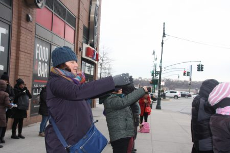

一群来自意大利的游客听真相后，表示支持法轮功。

 
 【大纪元2018年03月27日讯】（大纪元记者王新一纽约报导）2018年3月23日，全球退出中共党、团、队的人数突破三亿。三亿数字的背后，是法轮功学员十几年来向世人传递真相的付出，其中包括纽约哈德孙河边、42街上的中共驻纽约领事馆的街对面这群打横幅、讲真相的法轮功学员。

连续第十一年六个月来这里的法轮功学员潘女士告诉记者，来过这里打横幅的学员都知道，这里是个河边风口，几乎是纽约市最冷、风最大的地方。

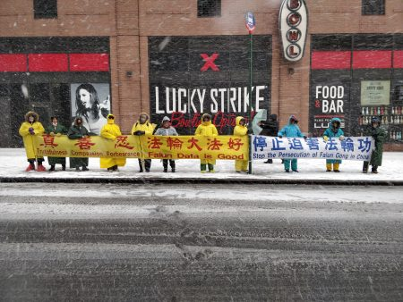

2018年3月20日，法轮功学员在风雪中坚守。（黄女士提供）

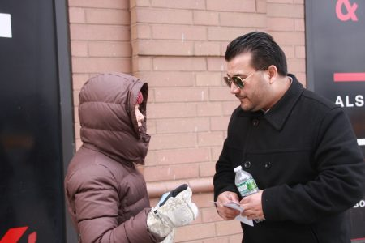

黄女士在向过往的民众讲述法轮功真相。

 
 <b>我们没说话 但发出了巨大声音</b>

48岁的法轮功学员阿霞，从去年冬天开始来中领馆，赶上了好几次纽约的风暴，她说，刚开始时心里挺苦的，手套棉裤全湿透了，风再一吹，特别冰冷，两小腿就一个劲要抽筋。但阿霞渐渐看到了自己所做的这件事的意义，“我们就站着，也不怎么说话，但对面中领馆排队办事的中国人，都会给法轮功的横幅录像、拍照。有时公交车挡住横幅，有的人就会很着急，从两个车缝里拍，车一走就赶紧接着拍。那一刹那，我是很感动，大家都有明白的一面。”

有一次，从中领馆出来一个男孩和一个女孩，女孩看到学员，赶紧就把手套和包塞给男孩，赶紧对着法轮功的横幅就拍，拍了很多张才走。阿霞当时想：“不管她出于什么想法，她就会把我们打横幅的景象传到中国大陆去，我想，好人他就会听到好的东西，他就会明白真相。”

“那时候我明白了，噢，原来我们是这样发声的！我们没说话，其实我们是在发出巨大的声音，告诉你‘法轮大法好’，我们要‘法办江泽民’，它是迫害大法弟子的元凶，把这个声音告诉国内的人。”

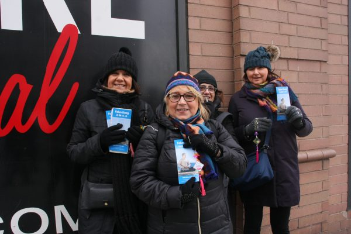

一群来自意大利的游客听真相后，表示支持法轮功。

<b>从谩骂到接受法轮大法好</b>

从2015年冬天开始，突然来了两个男子，在学员的横幅旁边摆出污蔑法轮功的横幅，还散发传单。一些民众开始拿他们的传单，但在听了法轮功学员讲述真相后，就把污蔑的传单交给了学员，并接受了法轮功的真相传单。摆污蔑横幅的其中一名年轻男子看到，便冲过来大骂学员，甚至还动手去推搡发传单的法轮功学员黄女士。

开始时，这个年轻男子十分凶恶，也十分积极，每天早早地来，把学员平日摆横幅的地方全给占上。不过，法轮功学员刘浏告诉记者，学员们从未与这名男子起过正面冲突，一再退让，并坚持善念，向这名男子讲述大法的美好，以及法轮功学员在大陆蒙冤受难的真相，目睹著学员的善，这名男子渐渐有些变化。

一次，一辆出租车停在了污蔑横幅前，黄女士过去给司机讲真相、挂莲花之后，正准备回头面对这名男子的谩骂，谁知，他竟说：“你做事真认真，像你这样子，做什么事都能成。”后来黄女士给国际游人讲真相，他总站在旁边紧盯着，他听不懂英文，黄女士就问他，是不是想知道讲了什么，这人便点点头。黄女士就把真相内容、游人明真相后的反馈翻译给他听，这名男子沉默了。

2015年一次冬天刮大风，一位90岁的老年学员不小心被风刮倒摔在地上摔懵了，这名男子看到后，立刻第一个冲了过来去扶这位学员。当时在场的学员刘浏告诉记者，这位老阿姨平时一直很和善地向这名男子讲真相，他虽然不说什么，但也听进去了，感受到老阿姨是为他好。

后来在其他法轮功学员的帮助下，这位老阿姨坐了起来，马上就又能走路了，刘浏说，这个男子看到学员年纪这么大，摔完后马上就没事了，当时很吃惊，也很受震撼，那天一连两三次跑过来问这位老学员，“你没事儿吧？”

刘浏说，这件事发生后不久，那个男子就对黄女士说，“我们再也不发传单了。”之后他们果然再未发过传单。又没过几天，这个男子说，“我以后不来了。”还跟黄女士开玩笑地说，“你得请我吃饭吧。”那人后来真的再也没出现。

<b>快十七年的朋友</b>

“9.11”恐袭之后，因为曼哈顿岛南端整片被封锁，原来在炮台公园向中国游客讲真相的法轮功学员，9月12日搬到了中领馆对面。今年73岁的香港移民谭少霞，从2001年开始在中领馆前打横幅、讲真相。

“我记得中领馆那以前有个保安，每次都冲我们挥手喊‘法轮大法好’。”后来谭少霞送了一本《转法轮》给他。还有一次，领馆那来了两百多个工人来干活，都听了真相，有的还说：“我妈妈也炼啊！”

学员们常在领馆前一家披萨店的门口给中国人发资料、讲真相。谭少霞笑着说：“这个店老板明白真相，人也很好，有时给我们煎肠吃。”谭少霞边说边来到对面81码头停车场洗手时，一个留着小胡子的美国员工追着她开玩笑。记者问她和这位员工是否认识，“何止认识啊！我们都熟的⋯⋯都快十七年了，都做了朋友了。还有巴士站的员工都对我们很好。”

学员打横幅的地方，刚好是M42的公交车站，每来一辆公交或出租车，法轮功学员黄女士都会热情地跟他们打招呼、讲法轮功被迫害的真相，送他们学员亲手制作的小莲花。不少公交的前门上，都挂着小莲花挂饰。

记者离开时，坐上了一辆M42的公交车，司机说自己是基督徒，听说中共也迫害基督教。他看着窗外的法轮功学员说，“中共政府他们如果看看这个世界，这些信仰像基督教、像法轮功，给世界带来的只是和平，就像那（横幅）说的带来‘真、善、忍’，这到底有什么错呢？”

<h1 align="center"><b>乔治亚州众议院通过决议案谴责中共活摘器官</b></h1>

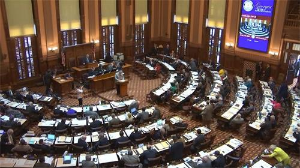

美国乔治亚州众议院于2018年3月19日一致通过第944号决议案（明慧网）

 
 【大纪元2018年03月27日讯】美国乔治亚州众议院于2018年3月19日一致通过第944号决议案（House Resolution 944），谴责中共活摘法轮功学员和其他良心犯器官的罪行，并要求中共立即停止这种暴行。
 
 
明慧网报导，944号决议案为乔州众议院共和党与民主党议员联合提出，由共和党议员德韦恩‧希尔（Dewayne Hill）、民主党众议员比尔‧麦高恩（Bill McGowan）、众议院司法委员会主席、共和党资深众议员温德尔‧威拉德（Wendell Willard）、众议院教育委员会主席、共和党资深众议员布鲁克斯‧科尔曼（Brooks Coleman）等19位议员共同发起。

944号决议案得到了众议院跨党派的支持，最后投票表决时以156票赞成、零票反对而获得一致通过。

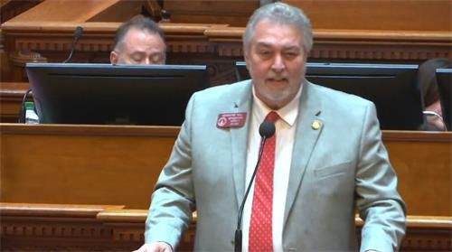

第944号决议案决议案发起人之一，德韦恩‧希尔（Dewayne Hill）议员在众议院投票表决前向全体议员介绍该决议案。（明慧网）

在投票讨论时，作为决议案发起人之一，德韦恩‧希尔（Dewayne Hill）议员指出：“本决议案会使更多的人来关注中共活摘法轮功学员和其他良心犯器官的罪行，同时也会帮助提醒乔州的公民，如果要去中国做器官移植的话，他们就有可能成为屠杀的帮凶。”

共和党众议员杰夫‧琼斯（Jeff Jones）对发起人说：“我本人百分之百地支持你这个议案。我们都希望看到中共活摘器官的暴行能很快被制止。谢谢你对此议案的推动。”

在此之前的2月12日，州议会州际政府合作委员会单独为此议案举行了听证会，当地六名法轮功学员应邀发言，其中五名学员作为中共迫害的幸存者，分别讲述了自己曾在大陆遭受酷刑迫害、被强制验血的亲身经历。与会的所有委员会成员被学员提供的中共活摘器官的多方面证据及他们的迫害经历深深触动。多位委员会成员在了解真相后，明确表示完全支持944号决议案。

在听证会上，民主党众议员杜威‧麦克莱恩（Dewey McClain）说：“首先，我十分感谢德韦恩‧希尔议员发起944号决议案，作为听证委员会成员，我被今天所了解到、听到的所有这一切深深触动了。大量法轮功学员在中国被迫害、被活摘器官是反人类罪，是绝对无法接受的。”

州议会州际政府合作委员会主席、共和党资深众议员马特‧达拉尔（Matt Dollar）说：“多方独立调查报告就中共系统性、大规模活摘器官提供了十分有力（compelling）的证据。在美国、英国、德国或澳大利亚，病人等待肾器官的时间往往是3至4年，然而在中国，等待时间非常短，甚至在一周之内。”

944号决议案谴责并要求中共立即停止活摘器官的暴行；鼓励乔治亚医学界对乔治亚州的居民进行教育，使其了解到中国器官移植旅行的风险，以防止乔治亚居民不经意地参与谋杀。

以下为乔州众议院通过的944号决议案全文译文：

<b>第944号决议案</b>

针对正在中国发生的强摘器官行径表达关切。

鉴于，持续、可信的，在中国发生的系统性从非自愿的良心犯、宗教和少数族裔人士身上摘取器官，导致法轮功学员、维吾尔人、西藏人和选定的基督徒大规模被屠杀，以获得移植器官的报告；

鉴于，中国的器官移植系统不符合世界卫生组织“器官采购途径的可追溯性和透明度指导原则”，中共政府已经抵制了对该制度的独立审查；

鉴于，新的调查报告认证，中国共产党大规模屠杀无辜公民获取移植器官，中国官方每年移植量为一万例的数字已被低估了一个数量级；

鉴于，一九九九年七月，中国共产党在全国范围内对以“真、善、忍”为指导原则、广受欢迎的法轮功精神实践进行了严重的迫害，成千上万的法轮功学员在中国劳教所、拘留中心和监狱中被拘留，对法轮功学员进行酷刑、虐待和不合理的体检和血液检查常规；

鉴于，联合国反酷刑委员会和酷刑问题特别报告员已经表达过对法轮功学员被强摘器官指控的关注，并呼吁中共提高器官移植系统的问责和透明度，惩罚那些滥用职权者；

鉴于，要求中共立即停止摘取所有良心犯的器官，特别是从被监禁的法轮功学员、宗教和少数族裔人士身上摘取器官，因为这是对基本生存权的严重和不可容忍的侵犯；

鉴于，对中国的器官旅游不应被医疗保密屏蔽，而应接受公开监督，任何一个国家都不应该允许其公民去中国获取器官，直到中国允许对过去和现在的良心犯的器官摘取进行全面调查；

鉴于，鼓励乔治亚医学界对乔治亚州居民进行教育，使其了解到中国器官移植旅行的风险，以防止乔治亚居民以获取强摘器官的形式不经意地参与谋杀。

现在，

鉴此，乔治亚州众议院决定：

<b>本州众议院全体议员敦促中国政府停止对所有囚犯强摘器官的不道德行径，特别是对法轮功和其他良心犯。

另外还决定，授权乔治亚州州务卿将该决议的副本发布给公众和媒体。</b>

决议案链接：http://www.legis.ga.gov/legislation/en-US/Display/20172018/HR/944

<h1 align="center"><b>江泽民迫害法轮功的三大机构被裁并</b></h1>

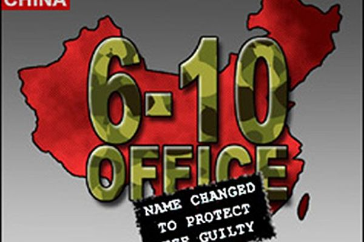

近日，习当局裁并了多个江泽民掌权时期成立，并参与迫害法轮功的机构：中共综治办、维稳办及“610”办公室。

【大纪元2018年03月27日讯】（大纪元记者古清儿综合报导）近日，习当局裁并了多个江泽民掌权时期成立，并参与迫害法轮功的机构：中共综治办、维稳办及“610”办公室。其中，“610”办公室是江掌权时期亲自下令成立的专门镇压法轮功的血腥机构。这一非法机构，当时直接归江泽民和中共政法委管辖，一直凌驾于中共的法律之上。

有分析认为，上述三大机构被撤并入政法委，实际代表着自江泽民掌权开始所设计的维稳系统彻底失势。随着当局在政法委高层的人事动作逐渐展开，中共政法委已经无法逃脱被清洗的命运。

<b>江掌权时成立的三大机构被裁并</b>

3月21日，当局公布了《深化党和国家机构改革方案》全文，中共中央社会治安综合治理委员会及其办公室[综治委（办）]、中央维护稳定工作领导小组及其办公室（维稳办）及中央防范和处理X教问题领导小组及其办公室（“610”办公室）被裁并，具体职责分别划归政法委、公安部。

之后，《人民日报》海外网旗下微信公号“侠客岛”发文解读指，这次的改革，政法委并入了综治委、综治办的职责，且并入了维稳办、610反X教办公室的部分职责。综治委（办）、维稳办、反X教委（办）不再单设。

香港《星岛日报》3月22日报导此消息时，在标题突出“防X办‘寿终正寝’”。

香港《信报》报导，在江泽民时代设立的多个机构近日被撤销，其中包括主要为打压法轮功而设的“610”办公室。

<b>“610”及其起源</b>

1999年6月10日，江泽民直接成立了专职迫害法轮功的组织“中央处理法轮功问题领导小组”，由时任副总理李岚清任组长，时任政法委书记罗干以及丁关根任副组长，成员单位包括最高法、最高检、公安部、国安部、中宣部、外交部等。

此后，从中共中央到各级党委，都设立了“处理法轮功问题领导小组”，其下设的常设机构叫“处理法轮功问题领导小组办公室”，因其设立时间为6月10日，又叫“610”办公室，属于党务部门。

2000年9月，中共“国务院防范和处理X教问题办公室”成立，与“610”办公室合署办公，即一个机构两块牌子。两个办公室皆与中央政法委合署办公。“中央处理法轮功问题领导小组”同时改称“中央防范和处理X教问题领导小组”，常设办公室亦同时改称，对外仍称“610”办公室。

海外“追查迫害法轮功国际组织”（下称追查国际）的报告指，在各省市（地）县乡四级都成立了这样的临时机构，均称为“610办公室”。1999年7月20日镇压法轮功开始后，中央“610”办公室被定为常设机构，并升格为正部级，地方“610”办也相应地定为司局、县处和科级。此外，在各个大学、机关和大企业中也建立了相应的“610”办公室。

“610”办公室拥有一个独立的权力体系，权力如同“中央文革小组”。在处理法轮功事务上，“610”办公室可以调用各方资源，权力在一般政府部门和公、检、法之上。

除了直接镇压法轮功外，“610”办公室还插手文化、教育等领域，审查并决定发行海外节目，并干涉律师办理有关法轮功的案件。

在过去十多年中，“610”办公室几经调整、加强，变更对外公开名称，之后管辖范围扩大到不信仰共产党的教会、其它宗教信仰团体和气功组织。虽然“610”办公室能在早期的新闻报导中见到，但并不见于中共中央一级公开的文件、正式的法律文件和政府文件。其存在即使按照中国的现行法律也是非法的。

“610”的历任组长是李岚清、罗干、周永康，“十八大”后组长人选不明。“610”办公室的历任主任分别是王茂林、刘京、李东生、刘金国、傅政华、黄明（未对外公布）。

<b>罗干、周永康借打击法轮功坐大“综治委”</b>

中共综治委（办）起自江泽民掌权时期，是一个非常设机构，成立于1991年3月21日。最早由乔石以常委身份兼任综治委主任，宣布时也很低调，时称“中央社会治安综合治理委员会”。

当年设立综治委的主要目的，用中共的话来说，是“清理‘六四风波’造成的社会治安后遗症”。当时预计用五年时间完成工作目标，即到中共“十五大”前撤销该机构。

但是中共“十五大”时，罗干进入中共政治局并任书记处书记，为了扩大权能，非但未撤销综治委，反而愈加坐大。至2002年中共“十六大”时，罗干晋阶为常委，仍任政法委书记兼综治委主任。

罗干之所以能够配合江泽民发起1999年对法轮功的打压，起初借的就是“治安”之名而非政法委的“法制”之名。罗干也借迫害法轮功，换取了其“十六大”晋阶常委。

2001年，综治委第一次全体会议在北京召开。时任中共综治委主任罗干在会议上多次提到“同法轮功的斗争”，并要求“加大对法轮功的打击力度”。

综治委在周永康于2007年进入常委后势力变得更加庞大。

2011年9月，“中央社会治安综合治理委员会”更名为“中央社会管理综合治理委员会”，将“治安”二字更改为“管理”，并大幅扩权，将“X教防范办”、武警与总政保卫部、总参动员部等11个单位也归并其中。因为“610”办公室已是常设机构，将“X教防范办”归入综治委，实际变相把综治委临时机构正规化。

更名后的综治委仍由周永康任主任，还有三名江派政治局委员级别的副主任：王乐泉、回良玉和刘云山。周永康的心腹周本顺从2003年11月至2013年3月，先后担任中央政法委副秘书长、秘书长、中央综治委副主任长达十年之久。

当时有报导称，周永康综治委扩权的实质是为其和薄熙来密谋政变打下基础。

周永康掌控综治委时，综治委触角深入各个社区。据福建长乐市综治委给各村、镇综治委各成员单位、镇直有关单位的“长江委[2012] 40号”文件中提到，要加强对“两非”、“维权”等重点人员的稳控措施，加强对“法轮功”等“精确打击”。

2014年10月10日，当局决定将“中央社会管理综合治理委员会”恢复为原名“中央社会治安综合治理委员会”，将“管理”二字重新改回“治安”，标志综治委权力开始收缩。

<b>“610”的权力被部分转到“维稳办”</b>

1998年3月27日，中共中央维护稳定工作领导小组成立。2000年5月11日，其办事机构维稳办设在中共公安部内。

维稳办历任主任为白景富、刘京、杨焕宁、李东生、刘金国。

原先隶属中共内部其它派系的罗干在迫害法轮功问题上，主动投靠江泽民，但据报导，曾庆红不希望罗干借综治委坐大，于是对中共的维稳体系进行权力重分配。

据2013年12月1日追查国际“关于610办公室的调查报告”，2002年4月以后，中央指示调整和加强“维护社会稳定工作领导小组”，中央和部分省市“处理法轮功问题领导小组”及其办公室的职能由“维护（社会）稳定（工作）领导小组”及其办公室取代。

在中共“十七大”召开之前，曾庆红已让自己的亲信周永康取代了罗干的权能。

“610”办公室重点迫害法轮功，后期也增加了其它信仰团体和民间气功，而维稳办打击范围更广泛，包括上访民众、维权人士等。

据时事评论员横河介绍，2008年奥运安保，中共重新整合了政法系统不同部分的力量，提出了维稳的新概念并落实到组织上。

<b>三个迫害机构互相之间的关系</b>

上述三个机构都是中共政法委在主管，都与政法委合署办公，名义上是几个机构，实际只有一套班子。到了基层，常常就没有分得那么清楚。

在中共江泽民集团开始迫害法轮功以后，“610”办已运作了好几年，很多时候就以“610”办为基础，直接在“610”办挂上“综治办”、“维稳办”的牌子，发文件通知时名称也混用。

比如安徽省宁国市发的一份通知中就把“维稳办”和“610办”混起来用，在有关宁国市委政法委的介绍中把“维稳办”和“防范办”（也就是“610办”的另一名称）混用。安徽省宁国市维稳办发的通知，混用“维稳办”和“610办”。宁国市委政法委简介中，把“维稳办”和“防范办”（也就是“610办”的另一名称）混用。

也有的中共基层把“综治办”、“维稳办”、“610办（防范办）”明确分开，都是归党委政法委管，由政法委的书记和副书记去兼任各个办公室的主任。

比如山东省青州市政法委网站上各个办公室分得很清楚。青州市政法委书记同时也兼任“综治委”主任和“维稳办”的主任，而一名政法委的副书记兼任“610办”的主任。

<b>分析：综治委和“610”在中共内部有争议</b>

2013年12月20日，“610”办公室的头目李东生被调查。在官方通告中，李的第一头衔是“中央防范和处理X教问题领导小组副组长、办公室主任”，其次才是“公安部党委副书记、副部长”，通告罕见地强调其跟迫害法轮功有关的二个隐秘头衔。

李东生落马后，从2015年开始，当局对“中央610办公室主任”一职人选讳莫如深。前中共公安部副部长黄明自任“610”办公室主任以来都没有公开宣布，在官方履历介绍中，黄明也没有“610”办公室主任这个头衔。

2016年中纪委对“610”办公室进行巡视后，与当时其它31个单位专项巡视反馈报导相比，“610”办公室专项巡视反馈报导中没有提及“610”办公室负责人姓名，仅称：中央防范和处理X教问题领导小组办公室主要负责人主持会议，并作了表态发言。

多年来，中共政法委书记一直同时兼任综治委主任。但在2012年孟建柱接任政法委书记时，在官方简历中，并没有按惯例立即公布其综治委主任的头衔。直到2013年5月31日，孟建柱才以综治委主任的身份出现在官方报导之中。

时事评论员李林一说，“综治委”、“610”一直在中共内部有巨大争议。这个从孟建柱接手政法委书记后没有立即公布其综治委主任的职务，以及“610”组长和办公室主任的人选，最后索性被当局雪藏起来了就可以看出。

李林一说，中共内部其实也一直有撤并“综治委”、“610”等机构的呼声。当局的这些动作，实际代表着自江泽民掌权开始所设计的维稳系彻底失势。

<b>分析：调虎离山 政法委无法逃脱被清洗</b>

“十九大”前，大陆31省份政法委书记全部被换。2018年“两会”后，公安部的高层纷纷发生变动，习近平的人马在政法委中已逐渐上位。

2017年11月4日，赵克志被任命为中共公安部部长。65岁的赵克志被指是胡锦涛、习近平的人马。

今年中共两会后，政法系统也出现大变动。

两会期间的人事显示，中共公安部排名第一的副部长傅政华转任司法部长。3月22日，公安部排名第二的副部长黄明出任新成立的“应急管理部”党组书记。

今年3月24日，湖北武汉市委书记陈一新调任中央政法委委员、秘书长。25日，中共公安部副部长王小洪已任公安部党委副书记、分管日常工作的副部长，并被明确为正部长级。

如无意外，王小洪未来将接替傅政华的位置，任中共公安部常务副部长。陈、王分别是习近平浙江和福建的旧部。

李林一说，将傅政华和黄明调走，明显是当局在“调虎离山”，未来清洗政法委和公安部的时候，阻力会小很多。再加上习派人马在政法委、公安部中已逐渐到位，中共政法委已无法逃脱被清洗的命运。

<h1 align="center"><b>中共军队610隐藏惊天罪恶</b></h1>

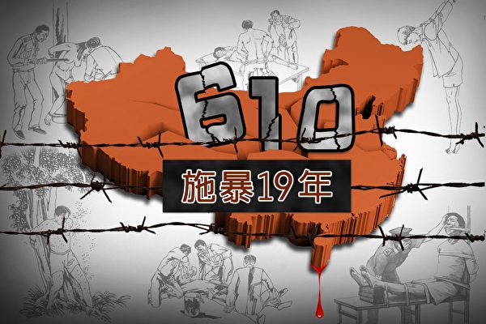

中共军队“610”系统，隐藏着惊天的罪恶，并且这样的惊天罪恶，如今仍在持续。

【大纪元2018年03月24日讯】3月21日，中南海公布了《深化党和国家机构改革方案》全文，其中第二十条提及将中央防范和处理邪教问题领导小组及其办公室（“610”办公室）的职责划归中央政法委员会、公安部。

中共迫害法轮功的专职机构“610”被裁并，从一个由江泽民和政治局常委垂直领导的超级机构和权力机构，降为政法委和公安部之下的一个部门，级别降低，改变了其独立于中共所有机构之外的现状。

从中共官方现在释放的信息来判断，裁并之后的“610”办公室，即使不再使用这一臭名昭著的名称，但中共对法轮功的迫害很大可能仍将持续，虽然其权力和可调动的资源可能将会缩减。未来中共这个迫害法轮功的系统如何具体运作，还有待继续观察。

但是，有一个外界对中共“610”系统比较容易忽视的部分，那就是中共军队的“610”系统。而中共军队“610”系统，在19年来对法轮功的迫害中，犯下的罪恶最为严重，也最为不为外界知道。

中共军队“610”系统，隐藏着惊天的罪恶，并且这样的惊天罪恶，如今仍在持续。

<b>中共军队“610”系统</b>

从整体上来讲，中共军队“610”系统是中共中央“610”系统的一部分，但是，由于中共军队相对独立和隐蔽的因素，军队“610”系统，基本属于一个独立运作的系统，直接听命于江泽民和其安排的军方高层将领。

在中共迫害法轮功之初，江泽民就在军队成立了全军“610”以及各军区“610”。首任全军“610”主任是于永波，各军区“610”主任则由军区政治部主任兼任。在于退休后，2004年，李继耐被江泽民提拔为总政治部主任，并兼任全军“610”主任，他也因此上了海外“追查迫害法轮功国际组织”的追查名单。

对于军队各级“610”的罪行，由于其特殊的隐蔽性，媒体报导相对较少。明慧网2012年6月6日曾报导了南京军区副师级军官、法轮功学员杨兴福遭受南京军区“610”迫害的经历，揭开了冰山一角。报导说，他被军队“610”先后两次劫持，两次劳教，长达四年之久。

1999年4月25日，上万名法轮功学员来到中南海国务院信访办公室前，向当局和平请愿。当天中共中央军事委员会副主席张万年，接到党魁兼军委主席江泽民的指示，要求全军特别是北京地区军队和武警部队对迫害法轮功的工作进行紧急动员部署。按照张万年的指示，总参谋部、总政治部立即下发紧急通知，要求全军迅速行动起来，查清军人及其家属子女、离退休老干部参加法轮功及其它类似组织的情况。其间，张万年多次给总政治部主任于永波打电话或当面指示，要求有关部门采取坚决果断措施，彻底清除军队内部的法轮功。

据一位军内人士透露，中共军队各级机要部门一天24小时值班，有关法轮功的文件电报一到，随时要传阅到领导手中，不能有半点延误，哪怕是深更半夜，否则，要承担政治责任，受到严重的政治纪律处分，最多时，某团级机关一周内曾收到几十份有关法轮功的电报。在军队政治机关值班中，也加进了迫害法轮功内容，要求每天定时电话向上级报告本单位迫害法轮功情况和本单位法轮功重点人情况，在各军、师、团，同样建立了相应的“610”组织，具体实施邪恶的迫害指示。以武警部队为例，由总部一名姓张的副政委具体负责，武警总部政治部、保卫部，下辖各省、直辖市武警总队、各师、各指挥所政治部、保卫处，全部建立“610”办公室，各部队政治主官任办公室主任，保卫部门具体负责操作，各团级机构建立“610”小组，政委任小组长，各部门领导和保卫部门人员为成员，具体贯彻江泽民的迫害指令。

中共军队内从1999年至今，每年定期、不定期要搞几次所谓的政审，专人审查，审查表填写本人对法轮功的认识、态度，有无炼过法轮功，还要填写亲属是否炼法轮功，并要亲属单位审查盖章，而后由主管领导签字，政治主官审阅，保卫部门审查备案上报，建立“重点人”档案。对法轮功学员则安排严密的部署监控，定人定位，出入监视跟踪，要求每日汇报，每周总结，层层向上级报告。

某部队有位法轮功学员说：“法轮功修‘真、善、忍’，叫人做好人，我认为党和政府在法轮功问题上做错了，我保留自己的意见并向上级反映。”结果，他被该部队罗织罪名，非法判劳教两年、停发工资、连其购买的单位集资住房也被强制收回。某部有位法轮功学员，去北京反映情况，被非法判劳教三年。

武警总部政治部保卫处一名姓罗的副处长坦言，是自己力主将河北、宁夏、新疆、广州等地的军队大法弟子非法关押到石家庄劳教所进行迫害的，因该劳教所二中队是全国迫害大法弟子的黑先锋，仅该劳教所二大队二中队一个中队就曾有四五百名大法弟子被邪恶非法关押、迫害，而该劳教所有五个大队曾非法关押迫害大法弟子。

对迫害大法弟子，军队“610”从不吝啬人力、财力、物力，某部队将大法弟子从军队转到地方劳教所，沿途飞机来往，派出团职中校级军官加上数名保卫干部非法押送大法弟子，并要向地方劳教所交纳为数不菲的代管金。

<b>中共军队“610”的惊天罪恶</b>

中共军队“610”系统的最大罪恶，是在江泽民的直接指示下，共同参与了活摘法轮功学员器官的罪恶。

十多年来，总部设在纽约的追查迫害法轮功国际组织，获取的大量证据显示，活摘法轮功学员器官是由江泽民、周永康等中共最高当局利用国家机器统一组织下的、大规模的、涉及全国范围的群体灭绝性大屠杀，是在官方的组织和保护下，由司法系统和军队、武警、地方等医疗机构联合进行的系统犯罪。

其中，该犯罪实施过程中，军队、武警医院和器官移植中心为活体摘取法轮功学员器官的主要场所。

“追查国际”通过几千通电话调查所获取的5类37个调查录音证据证实，是江泽民亲自下令，中央常委、中央军委等高层涉入，在全国范围进行，动用了军队、武装警察，和政府的武力包括公、检、法、司和政法委系统，以及全国所有的器官移植机构。

原中共军方总后勤部卫生部部长白书忠，2014年9月在追查国际的电话调查中承认，是江泽民下令用法轮功学员的器官做移植手术。通过中共政治局常委张高丽进一步印证了江泽民下令活摘法轮功学员器官几百万的罪恶。

<b>老军医的爆料</b>

2006年3月9日，大纪元一篇报导震惊全世界。报导公布了一名中国籍的前日本媒体记者的证词，指位于中国沈阳市苏家屯区的辽宁省血栓病中西医结合医疗中心（简称“苏家屯血栓医院”）有一秘密集中营，关押有6000多名法轮功学员，供活摘器官用来做移植手术，“没有人能活着出去”。

还有一位中国沈阳的前护士“安妮”证实，她的前夫曾在沈阳市苏家屯血栓医院工作，亲手活体摘取2000名法轮功学员的眼角膜。

3月底，沈阳军区老军医随后爆料，该集中营位于苏家屯医院的地下，并披露：“苏家屯地区医院的地下集中营在2005年之前的确曾经关押超过1万多人，目前日常的关押人数仅保持在600－750人，很多已被转移至其它集中营。苏家屯医院仅是中国36个类似集中营中的一个。”

这位老军医表示，其中位于吉林的代号为672-S的集中营，关押了超过12万法轮功学员和异见人士。

老军医还说，军警用封闭的铁路货车转移法轮功学员，一次专列转移超过7000多人，全副武装，夜间进行。这些都是需要军队（包括武警）的直接参与。

老军医在指证中还提到，大量的法轮功学员被秘密关押在军事战备仓库、防空洞里，这些军事禁区成为迫害法轮功学员的集中营。在群山环抱的山脉里有许多军事用途的山洞，许多重要军事设施、国防仓库转入地下深处。这些山里的军事设施大多都是绝密的，都能够装许多人，甚至小的都可以装一个团的人（千人以上）。

老军医指出：“中共中央同意将法轮功学员作为阶级敌人进行任何符合经济发展需要的处理手段，无须上报。”

1999年江泽民集团迫害法轮功之后，数百万上访者被非法抓捕失踪，随后全国器官移植爆炸性增长。中国器官的丰富，达到1至2周就可以配型做手术，创造了世界奇迹，到2005年底就吸引了数万国外器官旅游的人，直到2006年3月被证人指控大量活摘法轮功学员器官，许多事情转入了地下。调查证据证实：很多上访不报姓名的法轮功学员被秘密关押、用代号管理做为活人器官供体。

<b>活摘器官如今仍在持续</b>

前中共军队总政主任李继耐是军方“610”主任，廖锡龙是总后勤部长。中共总后勤部是活摘器官的核心机构。总后勤部利用军队系统和国家资源，将到北京上访而不报姓名的法轮功学员和各地被非法拘捕的法轮功学员验血编号，输入电脑系统，利用军车、军航、专用警备部队、各地军事设施和战备工程作为集中营，统一关押，统一管理，成为国家级的“活体器官库”。

据追查国际的报告显示，中共军队系统医院开展了超常量的器官移植（很多医院器官移植中心短短几年即可达数千例），中央军委直属部队医院、七大军区总医院和所有的军医大学附属医院无一例外参与了器官移植。

许多不符合移植手术条件的军队序号医院和武警医院都大力开展器官移植手术，器官移植的数量巨大。异常短暂的等候时间（第二军医大学附属上海长征医院肝移植病人的平均等候供肝时间为一周） 意味着军队医院系统随时有大批的潜在供体。而多所武警医院供体来源充足， 系统负责非法关押法轮功学员的看守所、劳教所和监狱的武警及其医院涉嫌用法轮功学员作活体器官供体库，为军队医院的器官移植提供“来源充足”的供体。鉴于军队自成系统的特殊性，一条龙的黑箱操作掩盖着军队医院系统全面参与活体摘除法轮功学员器官的黑幕，报告涉及的仅仅是冰山的一角。

2016年4月29日，中共国家卫生计生委、公安部、交通运输部、中国民用航空局、中国铁路总公司、中国红十字会总会六个部门联合发出《关于建立人体捐献器官转运绿色通道的通知》。随后，大陆各个航空公司争相开通“绿色通道”。

2016年5月9日，中共央视对全国首例通过“绿色通道”运送器官做了报导，当时是从700公里外的杭州转运到湖北武汉协和医院的一间移植手术室，全程仅用4个小时，“大大提高了器官成活率和手术成功率”。

据大陆媒体报导，南方航空公司自2016年5月开通“绿色通道”后，截至2017年10月，已运输活体器官超过500件，成功率达100%。

“追查国际”组织负责人汪志远对此评论称：“中共大张旗鼓地开通‘绿色通道’并大力宣传报导，其实是要为当局宣称自2015年1月1日起公民自愿捐献器官成为移植供体的唯一来源而站台，以掩盖活体器官获得的真实来源。”

截止2017年12月，据明慧网报导，从大陆传来的消息，在押的法轮功学员仍被大量抽血，同时在家的法轮功学员也被强行抽血，“追查国际”将其视为中共活摘器官至今仍然猖獗的佐证之一。

在2016年7月至2017年6月间，追查国际对中国大陆169家移植机构进行了电话跟踪调查。从获取的数据证明，这些医院至今几乎都在大量进行器官移植手术，年移植量达上百例至千例。

“追查国际”的调查显示，原中共军队总后勤部掌控全球最大的活体器官库，参与的医院以军方或者与军方有联系的器官移植医院为主。

<b>为清算罪恶做准备</b>

以上迹象表明，中共如今仍在持续活摘法轮功学员器官，中共军方“610”也仍在指挥运作这一犯罪系统。

在中共对法轮功持续19年的迫害当中，中共军方“610”系统，隐藏着大量包括活摘器官在内的许多仍没有被曝光的惊天罪恶。海外的国际多个正义组织和机构，如今正在深入调查和收集中共军方“610”系统的罪恶和证据，为未来清算罪恶和审判罪犯做准备。

<h1 align="center"><b>【中共百种酷刑之一】：拇指铐</b></h1>

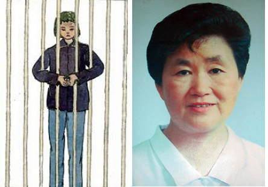

示意图：拇指铐酷刑   陈秀芬

【大纪元2017年02月17日讯】（大纪元记者叶枫综合报导）1999年9月，湖北省红安县红安二中教师杨才银到北京为法轮功请愿，被北京天安门公安分局警察用“拇指铐”将他整个身子吊离地面长达半小时之久，杨才银当时昏死了过去。

“拇指铐”是一种酷刑，比戒指稍大，专门用来铐双手大拇指，与手铐一样越动越紧。俗话说，十指连心。铐上一会，双手拇指就慢慢地变色、发紫……时间久了，人的整个身体极其难受。在中共对法轮功的迫害中，“拇指铐”等酷刑被大陆公安局、看守所、劳教所、监狱等场所大量地运用。

2000年冬天，进京上访的佳木斯张春杰女士被关押进北京西城看守所。张春杰自述曾被警察威胁上拇指铐酷刑。“警察给我们编了号，半夜突审时，我被强迫坐在老虎凳上，一个警察拿着拇指铐威胁我说：如果不说出地址姓名，就上大刑。”

江苏省昆山市年过6旬的法轮功学员陈秀芬，2000年6月因进京请愿，被昆山市610办公室人员管祖兴、公安局国保大队李冬林等警察使用“拇指铐”酷刑。

为了增加陈秀芬的痛苦，警察让陈秀芬双手环抱几根牢房铁栏杆，再把其双手的大拇指铐在一起。由于陈秀芬的身材较小，刚开始双手之间环抱的铁栏杆太多，警察们无法把她的双手拇指铐在一起，于是硬把陈秀芬整个身体紧紧地贴靠在铁栏杆上，双手之间少抱一根铁栏杆，才勉强地把她两个拇指铐在一起，将陈秀芬铐得痛不欲生。

黑龙江一位法轮功学员在向明慧网的投书中，也描述了自己1999年去天安门上访后在龙口驻京办事处（北京三环宾馆）遭受到这种酷刑时的感受。他说，“警察把我两只手的大拇指铐起来，使劲往上提，疼得我头上的汗都下来了，我咬著牙挺著。过好几个月，我的两个大拇指都木胀胀的，没有知觉。”

2003年，福建省法轮功学员江生被闽西监狱吊铐起来长达6天7夜，用手铐和拇指铐把双手铐在窗户的铁栅栏上，脚尖勉强着地，只有吃饭和上厕所才放下来。

后来江生的双脚肿得穿不上鞋子。警察邓迎春还在全中队大会上大叫：“再炼功，就整死你，然后找几个犯人‘证明’是炼功炼死的。”

大量证据表明， 有超过100种酷刑被中共用于迫害修炼“真、善、忍”的法轮功民众，包括电击、吊拷、冰冻、火烙、死人床、坐板、蹲小号等等。至少有4,075名法轮功学员被中共酷刑等手段迫害致死。

从1999年到2005年，曾被北京天安门公安分局用刑“拇指铐”的法轮功学员杨才银，先后被绑架至少5次，2次被送到火连畈劳改农场，期间遭受多种酷刑折磨。在巨大的精神和肉体创伤中，杨才银于2005年4月23日含冤离世，时年48岁。

<h1 align="center"><b>“两会”前后冤案知多少？</b></h1>

【大纪元2018年03月25日讯】中共“两会”组建“中央全面依法治国委员会”，撤并中央综治委、维稳领导小组和“610办公室”三大政法机构。在过去的20多年中，三大罪恶机构秉承江泽民集团的旨意，镇压民间异议人士、迫害良善，制造了大量的冤假错案，特别是与610共同实施了对法轮功的残酷镇压，甚至强摘器官。此次撤并三大机构可能意在全面推行依法治国，可是中共的政法委、六一零、公检法司却是如何做的呢？

“两会”前后冤案仍然接连不断的发生，一个个支离破碎、家破人亡的悲剧在上演着。中共“两会”刚刚结束，从明慧网传来消息，二零一八年三月二十六日上午十二点，法轮功学员邵生瑞（四十七岁，是乌鲁木齐市铁路局奎屯车务段职工）、樊映霞（四十四岁）夫妇的案件将在乌鲁木齐市中级法院开庭。

二零一八年一月十一日，新疆乌鲁木齐市头屯河区法院对邵生瑞、樊映霞夫妇分别冤判三年有期徒刑后，两人均上诉到乌鲁木齐市中级法院。

一年多来，两个孩子全靠樊映霞母亲照顾。樊映霞的母亲体弱多病，一直在内地生活，为了照顾两个外孙，专程从内地到新疆，她人生地不熟，艰难地维持着两个外孙的生活。

在判决书尚未送达之前，樊英霞母亲就中风了，其母亲住院治疗期间，樊映霞幼小的女儿暂时寄养在亲戚家，而脑瘫儿因行动不便，一人在家中，生活无法自理。

然而，在所谓“刑事侦查”阶段，乌鲁木齐市国保大队警察程学礼等诱骗邵生瑞、樊映霞四岁的女儿录口供，随后又威逼脑瘫的残疾儿子，说：“你姥姥、妹妹都说了你爸你妈的事情，你赶快说吧！”在头屯河区检察院的起诉书中，警察把诱骗邵生瑞、樊映霞四岁的女儿和脑瘫的残疾儿子的陈述都作为所谓“证言”，并将他们作为所谓的“证人”。

二零一七年六月十三日，法院通知律师六月二十二日（周四）上午十二点开庭。在庭审中由于公诉人用邵生瑞、樊映霞夫妻十六岁脑瘫儿子的口供指控自己的父母邵生瑞、樊映霞，律师当庭指出邵生瑞、樊映霞的儿子是无行为能力者，其口供不能作为证据使用，另外，公诉人举证的八百七十张所谓的法轮功宣传品是否能单独成册、能否认定为宣传品应做鉴定。于是，法庭采纳律师的意见，暂时休庭。

五个多月后，二零一七年十二月二十六日上午第二次开庭，在法庭上法官几乎不让邵生瑞、樊映霞讲话，一说就打断，律师发表意见也不断被阻挡，尽管如此，两个律师均作了无罪辩护。

邵生瑞与樊映霞的女儿四岁，身体十分虚弱，一个月要感冒一两次，离不开大人照顾。儿子十六岁，初中毕业，出生时因脑瘫造成严重残疾，生活基本不能自理，行走都非常困难，上下楼需要大人背，上学必须由家长接送。

据明慧网近日消息：湖南省郴州市法轮功学员廖志军原是衡阳车辆段郴州列检所职工，曾陷冤狱九年半。在湖南网岭监狱，廖志军遭受了各种酷刑：关禁闭、电棍电击、戴上脚镣、手铐罚站、禁止洗漱、不让睡觉、扒光衣服毒打、曝晒、穿束身衣等。

二零一六年十一月十八日，廖志军终于结束第二次冤狱回家，与久别的亲人团聚，可是仅半年的时间廖志军又遭绑架、构陷。

湖南常德市桃源县四位法轮功学员刘冬仙、方杏枝二零一八年三月十三日被非法判刑九年，刘丽辉被非法判七年并处罚金三万元，曾明清被非法判五年半并处罚金二万五千元。四名法轮功学员二零一六年十二月份被绑架、构陷，二零一七年十一月二日被非法庭审。

辽宁省鞍山市六十岁的法轮功学员高峻遭受三次非法庭审，于二零一八年一月二十一日被非法判九年、勒索罚金五万元；三十六岁的法轮功学员张永宝被非法判六年、勒索罚金三万元。

辽宁法轮功学员张树德，四年前应聘到大连理工设计院，外派到盘锦市高新技术产业开发区工作，二零一七年六月因居住证到期，到所在地的兴隆台区兴盛派出所办理顺延手续后被入室绑架。二零一八年中国传统新年前，被盘锦市法院非法判刑七年，并勒索罚款两万元。父老乡亲们听到后，以签名按红手印的方式营救这个在哈尔滨市双城区的农村走出来的唯一一位研究生。

北京市密云区善良老太太文木兰，修炼法轮功，按照真、善、忍做好人，两次被劳教、非法判刑五年，于二零一七年十月十四日再次被绑架、非法关押在看守所致生命垂危，于二零一八年二月二十七日含冤离世。

一个个违宪违法的枉法冤判，一个个无辜被迫害得支离破碎、家破人亡的家庭，在当局高调要“依法治国”的口号下接连不断的上演着。这是谁之过？如果没有以毁灭人类为终极目的的中共邪灵，没有在共产邪灵操控下的各级邪党组织及公检法司、政法委、六一零等机关的酷吏、打手，能形成这场如此惨绝人寰的迫害吗？

中共两会后的第一天，当局发布了有关中共《党和国家机构改革方案》，4个中央领导小组改革后分别命名：“中央全面深化改革委员会、中央网络安全和信息化委员会、中央财经委员会、中央外事工作委员会”。此外，还组建中央全面依法治国委员会等。被撤并的中央综治委、维稳领导小组和“610办公室”三大政法机构，被中国民间认为是制造冤假错案的三大血腥罪恶机构。这些机构在迫害法轮功中已经血债累累，被撤并之后是否会停止或减少做恶？人们将拭目以待。

中国问题专家横河指出，综治委、综治办和维稳办“不再设立”，但中央防范领导小组和“610办公室”并未撤销。也就是“领导小组”并到中央政法委，“610办公室”并到公安部。

他说，从另一个角度看，三大政法机构本来就是设置在中央政法委里面，所以从性质上来看，还没有能够看出它有很大的变化来，只是在组织结构上有所变化。

横河强调，只要中共体制存在，对法轮功的迫害，仍会以各种形式继续下去，所以不能指望中共会变，但是，我觉得对个人是可以选择的。

他说，对于曾经参与迫害并且仍在继续参与迫害的那些人来说，需要知道的是，作恶是要受到惩罚的，无论是人间的法律还是神的惩罚，迟早是要兑现的。一旦中共解体、迫害停止就没有悔过的机会了。

贵州藏字石在两亿多年前就预示了“中国共产党亡”，中共的解体灭亡是天定的，谁也阻挡不住。三亿退党大潮向人们预示著中共解体灭亡已经指日可待，迫害只是中共垂死挣扎的表现罢了。奉劝中共体制内那些仍就参与迫害的人，赶快清醒，停止作恶，悔过自新，为自己留一条后路。莫作中共的陪葬品，毁了自己的永远！

<h1 align="center"><b>活摘人民器官牟利 学者：中共把中国变监狱</b></h1>
<b>多名中共卸任高官证实中共活摘器官的存在 甚至指出是江泽民下令推动 法轮功学员是最有可能的器官来源</b>

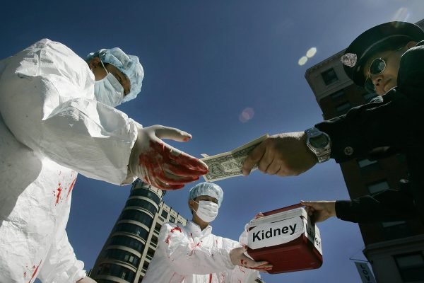

中共官方宣称中国每年约有1万例器官移植手术，但据调查，真正数量其实是5~10万例。 

 
 【大纪元2017年11月14日讯】（大纪元记者郭曜荣台湾台北报导）中共活摘法轮功学员器官的暴行，在庞大利润的刺激下，已不仅是良心犯受害，据国际组织调查，暴行可能已向一般民众扩散，今年9月在湖北武汉发生32名大学生神秘失踪案，即被中国网民质疑是与活摘器官有关。学者呼吁，民众应对中国大陆所发生的迫害有所觉醒，且应结合全世界的力量，终止中共的暴行。

台大应力所国际会议厅日前举办《活摘十年调查》纪录片台北首映会，数百位民众出席观影，影片中公开多则“追查迫害法轮功国际组织”对中国大陆内部的调查录音，包括刚卸任的中共政治局常委张德江、前国防部长梁光烈与共军前总后勤部卫生部长白书忠对活摘器官事件的证实，甚至坦言是中共前党魁江泽民下令推动。

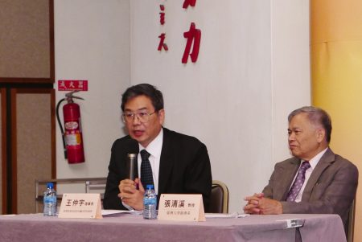

台湾营救受迫害法轮功学员协会理事长王仲宇（左）指出，人权问题不解决，“中国永远是个大监狱”，右为台大经济系教授张清溪。

 
 首映会邀请的与谈人之一、台大经济系教授张清溪表示，活摘器官事件在2002年被曝光之后，法轮功学员曾在台湾做过调查，采访患者、医生与中介者，内容较完整的约20余例，谈及包团到中国大陆做器官移植的细节，以及对岸还有别的医院拉生意等等，当时从器官来源观察，除了少数来自捐赠与买卖，其余的则来自死刑犯与法轮功学员，后来又知道死刑犯还是占少数，因军队并不执行死刑，但从监狱辖下的医院或军医院反而容易取得器官。

“当时有对岸的老军医出来爆料，因军队较封闭，比较能保守住机密，所以很多法轮功学员被关押在军队里，而这些地方就有十几个活摘器官的器官库”，张清溪提到，这名老军医之所以愿意冒险发声，是因为对六四天安门事件有愧疚，认为军队背了黑锅，不希望在活摘法轮功学员器官事件中，再重蹈覆辙，因此挺身揭露。“把这些证据累积起来，就会发现法轮功学员是最有可能的器官来源。”张清溪说。

另一位与谈人、台湾营救受迫害法轮功学员协会理事长王仲宇指出，该协会成立的宗旨，第一是要唤起外界对中国这场迫害的觉醒；第二是透过各种手段，营救在中国大陆被迫害的法轮功学员，包括他们的遗孤；第三则是结合全世界的力量，盼终止暴行。

中共官方宣称中国做器官移植的医院仅169家，每年约有1万例手术，但根据加拿大人权律师大卫‧麦塔斯（David Matas）和加拿大前亚太国务卿大卫‧乔高（David Kilgour）的调查，发现中国大陆每年器官移植的真正数量是5万~10万例。

以中国大陆每百万人仅0.6人愿意器捐的比例来看，“大家可以了解一下，器官移植的真正来源是什么”，王仲宇表示，台湾每年等待器官移植者有8千人，但真正移植的人数是120位左右，所以器官是远远不够，在对岸有这种迫害的行为之下，很可能台湾有很多人会到中国大陆去做器官移植，这将促成中共因为市场需求，去迫害中国人民的情况，所以台湾立法院在2015年通过《人体器官移植条例》修正案，中介者将面临法律制裁，台湾负责的医疗人员也会被取消资格，而根据台湾器官移植协会调查，许多到境外移植器官的患者，回台后存活率还是相当低。

王仲宇强调，中共篡政以来，从三反五反、大跃进、文化大革命、六四天安门事件、迫害法轮功等，杀害了自己的同胞8千万人，整个社会道德沦落到相当低的地步，若今天这个人权问题不被解决，“中国永远是个大监狱”，尽管中国大陆现在经济发达，但仍无法赢得世界人民的尊敬，中共是个国家级的犯罪集团，希望大家了解器官移植与法轮功被迫害的真相，能唤起善良的力量，一起来制止这场迫害。

<h1 align="center"><b>三亿三退预示着中共末日将要来临</b></h1>

【明慧网二零一八年三月二十三日】截至二零一八年三月十九日退党（团，队）总人数：299，727，630，再过几日将突破三亿。这个数据预示着中共末日的来临。一个共产邪灵控制的中国将要结束，中华民族的新纪元即将到来！
二零零四年十一月十九日，大纪元发表系列社论《九评共产党》，开启了中国人退出中共党、团、队组织的“三退”大潮。十三年多的时间，在大纪元退党网站声明“三退”的总人数已达三亿。许多没有加入过中共组织的民众，他们都明白了真相，认清了中共的邪恶本质和流氓本性，认同“真善忍”普世价值，选择善良，抛弃中共，拥有了光明的未来！

在《九评共产党》发表不足一个月的二零零四年十二月十二日，前奥运游泳名将黄晓敏在大纪元退党网站上发表退党声明。她说：“最近看到大纪元的《九评共产党》社论，让我认识到了共产党的真实面目，我深感自己曾经是共产党的一员感到耻辱。”

记得在《九评》发表初期的二零零五年，专门负责培养中共高层党徒的最高学府——中共中央党校出现了二十五人集体声明退党的事件。他们在声明中写道：

“我们是来自中共中央党校各个不同部门的官员，我们中有“老革命”、“老干部”、“老党员”，有中青年在职官员，有正副部级、局级、处级官员，有一般科员和普通官员，也有博士、硕士研究生。我们大家同意借《大纪元时报》退党专栏，刊登我们的退出共产邪灵的声明。因为工作、生活、家庭、父母、子女等种种原因，我们不能写出真实姓名，所以以下众多的退党人员的姓名全是笔名、化名。其实据我们所知，中共中央党校两千多职工中，百分之九十的党员如果条件允许都会退党。”

这次事件向人们揭示了一个真相，无论从中共的基层到高层，其党徒们真正信仰中共的已经寥寥无几。如果哪一天有人宣布：有退出中共邪恶组织选择其它某个组织的自由的时候，我想百分之九十五以上的人都会选择退出中共。

以访问学者身份被中共派到美国从事宗教心理学研究，为中共迫害民间宗教团体提供心理学依据的孙延军先生，于二零零九年二月十四日，在大纪元网站以真名公开退党，并声明辞去一切官方职务。他在声明中说：“专制不除，灾难不已；中共不灭，天理难容！”二零一零年他在集会上又说到：“对法轮功的疯狂迫害，是人类历史上最黑暗、最邪恶、最丑恶的一幕。是当代人类的最大耻辱。善恶有报，中共专制暴政在迫害法轮功的滔天罪孽中也耗尽了能量，面临着崩溃覆灭的结局。而法轮大法的庄严、慈悲、圣洁、美好，有乾坤作证，为人神共见。他将引导人类走向复兴之路，永世流传。”

明慧网曾经有一篇《一百零八名警察三退名单的来历》的文章，据说是一位明白真相的政法部门官员递来的这份名单。

官方数据显示，截至二零一七年六月底，中共中纪委共立案审查省军级以上及其他中管官员四百四十人，其中中共十八届中央委员、候补委员四十三人，中共中央纪委委员九人；厅局级官员八千九百余人，县处级官员六点六万人，乡科级及以下党员人数则达到一百三十四点三万人。这些数据告诉人们一个信息：中共已经腐败透顶，如同身患晚期癌症，已经病入膏肓，无可救药。

二零一七年“四·二五”前夕，全球退出中共服务中心负责人易蓉强调，中共罪大恶极，任何妄图挽救中共的幻想只能给中华民族带来更深重的灾难，而唯有解体中共才是中华民族复兴之路，退党大潮提供了这样一个万古机缘，呼吁还在观望的中共各级官员和广大民众，抓住机遇尽快退出中共，做出正确选择。易蓉表示，在严密的媒体审查和网络封锁的层层堵截下，退党大潮的讯息依然在中国如星星之火般急速传播。这场影响深远的精神觉醒运动，将帮助中国人摆脱心灵上的恐惧，引领国人道德与传统的回归，并最终带来中共的和平解体。

香港法轮功学员二零一八年三月十八日举行盛大集会游行，呼吁解体中共，结束迫害。前中共总参谋长罗瑞卿次子、红二代罗宇表示支持退党运动。他表示，现今的中共已经彻底腐败，特别是“六四”开枪之后，“中国共产党成了一个没有信仰、没有理念、没有道德的贪腐集团。到了今天，什么坏事都干。”当中尤以迫害法轮功、活体摘取器官移植牟取暴利等罪行最为残暴，“江泽民迫害真、善、忍，活摘器官，是反人类罪。”他赞成所有有良知的人都退党、退团、退队。

大纪元发表系列社论《九评共产党》【公告】中说：“大纪元将于今天开始发表特别系列社论《九评共产党》，给为祸人间一个多世纪的国际共产主义运动，特别是中国共产党盖棺论定。”“中国共产党的统治是中国历史上最黑暗，也是最荒谬的一页，又以江泽民发动的对‘真善忍’的镇压最为邪恶。这场运动给中共的棺材钉上了最后一颗钉子。”

在《九评共产党》发表十三周年之际，《九评》编辑部发表新书《共产主义的终极目的》。向世人系统分析和揭示“共产邪灵”通过破坏文化、败坏道德而毁灭人类的天大阴谋。

“中共邪灵的终极目的是通过毁灭文化、道德来阻断人得到创世主的救度，自然将法轮功视为第一大敌。”

“共产邪灵集古今中外邪恶迫害手段之大成，更超出这一切手段之外，直至活摘法轮功学员器官，用人类星球上从未有过的最邪恶手段迫害、虐杀法轮功学员。江泽民下令的‘名誉上搞臭，经济上截断，肉体上消灭’正是中共积累几十年的邪恶的总爆发。”

一贯遵循“真善忍”修炼的法轮功学员们开始了自迫害十九年来的和平理性反迫害历程，传九评，劝三退，解体中共，回归中华传统文明，正是这场精神觉醒运动的核心内容之一，实践证明精神觉醒运动已经为中华民族带来了翻天覆地的巨大变化。

目前，共产主义因素在世界渗透的现实已经引起国际社会广泛知觉，亚洲、美洲、澳洲、欧洲等地许多国家开始关注并排斥共产主义因素，阻止共产主义因素在本国渗透蔓延，不久的将来全球围剿共产邪灵的局面必将形成，解体灭亡中共的日子指日可待。

三亿三退人数标志着这场精神觉醒运动取得了巨大成效，三退大潮预示着中共末日将要来临，中华民族新的纪元就要到来了！解体中共邪灵，维护世界和平是全人类共同的责任。愿所有关注中华民族未来的中国人，所有关注世界人权与和平的各国各民族人士，能够参与到这场精神觉醒运动中来或为此能够尽一把力，迎接一个没有共产邪灵的新人类的到来！

<h1 align="center"><b>澳洲人：我们的共同努力会使真相曝光</b></h1>

【明慧网二零一八年三月二十三日】（明慧记者华清澳洲悉尼采访报道）“我相信我们的共同努力会使一切真相大曝光。”澳洲人桑迪·布鲁斯（Sandy Bruce）坚定的说道。这是发生在悉尼中央火车站对面的贝尔莫公园（Belmore Park）的主通道边，从西澳来悉尼旅游的桑迪看到法轮功学员后就径直走过来签名支持反迫害，她首先赞美道：“我看到法轮功学员打坐时感觉他们很祥和、真美好！”她还表示：“我是在五年前开始知道法轮功的，我从此开始了解他们在中国被中共迫害和活摘器官的残酷行径。我经常看到他们在街上为行人讲真相，我在巴黎时也看到他们。我知道我们应该在全世界范围内以不懈的努力去传播这个真相和制止迫害，我知道现在中共在全世界的渗透很厉害，但是我相信我们的共同努力会使一切真相大曝光。”
她最后鼓励法轮功学员说：“我坚信你们能走过这场魔难并战胜邪恶。”离开前，她拿了许多真相资料及揭露活摘器官的真相电影请柬带给朋友们去看。

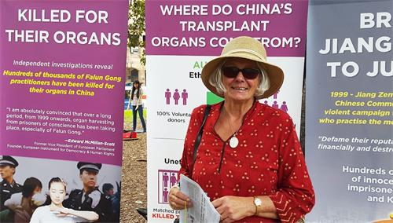

图1：桑迪·布鲁斯（Sandy Bruce）表示：“我坚信你们能走过这场魔难并战胜邪恶。”

从二零一八年二月二十三日至三月十六日的四个周五下午，来自世界各地的游客和当地民众都能看到法轮功学员在贝尔莫公园的主通道边展示法轮功的五套功法、揭露中共持续迫害法轮功十八年的残酷事实。越来越多的人们在了解真相后表示支持法轮功学员反迫害，并将互相传播真相，帮助制止迫害。

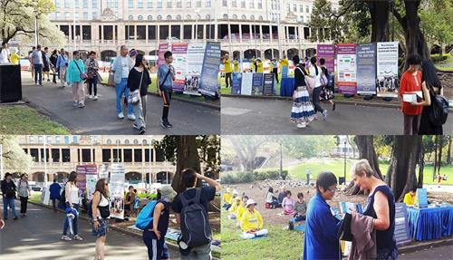

图2：法轮功学员在市中心贝尔莫公园（Belmore Park）的主街上展示法轮功的五套功法和真相展板

<b>澳洲人：我是从心里发出的善念想帮助法轮功</b>

澳洲人本·格林（Ben Green）和朋友走过来对法轮功学员说：“人自己的器官应该自己主宰，不能让任何人用权利去活摘别人的器官并贩卖，这是无人性和邪恶又可恶的行径，应该被立即制止。”本·格林手指着正在炼功的法轮功学员说：“他们需要帮助，也值得人们都来帮助他们。他们需要全世界的人都来帮助他们。我刚刚签了名支持他们反活摘，我是从心里发出的善念想帮助他们，并希望能真正帮到他们。我现在正要去见朋友，我马上会把这个消息告诉他们，希望他们和我一样支持他们。”

临走前本·格林的朋友在一旁也说：“我和本的想法是一致的，我也想真心帮助他们，希望他们好运！”

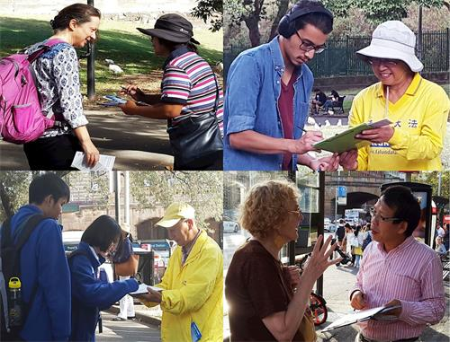

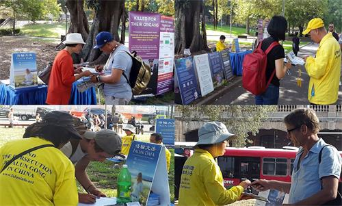

图3～4：民众纷纷签名支持法轮功反迫害

<b>制止中共迫害法轮功　“很荣幸能做这件有意义的事”</b>

爱科亚（Iqia）女士告诉法轮功学员：“我已经签了名支持法轮功反迫害，在过去的几年里，每次我看到法轮功都会签名支持他们。因为我是在红十字会器官移植服务部工作的，所以我一直在关注这件事，我也知道有澳洲人去中国换器官。在澳洲通常换一个肾需要等待十年以上，器官来源都是自愿捐献者在正常死亡后才能赠送他们的器官给需要者。澳洲的器官移植服务是在良性运作之中。”

爱科亚女士还表示：“当我得知中国政府活摘法轮功学员器官贩卖时，而且在几周时间就可以得到一个器官供体，我感到非常沮丧和困惑，不知如何是好，因为我知道这对被活摘器官者和接受器官移植者都是不安全的。而且这是绝对不应该发生的事，为了救活一个人而杀死另一人的做法是非人性和不和法的，人类不应该这么做。我相信只有更多人来支持法轮功反对活摘器官，才能更快制止在中国还在发生的迫害行径。”

在澳洲音乐学院读书的杰西卡（Jessica Curran）接过法轮功学员递给的真相报纸，坐在法轮功展位对面的草地上认真的阅读着，杰西卡看完报纸对法轮功学员说：“我看到中共迫害法轮功学员并活摘他们器官处死，我感觉这是非常可恶的行径。”

 

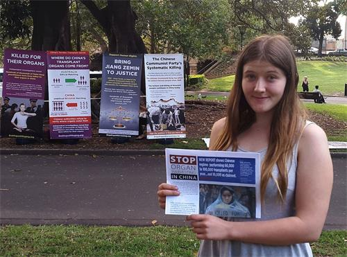

图5：杰西卡（Jessica Curran）表示：我相信如把我这样的一点点支持加起来，就能帮助他们制止迫害。

杰西卡手指着正在炼功的法轮功学员说：“一个这么祥和、美好的修炼团体被中共如此迫害并活摘器官真是骇人听闻、非常可恶的。我相信上帝给每个人活着的权利，我实在无法理解中共这么残暴杀人并贩卖活人的器官卖钱，这实在是太无人性了。我相信如把我这样的一点点支持加起来，就能帮助他们制止迫害。所以，今天我很荣幸能做这件有意义的事，回去后我会传播给我的朋友们一起支持法轮功反迫害。”

<b>华人明真相　做“三退”保平安</b>

 
 

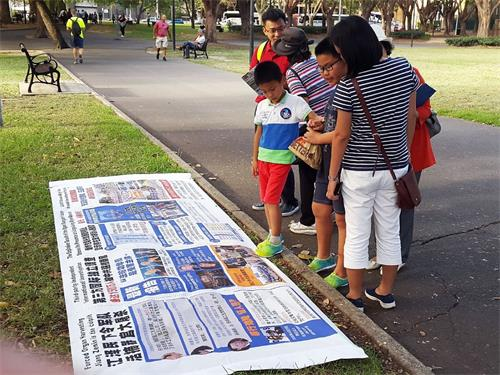

图6：从中国来旅游的一家人一起看真相展板并一起退出中共组织

从中国来旅游的一家人，在法轮功真相展板前驻足，连同他们两个小孩子都在一块看着，并评论起来。两位法轮功学员走上前去跟他们讲真相：“你们现在看到的这些，共产党所做的那么多坏事都是事实，中共将来遭到报应被天灭的时候，你之前举手发誓要为其党奋斗终身的誓言，就要跟中共一起走。如果现在你废掉这个誓言，你就能保平安。你们一家人很福气，都看到了真相，一起退出中共组织吧！”

听后，这一家人认同法轮功学员说的，全家人一起用化名都做了“三退”，并非常高兴地感谢法轮功学员，拿着真相资料走了。

还有一位二十五岁左右的华人男青年，他走过法轮功学员时没有接真相资料，然而当他走到法轮功学员展示功法前却驻足观看起来，不一会儿他又返回法轮功学员那里去了解真相。

法轮功学员问他：“你知道法轮功吗？”他回答说我只知道一点点。于是两位法轮功学员分别为他讲了法轮功的基本真相，他接受真相后又帮他用“顺天意”化名退出了中共团、队。

他表示很钦佩法轮功学员坚持不懈讲真相和反迫害的精神，在了解到对法轮功是中华五千年传统文化的精髓时，他问：“通常每天要炼多长时间？”学员又向他介绍了法轮功。当他得知修炼人通常每天用两小时炼法轮功的五套基本功法，但在有时间时可以多炼、没时间时便可以少炼，而法轮功修炼人二十四小时都会被功炼着。当他得知法轮功是这么好的性命双修功法时，他有兴趣的说：“这么好啊！我也要炼。”

最后他感谢法轮功学员，双手拿着法轮功单张和《共产主义的终极目的》杂志表示：“我带回家去好好看。”

<h1 align="center"><b>死于非命的军医与马航客机失踪</b></h1>

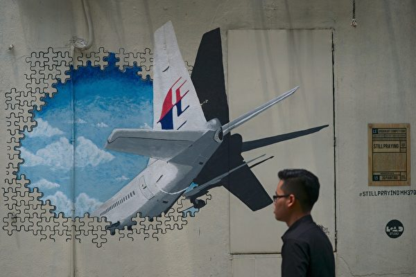

去年9月6日，郭文贵于视频中称，马航MH370失踪事件，为一宗政治暗杀事件。(MOHD RASFAN/AFP/Getty Images)

 
 【大纪元2018年03月22日讯】近日推特上传出消息，西安空军军医大学（第四军医大学）唐都医院原副院长李谨革近日从他家30层跳楼自杀。消息称，死者家人正在为其办丧事，并贴出一张门口摆满花圈的照片，照片上距离镜头最近的一个花圈上有疑似李谨革妹妹“妹李谨X妹夫…”的字样。

网上资料显示，李谨革曾担任唐都医院副院长，副主任医师，陕西省医学会副秘书长。曾获中共军队科技进步二等奖1项，国家自然科学基金3项。医疗专长：病毒性肝炎、肝炎肝硬化。

李谨革所在第四军医大在“追查迫害法轮功国际组织”的涉嫌活摘法轮功学员器官的军区医院和军医名单中。

李谨革本人是否参与、配合活摘法轮功学员器官，目前并没有确实的证据，按照中共密令，与“活摘”有染的医生，尤其是著名的主刀医生，他们的患病、死亡、失踪都是机密，不得泄露。

李谨革是否跳楼身亡，官方部并未证实。

虽然中共极力封锁资讯，军医特别是器官移植专家死于非命的新闻偶尔也会见于媒体。

2007年5月4日下午，44岁的著名肾脏病学专家李保春从中国第二军医大学附属长海医院大楼的12层跳楼自杀。李保春是长海医院肾内科副主任、教授、主任医师，中国透析移植协会委员、中国中西医结合学会肾脏病协会委员，“生前曾获无数荣誉”。

该报导曾在当月24日被新华网等各大网站转载，但随即迅速删除。新华社不寻常的掩盖举动，引起外界关注。新华社在掩盖什么？看长海医院泌尿外科的网页上肾脏移植介绍“1.供肾品质好，术后肾功能恢复快；2.供肾来源充足，等待移植时间短。”，便一目了然，长海医院在做大量器官移植手术。

三年后，2010年3月16日，84岁的中国肾移植鼻祖黎磊石从南京自家14层高楼跳下身亡。黎磊石是南京军区总医院副院长、中国工程院院士、国际著名肾脏病专家。黎的肾移植中心仅在2004年就做了1,000例以上的肾移植手术，平均每天3台手术以上。他主持编写了《中国肾移植手册》，教出了许多中国大陆器官移植医生。

黎磊石的肾脏病研究所从过去每年肾移植十几例，发展到2004年突破千例。黎称其研究所做的肾移植的长期疗效，已超过美国军队器官移植专家。众所周知，器官移植疗效的好坏，主要取决于器官供体的品质。黎的肾移植，从数量到品质都是在99年后“飞跃”的，而这一“奇迹”，恰恰都和中共活摘法轮功学员器官的特征相吻合。江泽民接见过黎磊石。黎也是江倚重的军队器官移植专家，承担活摘器官中的技术攻关任务。

2014年3月24日，上海肿瘤医院泌尿外科副主任张世林从8层楼自己办公室窗户跳下，摔死在下方的医院大氧气罐处。

出事后，医院用微博发了一条消息称，该院张姓职工因抑郁症从住院部跳下，抢救无效死亡。对张世林的死讯如此刻意低调，同时渲染“闹医”故事，转移视线，致使2014年发生的这起案件未被外界关注，原因是很多人不知道。

1986年张世林以高出复旦大学录取分数线20多分的成绩从农村考入第二军医大学。毕业时他总分位居全系第二，按成绩可留校留城，但他选择了支边。3年后他从新疆考研回到母校，硕、博连读，成绩优异，毕业后留在第二军医大学附属长海医院工作。

张世林2005年转业到了上海肿瘤医院泌尿外科，照样卖力工作，每天朝五晚九，有时一周要做17台手术。一名医院的人告诉记者，不知为何，两年前开始，张世林就不参与做手术了，平时主要看看门诊。同事说，张世林一进手术室就心慌，无法集中精力手术。同学说，一个平时喜欢说笑，爱请朋友聚会，抢著买单的人，不但变得少言寡语，独往独来，而且对他从事的工作由热爱变得厌烦。

师龙生，毕业于西安军医大学，就职于新疆乌鲁木齐空军总院，任泌尿外科、普通科主任，肾移植的主刀医生，也曾是新疆器官移植学会常委。

2007年2月3日晚，师龙生被人打电话叫出去后，就没再回来。据目击者说：当时，师龙生被一女司机撞倒在地后，又再被后面一辆车二次碾过去，整个人被碾成肉饼，血流满地，血肉模糊，场景惨不忍睹。

师龙生曾讲过，摘取器官这项“保密”手术归医院，在新疆就有三家，即：乌鲁木齐空军医院，乌鲁木齐市医院，乌鲁木齐省级医院。他所在的空军医院，一年大约做一百多例。

究其死因，有知情人说，从整个车祸分析看，像是杀人灭口。很可能是他对器官移植内幕知道得太多了，说得太多了。

中国富商郭文贵对马航MH370号航班失踪事件的爆料更是耸人听闻。

去年9月6日，郭文贵于视频中称，马航MH370失踪事件，为一宗政治暗杀事件，该班机上有中国公安人员及替江泽民之子江绵恒换肾的关系人，但这些人的身份原是中国官方人员，可是在死后，却被当成为平民身份。

郭文贵称，帮江绵恒和中央政法委书记孟建柱家人换肾脏者，即是南京军区总医院副院长、中国工程院院士、国际著名肾脏病专家的黎磊石。2010年3月16日，黎磊石从自家跳楼死亡。

郭文贵进一步披露，参与江绵恒和孟建柱家人换肾手术的医生之家属与知情者，有跑到马来西亚的，经中国警方办案人员前去劝回，却发生回程班机失踪事件，中共政法委孟建柱制造杀人灭口案，主要是为了避免江绵恒等人的活摘器官换肾真相被泄露出来，此即马航事件的真相。

在马航刚失踪之时，中国驻马来西亚大使黄惠康于新闻发布会上曾经说过，“马航失踪涉及刑事案件，大家要有耐心，很多事情超出了想像与控制力。”

诸多证据表明，活摘器官是江泽民的亲自批示。

中共强制摘取法轮功学员器官，在2006年首次由证人出面披露。10年来，越来越多的证据逐渐曝光，国际社会也严肃审视，并呼吁中共立即停止这项反人类罪行。

从2012年至今，台湾立法院、欧洲议会、澳洲参议院、意大利参议院人权委员会、爱尔兰议会外事贸易委员会、美国国会外交委员会、加拿大国会人权委员会，陆续通过决议，谴责中共强摘法轮功等良心犯器官。

活摘议题，突破禁区，已获得国际社会高度关注。

据《追查国际》（追查迫害法轮功国际组织）不完全统计，1999年以后，至少有865家医疗机构、9,500名医护人员涉嫌活摘法轮功学员器官。

活摘器官，是直接针对人类道德底线毁灭性的破坏，是这个星球从未有过的罪恶，害人终害己；放下屠刀，停止迫害，保存证据，揭露罪恶，将功赎罪，才能抓住天理对生命最后的慈悲。

<h1 align="center"><b>76岁三退义工劝中华儿女“三退保平安”</b></h1>

2013年7月13日，洛杉矶部分法轮功学员在圣盖博山谷大道（Valley Blvd.）筑起“真相长城”吸引过往车辆注意力。

 
 【大纪元2018年03月20日讯】（大纪元记者姜琳达洛杉矶报导）《大纪元时报》2004年发表的系列社论《九评共产党》，彻底揭示了中共的残暴邪恶本质，引发全球三退（退党、退团、退队）大潮。时至今日，退出中共组织的人数即将突破三亿大关。洛杉矶退党义工李女士表示：“爱中国并不等于爱中共，而这数字正代表着中华儿女摆脱西来共产邪灵的决心。”

今年76岁的李女士曾是北京一名退休的资深高中物理教师，经历了中共历次整人运动的她感叹道：“中华民族5000年来敬天敬地的根，都被中共砍断了。”她说：“从文化大革命，到1989年天安门屠杀大学生，再到迫害法轮功，中共犯下了滔天罪行。”

于是，在过去5年半的时间里，她风雨无阻向中国人讲真相。她认为：“神要清算共产党时，也一定不会放过那些被邪恶打上兽印的邪恶党徒。”

在这过程中，李女士感觉越来越多被毒害的人在觉醒。她说：“每当中国人退出了中共的一切组织，都发自内心的高兴。他们甚至想会为义工们递上一瓶水、一片面包，表达激动的心情。”

她也发现，中国的老一辈人就更容易认同事实，会坚决退出中共。他们说：“共产主义是西来幽灵，我们不要做殉葬品！”

<b>亲身遭受中共残酷迫害</b>

李女士介绍她曾在北京教物理几十年，因压力大导致身体状况一度陷入低谷。1995年，就在她对人生感到失去意义的时刻，遇到了“法轮功”。

她说：“我们从小被强行灌输无神论，斗争哲学，使得人心失去了道德约束。而当我看完了《转法轮》后，整个世界观都发生了变化，半年时间身体就恢复健康。”

然而1999年，江泽民集团开始了对法轮功的疯狂非法镇压。很多健康的法轮功学员被中共的毒打、电刑、摧残性灌食、枪击、注射摧毁神经药物等等酷刑，折磨得致残、致疯、致死。他们甚至被活体摘除器官。

就因为坚持“真、善、忍”，李女士遭到过中共3年大刑、2年半劳教的残酷迫害，被折磨得皮包骨头，生命垂危。

李女士说，“中共制造的天安门自焚伪案，也完全是一个大诬陷。我亲身经历了法轮功的美好，所以决定用自身的经历，讲清真相。”

<b>别忽视了“发毒誓 ”</b>

现在有很多人认为不交党费、过年龄了，就不是中共的一分子了。然而李女士表示，三尺头上有神灵。中共在骗中国人加入其队、团、党组织时，逼人举手宣毒誓，要把生命献给中共，而这毒誓是要还的。

在过去，发誓是一件极慎重的事情。因为古人相信誓词一出，天地鬼神共鉴，如果食言，恐致灾报。李女士说：“发毒誓就被打上烙印的人，就是这个组织的人。现在（三退）在退出什么呢？就是要对天发誓，抹去共产党邪灵兽印。”

<b>坚持不懈只为真相</b>

谈到当初为什么决定开始做三退义工时，李女士说，“善恶有报是天理，中共的无神论妄想与天地斗，用谎言欺骗、金钱利诱、残酷的威胁，使中国人失去了自我。但是每个人都应拥有在善与恶、正与邪面前做出正确选择的权利。” “我就用我有限的条件，到机场、超市、公交车，只要遇到中国人都讲：要远离中共。我爱中华文化，但不爱把整个中华民族都毁了的中共。”

在过去的14年中，通过全球各地三退义工们的坚持讲真相，很多中华儿女都开始觉醒。她举例说：“两个月前，我遇到的一位父亲被中共打成大右派，全家都遭到整顿的70多岁北京妇女。她在不会英语、没有手机的情况下，独身一人飞到美国旅行。我当时惊讶她为何如此大胆？她说在出国前，就有人就告诉她，全世界各大机场都有法轮功学员在讲真相，他们善良，热心，会帮助你的。”

李女士当时觉得，自己多年的坚持是非常有意义的。她希望中国人能够有机会翻墙，看看海外真实的消息。“不要拒绝这些真相。顺天意远离中共，才能在灾难出现时保平安。”

<h1 align="center"><b>香港盛大集会游行 庆祝近三亿人退出中共</b></h1>

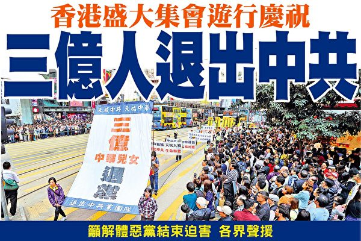

预料本月下旬，三退人数将达三亿人，标志着这场中国人摆脱共产邪灵的精神觉醒运动进入了一个新的里程碑。香港法轮功学员昨日预先举行盛大集会游行，呼吁解体中共，结束迫害。（大纪元合成图）

【大纪元2018年03月19日讯】（大纪元记者林怡香港报导）近14年来，退出中共组织的人数预料本月下旬将达三亿人，这场标志着中国人摆脱共产邪灵的精神觉醒运动进入了一个新的里程碑。香港法轮功学员昨日（18日）举行盛大的集会游行，呼吁解体中共，结束迫害。多名各界知名人士到场声援，祝贺三亿中华儿女良知觉醒，认清中共的邪恶本质，并支持更多人退出中共，让中华民族结束苦难，走向光明。

《大纪元时报》2004年11月发表系列社论《九评共产党》，系统地揭示了中共残暴、欺诈与邪恶的本质，对全球华人产生震撼效应，从而引发一场退出中共组织党、团、队（三退）大潮，至今已近14年。

“庆祝三亿中华儿女退出中共大集会”昨日上午10时在中环爱丁堡广场举行。全球退出中共服务中心主席易蓉透过网络发言，对香港退党义工长期帮助中国大陆民众退出中共的努力表示崇高敬意。她指，自2004年12月退党大潮开始到2011年8月，三退人数突破一亿，大约花了7年时间。2015年4月三退人数突破2亿，大约花了4年。再用了3年时间，现在即将突破3亿人：“退党大潮开启了中国历史上最伟大的精神觉醒运动，为未来中国社会开创了崭新的局面，为中华民族带来了光明与重生的曙光。中共正在走向全面解体与消亡。”

<b>全民追究 审判中共罪恶</b>

追查迫害法轮功国际组织发言人汪志远说，中共建政后残害致死的中国人达八千多万，当中以中共前党魁江泽民为首对法轮功修炼者的群体灭绝迫害最为惨烈。他直指，全面审判中共罪恶的时候就要到了，“这就向全人类宣告，反对中共迫害法轮功的全民觉醒运动，已经到了一个关键的历史阶段！那就是到了全民抛弃中共邪党、全民追究中共罪恶的阶段。将中共罪犯送上审判台的时刻就要到了”。
 
 

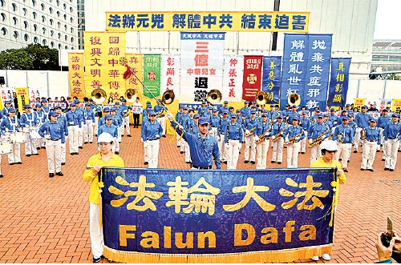

“庆祝三亿中华儿女退出中共大集会”昨晨在中环爱丁堡广场举行。（宋碧龙／大纪元））

香港法轮佛学会发言人简鸿章强调，三退运动不是政治运动，而是呼吁每个人对善与恶、正与邪作出正确选择的精神觉醒运动。他庆贺近三亿人选择了光明的未来，呼吁更多人尽快抛弃中共邪教，“善的力量是洪大的，只有归善的生命才能得到上天的眷顾。正邪大战快到终局，弃恶从善，急不容缓。三亿人已经走在前面，您还要等待吗？”

<b>香港政界吁快快退党</b>

多位香港及大陆知名人士在集会上发言。保卫香港自由联盟发言人韩连山到场声援，他呼吁全球加入过共产党的人快快退党，“当共产党是一人专政，一人话事，任何事情都是一言九鼎，一锤定音，各位：这个共产党已经到了无法再腐化下去⋯⋯共产党其实严格来讲，今天已经灭亡。”他指共产党已返魂乏术，不退党只会继续沉沦下去，“共产党对香港人民、对中国老百姓的打压，我们是不会噤声，我们会继续发声向全世界人民讲出共产党的邪恶”。

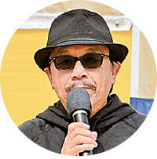

韩连山

未能来到现场的前立法会议员梁国雄透过电话连线发言，指从“两会”可以看到中共独裁专政，呼吁不要被中共淫威吓倒。他祝愿多年坚持反迫害的法轮功学员未来能够更加坚忍，“祝愿大家未来能够身心更加健康，未来能够在高压下更加挺拔”。

曾健成

香港前立法局议员、民主救港力量召集人曾健成呼吁港人要认清中共的真面目，他批评中共耗巨额维稳费支持青关会侵扰法轮功，“中共强横无理，如果今日我们不回击，明天我们就奔波了。所以大家一起努力，结束一党专政”。

<b>议员赞九评助认清中共</b>

多位政界人士透过录音发言。民主党主席、立法会议员胡志伟说，有三亿中国人退出中共组织，代表人民不满中共专权，“共产党管治的本质就是以专权的形式牢牢掌握著这个政府的权力，我想这个正好代表了人民的意愿，尽管现在要面对共产党的管治，但仍然透过不同的行为和工作，表达对现在专权的政府不满的情绪”。同时也象征人民追求普世价值的愿望，“一直以最大的毅力和决心期望自己的国家，特别是中国的社会，能够朝着一个让人民免于恐惧，真正可以安居乐业，亦都能够获得宪法上对他的人身自由、他的言论自由保障的政治制度”。

他并赞扬《九评共产党》一书提供一个让人民认清中共本质的机会，尤其是未经历过文革、三反五反等历次运动的一代，“《九评共产党》这本书提供了一个入门的门槛⋯⋯可以让市民大众能够深切明白到共产党管治本质和它管治的属性是怎么一回事，从而对这个专权的政府有更多的戒心。”

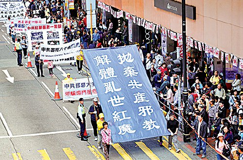

《九评共产党》与九评编辑部新书《共产主义的终极目的》揭示共产主义暴政历史与邪教本质，是游行的主题之一。（李逸／大纪元））

 
 

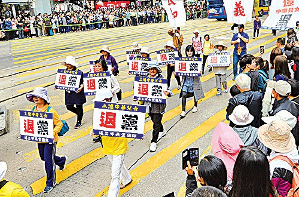

游行途经铜锣湾闹市，大批市民游客驻足观看。（宋碧龙／大纪元））

<b>“这个政党一定要脱离它”</b>

街工立法会议员梁耀忠认为，这么多人退出中国共产党，代表人民不欢迎、不接受这个专制政权，“这个事件我觉得在今天是非常有价值意义的，我希望更加多人脱离这个中国共产党，不要让它再这样横行无忌，不理人民的生活，不理人民的基本权利。这个政党一定要脱离它，不能跟它一起剥夺人民应有的政治权利，以至人权”。

前立法局议员冯智活牧师认为有三亿人退出中共组织，数字出乎意料地厉害，“可见中共政权是非常不得民心，很多人也觉得真是非常有问题的，现在大家也看到中共的政权愈来愈差，特别是现在愈来愈中央集权。”他强调世界潮流迈向民主化，相信中共时日无多，“尽快结束，使中国人民受苦尽快停止。”

他称赞《九评》一书详细介绍中共的真面目，“一直在压迫、迫害，对宗教也是一样，对中国的破坏很厉害，真是一个非常要不得的政权。”尤其是对法轮功的迫害更是令人发指，极度的残暴，一定有报应。“完全是违反真理，违反道德，违反任何标准。”他呼吁中国人要明辨是非，把握机会表达和行动，“例如退出中共组织是其中一件事，有机会表达一下⋯⋯不要怕，因为愈多人说，政府能够做的事就愈有限，我觉得这个政权是假以时日，现在一直走下坡下去。”

前中共总参谋长罗瑞卿次子、红二代罗宇，西安维权人士马晓明等大陆知名人士也透过录音发言。罗宇直指中共已成了一个没有信仰、没有理念、没有道德的贪腐集团，尤其以前党魁江泽民发动的迫害法轮功、活摘器官等最为残暴，所以他支持所有有良知的人都退出中共。

陆客支持三退：“真、善、忍”是高尚品格
约700人的游行队伍下午2时从北角英皇道游乐场出发，沿着港岛区主要街道前往终点西环中联办，途经铜锣湾、湾仔、中环多个购物热点。游行由天国乐团领头，有“三亿三退 普世同庆”、“法轮大法洪传世界”、“和平理性反迫害”、“天灭中共 三退是福”等六大方阵，并有腰鼓队、旗鼓队等表演，吸引许多香港市民和大陆游客驻足观看，他们纷纷以手机拍下游行的场面。

来自湖北的王伯伯手拿着一份法轮功真相资料，并仔细聆听退党义工的解说，他看到法轮功游行很开心，直言支持三退，又认为有三亿人三退是好事。

从深圳来港旅游的刘先生是第一次看到法轮功游行，直呼很惊讶，表示香港很自由，互相尊重。他也支持法轮功学员有信仰的自由，“真、善、忍肯定是美好的品德”。

董小姐与友人一起从广东来港，第一次看到法轮功游行很惊讶，“还是挺震惊的，没有看过这么大型的（游行）！”

香港市民李先生对路过的法轮功学员举起大拇指，又热情地挥手，他说：“法轮功讲的都是对的！法轮功没有骗人，‘真、善、忍’是对的！法轮功教人做好人，哪里错了？”李先生表示，中共的根本就是邪恶的，“中共最拿手的就是诬蔑人，令普通人不明白真相，迫害好人！”

<h1 align="center"><b>夜半私闯民宅，公安成了公害</b></h1>

【大纪元2018年03月20日讯】如果我告诉诸位，有人深更半夜破窗而入闯入我家，绝大多数人恐怕都会以为是盗贼所为，绝不会把这事跟警察挂起钩来。但你还别不信，数月前深夜破窗闯入北京法轮功女学员周晶家的还真就是警察！

据明慧网报导，2017年10月11日凌晨3点20分左右，一个人住在北京市东城区安德路乙61号院四排六号的周晶，被突如其来的重物敲击声惊醒。敲击她家门窗的不速之客不是寻常的盗贼，而是北京东城区安定门外派出所堂堂的警察。

他们先是试图撬开周晶家的门，没撬成就接着撬窗，不但将窗户的窗框撬断、窗纱撕开，还把窗户把手撞断，玻璃也撞碎了，最后终于成功闯入了周晶的居室。

当时，41岁的周晶正在熟睡中，被这突发状况惊醒，惊魂未定，只穿着贴身内衣，蜷缩在角落，不知发生了什么事。直到她看到穿着警服的人在录影，才知道破门而入的竟然是北京市东城区安定门外派出所警察牛艳新、辛仲阳和牛姓协警。原来，他们是在政委杨卫东的指挥下，来搜查社区内发现的法轮功真相资料的。

这事撇开制作散发法轮功真相资料属于公民的合法权利且不说，按照中国的现行法律，任何人包括警察都无权私闯民宅，警察要搜查民宅必须出示警察证和搜查证，否则就是涉嫌非法搜查罪、非法侵入罪的违法行为。而北京市东城区安定门外派出所警察深夜闯入周晶的住宅，不但私自损坏了她家的门窗，而且没有出示任何有效法律文书和警察证件，纯属私闯民宅，非法搜查、抄家，可以说严重影响了周晶的正常生活，还给她带来了极大的精神伤害。为此，周晶已起草控告状，依法追究北京东城区安定门外派出所警察杨卫东、辛仲阳涉嫌非法搜查罪、非法侵入住宅罪等刑事责任，要求对被控告人立案侦查，将杨卫东、牛艳新绳之以法，并要求公开赔礼道歉、还法轮功清白，修好门窗、安装防盗门、赔偿精神损失费。

在大陆，人们通常称警察为“公安”。顾名思义，公安的基本职能应该是打击违法犯罪，维护社会治安，保护民众合法权利，公安机关一直也都是这么公开声称的。但在中共一党专政的邪恶体制下，公安的主要职能根本就不是打击违法犯罪，维护社会治安，保护民众合法权利，而是维护和强化中共的专制统治，镇压民众的不满和抗争。

他们肆无忌惮的践踏和剥夺民众的合法权利，不惜用尽各种办法整人，许多警察甚至把整治好人当作了自己的工作，将残害善良当作了自己的职业，将杀戮民众当作了自己的职能，公安因此成了公害。

北京警察半夜破窗闯入周晶家，强行进行非法搜查抄家，不就是个活生生的例子吗？

<h1 align="center"><b>走过万水千山 德妇女游历55国 找到心灵归宿</b></h1>

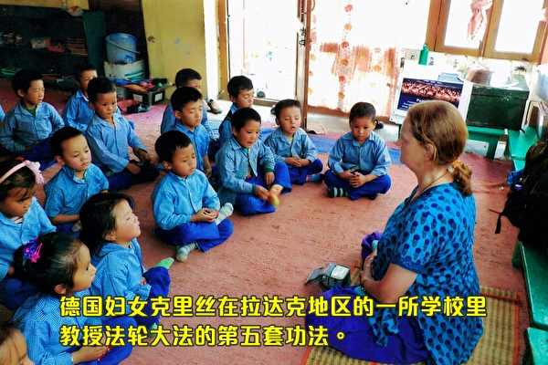

【大纪元2018年02月20日讯】（大纪元特约记者Venus Upadhayaya采访报导，田云编译）鹿野苑（Sarnath）在印度北部，是古印度佛教四大圣地之一，释迦牟尼第一次传法，便在此地。

在这里，德国妇女克里丝经营了一家民宿。小小的砖房，就在大佛塔的后面，掩映在绿树花丛中。一天早晨，记者推开黄色的门，来到了克里丝的“领地”，也走入她的内心世界。

克里丝蒂安·伊丽莎白·泰希（Christians Elisabeth Teich）来自德国，家人都称她“克里丝”。她从小喜爱大自然，长大后热衷旅行，希望借此领略异国的文化风情。几十年来，她背包走天涯，游历过55个国家。

21岁那年，克里丝第一次到访印度。那时，她是个学习雕塑的学生。她不会想到，这个古老佛国与自己有着奇妙的缘分。

青年时期，克里丝研读了各类宗教哲学书籍，然后便踏上旅途。“二十岁出头时，我渴望去看世界。可是我没有钱，我就靠搭便车，跑了很多国家，比如法国、西班牙、意大利、荷兰、英格兰、苏格兰、爱尔兰和北非。有时我甚至露宿在农场和森林里。”

克里丝曾经作为社会工作者，在非洲帮助设立学校和儿童之家。1985年，埃塞俄比亚大饥荒期间，她在那里当义工，协助救济，目睹了人们的苦难和死亡。

在非洲七年后，克里丝又到南美工作了六年，服务当地社区。在那里，她又见证了严酷的现实。这些经历震动着她的心，她渴望了解，人存在的真正意义是什么，造成种种不幸的根源又是什么？

浪迹天涯的日子里，克里丝的疑问一直没有解开。在巴西时，她看到了一张介绍拉达克地区的传单，这促使她重返印度。几年后，她遇到了现在的丈夫，终于安家落户。

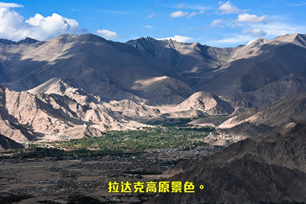

由于鹿野苑炎热潮湿，所以每一年，克里丝都去拉达克高原住上几个月。有一次，在妇女节的活动上，她看到一位美国华人女子打坐炼功。她立刻被吸引了，上前询问得知，那是法轮大法的静坐功法。

克里丝见识过各式各样的生命灵修的学说和实践，这次巧遇法轮大法，她便潜心研究。经过一段时间的思考，她决心修炼大法。

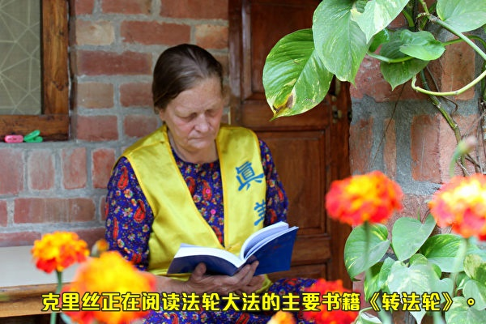

一晃15年过去了。克里丝说：“这种功法完全改变了我。以前我经常病怏怏的，身体有很多毛病，炼功后大大好转。而且对于日常生活里的大小问题，我现在都能脚踏实地、平和地去应对。”

修炼大法后，克里丝身体健康、心境平和，她想把这个好消息与人分享。于是，她再次上路，在印度各地介绍法轮大法。至今，她已经拜访了60多所学校，足迹踏遍拉达克、印度东北部、乌塔普拉德什邦、北阿坎德邦、喜马偕尔邦和卡纳塔克邦等地。

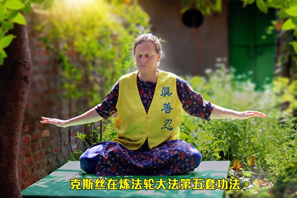

当克里丝与当地师生一起炼功时，她也谈到了令人悲伤的事情：这种平和的静坐修炼功法在其发源地——中国大陆，受到残酷的镇压。克里丝说：“中共宣扬无神论，从1999年开始迫害和杀害无辜的法轮功学员。我向印度师生介绍法轮大法的奇效时，我也告诉他们，中共是如何迫害这些好人的。而另一方面，全世界都已认同并欢迎这一精神修炼法门。”

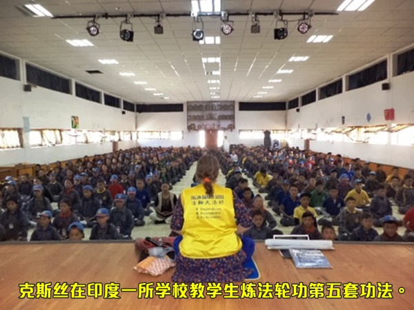

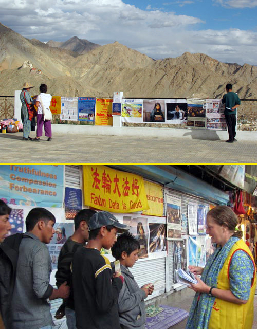

克里丝的脸上，挂着岁月的风霜，透著平静和欢愉。与她交谈时，可以感到她发自内心的快乐。那种快乐，有着动人的感染力，仿佛能够融化人生的苦涩。

回顾昔日的风雨追寻，克里丝说：“周游世界，我得到了很多的爱和温暖——不过，最好的收获是‘心灵之道’……世间的苦难并未终结，而我找到了与众人分享‘真善忍’的大道。这条准则可以让人们重拾希望，开启更好的人生。”

金色的阳光洒在宁静的院落。大门外侧，挂着一张贴纸，上面写着：“法轮大法好”。

克里丝的脸上，挂着岁月的风霜，透著平静和欢愉。与她交谈时，可以感到她发自内心的快乐。那种快乐，有着动人的感染力，仿佛能够融化人生的苦涩。

回顾昔日的风雨追寻，克里丝说：“周游世界，我得到了很多的爱和温暖——不过，最好的收获是‘心灵之道’……世间的苦难并未终结，而我找到了与众人分享‘真善忍’的大道。这条准则可以让人们重拾希望，开启更好的人生。”

金色的阳光洒在宁静的院落。大门外侧，挂着一张贴纸，上面写着：“法轮大法好”。

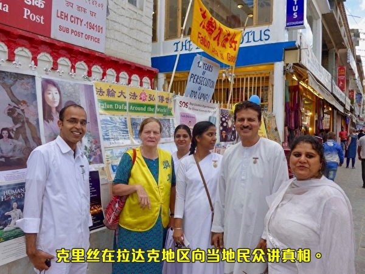

<h1 align="center"><b>意外的妙方 让10岁女孩和慢性失眠症说再见</b></h1>

【大纪元2018年03月16日讯】（大纪元记者田云编译）“我睡不着，我怎么也睡不着啊。”10岁的梅尔娃（Malva）夜夜失眠，这让妈妈伊娃‧萨格弗斯（Eva Sagerfors）犯了愁。

萨格弗斯一家人住在瑞典，他们的生活平凡、幸福，很有规律。可是，一个难题带来了阴影——不知从何时起，女儿梅尔娃出现了失眠症状。

<b>恼人的失眠症</b>

晚上，几个孩子同时上床就寝，梅尔娃的弟弟们很快就入睡了，但是她却睡不着。梅尔娃总要折腾好几个小时，有时她干脆坐起来，夜夜如此。越晚入睡，小女孩就越焦虑。她担心第二天会起不来床，不能从容地收拾书包去上学。

梅尔娃是个乖孩子，早上很守时，总是喜欢开开心心地去上学。然而，恼人的失眠症把一切都打乱了。这种情况持续了很长时间，真有点令人绝望。梅尔娃的父母尝试了很多办法，但都不管用。

作为母亲，伊娃当然要想办法解决这个问题，让女儿睡个好觉。她回忆说，“我知道，如果白天的活动太多，也会刺激大脑，导致入睡困难。因此我们让梅尔娃减少了一些活动，比如在放学后，她不得不放弃和朋友们玩耍。我们也试着安排她早点上床。我和丈夫耐心地和她谈话，想知道有什么事让她心烦。”

然而，这些努力收效十分有限。梅尔娃一夜无眠的状况不见好转，父母束手无策。伊娃只好尽力不去担忧，因为她自己也有一大堆的家事要处理。

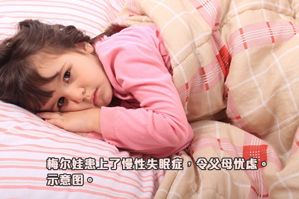

<b>意想不到的妙方</b>

远在北欧，伊娃和东方有缘。她告诉英文新唐人记者，她和丈夫修炼法轮大法很多年了。法轮大法是从中国传出的、古老的身心修炼法门，既有缓慢的炼功动作，也有教人提升道德、以“真、善、忍”为指导的法理。

伊娃说：“修炼大法使我们夫妻受益良多。我们的关系更加和睦，彼此更加尊重。”同时，作为母亲，伊娃十分注重培养孩子们的道德品质。她按照《转法轮》书中的教导去做，更加真诚地对待孩子。

“我不会掩盖自己的错误，也不让矛盾激化。有了问题，我会看看自己哪里做错了。往往，问题的原因就在于我的自私、恐惧或是懒惰。我遵照大法的法理，就会去掉这些不好的思想和执著。”伊娃说，她和丈夫经常跟孩子们谈心，讨论如何按照大法的要求做一个好人。几个孩子也学炼功法，不过他们没有固定炼功，有时只炼一两套而已。

伊娃说，去年夏季，“有一天，我和先生在公园里和大家一起炼功，梅尔娃也过来和我们一起炼。一共有五套功法，四套动功，一套打坐的静功。我们把时间缩短了一点，这样梅尔娃就都坚持下来了。”

当天炼功后，他们回到家，已经到了睡觉的时间。这时，奇迹发生了：梅尔娃一下子就睡着了。伊娃意识到，很显然，这是因为她刚刚炼习了法轮功。

第二天，伊娃问女儿，为什么她昨晚那么快就睡着了。梅尔娃回答，“一切都很好。”伊娃问，“为什么？”女儿说，“嗯，我知道为什么。” 梅尔娃说着大笑起来，没再多做解释。

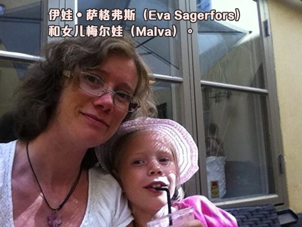

<b>晚间静坐</b>

于是，伊娃决定，在睡觉前，她要和女儿一起炼一会儿静功。伊娃讲述了炼功的安排：“时间不用太长，打坐十几分钟就好。我们播放轻柔的音乐，两腿盘坐，打起手印，再静坐入定。炼功后，梅尔娃感觉很平静。”

伊娃介绍说，“我们在晚上一起静坐，到现在已经5个月了。在这期间，梅尔娃一直睡得很安稳，失眠的情况极少出现。”

不仅如此，梅尔娃一早起来，心情也比以前要好。炼功前，她的脾气有点急，很容易生气——这很可能与睡眠不足有关。现在，梅尔娃能够充分休息，情绪也转好了，全家人都非常开心。

梅尔娃告诉妈妈，以前在睡觉的时候，她的脑子里有许多念头转来转去，让她无法入睡。她开始固定打坐以后，这些乱七八糟的想法都跑走了，她也不再担心第二天会爬不起来。

看到女儿终于可以呼呼大睡，伊娃很开心。她说，“现在，我们的家庭炼功小组又多了一个成员——梅尔娃8岁的弟弟也加入了。法轮大法给我们全家带来了快乐和安宁。我永远都感激大法。”

<h1 align="center"><b>杏花岭冤案连连　执法者天良安在？</b></h1>

【明慧网二零一八年三月十七日】孟子说“无恻隐之心，非人也。”如果“执法者”泯灭天良，如果法庭失去正义，如果是非与黑白完全颠倒，如果谎言污蔑横加于无辜，那意味着什么？
近年，太原市杏花岭区公检法冤狱连绵。

<b>一、李锡福告邮局侵权扣信，反遭迫害</b>

家住山西省太原市杏花岭区118小区的李锡福，现年七十七岁。因坚持对法轮大法“真、善、忍”的信仰，曾经四次被非法关押，两次被非法劳教，并且多次遭到狱警非人的暴打。

李锡福在二零一五年七月起诉迫害元凶江泽民，起诉书被太原市邮局非法扣押，李锡福将其告上尖草坪法院。

在对法轮功的十几年迫害中作恶多端的中共610对此非常恐慌，惧怕法轮功学员的正义控告进入司法程序，于是实施报复，二零一五年十一月十七日，指使太原市不法公安将李锡福非法抓捕，并非法抄家。其后在异地、由太原市晋源区法院将李锡福冤判三年半。（“610”是中共为迫害法轮功而成立的非法机构）

同期，不法警察和610人员又将同小区的法轮功学员（和李告邮局无关）赵存贵、赵素梅绑架构陷冤狱。

目前，七十七岁的李锡福被非法关押在祁县晋中监狱，他曾至少两次遭狱警殴打。李锡福坚持对真、善、忍的信仰，因为他受益于法轮大法，曾在起诉江泽民的诉状中写道：

“看完《转法轮》（法轮功主要著作），我感觉这本书太好了，是叫人做好人的书、从没见过的书，我发生了天翻地覆的变化，真感到一种脱胎换骨的感觉，那个激动的心啊无法言表。”“我开始改变我的坏脾气，不和人争斗、遇事让人”“人人都称赞我变了，变成个好人了。我自己也觉得轻松多了，孩子们看见我的变化也高兴的不得了”“随之身体也发生了变化，以前每年夏天拉肚子，一拉拉一个月，吃什么药都治不好，还有就是吃花粉吃的尿频，炼功以后都好了。从那以后十九年来再没看过医生，没吃过一片药。”

事实上，法轮大法福益世人，修炼法轮大法、按照“真、善、忍”做人，不仅合法，而且应该受表彰；根本不应被抓、被冤判入狱。中共一贯奉行“假、恶、斗”，以各种运动害死八千万中国人（超过两次世界大战死亡人数的总和），容不下真、善、忍。

<b>二、赵存贵被绑架构陷，入冤狱三十八天失去生命</b>

 

二零一五年十二月十二日，太原市杏花岭区涧河派出所（所长是武瑞明，教导员是党国荣），以赵存贵家中有法轮功资料为由，将他绑架到看守所，刑事拘留。二零一六年五月十日被太原市杏花岭区法院、检察院非法判刑三年半，法官是季丽清，检察院公诉人是李隆。从看守所移送至祁县晋中监狱仅三十八天，二零一六年八月一日，赵存贵竟突然冤死在了新康监狱，也就是109医院，时年六十二岁。

此前，赵存贵很健康，他修炼法轮功后身体非常好，双目有神，走路比年轻人都灵巧，从来用不着打针吃药，还伺候他生活不能自理的老母亲，这些街坊邻居都知道。赵存贵是一家人的顶梁柱，老伴没有工作，从被绑架算起几个月不见，怎么就含冤离世了？！老伴和女儿根本无法承受，犹如晴天霹雳！

但是家属的知情权却被无理剥夺。自始至终109医院和祁县晋中监狱从领导到医务科以及医护人员没有一个人主动向家属交代过病情治疗情况以及死亡情况。

同期，涧河派出所还绑架了太钢一一八小区法轮功学员赵素梅，赵素梅被杏花岭区检察院和法院冤判三年半，法官和检察院公诉人还是季丽清和李隆。

赵素梅的女儿，降凤女士，想为自己年近古稀的母亲说几句公道话，依法担任辩护人。但是非法庭审当日，她拿出事先认认真真，花了很多宝贵时间写的辩护意见时，季丽清法官十分不耐烦，她用生硬蛮横的声调说“你不要读了！”结果降凤只说了一句话的辩护意见，认真准备的辩护意见被季丽清法官“消灭”了。

现在，本份孝顺的赵存贵的冤死、赵存贵老伴和女儿悲痛的泪水，并没有使这起命案责任人之一的涧河派出所所长武瑞明、杏花岭区法院法官季丽清等人的人性觉醒，他们继续构陷善良无辜，真不知他们的天良何在！

<b>三、遭十一年冤狱　残疾女士李润芳又被枉判三年半</b>

四十六岁的残疾女士李润芳，是上文中李锡福的女儿。她坚持修炼“真、善、忍”法轮大法，累计遭受十一年冤狱迫害，出狱后多次到杏花岭区涧河派出所办理身份证被非法拒绝，二零一七年九月五日再次去办理身份证时被非法扣留、构陷，日前又被杏花岭区法院冤判徒刑三年半。李润芳已上诉。

李润芳是残疾人，失去左腿膝盖以下，因坚持按真、善、忍做好人，今年四十六岁的她在劳教所和监狱，数次冤狱累计十一年：狱警将她关禁闭、长时间不让睡觉、不让上厕所，在新店劳教所还被摧残得遍体鳞伤、全身布满了紫色瘀斑；曾被打得昏死，绝食抗议时又被狱警恶犯用铁器暴力灌食，撬得嘴严重外伤，鲜血喷到墙上、地上。最近一次是二零一零年被杏花岭区法院非法判刑六年，在山西省女子监狱，遭到近两年关小号迫害。

二零一六年四月李润芳出狱回家，当时她七十六岁的父亲李锡福正在祁县晋中监狱蒙受三年冤狱，李锡福的退休工资被停发。一年多来一个残疾女子生活只能靠其他法轮功学员帮助度日。她多次想出去打工自立，因派出所不给办身份证，无法找到工作。

为办身份证李润芳多次去涧河派出所，找所长武瑞明，都被强加条件：不写不炼法轮功的保证，不予办理。

二零一七年九月五日李润芳带着国家新闻出版总署五十号令（关于废除对法轮功书籍和出版物的禁令）和全国二零一七年一～六月份被各地法院无罪释放的六十多名法轮功学员的资讯，到涧河派出所找所长武瑞明要求办理户口和身份证，想让他知道法轮功是合法的。

就在走廊等候时，武瑞明指使副所长张勇建扣押了李润芳，并扬言上次判六年，这回要重判。

武瑞明等人为了给李润芳找罪证，带人非法抄家。武瑞明等采取的是先抓人后定罪的非法手段。非法抄家的笔记本电脑，两个不能用的MP3也当成证据。

武瑞明还别有用心的出具了一份造假的证人证言，声称：那天我办公室进来一个女的，我不认识她，她要求办身份证，我让她写申请，她却给我递上法轮功的材料，我就叫人扣押了她。

武瑞明将“新闻总署五十号令”说成是“法轮功的材料”，想来是为罗织罪状，口不择言了。

“新闻总署五十号令”是什么？二零一一年三月一日，中国新闻出版总署署长柳斌杰发布新闻出版总署令第五十号，其中第九十九、一百项明确废止了一九九九年发布的中共江泽民政治流氓集团对于法轮功书籍出版物的禁令。

法轮功的书籍如《转法轮》等都是教人向善，使大陆和海外数以亿计的人道德提升，成为好人中的好人。法轮功的书籍已经被翻译为近四十种文字，在世界各地出版发行，只有在中共江泽民政治流氓集团的邪恶迫害下，教人向善的书籍才被非法禁止。二零一一年，江泽民团伙的非法文件被废止，说明即使在中共内部，江泽民团伙对法轮功的迫害也不得人心，已走向末路。

中共邪党没有任何合法性，它没有任何资格决定法轮功书籍是否可以出版发行。在此只是说明，即使根据中共自己的规定，法轮功书籍都是合法的，任何以公民拥有、阅读和传播法轮功书籍为借口进行迫害都是非法的，迫害者也将受到法律的追究。

涧河派出所所长武瑞明以编造的谎言作为证言，对历经11年冤狱魔难的残疾女子李润芳的再次罗织构陷，是明目张胆的犯罪，天良丧失，手段令人不齿。

不出示证据、恶意构陷的“庭审”

二零一八年元月十七日，杏花岭区法院对李润芳进行非法庭审。法官是季丽清、公诉人是郭云燕（也是二零一二年迫害法轮功学员韩来清的公诉人）。

公诉人在起诉中先后四次提到，从家里抄来的电脑一台、MP3两个、《明慧周刊》及法轮大法书四十余本作为证据物品。律师先后三次提出，请出示证据，都被法官以不要打断公诉人的发言为由阻止。

第四次律师很生气的说：“公诉书都快宣读完了，都没有出示证据，怎么定罪？”法官蛮横的宣称：“辩护人在法庭就得听法官的，否则我可以解除你的辩护权。”

庭审现场本来是四个法警，又增派四个法警来威胁律师，一副黑帮老大的做派。

为什么不出示证据？因为那根本就不是证据。那些法轮大法书籍是叫人修心向善，每个字都金光闪闪。

现在，李润芳这个蒙冤十一年的残疾女子再次被冤判三年半。李润芳已上诉。我们也向全社会控告涧河派出所、杏花岭区检察院和法院诬陷、枉法起诉和枉法裁判；不法公检法人员，残害孤弱，天良沦丧。

同期，杏花岭区法院法官季丽清还将法轮功学员杨斌冤判三年。

涧河派出所迫害李润芳不是第一次。

非法审讯李润芳六十多小时，强加六年冤狱

二零一零年七月十三日上午十一时，以涧河派出所武教导员为首，涧河派出所、三桥派出所出动三十余人，绑架李锡福和女儿李润芳，并非法抄家洗劫，抢走打印机、存折等私人财产及现金二千三百多元，总价值两万多元，没有搜查证，没有留下物品清单。

随后警察非法把李锡福和女儿绑架到涧河派出所，连续审讯达六十多个小时，期间不让睡觉、不给吃饭、不给喝水，恐吓、诱骗，直到十六日凌晨一点多钟李润芳被三桥派出所送到市看守所，后被冤判六年。凌晨两点李锡福被送回家。而在“（2012）杏刑初字244号”判决书上将绑架时间篡改成“7月15日”“由涧河派出所抓捕后直接送三桥派出所处理”。公检法合谋造假掩盖非法拘禁、非法审讯之罪。

<b>四、冤狱几时休：龙潭派出所绑架田云飞、连素兰、薛福贵，构陷到法院，田云飞妻子张印香生命危急</b>

二零一八年三月六日，太原市杏花岭区法院对田云飞、薛富贵、连素兰三位法轮功学员非法开庭。而此时，田云飞家中的妻子张印香生命危急。

二零一七年七月十七日由于不明身份人的诬告，田云飞、薛福贵（六十九岁）、连素兰（八十岁）被杏花岭区龙潭派出所副所长宋全生绑架，田云飞被送到太原市看守所，后两人被监视居住，现在他们都被构陷到法院。三位律师和一位家属为他们做了无罪辩护，三位法轮功学员当庭讲述了修炼法轮大法使他们获得健康的身体和成为一个好人的经历。

连素兰，今年八十岁，身体硬朗，精神饱满，她说这种千金难买的幸福来源于修炼了法轮功。她曾经是老病号，一身病：脑血管痉挛、萎缩性胃炎、骨质增生、妇科疾病、风湿性关节炎。她去单位报销医药费，管事的人说：“成天生病，成天报销，单位有你这么个人，真是倒尽霉了！你为单位创造的效益都不够你吃药看病呢！”

连素兰后来身体越来越差，因风湿性关节炎腿疼，不能走路，卧床二年，病痛折磨生不如死，后来成了风湿性心脏病送医院抢救才活命。修炼法轮功之后，多种疾病不翼而飞，至今二十来年了，再没吃过一颗药，现在无病一身轻。法轮大法教人做好人，她为孩子着想，不在孩子们家住，不拖累儿女，全家二十来人其乐融融。连素兰由衷感谢法轮功给了她第二次生命。

今年六十九岁的薛福贵，曾是工程兵、井下煤矿工人，是西铭矿劳模、西山矿务局劳模、太原市劳模，很能吃苦，几十年繁重工作中流尽了血汗，用尽了力气，劳累成疾，得了腰疼病，不能长时间走路和站立，拿不了东西，还有关节炎、胃病、喉炎等病。天天有病难受，有病乱求医，看过中医、西医，练过气功也没治好。后来炼法轮功慢慢身体好了。他很感慨：法轮功真的祛病健身有奇效，把我的病治好了，救了我的命，给国家省了多少医药费，给家庭减轻多少负担？

法轮功还教人做好人，读《转法轮》这本书使薛福贵明白了要想好病就得重德，做好事，为别人着想。说到做到，薛福贵自己买材料修漏水的公共厕所，经常义务挖排水沟，给八十岁老人修自行车……

<b>田云飞和妻子张印香的故事</b>

去年七月十七日，田云飞家中瘫痪在床的妻子张印香看丈夫被龙潭派出所警察带走，悲愤交加，不吃不喝，送医院重症监护室抢救，医院下命危通知书，数日之后无钱医治送回家。八个月后的今天张印香生命垂危。

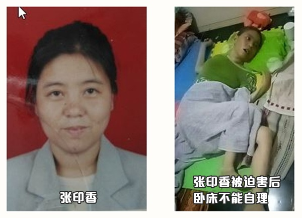

田云飞（五十三岁）和妻子张印香（五十二岁），都是太原西山矿务局金城公司职工。二人一九九八年开始修炼法轮大法，田云飞学炼之后，身体发生很大变化，特别是多年不愈的皮肤病、偏头疼、牙痛都好了，性格变好了。张印香一看法轮功这么神奇，也开始修炼法轮功，整个家庭沉浸在法轮大法的祥和气氛之中。田云飞遵守法轮大法真、善、忍的法理，为人正直、善良，工作一丝不苟，单位发工资曾多发给他钱，他如数退还。

然而这两个一心修心向善的好人，自一九九九年七月中共及江泽民集团迫害法轮功以来，夫妻二人遭受多次抄家、扣发工资、强迫下岗、拘留、劳教、关洗脑班黑监狱等迫害，家无宁日、亲人受牵连。田云飞在迫害中遭受毒打昏迷、多次多根电棍电击身体各部位、生殖器、电击使左腿膝关节白肉外翻，溃烂化脓、血脓粘衣。张印香被狱警用凉水从头灌下，全身湿透，不让睡觉、罚站、罚跑步、污言秽语人身攻击。

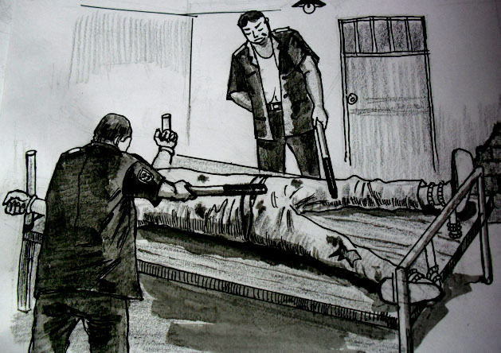

妻子张印香二零一三年八月被610（中共为迫害法轮功而成立的非法组织）第二次绑架到山西省所谓“法制教育中心”洗脑一个月后，精神受重创。夫妻俩在起诉迫害元凶江泽民后，又受到派出所骚扰，张印香受惊吓，渐渐神志不清，瘫痪在床，八个月没有了丈夫田云飞在身边，张印香现在体重只有四、五十斤，骨瘦如柴，多处褥疮溃烂，生命垂危！

此时，丈夫蒙冤站在法庭被告席上，家里，妻子张印香生命垂危，瘦弱的身体令人心碎，目不忍睹，身上的褥疮愈合了又溃烂，张印香至少一年多来已经不会说话，只有两只大眼睛在无声的诉说着什么，眼神在传递着什么，在期盼着什么……

杏花岭，多少好人蒙冤被残害！田云飞与张印香夫妇、李锡福与李润芳父女、赵存贵等等，他们原本好端端的人生与家庭却被所谓“政府工作人员”人为的破碎了。他们的遭遇只是中共江泽民十八年迫害法轮功的冰山一角。

把这些善良无辜的人伤害到这种程度，那是造了多大的业！能不偿还吗？一定得偿还。

那些正在把田云飞、李润芳等人往监狱构陷的杏花岭区公检法人员，你们必将因为犯下群体灭绝罪行、反人类罪行而受到司法追缉，因为你们正在成为下述严重罪行的同谋：

在山西晋中监狱、山西女子监狱和新康监狱，迫害死了十六位蒙冤入狱的法轮功学员。十六个鲜活的生命，他们都曾有过美满的人生、幸福的家庭。杏花岭区公检法人员，你们还要把多少好人送到那人间地狱？！

迫害好人，天理难容；迫害法轮佛法修炼人，更给自己带来无边罪业。执意构陷好人的杏花岭区国保队长徐世娇、涧河派出所所长武瑞明、龙潭派出所副所长宋全生、法官季丽清、王剑，公诉人李隆、郭云燕、张萍，等等参与迫害的人，请掂量自己所作所为的严重后果。善待法轮大法，就是善待自己。何去何从，请慎重思考。

杏花岭区公安分局的国保队长徐世娇曾叫嚣：我弄那么多法轮功怎么没报应呢，我就不怕报应。殊不知，这是上天在给赎罪的机会，等恶报临头，一切都晚了。

当年，追随中共卖力砸庙砸佛像的人没一个有好下场，经历过这些事的农村老一辈都记忆犹新。法轮功是真正佛家高德大法，真善忍是普世的价值，迫害法轮功，是犯下如天重罪，是真正在迫害自己。

山西省610头目：政法委书记金道铭、副省长杜善学，积极迫害法轮功，二零一六年均被判无期徒刑入狱；太原三任公安局长苏浩、李亚力、柳遂记连续落马，表面“前腐后继”，实质是迫害法轮功的报应。山西司法厅长王水成，对监狱迫害有领导责任，二零一一年十一月，儿子车祸身亡，这令人思考古训：“父母不干好事，给子女造孽”。

公检法人员，请守住良知和你的道德责任、理性判断；不要屈从即将面临被清算的人间败类、江泽民的爪牙——邪恶的610的指令；不要沦为江氏余孽任意操控的迫害工具和牺牲品；也不要让你的家人因你迫害好人、丧失人格而无地自容；更要为你与家人的平安而选择——“善待大法一念，天赐幸福平安。”

<h1 align="center"><b>洛杉矶夏威夷花园市通过反强摘器官宣言</b></h1>

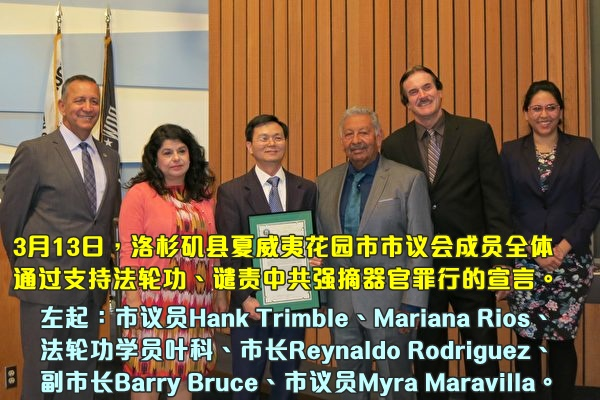

【大纪元2018年03月16日讯】（大纪元记者刘菲洛杉矶报导）中共强摘法轮功学员以及其他良心犯器官的暴行，正在受到越来越多的美国政府机构和民间组织的关注。继加州共和党联盟（California Republican Assembly）3月3日通过支持法轮功的反强摘器官决议后，3月13日，洛杉矶县夏威夷花园市（Hawaiian Gardens）市议会也全体通过了支持法轮功、谴责中共强摘器官罪行的宣言。

<b>反中共强摘法轮功学员器官宣言</b>

 

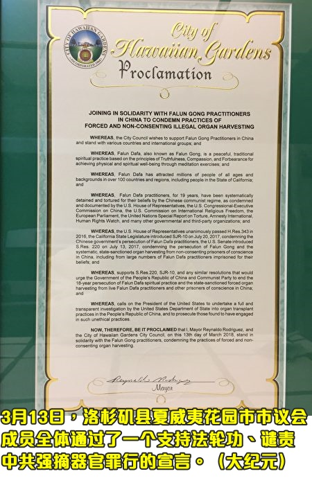

宣言说：法轮功的“真、善、忍”原则，使得全世界数以百万的人们，精神得到升华，健康得到改善。然而，中共对于这样一个和平的信仰团体却持续迫害了19年，法轮功学员因为坚守信仰遭到系统性的抓捕和酷刑折磨，这些都已被记录在案。

宣言还指出，2016年，美国国会众议院通过了谴责中共迫害法轮功、强摘人体器官的343号决议案；2017年，国会参议院和加州参议院也都相继提出类似的决议案，要求中共立即停止迫害法轮功和强摘器官。有鉴于此，夏威夷花园市议会支持法轮功学员的反迫害行动。

宣言并呼吁美国国务院彻查中共强摘器官真相。

<b>市议员鼓励更多民选官员站出来反迫害</b>

2月27日，在决议案通过之前，法轮功学员代表在市议会做了关于中共迫害与活摘法轮功学员器官的专题演讲。20分钟的演讲介绍了中共迫害法轮功的来龙去脉。演讲结束，市议员纷纷提问，了解在中国发生的强摘法轮功学员器官一事，索求YouTube纪录片的视频链接。他们为世界上发生这样的暴行而感到震惊，并对海外法轮功学员向美国各级政府揭示迫害真相的行为表示感佩。

2017年夏天，加州参议员乔尔‧安德森（Joel Anderson）曾经提出旨在支持反迫害的法轮功学员、同时谴责中共政权对法轮功惨无人道迫害的SJR-10决议案。但提案在旧金山中领馆的威胁下，被参议院议长凯文‧德利昂（Kevin de Leon）搁置。市议员Hank Trimble特别询问法轮功学员是否已和德利昂约谈此事。

实际上，早在去年10月18日，德利昂在其宣布挑战国会参议员范士丹席位的竞选启动大会上曾经对大纪元说，他已经要和法轮功学员约谈。对此，法轮功学员代表叶科表示：他们至今尚未获得面谈机会。

夏威夷花园市（Hawaiian Gardens）每个月的第二个和第四个星期二晚上举行市议会，并有录像转播。

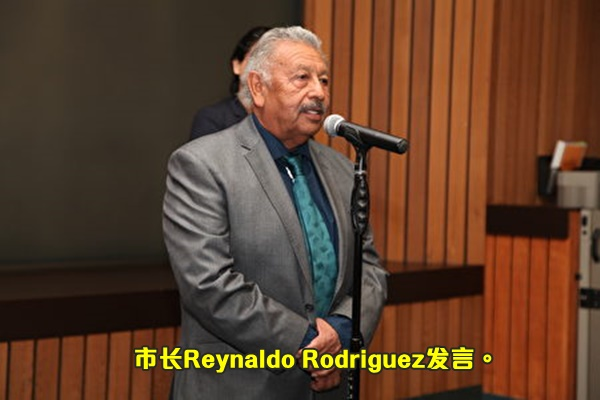

为了让市民更进一步了解中共强摘器官的行径对全世界的影响，市长Reynaldo Rodriguez在本周二的市议会上举例说：“你有钱，无论是在美国还是其它国家，你可以到中国去，你说你需要一个肾脏，或者眼角膜，或者是心脏，他们就会去找到一个囚犯，摘去人家的器官……这就是他们（中共）一直在做的事。”

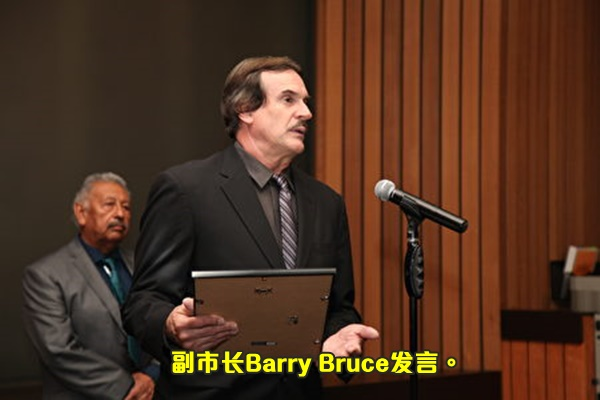

副市长Barry Bruce说：“我们要保证城市的居民、州政府和整个国家了解此事，整个世界都了解此事，因为这是群体灭绝行为（genocide）。”

他还说，国际奥林匹克委员会把中国作为冬季奥运会下一站，无视中国在发生这种暴行，不可思议，“只因信仰、和平的信仰就将人囚禁、任意摘取人家的器官牟利。并有来自世界各地的人包括美国人，预约去（中国）做器官移植旅游，多么病态可悲的事。我敦促其他民选官员也站出来，这是一个真实存在的问题，你们可以去做研究，我就做了很多研究，越研究越发现问题的严重。”他说：“我们需要鼓励美国总统关注这个问题，对中共施加某种制裁。”

叶科对夏威夷花园市议会的正义行为表示感谢，他说：“非常高兴市议会表达这样一个正义的立场，他们在帮助千百万被（中共）残酷迫害、并有被强摘器官危险的法轮功学员，他们也在维护美国的建国原则和人类文明的核心价值观。我知道要制止这个极权政府的强摘罪行不容易，但是我相信当越来越多的人知道此事，并像这些市议会成员，有勇气站出来反对时，我们可以尽早结束暴行。”

<h1 align="center"><b>加拿大卡尔加里市集会声援近三亿人抛弃中共</b></h1>

【明慧网二零一八年三月十六日】二零一八年三月十日，加拿大卡尔加里市部分法轮功学员和市民在市中心James Short Park公园集会，声援近三亿人退出中共党、团、队组织（简称“三退”）。当天阳光明媚，晴空万里，早春的卡城处于一片温暖祥和之中。
“《九评共产党》为中共邪党敲响丧钟 《共产主义的终极目的》为共产主义盖棺论定”、“祝贺3亿中国人退出中共”和“九评传福音 退党保平安”等条幅高高悬挂，为现场平添了几分庄严的气氛。

活动于上午十一点三十分开始，人们在活动现场驻足围观；过往车辆有的鸣笛致意，有的驾驶员竖起大拇指。一位华人老阿姨一早就来到活动现场，很多年前她就明白真相做了三退，她说很佩服法轮功学员不屈不挠的精神，多年来坚持不懈地向华人讲真相劝三退，有力地震慑了中共。

卡城退党服务中心发言人杨杰夫在发言中表示：“二零零四年大纪元报社发表了系列社论《九评共产党》，系统地揭示了共产党的本质及罪行，引发全球‘三退’大潮；十三年后，《共产主义的终极目的》一书问世，更是给共产主义的本质盖棺定论，进一步唤醒民众觉醒。”他还表示，“十多年来，海内外华人对‘三退’的态度转变很大，从一开始的抵触，到如今主动读《九评》、做三退，越来越多的人选择抛弃中共，他为民众的觉醒感到高兴。”

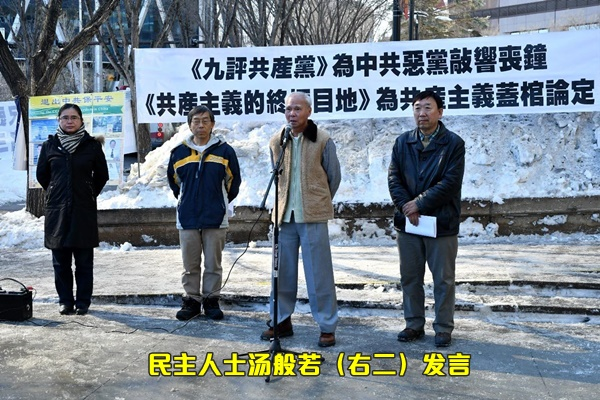

卡城民主人士汤般若及干事郑保罗、张艾伦也参加了集会。汤般若在发言中说：“中共邪党是中国历史上从来没有过的，是个外来的邪灵，它镇压一切正统宗教信仰，破坏中国的传统道德规范体系，它导致了数千万人非正常死亡，恶贯满盈。”他号召民众退出中共邪党。

郑保罗发言表示，中共的罪行被揭露，越来越多的人“三退”，已使其受到了极大的打击。他对退党义工的努力付出表示敬佩：“风雪挡不住，十多年来如一日，坚持不懈向民众讲真相，揭穿了中共的真面目，让许多人看到中共邪恶的本质，亦令世界变得更美好。”

退党活动主持人北辰表示，退党运动不但能使中国人远离共产邪灵，“退党保命”；同时也能够使全世界人民认清共产主义势力在全球的渗透和控制，从而达到保护人类免于被共产邪灵毁灭的厄运。

法轮功学员张萍女士在中国多次被非法关押、劳教，她回顾了中共对法轮功长达近十九年的迫害。她说，这场迫害是自二十世纪末以来，中共为达到其终极目的，实施的最具体、最残暴的迫害。迫害期间，中共江氏集团建立凌驾于法律和权力之上的“六一零”办公室，推行的“名誉上搞臭、经济上截断、肉体上消灭”政策，是共产主义实施终极目的具体体现。她呼吁大家看清中共的邪恶本质，希望世人能明真相站在正义的一边，这才是人类获得幸福的唯一希望。

通过这次活动，越来越多的民众对中共邪党的本质和“三退”的意义有了更深入地了解。

<h1 align="center"><b>在土耳其安卡拉书展上传播真相</b></h1>

【明慧网二零一八年三月十六日】二零一八年二月下旬，土耳其法轮功学员在土耳其第十二届安卡拉（Ankara）书展上向民众介绍法轮功。在两天的活动里，共发出去了五千份真相小册子，其中包括土耳其前司法部长艾尔金（Sadullah Ergin）；国家新闻频道NTV播出新闻节目的莫拉特（Murat Yetkin），和其他的一些记者；著名历史学家思南迈丹（Sinan Meydan）在他的书籍签名活动时，也接过了真相资料。

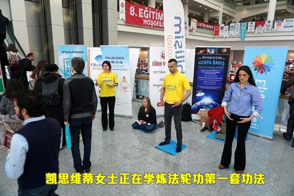

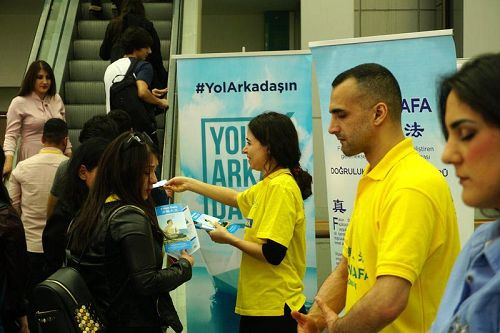

书展上，很多人跟着学员一起学炼功法，特别是很多青少年加入了学炼法轮功的队伍。一位八岁的孩子名叫乌图（Utku），他跟着打坐并坚持不放弃，打坐一段时间后，乌图表示打坐的感觉非常好，内心平和，开心，每个人都应该来学习。乌图的母亲也表示很高兴她的儿子参与学炼法轮功，有助于他的内心和健康。

同样参加学炼法轮功的十七岁的斯伍达（Sevda）说：“（打坐）中我找到了和平、安静；其实我是一个非常爱生气的人，（打坐）让我感觉不同，我很高兴自己的生气没有了，感觉很开心。希望每个人都来学炼（法轮功）”

另一位十八岁的埃布鲁（Ebru）说：“打坐可以帮助人们平静下来，法轮功学员们做的非常好。”

一位名叫凯思维蒂（Dilek Cansevdi）的女士说：“法轮大法的真理，真善忍的原则造就了我们人类的品质，那也是我要追求的哲学。”

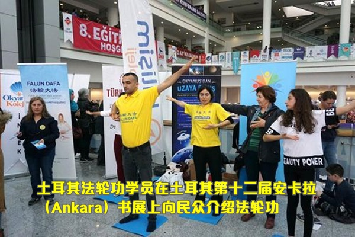

一位民众询问哪里出售法轮功的书籍，并说自己两个小时内会回来买书，两个小时候他如愿回来买到了法轮大法的书籍。很多人都表示法轮功学员是在做好事，有的人问完问题后又转回来继续和学员交流，了解更多的真相。书展结束后第二天又接到很多民众都打电话给学员表示想了解更多。

<h1 align="center"><b>澳门集会　声援三亿中国民众三退</b></h1>

【明慧网二零一八年三月十四日】二零一八年三月十一日下午，澳门法轮功学员在市中心步行街举行集会，声援三亿中国人认清中共的邪恶本质，声明退出共产党、共青团及少先队（简称三退）。

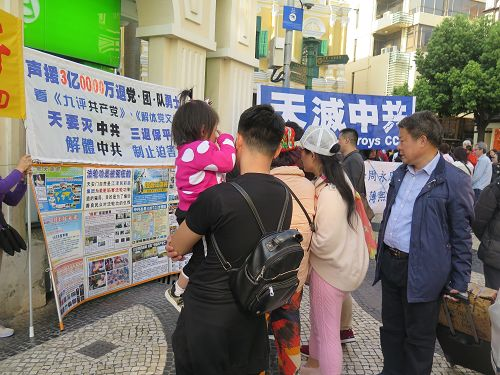

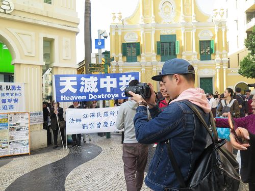

集会开始，横幅一打开，大批的大陆游客马上走过来看。当他们看到“声援三亿退 党、团、队勇士”、“天灭中共”、“法办江泽民、罗干、刘京、曾庆红”及“法轮大法好”的横幅时，都露出惊讶的表情。有的表示：“如果不来澳门，就不知道什么是言论自由。”有的说：“我们在大陆，怎么可能看到这些？！”不少游客大声念：”天灭中共”、“法轮大法好”。 有更多的游客不停地拍照，把每一张真相图片及横幅都一一照下来。

澳门法轮功学员林女士表示：“我们今天集会，声援近三亿明白真相的中国朋友进行三退。”林女士接着说：坏事做的太多，不会有好下场。因为我们中国人说善恶有报是天理，做好事，有好的未来，做坏事，不会有好下场。人在做，天在看，三尺头上有神灵。共产党知道自己坏事做的很多，人不灭它，天都要灭它。所以它要我们中国大陆的朋友，从小加入少先队、共青团，再入党，并发誓说：“要为共产事业奋斗终生。”就被中共拖下水，要为它做的坏事背黑锅。我们中国人，是爱国，不是爱党。不要为中共背黑锅，一定要打破为共产事业奋斗终生的毒誓，退出其相关组织，共产党做的坏事和我们就没关系了，好人就有好的未来。她呼吁仍未三退的民众：“赶快了解真相，进行三退，为自己选择美好的未来。”

<h1 align="center"><b>我为你们而来！老伯伯与真相的完美邂逅</b></h1>

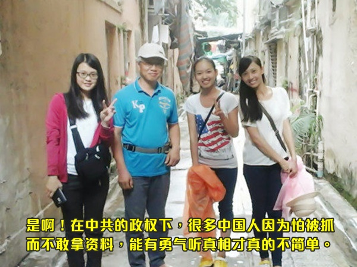

<b>善良的中国人呀，我为你们而来！</b>

趁著假期我到达了香港，几天后海马台风由台湾南部往香港方向移动，当地发出八号风球信号，停班停课一天。但是由于感受不到台风的威力，男生们先到景点并告诉我们情况后，我和华华穿好新买的雨衣和雨鞋后往景点出发。

一位老伯伯看着我的展板，我轻声的和他说明在中国正在发生的人权议题：“伯伯，您知道吗？法轮功1992年在中国洪传，因为炼功使人身心健康，短短几年内就有上亿人学炼，甚至政府还给予褒奖。但在1999年，因为学法轮功的人数超过了共产党党员的人数，江泽民害怕自己的政权被推翻，于是下令所有人都不能炼。抓到甚至会被抓进劳教所转化(放弃信仰)，不转化的话甚至会被酷刑折磨，更残忍的是活摘器官，用人民的器官卖钱。中共为了不让罪行曝光，造谣说法轮功学员会自焚或犯罪，欺骗自己的人民仇视法轮功…”我稍微停顿了一会，老伯伯点点头说：“我是右派，从年轻就被关进监狱里。”

我以前曾经看过关于右派的历史:
当年毛泽东提出“百花齐放，百家争鸣”鼓励知识分子提出自己的想法和意见重整共产党，并给予辩论和创作的自由，因此知识份子便开始提出自己的不满和建议。随着批评的声音越来越多，毛泽东认为这些言论会影响到中共在中国的政治地位于是决定违背承诺，并开始了“反右运动”。很多知识分子被打入右派，下放到边疆、农村、监狱从事粗重的工作，之后的大饥荒甚至造成右派分子大量死亡。

看着这个老伯伯历经沧桑的面容，我有点难过，但也为他明白真相，现在能到香港来玩感到高兴。在景点碰到的中国人很多，有一部分人是像老伯伯一样了解真相的，有的甚至大喊“法轮大法好”，有的坐在游览车偷偷和我们微笑、挥手、举起大拇指或拍照，有的直接夸奖我们勇敢，我笑着对他说：“大哥！您才勇敢呢！”，是啊！在中共的政权下，很多中国人因为怕被抓而不敢拿资料，能有勇气听真相才真的不简单。

<h1 align="center"><b>芬兰《患者医学杂志》发表文章　关注活摘器官</b></h1>

【明慧网二零一八年三月十二日】芬兰《患者医学杂志》是为芬兰人提供有关医学和医疗保健新闻，最新文章，书评和评论的在线出版物。该综合性权威杂志于二零一八年三月四日，发表了一篇名为《谁从中国接受了器官移植？》的文章，中国器官移植的伦理问题和活摘器官再次引起了医学刊物的关注。

<b>以下是全文翻译：</b>

中国在二零一三年底之前没有全国性的器官捐献系统。二零一一年全国只有37名器官捐献者。全国捐献系统并没有获得大量移植器官需求。因为根据中国的传统，过世的人是要保留完整的身体。

从中国大量从良心犯身上摘取器官的指控，已经得到国际各界重要人士的关注。中国承认从刑犯作为器官来源，但是否认政治因素或宗教信仰被关押的良心犯身上获取器官，比如基督徒，西藏佛教徒，维吾尔族和法轮功学员等。

国际器官掠夺国际联盟国际资讯委员会（EOP）包括医学，司法和生命伦理学的顶级庄家，如麦格理大学医学伦理学教授Wendy Rogers和人权律师Eeva Heikkil，在二零一六年六月发表了680页的研究报告之后，他们证明了中国有系统摘取良心犯器官的真实性。

<b>快速获取器官的质疑</b>

近二十年来，中国器官移植数量之大，获取器官的速度之快。据二零零九年《财经》杂志发表的文章，一九九三年至二零零七年间，中国肝移植手术增加了四百倍。一九九三年开展了六次手术，二零零七年超过一万四千次。二零零六年，中国一千多家医院开展了器官移植手术，而到了二十世纪九十年代，仅有几十家医院。法轮功学员被迫害六个月后，二零零零年开始爆发性的器官移植。他们是由于信仰而被监禁，是中国良心犯的主要组成部份。

死刑犯不能解释二零零零年开始器官移植的总数。自二零零二年以来，对华人圈组织支持死刑判决数量下降。据估计，二零一三年中国被处决的罪犯只有二千零四名。在中国，良心犯因其器官与患者学习和组织相匹配，而被杀害。司法DNA测定可被用来获取器官。接受器官移植的人有外国人。

中国的移植政策引起了国际科学杂志的关注。在二零一七年，BMJ报导了肝脏国际杂志删除中国二零一六年发表的文章，因为研究中使用的移植器官的来源无法确定。文章的作者未能说服移植器官不是来自死刑犯，在期刊中这是被怀疑的。

死刑犯的器官在一九八四年在中国合法化。这一做法在医学界和人权组织中受到广泛谴责。中国承诺在二零一五年一月一日停止从死刑犯身上获取器官。实施这一承诺的难度及不可靠性引起了《柳叶刀》（译者注：英国世界权威医学杂志）的关注。

<b>缺失可靠的统计数据</b>

根据二零一六年《医学伦理杂志》发表的文章，中国器官移植的伦理问题持续发酵。没有可靠的系统资料，而且器官的来源很难确定。《美国移植杂志》在二零一六年发表了一篇文章，其中指出我们需要独立客观的证据证明中国停止不道德的从良心犯身上摘取器官。目前，医学界因职业，负责的去了解中国器官移植。

二零一三年十二月十二日，欧洲议会发布了一项决议案（2013/2981）（RSP），宣布中国从良心犯身上摘除器官为“一直存在和可信的”。

议会呼吁欧盟及其他成员国解决中国器官移植问题；建议联合国及成员国谴责中国的器官移植并向其民众通报此事；呼吁联合国对中国的移植做法，进行全面和透明的调查，并认为这些不道德的行为肇事者必须对其行为负责（10）。二零一六年六月（11），美国众议员通过几乎相同的343决议案。医生反对活体摘取器官组织（DAFOH）发起立即停止从良心犯身上摘除器官的征签。

<h1 align="center"><b>在宁静的庞迪海滩 印度女记者邂逅最美的朝阳</b></h1>

【大纪元2018年03月09日讯】（大纪元记者田云综合报导）庞迪切里（Pondicherry），是印度南部的旅游胜地。这座古城，以法式风情和美丽景色出名。庞迪海滩的宁静与秀丽，独一无二。人们漫步海边，感受浪花拍岸的清新，在自然的回声中思索生命的意义。

六年前的一个清晨，女记者维纳思．乌帕得哈亚雅来到这里的普罗米内德海滩，开始慢跑。朝阳升起，照亮了海面。阳光像变戏法一样，把万顷碧波渐渐地染成金色。

晨曦中，维纳思看到，一位中年妇女在岩石上静坐炼功。伴着空灵、脱俗的音乐。女士闭目盘坐，神情祥和安宁。她似乎进入了另一个世界，暂离红尘的烦嚣。

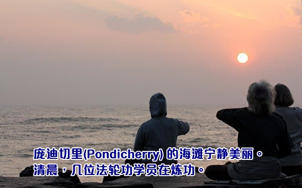

眼前的画面，天人合一。维纳思停住脚步，定睛注视。半个小时过去了，女士仍继续打坐。维纳思心想：我明天再来，但愿还能碰上她。第二天早上，那位妇女果真在原地炼功。维纳思等到她炼功结束，上前询问。原来，这位女士炼习的是法轮大法，也叫法轮功，是一种从中国传出的古老的身心修炼方法。

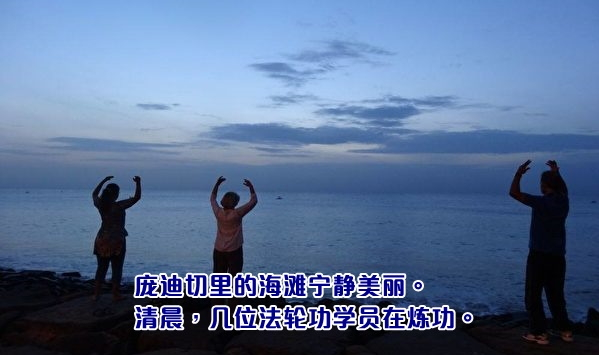

维纳思听了介绍后，很感兴趣，次日便跟着学炼功法。从此，修炼大法就溶入了她的生活。法轮大法以“真、善、忍”为指导，教人修心重德。维纳思向英文新唐人记者畅谈了她的修炼体会。

“说起来容易，做起来难。人们通常不喜欢听真话。我们倾向于听那些让自己高兴的事，而真实情况有时比较难接受。所以，我们往往想避开真相，而且习惯把责任推给别人，或是埋怨外部情况。”维纳思说，“大法教导我要向内找原因，善待他人。起初，这样做并不容易。不过，随着用心实践，我越来越能够同情和体谅他人。有些人可以为了别人而放弃自身利益，我也学会了敬重和欣赏他们。”

维纳思还谈到，一个人梦想着能获得好处，这并不难，而努力去争取才是考验，“因为这意味着，你要牺牲许多个人观念和舒适”。

修炼法轮大法后，维纳思渐渐地做到了：“踏实付出，不求回报；帮助他人，不求感激。当面对批评或嘲笑时，还能保持同情心。”

这些年来，维纳思深入社区，走访了印度的许多城邦。她发现，从修炼中获得的慈悲、善念和积极的态度，有助于她更真诚地对待工作。她更加善解人意，因此得以顺利地发展各种工作关系。她说：“我也会犯错误。在面对自己的错误时，我会坦然接受，承担责任，而不是指责他人、期待别人来善后处理。”

维纳思开朗、乐观，笑口常开。她说：“修炼法轮大法让我变得更加谦卑、更加简单。每一天，我都尽力让自己做得更好，成为更好的人。我找到了生命之道。”

这位敬业的记者，日日奔波忙碌。她认真地记录下一个个美丽的人生故事，也把“真、善、忍”的美好播洒在路上。她的镜头，收藏了明媚的阳光，也展现了心灵的坦荡光明。

<h1 align="center"><b>北京善良女孩杨丹丹被非法抓捕</b></h1>

【明慧网二零一八年三月八日】（明慧网通讯员北京报道）2018年2月28日下午，正在北京市顺义区南彩卫生院上班的杨丹丹被院长叫走，六七个警察非法把她抓捕到光明派出所。
晚上8点左右，六七个警察劫持杨丹丹到家中非法抄家，一个叫高军华的女警到处翻家里的东西，除了一个收音机，没有搜到其它东西。

高军华凶恶地问杨丹丹：“你不是说有书吗？在哪儿？你不是修真善忍的吗？”（修真是不说假话，但不代表什么都说，一些不该说的话当然不能说，说了会导致警察作恶）。

最后，他们说带杨丹丹回去一下就让她回家，她的父母守着手机等了一宿没有等来21岁的女儿。

第二天杨丹丹的父母到光明派出所要人，被告知女儿已被刑事拘留，是因为在裕龙小区发真相光盘，被举报，警察通过监控查到了在小区外街道的杨丹丹。

现在杨丹丹已被非法关押在泥河看守所。参与此次绑架的警察有杨子晨、高军华、樊立军、贾晓征。

杨丹丹1996年出生，在2001年，她只有5岁，父母因修炼法轮功被迫害流离失所，孩子靠年迈的奶奶抚养，祖孙相依为命，这一别离就是十年，以致多年后父母回家时，孩子已不认识，问爸爸：“你是谁？”

过年过节时，别人都一家团聚，孩子等不来爸爸妈妈，有时他们会半夜回来天不亮又匆匆离去，渐渐地孩子长大上学了，警察还曾去学校找她，问她炼不炼法轮功，父母在哪里等，孩子吓得不行。

在孩子的记忆里有一段很凄苦地回忆：冬天晚上放学，天已经很黑了，有一段路要一个人走回家，很害怕很害怕，别的孩子都有人接，她奶奶岁数大了不能来，只有一个人走，走的时候会哭，边哭边走。

尽管没有父母在身边，但幼小的她心里有一个轮廓：父母是因为做好人修炼法轮功被迫害的，所以自己也要做好人，按照真善忍去做。

所以尽管没有父母的爱护，还常常面对恐惧害怕，但孩子没有像这个社会中的某些人一样变得孤僻、仇恨他人、自私冷漠、更没有形成任何恶习。在艰难的岁月中，在自身家庭的不幸和冤屈中，心中怀有做好人的理念，孩子变得充满善良、诚信、遇事向内找、包容他人、乐于助人、不消极。

在人生的低谷，在成长的逆境中，绽开美丽的笑颜，这真的让人感动。

2011年5月份，离家十年的父母终于回来了，但回家仅三天，即双双被绑架，被非法劳教两年，一个在内蒙，一个在北京，此时的孩子开始担当起给父母寄钱的事，孩子盼着父母来电话，希望听到他们的声音。

法轮大法修炼中没有敌人，这不仅体现在她努力提高自己，以消除人与人之间平常的隔阂矛盾，而且还超越这个理，体现在对伤害自己的人，甚至对绑架自己家人的警察心怀善念，不怨恨、以德报怨、不忌恨，能够跨越内心的坎、能想通，形成一个认识，是缘于佛法真理的力量。

2013年父母结束两年的冤狱回家了，阔别十几年的一家人终于团聚在一起，

丹丹已长成了十六七的少女，与大陆党文化下的寻常孩子相比，她更着意于自己的道德修炼，努力想使自己变得更体谅更孝顺。在工作单位严格自律，待同事友好，对工作认真，她的院长称赞她“工作很努力”。

能够走出艰难、健康成长的最重要途径是佛法真理，是法轮佛法，这已悄悄伴随着孩子的成长，在心里深深扎下了根，所以在法轮大法蒙冤的时代，那种正义和良知使孩子自然的要把法轮大法的真相告诉世人。

希望参与办案的公安人员能受这个善良孩子成长经历的启发，好好了解一下事实真相，不要再被蒙蔽，不要追随着去做恶事，法轮功学员都是一些善良的百姓，善待他们就是善待自己的福报未来！其实所有中国人都是这场迫害的受害者，共产邪党绑架了所有中国人。

目前，一手抚养杨丹丹长大、已经80多岁的奶奶还不知道满心疼爱的孙女已遭囹圄之灾。希望有识之士能尽己之力帮助这个孩子回家。

<h1 align="center"><b>修炼法轮功 找到内心平和</b></h1>

【明慧网二零一八年三月八日】（明慧记者雪莉采访报道） 经过了一个碎砖乱石，尘土翻扬的夏天，家住德国法兰克福的玛丽塔（Marita）终于又坐上那把熟悉的木椅，在“面目皆非”的自家花园中体会自在和宁静。玛丽塔非常喜欢原先的花园，一石一木错落有致，周围自然风光旖旎，从花园隔着山坡就能看到山下的村落。下班后坐在花园远眺，是她的一天中的最大放松。
而她的作家丈夫一个夏天几乎把整个花园翻了个个儿，说是“给花园换个面貌”。玛丽塔说：“如果是以前的话，我会坚持会和他抗争，以前我先生常说我偏执，他总是得让着我。”不过，修炼法轮大法后，她跟以前不同了：“我能意识到，这是对花园和植物的执著，我得去掉这些心，所以我放手让他做。最后甚至还能赞扬他做的好。中间他问我这个木雕放这儿还是那儿，我甚至还能说，随你吧。虽然我是有想法，木雕放在那里比较好看，但是我可以做到‘退一步海阔天空’。”

“我先生非常随性，以前常常为这些事争执。让我发怒。让我不安，心里会紧张、怕混乱。修炼后我学会顺其自然。我发现我能放松那个尺度，那件事情就简单易行的多，如果我想把每件事牢牢掌握在手中，没有一个人能在我的周围环境生存下去。我控制的越少，身边的人越轻松，最后我自己也变得轻松。我丈夫现在比以前快乐多了，至少我会倾听，以前他说什么没几句就被我挡回去，现在我们的对话讨论比较有建设性了。”

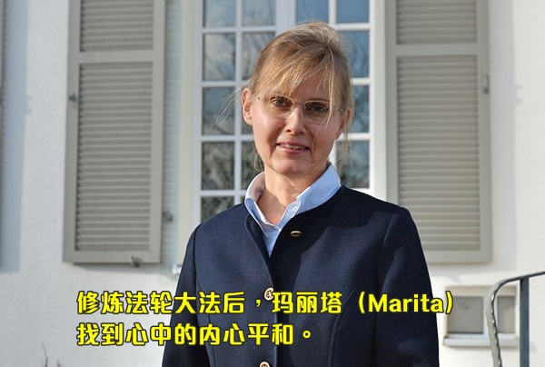

一个在过去就是很大的家庭矛盾，就这样轻松过去了；一个希望每天家里“整齐有致，一纸一笔的位置都每天一样”的妻子，是怎样放下紧张、沮丧和控制的执着，找回顺其自然，和内心平和的呢？

<b>不属于这个世界</b>

玛丽塔很小的时候，就有一种强烈的不安全感和对人们的恐惧。大约十一岁时，她发现人类的许多行为是负面的和极具破坏性的，她开始更多地注意和思考周围发生的事情。她的功课却一直都很好。高考以优秀的成绩毕业后，选修艺术史、欧洲民俗学和世界民族学，但两年后她发现自己对人和自然如何平衡，他们的关系更感兴趣。于是转为攻读人体药物研究，毕业后在法兰克福的一个诊所做医生。

她不喜欢和人群相处，认为人的许多行为是不理性甚至相互伤害的。她说：“整个社会在你争我夺，人与人相互伤害，破坏自然。我发现跟人相处让我非常疲惫。我心中的愿望是维护自然的平衡，人却在破坏它们。作为医生我至少能够和病人共同努力，找回他们身体和精神上的平衡与和谐。在这一点上我和人能够有共同的兴趣点和目标。”

“我常常工作十小时，加上通勤时间，几乎每天十二小时在外。上下班的路上除了读书还是读书，主要是修行和类似生活顾问方面的书籍，有积极意义的，我需要在工作之余找到精神营养和内在的平衡。”

读书对玛丽塔是一大慰藉。她大量阅读灵修方面的书籍，也尝试不同的修行方法。特别是在感情生活不如意的时候，从新思考自己的生活目标。“经历了一些魔难后回过头来只能对自己说，自己应该知道感恩，因为又可以想想生命的意义，为什么活着这样的问题了。也就是说，实际上所谓‘最美好的时光’，简直可以直接从我的生命中删除，因为它们没有给我带来任何好处。真正让我对生命有深刻领会的恰恰是低谷期。魔难越大，思考和对灵性的追求越深刻。”

<b>唯一可以永远读下去的书</b>

玛丽塔工作出色，努力生活，却还是感到自己和这个世界格格不入。她深深缺乏安全感，一心想的是脱离这个世界。“我渐渐明白，要解决我的问题，我需要的是真正的好的法门。我不需要那种温吞水的舒服，在我人生中遭受很大挫折的时候，温吞水的舒服没有帮到我。我只想离开这样的生活。所以我继续追寻。”

一九九九年二月份的一天，她在书店里想找一份礼物给朋友。看到《法轮大法——返本归真之路》，书后还附有当地联络人的地址。她翻看了一下，觉得这本书不适合那位朋友，好像更适合自己。不过，那天她口袋里钱很少，五天后账号上才会有钱进来，“或者五天后再来买？” 可是又一想，“不，我要这本书”。买书回家后，她马上读起来。当看到书中“免费传法，免费教功”几个字时，她心里非常感动：“这必定是一个非常深厚，极其纯正的功法，我当时想，时至今日世上还有这样纯粹的东西，我的眼中充满泪水，心里非常感动。”

书中提到还有一本书是主要著作，于是她又找来《转法轮》。“我从不一本书读两遍，从不。我有时会想，有时间某一本书再读一遍，但实际上从未这样做过。我读完第一遍《转法轮》的时候，‘咦？读完了？’第九讲中提到传法传功快结束了。我大吃一惊，‘什么，现在就结束了？’我对自己说，‘你知道如何解决这个问题，那就是再从头开始读’。从此再也没有停下过。”

读第三遍的时候，她明白了这是个性命双修的功法，除了读书外还得炼功。她找到了法兰克福附近的中国学员，和她们一起学法炼功。

<b>身体的新机制</b>

玛丽塔从青春期开始，一直到三十八岁，尽管结了婚，也生了个女儿，经期却从来不规律，得通过长期服药调整。不吃药就很久来一次。也许是因为生理期不规律，婚后也是过了两年才有孩子。生了孩子后也还是不正常，和过去一样。青春期过后一直有青春痘。

大约开始读书后的第三个月，她来了例假，两个星期后又来了一次经期，她纳闷怎么回事。从此以后例假正常起来了，荷尔蒙变规律了，而且没有例外，无论生活多紧张，压力多大，例假都非常规律，好像是身体上设立了新的机制。

“这在医学上是无法解释的。”玛丽塔说，“我后来理解，是身体更新了一个机制，精准无比。第一次经期后的那两个星期内，身体换了个工作模式，两星期后按照新模式运作了。更奇妙的是，皮肤上的青春痘也忽然不见了。”那时因为皮肤问题前来找她的病人不少，一来看见她自己的脸上都那么多痘，让她非常不好意思。现在脸上皮肤光滑，除了些微细纹没有一点痘疹。

<b>放开手　生活变轻松</b>

她的同事都注意到她皮肤变好了。还有一个同事惊讶的说：“共事那么多年，你最近开始会说说你自己的事了。”“我自己都没有意识到这个变化。”玛丽塔回忆到，“很多年来我都不会说有关我自己的话题。我不再感到在人群中陌生。在各种状况中，我的抗压能力也增强了。”

她先生以前常常嘲笑她胆子小，精神总是紧绷着。渐渐的他看到了玛丽塔修炼法轮大法后的变化，也非常惊讶。以前家里所有的事情都得按照计划进行，大到旅行计划，小到书桌上的用品摆设，所有的细节得安稳妥帖她才放心。“这种变化其实来自于我不断的同化大法，在许多事情上能后退一步，给他空间，放弃控制欲。”

玛丽塔说道：“就比如翻修花园这件事，他说干就干，我整个夏天没有休息的地方了，每分钟担心植物被弄坏，我心里非常紧张。可是他为翻修后的成果很骄傲。我努力从他的角度看这件事：他花费了整个夏天，做了件很有意义的事情，他为这个成果骄傲。如果我坚持自己的角度看待这件事，看到的是凌乱、不安、心里的空落。我失去了一些，但是我有个快乐骄傲的丈夫，和他的成功，我不该为此高兴吗？而且我发现自己对花园有很强烈的执著，这棵花得是这样的，那个植物该如何侍弄，每一草一树对我非常重要，它们是我的，我每天心里很紧张，很痛，我是修炼人，那就要放下执著。”

玛丽塔从小渴望的安全感和内心的平和，在她三十八岁那年找到了。坐在陌生而熟悉的花园中，她微仰起头，徐徐清风拂面而过。

<h1 align="center"><b>《血腥活摘》作者颁“奥斯卡自由人权奖”</b></h1>

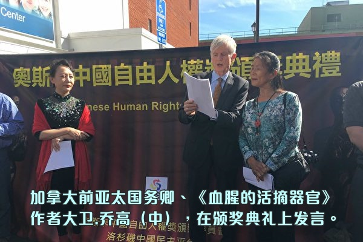

【大纪元2018年03月05日讯】（大纪元记者姜琳达洛杉矶报导）3月4日（周日），就在第90届奥斯卡颁奖典礼举行的同时，第5届“奥斯卡自由人权奖”的颁奖典礼也于同地举行。加拿大前亚太国务卿、《血腥的活摘器官》（Bloody Harvest）的作者大卫・乔高（David Kilgour）作为受邀嘉宾，他在发言时说： “中国没有民主，而中共活摘法轮功学员及良心犯器官的恶行仍在继续。”

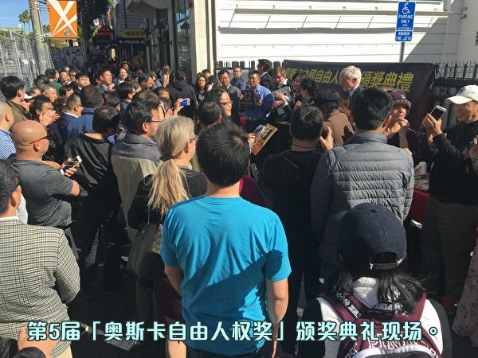

“奥斯卡自由人权奖” 由海外华人于2014年发起，通过表彰一系列的中国良心犯、维权人士等，关注中国人权。

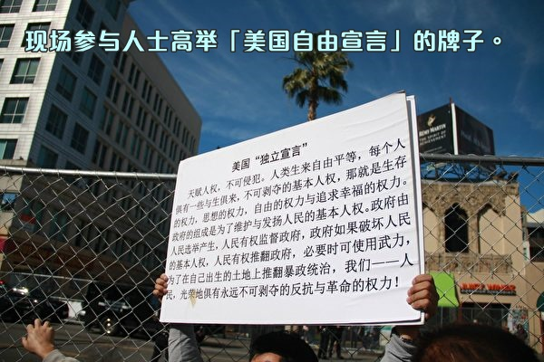

今年的颁奖礼由民阵副主席盛雪主持，获奖的个人包括被中共判处8年徒刑的维权人士吴淦、被判处10年徒刑的异议人士李铁、街头民主人士黄文勋以及人权人士李玉凤。该奖项发起人之一的雕塑家陈维明表示：“这些人士对中国民主做出了巨大的付出，至今还被中共关押在监狱里。”

主办方还特地从加拿大邀请到了大卫・乔高，参加此次颁奖典礼。乔高说，20世纪中期，苏共妄想统治世界，但时至今日，世界上也只剩下5个国家保留共产党，与世界民主相背离。

“从大跃进到文化大革命，从1989年天安门事件到1999年开始迫害和平的法轮功学员，中共在和平时期杀死了数千万的中国人。而活摘、这件史无前例邪恶的事情，至今仍在继续，且呈现更加恶劣的状态。”

2006年7月，由大卫．乔高和加拿大著名国际人权律师大卫．麦塔斯（David Matas）共同独立调查的关于中共活摘法轮功学员及良心犯器官的报告在国际上公开。大量的证据、资料证实了中共反人类罪行真实存在。

乔高说：“中共活摘人的重要器官，包括肾脏、肝脏、角膜和心脏。大家千万不要以为这恶行已经在2015年停止了，根据我们在2016年用大量调查数据更新的报告以及谨慎判断，截至2016年中，中国每年至少完成了6万个器官移植手术，并非政府声称的约1万个。这意味着平均每天有164人因器官而被中共杀害。”

据悉，这份更新的报告，借鉴医学期刊、医院网站和一些被删除的网站文档，提供了一份对全中国数百家医院移植计划的全面调查，并且提供了许多通过国家政策和资金控制，甚至牵涉到军事和民用医疗保健系统的器官移植网络证据。

而刚刚被美国政府从中国救到海外的民运人士张林也用亲身的经历，证实了中共活摘器官的事实。他说：“中国人被中共蒙蔽双眼，无法看清世界，很多人也在中共的愚弄下都麻木了，真理的声音都被打压。我在跟中共的独裁政权进行斗争的16年中，先后被5次抓到监狱迫害。”

“我在看守所的时候，亲自见识了中共强迫一些人贡献自己的器官，当然很多人都拒绝。那中共就威胁，要不主动同意，就不打麻药、强制活摘。除了法轮功学员的器官被大量活摘，普通老百姓也有。除此之外，计划生育委员会都亲自承认，把4万个胎儿从母胎中拿出并杀死。中共视人民就像是牲口。”

张林因此感谢主办方对中国民主人士的支持和声援，鼓励更多人争取自由。中国民主党全国委会主席王军涛、中国社会民主党主席刘因全、民主中国阵线副主席金秀红也都被邀请到现场。金秀红说：“最基本的人权，在中国都没能得到。共匪希望人们都没有思想，妄图操控。但我们是人，不是动物。所以我们的信念是不会改变的，人是向往自由的。”

主办方除了为此届获奖人颁奖之外，中国政治犯张海涛的妻子李爱杰，也偕同2岁的儿子，代夫领取了上届奥斯卡人权奖奖杯。

李爱杰在接受采访时表示：“拿到这个奖，对我们是一个鼓励和安慰。我先生2016年被送去了新疆的监狱关押至今。他只是对中共独裁政权做出一些批评。69条微信、205条推文、拍摄了乌鲁木齐街头的一些照片，却被中共判了有期徒刑19年。我真的太震惊了。”

她也透露，自己当初听到活摘器官一事不敢相信，后来她觉得，没有什么不可能，中共什么事情都干得出来。李爱杰感谢所有支持她丈夫的海外人权人士，也感谢川普政府的帮助，让她获得自由，“希望我丈夫可以早日与我们团聚”。

最后，乔高也建议所有人，可以通过建立反活摘国际联盟、推进国际社会立法、向医生传递真相等方法，制止活摘。

他说：“我们现在开始成立停止中国掠夺器官国际联盟（International Coalition to end Organ Pillaging in China），而以色列、西班牙、意大利、挪威等国，都通过了立法加大打击中共的非法器官交易。我们也正在联络相关的中介，让他们不要再与中共的活摘市场连线。 ”

“只要中共不停止迫害法轮功，活摘器官的罪行一天不终止，迫害人权的事情也会继续。1989年柏林墙倒塌之前，很少有欧洲人预测民主、人权浪潮即将席卷欧洲，但事实如此。所以，我们要共同制止邪恶。”

<h1 align="center"><b>宁夏三狱警参与迫害遭报应殃及家人</b></h1>

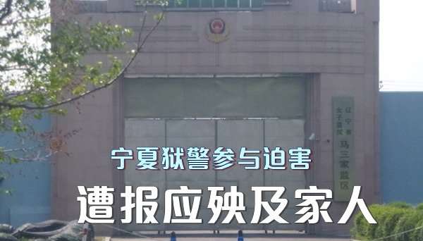

【明慧网二零一八年二月二十五日】（明慧网通讯员宁夏报道）近日获悉，宁夏女子监狱的三名女狱警王岩、余春华、马新英（后调离），因参与迫害法轮功学员而遭报应并殃及丈夫，王岩的丈夫开车撞死了，余春华的丈夫胃癌晚期死亡，马新英的丈夫被判刑。
<b>一、王岩的丈夫开车被撞死</b>

王岩，四十岁出头，宁夏女子监狱狱警，其丈夫刘新华是银川监狱某监区监区长，俩人以前都是石嘴山监狱的狱警，后来分流到宁夏女子监狱和银川监狱。王岩在宁夏女子监狱曾参与迫害法轮功学员杨洁、张晓萍，遭报应殃及其丈夫。

二零一四年五月间，正值节假日，刘新华开着自家的车拉着一个女人出外游玩。在高速路上，刘新华的车与其它汽车相撞，车被撞得飞过了中间的隔离带，砸到对面车道上一辆正在行驶的车上。刘新华没系安全带，当场撞死，车上的女人也撞死了，对面的车被砸坏，车上的一家三口重伤。

王岩的丈夫拉着女人双双被撞死后，王岩不仅要承受中年丧夫的痛苦，还被知情人指指点点，丧尽脸面。

<b>1、王岩参与迫害杨洁的事实：</b>

二零零五年九月，法轮功学员杨洁被绑架判刑三年半，囚禁到宁夏女子监狱。

一天中午，杨洁正在服装加工车间干活，王岩到车间通知大家说：回监舍休息。杨洁收拾好手头的物品也准备走。王岩拦住杨洁说：你不能休息。杨洁问：为啥？王岩说：“你是法轮功，是国家重点打击的对象，所以你不能休息。”杨洁说：“法轮功是冤枉的。”王岩说：“你别跟我说这个，我不管你冤枉不冤枉，就是不准你休息。”说完，王岩喊来两个犯人包夹监视杨洁继续在车间干活，直到开晚饭，才让杨洁回监舍。

还有一次，监狱给关押人员改善生活，杨洁距离打饭窗口很近，听见一个犯人对食堂打饭的说：“这是张晓萍的饭，不要给她打肉，少给她打点汤就行。”杨洁到这个犯人跟前问：“为啥不给她打够！”这个犯人很紧张地说：“不是我，是队长让这样做的。”杨洁大声说：“杀人放火的都能吃饱饭，为什么不给法轮功学员吃饱饭。”那天正好是监管张晓萍的狱警王岩值班。王岩听到杨洁说话的声音，快速地从门口跑到打饭的窗口前，问犯人是怎么回事？那个犯人给她汇报了情况。王岩恶狠狠地从杨洁的胸口猛击一拳，还破口大骂：“你吃饱了没有？跟你有什么关系！”一边骂着又捣了杨洁几拳。当时，用餐的关押人员有六、七百人，打饭窗口附近的许多人目睹了这一幕。

二零零七年年底的一天，杨洁拒绝参加监狱开的大会。散会后，狱警丁冬红、马俊红、范红、王岩把杨洁叫到值班室辱骂，监区长丁冬红用皮管子抽打杨洁的脸，边打边骂：“你敢破坏监管制度、敢跟共产党作对，就让你尝尝共产党的铁拳，让你生不如死！”同时还满口脏话诬蔑大法、诬蔑师父、羞辱杨洁，又指使两个“互监”，强行给杨洁穿上囚服、戴上胸卡，强行把她按到凳子上剪短了头发。

<b>2、王岩参与迫害张晓萍的事实：</b>

二零零七年八月，法轮功学员张晓萍被非法判刑五年半关押到宁夏女子监狱，刚去被分到二监区。监区长丁冬红唆使三、四个犯人将她拉到厕所，一边打一边将她的衣服扒光，换上囚服。第二天，丁冬红指使包夹将张晓萍带到二监区的大厅罚站。

此后，二监区的狱警马俊红、王岩在监区长丁冬红的指使下，对张晓萍实施了两个月的“入监教育”：长时间罚站；“坐小凳子”；值班队长和包夹每天给张晓萍打饭时特意少打，吃不饱；只让穿一件衣服、一条裤子挨冻等等。

王岩手机号：13629578512

<b>二、余春华丈夫患胃癌死亡</b>

余春华，五十多岁，宁夏女子监狱狱警，其丈夫马国宇是银川监狱办公室主任，去年刚晋升为调研员。俩人以前都是石嘴山监狱的狱警，后来分流到宁夏女子监狱和银川监狱。余春华在监区期间，多年中一直参与迫害法轮功学员。后来余春华调到监狱接见室负责登记接见，积极执行监狱对法轮功学员的迫害政策，不“转化”不让接见、家人是修炼法轮功者不让接见。

余春华的恶行殃及其丈夫，她丈夫马国宇在二零一七年十一月前后，查出胃癌晚期，治疗一个多月后，大约在二零一七年十二月死亡。

余春华警号：64030109

<b>三、马新英丈夫被判刑五年</b>

马新英，五十岁左右，原宁夏女子监狱狱警，后来调到银川监狱干内勤。马新英的丈夫尚金林，原宁夏监狱管理局财务处副处长。马新英在宁夏女子监狱期间积极参与迫害法轮功学员，遭报应殃及丈夫，二零一七年六月，尚金林因贪污被抓，大约在年底被判刑五年。

<b>马新英参与迫害张晓萍的情况：</b>

二零零七年，张晓萍被冤判五年半，八月，被非法关押到宁夏女子监狱。刚开始在二监区，后来调到了一监区。马新英是一监区狱警，一直积极参与迫害。

二零零八年一月，张晓萍的两个弟弟带着她儿子磊磊到监狱探视，一监区监区长王琴（已遭恶报患舌癌，正在术后化疗）百般刁难不让接见。了解情况的犯人对张晓萍讲：你儿子和你弟弟从早上九点多等到下午四点，你儿子可怜地边哭边求接见室的狱警：我三年没有见过妈妈了，请您让我看看妈妈吧！狱警都不让见，最后让狱警赶走了，在场的人都流下了同情的泪水。王琴还欺骗张晓萍家人说：张晓萍在里面不服从管理，所以才不让接见。王琴还授意磊磊给张晓萍写了个条子，让张晓萍服从管理。就是这样，王琴还是没有让接见。

二零零八年五月初，为了胁迫张晓萍“转化”、“服从管理”，王琴和马新英到张晓萍儿子磊磊（十六岁）就读的学校进行骚扰。当时磊磊正在复习准备中考，遭王琴和马新英骚扰后，磊磊的情绪受到很大的影响，心理压力很大，结果没考上高中。

二零零八年五月十二日下午，汶川发生大地震，银川市震感强烈。宁夏女子监狱管理人员象热锅上的蚂蚁四处乱窜，关押人员也人心惶惶。短暂的混乱后，管理人员将所有关押人员集中在监狱的大操场上。在如此慌乱的情况下，丧失人性的刘志琴、马新英还指使犯人将张晓萍的衣服强行扒光换上囚服，打上“背铐”，拖到楼下无人的车间关了一下午，由包夹、队长监视。

<b>杨洁、张晓萍的情况简介：</b>

杨洁，女，今年四十八岁，原来在中卫人寿保险公司工作。原来有头疼、痛经、胃疼、先天性关节炎，疾病发作时就不能上班。一九九七年三月开始修炼法轮功，短短的几个月后多年的疾病不翼而飞，抽烟喝酒的恶习也全部戒掉了。在工作中淡泊名利、待人真诚，得到了客户、领导和同事的好评。九九年七二零以后，杨洁遭两次非法劳教、一次非法判刑迫害。

张晓萍，女，今年四十九岁，理发师。曾经患多种慢性疾病：乳腺增生、子宫肌瘤、肾虚、胃炎、胆囊炎、附件炎、神经衰弱等，到处医治无效。一九九六年九月初开始修炼法轮功，两个月后，全身疾病痊愈，体重一下增加了二十多斤，脸色红润。九九年七二零后曾被非法劳教、判刑。

<b>结语</b>

宁夏女子监狱的一些狱警受中共造谣污蔑法轮功的宣传蒙蔽，在宁夏司法厅、宁夏监狱管理局等部门及监狱领导积极推行的迫害政策蛊惑下，为了“立功”，泯灭良知，积极参与迫害法轮功学员，当法轮功学员善意地告诉她们善恶有报时，她们不以为然，还反唇相讥。

可是，善恶有报是天理！一个人做恶，不但自己要承受偿还，还会殃及家人甚至子孙。

目前，宁夏女子监狱已将法轮功学员集中关押在四监区了，我们奉劝监狱领导和四监区狱警，能以监狱王琴、王岩、余春华、马新英的报应为警示，为自己和家人的平安着想，了解法轮功真相，停止迫害、弥补过失！

<h1 align="center"><b>一位中共干部在参与镇压法轮功过程中的真实体验</b></h1>

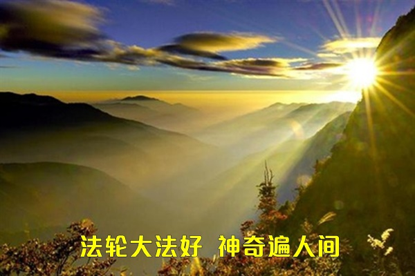

【希望之声2017年11月29日】（本台记者慧光综合报导）我是在中国政府机关工作的一名干部，1999年“7.20”之后，单位领导派我负责“转化”法轮功学员。由于受党文化教育多年，也由于不了解法轮功到底是什么，当时我很抵触法轮功。我以为凭我对科学知识的掌握以及多年的工作经验，说服单位那几个炼法轮功的老头、老太太并不难。

之后，我搜集了从报纸宣传中得来的诋毁法轮功的负面信息，认真分析了当时的形势。从道理上说，继续修炼将要面临迫害，还要给单位领导及家人带来麻烦、压力和损失，这些都是显而易见的事实。经过充分准备，我对“转化“工作充满信心。然而，几年下来，我费尽心机，苦口婆心的劝说他们，不但没有什么效果，结果也让我大感意外：我没能劝阻他们，相反却被她们那种慈善的精神感染了。

有一个时期，我的内心矛盾极了。这边是上级领导要我绞尽脑汁去说服他们，而那边在与法轮功学员接触时，我不仅越来越找不到说服她们的理由，反而经常被她们的善良所感动。她们面对政府的镇压，不仅没有恐惧和害怕，反而选择了一种和平、理性的方式向政府讲真相，那种对信仰的坚定以及对人的善念，经常让我的内心产生震动。她们因为上访经常被抓，我也经常被单位领导和“610”的人叫去训话。最让我纠结的，一个是信党，一个是信佛，我不知道该如何选择？

说实话，我接受共产党的无神论教育多年，神佛在我的思想中就是迷信。但是我相信“实践是检验真理的唯一标准”，“时间会是最好的见证”。从这个角度去观察，无神论的思想渐渐的开始动摇。因为我从法轮功学员身上看到的东西，用无神论的观念根本解释不了。

我单位的一个老太太原来患有肺气肿、肺心病，整天气喘吁吁的，炼法轮功以后满面红光，活到九十多岁；一个老局长因体弱多病，提前离休，最严重的是心脏病，炼法轮功后百病全消，八十五岁的老头每天骑车满街跑，最神奇的是他原来满脸麻子，炼功以后没有了，后来还长出了新牙。

有一个小伙子是我的亲戚，有一次帮人挖菜窖，就在他上厕所的功夫，菜窖塌了，别人都砸里了，他却没事，他说他身上带着法轮功的护身符。

我家邻居，有两个癌症患者：一个胃癌已经扩散，炼法轮功后痊愈了；一个宫颈癌，炼法轮功后好了，还经常能看到法轮。她担心我迫害法轮功遭恶报，常来我家讲真相，我也担心自己曾撕过法轮功的书，怕遭报应，心里常念“法轮大法好，真善忍好”。

一天早晨三点多钟，我胃痛难忍，坐起来，闭眼默念“法轮大法好”，不一会儿，就在前额部位出现了一条金色亮线，并且在右侧出现一个有两寸多高的佛像，像电影中放慢镜头一样，慢慢的移动到我眼前，越来越大，越来越大，金光闪闪，到最后，我仰视都看不见佛的头部。我当时很激动，既感到震撼，同时也感到自责，我开始痛恨那些让我参与迫害修炼佛法的人。

我现在虽然还不敢修炼法轮功，但是我已经将念“法轮大法好”的美好，告诉那些身处危难或被病痛折磨的人。我舅舅肠癌做手术时，我让他本人及全家人都为他念“法轮大法好”。他手术时伤口缝了十三针，从手术室出来直到出院，刀口始终没痛过。和他一同做手术的病人都用止痛泵和药物止疼，他却一点不感到疼，医生和病友都觉的不可思议。

后来，我姐姐因乳腺癌做手术，我们全家在手术室外，都替她默念“法轮大法好”。她说每当她念“法轮大法好”时，疼痛减轻了，而且身体里像有个电风扇似的在旋转。还有一次，她疼痛时又念“法轮大法好”，看到一个带翅膀的小天使飞来了，拿个小白铲子，在她伤口一铲，就飞走了，她立刻就不疼了。

一个朋友听说法轮大法这么神奇，就借了一本《转法轮》看。第二天，她告诉我，她刚看了一半时，已经是半夜两点多钟，就在她家的天花板上出现了一个大法轮旋转，她一直看着，法轮也不走。后来，她倒杯水，边喝边看，法轮在她家待了十多分钟后才消失了。她激动的问我是咋回事？我也说不明白，这么多奇迹发生在我身边，决非偶然，是该反思的时候了。

一句“法轮大法好”就展现了这么多奇迹，那些面对迫害依然毫不动摇的坚定修炼者，该有多少神奇呢？再说了，没有神，能奇吗？
（转载希望之声）

<h1 align="center"><b>生命的光焰–献给中国的脊梁</b></h1>

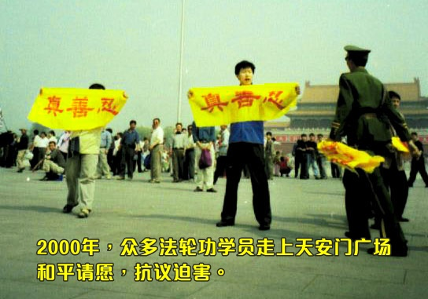

【大纪元2016年02月20日讯】仁爱、信守、义气、忠诚。民族的精神，在文明的长河中，深沉的流动，生生不息。信仰和道德是她的源头。纵使时光流逝，环境变迁，在纷乱喧嚣中，信念永存。无数美丽的瞬间，刻划生命的历程，如点点繁星，闪烁在历史的天空。

公元前548年，春秋战国鲁襄公25年，齐国的大臣崔杼设计杀死了调戏其妻的国君齐庄公。齐国太史官直书：“崔杼弑其君。”崔杼怒杀史官。太史弟执笔再写：“崔杼弑其君。”弟又被杀。史官的二弟同样秉笔实录，崔杼只好作罢。同时，远在外地的南史氏闻讯带着竹简赶赴齐国，准备再次记录史实。

1142年1月27日，民族英雄岳飞遇害，时年39岁，“天下共知其冤”。朱元璋评：“纯正不曲，书如其人。”孙中山说：“岳飞魂，是中华民族的精神代表，也就是民族魂。”岳飞留下的是忠义典范，永远的“壮怀激烈”。

公元1283年1月8日，北京柴市口，文天祥从容就义，终年47岁。之前，这位南宋文学家、政治家、抗元名臣经历了三年多的囚禁，坚决拒降。元世祖忽必烈爱其才，亲自劝说，文天祥仍不为所动，但求一死。其妻欧阳夫人在收尸时发现了文天祥的绝笔：“孔曰成仁，孟曰取义，惟其义尽，所以仁至。读圣贤书，所学何事？而今而后，庶几无愧！”

乾隆有评曰：“若文天祥，忠诚之心不徒出于一时之激，久而弥励，浩然之气，与日月争光。该志士仁人欲伸大义于天下者，不以成败利钝动其心。”

光阴荏苒。公元两千年，传来这样的图片：北京天安门广场上，有一位男青年，身穿蓝色上衣，黑色长裤。他笔直地站立着，双手向两侧伸开，展示出一条黄色的横幅，上写“真善忍”三个大字。在他的左侧，一个身材高大的武警正向他走去，只有一步之遥。男青年镇定自若，略微侧头，直视着走来的警察。他的嘴唇开启，似乎正在呼喊什么。时光，在此定格。

下一秒钟，发生了什么？那个武警飞起一脚，把他扑倒在地？再跟上几个便衣，一阵拳头？之后，押上警车、非法判刑？他是否遭受酷刑，流离失所？他，不知其名，现在何方？就是这张不甚清晰的照片，令多少人洒下热泪。

天安门广场，见证了此起彼伏的呼声：“法轮大法好”，见证了大义凛然的目光和身躯，见证了正义和邪恶的对峙。神州大地，见证这一切的，何止这个广场？

1999年10月1日晚，山东省招远市张星镇派出所，农家妇女、法轮功学员赵金华被警察暴打。几个男人揪住她的头发，拳打脚踢，再用胶皮棒子狠抽身体的要害部位。打累了，他们把她拖进值班室，用手摇电话机施以电刑。电线缠上了，警察们用力地摇动转柄，赵金华昏了过去，几个壮汉上前，辟哩啪啦一阵猛打，她醒了。“还炼不炼？”“炼。”再通电，赵金华又昏了过去，再被打醒。回答还是一个“炼”字。电刑过后，赵金华被逼赤着脚站在水泥地上。她摇晃着，倒了下去。10月7日，赵金华停止了呼吸，永远离开了那块她日日守候的花生地。

十六年过去了，“炼”的声音日夜回响。为了这一个字，俊秀的面容，朴实的微笑，逝去了。告别父母妻儿，面对酷刑蹂躏，他们，义无反顾。祖国的山河，留下坚定的足迹。不屈的意志，令强权暴力束手无策。千百万普通人，于平凡处写传奇。现代大戏，浸著悲伤，透著悲壮，引热泪奔涌，激情沸腾。

“人生自古谁无死，留取丹心照汗青。”民族的脊梁，以勇气担当，用生命实践，诠释忠义和气节，承传伟大的精神，千年，万年。

<h1 align="center"><b>墨西哥联邦政府机构员工学炼法轮功</b></h1>

【明慧网二零一八年三月一日】二月二十三日，墨西哥法轮功学员在首都墨西哥市向墨西哥社会保障管理局员工讲真相、教授法轮功功法。许多员工学炼了法轮功功法后，感觉平时工作中的压力减轻了，感到从未有过的放松、舒服。

墨西哥社会保障管理局是墨西哥联邦政府机构，负责向民众提供健康服务和社会安全保障。

墨西哥社会保障管理局的代表Mónica Vázquez说：“我们的员工工作压力非常大，还要超负荷的加班。因此我们需要找到一种缓解压力的方法。”当今，许多上班的员工都面临严重压力困扰。

Vázquez女士去过法轮功学员的炼功点后，了解了修炼法轮功的益处后，决定请法轮功学员教功，让员工们能够获得身心健康。

Vázquez表示，有些部门的人知道了我们的学功活动后，也想在他们那里举办类似的学功活动。

墨西哥社会保障管理局的员工们参加了学功班后表示，他们获益良多，感觉良好，并感受到能量。他们学功后普遍都感到很愉快。

一位年轻女士说，炼功后，她感到非常宁静、祥和。她要把法轮功介绍给她母亲。“她一定会喜欢的。”

另一位学炼法轮功的男士说，他炼第二套功法后感觉到手发热，全身非常放松。一位女士说，她感到非常舒服，好象后背有什么东西开了似的。

教功结束后，员工们都希望更多的了解法轮功，到附近的炼功点炼功。

<h1 align="center"><b>越南女记者顽疾缠身面临失明 一本奇书让她见到彩虹</b></h1>

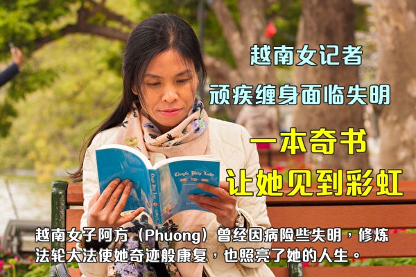

【大纪元2018年02月22日讯】（大纪元特约记者Daksha Devnani采访报导，田云编译）阿方的故事，让人相信：奇迹就在身边。这位文静的越南女子，曾是一名记者。几年前，她遭遇了多种疾病的侵袭，健康直线下降，听力受损、视力模糊。她被黑暗和疼痛包围，在苦海里挣扎。她还能见到彩虹吗？

<b>不堪回首</b>

阿方（Phuong）回想昨日，仍然心有余悸。她说：“几年前，我患上了结核病。治疗方案要持续一两年，而且费用很高。那段经历真是恐怖，我受了多少罪啊。”

阿方说，结核病很容易复发，而且病菌有抗药性，因此，每一次问诊，医生都会开出更强、更高的药剂。“我患病期间，每天要服用5到8种抗生素，一共要吃30片药。我的身体承受不住大剂量的药物，我时常头晕、恶心。由于抗生素的作用，很多次，我在吃过饭后意识都不清楚了。”

阿方持续服药，未见结核病得到治愈，药品的副作用很快就显现出来。阿方药物中毒了。“我的听力受损，我戴上了助听器。内脏也受到影响，尤其是肾脏和肝脏功能。我患上了慢性鼻窦炎、低血压、胃食管反流、慢性疲劳障碍、慢性疼痛等等。我必须依靠大量的止痛药，好几次被送去急救。”

为了给女儿治病，阿方的父母花了一大笔钱，他们还请巫师到家里作法，四处求医。然而，阿方的身体却每况愈下。她疲惫不堪。她不明白，为什么美好的生活遥不可及？她开始失眠了……

“我越来越虚弱，后来连日常琐事都不能打理。可怜的妈妈开车带着我在城里散心。我不敢想像，将来的日子会是什么样子。人们常说，雨后见彩虹。但是，那时的我已经失去了所有的希望，根本不敢奢望彩虹。”她回忆说。

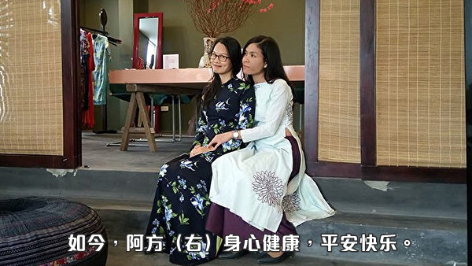

<b>雪上加霜</b>

因为治疗的需要，整整四年，阿方停止了工作。刚刚患病时，她还能坚持上班，可是几个月后，她的视力下降，医生却查不出原因。“我看什么东西都模糊不清，这让我十分害怕。接着，情况越来越糟，我出现了色盲症，影响到日常生活。我在市场里分不清蔬菜，我不能自己煮饭，连手机也不能用了。在街上，我得请陌生人告诉我公交车号码，我也看不准交通灯的颜色。”

阿方向国家眼科学院的顶级大夫求助，但是，技术最精湛的医疗小组也束手无策。他们说，她患上了罕见的障碍症，最终会失明。

阿方生起了自杀的念头，因为几年来，她成了家里的负担。现在，又添了一种无药可医的病，她实在无力面对。转念再想，如果她走了，父母怎么办呢？她是他们唯一的孩子啊。

<b>又见彩虹</b>

正在阿方痛苦不堪时，一位同事向她推荐说，有一本叫《转法轮》的书可以帮到她。阿方一听便打算尝试，她决定把书带回家，让爸爸读给她听。

谁知道，那位同事坚持认为，阿方应该自己阅读。她很有信心地表示，这样做的话，阿方的视力就会恢复。于是，阿方从网上下载了《转法轮》，把字体放大到32号。

阿方自己读书，也和同事交流书中的内涵。阿方说，“‘真善忍’照亮了我的生活，就像阳光照耀大地。几年来，我头一次意识到，自己的苦难根源在哪里。因为我根本没有按照‘真善忍’去做。《转法轮》启悟了我。”

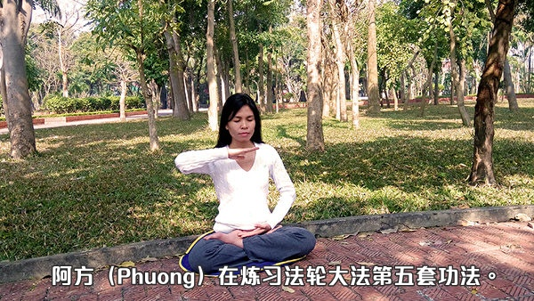

读书、炼功后，阿方的健康迅速地好转。她停止服用所有药物，而结核病没再复发，她也甩掉了助听器。

如今，阿方身心健康，平安快乐。谈起康复的奇迹，她激动地说：“‘真善忍’给我带来了黎明，为我开示生命的真理，这是我个人品行的核心指导。……这条大道，教导我如何生活。”

这就是阿方的人生惊喜大逆转。在黑暗隧道的尽头，她拥抱曙光。

<h1 align="center"><b>辽宁省政法委、610近期犯罪事实</b></h1>

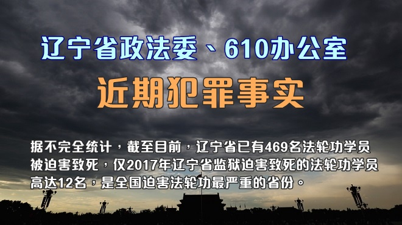

【明慧网二零一八年二月二十三日】（明慧网通讯员辽宁报道）二零一七年年末辽宁省“610”、政法委、维稳办，利用各市的维稳办、司法局来向全省的各监狱下令，搞一个所谓的“专项行动”，就是针对那些被非法关押的法轮功学员，强制他（她）们“转化”（利用各种方式，包括酷刑折磨，迫使法轮功修炼者放弃信仰）。
二零一七年五月十九日，辽宁省维稳办副主任马廷栋带人到朝阳市督促撕毁法轮功学员贴的真相标语，并绑架朝阳市多名法轮功学员。

二零一七年辽宁省现任政法委书记李文章仍在继续执行中共江泽民集团对法轮功的迫害政策，李文章多次在辽宁省政法委、综治维稳内部会议上污蔑法轮功，散布中共欺骗民众的谎言，并要求公、检、法部门迫害法轮功。

据政法委部门人员讲：前段时间在辽宁省综治工作会议上，李文章多次讲要到打击法轮功。

自从一九九九年七月江泽民发动迫害法轮功以来，辽宁省政法委“610”（中共迫害法轮功的非法组织）紧紧追随江、曾、周，执行邪恶的迫害法轮功的政策。

据不完全统计，截至目前，辽宁省已有469名法轮功学员被迫害致死，仅二零一七年辽宁省监狱迫害致死的法轮功学员高达12名，是全国迫害法轮功最严重的省份。

最新统计公布，二零一七年，至少有974名法轮功学员被中共非法判刑，其中辽宁占179人，居法轮功学员遭绑架迫害人数最多的地区前十名之首。

然而，天理昭昭，他们的所作所为决定了他们的结局。近几年，辽宁省政法系统，已经有超过三十人落马。包括原政法委书记苏宏章、原政法委书记、原公安厅长李峰、原辽宁省司法厅长张家成、原抚顺市政法委书记吴光、原鞍山市政法委书记梁冰、原凤城政法委书记董长允、原大连市中山区政法委书记胡家耿等等等等，均已落马。

那些残害人民的罪人，不管当时是多么的飞扬跋扈、不可一世，最终都落到悲惨的下场。一切都在兑现着“善恶有报”的天理。

<h1 align="center"><b>桩桩冤判何时了？</b></h1>

【明慧网二零一八年二月二十七日】年节刚过，元宵节又到来了，人们都沉浸在传统节日的阖家欢乐之中，可是在法轮功学员家中却不是这样。近几天明慧网传来了河北省法轮功学员被冤判和非法开庭的几则消息，令人痛心落泪，也感到法轮功学员的人权状况严重恶化程度。
据明慧网二零一八年二月二十五日报道：河北省石家庄市桥西区法院在二零一八年二月八日图谋对法轮功学员李惠云博士非法庭审，但没能进行。法院搪塞说什么因为“李惠云不配合戴手铐”、人带不来。

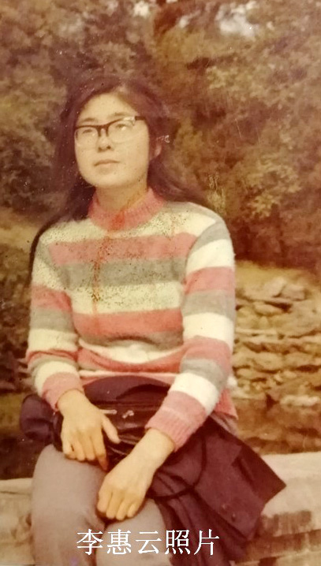

李惠云博士，女，原河北省石家庄市河北科技大学副教授，她的专利成果在二零零三年德国国际发明博览会上获“国际发明先锋奖”，获二零零三年香港国际专利技术博览会“金奖”，第三届亚洲国际专利技术专利产品博览会“金牌奖”和“科技发明进步奖”。

十多年来连番的洗脑班迫害、二年劳教、二十九个月看守所非法关押、四年零十个月的判刑。二零一六年一月二日出狱，身体尚未恢复，二零一七年三月二十三日又再遭绑架。在无止境的酷刑和精神折磨下，使李惠云整个人受到极度的身心摧残，大脑受到严重刺激，导致精神一直处于失常状态。时值新年和元宵佳节，李惠云八十多岁的老母及所有亲人不知在怎样痛苦中度过？

明慧网同日报道，被非法关押近一年的保定市法轮功学员王海升，被保定市唐县法院非法判刑八年，并处罚金二万元。二零一八年一月四日，王海升上诉到保定市中级法院，现已立案。

二零一六年十二月十三日下午，王海升用手机自动拨打语音软件讲真相，打到唐县白合镇西赤村，村喇叭是用无线电话通过手机广播的，被正在此村“扶贫”的河北省安全厅处长郭富强听到，于是他把此事通知给保定市国保，并成立了专案组，构陷王海升。

二零一七年七月四日唐县法院非法开庭。非法庭审结果是唐县法院以证据不足退卷给检察院。警察本来应该无罪释放王海升，但是在专案组的高压下，唐县国保在进行所谓的补充侦查后再次将案件递交法院。

明慧网二零一八年二月二十四日报道：近日，河北省张家口市法轮功学员赵晓路被山西省忻州市忻府区法院冤判四年，赵义军、杨淼被冤判三年，马占国被冤判二年零十个月，吴晓娇被冤判二年零八个月。

赵晓路、赵义军、杨淼、马占国不服判决，本人都写了上诉书，几位家属也都写了上诉书，递交忻府区法院及忻州市中级法院。

自迫害以来，赵晓路曾经多次被绑架关押、判刑及洗脑班迫害，遭受了非人的酷刑和精神折磨。这次由于长时间被非法关押忻州看守所迫害，导致修炼前原患有的心脏病复发，身体极度虚弱，上法庭时，还戴着手铐、脚镣，刘律师当庭要求给当事人打开手铐、脚镣，并且当庭为当事人递交取保候审申请。

一位曾经是张家口电视广播事业局职工、记者的公职人员，历经迫害的古稀老人，因为坚守自己的崇高信仰，又被冤判四年徒刑，今后将如何度过这四年冤判迫害，令人担忧。

明慧网二零一八年二月二十二日报道：河北省唐山市71岁的法轮功学员孙玉兰二零一七年十一月被丰南区法院非法判刑两年，本人上诉至唐山中级法院。唐山中级法院枉法维持原判。二零一八年初，孙玉兰被转到石家庄女子监狱迫害。

河北省是中国大陆法轮功被迫害最严重的省份之一，历届中共河北省委、政法委、六一零、公检法等部门，积极追随江泽民集团打压迫害法轮功，是江氏集团的黑窝点之一。

如河北省怀来县北辛堡乡蚕房营村法轮功学员陈运川一家六口被迫害得仅剩一人。陈运川老人和老伴王连荣曾多次被绑架、关押，并被强制洗脑、判刑，遭受酷刑折磨，已被迫害致死。两个儿子（陈爱忠、陈爱立）、小女儿（陈洪平）也先后被迫害致死。大女儿陈淑兰被非法判刑七年半，出狱后又再次被非法判刑四年；河北石家庄市高级工程师冯晓梅的丈夫、妹妹和父亲在不到一年半的时间里接连被迫害致死，妹夫仍被非法关押；多次获国际奖项的原河北省石家庄市河北科技大学副教授李惠云博士，历经多次被非法关押、劳教、判刑迫害，如今已被迫害致精神分裂了，中共却仍欲再次冤判！这些案例，就这样在河北省上演着……

自中共迫害法轮功十九年来，在迫害元凶江泽民“名誉上搞臭、经济上截断、肉体上消灭”、“打死算白死，打死算自杀”和“不查身源，直接火化”的灭绝政策下，数百万法轮功学员被中共绑架、劳教、判刑和残酷迫害致残致死，被活摘器官致死的法轮功学员目前难以计数。千千万万的法轮功学员家庭被迫害得支离破碎、家破人亡，受迫害的人数之多，时间跨度之长，迫害的残酷程度之惨烈（包括活摘法轮功学员器官）令举世震惊！河北省迫害法轮功的案例只是中国大陆迫害法轮功的一个缩影，从中可以看出中国大陆的人权状况有多么严重、恶化。

日前国际特赦组织发布的《2017/18年中国人权报告》显示，2017年中国仍然严重地侵犯人权。“法轮功学员继续遭受迫害、任意羁押、不公审判、酷刑和其它虐待。”美国国务院对中国的人权状况历来都给予了特别关注，一直将中国列为严重侵犯宗教自由的“特别关注国”。目前中国法轮功的人权状况仍然在严重恶化，需要引起国际社会的特别关注。

《共产主义的终极目的-中国篇》中说：“解体中共，全面清除共产主义在人间的各种表现，回归传统，守住心底的善良，生命才有希望！”这一切迫害的根源都是因中共而起，只有解体灭亡中共，迫害才能够结束，人类社会才能实现真正的自由、和平与安宁。

<h1 align="center"><b>父母亲的故事</b></h1>

【明慧网二零一八年二月十日】我的父母是退休干部，都是八十多岁的人了，这些年他们没有给儿女添任何麻烦，而且经常是他们在照顾我们、帮助我们，儿女们从开始对法轮功不相信、有偏见，到现在我们全家都相信法轮大法，相信真善忍，相信法轮大法好。
下面我就讲讲他俩的真实故事。

先说说我的母亲。母亲今年已八十了，在炼法轮功之前，浑身都是病。“除了头发尖不疼外，浑身上下都疼”，是个不折不扣的药罐子。我们儿女们每次给家里打电话，第一句都是：妈的身体怎么样？妈的病好了吗？常常给她从医药公司批发药品。各种新药、保健品她都试，都吃，家里都能开药店了。但身体一天比一天差，常常住院。

自从炼了法轮功，母亲的身体一天比一天好，二十年了没吃一颗药，比同龄人年轻的多，眼不花耳不聋。特别是眼睛，看五号字的书不用戴眼镜。我的衣服破了，扣子掉了都是她老人家给缝。

二零一零年中国新年前母亲眼睛突然出了问题，眼珠转到眼角便回不去；走路像走在棉花上，深一脚浅一脚的，直往墙上撞。我们分头请教专家、网上查询，应该是脑梗的症状，要往医院送她。可她坚决不去，“我没事，认真学法、炼功，很快就好。你们放心。”我们怎能放心？只见她更勤快的听法、炼功，眼睛一天天的好了起来。七、八天的时间，全好了，精神头比原来还好。她老人家逢人便说：法轮大法救了她。

再讲我的父亲。父亲今年八十四岁了，在炼功之前脾气暴躁、性子急，动辄发火、骂人。我们特别怕他。那时候，我们家从未过过平静的年，他会因为一点小事，摔了盘子踢了锅。他喜欢打麻将，玩的兴头上，彻夜不归。母亲常常半夜找他等他。父亲还喜欢喝酒，经常醉酒，闹得四邻不安，全家不能入睡。

父亲炼功以后像变了一个人，滴酒不沾、麻将不染，成天乐呵呵的，很少发脾气了。邻居们有事也喜欢找他，他都尽力帮助。邻居们经常把钥匙、小孩放在我的父母家，他们都非常信任和喜欢他。以前父亲驼背很厉害，从年轻就这样，炼功后背渐渐的变直了，现在一点都不驼了，而且越来越儒雅、有风度。

前年夏天，父亲脸上突然出了很多疹子，疼痒难耐，很像带状疱疹。我们让他去看病，他不去，说没事。我们咨询大夫也说是带状疱疹，让他入院治疗。他根本不理会，照常学法、炼功，照常生活、劳动。不到一周，疹子退了，没打一支针，没吃一颗药，更没输液；又过几天，全好了，一点痕迹都没有。

<h1 align="center"><b>半导体科技人为何走入修炼</b></h1>

<table border="0" cellspacing="3" cellpadding="3">
<tbody>
<tr>
<td align="center">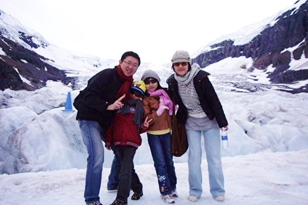</td>
</tr>
<tr>
<td align="center">李东兴全家福——在加拿大西北部的冰河区</td>
</tr>
</tbody>
</table>

【希望之声2017年6月25日】（本台记者慧光综合报导）台湾科技人才李东兴，在半导体研究方面取得了优异成绩，曾获得过美国二十几项半导体专利，目前工作在新竹科技园区的一家半导体公司。他领导的团队有二十几个人，所研发的半导体产品，功率消耗只有竞争对手的一半，很受市场欢迎，为公司争取了很多订单。

李东兴从求学到就业，几乎是一帆风顺，在半导体研发方面虽然付出很多，但是收获也很多，是一位典型的专业人才，并且一直走在科技的最前端。纵观其经历，似乎与修炼没有任何交集，可是他为什么会对修炼感兴趣呢？
 
这要从他的太太和女儿说起。

李太太患有自律神经失调症，在长达四年的时间里几乎处于无眠状态，李东兴陪着她到处寻访名医，但始终无法改善身体状况。

据李太太自己介绍，多年来，无论是西医还是中医，各种治疗手段几乎没有间断过，但病情依然时好时坏，饱受病痛之苦。他们有两个孩子，小儿子出生后身体就比较弱，她还要经常带着幼小的孩子，奔波于医院和诊所之间。

有一天，她在电脑前查阅资料，忽然觉得天旋地转，紧接着是颈部到头部无休止的疼痛，同时右半身呈现麻痹状态。更糟糕的是，她彻底失眠了，无论如何也睡不着。长时间的辗转难眠，搞得她精疲力竭，痛苦不堪，甚至都不想活了。当时的唯一牵挂是，两个孩子都还小，她若撒手人寰，孩子由谁来照料呢？不得已，她只好强忍病痛，积极配合治疗。经多方检查，结果除了甲状腺机能依旧异常之外，并未发现有其它问题，最后诊断仍然是自律神经失调。

为了给太太治病，李东兴东奔西走，想尽了各种办法，但更多是无能和无奈，不仅妻子的病没有好转，自己也搞得疲惫不堪。

 就在他太太身心疲惫、走投无路的时候，朋友送给她一本奇书《转法轮》和法轮功的教功录像，她如获至宝，很快就投入到学法炼功。修炼以后身体出现了明显的变化，差不多有半年时间，所有的病症都消失了，身体得到完全康复，从此成为一名坚定的大法修炼者。

太太的变化让李东兴感到吃惊，但更多的是庆幸自己的解脱，并未从思想上真正去重视，不过这种解脱并没有持续多久。有一天，女儿的视力突然从1.2、1.1降到0.2、0.1。没办法，李东兴又只好辗转送女儿到台湾著名医院检查，可蹊跷的是，无论怎么检查都查不出病因，也不能确定到底是得了什么病。当时他感到非常绝望，不知道该怎么办。本来他是很相信科学的，不管出了什么事情，总认为科学是有办法解决的，但事情的发展并非像他想的那样。

孩子的不幸一度让他心生怨气，“为什么这种事情会发生在我身上？为什么生活对我这么不公平？”但是埋怨不仅不能解决问题，还发现自己的身体竟然长出斑斑点点红红的带状疱疹。

在太太陪着女儿住院治疗期间，她依旧利用一切可能的时间阅读《转法轮》。突然有一天晚上她猛然悟到“我怎么没想到带孩子一块儿学法炼功呢？”于是，太太立即读《转法轮》给女儿听，并教她炼功。没多久，女儿的视力就恢复正常了。在进行复查时，护士在做完检查后带着疑惑不解的表情对她说：“她的视力完全正常，为什么要做检查呢？”

<table border="0" cellspacing="3" cellpadding="3">
<tbody>
<tr>
<td align="center">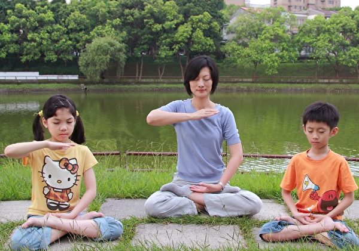</td>
</tr>
<tr>
<td align="center">李太太在新竹科学园区静心湖畔和孩子一起炼功</td>
</tr>
</tbody>
</table>

理工科出身的李东兴，无论是在求学的过程中，还是在工作上，都相信科学，相信眼见为实，看问题分析问题只相信证据，对信仰和无形的力量一直是半信半疑。虽然看到太太炼功后变化很大，因为主要精力还在技术研发上，就没有积极去了解更深层次的原因，但是当看到女儿的视力出现戏剧性的转变后，才让他感到震撼！

“这个功法到底有什么不可思议的力量？为什么在短短的时间里就能在人的身体和心理上发生这么大的改变呢？”在李东兴的人生经验中，相信“事出有因”，这些非同寻常的事实超出了他的知识范畴，让他的内心受到了非常大的冲击，也勾起了他“研究”的欲望，于是他开始认真阅读《转法轮》。

不断的“学法”，他的思想也开始了不断的变化，对自己的人生也有了新的认识。他悟到只有按照“真、善、忍”的标准约束自己的行为，不断的从心性上得到提高，才能去掉不好的观念。凡事都有安排，一切都用平常心对待，不必强求，顺其自然就会有一个好的结果。

太太因为修炼法轮功，身体、性格的改变非常大，有时候看到太太对自己心性上的要求，让他感到惊讶和佩服。修炼以后，他也要求自己要像太太一样去做，不断地向内找，凡事替他人着想。

从前公司部门开会，意见不同时，他习惯于站在自己的立场去看事情，得理不饶人；而现在他会尽量替他人着想，有些事谈不拢时，会主动去找对方讨论、分析，诚心的沟通，这样一来，反而事情进行的更顺利。同事看李东兴，觉得他变年轻了，连面容都发生变化了，脸上的线条变柔和了，个性也不像以前那么急、那么冲了。

李东兴用自己的人生经验总结出了一句话：“修炼真的能够改变人啊！这是真实不虚的。”

<h1 align="center"><b>纽约布碌伦学员新年送福</b></h1>

【明慧网二零一八年二月二十五日】（明慧记者采菊纽约报道）二零一八年二月十八日，大年初三，阳光灿烂，春风佛面。一大早纽约布碌伦的法轮功学员们就早早的来到真相点上，挂好真相横幅，准备好真相资料，今天是纽约第三大华人社区布碌伦八大道一年一度庆祝新年的日子，也是法轮功学员们给当地的父老乡亲拜大年送真福劝三退（退出中共党团队）的好日子。

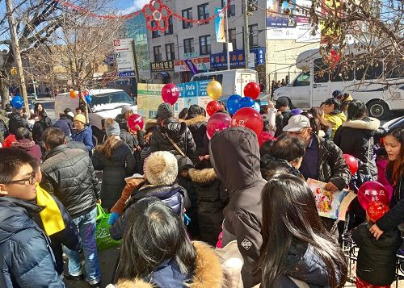

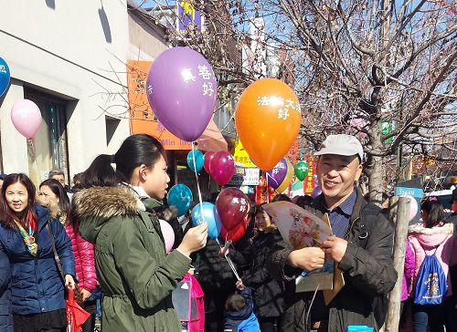

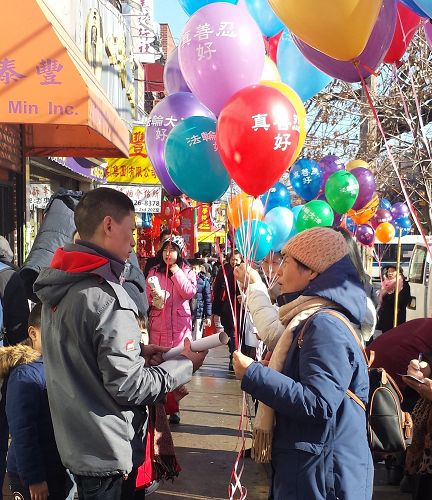

和往年一样，法轮功学员们为新年特地准备了彩色氢气球，受到了民众的青睐，人们纷纷汇聚过来讨气球得吉利。气球一面写着“法轮大法好”，一面写着“真善忍好”，非常醒目。等气球的时候，学员们开始劝三退；拿气球的时候，学员们帮他们系好，同时引导他们念“法轮大法好，真善忍好”，告诉他们法轮大法是佛家高德大法，一定要记住“法轮大法好，真善忍好，天赐洪福”，同时把最新的明慧画刊《永恒》和大纪元特刊《共产主义的终极目的》送给他们，嘱咐他们回去一定要好好看看，明白为什么要三退，明白真相得真福。

从早上十点到下午三点，法轮大法的摊位前一直很热闹。八大道上从五十街到六十街车辆禁行，街上挤满了人，大人带着孩子们都盛装出行，看表演，买东西，热热闹闹过大年。一眼望去，写着“法轮大法好，真善忍好”的彩色气球到处都是。

年前的《吉祥宝宝》明慧挂历就很受大家的欢迎，供不应求。今年的《吉祥宝宝》年画首次露面，也颇受众人的喜欢。年初三当天，一波又一波的人群拿走了近一千两百份年画。

孩子们很喜欢念“法轮大法好，真善忍好”，大孩子学会了，教小孩子念。一个正在换牙的小男孩一脸微笑在学，一边的妈妈忙着提醒，很可爱。两个少年要气球，学员们叫他们记住“法轮大法好”，这两个少年立刻很开心地大声地喊“法轮大法好”。一位女士来要气球，学员告诉她“法轮大法好”，她说：“法轮功本来就是好的。”

当天三退的人也很多。学员向一位年轻的妈妈讲三退，年轻的妈妈高兴地说：“退了，去年在这退的。”一位穿着讲究的女士推着儿童车来要气球，学员问她有没有入过少先队和共青团，她点头。学员问她：“你应该不是党员吧？”她马上说：“我是。”学员告诉她可得把这个党员退了。这位女士很爽快地答应了，并接受了最新的明慧画刊《永恒》和特刊《共产主义的终极目的》。

当天，一人退出党团队，十八人退出团队，二百二十三人退出少先队，共有二百四十二人同意三退，不给中共恶魔陪葬，拥抱光明的未来。

<h1 align="center"><b>在伦敦唐人街传播法轮功真相</b></h1>

【明慧网二零一八年二月二十五日】二零一八年二月十八日，英国伦敦的唐人街非常热闹。正逢周日，又是中国新年的大年初三，是很喜庆的日子。在唐人街，有华人组织的庆祝活动舞狮子等等；在离唐人街不远的多米尼恩剧院，当天则有两场展现中华传统文化的神韵演出，享誉全球的文化盛宴，票已经售罄。
在唐人街，有这样的一个活动引起了许多人的注意，那就是法轮功学员在这里介绍根植于中国传统文化的修炼功法——法轮功，他们向大家展示了法轮功五套功法，同时，也讲述十八年来法轮功在中国无辜遭受迫害的事实，并为制止中共活摘法轮功学员人体器官而征签。

许多人看了真相介绍，毫不犹豫地签了名。也有很多人非常地不理解为什么会发生活摘器官这样的事情，这太残忍，太可怕了。

遥遥，还是一个高中生，今天也来这里讲真相。她跟随妈妈修炼的时间和她的年龄一样长。妈妈在中国开始修炼时还是大学生，在念博士一年级时被迫害失去了学业，后来又经历了被抓，流离失所，离婚，被劳教，失去工作等等。遥遥就是在这样动荡、恐惧的生活环境下长大的。因为与妈妈一直坚持学法，所以遥遥从小就知道按照法轮功的真、善、忍的法理做事情，造就了她真诚，善良，忍耐的性格。

遥遥体验到大法的神奇是在她十五岁的时候。因为妈妈天天炼功，她跟着受益，所以从小到大她身体健康，没有吃过一片药，她也觉得很正常。但是她逐渐长大了，需要自己真正在修炼上提高，而这时候她学法炼功都没有跟上，所以那年春天的时候她的身体出现了严重的不适。她从来没有体验过的难过，使她从新审视修炼这件事情。那段时间她去另一个城市学习，接触上了当地的几个大学生新学员，跟他们一起学法炼功，她很快就体会到了身体的改变。她说自己知道什么是消业，什么是不好的因素干扰了。从那以后，她的身体又恢复了以前的健康。她在修炼上也更加精進了。

来到英国以后，因为不再担心会被警察抓，所以她很开心地参加了许多讲真相的活动，感触也很多。在剑桥大学讲真相时，一位女士听说有人因为信仰就被杀害，当时就流泪了。遥遥说这位女士真善良，真好。

而今天，遥遥更加开心，因为今天有五百多人签了名字，他们都对中共的迫害说“不”。但一些中国游人仍对法轮功有误解。无论是剑桥大学还是大英博物馆，唐人街，许多中国人见到法轮功学员的展位，不敢靠近，有的直接远远地躲开；有的站在远处看展板，不敢和学员说话。跟别的国家的人有明显的反差。遥遥说这就是中共对法轮功丑化宣传，仇恨宣传，恐惧宣传的结果。这更告诉我们坚持讲真相的必要。我们相信中国人也和其他国家的人一样善良，也会对中共迫害善良人说“不”。希望他们能早日摆脱中共邪教的思想控制，不要被强加的仇恨宣传泯灭自己的良知，没有良知的人生是凄惨的，我们希望人人都有一个美好的未来。

<h1 align="center"><b>现实中的神话：明真相办“三退”得福报</b></h1>

<table border="0" cellspacing="3" cellpadding="3">
<tbody>
<tr>
<td align="center">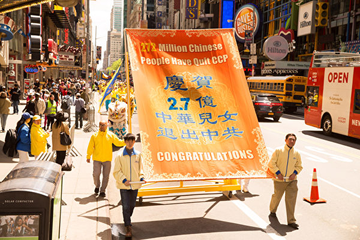</td>
</tr>
<tr>
</table>

【大纪元2015年03月15日讯】明慧网14日报导，大陆一位法轮功学员王颖（化名）2008年通过网络了解了法轮大法后开始修炼。此后，她多次对家人和亲戚讲大法的美好，讲中共对大法的诬陷，澄清江泽民集团制造的弥天大谎，使家人对大法有了正确的认识，特别是在明真相后，家里人都陆陆续续发表声明“三退”（退出中共党、团、队），其中四位家人、亲戚相信法轮大法好，做了“三退”后得到福报。以下是王颖自述的四位亲戚的故事。

<b>二婶的肿瘤不翼而飞</b>

王颖说，二叔二婶在外地以收废品为生。二婶总是肚子疼，到医院拍片子，发现肚子里面有一个瘤子。大城市的医院收费甚高，无力承担，便回县城医院，医生安排一周后做手术。

恰逢暑假，王颖回家后就去给二叔、二婶讲了真相。叔叔和婶婶都乐意退出曾经加入过的中共及其附属组织共青团和少先队。王颖告诉二婶：念“法轮大法好”，只要心诚，会有奇迹出现。二婶当时不信，但晚上腹疼难眠，她就一遍接一遍的念“法轮大法好，真善忍好”。

一周到了，二婶如约到医院做手术。医生给她做术前检查，那瘤子却怎么也找不到了。

叔、婶买了好多礼物到王颖家表示感谢，王颖说：“我可不敢贪天之功。这全是我师父给您做的。请谢谢我们的师父吧！”他们离开时王颖一再嘱咐：“千万记住继续常念‘法轮大法好，真善忍好’！”他们答应着说：忘不了！

<b>三舅的偏瘫快速回复</b>

有一天，王颖三舅的脑血栓突然发作，出院后落下了严重的后遗症——右边身体正常，左边身体偏瘫，要靠枴杖支撑一点点挪动，行动非常费力，很痛苦。王颖给三舅讲了法轮大法真相，做了“三退”，并送给他一本《洪吟》手抄本，特别告诉他：时时在心中诚念“法轮大法好”，会有意想不到的效果。

三舅相信大法好，说：“县委书记都有炼法轮功的，说明法轮功是好。”

三舅于是每天念“法轮大法好”。不到两周，他不用枴杖能走动了，又过了不多日子，行动自如。现在到大城市打工去了。

<b>姨姥姥的股骨头坏死痊愈</b>

王颖的姨姥姥一生穷困，受人冷落。屋漏偏逢连阴雨，前几年莫名其妙的被一只调皮的山羊顶倒在地，把骨头摔坏了，不能动弹，失去劳动能力。医生说花几万元换股骨头能好。

姨姥姥哪有钱？只能在家苦捱，日子难上加难。寒假王颖回家去看望她，给她讲了法轮大法如何好，嘱咐她多念“法轮大法好，真善忍好”，对她的腿有帮助。她虽然不识字，也不懂什么大道理，但对王颖能去看她很高兴，也很相信王颖说的，说从今天开始就天天念“法轮大法好！”

开学返校后不久给母亲打电话，得知姨姥姥的腿好了，母亲欣喜地告诉我，姨姥姥每天在村子里到处走动，两条腿比以前更有劲了。

<b>父亲肝上的瘤子神奇消失</b>

王颖的父亲生性善良、心肠软，对王颖修大法也支持，早就做了“三退”。但他总担心王颖的安全，怕在讲真相的时候被共产党抓走。

一次例行体检，医生告诉他肝上长出一个血管瘤。过一段时间再去拍片子，瘤子变成两个了，并且越来越大。父亲很焦虑。

王颖提醒他别忘了念“法轮大法好”。他说一直念呀，可是瘤子还在。王颖让他看大法书，于是他通读了《转法轮》，还利用晚上的时间听师父的讲法录音。

几周前，又去医院拍片子，医生说那个大的瘤子不见了，小的已缩的很小很小了。父亲很高兴，很感激师尊的救度之恩。

王颖表示，感谢师尊与大法的无量洪恩！惟有修炼人才明白这些神话现象的真谛。修炼的学问太深啦！

法轮功也称法轮大法，是由李洪志先生于1992年5月传出的佛家上乘修炼大法，以宇宙最高特性“真善忍”为根本指导，按照宇宙演化原理而修炼。至今法轮大法已传向100多个国家和地区，亿万人身心受益，并得到世界各国政要及团体3000多个各类奖项。

<h1 align="center"><b>神州多少白发送黑发（上）</b></h1>

【明慧网二零一五年十二月十六日】（明慧网通讯员大陆综合报道）每个人的一生中都有很多苦难、悲伤与心酸，而其中最凄楚悲凉的莫过于“白发人送黑发人”，特别对于重视香火传承的中国人而言，是最令人痛心的。“子欲养，而亲不在”，道出了世间孝子面对双亲辞世和人生悲欢聚散的无奈；“亲待养，而子不在”，是中共对法轮功的持续迫害中，导致很多人在青壮年就撒手人寰，空留下血泪交织、凄惨无依的双亲的真实写照。

<b>从儿子被绑架后，老人再也没见到过儿子</b>

于忠柱是黑龙江省大兴安岭松岭区古源镇法轮功学员，二零零八年八月八日被当地公安绑架，后被非法判刑六年。二零一零年一月十四日，于忠柱被泰来监狱迫害致死，死时还戴着脚镣子，尸体未经检验就被火化，年仅三十九岁。

<table border="0" cellspacing="3" cellpadding="3">
<tbody>
<tr>
<td align="center">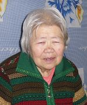</td>
</tr>
<tr>
<td align="center">
刘玉兰</td>
</tr>
</tbody>
</table>

<table border="0" cellspacing="3" cellpadding="3">
<tbody>
<tr>
<td align="center">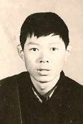</td>
</tr>
<tr>
<td align="center">于忠柱</td>
</tr>
</tbody>
</table>

于忠柱全家多人修炼，中共邪党打压迫害后，亲人多次被绑架、关押、冤判。恶警们经常闯入家中骚扰、恐吓、抄家，这些对于于忠柱的父母于思魁和刘玉兰两位老人伤害很大。特别是小儿子于忠柱被迫害致死，对老俩口打击太大了，于思魁老人说：“小儿子被迫害死心里非常难受，心里不得劲，整日吃不下去饭。”

自从小儿子被迫害死后，刘玉兰老人整日心口堵得慌，喘不上气儿。从于忠柱被绑架后，刘玉兰老人再也没见到过儿子，老人心里想不明白儿子那么年轻，身心健康，学大法后变得那么好，他们怎么下得去手？！他们是怎么把儿子迫害死的呢？！这成了老人的一块心病，老人的头发都白了。二零一五年二月二日清晨，刘玉兰老人再也挺不住了，含冤离世，终年七十六岁。

<b>大儿子被“摔床死”，老母亲被恐吓会失去小儿子</b>

法轮功学员何智毕业于广西桂林市广西师范大学物理系，生前系百色市三中电脑教师,一九九五年开始修炼法轮功，以“真、善、忍”高境界的法理指导自己做一个更好的人：工作上兢兢业业，获得了“国家科技进步三等奖”的称号；家庭中夫妻和睦，关爱孩子，孝敬父母，其乐融融，是一个社会公认的好人，好老师，好儿子，好丈夫，好父亲。

二零零五年年初，何智因坚持修炼被非法判八年重刑，二零零九年四月八日在广西黎塘监狱含冤离世。狱方说何智是从床架上摔下来死的。遗体检验发现何智遗体右后脑勺有伤处，右手腕有瘀血、红肿、扭伤的痕迹。更让人恐惧心酸的是，何智遗体的头壳少了一块头骨。此外还有重重疑点，而监狱、医院、检察院只是敷衍并恐吓威胁家属立刻火化尸体。

何智被非法关押及离奇死亡，让这个家庭陷入了极度的贫困与痛苦。何智之妻是一位失业工人，在承受失去丈夫的巨大悲痛下，不光是为了生计四处打工挣钱吃饭，还要照顾年迈的公婆及未成年的女儿。何智老父八十高龄，是百色当地的退休警察，忍受着“白发人送黑发人”的痛苦，沉默寡言、心力交瘁，卧病在床。

何智的弟弟为兄喊冤，多次申诉无用后，无奈悲愤写下《广西黎塘监狱白天惊演“摔床死”》一文公布于世，却遭到了接连不断的恐吓电话。一次，何智八十高龄的老母亲接到匿名电话，他们问：你究竟有几个儿子？何智母亲说有两个，他们直言不讳地说，何智就是中共邪党搞死的，你是不是还想再死一个儿子？何智母亲惊恐地扔开电话，仰天失声恸哭，哀求小儿子不要再上告了……

<b>苦盼八年，等来的却是白发人送黑发人</b>

这是怎样的一个家庭：女儿还未出生时，他已陷冤狱，八年后，父女匆匆相见，竟成永别；妻子勤劳朴实，善良宽厚，独自照顾全家，昔日健康善良的丈夫、家里的主要劳动力，八年后被迫害的遍体鳞伤、撒手人寰；九旬多的奶奶、含辛茹苦的父母苦盼八年，等来的却是白发人送黑发人。

辽宁省抚顺市清原县徐大为一九九六年开始修炼法轮功，他按法轮大法“真、善、忍”要求自己，周围的人都说他热情善良、聪明能干，徐大为的家乡人都说他是“好小伙子”。

<table border="0" cellspacing="3" cellpadding="3">
<tbody>
<tr>
<td align="center"></td>
</tr>
<tr>
<td align="center">徐大为</td>
</tr>
</tbody>
</table>

因坚持修炼法轮功，徐大为于二零零一年被中共冤判八年。二零零九年二月三日刑满释放，此时他骨瘦如柴，脸色非常难看，呈黑紫色，目光呆滞，已不认识家人了。他回家后蹲在墙角，不敢动，谁一靠近时就非常恐惧。他时而清醒，时而糊涂。他在清醒时告诉：“东陵监狱太邪恶了，监狱给打能致人精神病的药针，强迫吃药。用拳脚打，靠在墙角，打昏死过多次。经常遭严管，关在黑暗的屋子里（小号）。”家人将徐大为送進医院，医院表示：人已经不行了，心脏衰竭，验血时抽不出血，皮肤僵硬无弹性，这种身体不是一天、两天造成的，早已错过了医治时期。八年刑满回家后的第十三天，即二零零九年二月十六日，徐大为含冤离世，年仅三十四岁。

<table border="0" cellspacing="3" cellpadding="3">
<tbody>
<tr>
<td align="center">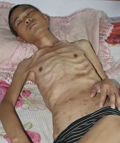</td>
</tr>
<tr>
<td align="center">徐大为被沈阳东陵监狱迫害得骨瘦如柴、身上有多处电击印痕，臀部皮肤坏死。</td>
</tr>
</tbody>
</table>

<b>王奶奶的辛酸泪</b>

<table border="0" cellspacing="3" cellpadding="3">
<tbody>
<tr>
<td align="center">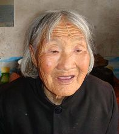</td>
</tr>
<tr>
<td align="center">历尽沧桑的王奶奶</td>
</tr>
</tbody>
</table>
</table>

家住甘肃省金昌市永昌县焦家庄的王奶奶，在一九九九年之前，原本有着幸福的生活，儿孙承欢膝下，正是共享天伦的时候。王奶奶自己修炼法轮大法，身体硬朗，家庭和睦。更让王奶奶高兴的是二女儿一家，三女儿和女婿，小儿子和媳妇都修炼。这样一大家修炼人，在当地曾经是令人羡慕的。

然而，自从一九九九年七月二十日中共迫害法轮大法后，王奶奶的二女儿王泽兰在中共的迫害中含冤离世，二女婿秦吉昌被非法判刑八年，外孙秦德新被非法劳教一年半，又被非法判刑十二年；三女儿王泽芳被非法判刑八年，三女婿张延荣被非法劳教两年，再被非法判刑十二年后被迫害致死；小儿子王泽兴被非法劳教一年半，非法判刑十年后被迫害得精神失常，媳妇王永芳被非法判刑八年。

王奶奶每次提起这几年所遭受的迫害，都泪流满面。干瘪的嘴使劲地抖动，哽咽着说不出话。好几次只听王奶奶说，我的女儿王泽兰走了，女婿张延荣也走了，儿子精神失常了，我八十多了，白发人送黑发人，这日子我怎么过，媳妇又这么瘦小，担子太重了。

<b>双胞胎姐妹遇害</b>

重庆向南，綦江松藻煤矿，那里远离闹市的喧嚣，有着苍翠青山的环抱，有着潺潺清泉的流淌。二十一世纪，那里却有着不寻常的凄婉故事，在青山绿水间经久不息地流传。

一对同胞姐妹，松藻煤矿的王积琴和王积凤，她们是王家仅有的两姊妹，从小被父母视为掌上明珠，二十多岁后分别成家在父母同一社区的煤矿。尤其是妹妹王积凤，认识的人都说，长得少有的清新漂亮，在矿区给人留下了深刻的印象。不幸的是，因为追求善良与正直，因为面对强权而不愿唯唯诺诺而妥协，姐妹俩先后被中共绑架、劳教，并迫害致死。父亲难以承受巨大的打击，导致精神失常，瘫痪在床，生活不能自理。而当地派出所、居委会，这些年来还时常骚扰、恐吓他们。

（待续）

 

<h1 align="center"><b>神州多少白发送黑发（下）</b></h1>

<table border="0" cellspacing="3" cellpadding="3">
<tbody>
<tr>
<td align="center">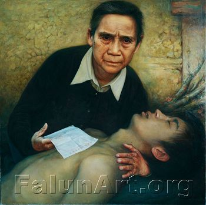</td>
</tr>
<tr>
<td align="center">宋万学</td>
</tr>
</tbody>
</table>

【明慧网二零一五年十二月十七日】（接上文）
<b>儿子三天被打死，老母亲忧郁成疾第二年离世</b>

<table border="0" cellspacing="3" cellpadding="3">
<tbody>
<tr>
<td align="center"></td>
</tr>
<tr>
<td align="center">宋万学</td>
</tr>
</tbody>
</table>

宋万学生前是黄石市大冶有色金属公司丰山铜矿职工，自幼一直爱好武术、气功等。一九九五年开始修炼法轮大法，是个大家公认的好人。二零零零年十一月，宋万学怀着对政府讲明真相的纯朴心态，第二次去北京上访。回家后，单位不准他上班，并将他绑架到大冶有色公安处，于二零零一年元月二十日被劫持到黄石市第二看守所，第三天被害死，遗体浑身布满瘀青和伤痕，头部布满血泡和伤痕。在死因上，警察始终无法自圆其说。开始说是“撞墙自杀”，家属强烈质疑，法轮功讲自杀是有罪的，是不允许的。警察又改口说是“心脏病突发猝死”，两根肋骨断裂是因为医生抢救时被按断的。宋万学练过武术，身体一直很健康，根本就没有心脏病。后听从黄石市第二看守所出来的吸毒犯人说，他当时跟宋万学在同一监室内，因宋万学在监室坚持炼法轮功，不愿意放弃信仰遭毒打致死。

当时为掩盖死因，警察提出要解剖尸体。家属坚决不同意，人都被迫害死了，连尸体都不放过，多名警察强行支开家属，假说谈话。等他俩再返回现场时，尸体已被电锯锯开，警察摘走了心脏和肝脏，说是拿到武汉去检验，亲人要求检验完要归还，却从此没有下文，也没还回内脏。

宋万学的遗体被放殡仪馆停尸月余，家属一直不同意火化，这么好好的一个大活人三天就被迫害死，怎么让人接受得了，还没给家属一个合理的说法。然而警察一直威胁必须立即火化尸体，否则停尸费一切自负，家属没办法最后只好同意火化尸体。

<table border="0" cellspacing="3" cellpadding="3">
<tbody>
<tr>
<td align="center"></td>
</tr>
<tr>
<td align="center">绘画：悲愤的母亲</td>
</tr>
</tbody>
</table>

儿子被迫害致死，只因为修炼“真、善、忍”做好人，对于父母真是晴天霹雳，白发人送黑发人那痛彻肺腑的哭声，那苍老憔悴的身影。老母亲接受不了痛失爱子这残酷的事实，整日以泪洗面，忧郁成疾，第二年离世。

<b>懂事的儿子再也不能回来了</b>

张先龙原是黑龙江省农垦总局浩良河化肥厂一名小学教师，为人善良，修炼法轮大法后身心受益，做事认真负责。在小学教师教学公开课中，数次被评为第一名；利用课余时间为基础差的学生辅导功课，从不计报酬，也不收受家长送的任何礼物。

<table border="0" cellspacing="3" cellpadding="3">
<tbody>
<tr>
<td align="center"></td>
</tr>
<tr>
<td align="center">张先龙</td>
</tr>
</tbody>
</table>

一九九九年七月中共江泽民团伙迫害法轮功后，张先龙因为坚持修炼大法，被非法劳教一年半，后又被非法判刑三年，在中共邪党人员长期骚扰、跟踪、恐吓等迫害下，于二零一四年八月二十六日在担心警察跟踪的惊恐中黑夜离家，再也没有回来。

家人经过多方寻找，于二零一四年九月九日在浩良河、南大河的下游找到了张先龙的尸体，终年四十四岁。白发人送黑发人，张先龙的父母常常望着儿子走过的乡间小道，泪水不知流了多少……

张先龙的死因可能有两种，一是：从后山上路过时，天黑不小心失足落入河里；二是：想从浩良河大桥过去，在桥上深一脚浅一脚，又怕被警察绑架再次给家人带来伤害，慌忙中失足落入河中，以前曾经有人从此桥上掉下去过。有人猜测他是自杀，但修炼人绝对不会杀生、也不会自杀，张先龙通过学大法明白这个理！张先龙按照真善忍做好人，时时用大法严格要求自己，从来不杀生、与人为善，不仅珍惜自己的生命，更善待他人。有没有遭他杀的可能，情况不清楚。但是有一点非常清楚，是中共江泽民流氓集团利用中共对法轮功学员的这场迫害夺走了他宝贵的生命，是这场血腥、残酷、高压的迫害给他的父母及家人造成了永远的伤痛和悲哀。到了晚年父母多希望孝顺的儿子陪伴，然而懂事的儿子再也不能回来了。

张先龙在冤狱被迫害的几年中，他的父母和家人所承受的痛苦和伤害更大，甚至达到了极限。每逢过年过节父母心情特别沉重，既思念儿子、又担心儿子在监狱里会不会被打、被体罚；别人家过年都是喜气洋洋、团团圆圆的，而张先龙的父母却是在思念和忧伤中度过的。特别是警察绑架他们的儿子时，眼睁睁地看着儿子被抓走，母亲无助地靠在墙边失声痛哭！因为一向做好人的儿子被抓，父母长年以泪洗面、担惊受怕，一有风吹草动，全家人都吓得不行了。父母有时不由自主地说：“吓死了吓死了！”

<b>儿子被迫害致死多年　老父持续控告</b>

辽宁省葫芦岛市连山区黄立忠，因为信仰法轮功被冤判十年，在二零零八年七月被送到盘锦监狱，二零零九年十月二十五日左右被迫害致死，遗体骨瘦如柴，两眼瞪着，半张着嘴，浑身伤痕累累：右耳青紫；头部右上方一块明显的外伤血印；右腮下面有一个小口子；背部全部青紫色，惨不忍睹。

<table border="0" cellspacing="3" cellpadding="3">
<tbody>
<tr>
<td align="center">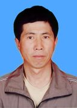</td>
</tr>
<tr>
<td align="center">黄立忠生前照片</td>
</tr>
</tbody>
</table>

<table border="0" cellspacing="3" cellpadding="3">
<tbody>
<tr>
<td align="center">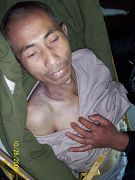</td>
</tr>
<tr>
<td align="center">黄立忠的遗体伤痕累累，骨瘦如柴</td>
</tr>
</tbody>
</table>

盘锦监狱七监区队长张国林对家属说：“经党委研究决定：给你们五万元钱，报销一切费用，行不行就这么定了，不同意上哪儿告都行。”

黄立忠家属曾多次给辽宁省监狱管理总局、检察院、人大、司法厅、信访办写控告信，都没有回复。二零一零年四月十五日第二次去辽宁省监狱管理总局信访办控告，等了八个月，“调查结果”称是绝食而死，没给家属五万元钱私了。

黄立忠七十七岁的老父亲黄云江在控告书写出听到此“调查结果”的心情：

“我一听到这样的回复，肺都要气炸了，心跳得厉害，说不出话来。普天之下还有比这个更流氓的吗？天地良心哪！张国林等人诡计多端，欺上瞒下，草菅人命，借着他人的性命和鲜血往上爬，可悲又可耻。由于激动，我犯了心脏病，花了不少钱才治好。可是监狱暴力害死我儿，又耍阴谋诡计推脱罪责的恶行带给我们的是无法平复的心灵创伤和永远都醒不过来的噩梦。

我们夫妻都是快八十岁的人了，白发人送黑发人的心情谁能理解？我妻子因头晕两次将胳膊摔成骨折。我们天天以泪洗面，身体也是多病缠身，我们能在有生之年看到我儿冤案昭雪吗？

自古‘杀人偿命，欠债还钱。’我的儿子黄立忠含冤而去，死的极其惨烈，完全是监狱警察执法犯法、草菅人命所致；此罪不查，法律不容、天理不容！我们坚决要求有关部门，追查被告罪行，还我们公道！”

<b>儿子被活活打死　九十一岁老人控告江泽民</b>

辽宁省大连市九十一岁的邹显义老人近日委托女儿控告迫害首恶江泽民，要求把江绳之以法，讨回公道。因为江泽民发起的这场残酷迫害，他的大儿子邹文志被公安活活打死；两个女儿多次遭绑架抄家、非法劳教；他的老伴在压力下放弃修炼法轮功，导致旧病复发含冤去世。邹文志生前是大连市大化集团职工，为人忠厚，在单位是公认的老实人。仅仅因为修炼法轮功，被大连市公安二处、大化集团保卫科的人活活打死。

<table border="0" cellspacing="3" cellpadding="3">
<tbody>
<tr>
<td align="center">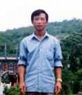</td>
</tr>
<tr>
<td align="center">邹文志</td>
</tr>
</tbody>
</table>

邹显义老人在控告书中写道：“那是二零零零年十月十六日下午，单位通知儿媳妇，说儿子在单位心脏病突发死亡。我儿子根本没有心脏病。我们全家来到单位，要求见尸体。我还有两个儿子找来了录像机要求录像，停尸房却被公安局包围了，把录像人赶走了。

<table border="0" cellspacing="3" cellpadding="3">
<tbody>
<tr>
<td align="center">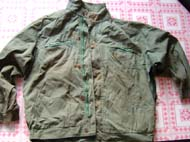</td>
</tr>
<tr>
<td align="center">邹文志被打死时穿的上衣</td>
</tr>
</tbody>
</table>

我们全家坚决要求见尸体，看到大儿子被打的全身青一块、紫一块，裤子被打破了，膝盖被打破了，手背都是青。经法医解剖鉴定，心脏被打坏，肋骨被打断，身上多处是伤。屁股表皮完好无损，可是法医划开皮肤，里面的肉已经被打烂了。法医都说打的太狠了。这是用一种刑具打的，表皮不破，肉里全打烂了。

这晴天霹雳，我们老俩口伤心到了极点，白发人送黑发人。打人凶手拿两万元钱跪在我们面前，让我们原谅他，我们坚决不要他的钱。

我儿媳妇遭受这突如其来的打击，突然失去了记忆，不知道发生了什么，到处找自己的丈夫。我们只能骗她说：丈夫被公安局抓去了。她到商场买了很多衣服、裤子，准备给丈夫送去。我们家人心都碎了。以后再想办法慢慢告诉她，不能让她精神失常了，一切后事都瞒着她。

我的孙子承受了巨大痛苦，失去了父亲，母亲又没有工作，全家的担子落在了孙子身上，再也没有了家庭的快乐。”

<b>结语</b>

在此仅列举几例，十六年来有太多太多这样的惨剧，数也数不过来。中共对法轮功学员的迫害仍在继续，“白发人送黑发人”的惨剧仍在上演。这是时代的悲哀！法轮功学员一如既往地向国际社会、所有人权和反暴力反酷刑机构，以及所有善良的世人呼吁：用良知和正义制止中共的迫害、遏制虐杀，营救目前仍被非法关押迫害的法轮功学员！

（全文完）

<h1 align="center"><b>真善忍美术馆美西迎客 西人创业家夫妇了心愿</b></h1>

<table border="0" cellspacing="3" cellpadding="3">
<tbody>
<tr>
<td align="center">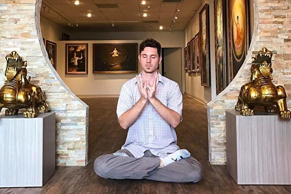</td>
</tr>
<tr>
<td align="center">尼克‧杰尼奇（Nick Janicki）在亚利桑那州坦佩市新开放的真善忍美术馆（Art of Zhen Shan Ren Museum）入口处。</td>
</tr>
</tbody>
</table>

【大纪元2017年05月31日讯】（大纪元特约记者Cheryl Casati报导，张小清编译）“真善忍国际美展”（The Art of Zhen Shan Ren International Exhibition）在欧、美、澳洲和亚洲巡回展出期间，在50个国家的900个城市受到好评。眼下，这些艺术作品有了第一个永久“居所”——其中20幅画作近期已落户美国亚利桑那州坦佩市（Tempe）的真善忍美术馆（Art of Zhen Shan Ren Museum）。

尼克和荷莉‧杰尼奇（Nick and Holly Janicki）夫妇花了几个月时间寻找美术馆的最佳位置、研究中国古代装潢，并设计建造了一个静谧优美的环境，作为展示绘画和举办活动的空间。4月29日，夫妇俩梦想中的美术馆终于和公众见面。
<table border="0" cellspacing="3" cellpadding="3">
<tbody>
<tr>
<td align="center">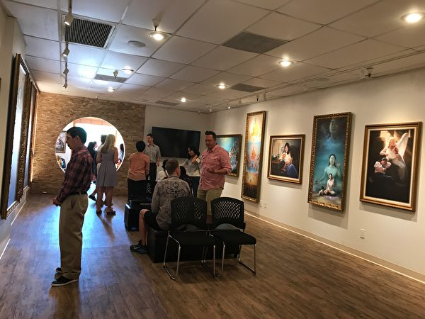</td>
</tr>
<tr>
<td align="center">真善忍美术馆内景</td>
</tr>
</tbody>
</table>
美术馆入口卧著一对麒麟，在中国古代神话传说中，麒麟既性情温和，在制恶除邪时又可勇猛无敌。这两只神兽，可说是美术馆展览主题的贴切象征。

杰尼奇夫妇在法轮大法修炼中体会到“真、善、忍”的力量，也获得了内心的宁静。他们希望美术馆能让观众有缘认识到修炼法轮大法的美丽。很多画的创作都生发于修炼中的启悟，也为观者敞开了欣赏内在的美、力量与神奇的一方天地。“我们希望和当地社区加强联系，和大中小学、和企业一同分享。”杰尼奇说。

同时，美术馆也是法轮大法洪传25年历程的记录，很多画作呈现了仍在上演的中共迫害。每幅画作背后都有真实的故事，有的甚至让观众直面惊人的暴力，但整体效果仍然非常平和。所蕴蓄的精妙的美，呼唤著观者进入画境。而当观众漫步于美术馆中，不由也会沉浸在祥和宁静的心绪中。

尼克‧杰尼奇说：“很多人都说，他们在美术馆里有种很特别的感觉：艺术家们的技巧，他们描绘法轮大法之美的绘画，都散发着祥和的气息。”

观众现时来参访美术馆，会有解说员讲解画作中的故事并进行答疑，将来还可用耳机进行虚拟现实体验——胸有成竹的杰尼奇相信，这会让观众置身一个新境界。

他表示，这种中国古代文化的动态体验，将带“探险者游历真实的天宇、金色的天宫，也会碰上惊险的场景，从中可对法轮大法的精神内涵获得了解”。

<h1 align="center"><b>多看几遍九评清除毒素 受益无穷</b></h1>

<table border="0" cellspacing="3" cellpadding="3">
<tbody>
<tr>
<td align="center">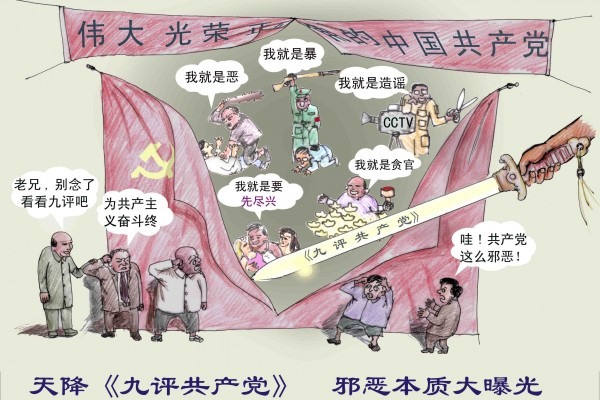</td>
</tr>
<tr>
<td align="center">漫画：九评揭开中共内幕。(大纪元)</td>
</tr>
</tbody>
</table>

【大纪元2016年11月21日讯】（大纪元记者骆亚采访报导）大纪元系列社论《九评共产党》发表12周年之际，澳大利亚悉尼的中国问题研究学者凌晓辉博士认为《九评》对民众觉醒、中国社会变局、中共解体起到了巨大作用。多看几遍《九评》，帮助人们清除中共毒素，并因此受益无穷。

<b>九评令中共恐惧害怕就此彻底噤声</b>

2004年11月19日，大纪元开始连续九天发表系列社论《九评共产党》。

凌晓辉博士表示，“《九评》发表后对社会的震动非常之大，中共感到非常恐惧和害怕。曾经有学者透露，中共中央曾就《九评》讨论过，想一一驳回，后来他们看过之后觉得没办法弄，因为《九评》说的都是事实，一驳的话反而把中共的罪行给曝光了。所以最后他们采取的措施就是禁止《九评》字眼在中共的媒体上、网络上出现，包括人们的讲话中。所以这说明中共非常的恐惧、害怕《九评》。”

他揭露，“中共对大陆的新闻控制和封锁使用了很多的招数，然后针对《九评》他们还打了‘预防针’，说外面有一个什么推翻共产党的东西，令生活在中共专制下的人害怕政治，不敢看、不太想去看。”

<b>九评揭示中共本质剥开中共画皮</b>

《九评》分为：评共产党是什么、评中国共产党是怎样起家的、评中国共产党的暴政、评共产党是反宇宙的力量、评江泽民与中共相互利用迫害法轮功、评中国共产党破坏民族文化、评中国共产党的杀人历史、评中国共产党的邪教本质、评中国共产党的流氓本性。

凌晓辉博士表示，《九评》第一次如此深刻地揭示了中共的本质。“中共叫的最响的口号就是全心全意地为人民服务，好像这个政党是为了人民，稍微有一点阅历的人就知道他绝对不是为了人民的。他让那些中共内的参与者被所谓的这种道德的东西一起绑架。”

“中共不但完全继承了马列的邪教理论，而且还结合中国的国情产生了一种所谓的‘爱国主义思想’，这是毒害所有中国人的邪教理论。其实马克思本人是反对爱国主义，中共就是什么东西最邪乎最能骗人，它就用什么东西来作文章。”

他表示，可笑的是那些天天喊爱国的人，他们反而拥有美国的绿卡、澳大利亚的绿卡、加拿大的绿卡、欧洲的绿卡⋯⋯所以中共最大努力地在欺骗老百姓，骗多少算多少，骗一天算一天，中共已经到了没有办法救药的地步。

<b>九评给人们留下了很好的自省之路</b>

九评共产党发表至今，在大纪元网上已有超过2亿5千万人要求退出中共的党、团、队组织。凌晓辉博士认为：“这意味着这是大量中国民众认清了中共本质后的一种觉醒行动，一种在内心对中共进行抛弃，我不想跟你这个邪恶的组织再有任何的瓜葛。”

他表示，“当然也有人怀疑这个数据，这是因为有些人不了解退党运动。其实你如果认同的中共的话，哪怕你没有直接参与中共所干的坏事，但实际上你也是在壮大中共的力量，也是在间接地干坏事。所以不想跟中共跑的、觉醒的人就会要跟它决裂、赶紧退出中共的体系。”

凌晓辉博士还表示，《九评》对中共的揭露起了一个决定性的、根本性的作用，发表至今12年，中国已经有了相当的一部分人完完全全看透了中共的实质。

“《九评》实际上给人们留下了一个很好的自省之路，首先让你认清中共是一个什么东西，随后你才能清楚中共的无神论害人之极，阻止人们了解生命的真相，哲学的终极问题：‘我是谁？我到底是从哪里来的？我要去哪里？’”

<b>多看几遍九评清除毒素 受益无穷</b>

凌晓辉介绍，自己参加当地同乡会聚会时，很多年龄相仿的与会者居然唱毛泽东语录歌，“这一代人被中共毒害还很深，脑中遗留很多中共党文化的毒素。”

他以法轮功学员器官被中共活摘的血淋淋的反人类暴行为例，“越来越多的国际社会、西方政府站出来谴责中共，中共官方也通过前卫生部副部长黄杰夫去年两会接受媒体采访，间接承认这个罪行。但一些被党文化毒害的人仍然不敢相信，其实主要是人们不了解中共有多邪恶，他干的坏事远远不止这些，所以多看几遍《九评》，对一般人来说是受益无穷的，对搞研究的大陆学者说也是有极大帮助的。”

<b>九评给中共盖棺定论</b>

《九评》中说：“喧嚣一百多年的共产主义运动，带给人类的只有战争、贫穷、血腥和专制，随着苏联和东欧共产党的崩溃，这场危害人间的荒诞剧在上个世纪末终于走入了尾声，从老百姓到党的总书记都再也没有什么人相信共产主义的鬼话了。”

凌晓辉对此表示，中共知道他们的末日快要到了，它是很清楚的。中共党媒近日发表文章自曝中共面临生死危机：“思想滑坡将导致党失去精神支柱和政治灵魂”，“将导致党失去人民的支持和拥护”，“将导致我们党腐化堕落、断送党的生命”。

他进一步分析，“我们知道中共体制内官员基本上都腐败，中共政权不可能再这样继承下去。其实反腐败表面上还是还算得人心，但实际上却让人们更加看出中共的邪恶，只要中共暴露一点点人们看，人们就会很惊讶这个共产党怎么这么坏，哪里有一点点为人民服务，整个都是卖国行为。”

<b>中共迫害法轮功最终将自己迫害倒了</b>

《九评》中谈到“江泽民与中共相互利用迫害法轮功”，它们都惧怕“真、善、忍”。

凌晓辉博士表示：“法轮功可以说是当今最大的信仰团体，迫害、镇压法轮功其实是中共邪恶本性所决定的。因为法轮功信奉‘真、善、忍’的理念，帮助人类的道德回升，没有暴力，他的存在对任何地方都带来好处，带来和平，带来希望和美好。

“法轮功的存在凸显中共假恶暴的特性，所以中共江泽民集团打压法轮功。很多法轮功学员被迫害致死，很多被关押的法轮功学员被抽血验血，成为中共活摘器官的活体供体。”

他强调：“即使在这样的情况下，法轮功也没有一个人有暴力行为。他们身上展现了修炼人的大善大忍，他们所具有的‘真、善、忍’的精神力量是中共根本没有办法摧毁的。因此中共江泽民集团迫害法轮功，最后将中共逼上绝路。现在不少人都说中共灭亡已是指日可待了。”

<h1 align="center"><b>少年的记忆</b></h1>

【大纪元2016年04月05日讯】在一个好的家庭中长大成人的孩子，是幸福的。可是对于我而言，童年幸福的时光并不长久。

（一）

一九九九年的那一天，刚上小学的我，跟小伙伴们一起放学回家，走到单元门外，老远就看见有很多人围在我家的单元门口，外面还停著很多车。模糊的记忆中，已分不清大概有几辆车了，跑前一看，原来是警察到我家，要把我那孝顺父母、对人和蔼可亲的善良妈妈强行带走。

我亲眼看见那些警察生拉硬拽的把妈妈拖到车上，强行带走。那时年幼的我，无人照看，我的爸爸在外地出差，很久才会回来一次，警察就连让妈妈找人照看孩子的时间都不给。

看着那些车辆扬长而去，我不停的追着、哭着、喊著妈妈，可是那些所谓的“人民警察”，根本就不管我这个年幼的孩子的去向。年幼的我眼看着车子越走越远，直到我再也追不上那些车辆……

邻居们把我抱了回来。听着那些叔叔、阿姨们你一言，我一语的说着：孩子还这么小，又无人照看，一点情面都没有，就连把孩子安排给谁照顾这一句话的时间都不给，就把人带走，况且这么好的人，这么善良的人，说带走就带走了，这个世道真是变了等等……

那时邻居们说的很多，我并没有太在意他们所说的，我一心只想要妈妈。后来大家都散了，我就像是一个被遗弃的孩子，傻傻的站在原地，不知道要往哪走。迈著回家的步，其实只有几步的距离，却显得十分沉重。有一位邻居奶奶，因为她也跟妈妈一样，是个修炼的人，是世界上最好、最善良的人，她把我接到她的家中照顾，我度过一个艰难的夜晚。

第二天我早早醒来去学校，因为我所在的小区，有很多同学一起上学，所以一来学校，这件事就被同学们传开了，同学们并不了解真实的实情，他们只相信电视的那些新闻，就说我妈妈因为炼法轮功被抓走了等等。面对同学们的嘲笑、讥讽，我觉得很难受，我幼小的心灵受到很大的伤害，我知道他们是被电视的虚假新闻给骗了，才会对我这样，我很难过，但仅仅是难过，并没有记恨这些传话的同学。虽然我一直都没说什么，表面上的我看起来还是那么的豪爽，但心里所承受的，是别人无法想像的。

（二）

这件事模糊的不知多久，爸爸回来了，把我接回家。后来姥姥、舅舅们都知道了这事，都来看我。后来，妈妈回家了。当看到妈妈的那一刹那，仿佛世界都静止了，我是幸福的，很开心。

然而，在二零零一年的某天，我下课正在休息，被学校的老师告知说到校长办公室，有人找我，我去了，一进校长办公室，眼前除了校长外，还有三个陌生人，那三个人就开始问我，叫什么，然后又问我的爸爸、妈妈叫什么，现在在哪里？我开始意识到不对劲，爸爸、妈妈从小就教育我不要和陌生人说话，虽然不知道这三个人是干嘛的，但是因为校长也在，所以没那么怕是坏人，我就说我不知道。后来又问我谁经常去我家串门，有没有一个叫什么什么的，我都说不知道。

他们看我什么都没说，就说不知道，就让校长吓唬我说，那意思就是不说实话就不让我上学了。我坚持说：我什么都不知道，也不用问我了，我白天上学，晚上回家做作业，哪有心思管大人干什么。他们没招了，就让我在桌上写东西，当时由于校长的恐吓，我也记不清写的是什么了，印象中可能是说都有谁去过我家，让我把名字写下来。那时很怕不让上学，就写的妈妈单位同事的名字，因为那时单位的阿姨们也都经常去我家，所以就写了她们的名字。后来那三个陌生人其中的一个从兜里掏出十元钱给我，说是让我拿着，去买些好吃的、好玩的和学习用品，我没要，因为我知道不义之财不能得，妈妈也从小教育我，不是自己的东西不能要。

回家后，我把这事告诉了爸爸，爸爸说不管谁问什么都说不知道，陌生人不要搭理，我说“嗯”知道了，但是校长恐吓说：不说、不写就不让上学。这事我没跟家人说，我怕家人担心，本来妈妈的事都让家人牵挂，让家人提心吊胆的，我不想再给家人添麻烦，直到现在，这事我不说，他们也都不知道还有这事。

这两次的事情都是我在小学时候发生的。自那以后，妈妈被迫流离失所，去了哪里也不知道，过着什么样的日子也不知道，有没有吃饱，有没有穿暖，这些我通通都不知道。我牵挂着妈妈，却不能向任何人讲，那一份苦楚，只能埋在心里。爸爸因为这事也不能安心工作，就回家照看我的生活起居，一边当爸一边当妈的父亲，在这短短几年的时间里，头发都白了，我看在眼里，却什么都做不了。

当别人家的孩子还在爸妈的怀抱中熟睡的时候，我便早已独立，不再哭泣，不在撒娇，我知道我要承担起家里的一份责任。我知道父亲所承受的责任和压力比我要大很多，来自家里亲戚朋友的压力，来自我学业高昂的学费的压力等等等等，所以我心疼父亲，但我从不表现出来，试问有哪一个孩子不想妈？又有哪一个母亲不想自己的孩子？我想妈妈，但我强忍着，后来警察天天去家里骚扰，害得我们有家不能回，只能在外面租房子。

（三）

那大概过了两、三年，妈妈回家了，我们被迫在外面租房子，这一租就是好几年。等到我上中学的时候，二零零五年，我正在上初二，妈妈又被迫流离失所，爸爸当时在南方工作，后来妈妈去了南方找爸爸，忍痛割爱，把我留在家里，我又成了没人要的孩子了。

尽管我早早的独立，妈妈还是放心不下我一个人，又把我托付给舅舅，我每天都住在舅舅家。舅舅、舅妈每天上班都很忙，还有自己的孩子需要照顾，根本顾不上我。自那以后，爸妈都不在身边，也没有道德的心法约束自己，自控能力下降，开始了跟学校的一帮同学瞎混，认识了社会上不三不四的社会青年，课不好好上，跟他们去打架、看热闹、捣乱、上网吧玩游戏。但毕竟我也是学了这么多年大法，道理我都明白，也都知道，那些伤天害理的事我从来不干，是非对错我还是分的清楚的，我只是想着有朝一日，我混的特别好，有名气，有威望，说什么都有人听的时候，再去惩治那些恶人、坏人。

我是校体队的（运动员），别看我是女生，力气还是蛮大的，混的这些日子里，我发现，现在真的就是警匪一家，警察搞不定的事情，都会去找黑社会摆平，而黑社会因为打架斗殴事件进了局子，有熟人很快就出来了。但是心地善良的大法弟子因做好人没犯法，却被非法关押拘留，迟迟不肯放人。所以我曾想，我要是混的好了，警察见我都的让我三分，等到那时候，我一定不会放过那些坏人。我从一个心地善良的好孩子，变成一个以党文化的方式思考问题，眼里对恶人充满了仇恨，没有善，而这一切，都是江氏流氓集团一手造成的。

（四）

时间一天天的过，终于把妈妈盼回来了，妈妈又带着我走入了修炼中，用大法造就的清水，慢慢的洗去我身上和心灵上的那些浑浊肮脏的污垢，我又溶入到法中，那种美好，我想只有修炼的人才能体会到。

一次次的迫害，我内心都留有印记，那是一生都抹不去的伤痛。沐浴在法中，我又变回原来那个懂事、善良、孝顺、听话的好孩子，课上课下，同学和老师都很喜欢我。

好景总是没那么长久，那是二零一一年的四月，我正全身心的投入准备高考，因是走读生，每晚九点多钟下自习骑车回家，跟往常一样，放学高兴的回家，可是刚进家门，爸爸跟我说：“你在家看门，我有事出去”。我心想你大半夜上哪去有事？没多问，爸爸就走了，妈妈也不在，我就有种不好的预感。果真，这一晚，妈妈被绑架到当地一乡镇的派出所，第二天被非法转送到城里拘留所。我的心可想而知，再次失去母亲的痛，平常人是无法体会的。

那天晚上，是我度过的最漫长的夜。我的不安，我的焦急，那些夜晚我天天泪湿枕头，却不能放声大哭，我要坚强，爸爸的压力比我还要大，我不能再让他伤心，我就开始伪装自己，假装什么都不在乎，什么都无所谓，每天该上学上学，回家该干嘛干嘛。

过了几天，我跟爸爸去公安局要人，那个国保大队的大队长气势汹汹，说话毫不客气，我不管，我只要我的妈妈，她又没做坏事，违法乱纪的事情也没干，凭什么这样对我妈，我只要我妈。当时我哭喊著，那不是假的，是真实的内心涌动出的伤心、难过、思念母亲的眼泪；那是真实的感觉委屈、受冤的眼泪。可是那个大队长根本不予理睬，还叫人哄我们走，我看着他那让人恶心的嘴脸，心生恨意，当时的冲动，真是想揍他的心都有。我们被他赶出来，我们不甘心，凭什么这么对待善良的好人？难道这个社会都没有公平公正的法律了吗？我跟爸爸决定上诉。我们找了律师，我们上诉，但最后都被无情的驳回。我的妈妈被非法劳教一年半。

那是我高考最关键的阶段，那是我觉得让父母看到他们辛苦养育这么大的孩子能给他们回报的时候，那是我以为我可以让他们骄傲的时候；可那时候，却是给我心灵又多一道伤疤的时候。妈妈没有看到我考上大学的时候，妈妈没看到我收到录取通知书的喜悦表情，妈妈没有亲自送我去大学，没先看看我的宿舍，没看看我的班级教室，也没看到我的开学典礼，我在大学里的一切，她都没有来得及看看。

这一切的一切，都是江泽民这个小丑一手造成的，他让我的家庭四分五裂，他让我的童年受到如此大的伤害。在中国又何止我一人、一个家庭？又有多少法轮功学员因坚持自己的信仰、做好人，而在狱中遭受酷刑折磨，被迫害致残、致死。

文章来源：明慧网

<h1 align="center"><b>修炼人的能量场</b></h1>

<table border="0" cellspacing="3" cellpadding="3">
<tbody>
<tr>
<td align="center">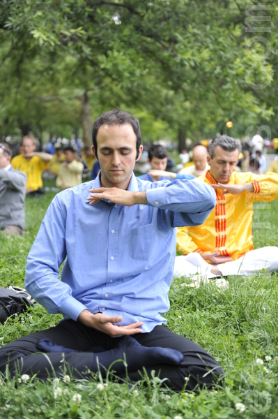</td>
</tr>
<tr>
<td align="center">觉者与修炼人的慈悲之场确实能有破除恶念，清除邪恶，纠正一切不正的强大能量！</td>
</tr>
</tbody>
</table>

亚莲是我的好朋友。她是一个修炼法轮大法的人，为人真诚、善良、胸襟宽广大度。在我遇到亟待解决的问题时常常找她谈心。记得每次总是皱着眉头去，信心满满，满面微笑而归。不管我认为如何难办的事，在她的一阵解说下就变的很简单了，坏事也变成了好事。还有一次，我的肚子很不舒服，躺在床上难过的不行。可是，有急事必须去找亚莲，我强忍着腹痛来到了亚莲的单位，见到她还没说两句话，原本一疼就两天肚子竟莫名其妙的好了，而且感到非常的舒服。这样的事情我体验过不止一次。当我向她讲起这件事时，她告诉我，修炼的人是有能量场的，这都是因为她修炼的缘故。因为修真、善、忍的人是讲善讲慈悲的。这是正法修炼的美妙之场。她还告诉我，曾经参加过法轮大法学习班的学员对这个场更是深有体会。很多参加过学习班的人都谈过，一进学习班霎时就没有了任何不好的坏思想，都感受到一种非常美妙，祥和的气氛。这就是正法修炼者所携带的场。

这让我想起一个关于释迦牟尼佛的故事：释迦牟尼佛最初出家时，其父净饭王派出钦差前来追赶劝阻，释迦牟尼佛当时坚定的拒绝了还俗回家的请求。钦差回去覆命时，留下了憍陈如等五人伺候释迦牟尼佛。后来，他们五人因为看到释迦牟尼佛接受牧羊女的供养，以为他见了妇人竟退失了道心，所以就很失望的离开了释迦牟尼佛。

当释迦牟尼佛在菩提树下开悟后，知道曾追随伺侯过他的憍陈如等五名侍从，其时正在鹿野苑中力修苦行，正等待着得佛法，便前往鹿野苑救度他们。

当释迦牟尼佛到了鹿野苑时，他们看到佛从远处走来，就互相商量著说：他已经放弃了苦行，变成了贪欲的人；他来了，我们不跟他说话，不要出去恭敬欢迎他，不要接他的衣钵，我们只准备在这里铺一个垫子，如果他要坐就坐，不坐就让他站，谁也不要去欢迎像他这样意志不坚定的人！

但是，当释迦牟尼佛走近了，憍陈如等五人心中不由自主的升起极大的喜悦，不自觉的忘记了刚才他们所说的话，有人很快的跑去行礼，恭敬的从佛陀手中接过衣钵；有人赶快去铺好坐垫；有人忙去取水来奉侍。

觉者与修炼人的慈悲之场确实能有破除恶念，清除邪恶，纠正一切不正的强大能量！

－－摘编自正见网

<h1 align="center"><b>韩国天梯书店九天班　有缘人相继而来</b></h1>

【明慧网二零一八年一月三日】位于韩国首尔三角地的天梯书店每月都会举行法轮大法九天班。每次都有不少新学员走进来，他们当中有些人是来天梯书店喝咖啡，从而得知了法轮大法；也有的人是看到介绍大法的传单，有些人在路上走着走着看到炼功的场面，从此产生了兴趣。很多人想要学习法轮大法，在他们的要求下，天梯书店的法轮大法九天班分成上午班和下午班，每期进行两场。
二零一七年十一月二十八日开始的九天班于十二月六日圆满结束。新学员们分享了自己修炼的体会。
<table border="0" cellspacing="3" cellpadding="3">
<tbody>
<tr>
<td align="center">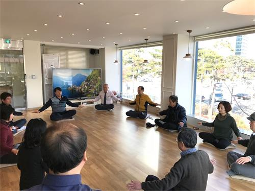</td>
</tr>
<tr>
<td align="center">新学员在学炼法轮功第五套功法——神通加持法</td>
</tr>
</tbody>
</table>

<b>“我看到了象古画一般的高山、楼阁以及仙女”</b>

来自安阳的蔡钟烈先生腿受伤之后一直在接受治疗、寻找可以康复的运动。期间，偶然接触到了法轮功。最初他在网络上找到视频，自己炼功，后来前往炼功点。第五天时，出现了身体净化现象。炼功中出现严重的呕吐，不仅炼功时这样，回家之后还继续呕吐，甚至坐地铁的时候，中间要下车寻找卫生间。一开始他以为是早上吃的大酱汤变质引起的，但是询问妻子之后，她说完全没有那回事儿。法轮功学员告诉他说这是好现象，不是食物变质引起的，而是清理身体的现象，很快就会过去，而身体健康会得到真正的改善。

听九天班的时候，蔡钟烈眼前出现了这样的景象，他说，“我看到了中国古画一般的场景，有仙女在跳舞，经常看到那种历史久远的高山。”他说虽然不是特别清晰，但是会一晃一晃地反复出现。“刚才坐着的时候，看到（录像中）师父背后有气在流动，三、四天之前就看到了。不仅仅是在电视的屏幕内，还流淌出来了。看到那个气涨到人的头两倍高的地方。而且我闭上眼睛的时候会看到佛像。”他说感觉非常好。

<b>“我也要好好修炼”</b>

住在首尔的尹佑尚先生很久之前就接触了法轮功，但是自己炼了一段时间之后没能坚持下来。就在第31届九天班开始的前一天，他在报纸上看到了天梯书店将要举行九天班的消息，心里想实在是太好了，第二天就直接参加了。他说：“我不知道准确的炼功动作，来这里学到了。在这期间我悟到了很多，真的非常好。”

<b>“几天下来，不知为何，浑身充满喜悦”</b>

来自城南的安恩珠女士通过朋友的介绍，不久之前开始阅读法轮功相关书籍，并且参加了九天班。虽然书上的内容最初让她觉得有些陌生，但是不知为何，内心充满了喜悦，一天不落地参加了九天班。

<b>“感觉这就是最适合我的”</b>

随朋友来到首尔的金洛永先生在美国华盛顿了解了法轮功真相。他是因为健康出现问题开始修炼的。他说，“也尝试着去医院、爬山，但是都没有效果。感觉法轮功是最适合自己的。”

<b>“真的是大法！”</b>

居住在首尔的李振豪先生原来是一位天主教信徒，他本来在学习其它气功，偶然的机会接触到了法轮功，通过传单上的信息在网上购买了法轮功相关书籍。他说，虽然九天班中有一些东西比较生疏，但是觉得很有趣。他说，“听到师父讲宇宙，我觉得这真的是大法啊，与我以前的修炼不一样。所以我想依据大法去寻找真理、修炼。”

<b>“我想进一步学习”</b>

具敬颜女士是跟随丈夫李振豪先生一起来的，她说自己原来是一个非常现实的人，但是当丈夫说想学法轮功的时候，她也决定一起学。来这里听完讲法之后，她决定进一步学习、更努力地修炼。

<b>“我想继续学习”</b>

来自城南的金政羲先生是在朋友的介绍下得知法轮功的。他说，“我朋友从小患有糖尿病，为了维持健康，他经常走路。修炼法轮功之后，这位朋友痊愈了。去医院检查，发现血糖数值都恢复正常了。”朋友的经历让他走上了修炼的路。他还说，“我觉得师父的话都很好，如果可以的话，我想继续学习。”

“开始炼功一周之后，身体就象要飞起来一样”

居住在首尔的姜浩玉先生今年七十岁了，开始修炼法轮功约六个月。他患有帕金森病，而帕金森病是医院也很难治疗的不治之症。另外，姜先生还有糖尿病和高血压，做过两次腰部手术。不过，修炼法轮功之后，这些症状都已好转，现在无须服用药物。

他说，开始炼功一周之后，原来特别难受的身体就象要飞起来一样。他表示，登山的时候接触到了法轮功，法轮功就象是命运安排的一样，让自己接上了缘份。他一边说着，一边露出了幸福的微笑。

每周周日，天梯书店还会专门组织听完九天班的新学员学法、交流 。从上午七点五十开始炼功，从十点开始一起学习《转法轮》。在孔德每周三也有新学员集体学法，从晚上七点开始，结束九天班的新学员可以在那里学法、交流。

<h1 align="center"><b>在温尼伯健康展上介绍法轮功</b></h1>

<table border="0" cellspacing="3" cellpadding="3">
<tbody>
<tr>
<td align="center">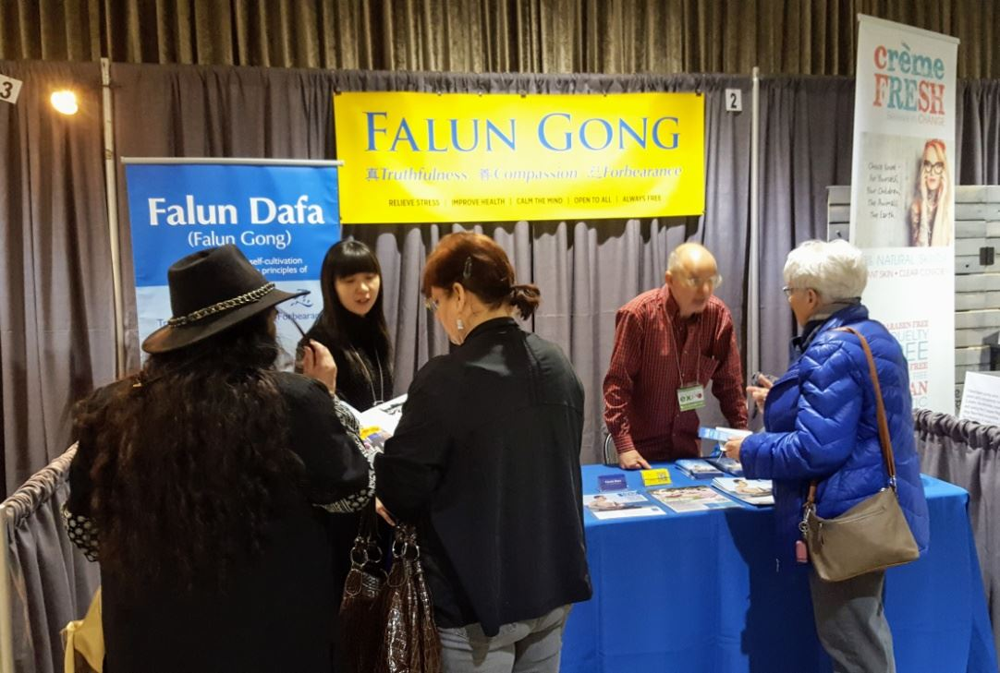</td>
</tr>
<tr>
</table>
  
  【明慧网二零一八年二月二十二日】二零一八年二月十六日至十八日，加拿大温尼伯法轮功学员第二次参加了一年一度的健康与意志博览会（Health and Wellness Expo）。博览会每年的参观人数大约在五、六千人。法轮功学员在博览会上介绍功法，并讲述法轮功学员在中国无辜遭受迫害、被中共活摘器官的真相。
  
  被法轮功展位吸引的人很多，他（她）们来自不同的族裔，年龄差异也很大。绝大多数人没有听说过法轮功，其中也有部份人了解中共对法轮功的迫害，但对功法本身并不了解，还有一些人对功法很感兴趣，情况不一。人们向在场的学员提出了不同的问题。如法轮功是什么样的功法，炼法轮功会不会出功能，法轮功是否收费，法轮功学员能不能治病，法轮功为什么在中国遭受迫害，法轮功在温尼伯的炼功点等等。学员一一给他们详细解答，并派发资料，资料中有各种联系方式，其中包括社交网络。人们可以很容易地联系到当地的学员。

有一位老年西人男士来到展位前，从书包里拿出了一张用塑料膜保护起来的传单，是一张十几年前的法轮功真相资料。学员问他是从哪里得到的，他说已经不记得了，但他一直保留着。学员给他进一步介绍功法，并赠送了一本最新的《明慧国际》期刊。

一位来自中国新疆的维族女士说：“我知道共产党活摘法轮功学员器官，共产党非常邪恶。共产党给我们弄的集中营，在新疆一个城市就关了十二万的维族人，进行活摘器官。我站在你们（法轮功）这一边，加油！”

通过这次博览会，更多的人了解了法轮功和发生在中国的迫害真相。

<h1 align="center"><b>石家庄警察吕建江恶报病亡</b></h1>

【明慧网二零一八年二月十一日】（明慧网通讯员河北报道）二零一七年十一月三十日，吕建江下班回家后就身感不适，吃药后仍不见好转。一日凌晨三时，吕建江被紧急送往石家庄和平医院，当日七时四十分，吕建江因医治无效死亡。初步判断为主动脉夹层破裂。
吕建江，河北省石家庄市公安局桥西分局安建桥综合警务服务站主任。河北省石家庄市井陉县人。一九七零年四月出生，二零零四年三月转业参加公安工作，在汇通派出所任片警。二零一二年调到安建桥警务站。

二零零八年六月十七日，明慧网石家庄通讯员报道了吕建江参与迫害法轮功的恶行。

石家庄市东三教村法轮功学员程文芬，女，六十岁左右。曾被非法关押在河北省洗脑中心，遭受迫害。二零零八年大约四月份左右，在深夜十一点左右，被石家庄市彭后街派出所非法从家中抓走，被非法关押在派出所的留置室，派出所所长阴谋上报，并企图迫害法轮功学员。经过家人的奔波，后被转到辖区派出所（汇通路派出所），被汇通路派出所勒索3000元现金，不给任何说法和收据，后被放回。汇通路派出所吕建江、杜宏霄等参与迫害。

一九九九年七月二十日，中共迫害法轮功以来，法轮功学员在讲真相中一直以最大的慈悲心告诉所有参与迫害的人员：迫害法轮大法、迫害法轮功学员是要遭恶报的。法轮功学员一直面对面的，或打电话、或发彩信、或发微信、或写信等各种形式慈悲劝善，告诫参与迫害法轮功学员的警察，不要做中共恶党和江泽民的帮凶迫害善良，最终成为中共的“替死鬼”。

吕建江生前曾被中共授予所谓的“石家庄市优秀共产党员”、“2009 年度石家庄市优秀人民警察”、“2009 年度石家庄市政法系统优秀社区民警”、“河北省公安机关优秀共产党员”、“河北省模范军队转业干部”、“2013—2015 年度河北省公安系统先进个人”、“全国优秀人民警察”等等。吕建江死了又被中共包装为“全国公安系统二级英雄模范”。吕建江为中共卖命，最终成为中共的“替死鬼”。

大连市公安局甘井子分局刑警大队重案二中队探长于永祥参与迫害法轮功遭恶报，二零零一年五月十三日十三时十分，心脏病突发去世，年仅三十七岁。中共把他包装成“拼命三郎”。二零零二年，公安部树他所谓“二级英模”荣誉称号。

大连开发区新港公安派出所所长赵振金，也是因为卖力参与迫害法轮功学员遭恶报。二零零六年九月九日，他不听法轮功学员的善意忠告，最终因和妻子吵架，一气之下跑到办公室，在办公室内突发性心肌梗塞死亡，死时年仅五十五岁。却被中共包装成“一级英模”欺骗世人。

那么中共为什么如此规模的宣传和重奖恶报者？其实最根本的目的是，中共知道现在迫害法轮功的恶人恶警越来越多的遭到恶报，担心警察们恐慌不再为其效力，就制造虚假，蒙蔽百姓；用金钱、名誉收买人心，鼓励恶警继续迫害法轮功，企图挽救注定失败的迫害局面。

实践证明：法轮功学员告诉人们“善恶有报”的天理已经应验，现在参与迫害法轮功的恶人已经开始大面积遭恶报，这是天警示人。明慧网都有大量的报道。目前中国大陆警察因迫害法轮功遭恶报的非常多，伤、亡数量非常大，中共欺骗世人，称死亡的警察为“因公牺牲”。实际上都是恶报。

据中共公安部公布的不完全数据统计，二零一零～二零一七年，中国大陆警察3111名死亡，因突发疾病猝死在工作岗位上占总数一半以上。死亡警察平均约45.5岁，中青年警察死亡比例较高，其中30至49岁超过七成，29岁以下和50岁以上分别占一成、两成左右。从警种看，派出所、交巡警、治安民警、刑侦民警、消防官兵牺牲居前五位。二零一零～二零一四年，警察负伤20741人。数据不包括退休警察死亡人数、不包括自杀死亡人数。

所有参与迫害法轮功的人应该清醒了，如果还一意孤行迫害，等待你们的下场是非常可悲的。

只有停止迫害，退出中共恶党组织，才能得到神佛的保护，才能幸福平安！
