<a href="https://git.io/ffq">
</a>

<h3>
http://36.227.102.73</h3>

<h1 align="center"><a href=https://github.com/3fmd/gm/blob/master/epub.md>免费下载好书 下载 epub 视频 音频 图文 电子书</a></h1>
<h2 align="center"><a href="https://github.com/3fmd/gm/blob/master/gm/download/Reasily1802h.apk?raw=true">手机必备Reasily - EPUB 阅读器apk 请下载安装 才能阅读影视epub</a></h2>

<h1 align="center"><b>绝处逢生 韩国公司社长见证两个奇迹</b></h1>

李重天利用周末休息时间，风雨无阻地到中国游客常去之地韩国南山下的韩屋村摆放真相展板讲真相。

今年59岁的李重天说，在过去的34年里，他长期连续工作，从来没有旷过工，哪怕因为工作压力彻夜未眠，他都不敢缺勤。

<b>身受病痛折磨</b>
 
由于常年来身处极度的疲劳和压力中，李重天说，15年前的一个凌晨，严重的胸部疼痛令他从睡梦中醒来。家里人急急忙忙把他送到韩国大学医院急救室，之后总算保住了性命。

但是，从那以后，对死亡的恐惧时常压得他喘不过气。他说，“慢慢地，胸闷、气喘等疾病也都找上门来，有时感觉心脏要停止跳动了。慢慢地，我的性格也变得非常敏感，与家人的交流渐渐减少，家里变得冰冷、没有了往日的温情。”

<b>见证奇迹：身上所有病症全消失</b>
 
就在他不知该如何解脱的时候，2004年4月，李重天在公司的公告栏里看到了一篇文章，他觉得很特别。文章介绍了法轮功，虽然有些陌生，但不知为什么他想学的念头十分强烈。

他立即上网搜索有关法轮功内容，下载并阅读了法轮功著作《转法轮》。

从此，他每天如饥似渴地阅读《转法轮》，他说：“我越读，越觉得宇宙、时空和人体之谜等新的的内容十分有趣和奥妙，而且对过去人生中不得其解的事情也恍然大悟。”

他家附近有一个炼功点，他在那儿学习了法轮功的五套功法。

修炼一周之后，身体不健康的部位开始出现反应。他一直坚持不懈地修炼，就在某一天，他突然发现自己再也不气喘了，心脏病也好了，以前周期性的腰痛也都消失得无影无踪。

之后他还做了一个梦，直到现在都记忆犹新。梦中，在一个金光闪闪的卷轴上有无数的汉字，那个卷轴长长地飘荡在空中，出现了一个佛像，后来渐渐远去。

<b>见证第二个奇迹：母亲癌症不见了</b>
 
之前的病痛不知不觉地消失了，令他恍如在梦中。他慢慢地打开心扉和家里人交流，就在他体验著幸福的时候，家里又发生了一系列事情，用他的话说：“不修炼，很难渡过这些难关。”

家里有卧病在床的父亲，患癌症的母亲也突然间因交通事故住院了，真是祸不单行。

虽说如此，他没有怨言依然担负起家庭的责任，尽心尽力地服侍著父母。

他深信，法轮大法在他身上出现的奇迹，也同样会出现在母亲身上，如果母亲修炼的话。

他劝住院的母亲读一下《转法轮》。他母亲一开始强烈地拒绝了，但是他没有放弃，最后在他的殷殷劝说下，母亲开始和他一起阅读，并且每天默念“法轮大法好、真善忍好”九字真言。

不久，奇迹降临在他母亲身上。李重天说，“有一天，母亲突然感觉到下腹部有一股热气往上涌，之后因癌症引起的痛症竟然消失了。”

就在他母亲因为癌引起的痛症消失而激动、感恩之际，帮助照顾母亲的妹妹哭着打电话给他说：“哥，医生说咱妈不是癌症，可以出院了。”

李重天激动地说，“之前，（韩国）好几家有名的综合大医院的专家，都诊断说母亲患了难以手术的胆道癌，而现在说不是癌症了，这不神奇吗？”

<b>苦尽甘来 广传真相</b>
 
修炼后，一直沐浴在幸福中的李重天，时刻惦记着那些不知真相的可贵的中国人，“我通过修炼得到了很多很多，我应该告诉被谎言毒害的中国人真相。”于是他利用周末休息时间，风雨无阻地到中国游客常去之地韩国南山下的韩屋村，摆放真相展板讲真相。

冬天的时候，因为担心积雪阻路，他就清理掉积雪。不管是严寒，还是酷暑，还是风雨交加，他都坚持不懈。

有中国游客认真看了真相展板之后，有的跟他道谢，也有人默默接过真相传单。还有一位游客静静地走过来，流下了眼泪。

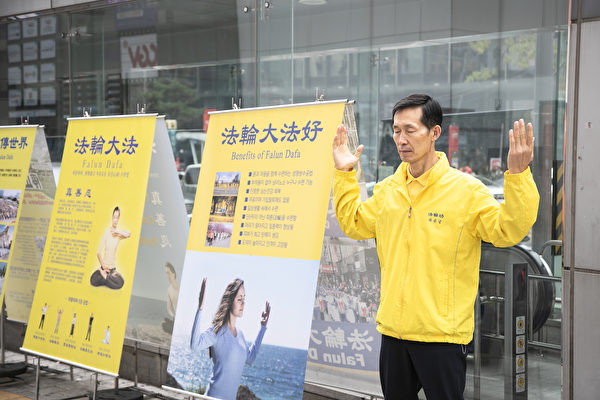

李重天利用周末休息时间，风雨无阻地到中国游客常去之地韩国南山下的韩屋村摆放真相展板讲真相。

当然，也有不明真相的中国人骂他，说他“说谎”。李重天就耐心地告诉对方其在中国看不到的真相，并解释说：“如果这是假的，怎么可能在同一个地方坚持这么久呢？而且全世界都知道这个真相呢？”听到李重天的话，这位中国人最后向他道歉了。

现今，李重天表示，自己持续地按照法轮功“真、善、忍”的原则修炼，心灵在不断地升华，不仅拥有了一个真诚、平和的心态，同时又拥有健康的体魄，遇到困难都能坦然面对。

而一直默默注视着他的家人，对他的修炼也渐渐理解了，家人之间也找回了充满温馨的欢声笑语。

<h1 align="center"><b>胡欣之死警示中共喉舌</b></h1>

【明慧网二零一八年十一月十六日】无论什么人或什么组织，干了什么事情，纵然瞒天过海，都耐不住时间的鉴别，逃不脱历史的裁决。历史在不断地验证着一个真理：害人者如害己。人往往都是始于害人，终于害己，新闻媒体和新闻工作者也不例外。
尤其中共的媒体，总是一味地为中共歌功颂德，对民众谎言洗脑，替中共的暴政煽风点火，毫无底线地美化中共的恶行、丑态。曾在《人民日报》麾下《人民论坛》做过副主编的邱明伟先生揭示出一个事实：记者、编辑常常被迫造假。用一个造假记者的话说：“不造假就没有饭吃”。编造假新闻，假报导，在中共媒体工作的人，大多深谙其道。现在大多中国人都知道《人民日报》只有日期是真的。中共从窃政以来就是以欺骗和杀戮维护着它的统治，凶残地利用着笔杆子和枪杆子这两种杀人工具，每搞运动都是媒体先造谣，接着再用暴力打压无辜。中共的媒体就像奴才一样，只效劳于它的主子，绝不可能真心为百姓说话。

一九九六年，我去了公安部门的一个机关单位，负责撰写新闻报道，因为他们干不出多少可写的事情来，就很少有事迹见诸报刊。一天，一位领导亲自对我说：没有实事，你就编呗。

听领导这样说，我感到非常吃惊。公安部门这样一个以保护人民生命财产和捍卫法律尊严为天职的执法部门，怎敢弄虚作假、编造假新闻往自己脸上贴金而欺骗民众呢？公安部门都不能恪守自己的职能，坚守自己的良知，这个国家还有什么希望？加之中共体制内的日益腐败，那一刻，我从内心认定：中共不会长久！

历史在渐渐地剥落中共的画皮，让人们认清它的真实面目。特别是媒体的腐败、谎言和迎合中共的下作，一直在帮中共把中华民族推向深渊。失去良知的记者会颠倒黑白。道德沦丧的编辑会把魔鬼美化成天使。听信媒体谎言的民众就会上当受骗，善恶不分，真相不明。散布谎言、欺骗民众的人也会给自己积下凶灾。

日前，中共《人民日报》旗下的《新闻战线》杂志原总编辑胡欣自杀引起广泛关注。据报导，胡欣生前罹患抑郁症，二零一八年十一月六日从报社三十六号楼的十九层跳下身亡，终年六十六岁。胡欣一九九零年——二零零八年在《人民日报》理论部任编辑、部务委员，期间还担任《人民论坛》杂志社总编辑；二零零九年转任《新闻战线》杂志社总编辑。

《人民日报》是中共的喉舌，一九四八年创刊，七十多年来一直担当着替中共涂脂抹粉，摇旗呐喊，打压人民的舆论工具，充当着中共专制、暴政的吹鼓手，也是推动中共一次次血腥害人运动的杀手。

一九五八年，中共发动“大跃进”，随之人为地造成三年大饥荒，饿死了四千万人，把中华民族置于深重的灾难，这其中有《人民日报》的重大罪责。“大跃进”年代，《人民日报》曾多次发文虚假报导农业亩产几万斤、十几万斤粮等，带头掀起浮夸风。例如：一九五八年九月一日，发表《徐水人民公社颂》，宣称“小麦亩产十二万斤”，“山药亩产一百二十万斤”，“一棵白菜五百斤”。九月十八日报导，广西环江县红旗人民公社亩产水稻十三万多斤。

后来的文革、“六四”等多次运动中，《人民日报》都不遗余力地挥动着笔杆子替中共害人。在中共害死的八千万国人中，《人民日报》可谓是中共最得力的刽子手。

明智的人们已经看清了中共的狼子野心，它用无神论和斗争哲学毒害人们，毁掉了传统文化，让人们失去做人的标准，为了情欲、利益无恶不作，导致社会道德全面崩溃，从而断送中华民族的未来。事实证明中共这一西来幽灵是个魔鬼，它与神佛做对，专门害人，破坏传统和人的道德，让人们背叛神佛，不信善恶报应，无法无天，一步步把人变成不是人的非人，最后招致天降大难，被神佛淘汰。中共的险恶目地特别在其对法轮功的迫害中暴露无遗：法轮功是古老的佛家修炼大法，教人们按照真善忍做好人，与人为善，能使社会道德迅速回升，通过一百多个国家的民众修炼实践，证实法轮功于人类有百利而无一害，被誉为拯救世人的高德大法，人类的希望！

一九九九年中共和江泽民流氓集团对法轮功发起了迫害运动，同年七月二十三日《人民日报》发表谎言社论《提高认识 看清危害 把握政策 维护稳定》，推动了中共迫害法轮功的运动。在开始迫害法轮功的头一个月内，《人民日报》便迎合主子血口喷人，刊登了三百四十七篇捏造的攻击法轮功的文章，大肆聒噪，蒙蔽广大民众。

二零零一年一月二十三日，中共花钱雇人冒充法轮功学员导演漏洞百出的“天安门自焚”伪案嫁祸法轮功，事发两小时后，新华社就向全世界发布了英语新闻，《人民日报》也积极地炒作，欺骗、煽动全国民众仇恨佛法。自古以来迫害、仇恨佛法者都会因对佛法的犯罪落得可悲下场。中共迫害法轮佛法的目的，就是要毁掉十几亿中国人。胡欣在迫害法轮功的运动中，首当其冲成了中共的吹鼓手和文字打手，其自杀是恶报的结果。胡欣半生为中共效犬马之劳，可知最终反被中共所害？听任、纵容、帮助中共迫害佛法者，最终都会毁掉自己。

近年来因迫害法轮功遭报的贪官、媒体工作者等，其中自杀的亦非个别。善恶必报，害人者终害己。胡欣之死，也是告知那些还在出卖良心，跟随中共迫害佛法修炼者的打手和百般阻挠世人了解真相得救的造谣者们，应该悬崖勒马了。

中共祸乱中华、迫害佛法令天地震怒，天灭中共，大难在即。希望良知尚存的人们能彻底抛弃中共，在海外《大纪元》网站声明退出曾加入过的党、团、少先队，牢记真善忍，定能走向美好的未来。

网址转载：

<h1 align="center"><b>涉嫌活摘器官 大陆专家被拒参加国际会议</b></h1>

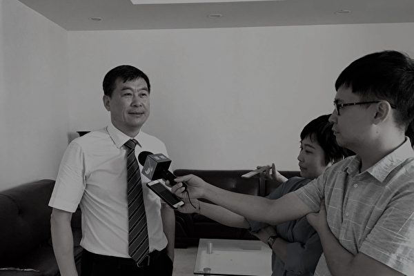

大陆移植专家董家鸿，原本被邀参加以色列一个国际医疗会议，因“终结中国滥用器官移植国际委员会”对此提出抗议，会议主办方取消了董家鸿参会邀请。（大纪元资料室）

【大纪元2018年11月15日讯】（大纪元记者梁欣、方晓采访报导）涉嫌非法活摘法轮功学员器官的中国大陆移植专家董家鸿，原本被邀参加以色列一个国际医疗会议，因“终结中国滥用器官移植国际委员会”对此提出抗议，会议主办方取消了董家鸿参会邀请。

<b>国际组织抗议有效 董家鸿被拒参会</b>
 

旅美的中国法学学者滕彪11月13日在推特发文：解放军总医院（301）肝胆外科主任董家鸿原受邀参加海法投资峰会。因其涉嫌非法摘取法轮功器官，情节恶劣，“终结中国滥用器官移植国际委员会”（ETAC）提出抗议，要求海法拒绝董参会。主办方HEC总裁Or Shahaf近日确认，不再邀请董参会。我作为ETAC美国委员会委员联署了此签名。

11月18-20日，第七届“中以高科技投资峰会”将在以色列海法市举行。会议涵盖生命科学、数字健康、机器人技术等主题。届时，中共驻以色列大使馆官员将出席开幕式。董家鸿为此次受邀中方嘉宾之一。

滕彪对大纪元记者表示，他知道董家鸿要参加海法的投资峰会之后，就给会议的主办方写信，要求他们拒绝邀请董家鸿，并表示抗议。这种国际论坛邀请涉嫌非法摘取器官、涉嫌人权侵犯的人来参加，本身就有损他们的形象、有损这个会议的正当性。

滕彪透露，国际组织“终结中国滥用器官移植国际委员会”在10天前向会议主办方“海法经济组织”（HEC）发出联署抗议，要求主办方拒绝董家鸿参会。

他说，主办方拒绝董家鸿这样的人参加会议，向国际社会表明对这样的一个人权侵犯者是不能够给他们提供发声的舞台、任何平台。所以，这事对于国际社会相关于类似的会议都是有借鉴意义的。

被问到“董家鸿被拒参会”事件对中共有什么影响？滕彪表示，因为中共对网络、对媒体信息都是进行非常严格的控制，尤其像对法轮功、像活摘器官这样的事，国内的民众是基本上没有办法知道的。

“但是董家鸿本人和他有关的单位、机构，包括中共负责宣传、负责相关宗教工作的人，包括一些相关医学界的人他们会知道。对于他们就会产生震慑作用。”

滕彪认为，随着越来越多的真相被披露出来，中共滥用器官移植会被当作一个紧迫的、重要的人权议题提出来。肯定会有越来越多的人权组织来关注这个事情，将来媒体等对这个议题的关注肯定会越来越多。

董家鸿现任北京清华大学长庚医院执行院长。他曾任中共军队301医院肝胆外科主任。公开的信息显示，董家鸿擅长肝胆胰疾病的精准外科治疗、肝脏移植。2017年11月27日，其成为中国工程院院士。

<b>董家鸿因严重涉嫌参与活摘法轮功学员器官 被海外追查</b>
 
2018年11月1日，总部位于美国的人权组织“追查迫害法轮功国际组织”发出“追查活摘法轮功学员器官嫌犯北京清华长庚医院执行院长董家鸿的通告”。

通告指，原中共解放军总医院（301医院）肝胆外科主任、解放军总医院肝胆外科医院院长、解放军总医院全军肝胆外科研究所副所长、现任北京清华长庚医院执行院长、国家卫生部人体器官移植专家委员会委员、中华器官移植学会常务委员董家鸿，严重涉嫌参与活摘法轮功学员器官，严重涉嫌触犯群体灭绝谋杀犯罪！本组织对董家鸿立案追查。

“追查迫害法轮功国际组织”负责人汪志远对自由亚洲表示，根据他们10多年的调查，中共活摘法轮功学员器官是属于一个国家犯罪，一直持续到现在还在进行。

汪志远说，我们调查董家鸿是涉嫌活摘法轮功学员器官的成员之一，他做的（手术）数量也不少，他必然是这个“灭绝犯罪”的成员之一，也应该接受法律和道义上的审判。国际社会有责任维护人类道德良知、制止这场屠杀、追究这些涉嫌犯罪（者）。

中共官方资料显示，董家鸿与中共卫生部前副部长黄洁夫等都是“中国器官移植学会”重要成员，是器官移植领域核心人物。

<b>活摘人体器官罪恶持续18年 国际社会关注</b>
 
1999年7月20日，中共公开镇压法轮功。中共对法轮功学员使用洗脑、酷刑、虐杀等手段，逼迫他们放弃信仰。中共江泽民集团对法轮功学员更是实行“名誉上搞臭，经济上搞垮”政策。此后中共开始对法轮功学员进行大规模活摘器官。大陆器官移植呈爆炸式增长，等待供体的时间短得不可思议，在全世界绝无仅有。

公开信息显示，有些医院以促销招揽客户，还出现“包换包退”的广告词。非常迅速地，以人体器官为前提的移植手术，在中国成为带来巨大利润的新兴产业。在白色的病房内，隐藏着中共的灭绝人性和中共江泽民犯罪集团的滔天罪恶。

中共军队和武警医院大规模活摘人体器官做移植手术牟利，成为活摘器官的重灾区。“追查国际”经过多年的调查，获得数千个调查电话录音，其中包括多家医院以及中共军方和中共高层的证词，最后证实当年是江泽民亲自下令，推动活摘法轮功学员器官“军事化、产业化”。

当时的中共总后勤部是活摘器官的核心机构，负责秘密器官供体库（即大批法轮功学员）的管理和分配。因此，中共军队和武警医院获得了最便利的条件，成为活摘器官做移植手术的主要机构，以此牟取了巨额的血腥暴利。

2014年10月，“追查国际”公布对100家中共军队和武警医院器官移植的调查概况，共有2,096名军医涉嫌活摘器官。

中共活摘人体器官的残酷暴行，被称为“这个星球上前所未有的罪恶”。

2013年12月12日，欧洲议会高票通过一项紧急议案，要求“中共立即停止活体摘除良心犯，以及宗教信仰和少数族裔团体器官的行为”。

今年10月10日，美国国会行政当局中国委员会（CECC）发布年度中国人权报告，指陈中共专制政权对中国人权迫害依然严重，并且打压法轮功学员，对他们骚扰、拘禁、迫害。报告强调，国际组织也指出法轮功学员与其他囚犯的器官被用作器官移植，国际医界对中国的器官来源也表示担忧。

<h1 align="center"><b>“小饭桌”孩子们的故事</b></h1>

【明慧网二零一八年十一月十五日】当前，在中国大陆，孩子的教育问题成了家长们的一大难题，很多人抱怨现在的孩子不好管，管不了。我想和大家说的是有这样一群孩子，他们纯真、善良、不撒谎、懂礼貌、学习好、身体棒，他们每天都健康快乐地成长着。要说这里边的奥秘嘛，我给大家讲几个真实的故事。
我地有一位阿姨是修炼法轮大法的，阿姨开了一家“小饭桌”，主要给孩子们提供写作业、吃饭、住宿的场所。小饭桌有十几个孩子，最大的上初三，最小的上小学三年级。阿姨就像妈妈一样关心照顾着他们，每天按时接送他们，做他们喜欢吃的饭菜，阿姨每天都很辛苦，即使这样，阿姨也不忘每天学法炼功，同时也教育孩子们按真、善、忍做人，在阿姨的影响下，孩子们也跟着阿姨一起学法炼功，之后在孩子们身上发生了很多神奇的事，他们自身也从大法中受了益。

有个上六年级的女孩以前学习很不好，各科成绩都只考二十多分，老师和家长也很为难，不知如何提高成绩。可是这个孩子很认同大法，看大法书一个月后，成绩比以前提高很多，尤其是语文能考到八十多分了，连老师都说进步挺大的，看大法书开启了女孩的智慧。

有个孩子以前在别的小饭桌总爱生病，后来妈妈把她转到阿姨的小饭桌，她来到这里和阿姨一起看大法书，身体比以前棒多了，也不爱生病了。

有个上四年级的女孩和她弟弟一次去河边玩，两人玩得正高兴的时候，一不小心姐弟俩都掉进了河里，河水很深，在掉进去的那一瞬间，女孩不惊不怕，心中念着“法轮大法好，真善忍好”，顿时看见大法师父用手把自己和弟弟托上了岸。

还有一次，这个女孩去山上玩，山很高很陡。在爬山的时候不小心一脚踩空，她立即想起了大法，并在心中默念着“法轮大法好，真善忍好”，瞬间就看到一朵祥云把自己托住了，这都是孩子在危急时刻想到了大法，才得到了大法师父的保护。

孩子们身上发生的神奇故事还很多，总之，孩子们通过学习了大法，他们的身心发生了很大的变化，大法把真善忍的种子播撒在了孩子们幼小的心灵里，我相信只要真善忍的种子在他们心里扎下了根，无论他们将来走到哪里，干什么工作，他们今后的人生一定会受益无穷的。

在这里，我也想对那些至今还在为教育孩子的问题而苦恼的家长们说一句，你们不妨也留意一下你们身边的那些送给你们法轮功真相资料的人，你们也用心地看一看，或者你们也找一本《转法轮》来读一读，我坚信，您和您的孩子一定会有意想不到的收获的。

<h1 align="center"><b>人民日报前高层胡欣曾炒作中共“1400例”</b></h1>

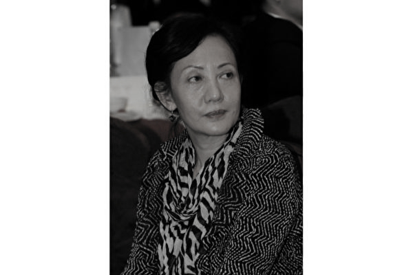

11月6日，《人民日报》旗下杂志《人民论坛》和《新闻战线》前总编胡欣，跳楼身亡。（大纪元资料室〉

【大纪元2018年11月11日讯】11月6日，《人民日报》旗下杂志前总编胡欣跳楼身亡。胡欣生前曾炒作中共“1400例”栽赃法轮功的谎言案例。

《人民日报》是中共喉舌。胡欣长期在《人民日报》最核心的理论部担任编辑，参与“重磅文章”的写作、编辑和研究，曾出任《人民日报》旗下《人民论坛》和《新闻战线》杂志的总编辑。

胡欣担任总编期间，《人民论坛》多次发表抹黑法轮功的言论，引用中共编造的1400个“练疯了、练死了”等不实案例以攻击法轮功。比如，《人民论坛》1999年12月6日曾发表文章，造谣法轮功学员剖腹找法轮。

事实真相，又是怎样的呢？

<b>中共炮制的“剖腹找法轮”骗局</b>
 
马建民，河北省任丘市华北油田居民，本人及家族都有精神病史。

有一天，马建民一个人在家，他的家人回来时，看到马建民肚子剖开，死在了厕所里。家人赶紧报案。当时公安局的人明明知道马建民一个人在家，为什么会剖腹，谁也不清楚。

可是为了迎合江泽民迫害法轮功的政策，讨好公安部，捞取政治资本，当地公安局硬把马建民的死说成是“剖腹找法轮”。

当时中共央视去马建民家编排节目时，马建民的儿子一再声明其父的死与法轮功无关，并且拒绝在电视上表演。

但央视不顾事实，仍然一手编导了“剖腹找法轮”的骗局。

中共编造的“1400例”含多个精神病案例，又如：

<b>山东“铁掀打死父母”案真相</b>
 
王安收，山东新泰市泰山机械厂工人。王因精神病复发，将其父用铁掀打死。此事却被诬蔑成王“练法轮功”杀害父亲，并被收入 “1400”例中。我们从以下新泰市法院的官方文件中，不难发现王早在1988年就患精神病，并前往精神病医院治疗。

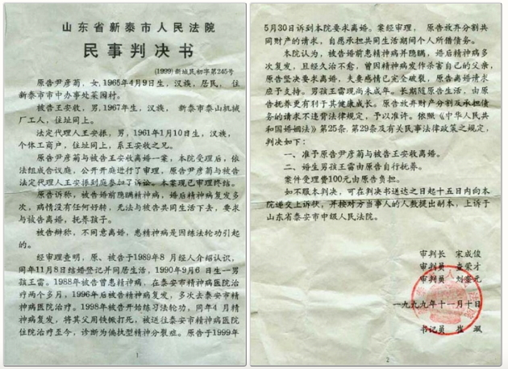

（明慧网）

<b>重庆永川双石镇龙刚跳河自杀真相</b>
 
龙刚，重庆永川双石镇居民，家住双桥街七十号，精神病复发跳河死亡。

龙刚死后，一个姓杜的记者采访他的妻子，把一些诬蔑法轮功的话写在纸上，叫她照着念，并给了她二百元钱。

事后，龙刚父母投书明慧网说：“儿子有没有精神病作为父母是最清楚的，天下哪有不心疼子女的父母。儿子确实有精神病，当时是精神病复发跳河死亡，与法轮功没有任何关系。这是谁也抹煞不了的事实，作为他的父母，我们必须说真话，不能昧著良心。”

中共将这些精神病患者病发时的意外事故，栽赃是法轮功学员所为。但是，他们都不是法轮功学员。

<b>法轮功不允许精神病人修炼</b>
 
事实上，法轮功创始人李洪志先生从1992年传出法轮功之始就明确指出，精神病人不能修炼法轮功。

李洪志先生在1996年的《悉尼法会讲法》中指出：“精神病人，他自己意识是不清的，我们是不能度的。”

李洪志先生还在《法轮大法义解》的《北京法轮大法辅导员会议建议》一书中指出：“为什么我们强调精神病人不让参加班呢？就是他自己都把握不了自己，掌握不了自己。”

<b>“1400例”是骗局</b>
 
1999年10月25日，时任中共党魁江泽民访问法国前夕，接受了法国《费加罗报》社论委员会主席佩雷菲特的书面采访。江说：“据不完全统计，因练‘法轮功’致死的达一千四百多人。”第二天，这番话被中共党媒《人民日报》转载，之后，中共所有的媒体开始炒作这个数字。

对于江泽民咬定的“1400例”的数字，在中国大陆没有任何一个官媒做过考证，没有任何一个部门、机构做过调查。在中共的强权专制下，更不可能有独立调查机构实地调查，来查证这个数字的真伪，做出第三方判断。

至今，1400这个数字也只是被中共媒体使用。

<h1 align="center"><b>做中共的拉磨驴下场最可悲</b></h1>

【明慧网二零一八年十一月十三日】近年来，在中国大陆出现了一种令人深思的现象，就是越来越多的中共官员、甚至是高官，在特殊的日子，早早赶到寺院，不惜花大钱争着给神佛敬上第一炷香。有的求神佛保佑平安无事，有的求神佛保佑继续升官发财，虽然目的不同，但是最起码他们相信神佛是高于人类的。
在中共半个多世纪的无神论的洗脑和毒害中，其体制内怎么会有这么多的官员反而去求神佛保佑呢？中共宣扬无神论，与天斗与地斗与人斗，人定胜天，把自己说成是人民的大救星，人世间俨然没有任何生命能高于它。那么中共体制内的官员们怎么不求它保佑呢？就连平民百姓谁也不会给中共烧香、磕头，求保平安。一旦遇到危难时，人们会不由自主地呼喊：天啊（或老天爷啊，佛啊，菩萨啊），救救我吧！没有谁会喊：党啊，救救我吧！

几十年来，人们经历了中共制造的一次次整人、害人的运动，从中使众多的人认清了它的真实面目和魔鬼行为。今天的中华大地，已被中共糟蹋得不堪入目，草原成沙漠，江河满污水，空气污染，土壤污染，无毒不有，无假不有，贪腐淫乱，物欲横流，疾病蔓延，灾祸频繁，传统被毁，人人相害，社会道德彻底崩溃，一切都在危及着人们的安全。

世风败坏，灾难频繁，人们越来越意识到平安的重要。那么怎么才能平安呢？心怀善良，敬畏天地神佛，得到神佛保佑才能平安。心里总想着坑人害人，为了钱财权色跟着中共干坏事，危害良善，怎能平安？即使花再多的钱求神佛保佑，神佛也不会保佑坏人的。

最近，中共在它自己的网站上公开通报了一百三十多个公安正、副局长被撤职、查办，便是鲜明的例子。这些曾经被中共捧得红极一时的人，而今却身败名裂，光环失尽。他们被通报的罪名多是违法乱纪，滥用职权，徇私枉法，贪污受贿等，有的已被判处有期徒刑几年、十几年、二十年、甚至无期；还有的被判处死缓；还有人畏罪自杀等。其中有被称为“中共第一警察”的王立军，“天津第一警官”的武长顺，“烟台第一局座”的聂作坤等。

这些披着警服，分布在全国各地公安机关的正、副局级官员，名义上打着保护人民生命财产安全的幌子，实质是危害人民的强盗。他们贪污腐败，欺压百姓，横霸一方，为非作歹。他们整天喊着打击坏人，结果他们却是真正的坏人。难道他们一出生就注定要做坏人的吗？他们都是从小到大在中共邪理歪说的灌输下，听信了中共，充当了中共的鹰犬，才沦落到这步田地。还有几百个落马的中共高官，大都是以违法乱纪、贪污受贿等处置的。听党的话，为党拉磨，党不用了，就卸磨杀驴。这就是为中共做驴的下场，也是善恶报应的结果。

可是这些人最大的恶行中共却不敢通报，就是他们助纣为虐，积极跟随中共江泽民集团迫害善良的法轮功学员。法轮功是源于古老的中华传统文化的佛家修炼大法，是真正的正法大道。教导人们按照真善忍做好人，修心向善，使人的道德迅速回升。法轮功从一九九二年传出，短短七年在中国大陆就有一亿人学炼。而被国人公认没干过任何好事的江泽民出于妒嫉，一九九九年与中共互相勾结掀起了对法轮功的迫害运动，因找不到法轮功的不是，就编造出了一个个谎言栽赃陷害，甚至花钱雇人冒充法轮功学员恶搞“天安门自焚”嫁祸法轮功，让全国民众仇恨佛法，并从此给中华民族埋下灾祸。

法轮功教人向善，明文规定禁止杀生和自杀，在被迫害十九年之久，没有发生过一起恶性报复事件，在社会上真正的法轮功学员中没有任何人杀人放火、偷盗抢劫、坑蒙拐骗、嫖娼卖淫，事实证明他们是遵纪守法的好公民，对他们的迫害都是违法犯罪行为。

二零一七年，在“敲门行动”（中共迫害法轮功的代号）中，走在最前列的各地派出所长和指导员，恶报死亡的就有四十人，年龄最大的五十九岁，最小的三十二岁。这些年参与迫害法轮功的警察和“六一零”（迫害法轮功的非法机构）等部门，恶报死亡的人数，在海外明慧网报道出来的就有数万例（被树为“英雄”，在车祸中丧命的登封市公安局长任长霞就是其中一例），还有很多的没有报道出来。迫害佛法和佛法修炼者，最终都得在恶报中偿还。

有不少警察对法轮功学员说过这样的话：知道你们是好人，共产党给我钱我就得干。明知是好人还要迫害，就是要做坏人。跟中共干，终会成为它的牺牲品。每次运动，中共都是先给一些人一点好处，让他们去整别人，等利用完了再卸磨杀驴，使其下场可悲可耻。

中共是全世界共知的黑恶势力，却以所谓的“打黑除恶”贼喊捉贼地迫害一些正义人士、维权人士、上访人士、基督教和信仰真善忍的民众。

二零一八年十月十日，吉林省以省、市、区联署发了个所谓“打黑除恶”的公告，十月十二日，长春市就突击绑架了二十多名法轮功学员。十一月九日，黑龙江省大庆市有十七位法轮功学员被绑架，同一天，哈尔滨市和周边县大约有四十位法轮功学员被绑架。有些地区，也出现了这种苗头。有的百姓说：打黑除恶是假的，抓人家手无寸铁的法轮功学员去充数。这就是中共所谓“打黑除恶”的真正意图，在它黑暗的统治下，要想做好人就没有你的生存环境。中共最终的险恶目的，就是以利益诱骗和暴力杀戮把好人变坏，再利用坏人迫害好人，逼迫每一个中国人去做坏人，完全放弃做人的标准，然后被神佛彻底抛弃，招致天惩大难，最终被淘汰。

正邪的较量已见分晓，天灭中共早成定局。在海外大纪元网站声明退出曾加入过的党、团、少先队，并能真诚的尊重佛法，心中向善，人们才能得到神佛保佑，获得平安。谁保中共谁就与它一同玩完，这是无法抗拒的天意。顺天者生，逆天者亡。

<h1 align="center"><b>《人民日报》旗下杂志总编胡欣跳楼身亡</b></h1>

【明慧网二零一八年十一月十日】二零一八年十一月六，《人民日报》旗下《新闻战线》杂志社的原总编辑胡欣，从报社三十六号楼十九层纵身一跃，跳楼自杀。
胡欣，一九五二年出生，毕业于北京大学哲学系，高级编辑职称。

胡欣一九九零年～二零零八年在《人民日报》理论部任编辑、部务委员，同期一九九八年～二零零四年任《人民论坛》杂志社总编辑；二零零九年转任《新闻战线》杂志社总编辑。《人民论坛》和《新闻战线》的上级主管部门均为《人民日报》。

众所周知，一九九九年七月二十日，中共头目江泽民出于小人的妒嫉，以法轮功学员人数超过共产党员、法轮功“真、善、忍”原则与中共意识形态不同为理由，下令全面非法镇压。

在非法镇压开始后的头一个月里，《人民日报》就刊登了三百四十七篇攻击法轮功的文章，平均一天十一篇之多。

一九九九年七月二十三日，《人民日报》发表社论《提高认识 看清危害 把握政策 维护稳定》，此社论文章被各网站报导引用十四万多次，在广大中国人民心中种下对法轮功的仇恨，为进一步迫害法轮功铺路。

二零零一年一月二十三日，中共导演的天安门自焚伪案，新华社在事发两小时后就向全世界发布了英语新闻。同样，《人民日报》也在自焚事件上带头炒作。

这起导演的天安门自焚伪案漏洞百出，被国际媒体和国际社会公认是陷害法轮功的骗局。

在《人民日报》等官媒造谣诽谤的推波助澜下，中共公检法各级机构肆无忌惮地迫害法轮功。据不完全统计，十九年来，至少四千二百五十八名法轮功学员被迫害致死，难以计数的法轮功学员被绑架、判刑、遭受酷刑，甚至被活摘器官。

《人民日报》不仅制造谎言，配合中共对内掀起各类打压、迫害运动，还把控制舆论的黑手伸向海外。

《人民日报》是中共的党报、喉舌。

胡欣在《人民日报》理论部工作期间，参与过多篇“重磅文章”的研究、写作和编辑，是人民日报“任理轩”和“任仲平”写作班子成员。“任理轩”和“任仲平”是《人民日报》引导全国舆论，灌输谎言，给全国人民洗脑的集体笔名。《人民日报》的一位前编辑说，《人民日报》只有日期是真的，其它的都是假的。这一说法，也广为大陆民众流传。

胡欣担任《人民论坛》总编辑期间，《人民论坛》杂志曾刊登诽谤法轮功的谎言宣传，比如一九九九年第八期；《人民论坛》在一九九九年八月九日、一九九九年十一月三日、一九九九年十二月六日等时间也发表诬蔑、抹黑法轮功的文章，文章还在《人民日报》网站上刊登。作为总编，胡欣对这些谎言宣传负主要责任。

据报导，胡欣生前罹患抑郁症。胡欣的跳楼自杀，也引发外界关注《人民日报》从历史至今充当共产党的宣传、暴政和杀人工具，为其摇旗呐喊、灌输谎言、配合中共杀人的历史。

据二零一七年数据，《人民日报》全中国发行量达三百一十八万份。订阅《人民日报》，早就是中国各级各部门以及企事业单位的一项政治任务。

《人民日报》在其报社简介中称，该报是中国第一大报，一九四八年创刊，一九四九年八月一日起，正式成为中国共产党中央委员会机关报，“七十年来，积极宣传党的理论和方针路线政策。”

自古中国传统文化中的知识分子从来都是视死如归，那只是为维护道义与良知，与政权无关，与“喉舌”无关，可中共治下的知识分子为效忠中共而赔上身家性命而不自知，充其量也不过是个中共的“替罪羔羊”。

胡欣今天的跳楼身亡，是从她助纣为虐、帮助中共迫害法轮功、诽谤法轮功那天起就已经注定了。

子曰；“志士仁人，无求生以害仁，有杀身以成仁”。志士仁人没有贪生怕死而损害仁的，却有舍生忘死来成全仁的。而中共治下的知识分子不知仁义为何物，只为一己之私，听党话、跟党走，党叫干啥就干啥，其结果只有一个，那就是“咎由自取”。

<h1 align="center"><b>德国纽伦堡市展示法轮功反迫害大型海报</b></h1>

【明慧网二零一八年十一月五日】二零一八年十月二十二日至十一月二日，德国纽伦堡繁忙车道旁，耸立着一幅法轮功学员反迫害的大型海报，题为“十九年来，法轮功修炼者在中国没有人权”。

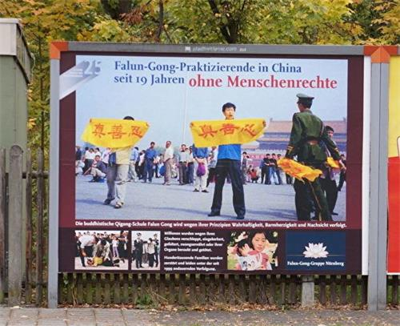

图1：为纪念纽伦堡“人权之路”建成二十五周年，市政府举办大型海报活动，法轮功反迫害的海报在列。

这是该市为庆祝“人权之路”建成二十五周年，张贴的二十五张大型海报中的其中一张。

纽伦堡市位于德国中部巴伐利亚州，因二战后对纳粹的大审判成为德国人权之都。一九九三年十月二十四日，在市中心的德意志国家博物馆旁落成了长达百米的“人权之路”建筑物，以大型圆拱门为入口，沿路立着二十七根八米高的混凝土圆柱，每根柱子上分别用不同的语言刻着联合国《世界人权宣言》的三十条权利和基本自由。今年十二月将是《世界人权宣言》面世七十周年。

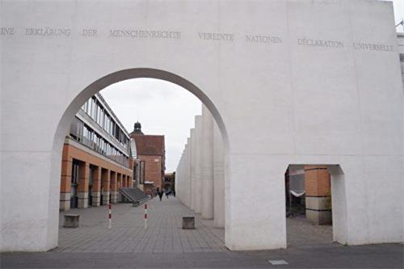

图2：纽伦堡的“人权之路”

为庆祝“人权之路”建成二十五周年，市政府举办了一系列活动，其中包括用二十五个大型广告牌张贴人权主题的海报，海报宽约三米五，高约两米五。市政府还会将海报照片归档，制作成影片，通过不同渠道让更多人了解信息。

法轮功反迫害主题的海报主体是一张大照片，展示多名法轮功修炼者在北京天安门广场请愿，打出写着中文“真、善、忍”的横幅；一名中共警察，手上还拿着从其他修炼者手中夺下的横幅。旁边有不少中国人在围观。

大照片上用德语写着：“Falun-Gong-Praktizierende in China seit 19 Jahren ohne Menschenrechte”，意思是“十九年来，法轮功修炼者在中国没有人权”。

海报的下方还有三张小照片：一张是一名法轮功学员被两名便衣按在地上，其中一名便衣用鞋踩在法轮功学员的脸上，后面是围观的中国人；一张是一名女法轮功学员被两名穿制服的警察抓住，双手被警察野蛮反扣在背后，嘴被另一个警察捂住。

第三张小照片是一位母亲抱着孩子，手上拿着一家三口的照片。纽伦堡当地法轮功学员Yonas表示，小孩的父亲因修炼法轮功被迫害致死。

在海报主图和小照片之间还有一句德文：“Die buddhistische Qigong-Schule Falun Gong wird wegen ihrer Prinzipien Wahrhaftigkeit， Barmherzigkeit und Nachsicht verfolgt”，意思是：佛家气功法门——法轮功因其原则“真、善、忍”而遭受迫害。

在小照片之间还有一段关于法轮功学员受迫害的情况介绍，中文意思是：“数百万人因信仰被绑架、关押、折磨、强迫灌食，或者他们的器官被强摘、人被杀死。数万个家庭被摧毁，自一九九九年以来持续遭受迫害。”

海报的右下角是一朵代表纯洁和希望的莲花。

当地法轮功学员尤纳斯（Yonas）表示，纽伦堡因在二战中的沉重历史，所以对人权很重视，对法轮功学员反迫害的行为也很支持。

<h1 align="center"><b>珀斯女子不再叛逆 爱上华人腰鼓表演</b></h1>

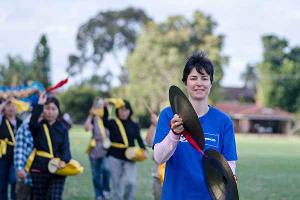

凯伦（Karen Dunscombe）与华人一起排练腰鼓。

【大纪元2018年11月08日讯】（大纪元记者关幼兰澳洲珀斯报导）西澳大利亚的5月，秋高气爽，在州府珀斯商业中心的步行街上，一支华人腰鼓队正在表演中国民间的打腰鼓。引领腰鼓表演的镲手则是一位白人女子，她打起镲来，神采飞扬。

这位女子是凯伦（Karen Dunscombe），她对自己在腰鼓队里如同指挥的角色颇为自信。她说，“需留意打大鼓的人，他们与我的配合很关键。”

时间如果追溯到八年前，这样的场景对凯伦来说是无法想像的。

<b>“以前，我不喜欢中国人”</b>
 
高个、短发、棒球帽、人字拖，行事起来不紧不慢，凯伦说自己非常的Aussie（典型澳洲人）。

“外表酷酷的，其实内心特别温柔。”朋友这样说她，“换上裙子，你就能看到她的女性特质。”

凯伦在珀斯Melville区长大，从小到大生活在澳洲人的圈子里。她说20年前，“我在Melville高中上学的时候，学校里很少很少有中国学生，我们班里没有一个中国人，跟现在大不一样。”

“我10岁、11岁的时候，母亲跟我提到中共政府如何对待人民，非常残暴。对一个孩子来说，我误解为中国人都是那样的，我不懂那实际是中共造成的。”

因为没有机会接触中国人和中国文化，凯伦对中国的方方面面有很多不解。“以前，我不喜欢中国人。”凯伦坦率地说，“作为西方人，我不理解中国人的拘谨，不喜欢他们的做事方式、甚至他们的穿着、表情。”

如此不喜欢华人的凯伦，怎么会加入腰鼓队、与华人一起表演中国腰鼓呢？

<b>法轮功这功法一定很好</b>
 
“我渴望知道生命是什么，生命的意义在哪儿。放纵、享乐、还是帮助他人？我想了解我自己，我到底是谁？” 带着这些疑问，23岁那年，凯伦独自一人去了趟非洲，“我想要尽可能地开阔自己的视野。”

“我去了肯尼亚、坦桑尼亚、赞比亚，我在那里呆了一个月。那里的土壤肥沃，水果出奇的好吃。”

“但，与肥沃的土地截然相反的是，那些国家极度贫穷，困苦的景象刺痛着我，超出我的想像……令我吃惊的是，那儿的人几乎没有精神信仰。”凯伦皱着眉说，“我什么也没找到。”

失望的凯伦回到珀斯。跑步、健身、学武术，想摆脱内心对人生的困惑。“为了学泰拳，我又去泰国呆了一个月。”不久，她的身体在练拳过程中受伤，“我的体内不停地流血”，“我几乎不能走动”，那段日子她觉得自己人生跌入谷底。

今年5月，凯伦（Karen Dunscombe）参加法轮功的洪法活动，有时候在西澳首府珀斯市北桥的中国城，有时候在城里的步行街。

这时候，一个住在南部的朋友打来电话，“嘿，凯伦，你应该去学法轮功。”

当朋友提到法轮功被中共禁止时，“我的第一反应是：这功法一定很好！”Karen笑出声来，“中共不喜欢的，那一定是好的！”

<b>“我冲出了叛逆状态，理智起来”</b>
 
可是，从小对中国以及中国人的负面印象成为凯伦修炼法轮功之初的最大心结。

“当我翻开《转法轮》时，我心里祈求这可千万别来自中国，印度的、任何别的国家都好，就是别是中国的。”“当我知道法轮功源自中国，我对自己说不、不……这是我开始修炼法轮大法最纠结的事。”2010年开始修炼法轮大法的凯伦回忆说。

第一次跟法轮功学员坐在一起读《转法轮》时，她环顾四周，心里不时地冒出念头，“我怎么和这些华人坐到一起？！”读到一半时，她就起身离开了。

不过，“在阅读《转法轮》的过程中，我强烈地感受到书中的慈悲。”凯伦说，通过炼功身体恢复的同时，法轮功书中的法理犹如一股清泉洗涤着她的内心。

“我曾经是一个难以相处的人，悲观、既讨厌别人、也讨厌自己”，她这样描述修炼前的自己，“内心极度不成熟，似乎一直处于青少年的叛逆期状态。

“《转法轮》教我真实地看待自己，教会我包容和善良，我可以对别人敞开心胸，摆脱从前的负面想法。

“‘你这样对我，我就这样对你。’我不再这么想了，我脑中有了另一条思路，可以从某些情境中跳出来，以不同角度看待事物，这让我思路清晰、开阔。

“我冲出了叛逆状态，理智起来。”凯伦说。

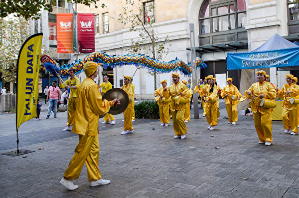

今年5月，在西澳部分法轮功学员庆祝513世界法轮大法日的腰鼓表演中，凯伦站在腰鼓阵前打镲。

<b>“感受内心的自在”</b>

 “我常常一个人静静地看（法轮功的）书，有时候停下来想一想。”东方的修炼法理解答了凯伦一直以来的人生疑惑，同时也冲走了曾经的那些负面思想，包括对中国人的偏见。

修炼法轮功使她有机会走近中国人，了解中国的传统文明。例如“中国古时候测量地震的方式，我还喜欢中医，以及中国人天人合一的思想……” 她说，“我几乎不敢相信我曾经那么不喜欢的民族，他们的文明如此深厚精深，至今影响着整个世界。”

几乎每周，除了跟法轮功学员聚在一起读《转法轮》外，凯伦还会参加法轮功的讲真相活动。有时候在北桥的中国城，有时候在城里的步行街。总是有一群一群的中国人，站在那儿看她炼功。“我不会讲中文，展示功法是我讲真相的方式。”她想告诉中国人，“西方人也在修炼法轮大法，我就是一个活生生的例子。”

参加法轮功腰鼓队，与华人们配合表演中国民间传统腰鼓，是凯伦现在最开心的一件事。她微笑着说，“现在，我看到的是中国人美好的那面”，“我感受到了内心的自在。”

凯伦说：“修炼法轮大法后，朋友诧异地问我‘ 这是真的吗？你不是不喜欢中国人吗？’我回答说，‘与这些中国学员在一起，我感受到强大的正向能量。’”

“我为成为他们中的一员而感到自豪。”

<h1 align="center"><b>珀斯女子不再叛逆 爱上华人腰鼓表演</b></h1>

凯伦（Karen Dunscombe）与华人一起排练腰鼓。

【大纪元2018年11月08日讯】（大纪元记者关幼兰澳洲珀斯报导）西澳大利亚的5月，秋高气爽，在州府珀斯商业中心的步行街上，一支华人腰鼓队正在表演中国民间的打腰鼓。引领腰鼓表演的镲手则是一位白人女子，她打起镲来，神采飞扬。

这位女子是凯伦（Karen Dunscombe），她对自己在腰鼓队里如同指挥的角色颇为自信。她说，“需留意打大鼓的人，他们与我的配合很关键。”

时间如果追溯到八年前，这样的场景对凯伦来说是无法想像的。

<b>“以前，我不喜欢中国人”</b>
 
高个、短发、棒球帽、人字拖，行事起来不紧不慢，凯伦说自己非常的Aussie（典型澳洲人）。

“外表酷酷的，其实内心特别温柔。”朋友这样说她，“换上裙子，你就能看到她的女性特质。”

凯伦在珀斯Melville区长大，从小到大生活在澳洲人的圈子里。她说20年前，“我在Melville高中上学的时候，学校里很少很少有中国学生，我们班里没有一个中国人，跟现在大不一样。”

“我10岁、11岁的时候，母亲跟我提到中共政府如何对待人民，非常残暴。对一个孩子来说，我误解为中国人都是那样的，我不懂那实际是中共造成的。”

因为没有机会接触中国人和中国文化，凯伦对中国的方方面面有很多不解。“以前，我不喜欢中国人。”凯伦坦率地说，“作为西方人，我不理解中国人的拘谨，不喜欢他们的做事方式、甚至他们的穿着、表情。”

如此不喜欢华人的凯伦，怎么会加入腰鼓队、与华人一起表演中国腰鼓呢？

<b>法轮功这功法一定很好</b>
 
“我渴望知道生命是什么，生命的意义在哪儿。放纵、享乐、还是帮助他人？我想了解我自己，我到底是谁？” 带着这些疑问，23岁那年，凯伦独自一人去了趟非洲，“我想要尽可能地开阔自己的视野。”

“我去了肯尼亚、坦桑尼亚、赞比亚，我在那里呆了一个月。那里的土壤肥沃，水果出奇的好吃。”

“但，与肥沃的土地截然相反的是，那些国家极度贫穷，困苦的景象刺痛着我，超出我的想像……令我吃惊的是，那儿的人几乎没有精神信仰。”凯伦皱着眉说，“我什么也没找到。”

失望的凯伦回到珀斯。跑步、健身、学武术，想摆脱内心对人生的困惑。“为了学泰拳，我又去泰国呆了一个月。”不久，她的身体在练拳过程中受伤，“我的体内不停地流血”，“我几乎不能走动”，那段日子她觉得自己人生跌入谷底。

今年5月，凯伦（Karen Dunscombe）参加法轮功的洪法活动，有时候在西澳首府珀斯市北桥的中国城，有时候在城里的步行街。

这时候，一个住在南部的朋友打来电话，“嘿，凯伦，你应该去学法轮功。”

当朋友提到法轮功被中共禁止时，“我的第一反应是：这功法一定很好！”Karen笑出声来，“中共不喜欢的，那一定是好的！”

<b>“我冲出了叛逆状态，理智起来”</b>
 
可是，从小对中国以及中国人的负面印象成为凯伦修炼法轮功之初的最大心结。

“当我翻开《转法轮》时，我心里祈求这可千万别来自中国，印度的、任何别的国家都好，就是别是中国的。”“当我知道法轮功源自中国，我对自己说不、不……这是我开始修炼法轮大法最纠结的事。”2010年开始修炼法轮大法的凯伦回忆说。

第一次跟法轮功学员坐在一起读《转法轮》时，她环顾四周，心里不时地冒出念头，“我怎么和这些华人坐到一起？！”读到一半时，她就起身离开了。

不过，“在阅读《转法轮》的过程中，我强烈地感受到书中的慈悲。”凯伦说，通过炼功身体恢复的同时，法轮功书中的法理犹如一股清泉洗涤着她的内心。

“我曾经是一个难以相处的人，悲观、既讨厌别人、也讨厌自己”，她这样描述修炼前的自己，“内心极度不成熟，似乎一直处于青少年的叛逆期状态。

“《转法轮》教我真实地看待自己，教会我包容和善良，我可以对别人敞开心胸，摆脱从前的负面想法。

“‘你这样对我，我就这样对你。’我不再这么想了，我脑中有了另一条思路，可以从某些情境中跳出来，以不同角度看待事物，这让我思路清晰、开阔。

“我冲出了叛逆状态，理智起来。”凯伦说。

今年5月，在西澳部分法轮功学员庆祝513世界法轮大法日的腰鼓表演中，凯伦站在腰鼓阵前打镲。

<b>“感受内心的自在”</b>

 “我常常一个人静静地看（法轮功的）书，有时候停下来想一想。”东方的修炼法理解答了凯伦一直以来的人生疑惑，同时也冲走了曾经的那些负面思想，包括对中国人的偏见。

修炼法轮功使她有机会走近中国人，了解中国的传统文明。例如“中国古时候测量地震的方式，我还喜欢中医，以及中国人天人合一的思想……” 她说，“我几乎不敢相信我曾经那么不喜欢的民族，他们的文明如此深厚精深，至今影响着整个世界。”

几乎每周，除了跟法轮功学员聚在一起读《转法轮》外，凯伦还会参加法轮功的讲真相活动。有时候在北桥的中国城，有时候在城里的步行街。总是有一群一群的中国人，站在那儿看她炼功。“我不会讲中文，展示功法是我讲真相的方式。”她想告诉中国人，“西方人也在修炼法轮大法，我就是一个活生生的例子。”

参加法轮功腰鼓队，与华人们配合表演中国民间传统腰鼓，是凯伦现在最开心的一件事。她微笑着说，“现在，我看到的是中国人美好的那面”，“我感受到了内心的自在。”

凯伦说：“修炼法轮大法后，朋友诧异地问我‘ 这是真的吗？你不是不喜欢中国人吗？’我回答说，‘与这些中国学员在一起，我感受到强大的正向能量。’”

“我为成为他们中的一员而感到自豪。”

<h1 align="center"><b>内蒙古公安系统三个落马官干的那些事</b></h1>

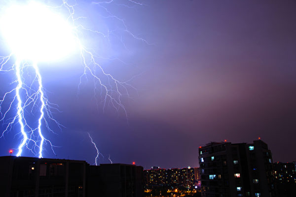

被恶运缠身，10月底内蒙古公安系统又有三个高官落马：孟建伟、杜宝君、邢云。

【大纪元2018年11月08日讯】2018年10月31日，内蒙古自治区公安厅原副厅长孟建伟，因涉嫌严重违纪违法被查。呼和浩特市公安局副局长杜宝君涉嫌严重违纪违法，于10月29日被查。此前不久在10月25日，内蒙古自治区政法委书记邢云被查。

除官方公布的罪名之外，这三名官员在任职期间还追随江泽民执行对法轮功的“名誉上搞臭、经济上截断、肉体上消灭”的灭绝政策，内蒙古的法轮功学员被大肆绑架、关押、判刑，甚至被迫害致死，对此他们负有不可推卸的罪责。

<b>孟建伟在任职期间参与迫害的罪行</b>
 
孟建伟，1954年出生，1998年起历任内蒙古自治区乌兰察布盟公安局局长、包头市公安局局长、政法委书记；2010年至2015年，任内蒙古自治区公安厅副厅长；2017年12月退休。

孟建伟

孟建伟在任职期间积极执行江泽民对法轮功“打死白打死、打死算自杀、不查身源、直接火化”的灭绝政策，对当地法轮功学员疯狂绑架、关押、办洗脑班、劳教、判刑。

迫害案例举例如下：

刘文丽，女，54岁，原包头铁路客运公司退休职工。通过修炼法轮功，身心健康，病痛全无。

中共迫害法轮功后，她曾三次被非法关押、劳教，累计被非法劳教3年，身心受到极大摧残。

2006年6月19日晚，她被包头市东河区公安分局和管区派出所警察绑架到包头市看守所迫害，短短十几天就被迫害致死。

时任包头公安局局长的孟建伟对刘文丽之死负有不可推卸的责任。

2006年10月，内蒙古包头市东河区法轮功学员李振江被包头市青山区公安分局政保大队人员绑架，被关押在包头市青山区公安分局看守所，后遭冤判11年。

2007年10月，被包头市东河区公安分局非法抓捕的几名法轮功学员中的一名闫姓法轮功学员，被关在东河区看守所，被非法判刑；另有几名法轮功学员被关在东河区洗脑班强制洗脑。

2014年4月14日中午12点20分左右，赤峰市敖汉旗国保大队两辆警车直接闯进贝子府水泥厂院内，六七个警察跳下警车，没有出示任何手续和证件，绑架了在那里工作的三名凌源法轮功学员。

为了抵制绑架，王大武和一名女法轮功学员从二楼跳下，女法轮功学员摔成重伤。

<b>杜宝君在任职期间参与迫害的罪行</b>
 
杜宝君武警转业后到内蒙古自治区公安厅工作，1990年9月至2009年1月，其任职从五处警犬训导科副科长、科长到所谓“×教犯罪防范侦察总队”副总队长；2009年1月到2011年12月，任包头市公安局副局长；2011年12月至2018年10月2日，任呼和浩特市公安局党委委员、副局长（正处级）。

杜宝君

杜宝君在任内蒙古公安厅“×教犯罪防范侦察总队”副总队长时，积极追随江泽民，对法轮功学员大打出手，在包头市任公安局副局长和呼和浩特市任公安局副局长时，加重对当地法轮功学员进行迫害。

杜宝君在内蒙古公安厅的主要任务是迫害法轮功。他的顶头上司是内蒙古公安厅厅长赵黎平。赵黎平迫害法轮功学员罪恶累累，得到周永康的重用，但最终遭报被判死刑。

杜宝君在包头市任公安局副局长期间，当时的市委书记是邢云。邢云任包头市市委书记、自治区政法委书记期间，积极迫害法轮功致使十名法轮功学员被迫害致死。

杜宝君在包头市任公安局副局长期间的迫害案例举例如下：

2011年6月2日上午10点多，内蒙古包头法轮功学员张沈平、张晶姐妹俩去包头市固阳开一家烧烤店，被恶人构陷，姐妹俩被包头市公安局警察绑架。

2012年5月13日晚7、8点左右，呼和浩特法轮功学员马秀英在回家路上被恶人绑架，当晚家被抄，损失不详。

2013年4月1日上午8点左右，两车警察及特警包围了法轮功学员黄朝霞的住处。他们利用吊车破门、破窗而入，翻抢东西，抢走其私人物品以及人民币。当时屋里有法轮功学员黄朝霞、吴月红、陈建勇，都被绑架到内蒙古包头市古城湾看守所。

2014年2月19日晚10点，呼和浩特法轮功学员史玉梅被便衣从团结小区家中绑架，后被回民区国保大队非法关押在看守所。

<b>邢云参与迫害的罪行</b>
 
在10月25日，内蒙古自治区人大常委会原副主任、政法委书记邢云被宣布“涉嫌严重违纪违法”，目前正被纪律审查和监察调查。

邢云

邢云2001年12月至2006年12月， 任内蒙古自治区党委常委、包头市委书记；2006年12月至2012年2 月，任内蒙古自治区党委常委、政法委员会书记；2013年2月至2016年1月，任内蒙古自治区人大常委会副主任、党组副书记兼财政经济委员会主任委员。

邢云任包头市委书记期间，有五名法轮功学员被迫害致死；任内蒙古政法委书记期间，有十名法轮功学员被迫害致死，占内蒙古被迫害致死的学员总数的25.4%，即比四分之一还要多。

以下是邢云在任政法委书记时迫害法轮功的案件举例：

<b>三十多名法轮功学员遭绑架、非法判刑</b>
 
2006年，在政法委书记的直接授意下，内蒙古扎兰屯市中共人员绑架了三十多名法轮功学员，其中法轮功学员周爽、周经伟、孙玉莲、赵建春等被送往图牧吉劳教所非法劳教，张凤兰被非法关押在阿荣旗看守所长达八个月之久。

<b>五名法轮功学员遭绑架</b>
 
2008年7月31日下午3点左右，法轮功学员金凤云、周淑华、裴新民、张法军、郑宝珍被内蒙古牙克石市政法委、“610”（专门迫害法轮功的非法组织）办公室指示各派出所强行绑架，被非法关押在牙克石市职业第二高中。

<b>内蒙古警察迫害致死法轮功学员王雪梅</b>
 
内蒙古自治区鄂伦春自治旗大杨树镇法轮功女学员王雪梅，2010年5月21日，被迫害致死在阿里河看守所，年仅46岁。

王雪梅死时，头部、肋部、腿部都有伤。王雪梅家中留下两个正在上学的孩子， 在家属争取下，公安局给了所谓的私了费十万元。

邢云任职期间有15名法轮功学员被迫害致死：秦克静、郝兰花、赵勇、柳洁、刘文丽、赵殿宾、其日麦拉图、孙敏、唐海花、田福金、胡素华、王雪梅、田素芳、于振杰、王霞。

<b>内蒙古参与迫害法轮功学员者恶运缠身</b>
 
白志明，内蒙古自治区政法委“610”办公室主任，因受贿、贪污、巨额财产来源不明，以及非法持有枪支弹药，于2011年12月30日，被赤峰市中级法院一审判处死缓，缓期二年执行。

杨汉忠，2010年4月，担任内蒙古自治区政法委副书记兼任“610”办公室主任，继续迫害法轮功；2013年月，被判处死缓。

赵黎平，内蒙古公安厅厅长，2015年3月，因涉嫌枪杀情妇被逮捕；2017年5月，以“故意杀人、受贿、非法持有枪支和弹药”等多项罪被执行死刑。

冯志明，呼和浩特市公安局副局长，2016年10月8日，其因受贿、巨额财产来源不明、非法持有枪支弹药、贪污被判处有期徒刑18年。

他们都有一个不敢公开的罪恶，即迫害法轮功。

<h1 align="center"><b>包工头拥有千万财富的奥秘</b></h1>

【明慧网二零一八年十月三十一日】时光荏苒，转眼我已经修炼大法二十二年了，修炼成了我生活中最快乐的事，不仅身体发生了根本性的改变，在日常生活中，也不再计较个人得失，性格发生了巨大的变化。婆婆感叹的说：“这法轮功可真好啊！病好了，人也变了。”丈夫对我说：“你那么重的病，伸伸胳膊，动动腿儿，咋就好了呢？这大法也太神奇了！”他非常尊重我的师父李洪志先生。
我的丈夫曾经是水利局钻井队的一名工人，他为人正直，对邪党的本质看得很清楚，因为看不惯单位的不正之风和贪污腐败，一九九五年的时候，就辞职不干了，自己出去创业。他所从事的行业是桥梁基础，就是承建一些桥梁和高铁的深水钻孔灌注桩基施工。干这种工程所用的工具是钻机，我家用的钻机是汽车钻，后来我丈夫自己发明了一种大钻机，用的是废旧坦克底座儿焊制的大型钻机，这种钻机是市场上没有的，而我家承揽的工程都是高难的，别人干不了的活。

二零零三年，在宁夏修建黄河大桥时，施工过程中发生了意外，工人小黄突然掉進了深深的钻孔中，钻孔的深度有二十米深，里面是混凝土的泥浆，想要救人都没法救，而这意外就发生在丈夫回头的一瞬间，危急关头，他大喊：“我媳妇儿的师父快救人呐！”这时钻孔中的吊绳被一种神秘的力量缠在了小黄的身上，把他吊了上来，平安脱险。否则后果不堪设想，过后丈夫打电话跟我说：你师父帮我了，把工人救了。

二零零七年，在山东菏泽时，有一次，丈夫开车在高速公路上行驶，发生了车祸，车翻到了公路的下面，四个车轱辘朝天，车里的油都漏了出来，车里的四个人是爬出来的，交警来了之后，一看现场，以为车里的人都死了，他们四个站在车旁边说：我们就是车里的人。交警看了看之后，觉得非常不可思议。这种现场，人是活不了的，车还会着火，而他们四个只受了一点轻伤，车也没燃，丈夫过后跟我说：“你师父又保护我了，我出车祸了，我兜里有大法护身符，是师父保护了我，要不然就没命了。”

还有一次是在长春时，发生了一场车祸。他开车在公路上行驶，打电话时，发生了意外，与行驶在前面的一辆油罐车相撞，车撞的报废，可车里面坐的四个人却安然无恙，其中还有一名是孕妇，啥事也没有。由于他相信大法好，师父时时刻刻的保护着他。

我丈夫干这种工程之后，发了大财，赚到了上千万，他的侄男侄女，还有他哥哥，看他有了钱，就妒嫉。有一次，他让他侄儿帮他买一辆路虎车，明明花了八十万，却说花了一百一十万，从中骗他的钱。他知道后，非常生气。还有一次，他让他侄儿帮他做钻机的钻杆，两次给了他十多万块钱，结果钻杆也没给做，钱也没还。

之后，他给我打电话，诉说心中的愤愤不平。我说：不失不得，他骗你的钱，他不给你德吗？你身体好了，啥都有了。假如咱们要欠他的话，就等于还了，不欠他的，他就给你德，常人不知道这个理，你就认了吧！和气生财。我还在电话中给他念师父《洪吟》中的诗《做人》，他说：“跟你一说话啊，我心就舒服了，就平衡了。”

作为修炼的人，我们自身代表的就是大法的形像，常人不懂大法的法理，他们只看我们的言行。丈夫有了钱之后，也被当今社会所染，有了外遇。我有很长一段时间放不下对他的情、怨，陷在人心当中不能自拔，修的拖泥带水，如果继续陷在其中，我永远都没有慈悲，因为慈悲里是没有情、没有私的。

通过与同修切磋交流，学法修心向内找，修炼人遇到的一切都没有偶然的，都是自己的人心折射，当我放下人心之后，终于走出了修炼的低谷，用大善大忍之心对待发生的一切。有一次，他骂那个女人，我对他说：你要善待她。他说：我善待她啥呀，你呀，太善良了，咱家的生意为啥这么好，都是你修来的，你看你受多大的委屈也不说。后来我说：你给她办个养老保险吧！让她后半生好点儿。他说：你闲的，管那事儿干啥呀，你吃饱别管别人。我想人在迷中多苦啊！他说：我全世界的人都对得起，就是对不起你！当我转变了心态之后，丈夫也在变，他的心也渐渐的收回来了。

无论做什么事情，我都是在大法的法理指导下去做，经过这些年的修炼，丈夫也耳濡目染的修善为他，小叔子生活有困难，经过我善心的劝说，丈夫无偿的给他买了新楼房，还供侄女上大学，帮她渡过难关。

丈夫这些年干工程，也是全国各地的跑，有时在野外，很艰苦的，他对工人非常好，每个工人到过生日的时候，他都摆上丰盛的饭菜祝贺，还时常改善伙食，善待每一个人。

现在的中国，最缺少的是诚信，干工程的有多少是偷工减料、伪劣不合格的工程？丈夫钻孔也遇到这种情况，有时项目经理说少钻几米也没有事儿，差点儿就差点儿吧，他说不行，必须到位。因为他会看地貌，什么样的地貌钻到多深，勘察的一点不差。每接到一个工程，开工前他都对着工地喊：“法轮大法好，真善忍好”，因为他深深的相信，只有法轮大法能保护他平安顺利。

我丈夫这些年干工程红红火火，做生意不用自己出去找，而是别人主动找他，赚得盆满钵满，钱挣到了千万，这都与他明白真相、相信大法、支持大法有关。每当我为做真相资料捐钱时，他都慷慨解囊，义不容辞。当我放下名利，节俭的过日子时，他说：“钱你就花吧！这都是你的钱，都是你修来的。”这是他的肺腑之言，因为他从大法弟子的身上看到了大法的美好，在危难时刻，他受到了大法师父的保护，是大法带给他的财源。

<h1 align="center"><b>河南肾移植医疗纠纷 掀中国活体器官库黑幕</b></h1>

河南省新乡市长桓县居民王巧云2006年于北京307军医院，做第二次肾移植手术失败，并发生医疗事故纠纷。（图片：家属提供/大纪元合成）

【大纪元2018年10月12日讯】（大纪元记者梁欣采访报导）近日，河南民众司子堂向大纪元记者投诉，他妻子于2006年在北京307军医院做肾移植失败，并发生医疗事故纠纷。“追查迫害法轮功国际组织”（简称“追查国际”）主席汪志远表示，该病患的整个医疗过程，再次证实中国存在活体器官库。

河南省新乡市长桓县居民司子堂表示，他妻子王巧云于2003年被诊断患尿毒症后开始做透析。之后于2004及2006年，两次在北京做肾移植手术。第一次成功做完肾移植手术后她没有适当保养身体，因农村里家事操劳过度，并且照顾3个年幼的孩子，3个月之后换上的肾就不能用了，她又开始做透析。

<b>肾源不工作 北京军医糊弄病人</b>
 
2006年在北京307军医院，王巧云做第二次肾移植手术。司子堂说：“2006年6月，我妻子自己在北京做透析，我在外地工作。307医院通知有肾源了，她自己就去了，先预缴了2千块钱，没给（主刀医生）送礼。他（医生）就给咱移植了。医生道德坏啊！实际这个肾源有问题。”

司子堂回忆，当时妻子王巧云做完肾移植后，隔天下午就因心脏衰竭而被进行抢救。由于刚移植的肾不工作，尿液排不出去，院方却还一直给她输液，就造成了心包积液。

河南省新乡市长桓县居民王巧云2006年于北京307军医院，做第二次肾移植手术失败，并发生医疗事故纠纷。

那几年为了王巧云双肾衰竭问题，他咨询了多个知名专家，了解了不少肾移植病理。

“之后，我一说（咨询过）这么多专家，那主任当时脸都出汗了。完了就（承认）说：这个肾不行，到时候有合适的肾源再给你找一个。说尽量越早越好，把这个肾再摘下来。然后又开始让她做透析。”司子堂说。

<b>医生告诉病患家属 器官来自法院</b>
 
那时曾有医生告诉司子堂，移植的主刀医生是跟法院买的器官。司子堂说：“人遭枪毙后拉到车上。他们怎么取呢？他这个车也是救护车，武警的车，不过它车上系个红布，医生也是穿的武警衣服。枪毙完了都拉到车上，取各种器官的都有，这是听医生说的。”

司子堂接着说：“医生把钱先给了法院（人员）。他为了自己不受损失，认为老百姓不懂，肾源不工作也给病患移植。就像当时我妻子移植，它肾不工作就给你把口缝上了。钱（肾源费）拿到手了，他才说肾源不行。坏都坏到这地步。”

当年王巧云6月3日做第二次移植手术；到了9日把本就不工作的肾源取出后，当晚就出现病危情况而抢救；6月19日夜间发生大出血；6月26日，再次出现大出血才查出，是做肾源移出时，动脉接口没有缝合好。而主刀医生泌尿外科主任陈立军，是以打止血针和弄个沙条绑紧腰的部位来止血。

“我当时就说那种方法是糊弄人，出了那么多血，肯定还得输血啊！6月3号、9号、19号到26号，24天开了4次刀，输血输了7790毫升血，（因此产生）移植抗体96.3%，（往后）不能再做肾移植。之后我就在所在地的丰台区法院起诉307医院。”

司子堂说，最后法院判医院赔偿9万多人民币，差不多就是付给医生的肾源费、307医院的移植及医疗等费用。

<b>首次肾移植 2个月就找到肾源</b>
 
话说王巧云于2003年10月被诊断患尿毒症后，开始在郑州的医院做透析。有专家建议尽早做肾移植。司子堂11月开始在北京的医院为妻子寻找肾源。2004年1月份就在北京朝阳医院成功地做了肾移植手术。

“当时，郑州那边‘肾源’比较多。考虑北京这方面做得好，那时候北京友谊医院、301医院等医院，按国家说这些是最好的医院。去过北京友谊医院，后来说不行，它医院太黑了，就连麻醉师都得要红包。所以就回301医院。”

司子堂表示：“因301医院患者较多，等待移植时间太长，等了十来天。那时候301医院一般都是从黑龙江那边取肾。301医院最多的时候一晚上十多例同时手术。我知道的这方面多了，因为给我妻子看病，北京整个跑遍了、接触了好多好多这方面的信息。”

“就改找朝阳医院的专家做肾移植。原先是在郑州七院做的检查和配型、抗体检查。周日下午给（朝阳）发过去，礼拜二通知我们有肾源，礼拜五下午就给换肾了。并且这个肾源特别好，是一个小伙子的肾源，大概二十来岁吧他（医生）说，是河北省沧州献县的。那时候说是枪毙人取的肾。”

司子堂说，妻子做完移植手术隔天早上做化验，她各项指标都正常了，3天后就能下床。他还说，当时非常多外国人到中国换肾，都一个礼拜之后就坐飞机飞回家了。外国病患的移植费高，所以“医院愿意给国外人换器官。”

“直到约2007年，有个国家的人到广东中山医院换肾，回去之后说中国人器官买卖。从那，卫生部出台，不能让国外人以探亲访友来（中国）换（移植）器官。从那就管得严了，之后就形成黑市。”

<b>专家：再次证明中国存在活人器官供体库</b>
 
对此，“追查国际”主席汪志远向大纪元表示，这个案例有两个特点，说明当年那几家医院的换肾病患等待时间短，且肾源充足。为什么说等待肾源时间短是个问题？因为移植器官有配型的问题，人的血型有4种。

国际肾移植协会多年经验拿出的“组织配型”标准是6.5%，配型成功比例是非常低。就是一个人找肾源做移植手术，在15、16名刻意提供器官的人群里，最多只能找到一位。而正常情况下得人死亡之后才能捐献。资料显示，2006年以前中国没有人捐献器官；2009年全中国只有120例捐献。

汪志远说：“就算有器官能用，还有一个时效的问题。就是从有血液供应的情况下，取出放进保护液里，肾脏热缺血不能超过半小时，超过就坏了。心脏是3到4分钟，肝脏是5到6分钟。那非常难啊！概率非常低。在海外，外国人形容取得组织配型相容的器官做移植，像摘天上星星那么难。”

“这件事说明，中国有活摘器官的现象存在；有活人器官库的存在。再一次证明了追查国际的调查报告结果，从2000年开始，中国大陆出现活摘法轮功学员器官的事情；在全中国范围内大规模的、爆炸性增长的器官移植现象；在全中国范围普遍存在着活人器官供体库。”汪志远指出。

10月8日，在英国广播公司（BBC）播出的名为“该相信谁？中国的器官移植”（Who to Believe? China’s Organ Transplants）调查报导节目中，记者追问被指控为活摘器官的重要责任人、原中共卫生部副部长黄洁夫，“那为什么我打电话到中国医院去，很快就获得了移植肝脏的机会？这怎么可能？”

黄洁夫神色略带尴尬，口气紧张地称：“我不想回答这问题……”随即转身离去。

【明慧网二零一八年十一月四日】二零一八年十一月一日晚七点，揭露中共活摘器官的纪录片《难以置信》在佛罗里达州迈阿密大学放映，中共的暴行令在场观众震惊。看完影片后，迈阿密大学医学院的教授们谴责中共活摘法轮功学员器官的罪行。

<h1 align="center"><b>迈阿密大学医学教授：对法轮功的迫害超越任何底线</b></h1>

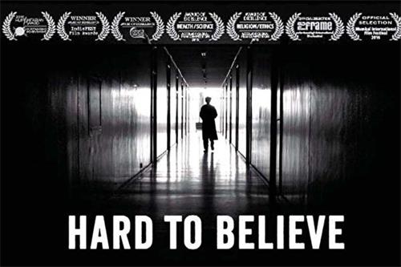

图：纪录片《难以置信》海报。（官网图片）

“这是极端可怕的罪行，这是不应有的。这超越了人的语言可以描述的范围。” 迈阿密大学医学院教授托马斯•柬谱尼（Thomas H. Champney）看完反映中共活体摘取法轮功学员器官的人权纪录片《难以置信》（Hard to Believe）后说。

柬谱尼教授与另一位迈阿密大学医学院教授的罗伯特•沃伦（Robert Warren），以及友人一起观看了人权纪录片《难以置信》。柬谱尼教授表示：“不应该杀死任何人而获取他们的器官，无论这个人是囚犯还是什么人，都应该得到作为人的尊严。把一个人杀死而把他的器官移植到另一个人身上，这在道德上是不正确的。”他说，“我觉得发生在法轮功学员身上的（迫害），超越了道德底线，超越了任何底线，但实际上还不止于此。我认为医学院的学生对此有所了解是重要的。”

两位教授临走前，各自主动拿了摆在桌子上的《难以置信》DVD光盘，他们说回去后给他们的学生放映，让学生们了解发生在中国的可怕罪行。

《难以置信》由美国PBS公共电视台制作，导演为两度获艾美奖的肯•斯通（Ken Stone）。影片采访了曾在新疆参与秘密摘取人体器官的医生、医学专家，以资深调查记者伊森•葛特曼（Ethan Gutmann）调查的视角，揭露中共从法轮功学员身上活体摘取器官进行移植牟取暴利的罪行。

自二零零六年中共活摘器官罪行在国际上曝光后，国际医疗道德提倡组织“医生反对强摘器官”（DAFOH）利用多种方式，持续曝光中共活摘人体器官的邪恶。据悉，法轮功学员、维吾尔族人、藏人、及基督徒都是中共活体摘取器官的对象。二零一六年六月十三日，美国国会众议院通过了343号决议案，谴责并要求中共立即停止针对法轮功学员等良心犯的“强摘器官”行为。

<h1 align="center"><b>凌晨翻墙破窗绑架人 中共警察的土匪行径</b></h1>

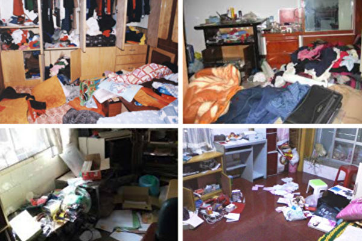

法轮功学员家被警察非法抄家后的一片狼藉。（明慧网）

【大纪元2018年11月01日讯】（大纪元记者姚久仁综合报导）凌晨4点，主人正在熟睡中，一伙人翻墙而入，进屋后翻箱倒柜，并将主人绑架，然后呼啸而去……仿佛是电影中的一幕真实地发生在辽宁本溪市桓仁县，印证了“过去土匪在深山，现在土匪在公安”的社会现实。

这样的绑架画面，不只是发生在辽宁，而是广泛地出现在中国各地。

<b>辽宁本溪 凌晨4点的绑架</b>
 
2018年8月28日凌晨4点左右，辽宁省本溪市桓仁县华来镇派出所与桓仁县公安局国保大队警察，分成几组，每组数人，分别非法闯入华来镇5名法轮功学员家中。他们翻墙进入民居，进屋就照像，翻箱倒柜，查抄私人物品；然后将张吉英、高德兰、肖永久、孟兆金等5名法轮功学员绑架。

在静谧的凌晨，华来镇派出所副所长何岩带着两男两女翻墙而入，非法闯入张吉英家，将熟睡中的张吉英和她的小外孙惊醒，在他们的惊颤中，这些人把她家上上下下翻了个遍，搜走了笔记本电脑等私人物品，还撕坏了墙上贴的年画。整个家一片狼藉，像遭遇土匪洗劫了一样。随后，张吉英连同小外孙被警察绑架到了派出所。

高德兰老人也遭遇了类似的经历，当天凌晨有8个警察翻墙闯入她家。被绑架到看守所的高德兰，对与她见面的桓仁县检察官说：“我没有罪。”检察官也说：“是啊，我也知道你没有罪，但现在没有办法啊。”

同时，当天凌晨被绑架的孟兆金等两人被非法拘留15天，还分别被勒索1,000元。
……

发生在华来镇的上述抄家绑架事件中，警察没有任何合法手续，既未出示证件和搜查证，未提供抄走物品清单，也未让当事人或家属签字。从法律上来讲，实属非法，绑架。从手法上看，与绑匪无异：凌晨作案、翻墙而入、绑架人质、勒索赎金……。明慧评论说，这些警察与绑匪比较，区别只是未蒙面、未穿黑衣。

<b>北京警察凌晨3点破窗闯女子家</b>
 
在北京，同样发生过类似的警察半夜破门砸窗进屋事件。

2017年10月11日凌晨3点20分左右，居住在北京市东城区安德路乙61号院的居民，被突如其来的重物敲击声惊醒，原来是北京东城区安定门外派出所的警察在撬四排六号的独居女子周晶家的门和窗户。警察在将窗框撬断、玻璃撞碎后，破窗进入周晶的居室。

窗子被破坏的照片。（明慧网）

当时，41岁的女法轮功学员周晶正在熟睡中，被这突发状况惊醒，只穿着贴身内衣，惊魂未定地蜷缩在角落。随后，周晶看到穿着警服的人在录像，看到了安定门外派出所政委杨卫东、警察牛艳新、辛仲阳和牛姓协警等人。

这些警察在没出示任何有效法律文书情况下私闯民宅，非法搜查，理由仅仅是在小区内发现了法轮功真相资料。

<b>吉林610凌晨4点入室绑架七旬老太</b>
 
宪法第三十九条规定，公民的住宅不受侵犯，禁止非法搜查或非法侵入公民的住宅。中共迫害法轮功后，警察知道非法绑架、抄家见不得人，在半夜三更翻墙头、砸窗户的事频频发生。

吉林省桦甸市七十多岁的老太太王桂兰，2013年11月中旬失踪，家人心急如焚，经多方查找，才发现王桂兰老人于2013年11月18日凌晨4点多钟，遭吉林桦甸市“610”（专职迫害法轮功的非法机构）人员杨宝麟等人非法入室绑架，后被送往吉林市沙河子洗脑班迫害。

<b>山东警察凌晨4点入室绑架教授</b>
 

原济南市教育学院物理教授张兴武及其夫人刘品杰。（明慧网）

原山东济南教育学院物理系教授张兴武，遭遇了不止一次的半夜绑架经历。

1999年7月20日凌晨4点，警察没有任何说法把张兴武软禁起来；在21日无理进行抄家，抢劫走了电脑、大法书等，并将张兴武与其夫人刘品杰关押到派出所。

2008年7月16日深夜，大批警察包围了他家，一群警察上楼当当地砸门，弄得满楼震动；门锁被撬开后，警察冲进门就对两位老人动武，随后把他们俩人绑架到派出所。在随后的10多天里，警察在张兴武家没人的情况下非法抄家，他们拿走了什么，谁也说不清。

2007年6月、9月，十几个警察两次半夜三更翻墙进入山东省淄博市周村区萌水镇仁和村沈广禄家，抢走现金及物品价值3000余元；王村镇派出所在抓捕法轮功学员刘光宝时，是由所长刘彦君带领，深夜翻墙入院，未找到人，就趁机抢走了他儿子的摩托车和手机。沈广禄和刘光宝等法轮功学员被非法绑架到看守所。

<b>河北保定国保凌晨2点多的绑架</b>
 
2007年8月29日凌晨2点半左右，河北保定国保在贾村乡派出所所长马洪杰带领下，深夜翻墙破窗进入西贾村法轮功学员孙景素家。这伙人没有穿制服，没有出示任何证件，强行抄家，到处乱翻乱摔。孙景素制止这伙人的非法行为还被打。孙景素被非法绑架到看守所。

非法入室的警察将孙景素家翻了个底儿朝天。据村民讲，警察从孙家抄走了一箱一箱的东西。

周村区国保大队长董长亮曾公开叫嚣：“有本事就去告，找律师也行，到哪里你也告不赢。中央周永康有指示，对法轮功人员不用讲法律，用什么手段都行。”

<b>中国各地大面积发生的罪恶</b>
 
中共警察机关对法轮功学员家中的搜查绝大多数既不出示搜查证，也不出示逮捕、拘留的证明，这些已经构成违法；而警察在深更半夜随便闯入居民家中，更是违法犯罪。以上曝光出来的罪恶其实只是冰山一角，更大更多的罪恶还在大陆各地区每天发生著。

面对中共警察绑匪般的行径，北京的周晶和济南的刘品杰，都决定起诉警察的非法行为。

刘品杰表示，知道在中共独裁的中国，老百姓没有理可讲。虽然这样，她也想让人民看看中共的法律如同废纸一般。

周晶于2017年12月21日也去北京东城法院，就警察杨卫东等人半夜撬锁、撬窗的违法犯罪一事要求立案。

宪法第238条规定：非法拘禁他人或者以其他方法非法剥夺他人人身自由的，处三年以下有期徒刑、拘役、管制或者剥夺政治权利。

第245条规定：非法搜查他人身体、住宅，或者非法侵入他人住宅的，处三年以下有期徒刑或者拘役。司法工作人员滥用职权，犯前款罪的，从重处罚……

上述这些恶性抄家、绑架事件在中国各地大面积地发生，充分暴露了中共司法界的黑暗和中共的邪恶。被誉为“中国良心”的著名维权律师高智晟在2005年三次上书中共执政当局，陈述了法轮功人士合法权利没有得到保障、相关处罚没有依据程序、被剥夺司法求助的现况，并要求有关当局改变现况。

他认为：“这种已完全黑社会化了的权力正在持续地折磨着我们的母亲、我们的姐妹、我们的孩子及我们的整个民族。”

<h1 align="center"><b>中共在四川地区的“活摘罪行”疑迹</b></h1>

【明慧网二零一五年四月七日】中共迫害法轮功之后，尤其二零零六年之后，多名证人、以及多个独立调查团经调查所获得大量证据证实：中共大规模活摘、贩卖法轮功学员的器官以牟取暴利。调查还显示，是江泽民直接下令、周永康主导 “这个星球上前所未有的罪恶”。
我们从一些公开信息和零星线索，去揭开这个惊天罪恶在四川地区的黑幕。

<b>一、追查国际与媒体的调查</b>
 

追查国际于2014年12月发布《四川省非军队系统医疗机构涉嫌活摘法轮功学员器官医务人员的追查名单》称，截至2014年，追查国际已经获取四川省10地市20家医院的器官移植的概况。根据对公开资料的不完全统计，这些医院共实施肾移植至少2935例，肝移植至少1048例，心脏移植至少3例，肺移植至少1例，角膜移植至少110例，胰肾联合移植至少4例。其中，成都至少六所医院涉嫌活摘，包括：四川大学附属华西医院、四川省人民医院、成都市第三人民医院、成都成仁眼科医院、成都医学院附属康桥眼科医院、成都市第五人民医院。

而军队系统医院活摘器官情况和数量更加惊人、更加巨大。希望之声记者2006年4月28日联系北京肾移植的主刀医生（李宏辉），他表示，由于四川成都的供体来源多，所以被调派到当地部队医院支援，连续三日空军医院的医生都坦承有年轻健康、炼法轮功的供体。

此外，明慧网也登载了一些知情人反馈的数起华西医院和陆军总医院在确诊后一个星期或一个星期之内找到供体的肝（肾）移植案例。华西医院甚至还催促病人换肝。

与器官移植相关的专利，从二零零二年到二零零四年，省内九所大学申报了十三项专利，其中四川大学最多。而四川的肾移植中心，成都市就有七个，四川其它地区五个。

<b>二、监禁场所的诡异抽血</b>
 

据明慧报道，四川女子监狱和德阳监狱、五马坪监狱都曾对法轮功学员大规模抽血化验。报道中的抽血时间都是在二零零五年。德阳监狱先是要求所有服刑人员验血，遭到抵制后，恶警崔唯刚说：“法轮功必须参加验血”。

为何一定要强迫法轮功学员验血呢？强制验血的目的何在呢？在江××对法轮功学员“肉体上消灭”的政策下，在各地各监狱对法轮功学员肆无忌惮、极尽各种邪恶手段折磨迫害的现实中，抽血显然不是关心他们的健康，那是关心的什么呢？

据广东四会监狱实名举报信，包括验血结果在内的“体检资料”，就是他们“筛选目标”的主要依据。

<b>三、浮出水面的疑案</b>
 

目前已被证实的被四川当局直接虐杀的有名有姓的法轮功学员至少两百多人，由于当局的掩盖，以及对家属的恐吓、打压，很多致死案例的相关情况和细节无从得知。但在透过重重封锁传出的一些情况，仍能发现其中不少疑点和蹊跷所显示的活摘嫌疑。

<b>1、家属没能见到遗体</b>
 

在成都，至少有三位被迫害致死的法轮功学员的家属没能见到遗体。一位是托福教师沈立之，一位是毕业于成都电子科大的原红光七分厂职工吴明忠，二人都是三十岁左右、风华正茂的青年男子，吴明忠于二零零二年大年三十被金牛区警察绑架，七天后，家人被通知领骨灰盒。沈立之被绑架一年多后，其家人才见到其骨灰。

吴明忠

还有一位是四十五岁的女性法轮功学员胡红跃，警察称其是“饿死的”，但却不许其单位和家人见遗体。

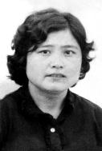

胡红跃

四川省内江市威远县龙会镇的李惠于2005年5月被迫害致死后，家属也未能见到其遗体。5月8日，当局（高石镇派出所）将李惠家人叫到火葬场，却只拿出一张照片让李惠父亲辨认。法医表示，已对李惠剖腹，并要剖开头部。李父抗议说：“你们剖我女儿的腹，为什么不通知我们到场，既然人都死了，还剖什么头部呢？”最后只让家人领回骨灰盒安葬。家人自始至终没有看到李惠的尸体，只看到了李惠的照片。

人被虐杀后遗体下落不明的还有遂宁市拦江镇法轮功学员田世强和乐山市法轮功学员张禹。

为什么当局不敢让家人见他们的遗体？这背后隐藏着怎样的罪恶？让人不得不怀疑，更无法排除他们被活摘器官的嫌疑。

<b>2、家属未能见全遗体</b>

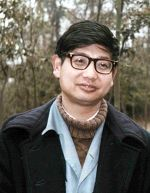

张川生

成都大学副教授张川生于二零零二年大年三十被驷马桥派出所绑架，四天后便被迫害致死。家属看到张川生的遗体，脖子上有二指宽青紫色深度勒痕。更为蹊跷的是，家属要求看遗体时，警察只让他们看头部，可是胸部以下和四肢都不让看。

遂宁彭方建被迫害致死后，家人在火葬场见到其遗体脑后有一个大洞，且家人未见遗体背部。

很多被虐杀的法轮功学员遗体上发现不明的血洞、刀口、包扎等。如：自贡市公共汽车公司（虎头桥）汽车修理厂的李新策脑后有血洞、成都空气压缩机厂工程师周勇脑后有不明血洞；遂宁的席志敏头顶包着巴掌大的纱布；泸州古蔺李正灵遗体颈部一刀口、腹部一刀口；泸州古蔺县熊秀友左胸上有约长二十公分的伤口。

必须指出的是，被中共当局虐杀的法轮功学员中，大部份家属不能仔细检查遗体，第三方独立调查就更无从说起。

<b>4、“此地无银三百两”的尸检</b>
 

二零零七年十二月四日上午九时，国安头子叶旭东等将已被非法关押九个月的万源法轮功学员熊正明押走，说是关到绵阳劳教所。第二天，叶旭东突然告诉熊正明的家人，说熊正明在送往劳教所的途中“跳车自杀”。因谎言太过粗糙，后又改口“因车祸死亡”，但仍无法自圆其说。

见无法对愤怒的家人解释，国安主动让达州公安处带去的法医正面解剖熊正明的遗体。但是法医不是找死因，而是指着熊正明的遗体对着熊的家人说：“看嘛，心脏在这儿……器官都在……”那法医又为什么要主动提“器官”呢？“尸检”闪电式草草收场，却不敢检查熊的背部。难道是熊正明的肾脏不见了？

从熊正明被带走到死亡整个过程中，有非常多不合常理之处，如一般劳教是由普通警察负责押送，熊正明却由国安头子叶旭东亲自押送，而且在很快就能到达目的地劳教所时，却留在德阳监狱过夜，以及至今无法解释的熊正明的死亡原因，所有这些不合常理的现象，象是一场精心的安排。

遭虐杀后被强行解剖的还有射洪县法轮功学员李宪民，解剖是在其家属未到场时进行的。主刀医生是遂宁医院病理科主任梁海桥，其将李宪民的所有器官带到遂宁去了。

<b>5、失踪的法轮功学员</b>
 

除了这些有姓名可查、可核实的被虐杀的法轮功学员外，在这场浩劫中，还有上百万计失踪的法轮功学员。他们或因上访、或被绑架后不报姓名而被秘密关押，或因被迫流离失所而与家人失去联系。没人知道他们身在何处，他们像从人间蒸发了一样，一去不复返，家人们苦盼着亲人能回来，但是年复一年，仍毫无音讯。

成都理工大学毕业生、家住大连市金州区二十里堡镇后半拉村的法轮功学员付贵武，自二零零零年初前往成都找工作后就毫无音讯，至今已经十四年了。付贵武的母亲说：“这十年来你都不知道我都怎么过来的。我就怕他不在这世上了，可能叫它们（中共当局）给害死了，都有给挖心挖肝的。”

有多少象付贵武一样无故失踪的法轮功学员，还有多少到北京上访被抓后不报姓名而下落不明的法轮功学员？难道，他们已经成为当局没有任何顾虑的“活体器官供体”？

在这些零星案例和线索的背后，是怎样令人发指和触目惊心的、整个国家机器操纵系统性的反人类罪。伴随着全世界的谴责和要求调查的声音越来越强、以及整个事实真相的一幕幕揭开，对这个“前所未有的邪恶”的制造者中共、及始作俑者江泽民的历史性审判已为时不远。

<h1 align="center"><b>西方法轮功学员修炼经历吸引大陆留学生</b></h1>

一群支持“解体中共 制止迫害”的比利时年轻人（明慧网）

【大纪元2014年07月22日讯】“到明天为止，中共迫害法轮功整整15年了。”身高一米九的比利时小伙子尼克说。2014年7月19日，比利时法轮功学员在首都布鲁塞尔举办活动，谴责中共对法轮功的残酷迫害。15年前的7月20日，中共发动了全国范围内对法轮功的迫害，从那时起，全世界法轮功学员的反迫害从未间断。

尼克2007年开始修炼法轮功，当时，中共对法轮功的迫害对他来说是件极为不可思议的事情。后来，他接触到越来越多来到比利时的中国人后，更令他吃惊的是，那些华人对他们自己国家里所发生的事情的了解，还不如他这个在亚欧大陆另一端的比利时人知道得多。不过今天与之交谈的中国人使尼克了解到情况有了变化。

<b>大陆留学生好奇询问西方法轮功学员：为什么修炼？</b>
 

这些中国人是在法国边境某大学留学的学生，假日旅游，遇到了这群在烈日骄阳下向他们递来法轮功传单的高鼻梁蓝眼睛的比利时人。这群年轻的大陆留学生们好奇地询问是什么让这群西方人开始修炼源自东方的法轮功的。

几位比利时法轮功学员热心地向他们述说自己的修炼经历。

最先和他们交谈的是Wilfreid夫妇。Wilfreid先生说，因为寻找治疗肩膀疼痛的方法，他找到了法轮功。刚一开始炼功就感受到能量随着手移动，那种舒适的感受让他刚开始修炼的时候，每天要把两小时的功法炼两遍才算完。

之后，他的妻子、女儿、儿子相继走入法轮功的修炼行列，他们每个人都从各自的修炼中找到了自己多年来苦苦寻觅的、那种人人想知道而不得其解的问题的答案。

Wilfreid先生说，如今他的业余生活不再用在寻找强身健体的方法，而是炼法轮功，参加更多的炼功活动。

他说，现在做的事是为了让更多的人能够受益于修炼法轮功和制止发生在中国的迫害，他申请并参与更多类似的活动向人们介绍法轮功是什么，以及为这些活动准备必要的用品。

Wilfreid先生在家俱厂工作，活动中使用的桌子、折叠展板、卷轴真相条幅……都出自他的双手。而Wilfreid太太则给这些布置加上了色彩讲究的绸桌布，精巧的、带着“法轮大法好”书签的纸莲花……

这群中国学生仔细听完了Wilfreid夫妇以及其他法轮功学员各自的修炼体会，有留学生悄悄地告诉比利时法轮功学员说：“我可以很认真地告诉你，其实现在基本上所有中国人都知道事实是怎么回事了（指中共迫害法轮功的真相），只是人们还在害怕，不敢公开站出来。”

<b>比利时民众签名声援法轮功反迫害</b>
 

活动场地摆放的有关中共秘密活摘法轮功修炼人的器官牟取暴利的展板和资料引起了很多路人的关注。

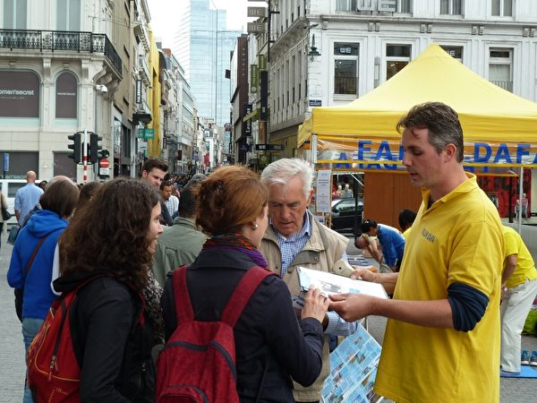

比利时民众驻足了解法轮功真相（明慧网）

“这是真的吗？太令人吃惊了！”一面看着祥和打坐的法轮功学员，一面听闻这样美好的功法在中国遭受如此残酷的迫害，许多比利时人发出惊叹。许多过路民众在和法轮功学员交谈中了解到活摘器官的罪行之后，郑重签下自己的名字。

比利时民众签名声援法轮功反迫害（明慧网）

来自英国的教师Joseph Mctaggart说：“法轮功是那么平和。我非常难过看到这些迫害的事情，特别是签名簿上说的那些（活摘器官的罪行）。这种对人性的迫害，真令人伤心。我很在意生活在地球另一端的兄弟姐妹，我想为他们做点什么。”

也有不少人是对法轮功本身十分感兴趣的。一位非洲裔的路人看到炼功的学员后问道：“法轮功就是这些动作吗？”

“动作只是一小部分。”尼克回答，他指著展板上“真、善、忍”的字样，详细地解释了法轮功如何要求学员按照这三个字去实践之后，这位非洲裔的男士激动不已：“太好了，这就是我要找的！你知道吗？我本来决定去拜访名寺，现在我决定不去了，我就要尝试法轮功！”

这样的活动在布鲁塞尔每周都会有两次，法轮功学员们利用自己的公休日轮流来参加，他们平和而坚持不懈地告诉人们：“法轮大法好”，“世界需要真、善、忍”，“中共对法轮功的迫害必须停止”。

<h1 align="center"><b>法国女博士找到了人生中的新答案</b></h1>

越南籍的法国女博士贤（Nguyen Hien）

【希望之声2018年8月31日】（本台记者慧光综合报导）贤（Nguyen Hien）是一名非常聪明的越南年轻女性，从小就是一位“学霸”，她从河内理工大学毕业后，获得了韩国一家大学的奖学金。但在韩国学习七个月之后，她感觉这里的学习环境不是很理想，就决定去法国留学。

2014年，是她读博士课程的第二年，为了完成博士毕业论文，她需要做很多实验。长期的实验室工作，让她感到单调、乏味，尤其是需要阅读大量的法语文件，而她的法语水平不是很好，经常为理解不了的内容感到沮丧。她每天都要工作到凌晨三、四点钟，而且工作结束后也无法正常入睡。这种情况持续了一段时间后，她开始感到害怕，因为不改变这种状况她就无法完成毕业论文。

巨大的压力、担心和害怕，还有难以恢复的疲劳总是让她感觉很累，最终导致她失眠了。为了改变自己的状况，她尝试喝酒、练瑜伽等多种方式，甚至要求医生为她使用毒品以便麻醉自己，然而这一切似乎都没有效果，努力的结果都让她失望。她回忆说：“那一刻我真的感到很无助，不知道该怎么办。”

有一位朋友知道了她的情况后向她推荐了法轮功，并希望她试试。在她的印象中，这是一种被中共政府禁止的功法，是不好的。可朋友跟她介绍的情况则完全相反，她决定要自己亲自体验一下。于是她从互联网上下载了法轮功的教功视频，然后进行了认真学习，让她没有想到的是，她的失眠症状很快就消失了，从此她的睡眠状况一直很好，这引起了兴趣和思考。

按照科研人员的思维方式，她开始对法轮功进行了系统的研究。她说：“按照科学研究人员面对一个新问题时的思维习惯，首先要了解法轮功是什么。初步了解的结果让我感到非常惊讶，因为法轮功已经在世界各地一百多个国家洪传，有的国家已经流行二十多年，然而如此富有强大生命力的功法，却被中国政府禁止和压制，这本身就是一件值得关注的事情。”

她还说：“从收集到的信息中我了解到，法轮功在中国受到了好评，受到中国各界人士的广泛称赞，因为他给中国人民带来了很多好处，比如降低了百姓的医疗保健成本，能够促进精神文明的普及和传播，从而有助于改善社会秩序和降低犯罪率等……”

通过对大量事实的研究，她的原有印象被颠覆了。她说：“法轮功既然能够在世界范围内得到广泛洪传，就说明他有非常强大和深刻的影响力，这一点已经被无数事实证明了，是不容置疑的。由此我得出结论，法轮功不是像中共宣传的那样，他是一种非常好的修炼方式，不违背任何法律，我可以安心的做出选择，而且我知道这种选择是绝对正确的。”

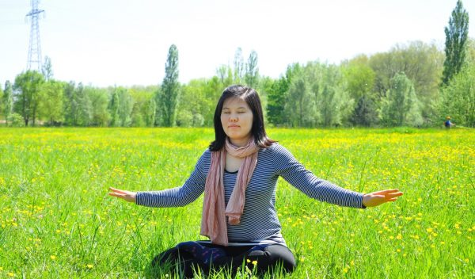

贤（Nguyen Hien）在炼法轮功第五套功法——静功

她说：“自从我开始修炼法轮功以后，我的失眠症状再也没有出现过。无论是早睡还是晚睡，或者是半夜醒来，甚至在我怀孕期间，我总能睡好觉。另外，在高中时期就患有的过敏性鼻炎也完全好了。非常明显的是我的体能和身体素质有显著提升。以前我工作大约两个小时就开始感到疲倦，需要休息。而现在我可以集中精力学习、做作业三个半小时而不感到累，而且能够集中精力，学习和工作效率也明显提高。由于修炼法轮功，我顺利完成了我的毕业论文，取得了意想不到的结果。”

“从阅读《转法轮》那一天起，我最大的收获还不是表面的，因为我知道心性的修炼更重要。以前我的名利心很强，很在意自己的名气、金钱和成就，而修炼以后都看淡了。这并不是说我不再需要它们，而是能用一种平和的心态去对待。以前我遇到不好的事情经常会出现情绪上的反应，比如遇到烦心的事情会焦躁不安，遇到不公平的事情是发泄愤怒，这些负面的情绪当我按照‘真、善、忍’的原则去做的时候都不会出现了。现在无论是工作还是生活，所有在我身边的人都觉得很开心，很舒服。”

“我觉得‘真、善、忍’的原则太伟大了，太重要了。每当发生冲突的时候，他会让我冷静，冷静下来我就能准确的判断对错，从而用平和的心态去处理。”

“在过去的很长时间里，我都强迫自己像一个机器人一样去工作、学习，一切都必须精确、细致，一切都追求最好的结果。而现在我对生活和工作的理解完全改变了，我会放松自己，用一种平和的态度，用‘真、善、忍’指导一切，结果仍然是最好的，可是‘人’却被解放了，不会感到那么累了。”

“走入法轮功修炼是我感到最高兴的一件事情，他使我的人生更有意义，也更有价值，我有了人生中最值得追求的目标，因此生命不会浪费在无意义的事情上。我希望有更多的年轻人能够理解‘真、善、忍’的伟大内涵，从而享受修炼带来的好处。”

<h1 align="center"><b>曾受30种酷刑的刘玉梅：如非亲身经历 真不知中共邪恶至极</b></h1>

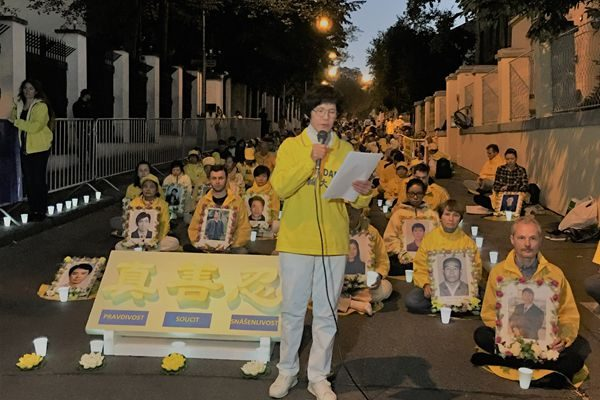

法轮功学员刘玉梅在布拉格讲述被迫害经历。

【希望之声2018年10月2日】（本台记者周扬采访报导）9月27日至30日，在捷克首都布拉格举行了大规模的法轮大法活动，德国、法国、英国、比利时、捷克、斯洛伐克、美国、加拿大、以色列、越南等三十多个国家的法轮功学员聚集在这里，和平抗议中共19年来对法轮功的残酷迫害。来自芬兰的法轮功学员刘玉梅讲述了自己和家人在大陆遭受迫害的经历，中共国殇日期间，她呼吁国际社会关注中国正在发生的人权灾难。

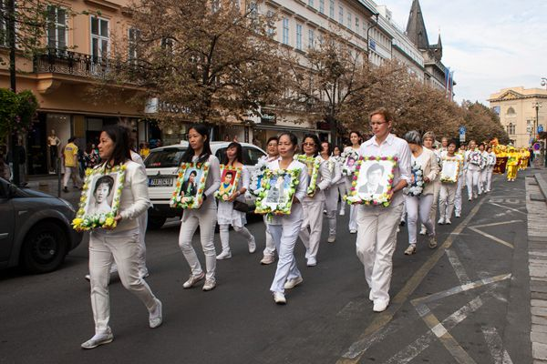

在布拉格游行中祭奠被迫害致死的法轮功学员。

刘玉梅曾经是辽宁省抚顺石油企业的中层领导干部，行政一把手，在工作上受到重视，并受人尊敬。但是长期以来，胃溃疡、类风湿、心脏病、眩晕等多种疾病折磨着她，身体上和精神上都承受着很大的痛苦，不得不以药为伴。1997年11月，她了解了法轮功，并开始走入修炼。四十天后，所有的疾病不翼而飞，无病一身轻，走路生风。发生在她身上的这种神奇变化，也带动了她的亲戚、同事、朋友等几十人走入了大法的修炼，共同体验和见证法轮功于国于民有百利而无一害的美好。

1999年中共迫害法轮功后，她被警察非法绑架9次，抄家6次，家里的积蓄也被全部抢走。她被多次关押，遭受了电击、疯狂殴打、用铁签子撬牙、地环、密死等三十多种酷刑。其中地环是把她的头用铁环套上，长时间无缝隙地直接钉死在地上，双手反背，铐上手铐。密死是指给她戴上手铐和脚镣钉，呈大字型锭在地上，甚至连大小便也不能动弹。她被连续密死58天的非人折磨，导致四肢失去知觉，全身肌肉萎缩，生命垂危。为了反抗这种迫害，她绝食62天，却被野蛮灌食，鼻子和食道均被食管插破。

她表示，在监狱里，有你想象得到的酷刑，也有你想象不到的酷刑。中共的目的就是想逼迫法轮功学员放弃“真、善、忍”的信仰。

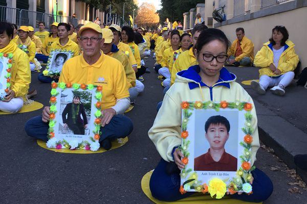

在布拉格中国使馆前和平抗议的法轮功学员

2001年，她因为到天安门广场打出“法轮大法好”横幅而被关押，北京某地的警察边打她，边恶狠狠地说：“你要是不报姓名和地址，就给你刨腹，把你的肝脏、心脏都移植出去，你家人连你的尸体都找不着！”

2006年，她亲自往上海的某医院打电话，进行秘密调查。当时的一位主刀主任接了电话，证明了“活摘器官”的存在。

因为相信法轮功，她的爸爸、妈妈、妹妹、丈夫先后被迫害致死，她的两个姐姐也被辽宁马三家劳教所关押两年多，被强行洗脑，酷刑折磨。

她的儿子是跟她一起得法并修炼法轮功的，他按照真善忍的要求去做，非常懂事，不用父母操心，学习成绩也很好，老师和同学对他的评价都很高。然而，自从她被迫害后，学校不让她儿子上课，校长把他关在一个屋子里罚站，不许其他的学生与他接触，像“文革”一样，隔离和孤立他，使他的心理受到了很大的伤害。
她和她的家人的不幸遭遇，引起了一些善良人的的同情，后来，她被国际组织营救到泰国，几经辗转，去了芬兰，才算安定下来。儿子也随她去了那里，在自由的国度，他们可以到公园里炼法轮功，不用再担心中共的警察来绑架了。

她说：“如果我不炼法轮功，我就不知道中共邪恶到什么程度。法轮功已经弘传了一百多个国家，可以使人身体健康，道德回升。这么好的功法，是咱们中国人的骄傲，也是世界的骄傲！”

<h1 align="center"><b>联合国协会电影节上映《求救信》　震撼观众</b></h1>

【明慧网二零一八年十月二十三日】以关注人权、环境、难民等为主题的联合国协会电影节（United Nations Association Film Festival）从二零一八年十月十八日至二十八日在旧金山湾区举行。
讲述法轮功学员孙毅在辽宁省马三家劳教所遭受酷刑迫害的纪录片《求救信》（“Letter from Masanjia”），作为该电影节被选中的六十部电影中的其中一部，二零一八年十月二十一日下午，该影片在帕洛奥图米切尔社区中心放映，现场观众感动落泪，表示该影片令人震撼，直呼这是电影节最有观赏价值的影片之一。

“我想告诉全世界，在中国有数以百万的人正遭受着迫害。但是，最后正义终将战胜邪恶。”当影片主人公孙毅面对镜头说完这句话，米切尔社区中心礼堂内的观众纷纷用力点头。

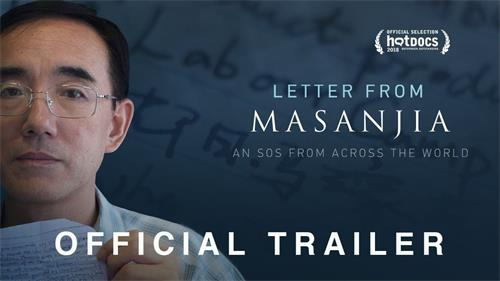

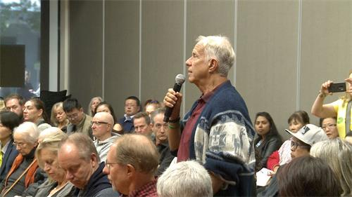

图1～2：二零一八年十月二十一日下午，《求救信》在帕洛奥图米切尔社区中心举行的“2018联合国协会电影节上放映”放映，现场观众感动落泪，表示该影片令人震撼。

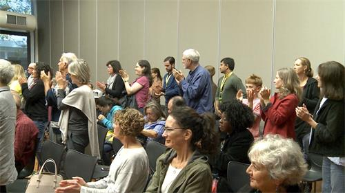

图3：影片结束后，观众起立鼓掌致谢。

《求救信》讲述了美国俄勒冈州女子茱莉•凯斯在购买的万圣节装饰品中，意外的发现了一封求救信。信中详细地描述了中国辽宁省沈阳马三家劳教所对在押人员的种种酷刑折磨，和强迫从事奴工生产出口饰品的骇人事实。善良的凯斯意识到事情的严重性，将这一消息公布于众，立即被美国有线电视新闻网（CNN）、福克斯新闻，《纽约时报》，《环球邮报》等多家主流媒体报道，引发国际社会关注。信件的主人——法轮功学员孙毅，当时已被释放二年。一天，他通过翻墙软件意外地发现，自己在劳教所里冒着危险纪录下的血泪控诉终于起到应有的作用——向世人揭开中共残酷迫害法轮功学员的冰山一角。

影片中，孙毅被迫与妻子分开逃亡印度尼西亚，凯斯不远万里从美国飞去看他。观众关女士（Dawn Kwan）表示，这一幕最令人感动。她说：“他（孙毅）叙述在劳教所里遭遇酷刑，和他妻子的点点滴滴时都没有哭，但与茱莉分别后，他哭得那么伤心。”“中共把法轮功描绘成邪恶的、冷血的人。但孙毅那么的儒雅，就像一位学者，非常的有教养，承受了那么多，还如此的坚强。”

观众梅赛德斯•罗马（Mercedes Roman）表示，她终于明白为什么沃尔玛等超市里卖的中国商品如此廉价，她说：“原来背后是很多奴工被逼迫着长时间工作。我们应该反思和中共的贸易政策。”

大卫是旧金山湾区一家非政府组织的董事会成员，他是在电影节上看到《求救信》的介绍特意前来观看。他认为，这部影片应该让更多的人来观看。以前，他只知道中共迫害宗教信仰，但不知道法轮功。观看这部影片，让他了解到法轮功以及中共对法轮功的残酷迫害。

华人观众周小莹说：“人们对法轮功有负面的思想，这些都是政府所灌输的，我希望中国人将来自己能独立地去思考，什么是好，什么是坏！”

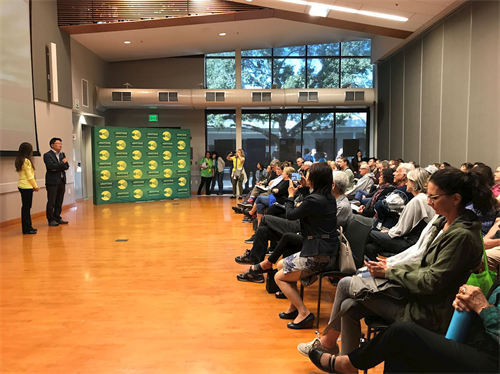

图4：影片结束后，导演李云翔回答现场观众提问。

一位华裔观众在影片结束后表示，这部影片非常震撼。并问该片导演李云翔：我们能做什么？导演李云翔回答：希望这部影片能让更多的人来观看。他举例，孙毅一共写了二十封求救信，然而只有朱莉公开了她所发现的那一封。

李云翔说：“朱莉当时发现那份信的时候，也可以像其他十九人那样、把信扔到垃圾桶。但是她没有，而是把信公诸于众，使得孙毅的故事被主流媒体报道，得到公众的广泛观注。”他相信，当越多人观看这部影片，越多人采取行动时，这些社会舆论的效应会给中共压力，这些社会的压力能够改变中国（中共残酷迫害法轮功学员）的这一现状。

李云翔并表示，孙毅用生命书写的求救信起到了改变历史的作用， 因为这封信的曝光，中共施行了几十年的劳教制度最终被废除了。目前，纪录片《求救信》正在全球进行巡回展映，感兴趣的人士可以关注影片网站了解放映详情，也可登陆iTunes预定在线观看。（网址：http://www.letterfrommasanjia.com/）

<h1 align="center"><b>迫害法轮功　邯郸武安市教育局长冯云生遭恶报死亡</b></h1>

【明慧网二零一八年十月二十六日】（明慧网通讯员河北报导）二零一八年十月十四日，河北省邯郸武安市教育局长冯云生在经历了四年的牢狱之灾，两年的癌症煎熬，终结了其六十四岁的生命。
曾被外界称为「史上最牛教育局长」，本地人称「冯八亿」（贪污的钱财多，而被称为冯八亿）的风云人物，为何厄运不断？且看其迫害法轮大法的账簿，便能明了其中的缘由。

冯云生自担任武安市教育局长至其二零零九年被逮捕，多次指使、胁迫武安市中小学办「反××征文」等邪恶活动，目的是诬陷法轮功，对法轮功恶意造谣、栽赃，并煽动民众敌视法轮功，毒害众多的中小学生及家长。

二零零五年十月二十日下午四点，河北省武安市教育局突然同时组织各中小学校学生填写针对法轮功的调查问卷。这些人做贼心虚，在这个所谓中小学「教育活动」调查问卷上标有【机密●注意保存】字样，下面没有任何单位部门的公章或名称。

「调查问卷」为铅印，上面除要求填个人情况外，共有三个宣传题，第一题是关于对法轮功的态度，发卷时，即给出所谓「标准（诬陷）答案」，让学生照抄，毒害学生。而第二、三题则更加恶毒，意在诱使不明真相的青少年恶意举报法轮功学员，从而犯罪、行恶。

祸福无门，唯人自召！迫害法轮功，厄运因此而降临！

二零零九年八月十九日下午，冯云生得知自己被列入「退居二线」的前一天，招集人事科和财务科人员加班加点，通宵达旦，当晚，仅调令就签署一百五十份之多（一份调令卖五万至十万不等），买卖教师职位，集中调迁。

全国媒体集中报导该事件后，冯云生被逮捕，异地判刑四年。住监狱两年后，被保外就医。保外就医后不久，又被人举报，再次入狱服刑。

出狱后，冯云生又得了癌症，到北京等大医院治疗，未见好转，在经历了两年煎熬后，二零一八年十月十四日死亡。

告诫还在参与迫害法轮功的打手们：善有善报，恶有恶报！冯云生的恶报并非偶然而是必然！

<h1 align="center"><b>《福布斯》刊文披露中共强摘器官</b></h1>

【明慧网二零一八年十月二十三日】（明慧记者王英编译报道）美国商业杂志《福布斯》（Forbes）十月十六日刊登法学研究人员欧恰布（Ewelina U. Ochab）的文章说，中共政权正在杀害包括法轮功学员在内的良心犯，摘取他们的器官，以供应器官移植产业。

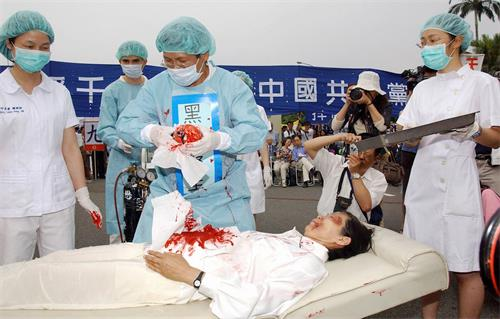

图：美国《福布斯》刊文说，中共是以法轮功学员作为器官摘取的对象

文章说，器官移植是一种受到高度监管的医疗程序。世界卫生组织出版了一本名为“人体细胞、组织和器官移植指导原则”的出版物，以明确进行器官移植相关的国际标准。

例如，原则（一）要求捐赠者同意移植器官。原则（十）要求器官移植具有可追溯性。原则（十一）要求捐赠活动应透明且易于审查。相比之下，器官摘取是未经本人同意的从个体（无论死亡还是活着的人）中移除器官的非法行为。

十月十六日，英国议会就中共摘取器官的做法举行会议。这是在英国议会举办的第三次此类活动。日程中的一个议程是，中共政权正在杀害良心犯（特别是信仰团体，包括法轮功学员，藏传佛教徒，维吾尔族穆斯林和未登记的家庭教会基督徒），以供应器官移植产业。这个问题已成为美国国会和欧洲议会调查和听证会的主题。美国众议院和欧洲议会都通过决议，谴责“有系统的、国家批准的从未经同意的良心犯身上摘取器官”。

对中共摘取器官的指控得到了大量的证据支持，其中包括由前加拿大外交部亚太司司长大卫•乔高（David Kilgour）、加拿大人权律师大卫•麦塔斯（David Matas）和美国资深媒体人伊森•葛特曼（Ethan Gutmann）于二零一六年发表的报告《血腥的器官摘取/大屠杀：更新版》（Bloody Harvest/The Slaughter：An Update）。他们就此曾于二零一六年六月二十三日在美国众议院外交事务委员会的听证会上作证，并在英国议会和其它几次听证会上也进行过作证。

乔高、麦塔斯和葛特曼的调查揭示了中共摘取器官的两个重要问题。

首先，中国的器官摘取量大于官方统计数据中所确定的数量。该报告指出，虽然中共官方的统计数据显示每年大约进行一万例器官移植，但实际移植的数量可能高达每年六万至十万例。联合国酷刑问题特别报告员和联合国宗教或信仰自由问题特别报告员已经就此差异对中共提出质疑。

其次，该报告显示，包括法轮功学员、维吾尔族人、藏族人和家庭教会成员在内的良心犯成为器官摘取的特定目标群体。在众议院外交委员会的口头证据听证会上，葛特曼作证说明中共如何将摘取器官用作迫害法轮功学员的方法，并维持对人体器官需求的供应。

在众议院外交委员会听证会上，葛特曼表示，一九九九年，中共开始了旨在消灭法轮功的迫害。到二零零一年，劳教所内被关押的一百多万法轮功学员被迫进行针对器官移植所做的体检。中共的军队医院和民用医院都在扩建移植设施。

中共是以法轮功学员作为器官摘取的对象。中国器官移植产业的兴起是建立在监禁法轮功学员的基础上的。

我们需要做些什么？可以做些什么？对中国器官移植业的独立调查是第一步，也是最关键的一步。这种独立调查将为今后起诉涉嫌滥用器官移植或强行摘取器官的罪犯提供依据。

二零零八年，联合国禁止酷刑委员会建议“缔约国应立即对法轮功学员遭受酷刑并被用于器官移植的指控进行独立调查，并采取适当措施，确保对此类侵权行为负有责任的人将受到起诉和惩罚。”

二零一三年十二月，欧洲议会通过了一项关于中共摘取器官的决议，要求对中国的器官移植进行全面透明的调查。二零一五年，联合国禁止酷刑委员会表示：“缔约国（中国）也应该进行一项独立调查，以调查法轮功学员遭受未经同意被摘取器官的指控。”

在英国议会的会议中，终止中共移植滥用国际联盟（International Coalition to End Transplant Abuse in China）宣布成立一个独立人民法庭，对中共摘取中国良心犯器官进行调查。

无论该法庭是否有助于提供有关中共摘取器官问题的答案。但是，它肯定可以成为针对这个议题采取更多决定性行动的开端。

<h1 align="center"><b>认清中共是什么组织</b></h1>

【明慧网二零一八年十月二十三日】作为中国人，在中共谎言的欺骗下，绝大多数人都曾经自愿或被动的加入过中共的党团队组织。当然也有很多人把加入中共党组织当成升官发财的政治资本。
我们应当对共产党有一个清晰的认识和判断，它是好是坏？是正是邪？因为人都有追求好的正的事物的愿望。可悲的是，中国人加入的是一个由西方幽灵操控的，具有假、恶、骗、斗、杀、抢本性的邪恶政党组织。加入这样的邪党组织是可怕的，是危险的。

历史是一面镜子，让我们用历史事实来认清中共是什么组织。

一、邪灵组织

“一个幽灵，共产主义幽灵，在欧洲上空游荡。”这是《共产党宣言》的第一句话。这是共产党纲领性文件，毫不隐讳地承认了共产主义是幽灵。而幽灵在西方的词汇中与魔鬼邪灵是同义词；在汉语词汇中，幽灵与阴间的鬼魂是同义词。共产主义它不只是意识形态的东西，而是一个邪恶的灵体，它能附着在人的大脑中，控制人的思想与行为，按照它的邪恶本性和意愿操纵人做事。一个人被邪灵所操控，不可怕吗？

二、非法组织

按照中国相关法律法规，在中国境内的任何政党和民间组织，必须到民政部注册，否则被视为非法组织。中共作为中国最大的政党组织，却一直没到民政部注册，因为中共凌驾于国家宪法和法律之上。中共不具有法律承认的合法性，它的执政地位也是非法的。

三、汉奸卖国组织

中共卖国由来已久。众所周知，中共是从前苏联把共产主义引入中国的，中共早期的一切活动，都是听命于苏共的，其经费也是苏共提供的。中共在江西建立的第一个政权叫“中华苏维埃”政权，中共把占领的地区叫苏区。

日军侵华后，中共与日军秘密签订协议：日军在陕甘地区划出六个县给中共，条件是中共不抗击日军，所以抗战时期日军没向陕甘地区派过一兵一卒，打过一枪一弹。

一九七九年所谓的“对越自卫反击战”中牺牲无数中国军人生命夺取的高地，又被中共送还给了越南。

一九九九年，前中共头目江泽民将黑龙江以北属于中国的几十万平方公里的领土，拱手送给了俄罗斯。中共是中华民族历史上出卖领土最多的卖国组织。

四、暴力杀人恐怖组织

中共是靠暴力杀人起家、夺取政权和维护巩固政权的。中共窃国后，搞了几十次政治杀人运动：土改、镇反、三反五反、反右、大跃进、四清、文化大革命、八九六四枪杀学生及市民、九九年迫害法轮功及修炼者。近几年打击维权民众和正义律师、民主人士……在没有外来侵略，内无战乱的和平年代，造成八千多万中国同胞非正常死亡，这个数字是两次世界大战死亡人数的总和。这还不包括中共一胎化政策造成的几亿胎儿无辜死亡。中共更邪恶恐怖的是活体摘取法轮功学员的人体器官牟取暴利。

中共残暴杀人的恶行，远远超过了侵华日军、希特勒纳粹党卫军和世界上所有邪恶组织的行径。

五、破坏中华传统文化的组织

中华传统文化承传的是敬天敬地、信佛修道、天人合一的思想。儒家的仁、义、礼、智、信；佛家的修心向善、善恶有报；道家的返本归真等传统文化，使中华民族在几千年的历史发展中经久不衰，是中华民族的根和魂。

而中共的党文化却向中国人灌输无神论，唯物论，战天斗地、人定胜天，阶级斗争，暴力革命。让中国人背叛炎黄祖先，拜了马、恩、列、斯四个外国人为共产教主。

中共不让人敬畏神佛，遵守仁义礼智信的做人准则，不让人相信善恶有报的天理，导致当下中国人道德沦丧、诚信尽失：有毒有害食品遍地，假疫苗防不胜防，自然生态环境恶化。共产邪党正在把中国社会推向万劫不复的深渊。

六、贪腐与吸血鬼组织

中共是当今世界上最大的贪腐执政党，中共贪腐官员之多、贪腐金额之巨举世无双。中共官员利用手中的权力贪污受贿、买官卖官、权钱交易、权色交易，包养情妇、生活奢侈，贪污受贿金额高达百万、千万、上亿。

中共官员不但贪腐，还是附着在中国人民身上的吸血鬼。中国老百姓的纳税钱，要养着政府的公职人员，还要养着中共庞大的党务人员。这在正常国家都是不存在的现象。

中共拿着老百姓的钱，却做着损害国家利益，伤害百姓的坏事，如无偿资助非洲国家、耗费大量资金用于维稳、打击上访民众。中国人纳税最多，而享受的福利却最少。

七、与中国人为敌的反华势力组织

共产党这个西来幽灵，出卖中国领土、屠杀中国人民，破坏中华民族传统文化、毁坏历史文物、抢夺中国人民的财物、剥夺中国人民的信仰和言论自由，剥夺中国人的生育权利……中共才是最大的反华势力组织。

中共把所有中国人都视为敌人：在全国城乡安装数亿只摄像头监控民众，网络化监管、人脸识别技术的应用，网络、手机、飞机、火车、长途汽车等实名制管理，都是为了管控中国人。中共的维稳经费已经超过军费，中国老百姓时时处处都在中共的监控之中。

正所谓：“近朱者赤，近墨者黑。”希望所有曾经加入过中共党团队组织的中国同胞，别再被中共的谎言所欺骗，认清中共这个西来幽灵祸我中华、害我国人的真面目。退出党团队组织，远离邪恶，不要仇视、迫害法轮功及其修炼者。也不要心存侥幸：没跟着中共干过坏事、或已不交党费、或已过了自动退团队的年龄，不用退党团队了。但是请您不要忘了，加入党团队组织时，都曾经对着共产邪灵和血旗发过毒誓：要为共产主义奋斗终身。如果您不能主动向上天表明退出中共的党团队组织，那么天要灭中共时，您曾对邪灵发的毒誓就会得到应验，谁愿意为中共当陪葬呀！

尊敬的中国同胞，当您读过《九评共产党》和《共产主义的终极目的》，当您看过有关法轮功被中共迫害的真相资料，当有好心人劝您退出党团队组织时，请不要再犹豫、彷徨，赶快退出来。中国人都能认清共产邪灵和中共恶党的邪恶本质之日，即是中共解体之时。

<h1 align="center"><b>中共摧毁道德良知　国人应退党自救</b></h1>

【明慧网二零一八年十月二十二日】如今在中国，有句话几乎成了很多人的口头禅，当听到死人了，张口就说：中国这么多人，死几个人算什么。这句话折射出整个社会人性的普遍丧失、人心的极端冷酷。由于传统文化被破坏和社会变异思潮的影响，很多人只注重自身的利益和各种欲望的满足，想尽一切办法捞钱，吃喝玩乐，全然不顾他人，甚至见死不救。
有个贩卖桔子的人拉了一车桔子，在国道上出车祸翻了车，人们蜂拥而上去抢桔子，谁也不去救人。现在的人不但见死不救，而且发展到盼着人死，乐见人死，催着人死。当今还普遍存在这样的情况，看着父母年迈了，体弱多病，不能创造财富了，做儿子、儿媳妇的就厌烦了，巴望老人马上死去。不少人见父母碍眼时就会说出：你咋不死呢？死了省得烦人了！

今天的人，对待自己的父母都敢如此大逆不道，何况对待他人呢？

甘肃庆阳十九岁的女孩被老师猥亵，状告无门，满腔的委屈、悲愤，绝望中准备跳楼，围观的人中有的催促“怎么不跳？”“为了等你跳下来，我在楼顶晒一小时太阳了”，“活该吧，赶快跳啊，浪费大家时间”……几个小时后，女孩在一片催促声中，跳了下来，了却了年轻的生命。如果人们能珍视生命，并对她多一些同情，替她说句公道话，让她感受到人与人之间的温暖和生命的珍贵，就会给予她生活下去的勇气，这个生命完全有机会活下来。

仅仅是一些没有人性的人和那个流氓老师把这个女孩推向了绝路吗？

几十年来，在中共的统治下，人们被强迫地灌输无神论、斗争哲学，并把传统文化视为毒草，让人不讲道德，不信善恶有报，只讲党性不讲人性。中共的党性就是无神论学，斗争哲学，与天地人为敌，追求个性解放、性开放、金钱至上。通过中共几十年是非混淆、黑白颠倒的洗脑，人们渐渐地失去了人与人之间的尊重和关爱，甚至连最起码的怜悯之心都丢弃了，传统文化中人命关天，仁者爱人的道德理念荡然无存。传统道德讲“无怜悯之心非人也”，这种“非人”行为正是中共几十年如一日破坏传统文化和传统道德所要达到的目的，也是中共在历次整人害人的运动中所极力鼓励和吹捧的。

在中共治下的社会里人人都有被推上绝路的可能。中共这个西来魔鬼正是逼着中国人走上绝路的罪魁祸首。

在中共篡权的初期，就全部没收了资本家、工商界人士的财富，杀害和逼死了很多人，当时就有不少人不堪屈辱而跳楼自杀。时任上海市长的陈毅，就把人跳楼当成了乐子，曾每天询问“今天又有多少空降兵？”文革期间陈毅被中共整治，患绝症痛苦地走到生命尽头的时候，其下场比那些被逼死的资本家好多少呢？

中共历来视生命为草芥，磨牙吮血，杀人如麻，它最喜欢见到的就是一批一批的人死在它面前，甚至满地淌的都是人的鲜血，才最过瘾呢，这也就是中共特别嗜好血红色的原因吧。中共毫无遮掩地叫嚣与天斗其乐无穷，与地斗其乐无穷，与人斗其乐无穷。中共其邪恶的本性充分体现于它的一次又一次的整人运动中，它以迫害民众、大肆杀戮维持政权，害死了八千万中国人，还毫无羞耻地鼓吹自己“伟光正”。它教唆人们只要站在党的立场上无论干什么坏事甚至杀人放火都是正确的，欺骗人们没有善恶报应，让人只重眼前利益，不计后果，一步一步地用歪理邪说摧毁人的道德、让人放弃人性，最终导致整个社会道德崩溃，逼着人死，看着人死，乐于人死。

有这么一件事，在中原一个城市的郊区，有一家农民要盖房子，土地办的人知道后就让她家拿出一大笔钱才允许盖。在农村盖房不容易，很多人家都是积攒了多年的钱，才能盖得起房子，如果这家再拿给土地办那么多钱，就要拉账，所以不能满足土地办的要求。这家的儿子还在部队当兵，是军属，也不能得到照顾。一天准备施工时，土地办开车来了六七个人，阻止施工。女主人愤恨至极，从屋里拿出一瓶毒药，对他们说，你们要不让盖，我就喝药死。土地办的人说，喝药也不让盖。女主人见没有了商量余地，一气之下把一瓶药灌进了肚子。令人发指的是，土地办的六七个人眼睁睁地看着农妇把一瓶药喝完，谁也不去上前制止，直到农妇倒在地上，他们才开车扬长而去。

一个鲜活的生命，就这样被逼得死在了中共公职人员的眼皮底下。传统道德讲人命关天，现在在中共的治下，人的生命还不如蒿草。

文革是一场最惨的整人害人的浩劫，据专家们的保守估计，文革中被中共害死的达773万人，可中共党魁毛泽东还不尽兴，竟然说，文革这样的运动要七、八年来一次。一九八九年“六四”学生被杀害，中共头目仍不解恨地大喊，杀二十万换取二十年稳定。一九九九年中共迫害信仰佛法的民众时，其匪首江泽民狂妄地叫嚣，打死白打死，打死算自杀！

近年来，在大陆经常看到这样的标语：人民有信仰，国家有力量，民族有希望。可转眼间基督教又被打压。中共向来是说一套做一套，反复无常，耍尽流氓。

中共最仇视神佛，它能真心容许人们对神佛的信仰吗？中共视人类为敌，它能干出对人类有益的事吗？如今在社会上广传的《共产主义的终极目的》一书，揭示了中共魔鬼的本来面目，以及其有预谋地一步步把社会道德推向全面崩溃，摧毁传统文化，切断人与神的联系，让人彻底背叛神佛，丧失人性，招致天降大难，从而把中华民族及人类推向毁灭。

看看现在中国大陆在中共腐败荒淫和性开放的带动下，几乎全民堕落，物欲横流，人心魔变，为了钱财色欲，很多人无恶不作，根本不管他人死活，甚至抛弃家庭，伤害亲人，丧尽天良……人们的生存环境和生活条件遭到严重的破坏，毒食品，假货物弥漫中华大地，损害着人们的健康，危及着人们的安全。中共不亡，中国人会有好日子过吗？中共早期搞了三十年自立更生，直到国人几乎吃不上饭了，才被迫改革开放。改革开放三十多年，中共一路腐败堕落，在国际上臭名远扬，在国内不得民心，到了内外交困的地步，还要回头搞自立更生。说穿了，就是中共又想闭关锁国，关起门来共产中国人的私有财富，把人民视为砧板上的肉任意宰割。无论中共怎么变换手段，最终都是要把中国人带上绝路。

觉醒的人已经看清，跟随中共只有死路一条。所以这些年来善良的法轮功学员根据天象的变化，得知了天灭中共的信息，不忍心看着自己的同胞去做中共的陪葬，年复一年，日复一日地劝人们退出中共的党、团、少先队组织，好避开大难，走向未来。

法轮功是佛法修炼，教人们按照真善忍做好人，不坑不骗，做事先考虑别人，能使社会道德迅速回升，福泽人类。中共和江泽民流氓集团为迫害法轮功，制造出一个个谎言，并花钱买人冒充法轮功学员恶搞“天安门自焚”陷害法轮功，煽动全国民众仇恨佛法，让人们对佛法犯罪，从而招来灾祸。愿人们能明辨善恶，抛弃中共，支持正义，定能得到上天保护，进入新的纪元。

<h1 align="center"><b>一千四百个中共谎言是如何出笼的</b></h1>

中共开始全面迫害法轮功之后，一夜间大陆媒体上充斥着形形色色的栽赃法轮功的所谓“新闻”，号称“1400个死亡案例”。我们静下心来想一想，全世界在一百一十多个国家和地区都有人修炼法轮功，包括台湾有七十万法轮功修炼者，可是都没有出现过所谓自杀、杀人的案例，这是为什么呢？其实，中共搞的每次运动都是先挑动仇恨，这一千四百例就是精心炮制的让人们仇恨法轮功的一千四百个谎言。

例如重庆永川双石镇的龙刚因精神病复发跳河身亡的事例。龙刚的母亲夏祖容写稿给明慧网说：“儿子确实有精神病，当时是精神病复发跳河死亡，与法轮功没有任何关系。这是谁也抹煞不了的事实，作为他的父母，我们必须说真话，不能昧着良心。”“在我儿子死后，一位姓杜的记者来采访我儿媳妇，叫她说自己的丈夫是练法轮功的，把一些诬蔑法轮功的话写在纸上，叫她照着念。当时儿媳妇迫于压力这样做了。第二天还给了她二百元钱。用钱收买良心。教人干坏事，并教我孙子说诬蔑大法的话。电视上的假新闻就是这样编出来的。”

再比如所谓的“魏家杀母案”。二零零零年，辽宁盘锦市一个姓魏的女人，平日游手好闲，喜欢打麻将，没钱了就找母亲要。母亲没给，她一怒之下把母亲杀死。公安部门的人让她说自己是炼法轮功的，可以保她不判死罪。于是这个“魏家杀母案”便出笼了。

在中共的一千四百例谎言中，有一个叫王喾的机关公务员，一九九八年死于肝硬化，也被莫名其妙的收入这一千四百例。他的妻子肖玉芬在二零零一年写稿给明慧网声明，丈夫从未炼过法轮功，纯属正常死亡。

对法轮功稍有了解的人都知道，法轮功的修炼是以“真、善、忍”为准则，无论是自杀还是杀人都是杀生，都是有罪的。这在法轮功的书籍中写得明明白白。法轮功所有的书籍一直都是完全公开的，可以在网上免费下载。

中共从迫害一开始就大量销毁法轮功书籍，并耗资几十亿元建造世界上最大的网络防火墙，封闭了国内外一切能揭示真相的舆论工具。用谎言向百姓灌输仇恨，这是中共几十年玩的拿手好戏。过去让人们仇恨地主、仇恨资本家、仇恨右派、仇恨走资派等等，现在仇恨法轮功，不都是同样的手法吗？朋友，请您珍惜您在海外的自由知情权，多了解真相，也可以拿一份免费的翻墙软件，回国后仍能突破中共的网络封锁，自己看真相。

<h1 align="center"><b>【西人修炼故事】金融科技界菁英缘结法轮大法</b></h1>

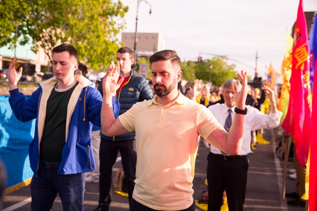

修煉法輪大法的西人中，有很多是金融、科技界的新生代菁英。

【大纪元讯】自从法轮大法1992年5月13日由李洪志先生自中国传出以来，感化着亿万人心，唤醒着每一个有缘人，其中包括那些生活在西方的各国民众。在这些人当中，很多是金融、科技界的新生代菁英，他们在现代人繁忙的生活中，某一日于不经意间或收到了一份传单、或从朋友处听说，便和法轮大法结上了圣缘，从此开始了他们全新的人生。

<b>美国证券交易委员会的设计师</b>

2000年夏季的一天，正在马萨诸塞州艺术学院（Massachusetts College of Art）读书的美国大学生罗伯．康茨（Rob Counts）从一个展销会的摊主手中接过一份传单，他那时从没想过这张小小的传单会改变他的一生。

当时19岁的罗伯生长在一个天主教的家庭，从小就对各种宗教学说感兴趣。14岁的时候他看到了老子的《道德经》，被深深地吸引，开始寻找那种让人冷静并能控制自己思想的修炼方法。

「看完这份法轮功的传单后，我意识到法轮大法是一种性命双修的功法，在提高心性的同时，通过打坐和动作修炼身体。」罗伯回忆说。「我炼功时我的身心感觉好极了。」

毕业后，罗伯在「美国证券交易委员会」（United States Securities and Exchange Commission，简称SEC）中做平面设计师的工作。「因为法轮大法教人去掉执着，让你做什么事情首先考虑他人。修炼后我的学习和工作成绩迅速提高。」他说。「同事们对我另眼看待，我也开始理解父母把我和兄弟拉扯大的不易，我对周围的人越来越尊敬，因为我意识到每个人的生活都有困难和阻碍。」

由于罗伯的出色表现，他很快就被提拔为高级设计师，又从高级设计师晋升为品牌经理，在他离开委员会一年后他又被聘为SEC的品牌顾问。

2013年，罗伯离开了证券委员会，加入纽约的自由媒体行业。到目前为止，36岁的罗伯已经带领他的英文大纪元团队获得了「纽约新闻联合会」（New York Press Association」和「新闻设计协会」（Society for News Design）等机构的30多个奖项。

「『真、善、忍』的思想对我的设计产生了巨大的指导作用。我们努力让设计激发人们内心善良的一面。」罗伯说。「我们做出的东西反映的就是我们对人和事物的看法。我们关心人，我们努力把这种关心渗透在我们所做的一切当中。」

<b>慕尼黑的银行投资经理人</b>

现年34岁、家乡在德国巴伐利亚慕尼黑的瓦伦丁．施密德（Valentin Schimid）2009年在法国最大的银行－－「法国巴黎银行」驻香港的资产管理公司（BNP Paribas Investment Partners）担任投资经理。他的上司是一个法轮功学员，耳濡目染的过程中他知道了很多关于法轮大法的事情。终于，在那年的9月，上司给了他一本《转法轮》。

「我那时还不知道学法的重要性，我只和他探讨宇宙和人类的奥秘。」瓦伦丁说。「但是我一开始就知道讲真相，从修炼开始还没怎么看书，我就出去征签（反迫害签名）了。」

修炼前，他是个从来不笑、也不和别人开玩笑的孤独严肃的德国青年，他只看足球和电影，当然也喝酒、交女朋友。但是自从他炼了法轮功以后，他戒掉了一切不良嗜好。

「其实这是我开始修炼的原因之一，因为我意识到我的过分物质化的生活方式快要把我毁掉了，我需要一种变化。」有一天晚上，他真切体会到师父给他调整身体。瓦伦丁说。「我如愿以偿，师父开始管我。我不再做不该做的事情，这是我从常人生活走出来的一个主要的进步。」

因为工作的关系，他频频往返于香港和欧洲各地。他开始用心地修炼、勤奋地工作，同时生活也变得愉快，他经常欢笑，也可以跟别人开玩笑了，同事们越来越喜欢他。

「我那个上司曾经说，我的根基非常好。」瓦伦丁说。「但是一个人，你是当一个天使还是一个魔鬼，全靠你自己的选择。我原来选择的不好，我现在也不知道我是不是一个天使，这也许就是人每天都需要作出的选择。」

显然，瓦伦丁选择当「天使」，因为他「拒绝一切负面的思维，遇到问题都用正面的想法来看待」。他参加各种弘扬佛法、反迫害的活动，并参加欧洲的天国乐团游行、他推广神韵，他向每一个认识的人介绍法轮大法。

一次在荷兰，当他给一位女士讲完法轮功的真相后，那个人突然给了他一个大大的拥抱。「也许她明白的那一面感到非常幸福吧。」瓦伦丁这么说。

<b>圣地亚哥的IT科技公司总裁</b>

中国人说，缘分是一条无形的线；「佛度有缘人」；现年33岁已经拥有自己一家中型IT公司的财务专家锡亚梅克．霍勒米（Siyamak Khorrami）对此深有体会。

出生于伊朗，后移民到墨西哥，再到美国读大学和就业的他早在2003年就从同乡那里听说过法轮功，他当时在圣地亚哥大学（University of San Diego）读金融专业，听说家乡伊朗的主要城市都有大法弟子；连他的第二故乡、美洲的墨西哥也有很多修炼人，但是他一直没有炼。

缘分的这条线一直牵着他。从2006年起，他在叔父公司的北京办事处做财务总监。在他的管理下，公司从30多个人壮大到300人。2009年，他成立了自己的IT服务公司Skyriver。

2010年的一天，他在圣地亚哥市内开车等红灯的时候，赫然发现，在并排停着等红灯的一辆车里竟然坐着那个当年给他介绍大法的人。对方给他介绍神韵演出，锡亚梅克这回毫不犹豫地去看了。

「结果，我发现整个演出讲述的是我的生活，我的故事。」锡亚梅克无法形容那种感觉，就是「和神韵有关联」。另外一件奇怪的事情，就是看演出前的很长时间的胸痛在看演出后消失得无影无踪。他开始正式修炼。在炼静功时，他明显感到能量；在第三套功法推转法轮时，他真切地感到自己在人工推着什么东西。「这个法是真的！」他对自己说。

「大概在修炼一个月后，我突然发现我的视力变好了，不再散光了。」他说。以前，他夜晚开车看不清前面的汽车。炼功后，不仅前面的车看到，车前面的桥，再前面的桥，桥上的公共车和公共车里面的人都看清楚了。「这也太神了，简直难以置信！」

到此时，锡亚梅克与法轮大法的缘分完全接上了。他发现，当他把「真、善、忍」的理念融入到公司管理当中时，公司也发生了奇迹般地转变。

「不用去竞争、不用去钻营，你只要做对的事情，只要按照真、善、忍标准，首先为别人着想的时候，大法的威力就会显现出来。好人都围绕在你身边，不论是好员工还是好顾客都来了。」锡亚梅克说。

「以前，我们总是谈企业文化，如何控制人，如何让职工参与，我现在发现，按照大法的要求做，要求自己做到先他后我，这就是最好的企业文化。」

他的公司越办越好，从最初的几人发展到现在的二十来人；销售额也迅速增长到了200多万美元。去年春天，他受邀在全球知名的Vistage论坛上发言，他给与会的CEO们讲述了自己如何在法轮大法指导下管理他的公司；他还定期给他的1万多个客户发送电子邮件介绍法轮大法，收到很多积极的反馈。

「我从心底里感谢我的师父，谢谢他把如此深刻的修炼方法弘传于世。」锡亚梅克说。「我想对世人说：无论你来自何种信仰体系，『真善忍』这个普世原则对你们都是好的；希望大家不妨试着按照『真善忍』的准则去做，你就会发现你的生活会变得多么美好；因为我这么做了，我的生活确实发生着奇迹。」

<h1 align="center"><b>纪实小小说：洗衣店的平凡事</b></h1>

【正见网2018年06月29日】

芝兰是一九九六年开始修炼法轮大法的，第一天听课，师父就为她清理了身体，下上了法轮。以前的身体不是这儿难受就是那儿不舒服。九讲课听下来，感到身体特别舒服轻松，那些不轻不重的病从那天开始不知怎么没了，从此没吃过一粒药。

同时，也听懂了“不失不得”的道理，修掉私心，决对按真善忍做个好人，逐渐的放下对“名、利、情”的执着，不再争名夺利。

通过学法芝兰的火爆脾气也一点点变的温和了，不再和丈夫阿昌吵架，也懂的为他着想，丈夫的脾气也随着其变化也温和，变的家庭和睦，是大法改变了她。

九八年下岗失业后芝兰开个洗衣店，租的是当地政府机关的房子。小店买卖还算红火。夫妇也跟这个机关的职工相处的很好，大家对她们的印象都不错。

一天，阿昌与朋友请此机关的电工吃饭，次日电工就把电表给停了，这样每月给停半个月，就能少交一两百元的电费。

芝兰知道后，和丈夫讲了许多大法真善忍做好人的法理，还特别讲了不失不得的法理，想叫阿昌去和电工说清楚，以后千万不要再这样占公家的便宜了。

阿昌也听懂了，可出于面子也不去说。

芝兰找到其他大法弟子交流此事，同修都说修大法的不应该占便宜，公家的便宜也不能占，要严格用师父的法要求自己，同修们都鼓励兰自己去找电工去了结。

兰在同修的鼓励下找到了电工，和他讲了大法的美好，李洪志师父是如何教大家按真善忍做好人的。

这位电工很感动，他道：“学法轮功做好人，我一定大力支持，你放心我不会想别的，一会儿就把电表弄好，我支持你。”

从那以后，他对芝兰特别尊重，经常问需不需要帮忙。

还有一件事也是在九八年，芝兰从一个顾客的衣兜发现两千四百元钱，几日后她来取衣。

那夫人笑问：“你可否洗出钱来？”芝兰道：“多少？”她笑着道：“两千。”芝兰道：“你说的数目不对。”她问：“我是说多了还是说少了？”芝兰道：“你说对了我才给你。”她笑着道：“我怕你不给我，想给你留点儿，故意少说了。”芝兰也笑了道：“你这些钱足够我交一年的房租了，但是我不能要你的钱，要是修大法之前我也许会私吞，可现在我炼法轮功了，我们师父教我按真善忍做好人，不能占不该占的便宜，要我们首先为他人着想，最后达到无私无我……。”

夫人感动的塞给了芝兰四百元钱就想跑，芝兰一把拽住她把钱又还给了她道：“我要是想要你这四百元钱我就不给你这两千四百元钱了……。”夫人只好拿着钱走了。

几日后她买了很多东西送来道：“这回你可不能再推托了。”人得会处事，善而不冷，人家若诚心诚意，你给来个“烧鸡不窝脖”给端了回去，还真伤人心！芝兰不想叫她误会，也不想叫她心里为此事难受，只好收下。算了一下，这些东西得花二百五十多元钱，与阿昌商量给她二百五十元钱。

芝兰把二百五十元钱默默的放在其还没取走的衣兜里。

象这样的例子遇到很多，但她们的谢意都多被芝兰善意的拒绝了。

由于芝兰在当地证实法和去北京证实大法好，先后四次被共产邪教抓進看守所、劳教所、洗脑班迫害，只好把洗衣店放弃了。这就是中共恶党破坏家庭危害社会破坏国家民生经济的铁证。

二零零五年芝兰又开起了洗衣店，很多老顾客都找来，说到处再找她，看到干洗店就進去看看是不是芝兰开的，说只有芝兰给他们洗的衣服才放心，就信任芝兰。

有的还说找了芝兰好多年，哪个洗衣店都找过。

有一天，上文提到的电工，来到芝兰新开的洗衣店，芝兰给他讲三退的事，还没多言几句，他就道：“我在政府机关上班，我也知道共产党腐败，它的气数已尽，非灭不可。从你的身上我早就看到了大法的正，电视上说的什么自焚杀人，那就是抹黑法轮功的手腕，傻子都能看出来！这么多年我从没信过，你帮我退党吧！”

说完自己就起个化名退出了中共邪党，解除加入时为其献身的誓言。

还有一位顾客来洗衣店取其丈夫送来的五件衣服，由于没有取衣凭证。

芝兰索要时她突然急了，道：“你太死板，这样混不下去！我在别处从不要凭证。”芝兰和气道：“这是为您负责，这也是做买卖的规矩，希望您能理解。”“什么规矩，我就非得拿走！”她就象没听懂，发了一阵台疯，坚持要把衣服拿走，然后大喊再也不到这里。

芝兰想着师父的讲法，警告自己不要被她带动生气。

 过了有十多分钟，她开始平静了，道：“如果你不相信我，给我男人打电话叫你听。”然后拨通手机。

核实确定后，才把衣服给了她。装好后，拿出其衣服里洗出的四百元钱递给她，她愣愣的站在那不敢接，芝兰道：“是你的”。

她都不敢相信自己衣兜里还有这么多的钱。芝兰伸玉指把钱放到她的手里。她红着脸道：“真不好意思，谢谢你，你真是个好人，下回我还到你这里来洗衣服。”

芝兰道：“这是我师父教我这样做的。”她很吃惊的问：“你师父是谁？”芝兰道：“我师父大名鼎鼎，全世界的人都知道。我是炼法轮大法的，你知道我师父是谁了吧？”她笑着点点头。

从那以后她来的次数更多了，她还说此店洗的衣服比哪洗的都干净，还在这儿主动办了洗衣卡。

有很多顾客，兰给他们洗出钱物来，都如数还给他们，并给他们讲了真相，他们都记住了大法好。有的顾客進屋就先喊大法好。

<h1 align="center"><b>「彼岸」是「故乡」 「秋分」登归途</b></h1>

秋分之后，河湖的水开始减少，万物开始收藏。

 
这一天之后，河湖的水开始减少，也听不到隆隆的雷声，小虫藏入穴中，渐渐用细土封堵洞口做冬眠准备，万物开始收藏。

这一天即秋分，阴阳相伴，昼夜均而寒暑平。此后，天越冷，夜越长。秋季养生，多吃滋阴润燥、养肺的食物；运动、起居、性情等方面，注重「养收」，保持阴阳平衡。七分精神三分病，最完美的养生，还得修心养神。

修心，进一步就是修炼。道家讲究个人修炼，依照宇宙运行规律，采集天地精华，演炼身体，同时真言真行，最后返本归真，修成真人——得道之人，超越生死之人。

佛家则讲普度众生，释迦牟尼佛讲「涅盘的彼岸」。佛家称有生有死的红尘为「此岸」，称生命不灭的极乐天堂为「彼岸」。佛经说「曼珠沙华」是天上之花，接引人到达彼岸极乐世界，故又称作「彼岸花」。此花在中国叫石蒜花，宋代根据花的形状记载为「龙爪花」，在秋分前后盛开。

人，生从何来？死往何去？人生的意义是什么？我求索过佛经、道经，练过气功，找不到明确的答案。直到难忘的那一天，1996年秋分第一周的一天，我拜读了《转法轮》，泪水盈盈，心中豁然开朗。

原来，
人多来自圣洁美好的天堂，在漫长岁月中偏离了宇宙特性，因此跌落人间；
原来，
生命的意义在于修炼，按照宇宙特性「真、善、忍」锤炼自己，重返天堂；
原来，
彼岸的天堂，就是我的故乡！我真正的家园！

而今又值秋分。我坐在在旧金山贝克海滩，凝望着无垠的大海，思绪随波涛起伏。在宇宙特性「真、善、忍」法光指引下，我走过二十二个春秋，历经悲欢离合，一首歌曲始终在我心里流淌，轻盈、愉悦，也将最终伴我返回真正的家园！

《登归途》
悠悠万世行，寻他千百度。
缘者登归途，法光散迷雾。
慧者心自清，苦中乐长驻。
俗世洪流醒，方惊天地殊。

<h1 align="center"><b>法轮功学员在欧亚首脑会议外和平请愿</b></h1>

【明慧网二零一八年十月二十日】（明慧记者容法报道）二零一八年十月十八日下午，来自比利时和荷兰的部份法轮功学员，在比利时首都布鲁塞尔举办了一场和平请愿活动，向参加此次欧亚会议的包括中国总理李克强在内的，以及与会的各国首脑呼吁停止对法轮功的迫害。法轮功学员打出“法轮大法好”、“真善忍好”、“法办江泽民”、“停止迫害法轮功”等横幅，同时展示着法轮功功法。

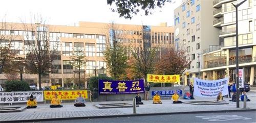

图：比利时荷兰部份法轮功学员在首都布鲁塞尔欧亚首脑会议期间呼吁停止迫害法轮功

 
 比利时的法轮功负责人尼科（Nico）说：“我们今天在这里举办这个活动，目的是让各国首脑了解这场在中国仍在持续发生的对法轮功学员的迫害。我们要求中共停止迫害法轮功，希望让中国总理李克强看到，不仅在中国，在全欧洲乃至全世界都有人修炼法轮功。这些人坚持用真善忍的理念要求自己。”

他还表示：“我们也想要向欧洲领袖们发出一个强烈信号，那就是，在同中共谈论经济和贸易的同时，要知道自己正在与一个严重破坏其传统文化和价值观的专制政权在谈话。而这些传统和价值观不仅仅是法轮功的准则，也是人类文明社会的普世价值。”

许多行人被法轮大法的功法所吸引，驻足观看并接过真相资料。有些人对打坐很感兴趣，希望在当今的社会中找到一种有助于自己身心健康的东西。还有些人对于中共强摘法轮功学员的器官用于买卖牟利的罪行，感到无比震惊和同情。他们表示要把这些信息告诉身边的朋友，让更多的人了解迫害真相，希望早日停止对法轮功对迫害。

<h1 align="center"><b>哈佛门口，中国学生了解法轮功真相</b></h1>

【明慧网二零一六年八月二十日】在美国波士顿，有一百多所大学，有顶尖学府。暑假时期，中国大陆的学生们，小到一、二年级，大到初中、高中生跟随各种旅行团，带着家长们的期望，来到这里参观世界著名学府哈佛大学、麻省理工学院（MIT）。
当地法轮功学员们也借此机会，来到哈佛大学门口讲真相，让更多的中国人，特别是年轻的学生们明白法轮功教人向善、遭中共诽谤迫害的真相。

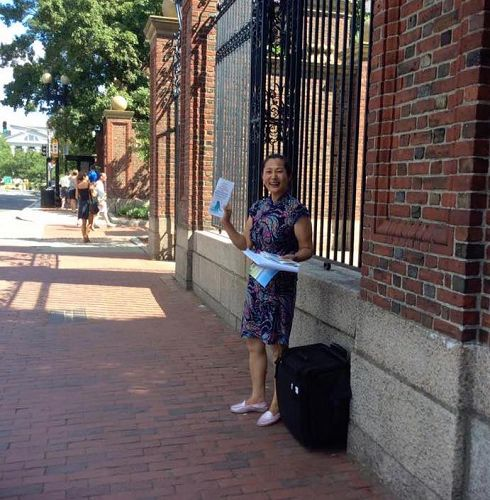

图：哈佛大学门口，法轮功学员在这里递上真相资料

 
<b>学生们大声说：“我们退！”</b>

哈佛大学这个大门每天游人如织，进进出出。学员们告诉进出的学生，天安门自焚案是假的，你们的教材里，关于法轮功的说辞都是谎言。

有三个大男孩瞅着他们老师没在，对学员说：我们聊一聊。于是他们走到门前的石凳上坐下。一个孩子说：“我信基督教。”学员说，基督教是信神的，是教人向善的。共产党是无神论，它说自己是幽灵，你应该退了，远离它的任何组织。再说，如果历史回到耶稣受难日那一天，你是审判他的邪恶，还是站在路边骂他的，嘲笑他的，同情他的？耶稣在世显了很多神迹，他的弟子都不认他。该学生听了以后表示要好好想一想。

另一个学生继续问：你们在这里影响中国形象，不爱国。那个之前发问的男孩，一改温文尔雅的风格，也突然发难说，你不是讲真、善、忍吗？我忍你很久了，忍你讲的这些话。学员答道：我是讲真、善、忍，我一点都不生你的气。你拿的这些资料收好，别给老师看见，惹麻烦。他说：你还是真为我们好。把资料放进书包里。

学员继续说：“孩子，奶奶在国内是个老师，曾经让我的学生也戴上了红领巾。这个死人血染成的血淋林的东西戴在脖子上，把人往地狱里拽，奶奶在这里日晒雨淋，是希望你们明白真相。你们被谎言毒害的太深。中国的所有问题都是迫害法轮功，迫害信仰引发的，我们是真正的希望中国好，真正的爱国。”

学员然后指着真相展板的活摘图片，告诉他们这是在中国正在发生的事情，是魔鬼行为，任何有良知的中国人都应该在这样的大是大非面前做出自己的选择，了解真相。

这波学生听后大声说：我们退！我们退！于是，学员拿出纸笔一一记下他们的名字，表扬他们真聪明。

这时，对面又来一个白白净净的男孩，大声喊，我也退。他给的是真名。

<b>学生老师一起听真相</b>

还有一次，二十几个学生和一个男老师在哈佛门口的阴凉下休息，学员过去打开了话匣子，孩子们一下涌过来抢走学员手上的传单，有的还拿几份不同的。那个男老师每样拿一份。就这样学员手中的小册子都被拿走了。

一次，一群学生围着一个学员提问题，他们很多问题都是电视中宣传的谎言。老师看到就笑笑的看着不出声不制止。一个好学生模样的女生，戴着个眼镜，一板一眼地说：“奶奶，我说话你别不爱听，你挣这钱很辛苦啊，太阳晒，出这么多汗，嗓子都哑了。”

学员说：“孩子，奶奶一点儿也不生气，只觉得你们很可怜，奶奶在这里再辛苦，也只和你们有这几分钟的缘份，有的只有一瞬间，奶奶真的希望你们了解真相，生命得救。奶奶一分钱也没有挣，坐几个小时的车，在这里站了几个小时，就为了告诉你真相。”这孩子还是说，我一点也不相信，你没有工资拿。学员说：“这就是你的可悲之处，这么小的年龄，连奶奶的讲的真话都听不明白，连奶奶的诚心都感受不到。中国的教育太害人了。”那些老师们已经没有了笑容，都在认真听，并认可学员讲的道理。

<b>不畏恐吓　坚持传递真相</b>

一位在哈佛门口讲真相的学员讲述了一个小故事，她说：“有一次我在走到对面的礼品店门口，几十个孩子有的低头玩手机，有的在聊天说笑。我走过去，笑盈盈地说：你们出来一定要了解真相，谦听则明，偏听则暗，君子不立危墙之下。但是，突然一个中年女老师过来大声阻止我，叫我离开这里，不要在这里讲。”

“我说这里是美国，不是中国。我有权利在这里讲，同学们有权利在这里听。因为我讲的真相关系到他们的未来。孩子们的目光齐刷刷地看着我们。”

“可是，这个老师更大声呵斥我，一只手推我，一只手推学生，她要隔开我们，我也注意到有些孩子并不那么配合，身体微微地反抗。我平和地说，这位老师，你违法了，你违反美国的法律。我可以叫警察来给你上一堂法律课，告诉你我可以、也有权利这么做。但是，我不能这么做，因为你会有麻烦的。这时，一个男老师立刻过来把她推走，让她不要出声。”

于是，这个学员继续向学生们讲真相，讲4.25 真相、讲活摘真相、讲天灭中共真相。这个学员说道：“学生们静静地听着，有的看着我，看着我手里的资料，那份饥渴的眼神，告诉我，他们听进去了。我讲着讲着，看着这些年轻的生命，看着党文化制造出来的凶巴巴的老师，我的眼睛湿了。我告诉学生：这样的真相点到处都有，你们都拿，老师就没有办法。在中国，你们受骗，充满了对法轮功的不理解与仇恨。你们来到美国，来到自由社会，就有了解真相的权利。”
 

<h1 align="center"><b>中共迫害法轮功引起国际社会普遍关注</b></h1>

【明慧网二零一八年十月十七日】据明慧网近日报道，二零一八年十月十一日下午，美国国会“国际宗教自由核心小组”和非政府机构“国际宗教自由圆桌会议”在美国国会山举行简报会，聚焦中国的宗教信仰自由现况。
法轮功发言人张而平说，中共迫害法轮功学员的恐怖罪行仍在持续。他呼吁美国国会和行政部门继续调查在中国仍在发生的强摘器官暴行，并采取一切必要手段制止这一反人类罪行。呼吁美国国会和联邦政府帮助制止中共的宗教迫害和侵犯人权行为。

张而平说，“自二零零六年中共强摘器官被首次报道出来，美国国会和欧洲议会已就此议题举行了多次听证会，并邀请医学和法律专家证实这一罪行的存在。面对压倒性的证据，美国国会和欧洲议会已通过多项决议和动议，谴责中共强摘器官暴行。”

他还说：中共对法轮功的迫害并没有减弱，任意拘留仍在继续。建议美国政府更大规模地利用马格尼茨基法案这一法律工具，惩治那些参与对法轮功学员及其它无辜团体进行严重人权迫害的个人和机构，并希望美国政府官员在与中国高层领导人会面时提出法轮功问题，并公开谴责中共对法轮功的迫害，特别是强摘器官的恐怖暴行。

自中共江泽民集团发起迫害法轮功十九年来，在中共江泽民流氓集团“名誉上搞臭、经济上截断、肉体上消灭”、“打死算白死，打死算自杀”和“不查身源，直接火化”的灭绝政策下，上亿法轮功学员被污蔑、长期监控，数百万学员被绑架、关押、劳教、判刑及关洗脑班，甚至被酷刑致死或活摘器官致死，数百万家庭被迫害得支离破碎、妻离子散、家破人亡！

二零一六年六月二十二日，加拿大前亚太司司长大卫·乔高（David Kilgour）、加拿大著名国际人权律师大卫·麦塔斯（David Matas）和中国问题专家兼调查记者伊森·葛特曼（Ethan Gutmann）发布了关于中共强摘器官的最新资料报告，报告显示中国器官移植手术数量每年约为六万～十万例，从二零零零年至今可能高达一百五十万例；而这些器官的主要来源是法轮功学员。

根据追查国际的调查，截至二零一六年七月，查获中共891家医院及9，519名医生涉嫌参与活摘器官移植。

十九年来发生了许多遭受中共残酷迫害法轮功学员的惨案：如一家八口被迫害致五死一残的辽宁省清原县法轮功学员孙鸿昌一家；六口之家被迫害致仅剩一人的河北省怀来县法轮功学员陈运川一家；一家五口被迫害得仅剩下一人的山东省青州市神旺村法轮功学员王兴家一家；三位至亲被迫害致死的河北石家庄市高级工程师冯晓梅一家；夫妻双双屡遭冤判全家都遭受中共非法关押残酷迫害的河北法轮功学员周向阳一家……

据明慧网近日报道，二零一八年一至八月份法轮功学员被非法判刑累计达611人，非法庭审584场，遭中共绑架的法轮功学员3115人次，骚扰2995人次。这些数据告诉我们中共对法轮功的迫害不但没有得到遏制，而且在日益恶化。

中共对法轮功的灭绝性迫害已经构成了酷刑罪、群体灭绝罪、反人类罪等等，引起了国际社会的普遍关注。从二零零二年开始，美国国会先后通过“188号”、“304号”、“605号”决议案，要求中国停止对法轮功学员的迫害。二零一六年六月十三日，美国国会众议院一致通过343号决议案，要求中共立即停止针对法轮功学员和其他良心犯的“强摘器官”行径；决议要求中共立即停止对法轮功已持续十七年的迫害，立即释放所有法轮功修炼者和其他良心犯；决议还要求对中共器官移植系统进行可信、透明和独立的调查。

二零一八年五月二十九日，美国国务院发布二零一七年度《国际宗教自由报告》，中国再次被列为“特别关注国”。从中共开始迫害法轮功到二零一八年，中国一直被美国国务院列为宗教自由“特别关注国”。据明慧网近日报导，二零一八年六月八日，美国联邦众议员达纳·罗拉巴克（Dana Rohrabacher）发起第932号决议案，声援中国民众退出共产党及其附属组织，要求中共立即停止迫害法轮功。这项决议案已提交给美国国会众议院外交事务委员会。

二零一六年九月十二日，在欧洲议会全体会议上，欧洲议会主席舒尔茨宣布了48号书面声明，要求欧盟采取行动制止中共强摘器官。欧洲、亚洲、澳洲等许多西方国家都强烈谴责中共迫害法轮功的恶行，要求中国停止迫害法轮功，制止中共活摘器官的反人类罪行。

美国国际宗教自由委员会（USCIRF）前主席Katrina Lantos Swett在受访中说：“这届美国政府发出一个非常强有力的信息，他们真正在将国际宗教自由列为优先事务，进行倡导，这对世界上被迫害的团体来说非常重要，比如尤其是法轮功。”

美国国务院国际宗教自由大使布朗巴克（Sam Brownback）表示，美国将在世界范围建立联盟，摧毁宗教迫害的铁幕；本次宗教自由部长级会议是在全球推进宗教自由的开始。他说：“宗教信仰自由是神赋予每个人的权利，也是人类尊严的一个美丽的组成部份。任何一个地方缺少宗教自由，都会对全球的和平、繁荣和稳定构成威胁。”

中共前总书记赵紫阳的政治秘书鲍彤强调：“所以我觉得共产党迫害法轮功这是一个反人类罪，法轮功反对共产党的迫害这是正义的；共产党反人类罪应该受到全世界的谴责，法轮功反对共产党的迫害应该受到全人类的支持。”

前中共大将罗瑞卿之子罗宇强调：“我呼吁川普总统关注法轮功学员因信仰真善忍而遭打压、被活摘器官，呼吁川普根据国会的动议案来彻查这件事情，呼吁川普直接跟中共领导人谈这件事情，让他们不能对活摘法轮功学员器官的罪行装聋作哑。因为这是地球上从未有过的罪恶，超过了所有的罪恶。”

中国大陆谢燕益和谢阳律师，在《致加拿大国会议员及全体公民的一封信》中说：“当今世界最大的人权问题在中国，中国最大的人权问题是法轮功问题。一场延续近二十年针对法轮功学员的迫害仍在持续当中。”

从《九评共产党》、《共产主义的终极目的》和《魔鬼在统治着我们的世界》这三本书中我们得知，“共产主义的本质是一个‘邪灵’，它由‘恨’及低层宇宙中的败物所构成，它仇恨且想毁灭人类。”“‘共产邪灵’就是要使全人类都跌入这样万劫不复的深渊中。”无论是中共或散布在世界各地的共产邪恶组织，只要它们存在一天，它就会发动迫害，因为祸乱人间、毁灭人类是它存在的根本目的。制止迫害就必须将它彻底解体，清除尽散布在人间的所有共产主义邪恶因素。

目前，世界上许多国家都已经清醒的认识到了共产主义邪恶因素给人类带来灾难的严重性，特别是美国政府及议会、欧洲议会、澳洲等许多国家和地区引起了一定重视，并相应的出台了一些抵制和制裁邪恶政权侵害的措施。地球是供人类居住的美好环境，怎么能容忍“共产邪灵”肆无忌惮地横行霸道呢？

<h1 align="center"><b>神奇景象不是梦 天降奇观伴我行</b></h1>

法轮功学员在炼静功

我是出生在中国大陆的年轻女性，从小时候起就曾经历过一些神奇的事，长大了就自然的对生命和人体科学感兴趣，于是在高考时就选择了医科大学，最后如愿以偿。1999年我从医大毕业，之后一直在医学领域里工作。

记得在我三、四岁刚刚记事儿时，每当夜深人静大人们都熟睡的时候，我会醒来，然后目不转睛的盯着窗帘看，我看到上面有楼台亭阁，有女人也有男人在里面活动着，而且都是古时候的人。慢慢的长大以后，我对很多事情都很敏感，常常能感应到即将发生的事，甚至别人要说的话我能预先知道，有时候忍不住说出来还总是不被人理解。为此我心中有很多疑惑，我不知道这是什么原因造成的，也不知道这样是好还是不好。

为了搞清楚这究竟是怎么回事儿，我曾读过基督教的《圣经》和佛教的经书，想从中寻找答案，然而什么收获也没有。在气功高潮中，我也曾学了几门气功，看了不少气功书，也没有找到我想要的答案。

1999年，我只有二十四岁，还在上大学四年级，一个偶然的机会我看到了法轮功的主要指导书《转法轮》，第一遍看过之后，我就对“天目”这个问题特别感兴趣。李洪志师父说：“我们讲的开天目就是避开人的视神经，在人的两眉之间给打出一条通道来，使松果体直接向外看，这就叫开天目。有的人在想：这也不现实啊，这双眼睛毕竟还能起到工具的作用，它能摄取物体，没有眼睛也不行啊。在现代医学的解剖上已经发现了，这个松果体的前半部份，它具备着人的眼睛所有的组织结构。因为它长在人的脑壳里面，所以它讲那是一只退化了的眼睛。”（摘自《转法轮》）说也奇怪，那期间我正在学《局部解剖学》，其中就讲到了松果体的结构，与师父讲的一模一样。此时我才恍然大悟，原来我之前看到的一些景象，其实都是天目看到的，在科学上也解释清楚了。

当然，以上只是举了一个简单的例子。《转法轮》还有很多内容都是我闻所未闻、也是我非常想知道的，看过之后心中豁然开朗，所有的疑惑都烟消云散了。我当即做出决定——我要修炼法轮功！那一天我记的非常清楚：1999年2月12日，那是我生命中最有意义的一天。

第一次到炼功点上去炼功的时候，大约是早上四点钟，天还很黑，路上几乎没有行人，我一个人感到有点儿害怕，但还是鼓起勇气走出家门。在炼功点上，当我炼第二套功法“头前抱轮”动作时，我的天目开了，看见有大法轮在炼功场上面旋转，小腹部位也有法轮在旋转，我还看到体内体外有很多法轮，各种颜色的都有，非常鲜艳，都是透明的。

有一天晚上，我和另外两个女学员一起参加集体学法炼功，结束时已经很晚。在回学校的路上要经过一个公园，平时我们知道这个公园经常出事，不安全，我们心里都有些害怕。这是我突然看见右前方有一个大法轮，直径约有一米多，一边旋转着一边领着我们往前走。我顿时明白了，是师父在看着我们，一点儿也不感到害怕了。可是一走出公园大门，法轮就看不见了。

每当我很安静很专注的阅读《转法轮》的时候，我就能看到书中有五彩缤纷的法轮飘到我身上，有时速度很快，也有时很慢，看得很真切，似乎触手可及。

我有一个堂妹，中共开始迫害法轮功后，那年她只有十七岁，还是贪玩的年龄。在我的引导下她也开始看《转法轮》，当看到第二讲时，她就对我说：“姐姐，我的前额感觉到发紧，我看到卍字符了，睁着眼也可以看到。”

第一次教她炼第五套功法时，她的动作不标准，我就在她炼功时主动纠正她的动作。炼完功她严肃的跟我说：“姐姐，我炼功时你以后不要碰我。我本来已经在另外空间里了，我看见我站在卍字符上正往上飞，轻飘飘的，你一碰我的身体，我就只好回来了。”

有一次我俩一起炼完静功后，妹妹高兴的对我说：“姐姐，我看到你的功柱了，绿颜色的，是透明的，和头一样粗。”她一边说还一边兴奋的比划着，还说：“我的功柱是紫颜色的，一直通到天上，没有你的高。你的可高了，往上我看不到头，不知道究竟有多高。”

有一天晚上，妹妹在炼功，我就在一旁静静的看书。炼完功后，妹妹对我说：“姐姐，你看到了吗？”我疑惑的问：“我在看书。看到什么？”她接着说：“我看到菩萨了，她就在这屋里，是千手观音。她看着我，想对我说话，但没说。我明白她的意思，她是让我好好炼功。后来，她又带着我飞到天上去了。”

有一天夜里，妹妹跑到我的房间跟我说：“我一炼功就能看见天上的莲花池，我穿着粉色的裙子，头发可长了，到小腿了。有一位菩萨领着我往上飞，我还抱着一只雪白的兔子一起往上飞。”

有一年回老家过年时，我就公开的佩带着法轮章。妹妹一见到法轮章就说：“我看到师父的法身了，就在你身后。法轮章上面的法轮一直是旋转的。”

我是一名医科大学毕业的本科生，是现代医学教育出来的，在医学领域也工作快二十年了，对现代医学和现代科学是很熟悉的。可我修炼法轮功也快二十年了，亲身的体验和实践告诉我，现代医学对人体、对生命的认识是很肤浅的，在我们的生活中，现代医学（包括现代科学）解释不了的现象和事实太多了，而人体修炼是完全超越现代科学的，如果人死抱着科学的东西不放真是太可惜了。我在此写下这部份经历，就是想通过这些经历见证法轮大法的真实，人们看到的超常现象（超自然现象）其实都是真实不虚的，还有许多更高深的体验对不修炼的人也没法说，只有修炼到不同境界自然就会出现，也才能够理解。

<h1 align="center"><b>历史正在巨变 保命是最关键</b></h1>

【大纪元2018年10月14日讯】世间的事，往往很多都富有戏剧性，有时看似好事，后来却成了坏事，有时看是坏事，后来却成了好事。在现实生活中和过去的历史中，这样的事俯首可拾。

在我的家乡，过去有一富裕的人家，几百亩土地，后来这家的儿子做了中共的高官，当中共将要全面窃取政权时，这位中共的高官对他父亲说，您要想办法把家里的土地全部弄出去，越快越好。父亲听了儿子的话，就去豪赌，不久把家里的田产几乎输得精光，中共窃取政权后划分成分时，他家被划为贫农。后来的十年文革，那些被划为地主、富农的人都被整的悲惨凄苦，千千万万的家庭家破人亡，而这一家却躲过了一场灾祸。

还有一家也是很富有的，中共窃政前这家也有一个孩子在中共队伍中做了高官。中共窃政后，这家的孩子做了某省的省委副书记。可是中共划分成分时，他家却被划为地主。虽然他们家出了个省委副书记，但因地主成分，文革期间却没有幸免，家人也遭到了残酷的迫害。他的爷爷已是高龄，却一次次被拉出去批斗，还被强迫跪砖头。他的弟弟是位教师，品行端正，颇有修养，很受学校师生的爱戴，也被作为地主而屡遭批斗，一家人多年受歧视，抬不起头来。

这两个家庭，都有人做了中共的高官，为什么他们所经历的却截然不同呢？一句话说到底：就是他们对中共的本质认识不同。从前的地主，很多都是勤劳节俭积下的财富，其中更有不少是善人，中共却把他们说成剥削者、吸血鬼。看看今天的中共与它大大小小的贪官们，哪个个不是民脂民膏，鱼肉百姓，他们才是真正的剥削者、吸血鬼。

有多少中共高官曾为中共在枪林弹雨中出生入死，当中共夺取政权后，反而惨死于中共的手中，甚至还连累家人。有多少人在中共制造的一次次运动中，为中共卖力地整治那些被中共说成坏人的人，当运动过去后，整人者反被人们视为坏人，有的甚至做了中共的祭刀品，成了替罪羊。自古害人如害己。积善之家有余庆，积不善之家有余灾，人算不如天算。

我的爷爷一生勤劳持家，为人善良，壮年时常做些生意，结余了钱就置办田地，到了一九四九年，置办的田产眼看就近百亩。谁知后来做生意时却被人两次抢劫，失去了所有的本钱，家里从此落入贫困，而且还卖了大部分田地，在中共划分成分时，我家被划为贫农。回想起家中的经历，爷爷曾感叹地对我说，幸亏两次被劫，要不咱们家被划为地主可就惨了。爷爷有五个儿子，十多个孙子，整个家庭的人都平安度过了文革之劫，因祸而得福。

在我懂事的时候，爷爷经常教导我：不要坑人害人，要与人为善，做个诚实的人，与人共事，宁愿自己吃亏，别让别人吃亏。帮过咱们的人，别忘了人家的恩情，有人落难了，能帮就帮，不要踩践人家。到了关键时，千万别在乎钱财，保命要紧，舍财，不能舍命。记住善恶有报，三尺头上有神灵。

爷爷在这一带德高望重，又是一族之长，人们有了事都愿找他解决，生前给我们这个家庭积下了不少阴德，对我的人生也有一定的影响。

相反，有个村官，秉性恶劣，非常霸道，打人骂人。弟兄两个还明目张胆霸占他人的宅地财产。该村官贪婪成性，什么钱都敢贪污。这个村被列为扶贫村，多少家的扶贫款被他贪污，连无儿无女的孤寡老人多年的低保和扶贫款也被他侵吞，全村人缴纳的小麦保险金也不交给保险公司，而是装进自己的腰包。

特别是中共迫害法轮功期间，这个村官助纣为虐，帮助中共迫害本村的法轮功学员，还领着派出所的人去外地企图绑架法轮功学员，把法轮功学员在本村散发的真相资料挨家挨户没收交给派出所。他们弟兄二人还不怀好意给法轮功学员的家人制造麻烦。

善恶到头终有报。后来这个村官的哥哥得了中风不能说话，瘫痪二年受尽煎熬而死。他哥的儿子结婚几个月，女的就弃他而去；女儿三十岁左右，竟嫁了五六次人家。村官的嫂子也得了心脏病。

有一天村里来个相面的人，见村官一副恶相，就对他说：你行好吧，行好也许还能积点福。村官无子，夫妇都有病，却不知悔改，总是干坏事。今年年初，村里很多人都往上告他，村官丢了官，跑到新疆去了。目前他的案子正在办理中，人们还在告他。这个村官坏事干得太多了，村里人对他几乎无人不恨，无人不骂。

其实最严重的是他不分善恶，参与迫害法轮功。法轮功是什么？很多人还不明白。法轮功是佛家修炼大法，也称法轮大法，教人按照“真善忍”去做好人，能迅速提升人们的道德。告诉人们善恶必报，分毫不差的天理，从而使人自觉约束自己，做好事不做坏事，造福社会，给人类带来了希望。

看看近年来落马的周永康、薄熙来、徐才厚、李东生等几百个中共高官，这些人几乎都是在积极参与迫害法轮功中得到了提拔重用，高官厚福、春风得意，最终因福得祸，说穿了就是恶报。

回想中共的一次次运动，不就是轮番地利用中国人迫害中国人吗？今天迫害你，明天迫害他，这次整富人，下次害穷人。中共从来都是想整谁就整谁，不会给任何人特权，从党魁到百姓每个阶层都难例外。中共反天反地反人类的魔鬼本性，决定了它永远也不会停止对中国人的迫害和杀戮。它用邪恶的无神论、斗争哲学、性解放、向钱看把整个社会推向了道德崩溃，人人相害，淫欲泛滥的地步，使中华民族走到了毁灭的边缘。

福兮祸兮，福祸相随，有多少人能识破其中的玄机？人世混混，天道清明，人不治天必治。世上流传的天降大难，天灭中共，已经告诉了人们宇宙摧枯拉朽，历史正在巨变。可是，即使现在没有人相信中共了，因受无神论毒害，找不到出路，很多人还把利益和前景与中共捆在一起，拽著狼尾巴求生存，结果是什么？可想而知。

不是没有出路，佛法为我们网开一面，能进入新纪元的人，必须守住心中的善良，站在正义的一边，退出中共的党、团、少先队，方能得到上天的保佑，获得未来。

无论国内还是海外，那些为了利益还在为中共卖命的人，相不相信善恶有报？你们所干的一切坏事，神都在一笔笔地记着哪。天灭中共，大难在即，保命才是最关键的！

<h1 align="center"><b>一对90后姊妹花的心愿</b></h1>

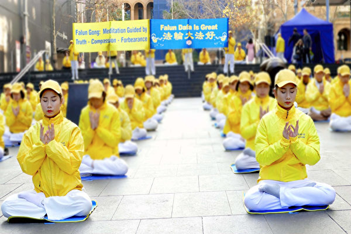

 【大纪元2018年10月11日讯】（大纪元记者安平雅澳洲悉尼报导）2003年夏季，骄阳炙烤著大地，10岁的双胞胎姐妹豆豆和果果，不时抬手抹走脸上的汗水，小跑两步，紧紧跟上拿着行李的妈妈的脚步，盼著早点到达目的地见到爸爸。

不断有车辆开过她们身边，瞬间，尘土飞扬，前方的路看不清了。

母女三人从家里出来，乘火车转汽车，然后再转汽车，颠簸了400多公里。

听到妈妈说了声“到了”，姐妹俩抬头张望，高墙、铁丝网、巨大的铁门、荷枪实弹的哨兵。

“这里是监狱，”妈妈说 ，但她们俩不明白，爸爸为什么住在这里。

往返800多公里的行程，是此后三年中姐妹俩雷打不动的 “暑期旅行”。

<b>幸福时光的转折点</b>

1993年，安庆市的一对夫妇迎来了可爱的双胞胎女儿——豆豆和果果。年轻的爸爸事业有成，是当地一家企业的副厂长，妈妈漂亮贤惠。

豆豆和果果与同龄人一样，拥有父母的呵护，爷爷奶奶的宠溺，还有周围人们的关爱。

“我们从小就很喜欢和爸妈一起去户外炼功，炼功音乐很好听。大人让我们站在队伍最前面，常有经过的路人夸我们听话可爱。” 每当想起那时，微笑便浮上豆豆的嘴角。

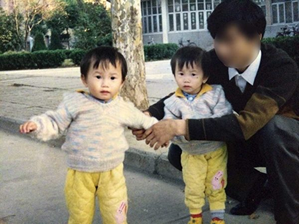

豆豆和果果姐妹俩的童年照。

但这样的幸福时光在1999年7月20日嘎然而止。

从六岁那年的夏天起，豆豆和果果感受到家里的气氛不一样了。

尽管豆豆和果果盼望着爸爸妈妈带她们去户外炼功，不过豆豆说，“1999年7月中共开始迫害法轮功后，父母就再也没带我们外出炼功了，在家炼功时音乐调得很小声，怕被邻居听到。”

“有一段时间没有见到爸爸。后来听大人们说，爸爸去北京信访局反映法轮功的真实情况，及自己和家人受益的事实。被警察暴打了5个小时，送回我们本地关押了一个月。爸爸副厂长的职务也被撤了。”

那之后的日子并未恢复如常，等待她们的是更多意想不到的状况。

<b>避过签名风波</b>

三年一班的教室里空空荡荡，靠窗的墙角边蜷缩著一个小小的身影。果果小心地将头探向窗边，看了一眼又立刻缩了回来。

三年四班教室里也上演着同样的一幕。豆豆感觉心脏跳得很快，但脑子还在想着，如果老师突然推门进来该怎么回答。

或许是心有灵犀，小姐妹俩都趁著同学往外走时，故意磨蹭到最后，趁机留在教室里。

操场上人声鼎沸，全校师生都等著在一个大横幅上签名，横幅上是污蔑法轮功的内容。豆豆和果果不愿签。

2001年1月，中共炮制了“天安门自焚案”事件后，（注：联合国国际教育发展组织当年8月发表声明表示，自焚伪案是中共政府一手导演的，目的是诬陷法轮功。）借此在全国范围内的校园展开师生反对法轮功的签名活动，搞“人人过关”的政策。

豆豆说：“听妈妈讲，爸爸1997年开始修炼法轮功后，戒掉很多不良嗜好，将更多精力投入到工作中，使原本亏损的工厂得以盈利。 妈妈个性也有了很大变化，火爆脾气变好了，20多年的鼻窦炎痊愈了。”

“从小，爸妈就用‘真、善、忍’的原则教导我们：‘说真话，对人真诚，善待、宽容别人。遇到别人对自己不好时要忍耐。’”果果接着姐姐的话说。

“小时候，我们挺怕老师同学知道我们家是炼法轮功的，怕同学们知道我爸妈经常被抓，我家多次被抄家这些事。”果果说，“在学校怕被排挤，受了欺负也不敢吭声。”

<b>外婆的伤心背影</b>

放学回家的小姐妹一边写作业，一边等著妈妈回来做饭。

豆豆抬头看了一眼墙上的挂钟，已经快一点了，还是没听到开门的声音。

“妈妈今天去什么地方了吗？”

“怎么一个电话也没有？”

 “我们打电话给外婆吧。”

外婆找到妈妈的单位，被告知说不知道妈妈去哪儿了。

家里这几年常遭警察警车造访、爸爸几次被抓的经历，让祖孙三人心里有了不好的猜测。

“豆豆果果你们跟学校请假，我们去找妈妈。”外婆说。

警察局、国保大队、政法委，祖孙三人进去一次被回绝一次，“后来有人告诉说我们的妈妈被送去学习了，但他们不说具体地址在哪。”果果说。

一听这话，外婆拉着两个孩子打了辆出租车赶到马山宾馆。（注：因这里以前曾办过专门针对法轮功修炼者的洗脑班——通过对精神及肉体的迫害让法轮功修炼者放弃修炼的黑窝。）

在这里她们还是没找到妈妈。

马山宾馆外，祖孙三人不知该去哪里。心焦的外婆一边茫然地往前走，一边用颤抖的声音不断喊著妈妈的名字：“玲霞！玲霞！”

因为腿脚不便，外婆的肩膀高低起伏着，她微胖的身体努力保持平衡，蹒跚著前行。

跟在外婆身后的豆豆和果果揉着眼睛、强忍着不让眼泪流出来。

她俩盼著早点找到妈妈，盼著妈妈能早日回家。

 “爸爸被抓后不久，妈妈也被绑架。”果果说，“我们俩跟着外婆生活了一个月后，妈妈才被放回家。”

<b>外公抱憾离世</b>

转眼间，豆豆和果果已是小学四年级的学生了。

这一年，爸爸没回过家，外公也病倒了。

“我们放学后有时和妈妈一起去医院看望外公。” 果果说。

一次，妈妈握著外公的手低声说：“现在他不能来看你，他们到处在找他。”躺在病床上的外公叹着气摇了摇头。

一个傍晚，本应带孩子回家的妈妈接了个电话后，将摩托车掉了个头，带着两姐妹就往与家相反的方向骑去。

随着车子发出吱的一声，妈妈把车停在了安庆石化医院门口。

夜色深沉如墨。

果果说，我们小跑着努力跟上妈妈，还没走到外公的病房，走廊那端就回荡著舅舅焦急不安的声音，“爸！爸！”

到了病房，意识模糊的外公临终前喊著：“志松，快跑！快！”（注：志松是豆豆和果果的爸爸的名字。）

“妈妈借了别人的手机躲到一间没人的房间打通了爸爸的电话，小声地哭着告诉爸爸外公去世的消息，嘱咐爸爸千万别回来，然后匆匆挂了电话。”豆豆幽幽地说着，“2002年爸爸送爷爷奶奶回老家，却遭通缉，不能回家，错过了见外公最后一面的机会。”

 <b>警察撬门 入室打劫</b>

2007年，姐妹俩盼了四年的爸爸终于回家了。

“我们以为今后一家人可以在一起过平静的生活了。”豆豆难过地说：“爸爸回家后马上就有来自派出所、居委会的人，隔三岔五来我们家，家里人的神经都紧绷着。”

下课铃声响起，豆豆和果果收拾好书包走出教室。一回到家门口，刚准备掏钥匙，发现防盗门虚掩著，两人紧张地对视了一下，轻轻推开门，书散落一地，柜子的几个抽屉全被抽了出来，衣物被扔在床上、地上，到处都是，床垫和沙发垫都被掀起，家中一片狼藉。

果果开始拨打爸爸的电话，关机；再打妈妈的电话，也关机。

豆豆哭着拨通了大姨的电话：“大姨，我们家被打劫了，爸爸妈妈电话都打不通……”

大姨安慰了两人后，又说：“豆豆、果果，有机会就远离这个丧尽天良的国家，去国外，再也别回来了！”

果果说，“那一次，妈妈深夜被释放回家，见到爸爸时已是两个月后了，仅仅因为他不放弃修炼，他被判一年劳教（监外执行）。”

<b>海外的全新开始</b>

2017年4月27日，经过10个小时的飞行，一架来自中国的航班降落在悉尼国际机场的停机坪上。走出机舱的果果深吸了一口新鲜的空气，来到异乡的她虽举目无亲，但内心却异常的安定。伴随她近二十年的不安与压抑，此时已被八千公里的距离阻得的无影无踪。

一周后，果果参加了悉尼法轮功学员庆祝“世界法轮大法日”的活动。果果说，自己从小到大“从未感受过这么大场面的法轮功的活动，心情无法用语言来形容。”

走在游行队伍中的果果举著“法轮大法好”的条幅，听着天国乐团奏起威严雄壮的音乐，看到路人鼓掌时，她说：“澳洲与大陆对待法轮功截然不同的态度，让我感动得差点落泪。”

7月，果果的姐姐豆豆也来到了悉尼。7月19日那天正是中共迫害法轮功18年的前夜，姐妹俩与其他法轮功学员并肩而坐，手托蜡烛，静坐悼念被中共迫害致死的法轮功学员。

现在，两人在一家中文电台工作，经常利用闲暇时间一起自由地炼功，或向民众讲“真、善、忍”好，讲法轮功在中国被迫害的情况，日子忙碌又充实。

豆豆表示，她和妹妹在这里安全了，但亲人和家乡的那些法轮功学员并不安全。今年6月，她的奶奶因为告诉路人法轮功真相又被绑架到当地派出所，被警察关押了几个小时后才放回家。

“想到这些，就觉得自己有责任让更多人知道中共的罪行，让更多人发出正义之声，帮助制止中共的迫害。这是我们姐妹俩的心愿。”豆豆说。

<h1 align="center"><b>BBC揭活摘器官 制止中共暴行正是良机</b></h1>

【大纪元2018年10月11日讯】BBC记者：“活着？你怎么知道他们还活着？”

医师：“因为当我切开身体时，他试着挣扎，而且伤口冒着血，如果我们看到伤口流血，那就表示心脏还在跳动。”

BBC记者：“所以你就继续切开身体，你取走哪些器官？”

医师：“肝脏，和两个肾脏。”

10月8日，英国广播公司（BBC）播出名为“该相信谁？中国的器官移植”（Who to Believe? China’s Organ Transplants）的调查报导广播节目，一名曾在中国参与活摘人体器官的医师，接受记者采访时，回忆当时场景，依然心有余悸。

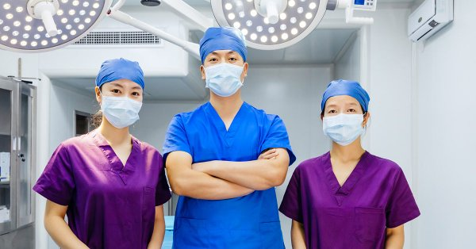

 
 当天，BBC电视台新闻节目也针对活摘器官问题进行深入报导，报导中讲述中国法轮功学员不但遭受中共酷刑迫害，甚至还被强迫抽血、验血做身体检查，被怀疑与活摘器官有关。

“他们（监狱警察）强迫我们放弃信仰，如果你不听从，他们就毒打你，但他们专挑你的手臂、腿脚、臀部来打，你的脏器部位，他们不会碰。”一名曾遭监狱迫害的法轮功学员告诉BBC。

<b>记者追问活摘器官 黄洁夫尴尬离去</b>

被指控是活摘器官的重要责任者、原中共卫生部副部长黄洁夫，在一场公开活动后接受BBC记者采访时，刚开始宣称，“那些（指控）都是胡扯，我不想回答这问题。”

随即记者追问，“那为什么我打电话到中国医院去，很快就获得了移植肝脏的机会？这怎么可能？”

黄洁夫神色略显尴尬与紧张，语无伦次地答道：“我不想回答这问题，某些人有他们的政治目的。”语毕，黄洁夫转身离去。

中共活摘器官的反人类暴行，自2006年公开被曝光至今，已经超过12年。但中共当局始终封锁一切相关讯息、对外否认一切指控，并且拒绝国际社会进入中国展开自由而透明的调查，因此这场人权暴行的规模究竟有多大、牵涉层面有多广、涉案官员有多少？迄今仍难以估算。

然而，几乎可以确定的是，法轮功学员是最主要的受害群体。

<b>“真、善、忍”修炼者 竟成中共活体器官库</b>

法轮功教人以“真、善、忍”的普世价值来待人处事，修心养性，在生活中的方方面面都要当个好人；再加上五套功法动作，达到祛病健身、身心升华的效果。

由于法轮功祛病效果显著，且一切活动都免费，因此广传迅速。在1999年7月中共江泽民集团镇压法轮功之前，全中国的法轮功修炼者人数已经达到一亿人。

然而，就在镇压开始之后，这群手无寸铁、没有政治诉求的平凡人民，却遭到中共举国家机器之力进行疯狂迫害，全国众多法轮功学员被非法抓捕、判刑甚至被迫害致死。根据“法轮大法明慧网”统计，目前遭迫害致死且已核实身份者，达到4258人。至于其他长年失踪、生死不明或者无法确认身份者，数量则难以估计。

后来，多项人证、事证表明，这些数量庞大、长年失踪的被关押法轮功学员，不少人成了中共的活体器官供应库，成为中共政权器官移植产业链的主要供体。

不可否认，直到现在仍有人不相信中共活摘器官之事，是因为许多善良的人们不敢置信，世上竟然有哪个政权能做出如此伤天害理、残酷血腥、前所未见的非人暴行。

但是，很遗憾，这场泯灭人性的迫害，确实存在。

2006年上半年，中共活摘法轮功学员器官暴行尚未曝光前，笔者曾在某地陪同调查员通过电话向中国多家医院进行化身调查取证。当时，笔者亲耳听闻多位医生坦言，医院不仅供体寻找迅速，还提供法轮功学员的新鲜器官，肝脏、肾脏都有。

记得当时一段调查对话大致如下：

调查员：“你们那里，有没有那种炼功人的器官？特别是法轮功的？听说他们身体很好，器官比较健康。”

医生：“有。你过来就有，赶紧过来吧。”

调查员：“（器官）都是新鲜的吧？”

医生：“当然新鲜。”

调查员：“可以再问一下，器官是怎么来的？没有问题吧？”

医生：“这个，我不方便回答。你放心，我们有自己的渠道。”

类似对话，反复听到，在笔者脑海里依然挥之不去。

中共杀害的，不只是法轮功学员的生命，还扼杀了人类应有的基本人性。

中共活摘的，不只是法轮功学员的器官，还摧毁著自由、人权、“真、善、忍”等人类共享的普世价值。

<b>中共活摘暴行持续 美国人权报告关注</b>

尽管活摘器官暴行曝光后，中国各地医院转趋低调，中国医学界也不再高调宣扬手术数量异常暴增现象，发表各类器官移植研究论文，但活摘器官的暴行，至今依然持续发生。

10月10日，美国国会行政当局中国委员会（CECC）发布年度中国人权报告，指陈中共专制政权对中国人权迫害依然严重，并且打压法轮功学员，对他们骚扰、拘禁、迫害。报告强调，国际组织也指出法轮功学员与其他囚犯的器官被用作器官移植，国际医界也对中国的器官来源表示担忧。

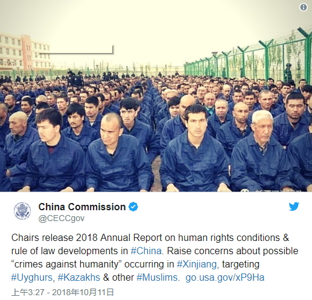

CECC人权报告也特别聚焦，新疆上百万维吾尔人被大规模拘禁在再教育集中营里，情况令人担忧。

的确，上百万维吾尔人被大规模关押，并且转移到外省地区，这些人群的生命安全难以获得保障，也难保这些无辜人民会不会有人成为中共的器官供体。

去年10月，英国维吾尔协会负责人、肿瘤外科医师安华托帝公开指出，中共在新疆以“全民健康体检”之名，对维吾尔人进行大规模抽血工程，目的是要建立器官资料库；后来又将抽血改为口腔黏膜DNA检测。

安华托帝并披露，新疆某地机场还公然设置了“特殊旅客、人体器官运输通道”，显示涉及器官移植的旅客流量庞大。

这项罕见举措，亦对中共有系统的活摘人体器官做出某种程度佐证。

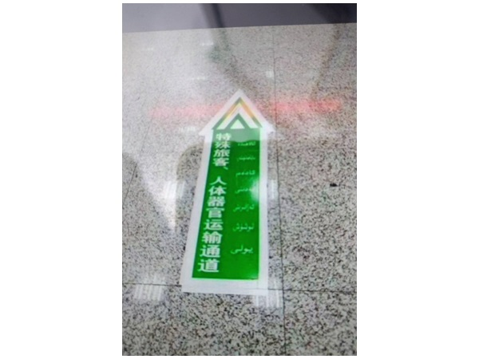

 
<b>贸易战延伸到人权战 制裁中共正是良机</b>
 
中共活摘器官的残酷暴行，被喻为“这个星球上前所未有的罪恶”。事实上，此时或许正是制止中共活摘的好时机。

一来，今年8月，美国国会两党议员曾经联合呼吁川普政府制裁新疆党委书记陈全国；加上近期川普政府曝光中共干预中期选举，引发美国人民不满，所以此时两党议员都更愿意支持反击中共，制止迫害人权。

二来，美中贸易战开打至今，北京依然不愿放弃不公平的贸易手段与窃取美国企业的技术及知识产权，与美国僵持。

设若此时，川普政府进一步扩大战场，针对涉嫌迫害中国人权、活摘器官的中共政府部门、党政高官、军方高层进行金融制裁，冻结其海外资产、拒绝人员入境，则可望对中共集团带来更巨大、更切身的压力，有力制止其无法无天的残酷迫害，还可能促使中共内部严肃面对活摘器官这项江泽民前朝重罪，难再逃避；同时，这场“人权战”也将成为助攻贸易战，甚至瓦解中共专政的奇兵猛炮。

再者，川普若以“反对活摘”、“守护人权”的普世价值之名，对中共发动攻击，不但在国际社会上具有高度道德正当性，并可望在国内获得两党议员的一致支持，消弭泛左派媒体、政客的反弹掣肘；同时凝聚爱国意识，有利于在中期选举争取更多选民认同与支持。

因此，曝光超过12年的中共活摘器官暴行，现在或许已到了制止罪恶、终结迫害的历史转捩点。

<h1 align="center"><b>在阿根廷首都公立学校传播法轮功</b></h1>

【明慧网二零一八年十月九日】在阿根廷布宜诺斯艾利斯，有许多法轮大法修炼者是专业教师。这些教师一直希望学生能够学习功法，曾多次在课堂上教学生炼功，然而刚开始时并非容易，因为校方有所限制。不过，这些教师并没有放弃，在坚持不懈的努力下，教授法轮大法功法已成为省教育厅要求的大型教育项目。

图1：二零一八年八月三十一日，布宜诺斯艾利斯法轮功学员在索拉诺镇的一所学校教授孩子们法轮功功法。

 
 <b>向布省公立学校中有行为问题的儿童教授法轮大法的功法</b>

布宜诺斯艾利斯省一名学员在公立学校担任珠宝销售员，多年来，她一直与她的客户分享法轮大法的真相资料。二零一八年早些时候，她意识到她的一位客户是布省索拉诺小镇一所学校的校长。几年前，她曾向这位客户展示了一个讲述乌拉圭一所州立学校的孩子们是如何从大法中受益的视频。最近，这位校长刚刚参加了布省文化和教育单位的教师和负责人的培训，该培训旨在让全省五十个学区的两千所学校自愿联合起来，共同合作，改善学生的学习。在这次培训中播出了乌拉圭一所学校如何从法轮大法中受益的同一视频，作为如何阻止霸凌的例子，这位女校长看完后，立即打电话给这位学员，请她到学校教法轮大法的功法。

在乌拉圭经验视频的启发下，法轮大法被提议作为学校环境和情绪教育领域中的理想实践标准。因此，从二零一八年六月起，来自索拉诺镇这所学校周边地区的一群法轮功学员，开始每周向学校中最有行为和注意力问题的学生教授功法。

与此同时，今年六月左右，一位担任教师的学员接到奎尔姆斯镇另一所学校的电话，奎尔姆斯镇也是布省的一个邻镇，属于同一个学校网络。每年四月，布宜诺斯艾利斯市都举行国际书展，这所学校的女校长在法轮大法学员的展台收到真相传单，并获知，附近的学校已经在教授法轮大法的功法了，这对她的学校来说，是一个绝佳的机会。很快，索拉诺镇的学员开始每周在这所学校教授功法。

在学校教授法轮大法立即显现了效果。在学校里，不仅是孩子们学炼功，老师们也学，他们也非常感谢学员的到来。
 
 
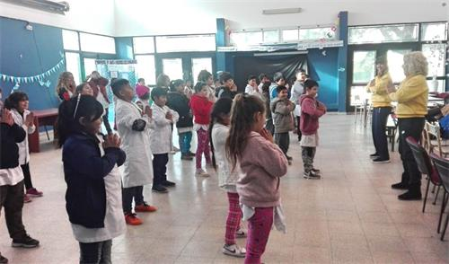

图2～3：二零一八年七月十三日，布宜诺斯艾利斯法轮功学员在索拉诺镇的一所学校教授孩子们法轮功功法。

一位参与志愿教学的学员说，老师告诉我们：每当我们炼功结束时，孩子们都会非常平静，这让他们感到惊讶。

这位学员说：“孩子们在炼功后记下他们的经验，并说他们在完成后感到放松和平静，有些人说他们手上感觉很热。每次我们去的时候每个人都很开心。”

另一位参与教功的法轮功学员补充道，“有一次，一个女孩说：我的手变热了！并且所有的孩子都惊讶地伸出双手，向我们展示了他们的手有多温暖。”

八月三十一日，学员们来到学校的时候，孩子们欢迎道：“法轮大法来了！法轮大法来了！”当炼功结束时，孩子们拥抱学员并鼓掌欢呼。

学员通常会被分配到有严重行为问题的学生群体，这些群体通常由近五十名儿童组成。这条路并不容易，但每周学员都会发现孩子们发生了很大的变化。

“第一次去的时候，很难让这些孩子把注意力集中在我们身上，让他们冷静下来。对我们带来的新鲜感，他们感到非常焦虑和好奇，无法集中精力”，一位志愿学员说。

另一位学员补充道：“在第二次炼功时，看到那些小小的面孔开始放松，以及他们如何从焦虑和好奇到冷静，这让我们非常感动。我们才刚刚开始，而这过程非常美好。”

他们不仅教孩子们学习修炼法轮大法的五套功法，还希望孩子们能够反思大法的原则真、善、忍。因为法轮大法带来的正的能量，负责的学员和教师们都惊讶的发现，那些受到重大欺凌并遭同侪忽略的孩子们，如今都受到鼓励而能说出自己的想法，让人们听到他们的声音。

“在寒假过后，孩子们变得非常不守规矩。所以我们决定和他们谈谈尊重，以及尊重与宽容的关系。关于同伴之间尊重和宽容的重要性，以便更好地相处。那时，一个孩子小声地害羞地说，他的哥哥没有被同学尊重，并且一直被欺负，这让他感到非常糟糕，因为同学甚至会继续侮辱他们的母亲。这孩子的眼里充满了泪水。当他说话的时候，其他孩子都默默地听着。当天晚些时候，老师告诉我，当那孩子在谈论他的感受时，其他孩子能够静静地倾听这个同学的诉说，让她感到惊讶。那孩子始终都被欺负和嘲笑，没人想要听他的想法。”

这些学校老师也非常高兴学员在炼功后谈真、善、忍的原则，因为这有助于他们减轻因为孩子带到学校的问题和情绪所造成的负担，其中一些问题很难处理。

学员们还教孩子们摺纸莲花，并告诉孩子们莲花的含义：“莲花生长在泥泞的水坑里，却没有污渍。我们将莲花与中国的法轮大法学员做了比较：两者都是生活在恶劣的环境中，却都保持纯洁，不让困难的环境改变他们。”孩子们认真倾听。学员们还跟孩子们谈到了诸如信念和宽容对待事物的重要性等问题。

最后，老师告诉学员，学员与孩子们的谈话多么富有成效。特别是宽容对待事物这一点，她认为非常好。

二零一八年初，在乌拉圭的一个高端度假胜地，布宜诺斯艾利斯市的一名学员遇到了一位国会女议员。经过长时间与她谈论法轮大法的益处，这位国会议员表达了她对在学校教授法轮大法的兴趣。

因此，在八月，在学校接触大法几个月的美好经验之后，这位国会女议员的顾问在奎尔姆斯州立学校见证了法轮大法的功法。然后，顾问与学校女校长进行了愉快的交谈。女校长对志愿来教功的学员和这位顾问表示最深切的感谢，感谢他们支持这个项目。

现在，越来越多属于这个网络的学校，欢迎法轮功学员将法轮大法带进学校。

<h1 align="center"><b>美国会报告：中共继续迫害法轮功等团体</b></h1>

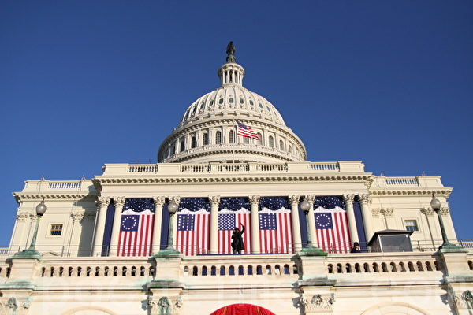

“美国国会及行政当局中国委员会”(CECC)10月8日发布《2015年中国人权与法治状况报告》，报告表示中国的人权和法制状况继续恶化，继续打压和迫害法轮功等团体。报告表示，国际社会人士认为中共继续强摘法轮功学员等囚犯器官。图为美国国会大厦。

 
【大纪元2015年10月10日讯】（大纪元记者李辰美国华盛顿DC报导）“美国国会及行政当局中国委员会”(CECC)10月8日发布《2015年中国人权与法治状况报告》，报告表示中国的人权和法制状况继续恶化，继续打压和迫害法轮功学员、维权律师、人权活动人士、基督教、天主教、西藏、维吾尔等团体人士；钳制媒体；加强对互联网信息的控制等。报告表示，国际社会人士认为中共继续强摘法轮功学员等囚犯器官。
 
 CECC报告还建议美国全面修正对华人权外交政策，并在下届联大人权理事会上，就此提出议案。

<b>中共继续迫害法轮功等信仰团体</b>

报告说，在2015年CECC报告年度中，中共政府和共产党继续压制中国的宗教自由。中国宪法保障“宗教信仰自由”，但是限制保护“常规宗教活动”，狭隘的保护违反了国家人权准则比如世界人权宣言第18条。中共政府只承认5种宗教：佛教、天主教、伊斯兰教、基督教和道教。当局要求这些宗教团体向政府注册，并接受政府控制。

注册和非注册的宗教团体被认为和政府设置的参数（规范）相抵触，继续面临骚扰、拘留、监禁和其它虐待行为。政府继续取缔一些宗教和精神团体，包括法轮功。

报告还说：“中共政府和党继续在1999年发动的广泛、系统……暴力迫使法轮功学员放弃法轮功信仰和修炼的迫害运动。”

“当局还继续骚扰和关押（法轮功学员）家属、律师和其他与法轮功学员有接触或有关联的人士。去年的案例中包括被关押的法轮功学员卞丽潮的女儿卞晓辉和法轮功学员陈英华。”

<b>xxx</b>
受关注的法轮功学员
报告列举了以下受迫害的法轮功学员案例：

<b>孔秋阁</b>

据报导，2014年10月，六十多岁的法轮功学员孔秋阁死于新疆乌鲁木齐自治区乌鲁木齐市监狱医院。此前，孔秋阁被当局关押。

<b>王治文</b>

2014年10月，当局释放了法轮功学员王治文，王在1999年被判刑16年，被关押在北京前进监狱。当局报导，王治文后被转到一个“转化中心（又称洗脑班）”，这里当局强制法轮功学员放弃信仰。王治文后来在10月24日从“转化中心”被释放。据报导，王在监狱中承受了各种折磨，释放时身体和精神状况很差。

<b>左康伟</b>

2014年8月22日，55岁的法轮功学员左康伟被江苏省淮安市清河区法院判刑3年。2014年3月17日，清河区检察院对其批捕。

<b>孟繁荔、王燕欣、石孟文、李桂芳</b>

2015年5月21日，建三江农垦法院判刑法轮功学员石孟文三年，王燕欣、李桂芳和孟繁荔各二年。建三江当局在2014年3月21日监禁四人。

2015年，法轮功学员律师提出上诉，但是黑龙江农垦中级法院通知律师，法庭不会对上诉进行审理。

<b>2015年两会之前天津至少20名法轮功学员被捕</b>

报告说，在2015年两会之前，天津当局逮捕了至少20名法轮功学员，搜缴资料、电脑和其它物品。

这些法轮功学员包括：诸葛玉芳、陈若明、付少娟、张翠环、赵满红、宋云玲(宋云岭/宋云苓)、屈玲云、唐月华、李红、李建敏、郑庆兰、牛淑华、赵月花、宋惠蝉、王慧珍、李珊珊、刘琼、杨宏、蒋雅晖、陆姐等人。

报告表示，人权律师唐吉田和程海告诉大纪元，天津当局的做法没有法律依据。

去年，当局继续对（法轮功学员）家属、律师和其他有接触和关联的人士进行骚扰、拘留和判刑。2015年4月15日，法轮功学员卞丽潮的女儿卞晓晖和陈英华被河北省石家庄桥东法院分别判刑3年6个月和4年。

2014年3月12日，石家庄当局逮捕了卞晓辉和陈英华。此前，卞晓晖在石家庄监狱外展开一面写有“我要见父亲”的横幅。他的父亲被判刑12年。陈英华给卞晓辉照相，并张贴在网络上。当局后来还逮捕了卞晓辉的母亲周秀珍，周秀珍当时报案说，她的女儿失踪。

据报导，母亲周秀珍8月5日也遭唐山市路南法院庭审。

<b>点名中共强摘器官指控</b>

报告说，2014年12月，中共政协常委和人体器官捐献和移植委员会主任黄洁夫称，中国将停止使用死刑犯器官用于器官移植。国际观察家断言，（中共使用死刑犯器官的现状）将继续，并影响法轮功学员。（continues to affect Falun Gong practitioners.）

报告表示，中共媒体报导称，将在2015年1月停用死刑犯，转向全面器官捐献系统，但是国际医学专家和人权活动人士怀疑，器官捐献的“自愿”性质，强调使用囚犯器官违反器官移植的国际道德标准。

据《财新》在2015年3月份报导，中国的器官供给和需求之间差距巨大，估计有1亿人需要移植器官但是只有30万人可以进行移植手术。近些年，中国每年平均进行10万个器官移植，严重依赖死刑犯器官。

<b>加大打压人权律师等人士</b>

报告说，自2012年以来，被中共当局骚扰、拘留或判刑的公益律师数量增加，2014年，中共当局对人权律师的干涉扩大。

受理政治敏感的律师面临取消律师资格和身体暴力虐待以及关闭律师事务所。2015年7月，中共展开前所未有的全国性打压扫荡，超过250名律师被拘留。很多人遭问讯、拘留或者“被失踪”，包括一家北京律师事务所的数名律师。至2015年8月，23名被扣留的律师被刑事拘留、监视居住或“被强制失踪”。

2015年7月当局对维权律师进行（新一轮）打压中，多位为法轮功学员提供辩护的律师被捕。律师王宇和王全章曾经为法轮功学员孟繁荔、王燕欣、石孟文、李桂芳提供辩护，他们在这次打压中被捕。

报告表示，中共继续软禁著名人权律师高智晟。高智晟在2014年获释出狱，但受到法外的软禁。2006年－2011年，当局多次绑架高，并折磨他。高智晟的妻子曾报告说，当局阻止他离开乌鲁木齐市。

CECC表示，他们观察到，在过去一年，中共收紧管制媒体、民间社会、大学、维权人士以及少数民族成员，特别是西藏和维吾尔人士。报告举例，2015年4月，中国资深记者高喻以“泄露国家机密罪”被判刑7年。

<h1 align="center"><b>人生感怀</b></h1>

【明慧网二零一八年十月三日】57年的反右派运动，不仅仅是父亲被冤为右派，还导致了母亲的早逝、小妹的夭折、二妹送人，一家五口剩下我与父亲，还各分东西——父亲去了劳改营、我被送到亲戚家，哪还有家呀？没了。可喜欢唱歌的我，还喜欢唱中共的洗脑歌曲。
59—62年，我饿的皮包骨，与父亲合张影，连站在那儿的力气都没有，还要唱歌颂中共的歌。

66年，因为父亲的右派，我作为黑五类子女，尽管成绩优秀，却被取消升学资格。

68年，因为父亲的“右派”导致我变异的婚姻。不仅自己肉体上的痛苦，还增加了精神的痛苦，给家庭、给孩子、左邻右舍带来不安宁，增添了社会的不稳定因素。

自从59—62年饿了饭后，我就落下一身的病。尽管有公费医疗，却形同虚设，十有九次都缺药。三十多年过去，我不仅病没好，随着年龄增长，病体越来越严重：腰酸腿软、常年咳嗽、常年失眠、头昏、晕眩、慢性胃炎、心跳心累、肾炎、慢性肾衰。拿张手帕或扫帚都手软。吃药没用。在友人的劝说下皈依佛门，除了進庙烧香、送钱外，什么也不知道。学气功也是没什么大效果。

之后遇上法轮功，几个月下来，一身的病全没了，心胸开阔了。这是身心的双重健康啊，是真的健康啊。身体好了，生命有了转机，生活有了希望，家庭也有了安宁！这多神奇啊。这可是社会稳定的重要因素。

大法师父的讲法，滋润着我的心田。我要把这么好的功法告诉世上所有的人，每逢工余时间，把家里安排好，就去外面炼功洪法。那日子过的真是舒心。

有人问我：为什么练其它气功没用，而法轮功就这么好呢？我说：法轮功特别强调教人修心向善，而其它气功只是练练动作，就跟做体操是一样的。

这么好的一个功法却被一个小丑、一个西来邪灵（邪党）操控的小丑（江氏）的一句不负责任的假话给搅和了。

这难道不反常吗？还有更反常的呢！

中国人有一个传统，就是“知恩图报”、“饮水思源”。

我们对师父的大德之恩无以回报。面临大法被诽谤、师父被陷害，我们这群师父的弟子能无动于衷吗？于是面对电视、报纸等所有媒体全天滚动式的诬陷宣传，首先去了省政府。除被省政府关了几个小时外，没有任何其它结果。于是写真相信，也没用。不得已只能去北京上访了。

上访也没说话的机会，只要说是炼法轮功的就被绑架，然后送回当地刑事拘留或治安拘留。如果再上访就关劳教或劳改，而且不需要任何手续。人多为患时，小偷、吸毒犯都放出去，只关法轮功。

有人问我：你看了《九评共产党》吗？我摇摇头说：看到张思德那儿看不下去了。“党”的宣传说是烧窑洞死的，怎么会是种鸦片死的呢？这个反差太大了吧。他说：“你还是好好看看《九评》，了解一下中共的九大基因（邪、骗、煽、斗、抢、痞、间、灭、控）及它的邪教本质与流氓本性，会增强你分辨善、恶、正、邪的能力。”

我流着泪答应了。

三年后回家，朋友给我送来了《九评共产党》，认认真真的看了，我对这个“党”才有了清醒的认识。我不再唱这些歌功颂“党”、违背天理的邪歌了——那是好坏不分、认贼做父啊！

更有甚者：罗干、李东生一伙助纣为虐接受江泽民的指使制造“天安门自焚”栽赃法轮功。过后又指使地方政府挨家挨户的找法轮功学员表态，非要认可是法轮功学员干的。我说：法轮功不许杀生，自杀也是有罪的。他们就说我太固执，又送劳教一年半。没有理由可讲。

我前面写了这些就是想让各位读者仔细想想：这些苦难不就是“党”带来的吗？我的幸福温馨的家被搞得家破人亡是毛无故反右造成的；我的病是共产邪党的大跃進造成的；我正该读书的时候没书读，是共产邪党的阶级斗争造成的；我修炼法轮功做好人、更好的人，也被江氏这个小丑和共产党以莫须有的罪名给剥夺了，还要把我“名誉上搞臭、经济上截断、肉体上消灭”。

名誉上搞臭：由于中共江氏邪恶媒体的诽谤宣传，到现在地方政府，街办还在门卫监控；我多年不见的亲戚到现在还对我不放弃大法修炼抱有成见。

经济上截断：我的退休金被停发，后来还是一位明白了真相的警察到单位去说，才给了我几百块钱的生活费。

肉体上消灭：曾经被关在看守所时，因为不配合打毒针，警察拿着木板给我劈头盖脸几下，把木板打断成几截，如果不是大法的神奇超常，不被打死也得打成脑震荡啊！

我所说的这些虽然是我个人的遭遇，可是都是共产邪党造成的，那么就不是我个人的事情了，就关系到整个中华民族的存亡的问题了。

怎么办呢？就请认真的看看《九评共产党》、《共产主义的终极目的》这两本书，有中共高层的都在看此书。加上好好了解法轮功。不需要动刀枪，只需要扭转自己的思想，能认清正邪、善恶，问题就好办了。

<h1 align="center"><b>捷克议员：真理终将胜利</b></h1>

【明慧网二零一八年九月三十日】（明慧欧洲记者站报道）“如此祥和的气氛给我留下了深刻的印象，当我走过他们（法轮功学员）身边时，我意识到他们是如此的不同寻常，这么多人静静地专注地坐在这里……这让我想了解他们为什么坐在这里，他们要向世界传递什么讯息？”二零一八年九月二十七日，法轮功学员在驻捷克中使馆前的和平抗议让到现场支持法轮功学员的捷克众议院议员奥尔加·瑞琪泰罗娃（Olga Richterová）博士很受触动。

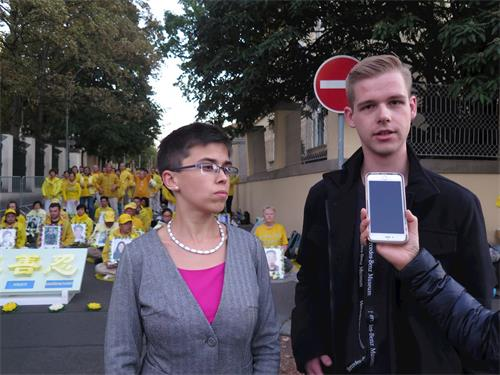

捷克众议院议员奥尔加·瑞琪泰罗娃（Olga Richterová，左）博士和弗朗基斯克·考布西瓦（Franti?ek Kop?iva，右）先生前来集会声援法轮功。

她说：“我要把我们今天的所见所闻告诉我们的外交部长，建议他与捷克的法轮功学员会谈。”

与她同行的国会议员弗朗基斯克·考布西瓦（Franti?ek Kop?iva）先生也同样支持法轮功：“这是我长期以来看到的最平和的集会。这种氛围让人印象深刻。法轮功学员只是希望坚持自己的信仰，非常平和，与政治毫无瓜葛，中共当局将法轮功的存在视为犯罪——这太可怕了，我无法理解。我感到我应该支持被迫害的法轮功学员。”

为了制止中共对法轮功的血腥迫害，瑞琪泰罗娃博士认为：“法轮功学员遭受的（迫害）太可怕了。我们首先应该提高人们对此事的认知度。非常重要的是，这个世界不要装作什么事情都没发生，这也是我们为什么来这里的原因——我们想让世界知道，正在中国发生的器官移植会有很大的黑幕。”

考布西瓦先生对此很赞同：“法轮功学员是遭受迫害的群体之一，其实所有的中国民众都在遭受迫害，我们应该让捷克人和欧洲人知道，正在中国发生的迫害非常严重，而且越来越糟糕。我们的政府不应该因为与中国的外交或者经济关系而对此事（中共迫害）听之任之。”

他还特别提到：“ 中国器官移植旅行是非法的，但依然存在着。我们应该调查，如何能在整个欧洲，包括捷克，阻止人们从中共医院里得到器官。同时欧洲国家不应该对在中国发生的这一切（强摘器官）置若罔闻。”

最后他想对中国民众说：”请坚持（抗争）下去，最糟糕的莫过于因害怕而麻木，千万不要放弃。”

瑞琪泰罗娃博士想以捷克座右铭与中国民众共勉：“真理终将胜利！”

<h1 align="center"><b>波士顿大学法轮大法社团迎新传功法</b></h1>

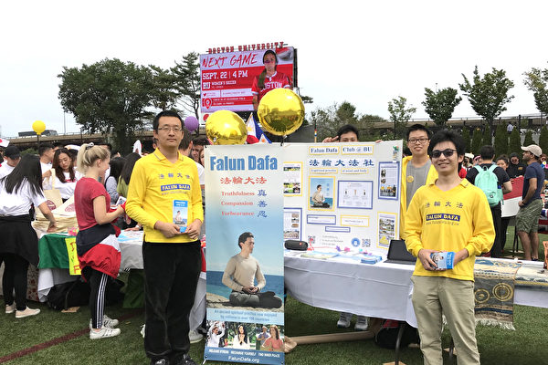

就读于波士顿大学的法轮功学员在社团招新会上向师生介绍法轮功。

 【大纪元2018年10月01日讯】（大纪元记者陶明波士顿报导）9月8日，波士顿大学(BU)举行一年一度的社团迎新会——SPLASH，该校法轮大法学生社团一如既往参加。在9月11日举办的社团介绍会上，新进成员们认真学炼法轮功的五套功法，表示身心受益。
 
 8日当天，Nickerson Field足球场人山人海。BU法轮大法学生社团的成员们热情的向同学们介绍功法，吸引不少学生前来了解。其中，近30名学生留下联系方式，希望进一步了解功法。

活动开始前，法轮功社团还向其它展位的社团成员介绍法轮大法，并告诉他们，法轮功学员及其家属在中国大陆因为坚持“真、善、忍”信仰而遭受迫害。一位来自波士顿大学伊斯兰协会(Islamic Society)的学生听后深有感触，表示共产党不但不信神，而且迫害宗教信仰团体，令人反感。

一位大四的白人女生在展位上了解了法轮功的功法后，又仔细向学员询问了国内对法轮功迫害的细节，包括中共是如何为了镇压，而制造出一系列谎言欺骗中国百姓。听完后，她恍然大悟——原来，她的男友是麻省理工大学(MIT)的中国学生，对法轮功一直存在着误解。

“怪不得，原来他是以前在国内听了中共的宣传，才那样想法轮功的。我回去一定要把这些真相都告诉他。”她说。

两位中国学生在摊位周围来回走了几圈，又不好意思靠近，互相推著对方上前。法轮功学员主动递给他们真相资料，并告诉他们，大陆党媒给人民灌输的“天安门自焚”伪案，实际是中共为其打压好人找借口，而自导自演的一出闹剧。

“我想，只要我们作为法轮功学员，能保持一颗善良、慈悲的心去对待他们，这些学生就一定能看到，法轮功并不像中共灌输给他们的那样。”BU法轮大法社团的社长彭同学说。

彭同学从小在美国长大，现就读于BU数学系三年级。他与其它法轮大法社团的成员表示，身在中国大陆留学生众多的波士顿大学，他们感到自己有责任帮助这些留学生了解法轮功的真相，让他们在海外得到真实的信息。“他们非常需要在这里听到真相。我希望有一天，我能再次遇到那些从我身前走过的中国同学，告诉他们法轮功真正是什么。”彭同学说到。

<b>初学者：“能量在我身体里动”</b>

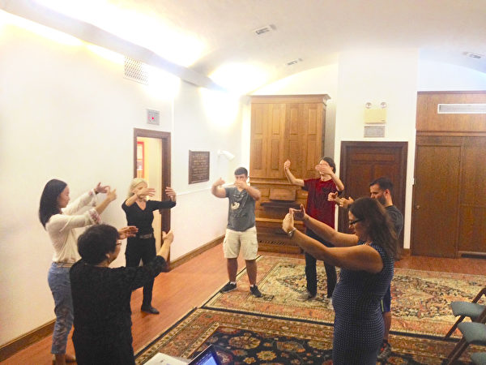

法轮大法功法介绍会于波士顿大学校园举行，初学者认真学习法轮功五套功法。

9月11日晚，波士顿大学法轮大法学生社团在校园举行法轮功功法介绍会。初学者们跟随法轮功学员学习了功法动作，并一起闭上眼睛，感受练功时身体的变化。多人表示，功法十分的舒缓，使人神清气爽。

“我感到身上有能量在不断地动，感觉好极了。”一位名为黛安的白人女士高兴地说。

在这次介绍会前，黛安就已经对法轮功在中国遭受迫害的事情十分关注。她说，她在脸书上看到关于中共活摘良心犯器官的文章后，后来每次看到这方面的新闻都会关注。

“是这些信息把我带到这儿来的，我很想了解，法轮功究竟是什么样的功法。”

第二周的教功会上，黛安与大家一起阅读了法轮功主要著作《转法轮》的部分章节。

黛安在阅读中不断的点头，读了几页后，她说：“我原先一直不知道法轮功真正是什么， 但我现在终于懂了！”回去后，她立即去图书馆借来了《转法轮》英文版，表示要继续读下去。

<h1 align="center"><b>又一起“中共体制”造成的惨剧</b></h1>

【明慧网二零一八年十月四日】最近，安徽芜湖的两家幼儿园给孩子吃发臭的肉、发霉大米等过期劣质食品引起广泛关注。
家长在幼儿园厨房发现发黑发绿的大米中有虫子爬，冰箱里放着霉变的馒头、厨房里爬着蛀虫和蟑螂等，但校长和老师吃的米却很干净。家长们非常愤怒和担心，因为食用霉变食物会产生毒性非常大的致癌物质---黄曲霉毒素，而且会永久性破坏肝脏组织。

安徽芜湖绝非一个孤立的事件，在中国儿童经历过毒奶粉、毒疫苗、红黄蓝、甲醛、馊饭一系列冲击人的道德底线的惨剧后，不少人在问：素有礼仪之邦之称，遵循“幼吾幼，以及人之幼”的中国怎么变成了今天这个样子？”

找寻这个答案就需要来看看是谁在系统破坏中国的传统文化和道德体系？是谁在中国土地上大搞政治运动？从三反五反、文革，到六四，尤其是一九九九年到现在仍在进行中的对信仰“真、善、忍”的法轮功学员的迫害？大家应该不难得出结论。

和历次政治运动一样，中共编造“天安门自焚假案”，抹黑法轮功。迫害导致上万人被非法判刑，十多万人被非法劳教、数千人被强行送精神病院受到药物摧残，中共对法轮功学员使用了上百种酷刑，至少数千人被迫害致死，大批法轮功学员被强行活摘器官而谋杀，被称为这个星球上从未有过的罪恶。

中共建政以来对传统文化和道德的系统破坏，对“真、善、忍”信仰价值的打压，造成当今中国社会道德底线崩溃。当人们眼睛里只有权力、欲望和人民币，没有任何道德诚信的时候，还有什么事情做不出来？

中共体制是中国社会危机的根源，不然今天就不会发生一系列触目惊心的残害孩子的事件。只要它存在一天，就会源源不断产生“中共制造”的没有道德底线的政客商人，如同魔鬼一样吞噬我们的下一代，事实上每人都是共产党的受害者。推荐朋友阅读《九评共产党》及新书《共产主义的终极目的》，里面有详细的阐述。

法轮大法是佛家修炼的上乘功法，学炼者以“真、善、忍”为原则要求自己，因为对祛病健身，提升道德水平卓著，而传播世界一百多个国家和地区，唯独在中国受到残酷迫害。然而，天理昭昭，参与迫害法轮功的人的所作所为决定了他们的结局。迄今为止，迫害法轮功的主要责任人江泽民已被21万人控告到最高法院和最高检察院，一百多万各级落马官员中，有一大批是跟随江泽民迫害法轮功的急先锋，包括周永康，李东生、薄熙来、张越等，更有不少公检法司媒体界人员因参与迫害污蔑法轮功而遭到各种形式的厄运。遭厄运者上至国级高官，下至基层警察。他们有的离奇猝死，有的跳楼自杀，有的患癌死亡，有的车祸丧命，有的成了植物人，有的落马入狱，有的殃及家人惨死。古今中外，迫害正信的从来没有好下场。

朋友，请您转告官场的朋友，迫害法轮功的事情，千万不要沾边，无论是从人间法律，道德良知，还是天理报应角度，都应坚决抵制。不仅如此，在职权范围内，保护和善待法轮功学员，就一定会得到上天的护佑而前途无量！

中共迫害佛法必将受到天谴，只有抛弃中共，选择善良，顺应天意，中国社会才会重建中华民族的道德和信仰，百姓才能安居乐业，孩子们才能健康的成长，已经有三亿一千多万人选择退出党、团、队（“三退”）。朋友，为了您和中国孩子们的生命和未来，您是否也愿意“三退”，做出良知正义的选择？

<h1 align="center"><b>她们的模样在我脑海中挥之不去</b></h1>

【明慧网二零一八年九月二十九日】拾金不昧是社会上人人都提倡的行为。可是在当今中国物欲横流、世风日下、道德败坏的社会里，又有多少人能做到这一点呢？我在读小学、读中学的时候，同学们写过这样的文章，可那是编的。在电视上听说过，可那是为了树立榜样而有意塑化的。在社会上听父辈们讲过，可那是流传、是故事。
我不相信中国社会上有这样的人。但是在二零一六年十月的这一天，我遇到了这样的
人。她们是那么的平凡，那么的朴素，她们永远印在我的脑海里，使我终生难忘。

那天天气不好，还下着蒙蒙小雨。到下午雨停了，我就出去买东西。等到商店要买东西时，我发现我的手机不见了。手机怎么能一下子就不见了呢？我明明是放口袋里了，怎么就没有了呢？那可是我花了两千多块钱买的呀，为了买这个手机，我舍不得吃、舍不得穿，积攒了很长时间才买的！是不是落在家里啦？我急忙跑回家，家里人见我这样翻箱倒柜，不知发生了什么事，问我怎么了？我说手机不见了，他们也帮我找了起来，屋里、院子里、厕所里，该找的地方都找遍了，没有。这一下我彻底的失望了，象泄了气的皮球，一动不动的木呆呆的坐在那里，泪水直在眼眶里转，我知道手机是真的没有了。

正在这时，爸爸的手机响了，手机里传来了一个女士的声音：您好！请问您是这手机主人的爸爸吗？“是的！是的！”爸爸连忙说。听到这，我欣喜若狂立刻从爸爸手里接过手机，高兴的说：“我的手机你们捡到啦？”她说：“是的。”“那我怎么拿到手机？”我迫不及待的问。她说她们在某某小区大门口等我。

等我到了那里，才发现是两位中年女士。天已经黑了，我努力想使自己看请她们的面孔，但由于天太黑，没能看清。我激动的说：“真心谢谢你们！”她们说她们是学法轮大法的，要感谢就感谢大法师父！是她们的师父让她们这样做的。她们还让我记住：“法轮大法好！真、善、忍好！”要做个好人！

我要请她俩去饭店吃饭，她们不去。我又从口袋里掏出五十元钱给他们以表谢意，她们婉言谢绝！

看着她们消失在暮色中，望着她们远去的背影！我的心久久不能平静！是啊，多么好的人啊！多么高尚的人啊！要社会上的人都象她们这样，那我们社会不就稳定了吗？国家不就变好了吗？

后来我终于明白了为什么中国有那么多的人要学法轮功，原来法轮功是教人做好人，学法轮功的人都会变成好人，也明白了：法轮功不是电视上说的那样，电视上说的那些都是骗人的！

至今，她们那朦胧的模样一直在我的脑海中挥之不去。

<h1 align="center"><b>红领巾上打广告被罚 中共居心叵测</b></h1>

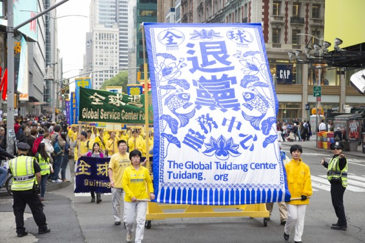

2016年5月13日，纽约上万人举行横贯曼哈顿中心42街的盛大游行，庆祝第17届法轮大法日。

【大纪元2018年10月02日讯】近日，山东菏泽某小学被发现学生的红领巾和小黄帽上印有“菏泽万达广场”以及“11月16日盛大开业”的字样。这起在红领巾上打广告的事件被曝光后，当地有关部门便立即对涉事的广告主和广告制作人进行立案调查。此外，学校校长被给予党内严重警告处分，万达也对相关负责人进行了严肃处理。

对此，一位不愿透露姓名的检察官在接受采访时给出了这样的法律依据：《中华人民共和国广告法》第三十九条明确规定，不得在中小学校、幼儿园内开展广告活动，不得利用中小学生和幼儿的教材、教辅材料、练习册、文具、教具、校服、校车等发布或者变相发布广告”。这条法律实在是让人既熟悉、又陌生，而原因就在于，过往发生的诸多案例足以证实，教材中被摄入广告的情况决非罕见。但每次被发现时，似乎都没有人像如今这般公开指出，这是明摆着违反了《广告法》的行为。

早在2014年，广东肇庆就有家长发帖称，“自己读初一的女儿开学领到的英语课本中，出现了近10页的诸如点读笔、学习机、录音带、教辅等产品的商业宣传广告”。那时，多家媒体在进行报导时，甚至大大方方的宣称，“这套内含大量广告的教材正被中国多个地方的中学普遍使用，且这种在教科书中添加商业广告的现象也已经在中国持续多年”。

公然在学生的课本中打广告，怎么就没听说有人被立案调查？别说老师、校长、教育部官员没受处罚，就连打广告的公司都能置身事外、高枕无忧。对这等发生在校园里、一查就露馅的官商勾结行为，政府又怎会大事化小、小事化了？相比之下，对近日在红领巾上打广告，却如此“小题大做”？

对此，有律师表示，“商业广告堂而皇之地印在红领巾上，会使孩子们误认为红领巾是广告的载体，就是广告的工具，这扭曲了他们正确的价值观，极大伤害了孩子们的身心健康”。但问题是，商业广告印在课本上，就不会让孩子误认为，课本是广告的载体、广告的工具？在课本上打广告，就不会扭曲孩子的价值观、伤害其身心健康？此前有教材上甚至还发现了色情网站的链接，也未见有任何人对此负责。

如今，《广告法》中并没提到的红领巾被打上广告，政府却要掘地三尺、找出真凶；律师也惺惺作态，说这是扭曲、伤害。请问，谁能相信，你们是真正的在为孩子着想、担心他们的身心健康呢？更严重的是红领巾本身，那“纯粹的鲜红”，意寓血腥、恐怖、暴力，孩子们佩戴，就会被毒害。

就拿律师提到的那句“红领巾是红旗的一角，是用革命先烈的鲜血染成”来说，中共给孩子戴上染著死人血的红布，就是残忍至极。更何况，这些人还是死于本就充斥着暴力与杀戮的战争。让孩子们戴上红领巾，是想让他们对暴力、血腥和杀戮顶礼膜拜吗？

我们且不说中共认定的那些革命先烈，到底是不是为民族献身的英雄；在普通人眼中，他们的角色充其量也只是军人而已。军人在战场上牺牲，是为了完成自己的任务和使命。难道说，孩子也要向他们学习，随时准备牺牲吗？放眼历史、遍观世界，英雄的牺牲总是与保护弱者相关。而只有中共才会把弱者、孩子拿来当牺牲品。

更可耻的是，中共为了随时牺牲孩子，竟强迫他们加入其麾下组织，从小就让他们立誓成为中共的祭品。当孩子不懂事的时候，就给其戴上红领巾；当孩子还不识字的时候，就教他们学会“爱党”。中共要宰猪，就先把人培养成猪，因此，中共的洗脑从娃娃抓起。先骗再杀，也是中共早已用惯的伎俩。从中国发生的震惊世界的毒奶粉以及毒疫苗事件来看，中共的确是做到了，只要在利益上有所图谋，就可以无所顾忌的牺牲孩子。

此外，有声明退出少先队等中共组织的中国人表示，加入任何组织都应该是成人的时候做出的决定，“在人家未成年的时候强迫拉入的做法非常邪恶，在美国都是违法的”。在民众日益觉醒的今天，还有父母在看到孩子“宣誓加入中共少先队仪式”的视频之后愤慨地表示，“我认为就是邪教组织毒害青少年”；“思想上的毒害，身体上的枷锁”；“孩子有辨别力吗？没有监护人的情况下是否违法？”

退出中共党、团、队组织的“三退”大潮波澜壮阔，势不可挡，目前已有三亿一千六百多万中国人声明三退，这令中共十分惶恐。对退党大潮，中共始终严密封锁消息。如今，内忧外患的中共越发惧怕“三退”，千方百计阻止，但又不便明说“三退”，便煞有介事地拿红领巾上打广告说事。“依法严惩”的目的，无非是为了要加强对少先队组织的严管，以维护少先队红领巾声誉为名，对孩子和家长进一步洗脑严控。总之，企图阻挡中国民众“三退”，这便是中共的险恶居心。

<h1 align="center"><b>清华学子刘文宇的人生故事</b></h1>

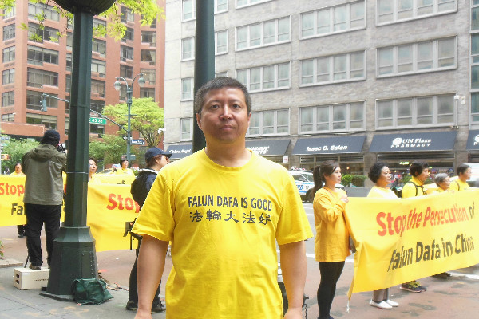

清华学子刘文宇

【大纪元2016年05月17日讯】（大纪元记者李辰美国纽约报导）1997年，刘文宇考入清华大学热能工程系硕士班；由于成绩优异，1999年5月提前攻读清华博士学位；目前他是美国犹他州的一名工程师。2016年5月13日，刘文宇参加了世界法轮大法日纽约曼哈顿万人大游行。

以下是他的人生故事。

<b>人生的迷茫</b>

有一段时间，我感觉到人生比较迷茫。1995年工作的时候，我生了一场大病。躺在病床上的时候，突然觉得人生一下子失去了目标，觉得人生很脆弱。你可能不知道什么时候就生了一场大病，失去了生命。难道人就这样庸庸碌碌过一生？

当时心里处于一个比较矛盾的时期。人为了名、利，为了情，可以痛不欲生。在这个社会的大染缸中，学到了很多不好的东西。这个社会很多正的、反的，都颠倒了。人们都没有一个正确的是非价值观念。而我来自一个传统的家庭。

<b>科学不能证明神是不存在的</b>

科学并不能证明神是不存在的。科学到了很高境界的时候， 你发现很多东西是有序的。到了非常微观的层面的时候，你发现非常奇妙的，整个宇宙都是很奇妙的。难道你说宇宙是偶然形成的吗？ 我觉得这不可能。

我觉得中共灌输的无神论肯定有问题。清华校友有很多出国留学的。我听人说，在美国，很多尖端的科学家，比如美国航空航天局，那里很多尖端的科学家都是虔诚的基督徒，是信神的。

<b>义无反顾走入法轮功修炼</b>

我渴望得到真正的正法。我也看过基督教的一些书，但是没有真正的解决（我的）问题。

1998年5月，看到《转法轮》这本书的时候，我一下子觉得，这就是我真正要寻找的法，真正解决了我人生中的困惑，真正阐明了人生的意义，人生的目的，通过修炼能够达到返本归真这样一个境界。这就是人们所说的神的世界。所以，我当时义无反顾的走入法轮功修炼。

其实，神是存在另外空间的。现在科学也证明了另外高层次的空间的存在。高层次空间存在的生命，那不就是神吗？

<b>修炼是一个脱胎换骨的过程</b>

修炼法轮功以前，别人会认为我是一个好人。我不伤害别人。但是我知道，我那时候做一些好事，也是自私的，有时候是为了维护自己一个好人的形象而已，而不是真正发自内心为别人着想。

法轮功教导人，出现任何问题都要向内找，那么矛盾发生的时候，不能去指责别人，那就会按照法的要求去找。看到底自己存在什么样的问题。那么你就会宽容他，原谅他，那么你的心胸就不会这么狭窄。

一开始的时候，确实是不容易。因为你在社会中这么多年，形成了自私的、为我的那种观念。那种东西，真的很强。

有时候会对很多事情、很多人愤愤不平。但是（即使遇到这样的事情）真的咬著牙说我不能这么想。这个过程真的是很痛苦的，这真的是一个脱胎换骨的过程。

痛苦后经过一段时间，你会感到身心的轻松。过一段时间，再碰到很多事情、矛盾的时候，你一下子觉得不动心，那个东西也动不了你，那个矛盾也就不成为矛盾了。第二天就像什么都没有发生一样，照样还是好同学、好同事、家庭也还是很圆融，就好像没有那种真正的隔阂的存在。 人与人之间真的进入一种比较谐和的状态。

说起来容易，但是确实不是那么容易的。这个过程叫修炼。

<b>迫害开始时  有过恐惧</b>

(迫害发生前），我想着要努力学习，为这个国家做一些事情。

迫害的发生，对我个人来讲，一开始是很难相信的。因为一个单纯的学生怎么能够相信一个政府能够邪到这种程度，颠倒黑白？！

只要你是修炼法轮功的人，你绝对不会相信政府所说的那些事情是真的。很难相信政府能够造出这么大的一个谎言来，能够把一个白的、好的东西，通过污蔑造谣、造假变成黑的。

对中共的邪恶面目没有认识清楚的时候 ,在监狱里，我有时感到恐惧。那个时候，我不理解，也不知道，为什么法轮功这么好的一个功法，为什么中共用这种方式来把我们视为敌人。

<b>迫害导致我的人生完全发生变化</b>

2001年1月1日凌晨，警察破门而入。我们被抓捕了，我被判刑3年，太太12年。

我是1999年6月份结婚的。被判刑后，中共一直不给太太护照。离开监狱3年以后，她提出离婚，所以我们就这样离婚了。

我们的婚姻15年，但是在一起的时间不到一年。所以说，这场迫害导致我家庭破裂，导致我这么多年，孤身一人，导致我的人生完全发生了变化。

<b>与世隔绝  经历令人难以忍受的痛苦</b>

在北京市海淀区看守所。他们有时候一整夜的熬着我，不让睡觉。等到凌晨3、4点钟，最困的时候，他们提审你，想让你说出一些（有利于他们的）话来。

精神上的折磨是最痛苦的。监狱里最艰难的时候，是关在小号里面，在山西省监狱。

他们企图把我和外界完全隔离。他们暗示我说，1989年的时候，一个山西大学的大学生被关在同一个监室，与世隔绝，半年以后，就疯了。

被隔离的时候，是很痛苦的。完全失去了和人的联络后，脑子会产生一些幻觉，想一些胡思乱想，乱七八糟的东西。

我当时被关了半年。他们没有达到目的，就把我放出来了。我凭借对（法轮）大法的信仰， 我走过来了。

<b>中共让人做坏人 </b>

在那（监狱）里面，评判是否转化，是否不再炼法轮功了，他的标准是，你是不是会骂人了，打人了、会占便宜了，是不是会自私了。

那就是要把我从一个信仰真善忍的人变成一个自私的人。他们把你从一个做好人的标准，变成一个做坏人的标准来生活，这是很痛苦的。我从内心里面来说，当然不愿意了。这相当于一个生命走向死亡。你真正的生命死亡了，然后变成一个行尸走肉的这样一个生命。

对于法轮功学员来讲，这种精神上的痛苦，远远大于肉体上的痛苦。

<b>认清中共的本质后不再觉得恐惧</b>

中共从本质来讲，它就是要与人类美好的东西为敌。当你真正对中共看透以后，你知道它从历史上，从它的发家历史开始就是邪恶的时候，反而觉得不恐惧了。

你是邪的，我是正的，那么正邪是不两立的。

<b>迫害让他看到中共体制的邪恶</b>

在监狱里面的这段亲身经历，尤其是司法体系，判刑这个过程，让我感到中共的那套体制的邪恶。

所有和我打过交道的这些人，非常虚伪，非常凶恶。从本质上来讲。一旦讲到这场迫害是从中共最高层发起的，他们马上丧失了这种基本的价值观，做人的基本善良立场，情愿跟中共为队伍。

那么中共把他们训练成一个机器，抛弃做人基本原则的一个机器。人一旦变成了中共这部机器上的一个铆钉的时候，这个人就丧失了做好人的基本立场。

从监狱长到下面很多人，他们跟我说，我们知道你们是好人，是好学生，但是你们和共产党作对，就不行，我们就要迫害你。 他们就要你放弃法轮功，这种东西很荒谬。共产党这套东西就是邪的。要把一个正常人变成一个邪恶的人。

<b>当我和实施迫害者讲真相的时候  他们住手了</b>

李洪志师父告诉我们，我们没有敌人，那些迫害我们的，打我们的人，那些恶警，也要慈悲对待他们，因为他们也是被欺骗的人，被中共愚弄的人，他们也是受害者。 他们是另外一种方式的迫害。

中国人讲善有善报，恶有恶报。他们所得到的恶报，将来比我们更惨，那是不是中共在迫害他们呢？我们受到迫害，当时感到痛苦。但是他们的痛苦是在将来。

我对那些迫害我的人，讲真相的时候，他们不说话，但是我能明显感觉到他们内心受到的震动，因为他们停止了打我，电击我。给他们讲这些善恶有报。你们被中共欺骗了是被迫的。 你对你们家人的时候，用善良的一面，那么你们对待我的时候，为什么不用你们善良的一面呢。

他们就不说话了，好像人内心善良的本性被唤醒的时候，他们就恶不起来了。

<b>十七年风雨迫害证明法轮大法是正法</b>

今天约万名学员齐聚纽约，我想所有这些人能够坚定的走下来的原因和我是一样的，就是因为信仰“真善忍”，就是因为知道了人生的真正意义。知道了作为一个人，应该怎样堂堂正正地活着，怎么去做人。所以，这些人是怎么都不会屈服的。中共迫害法轮功真的很可笑。

站在这个地方，感到非常骄傲，我认为法轮功学员是浊世中的金莲。在乱世中，我能够成为这个群体中的一员，那当然是值得骄傲的。

我相信，通过十七年法轮大法弟子锲而不舍地反迫害，到现在还有这么多人在锻炼功，这么多在坚持反迫害，这本身就是经过了考验，时间证明了一切－－法轮大法是正法！

<h1 align="center"><b>中国警察的迷思</b></h1>

【明慧网二零一八年九月二十六日】警察是什么？这是个很容易回答的问题。可是自打我因为修炼法轮功而被投入牢狱，我对警察的概念日渐模糊，心中充满了关于警察的谜团。
年初，家里老人因病住院，在医院里结识了一位老人。擅长绘画、书法，还是画协的理事，原本以为是艺术家，后来才了解是位退休的警察。老人谨言慎行，说话不多，没事的时候只是看字帖。

隔壁是一位截肢的病人，性格比较粗鲁，礼貌有点欠缺，还在病房里抽烟，搞得老警察心里十分厌烦，但表面上却跟他称兄道弟。直到他出院后，老警察才把自己的怨言倾吐出来。

我心中不免感慨，老警察在职时也是个干部，有点权力，按理说才不会怕那个痞子病人，可是一旦退休下来，没有了权势，老警察也成了一个平头百姓，连心中的厌烦都要忍到背后去说，完全没有了当警察时的派头。

现在流行一种说法，别把平台当作自己的本事，没有了平台，你什么都不是。老警察的遭遇完全证明了这一事实。警察只不过是在警察局里的工作人员，没有了警察局这个平台，警察也是平民百姓。

老警察韬光养晦，新警察却无知无畏。每次我们被迫害，都是年轻的新警察打头阵，下手够狠，脾气够爆，胆子够大。我们追求真、善、忍的老百姓，成了饿虎口中的羔羊，饱受摧残。当你跟这些警察讲道理时，他或者不听，或者引来他的新一轮暴打，或者用他在书本中学来的党文化来分析邪教徒的思维，或者用他不怎么丰富的社会经验来判断是非。最后听懂的少，厌恶的多。他认为你中毒太深，你认为他受中共洗脑太重，两者不在一个频道，很难沟通。

每次遇到这种情况，都很无奈。我心中对于警察之定义，与中国警察心中警察之定义应该是有差异的。在很多国内外的报道中，我们都看到很多警察人员救助走失的孩子，帮助孤寡的老人，勇斗歹徒，为惩治罪犯而舍生忘死。这应该是一个警察人员应该做的事情。可是事物都是多面的，并不全是非黑即白那么简单。那么在警察的队伍中，也同样有一些不是警察应该做的事情，警察也去做了，有些甚至是违法行为。这就是所谓的匪警啦！还有一些警察，表面上道貌岸然，背地里却行恶无数，完全违背了警察的职责，这样的警察貌似国家公务人员，却无国家责任观念，完全是恶警。而当我们遇到匪警、恶警时，自然对警察的职责心存疑惑，这疑惑不仅是对警察，更是对国家权力机关的不解。

我认为一个人无论职业如何，应该有一个基本的是非观，善恶观，这种道德观除了后天的教育，更多的来自于内心深处的善良，来自于从小到大对身边事物的观察，所以当我们放下职业观念，就会明白法轮功的真相，明白法轮功学员都是一群善良之人。可是中国警察这种职业，被强行灌输了中共的是非观，善恶观，甚至泯灭人性。很多警察在威胁人时，常说的一句话就是“我们是国家的专政机器”。我说：“我把你当人，你把你自己当机器那是你的事。”该警察遂哑口无言。

中共要把警察训练成它的冷血专政机器，不让他们当人，泯灭他们的人性，这是很多警察没有意识到的事实，为了中共的利益可以放弃人性，做一个冷血机器。所以很多警察变得比罪犯还坏，比流氓还流氓，比骗子更爱撒谎，比杀手还冷血。因为他们有了最虚伪，最冠冕堂皇的借口——以国家之名行恶。可是他们没有想到，当国家被邪恶占据，统治者在与民为敌时，警察对国家（党）的忠诚，维护的却是邪恶（党），害的却是老百姓。

反思中国人所受的教育，在中共的统治下，就是一个是非观，善恶观扭曲的过程。越长大，发现以前的教育都是错误的。儿童唱儿歌，捡到钱要交给警察叔叔；青少年时，为了成为恶党的接班人，恶党叫干啥就干啥，仇视一切恶党仇视的事物；成年后才发现：“过去土匪在深山，现在土匪在公安。”虽然不能以偏概全，但公安之中有土匪却是个千真万确的事实。这时，电视报纸如何宣传警察多么正义，也无法欺骗成年人了，只是给青少年，儿童洗脑而已了。

中共的宣传为何与事实相悖如此之远，归根结底，就是中共在不断撒谎，用正义的外衣包裹其邪恶的目的。当中共把中国与中共的概念混淆了之后，为中国而愿意奉献牺牲的警察就成了中共的家奴，成为维护中共利益的机器。越是“爱国”的警察，他的破坏性就越大，越是耿直正义的警察，因为国家的利益，就越铁石心肠的追随中共去迫害老百姓。而那自儿时就有的正义之心，在被中共利用，欺骗，洗脑的过程中，逐渐泯灭，直至失去，更甚者走向反面，成了反社会，反人类的中共杀手。

警察概念在我的心中是模糊的，我想警察自己也在迷失自己中模糊了人作为一个警察应有的正义，善良。当正义的维护者都在迷失了自我时，这个社会，这个国家的正义由谁来维护呢？

法轮功学员一九九九年七月二十日遭迫害后，一直坚持真善忍的修炼原则，在给世人讲真相，在全世界范围让人了解法轮功是正法，而不是中共污蔑宣传的那样。十九年来，法轮功学员用事实证明，他们的信仰有多么真诚，他们的信仰有多么坚定，他们的信仰有多么慈悲。中国大陆的警察与法轮功学员接触最多，他们应该是最了解法轮功真相的人群，可是他们却在中共的洗脑中丧失自我，丧失了正义，这是中国警察的悲哀，也是中国人的悲哀，更是中华民族的悲哀。中国五千年历史，从来没有象今天一样颠倒黑白，善恶不分。维护正义的警察却迫害正统信仰的修炼人，维护着中共邪恶政权。

希望能看此文的警察都能够思考一下自己的处境，自己的原则，自己的责任，自己的使命，自己的未来。

<h1 align="center"><b>加律师麦塔斯：新西兰需立法制止中共活摘</b></h1>

日前，加拿大著名国际人权律师麦塔斯在接受大纪元专访时表示，新西兰需要有额外的法律，对那些在中国接受了器官移植手术或是参与了器官移植的人施以惩罚，以此制止中共的活摘器官罪行。

【大纪元2018年09月26日讯】（大纪元记者徐亦扬新西兰奥克兰采访报导）加拿大著名国际人权律师、诺贝尔和平奖提名人大卫‧麦塔斯（David Matas）日前来到新西兰，提请新西兰政府和民众关注中共强摘法轮功学员等良心犯器官贩卖的罪恶。

9月25日下午，麦塔斯在接受大纪元专访时表示，新西兰需要有专门的法律，对那些在中国接受了器官移植手术或是参与了器官移植的人施以惩罚，以此制止中共的活摘器官罪行。

<b>《活摘》纪录片震撼澳纽民众</b>
 
在来奥克兰之前，麦塔斯辗转澳洲悉尼、堪培拉以及新西兰首都惠灵顿出席新闻发布会和研讨会，指控中共为器官移植和塑化人体而虐杀良心犯。

在谈及在堪培拉和惠灵顿播放的纪录片《活摘》（又名《大卫战红魔》）时，麦塔斯表示，影片引发观众很大反响。

该纪录片讲述了中共强行活摘器官和不法买卖，并介绍了重庆公安局前局长王立军为中共活摘器官而“发明”的“原发性脑干损伤撞击机”——一种可以瞬间致人脑死亡而其它器官仍保持鲜活的机器。

麦塔斯说，大多数人在看这部纪录片之前并没有意识到中国发生了什么，因此在这个问题上开展公共交流是很有用的。

“当然，这不是什么大秘密。”他说，“在中国有很多侵犯人权的行为，所以我想说的是，他们对这种感觉并不感到惊讶，但我认为他们并没有意识到中共关于器官采集问题的具体情况。”

<b>“这些尸体是法轮功修炼者”</b>
 
目前正在悉尼公开展出的“真实人体展”（Real Bodies: The Exhibition）不断引发争议。该展览是将人的尸体经过塑化保存起来做成标本。

麦塔斯说：“有令人信服的证据表明，这些尸体属于法轮功修炼者。他们被杀害是为了塑化和出售。”他说，许多被中共关押的法轮功学员都没有自报姓名，因此他们死亡的时候尸体显然无人认领，狱卒不知道他们是谁，而警察也不会告诉尸体塑化公司究竟发生了什么。

他说，中共1984年通过法律，可以摘取无人认领的死刑犯的器官，“它从未被废除，那么当然法轮功修炼者的尸体无人认领，因为他们没有说出自己的名字，而这就是问题所在。”

麦塔斯表示，有一些国家和地区，比如法国、美国夏威夷已经禁止了这种尸体展，因为这侵犯了人的尊严。

他说，他认为新西兰能做的一件事是颁布一项法律，规定这类尸体展必须要有死者同意捐赠的证明，否则禁止入境，目前他所知道的唯一有这样法律的国家是捷克共和国。

<b>新西兰需要专门法律来制止罪行</b>
 
中共活摘法轮功学员器官的罪恶已在全球曝光，在被问及新西兰在此问题上可以做些什么以制止这一罪恶行径时，麦塔斯表示，新西兰需要有专门的法律：如果有人在中国接受了器官移植手术就应受到惩罚。

他说：“私人和公共医疗保险都需要被阻断，以防止保险系统为在中国所做的移植手术支付费用。而新西兰也需要设立移民禁令，禁止参与了器官移植的人进入新西兰。”他也表示，新西兰需禁止对中国的器官移植专业人员进行培训，以及与他们合作、研究和交流。

他说：“我建议新西兰国会通过一项决议，表达对中共器官移植滥用的关注。新西兰政府应呼吁中共配合，对中国的器官移植问题进行独立的外部调查。”

麦塔斯最后表示：“我不认为新西兰或任何国家应该避免与中国接触，但我认为，我们应该利用与中国的所有接触来推动人权议程。”

<h1 align="center"><b>耿和感谢大陆人士发起寻找高智晟万里行</b></h1>

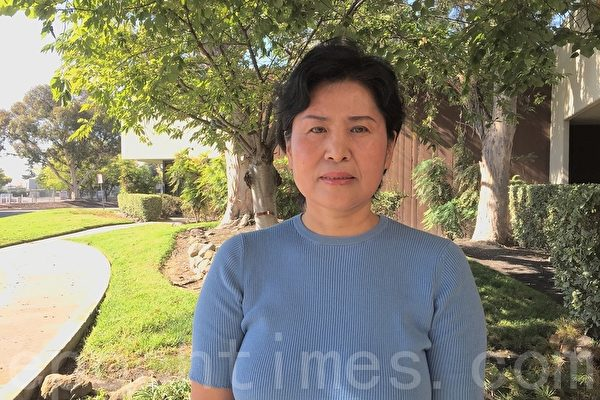

高智晟的太太耿和在旧金山湾区表示，非常感谢国内网友发起的“万里寻找高智晟”的活动。

【大纪元2018年09月24日讯】（大纪元记者李文净硅谷报导）大陆知名维权律师高智晟被中共警方带走，杳无音讯已经超过1年，大陆多位人士担心他的情况，日前发起“寻找高智晟万里行”行动。

据发起人在推特透露，9月14日，辽宁公民王素娥、王一与北京民运人士刘跃，一起前往山西介休，看望去年曾参与营救高智晟的维权人士李发旺和邵重国，并共同发起在北京、陕西和山西三省市寻找高智晟的“万里行”行动，誓言一定要找到高智晟的下落。

高智晟的太太耿和在旧金山湾区表示，非常感谢国内网友发起的“万里寻找高智晟”的活动。高智晟受到十多年的牢狱折磨，现在国内仍然有人不忘记他，同时她也担心这些国内朋友们的人身安全。但他们告诉她说，高智晟没有自由，他们也一样没有自由。

耿和表示，高智晟曾经常说，在一个长期非公正的社会里，政权总是用暴力压制那些追求公平正义的人们，必然引发越来越激烈的反抗。这是中国每年发生数以万计抗暴事件的原因，这也是极权体制的规律。

耿和最后希望国际社会更多地关注中国国内的抗暴事件。

据美国对华援助协会网站报导，北京的刘跃19日表示，他已被国保谈话警告，不准他参加“万里行”活动。山西公民李发旺和邵重国据说也已经受到警方严密监控。

高智晟因多次致信中共高层要求停止对法轮功学员的残酷迫害，而遭中共报复打压，从2006年起，不断被抓、被失踪、被酷刑折磨、被关黑监狱和判刑等。去年8月19日他再次被警方带走后，一直杳无音讯，北京、陕西和山西当局都否认关押了他。

<h1 align="center"><b>奥地利国家议会接受倡议书　关注中共非法器官交易</b></h1>

【明慧网二零一八年九月二十二日】（明慧记者雪莉报道）二零一八年九月十八日，奥地利法轮大法学会负责人王泳先生在国会议员库格勒博士（Dr. Kugler）的安排和陪同下，向奥地利国家议会主席萨伯特卡先生（Mag. Wolfgang Sobotka）先生递交了一份公民倡议书，要求议会谴责在中国由国家操纵的活摘人体器官暴行。倡议书提请议会敦促中国当局立即制止所有对在押人员强制摘取器官的做法，要求中国允许第三方独立进行可信度及透明度高的调查。

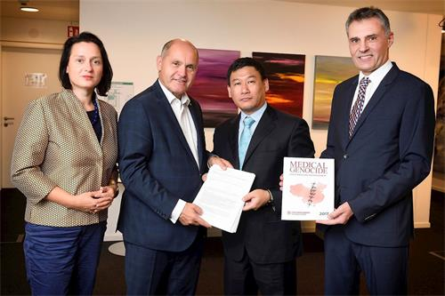

图：二零一八年九月十八日，奥地利法轮大法学会负责人王泳先生向奥地利国家议会主席萨伯特卡先生递交公民倡议书（左一：市议员库格勒博士，左二：国家议会主席萨伯特卡先生，右二：奥地利法轮大法学会负责人王泳先生）

 
王泳表示，国家议会正式处理倡议书，会帮助奥地利民众了解在中国对法轮功的迫害，促使奥地利政府对制止迫害作出实质的表态。

公民倡议书内容如下：

1，谴责在中国大陆发生的强制摘取器官的国家行为，并敦促中国政府立即制止所有对在押人员强制摘取器官的做法。对在器官移植方面出现的犯罪行为，中国政府应允许第三方进行可信度及透明度高的独立调查。

2，修订法律抑制器官移植旅游及在中国发生的器官交易。

3，要求中国共产党立即停止对信仰团体法轮功的迫害（法轮功学员是活摘器官的最大受害者），并立即释放所有法轮功学员及其他因信仰而入狱的人。

4，通过宣传活动让所有奥地利公民了解在中国贩卖器官的问题。

在接下来的几个月中，在国会网页上，奥地利民众可以直接在线签字支持倡议书。议会会在讨论后决定是否实施倡议的要求。如果实施，有可能会针对反活摘，修改奥地利法律。

去年四月份在维也纳市议会已经全票通过一项类似的决议案。而这次是奥地利国家议会接受倡议书，在另一层面上关注这一议题。

<h1 align="center"><b>天灭中共：一位千古英雄留下的神谕</b></h1>

【明慧网二零一八年九月二十五日】在读过大纪元编辑部推出的《千古英雄人物——蒋介石》之后，让人十分震撼！一九七二年蒋介石即断言欧洲共产国家在一九九零年解体，而中共要晚一步。
在一九九零年东欧剧变，蒋的预言竟然分毫不差！而中共千疮百孔，行将就木的命运，更印证了这位千古英雄的真知灼见！

我们从小开始，广播里、报纸上、杂志上、电影电视，蒋介石是一个不折不扣的“反动派”，抵制抗日，躲在庐山上，等抗战胜利下山抢果子等等。而看过《千古英雄人物——蒋介石》，当历史上真实的蒋介石展现世人面前时，既为沉冤不白的蒋先生慨叹，更为被红魔谎言迷惑的世人迟迟不醒而痛心！

蒋介石为什么能看透共产党

一九二三年八月十六日到十一月二十九日，在三个多月时间，蒋介石受国父孙中山委派，去苏联各地访问，对于苏共的主张、组织形式等已有初步了解。多年后，蒋介石在《苏俄在中国》一书中写道：（访苏使自己）“更认识了苏维埃政治制度乃是专制和恐怖的组织。”

一九二六年，四分五裂的中国，在蒋介石领导北伐初见成效，而共产党挑拨国民政府的亲共分子在武汉另立政权，干扰北伐。蒋介石在《告全体将士书》中写道：“我们国民革命军在江西拼命血战的时候，就是共产党在湖南湖北布置叛乱的时候；当我们前敌将士在浙江江苏战事最激烈的时候，武汉方面故意留难，把饷项分文不发，一粒子弹也不给我们。”两面三刀，阳奉阴违，对共产党是家常便饭，到一九二七年“四一二”清党，是蒋介石对共产党附体的一次大清理。

当时社会有不理解的声音，对此，蒋介石说：“不是因为共产党的罪恶没有暴露，乃是因为神经麻木的中国民众不受到十八层地狱的痛苦，不会觉醒的。”共产党对于报纸、宣传系统的控制，让谎言变的象真理，而没有利用权力控制舆论的蒋，虽然道出了真相，但真理有时只能沉睡。

到一九五零年之后，中共的一系列暴行，印证了蒋介石对于中共邪恶的判断，蒋介石痛斥说：中共“以残忍无比的手段，推行其所谓‘农业集体化’、‘工商业公私合营’与‘思想改造’、‘文字改革’等等暴政……”

一九六七年，大陆遭受文革之乱，反传统登峰造极。蒋介石痛心疾首，指责中共“是全人类、全民族的大敌，唯有在时间的考验之下，在民族大义的震铄之前，才能揭穿它欺诈、恐怖、残忍、疯狂的秽乱罪行！”从中共建政之后，导致八千万人非正常死亡，超过一战二战死亡人数总和。

对于中共邪恶的本质，蒋介石概括地说：“共产主义的狂妄匪徒们叫喊着，它们必要毁灭世界上的一切宗教，它们必能毁灭不愿崇拜它们共产主义的所有人类，它们共产主义必要统治世界。它们今日一切迫害、斗争、诬陷和公审的所作所为，正象一千九百年前的新约时代的恶魔‘撒旦’一样。”

而此时世人却尚未清醒，他说 “可惜是自由世界，在对抗共产罪恶……非常缓慢，有些地方，甚至背道而驰！”世人都迷失在利益与权力的争夺中，蒋对于未法之世，道德下滑导致的人心衰败，有着清醒的认识，却也知道，凭借现代化、西方文明根本解决不了任何问题。

目睹了共产红魔祸乱中国整个过程的蒋介石，对于共产邪恶的结局一语道破。一九七二年，韩国前总理丁一权访台拜会蒋总统。蒋公告诉他欧洲共产主义将于一九九零年崩溃。丁不解，反问：您是指一九九零年代吧？蒋公答：“不，我是说一九九零年。不过中共将要晚一步。”

冥冥之中，如有神谕。

在维基百科中，记录了东欧剧变：指在一九九零年前后东欧和中欧的社会主义国家中，发生反对派推翻共产党政权的急剧政治变化。一九九零年六月东德政府正式决定拆除柏林墙，东西德合并，是欧洲共产主义倒台的标志性事件，随后苏联也土崩瓦解。纵观世界范围之内，蒋介石对于欧洲共产主义的终结时间预测之准，精确到一九九零年，没有第二个人！

直至二零零四年，《九评共产党》问世之前，对于共产邪教的阐述，蒋介石都是独树一帜。美国国会前众议员周以德（WalterJudd）评价说：“蒋先生早于世界任何其他领袖认清独裁的本质和共产党的为祸，并抗拒共党已有四十八年之久。”周以德早在一九二八年就认识了蒋。

上天惩罚共产邪恶的时刻就要来到

《九评共产党》从共产邪灵的附体属性、起家手段、反宇宙特性等，系统地揭示了共产党邪教本质，自此，中共的假面具、遮谎布被彻底掀开。世人开始清醒，中共原来是撒旦魔鬼，就是要破坏善的，它就是邪的，就是毒的，本性如此。就象蛇蝎一样，只能生存在阴暗、潮湿，见不得光的地方，它的身体上就带着毒！

一九九二年，法轮大法在中国正式传出，是以真、善、忍为宗旨的佛家修炼大法，至一九九九年有上亿人修炼。然而，以假恶暴为本的中共邪党，与江氏集团互相利用，为一己之私，从一九九九年七月二十日开始了对于法轮功惨无人道的镇压，从肉体上消灭，从经济上截断，打死白打死，打死算自杀。至今，对于法轮功的残酷打击已经过去了十九年！

对于法轮功残酷的迫害，还在进行中。二零一八年上半年，中共继续执行“敲门行动”，对信仰真、善、忍做好人的法轮功学员进行迫害，包括非法监控、跟踪、绑架、抄家、批捕、庭审、判刑和强制洗脑等。

据明慧网资料统计，二零一八年上半年中共绑架法轮功学员2392人次，骚扰1236人次，131人被非法批捕，71人被强制送洗脑班，17人被迫离家出走，1091人被非法抄家，244名65岁以上老年法轮功学员被绑架、骚扰，年龄最大的89岁。

二零一八年上半年，据明慧网报道不完全统计，中共法庭、警察通过非法庭审、入室抄家抢劫、敲诈勒索法轮功学员现金1914302元，其中法庭非法罚金984000元，警察抄家勒索930302元。

二零一八年一至八月份非法判刑为611人。

修炼人在受难，其实也是在给更多的人机会。从每一个公检法人员，在“敲门行动”开始的那一刻，就是摆放人心的开始，是把枪口“抬高一寸”，还是为邪恶卖命，是给所有人选择善恶的机会，也是给自己能否走向未来新纪元投下关键的一票！

中国有句古话：“人恶人怕天不怕，人善人欺天不欺。”迫害甚至残杀做好人的法轮功学员，不就是违背天理吗？中共坏事干绝，迫害信仰真善忍的法轮功学员。二亿七千万年前就有了“中国共产党亡”（藏字石，百度可查询），天要灭它，在巨石上天然形成“中国共产党亡”六个大字以警告世人，现在展现给人看，说明是天意，共产党坏事做绝了，人神共愤，该灭它了。一九九零年欧洲共产党崩塌，中共在苟延残喘二十余年之后，现在千疮百孔，独木难支，可贵的中国人，您还犹豫什么呢？

前有先贤指路，现有法徒救人，就是为了您在历史的最后关头，能迈出最关键的一步，弃恶向善，回归天理，退出中共党团队，您就为自己选择了一个光明的未来！

<h1 align="center"><b>中学教师：从病秧子到健康快乐的人</b></h1>

【明慧网二零一八年九月十七日】我是一名中学教师，一九九八年五月修炼法轮大法后，由一个病秧子变成一个健康快乐的人。而且耳朵后那个切除后又长出的瘤子一年后突然消失，这一下轰动了全校老师，都说看来法轮功真是好啊。
一、得法前多病折磨的人生

在修炼法轮大法前身体有多种疾病，在九十年代初上大学时，得了一种慢性肠炎，经常肚子疼，特别是要大便前，疼起来简直是要命，而且这个病不能吃凉的，生冷的，油炸的，年纪轻轻什么都不能吃，就连吃个桃子都得用高压锅煮了吃。

大学毕业后开始工作，那会工资的四分之三用来买药治这个病，但是也还是没有治好，反而加重，发展成溃疡性肠炎，就是大夏天也不能喝口凉水，更别说解暑的雪糕了，每次肚子疼都会出大颗大颗的汗珠子，不得不喝药，但又由于喝药引起的副作用小腹胀也是令人苦不堪言，简直是无计可施。

之后又得了手关节遇湿疼痛的病，一到下雨的时候，我手指又疼又痒，连自行车都不能骑（那个年代我骑自行车上下班），后来又得了妇科病，经常腹部疼，腰疼，二十多岁的人连个孩子都不能抱，平日的家务都一次完成不了，都得干一会休息一会，年纪轻轻简直是一个废人。由于身体弱，也经常感冒，反正是隔三差五的由于身体原因请假不上班，领导担心影响我所教班级成绩都有意见。

在一九九七年，我左耳朵后长出一个瘤子，特别坚硬，不规则，去多家医院看说也许情况不好，最后到了省城的一家比较好的武警医院，当时手术切除时因为是局部麻醉，都能听到医生们说的话，意思是瘤子一处边界不太清，情况不算太好，因为瘤子长在耳后骨头上，手术用了整整两个小时，主刀大夫都累了，才算切下去，拿去做病检，几天内出结果。

由于当时孩子小，大女儿五岁，二女儿才一岁多，所以我好担心，好痛苦，万一病检结果不好我孩子怎么办？想起做手术时医生的话更紧张，人到了生死关头自己都顾不上了，就想着万一如何如何，我孩子没妈多可怜呀……最终等待的结果出来了，说是纤维瘤，良性的，我如释重负。

总算放心这个瘤子没事了，但别的毛病依然不减，水果不能吃，冷饮不能喝，油炸食品不能吃，最后荤的都不能吃，身体已无力招架，当时二十几岁的我简直享受不到人间的一点乐趣。

一九九八年春，也就是耳后瘤子切除一年后，在同一部位又长出了一个多头坚硬的瘤子，而且还伴随着隐隐的疼痛，我想起了曾在一家医院看瘤子时一位医生的话，说切了之后如果良性瘤此处一般不会再长了，我又陷入难过痛苦中……二十八岁的我正当好年华，我身上的病苦却此起彼伏，何时是尽头！

二、得大法幸福无限

在我很小的时候，我就对人生有许多思考，我父亲是一名乡村教师，爱看书，所以能讲出很多故事，我们一家人吃饭之余，父亲就趁着那会给我们讲故事，我们很享受那饭后的好时光，特别是讲成仙得道的故事。当父亲讲仙女的故事，我就想为什么我是凡人，我要是仙女多好呀。当讲到修行人成仙的故事时，我就想到底有没有神仙，人能不能修成神，我要有个可以教我修行的师父多好呀！特别小时候看到那些五十岁以上的人就很伤感，感觉当人真没意思，还要老死呢。甚至我一个人幻想着会不会从土地里挖出一本天书，要那样我就可以成神仙了。

现在想来童年的这些环境与思想也都是师父给我尽心的安排与那份缘的烙印。童年的天真总归是天真，可现在长大成人的我却是疾病缠身，痛苦不堪，身体与身体导致精神的压力让我感到人类的渺小，怎么喝药都无法根除掉病。

绝望中我的人生出现了转机。那是一九九八年五月的一天在办公室，有两位同事闲聊，一位说他今天遇见本家哥哥，说有一种法轮功挺好让他炼，他说不赶时髦，也没时间。可当我听到法轮功三个字我身体从内部震了一下，但也不知道怎么回事（后来看大法书籍才明白我与大法的缘导致的这种感觉）。

就在接下来的第三天，我正在厕所蹲着，捂着肚子，疼的头上直冒汗，就在这时来了我们学校的一位教音乐的年龄比我稍大一点的刘老师，我们不在一个办公室，所以除了一起开会几乎没有接触的时候，她看我痛苦的样子，问我怎么了，我肚疼的几乎嘴不能大声说话，低着音说，我老毛病，溃疡性肠炎，肚疼的要命。她立即说，你学法轮功吧！

我惊奇的问，能治病？她说：这个功法不止治病，修好能带本体上天成佛。我高兴极了，上完厕所就跟着她去了她们办公室，我好像一生中都在等待的今天终于等到了，就她这两句话我就相信了，我对着她们办公室的人，拍了下刘老师说，我立志成佛。这位刘大姐对我这个没看过书就有这样的表现非常惊喜，随即借给我一本《转法轮》，我如获至宝。

我那天上完晚自习回家安排全家人吃完饭，就开始看那本深深吸引我的《转法轮》了，夜深了丈夫孩子都睡了，我仍然看着书，根本没有丝毫睡意，一气呵成，不知道到了几点钟，我把一本书全部看完了。

我从书中终于明白了人为啥活着，确信真的有神佛，解释了我人生中许许多多无法解释的问题，夜静悄悄，我却热血沸腾，激动的无法入眠，啊，我得天书了，我明白了常人不明白的道理。我明白了病原来是业力所致，我明白了真正修炼大法的人没有病，有师父悄然看护，有师父给净化身体。我明白了原来人能超脱生老病死。我要用修炼人标准要求我了。

我幸福极了。第二天，我来到学校上班，把书还给刘姐，说再借我一本别的大法书吧，这本看完了，她惊诧不已，说你真有缘，我开始追着刘姐让她趁她与我都没课的时候教我炼功，炼着炼着我腿上手指尖多处感到法轮的旋转。

由于得法初期的勇猛精進，很快我身体达到了无病一身轻，不管冷的热的冰的什么都能吃了，而且耳朵后那个又长出的瘤子也在修炼大法一年后某一天突然消失，而且还是一位同事先发现瘤子不在了，因为我那时梳着短发，天天都能看见，她奇怪的问我怎么那个瘤子不见了？这一下轰动了全校老师，都说看来法轮功真是好啊。

这样我彻底由一个病秧子变成一个健康快乐的我，沉浸在浩荡佛恩的无限幸福之中，真是感谢师尊的慈悲救度。

其实，像我这样在大法中的受益者在全世界数不胜数。所以希望被中共谎言毒害的众生赶快清醒过来，记住法轮大法好，退出中共邪教组织，给自己选择美好未来。

<h1 align="center"><b>从山东迫害法轮功 看中共祸国殃民</b></h1>

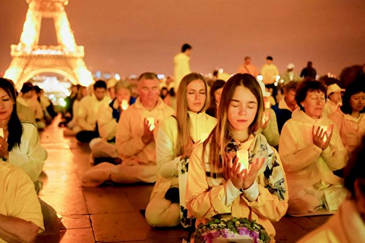

图为2017年9月30日，欧洲法轮功学员于巴黎艾菲尔铁塔前举办烛光守夜活动，悼念在大陆被迫害致死的法轮功学员。（明慧网）

【大纪元2018年09月16日讯】据明慧网9月14日报道，2018年8月，中共法院非法对58名法轮功学员判刑最严重地区依次为：山东12人、黑龙江8人……；按涉及的30个城市分布情况：烟台5人，青岛4人，哈尔滨、长春、深圳各3人……；按典型案例排位：列首位的是原山东省预备役高炮师副参谋长公丕启，被冤判7年，罚金2万元。
上述几项排名山东居首，可见山东仍是迫害法轮功的重灾区。而在山东炮制法轮功案的那些恶人呢？

屡遭恶报的山东省聊城市冠县迫害者，又有16人同时遭恶报。据冠县纪委监察委9月13日消息称：聊城吴学占涉黑案背后16名公职人员被查，两人被移送司法。这16人均为冠县公安系统工作人员，其中两人为冠县公安局党委委员。

曾叫嚣“我就是要把他们（法轮功学员）赶尽杀绝！”的恶人聂作坤在8月里落马，据山东省纪委监委网站8月31日消息，聂目前正接受纪律审查和监察调查。现年53岁的聂作坤，2001年起先后任山东省安丘市党委书记；寿光市公安局局长、党委书记、寿光市副市长；烟台市公安局局长、党委书记。聂作坤因迫害法轮功学员多次被国际组织通告追查。

宣布聂作坤落马的同日，原山东寿光政法委书记孙成华受贿案在潍坊中院庭审。4月，原山东烟台莱州市检察院检察长徐志涛落马，他曾伙同610非法枉判多名法轮功学员。

不仅如此，据明慧网统计，截至2017年8月，十八年来山东省因参与法轮功而遭厄运者达 1,646人，上至副省长、省委副书记、政法委书记、公安厅长，下至基层警察和不明真相的民众。遭厄运者中，死亡人数697人；患恶疾与车祸致残成植物人的案例为264人。另外，被判刑者122人；伤病撤职的396人；殃及家人386人。

迫害案例不断，不但参与迫害者恶报如影相随，连山东全省都祸事连连，各方遭殃。今年6月山东遭遇极端天气，鸡蛋大冰雹狂砸，砸坏房屋、车辆，居民叫苦连天。8月，全国闻名的蔬菜之乡山东寿光遇暴雨，上游三个水库同时开闸泄洪，将下游沿岸连片的蔬菜大棚冲垮，千家万户房屋倒塌，财产打了水漂……农民哭天喊地痛不欲生。

天怒人怨的毒疫苗，定性为危害社会公共安全案，首起是2016年爆发在山东。“山东疫苗”案震惊中外，急得李克强亲自上阵处理，先行撤职降级处分357名官员。司法上涉案的202人被刑拘。

网民愤怒：人心泯灭，杀人于无形，政府怎么监管的？从聊城涉黑案有16名冠县公安干警涉案，可以看出中共公安已是黑社会保护伞，有可能本身就是黑社会老大。像这样的政府去监管谁？

红黑两道，官匪勾结，聊城的涉黑案绝非这一起，举一例说明。聊城市是地级市，聊城市人民医院不但肾移植资质，而且在2016年停用死囚器官后，又扩建了肝移植科。移植医生说他们“只能会做的愈来愈多。肯定会得到医院、国家的支持，不然我们也不会成立的。”哪来的肝源？用山东烟台毓璜顶医院移植科王主任的话说，什么红十字会捐献器官，什么网上移植分配，“那都是骗人的，都，都是骗人的！那都是形式。”

山东有13家器官移植资质的医院，2015年后都在忙移植，供体充足，连外省市病患都去山东换器官，知道那里有器官供体。如果不是捐献来的，除了被迫害的法轮功学员等群体外，还有其它来源渠道？

山东省一直是江泽民集团的迫害重点地区，几任山东省的主要负责人都是追随江泽民迫害法轮功的帮凶，对法轮功的迫害十分邪恶，有大量法轮功学员被活摘器官。现在当法轮功学员的器官满足不了移植需求时，猎取器官的视线就有可能扩大范围，扫向普通民众。也就是说，盗取法轮功学员器官的黑手也伸向了全社会，这样的罪恶，在山东很可能发生。

过去的迫害证实，什么地方迫害法轮功，什么地方天灾人祸多，迫害越严重，乱像越厉害。“真善忍”被打压下去，假恶暴充斥社会，随之黑恶势力会应运而生。有巨额利润的器官买卖，背后就是图财害命。没有官方人物做保护伞，器官生意很难做成，所以说器官黑幕又大又深。

因迫害法轮功，目前仅山东就有上千人遭恶报。这不是法轮功学员希望看到的，迫害者中的一些人本不该有这样的结局，是中共坑害了他们。另有很多人以为自己与迫害无关，是局外人。实际上，因迫害法轮功所引发的后遗症已贻害无穷，让百姓遭殃。眼下看好你和家人身上的器官，就是面临的危险之一。

邪恶中共是制造一切苦难和人间悲剧的根源。只有退出中共，远离邪恶，才是最有效的自救。

<h1 align="center"><b>韩国小学校长：修炼令我峰回路转</b></h1>

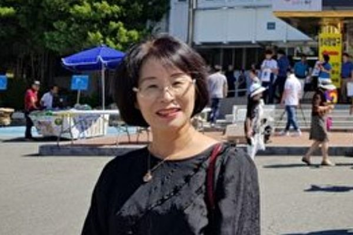

韩国金海二业国民小学校长崔英淑。

【大纪元2018年09月14日讯】（大纪元记者孔英子韩国釜山采访报导）“我天生身体虚弱，很容易疲惫。因此就像生活在药罐子中，离不开药，但是没想到我的小女儿又得了再生障碍性贫血，得经常输血治疗，当时真的就像晴天霹雷一样打在我身上。”韩国金海二业国民小学校长崔英淑无奈地表示。

而现今56岁的崔英淑，作为一名妻子、一位妈妈、一个儿媳，却生活平安喜乐，笑容总是挂在她的脸上，但是这一切都不是平白得到的。

很多人羡慕崔英淑，她的丈夫也是一位教职员，经常帮助她做家务活，她的婆婆会给她做各种美味的小菜。不仅如此，还有一对成绩优秀的儿女，儿子长得帅、女儿美丽可人，这是一个万里挑一的美满家庭。但是，之前健康问题却给这个美满幸福的家庭投下难以挥去的阴影。

为了治疗小女儿的疾患，她四处奔波，寻找良方，但都没有明显的效果，作为母亲她至始至终没有放弃，总希望能有奇迹降临，使小女儿恢复健康快乐的生活。

“2004年的一天，我人生的大转机降临在我的头上，从此我开始了崭新的生活。”她兴奋地说。

那一天，崔英淑与女儿经常去的一家药膳坊的院长向她介绍了法轮功，说该功法有益于身心健康，对她女儿的疾病很有好处，就这样用她的话说，“我在疑惑中走上了没想到是终生修炼的幸福路。”

<b>修炼后身心发生巨大变化</b>

韩国金海二业国民小学校长崔英淑。

修炼后，崔英淑的身体状况出现了明显的好转。原来从脚到头，全身没有不痛的地方，修炼之后那些明显的症状一下子消失了。头痛等老毛病经过一段时间之后也慢慢痊愈了。

她说，“修炼之前，每到换季的时候必须吃补药才能挺过去，中医给我号脉的时候，说五脏六腑都极其虚弱，四十岁之后身体将不堪重负。但是修炼14年过去了，这期间我没有吃过一次补药，也没去过一次医院。”

修炼法轮功让崔英淑发生了巨大的变化。她从法轮功指导修炼的《转法轮》书中，了解到人得病的根源是什么，如何才能将病根除，最终令她走出对女儿病情牵挂的漩涡。

“修炼之后，急躁心、恐惧心、悲观情绪和厌恶心等各种不好的心在极短的时间内变弱了。过去因为女儿的病情我很痛苦，修炼之后我很神奇地摆脱了郁闷，我心中充满了对法轮大法的感激。”

女儿 因修炼获得重生
崔英淑由于一直按照法轮功修炼的宗旨“真、善、忍”来要求自己，注重心性修炼且有规律地炼功，不仅身体恢复了健康，家庭也更加和睦了。与周围人相处和睦，在工作单位也顺利地升职为校长。

她说，“法轮功修炼要求遵照‘真、善、忍’，做到先他后我，随时随地都要站在对方的立场上思考，出现问题的时候，不是责备对方，而是要反思自己的错误。从她开始修炼以来，在家庭中、在工作中出现问题时，都会修自己的心，不会说打击对方的话，努力关心对方、尊重对方。”

“最幸运的是，患病的小女儿也随她走进法轮功修炼中，修炼十几年过去了，她现在不仅十分健康地活着，还参加了工作。”她感慨地说，“无法用语言表达对李洪志大师的感恩之情。”

法轮功在中国传出之后，在很短的时间内就吸引了数以亿计的人修炼，这是因为法轮功不仅可以有效地促进身心健康，还可以促进社会道德得到提升。作为一名教育者，崔英淑认为修炼法轮功有助于帮助人们找回已经迷失于物质文明中的人性。

希望在中国也可以自由修炼
法轮功对个人、家庭和社会都有百利而无一害，但是在中国现今依旧受到中共的迫害，这让崔英淑感到很心痛。

“在中国，依旧不能公开说法轮功的基本原理‘真、善、忍’好，中国的老师和学生也被彻底洗脑，只要看到‘真、善、忍’三个字就打寒战、回避。我希望迫害能够尽快结束，中国的老师和学生们也都可以自由地按照‘真、善、忍’修炼，不仅能拥有一个用金钱换不来的健康体魄，同时道德也会提升。”

<h1 align="center"><b>请关注大陆持续恶化的法轮功人权状况</b></h1>

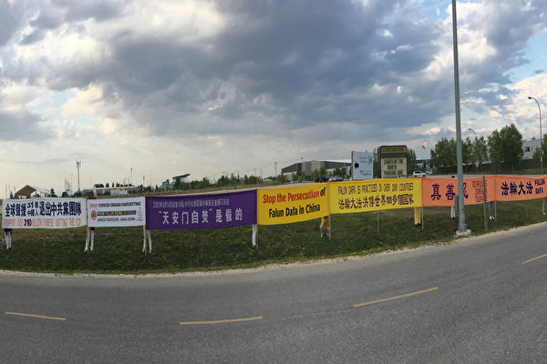

8月31日晚开幕、造价达400万加元的“北境之光−温尼伯中华彩灯嘉年华”场外的抗议者说，希望人们了解中共对人权的侵犯。

【大纪元2018年09月18日讯】俗话说“月有阴晴圆缺，人有悲欢离合”，这是人间常态。可是在中共极权暴政之下，又人为的制造了多少人间悲剧？在中秋团圆佳节来临之际，明慧网在九月份报道了许多中共残酷迫害法轮功学员的案例，这些案例既催人泪下，又让人们进一步认清了中共祸乱人间毁灭人类的邪恶本质。

在此仅列举几则迫害案例：湖南省岳阳市王岳来二零零八年开始修炼法轮功，获得身心健康；因告诉人们真相，在中共对法轮功的迫害中，被非法判刑五年半，于二零一八年八月三十一日在朱洲攸县网岭监狱被迫害致死，终年五十六岁。

二零一八年一月二十四日，他和其他法轮功学员一起学习法轮功著作，被岳阳县公安局绑架。当时被绑架的法轮功学员有：王岳来、陈全秀、何根良、曾谷珍、米时兵、刘桔梅、陈恢秋、邹端初、梁金桂、何湘平、刘汗贵、郭望军、刘桂珍、周细梅、许桂珍、邓龙、高卫霞等十七人。

王岳来于一月二十六日被非法刑事拘留；同年二月十二日被非法逮捕。二零一八年四月十日，岳阳县法院同样以莫须有的罪名，非法判王岳来有期徒刑三年，并勒索处罚金人民币五千元；撤销原缓刑五的缓刑部分，非法合并执行刑期五年六个月。

王岳来于五月十四日被非法关入湖南省津市监狱迫害，一个月后转到朱洲攸县网岭监狱迫害。

在网岭监狱，仅三个多月的时间，王岳来被迫害得生命垂危，送医院抢救，三次下了病危通知，头都耷拉下来了，不能说话了，生命危在旦夕。即使这样，他还被四个警察、两个犯人看守。

监狱第二次下病危通知时，王岳来的家人要求将他接回家治疗，监狱还要求他在“三书”上签字。王岳来有气无力地摇了摇头，他认为讲述法轮功事实的行为不是犯罪，按真、善、忍做好人没有错！监狱人员无视王岳来的身体状况，仅仅因为他不放弃信仰，而拒绝了让他回家治疗的要求。

二零一八年八月三十一日王岳来含冤离世，一个活生生的好人就这样被中共夺去了生命！

山东省烟台市莱阳市法院七月十一日对五名法轮功学员非法开庭，不顾事实，枉用法律，于七月二十日诬判五位法轮功学员：祁玉玲被诬判八年，并被勒索罚金一万元；张志栋、吴桂梅都被诬判七年六个月，并被勒索罚金一万元；刘彩红被诬判二年，并被勒索罚金五千元；李国玲被诬判一年六个月，并被勒索罚金三千元。

法轮功学员祁玉玲女士二零一七年七月十八日被莱阳国保大队（主要责任人马曙光）绑架后，一直被非法关押在烟台福山看守所，没有任何消息。家里的老父亲去年因想念女儿得过脑梗死，送医院抢救及时，年前好了。年后老人更想女儿，经常到村口去等女儿回家，因伤心过重，又得了脑血栓，在医院治疗了很长时间，后来老人在家里躺着，神智不清，离不开人照顾。

祁玉玲原住北京西郊区，她的娘家是山东烟台海阳市。在北京反复遭受迫害，曾被非法劳教三次，被非法判刑三年，被关押在劳教所期间，丈夫与她离婚，幸福的家庭被拆散，遭受了数不清的迫害（见明慧网文章《北京祁玉玲被中共迫害经历》）。近二、三年，她在海阳租房居住，此次被绑架后，家中所有东西被抢劫一空。

重庆市许晓琴女士二零一零年修炼法轮大法后，全身疾病很快不翼而飞。在随后短短的八年间，许晓琴却因此被中共骚扰、绑架、非法关押、判刑等迫害多达九次，目前被非法关押在重庆九龙坡区看守所。

许晓琴的丈夫尧荣宣，原是西藏昌都军分区司令部会计、边防四团财务股长。二零一七年四月六日在家中再次被绑架，据悉已被非法判刑五年。

尧荣宣一九八三年入伍。他一直兢兢业业，受各级嘉奖数十次等。尧荣宣一九九八年开始修炼法轮功，在中共江泽民团伙迫害法轮功后被强制复原。从二零零一年二月至二零零九年底，尧荣宣先后被非法劳教一年七个月、非法冤判七年徒刑，在劳教所、看守所、监狱遭受种种残忍折磨，身心受到严重迫害，在枪林弹雨的战场都没负伤，却几度差点死在中共监狱里。

二零一七年四月六日，许晓琴和丈夫尧荣宣又被永川区国保非法抓捕，关押了一个月，许晓琴于五月五日回家，丈夫尧荣宣被关押、构陷。同年七月二日，永川政法委、610、街道办以及居委会的，五、六个人把许晓琴家门凿开一个洞，强行把她绑架到合川（五尊）洗脑班。于七月三十一日回家。

之后许晓琴又先后两次被绑架，据有人到看守所为其上帐询问，看守所告知被转到重庆九龙坡区了。

二零一八年八月二十九日中午，广东省茂名市电白区水东镇法轮功学员林燕梅、林燕梅的外甥吴朝琪、甘惠玲被茂名市海滨新区公安、特警和电白区国保大队队长陆尚辉带头等二十几人绑架，现被分别关押在茂名第一看守所、电白区第二看守所。

林燕梅和她的外甥被绑架后，林燕梅的姐姐林丽珍及时联系律师给妹妹维权，律师联系好后，在九月三十一日林丽珍又被茂名市电白区国保等警察绑架。林燕梅一家三人现被非法关押在茂名市第一看守所。

在抄家过程中，林燕梅的老父亲林桐见他们如土匪抢劫一样，便去阻止，他们把老人两手臂都掐出血迹。陆尚辉还暴力踢开老人的房门，把老人仅有的一点养老积蓄抢走。然后警察强行绑架林燕梅和正下班回来吃午饭的外甥吴朝琪。

林燕梅的父亲已经八十多岁，两个女儿和外孙被绑架，心里非常难过，老人家几天吃不下饭，由林燕梅的女儿照顾。目前还有便衣在林燕梅家附近监控。

看了上述迫害案例，我们不仅为法轮功学员的遭遇落泪，更为中共对法轮功学员及家人的迫害震惊。十九年来，中国大陆的法轮功学员及家人就是在这样的迫害中走过来的。十九年来，究竟有多少法轮功学员被迫害得支离破碎、妻离子散、家破人亡？有多少家庭日复一日、年复一年的在泪水中痛苦度过？

截至目前，中共对法轮功的迫害仍在继续，中国大陆的法轮功人权仍在持续恶化。据明慧网报导，二零一八年一至八月份非法判刑611人，非法庭审584场。二零一八年一至七月份，遭中共绑架的法轮功学员2，805人次，骚扰1，990人次。

有许多人都知道，法轮功学员都是这个世界上难得的好人，为什么这样对待他们？甚至连中共体制内参与迫害的人都不理解。有的说你们太好了，你们那个“真善忍”和共产党的“假恶斗”形成了鲜明的对比，它认为对它构成了威胁，它能容得了你们吗？有个在押犯人和同屋被关押的法轮功学员说，你知道共产党为什么这么整你们吗？因为你们法轮功学员做的太正了，正好反衬出它们的邪！

历史上迫害正信的一定是短命的，中共亦是如此。目前法轮功被迫害的真相已经遍布天下，国际社会谴责中共迫害法轮功的暴行，要求中国当局立即停止迫害，惩办迫害元凶江泽民的呼声越来越高。中国大陆明白真相呼吁结束迫害的民众也日益增多，近二十一万法轮功学员及家人控告江泽民，二百八十八万国际社会正义人士连署举报江泽民，三亿一千多万民众抛弃中共退出中共邪恶组织的大潮，已经使中共解体灭亡指日可待。结束迫害，解体中共已经是即将来临的事实！

请关注迫害，尽快结束这场迫害，让法轮功学员及家人也像其他人那样过上一个阖家团圆的中秋佳节！

<h1 align="center"><b>中秋泪</b></h1>

【明慧网二零一八年九月二十日】中秋节到来了，在万家团圆，欢度中秋佳节的时候，不由得使人想起了那些被中共迫害得支离破碎、妻离子散、家破人亡，再也无法团圆的家庭。
据明慧网近期报道，辽宁省大连市法轮功学员付贵武，毕业于四川成都理工大学，分配到鞍山市某环保部门工作。迫害之初付贵武就开始修炼法轮功，并按照真善忍的标准做个好人。二零零零年，付贵武在前往成都后突然失踪。

付贵武是家中独生子。自爱子失踪后，他父母痛苦不堪。自苏家屯事件曝光后，中共大面积活摘法轮功学员器官的罪恶被曝光，他父母更加担心他的安危，不知自己的儿子是否已成为“活体器官供体”。

十八年过去了，儿子一直渺无音讯，每到年节，付贵武的父母都痛断肝肠，常常大哭。其父于二零一六年在思念儿子中过世，其母失去爱子，如今又失去丈夫，两年后也悲戚过世，临死前还念念不忘心爱的儿子。

河北省法轮功学员李惠云博士，原是河北科技大学机械电子工程学院副教授，李惠云博士的专利成果在二零零三年德国国际发明博览会上获“国际发明先锋奖”，获二零零三年香港国际专利技术博览会“金奖”，第三届亚洲国际专利技术专利产品博览会“金牌奖”和“科技发明进步奖”。从这些荣誉中我们就知道了这位博士为了这个国家做出了突出的贡献，可是她却仅仅因为追求信仰做个好人，遭受了惨无人道的迫害。

十多年来李惠云博士遭受连番的洗脑班迫害、二年劳教、二十九个月看守所非法关押、四年零十个月的判刑。二零一六年一月二日出狱，身体尚未恢复，二零一七年三月二十三日又再遭绑架，被非法关押至今。已经被中共迫害致精神分裂的她，灭绝人性的中共当局试图仍欲对她判刑。

刚刚在两天前明慧网报道：二零一八年五月三十日，大连市沙河口区法院非法对四名法轮功学员庭审，非法判张仁光九年半、罚款两万元；王尚杰八年，罚款一万元；韩建海八年，罚款一万元；李静波三年缓期三年，罚款两千元，监视居住。

张仁光、王尚杰、韩建海三人均不服判决，上诉到大连市中级法院，二审没有开庭，一纸批文：维持原判。

二零一八年九月十日，黑龙江省哈尔滨市新道里法院对年逾七十多岁的双城法轮功学员赵兴有、史桂芝老俩口下逮捕通知。

双城派出所所长苏永生把老俩口骗到双城公安局后，伙同五个特警将他们送入哈尔滨省医院检查身体，结果七十五岁的史桂芝被检查出血压高达227、低压142，苏永生带着这样的病历将老太太送入哈尔滨市鸭子圈看守所。医生看完病历后，说这样病况很危险拒收。苏永生及五名特警又将其送入哈尔滨市二一一医院检查，结果还是有问题。

这样将老俩口都带回双城，苏永生将七十七岁的赵兴有劫持到双城看守所关押，将老太太坐亲属车送回家，到家时已经凌晨十二点十五分，折腾了一天半宿。老太太穿着半袖衣服，东北气温突然下降，又一天没吃东西，又冷、又怕、再加上惦记着老头，所有的一切交织在一起，老太太回到家就倒在了炕上。

据明慧网二零一八年九月十八日报道：河南省洛阳市汝阳县公安局国保大队警察，于九月十二日夜晚，再次非法闯入陶营镇后寨村，在三个孩子（大的九岁、小的两岁多）抱着妈妈的哭喊中绑架了他们的妈妈郭玉晓。

其婆母赶到，哀求警察让郭玉晓把孩子们安顿一下明天再去，都不被允许，警察们就在孩子们拉扯哭喊中强行的带走了他们的妈妈。房前屋后观看的乡邻们都为之掉泪。

孩子们的爸爸刘伟涛被非法关押在汝阳县看守所至今已经近四个月，面临非法起诉。

现在当地正值秋收大忙，于九月十二日夜，汝阳国保警察又突闯郭玉晓家，硬说郭玉晓把汝阳国保在网上曝光，而且对他家请了北京的谢燕益律师为刘伟涛做了在公安阶段的辩护而恼火。三个孩子吓得抱着妈妈哭成一团，场面实在令人心酸。

中共迫害法轮功十九年来这样的案例千千万万，数不胜数。如一家八口被迫害致五死一残的辽宁省清原县法轮功学员孙鸿昌一家；六口之家被迫害致仅剩一人的河北省怀来县法轮功学员陈运川一家；一家五口被迫害得仅剩下一人的山东省青州市神旺村法轮功学员王兴家一家；三位至亲被迫害致死的河北石家庄市高级工程师冯晓梅一家……

据明慧网近日报道：二零一八年八月份，中共警察绑架310名法轮功学员，骚扰1005人，14人被非法批捕，14人被强制送洗脑班，4人被迫离家出走，3人依法控告恶首江泽民被绑架，106人被非法抄家。

二零一八年一至八月份法轮功学员被非法判刑累计达611人，非法庭审584场，遭中共绑架的法轮功学员3115人次，骚扰2995人次。法轮功学员被中共诬判重刑的越来越重，年龄越来越大，人数越来越多。被绑架、骚扰的人数急速增加。遭中共骚扰1005人中河北省就占855名，全国排名第一。其中保定市496人，（涞水一县占425人）、张家口市197人（赤城县一县占150多人）。

八月份有38名65岁以上老年法轮功学员被中共警察绑架骚扰，其中绑架年龄最大者81岁，骚扰年龄最大者91岁。

看着这些令人痛心的数字，看着法轮功学员因追求信仰而遭受的悲惨遭遇，纵是铁石心肠的人也会掉泪。在这个世界上他们是最好的人，他们有什么错？对这个国家、社会、家庭有什么不是？该如此打压迫害他们？这场惨无人道的迫害凸显了中共的流氓本性和邪恶本质，难道还不应该解体灭亡它吗？共产邪灵存在一天，迫害就会存在一天，因为祸乱人间、毁灭人类是它的终极目的。现在中共不但迫害法轮功，对为法轮功主持公道的维权律师也打压迫害……如此残害人类的暴政能让其继续存在下去吗？如此危害人类的邪恶政权还不应该清除它吗？

中秋节是中国传统中阖家团圆的日子，在法轮功学员中有多少家庭已经被中共迫害得支离破碎、妻离子散、家破人亡，再也无法团圆？逢年过节伴随着他们的只有无尽的悲伤和泪水。这场惨无人道的迫害已经持续了近二十年，仍在持续恶化！呼吁国际社会及所有尚存人类良知与正义的中国人，关注迫害，尽快结束迫害，让苦难的中华民族不再遭受中共邪灵的蹂躏和践踏！让所有的法轮功学员及遭受中共打压迫害的人们能够过上一个平安、团圆的日子。

<h1 align="center"><b>让良知觉醒，才有美好未来</b></h1>

【明慧网二零一八年九月九日】河北省井陉县秀林镇吴家庄村的李会林，生前任秀林镇派出所司机。在中共自一九九九年开始的对法轮功持续至今的迫害中，他经常带着派出所的人骚扰、恐吓当地的法轮功学员，甚至连妻子娘家的亲戚都不放过，被亲戚家的女儿痛斥一番也不悔改。
李会林对本村与邻村的法轮功学员的骚扰更不放过，特别是在二零一七年五月份，他又带领派出所警察到南秀林一名法轮功学员家骚扰、照像。这种严重侵犯公民权的违法行径遭该学员的强烈抵制，欲找手机反过来想给他们的恶行拍照，还没找到手机，他们就赶紧走了。该学员紧追到外边给他们讲真相。最后问：“你们这样三番五次的来骚扰我们这些信仰真、善、忍的好人，把警车开到家门口，别人看了啥影响啊？我们又没犯法，难道你们就不怕遭报应，不怕死吗？”其他的人都没吭声，只有李会林说：“不怕！”

就在李会林说出不怕死的一个来月后 ，二零一七年皇历六月二十左右，本来很壮实的李会林，突觉身体不适，去县医院治疗无效，后转至石家庄，经两天抢救还是无效，命归黄泉，死时年仅五十四岁。

他这一走，对于其家庭的伤害，白发人送黑发人的痛苦，对其妻儿老小的那种实质的打击，不是我们用语言能描绘得了的。

由此我想到，在中共对法轮功近二十年的迫害中，公、检、法、司人员也是受害者，他们无法摆脱这场邪恶的迫害，身不由己地盲目执行着上级迫害佛法修炼人的邪恶命令，被中共当枪使。

其实慈悲的上苍一直在以现世报应的形式频频警示世人，只是人不去悟，有些人至今抱着无神论的侥幸心理，在中共的高压与胁迫下，麻木地继续参与迫害。

孰知，天网恢恢，疏而不漏。那些积极参与迫害法轮功学员的人，即使暂时逃脱法律之网，也逃不出天理之网，报应会以各种方式降临到其头上。

一般来说，作为一名司机，开好车，完成好所长安排的任务，这是他的职责，本无可厚非。但是在大是大非面前，需要我们每个人用自己的良知与善念去谨慎选择。领导安排的任务，是对还是错？在实际执行中应该怎样把握？是往前冲呢还是把枪口抬高一厘米？不同的选择，肯定就会有不同的结果。可能您觉的是不经意的一句话，就会丢了宝贵的生命。

纵观人类的历史，从皇帝到庶民，对修炼人的迫害，都不会有好结果，这是最大的罪。因为法轮大法是佛法，佛法是慈悲的，但威严同在。所以古人就有，“宁搅三江水，不扰道人心”，以及“打僧骂道，必遭恶报；打道骂僧，必遭天惩”的警言。

太多的真实被邪党谎言掩盖，太多的故事，值得用心倾听。

其实，法轮功在中国完全是合法的，您可上网查询，公安部明确认定的十四种邪教组织中，没有法轮功。（注：中共本身就是真正的邪教，根本没有资格定义邪教。）

您可上网再查，《新闻出版总署第五十号令》的，九十九条和一百条，废止了对法轮功书籍的出版禁令。

您还可上网查，“藏字石”，您自己仔细看那六个字，是不是“中国共产党亡”？

有的警察说，我们这是在执行上边的命令，为了饭碗不得不去。 请看，二零一六年三月一日，新修订的《公安机关警察执法过错责任追究规定》，删除了旧规定中，因执行上级命令而犯错的，可不追究警察责任的条款，也就是说，谁办案，谁负责。谁也别想逃避法律的制裁。

再说，这种敲门行动，除侵害法轮功学员的住宅权、肖像权、个人隐私权、公民信仰权，更重要的是侵害了他们的名誉，使民众误解法轮功学员，而无辜背负污名。

二零零五年四月，国家《公务员法》第九章，第五十四条规定，“公务员执行明显违法的决定或命令的，应当依法承担相应的责任。”这就是说，公务员必须，且只需对法律和正义负责，无须对任何违反法律和正义的命令负责，否则就要承担法律责任。并且法律规定，公务员年年考核，连续两次不合格就辞退。而目前，迫害法轮功的一系列违法环节，都能被控告起诉。一旦立案，永远写进档案，年度考核无法合格，只有下岗。

正因如此，目前，全国各地的公、检、法中有头脑的明智人员，对法轮功类案件不起诉的，当庭放人的，或接到举报学员讲真相不理的，或这边抓上车走一段就放人的，比比皆是。

历史巨变就在眼前，衷心希望现在还在参与迫害法轮大法的公、检、法、司人员，能够鼓起勇气，对上级的违法命令说“不”！让自己的良知觉醒，钱也要挣，命也要保，吃好这碗饭，不要上错船，为自己选择一个美好的未来！

<h1 align="center"><b>真正有“医德医风”的应该是你</b></h1>

【明慧网二零一八年九月十一日】我做医护工作，由于工作上的劳累，积劳成疾，落下了一身疾病。不但经常感冒头晕，还脑部血流量减少、颈椎增生、腰椎间盘突出、月经不调，肝脏由原来的表面抗原阳性转为乙肝三阳最后变化成乙型肝炎。
身体状况越来越差，影响了正常的工作和生活。我到处求医问药，寻找秘方，每天吃了西药又灌中药，病情不仅没得到好转，而且越来越重。为了治病，花了不少的钱，使原本不富裕的家庭更加雪上加霜。

我也曾拜过庙，练过其它几种气功，都无济于事。我经常泪流满面地问自己：这种地狱般的煎熬，何时是尽头？还不如一死了之！真希望有一天，有个真神来救自己。

一九九七年一月的一天，朋友向我介绍法轮功（又称法轮大法），我抱着试试看的心态，开始学炼起了动作。哪知我刚学炼几套动作，就觉的人很舒服。后来请了一本《转法轮》看，走入大法修炼中。

按照大法法理要求自己，很快我的身体越来越好，走路一身轻，上楼上多高也不觉的累。看到我的人都说我变了，变的心情开朗，皮肤白嫩，越来越年轻了。身体上所有的疾病三个月不到全都不翼而飞了。

一九九九年七·二零后，江泽民利用手中的权力，践踏宪法，迫害大法，对法轮功学员实行“名誉上搞臭，经济上截断，肉体上消灭”的政策。我按照宪法赋予的权利，到北京上访为大法说真话。回来后，单位在高压下，给我记“大过”处分，不允许我晋级，导致我目前面临退休却还只是“护师”的初级职称。

在这极端无理非法的迫害下，我仍然按照法轮功真、善、忍的标准要求自己做个好人，无怨无恨。

我在“分诊台”岗位工作，每天都要面对几百甚至上千病人的询问，工作一天下来，声音都嘶哑了。大多数病人因心情不好比较急躁，医务人员的服务态度稍有怠慢就会引来非议甚至指责与辱骂。如果没有足够的善心和耐心，会经常发生医患矛盾冲突。我用自己在大法中修出来的善心，视病人如亲人，用祥和的心态、亲切的话语、真诚的服务于每位患者。

在一次分诊过程中，我遇到一位身高约一米八的男性病人。开始，看他坐在椅子上还好好的，突然一下，看他口吐白沫，整个人从椅子上往下滑。我立即冲过去，赶紧用我的手臂抱住他的头，避免头部撞伤。同时叫旁边的人去通知医生。医生过来说该病人是“癫痫病”。待病人病情稍稳定后，我遵医嘱将该病人用平车送到急诊科。一到急诊科，因急诊病人多没床位。该患者就一直在我送去的平车上躺着。他又没有家属陪护，我一直在旁边看护着他。看到他又开始狂躁不安，该急诊科的医生问我：“你是他的亲人吗？”我说：“不是，他是我那里就医的病人。”医生说：“我看你为他这么着急，我还以为你是他的亲人呢。”

分诊台的人员都这样认为，病人自己可以走路的一般不护送。一次，一位患冠心病的患者，医生给她开了住院卡，我看她虽然可以自己去住院部，但我看她心情非常不好，流着泪很沮丧的样子。我怕她因没有家属陪伴，会倒在路上，就主动送她去住院。一路安慰她，一直送到住院部心血管科。帮她联系好床位后，我才离开。她很感谢我！出院后，她又来找我，说我太好了，现在象我这样的好人太少了。非常真诚地感谢我。我说：“不用谢，我是炼法轮功的，是我师父教我做一个处处为别人着想的好人。”

多年分诊工作下来，我任劳任怨地做好自己应该做的一切，得到了很多病人的称赞，也得到了身边同事们的好评和部门领导的认可，曾多次被提名为科室先進工作者。去年医院里又要评“医德医风”先進工作者，科里要求每个组选一名。我所在组的组长对我说：“平时你从不要人家的东西，也不占任何人（包括公家）的便宜，更不收受病人的红包和礼物，真正的‘医德医风’应该是你。”我说我是修炼人，是法轮大法教我做一个道德高尚的好人。我俩都笑了。

我迁住过五个地方，邻居们都喜欢与我为邻，她们说炼法轮功的人都是好人。我告诉她们不是我人好，是法轮功好！是法轮功师父教我做一个有益于社会、有益于他人的好人！

<h1 align="center"><b>炮制伪证、罗织罪名 中共破坏法律实施</b></h1>

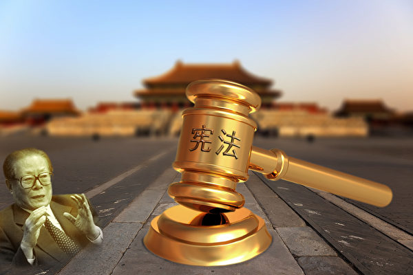

2016年9月22日，山东聊城中级法院撤销法轮功学员倪汝菊一审被非法判刑2年的判决，退回冠县法院重新审理。 

 
 【大纪元2018年09月14日讯】在中共对法轮功持续至今已经十九年的迫害中，难以计数的法轮功学员被绑架、诬陷和判刑。仅二零一八年上半年，就有近两千四百人次被绑架，非法庭审三百八十场，四百三十人被非法判刑。

法轮功教人向善，中共是真正的邪教，可是各地公检法系统对法轮功学员实施迫害时，都是打着《刑法》三百条第一款“利用邪教组织破坏法律实施”的名义强加罪名，其所依据的是《最高人民法院、最高检察院关于办理组织、利用邪教组织破坏法律实施等刑事案件适用法律若干问题的解释》（简称两高司法解释）。

被中共邪教所操纵的两高在司法解释中，通过炮制伪证、编造罪名，将法轮功学员捍卫信仰自由的努力诬陷为“利用邪教组织破坏法律实施”，这本身就是中共邪教陷害好人的违法行为，是真正的破坏法律实施。

<b>炮制伪证，通过一个非法的“认定意见”将法轮功学员捍卫信仰自由的努力与“利用邪教组织”关联起来。</b>

中共为其邪恶政权伪造合法性，也效仿文明国家设立了宪法，既然设立宪法就应该遵守宪法，可是无法无天的中共邪党从来都视宪法为废纸。

《宪法》第三十六条规定：公民具有宗教信仰自由。信仰自由就包括以合适的方式和手段制作和传播信仰宣传品的自由，否则这种所谓的信仰自由就会成为一句空话。法轮功学员信仰真、善、忍，实践真、善、忍，家里自然就会有法轮功书籍和各种出版物、电子刊物等；在被迫害的情况下，法轮功学员通过口头交流、网络、发放传单等多种方式讲述真相，是合法行为。

在中共的迫害中，这一切都成为了迫害的证据。两高司法解释第十五条：“对涉案物品是否属于邪教宣传品难以确定的，可以委托地市级以上公安机关出具认定意见。”这条表面上说是认定“邪教宣传品”，实际上就是在认定“邪教”，而且是地市级以上公安局就有权认定。从法律上讲，无论是最高法院也好，还是最高检察院也好，其权力的来源及合法性只能是宪法和法律的规定，在中国，并没有任何一部法律赋予最高法院和最高检察院具有指定一个机构去认定一个组织是否是邪教组织的权力。

公安机关的职责是搜集证据，而不是制作证据。但在两高的授意下，公安机关通过制作一个“认定意见”，将法轮功学员持有的或传播的法轮功书籍、出版物及电子刊物等认定为邪教宣传品，将法轮功学员的合法行为与“利用邪教组织”联系起来。各地被迫害的法轮功学员案卷中，几乎人人都有一份或几份当地公安机关的“认定意见”，各地公检法系统再以这个“认定意见”为依据，套上原本毫不相干的《刑法》三百条，对法轮功学员进行非法起诉和诬判。

在对法轮功学员的非法庭审中，几乎每个律师都会问法官同一个问题：哪一条法律规定了法轮功是邪教？没有一个法官能回答上来。

<b>编造罪名，将“制作、传播信仰宣传品”等同于“破坏法律实施”</b>

所谓破坏法律和行政法规的实施，是指行为人的行为导致某部法律或行政法规整部或部分不能在实际中应用或施行，这可不是所有的人都有这个能力的，有这种能力的人只能是拥有国家公权力的人。

在法轮功学员被迫害的案例中，几乎所有的法轮功学员都会质问办案人员：究竟破坏了哪一条法律的实施？没有一个公检法人员能回答上来。也没有一个公检法人员能说清楚究竟破坏了什么法律、行政法规实施，破坏了哪一条、哪一款、哪一项，起诉书同样没有这方面的指控和说理，即所谓犯罪客体只是一个虚幻的概念。

实际上，各地公检法系统对法轮功学员实施迫害，并不是依据《刑法》三百条，而是依据两高的司法解释，将“制作、传播信仰宣传品”的行为规定为犯罪。

两高在司法解释中脱离《刑法》第三百条规定的“利用邪教组织”和“破坏法律实施”的犯罪构成，将“制作、传播信仰宣传品”的行为规定为可以按照《刑法》第三百条定罪处刑，制造出“制作、传播信仰宣传品”的新罪名。

两高制作出这个新罪名以后，公安机关就按这个新罪名搜集证据。从以前的发放真相资料被恶意举报引发抄家到今天的实名制认证对法轮功学员进行随身物品搜查甚至手机内存扫描，就是在搜集所谓证据企图进行进一步的构陷。

法轮功学员被非法提审或庭审时，经常会出现这样一个场面，就是公安人员或法官只让法轮功学员回答“是”或“不是”。比如，这些书籍是不是你制作的？这些资料是不是你发放的？等等。因为在这些公检法人员看来，只要回答了“是”，就可以按照“制作、传播”进行定罪了。

两高编造的这个新罪名还将法轮功学员持有的个人物品也列入到所谓的指控证据中。有些法轮功学员被绑架时身上并没有任何物品，为了罗织证据，就把非法抄家所得的个人物品，以“预备传播”为由，将法轮功学员诬判。

<b>两高破坏法律实施</b>

《刑事诉讼法》第四十八条规定，证据的法定种类共八种，但无一种是称“认定意见”的。并且在法轮功学员的案卷中，所有这些《认定意见》未附认定机构以及认定人员的资质文件，也没有认定人员签字。检察员似乎也知道这个“认定意见”非法，所以在起诉书中将这个“认定意见”称为“鉴定意见”以掩人耳目。

如果不考虑“认定意见”这个非法证据，法轮功学员制作、传播、持有的所有法轮功物品与“利用邪教组织破坏法律实施”的指控毫无关系，与《刑法》三百条毫不相干。

同时，《刑事诉讼法》第三条“罪刑法定”规定：法律没有明文规定为犯罪行为的，不得定罪处刑。除法律外，任何文件或司法解释均不能将某种行为规定为犯罪。

在我国，没有任何一条法律将“制作、传播信仰宣传品”的行为规定为犯罪，“制作、传播信仰宣传品”是两高在司法解释中制造出来的新罪名。两高完全超越了司法解释的权限，代行了立法权，违反了《刑法》第三条、和《立法法》第一百零四条的规定，是违法行为。

法轮功教人向善，中共是真正的邪教。两高司法解释通过炮制伪证、编造罪名，将法轮功学员捍卫信仰自由的努力诬陷为“利用邪教组织破坏法律实施”，是对宪法信仰自由原则的践踏，是对中华人民共和国刑法规定的曲解和滥用，是真正的破坏法律实施。

<h1 align="center"><b>加拿大《环球邮报》报道中共法庭非法庭审孙茜</b></h1>

【明慧网二零一八年九月十三日】“我没有，也不会做任何违法的事情。”加拿大法轮功学员孙茜九月十二日在北京朝阳区温榆河法庭上说。她在被非法拘禁十八个月后，当局第一次进行了这个为期一天的庭审。

孙茜

据加拿大《环球邮报》（The Globe and Mail）九月十二日报导，孙茜是加拿大公民，渥太华对此案格外关注，加拿大外交官员一直和狱中的她保持联系。在外界压力下，中共当局答应进行公开庭审，加拿大外交官被允许参加。但是，环邮记者被禁止进入，欧洲大使馆的代表也被禁止进入。

加拿大外交部长方惠兰（Chrystia Freeland）曾表示，孙茜和其他加拿大人在中共监狱里的遭遇是“可怕”的。

孙茜的律师、母亲和兄弟向邮报讲述了庭审经过。

<b>在拘留期间受到虐待</b>

温榆河法庭是一座位于北京遥远郊区的三层楼。环邮记者被要求离开法院入口处。与此同时，许多警察、便衣和“综合管理办公室”的人员则挤在那里。

现年五十二岁的孙茜曾是亿万富翁，她是利德曼生物化学上市公司的共同所有人。二零一七年二月十九日，一群警察偷偷溜进她的北京别墅并将她绑架。

孙茜在法庭上说，她最初被非法关在一个地方。

她的律师李劲松说，在那里，“工作人员甚至不给她一口水或一粒米饭。”

李劲松说，一名检察官称“他们没有做那样的事情”，但他们既没有提供证据，也没有提供监控录像。李劲松表示，当局应该有录制视频，只是不敢拿出来。

周三，孙茜穿着自己的衣服戴着手铐出现在法庭上。她的家人形容她身体健康。

但她描述了在拘留期间被虐待的情形，包括今年五月，她被警察推倒在地上并被喷洒胡椒水。

她的母亲李云秀说，在法庭上，孙茜说“她案件的所有要素和程序都是非法的。她相信修炼法轮功是合法合理的”。

预计法院不会在几周内做出判决，孙茜十八个月的监禁给家人带来深深的伤痛。“看到我的女儿被拘禁，所有这一切都让我痛苦，让我非常非常伤心。”李云秀说，“生活在这样一个没有自由或人权的国家，我感到难过。我的心很痛。”

<b>丈夫因为婚外情利用信仰打击孙茜</b>

由于多年来辛苦打拼，身心操劳过度，身体严重透支，孙茜一度患忧郁症、肩周炎、肝坏死、心悸、心脏骤停等重症，多方医治无果。二零一四年，孙茜开始修炼法轮功，身体很快恢复健康。

中共当局从一九九九年开始迫害法轮功。孙茜被指控“组织、利用×教来破坏法律的实施”。中共当局通常借此非法拘禁法轮功修炼者。

孙茜周三表示，她的丈夫因为婚外情用她的信仰来打击她。

孙茜被捕后，她的丈夫沈广仟把她的财产和公司股份都转在自己名下。周三，孙茜指出，沈广仟与他做警察的朋友一起绑架她，然后在她被拘留期间伪造她的签名进行资产转让。

沈广仟一直没有回应《环邮》的采访请求。

法院拒绝了李劲松律师要求盘问沈广仟和家里保姆之后，孙茜是唯一在法庭上作证的人。李劲松表示，该案中有很多错误，比如逮捕令上的日期是在孙茜被抓以后。“很明显他们造假了。”他说。

<b>中共试图限制该案的影响</b>

律师黄汉忠说，孙茜案在中国非常普遍，她的案子“并不是非常特别”。黄汉忠是在受到政府压力后，不得不退出该案的众多律师中的一个。“中国的法院每年都会处理大量类似案件。”

他认为，中共当局一直以“非常野蛮和非常血腥”的方式对待意识形态的威胁。

黄汉忠批评中共当局没有遵守自己的法律。例如，对孙茜的审判应该是公开的。但当《环球邮报》记者和欧洲外交官抵达时，一名法庭工作人员出现了。“我们原本希望让你们进去，但不幸的是法庭上没有足够的座位。房间已满，我们无能为力。”这名工作人员说。

然而，那个房间过去可以容纳更多的人。当孙茜的妹妹孙赞于四月二十三日来到这里参加预审时，有三排座位。这一次，只剩下两排。有些座位是给加拿大外交官和家属的，其余的则被警察和孙赞从未见过的人占用。

孙赞说，他们一定是政府安排来填补座位的。她认为，中共是想要限制该案的影响。

<h1 align="center"><b>一位大陆学生的思考</b></h1>

【明慧网二零一八年九月十一日】也是惭愧，我作为一个长春人，这么久以来对法轮大法的了解却一直都是片面的。中共当局的各种宣传，以及从小到大所看到的政治教科书上，无不采用了同一种不容置疑的说法。那时候还小，也就没有深思地全盘接受了当局的宣传灌输。现在想来，或许从那时开始，思想就被无形枷锁束缚了。
就这样，某些从小就被潜移默化中养成的观念一直持续了很久，直到有一天和一个学法轮功的朋友交谈，才算真正意义上听到了不一样的声音。

在得知他是修炼人的时候，我的第一想法是恐惧，然后想要逃避。不过呢，朋友是那种三观很正的人，他平时的所作所为我都看在眼里，他是很好很好的一个人，我对他也一直存在一种敬仰。我那时候只是抱着一个想法，如他这般的人，断然不是邪恶。大概是这样的信念，才让我强行按捺住心中的不安，静静的听完了他的讲述。可能因为经常读历史的缘故，我倒也不认为政治立场的不同会导致朋友之间的反目。所以我们心平气和的探讨和沟通，他也拿出了大量的证据。然后我才发现，也许，有些事，我从一开始就想错了。

各种深植脑海的观念从来都不是一朝一夕间铸就而成的，所以说，突然一天被告知之前所信奉的一切全都是假相，世界观、人生观、价值观在一朝之间全部崩塌，那种绝望，那种无助，真的可以让一个人沉寂很长一段时间，甚至可能对一切都失去了信心的。

最开始的那段日子很黑暗。我用朋友给的途径开始浏览大量书籍，包括《九评共产党》和《马克思的成魔之路》等。然后又翻阅了其中各种引用段落的全文，包括《圣经·启示录》等。那时的我对一切都开始充满怀疑，泡图书馆，查资料，无论是海外还是国内的论述，企图通过逻辑思维来找出点谬论以安慰自己充满质疑的心。

最后，我叹息着承认，现如今世风日下人心不古，日益浮躁的现实无处不展现着这个时代确实是缺少了一种正念。法轮功当真如当局所说是所谓的反华势力吗，却不知，究竟何为华夏？千百年来，中华民族经历了朝代迭起，风云变幻，一个传承了千百年的民族灵魂岂是由某一个政权所控制的。我想，我忠于这个国家，忠于这个民族，但我，真的做不到盲目忠于某一个执政党。

然后我在朋友的劝说下开始阅读明慧网上的文章了，可是，就如同二维生物无法理解三维空间的存在一样，我的已有认知完全不能接受那些与修炼有关的信息，无论怎样，心里都拒绝相信。后来试图用网络上的修仙小说思想来代入，更是南辕北辙。朋友倒是很理解，无论我问出多么不经过大脑的愚蠢问题，朋友都耐心为我一一解答，并不时安慰我，给我指点前路。

当时也不是很在意那些的，只想着或许还是缘份不到吧，就这样怀揣着将信将疑的态度，算是勉强同意了三退。不过呢，当时并没有多少真心，还是抱着两不得罪的心态，想着反正是化名，也不怕什么。

后来有一天睡不着，夜里爬起来读了一会儿《转法轮》，然后又上了明慧网，不小心看到了李洪志先生的照片。他的眼睛似乎蕴藏了星辰大海，如同坐在对面看着我一样，不知为何心里一惊，竟不敢直视。偷眼瞄了好久，我突然醒悟过来，仅仅是靠朋友给我做所谓的三退是没有用的，只有我自己内心深处真正意识到了什么是正确的，什么是错误的，我才能算是真正从中逃离。

想着朋友以前一直跟我强调缘份的重要性，总是跟我交流沟通，费尽心力地想要救我出来，我却总是抱着无所谓的态度，难怪心性总是难以提高了。

我既然有幸得以窥到真相，就一定会珍惜这一切，才不辜负朋友的苦心，也不辜负李洪志先生的暗中关照。纵然人在迷中，也要上下求索，才能悟出宇宙间最朴素的道理。

<h1 align="center"><b>临大难而不惧 一位韩国消防员的心路历程</b></h1>

【大纪元2018年09月01日讯】（大纪元记者赵润德韩国首尔报导）危难关头，挺身而出，无惧水火，挽救生命。这就是深受人们尊敬的消防员的日常工作。

44岁的辛相教，是韩国仁川广域市南区新岘洞119消防安全中心的消防队长，拥有13年的消防员经验。他说，很多人会认为消防员的心很坚韧，但是在这一行业经历的事情越多，就会变得迟钝。“对于性格暴躁、遇事非常敏感的我来说，在那样的环境下能走到今天并成为该中心的消防队长是很难的。”

走过十三个年头，在危险与灾难面前无所畏惧，辛相教说，自己的成长得益于拥有精神信仰。

<b>修炼 改变了一切</b>
 
15年前，辛相教在一个偶然的机会走入法轮功修炼中。从此他的人生改变了。

辛相教大学毕业后，边做家教边进行韩国公务员的备考准备。有一天，在做家教的学生家门前看到一张介绍法轮功的传单。

“传单上的内容深深吸引了我。”法轮功是以“真、善、忍”为指导修炼的性命双修功法，还有五套缓、慢、圆的炼功动作，有良好的健身效果，令他兴奋。辛相教说，“每天学习，不论是体力还是精神都很疲惫，因此心里一直在寻觅有什么方法能帮助他，法轮功正好能解决我所面对的困境。”

辛相教回忆说，走入修炼后，他发现法轮功指导修炼的书籍《转法轮》就像沙漠中的绿洲，为他提供了身体和心灵上的休憩，遇到任何事都能渡过难关。

此前，为了参加韩国公务员的考试，他每天都闷在图书馆逼着自己学习，学习一段时间之后就觉得内心烦躁，头脑混沌，精力难以集中。

可是，修炼后，他发现，每次阅读指导人们修炼的《转法轮》一书时，感觉就像一泓清泉缓缓在他内心里流畅，不知不觉中烦躁的心态变得平和且身心轻松。而且，头脑变得清晰、注意力集中，心情愉快，学习效率大大提高了。他还惊奇地发现，他的记忆力也增强了。

他说，在修炼前准备专利师考试，连续几年落榜。修炼之后，“我准备了消防公务员公招考试，结果就考上了。我自己都大吃一惊，因为这个考试不简单，而且我只准备了那么短的时间。”

从那时起，得益于修炼，他的人生开始了新的启程。

辛相教正在炼法轮功第五套功法。

<b>成功戒掉烟酒</b>
 
很多人都有戒烟、戒酒的经历，但是往往以失败告终。人们认为吸烟喝酒能缓解压力，这就使得戒烟戒酒变得更加艰难。

辛相教说，他以前是个典型的“瘾君子”，烟瘾、酒瘾特别大。平时学习之余，为缓解压力和疲劳，总习惯叼著香烟或喝点酒。但是修炼才短短的一个月时间，他竟然神奇地戒掉烟酒了。

回想起那段神奇的经历，辛相教说，那个“烟虫”突然消失了，“周围的人听说我戒烟了，都说我对自己真狠。其实，我并不是下狠心戒掉的。真的是很自然地不知不觉地戒掉了烟酒瘾”。

<b>消防员精神</b>
 
谈到自己在此岗位走过十三年的风风雨雨历程时，辛相教表示，消防员所面对的事情都会剧烈地冲击着人的精神，像大的火灾，无情地吞噬着人的生命，瞬间将一切化为灰烬。在这些灾难面前，人是如此地不堪一击，亲自经历过的人往往产生绝望感。

他说如果不是因为修炼，他也很难走到今天，更不用说成为指挥官了。他说：“修炼之前，我的性格很敏感，一点小事儿就能让我的心情大起大伏。如果没有修炼法轮功，我很难抵挡这份工作带来的精神冲击。”

辛相教在日常生活中用“真、善、忍”的原则做指导，处处为他人着想。他表示“通过修炼，在工作中，我既可以做到珍视别人的生命，为了他人挺身而出，又可以避免事后的那种脆弱感、无力感和绝望感。”

既可以为了他人，将自己的生死置之度外，又可以勇敢地直面世事的无常，这可说是消防员的精神了。

辛相教在阅读法轮功相关书籍。

<b>团队协作</b>
 
“我的敏感而暴躁的性格，在修炼后变得温和了。”辛相教表示，比起戒烟戒酒，自己在性格上的变化更是令人惊讶。

辛相教说，“修炼之前我是一个性格很糟糕的人，经常发火，对人刻薄，一点小事儿就大发脾气。”周围的人也对他采取避而远之的态度，人际关系很紧张。而法轮大法修炼要求修炼者时刻保持一颗祥和的心态，遇事找自己哪里做错了，如何替对方着想等。慢慢地，他的性格变柔和了，周围人都称赞他变化很大，说现在的他就像一块温润的玉石。

作为消防队长，辛相教经常要比职员早上班，确认好当天的事情，准备好能按时出动的装备，他说：“消防队长可以左右手下25名职员的工作气氛。维持一个安定积极的心态很重要。”

“我的心理安定的话，职员们也会安定，工作气氛就会变好。神奇的是，那天也不怎么发生事故，我发现，维持好的心态是我的一个非常大的责任。”

随着不断的修炼，辛相教慢慢放淡了利益之心，在个人利益面前不争不抢，而是退后一步。作为消防一队之长，他是该消防中心的第一负责人，他没有为了维护个人地位而防备下属，而是下放权力，“我完全信任他们，并给予他们最大的权限”。这样，该中心的小队长可以充分发挥自己的主动性，带好团队，团队之间的协作关系良好。

为了把法轮大法的美好分享给善良的人们。周末，辛相教常常去韩国富川站，向路过这里的人们讲述着法轮大法的美好，同时也告诉人们，中共至今对修炼者的迫害还在继续，甚至活摘法轮功学员器官的邪恶事实也仍在发生著。

“以前经常去月尾岛和码头向中国人讲真相。我觉得现在中国人的反应比以前好了很多。不管是中国人还是韩国人，当他们了解真相后向我表示感谢时，我感觉很欣慰。”

“珍重法轮功，就像珍重我的生命一样”，辛相教说。

<h1 align="center"><b>近三个月吉林省政法系统六人落马　610头目惨死</b></h1>

【明慧网二零一八年九月十日】（明慧网通讯员吉林报道）自二零一八年六月以来，吉林省政法系统官员纷纷落马，其中法院院长四人，副院长一人，政法委书记一人，省610主任惨死，这些人无一例外都是迫害法轮功的直接责任人。
所谓的“610办公室”是人权恶棍江泽民于一九九九年六月十日纠集的非法组织，专门迫害法轮功，类似纳粹盖世太保。

1、二零一八年六月上旬，吉林省政法委610头目孙恒山在办公室遭下属狂砍数十刀，医治无效死亡。

孙恒山，男，一九六一年六月出生，五十八岁。曾任吉林省纪委驻高法纪检组长，自二零一五年十一月致死亡前任吉林省610办公室主任。

其在职期间，一直执行江氏犯罪集团和中共的迫害政策。在吉林省政法委610操纵下，根据明慧网记载，二零一六年吉林省法轮功学员至少有840人受到精神和肉体上的摧残，其中有8名法轮功学员在迫害中离世；66人被非法判刑；31人被非法庭审；22人被非法起诉；24人被非法批捕；8人取保候审；293名法轮功学员被非法抓捕、强制洗脑及超期关押；286人被非法行政拘留及刑事拘留；102人被骚扰及绑架未遂。被迫害的840名法轮功学员中，至少有140人被非法抄家，被抢走及勒索现金460308元。

二零一七年吉林省共有2446名法轮功学员遭到中共公检法司部门不同程度的迫害。其中：遭受各种经济迫害的法轮功学员72人次，迫害致死16人，失踪1人，非法判刑100人次，非法庭审17人次，非法起诉15人次，非法批捕22人次，绑架712人次，骚扰1441人次，强制洗脑39人 次，流离失所11人次。

2、二零一八年六月二十一日，长春市中级法院原中共党委书记兼院长张德友严重违纪被双开，七月二十日涉嫌受贿被起诉。

此前，张德友曾枉判法轮功学员孙景和。孙景和被非法判刑后，上诉到长春市中级法院刑事二庭，张德友亲自做了本案的审判长，在法律与正义面前做了邪恶选择，维持对孙景和的非法判决。孙景和修炼法轮功后，身体疾病不翼而飞，做人的陋习全部改正。此事在当地有口皆碑。四百多村民签名按手印支持释放好人孙景和。

3、二零一八年八月三十日：长春高新技术产业开发区法院院长张凤军涉嫌严重职务违法被调查。张凤军在法院任职期间，追随江泽民流氓集团迫害法轮功，二零一六年十一月十日，长春市高新区法院对法轮功学员王永青非法开庭。开庭前，法院违法拒绝辩护律师出庭。王永青被诬判五年，现已被劫持到吉林监狱。

4、二零一八年八月三十日，德惠市法院院长袁中山涉嫌严重职务违法被调查。袁中山从二零零二年三月至二零一八年，先后在长春市宽城区法院、长春市中级法院、长春经济技术开发区法院、长春市中级法院、德惠市法院任职。

任期积极追随江泽民流氓集团迫害法轮功，尤其在任德惠市法院党组书记、代理院长、审判委员会委员时更是肆无忌惮，早已在明慧网的恶人榜上被曝光。

二零一七年三月二十四日，吉林省长春市德惠市法院对被非法关押半年之久的法轮功学员崔涛、王成顺、郝杰、马宝舫、张凤秋、胡波、李瑞凤、李绍珍、杨金玉、杨金凤进行非法庭审，不让他们自己请辩护律师，都必须由法院自行指派律师。

构陷所谓的“证据”竟然是由国保大队制作的光盘，大约十盘左右，里面都是一些模糊不清的截图。开庭过程中公、检、法相关人员沆瀣一气，制造冤假错案。

法院通知每位当事人只允许两位家属出庭，但必须得是非法轮功学员。进庭前还必须得到国保的允许，崔涛的老伴被德惠国保大队娄兴岩当场强行推出门外，杨金玉的母亲被国保大队的指导员魏永生等人拖走不允许进入法庭。

5、二零一八年七月吉林市丰满区法院院长王君先被纪律审查和监察调查。王君先在法院任职期间追随中共江氏一伙竭力迫害法轮功，致使数十位法轮功学员被非法判刑。

王君先，男，一九六四年三月生，吉林桦甸人，二零零二年七月任吉林市桦甸市法院纪检组长，二零零三年十二月任副院长，二零零八年八月任副院长、邪党组副书记，二零一一年八月调蛟河市任院长、邪党组书记，二零一六年八月调任吉林市丰满区法院院长。

王君先在桦甸市法院任职期间，从二零零二年到二零一一年八月，桦甸法院至少对十五位以上法轮功学员非法判刑，刑期从三年到十二年不等。他们被劫持到监狱，均受到强制洗脑和酷刑迫害，有的被迫害致死。王君先作为桦甸市法院中共邪党组织的纪检组长、副书记、副院长，是邪党法院迫害法轮功的领导核心组成人员，对法院参与迫害法轮功学员所犯的罪恶负有责任。

王君先任吉林市丰满区法院院长职务期间，对吉林市部队转业军官法轮功学员白鹤，年轻的优秀女教师刘圣操、法轮功学员雷秀香、邢春荣（女）、邢春燕（女）等诬判负有罪责。

6、二零一八年七月二十五日，吉林省四平市中共邪党政法委书记孙艳军因严重违纪违法问题被开除公职，并以涉嫌犯罪问题及所涉款物被移送检察机关。

孙艳军从一个小小的梨树县委副书记，在几年之内官位升至四平市委常委、政法委书记，所有“政绩”只有一个，那就是追随中共江泽民残酷迫害法轮功。

四平地区是吉林省迫害法轮功学员较严重的地区，当地的610人员、公安局国保大队多次督促、胁迫、协同各市县迫害全地区的法轮功学员，迫害法轮功学员的石岭子监狱、公主岭监狱也在四平地区。四平市政法委书记孙艳军负有不可推卸的罪责。

7、二零一八年八月十五日，吉林省松原市乾安县法院副院长田博秋违纪被查。一个月前，该院已有四人被查：审委会委员、执行局长姚永德，执行监督庭庭长徐玖春，民一庭庭长张永民，审判员王清江。

田博秋，男，一九五八年八月生人，一九九七年十一月，从乾安县人大法制办主任（正科）职位上调入乾安县法院任副院长、审委会委员，一直到落马。从公开的消息看，他分管过立案、刑事审判、执行、法警等工作。

自江泽民邪恶犯罪集团迫害法轮功以来，田博秋就一直在追随江氏集团参与对法轮功学员的迫害。法院与公安、检察院及610邪恶组织（江泽民为迫害法轮功专门成立的非法机构）互相勾结，对多名法轮功学员非法判刑，加重迫害。其中，有两名法轮功学员遭非法判刑后，被迫害致死。

这些徇私枉法、草菅人命的案件在中国大陆时时都在发生，而中共邪党是始作俑者，可被卸磨杀驴的都是被邪党利用过的中共官员。奉劝那些还没认清中共卸磨杀驴的本性的官员，若还不金盆洗手，天要清算时，后悔晚矣。天理昭彰，善恶有报。

恶报，并不是法轮功学员希望看到的。希望仍在参与迫害者能够警醒，引以为戒，古人云；君子不立危墙之下，正视自己的危险处境，做出正确选择。

<h1 align="center"><b>无限感恩　悉尼学员排字展现大法美好</b></h1>

【明慧网二零一八年九月九日】（明慧澳洲记者站悉尼报道）一年一度的二零一八年澳洲法会本周日（九月九日）在悉尼召开。在法会的前两天，法轮功学员们在悉尼市中心举行了大炼功、游行和排字等活动。其中九月八日上午举行的排字活动，对很多学员来说，更具有十分特别的意义。

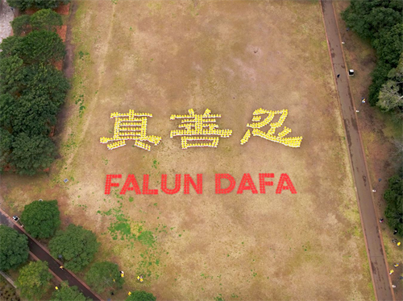

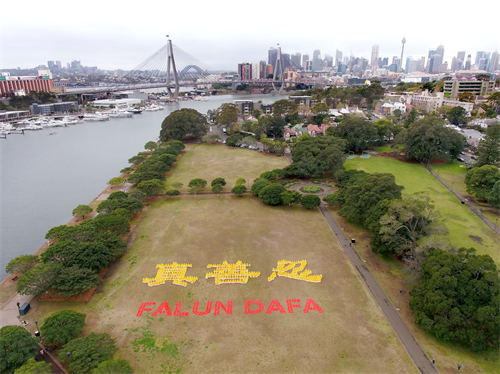

图1～2：澳洲法会前夕，二零一八年九月八日，法轮功学员在悉尼市中心海边的朱比利公园（Jubilee Park）举行排字活动。

二十年前的一九九八年四月二十七日，澳洲法轮功学员感念师尊李洪志先生传法度人的浩荡洪恩，首次在海外以大型排字的形式向人们传递法轮大法的美好与殊胜——数百人在悉尼著名地标之一的达令港（Darling Harbour）草坪上，排出三个巨大的金黄色中文字“真善忍”。排字的壮观场景被上空直升机里的西人摄影师拍摄下来，从此定格在历史画卷中。

二十年来，澳洲各界不同种族、年龄、阶层的法轮功修炼者，通过同化宇宙特性“真、善、忍”，在不断修心向善、返本归真的历程中，在反迫害的不懈努力中，为澳洲社会注入了回归传统、纯正祥和的清流。

今年的排字活动在悉尼市中心海边的朱比利公园（Jubilee Park）举行。法轮功学员们身穿明亮的黄色炼功服，在清晨的草地上排出了三个隶书体的大字“真善忍”，美丽壮观，承载弟子们对师尊的无限感恩和敬意，散发着祥和、光明、殊胜的正的能量，传递了法轮大法的美好。

<b>昆士兰学员：让更多世人了解真相</b>

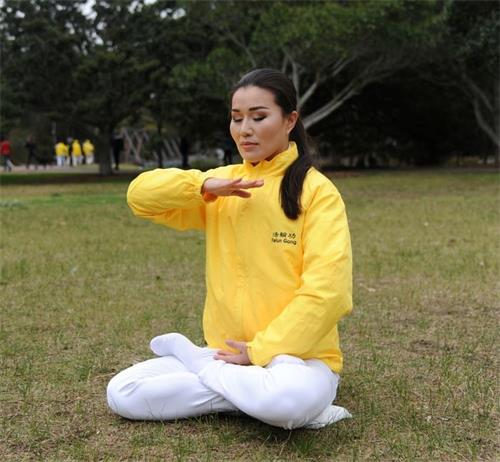

图4：来自昆士兰的林女士在排字现场。

来自昆士兰的周女士二零零八年移民澳洲，家族经营昆士兰一家著名企业，她表示，每次参加排字都感到非常幸福。

“二零一二年因为喜欢看大纪元报纸我才了解到了法轮功反迫害的一些信息，就自己上网搜索法轮功到底是什么？看了两遍《转法轮》之后彻底改变了我原来在中国大陆对法轮功的想法，知道了法轮功是教人做好人的。”她含着泪说，“我修炼法轮功最大的受益就是戒掉了困扰我十几年的、难以启齿的烟瘾，让我能堂堂正正的做人了，真的很感恩。”

周女士表示，她之前为了体验排字专门去了一趟台湾，她说：“当时坐在排字的队伍里有一种说不出来的殊胜。排字的时候看到外面那么多的人都驻足，看我们大法弟子排字，我真切地体会到了大法弟子聚集在一起的能量是非常大的，更明白了我们肩负的责任和使命。”

她最后说：“作为海外的一名大法弟子，我希望今天坐在这里能尽一份自己的责任，让更多世人了解真相，为中国国内的大法弟子减轻压力。我相信总有一天我们国内的大法弟子和国外的大法弟子都可以溶为一体，就像今天排字的场面一样，这么多大法弟子坐在一起成为一个整体，展现大法的美好。”

<b>国际房地产公司女老板：修炼后看淡利益，公司更壮大</b>

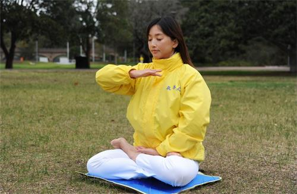

图4：来自昆士兰的林女士在排字现场。

来自台湾的林女士，于二零零二年开始修炼法轮功，目前在昆士兰经营一家国际性的房地产销售开发公司。

“二零零二年我的婶婶在身患癌症几经治疗无望后，经朋友介绍开始炼法轮功，三个月的时间身体恢复如初，我也就跟着婶婶一起修炼了。”她说，“修炼法轮功后，我真正明白了人生的意义，在开创自己事业的同时不再感到孤单了。员工之间有了矛盾我也会以平常心对待，在各种利益面前我都会看淡看轻。员工看到我修炼大法后按照真善忍的准则做事，都受我的影响，平时工作中也都规范自己的言行，从而使整个公司的业务更壮大。”

她还说：“修炼大法也让我与家人的关系变得更加和睦，因为之前开公司非常忙，忽视了和家人的联系，修炼后我渐渐地开始主动多关心家人，特别是我跟哥哥的关系变得越来越好，现在我的哥哥嫂嫂出现家庭问题都会来找我解决，因为他们知道我修炼后变得更好，很多事情都说的很在理，所以常常来问我的意见。”

她最后表示：“今天和来自各地的同修们到这里排字，就是让世人知道法轮大法好。”

<b>新西兰大法弟子：幸福和感恩</b>

图5：来自新西兰的韦女士。

韦女士来自新西兰，是一九九七年就开始修炼的老学员。她加入新西兰天国乐团至今已有十二年，去过不少国家，参加了无数场大大小小的游行。身为劝三退（退出中共党团队）的义工，也亲眼见证越来越多的中国人了解真相后，退出中共邪党，为自己选择了美好未来，她说从内心深处感到高兴和欣慰，同时也感悟到大法的威德与无量慈悲。

她说：“这次参加澳洲法会和排字是非常期盼的事情。因为，十多年前看到台湾学员排字活动时，就有一种向往，希望能够成为其中的一个粒子。这次终于夙愿以偿，感到很幸福。”

回顾二十一年来大法修炼的历程，她表示，自己就像是从一个蹒跚学步的婴孩，在师父的慈悲保护下，一步一步走到今天，“在这其中，感到自己的身心不断地净化着，逐步地成熟升华着。无数次从内心深处感恩师尊的慈悲救度，用尽人类的语言都无法表述对师尊的感恩。”她说。

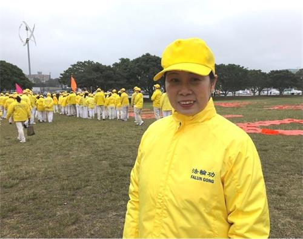

图6：来自新西兰的赵女士。

同样来自新西兰的赵女士，修炼之前各种疾病缠身：中耳炎、颈椎病、中枢神经炎、胃溃疡、胆囊炎、胆结石、失眠症等，长年以药罐子相伴。一九九五年被病魔折磨得生活不能自理，身体非常虚弱，最后瘫痪在床上一年多。重病期间去过很多的大医院找专家就诊，所有现代最先进的仪器也没查出病因。中医，西医，针疚，中药都试过，没有任何效果。那时的她，整天躺在床上每分每秒都在病痛中挣扎，在与死亡抗争。看到多方求医无望，曾经有过轻生的念头。

一九九七年一个偶然机会，她参加教授法轮功的九天班，看完师父的第六讲的录像，她居然可以自己走回家了，而前几天都是被接送到教功现场，短短的几天时间，身体发生了神奇的变化。多年来几乎忘记了“什么是健康”的她，感受到了无病一身轻的快乐和幸福，她说：“真是久旱逢甘雨，大法显神奇，家人、单位同事和朋友看到我脱胎换骨的变化后，都对大法的神奇赞不绝口，有的也走入了大法修炼。”

她还感慨道：“就像这首唐诗中说的，‘随风潜入夜，润物细无声’。在师尊慈悲的保护下，我从二十年前胆小、羞涩、无主见的弱女子，悄然间成为了一名坚定的大法徒。师尊的佛恩浩荡无法用人类的语言表达，没有师父的救度就没有我的一切。”“这次非常有幸能参加澳洲法会、游行及排字活动，此时此刻我心中有无限的感慨，感恩师尊，大法不仅给了我健康的身体，而且还给了我一个幸福快乐的家。修大法真好，有师父真幸福！”

<h1 align="center"><b>殃视为祸何时休？</b></h1>

【明慧网二零一八年九月六日】最近几天中共喉舌中央电视台制作播出所谓的《开学第一课》又被民众、媒体的谴责、声讨包围，九月一日是中国大陆孩子们开学的日子，在这一天到来前，教育部命令所有的学生观看《开学第一课》、上传学生观看该节目的图片并强令写出观后感。
民众、媒体一齐指向节目开始铺天盖地的广告，殃视借机敛财，并且人们非常反感的是统一论调的观后感。本来每个人的价值取向不同，一个节目或者一个事物再好也难免有不同的认识、感受，但是在中国这个邪党对人的思想极度控制，即使有不同认识也不敢说，只能说套话、空话，这就是对孩子精神自由的剥夺和阉割。对此事众多的评论使用了令人“恶心”、“欺骗”等词汇。

其实，在中国大陆谈起教育问题是件非常令人痛心的事，孩子们从小就被党文化毒害洗脑，殃视、教育系统等还时不时的、见缝插针式变幻着花样折腾孩子们。先不说如今被人们担忧的“寒门再难出贵子”的教育不公，就是你拥有“成才”的机会，在邪党独裁的中国，要么顺从邪党的意志成为它的帮凶，放弃做人的良知和骨气；要么被排挤、打压甚至失去人身自由和生命。比如在刚刚被邪党打压、糊弄过去的疫苗事件中，我们就能看到形形色色丧失人格人性的表演。笔者记得一篇关于此次疫苗事件的报道里，有个教授公开说出：“目前就是中国食品安全最好的时代”。该教授在文中极力为监管部门辩解，说发现问题不说明监管不到位，恰好说明监管是到位的。

这耸人听闻的话语震惊着笔者的心，疫苗造假事发于内部职工的实名举报，哪里有一点监管部门起作用的影子？

在随后出现的猪瘟事件中，更有“非洲猪瘟病毒并不会传染给人”的论调大肆宣扬，甚至有人因为发表“少吃猪肉”的言论而被抓的闹剧上演。

孟子说：“无善恶之心，非人也”，做人最起码的标准是知道是非善恶、说违心的话、说错话知道羞耻，否则即便是披着人皮已经掉下做人的底线。可是邪党就是强迫、逼迫、欺骗每个人放弃良知、自我意识和精神，做顺从它作恶的人。

此时此事不禁让笔者想到迫害法轮功的元凶江泽民，这个十恶不赦的歹徒与中共互相利用，对法轮功及学员实施“肉体上消灭、名誉上搞臭、经济上搞垮”的灭绝人性的残暴政策，进行了长达十九年的迫害；数千名法轮功学员酷刑致死；很多法轮功学员在活着的时候被强行摘取器官后遭焚尸灭迹。这个罪恶滔天的、心理变态的暴徒也无耻说：现在是中国人权最好时期。

殃视则被人们形容成党的一条狗，其长年累月播出的新闻联播被人们总结出这样的规律：前二十五分钟播报国内形势一片大好，后五分钟告诉大家世界人民生活在水深火热之中。殃视所做的更加让人不齿、谴责、声讨的事就是抹黑、污蔑法轮功。

以被称为“世纪谎言”的“天安门自焚”伪案为例。二零零一年一月二十三日，中共为挑动民众仇恨法轮功，特意在天安门广场上演了一出自焚的闹剧。事后证明，这起自焚完全是一场骗局。单就第一个点火自焚的王进东来讲，中共殃视播放的镜头显示，王进东的棉衣裤子都被烧烂了，可他的头发却完好。两腿间盛汽油的塑料雪碧瓶在大火中也丝毫没有变形。

这个雪碧瓶为何能经受住烈火？这是有原因的。二零零二年初，参与炮制天安门自焚伪案的央视记者李玉强，到河北省会“法制教育培训中心”和被非法关押的法轮功学员进行所谓的“座谈”。有法轮功学员问她，王进东都烧成那样了，他两腿间夹的盛汽油的雪碧瓶子咋不变形？此问题不但提的突然，而且被法轮功学员分析得非常透彻。李玉强一时语塞，面对下不来台的窘境，她才承认：王进东腿中间的雪碧瓶子是他们放进去的，此镜头是他们“补拍”的。像这样的穿帮镜头、伪造情节、违反医学常识的痕迹还有很多（详情请登录明慧网查询）。

二零零一年八月十四日，国际教育发展组织在联合国会议上，就“天安门自焚”事件，强烈谴责中共的“国家恐怖主义”行为，并发表声明说：自焚事件的录像分析表明，整个事件是“政府一手导演的”。中国代表团在强大的证据面前没有辩词。

就是这样的谎言被写进孩子们的教科书，毒害懵懂的孩子们，即使是现在还在利用来毒害世人。敢于讲真话传播真相的法轮功学员和民众，很多人被投入监狱、劳教所、看守所、洗脑班迫害。

邪党不灭，它和它操控的殃视及媒体还会继续为祸人间，解体中共、退出邪党一切组织是破解所有祸患的唯一办法，也是每一个善良的、有责任感的中国人的正确选择。迄今，超过三亿有识之士退出邪党则表明了人心向背和邪党摇摇欲坠的现实。

<h1 align="center"><b>找到“希望”　把握人生</b></h1>

【明慧网二零一八年九月五日】（明慧记者雪莉德国采访报道）家住德国南部的邬苏拉（Ursula）看上去很正常，吃饭睡觉，操持家务，可实际上，她的身体和精神状况很糟糕，以至于“生活”的正常感受应该是什么，她并不知道。饱受煎熬的她，在四十四岁的那年忽然重新焕发了生命的光彩。
邬苏拉的家庭再美满不过了，一个体贴持重的丈夫，三个健康懂事的孩子。可是邬苏拉常对朋友说的一句话是：“不是这样的，你们不懂，我其实一无所有。”

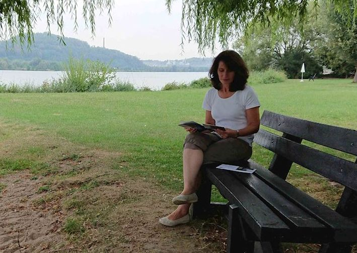

图：邬苏拉修炼法轮大法，生命找到了希望

<b>生不如死</b>
 

从十四岁起她常常觉得累，昏昏沉沉打不起精神，只想睡觉，状况时好时坏。每隔几星期就瞌睡不断，注意力和记忆力随之下降。睡眠很差，每夜做着无边无际的梦。医生对于这种状况也感到困惑。鉴于健康状况，大学毕业后她只能做些短期的半职工作。大学毕业后她结了婚，很快有了第一个孩子。照顾这个小生命成为她每天挣扎起床的理由。

“出于责任心，我强迫自己起来做饭洗衣，丈夫见我身体虚弱，下班回来就替我分担很多家务，我心里很自责。看孩子长大我没有半分喜悦，每一个细微的事情都让我不堪重负。三年后我们有了第二个孩子，又过了三年有了第三个。没有三个孩子的出生，我可能会没有白天黑夜的睡，照料家人的饮食起居迫使我有身体活动，然而每一个生活当中的问题都因为让我耗尽心力而成为一个更大的问题。我不知道活着的意义是什么，生命的愉悦我没有过，我每天挣扎起床，做必要的事，然后入睡。我没有‘生活’过，我在呼吸吃饭喝水，但是我不是在活。一个人的时候我常常绝望的哭泣，不知道这样的生活什么时候有个尽头。”

<b>放弃努力</b>
 

二十一岁那年，是她最后一次去看医生，走出医疗所时，心里感受到的除了失望还是失望，她意识到医生其实根本束手无策。她对吃药有抗拒，她需要“保持清醒”，她“不能让别人让药物来完全控制我的意识”。她决心自己想法儿自救。此后的三十年，邬苏拉尝试不同的方式恢复健康。她学习各种心理课程和灵修方法，先生不离不弃，一直陪在身侧，但是他们经历的是不断的尝试、放弃、再尝试。最后的那一次努力是瑞士的某心理课程，花了一万六千欧元，而那几乎是家里的所有积蓄。

“那次之后我彻底放弃了。三十年在尝试和放弃的重复中度过，我彻底绝望了。我几次想到过自己结束生命。”

邬苏拉的弟弟长期生活在南美。他每两年回德国一次度假。两人平时鲜有来往。二零零七年他回德国的时候，破天荒地请邬苏拉吃饭。

“在那家日本餐厅里，我向弟弟倾诉自己的不幸，一顿饭的时间，他都在听我讲生活的悲哀。我们并排坐着，他默默的听着，我的话如决了堤一般，倾泻所有的痛苦和绝望。忽然他站起身来，去了车里。一会儿拿来一本书，递给我说，‘你的状况如此糟糕，那就看一看这本书吧。’我低头一看，叹了口气，不想要，我不相信一本书能帮我什么。弟弟说：‘我读过这本书后，终于明白为什么耶稣说，打脸的一侧，给他另一侧。我以前从未明白过。’我转过头看着他。我们是在基督教的环境中长大的，我非常好奇耶稣的这句话是什么意思，但是弟弟不说下去了。我那时经济状况非常不好，就随口问他：‘那法轮功学员中有富人吗？’他说，‘有，当然有。’弟弟本身一直经济条件非常不错，我相信他。‘好吧，’我想，‘我先读一下这本《转法轮》再说吧。’”

<b>人生忽然有了目的</b>
 

从翻开第一页开始，邬苏拉就停不下来的读，如饥似渴不愿停歇。《转法轮》中的每句话象沙漠中的雨滴打入她的心，全身心每个细胞用力把每个字刻入心里。几个小时过去了，邬苏拉坐在深红色高背椅中，边上一盏低低的灯散发淡淡黄晕，无比静谧中，她却感到自己被拉着往前飞奔。她的心底升起两个字：“希望”，它显得如此真实，暖暖的，强烈而温和的存在着。

“我马上知道这是我一直都在找的，法轮大法可以让人圆满。我总是感觉缺了什么，在寻求一条路一种方法。读了许多宗教中的书，神的事迹，如何经历无数苦难后升华到另一境界去，这些故事在我很小的时候就神往。早在我二十岁的时候就希望自己能到达那种境界，身体的转化，我从未怀疑过神的存在。但是我总觉得还是有疑问。以前读到的宗教教义让我觉得到了某一点就停住了，再往前是什么不知道了。我感觉缺了什么，可说不清缺的具体是什么。《转法轮》读完后，我的心在说：是的，就是这样，果真可以再往前，去我一直向往的地方。”三个月后，她决定身体力行，向那个“所向往的地方”努力，这才是她活着的目的。她开始炼功。

起床的动力变为“看书”，丈夫孩子出门后进门前，都看到她捧着书看。她感到身上有了气力，脸上有了笑容，睡眠变得踏实，能够胜任的家务也多起来。在儿子女儿的喜怒哀乐，琐碎的油盐酱醋和丈夫的关切呵护中，她学习到什么是“生活”。

<b>走入真实人生</b>
 

“四十四岁那一年，我的人生真正开始。我每天感受自己的存在，生活的本身包含些什么，体会各种感受。我体会到我自己的存在，这真是太美好了。我有了选择，可以决定，比如以前别人约我两星期后一起出去喝咖啡，我没法答应，我不知道自己的健康状况到时候允许不允许，有没有气力。想和朋友一起做游戏或者玩什么，我不知道自己行不行。我那时只能拒绝。现在我能自己掌握，按照意愿安排，我是真的存在，和其他人一样，这和我之前不得不接受的完全是另外一个世界。”

邬苏拉开始去幼儿园和图书馆参与社会工作。她的头痛和失眠完全消失，她做的手工艺品在圣诞市场上深受欢迎。家里开始充满笑声。女儿说，“妈妈，你看上去神采奕奕，你看上去完全不一样，是不是用了新化妆品？”

转眼间三个孩子都已长大成人，也陆续有了自己的孩子，生命得以延续。“我在带大自己的孩子中没有尝到做母亲的喜悦。但是在孙子孙女那里，哪怕只是抱抱他们，亲吻他们，我感到做一个母亲是多么幸福的事。要不是法轮大法，我不会有机会体会这些，也不会活得这样真实。生命真是太美好了

<h1 align="center"><b>吉林女子监狱的罪恶</b></h1>

【明慧网二零一八年九月三日】（明慧网通讯员吉林省报道）吉林女子监狱从二零一八年三月末开始，在男监监狱长安彤宇、副监狱长魏丽慧、八监区大队长倪笑虹及帮教等人的密谋下，为了逼法轮功学员“转化”并写所谓“保证书”，对被非法关押在女子监狱的法轮功学员进行了新一轮的迫害。
他们的具体迫害手段包括：

一、强制要求背监规和写保证书，如果不从，就强制法轮功学员坐在一种矮矮的、带有凸起的“蛤蟆凳”上，凳子又凉又硬，有的监室，从早上五点半起床一直到晚上八点四十五，除上厕所外，其余时间就是一直坐着（包括吃饭时间），使被迫害者出现尿频、臀部起泡、大小腿酸胀肿痛的状况。

二、普通刑事犯都可以拥有的权利，对待信仰真善忍的法轮功学员却全部予以剥夺，如：不让用热水洗脚洗头，甚至不让洗澡；不让打电话，不让家人接见；不让买蔬菜、水果和咸菜、酱等消费品，每顿饭不许法轮功学员吃副菜，早餐只能干咽玉米糕，狱方指使刑事犯只给法轮功学员每天每人一杯开水，从人格和尊严上侮辱信仰法轮功的好人。

三、学员之间不能说话交流，不能一起上厕所，每次上厕所时间长或频就会被包夹辱骂，甚至不允许近距离接触，不能走出室内，不能靠近窗户，24小时被包夹监视中，如有违背，动辄就遭到包夹者（杀人犯、诈骗犯等）的无端指责、辱骂乃至暗掐暗打等。

四、纵容、指使刑事犯欺压侮辱法轮功学员，更以利益为诱饵，让那些无知的刑事犯成为监狱方迫害法轮功学员的帮凶，从而想达到让法轮功学员被“转化”的目的。

在此曝光几起狱警利用刑事犯迫害法轮功学员的几个案例：

1、刑事犯刘萍萍，受狱方的教唆和利用，经常用各种诡计设计圈套来迫害法轮功学员，从而导致善良的大法弟子刘香晫、牛亚芬被关小号三个月之久，在关小号期间，两人每人每顿饭只有一勺玉米糊，不能洗脸、不能换洗衣服、不能说话；还时常用一种恐怖的声音突然的刺激她们；夜间不定时的让她们起来报数。经过三个月的迫害，人走出小号时比以前瘦掉了三十多斤。“好人有罪，迫害有理”，刘萍萍因迫害好人“有功”，被大队长倪笑虹在全八区的表彰大会上提出表彰，并给予两套内衣作为奖励。直接助长了所有刑事犯参与迫害的气焰。

2、刑事犯巩翠杰（诈骗犯）和刘莉（诈骗犯）及郝兆云对法轮功学员李桂英的迫害。二零一七年十二月十八日，因李桂英抵制迫害，巩翠杰等三人一边辱骂一边武力相加，直接导致李桂英胳膊等处多出淤青。二零一八年二月九日，因李桂英不配合佩戴胸卡，以上三名刑事犯强拉硬拽让李桂英坐在播放污蔑法轮功的视频最前排的位置上，拉扯中，使李桂英后脑勺磕在墙上，疼痛难忍的李桂英血压直接升高到150。即使这样，巩翠杰还找来警察训斥李桂英，并伙同于桂华和高云霞等五六个人给李桂英强行灌药。警察高阳还拿出手铐恐吓李桂英，要把她铐起来送医院进行进一步迫害。

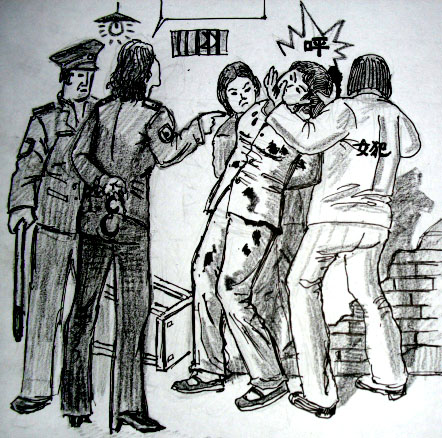

中共酷刑示意图：殴打、撞头

3、法轮功学员王续春（七十岁），在被迫害期间身体极度虚弱，腹部还长了一个鸭蛋大小的瘤子，经常疼痛难忍，有一次腹痛时她想和其她刑事犯一样享有同样的权利，能够在午休时上床休息一下，却被刑事犯付晓丹野蛮拒绝，强行把王续春拉倒在地，并用脚狠狠的踢打王续春。还有一名法轮功学员郑翠玲因为维权，被杀人犯毕国荣用板凳把头部打出鲜血。

酷刑演示：凳子砸头

4、法轮功学员程淑芳，曾经在黑嘴子女子监狱被迫害期间，被几个刑事犯多次殴打，有一次甚至把她的头浸在装满水的水缸里，呛坏了的程淑芳一直咳嗽不止，直接导致现在嗓子发哑；还有一次，几个刑事犯用遥控器狠击程淑芳的后脑勺，使她昏迷数个小时；更甚者有一次，行恶者直接一脚把她踢倒在地，致使其尾椎骨摔断，长时间不能坐立，经常尿血，腿部浮肿。

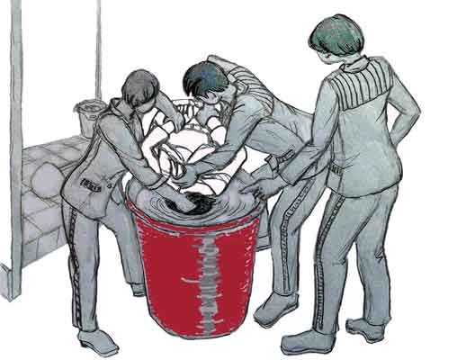

中共酷刑示意图：溺水——把人头按进厕所凉水桶里憋

这一桩桩一件件的罪恶只是本人所了解的吉林女子监狱对大法弟子长期惨无人道的迫害的冰山一角，真心希望那些被谎言蒙蔽了的世人早日了解法轮功真相，心存善念，善待修炼人，不做邪恶的帮凶，给自己和家人选择一个美好的未来。

<h1 align="center"><b>黑暗中的光</b></h1>

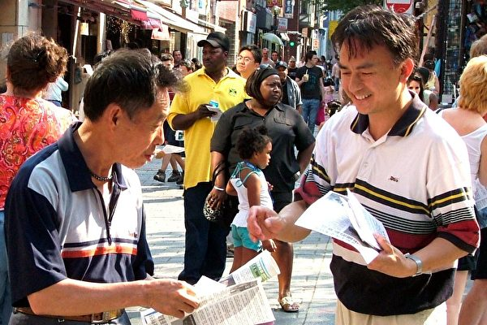

来到加拿大的王晓华获得了自由修炼法轮功的权利。图为王晓华（右）在唐人街向民众发放法轮功真相资料。

 
 【大纪元2018年08月31日讯】（大纪元记者谭雅加拿大蒙特利尔报导）“当啷一声，狱警打开了沉重的两扇铁门，出现在我面前的是一个绰号叫马鹿的牢头狱霸，他半裸著肥硕的身躯，身上刻满青龙文身。一片肃杀中，马鹿指使其他打手将我衣服剥下，劈头盖脸的一顿毒打。我没有了任何意识，两只胳膊死死抱住脑袋……”

这是法轮功学员王晓华记忆中的一个场景。17年前，在故乡云南——中国最西南的边陲省分，一个孕育了诸多雪山和湖泊的美丽高原，因为不放弃自己的信仰，王晓华失去了自由，被囚禁了700多个日夜。之后他远走加拿大，再没机会重踏故土，但经历的那些往事并不遥远，仿佛就在昨天。

1998年，王晓华的亲戚拿来一本书，留在他的家里。他随手拿起来，一字不落地读完，他感到有一种彻悟后浑身透亮的感觉：书里说的真对啊，人生的意义是返本归真。那本书就是当时风靡全中国的《转法轮》。

那一年王晓华30岁出头，是云南省设计院的一名材料工程师，当时单位里也有很多人炼法轮功。他找到当地炼功点，从此走上了按照“真、善、忍”原则修炼的路。

1999年7月，中共开始了对法轮功的镇压。当时的中共党魁江泽民不惜一切代价，要铲除这一在中国大陆各阶层广为普及的身心修炼功法，而追随江迫害法轮功者赏以加官进爵。“有钱能使鬼推磨”，时任云南省长的李嘉廷和2001年到任的省委书记白恩培，迫不及待地建立了一个全省范围内的层层监控、直接与政绩关联的迫害系统。

云南本是个民风纯朴的地方，一时间被中共弄得风声鹤唳、血雨腥风。2001年，在一次对昆明市法轮功学员的大抓捕中，王晓华被关进了昆明市五华看守所，遭遇了本文开头的那一幕。

<b>两进看守所</b>

50平方米左右的监室，两边是大板通铺，中间是很窄的过道，住了40人。除了牢头及其亲信，所有人只能侧躺入睡，盖着有怪臭味且极薄的被子。

在看守所，王晓华遭受了蹲刑迫害，很多法轮功学员都有类似的经历——双脚与臀部紧紧挨在一起，时间一长臀部都坐烂了，他从看守所出去后两个月才见好。

“当时抓的人很多，我并不是主要角色，他们盯住我的目的，是想转化我拿奖金。”王晓华说。

中共的所谓“转化”就是想尽办法要法轮功学员宣布放弃修炼，中共迫害法轮功的专设机构“610”订了5条转化标准：放弃修炼，交出法轮功书籍，写“三书”（悔过书、保证书、揭批书），对着摄像机“揭批”，还得去“帮助”转化别人。

“转化”一个法轮功学员，要么仕途上升迁，要么拿到丰厚奖金，这是当时迫害法轮功的专职机构——610办公室制定的经济刺激。有了这个驱动，看守所和劳教所的警察像打了强心针一般，一切为了“转化”。当时云南省司法厅教育处处长杨兴源，就是因为 “转化”法轮功学员“有功”，获得全国“五一”劳动奖章和奖金。

看守所警察揣测，王晓华是一位知识分子，有令人羡慕的单位，从风华正茂的工程师变成阶下囚，这个落差一般人受不了，比较容易低头。他们还找来王晓华年迈有病的父亲，给他做“思想工作”。

“我爸很悲痛，好像随时要昏倒，我哥在一旁拿着一个氧气包，冲着我喊：你这个不孝的忤逆子，把老爸整到这个地步，你还不配合政府，你不顾亲情了吗?！你只要低一下头，我们家就幸福了。”

随后单位的领导们轮番上阵：从设计室书记、主任，到设计院的领导，名义上是探望，其实目的就是一个——要王晓华放弃修炼法轮功，但他们并没有达到目的。

“我看得出，他们串通起来，好像演戏一样”，王晓华说，“（给我的）精神压力的确很大。”那段时间里，他看到了这些人的各种心态：害怕、担心、仇恨等等，孤立无援的王晓华心里却很清醒，造成这一切的不是按照“真、善、忍”做好人的法轮功学员，恰恰是迫害无辜的中共邪党政府。

一个月后，看守所警察敲诈王晓华家人1万元钱后，给他办了“取保候审”，明里放人回家，暗里筹划送他去转化强度更高的洗脑班。王晓华之前常听“自由亚洲”电台的节目，其中报导过很多中共洗脑班对法轮功学员的迫害。他拿定主意，不能任由邪恶摆布。

告别家中妻子和2岁的女儿，王晓华避走广州，那是他曾经度过4年大学生活的城市。没想到，仅仅过了三个月，他再次被公安绑架。

“公安知道我在广州之前，由我工作的设计院出车出人出钱，到处去找我，甚至去了我的老家，去了西双版纳等地。”王晓华说，后来中共公安通过监控手机电话找到了他的行踪。

这一次，云南省公安去了很多人，联合广东公安厅，还出动全副武装的特警队，将王晓华从当时在广州上班的公司里强行绑架。

兴奋的云南警察当着王晓华的面庆贺，他们说，为了抓到人，几个月来风餐露宿，花了几十万。“就为了抓一位法轮功学员去洗脑班，他们不惜代价，花了纳税人这么多钱，当时流离失所的大法弟子有多少啊，可想而知中共为抓捕迫害法轮功学员耗费了多少国力。”王晓华说。

和中国很多省份一样，云南省在迫害法轮功学员上耗费巨资。当时的云南省省长李嘉廷亲自落实迫害经费，第一次就拨款4百万元，而且要求下面各级政府确保迫害经费到位。为了抓捕另一位法轮功学员——原昆明法轮功辅导站站长王岚，警察不惜花费200万元，动用地面卫星跟踪系统。

王晓华第二次被抓进看守所，警察知道转化无望，没有油水可捞了，就决定把他投入劳教所。他们抛出一句话：“到了劳教所，不出一个月，你就得转化！”

<b>劳教所里的交锋</b>

在云南昆明的五华劳教所，法轮功学员们被迫干高强度的活，生产奴工产品，但管教们最想得到的，仍然是转化一个法轮功学员拿到的高额奖金。因此，每当新抓进一个人，管教们表现得非常关心，“他们来试探你，找出你的弱点。”王晓华回忆说。

那时王晓华心里有了坚定的一念：抵制迫害。他语气柔和但态度坚决，拒绝干奴工活。劳教所的教导员来找他谈心探口风。

王晓华说：“你们还是所谓的执法者，你们自己就在知法犯法。”

教导员说：“你怎么这样说？”

王晓华：“你想想中国古代，哪有捕快给人判刑的？你们一判就好几年，而且可以随意加期，谁敢这么干？苏联都垮掉了，现在世界上就只有中共、朝鲜几个流氓政府还在干这样非法的事。”

教导员哑口无言，又说：“这个就不谈了，这些事我们也有数，共产党怎么说也还有20年吧。如果共产党不倒，你这么耗下去，你完了呀，你和共产党较什么劲？”

几个回合交锋下来，“转化”不见奏效。劳教所警察换了一招：“你在这里不干活，占一个名额，浪费我们的资源。”

王晓华：“这是我愿意来的吗？如果你们不抓我，我在设计院一年的产值有十几、二十万元，对国家贡献更大。”

警察又狡辩说：“这里是劳动光荣。”

王晓华：“那是指社会上的正常劳动，你们这里是奴工。如果不是因为江泽民迫害法轮功，劳教已经取消了，这在社会上都是形成共识的了。”

……

云南的警察里也分三六九等，最“牛”的是刑警，权力大，钱也多；其次是交警，虽然辛苦，但马路上一站，东西南北通吃；地位最低的是司法警察，就是劳教所警察，社会上叫他们“泥腿子警察”。昆明五华劳教所里一些警察是山区来的年轻人，心中尚存些许淳朴，王晓华给这些小警察讲真相，他们第一次知道中共的劳教制度原来是非法的。

劳教所里对犯人最凶狠的大队长要调走了，走之前特地请王晓华去喝茶聊天，说是要他给劳教所提提意见。犯人们都极怕这个大队长，他们平时见到一般小警察时都只能低着头，更何况这个“土皇帝”。大队长和法轮功一起喝茶，所有犯人都看呆了，王晓华说：“其实，我看得出来，他心里是敬佩不屈服的大法弟子的，只是不敢说出来。”

<b>一次特别的体检</b>

2002年1月，昆明五华劳教所出人意料地组织了一次体检，专门给60多名法轮功学员做全面检查，从内科到五官科，历时半天时间，包括心电图、X光全身透视拍片，还有狱医按压肝肾部检查及化验血液等等，一般劳教人员根本没有这个“待遇”。

各大队的教导员分别带着各大队的法轮功学员，汇集到了劳教所医院，有的坐车，有的走路，一路上警察们说：“共产党多么关心你们，为了转化法轮功，可以不惜一切代价。”

数年后，已经来到海外的王晓华从国际独立调查机构“追查国际”自2006年开始的调查中获悉，云南存在活体器官供应库。在时任中共党魁江泽民发动对法轮功迫害的3个月后，云南省就实施了首例肝移植手术，当地报纸称这是“云南省大器官移植的零突破”，随后移植手术数量更是迅猛增长，云南进行过器官移植的医院高达40多家。

但在2002年，这一切都是机密，没有人知道体检的真实目的。

“当时我们只想到这是中共当局伪善的表现，而我为了证明修炼人身心健康没有病，还积极配合他们。”王晓华现在回想起那次体检“关心”，还感到不寒而栗。

<b>真正不幸的人</b>

在劳教所里被关押1年9个月后，王晓华走出了黑窝。2005年2月，在加拿大政府的帮助下，王晓华一家移民加拿大，从此获得了修炼法轮功的自由。

回首往昔的经历，他很平静，迫害只不过是对修炼意志力的考验罢了，“中共用毁掉事业、地位、前途、金钱来威胁修炼人，是不管用的。”

在黑暗中的时候，他心中始终有一束光，那就是“真、善、忍”的大法法理，照亮着前行的路。

不过让他感到遗憾的是，当年在被迫害中，他也有忿忿不平的心，没有足够的慈悲对待那些被中共欺骗的警察，让他们明白真相从而停止作恶。因为在这场的迫害中，真正不幸的是那些参与迫害正信的生命，他们在黑暗世界里，没有光明。

当年云南省追随江泽民迫害法轮功而风光一时的几个主要负责人，他们最终的结局也印证了这一点：

2003年，云南省省长李嘉廷因受贿罪被判死缓；

2007年，云南司法厅教育处处长杨兴源病死，年仅55岁；

2016年，云南省委书记白恩培因巨额受贿被判无期徒刑。

<h1 align="center"><b>我的人生见证了中共对法轮功的迫害</b></h1>

【明慧网二零一八年九月四日】从中共迫害法轮功开始的一九九九年至今，我整个的人生见证了中共对法轮功的迫害。我切身感受到这场迫害太邪恶了！这个共产党的社会太可怕了！就现在我一见到警察就哆嗦。但我知道法轮大法好！修大法的人没有错！他们都是好人！
我是一九九八年出生的，是一个最幸运的人，这是因为我出生在一个修炼法轮功的家庭。妈妈常跟我讲：说我生出来几个小时后，姥姥就在我身边念《转法轮》，我听着听着就笑了，大人们都感到惊奇，这么小的小孩怎么会笑呢？奶奶说也许是听了读《转法轮》而笑的吧。从那时起，大人们就特意的给我念，一念我就笑，一念我就笑，所以大人们经常让我听大法，使我从小就溶在大法之中，身体特别健康，从小到大，我都不知道打针是什么感觉，吃药是什么滋味。

可我从小也是一个苦孩子。妈妈说，一九九九年七月，我出生十五个月时，因为妈妈炼法轮功，警察把妈妈连同我一起抓进拘留所。在那几十个人一个屋的号子里，在那阴暗潮湿的肮脏恶臭的环境里，十五个月的我发烧、呕吐，不吃不喝，整日整夜哭闹，十天以后才放我们母子回家。妈妈说，从那时起，我家就经常来警察骚扰，不让学法、不让炼功、不让外出，就是上街买菜买米也得到派出所告诉警察，完全被剥夺了人身自由。

我三岁的时候，有一次几个警察闯入我家，骗妈妈说是谈完话就回来，我妈妈就抱着我去了，警察把我和妈妈拉到一个房子里打我妈，把我吓坏了，我就哭着打警察大腿，他们就把我拽走，我一直哭着喊妈妈，他们就笑，直到天很黑很黑时，我饿的不能哭了，才叫我去妈妈那里，我抱着妈妈的脖子不放，怕那些警察再打妈妈。那时我就想，姥爷和姥姥哪去了？怎么不在家保护我呢？我长大了，妈妈告诉我，那时姥爷和姥姥因不放弃修炼，姥爷被警察关进劳教所，姥姥被逼得离家出走了。

我上学了。可是一年级没念完，爸爸妈妈就领我走了，和爷爷奶奶分手时，爷爷抱起我亲我，还哭了。我现在才知道，从那时起我们就流离失所了，到如今已经十多年了，我也没见到爷爷的面，很想爷爷，后来奶奶也死了。

由于不断的遭迫害，我们从来没在一个地方住长过，从那时起我就上不了学了。二零零六年，我九岁的时候，我们当时家住在长春郊外。记得是在一个深秋夜晚，我睡的正香，忽听大人们急促地叫我，小声告诉我：“别出声！警察来了，快走！”我慌忙的穿上衣服跟着跑，我们跑到一座没盖完的楼里，靠着墙站着，时间长了，我又冷又困，不一会脚冻得受不了了，还不敢哭出声，怕警察听着，姥爷就把我的鞋脱了，他把自己的衣服撩开，把我的两只脚搁在他肚皮上给我捂……记得我们还在玉米秆子垛里住过呢，太苦了，姥爷也曾多次被绑架、酷刑折磨，每次都被折磨得奄奄一息、骨瘦如柴、九死一生，但是通过学法炼功，最终还是活过来了。可是姥姥却被警察活活打死了。

二零零八年，我已经十一岁了，叫我一生最害怕的事儿又发生了。那时，我们已经流浪到通辽市一年多了，五月七日那天早上，妈妈上班去了，姥爷和胖姥们去打扫卫生，我和燕姨在屋里唱歌玩，一帮国安警察破门而入来抓我们，燕姨怕警察伤我，她就挡在警察前面不让警察靠近我，他们五、六个警察一起打我燕姨，把燕姨按倒在地戴上手铐，我当时被吓得不会动了。接着警察们就开始抢我家东西。

不知警察把燕姨抓到哪去了，我被抓到一个很大的楼里，不知道是什么地方，还挂着“为人民服务”的牌子。警察说要把我卖了，会卖好多钱的，还有的警察说要把我喂狼狗，我被吓的哆嗦成一团。过一会儿，警察又用尖刀插着一块菠萝，刀刃冲着我的脸说：“你吃吧、吃吧。”吓得我躲闪着说：“我不吃，你们放了我，放了我吧。”警察趁机又骗我说：“你把你妈和你姥爷的名说出来就放你，你就可以跟你妈妈回家了。”我信以为真，就说了，可他们没放我，我才知道警察这么会骗人哪！当时由于特别特别的害怕，我感觉心里堵着什么东西似的，非常难受，恨不得一下就能看到姥爷、看到妈妈，可就是看不着，还饿，我一直在哭。当天傍晚五点多钟，他们才打电话叫我姑姥爷把我接回来，我才知道姥爷他们都被绑架了。

后来我和爸爸回到我们住的屋里一看，东西被翻得乱七八糟，衣服、被子还在地上扔着，贵重物品都被警察抢光了，钱也抢没了。鱼缸里被倒上酱油，鱼也死了，厨房里的筷子、碗、盆、瓶子扔了一地，有的都摔碎了。

二零零八年八月二日，我姥爷才被通辽市看守所放出来，但已经是奄奄一息了，脸色苍白，就剩一把骨头架子了，我都认不出来了，姥爷拽着我的手说什么我也听不清，他那颤抖的声音断断续续，我和爸爸心疼的摸着姥爷的脸哭。那是在通辽市的一个小旅店房间里，对面房间还有三便衣特务（一男二女）监视着我们。姥爷站不起来，上厕所都得爸爸架着去。缓了七、八天，姥爷说话能听清了，我们就搀扶着姥爷回舒兰爷爷家。姥爷都被迫害成这样了，通辽市公安局国保大队队长和一个小个子副队长还在我们乘坐的大客车的后面跟踪我们，走到吉林了，那个小个的副队长还从我爸爸兜里掏去仅剩的四十元钱，说是得给他们买汽油。

回到爷爷家后，姥爷躺在炕上起不来，舒兰市公安局国保大队队长和环城派出所警察先后两帮去爷爷家威胁、恐吓姥爷，还逼爸爸交出爷爷家的电话号。

二零零八年八月二十日，我和爸爸返回通辽市公安局去找国保大队队长要妈妈，我在他们办公室里看到了阿姨给我买的儿童食品大礼包在那，已经被警察们撕开吃了一些，还有我最爱玩的变色球也在那，原来都被警察抢来了，把我气哭了，我哭着说这是我的东西，他们还给我了。

当我们一说要他们放妈妈时，国保大队队长就找借口推诿，不让我们进公安局，我们就在外面等，他们八点上班我们就八点到，他们四点下班我们就四点走，他们不让我们在屋，我们就在大门口等。问他们为什么抓妈妈，他们说：“要开奥运了，就抓呗。”就这样我和爸爸坚定的要了两个多月，十月末，通辽市公安局国保大队队长向我爸索要五千元说就放妈妈，爸爸说没那么多钱，队长问有多少，爸爸说只有三千，队长说那也行，他得了三千块钱才放了妈妈。妈妈回家后，我们才知道：其实，那时妈妈已被警察迫害的生命垂危了，他们认为该放了，而国保大队队长还趁此机会敲诈勒索。

我们不能在通辽市住了，舒兰老家也不能住，舒兰警察更坏，就是他们把我姥姥活活打死的，还不断的来我家骚扰。我们就又流浪到长春，姥爷在桂林路租了一个房子做盒饭小生意维持生活。

二零一一年十一月三日那天晚上，通辽市国保大队队长又领一帮警察砸开门闯进屋，把我姥爷按住铐上手铐，然后他们就开始抢东西，把我的平板电脑和佳能照相机都抢去了，好几天卖盒饭的两千多块钱在桌子上放着，我眼看着被警察揣在自己兜里，他们在屋里到处翻钱和存折，有一个警察还钻到床底下去翻，这是我第二次亲眼看到警察是怎样抢东西的，太吓人啦。我刚上学时老师教我们唱歌唱道：“我在马路边捡到一分钱，把它交给警察叔叔手里边……”我那时不懂是啥意思，现在我明白了，原来警察一分钱都要，那么警察就会闯到别人家去抢更多更多的钱的，就连我自己攒的一大把钢镚儿（硬币）都抢去了，没给我留下一个。

警察把我家翻得乱七八糟，知道没啥翻的了，他们才说带走姥爷，我拽住姥爷的衣服求他们不要抓姥爷，我姥爷做好人没错，再说剩我自己咋整啊！他们不听，硬是把姥爷拽走，急得我嚎啕大哭。

幸亏妈妈出门没回来，不然可能也会被绑架的。我不顾命的从三楼窗户跳下去，给妈妈打电话，告诉她千万别过来，警察在这蹲坑呢。我为了妈妈的安全，不让妈妈过来接我，可我上哪去呢？这时的我被冻得想哭又不敢哭，怕警察听见，更不敢回屋，幸亏一个大同修看见了我，我才得救了，不然，我可能会被冻死在外面。

由于警察多次的绑架我们，这些年我家被逼得居无定所，致使我也无处上学，断断续续仅念了三年的小学，我从没过上几天消停的日子，更不用说和同学一起上学、游玩的快乐，这些年来，我不仅在精神上心理上受到了严重的伤害，我的未来就业问题以及生存问题都受到了很严重的影响。

前几年，我一看到别人家的孩子有老师、有同学、有小朋友玩、有好吃的，我就羡慕；我就难过的流泪，为什么不让我上学？只因我家大人修炼法轮功做好人就被迫害吗？连我这小孩都不放过吗？这太残忍了吧！姥姥被警察打死后，太姥姥总是想姥姥，最后太姥姥带着对我们的牵挂也走了，我们一家四辈就被这样迫害的家破人亡。

这场迫害早晚有一天会过去！我心中一直在盼望！我盼望着有一天迫害法轮功的恶首江泽民受到应有的惩罚，还法轮大法清白、还我师尊清白！我盼望着有一天所有被非法关押的大法弟子堂堂正正的走出监牢！我盼望着有一天大法弟子们能光明正大、扬眉吐气的和其他人一样，享受作为一个国家公民应有的权利！

网址转载：

<h1 align="center"><b>两天内 辽宁46名法轮功学员及家属被绑架</b></h1>

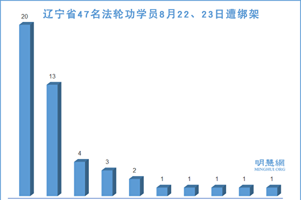

辽宁省47名法轮功学员8月22、23日遭绑架的地区分布图。（明慧网）

 
 
【大纪元2018年08月29日讯】8月22日至23日，辽宁省涉及十个城市的警察非法抓捕了42名法轮功学员和4名家属。
 
 据称，此次绑架是辽宁省公安厅督导的“专案组”联合行动，同时在各市多个部门配合出警，突击实施非法抓捕、抄家、抢劫等犯罪行为。绑架行动开始于8月22日，被称为“8.22案”。

明慧网报导，“8.22案”的迫害手段为：公安系统组成“专案组”，指定地点办公；抽调派出所警察和刑警等警力，负责抓捕法轮功学员；各市与区域国保实施非法审讯；将在外地被非法抓捕的法轮功学员送回本地后，省、市、地区国保沆瀣一气，捏造案卷，构陷法轮功学员。

<b>绑架过程如下：</b>

对法轮功学员实施跟踪、监控、拍照、监听电话等非法行为；不分场合抓人，在单位里抓，到家里去抓：诱骗开门或强行撬门，闯入后抄家，抢劫大量私人物品；不分年龄抓人，包括81岁的老太太、不修炼法轮功的家属、家属聘请的律师。警察还打电话上报省厅抓人经过。

<b>辽宁各地区绑架迫害简况：</b>

<b>朝阳市10人被绑架 （其中家属1人）</b>

8月22日下午5点，在豪德附近，法轮功学员齐敏、李振阳、袁姓、文丽，家属韩爱珍及聘请的律师一起被朝阳市公安局20多个警察绑架，随后被送到光明分局；12点多钟，家属韩爱珍被放回家，当时警察打电话上报省厅。

8月23日上午10点，朝阳市双塔区前进派出所警察绑架朝重家属院81岁的老陈太太，并抄家。警察把她和儿媳妇（未修炼法轮功）带到前进派出所；下午近4点钟，两人被放回家。

8月23日上午，辽宁省朝阳市建平县万寿乡派出所警察刘博等人闯进法轮功学员沙景堂家，抢走了部分物品后，将其绑架到派出所。

警察同时绑架了到沙景堂家探亲的内蒙古宁城县天义镇法轮功学员杨秀云、马桂兰。杨秀云被非法关押到建平县看守所，马桂兰被放回家。

<b>凌源市3人被绑架</b>

8月22日下午，辽宁凌源法轮功学员赵长福、孙广利夫妇和李英芝被绑架。据说是葫芦岛来的人与凌源巡特警大队配合绑架的。

<b>营口市20多人被绑架（其中家属一人）</b>

8月23日，辽宁省营口市鱍鱼圈区20多位法轮功学员被警察绑架，大多是于8月23日凌晨在家被绑架。

已知被绑架的法轮功学员有：付文成、赵亚珍、牟艳萍、孙桂荣、孙桂荣的女儿（姓张）、韩雪梅、韩美玲的儿子（未修炼法轮功）、小万子，目前还有很多法轮功学员失联。营口市五个部门联合参与绑架。

<b>大连市1人被绑架</b>

8月22日下午近2点，大连法轮功学员朱伟君在家中被带走。开始，两个便衣以查煤气为由敲门，朱伟君没开门；后又说检查煤气安全，给打开了门，一下子就涌进来六个人。

参与的有大连开发区公安分局、开发区国保、开发区哈尔滨派出所的人，他们从朱伟君的家中劫走一台电脑、一台打印机等个人物品。

<b>沈阳市1人被绑架</b>

8月22日下午5点左右，沈阳市国保支队指使皇姑区国保大队绑架了法轮功学员朱伟凤。

<b>抚顺4人被绑架 （其中家属2人）</b>

8月23日下午，辽宁抚顺市顺城区将军街法轮功学员李翠红和丈夫唐玉伟（未修炼法轮功）在自家经营的机械加工厂被绑架、抄家，被劫持到抚顺南沟看守所。

望花区法轮功学员田丽丽与丈夫（未修炼法轮功）分别在单位被沈阳警察绑架、随后家被抄。夫妻俩被劫持到沈阳。参与绑架的有八九人。

<b>辽宁省鞍山市1人被绑架</b>

辽宁省鞍山市法轮功学员王宏柱于2018年8月22日晚在工作单位被绑架。警察骗他妻子说，王宏柱本人说不修炼法轮功了，领着警察去租住房的。事实上是警察撬开房门的。可见，警察跟踪他有一段时间了，什么情况都掌握了。

<b>黑山县1人被绑架</b>

8月22日早上，辽宁省锦州市黑山公安局警察闯到法轮功学员牛桐家把她带走，并抢走不少私人物品。

<b>葫芦岛市1名法轮功学员被绑架</b>

8月23日早上6点多钟，辽宁葫芦岛市南票区缸窑岭镇房身地村法轮功学员周明铁被绑架、抄家。据说是特警伙同当地派出所联合干的。

<b>锦州市2名法轮功学员被绑架</b>

8月23日晚11点左右，辽宁省锦州市太和区国保大队长李蕾等10多个警察，乘警车分别到锦州市太和区法轮功学员邓慧玲和刘瑞梅家，实施绑架并抄家。

以上记录并不完全，有待突破中共的网络封锁后获得更多确切消息，再陆续报导。

<b>结语：</b>

据明慧网统计：2018年7月份，全国有275名法轮功学员被绑架，分布于22个省、自治区、直辖市。绑架最严重的省份是辽宁，有61人。

截至2017年，辽宁省已有469名法轮功学员被迫害致死，仅在辽宁省监狱里迫害致死的法轮功学员就高达12名，是全国迫害法轮功最严重的省份。

2017年被中共非法判刑的法轮功学员至少有974名，其中辽宁占179人，居法轮功学员遭绑架迫害人数最多的前十名地区之首。

近几年，辽宁省政法系统已超过30人落马，包括原政法委书记苏宏章、原政法委书记、原公安厅长李峰、原辽宁省司法厅长张家成、原抚顺市政法委书记吴光、原鞍山市政法委书记梁冰、原凤城政法委书记董长允、原大连市中山区政法委书记胡家耿等等。他们均参与迫害法轮功。

明慧网评论：一切都在“善恶有报”的兑现中。顺从天意而行，才是明智之举。

<h1 align="center"><b>大连普兰店区扫黑办　画皮下的“政法委”</b></h1>

【明慧网二零一八年八月二十六日】清代小说家蒲松龄创作的文言短篇小说《画皮》，讲的是一个面目狰狞的恶鬼，披上用彩笔绘画的人皮，装扮成一个美女，耍弄种种欺骗手段，以达到裂人腹、掏人心的目的。小说寓意深长，耐人寻味。后来，恶鬼被一个道士识破，在木剑的逐击之下，逼得它最终脱去“画皮”，露出本相，而死于一剑之下。
大连普兰店区政法委，现在披着“扫黑办”的画皮招摇过市，继续用谎言掏人心，用利益裂人腹。

从二零一八年六月六日至今，大连普兰店区政法委向民众散发《致全区人民群众积极检举揭发黑恶势力违法犯罪活动线索的一封信》单张广告纸，在这份文件中诬陷法轮功。普兰店政法委也知道自己臭名昭著，为了掩盖自己政法委的名称，摇身一变改了一个名称叫“扫黑办”，继续为其生存行恶找借口。

老百姓现在都知道，政法委是中共江泽民集团对法轮功实施迫害的一个主要部门。每次中共有什么活动或者政策，这个政法委都要在他们的文件中陷害法轮功，因为政法委就是迫害法轮功的打手，苦于找不到合法依据来迫害法轮功，就不断地为自己泯灭良知的行为找依据。结果往往都遭到老百姓的唾弃。

在当今中国谁才是这个黑恶势力？不言而喻，正是中共！中共是一个邪教，如今不仅仅是政教合一，而且是政黑合一。他们才是用暴力和威胁等手段把持基层政权，并且操纵破坏基层换届选举，垄断农村资源，侵吞集体资产等，为贪官、黑社会充当保护伞。现在的扫黑办能真正的扫黑吗？能真正地保障百姓的生命安全和财产安全吗？答案是否定的。

现在政法委之所以能将这份文件到处散发，也有普兰店市政府和大连市政府做后盾，纵容政法委胡作非为。它们是一个利益共存体，用“走形式”的方式来蛊惑人，达到毁人的目的，并且有的派出所警察还以此文件作为骚扰法轮功学员和家属的依据。

法轮大法是佛法，是教人按照真、善、忍做好人、修心向善的。这些手无寸铁的法轮功学员，从何而谈是“黑恶势力”呢？还是说符合了共产党的“无神论、斗争哲学、杀人诛心”才不属于“黑恶势力”呢？法轮功学员无心参与政治，他们对政治也不感兴趣，他们只是在按照真、善、忍做好人，修炼以后，他们拥有一个健康的身体，为国家节省大量医药费和医疗资源。同时，在社会和家庭中，他们说真话、不受贿、善良忍耐，由此可见，真、善、忍才能真正的使广大人民群众安居乐业、也能促进社会和谐安定。

以此简短评论比作“木剑”揭穿普兰店区政法委的画皮，使其露出本相，曝光于朗朗日下。

同时，我们也告诉大连市所有政法系统的人员：切莫继续行恶迫害法轮功学员，天理昭昭，善恶有报如影随形，上天有一本账簿，记载一个人的功过是非，现在安好不等于将来无恙，切莫以身试天法，这样不仅殃及自己也祸及他人。

<h1 align="center"><b>小小莲花在墨西哥校园里开放</b></h1>

【明慧网二零一八年八月三十日】暑假刚刚结束，在一个明媚的清晨里，大法的炼功音乐在墨西哥西北内海岸的锡那罗亚州（Sinaloa）一个叫瓜萨维（Guasave）小城市里的锡那罗亚校园里再次悠悠响起。
两位当地的法轮功学员受邀正在一个宽敞明亮的教室里、教学生学炼法轮功的第五套功法。学生们都盘着腿席地而坐，安静地打坐，教室里充满一片平和祥静。这是第三个学年法轮功学员来到这所将幼儿园和小学综合在一起的私办学院，在该学院校长米里安女士的邀请下，来给孩子们担任蒙氏教育法的规定课程之一——和平教育课程的义务讲师。

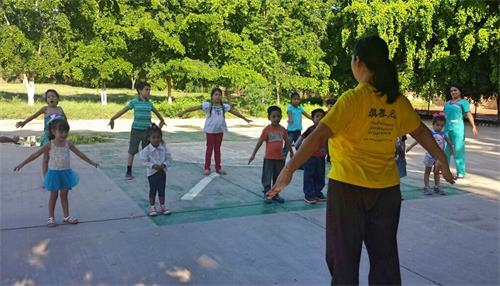

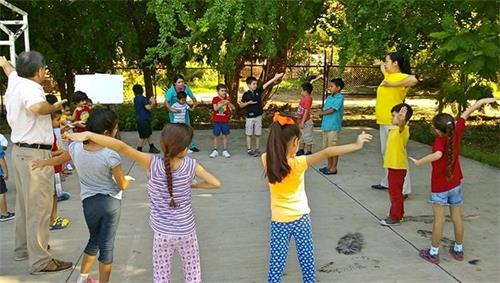

图1～2：二零一八年八月十九日，小朋友在墨西哥西北内海岸小城——瓜萨维（Guasave）市的锡那罗亚校园内跟随着悠扬的炼功音乐，正在认真的学炼法轮功。

蒙氏教育法（Montessori educación）强调对独立和有限度的自由和对孩子天然的心理，生理及社会性发展的尊重，设置了四个跨年齢的课堂。和平教育课程是为三至六岁幼儿阶段和六至九岁以及九至十二岁小学阶段的孩子们设置的必备课程。米里安女士是一个虔诚的天主教徒，她一直在寻找着一个最适合教育孩子们和平理念的办法，但苦于不满现代教育方式及对瑜伽缺乏足够的信任，迟迟不能填补和平教育课程这个缺口。

直到一个偶然的机遇，米里安女士观看了一个当地由法轮功学员举办的“真善忍美展”，她从中认识了这个能够使内心和平的修炼方法（法轮大法），并被大法修炼者理智和平的反迫害和坚守真善忍的做人理念而深深感动，并因此得到启发，决定以法轮大法修炼作为她学校的和平教育课程。

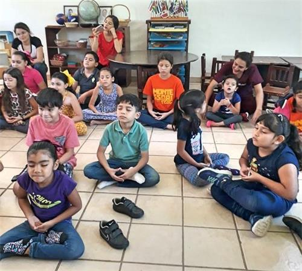

图3：小朋友们学打坐时也很专注、认真。

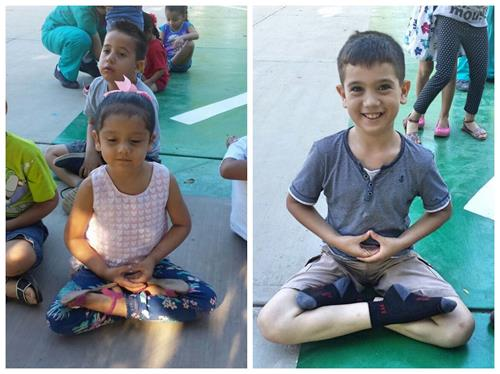

图4：这两位小朋友一上来就双盘。看，左边的小女孩看上去非常享受；而右边的男孩子则很开心。

在瓜萨维（Guasave）这所校园，每到星期五，孩子们都迫不及待的等候上课，当学员一走进课堂，大家就涌到门口喊着：“法轮大法来了！ 法轮大法来了！”高兴地打招呼拥抱他们的老师，然后大家盘腿坐在地上，感受、学习这美妙神奇、来自东方古老的修炼文化。

为了让孩子们更好理解法理，学员常常准备一些示范教材。有一次准备了一些黑纸和白纸分别代表人的业力和德两种物质，在课堂上示范讲解得与失的法理，然后叫大家分组练习示范，出乎意料的是，孩子们都不愿意做出口骂人的一方，都不愿失去德。

大法著作《转法轮》中说：“当他骂别人、欺负别人的时候，他就会把德扔给人家；而对方是属于委屈的一方，失去的一方，遭受痛苦的一方，所以就给他补偿。他这边骂他，随着他一骂的时候，就从自己的空间场范围之内飞走一块德，落在人家身上。他骂的越重，给人家的德越多。”孩子们当场就都明白了做人的基本道理。

再有一次，为了给学生们讲解修炼人应该要去掉各种不好的心才可以升华上去的法理，学员准备了一些小石头，并在每个小石头上写上一个不好的人心，如：妒嫉心，显示心，争斗心等等。然后把这些石头都放在一个空瓶子里，拧上盖子。放到水里，瓶子一下子就沉到水底。然后再打开盖子把石头一颗一颗的拿掉，一直到瓶子几乎空了瓶子才浮上水面。

大法著作《转法轮》中说：“举个例子说，一个瓶子里装满了脏东西，把它的盖拧的很紧，扔到水里，它也要一沉到底。你把里面的脏东西倒出去，倒的越多，它会浮起来越高；完全倒出去，它就完全浮上来了。”

孩子们都在看着听着领悟着。

就这样学员通过边玩游戏边教学的方式慢慢教导孩子们“真、善、忍”的法理。每到圣诞节到来前，还会做一些手工制作，例如纸折莲花和圣诞贺卡。并给孩子们讲解莲花出淤泥而不染的做人道理。孩子们很高兴地捧着自己亲手做的纸折莲花脸上露出了幸福的笑容。

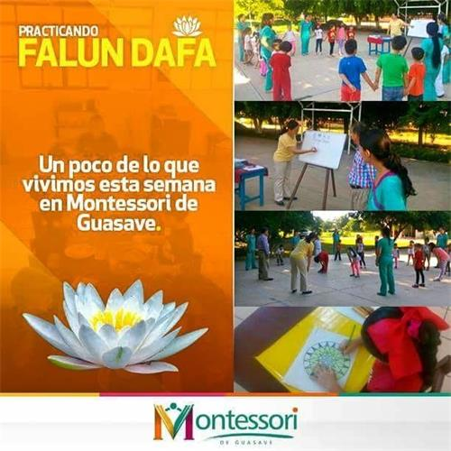

图5：两位法轮功学员应墨西哥瓜萨维（Guasave）城市学校的邀请，在校园里，以真、善、忍理念教育孩子们。学校将这美好的经历做成海报，放在学校的脸书上，与公众分享。

校长米里安女士常常对大法学员说：“大法课是孩子们最喜爱的课，非常感谢你们，法轮大法对社会有益无害！”

<h1 align="center"><b>漠视生命　中共毁人不倦</b></h1>

【明慧网二零一八年八月二十九日】最近一连串的噩耗引起民愤。二十岁乐清女孩搭乘滴滴顺风车被司机带至山上，女孩向同学发出求救信息，同学向滴滴平台求助了解司机信息，滴滴平台六小时不予答复，女孩遭强奸后被杀。滴滴打车漠视生命的行为引来无数责骂。
另一个被众人唾弃的是央视的一个报道，女主持人在报道山东寿光洪灾时居然面带笑容地称，上游三水库泄洪并不会给下游带来什么影响。泄洪后寿光弥河水位急速上涨，二十多处堤坝决口，六十多个村庄被洪水淹，老百姓携老带幼，在深夜的哭叫声中转移，寿光大地上一片危险与狼藉，二十多万个蔬菜大棚受损，数万头生猪活活淹死，横尸遍野，惨不忍睹。央视的报道引来寿光人义愤：“你的不实、轻率、甚至是欺骗性的报道，你必须向寿光灾民说清楚，讲明白，必须向寿光人民陪情道歉！”

寿光人抱怨，缺水时我们花钱向上游买水，发洪水就向我们泄洪，都是我们倒楣。同时，人们也指出这一洪灾背后是人祸。一条全长二百零六公里的北方小河，怎么能够承受来自上游每秒二千二百五十立方米、乃至超过黄河或怒江的流量？这不是视下游安全为儿戏吗？事后有水利专家也承认如果错开泄洪时间可以避免这么大的灾难。大灾之后是大疫，很多人一辈子的家产被冲掉了，而政府仅仅一句“恢复家园、恢复生产”了事，致使一生活无望的村民在街上求死，中共治下的“和谐社会”正上演着一幕幕悲剧。

中共漠视生命，杀人如麻，窃政以来造成的非正常死亡数千万，比一场二战还多。它不仅自己杀人，还将漠视生命的党文化蔓延到整个社会，致使人心冷漠、道德败坏，实际上带来的是一场人伦浩劫。

今年六月，甘肃庆阳十九岁女孩跳楼事件中，围观群众的态度到了令人发指的程度。该女孩被老师猥亵而诉讼无门后准备跳楼，一度被警察安抚坐了下来。但是在长达几个小时的时间里，围观群众有的鼓掌、大呼“怎么还不跳”， “为了等你跳下来，我在楼顶晒了一个小时太阳了”、“活该吧，赶紧跳啊，浪费大家时间”……女孩在选择离开人世之前，还要受到围观群众最恶意的欢呼，她的内心能承受的了吗？当时救援的消防员已经抓住了她的手，可是对这个世界毫无眷恋的她撒开了消防员的手，那一刻消防员的哭声撕心裂肺，而下面还有围观者说终于跳了，口气就象看个表演那么轻松，对他就象“娱乐”了一把。

那一刻，生命轻如鸿毛，人与人之间不再有温暖。如此轻视别人的生命，这才会有二十岁的大学生药家鑫，驾车撞人后又将伤者刺了八刀致其死亡；才会有两岁的小悦悦被两车碾压后十八名路人视而不见；才会有赴日留学五年的二十四岁青年汪佳晶，因母亲没钱提供学费而在机场对前来接机的母亲连刺九刀，当时也只有一位外国人前来救助。月收入七千元的母亲大量举债，每年供给他三、四十万的学费却被他刺伤，这样的人还有人性吗？

每当这些惨剧发生都会引来热议，但却不断发生着，而且愈演愈烈，因为道德越来越败坏，社会风气越来越败坏，中共无神论导致人没有敬天悯人之心。在他们看来生命就是一个躯壳，人死如灯灭，哪里有什么轮回转世，哪里有什么天堂地狱，哪里有什么善恶有报。

《共产主义的终极目的》第四章“共产邪灵　毁人不倦”揭示：“共产邪灵由‘恨’构成，为了毁灭人，它带领被其欺骗了的人反神、反传统、反文化、骂祖宗。”如此变异的观念才使这些年轻人变的如此扭曲，才会演绎出视母如仇的悲剧。人心糜烂，社会溃败，中共带来的简直就是一场人伦浩劫，结果是全民遭殃。

在丧尽天良的败坏中，中共打压的是真、善、忍，对修炼真、善、忍的法轮功学员的迫害更是史无前例，十九年来迫害致死的经核实的就有四千多人，二零一七年还迫害致死四十人。

今年七月十九日，加拿大卡尔加里部份法轮功学员在中领馆前集会，谴责中共对法轮功长达十九年的迫害，悼念为坚守真理而付出生命的千千万万的法轮功学员。来自中国重庆的法轮功学员江宏讲述了一家六口因修炼法轮功而遭受的迫害。

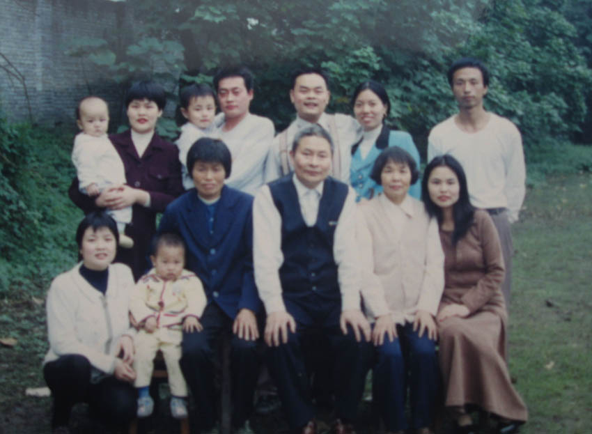

江锡清一家

她的父亲江锡清是重庆市江津区地税局干部，二零零八年五月十四日，江锡清被绑架并送往西山坪劳教所劳教一年。二零零九年一月二十七日下午，江宏与家人去探视父亲，父亲一切正常，第二天劳教所就通知人已经去世。家属七个小时后在殡仪馆的冰柜里看到江锡清，人中还是热的。江宏称“我一边喊一边去摸他的脸，发现爸爸的人中是热的！我大声喊爸爸还是活的，家人从外面冲进来。弟弟把爸爸的身体拉出一半，摸胸口发现是热的。亲人们一一摸爸爸的身体，发现身体是热的！”但警察把江家人强行拖出殡仪馆。

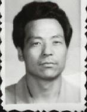

吴元

 
 辽宁省凌源市北炉乡中学数学教师吴元，也是在这种情况下被火葬的。家属会见时还很正常，第二天上午监狱就通知家属吴元去世，下午家属在殡仪馆见到了吴元，当时他躺在冷藏箱中，耳、鼻、口中都塞有棉花，双目未闭，双眼有神，身体温暖心口是热的。他妻子说：“他根本没有死，马上抢救！绝不应该让他躺在这里。他们说人早就死了，不顾我的哭喊，强行把我拖上车……”吴元就这样被迫害致死，年仅四十四岁，中共监狱简直就是在草菅人命。

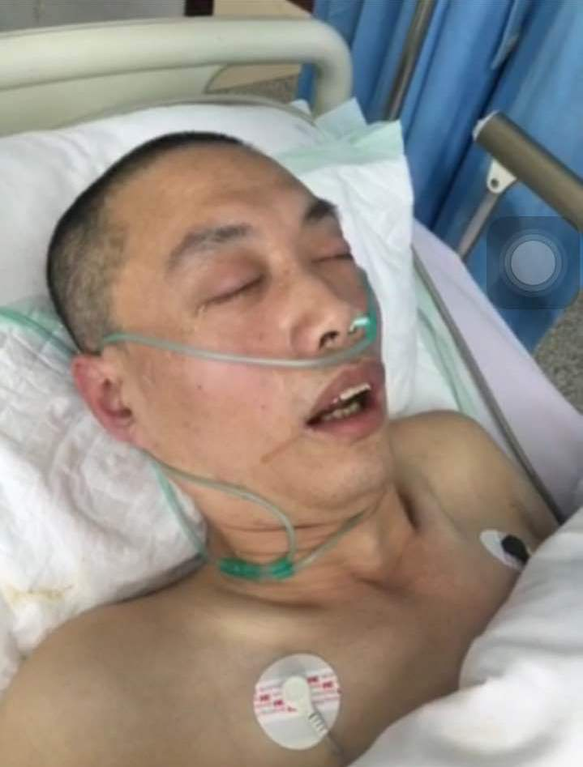

胡国舰被送入本溪中心医院时的照片

今年五月，被非法关押在辽宁省本溪市监狱、已经被迫害成植物人、昏迷近两年的胡国舰含冤离世，年仅四十八岁。监狱管事犯人知道胡国舰是法轮功学员，打不还手、骂不还口，就肆无忌惮地欺辱他，嫌他被子叠的不好也要打骂，并让他不停的叠，有时让他叠到后半夜一点两点才允许睡觉。有一次犯人把胡国舰弄到洗漱间，扒光衣服，往他的头上持续浇冷水、拽头往墙上撞，胡国舰跌倒在地后还用脚踢他的头。胡国舰入狱二十二天后就成了植物人，体重从一百八十斤降到不到百斤。

在中国古代，对于神佛无比尊重，对于修炼人乐于施舍，而在中共社会，法轮大法学员修炼真、善、忍却要遭受最邪恶的打压，中共的无神论让整个社会失去对于神佛的敬仰，失去善恶有报的是非标准。对生命的漠视，让人心变得没有任何善意与怜悯，浮躁恶毒、冷漠自私成为社会的主导气氛。这样的社会，老天还允许它维持下去吗？人不治天治，只有摆脱中共邪教才能获得新生。

<h1 align="center"><b>英国温布尔登社区里的“生命之源”</b></h1>

【明慧网二零一八年八月三十日】位于伦敦西南部的温布尔登（Wimbledon）属于默顿市（Merton Council），是温布尔登网球锦标赛的主办地区，有一百三十年历史的温布尔登图书馆（Wimbledon Library）则是集聚当地各阶层人士的社区中心。大约十年前，一个法轮功义务教功点开始设在温布尔登图书馆地面一层，华人法轮功学员温迪（Wendy）女士一直照看着这个炼功点。

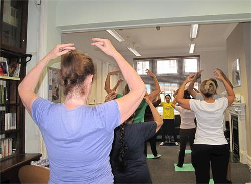

图1：二零一八年八月十八日，温布尔登图书馆的法轮功义务教功班上，法轮功学员温迪（Wendy）和大家一起炼功

 
 温迪在伦敦一家跨国公司做财务工作，她从二零零五年开始修炼法轮功，每个周六早晨十点前从家里赶到温布尔登图书馆是温迪过去八年周末生活的常态，她因故来不了时，她的丈夫——法轮功学员尼尔（Neil），或者其他的法轮功学员会代替她来。温迪说支持她坚持下来的信念很简单，就是希望让更多人有机会看到法轮功、了解法轮功、学炼法轮功。 
 

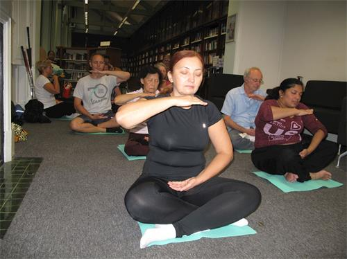

图2：二零一八年八月十八日，温布尔登图书馆的法轮功义务教功班上正在打坐的学员。右边第一位印度裔女士是第一次来，左边一位来自前东欧国家的女士是第三次来。

 
 温迪介绍说，这个炼功点是伦敦几个图书馆炼功点中历史最长的一个，免费对社会所有人开放，来学功的人中有的只跟了一段时间，有的长期跟着集体炼功，有一些开始看书学法（学习法轮大法著作）。

图书馆的书架上有法轮功著作《法轮功》和《转法轮》，有些来学功的人在尝试之后想进一步了解法轮功，温迪就推荐他们去借阅。图书馆的职工对法轮功学员很支持，经常有员工告诉温迪：“喜欢你们（法轮功）的音乐，非常平和。”

常有带孩子的中国家庭出现在温布尔登图书馆，温迪说她非常高兴这些华人在自由开放的环境下看到法轮功。二零一八年八月十八日炼功结束后，温迪高兴地发现在炼功队伍的后面多了一位华人女士的面孔。
 
 
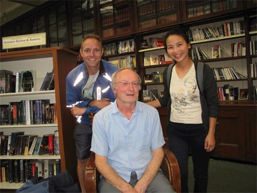

图3：二零一八年八月十八日，温布尔登图书馆法轮功义务教功班炼功结束后，法轮功学员温迪（Wendy，右）、斯科特（Scott，左）和阿尔贝托（Alberto，中）切磋交流炼功体会。

 
 <b>法轮功是“是生命之源”</b>

伊莱恩（Elaine）是住在温布尔登图书馆附近的一位中年英国女士，她在商业领域工作，工作压力很大，练习过瑜伽。大概三年前，她来图书馆找一个木匠，结果走进了法轮大法炼功班，从那以后基本上每个周六她都来这里炼功。说到感受，她说炼法轮功是美好的个人旅程，法轮功“属于每一个人”，“是生命之源（life source）”。

“（法轮功）让我和我生命的主要来源联系起来，感受到爱，感受到自由，所以的确是一个很好、很美好的旅程。”“带给我平静，但更是我生活本真的一个来源，带给我巨大能量，这和你安睡整个夜晚获得的那种能量不一样”，“炼功让我平静，对我来说是能量、空间以及和生命之源的联系。”

<b>“做好人当然是该做的事”</b>

中年英国男士斯科特（Scott）是个项目经理，在伦敦金融城工作，半年前来图书馆找书看的他看到了法轮功教功班，出于好奇心拿起放在一旁的一个打坐垫就加入了学功队伍，其后他坚持周六来图书馆炼功，最少每月来两次。

斯科特称自己多年来一直练习打坐，是个喜欢平静的人，所以很自然地接受了法轮功，他还读了《法轮功》和《转法轮》，并准备再重复读。

谈起最初炼功感受，他说炼法轮功加强了他与能量和善意的联系：“非常容易学，让人放松，很好的能量，很平静的联通的能量，如果坚持下去会很好。”“炼功时我能感受到能量的流动，做有些炼功动作时感到身体里有东西开始转，明显感受到能量的运动。”“我能感受到善意，与某种本源的联系。”

说到法轮功教人按“真善忍”做好人，斯科特觉得自己好象一直是按照这些原则在生活，“做好人当然是该做的事。”

<b>“炼功过程就象一个旅程”</b>

在伦敦温布尔登从事餐饮业的意大利裔先生阿尔贝托（Alberto）多年前在报纸上看过法轮功在中国遭受迫害的文章，四年前注意到图书馆里的法轮功义务教功班，跟着学了几次，然后从图书馆借到揭露中共迫害法轮功的事实的获奖记录片《自由中国——信仰的勇气》录像带看了，于是决定炼法轮功。

阿尔贝托一开始就感觉很好，从那以后坚持每周六来图书馆参加集体炼功，他很快开始自己每天在家炼功，现在每周有一次和其他几位法轮功学员一起读《转法轮》。

今年六十九岁的阿尔贝托称自己一辈子都在尝试各种练习，二十岁就开始练瑜伽，四年前找到法轮功后只炼法轮功，之后他真正身心受益：“法轮功更好，更强大，特别是确实能净化人的思想。”“我喜欢五套功法一起炼，第五套功法打坐放在后面炼更容易（入定）些。整个炼功过程就象一个旅程，实际上第二套功法本身对我来说也是一个旅程，来自宇宙的能量进入我的身体行进。”“每天早晨炼功，对我的身体健康非常好。”“炼功对我思想上也很有帮助，直接加强忍耐力，我觉得自己意志力加强了，做起事来比原来容易了，有事半功倍的效果，思想更稳定，更有耐心。”

阿尔贝托感恩法轮大法带给他生命境界的提升：“修炼法轮大法让我更积极地看待生活，更快乐，更轻松，无论生活发生什么，都能坦然接受。”他还说，从几位长期共事同事对他的态度变化来看，周围的人感受到了他在修炼“真善忍”。
  

<h1 align="center"><b>沈阳市沈北分局干了一件“啥事”？</b></h1>

【明慧网二零一八年八月三十日】2018年8月22日，对于辽宁省沈阳市法轮功学员王永利一家人是一个期盼已久的日子，永利即将结束四年的冤狱回家了，破散的一家人终于要团聚了，妻子在期盼，儿子在期盼，年迈多病的父母在期盼，还有兄弟姐妹、亲朋好友……
然而这苦苦等待的团聚却成了打碎的美梦，王永利还没有出监狱的大门，即被沈阳警察劫持到沈北看守所。所有知道王永利遭遇的人，对沈北警察的无理霸道的举动，都愤怒了：这共产党太不讲理了，这沈北警察太不讲法律了，迫害法轮功没完没了，到期还不放人，这警察做人太没有底线了！

2018年8月22日一早，天还没有亮，王永利的家属一行开车去几百里外的监狱，接王永利回家，谁知沈北公安分局的一伙人（沈北分区“610”人员、公安分局、马刚乡派出所警察、马刚村书记），早在21日下午就抢先到了监狱，住进旅店，和监狱勾结好后，22日直接把王永利劫持上警车。

满怀期盼的家属眼睁睁地看见沈北公安分局把车开进监狱大门里（家属的车不让进）直接把人劫走了。沈北警察不让家属和王永利见面，并欺骗家属，回到沈北后再让家属见面。可在回来的路上，沈北警察利用家属给车加油的时间，甩开家属车跑了，直接把王永利关进沈北看守所，也不让家属会见了，扬言要对王永利继续非法判刑。

团聚的美梦落空了，王永利的妻子愁得不知咋办？他的老父急得摔了一跤，躺在炕上动弹不得；他的儿子上火满嘴烧的大泡……王永利村里的乡亲们得知消息后都感到愤怒：住了四年监狱，到期还不放人，什么世道啊，这沈北公安分局领导干的是“人事”吗？

王永利，一个勤劳、老实巴交的农民，住在沈阳北部山区一个山脚下的村落里，一个与王永利一起打工多年的朋友这样说，王永利，是一个值得信赖的朋友，干活从不“藏尖”，可因为修炼法轮功，他这些年遭老罪了。

是啊，每个法轮功学员的遭遇，都见证了中共对法轮功学员迫害的历史。今年不到五十岁的王永利，却经历了人们不敢想象的经历。二零一四年八月十八日，王永利在吉林省延边州珲春市打工期间，因发真相资料，被合作区派出所绑架，当地警察对这个“外来打工者”，残忍地采取了十根手指“钉”钉子的酷刑，十根手指，“钉”上钉子，当时王永利的脸被打的肿大变形，已看不出年龄，十根手指被钉子钉的血淋淋的，腿部的肉被镊子夹的血肉模糊，旁边房间的人听见王永利的惨叫声，都揪心的痛。听到丈夫受到这样的酷刑，妻子哽咽地说，我的心都在淌血。

四年的牢狱，也没有动摇王永利对“真善忍”的信仰，因拒绝转化，王永利在吉林的监狱，坐了四年的“小板凳”；因王永利拒绝在出狱转化书上签字，沈北分局又把王永利直接关进看守所。

据悉，沈北分局拒不放人，王永利拒绝在转化书上签字，这只是一个表面原因，真正的原因是沈北分局持续对王永利一家人的报复。沈北分区公安分局扬言要对王永利继续判刑。

二零一二年 ，沈北分区要绑架多名法轮功学员，王永利是其中之一，而王永利与妻子在逃脱过程中，据悉其中一名韩姓警察掰伤了手。王永利与妻子逃脱后，抓捕失败的沈北分局国保警察从此开始报复王永利一家人，马刚派出所将王永利父亲绑架到派出所，并恐吓王永利母亲说：“见着他就抓，如果抓着他，至少判十五年，送到市局六处能打个半死。”老太太吓得当时高血压病就犯了。

马刚派出所警察对王永利妻子的家属说，抓不到王永利，就抓王永利老婆，吓得王永利妻子多年一直不敢回家，流离失所。

马刚派出所的警察还威胁王永利的瘦弱的儿子，一次马刚派出所一个警察殴打王永利的儿子，掐住王永利的儿子的脖子，孩子挣扎中喊，你有能耐打死我。警察一边骂着“我整死你，小X 崽子”，才松了掐住孩子喉咙的手。孩子几乎瘫软在地上，孩子当时才上高中。

如今，王永利被非法关押进沈北看守所已经四天了。据悉，警察提审、刁难，企图捏造罪名，继续迫害王永利，负责的警察，有王姓，邱姓警察，据悉，还有当年抓捕王永利掰伤了手的韩姓警察。

在此试问沈北公安分局领导警察，假使王永利真的“犯了罪”，二零一四年八月十八日，王永利在吉林省延边州被抓捕时，你们为什么不把王永利的事一起“办”了，为什么王永利坐了四年大牢后，你们却劫持王永利，没完没了地迫害，程序上都是违法的，有这样办案的吗？

还有，当年抓捕王永利掰伤了手的马刚乡派出所的韩姓警察，听说他一直耿耿于怀，你抓法轮功学员伤了手，那不正是老天爷不让你这样干吗？那是老天爷对你的警示啊。

人在做，天在看，善恶必报。法轮功学员善劝所有参与迫害法轮功的警察，请不要做害人害己的事。沈北新区黄家派出所原副所长王亚东四十多岁就暴病身亡，还不以此为鉴吗？二零一零年三月，两个讲大法真相的老太太被王亚东绑架，在面包车里一路劝善，告诉王亚东这样做会害人害己，可他被谎言毒害，继续昧着良心迫害信仰真善忍的好人，最后赔上了自己的性命，实在可悲可叹哪。

自古善恶有报是天理，现在公务员执行违法的命令都要终身追责的。看看跟随江泽民迫害法轮功的那些高官周永康、薄熙来等的下场吧，让别人家破人亡的人，自己最后也是一样。公安警察、检察官、法官本应该是维护正义和公道的，而在这场对法轮功学员的迫害中，他们无视法律，在610的背后唆使下昧着良心，践踏法律，执法犯法，扮演着可悲、可耻的角色，如还不悬崖勒马，当正义回归、报应来时，等待他们的也将是可悲、可耻的下场。而且人间的报应只是为了警醒世人，地狱的报应那才是偿还恶业的过程，还会殃及子子孙孙。

在此，正告沈北公安分局领导郭忠涛局长，你做了一件令人“愤怒的事”，法轮功学员讲真相，接善缘，希望您能亡羊补牢，立刻释放法轮功学员王永利，让历经苦难的一家人团聚，平复大家伤痛的心。每个人都愿意做善事，不为恶，您签署抓捕王永利的命令，就是在做一件埋葬自己的恶事啊？您已经种下了恶果，希望您能及时醒悟啊。所有知道真相的人都在看着你，你身边的正义人士在看着你，老天爷也在看着你，赶紧行善啊。

<h1 align="center"><b>一个80后新移民的风雨人生</b></h1>

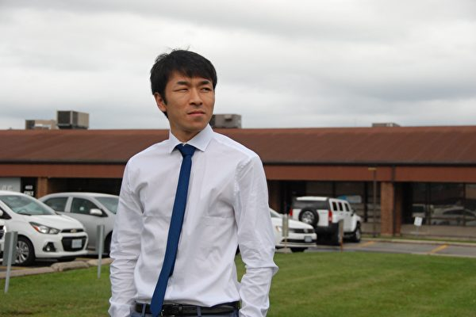

范文拓在多伦多。

【大纪元2018年08月24日讯】（大纪元记者伊铃多伦多报导）

2018年，多伦多。

一个夏天的午后，新境界影视公司的摄影棚，一场武术对打彩排正在进行。身穿黑色无袖T恤的范文拓，神情专注。他跨著弓步，眼睛紧盯着对手，随着武术老师的口令，出拳、挡掌，踢腿、翻转……连续几个回合，小伙子已是满头大汗。

“忙碌、辛苦，充实又快乐。”范文拓一脸微笑，说话连珠炮似的，还点带东北腔，他抬手摸一把额头的汗水。

文拓来加拿大2年，拍电影是他工作之余的另一块天地。这一次，他第一次担纲主演。新境界影视公司的经理Frannie 说：“小范聪明伶俐，多才多艺，又特别好配合，是个难得的人才。”

文拓大学学的是建筑美术设计专业，出国前已经是一家建筑公司的项目经理。目前，他在多伦多市中心的一家建筑公司工作。每天他早早出门，下班后就急着往家赶。

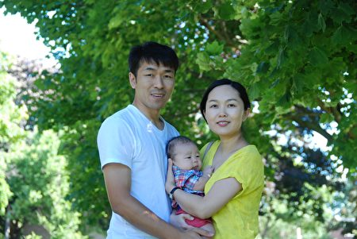

范文拓一家三口。

文拓新近做了爸爸，儿子2个月大。“就想看他，看多久都不累，一天都不累。”他说。

“做父亲了，心态不一样，开始更加理解父母，体谅父母养育子女的不易。”讲到这里，范文拓沉默了。许久，他抬起头来，目光望着远方，“希望早日跟妈妈团聚，我要好好照顾她。”

<b>童年往事</b>
 
范文拓头转向窗外，表情凝重，思绪翻腾，回忆像窗外的热浪一样向他袭来。他想起至今还被关在中国大陆监狱里的妈妈；想起过往的青春岁月，那些经历的风风雨雨…….

1986年，范文拓出生在哈尔滨双城市一个教师大院。做为独生子女一代，他和同龄人一样，在父母和长辈们的关爱中快乐的成长。

1992年，风靡全国的法轮功热潮传到双城。范文拓的妈妈成了一位法轮功修炼者。这位退役运动员，通过修炼，运动创伤后遗症消失了，心脏病好了。她把法轮功当作自己的人生指南，也作为教导儿子的指南。

范文拓的妈妈以前是运动员。

8岁那年，范文拓跟着母亲一起阅读法轮功著作，一起炼功。每天早晨，教师大院里会想起炼功的音乐声；白天，范文拓和小朋友们在院子里玩耍、嬉戏。春去秋来，日子就像围墙边的那颗冬青树，平静而富有生气。

1999年7月20日，一场席卷全国对法轮功的打压蔓延到双城，也打破了教师大院的平静，人们议论纷纷。一夜之间，法轮功学员变成了另类，人们投来了异样的目光。

“某某被抓了”，“某某被打伤了”……范文拓从大人们的谈话和表情中，感受到了恐惧和不安。他不明白，为什么炼功、做好人会被打压？

<b>天安门广场上的勇气</b>
 

7月20日之后，电视上每天都在播放法轮功的负面消息，气氛越来越越压抑。同时，全国各地的法轮功学员，一批接一批的到北京上访。范文拓从母亲那里得知，他们决定要去北京上访，澄清事实，为法轮功说句公道话。

“我也要去，不能落下我。”13岁的范文拓已经修炼5年了，他觉得自己有责任维护法轮功大法的声誉。

黎明时分，天安门广场正在举行升旗仪式，广场上，人头涌涌。范文拓一行7人分散在人群之中。

范文拓从小开始和母亲一起修炼法轮功。

“法轮大法好！”、“真善忍好！”呼喊声从广场的不同地方响起，此起彼伏。警车呜呜的呼啸而过；便衣警察混在人群中，眼睛盯着人们的一举一动。

隔着人群，范文拓和妈妈看了不远处其它几位法轮功学员。他们心里清楚，只要横幅一打开，立即就会被抓。接下来就得面临工资没了，职位没了，孩子升学泡汤，还有……

“打不打（横幅）？”范文拓的妈妈问儿子。

“打!为啥不打？要不大老远来干嘛？”文拓不加思索地回答。那一刻，他觉得自己长大了。

儿子的坚定给母亲巨大的勇气。她飞快地从口袋掏出横幅，迅速展开，同时高喊：“法轮大法好……”

后面的话还没喊出口，站在旁边的便衣一把将她摁下。 几乎同时，范文拓和其它5人全被抓，并迅速拖到一辆卡车上，送到天安门附近的前门派出所。

<b>13岁进监狱</b>
 
前门派出所地下室有一个巨大的铁笼子，那里已经关押了100多位法轮功学员。当天下午，范文拓和母亲分开了，他被送到朝阳监狱。

进监室之前，警察把范文拓带到一个寒风瑟瑟的过道里，要求他脱光衣服，然后从门外水缸里打来冻得几乎结冰的水，从头淋到脚……范文拓一阵紧缩，屈辱蔓延到全身。13岁的他第一次体验进监狱的滋味。

3天之后，范文拓因为年纪小被校长接回，妈妈被关押在当地看守所。那时父母已经离婚了，家里就他一人。

文拓回校第一天，老师就对全班同学说：“不要跟他说话。”

所幸教师大院的老师们从小看着文拓长大，并没有特别为难他。 他相对平静地度过了中学时代。

<b>建筑设计师的梦</b>
 
范文拓从小学习绘画，对建筑空间很敏感。初中时，他开始收集报纸杂志上的建筑图片，家里的墙壁四周到处是他张贴的图片。

“每当看一幅建筑图片，我就会想像，我在里面走动是什么感觉，那个墙角需不需要改动？”范文拓说。他希望长大后能从事与建筑相关的工作。

2005年，范文拓考上当地一所建筑美术设计学院。宿舍楼里，打游戏的，看视频的，打牌赌博的，干什么的都有。晚上10点半强制关灯后，他们就搬到走廊继续玩。

当同学们都在疯狂的玩这玩那时，范文拓的兴趣却在专业课程上。不是绘图，就在做作业。

“我画图、做作业，就像他们玩游戏一样开心。”范文拓说。他对建筑美术设计课程喜欢到如痴如醉的程度。第1周上课2小时，第2周再上课时，他已经把整本书看完，并完成全部的作业。

1年之后，范文拓把建筑美术专业要开的全部课程都学完，并完成全部作业；还获得学院特批，提前进入实习阶段，以后只需要每学期回校参加考试就行了。

在大学期间，范文拓虽然只能周末回家才能学法练功，但也没有忘记自己是一个法轮功学员。他做大法真相资料，并给其它学员提供技术支持。他表示，因为修炼大法让他开智开慧，电脑技术都是无师自通的。

那时，他打算毕业后继续考硕士、博士。然而，招生简章规定：“必须服从某某党的领导。”那时，他已经看过《九评》，对这个党有了清晰的认识。这条规定把他考研的梦想折断了。

他决定出国留学。然而，又一场噩梦降临了。

<b>被绑架</b>
 
2011年 11月的一天下午，范文拓在家复习英文。突然，一群警察冲进来。还没弄清怎么回事，范文拓就被当场绑架。紧接着，警察抄了他的家，电脑、打印机……家里被洗劫一空。当时，几位来他家串门的法轮功学员，也被当场绑架。

原来，当天上午，当地部分法轮功学员在一栋家属楼交流修炼心得。他们完全不知情，外面早已埋伏了100多名警察。中午时，四十多位学员全部被绑架。范文拓的妈妈作为主要协调人之一，被抄家，连带范文拓也被绑架了。

范文拓和妈妈分别被关在不同的看守所。这次遭到绑架的几十位法轮功学员大部分人遭受了不同程度的酷刑迫害。有的被打掉牙子，肋骨被打折、打得昏迷，有的被折磨到死亡临界点。

<b>15个月劳教</b>
 
2个多月后，当地法庭进行非法庭审，范文拓的妈妈被判刑13年。范文拓因为没有在场证据而无法判决。

那天，警察找到范文拓说：“你还这么年轻，前途无量。我们知道你正在办理留学，你只要签这份不炼了的保证书，就可以出去了。”

“不。”范文拓不加思索拒绝了。

这次被关押，范文拓经过了深刻的思考。他已经不是当年那个感到恐惧、委屈、疑惑13岁少年了。这一次，他已经非常清楚，这是一场正与邪、善与恶的较量，没有中间选择。法轮功学员不是罪犯，他已经知道未来该怎么做了。

“不签？那就对不起了。不知道什么后果等待着你。”警察撂下一句话走了。

因为不签“保证书”，范文拓被送到绥化劳教所。在这里，他被殴打，电击，长时间的劳役，24小时包夹看管，连上厕所都在身边跟着。

“体力折磨还不是最痛苦的，最痛苦是精神上的折磨。永远不知道下一秒会发生什么。”范文拓说，“狱警前一秒钟还谈笑风生，后一秒就疯狂的谩骂、拳打脚踢，罚站…….很恐怖。”

这样的日子苦熬了15个月。

从劳教所出来，范文拓回到只有他一个人的家。家里空空如也，除了一张床，什么都没有，他的口袋里只剩下8元钱。

<b>遇到生命的另一半</b>
 
2013年，在亲友的资助下，范文拓来到新加坡留学。

2015年，经友人介绍，范文拓认识一位加拿大华裔女孩。当他们首次在新加坡机场见面时，范文拓第一感觉是：这就是我要找的人生伴侣。

经了解，两人竟然是同年同月同日生，拥有共同的信仰：真、善、忍。他们彼此都相信，这是天赐姻缘。

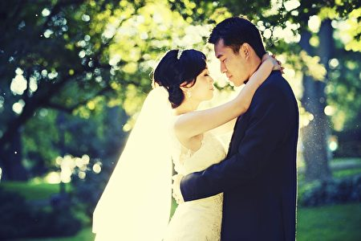

范文拓找到人生另一半。

 
 2016年1月30日下午，一架飞往加拿大的航班从新加坡机场升起。30岁的范文拓坐在临窗的座位上，平静的目光望向窗外。前方是多伦多的皮尔逊机场，那里有他新婚妻子在等待，他将开启生活的新一页。
 
 
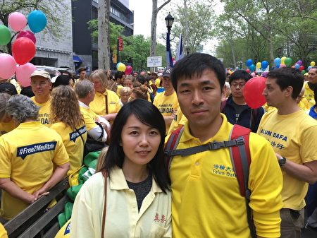

范文拓和妻子拥有同样的信仰：真、善、忍。

 
飞机越飞越高，繁华的都市渐渐远去，范文拓轻叹一声：别了，那些生命中不该承受之痛！

可是，远在故土被非法关押在监狱中的母亲，依然牵动着他的心，尤其在有了稚子之后，这颗心常常变得更加沉重…….

<h1 align="center"><b>烟台国家一级女建筑师遭非法抓捕</b></h1>

【大纪元2018年08月24日讯】烟台建筑师、法轮功学员孙立华于2018年6月22日下午，在公司正常上班期间被七八个警察绑架，至今被非法关押在烟台市看守所。

明慧网报导，警察抢走了孙立华大量的包括电脑、打印机、手机等私人物品，并扣押了她个人的价值20余万元的别克轿车一辆。

7月8日，孙立华被非法批捕；8月13日，非法构陷她的卷宗被递交到检察院。

孙立华，40多岁，是一名优秀的建筑师，拥有国家一级注册建筑师执业资格，是公司的业务骨干。孙立华在所有认识她的人中口碑极好，处事真诚厚道，工作认真负责，性情平和理性，心地纯真善良，被同事和客户给予很高的评价。

这样一位备受尊重的人，突然间被一群便衣警察戴上手铐、当着她众多同事的面强行带走，让所有人都无法理解、无法接受。

离开单位后，警察又带着孙立华到家中，当着她14岁生病在家的孩子和丈夫的面非法抄家。当时她的丈夫实在看不过眼，与警察论理，被警察连同孙立华一起绑架到派出所，直到半夜才放出来；期间，受惊吓的孩子一人在家。

据说，6月11日，在习近平来烟台视察期间，全市戒备森严，监控极其严厉。恰恰那天在某高档小区出现法轮功的真相资料。这立刻成了当地“维稳”的大事，上头责令公安尽快破案。

公安调看监控，发现孙立华那天出入那个小区，随后莱山区国保又跟踪、监视她。6月22日，孙立华遭绑架。

目前孙立华的律师已介入。孙立华坚守自己的信仰，坚信自己无罪。

法轮功于1992年在中国传出，其“真、善、忍”的修炼原则及祛病健身的奇效深受各阶层人们的广泛欢迎和赞赏，修者日众，至1998年，据中共官方数字，有7,000万人修炼。至今法轮功洪传至世界一百多个国家和地区。

自1999年中共江泽民集团残酷迫害法轮功以来，大量的法轮功学员被非法绑架、构陷、关押、判刑等。

中共《宪法》第36条：公民有宗教信仰自由。任何国家机关、社会团体和个人不得强制公民信仰宗教或者不信仰宗教，不得歧视信仰宗教的公民和不信仰宗教的公民。

2011年3月1日，中国新闻出版署发布的第50号令，废除了江泽民1999年当权时发布的对法轮功书籍的出版禁令。

因此，信仰法轮功，印制、散发、拥有法轮大法书籍和资料都是合法的。

19年来，中国大陆的法轮功学员时刻冒着生命危险，持续向人们传播法轮功真相，反对邪恶的迫害。

今年6月20日，在美国首都华盛顿国会山前声援法轮功的大型集会上，美国国会外交事务委员会资深成员达纳﹒罗拉巴克（Dana Rohrabacher）赞扬法轮功学员说：

“我为和你们站在一起而骄傲，一直都是如此……当美国人都了解到你们今天所做的，你们代表的价值、诚实、礼节及对人类的关爱，他们将充满敬佩地站在你们这一边。”

<h1 align="center"><b>生命最珍贵的意义</b></h1>

【明慧网二零一八年八月二十四日】（明慧记者沈容采访报道）高中时就透过母亲接触法轮大法的何宗宁，本不认为自己的未来会和修炼有什么牵连，但当迈入而立之年后的她，回首这十几年来的职场生涯，却发现对真、善、忍的信仰已在心底深植，成为生命中最珍贵的意义。而修炼后真诚、善良、忍让、以苦为乐、无私助人的心境，更成为她在工作中逆流而上的关键支柱。
踏入职场的试金石

记得在二零零七年，正值凤凰花开的时节，当时即将从大学毕业的何宗宁，透过学长与恩师的引荐，来到台湾知名保险公司实习，这段时间虽不长，却是她踏入职场前的试金石。

回忆当时的工作项目，她说：“保险公司会依据市场需求，不断推陈出新进行商品开发，当时许多前辈都在忙着开发新商品，就把旧商品系统转换的工作交给实习生。我所做的就是在系统转换过程当中，将覆盖人一生的商品精算资料，透过重新撰写程式产生数值后，进行验证比对，以确保系统资料能正确顺利的转换。”

对一个实习生来说，当时的工作量的确困难繁重，宗宁表示：“师父在讲法中提到：‘我想作为一个修炼的人不管是大人小孩儿，你们在任何一个位置中你都应该做好你的一切：是学生你就学好功课；是工作的你就把工作做好。’[1]我从法中体认到，修炼无小事，无论是大事还是小事，多困难或多简单，就是用同样的态度把它做好。”

态度对了，人生中的各种可能自然就会开启。宗宁钜细靡遗、有条不紊的亮眼表现，不仅使她在实习结束后顺利转为正式职员，也成功搭建公司与母校建教合作，和各大专院校产学合作、人力培育的桥梁。

<b>“你怎么就骂不走呢？”</b>
 

从实习“菜鸟”到正式员工，从战战兢兢到独当一面，宗宁在工作五年后提升至专案襄理，除她自身脚踏实地的学习外，主管高标准的要求也让宗宁有了飞越性的成长。

她回忆道：“在人寿工作时，曾遇到一位非常严格的主管，在他底下工作，不但业务量多，加上对工作细节极为要求，经常需要加班，当工作未达标准时，也免不了严厉训责。”大约有四、五年的时间，宗宁都处在这种高压环境中，这段期间因无法适应而离职的同事，都非常佩服她的抗压性。

宗宁说：“师父在法中告诉我：‘在各种阶层都可以做个好人，不同阶层存在不同的矛盾。高阶层有高阶层的矛盾形式，都可以正确对待矛盾，在哪个阶层如何做个好人，都可以放淡各种欲望、执著心。在不同阶层都可体现出好人来，都可以在自己所在阶层中修炼。’[2]”

“从法中我悟到主管的严谨态度，是为了让我懂得注重极小的细节，做好万全准备，使完成的专案得以被看见、被肯定；而他的严厉训责，也让我学会如何低头，如何放下自我去面对别人承受不了的挫折，在短时间内激发潜力、快速成长。我想只要能设身处地站在老板的立场去着想，很多过不去的矛盾和心结都能迎刃而解。”

在逐步跟上主管的种种要求后，某天主管和她说：“你怎么骂也骂不走呀，真的很吃苦耐劳！”一句看似玩笑的话，不仅肯定多年来宗宁真诚勤恳的态度，也打开她在职场上的另一扇大门。

修炼中没有偶然，所遇到的坏事、好事，最终都会成为好事。宗宁笑着说：“在职场工作十年后，我也是借由这位主管的推荐，得到从子公司人寿转任至母公司金控的机会，展开新的工作旅程。”

<b>跳离为私的舒适圈</b>
 

金控公司对于管理人寿、银行、投信等子公司的经营绩效，必须透过公正严谨的绩效管理制度来定期追踪及考核，而宗宁在金控担任的就是“绩效管理”的关键角色。

她说：“要成为子公司（人寿）和母公司（金控）的桥梁，就必须放下身段，时时保持一个良好的心态，不管是传达讯息让子公司接受，或适时提出改善对策，都需要以真、善、忍的态度去沟通，才能收到好的效果。”

不过，要离开朝夕相处的环境和同事，还是经过了一番挣扎，“在人寿待了十年，我有一定的职位和资历，但到金控之后，你要把前辈的姿态和原本可以升迁加薪的机会放下，离开熟悉的舒适圈到一个崭新的领域从新开始，这其实是需要勇气的。”

多数人会以薪水职位、生涯发展作为主要考量，但宗宁选择转任金控的原因却大为不同，她说：“我知道在工作中接触到的每个生命都是很珍贵的，所以最后让我下定决心的主要原因，就是可以在新的环境遇到更多不一样的同事和主管，每个月或每季甚至有机会能遇见董事长、副董事长、副总经理和许多高阶经理人。我希望能透过与他们接触的机会，分享自己修炼法轮大法的美好以及法轮功在中国受迫害的真相。”

过去几年来，宗宁常会将法轮大法的简介放在桌上，让来来往往的同事都能看到。“有部份同事会主动问我法轮功是什么，他们甚至很惊讶，表示虽听过法轮功，但身边很少接触到学法轮功的朋友，所以我常借此机会和他们说明法轮功是性命双修的功法，以真、善、忍为修炼原则，可以提高心性、强身健体，但大陆却因为学炼人数众多，遭受中共的残酷打压。”

“其实在和同事讲真相的过程中，我发现很多人对于中共为何要迫害并不明白，所以我随身带着大法简介在身上，心中有着救人的念头，期望更多有缘人了解在中国发生的残酷事实。我相信多一个人明白真相，就少一个人去传播谎言，也就能制止中共滥杀好人的悲剧，所以只要有任何机会我都会去讲。”

宗宁笑着表示：“每次出国回来后我都会准备一些礼物给同事，当他们问为什么要去这个国家时，我就会说，因为我学法轮功，参加了一个乐团，被邀请到世界各国演出，借由演奏音乐的形式，传达法轮大法的美好，让世界各国知道，而这乐团的名字就叫‘天国乐团’。同事听闻后恍然大悟说：‘所以这个乐团是从天上下来的啊！’我听后也会心一笑。”

图：宗宁（右）所参与的天国乐团，经常到世界各地的庆典与表演活动。

<b>先是修炼者才是专业者</b>

从人寿到金控，当宗宁越往经理阶层方面走，越能发现自己的不足。她除争取外派学习的机会外，也在忙碌工作之余，利用假日就读数据科学相关研究所，期望在专业知识上有所提升。

宗宁诚恳表示：“不论在职场上或是修炼上，都必须时时内省、修去不足，更加精進！因为，我能在毕业后顺利找到工作到现在，是大法给我的福份，我很明白自己一定要先是修炼者，才是专业者，懂得做人，才能知道怎么样做事。”

最后，她感叹道：“高中时我是顺着妈妈的要求学法炼功，并不明白修炼是什么。但当大学毕业再度重拾《转法轮》后，才真的体认到修炼的美好与严肃。虽然大学期间疏于学炼，但大法的根已深深扎在我心底，那是我生命最重要的意义，已融入每天的生活日常，不论在哪里、做什么，都在实践大法对我的要求，我相信若能以身作则做到真、善、忍，珍惜每个遇到的有缘人，就能起到良善的作用，让这个世界更美好。”

注：
[1] 李洪志师父著作：《瑞士法会讲法》
[2] 李洪志师父著作：《转法轮》〈第四讲〉

<h1 align="center"><b>深圳两位高科技人才被冤判八年</b></h1>

【大纪元2018年08月24日讯】近日，广东省深圳市法轮功学员冯少勇博士、陈泽奇工程师的律师与家属接到通知，两人被龙岗法院冤判八年。两人已委任律师提起上诉，案件正在进行中。

冯少勇，40多岁，北京邮电大学博士毕业，是单位的技术骨干，性格朴实厚道，用“真、善、忍”的标准要求自己，乐观、人缘很好。1999年他在北京邮电学院读博士时，与同事成功研发机顶盒，将为此获得的100万元人民币奖金，全部捐给北邮。

陈泽奇，54岁，谦和儒雅，深圳达特电脑公司软件开发部经理、一名优秀的电脑软件专家。他主持研发的掌上电脑“一指禅”及“蓝精灵数码词典”是优秀的高新技术产品。

明慧网报导，2016年9月24日，由广东省政法委、省“610”（专门迫害法轮功的非法组织）、省公安厅、国保等直接部署，跨地区绑架广东省约20名法轮功学员，其中冯少勇、陈泽奇也在其中。

当日下午，深圳龙岗区国保人员与爱联派出所警察敲陈泽奇的宿舍门，骗说他朋友的汽车被撞了。在骗开门后，一个瘦高的便衣对他当胸一拳，把他打懵了。警察没出示搜查证，绑架了他，并抄走他的电脑、几本法轮功书等私人物品。

当天晚上，深圳龙岗国保警察撞冯少勇的车，绑架了他；次日，非法抄他的家，还带着预备破门用的冲击钻，又去他的亲戚家非法抄家。家属多次要被扣押的车及抄走的私人用品都要不回来。

冯少勇、陈泽奇被非法关押在深圳市龙岗区看守所。爱联派出所警察邓宏辉罗织材料，将两人起诉到龙岗区检察院。因为构陷材料不足，深圳市龙岗区检察院曾两次退侦，要求公安“补充证据”。

2017年12月1日，被非法关押了400多天的冯少勇和陈泽奇在深圳市龙岗区法院第六法庭被非法庭审。这天，龙岗区法院门前有几十个黑衣警察、特警和一些警车守着，如临大敌。

三位律师在庭上为两人做了无罪辩护，一一驳回公诉人提出的所谓证据，要求五个证人出庭（无一位证人在场）。针对公诉人的“可能会”、“可能是他”而下的结论，律师反问：“你家有菜刀就可以怀疑你要去杀人吗？”法官哑然。

律师们表示，《刑法》300条不适合本案，不承认扣在当事人身上的所谓“非法经营罪”。冯少勇和陈泽奇都不承认所有莫须有的非法指控。

公诉人理屈词穷，面红耳赤，每次念到构陷部分时都咳嗽、结巴、声音低得听不清，中间还要上厕所；念到“两罪并罚”时，念不下去了，停顿了足足有两分钟。

作为辩护人，冯少勇的妻子陈述道，丈夫修炼法轮功后变成一个非常善良的道德高尚的人；他是IT精英、国家栋梁，现在每家每户享用的机顶盒，就是他们的科研成果。“他用男人的胸怀呵护我们母女俩，是个好丈夫、好父亲。一个这么好的人怎么今天就成了罪犯呢？”

她还陈述道，孩子每天睡觉都不敢关灯，上厕所要人陪，看到警察、警车都会惊恐地抱住她说：“妈妈，我很害怕，警察要拿枪打我。”

“作为母亲，我的心在流血。希望法官能公平公正地依法办案，无罪释放冯少勇、陈泽奇。”

陈泽奇最后说：“我和在座的各位一样有血有肉，也会流泪；我和在座的每一个人都有缘分，希望和你们结的是善缘。”

非法庭审到下午5点半才结束。法庭没有当庭宣判。

<h1 align="center"><b>法轮大法给予我健康与智慧</b></h1>

【明慧网二零一八年八月二十三日】我今年五十三岁了，一九九九年初开始修炼法轮大法，知道了人生的目地是返本归真，心里真是美啊。我抓紧学法、炼功，生活中按真、善、忍的法理指导自己修心向善，做好人，做更好的人，时时都沐浴在佛恩浩荡的慈悲中。
一、修大法全家人得福报

我从小就体弱多病，一有个流行感冒就落不下，打点滴吃药是家常便饭。学大法后，身体变的强壮，无病一身轻。一晃十八年过去了，再没有吃药打针。

妻子比我小一岁，三十多岁时就患有心脏病，风湿病等各种疾病。一九九八年夏天，因病情加重，走路靠搀扶，生活不能自理。住進医院治疗花了很多钱病情也不见好转，后来医生建议出院回家养着吧。病痛的折磨使她对生活失去了信心，自己偷偷写了遗书。看着幼小的孩子，常常以泪洗面，无望中艰难的活着。

真是天降洪福啊，妻子有幸看了宝书《转法轮》，几天后就感到身体不那么难受，觉的有力气了，自己能独立行走啦。她也开始学炼法轮功，不久身体就好了，什么活都能干了。十八年过去了，五十多岁的她就象年轻人一样干活伶俐，经营着美食店，一天忙来忙去的不觉的累。性情也变的温顺、善良。以前和婆婆是冤家，现在相处的比亲生母女的关系都好。真是修大法带来的福啊。

二零零九年秋，当时六十九岁的父亲身患脑血栓重病，全身瘫痪，到省医院救治医院都不留了，让回家养着，说白了就是回家等死。我和妻子从外地赶回来看望父母，父亲瘫痪卧床七天了，我俩陪着父母，给他们讲大法真相，讲了很多人诚念“法轮大法好，真善忍好”，病重的身体得到康复的事例，告诉父母诚心敬念，一定会得福报的。父母答应了，也不停的念。几个小时后，父亲奇迹般的坐了起来，又让母亲搀扶下地，一步步的能行走了，从那以后，父亲的身体一点点的康复了，后来自己能独立行走了。见证了诚念“法轮大法好”得福报的神迹。

母亲今年七十八岁了，去年春天感觉身体不适去医院检查，医院诊断是先天性心脏病，心血管两处窄小，医生建议心脏支架治疗，需要十余万元治疗费。姐弟们找到我征求我的意见。我说妈都这么大年龄了，经不起折腾的，先调养一段时间看看，再说心脏支架不见得能治好病的，听说附近中学有一名女教师，做了心脏支架治疗后不到三个月就去世了，如果她不做心脏支架，也许还不会死呢。听我这么一说，谁也不提心脏做支架的事了。我告诉妈妈你就常念“法轮大法好”，身体一定会好的。真是神奇，几天后，妈妈的身体好了，也不说心脏难受了，自己又能独立生活啦。

二、大法给予的智慧

我的工作是选厂设备维修和安装。得法后按真、善、忍的法理要求自己，工作认真负责，不怕脏不怕累。常常有难干的活，领导就安排给我。每次都能顺利的很好的完成工作任务。得到领导的认可和信任。技术水平在同行业较高。我知道这是大法给予我的智慧。

二零零四年六月，单位扩建一个年产三十万吨铁粉的选厂，领导找到我让我负责整体设备安装。我带领工人顺利的安装一台又一台的大型设备，最后安装的是一台价值三百多万，总重二百多吨的大型破碎机。这台设备是厂家首次研发制造的，因此该厂厂长和工程师都亲临现场指挥安装。我们共同配合解决了一个又一个的装配中的难题，对我们干的活都非常满意。

有一天，厂家的负责人把我叫到没人的地方，拿出好多张百元大票往我手里塞，意思是求我多多帮忙，认真安装。当时我的日工资还不到三十元，这么多钱对我来说可真是不小的诱惑。可我想到我是修炼法轮大法的，不能要人家的钱，我一再推托和拒绝对方，并告诉他放心吧，不要你的钱，我会尽全力把设备安好的。对方只好把钱收回，连声说谢谢。在我们的共同努力下，近两个月的时间就把设备安好了。设备需要调试，运转，达到技术要求后方可使用。

可是安完的设备多次试运转，发现电流过高，润滑系统回油温度过高，把设备拆开每次都是承重的铜瓦研了，我们把铜瓦研磨达到技术要求后再装上，再调试，运转不长时间瓦又研了。两家的工程师和领导研究，想尽了办法整改，无数次调试，最后还是不行，他们急的也不知如何是好。最后认为该设备不能正常使用。大家私下里议论，根据签订的合同，选厂明年一月份不能投产，设备厂家要赔偿损失的，三百多万的设备还得拆除返厂，损失是相当大的。

双方领导真是心急如焚，不知如何是好。我看到大家辛辛苦苦装上的设备不能使用也很着急。我找到设备厂家的领导和工程师，把我的想法对他们说了，建议把供油方式改一下试试。最后他们同意按我的方法再试一次。我带领工人们用了两天的时间把铜盘的供油处改了，装好，开车试运转。电流、油温一切正常，达到了技术要求。

成功了！大家欢呼起来，设备厂家更高兴，到饭店摆了几桌宴席招待设备安装的所有参与者。身边好多人找到我，出主意说，你把设备修好了，给双方挽回了巨大的损失，不能白干，管他们要钱，多要点，他们一定会给的。我听后不为利益所动，笑着说我不要钱。我把法轮大法的美好和真相讲给了他们。

新建的选厂按期投入生产，设备运转正常，生产效果很好，铁矿粉产量增大，创造了更高的效益。在新年表彰大会上我被评为劳模。工作十几年首次当选。是按真、善、忍修好自己得到的结果。后来又到过几家选厂担任生产厂长，到哪里工作都以身作则，不贪不占，工作认真负责，亲自动手解决生产中的难题，给选厂创造了更多的效益。用善心管理工人，把法轮大法的美好和真相带给他们。

法轮大法在我的生命中深深的扎下了根，修好自己，多去执着，同化大法，多救人，不辜负师尊的慈悲苦度。叩拜恩师！

<h1 align="center"><b>媒体不敢触及的禁区</b></h1>

【明慧网二零一八年八月二十三日】近日，八十五岁老妇李淑贤因生活不能自理要求保外就医被拒一事，在社会上引起关注。
被关注的原因有三：一是老人是因种植树木被砍而遭举报，以“寻衅滋事”罪被判刑两年半，法院将其到京十五次上访定性为“非法上访”。二是《刑法》七十二条规定，七十五周岁以上的应当缓刑，八十多岁的李淑贤被判实刑，法院并未给出解释。三是李淑贤入狱后患了压缩性腰椎骨折，在监狱两年骨折两次，躺在床上不能动，大小便都得在床上，生活无法自理，家人申请保外就医被拒，河北省女子监狱将瘫痪在床描述成需“卧床静养”，称不具备保外就医条件。

这三点，哪一点都是违法的，被曝光后引起民愤。有评论连问：“信访问题怎么处理成这样？法院又是怎么判决的？坐牢的八十五岁老人是否需要人文关怀？那些恶意构陷八十五岁老奶奶坐牢的人，你们真的就心安理得吗？”

中国法律之荒谬，对人之冷血由此可见一斑。殊不知，这样的经历在被迫害的老年法轮功学员中很常见，只是媒体不敢也不能触及这些黑幕，所以难以为外界所知。

今年六月，八十岁的法轮功学员郑德财在狱中就是坐着轮椅出来会见家人的。他被庄河市法院冤判一年半，关押在南关岭新入监监狱。家人向监狱强烈要求才得以会见，才知道郑德财出现高血压，心跳过速，咳嗽血等症状。

被关押在山西晋中监狱的八旬法轮功学员李喜虎，被狱警铐着手铐，狱警指使刑事罪犯殴打李喜虎，十五监区监区长杨春生便是直接责任人。

令人震惊的是，七十九岁的辽宁省凌源市建平县法轮功学员刘殿元，被判十一年半重刑，目前在冤狱中遭受着迫害，这不是往死里整人吗？

中共迫害法轮功学员，连高龄老人和孩子都不放过。河南新乡市法轮功学员赵美珍于二零一六年十月二十四日早七点左右，在新乡“六一零”（专门迫害法轮功的非法组织）及新乡牧野区检察院的直接操控下，在家中被绑架，送到新乡看守所非法关押。由于赵美珍年逾八旬，血压高到二百多，看守所拒收，但检察院仍然不放人，并叫嚣：“看守所不收！直接送五监狱！四年的刑期从现在开始，直到二零二零年结束。”老人被关押后身体不适，在监狱医院里血压高到二百多，处于危险之中，家人去探望遭拒绝，监狱的狱警说她一直不配合治疗。监区的负责人李杰说：“来到这里的人，不到期是不会让她出去的。”

二零一八年六月九日下午，辽宁省本溪市今年已八十三岁的丛福兰老太太和七十六岁赵桂荣，只因发放几张真相光盘，被本溪市彩屯派出所绑架，所长赵宁亲自指挥，对两位老人非法抄家。当天下半夜一点多，两位老太太被劫持到本溪市看守所。因俩人年龄太大，看守所担心身体出问题，要求派出所出两万元钱才能收。牵涉到派出所的利益，派出所无奈办了所谓的“取保候审”，将两人放回家，但暗中编造材料，上报到本溪市检察院，意图批捕两位老人。

安徽阜阳市法轮功学员王学斌已八十一岁高龄，并且病重已一个多月，卧床不起。约于二零一七年七月十九日左右，突然被遭非法批捕。阜阳市新上任政法委书记、公安局长张家忠在没有任何法律程序下，亲自下令非法批捕轮功学员王学斌，只是因为他认为王学斌在阜阳市法轮功学员中威望很高。

辽宁省葫芦岛兴城市张东华是个残疾人。二零一五年五月，依法向最高检察院递交了控告元凶江泽民的诉状，七月十五日兴城市公安局来了三车警察，在没有出示身份证、搜查证的情况下，非法抄家、绑架了他们母女，并抢走法轮大法书籍。她的母亲在葫芦岛市第二人民医院检查身体时，由于体力不支重重跌倒在地，导致腿部、胯部多处瘀青，浑身发抖。对于一个年过八旬的老妇，看到这些警察们却全然不顾。在看守所拒收的情况下，有的警察竟谎报老人的年龄，已快八十岁，警察谎报六十五岁，简直是不择手段。

海军大校周彝也是因控告元凶江泽民而被迫害。江苏省南京八旬老人周彝是军航空工程学院退休副教授，大校军衔，师级离休干部。二零一五年六月初，周彝的诉江状在明慧网登出后（《海军大校周彝控告迫害元凶江泽民》），就一直处于公安的监控、跟踪之中，并遭强制采血。二零一六年八月十七日下午，周彝在一位法轮功学员的家里学习法轮功著作时，被鼓楼区公安分局、国保大队及华侨路派出所警察共二、三十人闯入绑架，二零一七年三月一日遭非法庭审。

早年被判重刑的老年法轮功学员，如今在狱中已经年过八旬。其中，空军第一代飞行员、国家二等功臣于长新，二零零零年一月六日被判十七年重刑，入狱时已经七十多岁。于长新原是空军指挥学院教授，正师职，副军级，原法轮大法研究会成员，曾主编空军指挥学院教科书。一九九九年“四·二五”，于长新即失去自由，后被北京军事法院秘密冤判。于教授对判决不服，曾提出上诉。当时军队高层对于长新被判重刑反响强烈，一些高级将领为他鸣不平。

于长新教授的妻子姜昌凤，二零零一年被非法重判十年，当时已近古稀，是北京女子监狱关押的年龄最大的法轮功学员。在女监被迫害一度满脸长满脓包，眼睛肿胀睁不开，严重便秘，腰部严重弯曲成九十度，手不停地抖动，生活自理困难。出狱后又被非法送进劳教所，二零一一年十一月，这位八旬老人，被人目睹关押在北京女子劳教所，单独关在一个牢房，身体已经很虚弱。

熊辉丰，退休前曾任航天部八三五八研究所副所长、研究员、中国宇航学会的理事，是享受国家特殊津贴的专家。二零一四年八月，因不放弃对法轮功的信仰，时年七十六岁的熊辉丰老人再次被抄家、绑架，后被判重刑七年半。

熊辉丰的老伴刘元杰女士，是八三五八研究所的高级工程师，多次获得航天部的二等功、三等功，为中共的飞航导弹领域做出重要贡献。由于多年来反复的被迫害，加上警察不断地恐吓威胁，特别是二零一四年对年近八旬的熊辉丰先生的再次绑架，对刘元杰女士的身心造成严重打击。她从此日渐消瘦，精神状态越来越差，于二零一五年三月三日凄然离世。

警察迫害法轮功学员遭恶报的例子也不胜枚举。二零一四年四月二十二日早晨，天津街派出所六、七个警察对八旬老人法轮功学员张锡明大打出手，使老人身体多处受伤。警察敲诈张锡明的老伴不成后，自己翻箱倒柜，抢走一万多元。天津街派出所王广祥是迫害大连法轮功学员顾群致死的直接责任人之一，二零一七年三月二十六日，王广祥被确诊为比较罕见的小分子肺癌，不能手术只能化疗。

法轮功从一九九二年弘传至今十九年，当初六十多岁开始修炼的人，如今已是八十岁上下，这些老年法轮功学员为数不少。他们很多人被警察上门骚扰过，被劳教或判刑，甚至全家被迫害，这些年身心经受了极大摧残。他们所经受的迫害比李淑贤老人更甚，只因为法轮功是媒体报道的禁区，这些黑箱才难以揭开，但是人在做，天在看，这些恶行必将逃脱不了上天的惩罚。

<h1 align="center"><b>摩洛哥游客：法轮功学员的行为是高贵的</b></h1>

【明慧网二零一八年八月十五日】（明慧记者周文英巴黎报道）进入夏季，每个星期天的下午，法轮功学员都会来到巴黎艾菲尔铁塔附近的人权广场，向来自世界各地的游人展示法轮功功法、讲述发生在中国的迫害真相并征集签名反对迫害。二零一八年八月十二日又是一个这样的星期天。
这一天，人权广场游人不断。很多人被法轮功学员的功法演示吸引，他们纷纷摄像、拍照，要留下这珍贵的瞬间。

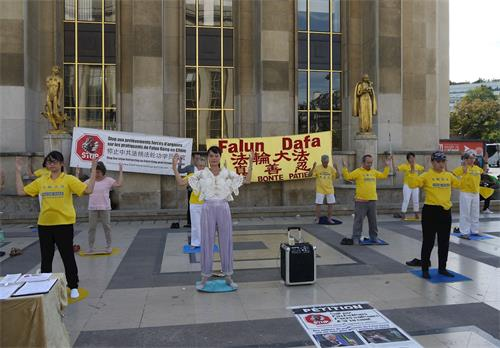

图1：法轮功学员在法国巴黎艾菲尔铁塔下的人权广场演示法轮功功法

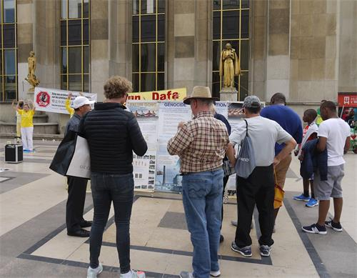

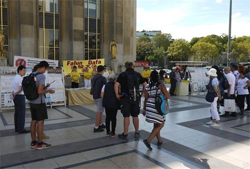

图2～3：来自世界各地的游客观看法轮功功法演示和真相展板

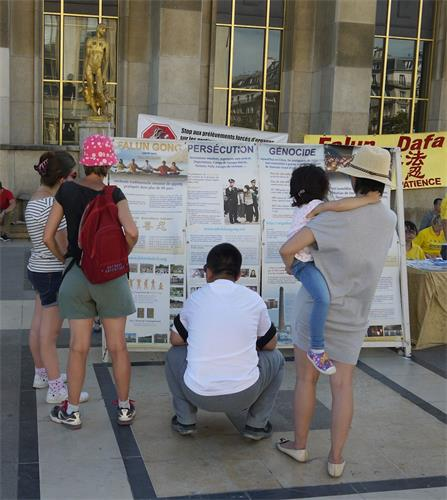

图4：大陆游客一家阅读真相展板，了解法轮功真相

原籍阿尔及利亚的里阿尼先生（Liani Belkcem）是商人，来法国三十八年了。他与妻子和孩子路经人权广场，看到法轮功功法演示，他表现出很大的兴趣：“今天是我第一次见到（法轮功），真的让我惊讶，他们的打坐，有的完全入静在他们的记忆中、头脑中。我象通了电一样，这给了我一些东西，有什么东西吸引着我。”学员告诉他是能量，他说：“对，绝对是能量，他们入静仿佛在另一个世界，不同寻常。我很受震撼，我很喜欢，非常喜欢。”学员又告诉他，法轮功修炼真、善、忍。他赞叹道：“很美，极好。”他表示要上法轮大法网站了解更多的信息。

查因•阿布杜拉（Zain Abduzzah）是学生，他说：“法轮功对所有炼功人的健康是有益的，这是他们的信仰。我们很高兴遇到法轮功，这也告诉我们，我们都可以炼法轮功。因为我们从来都没有修炼过，总得要试试。”

阿斯玛•乌布（Asmaa Oubou）是摩洛哥阿加地（Agadir）地区旅游局局长，她带儿子第一次来巴黎旅行。她认为：“巴黎是一座阳光的城市，他们（法轮功学员）在这里征签，是高贵的行为，我自然和他们站在一起。我为他们的高尚行为加油，我希望早日停止迫害，让和平充满整个世界。”

让-非利普•安德尔尼（ Jean-Philippe Anderni）表示：“有那么多人在承受痛苦，共产主义体制下，未经任何人的许可，摘取人的器官，这太恐怖了。在中国有人因为修炼而这样被迫害，从人道角度来看，这太可怕了。我不知道还能说什么，没有语言来形容这样的残忍。针对这样的血腥残杀，人们应该联合起来（反对）。”

帕特里斯（Patrice）在房地产行业工作，他说虽然没有去过中国，但了解中国。“那里完全没有自由，没有言论自由。我签字，是针对反人类罪行，还有未经允许贩卖人体器官，我反对中国共产党。”

居住在巴黎的中国东北人淑菊（化名）说她了解法轮功学员，她知道有个法轮功学员被监禁后绝食，后又被酷刑折磨，牙齿被撬掉了，手都掰折了，还坚持炼法轮功，他们很坚强。

游人中也有大陆游客，他们有的仔细看真相展板，用手机拍摄展板上的内容。有的在听了法轮功学员关于中共暴行的讲解后，退出了中共党、团、队组织。

<h1 align="center"><b>谁是中国人民的敌人</b></h1>

【明慧网二零一八年八月十七日】当今世界上谁对中国最危险？谁是中国人民的敌人？一说中国的敌人，不少大陆的百姓，都会把矛头指向美国。笔者小时候，也被灌输美国是中国的敌人，并且对美国仇恨了好多年，后来了解到美国的一些真实情况，才知上当。其实把美国视为敌人的中国人，都是被中共的宣传给骗了。美国不好，为什么那么多中共高官都把家属或子女送到美国，自己还怀揣美国护照呢？还有一些有知识、有本事、有钱的人，为什么去了美国呢？
他们为什么要投进“敌人”的怀抱呢？虽然信息发达了，但中共不惜花巨资封锁网络，不让人们看到真实的世界和真实的美国。真正了解美国的中国人，不会把美国当作敌人的，有的还向往美国哪。美国不是中国人民的敌人。她是一个经济发达、信仰自由的民主国家，讲人权，总统若与百姓发生了纠纷，在法律面前都会平等对待的。中共的独裁暴政和美国的民主自由是相悖的，是中共把美国视为敌人。其实美国可不是中国人民的敌人。

上个世纪七十年代的时候，中共突然掀起了批孔运动，把孔子说成开历史倒车的复辟狂，让全国人民把他视为敌人。孔子思想和学说对中国历史有着二千多年的影响，中共就把孔子当成敌人狠狠批判。中共把中国五千年文化全部否定，把历代王朝说成吃人的旧社会，把对天地神佛的敬仰说成愚昧无知，让中国人对这一切谈虎色变，谁不放弃这些，就是阶级敌人，就要受到整治。

笔者刚读小学的时候，就被中共灌输很多仇恨，什么地富反坏右、会道门，什么资本主义、帝国主义，封建主义都是阶级敌人，都是中国人民的敌人，让我们不忘阶级苦，牢记血泪仇。我的舅爷一生向佛，又是个老中医，心地善良，为人诚挚，文革期间已是年近七十岁的人了，还被定为会道门，作为阶级敌人批斗，让他跪砖头，从此不让他行医。后来舅爷被派到学校去为老师们做饭。

那时我就在这个学校读书，一九七六年正读初中。一天上午，我们班级里几个学生打闹，伤到了一个学生。我急忙跑到伙房叫来舅爷。舅爷把住这个学生的手腕号了号脉，让我们赶快去叫老师。老师来了，舅爷表情非常严肃地说：快送这孩子去县医院，晚了就没命。老师们一听吓坏了，就抢时间把这个学生送到了县医院。到那儿一检查是脾出血，大夫马上给这个学生做了手术。手术后，大夫感慨地对老师们说：晚来十分钟，这孩子就没救了。

一个被中共打成阶级敌人的人，没害过任何人，关键时刻却能救人的命，还给学校化解了不可想象的麻烦。我的舅爷是个善人，却被中共定为坏人、敌人。文革期间，有多少忧国忧民、爱国爱民的有志之士和众多行善重德的好人们，都被中共定为坏人、敌人，在中共的群众运动中饱受凌辱，不少人失去了生命。

知识分子、地主、富农、工商业者，还有那些一心向佛向道者，大多都是有修养的人，他们是传统文化的传承者，是民族的菁英，怎能是我们的敌人？可那时，全国人民听信中共的欺骗，却把他们都当成敌人。一场文革不仅摧毁了五千年文明，还毁掉了多少国家栋梁之才。

每次运动，中共都是挑动群众害群众，这次利用这部分整那一部分，下次说不定又利用另一部分整这一部分，受害者都被中共说成是中国人民的敌人。一旦运动搞过头了，民愤大了，中共就会推出一些替罪羊为它自己开脱，标榜自己“一贯正确”，里外落好。每次运动过后，中国人民互相之间也真的有很多人成为仇人、敌人，甚至于一辈子都解不开这种仇恨。中共每搞运动，都要处心积虑地在人们群众中制造仇恨，制造敌对，让人们互相斗争，互相残害，多少人斗了一辈子都不算完，子女还要接着斗。有几人能识破在中共治下你死我活地斗来斗去，其实都在中共玩弄之中。

六十多年了，中共把它的无神论和斗争哲学施展到了登峰造极的地步，并且极力往中国人脑子里灌输，让人们善恶不分，正邪颠倒，背弃传统的道德规范。谁若讲道德、讲善恶有报、讲神佛、讲信仰，很多人就说你愚蠢、迷信、另类、精神空虚，这就是中共对中国人洗脑的结果。

每当中共迫害无辜，都要事先造一通谣，把他们说成人民的敌人，于是得心应手地操控那些被洗脑的人掀起所谓的群众运动。这些人有时不用中共指挥，都会激愤地把“敌人”置于死地。

一九九七年那年，我还在公安部门上班，当时我所在机关的办公室主任因内斗被撤销了职务，降为一般警员，因此他的心中充满了仇恨，总想报复整他的那些人。一天他对我说：我打算好了，用枪把他们统统毙了，然后再自杀。

不久我便离开了公安部门，大概半年后的一天，见到了那位总想报仇的同事，他竟象变了个人似的，眉目慈善。他告诉我他修炼了一种佛法，他要按照佛法去做好人，不争不斗。这佛法就是法轮大法，也称法轮功，教人们按照“真善忍”的标准去做好人，与人为善，不与人为敌，注重道德的提高，直到功成圆满。这位同事因修炼了法轮功，解开了心中的仇恨，打消了报复他人的念头。

法轮功教人按照真善忍的标准去做好人，能使社会道德迅速回升，然而却被中共视为最大的敌人。利用那些被无神论和斗争哲学洗脑的人，掀起了一场打压善良百姓的群众运动。在这场迫害中，众多法轮功学员被非法劳教、判刑、被迫害致死等。我的那位警察同事也被劳教了三年。迫害法轮功，也正是中共再次挑动国人残害自己同胞所上演的悲剧。

地主、富农、右派、修佛修道的人，不是中国人民的敌人，对他们的平反中共不是已经自打嘴巴了吗？

法轮功更不是中国人民的敌人，把法轮功说成敌人，恐怕中共没有自打嘴巴的机会了，中共迫害法轮功，反而把它自己迫害倒了。

那么到底谁是中国人民的敌人？恰恰是中共这个反天反地反人类的西来邪灵。回顾中共窃政以来，哪次运动不都是迫害无辜的好人，给国家制造动乱和灾难？今天的毒奶粉、毒疫苗等又害了多少可爱的孩子，中共的意图就是要断绝中华民族的未来。

中共曾经喊得最响亮的口号，就是与天斗与地斗与人斗，公开与天地人作对。中共不仅是中国人民的敌人，也是全人类的敌人。因为中共是一个邪灵，它不仅要害中国人，最终还要毁灭全人类。即使你维护它，它最终也不会放过你，只要你是人，它就把你视为敌人。《共产主义的终极目的》 一书，揭穿了中共是怎样通过破坏传统文化，败坏人的道德，一步步地让人变坏，变成不配做人的非人，最终招致天降大难，从而把人类毁灭。看看当今中共的治下，社会道德全面崩溃，犯罪爆发，人人相害，黄赌毒泛滥，生活环境被严重破坏。有人为此担忧，觉得大难临头没有了出路。有人还觉着活得挺好，却不懂人不治天治，善恶必报。

上天慈悲于人，还给人留着最后的机会：尽快退出中共、解体中共，国家才有未来，民族才有希望！

天降大难，天灭中共。这是上天的旨意，没人可以抗拒，只有顺天而行，才能获得上天的保佑，躲过大难。

<h1 align="center"><b>斯德哥尔摩市政厅前法轮功真相点　各族裔民众支持</b></h1>

【明慧网二零一八年八月十七日】（明慧记者何平斯德哥尔摩报道）进入二零一八年夏季以来，法轮功学员每天上午都会来到斯德哥尔摩市政厅的入口处，向瑞典民众及来自世界各地的游客展示法轮功的美好，同时揭露中共迫害法轮功及活体摘取法轮功学员器官的真相。
这个讲真相点位于通往斯德歌尔摩市政厅的一个必经之处，对面是个停车场，这里过往的游客络绎不绝。每天从上午九点到中午十二点学员们都是在这样一个环境下，伴随着炼功音乐，平静祥和地展示法轮功缓、慢、圆的五套功法，有的面带微笑向过往的中外游客发放大法传单、真相资料。祥和的场面，深深打动着来自世界各地的游客。法轮功学员在讲真相方面坚持不懈的努力，得到了越来越多当地民众及游客的关注和支持。

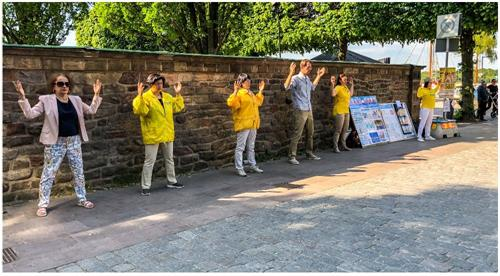

图1：法轮功学员在斯德哥尔摩市政厅入口处的真相点演示法轮功的五套功法。

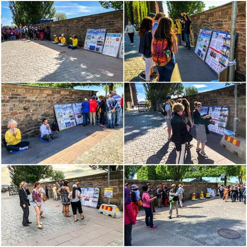

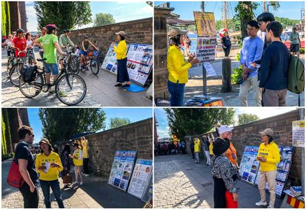

图2～3：宁静祥和的炼功场面，吸引很多过往游客驻足观看，主动上前了解法轮功真相。

<b>警察为法轮功活动放绿灯</b>
 

据负责这个活动的西人学员约翰（Johan）介绍，今年在办理市政厅前这个讲真相点的活动许可时，还出现了一个小插曲。当他拿到活动许可时发现，警察局批准下来的活动场地与往年不一样了，今年的位置不知为何被安排在了一个较偏避的地方了。

于是他很快联系上了警察局负责活动许可的负责人了解情况，同时向他讲述法轮功学员为什么要在市政厅这里讲真相，和目前在中国受中共迫害的法轮功学员的处境，以及中共在海外包括瑞典的渗透。后来这位明白了真相的警察说：“那好吧，你说你要哪个位置吧？”就这样，法轮功的真相点又回到了市政厅的入口处。

<b>瑞典中西方导游帮助传真相</b>
 

七月初的一天，天气炎热，一位瑞典中年导游主动走上前和学员交谈，询问有关法轮功的一些信息，当学员向他讲述中共活摘法轮功学员器官谋求暴利的残暴行径时，他气愤地说：“你知道吗？那天我在这里等客人时看到了这个信息，大概有一个多小时我都不能讲话了，大脑里一片空白，这太令人震惊了！必须制止！我支持你们！”

一些明白了真相的华人导游当听到旅游团里的人说，讲真相的法轮功学员是花钱雇来的，都马上给予了否定说：“他们（法轮功学员）绝对的不是（雇来的），这么多年了，我都认识他们，你们不要听信这些不实的信息。”有的导游还鼓励不敢接真相报纸的大陆游客：“看看报纸怕什么，别总自己吓唬自己！”

有几位当地瑞典导游，明白真相后身体力行地支持法轮功学员反迫害，当他们带领旅游团经过学员的活动场地时，首先要向客人介绍法轮功以及法轮功学员为什么要在这里炼功、发报纸。客人听完介绍后，纷纷拍照并主动上前拿取真相资料，当他们得到自己国家语言的大法传单时都非常的高兴，有的当场就表示对学炼法轮功感兴趣，回去后要去联系当地的炼功点。

<b>瑞典民众：我要成为你们中的一员</b>
 

正在休假的瑞典中年男士彼得（Peter）经过学员的活动场地时，他得到了一张大法传单，看完后感觉非常的好，于是他站在展板前认真阅读全部的内容，和学员交谈了很长的时间。

法轮大法洪传世界一百多个国家和地区的盛况以及神奇的祛病健身功效，令他很是向往。当他了解到眼前这些法轮功学员与全世界的法轮功学员们一起，为了他人不被中共谎言的欺骗，长期坚持不懈的讲真相所做出的努力和付出，他非常感动：“你们是我遇到的在这个世界最好的人，别看你们在这里是那么的安静，其实你们是那么的强大！震撼人心。这个功法一定是最好的，我要成为你们中的一员。”

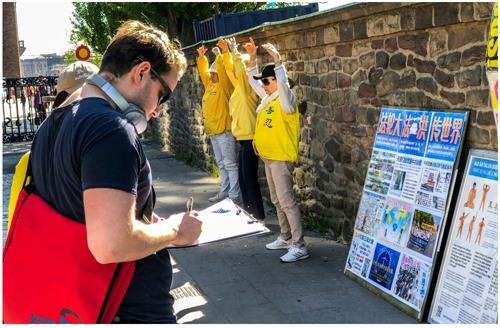

图4：明白了真相的人们签名支持法轮功学员反迫害

 
 

<h1 align="center"><b>亵渎神佛　说报就报</b></h1>

【明慧网二零一八年八月十六日】亵渎神佛，说报就报。下面是我二嫂回忆在她的娘家发生的一件惊心事。
当年文化大革命破四旧时，公社驻地召开全公社破四旧大会，各村大小干部都参加，将各村收缴的菩萨挂像等物件挂在会议室西侧批斗神佛。有位年轻的公社干部用烟头去烧菩萨的眼睛，并讥讽说：“你不是有灵吗？你那灵呢？”引起周围人哄堂大笑。

在公社驻地有一木工铺打造了很多棺材，一摞摞放在了一起。地上有一新制棺材还没盖儿。主持会议的一个公社副书记见后好奇的躺进里面，并说了一句：“啊，这棺材我躺着正合适，不大不小，给我吧。”当时会议室选址在烤烟房，十大间屋。边上一间有一堆多年不用过期失效的制鞭炮的灰药，会议前曾多次试验，灰药倒在火炉里都不着，也就没有清除。

七天的会议开到第五天，一妇女队长抱着一个小孩子来开会，忽然小孩嚎哭不止，为了不影响开会，另一妇女队长就领着这母子俩离开了会场。刚一出门，就听一声巨响，屋里的人嚎叫冲天，人们争先恐后逃命。门挤住了，窗堵住了，浓烟裹着鬼哭狼嚎般的叫声，其状惨不忍睹。炸死的、踩死的、呛死的有几百人。

小孩为什么哭呢？修炼人知道，六岁以下小孩天目是开着的能看到另外空间的景象，预知一些事情。事发后，木工铺那一摞摞棺材远远不够，是向外调购的。那个主持会议的副书记就用上了他躺过的棺材。事后，很多人嘀咕着：“欺佛太甚！欺佛太甚！菩萨显灵了！”

不由得使人想到文革时毁佛谤佛的造反派后来都遭到不同程度的报应，这样的事例很多。

五十多年前的惨案写出来警告世人，迫害法轮大法修炼人也是要遭恶报的。现在邪党的那些追随者如不赶快悬崖勒马，就会步薄熙来、周永康的后尘，成为中共邪党的陪葬品。明真相、识正邪就是当务之急！所以大法弟子讲真相就是在救人。都遭报了还救谁呢？

<h1 align="center"><b>七十年党龄的老军人父亲退党</b></h1>

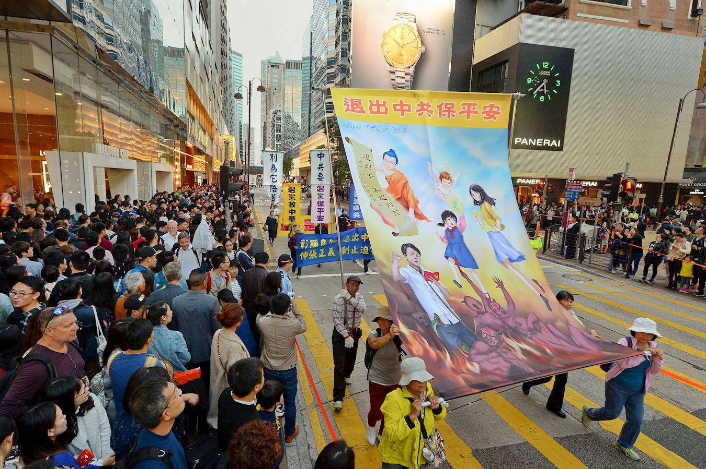

香港举行声援中国民众退出中共党、团、队大游行。图为游行队伍中的图文“退出中共保平安”。

跟中共干了一辈子已有七十年党龄的军人父亲，一天在饭桌上突然说了一句：“中共真是流氓！”
 
父亲1939年入伍，1944年加入中共，是一个经历了抗战、内战为中共卖命一生的老军人。2013年他八十八岁，患有心脏病、高血压、失眠、颈椎病、脑梗等十多种疾病。父亲迷信医院的检查与治疗，因此那些年他频繁住院、出院，日子大都是在医院度过的。

我和丈夫都是法轮大法修炼者，丈夫年轻时曾患疑难疾病，丧失工作能力，因修炼法轮大法重获新生。我因他而走入修炼，修炼后道德升华、身心健康，也同丈夫一样无病一身轻！

父亲住医院，请了二十四小时的护工。我们每天都去看他，送去一些他爱吃的饭菜和水果。父亲长年受无神论的洗脑教育，形成了党文化思维，听不得说中共不好的话。我们经常将大法真相资料夹在父亲要看的报纸中，希望他能阅读。起初父亲由于受中共欺骗宣传的影响，不愿听也不愿看真相，对有关“法轮大法”祛病健身的信息也将信将疑。我们一说到中共的罪恶，他就会很气愤的反对。

一天我去给父亲送菜，他翻报纸时看到其中夹有真相资料，顿时火冒三丈，对我挥掌怒吼：“难道你当初也是这样天天让你婆婆看的吗？！”他当晚头痛一夜未睡。

次日，查脑CT虽未见异常改变，但父亲极为痛苦的对我说：“头痛的非常厉害。”我说：“医生说过头表皮痛是颈椎引起的，不要紧。”但父亲说：“我现在是脑袋里面痛，而且痛得就像要裂开一样，血压一百六十。”我说：“那你就找医生想办法呀”？父亲说：“医生没办法”。我说：“那你就相信我早就跟你说过的：默念九个字（法轮大法好，真善忍好）试试吧。据我所知世界上成千上万的人都因此受益了，我是你女儿不会骗你的。”

晚上，我打电话问父亲情况如何，他说：“没事了，头基本不痛，血压一百三十也正常了。”于是第二天我拿了一篇《医生出身的老父亲心服口服了》的真相故事给父亲看，父亲看后说：“我懂了。”后来在我的督促下，父亲每天都会默念几十遍“法轮大法好，真善忍好”。

虽然父亲已体验到了大法的超常神奇，但由于受习惯性思维的影响，一旦症状消失，他又会将其说成是吃某种药吃好的。为此我郑重地提醒父亲：“你得福报不承认，福报必然不会长久。”

记得有一次我对父亲说：“天安门自焚是中共对法轮功的栽赃陷害。”他说：“这我不知道，我又不在场。”我说：“你这不是善恶不分吗？这完全是可以根据常识、逻辑、良知去判断的。”事后我悟到：我与父亲讲话的方式不善也是造成他排斥真相的原因，所以我必须修掉它！

一个月后，父亲因服用治疗失眠的药物，其副作用造成抽搐再次住院。抽搐控制了却造成心律加快，使安装了十多年的心脏起搏器失控不再工作；失眠情况更加严重，人很疲劳但头脑却清醒得让他无论昼夜始终睡不着觉。

父亲说：“我觉得睡觉的功能都丧失了。”他情绪低落的几次对我们说：“我快不行了，我两边都靠不上了。”这就是父亲一直迷信科学，对大法将信将疑最终所陷入的困境。

父亲在连续三天三夜睡不着觉的情况下，一天早饭后，突然坚定地对我们说：“我决定不吃药了。”我俩听后十分惊讶！
 
“吃了一辈子的药了，根本不管用。现在我决定跟你们一块修炼法轮大法。”父亲接着说。 

父亲说到做到，按大法弟子的标准努力去做：白天跟我们一块学法、学功、发正念；晚上父亲睡不着觉就干脆通宵阅读《转法轮》，放师父教功录像边看、边学。

当父亲认真观看了两遍《九评》后，有一天，跟中共干了一辈子已有七十年党龄的父亲，在饭桌上突然说了一句让我们震惊的话：“中共真是流氓！”父亲终于从本质上彻底认清了中共，亲笔写了退党声明，摆脱了邪党的束缚！

当父亲修炼了四十六天后，六十六年的失眠顽疾消失了。双手十个严重的灰指甲有一个已全好，其它的也已从根部泛红逐渐转好……

从此父亲享受到了自由自在的完美睡眠，每天都过得很开心、满足。

<h1 align="center"><b>听法轮功真相　弃恶从善</b></h1>

【明慧网二零一八年八月十四日】我是九六年喜得法轮大法的女弟子，修炼二十二年，每一步都有师父保护，我的家人也受益于大法。下面我把世人明白法轮功真相后人心归正、弃恶从善的事例略举几例，希望有缘人了解法轮功真相，有不妥之处敬请指正。

<b>（一）仇人相互善解了</b>

二零零九年一月，我因给一位青年城管讲真相被他诬告，把我关進拘留所，头天晚上一夜没有入睡，我与同一监室的两个女青年谈了一晚话，谈话中知道她们是一对仇人，冤家路窄，她们因做生意争门面地盘斗殴后，派出所处理不服，被关到拘留所同一监室的。之前这间监室就她们两个人，尬尴、无奈、烦躁的气氛，在我的介入后才转变。

她俩分别问我：炼法轮功有什么好处？政府不让炼为什么还要炼？你们家人让你炼吗？等等很多问题，我一一给她俩做了解答。听着听着，她俩忘了她们是仇人。

我告诉她们牢记“法轮大法好，真善忍好”，你俩心情不烦躁不尴尬，很快就回去。她俩很高兴，看得出来她俩愿意听我说话。

我跟她俩讲了“六尺巷的故事”，舜帝不记父母兄弟之仇的故事，窦娥寃的故事，红眼石狮子的故事，讲了很多大法弟子忍让割舍利益的故事，讲了我让地给邻居起屋。我告诉她们有失才有得的天理。

她俩豁然开朗，会心一笑。我知道她们会善解了。然后我告诉她们，要求拘留所的警察告诉派出所我们不打不斗了，相互道歉，善解矛盾。快过年了，我们家上有老下有小，我们要回家了。

第二天她们照做了，第三天派出所把她们接走了。她们退了邪党团队，都怀着感激的心情与我握手离别。

<b>（二）警察管不了的女犯归正了</b>

我在拘留所的第二晩仍然无法入睡，因为隔壁监室来了六个卖淫吸毒的女犯人，都很年轻，大的不到三十岁，小的才十六岁，晚上她们淫心发作、毒瘾发作乱喊乱叫，调戏男监室的人，不堪入耳。警察多次打招呼制止卑劣言行都没有用，警察一走她们就再来，闹的人们都无法入睡。

第二天放风的时候，我们都在大院里交谈，我问她们为舍不顾尊严什么脏话都说、喊叫不停，你们叫的累不累，警察骂你们难不难受？她们说，我们在发泄，我们习惯了。我听了真伤心，可怜她们。

我告诉她们，我是炼法轮功的，是被人迫害来这里的。一个女孩说，奶奶你是好人，你和我们不一样。我内心知道那是她明白的一面说出的话，我说，姑娘们，我来这里是与你们来结缘的，你们是来得救的，你们想改变自己做好人吗？她们说我们好不了了。我说，有办法，只要你们相信神佛，你们就可以改变，脱胎換骨。她们说：“我们已坏透了，能好吗？”我说，你们被这个腐败社会所害，被变异的文化所腐蚀，你们是受害者，你们个个都长的漂亮，你们是高层次的生命转生到这个世上来的，是与法轮大法来结缘得救的。

她们似懂非憧的听着，有一个女孩流泪。我说，我有责任帮你们跳出误入歧途的苦海，去寻找你们美好的未来。她们听的很认真，我说，姑娘们，你们记住“法轮大法好，真善忍好”，神佛会保护你们去毒瘾、除淫魔，你们能改邪归正做好人。

放风回监室时，警察看这几个女孩围着我静静的听我说话，他们问我说些什么？我说教她们改邪归正做好人，然后我们各自回监室。

吃过晚饭后八点多钟，我见隔壁六个女孩抱着被子来到我这间监室，说是同炼法轮功的奶奶住一起，想跟我说说话。我说只要警察不管，我欢迎你们，但是要肃静，不能象昨天晚上那样吵闹。她们说，好。

我教她们跟我念“法轮大法好，真善忍好”，我又回答了她们提出的我为什么炼法轮功，政府为啥不让人炼法轮功，天安门自焚是怎么回事，等等一些问题。我又讲了修炼法轮功的神奇故事，讲了很多礼仪道德传统文化的故事，讲了善恶有报，改邪归正天神赐福的故事。

她们听的津津有味，一个女孩说，我第一次听到这些好话。有的问你怎么知道这么多？我说我们师父告诉的。

这个晚上她们安安静静，下半夜她们睡的呼呼的，警察也没来监室查房。听一个警察在院子里说，今天怎么这么安静？！

然后几个女孩就与我同住一个监室，警察说把她们交给你了。我带领她们把监室卫生搞好，不准她们乱扔乱摆，教她们叠好被子。天气冷，让她们围着坐一圈念“法轮大法好，真善忍好”，她们也不说冷了。

一天下午，警察叫一个吸毒女孩去见来探监的人，哪知外面来探监的人把毒粉从接待室玻璃小孔里用小纸卷着递進来了。我从未看到过吸毒，突然我看到三个女孩围在一起，一个女孩端着一张纸好象纸里有什么东西，我厉声说：“你们干什么？！”一个卖淫的女孩告诉我她们有毒粉了。我起身走到那三个女孩跟前说：同我念“法轮大法好，真善忍好”，你们把这张纸和纸里的东西扔厕所坑里去。

迟疑了好一会，我用目光盯住她们，然后手拿毒粉的女孩把纸和毒粉扔進了粪坑。

我拉着她们坐在我身旁，告诉她们常念“法轮大法好，真善忍好”，毒瘾就没有了。我告诉她们我不会告诉警察的，你们扔了毒粉说明你们想远离毒品，这是难能可贵的举动，我为你们点赞。我帮五个女孩退了团队（其中一个没有入队入团），我告诉她们退党团队保平安的道理，她们都认同，我给她们唱大法弟子的歌，我炼功、发正念，她们也学着做。

几天下来，她们听懂了天安门自焚是造假，她们认为迫害法轮功是错的。她们与我住在一起后安静了、老实了。警察见我管好了这几个女孩，都用敬佩的眼光瞅着我。

在拘留所我讲真相、劝三退，主动搞好卫生。警察善待我，我有幸接听了国际营救被非法关押的大法弟子的长途电话，在师父的保护下我提前六天回家了。

<b>（三）想叫人打架的妇女知道错了</b>

二零一零年二月的一天，我们在火车站讲真相，看到一个四十多岁的妇女一边哭一边往售票厅走去，我走到身边问她，小妹你有什么困难吗？她说，我被我老公和小叔子打了，你看我头发扯掉了，衣服扯烂了，我要回娘家喊人来还打。说着急忙往售票厅走去。

我拉住她说，小妹我们同是出嫁女，被婆家人打，我很同情你，你能歇一会我与你聊一聊能为你出点主意吗？

她停下来了，我把她拉到花园旁坐下来了。我问她你与老公打架，小叔子帮哥打你是吗？她说，我们婆家起房子，老公让地给小叔子，我不同意，老公说我不讲理，我和老公吵架，我婆婆帮我老公，我和婆婆争辩，我老公骂我，我骂了我婆婆，老公就打我，我翻过身来打了我婆婆，小叔子就打我。我骂他们一家人欺侮我，我去打老公，结果老公和小叔子一起打我。

我问她，你怎么打婆婆？她说婆婆帮儿子，我现叫我娘家来人还打，替我出这口气。我对她说：我告诉你，你的想法错了，不但出不了气，反让娘家受气。如果你娘家人是明理人，不会来打人，反而会指责你，你会更气。如果娘家人帮你来打，就会酿成灾祸，打伤打死哪方人都是你的亲人，谁负责医药费？谁来负法律责任？

她问我是干什么的，我说我来给你讲真相，神佛指引我来告诉你免灾难的。我劝你别去娘家喊人来打架，否则你会大难临头。

她傻了，说我吃这么大的亏，挨一顿打，我不甘心。

我说，吃亏挨打是好事，你有一劫，你不挨打，你生病你招灾或被汽车撞了或被人盗了你钱财你甘心吗？你挨骂挨打，别人给你德，这个德是最珍贵的东西，给你祈福给你添寿，这还不好吗？

她问我，你是信什么的？我说我信仰真善忍，做到打不还手、骂不还口，知道有失有得的道理，我们做人要真诚，善良，忍让，做好人只求一生平安。她说象你这样做人的人太少了。我说太多了。

我问她，你听说过法轮功吗？她说听说过但不了解法轮功。我说法轮功是叫人做好人的，按真善忍的标准做人的，为别人着想愿意别人好，别人有好事为别人高兴，别人有不好的事为别人排忧解难，与别人发生矛盾时先检查自己哪里不对，错了就主动道歉，我们崇尚仁、义、礼、智、信，重视传统文化，百善孝为先，做人媳妇要守妇道……

她听着情绪转变了。我说我炼法轮功十四年了，身体上的病都好了，心胸开朗了，只想做好事，为别人好特别高兴，你今天遇上我你太幸运了，你家要发生的灾祸没有了，你家平安我高兴。

她激动的抓住我的手说，你真是好人呀！我说炼法轮功的人都是做好人的。我叫她记住“法轮大法好，真善忍好”，你经常诚念这九个字，身体健康家人平安，她立即念了几遍。

我送她一个真相护身符，她高兴的接了。我又告诉她三退保平安的道理，她明白了并退出了少先队，她脸上露出了笑容，再次握着我的手，连声说谢谢。我说，要谢就谢我师父。她又说“法轮大法好，真善忍好”。

她说，大姐再见，我要回家了。我送她离开了车站，我俩挥手再见了。

<h1 align="center"><b>默默修补坑洼路、让电让水</b></h1>

【明慧网二零一八年八月七日】我是一名法轮功修炼者，师父要求弟子们按真、善、忍的标准要求自己，在我现有境界的理解，就是要做到真诚、善良、谦逊、忍让。因此在日常生活的点点滴滴中，我都遵照师父的教导处处做好人，尽管中共十多年来不停地对法轮功打压迫害，造谣诬蔑，可我周围的人就从我身上看到法轮功是最正的，最好的，因而破除了中共的谎言。

<b>一、默默修补坑洼路</b>
 

我的家住在县城一条两里多长的居民线上，共住着一百多户居民，都是菜农，靠种菜为生。我门前的路很是糟糕。说来奇怪，尽管周围都是高楼大厦，道路宽广，可我的门前却是一条弯弯曲曲坑坑洼洼的泥土路，路边是一条小排水沟。只有部份居民将自家门前铺了水泥，有些人家也没铺水泥。大约有一里多路是垂直于这条路的几排居民线，因路边没有住户，更是没人管，路就更难走了。这条路每天都有运菜的大车小车碾过，对路面损坏很大。尤其是下雨天，大坑小坑的泥水，给菜农们造成很大不便。

我深深感受到菜农们的苦难，每天夜以继日的种菜、摘菜、洗菜、卖菜，已是千般辛苦，雨天还要泥泞路上跋涉。我就想默默为大家做点好事，将路面的坑洼填补好。我的经济条件也不好，因为信仰真、善、忍而受中共迫害，在南方打工又被公司要挟要保证不炼功才能继续在那工作，就决定回老家，又被公司克扣两万元工资，基本两手空空回来。回家后靠种菜供女儿念完大学，家中还有老母，因此手头没有什么节余。我就不畏辛苦，到处找废弃的碎砖渣，在附近的一个新建小区有些人家搞装修，有些丢弃的砖渣，我就用三轮车拖来填补。隔段时间路面不行了，就又重新填，这样默默地坚持了一年多。

其中还有一段小插曲。去年年底我正忙着卖芹菜，眼看到了腊月间，家家都在忙着准备过年。这时有一段路上又大坑小坑的了，当时自己实在没时间，也找不到砖渣。但心里总想着在年前把路修好，让菜农们及来往的路人、各家的客人在过年时走在这条路上感到快乐。年关时，我们附近一家在搞装修，有一个做小工的来找我去拖砖渣，我当时确实没时间，就没去。过了几天，那位小工又来找我邻居，说把砖渣拖在他那让他扩宽门前场子，让邻居给一包十元的香烟就行了。

我听见后就出来与邻居打商量说：不如您先放一放，把砖渣让给我去填路，要过年了，让大家有好路走。邻居一听很高兴，就满口答应了。我就跟着那个小工去看有多少砖渣，去了一看大约有两立方米左右，正好把那些坑坑洼洼填上。我就对那个小工和另一名开三轮车的人说：“我给你们五十元钱，你们自己去买烟抽，但你们要做点善事，从那段没住户的地方开始填坑，一直到有住户的几户人家的门前都填好，有多的砖渣就放在那没住户的地方，方便以后路面坏了我有时间再填。”那二人满口答应，高兴地接下五十元钱。

我以为这下心愿了了，晚上收了工我就高兴地去查看路面。谁知一看心都凉了，那些砖渣全堆在一个空地上了，他们连一个坑也没填。我心里有些不平衡了，光是花钱不说，我还得花时间，花力气，眼下正忙得不可开交。但转念一想，我是修炼人，怎么能跟他们一般见识呢？他们没填我去填不就行了吗？于是第二天一大早我就用两只桶一担一担地挑砖渣把路面填补好了。虽然吃点苦，但心里很踏实。

周围的人知道后都很敬佩我，但又为那五十元钱为我抱不平，就极力让我母亲去把钱要回来，那小工自知理亏，就将钱还给我母亲。我知道后，还是给那个小工十五元钱让他买包烟抽。

<b>二、让电让水</b>
 

连续多年来，我都是以种菜为生。现在中国大陆道德下滑，菜民为了利益，不考虑他人身体健康，总是打些增长剂促使菜快长，这种增长剂对人体是有毒的。我是修炼人，宁可少收入一点也不给菜用不好的药物，但年年蔬菜都有好的收获。

菜农种菜第一就是需要浇水，浇水就需要大的水池，还有抽水、供电等问题。然而这一切蔬菜社却根本就不管，都是菜农自己想办法解决，可菜农中也没人愿意为大家出力出钱。我就把自家的水池和一个长三米、宽两米、深一米五的公用水池用自己的电机一次又一次地抽满水，以方便大家浇菜和洗菜用。有时供电的开关、电路板坏了，就默默地自己掏钱买了换上。别人大量用我水池的水浇菜我也从不计较。

常言道：日久见人心。这天长日久的，谁也知道炼法轮功的人好，也都知道法轮功好。

去年年底，公用的大水池已灌满了淤泥，基本不能装水了，这样以后菜农浇水就成了问题。我就在繁忙中挤出一天时间清理水池，用大铁锹一锹一锹地往外翻泥土，一直从清晨起干到天黑，终于清理完了。看到露出水泥底的大水池，我深感欣慰。菜农日后又能方便地取水浇田了。

亲爱的朋友，您也许觉的不好理解是吗？其实也好理解，修炼人就是这样的心境，以他人的快乐为快乐，以他人的忧愁而忧愁，这就是伟大的“真、善、忍”精神铸就的为他的生命。但愿朋友听了我的小故事能有所思考，愿朋友早日了解法轮功真相，您也会得到很大的福祉。

<h1 align="center"><b>英议员和医生致信首相 吁调查尸体展</b></h1>

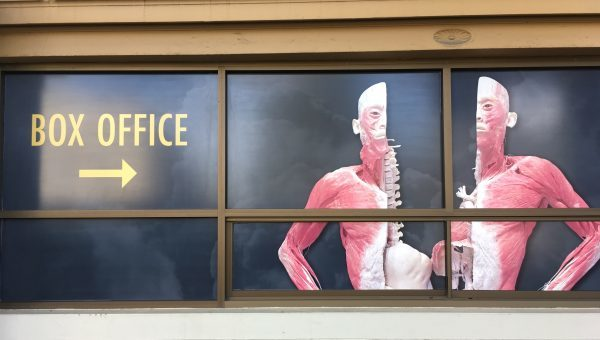

英国伯明翰国家展览中心（NEC）举办“真实人体展”。

【大纪元2018年08月10日讯】（大纪元记者鲍天雨英国伦敦报导）8月6日，伦敦召开了有关制止在英国伯明翰国家展览中心（NEC）举办的“真实人体展”（The Real Bodies exhibition）研讨会，会上公布了两封呼吁调查尸体来源并完善相关法律的公开信。

与会者包括资深调查记者、中共活摘器官问题专家Ethan Gutmann，曾参与过中共摘取死刑犯器官的前乌鲁木齐铁路局中心医院外科医生安华•托蒂，以及曾被中共非法关押并经历过目的可疑的体检的法轮功修炼者、原北京律师Grace， 一起与会场多家媒体记者共同探寻事实真相。

<b>“多是年轻男性” 医生呼吁调查尸体</b>
 
“真实人体展”中被剥去皮肤，使用液体硅胶塑化并切割、摆放成不同造型的尸体，具有明显亚洲人生理特征，一直被质疑其来源问题。目前该尸体展在以色列、法国、美国的夏威夷州等多个城市遭到禁止，捷克也在2017年7月变更法律条款，规定这类尸体展必须要有死者同意捐赠的证明，否则禁止入境。

此次在英国伯明翰展出了20具尸体、人类胎儿以及200多个器官等，NEC展览中心表示所有人体组织均由大连鸿峰生物科技公司提供，这些尸体标本“都是中共公安局向中国医科大学捐赠的无人认领的尸体”，是“合法捐赠的，不是任何形式的囚犯”。

展览组织者、Imagine Exhibitions首席执行官Tom Zaller承认，没有证据能证明尸体的身份，或任何书面证明表示死者愿意死后捐赠尸体。

在研讨会上公布了由53名英国医学界人士向伯明翰验尸官办公室（Birmingham Coroner office）发出的公开信，呼吁该展览在英国期间，应调查所展尸体的死因、死者身份，并要求完善《人体组织法》（Human Tissue Act）（2004）中对进口人体组织器官管理的漏洞加以限制等。

根据英国2004年《人体组织法》，“未经适当的同意，移动、储存或使用人体组织”都是违法行为，但由于该展览是从中国引进的人体组织，目前法案并不适用。

对此，政府表示，该展览已得到正规许可，但“举办展览和维护道德的标准责任由NEC把握”。

公开信发起人之一的伯明翰市医院顾问、神经学家David Nicholl博士在接受《卫报》记者采访时表示，调查员已进入展览馆，记录了死者的年龄、性别，“多是年轻男性，没有年纪大的人。”

他说：“大部分人上了年纪才会亡故，而该展览全是年轻人，性别极度不均，而在大连附近有好几处劳教所，所以这样一个展览的尸体来源十分令人怀疑。”

来自NEC的Rachel Dunachie表示，如果发现这次展览是不道德的，他们愿意“接受人体组织管理局的指导”，同时也将“不会获得许可证明”。

<b>致首相公开信 吁关闭展览做调查</b>
 
在研讨会上还公布了一封由30多位英国议员、医疗专业人士、法律工作者、社会活动家等，向英国首相、反对党领袖、外交部长和卫生部国务秘书发出的公开信，以下为公开信部分内容：

“未经同意展示的人类遗骸违反了《人体组织法》（2004年），以及它的创建精神，还应要求进口人类遗骸的商业活动须遵守这些标准，以确保不允许被贩运的人体进入英国并在英国展示。

“未经许可使用人体器官和组织获取经济利益是《伊斯坦布尔器官贩运和移植宣言》和《欧洲委员会打击人口贩运公约》所规定的道德和法律实践的对立面。

“在未经确认同意的情况下公开展示死者，包括不同孕育时期的胎儿，是对人权、尊严和道德的严重侵犯，不应以‘艺术’或‘教育’为由进行。

“这种人体交易不仅从中共政权广泛使用死刑中获益，也从中共关押‘不受欢迎’的囚犯中获益。

“商业利润不应超过基本人类尊严，该展览严重践踏基本人类尊严。

“我们相信这个展览已侵犯英国价值观和法律，应该停止。还应进行DNA测试，以便将来可以进行家族基因鉴定。我们敦促政府确保制定适当的立法，使这些展品不能自由进口到英国。”

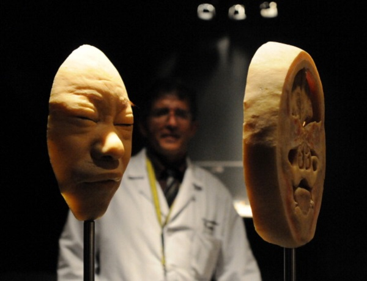

英国伯明翰国家展览中心（NEC）举办的“真实人体展”（The Real Bodies exhibition）。

<b>直接证据：调查DNA </b>

目前没有任何直接证据证明这些尸体的身份信息，与众多议员、医生共同签署公开信的英国人权理事会主席Fiona Bruce议员在信中表示，应该进行DNA检测，以便在将来进行家族DNA比对。

Gutmann也呼吁从此展览中获取DNA样本，以追寻来源。“中国现在正在推行一项试图测试中国人活体DNA的政策。”他在研讨会上表示，如果能获得DNA样本，就可以揭开中共摘取良心犯器官的谜题，这也正是他十余年来一直所呼吁的核心主题。

他在接受《卫报》采访时说：“英国人有权知道自己看到的是什么，中国人有权知道自己的亲人遭遇了什么。”

Gutmann认为，中国目前发生的活体摘取器官以及尸体展的受害者，与被中共当局持续打压的法轮功团体有密切联系。大连、锦州和沈阳的“辽宁三角区”，是迫害法轮功最严重的地域，有多家关押政治犯，特别是关押法轮功学员的监狱、劳教所。

目前已知有几千人被非法关押、迫害致死。“追查国际”于2014年发布调查报告证明，大连鸿峰生物科技公司有极大嫌疑参与针对法轮功修炼者的集体迫害。

<b>中共治下人命不值钱</b>
 
安华•托蒂表示，中国对少数族裔的迫害也在逐步升级，“目前中共政府将25%的维族人口送到所谓的‘学习班’，这也是一个潜在的器官来源。”在中国大陆，维族人、西藏人、基督家庭教会信徒、法轮功学员以及上访人士等均属此列，有报导说在被非法抓捕后很多人接受过目的可疑的体检。

他说：“如今中国最便宜的就是人命了。一条人命只值两元人民币——那是行刑者讨要一颗子弹的费用。”

<b>北京女子亲述体检经历</b>
 
原北京律师Grace因修炼法轮大法，2010年在北京朝阳区被非法拘留，随后被送到北京女子强迫劳改营，直到2012年才重获自由。

她表示曾在看守所遇到一个来自南方的女士，她的姐姐和姐姐的两个孩子都修炼法轮功，2003年在北京失踪，从此杳无音信。

“我在劳教所被监禁期间，接受了多次身体检查，包括肺部X光检查和血液检查，他们甚至还检查了我的皮肤，看是否有小伤疤，却从来没有解释为什么要我接受这些检查。”

2012年初，体检场所变为一辆装满医疗设备的昂贵面包车，“我记得一个官员对这车非常满意地说：‘看看政府如何关心你！专门为你们从德国进口这辆车。’”

劳教所里对法轮功学员实施酷刑，甚至有人被虐待致死，据明慧网报导，通过民间途径能够传出消息的，自1999年至2018年上半年，已有4245名法轮功学员被迫害致死。

据不完全统计，在2018年上半年，光是北京地区的法轮功学员，就有191人遭受不同程度的迫害，其中21人为65岁及以上的老年修炼者，年龄最大者86岁。

Grace表示，所有这些秘密行为给她带来了巨大的心理压力，这种精神上的折磨甚至比肉体折磨还要痛苦，“这是一种无尽的、绝望的担忧和可怕的感觉，任何时候都可能出现更糟糕的情况。”

目前已有多名英国医护人员联名在网上发布请愿书，呼吁民众制止中共迫害法轮功。

<h1 align="center"><b>法轮功学员无罪获释　迫害还能继续多久</b></h1>

【明慧网二零一八年八月十日】从2016年开始，大陆法院、检察院、公安机关无罪释放法轮功学员的案例越来越多，这在过去是不可想象的。
据明慧网《2017上半年法轮功学员获释综述》一文，2017年1月到6月，在公安局、检察院、法院、中级法院，都有阻止或终止迫害程序的案例，54名法轮功学员获释，另有97人被退卷。

这些案例发生在中国大陆的21个省、直辖市，包括安徽、北京、贵州、甘肃、广东、河北、河南、黑龙江、湖北、湖南、江苏、辽宁、内蒙古、宁夏、山东、陕西、上海、四川、天津、新疆、云南等。

中共对法轮功的迫害已持续了19年，近期出现这种变化是偶然的吗？当然不是！迫害法轮功天理不容，世间理也是不容的！促成形势变化有哪些原因呢？

<b>1. 按中国目前的法律，法轮功学员也是无罪的</b>

法轮功修炼真、善、忍，不仅让修炼者祛病健身，而且通过修炼能让人道德升华，是于国于民有百利无一害的正法 。中共一直以《刑法》第三百条“组织、利用会道门、邪教组织、利用迷信破坏法律实施罪”来迫害法轮功学员。可是，立法、司法机关均无法律文件明确法轮功是邪教组织。法轮功教人向善，中共才是真正的邪教。

1999年10月30日，全国人大《关于取缔邪教组织、防范和惩治邪教活动的决定》，全文内容也没有提到法轮功三个字。公安部2000年《关于认定和取缔邪教组织若干问题的通知》（公通字[2000]39号）中，明确的邪教组织有14个，但法轮功并未在列。

实际上，邪教的污蔑来源于1999年10月25日江泽民接受法国《费加罗报》记者的采访谈话，而江泽民的个人谈话不是法律。相反正是江泽民自己践踏了法律！

《宪法》第36条规定：“公民有宗教信仰自由”；第35条规定：“公民有言论、出版、集会、结社、游行、示威的自由”。公民信仰法轮功是合法的，法轮功学员告诉人们真相、制作、散发法轮功真相资料，完全是法律允许范围之内的事，也是合法的。《宪法》第5条规定：“一切法律、法规都不得同宪法相抵触。”

还有，法轮功书籍出版禁令也早已解除。2011年3月1日，《新闻出版总署废止第五批规范性文件的决定》中第99项、第100项明确废止以下两个1999年发布的文件：（1）关于重申有关法轮功出版物处理意见的通知；（2）关于查禁印刷法轮功类非法出版物，进一步加强出版物印刷管理的通知。

所以，在中国大陆民众修炼、宣传法轮功是完全合理合法的。正象中国东南大学法学院教授张赞宁为法轮功学员做无罪辩护时指出：“真正在破坏国家法律实施的是江泽民，江泽民才是真正的罪犯！610办公室是江泽民为了镇压法轮功而非法设立的组织，应该依法撤销。”法庭立即爆发热烈掌声。

越来越多的正义律师敢为法轮功伸张正义；越来越多的法官、检察官、警官、公务人员良知发现做出了正确判断和行为。

<b>2.全世界控告江泽民</b>

自2002年至今，迫害法轮功的元凶、中共前头目江泽民被以群体灭绝罪、反人类罪、酷刑罪在美国、德国、加拿大、澳大利亚、阿根廷、瑞典等19个国家和地区被控告。

2015年5月司法系统出台“有案必立，有诉必理”的立案登记制，中国大陆掀起了大规模的控告江泽民的浪潮，至今已有超过20万名大陆及海外法轮功学员及家属向中国最高检察院和最高法院递交了诉状，实名控告迫害法轮功的元凶江泽民。同时，全世界有几百万人签名声援起诉元凶江泽民。

<b>3.迫害者恶报频发</b>

人在做，天在看。过去几年高压反腐中的落马高官，大都是积极追随江泽民团伙迫害法轮功的败类，包括周永康、薄熙来、徐才厚、郭伯雄、令计划、苏荣、李东生、周本顺、奚晓明、马建、王力军、张越、武长顺等等。表面上，这些人是因贪腐落马；实质上是他们迫害法轮功而遭了恶报。

“十八大”以来，习近平当局“老虎苍蝇一起打”，迄今共查处了200多名副省部级以上中共高官，而落马的“苍蝇”更是数以万计，范围涵盖军队、政法、国安、民政等多领域。其中，中共政法系统被大清洗和降格，在过去4年间，有24省的公安厅长、31省的武警总队职务被更换，多省份的政法委书记、公安厅长落马，更有2名政法官员被判死刑。

外界观察发现，这些落马官员贪腐是中共官员娘胎里带来的不新鲜，但这些人普遍有两个突出特点：中共江泽民派系背景，积极参与迫害法轮功。中共官员们在这阴云密布、噩耗频传的形势下，也悟出些道道来：赶快善待法轮功、和江系切割，是当务之急！

<b>4.形势已变　迫害法轮功会被清算</b>

2013年8月现政权出台了《关于切实防止冤假错案的规定》：“法官、检察官、人民警察在职责范围内对办案质量终身负责。对法官、检察官、人民警察的违法办案行为，依照有关法律和规定追究责任。”

当今最大的冤假错案就是迫害法轮功。这对于执法人员可以说是敲响了警钟。说白了就是，赶快和江系切割，不要被江氏集团迫害法轮功政策绑架，谁做谁负责，终身负责。

2013年底当局废除了劳教制度，并将其内被非法关押的法轮功学员全部释放。劳教制度是江泽民集团迫害法轮功的最主要的工具之一，在劳教所关押的有一半以上是法轮功学员。这是对江氏集团迫害法轮功的直接否定。

2016年3月1号开始，新修订的公安机关警察《执法过错责任追究规定》正式施行，同一天，1999年6月11号实施的公安机关警察《执法过错责任追究规定》废止。旧规定中，因执行上级命令而犯错，可以不追究警察责任的条款，在新规定中予以撤销。仍然执行上级违法命令、且有悖天理的迫害法轮功的警察，责任是要终身追究的。所有的退路都堵死了，还不醒悟不就是等着被收拾吗？

2016年4月23日时隔15年后再次召开了全国宗教工作会议，主政者强调“依法管理宗教事务”，“用法律规范政府管理宗教事务的行为，用法律调节涉及宗教的各种社会关系。”这个讲话是对江泽民宗教镇压政策的纠正。会议上不再有迫害法轮功的任何文字和言论。当局又在提法上明确表态“对宗教信仰不能用行政力量、用斗争方法去消灭”。

<b>5.法轮功学员的慈悲唤醒良知</b>

十八年来，法轮功学员坚守真、善、忍信仰的正念和在自己都处在危难中还苦口婆心地向参与迫害他们的公检法司及其他有关人员讲真相，这种行为本身就具有强大的道德感召力。一旦外界环境有所松动，就比较容易唤醒执法人员们的良知、善念与人性，感化着他们善待好人，也为自己留后路。

表面上看，是法轮功学员在恳请执法人员给他们一个公道，维护信仰自由。实质上，现在的时间是不是也给了执法人员们一个展示正义良知，对得起自己和家人，避免遭到清算的机会呢？如果真是等到形势完全变过来了，天理能容你吗？

今天“三退”（退出中共党团队）自救大潮席卷全球，已有3.1亿人以真名或化名退出了中共的党、团、队组织，天灭中共已成为不可逆转的历史潮流。自古邪不胜正，这场迫害终究会停止，惩恶扬善，正其时也。

<h1 align="center"><b>如何得到神佛保佑？</b></h1>

【明慧网二零一八年八月八日】在中国的传统文化中，有很多神佛保佑人的记载，得到神佛的保佑是每一个人的美好向往。可是怎样得到神佛保佑？换而言之，神佛会保佑什么样的人呢？这个问题也困扰着很多人。有的人认为烧香拜佛、往功德箱里多扔钱就能得到神佛保佑，是这样吗？
据媒体报道，河北省原省委书记周本顺，曾经在其多处住所摆设佛堂佛龛，每逢初一、十五及佛教节日，他都按时烧香拜佛。其在二零一五年被查，被判刑十五年，可见他的烧香拜佛只是白忙活。

据明慧网《多行不义必自毙　周本顺遭恶报》一文报道，一九九九年七月二十日江泽民宣布迫害法轮功后，周放弃良知，曾多次主持、参加迫害法轮功的会议，驱动省各地中共官员加重迫害法轮功，是一九九九年七月至二零零零年十一月期间迫害邵阳法轮功学员的第一责任人。湖南省至少有四十九名法轮功被迫害致死，周本顺负有重要责任。

周本顺搞迫害的邪恶表现，给当时江泽民和政法委书记罗干留下深刻的印象。二零零一年，周本顺升任湖南省委常委、政法委书记、省公安厅厅长、党委书记。在河北任省委书记期间对法轮功学员的迫害更是丧心病狂、变本加厉，其制造多起群体绑架事件；绑架、骚扰、监视监控法轮功学员；利用电视新闻教育系统传播污蔑抹黑法轮功的谎言毒害世人。

周本顺一边迫害虐杀修炼法轮功的好人，一边祈求神佛保佑，神佛岂能保护这类人？！在长达十九年对法轮功学员的迫害中，象周本顺这类的人很多，他们或者烧香拜佛、求签问卜、念咒画符，或者看风水、修祖坟、供菩萨佛像，动辄花费几十万、上百万、千万（据国内媒体报道，四川省迫害法轮功学员的高官李春城，为迁坟曾花费千万做道场）的民脂民膏，妄图得到神佛保佑。一边他们又不断迫害残害残杀信仰“真、善、忍”、修炼正法的法轮功学员，诽谤佛法正法。他们的罪业何其深重！

据报道，迫害元凶江泽民见庙就拜，在家里抄念《地藏经》，还找来许多气功师为他看病看前程。这又有何用呢？犯下罪恶滔天的“反人类罪”、“群体灭绝罪”、“酷刑罪”他的前程就是面临越来越近的大审判和地狱中无尽的恶报！

“获罪于天，无所祷也”，最近几年恶报如影随形，江泽民政治流氓集团的势力被不断清洗，周永康、李东生、薄熙来、徐才厚、张越、万庆良、郭伯雄、苏荣、王立军等等百余名高官被绳之以法，其实这还仅仅是他们恶报的开始。

“命自我作，福自己求”、“积善之家，必有余庆”、“天道无亲，常与善人”　、“诸恶莫作，众善奉行”，中国人几乎对这几句话都是耳熟能详，在明慧网“天人之间”这个栏目大量刊登了善、恶之报毫厘不爽两方面的例子，其中神佛保护好人的例子比比皆是，限于篇幅，本文仅举两例。

《两亲戚诚信“法轮大法好”得福报》一文报道，湖北省一位法轮功学员的两名亲属，一名六十二岁，坚持看法轮大法真相资料、《九评共产党》，全家退出中共邪党一切组织。二零一六年的一天，他开手扶拖拉机耕田，因拐弯急，拖拉机把手撞到胸脯上，当时也不觉得疼，就自己骑摩托车回家了。因身体不太舒服，就在家做些轻松活，看法轮大法资料。过了几天，他发现胸肋处有一道大凹槽，不疼不痒，也没把它当回事。又过了些日子，凹槽不见了，这时他才想到是胸肋骨撞断后又自动恢复好了。他媳妇高兴地跟他说：“一定是大法救了你，还为我们家节省了几千元钱啊！大法太神奇了，我们要感谢大法师父！感谢大法！”在另一次车祸中他也安然度过。自此后，他在乡邻里广传大法真相。

这位学员的弟媳也相信大法真相，早已三退。在她突患尿毒症时，医生断言她只能活三个月，可几年过去了，到现在人都好好的。只因她诚心诵“法轮大法好！真善忍好！”而转危为安。

《大车司机：北京延庆雪天逃生记》一文讲的是，二零一三年冬天，一位大车司机载着两名法轮功学员出车，在车上两个学员给司机讲真相，他非常相信。那天是在延庆公路上，雪下得太大了，司机踩刹车想把车停下，但是都踩死了，大货车还是停不下，在往山下滑，眼看着车滑了十二公里。他们在车上求师父（法轮功创始人李洪志师父）保护。那时，路上有许多的车已掉到路下山沟去了，直升飞机救援都没法救。凡是掉下去的都是车毁人亡。在大车就要撞上前面车的紧要关头，车竟然奇迹般地停下了！事后这名司机感慨地说，真是有神保佑啊！那年冬天，北京光司机就死了三百多人。

在这个时期，明白法轮功真相，及时退出邪党一切组织，曾经参与迫害的人，立即停止迫害，尽快赎回给法轮功及法轮功学员造成的损害，才能得到神佛的宽恕和保佑啊！

<h1 align="center"><b>销售冠军的成功秘诀</b></h1>

【明慧网二零一八年八月七日】作为法轮大法修炼者，在二十年的修炼中，我从一个病业满身、执着自我的凡夫俗子，迅速提升至先他后我的修炼人。即便是在长达十多年的被迫害中，我也能牢记师父的教诲，时时处处以修炼人的标准来要求自己，善待他人。
在此，仅截取自己修炼中的几个小片段，见证大法的神奇，感恩师父的慈悲救度。

<b>一、诚念“法轮大法好”　神威显</b>

去年三月，公司开展为期两天的客户答谢活动，A经理与我同行。按照活动流程，第一天上午在前往景区的途中，我们应向客户做新产品推荐，但不知何故，车载话筒突然出现了故障，无法正常使用。随行导游焦急万分，不时的要求司机停车购买话筒。一路上，车开开停停，却一直未能找到适配的话筒，一时间客户微言四起，司机也因此情绪低落。

情急之中，我对坐在身旁的A经理说，你与我一起念“法轮大法好，真善忍好”吧，也许到了下一个服务区导游就能找到话筒了。A经理用迟疑的眼光看着我，默不作声。

大约过了一刻钟的时间，车途经一个简易的小服务区，有人要求下车方便，司机极不耐烦的说，到前面大服务区才能停。我说停吧，也不急这一会儿。车缓缓的驶進了服务区，刚停稳，导游就迫不及待的奔向服务站寻找话筒，正当她失望的往回走时，突然眼前一亮，看到服务区内停着一辆本地的大巴车，她急忙上前跟大巴司机说明了情况，司机二话没说就把话筒借给了她。当导游举着话筒，气喘吁吁的跑回车上时，A经理不由得鼓起掌来，连声说太神奇了，太神奇了。

<b>二、神奇的真相护身符</b>

C先生是我公司的高端客户，资产过亿。他每次见到我，都会冲着我喊“法轮大法好”，并把珍藏在皮夹子里的大法护身符拿出来给我看，然后再小心翼翼的收好。他告诉我，这护身符太神奇了，几年来一直随身携带着，现在他不仅生意越做越顺，企业也越做越大，真可谓事事如意。

故事还得从几年前说起。几年前的一天，我刚来到单位准备上班，同事就告诉我，当地媒体上有许多关于C企业的负面消息。开始，我并没有太在意，因为C在当地颇有名望，社会关系广泛。两天后，我在公司大厅遇到了C夫人，她一脸愁容。从她那里我大致了解到了一些情况：C的企业遭遇了同行的恶意竞争，对手企图搞垮他们，C虽然动用了一切社会关系，试图摆平事端，但无奈对手实力很强、后台很硬，目前企业已陷入困境，情况也会越来越糟。C夫人绝望的看着我说：“这几天C快要给逼疯了，你去看看他吧。”

晚上，我如约来到C家，与他们夫妇俩交流了自己的一些看法。我说，现在国人尤其是年轻人不信神、不信佛，贪念很大，为了挣钱不择手段，甚至无恶不做，其根本原因是多年来的无神论洗脑使人没有信仰，不懂得善恶有报。C颇有同感，他问我有没有办法可以帮他摆脱眼前的困境（C知道我炼法轮功）？我说有，只要你和夫人退出党、团、队，并一起诚念“法轮大法好，真善忍好”，就能得到上天的护佑。C疑惑的看着我：“这能行吗？”我说：“心诚则灵，你可以试试”，并把《九评》和大法护身符递给了他。

几天后，C夫人慎重的告诉我，她和C都同意三退，并诚念“法轮大法好，真善忍好”。大概又过了一周左右的时间，C夫人激动的打电话给我：“你给的那个护身符可灵了，事情突然发生了逆转，那家企业主动退出了竞争，一切已恢复正常”。从那时起，C见到我，都会喊一声“法轮大法好”，这是众生对大法的感恩。

<b>三、销售冠军的成功秘诀</b>

我是大陆一家大型金融企业的销售经理。近几年来，受国内经济持续低迷的影响，公司经济效益逐年下滑，而我却能一枝独秀，销售业绩一直稳中有升，让人啧啧称奇。

尤其是在前年，我因诉江被绑架至洗脑班迫害近一个月的情况下，仍然取得了年度销售全国第二的佳绩。分公司领导和同事们纷纷向我表示祝贺。面对鲜花和掌声，我微笑的告诉大家，荣誉属于你们，这是上天的恩赐，因为你们善待了修炼人（我被迫害期间，分公司领导多次到洗脑班要人）。

由于我所在的分公司，规模小，客户资源稀缺，与其它实力雄厚的分公司相比，能取得如此骄人的成绩实属不易。为此，上级主管部门给我发来了邀请函，邀请我以冠军的身份在全国年度销售精英表彰会上发言。在表彰会上，我不仅把自己多年来积累的成功经验毫无保留的与大家做了分享，同时也把销售业绩名列前茅的秘诀告诉了与会者：一切成功源于我修炼真、善、忍。

<b>四、上天的恩赐
</b>

同事D是个善良、活泼的人，相信并同情大法。她结婚多年，一直未怀上孩子，工作中也时常闷闷不乐。几年来，她奔波于医院、寺庙，求医问药，烧香拜佛，然而却一直未能如愿以偿。

一天上午，我正在单位上班，单位门口突然出现了几个便衣警察。D见状，迅速跑到办公室通知我，并将我新买的移动硬盘及银行卡转移至她的抽屉里。随后，我被蜂拥而至的警察绑架，待警察离去，她立即打电话通知我的家人，并安慰他们不要害怕。

两个月后，D身体呈现出异样，她到医院检查，惊喜的发现自己怀孕了。D如其所愿生了个大胖儿子，小家伙非常可爱，一家人其乐融融。现在她逢人便说，儿子是上天的恩赐，还说我修大法给她带来了好运。我告诉她，是她自己的善行给自己带来了善报，因为她在危难中保护了大法弟子，所以大法师父就给她送来了儿子，让她也在大法中得到福益。

<h1 align="center"><b>【西人修炼故事】金融科技界菁英缘结法轮大法</b></h1>

修煉法輪大法的西人中，有很多是金融、科技界的新生代菁英。

【大纪元讯】自从法轮大法1992年5月13日由李洪志先生自中国传出以来，感化着亿万人心，唤醒着每一个有缘人，其中包括那些生活在西方的各国民众。在这些人当中，很多是金融、科技界的新生代菁英，他们在现代人繁忙的生活中，某一日于不经意间或收到了一份传单、或从朋友处听说，便和法轮大法结上了圣缘，从此开始了他们全新的人生。

<b>美国证券交易委员会的设计师</b>

2000年夏季的一天，正在马萨诸塞州艺术学院（Massachusetts College of Art）读书的美国大学生罗伯．康茨（Rob Counts）从一个展销会的摊主手中接过一份传单，他那时从没想过这张小小的传单会改变他的一生。

当时19岁的罗伯生长在一个天主教的家庭，从小就对各种宗教学说感兴趣。14岁的时候他看到了老子的《道德经》，被深深地吸引，开始寻找那种让人冷静并能控制自己思想的修炼方法。

「看完这份法轮功的传单后，我意识到法轮大法是一种性命双修的功法，在提高心性的同时，通过打坐和动作修炼身体。」罗伯回忆说。「我炼功时我的身心感觉好极了。」

毕业后，罗伯在「美国证券交易委员会」（United States Securities and Exchange Commission，简称SEC）中做平面设计师的工作。「因为法轮大法教人去掉执着，让你做什么事情首先考虑他人。修炼后我的学习和工作成绩迅速提高。」他说。「同事们对我另眼看待，我也开始理解父母把我和兄弟拉扯大的不易，我对周围的人越来越尊敬，因为我意识到每个人的生活都有困难和阻碍。」

由于罗伯的出色表现，他很快就被提拔为高级设计师，又从高级设计师晋升为品牌经理，在他离开委员会一年后他又被聘为SEC的品牌顾问。

2013年，罗伯离开了证券委员会，加入纽约的自由媒体行业。到目前为止，36岁的罗伯已经带领他的英文大纪元团队获得了「纽约新闻联合会」（New York Press Association」和「新闻设计协会」（Society for News Design）等机构的30多个奖项。

「『真、善、忍』的思想对我的设计产生了巨大的指导作用。我们努力让设计激发人们内心善良的一面。」罗伯说。「我们做出的东西反映的就是我们对人和事物的看法。我们关心人，我们努力把这种关心渗透在我们所做的一切当中。」

<b>慕尼黑的银行投资经理人</b>

现年34岁、家乡在德国巴伐利亚慕尼黑的瓦伦丁．施密德（Valentin Schimid）2009年在法国最大的银行－－「法国巴黎银行」驻香港的资产管理公司（BNP Paribas Investment Partners）担任投资经理。他的上司是一个法轮功学员，耳濡目染的过程中他知道了很多关于法轮大法的事情。终于，在那年的9月，上司给了他一本《转法轮》。

「我那时还不知道学法的重要性，我只和他探讨宇宙和人类的奥秘。」瓦伦丁说。「但是我一开始就知道讲真相，从修炼开始还没怎么看书，我就出去征签（反迫害签名）了。」

修炼前，他是个从来不笑、也不和别人开玩笑的孤独严肃的德国青年，他只看足球和电影，当然也喝酒、交女朋友。但是自从他炼了法轮功以后，他戒掉了一切不良嗜好。

「其实这是我开始修炼的原因之一，因为我意识到我的过分物质化的生活方式快要把我毁掉了，我需要一种变化。」有一天晚上，他真切体会到师父给他调整身体。瓦伦丁说。「我如愿以偿，师父开始管我。我不再做不该做的事情，这是我从常人生活走出来的一个主要的进步。」

因为工作的关系，他频频往返于香港和欧洲各地。他开始用心地修炼、勤奋地工作，同时生活也变得愉快，他经常欢笑，也可以跟别人开玩笑了，同事们越来越喜欢他。

「我那个上司曾经说，我的根基非常好。」瓦伦丁说。「但是一个人，你是当一个天使还是一个魔鬼，全靠你自己的选择。我原来选择的不好，我现在也不知道我是不是一个天使，这也许就是人每天都需要作出的选择。」

显然，瓦伦丁选择当「天使」，因为他「拒绝一切负面的思维，遇到问题都用正面的想法来看待」。他参加各种弘扬佛法、反迫害的活动，并参加欧洲的天国乐团游行、他推广神韵，他向每一个认识的人介绍法轮大法。

一次在荷兰，当他给一位女士讲完法轮功的真相后，那个人突然给了他一个大大的拥抱。「也许她明白的那一面感到非常幸福吧。」瓦伦丁这么说。

<b>圣地亚哥的IT科技公司总裁</b>

中国人说，缘分是一条无形的线；「佛度有缘人」；现年33岁已经拥有自己一家中型IT公司的财务专家锡亚梅克．霍勒米（Siyamak Khorrami）对此深有体会。

出生于伊朗，后移民到墨西哥，再到美国读大学和就业的他早在2003年就从同乡那里听说过法轮功，他当时在圣地亚哥大学（University of San Diego）读金融专业，听说家乡伊朗的主要城市都有大法弟子；连他的第二故乡、美洲的墨西哥也有很多修炼人，但是他一直没有炼。

缘分的这条线一直牵着他。从2006年起，他在叔父公司的北京办事处做财务总监。在他的管理下，公司从30多个人壮大到300人。2009年，他成立了自己的IT服务公司Skyriver。

2010年的一天，他在圣地亚哥市内开车等红灯的时候，赫然发现，在并排停着等红灯的一辆车里竟然坐着那个当年给他介绍大法的人。对方给他介绍神韵演出，锡亚梅克这回毫不犹豫地去看了。

「结果，我发现整个演出讲述的是我的生活，我的故事。」锡亚梅克无法形容那种感觉，就是「和神韵有关联」。另外一件奇怪的事情，就是看演出前的很长时间的胸痛在看演出后消失得无影无踪。他开始正式修炼。在炼静功时，他明显感到能量；在第三套功法推转法轮时，他真切地感到自己在人工推着什么东西。「这个法是真的！」他对自己说。

「大概在修炼一个月后，我突然发现我的视力变好了，不再散光了。」他说。以前，他夜晚开车看不清前面的汽车。炼功后，不仅前面的车看到，车前面的桥，再前面的桥，桥上的公共车和公共车里面的人都看清楚了。「这也太神了，简直难以置信！」

到此时，锡亚梅克与法轮大法的缘分完全接上了。他发现，当他把「真、善、忍」的理念融入到公司管理当中时，公司也发生了奇迹般地转变。

「不用去竞争、不用去钻营，你只要做对的事情，只要按照真、善、忍标准，首先为别人着想的时候，大法的威力就会显现出来。好人都围绕在你身边，不论是好员工还是好顾客都来了。」锡亚梅克说。

「以前，我们总是谈企业文化，如何控制人，如何让职工参与，我现在发现，按照大法的要求做，要求自己做到先他后我，这就是最好的企业文化。」

他的公司越办越好，从最初的几人发展到现在的二十来人；销售额也迅速增长到了200多万美元。去年春天，他受邀在全球知名的Vistage论坛上发言，他给与会的CEO们讲述了自己如何在法轮大法指导下管理他的公司；他还定期给他的1万多个客户发送电子邮件介绍法轮大法，收到很多积极的反馈。

「我从心底里感谢我的师父，谢谢他把如此深刻的修炼方法弘传于世。」锡亚梅克说。「我想对世人说：无论你来自何种信仰体系，『真善忍』这个普世原则对你们都是好的；希望大家不妨试着按照『真善忍』的准则去做，你就会发现你的生活会变得多么美好；因为我这么做了，我的生活确实发生着奇迹。」

<h1 align="center"><b>法轮大法改变了一个伊朗学员的人生</b></h1>

修炼人通过学法、炼功并遵照法理去做，在这个道德堕落的人世中能拥有一种平和、有目标的生活，并能避免在压力大的环境中产生精神疾病和身体疾病。

【大纪元2018年07月26日讯】在当今世界，修炼法轮功的不止是中国人，在除中国之外的一百多个国家和地区，都有人修炼法轮功。下面我想跟大家介绍的就是一位伊朗法轮功学员的修炼故事。

他修炼法轮大法至今已经七年了。在这之前的十年里，他练过许多其它法门，也看过许多其它的书籍。而法轮大法最吸引他的是，他能使修炼者身心得到同步改善，换句话说，既可以提升修炼者的思想与道德，同时还能让他们得到健康的身体。

在之前的十七年里，由于两条椎骨受伤，他的脊椎一直承受着巨大的痛苦，即使腰部承受最轻的负重，都得休息或进行物理治疗。观看了法轮大法的教功视频后，他首先想到的是，自己无法双盘打坐，也无法完整的炼完动功。但当他通过《转法轮》了解到病产生的原因后，他决心要净化自己的思想并开始炼功。

渐渐地，他能够双盘打坐了，也能站着炼完动功了。在修炼法轮功的七年里，他再也不用花很长的时间休息，再也不用吃药了。当身体哪里痛或不适时，他就炼功。

更重要的是，通过学习《转法轮》，他明白了许许多多以前想要明白而又不得其解的问题，这些都是他以前研究心理学、形而上学和哲学都无法得到答案的。

在学习心理学时，他学到的是通过识别别人的行为模式和利用有效因素去改善人际关系，以保护自己免受来自社会和不良关系的伤害。而学习了《转法轮》之后，他明白了修炼人做每件事都要先替别人着想，而不是为了自己的利益。修炼人必须遵循“真、善、忍”的原则去生活，放下多年来形成的各种执着心和人的观念，包括妒嫉心、争斗心、说假话、自以为是、显示心、依赖心、自卑心等等，他们必须逐渐辨别出这些心并提高自己的心性。当出现问题或冲突时，修炼人不能再像以前那样行事，而是要用法的标准去衡量。

他还发现，修炼人通过学法、炼功并遵照法理去做，在这个道德堕落的人世中能拥有一种平和、有目标的生活，并能避免在压力大的环境中产生精神疾病和身体疾病。人类的科学只能用有限的方式解决自己的问题，而修炼人则能用法理来更好地认识到自己的执着心，不是去批评他人或试图改变他人，而是在改变自己上下功夫。当他们用法理衡量自己的生活时，会明白很多事情的因缘关系，与家人、朋友和同事的关系也会因此变得更加亲密、和谐。

有感于修炼法轮大法改变了自己的人生，他经常告诉别人：“我希望每天都有更多的人能够真正了解这部大法，这会使他们的身体和心灵都得到升华，并从中受益。”

<h1 align="center"><b>倡导宗教自由 川普政府开创全球新格局</b></h1>

美国国务院举行史上首次宗教自由部长级会议，40多个国家的部长级代表，80多个国家的民间团体代表与会。（新唐人电视台）

【大纪元2018年08月04日讯】（大纪元记者李辰综合报导）一个多月前，美国正式宣布退出联合国人权理事会；一个多月后，美国国务院举行史上首次宗教自由部长级会议，40多个国家的部长级代表，80多个国家的民间团体代表与会，不含中共等迫害宗教自由和人权的国家。

“这个会议意义深远。你能感到那些来自世界各地与会者的激动和能量。”美国国际宗教自由委员会（USCIRF）前主席Katrina Lantos Swett在接受新唐人电视台采访中说。

宗教信仰是一项基本人权，也是美国的立国之本。分析表示，美国此次历史性的宗教自由部长级会议在全球开创了新格局，为孤立中共、改革美中关系等铺垫道路。

<b>美国为何退出联合国人权理事会</b>

 “长期以来，人权理事会一直保护人权践踏者。”今年6月退出人权理事会时，美国驻联合国大使黑利向记者表示，“看看理事会的成员，你可以看到对最基本权利的令人发指的践踏。”她提到的践踏人权国家含中共、委内瑞拉、古巴和刚果民主共和国等。

联合国人权理事会成立于2006年。当年，美国政府拒绝加入，但是2013年奥巴马政府执政期间，美国成为其成员国。

黑利在2017年就曾警告，美国可能会退出由47个成员国组成的人权理事会。原因是该理事会长期反以色列的偏见，同时把人权记录很差的国家也吸收进来。

中共多次在联合国人权理事会上阻挠人权团体人士发出声音：

2013年10月26日，西班牙人权律师Carlos Iglésias在联合国人权会议上，点名江泽民迫害法轮功，活摘法轮功学员器官，却遭中共代表多次打断。中共同样的戏码，也在10月19日法轮功人权代表陈师众博士的演讲中上演。各国代表亦纷纷发言，不满中共的粗暴干涉。

2018年3月，流亡美国的中国民主人士杨建利在联合国人权理事会上发言，指控中共人权问题。其短短90秒的发言，被中共代表团人员打断3次。

除了退出联合国人权理事会，川普政府上台后，美国的对华人权政策也出现新气象。

<b>改变美中闭门人权对话模式？川普政府新行动</b>
 
7月27日，美国驻华大使馆和领事馆网站，转发美国国务院发布的一份针对中共的正式声明。声明含中共在网络上极力封杀的敏感词，包括法轮功。

声明说，“中国宗教少数群体的许多成员──包括维吾尔人、回民、哈萨克人穆斯林、藏人佛教徒、天主教徒、新教徒以及法轮功学员──都因自己的信仰而面临严重的打压和歧视。”

除了在其官方网站，美国驻华大使馆也在推特和微博上发布了相关信息和网页链接。其中，在微博上中国网民转发5,743次，评论11,746次，点赞4,178次。

这不是美国驻华大使馆首次在微博上发布人权信息。

今年5月29日，美国驻华大使馆和领事馆官网，发布了中文版的《中国（含西藏、香港和澳门）2017年人权报告》；当天中午，美国大使馆在微博贴出讯息“现在有中文版了”，并附上“中国（含西藏、香港和澳门）2017年人权报告”中文版全文链接，向大陆民众披露包括法轮功在内的各类遭受人权迫害的证据。

美国国际宗教自由委员会（USCIRF）前主席Katrina Lantos Swett在受访中说：“这届美国政府发出一个非常强有力的信息，他们真正在将国际宗教自由列为优先事务，进行倡导，这对世界上被迫害的团体来说非常重要，比如尤其是法轮功。”

“川普总统看起来愿意使用制裁、政治和外交的强势方式，来获得改变。我希望在这些对话的后面看到一些实在的外交力量。”她说。

种种迹象，似乎回应了美国国会及行政当局中国委员会（CECC）对川普新政的提议。

川普当选美国总统不久，2016年12月7日，CECC举行一场主题为“在中国遭受人权迫害的异议人士：回顾与展望”的听证会。多位议员和证人建议，川普政府应该重新评估美中关系，将人权和宗教自由等议题置于核心位置。

主持当天的听证会的时任CECC主席、史密斯议员在接受大纪元和新唐人的联合专访中说，要改变美中闭门人权谈判的做法，“闭门的人权对话是没有用的。闭门的安静外交不是外交。”

<b>建立全球联盟 孤立中共</b>
 
美国国务院国际宗教自由大使布朗巴克（Sam Brownback）表示，美国将在世界范围建立联盟，摧毁宗教迫害的铁幕；本次宗教自由部长级会议是在全球推进宗教自由的开始。

“宗教信仰自由是神赋予每个人的权利，也是人类尊严的一个美丽的组成部分。任何一个地方缺少宗教自由，都会对全球的和平、繁荣和稳定构成威胁。”他说。

此次部长级正式会议的前一天，美国联邦参议院举行了一场宗教自由会议的开场边会（Side Meeting），聚焦发生在中国的宗教迫害，包括中共对法轮功、维吾尔等群体的迫害。

如何帮助制止中共对这些信仰群体的迫害？会议主持人Greg Mitchell对大纪元表示，“我们必须有长久的计划。我们需要建立这些联盟、不同面孔的、全球的联盟和网络，向中共施压。”

这个联盟“不仅局限在华盛顿DC、美国和西方世界，而是来自全球，甚至来自中共的盟友，比如俄罗斯、巴西、南非等”。

他表示，希望推动中国社会发生转型，“我个人不喜欢共产主义。我愿意和中国人站在一起，帮助他们回归人的尊严，重获自由、民主和权利。”

本次宗教自由部长会议结束不久，华府“共产主义受难者基金会”宣布今年9月27日和28日将举行“中国论坛”活动，以帮助美国人认识“中国共产党的本质，为美中关系改革铺平道路”。

2017年11月，白宫宣布7日为“全国共产主义受难者日”，谴责共产主义压迫人民。同期，包括“共产主义受难者基金会”在内的华府机构举行一系列“十月革命”共产主义百年反思活动；美国议员还成立了跨党派“共产主义受难者议员团”。

<b>回归传统 发布宣言和行动计划</b>
 
本次宗教自由部长级会议期间，美国国务卿蓬佩奥发布了《波托马克宣言》（Potomac Declaration）和《波托马克行动计划》（Potomac Plan of Action），敦促世界各国政府把宗教自由作为优先政策。外界将之称为“真正具有历史意义”的文件。

“宗教自由是一项意义深远、普遍而深刻的人权，所有善良的人民和国家都必须在全球范围内进行维护。”《波托马克宣言》说。

美国副总统彭斯当天在主题发言中说，“这种宝贵的自由（宗教自由）不是由政府赋予的，而是由我们的创世主赋予的。我们相信他不仅属于美国人民，而且属于所有人。”

宗教信仰自由是美国的立国之本，并写进美国宪法。美国国父、首任总统华盛顿曾告诫国人：“国家兴盛的两大支柱，是宗教和道德。”

大纪元评论员高天韵说：“川普总统自上任以来，不畏强大的阻力，引领美国回归传统价值观，向神奉献荣耀。他以非凡的勇气和行动，树立了敬神、爱国、爱民、抵抗邪恶的典范。一年多来，川普及其领导的内阁正在逐渐把传统和正气带回美国，也以此影响和改变着世界。

“《波托马克宣言》体现了川普总统对创国先驱的教导的遵循，对宗教和道德两大基石的守护。”

“维护宗教信仰自由，实则是维护人的尊严，回归人对神的谦卑，唯此，人类社会才能享有真正而持久的繁荣昌盛。”

<h1 align="center"><b>反强摘器官研讨会美首都举办</b></h1>
【明慧网二零一八年八月一日】（明慧记者夏延初综合报道）二零一八年七月二十六日，“医生反对强制摘取器官”组织（Doctors Against Forced Organ Harvesting，DAFOH）在位于华盛顿DC使馆区的宇宙俱乐部（Cosmos Club）举办研讨会。当天是美国国务院主办的首届“促进宗教自由”部长级会议的最后一天。研讨会有关法轮功学员在中国因器官被杀害的内容凸显出维护宗教自由的重要性。

<b>强摘器官是隐形群体灭绝</b>
 

“医生反对强制摘取器官组织”执行主任托斯坦•特瑞（Torsten Trey）表示，自一九九九年七月以来，中共开始迫害法轮功。当时在中国有七千万至1亿人在修炼法轮功。强摘器官在此迫害中扮演了重要角色。“我们发现，在强摘器官背后的机制已符合隐形群体灭绝（Cold Genocide）的定义。在此情况下，法轮功团体是中共试图铲除的目标。”

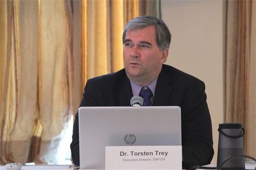

图1：“医生反对强制摘取器官组织”执行主任托斯坦•特瑞（Torsten Trey）

 
杰西卡•卢梭（Jessica Russo）医生进一步介绍了“隐形群体灭绝”（Cold Genocide）的概念，即以不为人知的方式逐渐清洗某一群体。她认为，法轮功遭受的迫害就是隐形群体灭绝——从肉体、心理、精神和社交方面，中共当局对法轮功学员施以多重打击，而手段多是不可见的，又渐渐地在中国社会里被“正常化”。对于被害人来说，这种阴险强力的群体灭绝是致命的。

卢梭医生请与会的医学界专家们想象一下发生在中国的真实残酷场景：

“警察突然把你抓走，就因为你有自己的信仰。他们用各种刑具轮番折磨你，而如果你是女性，还会被扒光衣服、投入男牢。你的身上伤痕累累，警察却带你去做复杂的体检，尤其要查血型和器官。你听到警察说‘打她哪儿都行，但别伤了内脏’，你还听到老犯人讲起其他良心犯被拉去活摘器官，你知道，自己就是下一个备选的供体。”

“直到有一天，你被拖出牢房，扔到手术台上，周围全是警察和医务人员。他们给你注射一种药物，让你浑身不能动弹，但是感官仍然清醒。锋利的手术刀割开你的皮肤，这种痛无法言说。你感觉到他们在杀你，生命就要到尽头了……”

图2：杰西卡•卢梭（Jessica Russo）医生

 
研讨会上播放了韩国四大综合电视台之一的“朝鲜放送”（TV Chosun）在中国天津拍摄的器官移植纪录片。摄影师于二零一七年以韩国病人家属的身份走访天津的移植医院，拍摄了“购买”器官的经历——单单在这一家医院里，三年内就有三千多名韩国病人进行了移植手术。在韩国需要等待五年的肝脏移植，如果肯出十九万美元，在天津只需十几天，出价越高，速度越快。影片中还提到，其中的一些主刀医生曾在美国受过培训，能说流利的英语。

<b>与会医生探讨相关行动</b>
 

与会医生对于中共强摘法轮功学员的暴行感到震惊，并认为这是医学界必须关注的伦理问题。

泌尿科医生马塞尔•霍罗维兹（Marcel Horowitz）表示，对于美国的医生来说，是否为接受了不道德移植的病人继续提供医疗服务，也是医学界需要探讨的伦理问题。“对于中国的状况，显然需要在美国被讨论，并公开揭露出来，因为显然没有足够多的人了解这些。〞

犹他大学医学副教授格林•吉尔克里斯（Glynn Weldon Gilcrease）强调，强摘法轮功学员器官（在中国）是国家（中共）批准的行为。他说应在医生专业协会等机构的章程中加入伦理条款，约束医生的此类不道德行为，督促美国的医学院停止为来自中国的移植医生提供培训。吉尔克里斯教授表示，美国国务院应当考虑在签证申请和出境提示方面，加入更多有关器官移植的信息，如禁止参与强摘器官的个人进入美国，提醒去往中国接受器官移植的美国病患慎重考虑。

<b>美国发表有关中国宗教自由的声明</b>
 

美国国务院主办的首届“促进宗教自由”部长级会议于同一天结束。当天，美国务院发表有关宗教自由的关注声明（Statement of Concern）。其中特别有一份是关于中国的。

声明提到：“作为国际社会的代表，我们对中国对宗教自由的严重限制深表关切，并呼吁中国政府尊重所有个人的人权。中国宗教少数群体的许多成员，包括维吾尔族、回族和哈萨克斯坦穆斯林、藏传佛教徒、天主教徒、新教徒和法轮功，由于他们的信仰而面临严重的镇压和歧视。这些团体一直不变地报告，当局以与他们宗教信仰和相关和平活动为由，对他们实施酷刑，身体虐待，任意逮捕，拘留，判刑或骚扰。”

图3：美国前国会众议员弗兰克•沃尔夫（Frank Wolf）在“促进宗教自由”部长级会议上强调关注法轮功学员被强摘器官的问题。

在该会议上，美国前国会众议员弗兰克•沃尔夫（Frank Wolf）特别提到强摘器官问题：“法轮功面临残酷迫害，关于强摘器官有明确报导，（中共）杀害他们，并把其器官贩卖。今天，我们不应对全世界极不公正的宗教迫害负起责任吗？”

<h1 align="center"><b>中共公检法：陷害好人的犯罪链条</b></h1>

【明慧网二零一八年八月三日】一九九九年七月二十二日，中共开动所有媒体，连篇累牍的诬陷法轮功，栽赃法轮功是非法组织。这是中共对待异己“欲加之罪、何患无辞”的一贯表现。这一“非法”的定性被中共已经沿用了十九年。
要想将一个遵纪守法的群体当成非法组织去迫害，参与迫害的所有中共人员就必然违背法律，去进行非法的迫害。我们看一看二零一八年七月二十二日，中共诬陷法轮功为非法组织十九周年的日子里，法轮大法明慧网在这一天的报道中所报道的中共公、检、法的工作人员都是怎样非法对待法轮功学员的。

<b>中共公安：绑架、钻锁、“为了钱”</b>

《一句真心话　合肥市杭霞女士被非法庭审》中说，二零一七年十一月二十二日，安徽省合肥市皖江厂法轮大法学员杭霞，到瑶海公园散步，被一个穿黑衣服的人带到路边的警车上，说有人举报她。车子开到七里塘派出所，警察搜走杭霞家里的钥匙，非法到杭霞家抄家。说起举报的内容，直到开庭时人们才明白，原来就是因为她说了一句“真善忍好，法轮大法好”。

《黑龙江依兰县法院预谋非法庭审14位法轮功学员》中，提到佳木斯市桦川县法轮功学员施凤兰被依兰县公安局与桦川县公安局去家中绑架时，她家里的门锁都被他们强行钻坏。

中共警察绑架法轮功学员有什么借口？法轮功学员说一句“法轮大法好”都能成为被绑架的借口，这该有多荒唐！再看看警察绑架起法轮功学员来真象土匪一般，钻锁破门，肆意抢劫。那么是什么力量诱使这些警察为中共卖命呢？“综合消息”上有一条消息给出了答案。这条消息说，河北省涿州市公安局国保大队大队长杨玉刚自己说，他抓法轮功学员就是为了钱，可以从家属那儿压榨钱财。抄家时法轮功学员家的钱财物也可以顺手牵羊拿走。

<b>检察官：你是共产党员吗？</b>

上面提到的因一句“法轮大法好”遭绑架的杭霞，被瑶海区检察院非法批捕。家属为她聘请了北京律师。律师两次到合肥，瑶海区检察院公诉科副科长刘雯两次拒绝北京律师阅卷，并且每次都问律师：“是不是共产党员？”当律师回答“不是”时，她站起来就赶律师走。

检察官为何那么看重为杭霞辩护的律师是不是共产党员？从公正的角度上讲，律师最好是无党派人士。特别是涉及到信仰这一类案件，律师要是中共党员的话，就很难为其所代理的当事人作公正的辩护了。因此，检察官要求为法轮功学员辩护的律师必须是中共党员的作法从根本上就是错误的。

在以往对法轮功学员的非法审判中，许多法轮功学员都堂堂正正的申请共产党员身份的法官与检察官回避。其理由很简单，中共是无神论者，而法轮功学员都是信仰神佛的，法官与检察官如果是共产党员的话，就根本做不到公正的审判。而如今，当检察官一听律师不是中共党员时，竟然赶律师走，检察官的行为本身就是非法的。检察官已经做好在法庭上对法轮功学员进行非法起诉了。

<b>法官：“他是境外势力”，“就是没有法律依据”</b>

杭霞一案中，家人被逼，法院辞退了为杭霞准备作无罪辩护的律师后，又为她聘请了广东律师。可是当这个律师去法院阅卷时，法官竟然叫来三个法警说：“把他抓起来，他是境外势力。”

《长春市朝阳区法院剥夺高级工程师请律师的权利》中讲，二零一八年三月十七日，吉林省环境监测中心站高级工程师金燕，在与路人交谈时，涉及到法轮功问题，被举报后遭绑架，后又被非法起诉到朝阳区法院。七月二十日，金燕家人聘请的律师，到法院递交代理手续。法官拒绝接收，其理由是，律师必须提供律师所在地司法局开具的书面备案登记证明，可是这样的登记证明是没有法律依据的。律师经过多方沟通后对法官说：你索要这样的证明、拒绝接收律师的手续，是没有法律依据的。该法官竟然脱口而出：“就是没有法律依据！你别给我较这个真！”

这是什么法官？怎么拿“没有法律依据”当真理了，这么理直气壮！你法官怎么能没有法律依据呢？没有法律依据的审判不是非法审判是什么？

杭霞一案的法官更是蛮不讲理。律师到法院阅卷不应该吗？不阅卷怎么为当事人辩护？可是此案的法官竟然血口喷人：“把他抓起来，他是境外势力。”

在对以上案例的剖析中，我们可以看出中共对法轮功学员的迫害全部都是非法的。从警察的绑架，检察官的起诉，到法官的审判，每一个环节都在违背法律。公检法等部门联合起来非法的运作，形成了一个完整的迫害链条，而且，这样的迫害历时十九年。

这是一个多么邪恶的政党！为了将好人打成坏人，竟然无耻到这种地步。这场对好人持续十九年而不停止的迫害，将中共自己非法的本质暴露无遗！

<h1 align="center"><b>修法轮大法　我们学会以德报怨</b></h1>

【明慧网二零一八年八月一日】修炼前，我家生活在农村，我父亲兄弟五个，只有我们家没有男孩，我的大爷大娘们以及堂兄们都看不起我们家，重男轻女，经常对我们家说一些难听的话，常常欺负我们，有时见到我们还打骂，所以小时候我们很少和他们一起玩，从小对他们就有一种恐惧和仇恨的心理。
他们对待我们父母也不尊重，处处刁难我们家，我们受够了他们的欺负。随着我们几个姐妹渐渐长大，相继参加了工作，后来我们家就搬到县城居住。

搬家前一晚，我们家把家里的大爷和堂兄聚在一起，请他们吃饭。第二天我们家搬家的时候，只有大爷过来看了一下，别人都没有来帮忙搬家。临走前，我们还给大爷买了好多东西。我父亲把老家的房子的钥匙交给了大爷。

过了一段时间，我们村有一家，家庭比较困难，来到县城找到我父亲，想住我们在农村的房子，我父亲很痛快的答应了，告诉他钥匙在大爷家，让他去大爷家拿。可是大爷比较霸道，想要我家的房子，没让人家住。在没有通知我们的情况下，把我们老家房顶上的木头抽走，去搭猪棚了。后来把我们家房子的门窗全部拆走，所有房子的木头全部拿走了。经过风吹雨淋，好好的房子现在变成了废墟。

一九九八年，我们修炼法轮大法了，明白了因缘关系，明白了不失不得的法理，在大法中明白了人生的真谛，心性得到了提高，也看淡了名利情，对过去大爷大娘们及堂兄弟对我们的欺侮，也不再怨恨了，并且我们每年都回去看望他们，并告诉他们法轮大法好，帮助他们三退。

几年前，我的二堂哥因得抑郁症，喝农药自杀，被送到县城医院，当时情况危急，气管被切开，用呼吸机维持生命，抢救了好多天，由于家人不愿花钱继续治疗，就想放弃，给堂哥穿上了寿衣，准备回家。我们家人去探望，问了医生继续医治能治好吗？医生说继续接受治疗很有希望能治好。

了解到这个情况后，我们就劝说他的家人请不要出院，还有治愈的可能，不能眼睁睁的看着他死掉，多可惜呀，如果现在出院，拔掉呼吸机，人很快就会死亡。我们姐妹几个商量，拿出钱来帮他医治，告诉他的家人这个钱我们不要了，后来他的家人勉强同意治疗。

我们每天都到医院去看望他，并告诉他在心里默念“法轮大法好”，奇迹出现了，堂哥的身体一天比一天好，最后完全康复。我们也感到特别欣慰，一个生命得救了。堂哥一家人非常感激我们姐妹几个，救了堂哥一条命，就连老家的人都说我们真是活菩萨。不计前嫌救了堂哥一条命，现在堂哥和堂嫂每年都来看望我母亲，从此我们关系越来越好。

前年我的大堂哥得了直肠癌，到市医院住院，我们姐妹几个去看望，还给他们送去了钱，后来又到县医院治疗，我们也多次去看望他，让他念“法轮大法好”，给他买营养品。他很感激，多次给我们通电话，我们也常鼓励他，他明白大法真相也得福报了。在直肠癌晚期，经常睡觉，也减轻了痛苦，就在前几天去世了，走的时候很安详。

在此，我要感谢慈悲伟大的师父，感谢法轮大法，是因为修炼法轮大法才使我变得宽容善良，放弃仇恨，善待曾经伤害我的人，能做到以德报怨。

<h1 align="center"><b>还老人一个自由的晚年</b></h1>

【明慧网二零一八年八月一日】（明慧网通讯员山东报道）青岛市市北区法院于七月十八日再次非法在普东第二看守所对无辜被绑架的法轮功学员宿桂花、于宪荣、吕勇华开庭。在610的监督下，法官厉建军和第一次开庭的态度决然不同，不顾宿桂花老太太的病情，不断地打断律师的辩护，坚持所谓“庭审”。
而此前六月二十八日第一次非法开庭时，宿桂花老人脚抖得很厉害，声音很大，在场的人都能听到。法官问宿桂花能否坚持开庭，宿桂花说：“我不知道能坚持多长时间，开庭前医生给我吃了六片药。”法官让医生给宿桂花量血压，“是二百二十（高压）、一百二十（低压）”。最后因为宿桂花身体不好，律师要求休庭，最后审判长说休庭。

二零一七年十月十六日，因为中共要开十九大，青岛市市北区警察无故闯入法轮功学员宿桂花家中，把宿桂花和来她家中串门的于宪荣、藏咏梅三位善良老人绑架。因为宿桂花身体状况很差，看守所一直拒收。但是，市北区警察和青岛市公安局狼狈为奸，逼迫看守所非法收押宿桂花。宿桂花老人很长一段时间生活不能自理，连看守所的警察都看不下去，说：“（公安）真是没事找事，为什么非要关押一个七旬的老人？”

于宪荣老太太被非法关押后，她女儿向青岛市公安局、检察院、法院、青岛市政府、人大、政法委等多个部门和单位发出申诉和控告信，抗议对母亲的非法抓捕和关押，陈述了母亲修炼法轮功前后身心的巨大变化，希望他们能够明白真相，释放无辜的老人。结果，有关单位和部门均给予无视。在上合峰会期间，青岛市610办公室还向她女儿单位施加压力，进行安全管制，给她人格尊严造成了极大伤害。

下面是于宪荣女儿所述她母亲的修炼经历，呼吁还老人一个自由的晚年：

<b>一、运动中当主角　拼出一身病</b>

母亲自幼丧父，从小就是家庭主要劳力。认识母亲的人都知道，她是典型的男人性格，办事风风火火，走路脚下生风，争强好胜，干什么都不甘于落人后，小学都没有毕业的她却引起了“上级”的关注，1964年任村妇代会主任、1965年任中共的团书记，不到20岁就在中共基层的政治运动中充当主角：破四旧、立四新、烧族谱、斗走资派、横扫牛鬼蛇神、砸碑文、挖祖坟、铲除资产阶级思想……文革中被推荐为村文革主任，白天上学、晚上闹革命，党指向哪儿就冲向哪儿。中央强制推行计划生育政策之后，作为公社妇联主任的她整天带着人到处抓人，逼迫已经怀孕的妇女堕胎，完全没有是非观念，弄得亲戚反目、家人责骂，在神的面前犯下了罪。

在文革后期，母亲得了头疼病，经常不自觉地拿脑袋撞墙，以求缓解。从1971年开始吃药治头痛，后来病越治越多：低血压、严重贫血、心脏窦性过缓、心律不齐、二尖瓣闭缩不全、早搏、心脏辐射造成前胸后背隐痛、腰痛、肚子胀、肝肿大、慢性浅表性胃炎、胃窦部溃疡、慢性胆囊炎、痔疮、关节游走性疼痛、膝关节骨质增生、小腿常年浮肿、乳腺增生、失眠多梦、耳鸣、胸闷憋气，不到四十岁就闭经数月，提一点重物就心跳加速，感觉心脏会跳到口中，常年不敢吃生冷，每天早上嘴里都苦得像吃过黄连。

更糟糕的是，先后骑车两次摔伤，第一次是掉到桥下，造成脊椎十二、十三节压缩粉碎性骨折，治愈后，感觉常年背部像背着一块面板。第二次是骑车时突然车子来了个倒立，为了保护坐在前面的我，双手没有脱把，造成肩部着地，右锁骨骨折、颈椎受挫弯曲。因为当时没有发现颈椎受伤，只治疗了断骨，所以七八年过去之后，右手胳膊出现麻木，最后连笔也拿不住。去医院拍片发现颈椎弯曲变形，因为受伤后没有得到及时治疗导致后来颈椎严重骨质增生、粘连，无法手术，依靠牵引治疗根本行不通。

在这些病痛的折磨下，在争强、虚荣心的驱使下，母亲那些年一直有病默默承受、偷偷去医院、偷偷吃药，从不在人前叫苦示弱，在繁忙的工作面前依然争先创优，年年评先进、当劳模。中药、西药、营养品、偏方药私下不知吃了多少，花了多少钱，均不见效。中医大夫讲她是气血严重双亏、心脏严重供血不足、收缩无力、肝胃脾肾虚弱不调、肝气上移、脉息很弱……西医大夫讲她是植物神经功能紊乱，每次看病都问母亲要先治什么病。

连大夫都对她治病失去了信心，母亲自己也逐渐陷入了绝望。后来听说气功能治病，从1985年开始她又学练气功，十年先后学了四种功，不仅一个病都没治好，而且越治病越多，花了多少钱，赔进去多少时间，无从计算。那时候，母亲感觉生活得很苦、很累，看不到希望，觉得只能等待被病痛慢慢折磨到死。

<b>二、幸遇法轮功　百病去无踪</b>

就在母亲对治病失去信心，对生活失去希望的时候，1995年有朋友推荐她去修炼法轮功。原本受共产党洗脑多年，她根本就不接受“修炼”、“佛”这些字眼，一听说学功还不要钱，就认为是“骗局”，坚决排斥。架不住功友多次软磨硬泡，她碍于面子才不得已去学。

听了李洪志老师的讲法报告后，她一下子就被其中高深的法理所折服。李洪志老师说不重视心性修炼就不长功，炼功人必须按照“真、善、忍”的要求做个好人中的好人等。母亲一明白了“人为什么有病”、“为什么有人长期练功而不长功”、“什么是修炼”、“什么是佛”等从来没有人揭示出的谜题。

从此，母亲按照功法的要求，修身养性做好人，逐渐放淡名利情，陶醉在佛法修炼的快乐之中，身心得到净化，精神得到升华，宛如脱胎换骨一般。身体的各种疾病逐渐消失，后来完全达到无病一身轻的状态。

修炼二十多年，母亲没有吃过一粒药，没用过一分钱的保健品，精神矍铄、身体康健，为国家节省了大笔的医疗费。古稀之年的老人，有一次把从老家拿来的50斤一袋的面粉，一口气扛上了五楼，竟然心不慌、气不喘，让年轻人都瞠目结舌，这在以前简直是天方夜谭。去医院体检，各项指标都基本正常，连大夫都说“这个年龄，血压不高不低，心脏跳动均匀有力”，与以前形成鲜明对比。因为摔伤伤到颈椎压迫神经导致的手臂发麻在修炼后症状也完全消除，2000年的时候去医院体检拍片，神奇地发现以前弯曲的颈椎竟然完全直立起来，连大夫都不相信。

大法展现的神奇实在是太多了，耳闻目睹周围功友身上发生的奇迹更是数不胜数。有得了绝症被医院推出门外而痊愈的；有在危急时刻诚念“时刻诚念“法轮大法好，真善忍好”而化险为”而化险为夷的……在道德层面，大家都努力按照“真、善、忍”的标准去践行做一个好人中的好人，拾金不昧、助人为乐等各种好人好事层出不穷。以前有抽烟喝酒、吃喝嫖赌、损公肥私等恶习的也纷纷弃恶从善，彻底改掉陋习，踏踏实实做一个符合标准的修炼人。凡是真正了解这个群体的人都知道，在世风日下的现实社会中，法轮功真的是一块净土！这也是迫害持续近20年来，遭惨重迫害的法轮功学员及家人没有抗暴的真实原因所在。

<b>三、佛法被诽谤　好人被冤屈</b>

1999年“七.二零”迫害发生之前，整个神州大地，据说有1亿人在修炼法轮功，依靠人传人、心传心，这个修炼的队伍迅速发展壮大。据说是因为当时超过了党员的全体人数而招致时任中共领导人江泽民的嫉妒与敌视，因此他不顾其余中共中央政治局常委的一致反对，不惜动用整部国家机器下令在三个月之内彻底消灭法轮功，并一手策划了“1400例”造假、“天安门自焚”伪案等，污蔑法轮功，给取缔寻找借口。“名誉上搞臭、经济上截断、肉体上消灭”、“打死算自杀、不查身源直接火化”这些恐怖政策，一度让华夏大地充满血雨腥风，无数的修炼人因为坚持信仰而被投入牢狱，遭受各种酷刑折磨，并很快就有人付出了生命的代价。

记得2000年的时候，我从母亲那里获悉，海洋大学研究生毕业的法轮功学员邹松涛因为去北京上访，被恶警抓捕后几个月就折磨致死，他的妻子张云鹤与我同是青岛大学会计学系毕业的，因为丈夫屈死去讨回公道，后来也被绑架，至今十多年音信全无、生死未卜，只留下当时不满一岁的孩子和年迈的父亲，母亲因为承受不住打击也早早含冤而逝。这样一个好端端的家庭就这么毁了，而这只是960万平方公里土地上的一个缩影。

当时整个中国社会，各行各业的修炼人，人人被逼迫表态过关，无论你以前对国家贡献多大，只要表明坚持修炼法轮功，过去的功绩一笔勾销，轻则降职降薪，重则判刑劳教，更有甚者被迫害折磨致残、致疯、致死，造成一个又一个家破人亡、妻离子散的人间悲剧。母亲也因此被降职（副处级降到科级）、停职行政留察一年只发放生活费、撤职在单位打扫卫生、四年无奖金也不准评先进、停两次工资普调、提前五年退休等不公正对待。

因为想争取合法的修炼环境，向政府反映真实情况，获得基本的人权自由，坚持不放弃自己的信仰，十几年里，母亲先后经历四次非法抄家、七次近200天失去人身自由，被非法关押、拘禁，警察不顾其年迈曾将其铐锁在冰冷的铁椅上长达三个多小时并施以拳脚和谩骂。

归根结底，是“假恶斗”容不下“真善忍”。我们国人在中共六十多年“斗争哲学”和“无神论文化”的洗脑下，远离佛法、远离天意，道德迅速下滑，人与人之间勾心斗角、尔虞我诈，彼此没有了起码的关爱和信任，生存环境被肆意破坏，水源污染、雾霾肆虐、假冒伪劣泛滥，黄赌毒蔓延，乱象丛生。就连动物尚且怜悯于它的同类，而面对自己这么多同胞身陷苦难，被抓被打，失去自由，失去生命，有些人竟然不为所动、袖手旁观，甚至对这群善良人恶语相向、检举揭发，责怪他们与政府“对立”，对施暴者予以支持，认为执政就需要强权，维护国家稳定就需要付出代价，哪怕牺牲一部份人。这些冷眼看客，不顾良知正义、不顾善恶是非，自以为事不关己、高高挂起，其实已经丧失了做人的底线，在神的眼中不配为一个合格的生命。那些参与施暴的当权者，泯灭人性，违背天理，自掘坟墓，下场可悲又可怜。

对于现在很多人都说法轮功搞政治，我想反问一句，邹松涛的死、张云鹤失踪也是参与政治的结果吗？如果不是迫害在先，谁又会舍得放弃安定的生活想要去讨还一个公道呢？99年之前那么多人在修炼中，谁又曾去上访？当公民合法的权利被践踏的时候，去表达合理的诉求，争取自由和权利不是宪法赋予的基本人权吗？如果遇到不公正对待，大家都退避三舍，生怕惹祸上身，就好比路遇土匪，如果你我都选择视而不见或溜之大吉，那么早晚有一天，我们及家人也难以幸免，到时候谁又会来帮助我们呢？“路见不平，拔刀相助”，这是对正义最浅显的诠释。只有这样，老百姓才能生活在安全稳定之中。在中国，敢于向政府说不，这种大无畏的精神，非匹夫之勇，而这个拥有信仰的人群做到了。

也有的人认为法轮功修炼者没有人情味，不顾家人的感受，只在乎自己能否圆满，是极端自私自利的。这其实是一种误解，因为只在乎小家而不顾大家的行为，才是自私的表现。谁不想为自己、为子孙后代开创一个和谐、安定的社会环境呢？敢于讲真话的张志新，也有自己幸福的家庭，她的宁死不屈难道也是为私的吗？一个政府，在执政的道路上，难免有过错，只有以人为本，多听取老百姓的呼声，才能够真正实现强大。所谓“得民心者得天下”，历朝历代都是如此。以前的帝王看到天灾人祸，都要首先检讨自身是不是做错了事情、失了民心才招致天谴，因此要祭天拜祖、反省纳谏、力求修正，以图获得上天的庇佑。历史上的“贞观之治”、“开元盛世”无不是顺天意、得民心的清明时期，因为君主提倡广开言路，所以才使社会太平、人心归向。要想立于不败之地，必须能够听得进不同意见。要知道，敢于冒死进谏的都是魏征那样的贤人，是真正希望国家富强、民族昌盛的有德之士。

处理法轮功案件的公检法人员，你们最先接触这群无辜的善良民众，请不要认为只是在奉命行事，而违背良知。我母亲当年，在历次政治运动中，她也只知道服从命令，而失去了辨别是非的能力，因此造业无数、百病缠身，只有自身去承受恶报。所谓“三尺头上有神灵”，人在做，天在看，善恶有报，这是亘古不变的天理。君子不立于危墙之下，参与处理法轮功事件的执法人员，请你们“将枪口抬高一厘米”，手下留情，您的明智之举会给一个善良的生命以希望，让一个幸福的家庭得以存续，同时也给自己及家人赢得福报和赞誉。

希望每一个可贵的中国人都能够站对立场，认清是非善恶，选择正义善良，拥有美好的未来！

<h1 align="center"><b>见证千年之交的天安门广场</b></h1>

【明慧网二零一八年七月二十八日】一九九九年十二月三十一日，早上一起床，我做出一个决定，今晚去天安门广场炼功！
回想起来那时是很恐怖的。中共迫害法轮功已有五个月，各地大法弟子在残酷迫害面前，挺身而出，前赴后继的到北京上访，说句公道话，希望制止迫害。我修炼法轮功两年多，深知法轮功是按照“真、善、忍”修炼人的心性，于社会有百利而无一害。自己在修炼实践中受益无穷，有很多亲身体验，我有义务以亲身经历去证实大法，反映实情。所以在迫害开始时，我曾進京上访过一次，可是被北京警察非法拘押，遣送回来关入牢房，还办洗脑班。回到单位被解聘干部，下放基层，并暗中派人监控我。

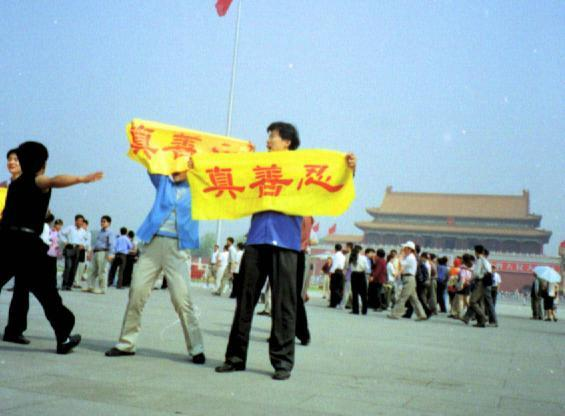

图：二零零一年法轮功学员在天安门广场展开横幅请愿

我曾经历过文革等政治运动，知道中共是为所欲为，死不悔改。不能对中共抱希望。当时正是千年交替的关键时刻，我想去天安门广场炼功，向世人展示真相，并表达大法弟子在新世纪里维护大法的坚定信念。

来到单位，八点开始上班，依然是俩人一组干活，领班经常来查看我的动向。我抽空给Z同修打了电话，请她代买了去北京的飞机票。然后九点钟突然离开单位，与Z同修会合，她提出与我同去，就一起直奔机场，搭上了去北京的飞机。

经过两个小时的飞行，下午到达北京。那天还不太冷，零下一度。我们在前门附近找好住处。吃过晚饭，来到了天安门广场观察环境，试着在心中辨别出哪些是大法弟子，以便零点的时候同时一起炼功。

天渐渐的黑下来，广场上的人群熙熙攘攘，沉浸在辞旧迎新的欢乐中。但是除了纪念碑前有几个迎接2000年的巨型灯箱标语外，并没有多大节日气氛。广场东侧停有很多警车，能感受到暗含的恐怖。而在这个特殊的时刻，我们没有心思去欣赏夜景。时刻不忘这表面的欢庆的背后，中共的黑手正在行恶，慈悲救人的法轮大法及大法师父正在被污蔑、诽谤，广大修心向善、带动社会道德回升的大法弟子正在被中共残酷迫害中。

在黑夜的灯光下，我和Z同修都感受到这熙攘的人群中，有我们的同修，还有很多便衣人员。

在接近零点的时候，我俩看到有近三十个人在缓步走动，四目一相对，无声似有声，就跟着他们来到纪念碑以北约二十米处。

报时的新年钟声响起，广场上响起人们的欢呼声，象过年的鞭炮震耳欲聋。与此同时，我们大法弟子庄严的席地而坐，盘起双腿，开始炼法轮大法第五套功法。

瞬间，闪光灯不断，大法弟子中有人专门照相，周围游人也有人在拍照。周围有人发出惊叹，这是法轮功。

我与Z同修坐在最后一排，打完手印，开始加持神通。不到一分钟，就听有人喝斥，暴力收缴照相机，然后急促呼喊警车，对讲机里的声音一片混乱，听得出其它方位可能也有人炼功，都在呼唤警车。

几个警察（都是便衣，没有穿制服）同时开始暴力驱赶围观的群众。一边暴跳叫骂，一边挥舞棍棒乱打，用脚乱踢。由于围观的人太多，驱赶没有多大效果，回过头来，这些便衣对着前排打坐的大法弟子，开始拖拽，有的用手打，脚踢，最后每两人架着一个打坐同修的胳膊，提起来往下狠摔，再快速拖到警车上，几个警察来回拖，累的上气不接下气。

这时我睁眼看了四周，周围的群众还在围观。我看见纪念碑前一个小青年正在猛烈的欢呼、疯狂的拍打巨型千禧灯箱标语，被驱赶的警察飞起一脚踢倒在地，小青年吃惊的回头一看，见是警察，仓皇的撒腿就跑。周围的警察使尽全力追打驱赶群众，唯恐他们看见这里发生的事情。我再回过头来，看见警察在慌乱、快速的拖走大法弟子，一个接着一个。

我想闭目静心，仍听到整个广场由欢呼声转为驱赶的叫骂声。人们都被追赶着在往广场外走，但我身后还有一些人在围观。我坐在最后一个位置，听到拖人的声音慢慢接近了，就眯缝着眼看着……

等到有两人拖着、摔着身前的Z同修离开时，就只剩我一人了，这时有两个彪形大汉向我扑来，我心里突然生出一念：不准许这样迫害。突然站立起身，双脚叉开，站在那里，威严的正视对方。那两人有一个拿着一根棍棒，向我挥来，但也没有打着，实际是在驱赶我；然后横着棒子将我往外一推。

我被推入了身后的人群中。这样，我就顺势和游人一起离开广场。这时大约是零点二十分，我回望天安门广场，人流仍在向八方扩散，警察仍在驱赶游人，但广场中心的人已很少。估计下半夜广场就是宵禁状态。

离开广场，我回到住处，带上我和同修的行李，准备打出租车去北京西站。广场上突然涌出这么多人，出租车相对较少。等了一会，我见一位大爷牵着一个六、七岁的小女孩也要去西站，就和他俩合租了一辆的士。

上车后，大爷突然气愤的说：“这个共产党看来要完了，我今天是倒了它的大霉了。”

司机问他怎么了？他愤愤不平的叙述起来。他说：今年是千禧年，千年一次，很早就决定要来北京见证一下千年交替的盛景。他家住保定市，今天很早就带着孙女坐火车专程来到北京，想着去世纪坛观看世纪庆典活动。因为电视中早就在预告，他当然想象会很热闹。到了晚上，来到世纪坛，人家不让進，也没对外卖票。里面参加活动的人都是内部发的票，很多人進去不了，在门口聚集，官方开始驱赶，最后用高压水枪向群众喷射。他也在其中，混乱之中他和小孩全身被水淋湿。北京的寒冬冰冷刺骨，让他气愤不已，但又没有办法。他想这里倒了霉，那就去天安门广场吧，那里肯定热闹；抓紧赶过来，又遇上警察驱赶打人，他又被人踢了几脚。拉着孙女赶快逃走。

大爷说，“你说这个节过的！真丧气！你世纪坛活动不对外，为啥不说明白？早说我就不来了。还有，天安门广场为什么要乱打人？我们庆祝新年又没有违反哪条法律！”

司机笑着说，这段时间法轮功很多人到广场炼功，警察们都被搞成神经病了，他们非常害怕。

我说，炼功锻炼身体，是好事，警察不该害怕的。在广场炼功，锻炼身体，不违犯什么。共产党搞运动整他们，他们肯定有冤屈吧！

司机长叹一声：这社会到处是冤屈，看来真完了。

来到北京西站，我买了一张硬座票，天亮前就上火车了。开车一段时间后，我到列车办公席去补一张卧铺票，已有十多个人排队。我排上队，就有一个中年的列车员悄悄拉我到车厢连接处，劝我买他的票，便宜几十元，说保证我出站。我觉的这是不正当的行为，没有答应。并认真的对他说，兄弟，你这样做不好，是损公肥私的行为，单位知道了会对你不利的。你要珍惜自己的工作。我是修炼法轮功的，这样做有违我的信仰，也有损国家的利益。我还是到柜台上明码实价买票吧。他听了很惊奇，也有点羞愧，提醒我不要在车上讲法轮功，车上有暗探。我谢谢他的善意。并简单给他讲了法轮功是按“真、善、忍”做好人，报纸电视宣传的都是不实的。他也基本接受。然后我还是到列车办公席买了正价的卧铺票。

其实，我本是一名铁路职工，在修炼前，坐火车经常是不买票的，认为干一行吃一行，拿着工作证当车票，别人不干就软磨硬磨，很少不奏效。但是修炼法轮功以后，从师父教的法理中，我认识到在任何情况下都要以“真、善、忍”为标准做人，要诚实、善良，不做假，讲信用。虽然我在铁路单位工作，但因私坐车时，同样是一名旅客，都应该购票坐车。同事中有些人不解，笑话我。我不为所动，坚持自己的做法。因为法轮大法是正法，就是教我们去掉不好的思想，不断的归正自己。

后来有朋友告诉我，我这次离开单位时，单位领导极其紧张。因为江泽民迫害法轮功，没有任何法律依据，知道法轮功学员会依法上访，强令基层单位“看好自家门，管好自家人”，不准上访反映问题，还株连单位及负责人。当发现我失联后，单位领导立即就报告了铁路公安部门，在進京列车上拦截我，甚至还不惜打乱列车运行秩序，将本市两列進京快车强行扣留在铁路局分界站，反复搜查，把列车搞晚点。那时对進京列车要求是很严的，晚点一列罚款几万元。但在迫害法轮功时，他们也顾不得这些。可见当时迫害是压倒一切的“任务”。

转眼中共迫害法轮功十九年，我们在这漫长的反迫害、讲真相的艰难历程中，每当有所松懈的时候，我都会想起千年之交的那一刻，激励自己善始善终。

<h1 align="center"><b>中共对付老百姓的犯罪手段——绑架</b></h1>

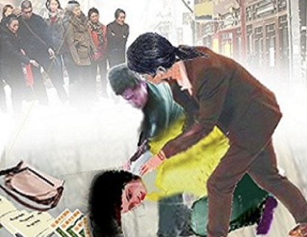

绘画：中共的暴力绑架。（明慧网）

【大纪元2018年07月26日讯】（大纪元记者罗琼综合报导）中共自1999年7月20日迫害法轮功以来，使用犯罪手段——绑架，把难以数计的法轮功学员关进洗脑班、劳教所、看守所、拘留所、精神病院、监狱等进行迫害。

根据《中华人民共和国刑法》第239条规定， 绑架罪是指勒索财物或者其它目的，使用暴力、胁迫或者其它方法，绑架他人的行为，或者绑架他人作为人质的行为。

其中规定：杀害被绑架人的，或者故意伤害被绑架人，致人重伤、死亡的，处无期徒刑或者死刑，并处没收财产。

然而讽刺的是，众多案例证实，中共对成千上万的法轮功学员犯下“绑架罪”。

很多公检法官员甚至公开叫嚣，对法轮功学员，不用讲法律，想怎么收拾就怎么收拾。例如，西昌市政法委副书记刘某公然对法轮功学员辩护律师称：“不要跟我讲法律，我们不讲法律。”铁岭市国保大队长谢祥军对法轮功学员张英东说：“共产党对法轮功从来就不讲法律！”

2017年2月1日，52岁的华裔加拿大籍富商孙茜被北京公共安全保卫分局及北京朝阳区大屯派出所非法从家中绑架，后被非法批捕，北京朝阳检察院两次退补后，被非法追诉。

加拿大从政要、媒体到民众各界人士都在营救孙茜。前加拿大参议员迪尼诺（Consiglio Di Nino）出席今年加拿大法轮功学员举行的“7•20”反迫害的集会并发言说：“基本权利及自由没有国界，它不讲具体的语言，也不跟从任何政治或其它团体，它是一种地球上人类的基本原则。在拒绝给予中国人这些自由方面，中共是最恶劣的犯罪分子。不幸的是，它甚至越过了中国的国界。”

据明慧网不完全统计，2018年3月，至少有365名法轮功学员被绑架；4月，至少有377名法轮功学员被绑架；5月，至少有608名法轮功学员被绑架；⋯⋯绑架案分布于26个省、自治区、直辖市的96个城市。被绑架骚扰的法轮功学员最长者81岁、最小的22岁。

此外，中共当局绑架法轮功学员的手段多而残暴，常用的形式为：路上劫持、骗门、破门而入、集体出动。

<b>路上劫持</b>
 
警察多采用路上绑架的手法，被绑架者没有任何防备，也无任何抵抗能力，会被迅速塞到车里拖走，周围一切又恢复平静。

<b>下班回家 被强行架进车里</b>
 
明慧网2018年7月2日发表题为“大量绑架事件是中共警察在干”一文，一位大陆法轮功女性学员揭露她被绑架的经历。

一次，她下班回家，快到家时，突然从一辆面包车里下来两人，不由分说，强行把她架进车里。车里坐着几个人，立刻把她按坐在座位上，前后左右被这堆人包夹在中间。

“我挣扎著，大声质问：‘你们干什么？’他们按住我，强行蒙上我的眼睛，车子迅速开走了。大约开了半个多小时，当取下我的眼罩时，人已在一个房间里了。”

她被劫持到洗脑班后，坚决要求给一人在家的孩子打电话，遭拒，后来她被允许给单位打电话。她谴责单位和“610”（迫害法轮功的非法机构）联手绑架她的流氓行为，要求单位给孩子打电话，对方说一定。但是单位并没有通知她家人，从此她就这么蒸发了。

一年半后，她从劳教所给家里打电话，当她说“我是妈妈”后，孩子在电话里立刻嚎啕大哭。

“这是十几年从不曾听过的孩子的大哭声，之后很久想起这些还心有余悸，可想当时孩子的精神压力有多大，大哭是长期极度的恐惧和压抑瞬间的宣泄。”被绑架的妈妈伤心地写道。

明慧网记载了大量的法轮功学员在路上被绑架的案例，见下面几例：

2016年7月21日，四川攀枝花67岁的法轮功学员蒋贤凤买完菜回家，在无人的路上被王姓警察等四人绑架到五一派出所非法关押。她被警察强行戴上手铐和脚镣，背后用一根很长的皮带绑着，强迫坐在老虎凳上非法讯问。

2017年3月13日，山东省寿光市城里村刘洪君在去朋友家回来的路上，被寿光国保大队长张洪伟、杨义贵伙同纪台多名警察绑架到寿光纪台派出所。他们对他刑讯逼供，并朝其脸上喷辣椒水，后将他劫持到寿光看守所。他于同年11月遭冤判三年。

山东省烟台市海阳市发城镇村芦头泉村的法轮功学员范翠珍多年在青岛打工，2018年3月29日早上7点左右，她在上班路上被蹲点的警察绑架。之后大约六个警察胁迫她回家敲开出租房，非法抢劫了她家中两台电脑等。她被劫持到看守所。

2018年4月23日，武汉市法轮功学员蔡满意在早晨上班的路上被江汉区“610”人员劫持。当日，江汉区北湖街派出所警察闯入她家中，绑架了她的丈夫鲍裕农。

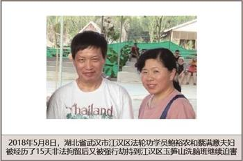

两人至今被关押在臭名昭著的武汉市“玉笋山洗脑班”

<b>骗开门</b>
 
警察会以各种谎言把门骗开，闯进去后抄家，抢劫钱、私人用品，最后将法轮功学员劫持走。他们不出示任何证件，有些身着便衣；骗不开门，就砸门、撬门等。

<b>谎称水管坏了</b>

2017年10月7日下午3时许，深圳市南山区高新派出所的十几个警察到法轮功学员杨波、肖颖家敲门，骗说他们家的车被撞了，要他们协助处理，杨波没开门。警察又谎称水管坏了，杨波仍拒绝开门，于是警察叫来开锁人来撬门，开锁人没能打开，走了。最后警察用冲击钻，钻坏两道铁门后，非法闯入、抄家。

期间一个警察甚至掏出手抢，指向杨波恫吓，毫不在乎手枪是否会走火。随后，杨波和肖颖夫妇俩被非法劫持。

<b>以检查房屋漏水为名</b>
 
2017年10月8日下午3点左右，辽宁省大连开发区黄海路派出所所长黄海、刘运峰，带领朱姓等十多名警察，以检查房屋漏水为名骗法轮功学员周海燕开门，将门骗开后冲进去。

警察没出示蒐查证，给周海燕双手戴上手铐而且铐得很紧，铐进肉里，并非法抄家，抢走私人用品和人民币7万多元（后经家属去要，要回5万多，还有1万多没还）。周海燕被劫持到大连姚家看守所。

<b>谎称没交水电费</b>
 
2017年3月22日下午3点多，十来个便衣警察，利用郝明媚的房东谎称没交水电费，骗开房门，未出示任何证件绑架了她，并非法抄家，抄走笔记本电脑等私人物品。

警察是由黑龙江省公安厅国保处主任杨波、大庆国保支队队长冯海波指使的。之后郝明媚被非法起诉、庭审。

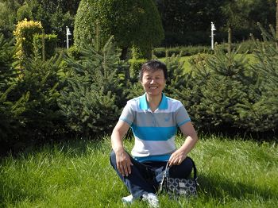

郝明媚（明慧网）

<b>找兽医为名</b>
 
2017年12月21日夜，秦皇岛昌黎县公安局国保大队长高接力与新集派出所的警察，到新集镇桃园村兽医、法轮功学员张合民的家。警察以找兽医为名，骗开门，将张合民绑架。之后，他遭非法批捕、庭审。

<b>破门而入</b>
 
实施绑架的警察往往是一伙人，七八个人不等，进门不成，就用电钻钻开防盗门等，把人强行劫走。

<b>八九个警察破门闯入 大学教师被殴打</b>
 
2014年8月1日上午，家住吉林市高新区的吉林省北华大学教师魏修娟一人在家。吉林市高新区长江街派出所的七八个男警察和一个女警破门而入。其中一个上来就殴打她，将她的嘴用透明胶带封上。

警察开始在她家里到处乱翻，打人的那个警察挑着魏修娟的下巴说：“我经常抓杀人犯，信不信我敲碎你骨头？”又拿着一本《九评共产党》书，指著说：“我今天就让你看看共产党的暴政！”接着又把她双手反背着戴上手铐，拖到另一个卧室里。

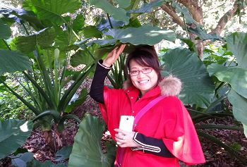

魏修娟（明慧网）

魏修娟在恐惧与屈辱中晕倒后，被拖到大厅里。她极度虚弱，无法站立，被警察硬薅著头发拎起来，由两个警察架著拎下楼，塞进车里，拖到医院体检，检查结果为：心律不齐，心绞痛，血压高等。之后她被关进一个小黑屋里，被铐在铁椅子上，当天下午就被送进洗脑班，后来被非法庭审。

<b>电钻钻门76岁老太被押上警车</b>
 
2018年1月16日11点左右，大连76岁的法轮功学员王秀香租住的房屋有人敲门，家人没有开门。大约敲了半个小时后，来人开始用电钻钻门。几分钟之后，两男一女破门而入。女的手里拿著录像机，一直录像。

家人问：“你们是干什么的？”穿警服的男警察说：“是天津街派出所的”。他问王秀香在哪里，让去派出所一趟。家人说：“为什么去派出所？”他说，有事需要配合一下，问完就回来。

王秀香说：“我又没有做坏事，没有犯法，我不去！”男警说，因为以前的事，法院下达指令，让他们抓人。

2015年，大连市中山法院非法判王秀香三年，当时她身体不好，看守所拒收。她回家后，一直在外流离失所，公安局给定为“网逃”。

这次，警察又破门来劫持王秀香，走时叫家人付撬门费200元。家人问：“你们撬的门，为什么叫我们拿钱？” 一个穿便衣的说：“我敲门你们不开门。”家人说：“我开不开门是我的权利，你有什么权力撬门？”他说他是派出所的。家人说：“派出所也没有这个权力。”

那个便衣说：“再说也把你带到派出所。”然后强行把王秀香押上了警车。

王秀香被劫持到辽宁女子监狱，服三年冤刑。

<b>砸毁三道门锁 把老人从床上拖到地上</b>
 
2018年5月11日上午，有人来敲广州市的法轮功学员老赵的门，一男子说有人举报煤气泄漏。老赵说，自家煤气未开，不可能。此人又敲了三次。老人认为可能是坏人，没理睬。

接着来一帮八九个人咚咚地敲门，老赵没开门。大约20分钟左右，那帮人把三道门锁全部砸毁，破门而入。

几人进屋就非法抄家，抄走私人物品。老赵不配合他们，一警察把他从床上拖到地上，另外两个人把他从地上抬到客厅沙发上。老人身心遭受严重伤害。

之后，老赵又从医院被抬到警车上，开到天河公安预审大队，被非法问讯。

直至深夜12点多，一人向老赵宣读，他被拘留10天，取保候审。老人被家人接回，后来得知，这帮人是棠下派出所和天河公安分局的警察，他们都不报姓名。

<b>集体出动劫持</b>
 
四十多名特警荷枪实弹 劫持残疾女子
陕西省礼泉县的法轮功学员李美化自幼腿残疾，走路离不开拐杖，于2017年10月11日下午被柞水县国保大队队长郭淑琴带领四十多名特警绑架，他们头戴钢盔、荷枪实弹封路。李美化被非法关押至今。

柞水县当局不但不放人，还在2018年1月11日下午绑架了李美化的丈夫袁玉龙，家中只剩下10岁左右的小男孩，上学、生活无人照管。

<b>三十多个警察包围房屋</b>

因哈尔滨市平房区的树上挂了一条“法轮大法好”的横幅，平房区国保大队和平新镇派出所警察通过调取监控录像，怀疑条幅是双城区周家镇东安村法轮功学员韩忠一挂的。因韩忠一那天正开车出去拉活，车在路上停了几次。

2017年1月的一天早上，哈尔滨市平房区国保大队、平新镇派出所、周家镇派出所共三十多个警察将韩忠一的家包围。他们破坏韩忠一家车库卷帘门，砸碎车库玻璃、住屋玻璃，破门而入，把他家翻得乱七八糟，也没找到什么。

韩忠一当时不在家，他们把他妻子和儿子绑架到周家镇派出所，后又带到平新镇派出所非法审问。直到下午5点多，他们才被放回家。

“警察绑架法轮功学员比黑帮土匪绑架人质有过之而无不及。残忍暴虐、执法犯法、无法无天的程度只有普通百姓想不到的，没有他们做不到的。难怪百姓中流传着‘过去土匪在深山，现在土匪在公安’。”亲身经历过被绑架的法轮功学员如是说。（见报导《大量绑架事件是中共警察在干》）

<h1 align="center"><b>《求救信》多伦多影院公映　震撼中西方观众</b></h1>
【明慧网二零一八年七月二十八日】（明慧记者章韵综合报道）正值法轮功学员反迫害十九周年之际，加拿大多伦多的Hot Docs Ted Rogers剧院在二零一八年七月二十一日至二十六日公映了揭露中共劳教所里对法轮功学员惨无人道迫害的纪录片——《求救信》（Letter From Masanjia）。这是反映法轮功学员遭受迫害的纪录片第一次在剧院里进行大规模的院线发行，多伦多是全球第一站。
此片在今年四月北美最大纪录片电影节Hot Docs上首映时场场爆满，经观众的要求，剧场决定七月份公映四场，后又加演两场，共六场。许多观众表示这部影片令他们深受感动，并希望能有更多人前来观看。

公映期间的前三场，放映结束后导演李云翔与现场观众探讨影片的内容及背景话题。

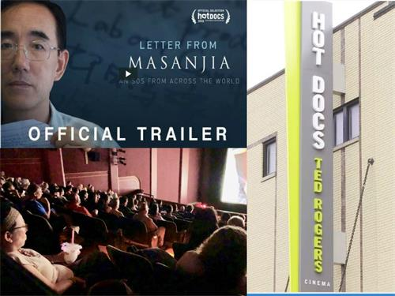

图1：二零一八年七月二十一日至二十六日，《求救信》（Letter From Masanjia）在多伦多的Hot Docs Ted Rogers剧院公映了六场。

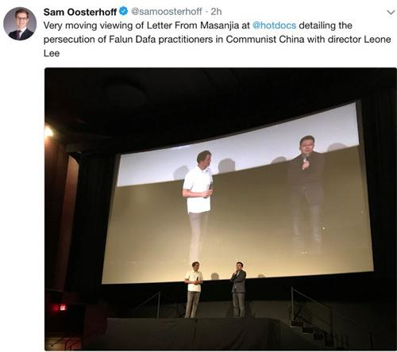

图2：导演李云翔在前三场的放映结束后与观众做回答问题的互动。

纪录片《求救信》讲述的故事是，主人公孙毅因修炼法轮大法而被中共非法劳教。他在沈阳马三家劳教所被迫做苦役期间，将一封求救信偷偷放入了一包万圣节装饰物当中。这封信后来被一名美国女士发现，从而引起了一场国际性的反应。中共的劳教制度于二零一三年被废除。

纪录片《求救信》从美国俄勒冈州的一名普通女性朱丽•凯斯（Julie Keith）在超市购买的万圣节装饰品中意外发现了一封信开始。这封信竟是从八千公里之外的中国沈阳马三家劳教所秘密传出的求救信。她将信上传到社交媒体后，引起了包括CNN、FOX News、《纽约时报》、《环球邮报》等多家国际媒体的关注，引发一系列连锁反应；在世界另一端——中国，神秘的写信者命运如何？他又在经历着什么？

这部纪录片在中国秘密拍摄，求救信作者孙毅在严密监控下用镜头记录下他真实的生活，并走访曾经的马三家劳教人员，取得第一手资料。影片还根据孙毅本人手绘的场景，用动画的方式反映了他在马三家劳教所期间的遭遇。

<b>省议员：通过来参加电影公映表明我的支持</b>
 

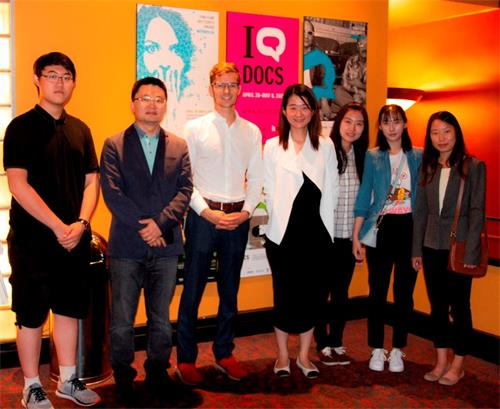

图3：加拿大安省议员山姆•奥斯特霍夫（Sam Oosterhoff）与多伦多青年法轮功学员合影，他表示通过来参加电影公映表明他的支持。（左二是导演李云翔，左三是议员山姆•奥斯特霍夫）

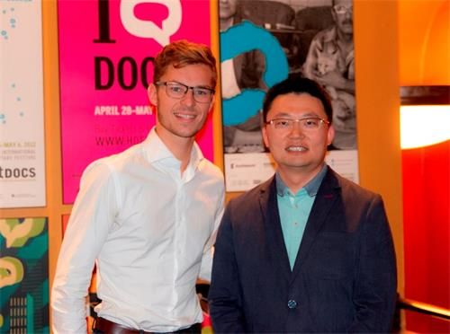

图4：加拿大安省议员山姆•奥斯特霍夫（Sam Oosterhoff，左）与导演李云翔合影。

加拿大安省有史以来最年轻的省议员、现年二十岁的山姆•奥斯特霍夫（Sam Oosterhoff）前来观看此次的公映。他说：“法轮大法的价值观，真、善、忍，是人们值得庆祝的价值观。这些价值观非常伟大，真的对每个人都非常有益。”而信仰这个理念的法轮功学员却遭到残酷的迫害，“观看这部影片真的让我感到很悲伤。希望我能够帮助（结束迫害），不管是否只是对一些人和政府施加压力等，我今天就是通过来参加此次的电影公映来表明我的支持。”

他表示第一次听到法轮功学员被中共活体摘取器官时他非常的震惊，“我简直不敢相信，我曾经对中共的劳改所以及正在发生的这些事情了解甚多，但我却不知道有这么多人正在被活摘器官。这令我大吃一惊。”他说：“对我来说一件重要的事情就是要争取宗教自由。”

电影结束后的现场问答环节，山姆问了李云翔导演一个问题：你们是如何拍摄他们（中共）的一些秘密的？

李云翔回答说：“这是我迄今为止制作的最难的一部电影，因为我没有去中国，孙毅也不知道如何使用摄像机。”

李云翔讲述了他如何在网上与孙毅沟通及培训使用摄影器材。他还说：“在拍摄的时候，孙毅本人还在中国，他是承受了非常大的压力，也冒着很大的风险。很多观众反应，他们都被孙毅的这种精神所感动。因为不管你是什么样的背景、什么样的信仰，当你看到孙毅的故事，我想你会被他的精神所打动。”

<b>观众被主人翁的精神所打动</b>
 

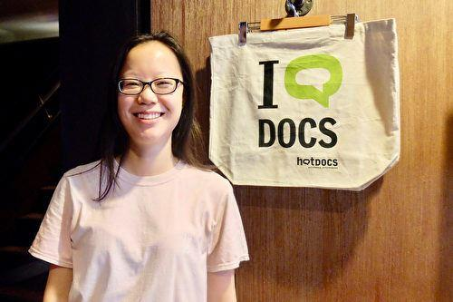

图5：华裔观众杨女士（Susan Yang）为《求救信》主人公孙毅的无私所感动。

多伦多亚洲国际电影节的捐助者之一杨女士（Susan Yang）观看完后说：“影片主人翁是一个非常善良、非常坚强、非常无私的人。他摆脱酷刑折磨后，还帮助别人重获自由。尽管磨难重重，他始终坚持自己的信仰。”杨女士表示她很钦佩摄制组的勇气，“他们克服资金、干扰等困难，把记录片搬上大银幕。”

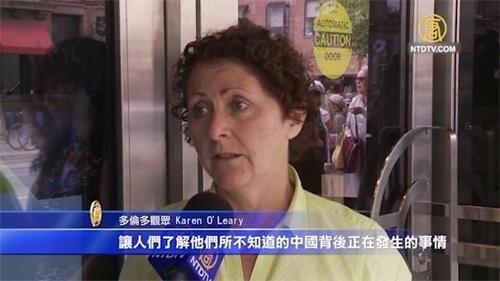

图6：多伦多观众凯伦•奥利里（Karen O'Leary）说孙毅给她留下深刻印象。

多伦多观众凯伦•奥利里（Karen O'Leary）说：“主人翁是非常强大的一个人。他看起来只是一个低调的人，但他有能力在非常难以改变的中国改变一件事（指废除劳教制度）。因此，他本人以及无论在何种情况下，他的心都是勇往直前，给我留下了深刻印象。所以我认为人们可以改变这个世界，虽然这个世界对他和他的家人来说非常不友善，但我认为（他的）力量是惊人的。”

凯伦表示希望更多人能观看这部电影，“在离场时，我对我的朋友说，特别是针对将自己的所有工作本身都视为回报的人权活动家们来说，应让这个故事传播得更广，让人们了解他们所不知道的中国背后正在发生的事情。我认为这在以前没有太多宣传。所以，这部影片非常强有力。”

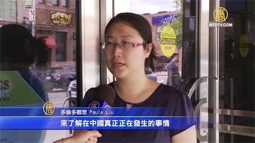

图7：多伦多观众刘女士（Paula Liu）觉得人们应该来了解中国正在发生的事情。

多伦多观众刘女士（Paula Liu）说：“在中国发生的事情太令人震惊了，我之前听说过这部电影，今天亲自观看了，这部电影真是令人心碎。虽然是一部纪录片，这却是一部非常令人感动的电影。更多人应前来观看，了解中国真正正在发生的事情。”“毫无疑问，我觉得很多人应该知道这些并应该做些什么来帮助那些陷入此种困境的人。”

电脑工程师安德鲁（Andrew Cheremiov）表示《求救信》让他感到非常震撼和忐忑不安。“这部电影让我产生共鸣，唤起童年的回忆。我来自乌克兰，在共产党的极权统治下，百姓可能因说了一些话失踪，甚至遭受酷刑折磨。”

安德鲁的女友伊莉娜（Iryna）表示，商店里的大部份货物都是中国制造，有些可能来自劳教所。监管部门应要求商家说明商品的产地。企业应该有社会责任感，不应让劳教所犯人（尤其是良心犯）当苦力。这是非常不人道的作法。她今后购物时会远离这类商品。

创建于1913年的Hot Docs Ted Rogers剧院位于加拿大多伦多，是全世界最大的专门播放纪录片的影院，共有650个座位。“Hot Docs加拿大国际纪录片电影节”是北美最大记录片影展，在今年4月多伦多举办的第25届影展中，《求救信》从247部作品中脱颖而出，成为观众票选的“观众最喜爱20部影片”之一。

<h1 align="center"><b>山东莱西市美满家庭被中共迫害、骨肉分离</b></h1>

【明慧网二零一八年七月二十四日】2018年7月17日上午，山东省莱西市城区法轮功学员郑全花家的楼下停着三辆警车，十多个警察进家不由分说，到处乱翻，非法抄家，连小底屋都抄了，最后强行将郑全花绑架。
郑全花遭绑架后，她的儿子、儿媳去找莱西公安要人，并询问警察为什么绑架他们的母亲？警察说，因为郑全花给习近平邮寄信件（诉江状），使上面的压力很大。警察问郑的儿媳梁燕妮，你诉状上写的都是真的吗？梁燕妮告诉警察：诉状上写的都是事实，都是自己经历过的事情，没有半点虚假。问完，警察便要梁燕妮签字以证实所说都是事实，这样梁燕妮就天真的相信了警察签了字。

时隔一日，7月19日上午，莱西公安局三个警察又到了郑全花家，诱骗郑全花的丈夫于海波跟他们去给郑全花查体交费，结果于海波去后随即被绑架，当日被送往莱西看守所非法关押。

7月20日上午，莱西公安又非法抓捕了郑全花的儿媳梁燕妮，将其送往普东看守所非法关押。

就这样，原本美满的五口之家短短数日被中共警察抓捕了三口关入大牢。

郑全花的小孙子浩浩四天之内亲眼目睹了奶奶、爷爷与妈妈相继被抓，孩子惊恐极了，整天不说话，因为没人照顾，现在只得暂住亲戚家。这个年幼的孩子正经历着同龄人所永远都无法承受的灾难。而这场灾难的起因只因为奶奶给这个国家的当权者邮寄了一份血泪写成的诉状而招致的。

郑全花原本是山东省平度市祝沟镇南黄同村人，因坚守对真善忍的信仰，多次受到中共的残酷迫害，后辗转来到莱西定居。她的儿媳在她的善心感召下一改往日陋习，也走入了大法修炼，她们婆媳关系很好，相处的像母女一样，每遇到矛盾时都能按“真善忍”法理找自己的不足，她们的家庭其乐融融令亲友羡慕。一家五口挤在并不宽敞的房子里，儿子儿媳却不愿分家。

这样一个美满的家却被中共迫害的骨肉分离，令人痛心！

中共自建政以来，血雨腥风，运动不断，杀地主、杀资本家、杀中共自己队伍中还有良知的人、杀知识分子、杀学生，杀的都是精英，中国有一半以上的家庭（包括习近平家）遭受迫害， 8000万无辜的中国民众被害死，超过了两次世界大战死亡人数的总和。传统的文化、珍贵的历史文物都被毁掉，空气、水等自然环境被毁坏，现在迫害真、善、忍，把人们心中的道德、是非彻底破坏、颠倒，假、恶、斗横行中华大地。

这次抓捕中，莱西公安警察为了制造恐怖，动用了三辆警车，十多个警察抓捕一个六十多岁的老太太，真是令人耻笑！并且抓捕的理由竟然是因为给习近平寄信。言论自由，寄信是宪法赋予公民的权利，怎么会遭到抓捕关押迫害呢？

天理昭昭，善恶必报。每个人必定为自己的所作所为承担后果，这是任何人都逃脱不了的定律！而事实已经证实了这一切，残害修炼人必遭天谴！现在天灾人祸不断，就是一种警示。试想一想：做好人遭迫害、讲真话遭迫害的社会，可不可怕？而你与你的孩子却生活在一个这样的社会。

中国百姓希望中国的法制能够更加健全，公安警察、检察官、法官等执法人员都能维护善良、公平、正义，尽快从中共江泽民集团的操纵中解脱出来，抵制邪恶的指使，找回公检法司人员应有的尊严，给子孙后代开创一个公平、正义的生活环境。

<h1 align="center"><b>大量绑架事件是中共警察在干</b></h1>

【明慧网二零一八年七月二十三日】过去在百姓的认知中，绑架多是指黑社会、流氓土匪为获得不义钱财或寻仇绑票人质，是违法的。但在当今中国大陆，更多的绑架不再是百姓认知的通常意义的绑架，绑架天天发生、到处都有，大量的绑架恰恰是警察直接干的——知法犯法、执法违法。为了维护中共邪党一党专制统治，绑架对象是他们认为的可能妨碍极权统治的一切人。比如维权律师、异见人士、上访人士、民运人士等等。从一九九九年七月二十日至今十九年里，遍布中国大陆所有省份，绑架法轮功学员从没停止过。
在元凶江泽民的授意操控下，“六一零”、国保、警察绑架法轮功学员，完全是中共邪党掌控的国家行为，不择手段、肆无忌惮、无法无天。我经历过两次被绑架：

一次是被绑架到洗脑班。我下班回家，快到家时，突然从一辆面包车里下来两人，不由分说，强行把我架进车里，车里坐着几个人，立刻把我按坐在座位上，前后左右被这堆人包夹在中间，我挣扎着，大声质问：你们干什么？他们按住我，强行蒙上我的眼睛，车子迅速开走了。大约开了半个多小时，当取下我的眼罩时，人已在一个房间里了。其实他们很心虚，怕我辨识路，怕曝光洗脑班的地址，揭露他们的邪恶。

我在被绑架的那一刻就完全失去了人身自由，在洗脑班里一天二十四小时被两个保安贴身看着，上厕所不能关门，晚上睡觉不能关灯。手机被收走，我强烈要求给孩子打电话，因只有孩子一人在家，他们不允许。在我一再抗争下，他们同意让我给单位打电话。我谴责单位与“六一零”联手绑架我的流氓行径，要求通知我的孩子，对方说一定的，其实他们没通知。也就是说孩子根本不知道他的妈妈去哪了，从此人就消失了，渺无音讯，以致一年半多后，当我第一次在劳教所给孩子拨通电话时，我说“我是妈妈”，片刻，电话里传来哇哇的号啕大哭声。这是十几年从不曾听过的孩子的大哭声，之后很久想起这些还心有余悸，可想当时孩子精神压力有多大，大哭是长期极度的恐惧和压抑瞬间的宣泄。

还有一次被绑架是在出租屋内，警察以房东收费为名骗开房门，冲进房间把我双手背铐，并立即套上黑头套，推到墙边贴墙而站，随即听到翻箱倒柜和摔坏东西的声音，如同电影电视中演的黑帮土匪绑票一般。然后将人扔到车里，直接拉到派出所的黑屋子里。这两次绑架只是因为我不肯放弃修炼法轮功，第一次是为了送洗脑班“转化”，第二次只因我没“转化”在外流离失所。

从周围熟知的法轮功学员被绑架，或从明慧网揭露的法轮功学员被绑架事件看，除了路上绑架或骗开房门绑架外，有的悄悄翻墙入院破门闯入，有的强行用电钻钻开防盗门，有的断电断水胁迫开门-……绑架中有的被暴打当场昏厥，有的被拳打脚踢强拉硬拽拖下楼，有的被背铐着扔到后备箱里，有的被背铐着强按着坐在车座间的脚踏处，头压低到脚面——堵住嘴、蒙住眼、戴黑头套。这些人被绑架后就再无音讯，家里人不知他们在哪里，不知他们死活，被劳教、被判刑、被投入监狱都不会通知家人，甚至有人从此消失再没回来。

警察绑架法轮功学员比黑帮土匪绑架人质有过之无不及。残忍暴虐、执法犯法、无法无天的程度只有普通百姓想不到的，没有他们做不到的，难怪百姓中流传着”过去土匪在深山，现在土匪在公安”。其实有的警察在绑架法轮功学员时，心虚，知道灭良心、悖天理、不得人心，撒谎说是抓小偷盗贼──中共邪党动用全部国家机器，投之巨额国家财力，对付手无寸铁的秉持着真、善、忍信仰的善良百姓，就是为了强迫这些人放弃信仰。邪恶知道这些坚信真、善、忍的人会影响社会带动大批的人道德回升——回归传统，会映出中共邪党的假恶暴、道德败坏的邪恶本质，动摇并摧毁其邪恶统治的根基。中共邪党的邪恶本质与人类的普世价值是不共戴天的。

中国大陆对法轮功的迫害旷日十九年，已揭露出来的迫害致死有据可查的就有四千多人，被迫害家破人亡的有多少人？被致伤、致残的有多少人？被活摘器官的又有多少人？更多的罪恶还没有昭告天下。元凶江泽民及其追随者们血债累累，人神共愤，天理难容。大审判——江泽民及其追随者偿还血债的一天不会远了。

非常希望有机会听到法轮功学员讲真相的世人不要错过机会，祝愿你们能选择美好的未来，退出中共邪党组织（退党、退团、退队）保平安。

<h1 align="center"><b>真理在哪里</b></h1>

【明慧网二零一八年七月二十三日】两千四百年前，在希腊雅典，七十岁的苏格拉底被处死。他被指控的罪名是反对城邦的旧神、试图引入新神和腐蚀青年。其实他只是与青年们在街头谈天说地、讨论哲学，启发思想。后来雅典意识到错误时，就开始追究那些控诉苏格拉底的人。有人因此被流放，也有人被判处死刑。再后来，苏格拉底被誉为“亘古以来最有智慧的人”。
两千年以前，当耶稣回到家乡传道，家乡人不解地说：“这不是木匠的儿子吗？”（《马太福音》）言外之意，不可能。他并不被推崇，而是被驱赶。“会堂里的人听见这话，都怒气满胸，就起来撵他出城，他们的城造在山上，他们带他到山崖，要把他推下去。他却从他们中间直行，过去了。”（《路加福音》）在今天，在世界各地，金碧辉煌的教堂随处可见，耶稣、上帝，亿万信众虔诚地膜拜、赞美、歌颂着。

时光行走过两千个春夏秋冬，天地在变，世界在变，人类在变，而耶稣说的“先知在自己家乡往往不受欢迎，而在家乡之外却受到尊敬。”依然不变。

在中国大陆，自从一九九九年中共非法镇压法轮佛法以来，人类对信仰的迫害再次达到巅峰，人类对圣者的诋毁也再次达到顶点。报纸、电台、电视台频繁的播出诽谤音讯；李洪志先生的画像被扔在地面上，强制百姓踩踏走过；先生的书籍被用卡车碾压，被焚烧。据不完全统计，在短短的半年之间，中共媒体在海内外对法轮功的诬蔑报导和批判文章，竟然高达三十余万篇次，亿万中国民众被中共洗脑毒害。

而事实上，李洪志先生传出的法轮大法是佛法，揭示出宇宙不但有物质也有精神；任何物质中都包含真、善、忍的特性，同化宇宙特性就是得道者。他告诉人真理，引领人认识真相，却被谩骂诋毁。

在世界各地，李洪志先生得到褒奖和荣誉越来越多，法轮大法也备受瞩目与欢迎。在美国大纽约地区，从今年五月十日至十三日连续举办集体炼功、大游行等活动，庆祝“法轮大法日”。纽约州各级政要也发出上百份褒奖表示祝贺。每年“法轮大法日”，加拿大三级政要都会发贺信祝贺并褒奖法轮大法。在毗邻大陆的香港、台湾，在欧洲的俄罗斯、西班牙、德国、瑞士，在澳洲，在南美，法轮功洪传世界各地，只有在中国遭到迫害。

真理在哪里？真理也许就在你身边，正在被践踏、被攻击、被扭曲。先知在哪里？先知也许曾在你的家乡，被陷害、被污蔑、被中伤。

两千年前，耶稣在他的家乡，有人要撵他出城，有人要推他下山崖。他在讲真理，他在救世人，而世人却不相信他，讨厌他，驱赶他，置他于死地。两千年以后，还是同一个耶稣，却被尊为拯救者，日夜朝拜。当然也有人依然认为是想象和传闻。也许这就是人们认识先知的过程，很多执迷过深的人行走千年才能认识智慧的神。

今天的人对待李洪志先生，与先前的人当年对待耶稣如出一辙。祖国故园，对他诅咒威胁；异国他乡，对他褒扬称颂。时间让真理熠熠生辉。希望更多的人不要再与先知迎面而遇、然后匆匆擦肩而过。抓住机缘不再蹉跎、不再错过。

法轮功修炼者在十九年里，在自身遭受严重迫害下，仍然坚持讲清真相，就是要帮助被谎言迷惑了的世人。救人一命胜造七级浮屠，救人是佛家的夙愿，也是最大的善举，却被中共歪曲为反党、搞政治、造谣。学员们被肆意抓捕与任意蹂躏，仅二零一七年被中共非法判刑的法轮功修炼者就有1097人。因讲真相被中共绑架的法轮功修炼者，在阴暗的牢笼里，承受着被灌食辣椒水，注射不明药物，打骂体罚等等的酷刑折磨。这与两千四百年前苏格拉底与雅典青年辩论思想，探求真理，被指控为反对城邦的旧神、试图引入新神和腐蚀青年，罪名极其相似，迫害更加惨烈。苏格拉底只是被迫自尽，而中共却让人生不如死。

当雅典意识到错误之后，那些控诉苏格拉底的，被放逐、被处死，既是咎由自取，也是可悲可怜。而今天，千万名修炼者日复一日地澄清事实，劝善止恶，就是希望中国人不要重蹈覆辙，别再害人害己。不为虎作伥，才不为罪人，才不落恶报，才远离灾难。

拨云雾见青天，晓真相明是非，真理在哪里？用你的心去看，用你的灵去判。

<h1 align="center"><b>反迫害十九载 正信迎来曙光</b></h1>

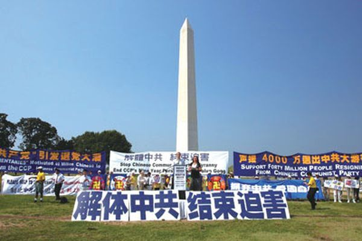

法轮功学员坚守“真、善、忍”的信仰与持续不懈的反迫害，体现了平和与超凡的修炼风范，顶住了来自专制政权的灭绝镇压。

【大纪元2018年07月20日讯】一九九九年七月二十日中共与江氏集团动用整部国家机器迫害法轮功，动用一切媒体、司法、军警、特务、党政、外交，进行了全方位的镇压，对法轮功学员非法关押、洗脑、毒打、电刑、强奸、强迫注射破坏中枢神经药物，乃至活摘器官，惨无人道的迫害手段令人发指。迄今至少有四千二百名法轮功学员被迫害致死，难以计数的无辜公民被绑架进看守所、劳教所、监狱、洗脑班与精神病院，被迫害致伤残、失学、失业、流离失所、家破人亡。

坚持理性平和 唤醒良知善念
十九年来，法轮功创始人李洪志先生一直教导学员们秉持大善大忍的精神，以理性、宽容的方式抵制这场毫无人性的迫害，唤醒世人的良知善念。在遭到各种酷刑的肉体折磨和精神摧残下，中国大陆法轮功学员没有仇恨和愤怒，完全以真诚、善良、坚忍的方式抵制这场迫害。法轮功学员坚守“真、善、忍”的信仰与持续不懈的反迫害，体现了平和与超凡的修炼风范，一群正信坚定的善良百姓顶住了来自专制政权的灭绝镇压。

在近七千个日子里，中国大陆法轮功学员不畏强权，无惧暴力，以真实对谎言、以和平对暴力、以善良对残酷，去天安门广场炼功、打横幅，在街头发放真相传单、贴标语与发光盘，给民众打电话、传真和寄邮件，深入社区，电视插播真相，资料点遍地开花。

世界各地的学员则以横幅标语、游行集会、烛光夜悼、征集签名、SOS徒步、汽车之旅、反酷刑演示、新闻发布会、起诉首恶帮凶、举办真善忍美展、图片展、摄影展与晚会等文艺演出诸多方式，锲而不舍的向世人澄清事实，更以办电台、办报纸、办电视台，全方位向各国政府和议会讲述真相，彻底曝光了中共的弥天谎言和迫害罪行。

弃暗投明 公开退党
在中国国内，对法轮功的迫害政策遭到了越来越多人的抵制。据大陆消息披露，中共一些官员早已开始“留后路”并私下整理收集文件，以证明自己是“被迫”执行“六一零办公室”的迫害命令。许多党委、书记、公安、国保大队人员纷纷弃暗投明，私下帮助法轮功学员脱离迫害。明白真相的官员、领导、雇主、学员的亲友甚至开始学炼法轮功。

二零零四年底《大纪元时报》发表系列社论《九评共产党》，引发了全球华人的退党大潮，迄今在网站公开发表声明退出中共（党、团、队组织）的人数，已逾三亿一千万人。许多中国大陆民众，早年多受中共谎言蒙蔽而仇视法轮功，现在他们都知道法轮功学员是好人中的好人；很多人看完《九评》后，主动退党来摆脱中共邪灵的箝制，对法轮功的态度也从同情、理解，逐渐转为认同、支持，甚至国内许多律师公开为法轮功学员做无罪辩护。

“三退”人数也如滚雪球般的迅速扩大，从每日数千人到现在的每日六、七万人，从使用化名到今日公开用真名退党，从一般党、团员到现在的政界、军队与“公、检、法”高层干部，更有驻外的中国领事馆官员家属以公开退党方式表达唾弃暴政，近年在欧洲旅游景点很多中国游客集体退党已成常态。

国际社会的正义呼声
法轮功学员长年坚持讲真相，彻底曝光了中共的欺世谎言和迫害罪行。随着真相的广泛传播，魔消道长之势也日益明显。十多年来国际社会包括美国、加拿大、欧洲、澳洲与台湾议会已数十次提案，屡屡针对中共迫害法轮功发出正义呼声，如二零零二年七月二十四日，美国国会以四百二十票全数通过188号决议，要求中共停止迫害法轮功；同年十月二十四日，加拿大国会众议员表决，全体一致通过声援法轮功的动议案；二零零四年十月四日，美国国会一致通过304号决议案，参众两院决议要求中共应该立即停止迫害法轮功并释放所有在押的法轮功学员；二零零五年六月二十日，澳洲参议院通过了170号动议案，重申澳大利亚对信仰自由的承诺，保证澳大利亚公民有修炼法轮功而无须惧怕遭受骚扰的自由。

国际社会要求“制止中共迫害法轮功”的呼声成为风潮，也标志着这场迫害正走向尽头。二零一六年六月美国国会众议院表决，全体通过343号决议案，要求中共立即释放被关押法轮功学员，并停止强制摘取法轮功学员器官的行为。二零一八年六月八日，美国联邦众议员达纳‧罗拉巴克（Dana Rohrabacher）发起《第932号决议案》，声援中国民众退出共产党及其附属组织，要求中共立即停止迫害法轮功。这项决议案已提交给美国国会众议院外交事务委员会。

在海外，从二零零二年以来，江泽民及罗干、周永康、薄熙来、夏德仁、赵致真、黄华华等近六十名严重参与迫害法轮功的中共官员，在全球五大洲三十多个国家及地区遭到刑事控告其触犯“反人类罪”、“酷刑罪”、“群体灭绝罪”。

在中国大陆，自二零一五年五月起，已有超过二十万人向最高法院、最高检察院递交刑事控告书，控告江泽民迫害法轮功，由于网络封锁和信息传输的不便，实际数字不止于此。堂堂正正在中国国内“诉江”，已将这股惩恶除奸、匡扶正义的呼声，推向另一波高峰。

魔消道长 黎明在望
十九年过去了，当初疯狂嚣张、妄图三月镇压功成的中共及江氏集团，现在只剩下苟延残喘、垂死挣扎的呻吟了。十九年间，坚忍卓绝的海内外法轮功学员在腥风血雨中把真相传播到社会的各个角落，如今气竭奄奄的中共只能乏力的面对日趋成熟理智的法轮功学员，和越来越多明白真相的广大民众，法轮功洪传一百多个国家、广获各国三千多项褒奖即为明证。

法轮功学员向世人讲清真相的义行壮举，犹如黑夜中的熊熊火炬，引领着人们逐步走向光明。迫害虽然还在继续，回首过往，不过是连宵风雨。祝愿更多的世人能发挥良知，站在正义与善良的一方，共同让这场迫害早日结束。

<h1 align="center"><b>跟“党”往哪走</b></h1>

【明慧网二零一八年七月十八日】几十年来，中共利用其所掌控的一切宣传舆论工具和各种艺术形式，向中国人灌输“听党的话，跟党走”。中共表面上让中国人跟它走向社会主义和共产主义，而实质上共产党是把中国人领向了地狱的大门，把中华民族推到毁灭的危险境地。这是共产邪党的最终目的。
共产党的教主马克思在十八岁时写了一个叫《oulanem》的剧本，其中写道：“毁灭、毁灭……伴随着一声狂野的嘶吼，说出对全人类的诅咒……黑暗中，无底的地狱的裂口对你我同时张开，你将堕入去，我将大笑着尾随，并在你耳边低语：‘下来陪我吧，同志！’……如果存在一种吞没一切的东西，我将跳进去，以毁灭这个世界。”（引自《共产主义的终极目的——中国篇》）

我们在大陆的影视作品中，常常听到中共官员说这样的台词：“死后去见马克思。”到哪去见马克思？地狱！凡是曾经加入过党、团、队的人，死后都到地狱向马克思报到。这绝不是危言耸听，是马克思及共产党在往地狱里拉人。那么马克思及中共是怎样把人拉入地狱的呢？

首先我们要认清共产党是什么：“一个幽灵，共产主义幽灵，在欧洲上空游荡。”这是马克思在《共产党宣言》中写的第一句话。在西方的词汇中幽灵与魔鬼是同义词；在汉语词汇中，幽灵就是阴间的鬼魂。我们把没有人性残害人的邪灵称为魔鬼。共产邪灵能附着人体，操控人的大脑和思想意识。

中共是从以下几方面把人拉入地狱的。

<b>一、让中国人道德沦丧</b>

中华传统文化敬天重德，道德是国家稳定与兴衰的基石。传统道德提倡“仁、义、礼、智、信”，讲“善有善报，恶有恶报”，而中共把中华传统文化视为封建迷信加以批判破坏。中共将阶级斗争、暴力革命、无产阶级专政、唯物论、假恶骗斗的党文化强行灌输给中国人，使中国人放弃了做人准则。大家看看现实的中国社会政治腐败、官员腐败、司法腐败、军队腐败、教育和医疗腐败；假冒伪劣商品随处可见；有毒有害食品防不胜防。真话难讲，好人难做。国家无诚信、政府无诚信，新闻媒体说假话。中国社会道德的沦丧已经到了难以挽回的境地。

大家知道，我们在制造生产一个产品时，如果不严格按照设计标准，工艺流程制作的话，那就是残次品，甚至是废品，只能贱买或报废。一个人失去了做人的道德准则，就不配做人了，将面临被淘汰和销毁的危险，一个国家道德沦丧就会衰亡。

<b>二、让人战天斗地</b>

我们人类生存于天地之间，天地孕育了万物，天地给予人类得以生存的阳光、空气、水、各种动植物及矿物质，人类才能生存繁衍。《周易》把天视为乾，为阳为父；把地视为坤，为阴为母。宇宙乾坤，天地阴阳育化万物，是我们人类的衣食父母。作为天地的子民，理应尊天敬地，顺天顺地。而中共却向中国人灌输“战天斗地”、“与天斗、与地斗，与人斗，其乐无穷”、“人定胜天”、“改造自然，改造山河”、“敢叫日月换新天”的大逆不道的歪理邪说。战天斗地给中华民族带来了严重恶果：空气、土地、江河湖海严重污染；雾霾天气、沙尘暴时常发生。土地沙漠化严重，中国已成为绿色植被最少的国家之一。中共对物质资源的乱采滥用已经严重影响了我们子孙后代的生存。

如果人能够敬天敬地，必会风调雨顺、四季平安，天地人和谐共处。人敢反天反地，天地必降灾祸于人，甚至毁灭人类。地震、海啸、飓风、洪水等地质气象灾害就是对人类的惩戒。中共让人战天斗地，破坏自然环境，就是让人失去天地对人的养育和庇护。堵死上天路，打开地狱门是中共毁灭中国人的终极目的。

<b>三、让人与“善”为敌</b>

人之初、性本善。善良是做人的准则，是每个人都应坚守、尊崇的。人无善念就失去了做人的标准。而中共却把善良的好人踩在脚下，把坏人捧上天。中共历次搞的政治整人运动，迫害的都是讲真话、与人为善、忧国忧民、勤劳致富的好人。如：土改迫害的是勤劳致富的“地主”，工商改造迫害的是经营有方的“资本家”；反右迫害的是敢于讲真话的知识分子；文革时迫害的是坚信中华传统文化及信佛修道的善良好人；八九六四镇压屠杀的是忧国忧民、反贪污腐败、反独裁专制的爱国学生；九九年至今迫害的是以“真、善、忍”为理念的法轮功修炼者。中共治下的中国，好人难做、好人难当。就连真善忍这三个字都被中共视为敏感词，在互联网上被屏蔽和删除。

特别值得一提的是，中共对修炼真善忍的法轮功群体的迫害，把中华民族和中国人民推向了毁灭的深渊，重蹈了古罗马帝国因迫害耶稣和基督徒而亡国的历史悲剧。上天先后降下四次大瘟疫，所有追随、参与迫害并仇视耶稣和基督徒的人都被瘟疫夺去了生命，强大的古罗马帝国因此而灭亡。

跟党走是什么结局？跟党走，中共官员都腐败堕落了；跟党走，工人下岗失业了；跟党走，农民成了低等公民；跟党走，教师失去了师德，医生失去了医德；跟党走，司法成了中共迫害好人的邪恶工具；跟党走，武警、军队成了镇压、杀害中国人的刽子手；跟党走，学生成了分数的奴隶；跟党走，中国人喝着被污染的水，呼吸着被污染的空气，吃着有毒有害的食品，用着假冒伪劣的商品；跟党走，中国成为全世界癌症和多种慢性病发病率最高的国度；跟党走，中华传统道德、诚信尽失，中华民族将面临道德与诚信的危机……跟党走的最终结局就是每个人的自毁与中华民族的灭亡！

二零零四年十一月海外中文媒体《大纪元时报》刊登长篇系列社论《九评共产党》，全面系统地揭示了共产党的产生及其邪恶本质，论述了中共对中华传统文化的破坏，对自然界的毁坏，以及杀害中国人，迫害好人的种种罪行。《九评共产党》的问世引发了全球退党大潮，迄今已有超过三亿中国人退出了中共党团队组织，从而敲响了中共的丧钟。

“善有善报，恶有恶报”是中华传统文化佛家思想的精髓。善与恶、正与邪是人性的两方面，为善为恶都是人的选择，但结局却不同。为善者必有福报，从恶者必得祸殃，只是或早或晚。希望所有中国人都看一看《九评共产党》和大纪元新书《共产主义的终极目的》，认清中共邪党反天反地反人类的邪恶本质，认清共产党毁灭人类的邪恶目的，不再相信它的一切谎言。不再仇视真、善、忍，不参与迫害法轮功修炼者，不再残害善良正义的好人，退出曾经加入过的党团队组织，不与邪恶为伍，不跟邪党走，不给邪党当陪葬，做善良正直的好人，走向光明之路。地狱之门只为那些愚迷不醒、死心塌地跟党走的人而开。

认清中共邪党，退出中共的党团队组织，是对每一个中国人生命的救赎，也是避免中华民族灭亡的唯一选择和希望。自清、自省、自救才是中华民族和中国人民的唯一出路。

<h1 align="center"><b>河北邯鄲市永年區六月初一下雪在警示甚麼？</b></h1>

【明慧網二零一八年七月二十日】（明慧網通訊員河北報導）2018年7月13日（陰曆2018年6月初一），在河北邯鄲市永年區突然天降大雪，永年河北鋪的一位老農仰望紛飛的雪花，大聲地驚呼：「六月初一，永年河北鋪下雪了啊！看下多大！」
7月13日左右，邯鄲天氣最高氣溫在攝氏29度左右；低溫在攝氏24度左右。六月初一（陽曆7月13日）永年區突然天降大雪，警示當地有冤情，要有劫難降臨。

邯鄲市永年區有95萬人口，百姓以務農為生。永年區百姓忠厚善良、遵紀守法、都是勤勞樸實的好公民。中共永年區官員，由於受中共「無神論」、造假等謊言毒害，認不清當前形勢，盲目執行江澤民反為類、群體滅絕的迫害政策，對信仰真善忍的好人持續騷擾迫害，做著違背天意良知道義的惡事，天理不容！上天看到危險已經向他們走來，如不立即懸崖勒馬、將功贖罪，就會造下被天理嚴懲的罪惡，就會給百姓帶來劫難。神佛慈悲，用六月天下雪來警示執迷不悟的官員及其追隨者。

法輪大法（也叫法輪功）是佛家上乘修煉大法，以真、善、忍作為修煉人的最高標準；以返本歸真作為修煉人的最終目的。法輪功教人修心向善做好人，做事先想到別人，遇到矛盾找自己；法輪大法祛病健身有奇效；法輪大法目前已洪傳世界一百多個國家和地區、上億人修煉；法輪功主要著作《轉法輪》被譯成四十種語言在世界各地出版發行；法輪大法和師父受到世界各國褒獎、議案、信函三千多項；深受世界人民的讚譽和愛戴。

自從99年7.20中共江澤民發動對法輪功的迫害以來，永年不法官員19年來對法輪功學員的迫害：迫害致死的7人；非法判刑6人，非法勞教60人次；非法拘留86人次；非法抄家81人次；敲詐勒索強行罰款達103.6978萬元。（因篇幅有限在此不作詳述）

在國內外形勢發生巨變的今天，永年區區委書記侯有民、610主任訾印芳、政法委書記申建民、公安局長劉軍海等人仍執迷不悟，頑固執行江澤民殘餘勢力的迫害政策，持續不斷地向法輪功學員施壓、騷擾迫害，下面是對永年區近期搜集的部份迫害實例。

2018年5月10日，邯鄲市永年區劉營鄉派出所到榆林二村法輪功學員張蘭芹家騷擾。

2018年5月15號，邯鄲市永年區洺關鎮派出所到洺陽村法輪功學員和彩虹、趙引秀家騷擾。

2018年5月16日上午，邯鄲市永年區公安局洺關鎮派出所到洺陽村法輪功學員和彩虹家騷擾。

2018年5月15號左右，永年南街法輪功學員王香君被城南派出所（工商派出所，工商局大院內）上門騷擾。

2018年5月22號上午，邯鄲市永年區劉營鄉派出所到睢寧村騷擾胡進社、高陶蘭夫妻二人。

2018年5月20號晚9點左右，邯鄲市永年區洺關鎮派出所到洺陽村法輪功學員夏美雲家騷擾。

2018年5月23號左右，永年區教育局法輪功學員靳捧花被洺關派出所電話騷擾。

2018年5月26晚上，永年南街法輪功學員王玉恩被城南派出所敲門騷擾。還有永年的張想玲、苗芬、小琴、忠文的父親等都受到敲門騷擾。

2018年5月29號，永年區小北汪法輪功學員郝志順被劉營派出所上門騷擾，錄像。

2018年5月，永年區施莊法輪功學員便娥、花亭被洺關派出所騷擾。

2018年6月14日傍晚，公路派出所三人到永年日雜公司法輪功學員李建民家，非法敲門騷擾、照相等。

2018年6月14日鐵西派出所對永年棉麻公司法輪功學員韓學禮電話騷擾五次。

2018年6月14日辛莊堡派出所到永年席莊法輪功學員趙中文家，遭非法敲門騷擾。

2018年6月15號，邯鄲市永年區文教局派出所逼迫親屬配合騷擾法輪功學員張桂芹及其家人，如照相、簽字等。

2018年7月6日上午11點多鐘，邯鄲市永年區國保大隊的兩個警察到洺關鎮詳西街法輪功學員張引（女）的家，用手機照相，並說不要出去散資料，到了院子裏，還給院子拍照，他們一人穿警服，一人穿便衣。

2018年7月7日上午11點30分，邯鄲市永年區公安局洺關派出所的兩個警察，到洺關鎮北西街法輪功學員劉俊河、胡風花家，以查戶口為名，索要手機號碼及妻子的名字、兒子、女兒工作住址等情況，他們都是著便裝。

2017年8月中旬，在邯鄲市永年區臨洺關鎮北東街治保主任王有民帶領下，與本地的610、政法委、公安局伙同各鎮居委會以走訪為名，敲眾多法輪功學員家門，強行摳門入戶、照相、各屋查看拍照。他們以看一看學員在家沒有、不要去北京等等為藉口，由王有民親自上前叩門，只要有人一開門、後面的人公然拿著照相機馬上強行照相，如此荒謬行徑，竟然得以大行於光天化日之下。

2017年8月10日，永年區榆林二村村支書趙彥兵、鄉鎮包隊幹部趙雙海、區公安局劉營鄉派出所的三警察，一行六人到法輪功學員宋仙霞家，說是敲門行動，問宋仙霞還煉不煉法輪功，家有幾口人，都幹甚麼工作？一個警察問話，另兩個警察沒有出示任何證件就四處翻家，找到幾個條幅，就讓宋仙霞去派出所，宋仙霞不去，他們打電話給國保大隊來了三個人，其中一個叫馬帥的警察，把宋仙霞非法抓捕到永年區國保大隊，給宋仙霞照相、做筆錄、按手印、在手指上抽血驗血，然後把宋仙霞送到邯鄲市第一看守所。看守所要求體檢，在邯鄲市中醫院體檢不合格，又把宋仙霞拉回永年區國保大隊，辦了一個取保候審的手續，當晚讓家人接回家。

永年區各級官員對法輪功學員的騷擾迫害，已經成了他們在永年區的中心工作，別的工作都可以不做、都能不管不顧，但對按照真善忍做好人的法輪功學員的騷擾迫害卻一個都不能放過，甚至連被脅迫早就不煉了的學員都不放過，給所有法輪功學員及其家人造成了無可挽回的精神傷害和經濟損失。

<b>迫害法輪功必遭報應</b>

「禍福無門，唯人自召；善惡之報，如影隨形」。自古以來，參與迫害佛法，都是天定之

大罪必遭天懲，這天理亙古不變，下面僅舉永年區迫害以來遭惡報的部份實例。

1、原永年縣大名縣縣委書記邊飛 被判死刑 緩期兩年執行

邊飛，男，漢族，1961年3月生人，河北省順平縣人，曾在原永年、大名任縣委書記，副廳級職務。邊飛在任職期間貪腐超億元被判死緩，緩期二年執行，剝奪政治權利終身，並處沒收個人全部財產。

邊飛極端仇視法輪佛法，在他任職的地方積極推行中共的迫害政策，導致這些地方的很多大法學員遭到殘酷迫害。查閱明慧網記錄，邊飛任魏縣、永年、大名縣縣委書記期間，指使、教唆當地惡人殘酷迫害法輪功學員實例達上百例。邊在原永年任縣委書記時，不但殘酷迫害法輪功學員，還在永年縣招募了1000名網絡五毛監視、迫害民眾上網。

2013年12月20日，時任大名縣委書記邊飛在其辦公室被抓捕，2015年6月判處死刑。表面上看，邊飛是貪腐受賄、在中共的內鬥中落敗，實際是他因為迫害法輪功而遭到天理的懲處，這是他應該得到的因果報應。

2、永年縣城關派出所所長李海聚──遭惡報死亡

永年縣城關派出所所長李海聚，男，三十九歲，大北汪北街人，迫害善良，抓捕法輪功學員邀功請賞。自99年以來，永年縣法輪功學員們因證實大法被非法關押、罰款、恐嚇、拘留、勞教、判刑等。二零零一年臘月二十五日，李海聚又抓兩名法輪功學員，一名重罰，一名送看守所。二零零二年正月初五，李海聚飲酒過度遭惡報死亡。

3、永年縣講武鄉派出所趙紅斌遭惡報肝癌死亡

永年縣講武鄉派出所警察趙紅斌，一直積極參與迫害法輪功學員， 2006年4月趙紅斌得肝癌，兩個月後（6月）惡報死亡。

4、永年縣一中隊警察呂建輝夫妻遭惡報煤氣死亡

永年縣一中隊警察呂建輝是永年縣呂七方鄉人，多年來追隨惡黨迫害法輪功學員，對法輪功學員使盡各種毒刑，對女法輪功學員電擊乳房等。呂建輝遭惡報，夫婦二人中煤氣身亡，幾歲的小女兒卻沒有事。

5、永年縣講武鄉派出所所長陳曉陽遭雙開

永年縣講武鄉派出所所長陳曉陽，此人非常邪惡，為邪黨賣命迫害法輪功學員。2006年底，陳曉陽遭惡報被雙開。

6、永年縣看守所所長郝玉明──遭惡報下獄

郝玉明，原邯鄲市永年縣看守所所長，是導致法輪功學員蓋新中死亡的直接兇手。2004年3月郝玉明因受賄犯人靳某一百萬被告發，丟官棄職，潛逃在外，惶恐不可終日，可郝玉明還能躲藏幾天？

7、永年縣化肥廠廠長馮明奎等多人遭惡報

永年縣化肥廠邪黨書記兼廠長馮明奎、副書記馮光忠、廠辦主任劉俊才、保衛處處

長趙風元、電儀車間副主任劉老二等人，是當年迫害法輪功學員的主要責任人，他們明知道修煉法輪功的職工都是好人，仍積極配合邪黨進行迫害，將多位法輪功學員非法拘留和勞教。當時他們誰也不相信惡有惡報，現在看看這些人的狀況是多麼悲慘：

馮明奎2011年夏天因與人發生錢財爭執，脖子被人用菜刀砍斷三分之二，死後發臭才被發現。

化肥廠邪黨副書記馮光忠，患肺癌後轉為骨癌，在萬般疼痛折磨中，於2011年8月死去。

化肥廠保衛處處長趙風元，患有骨壞死、肝硬化滿身膿包，於2010年4月死於胃癌。

化肥廠電儀車間副主任劉老二，2001年患腦梗塞，2010年全癱瘓在床，苟延殘喘。

化肥廠廠辦主任劉俊才，2010年腦梗塞，行動已不便。

8、永年縣東名陽村幹部翟聚奎遭惡報死亡

永年縣東名陽村大隊幹部翟聚奎，從99年7.20以來緊跟江澤民迫害法輪功學員。2002年陰曆12月28日晚，翟聚奎帶領永年縣臨洺關派出所惡警到法輪功學員家中抄家，並把法輪功學員非法抓走。2004年一天晚上，翟聚奎在家喝醉酒，又要到法輪功學員家中抓人，被四名村民制止，才沒有得逞。第二天一名法輪功學員被非法抓走。法輪功學員給他講真相勸他不知悔改。2006年翟聚奎惡報上身突發腦血栓，住院沒過幾天惡報死亡。

9、永年縣劉營鄉村長遭現世報應

永年縣劉營鄉某村唱戲的舞台廣場大門口貼有一張法輪功真相傳單，該村村長看到後，大聲吼叫道：「法輪功又把這個貼到這兒啦。」上去就要撕。當場正好有一名法輪功學員，勸其不要撕，這樣真的對他不好。村長根本聽不進去，一邊撕一邊大聲說：「我甚麼也不怕，我不怕你們說的甚麼報應不報應的！」他撕下往地上一扔，就往旁邊的跑步機上上，可腳還沒活動幾下，突然就趴倒在了跑步機上不動彈了。在場的人們大吃一驚，趕緊通知他家人送進了醫院，經搶救後他是活過來了，可落下個半身不遂後遺症，才六十歲就甚麼活兒也幹不了。在場的人都知道是他說了不該說的話上天對他的警告，在此奉勸人們對神佛要有敬畏之心，才能得到神佛的護佑。

10、永年縣李溝村李樹林癌症死亡

邯鄲永年縣永合會鎮李溝村李樹林誹謗大法，迫害法輪功學員，不聽真相和善勸，於2003年4月遭報癌症死亡。

文革時的真實事例，永年縣七里店村的一座寺廟，門前兩側各坐一尊獅子，甚是威嚴。中共邪黨文革時有個民兵連長，20來歲，邪黨的黨徒，其人緊跟形勢，帶頭批鬥別人，搞打、砸、搶，破壞村古建築樣樣有他。一天他帶領一夥民兵去砸廟，他對一民兵說：「你去把佛像的眼睛摳下來。」那人不敢去，侯說：「你不去我去！」他瘋了似地跑回家拿來一根鐵火炷，把佛像的眼摳了下來。來年結婚生子，生了兩男一女，可全是瞎子，萬般無奈中夫婦倆去外村找了一個明眼（開著天目）的人問問？那人直截了當的給他說，「你挖過佛像的眼睛，遭報應了。」侯莽恍然大悟，連聲說：「是！是！」

到今天為止，除瞎女兒出嫁外，兩個兒子仍在黑暗之中，在集市廟會說書賣藝。當有人問起他們弟兄倆眼睛是怎麼回事時？弟兄倆兒也認真地說，「是上代人摳了寺廟中佛像的眼睛，我們弟兄倆兒遭報應的結果。」

真誠奉勸永年區還在迫害法輪功修煉人的中共官員侯有民及其追隨者──訾印芳 、申建民、劉軍海等人，能以保護人民為己任，以迫害者的報應為戒，明白真相，分清正邪與善惡，懸崖勒馬、將功贖罪，終止對法輪功的迫害，避免災禍的降臨，這是作為永年區一方衣食父母官的良心與責任，同時也保護了自己及家人。在這生命攸關的歷史轉折時刻，神佛用六月天下雪這種形式來警示你們！千萬不要辜負了上天的慈悲與恩澤。

<h1 align="center"><b>黄洁夫央视炒作死囚器官 泄中共更多黑幕</b></h1>

黄洁夫在央视访谈中高调承认中共长期使用死囚器官，被揭是掩盖真正的器官来源。

 
【大纪元2018年07月19日讯】（大纪元记者骆亚采访报导）近日，前中共卫生部副部长、移植专家黄洁夫上了中共央视《面对面》访谈节目，其除了承认中共移植器官长期使用死囚器官外，还披露了一些新的细节，让外界一窥中共器官移植领域更多的黑幕。专家表示，黄炒作死囚器官是为掩盖真正的器官来源，而其最新披露的内容，隐晦承认了中共活摘器官。

<b>黄洁夫炒作死囚器官13年 掩盖真正器官来源</b>

15日黄洁夫在央视节目中承认，“器官移植成了一个灰色的地带。”他还称：“长期以来，中国器官移植来源主要依靠死囚，尽管法律规定死囚应‘自愿捐献器官’，但是法律执行上仍存在漏洞。”

中共卫生部前高官陈秉中认为，中国大陆作为世界自愿捐献器官人口比例极低的国家，却在2000年迅速窜升为世界移植大国，其器官来源不仅是一个“灰色地带”，更是“黑色地带”。

长期关注中共器官移植黑幕的旅美政论家横河对大纪元表示，“中国器官移植使用死囚器官，从头至尾都是黄洁夫一个人在那里炒作。从2005年11月世卫组织（WHO）在菲律宾首都马尼拉召开会议时他第一次提出来后，这十三年来他通过各种方式炒作死囚器官，现在承认以前对很多死囚没有按国际标准来做，目的就是让大家把注意力集中在死囚身上，而掩盖真正的器官来源。”

获得2017年“好莱坞国际独立纪录片”最佳外语纪录片奖和最佳导演奖的纪录片《活摘‧十年调查》披露，江泽民1999年迫害法轮功后，为了达到消灭法轮功的目的，下令可以摘取法轮学员的器官。于是这种活摘行为从死刑犯延伸到了法轮功学员、良心犯和政治犯。与此同时，从2000年起，中国的器官移植业呈现出爆炸性的几倍、几十倍的增长。

该纪录片援引移植专家的话表示，器官移植，一个最重要的道德前提就是自愿捐献。但是中国的器官移植在起步就违反了这个底线——从死刑犯身上强摘器官。

横河认为，光强摘死囚器官这一条，国际社会就没有理由去承认中共用死囚器官仅仅是犯错误，这是犯罪。

<b>黄洁夫的角色</b>

黄洁夫在节目中还称是自己宣布从2015年1月1日起停止使用死囚器官，没有得到上面的命令。

国际追查在2015年3月发布的一份报告《“2015年1月1日停止使用死刑犯器官”是中共掩盖活摘器官罪恶的骗局》中早揭示背后实质，中共对使用死囚器官从否认到承认，甚至高调承认，现在又宣布停止使用死刑犯器官，中共利用黄洁夫的言论，有效地起到了替中共解释和回避国际舆论对中共活摘法轮功学员器官反人类罪指控的作用，误导人们聚焦死囚器官讨论，转移了对中共活摘法轮功学员器官的注意。

报告还指，中共官方从未给黄洁夫公开授权，对他的言行和形成的结果也从未否定。这样一来，中共从中受益，但又不需为其负责，是一种不着痕迹的操控。

<b>黄洁夫承认：刑场上拿不到合格器官</b>

黄洁夫在节目中披露了一个细节，他说：“死囚器官的质量是非常不好的。器官的来源要求也十分严格的，在刑场上拿不到这样的器官。”他还称，因为心中总是有阴影，所以从来没有取过器官，只“负责做受体手术，把器官接上去”。

中共卫生部前高官陈秉中认为，黄洁夫隐晦地承认了“活体”移植器官的事实。他说，自己在对医疗公共卫生事件的调研中，也曾听闻远比“死囚器官移植”更骇人的“活摘”事件。

横河表示，如果死囚器官是枪决打死后再取器官，器官能保存的时间很短，因此在中共的司法系统跟医疗系统的配合下，为了让医院拿到新鲜的器官，在处决死囚的时候故意不打死，这是他们解决死囚死后拿不到好质量器官的方法。

他说：“黄洁夫知道这些器官来源，作为跟国际社会接轨的移植专家、卫生部副部长，他就可以任凭人家这样去取器官，自己不取就没有责任了？你知道器官的来源，你还这么做就有罪责。”

横河表示，关于利用死囚器官，中共在1984年出台过包括最高法、最高检、公安部等六个部在内的一个暂行规定。黄洁夫作为卫生部副部长分管器官移植最主要的人，他本人也是移植医生，他前几年竟然说自己没有看过这个规定。他们脑中何时有过法律、遵照什么规定，全部是做戏，做给别人看的，包括后来的一些改革也都是假的，经不起第三方调查的。

<b>黄洁夫自曝取器官怕被别人看见出车祸</b>

央视的报导中披露，在2015年前，黄洁夫担任中山医科大学的校长期间，由于取器官怕被别人看见，在匆匆忙忙赶过来的途中，中山医科大学出现翻车事故，死了两名医生，一名护士重伤，一位司机至今残废。

横河表示，他们取的器官肯定不是死囚的，因为到死刑执行场所去取器官，这是公开的，中共官方1984年就有规定，连秘密都不是，所以不可能是怕被人看见，匆匆忙忙、慌慌张张的。至少当局不会有人来质疑他们，老百姓更不可能管。

据调查报告《血腥的活摘器官》一书披露，自1999年以来，中共政府及其分布在全国各地的机构，尤其是医院，还有拘留所和法院，已处死了大量法轮功良心犯，但具体数目不详。他们的重要器官，包括肾脏、肝脏、眼角膜和心脏，都被强行摘取并高价出售，有时出售给外国人，这些外国人在自己本国往往要长期等待有人自愿捐献此类器官。

<b>追查国际：黄洁夫是中共卫生系统活摘法轮功学员器官的重要组织者</b>

黄洁夫在受访中还自吹其对中国器官移植的所谓“贡献”，包括“改变了中国的器官移植”现状等。

追查国际在2017年2月5日发布的调查报告中，指黄洁夫是中共卫生系统活摘法轮功学员器官的重要组织者。

报告说，在2001年10月至2013年初的近12年间，黄洁夫是中共卫生部/卫计委负责中国器官移植的掌门人，这期间也正是江泽民集团活摘法轮功学员器官直线发展至最高峰期间。他推动大批医院成立了器官移植中心，连不具备条件的市级中医院、乡镇医院、基层军队医院都开展了大量器官移植手术。

报告还指黄洁夫本人涉嫌直接大量使用法轮功学员的器官做移植手术。黄洁夫曾公开对陆媒说，2012年一年，他一人主刀的肝移植就达500多例，其中仅一例是自愿捐献的。

国内媒体还曾高调宣传，黄洁夫2005年9月随以中共政法委书记罗干为团长的中央代表团去新疆参加自治区五十周年庆期间，为新疆一个患肝癌的党官做手术，在一天之内就临时分别从广州和重庆找到、取来两个匹配的活体肝脏。

加拿大前国会议员、《血腥的活摘器官》作者大卫．乔高说，黄洁夫打了两个电话给两个地方，要了两个肝脏，这意思很清楚，有两个人因此被杀了，他们的器官在等著备用。

<h1 align="center"><b>沈阳孟宪光、苏晓华夫妇再被非法抓捕</b></h1>
【明慧网二零一八年七月二日】2018年6月28日中午12时许，沈阳市法轮功学员孟宪光、苏晓华夫妻俩人在家中被警察非法绑架，并抄家。
11点多，孟宪光、苏晓华夫妻正在沈河区大南街怡静园社区的家中，听到有人敲门，说是警察。苏晓华打电话告诉亲属，等亲属赶到已经是家中无人，房门大开。警察找开锁的已经打开房门，将孟、苏两人非法绑架，并抄家。

后来得知是皇姑区国保大队长、马姓警察伙同皇姑区三洞桥派出所警察，跨区将孟宪光、苏晓华在家中绑架。

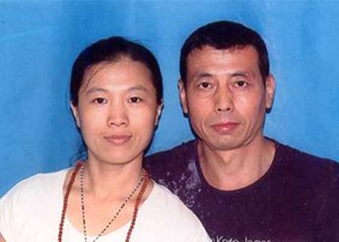

孟宪光、苏晓华夫妇

孟宪光先生今年五十二岁，二零零一年八月被沈阳市皇姑区公安分局国保警察绑架、抄家，后被皇姑区法院枉判四年，被劫持到沈阳市大北监狱迫害。二零零五年八月，冤狱期满被放回家。

这次六月二十八日，孟宪光、苏晓华夫妇又被皇姑区国保大队长及马姓警察，伙同皇姑区三洞桥派出所非法绑架。办案警察姓马，很胖。国保大队长对孟说：2001年绑架孟，现在跨区绑架是翻老底子“凑数”。

二零一四年三月二十六日，孟宪光、苏晓华在沈阳辽宁展览馆附近公交车站讲述法轮功真相时，被沈阳市和平区公安分局南湖派出所警察绑架，家被抄；孟宪光被劫持到和平区看守所迫害，苏晓华被劫持到沈阳市看守所迫害；二零一四年四月二十九日，苏晓华被放回家；七月十六日，苏晓华再次被南湖派出所警察绑架，家被抄。二零一五年六月二十六日，苏晓华被和平区法院枉判三年半，后被劫持到辽宁女子监狱继续迫害，直到冤狱期被放回家。

在苏晓华被枉判之前，孟宪光被和平区法院枉判三年半。

二零一五年二月十五日，孟宪光被劫持到辽宁本溪监狱继续迫害；曾连续三十七小时被酷刑折磨。

二零一五年四月，在本溪监狱狱警指使下，孟宪光被犯人杨忠华叫到一个没人住的监舍里（里面有监控），把他踹倒后，又用拳击打他的头部和胸部，一直被打到墙角。杨忠华用脚踹他头部、胸部，又用脚踢他的大腿，孟宪光被踢得站立不稳。杨忠华持续打了二十多分钟，直到打累了才收手让孟宪光走。孟宪光被打得一瘸一拐、很吃力地扶着墙走回监舍。

二零一五年十月十八日，本溪监狱为“转化”孟宪光，他被强制从八监区到六监区。当天下午，六监区狱警队长陈耿（后来调到八监区）指使犯人史德君、姜天术、郭永程等，把孟宪光弄到一间屋里，用塑料袋套头，用袜子堵住嘴，把他的胳膊、腿都用透明胶带缠在椅子上，狱警刘明浩撕开孟宪光衣服，往头上浇凉水并毒打他，边打边说：你不是炼吗，让你炼！六监区一分队队长刘斯桐拿起一根电棍电击，直到电棍没电；刘斯桐还搧他嘴巴子、击打他的头部、前胸等部位。

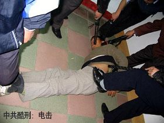

演示图：电棍电击

打完之后，孟宪光被弄回到原来的屋子里。犯人们扒掉他穿的衣服、鞋子，把他绑在窗户旁的凳子上，敞开窗户；两个犯人一班，两小时一换，轮换看管孟宪光，不许他睡觉，不许他闭眼睛。

晚上七点左右，孟宪光被几个犯人弄到另一间屋里。在这间屋里，法轮功学员陈秀被绑在一把椅子上。陈耿指使两个犯人抻住孟宪光的两臂；陈耿抡起一根用透明胶带缠好的粗约4厘米PPR塑料管（建筑用的水管）击打孟宪光的后背，一口气打了二十多下。接着，刘斯桐也抡起这根塑料管子，击打了半个多小时；直到打累了才停手。刘斯桐歇了一会儿，抡起这根塑料管子又击打陈秀的后背。

打完之后，孟宪光被弄回到原来的屋子里。犯人们扒掉他穿的衣服、鞋子，把他绑在窗户旁的凳子上，敞开窗户；两个犯人一班，两小时一换，轮换看管孟宪光，不许他睡觉，不许他闭眼睛。

第二天早八点，陈耿又指使犯人石健拿着电线的一端，把裸露的电线头触到孟宪光的身上，陈耿把电棍触到电线另一端裸露的电线头上，通过电线传导电击孟宪光；石健把裸露的电线头触到孟宪光的阴部，边电边说：让你断子绝孙。孟宪光被电得浑身剧烈抽搐；而石健等却在孟宪光痛苦的抽搐中哈哈大笑，以此取乐。
下午两点多，又进来三个狱警队长：郎鹏程、刘明浩、张芝玉，他们拿着两本书，用胶带把书缠在孟宪光两条大腿上，其中两人各拿一米多长的塑料管子，同时隔着书往孟宪光腿上击打（这样击打造成内伤外表又看不出来）；孟宪光被三个狱警队长轮番打了二个多小时；直到打不动了，才把书拿掉；三人再用塑料管子直接击打大、小腿，然后再用手搓，使腿上的肉和骨头分离。孟宪光被折磨得呼吸困难、精神恍惚。

孟宪光已经于六月三十日平安回家，苏晓华仍被非法关押在沈阳市第一看守所，绝食抗议。

<h1 align="center"><b>谎言重复一千遍也不会成为真理</b></h1>

【明慧网二零一八年二月二十日】近日辽宁省锦州凌海市电视台利用有线电视网向市民连续播放污蔑法轮功的电视片，重拾一九九九年央视的陈词滥调，误导毒害广大民众，为继续迫害法轮功涂脂抹粉。这不由得使人想起在第二次世界大战期间，纳粹德国的宣传部长戈培尔的一句所谓“名言”：重复是一种力量，谎言重复一百次就会成为真理。这也叫做“戈培尔效应”。

<b>惊人的相似</b>
 

希特勒时代不仅是一个独裁暴政的时代，更是一个充满了谎言与诱骗的时代。正如希特勒自己所表述的：人们“常常是察觉不到坚决支持的是一种背弃人类社会价值的世界观。人性和人道主义的价值观从我们的头脑中完全排除了。”

时任宣传部长的戈培尔对新闻媒体，包括出版、报刊、广播和电影等实行严格的管制，建立起德国文化协会。协会的会员必须是热心于纳粹事业的人，在政治上和纳粹保持一致，什么新闻可发，什么新闻能发，都要经过严格的审查，作品的出版或上演必须经过纳粹宣传机构的审查和许可等等，整个德国的舆论完全处在了疯狂的法西斯文化思想氛围中。

通过宣传机器喋喋不休的灌输，德国人民接受了纳粹的一整套思想：纳粹专政具有合理性，其价值观合乎历史发展规律；为了“德意志民族的振兴”，“为了日耳曼民族获取更大的生存空间”，有理由将“不适合生存的个体、低劣的民族、堕落的阶级，驱逐并消灭”。

相信戈培尔部长心里也清楚，谎言重复一千遍也不会成为真理，但谎言如果重复一千遍而又不许别人戳穿，许多人就会把它当成真理。因为谎言的陷阱到处都是，人们不掉进这个陷阱，就会掉进那个陷阱。

这样的历史悲剧本不该重演，但今天却正在你我身边同样上演。当年戈培尔的宣传部早已搬到了中国，宣传手段更加多样，但其实本质如出一辙。

“如果撒谎，就撒弥天大谎，因为弥天大谎往往具有某种可信的力量。”中共是戈培尔这句话的忠实践行者，一九九九年七月二十日开始，中共开动全部宣传机器抹黑法轮功，为迫害法轮功制造舆论。其控制的两千家报纸、一千多家杂志、数百家电视台和电台，全部超负荷运转，进行了铺天盖地的造势宣传，将这些谎言灌输到中原大地每个角落和世界许多国家地区。据不完全统计，在短短的半年间，中共媒体配合迫害法轮功需要撒下了大量弥天大谎，堕落成最大的谎言制造者，在海内外对法轮功的诬蔑报导和批判文章，竟然高达三十余万篇次。

电视作为一种民众喜闻乐见的媒体形式，以声音和图像相结合，给人强烈的视觉和听觉的冲击，而且覆盖面大，普及率高，综合表现能力最强，具有感染力，对民众的影响更直接、更具有强制性。中共正看中了这一点，炮制出了一系列伪案，在电视中滚动播出，为打压进一步升级找借口。如所谓的“一千四百例”、“天安门自焚”伪案、“京城血案”、“浙江毒杀乞丐案”等等，不一而足。在这些指鹿为马、颠倒黑白的欺世谎言中，最具煽动性的莫过于在迫害法轮功走向穷途末路时，中共自编自导的“天安门自焚”伪案，在电视播出后，本来难以为继的迫害得以全面升级。 

中共在抹黑法轮功的同时，全力封锁消息，禁止海内外任何法轮功的正面声音。十几年来全国上下只有一个口径，一种论调，舆论高度统一，营造了文革式的黑暗恐怖。而且每当人们的记忆中对法轮功的仇恨稍有淡忘时，中共便利用报纸、电视、网络等进行新一轮的洗脑，开头提到的凌海市电视台如此，近期波及全国的所谓“对邪教说不”的网上签名活动更是如此。

《九评共产党》一书中讲的非常精辟：“历史上任何一个流氓无赖，都没有像江泽民和中共的弥天大谎来得彻底，来得无所不在。它针对每一个人心中的各种各样的观念，用各种各样的谎言，全方位地来迎合人的想法，再加以利用放大，让人接受谎言，以制造对法轮功的仇恨。”

“你相信政府不会再撒那么多谎吗？它就把谎越来越大地撒下去，从自残自杀到自焚，从杀亲人到杀他人，从杀一个人到杀一群人，多得让你不得不信。”

中共的宣传确实奏效了，一些中国人没有看过任何一本法轮功的书籍，甚至连法轮功的法理“真、善、忍”都没听说过，但思想中潜移默化地植入了仇恨法轮功的思想。一提到法轮功就想到血淋淋的镜头，有病不治，邪教，自杀等等，而且还不自觉地把他和世界上最邪恶的组织联系在一起，无意中充当了这场迫害的帮凶！当这些观念被塞进人们的头脑后，血雨腥风的迫害便登场了。

在江氏集团“名誉上搞臭，经济上截断，肉体上消灭”的灭绝政策下，无数名善良无辜的法轮功学员被非法关押在洗脑班、劳教所与监狱中，长期遭受惨绝人寰的酷刑折磨与精神摧残，更令人发指的是大量法轮功学员被活体摘取器官，制造了这个星球上前所未有的邪恶。

十九年来，通过民间途径能够传出消息的已有四千一百八十二名法轮功学员被迫害致死，这是明慧网突破中共的层层封锁而得以核实的案例，只是实际发生案例的冰山一角。因为中共竭力掩盖其犯罪事实，太多的案例仍然被掩盖，尤其是活摘器官的案例数量，因为中共焚尸灭迹，仍然没有被揭露出来。

<b>前车之鉴</b>
 

纳粹固然猖獗，但谎言重复一千遍也成不了真理，而造谣者只能吞下自己种的苦果。一九四五年希特勒任命戈培尔为德国总理，不久后自杀；五月一日戈培尔夫妇先让纳粹军医毒死自己的六个孩子，之后两人一起在帝国总理府地下室外自杀“以身殉党”，死后尸体被党卫军成员浇满汽油焚毁。

一九四五年十一月二十日，德国纽伦堡大审判，二十一名纳粹战犯被告上法庭。在审判中，犯下累累罪行的大部分战犯在自我辩护中都说：“我没罪”、“我在恪守职责”、“你们没有资格审判我”等等。他们狡辩的理由是：军人应该服从命令；杀害犹太人是按照国家法律行事的。

执行法律的人就不受法律追究吗？德国著名哲学家拉德•布鲁赫在这个问题上有个非常精辟的论述，他说：“法律分法上之法和法下之法，以人类的共同理性，以人的尊严和权利作为展示内容的法是法上之法；凡是以背弃人类理性，漠视人的尊严、践踏人的权利为特征的法都是法下之法。法下之法是恶法，恶法非法也。”正基于此，纽伦堡审判中法官们以“恶法非法”的原理驳斥了纳粹的辩护理由。历时七个多月的审判，最终有十八个纳粹分子被判以“战争罪”和“反人类罪”，其中十二人被判处死刑。纽伦堡大审判是人类文明史上的一个里程碑，它不仅有力地震慑了邪恶，保护了人类的和平，也在良知层面建立了一个道德标准。

德国人也对纳粹战犯的罪行进行了反思，因为当初很多人认为造成这次灾难主要是领导人的责任，下级只是服从命令，所以纽伦堡审判没有涉及中下层军官。受波兰对奥斯维辛集中营管理人员的审判的启发，德国也于一九六三年在法兰克福开始对奥斯维辛集中营的中下层管理人员进行审判，审判中确立了“服从上级命令即是谋杀共犯”的原则。“服从即是犯罪”的思路形成后，一九七九年德国联邦法院取消了特别手段谋杀的追溯时效，使德国能够对纳粹分子实行无限期追责。

在中国对法轮功的迫害虽然还在继续，但人间自有正义。在海外从二零零二年以来，江泽民及罗干、周永康、薄熙来、夏德仁、赵致真、黄华华等近六十名严重参与迫害法轮功的中共官员，在全球五大洲三十多个国家及地区遭到刑事控告其触犯“反人类罪”、“酷刑罪”、“群体灭绝罪”。在中国大陆，自二零一五年五月起，已有超过二十万人向最高法院、最高检察院递交刑事控告书，控告江泽民迫害法轮功，由于网络封锁和信息传输的不便，实际数字不止于此。

对于众多的迫害参与者，法轮功学员虽然没有起诉，但不等于他们没有罪，这是给这些人悬崖勒马，将功补过的机会。只要你是迫害群体中的一员，你就是有罪的，因为中共及江泽民再邪恶，靠他一人或几个人迫害不了那么大的群体，服从者帮助他完成了罪恶，这些人都脱不了干系。正如德国对待纳粹战犯的审判原则一样，无论有没有直接杀人都得清算，因为你充当了犯罪工具。

善恶有报是宇宙运行的法则，那些积极参与的党羽即使暂时逃脱法律之网，也逃不出天理之网，恶报时刻会以各种方式降临到其头上。薄熙来、周永康、苏荣、徐才厚、郭伯雄、王立军、万庆良等中共高官锒铛入狱，表面上因为贪腐，在政治斗争中被剔除，实际是遭到了天谴。

很多参与造谣的电视人也遭到报应：原中央电视台副台长、公安部副部长、导演“天安门自焚”伪案的李东生获刑十五年；原中央电视台新闻评论部副主任陈虻，“天安门自焚”伪案的制片人，二零零八年死于胃癌和肝癌，时年四十七岁；最具代表性的是播音员罗京，作为中共宣传机器的主要传声筒，二零零九年死于淋巴结癌，死前舌头溃烂、无法言语，这昭昭果报不正是上苍警示世人吗？

紧跟央视进行造谣宣传的地方电视台追随者也未能幸免：原辽宁广播电视台台长史联文遭恶报被判无期；原大连广播电视台党委书记、台长王卫涉嫌严重违纪，接受审查；重庆市广电局局长张小川被判十七年，殃及兄弟被判十二年，儿子吸毒死亡；原昆明电视台台长孙福遭恶报患直肠癌死亡等等。

香港的凤凰卫视中文台貌似公允，实质是中共在香港的喉舌。在江氏集团对法轮功的疯狂迫害中，凤凰卫视播放大量恶毒污蔑法轮功的电视节目，充当着助纣为虐的帮凶角色。多行不义必自毙，凤凰卫视的参与人员纷纷遭到报应：如二零零二年凤凰卫视总裁刘长乐遭“双规”，中文台副台长赵群力驾机坠毁身亡，二零零四年六月，凤凰卫视前副主席周一男更惨遭灭门之灾。

<b>兼听则明</b>
 

媒体应该是应该向公众传播事实、宣传真理和正义的载体，但在中共的严密控制下成了散布谎言、欺骗公众、制造谬论、为迫害善良找借口的工具。但谎言虽然可以蒙蔽所有人于一时，也可以蒙蔽某些人很久，但却决无永远蒙蔽所有人的可能。

与戈培尔相反，另一位德国军官的故事值得我们深思。冯•法尔肯豪森中将，一九三四年至一九三八年在中国担任国民党的军事顾问时，与国民党军官钱卓伦成为挚友。回国后在任德军驻比利时和法国北部战区的最高行政长官时，旅居比利时的钱卓伦的堂妹钱秀玲多次求见法尔肯豪森将军，请求他从人道主义角度出发，释放抵抗纳粹的比利时人，有许多人因此获救。

德国投降后，冯被引渡到比利时，作为德国在比利时的头号战犯接受审判。钱秀玲到处奔走呼吁对他的功过应该全面评价。她说：“我在二战期间为比利时人做过一点事情，国家因此授予我勋章。我的成功恰恰就是因为冯•法尔肯豪森冒着生命危险，做了最大限度的努力。”

最后因为冯•法尔肯豪森作为德军占领军的首领，对战争有不可推卸的责任，被判处有期徒刑十二年。冯服刑三年多，被提前释放，与比利时著名的反德国纳粹女英雄希茜拉•温特携手回到德国的波恩定居，八十八岁去世。与其他纳粹军官相比冯的结局是不错的，这都缘于他的正直、善良，能听取别人的建议。

其实人们都希望能够保持理智与清醒的头脑，为自己的人生做出正确的选择，然而在一个充满了谎言的环境中，这真的很难。俗话说“兼听则明，偏听则暗。”在迫害法轮功问题上听听不同的声音，对我们正确判断没有坏处，凭大家的智慧，多问几个为什么，一定能得出明智的结论，做出正确的决定。

我们不妨领略一位律师在法庭上为法轮功学员做辩护时的精彩陈述：“各位法官、审判长、审判员、公诉人，今天我站在这里，为坚守自己信仰做好人的法轮功学员做无罪辩护，我感到非常自豪，因为我有充分的法律依据来维护他们的信仰，也是在维护法律的尊严和人类的普世价值。他们所做的一切无论对社会还是对人都是好事，有功而无过。然而当法轮功被昭雪平反那一天来临，当你们站在被告席上时，还有谁用什么样的法律来为你们辩护呢？这是我最担心的。”发自肺腑的话语值得每一位参与迫害者深思，也给普通民众带来一个选择：在大是大非面前，我们该如何面对？

在这历史巨变的时刻，静下心来，冷静分析一下形势，辨一辨方向，就能找到自己；当命令与良知冲突时，守住良知，真正自己作出理性抉择，就不会留下遗憾。君子不立于危墙之下，当中共这个危墙倒塌时，如何及时躲开，保得性命，这是当下每个中国民众必须面对和需要慎重思量的。

法轮功学员没有世人的仇恨，在承受十九年的残酷迫害中，不但没有放弃信仰，还冒着生命危险给公检法人员讲真相，给各级官员讲真相，给被欺骗的百姓讲真相，只为了可贵的中国人认清中共的谎言，从它的罪恶链条中脱离出来。

只要大家愿意去接触更多的信息，不再人云亦云，道听途说，去读一读在大陆广泛流传的法轮功真相资料，点击一下安全快捷的破网软件，就会走出那堵红墙，看到那个本应该属于大家的真实世界。

<h1 align="center"><b>浙江省第四监狱迫害法轮功学员的手段</b></h1>

【明慧网二零一八年七月四日】（明慧网通讯员浙江报道）浙江省第四监狱，位于浙江省余杭市临平镇，自一九九九年中共迫害法轮大法后，这里先后关押迫害过一百多名法轮功学员。四监就像一部机器，盲目地执行着中共的意志，对法轮功学员进行全方位的摧残。
首先，就是入监分监区迫害，穿囚衣，坐姿、站姿、队列训练，背监规、唱红歌，写“思想汇报”，洗脑。

然后是去各分监区，对在入监分监区已“转化”的人分到各生产分监区，以体力劳动为主，规定任务，完不成会受到相应的处罚，但对法轮功学员而言，思想改造（洗脑）不会放松，除了劳动外，还要写出令警察满意的“思想汇报”。不肯“转化”的法轮功学员分到第四分监区，那里有一套很完善的“转化”系统。监狱有一个“转化”领导小组并配有几名帮教警察，监区成立以冯云为主的一线“转化”者，有分管民警，专门寻找法轮功学员的弱点，找到后，就调集相应人员“攻关”。他们从监狱中抽调几个大学教授从理论上企图摧毁法轮功学员的正信。给每位法轮功学员安排若干名包夹，两到八名不等，包夹看管法轮功学员的行动和言论并压迫其思想。

监狱的根本目的是要“转化”法轮功学员，“转化”的标志是要写“四书”（“转化书”、“保证书”、“决裂书”、“揭批书”），其中“揭批书”要上台宣读，三级“揭批”——分监区、监区、监狱，“揭批”后由警察点评并给奖分，监狱揭批后通常由副监狱长黄建英点评，并当众给予记功“奖励”。

对于不肯“转化”的法轮功学员，用各种酷刑，如洗脸（把头摁进灌满水的水盆）长时间罚站、铐死人床、不让睡觉、坐小板凳……

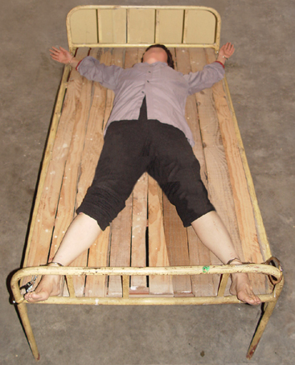

酷刑演示：死人床

如有一名法轮功学员点名时不肯报“到”，四肢被绑在床的四脚，吃饭解下来，小便一下，吃好绑回去，轻一点的晚上不绑，重一点的晚上也绑到天亮。

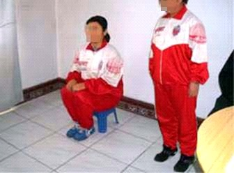

长时间罚坐小凳子

坐小板凳要求小腿与大腿呈直角，大腿与身板直角，头直颈正挺胸收腹，两手平放膝盖，五指并拢，手指不得超出膝盖，戴上眼罩。臀部必须全部坐在小凳中间，一点不合要求就打，或坐半条凳。这种酷刑，不出三天臀部就皮开肉绽。有的法轮功学员受过这种酷刑之后白细胞急剧减少，行走不稳。

另外，还有酷刑和虐待：

打：包夹在第一线管人，使用拳头、巴掌是最直接的。有一个法轮功学员炼功，四个包夹一齐上，没头没脑乱打，其中一拳打在肾脏上，当场直不起腰来，走路须弯着走，但分管警察却若无其事，他们默许包夹打人，包夹如同领到御旨，当着警察的面也敢打。虽然如此，年终还给奖励。有的包夹手都打破了，还找理由说头比拳头硬，打人是受害者。

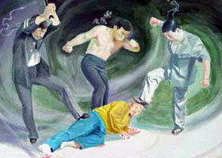

中共酷刑示意图：殴打

不许睡觉：上面要求“转化”的命令下来，下面如同领到了圣旨，把法轮功学员关到单独一房间，制造恐怖气氛。那里只有一名法轮功学员、包夹、帮教。不转化不让睡觉，白天不能闭眼，晚饭后被拉到警察办公室，有时分管民警憋不住，会来个左右开弓扇巴掌。尽管监狱监控器遍布，但有些房间是没有装的，或者那时没装。而且监控器也有死角，他们就利用死角行凶。晚上也不能闭眼，一闭眼就摇醒。

憋大小便：利用生理机能迫害是用的最多的方式，二十四小时小便一次，七十二小时大便一次，不忘侮辱人格，大便时往大便池里扔师父法像（A4纸印的），并说：师父来了，憋住！憋不住。他们就趁机取笑：你还是法轮功学员吗？敢往师父头上拉大便。你这种人师父还会要你吗？他们为了破除法轮功学员对师父的信仰，将师父法像扔地上，要法轮功学员踩上去，不踩，包夹就把法轮功学员的脚拉起来，将A4纸踢进去。

监狱硬性规定要背监规，如不背，不能大便，有一位法轮功学员憋了十一天，终于憋不住，拉在裤子里。开恩洗掉，继续……第二次又憋不住，拉裤子，不能洗了，用被子裹起来睡觉。

挨饿：他们为了“转化”法轮功学员，想出一招歪理：监狱里只有两种饭，警察吃的和犯人吃的饭，你如果不把自己当犯人，就别吃饭。要想向上反映情况，必须包夹批准。如有这种思想，连与警察接触的机会都不给。当然为了平息怒气，给你一小块，每天如此。稍不如意，饿一餐、两餐。食堂的菜也是犯人吃的，也不能吃，每餐一包榨菜。这样还不能达到目的，加重处罚，连续七天早饭没了，连续十五天早饭没了，以后干脆早饭取消了。

贴金术：为了破除法轮功学员认为师父法身无所不能，将法轮功学员用约束带捆住，躺倒，头下可以枕一点东西（如面包纸之类），往面部浇点水，然后用一张塑料纸蒙住脸（嘴和鼻子封死），然后往脸部浇水，如能化解，就再蒙一张，再浇水。

十几年的“转化”迫害，使他们积累了很多迫害“经验”，是违法的，但他们有恃无恐。他们有一套对付法律的办法，如有一位法轮功学员长期罚站，每天超过十二小时，包夹记录开始写着：“×××静站”，天天如此，大概他们发觉不对劲了，换了个本子，把静站全部改成“行为养成训练”。包夹记录每天都要警察检查批示，这种改动不是包夹自己想改就能改的。

他们执行的不是法律，执行的是共产党的意志——只要能“转化”法轮功学员，可以不顾法律。这里的犯人很多都有这样的认识：监狱是共产党办的，法律是共产党订的，中国是共产党的天下。许多警察也执法犯法，也这样认识。

<h1 align="center"><b>台北七二零反迫害游行和平理性感动民众</b></h1>

【明慧网二零一八年七月十五日】（明慧记者刘文新、沛蓉、宋心明、黄宇生采访报道）十九年前，中共发动了对法轮功的残酷迫害。法轮功学员持之以恒的反迫害历程，见证了修炼者坚持不懈，和平理性的精神，让更多的世人识善恶，明真相。
二零一八年七月十四日，在台北市政府前市民广场，来自大台北、桃竹苗、宜兰花莲二千名的法轮功学员举行游行，呼吁各国认识邪恶的罪行，一起制止中共对法轮功的迫害，法办元凶。

游行队伍所经之处，很多人驻足观看，有的竖起大拇指称赞，有的高喊：“法轮功，加油！”浩荡的千人游行场面震撼不少台北市民及大陆游客。

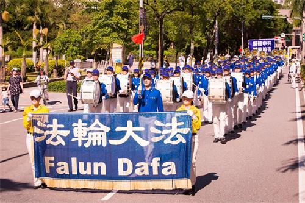

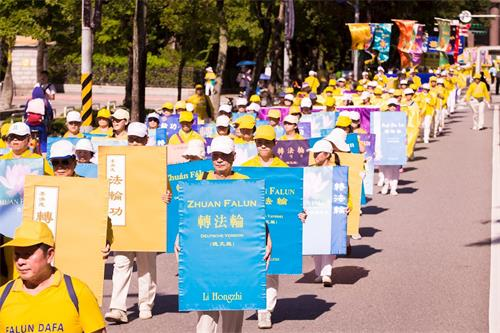

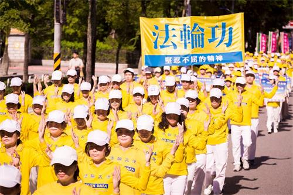

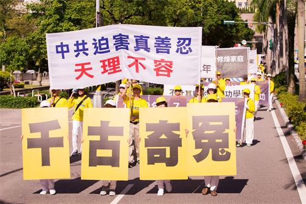

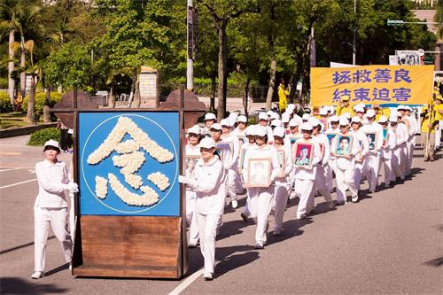

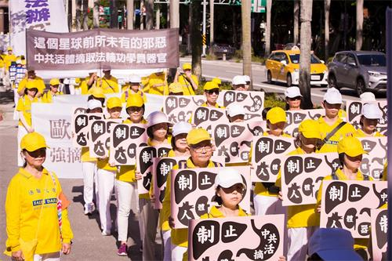

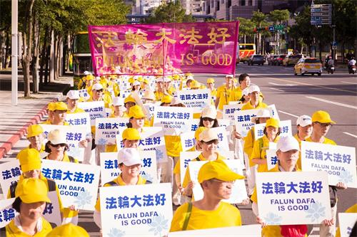

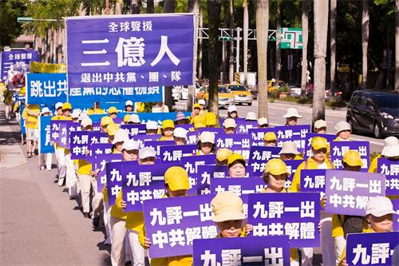

图1～9：七月十四日下午，超过二千名台湾北部的部份法轮功学员在台北举行七二零反迫害游行，呼吁善良正义的民众，共同制止中共的邪恶迫害。

游行队伍出发前，有一团来自吉林的旅游团，虽然已到自由的台湾，仍然感受到他们在一言堂谎言下被桎梏已久的思想。他们看到游行队伍有“法轮功”的字样非常惊吓与害怕，不明真相的导游赶着他们绕道走，不让陆客接受法轮功学员赠送的真相资料，但是仍有陆客大方的在游行队伍出发前的地方，以“解体中共，制止迫害”真相展板为背景拍照。

游行队伍行经大马路的时候，对面的车流看到游行的队伍，有仙女向对面车子招手，许多司机及乘客也挥手回应并且摇下车窗比赞的姿势。

在炎热的七月，有一群人平和地走在街上，他们要诉说的是一段将近二十年的迫害真相，他们要告诉大家的是法轮功的美好，请停下匆忙的脚步，多看多听，多一个善良人知道真相，就多一份揭穿谎言，制止邪恶的力量，越能早日结束这场迫害，让善良的人都能有美好的未来。

下午三点三十分由气势磅礡的天国乐团演奏雄壮的乐曲领队，法轮功学员游行队伍开始出发，后面有“大法洪传”，“千古奇冤”，“结束迫害”等整齐的队伍，行经台北市政府及各大学等文教区域，穿越台北最繁荣的信义商圈与东区街头，终点抵达台北市政府市民广场，全程共四点二公里。

<b>明真相大陆游客三退</b>

来自北京的胡先生，以个人行来台湾旅游十天，台北是他第三天行程，他沿途用单眼相机、手机跟着游行队伍录像、摄影，他表示，他想要记录着难得一见的画面，因为前几天的旅行，也看到过景点的法轮功学员，但是这次是看到这么大一群有纪律的团体——法轮功，他非常的好奇。

他表示，曾经到过巴黎，看到当地工会的游行抗争活动，有冲突的场面。但是今天看到修炼法轮功的群体是非常有纪律的，而且他发现，学员年龄大大小小，男女老少都有，他感受到法轮功在台湾的自由发展，和大陆很不一样。他表示，虽然在大陆禁止学炼法轮功，但是他个人对法轮功的信仰，认为是个人自由，他是尊重的。他希望透过跟着游行队伍的过程，能了解真相，并且把这震撼的画面带回大陆，也接下一旁学员送给他的真相光盘及莲花书签。

来自广东的罗先生和北京的宋先生第一次来台湾旅游，看到法轮功学员和平游行的队伍，忍不住拿起手机记录下这难得的画面。宋先生说：“来台湾这几天在景点都看得到法轮功没学员，在国外也有看过，但没想到原来有这么多人炼法轮功。”

罗先生兴奋地说：“很震撼，没想到这么多人，这在大陆是不可能看到的。”罗先生表示，中共对法轮功的负面（抹黑）宣传，加上网络的屏蔽，让他们很难知道真相，他说：“中共一党专政嘛，很多信息和网络都是封锁的，这些信息在大陆是不会知道的，但是来台湾就没这个问题了。哇，看到这个游行真是挺好的，很难得啊。”宋先生开心地说：“我们也经常去香港，但从没看过法轮功游行，今天看到了，运气真好啊。”

今天有不少大陆旅客对游行队伍感到好奇，拿起手机，相机一路跟拍，跟着游行队伍走。长年在国父纪念景点讲真相的陈女士表示，现在有很多大陆游客来到台湾旅行，尤其是自由行的旅客，都会好奇到景点真相点拍照，观看真相展板，也会大方和法轮功学员交谈，不少游客明白真相后，选择退党，不像前几年戒心，防备心很重，不敢看不敢拿真相资料。

也有许多中国旅客分享，在国内透过翻墙软件，了解到真相，在国内就退党了。现在，许多明白真相的导游，对法轮功学员的态度很友善，天气热，叮咛学员要戴帽子防晒。有些导旅还会交待团员到法轮功那个标帜集合，走丢的时候就上法轮功那儿去，就不会丢，法轮功学员会帮助你们的。

<b>市民：“法轮功，加油！要坚持下去”</b>
 

台北的谢先生看到法轮功传递的真、善、忍精神，让他内心感到无比的向往并直呼“真、善、忍这就是我想要的”。他看到每位学员个个身体健康，神清气爽，他迫切询问法轮功的学炼方式，表示要参加法轮功的九天班并学炼法轮功。谢先生表示，中国太可惜了，人民是善的，而党是恶的，它为了手中的权力，对人民<b>进行残酷迫害。他对此深表遗憾。</b>
 

台北的萧先生在一旁看游行的队伍通过，正好眼前展示的是中共活摘法轮功学员器官的画面，萧先生表示，他知道中共活摘法轮功学员器官的消息，他曾经主动上网收信看到这场惨无人道的真相，进了参与反对活在器官的征签活动。他表示，这样的事情是无法容忍的，甚至比清朝十大酷刑还可怕，因为是强摘活人的器官，他除了自身知道真相，更主动传真相，让更多的人知道，而且他感慨地说：只有中共，才会发生这样的事情。

台北的张先生表示，他本来就知道法轮功团体在大陆是被打压的，他很淡定地说：很多团体在中国大陆都被打压，因为那是一个不自由的国家。但是当他知道法轮功是因为修炼人数太多才遭受迫害，他露出惊讶的神奇。

二位外国旅客，从法轮功学员手中接下了真相资料，看到了活摘器官的讯息，她们感到十分震撼，直呼“活摘器官，真的是太糟糕了”。她表示会到相关网站关注这件事情。

<b>法轮功秉持着真善忍的原则传递良善讯息</b>
 

台北的白先生从事贸易推广的工作，一九九七年开始修炼法轮功，修炼两年，当时中共利用电视，报纸、广播掌控所有的媒体一言堂铺天盖地诬蔑法轮功，对法轮功进行史无前例残酷的迫害，许多中国人及世人听信中共的谎言，以为法轮功是不好的。他表示，十九年来，法轮功学员秉持着真善忍的原则，日以继夜，坚持不懈的精神，透过各种管道向中国民众及世人讲述法轮功真相。

法轮功学员秉持着善心，自掏腰包印真相资料，免费义务地向广大的中国民众及世人传递法轮大法的美好及真相。白先生表示中共有八千万党员，希望他们能够明白真相后与中共划清界线，退出中共等一切相关组织，在台湾各大著名观光景点有些中共党员明白真相后退出党团队，并有许多的人向法轮功学员表达谢意，让他们明白真相，可以做出正确的判断，有缘的人因而走入修炼。

从事幼儿园老师工作的张小姐，自从二零零五年修炼法轮功之后，每年她都会参加反迫害活动，她希望将亲身经历法轮大法美好的体会，法轮功弘传一百多个国家，是一个最正，最好的功法的讯息传递给街坊邻居，亲朋好友以及世人，虽然台湾是一个民主自由的国家，资讯很发达，但是，还是有不少人受到中共一言堂的谎言所蒙蔽，而对法轮功产生负面的看法，十几年来她身边周遭的人，越来越明白真相，还经常主动向她大纪元报纸或是电子报。

张小姐认为修炼是一件非常美好的事情，修炼后她的身心有着巨大的变化，以前她有地中海贫血的问题，经常头晕目眩，神经衰弱常常晚上失眠睡不好觉，腰酸背痛，通过修炼，现在这些症状都没了，她以前经常坚持己见，现在她会先看自己，查找自己的不足，错了就改进。

图10：李娸嘉夫妻和小孩全家参加七二零反迫害游行活动

从事教育工作的李娸嘉，三年前，在一个因缘际会下，一位德国的朋友介绍法轮功，送他们一本《转法轮》，夫妻俩看到书中的内容觉得浅显易懂，但内涵却是博大精深，每看一次，随着心性的提升，都有不同的体会与收获，夫妻之间的相处经常用会用书上的内容对照，遇到矛盾先找自己，互相包容谦让，两个小孩也跟随学《洪吟》。

虽然修炼不久，每次大型活动，他们都是全家参加，参与的过程他们都感到无比的殊胜，感受到很强大的能量场。李娸嘉表示， 她希望世人都能够来了解真相，别错过这难得的机缘，否则就太可惜了。

<h1 align="center"><b>从两件小事看迫害势衰</b></h1>

【明慧网二零一八年六月三日】最近，河北沧州市一些地区出现社区、派出所人员上门骚扰法轮功学员事件，这些行为无疑是非法的、不得人心的。
在这次骚扰过程中，出现了这样一件事：沧州某地的派出所为了向上面交差，又不打扰大法弟子，竟然去了两户早就不炼了的村民家，问他们还炼不炼法轮功，他们当然说不炼了，期间录音也好，录像也罢，完成任务向上面交差去了。

无独有偶，沧州某县请法律工作者向百姓普及法律常识，授课的老师讲着民事纠纷的一些普遍现象，比如财产纠纷、债务纠纷、各种各样的矛盾，说这些最难调解。讲到这里，这位老师话题一转，说：这些事在法轮功学员身上就不会出现，因为法轮功学员信仰“真、善、忍”，遇事首先为别人着想。

接着，老师滔滔不绝讲起法轮功及法轮功学员如何遵照“真、善、忍”修炼心性做好人的事。学习班上有个人是法轮功学员家属，但是他很固执不愿听家人讲真相，可是他从学习班一回来就高兴地讲起学习班听到的，并说原来法轮功这么好，炼功根本不犯法啊！

中共江泽民政治流氓集团迫害法轮功及学员长达十九年，江氏集团为了抹黑法轮功，为了挑起民众对法轮功的仇恨，制造了无数谎言，如臭名昭著的“天安门自焚事件”等等，毒害了无数世人。在这十九年里法轮功学员冒着被抓、被打、甚至失去生命的危险，坚持不懈地向世人讲述真相，越来越多的人明白真相后纷纷作出良心选择。

令人担忧的是，还有一些不明真相的人，以“这是工作”、“完成任务”为借口，还在干着助纣为虐的事。据悉，沧州某小区有人撰写通知要求举报散发真相的法轮功学员。法轮功学员讲真相、散发真相资料是为了让人了解法轮功，解除谎言毒害，消除人们对佛法的仇恨，是做救人的大好事啊！

古语云：“宁搅千江水，不扰道人心”，就是说，迫害修炼人的罪业真的是太大了，甚至是生生世世都偿还不清。以史为鉴：后周世宗柴荣亲自用大斧子砍毁菩萨像，胸生恶疮而死，年仅三十九岁。再如：文革前后，追随中共卖力砸庙砸佛像的人没一个有好下场，经历过这些事的农村老一辈都记忆犹新。法轮功是真正佛家高德大法，真善忍是普世的价值。对法轮功迫害，是犯下如天重罪，是真正在迫害自己。

中共自建政以来，血雨腥风，运动不断，杀地主、杀资本家、杀中共自己队伍中还有良知的人、杀知识分子、杀学生，杀的都是精英，中国有三分之二以上的家庭遭受迫害，传统的儒释道文化、珍贵的历史文物都被毁掉，空气、水等自然环境被毁坏，现在迫害真、善、忍，把人们心中的道德、是非彻底破坏、颠倒，假、恶、斗横行中华大地。

古今中外，迫害正信的强权暴政从来没有一个成功过的，所有残害良善的元凶、爪牙没有一个善终的。还在参与迫害法轮功的人，你们看看人心明白后的良心选择，听听法轮功学员的心声，赶紧悬崖勒马！

<h1 align="center"><b>局领导退党记</b></h1>

【明慧网二零一八年七月十五日】我有一个亲戚在本市某局当领导。有一次，我拿着《共产主义的终极目的》光盘给他看，他说：“你叫我看这个干什么？我是坚定的马克思主义者！我如果不信这个，共产党不给我发工资。”
我说：“你看看吧，饭要吃，命也要保。”他说：“好，放在这我看看。”

过了一段时间，我再次去他家。他没有再提“我是坚定的马克思主义者”。但他说：“我知道，你很关心我，你的心意我领了。我这个人很固执，你可能也知道。我这么多年的党龄了，这个党我是不能退。”

我说：“你觉得你是党员很光荣，是吗？你如果想办绿卡或去国外常住，你千万别说你是中国共产党员，你如果说了，很多国家都会拒绝你入境。中国共产党在国际上已经臭名昭著；相反，如果说是法轮功学员，在中国叫共产党迫害的生活不下去了，全世界都会给你办难民证，收留你。”

他说：“我也不想去国外。”我说：“你在百度上输入《共产党宣言》，马克思的第一句话就是‘一个幽灵，共产主义的幽灵，在欧洲游荡。’”他说：“我知道，我都能背下好几段来。我是共产党员能不知道吗？”

我说：“幽灵是个好东西吗？中国人从来都没有怀疑过这是个坏东西。”

他没有吱声。我说：“咱这里地主某某某，以前共产党说人家这么坏，那么坏，把人家整的家破人亡，妻离子散；现在又反过来了，说人家这么好，那么好。共产党是揪着自己的胡子打自己的嘴巴。翻手为云，覆手为雨，拿着老百姓的命瞎折腾。”他说：“其实，这个地主一点都不坏，很善，以前，他家门口经常支个大锅熬粥，施舍给穷人和要饭的。”

我说：“共产党不仅杀地主、资本家，文化大革命十年，中共害死七百七十一万‘臭老九’、‘走资派’、‘反革命’；‘打到孔老二’！死了两千多年的孔子要是活到现在，早就被共产党给整死了；习近平的父亲习仲勋，被打成‘反党分子习仲勋’被揪斗，被共产党迫害了十六年，习近平九岁被打成狗崽子，十三岁戴着大铁帽在台子上被低头认罪，十六岁到农村务农。这些不都是事实吗？八九年六月四日，中共机枪扫、坦克碾压手无寸铁希望国家兴旺、反腐倡廉的爱国学生。死伤人数至今是个未知数。”

他说：“这些都已经过去了。”我说：“近几年，有一个全省第一的高材生，被保送到清华读书。只因为信仰法轮功，修真善忍被共产党打毒针害疯，一位法轮功学员义务去照顾她，被当地公安绑架到黑窝迫害。最后这位高才生悲惨死亡。”他不说话。而是不时的用毛巾擦汗。

我说：你认为已经过去了，上天可是记着的。善恶有报是天理，古人说：“善恶若无报，乾坤必有私。”“人间私语，贯耳如雷，暗室亏心，神目如电”。贵州“藏字石”内藏六个大字：中国共产党亡，科学家多次鉴定：天然形成。你这么讲道理的人，面对事实还这么犟，这说明你不是个聪明人。告诉你前面有陷阱，你不听，真有那么一天，后悔都来不及。时间会证明一切，我不希望你用生命来证实。

他不坦然的说：“有的时候该跳（陷阱）就得跳。”

我说：“中共的残暴，我深有体会。我就是为了一句话：‘法轮大法好，真善忍好；天安门自焚是造假’，被投进冤狱这么多年，他们利用种种酷刑折磨我，逼我违背良心说假话。别说我是修真善忍的，就是不修真善忍，我还有个良心。好人为什么非要逼着说不好？法轮功于国于民有百利而无一害，为什么非要用酷刑折磨，强逼人家说假话？这是个什么党？甚至坐老虎凳、绑死人床、手指插竹签、吊铐、打毒针、穿束身衣、扒光衣服、蹲小号、不让睡觉、被拳打脚踢……”

他说：“这些都是真的？”我说：“我能不能说假话？”他肯定的说：“你不能。”

我说：“还有更残酷的。在黑窝里，警察经常叫狱医给法轮功学员验血，检查身体，而不给其他的犯人做。”

他说：“为什么？”

我说：“适当的时候以备活摘器官用。共产党对法轮功学员根本就不当人待。自从中共迫害法轮功以后，中国的活体器官移植居世界首位，占世界活体器官移植总数的百分之八十五以上。”

他沉思不语。我说：“九十年代，东欧一夜巨变，共产党说解体就解体了，包括强大的苏联在其内。共产党是逆天理而行，它维持政权的手段就是：谎言和暴力。我们的老祖先：孔子、老子教我们以‘和’为贵，‘仁义礼智信’，法轮功讲‘真善忍’。都是主张善解矛盾，认为普天下的老百姓都是一家人，都是亲人。而共产党则是讲斗争，消灭异己，独裁专制。竟敢对救度世人的高德大法不惜一切代价的搞镇压。把一群修炼真善忍的好人当作敌人，往死里整。全世界都支持法轮大法，唯有中共在镇压。”

他不再言语。我说：“你这么好的人，在共产党的队伍里是耻辱！”他说：“我要学（法轮功）的话，共产党不给我发工资。”我说：“不是让你学，是让你明辨是非。全世界都知道。天都要灭中国共产党。不是在共产党组织里退，是在国际大纪元网站退。”

他犹豫着说：“共产党对我还行。”

我说：“你给老板工作，老板要付给你工资，在哪个国家都这样，甚至同样付出，国外给的工资更高。”

他的汗不住的流，拿着毛巾不时的擦汗。

我说：“你应该知道人不是猴子变的，也不是猿变的，要不怎么到现在也没人看到哪个猴子和猿变成人呢？而且科学家至今也没有发现猴子变成人的过程。相反科学家却发现了很多史前文化及现在科学无法解释的东西。比如2.6亿年前的三叶虫化石上有一个人穿着鞋踩上去的脚印。那个时候就有人。其实人不是猴子变的，是神造的。你看看现在人道德什么样了？这个社会都烂透了。以前都是人心变坏了，不符合神造人的标准了，神就开始淘汰人。几千年前的大洪水淘汰人的故事，不是神话，是真实存在的。当年的诺亚方舟被发现在土耳其的高山上。古罗马帝国迫害基督徒，招来四次大瘟疫灭掉了强大的罗马帝国，这也是真的。中共迫害法轮功一定也要招来更大的天灾，这是肯定的。现在人类的道德又滑到了最危险的边缘了。为了挽救人类，我师父带着高德大法下世救人，只要认同真善忍，就能得救。可是共产党却制造谎言污蔑高德大法，迫害救人的大法徒，阻碍大法救人。所以老天就要灭掉这个中国共产党。但是，认同真善忍的就要脱离共产党的无神组织，才能被神救度。因为全世界唯有共产党在加入其组织时，让你举着拳头宣誓：为它奋斗终生！永远跟党走！所以每个入过党团队的中国人，在额头和右手上都被打上了兽的印记。必须声明退出才行，真名、小名、化名都行。退不退是你个人的事，我不告诉你，我良心受谴责。”

他说：“我的档案在组织部，恐怕退不了，叫人知道了不行。”我说：“谁知道？只有天知道。不用通过共产党组织退，天都要灭它，共产党规定的杠杠统统不好使。”他说：“法轮功给退管用？”

我说：“就法轮功给退才管用，因为法轮功是来救人的！我给你用化名某某某把党团队退了。”

他说：“好。”他不再拿毛巾擦汗。我临走时，又问了他一遍：“我给你用某某某化名把党团队退了？”他点着头坚定的说：“好，好。”

<h1 align="center"><b>看似不经意的际遇 竟然是重塑人生的转捩点</b></h1>

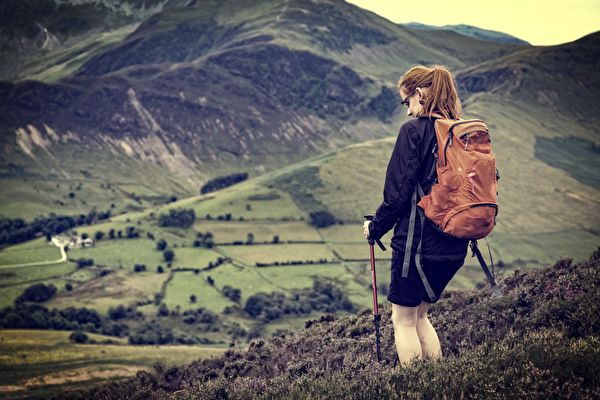

人生旅途中，有时料想不到在何处能收获一大片美景。

【大纪元2018年03月22日讯】倘若偶有美事降临在自己身上，那真教人开心啊！生活中有许多快乐只是片断，有时在逆境中自得其乐过的也还好。很难想像还会遇上什么美事，能超越自己心底，那曾经感受过的美好。就在1999年的冬季，让我遇上了。

那一年，在外商公司上班的我，晚上下班后又赶忙着７点钟到古董店工作，直到10点才收工回家，连续一个月的超时工作相当疲惫。就在我离职前夕，一位陌生客人到访带给了我全新的人生。

古董店开在马路边上，在店里浇花整理环境的我，却感觉格外宁静，连踩在地毯上的脚步声，都异常清晰。走进店里的客人令我好奇，因为他们懂真迹，所以没买老板摹拟的书法。

古董店。示意图。

也因为他们懂名作，所以敢对老板说：“这不是真的”。我从惊讶到噗嗤笑出声，只历经了很短的时间。艺术的殿堂啊不是这般经营的。

兼职二份工作感觉很累。我即将要离开了，古董店老板送二个字给我留念～“侠女”，挺喜欢他写的这二个字。老板书法写得不错呀，但摹拟真迹卖钱，幸运之神并没有眷顾他。

<b>陌生远客竟是我的贵人</b>

距离正式离开这家店，还有一小段时间。有一天股东的朋友来台湾造访，古董店老板为了欢迎远来的朋友，特地在圆山饭店办了聚餐，而我也在受邀之列。

穿越冷冽的冬季夜晚，走进气氛暖烘的餐厅包厢里，第一眼见到了2位远道而来的朋友，令我印象十分深刻。一位老爷爷是退休顾问，另一位年纪大约是50岁。

他们脸上始终挂着亲切笑容，即使是面无表情，嘴角也是轻轻上扬的。一群人围坐一桌，就属他们二位远客显的格外亮眼。“脱俗”这美丽的辞藻听说过，但我是在这天才真见过！

“气宇轩昂”应该是对他们二位比较贴切的形容吧！

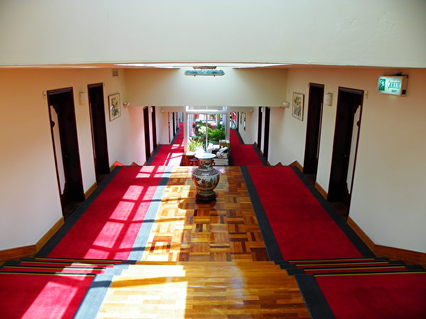

台北圆山大饭店房间走道。

餐叙即将结束了，古董店老板提议再续摊，二位远客礼貌的拒绝，笑容可掬地说道：“已经很晚了，我们回房晚上还要炼功呢 ！”一整晚好奇心浓烈的我心里想着：“炼什么功啊？这么认真，出国玩还炼呢？”

天真又霸道的古董店老板嚷嚷着：“没住过圆山饭店的客房，走！大家一起去参观他们的房间！”

在古意盎然的客房里，大家继续聊著，而我被书桌上的一叠书吸引。

我站在书桌旁呆看着金黄色书封面«转法轮»，约有10来本，原来，是在台湾买的要带回去送朋友啊。那位远客拿起其中一本对我说：“«转法轮»这本书很好，你也去买来看看”。

他补充了一句：“如果你修炼法轮功也会和我们一样，我们都是没有病的！”，听着他这般自信的谈吐，莫名的好奇心，使我当晚就想着要尽快到书店买！

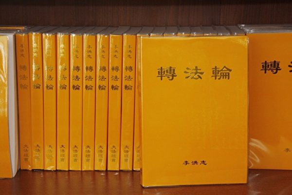

法轮功主要书籍《转法轮》。

<b>我的心灵和身体彷若新生</b>

从我外表可能看不出来，年纪轻轻却是大病小病一箩筐。“修炼法轮功身体都没有病”，这句话重重敲在我心上。还记得，“转法轮”这本书买回家后，我是如饥似渴地读完它。

在公车上，在办公室中午吃便当时，都在阅读著这本书。一页接着一页，看到了心中的疑问，又在书里看到了答案。像是拿到了一本宝书！看着书中内容，听到自己心底声音不停问著：“然后呢？然后呢？”

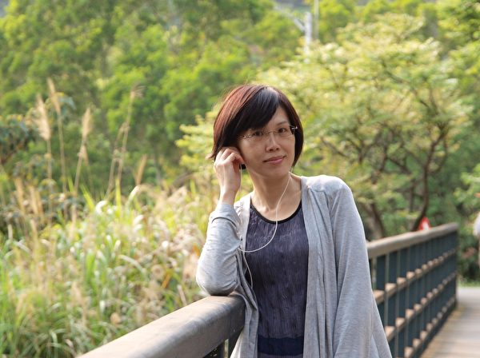

（林海柔／大纪元）

很快我看完了整本书，300多页。心中燃起了希望。原来，这是提升心性和改变身体的性命双修功法。能够去掉自己不好的，保留好的，好似一层又一层地剥去旧壳，一天比一天更提高。这我很想要～“修炼自己”。

修炼大法几个月之后，我的干眼症好了，眼睛不知不觉有了泪水。原本膝盖骨膜发炎无药可根治，每一到下雨天就会痛。修炼法轮功之后，膝盖好了，也能奔上楼梯跑着上楼了。

身体最严重的问题是，医生说恐怕我无法生育，然而我修练几年过后，却在36岁高龄自然产，生下了第二胎。

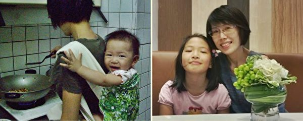

（左图）女儿小时候背着她做饭。（右图）女儿长大后的合照。

朋友们说我像变了另一个人。是啊，想法的出发点不同了，个性越是接近“真善忍”越感觉充实快乐。粹炼自己的过程啊，锥心而又孤独。谁能真正理解别人的内心世界呢，连自己都不一定理解自己的。

能够找到好方法，明明白白地改变着自己，那是多么幸福的事啊！我想，在修炼自己的基点上成为美好的人，这是别人拿不走的幸福！也只有在修炼自己的基点上才能体会到，美好的人，已经拥有了美好！

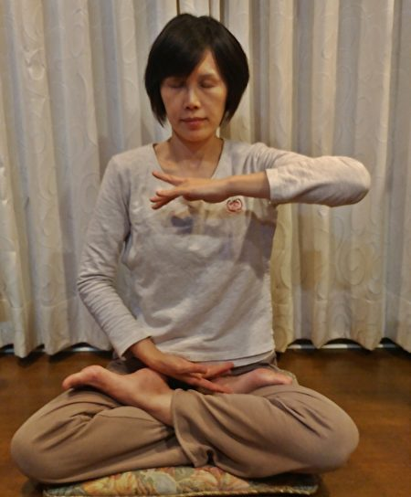

（林海柔／大纪元）

 
 

<h1 align="center"><b>历史不堪回首 波兰老翁又见共产主义新罪恶</b></h1>

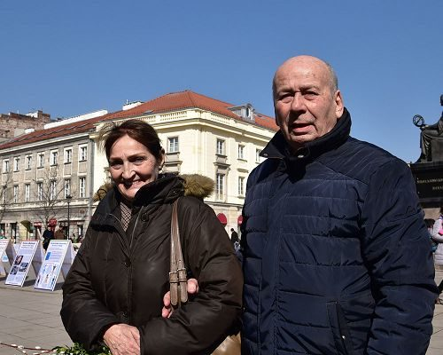

八旬老翁Jażnicki怒斥共产主义，表示要为法轮功祈祷

【大纪元2018年04月19日讯】“我已经快八十岁了，我见证了波兰的战争年代，见到过希特勒的法西斯行为，最后总算盼到战争结束了，幻想着过上安静的日子，没想到黑色的法西斯走了，又来了红色的法西斯，就是那个俄国的布尔什维克，那个共产主义。”
在华沙古城广场，Jażnicki老先生和太太，看到法轮功学员在给过路的游人讲法轮功受迫害真相，就站在那里认真的听起来。听着听着，历史的往事不由一幕一幕出现在Jażnicki的脑海中。

他接着说： “共产主义是什么？就是魔鬼主义，希特勒只能消灭我们的肉体，而共产主义消灭的是我们的灵魂，共产主义可以把人都变成魔鬼，它比法西斯还邪恶，在我的生活经历中是实实在在看到听到接触到的事实太多了。我庆幸波兰共产政权倒台了。今天又见识了共产主义的新罪恶 ：活摘器官。”

明慧网报导， 2018年3月下旬至4月初，波兰气候转暖，华沙景点游人大增，市民们走出家门踏春赏花。波兰法轮功学员也带着中、波、英三种文字展板在华沙古城广场或哥白尼塑像等地介绍法轮功，征签反对中共对法轮功的迫害，受到市民和游人们的真诚欢迎和支持。Jażnicki老先生就是其中一位。

他说：“虽然我不怎么了解法轮功，但是魔鬼镇压的一定是天使，一定是好人。我为你们祈祷，希望中国人有一天也能生活在没有共产主义的社会里，希望这世界上永远没有这万恶的共产主义！”

Jażnicki和太太走到征签台前，工工整整的在反对活摘器官的征签表上写下他们的名字。

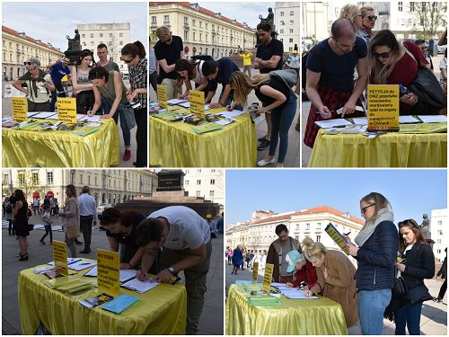

波兰市民和游客纷纷参加反对中共迫害法轮功的征签活动（明慧网）

4月15日， Maszewski先生路过华沙古城，看到长长的法轮功真相展板，不由驻足观看，他越看越感到震惊，随即和法轮功学员做了长时间的交谈，了解到包括活摘器官等中共迫害法轮功的残酷事实。

Maszewski说：“你们办这样的活动太重要，太必要，也太需要了，你们应该让所有的人都知道这个事实，特别是波兰主管器官移植的各个部门，应该阻止这样的器官进入波兰，也应该阻止波兰人去中国做器官移植，最重要的是要让所有的人都知道中共的罪行。”

“我从来不参加任何形式的征签，但今天破例，我要写下我的名字，有良知的人都要支持你们，支持你们就是支持正义。”

2006年，中共活摘人体器官黑幕首次在国际社会曝光，十几年来，大量调查报告指证中共这一罪行。

近年来，美国、欧洲议会、澳洲、意大利、加拿大、爱尔兰等多国政府部门、机构都相继通过决议案，制止中共强摘法轮功学员等良心犯器官。其中，以色列、西班牙和台湾还通过立法，遏阻本国公民到中国做器官移植。

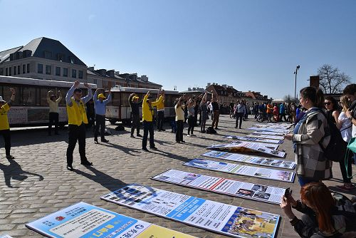

波兰法轮功学员在古城中心广场景点展示法轮功功法（明慧网）

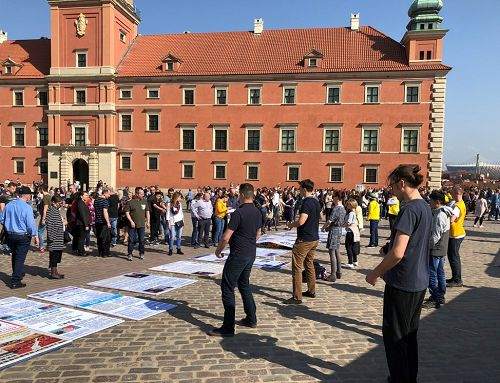

波兰法轮功学员在古城中心广场景点展示法轮功功法（明慧网）

<b>“支持你们的正义活动”</b>

四月初，一名来自印度的男士，第一次看到法轮功功法，就感到十分亲切，在了解到中共残酷迫害法轮功真相后，心情难以平静，他一边在反对中共强摘法轮功学员器官的征签簿上签下自己的名字，一边告诉法轮功学员说：“我住在Hilton旅馆，我今天回去就上网让我的朋友都来签名，这个世界需要正义，需要道德良知，需要真善忍，不容中共这种迫害人权，灭绝人性的活摘罪行横行世上。”

这位中年乌克兰游人（左）含泪签名，表示支持法轮功（明慧网）

一位中年的乌克兰游人在听到法轮功真相后说：“在乌克兰，曾有数以百万计的乌克兰人死于共产主义”，他含着眼泪在反对中共迫害法轮功的征签表上，签下了自己的名字。

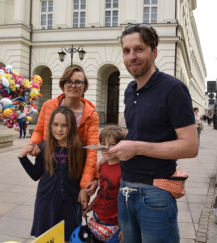

Latoszek全家支持法轮功反迫害活动（明慧网）

Latoszek先生带着太太和两个孩子来古城散步，看过法轮功真相展板后，又来索要法轮功传单，全家人站在那里观看法轮功学员展示的法轮功功法，最后夫妇二人都在征签簿上签名反对中共活摘法轮功学员器官的罪行。

他和太太都说：“没有想到给人带来益处的法轮功，在中国会受到这么严重的迫害，没有人能接受这种事实，太残酷了，我们都签名支持法轮功，支持你们，（迫害法轮功的）罪行一定会被审判的，法轮大法的能量一定会照亮全世界。”

一位来自南韩的先生，看过法轮功真相展板后，来到征签台用中文说：“中国共产党太坏了，我签名支持你们，支持法轮功！”

市民和游客驻足观看法轮功真相展板（明慧网）

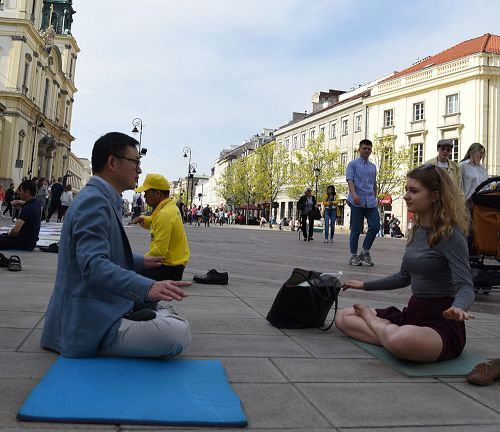

游客（右）学炼法轮功的第五套功法（明慧网）

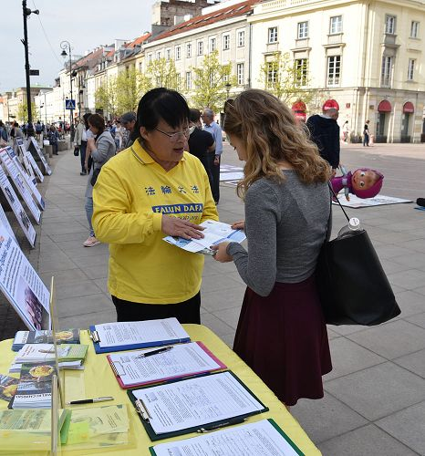

法轮功学员给游客讲法轮功受迫害真相（明慧网）

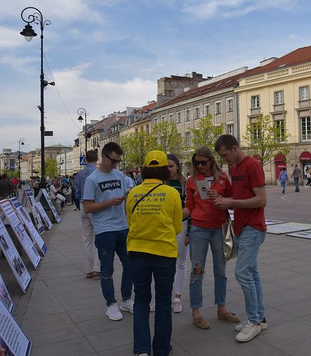

法轮功学员给游客讲法轮功受迫害真相（明慧网）

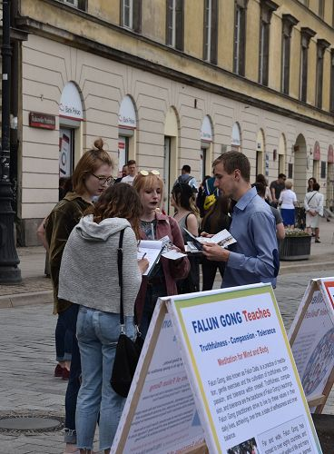

法轮功学员（右）给游客讲法轮功受迫害真相（明慧网）

<b>中国人主动听真相</b>

来自中国的一位张姓男士，站在法轮功展板前一直观看，也向法轮功学员提出很多问题，一边听真相一边沉思，他说：“很多事实都知道，但是就是觉得中国的现状还不错，不知怎样认识这个问题？误在哪里？”

法轮功学员告诉张先生 ，“去看看中国人目前的道德状况：中国的水土污染，中国的伪劣产品，中国的有毒食品，无不来源于人的道德品质，一个没有道德的民族，分不清是非，会有未来吗？表面上的高楼大厦有可能站得长久吗？

中国共产党最大的罪恶就是斩断了中国人对神的信仰，从对法轮功的迫害上就能看出共产党对信仰的惧怕，可是在一个没有信仰只知向钱看的国家里生活，你有安全感吗？不觉得危险吗？”

张姓男士一直点头表示赞同，他说：“看来还是要多了解真相才能清醒，很多是非标准现在都搞不清了，真需要好好想想了。”他表示要上网，系统地看看事实真相以及中国人“三退”（退出中共党、团、队）的内容。

2004年大纪元发表了系列社论《九评共产党》，通过大量史料全面、深刻地剖析了共产党的邪恶本性给中华民族及中国人带来的灾难，从而引发了中国人“三退”，至今人数已突破三亿。

一位姓高的中国男士看见法轮功学员，高兴地走过来说：“上次在（中国）大使馆门前看到过你们，我就说过这话，现在我还是要说：“中共的防火墙一旦被推倒，中国人不用脸书，不用推特，只一个youtube，就会让共产党倒台”

“在真相面前那个共产党什么都不是，中国人被欺骗的太久了。目前对这个共产党我还做不了什么，可我明白了是非，我可以选择——远离邪恶。” 他说。

<h1 align="center"><b>黄洁夫涉嫌参与强摘器官 被指控三大罪状</b></h1>

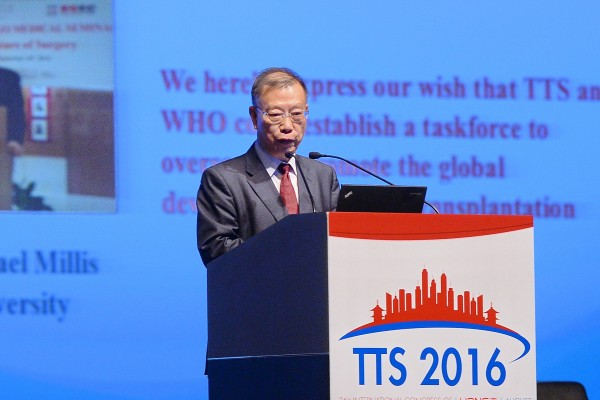

22日国际器官移植大会于香港湾仔会议展览中举行颁奖礼。图为中国器官移植发展基金理事长黄洁夫。（宋祥龙／大纪元）

【大纪元2016年08月23日讯】（大纪元记者古清儿综合报导）两年一次的国际器官移植协会大会于8月18日起在香港举行。与会发言的中共卫生部前副部长黄洁夫以及另外53位中国医生，被指涉嫌参与大量强行摘取包括法轮功学员在内的中国良心犯器官作移植而牟利。同时，黄洁夫被指控有三大罪状。

作为专题演讲嘉宾的黄洁夫，其向与会医疗专业人士介绍中国器官移植的所谓“改革”，再次为中共站台，掩盖强摘器官真相，引起外界强烈质疑和抵制。

去年中共两会敏感期间，黄洁夫罕见向港媒指证中共前党魁江泽民集团要员、前政法委书记周永康涉及器官移植黑幕，凸显习阵营与江派背后的激烈交锋。

<b>黄洁夫亲口承认：移植黑幕肮脏</b>

此次器官移植大会期间，8月18日，中共官方移植机构主办一场“中国专场会议”，对外拒绝传媒采访，但安排了大批本地亲共传媒和中共官媒记者在场内采访，被质疑借国际学术会议“洗白”国际对中共强摘器官罪行的指控。

黄洁夫曾担任中共卫生部副部长近12年，并任人体器官捐献与移植委员会主任，权倾国家医疗卫生系统，包揽全国器官移植方面所有职务。黄洁夫被视为中国大陆移植器官的所谓权威与发言人。

2015年3月15日，在中共召开两会的敏感时期，黄洁夫在香港《凤凰卫视》节目中透露，中国大陆取消死囚器官移植，与周永康落马有关，周永康涉及“器官移植利益链和器官来源”。

在谈到器官移植的巨大利益分配时，黄洁夫说：“变得肮脏，变得说不清道不明，变成了一个为什么特别敏感、特别复杂的区域，就是这个禁区，应该是2014年是最关键的一年。”

<b>黄洁夫称器官来源涉周永康</b>

黄洁夫接下来说：“没有这个打老虎、打苍蝇，就没有我们今天的宣布取消这个，明白我的意思了吗？”至于大老虎到底是指什么人？黄洁夫回答：“太清楚 了，周永康是‘大老虎’，周永康是我们政法委书记，是原来的政治局常委，这个大家都知道的。报纸天天在这讲他的背景。那这个死囚器官的来源在哪里，这不是很清晰了吗？”

黄洁夫还透露说，是在上一届胡、温及这届的习、李的支持下，作出取消死囚器官移植的决定。

黄洁夫提到取消死囚器官移植得到温家宝的支持。《大纪元》此前报道，温家宝曾在中南海内部会议上痛斥周永康：“不施麻药，摘活人器官，还拿去赚钱，这是人干的事情吗？这种事情发生多年了，我们要退休了，还没解决……”

这是中共官方第一次对外公开承认，此前无论是中共外交部还是卫生部，一直坚称中国器官移植非常合法，没有黑幕。

<b>分析：为公布强摘罪行试水</b>

因当时黄洁夫指控周永康的时机敏感，外界认为，黄洁夫是当局为公布周永康活摘器官牟利的罪行试水温。

黄洁夫为何要在电视上曝光这件事，是否是高层的授意？中共党史学者辛子陵曾说：“如果没有高层的批准，他怎么可能说这个话呢？那不可能的事。他还是个政府官员嘛！”

美国华府中国问题专家季达说，就黄洁夫本人来说，在一般情况下，他既没有意愿，也没有胆量通过媒体去指证周永康涉及大陆器官移植黑幕。故此，黄洁夫的这一举动，很可能带有高层背景因素，他不得不出面来做这个事情。

季达进一步分析说明，不管是出于何种原因，黄洁夫的指证客观上成为影响周永康案进展的关键性转折点，最终导致周永康案急速结案。

<b>退休军医揭军方器官黑幕</b>

就在黄洁夫亲口承认中国器官移植很肮脏的前一个星期，曾以实名公布SARS真相的前北京301军方医院外科医生蒋彦永，3月初接受了有线电视访问。

蒋彦永在受访时踢爆中共军中腐败内幕，称总后勤部掌控的军医院普遍违法，有“擅自移植、买卖死囚器官”的违法行为，甚至连301军方总医院都要派车到刑场拉死囚争抢活鲜器官。尤其在中共前军委副主席徐才厚任内，这只是冰山一角。

蒋彦永表示，大陆肝移植来源自被处以极刑的死囚，包括301医院、北京军区总医院等都设有“器官移植中心”，这些部门主要是做器官移植和买卖等违法勾当，经济效益很高，也是医院和医护人员灰色收入的主要来源。

而黄洁夫指证周永康涉及器官移植黑幕，及前北京301军方医院外科医生蒋彦永披露军方与政法委勾结买卖器官的黑幕，这也等于间接证实了中共的活摘器官罪恶。

<b>周永康政变反人类罪被掩盖</b>

2015年4月3日，前中共政治局常委、政法委书记周永康涉嫌受贿、滥用职权、故意泄露国家秘密一案被提起公诉。

此公诉通报掩盖周永康的政变罪和反人类罪，对中共最高法院3月18日定性的周永康“践踏法治”、“搞非组织政治活动”并未提及黄洁夫指控的周永康涉及“器官移植利益链和器官来源”的部分。

大陆时政评论员陈明慧表示，从中共公布的周永康被起诉信息来看，没有提到前段时间被热议的“非组织政治活动”，也就是政变，也没有提到黄洁夫披露的器官移植黑幕，也就是活摘器官，还是在以前的反腐框架里打转，说明习当局是做了妥协。这突显中共内部最高层的权斗和博弈非常激烈，发动迫害法轮功的江泽民利益集团在疯狂的反扑。

2015年6月11日，中共官方通报，周永康被判处无期徒刑。但周永康的核心罪行──政变与活摘法轮功学员器官，仍被掩盖。

季达认为，如果公布周永康的政变罪和活摘器官反人类罪，可能会导致中共倒台。

<b>黄洁夫被指控的三大罪状</b>

2015年10月10日《清算江泽民迫害法轮大法国际组织》发布了“活摘法轮功学员器官主犯黄洁夫罪状公告”。公告以大量事实指出，黄洁夫被任命为中共卫生部副部长的12年间，正是江泽民集团活摘法轮功学员器官呈直线发展至最高峰期、最猖獗的12年。

黄洁夫被指控三大罪状：一、在全国组织、推广把七百多家医院纳入“活摘器官”的屠杀场；二、黄洁夫是活摘法轮功学员器官的头号刽子手，至少有数千法轮功学员惨死在其刀下；三、对海内外欺骗再欺骗，掩盖再掩盖，隐瞒中共活摘法轮功学员器官的罪恶黑幕。

<b>大量移植供体来源不明</b>

中共官方过去曾长期否认盗用死刑犯器官。直到2007年1月，中共卫生部新闻发言人毛群安才开始承认中国存在摘取死刑犯器官；到2012年，黄洁夫在国际医学杂志《柳叶刀》上发表的英文文章中承认：“中国是唯一一个系统性地在移植手术中使用死囚器官的国家。”

2014年3月，黄洁夫承认，大陆仍有死囚在自己及家属不知道的情况下“捐献”器官，并首次披露，死囚器官的捐献都是医生跟局部的人，包括法院和武警来互相沟通，没有办法说清道明。

据人权组织报告的数据，中共一年处决死刑犯也就是二、三千人，最多不超过一万人。

《三联生活周刊》刊登的《器官移植立法之难》一文中表述：“中国98%器官移植源控制在非卫生部系统。”言外之意，是在司法和军事系统中。

根据国际特赦组织估计，2000至2005年这6年间，有41,500宗移植手术的器官来源无法解释。

此前多个录音证据显示，江泽民直接下令用法轮功学员器官做移植，由周永康、薄熙来等直接指挥和执行。

<b>法轮功问题是中国政局核心</b>

在王立军、薄熙来事件爆发后，中共内部分崩离析，习近平阵营与江泽民集团博弈激烈。据报道，中国政局的核心问题就是迫害法轮功的问题。江泽民迫害法轮功不但耗费巨资维持迫害，同时为阻止镇压法轮功的强摘器官罪恶曝光，正极力逃避清算，阻击习近平当局的清理行动。

今年6月，美国国会通过谴责中共活摘器官罪恶的343号决议案，国际社会对中共的谴责越来越强烈。分析认为，这也将加快习近平当局与江集团进行切割，清算江泽民。

季达认为，现在习近平当局正通过司法系统改革入手，通过整顿中共司法部门，继续打曾庆红和江泽民这两只“超级大老虎”。

<h1 align="center"><b>说说咱们屯里的法轮功</b></h1>

【大纪元2018年07月11日讯】我们屯是一个七、八百人口的小屯，法轮功于九二年从长春传出，我们屯最多时七、八十人修炼法轮功，常年坚持修炼的就有四、五十人。九九年中共江氏集团迫害法轮功后，这个屯也是被邪党迫害最重的地方之一，从老人到小孩，几乎无一幸免的曾被绑架到看守所或被恐吓，七十多岁的就有好几位。

然而，实实在在发生在屯里的事实，却让这里的百姓看到了“法轮大法好”。

<b>村书记：等我们有钱了，给法轮功盖个大炼功场房</b>

一天，一个村民去派出所办事，警察一看证件就说，你那屯炼法轮功的多吧？村民笑着说，是啊。接着，这个村民就告诉警察说：“法轮功，你不服气不行，这回你们再去屯里抓法轮功，全屯百姓都不让。”警察瞅瞅他问，为什么？这个村民娓娓道来：

那一年冬天，雪下一米来深，大雪封道，送粮车出不了屯，还有两天送粮期限就到了，送不出去，政府就罚款。学生上不了学。我们村某某赶牛车送粮，车陷在雪里拉不出来，他死劲赶牛，差点把牛打死。

村书记在大喇叭里喊：共产党员、共青团员都出来清理道路积雪。可是，无论怎么喊，没有一个党团员出来清雪。你看人家炼法轮功的，连老带小，年岁大的七十多岁，小的十几岁，都出来了，硬把道路清理出来了。

当各家送粮的车开在路上时，喜笑颜开，对还在清理积雪的法轮功学员竖起了大拇指。你说，哪个村民不感谢人家法轮功啊！

是啊，当时村书记非常感动，还特意手指著这条路留下了一张纪念照，并说，等我们有钱了，给法轮功盖个大炼功场房。

今年春天，村西边的桥年久失修，塌了，在桥西的村民不能种地了，眼看着春天播种的黄金季节就要过去了，是村里的大法弟子出人、出钱、出车，拉土和沙石，把桥修好了，咱村人才播上了种子。

大家都在背后说，你不服气不行，还是人家法轮功，心眼好，还都那么齐心，共产党员能做到吗？

警察看着屋子里办事的村民，笑了笑没有言语。

<b>村民签字要求释放好人</b>

屯里有一个大法弟子，是位医生，他学大法后，不但给村民看病热情周到，而且有钱无钱都给治病，全屯村民都知道大法弟子的热心肠。法轮功被迫害，这位大法弟子被绑架到市看守所，全屯百分之九十以上的村民都签名摁手印，证明他学大法做好人，没有错，并要求无条件释放他。

此事震惊县“六一零”，特派出一伙人到这个屯来找村民核实，做工作，可是无论他们怎么连哄带吓，没有一个村民信他们。老实的村民说，我们打心眼里说实话，签名都是自个儿愿意的，是心里话。这伙人一看没有吓唬住，就都走了。

一次，一个大法弟子被绑架，一个村民主动从派出所找到县六一零，要求放大法弟子回家，村民把他从新唐人电视上看到的法轮功在世界洪传的真相，和屯子法轮功的真相故事一个个讲给他。

县六一零主任听他滔滔不绝的讲，突然吼道：“你是不是也是炼法轮功的？”他说，法轮功好，谁不想炼？我可没炼，因为我不配，法轮功要求做好人嘛，打不还手，骂不还口，我做不到，就连抽烟喝酒我都放不下。但是，我就说真话，好就是好。

六一零主任气的站起身，跑出了办公室。

<b>村长亲自出面要回法轮功学员</b>

一天，屯里的四位姥姥早晨起来，沿着公路挂法轮功真相条幅，越挂越起劲，一直沿着路挂到了乡政府，她们还在挂。那天正是周一早晨八点多，被新来的乡党委书记上班看到了，通知派出所来抓人。

四位姥姥就开始给他们讲真相，聚集的人越来越多，几乎把道路堵塞了。最后，警察说：大娘、大婶，你看都讲累了，咱们都听明白了，人多影响交通了，咱们到派出所去讲吧。几位姥姥一商量，一位姥姥说，正好派出所所长是新来的，还没给他讲呢，去就去。

他们到了派出所，就又开始讲，最后让几位姥姥摁手印，几位姥姥不配合，他们就硬拉着手摁手印。几位姥姥告诉他们，你们这样做就是在犯罪，我们都是好人。结果奇迹出现了，手印就是摁不上，一个警察说，这法轮功的手怎么这么奇怪，按不上手印呢？！

就在这时，村长赶来了，不知道村长都和所长说了些什么，只听所长说；“他们被乡书记看到了。”村长说，这帮老太太都是好人，你放了也没啥事，你要是把她们抓起来，我们屯的法轮功都去北京上访，咋办？我可管不了。

后来真的无条件把几位姥姥放回家了。

<b>百分之九十以上的村民退出中共邪党</b>

海外大纪元网站发表《九评共产党》后，一场风起云涌的退出邪党的大潮逐渐席卷大陆。屯里也掀起了退党热。

很多村民公开说：“我们相信法轮功说的都是真话，共产党迫害法轮功，电视上说的都是给法轮功造的谣！我们亲眼看到了这些人炼功后身体好了，做啥事都为别人着想。”“我们屯没有人杀人和自杀的。”

一个说退，大多都说退，有的村民主动到法轮功学员家里去要求“三退”；有的把自己的外地的朋友领到家里找学员给讲真相，做“三退”。在这种形势下，连村书记也三退了。那个称自己是“铁杆党员”的姥爷也说：“看来共产党是完了，我也退出来吧！”

目前，屯里百分之九十以上的村民都退出了邪党的党、团、队。村民外出打工都不忘了带上“法轮大法好”护身符。

村民们在大法中受益的事层出不穷。一次，几个村民坐四轮车去城里早市卖菜。回来的路上车翻到沟里，几个人都平安无事。在中共迫害刚开始、搜大法书的时候，有个村民把大法弟子的书保护下来了。结果，有一天他在建筑工地打工时，不慎从七楼掉下来，昏迷半个月后竟然神奇的康复了。

<b>派出所警察说：“法轮功，得平反”</b>

每当全乡镇赶大集的日子，又是聚集各村屯村民最多的时候，也是法轮功学员讲真相的机会，两、三个人一组的就去集市上发资料，劝三退。

有一天，一个不明真相的人慌慌张张的跑到乡镇派出所，进门就对值班的警察说，“你们怎么不管呢，这法轮功（学员）就在集市上发资料。”

这个值班的警察看看他笑了，说：“管啥管，我看等不到来年五月，法轮功就得平反。”这一幕正好被一个去派出所办事的法轮功学员的家属看到了。

是啊，那些警察也天天看大法真相的传单和小册子，可知道自己该怎么做了，谁还想替江泽民当替罪羊呢？

<h1 align="center"><b>丹麦医生日 DAFOH再曝光中共活摘器官</b></h1>

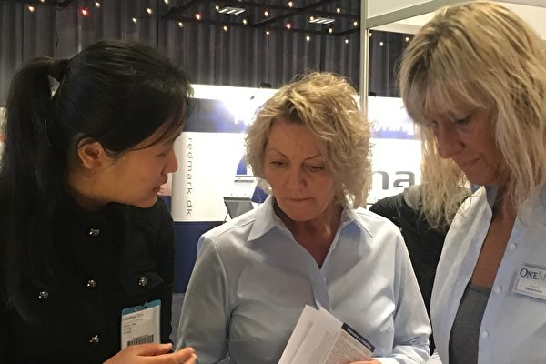

11月17日，丹麦首都哥本哈根Balle Centre的展览大厅里，民众了解中共迫害法轮功真相签名支持法轮功。（大纪元）

【大纪元2016年11月18日讯】（大纪元特约记者陈默丹麦报导）11月17日，丹麦首都哥本哈根Balle Centre的展览大厅里人头攒动，来自丹麦各地区的医生和护士到哥本哈根参加一年一度的医生日（Lægedage）活动。每天有大约700—1,200人参加了此次活动。据主办方透露，参加活动的人数在5,000人次左右。

在国际人权机构《医生反对强摘器官协会》（DAFOH）的展位前，不少参加活动的医生和护士驻足观看美国著名作家、人权活动家葛特曼以及加拿大著名人权律师大卫·麦塔斯和大卫·乔高调查中共活摘法轮功学员器官的纪录片，在了解活摘器官的真相后，他们在征签单上郑重的签下自己的名字。

DAFOH的志愿工作者向来宾详细地介绍了发生在中国大陆的强制活体摘取法轮功学员和良心犯器官的暴行，让来宾对这场中共以国家的名义、通过强制机关系统性地对无辜者进行杀戮以牟取暴利的邪恶行径有了具体的了解。

一位来自奥胡斯的医生说：“这太令人难以置信了，我从来没有听说过。你们应该更广泛地向整个丹麦社会揭露这场迫害，更广泛地让人们知道。”

这位医生问，如何能够更好地让丹麦人民知道这场迫害的真相时，DAFOH志愿工作者陈女士推荐了两家专业的医生杂志，希望能够在媒体上大力介绍这场史无前例的邪恶迫害。

展览期间，不同展位的各类医疗器械公司和机构的参展人员也不断地到DAFOH展位来了解活摘器官的真相。一位医疗机构的参展人员称：“你们做了一件非常了不起的工作。我支持你们。”

来自瑞典的DAFOH志愿者马库斯·古柏向本报记者简要介绍了DAFOH的性质，他说：“DAFOH是建于美国的非营利性志愿者机构，其目的是揭露中共活摘器官的暴行，特别是针对法轮功学员进行的活摘器官的邪恶行径。”

当记者问及马库斯为何要参加这样的志愿工作时，马库斯说：“到丹麦来参加这次医生日的活动，可以让更多的医生了解发生在中国的活摘法轮功学员器官的罪恶，让更多的医生能够支持并帮助制止这场迫害，不再接受从那些良心犯身上活摘的供体。由于在中国做这些活摘器官的都是行业医生，如果丹麦的医生知道这些真相，或许当他们在国际场合遇到中国大陆的医生时会向他们提出质疑。”

马库斯对发生在中国大陆的活摘器官的情况了解较多，他谈到，大约有超过上千家中国大陆的医院、医学院的医院和军队医院的医生参与了活摘器官，而供体都是来自被非法判刑和关押的法轮功学员和良心犯，数量巨大，手段残忍异常。通常活体摘取器官，人还是鲜活的，然后直接开膛破腹摘取器官。“目前，似乎主流媒体开始意识到这个问题的严重性，并开始做相关的报导。” 马库斯说。

另一位志愿者班尼‧布利克斯表示：“通常参加这样活动的都是受过良好教育的专业人士，你能从他们被震惊、悲伤的眼神中看到，尽管这场罪恶发生了十多年，但是仍然没有被揭开，没有在社会上广为人知，没有走向公众传媒，更像是遇到一种忌讳，甚至在丹麦社会，也好像是在故意隐瞒这个迫害真相。”

班尼谈到，他也时常被问到，为什么我从没有听到过这样的事情？为什么会发生这样的邪恶？班尼说：“这太过邪恶了，人们在许多年以前本就应该知道这场邪恶的迫害的。好在现在越来越多的人开始了解这些，这样将有助于尽早结束这场对无辜受害者的罪恶。”

班尼认为，DAFOH的志愿工作是一件极其重要的事情，责无旁贷，因为这个工作可以帮助那些在中国大陆遭受迫害而无法发声的无辜受害者传递他们的声音，他们被非法判刑，没有言论自由，所以代表他们发声，是良心的问题。

班尼说：“对我而言，能够代表他们发声是我的荣幸。我内心时常感觉到我是能给予他们支持的。他们的声音一定能够被听到，他们不会被遗忘。这样的痛苦，令人难以置信，难以想像。这样的痛苦还在继续中，我多少能够理解一些的。”

作为DAFOH的志愿者华裔刘女士表示，参加这场医生日活动“是一件挺重要的事情。” 她说：“中共活体摘取法轮功学员器官的邪恶，通过DAFOH可以让更多人知道，尤其西方的人了解中共的邪恶，尽快地停止这场邪恶，不能让这场邪恶继续下去。让中国人民尽早的从中共的魔爪下解脱出来。因为每天都在死人啊！”

刘女士表示，“很多人看到活摘罪恶首先表现的是很震惊，他们有些人是知道真相的，但是不是很详细。那些不知道的人，都觉得太可怕了，怎么会发生这样的事情。当他们了解真相后，都认为DAFOH的工作非常重要，鼓励我们继续做下去，让更多的人了解真相。”

<b>丹麦医生日</b>

为期一周的医生日活动从11月14日开始，到11月18日结束，是丹麦医疗系统中执业医生的大型活动，由“执业医生组织” （Praktiserende Lægers Organisation ，PLO）和“丹麦全科医师学院”（Dansk Selskab for Almen Medicin （DSAM）在每年的第四十六周主办。

该活动由两方面内容组成：一方面是为执业医生提供不同的专业进修课程，以不断提高丹麦执业医生的医术水平与能力; 另一方面是由丹麦与健康、医疗设备有关的公司及各种医生组织等组办的展览，供参加课程学习的执业医生们在中间休息时参观，为执业医生们提供最新的医疗设备、服务、资讯等信息。此外，主办方还提供相关方面热点议题的辩论会等活动。

DAFOH曾于2013年参加丹麦医生日活动，当时有2,590名医生参加了各种课程的学习和培训，DAFOH展位也成为当时展览的热点，引起丹麦医生群体的高度关注。

<h1 align="center"><b>发生在大连金州炮台的恶报</b></h1>
【明慧网二零一八年六月十三日】大连金州炮台开发区坐落在岚崮山南麓，相传有这样一个关于岚崮山的神话故事。
岚姑在岚崮山上隐居时，东海小龙王云游时看中了这里秀丽的风景，想据为己有，于是布云施雨，方圆几十里顷刻变作汪洋大海，荼毒生灵、毁坏房屋、淹没良田。岚姑义愤填膺返回天庭向玉帝禀报，得到许可，带领九龙将军将小龙王捉住，关进牢房。东海龙王得知后，想偷偷救回爱子，有人将这消息报告岚姑，岚姑一怒之下，用一条坚固的铁链将小龙王牢牢地锁住，下令：千年后方可脱身。一千年过去了。那条铁链真的消失了，随之一条又白又亮的大河出现在岚崮山上，就是现在的岚崮河……

听着自己家乡那善恶有报故事长大的人们，今天亲眼见到的是发生在身边的善恶报应。

“炮台书记王德世的家被抄了！”这个消息不胫而走，成为当地老百姓的热门话题。当然，此消息更令平时官场上跟王德世走的比较近的那些人胆战。那个在大连炮台经济开发区，曾经可以呼风唤雨的王德世，被老天派兵一下子捉住，坠入峡谷。

王德世，男，一九六零年九月出生，大连炮台经济开发区管委会党组书记、主任，大连金州区炮台街道党委书记。二零一八年五月二十五日，以涉嫌严重违纪违法被审查并抄家。

此前，炮台前任书记姜云胜与炮台迫害法轮功的六一零主管姜仁全已分别于二零一七年、二零一六年遭恶报，患多种癌症不治身亡。

其实贪腐违纪被查只是表面上的原因，现今中共内部已经是无官不贪，无官不腐，这一点谁都是心知肚明，而且贪污的金额、数量令老百姓瞠目结舌。可是为什么有些贪官被查，而有的就没被查呢？这就是个值得引人深思与警醒的问题。如果你是一个有心人，就会发现这样一个现象：就是被查办的这些人，大多都有一个共同特点：那就是为了捞取政治资本，积极参与对法轮功、对修炼真善忍好人的迫害。

姜云胜任职期间，炮台街道发生多起绑架、迫害法轮功学员的恶性事件，其中法轮功学员王某曾被迫害到教养院导致精神失常。

且看王德世在担任炮台党委书记期间，是如何对待管辖范围内修炼法轮功，遵循真、善、忍做好人的无辜百姓的？

据内部人士透露：为了讨好上级捞政绩，王德世积极响应江泽民邪恶势力对法轮功的打压政策，在炮台袁屯村、炮台干河村二道沟建立所谓的“无邪教村”，不让村民接触修炼真、善、忍的法轮功，几乎家家户户的门口都挂着一个“无邪教家庭”的铜色牌子。

政府给老百姓规定的福利待遇和各种补助，针对法轮功学员，炮台街道多个村委会扣留不给，他们对法轮功学员实行的就是赤裸裸的经济迫害。

二零一一年二月二十三日至二十八日，大连地区以中共“两会”为借口迫害法轮功学员。炮台街道红星村三名法轮功学员，被炮台政府及派出所等工作人员绑架到炮台派出所，逼迫这些法轮功学员签写所谓“四书”（放弃信仰的悔过书等），并入室抢走大法书籍、光盘等，言行十分恶劣。最后又把她们劫持到大连戒毒所迫害。为此致使两名法轮功学员被迫流离失所。

二零一二年六月六日，金州区炮台街道宋某等五名法轮功学员，因为向老百姓讲法轮功被迫害的真相，被炮台派出所警察绑架，宋某某此次被劫持到马三家教养院遭受非人迫害。

二零一七年三月十三日，大连市普兰店吴月菊等三名法轮功学员，在金州区炮台街道讲真相，被炮台街道派出所绑架到大连姚家看守所遭受迫害。

二零一八年三月十八日晚，大连金州石河镇九位法轮功学员，去炮台袁屯村免费发放《共产主义的终极目的》，被袁屯村书记吴兆坤追赶并诬告，最后伙同炮台派出所的警察把这些法轮功学员全部绑架。其中已经七十八岁的刘希永老人，现已被劫持到辽宁本溪第四监狱迫害。其余的法轮功学员至今仍被非法关押在看守所。

后来法轮功学员打电话劝善、邮信，吴兆坤仍没有悔改之意，继续命令村民监控、追踪、围堵做真相的法轮功学员。王德世与吴兆坤私人来往密切，多次结伴公款旅游，去美国、台湾等地，面对国外大法洪传的形势和法轮功学员的善意讲真相，不屑一顾。

是啊，那个小龙王对于自己残害百姓的事不也是同样不屑一顾吗？岂不知正是自己的不知天高地厚与狂妄傲慢，才招来了天惩，这就是厄运自招。炮台街道前任参与迫害法轮功的书记和六一零主管都死了，这一任仍在参与迫害法轮功的书记被查、被抄家了，这一切不是巧合。

善恶是有报的。无论人平时怎样得势，甚至狂妄嚣张，恶报来临时，也都是个个怕的要命、后悔也晚了。大家都知道按图索骥这个成语，在今天，所有参与迫害大法的人，都被上天的神佛记下一笔
