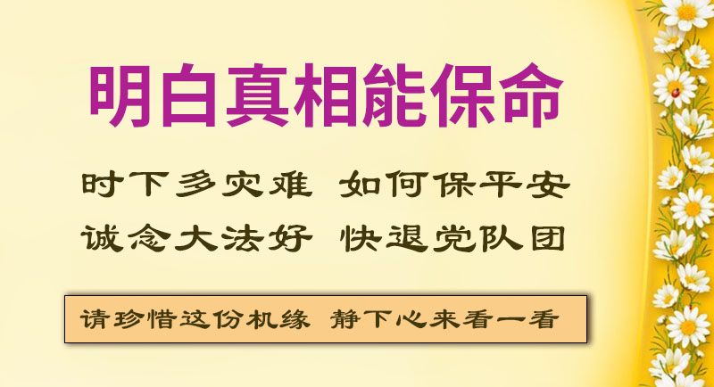

<a name=top>

<a target="_blank" href="https://git.io/bb99bbss">

<b>直连不必翻墙 🌼 必看精彩视频https://bit.ly/2A4uPQb</b>

<tr><td width=900><h3><b><a href="https://git.io/kkopop">➤ 中国禁闻  点击视频  </a></b></h3></tr>
</td>

<h2>请收藏本网址，连上免翻视频即时IP https://bit.ly/3ezRQKo </h2>

 

<h1>看更多真相 https://bit.ly/2RQM1hX</h1>

<h1><b><a href="https://bit.ly/2RQM1hX/awwkk/usdom/blob/master/forfor.md">红潮即将倾覆  天之将明</a></b></h1>

<h2 align="center"><a href="https://github.com/jkujkkj/bird/blob/master/bird02.md"><b>明真相能保命(二)</a></b></h2>

<h2 align="center"><a href="https://github.com/jkujkkj/bird/blob/master/bird03.md"><b>明真相能保命(三)</a></b></h2>

<h2 align="center"><a href="https://github.com/jkujkkj/bird/blob/master/bird04.md"><b>明真相能保命(四)</a></b></h2>

<h2 align="center"><a href="https://github.com/jkujkkj/bird/blob/master/bird05.md"><b>明真相能保命(五)</a></b></h2>

<a href=https://git.io/souye><h6 align="right">回首頁</h6></a>

<a name=top>

<a href =#12>12. 加拿大首都汽车游行　声援三退</a> 
<a href =#11>11. 多伦多明慧学校夏令营师生们感恩</a> 
<a href =#10>10. 愿人间不再有「被失踪」</a> 
<a href =#9>9. 国际抗共大潮起 华人感谢法轮功</a> 
<a href =#8>8. 澳媒：《明慧二十年报告》应入驻所有图书馆</a> 
<a href =#7>7. 华语媒体「天花板」的奇迹和价值</a> 
<a href =#6>6. 吉林「老公安」落马牵出江泽民的罪恶</a> 
<a href =#5>5. 伦敦唐人街 民众明法轮功真相 盼天灭中共</a> 
<a href =#4>4. 白宫顾问：中共释放病毒到全球 应追究责任</a> 
<a href =#3>3. 中共将要恢复对百姓敲骨吸髓模式</a> 
<a href =#2>2. 缺粮？陆媒称「吃剩菜暖心」 上海大搞举报</a> 
<a href =#1>1. 全球退党中心推出在线办理「退党证书」服务</a> 
-----------------------

<a href=#top><h6 align="right">回上方</h6></a>

<a name=12>

<h1 align="center"><b>加拿大首都汽车游行　声援三退</b></h1>

【明慧网二零二零年九月一日】（明慧记者英梓渥太华报导）二零二零年八月三十日（周日）下午两点，由加拿大渥太华退党服务中心主办的汽车游行由大纪元办公室出发，途经市中心、中使馆、唐人街等地，向主流社会和华人小区传递天灭中共的真相，呼吁人们远离中共，三退保平安。

二零二零年八月三十日（周日）下午两点，由渥太华退党服务中心主办的汽车游行由大纪元办公室出发，途经市中心、中使馆、唐人街等地，呼吁人们远离中共，三退保平安。

<b>汽车游行获市民赞誉</b>
汽车游行获市民赞誉

 >

退党服务中心协调人忻祈华女士接受采访时说：「中国人现在已经开始觉醒了，都知道共产党的邪恶，共产党迫害所有有信仰的人，我们举办这个活动就是告诉大家，现在天灭中共在即，退党保平安。希望大家能够抓紧时间到大纪元网上或者退党服务中心退党，远离中共、保平安。」

十二辆汽车首先通过渥太华主要高速干道417抵达加中使馆，然后开往唐人街、大统华超市（T&T）等华人集中的地点，汽车游行进行三小时。沿途许多路人竖起大拇指，表示赞赏。

汽车游行打出的信息包括，「加拿大退党服务中心（QuitCCP.ca）」、「中共不等于中国（CCP ≠　China）」、「中共是最邪恶病毒（CCP - the Most Evil Virus）」、「中共病毒祸害全世界 COVID-19=CCP Virus」、「远离中共 远离病毒（Stay Away from CCP　Stay Away from Virus）」、「庆祝3.6亿勇士退出中共（360 Million People Quitting CCP）」、「抛弃中共退党是福」、「天灭中共在即 退党保平安」。

同时打出的信息还有「世界需要真善忍（The world needs Zhen Shan Ren）」、「法轮大法洪传世界100多个国家（Falun Dafa Spread to Over 100 Countries）」、「法轮大法好（Falun Dafa Hao）」、「停止迫害法轮功（Stop the persecution of Falun Gong）」、「制止中共活摘器官（Stop Organ Harvesting in China）」。

参加游行的Ross Gillis先生接受采访时说，这是一个很好的机会，让人们在疫情期间，了解中共病毒的真相，这种通过字牌展示的方式是一个好主意。病毒攻击的是所有的人，不仅仅是华人，因此，每个人都必须小心（中共）。中共的谎言宣传都是错误的，每个细节都是假的、有害的，不单单是对华人，对世界上所有人都是危险的。

路过的John Kamau看到汽车游行的队伍后，竖起大拇指。他表达了对法轮功的支持，他说：「我喜欢他们传递的和平信息和对信仰的坚持。这些理念都是正道。祝他们一切顺利！」他说，自己在中使馆外面也看到过法轮功学员的和平抗议。

<b>华人软件工程师上网三退</b>
 

杨先生是一家跨国通信公司的软件工程师，他在接受采访时说，现在几件影响全世界的事情，如疫情、香港国安法这种最新的情况，都在向全世界展示中共政权对全世界造成的潜在危机和现实危害到底有多大。

他觉得全世界文明世界越来越清楚的意识到了中共的危险，所以说，以美国为领导的全球反独裁、反中共的国际联盟已经形成。这也让世界文明走向一个新的高度，尤其是为我们的祖国，中华文明真正的融入现代世界文明，提供了一个最好的契机。

他认为《九评》引发的三退大潮意义重大，影响力也很大，杨先生表示，自己也要到大纪元网站上进行三退。他说：「三退大潮引发的天灭中共的民众意愿和趋势，都注定了历史的潮流是不可违背的。……现在，美国也在全面禁止中共成员入境美国，这都是相关的。」

他认为区分中国和中共是让华人小区和国际社会认识中共的重要突破点，他说，中共的这种党国不分、故意混淆是非的说辞迷惑了许多人，好像中共代表了普通的中国人，代表了几千年悠久历史的文明古国──中国，这都是误区。普通的勤劳、善良的广大中国民众和华人群体，在某种意义上来说是被邪恶的中共组织和其邪恶的意识形态绑架和迷惑了，所以必须要区别这两个概念。

他还提到了中共对中国民众的舆论控制，他说，比如微信，其实就是中共的大外宣工具，也是控制海外华人和国内民众的监控机构和工具。

杨先生个人因为发表个人言论，多次被微信管理人员禁言、被踢出群、被警告和威胁。「这种审查制度被推广到海外，我身边的很多华人很明显的就自我限制、自我恐惧、自我屏蔽，好像主动的配合共产党的要求，我们虽身在自由开放的加拿大，却受到无形的钳制和压力，我觉得这是完全不能接受的。」

杨先生对海外华人尤其是法轮功团体长期的和平抗争非常敬佩，他说：「法轮功是有信念的，而且以信念为核心，去带动行动，以真善忍为原则去做事，不为私利，完全是基于自己真诚的一种信仰和信念。这个是当下，不但是华人，是整个社会都需要学习的。」

<b>香港华侨：中共毒害了中华传统、文明和民众思想</b>
 

上个世纪七十年代移民自香港的萧先生接受采访时说，共产党终于走到了尽头，我认为这是一个好消息。在被中共欺骗三、四十年之后，终于，西方国家都在觉醒。

他说：「中共是一艘即将沉没的船。中共几代人一直在毒害中国的传统、文明和民众的思想。如果中国人民希望他们的后代能够正常的成长并与世界其它地区和谐相处，那么根除和终结中共是唯一使世界更美好的解决方案。」

他建议海外华人能够独立思考，否则将被中共宣传洗脑，却不自知。他说，中共自一九四九年上台以来就改变了世界，因为他们的理念是西方标准无法接受的。中共是邪恶的，它在杀人，在说谎，并以非常邪恶的方式改变了中国人的观念。他认为，应该称当前的瘟疫为中共病毒，「因为它起源于这个政权。」

提到香港目前的处境，「因为香港警察对年轻人、年轻妇女、勇敢的人们所做的一切，让我感到心都碎了。」同时他也对香港青年人的勇气和对自由与民主的渴望感到钦佩。

他强调，人们终于开始区分中国和中共了。美国国务卿彭佩奥在演讲中已经将中共和中国人区分开来。他说：「当中国共产党走到尽头时，世界其它地区将在如何改变中国人民，让人们用正常的思维方式思考，以及如何与世界其它地区保持和谐方面大有作为，也将是一项艰巨的工作。」

他非常认同法轮功「真善忍」的信念，「虽然我不是法轮功修炼者，但我全心全意支持法轮功。」

【文章来源】https://big5.minghui.org/mh/articles/2020/9/1/411241.html

<a href=#top><h6 align="right">回上方</h6></a>

<a name=11>

<h1 align="center"><b>多伦多明慧学校夏令营师生们感恩</b></h1>

【明慧网二零二零年九月一日】（明慧记者章韵加拿大多伦多报导）二零二零年多伦多明慧学校的夏令营从七月六日开始到八月二十八日结束，历时八周，师生们深感在疫情的特别时期还可以有这个活动非常幸运，收获也很大。一位十岁的大法小弟子说：「这里的环境让我清楚了自己是大法小弟子。谢谢师父给我这么好的机会。」
今年招收的学生从两岁半到十三岁。除了每天的学法炼功外，大班（十至十三岁）的大法小弟子们还背《转法轮》，学校的课程也包括教授中国古典舞、中国传统文化、音乐、书法绘画、手工课等等。

 >

 >

明慧学校的大法小弟子们集体学法

【文章来源】https://big5.minghui.org/mh/articles/2020/9/1/411234.html

<a href=#top><h6 align="right">回上方</h6></a>

<a name=80>

<h1 align="center"><b>愿人间不再有「被失踪」</b></h1>

【正见新闻网2020年08月29日】八月三十日是「国际强迫失踪日」（International Day of the Disappeared），是为了被监禁、强迫失踪和绑架受害者所发起的节日。二零一零年底，联合国通过《保护所有人免遭强迫失踪国际公约》，用以保障强迫失踪受害者的司法权益和其家属的知情权利。

长期关注中国人权的读者，对于「被失踪」一词应当不陌生。遗憾的是，任何人在当今的中国大陆，都面临「被失踪」的威胁。例如武汉肺炎（即中共病毒，又名COVID-19）爆发后，不断有人因说出疫情真相，而被中共国保威胁或拘留；多名去现场采访报导的公民记者「被失踪」、遭破门而入的警察绑架。中共控制不住病毒，就控制传播真相的人。

美国福克斯新闻七月十日报导，香港公共卫生学院病毒学和免疫学专业医生阎丽梦受访表示，她冒险逃到美国的目的是告诉人们中共病毒的真相，她相信中共早在公布武汉肺炎之前就已经知道了病毒的存在，如果在中国讲出这些，她可能会被判刑入狱，更可能「被失踪并被谋杀」。

没有亲身经历中共迫害的人，很难想象中共有多么邪恶。中共一直以高压控制信息的流传，让人们生活在恐惧之中，无法也不敢听到真实的情况。去年香港「反送中」运动，从当地抗争者频频「被跳楼」、「被自杀」、「被失踪」，全世界都看清了中共的邪恶本质。 「跳楼」、「自杀」、「失踪」怎么被冠上个「被」字呢？个中大有玄机，世人不可不辨。

谈到「被失踪」，特别引人关注的是，自一九九九年以来，中国市场上出现了巨量无法解释来源的器官源。也就是在这一年，中共开始大规模抓捕法轮功学员，江氏集团以洗脑、酷刑、虐杀等手段，逼迫法轮功学员放弃信仰「真善忍」。中国大陆的各监狱、劳教所普遍对法轮功学员进行抽血等异常体检，而学员人数却大量转移消失，即「被失踪」，早已启人疑窦。

二零零六年三月初，中共在苏家屯等至少三十六个集中营，活体摘取法轮功学员器官的暴行被海外媒体曝光。虽然各种人权组织与许多国家的议会对此恶行予以谴责，然而国际社会的主流媒体却很少报导，因为中共迫害法轮功从初期的明目张胆，早已转为地下，秘密抓捕关押、非法开庭判刑与酷刑折磨，从表面上不太引人注目，间接迷惑了众多世人。

根据三位独立调查人士戴维•乔高（David Kilgour）、戴维•麦塔斯（David Matas）与伊森•葛特曼（Ethan Gutmann）在二零一六年六月公布的报告，中国每年的器官移植数量约在六至十万之间，远高于中共宣称的每年一万例，这意味着自中共迫害法轮功以来，中国有数量惊人的器官移植，从而导致大量法轮功学员失去生命。

以超速的人体器官为前提的移植手术，近年来在中国竟成为带来巨大利润的新兴产业。在白色的病房内，隐藏着中共和江氏集团灭绝人性的罪恶。自今年元月起，「追查国际」（追查迫害法轮功国际组织，WOIPFG）持续对涉嫌活摘法轮功学员器官的中国大陆医护人员展开追踪电话调查。证据显示，在武汉肺炎全球疫情未缓的背景下，中共仍然继续活摘法轮功学员的人体器官，从未收敛歇手。各医院的移植业务没停，医生照常手术，包括武汉肺炎的定点医院─重庆医大附属医院，又如安徽医科大学一附院、广西人民医院等皆然。

中共动用整个国家之力来摘取民众身体上的器官，骇人听闻。在其「打死白打、打死算自杀」、「不查身源、直接火化」的迫害政策下，近年中共历来否认活摘器官的指控，声称采用新的自愿捐献制度，取缔了强迫从死囚犯身上摘取器官的做法，企图转移国际上对它活摘暴行的关注。

近年随着法轮功学员坚持不懈的揭露迫害真相，中共污蔑法轮功的弥天谎言逐一被拆穿，它刻意掩盖的满盈万恶也陆续被曝光。活摘法轮功学员器官的罪行，经由国际权威杂志《自然》温迪•罗杰斯（Wendy Rogers）教授与杰弗里•尼斯（Geoffrey Nice）律师、《BMC医学伦理》（BMC Medical Ethics）的学者专家相继认证，及「追查国际」的缜密取证，中共已无法掩盖它残酷迫害法轮功的事实。

中共残酷迫害法轮功、活摘学员器官是泯灭人性与良知的灾难，逾越人类的道德底线，被加拿大著名人权律师戴维•麦塔斯（David Matas）形容为「这个星球上从未有过的邪恶」，严重违反国际人权公约，多年来受到联合国、美国国会、欧洲议会高度关切。随着活摘器官的多项证据在全世界大量曝光，引起了各界的极大震动与关注，已有越来越多国家的国会议员相继对此人神共愤的罪行表示愤慨与谴责。

二零零五年纽约《时代周刊》一篇报导曾评论中共的劳教所是真正的「法外之地」，有着法律管辖不到的特权与黑暗。更多见不得人的滔天罪行，迄今仍隐藏在幽暗的各劳教所、看守所与监狱中。谎言与暴力总是形影不离，无辜的国内民众身陷中共铺天盖地撒下的谎言迷雾中，因此难以明了真相。

法轮功学员只是一群遵循「真善忍」的善良好人，不该无辜遭到中共铺天盖地的残酷迫害；人权是普世价值，当代文明社会里，不容许「被失踪」的疑案发生；活摘器官这惨绝人寰的恶行，只能藏身在极权的赤色铁幕里。曾经参与迫害的中共各级官员，包括「六一零办公室」、公安、国保等公检法人员，这批丧心病狂的加害者，未来都将在法律的审判与严惩中，偿还其不可饶恕的罪恶。

自古善恶有报是天理，作恶者都难逃宇宙的铁则制裁。至盼明年的「国际强迫失踪日」来临之前，这场残酷迫害早已结束，红魔远离人间，世上不再有「被死亡」、「被失踪」等匪夷所思的怪象。

【文章来源】http://big5.zhengjian.org/node/261603

<a href=#top><h6 align="right">回上方</h6></a>

<a name=80>

<h1 align="center"><b>国际抗共大潮起 华人感谢法轮功</b></h1>

8月15日，加拿大退党服务中心举行了汽车游行。

「共产党是人类有史以来最邪恶的政权！而法轮功目前为止是最强大的反共力量。」7月底的这条推文反映出众多华人对中共本质的明辨，以及对法轮功的赞佩。
当前，美国引领国际抗共，自由阵营与中共极权的较量实为一场正邪大战。在此背景下，审视法轮功学员21年来讲真相、反迫害、揭露中共，其伟大意义愈加彰显。

<b>大陆移民说：谢谢你们的坚持</b>
 
据明慧网报导，8月15日下午，在多伦多，加拿大退党服务中心举行了别开生面的汽车游行。活动结束后，一位中国大陆男士在停车场找到法轮功学员，竖起大拇指说：「我很关注你们，过去我经常看到你们，但我没靠近你们。今天到这里，我特来说声：谢谢你们。」

「谢谢你们的坚持！谢谢你们所做的一切。如果没有你们的坚持，不会有今天的局势。你们真的了不起，非常感谢你们！」「我也跟我的朋友说过，法轮功一直坚持这么多年，一直在这样做，真了不起。你们真是咱们国家的希望。」

「你们刚才车队过来，我看见很震撼。我常开车经过太古广场都能看到你们打的横幅，在中领馆前也看到你们在给人们讲真相，我也接过资料来看。我是做生意的，我非常清楚中共的坏，最近越看历史，越知道共产党的坏。共产邪党不仅迫害法轮功，也迫害基督徒，因为我是基督徒。我今天看到你们车队的牌子，特别感动，做得很好，很棒。你们这种精神我特别钦佩。你们这样坚持，很了不起。就是你们这样坚持不懈，现在美国都明白了。」

<b>网友说：欠法轮功一份道歉和感谢</b>
 
7月28日，「一剑飘尘」在推特上写道，「我一直以来对法轮功都敬而远之。但现在我觉得华人欠法轮功一份道歉，他们遭受最大的迫害，也是最坚定的反共力量，谢谢法轮功。」

许多人跟帖表示认同：「同意。奥运那年在纽约法拉盛，所有华人上街站台中共，反对法轮功，辱骂法轮功，到现在我还觉得充满歉疚。」

「同意您的见解。法轮功二十多年不懈地反迫害、反中共暴政，是中国人民争取自由民主运动中的最坚强的群体。中共最恨最怕法轮功。真正反中共的人都会支持法轮功。」

「完全同意！还有法轮功开发维护的自由门，免费提供翻墙至今十几年如一日，并提供链接到了民运网站、美国之音、法广、油管、推特等几乎所有自由世界各大媒体网站，而在这些媒体中居然有点名诋毁法轮功的！法轮功从未谩骂过海外任何人和组织，华人欠法轮功组织一个道歉！一声感谢！」

「法轮功对反共的坚持不懈，的确让人尊敬。」「这个群体是我见过最团结的华人社团！」

以上网帖显示，越来越多的华人开始反思法轮功现象，他们发自内心地意识到了法轮功的奉献和非凡所在，中共妖魔化宣传越来越不灵了。
<b>法轮功讲真相的非凡意义</b>
 
一位网友说：「目前为止，没看到法轮功有做伤天害理的事，中共却一直迫害法轮功学员，不懂中共在害怕什么？」

这个问题触及实质。法轮功以「真、善、忍」为指导原则，修炼者说真话，做好人，于国于民有百利而无一害。然而，中共不仅禁止这种功法，还疯狂迫害不放弃信仰的修炼人，孰正孰邪？

中共害怕什么？它害怕广大民众同化「真、善、忍」。因为在追求真理、修心向善的过程中，人们自然会看穿中共的假、恶、暴本质，从而拒绝同流合污，中共的欺骗宣传将彻底失去市场，它的非法统治也将难以支撑。

一个推特上的帖子写道：「对法轮功的尊重是一个善良人的最起码标志。多少年来法轮功占据了大半个世界反共战场。」
这两句话揭示了正邪分界及反抗中共的意义——呵护良善，维护正义。

众所周知，由于中共发动镇压，剥夺了修炼者说话的权利，海内外法轮功学员才走上了讲真相之路。他们无权无势，手无寸铁，就凭着坚定的信念，以灵活多样的形式揭露中共：上书鸣冤，公开请愿，制作传单、光盘，创办媒体，举行集会、游行和文艺演出，追查和起诉迫害凶犯等等。

这些活动不为名利，亦无政治企图，只为制止迫害，捍卫普世价值，同时也是在堂堂正正地维护所有中国人的信仰自由、言论自由和知情权，破除中共谎言带给全世界的毒害。

不少网帖提到法轮功学员开发的破网软件：「我记得我第一把梯子就是无界，然后是自由门」，「他们一直在提供免费的VPN软件，就冲这一点，我心里就一直装着一份感谢。」

「google被禁，到国外网站寻编程和IC应用数据，以及了解整个外部世界，首次用的是他们的软件，应当谢谢他们。」
中共在本世纪初打造封锁互联网的「金盾工程」，前期投资即高达八亿美元，就是为了阻止大陆网民得到任何有关人权和自由的信息，特别是法轮功的真相信息。

2001年，美国法轮功学员成立了非盈利组织「全球网络自由联盟」，加盟的四家网络公司陆续开发出破网软件，一举撬动了中共的「网络长城」。

一位大陆网民曾向动态网致意：「我的言语无法表达对你们的感谢和敬佩。你们太伟大了，一般人没有胆量和毅力去和黑暗势力抗争。」
今年7月底，一位网友说：「好像没听说法轮功人士被收买的、当大外宣的，非常佩服他们几十年如一日的勇气和坚持。」
这两条评语打开了另一个话题：法轮功反迫害展现了中华传统道德精神：「富贵不能淫」、「威武不能屈」。勇者与黑暗抗争，开创光明。

今年4月25日，大陆前敦煌研究院研究员陈海涛在海外退团、退队，他在声明中谈到，他的母亲因为修炼法轮功而遭受迫害，「在中共对信息的屏蔽下，我并没有能力去系统地反思导致这不幸的原因。」「中国土地上的芸芸众生，有多少正如那时的我，在中共统治的高墙之内，会一度颓丧。」他为自己多年来被中共蒙蔽而产生的迟钝感到忏悔。

法轮功学员讲真相，正是要打破中共的信息封锁，改变暴政下的人心麻木和道德沉沦，唤醒良知、善念，鼓励人们追求真理、坚守正道。
从1999年「4·25」万人和平上访到今天，法轮功学员用生命、鲜血守护信仰，顶住了世上最残暴政权的打压，他们的事迹可歌可泣。

目前，疫情大流行，中共隐瞒信息招致多国谴责；中共持续侵害人权，引起国际关注，发生在香港和新疆的恐怖实际上是迫害法轮功手法的移植与重演。中共以经济利益胁迫世界，通过渗透和统战威胁着更大范围的言论、学术自由和信息安全。

有鉴于此，法轮功学员揭露中共的邪恶本质，是在向各国政府和民众发出预警；法轮功学员推动的「三退」大潮，将促成和平解体中共，是对人类的最大贡献。

法轮功的洪传与反迫害历程关乎中国民众的权利与自由，关乎中国社会道德的重建及传统文化的复兴，关乎人类的道德、信仰和正义。
多年来，许多中外学者和西方政要都谴责中共迫害、高度赞扬法轮功学员抵抗中共的义举，国际主流媒体也在更多地关注法轮功受迫害案。随着真相广传，随着国际形势的深刻变化，越来越多的华人正在觉醒，他们向法轮功表达感激和歉意，他们支持法轮功学员创办的媒体，并且纷纷退出党、团、队，给中共致命一击。

【文章来源】https://www.ntdtv.com/b5/2020/08/27/a102927559.html

<a href=#top><h6 align="right">回上方</h6></a>

<a name=80>

<h1 align="center"><b>澳媒：《明慧二十年报告》应入驻所有图书馆</b></h1>

【明慧网二零二零年八月二十四日】（明慧澳洲记者站报导）二零二零年八月八日出版的澳洲《新闻周刊》（News Weekly）杂志，刊登了该周刊的主要撰稿人之一、澳洲全国公民委员会（NCC）前主席彼得﹒维斯特摩尔（Peter Westmore）先生撰写的书评，介绍《明慧报告：法轮功在中国大陆被迫害二十年》（简称《明慧二十年报告》）。
文章题为「中共对中国人发动的战争」（The CCP』s war on the Chinese people）。维斯特摩尔在文中开篇表示：「对于那些担心中共在世界范围内滥用权力的人来说，这本书是必不可少的信息来源。该书提供了超过430页、有关中国法轮功学员所遭受迫害的最详尽的文献资料，应该入驻澳大利亚的每个图书馆，也应该成为澳洲所有议员办公室的参考书。」

二零二零年八月八日出版的澳洲《新闻周刊》（News Weekly）杂志，刊登了书评，介绍《明慧报告：法轮功在中国大陆被迫害二十年》一书。

中共的迫害已成为多个人权组织发布的许多独立报告的主题，但维斯特摩尔特别指出：「该书以一种简洁的方式条理明晰的汇集了这些数据文文件，并通俗易懂的介绍了法轮功修炼者的信仰。」「该书详尽细致的描述了自从迫害开始以来中共犯下的针对法轮功学员的令人发指的人权侵犯和迫害。」

他说：「这一切迫害也为中共政权摧毁法轮功运动中最骇人听闻、罪恶滔天的手段奠定了基础：谋杀修炼者以提供器官移植领域之前无法满足的器官需求。」

在概要介绍了《明慧报告》的主要内容之后，维斯特摩尔讲述了他的亲身经历，「多年前当我用谷歌搜索『中国』和『移植』这些词的时候。搜索的结果立即显示了证据，中国医院网站出现，邀请人们到中国旅行以获取器官，有些甚至还说，如果第一次器官移植失败，在数周内就可以提供替代器官。显然，这只能通过杀人以获取心脏、肝脏、肾脏、眼角膜和其它器官来实现。」

他还表示：「众所周知，中国境外的法轮功学员进行了反迫害，如今已成为世界上面对北京政权的迫害最有效力的反抗者，要求中共政权对自己的罪行负责。」

在文章的最后，维斯特摩尔说：「这本书值得在世界各地的图书馆被找到，也应该出现在议员办公室中，以便真相能够被揭示。」

澳洲全国公民委员会（NCC）是运营近八十年的民间智库组织，致力于恢复传统价值观。维斯特摩尔先生曾担任该智库主席多年，是《新闻周刊》杂志的发行人。

以下是书评的全文译文：

<b>文章题目：中共针对国民发动的战争</b>
 

对于那些担心中共在世界范围内滥用权力的人来说，这本书是必不可少的信息来源。该书提供了超过430页、有关中国法轮功学员所遭受迫害的最详尽的文献资料，应该入驻澳大利亚的每个图书馆，也应该成为澳洲所有议员办公室的参考书。

法轮大法，又称法轮功，是一种传统的中国修炼方法，倡导以真、善、忍作为个人生活应遵循的基本道德原则，还鼓励修炼人炼动作舒缓的打坐功法，不断提升道德修养，在公众场合经常能见到他们炼功。

法轮大法团体表示，法轮功学员有一亿人，遍及世界一百多个国家和地区。一九九九年，法轮功学员在中国首都北京举行的和平抗议，引起了时任中共领导人江泽民的强烈嫉恨。

明慧网以及明慧出版中心由法轮大法修炼者创办，旨在记录中共从一九九九年开始的对修炼者的迫害。

该书详尽细致的描述了自从迫害开始以来中共犯下的针对法轮功学员的令人发指的人权侵犯和迫害。

<b>独立报告</b>
 

中共针对法轮功学员的迫害已成为多个人权组织发布的许多独立报告的主题，但本书以一种简洁的方式条理明晰的汇集了这些数据文文件，并通俗易懂的介绍了法轮功修炼者的信仰。

中国共产党对法轮功的妖魔化宣传和迫害，在一定程度上是源自江泽民及其继任者针对一个完全自发成立的团体的嫉妒，因为这个团体比共产党更受尊敬，因此必须消除。

这一切也精准的诠释了法国作家所描述的「邪恶对美德表达的敬意」。

该书的第一部份论述了中共如何全方位的利用国家资源在中国国内迫害法轮功。书中还记录了关押法轮功学员的设施，包括监狱、洗脑中心、劳教所和精神病院等，指出警察、司法系统和中国各地的很多医院都参与了迫害。

此外，法轮功学员及其家庭，在教育系统、就业、住房等方面受到歧视，并且被剥夺了领取养老金的权利。孩子被迫反对父母，父母被迫反对孩子。

共产党在学校开展运动，妖魔化法轮功和法轮功学员，并孤立那些父母修炼法轮功的孩子。

在监狱系统内，法轮功学员会受到各种各样的酷刑折磨，包括殴打、强迫灌食、关禁闭、电击、关小号、水刑、窒息和性侮辱。

所有这些酷刑折磨的结果是，许多人被迫害致死，而幸存者常常身心受损导致终身残疾。

这一切迫害也为中共政权摧毁法轮功运动中最骇人听闻、罪恶滔天的手段奠定了基础：谋杀修炼者以提供器官移植领域之前无法满足的器官需求。

我本人亲自了解到这一黑幕，是多年前当我用谷歌搜索「中国」和「移植」这些词的时候。搜索的结果立即显示了证据，中国医院网站出现，邀请人们到中国旅行以获取器官，有些甚至还说，如果第一次器官移植失败，在数周内就可以提供替代器官。显然，这只能通过杀人以获取心脏、肝脏、肾脏、眼角膜和其它器官来实现。

对法轮功的迫害还延伸到中国以外，海外华人受到不断的监视，而谴责迫害的人则遭受持续的攻击。

众所周知，中国境外的法轮功学员进行了反迫害，如今已成为世界上面对北京政权的迫害最有力度的反抗者，要求中共政权对自己的罪行负责。

这本书值得在世界各地的图书馆被找到，也应该出现在议员办公室中，以便真相能够被揭示。

【文章来源】https://big5.minghui.org/mh/articles/2020/8/24/410895.html

<a href=#top><h6 align="right">回上方</h6></a>

<a name=7>

<h1 align="center"><b>华语媒体「天花板」的奇迹和价值</b></h1>

近期《大纪元时报》纽约版。

【大纪元2020年08月23日讯】近期，多位网友在推特上发文，称赞法轮功学员创办的媒体以及「九评编辑部」的著作，许多人跟帖表示认同，并且分享了自己的体会。这一现象表明：大批网民没有人云亦云，而是通过亲身体察做出独立的判断。良心媒体的努力实践正在获得越来越多的认可与支持。

这些推文和留言基本表达了四个观点，在此引用具体内容加以简析。

<b>第一，放下偏见，理性地对待法轮功学员创办的媒体</b>

6月22日，网友「牧羊犬」写道：「如果你已肉身翻墙，或者灵魂翻墙，且具备高中水平的外语能力，那么最好少看或不看中文的新闻。如果一定要看，我个人建议是看法轮功旗下的报纸或视频就行了。如果你暂时放弃成见，会逐步体会到，它们的媒体是今天华语媒体里的『天花板』，也是一支完善的正规军。他们的节目不是靠一篇文章或一个视频来赚钱，而是在意自己的声望和权威。」

一篇跟帖说，自己「翻墙」前对法轮功有偏见，「可是翻了墙之后我有亲自看新唐人的啊，我感觉他们没啥问题立场也很正，说他们有问题的多少被人带了节奏吧。」

另一位网友说，以前反感法轮功学员办的媒体，「现在也有点怀疑态度，但总体0k啦，现在我起码也订阅了它的频道了，也看一些吧。」

还有人写道：「现在的法轮功媒体不是三年前的那个水平了，美国的华文媒体没有一个能够超过它的，特别是大纪元时报的新闻报导。以前基本上是不看的，现在是每天必读的。不要带着框框去看待就可以了。」

所谓「法轮功旗下」，是指由法轮功学员创办的《大纪元时报》、新唐人电视台等媒体，它们以秉持客观、公正的立场、深刻揭露中共而引人注目。

众所周知，1999年，中共开始镇压法轮功，开足马力诋毁这一修炼群体，致使大批大陆和海外民众对法轮功产生了误解甚至仇视，法轮功的真相及中共的迫害事实被掩盖。在这种情况下，大纪元、新唐人等媒体应运而生，打破中共一言堂对信息的垄断。

由于中共妖魔化宣传的影响，许多华语读者对于披露法轮功真相的媒体有所排斥，不愿意接受这些媒体刊载的信息。但是，日久见人心，墙内墙外网友们的自发推荐和「放弃成见」等建议表明，大纪元、新唐人坚持不懈地走专业之路，报导真相、维护人权，终能消除偏见、赢得信任。

<b>第二，大纪元、新唐人不为任何势力或利益所左右</b>

今年7月6日，「津津乐道」发推说，「新唐人和大纪元是海外唯一没有被中共渗透的华文媒体，我个人看英文版大纪元更多。」

另一位网友说，大纪元报「是我目前看到的唯一的一份尚没有被共匪渗透的海外中文纸质媒体」。

几十年来，中共在海外收买和渗透了绝大多数华语媒体，从而输出它的欺骗宣传，对海外华人洗脑。与红媒形成鲜明对照的是，大纪元、新唐人敢于报导真实情况，大胆揭露中共本质及其侵犯人权的罪恶，为受迫害的中国民众发声。

现在，国内维权民众都知道大纪元。2018年7月26日深夜，北京市昌平区一住宅小区的部分业主因遭遇当局强拆向大纪元紧急求救：「请帮帮我们，让全世界关注中共的邪恶。」一名业主说：「我们只能把希望寄托在大纪元身上，我知道你们敢报导。」

大纪元网站总编黄万青说：「这么多年，我们一直面对巨大的挑战：中共不停地搞破坏、围堵我们。几乎报纸的每一个广告客户，中共都去打电话施压；我们办活动、记者申请采访证，中共都会进行干涉。但是，我们顽强地和它对抗，不仅存活下来，而且越办影响力越大。」

2019年11月19日凌晨，承印香港《大纪元时报》的新时代印刷厂遭人纵火破坏，这是该报社近年来遭到的第三次蓄意恶性攻击。香港大纪元随后发表声明说：「邪行恶作，只会让全世界的人们更快和更清楚地认识到共产制度的邪恶。大纪元在被中共的打压中已经走过了近二十年，暴力恐吓和全力打压，不会让我们退缩。」

当前，中共在大陆和香港肆意侵犯人权，勇于抗暴者受到严酷打压。一些人抱着「事不关己」、「娱乐至死」的麻木心态苟且度日，一些外国政府、商企和媒体为了利益而向中共屈服。因此，独立敢言、不畏暴政的良心媒体难能可贵。大纪元、新唐人展现的勇气对于抑制和清除邪恶、弘扬人间正气、提升社会道德起到了非常积极的作用。

<b>第三，大纪元、新唐人的立场正，水平高</b>

有人以「华语媒体的『天花板』」来形容大纪元、新唐人制作的高水平。后面的跟帖说：「法轮功可是人才辈出」，「法轮功的媒体内容不谈，制作水平华文媒体里属一流了。」「法轮功的电话采访曾经套出不少料，他们的英文媒体水平也不错。」「油管上经常看新唐人电视台的节目，无论节目质量还是主持人素质都很赞！」

一位网友说：「我已经收到英文版实体报纸the epoch times（大纪元），不一定会每篇看，但这是我对fake news（假新闻）的反击贡献微薄之力。」

今年7月6日，「津津乐道」在推特上强力推荐《魔鬼在统治着我们的世界》，推文写道：「看懂了这部巨著就能轻松看懂如今美国和西方混乱的根源。九评编辑部是全球14亿华人中最顶尖智慧的一个小群体，这部巨著用词之精炼、准确、生动，思想内涵之丰富，对共产主义意识形态认识之透彻，揭露之深刻，华文世界无人能望其项背。」「一定要通读，绝对醒脑，华文世界最警世的作品。」

「津津乐道」还说：「我个人不练法轮功也不信法轮功」，「九评编辑部」「在揭露共产意识形态对世界的渗透和危害方面居功至伟」。

这段点评凸显「九评编辑部」的价值，也反映出大纪元聚拢华人精英、高瞻远瞩的能力与现实。

2004年11月，大纪元推出系列社论《九评共产党》，首次揭露了共产党反人类、反宇宙的邪恶本性，「全面揭示中共建政以来的一切谎言邪说，帮助世人认清了中共的本质。」《九评》的发表和广泛传播开启了中国民众退出中共党、团、队的「三退」精神觉醒运动，在海内外引发巨大反响。

2006年9月，大纪元又发表系列社论《解体党文化》，深刻剖析了中共在中国大陆创造的「党文化」怪胎，揭露中共享无神论、唯物论系统地替代传统文化、否定传统文化的恶行，旨在帮助中国民众恢复正常思维，重建道德和文化。

《解体党文化》阐明：「中共不等于中国」，「爱国不等于爱党」，「人们混淆了党同政府、党同国家和党同民族的概念」，这些清晰的论述对于大陆和海外华人走出中共党文化误区极为有益，是不可多得的醒脑剂。

近一两年，美国副总统彭斯和国务卿蓬佩奥在多次演讲中越来越清楚地区分中国与中共，共产党与中国人民，明确表示要赋予中国人民力量，令中共十分恐慌。

2017年和2018年，大纪元又发表了「九评编辑部」的著作《共产主义的终极目的》和《魔鬼在统治着我们的世界》，进一步向世人揭示共产邪灵的伎俩、危害，指明回归传统之路。新唐人电视台制作了这三本巨著的视频版和播报版，供免费下载。

随着中共加速在海外渗透、扩张，中共企图称霸世界的野心以及共产意识形态的危害都暴露得更加明显，令人触目惊心。例如，今年美国多地发生暴乱，便是共产主义和社会主义因素在背后作祟所致。

2020年，中共隐瞒疫情、导致病毒向全球扩散；美中全面脱钩，美国反制中共、制裁中共侵害人权的官员和实体；《港版国安法》导致香港社会动荡、白色恐怖弥漫……诸多国际纷争都指向中共这个矛盾源。事实表明，共产极权与自由阵营的对决是当今世界的最中心、最重大议题。各国政府要想谋求和平、稳定的发展，必须对抗中共的挑战。

由此可见，「九评编辑部」著作不仅具有前瞻性，而且论断极为精准，堪称乱世中的福音。

<b>第四，大纪元揭示中共病毒的危害</b>
 
疫情大流行是2020年的头条新闻，事关全球民众安危。大纪元、新唐人紧密跟踪疫情动态，挖掘中共官方掩盖的真实死亡数据，发表了大量一线采访和评论解析，其中针对武汉、大连等疫情的采访被称为「真正的独家消息」。

今年1月24日，美籍华人张蒂娜去北京探友，在不经意间看到大纪元的视频，才惊觉疫情严重，于是决定提前返美。她回国后致电大纪元表示感谢。她说：「我要是不回来，后果不堪设想。我确实是大纪元新闻的受益者。」她向还没有看过大纪元的同胞建议说，「你的思想不要固化，有些东西要去看，要去听，尤其是大纪元这样有根有据、有录像、有声音的新闻平台。」

3月11日，大纪元特稿指出，病毒针对共产党而来，发出重要提示：「远离中共，谴责中共，不为中共站台，作为个人、组织和国家，都可能因此减轻甚至避免病毒侵害，选择美好未来。」

英文大纪元发行了有关疫情的报导特刊，并推出「中共病毒真相」网站，揭露中共的罪恶与危害，呼吁民众在此签署「谴责中共」的请愿信，加入全球问责。

一位网友谈到：「大纪元今年针对疫情制作了两期特刊，直接派送各家各户，在加拿大引起了很大反响。CBC首先站出来发难，说大纪元称中共病毒是种族歧视云云，结果被加拿大民众留言批了一个够。」

从4月开始，大纪元《新闻看点》栏目制作播出了11集「病毒有眼睛」特别报导，反响热烈。有观众反馈说：「感谢新闻看点为墙内国人传真相，因为你们传播的真实信息能让民众在灾难中做出正确判断从而获得了求生的可能性，传播真相就是救度生命。真心感谢你们辛勤的付出！！！」

<b>结语</b>
 
大纪元媒体集团创始人兼总裁唐忠表示：「重大的事情正在发生，我希望你真实地看到这一刻，并真正地看清这一切。」

面对海量的媒体信息，各地网民都在鉴别和思考。自由环境下，越来越多的华人读者体现出如此清醒的认识，令人欣慰。中共的一言堂和防火墙无法阻挡真相，也不可能阻拦所有人发声。

目前，中英文大纪元已经成为很多国家元首及政要的必读报纸和重要决策资料，美国总统川普也是英文大纪元的读者，还曾多次转发其评论文章。

大纪元、新唐人以弘扬普世价值、复兴传统文化为基点，以讲述真相为使命，他们传播的真实讯息呼应着人们对自由和真理的向往，因此开创了成功的奇迹。

【文章来源】https://www.epochtimes.com/b5/20/8/22/n12350032.htm

<a href=#top><h6 align="right">回上方</h6></a>

<a name=6>

<h1 align="center"><b>吉林「老公安」落马牵出江泽民的罪恶</b></h1>

江泽民是迫害法轮功的罪魁祸首

【大纪元2020年08月24日讯】8月以来，公安系统「打虎拍蝇」节奏不停，紧接18日上海公安局长龚道安后首位落马的正厅级官员，是19日在吉林省应急管理厅长任上被查的霍云成。

霍云成履历显示，自1981年进入吉林省公安厅，至2016年转往省政府任职，当中累积有30年公安系统工作经验。截至目前的反腐数据表明，公安系统落马官员，不论虎官还是蝇官，往往不止有经济腐败，还普遍涉及迫害法轮功，此番落马的龚道安不例外，霍云成也不例外，同时霍云成与龚道安一样，是可以倒查20年的「老公安」。

2000年至2006年，霍云成任吉林省公安厅外管处处长、治安警察总队总队长，在这期间发生的大规模迫害行动，霍云成可谓无役不与。例如，2002年3月5日长春市有线电视发生插播法轮功真相片事件，吉林省公安厅执行江泽民「杀无赦」的密令，非法抓捕了约五千名长春法轮功学员，几天内就有多人被酷刑虐杀甚至枪杀。自此也让「3月5日」这个平常日子成了敏感日。2003年3月5日前夕，吉林省公安厅坐镇指挥，长春市以及吉林全省范围内又一次爆发了针对法轮功学员的大搜捕。

据明慧网报导，2003年这次大搜捕，使各看守所、拘留所、戒毒所一时全都关满了法轮功学员，收纳不了的都送到长春市公安局国保大队（即原公安一处），后来证实，这里是一个备有诸多恶毒刑具的秘密窝点，位于长春市南部，人民大街东侧、长春雕塑公园南侧的半居民区（北纬43度48分44.14秒，东经125度19分32.16秒）。

长春电视插播事件，当时正值中共两会，据称，时任吉林省委书记王云坤在接到江泽民的密令后，立刻从北京赶回长春布置疯狂镇压。江泽民恼羞成怒下密令，是因插播的真相片《法轮大法洪传世界》、《是自焚还是骗局》揭穿了谎言宣传，尤其《是自焚还是骗局》说明了所谓「天安门自焚」是江泽民构陷法轮功的世纪伪案。

2006年2月至2007年，霍云成任省公安厅国保局副局长，长春市公安局副局长。霍云成在此任内搭档的一把手是高学章，他已于2019年落马，2020年3月提起公诉。

明慧网相关报导曾明确指出，霍云成在长春市公安局是主抓镇压的副局长。例如，受到迫害的知名人士之一高维喜，是多次带队参加国际比赛，拿过很多奖项的前国家冰球队教练，因坚持修炼法轮功，2008年被非法判刑7年，即便当时年近7旬，狱中酷刑一点不少。如高维喜这样为中国冰球事业立下过汗马功劳的人，都被迫害这么严重，可想而知长春当地其他法轮功学员所受迫害更惨烈，如高智晟律师采访过的王玉环，被迫害致死，遗体下落不明。

高智晟律师在给中共胡、温的第三封公开信中，其中很大篇幅列举了王玉环多次遭受酷刑迫害的细节。高律师这第三封也是最后一封公开信的标题为《必须立即停止灭绝我们民族良知和道德的野蛮行径》，特别提到并揭露江泽民设立、周永康主导的「610」办公室是「国家政权内且高于政权力量的黑社会组织」。

2007年7月至2011年，霍云成任松原市公安局局长。据明慧网2009年7月10日大陆各地简讯披露，「近日，霍云成主持秘密会议，密谋要行恶迫害大法弟子，……松原市区有些路段在上午10点多戒严，松原市及各县的警察被抽调到松原市执行保卫首恶的任务。」原来官方保密到家，2009年7月16日，江泽民在吉林省政府有关人员陪同下到访长春世界雕塑公园。如前述，长春世界雕塑公园附近，其实有酷刑折磨法轮功学员的秘密窝点。

而松原作为一个地级市，却有10多家医院可以做器官移植手术，连县级医院也可以做，被指此地有关押法轮功学员的集中营，松原地区附近可能存在庞大的活体器官库，可活摘器官移植牟利。《追查国际》电话调查录音显示，薄熙来和白书忠（原中共解放军总后勤部卫生部部长）皆承认活摘器官的命令是江泽民下达。

2011年8月至2016年，霍云成任白山市政法委书记，市公安局局长。期间，2015年7月中国大陆「诉江潮」兴起，白山地区法轮功学员依法向两高院控告迫害罪魁江泽民。据明慧网报导，霍云成操控公检法以及邮政等部门，非法扣押拆看控告状邮件、阻挠诉江，并对诉江的法轮功学员加重迫害。报导还特别提到，自霍云成担任白山市政法委书记、公安局局长以来，法轮功学员以各种管道给他讲真相，他仍继续行恶。

本轮公安系统反腐，已可读出一个关键信息，那就是落马者不论职位高低，普遍资历深。例如霍云成1981年进入吉林省公安系统，龚道安进入湖北省公安系统也是1981年，二人都是30年「老公安」，20年时间迫害法轮功，江泽民发动这场迫害，也把公安系统推向腐败深渊。

中共公安部长赵克志在7月会议上，再提肃清周永康等人流毒影响。但「刀刃向内」并不能「使公安队伍纪律作风形象发生根本性变化」，除非停止始作俑者的这场迫害。

近日还有内部消息指出，中共政法委书记郭声琨指示，要对全国各地区的法轮功学员实施所谓的「清零」行动。江泽民1999年7月公开镇压并下令要「三个月消灭法轮功」，迄今21年过去，法轮功没有被消灭，江泽民等迫害元凶首恶都被告上国际法庭。而且，江泽民是以中共的名义搞镇压的，迫害法轮功活摘器官是反人类罪，中共都要因此倒台的。

【文章来源】https://www.epochtimes.com/b5/20/8/24/n12352399.htm

<a href=#top><h6 align="right">回上方</h6></a>

<a name=5>

<h1 align="center"><b>伦敦唐人街 民众明法轮功真相 盼天灭中共</b></h1>

2020年8月16日，英国女演员、制片人艾琳（Eileen Von Skopnik）与朋友罗伯特（Robert）在伦敦唐人街赞赏和支持法轮功学员反迫害。

【大纪元2020年08月21日讯】8月16日，法轮功学员又来到伦敦唐人街摆放真相信息展板、播放明慧广播、展示法轮功功法、向民众讲真相，并征集制止中共迫害的签名。明真相的人们盼望中共早日解体。

明慧网报导，近几周以来，伦敦唐人街的餐馆店家陆续重新开张，法轮功学员恢复了在那里讲真相的活动。尽管与中共病毒（武汉肺炎）疫情大流行前相比，那里的游客数量仍较少，其中有些人还戴着口罩，但参加当天活动的法轮功学员们发现，人们彷佛普遍放慢了脚步，驻足认真观看展板和法轮功学员的功法演示。人们签名支持法轮功反迫害，有的还想学炼功法。

伦敦唐人街上的法轮功真相展板也吸引着越来越多华人的目光，参加活动的法轮功学员盼望中国人能够抓紧机缘了解真相，脱离共产邪恶，「三退」（中共党、团、队组织）保平安，为自己选择光明美好的未来。

人们看展板了解真相，签名支持法轮功学员反迫害。

路人仔细看真相展板。

【文章来源】https://www.epochtimes.com/b5/20/8/21/n12347917.htm

<a href=#top><h6 align="right">回上方</h6></a>

<a name=4>

<h1 align="center"><b>白宫顾问：中共释放病毒到全球 应追究责任</b></h1>

2020年7月7日，顾问凯利安·康威（Kellyanne Conway）在华盛顿特区白宫西翼外接受福克斯（FOX）采访后与记者交谈。

【大纪元2020年08月20日讯】（大纪元记者林燕综合报导）白宫资深顾问凯莉安‧康威（Kellyanne Conway）表示，贸易协议只是美中关系的一部分。中共释放病毒到全球，并且疫情处理上不透明，应该追究中共以及世界卫生组织（WHO）的责任。

对中美达成的第一阶段贸易协议，康威表示，这是一项历史性、可执行的书面双边贸易协议，但如「总统每天都非常清楚地表明，这是双方关系发展的一部分……。他说，『我现在以一种截然不同的方式看待中国，我以前从来没有这样看过他们』。因此，所有这些都必须成为谈论中国问题时的一部分内容。」

康威说：「我们一直在告诉习主席，让他将芬太尼和其它东西从我们国家带走、从我们孩子的身上和小区中移走，同时病毒也让美国人感到非常不安」。

她说，中共释放病毒到全球，并且疫情处理上不透明，应该追究中共以及世界卫生组织（WHO）的责任。

康威说，她看到目前的民调，越来越多的美国人关注中国问题。

<b>纳瓦罗：我们现在对中国（中共）都是鹰派</b>
 
中方近期加大速度购买美国农产品，创下史上最大的玉米订单、最大的大豆订单。但距离中美贸易协议半年期的计划目标额尚有一半多的缺口。

白宫贸易顾问彼特·纳瓦罗（Peter Navarro）周三表示，中方正在购买创历史数量的农产品，这很好。

但这不是事实的全部。纳瓦罗说，中国共产党现在在押注民主党总统候选人乔·拜登（Joe Biden），中方想等到11月美国大选后再进行未来的谈判，这是他们的战略。

「从现在起到11月3日，中共将要进行信息战，利用五毛军团之类的来影响美国的社交媒体、推动美国的媒体，与此同时，民主党人会不断指责川普政府应对疫情不力。」纳瓦罗说。

纳瓦罗还批评民主党说，他们不愿意谈论他们的政策纲领，比如：对美国人民加税4万亿美元的政策，计划关闭整个石油部门（指新绿色能源政策），他们就会不断批评川普。

纳瓦罗周一接受CNBC的「财经纵谈」（Squawk Box）采访时说：「在过去的十年中，它们（中共）利用大量国有补贴、知识产权盗窃、入侵我们的计算器等行为偷走了我们所有的工作。

「现在它们对我们所做的，简单说是用一种致命的中国（中共）病毒感染美国，这种致命病毒杀死了超过16万美国人，损失了数万亿美元财富，实实在在为我们造成了阻力，所以我们现在对中国（中共）都是鹰派。」

纳瓦罗说：「世界上的确是该有一位总统对杀死16万美国人负责，那就是共产中国的非民选领导人。」

【文章来源】https://www.epochtimes.com/b5/20/8/19/n12343803.htm

<a href=#top><h6 align="right">回上方</h6></a>

<a name=3>

<h1 align="center"><b>中共将要恢复对百姓敲骨吸髓模式</b></h1>

中共对财富吸血鬼式的贪婪和对生产力的极度破坏，造成对人民盘剥无度。

【大纪元2020年08月19日讯】至从中共窃取神州绑架了中国人民，大陆人民没过上一天好日子。除了各种政治运动整人、治人、杀人的「阶级斗争」外，还有无休止的强制洗脑，同时更让大陆人民在艰难贫困线下活着。在风调雨顺三年「大跃进」内竟然饿死四千多万人，期间中共竟然对外援助非洲粮食。人民根本谈不上什么生存的尊严，被敲骨吸髓来满足共产集团一切需要。相反，共产集团内的人绝大多数活得十分滋润。上层的特供自不必说，就是中下层的中共各级组织人员绝无与百姓同等。到了「改革开放」年代后，中共大大小小官员迅速聚敛钱财，普遍成了世界上最富有的国家官员。

中共是一群流氓痞子化妆成君子起家，目无王法。社会生产生活毫无法律保障，所有法律都对百姓制定并为随意政治迫害服务。流氓痞子不懂经济不懂生产，更不会组织社会化生产，当然谈不上法律保障，只会以「革命」旗号「合法化」抢夺人民财产，即「抓革命促生产」，自然生产力被破坏。中共从农村抢到城市，不仅抢夺财产还得肉体消灭「富有者」。从中共党肆虐大陆开始，大陆人民一直在腥风血雨中战战兢兢苟活，被榨干了血肉，也因此造成中共政权难以为继。于是，中共乘毛匪首之死改头换面，再次欺骗人民和全世界要「按经济规律办事」要「市场化」。诱惑松绑人民去发挥生产积极性，频频向世界发出假「改革」信号，一副道貌岸然憨态可掬，骗得全世界失去对共产意识形态政权的警惕性。

中共为其政权稳定改革开放后不得不改善大陆人民生活水平，但大陆人民只是生活方式改变了，物质生活略有提高，可是被奴役的地位并无改变，他们的劳动财富让财政富的流油到处「大撒币」、「四处统战」；让中共至上而下大小官员及官二代腰缠万贯。而民众：上不起学的孩童；治不起病的家庭；养不起儿女的父母；无法孝敬老人的青年比比皆是。

在压榨国人基础上中共全世界行骗偷窃，贸易顺差美国等国，统战之手出钱阔绰，迫害自己人民手段升级。迫害异见人士或法轮功学员经费无度，人民的钱中共说了算。中共邪恶之手伸向全世界，共产意识形态渗透全世界，到处拿钱施展「软实力」。习当局上台后更是登峰造极，自淫中共「躺着都比美国高，还怎么韬光养晦」。也就是说以前「冻僵」的身体，在美国等西方国家怀抱里获得温暖活过来了，养晦结束该是吐「毒舌」时候了。于是在国内：意识形态和行为回归「文革」；变新疆为集中营；迫害法轮功大面积升级；堵死任何政治经济变革和言论自由之路；以高科技手段和姿态更加疯狂独裁专制以权代法；痛击和杀戮香港同胞；狂妄叫嚣武统台湾；国际上疯狂一带一路、厉害国喧嚣、战狼狂犬、中美贸易战流氓尽耍，满世界释放「中共病毒」后竟然装扮「救世主」，鄙视耍弄全世界，与人类为敌之心昭然若揭。

终于，中共的狂妄彻底暴露了无人性本质和对人类生存的威胁，激怒全球，清醒了世界各国人民。中共遭到全世界在政治、经济、军事全面围剿，四面楚歌中经济陷于困境。此时，中共首先想到的抓人民做垫背「过苦日子」，紧紧捆绑中国人民「共克时艰」。在尚未出现大面积物质贫乏或供应不上时，中央就发布：猪鸡鸭鹅蛋奶列入「战时物质」。何为战时物质？说白了就是：抢拿你的没商量。当然是为保中共政权。

中国人民已经被盘剥压榨的皮包骨，即使改革开放松绑了国人，也只是让「一部分人先富」，这部分人当然是官本家、官二代居多。六亿国人月千元。假设月入三千元，维持教育、医疗、住房三座大山和物价不断上涨等生活成本都十分勉强，还要陪党「共克时艰」，只有被「敲骨吸髓」才能做到。于是从宏观到微观、从中央到地方各种敲骨吸髓政策纷纷出笼，还不断放风回归邪恶的计划经济「过苦日子」、「怀念粮票时代」、「恢复饥饿感」，让人民不得不依靠中共盘剥人民而来的施舍。这不叫「共克时艰」而是「克民抚共」。当下粮食危机号召节省没错，可中共首先告诉人民节省，人民需知道「粒粒皆辛苦」，似乎与「公款吃喝」及「大撒币」没啥关系，与造成「豪门酒肉臭，路有饿死瓢」的邪恶政策也无关。几万亿的外汇储备买粮食还有危机吗？是中共从来不把人民放在眼里，人民是其任意宰割奴役的对象，这一点过去还不断掩饰欺骗，现在去掉了掩饰欺骗的麻烦，直接瞪着血红的魔鬼眼睛拿着刀枪和皮鞭在中国人民面前挥舞。

还有什么央行下调人民币存款利率、房产上调交易利率、物价不断上涨等等等等。总之所有关乎人民生存的领域都是中共蚕食对象，人民都被剥皮、刮肉，直到敲骨吸髓，今后还会不断涌现这种无人道政策。由于财富的不足和紧缺，中共再也无法装点门面，只能赤裸裸露出魔鬼本性抢夺，当然也是灭亡的疯狂。中共所谓改革开放对人民略微的松绑，现在又从新捆绑结实。但中共对财富吸血鬼式的贪婪和对生产力的极度破坏，造成对人民盘剥无度。社会自然而然进入对人民「敲骨吸髓」这种模式。

【文章来源】https://www.epochtimes.com/b5/20/8/19/n12342272.htm

<a href=#top><h6 align="right">回上方</h6></a>

<a name=1>

<h1 align="center"><b>全球退党中心推出在线办理「退党证书」服务</b></h1>

「全球退党服务中心」推出在线办理退出中共党（团队）证书服务，图为该中心出具的退党（团队）证书（样本）。

【大纪元2020年08月19日讯】（大纪元记者林丹纽约报导）「全球退出中共服务中心」于8月18日宣布，即日起该中心推出「在线办理退党证书」的服务，方便广大退出中国共产党及共青团、少先队的民众在线办理退党（团队）证书。

全球华人退出中国共产党的大潮汹涌澎湃，越来越多中国及世界各地华人认清中共本质，加速公开声明退出中国共产党及其附属组织共青团、少先队。同时，进入2020年以后，以美国为首的西方国家抗击中共、制裁中共成大趋势，要求在「全球退党服务中心」办理退党（团队）证书以证明自己与共产党切割的华人也明显增多。为因应这一变化，「全球退党服务中心」从即日起推出在线办理「退党（团队）证书」的服务，满足越来越多的华人民众办理退党证书的需求。

图为纽约华人在反中共迫害的集会上，公开宣布退出中共的党（团队），并领取退党（团队）证书。

图为纽约华人在反中共迫害的集会上，公开宣布退出中共的党（团队），并领取退党（团队）证书。

全球退党服务中心主席易蓉18日表示，在这个全球声讨中共罪行的时代，华人朋友拿到一个可以证明自己已经和中共罪恶政权划清界限的证书，这是一件令人心里非常踏实的事情。不仅对得起自己良心，也可以在申请移民或入境等时候，提供给相关政府机构，作为重要的参考文件。

全球退党服务中心「退党（团队）证书」上登记的是退党（团队）人士的真实姓名，有其出生年月日及出生地，有唯一的退党证书编号（不同于大纪元退党网站查询密码），并有全球退党服务中心的落款、标志及退党中心主席的签名。

以前，办理有「全球退党服务中心」落款和退党中心主席签名的《退党证书》，需要本人或委托别人到位于纽约法拉盛的「全球退党服务中心」办公室办理，如果人在外地或外国，还涉及到邮寄的问题，而现在可以在线办理了。

在线办理退党证书成功后，退党网站会提供证书的直接下载链接，PDF版电子证书会发送到您提供的电子邮箱。每个证书带有一个独特的证书编号，此编号将是该证书的官方识别编号，可在退党中心网站进行查询验证。电子证书可以自行打印。

早在2004年11月，《大纪元时报》发表系列社论《九评共产党》，全面深刻揭露了共产党的邪恶、流氓本质，指出共产党是邪教、是反宇宙的力量，它的根本目的是毁灭人类，由此掀起全球退出中共党团队的大潮。2005年全球退党服务中心成立，致力于推动中国人退出中共党团队。曾加入过中共党、团、队的人，可到退党中心网站或大纪元网站公开声明退出，办理退党证书。

由全球退党服务中心颁发的《退党（团队）证书》获官方认可。美国《移民与国籍法》第212条规定，共产党员不能移民美国及归化美国；在办理绿卡和入籍时，需要调查申请人是否曾加入过共产党，与共产党是否有联系。尤其是美国政府当前正在考虑全面禁止中共党员及其家人入境美国，并撤销已发出的美国签证、驱逐身在美国的中共党员及其家属，这在中国人及海外华人中产生巨大反响，近期向退党中心咨询及办理退党证书的人士明显增多。在实践中，不少曾经加入中共组织的华人，在办理移民身份时，通过全球退党服务中心提供的平台办理退党，向移民局提交退党中心颁发的《退党证书》，以证明自己已经退出，与共产党一刀两断。

退党中心主席易蓉表示，随着提出办理退出中共党团队（三退）证书的华人越来越多，而且很多是来自不同国家和地区的人士，为了给大家提供更快和更便捷的服务，「全球退党服务中心」提供在线服务，所有加入过中共党团队的人，只要输入自己的信息，就能及时获得中英文版本的退党证书，可以在邮箱中实时收到，也可以下载，非常方便。

对于中国大陆的人士，只要他们能翻墙到「退党中心」的网站（Tuidang.org），就可以自己申请，也可以委托海外的亲朋好友帮助办理，也是非常方便；之前已经在大纪元退党网站或退党中心网站声明退党（团队）的人，也可以凭当时获得的唯一识别号，向退党中心证明自己已公开退党（团队），在线办理退党（团队）证书。如果需要退党中心协助查询当时的退党（团队）的档案记录，可以联系退党中心。

对于在线办理的「退党证书」与大纪元退党网站的证明有何不同，易蓉表示，为了中国大陆退党人士的安全，在大纪元退党网站和退党中心网站办理退党，可以使用真名，也可以使用化名，只要是真心实意退党，神看的是人心；大纪元退党网站出具的证明，是证明退出中共党团队组织的唯一特殊号码，同时为保护大陆三退人员的安全，隐去了名字；而「退党中心」颁发的退党证书，要求真实姓名、出生年月日及出生地，而且出具的是中英文版本。

易蓉表示，希望所有的华人朋友，抓紧时间三退，远离中共就能远离灾难，退出中共可保平安，也希望大家尽快将此好消息传给自己的亲朋好友，「祝福所有华人朋友平平安安，拥有美好未来。」

详情及在线办理《退党证书》网站：https://www.tuidang.org/。

【文章来源】https://www.epochtimes.com/b5/20/8/19/n12341202.htm

<a href=#top><h6 align="right">回上方</h6></a>

<a href=#top><h6 align="right">回上方</h6></a>

<a name=2>

<h1 align="center"><b>缺粮？陆媒称「吃剩菜暖心」 上海大搞举报</b></h1>

中共的「光盘行动」俨然一场运动，民众直呼文革再现。

【大纪元2020年08月19日讯】（大纪元记者张玉洁综合报导）中共的「光盘行动」俨然一场运动，继多地N-1、N-2点餐模式和餐厅就餐前称体重的消息之后，近日大陆媒体极力宣传吃剩菜，上海开始大搞举报行动，一些政府机关和学校食堂规定剩饭超重罚款，网友纷纷表达对中共这些做法的反感。

<b>陆媒称吃剩菜是「暖心一幕」 网友：吐了</b>

8月18日，大陆新浪、搜狐、凤凰等多家媒体高调报导宁夏一餐厅老板吃宴席剩菜，称这是「暖心一幕」。大陆媒体的这种宣传引发众多网友批评。

陆媒报导中称，该餐厅老板说，「看到这些炒菜没怎么动筷，我就坐下来品尝一下，一是不想浪费，二是通过品菜，找找厨师做菜是否存在问题。」还说，平时客人没怎么吃的菜就当作员工餐。

微博网友对此纷纷留言：「这宣传，吐了。」「变着法跳忠字舞？」「老同志这戏演过了，过了呀。」「折腾老百姓。」
「这就鼓励咱们吃剩菜剩饭了？？」「没怎么动筷也有动过的吧，这都敢吃！」

<b>上海大搞举报 学者：文革那一套</b>

上海市8月16日宣布，建立一套举报投诉机制，重点加强对商务宴请、婚丧嫁娶红白事等餐饮浪费行为的监管，如果被检举的人坚决不改，会遭到「批评曝光」。

自由亚洲电台8月18日引述独立学者吴祚来的分析表示，真的跟57、58年的大跃进似的，不知不觉把文革的方式搬出来了，本来是可以通过一种市场式的、文明方式来解决问题，现在却用很低级、很粗暴的方式，政治的方式来运作。

一位市民表示，当局此举流于形式，老百姓都是很节约的，因为老百姓根本没有浪费的条件。

18日当天，中共官媒中新网报导湖南长沙一个政府机关食堂推出「用餐新规」——用完餐后，必须将餐盘拿到回收处秤重，只要盘中剩菜超过125公克，将会从用餐人的卡中扣除1元人民币。

该餐厅还规定，每份餐的标准就是2荤菜（130克）、1素菜（110克）、200克米饭，以及1碗汤，若要调整份量需提前告知，否则不管什么原因，只要剩下就罚款。餐厅还会把吃剩的包心菜或白菜腌渍成菜干，作为早餐配菜。

另外，《环球时报》等官媒宣称，湖南耒阳市一所学校从2015年起巡查学生就餐过程，并称重剩饭，如果班级每人每天平均剩饭剩菜超过100克，将会取消学生奖学金评选资格，同时也对相关学生罚款100元人民币。

有微博网友说，「说真的，凡事最怕过犹不及。之前孩子学校就有『光盘行动』，菜里一堆肥肉片，孩子不敢盛，因为盛了必须光盘全部吃掉。小孩们个个宁肯饿肚子，然后放学回到家疯吃。」
「粮食危机了？」「最近这是怎么了？魔怔啦？」「文革的前奏……」「新时代的三反五反运动又来了。」「这样的『作秀』可能也是中国（中共）特色社会主义的一部分吧。」

【文章来源】https://www.epochtimes.com/b5/20/8/18/n12340572.htm

