<a href="https://git.io/ffq">
</a>

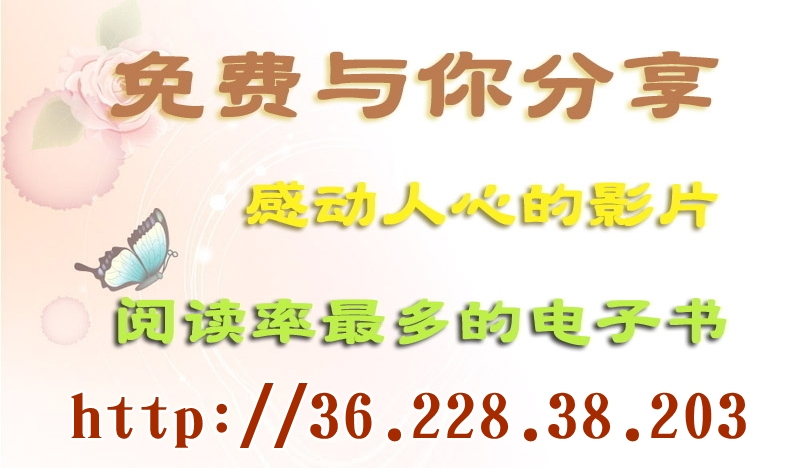

<h1 align="center"><a href=https://github.com/3fmd/gm/blob/master/epub.md>免费下载好书 下载 epub 视频 音频 图文 电子书</a></h1>
<h2 align="center"><a href="https://github.com/3fmd/gm/blob/master/gm/download/Reasily1802h.apk?raw=true">手机必备Reasily - EPUB 阅读器apk 请下载安装 才能阅读影视epub</a></h2>

<h1 align="center"><b>新报告：中共在改革的幌子下持续强摘器官</b></h1>

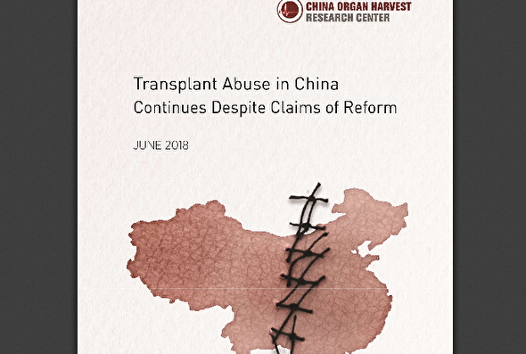

“中国强摘器官研究中心”发布最新报告《中国的器官滥用在改革的幌子下持续》。（网络截图）

【大纪元2018年07月06日讯】（大纪元记者李辰报导）7月2日，中国强摘器官研究中心（China Organ Harvest Research Center，COHRC）在西班牙马德里世界器官移植大会期间发布最新调查报告，题为《中国的器官滥用在改革的幌子下持续》。

这份报告得出以下结论：

1. 尽管缺乏器官捐献系统，2000年后中国在几年之内就成为世界上开展器官移植手术最多的国家。中共2006年强摘器官黑幕曝光后，其器官移植规模仍持续增长。

2. 每年10,000-15,000例移植的官方数据被明显低估，几家移植医院就可以超过这一数字。

3. 最新证据显示，中国大陆移植的数量继续超过捐赠器官数量，支撑庞大中国器官移植工业的大部分器官继续来自良心犯。

4. 海外赴中国医院移植旅游依旧兴旺，并且，中国正向亚洲及其它地区扩张共享器官协议，将整个国际社会卷入其器官罪恶。

加拿大人权律师大卫•麦塔斯（David Matas）在新报告发布会上表示，“器官的主要来源是良心犯，最主要的是法轮功学员，也包括维吾尔人、藏人和基督徒。”

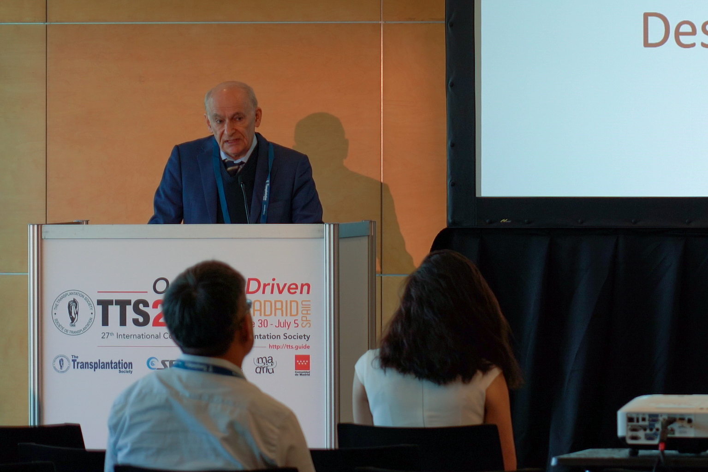

7月2日，加拿大律师大卫•麦塔斯（David Matas）参加在西班牙马德里举行的新闻发布会。（COHRC提供）

<b>仅165家器官移植医院手术容量超过7万例</b>
 
COHRC执行主任Grace Yin表示，中共官方每年1万-1.5万例的移植手术量被明显低估，仅几家医院就可超过：

以天津东方器官移植中心为例：其互联网备份资料显示，在2003年中心建立时就有500张器官移植床位；自2006年中国强摘器官曝光以来，移植床位增到500-700张；2009年移植病床的利用率为90%，2013年进一步增至131%。

以500张床位、100%床位利用率和平均移植手术住院时间4周计，该中心每年施行6-8千例器官移植手术。

规模惊人的移植医院屡见不鲜：

北京大学人民医院肝移植中心主任朱继业在2013年表示：“我们医院曾在一年之内做过4000例肝肾移植手术……”

广州中山大学第一附属医院的网站显示：“已有数万患者在医院器官移植中心接受了肝肾移植。”

调查发现，很多中国医院的器官移植中心的床位利用率达100-200%，等待器官移植的病患名单很长。以一个月的住院期和100%的床位利用率保守计算，仅165家卫生部批准的器官移植医院每年的系统容量就达7万例以上。

“中国强摘器官研究中心”（China Organ Harvest Research Center, COHRC）执行主任、主要研究员、最新报告联合作者Grace Yin（讲台发言人左）和联合作者Huige Li（右）。

<b>按需移植</b>
 
德国美因茨约翰内斯‧古腾堡大学医疗中心的教授、2018报告联合作者Huige Li表示， 研究员们发现了大量在缺乏器官捐献系统情况下发生的令人触目惊心的按需移植的实例，比如：

2005年，一位以色列人提前两周预约到中国做心脏移植；2006年，一家医院同时开始5台肝移植和6台肾移植手术；2013年，一家医院在一个下午同时做4台心脏移植手术；2016年10月，一家医院同时做16台移植手术。

2009年，《天津医学杂志》发表了一项研究，分析了2004年至2008年间在天津东方器官移植中心进行的1600次摘取肝脏手术。在此基础上，该中心主任沈中阳创建了一种具有中国特色的“无心跳尸体”肝脏切取手术方法，将热缺血时间保持在5分钟以内。

新报告的联合作者们表示：鉴于中国在2010年以前没有器官捐赠系统，这意味着活供体因为器官摘取而成为“无心跳尸体”。

2003年至2009年8月，中国大陆仅130人在死后捐献了器官，每年全国平均不到30人捐献器官，而仅东方器官移植中心使用的肝脏数量就超过了全国公民器官捐献的数量。

在有着13亿人口的中国，估计处决的死囚犯最高约每年10，000人。按比例计算，天津市1200万人口每年被处决的死囚人数应少于100人，2004年至2008年5年内应不足500人。因此这一人群的活肝数量也甚至远不足以满足这家医院的1600例切取。

<b>“一夜之间”的器官捐献系统转型</b>
 
中国器官捐献自2010年3月开始试点运行，在基本没有捐献的情况下于2013年3月宣布在全国“铺开”，公民捐献占器官来源总量的比例从零达到23%；到2014年8月增至80%，到2015年1月达100%，从而“一夜间”实现了中国器官来源的转型。

截至2017年底，中国器官捐献官网显示自愿捐赠器官登记人数达到373,536人。

中国强摘器官研究中心基于美国登记捐献与实际捐赠的比例，估算中国37万3千位器官捐赠登记人仅可产生29位实际捐赠人。

在公民自愿捐献无法圆中国庞大器官移植来源的情况下，中国器官移植发言人黄洁夫又推说其真实来源是ICU，医院重症监护室。由于运作完全不透明，ICU的实际获取器官数量无可获知，但中国强摘器官研究中心对各地媒体和捐献管理机构发布的历年（包括来自ICU等未登记捐献在内的）实际捐献数据进行了统计分析，发现其汇总的数量甚至远远低于中国官方承认的1万到1万5千例的移植量。

而根据卫生部对批准的器官移植中心的移植床位数量的最低要求，中国器官移植的最低系统容量也在7万例以上（实际的移植数量应远大于此），ICU也不过只是中共洗白器官源的一个幌子。

<b>中共国家推动的群体灭绝运动</b>
 
报告联合作者David Li认为，强摘器官是中共国家推动的群体灭绝运动，医疗界和军方都卷入其中。

“中国强摘器官研究中心”（China Organ Harvest Research Center, COHRC）最新报告的联合作者之一David Li。

David Li举例说，中国原卫生部副部长黄洁夫2001年2月1日接受中共喉舌《人民日报》采访时公开表示：“反对法轮功是一场严肃的政治斗争，对一小撮的反动骨干决不能心慈手软。”

法轮功，是基于“真、善、忍”原则的身心修炼功法。1999年7月20日，前中共党魁江泽民以法轮功修炼人数多于共产党员人数等为理由，下令镇压。

2014年9月，“追查迫害法轮功国际组织”对原中共解放军总后勤部卫生部部长白书忠，进行电话调查。白书忠在这份电话录音中说：“当时是江主席啊……有一个批示，就是说开展这些事情，就是器官移植……当时江主席批示以后，反法轮功大家都做了很多工作……”

“中国模式”移植系统的最新发展与影响
2015年之后，中共通过系统编造的数据、令人眼花缭乱的移植中心橱窗展示、在海外的公关活动和在国际会议对“中国模式”捐献和移植系统发展蓝图与取得“成就”的展示，营造出中国已停止外国人器官移植旅游、转型道德捐献器官的假象，其所谓的改革得到了一些国际移植组织的认可。

然而，一家韩国主要电视台播出的2017年10月对中国最大的天津东方器官移植中心的实地调查发现：

来自中东、韩国等国的病人在医院附近酒店等待数日或数周内即可获器官移植；如果想医院基金会支付一笔特别捐款，将加速器官移植进程。该中心大厅的布局图中赫然显示多个国际器官移植病区，国际移植部护士向调查记者透露在头一天该部就完成了8例移植手术。调查组观察到中心的十多间手术室仍被全天使用，这与已拥有500多张专用移植床位满额后，将外国病人安置在附近的几层酒店，意味着该中心每年进行数千例器官移植手术，向中外患者按需要提供器官移植。

除延续蓬勃发展的入境移植旅游外，中国还竭力寻求将其在大陆采割的器官输出到其它国家或地区。鉴于“中国模式”的捐献与移植系统继续由杀戮无辜者支撑，通过其向亚洲其它地区，一带一路及以外地区扩张，中国政权正将国际社会牵连在其罪行之中。

国际医学伦理权威、纽约大学医学院伦理系主任阿瑟•卡普兰教授(Arthur L. Caplan)说：“中国强摘器官研究中心的关于中共强摘器官的最新报告能得到全世界器官移植界和各国政府的关注。”

目前，以色列、西班牙、意大利和台湾等国家和地区已立法，禁止民众赴中国“器官移植旅游”。

COHRT发布会的最后，报告作者们提出一个历史参考，七十多年前，当纳粹医生在二战后在纽伦堡接受审判时，美国首席检察官杰克逊说：“我们力图审判的这些罪恶，是被精心策划、极端邪恶、充满破坏性的，人类文明无法容忍其被忽视，更无法容忍其重演。”今天，在中国上演的活摘器官的犯罪正是对这个时代的考验，需要每个人作出回应与选择。

最新报告网址：https://www.chinaorganharvest.org/app/uploads/2018/06/COHRC-2018-Report.pdf

<h1 align="center"><b>“法轮大法帮我死里逃生” 英国人见证奇迹</b></h1>

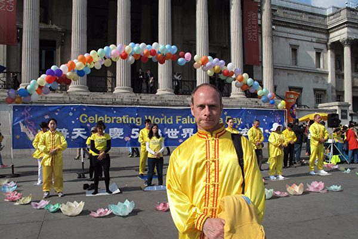

2017年5月7日，在伦敦特拉法加广场，安东尼•朗斯通参加“5•13世界法轮法日”庆祝活动时留影。

【大纪元2018年06月19日讯】（大纪元记者唐文舒英国伦敦报导）安东尼•朗斯通先生（Anthony Langstone）来自英格兰西北部一个叫利镇（Leigh）的小镇，那里离曼彻斯特较近，他从2001年开始修炼法轮功， 迄今已经17年了。

在回顾自己得法修炼17年的过程时，安东尼感恩法轮大法给予他慈悲呵护，大法的师父延续了他的生命。他说自己对师父的感恩，用人类的任何语言都表达不了，他希望世界上每个人都别错过法轮大法。

 <b>从“练气功”到寻求大法</b>
 
安东尼的得法过程颇为神奇。安东尼的哥哥练一种气功，并大力向安东尼推荐气功净化身体的作用。在哥哥的大力推荐下，安东尼决定尝试一下哥哥推荐的气功。

哥哥教了他一些气功动作，结果在模仿尝试中他马上感受到热量和刺痛感，这让他感到惊奇，他哥哥解释说那是能量在他身体里流动造成的。这个体验立刻激发了安东尼对气功的兴趣，他想了解更多。

在初步接触了气功后，一天，安东尼嘱咐妻子帮他去书店看看能否找到有关气功的书。

安东尼的妻子来到水石书店（Waterstone Bookstore），信步走到摆放着有关治疗方法书籍的书架前，她立即被一本蓝色封面的书所吸引，简单翻阅后，她发现这还是一本有关气功的书，就立刻买了一本带回家。

他说自己曾看过一本东方的书，从而得知了“师父”这个概念，即徒弟对自己老师的尊称，他随后静坐在那里向宇宙寻问：哪位是我的师父？

妻子给安东尼带回来的是一本《转法轮》。安东尼这样回忆他初读法轮功书籍的感受：“我花几天时间把《转法轮》读了一遍，刚读完几章，我就知道，这就是我要找的。”

安东尼惊喜地发现，慈悲的宇宙听到了他的请求。17年来，安东尼一直守着这份珍贵的宇宙礼物。

<b>修炼后 身心发生巨大变化</b>
 
在开始读《转法轮》之后的三至五年里，安东尼发现这本宝书是“即时的指导”，每当他阅读过某一段，自己遇到的事情就会与刚刚读过的内容有关或相联系，这种现象的反复出现，让安东尼和他妻子感到神奇，更让他们感到惊喜的是安东尼的巨大变化。

“几年下来，我发现自己在道德、身体和精神方面都改善了，能够较轻松地对待冲突，变得更加体贴别人，远离了精神上的痛苦和偏执，”他说，“我终于能够用平和与宽容来对待曾经伤害过我的人。”

法轮大法祛病健身的神奇效果也反映在安东尼身上，在开始修炼法轮功后的几个月内，曾让他痛苦多年的疾病都消失了。

“我身体曾有许多疾病，比如几乎每天发作的坐骨神经痛、每年爆发两次的支气管炎、还有肠道疾病等，所有这些都消失了。”

<b>死里逃生的奇迹 “师父救了我的命”</b>
 
安东尼感触最深的，是他一次近乎死亡的经历，从这次死里逃生的经历让安东尼体悟到：法轮大法时刻给予他慈悲呵护，大法的师父救了他的生命。

安东尼的工作是建筑装饰工，他在一次工作时遇到了突发事故，“那一天，我在客户房子外面，把梯子延搭到烟囱上去涂染料。这时看到烟囱边上有一根电缆，我判断这是一根电话线。”

然而由于这个房子很旧，这条电缆其实是带电电缆，“我起初没意识到这一点，在没有任何防护的情况下，我把油漆罐挂到电缆上去时，刹那间我触电了，我的手痉挛起来并被吸在电缆上。在极度的恐惧中，我想尽一切力量把手臂抽回来，但做不到。”

“正在这时，我突然感到一阵平和的感觉，还感觉有人在我身后抱着我。最终我设法松开了手，但发现我双臂好像瘫痪了。就在同时，由于我的挣扎，曾经倾斜在烟囱上的梯子被拉出土壤，变成几乎是垂直而立在地上，看起来相当危险。”

“在接下来的十至十五分钟里，我一直在想着下梯子，但是动弹不了。当时四周没人，我孤立无援。我脑子里问了一个问题：‘怎么办呢？’然后有个意念打进我大脑：试着一步一步爬下去，于是我设法一步一步爬到梯子底。”

“我的客户回家了，他带我去了医院。医生对我死里逃生的经历感到十分吃惊，很困惑于他看到的奇迹。其间我无意中看到摆在旁边一份报纸上的星座页，上面对我的星座说法是：你是幸运的，在灾难到来时，又被给予一次机会。我明白发生了什么，我哭了起来。”安东尼说，这是法轮大法对他时时刻刻的慈悲呵护。

“法轮大法让我理解了西方文化里的善恶有报”
谈到修炼法轮大法对他意味着什么，安东尼带着喜悦和感恩说：“大法告诉我做人的意义，教会我应该怎样做人”。

安东尼说，自己学习了法轮大法之后，多年的困惑豁然开朗，甚至明白了一些西方社会里的修炼文化。“法轮大法还解答了一直让我思绪萦绕的一个问题：我们人生中为什么会这么受苦？这让我彻底走出了多年来对生活的沮丧感。”

“通过学习法轮大法，我相信了因果关系的存在，西方文化里也说善恶有报（‘what goes around comes around’），但是我以前从来没把这个说法当回事，直到我看到法轮大法对‘真、善、忍’原则的教导，我才明白这种说法是多么有道理。”

安东尼说，法轮大法的教导以“真、善、忍”为核心，这是无价的法宝，“他让我能够区分好与坏。这是一个在实践中去领悟的过程，也就是说在你走过了某个过程之后，你会觉醒。”

“人们经常谈到救赎，我认为自己就经历了被救赎的过程。我在生活中遇到了一些魔难，我相信如果没有遇到法轮大法，我是走不过来的。我们自己的毅力和决心是必需的，但是法轮大法给我们铺好了路，我们需要的就是在铺好的路上一步步走下去。”

<h1 align="center"><b>从天安门到埃菲尔铁塔 法轮功学员720传真相</b></h1>

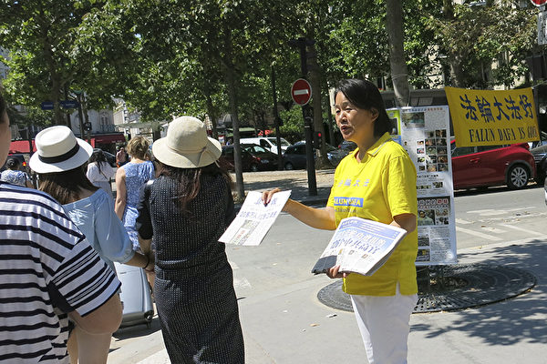

孙女士在法国向中国大陆游客讲法轮功真相，发放给他们真相资料。

【大纪元2017年07月29日讯】（大纪元记者关宇宁法国报导）游客只要来巴黎，一定不会错过埃菲尔铁塔。无论登临这座“法国首都的瞭望塔”，俯瞰令人叹为观止的巴黎市容，还是坐在铁塔脚下的草地上，悠闲地望着塔尖上飘过的云，这里都有着浓得化不开的巴黎气息。

埃菲尔铁塔有一个传说：无论你在哪里，无论何时，假若你愿意回头看，我会一直在守候。如今，印证这句浪漫语的除了铁塔，还有铁塔下一群善良的人们──法轮功学员。他们经年累月、无论风雨，都在这里守候。为的就是讲述一句真相，送出一份祝福。

法国法轮功学员孙女士就是这样，从中共1999年720镇压法轮功开始，她走上了天安门，之后来到法国，就在埃菲尔铁塔下守候了多年，向海内外民众广传真相。

<b>幸遇大法 解开人生疑惑</b>
 
“我是1998年11月份开始修炼法轮大法的。”来自河南郑州的法轮功学员孙女士回忆当初得法前的心路历程，“从高中起我就对人生产生很多的思考，人为什么活着？活着的意义是什么？一直在追寻这些答案。后来我上大学、工作、结婚，有了家庭和孩子，但内心仍是苦恼的，觉得很茫然。”

找到答案的机缘悄然来临，但一开始孙女士差点错过。1998年时，她住的小区里已有不少人修炼法轮功，包括她的父母和邻居，但她觉得气功是老年人的事，所以没在意。

一次，小区里放法轮功创始人李洪志师父1998年在世界各地讲法的录像，一天晚上闲着没事，她就和母亲一起去法轮功义务辅导员家里看录像。

孙女士听到录像里讲：遇到任何矛盾你都要找自己，两个人发生矛盾，第三人看到了，你都要找找自己，为什么这事让你看到了。她说：“我一听到这，突然觉得心里豁然开朗。”

录像里李洪志师父还提到：你感觉自己的话是为对方好，但为什么对方听到后会生气？是因为你话里有想保护自己的东西，不想被伤害，维护自我的东西，对方接收到了话背后的信息，所以就生气了。

“那时我和我先生经常闹别扭，有时甚至互不说话。听了师父的讲法，我忽然明白了问题出在哪。”从那一天起，孙女士知道自己找到答案、找到师父了。

第二天开始，她白天在家学《转法轮》，晚上去辅导员家看师父讲法。学《转法轮》时，孙女士读到，当你决心要修炼时，那一念就像金子一样闪光。当时她就说：“我也要修炼！”从那时起她真正走入修炼了。

回忆起当时的情景，她的脸上露出幸福的笑容。从此以后，她就按照李洪志师父教导的“真、善、忍”宇宙法理指导自己修炼，家庭也越来越和睦了。

孙女士在法国向中国大陆游客讲述法轮功真相。

<b>迫害降临 走出去为大法说句公道话</b>
 
然而，孙女士修炼没多久，中共对法轮功的骚扰就开始了。1999年4月25日，一万名法轮功学员去中南海和平上访，孙女士也知道了此事，那时她还是新学员，也就没有去。

但从后来的广播中，她能感到有种“山雨欲来风满楼”的感觉，尽管报纸上还说“不限制法轮功修炼，群众有炼功自由，信仰自由”，但孙女士发现，她所在的炼功点上时常有陌生的面孔出现。

1999年7月20日，中共江泽民集团开始了对法轮功的全面镇压，在全国各地抓捕了大批法轮功学员。孙女士选择走出来，为大法说句公道话。

她回忆道：“7月21日，我们和往常一样在炼功点炼功，后来得知当地的辅导员被抓了，炼完功，学员们就商量一起去河南省省委信访办上访，觉得政府一定是不了解真相，搞错了。”

到了信访办，工作人员要求法轮功学员们登记名字及住址等信息。本着对政府的信任，他们都登记了真名，还给那里的工作人员讲自己炼功后的受益情况，要求赶快释放被抓的辅导站站长。

7月22日，中国大陆所有的电视台、电台和报纸开始铺天盖地地诽谤法轮功，从那时起，全国各地都有法轮功学员去当地政府或北京上访，要求释放被抓的法轮功学员，停止那些造谣宣传，还给学员自由炼功的环境。

当初在信访办登记的真名实姓，后来成了全面镇压的工具，连学员的家人也被牵连。“从那以后，我家就经常被警察骚扰。”孙女士说，“我先生不修炼，但警察经常去我先生的工作单位给他施压，他的正常生活和工作遭到了严重的骚扰。”

随着迫害升级，孙女士的家人也非常担心，因为他们知道共产党的株连政策。法轮功学员家的孩子不能参军，工作、上大学等方方面面都受到影响。孙女士说：“我的公公婆婆都是经历过文革的人，知道共产党的邪恶，所以他们非常担心孩子的前途。”

<b>去天安门告诉人们“法轮大法好”</b>
 
1999年7月23日早上，为了告诉人们“法轮大法好”，孙女士与学员们一起继续在炼功点炼功，结果派出所的人直接将学员们抬离炼功点。1999年11月，孙女士再次到户外炼功，结果被捕了。

“当时我已经怀孕，就这样还是被关押了十几天。2000年3月，因为中共召开人大会，学员们联名上访，我又被关押了一天。”

在上访和联名请愿信都无果的情况下，孙女士和同修们决定去天安门广场请愿：“那时就感觉既然大家没有说话的地方，只能去天安门广场了，在那里发出自己的呼声。”

孙女士第一次去天安门是在2000年6月20日左右。“那时我已是怀孕后期，离孩子出生只有10天了。去天安门打开横幅后，警察很快冲过来，把好几个人都推倒了。我们被带到天安门派出所。”

当时有个警察推孙女士，另一个同修就指著那个警察说：“你不准动她！”警察就吓得不敢推她了。后来警察就请示问：“这有一个孕妇，怎么办？”得到的答案是：“哪远给她扔哪去。”孙女士就没被关进派出所。

之后她又回到天安门广场，遇到别的同修，就在天安门广场一起炼功。一会儿警察又来了，其中有刚才的警察，就没抓她，而是抓走了另一位同修。

身怀六甲还冒险去天安门，难道孙女士不怕影响到胎儿吗？她怀这个孩子之前有好多年都有习惯性流产，一直无法再次怀孕，但修炼了法轮大法以后，身心受益的她终于怀上孩子，她说：“当我学大法修炼以后，我相信这个孩子一定会顺顺利利地来到世界上，健健康康地成长。”

为什么孙女士有勇气冒着生命危险去天安门呢？她还记得自己当时的心情，已将生死置之度外：“我希望到天安门广场上说句心里话：‘还我师父清白！还法轮大法清白！法轮大法好！’去天安门之前，我感到有一种巨大的力量促使我一定要去天安门喊出我们的诉求，去告诉他们‘法轮功还在！’”

<b>几次被抓 被迫与骨肉分离</b>
 
然而，骚扰、抓捕没有就此停止，孙女士讲述自己的惊险经历：“孩子出生不到十天，警察就到家里来骚扰。那时生活已经处于时时被监视的状态，随时都可能被抄家。”

孩子半岁时，2000年12月31日，孙女士第二次去北京天安门请愿，在警察抓捕过程中，她成功逃脱。从北京回郑州后，当地国安知道她曾去了北京，将她和婴儿一起劫持到洗脑班，想强迫她放弃法轮功。她又非常智慧地从洗脑班走了出来。

为了躲避警察的抓捕，孙女士不得不和嗷嗷待哺的孩子暂时分离，她说：“因为警察随时都会来抄家，为了安全，我被迫在外面租了房子，不能回家，儿子交给公婆照顾，不能接受我的正常哺乳。”

后来孙女士两次被非法劳教，被迫与年幼的孩子骨肉分离，“第一次是在2001年7月6日，儿子满一岁时，我被非法劳教了两年半；儿子上小学一年级时，我第二次被非法劳教两年，孩子就这样被剥夺了享受母爱的权利。”

孙女士含着眼泪回忆道：“孩子早上去上学，都不晓得下午是否能有妈妈来接她，可能妈妈又被抓走了。当我被释放回家后，儿子对我说，‘妈妈，那时我上学，常常望着天空，对着天空说，妈妈你快回来。’”

在孙女士第一次被劳教时，她的大女儿也刚上小学，女儿常对着窗户喊：“妈妈你快回来。”“在这个过程中，两个孩子确实承受了很多。”说到这，孙女士的声音哽咽，眼泪掉了下来。

孙女士很爱自己的孩子和家庭，可是在中共迫害正信铺天盖地的谎言下，她还是无法选择沉默，哪怕知道自己面临被抓的危险。

她平静又坚定地说：“那时知道出去炼功会被抓，但法轮大法是正法，在修炼中，我身心受益了，我知道大法好，知道电视上所说的每一句话都是假的，如果我不站出来，不修炼的人更不知道真假了，更多的人会被谎言蒙蔽。我要尽我自己最大的能力站出来说真话，尽管这意味着被关押，失去正常的生活。”

<b>来到法国继续讲真相</b>
 
多年来，孙女士虽然不断搬家，但一直遭到警察的骚扰和抄家。后来她在2014年12月有机会来到法国。在法国，她继续向中国大陆游客讲真相，真心希望帮助同胞认清中共的谎言，脱离它，免受中共的牵连。

孙女士在埃菲尔铁塔下的战神广场上炼功。

在法国巴黎埃菲尔铁塔下，常年都有法轮功学员给来往不绝的中国同胞讲法轮功的真实情况和学员遭受的非法迫害，也劝说中国同胞“退党、退团、退队”。

孙女士2014年来到法国后，干脆就把家安在了埃菲尔铁塔附近，方便来这里讲真相，劝“三退”。

她说：“被中共蒙蔽的中国人是真正被中共迫害的人，我们希望他们能了解真相，与邪党划清界限，天灭中共那一天，咱们这些无辜、善良的中国人都能保平安。”

她希望来到法国的中国同胞都能感悟到法轮大法的美好，也能感受到在这个自由社会中，信仰和言论的自由都是受到保护的。

虽然讲真相的过程不总是一帆风顺的，也会遇到不理解的游客，但是孙女士仍会继续善意地告诉他们真相，希望他们能明白。

<h1 align="center"><b>希望国际社会关注法轮功遭受的迫害</b></h1>

【明慧网二零一八年六月二十一日】据明慧网近日报道，二零一八年六月八日，美国联邦众议员达纳·罗拉巴克（Dana Rohrabacher）发起第932号决议案，声援中国民众退出共产党及其附属组织，要求中共立即停止迫害法轮功。这项决议案已提交给美国国会众议院外交事务委员会。
决议案中指出，中共在中国至少造成六千万人非正常死亡，中共继续暴力镇压和平运动，包括长达十九年、仍在持续的对法轮功的迫害。

决议案中说，中共对强摘法轮功学员器官负有责任，美国国际宗教自由委员会（USCIRF）二零一七年国际宗教自由年度报告中有关中国的章节指出，“（中共）政府继续拘留、监禁和折磨无数宗教自由倡导者、维权人士和宗教信仰者，包括受严重迫害的法轮功学员”。根据“追查迫害法轮功国际组织”（简称“追查国际”，WOIPFG）的调查，通过活体强摘器官而杀害大量法轮功学员是由中共策划和执行的群体灭绝罪行。成立于一九九九年六月十日的“610办公室”，专职协调和执行旨在消灭法轮功学员的行动。

决议案中还说，退党大潮支持中国人民的自由及退出中国共产党及其附属组织，退出中共及其附属组织的民众在二零一八年达到约三亿人。因此932号决议案声援法轮功学员及其家人，要求中共立即停止迫害法轮功，声援中国退党潮。

维护世界人权，制止中共迫害法轮功一直是美国民选官员关注的事情，早在2010年3月16日，众议院众议员以412票赞成，1票反对的压倒性票数通过了第605号决议案。

2013年6月27日，美国两党国会议员在众议院又共同发起“281号决议案”。

2016年6月13日，美国国会众议院一致通过343决议案，要求中共停止强摘法轮功学员等良心犯器官。2016年6月22号，美国国会第三次“中共强摘器官”听证会表示：对法轮功的迫害是“中国近代史上最大的耻辱。”

从中共开始迫害法轮功到二零一八年，中国（中共）一直被美国国务院列为宗教自由“特别关注国”。二零一八年五月二十九日，美国国务院发布二零一七年度《国际宗教自由报告》，中国（中共）再次被列为“特别关注国”。报告关注法轮功等信仰团体受迫害情况。美国国务卿蓬佩奥表示，美国对于侵犯宗教自由的行径不会袖手旁观。维护正义，惩罚邪恶是最正确的事情，美国政府、美国国会、美国总统的正义之举会给美国的国家和人民带来美好！

二零零六年沈阳苏家屯活摘器官黑幕首度曝光，震惊了整个世界。据大纪元2016年08月07日刊登的一篇《活摘──历史巨变前的黑暗（完整版）》文章中显示：2006年，来自中国的安妮在美国举行记者会。安妮是沈阳苏家屯医院的护士，她的前夫是苏家屯血栓医院的外科医师。她说出的事震惊了所有的人。苏家屯有一个地下室，2002年，里面关押了约六千个法轮功修炼人。她从来没有进去过，只能远远瞥见那些被关押的人。每年，那些人减少约两千。到了2006年，那里没有一个人活着出来。

据明慧网资料显示，二零一六年六月二十二日，加拿大前亚太司司长大卫·乔高（David Kilgour）、加拿大著名国际人权律师大卫·麦塔斯（David Matas）和调查记者伊森·葛特曼（Ethan Gutmann）发布了关于中共强摘器官的最新数据报告，报告显示中国器官移植手术数量每年约为六万～十万例，从二零零零年至今可能高达一百五十万例；这些器官的主要来源是法轮功学员，而且至今仍在继续着。

据明慧网显示，中共迫害法轮功十九年来，在中共的“名誉上搞臭、经济上截断、肉体上消灭”、“打死算白死，打死算自杀”和“不查身源，直接火化”的灭绝政策下，上亿法轮功学员被污蔑，数百万人被绑架、关押、劳教、判刑，甚至被酷刑致死或活摘器官致死，数百万家庭被迫害得支离破碎、妻离子散、家破人亡！

据明慧网资料显示，二零一八年四月份又有60名法轮功学员被非法判刑，有64名法轮功学员被非法庭审，其中律师为30人做无罪辩护。二零一八年一至四月份被中共非法冤判的法轮功学员达269人，对法轮功学员非法庭审达225场。一至四月份1287名法轮功学员遭绑架，447名法轮功学员遭骚扰迫害。中国大陆法轮功人权仍然在日益恶化，

中国大陆谢燕益和谢阳律师，在《致加拿大国会议员及全体公民的一封信》中说：“当今世界最大的人权问题在中国，中国最大的人权问题是法轮功问题。一场延续近二十年针对法轮功学员的迫害仍在持续当中。”中共肆意践踏和破坏中国的宪法和法律及相关国际法则，肆意践踏和破坏世界人权，已经到了不可容忍的地步！

解体中共，结束迫害，维护世界人权和人类和平安宁是全人类共同的责任。呼吁国际社会都能够象美国这样关注中国人权状况！关注仍在无辜承受中共血腥迫害的苦难中的法轮功学员！早日结束这场不应有的迫害，还人类应有的基本人权和尊严！

<h1 align="center"><b>中国器官移植供体到底从哪来？</b></h1>
 

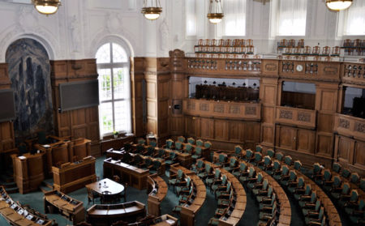

【大纪元2016年10月17日讯】（大纪元记者李新丹麦报导）2016年9月底，加拿大著名人权律师大卫·麦塔斯（David Matas）在哥本哈根，向丹麦社会各界介绍他与加拿大外交部亚太司前司长大卫·乔高（David Kilgour）和记者伊森·葛特曼（Ethan Gutmann）一起合作的、对发生在中国大规模活体摘取器官罪行的最新调查报告：《血腥的器官摘取/大屠杀：更新版》（Bloody Harvest/The Slaughter ：An Update）。

<b>“震惊人类的堕落可以达到如此深重的程度！”</b>

丹麦广播电台“Radio24syv”在麦塔斯访问丹麦期间，邀请他到演播室做现场直播采访。

丹麦电台“Radio24syv”介绍：“中国的医院进行器官移植的数量远远超过官方公布的数字。一份新的报告提出了一个非常严重的问题，那就是为中国精英提供移植器官的来源问题。”

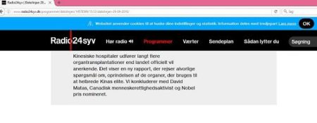

丹麦广播电台“Radio24syv”在麦塔斯访问丹麦期间，邀请他到演播室做现场直播采访。

<b>“器官供体多来自于法轮功学员”</b>

一开始，主持人阿拉普（Anne Sofie Allarp）就直奔主题，询问麦塔斯，在中国，目前所出现的大规模器官移植的供体究竟从何而来。麦塔斯立即给出了他10年来调查的结论：“（器官）大部分来自（监狱里关押的）良心犯，其中最大比例的是坚持信仰的法轮功学员。”

大卫·麦塔斯和大卫·乔高先生在10年时间里，通过对发生在中国的、对法轮功学员被活摘器官的独立调查中，接触了许多法轮功学员。

麦塔斯根据自己的了解，以第三者的身份向丹麦的听众介绍他的认识：法轮功是一种修炼功法，从1992年开始由李洪志先生传授，这是结合了佛家和道家理念的一种传统的气功。

一开始，中共当局很鼓励民众修炼法轮功，因为这对人民的健康有益，也减少了国家的医疗费用负担。由于法轮功在民众中非常受欢迎，学炼法轮功的人数增长飞速，这很快引起了中共当局的不安。1999年，中共政权开始了对法轮功的镇压，造成了十几万法轮功学员被捕，并被关进监狱受到强制洗脑和酷刑迫害。

<b>中国医院鼓吹兜售移植“成果”露罪证</b>

麦塔斯在广播采访节目中介绍了他们对活摘器官进行独立调查的数据来源。

他表示这些数据都是中国的医院自己“骄傲”地宣扬出来的。在主持人阿拉普好奇地追问下，麦塔斯解释道：“在中国（医院里的医生、护士）根本不公开讨论器官的来源问题，那是中共的红线，医生在他们的报告里面会介绍一年做了多少移植手术、有怎样的移植成功的经验，我们从中得知他们所做的移植的数量规模。”

麦塔斯表示，中共政府一直在掩盖着有关移植器官来源的真相。

他说：“中共政府对于器官来源的表态几乎就是信口雌黄。一开始，中共说这些器官都是来自捐赠者，但中国其实没有捐赠系统，同时他们也没有因车祸等突然死亡的器官分配系统。然后他们又说，是来自死刑犯，但是他们又不愿意公布死刑犯的数据，这样器官的真正来源还是无法追踪，况且，一般死刑犯在判决后7天内就被执行了。现在，他们又说器官都来自捐赠，我们也调查了他们的捐赠系统，数字非常小。总之，他们不敢去面对事实，只是不断改变着说法。”

麦塔斯表示，他和大卫·乔高的十年独立调查耗费了大量的精力和时间。他们对每一个做器官移植的医院进行数据信息的搜索，包括他们的网站、新闻、员工的确认和医院自己所做的报告等等。

他说：“其实每个医院都有很多资料信息可查。调查是枯燥而繁琐的，但我非常确信，我们的调查数据是准确的，只是要整合在一起非常花时间。”

在直播采访中，主持人阿拉普非常震惊于中共至今仍然在进行活摘器官。麦塔斯在节目中也表示，他虽然之前就对中共的邪恶有所知，但他还是对他们自己的调查结果感到震惊。

麦塔斯说：“事实上，我一开始的时候，真没想到会是这样的结果，我只是想确认这样的（活摘器官）罪行是否真的存在。当然我最初的希望是，通过调查证明，这些指控都是不存在的。但我们的结论却是：这些罪行全部都存在，而且数量惊人，这罪行已经持续了很多年！我不能说我很惊讶于中共的行为，因为我之前就与他们打过很多交道。但我还是有些震惊，我震惊于人类的堕落有时候可以达到如此之深重的程度！”

从2006年以来，麦塔斯和乔高开始对中共活摘器官罪行进行独立调查，已经走过了漫长的10个年头。麦塔斯表示，他将一如既往地对这场人类有史以来最邪恶的罪行调查、追踪、挖掘、曝光下去。

他说：“一开始我有点担心，一旦我不做了，这些数据就会丢失，因为除了我和乔高之外，好象没有人在做调查。但现在情况不同了，有许多非政府组织，比如医生反活摘组织（DAFOH），还有很多个人（例如伊森·葛特曼）都在参与追踪调查，在用各种方式揭露发生在中国的这场活体摘取器官的罪行。

我个人的认识是，绝不停止与罪恶的战斗，直到罪恶停止。

<h1 align="center"><b>当我身穿旗袍约见美国议员的那一刻</b></h1>
【大纪元2018年06月27日讯】为了这次的约见，我特意穿上了旗袍。我，一个70多岁的来自中国的老人，要约见美国参众两院的议员们。

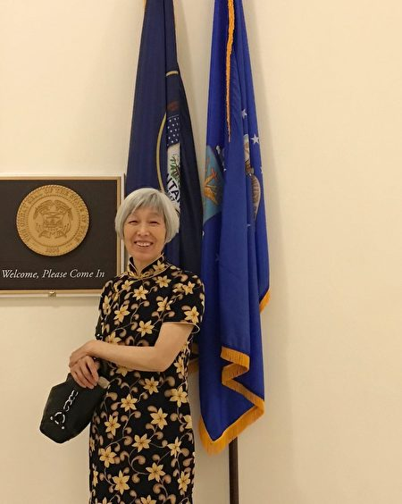

孙常珍在议员办公室门前。（孙常珍提供）

6月中的这一天，天气不算太热，随着人流，通过安检，我站在了宽敞明亮的议员办公大楼的大厅里。

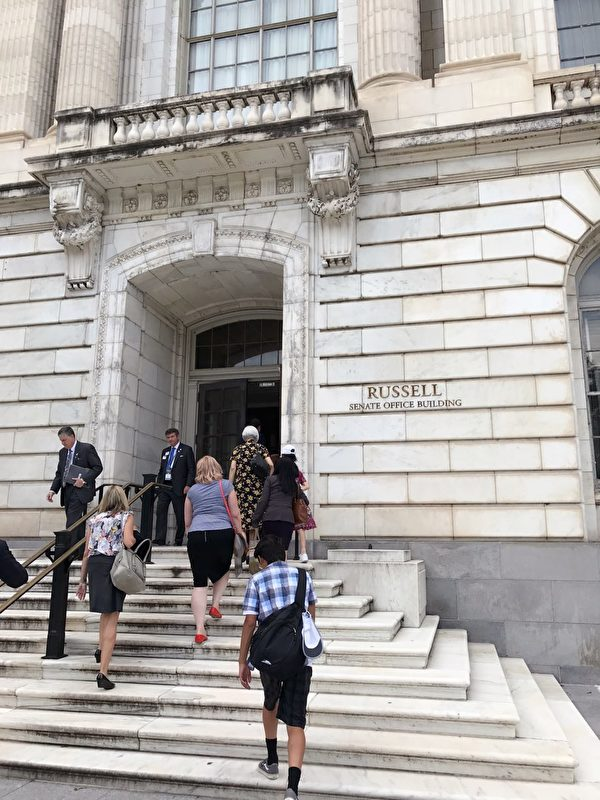

孙常珍步入美国参议院办公楼。（孙常珍提供）

那一刻，我的眼中有些发潮。在美国，每个州只有两个参议员，国会内共有100个参议员。而我，要给他们讲述我的遭遇，让他们听到我的心声。

<b>过去的一幕幕</b>
 

18岁时的孙常珍。（孙常珍提供）

我年轻时上山下乡，嫁给了黑五类的儿子，中年离婚、丧子，四十多岁就一身病，心情抑郁，基本处于等死状态。1997年修炼法轮大法后，让我有了重生的感觉。不但身体健康了，最让我开心的是，我放下了许多生命中不能承受的怨恨的心，掀开生活崭新的一页。

1999年4月10月，孙常珍（中）在北京首体参加集体炼功。

“滴水之恩将涌泉相报”，这个道理我是懂得的。1999年中共打压法轮功后，我不肯说违背良心的话。

之后，在我不知情的情况下，家里的电话被监听了。一天晚上，5个便衣警察以查水表交管理费的名义敲开我家楼下的大门，在他们去我家抄家抓人的时候，我神奇地走脱了。从此我开始了10个月的流离失所的生活。

在北京，我和朋友们租房住在一起。2000年6月19日的凌晨2点多，还在睡梦中，我们的房门被撬开，20多个警察用枪指向我们喊著“不要动”。

我和朋友们被抓到拘留所，关在铁笼子里，连厕所也不给上。我认识的一个小伙子被警察用大皮鞋把十个脚趾都踩得黑紫黑紫的，他右腿很久都无法弯曲，走路只能一瘸一拐的横著挪。他是个善良的人，从来也没有打过人，更没有被别人这样打过。他疼得满头大汗，对我说：“阿姨，真是生不如死呀！”

警察把我们身上的钱全部搜走，用手抖著那些票子，得意地对我们说：“这钱不是你们的。”这些钱，大概有一万元人民币。

2001年5月，我被非法判了劳教，送进北京劳教人员调遣处。被关押的人称这里是“人间地狱”。

被称为人间地狱的北京劳教人员调遣处。

<b>没有尊严的日子</b>
 
在进入调遣处的当天，所有人被剥光衣服，我们就这样赤条条、一丝不挂，光天化日之下，在露天的大院子里待了一整天，或站或蹲。

调遣处的房子很小，一个十几平方米的地方要住十几个人。在这里，吸毒卖淫的人可以睡床上，法轮功学员被迫挤著、睡在地上很小的一块地方。

我们白天被迫出去干苦力活，却不让洗澡。大夏天一个多月下来，身上的衣服都硬了，连内裤都不让洗，每个人身上都臭哄哄的。

<b>每天的早晨，我都欲哭无泪</b>
 

按照里面的规定，一个队10几个人总共只有5分钟洗漱和上厕所的时间。吸毒人员抢在前面，像我这样的老人根本没有时间洗漱上厕所，长时间下来，牙齿坏了，好多天不能大解。

一个多月后，我又被转送到了北京新安女子劳教所五大队。第一关就是不准睡觉。不“转化”的人不许进寝室，我被迫站在水房里，一站就是六七天。

经过看守所和调遣处的折磨，我脸上几乎没有什么肉，下颌骨的链接很弱。因为过于困倦，一次打哈欠，下颌骨就脱臼了，整个下巴掉了下来，那个负责转化我的人也不向警察报告。就这样，我在疼痛中度过了整整一个晚上。

第二天，他们找来了一个不懂行的医生，给我接了半天，把我的嘴里都抠烂了，也没有把我的下颌骨装上。后来又来了一个大夫，可能他用力气太大，把我的韧带给拉伤了，虽然这次是装上了，可是只要一动下巴还会掉下来。

他们逼我写不再修炼的《保证书》，还让我骂法轮功。我不会骂人，说不会写，劳教所就给了我一份写好的，逼着我签字，那上面的字句不堪入目，真是不堪入目。

我的经历已经令人发指。不过，因为我有女儿在海外，劳教所对我还是有所顾忌的，怕我女儿会追究。对于没有海外关系的人，他们则肆无忌惮。听说，有的人甚至给送到“沙漠里的集中营”里永远消失。

<b>外孙女的话</b>
 
在来见参议员之前，我已经见过我们州的一个众议员。因为走错方向，我还比预约的时间迟到了20分钟。我当时有些忐忑不安，毕竟和普通人约会迟到20分钟也是很失礼的，何况要见一个忙碌的众议员。没想到，那个众议员居然还在等我们。听了我的遭遇，他的表情变得凝重，他竟然用中文对我说，听到我的故事他感到很抱歉。他用双手握住我的手，表示他一定会关注这个话题。

虽然时间过去这么久，每次和议员们哪怕是简单地讲述我的经历，那种刻骨铭心的痛楚，依然让我控制不住地落泪。想到马上要见到的参议员，我努力镇定着自己的情绪。

……

在见参议员的过程中，发生了一个令我意想不到的小插曲。当时我们正在和参议员的助理说话。另一个助理把我的外孙女叫到参议员身边，11岁的外孙女对参议员说，我的外婆在中国因为炼法轮大法被迫害，还有很多法轮大法学员在中国被迫害，“我有一个愿望，请你帮助制止在中国的这场迫害。”

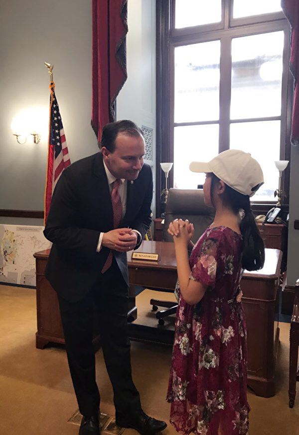

孙常珍的外孙女（右）在和参议员麦克李(Michael Lee，左)对话。

我看到参议员弯下身子，认真地听外孙女说话，连手势都和外孙女的一致。听完外孙女的话，参议员对外孙女说，他刚刚发出了一封支持法轮功的信，他也会一如既往地支持法轮功的，因为他的祖先也是受迫害的。（参议员支持信链接）

这个场面让我非常感动，我很难想像在中国，一个位居高位的大官能对一个小女孩弯腰说话，并且如此郑重地回答了她的问题。这个画面，让我看到了人性，看到了人的善良，看到了希望……

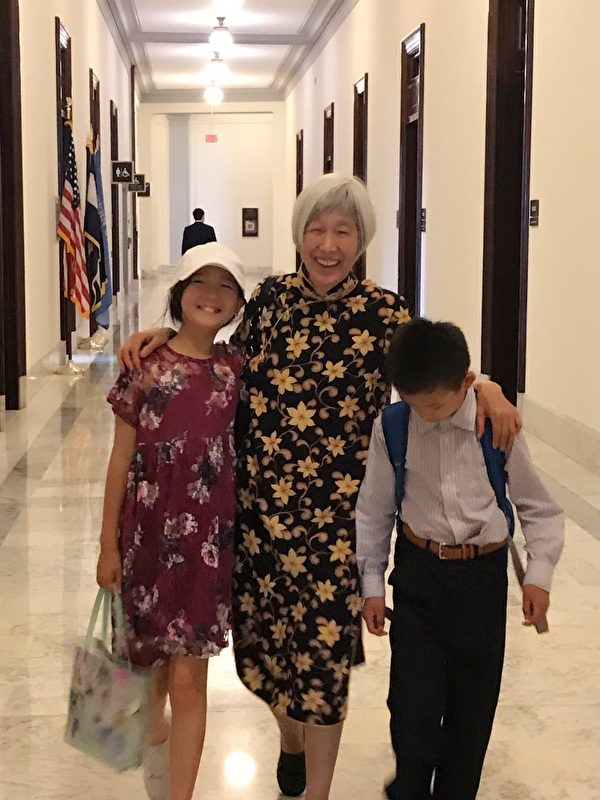

孙常珍（中）与参议员见面后很开心。

<h1 align="center"><b>一位大法修炼人的女儿的真情告白</b></h1>

【明慧网二零一八年六月二十七日】编者的话：此文章是修炼人的女儿写于二零零四年，当时她写好后，自己就出去发，给了许多世人看。这么多年过去了，她的妈妈（一位大法修炼人）在整理房间时，看到了这篇稿子，现投稿明慧网，与读者共享。

<b>真情告白</b>

 
我是一名普普通通的、善良的中国人，我愿以我的人格、幸福乃至于我宝贵的青春和生命担保我所记录的文字的真实性，送给尚被迷雾笼罩的朋友们。惟愿我的真情告白能助您走出迷雾……

我的父亲是一名受人尊敬的正直的老党员，长期兢兢业业的工作累垮了原本健壮俊朗的他，十分严重的胃病经常折磨他；几十年怎么也戒不掉的烟瘾又使他的肺部和气管严重受创。当时风华正茂的他曾被病魔折腾得身心憔悴，很长一段时间，吃的药比饭还多，但怎么也无法根治，在相信医学的同时，也参加过当时比较流行的健身运动，却收效甚微。母亲也因长期的操劳而积劳成疾。当时我们原本幸福的家庭曾一度面临破碎的边缘，善良的母亲将希望寄托在对神佛的信仰上，曾经在一座比较有名气的寺院皈依。尽管如此，他们的病情仍旧不见好转……

直到1996年，母亲一位身患绝症的朋友在对现代医学和形形色色的气功疗法彻底失去信心之后，抱着试试看的心态修炼起了法轮大法，因而发现了法轮大法的神奇功效，于是将法轮大法介绍给了我的母亲。我们的生活便展开了新的篇章。

从此，《转法轮》成为母亲每日的必读书目，“真、善、忍”成为其日常行为的准则，每日好几小时的打坐、炼功并没有令她减少对家庭重担的负荷，她以“真、善、忍”的标准要求自己，这些令原本性格倔强的母亲在不知不觉中更加温柔、理性与善良。

母亲不断将自己修炼时的真实感受告诉我们，与母亲患难与共的父亲当时尽管对此仍有怀疑，但最终还是和母亲一起走进了炼功场。谁知法轮大法炼功场上传递的力量吸引了我那一直崇尚唯物主义的老党员父亲。我们惊喜地发现父亲那几十年怎么也戒不掉的烟瘾居然离他远去，脸色也逐渐红润起来。双亲开始同修法轮大法，他们经常和对方交流自己的亲身感受，并且不厌其烦地告诉我们“法轮大法好”，他们在修炼中一步步精進。

看到父母的气色明显好了许多，身体更加健康，我们感到由衷地欣慰。我曾惊讶于法轮大法的威力，也曾读过《转法轮》，但长期受到的中国式唯物主义的教育使我难以对“神佛”的说法予以认同；又或许是由于工作太忙的缘故，我一直没能成为一名法轮大法弟子，然而法轮大法“真、善、忍”的标准却深深镌刻在我的脑海中。

从1996年至今（注：2004年），父母已经修炼法轮大法8年了，令人难以置信的是：这么多年来，原本疾病缠身的他们竟然在修炼法轮大法之后就从没住过一次院，甚至没有吃过一次药、打过一次针！尽管在“消业”时要忍受巨大的痛苦，他们总算熬过了一关又一关，并没有因此耽误过工作和照顾家庭。

对人们有着如此神奇功效的高德大法，在父母及其同修们的争相传颂中，渐渐为许多人所认识，更多的人修炼起了法轮大法（听说，法轮大法修炼者的人数超过了中国共产党党员的人数）。这成为某些中国统治者的巨大心病。为此，这些中国统治者从1999年起，开始通过各种卑劣的手段污蔑法轮功、镇压法轮功学员、愚弄善良的人们。铺天盖地的、不切实际的反面宣传让许许多多的老百姓陷入了迷惑之中——怎么我们眼睛看到的身边的法轮功学员并不像媒体报道的那样呢？共产党的媒体究竟在干什么？！

1999年至今，父母和同修们便一直走在为世人讲清真相的艰难的正法之路上。每当我看到一些尚在迷中的人们随手丢弃各种讲真相的宣传资料时，我十分难过。要知道那些都是由经济原本并不宽裕的法轮功学员将省吃俭用节省下来的钱聚拢来自费印制的啊！

作为儿女，曾经悲观地认为，逐渐长大的我们会慢慢肩负起照顾久病不愈的双亲的重任，没料到在世人眼中本应逐渐老去的父母却越来越健康、越来越精神！他们非但没有成为我们的负担，反而担负起照顾、教导我们的下一代的责任，让我们没有后顾之忧，在各自的工作岗位上一步一步迈向成功。

是法轮大法送给了我们再没有疾病缠身的双亲！是法轮大法让我们重新拥有幸福和美的家！在此我用我的亲身体会告诉大家：法轮大法好！法轮大法的真修弟子都是心地善良的好人！不要被别有用心的统治者制造的假相蒙蔽！善待大法！善待大法弟子！法轮大法会使你和你的家人朋友受益匪浅。我也将一如既往地为助父母讲清真相做点力所能及的事。

<b>后记</b>

写此文时午夜时分，窗外电闪雷鸣，我无法入睡，耳畔常常响起孩子稚嫩的童音：妈妈，记住真、善、忍，法轮大法好！看着孩子熟睡的脸蛋儿，我知道真、善、忍已深深扎根于他幼小的心田。明晨，我将指着天边的红日告诉他：雨过天空会更晴朗！我盼望着新的日出……

<h1 align="center"><b>中共高官青睐器官移植专家与产品的背后</b></h1>

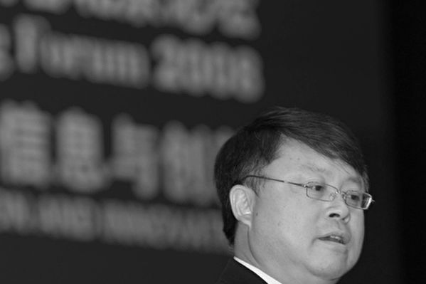

中国富商郭文贵曝出，江绵恒（如图）换肾三次，杀了五个人；孟建柱为母亲换肾，杀囚取器官；李友换肝，供体选了几十个。（大纪元资料室）

【大纪元2017年11月07日讯】在国际社会持续曝光中共强摘法轮功学员器官等滔天罪恶，以及中共原卫生部长黄洁夫明确宣布从2015年起全面禁止使用死囚器官后，中国大陆每年的器官移植数量仍远远超过其所公布的实际器官捐献量，这不能不让人高度怀疑其供体的来源，而对此中共仍讳莫如深。

事实上，中共的器官移植业随着其建政开始发展，最初的器官移植医生通过为中共高层保健服务而得到特权，并利用国家机器，特别是军队系统发展器官移植技术。中共则利用这些医生进行器官移植的培训和推广，形成共产党体系内特有的器官移植系统。

关于文革前后器官移植的案例公开的很少见到，但还是有一些透露出来。如1977年10月，301医院泌尿外科医生李炎唐进行肾移植，活体取肾，取肾车由警车开道，一路开绿灯，通过通讯兵部队架一条线，从取肾地点直接通到手术室，当肾取下可用时，立即通知手术，病人开始准备并开刀等待，两不耽误。再如1978年，江西小学教师钟海源被活体取肾，移植给高干子弟飞行员。

显然，早在文革前后，利用军队系统搞器官移植，特别是使用活体器官来提高移植品质成为了中共器官移植的特色，而罔顾伦理正是中共器官移植的罪恶所在。毫无疑问，这背后的黑幕远超人们的想像。不过，或许我们从众多中共高官青睐器官移植专家与产品，可以寻找到蛛丝马迹。

<b>中共高官多次接见肝胆移植专家吴孟超</b>

今年95岁，现海军医院附属东方肝胆外科医院院长、亦是福建医科大学名誉校长的吴孟超，刚刚获得“上海医学发展终身成就奖”。他先后受到邓小平、江泽民等高官的接见，2012年吴孟超的“先进事迹”被大力宣传并要求对其学习，死去的中共原军委副主席徐才厚也对其大加夸赞，坊间还有消息称，他被视为江泽民的“大功臣”。

根据官方报导，吴孟超先后完成了国内第一例肝脏外科手术和世界第一例中肝叶肿瘤切除术，创下了切除肿瘤重量最大、肝脏手术年龄最小、术后存活时间最长等多项世界纪录，开辟了肝癌基础与临床研究的新领域，因此被誉为“中国肝脏外科之父”。

2012年2月，吴孟超还获得中共央视颁布的2011感动中国人物奖。官方简历上介绍说，那时“他已亲手完成了1万4000多台肝脏肿瘤手术，其中肝癌切除手术9300多例，成功率达到98.5%……90岁高龄依然奋战在肿瘤手术第一线”。这其中有多少是肝脏移植手术？有多少供体来自法轮功学员？

不过官方不敢介绍的是，吴孟超治疗晚期肝癌，最常用的手法就是做肝移植来取代被切除的癌变肝脏，他一人就做了1.4万例，这就存在一个问题：他是从哪里得到匹配的肝脏呢？作为全军器官移植会议的首席顾问，并曾在一些医院的器官移植庆祝大会上发表贺词的吴孟超，他会不知道供体来源吗？显然不是。

同样，中共媒体不敢披露的是，他是江泽民最为关心的医生，曾被江至少四次接见。有知情人于2014年向海外《新纪元周刋》透露，江和吴的关系很特别，每次江参加医学界开会，只要江到会，必定要问一句，上海的吴孟超到了吗？这其中的潜台词大家都懂的。据说，2011年，在江濒死之际，也是吴孟超给其做器官移植手术。

而在江泽民1999年7月镇压法轮功并将活摘法轮功学员器官产业化、军事化后，吴孟超带领的东方肝胆外科研究所解决了器官移植中的某些问题，这使得江提出的活摘器官产业化成为可能，且利润丰厚。吴孟超为此得到江和军委徐才厚的多次嘉奖和奖励。

除了在东方肝胆外科医院做器官移植手术外，吴孟超还在福建医科大学开设孟超肝胆医院，在上海建吴孟超医学中心，在宁波医院建上海吴孟超医学中心分支，等等，而这些医院都涉及器官移植。哪里来的那么多供体？

<b>中共高官大赞器官移植外科主要创始人裘法祖</b>

说完吴孟超，不得不说说他的导师、中共器官移植外科主要创始人裘法祖。他早年留学慕尼黑大学医学院，获医学博士，抗战胜利后回国，主持创建了中国最早的器官移植机构——同济医科大学器官移植研究所。中共建政后，高官早期的器官移植的背后都少不了他和弟子夏穗生的影子。1993年，他当选中科院院士。

2001年，裘法祖获得了中国医学基金会“医德风范终身奖”。2004年，他90岁生日的那一天，时任中共中央政治局常委的吴官正、全国人大常委会副委员长的路甬祥等发来贺信，彼时任中共中央政治局委员、湖北省委书记的俞正声在讲话中代表省委、省政府向其表示祝贺，原全国人大常委会副委员长吴阶平在发言中大赞裘法祖，而湖北省省长罗清泉向其颁发荣誉证书。

无疑，裘法祖是因为为中共器官移植做出了突出贡献，才获得如此带血的“荣誉”的。

<b>给江绵恒换肾的移植专家黎磊石跳楼后众高官发唁电</b>

日前，身在美国的富商郭文贵曾大曝中共高官为何得了癌症还活着的秘密，这是因为他们可以换器官续命，“活摘器官，按需杀人”。他曝出江泽民之子江绵恒换肾三次，杀了五个人；原政法委书记孟建柱为母亲换肾，杀囚取器官；北大方正的李友换肝，供体选了几十个。他并指南京军区总医院副院长黎磊石就是给江绵恒、孟建柱之母换肾的医生，而他2010年“跳楼”而亡的背后鬼影幢幢。

黎磊石堪称中国肾移植的鼻祖。官方媒体报导其头衔包括：中国工程院院士，解放军肾病研究所所长，南京大学医学院临床学院副院长、教授，国际著名肾脏病专家，中国肾脏治疗创始人，一代医学宗师。官方媒体还称，2004年，在他和学生进行的肾移植手术中，人、肾存活率达100%。可以推测，以江绵恒父子在中国的权势，为江绵恒换肾，非请黎磊石不可。

至于其肾移植中心，则从最初的每年移植十几例发展到一百多例，成为国内最大的肾移植中心之一，到2004年肾移植手术突破一千例。黎磊石还主持编写了《中国肾移植手册》，大陆很多肾移植医生都是读这本书出来的。

如此替中共效命的黎磊石不仅获得了江泽民的亲自接见，而且2007年中共军方还下发《向黎磊石学习的决定》，他亦立二等功五次，三等功八次。

耐人寻味的是，黎磊石死后，包括刘延东、李源潮、徐才厚、蒋树声、梁光烈等在内的中共高官纷纷发唁电、唁函或敬献花圈和花篮。是什么原因让这些高官如此做的呢？

<b>中共器官移植“掌门人”黄洁夫背后的高官</b>

提到中共原卫生部部长、中共器官移植的“掌门人”、现人体器官捐献与移植委员会主任黄洁夫，国内外移植届都不陌生。他历任中山医科大学附属第一医院肝胆外科主任，副院长、院长，中山医科大学校长兼党委书记；学术方向为肝脏移植和肝胆道恶性肿瘤外科学治疗；2001年11月任卫生部副部长，2005年7月升任中央保健局局长，是负责中央保健委员会专家组、中央保健会诊专家的总管，负责所有中共中央领导人的医疗保健。

而黄洁夫的前任吴阶平是泌尿外科医生。从1960年吴阶平进行第一例肾移植开始，利用活体器官进行移植手术，满足中共党、政、军界高级人员健康需要便成为惯例。

要知道，老年人的保健以心血管、慢性病为主，是内科医生的专长，泌尿外科医生和肝移植外科医生成为中共高级领导的保健总管，本身就是违背医疗常识的。这背后的猫腻中共高层心知肚明。黄洁夫背后有多少中共高官的支持也就可想而知了。

自然，黄洁夫这样的背景也使其成为了中共当局应对国际社会指责其强摘法轮功学员器官的最佳人选。

在这几年的公开表演中，正是黄洁夫公开承认中共使用死囚器官，也是他公开否认活摘法轮功学员器官。正是他在2009年9月公开宣布“中国目前已累计开展器官移植超过10万多例，成为仅次于美国的第二大器官移植大国。我国每年开展的器官移植手术已超过1万例次。其中，开展最多的是肾移植，累计8万6800例。目前每年进行肾移植手术6000例左右”，也是他避而不谈供体的来源。

而2005年9月，黄洁夫曾参加以时任中共政法委书记的罗干为团长的中央代表团前往新疆，为一名46岁的肝癌患者进行手术，手术中需要备用肝脏作移植准备，24个小时内就取来了两个匹配的肝脏，在医学界上创了世界纪录。

<b>诸多高官纷纷前往参观威高集团</b>

中共十九大前，有消息称，山东威海首富董事长陈学利的代表资格被取消，而这十分蹊跷。资料显示，在过去的十多年中，有多名中共高官先后考察过该集团，他们中有吴官正、吴邦国、罗干、李鹏、刘云山、王乐泉、薄熙来、张高丽、回良玉……如2003年8月，时任中共中央政治局常委、中央政法委书记的罗干来到威高；2004年8月10日，时任商务部部长的薄熙来到威高；2005年5月，时任新疆一把手的王乐泉率自治区党政考察团视察威高；7月6日，时任中共中央政治局常委、全国人大常委委员长的吴邦国来到威高；2007年9月，时任国务院副总理的回良玉也来到威高；2013年11月，刘云山亦来威高调研……

为何高官们如此青睐威高集团？这极有可能与其产品中用于血液透析或器官移植所产生的排异反应的免疫吸附柱有关，这是2005年威高集团与中科院大连化物所合作开发的，此产品打破了德国费森尤斯公司的垄断。

可以佐证威高集团深度介入器官移植的证明之一是，2016年6月，威高集团与红基会共同成立博爱基金，包括中国器官移植发展基金会理事长黄洁夫在内的若干官员和器官移植医生参加了成立仪式。

另外，2007年12月威高集团与世界500强之一的美国美敦力公司签署合作协议，建立战略合作伙伴关系，也不容忽视。在双方成立的合资公司中，美敦力公司控股51%。美敦力是世界最大的医疗科技公司之一，主要为慢性疾病患者提供终身治疗方案。

美国记者安妮．切尼（Annie Cheney）在她的《人体经纪人：透视美国的人类器官地下交易市场》披露，在美国，人体器官的市场很大，是个有数十亿产值的产业，支撑著尖端研究和每日的医疗过程。对于发展科学知识、完善医疗技术这样利润丰厚的重要事业而言，死者身上的组织、脏器、腱、骨骼、关节、四肢、手、脚、残缺部分和头颅是不可或缺的。强生、美敦力医疗产品等大公司需要依靠人类器官来指导他们开发医疗设备。研究者们依靠它们磨砺自己的外科手术技巧，甚至制造化妆品。医生们则用它们来替换心脏瓣膜、治疗烧伤病患、换骨，甚至垫高嘴唇、消除皱纹。

根据1968年美国通过的《统一组织捐献法》规定，买卖死者遗体都是非法的。但是这同一部法律又规定，如果是为了填补由保护、运输、储存和加工尸体而发生的成本，这样做是合法的。这样的漏洞也就意味着，骨骼、组织、脏器、关节、四肢、头颅甚至是残缺不全的遗体在市场上都是紧俏商品，研究人员、产品开发者和医生的需求远远超过供应。如头颅可以卖到900美元以上，腿将近1000美元，手、脚和胳膊每个几百美元。全部肢解和掏空以后的一具尸体在公开市场上可以卖到将近1万美元。

在美国获取尸体需要高额代价的背景下，美敦力公司和生产用于器官移植排异反应产品的威高集团合作，尽管没有明确的证据，但很难不让人联想这背后是否存在一些黑幕，比如将被强摘的尸体、器官卖到美国？

<b>结语</b>

除了郭文贵曝出中共强摘器官的黑幕一角外，今年9月20日，互联网上出现的“国安委骨干与某红二代的神秘对话”也部分涉及了这一话题。对话称，中共统治者爬到顶尖位置后，就只有两个目的：一是保持政权的永久稳固；二是琢磨如何长生不老，怎么能活得更长、更高质量地活下去。为了延长寿命，可以不惜一切代价。

对话中提到，中国最大的资源就是人口，那是取之不尽、用之不竭的DNA储存库。领导们都有几千亿、上万亿元的巨额财富，现在科技发达了，有了那么多钱后，都想延年益寿，想长生不老。经济上受益，身体也要受益！能换肾，能换肝，心、肺什么都能换，于是换完内脏换脑器官。人在接受器官移植后，会产生难以避免的排斥反应，因此需要定期地换血清、换血，而部队里的年轻战士就是第一梯队，他们的血清被源源不断、无偿地输送给中央领导们。

另据海外追查迫害法轮功国际组织的报告，中国存在着庞大的活人器官供体库，以法轮功学员为主体，同时也有藏族、维吾尔族、基督徒和其他中国人。强摘器官是中共集团操控整个国家机器而进行的，党、政、军、武警、司法和医疗系统等都有涉入。他们对普通百姓进行隐秘屠杀、盗取器官，从而为中共权贵的健康和利益服务。这也意味着有大量中共高官身上都不同程度沾染了这样的罪恶，而上天之眼已一一记下。他们需要记住的是，靠罪恶延长的生命并不能真正延长生命，反而招致恶报，遭天惩。生死有命，富贵在天，这个世界上人是说了不算的。

<h1 align="center"><b>法轮功在反迫害中壮大</b></h1>

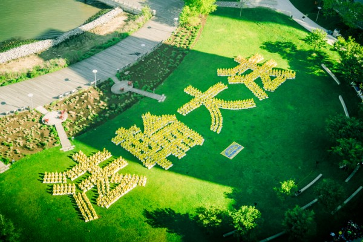

2016年5月12日，一千多名法轮功学员在纽约联合国总部对面甘醇公园排字炼功。

【大纪元2016年05月21日讯】美国纽约曼哈顿47街，一场盛大游行的起点。2016年5月13日上午11时，由东西方53国民众、近1万人组成的队列，排出了长达2英里的三个大方阵：“法轮大法好”、“停止迫害法轮功”、“声援2亿3千多万中华儿女退出中共”。在天国乐团的引领下，游行队伍浩浩荡荡，沿着繁华的42街，途经中央车站和时代广场等15条大道，总共行进了三个小时。雄壮的鼓乐，奏响神威；明艳的黄色，闪动希望。那是一条绚丽多彩的长龙，放射著“真、善、忍”之光，走出喜悦和庄严，走出信念和力量。

法轮功，这个17年前默默无闻的团体，如今举世瞩目、引人惊叹盛赞。从中国走向世界，在迫害中屹立不倒，开创和平抗暴之典范，传送真相与福音。走过漫长艰辛的道路，冲破重重磨难险阻，风雨不动，迎向彩虹。

<b>在被迫害中洪传世界</b>

1999年7月，中共开始镇压法轮功时，法轮功只传到了三十多个国家，对许多民众来说，这种功法还有些陌生。今天，法轮功修炼者遍布亚洲、欧洲、非洲、北美洲、南美洲和大洋洲的一百多个国家，受到各族裔人民的喜爱及各国政府的尊敬。在台湾，修炼法轮功的人数从最初的三千人猛增到几十万人。法轮功创始人李洪志先生和法轮大法获得各种褒奖达三千余项。李洪志先生的主要著作《转法轮》已被翻译成近40种语言。法轮大法，超越了文化、种族和国界，越传越广，深入人心。

法轮功洪传的盛况，令社会各界惊叹不已。法轮功顶住了中共的疯狂打压，不仅没有被消灭，反而在被迫害中不断发展壮大，从局限于中国的精神信仰变成了海内外联合一体的全球化运动，影响力日益深远。而中共的镇压则彻底失败，中共自曝其丑，走向解体灭亡。这个形势，超出了所有人最初的预测。法轮功现象太不可思议了！

多年来的事实证明，中共的暴行和欺骗只会反过来帮助宣传法轮功，增加法轮功的实力和威信，将其推向更宽广的舞台，使更多的人了解认识。

前中共高官李普先生在2008年6月11日接受大纪元采访时说：“法轮功本身是一个信仰团体，开头的时候，很多人不知道法轮功，因为共产党打压法轮功，知道的人更多了，拥护的人更多了。是共产党迫害法轮功，使法轮功扬名天下，外国人都知道了。这是共产党因为自己胡作非为所产生的相反的效果，反而是帮了法轮功的忙。”

李普还称赞法轮功持续讲真相的行为：“法轮功不必采取任何手段，就是继续炼法轮功，宣传法轮功，不理它（中共）。不管它用什么手段，我不理你。法轮功自己维护自己的尊严，自己有自信。你越反对我，我越壮大。”结果真的是“越压越发展”，“越压越壮大”。

2009年5月11日，中共中央党校原理论研究室副主任、科研办公室主任杜光先生接受大纪元记者采访时感慨地说，法轮功的发展让他出乎意料：“我当时就看到了中共作茧自缚、玩火自焚的后果，当时就认为，中共不可能把法轮功镇压下去。但是像现在这样使得法轮功如此强大，当时没有想到。”杜光认为，法轮功学员之所以能有如此的成就，是因为法轮功学员拥有“内在的、坚定的、坚强不屈、坚持不懈的精神”，与此同时，“海外的力量、声音和各种声援活动，对国内法轮功学员的大力支持，海外与国内法轮功学员的内外配合”构成了让法轮功屹立不倒、日益兴盛的几大基柱。

法度有缘人。在这场善恶的交锋中，许多各国民众原本不知道法轮功，当他们耳闻目睹了中共的残忍，以及法轮功学员的善良时，便开始思考：法轮功到底是什么？

来自台湾、现在美国宇航局（NASA）工作的黄祖威博士于2000年6月到中国旅游，他在北京天安门广场亲眼看到警察暴打法轮功学员。当时，他拿起相机拍摄，差点被抓走。他产生了疑问：法轮功是什么？中共为何这样对待法轮功？后来他阅读《转法轮》，“几乎是一口气读完，真是相见恨晚”，从此走上了修炼之路。

大陆有一位法轮功学员曾说：“在镇压最猖獗的时候，还有人向我借书看，那是‘二炮’（中共导弹部队）的一位军官。他对中共的宣传进行反思，法轮功到底是什么？中共为什么镇压法轮功？他要探个究竟。我就此向他洪法讲真相，并把书借给了他。他看过书后也想炼，就在最疯狂镇压的环境下，他走进了大法。”

美国亚利桑那州的阿特女士是怎么找到法轮功的呢？那是1999年，CNN播放了法轮功遭受中共迫害的新闻画面。她说：“（那天的节目中）他们播放了一组法轮功学员在一起炼功的镜头，这是我看到的最美的画面，这就是我要找的。”

2016年5月，近万名法轮功学员汇聚纽约，共同庆祝法轮大法日。这是历年来法轮功在海外规模最大的系列活动，空前盛况震撼了中西方民众。5月12日上午，近千名法轮功学员在联合广场集体展示功法，当地许多西人、华人和中国留学生都对法轮功表现出极大的兴趣，询问如何能成为其中一员，到哪里可以找到炼功点。

5月13日的万人大游行更是令人赞叹不已。1999年4月25日，江泽民看到近万名法轮功学员和平上访之后决定镇压法轮功。而17年后在美国，专门有警察为近万名法轮功学员游行开路、维持秩序，这种对比让大陆商人李先生很有感触：“兼听则明，不能偏听国内的宣传，再说真相也是掩盖不住的。”

华人朱先生说，他之前已观看过几次法轮功学员的大游行，这次看到游行的人数越来越多，西方人越来越多，说明法轮功越来越受欢迎。还有一位两周前刚从中国大陆抵美的徐先生说：“我真是震撼啊，游行太壮观了！我感到，当人类败坏到如此地步的时候，只有法轮大法能够净化人类的心灵、拯救人类，法轮大法是人类的希望啊！”

2016年5月13日，纽约近万人游行庆祝第17届法轮大法日。

<b>大陆民心觉醒 支持法轮功</b>

17年来，海内外的法轮功学员持续向社会各界、特别是中国大陆民众讲清真相，破除中共的谎言。除了常规地印制分发资料以外，法轮功学员还创办了网站、报纸、电台和电视台，不断扩大讲真相的范围和声势。中共把谣言造到哪里，法轮功学员就把真相讲到哪里。

在迫害之初，中共的谎言铺天盖地，曾蒙蔽了大批百姓，令他们对法轮功产生了误解或敌视。但是，随着法轮功学员讲清真相的深入，恶毒的谎言诸如“1400例”和“天安门自焚”等被逐一击破。2016年3月30日，北京律师韩智广在为甘肃法轮功学员做无罪辩护时，在法庭上当众揭穿15年前的“天安门自焚”是中共栽赃伪案。

近年来，越来越多的大陆民众看清了迫害的事实，认识到中共的邪恶。他们对法轮功产生了同情和敬佩，欣然接受真相资料，很多人还退出了中共的党、团、队。普通民众声援营救法轮功学员的事件此起彼伏，呈燎原之势，凸显强大的民意。要求释放法轮功学员、反对活摘器官和举报江泽民的“红手印”及签名表格不断涌现，来自大大小小的城市和乡镇，数以百计、千计、万计。一个个红色的印记和郑重签下的名字，震慑了邪恶，预示黎明的曙光。

单是河北正定民众，已经先后发起六轮声援营救当地法轮功学员李兰奎的签名按手印活动，2013年3月4日，河北正定民众第六轮声援营救李兰奎的6,564个手印被呈送给欧洲议会副主席爱德华•麦克米兰—史考特先生。

2009年，辽宁抚顺376名村民联名为法轮功学员徐大为申冤，惊动周永康。2012年连续发生了河北泊头“300手印”要求释放法轮功学员王晓东事件、河北正定“700手印”要求释放法轮功学员李兰奎事件、河北唐山“56手印”声援法轮功学员郑祥星事件、河北唐山“5,300手印”要求释放法轮功学员李珊珊事件。2013年，天津出现了“2,800手印”营救法轮功学员滑连友事件、“15,000手印”支持黑龙江省伊春市法轮功学员秦月明的女儿为其父申冤等等。

2015年6月12日，北京首次红手印事件营救的主角——被陕西当局非法关押半年的法轮功学员庞友被释放。之前五个月有超过2,800人签名营救庞友，签名的魏先生说：“炼法轮功的都是好人。”这次营救行动的成功在海内外引起很大反响，进一步推动了全民反迫害的声势。

中国著名维权律师高智晟于2004、2005年三次公开上书胡温政权，以“颤抖的心”、 “颤抖的笔”呼吁立即停止对法轮功学员的迫害。高智晟赞扬法轮功学员：“我们是在和一些圣贤（法轮功学员）打交道，她们的不屈的精神，高贵的人格及对施暴者的宽恕襟怀是我们今天中国的希望所依，也是我们坚强下去的理由所在！”

2005年开始，上海的郭国汀律师为法轮功修炼者瞿延来、陈光辉等人做无罪辩护。2007年王博案，北京律师李和平、黎雄兵、张立辉、李顺章、邬宏威、滕彪6名律师出庭做无罪辩护，并发表了联合签名的《宪法至上、信仰无罪》的辩护意见，从宪法、立法、司法等各层面，系统全面地阐述了“王博、王新忠、刘淑芹践行宪法权利无罪，坚持信仰无罪，传播信仰无罪，宣讲自己的苦难遭遇及澄清事实无罪！”

2014年3月20日，律师江天勇、唐吉田、王成、张俊杰及一些法轮功学员和家属等30多人第三次前往黑龙江农垦总局青龙山洗脑班，要求立即释放仍被非法关押的法轮功学员。3月21日早，近二十个警察强行闯入酒店，绑架了四位律师和七位法轮功学员及家属。当天，大陆人权律师团发出严正声明，要求当局立即释放被关押的律师和法轮功学员，并依法取缔“法制教育基地”黑监狱。网络上一天之内就有102位律师及346位公民联署支持。3月 23日，农垦建三江管理局前就汇集了全国各地律师及正义人士一百多名，抗议黑龙江农垦当局无法无天的暴行。还有不少律师在全国各地申请游行示威，抗议建三江当局践踏人权、践踏法律的罪恶行径。

时至今日，为法轮功修炼者做无罪辩护已成为潮流。中国著名律师、东南大学法学院教授张赞宁在为江苏镇江法轮功学员陆秀军做无罪辩护时，当庭指控江泽民迫害有罪：“没有经过全国人大的认证，江泽民单方面表态对法轮功进行认定和镇压，这才是‘组织破坏国家法律实施’的巨大犯罪！”

<b>善恶必报 中共迫害难以为继</b>

中共与法轮功，表面看来是迫害与被迫害的双方。经过17年的较量，法轮功日益壮大，蓬勃发展，深入人心。而中共却在迫害中走向解体和灭亡。当年发动和参与迫害的凶手们气焰尽消，或已遭到恶报，或陷于正义的围剿之中、惶惶不可终日。法轮功学员们积极追查罪行，无论天涯海角，无论时日长短，誓将凶犯送上审判台。真相持续传播，中国政局激烈动荡，善恶必报的天理在人间显现。不少曾经参与迫害的人员都幡然醒悟，痛悔过往，选择帮助法轮功学员，有的甚至加入修炼的行列，成为坚定的大法弟子。时局世事的明显变化让人们看到：正义必胜，最后的审判就要到来。

成立于2003年1月的“追查迫害法轮功国际组织”至今共发布了九批立案追查公告，涉嫌参与迫害法轮功的犯罪责任单位和责任人总计：“610”系统7,716人，政法委系统9,816人，另有其它14,665个责任单位和53,300个责任人。

被“追查国际”立案追查的元凶、主犯和责任人当中，已经有数百人因为贪腐等罪名受到惩处，这是迫害法轮功遭到报应在人间社会的表现形式。

前政治局常委、中共政法委书记周永康迫害法轮功，罪行累累，于2014年7月29日落马，2015年6月被判无期徒刑，是中共建政以来落马的最高级别官员，打破了中共“刑不上常委”的官场潜规则。

刘京是前公安部副部长、迫害法轮功专职机构“610”办主任，当时江泽民迫害法轮功的“第一打手”，已被确诊患上癌症，生不如死。

公安部副部长李东生是刘京的继任者，于2013年12月12日落马，被判刑15年。官方罕见首次高调公布其一直隐秘的头衔，中共中央“防范和处理×教问题”领导小组副组长及“610”办公室主任。

薄熙来，原中共中央政治局委员、中央委员、重庆市委书记，2012年3月15日被免职，2013年9月22日，被判处无期徒刑。薄熙来是迫害法轮功的主犯和活摘器官的主谋。

徐才厚，中共第十七届政治局委员，前军委副主席，于2014年3月15日被调查；6月30日，被开除党籍，移送最高检察院授权军事检察机关处理；7月30日，徐被开除军籍、取消上将军衔；2015年3月15日因癌症死亡。徐才厚是中共军队系统参与活摘法轮功学员器官的主要责任人，是江泽民迫害法轮功的主要帮凶之一。

2016年4月16日刚刚落马的张越是河北省政法委书记，曾经在2003年任北京市公安局副局长时，被调到周永康直接管辖的公安部二十六局（反邪教局）任局长。他跟着江泽民、周永康迫害法轮功，欠下血债。

此外，中共解放军总后勤部原副部长谷俊山被判处死缓。原铁道部部长刘志军被判处死缓。原公安部党委委员、部长助理郑少东被判处死缓。国资委主任、原中石油董事长蒋洁敏被判处有期徒刑16年。国土资源部长田凤山被判处无期徒刑。铁道部政治部主任何洪达被判处有期徒刑14年。山东省委副书记杜世成被判处无期徒刑。河北常务副省长丛福奎被判处死缓……

近来，明慧网报导了很多中共体制内部人员的心理和行动上的巨大变化。比如有的110警察接到关于法轮功的所谓报警后，不出警。110告知派出所后，派出所也没有人出警。还有一个派出所的指导员，将三年前私吞的法轮功学员的1万多元钱还给了学员。还有两位曾经迫害过法轮功学员的人，主动找到认识的法轮功学员表明不再参与迫害，其中一人还提出退党。

2014年11月，河北临漳县法轮功学员宋振海因发放神韵光盘被临漳县法院非法判刑三年。宋振海向邯郸中级法院提起上诉。2014年12月中旬，邯郸中院驳回该案，要求临漳县法院从新审理。这打破了法院对法轮功学员的上诉案一律维持原判的做法，可见中共体制内部的人早就不愿再听从“610”的摆布，不愿意因为枉判法轮功学员给自己带来永难推脱的罪责。

明慧网2016年2月15日报导，一位山东省基层“610”人员的致信明慧网说：“我是大陆基层‘610’人员。在工作中我发现法轮功其实是教人向善，心灵慰藉，给人力量，是正的能量。但是党组织把法轮功妖魔化，欺骗了每一个人，欺骗了我。我很疑惑、也很痛苦。”这位“610”工作人员写道：“请问，我怎么样才能联系到你们？”他说因为他很痛苦，如今“夜不能寐”。

明慧网2016年4月4日的一篇文章介绍，北京的一位社区居委会书记和法轮功学员聊天谈时局，他嘱咐法轮功学员注意安全，还透露，和往年相比，现在上面对法轮功的监管放松多了。他说，大家都知道共产党干的坏事，都在骂它，中共好坏不分，黑白不分，早晚要倒台。

明慧网2016年5月8日消息，大陆一位前“610”办公室工作人员在法轮功学员的善劝下，阅读了《转法轮》，感受到法轮大法的美好。他为自己过去在无知中参与迫害法轮功感到深深负罪和痛悔。在5月13日世界法轮功大法日来临之际，这位前“610”人员感恩法轮功创始人无量慈悲，衷心祝愿李洪志师父生日快乐！他说：“不堪回首的往事，经常让我有着一种深深的负罪感，撕心裂肺的痛折磨着我，我要向我曾经迫害过的法轮功学员深深的鞠上一躬，道上千万声‘对不起’。”

<b>国际声援 得道多助</b>

17年来，法轮功学员们在全球持之以恒地讲真相、反迫害，揭露中共的迫害罪行，赢得了各界的正义支持。美国国会、加拿大、欧洲的国家政府等多次通过决议案，严厉谴责中共的暴行，要求中国政府停止镇压法轮功。越来越多的人意识到：法轮功所弘扬的真、善、忍，是当今世界最需要的精神价值，是能够挽救人类于危机的唯一希望。法轮功学员所展现出的坚忍、和平、理性，获得主流社会与普通民众的赞赏，同时激励著受迫害的同胞反抗暴政、坚守良知。法轮功学员所倡导和推动的“三退”精神觉醒运动，波澜壮阔，见证中共解体崩溃。黑暗的冰山在融化，谎言的红墙在坍塌。

2000年8月29日，法轮功学员朱柯明和王杰在北京向最高人民法院控告了江泽民。在这首例控江案之后，从2002年起，法轮功学员已经在美国、比利时、西班牙、台湾、德国、韩国、加拿大、希腊、澳大利亚、新西兰、玻利维亚、智利、荷兰、秘鲁、日本、瑞典、香港、阿根廷、以色列以及联合国控告了江泽民，指控罪名包括群体灭绝、反人类、酷刑罪等。此外，罗干、周永康、薄熙来、曾庆红等许多迫害主犯、中共驻外多国的使领馆官员都先后被法轮功学员在海外刑事控告或民事起诉。

2003年9月，2004年1月，加拿大皇家骑警接受了包括江泽民、李岚清、罗干、刘京、周永康、王茂林、薄熙来在内涉嫌发动和积极参与迫害法轮功学员的45位官员的名单和证据。当这些列入监视的嫌犯进入加拿大国境时，将立即展开调查、驱逐出境、刑事起诉等。

2004年3月美国政府接受了包括江泽民在内的102名迫害法轮功的中共首脑、“610”办公室主要负责人、劳教所主要负责人的名单，并要求美国有关部门依据移民和公民法规定，对这些侵犯宗教信仰自由罪犯的中国官员及配偶子女，有权拒绝其进入美国以及不得获得美国国籍；他们如果进入美国，也将面临被驱逐的危险。

海外法轮功学员的法律诉讼行动产生了极大的震慑力。2002年10月22日，江泽民出访美国芝加哥，法轮功学员早已等候在酒店四周、和平抗议。江的车队避开正门，从停车场开进理兹（Ritz Carlton）酒店。《江泽民其人》一书披露， 10月22日下午，法庭传票被有效送达，江泽民在得知遭法轮功学员起诉后，瘫坐在沙发上开始哆嗦。缓过神后，暴跳如雷地把芝加哥总领事魏瑞兴骂了一顿。23号，江泽民入住休斯顿“INTER CONTINENTAL”洲际酒店时，通过酒店后门的垃圾车通道进入，同样是为了回避抗议的法轮功学员。很多在追查之列的中共官员作恶心虚，在出访海外时战战兢兢，生怕会接到法庭的传票。有的收到传票后不敢上庭应诉，仓皇离去。

自从2006年中共活摘法轮功学员器官的黑幕被报导以来，在法轮功学员的努力推动下，国际社会纷纷行动。以色列、西班牙、意大利、澳洲、加拿大、美国、台湾等国家和地区，都在通过立法等方式阻止或规范与中国有关的器官移植行为。

2012年9月12日，美国国会举办了“中共活体摘取宗教与政治异议人士的器官”听证会，听证会的证词涉及“中国的医院和医生强制从被囚禁者，据称包括法轮功学员、维吾尔族、藏族和家庭基督教徒身上活体摘取器官”。

2013年底，全球54个国家和地区超过150万人联署致联合国的请愿信，要求制止中共活摘器官。

2013年12月12日，欧洲议会通过一项紧急议案，要求中共立即停止活体摘除器官，并呼吁中共“立即释放”包括法轮功学员在内的所有良心犯。

2015年5月以来，超过20万名法轮功学员及家属向中共的最高司法机关控告迫害元凶江泽民，罪名包括“反人类罪”、“酷刑罪”和“种族灭绝罪”。控江大潮，势不可挡，获得了国际社会的强烈反响和有力呼应。在亚洲，已有138万民众于台湾、日本、韩国、香港、印尼、新加坡、马来西亚等地签名，参与刑事举报江泽民的全球联署行动。

普林斯顿大学中国学社执行主席、《纵览中国》网刊发行人兼主编陈奎德先生表示，大陆法轮功学员的控告江泽民大潮“对各个（社会）阶层争取自身的权利，不管是哪种权利，信仰的权利和物质权利也好，人身自由的权利也好等等都会起非常大的鼓舞作用”。

加拿大政治家、律师约翰‧帕克（John Park）表示，法轮功学员无惧迫害和压力，状告江泽民勇气可嘉，全世界人都应该敬仰他们。他呼吁西方社会能更加关注诉江大潮，声援中国民众。诉江之势，必将为中国社会带来变革。

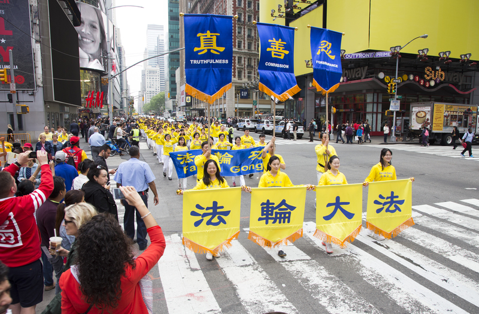

2016年5月13日，纽约上万人举行横贯曼哈顿中心42街的盛大游行，庆祝第17届法轮大法日。图为游行队伍的第一方阵。

<b>人类的典范和希望</b>

2015年7月16日中午，上千名法轮功学员及支持者在美国首都华盛顿DC国会山的西草坪举行集会，呼吁制止中共的迫害。多位美国国会议员和非政府组织代表到场声援。美国国际宗教自由委员会委员卡翠娜‧兰托斯‧斯维特（Katrina Lantos Swett）博士发言赞扬法轮功学员：“法轮功群体确实为我们所有人树立了无与伦比的典范。在施加给自己的莫名的镇压、残暴、迫害、酷刑折磨、监禁和死亡面前，你们依然从自己的信仰和尊严中寻找到勇气和力量，继续实践着你们的精神信仰……我向你们在被迫害中体现出的尊严、善良和慈悲，甚至对迫害你们的人同样报之以慈悲以及你们为所有人树立的典范、在日常生活中实践你们信仰的做法，献上我崇高的敬意。”

在今年的5‧13世界法轮大法日之际，很多美国、加拿大国会议员、政府官员和民间机构都赠送贺信和褒奖，表达祝贺和支持。美国众院外交委员会亚太小组主席邵建隆（Matt Salmon）说：“祝贺这一美好的日子。你们代表了这个世间美好的事物，传递福音给千百万人，不仅在中国而是在全世界。祝贺你们，让自由之声响彻世界。”

罗瑞卿的儿子、大校罗宇恭贺世界法轮大法日暨李洪志大师华诞。他希望法轮功能够尽早在中国恢复正常的地位，也希望神韵能够尽快地回国去演出。罗宇表示，中国现在就是缺“真、善、忍”，按照李大师“真、善、忍”的方向来进步，中国就有希望。

大陆律师任全牛通过大纪元平台发出贺词说：“这个群体挽救了中华民族的信仰没有陷于覆灭！拯救了许多的灵魂，社会需要信仰者，人类需要信仰！”

大陆律师高承才在贺词中写：“5‧13世界法轮大法日，万人齐聚曼哈顿，既是一场盛大的（法轮大法）法会，也是一场反抗邪恶政权、声讨专制独裁、控诉迫害信仰者的审判大会……5‧13是一个神圣的日子，是同修者的聚会，是人间的福音！”

震撼，不仅激荡在五月的纽约。震撼，回旋在中国和世界的无数个角落，冲击著亿万颗红尘中的心灵。这是一股清流，荡涤尘埃。这是一股暖流，冲破坚冰。法轮功，一个民间的信仰团体，手无寸铁，柔如羔羊却又坚强似钢。一个中共江泽民集团企图在三个月内消灭的群体，至今巍然屹立，光耀全球。法轮功，是人间的奇迹，历史的安排，是各个民族的希望。法轮功学员的坚忍不屈，可歌可泣、感天动地。承受了巨大的苦难，粉碎了邪恶的谎言、顶住了残忍的酷刑和精神折磨，大法弟子以生命的赤诚，谱写出宇宙间壮美的正气歌，铸就信仰的辉煌。

<h1 align="center"><b>大陆军官修炼法轮功的故事</b></h1>

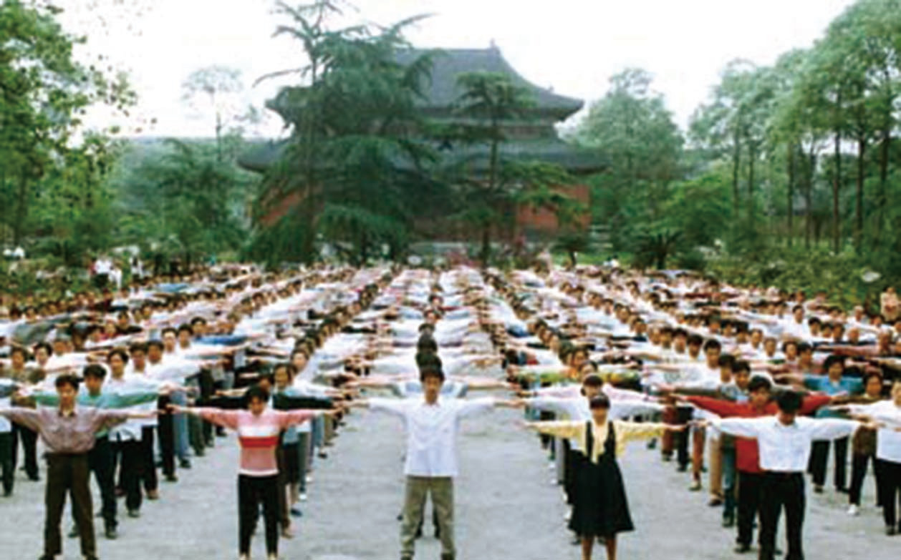

在法轮功被中共镇压前，四川省成都市的法轮功学员在晨炼。（明慧网）

1992年5月李洪志先生将法轮功这部上乘的佛家修炼法门传诸于世。修炼者以「真、善、忍」为标准修心性，另外还有五套功法，使学炼者能迅速强健身体、提升道德品行。上亿修炼者遍及社会各个阶层和行业。这个群体中也不乏现役或退役的军官们，他们都有着不平凡的经历。

他的工作相当出色，得到部队官兵们的一致认可。1997年他被评为先进工作者，1998年他立过三等功，1999年他进京领奖并作为代表在颁奖仪式上讲话，他的事迹被报纸整版报道过。

他叫杨兴福，南京军区政治部文化工作站副师级军官、大校军衔、原南京军区政治部《东线影视报》主任编辑。

1996年7月杨兴福经朋友推荐开始修炼法轮功。他按照法轮功创始人李洪志大师教导的「真、善、忍」原则去做，人变得更善良、宽容、真诚，从而带动了工作上的提高，整个人的精神境界得到了很大改善。

<b>修炼使他身体疾病全部消失</b>

不仅如此，这位副师级军官的身体状况也得到了彻底的改变。之前他患有一身疾病：腰椎间盘突出、脊椎间盘突出、风湿性关节炎、鼻窦炎、尿频尿急等等。在他修炼两个月后，所有的疾病全部消失了。二十多年来，他不再需要打针吃药了，为国家节省了高额的医药费。

杨兴福的妻子陈春美，原是南京市儿童医院主管护师，曾身患多种疾病：乙型肝炎、面瘫后遗症、肠胃病、胆囊炎等。于1996月7月和丈夫一同走入了法轮功的修炼。3个月后，她的疾病不治而愈。

她修炼「真、善、忍」，多次被单位评为先进个人，同事们提起她来都称赞有加。

陈春美不幸于2016年12月24日，被中共享药物迫害致死。她的原工作单位的领导在给她的悼词中写道：「陈春美女士的去世，使我们失去了一位好朋友、好同事。她虽然离我们而去，但她那种坚定信念、百折不挠的精神；那种为人真诚正直、忠厚清廉的高尚品德；那种与人为善、无私无我的大爱善行；那种忍让为先、包容他人的宽阔胸襟；那种勤勤恳恳、忘我工作的奉献精神；那种仁爱持家、惠泽亲朋的崇高风范值得我们学习和汲取……」

<b>司令部作战处长疾病痊愈</b>

方志文，这位有上校军衔、原南京军区司令部作战处长，二十多年来，没再看过一次病。他精力旺盛，部队里频繁的加班加点他都应付自如。不过，以前他身体虚弱到夏天连西瓜都不敢吃。

他来自农村，家境贫寒，兄弟姐妹有6个。年轻时他就患有各种杂症：胃病（胃窦炎、胃溃疡、胃下垂、胃痉挛、胃出血）、牙病、肛肠病（肛裂、脱肛、痔疮等）、关节炎、偏头痛、荨麻疹、肾炎、肝炎等。

参军后，他的生活条件虽得到了提高，可是他身心压力大，精力不支，生活得很累很苦。

1996年11月，一位病退的上级给他介绍了法轮功，他看了主要著作《转法轮》，同时开始到军区机关大院操场炼功。渐渐地，他的身体康复了。

他工作的职权范围包括分布于6个省市的十几个军级以上的机关业务处，修炼后，他不贪不占，不拉关系，不搞交易，不私用公交车，不捞好处。

在海防部队代职副旅长的10个月里，他没接受一份海味特产，没配备过公勤人员。他还用自己的钱给食堂买抽油烟机。

当法轮功受到诬蔑、诽谤后，军区机关派人来调查他，结果他的人品受到调查者的充份肯定。他廉洁奉公的作风、出色的工作，使他多次受到军区嘉奖。

<b>一等功臣炼功 周边人受益</b>

曾在对越战争中立过一等功的湖北潜江人胡建华，是1979年入伍的，因为身体的缘故，1993年不得不退伍。在部队里，他曾任连长、司令部管理股长，有少校军衔。

退伍时他患有很多病：高血压、高血脂、糜烂性胃炎、心脏病、冠心病、偏头痛、颈椎病、副鼻窦炎、慢性咽炎、长期复发性口腔炎、沙眼、耳鸣、龋齿、痔疮、坐骨神经痛、药物性肝炎等。

他四处求医，收效甚微，还尝试过「绝食疗法」，即半个月每天只喝两杯水，不进食，但无效。

长期患病，给家庭带来沉重负担，夫妻间的矛盾被激化，他的工作和前途也受到影响。

正当他绝望时，1995年8月，一位同事向他介绍了法轮功，他开始修炼。不久，出乎意外的是，他全身的疾病一扫而光。从此吃药打针都和他不沾边了。

修炼后，胡建华在工作中处处以「真、善、忍」要求自己，不求名、不重利。在机关后勤的管理工作中，不贪占一分钱，没索要过一次回扣，没做过一次假帐。

有一次，他购买保健品时，货主多给了他72块上好的香皂。他发现后立即物归原主，货主说：「如今世上找不到像你这样的好人，法轮功太好了。」

还有一次，他到市场去给单位买牛肉，回来后发现货主少给了一块，他就自己掏出一百多元钱（人民币）垫上作为补偿。

单位分房子，比他晚一届的转业军人都分了房子，而他却没得到。他不去给领导添麻烦，把个人利益看得很淡。

他兢兢业业地工作、善待他人，获得同事们的认可。单位年年评选先进工作者、优秀公务员都有他的份。

胡建华修炼后带来的身心健康，让他的家人也深受裨益。他的父亲曾患肺癌中晚期，癌瘤约有8厘米大，在住院期间他父亲读法轮功书籍，炼动功，一个月后就病愈出院了，后来又活了18年。他妻子曾患有眩晕症，一发病半个月才好，后来再也没有复发过。他的儿子打出生后就患病不断，现在也都好了。

<b>后记</b>

这些从法轮功中受益又让周围人受益的有口皆碑的军官们，在中共江泽民集团对法轮功发动的肆无忌惮的打压中，惨遭迫害。

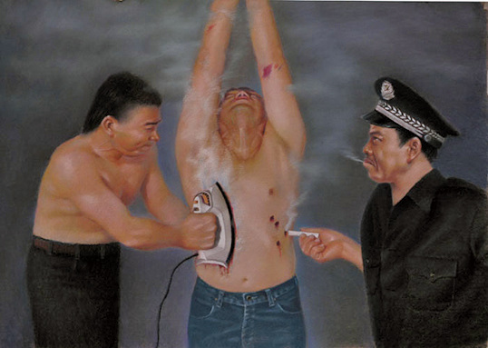

酷刑示意图（明慧网）

杨兴福被非法刑事拘留3次、非法劳教3次，共6年。他的妻子陈春美被非法刑事拘留3次，非法劳教1年。两人还多次遭洗脑迫害，被非法抄家10次。2016年12月，陈春美被迫害致死，时年62岁。

2000年方志文被强制转业，还遭受了非法关押、劳教折磨等迫害。

胡建华被取消了公务员资格，后被单位开除；两次被绑架到洗脑班；被非法劳教1年；后又被非法判刑7年半，遭受了种种惨无人道的迫害。（数据源明慧网）

<h1 align="center"><b>伦敦市民：让更多人知道这个信息</b></h1>
【明慧网二零一八年六月二十六日】“好，我来签。”在周末的伦敦特拉法加广场（Trafalgar Square）和圣马丁广场（St. Martin Place），一位又一位市民对法轮功学员这样说。
英国法轮功学员周末在伦敦市中心的讲真相活动已经坚持多年了，他们在那里展示法轮大法（又称法轮功）的祥和美好，揭露中共对法轮功的残酷迫害。经常参加这些活动的法轮功学员发现，来自世界各地的广大民众越来越多地了解法轮功真相，并非常愿意签名支持法轮功学员反迫害。

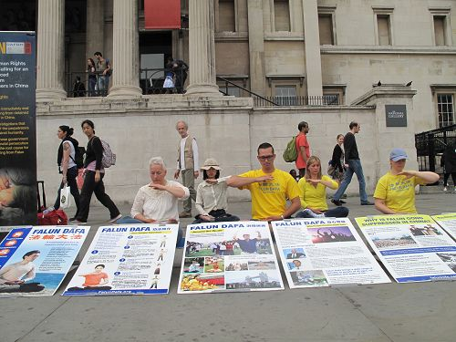

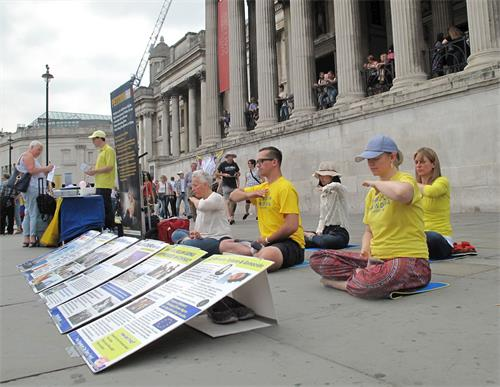

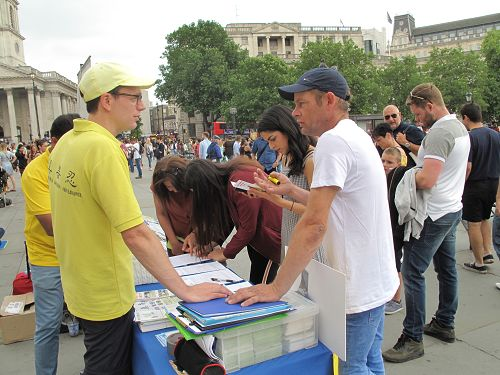

图1～3：二零一八年六月九日，英国法轮功学员在伦敦特拉法加北台阶炼功、讲真相。

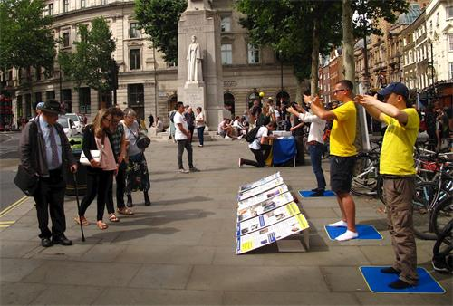

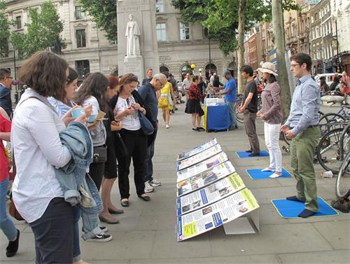

图5～6：二零一八年六月二十三日，英国法轮功学员在伦敦圣马丁广场炼功、讲真相。

<b>法轮功学员：向民众讲清法轮功基本真相</b>

一个真相信息台，桌前铺有“法轮大法好”的金色横幅；立在桌边的一个竖向展板，上面印有呼吁制止中共活摘法轮功学员器官的请愿书；五块讲述法轮功基本真相的展板铺设在地面上，几位学员在展板后面展示法轮功五套功法；两、三位法轮功学员分发传单，与驻足了解详情的民众交谈。

无论是在特拉法加广场还是圣马丁广场，这些简单的配置，承载着有关法轮功的基本信息，也承载着英国法轮功学员向来自世界各地的广大民众传播真相的心愿，吸引着众多的人们。

伦敦法轮功学员帕翠克（Patrick）高兴地发现民众越来越接受真相：“总的来说现在很容易跟人讲，人们看到我们的讲真相场景后都想了解到底发生了什么，我就给他们讲中共对法轮功的迫害。有一些人表示听说过了，我就问他你愿意签名反迫害吗，人们往往马上同意签。有些人被难以置信的邪恶迫害震惊了，但是他们相信眼前看到听到的（真相）。”

二零一八年六月九日，在特拉法加广场，现居伦敦的波兰裔法轮功学员达努莎（Danusia）遇到两个从来没听说过法轮功的男青年，她非常高兴地看到这两位青年没有障碍地了解真相后签名反迫害：

“他们很好，非常感兴趣，想知道发生了什么，他们听得很认真。”“我告诉他们什么是法轮功，为什么中共迫害法轮功，提到江泽民出于嫉妒迫害法轮功，等等。”“听到活摘器官罪行，他们震惊了，他们觉得难以置信，认为中共做法‘太丑陋了’、‘太荒谬了’”。

印度尼西裔的法轮功学员拉悉达（Lasitha）多年来坚持每周六在伦敦市中心讲真相，他最近体会到一个有意思的现象，就是驻足观看真相的民众中常常有练其它打坐方法的人。遇到他们，拉悉达会结合自己身心受益的经历给他们介绍法轮大法，鼓励他们去尝试一下这个性命双修的高德大法。

“我最近较多地提到共产主义的邪恶，解释为什么中共迫害法轮功，看起来民众普遍都能很好地认识共产党的邪恶，我常说‘在中国等共产主义国家，任何一个独立的团体人数多了，都会被共产党视为对其（专制）权力的威胁’，听我这样讲的人，特别是西方民众都很赞同，他们都能理解。”

<b>“我一定要让更多人知道这个信息”</b>
 

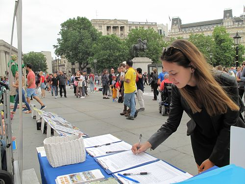

图6：在伦敦读硕士研究生的匈牙利女孩马里亚纳•菲力维（Mariana Filive ）在特拉法加广场签名支持法轮功反迫害。

马里亚纳?菲力维（Mariana Filive）是个匈牙利女孩，正在伦敦读市场营销的硕士学位，她以前听说过法轮功，但六月九日第一次遇到法轮功学员的讲真相活动。

“是打坐吸引了我的注意力，接着我看到了真相展板。”“功法非常平和，我在想自己应该尝试一下。”

“让我震惊的是（中共）活摘法轮功学员器官的信息，这是最让我关切的问题，我原来以为事情已经变好了、停止了，事实上没有，这让我不安，我一定要让更多人知道这个信息。”

“请给我一张传单，我要去看网站。”“祝你们成功。”

<b>“这需要让更多的人知道”</b>
 

图7：二零一八年六月二十三日，在伦敦圣马丁广场，来伦敦参加活动的彼得（Peter）听法轮功学员讲真相，非常高兴地接过法轮功学员送给他的手工莲花。

彼得住在离伦敦二百英里的地方，六月二十三日来伦敦参加活动，他在活动结束后路过圣马丁广场时驻足了解法轮功真相，立即签名反迫害并鼓励法轮功学员继续广传真相：

“这是很有意义的事”，“每个人都有信仰自由。活摘器官太糟糕了。我支持你们（法轮功学员），这需要让更多的人知道。”“你们做得很好，祝贺你们。”

<b>“发自善心的努力总会对世界产生积极影响”</b>
 

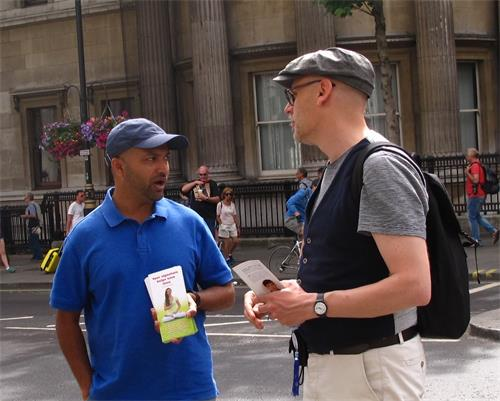

图8：二零一八年六月二十三日，在伦敦圣马丁广场，从比利时安特卫普来伦敦旅游的保罗（Paul，右）与遇到的法轮功学员交谈。

保罗（Paul）从比利时安特卫普来伦敦旅游，他从事电脑工作，又喜欢禅宗音乐。他在比利时听说过法轮功真相，六月二十三日在圣马丁广场遇到法轮功学员的活动，上前表示赞赏和支持。

“这深深地触动我，（迫害法轮功）这样的事情竟然还在当今世界发生着。令我感动的是有这么多人愿意无偿付出，用自己的能量去告诉别人、去提醒大家这样难以置信的事情正在发生着。”“我相信，即使是发自一个人的一个声音也能给世界带来改变，这样做真的非常好。”

“虽然世事难料，但你们（法轮功）是在把事情向积极的方向推动”，“（法轮功）发自善心的努力总会对世界产生积极影响。”“只要一个灵魂被触动了，你就触动了宇宙。”

<b>要学法轮功 不让中共拿走自由</b>
 

图9：二零一八年六月二十三日，在伦敦圣马丁广场，想学功的苏珊（Susan）向法轮功学员深入了解真相。

练太极多年的苏珊（Susan）是位退休教师，也在医生诊所工作过，目前住在北伦敦，搬迁到伦敦后还没找到自己以前练的太极门派。六月二十三日路过圣马丁广场，立即被祥和美好的法轮功炼功场面吸引住了，她感受到平和的能量，随即走到信息台前仔细询问伦敦炼功点的讯息，表示自己要马上尝试法轮功功法。

看到桌面上摆放的制止中共活摘法轮功学员器官罪行的征签表，苏珊立即签名反迫害，她表示自己在中国短期生活过，不能接受中共系统破坏中华传统文化的野蛮做法。

她谴责中共迫害法轮功：“我在（中共统治下的中国）那里真的受不了，（中共）专制、侵略性太强，表面看人人都过得去，实际上每一个人都被压抑着、控制着。”

“这很可怕，（中共）它在拿走我们的自由”，“我相信传统文化让人受益。中共不允许人炼法轮功，它（中共）到底想干什么？”

临走时，苏珊对法轮功学员说：“祝你们成功！”

<h1 align="center"><b>电脑工程师：科学解释不了生命的意义”</b></h1>

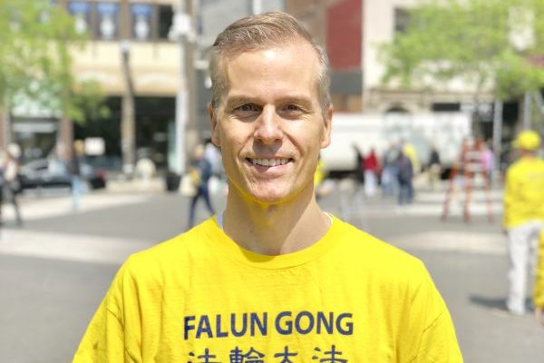

斯科特不仅明白了人生命的意义，也知道了人从何而来，为什么而来？那些困扰他的“心魔”也解开了，他的心变得平静。“19年来，我的头脑越来越清楚，精神的愉悦让我无比的快乐。”

【大纪元2018年06月22日讯】（大纪元记者周慧心采访报导）斯科特‧辛恩（Scott Chinn）是一位电脑软件工程师，今年48岁，他出生在美国加州，目前在纽约工作。他曾经在鲁克林学院攻读分子生物学博士学位，但是只读了一年就放弃了，转而做电脑软件工程师。他经历了怎样的挫折？

斯科特在接受大纪元记者采访时叙述了他人生中的多次转变。像其他的孩子一样，斯科特小时候也很爱玩，整个中学似乎都在派对中度过。大学里他修读分子生物学，成绩不错，在继续攻读博士学位时，他遇到了无法解释的困惑。

“一开始我并没有宗教信仰，我一直认为科学可以解释所有的事情，甚至还批评了基督徒，认为他们相信有神是不可思议的。”他说。

但是在上大学时，他认识了一个对禅和冥想有一定研究的女生。她喜欢看一些精神方面的书籍。

“与她在一起的时候，我经历了一些苦难，我经常被感情所困扰，让我倍感压力，感到非常痛苦。所以我开始寻找答案，为什么我不可以控制自己的情绪？我也开始阅读一些精神方面的书籍，发现它们比科学更能解释人生的奥秘。”

他说：“所以我觉得在科学中我无法找到我要的答案，生物学、生物化学都无法解释人生命的意义，或者人来自哪里？所以我离开了学校，开始学习佛法。”

他解释说，他离开学校还有另外一个原因，就是他感觉有些博士人品并不好，“他们自我感觉良好，但是在背后却做不好的事情。还有一些教授，他们都是为了出名。我很不喜欢。”

为了解开自己的迷惑，斯科特开始学习佛、道等不同法门，他后来在密宗中学习了6年，但是他仍然有许多疑惑无法解开。“我读了很多佛教的经书，这些经书有很多互相矛盾、讲不通的地方，让我更加疑惑。”

<b>找到心灵的导航</b>
 
1999年，他的一位华人朋友向他介绍了法轮功。“一开始接触大法，我以为那只是气功，因为太普遍了，中国大约有一亿人炼法轮功，我觉得那可能是一种时尚。”他说：“学炼都是免费的，而我以前学的那些佛教、道教的东西都要花很多钱的。所以我认为法轮功只是一种运动，没有内涵。”

但是当斯科特看到之前与他一起练密宗的朋友，因为修炼法轮功而发生了很大变化时，他也开始阅读法轮功的书籍。

“当我阅读《转法轮》时，我被说服了。书中讲了很多高层次中的理。随后我又阅读了所有大法的书籍，这些书籍解释了其它经书无法解释的事情。其它经书把事情说得很复杂、混乱，但是大法的书却将高深的道理讲得非常简单而清晰。”他说：“我开始明白自己内心痛苦的根源，比如男女之间的关系、妒忌心等。”

斯科特表示，他曾经很困惑，“我有个朋友，开了天目，可以感受到能量。我却看不到，也感受不到任何东西，我没有能力，什么都没有。当时在练密宗的过程中，我也十分努力，可是我却没有出特异功能，这让我非常沮丧，我以为自己太低。”

当他在阅读《转法轮》时，他看到关于顿悟和渐悟的道理，他才明白，不是因为他很低，而是因为每个人的情况不同，有些功能被锁住。同时他也明白了特异功能并不是修炼的全部，不能代表修炼的层次。

斯科特不仅明白了人生命的意义，也知道了人从何而来，为何而来？那些曾经困扰他的“心魔”也解开了，他的心变得平静。“19年来，我的头脑越来越清楚，精神的愉悦让我无比快乐。”

<b>技能的提升</b>
 
斯科特是一名电脑软件开发工程师，他在这行已经做了25年。自从修炼法轮大法后，他感觉自己的脑子更加清晰，“我发现编程变得更容易，我可以很快地解决一些电脑方面的问题。事实上，很多人都可以编程，但程序不是每次都可以那么顺利地运作。”

他说：“自从修炼法轮功后，我感觉自己的技能突然提升很多。研发新的软件变得比之前更有效率，制作出的软件质量也变得很好。我每天都精力旺盛，工作时也不像以前那么累了。”

他介绍，自己以前曾是橄榄球队的队员，多年的伤让他的颈项和背部在工作时会疼痛，“编程通常都要一直坐着，甚至会坐一整天，疼痛让我很困扰，无法专心。学了大法以后，我的疼痛完全消失了，我的工作效率提升了很多。一次我的老板让我一个星期做完一个程序，而我第二天就做好了。他感到很吃惊。”

他说：“我有一些经历很是神奇的，无法解释。我的天目没有开，我也没有功能，但是当电脑当机，或者出现问题时，几乎是在我碰触那个电脑的同时，问题就解决了。似乎我和电脑之间有一种神奇的联系。”

<b>感谢师恩</b>
 
6月20日，斯科特来到华盛顿，参加2018年华盛顿DC法轮大法修炼心得交流会。他对记者说，“在得法之前，我非常焦虑，往往因为自己不能控制的事情，而倍感压力，例如人际关系、家庭矛盾、自己的工作。我经常问自己：‘我为什么在人生中会经历这么多情绪的起伏？为什么自己不能知足，幸福？’”

“可现在我的心态完全转变了，在得法后的19年中，我的生活变得更加快乐。在生活中，在与朋友、家庭成员相处中，我会用在大法中学到的理来处理不同人际关系。我有两个孩子，我也让孩子们学会这些人生道理。在这19年中，我没有生过病，我感到自己身心都非常健康。我非常感恩师父，让我明了生命的意义。”

<h1 align="center"><b>休士顿法轮功学员声援三亿人“三退”</b></h1>

【明慧网二零一八年四月九日】（明慧记者舒静休士顿报道）二零一八年三月，全球有三亿华人通过各种途径，在大纪元网站上声明退出中共的党团队组织（简称“三退”），四月七日，美国休士顿法轮功学员在中国城举行了声援全球三亿人退出中共相关组织的活动，传递“三退”保平安的真相。

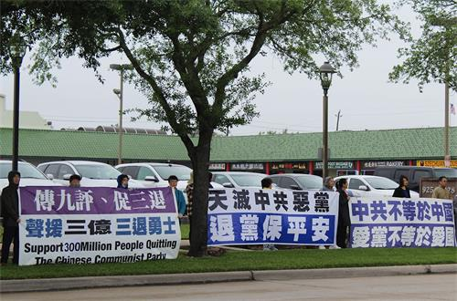

图：休士顿学员声援三亿人三退，传递退党保平安真相

中午正是华人购物、在餐馆午餐的时段，来往中国城的车辆很多。法轮功学员在草坪上展示真相横幅：“传九评、促三退，声援三亿三退勇士”，“天灭中共恶党、三退保平安”，“中共不等于中国”等，吸引了过往行人的关注。

被活动吸引的妮卡（Niga）向法轮功学员赫女士询问详情，赫女士介绍说：今天的活动是庆祝三亿人退出中共相关组织，即退党退团退队。妮卡对共产主义的邪恶本质早有了解，得知如今已有三亿人退出中共，她非常高兴，说：太好了。

活动现场派发的真相资料中，有新近出版的《共产主义的终极目的》一书，引起了不少的关注，纷纷拿取。

参加活动的法轮功学员张女士认为：全球有三亿人退出中共相关组织，选择与中共决裂，说明中共干的坏事太多了，三亿人“三退”是历史的一个里程碑，同时给华人也是一个警醒。张女士提到一些朋友是如何认识真相的，其中之一是张女士的朋友朱女士从不知情到明白真相的经历。朱女士生长于中国大陆，之后移民至澳门，然后又来到美国，事业有成。张女士多次向她讲述中共几十年来给中国民众带来的深重灾难，包括对法轮功的迫害，朱女士犹豫不决，仍然对中共抱有幻想。有个偶然的机会，朱女士了解到中共活摘法轮功学员的器官是事实之后，她的思维有了转变，做了三退，支持正义，并表示，如果有法轮功活动，她愿意参加以示支持。看到法轮功学员在严酷的迫害中还坚守信仰并持之以恒讲真相，她认为：法轮功了不起。

法轮功学员陈女士曾在一家商场附近向中年男士李先生讲述中共的邪恶本质，李先生说：我什么都知道，你们的资料我都看过了。我早已做了“三退”。他非常佩服法轮功，并表示：只有法轮功敢把中共的邪恶本质揭露出来，我佩服法轮功。我能帮助你们什么？陈女士回答：你做了三退，就是选择了善良，将这一切告诉你的亲朋好友，这就是最好的支持。李先生表示谢意。

陈女士在中国城讲真相时，遇到中年男士陈先生，这是第二次遇见他，前一次在中领馆前，因为陈先生有怕心，误认为三退与政治有关，没敢做出决定，这一次陈女士又有机会向他继续讲述真相，说：你曾经发过毒誓，要为中共奉献终生。现在你可以作出选择，退出中共相关组织，是为了抹去当时的毒印，这样做与政治无关。陈先生明白了，做了“三退”。

一位七十多岁男士在中国大陆生活几十年，经历过各种政治迫害运动，他对法轮功学员戴女士说：中共的所作所为，我比你们还清楚，我知道迫害法轮功的事是江泽民干的，自从他上台以来就没有给人民做过一件好事，养了一帮贪官，中共真该垮了。

有些来自中国大陆的华人明白真相后同情法轮功，认为法轮功学员是一群好人，他们表示：法轮功学员很正。还有的对着法轮功学员竖起大拇指，说：你们做得好，要坚持。

<h1 align="center"><b>发生在大连金州炮台的恶报</b></h1>
【明慧网二零一八年六月十三日】大连金州炮台开发区坐落在岚崮山南麓，相传有这样一个关于岚崮山的神话故事。
岚姑在岚崮山上隐居时，东海小龙王云游时看中了这里秀丽的风景，想据为己有，于是布云施雨，方圆几十里顷刻变作汪洋大海，荼毒生灵、毁坏房屋、淹没良田。岚姑义愤填膺返回天庭向玉帝禀报，得到许可，带领九龙将军将小龙王捉住，关进牢房。东海龙王得知后，想偷偷救回爱子，有人将这消息报告岚姑，岚姑一怒之下，用一条坚固的铁链将小龙王牢牢地锁住，下令：千年后方可脱身。一千年过去了。那条铁链真的消失了，随之一条又白又亮的大河出现在岚崮山上，就是现在的岚崮河……

听着自己家乡那善恶有报故事长大的人们，今天亲眼见到的是发生在身边的善恶报应。

“炮台书记王德世的家被抄了！”这个消息不胫而走，成为当地老百姓的热门话题。当然，此消息更令平时官场上跟王德世走的比较近的那些人胆战。那个在大连炮台经济开发区，曾经可以呼风唤雨的王德世，被老天派兵一下子捉住，坠入峡谷。

王德世，男，一九六零年九月出生，大连炮台经济开发区管委会党组书记、主任，大连金州区炮台街道党委书记。二零一八年五月二十五日，以涉嫌严重违纪违法被审查并抄家。

此前，炮台前任书记姜云胜与炮台迫害法轮功的六一零主管姜仁全已分别于二零一七年、二零一六年遭恶报，患多种癌症不治身亡。

其实贪腐违纪被查只是表面上的原因，现今中共内部已经是无官不贪，无官不腐，这一点谁都是心知肚明，而且贪污的金额、数量令老百姓瞠目结舌。可是为什么有些贪官被查，而有的就没被查呢？这就是个值得引人深思与警醒的问题。如果你是一个有心人，就会发现这样一个现象：就是被查办的这些人，大多都有一个共同特点：那就是为了捞取政治资本，积极参与对法轮功、对修炼真善忍好人的迫害。

姜云胜任职期间，炮台街道发生多起绑架、迫害法轮功学员的恶性事件，其中法轮功学员王某曾被迫害到教养院导致精神失常。

且看王德世在担任炮台党委书记期间，是如何对待管辖范围内修炼法轮功，遵循真、善、忍做好人的无辜百姓的？

据内部人士透露：为了讨好上级捞政绩，王德世积极响应江泽民邪恶势力对法轮功的打压政策，在炮台袁屯村、炮台干河村二道沟建立所谓的“无邪教村”，不让村民接触修炼真、善、忍的法轮功，几乎家家户户的门口都挂着一个“无邪教家庭”的铜色牌子。

政府给老百姓规定的福利待遇和各种补助，针对法轮功学员，炮台街道多个村委会扣留不给，他们对法轮功学员实行的就是赤裸裸的经济迫害。

二零一一年二月二十三日至二十八日，大连地区以中共“两会”为借口迫害法轮功学员。炮台街道红星村三名法轮功学员，被炮台政府及派出所等工作人员绑架到炮台派出所，逼迫这些法轮功学员签写所谓“四书”（放弃信仰的悔过书等），并入室抢走大法书籍、光盘等，言行十分恶劣。最后又把她们劫持到大连戒毒所迫害。为此致使两名法轮功学员被迫流离失所。

二零一二年六月六日，金州区炮台街道宋某等五名法轮功学员，因为向老百姓讲法轮功被迫害的真相，被炮台派出所警察绑架，宋某某此次被劫持到马三家教养院遭受非人迫害。

二零一七年三月十三日，大连市普兰店吴月菊等三名法轮功学员，在金州区炮台街道讲真相，被炮台街道派出所绑架到大连姚家看守所遭受迫害。

二零一八年三月十八日晚，大连金州石河镇九位法轮功学员，去炮台袁屯村免费发放《共产主义的终极目的》，被袁屯村书记吴兆坤追赶并诬告，最后伙同炮台派出所的警察把这些法轮功学员全部绑架。其中已经七十八岁的刘希永老人，现已被劫持到辽宁本溪第四监狱迫害。其余的法轮功学员至今仍被非法关押在看守所。

后来法轮功学员打电话劝善、邮信，吴兆坤仍没有悔改之意，继续命令村民监控、追踪、围堵做真相的法轮功学员。王德世与吴兆坤私人来往密切，多次结伴公款旅游，去美国、台湾等地，面对国外大法洪传的形势和法轮功学员的善意讲真相，不屑一顾。

是啊，那个小龙王对于自己残害百姓的事不也是同样不屑一顾吗？岂不知正是自己的不知天高地厚与狂妄傲慢，才招来了天惩，这就是厄运自招。炮台街道前任参与迫害法轮功的书记和六一零主管都死了，这一任仍在参与迫害法轮功的书记被查、被抄家了，这一切不是巧合。

善恶是有报的。无论人平时怎样得势，甚至狂妄嚣张，恶报来临时，也都是个个怕的要命、后悔也晚了。大家都知道按图索骥这个成语，在今天，所有参与迫害大法的人，都被上天的神佛记下一笔账，如还不能够及时醒悟悔改，恶报迟早是要降临在这些人身上的。

古语说：“衙门里面好修行”。一个人能够当官，也是因为这个人或祖上有德，如果借这个机会替百姓着想、多做善事，百姓拥护，上天自会佑护你从而有更大的福报；反之，如果只想一味的向上爬，利用手中的权力打压百姓、助纣为虐，那就会自损德行与福份，招致厄运缠身甚至死于非命，也就是“人行恶之，天必惩之”了。

说这些，我们没有一点幸灾乐祸的意思，相反，我们的心里很难过，这也不是我们想要看到的结果，我们是真的是为了你们好、想叫醒你们啊。因为我们知道，这些人也不过都是被中共欺骗、捆绑、利用的角色而已。我们本应是相亲相敬的家乡人，是中共在这场打压中，把你们推到了迫害法轮佛法的位置，推到了一个迫害好人、一个极其危险的、甚至能够给自己和家人带来灭顶之灾的罪大恶极的位置！历史上迫害正信的从来都没有好的下场。

近期大连地区迫害法轮功的官员遭恶报的太多了，大连市副市长张军、曹爱华、袁克力相继落马；市中级法院院长李威、沙河口区法院院长曲云杰、西岗区法院院长张明鹏被撤职调查；辽宁省公安厅副厅长王庆国（原大连市公安局副局长）、大连市中山区政法委书记胡家耿恶报死亡；大连市电视台台长王卫被调查等等。这些被查、被判、死于非命的官员，无一例外，都是曾经积极参与迫害法轮功的人。

人所做的一切坏事，都是需要偿还的，无论你是听从谁的命令，你听了、做了，这个罪责就是你的，这是逃脱不了的。三尺头上有神灵。尽管无神论在毒害着百姓，人已经不太相信神的存在，但是对于摆在面前的一些事实也不得不让人深思与警醒。

所有仍在参与迫害法轮功的人啊，醒悟吧！上天已经为你们一再敲响警钟，还在给你们机会：不要让这些人的今天成为你们的明天，等到那个时候，就什么都晚了，赶紧悬崖勒马、摆脱中共的邪恶捆绑，回到人的本性和善良中来，将功补过，善待大法与大法弟子，才能天赐洪福平安。

愿岚崮山下不再发生这样的悲剧，让炮台王德世等人的故事成为警示后人的范例吧！

<h1 align="center"><b>四口之家遭迫害 两姐妹坚持修炼讲真相</b></h1>

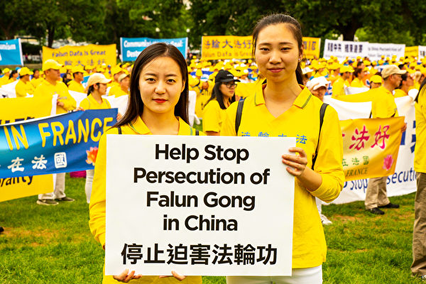

法轮功学员天心姐妹。

【大纪元2018年06月20日讯】（大纪元记者叶蓁美国华盛顿DC报导）一个温柔沉静，一个活泼开朗，性格完全不同的天瑞、天心姐妹，于6月20日来到华府，走进制止中共迫害法轮功的游行队伍。

这对年轻的姐妹来自修炼法轮大法的家庭，今天是她们出国近一年以来，第一次参加在华府举办的法轮功活动。因为家庭的遭遇，这次活动对她们来说意义更为重大。她们在读书期间，被迫和父母分开近四年之久，并处在无时无刻的监控和骚扰中。只因为她们一家，都是坚定的法轮大法修炼者。

今天她们正是希望通过游行活动，声援父母以及所有处在危险之中的大法弟子，共同为制止中共迫害做出自己的努力。

<b>初得大法 小姐妹成了同门小弟子</b>
 
从1996年起，7岁的天瑞和4岁的天心跟着爸爸、妈妈相继开始修炼法轮功。在她们的记忆中，刚得法时年龄很小，但是她们已经懂得按照“真、善、忍”的修炼标准要求自己，成了名副其实的“大法小弟子”。

一般来说，多子女家庭免不了孩子们的打闹、争吵，让父母不胜烦脑。修炼前的天瑞、天心也不例外。天心说：“我们俩是怎么厉害怎么来，我打不过姐姐，还和妈妈告状！”但是修炼后，她们不但不打闹了，如果爸妈要“收拾”谁，另一个还会站出来维护：“你们应该好好学法，不要动气哦。”

这样一来，姐妹俩因为修大法，关系变得更亲近。当然，她们在修炼上也不放松。天瑞说，如果表现不好或者学法、炼功不太精进了，她们会互相提醒、督促。做为姐姐，天瑞感到对妹妹多了一份责任。她说：“长姐如母嘛，我会对妹妹的生活、修炼方面更关心一些。”

虽然在懵懂的年纪，跟着父母修炼法轮功，姐妹俩却都感受到精神境界的提升。天瑞表示，她以前上学很淘气，经常和同学起冲突，但是修炼后性格越来越好，也能够把主要精力放在学业上。天心也感到受益良多，每天和父母、姐姐过得非常充实、开心。因为她逐渐了解到生活的目的和修炼的意义，那就是返本归真，逐渐放弃各种不好的思想。

姐妹俩表示，在1999年中共迫害法轮功之前，她们一家四口都在大法的呵护下精进实修，磨炼自己的身心，在各方面做一个好人。因此，一家人过着和和美美的日子。

<b>爸爸被抓 一家人噩梦的开始</b>
 
1999年“7•20”之后，天瑞、天心的爸爸、妈妈冒着生命危险，加入大陆法轮功学员自发讲真相、反迫害的行动。一家人因而不断受到中共警察的骚扰和迫害，姐妹俩幼小的心灵留下难以磨灭的创伤。

迫害最严重的是爸爸，在1999年底因为上访，被非法关押55天，并受到各种毒打、折磨，之后被勒索3000元才能回家。天心回忆说：“当时爸爸蹒跚走出来，灰头土脸、眼含泪光，妈妈早已经泣不成声，我只能抱着爸爸的大腿不停地哭喊。”她和姐姐以为，这种痛苦到此结束，谁想到，这只是噩梦的开始。

2002年夏天，姐妹俩的爸爸又被抓捕，在没有出示任何证件的情况下，家里被警察被抄个底朝天。天瑞、天心不知道怎么回事，吓得缩在妈妈身后一直哭。从那之后，她们家就处于监控之中，妈妈时不时被叫去问话，姐妹俩无人照料，不能正常上学。

后来爸爸逃亡在外，警察像疯了一样全城通缉。天瑞说：“我们很紧张，街上电线杆、墙上几乎都贴著爸爸的照片，上学路上老感觉后面有脚步声。”她提到，当时家里还有6、7个警察轮班住在家里，给母女三人带来巨大的压力。“那时候特别害怕脚步声，都成了阴影。”天心也说，“当时我们晚上不敢开灯，写作业也是偷偷点蜡烛，就怕警察来骚扰。”

不但如此，姐妹俩还成了学校的“新闻”，几乎所有同学都来看热闹：“你爸爸怎么被通缉啊？”那时候，她们受到严重的歧视，特别讨厌上学，更害怕面对老师和同学的盘问。

她们再次得到爸爸的消息时，却是在当地的电视新闻上。警察闯进爸爸藏身之处，野蛮地将他带走。“3、4个警察把爸爸从床上扒下来，撕扯他的头发，拳打脚踢。”天心说，看到这残忍的一幕，她和姐姐、妈妈只能抱在一起，哭了很久很久⋯⋯

<b>妈妈被抓 独自挑起生活重担</b>
 
到了2003年，她们的爸爸被非法判刑14年半，在2009年，妈妈也在抄家后被警察强行拖走，冤判3年，留下即将面临中考和高考的女儿们。这个本就风雨飘摇的家庭，更加支离破碎。天瑞和天心顶着学业的压力和对未来的恐惧，依靠爷爷的一点养老金，艰难地撑著整个家。

天心说，后来姐姐到外地上大学，亲戚们害怕受到牵连都不敢来帮忙，家里等于只剩下她一个。“几乎每天吃泡面，或者吃白粥配咸菜，吃了好长一段时间。”到现在，泡面已经成了她非常抗拒的食物。在学习上，天心的作业永远没有家长的签字，开家长会也只能她硬著头皮自己出席。就是在这样的情况下，她还要面对学校和警察的监控。

天瑞的情况并不比妹妹好多少。报名考大学时需要填表格，由于爸爸身份证已经过期，父母信息那一栏只能空着，让天瑞差点不能报名。读书时因为第一次去外省，只有一个伯父送她。“四年来都挺孤单的，一个人学法、炼功也很不方便。”在宿舍，天瑞就在床铺外挂上帘子，等到晚上室友们都休息了，她才能在这独立的小空间里继续修炼。

她们甚至在常用的书本里发现了窃听器，却不敢扔掉。“如果警察发现，还会再次抄家！”天心难过地说。这样一来，哪怕是在家，她们也只能小声说话，更不敢提到“大法”“修炼”等词语，而是换成其他“暗号”。比如问对方最近的表现或者有没有学法，她们会说：“今天你‘乖’吗？‘学习’了吗？”

这几年来，姐妹俩只见过爸妈一两次，每次都要花一整天才能进行短暂的会面。天心说：“我们每次都坐很久的车，到很远的地方去看爸妈。”天瑞说：“大早上6点就在监狱外面等，见到人时已经下午3、4点了，还只能见5分钟。”

天心形容当时会面的场景，爸爸或妈妈身后跟着“包夹”，她们身后有很多警察，中间隔着玻璃窗和两层密实的铁栅栏网，根本看不清爸妈的脸。说话的时候他们也很小心，一旦提到警察认为敏感的字眼，会见就被强行终止。

<b>高压之下 她们依然捍卫大法</b>
 
在艰难的处境中，姐妹俩不仅没有放弃自己的修炼，还做起了揭露迫害、讲真相的工作。自从爸爸被抓后，妈妈带着姐妹俩建立真相资料点。天心说，妈妈定期会印制真相资料，她们三人就一起，把资料包装得很精美，外出散步时送给遇到的人们。天瑞也说：“比如护身符啊、给公安局高官写信啊，课余时间我们都会帮妈妈一起做。”

后来妈妈也出事了，天瑞和天心没有资料来源，就凭著自己对大法的理解，见缝插针地跟老师、同学讲法轮功真相。天心还说，如果上课时听到老师在讲污蔑大法的话，下课后她就马上跟老师讲真相。幸运的是，老师们最后都表示理解，也对大法有了正面的态度。

爸爸妈妈被迫害的事就发生在眼前，姐妹俩讲真相就不为自己担心吗？“我没有想很多，这是我应该做的。我爸妈都是因为修炼被抓的，我不能默许警察这样迫害我们全家。”天瑞也很感谢师父，因为是大法的力量，支撑她们姐妹坚定地一路走来。

天心补充说，因为她们从小跟父母修炼，并没有认真想过自己为什么要修炼。“但现在，我们就会考虑，要不要坚持修炼，为什么？”天心认为，修大法没有错，爸妈只是坚持他们的信仰，但是在大陆有那么多人和他们一样遭受迫害。她说：“我就有一股冲动，告诉那些被谎言蒙骗的人，把善的、对的真相告诉更多人。”

毕业后，天瑞从事UI设计，天心则成为一名电视台主持人，但在大陆的迫害环境中，她们在职场仍然阻力重重。天瑞的老板被警察威胁，非常害怕，为了不给公司添麻烦，天瑞索性辞职。而天心，不愿在镜头前违心地歌颂中共、报导虚假信息，在和导演发生几次冲突后也选择了离开。

2012年和2015年，她们的妈妈和爸爸分别回到家中，姐妹俩发现，监狱的生活让他们瘦弱不堪，身上伤痕无数。但是警察仍然骚扰不断，父母双双离开家门，被迫流离失所。出于对女儿们的保护，他们决定让两姐妹一起出国，希望那些迫害，彻底远离她们。

<b>在自由世界 她们坚持传递真相</b>
 
目前她们在美国纽约定居，虽然在新环境中有许多需要学习、适应的地方，但是生活发生极大的转变。最大的变化，是她们可以公开修炼了，而且能够自由地参加大法活动，堂堂正正地做弘法工作或揭露共产党的迫害。

天瑞表示，虽然大陆在迫害前也有集体炼功，但她们的年纪太小了，都没有印象。当她们堂堂正正地在外面炼功时，天瑞感到“很新奇、难得，真是做梦都想不到！”天心说自己有“莫名的兴奋感，呼吸都很轻松”，打坐时更是想哭。“因为在大陆从来没有这种感受，路边人可以看着你炼功！”

同时，她们也感受到肩负更重的使命。天心说：“每当听到有大陆学员被抓，就像听到自己亲人被抓一样难受。”因此，姐妹俩希望尽可能地多参加讲真相的活动，帮助在大陆遭受难的同修。“能参加的都会去参加，还想做更多的事。”天瑞说，“不是为了个人，而是让更多的人关注中共对大陆的信仰迫害。”

于是，她们成为“退党义工”，在纽约景点附近的“真相点”为大陆游客讲述法轮功真相，帮他们做“三退”。另外，她们参加了每次法轮功学员举办的游行、集会等大型活动。今年6月，她们又来到华盛顿DC，继续她们的正法之路。

几年前，妈妈曾告诉姐妹俩：“以后你们就是最亲的人。”到了海外，天瑞和天心又过上了父母不在身边的日子，但是对妈妈的话却有了更深刻的理解。姐姐说她们的关系，已经超越了一般的亲情。妹妹也认为，她和姐姐这么多年来真的是“相依为命”。相信这对姊妹，会在自由社会开始全新的修炼生活，等待全家团聚的那一天。

<h1 align="center"><b>“全县唯一的好干部”</b></h1>

【明慧网二零一八年五月八日】我是一九九六年五月喜得法轮大法，得法前我曾在组织部、农业局、乡镇等单位工作过。一九九七年我被调入一科局做常务局长工作。由于自己按照“真善忍”严格要求自己，受到群众的一致好评和领导的高度信任。
一九九八年初，我单位建综合楼，主要领导让我任建房领导小组组长。主要负责建房各项合同的签订和资金的支配等。我单位的一把手在全体职工大会上公开宣布：“建房领导小组由某某某担任组长，因为他炼法轮功，道德品质高尚，一心为大家着想，这是大家公认的。我对某某某的信任超过对我自己的信任，单位的事情交给某某某我放心。”

<b>经销塑钢窗的小张说：“炼法轮功的，真不收一分钱的礼呀！”</b>
 
有一天负责我们建筑施工塑钢窗的小张，向我单位小詹询问我家的住处，小詹说：“你要送礼呀，你别去了，去了也没用，人家不收礼。”小张说：“我就是到他家看看，串个门，把这么大的工程给我了，我得当面谢谢人家。”小詹说：“人家是炼法轮功的，谁送的礼都不收。”小张说：“这不可能，我走南闯北这么多年，从来没见过不收礼的。”小詹说：“你不信？那我把你送到他家门口。”于是小詹把小张送到了我家门口。

小张進门之后，从兜里拿出一个鼓鼓的大黄牛皮纸信封，看上去里面足有上万元人民币。小张毕恭毕敬的说：“我代表我们厂长来看看你，你把这活包给了我们，我们非常感谢您。”说着把这钱放在桌子上，随口说我还有急事，站起来就往外走。我一把抓住他的胳膊，把装着钱的信封塞到他兜里，抓住他衣兜不撒手，让他坐下。我说：“我是修炼法轮大法的，我师父要我们按真善忍做好人，遇事为他人着想，我不收任何人的礼。你们挣点钱也不容易，你快把钱拿回去吧。”

小张说：“你不收下这钱，我跟厂长没法交差。”我说：“那你就把这笔钱用在提高工程质量上吧。”他既敬佩又感叹说：“炼法轮功的真是不收礼呀！我还没见过像你这样的好人呢！”

后来他又找我妻子（同修），当然也被妻子拒绝了。最后他跟我说，那我请你们吃一顿饭行不？我答应了他，吃完饭后他去结账，服务员说，账已经结完了。就是在我们三个人吃饭的中途，以出去解手为托辞，我就先把钱付了。

<b>办公室主任说：“炼法轮功的，不占公家一分钱的便宜。”</b>
 

我主管单位的财务工作，吃喝拉杂的费用都有我签字报销。这在我亲朋好友、工作过的单位领导、同事看来，请他们吃一顿饭是轻而易举的事。所以有事没事到我单位来坐坐，等我请他们下饭店，他们都觉得有权不用，过期作废。吃完了签字报销是理所当然的。

一天快到中午了，我曾经工作过的那个乡镇的一个村书记领着几个人来到我办公室，進门就说：“中午不走了，我们来了，还不请我们吃一顿。”我说行，我让办公室主任安排一下。吃完饭我从自己兜里掏出现金结账，结完账没要收据。那村书记问办公室主任，怎么不要收据呢，办公室主任说：“要那没用，我们局长家里来客人请吃饭都是自己花钱，从来不占公家一分钱。”

单位的综合楼竣工后，建筑商把单位几个主要领导的住宅的地面都铺上了地砖。我知道后，根据房间的面积和地砖的质量外加水泥和人工合计两千八百元左右。我便让我的一个同事也是建筑商的一个同学，把钱转给了建筑商，一共三千元。没过几天，建筑商来到我办公室，很无奈又非常敬重的对我说：“我只是想表达一下我对你的感谢，这点儿你也不接受，你炼法轮功，送礼不收，请吃饭跳舞也不去，变相给你点好处也不要，把钱退给我，还多给我二百元，真是拿你没办法！这当领导的要都象你这样那国家就好了。”

我所在的单位，每年招待费，至少都在十几万，甚至更多。这样饭店老板为了和我们拉近关系，结账时在原饭费基础上多开二三百拿回去报票子，从中得到好处是很容易的事。如饭费五百元，那单据上可能写八百元，或更多。这样在报销时，我就只好在饭费收据上签上：“实际花销五百元”，按实际费用报销。

逢年过节，或有时需要我关照的职工，给我送钱送礼我都一一谢绝和送回。因为我知道我是大法弟子，我就得按照我师父的要求去做。

<b>知道的人说：“一般人做不到”</b>
 

我所在单位，大大小小的官以检查工作为名来要吃要喝的不少，省级的、市级的、县级的，不仅要吃好喝好，更主要的是玩好，“玩好”就是要那种特殊的服务。

有一次市纪委一个处长来了，他是我参加市培训时的一个同学。领导为他安排的规格比较高，他们也把我叫过去一起招待。吃完饭后，汽车把大家送到了一个地方， 下车后，進了一个大厅，我才知道这里是一个个包房。我转身走出大厅，到车里坐着。不一会儿，负责招待的领导从大厅出来找我，非得让我進去不可。我说：“我不会去做那种事的，我决不会去的。”他就从车里往外拽我，我手拽着车把手，脚蹬着，他没拽动我。他气呼呼的说：“是不是因为你炼法轮功？”我说：“是啊，炼法轮功的哪有做这种事的！”坐在车里的司机说：“领导不去，我替领导去行不行？”那位领导说：“和你有啥关系，这是领导才有的待遇。”

在道德观念扭曲了的今天，不把这事看作是耻辱，而认为这是“领导”的殊荣，认为我这样的是个傻子。此事在当地传开，知道的人都说：“炼法轮功的真了不起，不嫖不赌的，一般人做不到。”

类如此事，我都能守住这一道德底线，按照大法的要求做一个真正的修炼人。

<b>政保科科长说：“你才是一个真正的大好人。”</b>
 

那是在二零零零年的六月，我因为坚持信仰，被非法关押在县第一看守所。

有一天公安局政保科长把我从看守所带到他的办公室，非常严肃地对我说：“老弟呀，听大哥一句话吧，说一个‘不炼’回家吧。县委书记、‘六一零’、公安局等有关部门领导开会决定，要对你进行调查，调查你在工作过的地方是否有违法乱纪行为，一旦发现有问题，要从严从重处理你。你赶快说不炼了，查出来一点事你就完了，公职、孩子、老婆都要受牵连的。”我说：“我真的没事，没做过一件违法乱纪的事。”他摇摇头无奈地把我送回看守所。

过了几天，县纪检委干部到看守所核实一个有我签字的三千元钱的借条，问我是怎么回事。我说这是我所在原单位清欠款时，当时县委决定由公检法三部门配合我们做这项工作。那条子的三千元钱是给法院的，是对法院配合我们单位清欠工作的一点酬谢。于是纪检工作人员到法院找到了原法院院长核实此事。

过了几天，原法院院长把电话打到了看守所，对我说：“老弟呀，当时那三千块钱我入账了，纪检委干部已经核实完了，没事了。你要是别的事我都能帮你，把你弄出来，你炼法轮功我帮不上你忙啊，你自己多保重吧！”

大约过了半个月，公安局政保科张科长又把我从看守所带到他的办公室，这次他让我坐下，还给我倒了一杯水，非常敬佩的对我说：“老弟呀，不查不知道，一查才知道你走过这么多单位，没有一点违法乱纪行为，吃喝嫖赌不沾一点边。嗨，只有学法轮大法的人能做到这一点，你才是真正的大好人啊！”

<b>局长说：“看能不能买到《转法轮》这本书，给每人一本”</b>
 

在单位，除了做好工作之外，我只要有时间就看《转法轮》这本书，每天沐浴在大法中。我也给大家创造一个宽松、清静、良好的工作环境，这是我这个做常务工作的职责，替领导分担责任，帮群众排忧解难是我的本职工作。

有一天早晨，我刚到单位，从外面就传来大吵大骂声，我到楼下一看，原来是专职书记在骂。是因为他想把他姑爷调到我单位来工作，一把手没有答应他，为此他就闹开了。我想这样让他闹下去，对他、对单位影响都不好。我下楼过去劝他说：“上办公室有事好好说，别这样。”他跟我上了二楼，闯進局长办公室，冲着局长越骂越凶。于是我便把他拽到我的办公室，还是耐心地劝他。没想到他反过来把气都撒在了我身上来了，不但骂我，还把我办公桌上的书和报纸都砸到我头上，把水桶和门都踹碎了，我仍面带微笑地劝他。一个副局长过来说：“也就是人家炼法轮功的不和你一般见识，做到忍，人家能忍住。”最后，围过来不少人把他推走了。

下午，他过来向我道歉，说他知道错了，这事和你没有关系，不应该向你发火。他说：我不明白，我骂你，你不但不生气你还笑，你是不是瞧不起我。再有我骂你向你发火，你怎么不骂我打我呢？你是不是打不过我，怕我打你？我说：要是比力气我不比你差。他不信，非要与我比试高低，于是便与我掰手腕、摔跤，结果他都不是我的对手。

后来他非常服气的说：“你是学法轮大法的，你能做到打不还手，骂不还口，不和我一般见识，你真了不起！”从此以后，他非常敬重我，和我成为好同事，处处维护我的工作。

局长既感激又过意不去，说：“谢谢你，老弟，为了我你受这么大的委屈，是你为我排忧解难了。”过一段时间，局长对我说：“看能不能买到《转法轮》这本书，给单位每个人发一本。”后来他本人得法修炼了。

单位有些职工也主动上我这儿来要《转法轮》这本书。前后大约送出去六、七本《转法轮》。

还有一次年终开职工大会，刚宣布开始开会，有两个中层领导争吵起来，像小孩吵架似的，吵得挺厉害。主管局长和一把手都沉默不语，这时我跟局长低语，我想说两句，局长宣布：“大家都静下来听某某某局长的。”我站起来面对两位吵架的中层领导说：“你们别吵了，有什么问题开完会再说……你们两个的表现，一是不尊重局领导班子的成员，目无领导；二是没有把全体职工放在眼里，无视群众。既然如此，还要你们这样的中层领导干什么？如果你们再吵，我就提议免去你俩的行政领导职务。”

话音一落，会场鸦雀无声，两个吵架的人悄悄地找个座位坐下来了，职工大会才得以继续开。会后有人问他们，你们俩怎么不吵了？他们两个说：“某某某是炼法轮功的，人家走的正，行的正，什么毛病也没有，他要真提议给我们免了，我俩告状都没地方告去。”

<b>驻看守所的督导员说：“全县唯一的好干部被关起来了，我不干了！”</b>
 

一九九九年十月，县委书记、党群书记、组织部长、纪检委书记等找我谈话，让我放弃修炼法轮功。我跟他们讲，我按“真善忍”做好人没有错，坚持自己的信仰是宪法赋予我的权利。

于是他们免去我的正科级级别和行政领导职务，并非法把我关押到县第一看守所。我被非法关押进看守所的第二天，早上八点钟上班时，检察院驻看守所督导员来到关我的监室窗前，打开窗户问我：“谁把你关进来的？因为什么把你关进来的？”我说：“因为我炼法轮功，是县委书记下令把我关进来的。”他说：“你听大哥的话，就说不炼了，骗他们，回家偷着炼，别那么死心眼。”我说：“那可不行，我炼法轮功，怎么能说假话呢？”

他一看劝不动我，就开始骂起县委书记来，越骂声越大：“某某某不贪不占、不嫖不赌，到哪个单位解决不了的问题人家能解决，别人干不了的事情，人家能干得了，是县里唯一的一个好干部，把这样的好干部关起来？！”骂县委书记不是人，大声骂着：“我不干了，我找他算账去！”说完就走了。

下午上班他又到关我的监舍窗前对我说：我去县委找他们去了，说县委书记没在家，去省里开会去了。县委办公室主任问他骂骂咧咧的找书记干啥？他说，你不知道他把某某某关起来了？县办公室主任等人也感到很惊讶。

他这一吵吵，狱警都出来看。他手指着他们大声说：“谁也不许欺负某某某，炼法轮功的是好人，谁欺负某某某我跟他没完！”我在县第一看守所被非法关押九个月，在这期间，不遵守监狱里的一切规章制度，每天学法炼功。狱警向所长反应我不遵守监区制度，所长说，“某某某归县委管，咱们管不了。”

在这二十多年的修炼路上，有做的好的时候，有做的不好的时候，一路坎坷走到今天，是师父给予了弟子多次新生！弟子无法用语言表达对师父的感恩，弟子叩谢师恩！弟子知道，只有在今后的修炼路上勇猛精進，做好三件事，才不负师尊重望。

<h1 align="center"><b>自由之家副总裁：追究中共宗教迫害责任</b></h1>

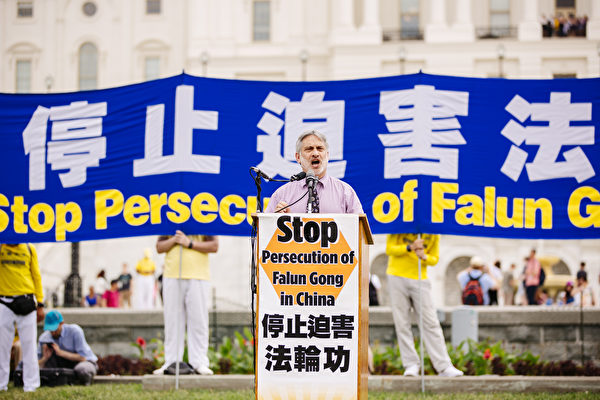

6月20日上午，美国非政府组织“自由之家”副总裁Robert Herman在国会山前法轮功学员集会上发言，谴责中共十多年来对法轮功信仰团体的迫害。

【大纪元2018年06月21日讯】（大纪元美国华盛顿DC记者站报导）6月20日上午，美国非政府组织“自由之家”副总裁Robert Herman在国会山前法轮功学员集会上发言，谴责中共十多年来对法轮功信仰团体的迫害。

当天，全球近万名法轮功学员聚集在美国首都华盛顿DC，举行反迫害集会游行，唤醒良知。

以下是Robert Herman的发言全文：

大家早上好， 我今天代表“自由之家”非常荣幸地与你们大家在这里参加这一重大的聚会，我们的“自由之家”是一个有75年历史的非政府组织。我们骄傲地与中国大陆勇敢的法轮功站在一起，他们拒绝屈服于中共野蛮镇压的精神鼓舞着我们。
“自由之家”在通过在美国境内和海外的出版物和宣传致力于曝光中共当局对言论自由、集会自由、结社自由和宗教信仰自由的制度性的侵犯，中共所有的侵权行为都是在有罪不罚的情况下进行的。
我们在与所有的国际团体、政府和文明社会的人们一起，要求追究中共当局侵犯公民基本权利的责任。宗教信仰自由存在于美国人的DNA里面， 这是我们的文化遗产的一部分，也是我们对自己认知的一部分。宗教自由是我们美国民主体制的基石，也是所有的政府都必须坚持的一种普世的权利。
当务之急是我们的政府要对包括中国的宗教信仰问题发声，并采取具体行动。美国政府此举将兑现美国政府长期以来在两党基础上批准的外交政策所定义的价值观、原则和理念。
中国境内的法轮功学员已经被中共执拗地迫害了近二十年，这个拥有强大安保机构的政权对那些被视为对其权利构成任何挑战的人进行了全面的镇压和可怕的酷刑对待，其中包括被中共视为敌人的人和中国的宗教少数群体。而法轮功学员在这期间一直被非法逮捕、羁押、判处入狱、酷刑迫害、强迫被投入精神病院和再教育中心，他们在未得到公平审判的情况下被送入劳教所，还有很多人由于在监狱受到的非人待遇而死亡。但这些事实好像还不够骇人听闻，有充分可靠的证据显示中国的医院中每年进行6万至10万次的器官移植手术，而这些器官大部分来自于类似于法轮功学员这样的良心犯。
我们必须清楚的表明，中共的这些行为违反了国际规范和标准及最基本的人类尊严。必须因此追究中共领导层的责任。当那些有责任推动民主和人权的民主国家政府和机构不对这些罪行发声时，他们就成了中共的同谋，因为他们的沉默和不作为纵容了中共。
自从1999年以来，成千上万名法轮功学员遭到监禁，被作为良心犯随时被投入监狱，这种现象从道德上来讲是无法接受的。除此之外，中共当局为了替其严酷的迫害找借口，其宣传机器还在积极地丑化法轮功学员。因为中共为了维护手中的权力非常害怕自己的公民，特别是像法轮功这样受欢迎的组织和团体，但是中国的法轮功的故事不仅仅是政府残酷迫害的受害者和幸存者的故事，也是一个有关不可动摇的信念、毅力和不屈不挠精神的故事。这正是我们今天在这里庆祝的原因。
信仰法轮功的学员的抗争，以及支持他们这种权利的人们的抗争远没有结束，美国的外交官和国会成员，以及类似于我们这样的有公共平台的文明社会中的成员，必须进一步的强调这个问题。
人权问题和民主自由问题，包括中共对待法轮功学员和其他受迫害团体的问题必须是我们与中共官员讨论的核心。这些是美国价值观的核心 ，是全球价值观的核心，这些价值观塑造了我们美国人对我们在全球利益的看法。 美国官员必须对中共清晰表明，美国政府与那些仅仅想行使自己的基本人权的人站在一起，我们的自由和政府问责制为何能够引发产生一个更强大而繁荣的中国。美国还将使用全球马格尼茨基机制加强对侵犯人权行为的问责制，此机制是根据俄罗斯的一位年轻律师马格茨基的名字命名的，他揭露了俄罗斯高层大规模的腐败，但死于俄罗斯监狱的酷刑迫害之下。
‘自由之家’将继续记录、分析和报导广泛的侵犯人权行为，这样那些作恶的当权者者有朝一日能够被绳之以法。
让我以最开始的话结尾，我非常钦佩中国的法轮功学员的英勇无畏的精神和他们的持久力。他们要求居住在一个可以自由思考，可以自由表白、政府对其公民要求必须做出回应的社会之中，毫无疑问法轮功学员将改变现状，而且事实也正在改变。

<h1 align="center"><b>烛光夜悼  美首都见证法轮功学员坚定信念</b></h1>

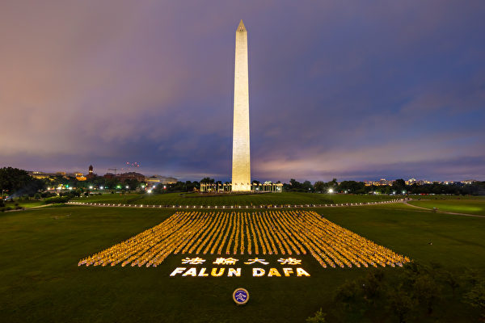

Candlelight Vigil – FalunDafa at Washington DC, 06-22-2018

【大纪元2018年06月23日讯】（大纪元记者马丽美国华盛顿DC报导）2018年6月22日晚，数千名来自世界各地的法轮功学员聚集在美国首都华盛顿DC，展开庄严的烛光夜悼活动。华盛顿纪念碑前闪烁著点点烛光，好像天上的繁星降落人间。

这是全球法轮功学员在美国首都烛光守夜的第18个年头，每年他们都会聚集在这里，悼念为坚持“真、善、忍”原则而被中共迫害致死的中国大陆大法弟子。

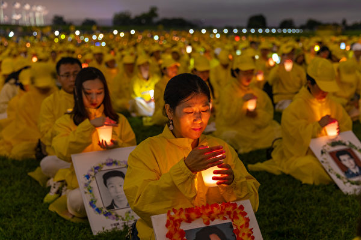

2018年6月22日晚上，来自世界各地的部分法轮功学员聚集在美国首都华盛顿DC，展开庄严的烛光夜悼活动。

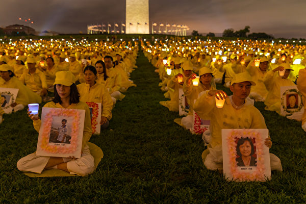

2018年6月22日晚上，来自世界各地的部分法轮功学员聚集在美国首都华盛顿DC，展开庄严的烛光夜悼活动。

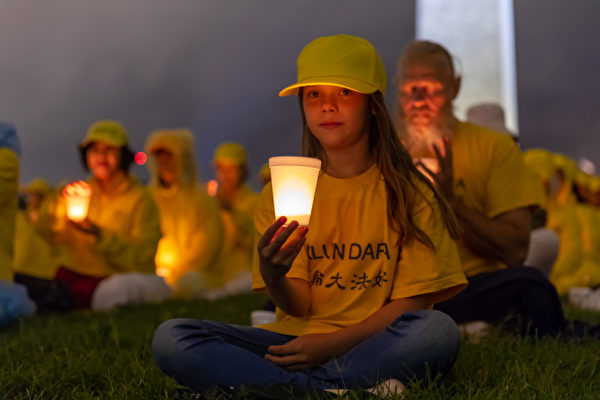

2018年6月22日晚上，来自世界各地的部分法轮功学员聚集在美国首都华盛顿DC，展开庄严的烛光夜悼活动。

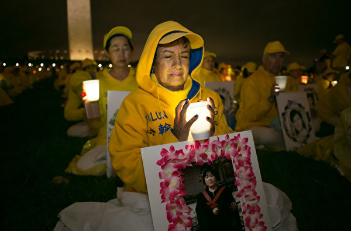

2018年6月22日晚上，来自世界各地的部分法轮功学员聚集在美国首都华盛顿DC，展开庄严的烛光夜悼活动。

伴随着庄严深沉的音乐，来自各族裔、不同肤色的法轮大法弟子，手举蜡烛，表情肃穆，在他们背后的华盛顿纪念碑，在烛光的映衬下更显得洁白如玉，好像一把正义之剑，直入云霄。

在他们前面，上千只蜡烛排成中英文的“法轮大法”字样，在蓝色夜幕苍穹的映衬下，无比神圣庄严。大法弟子手中的烛光好像纯洁的希望之光，点燃人类的未来。

<b>英国小法同：希望妹妹也能早日见到外婆 </b>
 
英国大法小弟子法同和爸爸也从伦敦赶来烛光守夜。今年11岁的法同从未见过生活在中国大陆的外婆孟秀娥。

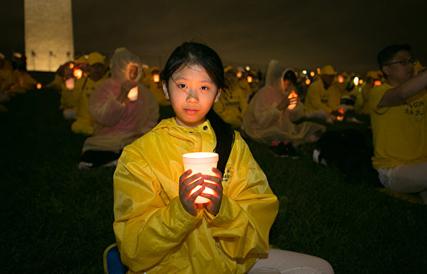

6月22日，英国法轮大法小弟子法同参加华盛顿DC烛光夜悼念。

因为中共迫害法轮功，法同的父母十几年来一直不能回大陆探亲，而外婆因为修炼法轮功，一直被中共当局拒发护照而无法来英国探亲。

2016年10月孟秀娥遭当地警察劫持后，2017年10月被非法判刑3年，被截断工资来源，并被非法关押在辽宁女子监狱马三家监区。

法同从小学拉小提琴。外婆被中共绑架后，法童心底生出一个愿望：尽快见到外婆，当面为她拉一首乐曲《得度》。

法同说：“我希望外婆尽快出狱，去年我有了一个小妹妹，今年一岁，我希望小妹妹也能尽快见到外婆。也希望更多人了解和支持法轮功，谢谢！”

<h1 align="center"><b>中共迫害致家破难圆 孩子十年不敢认妈妈</b></h1>

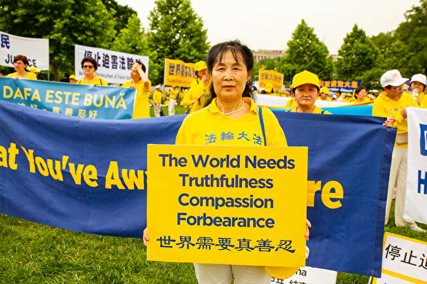

法轮功学员王玉光。

【大纪元2018年06月18日讯】（大纪元记者易如美国华盛顿DC报导）6月20日，法轮功反迫害、解体中共大型集会游行在美国首都华盛顿拉开序幕。来自全世界各地近万名部分法轮功学员聚集在美国国会山庄前的早坪上，他们希望通过这个活动让更多的人了解法轮功在中国迫害的真相，几年前辗转来到美国纽约的黑龙江哈尔滨法轮功学员王玉光也参加了集会，她想以自己亲身受迫害的经历来唤醒国人，共同呼吁结束这场对亿万善良法轮功学员的迫害。

几年前来到纽约的王玉光，每星期的周五、六下午，都会去位于纽约时代广场的法轮功真相点。看着匆匆而过的中国游客，她总是在思考一个问题：怎么能更好的让长期受中共宣传蒙蔽的中国人了解法轮功被迫害的真实情况。

1999年7月20日，中共全面开始打压法轮功，狂妄宣称“3个月消灭法轮功”。不过，当时法轮功在中国几乎家喻户晓，其功法使人强身健体、道德提升，深受欢迎，大多数老百姓对法轮功持有好感。而中共的打压也没能撼动修炼法轮功的学员们。

中共基于其本质的邪恶，2001年1月23日，中国新年的前一天，在天安门广场制造所谓自焚事件陷害法轮功，中共央视连篇累牍的进行谎言报导，完全颠覆了中国人对法轮功好感，自此，几乎所有被谎言蒙蔽的中国民众开始仇视法轮功及其修炼者。

“我修炼真善忍做好人没有错，法轮大法是好的、是正法，是带给人光明和幸福的伟大佛法修炼，是中共制造自焚伪案陷害法轮功。就因我坚持自己的信仰，将真话告诉老百姓，2000年，中共警察在全国通缉抓捕我，使我有家不能回。”王玉光说。

面对中共铺天盖地的谎言抹黑，成千上万的法轮功修炼者为了维护他们信仰自由的权利和揭露中共的无理打压，他们开始了长达19年的讲真相、反迫害的艰难旅程。

娇小的王玉光是黑龙江人，没修炼法轮功之前患有胃炎、胆囊炎、神经衰弱、咽喉癌、风湿等多种疾病。

王玉光：“那时，我没办法正常工作，每天都在病痛中煎熬，真是生不如死，生活无路，脾气也不好。”

王玉光的妹妹王玉贤，曾在北京肿瘤医院诊断为淋巴癌晚期，她在住院期间有幸参加了北京两次李洪志师父讲法班后，病症完全消失。经妹妹的介绍，1994年4月，王玉光参加了锦州法轮功的传法班。

她说：“当我听完课后，咽喉部位冒凉风，之后吃东西能感觉到甜、咸、辣味了，说话也不累了。走路觉得一身轻，师父给我净化身体，使我多年的疾病神奇般的完全消失了，是法轮大法让我重获新生。”

王玉光修炼法轮功后，处处按真善忍标准做好人，身心的变化不仅给家庭带来幸福，也让亲朋好友、邻居都感到惊奇，单位的同事也说学法轮功的人和别人不一样。“我真切体验到了修炼真、善、忍的美好。”王玉光说。

正当王玉光全家沐浴在法轮大法的佛光下，中共党魁江泽民下令开始全面镇压法轮功，王玉光及其家人遭到无辜的迫害。

“720后，炼功点被迫解散，各地站长相继被抓，我们一些同修纷纷到市政府要人，官方非但不放，还把各地学员分期分批用大汽车运到外地学校等场所软禁，关押12小时之久，然后被当地公安局派出所接回登记、注册，同时市公安局各分局对炼功学员明察暗访、监听、监控，不断骚扰。我也被市局找去，他们恐吓我，让我出卖同修，我没有配合警察。”

王玉光说，她无法理解，这么好的功法为什么不让炼，“我想把自己亲身感受向政府有关部门反映清楚，要求有一个合法炼功环境。”

1999年至2000年期间，王玉光先后3次被非法绑架，其中两次和锦州的法轮功学员一起去北京上级部门表达法轮大法好、不要镇压法轮功的诉求，都遭到警察和610的非法绑架拘押，并被勒索数千元现金。

2000年10月初，王玉光去到上海同学家，准备再去北京表达诉求，结果事情早被公安监听，包括同学在内两位法轮功学员被非法抓捕，当时走脱的王玉光也遭到北京公安部等六大部门通缉。

王玉光：“当时被抓的同修吞下了我们住的旅店开房的收据，警察才没有搜查我们的房间，我才安全离开。不过，事后，他们还是查到我，认为我是组织者之一，到处抓我，从此我流离失所。”

王玉光说，她未炼功前，病魔随时会夺去她的生命，炼功后身体好了，本可以阖家欢乐，“现在一家人却骨肉分离。江氏集团非法打压好人，真是让我百思不得其解。”

2002年3月5日，长春有线电视网成功插播法轮功真相，包括《法轮大法洪传世界》、《是自焚还是骗局》等，让数十万长春民众看到了法轮功的真相。

2002年4月20日晚，哈尔滨市的法轮功学员成功切换了市内有线电视网路系统，播放了长达30分钟的关于江泽民集团镇压迫害法轮功的真相片，内容包括《法轮大法洪传世界》、《是自焚还是骗局》等节目。

“当时在3个住宅小区同时播出了法轮功真相录像片，中共把我列为重点人物，江泽民亲自下令拨款21万元给黑龙江公安厅，成立420专案组共二百多人，采取各种手段监听、跟踪、蹲坑，甚至非法闯进我家安上窃听器，以企图找到我。”

王玉光说，警察最终没找到她，但转向对她家人的迫害。

“他们在我丈夫回家的途中劫持他，非法关押审讯，给剃了光头拘留15天，给我丈夫造成极大的精神创伤，丈夫被放出后，市公安局逼他每周写是否有见到我的汇报，还告诉他要把我当敌人看待，威逼他和孩子与我决裂。”

一次，王玉光非常想念孩子，就偷偷跑回家，孩子害怕不让她进屋，她就硬进了屋，孩子一个劲的撵她走，王玉光说，“我想你们了”，孩子说，“你别想我们了，你走得越远越好”。王玉光说，“那要等你爸回来见一面再走，孩子不要，一下跪在地上说，求求你了，你再见我爸 ，我爸就没命了。”

王玉光的丈夫在工作降职，以及无休止的骚扰迫害下，和孩子不敢再见王玉光，把王玉光当成敌人看待。

“我那时好伤心，孩子都吓成这样了，中共对我孩子和家庭迫害到那种程度，给我下跪都不要见我，都达到这种程度，活活拆散了我们这个家，也给我们一家人心理造成无法弥补的伤害。”王玉光说。

在这场中共对法轮功发起的“名誉上搞臭，经济上截断，肉体上消灭”的持续迫害中，王玉光年近70的父亲王春会、母亲李万芝，还有妹妹王玉贤、弟妹都先后被绑架进看守所等地迫害，并被处罚高额的罚款。特别是妹妹王玉贤被关进臭名昭著的马三家教养院女二所，由于她坚持对法轮功的信仰，遭到毒打，电棍电，顶脏水盆等酷刑折磨，以及长达18小时奴工劳役。

王玉光母亲、父亲、妹妹先后于2001年、2005年和2006年含冤离世。王玉光说，像她父母妹妹这样善良的人、只想做好人的普通人被中共迫害致死，在中国只是冰山一角。

而王玉光也在经历长达10年的流离失所生活后，于2010年逃出中国，辗转来到美国。王玉光说，她被迫流离失所时，孩子才十几岁，现在她的孩子已经30多岁了。

“我买了手机托人转交给他，但孩子至今也不敢与我联系。我希望我的孩子、还有更多的中国人能够了解法轮功被迫害的真相，早日结束这场中共对法轮功的迫害，让更多像我这样破碎的家庭能够团圆。”

<h1 align="center"><b>公检法司人员在这场迫害中是受害最重者</b></h1>

【明慧网二零一八年六月十九日】江泽民利用共产党发动的对法轮功的这场迫害，在世人眼里法轮功学员在遭受迫害。是的，为了逼迫法轮功学员放弃信仰，很多法轮功学员被绑架关押，很多在看守所、劳教所、监狱，被酷刑迫害的致残、致死、妻离子散、家破人亡，这是有目共睹的。其实，这场迫害迫害了所有的人。
因为在中共打压迫害以真善忍为理念的法轮功学员的过程中，就是在破坏中国的传统文化，打压“真善忍”，就等于放纵“假恶斗”。所以这些年，社会道德一日千里的下滑，人人都在受害。就是那些被以打虎的名义拿下的贪官们，他们能有今天的下场，不也是在打压迫害真善忍的环境中走到这一步的吗？最可怜的基层的百姓，吃着毒奶粉，地沟油，还“享受着”雾霾带给他们的感受。更可悲的就是一部份公检法司人员，他们除了承受和其他百姓一样的危害之外，还因为参与迫害佛法修炼者给自己和家人带来深重的灾难。

<b>1、设立非法组织“610”　剥夺了公检法司人员的执法权力</b>

一九九九年，江泽民看到上亿人都诚心敬仰李洪志大师，不学无术的他既不懂得、也不相信修炼人是能看淡和放下常人的名利的，强烈的妒嫉令踏着血迹而爬上中共总书记位子的江泽民失去了理性，以狭隘偏执的小人之心，使其终以总书记的身份在政治局会议上毫无由来的兜售所谓亡党亡国的威胁论，执意把法轮功和修炼受益的上亿好人推向政府的对立面。在其他常委都不赞同的情况下，却多次以写信的方式表达他执意迫害法轮功的恶意，还一意孤行的成立了中共“中央处理法轮功问题领导小组”和具体办事的办公室，因为成立时间为六月十日，故该办公室被称为“610办公室”。

“610”唯一职能就是迫害法轮功，是负责组织、策划、密谋、实施迫害法轮功的总指挥部。“610办公室”凌驾于法律之上，类似于十年浩劫中的“中央文革小组”和二次世界大战德国法西斯纳粹时期的盖世太保。“610”从上到下遍及全国各级政府和部门，可谓范围极广。“610”不受任何法律约束及国家政策限制，有调遣国家资源的特权。这些年走过来，我想每一个参与迫害的公检法司人员可能比我们还清楚，凡是有关法轮功的案件，公、检、法、司无权自由处理，必须听命于“610”。全国各地多名正义律师在检察院和法院阅取法轮功学员的卷宗时，都发现有610主持召开的“三长”会议记录，在没有走起诉和判决的程序就已提前拟定好了被绑架法轮功学员的非法判刑刑期了。所谓的起诉或开庭只不过就是走过场，只是让相关人员去承担迫害法轮功的罪名而已。

这个“610”非法组织在下达命令时，凡是涉及关键的问题，一般情况下是没有书面命令和通知的，只有口头传达。而且规定所有听从传达者不许录音、录像、不许做文字记录，可谓是全程黑箱作业。正因为上无法律约束，下无条文依据，所以迫害这群好人才敢肆无忌惮、为所欲为！每个参与的公检法司人员不信你们就想想，你们那个环境凡是涉及法轮功问题，是不是都是由“610”这个非法组织定调。

说到这，不知道你们是否想过这样一个问题：既然打压法轮功是公开的，如果法轮功真是像电视、报纸上抹黑宣传的那样，应该是随着迫害的深入，所谓的迫害证据会越来越多，为什么找不到新的所谓的“自焚”、“杀人”、“投毒”之类的证据呢？为啥在下达迫害指令时却越来越讳莫如深？据我所知，其一、迫害者本身是知道法轮功旨在教人做好人，所有当初的迫害证据无非都是捏造出来的，特别是这些年法轮功学员不断地讲真相，那些造假的宣传、强加的所谓证据，真相都被陆续揭示了出来，打压的所谓证据并不存在，所有利用来打压的法律条款都是生搬硬套，为此谁都不想为迫害承担罪责、留下参与迫害的犯罪证据，以至将来被清算；其二、邪恶怕曝光，谁都知道迫害法轮功违背天理人心，违背宪法和法律，可是中共的政策就是让参与迫害者既要当婊子还得立牌坊，即中共既要胁迫利诱人参与违法犯罪，还不能让其犯罪恶行被揭露曝光，令中共颜面尽失，致使一些基层公检法司人员为了讨得一口带血的干粮，知法犯法，执法犯法，昧着良心协从中共干坏事。

<b>2、严重破坏法律实施，把执法者拉入执法犯法的犯罪深渊</b>

我们认为参与迫害的公检法司人员你们应该是懂法律的。宪法规定：“任何组织、团体、个人，都没有超越宪法法律的特权”。而作为时任总书记的江泽民于1999年10月26日在接见法国《费加罗报》记者时，竟信口雌黄地说法轮功是“邪教”。您说他是不是在带头违反宪法、在带头破坏法律实施呢？以至于后来的1999年10月27日中共《人民日报》发表的题为《法轮功就是×教》（注：中共才是真正的邪教）的评论员文章，也是将江泽民的一派胡言当作了依凭。后来两高的司法解释强行把法轮功套入×教，但是，懂法律的人都知道，两高没有立法权，由其制定的所谓司法解释也不具有给人定罪的法律效力。其实他们都是步江泽民后尘在进一步破坏法律。

然而到目前为止，在中共公安部2000年和2005年发布的两个公文中，认定的14种邪教中都没有法轮功；包括之后全国人大的决定，以及之后两高的司法解释均未论述法轮功为×教（注：中共才是真正的邪教）。我们且不说这些部门是否具有认定邪教的权力和法律依据，但起码说明了一个问题，它不敢随意把法轮功列入其中。按《立法法》规定，全国人大才是最高立法机构。

江泽民下令要“三个月消灭法轮功”法轮功，可是不但没有被消灭，十九年过去了，法轮功却在中共打压迫害中锤炼的越来越成熟了。江泽民集团一看关押、劳教不起作用，而用以迫害法轮功学员的劳教制度和劳教所、以及洗脑班的罪恶又不断被曝光，一些参与迫害的中共高官被起诉，出国接了诉状又不敢面对，有的不得不抄小道溜回国内。因为迫害法轮功中共在几次联合国会议上受到人权组织和民主国家的谴责，使中共在国际上本来就低劣的形象越来越丑陋。在骑虎难下的形势下，不得不靠打压不断升级来维持迫害，于是指使“两高”出台所谓的司法解释，野蛮的把《刑法》第三百条硬套在被其非法侦诉和审判的法轮功学员身上，并以所谓的“组织和利用邪教组织破坏国家法律实施”来定罪。不知道作为公检法司的您是否发现一个问题，凡是造假，无论怎么掩盖都会有漏洞，继而有明白法律的律师就此提出，若按照犯罪的主体、客体、主观方面、客观方面四要素来衡量，这类案件只能找到法轮功学员作为主体，至于破坏了哪部法律或法规的实施、是怎么破坏的、破坏到了什么程度等均找不到。判定犯罪的四个不可缺少的要素，缺了三个要素。而作为法轮功学员，主观上都是按照真、善、忍在做好人，怎么能破坏法律的实施呢？

法轮功不是×教和《刑法》第三百条不适用于给法轮功学员定罪的问题就成了正义律师为法轮功做无罪辩护的充分的法律依据。正因为如此，每一次法院非法庭审法轮功学员时，这些都是法官和公诉人最害怕提及的问题，也是各级法官和检察官在面对正义律师有理有据的无罪辩护中难以逾越的关坎。而一些公检法人员为了不当庭丢丑，不得不昧着良心，要么逼迫或诱惑当事人家属辞退正义律师；要么耍无赖采取各种手段阻止律师介入，甚者当庭耍流氓，非法阻止律师就《刑法》第三百条这个问题展开辩护，有的法官不得已竟说出“在我这里不讲法律，也不能提及法轮功”。当律师问道：“你法院不讲法律，对法轮功学员判刑，又不能提及法轮功，你这是开的什么庭？”有的法官被问急了，恼羞成怒时竟调动法警殴打律师，上演了中共司法史上执法者公然当庭违法而被世人耻笑的一出出闹剧。

凡是到庭旁参与听庭审的民众，听了律师有理有据的正义辩护后，得出的结论是迫害修真、善、忍法轮功学员的中共才是真正的邪教，而那些公检法人员才是真正在破坏法律实施。

说到这，就给你讲一个故事，有一次，一个市区法院非法庭审几位法轮功学员，前两次开庭都是到了关键时刻进行不下去了，不得不休庭，第三次又没有进行下去，休庭后市政法委、六一零举行一次招待宴会，目的是给参与非法庭审的公检法司人员鼓劲，三次开庭无结果，法官心情非常不好，席间几杯酒下肚后，开始发牢骚：“你说我们的江主席，你要想收拾法轮功你就开个人大会议，给法轮功定个什么什么的，是不是我们这些司法者有个遵循，你说，年末了上边追着结案。这边没完没了的开庭，而每次庭审都弄得一团糟，小X（公诉人）被律师问的一句话不说，你让我这个法官怎么敲这个锤。那些家属看着我一次次地阻止律师发言，怒目圆睁，我都不敢往陪审席上看一眼。真是活受罪。”我们非常理解这个法官的心情，是啊，我想可能很多公检法司人员都会想到，就江泽民当时的位置和权力，召开一次人大会议就此问题来个立法，不就问题全都解决了吗？就象希特勒迫害犹太人不就是先立法，先把犹太人定为“劣等民族”（属于淘汰人种）然后又立法，剥夺犹太人的各种权利。江泽民怎么比希特勒还蠢呢？

法轮功修炼者遍及社会各个阶层，身居高职者也不在少数，据他们说，一个是江泽民当时太狂妄了，他以为凭借共产党这些年历次运动积累的整人经验，口出狂言：“三个月消灭法轮功”，可他万万没想到，这群明白人生真谛的修炼者能放下生死、无所畏惧，这源于正信的意志是任何力量都无法改变、无法撼动的。另一方面看他也确实不敢这样做，因为他虽然愚蠢，他要想把这么大个人群镇压必须做实。因此曾利用两三年的时间指使公安部做过实际调查，而每一次调查后的结果都说，没发现任何问题，相反还说对祛病健身很有效果，这让江泽民大失所望。他更知道界定一个功法是正教与邪教，是有标准的，首先得看他倡导主张的是什么，就这一个关都过不去，谁敢明目张胆的把一个教人以真、善、忍为修炼理念的功法定为邪教呢？一旦通不过会引起更多的争议。况且中国宪法规定，国家主席的职权有公布法律权、发布命令权、任免权、荣典权。国家主席的权力中当然不包括行政权，不能将行政机关的权力窃为己有。

在中国大陆，已有上千场正义律师为法轮功学员做无罪辩护的案例。很多正义律师在辩护词中告诫那些执法人员：中共对法轮功这么多年的持续迫害，触目惊心。以刑事司法的方式对信仰者进行打压、迫害，违背天理、国法、公道、人心。在这一过程中无论以任何名义对当事人采取非法关押、刑事处罚，相关责任人都已涉嫌滥用职权、玩忽职守、非法拘禁、制造伪证、徇私枉法等违法犯罪行为，一定会受到追诉、严惩，直至接受历史的审判。律师还特别提醒：和文革的迫害案例一样，将来一定会对参与人员进行清算。

一位大陆维权律师说：中共对法轮功的迫害没有任何法律依据。过去19年来，数千万的法轮功修炼者遭受了惨无人道的迫害和虐杀，江泽民集团以灭绝人性的方式和手段迫害法轮功修炼者的行为已经构成“群体灭绝罪”、“反人类罪”、“酷刑罪”，必将受到世人正义的审判。而所有参与迫害的公检法司人员就都将会被押上审判台。如果说我们法轮功学员被非法庭审迫害受到全世界人民同情、关注和声援，可是当那些参与迫害好人的迫害者被拉上审判台的时候，那将是大快人心”。其实这是善良的法轮功学员不希望看到的。

<b>3、参与迫害佛法的公检法司人员恶报连连</b>

俗语说，种瓜得瓜，种豆得豆，“善恶有报是天理”，这是从古到今人们在实践中总结出来的真理，这是不以哪个人或哪个政党的意志为转移的。

最近几年恶报如影随形，江泽民集团的势力被不断清洗，表面上是中共内部权斗的结果，其实这正是江泽民集团狂妄自大、为所欲为的必然结果，是它打压真、善、忍，放纵假、恶、暴的做恶报应。

◆周永康，以迫害法轮功学员的凶残毒辣深得江泽民的信任与赏识。2007年被江泽民塞进中央政治局常委会，让周永康成为迫害法轮功的主导操盘手。2014年12月6日，周永康被逮捕，现已被判入狱。周永康家族成员周滨、周元青及其前秘书和旧部李春城、郭永祥、李崇禧、李华林、蒋洁敏、冀文林、余刚等众多党羽，也相继被立案审查。周永康残酷迫害法轮功，最终以“满门被抄”的可悲结局收场。

◆徐才厚，官至中共军委副主席，是江泽民安插在军队里的代理人，被视为“江泽民在军中最爱”，是卖力迫害法轮功、活摘法轮功学员人体器官的主要凶犯之一。2014年6月30日，徐才厚被正式公布立案查处。现已遭恶报死亡。

◆李东生，2013年12月20日，中共“610办公室”主任兼公安部副部长的李东生落马。2001年央视栽赃法轮功的“天安门自焚”节目，由当时主管“焦点访谈”的李东生亲自监制了整个过程，并在国内外反复播出，欺骗民众，煽动仇恨。

◆薄熙来，中共第十七届政治局委员。薄熙来残酷迫害法轮功，组织活摘法轮功学员人体器官，在大连建立“尸体加工厂”。2013年9月22日，薄熙来被判处无期徒刑。

任长霞：40岁，河南登封市公安局长，因积极迫害法轮功而被中共树为“全国英模”。2004年4月，在汽车追尾事故中，她坐在后排最安全的位置却偏偏死亡（车中只有她一人丧生），且死后三天都闭不上眼。而车里其他人都安然无恙。当地很多老百姓讲，那是有人找她讨命，该市很多明白的警察都知道她这是卖力迫害法轮功遭报应了。任长霞在死亡的前一天，还亲自下令抓捕了二十多位法轮功学员。其妹跟人说：“过去我不信法轮功说的‘善有善报，恶有恶报’，现在我真相信了！”一人作恶，殃及家人，2008年10月29日，任长霞的丈夫卫春晓（45岁）也突发脑溢血死亡，家里只剩下一个孩子。

陈援朝：全国第一个对无辜法轮功学员非法判刑的海南省海口市法官，他因此被记“二等功”。作为法官，陈援朝明知信仰自由是宪法赋予公民的权利，却仍强加罪名给法轮功学员。两年后，陈援朝查出患肺癌，2003年9月2日在万箭穿心般的煎熬中带着中共的“先进”称号死去。陈援朝的“先进事迹”在电视上播出后，正在审理法轮功案件的法官有的请病假，有的提出调动工作，这些消息反馈到了电视台，当局决定立即停播陈援朝“先进事迹”，以免引起反效果。

何强：黑龙江省佳木斯劳教所大队长，在迫害法轮功之初，曾被派到北京团河劳教所学习“转化”法轮功学员的所谓“经验”，学成回来后不但对法轮功学员恶语相加，还利用各种戒具酷刑折磨大法弟子，大法弟子告诉他不要这样，对你不好，三尺头上有神灵，给僧人一口饭都是功德无量的事，对修炼人迫害是会遭报的。他非但不听，还扬言说，看谁敢报我。不久，他刚刚大学毕业的女儿就惨死于车祸。在痛苦之时，不知他对自己的所言所行是否有些醒悟。去年，他又因贪腐问题被“双规”获刑。

其实，有一些是受共产党多年的无神论教育毒害的，不相信善恶有报的天理。我们也听到过，有的参与迫害的公检法司人员说：你们这都是生拉硬扯，很多被拿下的官员是因为因为贪腐，可是你们想过吗？在目前的中国大陆可以说，“无官不贪，不贪无官”，可是为什么被拿下的都是迫害法轮功的急先锋呢？在此善意提醒你们，这可不是开玩笑，其实，明慧网每天都在报道，因迫害法轮功而遭到恶报的实例。这里只是给你们举了几个典型的例子，为了启悟你，给你讲个真实的故事：

苏倩：生前是新疆农八师石河子市中级法院里的一个小头目，曾追随周永康掌管的政法委迫害法轮功，并在办案中收了许多昧心钱。2007年6月初，38岁的她查出得了血癌且到晚期。她母亲说这是报应。她觉得花再多的钱也不会治好，就放弃了治疗，但决定把贪污剩下的30万元捐出去做点好事，好减轻自己的罪孽。在其住院期间，有好友劝她退党，被她拒绝，说什么死了一了百了。

6月12日早，苏倩因无生命体征，被推进了太平间。13日半夜2点左右，她突然醒来，拉住值班人说：“你怎么不救我呀？”吓的当班的小伙子逃了出去。6点，小伙子打电话叫医生来查看，结果发现苏倩真的是死而复生。醒来后的苏倩，告诉大家，她去地狱转了一圈，见到了阎王，还见到了出车祸死去的丈夫柳勇（市法院，曾接手非法判决法轮功的案子，在一次车祸中遭报丧生）以及高番法官（2007年因迫害法轮功而横死），他们都在地下受刑呢。到处都是血，惨叫不已，十分吓人！她的丈夫柳勇问她为何到此？高法官也问她并告诉她：他们是接了迫害法轮功的案子才落到如今这个地步。此时的苏倩才恍然大悟，但悔之晚矣。在阎王历数了她的罪行后，让她回转过来告诉众人真相，并让大家退党，别再接迫害法轮功的案子了。活了一天多的苏倩在告知真相后，再次死去，这回是真的死了。

2004年，在海外多个国家，法轮功学员把江泽民告上法庭，控告江泽民犯有：反人类罪，酷刑罪，群体灭绝罪。西班牙法庭已对江泽民迫害法轮功判决有罪，并向国际刑警组织发出了对江泽民的逮捕令。目前卸任的罪犯江泽民，只要踏出国门，就会被国际刑警依法逮捕！

<h1 align="center"><b>各族裔法轮功华盛顿DC反迫害大游行</b></h1>

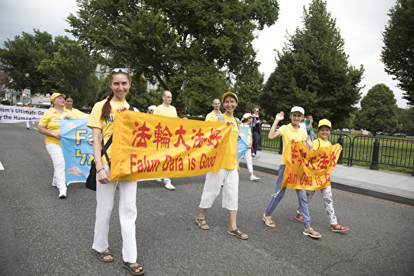

6月20日，来自全球各地部分法轮功学员聚集在美国首府华盛顿DC，举行反迫害集会游行，各界正义人士到场声援，制止中共迫害，呼吁人们认清共产主义对人类的危害。

【大纪元2018年06月21日讯】6月20日，来自全球各地部分法轮功学员聚集在美国首府华盛顿DC，举行反迫害集会游行，各界正义人士到场声援，制止中共迫害，呼吁人们认清共产主义对人类的危害。

中午12点举行反迫害大游行，游行路线从国会西边草坪出发，途经宾西法尼亚大道、宪法大道、美国白宫，一直到华盛顿纪念碑前，全程共2.4英里。

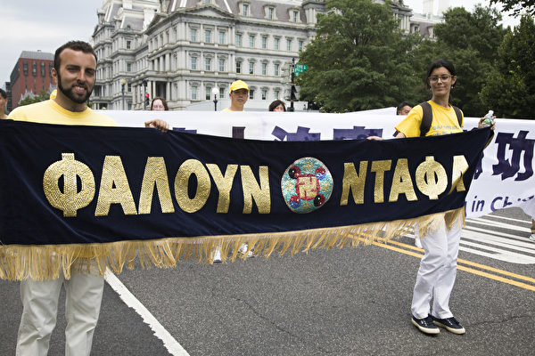

2018年6月20日，部分法轮功学员美国首都华盛顿举行反迫害大游行。图为来自俄罗斯的学员。

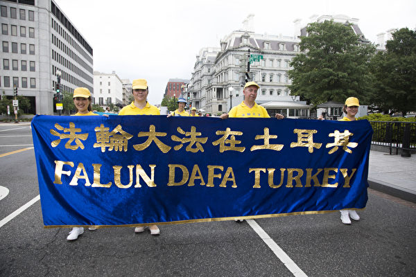

2018年6月20日，部分法轮功学员美国首都华盛顿举行反迫害大游行。图为来自土耳其的学员。

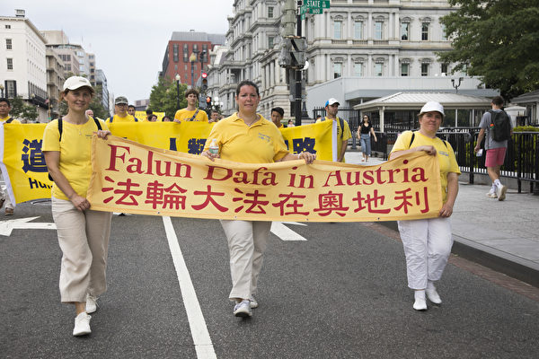

2018年6月20日，部分法轮功学员美国首都华盛顿举行反迫害大游行。图为来自奥地利的学员。

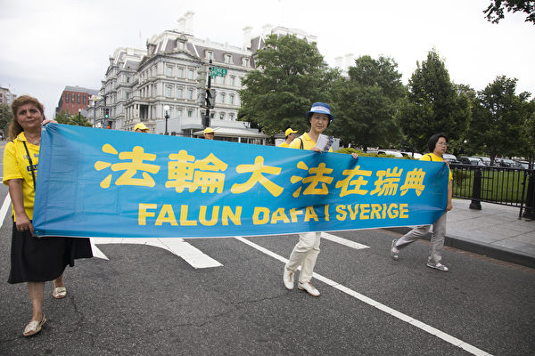

2018年6月20日，部分法轮功学员美国首都华盛顿举行反迫害大游行。图为来自瑞典的学员。

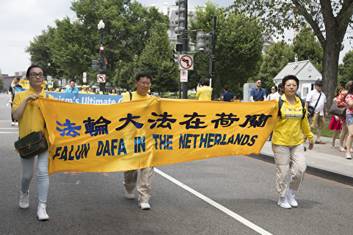

2018年6月20日，部分法轮功学员美国首都华盛顿举行反迫害大游行。图为来自荷兰的学员。

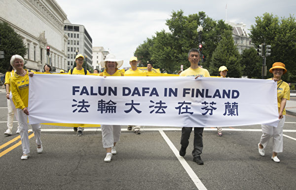

2018年6月20日，全球部分法轮功学员美国首都华盛顿举行反迫害大游行。图为来自芬兰的学员。

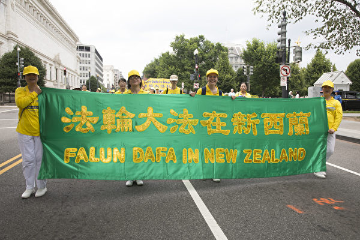

2018年6月20日，全球部分法轮功学员美国首都华盛顿举行反迫害大游行。图为来自新西兰的学员。

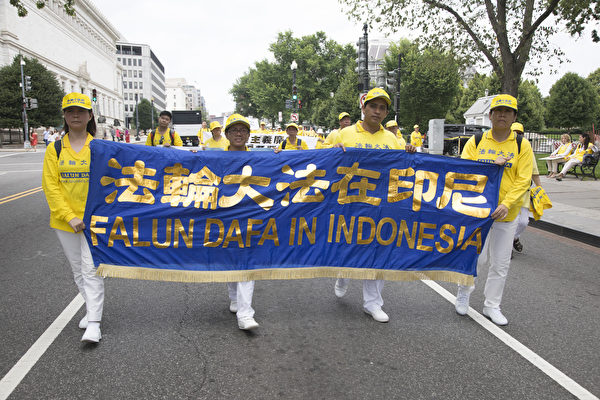

2018年6月20日，部分法轮功学员美国首都华盛顿举行反迫害大游行。图为来自印尼的学员。

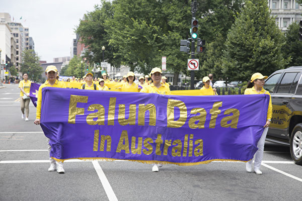

2018年6月20日，部分法轮功学员美国首都华盛顿举行反迫害大游行。图为来自澳洲的学员。

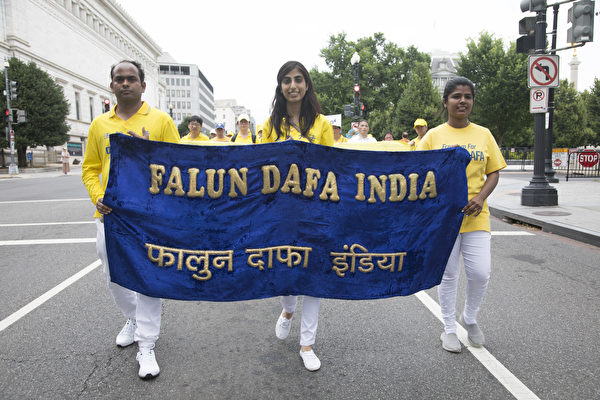

2018年6月20日，部分法轮功学员美国首都华盛顿举行反迫害大游行。图为来自印度的学员。

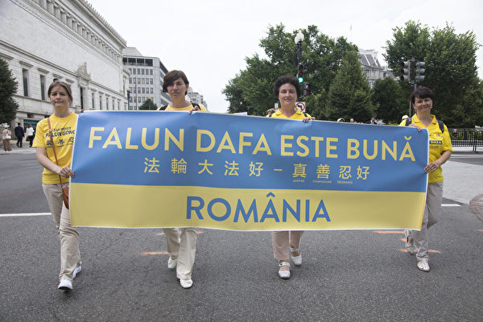

2018年6月20日，部分法轮功学员美国首都华盛顿举行反迫害大游行。图为来自罗马尼亚的学员。

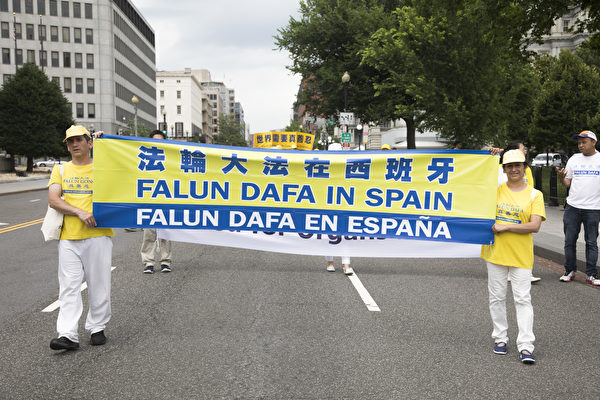

2018年6月20日，部分法轮功学员美国首都华盛顿举行反迫害大游行。图为来自西班牙的学员。

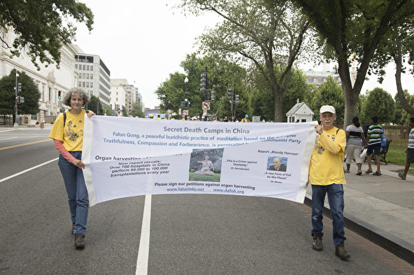

2018年6月20日，来自世界各地的部分法轮功学员美国首都华盛顿举行反迫害大游行。

 

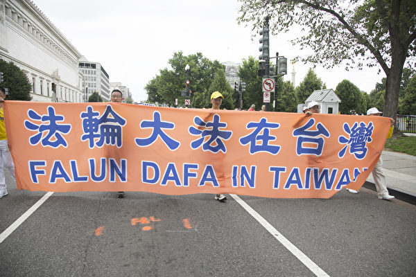

2018年6月20日，部分法轮功学员美国首都华盛顿举行反迫害大游行。图为来自台湾的学员。

<h1 align="center"><b>澳洲人体展 遗体被爆来自中国良心犯</b></h1>

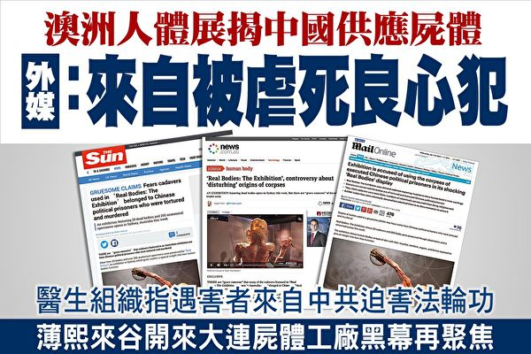

澳洲news.com.au、英国《太阳报》、《每日邮报》等都报导了饱受争议的“真实人体”标本展涉嫌使用良心犯遗体。（网页截图）

【大纪元2018年04月12日讯】（大纪元记者黄捷瑄、何佳慧编译报导）一个名为“真实人体”（Real Bodies）的著名人体标本展预计本周在澳洲悉尼展出，但展出的标本来源引起“极度关切”。外媒引述医生组织表示，展览中使用的多数尸体是来自在中国大陆受到酷刑及被谋杀的政治犯，这些罹难者最有可能是法轮功学员。

澳洲传媒news.com.au报导，“真实人体展”标榜展出以塑化技术保存的逾20具尸体，以及超过200件解剖标本，预计周六（14日）于悉尼摩尔公园的拜伦．甘迺迪大厅（Byron Kennedy Hall）展出。展览据称可让买票入场的观众“探索和与展品互动”，以更深入了解人体的运作。

但报导引述反强摘器官医生组织（DAFOH）发言人布里斯金（Sophia Bryskine）的话表示：“这些人体不是自由、自愿捐赠的，对此表示极度关切”。

“这些人体的来源已经受到质疑，而且据信来自中国，可能是死囚，或者是独立调查人员怀疑的、遭受酷刑的良心犯。”

她表示：“法轮功学员被指是最可能的受害者。”

英国《太阳报》也关注报导今次事件，提及法轮功是一种佛家修炼功法，1990年代末期以来，数以千万计的法轮功学员被关押在中国一些最严酷的监狱及劳教所，“那些拒绝放弃信仰的人，便成为残酷折磨、虐待和杀戮的目标。”

报导中说，展示中的人体由大连医科大学生物工厂（Dalian Medical University Biology Plantation）提供。展览的筹办机构Imagine Exhibitions总裁札勒（Tom Zaller）说，对于“展出的人体来自死在狱中的中国政治良心犯”一说，“没有根据而且冒犯”，但是札勒无法提供任何关于人体来源的证据。

札勒只说这些人体“毫无疑问来自中国”，但是“没有文件”可以证明他们的身份，或显示他们生前同意在死后捐赠尸体。

<b>调查：贩运人类尸体变生意</b>

另外，提供遗体的大连医科大学解剖学教授隋鸿锦声明，这些标本“最初由城市的太平间收集来，然后转给中国的医科大学，最后合法地捐赠给鸿峰生物科技有限公司进行保存、解剖及展览”。

对此，前检察官、加拿大前亚太司司长乔高（David Kilgour）对news.com.au说，他和2016年《血腥的活摘器官》（Bloody Harvest）报告的另外两名作者──人权律师麦塔斯（David Matas）及美国调查记者葛特曼（Ethan Gutmann）一直“都很担心这个展览宣称的没有一样是正确的”。

他说：“这个展览只是企图从天真的消费者那儿获得入场费。”

在该份报告最新更新关于大连塑化人体工厂的章节中，调查人员强调提供给科学的尸体数量与中国人体捐赠数量的差异。报告指出，隋鸿锦的“主要收入来源是出售尸体”。

新版的报告说：“贩运人类尸体已变成生意，塑化标本被公开定价及交易”，中共“对这些交易招标”。

报导又引述明慧网刊登一封来自中国东北省大学生的投稿，对那些宣称来自捐赠的遗体来源表示质疑。“我所在的长春一家小型业余医学院，所拥有的人体和器官标本竟然比东京早稻田大学还要多。”

“我问老师这些遗体是否捐赠而来，但老师叫我不要问”，该学生写道。“其后我发现在长春和近郊有一所尸体处理厂⋯⋯到底今天的中国，愿意捐赠遗体的人真的多到需要工厂来处理吗？”

报导指，中共前党魁江泽民1999年下令禁止法轮功以来，诸多国际组织如联合国禁止酷刑委员会、人权监察组织、美国国会等多次发表报告指法轮功学员在中国遭受囚禁和酷刑虐待。DAFOH发言人布里斯金说，法轮功学员遭迫害的情况仍然严峻，中共正在国家层面犯下惊人的人权罪行，澳洲和其它国家需要马上采取行动谴责。

中共迫害法轮功持续19年，所犯下的反人类罪行目前在全球范围广泛曝光。上月15日，美国国会及行政当局中国委员会（CECC）公布了2017年年度报告执行摘要的中文版译文，引述报导指中国大陆许多器官移植手术都使用了被拘留囚犯的器官，包括法轮功修炼者在内。

<b>薄熙来谷开来的惊天案中案</b>

2012年2月，原重庆公安局长王立军出逃美国领事馆后，揭开了薄熙来与周永康联手政变的黑幕，包括薄熙来与妻子谷开来在配合中共前党魁江泽民迫害法轮功学员的政策下，活摘法轮功学员器官牟取暴利的罪行。

江泽民于1999年7月起在全中国实施迫害镇压法轮功政策。薄熙来为仕途高升竭力配合，在担任大连市长和辽宁省长期间，大连最先发生活摘法轮功学员器官、盗卖被残害的法轮功学员尸体的罪恶。

据悉，薄熙来当上辽宁代省长后，新建扩建了沈阳马三家劳教所、龙山教养院、沈新劳教所等，专门接纳全中国各地因为不报姓名而无法遣返的法轮功学员，为活摘器官及尸体加工厂提供大量的人体来源。

大纪元曾报导，薄熙来之妻谷开来具体参与贩卖尸体以及人体器官的罪恶，其中包括与英国商人海伍德（Neil Heywood）在英国开了家合资公司，专门负责把人体器官和尸体卖到海外。

海伍德最终与薄家反目，遭谷开来杀害。同样参与活摘器官罪行的王立军，为保命出逃到美国领事馆。2012年8月20日，谷开来以“故意杀人案”被判处死缓。薄熙来也最终在2013年10月25日被判无期徒刑。

<b>尸体工厂“大连鸿峰” 薄熙来主政期间成立</b>

来源不明的塑化人体标本展，过去在全世界都引起争议。2016年9月，瑞典在哥德堡及布罗斯两个城市的人体展因为存在伦理争议而被取消。2017年7月，捷克首都布拉格一个名为“Body-the Exhibition”的人体展览引起当地民众和市长的抗议和批评，鸿峰生物科技有限公司同样出现在展览的鸣谢单位之中。翻查资料，该公司及其总裁隋鸿锦发迹于大连，与曾主政当地的前重庆市委书记薄熙来有千丝万缕的关系。

<b>全球最大人体标本产地</b>

2012年11月13日，追查迫害法轮功国际组织发布了《关于塑化人体标本尸体来源的调查报告》。报告揭示，在当代中国，利用人类尸体塑化成标本牟取暴利这一罪恶行业，是世界上唯一由政府部门主导“孵化”出来的产业。该产业兴起于2000年以后，正是中共对不放弃信仰“真、善、忍”的法轮功学员大规模迫害与虐杀的高峰期。

“大连鸿峰”是薄熙来任辽宁省委副书记、省长时成立的，是一家完全用中国人的尸体制作“人体塑化标本”的公司。“大连鸿峰”董事长、大连医科大学解剖教研室主任隋鸿锦曾称，部分“尸体”来自中共公安部门，其设在辽宁的尸体加工厂能成为“世界上最大的塑化人体产业基地”，全靠“国家各级领导”的“关怀和支持”。

<b>陆媒曾质疑 输出尸体检疫问题</b>

已被判处无期徒刑的薄熙来，是迫害法轮功的主犯之一。他涉及向中国的器官移植医院和生物标本塑化加工厂提供遇害的法轮功学员的尸体。资料显示，1993年，薄熙来担任辽宁省大连市长和市委书记时大量吸引外资。1999年8月，即中共开始镇压法轮功后一个月，冯‧哈根斯生物塑化（大连）有限公司成立，成为是全球最大的人体标本加工厂。

而隋鸿锦即德国人冯‧哈根斯的学生，并担任哈根斯公司首席运营官。2002年，隋鸿锦创办了自己的人体加工厂“大连医大生物塑化公司”，主营生物塑化标本制作和展览，自任董事长。从2004年开始，隋鸿锦开始在国内外举办“人体世界”展览。2005年11月，隋鸿锦又打入美国市场，合作方为美国第一展览公司（Premier Exhibitions），并与各医学院签订尸体或器官标本销售合同。如2005年9月，隋鸿锦所在公司与北京自然博物馆签订了数千万元的供货合同，产品从人体全身塑型（全尸）至各器官组织达300多个品种。

大陆《瞭望东方周刊》早在2003年披露，中国大陆在2003年就成为人体标本的最大输出国，“哈根斯生物塑化公司”是全球最大的人体标本生产基地。“令人震惊的是，这些公司为何能在中国海关和进出口检疫部门如履平地，它们又是依据哪一条规则办理通关和检疫手续的？”

<h1 align="center"><b>哈尔滨看守所“文明管理”对女性的侮辱</b></h1>

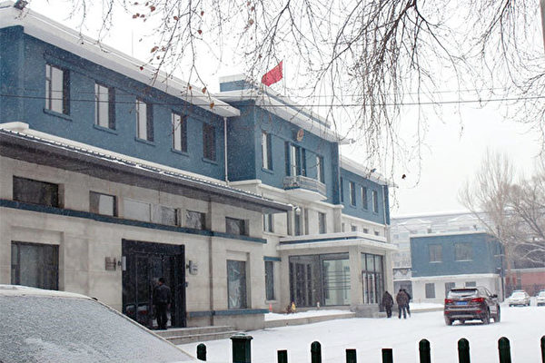

人间地狱——哈尔滨市第二看守所。

【大纪元2018年06月10日讯】经过看守所一道道被摔得咣咣作响的阴森铁门，在一声声“低头、低头”的吆喝声中，新进来的人被推搡进入一个号里，还没等反应过来，就窜出几个人，连拉带扯把人从里到外的衣服扒得一丝不挂，逼迫人光着身子在众目睽睽之下，在地上转圈，说这是人人例行的检查。

以上是哈尔滨市第二女子看守所。据明慧网报导，该市的女性法轮功学员凡被非法刑事拘留的，都被关押在此。

看守所位于哈尔滨道里区工农大街158号，看守所对社会公开“文明管理”八项承诺，放在墙上公布于世，并设有投诉电话，外表给人以文明执法的印象，但事实却非如此。

无论是刑事犯还是法轮功学员，先在严码监监栏门内遭受人格侮辱，当着女狱警和几十名犯人的面，被两名执夜岗犯人强行全身脱光、下巴被人用力捏著张开嘴检查，双腿劈开的同时，两臂被两名犯人强行架起在原地蹦三下，检查大、小便处是否夹东西。

据悉，有警察将所有的衣服包括胸罩、袜子、裤头全部退回到实施绑架的派出所，让家人取回；在家人没送衣服到看守所期间，只能靠在押人员的救济，有时只好穿着拉链被剪掉的外衣，没有内衣就敞胸露怀，狱室有监控，男女狱警都能看见。

更有甚者，在律师会见和办案警察所谓“提审”之后，只要走出监舍回来，犯人头就按照狱警的旨意进狱室每次都要把法轮功学员的所有衣服扒光，让她们在地上蹦跳、侮辱。

第二看守所于姓所长和副所长吴艳丽参与暴力转化（强迫放弃修炼）法轮功学员，经常把法轮功学员提出去，软硬兼施逼她们转化，写“四书”（放弃修炼的所谓“保证书”、“揭批书”等），唆使“牢头”用歧视、孤立、打骂等方式从精神和肉体上折磨法轮功学员，达到必须让她们转化的目的。

警察已严重违反《宪法》36条。该条款规定：任何国家机关、社会团体和个人不得强制公民信仰宗教或者不信仰宗教，不得歧视信仰宗教的公民和不信仰宗教的公民。国家保护正常的宗教活动”的规定。涉嫌滥用职权，犯有歧视宗教信仰罪。

<b>精神和肉体虐待</b>

第二看守所警察长期虐待在押人员，利用、唆使、纵容“牢头”代警察管理日常工作已经成为常态。牢头为了讨好警察，以达到所谓“立功”争取减刑的目的，长期虐待被监管人员。

以下的虐待方式完全有悖于监狱“对在押人员依法实行文明管理，不打骂、不体罚”的承诺

<b>设严管间</b>

严管间是在非常狭小的空间超密度地关押四五十人。法轮功学员一般都被关入严管间。

牢头和十几个牢头身边的“大犯人”（一般都是与警察有关系、家里花钱被照顾的人）在小铺上。没有特殊关系的犯罪嫌疑人和法轮功学员在大铺上，处处受到歧视和虐待。

从那里出来的人说，“不死也得扒几层皮，那里就是人间地狱。”

<b>人格侮辱</b>

新入看守所的人全身被扒光检查，还被架著胳膊，逼迫劈腿使劲蹦三下，说是怕在阴道里夹带违禁品，实则是对新入看守所的人来个“下马威”，进行灭绝人性的人格、人身侮辱。

此外，前三天每天都被扒光，并要求大声向牢头报告：“我叫×××，因什么事被关押进来，我认罪服法……”如不照办，轻则被多人左推右搡围攻，重则拳打脚踢。

每次被非法提审或被律师接见的人回来后，也得扒光衣服、被要求报告。

<b>逼迫穿识别服、背监规</b>

进所后就被强制穿上印有“哈尔滨二看”字样的马甲，人人都得背监规，即逼迫人承认犯罪身份。

早上8:30上班，每个监号的人要齐声背诵监规。“大犯人”会走到每人身边细听，不背的人就遭到辱骂、体罚。

牢头还要向警察特别报告法轮功学员的人数。

<b>限时洗漱</b>

早上5点，天没亮，在押人员就得起床。“大犯人”把被子卷起高高地码好。其他人蹲著、手背在后面，在大铺上等著，排队沾点水，匆匆几分钟漱洗。

有时可以洗内衣和袜子，但没有晾晒的地方，必须抖干，不管干不干，白天一律把它们放在胸前衣服里捂著。没有热水，更没有热水洗澡。

<b>码坐</b>

洗漱后，还得蹲著、手背在后面，痿上大铺，一个挨一个码坐。不许说话，不许大动。几乎是除了吃饭、睡觉都是坐着，好多人臀部疼痛，有的得了痔疮。

<b>限制上厕所</b>

每天晚上夜岗值班人（一岗3—4人，3小时一换岗）把人叫醒（不出声，巴拉一下，打手势）上小号（小便）。40—50多人上厕所，限时20分钟。

有人尿不出来就被拽起来，白天只准解小便，晚上八点之后才被允许解大便。一旦憋不住上了大便就被侮辱性地谩骂、羞辱、推搡。上厕所得向牢头报告，不被批准就得硬憋著，以此作为体罚。

许多在押人员半个月甚至更长时间都没有大便，不敢吃东西，不敢喝水，瘦得脱相。

<b>码刀鱼</b>

睡觉时每个人都被一颠一倒，立着身子，码成直直的一根棍子，俗称码刀鱼。

几个人盖一床被，一动不能动，几个小时才被允许统一翻身。因不能洗澡，身体散发出浑浊的气味让人窒息。人几乎一宿都睡不着觉，实在困了才迷糊一下。

人时常被码得出现心脏疾患，每天一分一秒地挨到天亮。

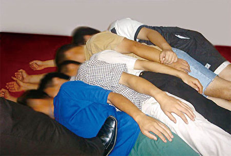

中共酷刑迫害演示图：立板（又名“睡刀鱼”）。（明慧网）

<b>剥夺合法权利</b>

第二看守所自2018年3月初起，律师会见法轮功学员时，法轮功学员的双手有意被牢牢铐在凳子上，致使她们不能在举报书、控告书等合法文书上签字。公民享有的合法权利受到侵害。

此举违悖监狱“保障在押人员依法享有的辩护、上诉、申诉、举报、控告等权利”的承诺。

<b>压榨手段繁多</b>

看守所本来就享有国家财政拨款，用于正常监管的经费开支。第二看守所也制定了伙食标准和每周食谱悬挂在市监管综合服务中心大厅墙壁上，但那些只是欺骗社会和被监管人家属的幌子。

监狱有“保证在押人员基本生活，伙食按标准供应”的承诺。

但事实上，看守所正常一日三餐都是大白菜汤，偶尔萝卜汤。根本不见一丝油腥，更不会炖肉。偶尔上级来检查、参观，或许能改善一顿。检查、参观组一走，就又恢复一日三餐白菜汤的老样子。

第二看守所让在押人员的家属每月存几百元钱作为伙食费。在看守所大门旁，名为“理想0451”的高层住宅小区的一个一楼房间里设有哈尔滨市监管综合服务中心。

服务中心设有代购超市，但此超市看不到任何食品，只有印制好的订货单，但从来见不到所购实物。

要买手纸的话，不能随便买，得跟牙刷、牙膏、肥皂等成套购买，每套里包含10卷质量非常差的手纸。看守所的出售价格超出正常市场价许多倍。

没有家人存钱的在押人员处处被歧视、侮辱、殴打谩骂。

<h1 align="center"><b>三退真能保平安</b></h1>

【明慧网二零一八年六月十八日】〖大陆来稿〗我虽没炼法轮功，可是我妈妈是个修炼了二十年的老学员，她常常给我们讲大法真相，使我们全家人深深受益，下面就讲三个我亲身经历的有惊无险的小故事吧。
全家受益

我妈妈炼法轮功，她常给我讲大法真相，还说：“一人炼功，全家受益。”当初我也不太理解，可有一件事使我对此有了深刻的认识。

有一次，丈夫开着摩托车，拉着我和七岁的儿子到镇上去赶集，返回时，半路上，遇到了两辆汽车停在路上，挡住了去路。车的左边比较宽敞，丈夫就打算从左边绕过去，于是，向左边开过去。不想从那两辆车中间冲出来一个女人，不管不顾的往前跑！眼看就要把她撞上了，冷不防，丈夫来了个急刹车！哎呀！好险哪！我们的车差一点就把她撞上了！她虽躲过了这一难，可是我丈夫却从车上甩下去！摔在地上！当时我在车上抱着孩子，被猛的一震，吓了一大跳！幸好我娘俩都没伤着，真是不幸中的万幸！

我赶紧去看丈夫，这时他也慢慢从地上爬起来。我问他摔坏没有，他说：“没事，没事。只是把额头擦破点皮。你们娘俩伤着没有？”我说：“都好好的，谁也没伤着。”丈夫又说：“这么凶险，没撞到人家，咱也没伤着，真是神佛保佑啊！”我接着说：“要不妈就常说‘一人炼功，全家受益’呢！真是那么回事啊！”丈夫又说：“对对！真沾了妈修炼大法的光啊！”

念“法轮大法好”逢凶化吉

我二十八岁那年，我和爸爸一起拆旧房子。房子老朽了，在房顶上干活时，突然，我脚下的房顶塌下去一个大窟窿，我就从房顶上漏下去。房顶离地三、四米高，一下把我摔在地上，接着身体一侧歪，蹲在地上！

爸爸也在房上，一看，可吓坏了！一边喊着我的名字，一边急急忙忙从房上下来，跑过来看我，问：“啊呀！碍事不？”爸爸吃惊地问。我说：“看！我正好蹲在房顶上落下的这堆土上！要掉在砖地上，恐怕就得筋断骨折！”爸爸长出了一口气，说：“好险哪！”

我一骨碌爬起来，说：“没事，你看！有李大师保护咱呢！妈炼法轮功，经常跟我说常念‘法轮大法好，真善忍好’，灾难来时命能保！平时我经常念，刚才摔下来我又念。我坚信不会有事的！”

爸爸笑了，说：“你妈还说：念法轮大法好，能逢凶化吉，遇难呈祥。这回我可真信服了啊！”

三退真能保平安

妈妈天天都要出去讲真相劝三退（即退党、退团、退队　）。

起初她劝我三退时，我不明白是什么意思，她就给我讲三退的道理。她拿出一张印有贵州藏字石的报纸给我看，说：“你看，这藏字石上是什么字？——中国共产党亡，六个大字。报纸上说的很清楚，经专家鉴定，这藏字石是两亿七千万年前形成的。那么久远年代，谁能知道现在会有共产党？这说明什么？——这是天意！她还给我讲了历史上出现过的藏字石：什么秦朝灭亡时天降陨石，上书“始皇死而地分”；元朝灭亡时，在黄河挖出独眼石人，背上刻着“石人一只眼，挑动黄河天下反”；清朝灭亡时，南京修铁路挖出一奇石，上写“此路变成铁，大清江山灭”。这些石上说的话，都准确的预言了朝代的灭亡和更替！石头啊，说的都是实话啊！”妈妈还总爱叮嘱说：“宁可信其有，不可信其无啊！”

啊！经妈妈这一讲，我恍然大悟——这贵州的藏字石说的当然也是实话了！

妈妈说：中共窃政以来，各种运动整死、饿死了我们八千万中国同胞，比两次世界大战死亡人数的总和还多！

“六四”杀害手无寸铁的学生，九九年“七二零”又残酷镇压修炼真善忍的法轮功学员，还活摘法轮功学员器官！惨绝人寰！使人神共愤！这就是天要灭它的原因！天要灭它谁能挡得住！顺天者昌，逆天者亡，三退是顺天而行，必有神佛保佑！不三退那就是逆天而行，必然做它的陪葬品！从此，我就让妈妈给我退出了曾经参加过的共青团和少先队。同时，我还领着上小学的儿子去帮妈妈挂大法条幅、横幅、大法粘贴等。

不几天就出了这样一件事：

一日，我在一个梨库里干活。这个梨库搭着两层板，每一层上都放满了装满梨子的梨筐，我们干的活就是把上面的梨筐搬到地上来。搬第二层板上的梨筐时，我正搬地上的梨筐，突然斜靠在二层板上的滑板，“唿”地冲着我就滑下来，我把筐刚一挪动，那板正好戳在我原来在的地方！板也摔成了两节！把别人都吓出一身冷汗！在二层板上的人说：“好家伙，真吓死人了！ 这要砸上你，还有命吗？！”我说：“三退保平安嘛！咱做了三退，有神佛保佑，没事！

我知道是大法师父保护了我！所有在场的人，都见证了三退保平安的神奇！谢谢师父！谢谢师父！谢谢慈悲伟大的师父！

<h1 align="center"><b>“祥和的功法让人强大”</b></h1>

【明慧网二零一八年六月十三日】（明慧记者张然高贵林市报道）2018年6月10日，法轮功学员参加了加拿大高贵林市泰迪熊节游行，受到观众热烈欢迎。观众纷纷赞叹法轮功游行队伍阵容庞大，祥和功法让人受益。

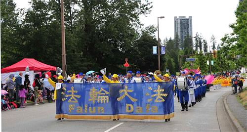

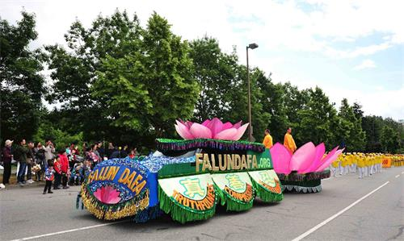

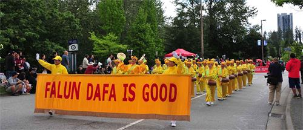

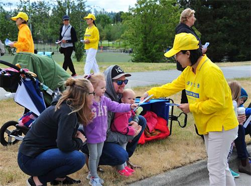

图1～5：法轮功学员参加了加拿大高贵林市泰迪熊节游行，受到观众热烈欢迎

高贵林市（Coquitlam）离温哥华大约半小时车程。泰迪熊节（Teddy bear）游行是该市一年一度的社区盛事，游行路线道路两边满是观看游行的市民。法轮功学员的游行队伍包括天国乐团、“真善忍”花车、法轮功功法演示队、腰鼓队。由于多次参加高贵林市泰迪熊节游行，法轮功学员的游行队伍为观众们所熟悉，一路走来，受到人们热烈欢迎，不时可以听到赞叹“法轮功来了”，“法轮大法好”。很多市民拍摄法轮功学员的游行队伍，道路两边随处可见拿着法轮功真相资料在阅读的市民。

埃里克（Eric）先生是高贵林市居民，手里拿着法轮功真相资料在路边仔细阅读。他说，在所有游行队伍中，他对法轮功学员的游行队伍印象最深刻，阵容庞大，色彩明亮，很有特色，他尤其喜欢花车和功法演示，因为他觉得功法很祥和，而且通过修炼法轮功可以让人很强大。

在法轮功学员的游行队伍走过主席台时，游行主持人汤姆·麦克唐纳（Tom McDonald）先生介绍说，法轮大法又名法轮功，是源于中国的传统功法，有五套功法，包括打坐，通过修炼法轮功可以让人身心健康。法轮功信仰真善忍。现在法轮大法已经洪传世界100多个国家。走在前面的是天国乐团，还有美丽的花车上演示祥和的功法，最后是充满活力的腰鼓队。

<h1 align="center"><b>邪恶“610”仍在犯罪</b></h1>
【明慧网二零一八年六月十日】提起所谓的“610办公室”，法轮功学员及他们的家人及亲朋好友们自然会把它和人类历史上最黑暗邪恶的组织连在一起。就连社会上的各级单位对610今天开会、明天抓人、后天看人也特别烦。
今年3月21日，中共公布了《深化党和国家机构改革方案》全文，其中党机构的改动方案有20条，其中第十八条提及不再设立中央社会治安综合治理委员会及其办公室（综治办），第十九条不再设立中央维护稳定工作领导小组及其办公室（维稳办），它们的职能均有中央政法委承担。第二十条提及将中央防范和处理邪教（中共是真正的邪教）问题领导小组及其办公室（“610”办公室），职责划归中央政法委员会、公安部。

“610办公室”是中共前头目江泽民于一九九九年六月十日为了迫害法轮功而专门成立的机构，类似中共文革时期的文革小组和纳粹德国的盖世太保。十九年来，在这场邪恶的迫害运动中，中共盖世太保式的邪恶组织“610办公室”和中共的政法委成了实施和推动这场迫害法轮功的罪魁祸首。曾经有数百万的法轮功学员被中共非法剥夺人身自由、关押、劳教、诬判重刑；成千上万的法轮功学员被中共迫害致死、致残或被活摘器官致死；千千万万个幸福美满的家庭被迫害得妻离子散、家破人亡；上亿法轮功学员被中共污蔑，受到精神侮辱和打击，丧失了人类应有的自由和尊严。对法轮功学员迫害的所有案例中，都有“610”在里面，“610”在迫害法轮功学员中血债累累，罪不可恕！

二零一七年上半年，福建宁德市610办公室（专门迫害法轮功的非法组织）人员伙同宁德市蕉城区法院滥用法律，对九位法轮功学员进行非法判决，其中：一人被重判十二年，二人被重判十年，七十四岁的金丽燕被非法判刑八年；最高罚金五万元，九人被非法勒索罚金十七万元。成为当年违宪违法、重判重罚法轮功学员最为恶性案件之一。

河北省秦皇岛政法委610给青龙县政法委、青龙国保下达抓捕法轮功的人数和抓捕任务。仅在二零一七年十二月十八日至二十四日六天的时间里，被非法抓捕的法轮功学员达17名。

山东省济南市法轮功学员李维宗、李传宝被非法关押在淄博周村区看守所有一年多，二零一八年四月九日上午，在淄博周村区法院被非法开庭，两位律师为他们做了无罪辩护。

淄博周村区政法委、公安国保大队、610和章丘区610头目等人在审判庭旁另一房间通过视频参与了非法庭审全过程。610头目等人多次要李维宗、李传宝认罪，并以此为借口说从轻处罚，被李维宗、李传宝拒绝。当天开庭未宣判。

据明慧网二零一八年六月四日报道，辽宁省大连法轮功学员孙俊（热电公司职工）、张霞（小学教师）夫妇依法控告迫害法轮功的元凶江泽民于二零一七年六月被秘密判刑，张霞被诬判七年五个月，孙俊被诬判七年两个月。并各处罚金一万元。夫妇双双陷入冤狱。610操纵的法院对他们非法判刑的借口竟然是邮寄“反动”控告信。

据明慧网近日报道，二零一八年五月二十四日上午十时三十分，四川省成都市武侯区法院对张明红、李晓萍、胥泳等六名法轮功学员非法庭审。庭审中，法轮功学员家人聘请的三位当地律师，在当地政法委、610、司法局的高压下都是做有罪辩护，配合了非法的庭审。

而且庭审中，主审法官不许法轮功学员自我辩护，也不许法轮功学员的家人说话，只按他们的程序进行，中途还休庭了一段时间，到十二时十分左右，宣布庭审结果，然后就草草收场。

庭审后，法官非法判处张明红有期徒刑七年、罚款一万元；李晓萍、胥泳、刘姓法轮功学员三人，每人刑期三年六个月、每人罚款五千元；周自玉、吕佑琼二人，每人刑期三年、每人罚款五千元。

据明慧网二零一八年六月七日报道，湖北省武汉市江汉区法轮功学员鲍裕农、蔡满意夫妇，二零一八年五月八日被江汉区610联合北湖街派出所劫持到武汉市江汉区法制教育所（玉笋山洗脑班），未通知家人，非法关押至今已经快一个月了，仍无法回家和家人团聚。早前他们已于2018年4月23日起从家中被劫持到武汉市第一看守所（二支沟看守所）非法拘留15天之久。

据明慧网资料显示，二零一八年四月份有60名法轮功学员被非法判刑，有64名法轮功学员被非法庭审，其中律师为30人做无罪辩护。二零一八年一至四月份被中共非法冤判的法轮功学员达269人，对法轮功学员非法庭审达225场。一至四月份1287名法轮功学员遭绑架，447名法轮功学员遭骚扰迫害。中国大陆法轮功人权仍然在日益恶化，其中邪恶组织“610”仍在犯罪。

在长达十九年的血腥迫害法轮功中，邪恶组织610无恶不作，无所不在，罪恶滔天！在反腐中，周永康、薄熙来、李东生、周本顺、张越等百余高层已被绳之以法，全国被法办的至少万人以上，这些人为什么都遭到了恶报，是因为他们多数都直接或间接的参与了迫害法轮功。随着形势的发展，迫害法轮功的元凶江泽民、曾庆红等被绳之以法的日子已经为期不远，中共解体灭亡的日子也指日可待。

随着中共末日的来临，盘踞在各地的江派余孽仍在负隅顽抗，做垂死挣扎，其中就包括臭名昭著的610。二零一八年五月二十九日，美国国务院发布二零一七年度《国际宗教自由报告》，中国再次被列为“特别关注国”。呼吁国际社会特别关注目前中国大陆的法轮功人权状况！

<h1 align="center"><b>小草与大地</b></h1>
【明慧网二零一八年六月十一日】这是从一个三口之家的故事说起。
丈夫是大法弟子，因制作向民众讲清真相的光盘而遭中共关押迫害，警察从家里抢劫了十四万现金和所有值钱的东西，以及大法资料、物品等，后被非法判刑十二年，这就是震惊中外的“二二五事件”中一位受害人。

妻子和女儿，身为普普通通的百姓，没有修炼过法轮功，挺身而出，联系律师、各界正义人士，奔走呼吁，营救丈夫、父亲。十多位律师自费从全国各地飞到她们所在的地方，给予法律资助、伸冤、抗议。

女儿穿着写满“冤”字的衣服，在监狱门前打着“我要见父亲”的横幅，向世人诉说着千古奇冤，被称为当代的“缇萦”。年轻女孩这一壮举被录制成《破冰时代》发到大纪元上，在历史中留下了永恒的一页。

然而，在中共治下的国度里，母女俩全心营救蒙冤的亲人，却被以法轮功为名，法院滥用刑法300条，二零一五年六月，双双被非法判刑四年和三年半。母亲在狱中被迫害成肝癌晚期，保外就医，住院用了十几万，也没有亲人在身边照顾。大法弟子向她们伸出援助之手，找到她，帮助她，用大法开启她的心智，使她从痛苦的绝望中，看到了光明。母亲开始看大法书，渐渐走入大法修炼中来，身体也逐渐向好的方面发展。

女儿三年半冤狱已满，回到家中，看看四面徒壁的家、高筑的债台、患肝癌体弱尚未完全康复的母亲，想想还在狱中遭受迫害的父亲，自己因为冤狱而饱受的身心创伤、世人的歧视及因此带来找不到工作的愤懑，感到了人世的世态炎凉、末世世风日下的败坏、邪恶垂死挣扎的猖獗，女孩感到了前途无望的悲哀，在郁闷和悲泣中，她的心在滴血。

尽管很多人对她们伸出援助之手，女孩子那高贵的心使她婉言谢绝。这时，大法弟子找到她跟她娓娓谈心。

当大法弟子静心听完她的倾诉之后，问她道：“一棵小草，春天会发芽，夏天茂盛充满生机，秋冬会凋落枯萎，没有了生命力。小草能够变绿，是小草本身的力量，还是大地的回温使它变绿的呢？”女孩子答道：“是小草自身的努力。”

大法弟子又问：“那冬天，小草为什么不能变绿呢？”“哦，地温的作用还是比小草自身的努力要大。”女孩子醒悟道。

大法弟子说：“如果有那么几棵小草不顾自己是否有那个能力，就是要去努力，促使地温的回升，使春天早日到来。这几棵小草顶风冒雪所付出的努力，也许不会被别人看到或者认可，甚至可能还会被嘲笑不自量力。但是，大地会感受到他们的努力与诚意，地温要是不为此而回升，大地就没有希望了吗？”

“嗯”，小姑娘明白了，“大法弟子的付出真的是艰苦卓绝……”

故事讲到这里，大法弟子声音哽咽的戛然而止，留下了长长的寂静与思考。

大法弟子的家人——常人，尚且能够在正义和勇气下做出如此壮举，而作为应该在正法中唱主角的大法弟子该怎么做？

仅以此文献给那些走在反迫害前面的勇士们！

<h1 align="center"><b>英国学员揭露国内亲人遭中共迫害真相</b></h1>

【明慧网二零一八年六月十五日】中共对法轮功的打压迫害已延续十九年，目前在英国工作、生活、学习的法轮功学员当中，有多位修炼法轮功的亲友因信仰正在遭受中共的邪恶迫害。
在二零一八年六月三日的伦敦法轮功集会游行活动中，她们也来到现场展示着法轮大法的祥和美好，同时揭露出中共对法轮功的残酷迫害，让更多的英国民众看清中共，坚决支持法轮功学员反迫害。有民众鼓励学员“你们做得很好，请继续下去，让更多人知道。”

<b>“我为妈妈和那些阿姨们骄傲”</b>

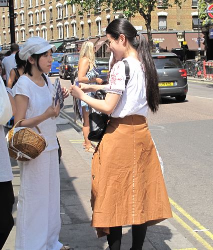

图1：二零一八年六月三日，跟随法轮功反迫害游行队伍，英国法轮功学员铭慧（左）在伦敦唐人街地带向路人讲真相

“今天来就是要呼吁停止迫害”，参加六月三日法轮功学员伦敦讲真相反迫害活动的学员铭慧这样表示，她还讲述了自己的妈妈，黑龙江省牡丹江市法轮功学员王楣泓女士在四月二十三日和其他十四名学员一起被非法抓捕。铭慧说：“她们被抓后那几天，我每天早晨都来中使馆前法轮功和平抗议点，几个小时在那简单站一站，就是想对她们表示声援。”

根据明慧网资料，二零一八年四月二十三日晚九时，牡丹江市国保支队大队长李学军、国保支队警察尹航、马群、乔平伙同东安分局共六、七名警察，在没有穿警服、没有搜查证、没有出示警官证和局长签字的情况下，闯入法轮功学员宫呈阁的家中，将家里做客的高秀清、王湄泓、张丽等十四人非法抓捕，企图“关押十五天”。四月二十七日，十四位法轮功学员被绑架四天后全部回家。这十四名法轮功学员后来就四月二十三日被牡丹江国保警察李学军、尹航、马群绑架事件向各级纪检委、各信访办等相关部门提起联名控告。

然而，“从三月底至今（六月三日）还没能再跟妈妈联系上。”铭慧表示，“这几位阿姨真了不起，而且出来就把他们告了，联名起诉他们。我挺震撼的，我挺为她们骄傲的。”

<b>“让更多人知道法轮功因为信仰而遭受迫害”</b>

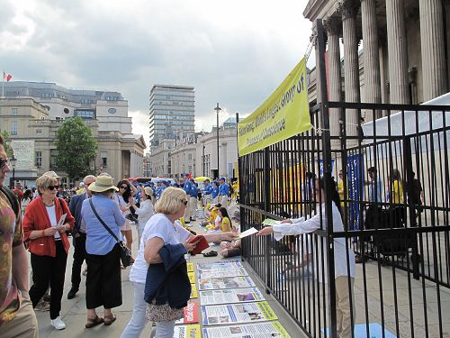

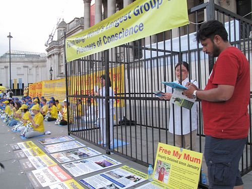

图2～3二零一八年六月三日下午，英国法轮功学员晓童在特拉法加广场北台阶反迫害讲真相

在六月三日的法轮功洪法活动中，法轮功学员晓童又一次站在演示中共迫害法轮功罪行的模拟牢房里，站在印有妈妈王玉珏照片的真相展板旁边，她说自己当下的最大愿望就是制止中共迫害法轮功。她介绍说自己妈妈五月份刚刚被非法判刑三年半，而邪恶的中共政权至今不让家人探视妈妈。

晓童希望通过妈妈的故事，让更多人认识中共从一九九九年至今仍在残酷迫害法轮功的事实，她有机会会去伦敦唐人街讲真相，“有人停下来看展板的时候我会和他们讲，跟他们说我母亲的事情。”

晓童还表示，民众的积极反馈让她很受鼓舞：“通过我妈的事情让更多的人知道（法轮功）因为信仰而遭受迫害，然后理解这个事情，我是很高兴的。”“那天，在唐人街有一位西人女士告诉我她儿子在中国工作，知道迫害的事情，她表示很同情我，也鼓励我。”

据明慧网消息，河南省周口市法轮功学员王玉珏于二零一八年一月二十二日上午在太康县符草楼镇讲真相、发小册子时被绑架，二零一八年五月十六日，淮阳县法院在不通知律师和家人的情况下被非法开庭，公诉人（王红旗）竟然当庭说这类案都是610、政法委当家。

王玉珏曾在二零一零年被非法判刑三年六个月，二零一四年又被非法判刑三年。

<b>英国女士：刚意识到共产主义还在世上猖狂</b>

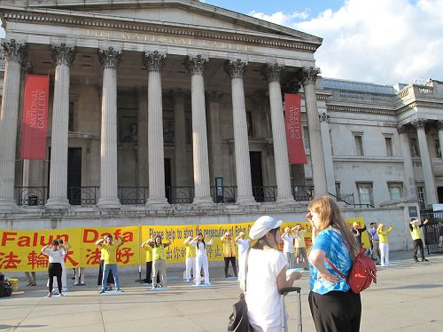

图4：二零一八年六月三日，在伦敦特拉法加广场，住在北英格兰、在星巴克公司工作的尼基•贝尔（右）向法轮功学员铭慧深入了解真相

二零一八年六月三日，在伦敦特拉法加广场，住在北英格兰、在星巴克公司工作的尼基•贝尔（Nicky Bell）女士，六月二日来伦敦参加一个节日庆祝活动，第二天在特拉法加广场遇到了法轮功，她告诉向她讲真相的法轮功学员铭慧：“我以前没听说过法轮功”，“我要在请愿书上签字。”

“在我看来，这（迫害）是疯狂的，人们不应该因为想过平和生活而受到迫害；她（法轮功）不会伤害任何人，中共政府却进行这种全面覆盖的持续迫害，这是荒谬的。”“（爸爸）被非法监禁迫害十五年，这太糟糕了，我无法想象（铭慧）你是怎么走过来的。”“因为坚持信仰，一种根本不伤害任何人的信仰，生命就被置于恐怖之中，这是不公平的。”

贝尔感谢铭慧用自己父母遭受迫害的事实提醒她认清中共打压正信的恶行：“我没有意识到共产主义在世界上还这么猖狂，它剥夺人的自由，限制人的思想，强制人们遵循它的原则，而对这个问题现在人们不去思考了，觉得已经是二十一世纪了，这里听到的好象是过去的历史。”

<b>新闻专业学生：要让更多人知道中共迫害的疯狂</b>

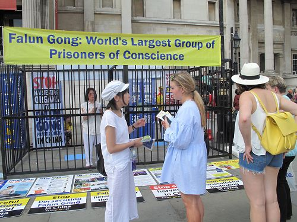

图5：二零一八年六月三日，在伦敦特拉法加广场，正在曼彻斯特学习新闻学的贝卡•茉纳汗（Becca Monaghan）鼓励铭慧

“你们做得很好，请继续下去，让更多人知道。”正在曼彻斯特学习新闻学的贝卡•茉纳汗（Becca Monaghan）这样鼓励铭慧。茉纳汗是GQ杂志实习生，练习打坐冥想也是她生活的一部分，二零一八年六月三日在伦敦第一次见到法轮功，铭慧结合自己经历给她讲中共对法轮功的迫害。她表示非常赞同法轮功学员的讲真相活动：

“（中共的迫害）太疯狂了！要让更多人知道这个很重要，还有很多人不知道。我喜欢这个（法轮功学员展示真相的方式），集体炼功打坐和模拟（中共酷刑迫害法轮功学员的）监牢视觉效果强，真的很好。”

茉纳汗谴责中共活摘法轮功学员器官罪行：“这是一个可怕的罪行，它太糟糕了！”“我以前在美国听到过，知道（中共）他们试图掩盖它，今天我才意识到这是这么大规模发生的可怕事情。我回家后要去上网进一步了解。”

<h1 align="center"><b>浙江省女子监狱鲜为人知的罪恶</b></h1>

【明慧网二零一八年六月十五日】（明慧网通讯员浙江报道）浙江省女子监狱位于杭州市翠苑二区育新路十六号（西湖区学院路、余杭塘路和育新路之间），周边紧挨着居民小区。而这些居民和其他杭州市民不知道的是，在这样的一墙之隔，却有不少浙江社会上追求高尚道德的女性经历着精神与肉体同时被摧残的酷刑。
这些好人只是按真、善、忍提升自己的道德境界，强身健体的法轮功修炼者，她们在家里、在单位、在工作岗位上勤勤恳恳、善待他人、不图名利、敬业无私、为他人着想，却被浙江省地方上的610关押至此，有的被迫害致死、致伤、致精神分裂……

从二零一二年前后至今，在此受到残酷迫害的女法轮功学员有：缙云县计生委的周伟芬、缙云县公民周晓贞、缙云县公民彩娟、瑞安市马屿镇公民陈荷妹、舟山市沈家门职业中学赵菲州（音）、金华市公民杨险芬（音）、浙江省海洋渔业局调研员董湘茹、杭州江干区公民姜永芹、宁波公民郑枫、江西省修水县公民肖静、台州市公民吴素美和吴素月、金华市公民吴艳娇等等。

这些人中，有公务员、教师、个体商人、技术工人、医生、农民、家庭妇女等，年龄从二十岁到八十岁不等，她们炼功大多是出于身体多病或对人生真理的追求，一入黑狱就被分配在除十一、十二监区外的十三个监区里，一般是先单独封闭关在小黑屋，二十四小时由四个重刑犯人轮流看管，强迫看污蔑造谣法轮功的影视书籍，强迫接受各类洗脑，写“作业”和“五书一保证”。

只要说声不炼了，并骂人了，甚至认同色情啊、吸毒啊这些事了，就可以走出与世隔绝的黑屋，进行奴工劳动。早上天没亮起床，五分钟后集中，排队到车间长时间制作电器、发夹、天堂伞、打火机等产品，晚上天黑排队回监室，继续洗脑、写作业等。

如果不肯说不炼，就会遭受酷刑：被包夹和恶警侮辱打骂、电警棍、打毒针、吃毒药、不让睡觉、高强度超体力做活、高温暴晒、酷寒天在雪地爬、浇冷水等。

比如，嘉兴的一个退休老师，年纪六十多岁，被罚打扫厕所，冬天下雪结冰，叫她爬到三楼的窗外擦玻璃。擦完玻璃，又叫她在雪地上赤脚爬……

监狱大门外靠近育新路一头，有一个所谓的“心理咨询治疗室”，平时锁着大门，外人不得进入。其实就是对所谓的思想犯、基督教徒、非信仰共产人士进行精神摧残、打毒针的地方。比如，舟山市沈家门职业中学赵菲州（音）因身患多种毛病，炼法轮功，身体很快康复，却被关到监狱。她由于在一次集体洗脑时，对警察说了一句“法轮功不是你说的这样的”，被拉出去关到精神病院当精神人打毒针、吃毒药，致使她精神出现恍惚。

所有法轮功学员被关押的小屋子里，都装有二个监视（听）器，让人始终感到背后有魔鬼的眼睛在盯着自己，一回到监室，就一动不动的站着或坐着，有时，包夹由于个人生活空间，把怨恨都出在法轮功学员身上，用警察的话来说：就是要激发起全室全狱的人对法轮功的仇恨。

而事实上，艰难的环境反而让更多人看清了中共及其控制下警察的邪恶，让人更坚定了对法轮功的正信，连包夹和一些犯人都知道共党的邪恶。愚蠢的警察以为如此可以击垮法轮功学员的意志，不料更让人们看清了它们邪恶。

随着江派人员的不断被恶报，世人越来越明真相的现在，与世隔绝的黑狱里的罪行也渐渐被曝光，等到真相大白一天，一切将有报应和了结的方法。

<h1 align="center"><b>父亲节话父亲们的悲惨遭遇</b></h1>

【明慧网二零一八年六月十五日】母亲节刚刚过去又迎来了父亲节，在中共长达十九年的对法轮功的血腥迫害中，许许多多父亲们的悲惨遭遇又浮现在眼前，挥之不去。
二零零九年一月二十八日大年初三，重庆法轮功学员江锡清在被重庆西山坪劳教所被迫害致死（在尚有体温的情况下被送到殡仪馆）的消息曝光，监狱迫于国际社会压力，于二零一零年的一月给罗泽会（被江津区法院非法秘判八年的江锡清妻子）办理了保外就医手续。

面对江锡清的冤死，家人一直找有关部门要求严惩凶手。重庆西山坪劳教所、江津区政法委和610妄图逃脱他们犯下的罪恶，通过地方的国保大队和公安派出所等恶警们上门抄家、殴打律师等，阻挠江锡清子女为父申冤。江锡清妻子罗泽会老人，也一直在被抓捕逃亡中度日。

警方为追捕罗泽会，将她儿子江宏斌绑架做人质，多次带他去抓他的妈妈。儿媳邹绪群不堪重压与丈夫江宏斌离婚。离婚后也难逃610、国保、政法委、重庆监狱及社区的恐吓与骚扰，最后被迫流离失所。

天津武清区法轮功学员杨玉永与妻子孟宪珍于二零一六年十二月七日被绑架，非法关押在天津武清区看守所。二零一七年七月十一日杨玉永在看守所被酷刑迫害致死。

对于杨玉永的死因，看守所没向家属做任何解释。但家属发现“杨玉永的脖子、身体大面积瘀伤，耳朵、眼睛里都有血，耳朵根有很大的伤口，脚趾甲也有竹签扎过的痕迹，背部伤痕累累，从腰部往下到裤裆再到大腿根全是血痕。”很显然杨玉永是被酷刑致死。

六月二十八日律师会见杨玉永时，看到他精神正常。他对律师讲了曾被戴两个大铁球的重镣，警察还把手铐和脚镣连在一起，他只能弯着腰；长时间被罚坐小板凳；被狱警刘兆刚殴打，刘兆刚指使看守所十三名犯人把他殴打致昏迷，同时被进行性虐待和侮辱，被捏生殖器、吸乳头。

武清公安局、看守所没有向杨玉永家人交代他的死因，却出动百个警察和特警转移尸体。

辽宁省凌源市建平县的法轮功学员刘殿元，今年八十岁，从一九九九年九月到现在，经历了七年冤狱、四年半的流离失所，二零一五年十一月再次被绑架，在七十九岁的高龄时被辽宁省建平县法院非法判刑十一年半，目前在冤狱中遭受着迫害，还有十年多的监狱生活等待着这个历经沧桑的老人。老人的妻子刘玉芳，今年六十一岁，是一位普通的农村家庭妇女，曾经被非法劳教三年，又被非法判刑四年。

吉林省松原市乾安县六十一岁的法轮功学员杨宝森，被非法判刑十年，在吉林省公主岭监狱遭受近九年折磨，二零一八年二月二十七日被送入公主岭市中心医院抢救后，又被劫持回监狱；三月七日保外就医时已奄奄一息、不能走路，说话困难，于四月七日凌晨三点含冤离世。

据明慧网二零一八年四月四日《儿子被非法判刑 老父捡破烂惨死》一文中报道，河北张家口市万全区北新屯乡庙儿沟村法轮功学员马占国被非法关押在山西省忻州市已经一年多了，他父母及妻子多次往返忻州看望马占国未果。二零一八年三月二十九日，马占国的父母又到忻州看儿子，又未见到儿子。

马占国七十多岁的老父亲马登科三月三十日回家后，心神不定，坐立不安，看到幼小的孙子，孤儿寡母甚是心酸可怜。当儿媳和妻子找到他的时候，不知什么时候他已经惨死在垃圾堆里。目前，马占国已经被非法判刑二年零十个月，同期被冤判的还有赵晓露等其他四名法轮功学员。

河北省昌黎县马坨店乡周振才一家七口，六个大人都因为坚持信仰法轮大法被非法关押过，在二十年前，周振才与老伴王绍平学了法轮功后，老俩口身上的病都好了，看到父母亲身体的变化，他的两个儿子也都开始修炼。原本一个幸福的大家庭，在中共十几年的残酷迫害下，老两口都被非法劳教过，大儿子被冤判九年，大儿媳被冤判三年。二儿子周向阳是全国首批六十位造价工程师之一，因修炼法轮功，多次被非法抓捕关押、劳教、判刑，判刑时间长达九年。儿媳李珊珊因坚持为丈夫周向阳申冤，曾遭到监狱的报复，两次被非法劳教共计三年多。

二零一五年三月二日，周向阳、李珊珊夫妻双双被绑架，又被非法判刑七年和六年，如今七十多岁的周振才与老伴王绍平老人又被非法判刑。一家人被迫害的支离破碎、苦不堪言。

二零一七年七月四日晚，辽宁鞍山市法轮功学员王殿国与妻子于宝芳、儿子王宇，一家三口被警察砸门入室绑架、抢劫，于宝芳被非法关押在鞍山市女子看守所，于七月十七日被迫害致死；王殿国一直被非法关押。直到于宝芳离世一个小时之后，不法人员才让她儿子王宇去医院与母亲见最后一面，也不让他查看遗体。八月八日家属得知王殿国已被非法批捕，妻子的善后事宜都不能亲自处理。

在这场灭绝人性的血腥迫害中，遭受中共残酷迫害的不仅仅是法轮功学员，还有为法轮功学员主持公道的数百名正义律师，如高智晟、王全璋、江天勇、谢燕益、李和平、余文生等，他们像众多的法轮功学员一样正在或曾经遭受过中共邪党的酷刑迫害与精神折磨。

是谁让这些父亲们和他们的家人遭受到如此惨无人道的苦难？是谁制造了这桩桩件件的人间悲剧？是谁制造了这场惨绝人寰的千古奇冤？就是那个整天嚷着“人民当家作主”、“为人民谋福利”的中共邪灵。自中共窃政以来运动连番不断，冤案堆积成山，八千万人死于非命。据明慧网显示，中共迫害法轮功十九年来，在中共的“名誉上搞臭、经济上截断、肉体上消灭”、“打死算白死，打死算自杀”和“不查身源，直接火化”的灭绝政策下，上亿法轮功学员被污蔑，数百万人被绑架、关押、劳教、判刑，甚至被酷刑致死或活摘器官致死，数百万家庭被迫害得支离破碎、妻离子散、家破人亡。

去年《九评共产党》发表十三周年之际，九评编辑部发表新书《共产主义的终极目的》，向世人系统分析和揭示“共产邪灵”通过破坏文化、败坏道德而毁灭人类的天大阴谋。最近大纪元正在连载《九评》编辑部：《魔鬼在统治着我们的世界》，认清中共邪灵的邪恶本质，认清共产主义因素在全球渗透的危害和紧迫，认清共产主义毁灭人类的终极目的。将共产邪恶主义从人类社会彻底清除灭尽，已经成为全人类的当务之急。

解体灭亡中共邪灵，才能结束这场惨无人道的血腥迫害，才能找回千千万万个父亲们、母亲们、法轮功学员们真正的自由与尊严，才能实现世界的和平与安宁！

<h1 align="center"><b>从中国到英国 风雨中坚守十八年</b></h1>

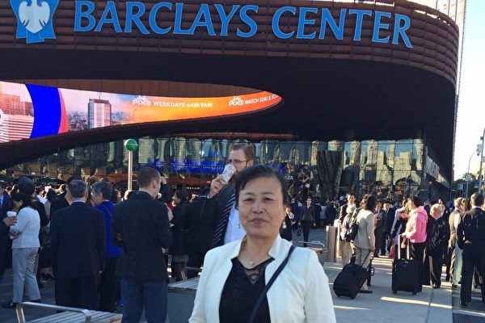

毕女士从英国飞到美国纽约参加法轮大法国际心得交流会，在会场外留影纪念。

【大纪元2017年07月17日讯】（大纪元记者夏松英国报导）又是一年7.20，18个春夏秋冬，对每一个法轮功学员来说，也是最为艰难、最为悲怆、最为震撼人心的18年，每一个小小的故事背后都是悲欢离合，像是滴泪的莲花沁著芬芳。

1995年5月1日，对毕女士来说意义非凡，她的人生开始了新的航向。

<b>走出绝境</b>

多年来无休止的家庭不睦，与丈夫的感情走到冰点的毕女士，带着深深的怨恨准备终结丈夫的生命后投案自首。

1995年4月底，她悄悄地安排工作交接，同事看出她情绪不稳，就开导她，并向她介绍法轮功不但可以祛病健身，还能提升人的道德。

她反驳同事：“我什么功也不信，一个功法就能炼好了，也不用什么医院和法院了。”但碍于同事的情面，毕女士还是在5月1日这天参加了鞍山市部队大院里办的法轮功师父讲法录像班。就这样，毕女士开始修炼法轮大法。

修炼前，毕女士不但家庭不幸福，身体也不好。心绞痛，还伴着严重的肾结石，炼功后竟不知不觉好了。

法轮功要求学员按照“真、善、忍”修炼，提高人的思想境界，毕女士逐渐改变了性情，人宽厚了，修炼中也渐入佳境。丈夫看到她的变化后，也跟着她去公园的炼功点炼功，夫妻间多年的怨恨竟然化解了，一家三口开始和睦相处，过上了平静的生活。

<b>山雨欲来风满楼</b>

然而好景不长，1999年7月20日前，各地炼功点已遭到警察骚扰。7.20当天早上，学员们依然坚持在公园炼功点炼功，早上6点多，来了好多警察冲击学员。

学员们非常不解：这么好的功法，政府为什么不让炼，是不是政府不了解情况呢？抱着让政府了解法轮功的愿望，很多学员前往鞍山市政府，希望向政府反映情况。

等待大家的是政府早已做好的暴力准备，学员们根本无法走近市政府，到处是警察，周边布满铲车和装人的大客车，学员们就在附近的一个广场上坐着等待，毕女士回忆道：“当时有一个老人对警察说，我要找市长说句公道话，结果被警察推倒在马路牙子上。”

警察欺骗学员们上大客车去向市长反映情况，很多学员上车后被拉到市体育场，等待他们的不是市长，而是重重包围的警察强迫大家登记本人信息，这些信息竟然成为以后迫害学员们的线索。

<b>重压之下见真性</b>

对法轮功铺天盖地而来的污蔑席卷全国，无处不在的恐怖似乎吞噬了华夏大地。

面对如此巨大的压力，毕女士与其他法轮功学员一样，认为政府一定是不了解法轮功的真实情况，才会错误地镇压法轮功。

1999年12月，毕女士决定去北京上访，到了北京后获知信访部门已经成为抓人的地方，无奈之下她去天安门广场打横幅，结果被非法抓捕，关押在北京清河监狱。

监狱装满了法轮功学员，持续不断的抓捕使得监狱不得不将已经抓捕的学员转移到各地，毕女士被转移到沈阳后，由于坚持修炼先后被送到龙山教养院，辽阳教养院，受到各种折磨和羞辱，警察将痰盂里的痰强行抹进她的嘴里。

由于不转化，她被非法劳教三年。2000年6月，毕女士被转移到马三家劳教所，在非法关押期间，她一直绝食抗议：“我修炼法轮功做好人，没有犯罪。”

绝食带来更严重迫害，强行插管灌食，一个多月后，由于迫害加重，毕女士不能自理，生命垂危，最后劳教所让毕女士工作单位的厂长将她带到当地派出所。

派出所又将她转到当地看守所，看守所拒收被担架抬来的毕女士，最后派出所向家属索要了5000元保证金才将她放回家。

2000年7月中旬，保外就医的毕女士回家后，一直在610人员、派出所警察及社区人员的监视之下，她利用上述人员晚上离开的时间学法炼功，身体恢复得很快。

由于持续的监视，毕女士为了躲避再次非法抓捕，2001年春，毕女士夫妻只好偷偷卖掉房子搬家，以躲避随时可能发生的迫害。

<b>来英国重获炼功自由</b>

2008年，毕女士夫妻经过几年周折，先后拿到护照，最终得以逃离中国大陆来英国与女儿团聚。虽然语言不通，思念国内的亲人，但比起在国内的艰难环境，这里自由与尊重的氛围给予毕女士夫妻最好的安慰。

现在毕女士夫妻除了帮助女儿带孩子，享受天伦之乐外，每周都会抽时间与其他学员一起去周边城镇发传单，讲清法轮功真相。期间碰到很多大陆出来的华人，有在英国定居的，也有来上学的，还有来英国旅游的。

毕女士观察到，越来越多的华人，开始清醒地看待中共迫害法轮功的现实，并鼓励学员们加油，但也有不少华人由于听信中共对法轮功的污蔑，特别是中共有意的洗脑教育，将爱国与爱党混为一谈，导致有部分大陆华人排斥学员。

面对这些人，毕女士非常希望他们能静心思考，用心观察，看看法轮功讲的是什么，中共宣扬的是什么，明辨是非善恶，在历史的今天，对善恶的选择，也许就是对未来的选择。

<h1 align="center"><b>内蒙古女教师血泪控告江泽民</b></h1>

【大纪元2016年05月03日讯】“在（内蒙古女子）监狱大多的时间我都是被关在禁闭室里。警察、犯人几班倒轮流折磨我，实施‘熬鹰’酷刑，日夜不让我睡觉，十几天后，我的腿脚肿胀已不能走路，肿得就像一碰就要裂开一样……在酷暑难熬的夏季，我被限制用水，一个多月里我没沾过水。”明慧网报导，二零一五年六月十二日，内蒙古赤峰市元宝山区平庄高中的美丽善良的女教师斯琴向最高检察院和最高法院控告江泽民。

下面是四十七岁的女教师斯琴遭受迫害的部分事实：

<b>无理开除工职</b>

罪恶的江氏集团开始迫害法轮功后，二零零零年底我被迫停课，不许上讲台讲课了。在这段时间，我多次被公安、六一零、政法委骚扰，他们强迫我停岗、反思，扣工资……一次政法委的那帮人声称给我一个月时间，提高认识，写检查，否则开除我的公职，我没有妥协，我认为真善忍是天理，是不应该被打压的。

六一零（中共专门迫害法轮功的组织）的牛建平等一次次的给我制造魔难。二零零零年底，我手里只剩了几角钱，工资已经停发，年幼的孩子喊着要好吃的，煤气也没了，参与迫害的那些人在那边还不断地叫着：“不悔过、不放弃，就开除！”

二零零一年二月末三月初，我被绑架到他们私设的洗脑班，平庄看守所副所长马海军等不停地读、念诽谤大法的谎言，我被洗脑迫害半个多月。因为不“转化”，当时他们派专人监视，学校专门有个老师跟着我，还是不让我给学生讲课。

<b>当着年幼的孩子的面暴打母亲</b>

二零零一年七月初，我被绑架，平庄看守所副所长马海军、国保大队长刘伟民等把我绑架到元宝山区公安局，警察们对我人下毒手。非法审讯时，四个警察当着我幼小的孩子的面暴打我，恶警无视孩子的哭叫、求救。后来，有个警察把孩子拽到另一个房间了。

晚上几个警察喝酒喝得醉醺醺，回来后又开始非法审讯。国保大队长刘伟民用两个手指尖用力顶住我的胸口，两个手指尖正好插在我的双乳间，不停地用劲戳，锥扎一般。刘伟民还恶狠狠地说着：“你说不说？”我一言不发，他就踢，令我下蹲、站起，如此往复，手臂等处被打得青一块紫一块。

我被非法审讯、折磨一天一宿后，我被投入了元宝山区平庄看守所。被投入看守所的当晚，值班警察张士孔抽走我的裤腰带，长时间让赤脚站在水泥地上。第二天大早，他们开始谩骂，掴、扇我耳光，啪啪作响。后来，我连着牙、耳朵根痛了很长时间。半个多月后，回到家，我被元宝山区公安局国保大队刘伟民等勒索三千元，平庄看守所八百七十五元。

<b>半个月的吊铐、电击</b>

二零零一年八月初我又被绑架。那天晚上在平庄派出所，我被红山区警察非法审讯，酷刑折磨，一宿没让睡觉，第二天后，又被折磨了一天，后被非法关押到赤峰市敖汉旗看守所。敖汉旗看守所女警察季雅环扯住我的衣领左右开弓打我脸，手指甲挠破了我脖颈部位的皮肤。
一个月后，我又被转移到另一个更为邪恶的赤峰市园林路看守所。警察把我吊铐在暖气管上，脚尖着地，长达半个月的吊铐，有时四个人被一同铐在铁门上，站不起蹲不下。在被吊铐时，姓陈的看守所所长，揪着我的头发，电击我。我的惨叫声回荡在整个看守所，当时犯人吓得不敢出一点动静，除了惨叫声，整个看守所静悄悄的。

二零零二年八月末我又被转移到元宝山区平庄看守所。吃的饭菜简直就是猪狗食。

<b>内蒙古女子监狱：三十多天不让睡觉</b>

二零零二年十一月二十二日，我被非法投入内蒙古女子监狱迫害，在监狱大多的时间，我都是被关在禁闭室里。警察、犯人几班倒轮流折磨我，实施“熬鹰”酷刑，日夜不让我睡觉，十几天后，我的腿脚肿胀已不能走路，肿得就像一碰就要裂开一样，精神已经出现恍惚状态。

我再也站不住了，警察假惺惺地给我铺好被褥，说：“你好好睡个觉吧。你这么受苦，漂亮的人都变成啥模样了？还不是我关心你呀。”警察们都换了个人似地伪装着，说是她们如何关心我，还让我见了一个法轮功学员。这个法轮功学员看到我腿脚肿胀得可怕，怕心的作用下，这个法轮功学员在禁闭室里没有熬过四天，就被迫妥协了。我找时机，跟她切磋，她清醒过来了，回去后，她把那些“转化”的都叫醒了。

我因此开始承受更为严酷的迫害，警察们歇斯底里一般对付我。前后三十多天，我日夜被折磨，不让睡觉。在这期间，我的内脏就像炸裂一样，心跳加速，好像跳到了嗓子眼儿。

每天晚上，他们成宿地念诽谤大法的书，夜间也是倒班收拾我。我不听，闭上眼睛。包夹曹桂香就紧紧的扯住我的衣领，像是用绳子勒住了我的脖子，还不停地摇晃着，故意用衣领勒紧我的脖子，从晚上折磨到天亮。我几乎窒息。那个杀人犯袁铁民，揪住我的头发左右开弓扇耳光，打得我眼睛直冒白光，大把地揪落我的头发。

一次，我从教育课科长的嘴里得知，内蒙古巴彦淖尔的王霞被迫害的生命垂危，我抗议监狱对王霞的迫害。监狱长知道后，下令加重对我的迫害。开始日夜折磨我，天天被迫罚站，前后相加有三十七天的时间，一点儿没让睡觉。最初不让睡觉十几天后，我站不起来了，她们就让我睡了。后来又不让睡觉了。

在禁闭室里，曹桂香、袁铁民等打我、骂我，想怎么收拾就怎么收拾。我被迫罚站六个月。我从春天站到夏天，又从夏天站到秋天，整整六个月，我在禁闭室里被折磨。我真的一点阳光见不到，也不知道外面季节的变换。酷暑难熬的夏季，我被限制用水，一个多月里我没沾过水，他们不让我换洗衣服，不让刷牙、洗脸、洗手、 洗脚，奇臭无比，犯人们不断地骂我脏、臭。

在监狱犯人控制我同别人对视，说是担心用眼神传递信息。我在被非法关押期间，基本上没有在众人场合出入过。我一旦需要路过有人的场合，警察便下令把所有人员赶进监舍，并由警察、犯人至少有四人前后跟着我。

<b>刑期结束直送洗脑班迫害</b>

二零零四年八月三日非法刑期结束了，因我不放弃信仰，那天的凌晨四点多，我被元宝山区平庄警察徐森等秘密接走，直接被关入赤峰洗脑班。

在监狱里被长期折磨，我的容貌都变了，在洗脑班，姐姐从我身旁擦肩而过，都没有认出是我。姐姐在二零零三年被非法劳教一年，因不转化，也被劫持到洗脑班里。

在赤峰洗脑班，我承受了更为痛苦的精神折磨。在三十多度的高温下，孩子在洗脑班的铁栏杆外，哭着求我快些回家，孩子的脸上汗水、泪水一起淌著，泥痕一道道。

我的母亲赵桂芝已离开人世，她曾经两次被公安、六一零人员绑架到洗脑班，被非法抄家。我和姐姐都被投入监狱等非法关押，父母承受的太多太多。在这里我也为我母亲伸冤，控告迫害全中国人的这个恶人江泽民。

过去的记忆，不堪回首。这些泪水、血水铺就的路，记下了江泽民的罪恶。

<h1 align="center"><b>发生在吉林省蛟河市的恶报十三例</b></h1>

【明慧网二零一八年三月二十八日】（明慧网通讯员吉林省报道）法轮大法是教人按真、善、忍做好人的佛法，自古迫害修佛修道的人，都没有落得好下场。在江泽民集团迫害法轮大法的十九年来，大陆610是凌驾于公、检、法之上的非法组织，是非法判刑、劳教、洗脑等迫害法轮功学员的主使者，监狱及公安警察则是直接实施的迫害的凶手，不少普通百姓受中共谎言欺骗，丧失良知参与迫害。这些参与迫害好人的人逃脱不了恶有恶报的下场，下面是发生在蛟河市的恶报十二例。

<b>1、狱医张有成：给大法弟子野蛮灌食　遭恶报</b>

张有成是蛟河市医院大夫、狱医。三年多来，张多次对绝食大法弟子野蛮灌食，强行撬牙，粗暴插管，造成大法弟子口鼻损伤流血，把带有盐粒的玉米面粥给大法弟子强制灌下，给大法弟子造成极大痛苦。

大法弟子善意告诉他善恶有报是天理，张有成不仅不收敛，反而辱骂大法，扬言：我就不信遭报应。二零零一年末，再次诬陷大法时，张有成当场昏倒。经诊断，肺部患了恶疾。其亲人说得了肺癌。现在张有成承认：我这是迫害大法弟子，遭报了。

<b>2、张梦林谩骂大法　遭恶报被杀死</b>

蛟河市煤矿东山有一老头张梦林，其孙子孙女修大法，都受到江氏集团的迫害。面对迫害，张梦林不但不能认清江氏集团的邪恶，却无理智地谩骂和诽谤师父和大法。终于，于二零零一年三月，张梦林遭恶报，被入室抢劫者抢走钱财，并把其杀死在自己家中。

<b>3、王相福：遭恶报被汽车撞断腿</b>

吉林省蛟河市白石山镇永青村恶人王相福，谩骂大法师父，烧毁《转法轮》等大法书，并出狂言说天上派他来专治法轮功的。他妻子张孟珍因学大法，受到他的虐待，他天天打骂妻子，时而揪着妻子的头发往墙上撞，晚上不让妻子睡觉。白天，他坐在地头监督他妻子干活，不准妻子学法炼功，不准妻子去大法弟子家，一旦发现妻子去别的大法弟子家，就诬蔑她和别人有不正当关系，然后就毒打。

二零零三年十月二十一日，王相福去白石山的途中，被汽车撞断腿，并全身是伤。这是王相福对大法和大法修炼人作恶的初步报应和提醒。如果继续作恶，后果不堪设想。

如果能就此醒悟，将功补过，今后或许还可能弥补过来，因为过去中国老人都知道，给修炼人一碗水，都能结下很大的善缘，能在日常生活中给修炼人各种扶持，更是功德不小，作为大法弟子家属而存在，这个事实本身就说明此人有很大福气，真是应该十二分珍惜而不应该断送啊。

<b>4、王员敏：遭恶报出车祸　手骨折</b>

吉林省蛟河市松江镇计划办王员敏，近年来紧跟江氏集团，迫害大法和大法弟子，办洗脑班期间，毒打大法弟子，不让吃饭，收书，辱骂大法弟子，坏事做尽不听劝告。

二零零五年正月初三，王员敏全家三口坐大客车，途中翻车，王员敏手骨折，妻子遭致下巴粉碎性骨折。

<b>5、村邪党书记王悦财：暴死街头无人葬</b>

林省蛟河市白石山乡永清村原党委书记，一九九九年七月二十日以后，多次举报本村法轮功修炼者。二零零一年春，由于他的举报，本村十几名大法弟子被镇政府办班强制洗脑迫害，其中两兄妹被恶警打的遍体鳞伤，多人被罚款。二零零四年秋，他又伙同他人举报，使三名大法弟子被非法劳教，多人被非法搜查。

王悦财几年来追随恶党迫害法轮功，遭到恶报，二零零七年九月六日早，在路边和人说话时，突然暴死，年五十四岁，当时，没有一个家人在，连埋葬的人都找不到。

<b>6、610头目李德昌：遭恶报肺癌死亡</b>

吉林省蛟河市松江镇原610办公室主任李德昌，于二零零八年十月二十三日遭恶报，在肺癌的折磨中丧命，成了中共的殉葬品。

李德昌，男，四十二岁，生前曾担任吉林省蛟河市松江镇610办公室（是专门用来迫害法轮功的非法机构）主任。自二零零零年以来，李德昌积极参与迫害法轮功学员，经常上门骚扰法轮功学员，装出很和善的样子，利用法轮功学员善良的一面进行欺骗。多次配合上级官员办洗脑班，很多法轮功学员对他多次讲真相，他不但不听，还撕毁和涂抹大法标语。

二零零三年，因法轮功学员互相想谈谈自己的修炼情况，在松江镇沙松岭举行交流会，经恶人构陷，李德昌伙同松江镇副镇长魏亚兰、松江镇派出所和蛟河市公安局非法抓捕法轮功学员，导致多人被非法劳教，三人被判重刑，使他们都遭受了不同程度的迫害。其在任期间，多名法轮功学员被拘留、关进洗脑班、劳教、判刑。

李德昌遭恶报，二零零八年十月二十三日，在肺癌的折磨中丧命。

<b>7、宣传部主任于晓东：遭恶报死于肺癌</b>

二零一零年八月，吉林省蛟河市松江镇原宣传部主任于晓东，因参与对法轮功的污蔑宣传，遭恶报死于肺癌。

<b>8、杨兆满、辛广达：遭恶报抓捕入狱</b>

二零一二年七月初，长期参与迫害松江法轮功学员的恶警杨兆满、辛广达被吉林省公安厅警察抓捕。

杨兆满自一九九九年以来，一直到二零一一年，参与了多起迫害法轮功学员的事件，多次参与骚扰、绑架法轮功学员，被迫害的学员有二百多人次。

恶徒对法轮功学员毒打、罚站、野蛮灌食，杨兆满每次不落，卖力的参与。辛广达与杨兆满合伙收取大型杀人团伙的巨额贿赂，勾结当地官员，徇私枉法，为被通缉的杀人犯办理当地户口。现已被吉林省公安厅警察抓捕。

<b>9、蛟河市教育局长孙平：遭恶报患肝癌</b>

孙平曾任蛟河市教育局长，患肝癌，二零一三年十二月一日死亡，年仅五十岁。每逢年节或重大节假日，蛟河教育局就指令各学校借机诽谤、构陷法轮功，传播谎言毒害师生，挑动他们去仇恨自己一无所知的佛法信仰，把他们拖入罪恶的深渊，比如强迫学生看诬陷法轮功的电影、宣传品，签署反真、善、忍的承诺卡等等。

二零零九年，实验小学毒桌椅事件曝光后，孙平为转嫁危机而通过媒体栽赃法轮功，混淆视听、开脱罪责。在其任职期间，蛟河教育局还与蛟河市610勾结，在蛟河十中等学校办过封闭式的迫害法轮功学员的洗脑班。现孙平遭恶报，患肝癌。

<b>10、镇派出所副所长王瑞国：遭恶报双脚骨折</b>

王瑞国，男，四十一岁，现任蛟河市松江镇派出所副所长，在二零一四年三月二十一日六点多钟，在松江镇派出所门前遭恶报——两只脚骨折。

松江镇在换低压电线杆时，有十来根放在了松江镇政府派出所门前，这个刚上任不久的副所长王瑞国，上去踩着玩。这时，电线杆忽然滚动，将王的双脚牢牢地夹在了两根电线杆中间，造成一只脚骨折，另一只粉碎性骨折，而且这只脚的五个脚趾头，只剩下大脚趾还长在脚上，医生说这只脚如果恢复的不好，就得截肢。

发生在王瑞国身上的“巧”正是展现了善恶必报的天理。

二零零四年九月二十八日，王瑞国勾结蛟河市公安局数名恶警，闯入法轮功学员周金娥的家中，将周金娥绑架，且非法劳教一年，还抢走了家中所有大法书。同年，又绑架了法轮功学员张肃、陈义，二人均被非法劳教一年。

二零零八年四月，王瑞国参与绑架法轮功学员刘江（被劫持到吉林省公主岭监狱迫害）、潘学玲、田福森（劫持去吉林省九台劳教所迫害）且抢了大量的私人物品电脑、打印机、刻录机和所有大法书。

二零一一年七月，王瑞国和另外两个恶警松江镇邪党政府和蛟河“610”（专门迫害法轮功学员的非法组织）相互勾结，到法轮功学员孙丽艳的母亲家骚扰，欲加迫害孙丽艳，因孙丽艳母亲病危，家中亲人很多，迫害未能得逞。又到法轮功学员王秋霞家，将其绑架到吉林沙河子洗脑班，迫害十五天。

二零一二年七月，王瑞国和松江派出所另一名恶警伙同蛟河公安局恶警，到法轮功学员吴春华家，将其绑架，抢走电脑、打印机、刻录机和所有大法书及李洪志师父的法像等物品。吴春华被迫害致昏迷，从松江卫生院转到蛟河市医院抢救。

二零一三年秋，王瑞国到法轮功学员陈广深家骚扰，并抢李洪志师父的法像和二零一三年台历一本。

二零一四年一月，王瑞国到法轮功学员王克民家骚扰，抢走了家中所有的大法书。还有法轮功学员关艳霞、宋秀芝、关淑云、唐忠高、李春生等人，均受到王瑞国和其帮凶恶警不同程度的骚扰与迫害。

这期间，有许多海内外法轮功学员给王瑞国通过打电话的方式讲过真相，但王瑞国不但不听反而扬言，我就是不怕遭恶报。

<b>11、市政法委书记郝壮：遭恶报坠楼死亡</b>

郝壮，男，四十多岁。吉林蛟河市政法委书记、公安局长，据吉林省蛟河市中共政府官方网站称：二零一五年十一月九日上午十点四十分左右，蛟河市中共政法委书记、公安局局长郝壮在公安局六楼办公室擦玻璃时意外从窗台坠落，因伤势过重，经抢救无效死亡。郝壮遗体已于十一日火化。

事件发生后，引起社会关注，网民提出疑问：公安局长需要亲自擦玻璃吗？况且，事发当日的吉林已经是冰天雪地。据《北京青年报》记者咨询蛟河市气象局，得知十一月九日当天，当地天气为大雪转小雪，最低气温为零下三点四度，最高气温为零下一点六度。

对于郝壮的死因，社会上有各种各样的说法，但有一点是肯定的，郝壮是蛟河地区迫害法轮功的主要责任人，其结局是他对善良法轮功学员迫害的报应。

自一九九九年七月二十日江泽民迫害法轮功后，郝壮死心塌地的执行江泽民的迫害政策。一九九九年至二零一三年，蛟河市有十六名法轮功学员被迫害致死。蛟河市一中教师刘延龙，蛟河市松江镇中学教导主任刘江，退休职工常桂云女士，是在郝壮任职期间被迫害死的。据明慧网信息统计：一九九九年至二零一四年，蛟河市法轮功学员被非法判刑二十一人，劳教五十四人，拘留二十五人，送洗脑班六十六人。蛟河市法轮功学员因中共迫害被绑架、抄家、开除公职的成百上千。郝壮的名字早已被收入海外明慧网“恶人榜”。

<b>12、王禄：遭恶报得脑血栓</b>

吉林省蛟河市奶子山煤矿新西山八十三栋三号王禄，男，七十岁，受坏人指使经常监视大法弟子，现已遭恶报，得脑血栓。

<b>13、辛夏书：遭恶报手腕子被摔断</b>

蛟河市松江镇沿江村村民辛夏书，因受江氏集团邪恶谎言所蒙蔽，经常诽谤和谩骂大法，其子辛龙在父亲唆使下，经常揭撕大法真相标语，甚至电线杆上的标语有的够不着的，他就踩在小孩的肩膀上去撕。现其父子均遭报应，父子俩的手腕子都被摔断，辛夏书的妻子也多病缠身。

法轮大法是佛法，教人按照宇宙特性“真、善、忍”做好人，修心向善，祛病健身，已经洪传世界一百多个国家和地区，只有中共迫害法轮功。中共编造了“天安门自焚”、杀人等谎言栽赃诬蔑法轮功，煽动人们仇恨法轮佛法。十九年来，法轮功学员和平理性的讲清真相，现在明白真相的人越来越多。

佛慈悲于人，但佛法威严同在，路是自己走的，今天的恶报也是上述人员自己的选择。希望今天还在为恶党卖命的各级官员和警察们，能以他们的下场为警钟，弃恶从善，不要参与迫害好人，同时也为自己和家人选择一个未来。

<h1 align="center"><b>一本奇书让生命再造</b></h1>

【明慧网二零一七年五月四日】（明慧记者孙柏、苏容台湾高雄采访报道）很多人在生活受到挫折或病魔缠身，甚或遭遇灾难时，会发现即使当今科学看似发达，却常常对命运的跌宕无能为力，于是不少人会想到求神问卜，试图寻求出路。台湾的国中退休教师琼花，自从懂事以来遭遇过很多魔难和不顺遂的事，对求神问卦很感好奇，特别喜欢算命，一直想搞明白自己的命运，但又不甘愿被命运束缚。

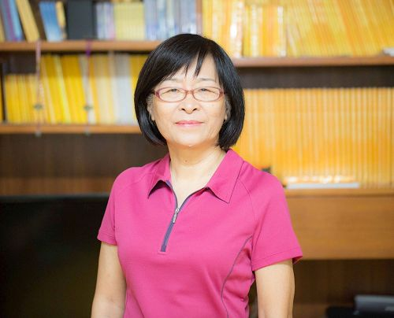

当琼花第一次把整本《转法轮》书看完时受到极大震撼，感觉以前对人生、对世界、对未来所有一切迷惑不解的地方，刹那间全部得到了解答。
一段命理师的对话让她寻找宝书

二零零二年的某一天，琼花无意间在电视上看到一个节目，主持人问：“你觉得你的算命准确性有多高？”琼花一听到算命就精神起来了，竖起耳朵仔细听，“我自认我的算命命中率有百分之九十八。”主持人又问：“你算命这么厉害，怎么现在不算了呢？！”那人就说：“以前我认为知命可以改命，但是后来我看了一本书，才发现人的命运是不可能改变的，除非照那本书去做。”

就这段对话吸引了琼花的好奇，心想：那是什么书，居然可以改变人的命运？节目中最后出现一本书，上面写着《转法轮》三个字，听主持人介绍，方知原来是法轮功的书。

隔天琼花迫不及待到书店把这本书买回家，翻阅了三分之一后，琼花内心顿然明白，“原来这就是我要找的，他把我所有的疑问都解开了。”两天内把整本书看完，她受到极大震撼，感觉以前对人生、对世界、对未来所有一切迷惑不解的地方，刹那间全部得到了解答，就这样，琼花走上了修炼法轮大法之路。

<b>数十年失眠、低血压　不药而愈</b>

琼花从小体弱多病，两个很大的宿疾总是医治不好，一个是困扰三十多年的失眠症，从上高中因功课重，烦恼增多，就开始失眠，过程中吃过安眠药、看过中西医，但都没有效果；另一个就是低血压，常常低于90-60 mmHg，感觉全身无力、呼吸困难，且常会没预警的血压下降很多，几近休克，吃什么药都没有效。有一次在学校发作，后被送中医医院，医生竟把不到她的脉，吃惊的说：“这个人都没有脉了！”

为了医治这两个宿疾，琼花全台湾走透透，什么中医、西医、小道偏方等等都试过，就是查不出病因也治不好，反弄的心灰意冷、身心俱疲。身为国中教师的琼花说：“那时候教书上课很痛苦，没睡好又血压低，有时候还需学生来办公室扶我去教室坐着上课，有时候一发作起来也没办法上课，吃很多补品硬撑，很痛苦。”

但开始修炼法轮功后，奇迹出现了，这两个最大的毛病很快就得到改善了，琼花说：“一炼完功回家躺下来就睡着了，睡眠品质大大提升。血压也不知不觉恢复正常、稳定了，身心变化很大。”

<b>感谢师父再造生命之恩</b>

经年累月受命运折磨，琼花总想寻找解脱之道，因此一直徘徊于各种宗教信仰之中，诸凡禅、净、密、道教、天主教、基督教、民间小庙等都接触过，道场一个换过一个，始终找不到她要的。琼花说：“学习《转法轮》后才知道我那是杂修，永远在门外绕圈圈，当我读到这本宝书后，内心终于清楚这是我一生寻寻觅觅要找的修炼法门。”

修炼前，琼花对很多事情常想不开又放不下，尤其看到很多社会暴力新闻，比如说有人走在路上，只因望人一眼就被砍了之类的事，都会让她内心有种莫名的不安与恐慌，怕自己或家人哪天也遇到这种不幸，整天担心受怕，因此假日常会开车上山下海去各个庙求神问卜，大庙、小庙都去，连坟墓旁边的小庙也去求。那时候她身体每天都很沉重，脸色越来越发黑晦暗，黑到连邻近美容院老板都看不过去，要她找医学美容治疗，但花钱治疗后，皮肤依然没有改善。

学了《转法轮》之后，琼花才知道凡事都不是偶然的，一切自有其因缘关系，知道这个法理之后，就不再随时担心受怕，不再杞人忧天的烦恼忧愁了。修炼后她也明白，到处求神问卦，易招惹不好灵体，难怪皮肤会越来越黑。炼功后她皮肤改善很多，“黑”就慢慢褪掉了。

琼花说：“大法开启我正确的知见，若我没有修炼大法，后果真是不堪设想。”

<h1 align="center"><b>从我亲身经历看中共的“假、恶、斗”</b></h1>

【明慧网二零零七年二月十日】人不知道好坏，道德沦丧，神就不把人当人看了，人就会很危险；狗疯了随便咬人，人就会把疯狗消灭。共产党是好是坏，共产党领导下的“人民政府”究竟如何？作为一个中国人能不能站在公正的立场上认识、看清这些问题，也许是决定自己生死存亡的问题。
我是湖南人，因为坚持修炼法轮功“真、善、忍”，曾被非法劳教，在长沙新开铺劳教所遭受了残酷的迫害。劳教所警察经常在会上说：“我们穿着制服上班的行为，是代表共产党的行为，代表政府行为，代表国家行为，具有强制性。”那么，他们的行为又是怎样的行为呢？让我们打开所谓“文明劳教所”的窗口，来看一看它的真实面目吧。

新开铺劳教所还有另外一个名字叫“育新学校”，称劳教人员为“同学”。劳教所分成八个大队，共关押了约一千八百多人，其中被非法囚禁的法轮功修炼者这几年都在五十人上下。法轮功修炼者人数不多，但却是新开铺劳教所的“重中之重”，他们被集中关押在邪恶的七大队。表面上看，七大队的房子是装饰的最好的，而且在七大队里有个其它大队都没有的“学员之家”，内有书报，象棋、军棋、围棋、桌球、乒乓球台、电视房、卡拉ok室、健身房等等，俨然的一个小型娱乐城。除有考察和参观来人外，“学员之家”平常是不开放的。而往往国际人权组织来考察就会被带到“学员之家”，考察人士会看到什么呢？进门有地毯，两边摆放着鲜花，房内卫生干净整洁，被子叠放整齐，在押人员在“学员之家”内“娱乐”，一派“和谐”景象。与共产邪党“假、恶、斗”的暴政下中国人久已习惯的“应付上面检查”的做法一个样。等考察人员一走，一切又恢复原状──新开铺劳教所的本来面目。

法轮功修炼者被劫持到新开铺劳教所后，首先是被关在“学员之家”，说是“帮教”几天。“帮教”就是连续的罚站几天几晚，不准眨眼，不准睡觉，不准喝水。站立还要符合“标准”：立正，挺直，两眼平视前方，两手掌中指紧贴两裤腿中缝。稍有不从，招来的就是打骂。然后就是逼迫法轮功修炼者写诬蔑法轮功和出卖灵魂的所谓“三书”。

到了夜深其他人睡后，四个人一起来整大法弟子：前后左右各一人，轮流击打大法弟子的头部、两肋，两人捉着大法弟子的手掌按到木板上，用牙刷弹手指尖……用一个汤姓的参与迫害大法弟子的吸毒犯的话讲：“只要你不写‘三书’，我们就会把你搞成神经，甚至废了你的生殖系统！”这一切罪恶行径都是在劳教所的警察指使下所为，在这过程中，恶警们也经常来问一句：“写了没有？”

写什么才能达到他们的要求呢？都是那些违背良心、颠倒黑白的言辞，而也只有做这样昧良心的事，说昧良心的话，在新开铺劳教所才可以过的“好”一点。在严酷的环境下，在强大的高压下，一些法轮功学员违心按照他们的要求写下“三书”时，都止不住放声大哭。那是生命良知本性与被逼迫的无奈交集在一起的痛苦，曾有此经历的人回忆说：生不如死。

但是，劳教所的警察是不会理会这些的，奖金、升迁是他们的目的，在摧残他人正信良知的同时，他们也意识不到自己的善良的本性也在长年的凶残和麻木中被泯灭殆尽，而最终他们也将为自己的所为付出生命最惨痛的代价。这样看来，他们同是受害者。这一切迫害的始作俑者就是共产邪党，用利欲泯灭良知，用谎言和暴力扭曲人对善良的渴望与追求，最终使全社会沦入谎言和暴力的构陷中无法自拔，走向毁灭。

以下是一些法轮功学员在新开铺劳教所被迫害的一些点滴记录。

湘潭法轮功学员刘和清，只是在会上喊了一句“法轮大法好“，马上被关禁闭。后经长沙有关医院鉴定：刘和清已有神经病。即使在刘和清精神失常的情况了，他还是被禁闭了几个月，至其奄奄一息时，才让家人接回去。一个姓汤的“夹控”犯人在迫害大法弟子时说：“刘和清就是我们搞成神经的，你们不听话，他就是你们的下场！”

郴州法轮功学员唐朝辉，在晚上刚做了一个炼功动作，不到二分钟，被发现，当晚马上放到“学员之家”迫害，搞了几天，又把他放到严管房严管。严管主要是坐小矮凳：挺直腰，两脚与肩同宽，成T字型平放，两目平视前方，右手拉着左耳根，左手拉着右耳肩，头上放一本书，或一条小板凳，就这样坐到凌晨两点，有时坐到凌晨四点。在坐的过程中，动作不符合要求，或头上的东西掉下来了，就遭拳脚相加，并要延长坐的时间。

岳阳的卢海，三十岁的小伙子，在新开铺被迫害两年多后，脚走路都比较困难，恶警逼其到医院看病，医院检查不出病因。恶警强制他到严管室，每天坐小矮凳到凌晨，还逼他吃一些无益甚至是有害的药物，不吃就把他用绳子捆起来，用电棒击，然后用仪器把嘴张开，强行灌药，美其名曰“关心”。

一个娄底的法轮功学员姓童，在一次班务会上，恶警豆湘林逼他发言。老童发言后，豆湘林说老童讲话不入耳，第二天就把他转到严管房“严管”了一个多月。

在新开铺劳教所，法轮功学员不能随便讲话，说什么都必须事先“报告”给夹控，得到允许后才能开口。而吸毒犯们、夹控们可以毫无顾忌的畅所欲言，但他们每天说的话题都是什么呢：如何杀人，用什么方式杀人最不起眼，如何贩毒，如何打通关口，把毒品安全运回，如何做贼……但是这些，在新开铺劳教所的警察们看来是再正常不过了，甚而有的警察曾在会上公开说：“吸毒者他们说，他们没有犯法，他们是用自己的钱买毒品吃，我们认为也是有道理的……”

有在新开铺劳教被关押过的人说：那些借残害良善无辜者来升官发财的恶警是披着人皮的狼，而坏人是恶警利用来整人的凶器，被整的人却是老实善良的民众。而这一切罪恶的滋生是因为共产邪党“假、恶、斗”的基因，也正是因为共产邪党的庇护和怂恿才使罪恶变的如此嚣张。

一百多年来共产恶党在全世界犯下的罪行，激怒了世人，激怒了神。天灭中共是必然，也是善恶有报的最终体现。那些善良的中国人民啊，曾经发过毒誓把命都交给邪党的人们啊，赶快清醒吧！认清这个中共魔教的本质，退出中共，才是保平安的唯一出路。

<h1 align="center"><b>辽宁警察修炼法轮功 惨遭监狱下毒迫害</b></h1>

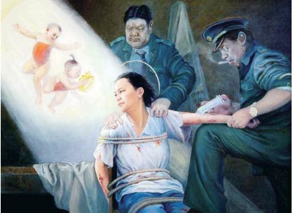

油画作品：法轮功学员在被非法关押期间被打毒针。（明慧网）

【大纪元2018年02月03日讯】他在医院里昏迷了九天，手脚弯曲，大便呈黑紫色，狱方已做好了处理后事的准备。当家人赶到时惊得目瞪口呆，看到的全然是一个活死人。

几经周折，家属将他的尿液送去检测。经权威专家鉴定，距离注射药物九天后，他的身体还呈大阳性，属严重中毒。

明慧网报导，2017年在阜新市公安局刑警队警察高雨民还有两三个月就将出狱时，他却在监狱里被打毒针，回家半年，他的身体状况还处于危险之中。

高雨民于2013年11月6日被当地公安局、国保大队绑架；于2014年3月14日被冤判五年，上诉后改为三年半；2014年11月7日，高雨民被劫持到辽宁沈阳第一监狱。

下面是各方人士突破网络封锁，通过明慧网报导出来的消息，从中人们可以了解到高雨民的一些鲜为人知的事迹。

<b>从参与迫害到修炼法轮功</b>

高雨民，原是阜新市公安局刑警队的一名警察，曾立二等功。他因相信中共对法轮功的污蔑宣传而参与过迫害法轮功学员，但是法轮功学员的善良和坚毅与中共报导的完全相反，这引起了他的深思。

一次，高雨民在家门口发现了法轮功的真相传单，了解到法轮大法是真正的佛法。原来这场对法轮功的迫害，是江泽民出于妒嫉之心，利用国家机器发动的。高雨民从开始敬佩不畏强权、坚守信仰的法轮功学员，到后来自己也走入了法轮功修炼。

高雨民修炼法轮功后，用“真、善、忍”标准要求自己，一改以往吃喝嫖赌等恶习，并照顾患有十多年精神病的妻子，无怨无悔，乐呵呵；看谁有困难，他都尽力帮助。认识他的人都说他是个好人。

<b>讲真相遭迫害</b>

2013年11月6日，高雨民在阜新市彰武县彰古台镇发放法轮功真相资料时，被彰武县公安局国保大队队长崔海峰等人绑架到彰武县黑坨子看守所。

高雨民全天戴着手铐和脚镣，还与杀人犯和吸毒犯关在一起。这些犯人被唆使对他进行迫害。他不气不恨，跟他们讲自己也曾是一名警察，从被欺骗到明白法轮大法好的经历。他劝这些人退出中共的相关组织，才能在善恶报应中保平安。明白真相的人表示也想学法轮功，和他一起喊“法轮大法好”。

在看守所里高雨民每天都喊“法轮大法好”，并绝食抗议对他的迫害，他遭到看守所警察的拳打脚踢、野蛮鼻饲灌食和灌盐水等摧残。即使这样，他仍然利用一切机会给警察写劝善信，呼吁他的同行们不要助纣为虐。

两个月后高雨民因遭受迫害导致身体严重受损而“保外就医”，被家人背出看守所。

<b>被冤判三年半</b>

回家后高雨民坚持学法炼功，一个月后身体恢复正常。家人惊叹不已，同时又深深地担忧刚恢复健康的他再被劫持，都建议他出去躲避。高雨民没有考虑自己的危险，他不想牵连做公务员的哥哥，哥哥是他的所谓取保候审的保人，加上他惦记80多岁的老母亲，还要照顾精神失常的妻子，所以他没出走。

2014年2月21日，高雨民再次被蹲守在他家楼下的彰武县法院警察绑架。3月14日，彰武县法院对他非法判刑五年。他上诉到阜新市中法后，彰武法院将他的刑期改判为三年半。

2014年11月7日，他被彰武看守所劫持到辽宁沈阳第一监狱。当时高雨民已绝食二十多天，出现吐血、便血，身体极度虚弱，被直接送到沈阳监狱城新康监狱医院。在体检不合格的情况下，阜新市政法委用权钱周旋，他被强行关进监狱。

后来有好心人透露，当时辽宁省监狱管理局总医院的检验报告单上显示，高雨民有15项指标不合格，肾衰竭，肾、肝受损且已伤及心脏……已给家属下了病危通知。

那时高雨民人已脱相，时常昏迷，眼睛看不清东西，而且不知冷热，手脚却还被戴着手铐、脚镣，手腕、脚腕上均有伤痕，头发被强行剃光，头上留有一道道划痕。

还有好心人透露，高雨民的事被报到省里，当时任阜新市政法委书记的王秋博认为公安战线警察学法轮功，会影响他的政绩，因而王一心要把高雨民送到沈阳大北监狱。他一面向法院施加压力，要给高雨民判刑，另一面，王秋博放狠话给看守所，要求狠命地打高雨民，逼其转化，放弃修炼。

知情的人说，当时再打他的话，他就死了。

<b>狱中黑幕</b>

沈阳第一监狱严管队为逼迫高雨民放弃修炼，对他野蛮毒打，用鞋底抽打嘴巴，还叫犯人查数，数到32个嘴巴时，他的脸已被打得变形。高雨民不为所动，有机会仍炼功打坐，他们就用电棍电击他的下肢，一直打到他身体没有支撑力。

一位外地好心人亲眼目睹了高雨民被打的过程：狱警用菱形胶管抽高雨民的头，打得他站立不稳，用两手支撑大腿使身体不倒，高喊“法轮大法好！”，打一下喊一声，再打再喊。他的行为感动了监狱里的其他人员，还有不少警务人员，他们都对高雨民投以敬佩的目光。

高雨民不仅抵制对自己的迫害，遇到有法轮功学员遭到迫害时，他就发声并绝食声援。一个狱医劝他：“你只有吃饭才能反迫害”，高雨民说：“只有释放大法弟子，这个饭我才能吃，我们无辜被迫害，这个饭我吃不下。”

高雨民抗议迫害，几次绝食遭强行下管，造成胃出血，并被施以酷刑。

一次在第九监区，有人在门窗口看见他起不来，用两只手撑著身体在地上挪。普犯们说监狱把他送到沈阳739医院检查，说胃肠粘连严重。他的家人知道这个情况后，不得不疏通关系找狱警长，多次送钱送物，以保维持他的生命，后来给钱少了都不行了。

这期间，高雨民的亲人一边承受巨大的经济损失、遭受极大的精神痛苦，一边还得照顾和安慰日夜惦记儿子而不知儿子遭受严重迫害的80多岁的老母亲。

<b>出狱前惨遭毒害</b>

在高雨民出狱前两个月，监狱对他下毒手：他被注射了大量破坏中枢神经的药物——巴比妥；被打完毒针后，再被关“小号”（专门迫害法轮功学员的狭小房子）、往死里打他，导致他的身体毒性发作。

高雨民目光呆滞，身体僵直，已成植物人。直到第七天他奄奄一息时，狱方才告诉家属说他身体不太好，说是绝食引起的。家人无法理解，前几天人还好好的，怎么突然出现了这种现象？

高雨民的哥哥姐姐经常到监狱看望高雨民，高雨民本人平时也向狱警们讲真相，所以有尚存良知的警察巧妙地指点家属要求做尿检。于是家属提出要求转院检查。这样高雨民几经周折转了医院，家属又几经周折将他的尿液送到辽宁省药物监督检测中心。经权威专家鉴定，高雨民严重中毒。

监狱知道情况后，一时慌了手脚，想沟通私了，让家属把人接回去。家属说当初亲人是站着进来的，今天我们不接。监狱方不得不同意高雨民住院治疗，给他身体换血。

因为高雨民家人掌握了狱方注射破坏中枢神经药物的证据事实，使狱方无法抵赖，所以高雨民出狱前，狱方同意给高雨民一定数量的经济赔偿，前提是不要把事实向社会公开，但还需要向辽宁省政法委、“610”汇报，结果没有批准。

后来监狱怕收不了场，要求家属接人，家属不同意接。他们就和阜新市政法委沟通，当时的负责人于洋、王秋博表示不赔钱，说赔就错了。

由于刑期已到，监狱要求必须接人，就这样监狱和阜新市政法委派出六辆车，把高雨民接回阜新市中心医院，并安排公安警察三步一岗，不许其他人接近，半月后高雨民被接回了家。

<b>在家中继续遭迫害</b>

高雨民回家半年有余，生活不能自理，时而抽搐、理智不清，智力如3、4岁孩子一般。他已被开除公职，没有了生活来源。先前妻子就患有精神病，在高雨民非法关押期间病情加重，放火烧了楼房里的全部家当。高雨民回来后只能和80多岁的母亲住在一起，家人不得不花钱雇人24小时陪护他。

高雨民出狱后，阜新市政法委和“610”安排警察、街道对高雨民的住所、家人进行监控，不准家人向社会曝光他在监狱期间被迫害的详细过程，限制家人、高雨民和外界的正常接触。

<h1 align="center"><b>DAFOH：黄洁夫在WHO边会的话可信吗？</b></h1>

“医生反对强摘器官组织”（简称DAFOH）执行董事托斯顿．泰瑞（Torsten Trey）医生。（陈柏州／大纪元）

【大纪元2018年06月01日讯】（大纪元记者李辰报导）大陆媒体近日炒作世界卫生组织（WHO）会议期间的一个所谓“边会”，中共前卫生部长黄洁夫再次为中共器官移植“洗白”。

“医生反对强摘器官组织”（简称DAFOH）的执行董事托斯顿．泰瑞（Torsten Trey）医生向大纪元记者表示，中共在器官移植上所做出的承诺前后自相矛盾，并且“黄洁夫没有提供任何访问器官移植透明化数据的途径，这导致器官来源无法核实”。

黄洁夫声称，从2010年1月到2018年4月，中国已累计完成公民逝世后器官捐献17,085例。

自2000年以来，中国的器官移植业走向“飞跃”。在国际社会，器官移植通常需要等待数年，相比之下，在中国，数月、数天即可。但中共一直无法向外界解释合理的器官来源。

2006年，两位证人在美国首都华盛顿公开指证中共活摘法轮功学员器官。法轮功是一门以“真、善、忍”为原则的身心修炼功法，1999年前在中国广为流行，1999年7月被中共取缔，很多人被抓后离奇失踪。

<b>中共向国际做出的承诺前后矛盾</b>
 
泰瑞医生以两个例子解释中共在器官移植和器官来源问题上的说法缺乏可信度：

2001年，中共声称在美国国会作证的王国齐是一个说谎者，王国齐作证说中共移植器官来自死刑犯。但是，2005年，中共官员承认，90%的移植器官来自死刑犯。

又如，2017年在梵蒂冈的一个器官捐献会议上，中共官员向在场与会者表示，中国没有器官移植旅游游客，如果这样的事情发生了，那么，这只是个别现象。

但是，2017年秋季，韩国电视台Chosun播出一个纪录片，隐藏的录像机拍摄的录像显示，天津的一家医院欢迎、接收韩国的器官移植病患。据估计，每年数百名韩国人到天津做器官移植。中共没有采取措施吊销这家医院的器官移植资格。这和中共在梵蒂冈所做的声明相矛盾。

<b>多少器官捐献志愿者可成为事实捐献人？</b>
 
中共媒体称，截至5月4日，中国器官捐献志愿登记人数达到42万；2017年，中国公民逝世后器官捐献5,146例。

那么，按国际案例，多少器官捐献志愿者，可成为事实捐献人？

泰瑞医生说： “考虑到7/1000的死亡率、捐献人患病、不健康的生活方式、年龄问题、死亡和器官摘取之间的时间差等原因，最终只有1%—2%的曾登记过的过世者，才符合器官移植的条件。”

如此推算，2017年总登记的42万人中，大概2,940人会过世，其中仅有1%—2%的人可提供移植的器官，这相当于2017年约29—58人可成为器官捐献人。而中共称5,146例公民逝世后器官捐献，两者显然相去甚远。

<b>中国每家医院应公布年度器官移植量</b>
 
泰瑞医生表示，中国每一家器官移植医院应该公布年度移植数量，“在中共活摘法轮功学员器官的问题上，国际社会不应当接受那些被审查过的器官数量。”

“应要求中共实行和西方一样的透明度标准——衡量器官移植医学的黄金标准是公布每一家器官移植医院的年度器官移植量，这样，可进行审查和验证。”

“如果国际移植组织称，他们没有方法、权力或者人员来调查中共是否进行过或者正在活摘法轮功学员及其他良心犯器官，那么建议那些国际组织不要为中国的器官移植系统站台。”

“世界卫生组织不应仅听取中共官员声称的改革说法，还有责任听取受害人的意见，并排除法轮功学员没有因器官摘取而死亡。世卫组织是否愿意签署这项担保？”

疯狂现状
2014年3月，中共前卫生部长黄洁夫宣布，将囚犯器官整合到自愿器官捐献系统中，甚至称，死囚亦可自愿捐献器官。

大陆医生对活摘器官的疯狂程度，可从“追查迫害法轮功国际组织”2015年12月21日的两通电话调查中管窥一斑：

2015年12月21日，9点55分，广东省江门市中心医院心脏移植科值班医生（男，李伦明（音））向“追查迫害法轮功国际组织”的调查员表示，“做了（活摘法轮功器官）又怎样？是法轮功的，又怎样，”“我们做的多的是，你可能还没调查清楚，那太多了。”

广东省江门市中心医院心脏移植科值班医生（通话19：08秒）接了“追查国际”当天傍晚第二个电话。调查员问他：你挖出了多少法轮功学员的器官，他说：“数不胜数”。又问：你敢确定是“数不胜数”吗？他又重复一遍：“数不胜数”。

2016年6月，三位独立调查员，在美国国家记者俱乐部联合发布中共强摘人体器官最新调查报告。报告显示，中共每年进行约6万—10万例器官移植手术；过去十年来，器官移植数量惊人；器官的最主要来源是法轮功学员。

为制止中共反人类罪暴行，2016年，美国国会众议院一致通过343号决议案，要求中共停止迫害法轮功和停止强摘法轮功学员等良心犯器官行为。

泰瑞医生说：“无可辩驳的证据表明，大量法轮功学员因被摘取器官而死。（中共）反人类罪不会因任何形式的改革而失效。”

“如果我们不知道过去20年中，中国的器官移植发生了什么，那么我们无法得知中共是否滥用器官移植，或是否发生改变。”

<h1 align="center"><b>艾菲尔铁塔下的正义呼声</b></h1>
【明慧网二零一八年六月五日】（明慧记者周文英巴黎报道）二零一八年六月三日星期日下午，法轮功学员在巴黎艾菲尔铁塔下的人权广场举办活动，介绍法轮功，并征集反迫害签名。
来自世界各地的游客和法国民众有机会了解法轮功及法轮功在中国无辜遭受迫害的真相。人们被祥和的功法演示吸引，被中共的残酷迫害所震惊，他们纷纷表达自己希望迫害早日停止的心声，不少人在征签表上签字，有的人表示要学炼法轮功。

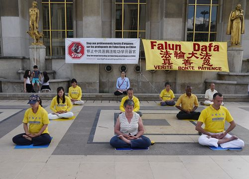

图1：法轮功学员演示功法

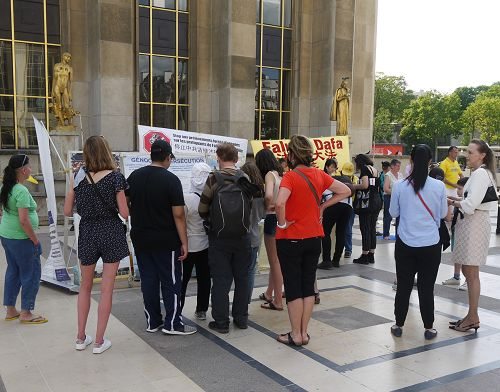

图2：游人观看展板，了解法轮功真相

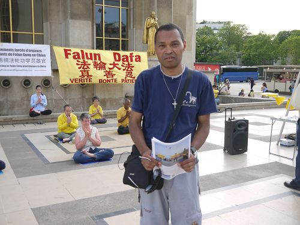

图3：克莱芒（Clement）先生说：“我全力支持反迫害，要让中共停止暴行。”

克莱芒（Clement）先生在法国邮政局工作。他表示：“法轮功修炼在中国被禁止，修炼人遭到迫害，我真的反对这种做法，我要支持他们（法轮功学员）。他们是和平的，通过修炼达到身心健康。而对他们的各种迫害方式，甚至强行摘取他们的器官，这是非常骇人听闻的。国际社会应该出来干预此事。我全力支持反迫害，要让中共停止暴行。”

谢瑞夫（Kardhoum Cherif）女士是人权活动人士，这天她同女儿贝尔瓦珐（Dhekra Belwafa）一同散步来到人权广场。了解到法轮功学员在中国遭受迫害时，她马上在反迫害征签表上签字。她说：“我坚决反对所有的对人的犯罪行为。任何情况下，我们的身体是属于我们自己的，而不是属于某个政治邪教集团的，我对那些受害者表示深深的同情，我谴责中共对人民所犯下的罪行。”

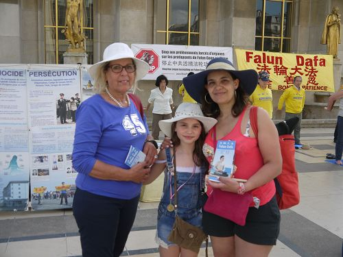

图4：谢瑞夫（Kardhoum Cherif）女士（左）同女儿贝尔瓦珐（Dhekra Belwafa）支持法轮功反迫害。

贝尔瓦珐女士是经济学和政治学教师。了解法轮功真相后，她表示：“我认为这个中共政党很危险，真诚地说，它应该消失。人需要活着，需要真、善、忍，需要与别人交流，需要和平，需要思考、学习。任何国家都不可对自己的人民做出这样的事（活摘器官）。”

“所有的独裁者都没有好下场，他们都会遭报的。我今天出来散步，又发现了在中国发生的活摘器官的事。中国是一个经济强大的国家，我们今天购买的便宜产品，是来自中国的劳改营、监狱，那里的劳动是强制的。我为中国这样一个大国感到悲伤，那里有很多资源，有许多人类可以学习的东西。我了解的中国是一个有精神修炼的国度，今天我又发现了法轮功，这肯定是最为美好的，是有力量的，能使人民立身处世，所以中共会害怕。”

“我深深悼念那些牺牲者，他们去世了，但是他们的精神并没有消亡，所以我们今天在这里。我祝愿你们（法轮功学员）鼓起勇气，继续发出你们的声音，真的声音。我希望中国人鼓起勇气来，那些今天不能自由说话的人，我们期待着你们。”

<h1 align="center"><b>“610”的末日疯狂与惊心恶报</b></h1>

【明慧网二零一八年六月八日】恶名昭著的中共“610办公室”，是江泽民1999年6月10日成立的专职迫害法轮功的机构，从中央一直常设到全国最基层，类似“中央文革小组”，靠中共江泽民集团撑腰和无限量拨款，非法的运作至今十九年，一直操控中国的公、检、法、司实施犯罪，对中国几千万信奉“真、善、忍”的好人进行绑架、抄家、恐吓、监听、勒索、关洗脑班、劳教、判刑、酷刑折磨，甚至强奸、活摘器官，无恶不作。据明慧网资料，至少4213法轮功学员被虐杀（由于消息封闭，只是实际数字的冰山一角），遭中共迫害和牵连者无计其数。
江泽民发动的对法轮功的迫害，惨烈程度远远超出常人想象：

◎丢失一个手机，招来十四年冤狱

明慧网二零一八年五月一日报道，二零一七年在新疆打工的辽宁省葫芦岛市宋志刚，无意间丢失一个手机，被人拾到后，送到公安局，因手机中有与法轮功有关的内容，立即被新疆阿克陶县公安局绑架，二零一八年一月宋志刚被非法批捕，之后被阿克陶县检察院非法起诉，四月被新疆阿克陶法院判十四年大刑。

◎山东淄博市黄福堂自述遭毒打折磨经过

“我现年六十五岁，济西机务段退休职工。二零一六年三月二十二日，淄博市张店区张庄派出所警察牛勇带领七、八人闯入我家抄家，抢走五千三百多元现金。警察们把我拖至监控照不到的楼洞，一个警察用手紧攥我的睾丸，致使我当场昏迷，醒来后发现睾丸血肿，小肠下垂（有医院体检证明）。济西机务段办事处克扣我的退休金三千多元，两处共计八千多元。十二月二十六日我被绑架到山东省十一监区，刚到就被以史光兴为首的一群人扒光衣服，饱受欺凌……徐超甚至强制我喝下兑有拔丝的水……二十六组包组警察陈建明和张少青、夏立春、马登洲等把我绑在铁椅子上，长达48小时之久，在我呼救的时候，马登洲用拖把堵我的嘴，造成我呼吸困难、全身瘀肿，至今手关节不能伸直，脖子处现在还有伤痕。”（明慧网二零一八年五月二十四日）

◎高墙内传来撕心裂肺的惨叫声

宋守云今年五十多岁，修炼法轮大法后一直身体健康。这位朴实善良的农村妇女，一生种田做家务，从没伤害过任何人。

从被关进朝阳市看守所那天起，宋守云就被罚在大铺上双腿盘坐，身体必须坐直不许动，动就遭到暴打，一天只许去两次厕所，吃饭也不准下来，每天从早7点左右盘到晚上9点，最后脚踝骨因盘坐腐烂化脓。宋守云拒绝背污蔑法轮功的报告词，因而常遭到犯人轮番毒打。二零一六年整个冬天，只许宋守云穿个内衣内裤，白天监室开着窗户，晚上睡在冰凉的木板上，不许盖被子，宋守云冻得浑身发抖，无法入睡，整个身体缩成一团。警察在办公室可以看到监室内发生的一切，却对宋守云被虐待视而不见。由于长期挨冻、承受各种体罚辱骂，宋守云的身体每况愈下，非常消瘦，犯人借此给宋守云暴力灌药，任仁、姜琳琳将宋守云从大铺上拖到地上暴打，宋守云被打得口鼻喷血，直到监室里的人怕出事按了报警铃才停止。

一天，宋守云被警察徐静带出去给腐烂的脚换药，被训斥：“你的脚为什么这么脏？”宋守云回答：“我被长时间罚坐，没有时间洗脚。”徐静到监室对犯人们说：“宋守云在背后说你们坏话了。”于是在寒冷的冬天，犯人赵红、刘雯、李丹、姜琳琳几人气愤地扒光宋守云的衣服，把她按倒在水泥地上，由两人摁住，另一人往宋守云身上一盆一盆地浇凉水，这样觉得还不够冻，又把窗户打开，犯人手拿搓澡巾用力发泄，说是给宋守云“搓澡”，痛的宋守云撕心裂肺的惨叫，由于用力过猛，宋守云的左手二拇指被拽脱了臼，指头发青当时肿了起来。

二零一七年四月，宋守云被罚站班，一站就是一整天，要求站军姿，由赵红看着，一动不许动，动一点就被赵红毒打，赵红用脚往宋守云脚背上跺，用脸盆沿硬处往宋守云脚上磕，姜琳琳用手掐，宋守云身上被掐得青一块紫一块的，孙亚宁把头发薅下来一绺子，宋守云每日都在痛苦的折磨中度过。

二零一七年九月二十八日半夜，在重症监护室里，家人见到了身上插满了管子、处在重度昏迷中的宋守云，眼睛睁得大大的，也许她至今也看不懂这个世道。（明慧网二零一八年三月十九日）

◎辽宁抚顺市胡国舰被虐杀

二零一六年五月四日，胡国舰被劫持到本溪监狱八监区，遭到暴力殴打、扇嘴巴子、谩骂、不让睡觉（一直逼他叠被子）；在春寒料峭时，被强行扒掉所有衣服，用冰水浇头浇全身。妻子看望他时，看到原来一百八十多斤的丈夫瘦成一百斤都不到，问他怎么变成了这样？胡国舰不敢诉说遭受的折磨，只是哽咽，眼泪“唰唰”往下掉……一次犯人用脚狠踢他的头部，造成脑血管破裂，脑干出血，胡国舰头一歪晕倒在了地上，被送到本溪市中心医院做开颅手术，结果头盖骨缺失，颅骨塌陷，成了植物人，警察在如此状态下还把他的一只脚二十四小时铐在病床上，铐了八个月！二零一八年五月十五日凌晨胡国舰含冤离世。（明慧网二零一八年五月十六日）

◎十年冤狱折磨　吉林杨宝森被迫害致死

吉林省松原市乾安县六十一岁的杨宝森，被非法判刑十年，在吉林省公主岭监狱遭受近九年折磨，二零一八年二月二十七日被送入公主岭市中心医院抢救后，又被劫持回监狱；三月七日保外就医时奄奄一息，不能走路，说话困难，生活不能自理，四月七日凌晨三点含冤离世。

杨宝森二零零八年十二月二十三日被派出所杜学明一伙人撬门入室绑架，在派出所，十个脚趾甲被警察用铁管子打的都翘了起来，警察用冷水将他浑身上下浇透后，推到冰天雪地的室外冻，并给他灌酒，他被迫害的行走困难，腰部以下肿肉都变成了深紫色。二零零九年三月末，在不通知当事人和家属请律师的情况下，乾安县法院秘密开庭，杨宝森只好自辩，审判长王木坤称自辩无效，结果判了十二年。家属几经周折拿到了非法判决书，上诉，松原市中级法院在省高院压力下，两次延期，最后干脆不公开开庭，宣布维持原判。

杨宝森二零零九年五月六日被劫持到公主岭监狱，被强迫坐小板凳折磨，被包夹监控迫害，大冬天被扒光衣服，往身上泼冷水，往嘴里灌白酒。二零一三年四月，杨宝森被六监区教导员李哲关到严管队，队长王继东等人用四根电棍同时电他，电没了，就又取来两根电棍继续电，杨宝森的前胸、后背、大腿全身都是伤。九月二十日被送进公主岭监狱医院，被绑在床上，一个星期不能动。（明慧网二零一八年四月十三日）

◎教师遭冤狱八年又三年半　十四岁儿子和父母含冤离世

赵鸿娥，五十二岁，原辽宁省丹东市福春小学教师，被冤狱八年，二零一五年九月回到家，照顾卧病在床的父亲，孰料二零一七年三月再遭绑架，被丹东市振兴区法院枉判三年半，上诉后，中级法院维持原判。八十多岁的老父亲被迫送进养老院，见到熟人不禁老泪纵横，想念女儿时，就把养老院的工作人员喊作“鸿娥、鸿娥……”，失去女儿照顾的老人身体每况愈下，没有等到鸿娥回家，带着遗憾于二零一八年四月二十六日离开人世，终年八十五岁。

赵鸿娥、唐义清夫妻多次被绑架，被迫流离失所，中共流氓恶警深更半夜疯狂撬门砸门，冲进屋后抄家抢劫，走后家中一片狼藉，先后至少经历了八次。十几岁的儿子小诗雨原来有心脏病，修炼法轮功恢复了正常，但在这种极端恐怖的环境下，失去父母照顾的小诗雨，精神上实在承受不住巨大的压力和痛苦，导致心脏病复发，二零零三年五月二十五日含冤离世，年仅十四岁。

二零零七年九月，唐义清、赵鸿娥夫妻再次遭中共绑架，被丹东市“610”和丹东振兴区公检法以完全伪造的事实和强加的罪名，诬判九年、八年。赵鸿娥的母亲迟美芹对外孙离世已经心痛难忍，对女儿、女婿的担心挂念，更使老人夜不眠、饭不思。七十多岁的老母不顾路途遥远，一路辗转到辽宁省女子监狱，渴望见到日夜想念的女儿，却被监狱警察拒之门外，心灵的摧残无法形容。二零一四年五月二十日，迟美芹老人在中共的迫害中悲愤离世，好端端的家庭被中共摧残到崩溃。（明慧网二零一八年五月二十三日）

<b>死亡职位“610”　恶报惊心放过谁？</b>

上述迫害案例，背后都与中共“610”有着直接关系。这些触目惊心的惨案，只是“610”滔天罪行的冰山一角，是几千万法轮功学员和家人血泪的缩影。十九年间，修“真、善、忍”的好人被中共以各种方式残害，上亿人的正信被打压，这万古大罪，这恶贯满穹宇的大罪，令天地间一切神都震怒了！

二零一三年十一月二十日，参与策划“天安门自焚”伪案的中央610办公室主任李东生被查，二零一六年一月十二日被判十五年。

二零一四年七月三十日，前政法委书记（领导各级610）周永康被当局宣布立案审查，二零一五年六月十一日被判处无期徒刑。

二零一六年四月十六日，中共“公安部610”（二十七局）头目张越涉嫌严重违纪被查。

二零一五年七月二十四日，中央610小组成员（河北省委常委）周本顺涉嫌严重违纪违法，接受组织调查。

二零一五年二月十七日，广东省610头目朱明国被立案侦查并被采取强制措施。

二零一六年四月六日，辽宁省610头目苏宏章被调查。

二零一五年十二月二十五日，新疆地区610主要责任人史少林被立案审查。

二零一五年十月二十三日上午，陕西西安市“610”处长李胜利在西安市委办公院跳楼自杀。

多年前就已确诊喉癌晚期的中央610办公室第二任主任刘京，目前成了活死人。

二零一零年六月十日，广州市公安局610副主任王广平在办公室神秘倒地猝死，恰巧死在“6.10”。

二零一三年三月二十三日，陕西省汉中市610主任芦鹤鸣一行六人乘三菱越野车外出，行至西汉高速公路佛坪县境内隧道时，被两辆大货车夹撞，瞬间车被挤撞变形，车上四人惨死。芦鹤鸣一头撞击玻璃，头伸出窗外，玻璃将他脖子的动脉割断毙命，秘书被从腰部撞断死亡，女儿和司机被当场撞死，情景惨不忍睹。

二零零八年十月五日，黑龙江省双城市单城610头目姜文超等五人遭遇车祸，三死二重伤，单城镇二把手高志武、三把手姜文超、四把手薄建夫当场暴亡；一把手关文良失去一只眼睛、一条腿，一只胳膊被撞断；五把手副镇长陈超武腿被撞成粉碎性骨折。

二零零六年三月十九日凌晨，四川省乐山市610主任杨晓江一行四人驾车在峨眉山游玩，与一辆大卡车相撞，杨晓江的头颅飞出车窗外，当场死亡。

二零零九年四月三十日，河北省高碑店市610主任王彦斌和司机开车从保定回白沟，行至雄县高速路口处，追尾撞上一辆打井车，被三根铁管子分别插在嘴、喉咙、胸部，当场死亡。

二零零零年十月十七日，黑龙江省大庆市610副主任袁炳军开车路过火车道时，汽车离奇熄火，车上两人下来推车，这时火车过来刮倒了汽车，汽车把袁炳军卷起来，摔在火车上，再弹起又摔到地上，袁炳军当场死亡。

二零一一年十月四日，黑龙江省大庆油田公司井下作业分公司610主任刘杰骑摩托车和朋友在路上兜风，在弯路口撞上一辆停靠在路边的大车，刘杰戴着防护帽、穿着防护衣，却不知什么物件偏偏从其脖子扎进去，刘杰当场死亡。

二零零二年九月九日，湖南省常德市610主任亲自去抓法轮功学员，坐在一辆大卡车上，当司机张伟把车开到草坪乡白云村四组时，车轮压到一块石头，石头反弹进车内，正好砸到周艾军的头，送去医院抢救无效，第二天死亡。

二零一一年十二月二十三日上午，甘肃省宁县610主任孟兆庆乘坐宁县法院一辆面包警车，在高速路上行驶时钻入一拖车前底部，油箱顿时起火，并引燃大车，大火借风势瞬间吞噬两辆车，孟兆庆当场死亡。

二零一零年十一月二十一日晚，山东省蒙阴县垛庄镇610人员马龙臣，在垛庄化纤厂南205国道上被一辆疾驶而来的汽车撞倒在马路上，肇事车辆随即逃离，马龙臣被后边的汽车轧死后无人发现。据知情人说过了一夜的车，不知有多少车辆从他身上碾过去，第二天早晨才有人发现，马龙臣的尸体早已成为肉饼。

二零零七年七月二十九日晚，吉林省磐石市第一任610主任李相库被一小车撞死。据目击者称，当时小车速度极快，直冲向李相库，撞车时发出巨大的响声，李相库被撞起3米多高，落地时七窍流血，当场死亡，现场血流满地，死状极惨。

二零零五年七月十五日，黑龙江省大庆市610主任在红岗区参加现场会，途中突然一车胎爆裂，车门甩开，将他甩出车外，车倒向一边正好砸在他身上，致其身亡。

明慧网这些年报道的迫害法轮功遭报应实录，装订到一起足足有大词典厚，基本涵盖了中国所有省市，其中不乏离奇的暴亡、怪病，和蹊跷的“意外事故”。那些积极参与的党羽即使暂时逃脱法律之网，也逃不出天理之网，恶报时刻会以各种方式降临到其头上。薄熙来、周永康、苏荣、徐才厚、郭伯雄、王立军、万庆良等中共高官锒铛入狱，表面上因为贪腐，在政治斗争中被剔除，实际是遭到了天谴。

善恶有报是永恒不变的规律，不信报应可不等于没有报应。心正自不招邪，做人当有良知。还在参与迫害法轮功的人，万万不可拿自己的命做赌注，劝你们猛醒、深思。

<h1 align="center"><b>百年企业只为得法瞬间</b></h1>

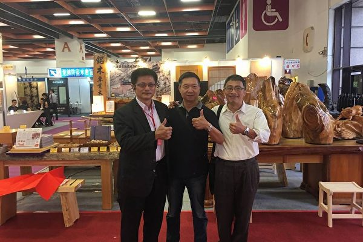

铭木企业有限公司董事长李界煌（左一）与为他加油打气的朋友在世贸展场合影。（铭木企业提供）

【大纪元2016年12月03日讯】（大纪元记者李芳如台湾云林报导）铭木专业木工厂董事长李界煌，十年前接手木工厂。当时正值木工厂产业没落之际，但是为了一群技术熟练的老员工，和拥有传统技法的老师傅，更为了保留传统工法， 他继承债务。他说，当初铭木的成立，碰到日本单，铭木扩厂颠峰时达200名员工，后来铭木因日本泡沫经济受到牵累，改做台湾生意，大陆以假货取代铭木，2006年他回铭木接工厂时，卖掉三代的积蓄只为保留传统工法存在！“照顾员工和老师傅是我的责任，无论如何都要扛起责任。每天想尽办法强度难关，每天为筹钱愁眉苦脸，甚至多次萌生放弃经营的念头。”

小时候因母亲笃信佛教但又不识字，常常拿着经文要求李界煌念给她听，念著念着他都把许多佛经背起来了，这也让他与修佛结下修炼的机缘。这么多年当中也认识许多奇人异事，甚至有神通的人，他说，“我认识许多有神通的人，但有一次居然看见这个有神通的修炼人，竟然卖一些色情光碟片，从此我对修炼有不同的理解，不是所有修炼都是正的，也有邪的，要修炼一定要审慎，找正的修炼。”

<b>得法</b>

一次高中同学会中，他看见英文老师身上有一股能量与光环照着她，他问了老师说：“老师您是不是在修炼什么功法？您身上有光！”老师回答他说：“法轮功！”从此跟法轮功结下渊源。

2016年神韵来台湾演出，他的老师和朋友到工厂去拜访他，推荐他去观赏神韵演出，并告诉他之前曾经得癌症，因修炼法轮功好了。他想：“这么神奇，不可思议！”去看了神韵演岀之后，“非常感动！非常感动！相当的震撼。”他说：“第一幕就让人感动得掉眼泪，舞蹈内容好像在诉说我这十年的历程，闪电般的击中脑袋，我被吸引了，我一直哭，一直哭泣，演出很精彩，但是我却一直哭！不由自主的泪流满面。神韵演出简直把我十年来的委屈、心声、感受全演出来了，看完演出之后，整个人的身心灵都被净化洗净了，身上充满了正能量。”

后来一位校长送了他一本《转法轮》，他看了一遍之后惊觉这是一本旷世奇作，他很好奇是谁能把艰涩的经文写得这么白话，理白言明，他说：“我看过很多佛家经文，都是艰涩难懂的内容，而这一本是经文耶，而且是白话文，把修炼界，佛道正法都说得这么透彻明白，这是什么样的高人啊？”他看了书的封面才知道作者是李洪志老师，心中燃起无限敬意。从此他得法，开始修炼法轮功。

接着他参加了斗六的法轮功九天学法炼功班，第一天有些小迟到，一进门他就听到法轮功师父大概这么说，“大家要准时到，不要迟到，这样会影响别人听课。”他一听心中吓一跳，师父怎么知道我迟到了，真神了。从此九天班乖乖的上课，不敢迟到。

<b>戒烟</b>

李界煌抽烟已有二三十年了，简直就是老烟枪，一天2包烟是正常的，一天不抽烟就混身不舒服，戒了几十年也戒不掉尼古丁的诱惑，自从上九天班起，心中有一念该戒烟了，第二天真的就不想抽了，尼古丁的诱惑不再那么强烈，竟然可以让自己平安度过，第二天、第三天，第四天……到第九天，忘记要抽烟了，到现在2个多月没有想到要抽烟，从此戒烟成功，令他感到不可思议，法轮功的力量竟然可以让人短时间有这么大的改变，太神奇了。

<b>炼功</b>

九天班之后，同修告诉他炼功地点与时间，他一听早上4点50分炼功，心里马上说：“不可能！每天都3-4点才睡，怎么可能4点50分起来炼功？啊！缘分就到此为止吧！”但是，他还是把闹钟调到4点30分，试着看看能不能起来炼功，令人意外的是，隔天早上4点29分闹钟还没响起，他就醒来了，而且一直持续到现在，闹钟根本用不到。他说：“这太神奇了，一般人还得要有调整适应期，而我却180度的大转变，超乎想像的转变，每天早上好像有人叫我起床炼功一样，时间一到自己就自动醒过来。”

<b>危机变转机  企业浴火重生 </b>
 

铭木因日本泡沫受到牵累，改做台湾生意，大陆以低价假货取代铭木。他说：“2006年我回铭木接工厂，卖掉三代的积蓄只为维持工法存在！甚至负债累累，好几次到世贸展或其他展场展出，每次都是乘兴而去，败兴而归，看到到处充斥着假货，用塑胶材质掺杂其中，以假乱真，价格比真品便宜好几倍，大部分人选择便宜就好，心里真是心灰意冷，好几次都想，算了！公司到今天为止，明天回公司宣布解散吧！”

以前头脑一片混沌，公司员工也常常误解老板的意思，他想尽办法培训员工，还是无法提振士气，到最后还是很无奈的说“重做吧！”每次都这样。但炼了法轮功之后，发现自己的智慧、能力被打开了，看人的能力，事情看得很清楚，该怎么做、怎么处理，心里非常清楚，这段时间公司人事也起了变化。

一些原本比较不重视时间的员工，竟然自动离职，真像《转法轮》书中所讲的，“好的留下，坏的去掉。”而其他员工都表示愿意与铭木共同奋斗，同甘共苦，共度难关。他说：“整个企业来了一个180度大翻转。在招募员工上，我也改变以往的招募方式，除专业考量外，更重视品性，要进公司，品德、品性是一个重要的考量！”

以前常常为了筹钱跑3点半搞得心力交瘁，容易生气，员工一看老板脸色不好就知道要3点半了，正在伤脑筋，最好不要惹他。自从修大法以后，学员常常提醒他要修心性，不要生气，他谨守住真、善、忍，守心性，员工发现老板变了，不生气了，整个人和蔼了，容光焕发，处理事情的智慧也出来了，李界煌说：“我在想什么，要做什么师父好像都知道，智慧好像一下被掀开了，处理事情也很轻松快速，很顺利！”

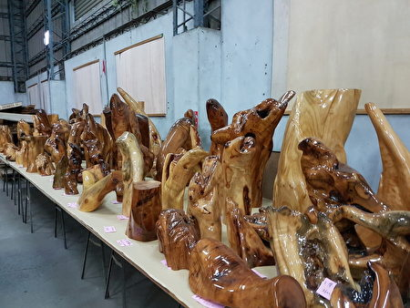

铭木珍贵的原木艺术品。

得法后除了自己身心受益之外，连整个公司都来个大转变，今年11月18到21日再度参加为期四天的世贸展，这次公司上下员工个个自信满满，齐心一致，充满自信心整装出发，许多厂商大肆装潢，铭木用最纯真，原始的风貌展现，没有做任何装潢，但第一天就因刨木屑被其他厂商投诉破坏世贸整体美观，如此珍贵的千年桧木被当成垃圾，实在令人痛心。

神奇的是，第二天铭木展位被参展民众包围争抢台湾桧木屑！整个展场热闹滚滚，一连4天到展出完毕，地上连一小点桧木屑都没有，全都被民众抢光，李界煌相当感动的说：“这样的场景简直就是神迹，一夕之间业绩翻倍成长，如有神助，这都是因修炼法轮大法，员工都能感受到整个场有着源源不断的正能量在加持，也都亲身感受到大法的神奇威力。连世贸参展的民众都跟我们讲，铭木是全场人气最旺的展场！层层叠叠的民众，已经知道台湾桧木的高贵价值了！”而铭木坚持的正统榫卯工法，也是全场询问度最高的技法！这个全场唯一的台湾制造厂家辛苦多年的努力，感动了许多人

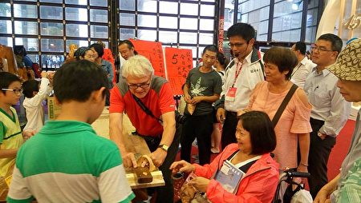

连外国人都相当有兴趣跃跃欲试的参加刨木活动。

因为坚持，坚信榫卯是无价的文化资产，是木业工法的极致，代表的不是只有技术而已，是人类的无形价值，虽然过程走得很辛苦，甚至黑暗崎岖，李界煌因修炼法轮功，一道希望之光照亮铭木企业，危机变转机，犹如浴火凤凰，准备展翅高飞，铭木开始发光发亮，好事纷纷来临，最近又接到总统府表扬的邀请函，铭木整装待发，李界煌将用“真、善、忍”原则带领公司员工，为铭木未来打造一片新天地。

<h1 align="center"><b>美国会研讨会关注3亿人三退 为世界带来希望</b></h1>

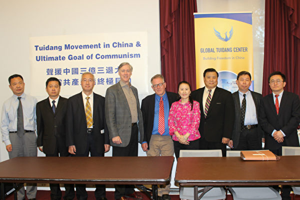

5月9日下午，在美国国会举办的“三亿中国人三退”研讨会上，来自不同国家的政治家和中国问题专家表示，民众大规模的精神觉醒为中国的未来带了光明的希望，也令国际社会振奋。

【大纪元2018年05月11日讯】（大纪元记者林乐予美国华盛顿特区报导）5月9日下午，在美国国会举办的“三亿中国人三退”研讨会上，来自不同国家的政治家和中国问题专家表示，民众大规模的精神觉醒为中国的未来带了光明的希望，也令国际社会振奋。

自从2004年底大纪元系列社论《九评共产党》发表以来，截至今年3月，已有超过三亿中国人声明退出共产党及其相关组织，这一现象也引起了国际社会的关注。

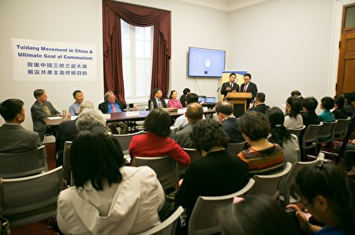

5月9日下午，“三亿中国人三退”研讨会在美国国会佳能大楼举办。

<b>美国国会议员：我们和中国民众站在一起</b>

资深众议员罗拉巴克（Dana Rohrabacher）来到研讨会现场，支持勇于退出中共的中国民众，并感谢三退义工。他说：“我向你们致敬，我了解你们的付出——在似乎没有可能打败中共流氓政权的情况下，你们坚定、顽强地站出来，鼓舞其他中国人，令全世界振奋。我很荣幸今天能到这里，告诉大家，我们和中国民众站在一起。”

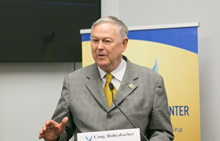

资深众议员罗拉巴克（Dana Rohrabacher）来到研讨会现场，支持勇于退出中共的中国民众，并感谢三退义工。

罗拉巴克鼓励中国民众不要失去希望，他说川普（特朗普）总统和以往的美国总统都不一样，能做出许多大胆的决定，可能也会为中国的人权状况带来曙光。

<b>国会褒奖信：退党为中国重塑希望</b>

资深众议员史蒂夫．金（Steve King）发出褒奖信，赞扬退党运动对中国的重要意义。金议员已向国会众议院议长保罗．莱恩（Paul Ryan）正式提出此信，将列入国会纪录。

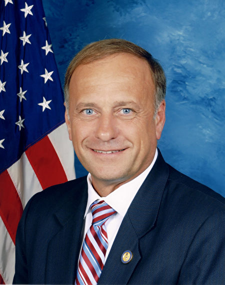

资深众议员史蒂夫．金（Steve King）发出褒奖信，赞扬退党运动对中国的重要意义。

他在信中说：“再一次，我为这些勇敢的退党活动的参与者、志愿者和支持者鼓掌。我期待人们意识到中国可以是一个自由的中国、自由的社会。”

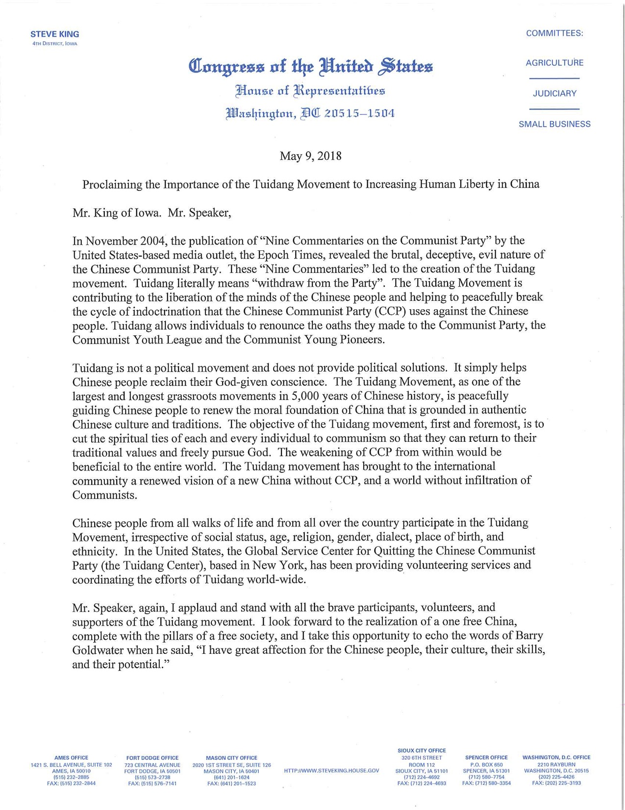

资深众议员史蒂夫．金（Steve King）发出褒奖信，赞扬退党运动对中国的重要意义。

金议员表示，退党不是一场政治运动，也没有其政治方案，而是以一种平和的方式指引中国人提升自己的道德与良知，除去一个人和共产主义在精神上的联系，从而使人重拾传统以及对神佛的信仰。

“中共内部的解体对整个世界而言都是有利的。退党运动让世界展望一个没有共产党的中国，以及一个没有共产主义者参与的国际社会。”

美国国会及行政当局中国委员会（CECC）主席史密斯（Chris Smith）议员致信支持退党运动，他在信中说：“退党运动改变了中国人的思想，将许多人从中共的灌输教育和腐败中拯救出来。”

美国国会及行政当局中国委员会（CECC）主席史密斯（Chris Smith）议员致信支持退党运动。

史密斯议员对中国的未来充满希望，他说：“通过你们和众多正义人士为中国自由所做的努力，我相信，一个更美好的明天即将到来。”

<b>退党唤醒民众良知 洗刷灵魂</b>

全球退党中心主席易蓉介绍说，随着真相广传，越来越多的中国人选择退出中共邪党，为中国社会带来了重大的变革。易蓉说，退党运动为所有中国人和平抛弃中共提供了精神典范，是解决当前中国社会问题最包容、最和善的方式。

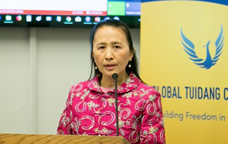

全球退党中心主席易蓉说，退党运动为所有中国人和平抛弃中共提供了精神典范。

美国国务院前助理国务卿埃伦．绍尔布赖（Ellen Sauerbrey）在支持信中表示：“这种和平的、非政治性的、基于社会底层的活动对打破民众心中被灌输的共产主义教条，让他们有机会能独立思考并自由选择自己和国家的命运是至关重要的。”

“当中国民众放弃他们曾给中共发过的毒誓并重新唤醒内心的良知时，全世界的人们都会从中受益的。这将为未来的中国奠定民主与和平的基础。”

美国国务院前助理国务卿埃伦．绍尔布赖（Ellen Sauerbrey）在支持信中表示，退党运动为中国的未来带来希望。

曾担任美国驻丹麦大使和国会众议员的理查德．史维特（Richard Swett）在现场表示，退党运动为黑暗的中国带来了光明。他说，是否敢于维护信仰自由，是许多人一生中最艰巨的道德挑战。史维特鼓励中国民众坚持正义的勇气。

曾担任美国驻丹麦大使和国会众议员的理查德·史维特（Richard Swett）鼓励中国民众坚持正义的勇气。

美国国际宗教自由委员会（USCIRF）主席丹尼尔．马克（Daniel Mark）在支持信中表示，出于无神论的意识形态及彻底的排他性，中共对各种信仰团体实施镇压。宗教自由委员会十分清楚无辜信仰人士遭受的迫害，因此格外赞赏退党运动帮助中国民众摆脱中共控制所做的努力。

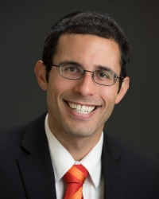

美国国际宗教自由委员会（USCIRF）主席丹尼尔．马克（Daniel Mark）赞赏退党运动帮助中国民众摆脱中共控制所做的努力。

中国民主运动海外联席会议主席魏京生则表示，生活在中共强权之下的中国人承受了极大的压力和恐惧，退党为他们提供了表达真实意愿、洗刷灵魂的机会。

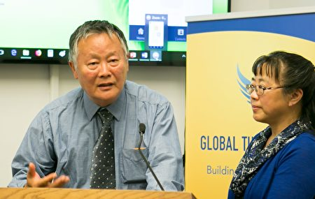

魏京生（左）表示，退党为中国人提供了表达真实意愿、洗刷灵魂的机会。

“六四”抗命军长徐勤先的驾驶员刘建国也来到研讨会现场，分享了自己退党的亲身经历，并感慨道：“在共产党的体制下，审计部门都时常会弄虚作假。退党是一个自发性的民间运动，义工们却用十分严谨、认真的态度对待，我真的感到很佩服。”

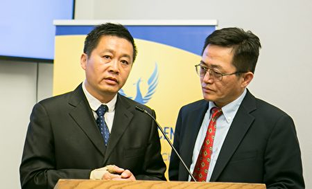

“六四”抗命军长徐勤先的驾驶员刘建国（左）分享自己退党的经历，对认真、严谨的退党义工表示钦佩。

<b>共产主义本质邪恶渗透全球</b>

根据美国国会的纪录，全世界的共产政体造成了总计1.35亿人的非正常死亡。评论员章天亮教授认为，实际数字可能远大于此。比起肉体消灭，共产主义最严重的罪行是通过剥夺信仰自由、摧毁道德体系和传统价值，扼杀人的灵魂。共产主义正以不易觉察的方式和速度渗透全世界，给人类带来毁灭性的灾难，只有保持良好的道德水准，才能幸免于难。

评论员章天亮教授表示，比起肉体消灭，共产主义最严重的罪行是通过剥夺信仰自由、摧毁道德体系和传统价值，扼杀人的灵魂。

前瑞典国会议员、前欧洲理事会议会副议长戈兰．林德布劳德（Göran Lindblad）通过视频连线表示：“将共产主义的目的揭示出来，这非常重要。如果对马克思和列宁有所了解的话，就会明白，在这样极端的政体下，不会有任何好的结果。”

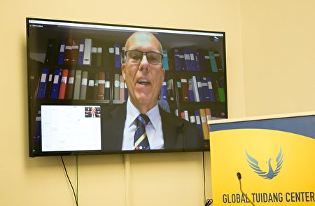

前瑞典国会议员、前欧洲理事会议会副议长戈兰．林德布劳德（Göran Lindblad）通过网络视频与现场连线。

人权活动家李祥春博士说，共产主义悄然渗透美国及世界各国，退党运动揭示了共产党的本质，帮助人们分辨真伪，采取清晰有力的抵制措施。

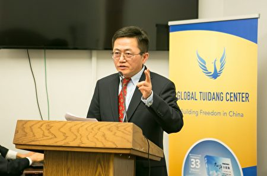

人权活动家李祥春博士说，共产主义悄然渗透美国及世界各国。

追查迫害法轮功国际组织主席汪志远表示，认清共产邪灵的终极目的，追查和惩治中共的反人类罪恶刻不容缓。他说：“这不仅仅是因为罪行必须惩处，更因为是拯救人类最后的道德良知。天地之间正与邪的较量，构成了对每个人、每个组织、每个国家政府道德良知的全面检验。愿人们在这历史关头，选择正义良知，共同清除邪恶。”

<b>道德回升 有益世界 利在千秋</b>

前新西兰行动党副主席特雷弗．劳登（Trevor Loudon）说，中华文明已有数千年的历史，一直自给自足，孕育流传了令人惊叹的璀灿文化和内涵深厚的道德哲学。在这样浓厚的文化道德氛围中，人们拥有极高的职业素质和修养，在没有中共干涉的情况下，本可以为世界做出更大的贡献。

“我想看到一个真正强大的中国。因为你无法想像，一个真正自由的中国可以为这个星球做出什么贡献。中国民间的各行各业、文化和伦理，在适当机会摆脱中共控制的情况下，可能比其它任何国家更有助于改善这个世界。”

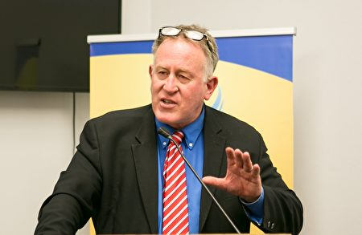

前新西兰行动党副主席特雷弗．劳登（Trevor Loudon）说，在没有中共干涉的情况下，拥有极高的职业素质和修养的中国人可以为世界做出更大的贡献。

劳登说，虽然退党义工背负着巨大的压力和风险，但这是造福子孙、利在千秋的伟大事业。他说：“我希望你会想到你将在历史上的位置，希望你在二百年的时间段里思考。当中国有真正的自由时，一些年轻的中学生选择一个关于中国历史题材项目，在他们看起来在中共崩溃时，中国就在真正意义上解放了。当他们对他们的祖先进行研究时，会发现自己的曾曾曾祖父和祖母是促成这一事件发生的一部分，这就是你在历史上的地位。我很自豪能够成为你们中的一员，并且我祝贺你们所做的事情，因为这对我们全人类都有益处。”

纽约州执业律师叶宁则表示，以“真、善、忍”为指导的正义人士们所付出的努力，使得退党成为了过去二十年中人类历史上最伟大的运动。他说：“因为你们的努力，中国一定会得到拯救，人类会有出路。”

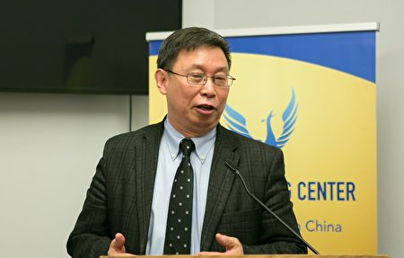

纽约州执业律师叶宁则表示，以“真、善、忍”为指导的正义人士们所付出的努力，使得退党成为了过去二十年中人类历史上最伟大的运动。

<h1 align="center"><b>破除了中共谎言　全家受益于大法</b></h1>

【明慧网二零一八年三月三十一日】我曾经是病魔缠身心胸狭窄的人，三十多岁就在单位老、弱、病、残队工作。二零零七年时，我不仅身体不行了，精神也全面崩溃，打丈夫和孩子。因给婆婆治病，平摊医疗费不均，而跟婆家人不来往。
那时我身心疲惫，非常痛苦，对婆家人充满怨恨，经常跟修大法的姐姐诉苦。修大法的姐姐拿来《转法轮》（法轮大法主要著作）给我看，说你看看书吧，看看书吧，只有大法能救你，只有大法能救你了。

<b>一、“原来是这样啊！”</b>

我当时确实看到姐姐修大法后身心巨变，由于受电视造假宣传毒害，我认为炼法轮功人都是“杀人放火”的，跟姐姐说：你们太吓人了，别跟我说了。她说，你看我能杀人吗？我说，到时候就能杀了。她说你看看书吧。

我心想也是，我看看你们是怎么杀人的？我带着被中共毒害了的想法看完这本书《转法轮》，姐姐见到我时，又给我带几本大法书，我因病在家休息时，一本一本看。

看完后，我明白了——被电视宣传的“自焚”、“自杀”毒害了，但是法轮功，也称为法轮大法，是教人按真善忍做好人的，五套功法强身健体，不断的做好人，不断的做好人，达到身心健康，道德提升，境界的升华，最后走入修佛修道之中了。

当我明白这一层时，我心里非常难过，心想，中国人啊，得有多少亿人是象我这样想的，我整个人难过三天三夜，不知道怎样做，才能告诉跟我一样被毒害的中国人，法轮功是教人按真善忍做好人的，修炼法轮大法的人是不吃生鱼生肉，不杀活鸡活鱼，决不会杀人的。

我从二零零八年也开始修炼法轮大法，我的身心得到了巨变，在丈夫和儿子不同意的情况下，我自己买上水果去了婆婆家，公婆二老都感动的哭了，丈夫和儿子知道后，都不敢相信，都看到了我的变化，从此以后，跟婆家人和睦相处到如今。

昨天，小叔子俩口子还叫我们俩口子去他们家去吃饭呢。在这之前还有个插曲，小叔子刚知道我修炼大法，吓坏了，单独找他哥说，不行，离婚吧。怕我杀他哥和孩子，更怕影响他们的前程，俩口子跟我大喊大叫，不让我炼，说他们的所长因炼法轮功被迫害死了。在后来的接触中，他们看到我的变化：经常看到我去看公婆，直到婆婆去世，买墓地，我们拿了大部份钱，房子也给小叔子了，不修炼大法，我是绝对做不到的，他看到我的变化，跟他哥说，让她在家好好炼吧。

<b>二、丈夫善待大法得福报</b>

我开始修炼大法之前，受电视造假宣传毒害，很害怕，有一次，家门口有大法弟子发的真相光盘，丈夫捡回来，我吓的说赶快扔到垃圾桶里去，咱家啥也不要，别让警察找咱家。

我喜得大法后，丈夫把光盘拿出来了，对我的修炼很理解和支持。他在经济很不好的时期，别人都失业，他找到很好的工作，收入也很好，生活很顺利。他经常诚念“法轮大法好，真善忍好”，他的胃肠不好的毛病好了。

<b>三、儿子相信大法好 抑郁症痊愈</b>

儿子从小是个内向懂事的孩子，学习成绩也不错，上初中后，对物理感兴趣，在全校物理竞赛中取得第一名，初三下学期，由于叛逆，跟老师闹很大矛盾，基本不全天上学，中考时，只考了个市重点高中，上了五天学，就上不了学了，去医院检查，被诊断为重度抑郁，因此休学在家。

那时我刚刚得法，我坚信用真善忍对待他们父子俩，我跟丈夫说：孩子出问题了，你能帮助就帮助他，不能帮就不要再指责他了。那时丈夫基本在婆婆家照顾婆婆，后期又陪公公居住五年的时间，我单独与儿子生活。

那时儿子一说话就哭：我上不了学了，为什么要活着，每天都想死。他夜间基本不睡觉，在家从不出屋，不下楼。我处处按真善忍对待他，站在他的角度体谅他，夜间陪他散步，听他诉所有的苦，我跟他讲大法的美好。这在得法前，我是不可能做到的，那时我都是教训他，要求他，不听他说话和解释。他切身感到了我的变化，他每次有病和心里过不去的时候，我就叫他诚念“法轮大法好，真善忍好”，他都诚念。

在我们都上班的时候，他从电脑电视里自学日语，到外边补课班只学一个学期，就考取了日语能力考试N2的好成绩，第二年考得N1证书后，顺利出国留学。在那里上学，独立打工养自己，凡是认识他的人都感到神奇，一个没上过高中补了几个月课就考取高中毕业证书、日语能力考试N1、N2证书。

儿子这样都是因为受益于法轮大法的洪恩、大法师父的无量慈悲。

<h1 align="center"><b>阿根廷一家亚洲料理餐厅内的故事</b></h1>

【明慧网二零一八年五月二十九日】两年前，当地一位法轮功学员在阿根廷首都布宜诺斯艾利斯市区开了一家传统中国料理餐厅，所有工作人员都是法轮功学员。这家餐厅一方面给当地学员提供工作收入，另一方面可以用来向主流社会讲真相，推广神韵。
由于餐厅的店面位于市中心，顾客中有很多专业人士，其中不少是企业主，还有华人。餐厅供应地道的台湾美食及其它亚洲料理，专注于健康、家乡风味美食，又能满足顾客挑剔的味蕾。我们只使用有机的蛋，不使用味精及大陆生产的产品，只使用来自台湾、泰国、韩国的调味料。由于我们的餐点及服务的品质非常好，很快我们就有了一群忠实的客户；而且我们开餐厅的初衷是为了证实法及推广神韵，收到的效果也相当好，我们也想在此分享许多与客户互动的经验。

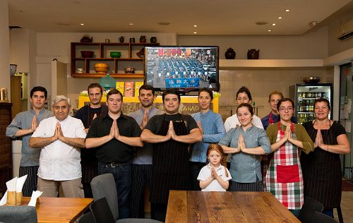

图1：在餐厅工作的大法弟子在南半球的阿根廷向师父问好。

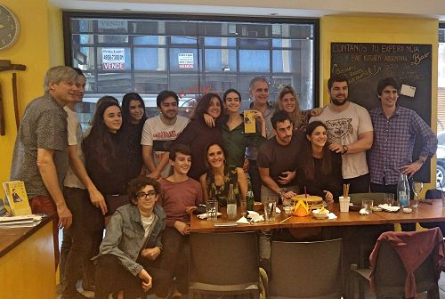

图2：来用餐的客人，用餐后与大法弟子一起祝贺世界法轮大法日。

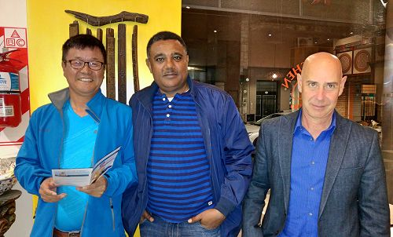

图3：三位来自不同国度的客人，来我们餐厅用餐后非常高兴，不仅品尝了美食，同时了解到大法的真相。

<b>用心做好饭菜　用心讲清真相</b>

在我们餐馆里每天都有不同的故事。这天，餐馆里来了一个来自新疆的年轻女子和哥伦比亚的同事，她们二人负责替一家北京石油服务公司拓展在拉美的业务。她们对餐馆的饭菜非常满意，尤其是中国来的女士。哥伦比亚的女士表示，她的中国同事因为在我们餐馆终于找到了可口的中国菜，决定在布宜诺斯艾利斯留下来。她非常高兴，问了我许多问题。她说她会一直来餐馆吃饭。我想，如果我现在跟她讲法轮功，她可能就不再来了。但她一直不停的问我的背景。所以我终于说：“我是法轮功学员。实际上餐馆的所有员工都是法轮功学员。”她听后非常吃惊。她表示，不太了解法轮功，并表示她无法相信中共在迫害自己的人民。

当天早些时候，我结束了记者的采访，并告诉记者关于中共活摘法轮功学员器官的调查报告“血腥的活摘器官”。所以我也告诉这位女士关于采访的事，并让她在我的手提电脑上看英文版“血腥的活摘器官”（她英文非常好）。她看了关于中国医生从二千名法轮功学员身上活摘眼角膜的部分。她问是在哪家医院发生的。我告诉她是苏家屯，而且有数百家医院参与活摘。

我还跟她讲了二位一年前来阿根廷的学员在中国受迫害的故事。其中一位被酷刑折磨九年，牙齿被勺子打掉，身体被倒吊长达几天，受到殴打、电击折磨等。我可以看出，她很难一下子消化这么多，身体开始颤抖，感觉很不安。最后她拿了法轮功资料和《九评共产党》。她说她要进一步查询。她表示，去过很多国家，看到法轮功学员发资料。这次是她第一次跟法轮功学员交谈。

第二天，一位二十五岁的中国人来就餐。他非常健谈，并开始跟餐馆老板交谈。老板告诉他：她和所有的员工都是法轮功学员。他说：“法轮功？法轮功不都是疯子吗？”我说：“你现在了解我们了，你跟我交谈了，你也看到其他的员工了，他们是疯子吗？”他说：“不，你不是疯子。你人非常好。这家餐馆非常好，环境很好。但我读到的新闻都说法轮功学员怎么不好。”我说：“这是因为你看的都是中共的假新闻，而且相信了他们的谎言。中共告诉你的都是谎言，中共一直在向中国人撒谎。”

所以我又把真相材料给他看，因为他一开始时不接。我跟他说，希望他看《大纪元时报》，因为大纪元报道的是中国真相。他接过了真相材料和报纸，但犹豫是否要拿《九评共产党》，因为他吃完饭还要去其它地方见人。

他说他第二天飞中国前再来拿《九评》。最后我说服他把《九评》拿到他住的旅馆再去见他的朋友。我跟他说，读《九评》非常重要，可以让他了解中共迫害法轮功的真相和发生在中国的真实情况。

离开前，他说他现在明白了法轮功学员是好人。他说我们餐馆的饭菜非常好吃。餐馆里是否有中国大厨。我说，没有。所有的大厨都是阿根廷当地的法轮功学员。她们饭做的很好，因为我们都是用心在做。

在过去的几年中，许多华人来到我们餐厅吃饭，从上班族到游客到政府官员。我们每周向他们发送来自大纪元的消息，在神韵演出期间，向他们发送中文传单。我们并在餐厅大堂设置了一个大屏幕电视，他们就可以一边吃饭，一边了解真相。在餐厅的无线上网的密码是“法轮大法好”，所以当他们要求时，他们必须重复并输入到他们的智能手机。有时他们有点吃惊，有时则会心而笑。

一开始，我们不少顾客来自一家中国大公司，因为他们的办公室就在附近。他们都知道我们是法轮大法修炼者，并提供良好优质的食物和服务。几个月后，他们来用餐的次数少了很多，也许是因为我们的价格上涨了，也许是他们的公司设立了两个食堂，提供员工免费食品。有一次，当他们的食堂关闭几天时，我们的餐厅里坐满了这家公司的员工。一位该公司的员工告诉我们，她想去看神韵，但公司的政策是，公司员工不应该去看这个演出。我们听到这件事非常难过，当我们与阿根廷本地的顾客分享这些信息时，他们对公司如何规定员工的私人生活感到困惑。但这也是揭示邪恶的中共思想文化渗透到当地华人社区的一个例子。

当我们与中国游客和商人谈论法轮大法，并向他们提供阅读材料时，会有很多不同的反应。一些人会阅读或拿走真相材料，一些人只听，大部分看我们的视频，一些人吃得很快，一旦他们意识到我们讲中共迫害修炼者的真相时，就试图离开。

一位中国顾客第二天即将回到中国，他拿走了我们所有的阅读材料，以便他能够在旅馆中阅读，然后飞回去。

另一位中国人三次来吃同一道菜“宫保鸡丁”。在他最后一次来的时候，带着真相资料和《转法轮》离开。

来自阿根廷另一个城市的一位中国顾客来到我们餐厅两次。他第二次来的时候告诉我们，如果我们在他的城市开一家餐馆，那会非常成功。我们的一位中国顾客在我们周末的讲真相活动中陪同我们前往唐人街，还有其他人驾车前往布宜诺斯艾利斯的一些景点参观。一位中国顾客感到惊讶，我们的服务员都是法轮功学员，一遍又一遍地说：“法轮功好”。

有一天，一群中国人坐在电视机前的主桌旁。因为时间还很早，他们是当天的第一批顾客。其中一人起身关掉电视。我们打开它；他再次起身关掉了它，我们再次打开电视，并告诉他不要再触摸电视机，这不是中国，我们有权在我们的餐厅播放我们要播放的内容，他这么做是非法的。他别无选择，只能坐下来听录像。他的朋友们责备他的无礼。后来，他们都愉快用餐，吃完饭后，其中的一些人对法轮大法已经有了正面的看法。

有一次，有八名来自中国达喀尔团队的中国成员（两名飞行员和他们的技术人员）来到我们的餐厅，点了葡萄酒和啤酒。当他们在电视上看到关于法轮大法的真相视频时，他们感到很高兴。他们告诉我们，这个地方有很好的能量。他们甚至为法轮功敬酒。其中一名飞行员告诉我们，他住在加拿大，但他的亲戚住在长春，他们都修炼法轮大法，他现场展示了几套功法动作，并说，他曾经见过李洪志师父，认识李洪志师父，也知道他在传法。他们都说，“谢谢师父，谢谢师父”。并说，中国达喀尔团队知道法轮大法，而且作为中国人，可以自由表达意见，这对我们来说是一个非常愉快的经历。

<b>用正念让每一位顾客都感到快乐</b>

许多顾客来我们的餐厅吃饭，不仅因为我们的食物美味，而且还让他们感觉更好，特别是午餐后，他们仍然需要回到办公室工作。我们的客户之一是前国家安全局局长。他的办公室就在附近，他每天都在外面吃饭。他告诉我们，自从他开始在我们餐厅吃饭以后，胃病问题就没有了。

另一位客户两年前开始与他的两个成年子女一起来用餐。他在该地区拥有一家古董店。当他第一次来时，他告诉我们他患有慢性胃痛。在我们的餐厅，他总是点同一道菜：炸鸡排配米饭。人们会认为，油炸食物对患有慢性胃病的人不好，但他很快告诉我们，他们在我们餐厅吃饭后胃痛就没了。有时他甚至会带同一道菜回家当晚饭吃。

从食物的角度来看，我们的质量控制水平非常高，因为我们使用有机鸡肉和新鲜的油，而日式面包也是我们自己做的，我们每天都会揉、蒸、烤。从修炼的角度来看，我们的食品不仅质量最高，而且作为修炼者，身体散发着正的能量，这些正的能量也投入到所做的一切事情中，“润物细无声”，因此，来用餐的客人能通过食物和我们服务感受到大法的美好。这位顾客将法轮大法和介绍神韵的传单带到他的公司，并且总是向他的客户提及我们。

在餐厅里，我们都以法轮大法修炼者的标准为人处世。许多人对我们的食品和服务质量感到非常惊讶，以至于我们有来自住在布宜诺斯艾利斯、迈阿密和巴西圣保罗的客户向我们认真的提出商业计划。智利、乌拉圭甚至台湾和纽约的客户也告诉我们，应该在他们的城市开设分店，会非常成功。我们告诉他们，我们成功的秘诀是因为我们修炼法轮大法，才能够像这样工作。

在餐厅开业的这两年中，我们有很多顾客了解大法的真相，对法轮大法很感兴趣。有的去炼功点学习，有的则买了《转法轮》，其中一位已走入了修炼。

<b>在日常工作中修炼</b>

餐馆业务是非常艰苦的，工作时间长，客人多时，是非常紧张的，因为我们要做得快，还要做得好。其它餐馆老板告诉我们：管理阿根廷餐厅工作人员有多困难；餐厅的工作人员对工作并不满意，因为薪水和工作量往往不相匹配；每天都是工作日；当有人生病请假时，其他人必须做更多；还有信任和偷窃的问题。当人们告诉我们这一点时，我们可以坚定地说，在这方面，我们餐厅的员工都是模范。因为我们生活中遵循真、善、忍的原则，都以奉献和用心去工作。餐馆的同修经常告诉顾客：“我们能这样做，是因为在这里工作的都是法轮大法修炼者。”

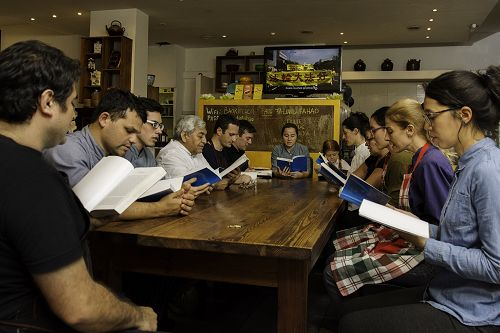

图4：餐馆的员工每天一起学《转法轮》

师父在《转法轮》中说：“这些职工学了你们法轮大法之后，早来晚走，兢兢业业的干活，领导分派什么活儿从来不挑，在利益上也不去争了。他们这样一做，把整个厂的精神面貌全部带起来了，厂子经济效益也好了。你们这功这么厉害，你们老师什么时候来，我也去参加。”

我们体会到，因为有大法修炼原则做指导，促进了我们的身心不断提升，也促进了我们的精神文明状况。我们还在修炼中，有很多执着和缺点要改进、修去。但有大法的原则做指导，在发生冲突时，我们要向内看，并向所有人生出善念；而且我们明白自己是法轮大法修炼者，我们所做的一切都试图用纯洁正直的心去做。餐厅的每位员工都全力投入到自己的工作中，无论他们是洗盘子，准备食物，烹饪还是服务。我们每个人都想通过这个餐厅的工作，让更多人了解大法的真相。谢谢师父给我们这个机会！

<h1 align="center"><b>阴霾下的苦难岁月</b></h1>
【明慧网二零一七年十一月七日】在现代文明包装的今天中国社会，高楼林立，街道宽阔，灯火通明，昼夜难分，在这一片繁荣的景象下，每天却在发生着与其格格不入的事情，甚至是非常粗暴野蛮的行为，而这种粗暴野蛮的行为却是一群“政府工作人员”冠冕堂皇地干的，任何想揭开事件真相使其行为暴露在光天化日之下，都会被行恶者们作为触犯法律的借口，使真相一直被掩盖着。
二零一七年九月二十六日下午，河北省雄县公安局国保大队正副大队长的郭军学、张保中带领十几个警察突然闯入善良妇女杜贺先租住的院落，不由分说的把杜贺先和她妹妹杜爱仙的胳膊和双手反铐到身后，架上一辆警车，直接把姐妹俩劫持到距雄县县城二十多里外的昝岗镇派出所非法拘禁和审讯，把杜贺先按在地上拍照并强制按手印。杜贺先被郭军学等人劫持到位于保定市看守所非法关押至今。

四十多岁的杜贺先女士被绑架后，一直绝食抗议迫害，现在已经三十多天，身体已经非常虚弱。在此期间，家属多次到国保队找郭军学要人，而郭军学却以各种理由推脱，而且说自己做不了主。

杜贺先（杜贺仙），婆家是雄县雄州镇古庄头村，娘家是西侯留村，在江泽民发动的这场对修炼“真善忍”法轮大法的群众的迫害运动中，像杜贺先这样被迫害的好人，可以说是千千万万。事实上，修炼法轮大法、按照“真善忍”做好人，不仅是合法的，而且应该受到表彰；法轮功学员根本就不应被抓、被关押。法轮大法是佛法修炼，教人以真善忍为准则修心向善，福益家庭社会，提升大众道德，在短短的十几年已传播到全球一百多个国家和地区，吸引了各个民族，各种肤色的人。

中共江泽民集团对修炼“真、善、忍”的法轮功学员的迫害，颠倒了所有的是非善恶，败坏了社会道德，同时也使中国的法制越发黑暗，给中国社会带来了无法估量的损失，给中华民族带来了无法弥补的灾难，给中国人民造成了无法愈合的伤痛，今日中国“假、恶、斗”遍地，道德沦丧，贪污腐败，就可以看出来。所有的中国人都是这场迫害的受害者。试想一想：不让做好人、做好人遭受迫害的社会，可不可怕？你愿意你的孩子生活在那样的阴霾社会吗？

以下就是杜贺先女士曾经自述她一家的遭遇：

我们家因修炼了法轮大法受益，一个曾面临家破人亡的家庭，重拾幸福。可是由于一九九九年七月，江泽民发起的这场对法轮功的迫害运动，使我们本应幸福的家庭，又陷入了长期被江泽民邪恶集团残酷迫害的苦难人生。

<b>一、法轮大法救一个面临家破人亡的家庭</b>

我的生母在我十七岁时自杀身亡，我在家里是长女，只好辍学。母亲自杀的阴影一直笼罩着我们全家，我和妹妹弟弟都在思想中深受其影响，一有过不去的事就想到自杀，妹妹更是严重。后来继母到了我们家，虽然继母人很开通，对我们也不错，但因与父亲不合经常吵架。那时真是三天一小吵，五天一大吵，还经常闹离婚甚至闹自杀。他们俩人更是病魔缠身，天天不是这个药，就是那个药。妹妹也曾因这个家庭压力，轻生喝了三次安眠药，真是家无宁日苦不堪言。

我二十一岁时与丈夫认识，当时就想快点结婚吧，快些离开这个家。二十二岁时我结了婚，婚后的几年里，丈夫因为年轻好玩，经常夜不归宿，为此我们夫妻经常闹矛盾。因为夫妻不和，心中非常苦恼，自杀的念头时常泛起，可是面对幼小的孩子也只好作罢。

一九九六年，当家人向我介绍法轮功时，告诉我是修真、善、忍的，我当时就想，只要修了真、善、忍不打架，家庭和睦就好啊，为此我修炼了法轮功。自修炼以后，我学会了忍让，当丈夫发脾气的时候，我不和他争吵，等他平静下来的时候，我再和他讲道理。丈夫和我说话总带“妈的”、“妈的”的口头语，为此我时常气不过，多次为此吵架争执，他也不改。修炼后，我不再和他计较，心里平衡了。不知什么时候我发现丈夫的毛病也改了。

更可喜的是，由于父亲、继母、妹妹、弟弟都修炼了法轮功，我的娘家也安定了。我们都学会了为别人着想，继母和父亲不吵架了，二老的身体也无病一身轻了。妹妹也明白了，此后不再做自杀的傻事了。

弟弟修炼了一段时间后，跟我们说起了他以前的一段往事。他曾患过象牛皮癣一样的病，从手上不断扩延到手腕，几次跟父亲、继母和我说过，但是家里整天吵架，没有人理会，他非常伤心。后来两个大腿间都长满了癣，那时他十五、六岁正上初中，正是要好的年龄，由此他产生了轻生的念头。后来他和家里人一起修炼了法轮功，不知不觉中牛皮癣消失了，这使他非常高兴，才和我们提起这件事。

当时听了弟弟的叙述我感到非常后怕，猛然想起弟弟在夏天无论多热都穿着长裤，那时我还取笑他：这不是傻呀，大热天还穿着长裤。而他总是一句话不说，不做任何解释，原来是这么回事呀。后怕之余我又无比的庆幸，幸亏修炼了法轮大法啊，我们全家人都知道是法轮大法救了我们这个几乎面临家破人亡的家。我们一家人沐浴在法轮大法的恩泽中，幸福的生活着。

<b>二、坚持修大法做好人　一家人遭受严重迫害</b>

可是自从一九九九年七月，江泽民利用中共的权力，利用政治、经济、军事、政法、宣传、外交等国家的权力，利用法律之外的“六一零”非法组织，疯狂迫害法轮功，导致近一亿人遭受了不同程度的迫害。我们家也未能幸免，我和继母、妹妹都遭受了严酷的迫害，对我家人、我娘家人都造成了严重的伤害。

下面就我自身遭受的迫害做一简要叙述。

一九九九年十月十五日，作为受益于法轮功的我和继母、妹妹，为了给法轮功说一句公道话，我们一起去了北京上访，我们想这是任何一个有良心的中国人都应该做的。谁知到了天安门，只因我们是修炼法轮功的就被北京便衣绑架，当时我们被非法关押在丰台体育馆。后来我们被劫持回雄县当地看守所，遭非法拘禁。当时的政保科长是赵××（现已退休），非法审讯我的是公安雇用的无业游民沈刚毅，他当众打了我几个嘴巴子，拿走了我身上所有的钱。他们还抄了我的家，没有任何法律手续，就这样我被非法拘禁一年零一个月。当时我的儿子只有六岁，被非法拘押前从未离开过我，孩子突然失去母爱，对他幼小的心灵造成了极大的伤害。由于江泽民迫害法轮功制造的全国恐怖气氛，加上世人受电视宣传毒害后对法轮功的歧视，给丈夫造成无形的压力，他只得带着孩子在我娘家居住，由孩子的姥爷照看。

当时由于继母和妹妹也都被非法关押，我娘家剩下的全是男人。他们经常苦笑道：一家大小七个光棍。（当时三姨也被抓，三姨夫也在我们家，外地的二姨夫也出差在我家，加上父亲、弟弟、小弟、丈夫、儿子七个男人）。父亲同时承受着妻离子散的痛苦，父亲无法安心出差，丈夫更是为了我能早些出来，花钱托关系，县委、公安局两边跑，这种苦难的日子他们过了一年多。我出来时家属还被雄县公安局政保科勒索了二千元钱，当时收款的人是政保科的赵大平。

出来后，日子过的并不安稳，每到中共开两会、“四二五”、“五一三”、“十月一”等敏感日，雄县“六一零”、公安局、十里铺派出所、城关镇政府、村委会人员就到我家骚扰。

二零零零年的一天，我在家中被突如其来的政保科警察绑架，还被非法抄走大法书籍，那次我绝食绝水抗议，三天后被释放。丈夫怕我再被绑架，给了当时的政保科长杨晓同五百元钱。同年五月十三日夜里，政保科人员又到我家绑架我，这次由于我事先走脱，他们未能得逞。

二零零一年四二五前夕，我在娘家住着又突遭绑架，他们抢走我的大法书，把我非法关在政保科一夜，次日把我送往当地的葛各庄洗脑班。当时的政保科长是杨晓同，洗脑班的主任就是当时在雄县检察院任职的邢凤军。

那个洗脑班的所谓“管教”人员几乎个个流氓成性，他们殴打法轮功学员，逼迫学员骂师父骂大法；敲诈勒索学员家属；扒光女学员的衣服殴打谩骂；用钳子夹妇女乳头；用电棍电击；用胶皮棍子抽打学员致使臀部腰部一片黑紫色；连续抽打嘴巴致使脸部青肿牙龈出血；多次拳打脚踢把学员打昏死过去，再用凉水泼醒过来；用香烟烧脚面；脚不沾地吊在大门上数小时；把笤帚棍放在地上强迫学员跪在上面，再用脚使劲踩背使两膝盖疼痛难忍。

更令人不能容忍的是，他们其中的三人多次对未婚的女学员实施性骚扰，口出污言秽语，甚至口出狂言：我即使强奸了你，你也告不了。这就是江泽民邪恶集团所利用来维持迫害的人。他们的道德标准在哪里？！真不知道他们要把法轮功学员转化成什么样，难道转化成象他们一样吗？在洗脑班里他们不让我穿鞋，把我用手铐铐在房廊的大柱子上。为了抗议迫害，我绝食绝水五天，他们仍不放人，后来我拼命逃出魔窟。（至今那些人也想不到我能翻过那么高的墙）从此开始了长达八个月有家难回、流离失所的日子。

二零零二年五月十三日在流离失所期间，我到北京为法轮功申冤，在北京天安门门洞，被北京警察强行绑架，后被绑架到大概是北京房山一派出所。因为人生地不熟不知道准确地址，那里的警察对我刑讯逼供，夜里他们三四个警察围着我，其中一个裸露着上身，坐在椅子上，把双腿担在我的肩上，戏弄我。他们用电棍电击我，主要电击我的脖子和前胸。就这样我被整整折磨了一夜，脖子上的皮都电击焦了，里面的肉都露出来了。次日他们才把我送到房山看守所，三天后，那里的看守人员看我伤情严重，通知派出所把我接出来，他们把我带到等公共汽车的路上，让我自己坐车回家。看守人员归还了扣押我的一百多元钱，当时我也没看就装进兜里，坐车时才发现里面有一张五十的假币。

二零零三年五月二十四日，我正在娘家居住，中午时分雄县公安局政保科长苏士亮、警察赵大平等闯进我家，不由分说要绑架我，我以死抗争才使他们退去，但是我的大法书被他们抢走，而且偷走存款两千余元。

二零零六年十月十日，我和同修王小书一起，与被保定劳教所关押的一同修的家属，到保定劳教所去看望被关押的同修。劳教所不让我和王小书进去，我们只得在外等候，却被早已布置好的保定南市区公安局警察绑架，当时的主谋是政保科长王振友。他们三次强制搜我的身，抢走我身上带的一千多元钱，未出具任何手续。次日我们被关到保定看守所，在那里我绝食绝水抗议迫害，在看守人员的示意下，犯人捏着我的鼻子给我灌食，晚上值班时轮班看着我不让我睡觉。那次我被非法关押了十九天，后被劳教。十月二十八日被送至保定劳教所，因不符合收监标准才被放回。那次家人为这事被他们勒索了两万多元。

<b>三、阳光必将刺透阴霾</b>

一个有良知的律师在辩护词里写道：“法轮功从传播以来，尤其是从被非法打压后，真实的坚守着真善忍的理念，展现着超越守法之上的道德标准，十七年来虽然面对侮辱嘲笑冤狱酷刑，他们坚持怀抱善意，承受着漫长而巨大的苦难，按照真，他们揭示讲述着真相，按照善，他们惨遭迫害而无怨无恨，希望唤醒世人的良知，拥有美好的未来，按照忍，他们忍受着苦难，割舍个人的所求所得，坚守着和平，理性，他们忍的坚强不屈，无所畏惧。他们相信正义真理必胜，十七年来从来没有以暴易暴、以怨抱怨，全国没有发生过一起法轮功学员因遭受迫害与不公而采用暴力或非法手段鸣冤雪耻的事件，这是一种怎样的舍身救世精神，这是一种怎样的大慈大悲情怀？所展现出的境界甚至已被看作中华复兴，道德回升的希望。定罪这样的好人，打压真善忍信仰，就是无视自己的良知，在摧毁人类的普世价值，毁我道德，毁我美好，毁我希望！”

杜贺先女士说：“在这么多次的迫害中，当我和家属质问那些执行迫害的人：我们也没犯法为什么非法抓人？他们回答最多的就是：上边让我们干，我们也没有办法。这个“上边”是谁？

“这一次次的迫害，作为修炼人我都能忍受，痛心的是家人在这场迫害运动中，他们整天为了亲人的安危担惊受怕，经济上遭受着巨大损失，精神上遭受着痛苦折磨，为了我的安全，直到现在都不敢在朋友、亲戚间公开我法轮功学员的身份。所以我一定要控告江泽民这个罪魁祸首，把其绳之以法，彻底结束这场迫害。

“我要告江泽民不只是因为我个人所遭受的迫害，告他的另一个重要原因是：这个恶徒让我们伟大的中华民族陷入了巨大的危难，让可贵的中国人出现了前所未有的道德危机。对“真、善、忍”的打压所引发的道德崩溃，直接使整个社会在混乱与动荡中沦陷。中国人每日被毒奶粉、毒大米、地沟油、假货假药、废水雾霾包围，而这一切的根源就是人类道德的沦丧。而这场迫害运动十八年来打压着修心向善的好人，同时不可避免的、极大的助长着、放纵着人的私欲、野蛮、残暴、无人性。”

二零一五年五月以来，中国大陆法轮功学员发起了控告江泽民的大潮，目前已有二十多万法轮功修炼者和家人把控告元凶江泽民的刑事控告状邮寄给中国最高检察院，要求最高检察院向最高法院对江泽民提出公诉，把这个首恶绳之以法。法轮功学员诉江，不仅是作为受害者讨还公道，也是在匡扶社会正义，维护所有中国人的做好人的权利。

在第二次世界大战结束后的纽伦堡国际军事法庭上，除第一轮对级别高的战犯审判外，在以后举行的十二轮审判中，主要起诉的是为德国纳粹帮凶的企业家、军事人员、集中营看守、医生等等，一些被强迫执行纳粹命令的人员也被判了绞刑。当年希特勒罪恶政策的执行者、帮凶无一能幸免，而且漏网者被终生通缉。历史启示人们：执行命令决不会成为犯法逃脱惩罚的借口，哪怕是上级命令，你也决不要触犯法律！

联想到现在，有些执法、犯法人员在迫害法轮功学员时想的或说的一句托词：“执行上级命令”或“为了工作”等，显得多么苍白无力和没有法律依据。如还不悬崖勒马，当正义回归、报应来时，等待他们的也将是可悲、可耻的下场。正义必将战胜邪恶，正如阳光必将刺透阴霾。

【明慧网二零一八年五月十二日】二零一八年五月一日，俄罗斯沃龙佐夫卡镇（Vorontsovka）的公园里，当地法轮功学员举办活动，向民众介绍以真、善、忍为修炼原则的法轮功，并讲述十九年来中共对法轮功学员的残酷迫害事实。
不少人表示对在中国发生的迫害感到震惊，同时也感谢学员把法轮功介绍给了他们。

<h1 align="center"><b>俄罗斯民众：这种迫害不应该发生在地球上</b></h1>

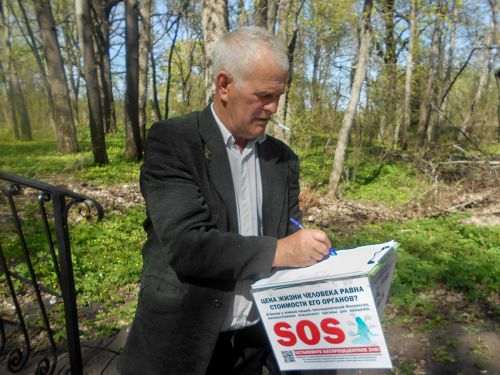

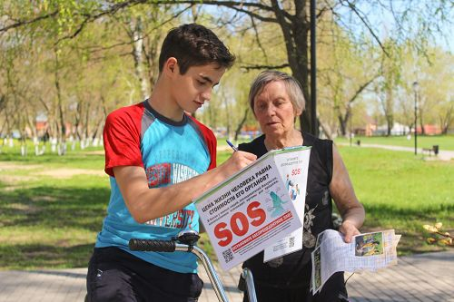

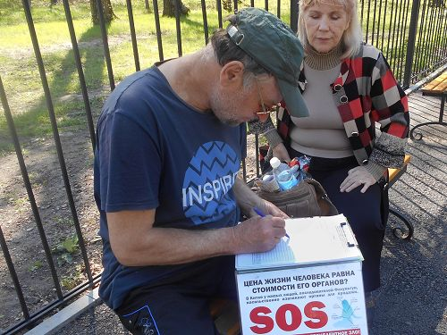

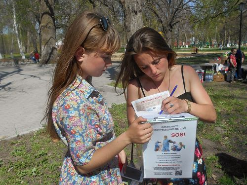

图1~4：俄罗斯沃龙佐夫卡镇（Vorontsovka）的公园里，民众签名谴责中共迫害法轮功。

一位家住沃龙佐夫卡镇的男士听了学员的讲述后，对于修炼法轮功让人身体健康，而且免费教功感到很吃惊。他一开始不敢相信这是真的，说：“在我们这个时代，没有任何免费的。”随着学员的进一步介绍，他对法轮功产生了浓厚的兴趣，拿了传单阅读，想要更好地了解一下这个“不一般”的功法。

一对退休夫妇对如何通过炼功强身健体很感兴趣，提出了很多问题。学员耐心解答后，他们表示感谢，并且说回家后要仔细阅读资料。

名叫尼基塔（Nikita）的男孩，家住沃罗涅日市（Voronezh），在公园里骑自行车的时候看到了学员，他停下车想听听他们在讲什么。了解到在中国发生的对法轮功学员的迫害，甚至中共活摘他们的器官贩卖后，尼基塔毫不犹豫地签名反迫害。

一对夫妇也对中共暴行感到难以置信：“在我们这个时代竟能发生这样的事情。”他们想要帮助法轮功学员，签名制止中共活摘器官后，拿了传单，要更详细了解真相。

还有民众表示已经知道了在中国的迫害，想要帮助制止邪恶。一个年轻的女孩签名后说：“这种迫害不应该发生在地球上。”

<h1 align="center"><b>从古代暴君“射天”看当今中共“拜魔”</b></h1>

【明慧网二零一八年五月二十九日】中国古人“每事俱是敬天畏天”，对于“射天”，别说去做，仅只想一想都是对上天的大不敬。但《史记》中的确记载了两个暴虐的古代国君“射天”的故事。一个是商纣王的父亲帝乙（武乙）因射天被暴雷震死；一个是战国时宋国最后一个国君宋康王，他因射天最终身死国灭。司马迁对两个故事的描述都比较简略，明清小说以演义的形式对故事内容加以充实，申明善恶之报如影随形的规律，以劝善止恶。

<b>武乙因射天被暴雷震死</b>
 

武乙即位时，东部和北部的少数民族频繁侵扰，人民不胜其苦，武乙不去征讨，也不整饬朝纲，是个昏君。

武乙无道，群臣有谈及敬天劝民者，他哑然笑道：“我使唤我的百姓，他们就该拥戴我，我随便可以决定他们的生死。你说敬天，我乃天子，天下只有我一人为尊。我听说有天神，天神那么多，难道个个都比我强？超过我的，不过只一个玉帝。”群臣道：“先王成汤有云：‘肆台小子将天命明威’，又曰：‘敢昭告于上天神后，每事俱是敬天畏天。’”武乙又哑然笑道：“你们都说我应敬天，天神一定是有思维的，手段也必高过我，我与天神比试手段，让你们百官看看我的能耐。”

武乙于是命匠人造一木偶人，高八尺，穿上衣服，抬到殿上。叫内官捧过赌博用的双陆盘来，命一内臣代替天神赌输赢。武乙仰天道：“你是天神，手段必然高过我。你要是赌赢了，是你天神高过我。若赌输了，是你输给我，还得算我厉害，你也得听我号令。”于是，武乙与那木偶“天神”赌了几局，“天神”果然输了。武乙令代天神赌博的内臣跪在阶下，道：“你是天神，毕竟有天大的手段，一个小小双陆儿都比不过我，枉作天神。”喝令斩首。内臣闻说将他斩首，大呼：“我不是天神，王命我替天神赌博，为何杀我？”武乙笑曰：“你代他赌，你便是天神一路人。天神保护你，那一定杀不死你。”内臣又呼曰：“世上哪有杀不死的人？”武乙不听，喝令武士把那个内臣推出朝门斩了。

武乙又问群臣：“你们看到天神了吗？”群臣都低首不言。武乙道：“你们都亲眼看到天神比不过我，被我杀戮羞辱，你们还不承认！”喝令武士每人赏他一下铜锤。群臣大惊，一齐跪下，道：“王胜天。”武乙大悦。

武乙又琢磨弄个手段欺瞒众人，显示他的本事。于是密令一内臣作一薄薄皮囊，囊内盛猪羊等血，造下两个白罗鹞风筝绑在皮囊两边。风筝系两条白绢绳，命内臣藏在高台上，将风筝乘风夹皮囊吹上空中。那白罗鹞风筝在空中与白云无异，地上的人看不见皮囊。武乙对群臣道：“我前日与天神赌博，天神不胜我，杀的还只是替身内官，不稀罕。如今我要射天，怎么样？”群臣又低头不言。

武乙见群臣不言，大怒道：“你们与我作对，偏袒天神是不是？我便射两箭给你们看看。”于是朝着皮囊，连发三箭。箭穿囊破，只见空中有血滴下地来。武乙大呼：“手段如何？这天却不被我射出血了。古来至今有我这等威武的吗？”群臣中也有一分晓得的，暗地叫声“欺天无道”。那不晓得的，唬得遍身汗流，思量：“难道真有过往的天神中了箭？”

武乙见群臣惊疑，怕看出他伎俩，即发驾回朝。道：“汝众人乃凡夫俗子，看不见天神；惟朕看得出，所以认定射之矣。”

人间私语，天闻若雷；暗室亏心，神目如电。更何况武乙如此狂悖射天杀神，哪能没有报应？

城隍土地见武乙如此邪恶，立即报告天帝，天帝大怒，即令五方蛮雷速速击死武乙。

一天，武乙带文武数十员、军校数千人，架弓搭箭，驱犬放鹰大猎于河渭之间。那五方蛮雷领了玉帝旨意，早同风伯、电母待武乙来于渭水之阳。武乙正于河渭驱鹰捉兔，天正时午，丽日当空。忽然天上阴云布合，狂风骤起，电闪雷鸣。武乙在马上坐不稳，猛听得半空一声霹雳，武乙翻身落马。空中有人道：“武乙逆天罪大，死于非命。”半晌，云敛风和，天气清朗。众文武定睛看时，但见武乙头发散乱，被雷震死，跪在沙滩。背上有硃批十六个字：

侮弄天神，污血射空。法犯雷震，永堕阴中。

众臣看见，各皆大惊，正欲收尸归葬，雷又大作，众臣骇散，复批十六字云：

天地无私，报应分明。示众三日，方许殓殡。

众臣见天雷批示，不敢有违，只候至第三日，同太子太丁收尸回宫殡葬。武乙在位四年，而被雷震死。时人都道射天者惟武乙，故雷之震死者，亦惟武乙。

<b>宋康王射天，灭国亡身</b>
 

宋康王名偃。生有异相，身长九尺四寸，面阔一尺三寸，目如巨星，面有神光，力能屈伸铁钩，于周显王四十一年，逐其兄剔成而自立。

立十一年，国人探雀巢，得卵已破壳，中有小鹯，以为异事，献于君偃。偃召太史占之，太史卜卦后奏曰：“小而生大，此反弱为强，崛起霸王之象。”偃喜曰：“宋太弱了，寡人不兴之，更望何人？”乃多选壮丁，亲自训练，得劲兵十万余，东伐齐，取五城；南败楚，拓地三百余里；西又败魏军，取二城；灭滕，占其地。

因遣使通好于秦，秦亦遣使报之，从此宋自称强国，与齐、楚、三晋相并，偃遂称为宋王，自谓天下英雄，无与为比。欲速就霸王之业，每临朝，辄令群臣齐呼万岁，堂上一呼，堂下应之，门外侍卫亦俱应之，声闻数里。

见人尊敬天地，乃以革囊盛牛血，悬于高竿，挽弓射之，弓强矢劲，射透革囊，血雨从空乱洒，使人传言于市曰：“我王射天得胜。”欲使天怕他；又往往拿锤或鞭子打地，欲使地惧他；见人多事鬼神，又焚灭祠庙里的神像，欲使鬼神服他。

又为长夜之饮，以酒强灌群臣，而阴使左右以热水代酒自饮，群臣量素洪者，皆潦倒大醉，不能成礼；惟康王清醒，左右献谀者，皆曰：“君王酒量如海，饮千石不醉也。”

又多取妇人为淫乐，一夜御数十女，使人传言：“宋王精神兼数百人，从不倦怠。”以此自炫。

群臣见宋王暴虐，多有谏者，宋王不胜其冒犯，乃置弓矢于座侧，凡进谏者，辄引弓射之，曾一日间射杀景成、戴乌、公子勃等三人，从此举朝莫敢开口，诸侯号曰“桀宋”，谓其残暴。

齐湣王约楚、魏共攻宋，乃为檄文，列举桀宋十大罪：

一、 逐兄篡位，得国不正；
二、 灭滕兼地，恃强凌弱；
三、 好攻乐战，侵犯大国；
四、 革囊射天，得罪上帝；
五、 长夜酣饮，不恤国政；
六、 夺人妻女，淫荡无耻；
七、 射杀谏臣，忠良结舌；
八、 僭拟王号，妄自尊大；
九、 独媚强秦，结怨邻国；
十、 慢神虐民，全无君道。

经过几番争战，纵然宋王骁勇善战，因其不施善政，百姓不附；不恤士卒，兵心涣散；结果众叛亲离，一败涂地。穷途末路之时，逃至温邑，为追兵所及，宋王自投于神农涧中不死，被军士牵出斩首。齐、楚、魏于是共灭宋国，三分其地。正是：暴虐身应死，射天国必亡。其余还可救，唯此没商量。

<b>中共高层集体拜魔鬼马克思，其鬼话、鬼行、鬼态之邪，不在“射天”之下</b>
 

《共产主义的终极目的》书中称：

共产党杀的是什么？共产党要与天斗，与地斗，与人斗争，所以是杀天、杀地、杀人。

杀天——以“无神论”的名义杀掉对神佛的信仰，为“无神论”开道；

杀地——以改造山河的名义践踏自然，破坏环境，实践“无神论”无法无天的“大无畏”；

杀人——杀同党，把满足不了党邪恶要求的成员清洗掉，以强化提炼党性的邪恶；有针对性地杀精英，杀掉那些对实施邪灵计划有阻碍的人，包括作为文化传承者的社会精英；漫无目的地滥杀，挑动群众斗群众，为的是营造和维持那个杀气腾腾的恐怖场。

《九评共产党》揭示了共产党的邪教和邪灵本质，《共产主义的终极目的》曝光了马克思成魔之路，并揭示共产主义毁灭人类的终极目的，使百年红魔害人的手段、流程、路线、目的昭然于世，无处遁形。

所谓“法轮功动向”是中共所有敏感神经中绷得最紧的那一根，中共高层一定会在第一时间从“内参”中看到《九评共产党》和《共产主义的终极目的》。对于这两本奇书，作为个体党员来言，可能有善的、正面的回应，也可能有恶的、负面的回应。但作为中共组织而言，它的回应一定是恶的、负面的。祭拜马克思应劫而生200周年，就是在马教义这滩冰冷的死灰中再次煽动阴风邪火，无疑是中共对《共产主义的终极目的》一书最恶毒的回应。对于看过《九评共产党》了解真相的人而言，中共拜魔只是一场丑恶的闹剧，但是对于多年封闭信息环境下被中共洗脑的人而言，这种拜魔导向会使他们更加不分善恶难辨是非。在未来天灭红魔的那一霎那，他们的处境是最让人担忧的。

相较于古代暴君“射天”之恶，中共拜魔之邪更应促使世人在沉沦中警醒：

其一，暴君射天是个人轻狂暴虐的行为，中共拜魔是集体躁狂，并极力将此躁狂传染给全人类，裹胁式迫使每个人对其鬼话、鬼行、鬼态主动拥护或被动附和。

其二，暴君射天至少承认宇宙间有天神的存在，中共拜魔鼓吹无神，是连天神存在本身都否定的，拜魔与否定天神之间，是互为因果的关系。

其三，暴君射天至少是出自其个人对人神较量的主观判断，尽管这种判断是骄狂自负的，而中共参与拜魔者个体是连马克思的歪理邪说本身内容是什么都不愿去琢磨判断的，是把拜魔形式当咒语、保佑其邪恶政权继续大行其道而已。

其四，射天是暴君对其个人能力的炫耀，中共拜魔表达的则是权欲熏心者对暴力和谎言的痴迷，和对失去权力的恐惧，其表面的高喊自信恰恰呼应其内心的真实怯懦。

其五，射天是暴君一时一事的恶行，拜魔者却牵连到一千年前的古人，痛恨古人不“杀天”（即所谓“马克思是千年第一思想家”）；发誓沿拜魔的邪路走到底（十八大报告中的原话“绝不走改弦更张的邪路”，其本义即“走绝不改弦更张的邪路”）。

其六，暴君射天，其报应只落在暴君个人身上，而中共拜魔，在红朝解体的时候，报应会落在每个曾经发誓拜红魔的个体身上。中共几十年洗脑宣传，流毒广布，受蛊惑利诱者何其多也！

愿包括拜魔者个体在内的每个有缘人都能，看清中共拜魔之丑之恶之邪之毒，快看《共产主义的终极目的》，快快三退，天灭红魔时千万不要做它的陪葬！

<h1 align="center"><b>澳洲女子的神奇“减肥”经历 5个月70斤</b></h1>

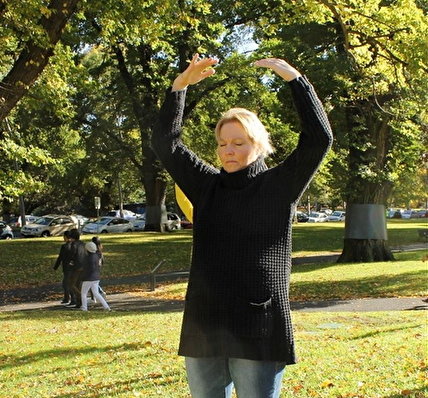

澳洲墨尔本的50岁西人女士贝克（Geraldine Beck）（明慧网）

【大纪元2018年05月27日讯】一位四个孩子的澳洲母亲，在日常食量增加的情况下，220斤的体重在5个月内减少了70多斤；严重车祸后，原本极度紧张、几乎无法独自驾车，但两个月后，摆脱这一心理障碍；困扰了大半生、无法控制的焦虑紧张感消失了；她罹患失读症的女儿，从易怒、自我隔离、学习困难，变得开朗自信、朋友增多；平均一年需要四次叫救护车急救的丈夫，不再需要注射毒副作用大、控制I型糖尿病的药物了……

这些脱胎换骨般的变化，令墨尔本的50岁西人女士贝克（Geraldine Beck）和家人震撼和欣喜。这些奇迹般的巨变，发生在一年半前。她说，“我的生活好像才刚刚开始。”

<b>充满焦虑的中学时代</b>
 
从中学时代起，贝克经常陷入抑郁和消沉的困境。“那时起，我经常琢磨，人活着到底为了什么。”她说，“中学毕业，我和丈夫组建家庭，建造了我们自己的房子。我们生活得舒适，但这让我觉得空虚，变得牢骚满腹，我把所有的业余时间都花在读言情小说上。有了孩子之后，我的身体亮了红灯，于是我又开始寻找人生的意义和目地。”

贝克的情绪变得时好时坏，短暂的满足后仍然感觉自己很肤浅。这期间，她尝试过许多次严格的减肥食谱，但总是难以维持就放弃了，减肥和增重的过程不断重复，导致抑郁症卷土重来，她觉得当时自己整个人都精疲力尽。

“如果周围有其他人，我总感到忧虑和紧张，觉得难以控制自己的意识，即使是父亲和兄弟。又因为害怕在工作中出错，我会非常非常紧张，以至于脑子一片空白。”

“很多年，我的体重过重，每次严格节制饮食几个月后，坚持不下去放弃，体重又回来了，不仅如此，还再增加10公斤。就这样不断重复著这个周期，直到2016年底，体重达到110公斤左右。”

“我的自信心快没了，感到自己恐怕已经没救了。”她说。

<b>严重车祸后的转机</b>
 
2015年8月，贝克遭遇严重车祸，车子被撞毁了。“我没有受伤，但极度紧张，以至于事后对大概前后7个小时内的经历、当时都发生了什么，都没有任何记忆。”

车祸后，驾照被吊销12个月，“这个车祸对我接下来一年的生活影响巨大。将近12个月，我都感到心情沉重，整个人的状态很不正常。”她回忆说。

驾照恢复后，贝克也无法独自驾车。“我几乎不能开车上路。因为如果是独自开车，我无法控制自己的紧张情绪，非常危险。”她说。

一个多年要好的朋友、丈夫的同事，在修炼了一段时间法轮功之后，得知贝克的情况，推荐她上网观看法轮功创始人李洪志先生的九天班讲法录像，她立即照办了。

“我每天看一讲，连续看了九天。”她说，“看完九讲，我顿时感到轻松愉悦，真的很美妙。”法轮功以“真、善、忍”为原则，包括五套功法，洪传世界120多个国家。

“之后我开始学炼五套功法，并且每天阅读《转法轮》（法轮功主要书籍），渐渐能控制自己的情绪，原先失衡的状态消失了，生活恢复了正常。”

“两个月后，我开始参加集体炼功，结果奇迹般地彻底摆脱紧张和焦虑的情绪，能轻松独自驾车了。而且，在接下来的5个月，体重也自然减轻了72斤。我没有刻意减肥，只是三餐注重营养均衡而已，食量比以前还大一些，但体重就这样恢复了正常 。父亲看到我的变化非常高兴 。”

“我也能轻松做家务了。以前做一点点事情都需要很费劲才能完成，而现在，我有足够的力气把家务事做得很好，再也不觉得累，这一点感受太深了。过去我每晚要睡9-10个小时，现在只需要5个小时。”

“孩子们对我的变化也是非常非常开心，他们现在有了一个活力四射的妈妈、更健康的三餐和干净整洁的家。”贝克难掩欣喜地说。

<b>丈夫摆脱睡眠危险</b>
 
奇迹般的变化，也发生在贝克尚未修炼法轮功的丈夫和不定期阅读《转法轮》的女儿身上。

“我丈夫有I型糖尿病，每天要注射三次胰岛素。过去，他每天睡觉时，总面临失去意识的危险。我需要叫他起床，如果血糖太低，就给他注射。”但还是会发生危险，她说：“每年平均有4次，我不得不因为他失去意识而叫救护车 。过多的药物对他的肾脏损害很大。”

“一人炼功，全家受益。”法轮功创始人李洪志先生讲， “在你的场范围之内的人可能无意中你就给他调了身体，因为这种场可以纠正一切不正确状态。” 贝克的丈夫和女儿也亲身体验到了法轮大法的神奇。

“在我开始阅读《转法轮》之后，他的身体状况也改善了，我不再需要给他额外注射，而且，过去一年多，他在家里，再也没有发生一次失去意识的危险情况 。”

“他明显感觉到自己的变化，也看到我的巨变，所以他也很支持我修炼。”贝克说。

<b>判若两人的女儿</b>
 
“我有四个孩子，两男两女。其中大女儿在学校学习很吃力，这造成她极度不自信，脾气也很暴躁，不合群，没有朋友。”

“后来，我们意识到这不正常，带她看了医生，确诊为读写困难（也称失读症）。”

贝克说：“在我开始阅读《转法轮》之前，每天晚上让她按时睡觉非常困难，而且，她总是不想去上学，我感到束手无策。”

但这一切，在一年多前也彻底改变了。

“一天，她感到很焦虑，那时她看到我在阅读《转法轮》，就坐下来和我一起读，仅仅4-5分钟后，她发现焦虑消失了。此后，她就不定期地和我一起阅读，每次时间都不长，但这彻底改变了她的精神状态。”

贝克接着说：“她对自己的评价开始正面起来，内心感到快乐，她的朋友圈和自信心都戏剧性地增加。她再也不害怕向别人求助，也不再感到沮丧。现在，她在中学里有很多要好的朋友了，成了一个开心的孩子。我们没有给她吃治疗失读症的任何药物，但她和12个月前判若两人。”

<b>感恩李洪志大师</b>
 
如今的贝克，在丈夫和孩子们眼里，开朗精干、活力四射，她说：“通过修炼，我觉得浑身很有劲，内心充实、开朗而平静，能够坦然面对各种疑难问题，甚至自己可以解决，这是我之前从来没有体验过的。”

她说：“我花了不短的时间，才学会向内找，才开始真正明白什么是修炼。现在，我不再将生活中的小磨难看作普通的事情，或者通过暴饮暴食来逃避生活，因为我明白，这些磨难都是能让我找到自己的不同执著的珍贵时机。”

“我体悟到，李洪志师父慈悲地一步一步地指导我的修炼，以及在日常生活中处理与周围人的关系时，不断展现和启悟我对‘真善忍’原则的从浅到深的理解。”

作为一名法轮功新学员，贝克内心充满感恩，她表示：“师尊给予我生命的巨大恩赐，我的生活好像才刚刚开始。而这就是我梦寐以求的生活，人生有目地、有方向，更重要的是，我还有一个师父在随时支持着我。”

<h1 align="center"><b>恻隐与冷漠</b></h1>

【明慧网二零一八年五月十七日】在孟子看来，“恻隐之心，人皆有之”，也就是：悲悯同情是人类的普世价值。当别人遇到灾难、冤屈、不幸时，其实也同样在考量着我们的良知。此时是心生怜惜，尽力帮助，还是幸灾乐祸，落井下石。我们如何对待他人，上天也就如何待我们。
欧阳修在《泷岗阡表》中记述母亲对他回忆他父亲欧阳观主管刑狱工作时，烛光下办案的情景。“汝父为吏，尝夜烛治官书，屡废而叹。吾问之，则曰：‘此死狱也，我求其生不得尔。’吾曰：‘生可求乎？’曰：‘求其生而不得，则死者与我皆无恨也，矧求而有得邪？以其有得，则知不求而死者有恨也。夫常求其生犹失之死，而世常求其死也。’”

欧阳观慎刑轻刑的判案理念，清廉公正的司法操守，皆源于其内心的恻隐悲悯。他一再为将死之人寻找活路生机，既是对他人生命的尊重，对国家法律的敬畏，也是对自己的负责。他的认真与努力，他的寻求与慨叹，有时并不能救活人命，而他的善心善举，已经感天动地，而且泽被后世。儿子欧阳修考中进士，还先后任翰林学士、史馆修撰等职，著作等身，留名千古。

当日月穿梭过千年岁月，谨慎刑狱的思维也深入人心了吧。可惜的是，我们今天看到的是：从中共一九九九年迫害法轮功以来，一些司法工作者不再珍惜生命，沦为了中共践踏人权的帮凶。

李秀丽，曾任内蒙古赤峰元宝山区检察院侦查监督科科长，负责承办对公安机关等部门提请批准逮捕的案件审查决定是否逮捕等工作。十几年来元宝山区公安局对法轮功学员的构陷案件上报检察院以后，李秀丽一律给定性为刑事案件而下达准予逮捕的批示。李秀丽任职期间，至少对三十二名元宝山区的法轮功学员非法下达逮捕令，致使三十多名法轮功学员被非法判刑，好人锒铛入狱，成为阶下囚徒。二零一七年十一月，四十八岁的李秀丽在检察院楼道内倒地而亡。

李秀丽中年猝死，对于她的家庭是莫大的悲哀和伤痛。然而这悲哀和伤痛缘何而来？当然，首先是中共的迫害政策，是违法违宪的，把她捆绑入迫害的链条。而作为李秀丽本人，她自身有没有责任呢？首先，信仰自由是受法律保护而不应该受迫害的，法律专业毕业的她是心知肚明的；其次，人命关天，公正执法，不能昧着良心作案件审查，工作多年的她也是心中有数的；利人利己，害人害己，不能趋炎附势，落井下石，聪明伶俐的她也是清楚明白。

可惜的是，李秀丽追随中共的政策，丧失了内心的恻隐，变成了冷漠无情的中共傀儡。心田没有了悲悯仁慈，也就没有了道德的标尺，没有了人生的方向，行为就不辨正邪、不分善恶、没有良知、丧失信义。这样的生命堕落为中共的犬儒，中共说抓谁，他们不问对错，就大肆抓捕；中共说谁有罪，他们不分善恶，还罪加三等。

李秀丽与法轮功学员无冤无仇，或许她不是故意伤害修炼者，可她没有利用她手中的权力为法轮功学员说一句公道话，她没有利用自己手中的那只笔画下正义的一笔，她害怕失去身名利益，她不敢秉公执法，她冷漠于别人的冤屈，她完全唯命是从于中共，才使得修炼者的处境雪上加霜。那些经她同意批捕的法轮功修炼者，在她下达逮捕令之后，境遇就更加恶劣悲惨。有的在铁窗中被打伤致残，有的在精神病院被灌食毒药，有的在监牢被凌辱。李秀丽没有用拳头去打人，没有用腿脚去踢打，也没有用嘴巴去咒骂。她可能觉得自己只是在完成她的工作，可是对那些残酷的迫害她能逃脱干系吗？每一个被她批捕的法轮功学员遭受的苦难都与她息息相关，她在迫害中推波逐流，她在参与迫害，她也就是迫害者之一。

善恶有报，如影随形。她必须为自己的行为承担代价。世界上不但有中共的法庭，还有正义的法庭，道德的法庭。所有的罪责都要追究到底，所有的迫害最终都必定受到神的审判。

恻隐与冷漠，人人必须面对，人人必须选择，人人必须作为。在中国，成千上万的法轮功修炼者正在被诋毁、被诬陷、被打压。我们应该做什么，是如欧阳观那样，同情悲悯，伸出援手；还是如李秀丽那样，助纣为虐，为虎作伥。珍惜生命，尊重人权，谨慎作为，就是珍爱自己，珍爱子孙；冷漠蔑视，袖手旁观，趁火打劫，就是作践自己，伤害子孙。

人命关天，悲悯感天，人在做，天在看，神在判。真正从自己做起，心地多一分悲悯，对别人多一份帮助，世界就少一分冤屈，自己也少一分愧疚，社会也才能多一分公正和和谐。

<h1 align="center"><b>流泪的并蒂莲（上）</b></h1>

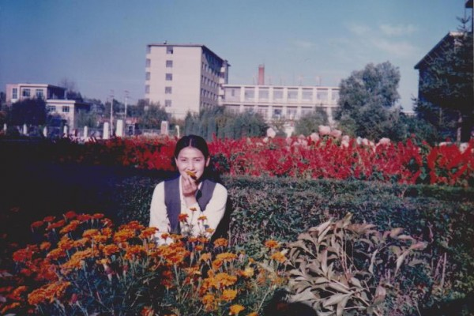

吉林省舒兰市法轮功学员宋冰（明慧网）

【大纪元2016年04月07日讯】2015年6月13日，黄昏，中国吉林省舒兰市北城街道。在一幢普通的住宅楼里，宋彦群静静地躺在床上，目光飘渺。她骨瘦如柴，脸色蜡黄，头发蓬乱。今天，爸爸找人把她从南山看守所背了回来，她终于回家了。室内没有开灯，最后一抹晚霞透过窗子射进来，送来温暖和光亮。宋彦群望着在夕阳中飞舞的灰尘，无力思维。她长吁了一口气，微闭双目。妹妹在哪里？鲜花一般可爱的小妹呢？十六年的悲苦，往事历历在幕。每一个画面都是那样清晰，就好像穿了线的针一样，牵着她的心，一揪一揪地痛。
宋彦群和宋冰是舒兰市北城街道的一对姐妹花。姐姐宋彦群1971年出生，于长春商业高等专科学校国际贸易系毕业后，在哈尔滨大德日语学校任英语教师。她长得白皙俊朗，眉目开阔，一看就是爽朗大方之人。妹妹宋冰1973年出生，毕业于长春邮电学院程控交换专业，在舒兰市电信局工作。她俏丽文静，瓜子脸，高鼻子，乌黑的直发飘逸清纯，人如其名：冰雪聪明。如此优秀的两个女儿，当然是父母的骄傲。家庭的温暖和快乐，如涓涓细流，滋润着生活的温馨。

1996年8月，宋彦群开始修炼法轮大法，按照“真、善、忍”的修炼准则严格要求自己。修炼以后，她的身体更健康了，待人处事更加真诚。从她的变化中，全家人感受到了法轮大法福益社会的威德，于是也陆续走上修炼的道路。

宋彦群的母亲原来有心脏病、肝病、神经衰弱和眼病等，遍求中医、西医，久治无效。1996年在医院因为打错了针而病危在床，当时谁都无计可施，炼功后，这些病很快都不治而愈。是法轮功救了妈妈。1998年，妹妹宋冰接受了髂骨肿瘤的手术后不能行走。修炼法轮功不到一个月，她就能连蹦带跳了。宋冰自此朝气蓬勃，笑逐颜开，事业蒸蒸日上。看到三个亲人的变化，父亲也开始炼功。他不再贪图不义之财，按照大法的要求做好人，做一个道德更高尚的人。全家四口人沐浴在大法的光辉里，体会到了什么是真正的“其乐融融”。对于法轮大法和师父，宋家无以言谢！

但是，乌云忽然来了，暗影笼罩大地。1999年7月20日，江泽民利用国家机器开始了对法轮功的镇压。报纸、电视、广播，全都是诬蔑法轮功的报导。一夜之间，好的被说成了坏的，谎言满天飞。宋彦群和宋冰决定去北京上访，反映他们全家炼功受益的情况。然而，这条路并不畅通。每一次，她们都被警察拦截、非法拘留，再从北京劫持回舒兰市北城。在北京的拘留所，她们被强迫修水泥路、建火化场打地基，要是被警察看见炼功，就会罚蹲墙根，身上的经文也被搜走没收。

从1999年9月到2001年，宋彦群和宋冰经历了许多次非法拘禁，辗转于北京的拘留所、舒兰市南山看守所和长春黑嘴子女子劳教所。被劳教期间，她们整天听着电棍辟里啪啦的电人声和法轮功学员的惨叫声，空气中飘散著皮肉被电糊的味道。从早上5点到晚上11点，她们被强制做奴工。肉体折磨加精神压迫，便是劳教所的转化之道。2001年4月和8月，姐妹俩分别结束了劳教刑期，拖着极度疲惫虚弱的身体回到家中。谁能料想，更大的苦难在等待着她们。

<b>绑架</b>

2003年11月26日晚7点左右，宋彦群要出去打水，她打开房门，“呼啦”一下子，窜上来一帮男人，闯入屋内。原来，那是舒兰街矿派出所的警察，守在外面多时了。他们把宋彦群死死地按在床上，床板“卡嚓”一声就折了。接着，几个人一拥而上，把她摁到海绵垫子里，再用腿狠命地压在她的胸口上，憋得她满脸胀红，喘不上气。同时，房间里的宋冰也被揪住，他们抓着她的头发，把她的两只胳膊反扭到后背，头和脖子卡在沙发撑上。她的身体被扣摁著，既不能喘气又说不出话。眼看人要憋过去了，他们把宋冰翻转过来，宋冰一下子看到了姐姐被人死摁在那里，她使尽全身力气大声地说：“放开她！你们还有没有人性，你们也有兄弟姐妹、妻儿老小，我们不是坏人！我们没有犯罪，你们放开她！你们的兄弟姐妹、妻儿老小被别人这样对待你们忍心吗？放开她！你们放开她！”听见她的喝斥，凶恶的警察们一个个渐渐地平静下来，他们尴尬地互相看着、笑着，把压在宋彦群胸口上的腿拿了下来。

立时，宋冰和宋彦群一起高喊：“法轮大法好！警察抓好人了！”警察们吓坏了，赶紧锁紧门、拉上窗帘，又拿出塑料胶布，把两姐妹的嘴封了个严实，又用衣服蒙住两人的头。他们把二人从后背铐住、架起，拉上了警车。

在舒兰街矿派出所，带头绑架的男警郭威对宋冰和宋彦群非法搜身。宋冰奋力反抗，郭威气急败坏，抡起胳膊，像疯了一样，对着宋冰左右开弓打耳光。郭威打得满头大汗，气喘吁吁，说：“你等著，一会儿回来我好好收拾收拾你。”随后，他带了些人又去抄家，私自打开宋家姐妹的房门，抢走了手机、电脑、打印机等私人财物，还有三四千元现金。

<b>疯狂的芥茉油</b>

芥末油，是厨房里的一种调味汁，却成为中共警察手中酷刑逼供的工具。辛辣的液体，从鼻孔和嘴巴进入体内，疯狂地刺激、烧灼着人体器官。

11月27日凌晨1点，宋冰和宋彦群被送到舒兰市南山看守所。当天下午，天阴沉沉的。从舒兰市公安局来了一大群人，他们气势汹汹地把宋冰和宋彦群带到两个相邻的房间进行非法审讯。一进屋，她们就被锁在审讯专用的凳子里。一上锁，身子和脚都动不了，只能保持一个固定的姿势。

非法审讯宋冰的人有：舒兰市公安局的王庭柏、李甲哲、肖勇，还有一胖一瘦两个年轻人。据李甲哲说，那是他花100块钱雇的打手。警察威逼宋冰配合他们作伪证，威胁说：“国家现在不让炼了，你炼法轮功就是违法。”宋冰说：“法轮功属于思想信仰，我信什么，我脑袋里想什么，我可以想左，我也可以想右，我想偏了我也不违法！因为那是思想问题，和法律没有关系！法律制裁的是行为犯罪，而不是思想！你们身为警察，办案要有法律依据，要依法办事！而且作为公民，我有监督权，今天我就要行使我的法律监督权！”

这番话说的警察理屈词穷。李甲哲给两个打手递了个眼色，那个瘦子上来了，他脖子上套了一条白手巾，上身穿着黑色夹克和深色毛衣。他说：“我们就不跟你讲法律，你说也得说，不说也得说，今天你就得听我的，我们今天问不出来，明天还折磨你，天天整你，孔繁荣怎么样，不也死了吗？死了不也白死吗？你不说就像孔繁荣一样折磨死你。”说完，打手们就把宋冰的胳膊和手向后反拧，另一只胳膊绕到头上向后拧。一个胳膊在上，一个在下的紧紧铐在后背上。在后背手铐上系了一条手巾，一边向后压上面的胳膊，一边向后向上吊着抻手巾。可是，任凭他们怎么逼迫，宋冰就是不说话。

这时，瘦子拿过来一个矿泉水瓶子，里面装的是芥末油。他哑著嗓子说：“来吧，给她灌。”后面的胖子薅著宋冰的头发，使劲向下拽，她的脑袋向后仰著，整个人都要被拽翻过去，而胳膊被手铐勒得紧紧的、硌在后背上。两个打手用手巾把宋冰的嘴堵住，然后盯着她的鼻子，只要看到她的鼻子一吸气，他们就往鼻子里灌芥末油。芥末油顺着鼻子被灌进气管里，呛得宋冰的肺像要炸开了似的，疼得她几乎窒息。后来，他们干脆把芥末油瓶子按在宋冰的鼻子上猛灌，她的鼻子里塞了满满的芥末油，根本喘不了气，芥末油从宋冰的肺里、气管、鼻子一起向外反喷，喷得到处都是。喷出来后，宋冰剧烈地咳嗽、呕吐。

打手们又堵住宋冰的鼻子，往她的嘴里灌芥末油。宋冰不张嘴，他们就捏住她的两腮，逼着她张嘴，芥末油又被灌进胃里。宋冰的嘴里和鼻子里都被灌满了芥末油，她无法呼吸，呛灌的反弹使芥末油往外反喷。最后，打手们索性把芥末油倒了她满脸，宋冰的眼睛里、鼻子里、嘴里、胃里、头发、脸上、脖子、衣服上、地上到处都是芥末油。李甲哲在一旁督战，不断地向胖子和瘦子示意，指挥他俩一个劲儿地灌芥末油。他们堵住宋冰的鼻子往嘴里灌，再堵住嘴往鼻子里灌，见她要憋过气去了就缓缓，等她能喘上气来就再灌，灌完一瓶再拿一瓶，灌没了再拿⋯⋯

就在宋冰挣扎的同时，隔壁房间里，芥末油也正被灌进宋彦群的身体里，只听“咕嘟咕嘟”的响声，呛得她大口大口地呕吐和咳嗽。宋彦群被灌得太惨了，看到她呛得喘不上来气，止不住地咳和吐，在场的人都受不了了，全都开始呕吐。

芥末油的刺激性非常大。从那天起的一个多月里，宋彦群的胸腔里就像烧得翻开了一样，疼痛不止，呼吸困难。她的脸上被烧掉了一层皮，嘴角上的肉向外翻著。手、脚和嘴角上的疤痕又黑又深，一年多才褪掉。这场芥末油的酷刑之后，宋彦群出现了精神失常和幻听。有好长一段时间，无论白天还是夜里，她都无法入睡，就整日整夜地瞪着眼睛。很快，整个人骨瘦如柴，脱骨露相，还时时昏迷不醒。看守所的人害怕宋彦群死在牢房，有一天，把一直隔离的宋冰带去见她。宋彦群摸著宋冰的脸，用微弱的声音说：“小妹，我以为再也见不到你了。”宋冰拽著姐姐的手哭了，眼泪止不住地流，号里的人都哭了。

<h1 align="center"><b>流泪的并蒂莲（下）</b></h1>

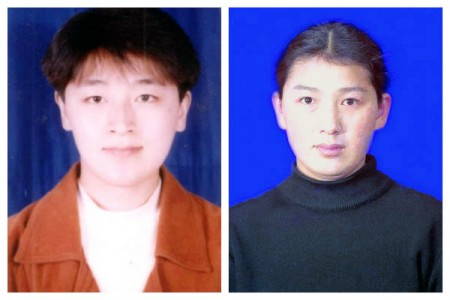

宋彦群和宋冰两姐妹。左为宋彦群。

【大纪元2016年04月10日讯】<b>我要上诉</b>

2003年11月28日一早，舒兰市公安局副局长辛河带着检察院和北城派出所的人来了。一进屋，辛河冲着宋冰大声喊道：“宋冰，你大祸临头了，这一次你最低也得十年。检察院来人了，你说说吧，你到底怎么回事？”

宋冰很镇静地说：“你们昨晚对我刑讯逼供来的！给我灌芥末油来的！”辛河一听气得火冒三丈，歇斯底里地骂道：“像你这样打死你都活该！打死你都不解恨！谁让你不说话，问你为什么不说话？”宋冰说：“我有想法！”辛河说：“你有什么想法？”宋冰镇定地说：“你们是因为法轮功抓我的，法轮功属于思想信仰，在国际社会没有思想犯罪！”

辛河猛地一惊，一下子没了精神，检察院的人一听乐了，开门走了。后来辛河摇著脑袋、摆着手说：“你犯罪不犯罪咱不说这事，你把这事儿给我说清楚，你不说也可以，我们通过其它渠道一样可以给你定罪。”

公安局最初递到检察院的材料被退了回来。公安局又重新编造材料，再次送到检察院。不久，起诉书下来了，里面的内容几乎是天方夜谭。他们凭借假想推理，把所有法轮功学员能做到的事差不多都套在宋家姐妹身上了。一个月后，非法开庭，公安局长辛河向公诉人杨广友摆手，示意绕开法律。公诉人领会，便在法庭上说：“我们不谈这个。”法官刘勇阻止宋彦群说话。宋冰当庭揭露李甲哲刑讯逼供的事实，李甲哲在后面骂开了，回去后又给宋冰和宋彦群凑了足有三万份真相材料作伪证。判决结果是：宋彦群和宋冰分别被判刑十二年和十四年。两人立刻提出上诉，李甲哲怕再一次曝光他的罪证，让看守所的同行捎话威胁说：“上诉还给你们加刑！”

在吉林市中级人民法院非法审讯时，宋冰当场提出异议，说：“判决书所写的都是假的，是编造出来的！”法院的人听着觉得有道理，又问：“那你现在对法轮功怎么认识？你还炼不炼？”宋冰说：“炼不炼属于锻炼身体；信不信、怎么认识是属于思想范畴，这和法律没有关系，不属于法律管辖范围，拿这个给人定不了罪，是违法的！”宋冰又说：“我骨髓有病，做过刮骨手术，我是在生命都面临危机和终生残疾的情况下学的法轮功，难道什么能有比挽救生命更重要？”法院的人点点头，宋冰接着说：“你们现在对法轮功的制裁根本就不讲法律，什么‘名誉上搞臭、肉体上消灭，经济上拖垮’‘打死白打死、打死算自杀，不查身源直接火化’，这讲法律吗？而且你们对法轮功制裁的这些秘密文件正在上交和销毁。”法院的人点头说是。

在送判决书的时候，法院的人说：“共产党不让你干的，你就不能干，干了就要治你罪，不管对错。”宋冰说：“共产党也得讲法律呀，它在让中国人互相残杀。你们天天喊：深挖余案、深挖人命案，如果把法轮大法网站公布于世，那将揪出一千多名杀人犯！那里记录了一千多名大法弟子因信仰被活活残酷折磨致死的案例，上面有名有姓，还有具体事件的全部过程，都是执法人员干的。”对方表示，我们管不了那么多⋯⋯后来，公安局的人说，那三万份传单不是在宋冰姐妹的住处发现的，是⋯⋯

<b>消逝在风中</b>

2004年5月25日，宋冰和宋彦群被劫持往吉林省女子监狱。在体检时，发现宋冰患有肺结核，监狱拒绝接收。舒兰市公安局及看守所不相信，6月份又拉着宋冰到吉林医院复查，再次确诊为肺结核。看守所把宋冰的情况报到法院，法院把材料退了回来。这时本应立即放人，可是副局长辛河就是不批。

2004年7月，宋冰的病情快速恶化，CT照片可见肺部的空洞发展为3.4cm×3.6cm。宋冰身体极度虚弱，发烧、咳嗽、胸闷，喘不上来气、吃不下饭，心力衰竭。看守所将她的病情上报，而辛河还是坚决不放人。

2004年8月11日，在辛河的指派下，看守所的副所长孙广玉及干警张云井一起将宋冰骗到舒兰市中心医院作假诊断，给她抽血、做假化验、拍X光片子。片子拍出来了，右肺部的大型空洞清晰可见，比先前又扩大了许多，很吓人。可是县医院一名叫“赵五”的大夫言不由衷地说已经钙化了。宋冰发现病灶在迅速扩大，向大夫询问病情，大夫吓得连连摆手说不知道，一再解释这事跟他没有任何关系。

那天，宋冰是一步一步地挪出医务室的，她的身子沉得根本抬不起腿。一个看过宋冰X光片子的女大夫焦急地对她说：“姑娘啊！你得赶快治了，再不治就要有生命危险了！”从医院检查回来，看守所的孙所长告诉值班干警：“大夫说，宋冰的病已经好了，诊断为陈旧性肺结核钙化。”听到此话，在场的人谁也没有言语。

当晚在看守所，宋冰吃力地拿起笔，简单地写下自己的遭遇。由于心力衰竭，手不好使，她写写停停，一会儿就累得不行了。值班干警看见她在写东西，看了好长时间也没有阻挡，还很理解地说：“等你的自传写完了，人还有没有了都说不上了。”

第二天，宋冰连续三次昏迷不醒，把号里的人都吓哭了。看守所内外，从干警到犯人全都指责这次医院做的诊断。舒兰市公安局及看守所迅速形成一致口径，当天上午，孙所长匆匆去医院把假诊断改了过来。眼看宋冰的病情急剧恶化，四肢失灵，公安局为了隐瞒罪责，让监管女号的干警张云井告诉宋冰：这是不配合治疗造成的，属于自伤自残。

宋冰的父母听说女儿生命垂危，多次找到舒兰市公安局要求立即放人，但是副局长辛河说，如果放了宋冰，他的工作就得丢。两位老人又找到舒兰市“610”办公室，“610”办公室主任李璞说，宋冰死了他负责，就是不能放人。

在确定宋冰没有抢救价值的情况下，辛河欺骗宋冰父母，答应把她送到新站结核医院治疗。到了新站，他们不肯承担昂贵的医药费，于是马上办了监外执行手续，将瘫痪在床的宋冰向家属一丢，逃之夭夭。宋冰的肺结核是在看守所得的，有大夫确诊为证，而在办理手续时，舒兰市公安局竟然向宋冰的父母索要十四万元，被他们拒绝。后来，舒兰市看守所所长以医药费为名，无理勒索了家人三千元。

回家后，宋冰在父母的精心照顾下，渐渐地能够学法炼功了，身体状况有所好转。可是，公安警察却仍然没有放过她，长期在她家里蹲坑，企图再次抓捕。特别是到了所谓的敏感日，他们就更加得寸进尺，逼得宋冰几次出走、流离失所。由于长期的迫害和压抑，宋冰的精神压力极大，致使她的身体无法恢复正常。2009年7月30日半夜2点钟，宋冰含冤离世，终年36岁。

<b>“文明监狱”</b>

吉林省女子监狱曾被命名为现代化的文明监狱。来到此地，宋彦群才深深领教了何为“文明”管理：强制洗脑、强制转化，强制灌食、强制就医，阻止炼功、辱骂、体罚、殴打和酷刑，每一天上演的都是人身和精神的双重迫害。多少善良的心被扭曲，多少健康的躯体被残害。哀号、控诉、抗争，从未停止。

“我为什么会在这里？”在监狱里的每一天，宋彦群都在心里问这个问题。宋彦群从小就懂事、听话，学习成绩好，担任班干部。她为人谦和、厚道、正真，从不争强好胜，接触过她的人都喜欢她。大学毕业后，宋彦群先后两次参加了舒兰市的公务员考试，并两次获得笔试全市第一名，但是由于她没找关系，不走后门，两次落选。对于这个结果，宋彦群没有抱怨和愤恨，而是平静地一笑了之。她说，修炼的人，对别人无怨无恨，随其自然。

宋彦群曾经在舒兰邮政储蓄所工作过很短的时间，所里的人都高度评价她的业务水平和人品。后来她在哈尔滨大德日语学校任教三年，当时她每个月能挣数千元，却对自己十分节俭。每个月她都拿出两千多元资助经济困难的学生。先后有数十位学生接受过她的资助。在宋彦群被非法关押的早期，她曾经帮助过的学生从日本、韩国等地经常打电话到家中，询问她的情况。

每当回想起那时的情景，宋彦群总是感到欣慰愉快。她按照大法的要求，无私地对待他人，让更多的人认识了法轮大法的美好。而如今，她被迫离开讲台，变成了任人打骂的囚徒，何等荒唐和悲哀！法律是一纸空文。年过七旬的双亲在外面为她和宋冰的案子奔走呼吁，四处碰壁。什么时候，恶人会得到惩处？好人能获得自由和尊严？

宋彦群选择了修炼的路，也选择了为之付出。在监狱里，她长期被酷刑折磨，比如：上大挂，蹲小号。管教曾经安排四个“包夹”全天监控迫害，不让她睡觉，经常谩骂、毒打。宋彦群曾经被绑在“死人床”上，像“五马分尸”一样。随后又有“抻刑”：在“抻床”上，把四肢用绳子分别固定，然后撤去床板，只让腰部支撑在中间一根半寸粗的铁管上，其余身体部位悬空。每天24小时都绑着，大小便也不允许下床。“抻刑”造成她腿部毫无知觉，终日冰凉，血脉不通，整个右臂骨头疼痛难忍，手抖动得特别厉害，不能写字。大脑反应迟钝，两肋和肺部疼痛难忍，两个肺上都长满了病灶，肺结核已明显地迅速恶化。酷刑迫害，使得宋彦群骨瘦如柴，体重仅剩60来斤。而时任副监狱长的武则云声称：“因为怕她死，所以才给她绑‘死人床’施‘抻刑’的。”宋彦群的身体已经到了这个地步，狱方和监狱医院不仅不放人，还互相推卸责任。监狱狱警说：“那是她在医院打肺结核药打的，那药毒副作用特大，跟我们没关系。”

父母来探视了，狱方有时阻止母亲和女儿见面，只让宋彦群的父亲和她见面十多分钟，甚至只有区区七分钟，而按规定是三十分钟。迫害宋彦群的“包夹”还经常占用接见的时间，出来说，监狱是人性化管理，执行国家法律，狱警比亲人还亲。

2012年4月，宋彦群的非法刑期将满，教育大队的警察强迫她写“五书”，威胁不写的话到期不释放她，并将她关押在严管班进行迫害。宋彦群绝食反迫害，沙某给她打针，她不配合，拔针头，又被强行灌食、灌盐水。4月12日接见时，宋彦群告诉父母，前一晚，四个包夹在管教的唆使下，把她的衣服扒光，一顿毒打，还往她的身上、腿上、脚上猛踩。有一个包夹天天打她的嘴巴。2012年5月16日，宋彦群的父亲去探监时，看见宋彦群的目光呆滞、语言迟钝、双臂僵直、两腿浮肿。她行走困难，小便失禁。

2012年12月16日，宋彦群被释放。回到家后，从2013年到2015年6月，宋彦群又历经了几次劫持和非法抄家、拘留，又遭受了殴打、灌食，并且在灌食时被放入不明药物，导致她四肢麻木，思维近乎丧失。昔日风华正茂的女教师被折磨得虚弱不堪、苍老变形。

2015年7月28日，宋彦群向最高法院控告元凶江泽民发动对法轮功的灭绝性迫害。她写道：“大法洪传二十三年了，大法使无数人身心健康、道德高尚，大法和修炼者被迫害十六年了，十六年来，大法修炼者顶着迫害和压力，向世人讲清真相：法轮功是被迫害的，在揭露迫害、制止迫害。法轮大法是佛法。十六年来，我只是千千万万法轮功学员中的一个，对我的迫害罄竹难书，对法轮功这个信仰群体的迫害更是天理难容！我们就是相信真理必胜。”

<b>尾声</b>

在中国大陆，亿万名普通的百姓，只求拥有平淡如水的日子，踏实地工作和生活。然而，在暴政强权下，这种最基本的愿望竟成了一种奢求。十七年来，狂风和暴雨，卷走了多少鲜艳的花朵，压碎了数不清的幸福和梦想。暗夜里，浸著漫漫泪水，传来声声呼喊。控告江泽民的状纸，字字血泪。迫害元凶的罪行，必将被清算。邪恶纵然猖狂，却夺不走自由的意志，扑不灭对真理的追求。宋彦群和宋冰这两名东北女子，坚守信念，以不凡的勇气写下了动人的诗篇。她们心中的浩然正气，将孕育出最绚烂的生命之花，在宇宙间永远绽放。

<h1 align="center"><b>英国医学期刊：《中国可怕的秘密移植》</b></h1>

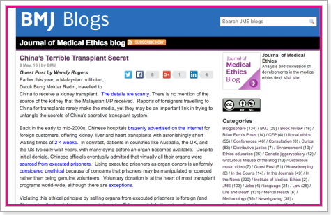

《英国医学期刊》博文网站发表Macquarie University临床伦理学教授Wendy Rogers的文章“中国可怕的秘密移植”。（网页截图）

【大纪元2016年06月17日讯】就在美国众院6月13日通过343号决议案， 制止中共强摘器官的一个多月以前，《英国医学期刊》博文网站发表了悉尼麦考瑞大学（Macquarie University）临床伦理学教授Wendy Rogers的文章，题目为“中国可怕的秘密移植”。

文章以马来西亚政治家Datuk Bung Moktar Radin前往中国接受肾移植为开头，但表示，相关的细节信息很少，没有提及这名马来西亚国会议员接受移植的肾源。

作者说，外国人前往中国进行器官移植的报道鲜少出现在媒体上，但是他们可能是试图解开中国秘密器官移植系统秘密的一个重要环节。

这篇今年5月发表的文章讲述，早在2000年代中期，中国的医院毫无顾忌地在网上向国外客户打广告，提供肾脏、肝脏和心脏移植手术，并且等候时间是2至4周，时间短得惊人。

相比之下，在澳大利亚、英国和美国这些国家，患者通常要等待几年，许多人在等到一个可用的器官之前就死去。

文章说，尽管中共官员最初否认，但最终还是承认几乎他们所有的器官都来自死刑犯。

用死刑犯作为器官供体被一致认为是不道德的，因为担心那些犯人可能是被操纵或胁迫，而不是真正的自愿。

自愿捐献是全球各地绝大多数移植项目的核心，虽然也有例外。但把来自死刑犯的器官卖给外国和中国的患者违反了自愿这一道德原则，这似乎足以让中国在国际移植界中被抛弃。

该文作者Wendy Rogers表示，这仅仅是中国可怕的秘密移植的一部分。

<b>活体器官库</b>

国际知名调查人员收集的证据表明，中国的良心犯，主要是法轮功学员、维族人、家庭教会的基督徒和藏人，被谋杀摘取他们的器官。

文章强调，在关了数百万中国国民的劳教所里，法轮功学员占了大部分，他们被做医学测试，检查他们可供移植器官的健康状况。在这个过程中创建了一个活体器官库，在那里，可以为外国患者和富裕的中国人找到潜在匹配的器官供体，之后，他们被按需杀害，他们的器官被用于移植。

Wendy Rogers 说，这种反向匹配过程保证了在极短的等待期内能找到一个合适的器官。

许多人难以相信由于国家政策问题，中国的良心犯被系统地杀害以获取他们的器官这种说法。

这种行为违反了中国已签署和批准的条约下的国际法律义务，并可能构成了反人类罪。而且那些证据是不容忽视的。

国际获奖的纪录片《难以置信》（Hard to Believe）给出了令人信服的理由，David Matas和David Kilgour (《血腥的活摘器官》一书作者： 国际人权律师和七届加拿大国会议员、前皇家检察官)，德国医学博士Torsten Trey（反器官摘取医生组织发起人之一），还有Ethan Gutmann（《大屠杀》作者，独立调查记者、前美国智囊研究员），他们仔细研究所撰写的书籍也是如此。

文章指出，要调查象这样的一个秘密非常困难。

中共当局不可能开放它的监狱和医院来接受严格的国际检查，尽管在移植界要求绝对的透明度（世界卫生组织原则11）。但是，如果中共没什么可隐瞒的，应该很容易证明器官的来源是符合道德的和合法的。

大多数国家都有透明的器官获取制度，首先是自愿捐献者，他们的器官届时会与在器官轮候名单上的人做匹配。捐献者人数、移植数量以及捐献者死亡的情况都是公开的，可以被独立审核。

文章表示，在中国，关于捐献者以及移植的信息是模糊、不可靠的，在媒体上宣布的数字不断地更改、自相矛盾、不一致，看上去更象是宣传，而不是可被验证的事实。

<b>不容忽视的信息</b>

尽管做出各种努力，包括由“反对强制摘取器官医生组织”（DAFOH）向联合国发起的一个请愿，但一些国际社会成员似乎不愿意涉及由人权律师、医生和调查记者们整理出来的越来越多的证据，甚至不大愿意在这个问题上挑战中共当局。

令Wendy Rogers感到吃惊的是，2016年国际器官移植协会（移植外科医生的首要国际机构）大会将在香港举行。

文章说，在香港举行这一引人注目的会议发出了一个强烈的信息：中国的移植项目现在达到了可接受的标准。象这样的举动，以及澳大利亚、美国、英国和其他地方给予黄洁夫这样的中国外科（移植）医生学术好评和荣誉头衔，起到了欢迎中国进入国际移植界的作用。

Wendy Rogers表示，许多人似乎相信中共当局声称的2015年改革已经停止了不道德的做法。虽然现在中国有一个貌似自愿捐献的系统，但是这并没有杜绝继续使用囚犯的器官。

Wendy Rogers在文章最后说，我们不应铺开红地毯，而是应该要求这个简单问题的答案：究竟中国的移植器官从何而来？直到我们知道这个问题的答案之前，我们必须警惕那些掩盖真相的迷雾。

2016年6月13日，美国国会众议院以“呼声表决”（voice vote)的方式一致通过了343号决议案， 要求中共立即停止针对法轮功学员等良心犯的“强摘器官”行为。

<h1 align="center"><b>从江天勇失忆看中共不能见光的药物迫害</b></h1>

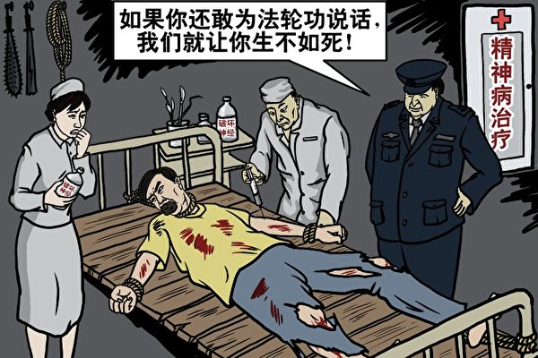

（大纪元）

【大纪元2018年05月23日讯】（大纪元记者叶枫综合报导）大陆“709”案律师江天勇的家人5月18日前往河南第二监狱探视，发现江天勇记忆力严重衰退，怀疑他被强迫喂药。

此案再次引发外界关注，中共对健康法轮功学员施行毒针、毒药以及精神病治疗等迫害手段，导致他们失去记忆、瘫痪，甚至死亡。

5月22日，记者用“失去记忆”和“药”同时为关键词在明慧网上搜索，获得超过300条相关迫害信息。2016年，美国国会发布报告引用英文明慧网的报导说，法轮功学员张秀丽被迫害得大脑失去记忆、胳膊被打断。

以下是明慧网报导的因药物迫害而导致失忆的部分法轮功学员的案例：

<b>原北大高材生、国企处长被注射破坏神经药物</b>
原北大高材生、国企处长被注射破坏神经药物
李文栋，男，北京大学法律系毕业生，原北京国企处长、北京中外运律师。

因坚持修炼法轮功，2001年8月，李被非法抓捕，关押在北京海淀分局。迫害期间，他遭注射破坏神经系统的药物，后失去记忆，不会说话，不认识人，不会走路，身体骨瘦如柴，全身瘫痪。

<b>吉林美丽女教师被灌食不明药物</b>

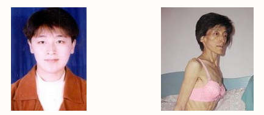

宋艳群迫害前后照片对比。（明慧网）

宋艳群，女，吉林省滨大德日语学校英语教师 ，1996年8月，开始修炼法轮功，身心健康。两次考公务员成绩第一。

法轮功是以“真、善、忍”为原则的身心修炼功法，自1992年在大陆长春传出，至1999年，修炼人数约1亿人。因法轮功太受民众欢迎，1999年7月江泽民下令迫害，难以计数的法轮功学员被绑架入狱，遭受酷刑等折磨。

中共打压后，宋坚持信仰，2012年，被监狱酷刑迫害致命危，送公安医院，再遭迫害：被强行灌食、灌不明药物、绑死人床。后四肢麻木，记忆几乎丧失。

女子监狱看人不行了，才放宋回家。回家时，宋体重48斤，内脏衰竭，极度虚弱。

<b>黑龙江女律师被迫害致失忆、脑梗</b>

刘忠杰，女，原黑龙江省天成律师事务所律师、法轮功学员。

中共发动迫害法轮功后，刘被非法抄家、绑架、关押、劳教，被迫流离失所。2012年9月10日，刘忠杰再次身陷囹圄遭迫害。四个月后的2013年1月中旬，刘突陷昏迷，送医抢救，诊断为脑出血。

2013年3月5日（保外就医期间），刘忠杰被非法判刑一年半，缓刑二年执行。

回家后，刘忠杰吃饭、喝水、上厕所均不能自理，成天昏睡，失去记忆，体重下降数十斤。

<b>原合肥梅山饭店副总经理生前被施毒</b>

朱维英，女，原安徽合肥市梅山饭店副总经理、法轮功学员，多次被评为安徽省先进劳动模范。

朱因坚持修炼法轮功，1999年底至2000年被绑架到合肥市精神病医院进行迫害。期间，遭大钢针穿入双侧太阳穴、电击、捆绑、吐痰、强行注射破坏中枢神经的药物。他们一直把她迫害到大脑失去记忆、目光呆滞、不认识人，才放她回家。

酷刑演示：打毒针（绘画）（明慧网）

回家后，朱维英像完全变成了另外一个人，整个人都痴呆了，像傻子一样。后通过修炼法轮功，恢复健康。

2011年6月，朱维英再次被绑架，后被秘密判刑八年，送安徽宿州女子监狱关押。

期间，遭电击、关禁闭、被毒打致颈椎重伤。后不能抬头，头不能后仰，不能坐、不能走路；双目失明。监狱长期把不明药物碾成粉末拌在饭里，给朱维英吃。流氓狱警还强行把朱衣服扒光，一丝不挂一个多月，录像，放给她家人看。

2017年6月，朱刑满出狱；同年7月，凄惨离世。

<b>广东卢秀清被打毒针致残</b>

卢秀清，女，广东省法轮功学员。2003年，茂名市洗脑班强行对卢秀清打毒针，致其昏迷不醒。输氧抢救了四天，醒来后完全失去记忆，全身不能动弹，只剩下一副皮包骨。

同年7月，洗脑班叫家属领人。家人看到卢秀清已神志不清、四肢无力，身体极其虚弱。回家后，卢生活不能自理，双腿不能动弹，要靠双手在地上爬行。

<b>中共百种酷刑虐杀法轮功学员</b>

至今，至少4213名法轮功学员被中共迫害致死，这个数字只是冰山一角。为了让法轮功学员放弃对“真、善、忍”的信仰，中共施用了百种酷刑，包括毒打、电击、约束衣、“死人床”、“老虎凳”、性虐待、有毒药物等等。

明慧网2013年12月7日发表了《中共酷刑虐杀法轮功学员调查报告》，报告从明慧网数据库汇总统计了3,653位法轮功学员被中共迫害致死的案例。

这份调查显示，在65%被关押迫害的致死案例中，21%被毒打直接致死，11%被灌食直接致死，10%被强迫或暗中注射／服用精神药物或毒药直接致死，3%被超负荷劳役直接致死，2%被上刑具直接致死，2%被电击直接致死，2%被虐待直接致死，1%被体罚直接致死，1%被牢中牢（关禁闭／转关押／延期释放）直接致死，26%则在中共多种酷刑手段的共同摧残下致死。

<b>参与迫害法轮功的官员频遭厄运</b>

十九年来，参与迫害法轮功的中共官员频遭厄运，以下仅举数例：

周镇宏，男，原广东省茂名市委书记，曾多次在会议上煽动仇恨，指使迫害法轮功。法轮功学员卢秀清在茂名洗脑班被打毒针致残，他负有领导责任。2012年1月16日，周镇宏被调查；2014年2月28日，因贪污腐败，被判死缓 。

倪俊雄，男，原广东省社会治安综治办公室（610办公室，专门迫害法轮功的非法组织）副主任、茂名市委常委、政法委书记、茂名市公安局长、党委书记，疯狂迫害法轮功。610办公室设立的“茂名市法制教育学校”，对法轮功学员施用酷刑、不明药物，致使多人致残或致死，包括卢秀清。2012年6月27日，倪俊雄因受贿，被判刑15年。

李学海，男，历任原山东青岛市城阳区委副书记、区委书记、党校校长、青岛出口加工区工委书记、中共青岛市市南区委书记、党校校长、青岛市政协副主席等职。1997年12月至2008年3月任青岛市城阳区政法委主要负责人；2007年，曾在电视中抹黑法轮功创始人和攻击法轮功 。当地的鑫源旅馆就是李学海率领的城阳政法委打造的专门迫害法轮功学员的基地之一，该基地对法轮功学员施用有毒药物。2016年5月7日，李学海在开会时被带走，后被双开。

唐国栋，男，历任原湖南省公安厅政治部副主任、湖南省公安厅监所管理处处长、郴州市公安局党委书记、局长、郴州市副市长等职，是郴州地区迫害法轮功的主要责任人之。其任郴州市公安局局长、副市长期间，至少有8名法轮功学员被酷刑、药物迫害致死 。2017年4月1日，据湖南省纪委消息，唐国栋涉嫌严重违纪，接受审查。

<h1 align="center"><b>是谁制造了这场惨无人道的人间悲剧？</b></h1>

【明慧网二零一八年四月十日】据明慧网二零一八年四月四日《儿子被非法判刑　老父捡破烂惨死》一文中报道，河北张家口市万全区北新屯乡庙儿沟法轮功学员马占国被非法关押在山西省忻州市已经一年多了，他父母及妻子多次往返忻州看望马占国未果。二零一八年三月二十九日，马占国的父母又到忻州看儿子，又未见到儿子。
马占国七十多岁的老父亲马登科三月三十日回家后，心神不定，坐立不安，看到幼小的孙子，孤儿寡母甚是心酸可怜。当儿媳和妻子找到他的时候，不知什么时候已经惨死在垃圾堆里。这就是中共统治下的又一人间悲剧。

二零一六年十月五日，马占国与张家口市四名法轮功学员赵义军、杨淼、赵晓露，及山西忻州市法轮功学员吴晓娇，在山西省忻州市被忻府区公安绑架，非法关押在忻州市看守所。

儿子被非法关押以来，老人（马占国的父亲）心情一直不愉，患了高血压、脑梗，多次出现生命危险住院。老伴和儿媳也不敢让他再种地了。老人为了减少家中的负担，身体稍好点就捡破烂。

二零一七年四月十一日被非法开庭时。五名律师与四位家属发挥他们各自的特长，从法律层面，道德层面，有理有据的做了强有力的无罪辩护。五位法轮功学员发内心讲述自己修炼法轮功亲身受益的经历，讲述法轮功五套功法动作优美，祛病健身的奇效及法轮大法的美好。张家口市法轮功学员赵晓露说：法轮功不参与政治。法轮功在中国是合法的，法轮功学员没有破坏法律实施，并讲述了自己修炼法轮大法的经历和修炼后的身心变化。

马占国的家属恳切的告知执法人员：纵观历史从古到今，法庭是讲理的地方，在任何社会状态下，都是审判坏人、保护好人的地方，是伸张正义、主持公道的地方，是澄清事实、还原真相、评判是非、昭雪冤屈的地方，请各位法官伸出援助之手给予帮助，主持公道：还我丈夫清白和自由！还我的正常生活！

与马占国一起被非法判刑的古稀老人赵晓露被冤判四年，她原是张家口电视广播事业局的一名记者，自迫害以来曾经多次被非法关押、判刑及洗脑班迫害，遭受了非人的酷刑和精神折磨。这次由于长时间被非法关押在山西省忻州看守所迫害，导致修炼前原患有的心脏病复发，身体极度虚弱，上法庭时还被戴着手铐、脚镣，律师当庭要求给当事人打开手铐、脚镣，并且当庭为当事人递交取保候审申请。

二零零九年一月二十八日大年初三，重庆法轮功学员江锡清在被重庆西山坪劳教所迫害致死（在尚有体温的情况下被送到殡仪馆）的消息震惊海内外，监狱迫于国际社会压力，于二零一零年的一月给罗泽会（被江津区法院非法秘判八年的江锡清妻子）办理了保外就医手续。

面对江锡清的冤死，家人一直找有关部门要求严惩凶手。重庆西山坪劳教所、江津区政法委和610妄图逃脱他们犯下的罪恶，通过地方的警察、国保大队和公安派出所上门抄家、殴打律师等，阻挠江锡清子女为父申冤！江锡清妻子罗泽会老人，也一直在被抓捕逃亡中度日。

警方为追捕罗泽会，将她儿子江宏斌绑架做人质，多次带他去抓他的妈妈。儿媳邹绪群不堪重压与丈夫江宏斌离婚。离婚后也难逃610、国保、政法委、重庆监狱及社区的恐吓与骚扰，最后被迫流离失所。

去年七月四日晚，辽宁鞍山市法轮功学员于宝芳与丈夫王殿国、儿子王宇，一家三口被警察砸门入室绑架、抢劫，于宝芳被非法关押在鞍山市女子看守所，于七月十七日被迫害致死；她丈夫王殿国一直被非法关押。直到于宝芳离世一个小时之后，不法人员才让她儿子王宇去医院与母亲见最后一面，也不让他查看遗体。八月八日家属得知王殿国已被非法批捕，妻子的善后事宜都不能亲自处理。

在长达十九年的对法轮功的血腥迫害中，千千万万的善良家庭被迫害得支离破碎、家破人亡。如一家八口被迫害致五死一残的辽宁省清原县法轮功学员孙鸿昌一家；六口之家被迫害致仅剩一人的河北省怀来县法轮功学员陈运川一家；一家五口被迫害得仅剩下一人的山东省青州市神旺村法轮功学员王兴家一家；三位至亲被迫害致死的河北石家庄市高级工程师冯晓梅一家……

是谁制造了这场灭绝人性、惨无人道的人间悲剧？就是那个整天吹嘘要“全心全意为人民服务”，极力标榜自己“伟光正”的中共邪党。二零零四年十一月大纪元发表系列社论《九评共产党》，彻底揭穿了中共的真实面目，引发了中国大陆亿万人民史无前例的精神觉醒运动，许多民众认清了中共的流氓本性和邪恶本质，抛弃中共的三退大潮铺天盖地、势不可挡，截至二零一八年三月二十三日三退总人数已突破三亿，预示着中共的末日已经来临！

去年《九评共产党》发表十三周年之际，九评编辑部发表新书《共产主义的终极目的》。向世人系统分析和揭示“共产邪灵”通过破坏文化、败坏道德而毁灭人类的天大阴谋。认清中共邪灵的邪恶本质，认清共产主义因素在全球渗透的危害性和紧迫性，认清共产主义毁灭人类的终极目的。将共产邪恶主义从人类社会彻底清除灭尽，已经成为全人类的当务之急。目前，共产主义因素在全球渗透的危害性和紧迫性已经引起美洲、澳洲、欧洲、亚洲等世界许多国家和地区的关注。

疯狂迫害凸显了中共对其末日来临的内心恐惧，历史上迫害正信的从来都没有成功过，等待中共的必定是灭亡的结局。古罗马帝国迫害基督徒是如此，中国历史上的“三武一宗灭佛”是如此，江泽民集团迫害法轮功亦是如此。贵州藏字石在两亿多年前就预示了“中国共产党亡”。中共的解体灭亡是天定的，谁也阻挡不住。三亿退党大潮向人们预示着中共解体灭亡已经指日可待，迫害只是中共最后垂死挣扎的表现罢了。奉劝中共体制内那些仍旧参与迫害的人，赶快清醒，停止作恶，悔过自新，为自己留一条后路。莫作中共的陪葬品，毁了自己的永远！

<h1 align="center"><b>13年癌症复发5次 俄少女命悬一线 这一天竟奇迹康复</b></h1>

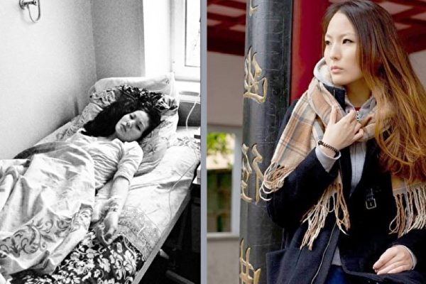

俄罗斯女子从7岁起5次癌症病发，20岁时一个奇遇让她从此获得健康。

小的时候，热尼娅是一个活泼可爱的女孩，被父母视为掌上明珠，家人期望她日后能够成为健康善良的人。

7岁那年，热尼娅的右手上长出了一个肿瘤，经诊断确定为恶性的腹壁硬纤维瘤，也就是癌症。

医生给热尼娅切除了肿瘤，当时术后恢复还不错。没想到，短短8个月后，癌症再次复发

这一次，医生为热尼娅做了4次手术，之后还接受了数个疗程的化疗和放疗。痛苦的疗程过后，病症得到了控制，医生宣布热尼娅体内已经没有癌细胞了。

一家人以为从此后热尼娅终于可以像正常的孩子一样上学了，没想到癌症似乎是热尼娅摆不脱的梦魇，总是复发，但好在一次次地被治愈了。

热尼娅从7岁开始，不断被癌症所折磨。

<b>癌细胞再次凶猛来袭 20岁少女命悬一线</b>

2012年，热尼娅的癌病再次复发，这一次癌细胞发展得非常迅速，让医生有些担忧。

20岁的热尼娅再一次住进医院，医生选择用化疗控制她体内疯狂发展的癌细胞。看着躺在病床上的女儿，热尼娅的父母陷入无比的绝望。

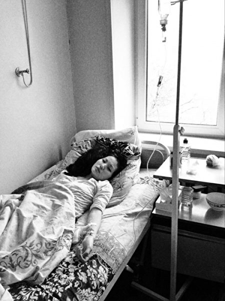

20岁的热尼娅再一次癌症发作，病情发展迅速，让父母心力交瘁。

妈妈回忆：“我的亲友中有4位修炼法轮功。我和女儿得知，这种功法对祛病健身有着奇效。如果按照现在的治疗方案，虚弱的女儿已经无力再承受化疗的痛苦，化疗最终只会杀死她。于是，我跟女儿说，不如我们一起炼功吧。”

就这样，热尼娅和妈妈一起，跟随姨妈学习法轮功。因为有大把的时间，她们每天就是炼功和学习法轮功的著作等。

“我的女儿很快恢复了体力。因为化疗药物引起的副作用贫血、恶心、食欲不振、肠胃等问题，在我女儿身上也消失了。”妈妈说，“几个月后，热尼娅在肿瘤中心做了超声波检查，结果显示，她的肿瘤明显缩小了。”

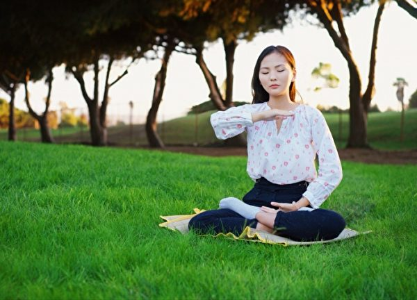

修炼法轮功后，热尼娅获得身心健康。

<b>恢复健康 无癌一身轻的女子迎来幸福人生</b>

通过炼功，热尼娅感觉自己越来越好。如今6年过去了，她从学院学业，又如愿地结婚。现在她和先生定居在美国洛杉矶，从事图案设计工作，并努力的学习英语。昔日的噩梦已经彻底的远离了她。

通过修炼法轮功，13年中癌症发病5次的热尼娅终于恢复了真正的健康。她希望让大家都知道自己的经历，希望其他人也可以通过真心地修炼，获得身心的健康。

热尼娅病愈后结婚，现在与丈夫定居在美国加州。

<h1 align="center"><b>美国会研讨会关注3亿人三退 为世界带来希望</b></h1>

5月9日下午，在美国国会举办的“三亿中国人三退”研讨会上，来自不同国家的政治家和中国问题专家表示，民众大规模的精神觉醒为中国的未来带了光明的希望，也令国际社会振奋。

【大纪元2018年05月11日讯】（大纪元记者林乐予美国华盛顿特区报导）5月9日下午，在美国国会举办的“三亿中国人三退”研讨会上，来自不同国家的政治家和中国问题专家表示，民众大规模的精神觉醒为中国的未来带了光明的希望，也令国际社会振奋。

自从2004年底大纪元系列社论《九评共产党》发表以来，截至今年3月，已有超过三亿中国人声明退出共产党及其相关组织，这一现象也引起了国际社会的关注。

5月9日下午，“三亿中国人三退”研讨会在美国国会佳能大楼举办。

<b>美国国会议员：我们和中国民众站在一起</b>

资深众议员罗拉巴克（Dana Rohrabacher）来到研讨会现场，支持勇于退出中共的中国民众，并感谢三退义工。他说：“我向你们致敬，我了解你们的付出——在似乎没有可能打败中共流氓政权的情况下，你们坚定、顽强地站出来，鼓舞其他中国人，令全世界振奋。我很荣幸今天能到这里，告诉大家，我们和中国民众站在一起。”

资深众议员罗拉巴克（Dana Rohrabacher）来到研讨会现场，支持勇于退出中共的中国民众，并感谢三退义工。

罗拉巴克鼓励中国民众不要失去希望，他说川普（特朗普）总统和以往的美国总统都不一样，能做出许多大胆的决定，可能也会为中国的人权状况带来曙光。

<b>国会褒奖信：退党为中国重塑希望</b>

资深众议员史蒂夫．金（Steve King）发出褒奖信，赞扬退党运动对中国的重要意义。金议员已向国会众议院议长保罗．莱恩（Paul Ryan）正式提出此信，将列入国会纪录。

资深众议员史蒂夫．金（Steve King）发出褒奖信，赞扬退党运动对中国的重要意义。

他在信中说：“再一次，我为这些勇敢的退党活动的参与者、志愿者和支持者鼓掌。我期待人们意识到中国可以是一个自由的中国、自由的社会。”

资深众议员史蒂夫．金（Steve King）发出褒奖信，赞扬退党运动对中国的重要意义。

金议员表示，退党不是一场政治运动，也没有其政治方案，而是以一种平和的方式指引中国人提升自己的道德与良知，除去一个人和共产主义在精神上的联系，从而使人重拾传统以及对神佛的信仰。

“中共内部的解体对整个世界而言都是有利的。退党运动让世界展望一个没有共产党的中国，以及一个没有共产主义者参与的国际社会。”

美国国会及行政当局中国委员会（CECC）主席史密斯（Chris Smith）议员致信支持退党运动，他在信中说：“退党运动改变了中国人的思想，将许多人从中共的灌输教育和腐败中拯救出来。”

美国国会及行政当局中国委员会（CECC）主席史密斯（Chris Smith）议员致信支持退党运动。

史密斯议员对中国的未来充满希望，他说：“通过你们和众多正义人士为中国自由所做的努力，我相信，一个更美好的明天即将到来。”

<b>退党唤醒民众良知 洗刷灵魂</b>

全球退党中心主席易蓉介绍说，随着真相广传，越来越多的中国人选择退出中共邪党，为中国社会带来了重大的变革。易蓉说，退党运动为所有中国人和平抛弃中共提供了精神典范，是解决当前中国社会问题最包容、最和善的方式。

全球退党中心主席易蓉说，退党运动为所有中国人和平抛弃中共提供了精神典范。

美国国务院前助理国务卿埃伦．绍尔布赖（Ellen Sauerbrey）在支持信中表示：“这种和平的、非政治性的、基于社会底层的活动对打破民众心中被灌输的共产主义教条，让他们有机会能独立思考并自由选择自己和国家的命运是至关重要的。”

“当中国民众放弃他们曾给中共发过的毒誓并重新唤醒内心的良知时，全世界的人们都会从中受益的。这将为未来的中国奠定民主与和平的基础。”

美国国务院前助理国务卿埃伦．绍尔布赖（Ellen Sauerbrey）在支持信中表示，退党运动为中国的未来带来希望。

曾担任美国驻丹麦大使和国会众议员的理查德．史维特（Richard Swett）在现场表示，退党运动为黑暗的中国带来了光明。他说，是否敢于维护信仰自由，是许多人一生中最艰巨的道德挑战。史维特鼓励中国民众坚持正义的勇气。

曾担任美国驻丹麦大使和国会众议员的理查德·史维特（Richard Swett）鼓励中国民众坚持正义的勇气。

美国国际宗教自由委员会（USCIRF）主席丹尼尔．马克（Daniel Mark）在支持信中表示，出于无神论的意识形态及彻底的排他性，中共对各种信仰团体实施镇压。宗教自由委员会十分清楚无辜信仰人士遭受的迫害，因此格外赞赏退党运动帮助中国民众摆脱中共控制所做的努力。

美国国际宗教自由委员会（USCIRF）主席丹尼尔．马克（Daniel Mark）赞赏退党运动帮助中国民众摆脱中共控制所做的努力。

中国民主运动海外联席会议主席魏京生则表示，生活在中共强权之下的中国人承受了极大的压力和恐惧，退党为他们提供了表达真实意愿、洗刷灵魂的机会。

魏京生（左）表示，退党为中国人提供了表达真实意愿、洗刷灵魂的机会。

“六四”抗命军长徐勤先的驾驶员刘建国也来到研讨会现场，分享了自己退党的亲身经历，并感慨道：“在共产党的体制下，审计部门都时常会弄虚作假。退党是一个自发性的民间运动，义工们却用十分严谨、认真的态度对待，我真的感到很佩服。”

“六四”抗命军长徐勤先的驾驶员刘建国（左）分享自己退党的经历，对认真、严谨的退党义工表示钦佩。

<b>共产主义本质邪恶渗透全球</b>

根据美国国会的纪录，全世界的共产政体造成了总计1.35亿人的非正常死亡。评论员章天亮教授认为，实际数字可能远大于此。比起肉体消灭，共产主义最严重的罪行是通过剥夺信仰自由、摧毁道德体系和传统价值，扼杀人的灵魂。共产主义正以不易觉察的方式和速度渗透全世界，给人类带来毁灭性的灾难，只有保持良好的道德水准，才能幸免于难。

评论员章天亮教授表示，比起肉体消灭，共产主义最严重的罪行是通过剥夺信仰自由、摧毁道德体系和传统价值，扼杀人的灵魂。

前瑞典国会议员、前欧洲理事会议会副议长戈兰．林德布劳德（Göran Lindblad）通过视频连线表示：“将共产主义的目的揭示出来，这非常重要。如果对马克思和列宁有所了解的话，就会明白，在这样极端的政体下，不会有任何好的结果。”

前瑞典国会议员、前欧洲理事会议会副议长戈兰．林德布劳德（Göran Lindblad）通过网络视频与现场连线。

人权活动家李祥春博士说，共产主义悄然渗透美国及世界各国，退党运动揭示了共产党的本质，帮助人们分辨真伪，采取清晰有力的抵制措施。

人权活动家李祥春博士说，共产主义悄然渗透美国及世界各国。

追查迫害法轮功国际组织主席汪志远表示，认清共产邪灵的终极目的，追查和惩治中共的反人类罪恶刻不容缓。他说：“这不仅仅是因为罪行必须惩处，更因为是拯救人类最后的道德良知。天地之间正与邪的较量，构成了对每个人、每个组织、每个国家政府道德良知的全面检验。愿人们在这历史关头，选择正义良知，共同清除邪恶。”

<b>道德回升 有益世界 利在千秋</b>

前新西兰行动党副主席特雷弗．劳登（Trevor Loudon）说，中华文明已有数千年的历史，一直自给自足，孕育流传了令人惊叹的璀灿文化和内涵深厚的道德哲学。在这样浓厚的文化道德氛围中，人们拥有极高的职业素质和修养，在没有中共干涉的情况下，本可以为世界做出更大的贡献。

“我想看到一个真正强大的中国。因为你无法想像，一个真正自由的中国可以为这个星球做出什么贡献。中国民间的各行各业、文化和伦理，在适当机会摆脱中共控制的情况下，可能比其它任何国家更有助于改善这个世界。”

前新西兰行动党副主席特雷弗．劳登（Trevor Loudon）说，在没有中共干涉的情况下，拥有极高的职业素质和修养的中国人可以为世界做出更大的贡献。

劳登说，虽然退党义工背负着巨大的压力和风险，但这是造福子孙、利在千秋的伟大事业。他说：“我希望你会想到你将在历史上的位置，希望你在二百年的时间段里思考。当中国有真正的自由时，一些年轻的中学生选择一个关于中国历史题材项目，在他们看起来在中共崩溃时，中国就在真正意义上解放了。当他们对他们的祖先进行研究时，会发现自己的曾曾曾祖父和祖母是促成这一事件发生的一部分，这就是你在历史上的地位。我很自豪能够成为你们中的一员，并且我祝贺你们所做的事情，因为这对我们全人类都有益处。”

纽约州执业律师叶宁则表示，以“真、善、忍”为指导的正义人士们所付出的努力，使得退党成为了过去二十年中人类历史上最伟大的运动。他说：“因为你们的努力，中国一定会得到拯救，人类会有出路。”

纽约州执业律师叶宁则表示，以“真、善、忍”为指导的正义人士们所付出的努力，使得退党成为了过去二十年中人类历史上最伟大的运动。

<h1 align="center"><b>杏花岭冤案连连　执法者天良安在？</b></h1>

【明慧网二零一八年三月十七日】孟子说“无恻隐之心，非人也。”如果“执法者”泯灭天良，如果法庭失去正义，如果是非与黑白完全颠倒，如果谎言污蔑横加于无辜，那意味着什么？
近年，太原市杏花岭区公检法冤狱连绵。

<b>一、李锡福告邮局侵权扣信，反遭迫害</b>

家住山西省太原市杏花岭区118小区的李锡福，现年七十七岁。因坚持对法轮大法“真、善、忍”的信仰，曾经四次被非法关押，两次被非法劳教，并且多次遭到狱警非人的暴打。

李锡福在二零一五年七月起诉迫害元凶江泽民，起诉书被太原市邮局非法扣押，李锡福将其告上尖草坪法院。

在对法轮功的十几年迫害中作恶多端的中共610对此非常恐慌，惧怕法轮功学员的正义控告进入司法程序，于是实施报复，二零一五年十一月十七日，指使太原市不法公安将李锡福非法抓捕，并非法抄家。其后在异地、由太原市晋源区法院将李锡福冤判三年半。（“610”是中共为迫害法轮功而成立的非法机构）

同期，不法警察和610人员又将同小区的法轮功学员（和李告邮局无关）赵存贵、赵素梅绑架构陷冤狱。

目前，七十七岁的李锡福被非法关押在祁县晋中监狱，他曾至少两次遭狱警殴打。李锡福坚持对真、善、忍的信仰，因为他受益于法轮大法，曾在起诉江泽民的诉状中写道：

“看完《转法轮》（法轮功主要著作），我感觉这本书太好了，是叫人做好人的书、从没见过的书，我发生了天翻地覆的变化，真感到一种脱胎换骨的感觉，那个激动的心啊无法言表。”“我开始改变我的坏脾气，不和人争斗、遇事让人”“人人都称赞我变了，变成个好人了。我自己也觉得轻松多了，孩子们看见我的变化也高兴的不得了”“随之身体也发生了变化，以前每年夏天拉肚子，一拉拉一个月，吃什么药都治不好，还有就是吃花粉吃的尿频，炼功以后都好了。从那以后十九年来再没看过医生，没吃过一片药。”

事实上，法轮大法福益世人，修炼法轮大法、按照“真、善、忍”做人，不仅合法，而且应该受表彰；根本不应被抓、被冤判入狱。中共一贯奉行“假、恶、斗”，以各种运动害死八千万中国人（超过两次世界大战死亡人数的总和），容不下真、善、忍。

<b>二、赵存贵被绑架构陷，入冤狱三十八天失去生命</b>

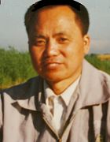

赵存贵

二零一五年十二月十二日，太原市杏花岭区涧河派出所（所长是武瑞明，教导员是党国荣），以赵存贵家中有法轮功资料为由，将他绑架到看守所，刑事拘留。二零一六年五月十日被太原市杏花岭区法院、检察院非法判刑三年半，法官是季丽清，检察院公诉人是李隆。从看守所移送至祁县晋中监狱仅三十八天，二零一六年八月一日，赵存贵竟突然冤死在了新康监狱，也就是109医院，时年六十二岁。

此前，赵存贵很健康，他修炼法轮功后身体非常好，双目有神，走路比年轻人都灵巧，从来用不着打针吃药，还伺候他生活不能自理的老母亲，这些街坊邻居都知道。赵存贵是一家人的顶梁柱，老伴没有工作，从被绑架算起几个月不见，怎么就含冤离世了？！老伴和女儿根本无法承受，犹如晴天霹雳！

但是家属的知情权却被无理剥夺。自始至终109医院和祁县晋中监狱从领导到医务科以及医护人员没有一个人主动向家属交代过病情治疗情况以及死亡情况。

同期，涧河派出所还绑架了太钢一一八小区法轮功学员赵素梅，赵素梅被杏花岭区检察院和法院冤判三年半，法官和检察院公诉人还是季丽清和李隆。

赵素梅的女儿，降凤女士，想为自己年近古稀的母亲说几句公道话，依法担任辩护人。但是非法庭审当日，她拿出事先认认真真，花了很多宝贵时间写的辩护意见时，季丽清法官十分不耐烦，她用生硬蛮横的声调说“你不要读了！”结果降凤只说了一句话的辩护意见，认真准备的辩护意见被季丽清法官“消灭”了。

现在，本份孝顺的赵存贵的冤死、赵存贵老伴和女儿悲痛的泪水，并没有使这起命案责任人之一的涧河派出所所长武瑞明、杏花岭区法院法官季丽清等人的人性觉醒，他们继续构陷善良无辜，真不知他们的天良何在！

<b>三、遭十一年冤狱　残疾女士李润芳又被枉判三年半</b>

四十六岁的残疾女士李润芳，是上文中李锡福的女儿。她坚持修炼“真、善、忍”法轮大法，累计遭受十一年冤狱迫害，出狱后多次到杏花岭区涧河派出所办理身份证被非法拒绝，二零一七年九月五日再次去办理身份证时被非法扣留、构陷，日前又被杏花岭区法院冤判徒刑三年半。李润芳已上诉。

李润芳是残疾人，失去左腿膝盖以下，因坚持按真、善、忍做好人，今年四十六岁的她在劳教所和监狱，数次冤狱累计十一年：狱警将她关禁闭、长时间不让睡觉、不让上厕所，在新店劳教所还被摧残得遍体鳞伤、全身布满了紫色瘀斑；曾被打得昏死，绝食抗议时又被狱警恶犯用铁器暴力灌食，撬得嘴严重外伤，鲜血喷到墙上、地上。最近一次是二零一零年被杏花岭区法院非法判刑六年，在山西省女子监狱，遭到近两年关小号迫害。

二零一六年七月李润芳出狱回家，当时她七十六岁的父亲李锡福正在祁县晋中监狱蒙受三年冤狱，李锡福的退休工资被停发。一年多来一个残疾女子生活只能靠其他法轮功学员帮助度日。她多次想出去打工自立，因派出所不给办身份证，无法找到工作。

为办身份证李润芳多次去涧河派出所，找所长武瑞明，都被强加条件：不写不炼法轮功的保证，不予办理。

二零一七年九月五日李润芳带着国家新闻出版总署五十号令（关于废除对法轮功书籍和出版物的禁令）和全国二零一七年一～六月份被各地法院无罪释放的六十多名法轮功学员的资讯，到涧河派出所找所长武瑞明要求办理户口和身份证，想让他知道法轮功是合法的。

就在走廊等候时，武瑞明指使副所长张勇建扣押了李润芳，并扬言上次判六年，这回要重判。

武瑞明等人为了给李润芳找罪证，带人非法抄家。武瑞明等采取的是先抓人后定罪的非法手段。非法抄家的笔记本电脑，两个不能用的MP3也当成证据。

武瑞明还别有用心的出具了一份造假的证人证言，声称：那天我办公室进来一个女的，我不认识她，她要求办身份证，我让她写申请，她却给我递上法轮功的材料，我就叫人扣押了她。

武瑞明将“新闻总署五十号令”说成是“法轮功的材料”，想来是为罗织罪状，口不择言了。

“新闻总署五十号令”是什么？二零一一年三月一日，中国新闻出版总署署长柳斌杰发布新闻出版总署令第五十号，其中第九十九、一百项明确废止了一九九九年发布的中共江泽民政治流氓集团对于法轮功书籍出版物的禁令。

法轮功的书籍如《转法轮》等都是教人向善，使大陆和海外数以亿计的人道德提升，成为好人中的好人。法轮功的书籍已经被翻译为近四十种文字，在世界各地出版发行，只有在中共江泽民政治流氓集团的邪恶迫害下，教人向善的书籍才被非法禁止。二零一一年，江泽民团伙的非法文件被废止，说明即使在中共内部，江泽民团伙对法轮功的迫害也不得人心，已走向末路。

中共邪党没有任何合法性，它没有任何资格决定法轮功书籍是否可以出版发行。在此只是说明，即使根据中共自己的规定，法轮功书籍都是合法的，任何以公民拥有、阅读和传播法轮功书籍为借口进行迫害都是非法的，迫害者也将受到法律的追究。

涧河派出所所长武瑞明以编造的谎言作为证言，对历经11年冤狱魔难的残疾女子李润芳的再次罗织构陷，是明目张胆的犯罪，天良丧失，手段令人不齿。

<b>不出示证据、恶意构陷的“庭审”</b>

二零一八年元月十七日，杏花岭区法院对李润芳进行非法庭审。法官是季丽清、公诉人是郭云燕（也是二零一二年迫害法轮功学员韩来清的公诉人）。

公诉人在起诉中先后四次提到，从家里抄来的电脑一台、MP3两个、《明慧周刊》及法轮大法书四十余本作为证据物品。律师先后三次提出，请出示证据，都被法官以不要打断公诉人的发言为由阻止。

第四次律师很生气的说：“公诉书都快宣读完了，都没有出示证据，怎么定罪？”法官蛮横的宣称：“辩护人在法庭就得听法官的，否则我可以解除你的辩护权。”

庭审现场本来是四个法警，又增派四个法警来威胁律师，一副黑帮老大的做派。

为什么不出示证据？因为那根本就不是证据。那些法轮大法书籍是叫人修心向善，每个字都金光闪闪。

现在，李润芳这个蒙冤十一年的残疾女子再次被冤判三年半。李润芳已上诉。我们也向全社会控告涧河派出所、杏花岭区检察院和法院诬陷、枉法起诉和枉法裁判；不法公检法人员，残害孤弱，天良沦丧。

同期，杏花岭区法院法官季丽清还将法轮功学员杨斌冤判三年。

涧河派出所迫害李润芳不是第一次。

<b>非法审讯李润芳六十多小时，强加六年冤狱</b>

二零一零年七月十三日上午十一时，以涧河派出所武教导员为首，涧河派出所、三桥派出所出动三十余人，绑架李锡福和女儿李润芳，并非法抄家洗劫，抢走打印机、存折等私人财产及现金二千三百多元，总价值两万多元，没有搜查证，没有留下物品清单。

随后警察非法把李锡福和女儿绑架到涧河派出所，连续审讯达六十多个小时，期间不让睡觉、不给吃饭、不给喝水，恐吓、诱骗，直到十六日凌晨一点多钟李润芳被三桥派出所送到市看守所，后被冤判六年。凌晨两点李锡福被送回家。而在“（2012）杏刑初字244号”判决书上将绑架时间篡改成“7月15日”“由涧河派出所抓捕后直接送三桥派出所处理”。公检法合谋造假掩盖非法拘禁、非法审讯之罪。

<b>四、冤狱几时休：龙潭派出所绑架田云飞、连素兰、薛福贵，构陷到法院，田云飞妻子张印香生命危急</b>

二零一八年三月六日，太原市杏花岭区法院对田云飞、薛富贵、连素兰三位法轮功学员非法开庭。而此时，田云飞家中的妻子张印香生命危急。

二零一七年七月十七日由于不明身份人的诬告，田云飞、薛福贵（六十九岁）、连素兰（八十岁）被杏花岭区龙潭派出所副所长宋全生绑架，田云飞被送到太原市看守所，后两人被监视居住，现在他们都被构陷到法院。三位律师和一位家属为他们做了无罪辩护，三位法轮功学员当庭讲述了修炼法轮大法使他们获得健康的身体和成为一个好人的经历。

连素兰，今年八十岁，身体硬朗，精神饱满，她说这种千金难买的幸福来源于修炼了法轮功。她曾经是老病号，一身病：脑血管痉挛、萎缩性胃炎、骨质增生、妇科疾病、风湿性关节炎。她去单位报销医药费，管事的人说：“成天生病，成天报销，单位有你这么个人，真是倒尽霉了！你为单位创造的效益都不够你吃药看病呢！”

连素兰后来身体越来越差，因风湿性关节炎腿疼，不能走路，卧床二年，病痛折磨生不如死，后来成了风湿性心脏病送医院抢救才活命。修炼法轮功之后，多种疾病不翼而飞，至今二十来年了，再没吃过一颗药，现在无病一身轻。法轮大法教人做好人，她为孩子着想，不在孩子们家住，不拖累儿女，全家二十来人其乐融融。连素兰由衷感谢法轮功给了她第二次生命。

今年六十九岁的薛福贵，曾是工程兵、井下煤矿工人，是西铭矿劳模、西山矿务局劳模、太原市劳模，很能吃苦，几十年繁重工作中流尽了血汗，用尽了力气，劳累成疾，得了腰疼病，不能长时间走路和站立，拿不了东西，还有关节炎、胃病、喉炎等病。天天有病难受，有病乱求医，看过中医、西医，练过气功也没治好。后来炼法轮功慢慢身体好了。他很感慨：法轮功真的祛病健身有奇效，把我的病治好了，救了我的命，给国家省了多少医药费，给家庭减轻多少负担？

法轮功还教人做好人，读《转法轮》这本书使薛福贵明白了要想好病就得重德，做好事，为别人着想。说到做到，薛福贵自己买材料修漏水的公共厕所，经常义务挖排水沟，给八十岁老人修自行车……

<b>田云飞和妻子张印香的故事</b>

去年七月十七日，田云飞家中瘫痪在床的妻子张印香看丈夫被龙潭派出所警察带走，悲愤交加，不吃不喝，送医院重症监护室抢救，医院下命危通知书，数日之后无钱医治送回家。八个月后的今天张印香生命垂危。

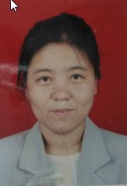

张印香

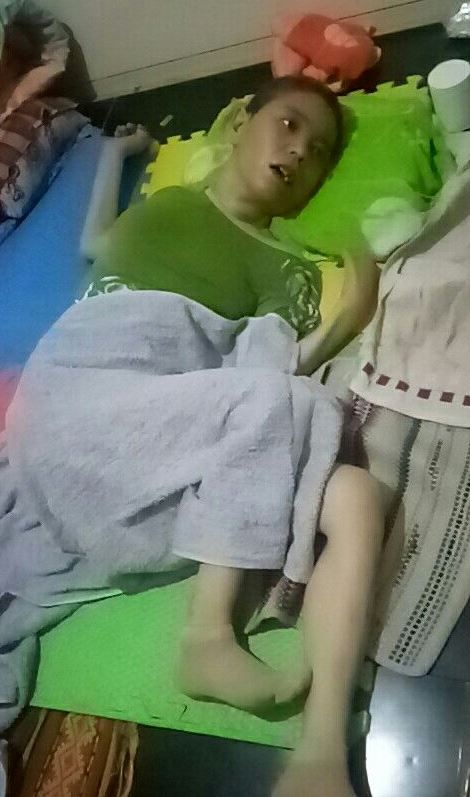

张印香被迫害后卧床不能自理

田云飞（五十三岁）和妻子张印香（五十二岁），都是太原西山矿务局金城公司职工。二人一九九八年开始修炼法轮大法，田云飞学炼之后，身体发生很大变化，特别是多年不愈的皮肤病、偏头疼、牙痛都好了，性格变好了。张印香一看法轮功这么神奇，也开始修炼法轮功，整个家庭沉浸在法轮大法的祥和气氛之中。田云飞遵守法轮大法真、善、忍的法理，为人正直、善良，工作一丝不苟，单位发工资曾多发给他钱，他如数退还。

然而这两个一心修心向善的好人，自一九九九年七月中共及江泽民集团迫害法轮功以来，夫妻二人遭受多次抄家、扣发工资、强迫下岗、拘留、劳教、关洗脑班黑监狱等迫害，家无宁日、亲人受牵连。田云飞在迫害中遭受毒打昏迷、多次多根电棍电击身体各部位、生殖器、电击使左腿膝关节白肉外翻，溃烂化脓、血脓粘衣。张印香被狱警用凉水从头灌下，全身湿透，不让睡觉、罚站、罚跑步、污言秽语人身攻击。

中共酷刑示意图：长期绑床并电击

妻子张印香二零一三年八月被610（中共为迫害法轮功而成立的非法组织）第二次绑架到山西省所谓“法制教育中心”洗脑一个月后，精神受重创。夫妻俩在起诉迫害元凶江泽民后，又受到派出所骚扰，张印香受惊吓，渐渐神志不清，瘫痪在床，八个月没有了丈夫田云飞在身边，张印香现在体重只有四、五十斤，骨瘦如柴，多处褥疮溃烂，生命垂危！

此时，丈夫蒙冤站在法庭被告席上，家里，妻子张印香生命垂危，瘦弱的身体令人心碎，目不忍睹，身上的褥疮愈合了又溃烂，张印香至少一年多来已经不会说话，只有两只大眼睛在无声的诉说着什么，眼神在传递着什么，在期盼着什么……

杏花岭，多少好人蒙冤被残害！田云飞与张印香夫妇、李锡福与李润芳父女、赵存贵等等，他们原本好端端的人生与家庭却被所谓“政府工作人员”人为的破碎了。他们的遭遇只是中共江泽民十八年迫害法轮功的冰山一角。

把这些善良无辜的人伤害到这种程度，那是造了多大的业！能不偿还吗？一定得偿还。

那些正在把田云飞、李润芳等人往监狱构陷的杏花岭区公检法人员，你们必将因为犯下群体灭绝罪行、反人类罪行而受到司法追缉，因为你们正在成为下述严重罪行的同谋：

在山西晋中监狱、山西女子监狱和新康监狱，迫害死了十六位蒙冤入狱的法轮功学员。十六个鲜活的生命，他们都曾有过美满的人生、幸福的家庭。杏花岭区公检法人员，你们还要把多少好人送到那人间地狱？！

迫害好人，天理难容；迫害法轮佛法修炼人，更给自己带来无边罪业。执意构陷好人的杏花岭区国保队长徐世娇、涧河派出所所长武瑞明、龙潭派出所副所长宋全生、法官季丽清、王剑，公诉人李隆、郭云燕、张萍，等等参与迫害的人，请掂量自己所作所为的严重后果。善待法轮大法，就是善待自己。何去何从，请慎重思考。

杏花岭区公安分局的国保队长徐世娇曾叫嚣：我弄那么多法轮功怎么没报应呢，我就不怕报应。殊不知，这是上天在给赎罪的机会，等恶报临头，一切都晚了。

当年，追随中共卖力砸庙砸佛像的人没一个有好下场，经历过这些事的农村老一辈都记忆犹新。法轮功是真正佛家高德大法，真善忍是普世的价值，迫害法轮功，是犯下如天重罪，是真正在迫害自己。

山西省610头目：政法委书记金道铭、副省长杜善学，积极迫害法轮功，二零一六年均被判无期徒刑入狱；太原三任公安局长苏浩、李亚力、柳遂记连续落马，表面“前腐后继”，实质是迫害法轮功的报应。山西司法厅长王水成，对监狱迫害有领导责任，二零一一年十一月，儿子车祸身亡，这令人思考古训：“父母不干好事，给子女造孽”。

公检法人员，请守住良知和你的道德责任、理性判断；不要屈从即将面临被清算的人间败类、江泽民的爪牙——邪恶的610的指令；不要沦为江氏余孽任意操控的迫害工具和牺牲品；也不要让你的家人因你迫害好人、丧失人格而无地自容；更要为你与家人的平安而选择——“善待大法一念，天赐幸福平安。”

<h1 align="center"><b>西班牙历史名城市政府邀请法轮功学员教功</b></h1>

西班牙奥维耶多当地民众现场学炼法轮功。（明慧网）

【大纪元2018年05月25日讯】2018年5月18日，法轮功学员应西班牙阿斯图利亚（Asturias）省首府奥维耶多（Oviedo）市政府官员的邀请，到当地介绍法轮功并教授五套功法。

位于西班牙北部的阿斯图利亚省是著名的旅游胜地，群山连绵蜿蜒、风光旖旎。其首府奥维耶多（Oviedo）始建于公元9世纪，历史悠久，保存了大量中世纪的历史风貌。博物馆内收藏的历史文物非常丰富，其建造于14世纪的著名的圣萨尔瓦多教堂内的奥维耶多圣厅被列为世界文化遗产。

奥维耶多素有“天堂之都”美誉，也是著名的“朝圣之路”的第一条路线的起点。

法轮功学员们为这里的人们带来了法轮功的美好讯息。上午10点，他们身着黄色炼功服来到奥维耶多市中心广场，展示法轮功五套功法。优美舒缓的动作、悠扬的音乐吸引著一批批过往行人驻足观看。人们纷纷接过传单，拍照留念。

奥维耶多市政府官员Marisa Pinga来到活动现场，她是这次活动的发起人之一。她表示，西方人很喜欢中国的传统文化，认为法轮功很好，“我们支持法轮功”。

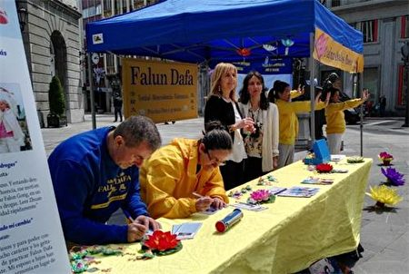

西班牙奥维耶多市政府官员Marisa Pinga（左三）来到现场支持法轮功学员的活动。（明慧网）

奥维耶多社区中心负责人也来到现场，站在学功的队伍中学炼五套功法，并告诉法轮功学员：“我们将在政府的官方网页上介绍法轮功，我们也希望每年都举办这样的活动，使更多的人了解法轮功。”

法轮功是由李洪志先生于1992年在中国大陆传出，教导人们遵循“真、善、忍”理念修心向善、做好人，同时教授人们五套简单易学的功法。广大的法轮功修炼者无不获得身体的健康和精神境界的提高。目前，全世界有一百多个国家和地区的人士修炼法轮功。

<b>踊跃学炼法轮功</b>

一组来自美国的学生旅游团经过活动地点，领队的老师是西班牙人。他感受到这里的平静、祥和的能量场。得知法轮功是佛家修炼大法后，他说，他对东方古老的佛家、道家理论有着浓厚的兴趣，平时也会在课堂上给学生讲一些相关的知识。今天在这里遇到法轮功，觉得很幸运。他让他的学生们都来学炼法轮功，认为“真、善、忍”对他和学生们都非常重要。

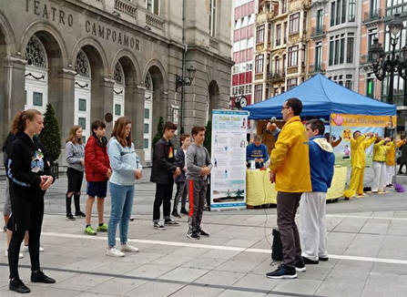

来自美国的学生旅游团现场学炼法轮功。（明慧网）

当地民众事先得知法轮功学员要来这里介绍法轮大法和教功，纷纷赶来学炼功法。许多人表示，法轮功的功法很不一般，感受到能量场很强，内心平静、祥和，身体也很放松。很多人对法轮功产生了浓厚的兴趣，询问炼功地点和时间，要传单和法轮功网站地址，表示要去学功。

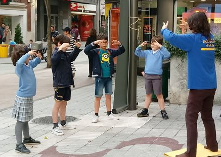

孩子们也在认真学功。（明慧网）

<b>签名反中共迫害</b>

下午，法轮功学员在奥维耶多市最繁华商业区的中心地段举行了反迫害征签活动。人们在了解了法轮功真相，尤其是中共邪党活摘法轮功学员器官的残暴行径后，非常震惊。

一位来自巴西的女士接到传单后表示：“活摘器官简直令人难以置信，这是人类的耻辱。”她表示将会一直签名支持，直到迫害结束的那一天。临走前，她再三向法轮功学员表示感谢，谢谢他们传递真相。

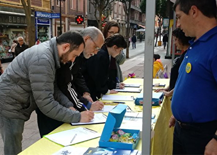

西班牙奥维耶多市的民众签字声援法轮功反迫害。（明慧网）

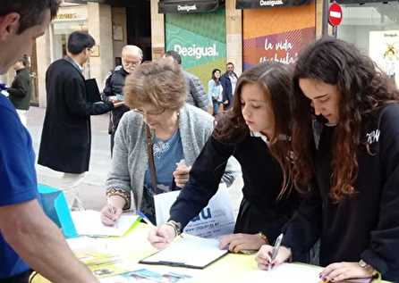

西班牙奥维耶多市的民众签字声援法轮功反迫害。（明慧网）

一名从事中医研究的西班牙医生签了名，并说：“中国有着几千年博大精深的文化，我们知道共产党，知道它所做的一切，对中国文化的摧毁是犯罪，罪不可恕。”

来自前苏联的一位旅游者在看了传单后说，他很了解共产党的罪恶，他的国家经历过在共产党统治下的苦难。他也毫不犹豫签了名。

还有一位女士在签名离开后不久，又回来向法轮功学员要了一些真相传单，说带给她的同事们看，让更多的人了解法轮功及中共的迫害。

也有当地华人路过活动现场。一位在西班牙开店的华人说，他读过大纪元社论《九评共产党》。他表示，今天的中国人被中共洗脑洗得太深，每个中国人都应该有了解真相的基本权利，“唤醒国人，法轮功是中国的希望”。

有一个中年人表示他没有入过中共党、团、队，但他的妻子曾经入过团，他说会把真相告诉她，让她退出这个邪恶组织。

路过活动现场的中国大陆人士在了解了真相后，大多做了“三退”（退出中共党、团、队）。临走前，法轮功学员都会送上一句祝福：“祝一切平安顺利！”他们也由衷地向法轮功学员表示感谢。

在奥维耶多为期两天的介绍功法活动中，当地的很多民众都接到了法轮功真相传单，了解到法轮功的美好以及在中国正在发生的迫害。有很多人签字声援法轮功学员反迫害。

<h1 align="center"><b>冤狱三千多个日夜 美丽女诗人控告江泽民</b></h1>

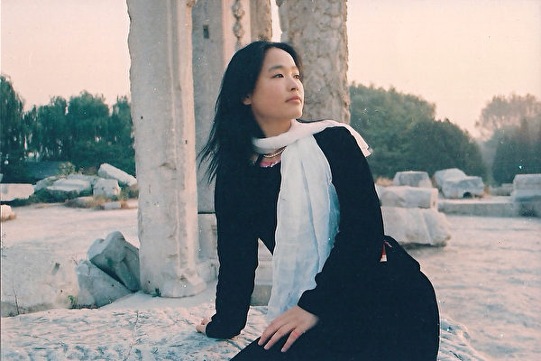

女诗人伏英（明慧网）

【大纪元2017年02月09日讯】那时候，她苦不堪言，不到40岁，头发已经花白了，人很瘦，很弱。在辽宁监狱中，她一天一天地煎熬著。每天不敢吃不敢喝，因为上厕所的时间是固定的时间。每天都要工作12个小时以上。不自由体现在每一个举动之中。

不过，她的心还是快乐的，她对自己说：不管在哪里，都要开心地活着。

监狱里有个女刑事犯，之前是职业打手。一天晚上，这个女打手和另两人从晚上10点开始打她，到第二天凌晨4点钟才罢手。第二天，她又出工了。职业打手找到她说：“我们以后再不打你了，你原谅我们吧。”她点点头。

她对自己说：“别人对我不善，我仍然要善待他，因为我知道被别人伤害的痛苦”。她展开了笑颜，虽然那笑颜沾满了苦涩的味道。

她是伏英，一位多才多艺的美丽诗人。1999年1月，一个偶然的机会开始修炼法轮功。因为坚持信仰，33岁美好年华之时，她被冤狱9年，经历了3000多个日子的非法关押迫害。2015年6月16日，伏英通过邮政快递向北京最高检察院和最高法院控告迫害元凶江泽民。

伏英，曾就读于辽宁文学院，在北大西语系和北京电影学院研究生班进修，先后就职于鞍山市煤气公司宣传部、北京晓庆影视公司、北京电视台、《跨世纪人才》杂志社，个人专著有：诗集《静女》，与人合作的作品有《享受悲怆》。

明慧网报导，下面是伏英在控告江泽民书中讲述的她和她一家人的遭遇：

<b>幸运的一家人</b>

像我这一代的中年人，都是受到中共无神论的毒害，几乎是什么都不信的。

可是我的母亲佟书萍多年来身患冠心病、高血压、高血脂、糖尿病、骨质增生、结肠炎、隐性甲肝等十多种大病，走道都打晃，可是从1998年8月开始，在修炼法轮功之后的2个月时间里，一下变得走路生风，精神抖擞，扔了所有的药瓶子，并且能帮忙带不到百天的新生儿。

1998年12月，我的妹妹伏艳患了产后风，很痛苦，看到妈妈修炼法轮大法后的变化，她抱着试试看的心情炼炼功，没想到，很快腰疼、哈不下腰等产后风后遗症症状很快消失。

我的一个姐姐伏强，15岁患了全身瘫痪，后来虽然能走路，可是又患上了心肌炎、妇科病、怕冷（三伏天穿棉袄）、怕风（一年四季不让开窗开门）、怕声音（在她身边小心翼翼，生怕弄出动静吓着她）等怪病；20多年不停的吃药打针。1999年1月，她也走进了大法修炼中来，很快她的所有病症一扫而光，再也不用打针吃药了。而且还能穿裙子上街，恢复她原来想都不敢想的正常生活。后来，在她43岁时，又生了个闺女。

事实让人不得不信服。而对于我自己能够走上修炼之路，应该说是偶然中的必然。

那时候，我居住在北京的北大附近，每天晚上下了班，就到北大校园里去看书，而我看书的地方就是一个法轮功的炼功点。有一天我坐在木椅子上看书，两个坐在我身边的陌生男人忽然对我说：“每个礼拜六、礼拜天这儿义务教功，你来学吧！”我什么都没想就回答他们说：“好啊！”

第二天我真的去了，和大家一起比比划划地炼起来。你还别说，真是有感觉呢，就感觉那些动作是人与天沟通的语言呢。

从那以后就炼起了法轮功，那是我最幸福的一段时光。从1999年的大年三十我在一位法轮功学员家看到了师父的讲法录像之后，到1999年7月被非法取缔，才短短的半年时光，那时候也是刚刚得法的妹妹对我说：“我们能够修炼大法，真是太幸运了”。

的确，那时候像我一样幸运的人很多，就是在北大的炼功点上，有北大的教授、北大的学生、北大的员工、还有周围的老百姓，北大当时校园里已经有2个炼功点了，离北大一墙之隔的圆明园正门、圆明园园里各有两个炼功点；离北大不远的清华大学更是不得了，当时清华炼法轮功的竟有数百之众，校园里遍布9个炼功点。

可是半年之后，1999年7月22日，一场前所未有的迫害开始了，我们这些幸福的炼功人，一下子好像从天堂被掀进了人间地狱。

<b>风雨来 心愈坚</b>

1999年7月江泽民为了一己之私，开始了疯狂地打压迫害法轮功和法轮功学员。

那一天，我正在和一些高中同学吃饭，在饭桌上，一只玻璃杯子在没有任何人碰触的情况下，突然的炸裂了，我们都惊呆了，就感觉是一种不祥之兆。

等我回到家中的时候，发现电视已经开始了铺天盖地的对法轮功的污蔑之词。

那几天，我曾经问过自己：“法轮功到底是真的还是假的？”也许当初的时候，很多人都这样问过自己吧。可是我很快就否定了我的怀疑，因为我知道师父为了救度众生，不辞辛苦讲了那么多的法，难道都是没事闹着玩吗？我的妈妈、我和姐姐、妹妹的身体变化是花多少钱都买不来的，可是。师父却没收我们一分钱，唯一的花销是花了12元钱请了一本《转法轮》。仅仅凭这两点，在这个物欲横流的社会里，上哪去找这么好的功法？

1999年7月之后，我依旧坚信着自己的信仰。但是我也没有想到，等待我的是那么大的苦难。

<b>33岁 被非法判刑9年</b>

2001年7月12日，我在一个朋友家玩，晚上没有回家，半夜12点，警察从天窗子爬进朋友家来，绑架了我和另外几个法轮功学员。

2001年7月13日，中共申办奥运成功。而就在那个凌晨，我们又被绑架了。那个晚上，我被警察送进了北京市朝阳看守所，在没有任何证据的情况下，非法关押了6个月。

因为没有任何的证据，非法超期6个月之后，把我送到了北京市团河劳教所的“转化”基地。

在那里，我被警察逼迫十天十夜没有睡觉，要我承认在朋友处和别的法轮功学员一起做资料和上明慧网，否则就继续不让我睡觉。在绝望中，我以为他们不会放我回家了。后来他们将我非法批捕。

被绑架18个月之后，我又被非法开庭。

非法开庭之前的头一天晚上，一个书记员到看守所找到我，对我说：“你的态度决定你的刑期，你的态度有什么改变吗？”他的意思就是说让我放弃我的信仰。

我回答他：“没有。”

这也许就是“中国特色”的法律吧，态度决定刑期，如果我不放弃我的信仰，等待我的就是漫漫的刑期。果然如书记员所说，几天后，江泽民集团随意的塞给我一纸判决——就是有期徒刑9年。我的青春就这样被轻易耽误了。

<b>因为向善被关押牢狱</b>

在监狱中，那些狱警总会问我一个问题：“你没病没灾的，为什么要炼法轮功呢？”

我回答：“没有为什么。”

的确没有为什么，我告诉她们：“人本来就是应该善良的，人活在这个世界上，就是为了修炼而来的。”

是的，回想自己15年的修炼历程，我对自己说：“我就是为了修炼，为了走一条向善之路才来到这个世界上的”。

在被非法关押在辽宁女子监狱的9年中，我们每天面临的除了繁重的体力劳动之外，还要时时刻刻面对监狱里所谓邪恶的“转化”，所谓的转化就是用各种酷刑折磨煎熬修炼人，让他们屈服、说谎。

记得那是2004年4月的一天，正是一个春天刚刚来临，可是监狱里却来了暴风骤雨式的“转化”潮，监狱给了死亡名额，打死白打死。

有一天晚上，收工回来，收拾完已经10点多了，她们把我放进一个没有监控的小库房里，3人轮番的打我，一边打一边问我：“转不转化？”看着她们穷凶极恶的样子，我依然对他们微笑着。

可是如恶魔缠身的打手们说：“你看什么看，再看我把你眼睛抠出来！”

打我的那个刑事犯在外面的时候，就是个职业打手，是一个女男人。她说她在看守所里，曾经把一个人打成了内伤，可是外表一点都看不出来。

她们从晚上10点一直打我到早上4点钟才罢手，并吓唬我说，如果我不转化，以后天天这样打我。

我的痛苦无以言表，他们打人的方式都是往人的五脏六腑上打，都是能要人命的地方，如果不是有师父的保护，我想我早就被他们打死或打成重伤了。

晚上被打了一夜，白天还照常去出工干活。不过我已经下定了决心，就是死了也不“转化”。在被打得无法承受的痛苦过程中，我想到了死，因为我做不到去骂我的师父，我做不到去诬陷说我的师父蛊惑我炼法轮功，因为炼法轮功是我自己愿意的，没有什么人来强迫我。

那时候，一天24小时都被看着，他们就是让你过着生不如死的生活。

有一天，我正在干活呢，那两个打我的职业打手找到我说：“我们以后再不打你了，你原谅我们吧。”我点点头。

也许是她们良心发现吧。从那以后，她们真的没有再打我。其中一个出手打得最重的那个人，等改判的时候，还比别人多半年刑期。她心里感到这是打我的报应。

等我要回家的前几天，他们找到我问：“你还恨我们吗？”

我说：“修炼的人不会记恨人的。” 她们听了表现出很感动的样子。

我体会到了师父说的“那么作为一个修炼的人，在个人修炼中你要不能爱曾经在常人中反对你的人你就成不了佛。”其实这样说来，能够原谅她们并不是我的大量，而是师父的慈悲。

从那时候开始，我对自己说：“别人对我不善，我仍然要善待他，因为我知道被别人伤害的痛苦。”

从此我展开了笑颜，虽然那笑颜沾满了苦涩的味道。

至今我还保留了一张2006年1月29日大年三十在狱中拍摄的照片，可以从中看到那时候我真正的心态，虽然身在地狱般的煎熬之中，向善的心依旧不弃不悔。

<b>狱中诗集</b>

作为一个写作者，其实从入监开始，我的写作权利就被剥夺了。为了能够争取得到一支笔的权利，我就不停去和狱警们沟通，沟通了2年多的时间，都没有结果。可是自从那次被毒打之后，佯装不知情的队长送了我一个本子，让我在少得可怜的时间里写诗，得之不易的机会，怎么能够放过呢？

那时候，我甚至不洗漱、不吃饭，挤出时间用来写我的诗歌，每首诗差不多都是在几分钟之间完成的，所以虽然时间有限，但几年下来，我已经写了厚厚的几本诗集了。

临回家之前，狱警告诉我，等我回家的时候，可以把诗集给我带回家，可是等回家的时候，我和她说起这个事，她又推脱。

最终我的诗集还握在她们的手里，至今不知去向。

<b>深重灾难 家庭受株连</b>

一天一天的熬过了三千多个日子，吃了几辈子都没有吃过的苦，做了几辈子都没做过的活。

我以为自己的春天终于来到了，我以为终于可以苦尽甘来。当2010年来到的时候，也是我要回家的日子了，那些日子，我给家里人写信的时候，每次都会给他们数我回家的日子。

我以为好容易可以活着回来了。刑期结束了，我的苦难也该结束了。我以为自己的春天终于来到了，我以为终于可以苦尽甘来。

可是事实并不是我想像的那样。没有想到，更大的迫害还在等待着我呢，其实我只是从一个小监狱走到了大监狱中来罢了。

2010年的7月11日，我终于走出了监狱的大门，看见了久违的阳光。在监狱中的9年时光，我能够晒到的太阳是屈指可数的用小时来计算的，每天顶着星星出工，每天踏着黑夜收工。终于可以见到阳光了。

可是刚出了监狱的大门，门外的警车就在等著接我呢。

因为我在监狱没有“转化”，当地的片警就开着警车来接我，等我上了车，车开动了，向着回家的方向驶去。

我在忐忑不安中，姐妹们就告诉我，这9年间，我的父亲和三姐夫都在2008年的时候，就永远离开了人世，还有我的舅舅也去世了；而我的大姐就在我回来的3个月前，得了脑出血，手术后，还瘫在床上。这一切因为我在监狱中而没告诉我。

2010年从监狱回到家中的时候，父亲已经离开了我，只剩下风烛残年的母亲，我以为自己终于可以床前尽孝了。可是回家九个月后，疲惫的母亲已经精疲力竭，也撒手离开了我们姐妹。

他们等得太久了。

记得父亲最后一次去狱中看我的时候，对我说：“我等不起你了。”而我竟然没有明白父亲的话外之音，其实那次父亲就是去沈阳做手术的，手术后没几个月，父亲就怀着永远的遗憾离开了我们。

他离开我们的时候，不仅看不到我们，连我们的知情权也被剥夺了，记得我马上就要回家了，狱警还让我给我的父亲写封信，其实那时候父亲离开我已经2年了。知情的狱警让我给死去的父亲写信，正是他们非常“人性化”的体现吧。

当我在监狱中失去自由，痛不欲生的时候，辽宁女子监狱的政委找我谈话，她说：你是来这里“体验生活”的吗？这么多年了，也该体验够了。

她的目的是让我写“悔过书”，好减刑回家。我说我不是来体验生活的，我要回家，我爱自己的家人，我爱所有的亲人朋友，他们都很喜欢善良的我，我热爱我的工作，热爱我的写作，是你们剥夺了我天赋人权的自由！

父母亲都走了，我的家破碎了，剩下的是一无所有的自己和一个13岁正在上学的孩子。父母留下了唯一的一个房子，也被强制拆迁了（房子才盖了10年），没有了家没有了房子，有的是不能够推卸的责任。

孩子是我妹妹的女儿，我的妹妹也是因为修炼法轮功而被枉判13年半，那时还在监狱之中而无法照顾孩子。妹妹原来也有一个美满的家庭，后来不修炼的妹夫承受不了压力了，不顾妹妹的感受，还是到监狱中和妹妹办了离婚手续，不给抚养费，不来看孩子，也不履行对孩子的责任，等爸妈死后，抚养孩子的重担就落在了刚刚回家的我的肩上。

可怜的孩子从3岁起，就被迫离开了自己的母亲，我对自己说就是再难也要把孩子带好。可怜那么小的孩子，从3岁开始就由姥姥带着，13年来风雨无阻地走在探监的路上，走在去探视自己被非法关押的母亲的路上，那其中的艰辛怎么是一个小孩子能够承受的，可是这个坚强的孩子硬是走过来了。

母亲离开我们的时候，妹妹的孩子已经13岁了，正在上初中。2012年，为了给孩子一个更好的学习空间，我领着孩子到沈阳的一所中专学校去学习了，孩子一年的学费八千多，再加上我陪读租房子的费用，是一笔很大的开销，但是为了孩子，我一直在硬撑著。

到了沈阳人生地不熟的，连低保也没有的自己，只好给人家看小孩赚些生活费。本来以为就这样清贫一些也能够过下去，可是谁知道，2013年的8月28日，无缘无故可怕的灾祸又降临到我和孩子的身上。

<b>孤苦伶仃带着孩子 再次被绑架</b>

2013年的8月28日，也是沈阳市全运会开幕式的头一天，早上我和孩子在收拾屋子，有人来敲门，我什么都没想就打开了门。谁知是一群便衣警察，他们说查身份证，我拿给他们看，看完了，他们又问我：“你炼法轮功吗？”我毫不犹豫地回答他们说：“是啊”。

谁知就这一句话，那些警察就蹿进我的家门，把我的笔记本电脑，孩子学习用的电脑，还有我的书稿，都给抢走了。他们还把我骗到警察局，说了解点情况就送我回家，可是最后他们却把我送到了沈阳市看守所。

30多天之后，因为没有任何的所谓“证据”，不得不“取保”放我回家了。这一次的绑架，对于经济十分拮据的我和孩子，又损失了一万多元钱，真是雪上加霜啊。至今所有被抢劫走的东西，一样都不曾归还。

我从沈阳第一看守所回来之后，在沈阳雄狮学校上学的孩子，也被迫停学了，放在孩子老师办公桌里的两千多块钱也被警察给抢走了，因为孩子的妈妈还在监狱了，警察以此为理由把孩子从学校里撵了出来，我和孩子都没有了住处。

<b>40年后才有的家 40天后破碎了</b>

再次被绑架出来之后的那一刻，自己从来没有过的渴望着能够有一个家，以为有了家一切都会好起来的。

那时我已经46岁了，没有结婚，没有孩子的自己，又担负起了教育孩子的责任，一个人的力量真是有限啊。

或许真的是缘分吧，恰恰在这时候，我认识了我的丈夫——欧阳洪波：我们相识了2个月之后，2014年5月16日，历经9年冤狱的我和他就结婚了：当时我46岁，丈夫47岁。

可是万万想不到，结婚才40多天，我丈夫在去朋友家串门的时候，就被警察们带走了，之后被以所谓的“破坏法律实施”而被起诉。

我们已经是不惑之年了，尽管没有年轻人的缠绵，可是我当然会希望我的家庭是完整的，丈夫是平安的，他能够回家来尽一个丈夫的责任，尽一个儿子的责任（他的老父已经83岁了，一直是我的丈夫在父亲的身边侍候着）就足矣。

可是现在这一切在短短的40多天之后，就成为了一个梦幻，作为一个弱小的女子和一个年迈的父亲，我们能够做些什么呢？

我们按照“真、善、忍”的标准来要求自己，做一个好人却要历经魔难。记得有一位律师先生对我说：“我觉得法轮功好，因为政府这么打压你们，你们没有一个去报复的，刑事案件没有一件是炼法轮功的人做的。”

江泽民滥用职权和国家资源，在中国发起并维持这场浩劫长达17年之久 。而当今的中国又有多少像我这样的家庭遭受骨肉分离、各种精神和肉体上的痛苦啊⋯⋯

<h1 align="center"><b>前人大代表：被捕好友很健康却每天被抽血</b></h1>

【大纪元2018年04月09日讯】（大纪元记者李颖新西兰奥克兰报导）“医生每天对你抽血和输液吊瓶，就是不告诉你为什么。”这是本报日前收到的读者投书中的一句。全文如下，题目为编者所加。

大家好！我叫余很猛，来自中国大陆，出国前是一名企业高管和人权捍卫者，曾经担任过人大代表，也是“709人权律师大抓捕”的见证人。

在中国的强迫失踪是什么样子呢？就是你突然不见了，活不见人，死不见尸，没有任何人通知你的家人。你太太或者你的律师，向所有可能的政府、警察、法院、检察院、监狱查询，所有官员都回答“不知道”。要报警失踪不被立案，要登报寻人启事也没有媒体敢接。人权律师王全璋的太太，当时就面临这个局面。

王全璋律师据我所知是失踪时间最久的人权律师。从2015年7月10日起，整整超过1000天，超过33个月。

在这33个月里，王全璋律师的太太李文足女士和律师们坚持数十次的不断在天津提出控告，不断申请会见，不断的要求给王律师存生活费。终于，被允许存钱，但被告知不能会见，即暗示人还活着。现在我们只是隐约的猜测他可能被非法关押在天津第一看守所，至于王律师是不是被虐待受伤？是不是被酷刑致残？没有人知道。

在丈夫失踪期间，北京警察对王太太的骚扰也是非常卑鄙的。王太太要租房，警察就去骚扰房东，阻止房东租房给他。王律师的孩子要上幼儿园，已经交钱注册了，警察就去幼儿园骚扰恐吓，阻止幼儿园接收王律师的孩子。后来王太太住到另一位人权律师朋友家里，警察就在这家门口和楼下的电线杆装监控。

在北京召开重要的会议时，如果王太太和孩子出门，就会有五六个人紧紧跟随王太太和孩子，貌似保镖，更是公开的骚扰。但如果是特别重要的国际会议，就会有五六个人堵著门，不让王太太一家出门。这就是人权捍卫者和其他被迫害者在中国的真实生活。所以，朋友们，如果你去过中国，是很难看到中国百姓的真实生活现状的。

还有一个中共警察挑拨离间的小插曲，就是北京警方为了促使李文足女士放弃丈夫，告诉她的姐姐，说王全璋在外面有别的女人，还有几百万存款，没有把李文足当真正的妻子，让她的姐姐劝她离婚。后来李文足女士发表声明，感谢北京警方的通报，在丈夫释放后将向北京警方讨要这几百万存款。这事在网上成为当局的一个笑柄。

王全璋先生从1999年还是法学院学生时，就开始帮助法轮功维权，成为执业律师后经常为法轮功、基督徒、记者、土地拆迁户等人权案件辩护。如果您对真实的中国有了解的话，就可以想像得到，每次办理这种中共敏感的人权案件，都可能面临被警察、法警、甚至是法官骚扰殴打，他却坚持了16年。有一次，王律师为法轮功辩护，但是法警不让他陈诉辩护词，威胁说“你每说一句，我就打你一个耳光”。王律师坚持把辩护词说完，被法院的法警打了一百多耳光。这是王律师的同事在他被捕之后告诉王太太的。

2018年1月19日，王太太为丈夫聘请的律师余文生，也被中共非法抓捕，失踪至今。现在余律师的太太有收到刑事拘留通知，但是不允许家属会见和律师会见。

下面，我要介绍的这位，是王全璋律师的同事吴淦（音干，第四声），他是我最好的朋友之一。他是北京人权律师周锋锐的助理，于2015年5月20日在南昌被非法抓捕。据我们推测，他被捕的主要原因，是他在为被中共警察枪杀的基督徒徐纯合寻找真相。

2015年5月5日吴淦在网上披露说，他已经接触到黑龙江火车站事发现场的目击证人，并获得案发现场的相关录音、手机视频片段。他说，由于很多目击证人事发当天就被警察找，很多人视频被删，后期取证难度较大，因此他在网上悬赏万元人民币以期获得现场录像。

当时我在协助他，把他得到的现场视频发到网上，在中共的网警发现封锁前，让视频迅速公开传播，使更多的人认识到官方公布的视频是被剪接并技术处理过的，当时我们上传的录像成了官方新闻之外的一个网络新闻热点。

由于事件发生后中共警方迅速表彰了开枪杀人的警察，并禁止所有尝试调查真相的律师和记者开展工作，而找到现场视频并公布的吴淦，被认为是抹黑了中共警察，成为中共的敌人。

在吴淦被非法抓捕的前三天，徐纯合案的代理律师之一谢阳，遭到一群不明身份的人殴打至重伤。

2017年12月26日，吴淦被法院判刑八年，细看12条罪状所指，全是为拆迁户、基督徒、黑监狱、司法冤案维权的活动，12条指控没有一条可以成立。这些指控，形同嘉奖时代的英雄。

在吴淦先生被捕之后，曾经长期处在失踪状态，共562天不许律师和家属会见，期间遭遇各种酷刑，如长期带“工”字铐，几天几夜不让睡觉，用空调冷冻，长达200多天不让出监仓等等，这是后来通过律师会见口述记忆才传递出来。

还有一种酷刑是：虐待式“治疗”，吴淦先生身体健康，却被拉到天津公安医院，全身贴满仪器管线，每天抽血、服药、血压计每半小时充气一次，24小时不停。你无法入睡，无法翻身，也无法走动同时。医生每天对你抽血和输液吊瓶，就是不告诉你为什么。

由于吴淦面对酷刑不屈服不认罪，中共又迫害骚扰他的家人。办案警察安少东，多次威胁要伤害吴的女儿。此外：

一，北京警察对吴淦的妻子进行长期的威胁骚扰，让她不要对外发声，并封锁了她的两个银行账户，使她无法公开募集律师费；施压让她聘请官方律师，但是被她拒绝了，坚持自己聘请律师。

二，福建警察骚扰威胁吴淦的哥哥，使他完全不敢站出来支持自己的弟弟。

三，最严重的迫害是，福建警察逮捕了吴淦的父亲，时间长达19个月，想要以此迫使吴淦认罪。吴淦至今仍坚不认罪。所幸的是吴父目前已被释放，正在控告当局要求赔偿。

以上仅举两位知名的人权律师受迫害案。709大抓捕开始于2015年7月9日，这天开始中共警方在全国各地同时行动，抓捕活跃的人权律师和人权捍卫者，该镇压到今天仍未停止。至今共拘留传唤321人次，判决13名，取保3名，41人被限制出境，且仍有3名律师在关押中等待所谓的定罪。

大多数人都认为，律师懂法律，有社会地位，不会遇到非常严厉的迫害或酷刑，因为看起来中国已经是一个非常现代化的半文明国家。但实际的人权状况，残酷得超出想像。

其实，除了对律师，现在仍然还有许多记者、作家、博主、法轮功学员、基督徒、天主教徒、佛教徒、企业家、罢工领导者，因为信仰或政治表达被迫害被酷刑。

近几年类似这样的迫害案例，每天都在发生，这说明在共产党治理下，中国永远不可能走向法治文明，中共要做的所有工作，都只是维护共产党的统治。

因此，我呼吁海外全体中国人：请放下一切成见，共同致力于“驱除共党，光复中华”的目标，帮助祖国早日成为自由民主的国家。

我也呼吁全体纽西兰人：审视中国这个重要的贸易伙伴，你们是在和魔鬼做交易，生意要做钱要赚，失业率要控制，但不可不保卫纽西兰，不可对魔鬼不设防。

<h1 align="center"><b>感悟幸福</b></h1>

【明慧网二零一七年八月五日】《西游记》中说：“人身难得，中土难生，正法难遇：全此三者，幸莫大焉”。全身心沉浸在这莫大幸福里的我，由衷感悟在法轮大法中修炼的幸福荣耀说不尽道不完。
我一九六零年出生，用当年的眼光看，我生活、学习、工作，还算比较顺利，没多少磨难，然而却并不快乐。上中学后开始渐渐对各种事物有自己的想法，渐渐特别敏感，不满对立的心理越来越强，看什么都不顺眼，也常跟家人吵架，不仅让周围的人痛苦，也深深伤害着自己。可从没想过要改变自己，就这样过了很多年。工作步入社会后，越活越迷茫，不明白人为什么而活呢？

一九九五年春，有机会拜读《转法轮》一书，还很喜欢看师父的其他著作。天文学、物理学讲起宇宙、时空晦涩难懂，不知所云，我以前完全没兴趣；但是在师父的著作里，宇宙、时空等等等等，超越人类空间的一切，太有意思了，太奥妙了，又非常有道理，逻辑缜密，看的爱不释手。

有同事对我说：你学了法轮功后看起来和善多了，现在见了你喜欢跟你说话；过去你看起来特别厉害，根本不想理你。另一同事也说：我知道是法轮功改变了你。

确实，修炼法轮功后，我心里清澈、踏实，没有烦恼，身心轻松愉快。

一九九九年七月开始，面对中共铺天盖地的宣传和打压，我明白那是宣传，都是谎言。十余年里，我因坚持信仰被非法关押、非法拘禁洗脑班及非法判刑；被长期强制灌输各种侮辱、诋毁、攻击法轮功的东西；遭受各种侮辱、谩骂的人身攻击，暴力殴打，把擦茅坑的布塞到我嘴里，用铁丝缠勒我的头、嘴；冬天被扒光衣服从头到脚浇多盆冷水，被关禁闭，长期不让睡觉，抓着头使劲往墙上撞，缝衣针扎手指甲缝、脚、膝、耳，耳朵扎穿后，扯着针上的线来回拉等等等等。

其中一次是二零零零年圣诞节间一天的晚上，多名警察无故闯進我家把我抓走，投進看守所。我被暴力灌食、长时间罚跪后，铐上手铐、和对死囚用的脚镣，关在只有垃圾、粪桶、密不透风、不透光的所谓小号几天。我高烧不退数天，到医院后发生呼吸衰竭，两次下病危通知，被迫气管切开，并被医院诊断为严重的肺结核。从医院回家后，越吃治结核的药越没胃口，吃不下饭，两个月后，我私下停了药，正常修炼，反而饭量增加，身体一天天好起来。

我亲身经历气管切开后不能发声、不能说话，即使拔管缝合切口后，仍不能正常发音，声音、音调变的很难听，数月后，切口完全长好，声音、音调才渐渐恢复正常。所以在病床上一看到“天安门自焚”，我就知道是假的，小女孩气管切开却正常的发声是造假，人烧了而腿中间的装了汽油的绿色雪碧瓶子却完好无损是造假，灭火毯不为灭火，像等口令似的甩起来像演戏等等。

二零零三年，原单位要员工重新签劳动合同。尽管工作认真负责，但我不放弃修炼法轮功，原单位领导就迫使我放弃工作，在善意沟通无果的情况下，只有放弃自己的利益，没有任何依法“结账”，一纸“解除劳动合同”，我就没了工作。

说实话，面对铺天盖地的打压，最初我不知所措，随着时间的推移，越来越感到放弃修炼，再回到迷茫的过去那样，精神的痛苦更无法承受，想清楚决心继续修炼时，感到面对打压自己真的有勇气了。第一次被关在看守所时，心里很怕，狱警一吼，心里都哆嗦。后来就想“我是一个修炼人，按照真、善、忍去做”，无怨无恨对待一切折磨、恐吓，飘着雪的冬天，在放风场被扒光衣服从头到脚浇多盆冷水，心里依然无怨无恨的时候，我觉的没什么可怕的了。当时一个被关的妇女说你这样会落下毛病的。但回家后，我感觉自己像脱胎换骨一样。

以后再面对各种折磨、酷刑，我就这样把自己当修炼人，按照“真、善、忍”去做，无怨无恨。说实在的，当这样去面对酷刑、折磨的时候，都觉的自己比痛苦磨难高大，那一切都算不了什么，心里坦坦荡荡。而家人为我担惊受怕，巨大的精神压力，度日如年，从这个角度说，在迫害中他们比我更苦更难。

单位不讲法律解除我劳动合同，说有不同意见你可以去仲裁。反复考虑之后决定申请仲裁。当时仲裁部门听到我学法轮功，话都不让我说完，就赶我出门。几经周折，我请了律师，仲裁部门又请示了六一零（江泽民一伙为迫害法轮功而专门成立的非法组织），才给我出具不给仲裁的文件，才得以到区法院立案打官司。法官调查时，仲裁部门编了一套说辞，做伪证，当时一听我就炸了：你仲裁也是一级执法部门，居然做伪证，明目张胆明知故犯，不罪加一等吗？

从法院出来，深一脚浅一脚，气的路都走不稳，不知怎么办时，转念一想：我是修炼人，要按照“真、善、忍”做，要慈悲对待。修炼那么久，那是我第一次想到要慈悲对待遇到的不公。很快心平静了：仲裁的人也是怕啊，文革的遭遇深深烙在人们的心里了，对法轮功的迫害镇压，更甚于文革，讲实话他怕自己受牵连，不说假话他不敢啊。所以我把事情经过原原本本写下来，对其行为表示遗憾的同时，对其内心的恐惧表示体谅，也以尊重他的态度，请他对我叙述的事情经过给以审查，不实之处请他指出更正。把这个递交法院、仲裁等有关部门后，心里踏实、平静，虽然对“慈悲”的认识极其肤浅，但我体会到，想到要慈悲对待时，自己内心里的宽容、体谅、安宁、温暖……慈悲对他人的时候，自己又何尝不是慈悲的受益者呢！

之后又经历了一些波折，我的原则是对法律负责、对被告负责、对自己负责就行，不取不义之财，过程中法官对我说：象你这样好的人太少了。最后一审判我胜诉。

被告不服，上诉到中级法院，我递交应诉材料后，几次到法院询问，法官都支支吾吾，半年后区法院给我一份中级法院的判决书判我败诉，判决日期竟然在半年之前的被告上诉日那两天。中级法院就是这样玩弄法律。

过程中我和律师的配合很好，律师说法律上本来这是百分之百赢的案子，律师事务所主任批准免去我后续的律师费，我再三要求缴费，告诉他们我有这个经济能力，但他们说，他们也想做些正义、有意义的事情，话已至此，除了感谢，我不好再说什么了。

在监狱，虽然也经历了残酷的折磨，但始终对具体的每个人无论是狱警、囚犯，我都无怨无恨，因为“我是一个修炼人，要按照真、善、忍去做”已经在我心里扎根了，所以心里始终都很坦荡，身体的苦痛也就不算什么了。在身边日夜监视、折磨我的囚犯无法理解，但我们分开的时候，监视、折磨我的囚犯头儿对我道歉，并说她再不会那样对法轮功学员了。狱警说我心态好，您想象的到吗，在那样的环境下，我却有心替狱警、囚犯着想，想到她们的苦衷、没人理解的难处，虽然不能替她们解决，但旁人的理解，对自己心理上也是很大的安慰，精神的支持，每个人都需要。

不知不觉的，“我太幸运、太幸福了”不时的从心底油然而生，渐渐对幸福有了自己的感悟，原来幸福不来自于索取，而来自于放弃，不来自于紧紧的抓住利益，而来自于真心的为他人着想，甚至不惜放弃自身的利益，幸福不来自于功名利禄，而来自于对人生意义的觉悟，对真理大道义无反顾的坚守与维护。

真切感受到“人身难得，中土难生，正法难遇：全此三者，幸莫大焉”，自己多么幸福荣耀！得一个人身不容易，转生在中土—我们神州大地也不容易，要求得正法就更难上加难，本次人类五千年历史，只在二千五百年前，古印度释迦牟尼佛传过佛法，在西方基督耶稣教过人。要生在中土神州，又恰好赶上正法师父亲自在世传大法度人，这万古机缘，也许只可遇而不可求吧！

万幸的是，今天，你、我、他，神州大地上的每个人，都赶上了这万古机缘，只是江泽民和中共祭起血腥镇压，谎言欺骗、诬陷栽赃铺天盖地，破坏人得正法，煽动、欺骗人敌视、仇恨正法而毁灭人，所以世上很多人才对这万古机缘茫然无视，在名、利、情中苦苦挣扎。

衷心的祝愿有缘的您明白法轮大法是正法，是我们千万年的等待，记住“法轮大法好，真善忍好”，退出中共组织，接上生命的圣缘，我们就拥有无比光明、幸福美好的未来！

<h1 align="center"><b>美展触动心灵　反思人生真理</b></h1>

【明慧网二零一八年五月二十日】二零一八年四月十六日至五月十六日，在俄罗斯克拉斯诺亚尔斯克市（Krasnoyarsk）最大的贸易展览中心举行了真善忍美展，期间大约八百多人参观了此次美展。参观者们对画作中表现出的修炼法轮功的美好感到惊叹，同时也对在中国遭受迫害的法轮功学员感到同情。

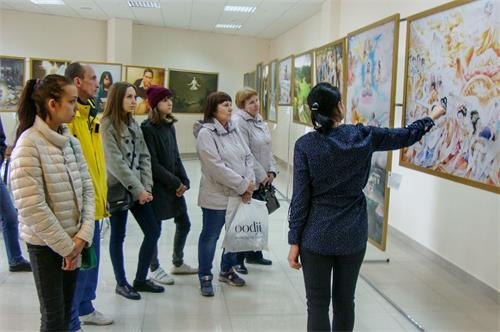

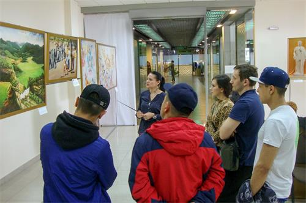

图1～2：在俄罗斯克拉斯诺亚尔斯克市（Krasnoyarsk）的“真善忍美展”上，人们观赏画作，了解法轮功真相。

“真善忍国际美展”是由修炼法轮功的艺术家们创作的美术作品展，表现的是各族裔民众修炼法轮功过程中的精神追求以及法轮大法给人们生活带来的美好，其中也包括揭露已经持续十九年的中共对法轮功进行迫害的作品。

在此地美展不是第一次举行，以前看过美展的人这次带来了自己的亲朋好友和同事来观看。一位来自西伯利亚地区诺里尔斯克市（Norilsk）年轻的运动员对画展深有感触，在留言簿上写道：“为精神的安详致谢。”

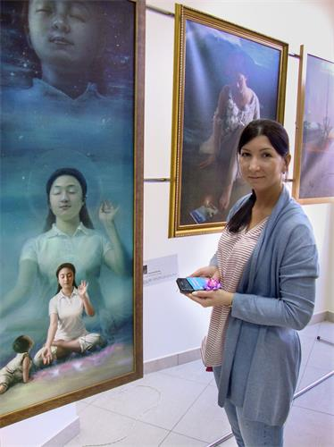

图3：心理学家娜杰日达表示，美展让她反思人生的真理，变得更善良和宽容。

一位名叫娜杰日达的女士是个心理学家，她在留言簿上写道：“这是一个内容丰富、精彩的‘真、善、忍”’艺术展览，让我印象非常深刻，反思人生的真理，变得更善良和宽容。”

瓦伦蒂娜（Valentina）是一位老师，她在留言簿上写道：“对这样一个美妙的、注入灵魂的、让人深受感动的画展表示深深的谢意。这些图片印入了心中，不可能冷漠的、无动于衷地离开这个大厅。感谢在记忆中留下这不可磨灭的印记，以及最重要的在心灵上！我开始完全不同地看世界、人们和很多东西。”

还有的参观者评论道：“美展触动心灵，有一些对人类和别人的命运不持冷漠态度的人非常重要。”

“展会留下了光明、干净的满意感和温暖感，这是在现代人们需要的。”

“画作触动了某种最深处的心弦，让人重新审视很多东西。”

“鼓舞和和谐——这是这个美好的画展所给予的。”

<h1 align="center"><b>美国药物经济学博士的奇妙人生历程</b></h1>

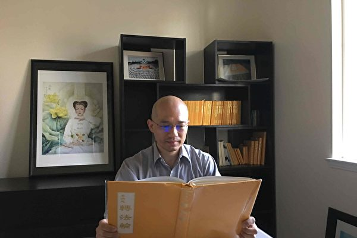

叶俊言正在读法轮功著作《转法轮》。

【大纪元2018年05月20日讯】（大纪元记者姜琳达洛杉矶报导）美国药物经济学博士叶俊言的人生看似一帆风顺——高学历、事业有成、家庭美满，但他在面对求学工作过程中的压力、眼睛一度接近失明的痛苦时，也曾让他感到迷茫无助。遇到了法轮大法后，他的眼睛恢复正常，性格与心灵才有了转变与升华。

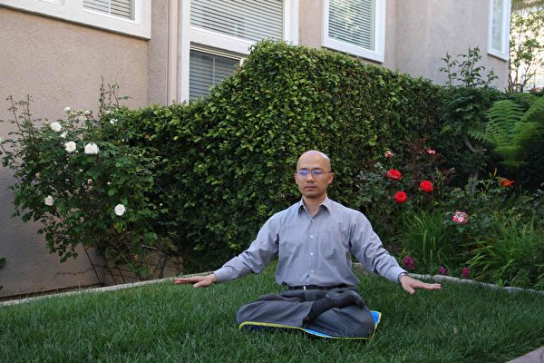

药物经济学博士叶俊言在自家院子炼法轮功第五套功法。

<b>“人生从彩色变成黑白”</b>

出生于台湾的叶俊言，20几岁就获得台湾大学医学研究所的硕士学位。1999年5月，他选择到美国德州大学（University of Texas）攻读药物经济学博士（Pharmacoeconomics PhD），却遭遇眼睛突然看不到的变故。

叶俊言介绍，他被诊断出患上一般老年人才会罹患的急性青光眼，医生说是因为眼压太高导致压迫视神经。“就西医的角度而言，视神经坏掉了就没办法恢复，任何的药物或手术都对受损的视力于事无补。”

虽然他不断尝试西医、中医、气功等治疗方法，但即便在开刀之后，视力却始终时好时坏。这突如其来的遭遇让刚来美国的他非常沮丧。“这影响到我的学业和生活。我只能靠着药物控制，消极过日子。”叶俊言回忆说。

<b>得法时的“奇妙”经历</b>

直到2001年3月，叶俊言在自家书架上发现了一本法轮功著作《转法轮》。“本是我岳母在台湾得法后，希望我太太也修炼而带回来的书。然而却‘无心插柳柳成荫’，被我给看到了。”叶俊言说，“当我读到书中的‘第二讲’时，就感觉自己脑袋里有东西炸开了，两个晚上我就把整本书学完了，之后感觉整个人如醍醐灌顶。自此走进了修炼的行列。”

因有缘得法后，叶俊言才了解到所有的事情都是有安排的。他坦言自己的高学历，也成为他人羡慕的对象。当初到美国时，为人处事都是趾高气扬、不可一世。“而且我学医药、执著科学，以往是不会轻易接受什么。但因为眼力受损的经历，能让我静下心来学法。”

学法不久后，他说：“我真的亲身体验到了像师父讲的天耳通，会听到另外空间的音乐。早上起来常感到眼前有很多法轮在转，我知道这是师父在帮我调理眼睛。”

心境的豁然开朗，使他决定停止一切对眼睛的药物控制和治疗，却得到意想不到的结果。“以西医的角度来说，不治疗就会恶化。但从我修炼至今已10多年了，我的眼睛跟他人无异，开车、生活都毫无障碍。”2007年，他还如愿攻下了德州大学的药物经济学博士学位。

<b>学法后不断突破科学局限</b>

毕业后，叶俊言去了美国顶尖的综合医疗机构作研究专员，后来成为纽约一所大学药学院的助理教授。他去年搬到加州，目前在全球最大的安进制药公司（Amgen）担任全球卫生经济经理一职。

叶俊言坦言自己是个很“木讷”的人，不喜欢社交，没想到反而担任过助理教授，到处进行演说。而目前他的工作是做临床研究，药在核准之前，要与很多国家的医疗系统和保险公司联系，就要与他人接触。他认为修炼之后，他的整个性格都发生了改变。

然而在科学的道路上，越深入学习，叶俊言就越觉得科学非常有局限性，但大法却是永无止境的。“在搞科研时要突破自我、不断接触干细胞、癌症研究等尖端科技、做研发，当然会遇到瓶颈。得法后，我发现往往在做项目中，突然就有了灵感，出来的科研效果都很好。”

<b>冥冥之中有安排</b>

回想起自己修炼10多年的心路历程，叶俊言感觉一切事情都被安排得很完美。“无论是刚毕业时，面对有限的好公司的工作机会，或是工作中的提干和利益分配问题，或当别人在暗地里勾心斗角争夺时，我作为修炼人不争不斗，努力做好自己的本分工作，机会反而主动找上我。”

又或者在美国办身份时，当很多人觉得机会的大门都已经关掉了，“事实上，总会有一条路。到时间，就发现已经安排好了。从我得法到现在，回过头，真的觉得所有事情冥冥之中都有安排。”

<b>攻破谎言 以亲身经历传真相</b>

在求学期间，他曾拜于《药物经济学基础》作者、完成过上百个演讲和出版刊物的Karen Rascati博士门下，还曾与经验丰富的俄州克利夫兰家庭医学医生John Hickner博士一同做过研究。

因此，即便是被种种光环围绕，叶俊言选择在工作之余，主动走上街头、商场传播法轮功真相。他说：“学法之后，我的智慧源源不断。我现在有这样的地位和工作环境，是因为修炼后才得到的。我不再觉得我的身份有什么，只希望可以破除中共所有的抹黑，让人从正面了解大法。”

对于一些人听信中共的谎言，认为“只有学识不高的人才学大法”，叶俊言表示这完全是误解。他说大法弟子中有很多学识渊博的科学家和各界精英。

他在纽约作助理教授的5年期间，共教过几千名学生。“我教的是药学专业，是大学毕业后进修的课程。学生的素质较高，还有很多研究生。当学生们得知我的眼睛恢复正常的神奇经历，以及我时刻按修炼人标准为人处世，中共许多对法轮功的抹黑都不攻自破。有些学生表示有兴趣要修炼。”

<b>以“真、善、忍”教育孩子</b>

叶俊言有三个女儿，在管教方面，他也没有太费心。“在学业上，我从不强行控制女儿，但我会用‘真、善、忍’法理教导她们，培养她们高尚品德。偶尔有机会，我们会一起学《转法轮》。而她们的学业成绩却出乎我意料地好。”

他介绍，大女儿精通中、法、英三种语言，日文也自学成功。“她学习很轻松，没有太大压力。如今她读高中一年级，却已经修完Senior才能考的大学预修中文课程（AP）。其他女儿也是，成绩非常好。”

他觉得品德高了，孩子们就知道怎样去学习、什么是重要的，也不用父母操心学业上的事情，成绩自然而然就好了。他说他修炼后全家人都受益了。

“感恩师父，没有师父，就没有现在的我。也希望每个人，特别是不了解真相的人，不妨静心了解一下法轮大法。什么事情不是惊天动地才最好，我们的生活就在点点滴滴之中，如果有机会千万不要错过这个机缘。”叶俊言认为自己修炼大法，看似平常，但很多事情非常超常神奇。

<h1 align="center"><b>在中共治下，中国有实现“依法治国”的可能吗？</b></h1>

【明慧网二零一八年五月二十日】中共一再提要“依法治国”，那么在中共治下，能不能实现“依法治国”呢？最简单，最直观就看看掌握公权力的公检法司等人员能不能“依法执法”、“依法办事、办案”就可以知道答案了。因为只有这些掌握公权力的人才能让法律正常或有效的实施，也只有他们才能真正破坏和阻挠了法律的实施，整个国家的治理正是由各个地方一件件的具体事件组成。
时至今日，我们看到在中共江泽民集团迫害法轮功中，很多参与的中共公检法司人员对法轮功学员可以随意绑架、非法搜查、抄家、偷抢财物，刑讯逼供、敲诈勒索、毒打虐杀，肆意枉判，大量制造冤假错案……对给法轮功学员辩护的维权律师都可以殴打、绑架，非法关押、判刑，随时进行生命威胁，或用各种违法规定阻挠律师介入，阻挡律师和民众对他们违法行为的控告，耍尽流氓和无赖……在明慧网上，我们都可以看到大量这样的报道。

“依法治国”喊了这么多年，很多中共公检法人员仍然无法无天，不仅不依法办事、办案，反而是大量严重违法犯罪，视《宪法》和法律如手纸，让“依法治国”成了过场、口号和笑谈。那么是什么原因让众多中共的公检法人员至今没有依法办事、办案的意识，不能去掉执法犯法的习惯呢？

一、中共的法律观是让公检法人员养成了不依法办事和违法犯罪习惯的根源

这个习惯不是短时间养成的，其源头是中共的法律观，在中国大陆，学生从学校就被灌输：法律是统治阶级制定的，是为统治阶级服务的，中共的法律是无产阶级专政的工具，并不是国际社会普遍认为：法律是维护公平和正义的。虽然中国大陆的宪法和法律中也有维护公平、正义，甚至“保护人权”的字眼，但几十年不间断的政治运动，包括持续至今的对法轮功的迫害，吃够了中共苦头的中国民众没几个认为那些话是真的。

深知中共司法腐败黑暗内幕的各级公检法司人员内心中就更不相信了，说白了，中共的公检法司人员普遍认为法律是用来治别人，镇压民众的，而自己是专政工具的一员，是“执法者”和“特权者”，是用“法律”来打击别人的人，压根没有想用法律来约束自己。

所以在中共公检法人员这里，普遍没拿法律当回事，觉得执行上面的内部规定，政策往往比执行法律更实在，很多时候完全将法律抛之脑后，违不违法不在考虑范围，只要平时把领导搞好了，关系到位了，一切都可以在法律之外摆平。所以在中共的各级人员中不依法办事和违法犯罪才那么普遍。

在中国大陆，在大量的普通民事和刑事案件中，在冠冕堂皇的走法律过场的背后，还是权钱交易；还是方方面面的“勾兑”，比的谁的关系硬，后台大，送得多；还是吃了原告吃被告……这一点，相信中国大陆很多深受中共司法腐败之苦的民众有切身体会，相信在中共的司法黑暗环境中摸爬滚打的公检法司人员心知肚明。

中共的体制本身，“党”在法律之上，中共几十年来用暴力和谎言维护统治，正是让中共各级公检法人员养成不依法办事，执法犯法习惯的根本原因，中共不除，“依法治国”就无法实现。

二、中共江泽民集团长期对法轮功的迫害，彻底摧毁了中共公检法司人员的道德底线和法制观念

因为中共江泽民集团迫害法轮功本身就是严重的违法行为，为使迫害能进行和延续，所以中共江泽民集团在迫害中刻意“鼓励”、诱导、唆使各级中共公检法司人员，践踏法律，违法犯罪。并以各种规定、政策、命令给基层公检法人员违法犯罪“创造条件”，如原来的警察法中警察有在执行命令中的违法免责条款；违宪违法的两高司法解释一、二、三等等。

在迫害中，很多公检法司人员切身“体会”到：在中共治下，法律是可以随意变化对象和玩弄的，根本没有严肃性。宪法和法律是写得冠冕堂皇，但是是用来蒙骗民众和欺骗国际社会的。因此对法律更不当回事。

迫害十九年来，中共江氏集团彻底败坏了中国大陆的法制，破坏了法律的正常实施，比如610和政法委要求公检法司人员“对法轮功不用讲法律”。这些把持公权力，权力不受制衡的人，一旦可以对一个庞大的人群不讲法律，那么人性恶的一面必然会被无限放大，在这个过程中，违法犯罪还受保护、胡作非为还可以升官发财，那么这些人的道德观念和法制观念就必然被摧毁殆尽。

所以我们看到在中共江泽民集团长期迫害法轮功中，很多中共公检法司人员已被变成了穿着制服的大大小小的流氓、罪犯，满身的黑恶做派和习性。对法轮功的迫害，彻底摧毁了这些中共公检法司人员的道德底线和法制观，那么在面对法轮功学员—这些善良守法的公民都可以不用讲法律，都可以为所欲为的乱来的时候，他们会对其他民众讲法律吗？会依法行事，用法律来约束自己吗？在被鼓励违法犯罪的环境中呆久了，干久了，就必然养成违法的坏习惯，一旦养成深重恶习，要改那就不容易了。事实上很多中共各级人员早已将迫害法轮功学员的经验和手法“成熟”地运用到普通民众身上。

对不少地方的中共公检法人员来说，他们手中有不受民众监督的权力，有中共的罪恶体制为靠山，司法不能独立和相互制约，就可以上下串通，“勾兑”收买，沆瀣一气，看看今天中共大量的各级官员真实表现：塌方式腐败，大量涉黑、护黑，官商勾结，警匪一家，迫害善良、欺压民众、贪赃枉法，那些披露出来的“窝案”、“串案”只是冰山一角，这些乱象只不过是中共江泽民集团迫害法轮功带来的恶果之一。

所以大陆民众就看到本应精通法律，模范守法的公检法司人员普遍成了“法盲”，执法犯法成了“常态”。2017年公安部要求全国各地的基层公安、派出所警务人员对法轮功学员搞了一个所谓的“敲门行动”，过程中这些公安、警察的执法犯法的状态普遍到了惊人的程度。

“过去的土匪在深山，现在的土匪在公安”，“公安是公害”……就是民众对中国大陆法治现状的总结和概括。

目前，中国大陆正在“扫黑”，横行乡里的黑社会是该“扫”，但事实上，很多中共公检法司人员已在长期参与迫害法轮功中，被江氏集团变成了穿制服的“黑恶势力”，穿制服的“黑恶势力”比没穿制服的“黑恶势力”对社会的危害更大，他们对社会法制的破坏和道德的败坏起到的作用是非常突出和最恶劣的。他们的“政治保护伞”就是发动迫害法轮功的中共江氏集团元凶和各级死党。他们就是横在中国走向法治路上凶恶的“拦路虎”。

在中国大陆，不清算江泽民集团的滔天罪行，罪恶仍然继续，真善忍被打压，在迫害法轮功中犯下大量罪行的不法人员手握权力继续为非作歹，整个社会正义就不能伸张，公平无从谈起，道德就不能回升，而道德却是真正法治的基础，在没有道德观念，是非混淆、黑白颠倒、善恶不分的社会里，制定再多的法律不一定能实施，为压制社会矛盾制定更多的严刑峻法，很可能成为非法的恶法，对民众施以无孔不入的监视和监控，只可能带来暴政和苛政，造成更尖锐的社会问题，终将失尽民心，被人民和历史抛弃，而此时用高压和封闭制造出来的“稳定”，只是火山爆发“安静”的前夕，自古以来，未有施暴政能长久，能善终者。

不仅如此，在排斥和打压真善忍的国度，假恶暴必然横行，社会中充斥着无信无义，根本溶入不了国际主流社会，无法被人真正尊重。种种社会矛盾必然日趋尖锐，危机四伏……

现今的中国，不停止迫害法轮功，“依法治国”就没有实现的可能。

要实现依法治国，唯一的办法就是停止迫害法轮功，惩治江泽民犯罪集团，解体中共，清算罪恶，尊重和弘扬“真善忍” 普世价值，扶持社会公平和正义。唯有根本上的转变和深刻的变革才能使人心归正道，江山复清明，那时法律才能起到应有的作用，“依法治国” 才能真正实现。

<h1 align="center"><b>器官捐献受贿案 重点不在“受贿”</b></h1>

第26届“国际器官移植协会”（TTS）大会会议于8月18日到23日在港召开前夕，大陆湘雅三院被揭买卖器官。（大纪元）

【大纪元2018年05月19日讯】近日，大陆某网报道了江西人体器官捐献管理中心某副主任的“受贿案”。跟那些动辄涉及千万、甚至过亿贪腐资金的“大老虎”相比，该中心仅受贿了71.25万元的副主任谢某恐怕只能算是“小苍蝇”，根本不值一提。但蹊跷的是，官媒却把他作为典型、高调祭出示众，不免让人觉得小题大做。

然而，即便是小题大做，也不一定是无的放矢。从官媒积极报道由于谢某“当庭自愿认罪，可认定为自首”；“积极退缴了全部违法所得”；“检举揭发了龚某某、肖某的犯罪事实，具有立功情节”；因此只被轻罚了“十万元”；轻判了“有期徒刑二年”，且“缓刑二年六个月”来看，当局似乎想通过此案让其它牵涉类似案件的公职人员有所参照。认罪、检举，或许才是最明智的选择。

若真如此，就不难看出，中国涉及“人体器官捐献”的受贿案其实并不在少数，且大部分还都处于隐蔽状态。一直以来，有关“人体器官捐献”的报导向来都是正面的，比如捐献人数增加，一人能捐献多个器官等等。如今，首次曝出这种负面讯息，不可能没有导向或深意。

但相比“受贿”这种现象本身，我们更应该深究，为何在“器官捐献”这种有着人道意味的领域会出现“受贿”这种肮脏的行径？更重要的是，相比受贿者，我们更想知道，行贿者是谁？又为何要行贿？

对于该案的受贿者——江西人体器官捐献管理中心副主任谢某，官媒通篇报导在描述其行径时，只说了一句，即“利用职务之便，为相关医院在获取遗体器官捐献移植过程中出具捐献遗体执行通知书等方面提供便利和配合”，“收受相关医院贿赂”。

若对照人体器官捐献管理中心所负责的“器官捐献的宣传动员、报名登记、捐献见证、缅怀纪念、救助激励及信息平台建设等事务性工作”来看，“出具捐献遗体执行通知书”不是该中心人员的职责所在吗？为尽快办好相关手续“提供便利和配合”，及时给医院提供捐赠者的器官，不是理所应当的吗？如果不是买卖或交易，医院有什么道理给器官管理中心负责人钱呢？

更有意思的是，行贿的三家医院——“江西省人民医院、南昌大学第一附属医院、南昌大学第二附属医院”是“江西知名公立三甲医院”。要知道，官员所涉及的受贿案，基本都发生在官商之间。行贿者往往是有求于官员、方便自己牟利的奸商。而如今，中国的医院与管理中心所上演的，却是公办机构之间的“互通有无”，这就让人百思不得其解了。

难道江西这三家公立医院在器官移植过程中所扮演的，不是救死扶伤的角色，而是“奸商”的角色？若真如此，江西这起案子就不能止于审判、惩处受贿者。我们很想知道，行贿的医院、医生为何没有受到审判、惩处？

或许有人认为，这其中还存在着另一种可能，那就是器官稀缺。于是，三家公立医院为了抢夺稀有的器官而贿赂管理者，以便在他收到捐赠者的器官后，第一时间想到自己的医院。但问题是，三家医院抢一个器官，只有一家能拿到；那么两家没拿到器官的医院又为何要行贿呢？如果三家都能拿到，说明器官足够分配，也就不存在要通过非法手段来争抢的问题了。

此外，人体器官与其它商品（如果涉及买卖）有所不同的是，供体与受体之间必须达成较高的匹配度，才能实现移植。这种在器官移植中必须遵守的匹配原则，让类似“争抢器官”的说法难以成立。你可以说，很多人都在等一个器官，但并不是一有了器官，就能给其中任何一个人。

因此我们有理由怀疑，医院行贿器官管理中心必有其不可告人的内幕。而其中最有可能的就是，器官并非来自于正当的个人捐赠。由于医院得到的器官并不是某人自愿捐赠的，但仍要给器官“买家”一个合理、合法的交代，因此，只能伪造一份“捐献遗体执行通知书”，让这一器官来源合法化。

说到不合法的器官来源，很多人想到的就是黑市贩卖。我们且不说，正是由于纵容这种黑市贩卖的中共官方部门长期不作为，才导致这种非人道贩卖长期、且大量在中国境内存在。因为相比你情我愿的买卖，偷盗、甚至强摘器官的可能性要大的多。个中原因也同样基于“器官匹配原则”。即便有人上赶着要售卖自己的器官，那也得找到相匹配的受体才行，否则就是“剃头担子一头热”。

相比售卖者，器官需求者应该更加迫不及待。因此，按图索骥、按需获取器官便成为了最直接、最高效的途径。但问题是，“按需”能靠捐赠吗？

当中共卫生部的官员们还在竭力证明中国的器官捐赠数量如何呈大比例增长时，仅这样一起因伪造“捐献遗体执行通知书”而引发的医院行贿、器官管理中心受贿案，就足以推翻卫生部的说法。如果捐献者够多，又何必伪造证明？为了达到目的，医院不惜用金钱贿赂官员，不正是为了掩盖“器官来源非法”的事实吗？

可见，“按需获取器官”根本就做不到合法。未经供体许可、对其进行强摘，几乎就是惟一的方式。而更令人惊愕的是，本该救死扶伤的医院及医生，也在其中扮演着重要角色。一旦有人需要器官，中国的医生竟然能积极、主动的为其奔走，甚至不惜暗盗、明抢、置健康的大活人于死地。想来这背后定有着巨大的利益驱动。

如今，受贿者被审，但活摘器官、并为隐瞒这一罪恶而行贿的医院、医生却逍遥法外。刻意隐瞒、包庇，甚至为了利益、参与其中的政府官员，也没有受到任何审判；而大量良心犯被活摘的真相，亦是没有大白于天下。

如果说，高调祭出伪造证明的受贿者尚有一丝积极作用，能促使更多的受贿者自首、认罪；那么，我们就希望这点积极作用能够一直发挥下去，让犯罪的医院、医生都能停止作恶、并站出来指控如此庞大的非法交易背后的始作俑者。要知道，罪魁一天不遭到审判、真相一天不得以还原，受害者只会越来越多。

<h1 align="center"><b>国家级移植医院湘雅三院被揭买卖器官</b></h1>

第26届“国际器官移植协会”（TTS）大会会议于8月18日到23日在港召开前夕，大陆湘雅三院被揭买卖器官。（大纪元）

【大纪元2016年08月16日讯】（大纪元记者梁珍报道）第26届“国际器官移植协会”（TTS）大会会议将于8月18日到23日在港召开。会议前夕，百度突然解禁英文“法轮大法”和“活摘器官”两大关键词，同时与中共前卫生部副部长黄洁夫关系密切的器官移植医院——湖南长沙中南大学湘雅三医院，爆出一宗贩卖器官的丑闻。中共近年来大力宣扬的中共“人体器官获取组织”（OPO）也牵涉在内。

自2006年中共活摘法轮功学员器官罪行曝光以来，中共至今沉默以对。但就多次安排和邀请国际移植专家，到中共指定的移植医院参观，宣扬中共器官移植已经符合国际标准。其中一个定点医院为湖南湘雅三医院，第26届“国际器官移植协会”（TTS）的现任主席Philip O ’ Connell和前任主席Jeremy Chapman，都先后获邀参观。

如今，TTS现任和前任主席，以及中共前卫生部副部长等人，将到香港并进行专题演讲，预计会向数千名医疗专业人士宣称中共已经改革器官移植系统；但是，国际社会普遍认为，中共的“器官改革”，只是空话，并质疑中共是藉移植大会之机，掩盖活摘器官的罪行。

由于器官来源难以证实，国际移植界对中共器官移植一直采取“三不政策”，不同意大陆器官移植的医生在国际会议上宣读论文；大陆有关器官移植的文章，包括临床文章，在世界所有著名的杂志上不能发表；不接受大陆成为世界上任何器官移植协会的会员。但今年TTS邀请涉嫌强摘器官罪行的黄洁夫、郑树森等一批中国医生参加并进行专题演讲，因此受到国际组织抵制。包括黄洁夫等53名医生被追查国际列入追查名单，湘雅三医院也有三名医生上榜，包括副院长、OPO执行主任叶启发，医生马小倩和郭飞（Fei Guo译音）。

在会议前，大陆媒体高调曝光一宗湘雅三院及OPO系统涉“器官买卖”案。美国华府中国问题专家季达认为，案件经过中国司法认定，冲击了中国学者所提出的OPO真实性，而湘雅三院曾邀请国际移植专家到访，如今这些国际移植专家，连同被质疑活摘器官杀人的中国医生一起召开研讨会，令外界对今次TTS主题研讨会的真实性存疑。

<b>大陆媒体曝光器官买卖</b>

“2013年到湘雅三医院做肾移植手术时失败，连续又进行了三次手术，花了50万，其中肾脏费15万元，没有开发票，一分也没有报账的……现在我已被动手术造成9级伤残，不能做腹透了。只能做血透维持生命。”52岁的湖南道县农妇、尿毒症病人尹全珠，控告湘雅三院医生买卖器官的敏感案件，最近被大陆新浪网等媒体、网志转载，且有关内容并未被删。

8月12日，在湖南道县政府网页“政务公开”栏目上，民政局亦公开回应尹全珠的发帖。

尹全珠因移植肾区感染出血，植入23天的“新肾”即被切除，连续又进行了三次手术，花费50万，其中肾脏“供体费”15万元，没有开发单据，并无报账。

她先后将湘雅三医院以及两名移植医生明英姿、叶少军告上法庭。涉案医院最终赔偿18万元。另一宗指控两名医生非法收取15万的肾脏“供体费”的案件，于2015年6月24日在长沙岳麓区法院开审。

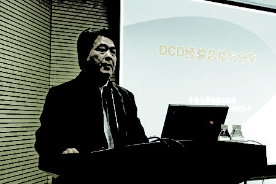

叶启发 湘雅三医院移植专科医生。（网络图片）

<b>医生认收15万肾脏费</b>

《潇湘晨报》去年6月25日引述原告尹全珠的丈夫熊进兴，称2013年11月其妻子转入中南大学湘雅三医院后，移植科医生要他交纳15万元“肾脏费”，“不是手术费用，说是买肾的钱。”

他其后筹集15万，交给在医生办公室的明英姿、叶少军。当时，前者是移植科主任医生，后者是具体负责治疗原告的医生。

明英姿、叶少军在警方的询问笔录中，都承认收受该笔款项。“这笔钱是供体费，就是所有获取器官的费用，这是没有发票和收据的。这笔钱是用来给发现、获取供体器官的所有费用以及给家属的补偿安葬等所有费用，我们交给OPO组织，让他们去安排。”

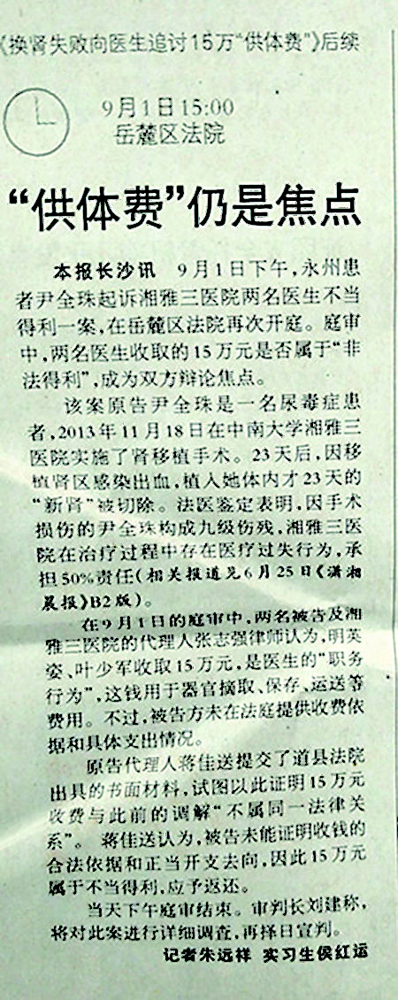

大陆媒体报道湘雅三院买卖器官。（网络图片）

<b>操刀女医生涉活摘器官</b>

明英姿为女外科医生、湘雅三医院移植科主任。她是今次来港参加会议移植专家叶启发的学生，2001年跟随叶启发加盟湘雅三医院。

根据湘雅三医院网页，明英姿的团队曾做过1,000多例移植手术。根据中南大学简历，叶启发个人累计完成肝移植1,000多例、肾移植2,000多例。从2002年至2012年，参与实施了407例腹部多器官切取手术。

“追查迫害法轮功国际组织”（追查国际）发言人、哈佛大学医学研究员汪志远指出，国际认可的肝肾移植比例为6.5%，即若一人需移植，须在15人中才能找到1个能够提供匹配器官的人，“还得等到这个人生病死亡或者是外伤死亡……那还是遥遥无期啊。”他又说，即使美国拥有公民自愿捐献器官率达47%的庞大发达全国器官捐献系统，肝移植的平均等待时间仍要2至3年。外界质疑有关医生能够在医学生涯内进行巨量移植手术，与国际移植数据严重不符，担心其用作手术的器官并非从合法渠道获得，甚至是从活人身上摘取。

明英姿和叶启发因涉嫌活摘法轮功学员器官，早在2014年就被追查国际列入首批追查的医生名单。

<b>被告未能解释器官费</b>

对于尹全珠肾移植手术的肾源，《潇湘晨报》报道称，湘雅三医院曾提供一份证明。该证明加盖了湖南省红十字会、湖南省器官移植控制中心和湘雅移植医学研究院的公章，辩解称尹全珠肾移植手术的供体来源于“中国人体器官移植分配与共用电脑系统”（COTRS）（编按：与OPO有关）。但庭审期间，被告未能说明15万“肾脏费”的收费标准及具体开支情况。

但尹全珠案的代理人，道县蓝天法律服务所法律工作者蒋家送则质疑医生收取15万无法律依据，也未提供证据证明其用途，“OPO是公益组织，为什么要交15万？”，“如果是正规收费，为什么没票据呢？”

根据资料，2006年之前，中共关于器官移植方面的管理条例几乎为零。2006年，自中共活摘法轮功学员器官黑幕被广泛曝光之后，黄洁夫与红十字会共同推行的器官捐赠试点、OPO、COTRS系统，试图消除国际社会对中共活摘法轮功学员器官的挞伐。国际人权组织“医生反对强摘器官”（DAFOH）曾发声明指出，在缺乏国际社会的监督下，中共器官捐赠电脑系统，可能以假身份把关押的法轮功学员登记为捐赠者，纳入国家器官捐赠制度。

<b>国际组织：中共器官系统违医学伦理</b>

2013年9月1日，《人体捐献器官获取与分配管理规定》正式实施，该规定在具备器官移植资质的165家医院中强制推行“中国人体器官移植分配与共用电脑系统”（COTRS）。COTRS系统设计者、港大医学院教学医院玛丽医院移植医生王海波，2009年受黄洁夫的卫生部委托，开始建立这套电脑分配系统。期望改变器官移植领域但被公众质疑有“有权有钱才能获得器官”的潜规则。

“医生反对强摘器官”（DAFOH）对参与组建COTRS系统的王海波，曾发声明指出：王海波称“死囚有权捐赠器官”的言论，有违全球公认的医疗伦理，令人担心王海波的话或隐寓中共仍将暗地延续之前摘取死刑犯器官的做法。

2014年11月23日，中共成立“人体器官获取组织”（OPO），称目的是对捐献者的人体器官进行获取、分配、保存和运送，并由原卫生部副部长黄洁夫任名誉主席。主席是移植专家郑树森，执行主席则是叶启发。黄洁夫也试图将器官调配共享机制引入港澳台，引发社会争议。

<b>湘雅三医院 存活摘器官疑点</b>

黄洁夫作为中国器官移植的专家，被指是中共国家掠夺器官在卫生系统的推行者，并直接筹划、推动建立了全国性器官库调配网络。而他重点培植的定点医院，以及推动OPO系统的单位就包括湘雅三院。

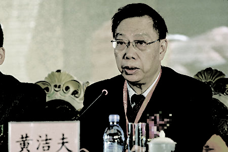

黄洁夫 中共前卫生部副部长。（网络图片）

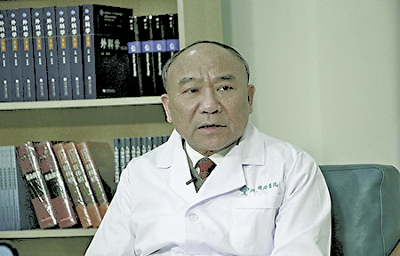

郑树森 浙江大学附属第一医院肝胆外科医生。（网络图片）

早在2006年4月，《大纪元》就发表了系列文章，曝光湖南长沙是中共卫生部重点推出的器官调配中心，被质疑是另一个沈阳苏家屯（编按：中共大量关押法轮功学员并活摘其器官的集中营）。仅在湖南省长沙市区就有四家大型三甲医院从事大器官移植，包括湘雅三院。当时长沙市附近就有四、五所大型劳教所和监狱，里面关押着数千法轮功学员。

直至今日，湘雅三院依然存有大量疑点。追查国际在2016年上半年的调查中发现，湘雅三院的移植医生对调查员抱怨说他们的器官用不完，需要把多余的器官调配出去，或者要从外地调病人来做手术，并表示供体是活的。

追查国际8月8日发表调查公告，引述调查数据指，1999年中共全面迫害法轮功后，中国器官移植手术量呈爆炸性增长，如1999年至2006年8年间，中国肝移植手术剧增至14,085例，平均每年1,760多例，是91至98年的180多倍。实际人体器官捐献率仅为百万分之0.6，质疑中共当局用作移植的器官来自活人。

自2006年来，中共活摘法轮功学员器官的罪行不断在国际社会上曝光并引起重视，今年6月，美国国会通过了针对中共强摘法轮功学员罪行的决议案。同时最新调查报告显示，中共强摘法轮功学员等良心犯器官数量惊人。

追查国际发言人表示，中共活摘法轮功学员器官的罪恶真相在国际上已经被曝光多年。而中共这么多年来所做的器官移植手术每年都上万例，却说不清楚器官来源。如今成立OPO等组织就是为了掩盖器官来源的真相。

黄洁夫、郑树森、叶启发为该器官获取组织的名誉主席，追查国际认为，正说明该组织和活摘器官的罪恶有关。明英姿则透过此机构“获取器官”倒卖牟利。

早前移植大会举办方曾发表公开信，称执委会的几位高级官员被黄洁夫邀请到中国后，参观了中方安排的几个已停止使用死刑犯人器官的医院后，即认为中国已经没有使用死刑犯的器官。追查国际认为有关论点漠视全球对中共活摘法轮功学员器官滥杀无辜的指控，批评有关结论践踏医疗伦理，因此建议重新审视并以科学方式调查中国器官移植的真相。

以色列器官移植协会主席、著名心脏移植专家拉维（Jacob Lavee）则说，很多值得怀疑的中国医生的论文出现在移植协会的学术讨论上，“这是瓦解我们这个社会道德基础的又一个见证”。因此他宣布抵制本次移植大会，并倡议更多的医生采取同样行动。

<b>湘妇控告医生揭买卖器官事件簿</b>

˙湖南道县妇人尹全珠2013年起至中南大学湘雅三医院进行肾移植手术，因失败后又连续进行3次手术，花费50万元。术后出现尿毒症、手术位置9级伤残。

˙尹全珠先后控告湘雅三医院以及两名移植医生明英姿、叶少军。两名医生被指非法收取15万元肾脏“供体费”，案件于2015年6月24日在长沙岳麓区法院开审。

˙两名医生在给予警方的口供中承认曾收受该笔款项。

˙湘雅三医院辩称器官来自公益组织，但未能在庭上说明“供体费”明细，尹全珠代理人质疑收费正当性。

˙大陆新浪网等门户网站及网志转载有关案件细节，未遭“河蟹”。

˙2016年8月12日湖南道县政府公开回应事件。

<h1 align="center"><b>法院检察院头目频频落马的背后</b></h1>

自4月中旬至5月中旬，据相关公开信息的不完全统计，此一期间各地区法院、检察院至少有合计12名的院长、检察长被调查。

【大纪元2018年05月20日讯】自4月中旬至5月中旬，反腐通报在地方司法系统引发一股落马潮。据相关公开信息的不完全统计，此一期间各地区法院、检察院至少有合计12名的院长、检察长被调查。

中国大陆维权律师群体曾有公认，最能体现“依法办案”精神的是法轮功案件，若在此能够不“以权代法”的检察官和法官，大概也不会去主动制造其他冤假错案。而在公检法三机关当中，尤以居中的检察院扮演阻止冤假错案的关键角色。但这12名落马检、法双长，经查海外明慧网，都有迫害背景，择要分述如后。

以下是6名落马检察长：

4月23日，广东惠州市检察院检察长张思忠被查。张思忠1999年7月起任河源市检院副检察长，2011年起任揭阳市检院检察长，2016年9月至落马前任惠州市检院检察长，三地在其任内非法起诉迫害严重。如最新数据，2018年3月份各地经检院起诉至法院被非法判刑有58人，其中 9人被判重刑，又当中2人是惠州法轮功学员被判9年、10年的石雪梅、周育琴。

4月24日，山东烟台市检察院检察委员会委员徐志涛被查。徐志涛在担任莱州市检院检察长期间，检察院与法院、610办公室互相勾结，非法批捕、构陷，如吴加俊、孙寿煜、崔丽丽等人，其中，吴加俊在2012年9月被非法判刑后于山东监狱服期间的2014年11月被迫害致死。

5月5日，河南周口市检察院检察长高德友被查。高德友自2015年4月起担任周口市检院检察，2016年7月，周口市法轮功学员孔爱华、张东东、张卫、乔振华、张蕴（云）慧等5人被检院移送起诉后分别被非法判3年至7年不等刑期，其中，孔爱萍于2017年在监狱被迫害致死。

5月10日，甘肃庆阳市原政法委书记秦华被查。秦华2010年起曾任甘肃定西市检院检察长。关于秦华的种种迫害恶行，明慧网上有一篇以他的名字为题的特别报导。

5月10日，山西晋中市榆次区检察院检察长干晋左被查 。就在去年5月，榆次区检院以构陷的证据非法批捕温朔雁致其被非法重判9年。还有引起国际社会关注过的，如2014年2月，唐华峰、王双春、刘增芳、郑健美、程贤德将等5人，因证据不足曾遭起诉科三次退案，但作为检察长的干晋左仍对唐华峰5人非法批捕并构陷到法院非法判刑，其中75岁的程贤德老人被冤判3年后被迫害致死。

5月11日，山西太原市检察院前检察长周茂玉被查。在周茂玉被点名为主要责任人的迫害案中，以2016年披露因检院起诉至法院被非法判刑而于入狱后迫害致死的，有如太原市民赵存贵等，以及即将服刑期满而在出狱前夕猝死的中医师王继贵。

以下是6名落马法院院长：

4月16日，河北唐山市路南区法院院长马明旭被查。马名旭在任滦南县法院院长时已有参与迫害记录，调任路南区法院后，当地法轮功案件重判比率上升，包括坊间曾按手印签名营救而震惊中外的优良教师卞丽潮，以及卞丽潮的女儿卞晓晖、妻子周秀珍、卞晓晖的阿姨陈英华。

5月2日，江西莲花县法院院长李清萍被查。被点名的案件有2013年非法庭审荣爱梅、刘金萍、严新华等法轮功学员。

5月5日，辽宁大连市西岗法院院长张明鹏被查。张明鹏非法庭审的案件：英语教师王语丝2000年被非法判刑10年出狱后，又于2014年诬判6年，致其80多岁老母亲忧伤离世。2012年7月6日，涉及80名法轮功学员的“大连安锅案”（当地市民安装海外新唐人电视卫星接收器）。

5月8日，湖北武汉市中院院长王晨被查。明慧网上亦有以他名字为题的迫害报导，据不完全统计，王晨任武汉市中院院长期间，武汉地区法院对法轮功学员非法判刑达 82人。

5月9日，辽宁铁岭市中院刑一庭副庭长刘波被查。在明慧网上关于“六次被抓捕铁岭法轮功学员张淑霞”以及“‘上边’大于法律”等报导中，都可见刘波被点名。

5月17日，四川隆昌市法院院长李晓鹏被查。李晓鹏担任内江市中区法院院长时，曾于2012年内江市法轮功学员谭德刚、付天群等案中被点名。

在中共前党魁江泽民这场对法轮功学员全面性全方位的迫害中，既要虎官更要蝇官的协同，因此不论各种统计落马官员几乎都有迫害背景。今次12名被查的法院检察院头目，虽是一个小样本却具有广泛代表性。

<h1 align="center"><b>三位西方富豪的经商成功之道</b></h1>

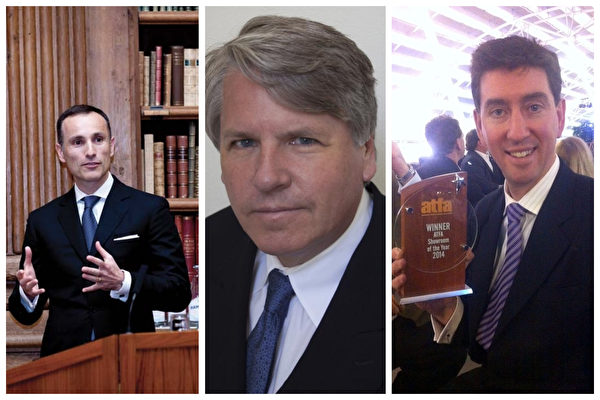

从左到右：瑞典企业家瓦西柳斯•祖朴尼第斯（Vasilios Zoupounidis）、美国硅谷知名企业家、多家高科技公司的创始人、主席和合伙人克里斯•纪泽（Chris Kitze）、澳洲企业家马克•哈奇森（Mark Hutchison）。

【大纪元2018年05月17日讯】（大纪元记者叶枫综合报导）克里斯•纪泽（Chris Kitze），美国硅谷知名企业家、多家高科技公司的创始人、主席和合伙人；过去25年间，他创建的公司市值超过70亿美元。

瓦西柳斯•祖朴尼第斯（Vasilios Zoupounidis），年收入过千万美元的瑞典企业家，他相信这句话：正直的事业最能长久。2011年，他以优秀的公司业绩获得瑞典国王的颁奖。

马克•哈奇森（Mark Hutchison），白手起家，精彩创业，是引人瞩目的澳大利亚商界之星。不少国内外企业家专程组团访问，向他请教经营之道。

虽然远隔重洋，但三人都是法轮功学员，以下是他们的经商、做人、成功和快乐之道：

<b>硅谷知名企业家：解决棘手问题的秘诀</b>

克里斯•纪泽（Chris Kitze）介绍，经营公司时遇到很多棘手问题，但是由于他修炼法轮大法，总是有智慧不断涌出，使他能够冷静地对待各种挑战。

美国硅谷知名企业家、多家高科技公司的创始人、主席和合伙人克里斯•纪泽（Chris Kitze）（明慧网）

纪泽是2006年在纽约看到法轮功学员讲真相而步入法轮功修炼的。 以他在东德和西德的旅行经验，他知道共产党是怎么回事，他认为共产党说不好的，那一定是好的。

看到法轮功学员炼功，他有一种直觉：“哇，这一定不错。”接着，他发现修炼法轮功没有一定的形式，非常适合于他的生活方式，“很重要的一点是，从来没有一位法轮功学员找我要过一分钱。所以，当我发现这跟钱一点关系都没有的时候，我知道这是一门好功法，这就是我要找的东西。”

修炼法轮功后，他的失眠、身体过敏等问题都消失了。“再也没有睡不着觉的问题了。法轮功给我带来了平和，我有了干净和清晰的思想。”他说，当他炼功的时候，觉得非常美好，仿佛一切不好的东西都从身上清理出去了，心如明镜；如果几天不炼功，就觉得一身沉重。

作为一位知名企业家，他说，商业成功有三大要素：1、坚持；2、愿意接受失败；3、 好的商业道德。“作为生意人，你要服务社会和客户， 你要给别人需要的东西，而不是你要给的东西。”

纪泽发现，法轮功“真、善、忍”的原则，适用于他个人生活的方方面面，无论是家庭、朋友，还是商业客户……“这种价值是永恒的。”

修炼之后，克里斯的个人生活也发生了很大的改变，原本几乎已经要和妻子离婚的他，夫妻关系变得和睦，“法轮功让你向内找，找到自己的缺点，加以改善，提升你的道德，变成一个更好的人。”他说。

<b>瑞典富豪的致富之道</b>

瑞典的瓦西柳斯•祖朴尼第斯也是一位法轮功学员。1998年春天，他在网络上找到了法轮大法，这是一种来自中国的上乘佛家修炼法门。他很兴奋，在一个周末读完了《转法轮》和其他所有书籍，然后又开始炼习功法。非常神奇，他的过敏症和后背的疼痛很快消失了。

瑞典企业家瓦西柳斯•祖朴尼第斯是瑞典“国王创业奖”得主。（《品位》杂志）

他创建公司的过程也和法轮功有关呢。1999年7月，中共在中国大陆开始镇压法轮功后，他产生开设一家电信销售公司的想法。因为拥有自己的公司，就可以自行安排时间，而且可以澄清中共对法轮功的诋毁，让别人通过他的亲身经历看到，法轮功对人大有益处。

经过3年的筹备，2003年，公司成立了。祖朴尼第斯的公司通过销售各式电话，和瑞典众多的中小型公司建立了电信伙伴关系，赢得了客户的信任。由于业务发展迅猛，他在不同城市共开设了六家分公司。 在繁忙的日常经营之外，祖朴尼第斯和一些同仁以传真的方式向中国大陆发送了大量的真相讯息，揭露中共的人权迫害。

2011年10月17日，瓦西柳斯•祖朴尼第斯获得“国王卡尔十六世古斯塔夫奖”，瑞典国王亲自到场为他颁奖。

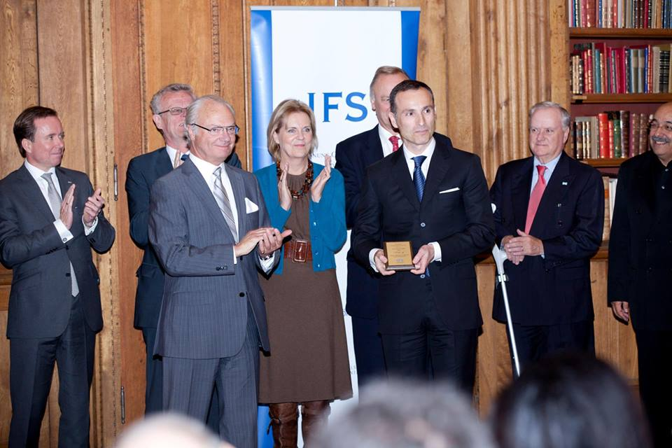

2011年10月17日，瓦西柳斯•祖朴尼第斯获得“国王卡尔十六世古斯塔夫奖” 。

打造成功的企业需要哪些策略？祖朴尼第斯认为，除了“努力工作，不断学习，构建团队”以外，最重要的是，要敢于面对真实的自我，知道你所做的事情的意义，并且在任何情况下都不忘初衷。

作为商人，祖朴尼第斯分享了他的金钱观：“很多人都想挣一大笔钱，他们认为这是快乐的关键。我并不这样以为。快乐的秘诀在于去掉所有的执著，包括对钱财的执著。”他强调，这并不意味着放弃实质的财富，而是要去掉拥有利益的欲望和贪心。

祖朴尼第斯这样指导公司的销售人员：“我会告诉他们，应该更多地站在客户角度，为他们着想，为他们提供实实在在有帮助的服务。当销售人员按照我说的去做时，他们都发现，这样客户会更喜欢和我们合作，甚至主动签下订单。”

祖朴尼第斯表示，修炼法轮功令他身心愉悦，因为这是内在的精神修行，能够从灵魂深处真正的改变一个人。他说：“我考虑别人多了，压力也减轻了，家庭更和谐了；原有的背痛、腿痛和胃病都不翼而飞。我在忙碌的工作中游刃有余。作为一个企业家，无论对客户、雇员、合作伙伴，我尽力遵照大法原则，待人以诚心、善意和宽容。我当然希望将‘真、善、忍’的原则作为公司的企业文化。

他笑着对记者说，“我从来不看重让自己‘过得开心’，我更在乎让我的员工享受乐趣。”瓦西柳斯感到最快乐的时候，是在他付出艰苦的努力后、克服了困难的那一刻。

<b>澳洲商界之星的经营理念</b>

2008年，马克•哈奇森的公司业务比2006年翻了一番，并且在珀斯南部成立分部。2009年，公司获得了澳大利亚年度企业奖。2010年，公司业务再增长50%，且入围澳洲年度家族企业奖、Telstra年度企业奖，哈奇森入围全澳年度企业家奖。2012年，公司业务比2010年再翻一番。2014年，哈奇森新成立的Lifewood公司获颁全澳年度最佳展厅奖。

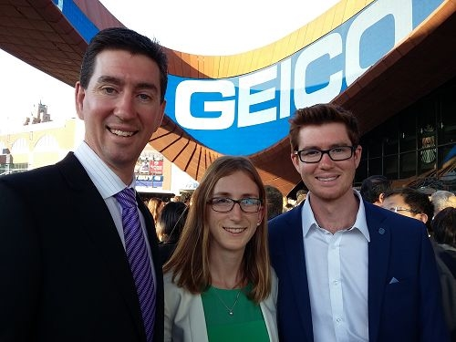

澳洲企业家马克．哈奇森（左）。（明慧网）

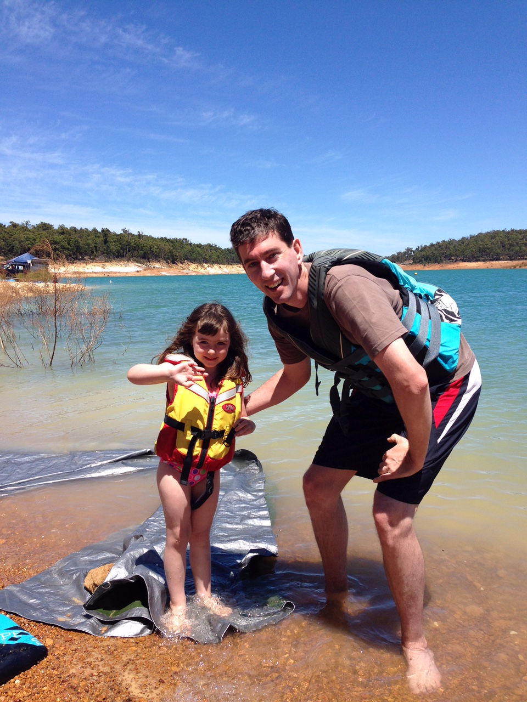

澳洲企业家马克．哈奇森和女儿。（明慧网）

人们都想知道，白手起家的马克•哈奇森因何制胜？马克总会敞开心扉，道出自己修炼法轮功的故事。

修炼法轮功后，他意识到，他在原先的创业中欠缺“真、善、忍”；以前的奋斗历程是一条追求名利的路，名气越来越大，利润越来越多，身体的毛病也越来越多，内心的苦恼和波澜起伏越来越多。他需要按照大法的要求去做。

意识到这一点之后，哈奇森由内而外全变了，家人、员工和客户也都感受到了他的变化。

当哈奇森把按照“真、善、忍”修心性放在第一位，把追逐更多的利润放到一边时，他惊奇地发现，公司并没有因此失去客户，而是更加良性地蓬勃发展。

有一次，哈奇森的合作伙伴、一位马来西亚的顶尖企业家特意带着公司的销售总裁和另一名副总裁前来，在哈奇森的公司观察体验了一个星期，他们问：“你这么年轻，怎么能做到如此沉着、平和？你的员工为什么这样真诚地关心你？我希望我的员工也能这样对待我。”

哈奇森坦言，是“真、善、忍”令他悟到做人的道理，也启发了他的经营理念。那位销售总裁返回马来西亚的第二天，给哈奇森发了一条短信：“马克您好！我现在正在我家附近的公园学炼法轮功！”

<b>三人共同的选择</b>

身为社会精英的哈奇森，常常在业余时间站在澳洲的街头分发法轮功传单，或是深入社区向公众介绍法轮功。他的朋友看到后，觉得不可思议。马克深知，如果没有学炼法轮大法，他将会在纸醉金迷中沉沦。每当看到街上行色匆匆的人群，哈奇森便心生渴望：希望众人都能知晓，“真、善、忍”和真相对每一个生命是多么的重要。

获得瑞典国王颁奖的瓦西柳斯，把自己的成功归功于法轮大法，他说：“国王陛下知道我是法轮功学员，所有评委也都知道。我获奖的原因就是：不仅做了企业家该做的，还帮助世人了解中共对法轮功学员的迫害真相。”

美国硅谷知名企业家纪泽，还创建了一家网络公司, 提供免费、安全、私密的通讯方式，让法轮功真相能够透过安全的方式，传达给其他尚未得知真相的人。纪泽也常常到旧金山的中国城讲真相。他说，“人活着就必须做选择。”他希望人们通过了解真相，作出他们生命中重要的抉择。

<h1 align="center"><b>恻隐与冷漠</b></h1>
【明慧网二零一八年五月十七日】在孟子看来，“恻隐之心，人皆有之”，也就是：悲悯同情是人类的普世价值。当别人遇到灾难、冤屈、不幸时，其实也同样在考量着我们的良知。此时是心生怜惜，尽力帮助，还是幸灾乐祸，落井下石。我们如何对待他人，上天也就如何待我们。
欧阳修在《泷岗阡表》中记述母亲对他回忆他父亲欧阳观主管刑狱工作时，烛光下办案的情景。“汝父为吏，尝夜烛治官书，屡废而叹。吾问之，则曰：‘此死狱也，我求其生不得尔。’吾曰：‘生可求乎？’曰：‘求其生而不得，则死者与我皆无恨也，矧求而有得邪？以其有得，则知不求而死者有恨也。夫常求其生犹失之死，而世常求其死也。’”

欧阳观慎刑轻刑的判案理念，清廉公正的司法操守，皆源于其内心的恻隐悲悯。他一再为将死之人寻找活路生机，既是对他人生命的尊重，对国家法律的敬畏，也是对自己的负责。他的认真与努力，他的寻求与慨叹，有时并不能救活人命，而他的善心善举，已经感天动地，而且泽被后世。儿子欧阳修考中进士，还先后任翰林学士、史馆修撰等职，著作等身，留名千古。

当日月穿梭过千年岁月，谨慎刑狱的思维也深入人心了吧。可惜的是，我们今天看到的是：从中共一九九九年迫害法轮功以来，一些司法工作者不再珍惜生命，沦为了中共践踏人权的帮凶。

李秀丽，曾任内蒙古赤峰元宝山区检察院侦查监督科科长，负责承办对公安机关等部门提请批准逮捕的案件审查决定是否逮捕等工作。十几年来元宝山区公安局对法轮功学员的构陷案件上报检察院以后，李秀丽一律给定性为刑事案件而下达准予逮捕的批示。李秀丽任职期间，至少对三十二名元宝山区的法轮功学员非法下达逮捕令，致使三十多名法轮功学员被非法判刑，好人锒铛入狱，成为阶下囚徒。二零一七年十一月，四十八岁的李秀丽在检察院楼道内倒地而亡。

李秀丽中年猝死，对于她的家庭是莫大的悲哀和伤痛。然而这悲哀和伤痛缘何而来？当然，首先是中共的迫害政策，是违法违宪的，把她捆绑入迫害的链条。而作为李秀丽本人，她自身有没有责任呢？首先，信仰自由是受法律保护而不应该受迫害的，法律专业毕业的她是心知肚明的；其次，人命关天，公正执法，不能昧着良心作案件审查，工作多年的她也是心中有数的；利人利己，害人害己，不能趋炎附势，落井下石，聪明伶俐的她也是清楚明白。

可惜的是，李秀丽追随中共的政策，丧失了内心的恻隐，变成了冷漠无情的中共傀儡。心田没有了悲悯仁慈，也就没有了道德的标尺，没有了人生的方向，行为就不辨正邪、不分善恶、没有良知、丧失信义。这样的生命堕落为中共的犬儒，中共说抓谁，他们不问对错，就大肆抓捕；中共说谁有罪，他们不分善恶，还罪加三等。

李秀丽与法轮功学员无冤无仇，或许她不是故意伤害修炼者，可她没有利用她手中的权力为法轮功学员说一句公道话，她没有利用自己手中的那只笔画下正义的一笔，她害怕失去身名利益，她不敢秉公执法，她冷漠于别人的冤屈，她完全唯命是从于中共，才使得修炼者的处境雪上加霜。那些经她同意批捕的法轮功修炼者，在她下达逮捕令之后，境遇就更加恶劣悲惨。有的在铁窗中被打伤致残，有的在精神病院被灌食毒药，有的在监牢被凌辱。李秀丽没有用拳头去打人，没有用腿脚去踢打，也没有用嘴巴去咒骂。她可能觉得自己只是在完成她的工作，可是对那些残酷的迫害她能逃脱干系吗？每一个被她批捕的法轮功学员遭受的苦难都与她息息相关，她在迫害中推波逐流，她在参与迫害，她也就是迫害者之一。

善恶有报，如影随形。她必须为自己的行为承担代价。世界上不但有中共的法庭，还有正义的法庭，道德的法庭。所有的罪责都要追究到底，所有的迫害最终都必定受到神的审判。

恻隐与冷漠，人人必须面对，人人必须选择，人人必须作为。在中国，成千上万的法轮功修炼者正在被诋毁、被诬陷、被打压。我们应该做什么，是如欧阳观那样，同情悲悯，伸出援手；还是如李秀丽那样，助纣为虐，为虎作伥。珍惜生命，尊重人权，谨慎作为，就是珍爱自己，珍爱子孙；冷漠蔑视，袖手旁观，趁火打劫，就是作践自己，伤害子孙。

人命关天，悲悯感天，人在做，天在看，神在判。真正从自己做起，心地多一分悲悯，对别人多一份帮助，世界就少一分冤屈，自己也少一分愧疚，社会也才能多一分公正和和谐。

<h1 align="center"><b>感恩的话语代表着民心所向</b></h1>
【明慧网二零一八年五月十七日】怀着一年中最幸福和无比震撼的心情度过了第十九届世界法轮大法日，几天来浏览明慧网来自中国大陆明真相世人恭祝李洪志师父生日快乐及庆祝世界法轮大法日的贺卡贺词，一句句感恩的话语让人止不住地热泪盈眶，不由得想起那句“可贵的中国人”那句话。在此仅从成千上万份贺词贺卡中摘录几份中国大陆民众发之心底的感言：
北京怀柔区法轮功学员的家属对师父说：“您辛苦了，谢谢您让人们道德回升，转变了观念，摆脱共产邪灵的操控，使世人有了希望，中国人有了盼头。谢谢您给了世人带来的这美好的一切。‘法轮大法好，真善忍好’已铭记我们的心里。”

一位明真相的世人说：我是一个还未走入修炼的人，但是我明白大法真相，知道了李大师是多么的了不起！看到这些学法轮功的人为人处事的态度，让人感到和蔼可亲，还有他们那颗无私的善良的心，真让我敬佩。能有您这么伟大的师父，真让我万分羡慕，请允许我也叫您一声“师父！”这是我最大的心愿，我没修大法，但我敬仰大法师父，佩服法轮功学员。他们顶着巨大的压力，坚持传播真相救度世人，我觉的他们是民族的希望，中国的希望，我也尽我的力量，用自己的理解和能力去洪扬法轮大法。我期盼着这场迫害早日结束，盼望李大师早日回国，祝李大师永远快乐！ 

一位正义世人说：我本人虽然没炼法轮功，但我很虔诚地信仰“法轮大法好，真善忍好”！为什么呢？因为法轮功学员待人诚恳，又善良，又无私，他们放下生死、不顾个人安危向世人讲真相，救度他们，所以我就很羡慕他们，佩服他们。

从2001年至今，我一直在关注所有的法轮功弟子的安危，他们的不幸就是我的不幸，他们的欢乐就是我的欢乐。多数时间我也与人讲真相，有些时候，我也被那些被邪党文化洗脑了的人围攻，甚至被打、被骂，但我始终按“真善忍”待人，来感化他们，我很自豪地认为我就是法轮功学员的一员。我始终坚信法轮大法好！真善忍好！做人必须要善恶分明！直到现在我都一直在向民众讲真相，我的心愿是多救一个是一个。这就是我17年来的真实写照。苍天在上，请看我心！

值此2018年5月13日法轮大法日之际，我衷心地恭祝李洪志大师67岁生日快乐！是您的佛光普照，才使这世上少了一个坏人，多了一个好人，那就是我。

河南省的一位法轮功学员的家属说：大法师父您辛苦了！您为世人承受太多！在这里我也代表我周围的法轮功学员的家属和明白真相的世人给您叩拜！谢谢您对我的看护及付出！作为一名法轮功学员的家属，在高压下尽管我很害怕、很担心，但我非常清楚：我、母亲及世人的一切都拜您所赐！在此向您表示最真挚的感谢！愿您早日载誉归国！我们所有的中国人都盼着这一天早日到来！

一位明真相的世人说：我是政府部门工作人员，一位晚期糖尿病患者，多种严重并发症已经到了死亡的边沿，是李大师的弟子给我讲真相，让我退出中共并念“法轮大法好，真善忍好”，身体一天天好起来，现在能像正常人一样生活，感恩师父！感恩大法！恳请世人不要相信那欺世的谎言，相信“法轮大法好，真善忍好”确实能得福报。

一位中学生说：我生下来就患严重的先天性心脏病，是修大法的奶奶精心护理我八个月，对着我念：“法轮大法好，真善忍好”。李大师把我的病拿掉了，救了我的命。医生得知后无不称奇。我今年上高二了，法轮大法使我身心健康，学习成绩优秀，我永生相信大法，维护大法。

一位明真相的世人说：承蒙法轮大法的恩泽，我们两家大家庭四十三个人都幸福、健康的生活在世上。我们知道，没有大法师父弘传大法于世间，就没有人类的今天，我们也不可能还活在世上，对大法师父的救度之恩无法报答。我们相信大法是使人身体健康、教人道德升华的正法。我们会永远支持法轮功学员的正义行动，和大法、法轮功学员站在一起，走一条人生的光明大道。我们不会再受邪党谎言的欺骗，我们要心明眼亮，光明正大的活在人间。

一位明真相的世人说：李大师您好，您辛苦了，谢谢李大师安排了我家族中有修炼法轮功的学员。她们善良，热心，给我们讲宇宙大法是来救度众生的，讲法轮大法的美好，让我们能够在人类道德没有约束及其往下滑人人都推波助流的情况下，为自己选择了美好的未来，我们都勇敢的退出了中共邪党（党、团、队）一切邪教组织。参与控告江泽民迫害法轮功，出卖国土的罪行，将其绳之以法，为中国子孙找回真正的生命之源。我们再次感谢李大师，盼您回中国，您回到中国才有希望，人才能活的正直。

一位明真相的世人说：大法师父您好，您辛苦了，谢谢大法师父。送给我们拿千金万金都买不来的让我们能再一次重生的机会。您的大法徒冒着生命危险，不怕被抓，不怕坐牢，风雨无阻地给我们讲法轮功真相。使我们明白了大法的美好。了解了中共的邪恶，做了三退得以生命的永恒。大法师父的恩泽我们牢记心中。

一位法轮功学员说：弟子们感谢师父救度！从得法时的祛病健身，到修炼后的道德提升。从按真、善、忍做好人，到了悟人生真谛。从讲真相救度世人中，到大法展现的一幕幕神奇。这风风雨雨的路在师父的看护下一步步走到今天，师父用洪大的慈悲为弟子开创了回天的路，用博大的法理引领弟子前行的方向，启悟我们纯真的本性。师父赐予我们最神圣的使命，赋予我们最崇高的荣耀！我们无法用语言来表达对师父的感恩！

一位法轮功学员说：我修大法二十多年了，真是“一人炼功全家受益”啊，我老伴、儿子一家、女儿一家都明白真相，都从大法中受益：有病的念“法轮大法好，真善忍好”，病好了；有突发事件的喊“法轮大法好，真善忍好”，化解了；连我们的亲戚都因明白真相求师父遇难能绝处逢生了。

一位明真相的世人说：感谢您教出的好徒弟们又走过了一年，在这一年里又有了更大的收获！我们为你们师徒鼓劲！加油！加油！再加油！

笔者在整理这篇稿件中心中升起无尽感叹，在当今人类社会中这么短的时间内，有哪一本书能够翻译成四十多种文字在全世界传播？有哪一种修炼形式能够遍及世界一百多个国家？有哪一句吉言能够给人类带来平安幸福？有哪一个人能够得到数亿人的崇敬和赞誉？那就是能够在末劫时拯救人类的高德大法——法轮大法！以及将大法慈悲传给人类的伟大的李洪志师父！

就是这样一部受到举世敬仰的高德大法，在中国大陆却仍在遭受着极力打压迫害！据明慧网报道显示，在举世庆祝世界法轮大法日几日内，被中共非法骚扰、绑架，关押、判刑的案件达逾百起，有的法轮功学员甚至被酷刑迫害致死。中共是一个魔鬼，它是共产邪灵，只要中共存在一天，就会迫害人类，毁灭人类。这样一个给人类带来无尽苦难的恶魔，能够让它再存在下去吗？

历史上迫害正信的从来都是短命的，中共亦是如此！历史上民心所向是标志一个朝代兴衰成败的根本，中共独裁暴政，腐败透顶，民怨沸腾，已经无药可治，连中共自己也承认面临信仰危机，不得不把撒旦魔头马克思抬出来，真算是黔驴技穷了。看看这些明真相世人们的所言所行，民心所向，中共离彻底灭亡的日子还远吗？

<h1 align="center"><b>辉煌的日子——法轮大法洪传26周年</b></h1>

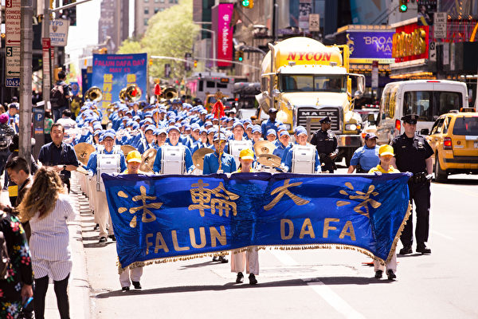

2018年5月11日，纽约法轮功学员曼哈顿中城42街举行盛大游行庆祝世界法轮大法日。

【大纪元2018年05月13日讯】1992年5月13日，法轮功创始人李洪志先生公开传授法轮大法。一幕意义非凡的历史大戏，由此开启。

26年来，“真、善、忍”的光芒，照耀全球。李洪志大师的教导，归正人心，重建道德。上亿名各族裔法轮功学员，同修高德大法，坚定地维护信仰，守护传统价值观。李洪志大师和法轮功现象，深刻影响和改变着中国乃至世界。

2000年，为纪念李洪志大师首次传法，法轮功学员们把5月13日定为“世界法轮大法日”。每年此际，全球大法弟子都会举办各种庆祝活动，向师父恭贺华诞，感谢大法的恩德。大陆法轮功学员突破网络封锁，发出数以万计的贺卡、贺辞，表达对师父的思念与坚修大法的决心。这一刻，最深挚的感恩与喜悦，如潮水般汇聚、激荡，跃动在五洲四海。

<b>缘起长春</b>

1992年的春天，在中国吉林省长春市胜利公园的猴山附近，李洪志先生来到一片绿树环抱的空地上，向人们教授一种动作舒缓、优美的功法——“法轮功”。他穿着一件灰色的旧毛衣，领着孩子，带着饭盒，不辞辛苦。渐渐地，这位气宇不凡的年轻人引起了群众的注意，跟他学功的人一天天多了起来。

同年5月13日，在长春市第五中学的阶梯教室，第一期法轮功学习班开班了。180多位学员在台下仰望——师父高大、英俊、慈祥，他说：“你们来了。第一期，难得啊。我给你的是多少年也得不到的。”

那一天，适逢李洪志先生41岁生日。李大师说过：“我这一生就是为传这部法来的。”

法轮功是上乘佛家修炼大法，以宇宙最高特性“真、善、忍”为根本指导，按照宇宙演化原理而修炼，性命双修。学员们通过习炼，在短时间内身心得到净化。从传出之日起，法轮功显现了数不尽的祛病神迹，感人的道德升华的故事也不断涌现。于是，人传人，心传心，法轮功传遍大江南北，从长春到京城，从都市到乡村，从中国到海外，盛名远扬。

从1992年5月到1994年12月，李洪志先生应各地官方气功科学研究会邀请，先后在中国大陆的23个城市举办了56期学习班，每期7至10天，总计近7万人次参加。

在长春的第三期班上，有一位瘫痪在床的中年妇女，被家人从医院抬到了李大师的授课班。学员回忆说：“师父讲课之前，让她家人把担架抬到讲台上，短短几秒钟的时间，师父让她坐起来，她就坐起来了；师父让她站起来，她就站起来了；接着师父让她走一圈看看，她就真的在台上走了一圈。”

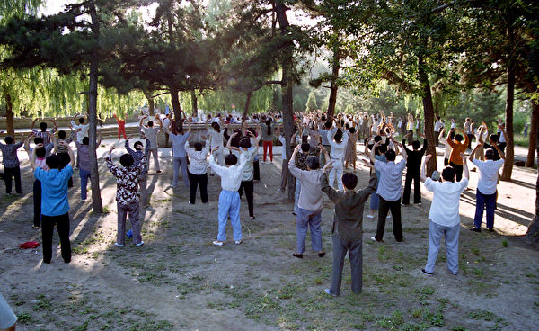

胜利公园猴山炼功点。

1993年12月，在北京“东方健康博览会”上，法轮功引来人山人海。一位见证人描述当时的情景说：“人最多的就是法轮功的摊位，挤得水泄不通，好多人往里挤也挤不进去，从开始到最后一天都是人山人海的，展位前排了三行队，队排得很长，一直排到博览会大厅的门口去了。来找李洪志师父治病的大多是全国各地的疑难杂症，有轮椅推著的，有担架抬着的，还有一对农村来的夫妇用铁架子抬着孩子去的。不时从法轮功摊位拥挤的人群中传出‘法轮功能治病’、‘法轮功治病快’的惊叹声。不时地听到法轮功摊位的鼓掌声、喝采声、感激道谢声、哭声，‘（病）好了！（病）好了！’‘真神奇啊！’还看到了下跪的，磕头的喊‘恩人啊！恩人啊！’带着哭音喊：‘救命恩人啊！’‘活佛再世！’”

这届博览会结束后，李洪志大师获得了最高奖“边缘科学进步奖”和大会的“特别金奖”以及“受群众欢迎气功师”称号。

1994年12月，李洪志先生的主要著作《转法轮》在中国出版发行，此书连续几年位居北京和全国的畅销书之列。

据官方统计，至1999年初，全中国已有7千万至1亿人修炼法轮功，学员遍布社会各个阶层。大陆的多家报纸、电台和电视台都曾报导过法轮功祛病健身、提升道德的奇效以及民众学炼的盛况。

1999年1月初，因为对法轮功发源地的向往，22岁的法国青年托马斯．多布森斯来到长春。每天清晨，他在吉林大学和中国同修们一起炼功，晚间他在学法小组和大家一起通读《转法轮》。

托马斯回忆说：“几乎每家至少有一个法轮功学员，不是祖母、母亲，就是爷爷或父亲。无论你在哪里，差不多步行十分钟就会走到一个炼功点。……整个城市都在按‘真、善、忍’做，在向内找自己的不足。……就在这个城市里，有这么多的人正在这样实践著！那真是相当惊人的！”

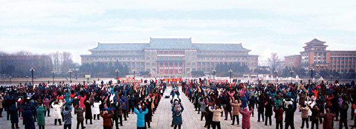

长春法轮功学员在长春地质宫前炼功。（明慧网资料）

<b>众弟子感恩</b>

对于法轮功学员来说，最幸福的记忆莫过于有幸聆听李洪志大师讲法、曾与师父合影、交谈或相遇。师父的言谈举止、笑容、眼神，超凡脱俗而又慈悲温暖。即使是从未亲见李大师的学员，也都感佩之至。弟子们以“洪恩浩荡”来表达对师父的无比崇敬与感激。

为了把法轮大法的美好带给更多的人，李洪志先生走遍了中原大地，也到访过海外多国。李洪志大师以自己的一言一行展示了“真、善、忍”的境界。觉者风范、崇高品德，引人无限敬仰。

在大陆传法传功期间，李洪志大师奔波劳顿，粗茶淡饭。他曾夜宿北京火车站的长凳，也曾一路站在拥挤的车厢里，赶往学习班的下一站。他淡泊名利，不摆架子，不求回报，处处为他人着想。

阅读法轮功学员的修炼心得体会，浏览各国弟子献给李洪志大师的贺信，便会理解，为何，一位来自东方的功法创始人，赢得了亿万民众的爱戴和归心。

一位参加了湖北武汉第二期法轮功学习班的学员说：“在十天的讲课中，每天教功，台上有学员做示范，师父满面笑容，神态慈祥，亲自到学员中来纠正动作。最后一天是答疑，不管问多少问题，师父总是苦口婆心，不厌其烦地解答，让学员能弄明白法理。在整个的讲课中我们没有看见师父喝一口水。师父休息时叫学员休息，可自己从来没休息过。他那博大的胸怀，无私的品德，非凡的气度，叫人景仰不止，令人永世难忘。”

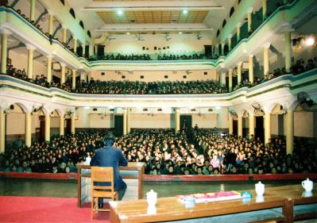

1993年3月29日至4月7日，李洪志大师在武汉举办了第二期法轮功学习班。（明慧网）

一位贵州法轮功学员自述：“修炼法轮功前，我是几十年的老病号。……我是被家人抬进师父传功场的，在师父给学员们清理身体时，我马上感到一大股阴凉气往脚底下去，顿时全身暖呼呼的，清理完后，师父说放松，站起来往前走！开始我心七上八下通通跳，师父鼓励说别怕，没事的，你走呀！于是，我竟行动自如走起来，全场鼓励掌声使我泪水涟涟。”“真是三生有幸啊！自此，我们全家三代人绝对信师信法，无论风云怎么变幻，邪恶有多疯狂，都动不了我们坚修大法的心。”

1994年12月21日至29日，约六千多人参加了在广州体育馆举行的广州第五期学习班。场馆工作人员说：“我们接待了多少活动啊，还真没见过这么虔诚的，几千人听课安静的简直掉根针的声音都能听见，感人，感人啊！”

有位黑龙江的男学员流着泪说：“我从最北边的佳木斯一路辗转来到最南边的广州，是八千里路云和月呀，为的是来这里听老师讲法，我得了大法，值！幸运啊！”

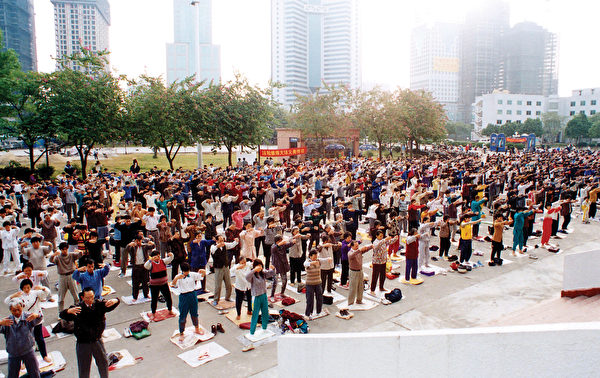

1998年，北京一个炼功点的法轮功学员集体晨炼场景。（明慧网）

一名大陆学员写道：“我虽然读书不多，但我知道我能够有这样珍贵的机缘修炼大法，那是我三生有幸、祖上积德，我知道我这一生为啥活着。”

澳洲的约翰‧德勃兹（John de Beaux）曾经烟酒毒品不离身，自暴自弃。他阅读《转法轮》和炼功以后，很快摆脱了不良嗜好，重拾信心。他说：“有好多次，在打坐以后，我很想哭出来。我曾是一个糟透了的人，竟能得到美好的大法，我无比感恩。”

越南女记者Phuong曾受结核病和视力障碍的折磨，面临失明的危险。修炼法轮大法后，多种顽疾不药而愈。她说：“‘真善忍’照亮了我的生活，就像阳光照耀大地。”

现居美国华府的Linh Phan来自越南，她的母亲曾经身患20种病，四处求医无果，修炼法轮大法后，所有的疾病好转。看到发生在亲人身上神奇的变化，Linh也走上修炼之路。她说，“我很感谢李洪志师父为我们做的所有这一切，让我们成为更好的人，帮助我们找回真正的自我。我希望人们都能从中体验修炼大法给生活带来的巨大改变，这是人生中更美好的旅程。”

迄今，世界各国政府机构、议员、团体组织等对法轮大法和创始人颁发褒奖（包括奖状、奖杯、奖牌、奖旗等）及感谢支持信函超过三千多项。在法轮大法网站，李洪志先生的著作、讲法音像资料和炼功音乐全部可以免费下载。

1999年6月25日，李洪志师父在接受伊利诺伊州州长、州财政部长和芝加哥市长嘉奖的颁奖仪式上讲话。（明慧网）

<b>奇迹与希望</b>

1999年7月，中共江泽民集团发动了对法轮功的镇压，以恶毒的谣言攻击李洪志先生、诋毁法轮大法。面对诽谤构陷，李洪志大师教导弟子们和平、理性地讲清真相，造就了一批又一批勇于为真理献身的当代圣徒。

19年来，大陆法轮功学员顶住了暴力虐杀、酷刑折磨，在血雨腥风中捍卫“真、善、忍”。海外大法弟子创办媒体，举办集会游行，以各种方式揭露中共的谎言、罪行和邪恶本质。

在讲清真相的同时，法轮功学员开创了和平解体中共的“三退”精神觉醒运动，有力地推动了全球去共化的进程，并且帮助各国政府和人民认清共产主义破坏道德和文化的阴谋与危害。此外，法轮功学员致力于复兴中华传统文化和价值观，通过文艺演出等形式再现五千年文明的辉煌，展现了一个真正美好的中国，传送回归传统、复苏神性的美好召唤，带给数百万观众深刻的精神洗礼。

在这一场前所未有的正邪交锋当中，法轮功学员们展示了大善大忍，以信仰的力量谱写烈火炼真金的正气壮歌。他们的勇气践行与不屈抗争，鼓舞著被暴政压迫的大陆百姓，激励更多的人选择良知、汇入正义的洪流。人们惊见中国“传统精神的复活”，看到了未来的希望。

今天，法轮大法修炼者遍布亚洲、欧洲、非洲、北美洲、南美洲和大洋洲，《转法轮》被翻译成41种语言，为越来越多的读者所珍视。而发动迫害的中共，谎言瓦解、恐怖失效、罪行败露，在民众觉醒和正义力量的围堵中走向解体、灭亡。

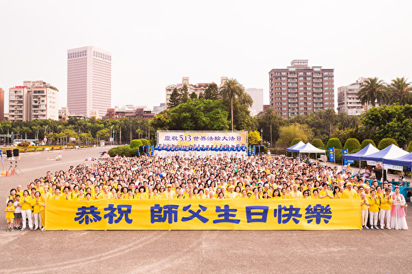

约1千名台北部分法轮功学员5月6日在国父纪念馆前举办活动，欢欣庆祝法轮大法洪传26周年，并高声恭祝“李洪志师父生日快乐！”

2016年9月，余文生等维权律师在为法轮功学员所做的无罪辩护中说：“（法轮功学员）17年来从来没有以暴易暴、以怨报怨，全国没有发生过一起法轮功学员因遭受迫害与不公而采用暴力或非法手段鸣冤雪耻的事件。这是一种怎样的舍身救世精神，这是一种怎样的大慈大悲情怀？所展现出的境界甚至已被看作中华复兴，道德回昇的希望。”

金光鸿律师说：“在严酷的迫害形势下，法轮功学员坚韧不屈，不顾个人的安危，持之以恒地讲真相，他们的大善大忍，让世人都看在眼里，他们的行动本身，就感动了人，成为世人的榜样。”

一位北京大法弟子的丈夫向李洪志大师致意，“在人类道德一日千里下滑，为了一点小利益而不择手段地伤害对方，让人看不到希望之时，在中共针对法轮功修炼者长达十八年之久的惨无人道的迫害中，您以慈悲唤醒世人。”

据明慧网报导，在瑞士的旅游景点，一位五十多岁的大陆男子接到法轮功资料时哭了。他对法轮功学员说：“我知道共产党打压法轮功最厉害，你们吃的苦、受的罪太大了，我心里特别难过。共产党毫无人性！你们受了这么大的冤屈，还千方百计帮助别人，法轮功伟大、太了不起了！”

著名学者仲维光先生对法轮功致以“高山仰止”的敬意，他说：“近代中国人丧失了根基、妄自菲薄、莫名其妙地崇洋，道德和人心江河日下，尤其是最近半个世纪以来，整个国家、民族在败坏。而法轮功就像中流砥柱一样，在直接对抗、扭转着世风，这影响还会越来越大。……这是一个奇迹。”

今年“法轮大法日”前夕，加拿大多个城市的市长向法轮大法学会发出贺信和褒奖，赞扬法轮大法提升社会道德，指出“真、善、忍”理念是所有社会的指路灯，启迪人心，也称赞法轮功学员“对‘真、善、忍’准则的坚守，对良心和宗教自由的坚守，为加拿大民众和全世界民众树立了榜样。”

<b>结语</b>

潮起潮落。乾坤的转盘，飞旋出诸多启示，把思考和选择留给苍生。

1997年，雪白纤细的优昙婆罗花，开放在韩国清溪寺冠岳山龙珠寺恋主庵的佛像上。释迦牟尼佛当初预言，此三千年一开的奇花在人间开放之日，就是法轮圣王下世传法度人之时。

当谎言欺世、暴虐嚣张，当世道沉沦、人心迷失，当动乱似乎就要吞噬安宁，李洪志大师把宇宙的法理捧给了众人，谆谆教诲、理白言明。法轮大法的法光照亮了物欲红尘——送来福音，洒下甘露，拨开心灵的迷雾，开示人生的真谛、令文明重绽光彩。法轮功传递的真相，就是乱世中的指路明灯，指引生命的归航。

2004年1月20日，李洪志大师通过新唐人电视台的专访，对所有世人说：“人生为何而来，人为什么活在世上，千万年人都在苦苦追寻答案，可是你所要找的，也许就是你现在已经知道的，千万别错过机缘。”

又到5月13日。在天南海北的都市街头，在“法轮大法”金色大字的引领下，天国乐团庄严地行进著。鼓号声声，冲破阴霾，焕发昂扬正气，昭示著寰宇的新生。

一个辉煌的日子，划出未来神话的开端、希望之路的起点，人类和历史将永远铭记。

<h1 align="center"><b>台学者盛赞法轮功 恭贺李洪志先生华诞</b></h1>

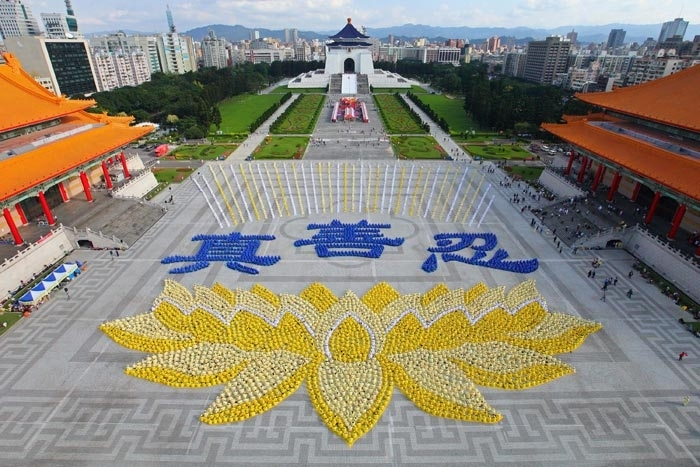

2010年11月27日，五千多名台湾法轮功学员在台北自由广场，排出立体莲花图形，映衬宝蓝的“真善忍”三个大字。（大纪元）

【大纪元2018年05月13日讯】（大纪元记者易如采访报导）今年是法轮大法洪传世界26周年。而自1999年中共迫害法轮功开始，在其残酷打压的19年里，法轮功不但没被打垮，并且已经洪传全世界100多个国家。为什么法轮功能顶住迫害广传世界？法轮功在世人眼里是怎样一群人？

对此，台湾大学国家发展研究所法学博士曾建元对大纪元讲述了他的感受。

<b>对真善忍理念的坚定超越一切</b>

1999年7月20日，中共党魁江泽民出于一己之私的妒忌之心，在其他中共常委的反对之下，发动对法轮功修炼团体的全面镇压。迫害之巨大，手段之阴毒，漫天的谎言及网路的封锁空前绝后，中共开足马力欲铲除法轮功。

台湾大学国家发展研究所法学博士曾建元对大纪元表示，中共从肉体和精神施加的暴力来压制法轮功是彻底失败的。

曾建元说，法轮功学员对真善忍有着坚定的信念，他们把苦难视为一种考验和修炼，而越是受到打压迫害，他们的意志信心更加坚定。

“精神上的坚定可以超越肉体受到的煎熬和痛苦，所以，中共要以国家的暴力对法轮功群体及对个别学员特别施加的暴力，只能是更加坚定了他们的信心而已。”

“另外，法轮功学员有一套超越政治、经济、世俗，超越的一种价值。甚至愿意为这些价值来奉献牺牲。所以这个是讲唯物主义的中共，希望通过威胁利诱来加以左右的做法所没有办法克服的问题。”

<b>中共迫害助推法轮功走向世界</b>

从中共迫害法轮功至今19年里，法轮功却迅速洪传世界130多个国家。

曾建元说，中共的迫害助推法轮功传到全世界，也让世界各国的人有机会见证法轮功的力量，同时也让外界了解到中共对宗教迫害的残暴。

“也就是说，随着迫害越来越多的甚至不是学员，他也会因为人性中的同情和恻隐之心来支持法轮功，这就是法轮功十几年的发展完全出乎当初中共的预期，反而随着中共的打压，现在遍布全球都有法轮功学员。”

“更让我印象深刻的是，在中共打压下，他们却高度发展，体现出一种组织经营的能力，像自由门翻墙软体，还有媒体，无论是传统的媒体，还是现代网路的媒体、电子及影视媒体，这些让法轮功跟一般其他的团体，展现出更不一样的地方及集体的力量，并在这个基础上呈现的成果也是非常惊人的。”

<b>法轮功的正面价值 中共迫害对中国造成的负面影响</b>

曾建元认为，法轮功是在儒释道传统文化及价值基础之上进一步的提升和发展，“法轮功倡导真善忍，其正面价值可以让社会文明提升、而通过道德文化的力量更容易促成社会的和谐。”

曾建元说：“这个迫害对中国的影响是非常负面，而且非常巨大。”

曾建元分析，首先，它是用国家力量去对具有这种宗教道德情怀的、对于自我要求向善、对社会对人群的关怀这些正面价值的直接打击。这个是非常糟糕的一个事情。

其次，大规模的持续镇压形成了一种寒蝉效应，“类似这种宗教的团体，或者是提倡有别于共产党的意识形态的美好的品德、美好价值的这些力量、声音，在中国大陆的土地上面，它就没有机会去萌芽、去发展去生长。”

第三，中共对法轮功的打压是对中国人民族性的一个根本的摧残，也是对中国人文化的一种根本的破坏，“是对整个民族的文化精神的灭绝。”

<b>法轮功维护和发扬中华传统文化</b>

“我认识这个群体很多的人，特别是在台湾，最早是在台湾大学的法学院，我周围的老师和同学很多都是法轮功学员。”曾建元说。

曾建元表示，法轮功学员有着共同的关怀、同情和慈悲这些人格的特质，另外，对公共事业也有高度的关怀。

“让我感到印象深刻的地方是，他们对怎样维护和发扬中华传统文化、传统的伦理道德哲学议题方面非常关心。”

“当然，他们在反抗极权专制的立场上的坚定也让我感到佩服，无论是苦难，或者诱惑都是对人性强大的考验，有时候人们抵抗诱惑的能力比抵抗苦难更难。法轮功学员在反共的阵营中，对名利的诱惑最具抵抗力，因为法轮功学员有更超越终极的价值的追求。所以，中共再怎样打压法轮功效果是非常有限的，反而更加淬炼了法轮功学员抗拒暴力的心性，这些都是我所看到的法轮功学员普遍共有的特质。”

<b>李洪志先生及法轮功赢得世界无数赞誉和褒奖</b>

法轮大法自1992年5月13日弘传世间已经二十六周年，今年的5月13日也是第十九届“世界法轮大法日”。而法轮功自传世至今已获得各国政府及非政府组织的各类褒奖数千项。

曾建元认为，法轮功之所以赢得自由民主国家共同的欢迎，是因为法轮功所提倡的真善忍在道德文化上对于社会的道德、社会的合作互助、社会的自治、公民社会的健全都有促进的作用，有助于这些国家整体文化、文明的提升。

他说：“法轮功源自于东方、源自于中国，他带来的正面教化、道德价值都具有共通性，从中会看到属于人类共有的美好的品德，所以能够在西方世界赢得普遍的欢迎和尊重，得到西方世界许多西方社会政治、文化领袖对法轮功的肯定。”

在过去时间里，法轮功创始人李洪志先生曾获得无数赞誉和褒奖。

2000年至2003年，李洪志先生连续四年获诺贝尔和平奖提名。2001年的《亚洲周刊》年度调查，李洪志先生获选“亚洲最有影响力人物”。

2007年10月，英国《每日电讯报》报导，全球咨询公司“Creators Synetics”公布“全球在世百大天才榜”，李洪志先生排名华人榜首。

2009年9月，李洪志先生获得美国亚太人权基金会“精神领袖奖”。2013年，被《外交政策》杂志评为全球最强大的500人之一。

2001年，国际人权组织自由之家在美国参议院外交关系委员会大厅颁发国际宗教自由奖给李洪志、法轮大法协会，表彰法轮功在中国大陆受迫害而为争取信仰自由进行和平抗争。

曾建元表示，面对中共暴政，法轮功展现出他坚定的反共立场，“他不是凭靠国家的力量，也没有军队，他依靠的是每一个学员、普通的人，通过修炼心性后，超越他原来的能力，为世界能够反抗中共暴政来发挥他的影响力，而且我看到更多的积极的利他俗世助人的社会行动。”

曾建元说，李洪志先生倡导的真善忍精神，对人类文明的提升带来一个巨大的影响力。“法轮功在李先生精神的领导下所展现出的力量和成就，和诺贝尔和平奖的宗旨是相符的，但在追求人类文明提升和全球和平的努力方面，其成就远远超过了诺贝尔和平奖的层次。”

<b>希望李洪志先生亲临亚洲及台湾传福音</b>

曾建元说，“我从身边的法轮功的学员身上认识到法轮功团体以及他们所谨守的价值和追求。”

曾建元表示，他和许多人期待能亲自见到李洪志先生，“如有机会我本人也很想目睹、近身向他请教，我想这应当是很多人的期待，大家也期待在这当中会得到人生丰美的收获。”

5月13日是李洪志先生的生日，曾建元说，他很高兴能借此机会表达对法轮功创始人的祝福，“祝李先生日快乐！身体健康！万事如意！祝福李先生继续用他的智慧和他的经验来带领人类文明的进步。”

同时他也向李先生表达了他的心愿：“也希望李先生在最近的未来能够有规划到亚洲和台湾访问和洪法，给予台湾人民精神智慧的启发，我想对台湾来讲是一个福音。

<h1 align="center"><b>日本学员在众议院会馆前呼吁制止中共迫害法轮功</b></h1>

【明慧网二零一八年五月十四日】日中韩首脑会谈于2018年5月9日在东京举行，中国总理李克强来日之时，法轮功学员在日本众议院会馆前呼吁各界关注中共对法轮功长达19年的残酷迫害，共同制止中共暴行，并打出“停止迫害法轮功”、“停止活摘器官”等日文版横幅。

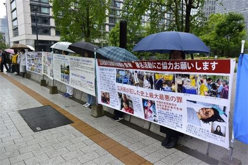

法轮功学员在日本众议院会馆前呼吁制止中共迫害。

当天下着大雨，参加活动的法轮功学员李亦然女士表示：“中共江泽民集团对法轮功进行了19年的迫害。希望日本政府能向中国当权者发出呼吁，早日结束迫害，使那些无罪被关押的法轮功学员早日获得自由。我们也向日本社会揭露中共活摘法轮功学员器官的真相，共同制止这种罪恶。”

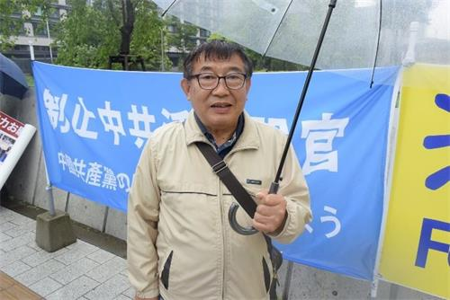

村山先生表示，活摘器官是不该发生的残酷事件。

从事建筑业的村山先生常常路过国会前，他说以前接到过法轮功真相资料。对于中共活摘器官的暴行，他表示“这种残酷行为应该停止”，应该请求日本政府采取措施阻止这种活摘器官用于移植的罪行。

从事农业的滝泽先生了解到活摘器官真相后说，“活摘器官简直没有办法想象”，“太过分！中国共产党的行为是不可容忍的。”

经营建筑业的井上先生得知法轮功学员被中共作为器官移植的活体器官库，他说这很不人道，并表示，他会为尽快制止迫害而祈祷。

当天，日本众议院会馆前人来人往，从工作人员到参加各种集会的人，都收到法轮功学员派发的资料，了解到法轮功真相。

<h1 align="center"><b>纽约法轮大法日游行 </b></h1>

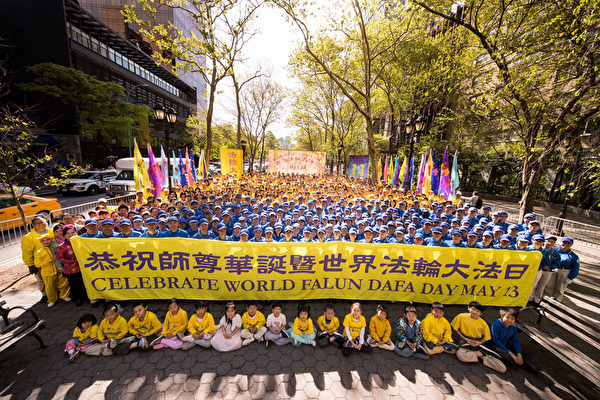

 

2018年5月11日，纽约部分法轮功学员聚集在联合国公园向李洪志师尊祝寿暨庆祝法轮大法日。

【大纪元2018年05月12日讯】（大纪元记者施萍、洪雅文纽约报导）2018年5月11日早晨，一夜的风雨把纽约曼哈顿的天空洗得清澈碧蓝，正好映衬满地盛开的春花——身穿黄、蓝两色服装的法轮大法修炼者，和他们手中色彩缤纷的旗帜，在阳光下熠熠生辉。上午11点，约两千名法轮功学员聚集在联合国公园门前，开始了一年一度的“世界法轮大法日”游行。

今年5月13日是第十九届“世界法轮大法日”与法轮大法洪传世界26周年纪念日，也是法轮功创始人李洪志先生的67岁华诞。每年的这个时候都是大法弟子向全世界传递“真、善、忍”的美好的时刻，也是他们展现十几年如一日和平反迫害的坚韧不屈精神的时刻，更是他们向伟大的李洪志师尊表达感恩的时刻。

5月11日上午，纽约地区部分法轮功学员先在联合国公园向李洪志大师祝寿，随后在曼哈顿中城42街举行盛大游行，浩浩荡荡的队伍，吸引了大批民众驻足观看和拍照。

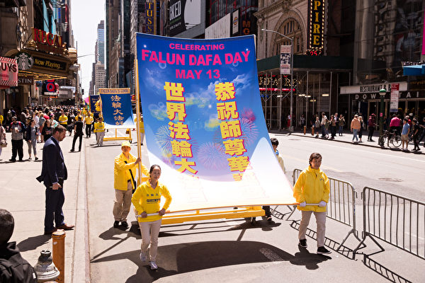

2018年5月11日，纽约部分法轮功学员在曼哈顿中城42街举行盛大游行，庆祝世界法轮大法日。

游行分“法轮大法好”、“停止迫害法轮功”及“声援三亿多中华儿女退出中共党、团、队”三大方阵。打头阵的是由两百多名法轮功学员组成的“天国乐团”，他们阵容壮观，步伐整齐，训练有素，威风凛凛，散发正面能量。紧随其后的是法轮功著作《转法轮》的中文版和英文版的巨型书模、送福小花船队、功法展示队、彩旗队、横幅队、腰鼓队等依次亮相。法轮功学员打出“爱国≠爱党”、“中国≠中共”、“法办江泽民”等横幅，传递著关乎每个中国人未来的信息，希望中国人为自己生命做出正确的选择。

2018年5月11日，纽约部分法轮功学员在曼哈顿中城42街举行盛大游行，庆祝世界法轮大法日。

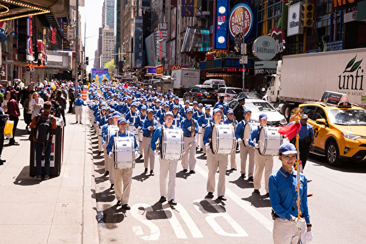

2018年5月11日，纽约部分法轮功学员在曼哈顿中城42街举行盛大游行，庆祝世界法轮大法日。

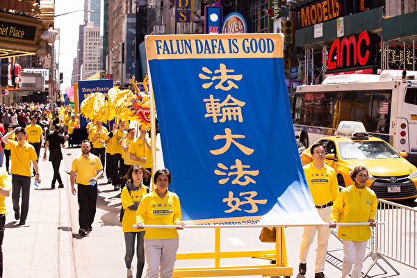

2018年5月11日，纽约部分法轮功学员在曼哈顿中城42街举行盛大游行，庆祝世界法轮大法日。

俩俩相继而来 新学员感恩
自从1992年李洪志先生在中国东北长春市将法轮大法传出以来，无数人入道得法成为大法修炼者，当年的中国大陆到处可以见到学员炼功的场面，很多人就是在公园里得法的。在中共迫害18年之后，这样的情形搬到了纽约市。

“每天都有人过来拿小册子、拍照、学动作，所以即使到了寒冷的冬天我们都坚持出来炼功，怕落下学功的人。”在曼哈顿第五大道布莱恩公园炼功的法轮功学员李玉说，“就好像回到了当年大陆的公园一样。这里不同的是，不光是中国人来学，各个族裔、各个国家的人都有来学。”

在纽约学表演专业的28岁的荷兰姑娘Yulia Seijkens就是在布莱恩公园开始修炼的。去年夏天她路过公园时，突然从那些炼功人的身上感受到一股强大的能量，她立即跑过去问这是什么功法。

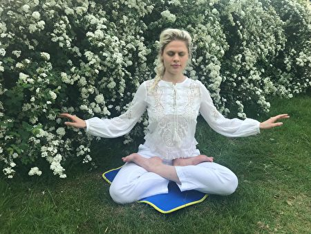

修炼不到一年的纽约女演员Yulia Seijkens在游行当日于欧洲表达她对法轮大法师父的感恩。图为资料照。

“一个人在我的背后回答说：法轮大法在不同空间和层次消灭邪恶。”后来Yulia发现那是一个陌生的路人，并不是法轮功学员。“可是那一刻我立即在心里说：这就是我要找的！”

修炼后她摒弃了一切不良习惯，身心健康得到极大改善。“我内心变得平静而祥和。”今天她因为出国办事不能参加游行，但是她通过网络发来她对大法的赞美和感恩。“大法是宇宙的法则，所有事情都不是偶然发生的，一切都是大法完美的安排。”她说，“师父是我们寻找已久的父亲，他是来救我们的，救我们所有的人，我没有任何语言能够描述他洪大的慈悲。”

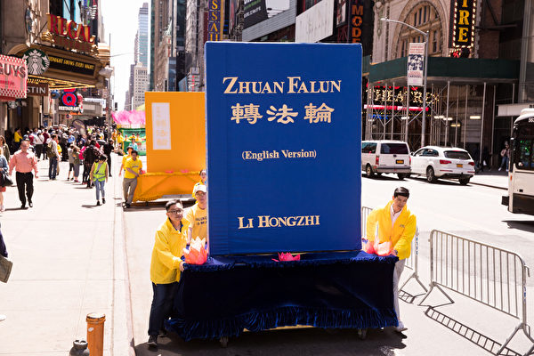

2018年5月11日，纽约部分法轮功学员在曼哈顿中城42街举行盛大游行，庆祝世界法轮大法日。

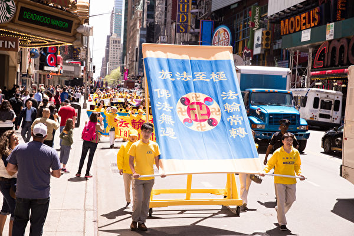

2018年5月11日，纽约部分法轮功学员曼哈顿中城42街举行盛大游行庆祝世界法轮大法日。

无独有偶，去年5月底在曼哈顿麦迪逊广场花园第一次见到法轮功的纽约建筑师、31岁的Cristina Matei也是立刻感受到了能量。

“我真切地感受到了强大的能量，然后就是我后来知道的消业的感觉：冷飕飕地像针刺一样，有东西从我的脚、腿、胳膊上跑出去，然后就是温暖的能量从头上灌下来。”她在游行前说，“那一刻我听到我的内心说：这就是我一生要找的东西！因为那能量太强大了。”

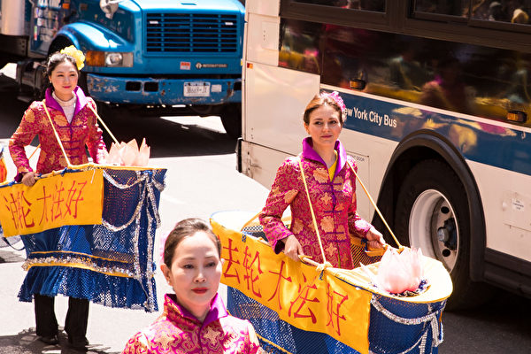

纽约建筑师Cristina Matei去年在麦迪逊广场花园炼功点得法，在百忙当中也不忘参加5月11日曼哈顿的“法轮大法日”游行。

从那以后Cristina天天早晨5点起来炼功。“我发现我吃、睡都减少了，因为我不需要那么多了，我身体充满了能量。”她身上六七年的敏感症状也消失了，皮肤变得漂亮。“我发现，我修炼以后，周围一切都变得好起来，同事们对我好，我的工作也顺利。”

“我像变了一个人。以前我只为自己着想，现在我更多地为别人着想。”Cristina说，她今天来参加游行就是“为他”的举动。“因为你给人多少钱不如给他大法，大法能改变你的一切，这就是为什么我要来参加游行。虽然我很忙，我真的很忙，但是大法的活动对我来说是最重要的事情。”

今年是Cristina第一次给师父拜寿。提起师父，她停顿了一下，抑制住涌上的泪水。“我每天都在跟师父说：谢谢您啊师父！虽然我不够精进，可您一直在看着我。”她说，“我一生都在追寻着什么，一遇到大法，我感到我终于满足了，我拥有了一切，我找到了真正的家园，我不再孤独。”

她说，今年初她看神韵演出的时候，她突然意识到了什么，感动地流泪。

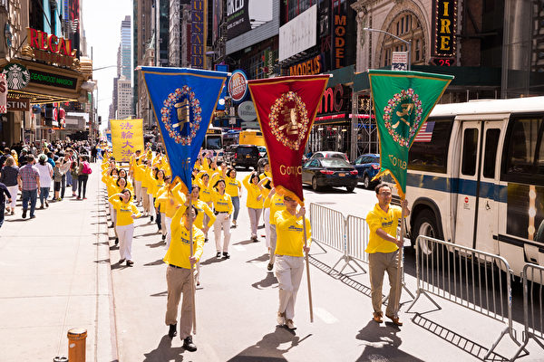

2018年5月11日，纽约部分法轮功学员在曼哈顿中城42街举行盛大游行，庆祝世界法轮大法日。

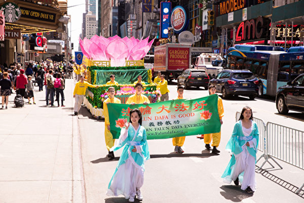

2018年5月11日，纽约部分法轮功学员在曼哈顿中城42街举行盛大游行，庆祝世界法轮大法日。

和Cristina有同样感悟的还有一个同样修炼才几个月的中国生意人于婷婷。去年8月她刚到美国的时候，在法拉盛的商场里遇到了法轮功学员，她听到的和国内电视上看到的大相径庭，于是她花了三天三夜看完了《转法轮》一书。

“太打动我了！我这么多年心中的问题全部在里面找到了答案！”她说，“我知道了生命的真谛、活着的意义，我的使命以及责任。”

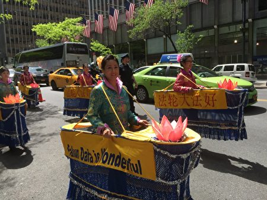

参加5月11日曼哈顿游行、在法拉盛开始修炼才几个月的新学员于婷婷体悟到大法师父就是宇宙的造物主本人。

“师父度化我们所有人。”她说，“这些只有你亲身修炼才能体会到。”

于婷婷原来腿有毛病，上楼都很费劲，修炼后一切变得正常，而且人变得越来越漂亮。“因为法轮功净化了我的心灵，让我守住了内心的安宁，我现在感到非常幸福。”

“我感恩师父，我感到自己太幸运了，能有机缘修大法。我觉得我来美国就是为了得法的！我现在的使命就是助师正法，救度更多的人。”

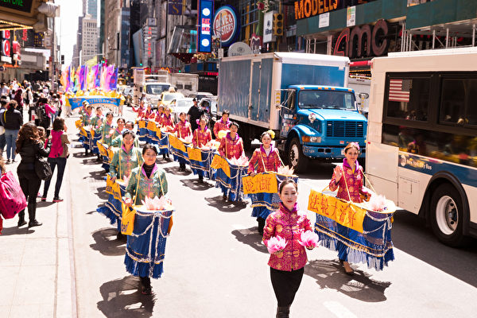

2018年5月11日，纽约部分法轮功学员在曼哈顿中城42街举行盛大游行，庆祝世界法轮大法日。

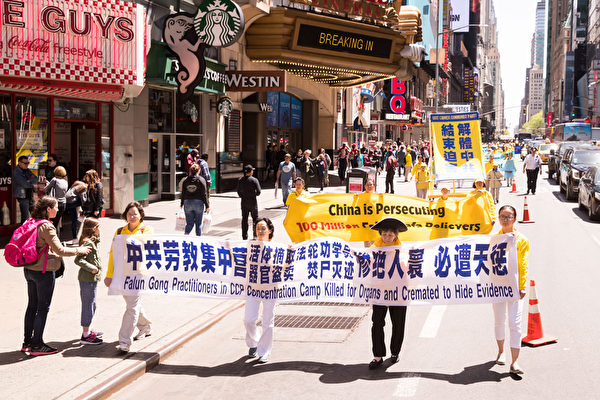

2018年5月11日，纽约部分法轮功学员在曼哈顿中城42街举行盛大游行，庆祝世界法轮大法日。

民众走入游行队伍支持法轮功：“这是我的责任”
今年游行后方的“声援三亿人三退”的方阵中出现了很多非法轮功学员的民众。刚从大陆出来不久的刘建国带着儿子走在队伍中。

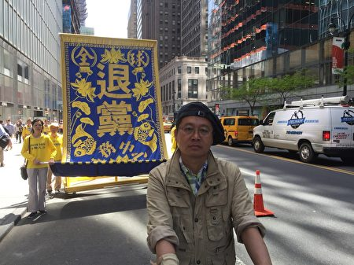

专程参加5月11日游行的大陆民众刘建国推著儿子在队伍中。

“今天是庆祝李洪志先生生日的游行，这么善良的一个群体一直遭到中共的邪恶镇压，我作为一个中国人，感到有责任来支持法轮功，所以我就来了。”他说他现在越来越相信法轮功学员说的话了，“昨天晚上下大雨，我还担心今天的天气，但是早晨一看，晴空万里啊，这正应了中国的一句古话：‘吉人自有天相！’”

“法轮功对中国的未来会起到非常重要的作用，我不仅参加游行，我还要把真相传到国内去。”

刚到美国的杭州人魏立斌也走在游行队伍中。“我来支持法轮功，我要贡献我的一份力量，早日结束这场迫害。”他说他佩服法轮功学员，“法轮功讲‘真、善、忍’，法轮功学员真正做到了‘真、善、忍’。今后我只要有时间都要来参加法轮功的活动。”

在长岛Molloy College学院读书的陈婷婷来美国半年了，受中共对法轮功妖魔化诽谤的影响，她一直把法轮功学员当怪物，对他们心怀恐惧。

刚来美国读书的陈婷婷参加游行并表示马上就要学法轮功。

“可是我接触了他们之后，发现他们都是正常的人啊，和国内宣传的完全不一样，这彻底颠覆了我的观念。”她说，“我现在没有恐惧了，但是我很愤怒，我以前得到的信息都是错的，我完全不能自己独立思考，现在还有那么多的中国人像我以前那样不知道真相。”

她认为，中国人最缺的就是信息渠道。所以她准备向更多的人传播真相。不仅如此，她自己也想学习法轮功。“现在学习压力重，心情经常烦躁，我感觉法轮功能让我的心静下来，对我本人以及我今后的病人都是有好处的，而且，法轮功也不要钱，我就想过来多了解一下，也要炼功。”

来自福建的闻洋表示，法轮功和国内说的一点也不一样，“他们是很正当合法的组织”。旁边的朋友说，看到这么多的老人家和小孩子都参加有游行，“这就说明法轮功好嘛”。

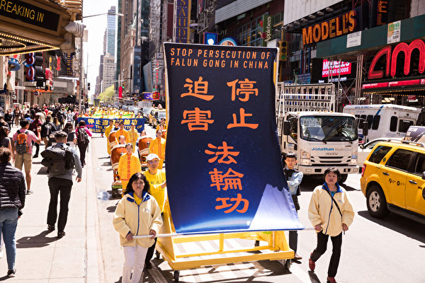

2018年5月11日，纽约部分法轮功学员在曼哈顿中城42街举行盛大游行，庆祝世界法轮大法日。

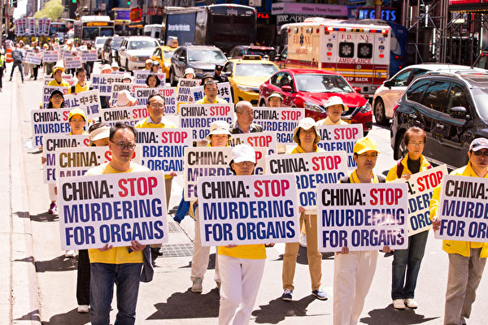

2018年5月11日，纽约部分法轮功学员在曼哈顿中城42街举行盛大游行，庆祝世界法轮大法日。

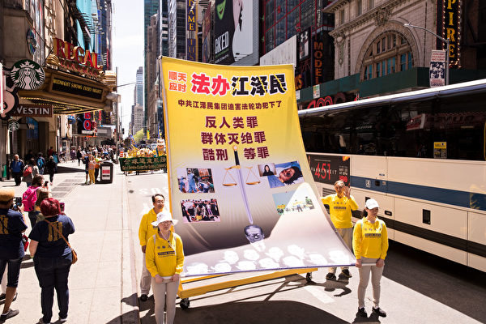

2018年5月11日，纽约部分法轮功学员在曼哈顿中城42街举行盛大游行，庆祝世界法轮大法日。

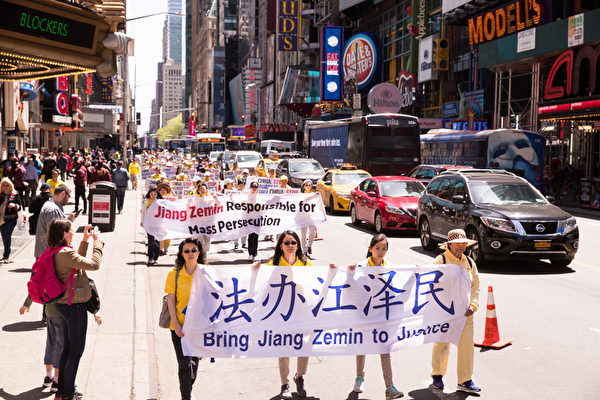

2018年5月11日，纽约部分法轮功学员在曼哈顿中城42街举行盛大游行，庆祝世界法轮大法日。

纽约和游人观众：“我们需要真善忍”“每个人都应站出来反迫害”
今天，很多纽约人以及国外游人目睹了法轮功盛大的游行场面，人们阅读传单、用手机拍照，还有媒体前来采访，当地很多观众收集了很多真相小册子，要回去在社区中告诉大家真相。他们认为：“真、善、忍”是普世价值，这个信仰却被中共禁止，所以每个人都应该站起来制止这场迫害。

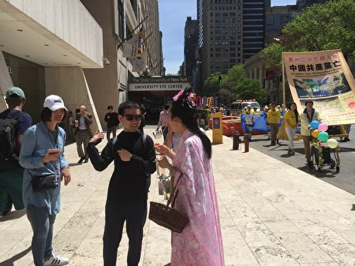

来自福建的游客小陈等三人在路边看游行，和法轮功学员交谈，称赞游行让他们感到“做为中国人很自豪”。

“我从来没有意识到法轮大法的修炼者会因为‘真、善、忍’这个普世价值而遭到中共的迫害。”纽约市立大学的教授James Blake说，“这么阵容强大的游行让我思考，我祝福他们继续下去，让更多的人了解真相。”

住在哈林区的Suzanne Bellamy退休前在耶鲁戏剧学院当教师，她边看游行边流泪。

“我无法想像中共对信仰‘真、善、忍’的团体如此迫害，这么邪恶、可怕。”她说，她认为游行是揭露邪恶的最好方式之一，“这不仅仅是迫害中国人，这是迫害全人类，我们美国人要干预这件事，必须立即停止！”她给自己的社区带回一兜传单，因为她认为，从总统到社区成员都要站出来反迫害。

其实，一直有很多人在帮助传播真相。来自墨西哥城的教师Marilene Acevedo说，他经常旅游，看见法轮功的游行就带回传单，回去在课堂上给学生讲。

“这是一件大事。”他说，“身为一个教师，我有使命去传递真相，直到结束中共这场让人无法接受的行径为止。”

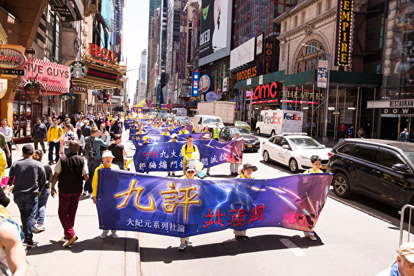

2018年5月11日，纽约部分法轮功学员在曼哈顿中城42街举行盛大游行，庆祝世界法轮大法日。

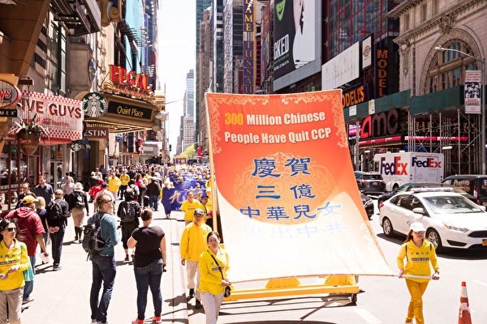

2018年5月11日，纽约部分法轮功学员在曼哈顿中城42街举行盛大游行，庆祝世界法轮大法日。

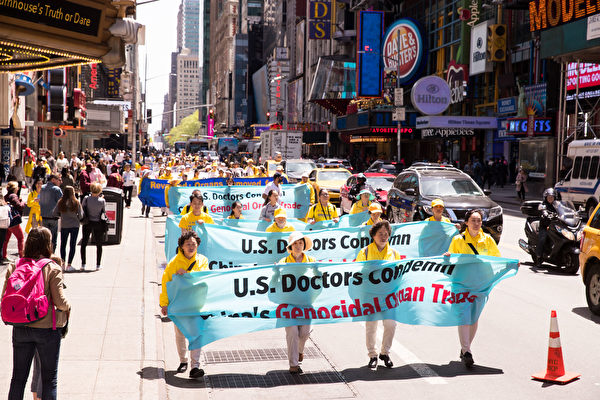

2018年5月11日，纽约部分法轮功学员在曼哈顿中城42街举行盛大游行，庆祝世界法轮大法日。

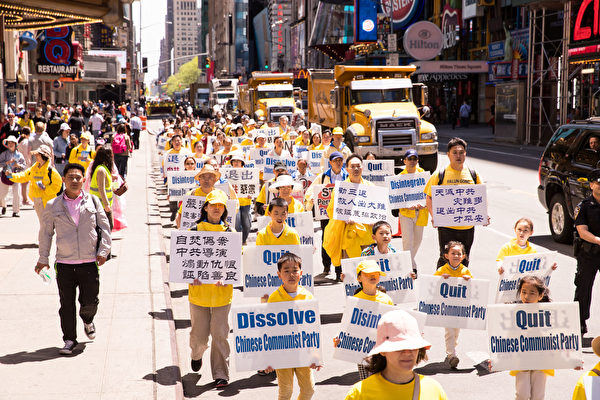

2018年5月11日，纽约部分法轮功学员在曼哈顿中城42街举行盛大游行，庆祝世界法轮大法日。

很多观众表达了他们对法轮功学员的赞美和感谢。
纽约市民Paula Steele在路旁跟着游行队伍走，她希望纽约人都过来看游行。“我感到来了强大的能量，一种纯净的、清澈的能量。虽然我很忙，但是我必须停下来，因为这一切太美好了！”她大声说，“纽约人需要‘真、善、忍’！这是全世界要遵循的价值观。停下来吧，看一看传单，这里是你灵魂需要的美好的东西。我感觉太好了！这些人让我感觉到了他们的慈悲！今天可真是我的幸运日！”

曼哈顿发廊业主Jeff Slater和店经理及全店员工都到门口看观看游行。“太美了，我们都爱看法轮功的游行，非常美好而平和，我们每年都看，一年都不落，是他们的忠实粉丝！太感谢他们了！”他说，“这个游行的所有元素我们都喜欢，无论是人、音乐还是这些春天的颜色，以及每个人的笑脸，他们让我们感受到神在保佑美国！”

荷兰游客Madeline说：“我们的世界需要更多的‘真、善、忍’。中共打压这些和平、善良的信仰实在让人气愤！我希望这些修炼人能够回到家乡去，继续传播福音、传播他们心中的善良。”

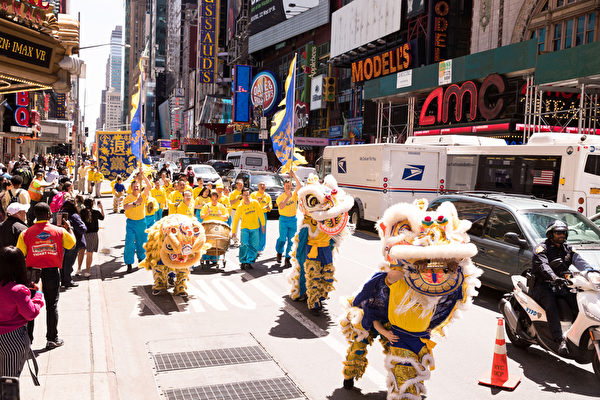

2018年5月11日，纽约部分法轮功学员在曼哈顿中城42街举行盛大游行，庆祝世界法轮大法日。

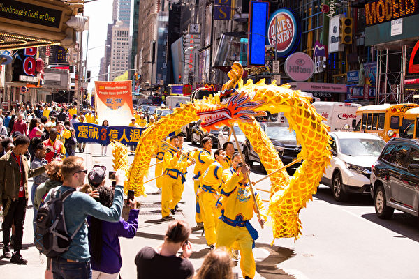

2018年5月11日，纽约部分法轮功学员在曼哈顿中城42街举行盛大游行，庆祝世界法轮大法日。

<h1 align="center"><b>【庆祝513】法轮大法使我眼中的艺术充满色彩</b></h1>

【明慧网二零一八年五月十日】作为一个艺术家，我认为那些致力于艺术的人，在他们的作品中展现了他们的内心世界，他们的思想、情感和感受。从这个意义上讲，当我内心的某些东西发生改变时，我的艺术和作品也发生了变化。
记得从孩提时代，我就开始关注生命的起因、目的和意义，有很多的思考。这些有关生命存在的问题一直伴随着我走过了青春期、成年期，和作为一个美术学生的时代。我开始创作作品、雕塑、物体、绘画，而这些作品的内容都和那些主题有关。我读书、学习、培训自己，寻找这方面的知识，然而，我从来没有找到那些有关本源问题的答案。

在那个时期，我作品中的一大主题就是虚无，一种存在主义的虚无，带着一定的负面色彩和世界末日的景象。比如像“玩偶”一样的物品，畸形的，烧毁的，或者是失败的科学实验产物，克隆，废墟中的未来城市，等等。

在那个阶段， 绘画不是我很喜欢的学科。但我喜欢单色（无色）绘画，用电线构成的物体，从街上找来的各种东西的拼凑组合，还有使用铁件焊接而成的雕塑。这是一种冰冷的，生硬的，还有点痛苦的审美……

我不太记得是哪年了，我想应该是二零零七年。一个朋友给了我一本小册子，是关于法轮大法的。我开始并没有太重视它。过了一段时间，我上网看到在我家附近有一个免费的炼功点，于是我就去了。很快，我开始阅读《法轮功》，接着是《转法轮》。

就是在那时，我心中的某些东西开始变化。有时我觉得，没有词语可以表达法轮大法是多么的伟大，或者法轮大法在各个空间代表了什么。但我可以说，大法开始改变我的思想和看待生命的方式。我甚至都没有意识到，对于那些我一直问自己而无解的问题，我开始有了答案。这些变化也自然改变了我对艺术的看法与理解。我的艺术作品也与从前不同了。

因此，我作品的内容一点一点的开始改变，开始传达一种精神上的东西，我们内在的生命，而舍弃了那种世界末日的景象，以及那种颓废与痛苦。于是，色彩也进入了我的绘画作品中。我的作品内容开始变得纯净和正派。

有一点很清楚，那就是我作品的变化来源于我修炼后内在的变化。我的作品开始拥有以前从未有过的色彩，和以前从未探索过的空间。随着时间的推移，我意识到，我可以通过我的作品向他人传递积极的信息。我运用具象和现实手法，创作了一些描述法轮大法学员典型场景的绘画作品。比如，周末在中国城讲真相，展示功法，或者庆祝世界法轮大法日。

另外，有些作品突出了法轮功在中国被迫害，另一些作品则展现了大法的神圣。

要说明一下，我修炼大法将近十年了。我觉得作为一个艺术家，我必须传递好的和正的。回顾过往，我的艺术作品有了极好的转变。我知道，这一切都来源于并取决于我的自我修炼。我也知道，要每天都保持向前，再迈進一步，不是一件容易的事。毫无疑问，法轮大法影响了我，这些影响在我所做的事情中体现出来。

在这里，我附上了我的一些作品。

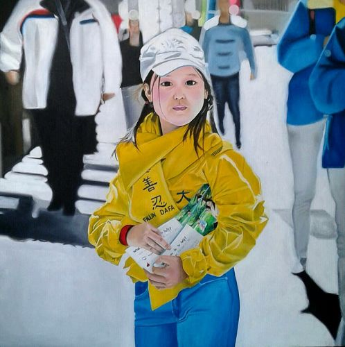

图1：“阳光明媚的星期五”，在油画布上用丙烯颜料所作，1 x 1米。

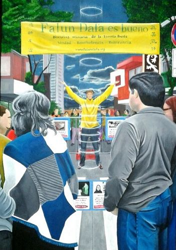

图2：“穿越宇宙的极限”，在油画布上用丙烯颜料所作，0.92 x 0.65 米。

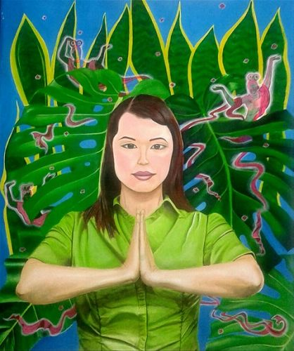

图3：“东方的问候”，在油画布上用丙烯颜料所作，0.50 x 0.60 米。

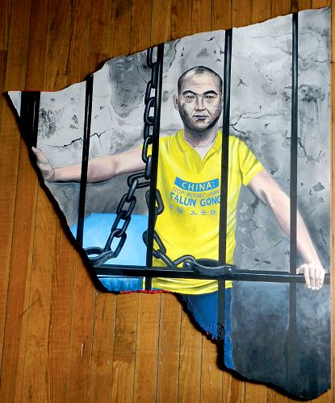

图4：“为信仰被囚禁”，在石膏板上用丙烯颜料所作，1.27 x 1.07 米。

<h1 align="center"><b>【庆祝513】播撒善的种子</b></h1>

【明慧网二零一八年五月十一日】怀着对大法的无比崇敬和对师父的感恩，写下我在修炼路上的点滴故事，在“法轮大法日”普天同庆的日子，感谢师父的洪恩，遥祝师尊生日快乐！
修炼前，我的妒嫉心很重，因为我们结婚没花多少钱，而小叔子结婚买的东西都比我们好，我妒嫉。后来给小叔子盖的房子也比我们的好，我更妒嫉，总怨公婆偏心，看他大儿子（我丈夫）老实好说话，二儿子脾气暴，不好惹，再加上其它许多矛盾，我们的积怨越来越深，最后发展到不相往来的地步。

修炼后，法轮大法渐渐开启了我尘封已久的本性，才知道一切都是因缘所定，才发现自己也有那么多不足之处，原来总认为自己是一朵花，都是别人对不起我，也不会站到别人的角度去替人考虑问题，是大法化解了我心中那座怨恨的冰山。我不再计较，学会了宽容，从此脸上有了笑容，生活有了生机。我和丈夫同时开始修炼，公婆看到我的变化，也相继看了大法书。那一年是一九九九年春天，我生命中最值得珍惜的时光。

我因坚持修炼遭中共迫害后，二零零四年才回到家中。家里很困难，丈夫还在家种着那点地，小叔子却有了工作。一问才知道，是因为我们的地被占了，占地那个公司给所占地的人家每户只能安排一个人工作，我们村其他几家都是安排老大上的班，丈夫却让给了他弟弟。我的心里有点不平衡，觉得我家因邪党的迫害，条件不好，应该照顾我们才对，转念一想，自己是修大法的，我所追求的是什么呢？怎么和常人争这些，也就坦然放下了。

不久，占地的四万元到账，公婆想把钱分成四份，公婆、我们、小叔子、小姑子，怕我们不同意，就一大早来找我，希望我同意并带个头。我想小姑子虽然出嫁，但是条件也不好，本来就他们兄妹三人，互相帮助互相照顾也是应该的，就很爽快地答应了，就这样我们家和平解决了这场占地财产分配问题。

农村重男轻女比较严重，因为占地钱的分配问题，很多家庭兄弟姐妹都打得跟仇人似的，看到我们的做法，在后来的占地分配上，村里人争相效仿，这件事成为村中美谈。

后来我们被占地的三十五万，小姑子也和我们一样平分了。兄妹各自买了房，他们两家都买了稍大平米的楼房，每人又都从公婆那里借了十多万；我买了小平米楼房，没有占用公婆的钱，因为我不想欠债。亲友说我傻，不借白不借，我不那样想，我是修大法的，我用大法的标准来衡量，欠债就得还，放下就是得到。

我的小姑子也走進大法修炼中来了，无论我走到哪，她就跟到哪。我租房的那段时间，她就租我的隔壁，我买了房，有一天她从报纸上看到我所在小区卖房，一打听是我的隔壁，激动的给我打电话要买那个房；也是缘份，她又成了我的隔壁邻居，用她的话说：“你上哪，我就上哪，别想甩掉我。”

她的丈夫也很少叫我嫂子，而是叫大姐。我那脾气火暴的小叔子现在很尊重我，听我的话。在一次家庭聚会上，公公说：“今后这个家就听你哥哥嫂子的，尤其你嫂子。”我半开玩笑似的说：“注意啊，我可是大权在握，话说回来，我们这个家最要感恩的是大法。”村里人也都感叹，我们那个曾经四分五裂的家能有今天，源自法轮大法，都知道大法好，护身符、台历都抢着要。

我出来打工的日子里，就想无论走到哪，就把大法的美好带到哪，我希望我结的都是善缘。我的第一份工作是机器按钮打食用油，都知道我是学法轮功的，我就从一点一滴，一言一行做起。

刚去那里时，那间小小工作室破烂不堪，我就每天细心打理，桌椅板凳，各类机器，擦得一尘不染，桌子摆上大法真相台历，墙上也贴上大法真相的画，把个小屋打理的既干净又喜庆，公司员工都说好。

可是我的业务不熟练，有时就把一种油打到另一个桶内，造成出油和打出的票数字不相符。经理是老板的侄子，他知道这种情况，几次想帮我抽出来，没抽成。到一个月开工资时，老板也许想给我长个记性吧，就扣除了那个油钱三百多。本来那时我的工资才一千，那个月我才开了六百多。同事们都为我鸣不平，心想这次非把我扣的不干了，可是我什么也没多想，觉得老板这么做也情有可原，毕竟数字不符，空口无凭，他没有亲眼所见，我内心无愧就行了。

第二天，我挎着小包笑呵呵照常上班，有一个同事曾对我说：“看过心大的，没见过你这么心大的。”一次，我把手机放到桌子上，就去办事，等回来时，发现手机没了，就找经理调了监控，发现是被一个打油的看到屋里没人，就偷偷拿走了。经理说：“他经常来，下次再来时，你告诉我，非得整治一下他不可。”我也知道这个人，可能他不知道我们这有监控器，才干出这事。

没过多久，他没敢来，就让他媳妇来打油，我一眼就认出了她的电瓶车。我想不能和她说，一个女人，一着急，骑个电瓶车也不安全啊，也不能和经理说，他们知道了，说不定会弄出啥事来，就装作什么也不知道的样子，给她打上油，叫她走了。

又过了几天，那个拿我手机的小伙子果然来了，经理就打算狠狠扣他钱，教训他一把，只等我发话。我想这件事由我自己处理最好，一来我不想怎么去制裁他，但我却也不能纵容他再去干坏事；二来他是公司老客户，我不想因此造成损失，我决定利用以后他再来的机会，点到为止，只要达到他以后别再贪图小利就可以了。至于我的手机，自己再买一个好了。

后来他来打油，我们唠嗑，就和他谈一些做人的道理，告诉他千万不可贪小便宜，贪小便宜吃大亏，也告诉他，现在的商场都有监控。他由开始的不好意思，到后来特别尊重我，我觉得他再也不会去干这种不道德的事了。后来单位同事问我，找到那个偷我手机的人了吗？我什么都没告诉他们，为了他个人名誉，只有经理和我知道。同事们看到我的为人，都特别信任我，尤其经理，只要我说的话，他就信。

公司打油，按钮上有点猫腻，原来在这按钮打油的职工都得听公司安排的去做，经理告诉我例外，想怎么打我自己去决定。我当然就按正常的打，也算为他们积点德吧，他也特别尊重法轮大法。有一次，经理看完一本杂志，就随手放在我的桌子上，一看我的大法书也在桌子上，就赶紧把他的杂志拿起来，扔到一边的沙发上说：“我的书太龌龊，不能和你的书放在一起。”听了他的话，我真的很欣慰，可以看出大法在他心中的神圣位置。还有一次，我捡了一个小葫芦，他就把小葫芦上刻上了“真善忍好”几个字，下面又刻上一个莲花座。这张照片直到现在我还保留着，一个生命真的得救了，就让它做个永久的见证吧。

同事说：“你这个人真好。”

兄弟姐妹说：“小时候你最笨，现在你最好。”

亲戚说：“你家钱挣得不多，可钱花不完似的，我们挣那么多钱却还不够用。 ”

同学说：“你的变化最大，有一种说不出来的气质。”

我知道是因为我走了最正最神圣的一条路，他们看到的只是表面，其实我的生命因得大法，将来更辉煌！穷尽人类语言都无法表达对师父的感恩！

<h1 align="center"><b>美国会研讨会关注3亿人三退 为世界带来希望</b></h1>

5月9日下午，在美国国会举办的“三亿中国人三退”研讨会上，来自不同国家的政治家和中国问题专家表示，民众大规模的精神觉醒为中国的未来带了光明的希望，也令国际社会振奋。

【大纪元2018年05月11日讯】（大纪元记者林乐予美国华盛顿特区报导）5月9日下午，在美国国会举办的“三亿中国人三退”研讨会上，来自不同国家的政治家和中国问题专家表示，民众大规模的精神觉醒为中国的未来带了光明的希望，也令国际社会振奋。

自从2004年底大纪元系列社论《九评共产党》发表以来，截至今年3月，已有超过三亿中国人声明退出共产党及其相关组织，这一现象也引起了国际社会的关注。

5月9日下午，“三亿中国人三退”研讨会在美国国会佳能大楼举办。

<b>美国国会议员：我们和中国民众站在一起</b>

资深众议员罗拉巴克（Dana Rohrabacher）来到研讨会现场，支持勇于退出中共的中国民众，并感谢三退义工。他说：“我向你们致敬，我了解你们的付出——在似乎没有可能打败中共流氓政权的情况下，你们坚定、顽强地站出来，鼓舞其他中国人，令全世界振奋。我很荣幸今天能到这里，告诉大家，我们和中国民众站在一起。”

资深众议员罗拉巴克（Dana Rohrabacher）来到研讨会现场，支持勇于退出中共的中国民众，并感谢三退义工。

罗拉巴克鼓励中国民众不要失去希望，他说川普（特朗普）总统和以往的美国总统都不一样，能做出许多大胆的决定，可能也会为中国的人权状况带来曙光。

<b>国会褒奖信：退党为中国重塑希望</b>

资深众议员史蒂夫．金（Steve King）发出褒奖信，赞扬退党运动对中国的重要意义。金议员已向国会众议院议长保罗．莱恩（Paul Ryan）正式提出此信，将列入国会纪录。

资深众议员史蒂夫．金（Steve King）发出褒奖信，赞扬退党运动对中国的重要意义。

他在信中说：“再一次，我为这些勇敢的退党活动的参与者、志愿者和支持者鼓掌。我期待人们意识到中国可以是一个自由的中国、自由的社会。”

资深众议员史蒂夫．金（Steve King）发出褒奖信，赞扬退党运动对中国的重要意义。

金议员表示，退党不是一场政治运动，也没有其政治方案，而是以一种平和的方式指引中国人提升自己的道德与良知，除去一个人和共产主义在精神上的联系，从而使人重拾传统以及对神佛的信仰。

“中共内部的解体对整个世界而言都是有利的。退党运动让世界展望一个没有共产党的中国，以及一个没有共产主义者参与的国际社会。”

美国国会及行政当局中国委员会（CECC）主席史密斯（Chris Smith）议员致信支持退党运动，他在信中说：“退党运动改变了中国人的思想，将许多人从中共的灌输教育和腐败中拯救出来。”

美国国会及行政当局中国委员会（CECC）主席史密斯（Chris Smith）议员致信支持退党运动。

史密斯议员对中国的未来充满希望，他说：“通过你们和众多正义人士为中国自由所做的努力，我相信，一个更美好的明天即将到来。”

<b>退党唤醒民众良知 洗刷灵魂</b>

全球退党中心主席易蓉介绍说，随着真相广传，越来越多的中国人选择退出中共邪党，为中国社会带来了重大的变革。易蓉说，退党运动为所有中国人和平抛弃中共提供了精神典范，是解决当前中国社会问题最包容、最和善的方式。

全球退党中心主席易蓉说，退党运动为所有中国人和平抛弃中共提供了精神典范。

美国国务院前助理国务卿埃伦．绍尔布赖（Ellen Sauerbrey）在支持信中表示：“这种和平的、非政治性的、基于社会底层的活动对打破民众心中被灌输的共产主义教条，让他们有机会能独立思考并自由选择自己和国家的命运是至关重要的。”

“当中国民众放弃他们曾给中共发过的毒誓并重新唤醒内心的良知时，全世界的人们都会从中受益的。这将为未来的中国奠定民主与和平的基础。”

美国国务院前助理国务卿埃伦．绍尔布赖（Ellen Sauerbrey）在支持信中表示，退党运动为中国的未来带来希望。

曾担任美国驻丹麦大使和国会众议员的理查德．史维特（Richard Swett）在现场表示，退党运动为黑暗的中国带来了光明。他说，是否敢于维护信仰自由，是许多人一生中最艰巨的道德挑战。史维特鼓励中国民众坚持正义的勇气。

曾担任美国驻丹麦大使和国会众议员的理查德·史维特（Richard Swett）鼓励中国民众坚持正义的勇气。

美国国际宗教自由委员会（USCIRF）主席丹尼尔．马克（Daniel Mark）在支持信中表示，出于无神论的意识形态及彻底的排他性，中共对各种信仰团体实施镇压。宗教自由委员会十分清楚无辜信仰人士遭受的迫害，因此格外赞赏退党运动帮助中国民众摆脱中共控制所做的努力。

美国国际宗教自由委员会（USCIRF）主席丹尼尔．马克（Daniel Mark）赞赏退党运动帮助中国民众摆脱中共控制所做的努力。

中国民主运动海外联席会议主席魏京生则表示，生活在中共强权之下的中国人承受了极大的压力和恐惧，退党为他们提供了表达真实意愿、洗刷灵魂的机会。

魏京生（左）表示，退党为中国人提供了表达真实意愿、洗刷灵魂的机会。

“六四”抗命军长徐勤先的驾驶员刘建国也来到研讨会现场，分享了自己退党的亲身经历，并感慨道：“在共产党的体制下，审计部门都时常会弄虚作假。退党是一个自发性的民间运动，义工们却用十分严谨、认真的态度对待，我真的感到很佩服。”

“六四”抗命军长徐勤先的驾驶员刘建国（左）分享自己退党的经历，对认真、严谨的退党义工表示钦佩。

<b>共产主义本质邪恶渗透全球</b>

根据美国国会的纪录，全世界的共产政体造成了总计1.35亿人的非正常死亡。评论员章天亮教授认为，实际数字可能远大于此。比起肉体消灭，共产主义最严重的罪行是通过剥夺信仰自由、摧毁道德体系和传统价值，扼杀人的灵魂。共产主义正以不易觉察的方式和速度渗透全世界，给人类带来毁灭性的灾难，只有保持良好的道德水准，才能幸免于难。

评论员章天亮教授表示，比起肉体消灭，共产主义最严重的罪行是通过剥夺信仰自由、摧毁道德体系和传统价值，扼杀人的灵魂。

前瑞典国会议员、前欧洲理事会议会副议长戈兰．林德布劳德（Göran Lindblad）通过视频连线表示：“将共产主义的目的揭示出来，这非常重要。如果对马克思和列宁有所了解的话，就会明白，在这样极端的政体下，不会有任何好的结果。”

前瑞典国会议员、前欧洲理事会议会副议长戈兰．林德布劳德（Göran Lindblad）通过网络视频与现场连线。

人权活动家李祥春博士说，共产主义悄然渗透美国及世界各国，退党运动揭示了共产党的本质，帮助人们分辨真伪，采取清晰有力的抵制措施。

人权活动家李祥春博士说，共产主义悄然渗透美国及世界各国。

追查迫害法轮功国际组织主席汪志远表示，认清共产邪灵的终极目的，追查和惩治中共的反人类罪恶刻不容缓。他说：“这不仅仅是因为罪行必须惩处，更因为是拯救人类最后的道德良知。天地之间正与邪的较量，构成了对每个人、每个组织、每个国家政府道德良知的全面检验。愿人们在这历史关头，选择正义良知，共同清除邪恶。”

<b>道德回升 有益世界 利在千秋</b>

前新西兰行动党副主席特雷弗．劳登（Trevor Loudon）说，中华文明已有数千年的历史，一直自给自足，孕育流传了令人惊叹的璀灿文化和内涵深厚的道德哲学。在这样浓厚的文化道德氛围中，人们拥有极高的职业素质和修养，在没有中共干涉的情况下，本可以为世界做出更大的贡献。

“我想看到一个真正强大的中国。因为你无法想像，一个真正自由的中国可以为这个星球做出什么贡献。中国民间的各行各业、文化和伦理，在适当机会摆脱中共控制的情况下，可能比其它任何国家更有助于改善这个世界。”

前新西兰行动党副主席特雷弗．劳登（Trevor Loudon）说，在没有中共干涉的情况下，拥有极高的职业素质和修养的中国人可以为世界做出更大的贡献。

劳登说，虽然退党义工背负着巨大的压力和风险，但这是造福子孙、利在千秋的伟大事业。他说：“我希望你会想到你将在历史上的位置，希望你在二百年的时间段里思考。当中国有真正的自由时，一些年轻的中学生选择一个关于中国历史题材项目，在他们看起来在中共崩溃时，中国就在真正意义上解放了。当他们对他们的祖先进行研究时，会发现自己的曾曾曾祖父和祖母是促成这一事件发生的一部分，这就是你在历史上的地位。我很自豪能够成为你们中的一员，并且我祝贺你们所做的事情，因为这对我们全人类都有益处。”

纽约州执业律师叶宁则表示，以“真、善、忍”为指导的正义人士们所付出的努力，使得退党成为了过去二十年中人类历史上最伟大的运动。他说：“因为你们的努力，中国一定会得到拯救，人类会有出路。”

纽约州执业律师叶宁则表示，以“真、善、忍”为指导的正义人士们所付出的努力，使得退党成为了过去二十年中人类历史上最伟大的运动。

<h1 align="center"><b>中共邪灵毁灭人类的终极目的不会改变</b></h1>
【明慧网二零一八年五月二日】进入二零一八年以来，中共迫害法轮功的形势仍然严重，法轮功人权仍在持续恶化，中共邪灵毁灭人类的终极目的不会改变！这是由中共的邪恶本质决定的，只要它存在一天，它就会作恶，它就会祸乱人间，人类就不会有安宁。
据明慧网不完全统计，三月份中共又绑架三百六十五名法轮功学员（其中，一百四十一人已经回家），骚扰一百九十七人，有一百五十六名法轮功学员被非法抄家，非法批捕十七人，强行送入洗脑班十三名，对五十八名法轮功学员非法判刑，非法庭审五十五场。其中被绑架骚扰的六十五岁以上老年法轮功学员四十四人，最年长者八十三岁。警察入室抢劫勒索法轮功学员现金十三万二千多元。绑架最严重的地区为：山东、吉林、河北、辽宁、湖北、四川、北京、黑龙江等地。

一至三月份，逾千法轮功学员遭受中共的绑架、骚扰迫害。中共绑架法轮功学员总数为八百七十名；骚扰法轮功学员三百一十三名。

在此仅举几个案例：

二零一八年三月十五日下午三点左右，天津市静海区法轮功学员张立芹在弟弟的手机店里被静海区西城派出所绑架。三月十六日上午，张立芹被非法拘留到天津市静海区看守所。张立芹的丈夫任东生，二零零三年修炼法轮功后获得身心健康，却在二零零六年三月被绑架、非法判刑五年，在天津滨海监狱遭受多种酷刑折磨，被迫害致精神失常。

任东升被绑架一个月后，张立芹的工作单位“津沪高速公路唐官屯收费站”强行与她解除了劳动合同，张立芹只好四处打工挣钱来维持生活供孩子上学。二零零九年二月十二日，张立芹在家中又被静海县六一零、城关派出所绑架，非法判刑七年，被非法关押在天津女子监狱。

近一年的时间里，张立芹为丈夫任东生被迫害致疯一事奔走于监狱、监狱管理局、司法机关、当地县政府、六一零办公室等，为讨回公道，顶着压力吃尽苦头，不仅沉冤难雪，过程中还不断遭到骚扰、恐吓。

迫害法轮功学员任东生致疯的犯罪嫌疑人狱警张士林及刑事犯包夹等八人至今仍逍遥法外。

明慧网二零一八年四月三日报道，加拿大华人孙茜因为真善忍信仰遭中共当局非法拘禁追诉一案，已面临开庭。由于加拿大政要、民众的呼吁，及孙茜富商的身份，此案已成为法轮功学员遭中共迫害的典型案例在联合国会议上提出，加拿大总理也在访华时提到了此案。然而多位孙茜代理律师却因受到来自中共的巨大压力而被迫退出。

令人匪夷所思的是，三月二十八日，加使馆与家属新请的律师分别会见孙茜后传出：自三月中下旬以来，三个自称是“民间组织”的人士（这里令人质疑其动机）先后四至五次前往北京市第一看守所会见孙茜，进行诱导性谈话。据说其中一个是心理专家，对孙茜进行了心理测试，但却谈到孙茜若肯认罪，若肯放弃修炼法轮功，则可以马上将她释放，可以出去尽快处理自己二十亿资产被侵夺的事情；否则一旦开庭会被重判。孙茜愤然表示，“你们明知我的资产被侵夺，不但不依法查处，反而用以诱迫我放弃信仰！”

一年多来，孙茜遭迫害一案，引起广泛社会影响和国际社会关注。前加拿大司法部长Irwin Cotler先生说：孙茜的案例是另一个（无辜定有罪的）案例，她是中共迫害法轮功的另一个受害者。这案例反映出中共的做法，以莫须有的罪名抓人。他表示，中共对法轮功学员的所作所为违反了国际公约和中国的法律规定。他要求中共立即按照法律和国际条约释放孙茜，停止对法轮功学员的不公正、非法逮捕、酷刑和监禁。

据明慧网报道，湖南湘潭法轮功学员彭时清、曾固、王庆生、林佳、索纪艳（女）、刘曼炎（女）被非法判刑。据悉，湘潭市五十四岁的法轮功学员彭时清一审被非法判刑九年。公检法人员要他放弃修炼，答应可以少判几年，但彭石清告诉他们：法轮大法是正法，绝不放弃。之前彭石清曾经被非法判刑八年。

二零一八年三月三十日下午三点钟左右，家属接到惠东县法院通知，广东省惠州市惠东县法轮功学员周育琴被冤判十年、勒索罚金五万元，石雪梅被冤判九年、勒索罚金三万元，刘庆强被冤判四年、勒索罚金一万元。

周育琴、石雪梅、刘庆强以及家属对本案判决表示强烈不服。目前已向广东省惠州市中级法院上诉，要求依法取消原判，无罪释放周育琴、石雪梅、刘庆强。

据明慧网报道，中共“两会”期间北京地区部份法轮功学员受到骚扰、监控。二零一八年三月二日开始至今，北京朝阳区马秀云、唐平顺夫妇家门口，由六一零、居委会、派出所，派人进行全天二十四小时监控。他们外出买东西时有人跟踪，人身自由、正常生活受到严重干扰、侵犯。

北京市昌平区马池口镇北小营村法轮功学员刘全桃自邪党开两会起就遭村官派人监视。三月初门口有两个人值班，中午都不休息。

通过上述案例我们看到，中共就是一个邪灵，从它附体中华大地以来的近百年历史，就是它毁灭人类的历史。窃取政权后的七十年独裁暴政历史，更证实了这一点。正像《九评共产党》中论述的：“纵观八十多年的中国共产党历史，其所到之处永远伴随着谎言、战争、饥荒、独裁、屠杀和恐惧；传统的信仰和价值观被共产党强力破坏；原有的伦理观念和社会体系被强制解体；人与人之间的关爱与和谐被扭曲成斗争与仇恨；对天地自然的敬畏与珍惜变成妄自尊大的‘战天斗地’，由此带来的社会道德体系和生态体系的全面崩溃，将中华民族乃至整个人类拖向深重的危机。而这一切灾难都在共产党精密的策划、组织和控制下发生的。”中共经过“镇反”、“反右”、“文革”、“六四”、“迫害法轮功”等历次政治运动，八千万人死于非命，多少家庭被迫害得支离破碎、妻离子散、家破人亡，其罪恶目的就是毁灭人类。

中国自古有神州之称，中国的文化是神传给人的，所以历史上从天子至臣民，一直以信仰为本，道德为尊，把敬天敬神、修身明德看作是最重要的。轩辕黄帝开创了五千年文明之后，历代天子圣明无不遵循道法，仁政爱民，励精图治。周朝文王以德治国，以善化民，奠定了数百年基业；唐朝太宗皇帝深得“载舟覆舟”之理，顺天应民，开创了“贞观之治”；清朝以一个小小的外族统治大清近三百年，开创了“康乾盛世”。

中共是反天、反地、反人类的共产邪灵，它窃取政权之后，传统的信仰和价值观被共产党强力破坏，五千年文明几乎被毁于一旦。正像《共产主义的终极目的》中所说：“二十世纪中叶，西来幽灵共产党篡取政权后，杀戮国民、摧残文化、破坏环境，使山河变色，生灵涂炭，曾经辉煌的文明黯然失色，几乎毁于一旦。”“本书第一次揭示，共产主义并非一种思潮、学说，或者在人类寻找出路时一个失败了的尝试。它是魔鬼，亦称共产邪灵，由恨和宇宙底层空间各种败坏物质构成，其终极目的是毁灭人类。”

近代中华民族的百年历史，就是被中共邪灵毁灭人类的历史。昨天迫害屠杀爱国学生，今天迫害屠杀法轮功学员及为法轮功学员主持公道的维权律师，明天不知迫害又会降临到谁的头上？制止并结束迫害不只是被迫害者本身的事，是生活在这个星球上的所有人类的事，是全人类共同的责任！愿人类共同起来制止并结束这场给善良民众带来巨大苦难的邪恶迫害，还人类应有的尊严！

<h1 align="center"><b>一位大学副教授的坎坷人生</b></h1>

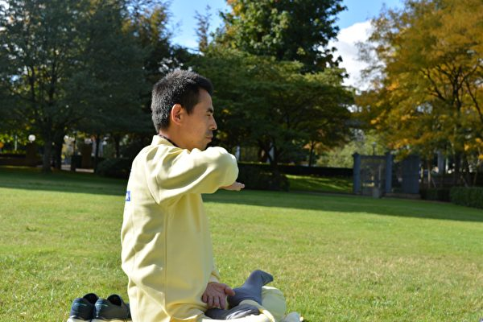

温哥华地区法轮功学员岳先生在本拿比市中心的公园里炼功。

【大纪元2018年01月10日讯】（大纪元记者邱晨温哥华报导）四十九年前，太行山区、晋冀豫交界处的一个山村，一个男孩呱呱落地于一户贫寒之家。身处偏僻山村的他，小时候以为这世界就是自己和临近的几个村庄，岳中生童年的记忆就是拾柴禾，给猪挖草，放羊。

出身贫寒的岳先生从小就踏实、勤奋，学习成绩一直在班里名列前茅，1986年以优异成绩考入郑州大学，刷新了所在高中的高考纪录。1993年，岳先生考入天津外国语学院攻读硕士；并于1996年执教于中国民航学院外语系。

那时候，踌躇滿志的他，正打算大展宏图，创一番事业，1999年一场突如其来的“运动”从天而降，打破了他平静的生活。风华正茂的岳先生，就因为坚持讲真话，而遭受了一次又一次的挫折、磨难，包括失去教职、生活困顿，几度漂泊。

2017年7月，他辗转来到温哥华。自此，一颗疲惫的心总算安顿了下来。

日前，岳先生接受了大纪元记者的采访，向记者分享了自己坎坷人生背后令人心酸，也让人感佩的故事。

<b>爱上自己的职业－－大学老师</b>

岳先生硕士毕业刚找工作的时候，第一考虑并不是进高校教书，而是进外企挣钱。

当时，每年的硕士生很少，除进重点大学有一定难度外，进普通高校当老师是一件很容易的事。受商品经济大潮的影响，岳先生很想凭自己的英语专长，进一家不错的外企，有一番作为，然而由于各种原因未能如愿，于是他决定先进高校，把家庭安顿好，等有合适机会再跳槽。

就这样，1995年12月，他很不情愿到中国民航学院报到，成为外语系的一名教师。

令他欣喜的是，校园里清静的环境，以及与学生一起探讨知识的氛围，让他很满足。不久，他辅导了外语系三位毕业生的论文，其中一位女生离校前特意把自己的一张照片送给他，并在背面写下感人的赠言，感谢他的细心指导，称自己受益匪浅。

学生发自肺腑的话语，让他深受感动，他心中产生了一种强烈的职业自豪感：原来，当一名老师感觉这么好啊。从此，他改变心态，再也不想什么跳槽了，而是潜心于钻研学术，钟情于三尺讲台。

为了提高自身素养，他一本接一本地阅读英文原著；通读《新英汉辞典》；制订攻读英语博士的学习计划，开始涉猎文学、语言学、翻译学、美学……

如果按照这一条道路发展下去，他应该过一种很惬意的教授生活，甚至很有可能在学术上有所建树。

然而，树欲静而风不止。接下来的事情，完全超出了他的想像。他的人生轨迹，从此剧变。

<b>不愿说假话，险被戴手铐抓走</b>

岳先生在安心教学的同时，却也有两大苦恼：一是夜里睡觉多梦，睡眠不好；二是牙疼，不定期会犯，有时半夜睡不着觉，异常痛苦。

后来在别人推荐下，岳先生修炼了法轮功，结果不治自愈，让他非常意外。从此开始和单位同事一起正式炼功。同时，用“真、善、忍”的标准，不断地衡量自己，修正自己，努力工作，照顾家人，赢得了周围人的普遍尊重。

不料，1999年7月，中共当局开始对法轮功进行铺天盖地的诬蔑，对不放弃修炼法轮功的人开始疯狂的迫害，抓捕。

转年，各大高校开始在搞人人过关，逼迫所有教职工写保证，必须表示与党中央保持高度一致。当岳先生接到这个通知时，心里不禁嘀咕：这不“文革”嘛，当年文化大革命不就是这么搞的吗？于是就没写。这下惹了大祸了。

当天，外语系就把这个情况报告了保卫处。保卫处给岳先生打电话，让到保卫处一趟。岳先生到院办公楼三楼的保卫处，看到了处长刘路江。刘阴沉着脸，颇有深意地问：“岳老师，你（对法轮功）什么态度啊？”虽然岳先生从心眼里觉得法轮功让人身心受益，就是好，但当着保卫处长的面，又不好直说，怕发生正面冲突。就说了句：“我没有态度。”刘说：“没有态度也是态度嘛。好，你回去吧!”于是，岳先生就回家了，以为这事就过去了。

不料，刚到家一会，接到电话，说让再去保卫处一趟。岳先生想可能也就是再去当面解释一下，并没有当回事。等到走进保卫处的一间办公室后，进来两个陌生人。他们先简单问了一下他情况，然后突然开始高声训斥，房间里的空气一下子紧张起来。“我们是天津公安局四处的！知道为什么来了吗？就是来抓你的！手铐就在楼下的车里。就看你今天的表现了！”岳先生平时只知道认认真真教书，哪和什么警察打过交道啊，一下子懵了，突然意识到事态非常严重。

而那一边，保卫处则把岳先生的太太也从她工作的小学校叫过来，在旁边一间办公室里对她威胁、恐吓。岳太太哪见过这阵势，当时被吓哭了。

最后，在天津市公安局、校保卫处的软硬兼施下，岳先生被迫违心地写了一个不再炼功的所谓保证，才被放过。因为第二天全校正好开始“五一”放假，校保卫处又给他一个人专门办了一周的洗脑“学习班”，这才算勉强“过关”。

<b>在中国讲真话的后果</b>

上次的事情虽然过去了，但岳先生却为自己未能顶住压力，违心写了保证而深感后悔，认为那是自己一生的耻辱，因为做人应该诚实。

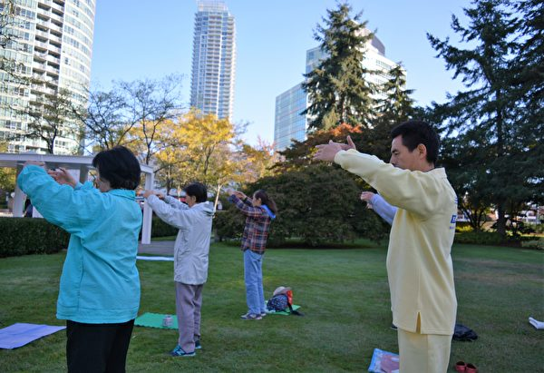

温哥华地区法轮功学员岳先生在本拿比市中心的公园里炼功。

2005年初，当他教的英语大专生即将毕业时，他想：师生一场，毕业之后各奔东西，可能后半辈子连见面都很困难了；作为教师，如果不把真相告诉他们，如果任由中共对法轮功诬蔑式的宣传毒害学生的心灵，那是自己的失职。 于是，他利用最后一次上课的机会，把真相光盘等资料给了部分学生。不料被一些不明真相的学生举报，2005年1月12日，岳先生被当地新立村派出所拘留，第二天被关进天津市拘留所。

这是岳先生有生以来第一次失去人身自由。在戒备森严的拘留所里，岳先生内心非常恐惧。高高的围墙，厚重的铁门，严厉的管教，同屋被关押的脸色蜡黄、下手很重的吸毒犯，让人心惊胆战。

<b>警察：律师敢辩护 我们就抓律师</b>

时间一天天地过去，但中共并未停止对法轮功的造谣、诬蔑，并未停止对法轮功学员进行迫害。同时，很多人被中共的虚假宣传所迷惑。而大纪元《九评共产党》的推出，从根本上阐述了共产党到底是怎么回事。岳先生认为，《九评》可以让迷信中共的人头脑清醒起来。于是，他匿名将《九评》寄给校领导，希望他们了解真相。不料，被校保卫处长、教务处长举报。2006年2月16日，岳先生再次遭到非法抓捕、抄家，并被关进东丽区看守所。

当东丽公安分局提审时，岳先生郑重提出要请律师为自己辩护，维护自己的合法权益。现场的警察李伟当即回应：“如果律师敢给你辩护，我们先把律师抓起来，”气焰十分嚣张。

东丽公安分局决定对岳先生进行劳教处罚。在天津市劳动教养管理委员会聆讯时，岳先生表示对劳教决定不服。他指出，如果东丽公安分局认为本人确实扰乱了法律实施，则必须出示自己违法行为的证据，应指证校领导收到的信件内容中哪些是凭空捏造、违背事实的，或违反了国家什么法律，哪些条款。然而，在场人员连原始证据都不出示，也不说明岳先生究竟违反了什么法律条款。就这样，岳先生被诬判劳教一年零三个月。不久，被转到天津市清泊洼劳教所。3月7日，又被转到天津市双口劳教所。

此时，他没有想到，一场更大的灾难在等着他。

<b>拒绝“悔过” 被打断九根肋骨</b>

在双口劳教所的当天，岳先生就感受到了高压、恐怖的气氛。

新进人员需办理入所手续，干警逐个登记个人信息。当有的人动作慢了一点的时候，帮着干警维持秩序的劳教人员（也被叫做包夹）就会大声叫骂，或过去抬腿就踢一脚。而现场干警则听之任之，根本不管，仿佛什么也没发生。

办完登记，新来人员分成几个班，被命令进房间坐马扎（一种可折叠的简易小木凳）。包夹人员史书泽挨个问因为什么进来的。当问到岳先生的时候，他回答是因为炼法轮功被抓的。史问要不要写悔过书，岳先生回答自己是冤枉的，还想复议。史当即骂了一句，随之一拳就打过去，正打在岳先生的脸上。

后来，负责看岳先生的包夹李斌见他不想写悔过书，就把他单独叫到水房，对他“做工作”。威胁说：“在这里炼法轮功的，都得写悔过书。否则，就一个字：死！”岳先生听了，心里非常害怕。

因岳先生不愿写悔过书，被严加看管，每天被罚坐，就是按规定姿势长时间坐马扎。时间一长，非常难受。

到了第三天，岳先生拒绝再坐这种惩罚性马扎。李斌去叫来其同伙史书泽等四五个人对岳先生疯狂地拳打脚踢，有的抄起马扎猛砸，直到打累了才住手。

遭受这番严重殴打后，岳先生疼痛难忍，坐都坐不起来。除一只胳膊外，全身上下没有一处不疼痛的。晚上躺在床上，连翻身都非常困难，都得咬著牙，用尽全身力气。

因为连续好些天疼痛未消，岳先生要求去医院做体检。经多次要求，大队长吴明星终于答应了。体检地点在天津市第一中心医院。体检结束后，医生告诉随行干警 “不能再让这个人干活了”。回到所里，队里让岳先生休息，生活上也有所照顾。但奇怪的是，虽然岳先生多次提出要看看自己的体检报告，但干警迟迟不给看，总是敷衍他，说“没事，只是受了皮肉伤，很快就会好”，并称体检报告由队里保管，劳教期满时都会交还本人。

可是，两个月过去了，岳先生的身体虽然好了很多，但还是没好彻底。又过了些日子，身体才不疼了。获释那天，岳先生提出把自己的看病记录带走，劳教所却说找不到了。

岳先生获释后，于2007年3月2日再次到天津市第一中心医院体检，找骨科同一位医生复查。这时，才看到当时被天津市双口劳教所隐瞒的病情：“左侧第8－10肋骨及右侧第7－12肋骨陈旧骨折。”即当时岳先生共有9根肋骨骨折。

<b>因书获罪</b>

岳先生获释后，转年去找原单位，希望恢复工作。然而经过与学校的一番交涉，校方罔顾岳先生被劳教是被公安非法迫害的事实，最终在2007年9月无理开除了岳先生。

二零零八年，岳先生向原学校的上级单位中国民用航空总局反映情况，但遭推诿，不了了之。为了维持生活，岳先生做起了自由译者，在北京开了一个小翻译公司。

2009年2月的一天，岳先生租住的招待所在整理其房间时，在枕头下面发现了岳先生的法轮功书籍，并向公安举报。北京市海淀公安分局曙光派出所晚上去他的房间搜查。在未出示任何警官证件，未出示任何法律依据的情况下，仅凭房间里有一本《转法轮》，他们就将其带走，关押在海淀看守所。一个多月后，转入海淀区拘留所。几天后转入北京市劳教人员调遣处。约三周后，转入河北省第一劳教所（唐山）。

在唐山被关押期间，岳先生继续申请行政复议。后来，他又委托律师向北京市宣武区法院提起诉讼，控告北京市海淀公安分局与北京市劳动教养管理委员会。但后来被律师告知，宣武区法院拒绝受理案件，也不开具《不受理通知书》。岳先生状告无门，心情极度低落。

在河北省第一劳教所，在很多个漫漫长夜里，岳先生回想自己的遭遇，怎么也想不通：难道做好人有错，讲真话有罪？为什么仅凭自己带了一本书，就被劳教两年半，天理何在？

为什么办案警察搜查时不出示警官证，不出示法律依据，不顾事实，就随便抓人？如果首都警察都这么胆大妄为，那么外地警察又会猖狂到何种程度？根据行政诉讼法第十一条第二款，涉及限制人身自由的案件，明确属于法院的受案范围，为什么宣武区法院不受理？而他们不受理，为什么又不按规定出具《不受理通知书》？如果执法机关都这么无法无天，人民会不会遭殃，国家会不会大乱？究竟是谁在祸害中华？

想到这里，岳先生坐不住了。他毅然决定向当时的国务院总理温家宝写信，反映情况。在信中，他指出司法不公是对人最大的不公正，希望纠正对自己的错误处罚，呼吁中国实现真正的法治。后来，这封信委托一位先行获释的可靠的朋友，按国务院地址寄给了温家宝。但此后未收到任何回复。

盼星星，盼月亮。在被囚禁了九百三十天之后，岳先生终于盼到了获释的那一天。这一天，他的太太也特意从天津过来接他。夫妇两人在回程途中，才发现岳先生记载了被关押期间真实经历的三本日记竟然被劳教所偷走了。

<b>走进枫叶之国，拥抱平静生活</b>

恢复人身自由后，岳先生继续坚持自己的信仰与修炼。但是，家里人却一直在为他的安全担心。

2017年7月20日，岳先生辗转来到加拿大这片自由的土地，来到温哥华。在这里，他感受到了西人的礼貌，和善，感受到了信仰自由带来的那份美好，感受到了挺直腰杆做人的尊严。

但是，另一方面，令人遗憾的是，他也感受到大温地区还有不少人，尤其是一些华人朋友依然迷信中共，对法轮功修炼者抱有敌意。

岳先生自己的亲身经历，无可辩驳的证明：中共所宣传的“依法治国”，“以法律为依据，以事实为准绳”，等等，不过是粉饰太平、给人洗脑的谎言而已。

而且，岳先生的个人遭遇绝非个案。中共对法轮功修炼者的迫害已长达十八年，这十八年里又发生了多少人间悲剧？仅岳先生自己在被关押期间所见所闻的悲剧就很多。这其中，既有法轮功修炼者，也有没修炼法轮功的民众，比如一些维权人士，等等。他们每个人的经历写出来，都会是一个很长的故事。如果不是身临其境，你真的很难相信这样的事情在中共控制下的中国正在发生著。

岳先生最后想与读者朋友们分享自己的一点感慨：一切罪恶都会大白于天下，并得到它应有的下场。正如印度诗人泰戈尔所说：人类的历史在耐心地等待着被侮辱者的胜利。

愿一切善良的人都能了解真相，站在正义的一边。愿一切善良的人都能得到上天的保佑，拥抱幸福的未来。

<h1 align="center"><b>8幅美丽的画——西方画家笔下的东方传统之美</b></h1>

西方艺术家用画笔描绘当代的励志故事，与世人分享美好与圣洁。图为美国纽约州画家Wattana Bo的绘画作品（Wattana Bo/Facebook）。

【大纪元2018年03月15日讯】（大纪元记者田云编译）丰富的油彩，流动的线条，汇合在画布上，讲述当代的励志故事，描绘善良、勇气和人间奇迹。两位西方艺术家，以谦卑的心弘扬东方传统文化，画出心灵的彩虹。

<b>一个心愿</b>

年轻画家罗思‧普拉特（Rose Pratt）来自英国的康沃尔郡，她开设了“一个心愿工作室”。她在脸书上写道：“‘一个心愿’以纯净的心绘画，呈现美好的事物，与世人分享。”

水彩画《兰花掌》是普拉特为神韵艺术团举办的脸书美术竞赛而作。她说，“当时我很担心，生怕赶不上截止日期。就在那时，我向窗外看去，看到天边出现了半个彩虹。这似乎传递了一个信息，我要试着推出整道彩虹……”

兰花掌是中国古典舞的基本手型。普拉特用了10个小时完成此画——几朵硕大的兰花盛开在枝头，素雅的花朵下方，是一位粉衣舞蹈家。她跪在地上，身体后仰，双臂合拢，向上托起兰花掌。花人相映，颇有空灵之意。

令普拉特欣慰的是，这幅画不仅顺利入围，还获得了竞赛的第二名。

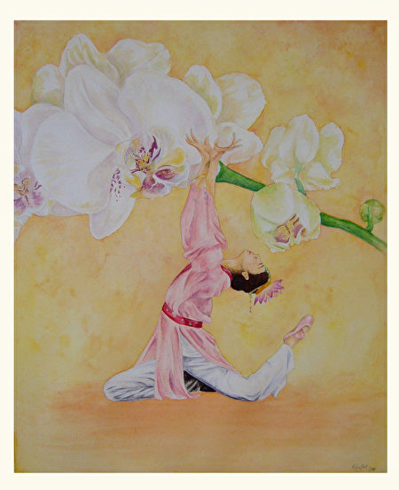

罗思‧普拉特（Rose Pratt）绘制的《兰花掌》（Rose Pratt/NTD.tv）。

《金莲》是普拉特的第一幅油画，作于2014年。她谈到创意时说：“莲花出污泥而不染，圣洁纯净。画中的金色恰好说明我第一次体会到神奇力量的那种感觉。我努力表现身边的美好与神奇，就是在遵循法轮大法的指引，纯洁的心愿就会变成现实。”

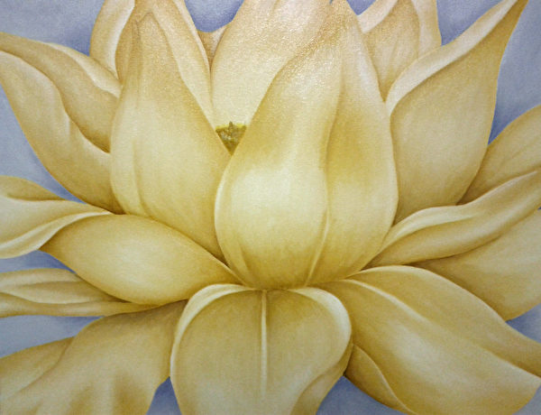

罗思‧普拉特（Rose Pratt）绘制的《金莲》（Rose Pratt/NTD.tv）。

<b>传统与纯净</b>

画家瓦塔纳‧波（Wattana Bo）住在美国纽约州的金斯顿市。他告诉新唐人记者，他的美术作品都是“有目的的艺术”。他的创作宗旨是：以古老的传统和精神绘画，激发人们心中的善良美好。瓦塔纳在脸书上说：“完美的美丽就像纯净的水，恬淡自然。”

《静坐的艾伦》（Wattana Bo/Facebook）

西人女孩艾伦穿着黄色的法轮大法短袖衫，两手“结印”，正在静坐。在她身后，牡丹花开。这种布局的技巧，既平衡了画面，又增添了东方元素。

法轮大法于1992年从中国传出，26年来洪传全球，迄今吸引了全世界一百多个国家的各族裔民众修炼。在海外许多国家，都有“洋人”炼习法轮功，这一点也不稀奇。

《莫莉》同样刻画了静坐者的宁静。华人女子莫莉，身穿蓝色的传统服装，神情祥和地打坐炼功。一簇莲花环绕着她，还有碧绿的荷叶。净莲出尘，象征着莫莉内心的纯净无忧。

《莫莉》（Wattana Bo/Facebook）

紫衣仙女，纤指抚琴。悠悠清韵，回荡天上人间。据瓦塔纳介绍，他创作此画，受到了神韵艺术团演出的启发。此画引人遐想：在古代神州，德音雅乐，都是发自心灵的咏叹。

《弹古琴的飞天》（Wattana Bo/NTD.tv）

《真、善、忍》这幅画捕捉了法轮功游行队伍中的一个镜头。三位少女，素服端庄，分别手举“真”、“善”、“忍”三个大字。她们在提醒看客：请不要忘记，有成千上万名善良无辜的中国人，为了坚守真理，为了信仰的自由，献出了生命。

《真、善、忍》（Wattana Bo/NTD.tv）

作为一名艺术家，瓦塔纳一直致力于唤起公众对法轮功受迫害的关注。他利用自己的才华向世人发出呼呼：让我们共同制止迫害。

《停止迫害》（Wattana Bo/NTD.tv）

在《停止迫害》里，画家把三个人物置于图画的焦点：一位青年法轮功学员闭目打坐。在他身旁，一个穿绿色制服的警察一手抡起警棍，另一只手扯著一条写有“真、善、忍”大字的横幅。还有一位女学员坐在地上，手里攥著横幅的另一端。女学员抬起手来，似乎在对警察说：不许打人！

19年来，这一幅景象，在天安门广场，在大陆的千百个角落，都曾经出现过许多、许多次，直至今日。然而，恐怖和磨难，都不能摧毁修炼者的坚定意志。“法轮大法好”的声音，传遍了中国的大江南北。

《集体炼功》（Wattana Bo/Facebook）

漫天风雪，法轮功学员不畏严寒，坚持在户外炼功。尽管气候恶劣，修炼人却能以苦为乐。画家还附诗一首，题为“冬天的暖流”。一片白茫茫中，“法轮大法好”的横幅清晰明亮。天地间，法轮飞旋，见证修者的真心。

<h1 align="center"><b>历史故事：亵渎佛法　榜眼暴死</b></h1>

【明慧网二零一八年四月二十一日】中国古代科举考试制度的殿试中，取得第二名成绩的，被称为“榜眼”，与第一名状元、第三名探花合称“三鼎甲”。在古代这是极大的荣耀，在仕途上往往会因此飞黄腾达。明朝万历、天启年间有一位榜眼却恶报死亡，令人叹息，今天就讲讲他的教训。
庄奇显（西元1587-1622年），字允元，号九微，泉州晋江（今福建省晋江市）人，万历四十一年（西元1613年），仅二十六岁，就高中榜眼，是有名的青年才俊，补国子监司业之职，父母也因他受朝廷封赏。然而就在他即将在官场上大显身手时，却突然病故，其中的缘由在古籍《见闻录》里，有详细的记载：

庄奇显很喜欢喝酒。有一次，他在老家的承天寺里饮酒，大醉后跌跌撞撞走到藏经阁，他睁着惺忪的醉眼，看见大家正在听高僧传法，众人都很专注的聆听，根本没人理睬他这位榜眼。也许感觉受冷落伤了自尊，也许内心对佛法不满，也许他根本就不信佛法，总之，不管是哪种原因，庄奇显此时酒后发狂，他走到桌前，拿起桌上的佛经就扔到地上，还用脚对着佛经又踢又踩。一通胡闹之后，他才返身离去。快出庙门的时候，庄奇显恍然间觉的一尊护法神像正冷眼看着他，他的怒气借着酒劲又来了，竟然伸手就把神像推倒在地。在众人惊惧的目光中，扬长而去。

数月之后，有个小厮无意中惹怒了他，庄奇显抬脚就踢，不料却踢在了一根大柱子上。脚趾都踢裂了，伤口经久不愈，逐渐变成了一种怪疮，从脚慢慢肿到了全身，疼痛异常，昼夜难安。庄奇显被病痛折磨得神志不清，恍惚中，看见护法神似乎在责问自己，在痛苦与悲伤中，他留下了“憾者永憾”的遗言便去世了。

庄奇显酒后无德亵渎佛法，造下了巨大的业力，酒醒后也无任何悔改弥补，终至恶报加身而亡，给自己留下了永远的遗憾。他的悲剧除了告诉我们不可酗酒外，更说明了佛法不仅慈悲神圣，还是威严不可冒犯的，凡是破坏者必有恶报，庄奇显以身试法遭恶报而死的案例警醒着后人。

然而历史的进程到了今天，迫害佛法的悲剧依然在上演着。当今洪传世间的法轮功又名法轮大法，乃佛家上乘修炼法门，是真正的佛法。法轮大法传出直指人心，让人修心向善，在社会上传播越来越广泛。1999年时的中共头目江××出于妒嫉发动了这场延续至今的迫害。迫害中，中共用尽了从造谣污蔑到包括活摘器官在内的各种邪恶手段迫害法轮大法弟子，犯下了大罪，已注定其灭亡。相当多的世人，在无知中，在被欺骗中被卷入，参与到这场迫害中来，造下巨大的罪业，各种厄运相继而来，纷纷以各种形式遭报，承担自己种下的恶果。

中共高层最典型的例子就是周永康、薄熙来、李东生之流，靠迫害法轮功跻身中共高层，不相信善恶有报的天理，一意孤行的迫害，看他们今日下场，被判重刑。这还是中共现任当权者出于保党需要的妥协，只公布其贪腐罪名的结果。按他们参与活摘法轮功学员器官牟取暴利的罪恶，万死都难赎其罪。能逃得了一时，逃不了一世，更大的恶报肯定还在后边等着他们呢，其报应之惨烈可拭目以待。

各阶层中最普遍的遭报形式就是各种灾祸、意外和疾病，例如被中共捧成典型的任长霞，曾任河南省登封市公安局党委书记、局长，多次利用手中权力积极迫害抓捕法轮功学员。2004年任长霞所乘车辆在高速公路遭遇车祸，她坐在后排最安全的位置上，结果司机没事，她却当即重伤昏迷，抢救无效，年仅40岁正是年富力强大有作为的年纪就死了，尸体据说合不上眼睛，死不瞑目，惨不忍睹。她死后4年，其丈夫也突然死亡。为何如此？其实就是因为参与迫害，才招致恶果。

因为迫害法轮功而遭报的事例实在是太多了，数不胜数。看看当今的例子，再回头看看历史，从古代迫害佛教的三武一宗，到本文提到的榜眼庄奇显，再到今天任长霞，无数的事例都在劝告当今的世人：千万不要迫害佛法，法轮功是伟大的佛法，迫害法轮功者必有恶报。那些曾经参与迫害的人，只有赶快悔改，立刻停止迫害，想办法善待法轮功学员将功补过，否则庄奇显、任长霞的悲剧将会在你身上重演。

另外因为中共是这场罪恶的发动者，已经注定被淘汰了，对所有曾加入过中共党、团、队的人而言，跟党走就是走向毁灭，走向地狱深渊。不退出就意味着你是中共的一部份，是中共的一个细胞，中共灭亡时你就是它的殉葬品。所以，要想走向光明的未来还必须声明退出中共的一切组织。注意，不是让你到中共那里退，而是到法轮功学员那里声明退出，而且声明时完全可以用化名，姓名只是代号，神只看你声明退出党、团、队时真心一念。

法轮功学员为什么冒着生命危险讲真相？就是要唤醒人的正念与良知，不要相信中共制造的谣言，不要参与迫害，不要支持迫害，从而免遭迫害佛法的恶报；认清中共造谣诋毁法轮功的实质就是蛊惑全中国乃至全世界人直接或间接，主动或被动的参与迫害法轮功，最后遭恶报灭亡，中共就是为了毁灭人类而来的魔鬼。退出中共就是获得新生，从而有机缘得到神佛的救度。法轮功学员真的是救度众生的修行人，支持法轮功，常念“法轮大法好”，善待法轮功学员，必获大福报。

（资料来源：明代僧人智旭所著《见闻录》）

<h1 align="center"><b>“千年第一思想家”是对中国人的羞辱</b></h1>

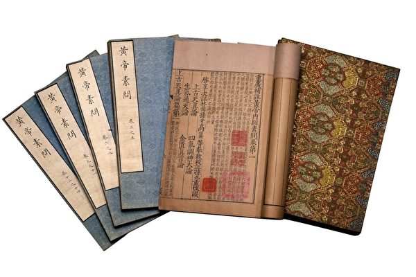

《黄帝内经》为中国首次讲述经络存在的医书，流传至今，仍为医家所重视。（台北故宫博物院）

【大纪元2018年05月06日讯】5月4日，中共纪念马克思诞辰200周年大会在北京举行，中共称：“马克思是全世界无产阶级和劳动人民的革命导师，是马克思主义的主要创始人，是马克思主义政党的缔造者和国际共产主义的开创者……马克思至今依然被公认为千年第一思想家。”中共颠倒黑白的邪教式言论引发了国际舆论哗然。有观点认为：中共把全球公认的极端、煽颠、恐怖分子马克思称为“千年第一思想家”是在自己作践自己，取悦了外国人的同时，也羞辱了中华文明与中国人，极大的伤害了中国人的民族自尊心。

中共用“3个一生”评价了德国极端分子马克思的一生，称其为是：“为人类解放不懈奋斗的一生；为追求真理而勇攀思想高峰的一生；为推翻旧世界、建立新世界而不息奋斗的一生。”通俗的说，马克思一生是煽动颠覆国家政权的一生，是宣扬阶级斗争搞暴力革命让人相互残杀的一生，是鼓吹无神论让人背离道德无度作恶的一生。随后，中共又称，马克思有“4个理论”、“3个飞跃”和“9个思想”，但“X个XX”（如：X个代表、X个自信、X个意识等）其本身就是中共邪教惯用的思想管控手段，是中共邪教党文化的集中体现，更是邪党文化的重要组成部分。

纵观人类历史，真正伟大的思想家从来都是恪守道德准则，教人向善的，从来都不会用极端思想来向人灌输仇恨哲学，煽动人去相互斗争，更不会用“X个XX”来约束人，强制让每个人学习它的思想。实践证明，用极端思想向人灌输仇恨哲学，煽动人暴力革命，强制人进行思想“学习”的只有邪教与极端组织。我们见过摩西有“几个思想”，苏格拉底有“几个飞跃”？我们听说过孔子有“几个理论”？老子有“几个意识”？相反，那些自诩有“X个XX”的“思想家”本身就没有思想，只有“X个XX”的教条式思维模式，用枯燥的教条思维来约束人去主动思考，这本身毫无思想可言，更谈不上伟大，但这却是中共“思想家”们的共同鲜明特征。现在中共口中的“千年第一思想家”马克思只有“4个理论”、“3个飞跃”和“9个思想”，用这种可计数的“思想”妄称“第一”只能自爆中共邪教本性。

马克思宣传的“阶级斗争，暴力革命”能称之为思想吗？马克思这个所谓的思想家，倡导的价值观与思想对人类社会不仅没有一丝正能量，相反还对人类社会的稳定发展起到了巨大的破坏作用，这种充满负能量的人到底是思想家还是毁灭人类的魔鬼？现在中国人对中共的暴政有诸多不满，按照马克思的“教导”，中国人是否应该立即发动暴力革命把中共及其党徒全都送上断头台？现在国际社会对中共暴政不满，国际社会是否应该全部联合起来，立即通过暴力手段解体中共邪恶政权？如果现在每国家和中国人都把马克思主义活学活用，在中国搞第二次“阶级斗争”和“共产主义革命”，中共届时必定把马克思列为“千年第一祸胎”加以“活摘”，所以“千年第一思想家”与“千年第一祸胎”可以快速切换，它们均是中共独裁利益的产物。

真正了解中华文明的人会发现，中华文明博大精深，他能说清人体、生命与宇宙之谜，在中华文明中也曾出现过很多思想巨匠，他们对中华文明五千年的辉煌做出过巨大贡献，对人类文明的稳定发展也有深远的正面意义。黄帝，号轩辕，被誉为中华文明的“人文初祖”，他制定礼乐，立百官，制典章，举贤能，封禅祭天，劝谕百姓。黄帝及下属还始制衣冠、建造舟车，推算历法，造指南车，造文字，而且黄帝留下了巨著《黄帝内经》，用来治病救人。在《黄帝内经》中，黄帝道出了人体的五脏六腑与人的面相、手相之间的对应关系，道出了人体与天地之间的关系，其内容包括了摄生、阴阳、脏像、经络和论治之道，其深邃的思想内涵远超现代人类文明，若公开评选“千年第一思想家”黄帝当之无愧。司马迁在《史记》中还记载了黄帝获宝鼎神策，并白日飞升的事迹，可见神传文化是中华文化的显著特征，这样的文化与思想才称得上第一。

现在越来越多的研究发现，整个中华五千年文明其实质就是神传文明，又称神传文化，是神有意传给人类的文化。为何《黄帝内经》能对人体的经络、脏像、阴阳把握的如此透彻？为何中华先祖能认识到人体的五脏与人的面相、手相，与天地相对应？为何中华文化中含有“神”字的词汇如此之多？为何在《丹经》、《道藏》、《性命圭旨》中，中国人把人体的结构说得十分清楚？中华文明中很多博大精深的理论与思想，令人叹为观止的根本原因就是来自于神传文化。不仅是中华文明是神传文化，整个人类文明都是神有意缔造的。正是如此，人类历史上伟大的思想家都尊重天道，洞悉天机，并按天命行事。而天命的核心就是神给人留下的道德规范，这也是人类文明稳定的关键基石。失去了道德约束，任何人和任何组织都将走向毁灭，这是一个永恒不变的规律。

回顾过去200年，中共的“千年第一思想家”马克思都干了什么？它向人灌输无神论思想，教人否定神，教人背离人的道德准则，它还利用人们对现实生活的不满，向人灌输仇恨哲学，它还鼓动人搞阶级斗争与暴力革命，它还鼓励信徒搞共产共妻，淫乱人类社会。这种煽动人否定神，否定道德，搞淫乱和使用暴力的思想到底是伟大还是邪恶？把这邪恶极端学说当成“千年第一的思想”叫每个中国人学习，这是不是对中国人的最大羞辱？中共是政党还是邪教？

2017年6月9日，20多个国家的大使馆、国际组织代表和30多个人权组织在位于华盛顿的共产主义受难者纪念碑敬献花圈，纪念世界各地因共产主义暴力运动失去生命的人。2018年4月25日，全世界各国的法轮功学员举行集会，纪念被中共邪教迫害、活摘致死的中国法轮功学员。现在中国对外贸易摩擦频繁，各地房价疯涨，股市暴跌，各类低端人口被中共大肆驱赶，各类维权律师被中共抓捕，中国的领土被中共偷偷出卖……无数惨烈的事实证明，中共推崇的马克思不仅不能解决中国问题，相反还是带个中国无数苦难的“千年第一祸胎”，它对中华文明破坏巨大。

夏威夷大学鲁道夫·拉梅尔教授认为，共产主义是人类大规模死亡的关键原因。他指出，社会的大饥荒、社会的大屠杀均发生在共产主义这种集权邪恶国家。1960年代，中国发生的“自然灾害”——大饥荒，造成了数千万中国人死亡，实则是中共有粮不赈灾的人祸。当时中共认为根本没有饥荒，是农民故意藏粮跟中共作对，所以拒绝发粮赈灾。从1950年到2018年的68年间，全世界已有120个国家抛弃了马克思及其“共产主义”，掌握“宇宙真理”的共产主义国家，从40多个锐减到5个，其间卡扎菲被“爱戴”他的人民处死，独裁者萨达姆被人民亲手送上绞刑架，齐奥塞斯库夫妇被人民乱枪打死，朝鲜金正恩正处于崩溃边缘……这就是共产党人的最终结局。这说明什么？说明世界潮流不可阻挡，说明共产邪教不得人心。

现在中共颠倒黑白把“千年第一祸胎”马克思捧为“千年第一思想家”，中共如此大张旗鼓的崇洋媚外、卖祖求荣，连德国人都看不起它们。中共官媒曾“教导”中国人说：“污蔑中国、出卖祖国，为了搏出位在外国黑祖国，取悦了外国人的同时，你能获得他们的尊重和认同？一个不爱国的人，在世界上任何地方，都是受人唾弃的。”现在，中共为了独裁中国人的权利，在跪舔德国分裂分子马克思的时候，不仅侮辱了中华文明，而且还出卖了自己的祖宗，这样无耻的组织又如何能获得世界的尊重和中国人的认同，一个否定自己祖宗与祖宗文化的组织，在世界上任何地方，都是受人唾弃的。中共通过“千年第一思想家”羞辱了中国人和中华文明的同时，也暴露出它们毁灭中华文明的邪恶本质。

美国前美国驻匈牙利大使、《自由之家》副总裁、人权活动家帕尔默曾说：“苏联拒绝给自己的人民自由和人道尊严，那是对抗历史潮流的。”实践证明，对抗历史潮流的苏联突然间就解体了。现在中共把“千年第一祸胎”马克思捧为“千年第一思想家”，这表明中共及其党徒就是对抗人类历史潮流的小丑，它和它的“千年第一思想家”都

将被道德觉醒后的中国人扫进历史的垃圾堆。现在中共为了自己的利益，把德国暴徒马克思捧为“千年第一思想家”，这无疑是对中华文明的巨大羞辱，是对每个中国人的侮辱！一个失去道德约束的组织或个人，一定会走向毁灭；一个否定自己祖宗与祖宗文化的组织或个人，在世界上任何地方，都是受人唾弃的！

<h1 align="center"><b>组图：悉尼盛大游行庆祝世界法轮大法日</b></h1>

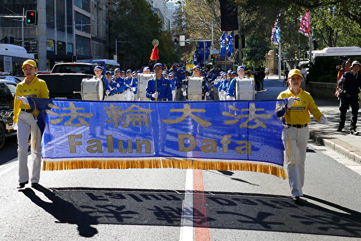

5月5日，约500名法轮功学员在悉尼市中心举行庆祝世界法轮大法日的游行。

【大纪元2018年05月05日讯】（大纪元悉尼记者站报导）5月5日，为庆祝5.13世界法轮大法日，来自澳洲及新西兰的部分法轮功学员500余人在悉尼市中心从清晨开始举行了大型功法演示、盛大游行、向法轮大法创始人恭祝华诞等一系列庆祝活动，为悉尼的周末增添了一道亮丽风景线。

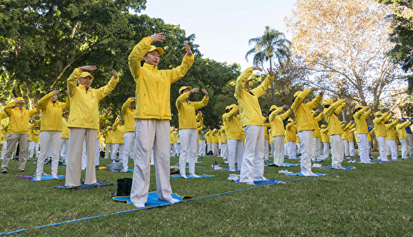

5月5日早晨，部分法轮功学员在悉尼市中心的海德公园炼功。

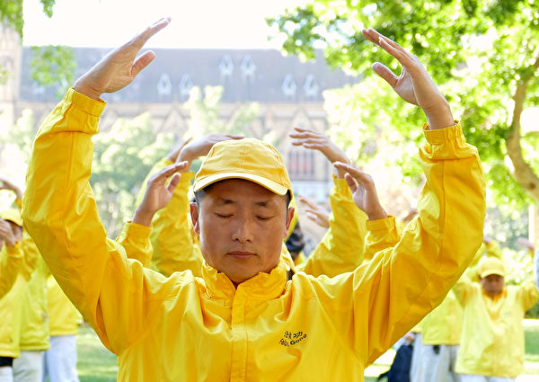

法轮功学员在悉尼市中心的海德公园炼功。

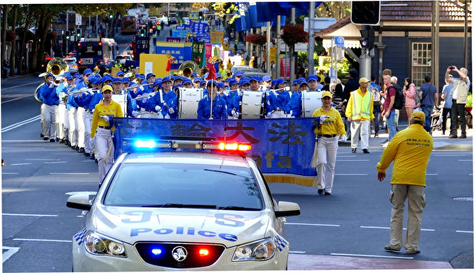

5月5日中午，法轮功学员在悉尼市中心大游行，警车为游行队伍开道。

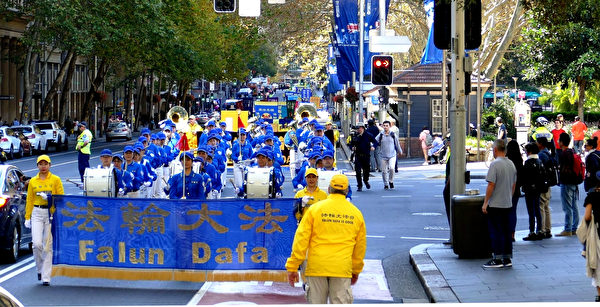

5月5日，法轮功学员在悉尼市中心游行庆祝世界法轮大法日。

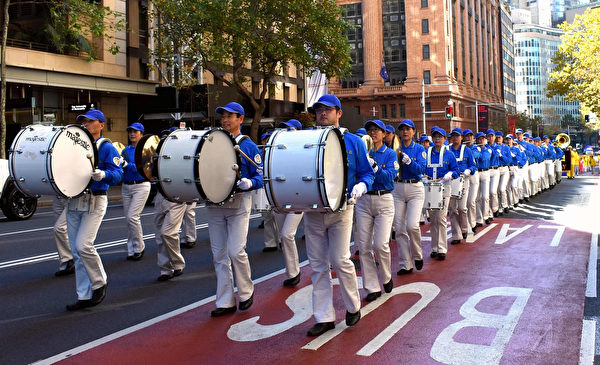

5月5日中午，法轮功学员在悉尼市中心大游行。图为正在演奏的天国乐团。

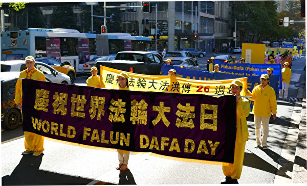

5月5日中午，法轮功学员在悉尼市中心游行庆祝世界法轮大法日。

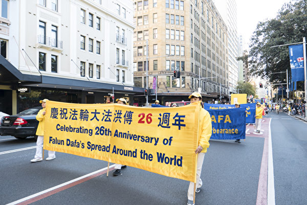

5月5日，法轮功学员在悉尼市中心游行庆祝世界法轮大法日。

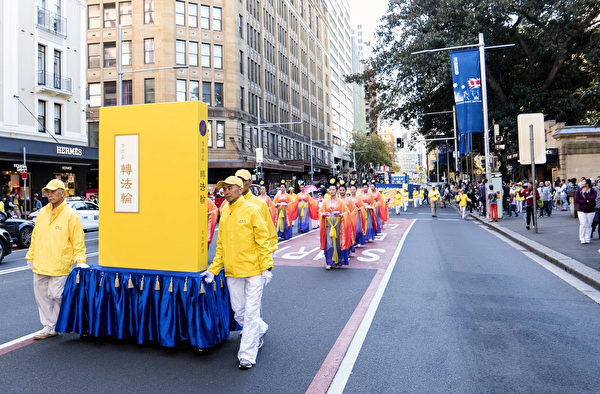

5月5日，法轮功学员在悉尼市中心游行庆祝世界法轮大法日。

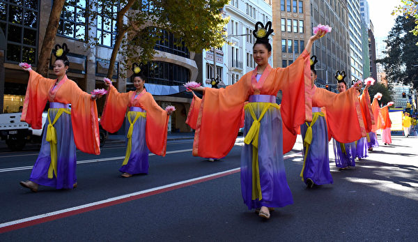

5月5日，法轮功学员在悉尼市中心游行庆祝世界法轮大法日。图为可爱的小仕女。

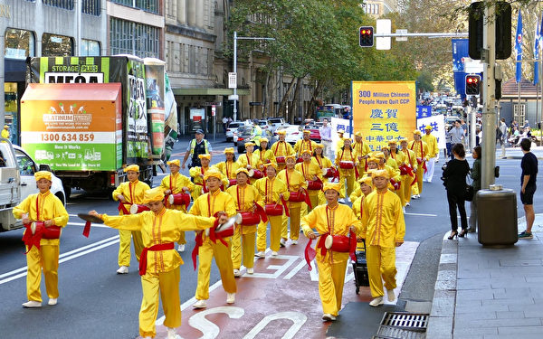

5月5日，法轮功学员在悉尼市中心游行庆祝世界法轮大法日。图为用鼓声表达喜庆欢乐的腰鼓队。

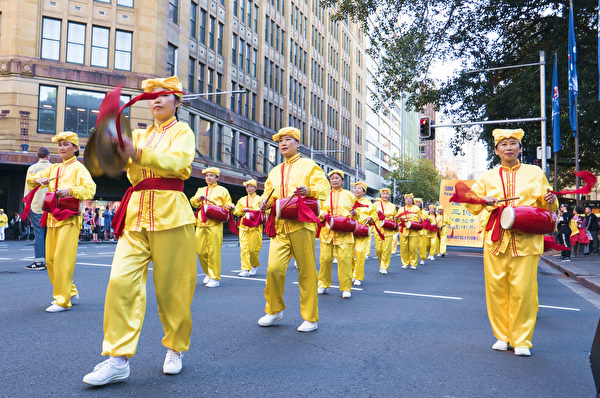

5月5日，法轮功学员在悉尼市中心游行庆祝世界法轮大法日。

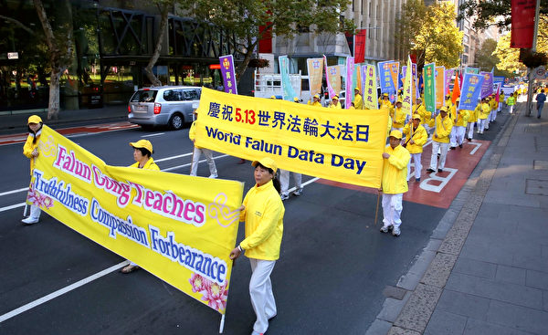

5月5日中午，法轮功学员在悉尼市中心游行庆祝世界法轮大法日。

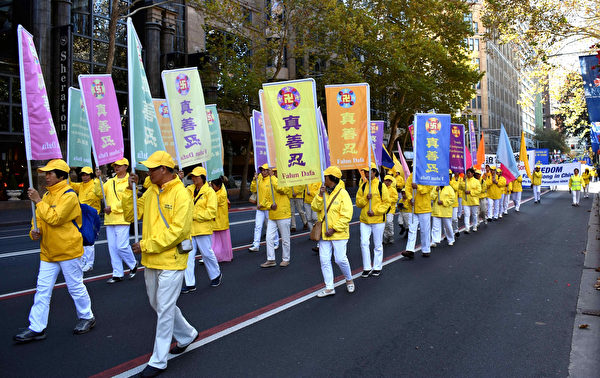

5月5日，法轮功学员在悉尼市中心游行庆祝世界法轮大法日。

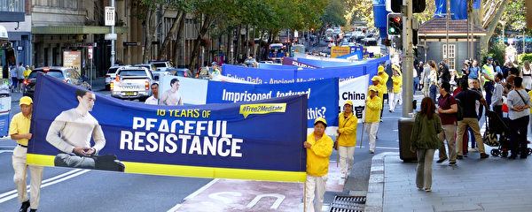

5月5日，法轮功学员在悉尼市中心游行庆祝世界法轮大法日。

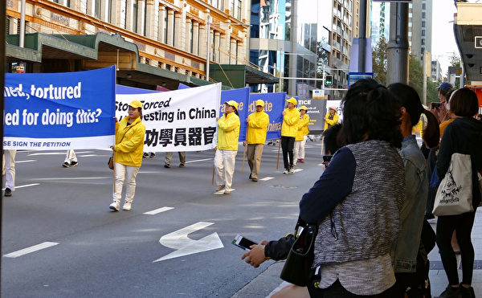

5月5日，法轮功学员在悉尼市中心游行庆祝世界法轮大法日。

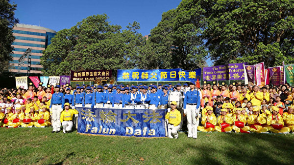

5月5日，法轮功学员在游行终点合照恭祝法轮功创始人李洪志先生华诞。

<h1 align="center"><b>中共的奥斯威辛集中营——劳教所</b></h1>

【明慧网二零一八年五月四日】昨天看到一篇文章中说：中国前总理“在拿下薄收拾周后以中国总理的身份参观了波兰境内的‘奥斯威辛集中营’，从而令冷眼看中国的西方人眼前一亮。”这件事唤起了我多年前的一段回忆。
几年前，有事路过山东省淄博市周村区的女子劳教所时，远远地我瞅了一眼（因为遭其迫害，不愿再看到它的存在），那个大门紧闭的五层建筑，外界无论如何也想象不到：蓝天下那座表面上看起来窗明墙净的新建筑竟是“中国式的奥斯威辛集中营”——迫害法轮功修炼者的劳教所。那一刻我想到了高中语文课本中学过的：面对阳光下门前盛开着雏菊的奥斯威辛集中营，作者说“奥斯威辛不应该有阳光”。当时我对这句话感觉很费解，想不明白作者为什么会这么说，而就在这一刻，我深深地理解了这句话的分量，体会到了作者内心的震惊和痛楚。

在那个“中国式的奥斯威辛集中营”里，每天都上演着迫害法轮功学员的丑剧或惨剧。一般的，法轮功学员刚入劳教所的时候，狱警们首先是“哄”，装着很和善很友好的样子“开导”她们要面对现实，放弃修炼法轮功，甚至还“殷勤”地为“新来的”熬稀饭、切西瓜……装着自己很无辜的样子，但这一轮，法轮功学员们通常没有上当的；接下来狱警就是“藏”，他们躲在幕后，指使“帮教”们去“煽”，煽出他们那套“犹大”的邪悟歪论；如果不奏效，那接着就是“逼”，最常用的手段就是罚站、熬夜，有时是逼着“帮教”们一块儿陪着，这样对坚定的法轮功学员不仅造成身体上的摧残，而且心理上也会造成很大的压力，因为狱警们会一直数落她们，硬说那些“帮教”们的痛苦是因为她们不转化造成的；再行不通，那就是熬鹰、灌食、吊挂、关禁闭、蹲小号……

有一个法轮功学员，大约六十多岁，坚定地挺过了一个月的熬鹰，没有“转化”，最后狱警们放弃了对她的“转化”，但是劳教、劳动迫害并没有终止。

有一个幼儿园老师，被送进劳教所的时候，腰椎是向一侧弯的，脚踝骨断后没接好，往外伸出来一截，不能走路，生活不能自理，被迫害成这样了，当地610还大言不惭地说她危害社会。对她，劳教所一样进行各种迫害：熬鹰，熬得脸蜡黄蜡黄的；劳动，做手工活，她的劳动任务和别人都是一样的，她腰疼得坐不住，还得干，看着就让人揪心；灌食，狱警们恐吓她，买了一堆皮管子，一直要灌到她屈服为止，但是她没有屈服；再后来就是封闭式转化，至于在被封闭转化期间到底发生了什么，外人不得而知，据说最后是医院化验说她尿蛋白，才返回当地610的……

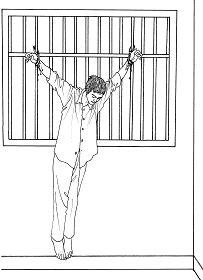

中共酷刑示意图：吊铐

还有一位大约四十岁，因为坚定修炼法轮大法，被狱警们带到禁闭室，双手被吊铐在窗棱上，脚尖刚刚够着地，但使不上劲，一直铐了半个月，直至她神智不清，出现幻觉。当她被送回大队的时候，双脚肿得如同两个“大红袍”茄子，走路一瘸一瘸的。

还有一个大约五、六十岁的法轮功学员，她耳朵不太好，可狱警们都诬蔑她是装的。有一天早晨在打扫厕所的时候，同伴们看着她倚着墙很难受的样子，就问她怎么了，她挥挥手有气无力地说：“歇会儿，歇会儿……”然后就慢慢地溜下去，倒在了地上，再后来，据值班人员说，她像是死了，被狱警们背出去了……那几天气氛特别紧张，每天都有邪警在大厅里值班，无论是谁上厕所，狱警们都会跟在后面看着。

其实这些也只是“中国式的奥斯威辛集中营”——劳教所迫害法轮功的冰山一角，将来，相信会有更多的迫害事实被曝光。

纳粹奥斯威辛已离我们远去，面对正与邪、善与恶，人们在心中都会有自己的选择。“真、善、忍”是人类普世的价值，他超越了一切国家、种族、肤色、语言及信仰。愿世人都能记住“奥斯威辛集中营”留给历史的教训，一起来解体江氏集团和中共相互利用对法轮功长达十九年的残酷迫害，为自己选择一个美好的未来！

<h1 align="center"><b>遭非法关押 14名法轮功学员联名控告警察</b></h1>

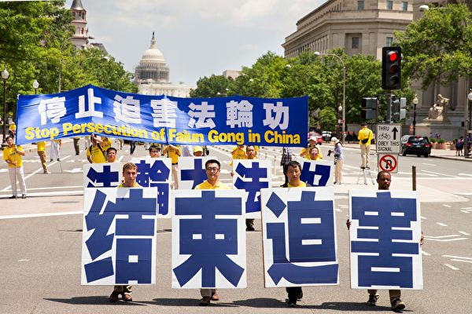

自1999年7月中共打压法轮功至今仍然持续。图为2016年7月14日，法轮功学员在美国首都华盛顿特区举行反迫害大游行。

【大纪元2018年05月04日讯】近日，14名法轮功学员针对他们于4月23日被牡丹江国保警察李学军等人绑架事件向中共各级纪检委、信访办等相关部门提起联名控告。

明慧网报导，在被绑架的14名法轮功学员中，有4位是70、80岁的老人（最大的已经83岁），有8人被非法关押四天，6人被关押数小时不等，7人被拽下头发，2人被非法抄家，1人被打掉牙齿、1人的脖颈被勒出血痕，其余的人不同程度受到执法人员的恐吓和威胁。

此外，他们的私人物品均被扣押在牡丹江东安分局，至今未归还，未出示扣押清单。

2018年4月23日晚9时，黑龙江省牡丹江市国保支队大队长李学军、国保支队警察尹航、马群、乔平伙同东安分局六七个警察闯入法轮功学员宫呈阁的家中，期间警察未出示工作证，未穿警服，未出示搜查证及立案决定书。

在场的法轮功学员高秀清指著国保警察说：“你认识我吗？我是高一喜（法轮功学员）的姐姐，我弟弟就是被你们送进看守所九天后被害死了，尸体还在殡仪馆，在家属不同意的情况下你们要强行火化。留下未成年的女儿，近90岁的母亲含恨而终。”

警察不由分说将屋内高秀清等14人绑架。在绑架的过程中，范丽敏被国保警察用手掐住脖子强行从四楼一直拖至一楼，致脖子立即出现几道深紫色血痕。

警察对宫呈阁非法抄家，抢走所有法轮功书籍、笔记本电脑两台、三个平板电脑、手机五个等私人物品；随后将14人送到东安分局非法拘禁。

此后，宫呈阁和曾德云因身体原因被放回。高秀清、王明艳、王楣泓、范丽敏、姜春梅、张淑敏、张丽、李洪伟8人在东安分局被扣押一天一宿。

在东安分局，法轮功学员连续三次将8人联名控告状递交给东安分局副所长梅永刚，均被拒收。

东安分局一警察拿着照片对83岁老人金龙金说：“这些条幅（写有法轮功真相信息）都是你们挂的吗？”老人说“不是”。另一警察对宫呈阁说，“你家早已被监控了”。

4月24日凌晨，李学军伙同东安分局五六个警察谎称送曹淑芳老人回家。到老人家后，他们未出示任何手续进屋就乱翻，非法抄家，连冰箱、床下柜子都不放过。75岁的曹淑芳吓坏了，心脏出现不适。

此外，警察在抢走法轮功学员私人财物同时，把高一喜在牡丹江看守所非法关押九天里被迫害致死的相关材料都抢走了，欲毁灭证据；还把78岁宋秀玉的身份证也抢走。

4月24日下午4时左右，东安分局副所长梅永刚下令将8人行政拘留15天，拘留证上没有以上8人的签字。

在牡丹江市拘留所期间，张丽被关在六号监室，另7人被关在五号监室，8人集体拒绝穿号服，不报号、不照相，一男性警察在大喇叭里面破口大骂，污言秽语。

25日早，住在六号监室里的张丽被警察暴力拖出来照相，其余7人齐声大喊“不许打人”、“迫害有罪”、“信仰合法”等等。

七八个警察冲进五号监房，其中警察李静伟（警号ZJ 2040）举起右手使劲连续搧打站在最前面的李洪伟的脸部，致使李洪伟一颗上门牙被打掉，其余几颗牙齿松动，脸部红肿，嘴角流血。

打完后，几个警察对李洪伟连拖带拽，欲将其拽出屋，屋内的六个人一齐把她拉回来。李洪伟大喊：“我要控告，警察把我的牙打掉了！”

法轮功学员李洪伟的一颗牙齿被打掉。

在第五监室，王楣泓被狱警于成龙等五六个警察强行拖出。几个警察就把她以“大”字形抬到第七监室扔在地中间，她的衣服被他们撕出两个大口子。

几个警察又给王明艳照相，揪住她的头发强行将其拖出，其左胳膊的衣袖被撕了两个大口子，衣服被蒙到脑袋上。警察用手按住王明艳的左脸，强行拍照后又把她拖回五号监室。

接下来警察又强行拖高秀清拍照，抓住头发，过程中踢打高秀清致腿部瘀青。

下午，拘留所所长王升进到五号监房，李洪伟在他面前举著那颗被打掉的门牙，控诉说：“这就是被你们警察打掉的牙齿！我要控告，我要纸笔！”王升扯开话题，随即溜走。

为了抢夺罪证，警察韩雪等六七人再次对李洪伟进行搜身，找被打掉的那颗牙齿。她们把李洪伟拖到走廊里强行把上衣拔下来，使劲按住其双手双脚，使其无法动弹。女警察韩雪从其脖领部位往下摸个遍，其中一男性警察也粗暴地上手乱摸。

随后，他们又一起把她180度翻转身体，前身摸完摸后身。最后，没找到牙齿，后就像扔货物似地把李洪伟扔进至六号监室地上。足足一个小时，李洪伟才缓过劲儿来，那时她浑身疼痛难忍，只能慢慢地从地上爬到床上休息。

26日上午，十余个警察进入六号监室，李洪伟仍继续维权，对警察们说：“我要控告警察把我牙打掉了！”其中一个警察说“牙在哪儿？”李说：“这是我要控告你们的证据，能给你们吗？”他们自知理亏，未说一句话，扭头撤出。

过了约两小时后，拘留所所长王升和女警察韩雪再次来到六号监室，伪善地对李洪伟说：“喝点水吧！”话音未落，韩雪把她身下被褥拽出，扔到另一张床上，又一次对她全身搜身，连脚上穿的袜子都不放过，完全不顾她三天绝食，虚弱无力的身体。随后他们又把她随身衣物拿到外面仔细搜查，不放过一个细节。

在拘留所期间，警察强行把被绑架的王明艳、张丽、姜春梅、高秀清、李洪伟、范丽敏、张淑敏7人的头发拽下几根，分别放到七个口袋里。

在牡丹江市拘留所，8人抗议非法关押，集体绝食4天，生命垂危，于27日上午被释放回家。

日前，牡丹江市国保大队副队长李学军，警察尹航、马群，牡丹江市东安分局副所长梅永刚，牡丹江市拘留所警察李静伟因非法剥夺公民宗教信仰自由罪、徇私枉法罪，滥用职权罪、非法拘禁罪、故意伤害罪、诬告陷害罪、非法搜查罪、非法侵入住宅罪等罪名被控告。

高秀清、王明艳、王楣泓、范丽敏、姜春梅、张淑敏、张丽、李洪伟、宫呈阁、曾德云、金龙金、金金玉、宋秀玉、曹淑芳14位法轮功学员依法追究被告人刑事责任并要求经济赔偿。

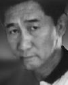

黑龙江省牡丹江市国保大队副队长李学军（明慧网）

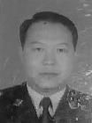

黑龙江省牡丹江市东安分局副所长梅永刚（明慧网）

<h1 align="center"><b>电影《密码》美国公映 观众感动</b></h1>

【明慧网二零一八年五月三日】（明慧记者章韵综合报道）二零一八年四月二十九日，纽约上州的美国新世纪影视基地举办了电影《密码》的公映式，为附近社区近百名西人观众举行了公映仪式。这也是新世纪影视成立以来的第一场公映式，观众称赞影片真诚感人、触动心灵。
电影《密码》基于发生在中国大陆的真实事件改编，讲述的是法轮功修炼者与正义人士共同揭露中共迫害的故事，中共“活摘”法轮功学员器官的罪恶，是影片中的一根主线。影片中的故事发生在当今中国大陆某城市，某科技公司正在与外商举行一场重要的商业谈判，一份重要文件将决定这次谈判的成败。而这份文件恰好存在公司一位技术员的加密手提电脑中，如何破解电脑密码？文件能否顺利取出？电脑里面到底藏有怎样的惊天秘密？影片取材于一位目击活摘器官现场的中国警官提供的真实事件，故事围绕破解电脑密码展开。多方力量的角逐，展现正邪、善恶之间的较量。

电影《密码》（Code of Revelation）是二零一七年成立的美国新世纪影视基地（New Century Film）开篇之作。今年的三月二十号，该片在二零一八年加拿大国际电影节（Canada International Film Festival）中获得“最高奖”（Grand Prize Award）。

<b>“将觉醒意识从外部向中国传播”</b>

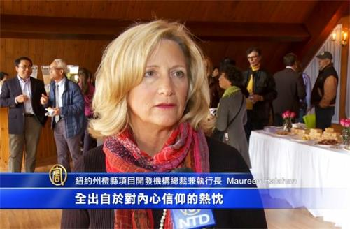

图1：纽约州橙县项目开发机构总裁兼执行长莫林·哈拉涵（Maureen Halahan）表示，让世界其它国家知道这场迫害，将觉醒意识从外部向中国传播。

纽约州橙县项目开发机构总裁兼执行长莫林·哈拉涵（Maureen Halahan）说：“电影很好看，很专业，制作很棒！电影也很有意义，因为在预算很低情况下（这部长度近五十分钟的电影，预算只有两千美元），这证明剧组人员努力制作，全出自于对内心信仰的热忱。”

她说：“这有很大不同，你的动机是心中那份热忱，而不是赚钱。当然两样都需要，但当你的动机是对信仰的热忱时，你做出的东西会有很大提升。电影感动了我，非常触动心灵，很诚恳。我的希望是，所有为这部影片制作付出的辛劳，能让（法轮功）在中国遭受的迫害让全世界知道。中国是一个共产专制国家，民众很难看到想看到的讯息。另一方面，中国人也很难冲破对共产党的恐惧，即便他们想帮忙，他们也害怕。所以应该让世界其它国家知道这场迫害，将觉醒意识从外部向中国传播。”

<b>电影感人并深有启发</b>

来自纽约百老汇发型及化妆设计师大卫·劳伦斯（David Lawrence）说：“我发现这部电影非常感人，真的很了不起！主角的故事非常吸引人，因为她必须给整个事件‘解密’”

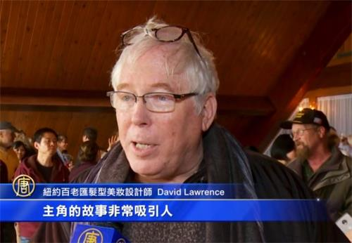

图2：纽约百老汇发型及化妆设计师大卫·劳伦斯

宾州房地产商塔玛拉·咏·萨尔兹曼（Tamara Chant Saltzman）说：“主角坚持信任她的同事，并去了解到底发生了什么。她所做的事不只为了自己的公司，也是为了弄清真相。电影很感人，老实跟你说我都流泪了。”

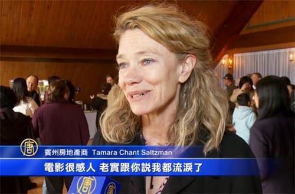

图3：宾州房地产商塔玛拉·咏·萨尔兹曼

车行老板前纽约州汽车经销商协会主席霍华德·库珀曼（Howard E. Kuperman）说：“电影很有启发，是一种文化互动，对我来说以前并不熟悉的事物。”

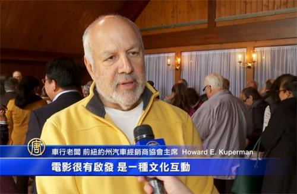

图4：车行老板前纽约州汽车经销商协会主席霍华德·库珀曼

精神保健护理卡罗尔·库珀曼（Carol Kuperman）说：“这部电影节奏紧凑，带给生活更多意义。”

治疗师西尔维·阿库咯（Sylvie Acoulon）说：“我知道，影片基于真实事件，我觉得这点很吸引我。我觉得这很好，让我们知道发生了什么。”

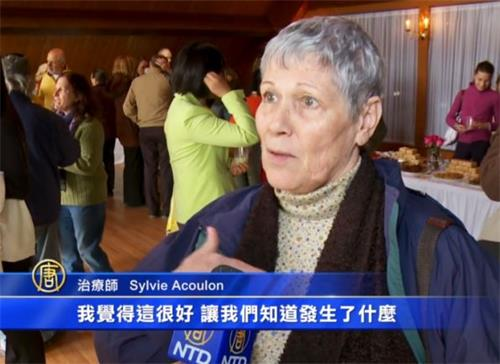

图6：治疗师西尔维·阿库咯

<b>真实事件的展现</b>

电影《密码》女主角慧月说：“就是当她知道了有一场迫害，而这场迫害是不被接受的时候，她正常的反应应该是什么。所以有的人说你表演的很自然，其实我觉得我并不是在表演，而是说当时，我把第一时间我的感受，呈现给观众。”

电影《密码》副导演宇飞说：“最后出现的秘密录像部份，这份秘密录像的蓝本，就是由追查国际发布的，一位锦州的武警的证词。根据这位武警的证词，他就是活摘法轮功学员器官的一个目击证人。”（编者注：追查国际，全名“追查迫害法轮功国际组织”，于二零零九年十二月十二日发布了这一真实的录音证据。）

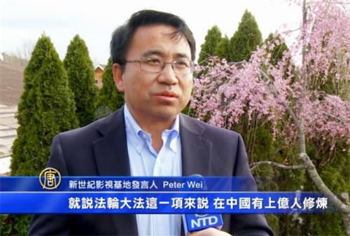

图7：新世纪影视基地发言人彼特·魏（Peter Wei）

新世纪影视基地发言人彼特·魏（Peter Wei）说：“法轮功在中国曾有上亿人修炼，故事太多了，取之不尽的素材。我们就想，基于那些素材，很生动的故事，我们也都知道，二十年来，太多太多的故事，就以那个为背景，我们想再去开发出更多的作品来。”

<h1 align="center"><b>冤狱10年 原中国药科大学女副教授离世</b></h1>

中共酷刑迫害示意图：手铐脚镣。（明慧网）

【大纪元2018年04月09日讯】成海燕最终还是和丈夫离婚了，虽然这个决定不是她的本意。她的丈夫是位现役高级军官，他所在的南京军区党委书记亲自出马，逼迫他与成海燕离婚，否则就命令他离开部队。这一切只因为成海燕的信仰。

同时，时任江苏省“610”主任配合军区党委对成海燕多面夹攻，不但逼迫家人把她送至南京精神病院迫害，还强逼她在不符合婚姻法的离婚协议上签字。不竟如此，还有恶人强令她丈夫必须在三个月内和一个毫不相识的女人结婚，以截断她的婚姻后路。

明慧网报导，江苏省南京市法轮功学员成海燕，在中共对法轮功长达18年多的迫害中，曾被非法判刑10年、被关押在精神病院遭受迫害两个半月、被非法刑事拘留三次、抄家五次、被关押洗脑班多次，被逼迫与军人丈夫离婚等。2018年3月28日，她含冤离世，终年63岁。

成海燕（明慧网）

成海燕，原中国药科大学副教授（双学位），为了支持军人丈夫的国防事业，离开了她热爱的教育事业，调到了江苏省物资总公司轻纺织品公司任经理。1998年初，她开始修炼法轮功。当时，她身患乙型性肝炎，“大三阳”指数超过三个加号，且有肝硬化迹象，西医对此已无可奈何。修炼法轮功一个月后，疾病痊愈。

她处处按照“真、善、忍”的理念做事。她曾去银行存钱，营业员把10,000元写成了100,000元。回家发现后，她立即回到银行要求纠正，营业员千恩万谢。一次去超市买东西，70多元的浓缩果汁没算钱，她发现后马上退了回去。超市负责人再三感谢说：“出了超市门还把东西退还的还没见过。”

成海燕和丈夫结婚后，怀孕、生孩子、养孩子，当军官的丈夫对她和家很少顾及。没修炼前她对丈夫怨气很大，说自己找了一个电话丈夫，光说话不见人，光说话不做事，什么忙也帮不上。

修炼以后成海燕知道自己要为他人着想，不再抱怨，就主动把家庭主妇该做的事做好，不让丈夫分心。丈夫看到她修炼后如此大的变化，曾感叹地说：“军嫂要都炼法轮功就好了！”

在2000年9月29日，成海燕去北京出差，因为从她包里搜查出了《转法轮》一书（法轮功的主要著作），南京火车站派出所将她非法扣押，并由南京市后宰门派出所非法抄家。抄家的警察声称：“我们倒要看看这个年轻的军级干部家里是什么样子。”看后使他们大失所望，并非如其所想像的奢华，相反很简朴。

2000年12月12日，成海燕因坚持修炼法轮功，被南京“610”和后宰门派出所绑架到南京脑科（精神病院）医院迫害两个半月。

当时南京军区党委书记温中仁和江苏省“610”主任王荣生逼她丈夫和她离婚。

为了使丈夫不受牵累，成海燕只得含泪写上：“只因我修炼法轮功，为了丈夫的前途，被迫签字。”

2001年9月19日，成海燕因散发法轮功真相资料，被徐州市青年派出所非法拘捕，对她实施大背十字铐夹酒瓶和上脚镣的残酷迫害十几个小时。她的手腕和脚踝当时就红肿、起泡、流血，受伤部位就此留下痕迹。

成海燕被徐州市云龙区法院非法判刑10年，被关押在南通监狱迫害。在一间不到10平方米阴暗的阁楼里，吃、喝、拉、撒、睡全在里面；被戴上脚镣手铐，被十几个杀人犯、吸毒、卖淫女轮流包夹（管制和强迫其放弃修炼）；不准探视，不准通信、通话，除了狱警辱骂、训斥，就是各级“610”的洗脑迫害，甚至在她的饭菜里下不明药物，她遭受了整整6年的迫害，于2009年4月21日她被家人保释出狱。

成海燕出狱后，无家可归，只能暂住亲戚家，为生活所逼，在一家药店打工度日。2011年，她去看望友人时，被守在那里蹲坑的南京国保警察绑架。2013年5月下旬，成海燕再次失踪，后在国内外人士正义呼声下，她被放回家。2014年3月5日，成海燕又被绑架。

成海燕在2011年4月向最高检察院、最高法院和江苏省高级检察院、高级法院邮寄不服徐州市云龙区法院对她非法判刑10年的申诉状 （无果）。 2014年4月，她分别向中央第十二巡视组（驻江苏组）和习近平写信反映她遭冤判10年的情况。2014年8月，她再次向江苏高级检察院、高级法院邮寄了对法院非法判她10年徒刑的控告状 （无果）。

2015年5月，南京江宁区有七八个警察在成海燕家附近蹲坑两三天，在5月24日下午4点左右，绑架了她，并非法抄家，后将她戴着手铐劫持走。

2015年6月，成海燕再向最高检察院、最高法院等机构控告江泽民破坏军婚、故意伤害、剥夺公民信仰与人身自由等罪。

近几年来，中共对成海燕女士迫害尤其严重， 每到节假日、所谓的敏感日，就有保安蹲坑、跟踪盯梢；电话被窃听，通信被拦截，楼前还安装电子眼；被派出所非法传唤，被“610”、街道、社区非法洗脑。

在残酷的迫害和巨大的精神压力下，成海燕女士的身体每况愈下。中共不法人员对她的迫害一直到她离世前都没有放松。

<h1 align="center"><b>为制止中共强摘器官发声 加州参议员：大声而自豪</b></h1>

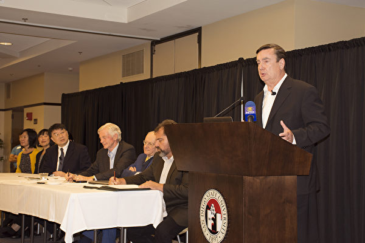

11月2日，“停止中共强摘器官国际联盟”在圣地亚哥州立大学（SDSU）举行研讨会。加州参议员乔尔•安德森（Joel Anderson，右一）表示，面对强摘器官这样的大屠杀，他选择发声制止，并为自己的选择感到自豪。（杨婕／大纪元）

【大纪元2017年11月03日讯】（大纪元记者杨婕美国圣地亚哥报导）“面对中共强摘器官这样的大屠杀，我想让我的子孙知道，我不是那种事后说‘我希望我当时能够做什么’的那种人，我是当时就站起来反对的那种人。我没有犹豫，大声而自豪（Loud and proud），”在近日在圣地亚哥举行的“停止中共强摘器官”研讨会上，加州参议员乔尔•安德森（Joel Anderson）说。

由“停止中共强摘器官国际联盟”主办的研讨会，分别与11月1日晚在圣地亚哥州立大学（San Diego State University， SDSU），和11月2日晚在加州大学圣地亚哥分校举行。

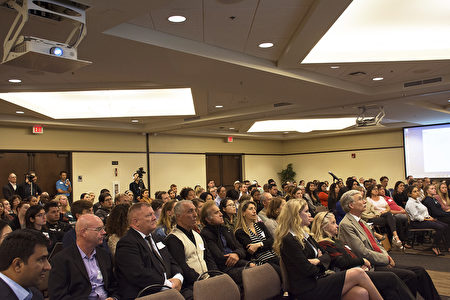

11月1日，“停止中共强摘器官国际联盟”在圣地亚哥州立大学（SDSU）举行研讨会。

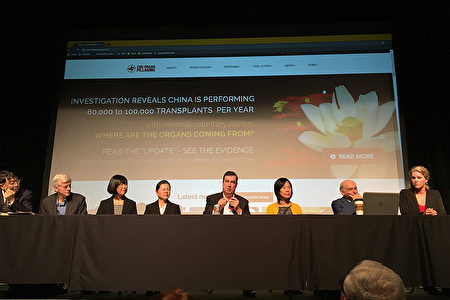

11月2日，“停止中共强摘器官国际联盟”在加州大学圣地亚哥分校（UCSD）举行研讨会。加拿大人权律师大卫•麦塔斯（David Matas，右二），加拿大前亚太国务卿大卫•乔高（David Kilgour，左二），加州参议员乔尔•安德森（Joel Anderson，右四）等应邀演讲。

安德森参议员今年7月份发起了支持法轮功为天赋人权和平反迫害、并谴责中共活摘法轮功学员器官的加州立法院SJR-10联合决议案，但是当议案在司法委员会得到全体通过后，参议院民主党（多数党）领袖受中共大使馆的威胁信所左右，中断了议案的正常投票程序。

安德森表示，他不会放弃，因为他坚信自己的选择：“留下历史的纪录，站在正义的一边，”“为人权发声。”

加拿大人权律师大卫•麦塔斯（David Matas）和加拿大前亚太国务卿大卫•乔高（David Kilgour）也应邀参加了研讨会。麦塔斯和乔高自2006年开始对中共活摘法轮功学员器官进行调查，他们收集了大量的独立调查证据，证实大量法轮功学员被摘取器官后被杀害。

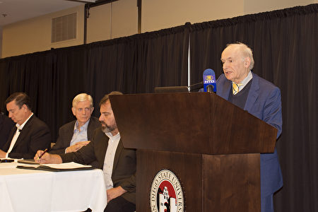

11月2日，“停止中共强摘器官国际联盟”在圣地亚哥州立大学（SDSU）举行研讨会。麦塔斯（David Matas）在演讲中说，活摘器官的受害者被中共妖魔化、活摘器官参与者不会受到惩罚，这是活摘器官能过进行的重要原因。

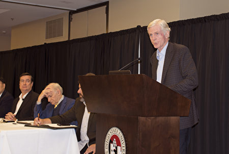

11月2日，“停止中共强摘器官国际联盟”在圣地亚哥州立大学（SDSU）举行研讨会。乔高（David Kilgour）在演讲中说，中共的历史就是一个杀人的历史。

麦塔斯说，法轮功是一群有精神信仰的人，但是他们庞大的人数让中共担心无法控制。于是法轮功被镇压，被中共诋毁、妖魔化。中共一直以来就“合理地”摘取死刑犯器官，当对法轮功实行镇压后，中国医院的器官移植手术也随之巨大增长，而且等待时间非常短，很多甚至是预约手术。

他并说，中国的器官移植卷入了各层机构，包括医院、医生、法院、监狱、中介等，有着庞大的暴利，受害者则被中共妖魔化，成为“敌人”，而且，对参与强摘器官的人来说，他们不会受到处罚，这是使得活摘器官能够进行的一些重要原因。

中国辽宁省大连市西岗区法院原法官、现住圣地亚哥的李慧英在研讨会上讲述了自己和家人因修炼法轮功而遭受迫害的经历。她的父亲、一位检察官，被迫害致死。李慧英平静的讲述后，观众报以长时间的掌声，有的观众留下眼泪。

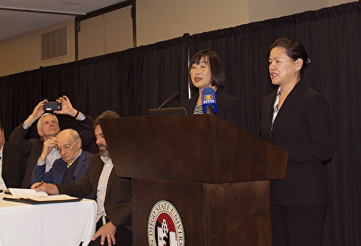

11月2日，“停止中共强摘器官国际联盟”在圣地亚哥州立大学（SDSU）举行研讨会。因修炼法轮功曾遭中共迫害的中国大连前法官李慧英（右一）讲述被迫害经历，有的观众伤心落泪。

在圣地亚哥州立大学的研讨会由该校国家安全系主任Eric Frost做开场介绍，圣地亚哥波因特洛马拿撒勒大学（Point Loma Nazarene University）“正义与和解中心”主席 Jamie Gates博士主持。参加者近150人，其中很多是大学生。

Jamie Gates博士说：““今晚离开这里，每个人都应该做些什么，你可以在行动前再多做一些阅读和调研，你可以给立法院写信，你可以写一篇课堂上的论文，有很多可做，但是你没法说，这不值得关心、我没什么可做的。”

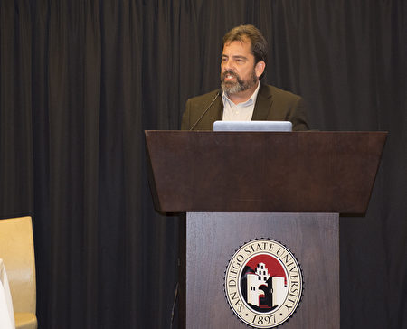

11月2日，“停止中共强摘器官国际联盟”在圣地亚哥州立大学（SDSU）举行研讨会。图为研讨会主持人、Point Loma Nazarene大学“正义与和解中心”主任Jamie Gates。

<h1 align="center"><b>《真善忍美展》赏析 迫害中的坚定</b></h1>

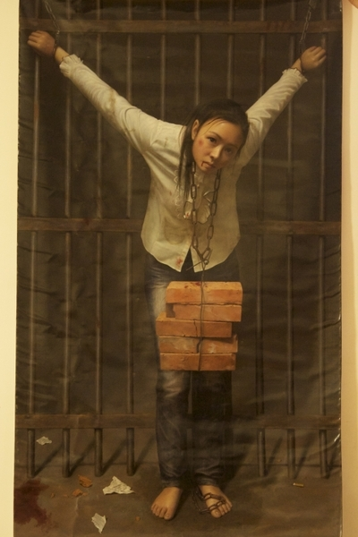

来自中国的画家清心以画作《迫害中的坚定》并列第三届“全世界华人人物写实油画大赛”金奖。（新唐人提供）

<b>《迫害中的坚定》</b>

2011年新唐人《全世界华人人物写实油画大赛》的两幅金奖作品之一《迫害中的坚定》，取材于真实事件。表现了中共疯狂迫害法轮功使用的百种酷刑之一，也展现了修炼者为坚持真理，压不垮，打不倒的崇高精神。

从画中女孩的眼中人们读到了宽恕、平和、坚定、怜悯和慈悲……这目光穿越过了人类的一切的罪恶和阴暗心理，对良知的呼唤无声却震聋发聩！她散发出的神性的光辉深深触动着每一位观者的心。对于肉体正在承受着的苦难，她的精神似乎早已远离了这末世的尘嚣，远远的在高处淡然回望……是未尽的使命让她默默坚守着──直到人们摆脱这沉重的世纪梦魇，从人们曾经亲口发下的毒誓中苏醒过来。

画面中每个细节都是经过精心构思：面容清秀、皮肤光洁、目光平静而坚定的白衣女孩被粗暴的背铐在冰冷阴森的监狱铁栏上，画面强烈的反差令人震惊──为什么如天使一般纯净的妙龄女孩会身陷囹圄遭受毒打？！她身着白衣双臂被悬挂的姿势令人联想到受难中的耶稣及救赎的伟大主题。用铁链重重悬挂在脖颈下的五块红砖，象征强加于中国人民的红色独裁，甚至砖上的裂缝也强烈的传达着这个政权的暴力特征。滴在砖上的血滴提醒人们：半个多世纪以来，神州大地在独裁政权的统治下，善良的人们一直在流血，也突显了中共嗜血的本性。从女孩白衬衫上的大鞋印和血迹、胳膊上被抽打的痕迹、地上的血印和碎砖、碎纸片等，可以想见她拒绝被洗脑转化，使得恼羞成怒的狱卒撕碎转化书暴打女孩的场景。额头快滴落的汗珠、嘴角流出的血、脸上的创伤、已肿胀了的双手、双脚及脚下的一片湿渍，都显示她已承受长时间的刑罚……只有胸前衣服上的花饰似荷花静静绽放衬托着她依旧祥和宁静的面庞。

“你可以摧毁我的肉体，但却不能摧毁我对正信的坚定”，这从容的表白，足以让这个靠流氓无产者起家，打着无神论、唯物论幌子欺压人们已久的党几乎彻底崩溃。

画面中的一切元素都诉说着一个伟大的真相：这个修炼人群──法轮功对苦难的巨大承受不是为了别的，只是为了这世界的良知的复苏和人们得到度化。她也揭示出这世界的人们命运的密码──无论这世界已堕落到多么丑恶，神依旧在守护着人类，人只要坚守住心中的善念良知，就能够被救赎。

<h1 align="center"><b>起死回生的现代神话故事</b></h1>

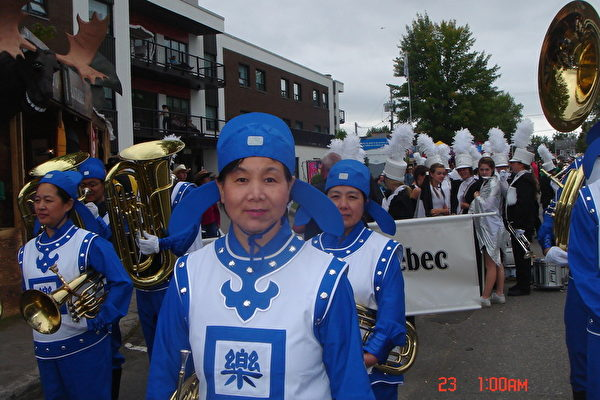

臧爱霞参加天国乐团在社区的演奏活动。

【大纪元2016年03月04日讯】（大纪元记者伊铃报导）1996年8月的长春刚告别三伏的酷暑，空气中稍微有些凉意。位于长春市绿园区的208医院后面那片树林依然翠绿，三三两两健身的人在林子里进进出出。临近中午时分，臧爱霞从开水房打了一瓶水，正吃力的朝病房走去……

208医院是一家军队医院，是当时全军、乃致全国最权威的肝病治疗基地。臧爱霞的丈夫李建军患乙肝，已经治疗了7年。这次他们住院整整10个月了，可是病情依然不见起色，各项指标都不正常。医生已经对他们发话：“医院已经尽力了，能用的药都用了，再用会中毒，带些营养药回去养吧。”

“带着医院治不好的病回家，那不等于是等死吗？” 臧爱霞感觉万念俱灰，走头无路，手中的水壶越提越重，双腿像灌了铅似的。她走几步，歇一下，走几步，歇一下……

<b>7年求医之路</b>

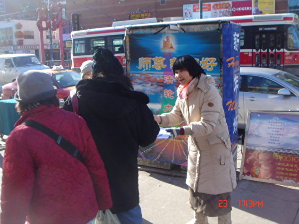

臧爱霞在唐人街讲真相。（臧爱霞提供）

大庆石油化工总厂（现重组更名为大庆石化公司）位于大庆市龙凤区，是一家约有3万名员工的大型企业。臧爱霞曾在该厂一家商店工作，她的丈夫李建军是该厂消防支队的队长。1989年，李建军在一次车祸中，失血过多，输血时染上乙肝病毒。从此，这个被称为工作狂的健壮男子被病魔缠身，变得无精打采，肝区常感不适，疼痛。夫妻俩开始了漫漫求医问药之路。
他们走遍北京、上海、西安、大庆2院、长春……全国各地到处跑，不知道住了多少次院、进多少个医院。每年至少住院3个月，有时4、5个月。每年平均药费4、5万，7年时间，花费医疗费差不多30万。这在当时已经是巨大的数字了。

60年代中苏交恶，国家正处在最穷的时候。9岁的李建军随父母从苏联回到中国河北省，在物质匮乏的环境中长大，李建军养成吃苦耐劳的性格。17岁那年参加工作，他工作勤奋，年年得奖，他的奖状贴满了家里的墙壁。

他的职位也一步步上升，从消防员，消防班长、教导员，一直到消防支队队长，干到副处级的位置。工作经验也有了，前景一片光明……谁知，病魔却毫不留情地给他迎头一棒。他觉得不可思议，难道人生就这样完了吗？

那时，臧爱霞正读小学二年级的女儿无人照顾，只好寄托给邻居；远在河北的母亲又患直肠癌。她既要牵挂老人，孩子，又要照顾病患丈夫，她心力交瘁。1992年，臧爱霞患了病毒性心肌炎，出现一阵一阵昏迷，被送医院抢救。这一病就没止境，不是住院，就是去医院检查、拿药、打针。她成天病怏怏的，从从菜市场买三斤菜拎到家都困难。

家里出了两个病人，无疑雪上加霜。夫妻俩几乎轮流住院，为了照顾丈夫，臧爱霞多数是带药在家吃，或者是带着药陪丈夫住院。现在她已经心脏肥大，医生说：“没有更有效的药可用。”

<b>208医院炸开了锅</b>

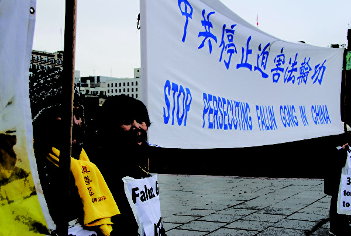

臧爱霞参加法轮功游行活动。

“刘庆来了！刘庆来了！”突然一阵闹哄哄的声音传来，臧爱霞往走廊的一边靠，不知道发生什么事。她看到人们都往走廊的一个方向跑，一个个满脸的兴奋。她想过去看究竟，可是身体太虚弱，腿脚不灵敏，只得远远地看热闹。
不一会儿，又听到有人兴奋地喊：“围起来了，围起来了，里三层、外三层的围起来了。”这时已经是午饭时间，食堂大师傅正把饭菜推到走廊里。臧爱霞向一个打饭的师傅打听，到底发生了什么事?

打饭师傅说：“刘庆你不知道吗？他是这里的老病号，成天到处昏迷。昏死在走廊，我们就拽他；摔到厕所里，搞卫生的清洁工就拽他。哪个监区他都住过，住了14年了。最后肝坏死，治不好了。1年前抬回去了，所有人都以为他死了。没想到他回去炼法轮功炼好了，现在他又回来了。”

不一会儿，臧爱霞看到人群又往另一个方向走。听说是因为围观的人太多，堵塞过道，医院干脆让他们到会议室去。

臧爱霞到达会议室时已经有些迟了。她看到一个身材高大健壮的青年男子站在那比划，人看起来40来岁，皮肤白里透红，她估计这人就是刘庆。围观的人仍然兴奋不已，七嘴八舌地问这问那。刘庆说：“今天来，只是跟大家见见面，以后我会把书和录像带都带来。”

当时，整个医院炸开了锅，上下都轰动了。从军长、政委到医生、护士、病人、家属，就连打扫卫生的清洁工、厨房大师傅，全都惊动了，他们都赶来看刘庆。

医生说他吃了仙丹妙药，要把他当个活标本。医院还提供一个会议室，要在医院开个炼功点，让刘庆回来教大家炼功。

臧爱霞想起来208医院之前，有位朋友也推荐他们炼法轮功。还说：“你们炼了法轮功就不用到处住院了。”这位朋友曾去长春听过李洪志大师的讲座。她爸爸的一位战友因糖尿病，瞎了一只眼睛，后来另一个眼睛也不行了，结果炼法轮功练好了。

臧爱霞当时拒绝了，心里还责怪朋友：“炼个功也要拉人。” 她和李建军都是无神论者，只相信科学，有病看医生。别人讲的那些气功祛病的奇迹，他们都不相信，认为那都是迷信。

如今，两夫妻正处于人生的黄金阶段，李建军当时正处在事业的上升期，却身患重病，求医无望。臧爱霞的心脏病也越来越严重。医生说，已经心肌肥大，没有药可治…….他们已经走头无路。

摆在眼前的事实让臧爱霞不得不思考：刘庆患这么严重的病都好了，难道法轮功真能把病炼好？何况李建军的病比刘庆要轻的多。她心动了，要找刘庆谈谈。

<b>刘庆的故事</b>

刘庆答应了臧爱霞的请求。在李建军的病房里，病人、家属，加上刘庆夫妻俩，大概6、7人。病房里鸦雀无声，大家静静听刘庆讲他的故事……

刘庆是位军人，26岁那年，患了乙肝，每年都要住院，一住就是14年。刚开始住院时是保养性的，后来变成治疗性的，再后来变成抢救性的。病情越住越重，从肝炎、肝硬化、肝腹水到肝坏死。因为腹水，他的肚子挺得老大，医生说里面全是血水。刚开始，医生给他每周抽一次，再后来，每周抽2次。

刘庆有1米9个头，人聪明，有才华，深得领导器重，年纪轻轻就任营长职务了。得病以后，因为长年治病，就再没有提升了。他很不服气，怨天尤人，脾气变得非常暴躁。一不顺气，就向妻子发脾气。14年来，他的妻子跟着遭罪，每天着急上火，不到40岁就患了白内障。

1995年，刘庆已病如膏肓，肝脏出现坏死，肚子越来越大。医生跟他说：“唯一出路是把脾脏摘掉，可能会多活几个月。”

刘庆拒绝了，对医生说：“我已经住院14年了都没治好，现在要开膛剖腹，摘掉脾脏，就为多活几个月，这多活这几个月又有什么意义呢？”刘庆的家人也不同意摘脾脏。那时刘庆已经不能吃饭，家人把他抬回家。当时医生护士都知道，刘庆活不了几天了，回去只是准备办后事。

回去之后，刘庆听说李洪志大师要在长春办最后一期气功学习班，他也想去听。但他的要求遭到全家人一致反对：你还想去学气功? 我们都给你烧了成麻袋的气功书，你炼了那么多气功有用吗？哪个气功把你病治好了？你都住院14年了，医院都治不好，气功能治好吗？

但刘庆坚持要去。最后他妻子实在拗不过他，妥协了，并说服他的家人：“反正他要死了，就满足他最后一个愿望吧。”

那天，他们用被子把刘庆裹起来，用担架抬到会场前面的地上，然后就离去了。等到讲座结束，他们再进来把刘庆抬回去。 9天时间天天如此。

9天班下来，刘庆听明白了：原来人有病是业力造成的。他不再怨天尤人，也不恨这个那个了，回去之后也不再骂太太了，他决定要修自己：“反正要死了，能活多长时间，就修多长时间吧。”

从听课的第1天开始，刘庆又拉又吐，一直拉了15天，结果拉得他的大肚子不见了。接下来，他开始要喝粥；过了几天又要吃馒头；再过几天要吃其它东西……后来他能坐了，又可以慢慢站起来，再后来能走路了……他开始学着炼功，他的身体一天一个样，越来越有精神。

他发现是炼功带来的好处，就抓紧炼功，学法；每天除了吃饭睡觉，就是学法炼功。炼几个月以后，他变成一个身体强壮、完全健康的人。

生命获得重生，刘庆实在太高兴了。他的太太痛悔不已，后悔当时没有留在现场听讲座。最后他们开车追到哈尔滨去，总算赶上了。

刘庆决定要把自身的受益告诉他人，让别人也受益。他开始到处弘法，建立炼功点。长春是丘陵地带，地势高低不平，骑车很困难。但难不倒他，他每天骑着自行车到处奔忙。直到他回208医院时，已经建立了12个炼功点。当时，他跟在场的人说：“我现在不讲究营养了，吃一把爆米花就可以顶一天。”

<b>夫妻双双恢复健康</b>

听完刘庆的故事，臧爱霞思想受到很大震动，她的观念改变了，当场要求刘庆帮她把所有的书、磁带都买到，表示要诚心诚意修炼法轮功。

炼功第3天，臧爱霞就开始发烧。医生见状，赶紧给她开药。但她没有吃，她相信这是消业，是师父给她净化身体。3天以后，她完全好了，感觉身体轻飘飘的。她觉得太神奇了，炼了15天后，她跟李建军说：“我要回大庆。”

两个月后，李建军也回到大庆。他们夫妻天天都到炼功点炼功。李建军炼了两个多月，身体完全恢复健康。熟悉的人看到他们的变化，都觉得不可思议。人们互相传告，来炼功的人越来越多。不久，大庆龙凤区已经发展了多个炼功点，人数达数百人。

李建军再也不休病假了，再也不花医药费了。他本来是个工作狂，现在身体好了，工作更勤奋，作为一名合格的消防专家，加入了中国消防协会，官职升到正处级。当时，整个消防系统都知道李建军改变很大。他的司机说：“我们首长走路、办事像一阵风，我都追不上他。”

臧爱霞夫妻俩获得了身心健康，他们的独生女儿看了大法书籍，觉得受益匪浅，也走进了大法修炼。修炼使她一直保持平和的心态，最后以高分进入名牌法律院校。

<b>炼功点的故事</b>

臧爱霞所在的炼功点开始只有几个人，慢慢人越来越多，发展到200多人。来炼功的人大多都有重病，奇奇怪怪的病很多。其中有些癌症病人，年年都要做化疗、放疗，炼功以后全都好了。

臧爱霞有一位40多岁的邻居患直肠癌，医生说她最多只能活4年，炼功2个月以后全好了。直到现在，20过去了，她仍然健在。

有一个女士从小心脏瓣膜缺损，在沈阳一家大医院做手术，伤口缝合后发现掉落一块纱布，又打开重找也没找到。长年累月伤口不愈合，时好时坏。手不敢用力过猛，稍用力伤口就撕裂。她不能梳头，不能揉面，连盖章都困难。虽然心脏补好了，又留下这个病。整整15年，中间曾回医院打开伤口重找，结果还是没找到。

这位女士炼功两个月后的一天，她在炼功点打坐之后回家，伤口破裂，流出很多瘀血和纤维、硬块等乱七八糟的东西。她自己清理了一下，将伤口盖好。从那以后伤口彻底长好，再也没有裂开过。这以后，她天天抱着20多斤的孙子去炼功。

炼功点有一个大约4、5岁、患白血病的女孩，她父亲是大货车司机，每年挣20万。可这钱全都用来给女儿换血了，每年都换。孩子一病就发烧，高达40多度，经常昏迷，去医院是常事，导致家庭经济十分困难。

小女孩跟着大人炼功后，情况一天比一天改善，后来完全好了。奇迹发生在她家，当时，小女孩的爸爸非常激动，对全家人说：“我一个人挣钱，你们全都去炼功吧。”

臧爱霞说，这只是大庆其中的一个炼功点，这里出现的奇迹很多，讲出来的只是其中很少的几个。她当时做了一个粗略地调查：在两年时间里，这个炼功点为厂里节省了至少200万医疗费。

<b>风云突变</b>

1999年7月20日，江泽民发动了全面打压法轮功，开始全国范围的大抓捕。23号，大庆市石化总厂龙凤区乙烯公安局的警察闯入臧爱霞家，把大法书籍、音像都给拿走了。当时臧爱霞对警察讲大法如何好，能使坏人变好人，能使有病的人身体得到健康。这位警察说：“我也知道好，是上边不让炼了，我们是执行公务，不然饭碗都丢了。”

炼功点全部取消了。从此，法轮功学员成了被监控对象。不许炼功，电话被窃听，住宅被监控，出门要跟派出所请假。

江泽民操纵国家机器，利用媒体铺天盖地向公众造谣宣传，人们开始用歧视的眼光看待法轮功学员。相熟的朋友也出于压力，劝他们不要再练。说：共产党要打倒谁，谁也赢不了。胳膊拗不过大腿，好汉不吃眼前亏。 臧爱霞的公公一听她说法轮功好，吓得直哆嗦，头不停地摆动：“你们是在刀刃上活着。”

臧爱霞和她的同修们坚信自己的信仰没有错，他们天真地以为，是政府误解了法轮功，只要向政府解释清楚，澄清事实真相，政府一定会为他们做主。因此，他们前仆后继地前往北京，到信访办、天安门上访。

<b>8年监控</b>

2001年夏天，臧爱霞决定去北京上访。还没上火车就被警察发现，被送回了家。同行的部分法轮功学员到了天安门，他们被抓后，当局调查发现是臧爱霞为大家买的车票，就把她作为主谋抓进了大庆看守所。

那是一间20平米左右的房间，里面住着27个人。正是炎热的夏天，唯一的小窗户上盖着一块塑料布。吃喝拉撒全在这个小屋，晚上就睡在湿淋淋的水泥地上。27个人像摆带鱼一样，一人头朝下、一人头朝上，摆了一地。谁要去一下厕所，回来就没有位置睡觉了；谁要在那里炼功，就会受到各种酷刑折磨。

臧爱霞被关押。大庆市610办公室逼迫她写不修炼的保证书，不写就不放人，还要判刑。后来，臧爱霞的朋友拿了10,000元人民币给“610”，把她赎回来。她出来后被社区、单位、家人三方监督看管。李建军上班时就把臧爱霞反锁在屋里。

一次，“610”一把手对他说：“你还敢上班啊，你就好好在家看着她。她如果再上访，你的工作就没有了，我也会被处分。”就这样，臧爱霞被他们管制8年，在所谓敏感日会更严加看管。2008年奥运会期间，她被软禁到大庆市龙凤区龙凤招待所，75天不能回家。

<b>生命不堪承受之痛</b>

打压之前，大庆市曾举办过一次处级以上人员法轮大法修炼心得交流会，李建军在会上说：“我虽然有30年党龄，但自从修炼法轮功，无病一身轻，做事为别人着想，现在我相信有神佛的存在。我现在的生活是三点一线，从家、炼功点到工作单位。还帮大家请大法书籍，搬电视到体育馆，让大家看师父讲法。

这段交流被制作成录像带，后来成了迫害他的证据。在黑龙江省哈尔滨司法系统里，有15家机关有他的这段录像带。

黑龙江省610办公室来人，一次又一次找他问话，逼他写保证书。李建军感到一片迷茫：修大法使人获得健康的身体、让人做好人、人心向善，对社会有益。现在社会道德一日千里地向下滑，这么好的功法不让炼、这不是逼人学坏吗，这是什么社会？

他沉默了。离开大法他做不到，堂堂正正的修炼，又怕失去工作，被迫害，也怕妻子被抓；女儿在加拿大留学，已经上了特务的黑名单，又怕孩子回国被抓……在巨大的精神压力下，最后他违心地写下了不修炼的保证书，渐渐脱离了修炼。2007年，李建军旧病复发，不幸离开人世。

失去亲人，臧爱霞痛苦不堪。她想去加拿大看望女儿，可三次申办护照都被拒。她的身份证被做了特殊标记，一看就知道是炼法轮功的。炼法轮功的人办护照需要公安局提供证明信，证明不炼了才给办。公安局要求臧爱霞写“五书”， 否则拒绝给开信。“610”的人对她说：“你要去了加拿大，到中国领事馆一请愿，我们的饭碗全都得丢。”

天无绝人之路。2009年9月，臧爱霞辗转颠簸，终于来到加拿大，与女儿团聚，并在这个自由的国家平静的生活。她深感遗憾的是，出国以后，婆婆、父亲、公公、相继离世，临终前无法见上一面。

臧爱霞说，作恶多端的江泽民，操纵凌驾法律之上的盖世太保组织—610办公室，残酷迫害法轮功，使得我们原本幸福的家庭家破人亡。

“法轮大法给了我生命的健康、洗刷着我的心灵、历练出我高尚的道德，无论怎样的迫害，都动摇不了我对大法的坚信。做好人没有错，呼唤良知没有错，坚守道义没有错。法轮大法是正法，真、善、忍永远是世界上最美好的，是人类精神追求的最高境界。”臧爱霞说。

2015年8月，臧爱霞从加拿大多伦多向中共最高检察院、最高法院邮寄了刑事控告书，要求对迫害元凶江泽民绳之以法，她希望中国人也能过上自由而有尊严的生活。

<h1 align="center"><b>迫害法轮功 山东省逾1600人遭厄运</b></h1>

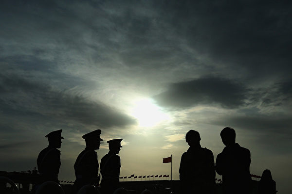

十八年来，山东省因参与迫害法轮功而遭厄运者达 1,646人，他们有的离奇猝死，有的跳楼自杀，有的患癌死亡，有的车祸丧命，有的成了植物人，有的落马入狱，有的殃及家人惨死。

【大纪元2017年10月18日讯】明慧网统计，截至2017年8月，十八年来山东省因参与迫害法轮功而遭厄运者达 1,646人，上至副省长、省委副书记、政法委书记、公安厅长，下至基层警察和不明真相的民众。
他们有的离奇猝死，有的跳楼自杀，有的患癌死亡，有的车祸丧命，有的成了植物人，有的落马入狱，有的殃及家人惨死……

遭厄运者中，死亡人数697人，约占总厄运人数的42%；患恶疾与车祸致残成植物人的案例为264人，约占厄运总人数16%；两者之和逾58%。

另外，被判刑者122人；伤病撤职的396人；殃及家人386人。遭厄运者中公安系统人员占383人；乡镇政府及街道人员占458人；普通民众为384人。

<b>省直属与下属机构人员典型案例</b>

王敏，中共山东省委原常委、济南市委原书记，曾任山东省 “维稳”工作领导小组成员，任职期间，利用电视台、报纸等污蔑法轮功，积极参与迫害。2014年12月18日，王敏被调查，后被判刑12年。

王仁元，山东省委常委、常务副省长、山东省“维稳”工作领导小组副组长，指挥迫害法轮功。2012年，患癌死亡。

杨鲁豫，原山东省济南市市长，积极迫害法轮功。2017年5月5日，被判刑14年。

李方明，山东省济南市司法局政治部主任，从事政工、人事工作，此人常年紧密追随中共迫害法轮功，是凡干部有提拔任用，就让对方在表格里必须填上法轮功是邪教的污蔑之词。2013年4月，李在办公室猝死。其人迫害法轮功的恶行也殃及家人，其妻身亡。

李玉妹， 现任山东省副省长、原临沂市市长、莱芜市委书记主管专职迫害法轮功的省610办公室。在临沂任职期间，参与迫害法轮功学员和下岗的弱势群体，两次被“追查迫害法轮功国际组织”通告。恶行累及家人，其弟车祸身亡。

蔡秋芳，山东省副省长，追随江氏集团迫害法轮功。2004年，蔡患肝癌；2005年9月，死亡，时年49岁。

杜世成，山东省委副书记、青岛市委书记，积极迫害法轮功。后被判无期徒刑。

郭永其，山东省“610”办公室负责人，专职指挥迫害法轮功。其独子车祸死亡。

才利民，山东省政法委书记、省委常委，参与迫害法轮功。近期被免职。

徐珠宝，山东省公安厅厅长，指挥迫害法轮功。刚被提拔为副省长兼公安厅厅长不久，即被查出胃癌，已做手术。

秦黎，山东省分管“610”办公室的副厅长，2年前刚退休，即被查出肺癌。

郭祥民，山东省济南市劳教所政委，任职期间，组建了专门迫害法轮功的“济南市法制培训中心”。2006年12月底，同警察就餐时，于众目睽睽之下，突然倒地死亡。

赵建华，山东省老干部活动中心主任（副厅级），长期卖力迫害法轮功。2015年10月31日，酒后回家开楼梯门时，突然倒地死亡，时年59岁。

牛庆芳，山东省监狱管理局副政委，积极迫害法轮功。后患乳腺癌；2006年大概在5月底6月初的时候，其车发生车祸，车体在失去平衡的情况下，连翻几个跟头，司机安然无恙，但牛庆芳高位截瘫。

王玉章，1999年至2004年任山东省监狱管理局局长，期间对山东监狱系统不放弃修炼的干警职工及家属和被非法关押的法轮功学员进行疯狂迫害。后被“双规”。

陈健，现任山东潍北监狱监狱长，对坚持修炼法轮功的干警、职工及被非法关押的法轮功学员疯狂迫害。法轮功学员李光就是在潍北监狱被活活迫害致死的。对此，陈健却对外统一口径，谎称死于心脏病。一人作恶，殃及家人，2006年5月，陈健之妻逄宏伟患乳腺癌。

刘秀占，山东大学“610”办公室副头目，积极参与迫害法轮功学员，对该校修炼法轮功的师生逐个施压，逼迫他们写“保证书”放弃信仰，不写者直接交派出所迫害，致使该校多位法轮功学员被关进洗脑班、看守所、劳动教养所；有的被反复多次非法劳教，至今仍被扣发工资和监视居住。2006年末，刘秀占被确诊患骨癌，后死亡。

苗仲华，2008年6月任山东农业大学党委书记（正厅级）。2010年1月，苗仲华将农大附校一位坚持修炼法轮功的女教师开除公职。2011年9月8日，被立案审查；2013年5月，被判刑12年。

元发顺，山东大学口腔医学院党委书记，配合“610”办公室迫害本单位法轮功学员，用恶毒语言攻击法轮功和法轮功创始人，被山东大学评为2001年度镇压法轮功所谓的先进个人。2002年，元发顺肝癌死亡。

郎庆田，山东新汶矿业集团有限责任公司原董事长，在任期间，一直竭力迫害法轮功。据不完全统计，其所属系统有上百名法轮功学员被强迫洗脑，至少10人被非法劳教，至少3人被迫害致死。2014年10月，郎庆田被判死刑，缓刑2年。

<b>遭厄运严重城市案例</b>

统计显示，青岛、潍坊、烟台、临沂遭厄运人数最多，分别是221人、272人、207人、231人 。以下是部分城市的部分案例：

<b>1.青岛</b>

刘命信，青岛市检察院检察长、党组书记，亲笔批捕法轮功学员，还组织手下罗织罪名，致使荆奉莉等学员被冤判7年多。2009年6月2日，刘突发心脏病死亡，上任两年多即丧命。

刘建华，青岛市委常委、政法委书记，指挥迫害法轮功。2005年下半年，患癌，后被双规。

王永利，2003年至2008年任青岛市公安局党委书记、局长、青岛市国家安全局局长。据悉，2012年以来一直被秘密关押受审。

赵敏，曾任青岛市公安局崂山区分局局长、青岛市经济技术开发区（黄岛区）公安局局长、青岛市公安局反恐支队支队长、青岛市610副主任等职。任职期间，疯狂迫害法轮功。2014年10月，赵被立案调查；2015年10月，被判刑8年半。

颜波，原胶州市（青岛下辖市）广电局记者，后调宣传部新闻报导科当记者，后提为科长。他跟随“610”（中共专门迫害法轮功的非法组织）编写污蔑法轮功的文章，时隔不久，突患肺癌，而立之年即死去。

张树建，莱西市（青岛下辖市）《莱西日报》报社总编，任总编期间，撰写和刊登诽谤法轮大法的文章，并参与“转化”迫害法轮功学员，毒害了很多不明真相的民众。2003年，发生车祸，张树建当场骨折。张的恶行还殃及家人，女儿即将大学毕业之际，被确诊为肝癌，不到一年即去世。

<b>2. 潍坊</b>

王立福，潍坊市委副书记，分管全市政法工作、主管迫害法轮功，早在1998年多次在大小会议上污蔑法轮功，主谋将原潍坊市法轮大法辅导站站长李天民判刑4年。2002年春，王立福死于肺癌，当时刚升任潍坊市政协主席不久。

陈白峰，潍坊常务副市长，参与组织、实施、推动迫害法轮功，其恶行多次被曝光，如《潍坊市多名善良的主流社会民众遭绑架》、《潍坊昌邑六一零四月以来劫持三十多名法轮功学员》等文章披露了陈白峰参与迫害的信息，被迫害人数之多，迫害程度之残酷，令人发指。2014年6月5日，多家媒体报导陈白峰自缢死亡。

陈冠峰，潍坊柴油机厂的《潍柴周报》编辑，采编污蔑法轮功的文章，蛊惑法轮功学员放弃信仰。2004年8月，陈冠峰骑摩托车带着妻子与其小姨子赴宴回家的路上， 与一辆汽车相撞，其妻与其小姨子当场死亡，陈的头骨被撞碎，后成了植物人，躺在医院8个月后死亡，时年40岁左右。

王建江，潍坊市潍城区国保队长，疯狂迫害法轮功。2010年9月18日，肝癌死亡，时年47岁。临死前几天，每天抽近一小盆水；死前一晚（9月17日）一整夜坐立不安，痛苦至极；弥留之际，他对妻子说：“我这是自作自受。”

董建华，潍坊市坊子区公安分局副局长，主管迫害法轮功。2001年9月，董建华与妻子去青岛游玩途中，乘坐的小车突然蹿入拉燃油的大卡车下，当即车毁人亡，夫妻双双被烧焦。

曹金辉，诸城市（潍坊下辖市）公安局政保大队副队长，人称“酒鬼打手”。诸城法轮功学员遭曹金辉毒打就有几百人。2000年，法轮功学员杨桂真惨死在看守所后，曹金辉曾嚣张无耻地说：“开膛破肚后，肠子里什么也没有，白生生的，拿了一挂来炒炒吃。” 曹金辉恶行殃及家人，50多岁的妻子2008年脑溢血不治死亡。2014年，曹本人也得脑溢血死去。

<b>3. 烟台</b>

张建中，烟台司法局原副局长，原烟台海阳市公安局局长，任职期间，积极参与迫害法轮功学员。海阳法轮功学员人数不多，被非法关押、劳教、判刑、罚款的人数比例却很大。2011年，张突发心脏病死亡。

姜忠勤，先后任招远市（烟台下辖市）委副书记、政法副书记、烟台市610办公室主任，疯狂迫害法轮功；招远市法轮功学员赵金华的死，与姜忠勤有直接关系。2015年12月，姜被双规。

胡风瑞，烟台市牟平区公安局国保大队科长。几年来，牟平区被非法抓捕的法轮功学员中，多人受到过他的酷刑，多人经过他手后被判刑、劳教、开除公职、无理罚款。他不听任何劝阻，还扬言说：“法轮功能平反，我就去死！” 2005年4月，胡风瑞患肺癌；2005年6月，身亡。

张永珲，龙口市（烟台下辖市）“610”人员，任职期间，龙口市发生过严重迫害法轮功学员的“411”事件，导致法轮功学员杨美娟被判刑9年，姜淑红5年，姜用占3年，隋玉红5年，唐祝龙劳教2年，苗春荣1年等；其中，苗春荣的婆婆因承受不了儿媳和孙女被迫害的打击，喝农药自杀。2013年，张患白血病；2017年1月，丧命。

于跃进，莱阳（烟台下辖市）公安局“610”办公室主任。自1999年至2009年，于跃进开办洗脑班长达九年，亲自动手毒打迫害法轮功学员。其恶行殃及家人，妻子姜丽娜2008年7月25日车祸身亡。2011年4月20日，于跃进突发脑溢血死亡，时年54岁。

<b>4. 临沂</b>

孙培群，临沂市委副书记、“610”负责人，主管迫害法轮功，在位期间，指挥残酷迫害法轮功学员，临沂市发生过用蛇咬、用蝎子蜇法轮功学员的恶性事件。孙恶行殃及家人，其大儿子2007年突然病故。

朱忠顺、赵佩俄，临沂市委大院“610”办公室人员，专职迫害法轮功，两人均于2008年暴病身亡。

张安柱，临沂大学学工部部长，恶毒攻击和诽谤法轮功及其创始人李洪志先生，胁迫师生观看诽谤法轮功的画展。2013年2月17日，张访问学生军训部队指挥员期间，在宾馆房间暴亡。

晁德明，临沂市公安局兰山分局法制室主任。本地多位法轮功学员被法制室立案、审批、上报。2013年4月9日，晁从十八楼跳下身亡。

孙立，临沂市沂南县公安局“610”人员，专职迫害法轮功。2004年7月1日那天，孙立在孟良崮做全市迫害法轮功学员的“经验”交流后，觉得身体不好受，出来休息一会，却离奇摔死在山谷中。警察费尽周折才找到其尸体，状惨不忍睹。人们都在议论：“这个人不干好事，经常抓捕炼法轮功的，这就是报应。”

吉兴梅，临沂市沂水县诸葛镇委女书记，疯狂迫害法轮功学员，曾拿棘子枝连头带脸地抽打女法轮功学员，棘子针刺刺到肉里；法轮功学员杨建国，被吉兴梅带多人殴打折磨致精神失常。吉兴梅后调到临沂市罗庄区任三把手；有一次，陪人醉酒后，自驾车追尾，撞在拉钢筋的车上，身体多处被钢筋戳穿，脸面像个蜂窝煤，在殡仪馆用蜡抹平，其状甚惨。

其它城市案例
唐华，原聊城市政法委常务副书记、综治办主任，指挥迫害法轮功。2017年5月18日，唐华死亡；家人怕说“自杀”引来事端，对外称心脏病死亡。

刘明星，冠县县长，参与迫害法轮功，拨款建洗脑班，在大会上公开诬蔑大法，致使冠县上千名法轮功学员被强制洗脑、劳改、劳教、被迫流离失所。2005年10月，刘得了肝癌，花100多万元换肝，只活了半年，于2006年5月死亡，时年58岁。

周西瑞，菏泽市公安局牡丹分局原政保侦查大队长，疯狂抓捕多名法轮功学员。2007年5月，肝癌死亡，时年52岁，临终前极其痛苦。

卢彦春，日照港铁运公司原党委书记，2000年至2002年任职期间，主动参与迫害法轮功，先后两次逼迫近十名法轮功学员下岗，并恶言攻击法轮功。2002年夏天，卢强行将数名法轮功学员押送到王村洗脑班。过了20天，卢突感身体不适，医院确诊肺癌，半年后死亡。

于吉海，威海市经区皇冠派出所警察，参与迫害法轮功，曾恶意攻击法轮功。2000 年一天中午，突然身体后仰暴死。

<b>更多案例包括：</b>

济南市公安局文化保卫支队调研员董建村，被列车撞得脑浆迸裂、身首异处死亡；

枣庄市公安局处长王世海，突发心脏病死亡；

山东省滕州市委常委政法委书记、司法局局长彭庆国，落马；

胜利石油管理局局长、中国石油天然气集团公司监事王立新，落马；

垦利县原“610”办公室主任李明信，肝癌死亡；

淄博市高青县原交通局局长李安君，胃癌死亡；

滨州市滨城分局治安大队长马爱国，突发心脏病死亡；

济宁金乡县公安局副局长刘宪文“表彰会”当天，离奇车祸死亡；

济宁市梁山县“610”头目刘传秀，突然倒地猝死；

泰安市政法委副书记董国吉，获刑15年半；

泰山疗养院护士长吴桂凤，得怪病死亡；

莱芜市莱城公安分局信访科科长孙京来，暴病死亡；

德州市经济开发区派出所副所长马廷照，被脑瘤折磨三年死亡；

……

<b>“希望所有人明辨善恶 看清方向”</b>

大纪元特稿评论说，“历史和现实已经给人类留下了很多深刻的教训：曾经强大的罗马帝国因为迫害基督徒长达三百年而遭受四次大瘟疫，最后灭国。北魏太武帝、北周武帝、唐武宗、后周世宗之‘三武一宗’的灭佛事件，令百姓受难，灭佛的皇帝都遭到恶报：或被宦官所杀，或遍体糜烂而死，或中毒身亡。史实表明，对修炼人的迫害会招致最严厉的天谴。”

“那些还在跟随中共迫害善良修炼者、尚未意识到严重后果的人，需要赶快警醒，反思发生在身边的恶报实例，并且以实际行动弥补以前犯下的错误。天理在衡定着世间的一切。希望所有的人都能够明辨善恶，看清方向，在这场前所未有的正邪较量中，做出正确的选择。”

<h1 align="center"><b>尹丽萍美国会作证 国际聚焦马三家骇人罪行</b></h1>

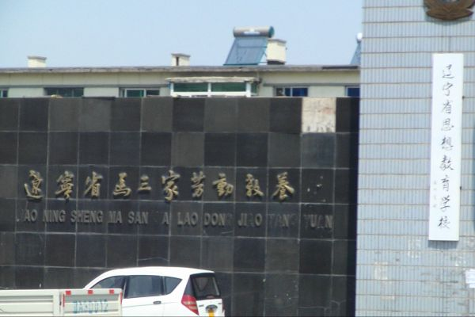

原辽宁省马三家劳教所门口（明慧网）

【大纪元2016年04月19日讯】（大纪元记者李辰综合报导）2016年4月13日，逃亡海外的法轮功学员尹丽萍在美国首都华盛顿DC的国会众议院听证会上作证，她作证说，2001年4月19日那一天，她和另外8名女性法轮功学员被马三家秘密转押到一个很特殊的地方，是专门用男人性迫害女法轮功学员的一所黑监狱。在这里，她和其他女法轮功学员被男犯人群体性侵。

马三家幸存者尹丽萍（左四）美国国会听证（李莎/大纪元

和尹丽萍当时在一起的法轮功学员邹桂荣已被迫害致死，有的女法轮功学员在18天后精神失常。

据大纪元记者亦平报道，尹丽萍在听证会上说：“在马三家，我双手被铐在床上被注射了二个多月不明药物，导致我眼睛出现短暂失明。我被无数次野蛮窒息性的灌食，导致我差点失去生命。”

二零零零年一月至九月，她被辽阳教养院奴役九个月。

“我的头发到那儿三天就白了大半，三个多月例假就不来了，白天干重体力活，到钢厂装铁，四个人每天压铁八吨的任务必须完成，铺铁路、做石棉瓦（有毒）、拆水泥袋子（全身上下五官都是水泥），及清理陈年冒沼气的垃圾等。晚上不许休息，扎花到凌晨两点，我的手指肚扎花扎的血肉模糊，指纹都看不到了。我的胳膊被铁条划的白花花的肉翻出、鲜血直流。”尹丽萍说：“二零零零年的九月中旬，辽宁省马三家教养院所长苏静在大会上说：‘这是一场没有硝烟的战争，国家为法轮功动用的经费相当于一场国际战争。’她强调这是上面的命令，要百分之百的转化法轮功。”

尹丽萍在听证会上展示了多幅酷刑迫害照片，她在讲述亲眼所见身边人遭受酷刑及被迫害致死的经历时，泪流不止。她说：“我们之间曾经相互有约：其中谁能活着出去，就要把这么毫无人性的迫害告知全世界，今天我九死一生来到了这里，讲出了她们再也无法讲出的话。”

尹丽萍在听证会当天向美国国会提交了参与对她迫害的部分主要责任人名单，CECC把这份名单也递交到美国国务院。这份名单包括江泽民、薄熙来、王立军、闻士震以及马三家及其它地方参与迫害的狱警等共四十一人。

美国国会及行政部门中国问题委员会（CECC）由负责处理中国事务的二十二位美国官员组成，包括九位联邦众议员、八位联邦参议员及劳工部副部长、国务院安全民主人权国务次卿、国际贸易署商业贸易部次长、国务院东亚太平洋事务助理国务卿及国务院民主人权劳工助理国务卿等行政官员。

尹丽萍的证词揭开了辽宁省马三家女子劳教所的滔天罪恶的冰山一角。过去十几年来辽宁省马三家劳动教养院一直是中共迫害法轮功的急先锋和头号罪恶标志，以残酷迫害法轮功而臭名昭著。马三家劳教所备有各种刑具，古今中外的各种刑具一应俱全，其中有地牢、电棍、猪镣、老虎凳、面具、大挂、抻床、死人床、括宫器、小号、吊绳、炮烙等等。以上各种刑具都是针对法轮功学员的。

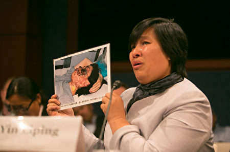

尹丽萍在听证会上讲述家乡的法轮功学员高蓉蓉遭受酷刑﹑被迫害致死的经历时﹐泪流不止。

总部位于美国的《自由亚洲电台》，在挪威注册成立、海外制作播出的《西藏之声》电台对本次听证会进行了报导，包括尹丽萍所遭受的迫害。

<b>美国议员赞赏法轮功学员揭露迫害的勇气</b>

出席听证会的美国国会议员对法轮功学员敢于揭露迫害的勇气表示感谢和赞赏，并认为迫害法轮功的元凶江泽民及其追随者必须得到应有的惩罚。

CECC主席、美国国会资深众议员克里斯·史密斯（Rep. Chris Smith）说：“犯下性侵害罪行的中共官方人员应受到追究，而不是放纵他们对人民，包括对法轮功学员的性侵害，她们几乎被迫害致死。最终，那些人所发动和参与的残酷迫害都会被人们知晓。以纳粹为例，直到今天他们还在被追查。”

美国国会宪法和民事司法小组委员会（Subcommittee on the Constitution and Civil Justice）主席、联邦众议员特兰特·弗兰克斯（Rep. Trent Franks）向听证会上的作证者致以最深的谢意。他说：“你们的努力不会白费，只有神知道你们今天在这里作证的成果，你们担当起了责任，让你们的善和对人类的承诺在这次听证会上占了上风。”

代表明尼苏达州的联邦众议员蒂姆·沃兹（Rep. Tim Walz）向在听证会上分享自己的痛苦经历的证人表示感谢。他说：“把酷刑曝光，让人们知道，这非常重要，我永远想像不到，作为美国众议员，我要捍卫美国的立场──在任何情况下使用任何形式的酷刑都是不能被接受的。”

代表伊利诺伊州的联邦众议员兰迪·赫尔特格伦（Rep. Randy Hultgren）对尹丽萍的勇气表示赞赏和感谢。他在听证会上询问：“马三家还在运作吗？中共还在利用它迫害法轮功学员吗？你知道有其他法轮功学员仍在那里遭受像你所经历的酷刑迫害吗？”

尹丽萍回答说：“半个月前，我家乡的法轮功学员李忠渊因为起诉江泽民被判刑七年半。我先生的姐姐刘庆香二零一四年四月十日因为讲真相被清河区法院判刑三年，还有很多我认识的法轮功学员在马三家监狱遭受迫害。”

<b>马三家将18名女法轮功学员投入男牢房 震惊世界</b>

马三家教养院（劳教所）是迫害法轮功学员的集中营。

2000年10月，中共前政法委书记罗干在马三家劳教所蹲点之际，马三家劳教所的警察将18位坚持修炼不转化的女法轮功学员扒光衣服投入男牢房，任他们强奸，导致至少5人死亡、7人精神失常、余者致残。之后这一疯狂恶行被其他劳教所及监狱效仿。

有人目睹几个犯人直冲年轻姑娘去了，事后没有几天其中一位姑娘就自杀，后被救活。据一位被关押在那的女学员对亲友说，“那里面的情景是想像不到的邪恶。”

被关押的法轮功学员讲述，马三家恶警还叫嚣：“什么是忍?‘忍’就是把你强奸了都不允许上告！”

知情人士说，辽宁本溪辅导站站长蒋先生的女儿被关押时二十多岁，未婚姑娘，在马三家被强奸并被折磨致精神失常，回家后生下孩子，孩子已有十多岁。

据称，罗干曾多次给马三家作指示并亲自蹲点，叫嚣“要加大迫害法轮功的力度”。而对法轮功学员的性迫害成为马三家普遍使用的邪恶手段。并且传至全国各地的劳教所，强奸、轮奸等恶性事件频发，大批法轮功学员被虐杀。

而马三家女二所所长苏境当年因配合迫害法轮功得力而被司法部奖励5万元人民币，还被评为所谓的“一级英雄”。副所长邵力获奖3万元，大队长王乃民和各分队长紧随效仿。据报导，马三家教养院全体恶警被江泽民集团评为“集体二级英模”。

<b>《LENS视觉》揭露马三家女子劳教所迫害法轮功学员的惊人内幕</b>

2013年4月7日，大陆《财经》杂志旗下的《LENS视觉》杂志第62期发表了一篇长达两万字的深度报导——《走出“马三家”》，曝光了辽宁马三家劳教所使用酷刑虐待被劳教人员的罪恶黑幕，引起了国内外的广泛关注。

马三家劳教所位于中国大陆辽宁省沈阳市于洪区。其最主要的特点是在1999年10月29日成立了女二所，专收女性法轮功学员。2006年马三家的女二所和女一所合并，称为马三家女子劳教所。

《走出“马三家”》记录了亲历者在被关押期间所受的种种骇人听闻的酷刑，如：抻刑、上大挂、坐老虎凳、绑“死人床”、蹲“小号”、以子宫扩张器野蛮灌食、往阴道里灌辣椒粉、电击乳房和生殖器官、以牙刷刷阴道、将女人送进男牢凌辱等。报导称，数年间已有数千人在“马三家”遭受过这样的迫害。

年近六旬的女法轮功学员被一丝不挂地铐著 每天被来回拖拽 白花花的骨头和筋都露在外面

信淑华女士，辽宁省本溪市法轮功学员。2004年，她被绑架到马三家劳教所，当年她已经54岁。

狱警使用各种手段、采用各种酷刑折磨她，企图使她放弃修炼。因她一直不配合邪恶，狱警把她视为眼中钉、肉中刺。

据《明慧网》2010年的一篇报导，2005年12月至2006年1月，信淑华被狱警关到一个厕所里。狱警把她的衣服全部扒光，一丝不挂地把她铐在暖气管上，再把厕所的窗户打开。在东北的寒冬，这样冻她。

刚开始，每顿饭只给她一个窝头和几根咸菜条。几天后，狱警又变换花招，给信淑华套上外衣，把她的双手双脚都用铁铐铐著，每天把她拖下楼去饭厅吃饭。

去吃饭时，信淑华面朝上，被拽着脚镣，从楼上拖到楼下，每过一个台阶，都“当当”的响，她的整个后背、后脑杓被拖的血肉模糊，楼梯上和去食堂的路上全是血。回来的时候，面朝下，她被拽着手铐，从楼下拖到楼上。

每天这样来回拽三次，最后这位已年近六旬老人，全身没有了一块完好的皮肤，白花花的骨头和筋都露在外面，惨不忍睹……

其中的痛苦、忍受，外人无法想像！从厕所到食堂的三百米的沙石路面上，都是她的鲜血和烂肉！

在这种惨无人道的迫害下，信淑华女士浑身多处致残。

为了掩盖他们的罪恶，拽拖信淑华时，狱警走一个秘密通道，非常隐蔽。参与的狱警有：李明东、郝立新、任怀平。

此外，狱警还让她光着脚在雪地里站着，一站就是多少小时；用脚踢她阴部；不让睡觉，白天晚上轮番折磨她。

<b>马三家罪恶手段被各地劳教所效仿</b>

马三家罪恶至极的转化手段成为各地劳教所效仿的目标。

2001年5月24日，黑龙江省哈尔滨市万家劳教所副所长史英白、十二队队长张波等恶警把非法关押在十二队60名拒绝写“决裂书”的法轮功女学员强行送进男劳教队摧残折磨，被绑、吊、毒打、电击等，有几名女学员被警察和犯人轮奸。

黑龙江省宾县松江镇法轮功学员谭广惠因上访被绑架进万家劳教所非法劳教。2001年六、七月间，几个恶警强行把谭抬进男劳教队轮奸。她还告诉有机会接触的法轮功学员：万家医院给她打了一种针剂药物，在药物作用下，她眼睛看着恶警在强暴，却一点感觉都没有。7月中旬万家劳教所迫害十五名法轮功学员的惨案曝光后，劳教所突然让谭广惠家里接人，谭广惠已被迫害致精神失常。

从2002年8月至12月，贵州女子劳教所曾将法轮功女学员关入男所（即中八劳教所）警备大队的禁闭室（不足四平方米），由两名男吸毒劳教人员猥亵、奸污。其中一名涉嫌吸毒劳教人员叫王建强，贵阳人。

贵州省女子劳教所被关押的法轮功学员周女士28岁，被恶警队长顾兴英关在一楼警务室所谓“攻坚”时，遭到从外面进来的三个男畜生强暴、轮奸，持续时间大约四、五十分钟。第二次，周女士被关押在三楼“攻坚室”。流氓队长顾兴英又从外面叫了两个男畜生进去。

黑龙江齐齐哈尔市富裕县看守所有一名女学员，被扒光衣服扔进男号房，被男号房嫌犯轮奸。但事发后这名法轮功学员的家人怕事件曝光后会遭到更加惨无人道的迫害，将这位被迫害的学员看管起来，不让与任何人接触。

2007年，黑龙江省鹤岗市一位法轮功女学员被关押在绥滨看守所期间，恶警竟将这位女学员推到男号房，对男犯说：你们可以轮奸她。这位女学员后来又被送到佳木斯劳教所迫害。

<b>马三家劳教所“变身” 继续迫害法轮功</b>

2013年中共宣布废除劳教制度。不过，国际特赦中国问题研究员巴巴拉.弗朗西斯2013年12月17日表示，中国废除劳教制度是朝着正确的方向迈出的一步；但现在看来，可能是换汤不换药。

原臭名昭著的马三家劳教所目前已“变身”为辽宁省女子监狱马三家监区，直至今天一直继续残酷迫害法轮功学员。二零一三年七月二十六日至二零一三年十月五日，马三家劳教所被中共改装成了辽宁省女子监狱一个分监区，监区内又分三个小监区，继续实行迫害政策。

李丕云被“变身”的马三家迫害至奄奄一息 后含冤离世

明慧网二零一五年二月二十一日报导，二零一三年六月六日，法轮功学员李丕云在沈阳桃仙机场被沈阳东陵区公安分局国保大队绑架、非法抄家。二零一三年底,李丕云被东陵区法院非法判刑三年，秘密劫持到马三家监狱“入监队”迫害。李丕云两次遭到暴打，并长时间不让睡觉。

仅四十多天，人被迫害得奄奄一息。后来，监狱通知家属去本溪，当时李丕云正在本溪中心医院抢救。

李丕云本是高大的身躯，萎缩在床上一团，人瘦的皮包骨，呼吸困难，不能坐起，双下肢浮肿，心力已衰竭，胸内积满了水，院方给抽出相当于十多饮料瓶的液体。看到这情景，家人惊呆了，就四十多天人怎么就变成这样了？

李丕云于二零一四年十月三十一日含冤离世，终年六十五岁。

<h1 align="center"><b>一个原本善良警察被中共逼着变坏</b></h1>

【明慧网二零一八年四月二十四日】一九九九年四月二十五日晚上零点，我们到了北京，等联系上当地法轮功学员一问，上访已经圆满结束了，说总理接待了代表，还给予了很好的答复。早上我们到北京一个公园参加一个炼功点的集体炼功，晚上我们坐火车就返回了当地。
第二天正在上班，单位一把手告诉我，公安局打来电话，说要找我到公安局的经保支队了解情况。我到公安局后，还看到了其他几位法轮功义务辅导员。后来知道找我的是经保支队的教导员，主要问我谁通知你们的？为什么去北京？我觉得也没有任何隐瞒的，就把知道的情况和整个过程都和他说了。

然后他说：那是人家天津的事，你们就不应该去管。我说，那不对，我们不是去管，因为我们都是炼法轮功的，诬蔑法轮功，就等于污蔑我们，我们都可以找他们澄清事实。

他又说，还用你们澄清事实吗？其实，你们法轮功要是真有问题，还能让你们炼到现在吗？我们按照上级要求，早就开始关注你们法轮功了，我们也曾派出好多人去你们的各个炼功点摸底调查，发现法轮功真的挺好。特别是祛病健身很有奇效，我们还给总结出来“三多”，年岁大的多；有病的多；女的多。我们还去过一些单位搞过调查，就说你吧，你们领导不能和你说，我们都去调查过你，基本都是各单位的骨干，方方方面都挺好。这些我们都把报告打上去了，所以你们就放心，天津是天津，我们这里绝对不会不让炼。可以告诉你，我们公安局也有不少炼的，我们某副局长一家子人都炼，说不定哪天我也炼，如果真有谁不让炼，你就来找我。我就是管这个的，你看这样好不好？

也就从“四·二五”以后，这个经保支队的教导员开始和我打交道了。那时候，我们每个周末的周日都要举行大型集体炼功，一方面是为了更多的人了解大法，让更多的人在大法中受益，再就是很多同修都感到，集体炼功对祛病健身效果好。所以很多同修都不愿错过周末大型集体炼功的机会。就这样，公安局每个周末都要找我们几个义务辅导员，不是让去他们的办公室聊，就是要请我们去饭店去吃饭。其目地就是尽量的不搞集体炼功，要是炼就尽量的缩小规模。我们就不得不一次次地和他们讲，我们为啥要大型集体炼功，希望他们到现场去看我们都做啥。

那以后几乎我们每个周末的大型集体炼功他们都到现场。国保支队一个警察还说，我一到这个场中就要飘起来。

有一次这位教导员电话邀请我吃饭，我说，我们修炼人不能占人家便宜，我不去了。他说：你就来吧，你不来我就得去你单位找你。我说，那就我请你吧。饭桌上，他希望我别再搞大型的炼功。我说，搞不搞都是大家自愿的，不是谁能干涉得了的。再说你都说过不会有人干涉我们炼功，你这不就是干涉吗？你说话也不算数了？他说，你不知道，我们这碗饭也很不好吃，就关于你们法轮功的报告我都亲自打过多少次了，但是你们人一多了共产党就害怕，我吃人家饭，就得听人家的。

有一次我们正在大型集体炼功，这个教导员找我，说市政法委书记要见我，我一想让他了解法轮功也是好事，见面后这个教导员刚一介绍我，这个政法委书记就劈头盖脸的说，就你呀，共产党养活你，××妈的就不听共产党的话了，共产党无神，你就搞迷信。开始我不吱声，后来看他满嘴脏话。我就眼睛盯着他，心里想，这是政法委书记吗，这不是个骂人的书记吗。

这个教导员一看这样，连忙把我拉到一边，劝我别生气。我说，我不会和他一样的，但是，你怎么能把这样一个人介绍给我呢？他说，我哪知道政法委书记是这个熊样，太没素质了。要知道他这样我说啥也不能给你介绍啊，今天多亏您有度量，不然今天就更尴尬了。

一九九九年七月迫害开始了，二十一日那天还是这个教导员把我找到公安局，那天公安局一个副局长也在，这个教导员问我：这么多法轮功去北京谁组织的？我说，你们接触我们这么长时间了，法轮功不用谁组织。遇到对大法不公的事，谁受益了都想去说句公道话。法轮功就是让人做好人，我不理解为什么不让炼了？我说完这句话，室内一片寂静，很长时间谁也不说话。后来还是这个教导员说，我是共产党员，我就得听党的。共产党让我做我就得做。

晚上，还是这个教导员和一个警察开车把我送进了拘留所。再去看守所的路上这个教导员和我说：“实在对不起，你就先委屈几天吧，过几天无论如何我得把你弄出来，让你回家。”

第二天他又去拘留所，对我所谓的“提审”，一见面他就说，老某（指我的姓）呀！我实在对不起你，我知道你是好人，江泽民不喜欢法轮功，我吃人家的饭哪，就没办法，例行公务。

在前些年，我也没少见到他，告诉他不要参与迫害，多个法轮大法弟子给他讲真相，他表现的虽然不是那么凶恶，但是，他却一直被中共利用着参与迫害，能看得出他变得越来越坏。多次因为参与迫害，被上到恶人榜上，在我们本地的揭露迫害的真相中，他的名字也不断出现。

后来他因参与迫害法轮大法弟子造业太多，患上了糖尿病，整天靠打胰岛素维持生命。如果不是江泽民执意发动这场迫害，他也可能是个大法修炼的受益者；就是江泽民发动针对好人的这场迫害，使多少个无辜的生命，甚至是很善良的生命被中共逼着从一个有良知的人，到参与迫害，一步步变成了受害者，甚至走向犯罪的深渊。

<h1 align="center"><b>十九年的时间证明了什么？</b></h1>

 【明慧网二零一八年四月二十五日】一九九九年四月二十五日逾万法轮功学员上访事件已经过去了十九年。十九年已经是不短的一段岁月，对于一些事情，时间往往是最好的考验和证明。那么过去的十九年证明了什么？
 
<b>第一，法轮功团体是一个善良、和平和理性的团体。</b>

 
 这一点，在四二五上访时就已经表现的非常明显。尽管中共诬陷法轮功“围攻”中南海，可法轮功学员既没有“围”，更没有“攻”，他们只是依照宪法赋予的权利到中南海附近的府佑街国务院信访办公室上访，整个过程非常平和，没有人喧哗，没有影响交通，没有影响当地居民的生活，临走前，他们把地上的纸片、行人扔的烟头都捡起来。

中共还诬陷法轮功学员上访是“闹事”，可恰恰是中共闹事在先，法轮功学员和平上访在后。是中共警察在天津抓捕和殴打了45名当地的法轮功学员并拒绝放人，才有法轮功学员被迫上访。在此之前，中共喉舌媒体就以文革上纲上线的方式发表批斗文章，中共公安部以先定罪再调查的方式罗织罪名，并在各地骚扰法轮功学员炼功，中共宣传部非法禁止法轮功教人向善的书籍出版发行。面对中共的不断闹事，法轮功学员不得不上访，要求释放在天津被抓打的法轮功学员，允许法轮功书籍出版发行，给修炼者一个不受干扰的炼功环境。这些要求都是宪法赋予的最基本权利。

四月二十五日上访当天，当时的总理已经妥善解决了问题，可是当时的中共头目、被国际社会称为人权恶棍的江泽民，在恐惧和妒忌的变态心理驱使下，执意发动迫害。这个汉奸出身、踏着六四学生鲜血获得权力的奸诈小人，一方面释放烟幕，声称允许炼功，一方面在一九九九年六月十日纠集了专门迫害法轮功的“六一零办公室”这样一个类似纳粹盖世太保的恐怖组织，并在一九九九年七月二十日悍然发动了邪恶的迫害，一时间宛如文革再现，这场迫害至今已经持续了十九年。

在过去十九年的时间里，中共的监狱、劳教所、洗脑班等野蛮地折磨法轮功学员，造成至少4213位法轮功学员直接死于酷刑折磨等迫害，而这仅仅是突破消息封锁传出来的案例，实际案例数量远远超过这个数字。可是过去十九年里，从来没有发生一起法轮功学员暴力报复的案件。相反，法轮功学员认为参与迫害的警察等人也是中共谎言的受害者，对他们劝善，劝他们停止作恶，以免害人害己。尽管中共媒体炮制所谓一千四百例，并上演天安门自焚栽赃法轮功，可是过去十九年来，法轮功学员中从未发生一起类似的极端事件。

十九年的时间，足以证明法轮功群体的善良和理性。在世风日下的今天，这样一个善良的人群对所有人都有益处。

<b>第二，十九年的时间，见证了法轮功学员对真善忍信仰的坚定。</b>

 
 中共的监狱、劳教所、洗脑班用尽了酷刑和洗脑等手段，企图强迫法轮功学员违心表态放弃信仰，但这根本无法改变他们向善的心，十九年过去了，法轮功学员没有变，他们仍旧坚持和践行对真善忍的信仰，坚持向民众讲真相，以和平的方式揭露和抵制迫害。中共历次政治运动，没有谁可以挺过几天，可是十九年的迫害，法轮功仍屹立于世，并且在中国大陆和海外广传，有越来越多的人走入修炼。对真善忍的信仰是任何强权、暴力和谎言都改变不了的。

<b>第三，十九年的时间，证明了法轮功不参与政治。</b>

 
 法轮功修炼者根本无意于染指政权。在同样有着中华文化的台湾，法轮功从未介入选举和政治派别。在欧美等民主国家，法轮功也从未介入党派之争。他们经常参加社区活动，介绍功法，受到当地政府的褒奖和当地民众的欢迎。这是法轮功在一个正常的国家存在的状态。

在中国大陆，法轮功学员传播《九评共产党》，告诉人们共产党的邪恶，劝人们退出中共党团队组织（三退），如今三退人数已超过三亿。因为中共迫害法轮功，诬陷法轮功，法轮功学员当然应该告诉人们，迫害和诬陷法轮功的中共到底是一个什么样的组织，让民众不要被中共所欺骗。劝人三退，恰恰是让人退出中共的政治，不再参与中共的政治，获得精神的自救。对于共产党员，法轮功学员根本没有仇恨，相反，他们冒着风险劝人三退，恰恰是为了人们摆脱中共的毒害，走向美好的未来。

中共对法轮功的迫害已经持续了十九年，虽然罪恶的劳教制度因为其明显的违法已经解体，但江泽民纠集的六一零恐怖组织仍然在各地操纵公检法陷害法轮功学员。根据明慧网报道的案例所做的不完全统计，在二零一七年有974位法轮功学员被非法判刑，在二零一六年有1294位法轮功学员被非法判刑，在二零一八年一至三月有194位法轮功学员被非法判刑。中共践踏法律，侵犯公民基本权利，所有中国人都是受害者，中共才是真正的反华势力。我们不能让中共对好人的迫害持续下去了，希望社会各界和我们一起揭露迫害，尽快结束这场邪恶的迫害。

<h1 align="center"><b>大连警察为何对一位老人出言如此恶毒</b></h1>

<h1 align="center"><b>一位近80岁善良老人的遭遇</b></h1>

【明慧网二零一八年四月二十七日】（明慧网通讯员辽宁报道）二零一八年四月九日那天，午后的阳光正暖暖的洒在石河村畔，整个村子静悄悄的，充满了静谧。
山上有一个小屋子，里面住着老俩口，男的叫刘希永，今年七十八岁，平时总笑呵呵的。老俩口相依为伴，一起种地浇园、培植果树，日子虽不算富足，但是身体硬朗，能够自给自足，生活上也算是安闲自得。

下午三点，这个小屋子里突然闯进了一群不速之客，他们气势汹汹的要带刘希永走。问他们是谁？没有人回答，也没有人出示任何证件，只是看着像派出所的警察。刘希永拒绝配合，说：“我没有犯法，你们凭什么带我走！”可是那七、八个警察容不得刘希永分辨，强行的架起这位老人，连拎带拽的拖出屋子就往警车里塞。

“放开他！你们不能这样对待他！你们这样做是犯法的！他是好人哪！我老伴儿都这么大岁数了！你们要把他带到哪里去啊！”老伴儿着急的大喊。

面对眼前这位比自己母亲年龄还要大的老太太，一个警察竟然恶狠狠的回过头来，咬着牙说了一句：“这次就是死也得让他死里头！”……

“法轮大法好！——法轮大法好！！——法轮大法好！！！——”被七八个警察强制按着胳膊和脑袋往警车里塞的刘希永老人，发自肺腑的喊出这句话，他的呐喊声震撼了山谷。

悲怆的老伴儿跌跌撞撞的跟在后面不由得老泪纵横。

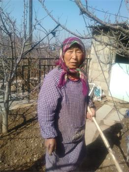

刘希永的老伴儿望眼欲穿

刘希永老人，一九四一年出生，曾经身患多种疾病，特别是腿，一直疼的很厉害，用各种方法医治也不见好转，到处寻医问药，在大连市金州区县医院找专家会诊也没好，医院要开刀做手术，因家里没钱就没做。后来病痛严重，导致刘希永瘫痪了两年多，全靠老伴照顾。

由于病痛的折磨，曾经使他产生过轻生的念头，加上脾气不好，与邻居经常闹矛盾，几次想和邻居以死相拼。

一九九六年那年，听说学法轮功能祛病健身，刘希永的大哥就用车子把他推到当时在石河镇（友利大酒店）举办的法轮功师父的讲法录像班，九天班听完，刘希永就在家学炼，二十多天后他就能挑水下地干活了。刘希永的变化邻居看在眼里，都觉得大法真是太神奇了。同时，刘希永抽烟、喝酒的顽固嗜好都戒掉了，按照大法的法理真、善、忍要求自己，在利益上也不去跟邻居争了，以前打过仗的邻居见面都主动笑脸说话了，再也不记恨别人了。

从那以后，刘希永性格变得乐观开朗，村子里谁家有事都找老刘头帮忙。他不但吃苦耐劳，又懂得果树技术，是村子里果树技术骨干，邻居家的果树都愿意找他帮忙剪枝。他扶弄过的樱桃树结的樱桃又大又多。在日常生活中，刘希永主动去帮助生产队和村民解决生产上的问题，处处为别人着想，默默地义务奉献，村民们都夸他说“这老刘头变化可真大啊！真是个大好人！”。

然而，一九九九年七月二十日，中共江泽民集团疯狂的污蔑、迫害法轮功，刘希永为法轮大法遭受到的无端诽谤和迫害而感到震惊，他以自己亲身受益的事实去和乡亲们讲明真相，结果遭到石河派出所及石河镇政府先后三次迫害。

第一次，是在二零零二年的四月，刘希永帮助生产队修理打井机器至晚上七点多钟才回家，刚一进门，就被早已蹲坑的石河派出所徐广悦等几个警察戴上手铐绑架到派出所，同时还有其他四位法轮功学员一同被绑架。当时的所长蔡杰无理要求每人交一万元钱才能放人回家。后来其中三人被勒索了一万元，一人被勒索了五千元，（都没有给任何收据）才被放回家。刘希永没有交钱，就被石河派出所上报，非法劳教二年。

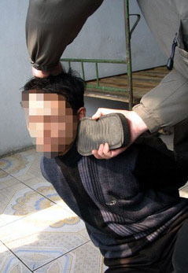

酷刑演示：鞋底打脸

 
 二零零二年六月十六日，刘希永被非法关押到大连劳动教养院五大队（新收队）。犹大王长果在管教警察的唆使下，用木棍殴打刘希永、用鞋底抽打其头顶，逼迫他放弃信仰，但是这都没有动摇刘希永内心对大法的坚定信念。由于在教养院不能够正常炼功，里面的卫生环境又差，夏天雨季潮湿霉暗，刘希永不幸染上疥疮，于是老刘堂堂正正的开始炼功，被警察景殿科以治疥疮为名将其隔离、关入小号进行迫害。当时五、六个四防（其他常人劳教人员）把老刘按在铁床上毒打，郭鹏（中队长）穿着大皮鞋使劲踹、踩遍刘希永的全身，后来又把刘希永背铐在床上，使刘希永连续四十多天不能翻身，不能洗漱，刘希永在严管期间不畏强暴，喊“法轮大法好”，又被教养院大队长刘忠科及几名管教犯人凶狠地用布堵住嘴，牙被捅掉了好几颗。

中共酷刑示意图：殴打

 
 二零零三年十一月中旬，刘希永因与三中队队长李茂江谈话时，讲法轮大法好的真相，被再次送进严管进行酷刑迫害。他们叫普教强行把刘希永和其他法轮功学员的两手抻直，分别铐在两边的铁床上，头上戴上拳击帽（避免喊出声音），一铐就是一个多月、甚至几个月的进行酷刑“转化”。有的一连九天不让睡觉，法轮功学员被迫害的精神都出现了幻觉。刘希永当时六十四岁了，多次遭到隔离强制“转化”，从禁闭室严管出来后，身体遭到严重的迫害，视力下降，连字都看不见了。

在大连劳动教养院这个人间地狱的魔窟里，刘希永由于不放弃对“真、善、忍”的信仰，遭受到了各种酷刑折磨：蹲小号、绑死人床长达四十多天；被恶警毒打折磨得不成人样，生活不能自理。
 

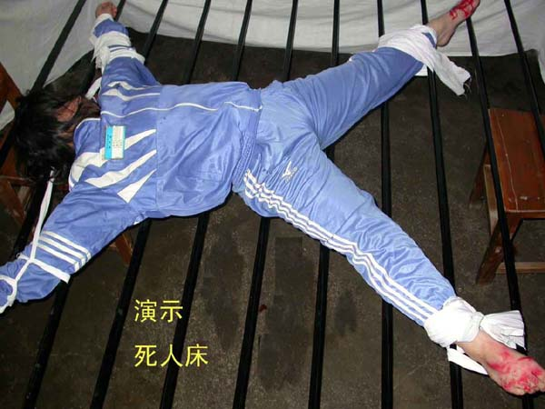

酷刑演示：死人床

 非法劳教关押二年后，刘希永回家坚持修炼法轮大法，身体才慢慢的得到了恢复。

第二次，是二零零六年四月二十四日晚九点左右，石河派出所所长郭鑫，派警察徐广悦等七、八个人翻墙闯入刘希永家院内，象土匪一样撬开门又一次绑架了刘希永和他的老伴儿。并非法抢走电脑、大法书等私人财物。

后来刘希永被非法关押到金州三里看守所。在那里，刘希永坚持真、善、忍没有错、做好人无罪，绝食抗议这种无理迫害。看守所的五、六个警察对他大打出手，拳打脚踢，叫狱医对他进行野蛮灌食、灌入不明药物，导致刘希永肚子鼓胀，腿不能行走，再次生活不能自理。非法关押二十八天后，刘希永闯出金州三里看守所。回家经学法炼功，身体再次得到康复
 

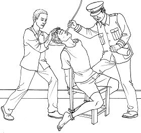

酷刑示意图：摧残性灌食

后来，片警姜清山一直对刘希永进行非法监视，石河派出所也三天两头进行电话骚扰，迫使刘希永夫妇流离失所一年多。

第三次，是在二零零八年七月二十四日下午五点左右，刘希永在外面干完活刚回到家，就被石河派出所副所长徐广悦等四、五个人绑架，再次给关进金州三里看守所。之后，警察徐广悦翻墙进到刘希永的屋里进行非法抄家。

刘希永被非法关押到金州三里看守所后开始绝食抗议，看守所恶警就给他灌食，灌的是咸盐水，浓度非常大，灌完食后刘希永痛苦的浑身发抖、全身缩成一团，此次刘希永共绝食六十天。

六十天后，刘希永接到通知：被非法判了三年半。这个过程刘希永本人什么都不知道，也没有任何开庭等法律程序。

二零零八年九月二十四日，刘希永被非法转往监狱。往监狱转押的时候，因为长期被灌食迫害，刘希永的两条腿都不好使了，是几个人给架到警车上的。在这个期间，整整四个月的时间，都没有人通知家属刘希永在哪里。家人四处打听，派出所警察都不告诉。

直到二零零八年十一月份，本溪溪湖监狱新收队打电话告诉家属：要求送衣服。家属才见到刘希永，当时他被迫害的双腿不好使了，非常消瘦，家属看到都落泪了。

这次冤狱迫害，刘希永也是九死一生，一直到二零一一年十二月的二十五日，刘希永才被释放回家。

这位正直善良、而又命运多舛的老人啊，多次被无辜残忍迫害的经历，使他彻底看清了邪恶迫害的真面目，他更加坚信这个大法，他也越加明白：这个世上，唯有法轮大法师父是最慈悲的，也唯有法轮大法是最正的道。人世间为什么天灾人祸越来越多？在大自然的灾难面前，再高的科学家、国家领导人也是无能为力，其实，人类道德的下滑，才是导致天灾人祸越来越多的原因。而修炼法轮大法，能够使人真正的道德回升、人心归正。因为，这是一部能够真正指导人心向善的高德大法。中共电视、报纸里所说的对法轮功负面的言辞，都是江泽民集团当初为了迫害法轮功而制作的谎言。这一切，修炼法轮功的人太有亲身体会了。

历史上迫害正信的从来都没有好的下场。因为“善恶有报是天理”，大法弟子以修炼真、善、忍为根本，又怎能眼睁睁的看着人们被谎言迷惑、从而被拖入危险的深渊呢！二零一七年二月二十六日上午，刘希永在石河集市上发真相期刊，又被石河派出所两名执勤民警绑架，后因看守所的狱医看到刘希永的身体检查结果后拒收。刘希永的女儿当时被勒索了五千元钱。

后来仅在这一年里，刘希永老人相继多次被石河镇派出所警察骚扰迫害：二零一七年六月十八日，屯长张桂凤和一个警察到刘希永家骚扰，期间要照相，被刘希永制止；二零一七年七月份，石河镇派出所周某等警察闯到刘希永家，再次强行拉刘希永到金州中医院和中心医院体检两次，企图将刘希永关进金州区三里看守所，狱医看到两张诊断书后，再次拒收。

二零一七年八月十四日，石河镇派出所的警察，把构陷刘希永的材料送到金州区检察院，刘希永拒绝听检察院念构陷材料内容，说：我无罪，做好人没有错，真善忍没有错。你们不要念了，这样对你们也不好。八月十六日上午，石河镇派出所周某又带警察到刘希永家，强行要把刘希永关进看守所。三里看守所的狱医看了金州医院的诊断书后，告诉周某：身体不合格，人不能留。

二零一七年八月十七日下午，石河镇派出所警察徐新把刘希永叫到金州区法院，让刘希永在一份金州区检察院出具的非法起诉书上签字。刘希永拒绝签字，并告诉法院人员：“是他们（迫害法轮功的人）在犯法，我没有罪”。

二零一八年三月十八日晚，刘希永和其他法轮功学员一起给百姓送真相，结果遭到大连金普新区派出所以刘波为首的警察再次绑架，期间他们几次执意想把刘希永关进看守所，都因体检不合格，血压高达二百，看守所拒收。

刘希永在最后这一次被绑架回家后，身体出现高血压、心脏病、气喘，头晕、呕吐、浑身无力等症状。就是这样，派出所的警察们仍然没有停止对他的迫害，二零一八年四月九日下午，再次把刘希永绑架并强行关进看守所。

这些警察是明知违反相关规定，明知刘希永的身体和年龄都不符合关押的要求，也是硬要给这位近八十岁的老人关进去。面对刘希永老伴儿心急如焚的哭诉，他们竟然说：“这回死也让他死里头！”，并且在第二天就对刘希永下了非法批捕令，欲加重下一步的迫害。

据悉，此次行动是大连金普新区派出所（原瓦房店炮台镇）和金州石河派出所的警察联合所为。在这里，想问参与迫害警察们两个问题：

是什么让你们对一位近八十岁的老人如此恶言相向？他们，可能比你父母的年龄还要大，他们善良、勤劳，他们也有儿有女；当你说出“这回死也让他死里头！”这些话的时候，你是否意识到，你的人性已在迷失。又是什么让你们的内心对法轮功学员充满了仇恨？他们贩毒吗？不；他们贪污受贿吗？没有；他们偷谁的东西、抢谁的财物了？也没有；相反，他们“打不还手、骂不还口”，乐于助人，正直善良。

法轮功学员所做的一切都是为了世人好，为了你们好；而你们的仇恨来自哪里呢？如果你真的没有想过这个问题，那么我来告诉你：你们的仇视，更多来自于被邪恶灌输的谎言，你们是被蒙蔽的、被欺骗的。静下心来想一想，不是这样吗？当初迫害法轮功的时候，江泽民邪恶集团不惜一切代价栽赃、抹黑法轮功，连所谓的“天安门自焚”都是一场骗局（国际追查组织已经证明），是为了煽动仇恨、加重迫害。正因为你们被灌输了这样的谎言、相信了这样的谎言，你们才有了今天对法轮功学员的仇恨，是不是这样呢？

那么你们是否想过一个问题：如果法轮功真的是被冤枉的，这些法轮功学员真的是无辜的受害者，他们冒着生命的危险所做的这一切，又真的都是为了你们好、为了世人的未来，你该怎样看待你今天的行为？

就像南亚大海啸一样，人们正在海边玩乐，丝毫没有感觉，有人预知到了危险的来临，他不顾一切的喊叫，想让正在海边嘻玩的人们赶紧离开，可是，没有人听他的，甚至认为他很可笑，像个疯子。几十分钟后，数十米高的海浪铺天盖地而来，瞬间吞噬了几十万人的生命。

法轮功学员为什么这么执着的讲真相？就是因为，他们看到了这个危险，知道了世人如果不能够明白真相，就无法从这次劫难中走过来，就将失去一切。所以，他们着急啊，希望你们能够明白，能够从邪恶的谎言和捆绑中走出来，哪怕被冤枉、被抓、被打、被判刑，甚至失去自己的生命都无怨无悔！
你们，能理解吗？法徒滴滴血与泪，只为唤回众生归！

邪不压正，终有一天，人们会看到大法与大法徒被昭雪天下的那一天。那一刻，你在哪里？你们要知道：善恶有报，是永恒不变的天理。当年罗马帝国不计后果迫害基督教，最终遭到上天的惩罚，四次大瘟疫席卷全国，约一半人口丧生，曾经不可一世的罗马帝国由此走向灭亡。当年杀害六百万犹太人，发动第二次世界大战的头号战犯希特勒，最终自杀身亡。追随希特勒的纳粹战犯，在纽伦堡审判中，相继受到审判。臭名昭著的纳粹秘密警察机构的元凶赫尔曼.戈林等十二人，在第一轮审判中被判处绞刑；在十年“文化大革命”中制造了大量冤、假、错案的江青，一九七六年十月六日，被判处死缓。一九九一年五月十四日，绝望至极、生不如死的江青上吊自杀身亡！

这一切历史教训，都在眼前。而当今，中共江泽民集团，因为对法轮功的迫害犯下了群体灭绝罪、反人类罪，现在被全球追查、起诉，全民起诉中共前党魁江泽民等迫害法轮功的元凶，对国家恐怖主义超级犯罪集团实施正义审判的时刻正在到来，江泽民集团的恶报已经进入倒计时！你们该何去何从？还要继续当邪恶的傀儡，还要当邪恶的替罪羊吗？快快放下手中邪恶的鞭子，快快找寻真相、快快挣脱邪恶的捆绑吧！

迫害好人有罪；迫害修炼人有罪；迫害法轮功更是罪大滔天啊；如果说在迫害之初，大势所趋，每个人在谎言中都很难摆正自己的位置，也许还能够理解，但是现在，形势已经变了，快快停止作恶，将功补过，给自己和家人一个好的未来吧。不要等到历史的审判和恶报来临时，后悔已晚矣！

<h1 align="center"><b>5千法轮功学员台北大游行 声援三亿退党潮</b></h1>

【大纪元2018年04月22日讯】（大纪元记者张原彰、戴德蔓台北报导）超过5千名来自全台各地的法轮功学员4月22日下午在台湾台北展开盛大游行，这次游行的主题是“全球声援三亿人退出中共党团队暨纪念“4.25”中国法轮功学员和平上访19周年”。

活动中，即使烈日当头，法轮功学员们仍不畏艰辛走完全程5.7公里的路程，有法轮功学员说，“只要能见到民众了解真相后展现的笑容，身体的疲惫就会一扫而空。”

这次法轮功学员游行从台北市府前广场出发，路程行经多条台北市的重要路段，包括：忠孝东路、仁爱路，穿越多个繁华地区，包括：信义区、东区，队伍最终停在台湾的总统府之前的凯达格兰大道上，全长5.7公里。

超过5千名台湾部分法轮功学员齐聚与会，他们共分为四大方阵，以不同主题向台北市民展现法轮大法的美好，同时传递法轮功的真相资讯。

第一方阵主题“大法美好”，由天国乐团打头阵，仙女队紧接在后，接着由法轮功学员演示功法，展现学炼法轮功的纯净与美好殊胜等境界。

执掌天国乐团横幅旗帜的杨小姐走在游行队伍的最前头，她说，走在前方代表着队伍的门面，因此心境更要保持平和与纯净，展现亲切的笑容给一旁民众，让他们能对游行队伍留下好印象。

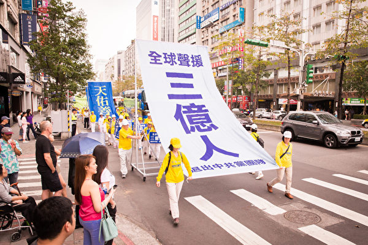

台湾法轮大法学会4月22日举办全球声援三亿人退出中共党、团、队暨纪念“4.25”中国法轮功学员和平上访19周年活动。图为法轮功学员在台北游行。

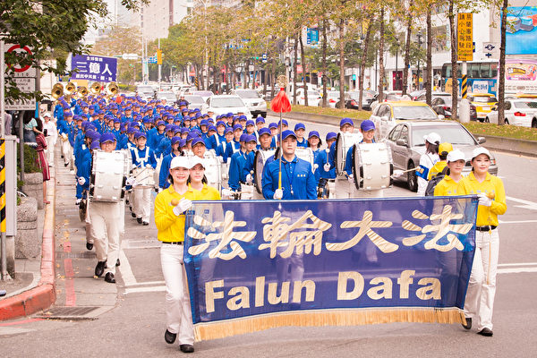

台湾法轮大法学会4月22日举办全球声援三亿人退出中共党、团、队暨纪念“4.25”中国法轮功学员和平上访19周年活动。图为天国乐团在台北游行。

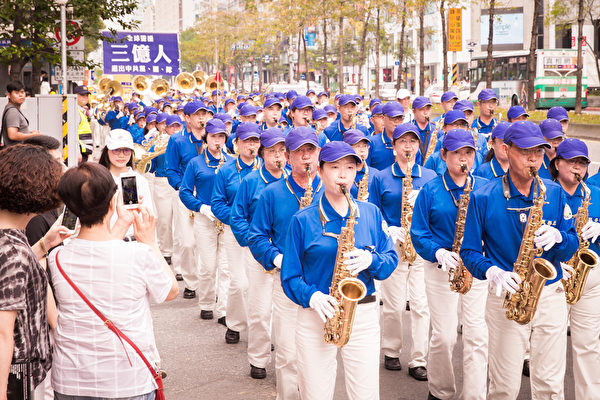

台湾法轮大法学会4月22日举办全球声援三亿人退出中共党、团、队暨纪念“4.25”中国法轮功学员和平上访19周年活动。图为天国乐团在台北游行。

杨小姐说，“我走过十几年的游行，知道行径时的心态很重要，一定要体现出身为修炼人才有的祥和心境，这样步伐才会稳定，才能让民众感觉我们是非常美好与殊胜的修炼团体。”

杨小姐也说，许多中国游客是第一次见到法轮功，接触到被对岸封锁的真相，透过这次游行可以让包括陆客在内的全世界游客知道这些真相，这是件非常有意义的事情，她回忆，“我在游行时看见有民众从不知道法轮功，到理解了这次游行的意义，选择向我们比赞，这真的很让我触动。”

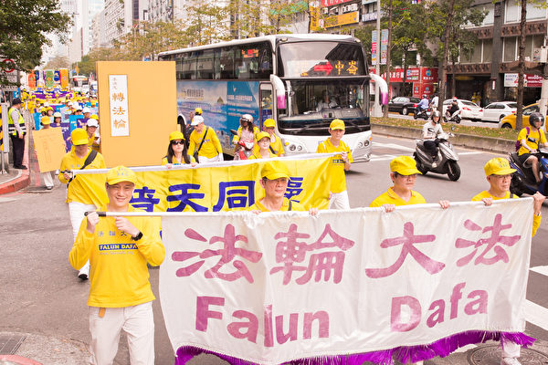

台湾法轮大法学会4月22日举办全球声援三亿人退出中共党、团、队暨纪念“4.25”中国法轮功学员和平上访19周年活动。图为法轮功学员在台北游行。

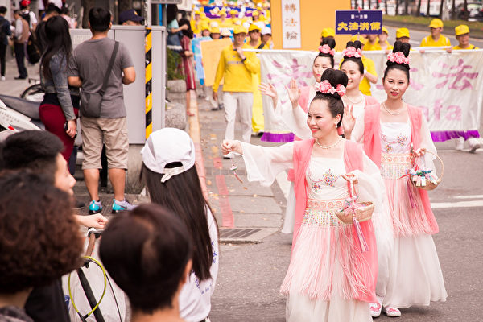

台湾法轮大法学会4月22日举办全球声援三亿人退出中共党、团、队暨纪念“4.25”中国法轮功学员和平上访19周年活动。图为仙女队在台北游行。

仙女队成员紧接着在天国乐团的身后，她们身穿粉红与白色相间的汉服，飘逸著裙䙓走向路旁民众，向他们送上精致小巧的莲花。仙女队成员常小姐回忆，游行过程时，不少民众主动向他们挥手，她们赶紧送上莲花后，民众们的心情总是非常的雀跃与欣喜。

常小姐说，仙女队有一项不同的任务，许多民众都知道法轮大法的美好，但没有机会与游行中的法轮功学员接触，仙女队就负责走向民众，向他们送上美丽的莲花，代表着把法轮大法的美好送给他们，“我们发自内心把修炼的喜悦，把大法的活动，带给一旁观看游行的民众。”

仙女队成员蓝小姐也说，民众接下莲花，这对她来说事件很美好的事情，“我们并不觉得疲累，因为只要能让民众知道法轮大法的美好，看到路人给予的正面反馈，即使辛苦都是非常值得的事情。”

假日的台北街头人潮熙来攘往，不只有台北市民、台湾民众，也有不少外国观光客把握来台旅游的机缘，品味台北街头的与众不同，与被称为台湾最美的风景－台湾人展开互动与交流。

<b>大陆游客：中国人有知道真相的权利</b>
 

台湾法轮大法学会4月22日举办全球声援三亿人退出中共党、团、队暨纪念“4.25”中国法轮功学员和平上访19周年活动。图为法轮功学员在台北游行。

台湾法轮大法学会4月22日举办全球声援三亿人退出中共党、团、队暨纪念“4.25”中国法轮功学员和平上访19周年活动。图为法轮功学员在台北游行。

浩大的法轮功游行队伍让外国观光客们感到印象深刻，尤其是大陆游客惊讶地拿起相机纪录这难得见到的画面。有陆客团见到“解体中共”的展板，拿起相机拍摄现场的画面。

来台湾旅游的中国民众孙先生就说这是他首次见到法轮功的游行，他说，他知道中共污蔑与迫害法轮功的事实，因为中共害怕政权被动摇，因此迫害人权与信仰，而中国人多数活在中共的洗脑资讯里，因此不能得知真实情况。

孙先生说，当中国人翻墙看到真相后，会发现中共真的太坏了，其实现在已经有许多中国人不相信中共，他也认为，法轮功学员这次的游行相当有意义，声援中国人三退的运动，这件事情就是在破除中共的洗脑，让中国人能拥有知道真相的权利。

从大陆来台湾出差的张先生与林先生（化名）表示，在红绿灯看到游行队伍的时候表示，“哇！法轮功团体在台湾的声势真是浩大。”

另一名年轻陆客林先生（化名）表示，他曾看过《九评》这本书，他觉得三退运动非常有意义，因此他全程参加完游行，并且最终选择加入退党大潮。

外国旅客Bob（化名）在看到法轮功的队伍时，举起双手的大拇指，比出赞赏的手势，他说，他曾经在信义区以及101大楼看到法轮功学员在炼功与讲真相的画面。

曾练过太极拳的他说，看到法轮功炼功的样貌，让他感觉身心灵非常的平静，并形容法轮功的气场很强（strong)，而且是非常纯净，非常高层次的修炼法门。

Bob也说，他非常佩服法轮功的勇气，目前全世界上只有法轮功敢于对世人讲出中共的真相。

台湾法轮大法学会4月22日举办全球声援三亿人退出中共党、团、队暨纪念“4.25”中国法轮功学员和平上访19周年活动。图为法轮功学员在台北游行。

台湾法轮大法学会4月22日举办全球声援三亿人退出中共党、团、队暨纪念“4.25”中国法轮功学员和平上访19周年活动。图为法轮功学员在台北游行。

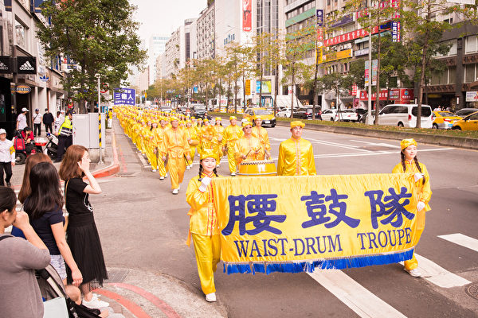

台湾法轮大法学会4月22日举办全球声援三亿人退出中共党、团、队暨纪念“4.25”中国法轮功学员和平上访19周年活动。图为腰鼓队在台北游行。

台湾民众蔡先生表示，他曾在网路YouTube上面看过中共活摘法轮功学员器官的新闻，让他非常惊吓，没想到当今世上仍存在如此巨大的罪恶。

台湾民众孙小姐则表示，看到千古奇冤的队伍经过面前时，她向一旁的朋友说，“活摘器官在中国大陆是真实的事情”。她说，她知道法轮功在台湾能合法申请游行，法轮功学员能自由表达诉求，而在中国其实没有这样的自由。

家住台北的陈先生说，全世界都有人修炼法轮功，他在韩国旅游时曾在东大门遇见法轮功学员，他觉得法轮功是非常好的精神寄托。他认为法轮功学员总是展现出友善的态度，这点让他非常的赞赏。

家住台北的吴先生则认为法轮功学员非常的团结，看见法轮功学员的游行队伍让他觉得相当有规模，内心感到非常震撼。这天台北的太阳并不小，他也向法轮功学员说声“辛苦了，加油”。

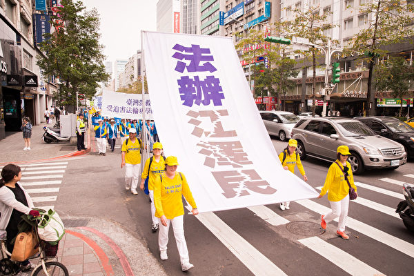

台湾法轮大法学会4月22日举办全球声援三亿人退出中共党、团、队暨纪念“4.25”中国法轮功学员和平上访19周年活动。图为法轮功学员在台北游行。

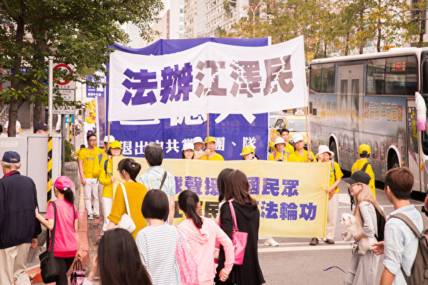

台湾法轮大法学会4月22日举办全球声援三亿人退出中共党、团、队暨纪念“4.25”中国法轮功学员和平上访19周年活动。图为法轮功学员在台北游行。

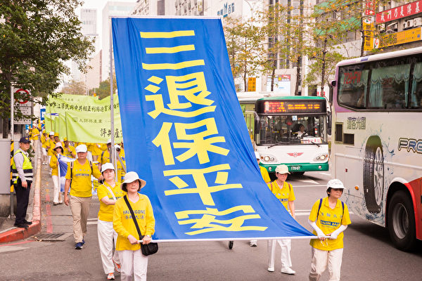

台湾法轮大法学会4月22日举办全球声援三亿人退出中共党、团、队暨纪念“4.25”中国法轮功学员和平上访19周年活动。图为法轮功学员在台北游行。

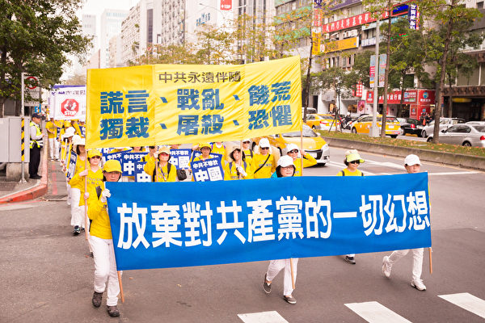

台湾法轮大法学会4月22日举办全球声援三亿人退出中共党、团、队暨纪念“4.25”中国法轮功学员和平上访19周年活动。图为法轮功学员在台北游行。

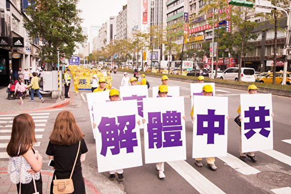

台湾法轮大法学会4月22日举办全球声援三亿人退出中共党、团、队暨纪念“4.25”中国法轮功学员和平上访19周年活动。图为法轮功学员在台北游行。

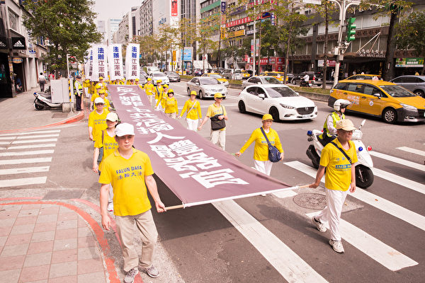

台湾法轮大法学会4月22日举办全球声援三亿人退出中共党、团、队暨纪念“4.25”中国法轮功学员和平上访19周年活动。图为法轮功学员在台北游行。

<h1 align="center"><b>俄罗斯军医学院毕业生：大法解惑人生路</b></h1>

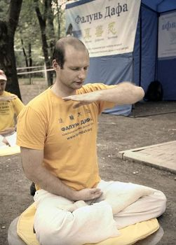

毕业于圣彼得堡军医学院的基里尔从2008年起开始修炼法轮功（明慧网）

【大纪元2017年05月24日讯】法轮大法1992年在中国传出后，现已洪传到了世界120多个国家和地区。在俄罗斯，毕业于圣彼得堡军医学院的基里尔从2008年起开始修炼法轮功。他说，阅读法轮大法的书籍后解开了他对人生的迷惑，让他明白了人真正应该追求的是什么。

据明慧网报导，基里尔还在上学的时就喜欢读有关气功和武术的文章。他的父亲那时也练气功，那时家里有很多这方面的书。他说：“我记得那个时候读过这方面的杂志后，就想试着去学习，例如飞檐走壁等。有时候也会练习气功，读相关的书籍。”

后来，基里尔考入了圣彼得堡军医学院，进入了另一个环境。“在我读大学四年级时，父亲给我送来一本法轮大法的书，建议我认真读一读。读过一遍后，我明白了善恶有报的道理，我当时很高兴，但还是没能正式走入大法修炼。”他说。

基里尔毕业后参军入伍，又开始思考之后的人生道路和最终的目地。他想起曾经读过的《转法轮》（法轮大法的主要著作）中说：“人要返本归真，这才是做人的真正目地，所以这个人一想修炼，就被认为是佛性出来了。”

“我突然明白了我应该修炼！”基里尔表示。

基里尔当时在军事学院从事科研工作，研究有毒化学品及其防护，利用动物做了大部分的实验。

他说：“我一直在追求事业成功，那时已经开始准备学术论文了，导师帮我从军队转到了部门。每次我读到书（《转法轮》）里讲的关于杀生问题的时候，都会流下眼泪来。当时感到压力很大，睡不着觉，内心很痛苦。”

面对工作与修炼之间发生的矛盾，基里尔曾一度徬徨。他说：“如果我想修炼就不能从事这项工作了，就必须从‘幸福生活’与修炼之间做出选择。后来我悟到了这就是我的生死关吧，看我能否按照大法（真、善、忍）法理真正实修。”基里尔作出了选择，离开了那份工作，但仍留在了军队里。

在基里尔所在的这座大城市里，只有他一个法轮功学员。每周末，基里尔都尽量到公园炼功洪法，讲真相发资料。由于当地民众知道法轮功的很少，感兴趣过来看展板的不多，有时他还会遇到不理解的人的嘲笑他或开玩笑。“那时得法不久，虽然就我一个人，但我还是坚持了下来。”基里尔说。

除了到公园炼功，他还意识到讲清法轮功真相的重要性，开始在网络上讲真相。

几年后，基里尔退伍回家，去了一所公立医院的内科工作。在工作期间，他常常送同事有关法轮功真相的小挂历和资料。有时同事们想了解更多，他就让他们读《法轮功》，并赠送教功光盘给感兴趣的人。

基里尔谈到了征集反对中共强摘法轮功学员器官签名的经历。他先拿着签名单去了主任医师的行政大楼，“在总会计师那儿找到主任后，他们都签了名。” 基里尔说，“走的时候总会计师告诉我一定要到她的下属那儿去一趟，告诉他们都签名。得到他们的支持，我很高兴。我的大部分同事都签了名。”

基里尔还有个愿望，就是想给同事们更深入的讲一讲法轮功到底是什么。为此，他做了一个题为“医学伦理学和道德” 的报告。

基里尔首先讲了修炼法轮功后自身受益的情况，他说：“修炼法轮大法让我明白，当一个好人和道德高尚的人对身体健康多么有益处！”同时，他还列举了各类医学调查的结果。报告会的气氛活跃，一些同事说起自己知道的例子。”基里尔感叹道：“我终于实现了愿望，进行了一次比较深入的演讲！”

<h1 align="center"><b>四·二五和平上访　开启讲真相契机</b></h1>

【明慧网二零一八年四月二十二日】（明慧记者唐恩综合报道）法轮大法于一九九五年四月传入台湾，已届二十三年，目前学员有数十万，是中国大陆以外法轮功修炼者最多的地方。台湾学员涵盖大学教授、医生、律师、工程师、公务员、军警、士农工商、学生、家庭主妇等各阶层，全台湾有一千多个炼功点，学炼者身强体健、心性道德提升，普遍受到政府部门及社会各界的高度赞扬。
一九九九年四月二十五日，上万名中国大陆法轮功学员闻悉天津动用防暴警察抓打法轮功学员的消息后，赶到位于中南海附近（府右街）的国务院信访办公室，为在天津市被非法逮捕的四十五名法轮功学员和平上访，要求一个合法宽松的修炼环境，此即“四·二五”事件。

“四·二五”事件经媒体大幅报导，逾万名上访的法轮功学员安安静静，没有口号、没有喧哗嘈杂，电视上只见法轮功学员自律地站在人行道上看书或是炼功的画面，离去时地上没有留下一张纸屑。共产党统治的国家也有一群高度文明的修炼者令海外人士印象深刻，打响了法轮功的知名度，促使台湾大批的新学员加入修炼的行列，奠定法轮功弘传台湾的基础。

<b>“四·二五”促使大批台湾学员加入修炼行列</b>

“四·二五”隔天，台湾报纸大幅报导该事件，许多人自己寻找炼功点，有人认为“中共说不好的事，这功法肯定是好的”，很多人就在那时候走进法轮大法修炼。“四·二五”之后，各地炼功点，如同雨后春笋般大量涌入新学员，全台湾北、中、南各地九天班场场爆满，每一班平均有七十名以上，黄埔新村学法点的辅导员表示，有时需开放炼功房和学法房，两台电视同时播放才够用。

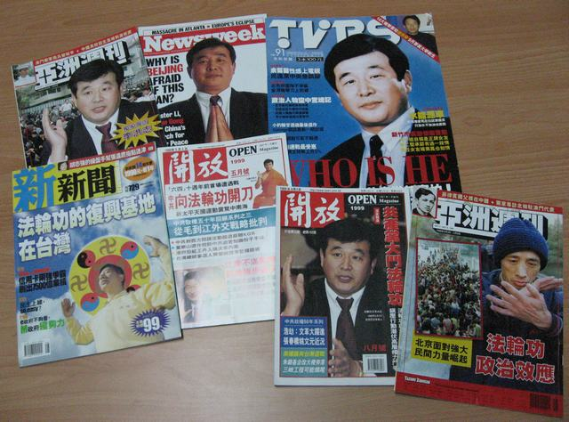

图1：台湾媒体大幅报导一九九九年“四·二五”事件

铜山街炼功点的辅导员林先生说，当时开办的九天学法炼功班，连续三期均都涌入一百多名新学员，连前院玄关都挤满了人，同时播放两台电视仍不够用。由于人数众多，学炼功法时较难伸展开来，许多人还提前半小时甚至一小时到点上学炼功法，弥补前一天的不足。

一九九七年十一月李洪志师父莅临台湾讲法时，全台只有三十五个炼功点；一九九八年六月份法轮大法相关书籍正式出版二千套，一个月即全部售罄，至一九九九年四月已出版一万四千本《转法轮》。一九九九年五月以后，为了供应大量新学员的需求，当年再加印了一万五千本大法书籍，这增加的速度，更是书商始料未及的。

在台湾与美国两地执业律师的朱女士回忆说，她是看了报纸报导一万多名法轮功学员到中南海，离去时没留下一张纸屑而留下深刻的印象，她认为可以把中国人教育得如此有公德心，一定是个不寻常的功法，所以就自己打电话到九天班询问。那时朱女士患有子宫颈癌末期，都已经准备好后事，神奇的是上完九天班之后病症全好了。

家住宜兰苏澳的游先生也是在一九九九年时，因为看到“四·二五”事件的新闻报导后才走进法轮功修炼，他说：“回想当时报导提到法轮功学员去上访时，没有口号，没有扩音喇叭，没有投掷鸡蛋，也没有带什么抗议的东西，还很规矩的排队，有的在炼功，我就觉得可笑，心想这样抗议能使上什么作用？同时觉得在共产党极权社会里面的人连抗议都这么奇怪。但是电视上却报导说他们离开时，没有留下垃圾，甚至连警察丢的烟蒂都捡起来带走，这让我很惊讶，心想一定要了解法轮功到底是什么。”

就这样，游先生到书局去买了一套李洪志先生的《广州讲法》录影带，花了几天看完。他说：“我就是这样得法的。修炼后我戒酒了，脾气变好了，身体也变好了，精神非常好。”因此他经常告诉别人，他是修炼法轮功的受益者，要把这些美好的讯息和大家分享。

<b>法轮功教导做好人　印证中共诬蔑</b>

一位住在台北市木栅区的贸易商，一九九九年到大陆出差的时候，看到公共场所的电视播放着中共污蔑法轮功的新闻。他觉得这么大的国家，利用政权迫害一个功法，让他感到好奇，回台之后找到学法点参加九天班。当时他走进来的动机，纯粹抱着观望的态度，他想来看看法轮功到底有多“邪”？结果他发现法轮功都是教人做好人，没有一件是坏的，中共根本是在骗人。他原本患有十七年的失眠症，走访各大医院的名医，吃遍各种名药仍无法治愈，等他上到第四天时，晚上他睡得很香无需吃药，他的失眠症竟奇妙地不药而愈。

曾任带旅游团领队的杨小姐，在一九九九年春天，她父亲因为受伤求医，医生送给父母一本《转法轮》，杨小姐看完后告诉母亲：“这本书很好，教人向善做好人。”杨小姐说：“不料隔没多久，在电视上看到新闻报导说，中国大陆法轮功学员一万多人集体大上访，我非常惊讶，既震惊又兴奋：在这么极权的国家，这些人敢于上访说真话，真是了不起。尤其看到媒体报导，万人上访场面竟是那么祥和，离开时地上一张纸屑都没有，感到非常神奇与钦佩。”此后，杨小姐与母亲开始修炼法轮功。

在贸易局任职的房女士，一九九九年四月，因病在家休养，从电台广播中获悉“四·二五”万人和平上访的消息，当听到接受采访的学员介绍：“法轮功是性命双修的功法，法轮功不存钱不存物。”令房女士印象非常深刻，直觉这是个很正的功法，兴起了想要学法轮功的念头。五月初销假上班后，她喜出望外地发现，许多同事都在学炼法轮功，她与先生找到该月的九天学法炼功班，就这样“四·二五”开启夫妻俩的修炼机缘。

<b>两赴北京长春　交流促进提高</b>

一九九六年一月得法的刘先生提到，他是从报纸得知“四·二五”事件的。“四·二五”之前，有四、五十位学员到中国大陆与当地学员交流，见到大陆同修感觉像是见到亲人一样，法轮功学员总是那样的善良与美好；“四·二五”之后大陆的修炼环境感觉天差地别，其实中共很早就设下陷阱来迫害学员。

刘先生回忆了“四·二五”之前，两度与中国大陆学员一起学法交流的情况：第一次是在一九九六年的十月底到十一月初，约一个多星期的时间到北京与学员交流。那时安排家访，也有大型交流会，我觉得非常震撼，有相见恨晚的感觉。一些农妇，只有上了三个月扫盲班，短短的几个月就会读整本的《转法轮》。第二次去北京交流时，也有一位年纪很大的农妇，完全没有上过学，除了在短短几个月内能看懂《转法轮》之外，还背诵大法书籍。这位老妈妈上台讲述修炼心得，我们听了后相当感动，对台湾学员促进相当大。

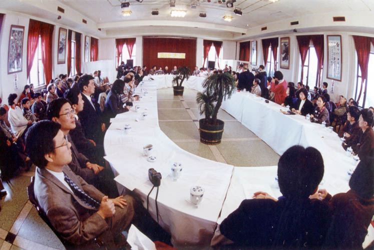

图2：华侨饭店会议室集体学法交流

第二次是一九九七年的年底跨年到九八年的元旦，台湾学员去长春学法交流。那时辅导员拿着麦克风说我们今天来学《转法轮》第一讲，谁来背一背，一下就有四、五个人举手，还有辅导员点名谁先背几段，谁再接下来背，真象《法轮大法义解》里讲的，长春学法特别好，集体学法时就是背法。当时我们看了真是目瞪口呆，回来后也开始背法。

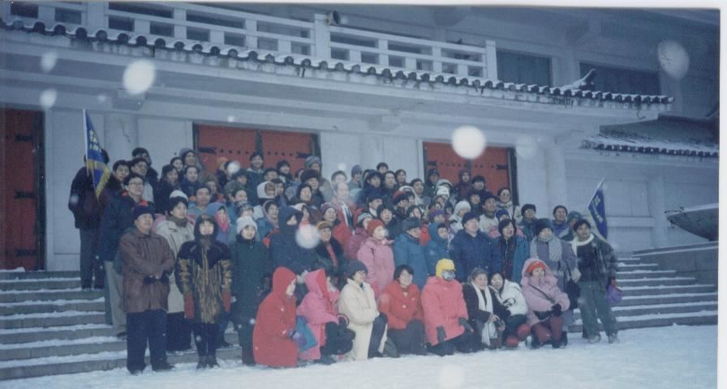

图3：台湾法轮功学员去长春学法交流

刘先生表示：“去长春交流对我最大的触动是，他们将法都背起来，早晨在零下十几度低温都还有上万人在炼功，台湾环境相对安逸许多，看不到学员在这么冷的天气出来炼功。‘四·二五’事件翌日，台湾媒体虽大幅报导，但都是转载大陆的不实报导，后来经过大家交流讨论，觉得应该透过媒体讲真相，因为我们都曾亲身受益，知道法轮功是好的。于是，只要有记者想要了解法轮功的真实情况，我们都接受采访。当时很多人不了解为何中共要打压这么好的功法，透过学员讲真相就明白了。”

一九九六年七、八月间得法的杨先生提到，“四·二五”之前大家在一起学法交流的环境很单纯，就觉得这功法好，教人修心性。我个人不是因为祛病健身走进来，因我觉得修炼可以返本归真，以法入门的，当时环境很单纯。九六年十月去北京国际交流会，那是我感受最深的一次。那次台湾去的四、五十位学员，大部份才得法几个月，比较资深的才一年。”

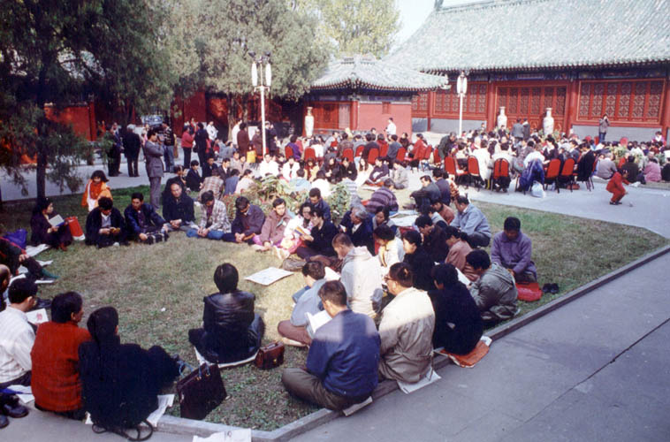

图4：方泽轩餐厅外面空地集体学法交流（一九九六年北京法轮大法修炼国际交流会）

提到“四·二五”事件前后的最大差异，杨先生觉得：“我个人的感受就是，‘四·二五’之前是弘法，想要使这么好的功法让更多的世人知道；而‘四·二五’之后就是要讲真相，让人们能明白真相。”

<b>“四·二五”开启讲真相的契机</b>

一九九六年九月底得法的徐女士，任职台湾电视公司（台视）助理导播，也写剧本、剪接片子等。她的先生是制片人，也得法修炼。徐女士说，一九九六年在台视得法的学员非常多，单单在台视炼功点就有五、六十位学员。发展至今，台湾已有数十万名学员。

徐女士说，当年去中国大陆学法交流时，大陆学员告诉我们台湾学员，要我们避开公安，可能是要保护我们。在台湾我们不会提防警察。有次我们在大陆学法时，一位公安跑来问我说是哪里来的，我很高兴的回答是台湾来的，因为法轮功很好，来学法交流。

徐女士补充说：三年后当法轮功被打压时，我完全不能理解这功法这么好，为什么要打压这些善良的炼功人呢？“四·二五”事件之后，因为我是做媒体的，就用这个便利条件去讲清真相，许多人受中共谎言欺骗，不了解法轮功，我们就是去讲真相，让世人明白。

“四·二五”之后不到三个月，一九九九年七月二十日，中共发动了对法轮功的残酷迫害。借着“四·二五”事件而听闻法轮功的国际社会，在其后的十九年里，因法轮功学员坚持不懈地讲清真相与反迫害，而越来越了解法轮功。如今，法轮功已经洪传至世界一百多个国家和地区，使上亿人因修炼法轮功而身心受益，见证了“四·二五”和平上访在人类历史留下的永恒丰碑。

<h1 align="center"><b>英议会大厦圆桌会议：立刻制止中共活摘暴行</b></h1>

【明慧网二零一八年四月二十二日】“要让事情变好，当下首要一步就是立即制止活摘器官罪行。”二零一八年四月十七日，加拿大前亚太政务司司长大卫·乔高（David Kilgour）在英国议会大厦揭露中共活摘良心犯器官罪行圆桌会议上这样说。

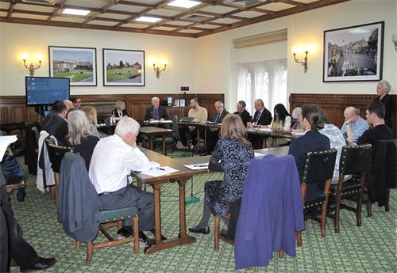

图1：二零一八年四月十七日，英国会议员吉姆·香农（Jim Shannon）和国会议员菲奥纳·布鲁斯（Fiona Bruce）在议会大厦内主持圆桌会议，揭露中共活摘良心犯器官的罪行。这是继二零一七年十二月十四日圆桌会议后的再次会议。

会议由北爱民主统一党国会议员吉姆·香农（Jim Shannon）和保守党人权委员会主席菲奥纳·布鲁斯（Fiona Bruce）国会议员共同主持，大卫·乔高（David Kilgour）、中国问题专家兼资深记者伊森?葛特曼（Ethan Gutmann）、英国保守党人权委员会副主席本尼迪克特·罗杰斯（Bennedict Rogers）、反强摘器官医生组织（DAFOH）秘书阿德南·谢里夫（Adnan Sharif）医师、前新疆维吾尔族外科医生安华?托帝（Enver Tohti）等九位专家和人权活动人士出席发言，揭露中共活摘法轮功学员和其他良心犯器官罪行，呼吁英国政府勇敢面对真相、支持正义，立即采取切实行动制止中共活摘器官罪行。英国多党派代表及关注这一重大议题的多领域专业人士出席聆听并参与互动。

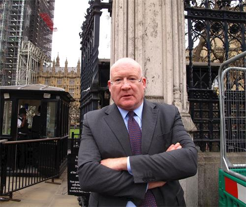

图2：二零一八年四月十七日，伊森·葛特曼出席揭露中共活摘良心犯器官罪行圆桌会议并发言

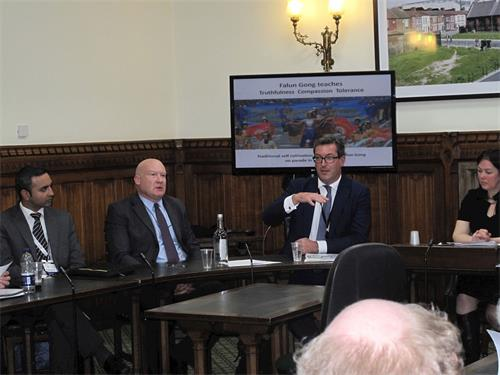

图3：二零一八年四月十七日，英国保守党人权委员会副主席本尼迪克特·罗杰斯（右二）在揭露中共活摘良心犯器官罪行圆桌会议上发言

<b>立即制止中共活摘器官暴行</b>

大卫·乔高呼吁国际社会立即联手制止中共活摘良心犯器官暴行，并希望全社会人人为此行动起来；伊森·葛特曼这样结束他的发言：对英国政府来说，已不再是探讨迫害和活摘器官罪行为什么发生的时候，应该立刻采取行动，“公开严正谴责中共政府的恶劣行径。”他认为需要让英国外交部更直接地了解这一点：“如果有足够的压力，外交部将对压力做出回应。”

本尼迪克特·罗杰斯回顾保守党人权委员会两年来在制止中共活摘器官暴行上所做的努力，向英国议会和英国政府大声呼吁：“是我们为中国人民站起来的时候了！”与葛特曼一样，他认为英国政府在帮助制止中共活摘罪恶采取行动方面已经滞后。

主持会议的香农议员表示，他乐见各党派议员都开始关注制止中共活摘器官这一重大议题：“现在在这间会议室里，有保守党、北爱民主统一党、工党议员，可能还有一些上议院议员。我觉得我们体现了议会的民主程序和民主问责制度，各党派议员都很关注，并希望突出强调此议题。”

<b>中共活摘器官罪恶在蔓延</b>

自二零零六年起，大卫·乔高、加拿大人权律师大卫·麦塔斯、伊森·葛特曼等开始对中共活摘法轮功学员器官暴行展开独立调查，共同证实大量法轮功学员被摘取器官杀害，中共犯下令人震惊的反人类罪行。基于他们的历史追踪研究和更新报告，圆桌会议多位发言人指证中共滥杀无辜的罪恶行为在蔓延，而不是在减少。

乔高在发言中给出他们的调查结论要点：“至今大规模强行摘取法轮功学员器官的事情还在继续。”“至二零一六年中，中国每年器官移植数目不低于六万例，远远超过中共官方声称的一万例。”“若以每年六万例器官移植来计算，在中国每天会有一百五十人因被活摘器官而失去生命。”

作为世界基督教团结会（CSW）亚洲部负责人，罗杰斯提醒与会者，基督教成员在中国大陆也上了中共活摘器官暴行受害者名单，他呼吁各界对有关调查提供帮助。

葛特曼在发言中列举新疆一百七十万人被进行DNA检查、数万维吾尔族人和其他少数族裔被当局关押、社会上不断发生人员失踪等新现象，并提请大家关注中共活摘器官犯罪目标的扩大和转移，全社会要象对待传染病毒一样去奋力制止中共活摘器官的反人类罪恶。

<b>提请国际社会拒绝中共的谎言欺骗</b>

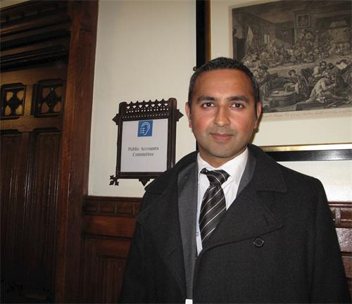

图4：二零一八年四月十七日，反强摘器官医生组织（DAFOH）秘书阿德南·谢里夫（Adnan Sharif）医师出席揭露中共活摘良心犯器官罪行圆桌会议并发言

大卫·乔高呼吁国际社会加强合作一起公开谴责中共的打压，他特别提醒国际器官移植界不要成为执行“中共党的路线”的牺牲品，不要主动自我欺骗（willful blind）。他说：

“独立调查员对中共大规模滥杀无辜的罪行揭露，不能指望中共政府来积极回应。”“如果国际器官移植界不做调查和验证就听信中共官员的对外宣传，那他们就等于接受了中共的党的路线。”“中国共产党是凌驾于国家法律之上的，共产党在各个方面控制着法律系统的实施。”

中共声称自二零一五年一月一日起全面停止使用司法途径来源器官，公民自愿捐献成为器官移植唯一合法来源，对此，罗杰斯表示质疑：“既然中共声称已经停止使用（司法途径来源器官），他们就应该开放所有医院，让真正独立的国际检查得以进行。”

阿德南·谢里夫医师指出：中共没有提高器官移植系统的透明度，所以无法让人相信事情真的发生了变化：“如果中共没有在掩盖，那它就应该更加开放、保持透明，允许进行独立调查，以及不受干扰、不受任何干涉的审查。如果一个完全道德的器官志愿捐献系统客观存在，那么就让人去看它、去了解。”作为医生，谢里夫认为中国大陆移植器官等待时间短这样一个因素足以说明一切。

针对二零一八年年初中共在梵蒂冈召开的国际会议上提出的“中国方案”，葛特曼提醒国际社会，包括梵蒂冈不要上中共的当，因为听信中共谎言与之进行交易不仅仅是主动失明（willful blindness）问题，更是与魔鬼为伍的危险行为。

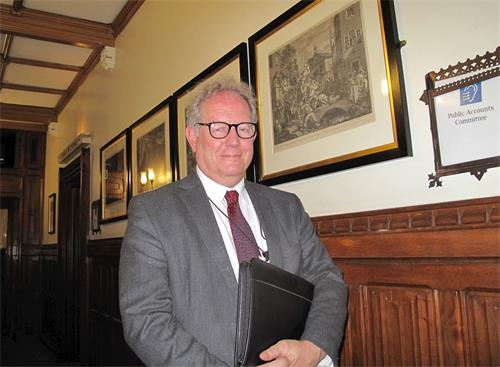

图5：二零一八年四月十七日，大学政治系教授大卫·柯克姆（David Kirkham）博士出席揭露中共活摘良心犯器官罪行圆桌会议

大学政治系教授大卫·柯克姆（David Kirkham）博士出席会议后表示：活摘器官罪行是对人权最严重的侵犯，他必须让自己的学生充分认识了解这一点。

<h1 align="center"><b>新加坡学员纪念四二五和平上访</b></h1>

【明慧网二零一八年四月二十一日】二零一八年四月十七日，新加坡法轮功学员在芳邻公园举办活动，纪念“四·二五”和平上访十九周年，声援三亿中国民众退出中共党、团、队组织（简称三退）。学员们以功法演示、反活摘器官征签及美术作品展等形式，分享“真、善、忍”的美好，并向人们讲述法轮功无辜遭受中共迫害的真相。

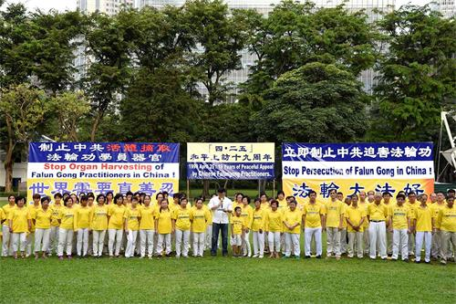

图1：新加坡法轮功学员在芳邻公园举办活动，纪念“四·二五”和平上访十九周年

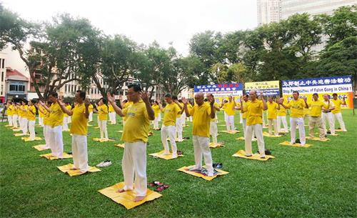

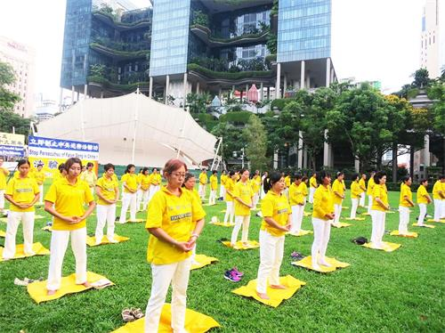

图2～3：新加坡法轮功学员在芳邻公园集体炼功

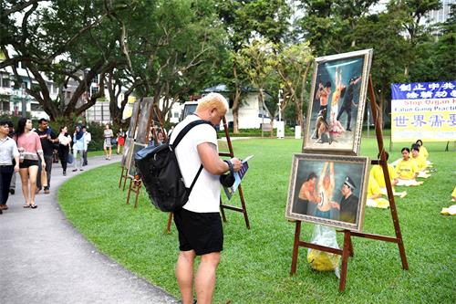

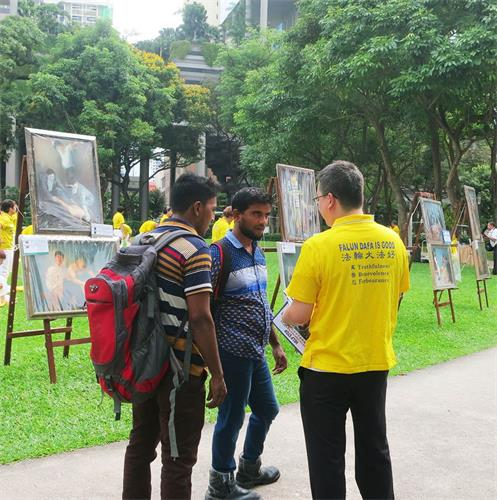

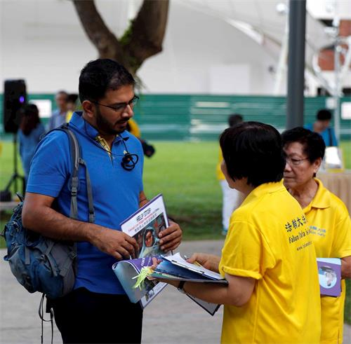

图4～6：路人驻足，详细了解法轮功真相

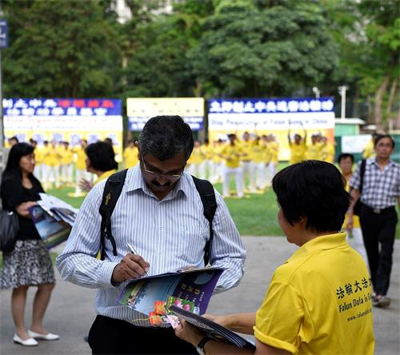

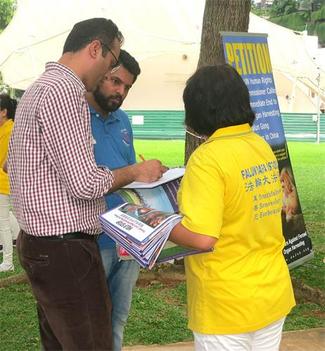

图7～8：路人签名，支持法轮功学员反迫害

新加坡法轮佛学会会长黄威强博士发表声明指出，十九年前的“四·二五”，万名法轮功学员上访，以和平、理性的方式所展现的道德风范在中国历史上前所未有，打破了共产邪灵半个世纪以来所营造的恐怖氛围，此前中国人曾失去了坚持真理的勇气。

黄博士表示，如今三亿中国人退出共产邪党的党、团、队，这预示着共产邪灵正在解体，人类新纪元必将到来。

<b>“不久的将来，每个了解真相的人都会站出来”</b>

来来往往的行人中除了新加坡本地人，还有从世界各地来此读书、工作、旅游的人。人们了解了法轮功学员十九年来坚持和平反迫害的真相后，纷纷主动在“呼吁制止中共活摘法轮功学员器官”征签表上签名，谴责迫害，支持学员们的义举。也有人与学员分享在自己国家看到的法轮功学员讲真相的情况，并表达钦佩之意。

新加坡女孩卡夫纳瑞娜（Kafnarina）骑脚踏车途经公园。她停下来和学员攀谈，询问来龙去脉。“这是怎么回事？中共为什么迫害法轮功？什么时候开始的？是否还在继续？为何这样对待法轮功？”学员一一耐心解答。卡夫纳瑞娜想要把了解到的诸多讯息告诉更多的人，便又询问是否有脸书网址，同时，她也想更深入地了解真相。学员送给她资料，还请她去网上观看相关纪录片。最后，她在征签表上签名以示对法轮功的支持。

来自墨西哥的马丁（Martin）欣然签名后告诉学员，他已经知道真相了。

一对法国情侣来新加坡观光，他们说还不了解法轮功，在听闻真相后，他们祝学员们好运。

马来西亚小伙子布莱恩（Bryan）说自己从没听说过法轮功，也不知道迫害的发生。学员向他讲述活摘器官真相，他毫不犹豫地签名支持法轮功学员反迫害。

一位三次拿到真相资料的印度财务经理问学员，这样做是否有用？当学员回答，发出声音好过沉默，他表示赞同，并立即在请愿书上签名。

一位从德国多特蒙德（Dortmund）来新加坡大学进行短期交流的先生说，当他看到学员们正在炼功的场面，就马上走过来，因为他在德国接触过法轮功学员。他说：“他们在多特蒙德的几个大学里演示功法、发放资料，他们坚持不懈地向当地学生讲述法轮功真相，获得了很好的反响。”“可以说，五年前，我们那里很少有人知道法轮功，他们就这样每天让两、三个人知道真相，然后扩散开来。看似缓慢，但是一直都在持续，现在越来越多的人了解了在中国发生的迫害。”他表示非常佩服这些法轮功学员。

对于发生在中国的迫害的惨烈程度，他表示难以想象，非常悲哀。他认为，纳粹当年对犹太人的迫害是非常可怕的，这种种族灭绝对人类是一个灾难，尤其是政府发起的迫害，它不仅影响一代人，而是两、三代人。他说：“要杜绝同样的事情发生，现在就要制止这场迫害再继续下去。”

他相信，“只要坚持，不久的将来，每个了解真相的人都会站出来。”

<b>“中国本来可以是另外一个样子”</b>

法轮功学员小兰的家乡在中国东北的一个乡村。回首九十年代修炼后受益的村民口耳相传法轮大法的神奇，村子里修者日众、人心向善的胜景，目睹二十年后破败不堪的村庄，日益下滑的道德风气，小兰不禁感叹中国本来可以是另外一个样子。

在小兰儿时，从记事起，她就知道，别人靠吃饭活着，自己的妈妈靠吃药活着。“在我的印象中，我妈就没有不吃药的时候。我们家长长的窗台上，大大的抽屉里，满满的都是药。我妈每天早晨第一件事，就是先拿一把药放嘴里，离了药就不能活，一直是一把一把地吃药。家里什么药都有，村子里任何一个人生病，到我们家都能找到药。”“我妈从头到脚没好地方，年轻时就象个老太太一样，体质实在太差了。”

一九九六年前后，法轮功以祛病健身功效显著，靠着村民们人传人，心传心，在中国东北的一座座村落中弘传开来。

“我们屯子有位大姑先炼的，她老父亲八、九十岁了，学完之后身体健壮了。老人知道我妈的情况，就到我家告诉我妈说，‘你就学呗，挺好的，也不要钱’。我妈就跟着学。我爸也说这个功挺好，什么都让，什么都不限制你，我爸也跟着学。”“就从那个时候，我妈的身体一天比一天好。不知道从什么时候开始，窗台上的药没有了，抽屉里的药也没有了，家庭的经济负担减轻了。”

小兰同妹妹、姐姐也走入了法轮功修炼的行列，姐夫和姐夫的父亲也学起来了，左邻右舍的乡亲们也跟着炼了……“大家都把大法书放在我家，每天干完农活之后，回家收拾收拾，洗洗手，就到我家一起学法。”“我爸去买了个大录音机，放炼功录音带，大家就一起炼功。我们还一起看师父教功录像，讲法录像。”

“那个时候特别特别好，无论是大人，还是小孩都特别特别幸福！我姐家的孩子，三岁多也跟着学，连我姐都不知道，他太小了，没人注意他，他自己在最后一排，跟着炼功。孩子自己讲，‘我也没出去玩呀，你们在前面，我就在后面跟着炼。’”

不觉中小兰的眼里已噙满了泪水，她叹道：“感觉再也回不去了！那时候干了一天的农活，所有的人本来很累的，结果炼完功，回家之后就感觉一身轻，都没有累的感觉。真的很好，很好！”

从艰苦劳作中解脱出来重获身心健康的村民们想象不到，法轮功的巨大吸引力让当权者小人妒嫉，引起中共极度恐慌。“四·二五”事件遭中共构陷，三个月后开始了全面疯狂打压。

修炼法轮功的村民们被抓、被打、流离失所，十几岁的小兰也流落异乡读书、求职。她说：“迫害发生后，感觉社会上人的道德在直线地下滑，原来的那个村子好多人得了绝症，以前没有的病现在都有了，很多都是年轻人。现在人也不重德啦，做事都是共产党教人的那一套吧，人不为己，天诛地灭，把人给弄得太坏了。如果没有这场迫害，走到今天，中国可能已经是世界第一强国了。”

<b>法轮功学员：“四·二五”将被载入史册</b>

谢先生在新加坡攻读完硕士学位后，进入金融行业工作多年。他是因为严重的心肌炎于一九九五年在中国大陆开始修炼法轮功的。

中学时代的他曾经是学校里的足球健将，因奔跑速度快，踢前锋的位置，时常参加校际比赛。他说：“我爱运动，不仅踢足球，还参加马拉松比赛等其它项目。”然而突如其来的心脏病让他离开了运动场，也陷入绝望之中。

他说：“医生讲这个病医院没有好的治疗方法，我感到很绝望。那时，我几乎每天都要在医院里打吊针，参加高考，我都是拔了吊针去考试，之后又得回到医院里。”“家人先得法后，介绍我这个功法好，之后我就一直炼，觉得很好，又恢复了体力，心里很开心。”于是，在大学的绿荫场上，人们又能够看到那个像风一样带球奔跑的小伙子了。

“当时在家乡读书，有很多人都在炼法轮功，包括博士后导师、中科院的院士，不少科学家都在炼法轮功。”“很遗憾，九九年迫害发生后，有的人就被抓走了，我与很多同学和老师一样，被以学业和工作相威胁，强迫我们放弃修炼。”“一位高中同学遭到警察绑架，在监狱里被非法关押了九年半，遭受重体力劳动奴役，还有剥夺睡眠、强制洗脑等迫害，他出来后头发几乎快掉光了。”

“如果没有这场迫害，中国一定是很美好的。我了解中国的金融行业有很多腐败现象，当年法轮功的出现让很多人了解说，其实这个社会不一定要那么坏，不是只有变坏才能赚钱。我周围的很多同学、朋友开始用‘真、善、忍’来要求自己，他们了解到其实做好人也可以有钱，也可以做生意。”“如果没有这场迫害，会有更多的人来修炼‘真、善、忍’，会对整个社会的精神文明起到巨大的正向作用，人会变得越来越好，包括对中国传统文化的回归，那些被共产党在历次运动中打掉的东西重新恢复后，中国一定会比现在好很多。”

对于“四·二五”事件的意义，谢先生表示：“我相信四二五在中国的历史上将会占有很重要的地位。在将来的史书里，会对这件事有一个公正、真实的记叙。在中国的整个历史发展中，未来的人再回头看的时候会很震撼。”

<b>四·二五”事件背景</b>

一九九九年四月二十五日，古都北京见证了历史性的一幕。万名法轮功学员自发来到国务院信访办，为被非法抓捕的天津法轮功学员集体上访，要求一个合法宽松的修炼环境。事件震惊中外，和平落幕，被外界赞为“中国上访史上规模最大、最理性平和、最圆满的上访”。

十九年前，在面对强加的不公时，法轮功学员所展现的坦荡、自律、平和与理性给后人留下了永久的参照。“四·二五”是一个里程碑，一个标志，一个起点。从那个永恒的日子出发，亿万法轮功学员穿越风雨，书写传奇，向世人展示希望和启迪。

<h1 align="center"><b>现世报应：狱医作恶暴毙、农家乐洗脑班作恶遭报</b></h1>

【明慧网二零一八年四月二十一日】一九九九年七月，中共江泽民集团对信仰“真善忍”、修炼法轮功的善良群体发动了一场罪恶滔天的迫害运动。在中共邪恶的高压与胁迫下，那些追随迫害的人很少去思考这场迫害违法的、邪恶的性质，很少去思考作恶的最终后果是什么。其实，慈悲的上苍一直在以恶报的形式频频警示世人，只是人不去悟，有些人至今抱着无神论的侥幸心理，继续参与迫害。在此，把我亲身见证的几则恶报实例讲出来，警醒世人。
<b>一、狱医作恶　暴毙家中</b>

二零零一年上半年，我们当地上访的法轮功学员被关进了看守所，我是其中之一。当时两个女监室都关着法轮功学员。一天因为法轮功学员炼功，一个女警去打另一个监室的人，值班的狱医（男的姓孔）就气势汹汹的闯进我们这一监室来问：谁在炼功？谁在炼功？他用手铐把我与另一名法轮功学员铐起来。一副手铐铐两个人，被铐的人吃饭、睡觉、上厕所都连在一起，不能洗澡，上板床睡觉都难。警察说，不写“决裂”不解铐，或曰，谁铐的找谁解。

这个狱医不给解铐， 我们一直被铐了十多天，直到被铐在一起的那位法轮功学员被非法劳教迫害去了，才给我解铐。狱医在铐我们时我们劝他说，你这样做对你不好。他说，等他不好。我们又说，到时候你后悔都没机会。他不吱声，仍然我行我素。

没多久，这个狱医暴死家中。死前的头天我背一个人到医务室看病，看见他还好好的，没想到第二天就听说他在早上五、六点的时候就死了，死在夏季最热最热的日子里。

<b>二、农家乐洗脑班作恶遭报 </b>

我们当地的洗脑班从二零零一年年初，到二零零三年八月，非法存在了长达三年多时间。七、八个人一直被非法关押到洗脑班解散。有人说，三年来我没单独出过房门，三年多我没见到过一丝户外的阳光。

洗脑班虽然设置在休闲的农家乐，但有铁门铁窗，二十四小时专人看管，是一个非法剥夺法轮功学员的信仰自由、人身自由的黑监狱，由公安、“六一零”、政法委、司法局、纪委等人员轮流值班，对法轮功学员进行洗脑，说什么，只要说声不炼了，就可以出去，点个头都行。可是真正要放人出去，可就不是那么简单的了，要在他们写好了的恶毒攻击大法的三书上签字，盖手印等。

洗脑班对法轮功学员极尽生活虐待，不给吃饱，又不准自己买方便面等任何东西充饥。有次家人给我带了一点香蕉来，值班的李公安一把夺去，留下几个给我，其余的全部让家人带走，理由是避免我分给大家吃，目的是要大家都处于饥饿中。

我被关在洗脑班两年多，清楚的记得洗脑班从没给我们吃肉。一次我姐姐来看我，带来一点肉，被管宗教的张部长抢走，叫姐姐带回去，说，不准吃。最可笑的是，有一次一盆水煮白菜几个人吃，可一盆菜里只有唯一的一小块肉。有个法轮功学员过生日，提出自己拿钱买点肉，都没能允许。

印象最深的是，一年过年，给我们吃一点没用油煎的油菜，黑幽幽的油菜水把饭也染的黑幽幽的。仅吃过两次肉，都是我在看管人员没注意的情况下，给钱请老板帮忙买的，买来分给大家吃。冬天没有热水用。

洗脑班从来不放风，有法轮功学员住的房间两扇窗户只开了一条缝。有来探望的家人看见我们的情况，就说，关在这里就象关的猪。我出洗脑班后，头昏、呕吐、全身无力，连一捆谷草都担不回去，走路打蹩脚，可见洗脑班对我们身心的极尽摧残。洗脑班解散时，他们还要法轮功学员家属拿钱来赎人……

这个设在农家乐的洗脑班辗转搬迁了几次，农家乐配合迫害法轮功学员，几处都发生了恶报事件。

<b>火炮厂农家乐厨师被烫，围墙垮塌</b>

在火炮厂农家乐洗脑班，一小盆饭一人分一勺，根本吃不饱。我们提出意见也不给增加。一个劳改释放犯给我们做饭，我们在楼上看见楼下对面的厨房里，那个厨师把南瓜汤煮好后，把原汤留起来，重新掺水搅和在南瓜里，清汤寡水的几片南瓜端上楼来给我们吃。没几天，保温瓶从厨师手中摔裂，烫伤了厨师的右手，厨师还陪了老板的钱。

一天火炮厂农家乐的围墙垮塌，压倒电桩，差点引发火灾。老板娘非常恼怒，怒气冲冲的说，围墙无缝无痕，好端端的怎么就垮了？还差点烧着人了。她不知道神目如电，迫害了法轮功会遭报应，就说是什么带来的霉运，于是催促洗脑班赶快搬走。

<b>xxx</b>
气象站农家乐大灶爆裂

洗脑班从火炮厂搬到瓷厂，因外国人要来参观，怕暴露中共迫害人权的行径，就搬到了气象站。

开始，气象站农家乐给法轮功学员吃桌席的残汤剩菜，后来不给剩菜吃了，就一点荤菜也见不到了。每天只给很少的饭菜，有时把面条做成夹生的，让人无法下咽。农家乐都是烧煤炭的大锅大灶，不久，这个可以放出热水的大灶突然爆裂，烧不成热水了，红红火火的生意也颓败了。

<b>仙鹤宾馆死生猪、水池渗漏</b>

二零零二年元月，洗脑班搬迁到农家乐仙鹤宾馆（现在叫度假村），开始对法轮功学员一人一间屋的单独囚禁，实行更严厉的封闭。过年了，一点水煮的油菜放在饭面上把饭染的黑幽幽的，经常是一碗饭上面放几块南瓜就算一顿。农家乐仙鹤宾馆配合邪恶迫害法轮功学员遭报应，突然好端端的生猪死了，水池突然渗漏，关不住水了，生意也出现败象。

仙鹤宾馆是洗脑班最后一个地点。二零零三年六月洗脑班开始解散。洗脑班解散时被关押的法轮功学员被当作人质，当绑票，向家属勒索钱财。如拿钱、签字写保证，才准许家属将这些被非法关押了两年、三年的法轮功学员接回家。有位法轮功学员的家属拿不出钱就用房产担保。我们有三名法轮功学员绝食抗议，管洗脑班的张部长威胁要给我们灌食、打迷魂药。我们没有妥协，并正告他：你这样做是要负全部责任的。

以上所举都是我亲眼看见的配合对法轮功迫害遭现世报应的实例。有些人认为自己迫害了法轮功做了伤天害理的事没人看见，没事。其实不是不报，是上天一再给其醒悟的机会，时辰一到恶报即到。奉劝那些还在参与迫害法轮功的各类人员停止迫害，善待法轮功，天赐幸福平安。

<h1 align="center"><b>為何永遠忘不了4.25那一天──我們的故事</b></h1>

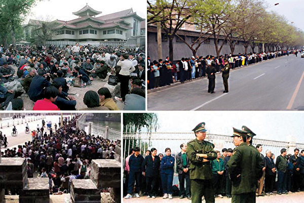

1999年4月25日，上万法轮功学员到国家信访局和平上访。

【大纪元2017年04月26日讯】18年后的4月25日，她们依然忘不了18年前的那个日子。“四二五”那一天，铸就了永恒。暮然回首，依然可见那辉煌。

以下是1999年4月25日北京国务院信访办法轮功万人大上访亲历者所讲述的“我们的故事”：

<b>一位国家二等功臣的女儿的见证</b>

曲平穿了一件咖色风衣，将头发整齐地盘在脑后。没有人能看得出来，这位河北石家庄纺织工业学校的前校医已经年约60岁了，并且因为坚持信仰饱经风霜──她于1995年大年初一开始修炼法轮大法，虽然在中国大陆遭受过开除公职和数次非法关押，但她至今不悔。

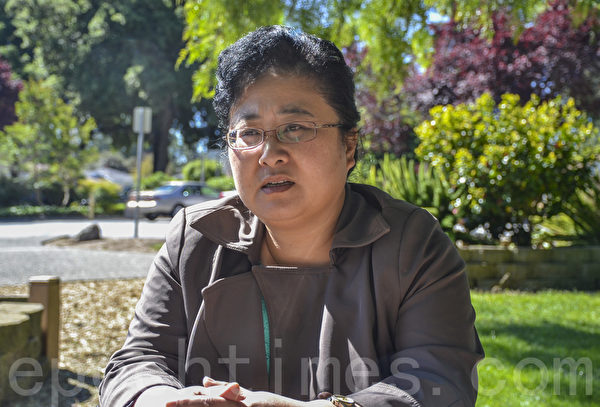

亲身经历过四二五和平上访的曲平

大纪元记者梁博美国旧金山报导，在旧金山南湾桑尼维尔的一座小公园里，曲平说自己感到很荣幸，当初单纯、善良的一念使她走进历史，成为国务院信访办上访的上万法轮功学员中的一员，亲身见证了1999年“四二五”的辉煌。

曲平是1999年4月24日上午听说天津学员被抓被打的，“据说打得挺厉害。我那时候炼法轮功已经4年了，血管神经性头疼和胃病都炼好了，但是想不到炼功还能炼出打人、抓人来，我心里就挺着急的。当时也有政治方面敏感的人考虑该不该去上访，我性格比较单纯，没有考虑过。”

曲平的父亲是军人，曾经是国家二等功臣。文革时期，父亲暗中保护过不少老干部，但是文革结束后，他成了替罪羊，被迫离开部队、赶到地方。“从那以后他对好多事情都很迷茫，但是让我意外的是，四二五这件事，我父亲认为我做得对。 ”

回忆上访那天的情形，曲平说：“刚开始警察真是不了解我们，见到我们非常紧张、非常戒备，身体都是很僵硬的立正姿势，手里拿着电棍。上午9、10点钟的时候，从中南海大门还出来一辆防暴车在我们面前来回转悠，里面戴钢盔的武警举著很粗的枪口一直瞄准，拿我们当敌人了。 ”

不过一个多小时以后，警察们就从立正到稍息了。“他们发现我们全都站在那儿特别安静，尽量往里边靠，把车道和人行道都让出来，谁都不说话，就站在那儿默默地等。警察他们就比较放松了，抽烟、扎堆聊天，有的还跑到我们里边要《转法轮》看。他们把烟头扔到马路井盖的小洞洞里，很多法轮功学员用装食品的塑料袋把这些烟头都收起来。 ”

“那一天使很多人明白了什么叫‘真、善、忍’。 ”她说。

<b>他们在实践“真、善、忍”</b>

大纪元记者伊铃加拿大多伦多报导，现移民加拿大4年的贾女士（Daphne Jia）曾是一名形象设计师，她参加了当年的“四二五”和平上访。她表示，18年前的“四二五”那天，充分彰显了法轮功学员实践他们“真、善、忍”的理念。

贾女士于1999年4月24日深夜接到一位法轮功学员打来的电话，被告知有许多法轮功学员决定于4月25日去国家信访局上访，贾女士立即响应，并和先生一道连夜行车300多公里，于4月25日早晨赶到北京，和数万名来自全国各地的法轮功学员一起站在中南海旁边的信访办的围墙外。

“那天所有去上访的人都静静地站在那里，没有喧哗，没有口号，没有标语，神情淡定，举止从容。靠近马路最前排的是年轻的同修（指法轮功学员），上了年纪的同修站累了，就到后边坐一会儿。他们中有的在那里静静地看《转法轮》，有的在炼功。我看见有几位同修提着塑料袋来回走动，把食物包装袋和饮料瓶等废品收起来，然后放到垃圾箱里。”

贾女士还谈到，当天中午，她和另一个法轮功学员一起结伴去卫生间，被眼前的情景惊呆了：原本肮脏不堪的卫生间被打扫得非常干净，卫生间靠墙的一边整整齐齐摆放着6、7个崭新的痰盂。原来，是几位法轮功学员为了不给周围老百姓的生活带来不便，不仅清洁卫生间，还自费购买痰盂。

<b>街道管理人员脸上露出了由衷的微笑</b>

加拿大多伦多居民刘先生（Jeason Liu）也是当年“四二五”的见证者之一。他说，当时是与妻子带着保姆和一个1岁半的孩子参加了北京的“四二五”活动。他亲眼看到警察由当初的紧张兮兮，变得轻松自如，有的警察还主动走到上访学员中跟学员交谈，询问到底是怎么回事。

刘先生说，所有的学员都是以慈悲、祥和的心态静静地站在那里，没有任何出格的言行。中午时，他看到70多岁的老学员在旁边剥鸡蛋吃，这位老学员大约是农村来的，剥了鸡蛋顺手把鸡蛋壳丢在地上。刘先生走过说：“阿姨，我们……”，刚说完我们二字，这位老学员马上反应过来：“是、是、是，我们是大法弟子。”一边说，一边马上把地上的鸡蛋壳全部捡起，放到自己的口袋里。

当时旁边站着一个街道管理人员，一直双眉紧锁，一脸烦恼地看着这么庞大的人群，看到那一幕后，她一下放松了，脸上还露出了由衷的微笑。

<b>“巨大数量的人群很快静静地消失了”</b>

大纪元记者何蔚澳洲悉尼报导，18年前居住在北京朝阳区的陶女士曾亲自参加了1999年4月25日的万人上访。

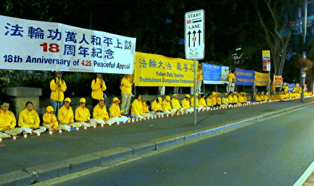

2017年4月25日，澳洲悉尼法轮功学员在市中心海德公园烛光纪念四二五和平上访18周年。

面对着悉尼海德公园地上为纪念“四二五”而燃起的点点烛光，她回忆说：“那天早晨我6点不到去公园炼功，听说天津有40多名法轮功学员被当局抓捕，已经有学员主动去位于府右街的国务院信访办上访，要求释放被抓的天津学员，给法轮功学员一个修炼的环境。有人建议我们也去上访，于是，我和其他的学员便骑着自行车去国务院信访办了。6点半左右到了府右街，越往前走人越多，只见从各个地方来的法轮功学员已经很有秩序，而且非常安静地在府右街的人行道上排上了队。老人和孩子在里侧，有的坐，有的站，中青年和体壮的在外侧排成几行，没有人说话，大家都默默地站着。”

当时法轮功学员很多，警察也很多。警察一开始很紧张，“后来看看我们这么安静，没有人说话，也没有人移动，他们就放松了，抽烟的抽烟，聊天的聊天。”

“我们从一早一直站到晚上9点多钟。没有吃东西，也没有喝水，大家始终保持安静地站着，也没觉得疲劳，也没有饿和渴的感觉，直到后来学员从前面往后传，有结果了，总理已经会见了我们的代表，已经答应了我们的要求。于是，大家就很快地离去了，离开时我们也没有任何声音，没有人互相说话，就像水流一样，巨大数量的人群很快就在街上静静地消失了。我自己身在其中都感到惊讶。”她说。

<b>“永远都忘不了那一天”</b>

移民加拿大3年多的冯女士（Jassica Feng）也是1999年的“四二五”和平上访的亲历者。

“四二五”那天早上，冯女士来到国务院信访办西门，在沿着西墙拐角的灵境胡同口不远处坐了下来，和众多法轮功学员一样，默默地加入这群真诚希望政府能了解法轮功真相的队伍中。

冯女士说，当时，陆陆续续来的人越来越多，队伍一直延伸下去，望不到尾。有的在默默地学法、有的在打坐炼功、有的静静地站立在马路牙子上，主动地将人行道留出来，使过往行人毫无阻碍地行走，还有几位法轮功学员自愿地拿着塑料袋，将地上的垃圾捡起来装入袋中。也有三三两两地在小声交流。

“我们没有口号，没有标语，也没有大声喧哗。更没有影响交通和当地居民的生活。我们的平静、善良和祥和也感染了旁边的警察和坐在车里的便衣。他们由开始的紧张变得放松起来，抽著烟，在一旁聊起天来。”

晚上8点多，在得知天津方面已经释放了被捕的法轮功学员后，上万名法轮功学员静静地离去。离开时地上没有留下任何垃圾。连警察丢下的烟头都被清理干净。

“永远都忘不了那一天。‘四二五’是人类希望的开始，是伟大的历史丰碑，历史将永远记住这个不平凡的日子。” 冯女士说。

<h1 align="center"><b>历史故事：亵渎佛法　榜眼暴死</b></h1>

【明慧网二零一八年四月二十一日】中国古代科举考试制度的殿试中，取得第二名成绩的，被称为“榜眼”，与第一名状元、第三名探花合称“三鼎甲”。在古代这是极大的荣耀，在仕途上往往会因此飞黄腾达。明朝万历、天启年间有一位榜眼却恶报死亡，令人叹息，今天就讲讲他的教训。
庄奇显（西元1587-1622年），字允元，号九微，泉州晋江（今福建省晋江市）人，万历四十一年（西元1613年），仅二十六岁，就高中榜眼，是有名的青年才俊，补国子监司业之职，父母也因他受朝廷封赏。然而就在他即将在官场上大显身手时，却突然病故，其中的缘由在古籍《见闻录》里，有详细的记载：

庄奇显很喜欢喝酒。有一次，他在老家的承天寺里饮酒，大醉后跌跌撞撞走到藏经阁，他睁着惺忪的醉眼，看见大家正在听高僧传法，众人都很专注的聆听，根本没人理睬他这位榜眼。也许感觉受冷落伤了自尊，也许内心对佛法不满，也许他根本就不信佛法，总之，不管是哪种原因，庄奇显此时酒后发狂，他走到桌前，拿起桌上的佛经就扔到地上，还用脚对着佛经又踢又踩。一通胡闹之后，他才返身离去。快出庙门的时候，庄奇显恍然间觉的一尊护法神像正冷眼看着他，他的怒气借着酒劲又来了，竟然伸手就把神像推倒在地。在众人惊惧的目光中，扬长而去。

数月之后，有个小厮无意中惹怒了他，庄奇显抬脚就踢，不料却踢在了一根大柱子上。脚趾都踢裂了，伤口经久不愈，逐渐变成了一种怪疮，从脚慢慢肿到了全身，疼痛异常，昼夜难安。庄奇显被病痛折磨得神志不清，恍惚中，看见护法神似乎在责问自己，在痛苦与悲伤中，他留下了“憾者永憾”的遗言便去世了。

庄奇显酒后无德亵渎佛法，造下了巨大的业力，酒醒后也无任何悔改弥补，终至恶报加身而亡，给自己留下了永远的遗憾。他的悲剧除了告诉我们不可酗酒外，更说明了佛法不仅慈悲神圣，还是威严不可冒犯的，凡是破坏者必有恶报，庄奇显以身试法遭恶报而死的案例警醒着后人。

然而历史的进程到了今天，迫害佛法的悲剧依然在上演着。当今洪传世间的法轮功又名法轮大法，乃佛家上乘修炼法门，是真正的佛法。法轮大法传出直指人心，让人修心向善，在社会上传播越来越广泛。1999年时的中共头目江××出于妒嫉发动了这场延续至今的迫害。迫害中，中共用尽了从造谣污蔑到包括活摘器官在内的各种邪恶手段迫害法轮大法弟子，犯下了大罪，已注定其灭亡。相当多的世人，在无知中，在被欺骗中被卷入，参与到这场迫害中来，造下巨大的罪业，各种厄运相继而来，纷纷以各种形式遭报，承担自己种下的恶果。

中共高层最典型的例子就是周永康、薄熙来、李东生之流，靠迫害法轮功跻身中共高层，不相信善恶有报的天理，一意孤行的迫害，看他们今日下场，被判重刑。这还是中共现任当权者出于保党需要的妥协，只公布其贪腐罪名的结果。按他们参与活摘法轮功学员器官牟取暴利的罪恶，万死都难赎其罪。能逃得了一时，逃不了一世，更大的恶报肯定还在后边等着他们呢，其报应之惨烈可拭目以待。

各阶层中最普遍的遭报形式就是各种灾祸、意外和疾病，例如被中共捧成典型的任长霞，曾任河南省登封市公安局党委书记、局长，多次利用手中权力积极迫害抓捕法轮功学员。2004年任长霞所乘车辆在高速公路遭遇车祸，她坐在后排最安全的位置上，结果司机没事，她却当即重伤昏迷，抢救无效，年仅40岁正是年富力强大有作为的年纪就死了，尸体据说合不上眼睛，死不瞑目，惨不忍睹。她死后4年，其丈夫也突然死亡。为何如此？其实就是因为参与迫害，才招致恶果。

因为迫害法轮功而遭报的事例实在是太多了，数不胜数。看看当今的例子，再回头看看历史，从古代迫害佛教的三武一宗，到本文提到的榜眼庄奇显，再到今天任长霞，无数的事例都在劝告当今的世人：千万不要迫害佛法，法轮功是伟大的佛法，迫害法轮功者必有恶报。那些曾经参与迫害的人，只有赶快悔改，立刻停止迫害，想办法善待法轮功学员将功补过，否则庄奇显、任长霞的悲剧将会在你身上重演。

另外因为中共是这场罪恶的发动者，已经注定被淘汰了，对所有曾加入过中共党、团、队的人而言，跟党走就是走向毁灭，走向地狱深渊。不退出就意味着你是中共的一部份，是中共的一个细胞，中共灭亡时你就是它的殉葬品。所以，要想走向光明的未来还必须声明退出中共的一切组织。注意，不是让你到中共那里退，而是到法轮功学员那里声明退出，而且声明时完全可以用化名，姓名只是代号，神只看你声明退出党、团、队时真心一念。

法轮功学员为什么冒着生命危险讲真相？就是要唤醒人的正念与良知，不要相信中共制造的谣言，不要参与迫害，不要支持迫害，从而免遭迫害佛法的恶报；认清中共造谣诋毁法轮功的实质就是蛊惑全中国乃至全世界人直接或间接，主动或被动的参与迫害法轮功，最后遭恶报灭亡，中共就是为了毁灭人类而来的魔鬼。退出中共就是获得新生，从而有机缘得到神佛的救度。法轮功学员真的是救度众生的修行人，支持法轮功，常念“法轮大法好”，善待法轮功学员，必获大福报。

（资料来源：明代僧人智旭所著《见闻录》）

<h1 align="center"><b>“四•二五”上访：中共迫害在先 法轮功依法上访在后</b></h1>

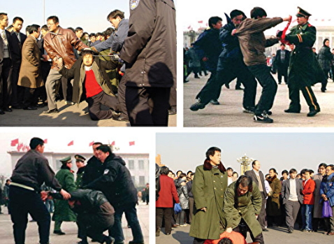

中共警察和便衣在天安门广场上对上访请愿的法轮功学员大打出手。

一九九九年四月二十五日，逾万名法轮功学员行使宪法赋予的上访权利，集体到位于中南海附近的国务院信访办公室上访，要求释放此前在天津被当地警察无理抓捕的四十多名法轮功学员，并允许合法出版法轮功书籍。

中共江泽民集团为迫害法轮功，把法轮功学员的依法上访诬陷为“闹事”、“围攻中南海”，这完全是栽赃陷害。法轮功学员的上访极其和平理性，既没有大声喧哗，更没有阻塞交通。对中南海，他们既没有“围困”，更没有“攻击”，他们只是依法集体到信访办公室上访，而该办公室在中南海附近。

中共把法轮功学员和平上访污为“闹事”是倒打一耙，闹事的恰恰是中共。是因为中共迫害在先，才有法轮功学员依法上访在后。宪法第41条规定：“公民对于任何国家机关和国家工作人员，有提出批评和建议的权利”。

中共对法轮功的打压在一九九六年就已经开始。一九九六年六月十七日《光明日报》发表评论文章，诋毁法轮功。《光明日报》不是一个正常的民间媒体，而是中共喉舌。中共的历次整人斗人的运动都是从喉舌媒体的批斗抹黑开始。

一九九六年七月二十四日，中共中央宣传部下属新闻出版署向全国各省市新闻出版局下发内部文件，禁止出版发行《转法轮》、《中国法轮功》等法轮功书籍。《转法轮》等书籍都是教人向善的，很多人通过修炼法轮功，阅读《转法轮》等书籍，提升了自己的道德，诸恶莫做，诸善奉行。中共允许诲淫诲盗、厚黑权谋的书籍在社会上大行其道，却下令禁止教人向善的《转法轮》出版。

一九九七年初中共政法委书记罗干指使公安部以先定罪、后调查的方式，在全国搜罗罪证欲构陷法轮功。全国各地公安局调查后均上报反映“尚未发现问题”，调查就此停止。法轮功修炼来去自由，没有组织，不介入政治，炼功点不存钱、不存物，法轮功学员都在做好人，可是罗干等一些权欲熏心的人，在没有任何证据的情况下，给法轮功扣上了“×教”的大帽子，并让各地公安人员罗织罪证，试图弄出个大案，捞取政治资本。

一九九八年五月北京电视台《北京特快》栏目利用该台记者在北京玉渊潭法轮功炼功点采访炼功学员时的镜头，播放何祚庥对法轮功的诽谤。何祚庥是罗干的连襟，名为院士，却没有任何学术上的建树，此人居然能把量子力学和所谓的“三个代表”扯上关系，真是一个让科学蒙羞的科痞。何祚庥对法轮功的攻击，所用的例子和法轮功没有关系，是指鹿为马，栽赃陷害。

该节目播出后，北京及河北数百名法轮功学员以写信或直接造访电视台的方式，讲述亲身经历，指出节目内容与事实不符、误导观众。一九九八年六月二日，北京电视台在了解情况后，承认上次关于法轮功的节目失误，播放了一个表现法轮功学员清晨在公园里祥和的炼功场面及其他人士一同晨练的正面节目。

在北京被揭穿后，何祚庥不甘心，继续寻衅滋事。一九九九年四月十一日，科痞何祚庥又在天津教育学院的《青少年科技博览》杂志上发表文章，再次引述一九九八年在北京电视台用过的已被证明为不实的例子诽谤法轮功。该文章在天津发表后，天津的一些法轮功学员认为有必要向有关方面澄清事实真相。四月十八日至二十四日，部份法轮功学员前往天津教育学院及其它相关机构反映实情。在此过程中，法轮功学员非常平静、祥和，向杂志编辑和秘书讲述了他们通过修炼法轮功身心受益的事实。

然而四月二十三、二十四日，天津市公安局突然动用防暴警察殴打反映情况的法轮功学员，导致有的法轮功学员流血受伤，四十五人被抓捕。

当法轮功学员请求放人时，在天津市政府被告知，公安部介入了这个事件，如果没有北京的授权，被抓捕的法轮功学员不会得到释放。天津公安向法轮功学员建议：“你们去北京吧，去北京才能解决问题。”天津市政府的反常态度和警察的毫无顾忌，使人们明显感到一股来自中共高层的压力。

四月二十五日，上万名法轮功学员自发来到中南海附近的国务院信访办上访，行使宪法赋予公民的上访权利。

当时的总理下令天津警察放人，重申了不会干涉群众炼功的政策。当晚十点，学员们静静离去。整个上访过程秩序井然，离开后地上无一片纸屑，连警察扔的烟头都被上访学员清扫干净。

由上可见，四•二五上访之所以发生，完全是中共在不断地打压迫害，而法轮功学员只是本着善意和平的去讲理，以合法的方式制止从一九九六年就开始的中共的迫害。即使没有四•二五，中共这样一个与民为敌的邪党和江泽民这样一个嫉妒成性的独裁小丑还是会寻衅发动迫害。中共的本性就是“假、恶、斗”，中共的历史就是一部内斗外整的历史。从它的出生到今天，中共对中国人的迫害从未停歇。

<h1 align="center"><b>冰山下的呼声，你可听见？</b></h1>

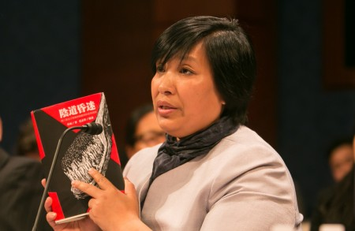

尹丽萍在美国国会听证会上，展示法轮功学员受到的酷刑迫害。

【大纪元2016年04月17日讯】尹丽萍终于等到了这一天。她完成了那个约定：“谁能活着出去，就要把这么毫无人性的迫害告知全世界。”

一场没有硝烟的战争，一场惨绝人寰的镇压，发生在中共号称的中国人权最好时期。数以百万、千万计的善良法轮功学员成为被侮辱和蹂躏的对像，遭到了骇人听闻的迫害。无数的悲剧和拼着性命发出的呼喊，积成了一座巨大的冰山，在中国的大地上沉浮。

2016年4月14日下午，尹丽萍来到美国国会大厦，在“中国广泛使用酷刑”的听证会上作证。这位来自辽宁的法轮功学员，讲述了她在辽宁省“黑监狱”遭受群体性侵害并被录像等恐怖经历。在国内，尹丽萍经历了7次被抓捕，3次被判劳教，9个月的奴工迫害。在马三家劳教所，她曾被注射不明药物，并被无数次的野蛮窒息性灌食，九死一生。

据尹丽萍陈述，到目前为止，她认识的10位法轮功学员被迫害致死，她了解和认识的有30位法轮功学员被马三家迫害得精神失常或一度精神失常。沈阳的王杰就死在她的怀里。尹丽萍说：“今天我九死一生来到了这里，讲出了她们再也无法讲出的话。”尹丽萍还展示了多幅酷刑迫害照片，并且在听证会当天向美国国会提交了参与对她迫害的部分主要责任人名单，包括江泽民、薄熙来、王立军、闻士震以及马三家警察等共41人。

这个听证会由美国国会及行政部门中国问题委员会（Congressional-Executive Commission on China，CECC）主办。出席听证会的美国国会议员感谢并赞赏法轮功学员敢于揭露迫害的勇气，他们认为：迫害法轮功的元凶江泽民及其追随者必须得到应有的惩罚。

联邦众议员特兰特‧弗兰克斯（Rep. Trent Franks）的一番话意味深长。他说：“你们的努力不会白费，只有神知道你们今天在这里作证的成果，你们担当起了责任，让你们的善和对人类的承诺在这次听证会上占了上风。”

单单阅读这一篇新闻报导，就让人泪流满面。明慧网数据中心里收集的大量相关文章让人不忍卒读、浑身发抖。令人发指的酷刑、罪恶的咆哮、野蛮的兽行，加诸善良无辜的法轮功学员的肉体和精神。

2002年，血雨腥风里，王杰等几名法轮功学员开始收集被迫害法轮功学员的案例，人证和物证，想尽办法把被迫害伤残的法轮功学员送出国去，让全世界的人们都来看看中共邪党对中国大陆的法轮功学员们都干了些什么。在最艰难恶劣的条件下，他们想到的不是个人安危，而是曝光罪恶。多么伟大的心灵！

在听证会上，尹丽萍展示了杜斌的《阴道昏迷》一书中收集的法轮功学员所遭受的酷刑，尤其是性迫害的证据。中国作家杜斌是前《纽约时报》签约摄影师，曾经出版了多本揭露中共罪恶的书籍，其中《阴道昏迷——马三家女子劳教所的酷刑幸存者证词》于2014年7月在香港出版。该书首次将法轮功学员的真实案例曝光出来，收录了至少7名在马三家遭受酷刑折磨的法轮功学员案例，打破了中国大陆不准报导法轮功的禁区。

杜斌曾表示，他所做的一切，“就是要外面的人知道这些事情不能发生在人的身上，因为我是一个人，我不能接受，所以我才会做，我做了就不怕，怕了就不做了。有一点必须要说出来的，我们是一个人，不是牲畜，不能想怎么折磨我们就怎么折磨我们。……中国政府不能这样污辱我们人。”2013年，杜斌曾经被当局以“寻衅滋事罪”抓捕。他说：“我从来没有觉得自己犯罪，在任何时候，审讯我的时候我也很坦然。”他说：“我做了每个人都应该做的，那就是讲真话。”

守住真诚的底线，许下一份承诺，对自我，对人类，对信念。这就是和平的抗争和对正义的坚持。善与恶的对垒，在道德的天平上较量。面对同胞惨遭蹂躏，怎能沉默？

<h1 align="center"><b>德国会人权委员会关注中共大规模活摘器官</b></h1>

【大纪元2016年10月21日讯】（明慧记者吴思静德国报导）在中欧第35次人权对话前夕，德国联邦议会人权委员会主席米歇尔﹒布朗德（Michael Brand）和国会议员马丁﹒帕策尔（Martin Patzelt），于2016年10月17日，特邀德国法轮大法协会、追查迫害法轮功国际组织、德国国际人权协会（IGFM）以及劳改基金会的代表座谈，详细了解中共对法轮功学员的迫害，特别是在中国发生的大规模活体摘取法轮功学员及其他良心犯器官的情况。

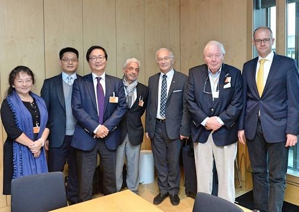

图：中德人权对话前夕，德国国会人权委员会主席邀请人权组织对话，了解中共活摘法轮功学员和其他良心犯器官的情况。（左到右）德国法轮大法协会主席周蕾、法轮功学员丁乐斌、国际人权协会理事吴曼扬、国际人权协会理事科尔普、德国国会议员帕策尔、劳改基金会欧洲负责人穆勒、德国联邦议会人权委员会主席布朗德。

<b>议会人权委员会主席：器官移植背后有太多血腥</b>

布朗德连任三届国会议员，他在当选议员之前，就已加入国际人权协会，对人权问题尤为关注。今年5月，中共政府拒绝其访问中国。布朗德透露其中原因：中国大使在旅行准备阶段曾多次向他施压 ，要求他删除其个人网页上有关中国人权的文章等。他拒绝了。

此次座谈会上，布朗德表示，加拿大前亚太司司长大卫﹒乔高（David Kilgour）、加拿大著名国际人权律师大卫﹒麦塔斯（David Matas）和调查记者伊森﹒葛特曼（Ethan Gutmann）联合撰写的活摘器官（Bloody Harvest）更新版调查报告揭露了一个令人发指的罪行，中国器官移植业背后还有太多人不知道的血腥。

<b>国会议员：德国应制止去中国的“器官移植旅游”</b>

国会议员帕策尔表示，德国虽然在和中国做生意，但这不意味着可以为了生意而出卖灵魂。德国议会有必要认真考虑借鉴以色列和西班牙等国的范例，从司法角度制止德国民众去中国接受来历不明的器官移植，即所谓的“移植器官旅游”。

帕策尔还说：“法轮功学员拥有自由的精神，共产党知道自己控制不了一个有信仰的群体，害怕失去自己的权威，才会去迫害这样一大批好人。这个世界上只有极权政府才这样害怕精神自由的人。”

<b>德国法轮大法协会主席：大批中国法轮功学员失踪</b>

“在过去的16年里，中国的器官移植已经成为一本万利，拥有国际运作系统的行业”，德国法轮大法协会主席周蕾说，她向与会的议员和多位议员助理介绍了法轮功的弘传情况，“真善忍”的修炼原则以及中共镇压法轮功的原因。

法轮功是一种佛家修炼功法，1992年传出。一开始，中共当局鼓励民众修炼法轮功，因为这对健康有益，也减少了国家的医疗费用负担。由于学炼法轮功的人数增长飞速，很快引起了中共的不安。1999年，中共前党魁江泽民开始了对法轮功的迫害，成千上万的法轮功学员被关进监狱和劳教所，受到强制洗脑和酷刑迫害，数千人被迫害致死，实际人数远远超出这个数字，还有大批法轮功学员失踪。专家的调查报告指出，大批失踪法轮功学员成为器官供体。

<b>国际人权协会：德国应遵从欧洲议会“反活摘”决议</b>

德国国际人权协会（International Society for Human Rights）的两位理事会成员吴曼扬（Manyan Ng）和胡伯特﹒科尔普（Hubert Koerper）表示，10年前国际人权协会就已将中共活摘法轮功学员器官的事情通报给了德国政府，中国一年进行6万到10万器官移植手术，捐献器官的人数却少得可怜，而每年2,000到4,000的死刑犯也无法解释大批的器官从何而来。

两位理事还谈到，在过去10年里，美国国会通过了谴责中共活摘器官的决议，欧洲议会也于2013年12月通过了一项议案，要求“中共立即停止活体摘取良心犯、以及宗教信仰和少数族裔团体器官的行为”；要求“欧盟对中国境内的器官移植，以及与这种不道德行为相关的迫害做出全面、透明的调查。”今年9月欧洲议会又通过一项书面声明，督促欧洲理事会和欧盟委员会执行2013年的决议，并敦促欧盟各国公开谴责这一罪行。

国际人权协会呼吁德国遵从欧洲议会的决议，效仿西班牙和以色列，修改法律，有效制止德国人去中国进行器官移植。

<b>中国二十多万人控告江泽民</b>

法轮功学员丁乐斌重点介绍了中国的起诉江泽民的大潮，作为迫害法轮功的元凶，江已经被二十多万名法轮功学员控告。

丁乐斌还提到，2016年欧洲路德维希-特拉里奥国际人权奖获得者、北京律师王宇曾经多次为法轮功学员做无罪辩护，并因此一直受到中共打压。2015年7月9日凌晨，警察闯入王宇的家将其带走，并关押至今。

另外一名中国知名维权律师、东南政法大学法学院教授张赞宁，也因为为法轮功学员作辩护而受到中共公安部和司法部威胁。他在2015年11月27日在法庭上为法轮功学员吴红卫做了无罪辩护，并当庭指出：前中共党魁江泽民非法设立镇压法轮功的“610办公室”，迫害法轮功是破坏法制；江泽民才是真正的大罪犯。

会谈结束后，两位议员请国会摄影师为与会者留影，并刊登在议会内部的通告上。帕策尔还将此消息发布在他的个人网站上。

两位议员都表示，在大量的事实证据下，他们不怀疑活摘器官的真实性，他们会敦促德国政府作出举动帮助制止活摘器官，德国议会也需发出更强大的声音，抵制“这个星球从未有过的邪恶”。

<h1 align="center"><b>波士顿庆三亿人三退　鼓声激昂唤起良知</b></h1>

【明慧网二零一八年四月十六日】（明慧记者程德波士顿报道）二零一八年四月十四日，美国波士顿退党服务中心在波士顿中国城拱门处举行集会、海报展及腰鼓表演，声援三亿中国人退出中共邪党、及其团、队组织（简称“三退”），并呼吁更多的中国民众觉醒，加入三退大潮，活动受到在场民众的支持。

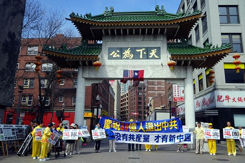

二零一八年四月十四日，波士顿退党服务中心在中国城庆三亿华人三退集会。

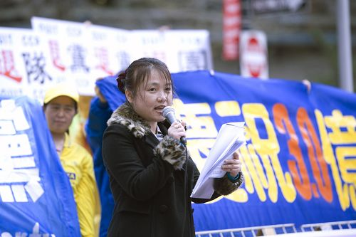

退党义工戴安娜女士致欢迎辞。

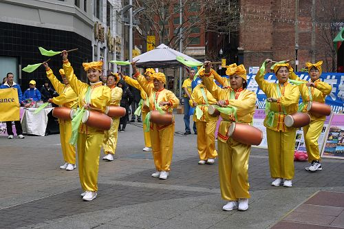

腰鼓表演，鼓声震撼人心。

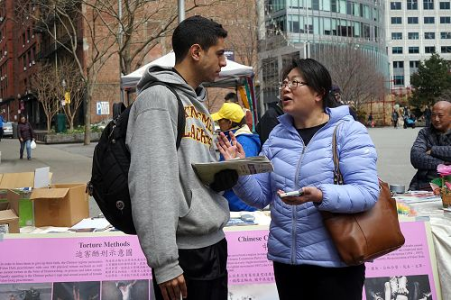

华人观看真相展板。

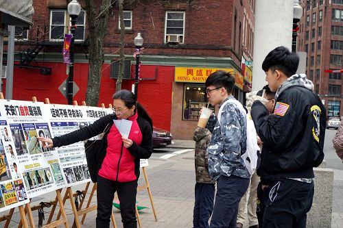

退党义工（右）向市民讲真相反迫害。

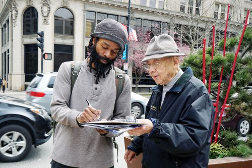

波士顿人（左）签名反迫害。

<b>人们觉醒 良知复苏</b>

退党服务中心义工戴安娜女士集会上表示：“这是一个划时代的壮举，是一个普通的中国人真正为了生命的尊严，生命的未来而做出的理智选择。”

二零零四年十一月，《大纪元时报》发表揭露共产邪党本质的系列社论《九评共产党》后，触发了中国民众退出中共及相关组织的和平精神觉醒运动，亦称“退党大潮”。据大纪元退党网站统计，截至当日，已经有三亿二百零八万七千三百一十一人在该网站上发表声明三退。

戴安娜女士说：“三退人数每天以近十万的速度增长，显示人们在觉醒，良知在复苏，中华有望。“

<b>敦促结束 活摘器官</b>

国际人权律师大卫·麦塔斯（David Matas）前来支援三退活动，庆贺三亿中国人退出中共的党团队组织。

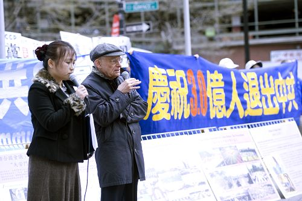

人权律师麦塔斯（Matas）致辞支援三退活动

麦塔斯表示，三亿人退出中共象征着一个不可阻挡的、认清中共后而拒绝中共的趋势。

“三退”、反迫害和反活摘都是帮助中国人了解真相，在善恶之间做个正确的选择。他认为退党运动本身就意味着中国群众对中共迫害法轮功和血腥活摘器官的的谴责。

麦塔斯于二零零六年开始致力于调查中共迫害法轮功，特别是活摘法轮功学员器官的调查，他敦促早日结束中国非法器官移植，并期盼通过反活摘来改变中国人权。

<b>抛弃中共 回归传统</b>

波士顿蔡女士阐述自身的迫害经历。她因坚持信仰法轮功，向中国政府部门上访、讲述“法轮功”的真相，却遭遇到多次被非法抄家骚扰及三年的拘留劳教，期间经历共十年的迫害。她呼吁人们认清中共本质，抛弃中共，回归中华传统文化，返回善良本性。

<b>支持三退 敬佩你们</b>

波士顿大学历史系退休教授比尔·圭瑞罗（Bill Guerriero），到展位上赞叹法轮功学员坚韧不屈的精神。在任教历史系时，他从网站上知道法轮功被迫害及大纪元的退党活动。他说：“我敬佩你们！支持三退反迫害活动！”

波士顿人伊萨列尔·席尔瓦（Israel Silva）在现场中签名支持，并感谢义工的付出，同时鼓励义工们继续努力，持续以恒。

<b>鼓声激昂 敦促三退</b>

诗人麦克在腰鼓表演的热烈掌声后，呼吁尚未三退的华人朋友，能像这三亿勇士一样，在正义与邪恶的较量中，拿出勇气，不与邪恶为伍，选择美好光明的未来，并亲自朗诵了他的新诗——“激昂的鼓声”：

<b>我们今天在阳光下聚集
与您分享这个消息
一个名为“三退“的运动
用真相唤起人们的良知
退党就像一个奔赴战场的号召
一场勇敢而激烈的战斗
尽管士兵们没有枪炮
却能引领人们和平的未来
半个多世纪以来
大陆人承受着暴力的迫害
谎言弥漫在人们的记忆中
正义的人们被打压禁声
听到声撼人心的鼓声
快快行动起来
衷心签下您的名字
从而能被救度</b>

<h1 align="center"><b>费城《娱乐时间杂志》社群分享法轮功修炼故事</b></h1>

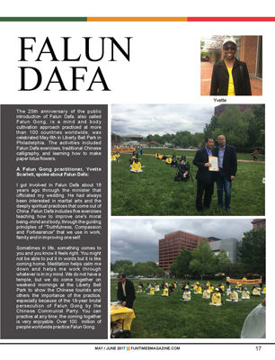

《娱乐时间杂志》整版报导了费城法轮功学员举办的世界法轮大法日活动。上图1：法轮功学员伊薇特•斯嘉丽；中图1：费城市议员（前右）送来了费城对世界法轮大法日的褒奖；下图1：大费城部分法轮功学员在费城自由钟独立宫广场草坪上炼功。（明慧网）

【大纪元2017年07月04日讯】（大纪元记者肖捷费城报导）费城《娱乐时间杂志》（FunTimes）于6月23日晚在费城市中心52层高的金字塔俱乐部（Pyramid Club）举办了5、6月双月刊发行新闻发布会。娱乐时间杂志》是面向费城非裔和加勒比海裔的文化和生活杂志。父亲节刚过，最新一期杂志介绍了在费城/新泽西对非裔及加勒比海裔社区有影响力的11位父亲，其中有杂志发行商、摄影师、主教、公司总裁、学者作家、教授、音乐家、费城普通法官、警察局长、刑事辩护律师等。

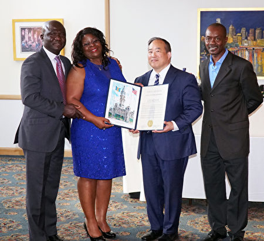

费城市议员David Oh褒奖Chioma Nwachukwuis在美国及国际上对公共健康护理方面的贡献。左二起：获奖者Chioma Nwachukwuis、费城市议员David Oh和FunTimes杂志出版商Eric Nzeribe 

费城市议员David Oh前来颁发两份褒奖，其中一个是褒奖Chioma Nwachukwuis在公共和社区健康护理方面的贡献。Nwachukwuis现任马里兰州Washington Adventist University大学护理系兼职教授，她曾于2005年和2006年去尼日利亚（Nigeria）参加了两次医疗救援任务，于2011年又去尼日利亚参加了两次医疗救援任务，并以社区健康、门诊护理和专业教育的形式提供免费医疗讲座。Nwachukwuis最近获美国护士执业者协会（AANP）2017年DC卓越奖。

这一期杂志最引人注目的是里面有一页介绍了源自于中国、现洪传世界上亿人的法轮大法，也叫法轮功。其中还介绍了一位主流社会非裔女士Yvette Scarlett修炼法轮功的故事，Yvette说：“大约16年前我通过我的证婚牧师听到了法轮大法。那位牧师一直对武术和来自中国的高深的精神修炼感兴趣。法轮大法包括五套功法，教人在工作中、家庭中都要按‘真、善、忍’为准则，不断提高一个人的道德修养，达到身、心健康。”

Yvette表示： “有时在生活中，你知道做对了，可能很难用语言描述，但你知道你就像回家了一样。打坐帮我宁静，帮我解决焦虑。我们周末早上一起到自由钟公园炼功，让从大陆来旅游的华人及所有人了解法轮功的重要，可以自由炼功，但在中国法轮功却被中共残酷迫害了18年。你可以随时炼功，但一起炼功很舒服。全球有上亿的人炼法轮功。”

《娱乐时间杂志》于1992年在利比里亚成立，2008年迁至费城，它跨越文化、社区和国家，在本地三州地区发行2万9千份。

<h1 align="center"><b>制止“活摘” 法轮功学员万锦市传真相</b></h1>

【大纪元2016年08月11日讯】（大纪元记者伊铃报导）“制止活摘是全人类的共同责任。”菲菲（Fei Fei Zhang）说，“今天我站这里，就是要告诉所有的人，中共对法轮功学员所犯下的罪行。”

8月6日是个平凡的星球六。万锦市的16街夹Woodbine 地区一如往常一样的平静。所不同的是，这天中午，来了一群穿黄色T恤的人士，他们在十字路口的街边拉起大型横幅，给这里增添一道独特的风景。南来北往的车 辆从横幅旁经过，许多司机都看到了横幅等内容：“停止活摘器官”、“中共活摘器官，天理不容”、“君子不立于危墙下 ，三退保平安”……

这是多伦多的部分法轮功学员利用周末时间，给民众传播中共活摘器官真相。张菲菲是现场打横幅等法轮功学员之一。她说，17年来，中共对法轮功的迫害从来 都没有停止过，甚至还发生了活摘器官这样邪恶的事，而且至今还在继续。她和她的同修们会一直不断把中共和江泽民的罪恶告诉世人，直到把罪犯送上法庭。

“这么好的大法被打压，不可思议。”

张菲菲自中国东北，6年前移民加拿大。她从小对各种气功及宗教感兴趣，尝试过多种气功练习，也阅读很多宗教书籍，直到1995年，那时她还是个不到20岁的学生。一个偶然的机会，她遇到法轮功。通过阅读法轮功书籍，她觉得这正是自己一直在寻找的东西。从此，她成了一名法轮功的修炼者。

张菲菲一向身体健康，她走入法轮功修炼并不是为了健身，而是因为法轮功倡导“真、善、忍”，教人修心向善，提升的道德，使人在精神升华。自从修炼以后，她无论在工作中、生活中，处处以真、善、忍的标准要求自己。那时，她从事法律工作，每天接触的都是一些需要帮助的人，她就尽力去帮助他们。并因此受到同事、朋友的好评。

1999年7月，中共江泽民集团在全国范围发动镇压法轮功，许多法轮功学员被抓捕、关押。菲菲所在地区就有许多法轮功学员被抓捕，甚至被打死。2003年，许多法轮功学员向迫害元凶提起法律诉讼，菲菲帮助同修写诉状。为此，她和她的同修们被抓捕，并被判刑三年。

“这么好的大法被打压，不可思议。”从那以后，张菲菲再也没有发自内心的笑过。在那种环境下，她感觉活得很憋屈，没有人真正的尊严。直到2010年来到加拿大。

多伦多的法轮功学员将会在8月份的每个周末，在万锦市的多个不同路段，向民众传播中共迫害及活摘器官真相。

<h1 align="center"><b>祥和的炼功场</b></h1>

【明慧网二零一五年九月十四日】（明慧澳洲记者站报道）二零一五年九月五日上午，在参加澳洲法轮大法（又称法轮功）修炼心得交流会前夕，法轮功学员在位于悉尼市中心的贝尔莫尔公园（Belmore Park）里集体炼功、展示法轮功五套功法。祥和纯正的能量场和悠扬美妙的炼功音乐吸引了无数路人驻足观看和学功。

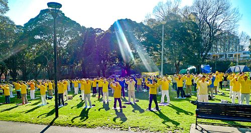

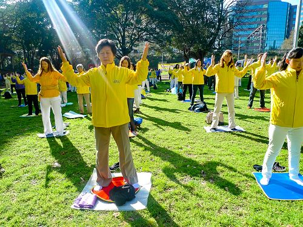

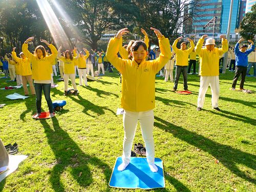

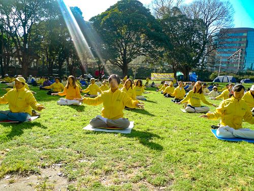

法轮功学员在悉尼市中心的贝尔莫尔公园（Belmore Park）集体炼功

法轮功学员在此以五套功法来展现他们修炼后身心受益，并始终坚韧不拔和平反迫害的精神；以及他们希望在展示法轮大法美好的同时，来表达他们对法轮功创始人李洪志师父的感恩之心。

伴随着悠扬的炼功音乐，法轮功学员以如此平和的方式展现修炼者的风范，并呼吁制止中共迫害法轮功，这场景吸引了一大队路经此地的澳洲大学生。看到炼功队伍里有不同年龄、不同种族的法轮功学员在一起炼功，他们放缓脚步，惊奇地关注着这闹市里平静祥和的炼功场，并纷纷拍照留念。

当天很多法轮功学员在炼完功后都感叹当时集体大炼功的能量场极强。珀斯学员李女士表示：我从珀斯赶到悉尼，两天的行程虽然很疲惫，但是收获却是很多的。下了飞机我们直接赶赴晨炼的炼功场地，和这么多澳洲大法弟子在公园里一起炼功，很难得。

李女士还表示：我刚刚走进法轮大法炼功场地，就被强大的能量场包围，浑身旅途的疲惫立刻消失得无影无踪，我还看到这洪大的炼功场面令众多的路人驻足观看。

当天还有不少过路行人停住脚步，请法轮功学员教他们炼功，并表示学习炼功过程中感觉能量场强大，回去要继续炼法轮功。

<h1 align="center"><b>祈福，在寒夜将尽……</b></h1>

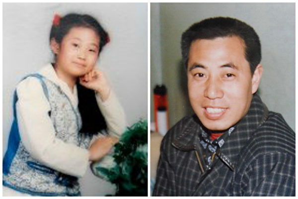

本文作者滑雪（左）与父亲滑连有资料照。

深夜，雨越下越大，雨水拍打着窗上的玻璃后又哗哗流去，坐在窗前凝望着这漫天倾泻的大雨，泪水情不自禁顺着脸颊流淌，而我的心里淌的却是血泪。

十七年腥风血雨的迫害中，我从懵懂逐渐走向成熟。伴着那无端的惊恐，伴着那无望的期盼，伴着那无眠的长夜和无尽的忧伤，走了过来。而今，我的父亲却又一次被非法关押，酷刑折磨，生命危在旦夕！这处境怎能不让我心痛呢？好在我是背对着忙碌的母亲，有意不让她看到我的泪水，不想再让她多一份感伤。父亲的境况已经让善良的母亲平添了几多白发。

<b>重生的幸福小家</b>

我叫滑雪，我的父亲滑连有今年五十四岁，他原是天津市显像管厂的会计师，为人热情、开朗、善良、乐于助人；他喜欢打球，也擅长工艺毛衣的设计。

我出生后，父母视我如掌上明珠，百般呵护，父亲为我设计的毛衣款式新颖、独具匠心，加工后不是一般的漂亮。父亲下岗后和母亲经营了一家小服装店维持生计，从设计到请人编织，再到销售，父亲都是自己细细地安排，生意经营得也算小有名气了。

我记得在六岁生日的时候，父亲和母亲为我买了六只大对虾，烹好后一家三口围坐在餐桌前，他们却一口不吃，只是慈祥地看着我吃，那一刻好温馨啊！我感到这个世界是那么的美好，至今我还记忆犹新。父亲还教我打乒乓球，常带我到公园去游玩、照相。那时，我和父母拥有一个温馨的小家。

可是好景不长。有一天，父亲从店铺回来就动不了了，因腰痛难忍。母亲陪父亲到天津武警医院做检查，结果是腰间盘突出，回家后吃药也不管用，只能卧床。小店铺也不得不关门了，没有了生活来源，更没钱看病。我家这只小舟在风雨中摇曳，感觉真是走投无路了。

就在父亲躺在病床两个月的时候，我的表姑来了，临走时给父亲留下一本书──《转法轮》。表姑说，你先看看书吧！于是，父亲就虔诚地看起书了。当父亲看到书的三分之一时，突然自己下地了，并拎起了家里的脏水桶去倒水了。看到眼前这一幕，我和母亲顿时就惊呆了，不敢相信自己的眼睛，这难道是真的吗？母亲错愕地问：“你怎么能下地了呢？”父亲说：“我好了！”母亲问：“你怎么好的呢？”父亲说：“我看书时，有一股热流从头顶上通透全身，是一种炽热的感觉，我就好了！”

再过两天，父亲大声地宣布：“我以后不吸烟了。”母亲说：“怎么可能呢？以往你一天吸两包烟，从起床就开始吸，呛得我往外轰你你都戒不了。如今把烟戒了？真是太神奇了。”看到父亲只因看了《转法轮》这本佛书就发生了这么大的变化，母亲也赶紧捧起《转法轮》看了起来。

那是1997年3月5日，是我们一家重生的日子，父亲又能照顾生意了，家庭和睦其乐融融。我的身心也受益匪浅。

<b>父亲只是在做好人 诠释他的信仰</b>

还有一件事也让我记忆犹新。我爷爷买房子需要钱，父亲就把经营得好好的店铺兑了出去，把钱给爷爷送去，化解了爷爷家的矛盾。从此，我父亲就蹬著小三轮车去卖菜，因为高秤卖，再抹零，回来后只剩点菜，很难赚到钱。有一天，父亲遇到单位一位同事，她很感激父亲。因为她曾经在单位晕倒，我父亲及时帮她送诊后脱险。她看到后说：你一个大学生怎么卖菜呢？跟我送晚报吧。

就这样，父亲开始了早晨送奶、下午送报的工作，虽然辛苦但收入还不错。我家这只小舟又从新恢复了欢声笑语。还记得当时晚报站站长姓高，他经常说像我父亲这样的人没处去找，真是他的左膀右臂。站里一直摆着给我父亲的奖杯。订户也视父亲为亲人，谁家有事他都帮忙。订户说，我们是因为你才订报的，你要调走我们就不订了。父亲每年都超额完成订报指标。

<b>疯狂迫害 我家在暗夜风雨中飘零</b>

1999年7月20日，江氏流氓集团迫害法轮功，一时间天倾地覆，中华大地恶浪滚滚，我家这只小舟也被狂风恶浪无情地摧残。1999年7月19日，父亲被宁园街派出所非法关押了三天才放回来。

2001年2月23日，我父亲和母亲同被天津东楼派出所绑架。十一岁的我放学回家却找不到他们，天渐渐的黑了，我吓得大哭起来，惊动了邻居才帮我找到了舅舅。从此我失去了双亲的呵护，感觉这个世界充满了恐惧和绝望。那时周围的人都是用不解的眼神看我。晚上，我睡不着觉，半夜想起父母亲就痛哭流涕。我想不明白，这么好的父母亲怎么能抛下我不管呢？他们做好人错了吗？这个世界怎么变得如此黑暗了呢？

我当时正值小学毕业，学习成绩在班里名列前茅。宁园小学的校长很同情我，曾带我去河西看守所看望父母亲，还给我买了面包当午饭。看到父母后，校长问看守所的人：他们（指我父母）不都是挺好的人吗？怎么不放人呢？看守所的人说是上面的意思。无奈之下，校长只好带我回来了。之后一年多都没让我见到父母亲。

我姥姥那时是七十岁的老人，她每天从河北区真理道骑小三轮车到北站来照顾我，又要回去照顾姥爷，还要四处奔波替我找父母，结果四处碰壁。就连街道居委会的人都同情地说：这老太太真不容易呀！因来自各方面的压力太大，我性情大变，且焦躁不安，无知的我给姥姥平添很多的麻烦。

一年多后，得知父亲遭非法判刑五年，被劫持到天津市监狱；母亲遭非法判刑四年，劫持到天津市女子监狱。在这种情况下，我仍考入了重点中学——天津市七十八中，住在姥姥家。由于整个社会对法轮功的造谣、诽谤，学校也不是一块净土。有个姓彭的老师经常欺辱我，并告诉同学们不要理我，孤立我，并骂我“神经病”，在我已灼痛的心灵上又撒了把盐，气得我经常在学校晕倒。后来舅舅带我到儿童医院就诊，医生说：“这孩子没病，是因为情绪太压抑了造成的。”舅舅只好给我买了安神补脑液。

那时的我心里的仇恨达到了极点，产生了逆反心理。好在我还有姥姥和舅舅的呵护，冥冥之中有神佛的保祐，我才没有出太大的问题。后来看到一位炼法轮功的叔叔写的《女儿歌》，那首小诗是这样写的：

<b>小小白花 蓝天之下 因何而歌 不见爸爸
风呀云呀 我信爸爸 身在天涯 想着我呀
小小白花 蓝天之下 因何而歌 不见妈妈
孤零酸苦 我不会怕 只待雪化 一起回家
</b>

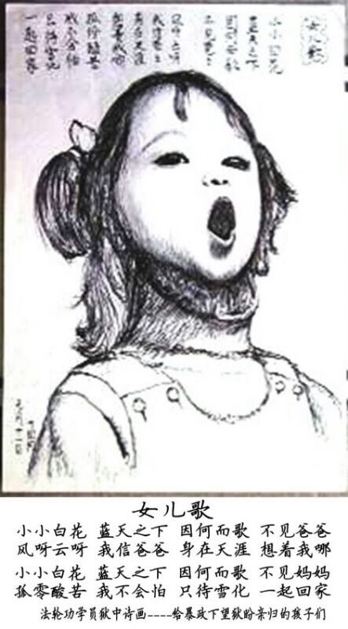

《女儿歌》。（明慧网

光阴荏苒，五年过去了，总算盼到了父亲回家的日子，母亲去接父亲，我放学赶紧往家跑，恨不得长上一双翅膀。当我气喘吁吁到家看到父亲后，我简直不敢相信自己的眼睛，这难道就是我的父亲？我被吓哭了，父亲已被折磨得不认人了（后来说是被监狱注射了不明药物造成的），瘦得皮包骨，脑门上有一个撞破的血洞，他站在墙边上不动，见人就躲。我那个笑容满面、健康、充满活力的父亲不见了，站在我眼前的是理智不清、目光呆滞、瘦弱且充满病态的父亲。这就是我朝思暮想的父亲？我的心再一次被撕裂！

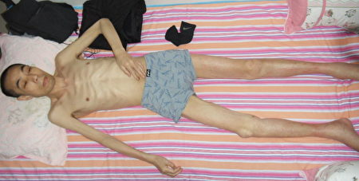

刚被营救出狱的滑连有，绝食617天，体重仅剩70斤。（明慧网）

父亲回家后，不吃不喝，惊恐万状，把头向门上撞，把袜子说是娃子，半夜坐起来怒斥坏人，并且抓起桌上的苹果扔地上，自己的尿也要喝，刷土鞋的水也要喝，幸好被母亲阻拦。我的爷爷、大伯、姑姑们看到这个情景哭作一团，放下点钱就都走了，从此再不和我家联系了。

为了照顾父亲，母亲辞去了工作，每天给父亲读《转法轮》，带着他炼功。逐渐的，父亲好起来了，但时而还是神思恍惚、主意识弱，有一次竟然还打了我一个嘴巴子，气得我头撞墙，不懂事的我把父亲的胳膊也抓破了。我跑出家门躲了出去。据母亲后来说，她回家后看到父亲两眼通红，坐在床边一动不动。母亲出去找我，告诉我说，这是迫害的延续，让我不要上当，要理智清醒。然而我的身心受到了极大的伤害，一到半夜就大喊大叫，睡觉时一脚踢去，母亲被我踢得半天缓不过劲儿来。

通过不断的学法炼功，父亲渐渐恢复了健康，理智也正常了。有一次，他骑自行车被汽车撞碎腿骨，要动大手术才行，父亲跟肇事者说：我是炼法轮功的，给我送回家就行了。他忍着剧痛给司机和他的朋友讲真相。司机说：“我可遇到好人了，不然我就完了。”司机非要送父亲去打夹板。父亲回到家后就拿掉夹板，一粒药没吃，十天后就痊愈了。后来司机到家来探望，惊奇地说：“法轮大法太神奇了！我会告诉所有人法轮大法太好了。”

后来，父亲到一个毛巾店打工，受到老板的高度评价，把一个仓库的毛巾都交给他管理，并说：“我这里就招炼法轮功的人。”

2012年4月24日，父亲母亲又一次被绑架。这时我已经知道了，我的父母没有错，不是他们抛弃我，是中共的迫害使我们骨肉分离。我不再自卑，我为自己有这样的父母而骄傲，我再一次奔波在营救他们的艰辛的路上。

那时，父亲被关押期间绝食反迫害，我为他请了律师，律师为他作了有理有据的无罪辩护，但仍被冤判七年。母亲被批一年劳教。在各界正义人士的帮助下，在天津八千多正义民众的签名援救下（据说还有一千多个签名没来得及公布），在强大的民意呼声下，终于在父亲绝食六百七十一天时，狱方不得不同意母亲提出的保外就医的申请，把奄奄一息的父亲用担架抬了回来。

父亲回家时，体重仅剩七十斤。母亲喊他也没有回应，母亲让我和她一起喊“法轮大法好”，父亲在我们的喊声中慢慢睁开了眼，他活过来了。我又一次见证了大法的神奇。

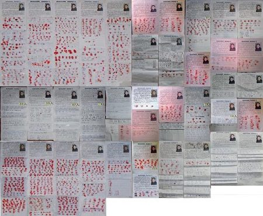

天津八千民众为营救滑连有签名（部分）。（明慧网）

<b>为我们 也为他们祈福</b>

然而，2016年4月14日，刚刚恢复健康的父亲又一次被绑架到滨海监狱，他绝食反迫害至今。2016年5月5日，母亲见到了父亲，父亲又一次被迫害得骨瘦如柴，手拿不动电话，他说他被捆在床上灌食折磨，被灌辣椒水，他一直在喊“法轮大法好，真善忍好！”被恶徒用布带子勒嘴。

2016年7月6日，我和母亲去新生医院看父亲，他愈加虚弱了，仍然被捆在床上灌食迫害，我看到父亲的惨状，我心如刀绞，顿时怒火中烧……

回过神来看到父亲的脸上仍是那样的祥和、善良，我突然想起了父亲常说的话，对人要保持自己的善良，忍辱济世啊！那一刻我的火气消了，我不再怨恨那些警察，我甚至为了他们感到悲哀。是善的力量使我改变了心态。他们是被利用的，被谎言蒙蔽了双眼。而我的父亲则是在用自己的生命去诠释自己的信仰，我感到那瘦弱的身躯的背后是如此强大的内心世界。父亲用自己的大善大忍的胸怀去化解那些对大法弟子有仇视的生命的冤怨。我为父亲祈福！

我家所经历的只是众多被迫害的法轮功群体的一个缩影，还有更多的家庭正在遭受或已经遭受过更加惨烈的迫害。我为他们祈福！我不能也不会去仇恨那些警察。因为善良已注入我的生命！真心希望我和我家人的悲惨经历能唤醒更多世人的良知，奉劝那些还在迫害好人的人赶快悬崖勒马，因为善恶到头终有报呀！看清当前天象，放好人回家，你们自己也会有福报的！我也为你们祈福！

不知什么时候，外面的雨停了，黑夜已尽，黎明渐起。喜鹊在喳喳叫着，我擦干脸上的泪水，对喜鹊说：谢谢你给我带来了福音，请把我的祝福带给我的父亲和所有因真、善、忍而遭受苦难的人们。我也要告诉你们，我有一个伟大的父亲。喜鹊欢叫着飞上了蓝天……

<h1 align="center"><b>停止迫害才是最明智的选择</b></h1>

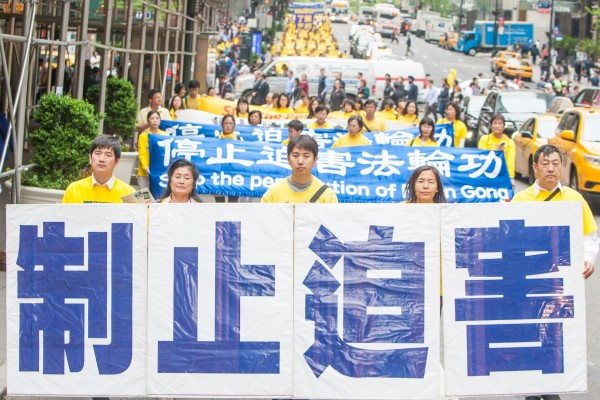

河北省秦皇岛市某些中共官员仍在不遗余力迫害法轮功

【大纪元2018年04月14日讯】据近日明慧网报道，截至二零一八年四月五日，河北省秦皇岛市有57名法轮功学员被非法关押，其中25人被非法关押在监狱，30人被非法关押在看守所、拘留所，1人被非法关押在精神病院。据明慧网消息，近来迫害法轮功仍然比较严重，其中最严重的有青龙县、昌黎县等。

在二零一七年十二月十八日至二十四日六天的时间里，河北省秦皇岛市青龙县公安局国保大队队长李印卿、政法委书记邵海庭、伙同综治办、木头凳镇派出所所长宋学强、双山子乡派出所所长郝印奎、大石岭乡派出所所长张闻天、干沟乡派出所、大巫岚乡、八道河乡、娄杖子镇、朱杖子乡、土门子乡、肖营子乡、平方子乡、青龙镇派出所，非法抓捕17名法轮功学员。

据悉此次迫害，是秦皇岛政法委610给青龙县政法委、青龙国保下达抓捕法轮功的人数和抓捕任务。

秦皇岛市青龙县法轮功学员张爱文二零一七年三月十四日开车去唐山的路上，在检查站被拦截、绑架，随后被非法抄家，目前被非法关押在青龙县看守所。二零一七年十一月一日上午在没有家人参加旁听的情况下，秦皇岛市青龙县法院伙同青龙县检察院、公安局对法轮功学员张爱文非法开庭，伪造了许多所谓“证据”，
并对他非法判刑三年，家属已提出上诉。

据明慧网二零一八年四月十日报道，在中共迫害法轮功学员的十八年中，中共集古今之大全，使用形形色色的酷刑折磨修佛向善的法轮功学员，以达到促使他们放弃信仰为目的。二零零零年，一个寒冷的冬天，河北青龙县看守所发生了这样卑鄙的一幕——警察对杨凤春等四位善良的女法轮功学员“肛门灌食”。在县公安局副局长张玺直接指使下，所长王金和名叫小黑（青龙县青龙镇蛇盘兔人，遭恶报已死）的五个男犯人，分别扒下四名女法轮功学员的裤子，由女护士于艳秋从肛门处插管，与男医生王景富一同灌食。所长王金还说些低级下流的话，恶警和犯人们围一圈儿哈哈大笑。

明慧网二零一七年十二月九日报道了河北省秦皇岛市昌黎县乡亲们为法轮功学员王绍平仗义执言的消息。十二月十九日晚，昌黎县国保大队长高接力带人到后马坨店绑架了呼吁释放王绍平的三位乡亲——贺永江、贺希德、李国星，和法轮功学员贺永方、李彦军、王秀花、李东云四人，共计七人。

昌黎县马坨店乡王绍平一家七口，六个大人都因为坚持信仰法轮大法被非法关押过，在二十年前，王绍平与老伴周振才学了法轮功后，老俩口身上的病都好了，看到父母亲身体的变化，他的两个儿子也都开始修炼。原本幸福的大家庭，在十几年中共的残酷迫害下，老两口都被非法劳教过，大儿子被冤判九年，大儿媳被冤判三年。二儿子周向阳是全国首批六十位造价工程师之一，因修炼法轮功，多次被非法抓捕关押、劳教、判刑，判刑时间长达九年。李珊珊因坚持为丈夫周向阳申冤，曾遭到监狱的报复，两次被非法劳教共计三年多。二零一五年三月二日，周向阳、李珊珊夫妻双双被绑架，又被非法判刑七年和六年，如今七十多岁的老太太王绍平又被非法判刑。一家人被迫害的支离破碎。

据明慧网近日报道，昌黎县法院在庭审前指使昌黎县城关镇派出所警察，将秦皇岛市北戴河区法轮功学员杨金梅的辩护人强制带离法院，之后暗箱操作非法冤判杨金梅五年。现在杨金梅本人和家属已提起上诉。（详见明慧网二零一八年四月八日《报假警劫持辩护人　河北昌黎县法院冤判杨金梅五年》）

二零一七年十月十日，秦皇岛法轮功学员卢家荣、白雪松、梁君，在秦皇岛卢龙法院被非法判刑。律师的辩护结论是：修炼法轮功不违反国家宪法，我的当事人法轮功学员无罪，指控我的当事人犯法证据不足，希望无罪释放我的当事人法轮功学员。卢龙检察院、法院的办案人员都称他们说了不算，压力还是来自河北省政法委、维稳办和秦皇岛政法委、维稳办。

河北省秦皇岛市因是北戴河所在地，是每年中共高层会聚的地方，历年来成为中共迫害法轮功的重点地区。近年来秦皇岛市政法委、六一零、公检法司等政法部门，在迫害法轮功上仍不收手，继续执行中共江泽民集团的迫害政策。据明慧资料统计，二零一七年河北省秦皇岛市法轮功学员遭当地政法委“六一零”、公检法司等部门迫害，造成张爱文等16人被非法判刑，左洪涛等73人被绑架（其中有9人被非法批捕，约42人已回家），另有4名不修炼法轮功的学员家属也遭到株连绑架，聂素君等119人遭骚扰迫害。两位法轮功学员郭道友、李秀玲在迫害中含冤离世。

余文生律师在为周向阳、李珊珊的辩护词中曾经说过这样一段话：“中国律师为法轮功的无罪辩护已经十多年了，这场人权灾难依然存在，这场错误的迫害运动中，司法人员也许自始至终都把双方的是非，善恶与正邪，合法与犯罪的关系颠倒了。而本应惩恶扬善，维护公平正义的司法人员却在麻木的或为眼前利益执行着非法意志，十七年来，还在重复著这样一场场非法的庭审，还在无休止的制造著冤案，无法遵从良知，反而助纣为虐。为法轮功的无罪辩护已经十年，今天站在这里，我们感到巨大的耻辱与悲哀！”

在此奉劝还在执行中共江泽民集团的迫害政策的中国大陆的中共党政官员及各级参与迫害的政法系统人员，执行迫害法轮功的政策绝对是错的，既违反国际相关法律与中国相关法律，是在和宪法与法律对着干，是在和“依法治国”的国策对着干，是在犯罪！习近平当局五年反腐打虎数据显示：截至二零一七年六月底，中共中纪委共立案审查省军级以上及其他中管官员四百四十人，其中中共十八届中央委员、候补委员四十三人，中共中央纪委委员九人；厅局级官员八千九百余人，县处级官员六点六万人，乡科级及以下党员人数则达到一百三十四点三万人。这些落马的官员中绝大多数都参与过迫害法轮功，善恶有报是天理，他们今天的下场就是做恶遭报的恶果。

在三亿民众抛弃中共，国际社会二百七十万正义人士声援二十万法轮功学员诉江而举报江泽民的形势下，希望秦皇岛市的各级官员赶快清醒，法轮功学员奉劝：君子不立于危墙之下，抛弃邪共，停止迫害，才是最明智的选择！

<h1 align="center"><b>燃起生活明灯 德国一女孩对李洪志先生的感恩</b></h1>

德国女孩、法轮功学员娜塔丽（明慧网）

【大纪元2017年08月27日讯】 “要不是遇到大法，我可能已经锒铛入狱了。”年轻的德国姑娘娜塔丽温和地说道。“那时我才十五、六岁，开始喝酒，抽烟，对什么都满不在乎。”在科隆市中心的一家考究的咖啡厅内，娜塔丽轻声的回忆著自己艰难的青少年时期。

<b>叛逆的女孩儿</b>

明慧记者雪莉报导，娜塔丽出生在德国中部的一个单亲家庭，妈妈独自抚养她和两个哥哥，为了给孩子们换一个比较好的环境，搬了好几次家。频繁的换校搬家明显影响了她的学习成绩，十三、四岁的她功课上显得吃力，时间长了就不愿意去学校，开始旷课。妈妈有一段时间不得不把她送往一个寄养家庭。娜塔丽早早便辍学出去找工作。十五、六岁的她对生活状况感到无奈，没有期待也看不到目标，感到“了无生趣。”

从小没有父亲的呵护，她更愿意显示自己的“强大”。那时的她戴着鼻环唇环，一身男孩儿的打扮，超短的头发也是今天染成蓝色、明天染成绿色，再加上鹤立鸡群的个头，使她显得非常突出。“我觉得自己强有力，也想把这体现出来，但实际上心里常常没有安全感，好像周围的人随时会伤害自己一样。我很小的时候看见过家庭暴力，特别害怕会发生在自己身上，特别担心会被男性伤害。我感到世上没有一个地方是安全的。”娜塔丽回忆道。

<b>人生果真有意义</b>

在一个人来来去去的日子里，娜塔丽没有停止过思考。“我常常问自己为什么生活是这样的。生命的存在意义和过程究竟是为了什么。艰难挫折不可能是生命的全部，一定有一个原因的。我很确信这一点。”对于这样的问题可不是马上就能找到答案的。

娜塔丽开始在工作之余上网查找关于生命的来源和归宿的问题。二零一零年四月底的一天，她在网上偶然点击开法轮大法的信息网站，浏览后震惊不已：“这群人哪里来的勇气面对那种残酷迫害？我无法想像是什么样的人能有如此的勇气和力量在这样残酷的情况下坚持信仰。”

在母亲不用电脑的空隙时，她迫不及待地在网上找到《法轮功》这本书，读完后接着读《转法轮》。“这就是我一直在找的！”“谜团解开了，一切仿佛都有了意义。我马上明白我找到了什么。那种兴奋和难以形容的幸运无法用语言形容。”

“我懂得了按照真、善、忍做好人，这就是生命的意义。了解大法前我从未思考过是不是要做一个好人。和许多同龄人一样，我觉得不值得把做个好人作为努力目标，因为我从中得不到什么，考虑这样的问题似乎没有意义。我觉得自己至少不是个心眼不好的人，这就够了。”

以前，娜塔丽与当今的很多人一样，想：人活着不就是工作赚钱消费吗？生活并不容易，尽管付出很多，也未必会得到应有的回报；帮助别人也不一定得到好的结果。辛苦一生，但是别人却比自己生活得好。

然而学习法轮法轮功后，她有了不同的想法：“通过大法我明白了每一个人的生命过程，这一切是有意义的。做人就应该做一个好人，生活的艰难都是有原因的。”

“那是比中了彩票还幸运的事。中彩票只一时的兴奋快乐。一切都突然有了意义。生命的意义找到了，心头的压力荡然无存，感到无比轻松，生命原来真的是有意义的。很多人也问过同样的问题，随着岁月流逝和为生活杂事所累，便不再继续寻找。我们都接受了社会告诉我们的那一套‘人活着就是为了过得好，追求各种享受，满足感官需要’。所以我马上知道这是真的，‘真、善、忍’三个字是实实在在的答案。我想做这样的人。”

<b>心中有了生活的明灯</b>

法轮大法的理念给了娜塔丽一个生活的指导。没有人要求她必须要如何如何做，而是她自己发自内心的想按照“真、善、忍”做，在这样努力的时候，她感到“从内心发出一种满足感”。

而且面对生活，娜塔丽也有了不同的态度。“渐渐的，别人对我不公的时候我不生气了。”

“有一次一个熟人无中生有地说我骂了谁谁，还和我的好朋友及我周围所有的人挑拨我们。我知道这是对我的心性考验，所以没有太放在心上。我想也许是他心里对我很生气，被自己的情绪弄得不理智了，所以对他只是同情。换在以前我一定会和他理论清楚，绝对不会咽下这口气的。但是那次我非常理性，我也很高兴自己能这样处理把握。”

对生活态度的转变，让娜塔丽变得乐观开朗。“以前的我幸灾乐祸。别人丢丑或者摔个跟头，我会哈哈大笑。别人有倒楣的事、不好的事我都觉得好笑。别人吵架我也会幸灾乐祸，原来别人也是会倒楣的。修炼大法后，负面的思维和情绪越来越少。做家务的时候不挑这个做那个不做，工作中也不挑挑拣拣。别人对我不好我还是对别人善。自己在困境中的时候，心里确信事情会向好的方面发展。这种感觉以前从未有过，我变得乐观开朗。”

<b>从不羁到体会亲情友情及安全感</b>

了解生活意义后，娜塔丽对家人朋友的心态和以前大大不一样。从前她对什么都不太关心；现在，她乐意和家人一起吃顿饭，出去散散步，或者和妈妈分享自己的喜怒哀乐。“妈妈对我的改变非常欣慰，常常在亲朋好友聚会的时候说，女儿学炼法轮功后，从一个叛逆少女成长为一个有责任心、尽义务的青年了。”

对待朋友，不再像从前，谈话总是围绕自己，而是能够倾听他人，和别人有交谈。与朋友的交往不再像从前，只是一起喝酒，感受刺激。她认识到，那种朋友关系其实本来就不是建立在很坚固的友谊的基础上的。但是改变后的自己得到了更结实的友情。她的朋友中有炼功人和不炼功的人，都有。现在结交的朋友们基本上都比较在意自己的生活品质，如何正确对待呵护健康。

<b>对大法师父心中充满感激</b>

人们常说：“相由心生”。内心的变化，娜塔丽的外表也改变了。“我现在没有那种惧怕了。在我身体力行按照“真、善、忍”原则做的时候，常常感到被保护。也没必要把自己有意打扮得中性了。我现在感觉到是很自然的自己，是个自然女性，我接受自己女性的特性。”

叙述著自己的成长故事，儿时的不快乐已经很淡，言语间，娜塔丽流露出的是乐观自信。她深切感受到大法师父的慈悲，心存无限的感激。“从一开始认识法轮功就觉得大法（师父）会接受自己，无论自己是怎样的，都会被接受。大法的慈悲，是我从未在任何地方任何角落感受过的。那种全部的自己马上被接受被呵护，好像有一只父亲的手牵起我说‘来，我们一起成长。’每天我的心里都感到踏实有安全感。”

她说，“我非常庆幸自己七年前找到真法真道，要不是大法，我不知道今天还在不在人世。我对我师父的感恩无法用语言来诉说。”

<h1 align="center"><b>澳洲艺术家：快乐源自修炼法轮大法</b></h1>

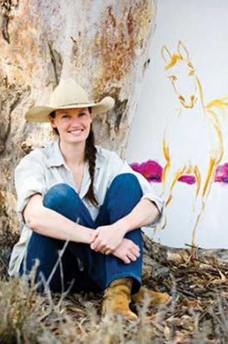

澳洲艺术家罗拉•道格拉斯和她的作品。(明慧网)

【大纪元2014年10月26日讯】在澳大利亚昆士兰西南部，距离首府布里斯本8小时车程的一个内陆小镇上，住着一位以绘画“善良快乐的马”而闻名的艺术家——罗拉•道格拉斯（Laura Douglas）。人们总是赞扬她的作品使人充满愉悦，而她则说这份快乐源于她对真、善、忍的信仰。

今年34岁的平面设计师兼绘画艺术家罗拉•道格拉斯是两个孩子的母亲，一家四口长年居住在天然旷野的澳洲大地上。骑马、写生和参加派对，在这看似无忧无虑的写意生活中，罗拉却总感觉在等待着什么。直到2007年她决定开始修炼真善忍，她才明白她一直期盼的就是法轮大法！人生中的不解之迷逐一揭开，上天一段又一段的巧妙安排，使她结下了许多善缘。七年来的修炼之路，使罗拉一点一滴地找回了先天自我纯真善良的本性。归真的喜悦无以言表，她要与周围的人分享这份喜悦。

<b>记忆的唤醒</b>

曾经信仰过基督教的罗拉总是在探索生命的真谛，她以前经常仰望星空，心中有个强烈的感受：“我想知道更多，我知道宇宙中还有很多我不知道的事，我必须知道更多！”

2003年，身怀六甲的罗拉偶然遇到两名法轮功学员，初步了解了法轮功（又叫法轮大法）。2007年，她和法轮功学员再度重逢。对法轮大法充满浓厚兴趣的罗拉问了很多问题，直到学员告诉她：“你必须自己看书才能得到所有的答案。”就这样，罗拉阅读了《转法轮》，读完后的感受是：“感觉对了，像回到了家一样，感到我和大法有一种很强的联系。我知道我会一直不间断地读这本书。”

第一次炼功时罗拉不由自主地哭了起来，她内心深处明白这就是她在等待的，也是她应该做的事。

罗拉表示，她从小就是个单纯善心的人，每次读到《转法轮》中说的“佛性一出，震动十方世界”就会忍不住掉泪。在阅读法轮大法书籍时她总能感觉自己更加认识了自己的本性，一次次被这种唤醒记忆的感受震撼得流泪。“我一直都知道自己是个心地善良的人，但是学法后才知道如何不带有观念和执著，当一个真真正正的好人。”

<b>挥别饮酒作乐的过去</b>

修炼前的罗拉不但很爱喝酒，而且酒量比男人还大，被朋友认为很“疯狂”。而她的瞬间戒酒过程也让了解她的人感到不可思议。

看到《转法轮》中有关喝酒的坏处后，罗拉动了一念：“我也想试着戒酒。”而当时她正好准备要去参加一个派对，她就想：“好吧，这是最后一次喝酒了，今天以后开始戒。”

没想到那次她醉得昏天暗地，不但丢失了贵重物品，还差点和人打架。罗拉回忆道，当时她体验到书中说的喝酒会乱性的道理，因此她痛定思痛决心戒酒：“那真是个非常糟糕的经历，我第二天醒来就下定决心不再喝酒。我认为这是个很好的安排，看似极端，但是却让我醒来感到喝酒真是件恶心的事，我再也不要靠近这东西。从那天起我再没喝过酒。”

罗拉轻松戒去酒瘾让身边的人都感到不可思议，也看到了法轮大法神奇的力量。

<b>画马的缘分</b>

罗拉与马好像有种特别的缘分。也许一切都是冥冥中的安排。从小就很喜欢马的她，却从未想过要画马。但有一天，她去郊外写生时，一匹马来到她的面前，并挡住了她正在描绘的山景，所以她移动了画板继续作画。这时，马也跟着她移动，她只好又移动，就这样移动了三四次，马始终站在她的面前不走。那时罗拉想：“好吧，那就画你吧。”这是她生平第一次画马。

不久后，她的作品获得悉尼一间艺术画廊的青睐，紧接着参加了展出。后来罗拉又因为马的作品而结识了一家大型百货公司的主管，之后也陆续参加了墨尔本大型赛马节等活动。每一次和那些喜欢马的人结缘时，罗拉总是告诉他们修炼法轮大法的美好，以及真、善、忍对艺术和世界的重要性。

罗拉举例说，一次她在布里斯本参加一个以马为主题的画展，一名男子对她说：“我向来讨厌马，我一直都很怕马，但是我不知道为什么我在这里感到很开心。”罗拉答道：“可能是因为我作画的时候内心感到很愉快，作品将这些快乐传递出来了。因为我修炼法轮大法，明白了我们创作的作品都带有能量和感受，所以在作画时我会注意带进好的能量，传递给他人。”对方问：“如果你心情不好怎么办？”罗拉说：“我就向我心里找一找，看看我为什么心情不好，作画前整理好自己的情绪，不让自己带着不好的情绪创作。”

罗拉也经常告诉人，传统的中华文化中，在做任何事前都要先管好自己的思想，无论是书法家、舞蹈家、艺术家都要在自己的心上下功夫。

身为艺术家，在谈到修炼后在创作上的最大改变时，罗拉说：“以前作画时，主意识不是很强，很随性。修炼后知道创作时要头脑清醒，明明白白。”“我要求自己画出的山水必须是美好的，马匹的眼神必须是善良的。”

<b>参与美展揭露迫害</b>

第一次听说中共在中国大陆对法轮功学员的残酷迫害时，罗拉震惊地说：“我的天啊！我必须做些什么来制止迫害。”内心难过不已的她开始从新思考自己的职业和如何传播真相的关系。从设计法轮功真相展板、传单到参与筹办“真善忍国际美展”，罗拉决定尽自己的力量，以艺术的形式反迫害。

罗拉的丈夫不是法轮功学员，原本对她在自己工作繁忙的情况下还参与“真善忍美展”不理解，罗拉就告诉他：“我们从大法中受益这么多，改变了我们的人生，如果今天我身在中国，被迫害的就是我，被活摘器官的就是我，你说我怎么能坐视不管？怎么可以只得好处而不付出？”她的丈夫听后问：“我能帮助你们做些什么？”

罗拉最大的心愿就是希望通过艺术让世人看清这场发生在中国大陆的史无前例的残酷迫害，唤起人们的良知善念，制止中共的恶行，让真、善、忍充满世界，人人都能找回自己纯真善良的天性。

<h1 align="center"><b>厄运与幸运 19岁女孩经历人生悲喜转折</b></h1>

在十九年的人生经历中，一个女孩体验了死而复生、脱胎换骨的经历。

【大纪元2014年11月23日讯】我叫明明，今年19岁，家住湖北省。在不到二十年的人生经历中，我却经历了死而复生、脱胎换骨的过程。

我生长在一个幸福的大家庭里，曾是个聪明乖巧、人见人爱的小女孩。然而，美好的一切在我12岁那年嘎然停止，一场厄运降临到我头上……

厄运
那年，我得了牛皮癣，是什么原因引起的，大夫也说不清楚。据奶奶说，我读小学四年级的时候，头上就有一点，不久就自己好了。

家人带我去了很多地方治疗，中医、西医都看过，也没能治好我的病。父母不甘心，继续载着我四处求医问药，各种药物吃了不少，抹了不少药，但都没有一丁点改善。

每年夏天和冬天，是我最难熬的季节。我不能像别的女孩那样穿短袖衫，穿漂亮的裙子。因为裸露在外面的肌肤会使我难堪，甚至感到接触我的人都厌恶我、排斥我、背后议论我，对我指指点点，说些不好听的话，瞧不起我。因此，我变得自卑起来，羞于见人，整天沉默寡言，闷闷不乐，胸中充满无奈与绝望，甚至自己也瞧不起自己。冬天，是牛皮癣高发期，加上冬天天气干燥，身体的患处裂很多很大的伤口，往出淌血，抹药也没用，令人难以忍受。

我整天唉声叹气，以泪洗面，动不动就向父母发脾气，不愿见人。身体上从表皮痒到肉里，从肉里痒到骨子里，那滋味真是痛不欲生。看着镜子里的自己，真不敢相信人见人爱的小女孩儿会变成这副模样。我已没有了活下去的勇气，常常把“死”字挂在嘴边。

那时，我终止了学业，一心在家养病，什么也没做。可似乎觉得有很多很重要的事在等著自己去做，不是自己的理想，也不是自己的什么梦，好像是自己必须要完成的事。就这样死了，好像有些不甘心。

为了给我治病，爸妈花光了家里所有积蓄，还欠了亲朋好友一屁股的债。可爸妈看到我这样，并没有因为家里欠债就放弃给我治疗。爸爸说：“就算我去要饭，我也得给你治。”听到这话，我心如刀绞。

2013年10月，爸妈又找亲戚苦苦哀求，借到了一笔钱，姐姐暂时放下工作，带我来到北京住院治疗。

住院期间，由于我的病情太严重，医生建议我把头发剃掉。我感到惊异和难过，毕竟是个女孩儿啊。可想想自己的病，就听了医生的劝告。剃完头照镜子，我惊呆了，这还像人的头么？头上布满一层一层白色的东西。来北京之前，我心里暗暗在想，这次还治不好，那就不治了，我真的累了，也不想再连累家人了。

在北京住了一段时间，也没有多大好转。因快要过年了，我戴着帽子，背着一袋子药和姐姐踏上了回家的路。到家没两天，身体上的牛皮癣迅速蔓延，比之前还严重：牛皮癣占据了身体表皮的百分之九十五，脸部的小红点急剧扩散，很快覆盖了整个脸部，看起来简直如魔鬼一般！

我心里一阵阵剧痛，彻底绝望了，心里冒出几个字：去死吧！还活什么活，活着都没脸见人。

家里人看着我，束手无策。母亲含着泪说，在北京住了这么长时间，怎么搞成这样？父亲唉声叹气。我边哭边说：“你们看我还像人么？鬼都没有我这么吓人，还说治得好，治什么治，越治它越发，它越给你来得猛，要想它彻底消失，除非我死，我死了，它就不存在了。”

一家人都愣住了。母亲说：“不要动不动就说死，谁会眼睁睁地看着你死啊？”父亲说：“谁看到你这样不心疼啊？”我哭得更伤心，说：“可我不想活了，我活着也没脸见人。你们不知道我有多痛苦，生不如死啊！我情愿我得的是绝症，死也死个痛快。”家里人都劝我不要这样想，坚持喝药。我端著药碗说：“喝这又没效，喝它干啥？”爸爸立刻吃不下饭了。

是啊，谁不希望自己的儿女好呢？爸妈因为我大吵小吵许多回，我也因烦恼和他们闹过许多次。家里自我生病后就再也没有安宁过。

<b>得救</b>

过年前，爸妈去伯父家喝喜酒，我没去。伯伯问到我的病情，妈流着泪说：“你们是没看到，简直体无完肤，惨不忍睹。真不知如何是好。”伯伯说：“法轮功能救她。”妈妈并没太把伯伯的话放在心里。

几天后，伯伯来到我家，向我介绍了法轮功，伯伯问我：“想不想病好，想不想和你姐姐、弟弟一样啊？”我说，我当然想，可想有什么用啊？伯伯说：“想，你就炼法轮功吧！”我犹豫了一下，半信半疑地说：“法轮功真的能救我吗？要不，我试试？”伯伯给了我几个光盘，还有真相资料和护身符。

其实，去年上半年，伯伯就给了我一张法轮功护身符，伯伯说只要念上面的九个字就能好病，我笑着不敢相信地说，这么神奇吗？伯伯说是真的。我也没往心里去。姐姐带我到北京住院时，我因为无聊，就把伯伯给的护身符拿出来看，心里想着，还挺好看的，边看边念上边的几个字，念了没几遍，脑海里就都是这些字，眼睛一闭，眼前也都是这些字——“法轮大法好，真善忍好”。

我心想，这个“真善忍好”我还懂，这个“法轮大法好”我就不懂了。出于好奇，我就用手机在百度搜索“法轮大法”。搜索结果没一条说法轮功是好的。我当时还想，伯伯为什么害我，我说给姐姐听，姐姐也在网上查了一下，结果吓坏了，把护身符偷拿出去扔了。但几天后，姐姐说：“你念九个字的那些天，看起来好像很高兴的。”我说，有吗？我怎么不觉得。后来想想，那些天，脑子里、眼前都是那九个字，哪知道自己是个病人啦！之后的几天，当我心里还是有那些字时，就控制自己不再去想，这事就不了了之了。

伯伯这次来我家时，我还在想他为什么害我，但我看伯伯的态度，真心诚意，看不出一点虚假。伯伯走后，我回忆，他说的“法轮功”三个字我好像在哪听说过。想起来了，原来在我15岁的时候，我从外地治疗回来，带来的药不久都吃完了，奶奶说：“明明，去炼法轮功不？”我问法轮功是什么？奶奶说，谁谁有病老治不好，炼法轮功炼好了。现在我再去问奶奶还记不记得此事，奶奶说不记得了，还劝我不要炼法轮功。隔壁的邻居也对我爸爸说不要让我炼。

周围人的话让我更感郁闷，这个说好，那个说不好，到底炼不炼啊？

我心里马上生出一念：“炼！要么好要么死，反正我都是不想活的人了。”我就抱着这样的心态，决定炼法轮功。晚上，我看了伯伯给的光盘和一些资料，突然明白了在网上看到的都是对法轮大法的造谣和诬陷，是有意不让别人了解真实的法轮功。我当时就想赶快学炼法轮功，可爸妈却不同意了，爸还重复著网上对法轮功的说辞。我一惊，马上说：“爸，你都知道李洪志呀？”爸爸说：“以前的电视、报纸都在说他，我怎么会不知道？”我说：“那是瞎说，他是好人，他是被诬陷的，我要炼法轮功。”他们都不做声了。

奶奶对他们说：“她想炼，你们就让她炼，随她好了，反正都这样了，万一炼好了呢？”虽然奶奶之前说我炼法轮功就不和我来往，但还是希望我的病好。奶奶发了话，他们才允许。我很高兴，药也不吃了，就是迫不及待地想快点学习法轮功。

元宵节过后，伯伯给了我一本《转法轮》书和其他一些法轮功真相资料。我回家打开书来，看到师父的照片，对家人说，这么慈祥的面容，哪一丁点儿像网上说的那样。看到第三页，我心里就美滋滋的，从未有过的快乐和美好。

后来每天读《转法轮》，我原来心中百思不得其解的问题在大法书中似乎都有答案。如，人总有一死，为什么还要活着？人到底是来干嘛的？就如姐姐常对我开玩笑说的：“你都病成这样了，干嘛还活着？”《转法轮》解开了我心中的结。

我明白了做人的真正道理，“真、善、忍”才是做人的准则。虽然我以前什么都不懂，在别人眼里我就是一个天真无邪的小女孩。可我心里一直在找寻人生的真谛，他人所知道的根本不是我要找的。有人跟我开玩笑说：“我像你这么傻乎乎就好了。”言外之意，懂太多，不该懂的也懂了，还不如傻乎乎的好。回过头来看，现在的人为了区区小事去争去斗，自私自利，什么都放不下，所以很累，觉得他们也很可怜，如果懂得了真正该懂的，就不会如此了。

开始我还不相信世上有这么好的东西，真正是人世间的宝啊！可这么好的东西有人却认识不到，甚至想摧毁。我也知道了我以前总认为自己还有很大的事要做，可就是不知道是什么事。其实就是这个事啊。这就是我一直在找的。现在我找到了，就要好好珍惜。

我修炼法轮大法不到一个月，病情就得到了控制，身上再也不痛、也不痒了，只是不断掉下皮屑，掉下不好的物质。现在我的身体正在康复，全身长出了红嫩的皮肤，整个人就像脱了一层壳，我又焕发了青春的活力。全家人见证了大法的神奇，都支持我了。

回想这几个月中所发生的事，以及这之前我所经历的一切，我真有一种死而复生、脱胎换骨的感觉，庆幸自己没有和大法擦肩而过。现在我明白了，为什么有那么多法轮功学员冒着被抓、被打、甚至失去一切的危险，还要告诉人们法轮功真相，因为那才是通向真正幸福的路啊。

<h1 align="center"><b>昔日迫害大法徒 今日恶报上身</b></h1>

2017年9月17日，纽约部分法轮功学员在布碌崙华人社区班森贺（Bensonhurst）游行，图为停止迫害方阵。

【大纪元2018年02月04日讯】自迫害法轮功以来，中共各级官员因参与迫害法轮功遭恶报的案例成千上万，其中警察占居的比例最大。2018年1月25日大纪元报道了《二百中共公安局长派出所长遭恶报实录》，此文仅从公安局长中摘录几例，看中共公安局长们因迫害法轮功而遭恶报的可悲结局。

案例1：原天津市公安局局长武长顺被判死缓、终身监禁。2017年5月27日，中共前天津政协副主席、公安局局长武长顺被判死缓，终身监禁，不得减刑、假释。

武长顺任天津市公安局局长时，紧随江泽民，实施对法轮功的迫害政策，天津市数千名法轮功学员被绑架、洗脑、劳教、判刑。截止二零一四年七月，已有九十二名法轮功学员被迫害致死，作为天津市公安局局长的武长顺对此负有不可推卸的责任。

案例2：原武汉市政法委书记兼公安局长杨世洪被判死缓。2002年中共“十六大”前夕，刚上任的武汉市“610”头目杨世洪执行江泽民集团对法轮功学员“从肉体上消灭、经济上搞垮、名誉上搞臭”的恐怖灭绝政策，并下令全市及各区继续绑架法轮功学员，强行进行精神洗脑，还硬性规定各洗脑班“转化率”必须达到85%以上，对拒不“转化”的法轮功学员可以采取各种残酷手段进行折磨。在此期间，全市无数法轮功学员在洗脑班被迫害致伤、致残，有人回家后不久便死亡。

案例3：原河南焦作沁阳市公安局局长邓予生坠楼身亡。邓予生为了升官发财，生前积极追随江泽民、周永康迫害法轮功学员。就在邓予生坠楼的前几天，沁阳市国保大队在邓予生的亲自指挥下，对赵秋风、赵正文等多名法轮功学员进行抓捕关押。

案例4：原牡丹江市公安局长韩健，任职期间，该市至少有11名法轮功学员被酷刑折磨致死，数十人被非法判刑，上百人被非法劳教；2000多人被绑架、拘留、勒索、监控。2004年韩健被判处无期徒刑。

案例5：河南省登封市女警任长霞因积极迫害法轮功被晋升公安局长。2004年4月13日，她的车撞上了前面一辆车的尾巴，任长霞坐在车的后排却死了，其他人安然无恙。就在死前一天她还亲自下令抓捕了二十多名法轮功学员。她亲妹妹都说是遭报应了。周永康在她死后追授其为全国公安系统一级英雄模范。

案例6：原长春市副市长兼公安局局长田中林，他是“610”办公室负责人之一，经其非法逮捕、拘留的法轮功学员有数百人。在任期间恰恰是长春市法轮功学员被迫害致死、致残，被拘留、劳教、判刑情况最严重时期。田中林于2005年被免职，连遭报应，继他的两个弟弟被汽车撞死后，其妻又得了喉癌，他的父母在不到一年内均死亡。

案例7：刘焕杰，现任长岭县政法委书记，在2003年初兼任长岭县公安局长以来，抓捕法轮功学员十余名。2003年底，年仅18岁的儿子得了心肌癌而死。2006年10月初，他的女儿结婚的前一天傍晚，他的小舅子（长岭就业局局长董岩）突发心脏病而死，喜事变丧事。他的妻子精神受到沉重打击，已精神失常。

案例8：董建华，42岁左右，原山东潍坊市坊子区公安分局副局长。积极参与打压法轮功，无数法轮功学员被非法巨额“罚款”，逼得家破人亡，流离失所。2001年9月，与妻子去青岛游玩途中，乘坐的小车突然蹿入拉燃油的大卡车下，当即车毁人亡，夫妻双双被烧焦。

案例9：，张福礼，原吉林白山市公安局副局长、“610”负责人，曾亲自组织、策划、抓捕迫害白山市五十多名法轮功学员，非法劳教三十多人，其中九人被迫害致死。于2008年猝死家中。其妻患帕金森综合症。

案例10：乔玉春，原河北廊坊大厂县公安局副局长。积极参与迫害法轮功，殃及独生女死于血癌，与妻子离婚，2008年12月份，乔玉春因经济涉黑等问题，被判有期徒刑11年，锒铛入狱。

中国大陆各地公安局长因迫害法轮功遭恶报的案例令人触目惊心，他们中除少数人一贯死心塌地追随中共江泽民集团迫害法轮功之外，其中的大多数人之前也许并没有那么坏，只是受中共的谎言蒙蔽欺骗，或为了获取利益、地位而参与迫害，造成了他们今日可悲的下场。而且还连累着他们的家人一同遭殃，教训何其深刻！

自古以来迫害修佛的人罪业极大，生前死后都要遭大恶报。历史上强大的古罗马帝国，当年为了铲除基督徒的信仰，以谣言污蔑基督徒，并蒙蔽百姓参与迫害，无数基督徒被罗马皇帝的帮凶砍头、烧死、淹死、甚至喂狮子。对基督徒的迫害使罗马帝国最终遭致恶报，四次大瘟疫席卷全国，约一半人口在瘟疫中丧生，强大的不可一世的古罗马帝国彻底衰败。

在中国历史上也出现过“三武一宗”灭佛，北周武帝宇文邕，佛、道齐灭，毁佛、道经书、塑像，令和尚、道士还俗，扬言不怕下地狱。灭北齐后，又在北齐境内禁断佛、道二教，夺寺四万多为宅第，焚毁佛迹，强迫300万僧尼还俗，使北方佛法几乎灭迹。北周灭佛，恶报不止，武帝年仅35岁时就暴病而亡，。581年杨坚废北周，建隋朝。不到两年，就灭绝了宇文皇族子孙43个家族，其余宇文宗室基本被遍杀无遗。

据说唐朝宰相李林甫飞扬跋扈，排挤陷害忠良，大行冤狱，坏事做绝，死后数次转身为牛或妓女，遭天雷击毙。有一世他转身为牛，遭雷击后肚子被劈开，显出一行字：“它是唐朝李林甫，十世为牛九世娼”。

传说，阴曹地府有一幅写给阳间的对联：上联云──“阳间三世，伤天害理皆由你”，下联云──“阴曹地府，古往今来放过谁”，横批──“你可来了”，地狱的大门无时不在向恶人们敞开着。曾经或仍在积极追随江氏集团参与迫害的人们，你们可曾想到这些？奉劝那些继续追随中共江泽民集团迫害法轮功的人，赶快清醒，悬崖勒马，抛弃中共，悔过自新，为自己选择一条后路。切莫再执迷不悟，继续做恶，毁了自己的前程和生命的永远！

<h1 align="center"><b>亚利桑那州议会签署制止中共强摘器官备忘录</b></h1>

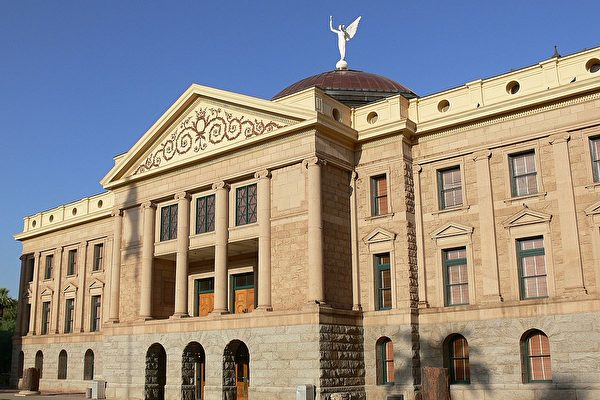

图为亚利桑那州议会大厦。

【大纪元2018年04月07日讯】2018年4月4日，美国亚利桑那州参议院全票通过制止中共活摘器官备忘录法案（House Concurrent Memorial 2004，HCM2004），敦促美国政府尽早实施对中共活摘器官罪行的彻查并进行海外器官移植立法。

明慧网报导，HCM2004法案中提到，鉴于曾获诺贝尔和平奖提名的、十年间监测并客观报导中国移植情况的慈善医学伦理倡导协会医生反对活摘器官组织（Doctors Against Forced Organ Harvesting）的要求；鉴于杀害因宗教信仰或政治等原因被关押的良心犯，出卖他们的器官进行移植的行为，是令人震惊的，对生命基本权利的不能被容忍的侵犯，亚利桑那州众议院与参议院同意敦促：

1. 美国国会立即对中共器官移植和采购实践进行全面和透明的调查。

2. 美国国会禁止曾非法从中国囚犯身上采集器官或使用这些器官进行移植手术的医生进入美国。

3. 美国国会颁布立法，禁止美国公民在国外接受不可追踪或不透明器官源相关移植。

4. 亚利桑那州医疗界警告患者不要前往中国进行器官移植手术，并努力提高医疗服务提供者、学生、患者和公众对中共不道德器官移植行为的认识。

5. 亚利桑那州州务卿将这一备忘录的副本传送给美国国会参议院议长、美国国会众议院议长、亚利桑那州医学委员会执行主任和亚利桑那州医学院院长。

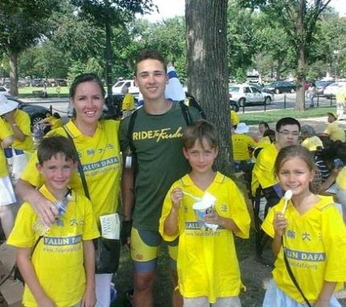

积极参与推动禁止中共活摘器官备忘录法案的法轮功学员戴安娜女士（左二）（明慧网）

“每个在场的代表都投了赞成票，亚利桑那州众议院和参议院的所有成员都一致通过了它”，五个孩子的母亲、法轮功学员戴安娜女士兴奋地表示，“这个法案是一个并行备忘录（Concurrent Memorial），它要求我们的政府采取行动，并告诉我们的医疗精英们关于中国法轮功学员遭到迫害的事实。”

“我认为我们的医疗界需要通知那些正在考虑去中国寻找器官源的人们活摘器官的可怕，因为可能会有人被残忍地谋杀。”

戴安娜说，推进HCM2004法案的过程很漫长，在过去的三年里她和其他志愿者一直为此奔波。“虽然三年间我见过很多议员和相关人员，但第一步只是为了让他们为我们打开会议室的大门。”

她说，为了让议员们认清中共活摘器官的事实花了很大一番功夫。“对一些议员们来说，特别难以理解的是，这不仅仅是少数的个体参与器官贩卖的个例，这是一场医疗种族灭绝，而中共政府是活摘器官事件发生的始作俑者。”

还有一些人想知道为什么这一法案需要在亚利桑那州通过。戴安娜告诉他们：“因为亚利桑那州有非常大量的诊所、疗养中心，而亚利桑那大学拥有世界知名的移植手术培训机构。中共很多时候会把医学院学生送到西方培训，而他们中的不少人来了亚利桑那大学。”

在戴安娜不断会见政府人员的过程中，有时会遇到一些显得很惧怕中共的美国政府事务人员，“这是最令我伤心的事”。

不过，为期三年的努力终于见到了成效，戴安娜表示，HCM2004已经在众议院和参议院获得通过，很快它就将被送到政府正式签署。

戴安娜希望这会让所有亚利桑那公民都意识到器官被活摘的可怕，也希望美国媒体开始帮助披露在中国的这场可怕的迫害。

“因为它确实影响了亚利桑那州及其公民。”她说，“这有助于中国人民了解真正在中国发生的事情。来到美国的中国人们可以享受全面的信息自由，他们很幸运，可以更好地了解中共真正在做什么，并有机会脱离这种反人类罪，站在历史的正确一方。”

“我认为像这样的法案会震慑中共，因为他们现在知道亚利桑那州公民和州立法者发现了他们肮脏的秘密。中共政府做了很多事情来试图掩盖它。”戴安娜表示，她为亚利桑那感到骄傲。

“它（这个法案）起初只是一个在志愿者会议间和电子邮件间的草案。但在推行过程中我们收集了非常多的来自亚利桑那州居民的签名，他们中的很多人都非常支持，并表示期待看到这个备忘录通过。随着法案的推进，我们的公民和立法者越发愿意站在正义的一方”，“这真是一个非常美妙的过程！”

戴安娜想借此机会告诉美国政府领导者们：“这不仅仅是法轮功问题，或是单纯的和他们不相干的中国问题。他们非常有权就此问题（和中共）开始对话。他们就这个问题谈得越多，消息的传播速度越快，而这场罪恶将会被终结得越快。”

<h1 align="center"><b>组图：炼功点遍地开花 法轮功在巴西</b></h1>

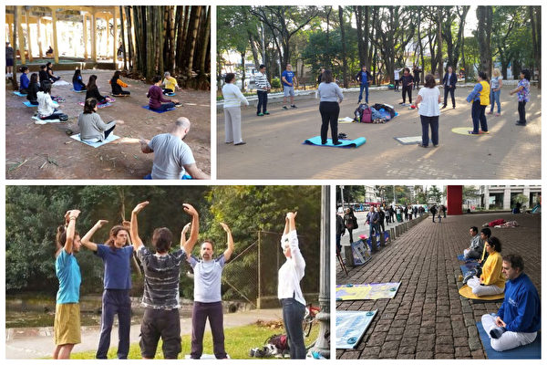

法轮功炼功点在巴西遍地开花。（明慧网）

【大纪元2017年09月03日讯】法轮功洪传世界，也包括远在南美洲的巴西。这里炼功点遍地开花，有缘人相继而来，步入法轮功修炼，体验“真、善、忍”的美好。

法轮功又称法轮大法，要求修炼者在日常工作、学习和生活中，以“真、善、忍”为原则提升自己的道德与境界。法轮功包括5套舒缓的功法动作，对祛病健身有奇效。

<b>圣保罗市居民区内的炼功点</b>

明慧网报导，为了方便居民得闻法轮大法，巴西法轮功学员Alberto在圣保罗市居民区内的一个小型广场上开设了炼功点。这个炼功点现已历经了八个春秋。

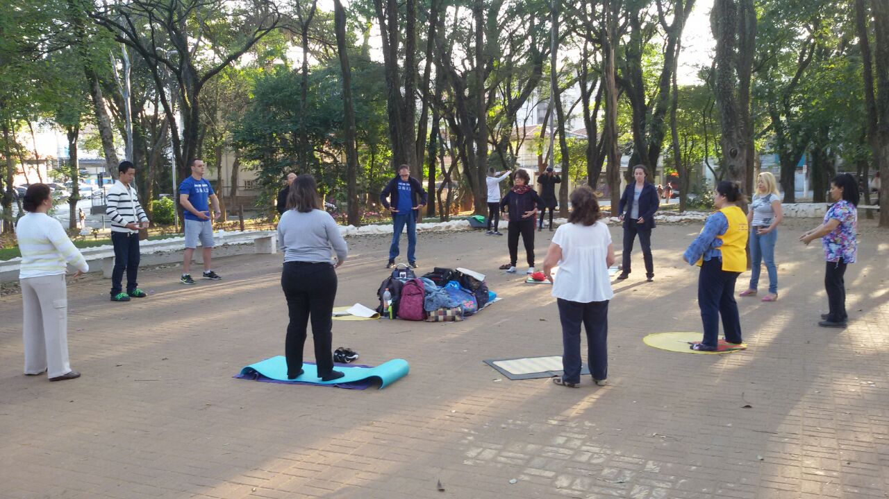

圣保罗市居民区内的炼功点(明慧网)

附近居民上下班经过这里，老人们每天聚在这里活动，家长们也带着孩子在这里纳凉，小区居民几乎都知道这里有一群人在炼法轮功。

Alberto介绍，有一段时间广场有一群说唱者在练习，音量很大。这需要他这个活动组织者要做到心不动，泰然处之，使这个炼功点保持稳定。现在环境在不断变好，说唱者已挪到很远的地方去了；原来有时会随风飘来大麻烟的味道，现在空气中大麻烟味也很少飘来了；这个炼功点上，法轮功学员逐渐增多，整个小区的状况也在好转。

<b>圣保罗市艺术博物馆前的真相炼功点</b>

圣保罗市艺术博物馆（MASP）位于该市最繁华的金融街Paulista上，每天众多市民乘车或步行经过那里，法轮功学员Gilberto和部分其他法轮功学员每月到那里传播法轮功真相，他们摆上展板、横幅与真相传单，展示功法。不少当地居民是从那里了解到法轮大法，并步入修炼的。炼功点吸引了不少市民和外国游客照相与录像。很多人对中共迫害正信者的暴行表示非常震惊。

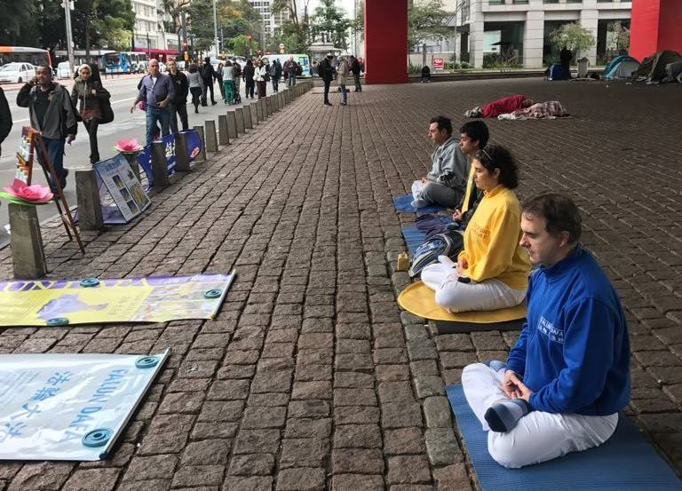

圣保罗艺术博物馆前的法轮功真相点（明慧网）

炼功点的义务协调人Gilberto和Sueli夫妇俩都修炼法轮功。他俩还经营一个小型企业，有十几位员工，他们对待员工像家人一样，全部员工了解了法轮大法的美好及中共的迫害，他们还学习了法轮功五套功法。

在公司的经营上，夫妇俩秉承真诚原则，为客户着想，价格合理。多年来公司收入稳中有升，这两年巴西经济衰退严重，许多同行企业都关闭了，他们的公司还能走到今天。Gilberto说：“这是大法佛光普照的结果！”

圣保罗市还有一片街区，叫五月二十五街，布满了华人商铺。为了让这里的中国人明白真相，Gilberto每周六到这里发中文《明慧周报》。

以前，Gilberto有时会被不明真相的中国人扔报纸在脸上，自尊心一度受到伤害，不愿面对他们。通过一段时间的学法、修炼，他表示，自己已放下了是老板的心态，以更平和、更亲切的修炼者的慈悲心态去向中国商人讲真相。

<b>亚裔区Liberdade炼功点</b>

2017年7月，两位华人法轮功学员在亚裔区Liberdade建立了一个炼功点，讲真相，义务教功，不同族裔的人士在这里了解到法轮功真相，有的当即学功。

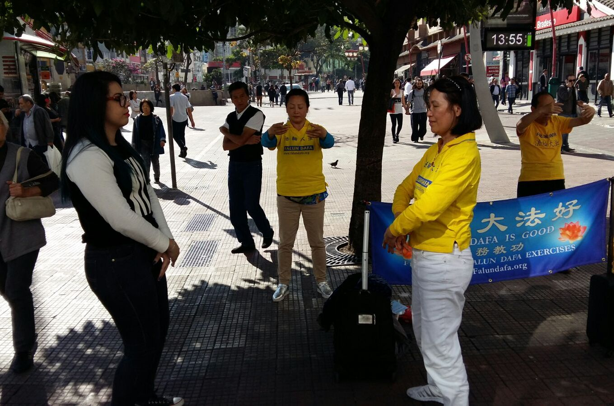

亚裔区Liberdade炼功点上，法轮功学员在义务教功。（明慧网）

一位吴姓法轮功学员炼法轮功两年多了，平时他一有空就去中国商铺发报纸，那里的商人都认识他了，人心也在悄然变化。一天他正在发《明慧周报》，一个20岁出头的小伙子走过来说：“大叔，您发的报纸我每期都看，我要三退（退出中共党、团、队组织），您能帮助吗？”

这位法轮功学员还把中共的杀人历史、贵州天然藏字石、法轮功是什么、普世价值“真善忍”等真相告诉中国人商家老板，他说，在这个过程中，慢慢地在不断去掉自己的爱面子心、争斗心和党文化。

<b>公园炼功点</b>

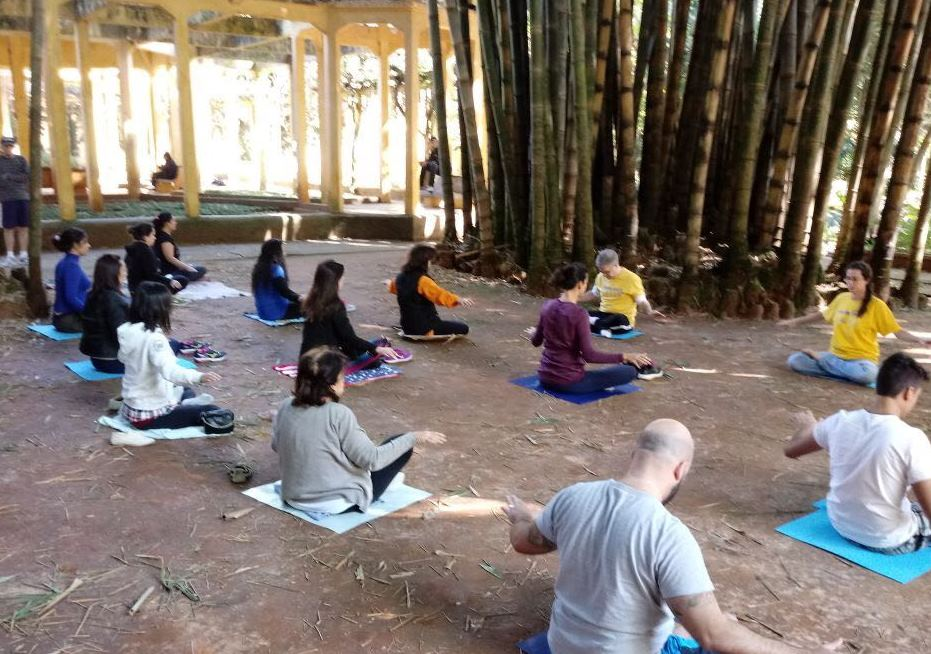

公园炼功点每周日的炼功（明慧网）

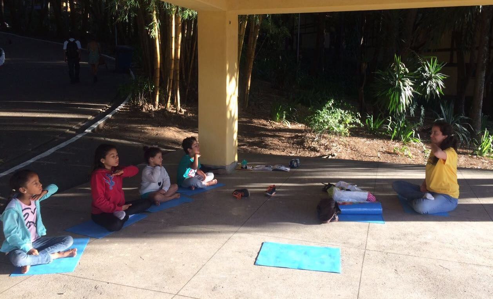

法轮功学员在炼功点教小朋友们打坐，这是法轮功第五套功法。（明慧网）

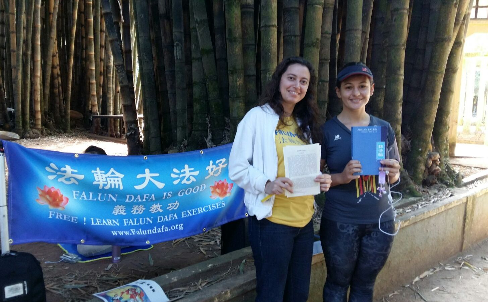

法轮功学员Ticiane 向学功者介绍《转法轮》（《转法轮》由法轮功创始人李洪志先生所著，是指导学员修炼的主要书籍）。（明慧网）

法轮功学员Ticiane女士是位博士，说到法轮功，她神采飞扬，这是从心底发出的欣喜，她说：“当思维进入到《转法轮》（法轮功主要书籍）里，沉浸在炼功音乐声中，就像脱离了这个尘世。纯净、祥和包围着我，太美妙了！”

她是一位成功人士，拥有高学位、美满的家庭，丈夫收入高，家里有精致的洋房，但她表示，法轮大法让她内心感到从没有过的充实。她还在自己住处附近的公园开设了炼功点。她在脸书上打出炼功点信息，不断有人前往学功，包括老人、孩子。她表示：“法轮大法带给我这么多的美好，我要让更多的人知道，不停地努力去传！”

年轻法轮功学员Matheus是位政府公务员，修炼法轮功近四年。回忆起得法当初的情景，欣喜浮上脸庞，他说：“修炼后，易感冒、易疲劳的体质很快消失了，身体轻健，心情愉快，对世界的认识起了根本的转变。”

修炼法轮功前，他热衷于摩托车俱乐部的活动，每个周末都泡在那里，攀比新车型；抽烟、喝酒乐此不疲；要想让他不去聚会真比登天都难。修炼后的几个月里，他的狂热执著就消失了，再不去会那些哥儿们了，并与心爱的人步入婚姻的殿堂，开始了全新生活。

Matheus曾过于执著自己的能力，一度认为“我多有能力呀，帮助解决了许多难题，我的帮助很重要。”但是他发现，他抱着这样的想法再去帮助别人时，效果往往不好。他也疑惑：为什么会这样？ 我是好心呀？通过读《转法轮》和向内找，他认识到这是证实自我的显示心在作怪，表现为不善和指责。认识到后，他不断抑制它、清除它。现在大家感到了他的变化，更有善心了，大家也更愿意接受他的建议了。

<b>巴西南部Curitiba市炼功点</b>

巴西南部的Parana州首府城市Curitiba的居民大都是德国、意大利、波兰和俄罗斯移民的后裔。这里民风自律、市容整洁，在世界上享有一定的名气。2017年5月起，本地部分法轮功学员在这里也开设了炼功点，每周三次在不同的炼功点炼功， 也包括市中心广场。

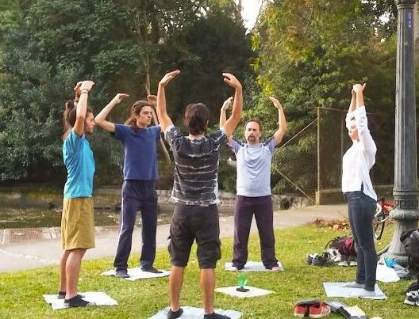

Curitiba 市市中心花园炼功点（明慧网）

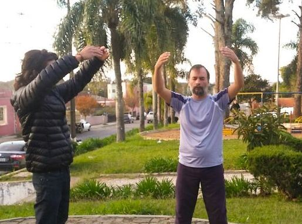

Palmeira市市中心广场炼功点（明慧网）

<h1 align="center"><b>“四‧二五”中南海万人上访真相</b></h1>

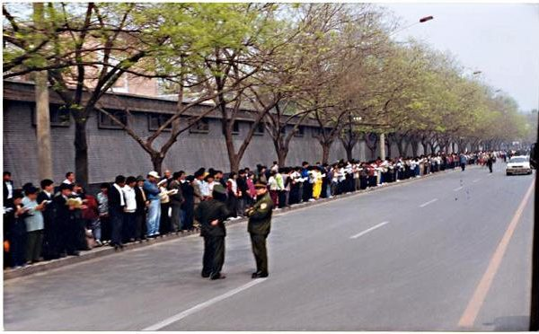

1999年4月25日，一万余名法轮功学员来到中南海旁边的国务院信访办和平上访，要求当局给予一个合法的自由炼功环境。（明慧网）

 
 【大纪元2017年10月25日讯】（大纪元记者叶枫综合报导）1999年4月25日，一万余名法轮功学员来到中南海旁边的国务院信访办和平上访，要求中共当局给予一个合法的自由炼功环境，史称“四‧二五大上访”。
 
 这次上访所展现出的中国百姓的勇气与和平理性的精神风貌震惊世界。十八年过去了，亿万法轮功学员在风雨中正信不移，“四‧二五”精神延续至今。让我们回顾这段历史，看看当年这一事件的来龙去脉。

<b>1996年光明日报事件</b>

法轮功自1992年传出后，以其祛病健身的奇效和对道德的迅速提升，在民众中间口耳相传，短短数年，吸引了上亿人修炼。法轮功修炼人群的迅速扩大，引起一直严格控制意识形态领域的中共当局的注意。

1996年6月17日，中共官方喉舌媒体《光明日报》在中宣部副部长徐光春的授意下发表评论员文章，公开诋毁法轮功。

1996年7月24日，中宣部管辖的新闻出版署向全国各省市新闻出版局下发内部文件，禁止出版发行当时名列北京十大畅销书的《转法轮》等法轮功书籍。

1997年初，中共政法委书记罗干指示公安部在全国进行调查，网罗罪证欲诬陷法轮功为×教。全国各地公安局经充份调查后均上报反映“尚未发现问题”，调查不了了之。

<b>1998年北京电视台事件 </b>
　
1998年5月底，何祚庥在北京电视台的采访中批判法轮功如何有害，之后，北京电视台在播放对法轮功一炼功点的采访时，点名法轮功是“封建迷信”。节目播出之后，很多了解节目中何氏所提供的事例中当事人的学员，立即向何氏和北京电视台指出：节目内容违背事实，因为该人根本不是法轮功学员。

接下来的几日中，一些学员依据中央关于气功的“三不政策”（不打棍子、不争论、不报导），写信或直接访问电视台，用亲身经历说明实际情况。

事后，北京电视台领导说，这是建台有史以来最严重的一次失误，并很快播放了一个表现法轮功学员清晨在公园里祥和地炼功，还有其他人士一同晨练的正面节目作为更正。

<b>公安部构陷法轮功 要求各地公安“深入调查”</b>

1998年7月，公安部一局发出公政[1998]第555号《关于对法轮功开展调查的通知》。《通知》中先把法轮功诬陷为邪教，紧接着又提出：要掌握活动内幕情况，发现其违法犯罪的证据，各地公安政保部门要深入开展调查。

这一《通知》引发了全国许多地区基层公安部门在无任何证据的情况下非法取缔法轮功炼功点、强行驱散炼功群众、抄家、私闯民宅、没收属于个人的私有财产等行动。

<b>政府调查结果</b>

鉴于法轮功的传播越来越快，影响越来越广，并且大量群众来信反映公安非法对待法轮功炼功群众的问题，国家体育总局于1998年5月对法轮功进行了全面调查了解。9月由医学专家组成的小组为配合此次调查，对广东12，553名法轮功学员进行表格抽样调查，结果表明祛病健身总有效率为97.9%。

10月20日，国家体总派到长春和哈尔滨的调研组组长发表讲话说：“我们认为法轮功的功法功效都不错，对于社会的稳定，对于精神文明建设，效果是很显著的，这个要充份肯定的。”其间，大连、北京等地对法轮功功效的民间调查也得出了一致的结果。

1998年下半年，以乔石为首的部分全国人大离退休老干部，亦根据大量群众来信反映公安非法对待法轮功炼功群众的问题，对法轮功进行了一段时间的详细调查、研究，得出“法轮功于国于民有百利而无一害”的结论，并于年底向江泽民为首的政治局提交了调查报告。

1999年2月，美国一家权威性杂志《US News and World Report》发表文章谈到了法轮功在健身方面的好处：“国家体育总局局长说：‘法轮功和其它气功可以使每人每年节省医药费1000元。如果炼功人是一亿，就可以节省一千亿元。朱镕基对此非常高兴。国家可以更好地使用这笔钱。’”

<b>1999年天津抓捕法轮功学员事件</b>

1999年4月11日，何祚庥在天津教育学院《青少年科技博览》发表文章，以捏造事实的卑劣手段，恶毒攻击、陷害、诬蔑法轮功。

何在文章中再次引述了其在1998年北京电视台发表的例子批判法轮功。由于该例子在北京电视台事件中已被充分澄清，何的这篇文章也已受到北京市宣传系统的严格抵制，此次天津发表该文章，天津的一些法轮功学员认为有必要向天津有关方面澄清事实真相，并期望通过向杂志编辑部澄清事实来消除该文章的恶劣影响。

因此，4月18日至24日，一些法轮功学员前往天津教育学院及其它相关机构反映实情。

4月23、24两日，天津市公安局动用防暴警察殴打反映情况的法轮功学员，导致学员流血受伤。警察抓捕45人。当法轮功学员去天津市政府反映情况、请求放人时，却被告知：公安部介入了这个事件，如果没有北京的授权，被逮捕的法轮功群众不会得到释放。

天津的公安亦向法轮功学员建议：“你们去北京吧，去北京才能解决问题。”

<b>4月25日万人上访国务院信访办</b>

随着天津使用暴力抓人以及北京才能解决这个问题的消息在全国传开，从4月24日晚开始，法轮功学员怀着对政府的信任和期待，纷纷自发前往位于中南海西侧府右街的国务院信访办寻求“天津事件”得以公正解决。

4月25日早上，上万名法轮功学员从四面八方涌向北京市中心。起初，警察在通往天安门的各个路口拦截他们，后来由警察带路，把人流导向中南海，最后形成了所谓“围攻中南海”。

整个过程，法轮功学员是和平的，没有标语、口号，他们只是静静站立。他们是来信访办的，站在中南海外，只是为了配合警察指挥。

事后，很多参加上访的法轮功学员证实：当时他们本来都自发地去信访局上访，但是在警察的引领下，从中南海正门沿两边汇集成一圈。他们当时并未察觉事有蹊跷，他们始终努力配合警察的调度指挥。而最终围聚中南海的情势实为公安部门诱导调度所至。

<b>朱镕基总理和政府官员和平解决天津抓人事件</b>

4月25日早8点15分左右，朱镕基总理一行人从国务院正门（西门）出来走过马路来到上访学员的面前。

法轮功学员石采东先生，1999年四‧二五时正在中国科学院攻读博士学位，他回忆了那天朱镕基总理带他走进中南海的经过：

4月24日晚上，因为加班完成实验，我很晚才去学法。辅导员李阿姨见我来晚了，边走边简单地介绍了天津发生的事。她说大家自己决定是否去上访。四月二十五日早晨七点半，我到了府右街北口。附近街道两边和小区里站了许多学员，大家或站、或坐，有的手里捧着书在看。人虽然很多，但既没有阻塞交通，也没有喧哗声。马路上骑自行车上班的人们如往常一样地赶路。公厕旁排著十多米的队伍，秩序井然。

我是第一次来这里，连国务院信访办的门在哪里都不知道，心想先转一圈，希望遇到认识的法轮功。正往前走，忽然身后人群中响起了由稀而密的掌声，在清晨的宁静中显得清脆。我回头一看，朱镕基总理和几个工作人员正走出对面的大门（原来我刚才经过了中南海的西门），朝我们走来。

朱镕基大概已经得知法轮功学员上访，大声问道：“你们来这里干什么？谁叫你们来的？”站在他面前的学员不少是从农村来的，大多没有吱声。

“你们有宗教信仰自由嘛！”朱镕基接着说。

“我们是法轮功学员，我们来反映情况。”人群中有学员回答道。

“你们有什么问题，你们派代表来，我带你们进去谈。”朱镕基停了一下，接着说，“我也没法和你们这么多人一起谈呀！”

朱镕基让选代表进去反映情况。但是大家都是自觉来的，甚至彼此大多不认识，也从没有想过要选代表。因为平时炼功就是自觉自愿的，想炼就一起炼，没时间就忙自己的事，从来没人登记，也没查过人数，更不用说选代表。

他又问：“你们有代表吗？你们谁是代表？”

这时我已到了距离朱镕基不过两米的地方。“朱总理，我可以去。”我首先自告奋勇地从人群中来到他身边。

“还有谁？”朱镕基问道。

“我！”“我！”“还有我！”……这时大家纷纷举手。学员们个个都想进去反映情况。

“人不能太多。”朱镕基在站出来的学员中指了我们先站出来的三个人。其实，我们不是推选出的代表，而是毛遂自荐的。朱镕基转身带着我们朝中南海西门走去。他边走边大声问道：“你们反映的情况我不是做了批示吗？”

“我们没有看到呀！”我们几个都愕然地回答。（事后才知道是罗干给扣押了）他可能意识到了什么，换了话题说：“我找信访局局长跟你们谈”，说完他进中南海上班去了。

在传达室石采东认识了另外两位学员，一个是北大某电脑公司的女职员，一位是下岗工人。三人你一言我一语的讲了自己的修炼体会，四位信访办官员边听边记录。

4月25日中午时分，法轮大法研究会的李昌、王治文和其他三位北京学员作为法轮功代表进入国务院同政府官员会谈，申诉了法轮功学员的三点要求： 1）释放天津被抓的法轮功学员； 2）给法轮功修炼群众一个宽松的修炼环境； 3）允许出版法轮功书籍。

政府官员轮流参加会谈的有国务院信访办的负责人、北京市的负责人，还有天津市的负责人。

傍晚时分，天津按照中央指示释放了所有被关押的法轮功学员。

<b>一万多名法轮功学员安静散去 警察：这就是德！</b>

到晚上8点多，会谈完毕，在得知天津方面已经释放被捕的法轮功学员后，中南海前的法轮功学员也很快散去。临行时，地上清理得干干净净，一片碎纸都没有留下，连警察扔下的烟头都捡走了。整个过程，平静祥和，走后地上干干净净的。

一个当时现场的警察对周围的人说：你们看看，这就是德！

<b>公安武警不停录像</b>

这样的和平上访却被中共构陷为“围攻中南海”。

4月25日下午，中南海附近戒严。可靠消息透露，江泽民当天乘坐防弹轿车绕行中南海。

警察似乎是有备而来。据亲历“四‧二五”的一位法轮功学员讲，在4月25日当天，公安武警的录像车不断在府右街上出现，不停地录像拍照。公安和武警是公开录拍，还有很多便衣偷偷录拍。有些便衣还到法轮功学员队伍中，只要见有人说什么，就凑上去听。

这位法轮功学员的一个邻居在北京某医院当医生，第二天（4月26日）这位邻居就告诉她，她们医院昨天被武警奉命临时紧急征用，所有病房晚饭前全部腾出，并准备了大量外伤医疗用品，说有紧急任务，还有好几个同学所在的几家医院昨天也都接到这样的命令并做好准备。

这位法轮功学员说，25日下午傍晚前，武警部队的指挥车车队一遍遍地在府右街侦察（在此之前，武警在府右街只出过录像车），显然，中共已着手计划实施镇压法轮功学员的和平上访，是法轮功学员表现出的正和善使中共预谋的一场暴力流血事件解体。

现定居于澳洲的原中共一级警司郝凤军，2000年时曾任职于专门镇压法轮功的610办公室。他表示，在那里，他看到大量对于法轮功学员的监控数据和记录。

他认为，那些资料不可能在一两年内收集完成；北京当局早已关注法轮功，四‧二五事件其实是精心设计的。

<b>江泽民密件推翻总理结论 决定镇压</b>

4月25日当夜，江泽民以中共总书记的身份，模仿毛泽东“炮打司令部”的做法，给政治局常委及其他有关的领导写了一封信，决定全面镇压法轮功。在这封信中，江泽民提到了镇压的两个理由：一、修炼法轮功的人太多了；二、法轮功信仰与共产党意识形态不一致。

在信中，江泽民指控“四‧二五上访事件”是“一个新的信号”，有“幕后”高手在“策划指挥”。(绝密，中办发电[1999]14号“中共中央办公厅关于印发《江泽民同志给政治局常委及其他有关领导同志的信》的通知”)

这封信随后被中办作为通知印发，并特别注明：“请注意中央办公厅的通知要求的是：学习贯彻落实，不是征求意见、或讨论研究。”七年后，这封信被收录在《江泽民文选》第二卷公开出版发行，并加上标题《一个新的信号》，成为江泽民以个人独裁方式主导镇压法轮功的最有力证据之一。旅德政治学家仲维光对此表示:“这种对于民众上访的打压，无论从国际范围，从法制国家应有的规范来说，还是从中共自己口头声称的规范来说，都是非法的。”

当时的中共政治局常委朱镕基、李瑞环认为，对于一种“气功”完全没有必要大动干戈，更没必要搞成巨大的运动。

朱镕基引用调查数据说，法轮功能祛病健身，为国家节约了很多医药费，炼的人很多是中老年人和妇女，他们想练就练呗。哪知江一听咆哮到：“糊涂！糊涂！糊涂！亡党亡国啊！”“灭掉！灭掉！坚决灭掉！”

1999年6月10日，江泽民成立了“610办公室”，开始调动一切权力和社会资源镇压法轮功。

1999年7月19日晚，江泽民一意孤行，不顾其他6个政治局常委的反对，在中共高层会议上亲自拍板做出全面镇压的决定，以国家政府的名义取缔法轮功。

7月20日，全国展开逮捕法轮功学员。至此开始，法轮功学员在遭受各种谎言污蔑、诽谤的同时，被中共非法劳教判刑、酷刑折磨、甚至被活摘器官、迫害致死。

法轮功学员在中共灭绝人性的迫害下走过长达十八年的和平理性反迫害历程。自2015年5月起，中国大陆兴起诉江大潮，现已有近21万的法轮功学员及家属实名向中共最高检察院和法院实名控告迫害法轮功的元凶江泽民。
 

<h1 align="center"><b>面对中共罪行“我们可以闭上眼睛吗”</b></h1>

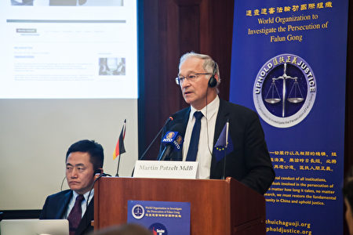

德国国会议员帕策尔特参加2016年10月28日在柏林举办的反强摘国际论坛。

【大纪元2016年10月30日讯】人的尊严，可以买卖吗？面对种族灭绝的暴行，我们可以闭上眼睛吗？发生在21世纪、对法轮功的迫害，事关生死和良知。迫害惨烈，史无前例；活摘器官，惨绝人寰。这不只是中国人的噩梦，而是邪恶在挑战人类的底线。

<b>来自德国的关注</b>

2016年10月17日，德国联邦议会人权委员会主席米歇尔·布朗德（Michael Brand）和国会议员马丁·帕策尔特（Martin Patzelt），特邀德国法轮大法协会、追查迫害法轮功国际组织、德国国际人权协会（IGFM）以及劳改基金会的代表座谈，详细了解中共对法轮功学员的迫害，特别是在中国发生的大规模活体摘取法轮功学员及其他良心犯器官的情况。

两位议员都表示，基于大量的事实证据，他们不怀疑活摘器官的真实性。他们会敦促德国政府作出举动帮助制止活摘器官，德国议会也需发出更强大的声音，抵制“这个星球从未有过的邪恶”。

2016年10月28日，在中德人权对话前夕，“追查迫害法轮功国际组织”在德国柏林Albrechthof饭店举办国际论坛，谴责中共强摘法轮功学员及其他良心犯器官的罪行、呼吁公众关注。德国议员马丁·帕策尔特和德国的欧盟议员盖立克到场发言，另有德国、美国和欧盟等多位议员以书面发言表示支持。

帕策尔特议员致开幕词。他以沉重的语气阐明制止中共活摘罪行的紧迫性，并强调政治家所应担负的责任。帕策尔特指出，一个国家参与强摘人体器官获利，这是史无前例的，是对人性尊严的藐视。这关系到生死问题，人的尊严不能被买卖。

他说：“我们能容忍这个罪行吗？我们想闭上眼睛吗？我们可以闭上眼睛吗？和经济利益与经济合作相比，人的权利这件事情难道不重要吗？这甚至是更为重要的。……但是只有我们议员行动起来也还是远远不够的，而是应该全社会都来关注。不只是在德国，在欧洲要进行讨论，在所有尊重人权的国家都要进行讨论。”

帕策尔特还说：“如果我们在这个问题上不共同为人权而奋斗，那么我们就要问问自己是不是还是人。我说的话很重，是因为我们今天讨论的事是非常可怕的。我们需要更多地思考，为什么会发生这样的事情？为什么没有那么多的社会反响？”

欧盟议员盖立克（Arne Gericke）是欧洲议会“第48号书面声明”的12个发起人之一，该声明于2016年9月通过，要求欧盟委员会和欧盟理事会采取行动制止中共强摘包括法轮功学员在内的良心犯器官，并立即进行独立的调查。

盖立克认为，对中国人民来说，“1999年开始的对法轮功的迫害是一个噩梦，回归自己文化的根的愿望又一次被践踏。”他说：“欧洲不能无视这种刑事犯罪行为，我们必须全力反对。”

美国国会资深众议员、中国事务委员会主席克里斯·史密斯（Chris Smith）在书面发言里写道：“17年来，中共想方设法从中国根除法轮功的所作所为，已成为21世纪首屈一指的最大犯罪。我深深的相信，这场迫害将被视为近代中国历史中最大的耻辱。”“我们必须继续把光明带给被迫害的人，为不能发声的人发出声音，并帮助那些遭受迫害，承受痛苦的人。”

<b>国际社会谴责中共强摘器官</b>

2006年3月，中共活体摘取法轮功学员器官的罪恶在海外被初次曝光。十年来，有关活摘的调查工作取得了重大进展和突破。“追查国际”和海外独立调查员坚持不懈，进行了细致深入的调查，发布了详尽的调查报告，呈现了大量确凿的证据。“追查国际”并且对于涉嫌犯罪者发出了追查通告、对其立案追查。

今年6月13日，美国国会众议院一致通过了343号决议，谴责中共强摘良心犯器官、要求中共立即停止迫害法轮功及释放关押的法轮功学员。

6月22日，加拿大前亚太司司长大卫•乔高（David Kilgour）、加拿大著名国际人权律师大卫•麦塔斯（David Matas）和中国问题专家兼调查记者伊森•葛特曼（Ethan Gutmann）发布了关于中共强摘器官的最新数据报告。该报告估计，每一年，中国器官移植手术的数量约为6万－10万例。在过去15年里，估计共进行了大概150万例器官移植手术，而这些器官的主要来源是法轮功学员。调查员指出，活摘器官实际是对法轮功的群体灭绝，残忍程度远超纳粹。

6月23日，美国国会众议院就法轮功学员等良心犯器官被强摘召开了听证会。6月29日，大卫·乔高、伊森·葛特曼和大卫·麦塔斯受邀在欧洲议会举办听证会，他们提交了最新调查报告，促请欧盟行动、制止中共活摘器官。

9月12日，在欧洲全会上，欧洲议会主席舒尔茨宣布了由12位欧洲议会议员联合发起的、在7月27日通过的48号书面声明。该声明要求欧盟委员会和欧盟理事会采取行动制止中共活摘良心犯器官，包括立即进行独立的调查。

近来，西方多家主流媒体对于中共活摘器官事件给予关注和密集报导，相关讯息通过报纸、电视、广播和网络大面积地传播开来。各界民众在了解真相后同声谴责中共的罪行，强烈要求凶犯被绳之以法。

<b>人类共同的责任</b>

在过去十余年里，数以万计的善良的中国人，因为信仰和良心而被中共江泽民集团系统化地宰割、屠杀。制止虐杀，维护生命的尊严，维护信仰的权利，向反人类罪行说“不”，不分国界。

加拿大人权律师大卫•麦塔斯说：“（活摘器官）这种犯罪不只是针对法轮功的，也是针对人类的犯罪。反人类犯罪会让所有人遭遇不幸。反人类犯罪，也是对我们（每个人）的犯罪。”

加拿大前亚太司司长大卫•乔高表示：“如果习近平主席想改变中国形象，最好的办法是立即制止这一强摘器官的行为。我想习和活摘器官的江泽民并无关联，他应该现在就制止，而不应再等上两年。每年有几千人，5万至10万人在死亡。”

联署支持343号决议案的克里斯·史密斯议员建议，海牙国际法庭应对中共的反人类罪行进行调查。他说：“参与活摘器官者应该受到法律制裁。活摘器官是中共又一令人发指的罪行明证。”

美国众议院议员达纳·罗拉巴克在6月份的听证会上发言说：“中国共产党是当今世界最邪恶的力量之一。中共支持的系统性强摘器官行为是滔天罪恶。”罗拉巴克表示，自由世界不能与中共拥抱。

英国议员杰拉德·巴登曾发言说：“中共政府迫害屠杀上百万无辜民众，我们怎能熟视无睹，与中国商讨战略合作？中国正在发生的事情，堪比纳粹德国（对犹太人的迫害），无人性，恐怖。……各国政府应该联合起来，国际上如联合国、所有大洲、所有政府应该一起反对在中国发生的（活摘器官）罪行。”

大陆前中共总书记赵紫阳的政治秘书鲍彤先生曾表示：“凡是活摘器官的人、活摘器官的党、活摘器官的政府都应该受到人类的谴责，都应该站到历史的审判台上成为被告，接受审判。”

有网友留言：“中共之邪恶，已远远超出人类的底线，可以说是魔鬼的化身，全世界有良知的人们，尽快联合起来，制止中共的暴行。”

以正义之名，对一切罪恶的清算，是历史的必然，罪犯们终将无处可逃。在最后的审判到来之前，刽子手的屠刀仍未放下，虐杀还在黑暗中进行。时间正悄然流逝。一声声急迫的呼喊在发出，期盼更多良知觉醒，为生命写下光明。

<h1 align="center"><b>“法轮功”这三个字是最响亮的</b></h1>

【明慧网二零一八年四月五日】四月初的台湾台北阳光和煦，正是春暖花开好时节，台湾国父纪念馆已是各国观光客到台旅游必到访之处，因此也不时有已在台湾生活、就学或工作的中国人以此为相聚据点，温馨迎接随团到台旅游的大陆亲人。

台湾国父纪念馆外的法轮功真相点

有对从重庆来的老夫妻正专注地看着国父纪念馆正门大厅外的法轮功学员演炼功法，老夫妻的女儿、已嫁作台湾媳妇的女子在一旁跟两老解释说：“你看法轮功他们人都很正常啊，不是国内电视台播出的那样！”“在台湾信仰是自由的、炼功也没问题啊，所以才能在这里公开炼。”两位老人不可置信地张大眼睛，正巧有法轮功学员经过，立即递上真相材料。老夫妻还是担心不敢拿，女儿就又在旁鼓励说：“拿啊拿啊，来了就看看，这里是台湾，看看可以啦！没关系！”

这天来了位北京年轻人，经过法轮功真相点时好奇地看了摊位上陈列出的报刊书籍一眼，当看到书名是《九评共产党》时，立即表示：不看了，这书带不回去。学员鼓励他：“这里是台湾，尽管自由自在去看去听或拿资料，不会有人监看监听的。”年轻人笑着接着说：是啊，虽然才刚到达没几个钟头，但已经明确感受到台湾很自由的气息了，尤其我来自北京，工作地点离中南海很近，感受特别深刻。学员接着问他：“了解法轮功吗？”他委婉地说是来旅游的，不想谈政治，但共产党的坏其实大多数中国人心里是清楚的，只是生活在那块土地上也没办法呀，所以法轮功这话题我不想多谈。学员简明扼要地说明了法轮功是什么，由于江魔头的妒嫉及恐惧而引起了这场长达十八年以上的民族浩劫，但法轮功学员没有放弃，坚持修炼，“在和平时期修炼，在被迫害时期还是修炼，这么多年来始终坚持对‘真善忍’的信仰，就是坚定的修炼！”

学员接着提醒这位年轻人：“你是能独立思考的知识分子啊，当你看到好人无辜被迫害但却保持冷漠、置身度外，那不就是在沉默中纵容了罪恶的蔓延，那不就是助共为虐吗？刚刚你不是说：知道共产党坏，总是欺负善良人群吗？那这种不闻不问、不关己事的态度不就是在助长邪恶、同流合污吗？”这位年轻人愣了一会后，点头称是表示赞同；接着学员说明了三退（退出中共党团队，简称三退）意义并帮他取了化名，他爽快坚定地说：行！展开了笑颜、神情清朗地离去。

接着来了一对说广东话的夫妻在展板前驻足观看，两位都主动表示了解法轮功受迫害情况，因为他们来自香港，除了能自由取得资讯之外，对中共那些匪帮行径也很有体会。这位中年男士还说：我对法轮功这么多年的坚持特别感谢，我常想：就是因为有你们的反对迫害才让那帮流氓有所节制、不能为所欲为，所以我们香港还称得上生活的自在，这是因为你们长期付出才换来的，我很感谢法轮功！

有位台湾导游趁着空档跟学员聊聊天，他表示现在大陆的经济确实比多年前好很多了，所以各个年龄层、各个阶层的人都来到台湾旅游了，这是两岸政策怎么变也阻挡不了的交流。只是那边经济再好，不允许信仰也是现在中国人最大的悲哀，人活着却没有信仰，整体素质跟道德水准真的很不好，带团这么多年下来，他实在感到遗憾与强烈无奈。

后来来了位闽东的年轻朋友，因为平时在网络上没翻过墙，当看到听到学员提到的讯息时很诧异，接着他反覆说：“党是党、人是人，党不相信神，那是党的事，人怎么能不信神呢？我就是修佛的，党是党、人是人啊！”尤其听到法轮功学员在大陆被迫害的惨烈事实，太出乎他意外了，“那是不信神的党才做得出来的啊！有信仰的人不可能会这样。”

傍晚时刻有位回台休假的台商经过时主动跟学员竖起大拇指：“法轮功在全世界到处都看得到，人数超多、凝聚力量超大，你们的坚持真的了不起！”“你们不要看这些陆客在经过时不说话或是没有表情，那是因为团里可能有人在监视，但他们心里都很明白的；因为共产党长期给人民制造了一种恐怖气氛，让人害怕，但其实这些陆客都在注意你们的。所以你们在景点只要把展板摆出来、传单资料放上去，再加上你们几位站出来，就让共产党感到很大的压力，因为你们精神力量超强、还有坚持不放弃的毅力，共产党反而很怕你们！”“我最近还去了西门町、看到你们在那么吵吵闹闹的地方还能打坐炼功，还在发传单，太厉害了！”这位台商接着说：“‘法轮功’这三个字是最响亮的，响当当，我认为‘法轮功’已经远远超越了其他各个宗教了，你们不为名也不为利，只为了争取信仰自由，而且在全世界各地你们都这样坚持着，真是很了不起！”学员感谢这位有缘人对法轮功的支持，也建议他下次来时带些台商或大陆友人到国父纪念馆真相点来聊聊天。

<h1 align="center"><b>一位加拿大生物学家无止境的神奇之路</b></h1>

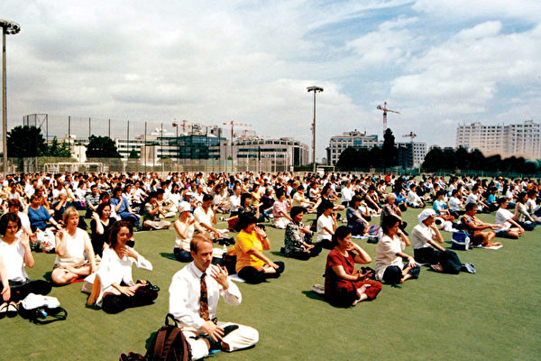

法轮功是性命双修的佛家修炼法门，使人身心受益。图为海外法轮功修炼者在法国集体炼功。（明慧网）

【大纪元2018年03月29日讯】《大西洋月刊》网站设立了一个专栏《什么是你最大的宗教选择》，邀请读者分享他们的个人故事和思考，以及生命中最重要的决定。2016年9月，一名加拿大生物学家乔恩‧波特讲述了自己罹患罕见疾病、邂逅法轮功、身心得到救赎的经历。

以下是这篇文章的摘录：

我在青少年时，就摒弃了一切宗教，将科学作为我的世界观。在大学时，我发现自己对生态学、进化和自然保护特别有兴趣，于是选择了生物学作为专业。我获得了丰厚的研究奖学金；在自己的专业领域建立了良好的关系和合作；找到了理想的野外研究场地；并且开始为博士课题在马达加斯加进行实地调研……一切都在朝我希望的方向发展——我的愿望是成为教授。

<b>罹患重病</b>

可是，命运女神并没有继续青睐于我——从马达加斯加回来之后，我开始感到虚弱、抑郁，一段时间后，我做简单事情的能力也逐步退化，连使用微型实验室工具也变得越来越困难。我以为是过度劳累，但是睡觉没有多少帮助。

情况继续恶化，有一天，我过马路时突然发现双腿不能正常地动了，差一点都不能过马路了。我知道这不是过度劳累的问题，于是去学校的医院做了检查。

我被诊断出患有格林-巴利综合症（GBS）。它是一种因免疫系统损害周围神经系统，而导致的急性肌肉瘫痪疾病。从维基百科上我查到，患病的初期会感到下肢无力、麻木，之后上肢和脸部肌肉也会出现症状，最后吞咽和呼吸困难，直至危及生命。

艰难地过了6个月之后，我对医院的治疗已经不抱希望了，我知道，我曾经相信的科学已经救不了我。同时压向我的还有职业生涯的瓦解，已经开发的学术合作关系的蒸发，教书变得越来越不可能，感情问题也受到波及……

我回到家乡，在那里母亲鼓励我去尝试「另类疗法」。我照做了，但没有见效。于是我又回到大学城。在那里，我碰到了一位老熟人，他曾经探索过很多东方修炼功法。他给了我一张DVD盘，告诉我说，那里面的内容帮助他治愈了慢性疲劳综合症。

<b>命运转折</b>

我永远不会忘记第一次观看那个录像的情形。那是一个教授法轮功打坐炼功的录像，我试着缓慢地模仿录像中的炼功动作，半小时后，我头一次感觉身体开始好转。这是一种说不出的喜悦，我的心脏、身体和心灵都在歌唱。

我读了一本法轮大法的著作，看到里面有很多中国传统文化的东西，起初虽然有点难以理解，但我每天坚持看，并坚持炼功，我感觉越来越好。终于有一天，我意识到我的反射恢复了（反射丧失被现代医学认为是格林-巴利综合症的常见症状）。反射恢复意味着我曾患有的格林 – 巴利综合症在炼功后神奇地消失了。

这样坚持了几个月后，我回到神经科医生那里做体检。我永远不会忘记医生的话：「恭喜你！你完全缓解了。我解释不了，但不论你在做什么，请继续做。」

还有，开始炼功大约一星期，我开始讨厌香烟的味道；一段时间后，酒精的味道我也受不了了。事实上，《转法轮》（法轮大法的主要著作）里描述了这两种状况，只是我之前没有预料到真会发生这样的事。就这样，我戒了烟酒。

<b>心灵愈合</b>

一天晚上，我在打坐炼功时，眼前展现的似乎是一部电影，内容是我整个的一生。我看到了我人生的描述，一步接一步，从早年开始。而且，所有情节都是从我母亲的视角展现出来的。我曾经读到过这样的事，以为那是一种特异功能，但这种功能发生在自己身上时，那种震惊和对心灵的触动无以言表，我哭了好几个小时。

我和我母亲之间有种复杂的关系。我们彼此爱对方，但是不能在同一房间里待15分钟以上而相安无事。有了这次经历，我平生第一次能真正理解她，明白了她的良苦用心和内心深处的痛。

我也知道了如何去修补。再次回家时，开始了对我们之间关系的修补，虽然还不够完美，但是我们的关系变得完全不一样了——充满爱与尊重。

<b>神奇之路</b>

随着修炼的深入，我明白了，修炼就是不断地去除执着，更加宽广、更加包容和善良地看待这个世界。就我而言，我首先获得了身体的康复，而现在，我发现自己越来越有能力去克服自己性格上的弱点，修正自己以前的行为模式。

我在法轮功里看到了纯粹的信仰：收钱？等级？全无。我看到自己一天天变得更加真实，富有同情心和宽容。我知道，这不仅是一条身心愈合之道，更是一条让自己不断升华，使自己变得更好的无止境的神奇之路。

<h1 align="center"><b>三亿人三退　预示中共解体</b></h1>

【明慧网二零一八年四月五日】截至二零一八年三月二十三日退出中共邪党组织（党、团、队）总人数已突破三亿。三亿人三退这预示着中共解体的来临，预示着一个没有共产邪灵控制的中华民族的新纪元即将到来。
《九评共产党》敲响了共产党的丧钟

二零零四年十一月，大纪元发表的系列社论《九评共产党》，在全世界首次全面系统地揭露了共产党的邪教本质。大量详尽的、无可辩驳的、触目惊心的历史事实，将共产党的丑恶嘴脸彻底暴露在光天化日之下。

共产邪灵祸乱世间一百七十余年，中共作为邪灵在世上的代表，以其流氓本性和血腥暴政，祸乱中国，危害世界，共产邪灵妄图毁灭全人类。中国乃至全世界各国很多民众已经认清共产党的本质，迅速觉醒，自我救赎，远离邪灵。民众觉醒之时，就是邪灵解体之时！

《九评共产党》发表后，中共江泽民一伙吓得胆颤心惊，始终不敢正面应对《九评共产党》的讨伐，只能装聋作哑，自欺欺人。中共在网络限制词条中，把《九评共产党》摆在了第一位，可见中共已经吓破了胆。

<b>民众“三退”大潮　势不可挡</b>

中国乃至世界很多民众认清了共产党的邪教本质，认清了中共这个十恶俱全的流氓加邪教政党。觉醒的民众摆脱共产邪灵的控制、跳出恐惧的枷锁，放弃了对共产党的一切幻想。《九评共产党》开启了中国民众退出中共党、团、队组织的“三退”大潮。

十三年的时间，在大纪元退党网站声明“三退”的总人数已超过三亿。实际上，有大量的没有加入过中共组织的和由于各种原因没有办理声明的民众，也都认清了中共的邪恶本质和流氓本性，认同“真善忍”普世价值，从内心已经彻底抛弃中共。他们都将拥有美好光明的未来！

前奥运游泳名将黄晓敏二零零四年十二月十二日，发表退党声明。她说：“最近看到大纪元的《九评共产党》社论，让我认识到了共产党的真实面目，我深感自己曾经是共产党的一员感到耻辱。”

<b>二零零五年中共中央党校二十五人集体声明退党。他们在声明中写道：</b>

我们是来自中共中央党校各个不同部门的官员，我们中有“老革命”、“老干部”、“老党员”，有中青年在职官员，有正副部级、局级、处级官员，有一般科员和普通官员，也有博士、硕士研究生。我们大家同意借《大纪元时报》退党专栏，刊登我们的退出共产邪灵的声明。因为工作、生活、家庭、父母、子女等种种原因，我们不能写出真实姓名，所以以下众多的退党人员的姓名全是笔名、化名。其实据我们所知，中共中央党校两千多职工中，百分之九十的党员如果条件允许都会退党。
孙延军先生曾以访问学者身份被中共派到美国从事宗教心理学研究。孙延军于二零零九年二月十四日，在大纪元网站以真名公开退党，并声明辞去一切官方职务。他说：“专制不除，灾难不已；中共不灭，天理难容！”二零一零年他在集会上又说到：“对法轮功的疯狂迫害，是人类历史上最黑暗、最邪恶、最丑恶的一幕。是当代人类的最大耻辱。善恶有报，中共专制暴政在迫害法轮功的滔天罪孽中也耗尽了能量，面临着崩溃覆灭的结局。而法轮大法的庄严、慈悲、圣洁、美好，有乾坤作证，为人神共见。他将引导人类走向复兴之路，永世流传。”

明慧网刊登的《一百零八名警察三退名单的来历》文章，据说是一位明白真相的政法部门官员递来的这份名单。

无数事实证明，大批中共党徒的“三退”、亿万民众的觉醒，汹涌澎湃，势不可挡。中共的末日正在来临！天灭中共已成为不可逆转的历史潮流！

<b>现政权不想替江泽民政治流氓集团背黑锅</b>

今天“三退”自救大潮席卷全国，“真、善、忍”的普世价值已被世人称颂，法轮大法已弘传世界一百多个国家和地区，中共的解体和迫害法轮功罪恶的清算也必然是同时到来。现政权也认识到这一点，也不想替江泽民政治流氓集团背黑锅，例如：

2013年底废除了劳教制度，并将其内被非法关押的法轮功学员全部释放。劳教制度是江泽民集团迫害法轮功的最主要的工具之一。

2013年8月出台了《关于切实防止冤假错案的规定》，“法官、检察官、人民警察在职责范围内对办案质量终身负责。”和2016年3 月新修订的公安机关警察《执法过错责任追究规定》正式施行。这是为追究迫害法轮功罪行埋下了伏笔。

“十八大”以来，当局“老虎苍蝇一起打”，迄今共查处了200多名副省部级以上中共高官，而落马的“苍蝇”更是数以万计。其中，中共政法系统被大清洗和降格。这些落马官员普遍有二个突出特点：一个是中共江派背景、一个是迫害法轮功。

颁布改革措施，要求2015年5月1日起，施行立案登记制，对依法应该受理的案件，做到“有案必立、有诉必理”。2015年5月至今已有超过二十万名法轮功学员及家属向中共的最高司法机关实名控告迫害元凶江泽民，罪名包括“反人类罪”、“酷刑罪”和“种族灭绝罪”。诉江大潮，势不可挡，获得了国际社会的强烈反响和有力呼应。

<b>中共的解体不久就会到来</b>

二零一七年十一月十八日，《共产主义的终极目的——中国篇》继《九评》十三年后问世，该著述向世人系统深刻地分析并揭示了“共产邪灵”通过破坏文化、败坏道德而毁灭人类的天大阴谋及终极目的。现在在世界范围内讨伐“共产邪灵”的大潮正在形成，共产主义的末日、中共的解体不久就会到来！

<b>《共产主义的终极目的——中国篇》在结语中这样告诫世人：</b>

“五千年大戏已经接近收场，人类已经走到了最后的关头。共产邪灵此时魔乱人间，造成了人类史上空前的浩劫。除了直接致上亿人于死地之外，更加可怕的是，共产主义意识形态扩散全球，共产主义因素弥漫世界，造成人心魔变，直接排神、反神，这将使世人丧失被神救度的最后机缘。”

“对中国人来说，只要能让善良的本性战胜邪灵的诱惑和陷阱，坚决地脱开魔的轨道，人们就会看到，山还是中华的山，水还是中华的水，国还是中华的国，中国人却不再是共产邪灵掌控的马列子孙，而重新成为名副其实的中国人！中国人不仅可以拥有神赐予的富裕生活，更有内心的平静、祥和与幸福；中国也会真正繁荣强大，享有神授予的力量和荣耀，再现历史的辉煌。天地永固，生生不息。”

<h1 align="center"><b>日本冲绳县民众联署声援举报江泽民</b></h1>

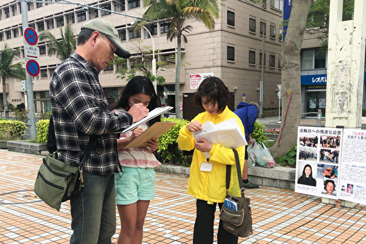

日本熊本部分法轮功学员于2月23日至25日到日本最南端的冲绳县那霸市，进行了举报江泽民的联署签名活动，并面向中国旅游客讲真相促三退（退出中共党团队）。了解真相的很多民众主动接过真相资料，并主动签名举报江泽民。（朴龙鹤/大纪元）

【大纪元2018年03月24日讯】（特约记者南百合日本熊本报导）日本熊本部分法轮功学员于2月23日至25日到日本最南端的冲绳县那霸市，展开举报江泽民的联署签名活动，并面向中国旅游客讲真相促三退（退出中共党、团、队）。很多民众接过真相资料，并主动签名举报江泽民。

冲绳县富有独特的自然环境，气候温暖宜人，有“日本的夏威夷”之称，一年四季来自世界各地的旅游客都源源不断。为了使更多的海外旅游客了解法轮功被迫害的真相，法轮功学员们准备了日文、中文、英文、越南文、尼泊尔文和韩文等多语种真相资料。特别是学员们打开横幅和使用扩音器向日本民众呼吁声援诉江联署，不仅仅是过路行人，连等信号灯的司机和乘客也都能听得广播的真相说明。

仅这三天来到冲绳的中国旅游客超过了五千多人，不少人看到法轮功学员打开的呼吁停止迫害法轮功的横幅和展板感到很震撼，有的人拿着手机拍下横幅和展板，也有的人希望多拿几分真相资料表示要带回去给亲朋好友看，也有的人看资料了解真相后，敬佩法轮功学员们善良与和平的方式向世人讲真相传递真、善、忍，并签名支持诉江，希望法轮功学员早日获得自由找回人权。

<b>日本民众：这是我一生中第一次的签名</b>

有一位八旬老爷爷站在路旁，法轮功学员向老爷爷说明真相，呼吁他联署。听着学员的说明，老爷爷显得很着急的样子，比划自己听不见。看着真相资料和迫害图片，老爷爷感觉事情非同小可，便去找站在不远处的老伴回到学员的面前，让老伴好好听学员的说明。老爷爷的老伴听完学员的说明，很震惊地连声说：太残酷了，太残酷了。夫妇一起签名之后，从背包里拿出钱要给学员说：“你们太辛苦，买点饮料喝吧。”学员婉言谢绝，并把真相资料递给二位，希望他们把真相传达给周围的亲朋好友。

中午的时候，来自岛根县的高中棒球队的两名学生在看真相展板时，法轮功学员上前向他们讲真相，呼吁他们署名。其中的一名学生仔细地看完真相资料之后，向周围的其他学生喊：“这个迫害太残酷了。江泽民这个家伙我们不能容他，大家都来签名吧。”当时，周围大概有30多名学生，其中20多名在上午已经签过名了。剩下的没签名的学生听他这么一喊也都过来签了名。

有位年轻女士签名后向法轮功学员说：“我知道这个迫害事实。昨天我在这里拿过你们发的资料，因为当时有急事来不及签就走了。今天能够签得上名我感到非常高兴。”

还有一位中年妇女说：“昨天我已经看过你们的资料了。看这位被活摘器官的受难者的照片，我的心感觉很痛，真是很痛心啊！你们很辛苦，但一定要坚持，加油！”

还有来自北海道的两位年轻女士签名之后感慨地说：今天来到冲绳能够签上名感到非常高兴。

一名二十多岁的年轻男子来到真相展板前，听完学员的说明之后说了一句“过后我再来”，并匆忙的离开了现场。过一段时间那位年轻人又出现在学员面前主动签名，并对学员说：“我很想了解法轮功，可以详细地给我讲一讲吗？”年轻人足足听了近两个小时的说明之后激动地说：“我想要炼法轮功。”

一位六旬男士看完真相资料后签名说：“我从来不签名，这是我一生第一次的签名。因为我了解了这个迫害是多么残酷，我不能不签名。”

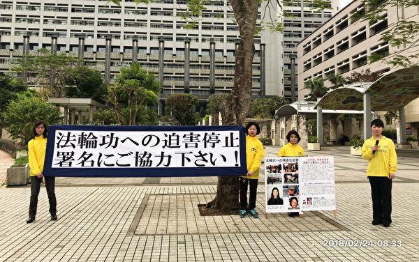

日本熊本部分法轮功学员于2月23日至25日到日本最南端的冲绳县那霸市，进行了举报江泽民的联署签名活动，并面向中国旅游客讲真相促三退（退出中共党、团、队）。

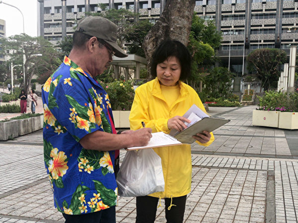

日本熊本部分法轮功学员于2月23日至25日到日本最南端的冲绳县那霸市，进行了举报江泽民的联署签名活动，并面向中国旅游客讲真相促三退（退出中共党、团、队）。很多民众主动接过真相资料，并主动签名举报江泽民。

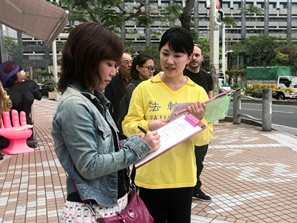

日本熊本部分法轮功学员于2月23日至25日到日本最南端的冲绳县那霸市，进行了举报江泽民的联署签名活动，并面向中国旅游客讲真相促三退（退出中共党、团、队）。很多民众主动接过真相资料，并主动签名举报江泽民。

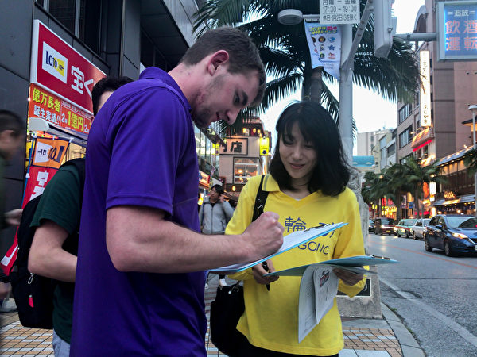

日本熊本部分法轮功学员于2月23日至25日到日本最南端的冲绳县那霸市，进行了举报江泽民的联署签名活动，并面向中国旅游客讲真相促三退（退出中共党、团、队）。很多民众主动接过真相资料，并主动签名举报江泽民。

<b>中国旅游客：我可以多要几份真相资料吗？</b>

联署活动的第三天，坐豪华游船来到冲绳的中国旅游客超过四千多人。那霸市的县民广场是海内外旅游客的必经之路，游客们在这里拍照、漫游国际通商店街和百货大厦，以及利用公共交通等，县民广场周围来自中国大陆的旅游客川流不息。

一群中国旅游团队路过真相展板前等候信号灯时，其中有一位年轻女士离团队有二三米远，法轮功学员给她讲真相时她听得非常认真。这时这位女士和团队的距离也接近了，当她要在“刑事举报书”上签名时，同团的游客走过来拦阻不让她签名。但这位女士手紧握著资料不放，等人行道的信号变绿灯，团队一行要过人行道的时候，她飞速地在“刑事举报书”上签上名，随后快步追上旅游团队。

还有一位中国旅游客，学员要给他发真相资料，他悄悄地从上衣的内兜里拿出真相资料微笑地说：“你看，我有（真相资料）了，我有（真相资料）了。”

一位中国旅游客一开始拒绝拿真相资料，随后转念向学员要了资料，并站在那儿一口气看完资料之后，又来到学员面前说：“我可以多要几分真相资料吗？我想给亲朋好友看。”

<b>《琉球新报》采访联署诉江活动</b>

联署活动的第二天，当地报社《琉球新报》以“呼吁停止中国（共）对法轮功的迫害”为题材采访了熊本法轮功学员的联署活动，并于2月27日发行的琉球新报上进行刊载报导。

报导文章说：熊本的法轮功学员自2002年起在熊本市内的公园以及公民馆里，做免费炼功指导和举办了法轮功学习班。法轮功学员在美化环境和救援震灾等社会奉献活动中表现显著，于2015年受到了熊本市政府的表彰。中国（共）政府把法轮功打成×教，但国际人权NGO国际特赦组织要求无条件释放在中国被拘留的法轮功学员。

那霸市议员：请留下签名纸吧，我要呼吁我周围的人签名
就那霸市的联署活动之宜，法轮功学员专程拜访那霸市议会，说明了中共对法轮功长达18年的迫害真相和呼吁民众起诉江泽民联署的意义。当听到中共对法轮功学员活摘器官牟利的暴行时议员们都感到非常的震惊：“太残忍，我们应该想办法去制止它。”

其中有位议员对法轮功学员说：“请留下签名纸吧，我要呼吁我周围的人签名。”数日之后，学员收到了该议员的邮件，里面有议员的签名之外，还有其他议员和很多民众也签上了名。

1999年7月20日中共前任党魁江泽民发动对法轮功的迫害以来，这场惨绝人性的迫害已经持续了18年。一天又一天，一年又一年越来越多的民众逐渐的明白了法轮功被迫害的真相，越来越多的正义之士及国家纷纷谴责中共迫害法轮功的罪行。

从2015年5月起，藉以世界各地正义和良知的启迪，中国大陆二十多万民众敢于站起来，向中共最高检察院及最高法院举报江泽民，强烈要求法办江泽民。呼应中国大陆诉江大潮，“全球声援中国民众控告江泽民的刑事举报连署活动”也在世界各地掀起热潮。

日本熊本的法轮功学员自2015年9月起在日本九州地区广泛开展了刑事举报江泽民联署活动。活动以熊本县为中心四方二百多公里，包括福冈县、宫崎县、长崎县、大分县、鹿儿岛县等，经过两年半的时间，有超过三十万的民众签名声援诉江，要求中共政府法办迫害法轮功元凶江泽民，立即停止长达18年的对法轮功的残酷迫害。

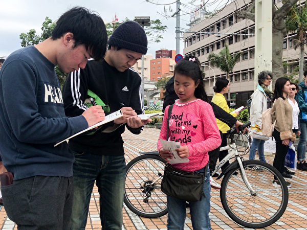

日本熊本部分法轮功学员于2月23日至25日到日本最南端的冲绳县那霸市，进行了举报江泽民的联署签名活动，并面向中国旅游客讲真相促三退（退出中共党、团、队）。很多民众主动接过真相资料，并主动签名举报江泽民。

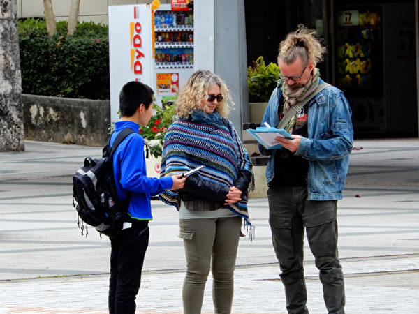

日本熊本部分法轮功学员于2月23日至25日到日本最南端的冲绳县那霸市，进行了举报江泽民的联署签名活动，并面向中国旅游客讲真相促三退（退出中共党、团、队）。很多民众主动接过真相资料，并主动签名举报江泽民。

日本熊本部分法轮功学员于2月23日至25日到日本最南端的冲绳县那霸市，进行了举报江泽民的联署签名活动，并面向中国旅游客讲真相促三退（退出中共党、团、队）。很多民众主动接过真相资料，并主动签名举报江泽民。

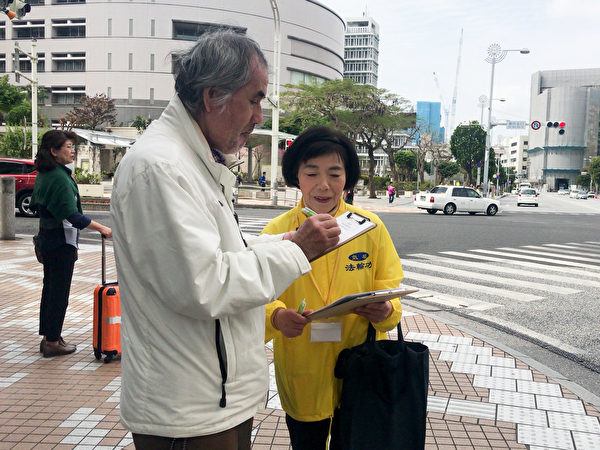

日本熊本部分法轮功学员于2月23日至25日到日本最南端的冲绳县那霸市，进行了举报江泽民的联署签名活动，并面向中国旅游客讲真相促三退（退出中共党、团、队）。很多民众主动接过真相资料，并主动签名举报江泽民。

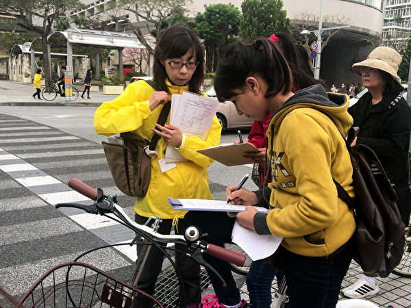

日本熊本部分法轮功学员于2月23日至25日到日本最南端的冲绳县那霸市，进行了举报江泽民的联署签名活动，并面向中国旅游客讲真相促三退（退出中共党、团、队）。很多民众主动接过真相资料，并主动签名举报江泽民。

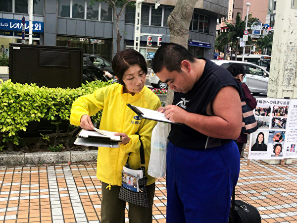

日本熊本部分法轮功学员于2月23日至25日到日本最南端的冲绳县那霸市，进行了举报江泽民的联署签名活动，并面向中国旅游客讲真相促三退（退出中共党、团、队）。很多民众主动接过真相资料，并主动签名举报江泽民。

<h1 align="center"><b>中国军官们鲜为人知的悲惨遭遇</b></h1>

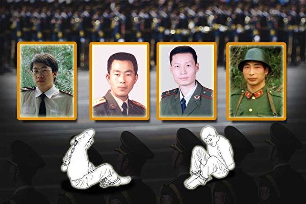

中共军方系统中很多人修炼法轮功，这并不是秘密。但是，中共发动迫害法轮功17年来，他们所经历的巨大痛苦鲜为人知。

【大纪元2016年09月08日讯】（大纪元记者叶枫综合报导）上至将军，下至军官士兵 ，中共军方系统中很多人修炼法轮功，这并不是秘密。但是，中共发动迫害法轮功17年来，他们所经历的巨大痛苦鲜为人知，很多人被非法监禁、遭受酷刑，甚至被迫害致死。

以下列举中共军队中部分法轮功修炼者的被迫害案例：

<b>将军之死</b>

丁翰将军，原海军旅顺基地政治部的代主任、军级老干部。

1996年5月，丁翰开始修炼法轮功，修炼后病都好了。丁翰一生研究马列理论，从一个无神论者成为法轮功修炼者，在军队系统内外影响很大。

1999年7月20日，中共开始打压法轮功后，大连老虎滩干休所连开3次党小组会，对丁翰实施高压迫害，强迫他放弃修炼，导致其出现脑血栓，于同年11月凄然辞世。

<b>警备区副司令含冤去世</b>

许修政，原山东烟台警备区副司令员。

因目睹妻子修炼法轮功后的巨大变化，1999年6月2日，许修政曾上书江泽民和政治局常委，希望制止即将开始的对法轮功的迫害。

上书信直
