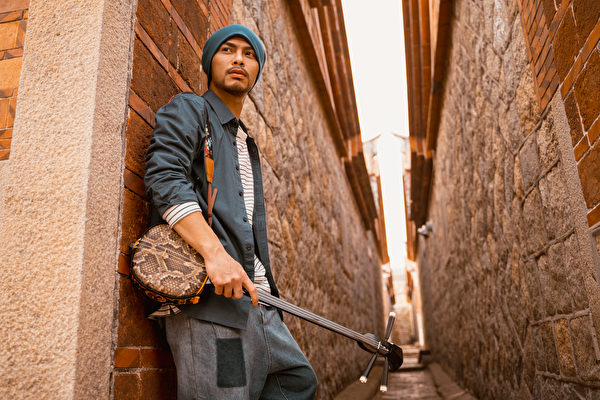
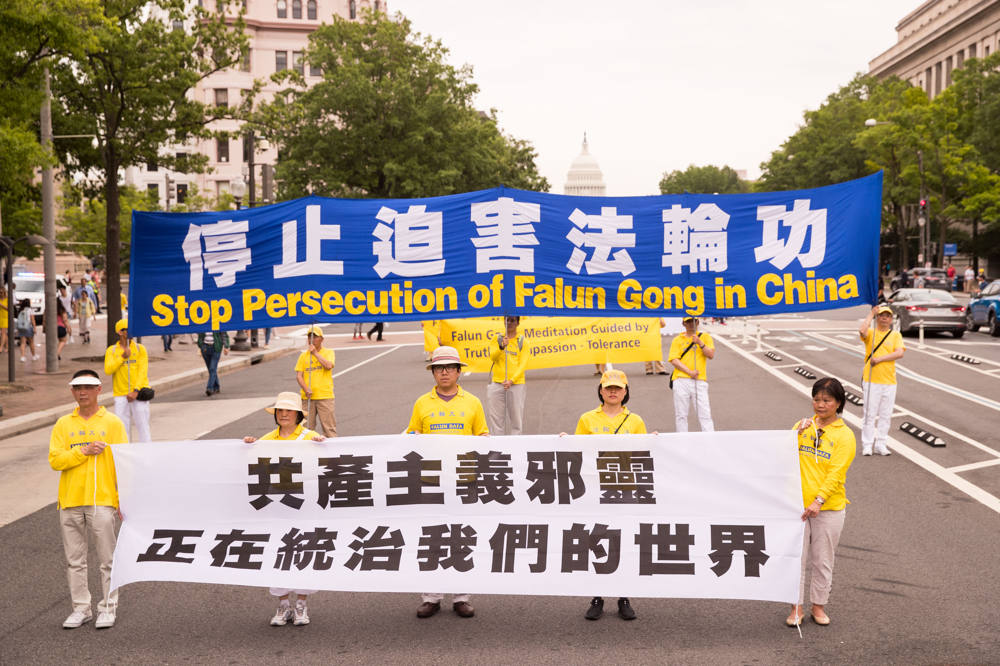

<a name=top>

<a target="_blank" href="https://github.com/sendtruth2020/goodnews2/blob/master/quit/letter.md">

<a href="https://github.com/dfchunsring/wer/blob/master/epgh.md"><b>免费突破封锁翻墙软件</b></a>
 

<b>请收藏本网址，连上免翻视频 https://bit.ly/2RQM1hX</b>

 
 

<b> 看更多真相   https://bit.ly/3ezRQKo  </b>

<h1><b></b></h1>

<h2 align="center"><a href="https://github.com/jkujkkj/bird/blob/master/bird02.md"><b>明真相能保命(二)</a></b></h2>

<h2 align="center"><a href="https://github.com/jkujkkj/bird/blob/master/bird03.md"><b>明真相能保命(三)</a></b></h2>

<h2 align="center"><a href="https://github.com/jkujkkj/bird/blob/master/bird04.md"><b>明真相能保命(四)</a></b></h2>

<h2 align="center"><a href="https://github.com/jkujkkj/bird/blob/master/bird05.md"><b>明真相能保命(五)</a></b></h2>

<h2 align="center"><a href="https://github.com/jkujkkj/bird/blob/master/bird05.md"><b>明真相能保命(六)</a></b></h2>
 
 <h2 align="center"><a href="https://github.com/jkujkkj/bird/blob/master/tushuo.md"><b>圖說</a></b></h2>
 
<a href=https://git.io/souye><h6 align="right">回首頁</h6></a>
 

 
<a name=top>
 
 
<a href =#100>100. 弗吉尼亚州众议院通过决议案
谴责中共迫害法轮功</a>  
<a href =#99>99. 大连前警官揭中共洗脑班黑幕：欺骗 暴力</a>  
<a href =#98>98. 瑞典教师见证神功奇效　生命获重</a>  
<a href =#97>97. 山东前610副主任获刑 迫害法轮功案例曝光</a>  
<a href =#96>96. 疫情中怎样成为不会被感染的人</a>  
<a href =#95>95. 优秀教师陷冤狱 律师：黑龙江司法普遍违法</a> 
<a href =#94>94. 影评：我在为谁伤感落泪？</a> 
<a href =#93>93. 从一位耄耋老人的悲惨遭遇看中共的邪恶本质</a>  
<a href =#92>92. 1828天“教育转化”黑龙江女子监狱黑幕</a>  
<a href =#91>91. 中共对法轮功的迫害是群体灭绝罪</a>  
<a href =#90>90. 诚念九字真言 COVID患者快速康复</a>  
<a href =#89>89. 给朋友的一封信</a>  
<a href =#88>88. 方舟</a>  
<a href =#87>87. 中共百种酷刑折磨 逼迫人放弃信仰真善忍</a>  
<a href =#86>86. 许那与数百万灵魂</a> 
<a href =#85>85. 中共报复性制裁美宗教自由官员 布林肯回应</a>  
<a href =#84>84. 丹麦法轮功学员递交迫害者名单　政府响应</a> 
<a href =#83>83. 台湾小学生们的心声：感谢真善忍</a> 
<a href =#82>82. 三退声明精选（2022/01/04）</a>  
<a href =#81>81. 法国大法弟子新年谢师恩</a>  
<a href =#80>80. 司法笑话：「查无此人」</a>  
<a href =#79>79. 发毒誓后遭不幸而后又转运的人</a>   
<a href =#78>78. 人权日休斯敦集会　法轮功学员呼吁制止迫害</a>  
<a href =#77>77. 澳洲参议员：全世界有善念的人们都支持法轮功</a>  
<a href =#76>76. 最新翻墙软件 突破封锁访问大纪元新唐人</a> 
<a href =#75>75. 南京女工程师屡遭绑架 再被构陷到法院</a>  
<a href =#74>74. 陆客：共产主义不是生活必需品</a>  
<a href =#73>73. 一本书翻转人生 台湾强势女变温柔</a>  
<a href =#72>72. 红二代：中共是魔鬼 赶紧三退</a> 
<a href =#71>71. 修炼大法身心净化 三代学员感恩李洪志先生</a>  
<a href =#70>70. 黄天辰：听“墙外”遥想当年离墙之旅</a>  
<a href =#69>69. “自干五”和“小粉红”的觉醒心路（5）</a>    
<a href =#68>68. “自干五”和“小粉红”的觉醒心路（4）</a>  
<a href =#67>67. “自干五”和“小粉红”的觉醒心路（3）</a> 
<a href =#66>66. “自干五”和“小粉红”的觉醒心路（2）</a>  
<a href =#65>65. “自干五”和“小粉红”的觉醒心路（1）</a>  
<a href =#64>64. 疫情未了　救命法宝要记牢</a>  
<a href =#63>63. 迫害法轮功导致中国人权法治全面恶化</a>  
<a href =#62>62. 国际社会再次聚焦中共活摘器官的罪恶</a>  
<a href =#61>61. 神奇的事情正在这一班发生</a>  
<a href =#60>60. 全美共和党联盟通过决议　要求中共停止活摘器官</a>  
<a href =#59>59. 我两位爷爷的真实经历</a>  
<a href =#58>58. 法国防部报告揭中共海外迫害法轮功</a> 
<a href =#57>57. 我的三退心路</a> 
<a href =#56>56. 十岁初学《转法轮》　十年后缘至莲开</a>  
<a href =#55>55. 世界峰会　医疗专家揭中共活摘器官罪行</a>  
<a href =#54>54. 斯洛伐克学员在著名温泉镇传真相</a>  
<a href =#53>53. 平常的家庭　不平常的故事</a>  
<a href =#52>52. 送人福音 四川77岁老太被警察殴打成重伤</a>  
<a href =#51>51. 不与中共为伍</a>  
<a href =#50>50. 中共末日疯狂 迫害好人无底线</a>  
<a href =#49>49. 意前议员揭中共活摘器官 赞法轮功拯救世界</a>  
<a href =#48>48. 大疫何日止？中共灭亡时</a>  
<a href =#47>47. 佛道神真的存在吗？</a>  
<a href =#46>46. 韩国老人二十年的坚守</a>  
<a href =#45>45. 政要：迫害法轮功 中共犯下群体灭绝罪</a>  
<a href =#44>44. 修心向善　大连法轮功学员郑艳荣屡遭迫害</a>  
<a href =#43>43. 加议员吁政府制止中共迫害法轮功 制裁迫害者</a>  
<a href =#42>42. 韩国著名电视编剧脱胎换骨的神奇经历</a>  
<a href =#41>41. 抗疫非政治　人间有奇迹</a>  
<a href =#40>40. 经历疫情　呼吁民众在灾难中学会反思</a>  
<a href =#39>39. 瘟疫险境中　九字真言保平安</a>  
<a href =#38>38. 活摘：越来越多的证据显现</a>  
<a href =#37>37. 传承</a>  
<a href =#36>36. 辽宁女子监狱「转化」手段：毒打、罚站、不许睡觉……</a>  
<a href =#35>35. 雅典宪法广场反迫害活动 民众喜爱真善忍</a>  
<a href =#34>34. 反迫害22周年 铭记那些英勇的人</a>  
<a href =#33>33. 生活在假话大国里</a> 
<a href =#32>32. 那年我十三岁</a>  
<a href =#31>31. 易蓉：百年紅禍惡貫滿盈 解體中共刻不容緩</a>  
<a href =#30>30. 追查迫害法轮功国际组织公布第14批追查名单</a>  
<a href =#29>29. 我眼中的天大的事</a>  
<a href =#28>28. 赵云择主的启示</a>  
<a href =#27>27. 许那：是谁祸乱了我的祖国</a>  
<a href =#26>26. 让我们都站到诺亚方舟上</a>  
<a href =#25>25 从抵触到感谢 一位退休医生的转变</a> 
<a href =#24>24. 酷刑撼动不了正信</a>   
<a href =#23>23. 找回金色的岁月</a>  
<a href =#22>22. 广东疫情严峻 民众如何自救？</a> 
<a href =#21>21. 联合国12专家控大陆少数族群遭强摘器官</a>  
<a href =#20>20. 父亲节话为坚守信仰而受难的父亲们</a>   
<a href =#19>19. 二十二年画不圆的“家”</a>  
<a href =#18>18. 意大利蒂埃内市民学炼法轮功</a> 
<a href =#17>17. 德州通过决议谴责中共活摘器官 促国会制裁</a>     
<a href =#16>16. 躺平的最高境界是三退</a>  
<a href =#15>15. 超凡入圣的绘画震撼了我的心</a> 
<a href =#14>14. 32年前没有喊出的话</a>  
<a href =#13>13. 我的姥姥</a> 
<a href =#12>12. 两家悲、喜剧　警醒世人心</a>  
<a href =#11>11. 救赎与瘟疫一起到来</a> 
<a href =#10>10. 疫情带来新现象：近2000人上网学炼法轮功</a> 
<a href =#9>9. UCSD大学生：法轮大法伴随人生</a> 
<a href =#8>8. SK前能源专务董事：大法净化身心 适合所有人修炼</a> 
<a href =#7>7. 媳妇善待婆婆 以德报怨 全家四代受益</a> 
<a href =#6>6. 真善忍是指路灯　渥太华学员谢师恩</a> 
<a href =#5>5. 加拿大前司法部长：真善忍支撑古老和普世价值观</a> 
<a href =#4>4. 美国内华达州参议员褒奖世界法轮大法日</a> 
<a href =#3>3. 瑞典西人：修炼法轮功　全家受益</a> 
<a href =#2>2. “母亲节”话母亲们的悲惨遭遇</a> 
<a href =#1>1. 美好的缘分 生命的奇迹</a>   
  
--------------------------------------------  

 

<a href=#top><h6 align="right">回上方</h6></a>

<a name=100>

<h1 align="center"><b>弗吉尼亚州众议院通过决议案
谴责中共迫害法轮功</b></h1>

【明慧网二零二二年三月三十一日】美国弗吉尼亚州众议院，于二零二二年二月十一日，以82:0全票通过H.R.9号决议，谴责中共迫害法轮功，要求中共当局立即停止迫害。

「H.R.9号决议」

「H.R.9号决议」是由美国弗吉尼亚（Virginia）州众议会共和党议员约翰﹒阿沃利（John Avoli）及民主党议员凯﹒科里（Kaye Kory）共同提出，三十一名州议员联署，谴责中共活摘法轮功学员器官、酷刑折磨、强制奴工等，要求制止中共迫害，同时对中共罪行将加强曝光宣传，防止民众无意间成为中共帮凶。
 
约翰﹒阿沃利（John Avoli）在二月八日的决议案审查会上发言时说，H.R.9决议案旨在承认中共严重侵犯人权的行为，并教育弗吉尼亚人了解在与美国有着贸易往来的中国普遍存在的强制器官摘取和强迫奴工的邪恶。
 
阿沃利议员并说，法轮功是一种精神修炼，教人炼功，打坐和遵循真、善、忍的原则；在很多方面与瑜珈相似。（中共政府）于一九九九年七月二十日开始抓捕、奴役法轮功学员，美国国务院发表可信报告称，中共摘取他们的器官出售，强制送入劳改营。在美国可以广泛买到他们生产的奴工产品。
 
美国医生、法轮功学员塔蒂亚娜﹒丹宁（Tatiana Denning）当天被邀请作证，她说：「法轮功使全球上亿人受益，但中共从一九九九年发动迫害镇压，包括活摘人体器官。站在我身旁的是王春彦，现是维州居民、中共迫害的幸存者，她被判劳教七年，每天被强迫劳动十八小时，她有二十多位法轮功朋友都被迫害致死。」
 
丹宁还说：「王女士在狱中还被抽血，检测人体器官的兼容性。换而言之，中共政权将她视为潜在的器官『供体』。」
 
中共活摘法轮功学员器官恶行在弗州已广为人知，在二零二一年度，有二十四个地方政府通过类似决议案谴责中共，州议员们非常感谢告诉他们真相的法轮功学员；否则，他们绝大多数人都不太知道这场对法轮功学员残忍的迫害，并且已经持续了二十多年。他们表示会把这个真相告诉更多的人。
 
二零二二年一月二十五日，弗州众议员凯﹒科里（Kaye Kory）在众议院大会上也向所有同事介绍法轮功及其修炼者时说：四年前我的一位实习生是一名法轮功学员，他的父亲因为炼法轮功在大陆被迫害致死。今天，我再次见到一名法轮功被迫害幸存者王春彦，她被关七年监狱，丈夫因保护她而被迫害致死，她被迫做奴工，她手里拿着的就是在监狱被迫制作的夹克。

二零二二年三月八日，共和党议员约翰﹒阿沃利（John Avoli，右二）在州府大楼众议院会议厅为法轮功学员颁发决议案。(弗吉尼亚法轮功学员提供）

约翰﹒阿沃利（John Avoli）发言时说：我非常高兴能做这个决议案，我们州两党派的州议员一起推动这件非常有意义的决议案。作为追求自由先驱的弗吉尼亚人，我们感到非常自豪。这个决议案只是一个开始，希望更多的州也能做类似的事情，然后推动国会，及白宫一起来帮助结束这场没有人性的迫害。
 
决议案文本：https://lis.virginia.gov/cgi-bin/legp604.exe?221+ful+HR9
 
决议案摘要简述如下：
鉴于，法轮功是一种以真、善、忍的价值观为中心，涉及冥想「气功」的精神修炼，在一九九零年代后期在中国广受欢迎，修炼人数超过七千万。但在一九九九年七月，中共试图通过在全国范围内的密集迫害来根除法轮功，大量法轮功学员被非法关押，肉体和精神受到残酷折磨。
 
鉴于，在中国各地监狱和劳教所，中共强迫包括大量法轮功学员在内的囚犯经常在不人道的工作条件下被强迫制造奴工产品，并大量出口到包括美国在内的海外市场。因此必须充份告知弗州居民，商店的商品可能是中共奴工产品。
 
鉴于，美国众议院一致通过第343号决议，谴责中共有系统地从法轮功学员和其他良心犯身上摘取器官。弗州居民和医学界必须充份了解前往中国进行器官移植的风险，以帮助防止公民无意中成为从法轮功修炼者和其他囚犯身上摘取器官的帮凶。
 
鉴于，已有五千多名弗州居民向当地政府签名请愿，弗州有二十多个地方议会通过了谴责中共对法轮功修炼者暴行及强摘器官和奴工产品的相关决议案。弗州法轮功修炼者为小区做出了贡献，弗州人民都声援法轮功修炼者追求信仰自由。
 
因此，弗州众议院决议谴责中共迫害法轮功，强烈谴责对法轮功修炼者监禁、酷刑、奴役和强摘器官，要求立即停止中共对法轮功的迫害；而最终决议文本，州议会将传送给弗州州长、弗州联邦参、众议员，及弗州卫生署，并要求他们进一步将决议案副本分发给各自的选民，帮助他们了解此决议。
【文章来源】http://big5.minghui.org/mh/articles/2022/3/31/440647.html

<a href=#top><h6 align="right">回上方</h6></a>

<a name=99>

<h1 align="center"><b>大连前警官揭中共洗脑班黑幕：欺骗 暴力</b></h1>

山东龙口市洗脑班，隔着铁丝网大铁门，可以看到对外的骗人招牌“法制教育中心”。（明慧网）

【大纪元2022年03月21日讯】（大纪元记者罗琼、洪宁采访报导）今日，大陆一知名人权律师和旅美的前大连警官向大纪元表示，洗脑班是中共专门为迫害法轮功而建立的非法组织，用欺骗和暴力的手段“转化”学员，在“清零”中继续实施洗脑迫害，并延用到其他人身上。

洗脑班是中共1999年7月开始迫害法轮功以后，由政法委、“610”（专门迫害法轮功的非法机构）操纵下成立的一个法外黑监狱，实施各种迫害手段，以逼迫法轮功学员放弃修炼为目的。

<b>肆无忌惮关押法轮功学员</b>

这位人权律师（安全起见用匿名）曾多次为法轮功学员辩护。他说：“这个洗脑班，是从1999年对付法轮功开始的，一直存在，发展参差不齐，没有法律地位，胡乱安置，但是对法轮功是秘密（进行的）。”
洗脑班从未被消除，一直在发展变种。他说，到了2015年对付律师（709大抓捕事件），关押律师的地方就曾经关押过法轮功（注：比如小黑屋、宾馆），只不过对付律师有了一个法律上的名词，叫指定居所“监视居住”。
 
“因为中共面对一群法律人士，必须找一个法律上的说法，对法轮功则不需要，只需要通过秘密的文件，就肆无忌惮地把他们关押起来。”
 
“而实际关押地点，可能存在重合，因为，我们在被关押期间听见有人被殴打，出来后都说自己不是（被打的）。很可能那是一些法轮功的受害者。”
 
<b>由政法委、“610”操纵
</b>

前大连市黑石礁派出所警官、教导员刘晓斌说，洗脑班是由政法委、“610”为迫害法轮功成立的。洗脑班的人员是一个集合体，即有公安局的、法院的、检察院的，又有街道居民委的等。
 
当时成立的“610”非法组织，是超越司法和政府之上的。它可以调动任何一个部门。
 
“洗脑班没有经过法律程序，没有登记注册，不受任何机构的监督；很多是没有被授予执法权利的人，都可以非法拘禁关押被迫害的人。”
 
他们不出具任何审批手续就关押人，关押的期限也没有规定，所以洗脑班是“中共对想迫害者的一个非法组织”。
 
据刘晓斌介绍，1999年中共开始迫害法轮功后，大连在环保宾馆、黑石礁凌海大酒店都设有洗脑班，关押了法轮功学员。
 
他曾在凌海大酒店所属的黑石礁辖区派出所担任过副所长，在环保宾馆所属辖区的星海街派出所当过教导员。但他不知道有这两个洗脑班。派出所和公安局都没被通知，是“610”专门建立关押法轮功学员的。
 
后来他在网上看到了这两个洗脑班，还去过那两个地方。它们在宾馆的几层楼之上，是封闭的，对外不挂牌子。外人根本就不知道它们。
 
<b>洗脑班的迫害手段：欺骗、暴力
</b>

刘晓斌说，洗脑班采取的一个手段是欺骗。1999年中共开始迫害法轮功时，不敢挂牌子，把法轮功学员秘密绑架进去。后来也给洗脑班起了一些骗人的名字，如“法制教育培训中心”“法制教育培训班”。
一方面，中共不法人员欺骗被害人的家属和单位，说送进去是进行法律教育学习，不是送到监狱、教养院等。
另一方面，他们找了一些御用的专家学者，编造一套他们的谎言和所谓的理论，对法轮功学员进行欺骗洗脑。
他说，洗脑班采取的另一个手段是：暴力。他们转化不了法轮功学员，就用暴力摧残你：不让你睡觉，强迫坐铁椅子，不让如厕，毒打，注射破坏中枢神经的毒药。据这些被害者说，身体会剧痛，且失去记忆。
洗脑班还从经济上对法轮功学员进行迫害，让他们的家属交钱，才放人。
刘晓斌说他身边认识的法轮功学员中就有遭受过洗脑班迫害的，例如：
法轮功学员王哲浩，1999年被绑架到大连市戒毒所（洗脑班）遭受折磨。他不屈服、不转化，洗脑班就让他家人交了七八百块钱，然后把他送进大连市教养院迫害。
另一个是孔庆春，当时他也是被绑架到洗脑班。他拒绝看诬蔑法轮功的资料，警察就用拖鞋打他耳光，又将他关到洗脑班的禁闭室。在禁闭室的地上有铁环子，他的手铐穿过铁环，两个手被铐住，人就这样被定在地上。
后来洗脑班让他单位的领导、住地派出所所长带着他的父亲去见他，用亲情逼他转化。他仍拒绝；又叫他家人交四千多块钱，才把他放出来。
 
<b>在“清零”迫害中共统治集团上行下效
</b>

人权律师说，“中国的统治集团就是上行下效，上边说依法治国，到了下面就依法治省，依法治县，依法治校，依法治狱，依法治村，依法治所……赶时髦，凑热闹。”
 
当上面说疫情“清零”，马上“清零”这个词就被广泛地使用，蔓延到法轮功身上，就是法轮功“清零”。
 
他说，在关押场所外的被登记在案的法轮功修炼者就被骚扰，被要求写“三书”（放弃修炼的所谓“保证书”“悔过书”“决裂书”）。有些人不写，可能就会被抓，有的也可能躲过去，甚至警察帮忙写。
 
据他所知，“每隔几年，监狱都要来那么几下子，要达到百分百的转化率，很多人（法轮功学员）本来好好的，突然就被转化死了。”
 
在监狱里，外面搞的运动，对一些人来说就是灾难，比如：在监狱如果要拒绝打疫苗，不知要付出怎样的代价。这就是中共统治下的灾难。
 
前大连市黑石礁派出所教导员刘晓斌说，“最近国内对法轮功学员的清零，我认为是1999年迫害法轮功以来的延续，它们出过许多行动，类似‘敲门行动’‘教育攻坚行动’（即转化迫害），都是对法轮功学员迫害的延续。”
 
<b>把洗脑班的迫害用到其他人身上
</b>

两位受访者均认为，中共把洗脑班对法轮功学员的迫害用到社会的其他人身上。
 
人权律师表示，“到了2019年前后，新疆的集中营基本上就是洗脑班的变种。用二十年前对付法轮功的那一套开始对付维族人。”
 
刘晓斌说，“在洗脑班迫害法轮功学员的手段，也都用在社会上，比如被拆迁的上访人员的身上，包括后来的709正义律师身上，还有新疆、西藏少数民族人身上。”
 
他举例说，高智晟律师曾写道，折磨他的警察说：用在他身上的许多方法，他们都用在法轮功学员身上，试验过，并从折磨他们的经验上，已经总结出许多迫害他的方法。
 
高智晟律师在大陆为法轮功学员和弱势群体辩护，多次遭绑架、酷刑折磨、非法判刑，至今仍下落不明。

【文章來源】https://www.epochtimes.com/gb/22/3/21/n13662506.htm

<a href=#top><h6 align="right">回上方</h6></a>

<a name=98>

<h1 align="center"><b>瑞典教师见证神功奇效　生命获重</b></h1>

【明慧网二零二二年三月十九日】（明慧记者何平瑞典采访报导）居住在瑞典歌德堡的珍妮特（Janett）四年前曾是一位癌症患者。二零一九年她经过了手术、化疗，病情仍不见好转，再加上化疗的副作用致使身体每况愈下，苦不堪言。无奈，她放弃了西医的治疗方案，选择用中医来缓解病痛的折磨和困扰，同时期盼着上天的恩赐，给她带来生命的转机、早日康复。
 
可令人惊讶的是，现在的珍妮特面貌焕然一新，彻底摆脱了癌症的阴影，生命如获重生。这是怎么回事？她真的是找到了妙手回春的好中医、还是吃了灵丹妙药？

现在的珍妮特面貌焕然一新，彻底摆脱了癌症的阴影，生命如获重生。

<b>因祸得福 幸遇高德大法</b>

 
「我是修炼了法轮功（也称法轮大法），这是大法发生在我身上的奇迹！」珍妮特笑着说：「从二十多岁我就开始寻找精神提升的途径，去过很多地方、尝试过不同的方法，都很令人失望。一听到法轮功，我是抱着开放的心态来的，没想到，终于找到了我要的。」
 
珍妮特是一位有着几十年丰富教学经验的教师，两个儿子的妈妈、两个孙女的奶奶，工作兢兢业业，生活丰富多彩。由于不幸患上了卵巢癌，她的一切都被打乱了。「二零一九年我就做了手术，经过了三次三个多月痛苦的化疗后，医生建议我继续配合再做第四次，我几乎要崩溃了！当时就表示拒绝。化疗把我的身体搞得疲惫不堪，整天有气无力的，感觉特别的累。」她说，从此她不再相信西医了。可以后怎么办？悲观又迷茫。
 
无望中，幸运之神悄然而降。不久，珍妮特找到了几年前她在网上找的一家中医诊所，就到那里进行康复治疗。诊所的中医师王医生是一名法轮功学员。后来，在她的推荐下珍妮特有幸参加了二零二零年当地法轮功学员举办的集体观看法轮功创始人李洪志大师的九讲录像班。
 
就这样，她因祸得福，遇到了生命中一直在苦苦追寻的高德大法。
 
<b>九讲班显神迹 终生难忘
</b>

 
谈起两年前参加九讲班的感受时，珍妮特仍掩饰不住内心的喜悦。「二零二零年二月的那次九讲班，我经历了一个神奇、美妙的体验，见证了法轮功的神奇与超常。真是个奇迹！」

在二零二零年二月珍妮特（第三排左2）有幸参加了观看法轮功创始人李洪志大师的九讲录像班，结束时她与其他部份新老学员合影留念。

她说：「不知咋回事，我坐在那儿把原本身体发炎的疼痛和烦恼全都忘了。第一天讲法还没开始，就明显的感到了身体里的能量，浑身发热。九天班期间，感觉能量越来越强，精神状态是一天比一天的好，最后身上所有不适的症状全部消失了。身体一身轻，真的是走路也不累、上楼上多高也不觉得累，感觉师父把我身体里不好的东西全都清理了，整个人从里到外都得到了净化。这是我生病以来从未有过的感受，那是一段幸福美好的时光、终生难忘。」
 
她接着说：「参加了九讲班，明白了我所遭遇的不幸和痛苦都是为了等待这一天的到来，庆幸自己有缘得到修炼真、善、忍这部宇宙大法。真的是非常非常感激师父为我所做的一切。」
 
<b>师父慈悲保护 法身就在身边
</b>

 
珍妮特还谈到，听了师父的讲法及阅读法轮功的主要著作《转法轮》，明白了导致人有病的根本原因是业力，遭罪是还业债。「当我在承受痛苦过病业关时，我感到师父的法身就在我身边，时时刻刻都在保护我，心里很踏实、特别的幸福。」
 
她回忆道：「修炼后不久，身体出现了状况，似乎跟以前病状一样，变得很疲惫。一天，眼前突然浮现出三个画面，虽然时间短暂，还有些模糊不清，但有个画面很清晰的显示：很多黑黑的东西装在了一个垃圾袋子摆放在那里。我明白了，这些垃圾都是不好的东西要扔掉，师父在帮我清理净化身体！」
 
师父的点化给了她希望和信心，顿时她感到家里有一股强大的能量包围着她。在师父的帮助加持下，不久，她就闯过了这一大关。过去之后，身体变得轻松、心情愉悦。她说：「我的亲身感受与师父在《转法轮》书中讲的是一模一样，更加相信师父讲的话都是真的，今后我要朝着同化真、善、忍的目标努力。」
 
<b>转变观念 生活变得轻松自得</b>

珍妮特还分享了日常生活中遵循真、善、忍的标准，不断的查找自己，在工作生活各方面都得到了改善。特别是在与家人的相处中，当她换个角度看问题时，感到内心无比的轻松温暖，体验到了心性升华后的美妙。
 
修炼前，有着长期教师背景的珍妮特，总习惯以纠正别人为己任。她的大儿子已事业有成，娶妻生子，不太用她操心了，最让她头疼的是她的小儿子。「为了能让他变得更好，从生活到学习我都给了他加倍的付出，然而却事与愿违。他让我很失望，我常常会责怪他，甚至发脾气。」修炼后，她开始静心反省反思、找自己的执着心并努力修去，「随着我的忍耐力的增加，逐渐的小儿子跟以前大不一样了，变得越来越好，今年他考上了一个很不错的高中。」
 
她说，儿子们像是一面镜子，折射出她身上很多执着不放的心。「以前我嫉恨老父亲对我小时候的严厉，修炼后我能从内心理解他了，会去看望他、多关心他。他特别的开心。还有，我特别依赖我的妹妹，意识到了就赶快纠正，开始多为妹妹考虑，能自己完成的就不再去麻烦她了，这样一来，我们姐俩比以前还更亲了。」
现在珍妮特不仅身体恢复了健康，而且人变得平静祥和，家庭关系更加和睦融洽，妹妹的家人还说她与以前相比简直判若两人，她周围的人也都亲眼目睹了大法的神奇，明白了中共迫害的真相。
 
<b>女教师的心愿</b>

据中医诊所的王医生介绍，自从珍妮特第一次参加了九讲班后，就再也没找她治过病。而且当地每次办九讲班，珍妮特都是风雪无阻一次也没落下过。现在她和所有的法轮功学员一样，参与各种讲真相活动，救那些被中共谎言欺骗了的世人。
今年是法轮大法洪传于世三十周年，珍妮特愉快的接受了明慧记者的采访，讲述了自己两年来修炼过程中的一些真实感受。最后，她说：「人世间的语言太贫乏，找不到任何词汇用来描述表达我对李洪志大师崇敬、感恩的心。今天把我亲身见证法轮功的神奇经历与世人分享，我的心愿是：希望所有善良的人都来了解真相，真正明辨善恶是非，在这纷繁复杂的乱世中，为自己选择一条光明正确的人生之路。」

【文章来源】http://big5.minghui.org/mh/articles/2022/3/19/440220.html

<a href=#top><h6 align="right">回上方</h6></a>

<a name=97>

<h1 align="center"><b>山东前610副主任获刑 迫害法轮功案例曝光</b></h1>

中共山东省委政法委前副书记惠从冰被判刑。

【大纪元2022年03月02日讯】（大纪元记者李洁思综合报导）山东省委政法委前副书记、前省委“610”副主任惠从冰于3月1日被以贿赂罪判刑七年。

明慧网报导，自2017年1月惠从冰担任省政法委副书记、省委“610”办公室副主任的五年多的时间里，山东地区有上万名法轮功学员被迫害。
 
“610”是成立于1999年6月10日的专门迫害法轮功的机构，遍布全国各省、市、街道、乡镇等，指挥和实施对法轮功的全方位迫害。
 
自中共1999年迫害法轮功以来，中共政法委指使公检法司系统、“610”办公室打压法轮功。
 
惠从冰，1963年12月生，山东安丘人，2017年1月任省政法委专职委员、省委“610”副主任等职；2019年8月起，任省政法委副书记，直至被查。
 
2021年5月14日，惠从冰因涉嫌严重“违纪违法”，主动投案，接受审查；2021年12月1日被庭审，未当庭宣判。
 
惠从冰长期在政法委系统任职，2011年1月，任枣庄市中级法院院长，操纵下辖法院冤判法轮功学员。
 
2017年，在中共政法委、“610”、公安部的统一部署下，为加重对法轮功学员的迫害，全国各省实施所谓“敲门行动”，即对法轮功学员采取跟踪、监视、拍照、收集信息、绑架、关押、判刑等手段进行迫害。
2017年1月上任山东省政法委要职的惠从冰执行中共的迫害政策，在该省严厉打压轮功学员。
 
据明慧网的不完全统计，仅在2017年一年，山东省就绑架了至少1,118名法轮功学员，绑架人数在全国省（直辖）市中居首位；骚扰3,787人，迫害人数同样在全国居第一位；判刑108人，迫害人数为全国第二多；送洗脑班14人；有两名法轮功学员被迫害致死。
在惠从冰任省政法委官员的五年内，至少有31名法轮功学员被迫害致死、439人被非法判刑，对此惠从冰负有直接的罪责。
典型案例举例：
山东省青岛市法轮功学员、66岁的退休上校军官公丕启被非法判刑七年半，于2021年4月12日晚在山东省济南监狱被迫害致死。
山东省蓬莱市龙山店镇大张家村的法轮功学员李玲，被中共村支书带民兵绑架、毒打，非法拘禁在邻村——响吕村山上的一间空房子里，于2020年6月28日被折磨致死。
山东龙口市法轮功学员姚新人于2019年7月3日上午被龙口国保警察绑架，后劫持到龙口市张家沟看守所，被迫害得出现脑溢血，经开颅手术后昏迷不醒，于2021年2月11日凌晨离世。
山东青岛市城阳区流亭赵村63岁的中医师邵承洛与妻子于2017年5月2日被绑架，后被分别非法判刑九年和四年。此前，邵承洛曾被非法劳教三年，后遭冤判七年，关在山东省男子监狱遭受了上百种酷刑折磨。
法轮功学员刘嗣堂，退休前是济南市钢铁总公司设备制造公司机动科科长兼技术工程师，2019年4月19日被非法判刑三年。2009年12月18日，他被冤判五年零六个月。

<b>政法委、“610”官员的厄运
</b>

惠从冰获刑只是大量遭厄运的政法委、“610”官员中的一例。
 
据明慧网的不完全调查统计：截至2018年，在中共迫害法轮功1的十九年中，有20,784人因参与迫害而遭厄运；
 
全国各地有超过1,600名“610”主任离奇死亡，因而这个职务被称为“死亡职务”；
 
1999年至2018年12月12日期间，各级政法委书记（包括副书记）遭恶运的共有455人。
 
此外，从2013年至今，“610”办公室接连有七名“大老虎”落马。他们是：周永康、李东生、周本顺、张越、孙力军、傅政华、彭波。
 
其中，前中央政法委书记、公安部部长周永康于2015年6月被判处无期徒刑。河北省政法委书记张越于2018年7月12日获刑15年。
 
近两年来，政法委系统遭厄运的事例更加频繁地出现，中共政法系统内部从开始“倒查20年”到2021年又升至“倒查30年”，进行所谓的“教育整顿”，致使更多政法委官员被查、被抓、被判。
 
仅在2021年，就有近30名中共政法委书记被判刑、逮捕和调查。
 
 例如：
中共江苏省委常委、政法委书记、省公安厅厅长王立科涉嫌严重“违法违纪”，主动投案自首。
曾任河南省政法委书记的甘荣坤，2021年6月1日涉嫌严重“违纪违法”被调查。
黑龙江省政法委副书记何健民涉嫌严重“违纪违法”被查。
再有，“610”官员已经开始遭到国际社会的制裁。四川省成都市的余辉，2016年8月至2017年7月期间担任成都“610”办公室主任。2021年5月12日，美国国务卿安东尼‧布林肯（Antony Blinken）宣布对他进行制裁。
现居澳州的原北京首都师范大学教授李元华曾向大纪元表示，中共官员干坏事就会遭报，善恶有报是中国人几千年来所信奉的，它是天理。
“它（天理）该怎么运行，还会怎么运行。”
“如果你做那种大恶事，迫害有信仰的人，而且追随中共恶党做大恶事，那你遭的报应肯定会更大。”
在李元华看来，这个天理古今中外都在彰显：古罗马帝国迫害基督徒招致大瘟疫而毁灭；中国历史上“三武一宗”——北魏太武帝、北周武帝、唐武宗、后周世宗——因不敬佛而壮年暴毙。

【文章來源】https://www.epochtimes.com/gb/22/3/1/n13613775.htm

<a href=#top><h6 align="right">回上方</h6></a>

<a name=96>

<h1 align="center"><b>大疫情中怎样成为不会被感染的人</b></h1>

「我觉得自己非常幸运，上天慈悲地赐予我自救的九字真言，助我走过这一魔难。」越南裔美国人Do Minh Quan在战胜中共病毒（COVID-19）后感慨地说。图为Do Minh Quan 。

【大纪元2022年03月06日讯】全球疫情发生两年多了，世人竭尽全力防疫也没有阻止感染势头上升的总体趋势，特别是2022年1月新增病例爆发式的增长，更显防疫措施的无力。面对这样的局面，很有必要对现有防疫策略重新审视。

亲身经历了第四次古罗马瘟疫的教会历史学家伊瓦格瑞尔斯这样写道：「每个人感染疾病的途径各不相同，根本不可能一一加以描述……也有一些人甚至就居住在被感染者中间，并且还不仅仅与被感染者，而且还与死者有所接触，但他们完全不被感染。还有人因为失去了所有的孩子和亲人而主动拥抱死亡，并且为了达到速死的目地而和病人紧紧靠在一起，但是，彷佛疾病不愿意让他们心想事成似的，尽管如此折腾，他们依然活着」。
 
伊瓦格瑞尔斯亲历毁灭古罗马帝国的瘟疫，他证明在烈性传染病面前，有人不但不戴口罩、不吃预防药，而且主动拥抱死亡，结果「尽管如此折腾，他们依然活着」。
 
烈性传染病传染吗？伊瓦格瑞尔斯明确告诉后人什么是真相。
 
据明慧网2022年2月16日消息，英国公布了「故意感染中共病毒（武汉肺炎、COVID-19）」的试验结果，该试验是二零二一年二月由英国政府批准，由英国政府疫苗特别工作组、帝国理工学院、医学实验公司hVIVO等机构合作进行的。
 
刊载在研究广场（Research Square）上的论文显示，有36名18至30岁年轻、健康、而且未注射过疫苗的自愿者参加了这项人体挑战试验。每一位受试者，都在鼻子里喷进了相同剂量的中共病毒，这个剂量相当于一个病毒带原者在其病毒量最高的时候从鼻子里喷出的一滴微小飞沫。
 
在那些被感染的受试者当中，病毒很快就发挥威力，在短短四十二个小时之内就首次出现症状和测得阳性确诊结果。但试验结果有些出乎人们的意料，因为只有一半人被感染，也就是说，18名受试者即便被直接喷了病毒，却依旧没被感染。
 
关注试验的研究者都在思考一个问题：为什么另外一半没有接种过疫苗，也没有被感染过没有免疫力的人，却能够抵抗中共病毒？他们认为这将是未来研究的重点。
 
笔者在这方面有些思考，与读者交流。
 
首先谈一下研究的角度。可以说目前的防疫措施都是建立在物质层面上的，疫苗、药物、口罩，隔离都属于物质层面的。本次全球疫情已经证明，现有的手段不能控制疫情，如果未来的研究还建立在常规医学基础之上一定不会有什么突破。
 
那么应该从哪方面入手呢？我们不妨从过去的瘟疫和本次疫情中的有效防疫事例中寻找答案。
 
在十七世纪，黑死病横扫欧洲，数千万人在瘟疫中失去生命。瘟疫也入侵德国的村庄欧伯阿梅高，导致每两家至少一人死亡。万分恐惧的村民向上帝祈祷并发誓，如果上帝能使他们免于灭顶之灾，他们就每十年上演一次《耶稣受难剧》，以感恩上帝的庇护，直至世界末日。
 
从他们发誓那一刻起，黑死病就再也没夺走村里的任何性命。从此，村民保持这一传统，至今将近400年。
 
当年古罗马大瘟疫肆虐之时，有不少民众看到基督徒并不染疫，一些人经过反思后，开始聆听基督徒的教诲，并在瘟疫中向神祈祷，结果很多人都出现了治愈的奇迹。
 
东汉末年瘟疫横行。张天师，名张道陵，他帮人治瘟疫，方法很有效。
 
张道陵让有病染疫的人，把自己一生所犯的错误一条条的都回忆清楚，记下来，亲笔写好扔到水中，同时向神明发誓，不再做那些错事和不好的事，如果再犯错就让自己的生命终结。人们纷纷按照此法去做，果然瘟疫不见了，百姓们一传十，十传百，很快，病都好了，瘟疫不见了。张道陵和他的后代及弟子，一共治好了几十万人的疫病。
 
前瑞士诺华制药公司、传染病学医学博士董宇红与美国前陆军微生物学研究员、WalterReed陆军研究所病毒系实验室主任林晓旭博士两人合着的论文《新冠病毒疫苗研发困境及出路之思考》，从病毒学、免疫学角度揭示了现代科学对人体、生命、物质认识上的局限性和疫苗开发的安全隐患。
 
该篇论文探寻了除疫苗之外的一条新出路：「最近我们进行过一个九字真言的回顾性研究，分析了来自世界六个国家、六个族裔的36例中共病毒（新冠病毒）感染者，在无法得到医院收治，或医院放弃或药物治疗无效时，诚念九字真言『法轮大法好，真善忍好』之后具有显著、快速的临床改善的效果。尤其是11名重症患者的改善程度相当鼓舞人心。综合分析均指向神奇效果是来自九字真言，而非医院或药物治疗」。
 
●案例17：家族的三十多人中，堂兄感染，堂兄有儿子、孙女，都是密切接触者，还有家族里的二十多人，和堂兄一起吃过饭，聊过天，也都属于密切接触者。一家人都念九字真言，都没有感染武汉肺炎。
●案例23：一家兄弟两人感染，全家二十多人天天在一起吃饭密切接触，感到很恐慌。后来在朋友的介绍下念九字真言后，都安然无恙。
 
●案例25：这家的保姆感染了，保姆和主人全家在朋友介绍下念九字真言后，主人全家及保姆都安然无恙。
 
早在2005年，美国贝勒医学院的科学家们在替代医学领域权威杂志上发表了论文，通过对一群法轮功修炼者的血液白细胞进行实验，证实了：与正常健康人相比，法轮功修炼者的嗜中性白细胞之吞噬和杀伤细菌的功能明显增强，显著增加了与抗御病毒有关的调节基因（例如干扰素-γ），能对各种外来病毒、细菌具有更强的抵抗力（免疫力）。
 
董宇红及林晓旭两位医学专家认为：「当人们诚心念诵『法轮大法好，真善忍好』的九字真言时，会与宇宙高能量场发生共振，就能增强免疫力，保护自身免受病毒感染。」
 
以上事例说明，精神层面的正向调整是防疫和染疫康复的有效方法。如果要研究为什么有些人不染疫，笔者认为，一定要从精神层面上入手。
 
传统中医认为，「正气不足」是发病的内在依据。对疫情而言，有人染疫，是因为染疫的人「正气不足」，那么如何增强人的「正气」呢？《黄帝内经》揭示：遵循正直的道德原则会使身体更健康，「正气存内，邪不可干」。
 
以下是明慧网上刊登的一篇短文《三代行善　疫鬼不侵》。
 
自古以来，社会礼崩乐坏、道德沦丧，瘟疫的流行往往结伴而来。「举头三尺有神明」。在瘟疫面前，只有消除恐惧，守望相助，从内心回归道德和良善，才能获得神佛的保护，逃过劫难，走向未来。
下面这个小故事，讲的就是古人守德向善、远离瘟疫的故事。
 
中国民间传说，当上天决定降瘟时，瘟神会奉命行使散瘟职责。根据记载看，并不是所有人家都会遭到瘟疫肆虐，有些家门他们就不敢进去。
 
宋朝冯时行，号缙云，曾经力主抗金被贬。当他尚未考取功名时，某天元旦起得早，出门遇见大鬼好几批，形象很狰狞。
 
冯时行呵斥他们，并问他们去干什么？他们回答说：「我们都是疫鬼，年初要到人间去散布瘟疫。」冯时行问：「我家也有吗？」鬼说：「没有。」冯时行问：「我家为什么能例外呢？」鬼说：「你家三代人都积德，看见别人有恶劣的事就制止，看见别人有善良之举就表彰。你家子孙都要光显门庭，我们哪里敢到你家来呢？」说完就不见了。
 
那一年，瘟疫流行，只有冯家安然无恙（引用文章结束）。
 
如今中共当道，祸乱中国、危害世界。如果我们能够认清中共邪恶，不与中共为伍，表态「三退」，以传统理念做一个正直的、善良的人，就能增添「正气」、正能量，就不会被中共病毒感染。

【文章来源】https://www.epochtimes.com/b5/22/3/5/n13624890.htm
 

<a href=#top><h6 align="right">回上方</h6></a>

<a name=95>

<h1 align="center"><b>优秀教师陷冤狱 律师：黑龙江司法普遍违法</b></h1>

近期，黑龙江省佳木斯市优秀教师刘丽杰被非法劫持到黑龙江女子监狱。

【大纪元2022年03月03日讯】（大纪元记者罗琼、洪宁采访报答）黑龙江佳木斯法轮功学员刘丽杰于2月18日被劫入黑龙江省女子监狱。代理律师为她申诉到法院，至今未立案；此前，提出与她见面被看守所拒绝，对此投诉无果。

今日，刘丽杰的代理律师告诉大纪元记者，法轮功学员被判刑后，一是当事人的申诉立案难，二是律师与当事人会面难。律师指出，这在黑龙江省是普遍现象，其它地方也存在这个问题，这都是违法行为。
 
刘丽杰于1970年12月20日出生于黑龙江省佳木斯市，毕业于东北师范大学生物系，曾在佳木斯市教育学院任职，连年被评为优秀教师，1998年开始修炼法轮功。
 
1999年中共迫害法轮功后，她曾六次被非法关押、非法劳教两年，两次被迫流离失所，单位停发了她的工资。其父在巨大恐吓下含冤离世，其母多次被非法关押，她丈夫、姐姐承受极大的精神压力。
2020年10月14日，刘丽杰去一位老年法轮功学员家，被当地派出所警察跟踪绑架，于10月16日因身体缘故“取保”回家，后被“监视居住”。
 
2021年10月12日、11月6日，佳木斯向阳区法院在没有辩护律师在场的情况下，对刘丽杰两次非法庭审，并在11月17日对她非法判刑3年6个月，勒索罚金1.5万元。
 
2022年1月12日，刘丽杰被骗到派出所后强行带到医院体检，在其身体状况不符合被关押的情况下，硬被送进桦南县看守所关押。
 
2月12日，刘丽杰又被转押到佳木斯市看守所；六天后，被劫持到黑龙江省女子监狱。
 
<b>到法院申诉 不给立案</b>

刘丽杰的代理律师告诉记者：“我们当时是在佳木斯市中级法院要求立案，但不给立案；后来我们又到黑龙江省高院申诉立案，也不给立案。我把这个申诉状邮寄到佳木斯中院了，现在还没有回复。”
 
2022年2月17日，刘丽杰的申诉代理律师到佳木斯市中级法院，递交由刘丽杰签名的申诉状和一份律师起草的答疑申请书。
 
负责申诉案的审判长郭建峰接到律师的电话后，推说自己忙，只派两个办事人员取走申请书。
 
律师在立案窗口递交申诉状时，工作人员说还缺一份刘丽杰签名的申诉状。当天下午，律师又到看守所让刘丽杰再签一份。
 
等律师赶回中院递交申诉时，工作人员又要律师的律师所证明。因律师是一审代理辩护人，这次没有再开证明，法院人员以此为由拒收。律师和几位亲友辩护人看得出，法院找各种理由不接诉状。
下班前，一个法警走过来对几位律师说：“你们就在那等吧，我们一会儿就清场，你们可以天天来等”。律师十分生气，记下他的警号，准备对其投诉。
 
第二天，律师又去黑龙江省高级法院递交诉状。工作人员拒收，让他们交给中院。律师听到那里的一工作人员小声说：上边有规定，不接法轮功的申诉材料。
 
2月25日，律师将申诉状通过EMS邮寄给了佳木斯市中级法院。
 
代理律师告诉记者，“目前来看，这种情况在黑龙江省应该是普遍现象，我听说其它省市的案件也存在这个问题，法轮功学员被判刑之后，申诉立案难。”
 
<b>不让当事人见律师和亲人 违反法律
</b>

代理律师表示，“法轮功学员被判刑后，家属和律师会见（学员）非常难，我听一些曾经被判过刑的法轮功学员都提到这个问题。有些人被判刑之后数年之内，没有办法见到亲人，这些都是违法的。”
律师还说，在刘丽杰2月18日被送往黑龙江省女子监狱的当天，律师就要求家属和律师与她会面，被狱方拒绝。
 
2月23日上午，刘丽杰的丈夫给狱方打电话，要求见妻子，被狱方以疫情为由拒绝。
 
<b>律师投诉 没有答复
</b>

律师告诉记者，因为看守所拒绝他们和刘丽杰会面，他们到有关部门投诉，但至今无答复。
 
2月15日，刘丽杰还身处佳木斯看守所时，代理律师给看守所打电话，要求会见刘丽杰。看守所宋姓女警答复说，3月初才可以见面。
 
因需要和刘丽杰商量申诉的事宜，次日，代理律师和多位亲友辩护人亲自赶到看守所，仍被拒绝见面。律师又给看守所刘所长打电话，所长让宋姓女警处理。
 
宋以疫情为由拒绝律师们的要求，说是省里的规定。律师要求出示规定，宋拒绝。在律师的强烈要求下，看守所最后不得已把申诉状拿到监号里让刘丽杰签名。
2月17日，刘丽杰的代理律师、多位亲友辩护人和家属到佳木斯市公安局，投诉佳木斯市看守所无理拒绝会见刘丽杰。
 
公安局的工作人员给看守所监管支队打电话，对方猜到是刘丽杰的家属在那儿，就说领导不在，挂了电话，也不再接电话。
 
工作人员让律师到信访办去，律师去那里后被告知，这事不归他们管。
 
当日下午，律师和多位亲友辩护人赶到黑龙江省公安厅投诉，那里的信访办接待人员让律师写个材料，说材料会转给佳木斯市公安局处理。律师写了材料。
 
律师一行人又到黑龙江省监察委继续投诉。监察委拒收材料，说此事由公安厅解决。
至今，律师未接到任何回复。
 
<b>中共当局因恐惧报复
</b>

一位知情律师曾于2022年1月19日向大纪元表示，刘丽杰案从一审开始，就一直有几位律师介入，在当地影响很大。到了二审时，中级法院不作为，草草结案。
刘丽杰曾于2021年10月12日、11月16日被佳木斯向阳区法院一审审判长宋涛非法庭审，并被非法判刑。她提起上诉，指宋涛严重侵犯了上诉人获得辩护的法定权能，应予撤销。
多位正义律师声援刘丽杰， 要求佳木斯中级法院将她的案卷发回重申，并追究宋涛违法乃至犯罪的责任。
 
律师们将控告法律文书，邮寄至最高法律部门及省市相关单位负责人等数百人次。
 
针对刘丽杰被强行关进看守所一事，这位知情律师告诉记者：当局出于恐惧，对刘丽杰打击报复，不顾其身体状况不符合收监的条件，强行将她关押。
“这实质上是来自于黑龙江省或者更高层的意思。因为这个案子做得影响力比较大，共产党就是知错不改，一意孤行，一条道走到黑。”

【文章來源】https://www.epochtimes.com/gb/22/3/3/n13619136.htm

<a href=#top><h6 align="right">回上方</h6></a>

<a name=94>

<h1 align="center"><b>影评：我在为谁伤感落泪？</b></h1>

舞台剧《福报》。 （新世纪影视基地提供）

【大纪元2022年02月22日讯】看了两遍新世纪影视基地拍摄的2022虎年短片《过年2》，让我感受最深的就是，这部影片真实的反映了在中共治理下的中国社会，人们思想扭曲后的表现。人情淡薄、金钱万岁已经成了这一时代的主旋律。

从看这部影片到结束，我的泪水几乎一直在伴随着我。人们都说男儿有泪不轻弹，我这个堂堂七尺男儿，曾经被中共多次绑架到铁窗内，在残忍的酷刑迫害中都没掉过一滴眼泪，而今天的我却泪涌不止。这是为什么？我在为谁落泪？
仔细回顾了影片中的场景，我明白了，我是在为钱而伤感，在为抛弃情的人而落泪。为什么呢？

<b>一，情的悲哀</b>

影片中老大、老二他们夫妻，为了得到父母的那点房产钱，女儿女婿不惜联合编造谎言来欺骗父母；为了这点钱，两个女婿当着丈母爹的面竟然大打出手；为了钱她们可以不念父母含辛茹苦的养育之恩；为了钱竟然把身无分文，还在身患重病的小妹夫残忍的赶出了家门……
 
兄弟姐妹之情哪去了？父母之情哪去了？关爱之情、怜悯之情都哪去了？可怜的情啊如今已经被金钱所取代、所吞噬了！
 
当小妹夫时来运转之时，我们再来看看那两家的人，原本穷凶极恶的面孔，瞬间就变成了哈巴狗的模样，奉承巴结，摇尾乞怜。看到这个场景时，让我想起了中国人常说的一句话：贫居闹市无人问，富在深山有远亲。的确如此啊！在当今人情淡薄、世态炎凉的中国社会，这句话便成了人们的至理名言。
 
看着此情此景我在想：人情一旦被金钱所替代，那这个生命是一个什么样的生命呢？麻木、冷漠、无耻、凶残……没有了善念，没有了任何的同情怜悯之心，这样的生命还配当人吗？
 
那么，究竟是谁把他们变成了这个样子？

<b>二，高兴的泪水</b>

影片中的小女儿金玲是一位善良、漂亮，有情有义的妻子，虽然自己的丈夫，没有什么家庭背景、也没钱没车，更没有一个值得骄傲的职业。可是妻子却无怨无求，小两口用夫妻的情感来维护着他们温馨的小家庭。
 
然而天有不测风云，正当小两口沉浸在过年的快乐之时，突然小明身体得了绝症。晴天霹雳般的打击，使得小明不知该如何去面对，就在这种情况下，又被两个无情无义的姐夫因为钱而赶出了家门。此时的他已是身无分文，流落街头，再加上绝症缠身，他该怎么办？难道这就是他的命运吗？
 
然而面对这一切，年轻美貌的妻子却没有选择与他离婚，尽管她的两个姐姐极力的要拆散小两口，阻止她去找这个穷丈夫，但是，金玲还是坚守着夫妻的情义和缘分，突破重重的阻力去寻找自己的丈夫。
 
有的朋友可能会说：在现实中怎么可能会有这样的人呢？这不傻了吗？
 
是啊，在这个纸迷金钱的社会里，很多人已经无法理解那些坚守传统道德的人了。
 
我在中国的时候，亲身经历了这样的一件事情。有一位平凡而伟大的妻子，当她的丈夫因为信仰“真善忍”，而被中共开除公职，并多次被非法劳教时。这位妻子的亲朋好友，单位同事，一再劝说她赶快与丈夫离婚。并威胁她：你要不跟他离婚，将来就是活守寡！而且现在孩子还小，你又下岗了。不离婚，以后的日子怎么过？
 
然而这位妻子却坚定的告诉他们：我不离婚，他就是坐一辈子牢，我都不会跟他离婚。因为我知道他是在做好人，在做世界上最好的人。
 
也许很多人对这位妻子的言语和态度，感到惊讶！就像跟影片中的金玲一样，根本无法理解。但是她却是个明事理的善良妻子；她是个讲传统、重情义的妻子，为了夫妻的缘分与情义，她义无反顾。
 
如此善良的妻子，她们的所作所为能不让人感动落泪吗？

<b>三，绝处逢生</b>

然而善有善报。影片中小两口那颗善良，有情有义的心，终于感动了苍天。于是就在小明生命垂危之际，是苍天拯救了他，不但治好了他的绝症，还让他与妻子团员，同时还开办了一家公司。更加可喜的是，他们与佛法接上了缘，并开始修炼了法轮大法。看到这时我再次落泪了。
 
由于他们按照“真善忍”做人、办事，公司是越办越好，越做越大。
 
三年后，又是一个新年的节日。当小两口一身的光耀突然回到家中时，全家人都惊呆了。
 
当他们了解了小两口的经历后，得知是法轮功救了他们，并让他们得到了福报时，原本就极其势力，根本瞧不起小明的两个姐姐和姐夫，不得不由衷的对法轮功感到敬佩，也不得不对小两口刮目相看了。

【文章來源】https://www.epochtimes.com/gb/22/2/21/n13594614.htm

<a href=#top><h6 align="right">回上方</h6></a>

<a name=93>

<h1 align="center"><b>从一位耄耋老人的悲惨遭遇看中共的邪恶本质</b></h1>

2016年5月13日，第17届世界法轮大法日，上万名法轮功学员及民众，在纽约曼哈顿举行盛大游行。呼吁国际社会制止中共迫害法轮功。

【大纪元2022年02月23日讯】据明慧网二零二二年二月二十日报道，江苏省靖江市八旬法轮功学员耿引凤（耿迎凤），曾在监狱被倒着吊起来三天，又于去年中秋节后被劫持到常州女子监狱（常州市金坛区东岗水泥厂）关押迫害，目前在第22监区，还有四年的非法刑期，要到二零二五年六月才能到期。

一九九九年七月中共江泽民政治流氓集团迫害法轮功后，耿引凤和众多的修炼人讲真相，因此多次被警察非法抓捕关押。一次被抓到派出所里强制“转化”，她就跟警察讲真相，却被绑吊在门栏上面一天一夜，被进出的警察一个个的打耳光、用脚踢、撞门框子等。警察还不让她睡觉，不给她饭吃，不给她水喝。
 
在监牢里，由于抵制邪恶的“转化”，她被倒着吊起来三天三夜，尼龙绳子勒进了肉里，露出了骨头，鲜血流了一地，直到昏死过去……三年的牢狱，使得她受尽了人间凌辱。
 
二零一五年六月，耿引凤向最高检察院和最高法院控告江泽民以后，她受到的骚扰迫害更经常不断。她的丈夫，时年已八十六岁了，是位一九五零年参加朝鲜战争（所谓“抗美援朝”，金日成是战争的发动者）的老兵，当年他没有害怕热血洒在异国他乡的土地上，却要在耄耋之年，在自己的家里承受着妻子不断地被骚扰、绑架、非法关押、冤判的迫害中恐惧地煎熬度日子。
 
二零一八年三月二十二日上午九点半，靖江市法院再次非法开庭，对时年八十一岁的耿引凤非法判刑三年（主审法官王频）。因为身体原因，泰兴监狱拒绝接收，耿引凤老人取保。
 
耿引凤老太太已经八十四岁了，二零一八年被江苏省泰州市靖江市法院非法判刑三年，因身体原因取保，还余两年；又被南京市雨花区法院非法判了两年。她的老伴去年底去监狱探望，但是监狱没有让会见。
 
另据明慧网近期报道，黑龙江密山市牡丹江农垦社区七旬法轮功学员钟国全，二零二零年八月被密山法院非法判三年六个月，十一月十七日被劫持到鸡西市监狱集训队，后转泰来监狱，于二零二二年二月六日被迫害致死。
 
内蒙古赤峰市巴林左旗六十六岁的法轮功学员季云芝，二零二二年大年初一，被左旗国保大队长徐剑峰等十多个警察非法闯入家中绑架，她绝食反迫害，目前被迫害致生命出现危险。
 
据明慧网报道统计，二零二一年，获知131名法轮功学员被迫害含冤离世，1184人被非法判刑，5886人被绑架，10,527人被骚扰，2747人被抄家，142人被扣发养老金。
 
据明慧网报道统计，二零二一年获知58名老年法轮功学员在中共的种种迫害下含冤离世，1318人被绑架骚扰，278人被非法判刑，327人被抄家抢劫，142人被扣发养老金，55人被暴力采血。13位老年人被迫离家出走，漂泊他乡。二零二一年，中共法庭、警察敲诈勒索老年法轮功学员2,056,547元，其中法庭罚金1,180,600元，警察敲诈勒索875,947元。
 
自中共迫害法轮功二十二年来，在中共江泽民集团“名誉上搞臭、经济上截断、肉体上消灭”、“打死算白死，打死算自杀”和“不查身源，直接火化”的灭绝政策下，已有百万法轮功学员被中共绑架、劳教、判刑和残酷迫害，很多被致残致死，被据明慧网统计截至目前已有4745名法轮功学员被中共迫害致死，但这个数据只是冰山一角！有多少法轮功学员被中共活摘器官致死目前难以确认。无数家庭被迫害得妻离子散、支离破碎、家破人亡！
 
透过上述迫害案例及数据，我们看到中共对法轮功学员的迫害有多么严重和邪恶至极。甚至连这么多耄耋老人都不放过，因为它就是一个邪灵，邪恶本质是它的根本属性，只要它存在一天，迫害人类就不会停止！世界就不会安宁！
 
据新唐人北京时间2022年02月10日讯：美国国会多名共和党议员日前提出《制裁中共法》议案，全面锁定中共官员及亲属，包括七个政治局常委及其家属。该法案旨在让中共对其令人发指的人权侵犯行为承担责任。这个消息无疑对中共官员及亲属是一颗定时炸弹， 谁再参与迫害必将受到制裁。
 
中共的末日会越来越近了。奉劝那些至今继续追随中共江泽民集团迫害法轮功的中共各级政法委官员及610、公检法司人员，赶快清醒，悬崖勒马，抛弃中共，悔过自新，在这末劫乱世之秋为自己及家人选择一条生路，别再做中共的陪葬品。

【文章來源】https://www.epochtimes.com/gb/22/2/23/n13597674.htm

<a href=#top><h6 align="right">回上方</h6></a>

<a name=92>

<h1 align="center"><b>1828天“教育转化”黑龙江女子监狱黑幕</b></h1>

黑龙江佳木斯法轮功学员陈静在黑龙江省女子监狱遭受五年“转化”迫害。（大纪元）

【大纪元2022年01月29日讯】（大纪元记者李洁思、洪宁采访报导）在黑龙江女子监狱里，陈静煎熬了五年，长达1828天。一年前的冬天，她终于走出了冤狱。

“1828个日日夜夜，每一分、每一秒、每一幕都深深地烙在我的脑海里，永不磨灭。”她说。
 
陈静1979年出生在黑龙江省大庆市，今年42岁，漂亮、聪明伶俐，学习成绩优异。家境好，她各方面都很优越。
 
因为修炼法轮功，她在大学期间被软禁、被迫停课，被威胁开除学籍、送进监狱，上班不久，又被剥夺了很优越的工作。37岁那年，陈静成了当局迫害的重点对象，被反手吊铐撞墙、掰十指指甲、剥光衣服拧乳头、深夜支眼皮、泼凉水、从头到脚缠胶带罚坐小凳。她曾被迫害得三个多月瘫痪在床不能自理⋯⋯
 
陈静表示：“作为亲历者，我必须真实地记录这一切，让全世界都看一看，中共警察、看守所、检察院、法院、监狱对法轮功所谓的‘春风化雨、教育转化’的真面目。”（转化：中共强迫法轮功学员放弃修炼。）
 
针对陈静被非法判刑以及遭受残酷的转化迫害，大陆的一位人权律师（出于安全匿名）对大纪元记者说：“刑法惩罚的（对象）是犯罪行为，而不是思想信仰。惩罚的方式，是剥夺生命、自由和财产等，而不是控制人的大脑。”
 
“‘转化’是强行控制人的大脑，强行改变人的思想信仰，所以它远远超出了法律允许的范围，是违法犯罪行为，是政治迫害，是反人性的。”
 
<b> “酷刑转化是严重犯罪”</b>

 
据追查国际调查，早在2000年4月6日，中央“610办公室”负责人刘京以中国代表的身份在联合国人权委员会第56届会议上就法轮功问题进行了答辩发言，声称中国政府对大部分法轮功学员“采取的是保护和说服教育的政策”。
“610”是江泽民为迫害法轮功于1999年6月10日成立的一个凌驾于一切法律之上的非法机构。
 
“说服教育”是中共对法轮功学员实施的“转化”政策，实际上是洗脑迫害，逼迫学员承认自己犯法，放弃修炼。
 
自中共迫害法轮功以来，关押场所为了完成上级所谓的转化任务，对法轮功学员采用种种酷刑手段折磨。
 
2016年1月21日下午，黑龙江省公安厅、佳木斯公安局等十几人将陈静从家中绑架，次日关进佳木斯市拘留所。
 
1月23日，她被押到佳木斯市郊区公安分局的办案区提外审。办案人员说：“打死也没事，是上面下令让干的。”
 
他们把床单的一端绕过三米高的暖气管，再将她吊起，使她双脚悬空。她的双臂立刻失去了知觉，头部胀痛，心脏憋闷得几乎窒息，满头、满身大汗。
 

中共酷刑折磨示意图：上绳。（大纪元）

然后，他们向下按她的头，分别向上拽她的两条腿，整个人成“一”字型，重心全部落在被反铐在后背的双手臂上。他们再拽她的两条腿使劲悠，把她的身体不断往墙上摔，边摔边说：“这叫‘开飞机’！”
 
她的身体和脊柱被连续撞墙，致使浑身多处青紫，尤其脊柱受到严重损伤。
 
不仅如此，还有一人用力掰她的十个手指，致使指甲缝出血⋯⋯
 
她连续多日遭受酷刑，夜里因浑身疼痛丝毫无法入睡，她1.65米的个儿，体重下降至不足45公斤。
 
人权律师说：“‘转化’，已经是违法犯罪行为，为达到‘转化’的目的而实施酷刑，是更加严重的犯罪行为。”
 
以上只是陈静被提审时遭办案人员酷刑折磨的一个片段，她在黑龙江省女子监狱期间，遭受更多惨不忍睹的迫害。那里的包夹（监管法轮功的刑事犯）对她百般折磨：用手掐、推搡，用牙签扎或支眼皮，水浇、飞脚踢、掐乳头、搧脸、殴打，不让睡觉⋯⋯

<b>“公检法司的违法统一行动”</b>

 
接受采访的人权律师还指出，“法轮功学员的案件一般由政法委、‘610’办公室直接指挥，而政法委又直接指挥管理公检法司，所以它们已经不是串通，而是统一协调行动。在中国，司法独立基本是不存在的。”
 
2016年，陈静被检察院构陷到法院，12月13日上午，在看守所监区楼一楼的所谓审判庭，佳木斯市郊区法院第一次对她非法庭审。
 
佳木斯市公安局国保警察李忠义对陈静说：“再给你最后一次机会，现在认罪能轻判，还来得及。”
 
陈静说：“修炼法轮功合理合法，《宪法》规定公民有信仰自由。我现在这样是你们造成的⋯⋯我一定坚持就此上诉、控告⋯⋯”
 
她委托律师告诉法庭，她认为在看守所开庭不合理，她在开庭前三天没接到法院的开庭通知。
 
陈静还当庭提到自己被酷刑折磨，并指着身后的国保警察李忠义，说他是“指使者、参与者”。审判长却立即打断她的话。
 
同年12月19日，在看守所她被第二次非法庭审。公诉人将准备好的法轮功真相小册子等作为“证据”当庭展示。
 
陈静的辩护律师指出，依据《刑法》一条，警察查抄她住所时，无本人或近亲属在场，所以取得的证据无效。
 
公诉人又拿出其它的所谓“证据”，都被陈静和律师一一驳斥为伪证，其中的一个光盘显示警察到她家查抄的过程，看到的是她的住处内已满地狼藉，录像镜头反复在地上晃来晃去，无法证实都是什么东西。
 
宗卷里标明警察抄家的时间为上午8点30分到9点30分。陈静当庭说，这个录像没写时间，但从画面的光线强度来看，不是抄家的这个时间段，因为她的住处东侧有一排房子，上午光线不会那么强。
 
然而，陈静却被非法判刑五年，她立即提出上诉。佳木斯市中级法院审判长拒收她的上诉，非法维持原判。
 
陈静对看守所里的人说：“一句话（转化认罪的话）就可以回家，不说就判刑，这不明摆着我们是无罪的吗？没有任何法律依据而枉法裁判，这才是犯罪。”
 
<b>“公检法司人员触犯刑法300条”</b>

 
 针对陈静被佳木斯郊区法院以所谓《刑法》300条判罪，人权律师说：“根据多年办案经验 ，按照中共对邪教组织的定义，中共最符合。按照《刑法》300条标准，中共政法委及其指挥下的公检法司人员，恰恰触犯了这些罪。”
 
在佳木斯郊区法院对陈静的非法庭审时，她的辩护律师指出，《刑法》300条用在给他的当事人定罪是错误适用法律。公诉人也无法指证当事人如何破坏法律实施，以及破坏了哪一条法律的实施。
 
“公诉人用的法条是‘利用邪教’，但整个过程中没有提到任何关于邪教的定义及内容，那么如何以此给我的当事人定罪？所以我的当事人是无罪的，不应被追究刑事责任。”
 
陈静的律师还提出两点：“一、大家作为法律人，明知《刑法》300条对法轮功是错误适用，对法轮功信仰者冤判没有法律依据，这样明显的错误持续且还在继续，面临着什么？二、法轮功作为一种信仰在世界很多国家被允许，为什么在中国被禁止？”
 
人权律师对记者说：“我建议每个被迫害的法轮功学员在庭审时，当场报案，检举揭发办案人员触犯《刑法》300条，构成利用邪教组织破坏法律实施。”

【文章来源】https://www.epochtimes.com/gb/22/1/28/n13536804.htm

<a href=#top><h6 align="right">回上方</h6></a>

<a name=91>

<h1 align="center"><b>中共对法轮功的迫害是群体灭绝罪
</b></h1>

【明慧网二零二二年二月六日】（明慧记者王英编译报导）「美国的政策制定者应该明确谴责中共对法轮功的迫害，并宣布这种迫害为群体灭绝罪。」哈德森研究所宗教自由中心主任妮娜﹒谢伊说。

图1：哈德逊研究所宗教自由中心主任尼娜﹒谢伊

美国《国家评论》杂志（National Review）二零二二年二月四日刊登作者妮娜﹒谢伊（Nina Shea）的文章说，严谨的报告表明，数量众多的法轮功学员在中国被关押期间被进行活摘器官，这不可避免地杀死了他们。
文章说，这些报告显示，在中共宣布要消灭法轮功的二十年里，中共除了大规模抓捕法轮功学员，对他们进行酷刑折磨，让他们失踪外，同时一直强行摘取法轮功学员的器官。这意味着受害者在被摘取心脏、肝脏、肺和肾脏后死亡。他们的器官被贩卖。中共自称拥有世界上最大的器官移植市场。联合国专家的一项重要新发现，更加印证了这一群体灭绝的事实。
 
北京官方曾估计，有七千万人修炼法轮功。一九九九年，当时的中共国家主席兼中共总书记江泽民下令消灭法轮功，并成立了一个法外机构对法轮功进行了惨烈的迫害。
 
加拿大前亚太司司长戴维﹒乔高和专家戴维﹒麦塔斯撰写的调查报告《血腥的摘取》得出的结论是：「中国用于移植器官的主要来源是法轮功学员，还有维吾尔人、西藏人和基督徒。」
 
在二零二零年的两项评估中，共产主义受害者纪念基金会的马修﹒罗伯逊（Matthew Robertson）发现了法轮功学员不仅是活摘器官的受害者之一，而且很可能是过去二十年的主要受害者的证据。另一个发现证据的是中国独立法庭（China Tribunal）。
 
《血腥的摘取》调查报告披露，中国的医院会在几天或几周内按需安排器官移植，而美国国立卫生研究院的记录显示，美国等待肾脏移植的时间为四年。二零零四年，一家中国移植公司在网站上厚颜无耻地向外国患者宣传：「在中国，我们进行活体肾移植。这与你在日本医院和透析中心听到的用死者遗体的肾进行移植完全不同。」
 
虽然中共声称它在二零一五年停止用死刑犯进行器官移植，并建立了自愿捐献系统，但「中国法庭」发现，中共官方的移植统计数据是伪造的。
 
「中国法庭」观察到，根据医院数据统计，中国每年进行约六万例至九万例器官移植，这与中共官方说的一年内有5146个捐赠器官之间存在「难以理解的差距」。
 
「中国法庭」和其它机构得出结论，被关押的法轮功学员填补了这之间的空白。值得注意的是，媒体普遍引用的六万五千名法轮功学员死于活摘器官，这个数字仅仅是独立调查记者伊森﹒葛特曼（Ethan Gutmann）对发生在二零零零年至二零零八年之间的调查。
 
进一步的证据包括，被关押的法轮功学员在监狱中体检的证词。体检结果被输入政府数据库，供医院系统分配器官。詹姆斯敦基金会详细介绍了中共迫害法轮功运动中，医疗移植人员和中共干部所干的，以及中共军队、监狱和医院之间在活摘器官中的紧密联系。
 
两年前，「中国法庭」得出的结论是，中共在摘取器官方面犯有「反人类罪」。它提出了一种可能性，即法轮功学员因被活摘器官而死亡。
十多位联合国人权专家的文件显示，法轮功和其他宗教良心犯是器官摘取的唯一目标，而其他被拘留者的器官具有同等价值，但他们不是特定的供体来源。中共针对的是信仰群体，特别是法轮功学员，这表明中共的主要动机不光是为了利润（尽管涉及的医疗人员的动机可能是金钱）。
去年六月，由联合国任命报告酷刑、拘留、宗教自由、妇女权利和少数群体等问题的十二位独立人权专家发表联合声明说，他们对在中国被关押的法轮功学员、维吾尔人、西藏人、穆斯林和基督徒被活摘器官的可靠消息表示极度震惊。
 
这些信息说，这些群体被强迫接受体检，中共将结果「登记在器官分配的活体器官来源数据库中」。
 
值得注意的是，在他们记录的可信信息中，「其他囚犯不需要接受此类医疗检查」。这意味着，作为中共的镇压手段，宗教群体被歧视性地进行医疗处决。
 
现在可以将中共「消灭」法轮功的指令与「中国法庭」和其他专家的调查结果联系起来，即中共和其官员选择让大量的法轮功学员被处死在移植手术台上。这证明了中共群体灭绝的意图。
妮娜﹒谢伊最后说，美国的决策者应该明确谴责中共对法轮功的迫害，并宣布中共的迫害为群体灭绝罪。如果早点这样做，中共对维吾尔族的种族灭绝就可能不会发生。北京奥运会是人们对中共这一恐怖的、还在持续的人权纪录进行审查的时候。

【文章来源】http://big5.minghui.org/mh/articles/2022/2/6/438637.html

<a href=#top><h6 align="right">回上方</h6></a>

<a name=90>

<h1 align="center"><b>诚念九字真言 COVID患者快速康复</b></h1>

王勇刚和太太、女儿在魁北克市

【大纪元2022年01月25日讯】（大纪元记者谭雅加拿大蒙特利尔报导）王勇刚是蒙特利尔的一名地产经纪，2022年1月初，他感染上新冠病毒（COVID-19），病情一度转危：血氧值过低，有引发肺栓阻的风险，肝功能出现异常，医生也没有把握，弄不好就要转入重症室⋯⋯在无助之时，他诚念九字真言，病情转危为安，并且出乎医护人员的意料，第五天就康复出院。

染疫之前，王勇刚身体一直很强健，每天坚持早晚锻炼，每次HIIT运动的平均心率能达到150，高抬腿50秒跳150个，波比跳50秒15个。他也非常热心助人，2020年武汉肺炎（新冠）大爆发时，他冒着风险，去帮助周边需要帮助的朋友们。
 
2021年12月24日，圣诞节前夕，他出现轻微感冒症状，一开始并没太在意，但是几天后，开始发烧，体温一度升至摄氏40度，并伴有剧烈头痛。
 
<b>面对病毒 原本强壮的人没有丝毫抵抗力
</b>

 
1月6日晚上，高烧多日的王勇刚住进了蒙特利尔的一家医院。在医院，做了新冠病毒（中共病毒）检测，结果呈阳性。
 
“当时还抱着一线希望，不是感染新冠。但检测结果出来时，就比较担心，因为新冠引起的并发症问题很多。”王勇刚说。
 
护士给他插上了氧气瓶。
 
入院第二天，他一直在吸氧，但仍呼吸困难，血氧值上不到90，氧气开到最大也不行，他被换到另外一个病区，那里的供氧设备要好些。继续吸氧，护士把供氧值开到最大。
 
此时的他非常虚弱：呼吸困难，一个小动作都会很吃力。在吸着氧气的情况下，从床上坐起来都是一件大事，要喘半天气；从病床去厕所，只能一点一点挪，每次只能前进半只脚的距离，拉开厕所门要耗费很大力气。
“在这个病毒面前，我没有丝毫的抵抗力，病毒不会跟你比肺活量、比耐力，它直接攻击你的器官。”他说。
 
1月7日下午1点，医生来病房陈诉病情，带来更坏消息：新冠病情属于中度，肺部感染比较严重，肝功能不太正常。
 
医生说，由于新冠病毒引发的肝功能问题不多见，没有有效的治疗方法。唯一机会是尝试一种尚处于临床实验阶段的药。这种药只能试一次，他们也没有把握。至于肺部感染，要等治肝的药物结果出来后才能进行治疗。
医生还说，如果肝治不好，就要转入重症室。
 
王勇刚心情紧张起来，“这比我想像中的要严重。”
 
当时，一位医生朋友告诉王勇刚的太太，像他这样血氧值一直很低的情况，很有可能发生肺栓阻。一旦恶化，损伤是不可逆的，上呼吸机也没用，只能延缓死亡时间。另外，还会有血栓的风险，有新冠患者因血栓而截肢的案例。这位医生朋友对他的情况很不看好，甚至告诉他太太要做好最坏打算。
 
<b>危难时念起九字真言</b>

在最无望的时候，王勇刚想起了九字真言。
 
他的太太修炼法轮功，平时经常对他说，念“法轮大法好，真善忍好”的九字真言能化解危难，但他并不完全相信，也没有念过。住进医院后，太太发来短信，再次叮嘱他：一定要记住啊，危急的时候，真心默念九字真言，你会渡过难关。
 
王勇刚回忆说：“当天医生告诉病情时，确实很担心，自己找不到更好的解决办法，医生已经想了最好的办法，但都没有把握。炼法轮功的人都是很好的人。他们给了这个建议，在你没有其它办法的时候，那么就想试一试。我想给自己多一些希望，增加好起来的概率。”
 
1月7日傍晚5点，护士开始输治疗肝的药物，王勇刚就念九字真言。在输液的半小时中，他尽量一直念。祈祷着能将正能量加入到身体中。这期间，他看见一些可怕的景象：一些奇形怪状、乱七八糟的生命，那些东西形象很乱，画都画不出来，想像都想像不出来。但他也感觉到，那些东西虽然在那里，都伤不到他。
 
<b>转危为安 超常速度康复出院
 
</b>

1月8日上午，医生来病房，带来好消息：验血的结果还不错，肝功指标趋向稳定。
 
下午4点，他接到会计师凯莉打来的电话。凯莉负责为王勇刚报税，是他信任的人。凯莉也修炼法轮功，她鼓励他，诚念“法轮大法好，真善忍好”九字真言，相信法轮大法的威力。
王勇刚告诉凯莉，他念了。但心里仍有疑问。他问凯莉：“我并没有修炼法轮功，就念这个字就得救了，那不是太便宜我了吗？”
 
凯莉对他说：“你心地很善良。其实，佛法无边，佛家度人是不讲条件，没有代价的，就看你那颗心。而且，你对大法表现出虔诚和尊重，会带来善报和福寿。”
 
凯莉还说：“中国古话讲，正气存内，邪不可干。你内心充满正能量，邪气就无法入侵。真、善、忍这几个字，多正啊。你一直念，脑中装的都是这几个字，那瘟疫的邪气就进不来。”
 
凯莉还讲了自己在危难时的经历，亲身体验到法轮功的超常威力。
 
最后，凯莉说：“人都说抓住最后一根救命稻草。在这最困难的时候，最看不到希望的时候，你的朋友，你的妻子，都告诉你这个救命的方法，你就试一试，看到底行不行。”
 
王勇刚说，凯莉的话让他很受鼓舞，当时他脱口而出：“好，我念！”
 
那天下午，他一直念，念了几百遍。开始念到十几遍的时候，眼前出现一大片乌云。之后看到一些闪亮的光环从乌云上落下。这个景象持续了有半分钟，令他增添了信心。
 
1月9日，医生来告知，肝功能基本正常，CT扫描没有发现任何肺栓阻。血氧开始提高，护士将供氧级别从7调低到5。
 
1月10日，医生告知各项指标稳定，可以轻微活动，增加肺部负荷。
 
1月11日，在床上躺了四天的王勇刚，发现自己有了力气，下地做一些动作时，不像之前那么喘气费力了。他自己摘下氧气，测测血氧，仍达到正常水平。护士长看见，惊讶地说：你怎么把氧气摘了，还应该再输两天的液。
 
医院再一次对所有指标进行了检查，2个小时后结果出来，一切正常。当晚5点，王勇刚出院了。之前医生估计至少要等到1月14日。
回家后，王勇刚对太太说，在最关键的时候，多亏了凯莉打来的那个电话。
 
现在王勇刚已经出院10多天。在医院里虚弱得不堪一击的情境，对于他恍若隔世，好像鬼门关走了一遭。他回想在医院里，念了几百遍九字真言的亲身体会：“在输液那天，当自己很虔诚地念九字真言时，我就感觉到起作用了！”

【文章來源】https://www.epochtimes.com/gb/22/1/25/n13527518.htm

<a href=#top><h6 align="right">回上方</h6></a>

<a name=89>

<h1 align="center"><b>给朋友的一封信</b></h1>

【明慧网二零二二年一月二十五日】
 
尊敬的朋友：
您好！
 
因为善良的生命会得到神佛的保护。因此我想把我在修炼中所理悟的点滴与您分享。
 
人生难免起起落落，人在面临大事或危难无助时，往往会企求神佛保佑，可是有没有神佛？神佛是甚么？神佛在哪里？神佛与人甚么关系，为甚么在危难时要救人，却是一般人不知道的？有人到庙里拜佛，有的时候确实灵？为甚么会灵？泥像怎么就成了佛像？
 
浩瀚的宇宙中，人是很渺小的，宇宙是甚么？很少人能说清楚，古人用两个字就清楚的告诉了我们宇宙是甚么？「宇」指无限空间，「宙」指无限时间。仔细想想宇宙中的万事万物不都在时空范围之内吗？
 
很多年前，我第一次读《易经》时，就被《易经》所吸引，一长横，两短横，就是爻，清晰的描述了六十四卦，六十四卦又可以准确推演出人一生的命运。爻可以说是二进制的鼻祖，但比二进制不知要高明多少倍。《易经》是上古文化，伏羲话卦、文王重卦，距今已有四、五千年的历史，可现代人依然不明白《易经》的机理是甚么？不明白没有发生的事，为甚么能推理出来？
 
中国是神州大地，中国文化被称为神传文化？神佛难道只是一种想象？一种传说？
 
东方人说天上有神仙，西方人说天上有天使，可是有宇宙飞船、有天文望远镜，谁见过神仙天使？那您说从火星或月球看地球，地球是不是也在天上？其实天的概念是另外空间，比如原子层空间，也就是另外空间有生命体存在。您是否听说过三尺头上有神灵，您为甚么看不见？原子构成的生命您能看得着吗？其实小分子构成生命一般人都看不着，但有些人有天眼或有些小孩可以看到一些一般人看不到的东西。
 
我理解，「天」指的是另外空间，比如原子层空间，另外空间也有生命体存在，神佛是超越于人的生命。就像原子弹力量大一样，神佛由更微观粒子构成，就有能力定住风、定住雨、定住地震等等。
 
宇宙本质是由能量构成的，一个人的能量大小可以说是这人的福分大小，它以幸福、平安、长寿、富贵等形式体现出来。宇宙中任何物质都有能量的衰减，比如人会衰老死亡；食物会腐败；石头会风化；宇宙、星体、星系有成住坏灭。任何生命做坏事都有能量的衰减。正如积善之家必有余庆，积不善之家必有余殃。一个人能当那么大的官，得有那么大的福分，当今中国有许多贪官落马，一个重要的原因是因为做坏事引起能量衰减，给他造成灾难。然而福分（能量）消耗的太多就不只是坐牢甚至死亡那么简单。
 
就像人做坏事会落入地狱，天上生命也会做坏事造成能量衰减，落入下层空间，以至落入人间。
 
中国文化被称为神传文化，中国每个汉字都蕴含着深刻的含义。囚：指犯人；囡：指小女孩；囝：指小男孩。为甚么一生下来的小女孩、小男孩就在囚笼里？因为人是落入人间的神佛、或者说是堕落天使，地球是关神的「监狱」。这座监狱封住了人的双目，使人看不到高层空间的存在。
 
如果您关注宇宙新发现，您会注意到近些年发现了一些钻石星系和类地行星，这些类地行星离地球都不太远，这不是因为以前没发现，而是宇宙更新的结果。宇宙更新还会带来其他一些变化，比如绝对时间的加速，地球自转一周的时间还是24小时，每天还是24小时，但由于整个宇宙以及宇宙内的一切星系都在加速，人意识不到时间的加速，但绝对时间在加速，人的直接感觉就是一年一年过得很快。当宇宙更新到地球表面，一切不好的东西都会解体、淘汰；人类会面临劫难，一些人会失去生命。宇宙全部更新后，这个时间会慢下来；雾霾消失；空气、水彻底净化。
 
天上方一日，地上已千年。人类有场劫难，天上的亲人早就看到了。打个比方，如果一个人的亲人被关在监狱里，有生命危险，他可能会想尽一切办法救自己的亲人。人类有场劫难，天上的亲人早已知道，天上的亲人早已来到人间救人。
 
您或许会想，前几年不是有玛雅预言吗？不是也没发生，中国有十大预言也预言到人类有场大的劫难不也没有发生？有人认为是预言迷信或者根本就是骗人的鬼话。
 
玛雅预言会被那么多人相信，是因为玛雅人的文明尤其天文学方面的成就远超越于现代人，玛雅五个预言实现了四个。中国的十大预言比如诸葛亮的《马前课》，刘伯温的《烧饼歌》、邵雍的《梅花诗》等等准确预言了各朝代的兴衰变化。这些预言说人类此时有场劫难。 没有发生的事情怎么能预言？为甚么这场劫难没有发生呢？
 
因为不同空间有不同的运行速度，比如我们人有肉体、分子层身体、原子层身体，这些身体又处在不同的空间内。我们这个空间内还没有发生的事，在一个快的空间，已经发生了，甚至已经发生很久了。越微观时间越快。如果一个人有功能开了天目可以看到另外空间，他就可以看到没有发生的事。一般的可以看到人一生的命运，再厉害的可以看到社会的兴衰，更厉害的可以看到天体的变化规律。
 
之所以这场劫难没有发生，是因为神佛为人类承担了巨难，这场劫难被推迟了。
 
有人说我不相信神佛来到人间，神佛大显我才信，神佛大显谁还不信。那神佛干脆在天上把人救了，何必历尽魔难来到人间救人？宇宙中能量是守恒的，难是由于人做坏事而形成的一种负能量。善有善报，恶有恶报，做了坏事一定要还，这种负能量不会无缘无故消失。有句话叫做是福不是祸，是祸躲不过，人类有场劫难，是因为人类道德败坏、人类做了那么多坏事，形成了那么大的难，这难是人要还的债。然而人自己是无法躲过这大难的，如果人能躲过这场劫难，那是因为神佛为他承受了这么大的难。可是即使是神佛也不能无缘无故为人承受难，只有人变好，至少愿意变好才能为人承受这巨难。神佛都是教人做好人、教人向善的。
 
本次人类出现后，东方出现释迦牟尼，西方出现耶稣等，释迦牟尼讲：「人是苦的，要普度众生」，人为甚么苦，做了坏事从天上落入人间，又在人间做了坏事，形成各种疾病和魔难。释迦牟尼佛要普度众生就是要把人的难消掉，并度人回天上。释迦牟尼佛在人间传法时，领着他的弟子要饭、化缘，其中一个原因是吃苦可以消难。
 
耶稣讲人是有罪的，人为甚么有罪，因为人从天上到人间都做了坏事，耶稣被钉在十字架上，表面上是犹大出卖了他，实质上他在为人承担罪业，罪业太大，他要以生命承担。但他是神，又可以复活。
 
宇宙在更新，当更新到地球表面时，人类将面临一场大淘汰，谁能为全世界七十亿人承担这巨难？而且现代人做的坏事远远超越于古人？这么大的难谁又能承担？
 
危难时佛来到人间，佛在为人承担巨难。
 
也有许多高层生命跟随佛来到人间救自己的亲人。
 
神佛来到人间就像人一样出生，但他有神体，又有人体，神体为人承担巨难，人体像人一样生活。神佛一定是教人做好人的，甚至于超越于好人的人。
 
人慢慢变好，变的越来越好，甚至超越好人的过程就是人得救的过程。
 
佛为人承担了巨难，使灾难向后推移，使人变好有得救的机会。
 
法轮大法自一九九二年传出，到一九九九年七月二十日中共迫害法轮大法前，中国已经有许多人以真、善、忍为原则修炼法轮大法了。迫害前法轮大法受到中共各级政府褒奖很多。一九九八年以人大委员长乔石、体委主任吴绍祖等领导的调查组在北京、广州等地的调查结果：「法轮大法祛病有效率分别达百分之九十七点八、九十点五，法轮大法对国家有百利而无一害」。许多人绝症得以康复，甚至瞬间即好；也有人花眼，看看书眼镜片掉了，有人悟到了，摘下眼镜花眼就好了。也有人听说法轮大法能治病，天天练功，结果病一直不好。法轮大法是修炼，只有明白了法理，照着做，病才会消，您在哪个层次病就消到哪个层次。一边练功一边做坏事，病不会消。
 
法轮大法学员是不同寻常的一群人：比如一九九八年在大陆某地举办了一场一千多人的修炼心得交流会，当时中午的午餐有两种，一种是一元一个的包子，一个是七元一盒的盒饭，没有任何人监督，自己拿饭，自己交钱、找零，没有任何人监督，上千人下来，一块钱不少，这些人来自不同阶层、不同地区，互相之间不相识，却彼此信任，决不贪占。法轮大法是救人的高德大法，只要看《转法轮》，照着做，就会变好，越来越好。法轮大法学员不断修炼，无论甚么病都能消掉，都能去根，达到无病一身轻，这是因为人的很多难都消掉了，这是修炼的刚刚起步。随着不断的修炼，逐渐做到任何时候先为别人着想，无私无我，与任何人有了矛盾找自己的问题，逐步成为真正的修炼人。
 
法轮大法学员修炼到一定程度，知道人类将面临一场大难，唯有法轮大法能救人。在一九九九年七月二十日之前，法轮大法学员可以自由的传功、帮人得法得救，迫害发生后，中共策划了「天安门自焚案」以及各种各样的造谣诽谤，很多中国人甚至更多人不再知道法轮大法好，不知道危难时法轮大法在救人。为了使人们在宇宙更新的大淘汰中能得救，法轮功学员舍弃自己的一切，甚至自己的生命来告诉人们记住「法轮大法好、真善忍好，危难时刻保平安。」
 
我自己曾经遇到一位老人脸色苍白趴在地上起不来，没有人敢帮她，一般的法轮大法学员都不会见死不救，于是我蹲下对她说，您诚心敬念「法轮大法好，真、善、忍好」就能好，出声不出声都行，她没说啥，过一会，她脸色渐渐变好，自己爬了起来，我给她一张福卡，她收了。其实人们平时心情不好、睡不着觉、身体不舒服，诚心念「法轮大法好、真善忍好」就能心情好、睡着觉、身体变的舒服些，越不求，只是诚心念效果越好。有句话叫佛光普照，礼仪圆明，心情不好、睡不着、身体不舒服也是难，当一个人念「法轮大法好、真善忍好」就能消掉人的部份或全部难，心越诚，越是心无杂念，效果越好，甚至一念就可以治好几十年的失眠。不是说实践是检验真理的标准吗？遇到大难千万别忘了诚念「法轮大法好，真善忍好」。
 
可能您会想，诚心敬念「法轮大法好，真善忍好」保平安，那法轮功学员为甚么会被迫害？我说说我的理解和领悟吧，法轮功学员救人就是把人的生死巨难消掉了，这些难是师父承担了，但有时法轮功学员也承担了一小部份，从而被邪恶势力迫害。
 
前车之辙，后车之鉴，耶稣为人承担难也遭到迫害，「路加福音二十三章二十七节二十八节记载：耶稣背着十字架走上刑场的时候，一些犹太妇女为他哭泣：耶稣回头说，耶路撒冷的女子啊，您们不要为我哭泣，您们当为您们自己以及您们的子孙哭泣。」不久，犹太民族遭到屠杀清洗，几千年来，犹太民族虽然聪明勇敢，但动荡不安，历尽劫难，犹太民族世世代代都在为杀害耶稣的过错赎罪。这不是耶稣要对犹太民族怎么样，任何生命做坏事都有能量的衰减，坏事做的越大能量衰减的越大，迫害神佛或者修炼人，那就不只是死罪。
 
中共从来不是中国，中共原名中华苏维埃，是苏联的一个支部，而苏联以掠夺闻名，在中国建立苏联政权，打国军抢地盘，那就是汉奸（《毛泽东选集》中写的是怎么打国民党反动派）。中共从来都代表不了中国，中共只是附着在中国人民身上的幽灵，正如《共产党宣言》写的，「一个幽灵，共产主义幽灵在欧洲游荡」。这个幽灵在欧洲遭到围剿，却流窜到中国附着到勤劳善良的中国人民身上。
 
所有的共产主义国家无不以控制意识形态、谎言、杀戮、欺骗为特征，杀自己的同胞，毫不留情，甚至比敌人更残忍。比如三十年代末斯大林搞的清洗：在一九三四年党代表大会选的中央委员会的134人中有98个人被枪毙了。军队的清洗几乎消灭了苏联红军整个的军官阶层：红军的指挥人员和政工人员有四万多人被清洗，其中1.5万人被枪决：当时苏联红军的5个元帅当中的3个人被枪决；一级集团军4个将领被枪决了3个；二级集团军12个将领全部枪决；67个军长枪毙了60个；199名师长枪毙了136人。当时苏联的一个将领曾经评论过，就是说世界上任何一支军队，它的高级指挥官在任何一次战争当中，包括在第二次世界大战当中都没有受到这样大的损失，就是军队全军覆没的结果也不至于到这种程度。
 
中共执政后发动过 ── 清匪反霸、土地改革、镇压反革命、思想改造、三反五反、批判《武训传》、批判胡风反革命集团、统购统销、农业合作化、肃清反革命、城乡工商业社会主义改造、反右派、大跃进、反右倾、人民公社、千万不要忘记阶级斗争、四清、批判合二而一、批判文化界的修正主义路线、文化大革命、清理阶级队伍、一打三反、批林批孔等二十余次大型政治运动。被称为人民大救星的毛泽东在一九四九至一九七六的27年执政期间使八千万人非正常死亡，相当于在位每年屠杀295万中国人。之后中共屠杀六四学生、迫害法轮功学员，大规模活摘法轮功学员器官。在中共统治下，中国人迫害中国人，中国人杀中国人。中共这个恶魔犯下的罪行罄竹难书，人神共愤。
 
人生在于选择，向左或向右，冰火两重天。其实有个基本原则，做好事积累福分、减少难；做坏事消耗福分，会增加难。选善选恶，就看人自己的判断、选择。
千言万语汇成一句，愿您无论现在、将来都幸福、美好、平安。
送上我最诚挚的祝愿。
 
【文章來源】http://big5.minghui.org/mh/articles/2022/1/25/437236.html

<a href=#top><h6 align="right">回上方</h6></a>

<a name=88>

<h1 align="center"><b>方舟</b></h1>

米开朗基罗的作品《大洪水》（The Deluge）绘于梵蒂冈的西丝汀教堂。

【大纪元2022年01月17日讯】《历史中的童谣》一文里讲，童谣乃荧惑星降临人间所为，「凡五星盈缩失位，其精降于地为人。岁星降为贵臣；荧惑降为童儿，歌谣嬉戏；太白降为壮夫，处于林麓；辰星降为妇人。吉凶之应，随其像告。」此据乃《晋书•天文志》记载。

想不到，童谣传递天意也。
文中说，在《后汉书》和《三国志》等正史中都记载着这样一首童谣：「千里草，何青青。十日卜，不得生。」当时正值汉献帝元年初，董卓权倾朝野，盛极一时，并且董卓性情凶暴，视百姓命如蝼蚁。一次正逢二月社，百姓聚集，董卓命军士将聚会男子杀死砍头，抢夺妇女和财物，又把断头系在车辕上，扬言攻贼大获。他当权期间，惹得天怒人怨，不久就被他的养子吕布所杀。
 
后来百姓方知童谣所言正是董卓的宿命。「千里草」为「董」字，「十日卜」为「卓」字。「何青青」原指青草茂盛的样子，这里是说董卓以臣凌君，暴盛当权，而最终迎来「不得生」的结局。
这段文字，让人联想到去年网络疯传的一首云南童谣。
 
红伞伞、白杆杆，吃完一起躺板板。
躺板板、睡棺棺，然后一起埋山山。
埋山山、哭喊喊，亲朋都来吃饭饭。
吃饭饭、有伞伞，大家一起躺板板。
躺板板、没人管，全村一起风干干。
风干干、长伞伞，来年山上长伞伞。
 
红伞伞、白杆杆，是云南一种有毒的红蘑菇，叫棺材菌，据说生长于腐烂的死人棺木上。很多人认为，这个红蘑暗喻中共红魔。预示红魔要死了，那些维护中共、为中共站队的人，其结局就是「吃完一起躺板板。」跟随陪葬。后几句描述殉葬的人很多，越来越多……
 
蹊跷的是，这首云南童谣广传期间，央视破天荒地披露，自中共病毒疫情爆发以来，云南41名警察在防疫期间离奇猝死。而且这些警察年龄都不大，很多只有30多岁。央视的画面还播放了，一些警察的棺木上盖着中共党旗。
 
似乎幂幂之中的安排，央视无意地用云南当地的新闻，解读了这首被称为最不可思议的童谣。
 
没有人不知诺亚方舟的故事，虽是远古的传说，但，给人生的希望，绝处逢生的希望。
 
庞贝，意大利半岛繁华的古城，纪元七十九年，维苏威火山爆发，崩裂的尘土将整个庞贝古城埋葬地下。朱自清先生的游记《滂卑故城》中有一句，「好在大多数人瞧着兆头不妙，早卷了细软走了。」这句话像一颗闪亮的星，令人安慰，毕竟有不少人躲过了灭顶之灾。
 
南亚大海啸已过去十八年了，依然记忆犹新，二十多万人葬于大海，无人生还。当时逃生的机会也有，可是，没有人相信大难临头。据悉那天海啸发生之前，恰好有一位土著人也在海边游玩。这时，远远的海平面出现一道白色的线，很美，远远地看上去，很壮观。游人都被这美丽的景致迷住了。土著人却喊：「快跑！危险！」但，没有人相信他的话，认为他精神有问题。很快，海啸铺天盖地而来，游人瞬间丧生。
 
倘若，「红伞伞、白杆杆，吃完一起躺板板。」传递的是天意，与红魔共舞的人将亡于瘟疫，那么，有无逃生的方舟？如同维苏威火山爆发前夕，人们看见兆头不好，远走高飞一样。
 
听说民间在传退党保平安，「瞧着兆头不妙」，很多人在退党，说退党保命。不管真与否，只要想一想土著人的那一句「快跑！危险！」，宁可信其有，不可信其无。
 
没退的朋友，赶快哦！

【文章來源】https://www.epochtimes.com/b5/22/1/17/n13510779.htm

<a href=#top><h6 align="right">回上方</h6></a>

<a name=87>

<h1 align="center"><b>中共百种酷刑折磨 逼迫人放弃信仰真善忍</b></h1>

中共使用的部分常见酷刑示意图。

【大纪元2022年01月20日讯】（大纪元记者李洁思综合报导）在北京女子监狱的心理咨询室，许那被「熬鹰」、双盘捆绑、劈叉……

刘玉娥被关进「众欣一养老」的铁屋子里，被殴打、大字形锁在铁床上、掐乳头、拔阴毛，用针头在手上、腹部等处乱扎……
 
在大连教养院期间，恶人用带尖的拖布把往仲淑娟的阴部捣，致使会阴部位破损、溃烂，肿得像馒头，造成大流血。
 
她们因为信仰法轮功「真、善、忍」被非法关押，遭受惨无人道的酷刑折磨。
 
1992年，法轮功由李洪志先生在中国公开传出。他教人们遵循「真、善、忍」做好人，并传授祛病健身的功法，使广大修炼者身心净化、道德提升。
 
1999年7月20日，中共开始血腥迫害法轮功，至今遭到国际社会的强烈谴责。
 
<b>「让你活着生不如死」
</b>

2022年1月14日，北京法轮功学员许那因向海外提供北京疫情信息，被中共当局非法判刑8年。
 
她丈夫于宙于2008年2月6日大年三十，在看守所被迫害致死，年仅42岁。她于同年11月遭冤判3年。
 
2001年11月，许那因收留外地的法轮功学员被非法判刑5年，关押在北京女子监狱，期间遭受了11种酷刑折磨和劳役迫害。
 
监狱为了「转化」（逼迫放弃修炼）许那，不准她睡觉，把她捆绑起来，强迫双盘很长时间，体罚、劈叉、在雪地里冻等等。
 
许那曾这样写道：「我多么希望自己被关押的是奥斯维辛集中营，而不是中国的监狱。因为在纳粹的毒气室，人可以迅速死亡，而在北京女子监狱，它让你活着生不如死。反复经历漫长的酷刑，酷刑中他们配备懂医的犯人看护，随时检测你的体征。我在那儿多日不被允许睡觉，被发现心律不齐。于是警察命令说：『让她睡一小时，休息一下。』」
 
「各种各样隐蔽而精致的酷刑被发明，比如：劈叉，将双腿拉开成180度，命令三个犯人坐在受刑人的双腿及后背上，反复按压。警察自豪于这个发明：『这个办法好，因为疼痛难忍，但又不伤及骨头。』」
 
<b>刘玉娥遭受恶魔般迫害
</b>

刘玉娥，年近五十岁，湖南怀化人。2021年7月31日，在怀化市鹤城区红星桥附近讲法轮功真相，遭警察绑架，当天被劫持到「众欣一养老」（一所提供医疗结合养老的服务机构）。
刘玉娥被关押在那里三个半月，遭受恶魔般的迫害。
 
她被关在一个五六平米，没有水、没有厕所，只有一张床的铁屋子里，因抵制迫害绝食、拒绝吃药，遭酷刑折磨。
 
那里的不法人员对她进行所谓鼻伺灌「食」，把管子从鼻孔插进胃中，插得鲜血直流，身上、地上到处都是血淋淋的。
 
她被呈大字形锁在铁床上折磨，恶人甚至脱光她的衣服，掐乳头，拔阴毛，折磨手段极其邪恶下流。
 
年轻的男护工杨洋（音）辱骂刘玉娥：「听说你下面的毛（指阴毛）没有了，现在把你上面的毛也要拔掉！」
 
护工打她耳光，把她的头发卷在手上，用力地往铁床上撞，拽得满地都是头发。
 
<b>在「小号」里惨遭酷刑折磨
</b>

2021年12月24日下午5时，大连法轮功学员仲淑娟在辽宁省女子监狱被迫害致死，终年66岁。
 
自中共1999年迫害法轮功以来，她经历了七次绑架，12年的非法关押，遭受了种种惨无人道的折磨迫害。
2000年底，她被非法劳教两年，关进大连劳动教养院。
 
一次，因不戴劳教牌，她被送入「小号」（阴暗、潮湿的小房间）迫害。
 
她被绑到「小号」里的钢棍上吊起来，狱警把一脏围裙用力塞进她嘴里，再将她的两只胳膊拉开成一字形，把左腿脚面朝上绑着、右腿不绑，前后左右扳，还拿小剪子扎脚心，使她疼痛难忍。
再把她下身会阴部位对准椅子高出部位摇，再用穿皮鞋的脚踢阴部，用带尖的拖布把往阴部捣，致使会阴部位破损、溃烂，肿得像馒头，造成大流血。
 
当时摇椅子时，疼得她「啊！」的大叫一声，塞在嘴里的脏布被喷出来，身上绑的绳子被挣断。
 
然后，狱警又用大可乐瓶子装满水，往她嘴里灌。仲淑娟不张嘴，他们就用装满水的瓶子打她，嘴肿得很高；然后拿纸笔逼她写「转化书」（放弃修炼的所谓保证书），不写就继续折磨。
以上的片段只是她所遭受的冰山一角。
 
<b>「时刻拷问着你的良知」
</b>

中共自1999年迫害法轮功以来，使用上百种酷刑手段折磨法轮功学员，逼迫他们放弃信仰。
 
主要的手段有：电刑、火刑、水刑、冻刑、铐刑、坐刑、饿刑、抻刑、毒打、性虐待、药物迫害、堕胎、活摘器官、使用动物摧残，等等。
 
针对中共对法轮功学员使用的种种酷刑折磨，旅居加拿大的原大陆人权律师祝圣武向大纪元表示，法轮功学员遭受的酷刑折磨，「满清十大酷刑」也不能与这些相比。中共对法轮功学员逮捕、判刑、酷刑折磨等等，毫不讲法律，随心所欲，惨无人道。
 
祝圣武认为，中共的迫害手段，把人类的所有的美德都给破坏掉了，不讲法律，不讲道德，就像一帮畜牲在行事。
 
许那曾写道：「每一个被扭紧的螺丝钉都是有罪的，它加固了这个机器的邪恶运转。那些想从它那里得到名利和各种好处的，正如孔子所说：『邦无道，富且贵焉，耻也。』（《论语‧泰伯》）」
 
「多年的亲身经历使我觉醒，这个国家的每一件不公义都离我很近，我不能装作看不见，它最后真的发生在我的身上。这个世界每一件不公义，即使离你很远，也与你息息相关，因为它时刻拷问着你的良知。」

【文章来源】https://www.epochtimes.com/b5/22/1/20/n13518038.htm
 

<a href=#top><h6 align="right">回上方</h6></a>

<a name=86>

<h1 align="center"><b>许那与数百万灵魂</b></h1>

北京画家，法轮功学员许那

【大纪元2022年01月09日讯】（英文大纪元专栏作家Anders Corr撰文／穆清编译）一个对多数人来说默默无名的女子，被中共的监狱所吞噬。这个女子既是诗人又是画家。她叫许那。

全世界对她的痛苦基本上保持沉默。在中共向她敞开大门的监狱中、那些混凝土的牢房里面，去年有一百多名良心犯死于酷刑，还有五千多人被捕。（译者注：明慧网报导2021年至少131名法轮功被迫害离世，5886名法轮功学员被绑架）
 
这些监狱关押着数百万维吾尔人、法轮功学员、藏人和中国人权倡导者。中共可能很快就会关押数百万基督徒良心犯。今天的中国有4,400万基督徒处于危险之中。
和所有良心犯一样，许那有自己的准则。她信仰“真、善、忍”。
 
对大多数宗教来说，这些价值观都是普世共通的。
 
然而这些价值观在中国却是非法的。“真、善、忍”是许那修炼的法轮功的主要信条，与伊斯兰教、藏传佛教的境遇一样，多年来被当局宣传为非法并加以诋毁；迫害之惨烈，各国官员和学者正在慢慢承认这是一种群体灭绝。
 
许那用自己的亲身经历描述这种迫害，将其比作群体灭绝。
 
2001年，许那被中共判刑五年，随后遭受酷刑，并被强制劳教。
 
“我多么希望自己被关押的是奥斯维辛集中营，而不是中国的监狱。”她写道，“因为在纳粹的毒气室，人可以迅速死亡，而在北京女子监狱，它让你活着生不如死。”
 
许那描述了一种叫做“劈叉”的酷刑，其中“将双腿拉开成180度，命令三个犯人坐在受刑人的双腿及后背上，反复按压。警察自豪地说：‘这个办法好，因为疼痛难忍，但又不伤及骨头。’”
 
对一个女人来说，这是无法形容的暴行，在撕裂身体的同时，也撕裂了被迫执行酷刑的犯人的道德伦理；如今，许那在监狱里可能再次经历这样的酷刑。
 

北京画家，法轮功学员许那（大纪元）

许那经历了对她的迫害，那是“自由世界”中许多人没有经历过的。
 
“我的祖国代表的是这片土地上的山川河流及数千年的儒、释、道传统文化。”她在这次入狱后写道，“但一百年前欧洲上空飘荡的一个‘幽灵’来祸乱中华大地，使民众唯利是图，言必称国家之利、家庭之利、个人之利。”
许那所说的“幽灵”，听起来像是中共强加给中国民众的国家资本主义，它从西藏、新疆延伸到香港，现在对台湾也构成直接和迫在眉睫的威胁。
 
这个幽灵不是（中国人）自愿接受的，而是用毛泽东的枪口、习近平的核武器强加给整个民族的。
 
“整个国家‘上下交征利’，背弃了‘仁义礼智信’五常之德。”“它战天斗地，使山河不再。如今连绿水青山都要压榨出金山、银山。”许那写道。
 
许那是一位能将自己的经历描述得淋漓尽致的诗人。1949年后在中国遭受类似迫害的数百万人，却无法发出声音。
他们在不为外人所知的沉默中承受着痛苦。
这个世界无视他们的困境。
 
相反，人们计划在北京参加奥林匹克“运动会”，而对许那的酷刑或许就在街对面发生着。或许她的惨叫声会汇入球迷的欢呼尖叫声——人们对（中共）赖以举办这场运动会的鲜血和死亡无动于衷。
惨叫可能会变得更大声——对许那施加的劈叉酷刑变本加厉。我们可能再也见不到她自由思索华夏大地的山河。
 
对其他囚犯、包括狱警和普通公民来说（后者实际上是中共体制的囚犯，受体制或他们自己堕落思想的逼迫），对她施加酷刑所带来的折磨或许更为深重。
 
这个世界若无视许那的惨叫声，就是同谋。沉默的我们就是那些囚徒和看守，将不公和侵害强加给许那、我们自己，也强加给人类的未来。
 
【文章來源】https://www.epochtimes.com/gb/22/1/9/n13491603.htm

<a href=#top><h6 align="right">回上方</h6></a>

<a name=85>

<h1 align="center"><b>中共报复性制裁美宗教自由官员 布林肯回应</b></h1>

美国国务卿布林肯资料照。

【大纪元2022年01月11日讯】（大纪元记者夏雨报导）去年12月，中共宣布对美国国际宗教自由委员会四名官员实施报复性制裁。1月10日周一，美国国务卿布林肯发表声明，对中共制裁予以回击。

“这是中国（中共）对普世权利的又一次冒犯。”在美国国务院网站发布的一份声明中，布林肯写道，中共上个月对美国国际宗教自由委员会（USCIRF）四名委员实施制裁，包括主席娜丁‧曼扎（Nadine Maenza）、副主席努里‧特克尔（Nury Turkel）以及两位委员：阿努里玛‧巴尔加瓦（Anurima Bhargava）和詹姆斯‧卡尔（James W. Carr）。
 
布林肯还批评中共此前对美国官员的无理制裁。他表示，除了数十名在世界各地促进民主和尊重人权的美国现任或前任官员和组织外，中国（中共）此前还制裁了其他三名现任或前任美国国际宗教自由委员会委员，且所有这些制裁都是“毫无根据”的。
 
今年早些时候，中共也宣布“制裁”USCIRF的前主席盖尔‧曼钦（Gayle Manchin）、委员约翰尼‧摩尔（Johnnie Moore）以及委员托尼‧帕金斯（Tony Perkins）。
 
布林肯强调，美国不会被中共的这些行动吓住，“我们与USCIRF及其工作人员站在一起。美国致力于捍卫世界各地的人权，并将继续使用所有外交和经济工具来促进问责制。”
 
谈到中共一直在威胁人权活动人士，国务卿表示，北京继续试图恐吓和压制那些为人权发声的人，这只会助长国际社会对新疆正在进行的种族灭绝和反人类罪行的审查。
 
“美国再次呼吁中国（中共）停止其跨国镇压行为，包括监禁和剥夺美国维吾尔活动家家属（包括为美国人民服务的个人）行动自由的强制做法。这些行为破坏了基于规则的国际秩序。”他说。
 
最后，布林肯表示，美国支持、并和那些为人权和基本自由（包括宗教或信仰自由）发声的人站在一起。
 
中共当局2021年12月21日表示，对美国国际宗教自由委员会主席、副主席和两位委员实施制裁，禁止这些人进入包括香港和澳门在内的中国境内，冻结其在华财产，禁止中国公民和机构同其交易。
 
中共此举是报复回应美国财政部在12月10日国际人权日宣布的制裁措施。财政部认定并制裁严重侵犯人权的中国等几个国家的15人、10个实体，以及对1家被认定利用监视技术协助侵犯人权的中国公司进行投资限制。
 
受美国制裁的对象包括曾在2018年至2021年担任新疆维吾尔族自治区政府主席的雪克来提‧扎克尔和自2008年以来担任新疆维吾尔族自治区副主席、目前担任代主席的艾尔肯‧吐尼亚孜。美国指出，在他们任职期间，一百多万维吾尔族人和其他穆斯林少数民族人士在新疆遭到拘押。
 
美国国际宗教自由委员会是两大政党协作设立的一个联邦政府独立机构，旨在评估世界各地的宗教自由状况，并向行政部门提出政策建议。
 
该委员会曾建议，拜登政府抵制明年2月在北京举行的冬季奥运会，作为对中共严重践踏新疆维吾尔族和其他穆斯林少数民族人士宗教权利的回应。
 
美国国会众议长南希‧佩洛西（Nancy Pelosi）1月5日也回应来中共报复制裁美国宗教自由委员会成员。
 
佩洛西办公室在发出的一份声明中说，美国国会强烈谴责中国共产党对宗教自由领袖的报复行动。“中国（中共）政府对维吾尔族人和其他穆斯林少数民族的虐待是种族灭绝，它的恐吓策略不会阻止美国采取强有力的行动来解决这一恐怖问题。”
 
“在两党和两院的基础上，国会坚持跟这些人权倡导者站在一起，呼吁并打击中共在新疆和整个地区的虐待行为。”佩洛西表示。

【文章來源】https://www.epochtimes.com/gb/22/1/10/n13495684.htm

 
<a href=#top><h6 align="right">回上方</h6></a>

<a name=84>

<h1 align="center"><b>丹麦法轮功学员递交迫害者名单　政府响应</b></h1>

【明慧网二零二二年一月七日】（明慧记者林彤丹麦哥本哈根报导）二零二一年十二月二十日，正值西方最大的传统节日──圣诞节到来的前夕，丹麦法轮大法学会收到来自丹麦议会外交委员会的一封电子邮件。这份邮件告知，在议会的网页上，丹麦议会外交委员会公布了一份该委员会与丹麦外交大臣之间，有关中共迫害法轮大法的来往信件。丹麦外交大臣在信件中强调，（丹麦）政府对于法轮功学员被（中共）抓捕和虐待的信息感到非常担忧。
 
事情的缘起是在十二月十日，国际人权日的当天，丹麦法轮大法学会向丹麦政府和议会有关部门递交了一份中共迫害法轮大法学员的责任人名单，并呼吁丹麦政府依照欧盟理事会一年前通过的「全球人权制裁制度」（global human rights sanctions regime），即欧盟版的《马格尼茨基法》（Magnitsky Act），依法对有关恶人及其家属实施禁止入境、冻结资产等制裁措施。与世界其他近30个国家一样，丹麦法轮大法学会在二零二一年一年里，已经第三次向丹麦政府发出信件，并递交第三批中共参与迫害的恶人名单。
 
在丹麦法轮大法学会给政府的信中写道：「今天是十二月十日，国际人权日。中共在中国残酷地迫害法轮功（法轮大法）已经二十二年多了，这场迫害一直在延续着，并令人心碎。这些年来，我们向丹麦政界和媒体发送了数千封电子邮件和信件，以阐明、解释我们的观点：中共的邪恶是历史上任何政党都无法比拟的！我们想把这个政权的非法行径告诉丹麦各界，使人们有机会清醒地与其保持距离。」「二十二年来，一方面是中共任意妄为的作恶罪行，另一方面是包括丹麦在内的自由西方世界的软弱绥靖反应，二者完全不成比例！（西方）与中共结成的战略伙伴关系，使这个国家变得更强大，因此该政权现在正公开走向取代美国，成为世界领先的超级大国。」
 
「我们向您提供的材料，其中有一份严重侵犯人权的中共官员名单。名单所列出的所有官员都犯有严重侵犯人权的罪行，例如酷刑、谋杀、镇压法轮功修炼者。法轮功学员们只是想根据真、善、忍的原则来修炼他们的内在精神。而多年来，中共的目标一直是铲除法轮大法。没有人可以否认这正在发生着。独裁政权要求丹麦政府和自由世界的其他政府与其闭门交谈，玩弄表面游戏，看似一切都很顺利，但却根本不能伸张正义。我们敦促丹麦政府行使相应的法律，公开制裁这些罪犯。我们认为，这是所有人在自己生命长河中需要做出的历史性选择。我们希望丹麦社会中所有的人们都选择站在光明、正义的一边。」
 
在收到法轮大法学会信件不久，丹麦议会外交委员会向外交大臣Jeppe Kofod提出咨询：「有关丹麦法轮大法学会在十二月十日提交的信件，请外交大臣回答，丹麦政府之前在法轮大法遭受人权迫害一事上的立场怎样？」
 
外交大臣Jeppe Kofod在回复信件中写道：「我可以声明的是，关于中国当局对待法轮功修炼者的信息仍然相当有限。据人权组织称，对法轮功学员的个人迫害仍然在持续着。他们被任意监视和拘留，被逮捕和定罪，并受到身心虐待。自一九九九年以来，法轮功在中国一直被宣布为非法。
 
「（丹麦）政府一直密切关注着中国的人权状况，并针对中国的侵犯人权行为提出异议。我本人最近一次是在今年十一月二十六日访问中国期间，在与中国外交部长交谈时也是这样做的。我们还通过欧盟和联合国（向中共）提出这一问题。
 
「我想强调的是，（丹麦）政府对于法轮功学员被（中共）抓捕和虐待的信息感到非常担忧。丹麦政府将与其他国家一起，继续就宗教和少数群体的（处境）问题与中共进行批判性对话，并继续支持对促进（改善）宗教与少数群体在中国（人权）状况的工作。这也适用于法轮功修炼者的权利。」

【文章来源】http://big5.minghui.org/mh/articles/2022/1/7/436508.html
 
<a href=#top><h6 align="right">回上方</h6></a>

<a name=83>

<h1 align="center"><b>台湾小学生们的心声：感谢真善忍</b></h1>

【明慧网二零二二年一月五日】（明慧记者沈容报导）在台湾一所小学里，正举办着二零二一年底感恩节的活动。导师王郁青发给学生一人一张感谢卡，让孩子在小卡中写下心中的感谢。孩子可以感谢的对像包括学校中的任何一位师长，如爱心妈妈、导护志工、护理师或警卫伯伯等。没想到，大部份的孩子竟不约而同感谢老师将法轮大法介绍给他们，让他们知道真、善、忍的法理。

图1：孩子认真念读并抄写《洪吟》。

<b>感谢真、善、忍</b>

 
小雯写着：「谢谢老师让我们学会真善忍，让我们学会要做真人，看到有人做坏事要善意提醒他，打不还手骂不还口，谢谢老师在中午的时候让我们打坐（法轮功第五套功法），这样我们可以静下我们的心，还可以把我们的黑色物质转化为白色物质，不只这样，还可以让身体变得比较健康、强壮。」
 
小蓁写：「谢谢我们班老师教会我无尽的知识，我还了解了真善忍的道理。这些道理教会我很多，例如如何提高自己的心性和层次。」
 
小承写：「谢谢老师教我们真善忍的道理，我多次做了坏事，是老师把我们救回来。谢谢老师让我们读宝书、静坐、读《洪吟》、炼功、净化身体等，都是我们的缘份。」
 
小禹写：「谢谢老师每天用心的教导，每天帮我们改作业，还教我们怎么做到真善忍，和九字真言『法轮大法好、真善忍好』，我非常感谢您用心的教导。」
 
还有很多同学写下了「谢谢老师教我们真善忍的道理」，其中包括班上唯一一位不和大家学法、不打坐、不炼功的学生，也写下了感谢真善忍。
 
看着一字一句用心写下的卡片，老师感动地告诉孩子：「其实不用感谢我，而是要感谢李洪志老师，我们的大法师父！我只是比你们早一点点得法，但其实我们可能早就约定好要一起得法往回修了呢！」
 
<b>见证九字真言的神奇
</b>

 
随着孩子每天学法、背法，班上也开始有几个孩子恭敬地请宝书回家阅读，老师并一起附上《真善忍特刊》、《明慧之窗特刊》，让孩子更了解大法。没想到，这些孩子很喜欢读特刊，也间接影响了其他同学。于是老师也放了一两张特刊在班上，午休时经常有孩子借阅。
 
一开始，老师担心特刊可能很快就会被折毁，因为历届班书、箱书经常惨不忍睹，没想到几个星期过去后，特刊还像新的一样。老师感受到孩子们对大法书籍和特刊的尊重与珍惜，心中十分感动。
 
在特刊中有篇文章曾提到，科学研究曾发现，人体原本就具备接收正能量的能力，而真、善、忍是宇宙的特性，具有强大的正能量，当人们诚心念诵「法轮大法好，真善忍好」时，身心就能够与宇宙的正能量产生共振，进而变得平静与祥和，当少了恐慌与焦虑后，免疫力也会随之提高，对身体和心灵都有非常大的帮助。
 
学生透过念诵「法轮大法好、真善忍好」，身心有了神奇而真实的变化。小安说：「我原本发烧到39.6摄氏度，睡不着，后来念九字真言就睡着了，也退烧了。」
 
小真说：「我验三次都有尿潜血反应，医生还说可能是肾脏病，我很担心，就一直念九字真言。结果第四次复检时，竟然一切正常！太神奇了！」
 
而小真在见证了九字真言的力量后，还有了一个新的心愿，她告诉老师：「老师您知道我以后想做甚么吗？我以后的梦想，是要成为一位科学家，研究念『法轮大法好，真善忍好』对人体的帮助！」在同学的分享与期许中，九字真言已在他们心中，深深埋下了希望与光明的种子。
 
<b>学生们理解白色物质与黑色物质</b>

 
阿豪发现他的乐高一直在不断地减少，清点数量后，他很确定有人拿走了他的乐高。他皱着眉头对老师说：「老师可以帮我问一下谁拿了我的乐高百宝箱吗？我希望他能还给我。」
 
老师告诉全班：「阿豪很难过，但他不生气，他希望拿走乐高的同学可以还给他。要是阿豪做错甚么事让你不高兴，阿豪也希望你能直接告诉他，他会改进。但拿走同学的物品，是损德的事。乐高几百块、几千块就能买的到，但白色物质『德』是多少亿、兆都买不到的啊！」
 
没想到，在阿豪还没有找到失去的乐高前，他已放下心中的不愉快，轻声告诉老师：「老师，那个人不还我也没有关系了，他已经得到了黑色物质，把白色物质给我了。」
 
小文是个人见人爱的孩子，成绩优异、容貌秀丽，但以往容易仗着大家对她的喜爱，常没有做好份内的工作就跑去玩耍。学了大法后，小文不但兢兢业业做好每件事，还默默承担、主动圆容别人的工作。对于同学的恶作剧也懂得了宽容和体谅。前几天，一个男同学将她的铅笔盒丢到垃圾桶，其他同学看不下去跑去报告老师。
 
老师前来关切时，男孩露出紧张的神情，老师询问小文发生甚么事？小文想了一下，竟然说：「甚么事都没有发生。」对于小文的保密，男孩感到非常羞愧，马上坦承错误并真心道歉，老师也对小文宽大的表现而感动。
当老师和全班讨论这件事，问大家：「为甚么小文明明被欺负了、吃亏了，她仍对老师说甚么事都没有呢？」同学纷纷举手回答：「因为她做到真善忍。」「因为她已经有了白色物质了。」
 
<b>情绪障碍的孩子不再是问题
</b>

 
小天是情绪障碍的孩子，容易乱发脾气而情绪激动不讲理，使得人际关系出现问题，还得去上社会技巧课程。但当他开始学大法之后，小天的性情也在不知不觉中变得真诚、善良和宽容，不仅情绪变得平稳有礼，还开始懂得向内找自己。
 
每天，他会问老师：「我今天有做到真善忍吗？」老师反问小天「你觉得自己有做到真善忍吗？」他说：「没有。」老师鼓励他找找自己：「那你觉得有甚么地方没做到，向内找找看。」小天说：「我早上没有主动交作业，还生气，我以后要主动交作业。」
 
在小天每天自发地向内找与改正错误后，一天他充满期待的告诉老师：「寒假我终于可以参加安亲班举办的『小背包客旅行』了！」老师问他：「为甚么以前不能参加呢？」小天笑说：「因为以前我太坏了，安亲班老师不让我参加。可是我现在变乖了，安亲班老师说我可以当两天一夜的小背包客了。」
 
在前几天的课程中，老师提到「劳其筋骨 苦其心志」，班上一半学生便突然开始背起《洪吟》中的〈苦其心志〉。背完后，小天举直了手，说着自己的理解：「就我的层次来说，我理解到这首诗的意思是圆满以后就能得佛果，吃苦觉得很快乐，劳身不算辛苦，修心才最难过，生活中关关都有考验……」小天认真将法理溶于心中的模样，让过去为他头疼不已的老师倍感欣慰。
 
目前班上能每个上课日坚持认真抄写《洪吟》的，只有两个孩子，而小糖是其中之一。小糖虽然有学习障碍，每天需要花更多时间来写功课，但她每天都认认真真抄写一首黑板上的《洪吟》诗词，也时常双盘诵读《洪吟》，那份真诚的心让人感动。
 
学校对于各班学习落后的孩子，会统一进行学习测验。有学习障碍、各科都落后的小糖，为此担心到睡不着觉，老师安慰她说：」尽力就好，没通过也没关系，之后会有帮助你学习的安排。」
 
测验完成后，负责数学补救教学的江老师曾表示：「小糖的成绩就不要勉强了。」没想到查了成绩后，他非常兴奋地表示：「小糖过了！过了！」从来没有一次通过学习测验的小糖，竟然破天荒首次通过了测验呢！
 
全班同学都为小糖的进步而喝彩！正当大家纳闷为甚么小糖能顺利通过测验时，老师告诉大家或许这就是小糖恭敬抄写《洪吟》所带来的福报与智慧吧，最重要的是小糖从来不求甚么，以最纯净的心学法，并做好学生份内的功课，一切无所求而自得。

【文章来源】http://big5.minghui.org/mh/articles/2022/1/5/436360.html

<a href=#top><h6 align="right">回上方</h6></a>

<a name=82>

<h1 align="center"><b>三退声明精选（2022/01/04）</b></h1>

图1：孩子认真念读并抄写《洪吟》。

<b>退党团队</b>

共产党自从窃政以来对全人类最大的发明就是向全世界恶意散播了COVID-19。中共病毒，不但不知悔改还天天甩锅，就是这样一个邪恶政体却妄图要当世界老大，不敢想象如果它要是世界霸主那简直太可怕了！声明退出党、团、队。
声明人: 杜爽

<b>声明退党、退团、退队</b>

早年被舆论蒙骗入党，期望改变家乡，重塑社会！但越是对时事关注，越是感受到邪恶之源就是共产党，这个组织把所有美好的人和事，都裹上一层血衣，变得狰狞可怖。看到疫情期间的种种行为，无不是以血色恐怖统治这一方土地。如今，我已觉醒，今日就唾弃这党皮，砸碎脖子上的枷锁，永不为奴！
声明人: 吴楠

<b>声明</b>

我真不敢相信共产党能够坏到这种程度，活摘人体器官卖钱。比日本人的731还黑。真是丧天害理，简直是黑社会。看来老天真的快要灭他了，退出他保个平安吧。退团 退队 ：白天福、王天运。
声明人: 白天福 等2人

【文章来源】https://www.epochtimes.com/b5/22/1/5/n13482494.htm

<a href=#top><h6 align="right">回上方</h6></a>

<a name=81>

<h1 align="center"><b>法国大法弟子新年谢师恩</b></h1>

【明慧网二零二一年十二月三十日】（明慧记者周文英巴黎报道）辞旧迎新，二零二一年岁末，法国部份法轮功学员怀着对伟大师父李洪志先生的感恩，聚集在巴黎凯旋门下，恭祝师尊新年快乐！他们想对师父说：“师父您辛苦了！谢谢师父！”
 
跟随师父正法，救度众生，法国大法弟子深感责任重大。他们互相鼓励，修好自己，救更多的人，兑现誓约，完成使命，让师父欣慰。

：二零二一年岁末，法国部份大法弟子聚集在巴黎凯旋门下，恭祝师尊新年快乐！

<b>生化工程师：漂泊人生找到了方向
</b>

修炼法轮功后，赛德里克感到生活有了目标，他在这个世界上的生存有了意义。

赛德里克（Cederic Amiral）是生物化学工程师，在医药诊断行业从事研究工作。
 
长久以来他对精神修炼感兴趣，少年时代就被佛教吸引。他也一直在寻找科学上对生命的解释，他认为人的心灵深处与宇宙的外部有一种联系。他也一直认为与别人发生了冲突时，通过向内找自己就可以解决矛盾冲突。
二零零六年，他遇到一个对修炼感兴趣的朋友，他们一起去西班牙旅行。朋友向赛德里克介绍法轮大法，展示了法轮功功法，还让他读《转法轮》。
 
他在《转法轮》中惊奇地发现，书中法理简单明了，用简单的几句话，就能够解释一些深奥的事情，这正是他想要找的。在佛教中很复杂的问题，在法轮大法中就简单的三个字：真、善、忍，从中，他找到了人生的答案。
 
通过修炼法轮大法，以前身体方面的疾病都消失了。他不再为此伤脑筋。
 
修炼之前生活没有目标，犹如一条没有舵的船在海上随意飘荡。修炼法轮功后，赛德里克的生活有了目标，他在这个世界上的生存有了意义。“是法轮大法给了我力量，以新的视角面对我的人生。”他说。
 
因以前不愿接触社会，与人的关系总是不协调，赛德里克表示，现在有了大法，明白该如何做了，他常常对自己说：“你知道为什么难受吗？这就是你要过的关！这就是修炼。”
 
他的感悟是：“修炼不仅仅是炼动作，更重要的是法轮大法的法理给予我们丰富的营养和智慧，使得我们能走过一关又一关。”
他对师父的感激之情难以言表，“感谢师父接受我成为弟子。”
 
有师父的感受和他想象的完全不一样，不是拿着教鞭的长者，也不是手持木棍棒喝你的主持和尚。他说：“大法师父，实际上就像是弟子最好的导师，我感到他时时在我身边，引导着我，保护着我。”
 
<b>“只有大法能改变我”</b>

张慧敏恭祝师尊新年快乐。

张慧敏在修炼之前性格直率、急躁，按她自己的话说，就象一匹野马，谁都管不了她。和她共事的人，谁要跟不上她的速度，她就气得不行，气得肝疼、心疼，为此，她遭了不少罪。
 
她曾经到佛教、基督教中寻求良方，来改变自己的性格，最终是什么问题都没解决。
 
二零零五年的一天，慧敏在巴黎华人区请到了大法书籍《转法轮》，这是个小版本，因为当时没有大版本的了。那时她住在别人家里，为了不影响别人休息，夜里她躲在被子里第一次看《转法轮》。那时她的视力不是很好，那么小的字她是看不清的，而且光线也不好，可神奇的是，当她看到哪一行，那一行就有一道光，把那一行字照得清清楚楚。就这样，她一有时间就看这本书。她的心从此就变得踏实了，不再象以前那样飘忽不定了。
 
随着修炼，她的性格也平和了许多，和以前相比，现在象“鹅卵石”一样，不那样带刺扎人了。她的身体也得到了脱胎换骨的变化。
 
几年前她到一家宾馆工作。一开始，她不熟悉整理房间的流程和要领。同事们下午三点半就下班了，她到晚上七点还没离开，因为工作没干完。
 
三个月后，她变得动作灵巧、麻利。整理一张大床，围着床转三圈就铺好，床单、被套、枕头，干净利落，整整齐齐。
 
有个同事围着床转了十几圈，一张床还没有搞定。她发现了慧敏速度快，就要跟她学。很快，其他同事也知道了她的方法省时省力，都来向她取经。后来，主管检查工作时，只要有没做好的地方，都要求员工去看慧敏做的房间，以此为标准。
 
她说，这是大法给了她智慧。因为效率提高了，她常常提前结束工作。然后，她主动帮助同事整理房间，那些本不是她份内的工作，打扫楼梯、后院等，她也主动承担了。她感谢师父，感谢大法。她说：“只有大法能改变我。”

【文章來源】https://greetings.minghui.org/mh/articles/2021/12/30/435801.html

<a href=#top><h6 align="right">回上方</h6></a>

<a name=80>

<h1 align="center"><b> 司法笑话：「查无此人</b></h1>

【明慧网二零二一年十二月十六日】说是笑话，其实看了案件的人哪一个能笑得出来？如果哪个有良知的人真的笑了，那肯定是对中共的耻笑。如此的党国，如此水平的公检法队伍，如此无法无天的管制措施，能在这个世界如此嚣张的存在，真是人类的悲哀。
 
前两天，看到明慧网一则消息《聊天发信息　河北李彬被枉判七年半》，通篇看来，警方处理所谓的「案件」，丝毫看不到其合法性和正常程序的流程，到像是黑社会无法无天的任意所为。
 
文章说：河北泊头市法轮功学员李彬，因为「微信发东西了」，二零二一年四月二十八日被河南安阳公安局文峰公安分局国保警察入室绑架、抢劫、非法关押在河南安阳市构陷，十二月八日，李彬的妻子接到河南法院的电话得知：李彬被枉判七年半，并勒索罚款五万元。李彬正在上诉至安阳市中级法院。
 
大家会想：在微信里发了甚么东西能把人家判七年半？但文章还说「李彬转发的文章不涉及法轮功，只是揭露中共恶党阴暗的文章，属于『寻衅滋事』。但是在家里搜到的法轮功宣传品有几百份，就以『利用×教组织破坏法律实施罪』实施逮捕、起诉入罪。」
 
案件看似以「寻衅滋事」发起调查，但实际上又以「利用×教破坏法律实施」定罪，如此混乱，哪个都说不通的罪名，竟然捏造成了事实。
 
更不可思议的是，从批捕到庭审的过程中，河南省安阳市文峰区检察院为了阻止家属聘请的律师介入，面对律师的十多次询问，都说「查无此人」。当家属和律师会见李彬商讨开庭辩护的事宜时，才听李彬说十一月十日已经被视频开庭。律师听后被惊呆了，因为律师与家属十一月十五日赶到安阳市文峰区检察院了解情况时，检察院案管办的人当着律师还在说「查无此人」，也就是说法院开庭五天后，检察院这里还在说「查无此人」。这不是笑话吗？
 
那么法庭上又是甚么情况呢？没有家属旁听、没有律师辩护，这不是私设公堂、秘密审判吗？况且是法院根本就没有通知家属和律师，这种执法犯法行为除了故意剥夺李彬请律师辩护的权利，还有甚么更合理的解释呢？
无独有偶，就在本人写这篇稿件时，自己八十多岁的母亲跟我说，现在国家要加强庭审的管理了，法庭上，必须有法官、公诉人、书记员、证人、律师、旁听者等，还必须有全程录像，并保存十年。我问：您怎么知道的？她说：我听收音机了，广播里说的。
 
那好了，既然中共都向全国人民承诺了，那我们就应该追究李彬案涉及到的所有办案人员的罪行，他们违法违宪、罔顾事实和法律，故意制造冤假错案，已经构成滥用职权罪、徇私枉法罪、非法剥夺公民宗教信仰自由罪。
 
刚刚过去的国际人权日，似乎在中国人的脑海中没有甚么概念，因为大陆没有人权，没有自由，李彬案又一次证明了这一点。现在世界已经觉醒了，多国政要都在支持法轮功反迫害，因为世界需要真、善、忍。人权不是一个国家的内政，而是涉及到每一个人切身利益的国际问题，不分民族、肤色，只要他是人就可以为受害者发声，就可以谴责人权恶棍的罪行，有正义感的国家或组织就可以对人权罪犯实施制裁。
 
看清中共魔鬼的嘴脸吧，不要和它同流合污，远离它才有未来。

【文章来源】http://big5.minghui.org/mh/articles/2021/12/16/434913.html
 
 
<a href=#top><h6 align="right">回上方</h6></a>

<a name=79>

<h1 align="center"><b> 发毒誓后遭不幸而后又转运的人</b></h1>

【明慧网二零二一年十二月七日】在中国的传统文化中，起誓是庄严神圣的事情。传统的中国人信天信神，对于「誓言」非常重视，都知道不能随便发誓。因为「一言九鼎」、「一诺千金」，誓言的份量是很重的。
夫妻成婚之时，会拜天发誓，永结百年之好；朋友义结金兰时，会摆酒水或设案焚香，跪地起誓。中国有句古话：「三尺头上有神灵。」人们认为誓词一出，天地神明共鉴之，如违背誓言，定会应验。
 
然而，中共自入侵华夏以来，一直破坏中华传统文化，通过暴力革命夺权之后，更是肆无忌惮地破坏传统文化，灌输无神论谎言。很多受「无神论」思想教育的人，不再相信神佛。对发誓更是不当回事，常常把誓言挂在嘴边，动辄发誓：「天打五雷轰」、「被车撞死」、「断子绝孙」……认为只是随便说说而已，不会有甚么后果。从历史看今天，毒誓不能乱发。
 
下面实例中这位主人公的经历何其的不幸，最后又为何又是那么的幸运？
 
聪聪（化名）六十年代末出生在一个小山村，她还没记事时就被父母领入了某某道。四、五岁时，一天晚上，几个某某道的道徒在她家屋里摆供、烧香，叫小聪聪一家人跪在供桌前磕头，还教他们发誓言：「如叛法叛道，化为脓血。」此后聪聪一家人天天给这个道门磕头。聪聪结婚后照常如此，非常虔诚。
 
一九九七年七月的一天，她从树上不高的一个树杈上掉下来，腰部以下没有知觉。送去医院，经检查脊椎摔坏，下肢瘫痪了，需做手术。脊椎打了七节钢板，大小便失禁了，花去一万多元。生活完全不能自理，回家后，五岁的女儿给她擦屎倒尿。年迈的母亲给她洗洗涮涮。她哥哥愁的一夜白了一撮头发；她母亲一筹莫展。一些所谓「道友们」帮她摆供祷告，也无济于事。
 
一九九八年，她开始修炼法轮功，渐渐的，她的身体越来越好，扔掉拐杖，家里大小活她一人包揽。
 
十几年后的一天，她的左脚脚底意外烫伤。一年后脚腕处长了个大包，包消下去后，竟出现一个洞，和脚底的伤口通了！在医院治疗一个星期后，愈合了。回家时间不长，左腿开始肿大，左脚底开始流脓水，而且臭气难闻。被家人送去医院，经检查是骨髓炎，小腿以下被截了肢，从刀口处流出半盆脓血。医生告诉她丈夫：这种情况不好愈合，得马上准备第二次手术的钱。
 
她被从手术台上抬下时，还没完全清醒。恍惚间，她看见一个像人一样的生命开着一辆大客车，对她说：「走吧，我开车接你来了，你刚做了手术，坐前边。」她说：「我不走，我修大法修得不好，我要修得好，我这腿就不会这样了。」她刚说完，车立刻开走了，她也醒过来了。
 
因她真诚的信师信法，在病床上不停地念「法轮大法好，真善忍好」，感觉左腿被一股力量上下抻，劲还很大，她知道是大法师父在给她治。第三天换药时，伤口愈合了，还长出了新肉。所以她腿一天天好转，十二天，医生就让她出院了。
 
医生说：没有腿这么肿着伤口能愈合的，以往像这种情况二十天也出不了院，没想到愈合得这么快，不用第二次手术了。她告诉医生自己是炼法轮功的。医生对她丈夫说：「你妻子修大法修的好，回家让她好好修，你可别阻拦她。」她的大脑一下明白了：这是当年入某某道时发的毒誓应验了。她很后悔当初应该及时解除毒誓。
 
邪教才教人发毒誓。中共假、恶、斗，逼迫中国人从小就发毒誓把生命献给它，发动的历次运动都是挑动中国人互相残害，是十足的邪教。
 
「天灭中共 退党保命」是上天给人指出的生路。你可以不信，但是你加入它的党团队组织时发过的毒誓，那可不是因为你的不信而不起作用的。

【文章来源】http://big5.minghui.org/mh/articles/2021/12/7/434472.html

<a href=#top><h6 align="right">回上方</h6></a>

<a name=78>

<h1 align="center"><b>人权日休斯敦集会　法轮功学员呼吁制止迫害</b></h1>

【明慧网二零二一年十二月十六日】说是笑话，其实看了案件的人哪一个能笑得出来？如果哪个有良知的人真的笑了，那肯定是对中共的耻笑。如此的党国，如此水平的公检法队伍，如此无法无天的管制措施，能在这个世界如此嚣张的存在，真是人类的悲哀。
 
前两天，看到明慧网一则消息《聊天发信息　河北李彬被枉判七年半》，通篇看来，警方处理所谓的「案件」，丝毫看不到其合法性和正常程序的流程，到像是黑社会无法无天的任意所为。
 
文章说：河北泊头市法轮功学员李彬，因为「微信发东西了」，二零二一年四月二十八日被河南安阳公安局文峰公安分局国保警察入室绑架、抢劫、非法关押在河南安阳市构陷，十二月八日，李彬的妻子接到河南法院的电话得知：李彬被枉判七年半，并勒索罚款五万元。李彬正在上诉至安阳市中级法院。
 
大家会想：在微信里发了甚么东西能把人家判七年半？但文章还说「李彬转发的文章不涉及法轮功，只是揭露中共恶党阴暗的文章，属于『寻衅滋事』。但是在家里搜到的法轮功宣传品有几百份，就以『利用×教组织破坏法律实施罪』实施逮捕、起诉入罪。」
 
案件看似以「寻衅滋事」发起调查，但实际上又以「利用×教破坏法律实施」定罪，如此混乱，哪个都说不通的罪名，竟然捏造成了事实。
 
更不可思议的是，从批捕到庭审的过程中，河南省安阳市文峰区检察院为了阻止家属聘请的律师介入，面对律师的十多次询问，都说「查无此人」。当家属和律师会见李彬商讨开庭辩护的事宜时，才听李彬说十一月十日已经被视频开庭。律师听后被惊呆了，因为律师与家属十一月十五日赶到安阳市文峰区检察院了解情况时，检察院案管办的人当着律师还在说「查无此人」，也就是说法院开庭五天后，检察院这里还在说「查无此人」。这不是笑话吗？
 
那么法庭上又是甚么情况呢？没有家属旁听、没有律师辩护，这不是私设公堂、秘密审判吗？况且是法院根本就没有通知家属和律师，这种执法犯法行为除了故意剥夺李彬请律师辩护的权利，还有甚么更合理的解释呢？
无独有偶，就在本人写这篇稿件时，自己八十多岁的母亲跟我说，现在国家要加强庭审的管理了，法庭上，必须有法官、公诉人、书记员、证人、律师、旁听者等，还必须有全程录像，并保存十年。我问：您怎么知道的？她说：我听收音机了，广播里说的。
 
那好了，既然中共都向全国人民承诺了，那我们就应该追究李彬案涉及到的所有办案人员的罪行，他们违法违宪、罔顾事实和法律，故意制造冤假错案，已经构成滥用职权罪、徇私枉法罪、非法剥夺公民宗教信仰自由罪。
 
刚刚过去的国际人权日，似乎在中国人的脑海中没有甚么概念，因为大陆没有人权，没有自由，李彬案又一次证明了这一点。现在世界已经觉醒了，多国政要都在支持法轮功反迫害，因为世界需要真、善、忍。人权不是一个国家的内政，而是涉及到每一个人切身利益的国际问题，不分民族、肤色，只要他是人就可以为受害者发声，就可以谴责人权恶棍的罪行，有正义感的国家或组织就可以对人权罪犯实施制裁。
 
看清中共魔鬼的嘴脸吧，不要和它同流合污，远离它才有未来。

【文章来源】http://big5.minghui.org/mh/articles/2021/12/12/-434715.html

<a href=#top><h6 align="right">回上方</h6></a>

<a name=77>

<h1 align="center"><b>澳洲参议员：全世界有善念的人们都支持法轮功</b></h1>

【明慧网二零二一年十二月十二日】（明慧澳洲记者站采访报导）国际人权日前夕，在澳大利亚朝野的广泛共识下，二零二一年十二月二日，澳洲参众两院迅速完成立法程序，通过了澳洲版的马格尼茨基法案。
十二月七日，该法案经澳大利亚总督签署成为法律。该法案全称为《二零二一年自主制裁修正案（马格尼茨基式和其它专题制裁）法案》（Autonomous Sanctions Amendment（Magnitsky-style and other Thematic Sanctions） Bill 2021）。
法案授权澳大利亚政府制裁侵犯人权的罪犯、贪腐官员及恶意网络行为者，制裁方式包括冻结相关官员、机构或团体在澳大利亚的资产，并禁止相关人士入境。
澳洲版人权问责法通过后，明慧记者就此议题通过视频专访了澳洲联邦参议员埃里克・阿贝茨（Senator the Hon Eric Abetz）先生。他对法轮功学员二十多年来的反迫害努力表示感佩，特别是勇敢的揭露中共活摘器官的罪恶。
他认为，全世界的法轮功学员，尤其是中国的法轮功学员，都遭受了巨大的痛苦，他说：「全世界有善念的人们都支持法轮功」，「澳洲议会除了直接谴责（活摘器官）外别无选择」 。

图1：澳洲联邦参议员埃里克・阿贝茨（Senator the Hon Eric Abetz）先生专访视频截图。

<b>「法轮功学员过去二十年揭露的（中共）罪恶都是真的」</b>

参议员阿贝茨现任澳洲外交、国防和贸易立法委员会主席、澳洲情报和安全问题联合常设委员会（Chair of Foreign Affairs，Defence and Trade Legislation Committee，member of Joint Standing Committee on Intelligence and Security），他多次在公众场合揭露中共独裁政权的罪恶，并发声呼吁制止中共迫害法轮功和其它团体。
 
他表示：「我认为通过马格尼斯基类型的立法是非常重要的，它表明了澳洲政府的强大力量──即我们需要表明立场，来专门遏止有触目惊心的人权犯罪记录的独裁政权。」
 
全世界的法轮功学员在遭受严重迫害的情况下，坚持揭露中共的反人类罪行，包括活摘器官「这一世界上从未有过的邪恶」，阿贝茨参议员对法轮功学员的努力表示感佩。
 
他说：「法轮功学员异常坚强和勇敢地将这件事公诸于世。今天我们看到了来自于『中国法庭』（The China Tribunal）无可争辩的调查结果，这非常重要，杰弗里・尼斯爵士（Sir Geoffrey Nice QC）主持的中国法庭已经审查了这些指控，然后得出结论。」
 
「毫无疑问，活摘器官这一邪恶的罪行正在发生。大家想一想，如果这是一个不真实的、捏造的事件，肯定会有大量的报告提交到『中国法庭』，说他们是如何得出这样的虚构的结论。但是没有这样的报告。」
 
阿贝茨参议员认为：「这就说明这一事实是无可争议的。我认为这表明：第一，活摘器官正在发生；第二，法轮功学员在过去二十年里一直在告诉全世界的事情也都是真的。」
 
「现在，事实已被揭露，毋庸置疑，这就需要全世界其它国家对中共施加压力，帮助保护法轮功学员。但我也了解到，还有一些其他的良心犯也是这种野蛮的活摘器官的受害者。但是，很明显，法轮功是这种野蛮行径的主要受害群体。」
 
参议员阿贝茨还表示：「澳洲人民决心谴责（中共）独裁者的行为是非常明确的，特别是对这些丑陋的活摘（法轮功学员）器官的做法。」
 
当记者问到最近欧洲议会提议举行「打击活摘器官行为」的听证会，澳大利亚联邦议会能否也举行同样的听证会时，参议员阿贝茨表示：「我认为在澳洲没有任何一个议员不明确地谴责强制摘取人体器官的野蛮做法，比如正在发生的这种情况。因此，这可能是澳大利亚议会二零二二年要考虑的问题，但我认为你们所有读者大可放心，澳洲议会除了直接谴责这种做法外别无选择。」

图2：二零一九年，澳洲联邦参议员阿贝茨先生（Senator the Hon Eric Abetz）在其位于塔斯曼尼亚州首府霍巴特市中心的办公室和法轮功学员合影。

<b>「全世界有善念的人们都支持法轮功」</b>

他想通过明慧网对所有的法轮功学员说：「你们和世界上任何其他人一样，都有权利信奉你们的宗教信仰。中共独裁政权对你们的迫害是绝不能被接受的，这就是为甚么全世界有善念的人们，都支持那些受尽中共惨烈迫害的法轮功学员。我希望你们知道世界上有数十亿人，在思想和精神上支持你们，为完成使命而坚韧不拔和持之以恒的勇敢抗争。」
 
阿贝茨先生是代表澳洲塔斯马尼亚州的联邦参议员，曾经是律师的他，为了维护公正、自由和人权，当年毅然放弃了丰厚的薪水，选择进入议会。他表示：「我一直是尽我所能，做正确的事情──为无声者发声。」
法轮功学员为了坚守对真、善、忍的信仰，不畏生死向被中共谎言毒害的民众，讲清真相、传播福音。他表示，世界上的宗教信仰遵循类似的普世价值，他的基督教信仰帮助他看清是非。
 
他说：「我可以说，我的基督教信仰一直是，而且是我参与公共事务的一个非常重要的原因。因此，我的所作所为不是为了我自己的职业迁升，而是当我每晚入睡时，我知道我做了正确的事情，为那些不能发声的人勇敢地发声了。」
 
「对于在中国共产党独裁统治下受苦受难的数百万人，数亿人，我说我处于一个有利的位置，我可以为他们的不公遭遇发声。特别是被活摘器官的法轮功学员，特别需要有人替他们发声。现在全世界都了解正在中国发生的种种人权犯罪行为，必须马上停止。」他说。
 
参议员阿贝茨还表示：「有时人们说我胆大包天，但我认为我们别无选择。如果有更多的人像我一样作为民选官员，发出善意的声音，那么会给独裁政权带来更大的压力。希望我的发声会起到作用，请放心，我将继续发出声音，反对这个有如此可怕人权犯罪的独裁政权。」
 
<b>「独裁政权最终将失败」</b>

参议员阿贝茨以自身法律背景谈澳洲《法案》的具体实施细节：「外交部长将需要对每个人做出裁决，因此如果被列入名单的人和他们的家人想对该裁决提出上诉或说这是一个不公正的裁决，我们将走正常司法程序来再做判决。但一般说来，那些贪腐惊人或严重人权犯罪的官员不希望在一个论坛上公布这些信息。但是如果他们想要证明自己的清白，就必须要公布这些信息。
「如果你不能在欧盟、英国、澳洲、加拿大、美国投资，那你的投资机会就很少了。这是我们正在努力的方向，以确保我们不会在不知不觉中为不正当收入的投资提供便利条件和安全庇护，也不能为这些腐败分子和人权恶棍提供资金。他们不配得到这种投资的回报。」
 
在谈到澳洲现在有一些能够反击外国干涉的工具时，参议员阿贝茨举例说：「我们有外国干涉透明度计划，这使我们能够撕毁维多利亚州工党政府与中国独裁政权签署的『一带一路』倡议，所以这已经被阻止了。我们正在重审达尔文港的租赁协议，我们正在研究澳大利亚的一些孔子学院。」
 
「网络安全是另一个领域，作为一个政府，我们已经确保为我们的人民、我们的企业、我们的政府当局提供更大、更强的保护。我们现在在国防上花费更多，我们不再与中国签订引渡条约，我们现在开始回击独裁者。」
他表示：「我认为澳洲政府正在充份认识到独裁政权的所作所为……作为一个政府，我们一直在探索中壮大，每一天我都认为人们更加认识到坚定地反对独裁政权的重要性。」
 
「我相信，在每个人的胸膛里都跳动着一颗追求自由的心。而生活在压迫性独裁政权下的人们对自由的渴望与我在澳洲完全相同。因此，我想，这些独裁政权，把自己的意愿强加给他们的人民其实是非常脆弱的，最终，他们将失败，因为最终自由一定会胜利，一直以来都是自由战胜独裁。有时需要很长的时间，但最终人民会胜利。」他说。
 
<b>中共人权罪犯不再有避风港</b>

二零一六年，美国国会通过了《全球马格尼茨基人权问责法》（The Global Magnitsky Human Rights Accountability Act），随后，加拿大、英国和欧盟相继通过了类似的立法。
一直推动该法案的澳大利亚自由党参议员帕特森（James Paterson）先生在议会发言时表示，「马格尼茨基制裁」的时代已经到来，当澳大利亚和盟友一同具备此制裁法案后，侵犯人权的外国官员就不能再奢望被其它国家制裁后，可以转到澳大利亚寻找避风港。
 
长期推动该法案的澳大利亚工党（Australian Labor Party）参议员基钦（Kimberley Kitching） 也在推特发帖，表示各党派即使在其它议题上存在分歧，仍一致为澳大利亚版「马格尼茨基法案」投下赞成票。
二零二一年七月二十日，在法轮功反迫害二十二周年之际，三十七国的法轮功学员将又一批迫害者名单递交本国政府，要求依法对恶人及其家属实施制裁，包括禁止入境、冻结资产。此次递交的三十七个国家包括五眼联盟的美国、加拿大、英国、澳大利亚及新西兰，欧盟的二十三个国家。
 
法轮功学员表示，将继续收集和整理恶人的迫害恶行及个人信息、将其递交明慧网，明慧网的恶人榜在不断更新。迄今为止，已有113,533恶人上榜。所有作恶者或早或迟都将出现在民主国家政府的制裁名单上。
「马格尼茨基法案「（Magnisky style laws）以俄罗斯的税务会计谢尔盖・马格尼茨基（Sergei Magnitsky）的名字命名。二零零八年十一月，他因揭发俄罗斯官员税务欺诈而被捕入狱，并在狱中遭受酷刑，健康持续恶化，在布提尔卡监狱被关押一年后于二零零九年十一月去世。
 
他的死引起俄罗斯国内外关注，但涉及贪腐及与马格尼茨基的死有关的高级官员没有受到究责。此事引发全球性人权保护机制的建立。

【文章来源】http://big5.minghui.org/mh/articles/2021/12/12/434700.html

<a href=#top><h6 align="right">回上方</h6></a>

<a name=76>

<h1 align="center"><b>最新翻墙软件 突破封锁访问大纪元新唐人</b></h1>

图为1989年12月22日，柏林墙开始被拆除，西德民众迎接翻墙前来投奔自由世界的东德民众。柏林墙的倒塌标志着东西德统一，也是共产主义势力在东欧分崩瓦解的里程碑事件。（PATRICK HERTZOG/AFP/Getty Images)

【大纪元2021年12月05日讯】由于中共严密封锁网络，使中国大陆民众难以了解国内外真实情况。近日，海外人士制作翻墙浏览器，供中国大陆民众访问大纪元网站、新唐人网站。该最新翻墙软件支持微软系统和苹果电脑，欢迎大陆用户测试使用。

<b>苹果版翻墙软件
</b>

 
近日推出苹果版软件，支持苹果手机和平板电脑。考虑到苹果iOS平台没有免费VPN／翻墙工具，特附带支持v2ray、trojan、shadowsocks和shadowsocksR协议的VPN客户端。
安装方法1（推荐）：
 
先在苹果机上点击并安装TestFlight软件，然后点击此处安装。
 
安装方法2：
用中国以外地区苹果账号登录应用商店，然后点击此处安装。
使用说明：
从屏幕边缘向内滑动可前进后退，向下滑动可刷新或切换网站。
支持黏贴链接和扫码添加VPN，可从第三方获取免费VPN。
切换VPN线路需要断开重连。有中文界面。
 
<b>安卓版翻墙软件
</b>

 
此前发布的安卓版，支持安卓4.4及以上系统，文件小，下载方便。电脑版添加查看评论功能，推荐重新下载使用。（安卓手机翻墙软件）
短链接：
https://git.io/xiazai
https://git.io/上网
 
在中国大陆，中共长期严密箝制言论与自由，封锁网络，大陆民众看不到真实的中国。大纪元新唐人媒体集团从2000年创立那一天起，就为所有的弱势中国大陆民众发声，包括受中共迫害的上访户、维权人士、异议人士、基督徒，天主教徒、西藏人及法轮功学员等等。因此受到中共的强力封锁，中共最怕大纪元传播真相。
 
大纪元及新唐人网站也全程追踪和报导与中国相关的重大时事事件，从王立军事件触发的中南海海啸，到去年震惊世界的香港反送中事件，以及最近在全球爆发的中共病毒（武汉肺炎）所引起严重疫情；都得到广大读者的追看，“了解真相需看大纪元”。

【文章來源】https://www.epochtimes.com/gb/20/3/24/n11971400.htm

<a href=#top><h6 align="right">回上方</h6></a>

<a name=75>

<h1 align="center"><b>南京女工程师屡遭绑架 再被构陷到法院</b></h1>

南京市十四研究所档案室退休工程师张爱东女士因信仰被构陷到法院。

【大纪元2021年12月02日讯】十多次遭绑架，三次非法劳教，七次关洗脑班，五次关南京市看守所，九次遭抄家，直接、间接经济损失四百万元，二十多年来，张爱东屡遭中共迫害。在劳教所，她被非人折磨，酷刑虐待，身心遭受极大伤害。

明慧网报导，南京市十四研究所档案室70岁的退休工程师张爱东，因修炼法轮功，近日，又被构陷到玄武区法院。
 
2021年6月15日，南京市浦口区珠江派出所三个警察执意要进张爱东家门，她没开门。第二天，她在外面回家的途中被警察绑架到派出所，非法关押了五天。
 
张爱东叫警察出示拘留证，警察拒不理睬，还偷拿了她包里的住宅钥匙，在她不知情，家人不在场的情况下抄了家，又在6月17日再次抄家。
 
6月21日，张爱东回到家中。同日，警察对她非法刑事立案。
 
警察至今拒绝给她从其家中窃走的物品清单，她在关押期间还被勒索了5,000元。
 
10月22日，玄武区检察院检察官马忠文约张爱东核对“案情”。
 
张爱东说他说：“检察院以《刑法》第300条的所谓‘利用邪教组织破坏法律实施罪’对我定罪，是违法违宪的，法轮功不是×教，本人也没有破坏任何一条法律实施，也没有造成任何社会危害。我是合法公民，请检察官做出明智选择，对我不做起诉决定。”
 
检察官马忠文对此不置可否，事后，他把张爱东构陷到玄武区法院。
 
法轮功是以“真、善、忍”为指导的佛家修炼法门，修炼者身心健康，道德升华。1999年7月20日，中共江泽民集团开始镇压法轮功，至今不计其数的法轮功学员遭绑架、非法关押、判刑、酷刑折磨等迫害。
此前遭迫害的部分经历
1999年10月中旬，张爱东去北京为法轮功上访，被南京鼓楼区江东派出所警察、第十四研究所档案室书记余永刚等绑架回家，非法关押在江东派出所五十多天。
 
在此期间，他们要把张爱东送精神病院，在其家人的强烈反对下，迫害没有得逞。
 
2005年6月17日，张爱东被江东派出、鼓楼区“610”（专门迫害法轮功的非法机构）所非法劳教三年，非法关押在句东女子劳教所，受尽折磨和屈辱。
 
在狱警的指使下，吸毒犯百般折磨张爱东，不让她正常睡觉近一个月、不让洗漱，把她压在地上，骑在身上，用拳头打脸、嘴。牙打掉了，嘴里都是血。张爱东大声喊叫，警察来了，看了一眼就走了。
犯人沈琴更加放肆，恶毒地说：“告诉你，共产党根本不把你们当人，打死算便宜你了，就让你们生不如死。”
 
沈琴强迫张爱东蹲在小板凳上，她不蹲，劳教人员王利甩开膀子，连续往她脸上、耳朵上打了几十下。张爱东的耳朵当时被打聋。
仅二十几天，张爱东被折磨得黑发变白发、骨瘦苍老、精神恍惚。时年53岁的张爱东被迫害得看上去如80岁的老人。
2002年，张爱东被迫停止工作，2003年秋被迫提前退休。

【文章來源】https://www.epochtimes.com/gb/21/12/1/n13410744.htm

 
 <a href=#top><h6 align="right">回上方</h6></a>

<a name=74>

<h1 align="center"><b>陆客：共产主义不是生活必需品</b></h1>

共产主义是西来幽灵，中国人要做中华儿女，不做马列子孙。

【大纪元2021年11月28日讯】最近大陆政治学习简直搞到入魔的程度，又要抄、又要写、又要谈话、又要开会照相，还要在手机APP上答题，几乎周周如此，都成了全国规模比蠢比拍的假话大赛了。真是唯恐党员不傻，唯恐党员智商还有剩余。中共确实太坏，咱们也不能眼看着朋友们挨坑，所以周末趁空，一定要和朋友说说共产主义这东西。

作为人不能忘了，万物生灵是按照宇宙规律活着，没有天不行，没有地不行，没有共产主义可绝对行。
 
只有恋权不放的贪官想把共产主义吹上天，好像没它世界都不存在了，而且为骗别人先骗自己，吹得让你以为他们自己真信似的。可骗子再怎么演也只是骗、只是吹，共产主义不但不是天、不是地，连生活必需品都算不上。
 
从历史纵向看，几千年人类文明，没有共产主义都活得好好的。如果没有之前人类文明开创的人类生活，马克思连降生都不可能，也就没有共产主义的事儿了。
 
从社会横向看，全球很多国家没有选择共产主义，却不但存在而且发达。虽然人家从未吹嘘自己代表先进生产力，可实实在在就是先进生产力。
 
从社会实践看，共产主义在多个国家早就实验过，充分证明不仅是扯淡而且是混蛋，凡是实验过的国家，人民得到的都是痛苦，收获的都是眼泪，结果都是驱之而后快。而且一取缔共产党，社会文明立刻发展变快。
 
中共所谓摸石头过河那套，纯粹是骗人的谎话。共产主义哪里是刚刚摸索？它不但在全世界早就摸过很多石头，还搬起石头砸疼过很多国家的脚，那些国家现在提起来还在牙根痒哪！所以，在百年之后的现代社会，谁要跟你还玩这骗原始人的老把戏，它已经不仅是坏，更充斥着烂透了的蠢。
 
作为还想要好的中国人，不能老拿烂臭的共产主义当盘撤不下席的菜，那只是被层层包装的地沟油、毒奶粉而已，不仅没营养，而且会要命！今天，就算立马把这烂东西扔进历史垃圾堆，中国也毫发无损的还是中国，因为，共产主义这东西并不是咱中国人的生活必需品。
 
附网上一首大陆的顺口溜，民间大实话有时反而更有启发。
没党能咋地！
 
司机不入党 照样会开车
工人不入党 机器照样摸
省长不入党 工作照样干
学生不入党 书本照样看
没有共产党 政府照样转
没有共产党 照吃大米饭
没有共产党 少了贪污犯
没有共产党 华夏真灿烂！
 
【文章來源】https://www.epochtimes.com/gb/21/11/28/n13403671.htm

<a href=#top><h6 align="right">回上方</h6></a>

<a name=73>

<h1 align="center"><b>一本书翻转人生 台湾强势女变温柔</b></h1>

刘瑞东修炼法轮功后由一位女霸王变成温柔女。图为瑞东正在炼第五套功法——神通加持法。

【大纪元2021年11月28日讯】现在大家看到刘瑞东，都觉得她说话轻声细语、处处为别人着想，很温柔善良，但以前她可不是这样。她曾是家中的女霸王，先生是她的出气筒，是儿女的严厉虎妈；街坊邻居最常说的就是“人长得漂亮，但脾气很坏……”

这样的强势女，还没把别人搞成忧郁症，自己却先得了忧郁症，看似拧着解不开的生活结，却因为一份报纸，一本书，让她整个人脱胎换骨，不仅脾气一百八十度翻转，还无病一身轻，最重要的是活得踏实，迎来人生真正的幸福！
 
让我们乘着时光机，一起走入刘瑞东的逆转人生。
 
<b>骄纵坏脾气　没人敢惹她
</b>

刘瑞东是出了名的霸气女王，是家中唯一的女儿，从小受宠。结婚后先生、公公都疼爱，公公从来不让她洗一只碗一双筷，还弄个连锁童装店让她经营，加上第一胎就生了个儿子，更得家中掌权的公公宠爱。因此更加骄纵，脾气也大，做生意一不顺心就会甩东西，还把先生当出气筒，一吵架就撕结婚照，撕到所有合照全没了，只剩一张自己的独照。还曾经在冬天寒冷下雨的午夜，要先生特别开来回近三小时车程北上买一家指定肉粽给她吃，否则无法入睡，在他人看来整个一个无理取闹。
 
对三个孩子的教育也是虎妈作为。逼孩子学习，连蹲马桶都得背英文单词，考试差一分打一下；女儿小学低年级时为教育她守时，约好放学接她，从下课钟响起只等十分钟，有次钟响后老师把学生留下来说话，女儿当场大哭，告诉老师妈妈的脾气，全班吓倒，也让她因此在女儿班上凶得出了名。
 
连邻居她也没客气，而且讲话很直，有时很伤人、不给人家留颜面。一次，邻居的车挡到她家门前，她扯开喉咙说哪台车号挡道了，不快移开后果自负。从街头喊到巷尾都听得见，喊的她先生都觉得不好意思，她也不以为意。所以街坊邻居间都说：“那个邱家媳妇，人长得漂亮，但脾气很坏。”
 
<b>读一本书人生从此翻转
</b>

这样一位强势、什么都得听她的人，却并不快乐，尤其婚后五六年，跟她感情亲密的母亲得癌症走了，对她打击很大，从母亲去世起她每天哭，整整哭了五年，搞得都忧郁了，觉得原来生命是这么脆弱，所以开始往佛教找寻，想知道人生到底为何而来？但学佛十年却还是一样，对人生茫茫然，也练了气功，但身体反而变差。
 
就在此时，一位店里常客，身体比瑞东还差，过去来店里讲的都是说去哪个医生那看病，但相隔一年再看到她，令瑞东眼睛一亮，因为以前中气不足的她，却精神抖擞、声音洪亮、健步如飞，一问之下，得知是在修炼法轮功。
 
这位常客给了瑞东一份《大纪元时报》，第一份瑞东不以为意，随便一搁没看；等到她拿第三份时，突然有一天，闲着没事瑞东就拿来看，这一次就看进去了。她看到修炼人交流修炼过程，包括身体改变的情形，其中一句话：“找到回家的路”，震撼到了瑞东，就迫不及待想要学炼。每天就盼着这位客人再来。
 
隔一二个月这位客人再来，告诉她先看法轮功主要著作《转法轮》，客人一走店门一关，她就彻夜拜读。一翻开书，看到法轮大法师父法像就忍不住直流泪，看到理白言白的法理，其中有关在佛、道中求道的一些冤枉路，根本是自己的写照，就这样边看边哭边笑，一天看完。
 
这一看完，瑞东知道这就是她要的，随即到附近公园炼功点学炼功法，并在二零零二年三月二十九日这天上入门的九天班，她看着大法师父讲法录像的同时，就感到身体有法轮在转，更神奇的是得法修炼前，她因颈椎、胸椎严重骨刺，压迫神经，身体右半边整个都是麻的，晚上都难入眠，曾针灸了两、三个月也不见好，却在得法修炼三个月手脚就不麻了，半年后骨刺更全消了，整个人无病一身轻！
即便当时脖子长了俗称皮蛇的带状疱疹，第三天就绕了半圈，她也只是认真学法、炼功，把自己溶在法中，大概第四天伤口就缩水，一个星期结痂脱掉就好了，她先生看到也惊讶的说：“你们大法真强！一个星期就好！”
 
<b>强势女变温柔女　亲友感受大法好
</b>

更让先生赞叹的是，老婆根本变了一个人。过去瑞东一有压力急躁起来，旁人都要遭殃；如今不只说话轻声细语、会考虑别人。
 
在公公走后，瑞东开始洗碗，有次一直弄不好，有点儿急躁起来，先生随手教了一下并说“你怎么那么笨啊。”如果以她以前的个性，不能被人嫌，会马上翻脸、很生气，可是那一次她却说：“老公，对不起，我会改进，希望不要造成你的困扰。”
 
她说那是因为她修炼后，从法中明白修炼人要“向内找”来要求自己、检讨自己，认为大法弟子要做榜样，但刚开始也不是马上能转变，起初要发脾气前她就想起大法师父讲的：“难忍能忍，难行能行”[1]。她就背这句法，背一遍好一点，不断背，直到急躁气恨心没了，心平气和为止。随着在修炼路上一次次的去掉自己执著、强势的脾气。
 
周围的人都知大法好，各种人际关系也慢慢变好了，先生在外更是自然不着痕迹的帮着讲真相弘法，女儿还曾跟她说“妈妈，其实你以前这种个性给我压力很大，自从你放手之后我非常快乐，我们真的可以当朋友了。”女儿现在不管什么事情，第一时间就想跟妈妈交流。
 
瑞东说就连同学，曾在修炼前来找过她，但回去后却吓一跳告诉她“你那脸怎变成生意脸，眼中尽是钱，以前天真可爱的你哪里去了？”修炼后，同学再看到她时竟问“你做了什么吗？你的气韵不同了，面相柔和，有修佛吗？连讲话都不一样了。”
 
旁人看瑞东修炼前后最明显的改变就是脾气。有什么好东西，也都会主动跟邻居分享，邻居看到她还会说法轮功很好，要继续炼喔！
 
<b>加入讲真相行列
</b>

这么好的功法，在中共统治下的中国却是被造谣抹黑，还有善良的法轮功学员被关押迫害甚至被活摘器官，为让被中共蒙骗洗脑的中国人知道法轮大法好，瑞东也开始了对中国大陆民众讲述法轮功真相。
 
一位过去听过真相的中国人，也知道中共的邪恶，在听瑞东讲了真相后，被她真心关怀的态度感动，而终于三退（退出中共的党、团、队组织），还跟她说，“二十几年来卡在他喉咙里那根刺，帮他拔掉了。”
 
瑞东说后来她发现，“现在有些大陆老百姓，似乎就像脱离不了母亲的怀抱，他们觉得他的党有一天还是会变好，就是期待它变好，割舍不掉那个感情，他觉得他是中国人，以中国人为傲，他割舍不掉，认为今天邪党会这样，是一时的，他不清楚那就是邪的，他不知道那根本不是我们大中华的东西嘛，不是我们传统的东西嘛，他们不了解”；所以她认为，“最重要是要了解他们，要让他认同你是站在他的立场帮他想、帮他考量，你是真正为他好，这个很重要。”
 
瑞东说她以前自以为是，有很多不是原则的原则，做事想方设法要达成自己要的目的，得法修炼后做事不再强求；以前说话快、狠、准，不只得理不饶人，就算无理也不饶人，现在会思考再三，就是用真、善、忍来衡量，处处考虑别人，每天都感觉心很自由，就算事业上家庭上有不如意，因为有法在，总能很快过去，遇关不是关，人生越来越觉平顺。
 
修炼十几年，她最深的感触，就是觉得这大法实在太好了，但机不可失，缘分稍纵就逝、希望有缘接触法轮大法者，缘分来了就赶快抓紧，你的人生将会大不同！
注：
[1] 李洪志师父著作：《转法轮》
（本文转载自明慧网）一本书让强势女变温柔

【文章來源】https://www.epochtimes.com/gb/21/11/28/n13403429.htm
 
 
 <a href=#top><h6 align="right">回上方</h6></a>

<a name=72>

<h1 align="center"><b>红二代：中共是魔鬼 赶紧三退</b></h1>

海外法轮功学员声援三退大潮（退出中共党、团、队组织）。

【大纪元2021年11月28日讯】阿祥出生于中共干部家庭，父母都是为中共打天下建功立业的人，是典型的红二代。阿祥曾有过42年党龄，21岁就当上了团委书记，后在一大型国有企业党委办公室任主任。阿祥最近在接受全球退党服务中心记者采访时表示，自己在成长和实际工作中，深切体会到中共确实邪恶。特别是对法轮功的残酷迫害暴露出了其邪恶本性。

<b>受迫害的红色家庭
</b>

阿祥讲，在文化大革命时，父母都被打成走资派受到了迫害。一次，阿祥的母亲被五花大绑戴高帽子揪斗后，走到一个大道路口看到毛泽东接见红卫兵的一幅画像就流泪了。回家后说：「如果毛主席有知，不会让这些人这样干的。」
 
阿祥听母亲这样说，就跟母亲讲：「就是毛主席让他们这样干的。」谁知她母亲不容分说，就朝阿祥头上猛劈一掌，打得阿祥眼冒金星，差点一屁股坐在地上了。阿祥说，母亲「是无限热爱毛主席，无限热爱党的一个人」，所以她不愿相信事实，也不能容忍阿祥说这样的话。
 
还有学生斗老师等一些事，让阿祥对中共没有好印象。但阿祥的家庭和当时整个社会环境让她还得跟共产党走。特别是共产党喊的是为人民服务，为人民的利益献出一切，这让阿祥有认同感，几十年的工作生涯都以为是在为人民服务，是在为人民做工作。所以工作很努力，21岁就担任了团委书记。
 
但工作中，阿祥发现中共各层级人员为了政绩好往上爬，都在造假。阿祥有时不愿同流合污，反而成了落后分子。但在中共统治的社会环境中，为了生存，为了发展，阿祥工作中经常加班加点，领着共青团整天义务劳动。唐山地震后，阿祥冲上前献了不少血，这一下身体就垮掉了。

<b>法轮功是正法
</b>

因为身体不好，阿祥后来学习了法轮功，很快所有病痛一扫而光。阿祥觉得法轮功太好了，特别是「真、善、忍」三个字，让阿祥觉得很合拍。
 
中共迫害法轮功后，阿祥对法轮功也作了理性的分析，最后仍然认为法轮功是正的，师父是好的，而中共的宣传是造谣污蔑。无论中共怎么打压，她都没有动摇对法轮功的信念，一直坚持修炼法轮功。
中共搞出个天安门自焚案，污蔑法轮功学员去自杀。阿祥说：自杀「这种行为完全是违背法轮功里面讲到的这个教义的。那些人根本就不是炼法轮功的人，所以说这是撒谎，我就不相信。」
 
中共还造谣说法轮功师父敛财。阿祥说：「其实根本就不是这个问题，因为从我学这个功，用成本价请到了一本书之外，其它没有任何费用，我也没有出过任何费用，也没有人收取我任何费用。所以说共产党讲的那套宣传全都是在撒谎，所以我就更认清了这个党完全是一个撒谎党。」
 
阿祥还说：「它口口声声都是在欺骗人民，所以我就更加坚定我的信念，而且我为这个信念一步一步走下来了。这是我对这个党的整个邪恶本质的一个认识过程。而且走到今天对它的认识更加清楚了。」

<b>「三退」是解体中共的一个非常有效的形式
</b>

因为中共无端迫害法轮功，打压人的正信、道德与良知，引发了「三退」大潮。截至目前，已有3.87亿人声明退出曾经加入过的中共党、团、队组织（简称「三退」）。
阿祥说：「我觉得『三退』是解体中共的一个非常有效的形式。」
 
一方面，「三退」是自觉，自愿，自由的。我们宣传「三退」都是通过讲道理，告诉人们其中的利害关系，然后他自己做出选择，这里面没有强迫。
 
另一方面，在「三退」过程当中，会不断地把中共邪恶的东西反衬出来。共产党反对「真、善、忍」，反衬出中共「假、恶、斗」的丑恶嘴脸。
 
阿祥指出，「坚守在共产党阵营里不肯退出来的这些人根本就不是真正的爱党，也根本不是真正在爱国。」
 
阿祥曾在讲真相，劝三退过程中，碰到一些讥笑辱骂她不爱国的人。阿祥问他们，你知道中国的祖宗是谁吗？结果对方答不上来。阿祥只好告诉他：「你是炎黄子孙，炎帝、黄帝是我们的祖宗，这还是被共产党截断了的，我们往前追溯还很远很远，因为中国是神传文化，这段历史被共产党截断了。」
 
很多所谓爱国人士也不知道炎黄帝给后代留下了什么，也不知道传统文化的精髓是什么。
 
「共产党整个的造了那一套机制，一个共产邪党文化的机制。」阿祥说：「他们不由自主地拿这个不爱党不爱国的大帽子来压你，其实这是一种党文化。就是只要戴上这个帽子，你就背来，你就是被专政的对象了，所以党就是用这种扣帽子打棍子的手段迫害人民。」
 
阿祥认为，共产党是鬼，搞无神论，挖掉了人信神的根。那些机械的爱党、爱国的人都是被欺骗的，他们的本性是好的。因为人是神造的，神造人时给了真诚、善良、忍让，叫人不要做坏事，不要撒谎，不要作恶。所以「三退」也是人们慢慢回归对神有重新认识的过程，是慢慢解体党文化的一个过程，而且也有利于唤醒那些被欺骗的人。

<b>「三退」才有美好未来
</b>

许多人以为人是斗不过共产党的，你们这样做都没有用。阿祥说：「共产党是鬼，的确，人都斗不过鬼。但是，鬼是斗不过神。我们现在对神有了认识，唤醒了人类本来的神的意识，所以这点非常重要，人的本性在苏醒。」
 
她还说：「人是有良知的，但是被共产党完全蒙蔽住了，这种蒙蔽非常非常危险的。」但「在『三退』过程中，人们慢慢认识了自己被谎言的那种欺骗，然后意识到了，再觉醒起来，那么就会来加入『三退』的队伍。」所以说，「天灭中共」是必然的。
 
老话说，善有善报，恶有恶报。不是不报，时辰不到。阿祥指出，天灭中共是有时辰的，现在这个时辰就要到了。神传文化是中华民族精髓，所有人都来认识中共的邪恶本质，唤醒自己神的意识，赶紧「三退」出来，就会得到神佛保佑，享受幸福、平安、健康的生活。
 
中共是那些拥护共产党的少先队员、共青团员、共产党员组成的。天灭中共时，没有退出来的这些个体也将随之灭亡。「人是神造的，如果人对造他的神都要来反，神来救你，你都不认可。那么你把自己摆到哪儿去了？自己把自己淘汰了，自己把自己害死了。」阿祥说。

【文章来源】https://www.epochtimes.com/b5/21/11/28/n13403593.htm

<a href=#top><h6 align="right">回上方</h6></a>

<a name=71>

<h1 align="center"><b>修炼大法身心净化 三代学员感恩李洪志先生</b></h1>

潘开祥（中）说，他通过实践体会到，按照真善忍去修炼，就会发生好的变化。他一家都感恩李洪志先生的救度。

【大纪元2021年11月26日讯】（大纪元记者林丹纽约报导）感恩节来临，纽约三名老中青法轮功学员分享了他们修炼法轮功后身心受益的故事，表达对法轮功创始人李洪志先生的无限感恩，同时希望世人牢记“法轮大法好，真善忍好”，平安走过疫情。

法轮功学员修炼法轮大法后获得了健康的身体，他们表示走在返本归真的路上，在疫情肆虐中平平安安，最能体会“感恩”二字的含义。
 
现居纽约的原中国浙江大学心理学副教授潘开祥，1996年开始修炼法轮功，他一直在追求真理真道，练过其它气功，直到一个偶然的机会，在书店里看到《转法轮》和《法轮功（修订本）》。书中的内容震撼了潘开祥。“书中写的正是我人生要追求的，就是人生的修炼之路，而其它气功没有告诉你怎么样真正修炼。”
 
《转法轮》上说：“真、善、忍是衡量好坏人的唯一标准”，还说，“作为一个人，能够顺应宇宙真、善、忍这个特性，那才是个好人；背离这个特性而行的人，那是真正的坏人。”潘开祥说，法轮功讲的这个道理对人来说非常重要，好人、坏人就是这样衡量的。
 
潘开祥是学心理学的，法轮功的法理打开了他的思维，使他对很多心理现象“一目了然”，“如果没有大法的启迪，无法去理解”，而按照一般的理论，无论怎么研究都是“走入死胡同”。
 
“按照真善忍去修，一切都会按照好的方向变化。人的善心，能使周围的环境变化。”潘开祥说，这是他体悟的，也是科学所证实的，“就像水结晶的实验，不同的意念，能对分子结构施加影响。对着水发出善念、美好的念头，水分子的排列结构是美丽的，对着它发出恶毒的、坏的念头，水分子的排列结构是难看的。可见人的意念的作用。”
 
潘开祥按照法轮功法理的要求，工作兢兢业业，“作为修炼人，工作上，学习上，都要做得比一般人好，我年轻时就被评为副教授”。他后来离开了教师岗位，做起了生意，但他坚守“真善忍”，不坑不骗，“别人问我，如果我遇到被人骗怎么办？我说，我不管他骗还是不骗，我始终以不骗的心意对待他。人家可以对我们不好，我们不能对别人不好，这是法轮功教育我的。”
 
他的诚信也换来了商业伙伴的信任，他跟周边的老板相处得非常好，当时有一家家具店濒临倒闭，是一个非常大的建材卖场，他与其他老板一起入驻后，凭着诚信经营和改善市场营销，生意起死回生。
 
潘开祥的岳母陈洪瑛也走入了修炼，她原来身体多病，“在（修炼）的第三天，（感觉）我的身体很轻松，一点病都没有了。这是很奇怪（神奇）的了，别人也不知道，一定要自己感受了以后才会知道。”她现在82岁了，但身体和精神都很好，皮肤细嫩，很少皱纹，根本看不出是一个八旬老人。

【文章來源】https://www.epochtimes.com/gb/21/11/26/n13399631.htm

<a href=#top><h6 align="right">回上方</h6></a>

<a name=70>

<h1 align="center"><b>黄天辰：听“墙外”遥想当年离墙之旅</b></h1>

继推出《玻璃心》后，马来西亚华裔歌手黄明志再度推出新歌《墙外》。歌曲上架不到一天就突破百万观看人数，目前已达320万人次。油管留下评论人数已超过两万，很多人表示听哭了。

【大纪元2021年11月15日讯】马来西亚华裔歌手黄明志，日前受邀为金门量身打造观光推广歌曲，推出新歌《墙外》。歌曲上架不到一天就突破百万观看人数，目前已达320万人次。油管留下评论人数已超过两万，很多人表示听哭了。例如Hank汽车部落格留言，感谢黄明志你用两首歌就覆盖了14亿人的痛苦与无奈，懂的人就懂，Respect。

Sarah Gu留言说，我是墙内长大的90后，我被这首歌感动和温暖到了，评论看哭了我，在墙内长大是一个越清醒越痛苦的过程，但是我相信，会有那么一天，越来越多人清醒，这片土地上所有善良勇敢的人都能过上真正有尊严的生活。

巧的是“墙外”发表日期11月12日，在柏林墙倒塌纪念日11月9日之后没几天，这就更容易引起人们的联想了。

因为被很多篇评论吸引，也点开黄明志“墙外”，连听了两遍。孩子们夹带着国语和台语的童谣，用中共炮弹皮制作的金门菜刀，课本上坦克和挡坦克的人，老师黑板上错误的算数，男孩扔到墙内的“一条根”树枝、草药，女孩被父母带离的无奈与伤感，“我在墙外等你”的心声，处处激起内心的思绪。

八九年六．四之前，我身在墙内，渴望有一天能离开大陆，不过感到过程会很漫长，很无奈。六．四之后，眼看中共如何出尔反尔、颠倒黑白、混淆视听，当着全国以至全世界人民的面撒下弥天大谎、大耍流氓手段。我开始千方百计联系出国，一心只想快点离开那恐怖之地。

当时办出国的人中流行这样一句话，必须马上离开中国，哪怕去乌干达都行（传说中那里的国王阿明吃人肉），对孔子“苛政猛于虎”的感慨有了实实在在的亲身体会。

1989年10月底，一拿到等待已久的赴德留学签证，马不停蹄跑各国使馆办理过境签证和各项手续。11月1日便离开北京，踏上了奔赴德国的国际列车——一趟漫长的、横跨东西两大阵营、五个国家和为期8天8夜的旅程。那时自己完全没料到，这趟列车正驶过一个历史的转折点，东欧共产主义的阵营从此拉开垮台序幕。

记得列车在二连浩特换车轮和办理出关手续，同车厢内一位很爱说笑的年轻人不知因为签证还是在黑名单上，被带下火车了。记得他的脸上很平静，对我们笑了笑就被警察带走了。不知他现在怎么样了，现在回想起来，还很为他伤感。列车大约停了两个多小时又启动了。

终于可以离开中国了，心里放松了很多，同时又带着对陌生国土向往与对日后生活担忧的各种复杂心理。当年大学毕业工资65元人民币，工作六年半，只攒够了一张800元火车票钱，身上带着借来的1000西德马克，没学过几天德语，前途在哪里，不知道。即便如此，能离开中共的统治还是让人开心不已。

从二连浩特出海关起，一路上大家经历了层层严格的出入关检查，每每一上车就是一大群边界官兵，脸上毫无表情，从护照、签证、车票到黄皮书（健康体检证书），往往要经过不止一个人的手仔细察看，尤其是在苏联境内，边境检查的官兵如临大敌，一个个紧绷着脸，冷冰冰的，没有一丝笑容，搞得我们这些人也都很紧张，大气不敢喘，生怕出一点错给送回中国去。

离开苏联进入波兰之后，一路过来，树叶和草地越来越绿，风景越来越好，人们脸上的表情也越来越轻松，波兰的边界官兵态度明显的友好许多。等到了东柏林，只有一名边境官员乐呵呵的上车了，一边开心的和乘客打招呼，草草看一眼护照，就麻利的举起手中的图章“通、通”的盖了上去，大嘴一直在裂开了笑，那发自内心深处的兴奋感、放下了千斤重担后的自由轻松感，毫无保留的渲染着每一个在场的人，震撼着我的心灵。原来能摆脱共产党的感觉是这样的开心呀。那时谁都不知道柏林墙第二天就倒了，但那位官员无疑早已将这一信息传达给了大家。

大家略带兴奋的猜想西德边界官还不定什么样的呢，谁知列车离开东柏林后一路抵达西德境内，全程都没遇到一位边界官员，没有任何人朝我们要护照、签证、车票和黄皮书，习惯了被层层盘检，没人理我们，反倒觉得不自在，尤其是我，费尽千辛万苦签了三回才拿到的西德签证，竟然没人给盖个入境章，就这么莫名其妙的进入了西德。

很多年后回想起这段往事，突然明白过来，为什么我们在西德没有遇到任何边界官员。在柏林墙倒塌前后的那一段日子里，西柏林自由大门是敞开的。那时候，对西德来说没有边界，没人检查，没人会阻拦共产社会的人投奔西方自由世界。在柏林墙倒塌之前，西柏林就早已经敞开胸怀准备迎接来自共产国家的同胞。

就在我们离开东柏林的第二天，1989年11月9日，传来了举世震惊的消息，柏林墙倒塌了。通向西方自由世界的大门从此打开。

那一天，面对每天大约十万人逃离东德的尴尬局面，东德当局出台了一项有限度的出国旅行规定，允许公民自由出国旅行。当天傍晚由东德第二号人物、中央政治局委员沙波夫斯基向媒体公布这项决定，在接受记者提问何时可执行此规定时，他莫名其妙的错误回答说，“立刻，马上”。听到广播里出来的消息，成千上万的东柏林人涌向西柏林，迫使边界官兵打开通道。随后，人们开始用锤子和凿子撬柏林墙。最后，有人开来推土机，就这样，民众推倒了柏林墙。柏林沉浸在一片欢乐中：“这是激动人心的一刻，这个时刻我们已经等了好久了。”“28年了，到时候了。”“柏林墙没有了，柏林墙倒了！”

就像“墙外”油管上Allen Kuo的留言，高墙挡住了两小无猜纯洁的心，然而渴望自由的心，不可能永远的被这一睹睹的高墙阻挡。自由的空气一旦呼吸过，就无法回头。

目前，已有接近3亿9千万人退出中共各种组织，中共因为其战狼外交在国际上也到处碰壁，很多国家和民众越来越认清了中共的邪恶本质和真面目。此情此景，很像当年柏林墙倒塌之前的局面。此时，黄明志推出“墙外”又引起“墙内人”的共鸣，不得不让人浮想联翩。看来中共红墙倒塌的时日已经近在咫尺了。

【文章來源】https://www.epochtimes.com/gb/21/11/15/n13377229.htm

<a href=#top><h6 align="right">回上方</h6></a>

<a name=69>

<h1 align="center"><b>“自干五”和“小粉红”的觉醒心路（5）</b></h1>
【大纪元2021年11月09日讯】“高中前比较粉红，自觉维护国家利益，我爸有时候在家会说国外怎么怎么好，中国有什么什么问题。那时候我居然就会说：你为什么老说中国不好！崇洋媚外！ 然后我就真的会生气！！！所以我真的很理解小粉红的心理，这个国和他们的感情是绑定在一起的，就像是他们的孩子他们的父母一样，也许他们知道确实有一些问题，但是任何外人去说那就不行，那就是伤害他们的感情了，他们就会认为：你怎么不说别人？！你怎么不说美国等等。

所以我认为，问题就出在中国的教育，从小学甚至幼儿园就开始的高强度的爱国主义民族主义的意识形态输入，把爱国融入到每个人的血液和感情里面。这是不允许批评的一种非理性的畸形的爱。
至于我是怎么觉醒的，可能还是因为我爸潜移默化的影响，他不会直接跟我说什么太多的东西，就算我问他‘共产主义到底是好还是不好’这种问题，他也是启发式的开放式的让我自己思考，并不直接说他的答案。然后就是他培养我看书，阅读。给我订了一些文艺方面的杂志，慢慢的我就会去思考更多更深的东西了。大学时候就真正自我启蒙了”
 
“小时候真的算是资深粉红了，现在想想自己过去的一言一行实在太可笑了，感谢大学时期的启蒙老师，给我传播正确的历史观价值观，可惜啊，现在的孩子再也不会有机会接触到那个言论相对自由的大学时代了。”
“看了葱油们的文字，感慨良多，也打算简单地记录一下自己的心路历程，毕竟现在的中文社区里已经很少有能够记录这些东西的地方了
 
我是一个在墙内长大的人，而且是在一个相对闭塞的小城长大，从小就接受那一套纯正的党国教育， 墙内的80/90后葱油上小学时或许还上过一门叫做“微机课”的课程，主要是给小孩做一些电脑方面的启蒙，现在不知还有没有，微机课上教的无非是打字，开浏览器，搜索网站之类的操作，我还依稀有一点记忆，当年的微机课教材上关于搜索的这部分里是有google的（那时候百度之流也不成气候），那时候我认知中的搜索引擎就是google，也学会了上很多网站，当时的中文网络虽然简陋，但比起现在简直就像是别的世界一样，或许这便是启蒙的土壤吧
 
但仅凭一个小孩子的浅薄认知是无法去抵挡党国教育的毒奶的，直到小学毕业以前我都还是把‘为中华之崛起而读书’写在笔记本上的小粉红，不过比现在的粉红要强一些，因为不管从小被灌了多少毒奶，我都一直无法理解对八竿子打不着的外国人的盲目仇恨从何而来，看了抗日神剧也只觉得非常假，或许是因为那个年代接触到的优秀作品太多，很多外国影片都是直接在电视上播的，抗日神剧这类东西当年算是不入流的玩意儿了
 
我小时候也对世界有各种各样的疑问，其中一个疑问便是‘党是什么’，小时候即使查了字典也一直不理解‘党’这个东西的概念，而且问过很多大人，他们对‘党’也是含糊其辞，有的人说是管理国家的人，这就更让一个小孩子费解了，管理国家的不是‘政府’么？以现在的观点来看，这便是共匪故意混淆党、国、政府的概念，让中国人认为党=国=政府，而且在宣传中特别鸡贼地只用了‘党’这一个字来代表共产党，就像训练巴甫洛夫的狗一样，听到‘党’字就天然地将其与中国，与中共挂钩，小时候的我不可能看得见这样的联系，而‘党’在我心中也一直是一个模糊不清的概念，不明所以，根本谈不上信任，更不要说爱党了，当然，也可能是我资质愚笨，但这种愚笨也未必不是好事情（笑）
 
还有一个原因便是墙内的负面新闻，其实在墙内那么多年，苏丹红、地沟油、毒奶粉、温州动车事故这一套组合拳打下来，当年再怎么粉红的人也多少能认知到自己的韭菜本质，不过胡温时代会给人一种麻痹感，让人认为还有向上改良的余地，当年很多批评政府的人也未必反共，而是有一种在行使‘监督权’的错觉，墙开始渐渐筑高的时候，‘绿坝’和‘和谐’还是一种讽刺词汇，还能笑谈蒋公剿匪不力，方滨兴演讲时还会被丢鞋子，我觉得，但凡是正常人，即使不反共，对政府的做法多多少少都会有意见的，从这些意见里就产生了讨论民主的土壤，还有少量明确持反对意见的媒体，譬如南方系，我还记得南方系曾经在某年写过一篇振聋发聩的元旦新年词，并且当年的中文网络上居然能正大光明地讨论宪政民主，放在今天都是不敢想像的。
 
扯得有点远了，再说回自己的事。上面那一段所述的网络讨论环境对我影响非常大，上初中的时候，墙头已经慢慢加高，google. cn慢慢地无法访问，外网也渐渐消失，我觉得很疑惑，就去搜索‘为什么google无法访问’，那时候才得知墙的存在。当时的我并没有强烈的反共意识，用今天的观点来看就是典型的改良派，但青年身上都有一种探索禁地的好奇心和叛逆心，你禁什么，我就偏要去看，一开始只是用goagent自己搭桥，就看一看youtube上的视频，后来goagent也不管用了，就开始寻找其他的梯子，那时候寻到了freegate，我对法轮功本身无感，不过网站上面推送的一些中共高官秘闻之类的类似于八卦小报的信息引起了我的兴趣，我是那种喜欢点‘相关链接’的类型，点得多了就会跑到离最初主题十万八千里远的地方，看着看着，就在维基百科上看到了六四事件，我至今都还记得那一天的感受——震惊，恶心，无助，‘崩塌’倒是算不上，因为我认知中的共党和政府就是贪污腐败的形象，总之是不怎么干净的，但也想不到会恶劣至此，在我之前的认知中，一个政权再怎么邪恶，也不至于在自己的首都公然用坦克碾压自己的国民，从那时起，我便逐渐地开始倾向于反共，也从而看到了更多的谎言，比如说所谓的‘三年自然灾害’等等。
 
对我而言，六四事件是底线般的存在，当时的我还天真的认为，墙内的青年都是被蒙蔽的，当他们知道墙和六四的事件以后，就会自然而然地动摇对共匪的信任，人的底线就是自由和生命，但事实证明，小粉红，或者说新时代红卫兵们是没有底线可言的，为了自圆其说，甚至还编出‘学生屠杀军人’的言论，其实不管学生当时是否有过暴力抵抗，抗议有没有意义，动用全副武装、钢筋铁骨的坦克去碾压手无寸铁的血肉之躯，任何政府都没法说这是正当的行径，一向居功甚伟、满嘴跑火车的中共也不敢把六四摆到明面上谈，近年甚至是全面禁止相关词汇出现，一到六四甚至全网禁弹幕，这已经是他们自认心虚的最好证明。对六四的态度是我辨别一个人的标准，因此我一直对坚持纪念六四的香港人充满着尊敬。
 
之前说过，胡温时代给了很多人改良的错觉，甚至直到包子上台，还有不少人（甚至是一些反贼媒体）都还觉得习包子是中国的戈尔巴乔夫，他故作亲民的形象欺骗了很多人，但明眼人（特别是经常混迹在国内SNS上的人）都能看出言论环境的急速恶化，到了修宪的时候已经是司马昭之心路人皆知了，但当时的中国还是一副浮华景象，崩溃论和倒台论年年在喊，但是看不到头，我当时也认为，中国民主是走到死胡同了，00后和10后的小孩已经变成了自热青蛙，年纪大一点的肉食者和一些喝到肉渣汤的假中产腰包越来越厚，想用经济去撬动共匪的统治地位极其困难，罗素的70年定律也不过是无稽之谈，但没想到正好在中国沦陷70周年时发生了港人反送中的斗争，71年未满又出现了武汉肺炎，一下子就戳破了共匪的泡沫，说是天意似乎有些迷信，我更倾向于认为这是一种必然会出现的结果。
 
如今我是一个加速主义者，可能一些人会觉得加速主义是没有意义、自欺欺人的，但真的没有更好的办法了，如今的极权不像100年前那样，现在的他们既有武器，又有钳制言论的工具，共匪是一个结合了中国千年的官本位腐败文化糟粕、近代纳粹主义、现代赛博恐怖主义的怪物，很多人觉得共匪没有纳粹和苏联的武德，但我认为其对人类文明的破坏力远甚于纳粹和苏共，反贼们在墙内的阵营也被蚕食得所剩无几，这种悬殊的力量对比下，鼓动上街，或者复古地闹革命都是不现实的，而且要论加速，还得看总加速师，没有总加速师的功德，反贼们再怎么加速也掀不起多大的浪花，我不知道加速到了极致会迎来多可怕的后果，只能静静地看这一出播了七十多年的连续剧会迎来一个怎样的结局，后世又会怎样诉说这段荒唐的历史，但愿能活着看到天亮的那一天吧。”

【文章來源】https://www.epochtimes.com/gb/21/11/9/n13364305.htm

<a href=#top><h6 align="right">回上方</h6></a>

<a name=68>

<h1 align="center"><b>“自干五”和“小粉红”的觉醒心路（4）</b></h1>
 
 【大纪元2021年11月08日讯】“促使我从小粉红变成反贼的原因是狗屁不通的航班政策。我预定了回国的航班，第一次被无故取消，我认了，改签到下个月的航班。第二次被取消，是因为两周前的航班检测出了超过5例的新冠阳性。这个时候我才开始认真研究这个所谓的“五个一”政策，我不明白为什么之前的航班出问题，需要取消后面的航班，预定了航班的人可以说是毫无理由地受到牵连。
 
 所以我完全能够理解有网友因为游戏被封杀开始觉醒，我也是这么觉醒的，而且觉醒之后，发现了越来越多原先觉得合理但现在觉得完全不能忍受的事情。

举例：

1. 为什么台湾一定要回归？之前：台湾是中国不可分割的一部分。现在：回归和普通老百姓有关系吗？再说台湾有自己完整的政体，发展得还比中国好，凭什么回归？

2. GDP世界第二和我究竟有什么关系？人均这么低还好意思

3. 明明人民当家作主，为什么现在处处受到摆布，稍微抱怨一下轻则被删评论，重则寻衅滋事，人民是国家的根基，国家都不爱自己的人民，当韭菜割，怎么能要求人民爱国呢？

4. 为什么中国基建这么强，但整个国家的城镇建设却没有丝毫美感？当我到了国外之后，看到了很多当地充满艺术感的建筑和街道，我才明白中国人的审美是真的特别糟糕，这也是促使我肉翻的重要原因之一。”

“我是95后， 广州人， 觉醒花了很长的时间.

高中， 学校打压粤语开始严重（现在更严重），当时老师还能偷偷用粤语教，冥冥中感受到什么。

高中， 政治课， 教哲学， 先介绍了一下唯物主义唯心主义， 然后就直接写唯物主义是正确的， 没有任何的论证，老师也是直接灌输，当天放学我在公交车里气气气气气，冥冥中感受到什么。

高中，语文老师教唯物辩证法， 教事情有两面性，要独立思考，对我很有启发（不过我现在已经推翻唯物辩证法了，一会再说）。

大学，去了香港读书。2014年，刚开学就雨伞革命，我表示一脸懵逼， 非常不明白不理解，也觉得是港独。

大学，我决定不跟其他内地生混在一起， 而去跟local一起玩， 2014-2019一直跟香港同学有深入交流，融入这个社会（最关键）。

大学，英语课学习了批判性思维（关键）。

大学，自己看youtube看64纪录片，3小时那个（开始觉醒）。

反送中， 早期， 觉得和平没有，暴力也没用， 都没用。

反送中， 中期， 每天有人被自杀， 我气气气气气， 决定一定要做些什么帮忙，于是走向文宣方向（完全彻底觉醒）。

反送中， 后期， 每天看大量youtube时政节目， 了解香港政治光谱， 本土派， 泛民派， 建制派，快速提升自己的文宣等级， 做文宣以及支持黄丝经济圈，也总结自己的觉醒经验（非常多经验）， 现在自己也是一个本土派（体制外抗争）。

至于唯物辩证法，我现在觉得就是bullshit，唯物辩证法用的最好的就是胡锡进， 每天找到1%的角度来叼飞盘，忽略99%的错误。”
 
 “我觉得我也是在一天之内转反的，一切来得就是如此之快！

其实在之前我也会翻墙看些新闻，之前还在膜乎混迹过一段时间，但仅仅是当作娱乐而已，从来没有真正深入思考这一切。对待周遭发生的事情，大概只是麻木的态度，在转反之前，我感觉的生活一直充斥着无解的痛苦，这浑浑噩噩的生活，竟然麻痹了我二十年！

回想之前的生活，我感觉自己一直沉浸在现实的梦幻中，比如说暗恋同班女生多年而不可得的痛，和家里人各种矛盾冲突的痛，和外部世界难以融洽的痛，等等。我日复一日地被这些伤痛折磨着，我一直在寻求带给我这些痛地源头究竟在哪，它掩藏地如此之精妙，让我很自然地认为这一切的原因都在我自己，‘弱者’就该被自然选择淘汰掉，我的道路已经被预设为在自我埋汰中走向灭亡。

但是我真的很不甘啊，每次听霍洛维茨弹的拉三第一乐章激昂的那一段我都感觉有一股力量要从我的心里冲破我的躯壳。就凭着这股劲我依然还选择活着。

真正开始走上正轨可能是去年的这个时候，开始读一些哲学的入门书籍，开始有一些独立思考的倾向。但是后面又在古典音乐和传统美学的世界里兜了一大圈，甚至有一段时间对葡萄酒种植和酿造感兴趣。那一整年都很难受，我现在称之为蒙在鼓里的难受。直到上个学期结束的时候选了一门课叫《逻辑与批判性思维》，最开始我跟进这个课跟的相当认真，一直坐第一排，然后作业也做的很积极，但是这个老师作为哲学院的教授竟然不给任何论据就在课上对毛腊肉大舔特舔，我那个时候其实还不了解腊肉那么多破事，但是本能地反感尬舔这种行为，然后没讲几节课就让同学做无关痛痒的pre水时间，于是我早早地就回家了。回家之前去图书馆借了很多西方哲学书，在其中一本书上看到下面这段话：‘人类意识到曾经窥见过真理，在这样的意识中，现在人类到处只看见存在的恐惧和荒诞，现在人类明白了奥菲莉亚命运中的象征性，现在人类认识到了森林之神西勒诺斯的智慧：人类感到恶心。’

我时常感受到一股黑色的欲望从心里升腾起来，它从地狱而来，张牙舞爪，妄图冲破我单薄的躯体，但最终都是消退了，只留下淡淡的忧伤。现在答案找到了，这种欲望就是恶心。是的，我对我所处的这个环境感到恶心，我找到了，这就是困扰我这么多年无解的难题，现在我能用语言表达出来了，我很恶心，我真的很恶心。你们都在说这盛世如你所愿，但是我只能感受到彻头彻尾的恶心，而且这份恶心早已写到我的基因里了。

但是，仅仅是对恶心的认识还不够我解开谜题。在这之后我还陆陆续续地读了一些书，这中间对我影响最大地首先是吴晓波的《激荡三十年》，虽然他现在已经是赵家人的笔杆子了，但是在这本书里他对当年官商勾结导致一些人一夜暴富的现象多少做了点直接和间接隐晦地描写，这些真的让我很吃惊，在这之前我真的以为那些钱就是他们凭自己本事赚的，并且对此深信不疑。另外一本是余华地《活着》，这本书很火，但是我之前一直抗拒读这本书我也不太明白为什么，但是那次是一个契机我答应了一名网友一个下午把这本书读完然后分享感受。书很薄，两小时就读完了。读完却有些许震撼，福贵这条命可真硬啊。思考并没有结束，我在想，难道福贵就应该承受这些吗？难道福贵在挺过这些之后仍然选择活着我们仅仅对这种精神大加赞扬就结束了吗？难道每个中国人仅仅追求一个活着就够了吗？……疑惑越来越多，直至形成一个无法终止的头脑风暴。那一刻我感觉我真的受够了。那天晚上我开始疯狂地搜索跟自由，人权，贫富差距相关的词汇，我发现墙内什么也找不到，仿佛一片荒漠。于是我赶紧找了个梯子，我搜膜乎，发现已经被封了，于是我想到了以前逛膜乎的时候听说的品葱，我找到了我想要的平台，一夜之间我变成了反贼。

来品葱已经一段时间了，翻了大家之前的评论，这些对我真的很受用，也是通过品葱我才了解到编程随想的博客，在通往自由这条路上，永远有一个更大的世界等着我们。我最开始也是想着怎么赶紧肉翻，但现在我转变想法了，肉翻肯定是要的，索多玛迟早药丸，但是在肉翻之前，我希望通过安全的交流让更多的人醒悟过来。什么样的人都有，不是每个人都会醒悟，也不是每个醒悟的人都会选择良善这条道路，但我依然坚信每个人都是值得拯救的。醒的人每多一个，匪共就越早崩塌。”
 
 【文章來源】https://www.epochtimes.com/gb/21/11/8/n13361539.htm

<a href=#top><h6 align="right">回上方</h6></a>

<a name=67>

<h1 align="center"><b>“自干五”和“小粉红”的觉醒心路（3）</b></h1>

【大纪元2021年11月07日讯】“一直从小都是接受的爱国爱党教育，唯物进化论深入我心，所以其实很长很长时间都是小粉红一个吧。

后来大学，虽然读的是理工科，但和一帮经管的人住一起，他们喜欢看南方周末和21世纪经济，然后开始知道一些社会阴暗面，但也仅仅如此，还是爱国爱党的，毕竟心里觉得再阴暗也是我的祖国，我的祖国是不容侵犯的（不好意思，当时真这样想）。
 
毕业进入通信行业，开始深入接触了解到了这个行业里面的一些黑暗，特别是某不只是500强的民族骄傲企业，那狼性手段让人觉得很无耻，但在媒体上又是正人君子一派。从学校到社会，开始认识到社会一点点阴暗和残酷。但不好意思，还是爱党爱国小粉红，心里还是觉得比较是自己的祖国，有缺点还是可以接受的，社会进步就好。
 
后来开始有机会出去海外转转，有时候只是短期，只是一次机会开始在海外接触到一些不同的信息，我就开始翻看不同的历史，开始有不同的认识。也尝试去了解了64的视频，但是很抱歉，即使看了，也对当时党的作为不满。我仍然觉得那个已经过去了，改革开放已经进入了新时代，同时当时的学生领袖也有各自的问题，不是那么的纯。好吧，我承认我的粉红还是那么的顽强。只是这个时候我开始有些变化，就是不再那么相信墙内的东西了。
 
再后来，14年，占中，有所了解，但不认同，即便翻墙出去了，还是觉得他们是港独。
 
2019年，反送中，从开始的不关注到后面新闻越来越多，加上我不太信cctv，就尝试出墙了解下，只是很遗憾前期很多时候，翻墙后仍然掉入他们的外宣坑，在FB上 youtube上甚至有段时间我还变成自干五 ，维护国家统一。 只是慢慢的我还是开始发现有点不对。
 
直到那次，李嘉诚在慈山寺的讲话，我自己觉得挺好，是处理这个事情的很好的办法。然而却被政法委等包括中央等一顿猛批。我感觉zf怎么了，我开始有更多的反思。我在想我是不是太盲目支持他们了，他们说的港独都是我从这些媒体上了解的只言片语和媒体的解读，为何我不去直接找一份完整的讲话和文章，于是我去找了。三观开始崩塌，这段时间经历了一段满痛苦的时间，我花了很多时间在 youtube的各个不同的频道上去探索，痛苦地思索，辨别，才发现我几乎没有什么常识和辨别能力，发现自己的这方面的思维几乎没有什么积累，于是拚命补课，慢慢地也开始集中在几个频道上，而不是那么地盲目乱看了。渐渐地我开始了解香港的抗争，了解 gcd的邪恶，但也是如此我开始变得痛苦，难以接受发生的事情，特别是看到香港人被打压被枪击的时候，我忍不住找个地方哭，然后这些压抑没有足够的释放和处理，也演变成和身边家人的冲突。
 
我曾经怀疑，是不是真相让我痛苦，我是不是应该停止去了解所谓的真相。有阵子我试图回避这些信息，既想翻墙，但又刻意回避一些，似乎好那么一阵子。只是当国安法出台，有天午睡的时候，我发现我默默流泪了。我逃避了一辈子，结果又如何，为何我不尝试着去面对，试着像香港人一样站起来做个真正的勇士，去面对去抗争。想到这里，我心里似乎换了一片天空，我开始换一种方式去思索，我开始想以我的条件可以做些什么，我列了一些，似乎能做的还不多，只是我想，虽然我不能走出街头抗争，但是我可以在有限的条件下做抗争，比如我可以开始整理自己的思绪，了解痛苦背后的原因。
 
我开始意识到痛苦是和共产党从小教育的思维方式有关，这种思维方式不仅成了脑袋里面一堵看不见的墙，同时也造就了很多的烦恼。我开始明白，要摆脱共产党长期的教育的洗脑不是翻墙，或是成为反贼就能解决的。其实需要一定时间的一点点清洗，重新组合正确的思维能力才可以。我开始更多地接纳自己的当前状态，开始一点点走出来。而写东西就是在帮助我去整理思维，在帮助我一点点走出来。”
 
“我倒一直不是粉红，但我曾经是个坚定的偏红岁静，不会NMSL，不会无脑挺共，但整体支持共产党统治，认为稳定压倒一切。
 
后来修宪事件让我开始思考，再后来一个意外学会翻墙，一个蔡英文的视频瞬间让我三观尽毁，成为坚定反贼。”
 
“学生时期政治课上关于资本论的内容就让我感觉马克思这个人不太对劲，他的论点有点鬼扯。我很喜欢看电影，随着时间的推移观看了大量西方的影视作品，逐渐明白了西方的影视作品如此吸引我的核心因素：不是俊男靓女，也不是炫酷的大场面，而是内容富含中国影视作品中普遍缺乏的人文精神、对个体自由和权利的歌颂。再后来因为想了解更多西方资讯而接触了翻墙……从此成为一名坚定的精神反贼！”
 
“我父母都是自由派的企业家，然而我从小就偏执地相信政治历史书上那些屁话，觉得父母在国外接受的教育太反动才导致对中国有极大的偏见。但上了大学以后闲暇时间暴增，因为家里有资助一所希望小学，就自告奋勇去那给小孩上课，和当地镇民交流的过程中知道了上访无门这件事，当自己主动开始查其它地区的上访情况才发现原来全国都是默认的在刻意迫害访民，所谓以民为本扫黑除恶都只是政治游戏。以点破面，逐渐了解的其它方面的溃烂之处越来越多，对这个粪坑彻底失去了感情。替弱势群体讲话还受到粉蛆的污蔑和辱骂，让我完全清醒了，直接选择肉身翻墙，远离那个恶心的环境。”
 
【文章來源】https://www.epochtimes.com/gb/21/11/7/n13358759.htm

<a href=#top><h6 align="right">回上方</h6></a>

<a name=66>

<h1 align="center"><b>“自干五”和“小粉红”的觉醒心路（2）</b></h1>

【大纪元2021年11月06日讯】“我去年还是个坚定的粉红，今年已经成了一个坚定的反贼，三观尽毁重建的过程只用了一个通宵。
 
造成这个结果的原因之一，其实说出来也挺低级幼稚的，就是去年打击了一波我喜欢玩的游戏，具体什么游戏就不说了。
 
当然，我不是因为玩不了这个游戏而反，更不会重新让我们玩游戏而挺，而是封杀游戏这个行为让我开始动脑筋思考，为什么要封杀，从而越思考越觉得不可思议，一夜之间就醒悟了。”
 
“小学时还容不得父母开共产党的玩笑，初中时听说了64相关的词汇但没细问，然后偶尔从百度贴吧里知道了相关事件，从维基上看到了64到底是怎么回事，当时只觉得他们做的有点过分，加之当时2009年的我还认为单机游戏停留在CS1.6阶段的我玩到了使命召唤6让我知道了游戏禁令，动漫上的审查封禁之类的文化管控措施，再有什么三鹿奶粉、造成512死那么多人的四川豆腐渣工程、维权、截访、活摘器官之类的社会事件，虽然在新闻联播之类的媒体里还是找得到洗白方向，但对共产党的整体印象已经不可逆了，最终基本告别电视机了。以上还不至于让我恨，近几年因为工作原因很少上网，改行后发现墙内网络已经彻底被五毛粉红占据，以前还能和别人一起抱怨，现在说句中性的话都被围攻。去年得到一梯子算是让我找到了宣泄口，顺便对近代史又有了新的理解，虽然不能像个专家学者那样讲清每件事和其影响，不过知道和平时期能饿死几千万人还没人反抗还对外援助这种事就很震撼了，长辈口中‘三年自然灾害’到底是怎么回事，文革的影响，2003年非典的隐瞒疫情之类的事已经让我对共产党憎恶到麻木，但还是会被人们对各种‘辱华事件’的反应恶心到，更别提武汉肺炎这事一出，对内对外的宣传措施还是刷新了我对当权者下限的认知。”
 
“我上高中以前还是很相信共产党的，第一次对共产党感到震惊的是知道了六四事件，但我也没有什么愤怒只是感到好奇。真正让我觉得共产党虚伪的是掩盖一些历史真相，抹黑国民党抗日功绩，自称中流砥柱，还强行把国和党绑在一起。还有就是控制言论自由，以前还可以在网上膜蛤，评论国家领导人，现在谈这些绝对会被封号，敏感词越来越多，21世纪也要搞避讳，现在连微信等社交软件都在政府监控下了。以及习修宪，搞个人崇拜，这让我彻底对中共感到失望，让我看到中共体制内真的有很大问题，甚至觉得中国的天空都是黑暗的。”
 
“小学的时候非常相信党和国家。那是平时能接触到的信息载体就只有教科书和电视，自己也只对魔法少女动画感兴趣，从来没想过别的，不过我觉得大部分小学生也是这样。
 
初中高中的时候，就必然面对政治课。这时对党产生了怀疑。主要是怀疑教科书，进而怀疑有权编纂教科书的团体。倒不是因为知道了什么事件的情况与教科书描述的不符，而是总觉得政治书里面的话非常别扭，难以接受，一方面互相矛盾，另一方面不说人话（这个比互相矛盾更令我恶心）。当时有幸遇到了一位非常好的历史老师，详尽教授了从文艺复兴到第二次工业革命的历史。我至今还记得，她的叙述令我几乎落泪，人生第一次感受到了希望、未来和奇迹。不过当时，我虽然怀疑政府，但只是觉得别扭，并不能说出什么所以然来。
 
再后来就不好说的太详细，反正是学习了一个非常有缘分的专业，正好需要阅读16世纪至20世纪的相关著作。以前的种种违和感仿佛散落在地上的珠子，就被一根线串联起来了。在那个时候，可以说对政府的信任是完全崩塌，但是山洞崩塌之后，看到蓝天了。”
 
“在下在以前是个激进左派，要把遗产税增到100%，所有儿童国家统一教育，家庭结构完全拆散，所有人生下来的孩子都不能见父母那种，这样的目标是为了创造完全的机会平等。直到我听到佛利德曼说，‘对改善自己后代的生活的渴望，是人奋斗的最大的动力之一’，才顿然醒悟我的提议在原则上有多大的破坏性。当然现在了解了更多西方保守派思想后，对中央集权机构的计算能力，信息收集能力，容错能力的缺失都有了更多了解，现在来看那个构想更加荒谬了，不过是那一句话使我跳出了那个思维构架。”
 
“我高中时候也粉红得很可怕，国家主义，自发爱党，爱看战狼（当时战狼二刚上映不久），知识分子出身的父母都被我吓怕了，同学之间也都是粉红一片，还崇拜苏联，（粉红往往兼任苏粉）。就这样过了快两年。转折点是我突然发现社会的客观表现跟我所谓的理想差距太大，因为我还是一个理想派，而后就逐渐开始理性思考。而这仅仅是三四年前。”

【文章來源】https://www.epochtimes.com/gb/21/11/6/n13357310.htm

<a href=#top><h6 align="right">回上方</h6></a>

<a name=65>

<h1 align="center"><b>“自干五”和“小粉红”的觉醒心路（1）</b></h1>

【大纪元2021年10月05日讯】海外网络上时不时能看到曾经的“自干五”和“小粉红”在晒自己的觉醒心路，从中既可以看出当年他们是怎么因为被中共洗脑而迷失的，更可以了解到他们是因为什么原因，通过哪些途径觉醒的，这对于所有有意于向这类人群讲真相的有心人不失为一份生动的参考材料，从中可以获得诸多启示。

为此笔者特意收集整理了一些当事人的自述，将陆续提供给读者。
今天提供给大家的是以下五位网友自述的觉醒心路：
 
“大概在08年到10年之间吧，我曾经是个自干五。那时候年龄小，一腔热血，觉得自己是个爱国的人。
 
那时候主要是针对日本，因为当时贴吧有不少精日言论，其实就是一堆钓鱼的，只是当时不懂，跟着一群粪青网友一起骂。后来还建了一个群，在群里骂他们是汉奸，卖国。
 
自干五都有一个核心思念，那就是‘大一统’。只要找到理由，就想着去‘收复’。
 
台湾香港就不用说了，甚至还包括：外蒙古、新加坡、马来西亚、冲绳（琉球）、越南等等。
 
其实就是有汉文化，或者跟中国有一定关系，都幻想着成为中国的版图，让中国成为世界强国。
 
因为我曾经是自干五，所以我特别能理解自干五的思维。很多人明知道中共不好，为什么还是选择支持呢？
 
因为他们觉得中共再怎么不好，也是中国人，是自己人。美国人是外国人，是外人，他们做的事情的都是阴谋的，不想让中国发展，保护自己世界第一的位置。
 
可能说出来你们不信，我的转变几乎是一夜之间的，突然有一天我发现自己不再想说中国多么伟大，多么强大，而是想说中国的不足。或许是和理智的人争论的时候，自己也在慢慢成长吧。
 
记得曾经有人跟我说过：‘中华民族’其实早就不存在了，你却还要坚守一个不存在的东西，如果每个人都像你这样想的话，那中国无疑就是最大的法西斯国家了。”
 
现在想想，这话说的并非是无脑黑，为了所谓的‘中华民族’的伟大复兴，把维吾尔人关进集中营式的地方，搞种族清洗，这不就是法西斯的做派吗？
被魔鬼养大的小孩，不管多么善良，也会变成魔鬼。”
 
“贡献下我的经历：
 
主要是学校内网有8964的视频文件。

以前对那段历史很模糊，只知道大概有这个事，然后宣传说是学生的锅——我也是那么想，毕竟根本没人讨论。直到看到视频、纪录片，详细了解后才认识到周围的谎言。后来又了解了1960，居然死那么多人。彻底黑了。
以上转变都是因为新信息的了解，所以我觉得让信息更好的流通，很有帮助。”
 
“我08年左右也是自干五吧，那时候气氛还没有这么不好，媒体可以倒逼高铁事故真相（好像没有成功，记不太清了……）加上奥运会，还有那年一方有难八方支援，真的有自豪感啊，觉得这个民族被拧成一股绳朝好的方向发展。而且我也理解现在很多小粉红最深层的心理：经济必然会一路向上的，国家必然会越来越好的，这些都是会自然而然发生的事，过去三十年就是力证。反过来说万一中国民主转型没转好，陷入战乱怎么办？毕竟现在至少物质生活挺不错。后来也不知道思想怎么转变的，可能随着年龄增长慢慢懂事了吧，想法理智一些了，也不会去主动维护这个政权了，甚至对从前的想法产生了很多质疑。这个过程很痛苦，我一边觉得很多事情不对不正常，一边又觉得不能不爱国。不过真正醒过来是哪年把娱乐圈公众号一刀切禁言一个月。这个政策其实跟我没什么关系——我不追星也不看公众号；但是当时真是感到一种当头棒喝：老百姓不求什么额外福利，上了一天班闲下来想看看娱乐八卦乐呵乐呵都不被允许吗？原来头上悬着的这把刀没有什么原则道理，落不落全看他们心情吗？又看到评论区一堆人叫好‘早就该封了’‘一天到晚造谣’，真是百感交集。再往后自己有意识的看了一些历史，才发现嚯，合著原来经济早几十年就该腾飞了，处境也不是必然发展的，不好好保护分分钟历史倒车”
 
“我其实以前也是爱国的，不过没有很狂热，北京奥运会那会第一次出国留学，去的法国，当时出去跟法国人聊天的时候，他们会问我中国有没有这个，有没有那个，被问得好像中国什么都没有似地，然后又拿着一本杂志翻到里面一篇专题文章跟我说，你们中国的小孩子上学都要翻好几座山吗？当时我真的被气得无话可说，心里面觉得法国人真没见识，很想跟他们说，你们那些所谓大城市，和中国的一线城市比，差远了，还亏你们法国是发达国家。但是当时教我法语的老师说了一句话启发了我对发达国家定义部分理解，她说，我们不要拿中国和法国最大的那堆城市对比，我们拿各自落后的地方来对比，你看出了什么了吗？确实，法国即使在偏远地区，资源也不会说太缺乏，教育，医疗，生活设施基本上都到位。而且法国的医疗福利系统确实非常强大，退休的人都能享受到应有的福利，生活基本无忧，老师还跟我说，法国人平均寿命是全世界最长的，法国也从来没有饿死过人，连乞丐，周日都是不上班的（不上班意思是周日你给钱乞丐他不要，跟你说今天我不上班。）
 
后面有一次上课让每个人选一个题目来做PPT，我选了向全班人介绍中国，因为我是班上唯一一个外国人，其他人全是法国本地学生，我特意选了北京奥运会开幕式，以及一些当时近期的影片来展示中国的一线大城市的介绍，包括北上广深等等。不过我当时倒是犹豫了一下，中国的省份要不要把台湾拉进去，我其实当时对台湾没有什么概念，虽然中小学一直灌输台湾是中国一部分，但是其实我自己对此从来也没关心过，只知道追台星看台湾综艺节目，就连杨丞琳说自己上辈子是日本人，我自己也没有很大感觉。最后我还是给加进去了，但是很快就上网查了资料，其实台湾是中华民国，和中华人民共和国根本不是一回事。PPT做完之后，老师问全班人有没有想去中国看看的，全部就1个人举手了，其他人都说想去美国看看，当时我心里面有点失望。
 
在法国除了知道了台湾是怎么一回事，还知道了8964，知道了文革到底是怎么一回事，知道了大饥荒。之后再回国，我就已经对自己身处的国家有很多的疑惑了，学会了翻墙，看了很多其他的声音，之后香港占中运动开始了，我一直关注，听香港的时事评论网台，到现在，我已经是一名资深反贼了。”
 
“不怕大家嘲笑，我曾经就是当年粉红到不行的自干五，本身家里就是大院长大的，外加13年去香港买东西被骗，和去澳门被歧视，所以就对所谓的外人具有很强敌意，甚至15年占中和19年反送中看香港老百姓被黑警镇压拍手叫好，（至今不太明白黄之锋为什么去台湾会被骂，希望台湾小伙伴给个解释）在fb或者油管上和现在的反贼小伙伴对呛，虽然自身也知道国内问题，就觉得是中国内部自己的问题，还轮不到外面人来教训，在澳洲三年都没有改变我对这一观念的改变，然后经历了一系列的反洗脑过成 1. 墙仔说电影关于光州事件（好久没更新了，希望她一切都安好），2. 江峰老师的历史上的今天，3. 文昭谈古论今，4. 袁腾飞的近代史，5. 石国鹏的美国民主宪政的由来，6. 毛泽东鲜为人知的事，再加上后面看一些推翻我曾经对近代史的认知的文章，现在反过头来再去看墙内的知乎和什么微观还是什么鬼东西，简直就是在鬼扯根本没有说服力，从以前的没有对错只有站队的政治正确到现在看清左右政治和党、国、民三者的不同，现在成功的成为了一名坚定的反贼，之后不管是父母还是朋友亲戚来澳洲，我可能都会对他们安利一波反洗脑套餐。”
 
【文章來源】https://www.epochtimes.com/gb/21/10/5/n13282577.htm

<a href=#top><h6 align="right">回上方</h6></a>

<a name=64>

<h1 align="center"><b>疫情未了　救命法宝要记牢</b></h1>

【明慧网二零二一年十月二十日】人的生命和健康是宝贵的。如何让生命和健康有保障，是值得探究与深思的重大课题，掌握好方法，您的平安系数无疑会大得多、幸运得多。
 
目前，威胁人类的新冠病毒扩散全球。从病毒南非变种到印度变种等等，历时并不长。专家认为，病毒就潜伏在身边，区域性缓解只是暂时的，随时可能大爆发，还会有新的变异不断出现，其传染性和致命率高得可能更难以招架。
 
现行最主流的应对方法是接种疫苗，从接种第一剂，到第二剂，到提倡打第三剂，甚至第四剂。然而，并未阻止接种后的被感染和感染给他人，反而引发不良反应，层出不穷，却被媒体刻意隐瞒，民众并不知情。事实证明，疫苗是医学成果，不容置疑，但其效用是有限的，不应该视而不见，把疫苗当作唯一指望，显然不太理性。
 
不少明白人都知道，瘟疫爆发，并非偶然。缘于人心不古，社会道德江河日下，酿成世人的业大到了临界点所致。中国曾经被誉为世界上万国来朝的文明礼仪之邦，道家的真，佛家的善，儒家的仁义礼智信，交相辉映，却活生生的被马列共产理论强行取代，沦为信仰无存、道德危机四伏的乱摊子。
 
由于共产之论渗透全球，世界各国都难以幸免。苏共解体之后，中共顺理成章当上了共产主义的龙头老大，这似乎暗合了疫情为甚么发源于中国武汉。
 
为免于中招，诸多方法中，首要的是提升个人免疫力。众所周知，养生须重德，那么，要想抗感染能力增强，同样要从归正做人之理的层面上着手。中医宝典《黄帝内经》中讲：「正气存内，邪不可干」；常言道 ：「心正不招邪」，细想也包含此层意思，都明示健康与精神存在着不可分割的内在关联性，人的理念与免疫力存在因果关系：充满正气能量的阳性之体，可抵御病毒等阴性、邪乱之气的侵害。
 
很显然，做好人，是提高个人免疫力的关键。那么，符合甚么标准才是真正的好人？如何具体做才算呢？这就需要站在正统文化基点上，提高鉴别好坏的能力，提高认知善恶的能力。究其实质，做好人是获得上苍保护的先决条件。传统文化中，也讲「上天有好生之德」和「天道无亲，常与善人」。
 
法轮大法弘传，是上天的洪大慈悲，是给人类正面临巨大危险时的救度，这大概是通常说的「天无绝人之路」吧。真、善、忍，作为中华古老智慧的核心文化，也是现行的普世价值，更是衡量善恶的唯一尺度。「法轮大法好」，具有强大的正能量，在虔诚念诵时，人体细胞所产生的振动频率与宇宙发生共振，可消灭新冠病毒等阴性生物，自然就有祛病健身之效。这是一条免于淘汰的生存之路，是应该万分珍惜的希望：真诚敬念，保命得福报。无数实例证明，此言不虚。
 
有人被表象所惑而心存幻想，认为中共宣扬的所谓的公正、公平、法治等二十四个字的核心价值观，不是表明在渐渐回归传统、趋向世界文明吗？庙宇、道观等宗教信仰场所，不是仍然存在吗？其实，不光是空空如也的幌子，形式与内容的严重脱节、颠倒，更是对传统文化，普世价值的更进一步摧毁。正如商朝时代的冀州侯苏护之女妲己，本是良家妇女，因美艳出众而入宫，却被九尾狐狸精所害，强行取代了其灵魂而附体其肉身。其实原来的美女已不再存在，而实质是祸乱朝纲的妖精。
 
在中国佛教协会任要职与全国著名的某佛家寺院的住持，都是披着袈裟而人品连常人都不如的人。人们曾把身处这特定位置的修行人当作与神佛联系的纽带，如此不堪的人品，人们对神佛的信奉与向往还存在吗？这不是让民众残存的一丁点儿重德行善，敬神礼佛的主流传统丧失殆尽吗？中共把传统文化，道德理念偷梁换柱式的切换成如今变异的那一套，阴险而龌龊。
 
人在做，天在看，一个以国家政权的形式，其所作所为上天也在审视。贵州平塘旅游风景区的奇石上赫然惊现「中国共产党亡」，纯天然，非人为。民众震惊于天道所向，纷纷三退（即退出中共的党、团、队组织），做真正的中华儿女，不做马列子孙，选择平安，是厘清理念，改弦易辙的明智之举。
 
有人说这是参与政治。其实作为公民本都享有宪法赋予的政治权利和自由，但这不是参与而是退出。因政治生态「假、大、空」之风的盛行，腐败遍地，行政效能低下等五花八门的乱象无处不在。百姓深思后警醒：一切是非颠倒的价值观念，扭曲的人际关系和人伦道德乱象等等，其根源都是这个西来幽灵──共产党一手造成的。退党及其附属组织就是不趟这污水，与其撇清关系，独善其身以保清白。也是废除在加入时的献命毒誓，挣脱魔爪，以免在天灭中共时惨当殉葬品，从而获得新生。
 
善恶就在一念间。人的思想念头是一种能量，具有物质性，在通常之外的空间维度看，明摆着在那儿，人人各有不同。说病毒有眼，感染人有针对性；天道佑善，保护的对象显而易见也有选择性，是不会看走眼的。赶紧归正自己为人的理念，做一个符合救度标准的生命，珍爱生命和健康，是每个人的愿望。诚心敬念九字真言：「法轮大法好，真善忍好」和践行「三退」，都是明辨正邪善恶，选择道义良知，顺应天意而行的正义之举，是得到大法佑护，平安走过瘟疫之灾的救命良方，是真正意义上的灵丹妙药！
 
机缘稍纵即逝，切切珍惜！
诵真言 避疫灾 保平安
退邪党 顺天行 惜机缘
【文章来源】http://big5.minghui.org/mh/articles/2021/10/20/432625.html

<a href=#top><h6 align="right">回上方</h6></a>

<a name=63>

<h1 align="center"><b>迫害法轮功导致中国人权法治全面恶化</b></h1>

据自由亚洲电台：中国政府对基督徒、西藏佛教徒、穆斯林维吾尔人、法轮功学员等群体的迫害一直在持续，甚至变本加厉。知情人士指出，中共迫害法轮功不减反增，存在普遍化、高龄化和频率增加的趋势。法轮大法学会发言人林晓旭博士（Xiaoxu Sean Lin）在会上表示，22年来，洗脑、酷刑、奴役、强摘器官等中共镇压法轮功的手段被一步步迁移到其他宗教群体身上，一些国际组织却保持着可耻的沉默，甚至充当帮凶。

基督徒律师谢燕益曾多次为法轮功学员和弱势群体维权，为此在“709大抓捕”中受到酷刑折磨。他说：“现在谁还在延续这条道路？有一股无形之手在加速推进，最近很多法轮功案件在抓紧地审、判。

有一股势力想要通过制造更多的法轮功案件，想让这个体制背上债，绑架这个体制和国家。他们害怕真相和过去的冤案被翻转，所以尽心尽力、无所不用其极地无中生有，利用政法系统的权力加紧制造冤狱。

对法轮功的迫害，是二战结束以来最大的人道灾难。中国人权法治的全面恶化，根源是（迫害）法轮功这件事，今天所有的危害和严重后果也是由（迫害）法轮功这件事引发和扩展的。美国政府、国际社会要把法轮功的人道灾难放在首位，关涉到全体中国人和整个人类的命运、文明和出路。”

【文章來源】https://www.epochtimes.com/gb/21/10/20/n13316913.htm

<a href=#top><h6 align="right">回上方</h6></a>

<a name=62>

<h1 align="center"><b>国际社会再次聚焦中共活摘器官的罪恶</b></h1>

国际社会严肃审视，中共强制摘取法轮功学员器官的证据被曝光，并呼吁中共立即停止这项反人类罪行。图为旧金山法轮功学员举行「制止迫害大游行」。

【大纪元2021年10月18日讯】据明慧网近日报道：二零二一年十月九日，全美共和党联盟联合会（The National Federation of Republican Assemblies，简称NFRA）在亚利桑那州斯科茨代尔（Scottsdale）市每两年一次举行的全美大会期间，通过了一项决议案，要求中共立即停止迫害法轮功和活摘器官。

该决议要求美国国会及各州立法机构也通过立法，谴责、制止中共活摘器官，要求中共立即释放所有法轮功学员和其他良心犯，并监督美国国务院禁止向参与活摘器官罪行的人提供签证。
 
该决议案提交人加州共和党联盟（California Republican Assembly）索拉诺郡（Solano County）主席诺曼•瑞斯（Norman Reece）先生表示，很多人已经意识到了，主流媒体很少关注活摘器官这样的罪行，所以需要提高民众对此事的关注度。他认为主流媒体忽略这样的新闻是因为他们被中共威胁了，他说：「我们不断发现很多人从中共那里获得了资金和支持，我认为有些人是妥协了。中共可能掌握了他们的把柄，他们害怕被暴露。」
因此他希望，全美共和党联盟联合会这样的草根组织在唤醒民众、制止中共的罪行中能发挥更大的作用，他说：「美国已经到了拐点时刻（now or never），所以我们需要行动、要参与，不能再当旁观者了。」
 
瑞斯对记者表示，与会的不少同仁、代表们对他提出该决议案表示感谢。因为共和党联盟联合会的分支组织遍及全美二十多个州，所以决议案使中共活摘良心犯器官的暴行引起了来自各地代表们的普遍关注。
 
决议案表示：法轮功是以真、善、忍价值观为核心的气功修炼法，在二十世纪九十年代大受欢迎。一九九九年七月，中共在全国范围内发动了密集的迫害，旨在消灭法轮功。自一九九九年以来，数十万法轮功学员被法外拘留在劳教所、拘留所和监狱里，酷刑和虐待司空见惯。
 
决议案呼吁美国国会以及各州立法机构通过立法，要求中共立即停止对法轮功修炼团体长达二十二年的迫害，并立即释放所有法轮功学员和其他良心犯。
 
此前，「打击与防止活摘器官世界峰会」讨论了制止活摘器官这一暴行的措施，包括一项全球宣言、对中共的经济制裁，以及禁止对来自中国的移植外科医生进行国际培训。
 
此次峰会于9月17日至26日举行，会议组织者呼吁法律界和国际社会，严肃对待活摘器官的无可争议的证据，并通过具体的法律措施，结束对器官移植的滥用，包括根据《全球马格尼茨基人权问责法》，对中共最恶劣的犯罪者实施制裁，制定将本国的参与者定罪的国家法律，以及结束对来自中国的移植外科医生的国际培训。峰会网站写道：「呼吁法律专业人士制定法律，制止这种不可接受的反人类罪行。」
 
台湾法轮功人权律师团发言人朱婉琪律师，介绍了《打击与防止活摘器官之世界宣言》（UDCPFOH）的理念，这是一份谴责中共活摘器官的国际文件，提出防止中共「严重侵犯人类生存价值」的具体做法。该文件于9月26日峰会的最后一天正式发布。
 
朱婉琪说：「《打击和防止活摘器官之世界宣言》建立在任何人、任何政权都不可剥夺的权利基础上，宣言揭示了人类赖以生存的普世价值的核心原则：包括人类尊严不容侵犯，以及对人的生命、身体和自由的基本保护。」宣言呼吁各国政府和国际组织「禁止任何已知直接或间接参与活摘器官的人入境」，敦促「医疗专业人员不培训中国移植方面的医生或医务人员，医学期刊拒绝发表有关移植医学有关『中国经验』的文章」。
 
朱婉琪公布了《打击和防止活摘器官之世界宣言》第8条，该条规定：「各国政府应敦促共产中国停止镇压、监禁和虐待法轮功学员和任何其他良心犯；停止活摘所有犯人的器官；开放所有拘留所和集中营，对活摘器官的罪行进行自由和独立的国际调查。」
 
美国参议员约翰•霍夫曼（John a . Hoffman）说，他与其他议员合作，「支持一项决议，呼吁我们的国家反对这些严重侵犯基本人权的行为。这些努力还未成功，可能是因为与犯下该罪行的犯罪分子的关系，这种关系是与许多国家的一种经济联系，有些人希望温和地对待这种关系，而国际社会有意的沉默使可怕的罪行得以存在，（只有）少数人知道正在发生什么。」
9月，联合国大会召开期间，来自欧、美、亚洲的5个非政府组织， 联合举办了「反活摘世界峰会」，并公布了「反活摘之世界宣言」，呼吁全人类联署共同制止中共活摘器官的暴行。
联合国大会第76届会议于9月17日在纽约市召开，「医生反对强摘器官移植」组织声称，中共的恐怖行为应该被列入联合国这个世界组织的议程。它还呼吁联合国峰会与会者「像对待其它反人类罪行一样，对待这个问题」。
 
新闻稿中说：「在二十多年来，法轮功学员和其他良心犯遭到活体摘除器官而离开人世，『医生反对活摘器官移植』组织认为，联合国在阻止这些反人类罪行方面没有发挥主导作用。」
 
加拿大著名人权律师戴维•麦塔斯（David Matas）、前加拿大亚太事务国务卿戴维•乔高（David Kilgour）和美国调查记者伊森•葛特曼（Ethan Gutmann）在2016年发布的一份报告中指出，中共的公开移植数据谎言已被揭穿。该报告估计，北京每年进行6万至10万例器官移植手术，而北京方面对外声称的数字为1万例。
 
该报告的结论是，大部分器官来自法轮功学员，其余器官则来自其他良心犯，包括家庭基督徒、维吾尔族穆斯林和藏人。
 
明慧网近日报道：2021年9月19日，来自美、英、法、瑞典、西班牙等国的多名政要在「打击及防制活摘器官世界峰会」（World Summit on Combating and Preventing Forced Organ Harvesting）的第三场论坛中，谴责中共持续活摘良心犯（以法轮功学员为主）器官的反人类犯罪，并呼吁全球通过立法、唤起民众认知等方式共同制止中共暴行。
 
追查国际的录音电话调查证明：江泽民是下令活摘法轮功学员器官的罪魁祸首。……它不但恶魔般地杀害人民，还通过贩卖器官牟取暴利，并将许多政府机构拉下水，成为它的共犯。
 
中共持续活摘良心犯（以法轮功学员为主）器官的反人类罪行已经持续了二十年，数量巨大的民众惨遭屠戮，制止这场屠杀靠中国自身目前还没有能力，国际社会重视程度还远远不够，目前还基本停留在口头上，中共每天都在不停的杀人，迫害何日结束？中共这个杀人的恶魔何能够根除？人类何时才能够挽回自己的耻辱？
愿人类能够关注中共的反人类罪行，尽快解体灭亡中共恶魔，结束这场惨无人道的屠杀，还人类应有的尊严！

【文章来源】https://www.epochtimes.com/b5/21/10/18/n13312045.htm

<a href=#top><h6 align="right">回上方</h6></a>

<a name=61>

<h1 align="center"><b>神奇的事情正在这一班发生</b></h1>

【明慧网二零二一年十月十五日】（明慧记者沈容采访报导）当脾气暴躁的孩子不再暴跳如雷，当自私自利的孩子懂得为人着想，当学习困难的孩子主动阅读，当情绪障碍的孩子进步神速，我们知道一定有着非比寻常的事情正在「这一班」发生……
 
也许这一班的故事要从一位老师王郁青开始说起。二零一九年，王老师在遭逢人生重大打击下，开始修炼法轮功，《转法轮》一书让她重新拥有了焕然一新的人生。修炼法轮功后，王老师在生活和学校中都遵循书中讲的真、善、忍去做，修炼法轮功不仅改变了她，也改变了班上学生的命运。
 

王郁青老师从《转法轮》一书中重新拥有焕然一新的人生。图为她正在阅读《转法轮》。

问题学生的惊人转变
小宇，是从外校转进的问题学生，当王老师翻开原校辅导纪录一看时，简直瞠目结舌！从一年级到三年级的导师们，留下近六十笔的辅导数据，纸本纪录厚厚一迭，密密麻麻记载着小宇如何对师长骂脏话、顶嘴，对同学吐口水、暴力相向，对父母说谎和反抗……
 
原本班上人数就已达满班上限，还不乏情绪障碍、学习落后的学生，如今又转进一名「烫手山芋」，更让郁青的心沉重如山。但很快地，郁青想起自己是个信仰真、善、忍的修炼人了，修炼后发生的任何事情都不是偶然的，思及至此，郁青决定用更加纯净的心态面对小宇。
 
一天下课，小宇因排队时的推挤，和同学阿凯从争执演变成互殴，郁青苦口婆心和他们说着「有得必有失」的道理。阿凯很快道歉了，但小宇仍执意要回打对方才能咽下这口怨气。王老师记得小宇的辅导纪录曾提到他会针对有过节的同学，不断攻击报复，于是她转了话题问他们：「老师读了一本书，了解到很多道理，你们如果想知道的话，我中午可以陪你们一起读。」
 
午休时间一到，小宇和阿凯迫不及待地搬着椅子坐在王老师身旁，一起和老师读着《转法轮》。原本，郁青以为书中内容对孩子来说过于艰涩，可没想到平时阅读有困难的阿凯，竟从《论语》开始，认真读着一字一句，小宇也接着和阿凯一人一段念着。
 
在阅读的过程中，小宇说：「我们都是从天上来的，就像《小乾坤》里的阿雅和豆豆一样。」阿凯甚至哽咽道：「天上一定有神仙在云的后面。」两个孩子谈着自己的体会，双眼发亮、炯炯有神，刚才的争执早已抛到九霄云外。
 
有一次，小宇问郁青：「真、善、忍的相反是甚么？」郁青说：「是假、恶、斗。」小宇如梦初醒，理解似的点点头。隔天，小宇写了一张小纸条，上面写着：「谢谢老师对我很好，还给我看那一本书（《转法轮》）。小宇敬上」
 
往后的几个午休，郁青、小宇、阿凯一起读着《转法轮》，两个孩子专注投入，几乎想把整张脸、整颗心埋进宝书中。也从那天之后的晨读时光，总是发呆捣蛋的小宇，开始主动向郁青借阅《转法轮》，他总是一边读着，一边绽放阳光般的笑容。
 
过去，小宇会谩骂老师、攻击同学，但曾几何时，班上同学都发现了他惊人的转变。有人说：「小宇以前会骂脏话，现在没有了。」有人说：「他以前都会叫我看他打架，现在不会了。」有人说：「之前请小宇抬餐桶，他会嚷嚷为甚么是我，现在没有轮到小宇，他也自愿去抬。」有人说：「小宇开始会主动认错，反省自己。」孩子们你一言我一句地说着，他们都很好奇，小宇每天爱不释手的那本宝书，究竟有甚么神奇的力量？
 
小宇读完《转法轮》后，继续读着《洪吟》，有时一个早上可以背下四首，越背越爱背，甚至主动抄写下来。在小宇的带动下，越来越多同学一起加入阅读《转法轮》、抄背《洪吟》的行列，并在午休发起「相约来打坐」的活动。郁青说：「每当中午和学生一起打坐时，我感到整个教室变得好平静好祥和。」

许多学生主动抄写《洪吟》里的诗句。

<b>不快乐的小巧改变了　妈妈感恩</b>
 
 
小巧是小宇的邻居，在小宇刚转来的时候，经常和小巧发生言语、肢体上的冲突，小巧妈妈一开始很担心孩子受到欺负，常耳提面命女儿能离他多远就离他多远。但当小宇逐渐从蛮横霸道变得温和有礼，还一起成为读法的好朋友时，小巧妈妈也多次对郁青表示，这真是不可思议的转变！
 
受到小宇的影响，小巧也喜欢学法了。当她静静读完《论语》后，轻轻合上书本说：「好舒服喔！」接着，小巧经常向郁青借阅，她告诉老师：「学法让我感觉时间停止了，我就像自己处在一个没有人的空间里，好舒服！」
 
过去总要老师千呼万唤才肯打扫的小巧，有一天主动询问郁青：「老师，如果我先做完扫地工作，剩下的时间能借我书吗？」郁青答应后，小巧便在迅速吃完午餐、认真做完打扫工作后，腾出近二十分钟的空当，专注阅读《转法轮》。
 
小巧母亲向郁青透露，自己长期经历婚姻不幸，所以女儿变得很不快乐，可自从学法之后，她的个性慢慢从自私自利、被动懒散、挑剔他人，变得知书达理、善解人意、温柔又主动。
 
为让经常以泪洗面的母亲，也能从法中得到平静与能量，小巧主动带着《转法轮》回家给母亲看。妈妈感动地说：「我原本担心女儿会因家庭不幸造成个性偏激，但看到她现在变得很稳定，我真的很感谢老师。」郁青笑着说：「这都不是我做的，是法轮大法带来的正能量！」
 
<b>情绪障碍的阿丹进步神速</b>
 
阿丹是领有情绪障碍手册的特殊学生，容易情绪暴怒、大哭耍赖，严重时每天都要服药，但和大家一起学法之后，许多人都发现阿丹也开始变化了。
 
一天排放学路队时，有人向老师告状阿丹插队，郁青走过去问他：「想把自己珍贵的德送给同学吗？」原本会大力跺脚、大声嚷嚷的阿丹，一听完老师的话后就默默走到后面去了。现在，每当阿丹出现脱序行为后，只要问他：「你有做到真、善、忍吗？」过去总要沟通很久、讨价还价的阿丹，绝大多数都能应允老师，并学会修正自己的行为。
 
对于情绪障碍的孩子，学校每个学期都要固定开会讨论学生的状况，阿丹的母亲无论再忙都会特地请假到校开会，但现在无论是导师、特教老师和母亲，都发现阿丹的情绪进步神速，已没有「开会讨论」的必要了。郁青笑说：「其实我的班是同届『学习落后人数最多』的一班，但却是最爱读宝书的一班哪！」
 
<b>x小云从大小姐脾气到为人着想</b>
 
 
小云生活在富裕的家庭，由于与兄姐年纪差距大，爸妈将她当孙女般疼爱，也使得小云经常在家耍大小姐脾气。最近在学校利用午休时间阅读《转法轮》后，小云也开始发生了改变。
 
一天，小云神情愉悦的和郁青说：「昨天我把很重的点心抬到楼上，都没有人要帮忙，只有我一个人在抬，让我抬了很多趟才抬完。但是我一点也不生气，因为我知道为人着想可以有很多白色物质。」
 
小云妈妈也对郁青说：「以前小云最爱在家和姐姐斤斤计较，两人总是水火不容，但最近小云不回嘴了，也逐渐不和姐姐计较了，这之间的转变，让我觉得好奇妙喔。」
 
<b>「宝书正散发着金光」</b>

 
中午总是双盘着腿打坐的阿炳，经常在小宇下课背法时，认真在旁聆听，当他第一次翻开《论语》时，庄重的神情，显得特别平静。阿炳还趁着下课偷偷告诉郁青：「刚刚看书时，我看到宝书正散发着不刺眼的金光呢！」
 
一天，打扫厕所时，阿炳和小柚吵架，同学赶紧报告老师，说他们快打起来了！郁青告诉他们：「或许你们两人都觉得自己很委屈，但如果能向内找到自己的不足，就是过关、提升心性的好机会呢！」
原本火冒三丈的他们，表情慢慢柔和下来，阿炳含泪表示：「我找到自己的不足了，我不应该对他说话那么大声。」小柚接着说：「我也是，我应该把马桶刷的水滴干一点，才不会不小心甩到同学。」两人主动向对方鞠躬道歉，原先愤怒的小脸，在短短几分钟后已挂上纯真的笑容。
 
同学还偷偷告诉郁青，在阿炳、小柚前来解决的时间里，有三位同学已默默地把厕所打扫干净了！
 
<b>每个人生命中的金钥匙</b>
 
 
以前，遇到行为偏差的孩子，若用尽教育方法、软硬兼施还是收效甚微，郁青经常感到不知所措，每天像数馒头一样，倒数着分班的日子。但修炼之后，郁青知道大法的力量能真正从根本上改变一个人的内心，所以每当遇到困难和瓶颈时，她依然感到平静而安心，郁青知道慈悲的师父会给予智慧，大法就是她最强大的后盾。
 
真、善、忍的力量在无形之中涤荡着孩子们的心灵，改变着每一个人的命运，愿有更多朋友都能得到这把金钥匙，找到生命中最珍贵的宝！

【文章来源】http://big5.minghui.org/mh/articles/2021/10/15/432382.html

<a href=#top><h6 align="right">回上方</h6></a>

<a name=60>

<h1 align="center"><b>全美共和党联盟通过决议　要求中共停止活摘器官</b></h1>

【明慧网二零二一年十月十五日】（明慧记者纪珍妍综合报导）二零二一年十月九日，全美共和党联盟联合会（The National Federation of Republican Assemblies，简称NFRA）在亚利桑那州斯科茨代尔（Scottsdale）市每两年一次举行的全美大会期间，通过了一项决议案，要求中共立即停止迫害法轮功和活摘器官。
 
该决议要求美国国会及各州立法机构也通过立法，谴责、制止中共活摘器官，要求中共立即释放所有法轮功学员和其他良心犯，并监督美国国务院禁止向参与活摘器官罪行的人提供签证。

决议案提交人，加州共和党联盟（California Republican Assembly）索拉诺郡（Solano County）主席诺曼﹒瑞斯（Norman Reece）先生。

<b>决议案提交人：要持续对中共追责
</b>

该决议案的提交者是加州共和党联盟（California Republican Assembly）索拉诺郡（Solano）主席诺曼﹒瑞斯（Norman Reece）先生，他曾于二零一八年在加州共和党联盟召开的会议上提出了类似的决议案，并获得全体通过。
 
今年瑞斯向全美共和党联盟大会再次提出该决议案，他表示，希望能够引起各界对中国发生的暴行更多的关注。
 
会议的第二天，十月十日，他在接受媒体采访时表示，迫害宗教、活摘器官是中共暴行中最残暴的一个，「我认为要持续的对中共正在施行的暴行追究责任。」他说。
 
瑞斯先生表示，很多人已经意识到了，主流媒体很少关注活摘器官这样的罪行，所以需要提高民众对此事的关注度。他认为主流媒体忽略这样的新闻是因为他们被中共威胁了，他说：「我们不断发现很多人从中共那里获得了资金和支持，我认为有些人是妥协了。中共可能掌握了他们的把柄，他们害怕被暴露。」
 
因此他希望，全美共和党联盟联合会这样的草根组织在唤醒民众、制止中共的罪行中能发挥更大的作用，他说：「美国已经到了拐点时刻（now or never），所以我们需要行动、要参与，不能再当旁观者了。」
 
此前，瑞斯也在索拉诺郡当地媒体就决议案的内容发表了自己的观点，他说：「我相信，一旦公众和我们的民选官员意识到（中共）对中国人实施的这种不人道罪行，这个问题将激励他们采取行动。」「我相信，当您了解了这一问题和类似问题时，您将与其他人一起反对此类暴行。」
 
全美共和党联盟联合会（NFRA）是一个由里根保守派组成的草根运动，瑞斯先生所属的加州共和党联盟是该组织中历史最悠久的分会。著名的现任和前任成员包括里根总统、前美国参议员里克・桑托勒姆（Rick Santorum），以及现任美国参议员兰德・保罗（Rand Paul）和泰德・克鲁兹（Ted Cruz）等。
 
<b>「感谢法轮功学员所做的一切」
</b>

瑞斯对明慧记者表示，与会的不少同仁、代表们对他提出该决议案表示感谢。因为共和党联盟联合会的分支组织遍及全美二十多个州，所以决议案使中共活摘良心犯器官的暴行引起了来自各地代表们的普遍关注。
他希望类似共同制止中共活摘器官暴行这样的信息能广传，可以使越来越多的人们关注活摘器官的可怕真相，并严肃对待，他说：「非常高兴能够做对的事情。站出来制止邪恶，是需要恒心和勇气的，感谢法轮功学员们所做的一切。」
 
<b>决议案要求中共立即停止对法轮功长达二十二年的迫害
</b>

决议案表示：法轮功是以真、善、忍价值观为核心的气功修炼法，在二十世纪九十年代大受欢迎。一九九九年七月，中共在全国范围内发动了密集的迫害，旨在消灭法轮功。自一九九九年以来，数十万法轮功学员被法外拘留在劳教所、拘留所和监狱里，酷刑和虐待司空见惯。
 
决议案呼吁美国国会以及各州立法机构通过立法，要求中共立即停止对法轮功修炼团体长达二十二年的迫害，并立即释放所有法轮功学员和其他良心犯。
以下是决议案全文翻译：
 
全美共和党联盟联合会（The National Federation of Republican Assemblies）决议案：制止中共当局的迫害宗教和摘取囚犯器官
 
鉴于自愿和本人同意是器官捐献的前提条件，国际医学组织声明，被剥夺自由的犯人，不能自由地授权，并且从犯人身上摘取器官违反医学伦理准则；
 
鉴于中共当局继续否认很多器官在未经犯人同意的情况下即被摘取的报告，与此同时，他们阻止对其移植系统进行独立考证；
 
鉴于中共的器官移植系统不符合世界卫生组织（WHO）对器官获取途径要求透明和可追溯性的要求；
 
鉴于美国国务院二零一四年度国别人权报告中国章节部份指出，「倡导团体继续报告犯人被强摘器官的案例」；
 
鉴于法轮功是包括打坐的修炼，以真、善、忍为原则，在九十年代广受欢迎；
 
鉴于一九九九年七月，中共在全国范围内迫害法轮功，这反映了中共一贯对大型独立民间团体进行排斥的政策；
 
鉴于自一九九九年以来，数十万法轮功学员被关押在劳教所、拘留中心和监狱中，在这些场所酷刑和虐待司空见惯；
 
鉴于自由之家在二零一五年的报告中说，法轮功学员是中国良心犯的最大组成部份，他们在拘留所面临死亡或被杀害的风险增加。
 
鉴于联合国反酷刑委员会和酷刑问题特别报告员已经表达过对法轮功学员被活摘器官的指控的关注，并呼吁中共提高器官移植系统的问责和透明度，惩罚那些滥用职权者；
鉴于以售卖器官为目的而杀害宗教或政治犯人是臭名昭彰的和不可容忍的，这是对生命基本权利的侵犯；
 
因此全美共和党联盟联合会呼吁美国国会以及各州立法机构通过立法，以便：
 
（1）谴责在中国发生的国家批准的活摘器官行径；
 
（2）要求中共立即停止摘取所有良心犯的器官；
 
（3）要求中共政权和中共立即停止对法轮功已持续二十二年的迫害，立即释放所有法轮功修炼者和其他良心犯；
 
（4）要求中共允许针对器官移植滥用进行可信的、透明的和独立的调查；
 
（5）要求美国国务院在年度人权报告中对国家批准的从非自愿的良心犯身上活摘器官进行更详细的分析，并每年向国会报告《二零零三财政年度国务院授权法》（8 U.S.C.1182f）第232条的执行情况，禁止向那些参与活摘器官和人体组织的中国人和其它国家的人员提供签证。

【文章来源】http://big5.minghui.org/mh/articles/2021/10/15/432564.html

<a href=#top><h6 align="right">回上方</h6></a>

<a name=59>

<h1 align="center"><b>我两位爷爷的真实经历</b></h1>

【明慧网二零二一年十月十五日】我爷爷有六个弟兄，爷爷排行老三，是华北农村的一个普通家族，世代耕种，知书达理，是村里村外称道的好人家。
 
我爷爷在一九四九年之前，是乡里学校的教员。一九四八年，我们村子属于解放区，就是共产党盘踞的村子；而只隔一条河的对岸是国统区，是国军占领的村子。
 
有一天发生了一件事情，在村外的河滩上，一位乡里的教员被村委会召集几个村民乱棍打死了，说他是乡里「三青团」的骨干，这名教师是活跃分子，怀疑他是国民党的卧底，所以要处决。
 
我爷爷也曾经参加过「三青团」，另一名乡里的教师说，咱们赶紧跑吧，共产党要杀人了。爷爷和这名教师，一起坐火车跑到了外地躲难。而这个时候，有几个人就跑到了对面「国统区」的村子，说是共产党清理「三青团」了，已经打死了某某，他们躲难来了。国统区一听是真的，已经证实确实有人被打死了，于是马上安顿了这几个人。
 
后来才知道，原来在河滩上打死人，是共产党的「苦肉计」，打死一个人，让村民都看见，有的人躲到外地，有的人就过了河跑到国统区，听起来合情合理。
 
其实，跑到国统区的是共产党的特务，他们的任务是刺探对面国军的状况，搜集情报提供给解放军。共产党为了获取情报，不惜杀人，制造难民外逃假相，实际上是共产党的奸细趁机跑到了国统区。共产党实在是太坏了！
 
我爷爷的六弟，就是我的六爷爷，是一名共产党的地下工作人员。六爷爷与村里一家大户人家的女儿相恋，相处很好。后来，解放军的工作组来了，正好驻扎在这个大户人家的院里。工作组的组长姓赵，见这家的女儿聪明秀丽，就想据为己有，但他老是看见我六爷爷与这位姑娘在一起。
 
于是有一天，赵组长让我六爷爷到河对岸的国军占领区去了解情况，他知道我六爷爷是地下工作人员。我六爷爷接到指令后，就动身过河到对面。
 
谁也想不到，就在我六爷爷出了村口、快过河时，一声枪响，我六爷爷就被一名工作组人员一枪打死。赵组长对村民的解释是，我六爷爷这时候过河到对面，是去给国军送情报，被发现后开枪击毙。我家人有口难言，无法辩解。
 
后来，赵组长与大户人家的女儿成了亲。我六爷爷的事再也没人提起。
 
我的两位爷爷，在动荡中很早就过世了。他们只是普通的中国人，但是却遭到共产党的毒害，现在我把这件事记录下来，让大家知道共产党是多么邪恶。
 
村子里现在时常能看到明慧期刊《金种子》，《躲过大灾难的秘诀》，还有奇书《九评共产党》。看了以后，才明白原来共产党从本性就是坏的，不信老天爷，一个运动接一个运动，竟然屠杀了八千多万中国人。如果不是《九评共产党》，我还以为两位爷爷的遭遇只是个例；现在才明白，原来有那么多的老百姓被共产党以各种各样的手段杀害。共产党真是吃人不吐骨头的魔鬼，希望大家赶快看清楚，千万不要上了共产党的贼船。三退保平安，这可是千真万确的事情！

【文章来源】http://big5.minghui.org/mh/articles/2021/10/15/432055.html

<a href=#top><h6 align="right">回上方</h6></a>

<a name=58>

<h1 align="center"><b>法国防部报告揭中共海外迫害法轮功</b></h1>

 
【明慧网二零二一年九月二十九日】（明慧法国记者站报导）法国国防部军事学院战略研究所（IRSEM）二零二一年九月二十日发表了一份「中共影响力行动」报告。
 
该报告引用了大量文章、视频和社交网站等信息，揭示了中共利用党、政、军以及国营和私有企业，对包括华侨、媒体、外交、经济、政治、教育、智库在内的各个领域进行统战的内幕，在国外，中共一方面用诱惑、征服，另一方面用渗透、强制的方式，在全球范围内，强加中共模式，保证中共的统治地位，为达到目的不择手段。
 
全文共646页，其中有79处谈到了中共政权迫害法轮功的问题。报告开篇还阐明：我们所针对的是中共政权，而不是指中国和中国人民，这是有区别的。

二零二一年九月二十日，法国国防部军事学院战略研究所（IRSEM）发表了一份「中共影响力行动」报告。图为该报告网站发表截图。

该报告引用了一些实例揭露了中共怎样收买各国的华文媒体、华人社团，散布虚假信息、妖魔化法轮功学员，让人们仇恨法轮功，并利用驻各国大使馆下属的「学生学者联谊会」、留学生个体及五毛党等向当地的法轮功学员施压和搞破坏等。
 
该报告内容丰富，覆盖范围广，对中共政权分析透彻，这是法国官方报告中前所未见的。
 
本文引用报告中的部份内容，可一窥中共不可告人的行径。
 
<b>为镇压法轮功　中共成立610办公室</b>

 
报告说，法轮功这种精神修炼及健身活动汇聚了包括很多中共高层在内的数千万追随者。江泽民从中感到了对共产党的某种威胁，因为该党不会容忍一个超出其控制的社会群体的存在。「610办公室在全世界有特工在合法范围之外采取行动，以根除法轮功运动。」
 
<b>在媒体付费刊登一次性消息诽谤法轮功</b>

 
报告说，中共在媒体付费刊登一次性消息诽谤法轮功，（这样做的）目的是让较有信誉的第三方发布他们（中共）预先写好的信息。
 
例如，在二零二零年四月，某中介提供20,000比绍（约200欧元）给多家阿根廷报纸的主编，包括El Cronista Comercial、Diario Popular和在线平台Infobae，付费发表「用蹩脚的西班牙语写的」反法轮功文章，其中包含大量关于这个功法的虚假信息，为使法轮功在阿根廷舆论场失去信誉。这篇文章照搬中国（中共）通常以诽谤和妖魔化的方式来形容法轮功的词句。同时，再次使用中共曾经编造的版本宣传中共当局想说的。
 
这件事已经被曝光，因为被那个中介找过的一位阿根廷编辑觉得应该联系他的一位修炼法轮功的同事。于是，「法轮大法信息中心」和《大纪元时报》都拿到了这篇文章的副本。该中介机构承认他为「中国人」工作。
假冒身份构陷法轮功
报告说，「攻击者」特别假冒法轮功成员向部长和议员发送侮辱性电子邮件，以构陷法轮功修炼者。这是一种普遍的做法，不仅限于加拿大。
正如一名加拿大法轮大法学会成员所解释的那样：「许多国家的各级政府官员都系统的、反复的被谎称是法轮功修炼者的人设为目标，发送伪造的电子邮件。其中一些电子邮件的IP地址在中国。」
 
<b>「中国学生学者联谊会」（CSSA）的角色</b>

 
有很多中国留学生承受着「中国学生学者联谊会」（CSSA）的压力，告诫他们不要这样那样，或反之鼓动他们要这样那样。例如，渥太华大学的一名学生就收到了一封来自他所在大学CSSA威胁性的电子邮件：「根据其他学生的证词和联谊会干部做的调查，你仍然是法轮功修炼者。你要小心了。」在卡尔加里大学，一些CSSA成员自己也收到一封电子邮件，有人冒充（中共）公安局特工，告诉他们不要去参加「法轮功之友」俱乐部组织的电影放映会，「否则你的姓名和照片将被通报给中央政府。」
 
CSSA的言论常常暴露出它是中共当局的代言人。多伦多大学的CSSA曾向市政府施压，不让市府承认二零零四年的「法轮大法日」，渥太华大学的CSSA干预了新唐人电视台二零零五年在当地获得广播许可一事。他们在信件中使用的词语与中国外交官的抗议信中的完全相同。
 
四年前，在堪培拉澳大利亚国立大学的CSSA主席询问是谁允许校园药店分发《大纪元时报》，并恐吓药店工作人员，直到他把报纸扔掉。很多例子都证明，某些中国留学生感觉在海外校园拥有一切权力，清楚他们的经济份量，因此知道学校对他们的依赖，并受到中国当局的支持和鼓励。
 
<b>全球最大跨国镇压行动</b>

 
报告说，中国（中共）的第一目标就是让一些海外华人噤声，包括政治理念不同、逃离中国的，或是在自由的环境下长大的、对中共政权反感的、对其构成威胁的人。它的主要目标是少数民族或信仰团体，如藏人、新疆人、来自内蒙的蒙古人、法轮功学员；另外还包括台湾异见人士、民运人士（其中尤以二零一九年来加入的香港人为甚）、人权卫士、人权记者、因「贪腐」而被通缉的前官员。北京政权针对他们展开了一场被人权组织描述为「全球谋划最精心、最广、最全面的跨国镇压行动」。
 
在具体行动上，他们会监视这些群体与个人，不论他们拥有甚么国籍，因为党国是以「血统」来论定的。中共对他们进行统计、渗透、长期施压，威逼、以种种方式恐吓、威胁、骚扰、胁迫他们，甚至直接动手，甚至还会逼迫当地政府逮捕、引渡，后者在印度、泰国、塞尔维亚、马来西亚、埃及、哈萨克斯坦斯坦、阿联酋、土耳其与尼泊尔都曾发生。
 
<b>控制和审查华文媒体的手段</b>

 
报告说，北京掌控着世界各地的华语媒体，包括北美地区，这是长期以来一个众所周知的事实。实际上加拿大华语媒体几乎全都被中共控制着，除了受到加拿大华人欢迎的、不受中共影响的两家独立媒体（《大纪元时报》和新唐人电视台（NTDTV））。对这两家媒体实施限制的不仅是中国（中共）当局，例如，二零零五年他们的记者前往中国大陆报导总理保罗・马丁（Paul Martin）中国之行的签证，先被批准后被取消；甚至有时加拿大当局自己也对这两家媒体进行限制，因为害怕惹恼北京采取报复措施。当中共国前主席胡锦涛二零零五年到访渥太华时，《大纪元时报》和《新唐人电视台》无法得到相关活动的报导许可；二零一零年他第二次访问时，两家媒体也遭遇同样的情况。
 
为了把中文媒体塑造成自己想要的模样，中共会使用惯常的武器：胡萝卜（鼓励报纸自我审查以换取商业利益）加大棒（恐吓、威胁、骚扰、给在中国的亲属施压，解雇那些抵制其压力的记者，或停播那些被认定是反映异议的节目）。中共还试图规范和培训这些记者，无论是在当地（二零一四年，当地统战组织，总部设在温哥华的「国际新媒体合作组织」，将北美亲北京势力的华语媒体都聚在一起），或在中国。
 
<b>利用孔子学院向西方渗透被识破</b>

 
孔子学院成为大学的财政杠杆。悉尼大学副教授萨尔瓦多・巴博恩斯（Salvatore Babones）解释说，孔子学院的问题不在于他们的宣传，而在于对大学管理者产生的影响。因为北京手里拿着开门的钥匙，诸如：资金、教师、他们的报酬、教学设备，有时甚至给那些财政吃紧的大学无偿建造教学楼，免费赠送一个可以增加收入的语言教学中心，这样的做法大学是很难拒绝的。于是，大学就对北京产生了一种依赖关系，甚至是真正的服从关系。
 
接下来北京就会对大学做出的某些选择产生影响，甚至对某些研究项目的内容都有影响（例如限制研究西藏、台湾，或中国（中共）的影响战略等课题），对言论自由的限制和对教师个人信仰加以限制（特别是禁止与法轮功有关的修炼），关于选择演讲嘉宾及最终大学如何谈论中国（中共）和中国（中共）利益等方面问题，就一概都会造成自我审查。
 
<b>干涉教学　法国里昂关闭孔子学院</b>

 
报告说，法国还有18所孔子学院，里昂孔子学院被关闭案例比较有意思。里昂市的孔子学院于二零零九年经中山大学（广州）提议在里昂第三大学成立。双方的关系从二零一二年新的中方主任上任后开始恶化。里昂第三大学教授格雷戈里・李（Gregory Lee）解释说：「他质疑我们的教育内容和坚持将里昂孔子学院更深入的融入我校，藉此参与授文凭教学。这种中国（中共）政府的结构性干涉对我们来说不合适，因为它可能会损害我们的科学自由以及法兰西共和国高等教育的精神和规则，」格雷戈里・李教授为此决定付出了高昂的代价，「因为北京汉办要治他于死地，并在没有通知他的情况下取消了年度捐款。由于协商失败，格雷戈里・李在二零一三年九月关闭了里昂的孔子学院。」
 
<b>比利时布鲁塞尔自由大学关闭孔子学院</b>

 
比利时布鲁塞尔自由大学孔子学院因有间谍活动被关闭。
 
加拿大资深记者和外交专栏作者、中国问题研究专家乔纳森・曼索普（Jonathan Manthorpe）认为孔子学院计划无非是「中共主要的国际宣传和间谍活动，伪装成文化交流计划。」它不只是像政治局常委李长春公开承认的那样，是中国对外宣传组织的重要组成部份。在大多数情况下，「它是中国（中共）大使馆和领馆的间谍站，他们通过这里来控制中国学生，收集所谓敌人的信息并恐吓持不同政见者」。其中最著名的例子是布鲁塞尔自由大学（VUB）孔子学院主任宋新宁的案例，他在二零一九年被比利时情报组织指控从事八年间谍活动──更准确地说，是在孔子学院教授中文期间，以教师身份做掩护，实际上是为中国情报部门「吸收」人员，他因此被驱逐并在八年内被禁止在申根区逗留（译注﹕申根区是26个《申根协议》欧洲签约国组成的区域）。因此，布鲁塞尔自由大学决定关闭其孔子学院。
 
<b>迫害法轮功　中使馆二秘遭拒签</b>

 
二零零六年，加拿大政府拒绝了中国驻渥太华大使馆教育处二秘王鹏飞的签证续签申请，并要求他离境。原因是他在大使馆教育处的工作直接涉及「搜集加拿大法轮功学员的个人信息，并且刁难他们。」特别是他利用「加国主要大学中的二十多个中国学生会」开展工作，他们的手段有时明目张胆，正如中共官方留学杂志《神州学人》在二零零四年所写的：该杂志感谢魁北克大学蒙特利尔分校中国学生会主席「杰出的宣传工作，以及他在对付法轮功的工作中体现出的勇敢和机智。」
 
<b>xxx</b>
使馆参与煽动学生的证据
 
报告说，二零一零年，为筹备中共国前主席胡锦涛访问渥太华，约五十名拿着中国（中共）政府奖学金在加拿大大学学习的中国学生聚集在中国大使馆。教育处一秘刘少华向他们发表了讲话。他在演讲中透露，为了组织一群人欢迎主席，大使馆不仅会在安大略省，还会从魁北克省叫来3000人到渥太华，所有费用全包（酒店、食物、交通，甚至他们的衣服）。一些亲历者还谈到了每天每个到场的人可领到50加币。
 
这位教育处一秘刘少华将这个问题描述为一场「捍卫祖国母亲名誉」的「战斗」，要反对「法轮功、藏独、维族分裂分子，以及亲民主人士，他们已经占据了国会山的位置」。
 
他提醒学生所有的费用都由使馆支付，即使对于非奖学金生也一样。刘要求他们「不要到外面说」。因为二零零五年胡锦涛来访时，反对者占了主导地位，在中国的官员们怒不可遏，「这次得好好的欢迎他。」刘说。如果学生被问为甚么来这里？刘解释说，你们要回答：「我们在这里是欢迎胡主席。加中友谊万岁。」
 
同日，中国驻多伦多总领事馆教育组张宝军（音译），通过电子邮件发送了同样的信息，警告学生要「按计划办事，齐心协力」。在这些人中拿奖学金的，「如果有谁遇到特殊困难不能参与」必须「提供一个解释。」
 
<b>混淆华侨和海外华人的界定</b>

 
报告说，中共的目标是通过模糊中国公民和海外华人的界线，来糅合差异性很大的华人群体，建立并培养「同属一国」的感情，其中包括他们对于中国的看法。尤其是北京政权指定的「中国人」中，很大一部份是在天安门事件后逃离体制的，或者来自港澳台的，或是已经在很多代以前就移民的，有的甚至是与中国、中文、中国文化或传统毫无关联的人。中共的目标是针对一些国家的华人强行建立一个「中国人团体」并培养其亲共意识。

【文章来源】http://big5.minghui.org/mh/articles/2021/9/29/432004.html

<a href=#top><h6 align="right">回上方</h6></a>

<a name=57>

<h1 align="center"><b>我的三退心路</b></h1>

近段时间看到网上分享越来越多的中国人觉醒、明白真相、声明三退的心声，很有感慨：真是天佑我神州大地，天佑我中华儿女。
我也想分享一下我的三退历程。从我记事起，就听说我的太爷爷因有房产、土地，被打成了「富农」，批斗、戴高帽子游街。十年的惨痛经历，记忆深深的烙印在了爷爷奶奶的心里。我只是听爷爷奶奶们断断续续的偶尔的讲述，不满十岁的我也知道太爷爷并没有错，共产党做的不对，但那时对共产党并无喜恶。

直到一九九九年，中共开始迫害法轮功，那时我的父母及家人亲戚学炼法轮功已有两年有余。一开始，我们都以为共产党不了解法轮功，误解了法轮功，父母亲人去北京、省政府说明情况，十多岁的我在家给省报写信，说明法轮功的真实情况。可后来中共迫害不断升级，非法大肆抓捕我认识的法轮功学员，非法抄家，关押，殴打，罚款成了家常便饭。

我家有七位亲人包括我的父母，不断的被非法抓捕，抄家，关押，殴打，罚款，侮辱性强迫劳动，监视，其中一位亲人还被非法劳教，我认识的一位女性法轮功学员在关押期间被打死。这些都是非法的，毫无法律依据的，十多岁的我开始意识到了共产党的邪恶。更让我觉得共产党邪恶的是，它的邪恶能使人扭曲了自己的人性和灵魂，实行自我阉割。

一次，我的父亲被非法关押一段时间后被放回，刚进院门，我的奶奶看见她被迫害的儿子刚进家门，脱下脚上的鞋，狠狠的朝我父亲的后背打去，一边打一边骂，大意就是为甚么不放弃，胳膊拧不过大腿云云。我当时看见这一幕震惊了，忍不住在心里大喊：「您的儿子甚么样您心里没个数吗？他真的违法犯罪了吗？他刚从魔窟里出来，受到虐待毒打了没有？您一点不关心吗？错的不是我爸，他坚持做好人，不背叛自己的师父没有错，您为甚么要打他？」但她不是不爱我父亲，她用母亲的身份威胁，压制我父亲放弃信仰，放弃自己的权利，以为在保护她的儿子。我觉得中共迫害我太爷爷的经历吓住了我的奶奶，而进行了不自觉地妥协，阉割。

可是如果最终中国人都被中共吓住了，妥协了，自我阉割了，中共会更加肆无忌惮地迫害中国人。诚如一位香港明星所言：「我也想妥协，但妥协后它们就会让我跪下，跪下之后它们还想要我命，人不一定要做正义的英雄，但不要去做邪恶的帮凶。」是的，中共的邪恶在我十多岁的时候便发觉意识到了。二零零五年可以在大纪元网站声明三退了，我毫不犹豫地退出了团队，实名堂堂正正的声明退出！天地可鉴！后来有幸看了《九评共产党》《解体党文化》、《共产主义的终极目的》等书，验证了我对共产党的认识，而且这几本书比我的认识更加全面深刻详实，让我受益匪浅。

此时，明白了一个简单的道理对比：法轮功学员十几年如一日的劝中国人三退保平安，不与邪恶为伍；中共让人加入时宣誓要把生命献给它，为其奋斗终身，随时准备牺牲。谁好谁坏？谁正谁邪？一目了然嘛！

【文章来源】https://big5.minghui.org/mh/articles/2021/4/29/423876.html

<a href=#top><h6 align="right">回上方</h6></a>

<a name=56>

<h1 align="center"><b>十岁初学《转法轮》　十年后缘至莲开</b></h1>

【明慧网二零二一年九月二十三日】（明慧记者方真采访报导）大学毕业是从学生要迈入社会职场重要转折点，然而对落合辉而言，最重要的，既不是选择继续考研，也不在于选择甚么工作，而是选择了修炼法轮大法；然而这样的决定，并非一时冲动，而是历经了十年的时空考验，仍不改其志；而这一切，得从十年前他还是个淘气、爱吵架、让老师头痛的十岁小学生，因缘际会下看了《转法轮》说起……
 
一个十岁的小学生能想甚么呢？多数可能都只是懵懂孩儿，玩乐度童年；然而家住日本东京的落合辉，十岁时就对神秘事物充满好奇，像是这个世界是否真的存在超能力？如果有的话他也想拥有！抱着这样的好奇心，因而对气功和呼吸法这些格外感兴趣，在当时就看了一些气功的书。因此，当父亲从一位认识的编辑处得到一本束之高阁的中国气功的书《转法轮》后，就特别拿给他看。
 
他打开书，看到厚厚一本排列整齐的文字，自己从没读过这样的书，他从第一页开始读，可是写的是甚么，从语句上看的不是很懂，并无法顺畅的读下去，但是，读着读着，好像有一个很大的世界入口敞开了，他感到有非常洪大的神圣的事物在展现。透过读《转法轮》他觉得超越现实世界存在的这些事都是真实的，有很大的感触，每句话都觉得原来如此，每句话都充满理性，再往下读下去，他感到了庞大的能量，或者生命、智慧浩荡的从书中溢出来，读起来很舒服，他不管坐在椅子上还是在被褥里，都一心的阅读着。
 
尤其《转法轮》书中揭示：「真、善、忍是衡量好坏人的唯一标准」，最令他印象深刻，让他知道好人和坏人原来是有判断标准的，想想自己一向淘气、还喜欢说一些脏话或不好听的词，甚至常跟同学吵架、或跟老师对立、唱反调，这些都不符合真、善、忍的好人标准，因此从那一刻起，他发自内心想做一个好人。而当他改正了自己习以为常的态度和言行，人际关系变好了，他自己也清楚的感觉到了自己的变化，心态逐渐平和，少了争斗，周围的人对他不但友善了，更给予正面评价。就这样，大法的书指引他向善，为他带来了生活的幸福，而这个时候他其实还没有真正修炼。
 
然而就在他进一步想学法轮功的功法，并上网查到距离家里一小时车程有炼功点，父亲却反对只有十岁左右的他一个人前往，并拿其他佛教经典搪塞他，要他理解这些经书后再说，他伤心流泪，从此断了去炼功点的念头，后续即便辗转取得了炼功录像及其他大法书，但因欠缺修炼环境，有一搭没一搭的炼着不知动作是否标准的功，终究没能坚持下去。然而大法种子已深埋他幼小的心灵，十年后终于缘至莲开！
 
中学时，他考入了当地一所净土宗名校，其中有很多有关佛教的祭祀活动和习惯。读大学的时候，他不知怎的就选择了印度哲学和佛教学科系。而就在二零二零年武汉肺炎疫情扩大之际，也是他即将大学毕业之时，在不怎么能外出的半年中，他有了更多时间思考未来，究竟是要选择让父亲高兴的研究所之路？还是就此投入社会职场？然而来自内心深处的呼唤，那记忆中《转法轮》的强烈震撼，让他决定坦然面对内心隐藏了近十年的想法，不是做给别人看，而是真正自己的选择，唯有修炼法轮大法！
 
这次他自己做决定，联系了离住处最近的炼功点，并于十二月初第一次前往学炼了正确的功法动作，真正走进大法修炼。年底回家过年时，他对家人讲了学法轮功对他而言是最重要的事，并说明法轮功在中国及世界各地的状况等等。父母觉得这是他这位学习佛教学专业的大学生，认真考虑后的决定，给予肯定；他也引用了书中的话，回复父母提问关于大法修炼的内容，并教他们五套功法。

日本法轮功学员落合辉（中））炼法轮功第五套功法

真正修炼后，落合辉能够明确感受到自己的改变，会考虑别人、不再自私，也会向内去找、去看自己。例如，他读到一本内容攻击性较强的漫画，读完后回想这事，觉得这漫画助长了他攻击别人的心，感觉这不好应该修掉；还有他最近对学生讲真相，被大楼管理员知道并制止，通过这事，他向内找是否给别人传递真相时去强制别人，认为你需要知道，有这个心在其中；并且从一开始只注重修正自己的表面，比如一天炼几次功？几点炼？或说话应该注意不说脏话等等，很多形式上所表现的东西，后来体会到光重形式还是不行，追求表面的答案是没有意义的，心性的提高才是最根本，因为这些形式是心性提高所展现出来的结果而已。
 
为了让更多人了解大法真相，他和炼功点的学员，特别做了一个专门给日本人看的传单，精简了以前讯息量大的传单内容，将大法的法理、修炼理念等较抽象的概念，以日本人较能接受的具体内容，比如有几套功法？甚么动作？去炼功点一般是做甚么等？更多比重放入这类内容，因为日本人对于甚么样的人在修炼大法，参与的方式如果不理解的话会很负面不放心，他们需要通过了解这群修炼人都在做甚么？而这些事是他能认同的，进而认同这个修炼团体或宗教。这样的做法也体现了站在别人的立场想，用他人能接受的方式，「为他」的基点。
 
现在落合辉开心当个社会新鲜人的同时，更珍惜能够得大法而修炼，因为他知道这是千年不遇、万年不遇的，他以大法的真、善、忍法理指导他生活的方方面面，扮演好每一个当下应有的角色，踏踏实实的修炼，并持续传递法轮大法的美好，希望让更多人身心受益！

【文章来源】http://big5.minghui.org/mh/articles/2021/9/23/31273.html

<a href=#top><h6 align="right">回上方</h6></a>

<a name=55>

<h1 align="center"><b>世界峰会　医疗专家揭中共活摘器官罪行</b></h1>

【明慧网二零二一年九月二十日】（明慧记者综合报导）2021年9月17日，8位来自欧美亚洲的医学专家，在「打击及防制活摘器官世界峰会」（World Summit on Combating and Preventing Forced Organ Harvesting）的第一场论坛中，论述了中共活摘器官的强制性和极端残忍性，以及在医学伦理上造成的巨大伤害，也提出了打击及防制活摘器官的建议。演讲嘉宾多次提到，法轮功学员是活摘器官的主要受害者。

来自欧美亚洲的5个非政府组织的「打击及防制活摘器官之世界峰会」从2021年9月17日起到26日连续在两个周末，举办6场论坛，受邀38位嘉宾来自19个国家不同领域，包括欧洲议会议员、法国前部长、众议员、医生、学者教授、法官、律师及人权活动家。

<b>「世界越早了解法轮功，就会越早结束活摘器官」</b>

「医生反对强制摘取器官组织」（DAFOH）执行主任托斯坦﹒特瑞（Torsten Trey）医生在开幕词中强调，活摘器官的可怕行径超出人类的想象和思考。
「历史再次给了我们重要的教训。谈到大屠杀，不可能不提犹太人；那么谈到中国的活摘器官，同样不可能不提法轮功。」
 
特瑞认为，医学界必须认识到的一个问题，自1999年以来，中共对法轮功的灭绝运动将处
 决无辜法轮功学员的权力从法院下放到医院，从而使中国的移植行业成为（中共的）武器，变成移植名义下的刽子手。然而，为了治愈一个人而杀死另一个活人，把医疗变成荒谬的行为，违背了医生的誓言。
他认为，「客观公开谈论法轮功修炼团体，中国（中共）政府以活摘器官手段消灭法轮功，就会击溃中共剥夺国际社会了解法轮功（的蓄谋），（中共）医学界的隐形武器化也会被解除。世界越早了解法轮功，就会越早结束活摘器官。」
 
他表示，法轮功遵循真、善、忍的普世原则，也会为打击活摘器官提供最有力、最和平的方法。
 
<b>「一个活生生的人，被医生切除心脏杀死」</b>

德国美因茨大学医药学教授李会革的发言概述了在中国活体摘取器官的四种情况，其中针对良心犯有两种可能（其中一种打着「脑死亡」的幌子，对国际社会极具欺骗性）。从发表的中国医学论文对器官移植过程的描述，他作出的判断──受害人（极有可能是良心犯）被摘取器官时，「既不是脑死亡，也不是心脏死亡。而是一个活生生的人，被医生切除心脏杀死。」
 
李会革以《河南医学研究》上发表的一篇论文为例说，这个心脏移植手术是在中国人民武装警察部队医院进行的。「捐献」心脏的程序：开始进行全身肝素化，而全身肝素化只有在心脏工作、血液循环还在进行的情况下才能发挥作用。所以，此人不是心脏死亡的人。
 
「冷停搏液是通过主动脉根部输送到心脏，直到心脏停止跳动。这说明心脏还在跳动，是冷停搏液导致心脏停跳的。 」
 
他说：「这个所谓的『捐赠者』，不是脑死亡，也不是心脏死亡，是一个被医务人员杀害的活人。这很可能就是如何从良心犯身上摘取器官的情况。」
 
美国亚利桑那大学生物伦理学和医学人文学系主任贝达（David Beyda）教授在发言中表示，在活摘器官过程中，我们看到的事实是人们被抓进监狱，被当作为器官商品，而不被视为人。对他们「进行手术」的外科医生在屠杀他们。
 
<b>中国移植产业黑箱操作　法轮功学员是主要受害者</b>

台大医院云林分院泌尿外科主任黄士维说，二十多年来，中共一直参与不道德的器官摘取。
 
他表示，由于器官移植的高利润，至今，中国的医院和医师们用他们不同的渠道在寻找器官，从两千年到二零零六年，器官主要来自法轮功学员，到二零零七年后，除了法轮功学员以外，维吾尔人、少数族群、其他囚犯也成为受害者，除此之外，器官买卖、偷盗也更加横行。
 
「我们看到中国的移植医院、病房仍持续的扩张，但相反的，在二零零六年到二零一五年中，中共统计数字却呈现手术数量不增反减，那么为何这些医院还需要不断地扩建病房呢？到今天，中国的器官移植仍然是不透明的、黑箱的。」
 
黄士维认为，「医院移植数字远远超过国家统计数字，中国地下移植数量是很可观的，而且很多参与的都是大型的器官移植中心。」
 
<b>活摘器官大面积违背医学伦理</b>

爱尔兰都柏林圣帕特里克心理健康医疗服务机构的顾问、精神科医生德克兰﹒里昂斯（Dr Declan Lyons）在发言中表示，医学从业者对严重违反基本道德底线的行为表示沉默，这是不可理喻的。「任何一个地方的道德下滑会动摇那个地方的医学伦理基础。」
 
他说：「在中国发生的大面积违背道德原则的行为是对医务人员这一称谓的冒犯──你不能成为国家迫害政策的代理人，同时又是病人（生命）的保护者，两个角色是不可能兼容的。」
他认为可悲的是，几十年来，全球大多数医务人员对此仍不知或不信。「长此以往，在一个洲乃至整个地球，会破坏民众对医疗界的信心，比如，下次大疫情再来时，民众还会再听从医生的吗？如果医生们容忍如此令人发指的违反道德的行为，他们还有甚么可信度呢？」
 
他认为，中共主导的残酷迫害，导致中国所有道德和公民的价值观被侵蚀，甚至公民自身也成为中共的财产，良心犯被关押、被折磨，甚至随时都会被迫害致死。
 
最后，里昂斯医生表示，自己虽不是法轮功修炼者，但感到有责任为他们发声。「二十二年的迫害，实在太久了。」「我相信，法轮功的真、善、忍准则具有普世意义。」
 
<b>不要成为中共的帮凶</b>

论坛上，医学专家们对防止活摘器官提出了建议。美国犹他大学医学院肿瘤学科主任临床副教授暨医生吉尔克瑞斯（G. Weldon Gilcrease）表示，他所在的医疗机构，每年进行中等数量的移植手术。他和同事们都尽所能采取行动制止活摘器官。他举例说，「我们以自己的方式尝试阻止中国人到这里接受移植培训，（因为）他们一旦回中国，可能就会参与活摘器官。」
 
美国医学会（AMA）前理事会主席、名誉教授斯加列托（Raymond Scalettar）说：「未来我们需要签署承诺书，就是来美国接受移植手术的训练者需要（签字）同意道德伦理原则，才能进入移植训练计划。」
 
<b>背景介绍：</b>

「打击及防制活摘器官世界峰会」的主办单位是在欧美亚洲长期致力于制止中共活摘器官暴行及捍卫思想自由的非政府组织，包括五个非政府组织「医生反对活摘器官组织（DAFOH）」、欧洲「CAP 信仰自由组织（CAP Freedom of Conscience）」、日本「移植旅游考虑会（TTRA）」、韩国「器官移植伦理协会（KAEOT）」及「台湾国际器官关怀协会（TAICOT）」。
 
峰会从2021年9月17日到26日连续在两个周末，举办6场论坛，38位来自19个国家不同领域嘉宾参与，包括欧洲议会议员、法国前部长、众议员、医生、学者教授、法官、律师及人权活动家。
 
专家从「医学、法律、政治、媒体、公民社会及政策制定」等6大方面，探讨中共活摘器官暴行对人类尊严、生命、生活方方面面的深远影响，并讨论如何打击及防制活摘器官的暴行。主办单位将在会议的最后公开发布「打击及防制活摘器官之世界宣言」，呼吁21世纪人类共同来签署支持该世界宣言；并于会后在全球各地展开实践该宣言内容的活动。
 
主办单位表示，早在10多年前，联合国酷刑问题特别专员ManfredNovak教授曾要求中共调查活摘器官的指控，但中共从未具体响应。
 
从2013年起国际社会有超过200万的民众签名请愿要求联合国调查活摘器官暴行，欧亚美澳洲除了国会及地方议会多次通过谴责中共活摘器官的人权决议外，今年6月，联合国12名人权专家更发表联署声明，对中共强行摘取信仰团体和少数民族器官，包括法轮功学员、维吾尔人、藏人、基督徒等，对这些可信指控表示震惊。但中共的活摘暴行历经20年并未获得遏止。
 
主办单位强调，「中共活摘器官的暴行的受害者不仅是法轮功团体及少数族裔，而是对整个人类不可侵夺的尊严、生命、身体、自由及生存价值直接的残害。在这个星球上所有人都应站出来反对活摘器官的暴行，这也不仅是为受害者团体伸张正义，更是身为一个人应该挺身而出的」。
 
主办单位希望借由世界峰会形成更大面积的国际共识，让更多人了解「中共活摘器官是全人类都不能容忍、不能坐视、必须制止的反人类暴行」。

「打击及防制活摘器官世界峰会」开放给各界免费参加，官方报名网址：https://worldsummitcpfoh.info/

【文章来源】http://big5.minghui.org/mh/articles/2021/9/17/430887.html

<a href=#top><h6 align="right">回上方</h6></a>

<a name=54>

<h1 align="center"><b>斯洛伐克学员在著名温泉镇传真相</b></h1>

【明慧网二零二一年九月十七日】二零二一年九月四日，斯洛伐克法轮功学员在著名的皮耶什佳尼（Piešťany）温泉岛举办了真相信息日活动。
 
坐落在斯洛伐克西部的皮耶什佳尼，是斯洛伐克最大、最著名的温泉之乡。在这里观赏田园诗般的美景四季皆宜，吸引着来自世界各地的游客。
 
真相台设立在皮耶什佳尼温泉岛的柱廊桥边，上面摆放了数据和征签表。伴随着祥和优美的炼功音乐，几位学员展示舒缓柔和的法轮功功法。还有学员向过往的游客派发着关于法轮功反迫害的真相传单，揭露中共对修炼真、善、忍的法轮功学员长达二十二年的迫害，以及中共活摘法轮功学员等良心犯器官牟利的罪恶。
 
了解了真相的人们毫不犹豫地在征签表上签名，支持法轮功学员反迫害，也希望迫害能早日结束。

二零二一年九月四日，斯洛伐克法轮功学员在著名的皮耶什佳尼（Piešťany）温泉岛举办了真相日活动。图为市民和游客签名支持反迫害。

一位了解了真相的女士表示支持法轮功学员的活动，她说很高兴看到法轮功学员们来到皮耶什佳尼开展真相信息日活动。她希望法轮功学员们成功，尽快结束这场迫害。
 
一位青年人驻足观看学员们展示功法，情不自禁地也在柱廊桥头处学炼法轮功第二套功法，随后他带着家人一起在征签表上签了名。
 
另一位个子高大的年轻人签名后要求学员教他五套功法，他学得非常认真。一位先生也表示，想学炼和了解更多的信息，向学员咨询了法轮功网站和炼功点。
 
了解中共的邪恶本质，但却不知道法轮大法修炼者在中国遭受二十多年迫害的一位捷克游客，详细的跟学员了解了法轮功真相后，主动在征签表上签名。
 
一对年长的德国夫妻，在收到德语的真相传单后，他们仔细阅读了传单上的内容，于是来到真相台前签名，声援法轮功学员的反迫害活动。
 
有位年长的女士签名后悲愤表示：「相信我，我对他们（所有被中共迫害的人）深表同情！」
 
一位中年妇女带着女儿和祖母在真相台附近驻足观看学员们炼功。接下来，她认真聆听了学员讲述的反迫害真相，并表示为所有因信奉真、善、忍而遭受中共不公正对待的修炼人感到难过。签字后，祖母微笑着竖起大拇指，对法轮功学员表示：支持你们！希望法轮功学员一切都好。
 
一对老夫妇经过信息台，学员为他们讲述了法轮功被中共迫害甚至被活摘器官的真相后，那位老先生被深深触动了，他表示听说过活摘器官的报导，但没有想到实际情况是如此残忍，他的妻子咨询了更多的问题后，两人都签了名，并且表示希望他们的签名有助于结束所有因信仰真、善、忍而被不公正监禁和折磨的人的痛苦。他们进一步表示，真、善、忍的普世价值是提高和改善人类道德的基石。
 
一对年轻的夫妇也表示，当今的价值观被颠覆了，他们希望能够得到纠正。真、善、忍原则是能够帮助传统回归的普世价值，还表示支持法轮功学员们的反迫害活动。
 
【文章来源】http://big5.minghui.org/mh/articles/2021/9/17/430887.html

<a href=#top><h6 align="right">回上方</h6></a>

<a name=53>

<h1 align="center"><b>平常的家庭　不平常的故事</b></h1>

【明慧网二零二一年九月十日】我这辈子，前半生就是一个字──「苦」啊！可没想到，后半生，我成了最幸福的人。我就讲讲我的故事。

<b>一、丈夫获新生</b>

小时候，家里穷，那光景就不多提了。结婚了，丈夫是单位上的会计主管。本以为能过点好日子，婚后才知道，丈夫有间歇性精神病。是因为单位上的钱被盗了，领导找到丈夫进行调查。丈夫想不开，承受力差，大脑受了很大的刺激，就得了精神病。
 
几十年来，每次他一发病，就到处连蹿带蹦，谁也按不住。我一点也没办法。看着他疯疯癫癫的样子，我的心都要碎了！看他日夜难受，我真是焦急。丈夫天天吃药，看病，甚么办法都用了，都不管用。
 
这还不算，他不发病的时候，就没命的喝酒，一天三顿，顿顿不落，喝醉了，就耍酒疯。那日子真是叫天天不应，叫地地不灵，活得痛苦而无奈！
 
二零零二年的一天，我不小心把腿摔骨折了。丈夫、孩子指望不上，还要照顾他们，真是雪上加霜啊！
 
这时一个熟人给我介绍法轮功，让我炼炼，身体能快点恢复。我看了书，又勉强学会了动作，没想到，我的腿很快就好了！
 
最让我永生难忘的是，我的丈夫也开始变了！
 
我对着他念《转法轮》，求师父帮帮我们这个家。我让他看师父的讲法录像，听讲法。从那时，他的病就比以前好多了。有一次，他又发疯闹事，到处向上爬，摁也摁不住。我跪在地上求师父。我一边哭一边求：「师父帮帮我们吧，他这个样子，我真相也讲不了，班也上不了，干扰太大了。求师父帮他。」
 
我也让他跪下，他跪不下，我就放师父讲法听，他也听着。我又让他跟着我念了三遍「法轮大法好、真善忍好」。然后，我让他睡下。
 
黑夜里，我们突然听到窗户外面有一种让人受不了的怪声音，叫得又刺耳又难听，惊的我身上鸡皮疙瘩都出来了。这时，丈夫就受不了了，闹腾起来，然后好像受惊了似的一下子扑到我身上。我抱住他，不让他动。不一会儿，他的症状就消失了。从此以后，他就完全好了！三十多年的疯病，就这样好了！
 
我和丈夫跪在师父的法像前，泪水不住地流。甚么话也说不出来。我们知道是慈悲伟大的师父给他清理了那个祸害他的附体。
 
有一次，我在外地给儿媳妇看孩子，他自己在家，不知怎么摔倒了，也不知倒了多长时间。起来之后，发现嘴里、耳朵里往外淌着血，地上一大滩血。醒过来之后，他自己收拾干净地上，照常该干啥干啥。不用说，这次，又是师父救了他。
 
还有一次，我正洗衣服，听到他屋里「扑通」一声，我也没在意。等洗完衣服一看，见他倒在地上，摸一摸，发觉他已经没气了。我想不能让他走哇，就坐在旁边喊：「师父救他！法轮大法好、真善忍好！」念了几分钟，他就回过神来了。我扶他躺到床上，发现他裤子里满是屎尿。按着常理，屎尿出来，就没命了。又是慈悲伟大的师父救了他！
 
<b>二、儿子的成长</b>

再说说我儿子的故事。我得法第二年，我儿子也受益了（他也看过大法书籍）。那时，他上初中最后一年级，成绩一下子就提上去了，成了全年级第一名。高一、高二还是第一名，还参加省里的奥林匹克竞赛，得了奖。高三，他没参加高考，因为北京大学把他招去了。他上中学那几年，我们从没给他报过辅导班，成绩照样好。我知道孩子有大法师父看护着。北大四年毕业后，又保送了研究生。
 
儿子在外上学几年，因为女友分手，受了刺激，医生说是忧郁症。他整天在屋里闷着，不出去，也不说话。用了各种办法医治，也不见效果。
 
终于，我们还是想到了师父。我们诚心诚意的信仰师父，念「法轮大法好」、「真善忍好」。神奇的事情又出现了，我们儿子得救了！儿子完全恢复了正常，接着找到了一份很好的工作，也结婚了。
我们全家无法用言语表达对师父的感激！大法给了我们一个幸福美满的家庭！
 
<b>三、我沐浴在浩荡师恩中</b>

我没有文化，小学二年级没上完，家里就不让我上了，也没认识几个字。自从学了大法，师父给我开智开慧，不知不觉的，我不但能流利的读《转法轮》，还能读全部四十多本师父的其他讲法著作。
 
我是大法被迫害后才得法的，一开始没有集体学法和交流的环境，得法初期不太精进，因为没珍惜修炼的时间，家庭环境好些年没归正过来。丈夫工资挺高，却不给我钱，还让我出钱买菜买家用。我没悟到这是我修炼上的问题，总想向外找解决方法，想多干活，好多挣些钱，给老母亲花。
 
我为了多挣钱还曾经同时打两份工，结果我耽误了修炼时间，还老觉的钱不够花。师父见我不悟，让同修一次次的来找我。一开始，我躲着她，后来我被同修的坚持和真诚感动了，同修图甚么，不就是为我好好修炼吗？我下决心改变，不再让师父和同修为我操心。
 
现在，我每天精进做好三件事，不知从甚么时候起，丈夫也主动给我钱了。
 
我的修炼路上，一直是师父保护着我。我晨炼懈怠时，师父点悟我早起；我讲真相顺利的时候，师父点悟我别生欢喜心；我被迫害后消极的时候，师父让同修来跟我交流，让我在集体学法的环境里从新站起来……
 
前几年，我在家里也成立了学法小组，我们几个同修一起比学比修，互相鼓励，提高特别快。我也很明显的感到，师父对我的要求不断提高。前年过年，我和老伴在外地看孩子。到大年初一，儿媳妇没来由的跟我两个小孙子大发脾气，也对着我说了很多难听的话。我没生气，心想这是怎么回事呢？我一下子想到，这是师父点悟我快回家。几个同修还要上我家学法，我要晚回去一天，就耽误同修一天，那是犯罪呀。
 
我马上跟老伴说，咱们明天回家！老伴说，大年初二哪有车啊？儿子也上网查，说没有车。我说：「想回去就有车！」我们第二天就去了车站，从上午一直等到下午四点。有人劝我们回去，那时已经要封城了。我心里就想，师父让我回去，就一定有车！我刚跟老伴说完，没几分钟就来了辆经过我家的过路车！我们及时的回到了家，刚回去，就封城了。
 
我回到家，就联系那位一起学法的同修，结果小区封门，她进不来。我走在路上，正想着这个事，突然一张卡片出现在眼前，是一张不知谁丢失的通行证！我激动的都要哭了，师父时时看着我们，时时帮着弟子！
 
现在我们学法点上的同修们，在师父的保护下，有啥问题一起在法上交流，互相鼓励，向内找，天天出去讲真相救人。有修炼基础很扎实的老学员，正念很强，在她身上发生了很多神奇的故事；也有半路不学落下多年的学员，在师恩浩荡中、在同修的带动下，从新走回来，而且一上来就很精进。每一个人的提高，都给自己的家庭带来祥和，带来喜悦，周围的人都跟着受益。
 
<b>四、盼世人明白真相　莫参与迫害</b>

由于二零零二年我腿摔骨折了，因祸得福，得到了这千万年难遇的宇宙大法。这么好的功法，江氏却冒天下之大不韪，发动对大法的迫害，使多少人受毒害，又使多少人失去了在大法中受益的机会。更可悲的是，很多被谎言毒害的百姓，现在还没有明白真相；一些公检法工作人员，还在参与迫害，不知道给自己造下了天大的罪业。
 
我在这场迫害中三次被非法抓捕，曾经被拳打脚踢，狠毒殴打；也曾经被非法抄家，抄走我的大法书和资料，在派出所对我刑讯逼供；也曾经被关押、被恐吓。我曾经对他们心怀怨恨，但大法师父教导我按「真善忍」修心，我知道自己还没修好，以后一定去掉怨恨心、私心，真正的对他们心怀善念，真正为他们好，因为他们也是可贵的生命，只是被谎言毒害无知的做了错事，将来他们偿还的时候，得多后悔呀。我真心想让他们能明白真相，也能受大法的恩惠！
 

【文章来源】http://big5.minghui.org/mh/articles/2021/9/10/430173.html

<a href=#top><h6 align="right">回上方</h6></a>

<a name=52>

<h1 align="center"><b>送人福音 四川77岁老太被警察殴打成重伤</b></h1>

警察殴打法轮功学员示意图。

【大纪元2021年09月10日讯】9月1日，四川绵阳市松垭镇市场内，77岁的法轮功学员马凤琼给一个男子赠送写有“真善忍好”的卡片，被5个警察施暴，造成身体严重受伤。

明慧网报导，当时，那位男子恶意举报了马凤琼，松桠镇派出所五个警察赶到。他们叫马凤琼跟他们到派出所去。马凤琼拒绝并说：“我没干坏事。”
 
那张纸卡片上写有“法轮大法好、真善忍好”等真相信息，在危难时这“九字真言”就能使人遇难呈祥。明慧网大量报导了念“九字真言”带给人福音、保平安的真实故事。
 
他们见马凤琼不去派出所，一个警察转到马凤琼背后，一巴掌打在她身上，将她打倒，再把她的脸朝下按在地上，并强行给她戴上手铐。随后，此人全身跪压在马凤琼的身上，一只手死死卡住她的脖子，用另一只手的手指撬她的嘴。
 
马凤琼不配合，其他警察找来一根铁棍，强行撬开了她的嘴，导致她的门牙被撬松，似要掉落。她的口腔受伤，舌头受伤而变黑。然后，警察把马凤琼从地下拽起，一边一人架着，再将其摔进警车内，拉到松桠镇派出所。
在松桠镇派出所里，警察问马凤琼的姓名，是不是讲法轮功真相？马凤琼告诉他们“法轮大法好”的真相。这些警察不听，一个人还谩骂，警察刘飞（或刘辉）表现最恶劣。
 
当时，那些警察见马凤琼伤势严重，将她强行送进医院体检。她被抽血化验，还被打了一针，不知药名。
 
警察见她年纪太大，伤势重，就以搜查出她包里有给警察的劝善信等两份真相传单为由，对她非法刑事拘留一个月，勒索罚款1,000元。然后叫她儿子将其接回家。
 
马凤琼对非法刑事拘留和罚款不认可、不签字。离开时，她向那些警察要被他们搜去的家门钥匙。警察不归还，撒谎说钥匙掉了。马凤琼要求他们赔偿给她身体造成的严重伤害。
 
马凤琼回家后，经体检发现：她的颈项左右两边各有四条近一寸长的伤口，下门牙被打歪斜，出血、红肿；舌头全成紫黑色，嘴皮红肿，脸的两边肿起大包；双手掌肿痛、发乌，双手臂受伤、肿痛，腿膝盖下边一大块破皮、渗血；双脚背肿得很高，呈乌紫色；脚趾肿大，紫黑……
 
在随后的七天里，马凤琼不能吃饭，口腔痛，一说话，舌头、口腔，直到耳根都痛；两个手臂青黑，即使只喝点水或流质都十分难受。
 
明慧网对此发表评论：修炼法轮功做好人，福益家庭社会，不仅合法，还应该受表彰；法轮功学员坚持正信、讲清真相，在匡扶正义，维护良知，应当受宪法与法律保护；在未来法制昌明之时，所有参与迫害法轮功者都面临正义法庭的审判和终身追责。

【文章來源】https://www.epochtimes.com/gb/21/9/10/n13224761.htm
 
 
<a href=#top><h6 align="right">回上方</h6></a>

<a name=51>

<h1 align="center"><b>不与中共为伍</b></h1>

【明慧网二零二一年八月三十一日】最近，中共强势出台了一系列打压民办教育、节制资本等政策，还提出了所谓「共同富裕」的口号，马上让人联想到新一轮的掠夺开始了。震惊之余，很多人在思考：乱世之下，我们怎么才能保护自己？让我们来看看最近在大纪元网站上发表的「三退」（退出中共党、团、队）心声。

<b>一位民办学校投资人的悲叹</b>

8月21日，来自湖北红安的胡春森「三退」时说，本人从事教育行业已经有很多年了，但从未像今天这样对中国共产党如此厌恶！
 
当年，我怀着对教育事业的热爱之情，投资了一所民办学校，想解决湖北红安当地留守儿童的读书难问题。学校在建设初期，我和我的合伙人就经常被当地的一些贪官骚扰。我们不仅要请他们吃饭，还要去他们家送礼、拉关系。不然的话，这些贪官就会动用一切资源来阻碍学校的建设。当然，凡是在中国投资做项目的人，大概都懂这些潜规则，说白了也就是：你必须跟共产党的贪官们有勾结，否则你的项目根本无法进行下去！
 
学校建成并招生后，起初一段时间，运营得还算不错。随后，就是当地教育部门、建设部门以及其它各个部门的官员，经常打着「访问」的幌子，来我们这里吃拿卡要！
 
虽然我的民办学校并不是以营利为目的，但长期被他们这样折腾，我们也挣不了多少钱！后来，我的学校还必须要设立党支部、校团委、党员活动中心等部门。这两年，学校还必须要搞党建，在各个角落贴满宣传共产党的洗脑标语、口号等，而且上级部门还经常要来检查。干这些事，是一笔不小的开支，但是我们为了让学校运营下去，也必须勉强这么做。
 
前不久，中共突然对教培行业进行疯狂打压，我的民办学校也受到不小的影响！我们学校很多教师也受到有关部门的不断骚扰，这个暑假，他们不敢再给学生补课。教书育人，自古都是我们中华民族的传统美德。但在今天，被中共祸害下的社会，教育培训行业变成了「黑恶势力」，要跟「黄赌毒」划上等号了，这不得不说是人间的悲剧！
 
最近，共产党又提出了「共同富裕」的口号，这不得不让人联想到历史上中共的「打土豪分田地」运动！看来中共是打算再一次开始抢钱了，抢劫国内这些有钱人的资产，来给共产党高层的这些利益集团瓜分！
 
可以说，共产党现在已经是人类最大的毒瘤了，如果这个毒瘤继续生长，将会对人类造成巨大的灾难！国内很多人被共产党长期洗脑，总是以为现在吃饱了、穿暖了是受共产党所赐。其实，人们之所以能吃饱穿暖，恰恰是因为市场经济和国际自由贸易以及中国老百姓的勤劳，跟共产党没有任何关系！
 
我当初年轻无知，被骗加入中共，现在感到十分后悔。本人决定从此退出中共邪党，并希望中共这个史上最大的邪教组织早日灭亡！
 
<b>一名公安辅警的肺腑之言</b>

我来自山东，是一名公安辅警，我在2018年就秘密「三退」了，现在我想和政法系统的同行们说些话。
 
根据公安部公布的数据，每年公安系统都会有好几百人牺牲，这是公布出来的，还有没公布出来。从健康的角度说，每年牺牲的民警里面，较多的是由于身体状况去世，其次是遭遇飞来横祸。从警种的角度说，各个警种都有，比如像禁毒、刑侦、交通管理、派出所，由于工作有风险、强度大而去世，还能说得过去。有的像国保、网络安全，死的人也不少，表面上看不太让人能够理解，因为这样的工作基本不用直接面对凶恶的犯罪分子，而是参与迫害法轮功的比例比较大。
 
公安坚持跟党走，迫害的何止是法轮功？在地方各部门里面，公安是最强势的部门，它有枪。如果政法系统是一把刀，那么公安就是刀尖和刀刃。
公安的工作强度普遍很大，说实话，该做的本职工作在做，不该做的事情也没少做……
 
现在公安游走在黑白之间的很多，不愿为民的很多，所以老百姓对公安的评价很差，这个问题想在短时间内改变很难，换公安部长换总书记都没用。现在公安翻墙的也很多，好多人知道真相却还在积极为党卖命。近几年，公安的工资比其它机关都高出至少一倍，可这个工作是要冒着健康、生命危险来做的。
我想说的是，当你冲锋在前的时候，你会不会因激怒群众而保不齐自己的人身安全？当你冲锋在前的时候，你会不会被事后当替罪羊而被绳之以法？希望各位同仁能够选择正确的人生之路。
 
<b>一位图书管理员的致歉</b>

8月13日，在烟台某图书借阅机构工作的荣丽想借大纪元一角表达心声。她说：因家人曾经受过中共邪党迫害，所以在知道了「三退」后就阅读了《九评共产党》，并声明了退出邪党的一切组织，誓言与邪党划清界限，不与其为伍作恶。
 
然而，由于工作关系，在给人们办理图书借阅时，涉及到一些所谓的红色书籍，比如《小萝卜头》、《红星照耀中国》、《钢铁是怎样炼成的》等等，虽然内心知道这些书籍都是给人们灌输欺骗洗脑的，想尽量回避借出此类红色毒书籍，但我性格优柔寡断，有时又不知该如何拒绝，还是顺水推舟地把书借出去，过后内心纠结又痛悔，觉得在邪党体制下，党文化的欺骗和控制已经渗透到社会的方方面面，几乎无孔不入。即使看清了邪党本质，但在这个体制下想要完全摆脱协同邪党作恶也是件很不容易的事情，所以更加认清邪党恶魔的本质，更加决心与共产邪党彻底决裂。
 
在此借大纪元一角，向曾经因我的不勇敢而借给你们红色毒书籍看的生命表示真诚的歉意，也希望你们能尽快看到《九评共产党》一书，了解真相，认清中共的邪恶本质，早日退出邪党组织，我们一同迎接没有共产党的光明未来。
<b>一位打工女孩的「三退」心声</b>

8月16日，在广东东莞打工的年轻女孩万紫怡在海外大纪元网站发表「三退」声明。她说：我是一名出生在河南农村的女生，小时候家里非常穷，但是我并没有因此而颓废，仍然喜欢学习。上小学的时候，学校忽悠我们加入少先队，还说必须是学习成绩好的才有资格加入！我为了加入少先队，努力学习，后来便加入了。上初中时，学校用同样的手段，忽悠我们加入共青团。当时我们都以为，加入少先队和共青团还挺光荣的，并且我的家长也都认为这样才算是好学生，他们也就放心了。
 
我的家里很贫穷，父母常年在外打工。跟其他留守学生一样，我一点点读完了小学和初中。我发现我真的不想学习了，总是感觉一个穷学生，现在靠读书是没有任何出路的。去年武汉肺炎疫情爆发，我当时初中还没有毕业，就在家上网课。但是我真的无法安心学习了，打算读完初中就出去打工。
 
去年初中毕业后，我就没有继续读书。闲在家里时，我好像明白了很多事情，感觉学校里讲的共产党有多好是骗人的谎话！我父母非常勤劳，平时打工比别人努力多了，但是我们家里却一直都很穷。难道我们这些穷人就真的没有一点翻身的机会了吗？
 
我上初中这些年，学校里到处都贴有标语，连教室的墙上都贴满了「社会主义核心价值观」，有一次，班主任还让我们背这些内容。我实在搞不懂，为甚么这样肤浅的24个字，却能贴满整个乡村，贴这些东西有甚么意义？初中上历史课，老师就讲共产党当年抗日战争时有多厉害，还说国民党很坏。但后来我看过一些抗日战争的电影，几乎没有看到共产党的部队在跟日军打，好像都是国民党在跟日军打！
 
后来，我来到东莞打工，发现身边人讲的事情，跟我在学校里学的大多不一样。他们经常说政府不作为，还说贪官太多，而且还说这几年中央的反腐败都是假的，主要是权力斗争！我恍然大悟，原来之前在学校里都是被严重洗脑了！没想到我从小到大，被共产党骗了这么多年！从今天起，我决定退出少先队和共青团，并且今后也跟共产党决裂，不再跟任何党组织有瓜葛！

【文章来源】http://big5.minghui.org/mh/articles/2021/8/31/430199.html
 

<a href=#top><h6 align="right">回上方</h6></a>

<a name=50>

<h1 align="center"><b>中共末日疯狂 迫害好人无底线</b></h1>

江泽民对法轮功学员施行“肉体上消灭”的灭绝政策，下令活摘法轮功学员器官，被称为“这个星球上从未有过的邪恶”。中共前副总理张高丽承认了江泽民是活摘器官的元凶。

【大纪元2021年09月04日讯】近一个时期以来，中共当局对法轮功学员的冤判越来越多，重判重罚的案例经常发生，已经达到疯狂无底线、灭绝人性的地步！在此仅举部分案例：

案例1：据明慧网近日报导，宁夏银川市法轮功学员马智武二零二零年六月在老家固原市泾源县被绑架、构陷，十一月被非法开庭，尽管律师依法从多方面做了有理有据的无罪辩护，依然被非法判刑十四年。马智武不服，提出上诉，被非法驳回、维持冤判。
 
案例2：河北省深州市八十二岁的退休教师李登臣，二零一八年十一月二十三日，派出所警察第二次把李登臣老人绑架至深州市看守所。二零一九年老人出现病症，被送入深州市重症监护室，家人给办理了“保外就医”。出院时老人身体极度虚弱，骨瘦如柴，小便失禁，腿肿疼，生活不能自理。老人通过学法、炼功，身体完全恢复。期间公检法不法人员多次骚扰。
二零二一年元旦前后，李登臣再次被绑架，被非法判刑十年，目前被非法关押在保定监狱。
 
案例3：朱普照，四十多岁，毕业于长沙大学，是宁乡县精华铺乡桃林桥中学教师。他善良朴实，勤奋踏实，不慕虚华，曾获得“优秀青年教师”、“教学能手”等多项荣誉称号。朱普照脸上总带着憨厚的笑容，朋友们都很信赖他、喜欢他。朱普照因坚持真、善、忍信仰，二零一七年十月十二日被绑架，二零一九年，获悉他被非法判刑八年。
 
案例4：成都刘伟、艾朝玉夫妇，被绑架、非法关押构陷近两年，二零二一年四月二十七日下午被成都市成华区法院非法开庭，夫妻俩均被非法判刑八年。夫妻俩与家人坚决不服判决，马上要求上诉，并请律师继续代理二审。
 
案例5：黑龙江省及哈尔滨市是中国大陆迫害法轮功最严重的省、市之一。据明慧网报道依兰县十三名法轮功学员和一名未修炼的家属被非法判刑，最高刑期达十年，非法罚金共计47.5万元。其中：宋玉芝：女、六十五岁， 被非法判刑十年， 处罚金65,000元；施凤香：女、五十四岁， 被非法判刑九年， 处罚金六万元；施凤兰：女、五十九岁， 被非法判刑八年， 处罚金五万五千元；王云杰：男、五十六岁， 被非法判刑七年， 处罚金五万元。
案例6：二零二一年四月二十三日黑龙江省鸡西市包万明等三名法轮功学员遭鸡东县法院枉判四至九年。包万明被非法判刑九年、勒索罚金十万元；滕淑丽被非法判刑七年、勒索罚金八万元；周克铭被非法判刑四年、勒索罚金五万元。
 
案例7：攀枝花市罗巧莉、罗巧萍、罗晓星姐弟三人，二零二零年二月二十八日被绑架、构陷，被西区法院分别诬判五年、四年、八年，并勒索罚金三万、二万、五万。上诉攀枝花邪党中院维持原诬判。
案例8：二零二一年七月二十日，十三名法轮功学员被唐山市滦南县法院非法开庭，其中刘维立被枉判十年。
 
案例9：毛坤女士，五十七岁，是四川省成都市一名优秀的会计师。二零二零年十二月被枉判十一年半，于二零二一年四月十一日被迫害致死。二零二一年五月份，四川省眉山市东坡区永寿镇法轮功学员申学文，被冤判九年，现已被非法关押在乐山嘉州监狱。
 
案例10：二零零二年，黑龙江省佳木斯法轮功学员孙兆海在甘肃省兰州市被绑架，遭非法判刑十九年；河南省南阳赵培员被判刑十三年，罚款50,000元；南阳市原工商局局长王铁壮遭非法判刑七年、勒索罚款两万；曾饱受十年冤狱，中科院硕士时邵平再被非法判九年；曾遭十一年冤狱，女工程师王楣泓又被枉判四年。王楣泓女士，是黑龙江省牡丹江市地质勘察所高级工程师，曾被牡丹江市爱民区中级法院非法判刑十一年。张家口市法轮功学员杨建录被非法判刑八年，勒索罚金一万元。
 
以上只是列举了近时期明慧网报道的在中国大陆发生的中共对法轮功学员重判重罚的部分案例，它实质是在执行迫害元凶江泽民“名誉上搞臭、经济上截断、肉体上消灭”的灭绝政策，是中共末日疯狂、垂死挣扎的状态，凸显了中共的穷途末路！
 
自中共迫害法轮功二十二年来，在迫害元凶江泽民“名誉上搞臭、经济上截断、肉体上消灭”、“打死算白死，打死算自杀”和“不查身源，直接火化”的灭绝政策下，数百万法轮功学员被中共非法绑架、劳教、判刑和残酷迫害，很多被致残致死，被活摘器官的法轮功学员目前难以计数。无数家庭被迫害得妻离子散、支离破碎、家破人亡。中共末日疯狂、垂死挣扎的表现，更使人类清醒的认识到中共的流氓本性和邪恶本质，加快解体中共，才能维护人类的永久和平与安宁！

【文章來源】https://www.epochtimes.com/gb/21/9/4/n13209658.htm

<a href=#top><h6 align="right">回上方</h6></a>

<a name=49>

<h1 align="center"><b>意前议员揭中共活摘器官 赞法轮功拯救世界</b></h1>

图为2020年7月23日，意大利法轮功学员来到议会前，抗议中共对法轮功的迫害。伊莉萨白‧赞珀鲁蒂（Elisabetta Zamparutti，右三）到场声援。

【大纪元2021年09月02日讯】（大纪元记者徐简综合报导）8月27日，意大利的政治金融媒体Il Riformista发表了前国会议员伊莉萨白‧赞珀鲁蒂（Elisabetta Zamparutti）的文章，她向意大利人民揭露了中共活摘器官的丑闻，并赞扬法轮功学员大善大忍的精神。

赞珀鲁蒂曾担任意大利国会议员，现在是nessunotocchicaino等组织的创办人之一。
 
她在文章中写道，中共仍然继续从被拘禁的少数民族、宗教少数群体身上活摘器官，这场罪恶规模如此之大，以至于促使七名特别报告员（Special Rapporteurs）——其中包括酷刑问题特别报告员尼尔斯‧梅尔泽（Nils Melzer）——和联合国任意拘留问题工作组的公开调查。
 
调查人员收到了有关这些被拘留者的一些可靠信息，如他们如何被强制接受血液和器官检查、超声波或X光检查，这些检查结果被记录在器官数据库中，以方便进行「分配」。
 
被强制切除的器官包括：心脏、肾脏、肝脏、角膜，以及较少见的「部分肝脏」，被摘除器官的囚犯和在押人员的家属不得领取尸体。
 
联合国专家最终的结论是，「尽管中国自愿器官捐献制度逐步发展，但仍不断在移植器官过程中爆出严重侵犯人权的信息。」并呼吁对正在发生的事情进行独立调查。
 
赞珀鲁蒂写道，联合国专家的结论与伦敦「独立人民法庭」的判决结果一样。该法庭于2018年在英国成立，旨在调查中共自2015年起（注：中共声称，2015年以来已禁止摘取罪犯器官）强行摘除法轮功学员等良心犯器官的罪行。
 
该法庭由英国御用大律师尼斯爵士（Sir Geoffrey Nice QC）主持，他曾主导国际刑事法庭对前南斯拉夫总统米洛舍维奇（Slobodan Milosevic）的起诉。
 
法庭发现，中共对法轮功学员系统地进行体检，为摘取器官做准备，还有证据表明，在没有正式确定脑死亡的情况下，中共从仍然活着的法轮功学员身上摘取器官。
 
此外法庭提到，中共还经常对法轮功修炼者和维吾尔族群体事实「残酷和非人性的酷刑」，包括强奸和性暴力。
 
法庭在结论中呼吁，各国政府和所有普通公民、活动家和政治家要「对中国已经发生的、或正在发生的活摘器官邪恶，尽自己的应尽之责」。「可悲的是，不受控制的（活摘）行动导致许多人可怕的、不必要的丧生。」
 
联合国已经在2006年和2007年与中共政府讨论了这个问题。然而，中共对器官来源、整个器官摘除和移植部门如何运作等问题，一直含糊其辞。
 
在国际舆论和运动的压力下，从2015年1月1日起，中共宣布捐赠者将成为唯一的器官来源。然而，如果可信地假设每年中国进行6万到9万次移植手术，而2017年中共的官方捐赠者数量为5,146人，那么可以合理地得出结论，一定还有一群「身分不明的器官提供者」。
 
在推动调查中共活摘器官的国际运动中，有良知的医疗保健专业人员、医生、麻醉师、外科医生和护士都参与其中。最活跃的组织之一是「医生反对强制摘取器官组织」（简称DAFOH），该组织不断传播相关的研究、报告和信息。
 
赞珀鲁蒂引用法国文艺复兴代表人物弗朗索瓦·拉伯雷（François Rabelais）的话说，「没有良心的科学不过是灵魂的毁灭。」
 
她最后得出的结论是，「为了拯救中国的灵魂，乃至拯救世界的灵魂，我们必须关注良心善行。法轮功学员所践行的、却被中共政权反对的『真、善、忍』原则，就是来拯救中国和拯救我们的。」

【文章来源】https://www.epochtimes.com/b5/21/9/1/n13203445.htm

<a href=#top><h6 align="right">回上方</h6></a>

<a name=48>

<h1 align="center"><b>大疫何日止？中共灭亡时</b></h1>

人间发生的任何事情，包括天灾人祸，都是有原因和目的的，瘟疫也是一样。

【大纪元2021年08月25日讯】当前，中共病毒引发的全球大瘟疫，已经造成了两亿多人感染，四百万多万人死亡，人类经济运行艰难，损失难以估算，而且病毒不断变异，疫苗失效，大疫有愈来愈烈之势，恐惧中，人类禁不住盼望疫情何时停止，人类怎么样做才能走出瘟疫劫难，对于中共病毒瘟疫停止的具体时间，笔者不敢妄下结论，但有一个事实，窃以为千真万确，那就是：大疫何日止？中共灭亡时，这个事实会给人类结束病毒侵害带来出路。
 
人间发生的任何事情，包括天灾人祸，都是有原因和目的的，瘟疫也是一样，在人类历史上曾经发生过多次大瘟疫，这些瘟疫都有一个特定的目的和使命，即瘟疫指向某一个特定的人群，或者国家政权、党派组织等。而且往往不是一次而已，常常是一次、二次、三次、四次，甚至一次比一次严重，直至将指定的目标灭掉，不达目的不罢休。瘟疫有眼，突然降临，目的达到后又神秘消失。
 
例如：古埃及的三次瘟疫，指向的是“没有摩西授记”的国家；古罗马四次大瘟疫，指向的是迫害基督徒的参与者；西班牙大流感主要瞄准了“反神崇共”的年轻人，夺走了大批挣钱养家的青壮年人口；鼠疫肆虐雅典时，选择只冲着雅典人而来；欧洲黑死病针对的是当时道德极其败坏的人类；米兰瘟疫，定向了意大利人中的道德沦丧者；中国朝代末年发生的瘟疫，主要指向了支撑当朝政权的有生力量。每次瘟疫完成自己的使命任务后，神秘消失。
罗马帝国迫害基督徒持续了三百年，尼禄之后又有戴克里先等多位皇帝迫害基督教徒，从公元64年到公元４世纪初大迫害共进行了十次之多。期间，瘟疫在这个强大的国土上肆虐袭击了四次，每次目标都没有变化，每次针对清除的都是参与迫害的恶人，连不珍惜改过机会的皇帝染疫而死，最后帝国走向消亡。
 
这进一步证明，瘟疫有眼，有针对性目标的，不是随随便便的。天理是公平的。也就是，瘟疫一旦定向指准哪个目标，基本就不会变了，无论发生多少次，多么肆虐凶险，都是为了既定的目标目的在进行，过程中只不过是给人悔罪的机会。
 
鉴古知今，历史又在重演。二零一九年十二月或更早时间，中国武汉突然发生了中共病毒疫情，由于中共当局隐瞒和延报，迅速引爆成全球大瘟疫，一波未去，一波又来，病毒不断变异变种，正在袭击人类的生命和重创经济运行等，目前，已经蔓延一百八十多个国家地区，感染的人数两亿多人，死亡四百多万人。
 
瘟疫发生后，人们在中国传统文化、朝代更替规律、中外古今预言、人类道德沦丧的下场等启发启示下，通过对疫情发生的主要原因及源头、传播路线、染疫死亡者的政治面貌、疫情国家对待中共的态度等的观察研究分析，结合历史上许多瘟疫的定向规律，发现这次大瘟疫的因由是中共长期迫害虐杀法轮功造成的巨大暴恶造成的，并且祸及了那些漠视中共罪恶的国家。瘟疫的目标很明确，是针对中共而来的。
 
具体说，瘟疫是以清除中共死不悔改的党徒和追随者及同流合污者为目标目的，是天灭中共的天理展现。那么，这个目标目的一旦确定，就不可能改变了，无论发生多少次瘟疫，凶猛到什么程度，针对清除中共这个目标永远不会改变，过程中也会不断给人醒悟机会，一直要达到实现灭亡中共的最终目的。也就是说，此次大瘟疫是专门来淘汰灭亡中共的，显然这是天象天意。
 
依中国传统文化，天象天意发生后，对应在人间，会有两种状态出现，即不动和反向动，反向动即不去按照天象行动，不顺从天意而为，即逆天而行，下场是被淘汰灭亡，主动是按照天象行动，顺天意而为，即顺天而行，结果是兴旺昌盛，顺天者昌，逆天者亡，即天人合一。
 
天意如此显现，大疫中的人类，如果选择反向动，即逆天而行，或继续漠视中共罪恶，或与之共舞，那中共病毒瘟疫不但不会结束，很可能会更加疯狂肆虐，泛滥人间，中国大陆疫情可能会更加凶猛异常，最后导致中共恶政灭亡，但由于人类逆天而行，由此付出的代价更加高昂，人类的命运会更加悲惨，甚至人类社会从此存不存在都成了问号。
 
如果人类选择主动，顺天而行，合力灭亡中共，最后人类得到的必定是上天赐予的光明、生机和荣耀。这相应的还给人类带来一个迫切严肃的问题，即中共灭亡的越早越快，病毒消失的就越快越早，人类遭受的死亡、危险和损失就越少，这是一个很简单的道理和逻辑，所以，人类能不能够尽快合力解体中共，成为人类拯救自己的重大选择和历史使命，也是人类结束病毒侵害的唯一出路。既然天意如此，人类何不尽快顺天而行？
 
但目前，人类虽然在逐渐觉醒，认识到了中共巨大的罪恶，而且已经形成合力抗共的同盟，但是许多疫情受害国反制和灭亡中共的力度和决心还不够明朗，有的国家只是停于期望中共给予经济赔偿了事，不想追究中共危害人类的巨大罪恶，这是另类绥靖政策，等于放虎归山，还想让中共继续村留人间祸害人类，是危险不可取的做法；还有不少政府担心一个问题，如果在没有找到确凿的证据前，主动打击中共，会不会引发世界核武战争而受到人类谴责，所以迟迟不敢贸然行动，这是多余的想法和担忧。
 
人类希望和平，惧怕战争，是因为战争会造成人类大面积死亡、恐怖、贫穷等威胁，才排斥战争，但此时，中共已经率先向人类发动了一场看不见的战争，而且是邪恶的、极具侵略性的、灭绝人类的生物战争，再用看得见的核武战争威慑着人类，已经把人类推向战争的十字路口。
 
中共此举，好像占据了道德制高点，令西方国家不敢轻举妄动，只好被动的一直忙于想从中共那里找证据。看吧，中共这个成熟的流氓，玩弄人类的手段实在奸诈高明。
 
找到证据，才能师出有名，这是民主国家的一贯做法，但中共这个流氓政府会给出真正的证据吗？销毁证据才是它的拿手好戏，七十多年来，中共对人民作恶后一直在重复着这种手段。真要获得证据，也只能从中共外围搜集。至于当前疫情源头证据也已经很多了，笔者以为，如果人类逻辑学中的反证法还实用的话，不用多少证据，只要一条成立了就够了，就是假如疫情源头不在武汉，为什么中共竭力拒绝外界真正的到实地调查？
 
所以人类应当清醒，民主国家那套实实在在的做法，套在中共流氓政府那里，只能被其钻空子利用，与中共这个流氓政权打交道，该出手时就出手，该行动时就行动，不要迟疑担忧，难道非要等到病毒瘟疫把人类的经济运行、政府运转、军队运作都拖垮了才行动，那不一切都晚了吗？
 
天意催人醒，时势造英雄。在人类面临生死存亡的历史时刻，上天一定会催生象叶利钦、戈尔巴乔夫这样的明智领袖，敢于担当，振臂高呼，和平解体中共极端政权，或者诞生象丘吉尔、艾森豪威尔这样的盖世英豪，前来建功立业，他们运筹帷幄，决胜万里，顷刻间，将中共红魔摧毁的灰飞烟灭，救人类于危难之前，天随人愿，让中共病毒尽快消失退却。
大疫何日止？中共灭亡时，中共何时灭？人类出手时。
 
【文章來源】https://www.epochtimes.com/gb/21/8/25/n13186301.htm

<a href=#top><h6 align="right">回上方</h6></a>

<a name=47>

<h1 align="center"><b>佛道神真的存在吗？</b></h1>

【明慧网二零二一年八月二十二日】在中国五千年的历史长河中一直贯穿着修炼，得道成仙，返本归真，修成正果，而其主要途径一是修道，二是修佛。
中国人被称为炎黄子孙，黄帝是中华民族的人文始祖。从黄帝开始，历朝历代都流传着众多的神迹、神言。历代的修炼人，无论是修道还是修佛者，都受到上至帝王下至百姓的尊敬。尤其是那些充满智慧和高尚品德的修炼人，帝王看到都要合掌致意。
 
中华文明史中记载了大量普通人通过修炼得道成仙的故事。《史记》中明确记载了轩辕黄帝通过修炼而白日飞升的事迹；“八仙过海”是八个修道人修炼得道的故事；正一道的张道陵、全真道的王重阳、武当派的张三丰均有各自的修炼事迹；现在九华山还有几个高僧留下的数百年不腐的肉身，很多高僧圆寂之后能烧出舍利子等等。所以在五千年中华神传文化中，通过修炼成仙的事迹比比皆是。
 
西医解剖人体找不到经络，不承认人体有经络。到了电脑时代，才发现经络的存在，而且发现经络在人体内起总调控作用。几千年前的古人是怎么知道的呢？《史记》中记载黄帝离开时有彩云飞天，并乘彩云离开。《黄帝内经》就是黄帝为后人留下的中医的第一本经典。李时珍也在《奇筋八脉考》中提到：“内景隧道，唯反观者能照察之，此言必无谬也。”就是说，在打坐入定的时候，天目就可以看到身上的经络的运行。
 
<b>大科学家许多是有神论者</b>

历史上一些著名的科学家也信神，按理说，科学家知识最丰富，应该是最无神论者，但是事实恰恰相反。联合国曾经调查最近300年间的300位最著名的科学家是否相信神，结果发现信神者比例高达九成，其中包括几乎所有曾对科学发展作出过重大贡献的科学巨人：如物理学之父牛顿、发现相对论的爱因斯坦、伟大的女科学家居里夫人、诺贝尔奖创办人诺贝尔、发明飞机的莱特兄弟、火箭之父和美国太空研究所的总负责人范伯郎、量子论创始人普朗克、昆虫学界泰斗法布林、生物学界泰斗巴甫洛夫、现代原子能大科学家普赖特……
 
科学家发现我们的世界一切是那么精确而有序。“近代物理学之父”牛顿研究宇宙的奥秘，他指出：“当我观察太阳系时，看到地球到太阳的距离刚好使地球得到适量的光和热，这可不是偶然的现象！”这个世界如此绚丽多彩、井然有序，各种运动如此错综复杂，牛顿认为“从诸天文系的奇妙安排，我们不能不承认这必是全知全能的高级生命的作为”。
 
牛顿有一位朋友，就是英国著名天文学家哈雷。有一次，牛顿造了一个太阳系模型，一拉曲柄，各星立即照自己的轨道和谐转动，非常美妙。一天，哈雷来访，见到这模型，玩弄了很久，急着问这是谁造的。牛顿回答说，这个模型没有人设计和制造的，只不过是偶然各种材料凑巧碰在一起而形成的。哈雷说，无论如何必定有创造它的人，无疑的是位天才。这时，牛顿说：“这个模型虽然精巧，但比起真正太阳系，实在算不了什么！你尚且相信一定有制造它的人，那么比这个模型精巧亿万倍的太阳系，岂不是全能的神，用高度智慧创造出来的？”哈雷这才恍然大悟，也相信了有神存在。
 
爱因斯坦在一次访谈中说：“有些人认为宗教不合乎科学道理。我是一位研究科学的人，我深切知道，今天的科学只能证明某种物体的存在，而不能证明某种物体不存在。今天科学没有把神的存在证明出来，是由于科学还没有发展到那种程度，而不是神不存在。总而言之，人的五种感觉是有限制的，无法感觉出神的存在，科学也无法否认神的存在。因此，我们应该确信神的存在。”
 
他又说：“也许阁下会说：‘我没看见过，也没听到过神，那么我如何相信神的存在呢？’是的，您具备了五感：视觉、听觉、嗅觉、味觉、触觉，但这五种感官是有其限度的，例如声音，只有在20赫兹到20000赫兹范围内的波长，人才能听到……”视觉也是一样，人只能看到能发出可见光的物体，而可见光仅仅是电磁波大家族的一个小小波段。
爱因斯坦还说：“如果将来有什么理论能代表科学的话，那一定是佛法，因为佛法太完美了，已经达到了至善的境界。”
 
<b>唐山大地震中的濒死体验调查</b>

《大众医学》1993年第5期详细介绍了1976年7月28日唐山大地震中的濒死体验调查。1987年医务工作者曾对100位大地震中死而复生的幸存者作过调查。这是世界濒死体验研究史上采集样本最多的一次。
幸存者当中半数以上的人回忆说，遇险时不但不害怕，反而心情格外平静和宽慰，无任何恐慌感，思维特别清晰。此时，生活往事有如播放影视，一幕一幕快速地翻转浮现于脑际，飞逝而过，且内容多是令人愉快的情节，如童年嬉逗趣事、婚恋场面、工作佳绩、获奖喜悦等。
 
更有趣的是，近半数人有种意识或灵魂从自身分离出去的感受，觉得自己脱离了自己的躯体，有人将之比喻为“灵魂出壳”。甚至有的调查对象还称，在自己肉体身体之外的半空中或天花板上，“看到”自身的形象。有的被调查者这样描述：“当时觉得自己身体分为两个，一个躺在床上，那只是个空壳，而另一个是自己的身形，它比空气还轻，晃晃悠悠飘在空中，感到无比舒适。”有的见到过世的亲人。
 
在“死而复生”之后，60%的受访者从此改变了性格，濒死体验具有思维特别清晰感的人，性格多变得温顺。绝大多数人对当时濒死体验记忆犹新，时隔一、二十年仍刻骨铭心。从这个报告中可以看出，人有“灵魂”是真实的，而且“灵魂”才是真正的生命，躯体只是载体，有了这个载体，才适合在人类这个空间里生存，这个载体即人体最终会被抛弃的。
 
现在越来越多的科学研究成果正在颠覆无神论和进化论的一切理论基础，全世界已有500多名著名科学家发表联合声明称进化理论是个错误。很多科学研究成果都证明了生命有轮回，“善恶终有报”。
2011年11月美国电视台《探索频道》（Discovery Channel）播放了纪录片《前世今生——轮回的故事》；2012年10月15日，美国《新闻周刊》头版头条大字标出：“天堂是存在的！”濒死经验研究基金会的资料显示，每个人在濒临死亡那一刻是能见到另外空间的，不会是真正的一无所知。许多科学研究都在证明有更高级的生命控制和均衡这大千世界的一切。
 
<b>“两弹元勋”钱学森和北京507所</b>

文革结束后，中国出现气功和特异功能热，原“航天医学及工程研究所”（常称507所）在钱学森主导下，向人体科学方向发展。钱学森在1983年到1987年，在507所做了一百多次报告和发言。他们做了许多实验，证明许多小孩用耳朵识字等等奇迹，许多最高级的科学家和最高级的领导人，也参与到这场气功和特异功能热中，他们都亲历了许多特异功能现象。如果不是事实，谁敢在无神论的共产党统治的国度里搞特异功能研究？
钱学森曾上书中央说，人体特异功能确实存在。由于“两弹元勋”的特殊身份，影响了胡耀邦的看法。1980年2月在上海的第一届人体特异功能讨论会上，胡耀邦秘书带上胡耀邦亲自写的并密封的几个字来测定，结果被几个有功能的人准确说出来了。不久胡耀邦指示中宣部下达“三不政策”，对气功和特异功能“不宣传、不争论、不批评”，并允许少数人研究和探讨。
 
<b>找回中华民族的根</b>

以前，多数中国人都相信“三尺头上有神灵”，讲究“做事要讲良心”。多数中国人都相信有高高在上的“老天爷”，善恶有报。中国人还相信人不但有轮回转生，还有天堂地狱。神传文化是中华民族的根。离开了神和神传文化，中华民族就成了一个无根的民族。
 
中共几十年来不断以各种方式向民众灌输“无神论”，致使很多人认为信神是愚昧无知的表现，很多人不信神佛，不信善恶有报，他们都把自己当成动物，信奉着“物竞天择，适者生存”的斗争哲学，无所顾忌的干着没有道德底线的事情。假烟、假酒、假疫苗、假学历、假证件、毒大米、毒食品、毒奶粉、各类诈骗新招层出不穷且屡禁不止。这一切均源于很多人没有道德心法的约束，很多人都认为自己干的坏事没人知道不用还，法律管不了他们作恶的心。
 
现在天文学家观察发现，我们这广阔无际的宇宙及其星系正在经历重大的重组，许多星系都在发生着剧烈的爆炸重组，比银河系还大许多的星系都在一瞬间原地消失。银河系在浩瀚的宇宙中也只是一粒尘埃，作为地球上的人来说就显得更加渺小，这或许是我们祖先敬畏神秘力量的直接原因。
 
在宇宙星系正在经历重大重组的关键时刻，此时我们炎黄子孙能去认识中华民族的根——神传文化，用神传文化的观点来看当今宇宙星系的重组，或许我们能明白许多百思不得其解的问题，就能看到未来的希望。当代受中共“无神论”灌输的中国人，唯有找回自己真正的神传文化，仰视上天，才能再次得到神佛的眷顾，拥有更美好的未来！
【文章來源】https://github.com/jkujkkj/bird/edit/master/bird01.md

<a href=#top><h6 align="right">回上方</h6></a>

<a name=46>

<h1 align="center"><b>韩国老人二十年的坚守</b></h1>

【明慧网二零二一年八月十九日】韩国釜山市七十七岁的法轮功学员南金朗（Nam Geumrang）女士，心系可贵的中国人，在驻釜山的中国总领事馆门前，“一人抗议”活动坚持了二十年，向被中共谎言蒙蔽的华人和当地民众讲述法轮功学员反迫害的真实情况。
 
在中国游客常去的釜山龙头山公园，也常常有南女士的身影。感受到法轮功学员们坚强的意志和韧劲，常有大陆游客在旅游车内竖起大拇指表示赞佩，也有人主动前来办理三退（退出中共党团队组织）。

图1：驻釜山中国总领事馆对面，南女士每天在固定的地点挂好真相横幅，向中国人发放真相资料。

<b>修炼之初　听闻中共迫害落泪</b>

二十一年前的一天，当时非常喜欢爬山的南女士，在每天早上经过的爬山路上看到一群闭着眼睛盘腿打坐的法轮功学员。南女士静静的在一旁观察了很久，感觉十分祥和美好，于是她决定开始学习法轮功。修炼法轮功之后，南女士的身体变得更健康，也慢慢的开始用慈悲的心关照与体谅身边的人。
 
法轮功是由李洪志先生创办的佛家上乘修炼大法，一九九二年在中国吉林省长春市首次传出。日常生活中法轮功学员通读指导修炼的《转法轮》，按照真、善、忍的标准要求自己，同时炼功（五套功法）。法轮功不收取任何费用，并对身心健康有显着的效果。一传十，十传百，在法轮功传出后七年的时间里，修炼人数便高达一亿人。
 
修炼不久后，南女士听说了在中国的法轮功学员正在承受着中共非法施加的残酷迫害。她回忆当时的感受：“修炼之后，便马上感受到了这个功法对身心健康的好处，所以更无法理解这么好的功法为什么要受到如此严重的迫害。听到这个消息的时候，我真的心里感觉很难过，不知不觉流下了眼泪。”
<b>“一人抗议”活动坚持二十年</b>

南女士认为中国人应该了解法轮功的真相。于是她便和釜山市的法轮功学员商量，发起了合法而又和平的“一人抗议”活动。
 
每天，南女士一早在驻釜山中国总领事馆（以下简称中领馆）的对面挂起了写有要求停止迫害内容的条幅，向来中领馆的中国人发放真相资料。很多中国人发现与中国国内报导完全不一样的事实，都感到很震惊。
 
一人抗议活动开始后不久，中领馆使出各种手段进行干扰。例如，中领馆的职员出来对南女士用韩语进行辱骂，甚至还向南女士周围泼水，还经常以中领馆前面有一个奇怪的人为由报警，导致警察经常出动。
 
南女士说：“一人示威抗议方式是合法的，警察对中领馆人员说，‘在韩国，总统也无权干涉一人示威。’从此中领馆收敛了很多。韩国警察对我们一直都是很友好的。”

 <b>中国旅游团游客在车窗内竖起大拇指</b>

二零零五年左右，来韩的中国游客大幅增加，每天都会有数十辆载满中国游客的观光车来到釜山龙头山公园。南女士觉得这是一个向中国人讲清真相的绝好机会，于是，中领馆前的抗议活动结束后，她还与其他法轮功学员一起，在龙头山公园里展开了讲真相的活动。
 
“我们在观光车开出公园的时候会把真相横幅举得高高的给他们看。”南女士说，“有些中国人对我们指指点点的，并且还说一些不好听的话。应该是因为被共产党严重洗脑，并且是顾及自己的安全，所以才会骂人。但是即使是在这样的情况下，常常能看到在观光车后排坐着的几名中国人，透过窗子向我们竖起了大拇指。通过这些举动我们可以感受到，了解真相后他们的真心。”
 
南女士表示，还有中国人看到横幅后流泪，她说：“有一次，两名中国男士哭着向我们走来，说要退出曾经加入过的中共党、团、队组织，还拿走了真相资料。”
【文章来源】https://www.minghui.org/mh/articles/2021/8/19/429764.html

<a href=#top><h6 align="right">回上方</h6></a>

<a name=45>

<h1 align="center"><b>政要：迫害法轮功 中共犯下群体灭绝罪</b></h1>

【明慧网二零二一年八月十七日】（明慧记者英梓综合报导）前美国国务院官员余茂春（Miles Yu）博士近日接受英文大纪元专栏作家科尔（Anders Corr）采访时说，在中国，中共对法轮功犯下群体灭绝罪。中共对法轮功迫害的记录比对其他群体的迫害更加清晰和系统。
 
除了余茂春以外，其他多国政要也发声谴责中共对于法轮功犯下的群体灭绝罪行。

图1： 二零二一年七月十八日，纽约地区部份法轮功学员近千人在纽约的第三大华人小区──布鲁克林（又称布碌仑）第八大道游行，呼吁停止迫害法轮功。

<b>美国前国务卿顾问：中共对法轮功的群体灭绝更明目张胆</b>

余茂春是前美国国务卿迈克﹒蓬佩奥（Mike Pompeo）的中国政策顾问、现任哈德逊研究所（Hudson Institute）高级研究员。他曾对中国有关战略问题向蓬佩奥提供诸多建议。

图2：美国务院前中国政策顾问余茂春表示，中共对法轮功学员犯下的群体灭绝罪证据，比其对维族人犯下的还多。（图片来源：Tal Atzmon/The Epoch Times）

余茂春表示，中共迫害法轮功而犯下群体灭绝的证据比其对维吾尔人犯下同种罪行的证据还多。「中共对法轮功迫害的记录也更加清晰和系统。」
 
余茂春在二零二一年八月九日给《大纪元时报》的一封电子邮件中写道：「我很惊讶，中共对法轮功实施的群体灭绝，没有成为针对中共的国际人权运动的焦点。」
 
他写道：「在判定群体灭绝罪时，最困难的法律障碍是证明施害者的『意图』。」与其它严重的国际罪行比，对（犯罪）意图的认定是判断群体灭绝罪的关键。
 
余茂春认为：与维吾尔人的案件相比，更容易证明中共迫害法轮功的意图，「因为中共尽力掩饰对维吾尔人的种族灭绝，而对法轮功的打压，中共则更明目张胆。」
 
<b>加拿大参议员：法轮功学员是中共群体灭绝的主要受害者</b>

二零二一年二月二十四日，全球四十多位各国政要参与了117个机构联合举办的中共活摘器官研讨会。来自加拿大的参议员麦克弗兰（Marilou McPhedran）表示，中共活摘器官是群体灭绝罪，法轮功学员是主要受迫害群体，国际社会需采取行动，予以制止。
 
二月二十二日，加拿大国会议员越过所有政治壁垒，266名国会议员投票通过，宣布（中共）针对维吾尔族的群体灭绝正在中国发生。麦克弗兰表示，「我要将法轮功也包括在（受害者）内，中共对他们的迫害确实符合所有认定群体灭绝的条件。」
 
她表示，大量证人提供了足够详尽的证据，「这些证据的概括给我带来了一个（认知）转折点，让我了解到（中共）最近期的群体灭绝暴行。」
麦克弗兰最后希望，「在这场针对活摘器官的持续战斗中，力量、健康与安全与我们同在。」
 
<b>英国议员：工业规模的群体灭绝正在中国发生</b>

二零二一年「七﹒二零」期间，英国上议院议员麦肯齐勋爵（Lord Mackenzie of Framwellgate OBE， LL.B）在信函中谴责中共对法轮功的迫害，他说：「真正令人震惊的是，二零二一年，压倒性的证据显示，相当于群体灭绝的行径，正在以工业规模，在一个坐在联合国安理会上的国家发生着。如此大规模的暴行，自上世纪中叶──世界发誓不允许此类暴行再次发生以来，还从未发生过。」
「我很高兴与世界上许多其他人一起呼吁，采取积极行动结束这些暴行！」
 
<b>日本议员：中共是在实施群体灭绝</b>

日本众议院议员樱田义孝说：「中国的人权问题非常严重。在国际社会上被认为是『群体灭绝』，美国国会是这样认定的，这也是全世界对中共发出的声音⋯⋯希望日本能够更多的为正义发声。」
 
<b>波兰议员：群体灭绝的滔天罪行绝不该发生</b>

波兰议员Violetta Porowska女士给举办反迫害二十二周年活动的法轮功学员发来邮件：「我强烈谴责中（共）国对法轮功的残酷迫害，特别是活摘器官这种残忍的罪行不应该发生在今天。这是对人性的否定！」「不能接受对这些没有任何过错的人进行如此残忍的群体灭绝，这种滔天罪行是不能理解，也是绝对不应该发生的！」
 
大纪元专栏作家科尔在采访余茂春博士的文章中引用国际法《联合国种族灭绝公约》和美国法律《18 USC §1091》称，两部法律中对群体灭绝的定义都包括，企图消灭族群或者消灭信仰组织，例如法轮功。这种消灭可以是大规模屠杀，或者是强制转化。中国的法轮功学员遭遇了这两种灭绝方式，其中包括对数百万人的系统性拘留、酷刑，可能导致了超过一百万修炼者的死亡，有的修炼者死于被活摘器官。二零二零年在伦敦开庭的「中国法庭」（China Tribunal）针对中共活摘器官的罪行找到了大量证据。

【文章来源】http://big5.minghui.org/mh/articles/2021/8/17/429694.html

<a href=#top><h6 align="right">回上方</h6></a>

<a name=44>

<h1 align="center"><b>修心向善　大连法轮功学员郑艳荣屡遭迫害</b></h1>

【明慧网二零二一年八月十三日】（明慧网通讯员辽宁报导）大连市64岁郑艳荣于1994年有幸开始修炼法轮大法，以真、善、忍标准严格要求自己，身体和心灵都受到了很大的净化，懂得了怎么样做个好人，做事先考虑别人，为别人着想，尊老爱幼，与人为善，在道德观念上都有了很大的提高。法轮大法的法理在郑艳荣的心灵深处，深深扎下了根。
 
然而，自1999年7月20日中共恶首江泽民制造了这场对法轮功迫害的开始，郑艳荣因坚持修炼法轮功，不改变信仰，被原单位开除公职，被迫离婚，母亲离世，一次非法拘留；两次被非法劳教；一次两年半、一次两年，经历了惨不忍睹、毫无人性的身心摧残。
 
以下是郑艳荣遭受迫害的事实。
 
<b>一、第一次非法拘留</b>

1999年7月20日，江泽民制造了这场对法轮功的迫害，有的法轮功学员被非法抓捕，郑艳荣和本市的所有法轮功学员一样，上大连市政府去和平请愿，要求释放无辜的法轮功学员，遭暴力镇压。
 
2000年1月16日，郑艳荣和其他法轮功学员一样，进京上访，为法轮功和法轮大法师父说句公道话。当天就被有关人员劫持回来，罚款1000元，被送大连姚家看守所。关押期间，强制劳动，做手工艺品，逼迫写不进京、不上访的保证，15天后放人回家。回家后，2000年2月就被单位开除。
 
<b>二、第二次绑架、劳教两年半</b>

2001年1月16日下午，郑艳荣去发真相资料传单，被受谎言毒害的人举报，被绑架、非法抄家，当晚被送大连姚家看守所。关押一个月后，被非法劳教两年半，送大连劳教所迫害。
 
到大连劳教所后，当天郑艳荣就遭暴力的手段强制转化，不让炼法轮功、不让看有关法轮功的资料，逼迫放弃修炼法轮功。在劳教所期间，每天被逼迫看污蔑大法、诽谤大法的电视，还得讨论，利用各种方式强制转化，强迫放弃修炼大法；被强制做奴役工：拣豆、做手工、缝衣服、缝被套、挑布花、穿珠子、等等……

示意图：中共监狱中的奴工迫害

当年的3月19日，大连劳教所制造了震惊中外的3﹒19事件，强行让身体大弯腰，两腿站直，低头两手抱头，头低到两脚面，脚还踩着污蔑大法的传单口号，广播里放着震耳欲聋的污蔑大法的录音，每个法轮功学员身后都站着普教人员看着，拳打脚踢，还拿着电棍电击，迫害了一宿。第二天又迫害了半天，法轮功学员被迫害得撕心裂肺的惨叫声，时时在各个房间里传出来，有的还拉出去单独迫害，那种惨景真是惨不忍睹，精神和身体都受到了巨大的伤害。
 
劳教所恶徒还有以搜查大法经文为借口，强迫法轮功学员衣服都脱光，进行搜查，搜到就写检查，不写就关小号，利用各种酷刑迫害。
 
2003年正月十二日，郑艳荣看大法经文被发现，被逼迫问经文是哪来的，强迫写检查。郑艳荣就是不写，她说修炼法轮大法没错，看经文也没有错，他们就把郑艳荣关小号迫害。当天也有不少法轮功学员被关进小号迫害。那一天又是一轮强制转化迫害。那天晚上，他们用普教人员来迫害法轮功学员，有的用绳子绑，拿木板打脚心，拿刷鞋刷子、拿拖布把，把拖布把折断往阴道里通、往阴道刷，那种痛心入骨的惨叫声，真是无法用语言来形容。虽然这种迫害当时还没有发生在郑艳荣身上，但是当时的那种精神压力是非常大的。郑艳荣当时被关在铁笼子里，蹲着双手背后背戴手铐。
 
在劳教所，郑艳荣因不放弃修炼法轮功，被关小号、罚站、包夹虐待、不让洗澡、不让睡觉、强制转化，身体强制的体力劳动，身心承受的巨大压力。
 
当时郑艳荣才44岁，头发几乎全白，家庭所有的亲人都遭到重大伤害，母亲在郑艳荣被关押期间，重病住院，给丈夫、孩子都带来了很大的痛苦。丈夫经不住这么大的打击，在2002年带着律师，到大连劳教所被迫让郑艳荣签字离婚。
 
郑艳荣的母亲（也修炼法轮功）因郑艳荣和姐姐分别关押大连劳教所、马三家劳教所，身体承受不住这么大的打击与压力，在2003年8月含冤去世。
 
<b>三、第三次绑架、劳教两年</b>

2003年9月下旬，郑艳荣和同修到农村去讲真相，发光盘又被恶意举报，绑架到普兰店看守所，在看守所和同修不穿看守所监服，绝食抗议非法关押，他们就强行灌食，戴手铐、脚镣、打铁环迫害。
 
在普兰店看守所关押了近一个月，又送到了大连劳教所继续迫害。恶警为了让郑艳荣放弃修炼，把郑艳荣关进小号，穿着单衣服，开窗户冻，强迫背甚么监规，把郑艳荣和普教人员关押在一起，起早贪黑，做着各种的奴役工，强制的体力劳动，身体与精神的压力，那是无法用语言形容的。
 
在大连劳教所关押一年，大连劳教所解体，郑艳荣又被转送到了臭名昭著的马三家劳教所。
 
在马三家劳教所的严酷的环境下，郑艳荣没有放弃修炼法轮大法。郑艳荣不劳动、不穿劳教服，她们就对郑艳荣关禁闭、不让睡觉、在水房里罚站、在厕所戴手铐往高处暖气管上扣，不让到食堂吃饭，受尽了各种严酷的迫害。（在这两次劳教所郑艳荣都是被严管迫害，没有任何人身自由。）
 
以上郑艳荣痛彻心扉的经历，是千百万受迫害法轮功修炼者的缩影，在这场惨无人道的迫害中，法轮功学员承受着绑架关押、酷刑洗脑的非人折磨，即使在监牢之外，也有随时被绑架、跟踪迫害的恐怖，很多还承受着失去工作的压力、流离失所的艰辛。中共江泽民团伙在全中国范围内对法轮功的迫害是对人类善良本性的摧毁，是对人类良知的践踏，给人类社会带来的灾难性后果完全超出了种族灭绝的范畴。
 
从2021年7月14日起，30多个国家的法轮功学员开始将最新整理出的一批参与迫害法轮功的中共恶人名单，陆续送交各国政府，要求对这些迫害人权者实施制裁，包括禁止入境和冻结财产。奉劝追随迫害者，早日觉悟，决裂恶党组织、唤醒良知正义，才能真正为自己和家人铺就美好前途。

【文章来源】http://big5.minghui.org/mh/articles/2021/8/13/429505.html

<a href=#top><h6 align="right">回上方</h6></a>

<a name=43>

<h1 align="center"><b>加议员吁政府制止中共迫害法轮功 制裁迫害者</b></h1>

7月23日，加拿大国会议员伦·韦伯（Len Webber）致函加拿大总理特鲁多（Justin Trudeau）和外交部长加诺（Marc Garneau），要求加拿大政府采取行动制止迫害法轮功，并对迫害者实施制裁。

【大纪元2021年07月29日讯】（大纪元渥太华记者站报导）7月23日，加拿大国会议员伦‧韦伯（Len Webber）致函加拿大总理贾斯汀‧特鲁多（Justin Trudeau）和外交部长马克‧加诺（Marc Garneau），要求加拿大政府采取行动制止迫害法轮功，并对迫害者实施制裁。

韦伯议员在信中说：“2021年7月20标志着中共迫害法轮功22年。”
 
他表示，法轮功的“真、善、忍”价值观，应当作为（人类精神的）启迪和指导。相反，中共官员不仅对法轮功实施了仇恨（宣传）运动；他们还非法关押、折磨、活摘器官并杀害法轮功修炼者。
“中共对法轮功学员犯下的暴行已被联合国、自由之家和大赦国际等人权组织详细记录。”
 
 
韦伯议员建议，加拿大政府通过执行加拿大法轮大法学会要求的措施，来表明对人权和法轮功修炼者的支持，包括：
 
1. 谴责对法轮功修炼者人权的残酷侵犯；
 
2. 呼吁中共结束对法轮功学员的迫害；
 
3. 根据《外国腐败官员受害者法》（又称《马格尼茨基法》），对严重侵犯法轮功修炼者人权的中国官员实施制裁。
 
他说：“你们的立即行动将有助于制止对中国法轮功修炼者持续遭受的不公正待遇。”

【文章來源】https://www.epochtimes.com/gb/21/7/28/n13122539.htm

<a href=#top><h6 align="right">回上方</h6></a>

<a name=42>

<h1 align="center"><b>韩国著名电视编剧脱胎换骨的神奇经历</b></h1>

韩国著名电视编剧金炅一在人生的重大关头时阅读了《转法轮》，拥有了全新的人生。（明慧网）

【大纪元2021年08月03日讯】有人说，人生就像过山车，有上升就有下降，而在无尽的坠落中又能重新回升。韩国文化广播公司（MBC）的明星DJ、PD（节目制作人）、64岁的编剧金炅一（Kim Gyeongil）的一生就是如此。他是《周六，愉快的周六》、《群星闪耀的夜晚》、《裴哲秀的音乐营》等韩国家喻户晓的招牌节目的编剧，可谓前程似锦。

他回想道，“有一天我突然觉得，每天以药延命的日子没有继续过下去的意义，疾病日笃，我变得更加悲惨。有了自杀的想法之后，我开始积攒安眠药，在我攒了50粒的时候，医生说我应该多走走，产生些生活的动力。”
然而，就在他处于人生最关键的时刻，他遇到了法轮功，并且开始修炼，从此他发生了脱胎换骨的变化，获得了重生。

<b>再次幸遇法轮功</b>

2019年的冬季，他求生的欲望越来越弱。按着医生的建议出去散散步，他漫无目的地走在全程约四公里的路上，希望晚上能睡着一会儿。
 
“边走边想各种事情，我因为做错了什么，才经受这样的痛苦呢？慢慢回想过去，我曾经偷过父亲口袋里的钱，对别人撒谎……我觉得，在死亡之前，应该好好反省一下自己走过的人生之路。就这样走着走着，偶遇法轮功学员，很神奇。”
 
其实，他在20年前就接触过法轮功，但那次只是擦肩而过，没想到这次法轮功又出现在他面前了。
 
“2001年，一位前辈给我一盘法轮功光碟，并告诉我‘好不容易从中国买来的，非常珍贵’。由于那盘光碟没有韩语配音，看过一眼之后只能将其束之高阁。后来也曾在新闻中听到法轮功受迫害的消息，但繁忙的生活让我一次次将法轮功置之脑后。”
重新遇到法轮功使他感到喜悦，他走到了正在炼功的法轮功学员面前说，很久以前他就知道法轮功，但错过了几次机会，今天又遇到了，他想学法轮功，但不知道应该如何学。
然后这位学员给了他一本书《转法轮》，法轮功的主要著作。
 
回家之后，金炅一熬夜读完了472页的韩语版《转法轮》。他说：“读这本书的时候，我心潮澎湃，哭了好几次。我做了30年的电视编剧、广告音乐企划、电台主持，专门从事文章、音乐创作，但像《转法轮》这样的书我还是第一次见到。”
 
“《转法轮》不是一本单教知识的书，我感觉是我生命的指南，不仅让我参悟到世间的至理，还为我打开了未知的世界。”
 
于是他立刻打开电脑，找到了法轮功的网站，开始跟着教功视频学习炼功动作。法轮功有五套动作优美、简单易学的功法。
 
他学了第二套功法时感受到强大的能量，强大到令他吃惊。他就这样每天自学功法动作，阅读《转法轮》。
此后，在别人介绍下，金炅一参加了2021年4月份在首尔天梯书店举行的法轮功九天班。
 
九天班是海外法轮功学员免费为民众学炼法轮功而开设的，在学习班上播放李洪志先生的讲法录像，并教人学习法轮功的五套功法。
 
韩国首尔天梯书店于2015年开业，每月举办法轮功九天班，每期开设上午和下午两个班，吸引了许多有缘人走入修炼。

<b>“余生会全心全意地修炼法轮功”</b>

令金炅一吃惊的是，他在参加九天班之前的3月份的体检中，血压、血脂、糖尿，所有的数值都恢复了正常。
 
知道他一直多病缠身的护士更是大吃一惊，问他这是怎么回事儿。 
 
“其实修炼之后，我的身体状态达到了前所未有的最佳状态。3个月前，我觉得可以不吃药了，于是停止了药物的服用，我的身体反而充满活力。”
 
另外，金炅一身上7公斤的赘肉也消失了，身材恢复到二十几岁时的样子，精神也趋于安定。之前因为恐慌症不能搭乘公共交通，现在也可以坐巴士了。上台阶时不再气喘吁吁，能轻轻松松就爬上去了。
 
“我只是真正修炼了而已，却达到了超越运动的身体状态。”他说自己不是抱着治病的心来修炼，而是放下所有的欲望，好好地修炼。
 
金炅一还表示，“最重要的是我的性格和人生观发生了改变”，“以前上当之后，我开始回避人，还用自己的标准评价他人、无视他人，性格上爱冲动、直来直去。而现在我不再发火，变得柔和，心态积极，也变善良了。”
他说，“家人最先感受到了我的变化，都说我性格改善了许多。晚辈们还喜欢向我吐露心声，因为他们觉得跟我说话心里很舒服。我觉得我脱胎换骨了，全新的人生，我重生了。”
 
最近，金炅一想将自己的修炼故事制作成视频给周围的人看。他说，“以前在美国时，我通过合法手段吸食过毒品，我不信神，生活上随心所欲，这样的我竟然修炼（真、善、忍）了，这是一个奇迹！”
“师父收我为弟子，我无比感谢、感激。”他表示，“余生我会全心全意地修炼。”

【文章來源】https://www.epochtimes.com/gb/21/8/3/n13136219.htm

<a href=#top><h6 align="right">回上方</h6></a>

<a name=41>

<h1 align="center"><b>抗疫非政治　人间有奇迹</b></h1>

今年七月，海外法轮功学员游行，传递救命良方

【明慧网二零二一年八月十一日】自二零二零年新冠疫情从武汉爆发以来，中共一直封锁和掩盖疫情真相，同时党媒喉舌开足「大外宣」机器在全球宣扬中共所谓的「大国战疫」，推行所谓的「武汉经验」，即封锁隔离、全员检测、疫苗防治等。不过「武汉经验」现在遇到了挑战。

<b>抗疫是为了健康和生命 不是政治筹码</b>

二零二一年以来，全球八十多个国家爆发变种病毒大流行。近期变种病毒迅速蔓延，传染性极强的德尔塔（Delta）病毒变种至少在中国大陆17个省份蔓延，中共面临新的困境，那就是曾经自夸的抗疫「制度优越」和「零容忍」，如今如何演下去？
 
中国病毒学家承认，德尔塔传播速度非常快，新的病人要隔离的速度，远远跟不上病毒速度。也有中国专家公开承认，疫苗的作用有限，要人们学会跟「病毒共存」，说无论人们愿不愿意承认，即便通过疫苗接种，今后仍然不能完全控制疫情的持续和反复。
 
美国等西方国家生产的疫苗技术更为先进，然而对疫苗的作用也非常谨慎。美国食品和药物管理局（FDA）不断接到反馈，在美国接种疫苗的人群中出现罕见的神经系统疾病，格林-巴利症候群（Guillain-Barré syndrome）的病例不断增加，截至7月9日有445例──迫使美国食品和药物管理局宣布琼森中共病毒疫苗的新警告，称注射疫苗与格林-巴利症候群有关，这是一种「严重但罕见」的自身免疫性疾病。
严谨的科学家们对于人类战胜瘟疫保持着冷静的态度，并告诫人们变异病毒的真实状况。
 
英国政府的「紧急情况科学顾问小组」（Sage）7月26日发布报告说，中共病毒可能没法根除，将来会有新的毒株继续出现，而且随着时间的推移，会出现令所有疫苗都失效的「超级变异毒株」。
 
美国疾控中心主任瓦伦斯基说，德尔塔传染性很强，跟以往的病毒毒株不同，新的数据显示，就算完全接种了疫苗的人，也可能感染，并且继续传染给他人。美国国立过敏和传染病研究所所长福西持同样看法。
 
<b>天人合一</b>

世界性瘟疫无论是古罗马大瘟疫、中世纪欧洲黑死病、19世纪霍乱、1918西班牙大流感、2003年SARS、直至武汉肺炎病毒，总是以超越人类认知的历史性方式出现。
 
人类不断攀升的科技和医疗水平，看似骄傲地宣称攻克了前一个课题，却又无法解决当下发生着的，生命大规模消亡，又一个崭新的灾难性瘟疫课题。
 
难道我们只有科学这一条路吗？显然不是，中国史书里有各种关于大小瘟疫的记载，在浩如烟海的《二十四史》中，有关「大疫」的记载共有19个朝代，发生较大的疫病有四百余次。
 
面对瘟疫，中华文化留下了宝贵的精神财富──「天人合一」，古人认为天人可以相互感应，天象和人事变更直接对应，天是主宰人、社会命运及赋予人以吉凶祸福的存在，人的善恶行为能够被天所感应到，即「天之照人，与镜无异」，「为善，天地知之；为恶，天地亦知之」。因此，每遇到瘟疫发生，上到帝王，下到地区官员，都会反省自己做了哪些错误的事情，导致违背天道。
瘟疫虽然凶猛，然而历史上却不乏在危难中，凭借着正念与真诚，神奇地远离了疫灾的奇迹。
 
张天师，名张道陵，东汉天师道（正一道）创始人。在东汉末年，瘟疫横行，张道陵让有病染疫的人，把自己一生所犯的错误一条条的都回忆清楚，记下来，亲笔写好扔到水中，同时向神明发誓，不再做那些错事和不好的事，如果再犯错就让自己的生命终结。百姓们一传十，十传百，很快，病都好了，瘟疫不见了。张道陵和他的后代及弟子，一共治好了几十万人的疫病。
 
忏悔的力量在世界各个国家都曾有过记载。在十七世纪，黑死病横扫欧洲，在德国的村庄欧伯阿梅高，村民向上帝忏悔并发誓，如果上帝能使他们免于灭顶之灾，他们就每十年上演一次《耶稣受难剧》，以感恩上帝的庇护，直至世界末日。从他们发誓那一刻起，黑死病就再也没夺走村里的任何性命。为履行誓言，次年欧伯阿梅高村民首度上演了《耶稣受难剧》。从此，他们保持这一传统至今，将近400年。
 
<b>人间有奇迹</b>

历史的脉络一直默默地延续，慈悲的造物主一直在看护着人类。自2020年武汉肺炎以来，人间奇迹也在世界各地展现。
 
一份武汉肺炎患者的愈后调查，通过系统回顾来自世界6个国家、6个族裔的36例武汉肺炎感染者的报告，医学专家发现：「当人们诚心念诵『法轮大法好，真善忍好』这九字真言时，会与宇宙高能量场发生共振，就能增强免疫力，保护自身免受病毒感染。」
 
事实上，在2020年的武汉肺炎疫情、2021年变异病毒疫情中，在中国大陆、欧美国家已经有若干身染瘟疫的人，因诚心颂念九字真言，而摆脱瘟疫，在明慧网上，可以看到详细的记载案例。
 
2021年以来，变异失控病毒已在疾速扩散。如何救急？如果有缘看到这一则消息，或许就是您生生世世积累德行带来福份。从现在开始，真诚诵念「法轮大法好，真善忍好」，会在人类的劫难中，给您和家人带来生命的奇迹。

【文章来源】http://big5.minghui.org/mh/articles/2021/8/11/429421.html

<a href=#top><h6 align="right">回上方</h6></a>

<a name=40>

<h1 align="center"><b>经历疫情　呼吁民众在灾难中学会反思</b></h1>

【明慧网二零二一年八月五日】自二零一九年十二月疫情爆发以来，我们每一个生活在大陆的人几乎都成了受害者。疫情不可怕，可怕的是谎言，中共自一九四九年以来一直以谎言治国，用谎言和暴力来统治大陆。疫情中，中共更加肆无忌惮，毫无底线，看在眼里，急在心上，因此我写出此文，希望广大民众学会反思，停下快速的脚步，给自己一点时间好好思考一下，以后应该如何做？
 
中共自一九四九年以来不断的制造各种各样的矛盾和不安定因素，不断采用各种谎言制造各种运动，在此不一一列举，这里我想借疫情和大家交流一下，希望能启迪大家好好思考。
 
<b>封闭阶段</b>

二零二零年正月，中共在毫无任何提前告知的情况下下发封城、封村的通知，我们那里从正月初四开始，有的地区从正月初一到正月初八不等，但是最迟是初八，农村大喇叭初一开始广播，而城市居民出门一看出不去了，小区门全部封闭，到处张贴不准出门的通知，从这一点可以看出中共控制人的手段和速度，有些地方每个单元都有人把守不让出单元，一时间人人成了病毒的潜在携带者，谁也不和谁说话，工厂停工，所有单位停止办公，只剩下中共控制人的人可以自由活动。
 
开始因为过年期间家里还有吃的，但是很快家里的东西吃完。人们开始想着出去购物，但是就这点要求都很难实现，没办法就打市长热线投诉。有的地方可以协调，有的根本不管。为了控制人，他们就采取杀鸡儆猴的方式，每个小区选择不听从他们安排的，让公安抓走扣上妨碍公共安全或者扰乱社会治安等帽子，非法关押，并快速传播，用以警告不在家好好呆着的人。
 
但是没过多久，中共发现人们都不出来也不行，财政没有收入了，于是又来了一个大转弯，要求工厂开工。从强制不准开工到鼓励开工相差一个多月，有很多小区一直封闭到五月份，有的时间更长，但是中共为了利益不断的封锁消息，120救护车到处跑，但是中共却称疫情得到控制，而死亡人数、感染人数都极力隐瞒，一看经济要崩溃了又把人赶出去不准继续在家，就这一点足以说明中共根本不在乎人的死活，它所担心的只是它的存在。如果人人都不出去了，整个中共体系就会崩溃、坍塌。但是有多少人看透这一点？
 
<b>全民核酸检测</b>

疫情其实在山东一直没有消失，民间一直间断的传出，但是为了恢复开工、开学，中共不再透露，只是编造疫情中的伟、光、正。为了进一步欺骗又搞全民核酸检测，不分昼夜全民强迫检测，先打着为民好的幌子，后四处散布谣言不做检测不让上班，不让出门等，制造恐慌。其实稍有正常思维就能看出中共的目的是为了骗取国家资金以及让百姓放心，其实所谓的核酸检测从根本上就是走形式，搞欺骗，根本起不到检测目的，中共把每个人当成棋子一样任意摆布，稍有反抗者就动用公安、街道、小区等「联合执法」把一切不听邪党话的统统视为敌人。名为核酸检测，实为收集个人信息。
 
<b>全民打疫苗</b>

自二零二一年开始天天宣传打疫苗，但是因为打疫苗死亡、出现不良反应的人各个地方都有，但是一概不准说，人人几乎处于中共监控状态，省、市、区、街道、村（小区）物业、公安及行政、所谓村民自治等多套系统层层将每个个体控制在他们的掌控范围内，具体到每一个人的出生、住址、工作单位、家庭成员情况等等。楼房每个楼还有楼长、平房有小组长等（几乎都是游手好闲，又没有头脑，愿意追随邪党的人），中共利用这一套完整的整人、监控人的系统，监控人，所谓的为人民服务，压根就是骗人的幌子而已。
 
目前打疫苗彷佛成为中共的头等大事，走到哪里到处能听到打疫苗的宣传。以前人们见面会问：吃饭了？现在见面：「打疫苗了？」可见中共的宣传力度。
 
很多单位规定不打疫苗不让上班，小区规定不打疫苗不让回家，学校规定不打疫苗不让上学，医院规定不打疫苗不让去医院，呜呼！有谁见过这样为人民服务的？一边高喊打疫苗自愿，一边安排手下层层强制，世间已经找不到一个词来形容中共之无耻、邪恶。但是那些把中共当成「救星」的人却傻傻的相信，目前南京发生疫情，得病者大部份都打过疫苗，中共睁眼说瞎话，称疫苗起作用，打了得了病也是轻症，并以此大力宣传鼓动还没有打疫苗者连夜排队打疫苗，而且在疫苗无效的情况下竟然高调宣传，不打不让出门，并且挨家挨户上门骚扰，不打不行，请问有这样为人好的吗？！
 
<b>疫苗真实目的</b>

中共明知疫苗不能防疫，但是仍然强制要求，这实际上是控制人的一种手段，是把百姓当小白鼠。中共把所有的大陆民众当成韭菜，不断地割，就连疫苗也是如此，每打一针，政府都有补助，为了这补助他们完全可以不管百姓死活。
 
开始以各种谎言欺骗民众打。后来又让民众互斗，打过的排斥不打的。后来打过出现各种不良反应的，没地方管，可以不再歧视而是支持不打的。其实这就是中共惯用的群众斗群众之法。但是还有很大一部份人处在机械盲从状态。
 
<b>不断变化的谎言</b>

中共一开始发动所有的媒体夸大各国的疫情以及各国疫苗无效，后来又到处鼓吹中国疫苗疗效好，从打疫苗收费到免费，到夸大疫苗效果，在各个地区出现疫苗不良反应后就用谎言和暴力控制消息传出，在越来越多的人发现打疫苗更容易传染后又抛出「打疫苗不得重症」，看到打疫苗得重症的越来越多后又抛出谎言「打疫苗减少死亡」。
 
在南京爆发疫情后又加强对打疫苗的强制，全然不管百姓死活，然而层层强制的背后是打疫苗国家给补助。
 
接触不少打过疫苗的人，发现不少人打了之后思维和情绪都没有以前正常，易暴躁、情绪不稳定，站在中共邪党角度想问题等等，肉体上有不良反应，胳膊疼、头痛、身上起红疹子、严重的去世等等。但是中共各大媒体从来不报导，只是发动各个地方街道、小区、学校、单位等等加强、恐吓、造谣不打疫苗不准出去等等。
 
<b>总结</b>

中共是恶魔，虽然不断花样百出，但是最终的目的是毁灭人类，希望大陆民众能静下心来好好想想。今年是一个不平凡的一年，各种灾难接连不断，希望这些灾难能唤醒沉睡的可贵的大陆民众。
 
目前政法队伍「倒查二十年」，请停下忙碌的脚步，想想为甚么？因为大陆目前已经没有任何一个地方是为百姓服务的，哪里都充满着压榨，一切灾难和不公的背后都是中共在操控。虽然表面看抓了一大批贪腐人员，但是那也是中共想继续换得民心的手段。它可以随意抛弃任何一个没有利用价值的人，经过百年的历程，几乎可以清晰的看出，谁曾经为中共卖力谁没有好下场，中共不断地变化手段和方式，目的是毁灭人类，毁灭华夏儿女。
 
<b>后记</b>

中共目前将非法镇压法轮功的手段和方法用在了百姓身上，动不动搞「清零」行动，动不动就动用公安、街道、城管、法院、黑社会联合执法，动不动就大搞株连。作为大法修炼人，我十分幸运，能通过学法修炼明白了生命的意义和一切发生的根源，在乱世中我没有随着邪恶作恶，相反每天活得明白。每天坚持用真、善、忍指导自己的行为和言行，活得充实。

【文章来源】http://big5.minghui.org/mh/articles/2021/8/5/429150.html

<a href=#top><h6 align="right">回上方</h6></a>

<a name=39>

<h1 align="center"><b>瘟疫险境中　九字真言保平安</b></h1>

【明慧网二零二一年八月五日】（明慧记者郑语焉台湾新北市采访报导）梁琼予的丈夫，因为工作关系，身在国外一个「武汉肺炎」疫情严重的地区，对琼予送给他的避疫良方，从起初的排斥到临危之际，承诺常念「法轮大法好，真善忍好」九字真言，因而在瘟疫环伺的危境中，始终平安无恙，他的观念和态度也有了很大的转变。
 
琼予说：「不管是近在身旁八十多岁的奶奶，或远隔重洋的老公，都因为我修炼法轮大法而跟着受益。」以下是琼予和她家人的亲身经历。
 
八年前，二十四岁的琼予，眼看姑姑修炼法轮大法之后个性改变很大，内心有所触动，表示也想学炼。姑姑帮她报名，琼予上完法轮大法九天学习班（简称九天班）之后，虽然对大法很有好感，但并未立即走入修炼中来。
 
<b>疫情中　心慌不安</b>

二零二零年二月，琼予以游学身份，跟随丈夫远赴国外，哪知才过一个星期，那里的武汉肺炎疫情就变得严峻失控，琼予赶在锁国之前返回台湾，暂与奶奶和姑姑同住，丈夫则仍留在当地工作。每天下班后，夫妻俩用网络电话关切彼此的情况。
 
几个月过去了，该国疫情每天染疫确诊人数少则三千，多则超万，平均总在五千人以上。琼予说那段期间，她不知为何，总是非常心慌不安，很想找个让心灵平静安稳的方法。习惯每日在家念经礼佛的母亲，劝琼予信仰佛教，琼予心想：「如要进一法门修炼，为甚么不找我很有好感的大法来修呢？」先生也尊重她的选择。

<b>修大法　身心获益</b>

于是她于二零二零年八月，再次上九天班。琼予说：「我抱着尊敬的心来上九天班，从不迟到早退，认真学习，这次我很懂得珍惜了，是诚心诚意要来修炼了。」九天班之后，琼予积极参加集体学法炼功，与同修交流心得，精进实修，在法理上的认识突飞猛进，身心也有了意想不到的获益。
 
修炼之前，琼予为便秘和经痛所苦，每月例假总需借助热敷袋缓解疼痛，严重时痛到眼前漆黑，有次还劳烦同事紧急送医，还有两次，兼带上吐下泻，由先生送医急诊。上完九天班的第一个月，只有些微感觉，琼予仍然热敷，第二个月之后，严重的便秘和经痛便不翼而飞了。
 
<b>老奶奶的身体健康了</b>

琼予和八十三岁的奶奶（左）一起炼功。奶奶炼功一星期左右，受伤的手臂可以伸直了，严重腰痛的毛病也痊愈了。

现年八十三岁的奶奶因曾受伤，手臂无法伸直，腰力更差，需扶墙壁或床沿才能慢慢蹲下，蹲下之后想要站起来就更加困难。奶奶觉得自己年老体弱，无法炼功，因此，知道法轮大法好，却没走入修炼。琼予举例同修学炼大法之后，身心获得巨大改善的实例，鼓励奶奶一起炼功。「哪有那么神奇的事？！」奶奶半信半疑，但还是有些心动。
 
终于在二零二一年五月，奶奶跟着琼予学炼功法，一个星期左右，琼予发现奶奶蹲着对饲养的兔子说话，随后竟然很轻松自如地站了起来，「奶奶！」琼予惊呼：「你的腰跟手都好了呀！」「啊，被你发现了。」奶奶满脸笑容而又调皮地回答。奶奶看完李洪志师父的讲法录像之后，开始恭读《转法轮》，每天主动炼五套功法，直到现在不曾中断。

<b>固执无神论观念的先生</b>

理工科出身的丈夫不信轮回之说，倾向无神论的观念。眼见丈夫所在地的疫情总在严重中打转，琼予告诉他，常念「法轮大法好，真善忍好」九字真言，能避瘟疫保平安，但他不太搭理，甚至摆出不以为然的排斥态度。劝善的次数多了，有次，奶奶对着电话筒大声念：「法轮大法好，真善忍好」，吩咐孙女婿跟着念，先生不好拂逆长辈好意，便跟着奶奶念了这九字真言。
先生同宿舍的室友咳嗽得厉害，严重时咳到快断气的感觉，将近一个月仍未好转。琼予的先生心里难免担心害怕，但因公司有做定期检测，只要有人确诊，就加强全公司都检疫，这样谨慎的作法让他放心不少。室友咳嗽期间，先生曾有轻微感冒症状，两、三天之后就没事了。
 
<b>转变态度从排斥到诚服</b>

有天刚下班，先生正和琼予讲电话，公司紧急通知他不要回宿舍，剎时有如响雷轰顶：「怎么？难道是我确诊了，要不，怎么不让回宿舍？」琼予安慰先生：「不要想那么多，你就开始默念『法轮大法好，真善忍好』九字真言。」「好，我会念。」琼予说：「他第一次这么快速肯定的答应，原先，他是很排斥的，面临生死关头，态度整个转变了。」
 
当天晚上，主管告知，是先生的室友染疫确诊，两人同个部门、同一宿舍，共享一台冷气、卫浴设备，一个月除了四天休假外，几乎二十四小时相处一起，所以先生也需搬离宿舍，迁至他处进行居家隔离。之后，每隔两星期就进行一次检疫，连续三次检测，先生都是阴性反应，而室友都显阳性反应（确诊），到第四次检测才显阴性。
 
风险过后，得知先生即将返台的讯息，琼予问：「回台湾之后，你要不要参加九天班，多了解法轮功。」「好！我要参加九天班。」
 
琼予说：「就在近日，他上完九天班，也看了《转法轮》，他的态度和观念都有所转变了。」
 
琼予深感一切都是师父的保护，她说：「感谢师父，感谢法轮大法。」琼予想以她和家人的亲身经历，告诉人们：面临瘟疫危机，请记得诚心常念「法轮大法好，真善忍好」九字真言，就能使身心静好安和，保平安。

【文章来源】http://big5.minghui.org/mh/articles/2021/8/5/429175.html

 
 <a href=#top><h6 align="right">回上方</h6></a>

<a name=38>

<h1 align="center"><b>活摘：越来越多的证据显现</b></h1>

【明慧网二零二一年七月二十四日】「我当然受到过中共的威胁，但没受到伤害。有一次我在一个活动主办方的办公室，当时办公室后面的窗户上就挨了一枪……所幸没有人受伤。」加拿大著名人权法律专家戴维﹒麦塔斯说。
 
「还有一次在澳大利亚布里斯本市附近的演讲现场，我突然接到中共网络警察的电话，对方说：『你现在所做的事已经威胁到了你的生命，难道你不害怕吗？』我跟他说，『如果你不喜欢我说的活摘这些事，那你应该去制止中国国内的活摘罪行，而不是想着要刺杀传播消息的人。』」
 
麦塔斯遭受威胁的原因是他在2006年启动了对中共活摘法轮功学员器官的调查。中共要不是心虚，为何要威胁麦塔斯闭嘴呢？
 
<b>首度曝光以来</b>

2006年4月沈阳医院工作人员安妮首度曝光前夫活摘2000名法轮功学员眼角膜以来，其后的十余年中，共有2000多个电话录音、亲历者证词表明：这是一场由中共当时的独裁者江泽民下令进行的，由中共政府、军队统一管理，从监狱、法院、医院形成的一条龙秘密大屠杀，并形成罪恶的产业链。
 
除了法轮功学员证明突然被全面体检，尸体缺少器官等事实，麦塔斯和乔高还访问了诸多来中国接受过器官移植的外国患者。他们惊讶地发现，在国外等到一个匹配的器官移植供体往往需要一年或更长时间，而在中国则是一个月、一周或者几天，这意味着中国必须有一个庞大的器官供体库才能完成快速匹配。数据表明，1999年7月20日中共江泽民集团大肆抓捕法轮功学员以来，中国的器官移植规模呈数倍增长，在捐赠器官的人很少、死刑犯人数不变甚至下降的情况下，怎么会有这么大量的异常增长呢？他们发现，在2000年到2005年间就有4.15万新增的器官移植供体来源不明。

图：2003～2006年间器官移植数量暴增，中国成为器官移植大国

2006年7月，麦塔斯和乔高公布了调查报告，结论是「无辜的法轮功学员因被牟取器官而遭杀害」，并以「这星球上前所未有的邪恶」来形容这一罪行。此后，他们不断补充证据，完善报告，并出版了《血腥的活摘器官》一书。

<b>独立人民法庭的独立调查</b>

2019年6月17日，由英国杰弗里﹒尼斯爵士主持的「中国活摘良心犯器官问题独立人民法庭」，经过几个月的调查后在伦敦宣判：「法庭成员一致确信，无可置疑，中国（中共）强制从良心囚犯身上摘取器官，涉案时间很长，所涉及的受害者众多」，「法轮功学员是器官供体的最主要来源」；中共政府犯下反人类罪及酷刑罪。
 
2020年3月1日，《独立人民法庭》首次发布了长达160页的《判决报告》全文，同时附加了300页的证人证词和陈述。主持审判的国际知名的法官尼斯爵士说，从法庭判决首次宣布以来到目前，还没有人对其细节进行反驳或质疑。
 
尼斯爵士说，尽管麦塔斯、乔高和葛特曼已经得出了非常有力的中共活摘器官的结论，「但是，我们对他们的观点不感兴趣。当然，我们会研究他们赖以形成观点的证据，我们还会研究所有其它证据。我们将尝试找出中（共）国的立场，从一张白纸开始工作。除了证据，甚么都不要。」
 
该法庭在2018年、2019年间共举行了五天的公开听证会，听取了包括刘文宇和江莉在内的55位证人证词。毕业于清华大学的刘文宇因为修炼法轮功曾被多次抓捕，2002年至2003年被关押期间，他和40多名法轮功学员被强制验血体检，而监狱里的其他犯人从没有过类似经历。
 
来自重庆的江莉说，她的父亲、法轮功学员江锡清2009年在劳教所关押期间突然去世，而殡仪馆冰柜中的身体居然还是温热的，尽管家属拒绝签字，警察仍然强行将其父火化，并开出30万元的封口费，要求家属不再追究。两个月后，重庆市检察院官员对家属说，江锡清的整个内脏器官被提取作了标本──这段录音被江莉带到海外，作为父亲被摘取器官的证据。
 
<b>一份沉甸甸的实名证词</b>

「我实在憋不住了，我知道共产党活摘的事情，我一定要讲出来。」陆树恒虽然也害怕，但人命关天，而且法轮功学员被活摘器官的恶行仍然在发生，他鼓起勇气站出来向「追查国际」实名举报他在大陆的亲戚──活摘器官的操刀者。
 
在美国加州做生意的陆树恒2002年回上海探亲，他嫂子的姐姐周清及其丈夫毛叔平希望他能在美国联系需要做器官移植的客户，「肾脏啊，肝脏啊，眼角膜，联系到一台手术比你做装修远远赚钱！」
 
周清是老外科医生，先后任上海市浦东医院妇产科主任、上海宛平医院院长。她告诉陆树恒亲自操刀过几起法轮功学员的活摘器官，这些人进来后都喊「法轮大法好」。做了几例之后，晚上老做噩梦，周清不敢再做了。
毛叔平原是上海劳改局副局长、司法局副局长，靠着在劳改系统积极迫害法轮功而不断升迁。他告诉陆树恒自己利用职务之便，安排周清到武警医院去做活摘手术，来钱很快，数额蛮大的。
 
<b>遇到接受「器官移植」者</b>

今年6月24日明慧网刊登了一篇法轮功学员撰写的文章。四年前，这位学员住在山东济南市内一个小区，讲真相时遇到一位从外地来治病的退休老干部，住在他儿子家。他刚在千佛山医院做了心脏移植大手术，花了儿子40多万。
 
学员问：那您听说有活体器官吗？是炼法轮功的？这时，他马上看了看周围，确认没人后，才说：「这个不能说啊！我儿子说人家医院不让说啊！」接着，老人的眼泪就流下来了，说：「早知道是这样，我宁愿死了，也不做这伤天害理的手术啊！」当时，学员想站在面前的这位老人很可能就是换的大法弟子的器官啊！眼泪一下也涌了出来。老人也哭了，说：「早就知道这共产党不是好东西，但不知道它这么邪恶！这么黑暗！」明白真相的老人退出了邪党的一切组织。
 
<b>美国三议员提交法案　制止中共活摘器官</b>

中共活摘器官犯下反人类罪，受到国际社会的谴责与制裁。去年12月16日，美国阿肯色州参议员汤姆﹒科顿在其网站上发表公告，他本人以及两位跨党派国会众议员克里斯﹒史密斯以及托马斯﹒苏奥齐宣布提交「停止活摘器官法案」。
 
这是继2016年6月13日美国国会众议院全体通过343号决议案之后，针对中共活摘法轮功学员器官罪行提交的最新法案。343号决议案要求中共立即停止针对法轮功学员和其他良心犯的「活摘器官」罪行，并要求进行可信、透明和独立的调查。
 
新法案的主要内容包括：授权美国政府拒绝或撤销非法器官购买者的护照；要求国务院每年都提交有关外国进行强制器官摘取的报告。这份报告将确认需对活摘器官负责的外国官员和实体；禁止将器官移植手术设备出口到这些对活摘器官负责的实体；以及制裁从事或以其它方式支持活摘器官的外国官员和实体。

图：法轮功学员游行，制止活摘器官

【文章来源】http://big5.minghui.org/mh/articles/2021/7/24/428316.html

<a href=#top><h6 align="right">回上方</h6></a>

<a name=37>

<h1 align="center"><b>传承</b></h1>

【明慧网二零二一年七月二十八日】二零二一年五月十九日，是姥爷六周年忌日。当我又一次拂拭药具上的尘土，眼前依稀呈现出姥爷那清癯、慈爱的面庞，还有他在雪夜中蹒跚前行的身影……
 
一个铜质捣药罐、一个铁药碾子，还有一个老式的胶囊灌装板，这些大概是姥爷留给这个世界最后的三样东西了。如果不是被中共「610」人员、国保警察屡次抄家，其实，姥爷本应该还会留下很多书籍。
 
姥爷是九十年代沈阳有名的祖传老中医，专制骨科疾病。我小时候每到周末，爸妈都会带我去姥爷家。爸爸从附近的中药批发市场买来药材，舅舅给碾药，姥爷给炒制成药，妈妈用捣药罐把中药捣成粉末，我和姥爷就将粉末灌装成胶囊。一家人在欢声笑语中忙碌着，满屋飘着中药的味道。
 
后来我才知道，这些做好的胶囊，都是免费送给穷人的。不仅送药，对上门求诊的贫病患者，姥爷还免费用针灸、拔罐治疗。在医疗市场化盛行的年代，很难有人相信会有人自掏腰包做这样的事。
 
记忆中，每次给病人治病送药的同时，姥爷总是不忘推荐一本书：《转法轮》。很多患者送来的土特产，姥爷都婉拒了，还告诉他们：「你们应该谢谢大法师父，是李老师教我这样做的。」
 
「原来炼法轮功能让人这么好啊！」来找姥爷看病的人络绎不绝，越来越多的病患也由此走上了法轮大法的修炼之路。
 
妈妈、爸爸和舅舅也相继成为大法弟子。于是，妈妈在修炼中逐渐成了奶奶眼中辛劳孝顺的好儿媳；单位里淡泊名利、勤勉踏实的好同事；邻里称道、乐于助人的好邻居。爸爸周六、周日休息时，单位需要人加班，尽管没有加班费，他总是任劳任怨去加班，从来没有借故推脱过。爸爸连年都被评为厂里的劳模。而且爸爸还继承了姥爷的衣钵，学会针灸、拔罐等技术。他经常给身边的人免费治病。说起「老吴家女婿」，左邻右舍没有不翘大拇指的。就连曾经桀骜不驯的舅舅，修炼后竟然遇事也能主动认错了。
 
沐浴在法轮大法佛光中的一家人，就像无声细雨润泽下的麦苗，萌发出盎然生机。
 
变故发生在一九九九年七月，央视一则报导让一家人一时手足无措。怎么会这样？身边的法轮功修炼人，也没有一个是电视宣报导中所说的那样啊，这里肯定有问题！
 
就在当年七月下旬的一天，一大家人和一千多名法轮功修炼者一起，在沈阳市政府门前请愿，不为别的，只是要让政府知道法轮大法好的事实，争取合法的炼功环境。但结果却是一千多人被政府出动的武警、防暴队抓到沈阳体育场。混乱中爸爸的眼镜被人打断了。后来我们都知道，政府喉舌的谎言和严酷的镇压手段，仅仅是因为江泽民的小人之心──妒嫉法轮功修炼者人数众多，已经超过了当时中共党员的人数，而且法轮功修炼者对大法师父发自内心的感恩和敬仰。
 
请愿无果，镇压依旧。但法轮佛法的真相不容埋没。从此以后，我们一家人开启了漫长而艰难的讲真相之路。感动于一家人的善良，越来越多的世人明白了法轮功的真相。但本性邪恶的中共并不甘心谎言被揭穿。
 
二零零六年，妈妈被非法逮捕，随后在辽宁女子监狱经历了七年的残酷迫害。二零一三年被迫害导致得了肝腹水病故。接连着爸爸和舅舅被中共国保绑架，被羁押在看守所。这个家被国保抄了一次又一次，一次又一次。
 
二零一四年初的腊八节的前一天，我也被抓去做甚么「笔录」，半夜两点回到家中看到的是满目狼藉：地上散落着大法和中医书籍；烟头把地板革烧得到处是窟窿；一群国保雇佣来的流氓待着不走，蹲在我家等待抓捕别的大法弟子；姥爷就像被吓傻了一样呆坐床边一言不发……
 
一时间，我感觉像天塌了！
 
那年的中秋节，奶奶就让我去大娘家。在这本是月圆人全的佳节，亲戚这边家家都是美满团圆，而我家只有我形单影只一个人。刚进大娘家门没一会儿，大娘张口就问我：「你姥爷还没死啊！？」那一刻，我感觉心在滴血……
 
但我不怪她。在她看来，我们一家遭遇的不幸都是因为姥爷带头炼法轮功造成的。但我知道，真善忍的信仰没有错，我们都知道法轮大法的美好。姥爷是好人，是大大的好人！敷衍了大娘两句，一转身，我的泪水已是奔涌而出……
 
二零一四年深秋的沈阳格外寒冷。那年上面规定需要报销的业主交的采暖费要出示供暖缴费卡。这个家已经被黑警查抄成这种样子了，好多东西都找不到了，我找了好多天也翻不到那张卡片。姥爷被这么多变故的刺激，已经神志不清，患上了阿尔兹海默症，当然更不可能记得那件小事。
 
眼看着缴费期限就要过了。也许是已经遭遇了太多的不幸，这张缴费卡一下成了压垮我的最后一根稻草──满腔的悲愤中，我对天发了一个愿：「如果好人就活该遭遇魔难，恶人就应该这样猖獗，那就让我永远找不到这张缴费卡，让我们一家受冻吧！」
 
结果就在缴费期限的最后一天，姥爷居然找到了那张缴费卡。看着目光呆滞的姥爷，我又一次泪奔……
 
二零一五年五月十九日，姥爷永远离开了这个世界，身边除了我，身边没有任何一个亲人──妈妈被迫害已去世两年，爸爸在监狱服刑，舅舅还被关在看守所，姥爷的锦旗、各种荣誉都留给生前工作的医院，姥爷孑然一身，走的却那么安详……
 
因果铁律，丝毫不爽。隔壁的张婶，据说是她当初举报了我们家，现在她身患一种怪病，一走路就会脱胯，久治不愈，医药无效。
 
根据明慧网不完全统计，从一九九九年七月到二零二零年八月，二十一年间沈阳各级人员有315人因参与迫害法轮功遭恶报，包括伤残、死亡、重病、遭查处 判刑、自杀、精神折磨、经济损失，原因多种多样，其中公检法司人数占了40%。
 
中共的谎言，可以依赖媒体欺骗一时，但假的终归是假的，真相终将大白于天下。如今，越来越多的人看清了中共的真面目，在天灭中共的大劫难到来之前，果断和它割断。大纪元退党网站选择三退的人数已经逼近三点八亿。
 
抽刀断水水更流。中共抄家，可以没收一切有形的物质，但我们这个中医世家的济世仁心、这份对真、善、忍信仰的血脉正在传承，这是中共邪党永远都无法阻断的。
药香其悠悠，善念必致远。
 
【文章来源】http://big5.minghui.org/mh/articles/2021/7/28/428819.html

<a href=#top><h6 align="right">回上方</h6></a>

<a name=36>

<h1 align="center"><b>辽宁女子监狱「转化」手段：毒打、罚站、不许睡觉……</b></h1>

【明慧网二零二一年七月二十五日】（明慧网通讯员辽宁报导）在辽宁省女子监狱五监区六小队，锦州法轮功学员徐桂贤被强制八天八夜不让睡觉，看她不放弃修炼，隔一段时间狱警杨敏指使李静春、娄爽用开水瓶在她后背来回滚烫，烫的她后背都是大泡。
 
阜新法轮功学员张玉红被逼迫放弃修炼，狱警牛晶晶指使犯人张晓萌让她说法轮功不好，不说就用鞋底子往头部抽打，致使她头部两次大手术。
 
在辽宁女子监狱五监区二小队，狱警杨敏指使犯人徐岩、李静春迫害大连法轮功学员廖晓杰，七天七夜不让她睡觉，强制她罚站，致使她的双脚底颜色像血。
 
辽宁省女子监狱老残队为了达到转化法轮功学员（也就是逼迫放弃信仰）的目的，采用了各种非人的折磨手段，罚站，弄到小屋里由五、六个人摁住，抠嘴，捂眼睛，掰手让摁手印，由于对老人不择手段的强制迫害，逼迫老人转化，致使老人伤痕累累。看不转化，过了一段时间又找谈话，还不转化就送严管班，再就是株连整个监室的人不许睡觉，挑起犯人对法轮功学员的仇恨。不转化也不让往家打电话，不让买生活用品。段时间又找谈话，还不转化就送严管班，再就是株连整个监室的人不许睡觉。
 
辽宁省女子监狱三监区一小队对不转化的法轮功学员由三个犯人拉到一个没有摄像头的屋里毒打。白天干活，晚上罚站。晚上50多个犯人轮流看着不让睡觉。一闭眼就推搡，扒眼睛。其中迫害法轮功学员的有高艳（死缓犯）。打人的有沈阳铁西区的犯人程鑫，朝阳的翟优（吸毒犯），还有犹利等。冬天让法轮功学员在一个小屋里（储藏室），两个人看着，并且毒打，有的法轮功学员的牙被打掉。警察纵容犯人打法轮功学员，告诉犯人，打就给犯人减刑。警察叫培玉，警号：2117125。

中共酷刑示意图：殴打、撞头

辽宁省女子监狱是迫害法轮功学员的黑窝。该监狱管理局制定邪恶的手段，利用监狱内的犯人迫害法轮功学员，利用给犯人加分减刑，诱惑犯人肆无忌惮的迫害法轮功学员，目的是为了叫法轮功学员放弃信仰。
 
辽宁女子监狱狱警汪彤彤指使犯人楚晶、王丹丹迫害法轮功学员。她俩一天强制法轮功学员站16个小时，吃饭都得站着，冬天不让盖被，睡床板。
 
辽宁省女子监狱让犯人毒打法轮功学员，不许被打的学员向狱警反映情况。若反映情况又是一顿暴打，见到律师也不敢说，知道了打得更狠，都是内伤，从外表看不出来，每天就是奴役干活，不转化就不准上厕所，直到写了「五书」，才能算有点不受限制，不写「五书」的就遭受更残忍的迫害，每天受苦，半夜时常听到被迫害学员的哭声，和受警察指使犯人的打骂声。不让睡觉，甚么时候写五书，甚么时候才停止那种非人的折磨，迫害手段不是人能承受的了的。不转化不让见家人，每天背监规。
 
辽宁省女子监狱奴役服刑人员，还做「防护服」，白天黑夜的干，累倒了就送到医院救治；还没怎么太好，就又让去干活。
 
法轮功学员无论是要回家的还是不回家的，都得录个视频，逼迫认罪；不录视频就罚站。不配合就株连其小队60多人一小时一站班，不让睡觉，目的逼迫法轮功学员放弃修炼，让全小队仇恨法轮功。逼迫录视频有齐科长，队长李言义，王警察（家住营口）等很多警察参与。
 
在二监区，不录视频就24小时罚站。临回家时还逼着写五书，录视频，换衣服时，让光着身子转一圈，让蹲下、起来。回来那天，陈姓警察告诉，回家不能说狱中内幕，告诉电话是被监控的。
 
【文章来源】http://big5.minghui.org/mh/articles/2021/7/25/ -428643.html

<a href=#top><h6 align="right">回上方</h6></a>

<a name=35>

<h1 align="center"><b>雅典宪法广场反迫害活动 民众喜爱真善忍</b></h1>

 https://www.epochtimes.com/b5/21/7/23/n13109752.htm 

【大纪元2021年07月23日讯】7月17日，希腊法轮功学员在雅典宪法广场（Syntagma square）举办和平反迫害22周年纪念活动。行人、游客驻足了解真相后纷纷签名，呼吁停止活摘器官和对法轮功的迫害。
希腊是西方文明的摇篮。首都雅典最著名的广场——宪法广场位于希腊国会前，邻接市内绝大多数文化古迹，是现代雅典的政治和文化中心地带，在这里举办反迫害活动意义深刻。

行人、游人来了解真相。

法轮功学员们穿着金黄色炼功服，随着音乐缓慢平和地展示法轮功功法；同时，一部分学员给过往行人发放传单并解答他们的疑惑。
 
人们询问最多的问题就是「法轮功是什么？」、「中共为什么要迫害法轮功？」。在民主国家的人看来，这样平和的功法遭到迫害是不可思议的。
在看过展板内容或与学员交谈后，许多人对法轮功「真、善、忍」的原则感兴趣。
 
 
法轮大法是上乘的佛家修炼大法，以宇宙特性「真、善、忍」为原则，包含五套缓慢、优美的功法动作，1992年5月，开始在中国社会公开传授，使修炼者身心受益，变得平和、善良、宽容。至今法轮功已洪传至一百多个国家和地区，受到各族裔民众的欢迎。
 
因为法轮功深受人们喜爱，修炼者的人数超过当时中共党员的人数，中共江泽民集团基于妒忌，于1999年7月20日对法轮功发动了延续至今22年的迫害，并犯下这个星球上从未有过的罪恶——活摘器官。
当日，一位来自乌克兰的女士在北京学习中文，她很惊讶地说自己在北京生活了几年却从来没听说过法轮功。
 
法轮功学员告诉她是因为在中国没有新闻和言论自由，所以人们不容易知道关于法轮功的真实情况。她说：「是的，我在中国时很多软件都用不了。」
 
她对法轮功被迫害的情况表示同情，也对「真、善、忍」的理念很认同，她将小莲花（花缀的卡片上写有「法轮大法好、真善忍好」）挂在自己的背包上说：「谢谢你告诉我这些，祝你们好运！」
 
广场上的值班警察考斯塔斯看到法轮功学员被摘取器官牟取暴利的展板后，很同情，但并不惊讶，他说：「因为中国是共产党在执政，法轮功是被其打压的对象中的一个。」
 
法轮功学员解释说，举办这样的活动就是希望更多的人知道中国正在发生的迫害，揭露中共的邪恶谎言，越多的人选择善良就能越快地停止迫害。
 
考斯塔斯接过法轮功传单表示会认真看。活动结束时，他走过来与法轮功学员告别，并询问炼功点的地点，希望能够再次见面。
 
一位希腊女士在展板前看了很久后告诉学员，她一直认为「忍」是现代人的思想，没想到在古老的中国功法中就有了「忍」的概念。她向学员索要了法轮功书籍的下载方法，希望能够了解更多的内容。

【文章来源】https://www.epochtimes.com/b5/21/7/23/n13109752.htm
 
 
<a href=#top><h6 align="right">回上方</h6></a>

<a name=34>

<h1 align="center"><b>反迫害22周年 铭记那些英勇的人</b></h1>

2021年7月16日，法轮功学员在华盛顿纪念碑烛光守夜，悼念在中共22年的迫害中死难的受害者。前方的三个大字是法轮功学员所遵循的基本原理「真，善，忍」。

【大纪元2021年07月21日讯】（大纪元专栏作家John Mac Ghlionn撰文／曲志卓编译）中共在新疆维吾尔自治区的暴行已经被详细记录在案了。奴工和可怕的性虐待，这些维吾尔族人的故事非常重要，因此需要进一步曝光。

另一个需要广泛曝光的重要故事是中共对法轮功学员的迫害。22年前的今天（1999年7月20日），中国共产党发动了一场妄图灭绝法轮功精神信仰的宗教迫害。这场迫害一直持续到今天。
 
二十多年来，法轮功学员经历了无法形容和无法令人容忍的侵犯人权行为。很多学员受到任意拘留、酷刑、强迫劳动和死亡威胁。数千人死于中共手中。这篇短文就是为了铭记那些遭到殴打、迫害和起诉的勇敢的人。本文也同时向那些继续传播和平、爱和团结的人致敬。
 
<b>陨落但未被遗忘</b>

首先，我们必须问：为什么中共政权害怕法轮功。法轮功是一种包括了舒缓运动和打坐的精神修行，而且十分强调人类道德的重要性。在暴政和谎言大行其道的中国社会，诚实、同情和宽容的空间甚微（如果有的话）。换句话说，法轮功学员没有生存空间。
 
自1999年7月20日以来，中国共产党对法轮功学员发动了无数次抹黑运动。伊恩·约翰逊（Ian Johnson）在《野草：现代中国变革的三幅肖像》（Wild Grass: Three Portraits of Change in Modern China）一书中写道，中共对该组织的抹黑没有任何事实根据。与中共政权的宣传相反，约翰逊把事实说得很清楚。他写道，「法轮功成员与非成员结婚，有外界的朋友，从事正常的工作，不与社会隔绝，不相信世界末日即将来临，也不给该组织缴纳大笔金钱。」
 
然而，这并没有阻止中共散布恶意的谎言。正如作家詹姆斯·格里菲斯（James Griffiths）所指出的，自1999年以来，中共发起了一场「精心筹划的宣传运动」，将法轮功和平运动描绘成「邪教」。在迫害开始后的一个月内，「官方媒体发表了近400篇攻击法轮功的文章。」当然，迫害远远不止是措辞严厉的社论。数十万法轮功学员被送往劳改营。
 
人们想知道地狱是否是真实的。是的，它确实存在于地球上。地狱以中共劳改营（再教育营）的形式出现。正如大赦国际（Amnesty International）所报导的，「所谓的『再教育营』是洗脑、酷刑和惩罚的地方。其历史可以追溯到毛泽东时代最黑暗的时候。当时，任何被怀疑对国家或中国共产党不够忠诚的人都可能最终被关进中国臭名昭著的劳改营。」
 
在这些再教育营中，很少（如果有的话）进行真正的教育。相反，那些「抵制或未能表现出足够改造的人将面临从辱骂到剥夺食物、单独监禁、殴打、以及强迫保持极为痛苦的姿势等各种惩罚。」邪恶的行为是没有下限的。一些不幸的人因「无法忍受虐待」而自杀。

油画《蒙难在中原》。一位悲痛的妻子坐在丈夫的尸身前。她交叉双臂，以示力量和韧性。她受折磨的丈夫坚持他的信仰，直到生命的最后一刻。他手里拿着中共享来让法轮功学员放弃信仰的洗脑文件。（《「真善忍」国际美展》作品）

 

你能责备那些自杀者吗？对于一个被监禁的法轮功学员来说，逃跑的机会微乎其微。在过去22年中，成千上万的学员在这场恐怖运动中遭受酷刑致死。在新疆，就在此时此刻，种族灭绝正在发生。但是，对法轮功学员的种族灭绝已经持续了二十多年。我们不要忘了，2009年，在西班牙和阿根廷，五名中共高级官员因对法轮功学员实施种族灭绝和酷刑而被起诉。更令人震惊的是，数以万计的无辜学员被中国共产党杀害。他们中的许多人被强行摘取了器官。
 
2013年，美国作家、研究员、作家、共产主义受害者纪念基金会（the Victims of Communism Memorial Foundation）中国研究高级研究员伊森·古特曼（Ethan Gutmann）在为法轮功学员所受的虐待作证时说，虽然中共「没有合法途径处决」法轮功学员，但他依然将这场迫害比作「宗教裁判所」。他警告说，无辜的人「就这样消失了」。
 
在古特曼作出令人心寒的证词之后，失踪事件并没有停止。情况进一步恶化了。2018年，一个由律师和专家组成的团队表示，他们有中共强行摘取器官的确凿证据」，被监禁的法轮功学员似乎是「被强摘器官」的「主要来源」。
 
为什么这些人被屠杀和残酷对待？时至今天，为什么法轮功学员被中共挑出来接受最不人道的迫害？因为他们敢于讲真话，敢于宣扬和平与团结的思想，敢于质疑中共政权的残酷动机。
 
今天，让我们记住那些英勇的人，那些牺牲了生命的人，以及那些继续战斗的勇敢的灵魂。那些离开这个世界的人已经陨落，但他们并没有被遗忘。
 
作者简介：
John Mac Ghlionn是一位研究员和散文家。他的作品已经由《纽约邮报》（New York Post）、《悉尼先驱晨报》（Sydney Morning Herald）、《美国保守党》（The American Conservative）、《国家评论》（National Review）、《公共话语》（The Public Discourse）等知名媒体出版。他还是《硬币电报》（Cointelegraph）的专栏作家。
原文「Remembering the Fallen: 22 Years of Persecution and Punishment」刊于《英文大纪元时报》

【文章来源】https://www.epochtimes.com/b5/21/7/20/n13102771.htm

<a href=#top><h6 align="right">回上方</h6></a>

<a name=33>

<h1 align="center"><b>生活在假话大国里</b></h1>

董存瑞炸碉堡另有故事！郅顺义是真正跟着董存瑞冲了上去，但董存瑞冲到碉堡前头后，却找不着董了。到底是谁炸了碉堡？没有目击证人！(公有领域)

【大纪元2021年07月21日讯】有一年，我去重庆，在亲戚家的沙发上，拾起一份当地的《重庆商报》，上面的一篇新闻一下吸住我的眼球。大意是，董存瑞的妹妹和董存瑞的几位战友，状告电影《董存瑞》的导演和《大众电影》杂志诽谤董存瑞的名誉。

里面的有些内容至今还记得。《大众电影》采访当时八十多岁高龄的电影导演郭维。郭维谈了他执导电影《董存瑞》的创作细节，说当时了解的情况是，没有人亲眼看见董存瑞炸碉堡，他的战友（指董存瑞的战友郅顺义）是真正跟着董存瑞冲上去了，但董存瑞冲到碉堡前头后，找不到他了……后来在现场发现一双鞋，专家根据这双鞋科学推理是董存瑞炸的碉堡。拍电影为了剧情，把鞋改成是媳妇为他做的袜底……
 
导演的一席话，像炸了一个惊雷。我读小学时，课本里写着董存瑞炸碉堡，却是推理出来的啊！那么，黄继光堵枪眼，邱少云被燃气弹烧，也是……
 
后来，我会翻墙了，看到墙内看不到的很多信息，天地豁然自由宽广了。历史的真相，让我触目惊心。那些伴我成长的英雄，撩开他们的面纱，让人「目瞪口呆」。
 
张思德，我读小学时，课本描绘他是烧砖窑垮而牺牲。其实，他烧鸦片死的。还有被中共煽动谋杀村长的刘胡兰，淫乱的白求恩……如果今天用道德和法律裁决，他们会绳之以法的，是罪人了。
 
可是至今，他们的名字在中共的英雄榜上「熠熠生辉」。
 
倒让我想起一位饭店老板的话来。
 
那晚，我和朋友去街边的小店吃夜宵。那条街曾经很是热闹，通夜灯火通明，车水马龙。而今正拆除。夜未深，街上一片漆黑，人影寥落。此光景，让人想到三十年河东，三十年河西，人事无常啊。
我们在一家小食店落座，等伙计上菜的时候，我和店主随意闲谈。
 
 
我说：「这条街以前那么热闹，现在拆了，政府会赔偿个好价钱吧。」
 
店主苦笑：「给点儿就打发了事，哪里会给好价钱哦。」
我：「那就去法院告它。」
 
店主：「都是假的，法院都是它开的，哪里告，都是假的。」
 
很多人心里都有数，中共的一切都是假的。它的法律是假的，它的法院是假的，它的英雄是假的，它的脱贫是假的，它的人权是假的，它的信仰自由是假的，它的一国两制是假的，它的疫情数据是假的，它说中共病毒不来自武汉实验室是假的，它抗日假的，它的党史假的……
 
我们生活在假话当政的社会里。

【文章来源】https://www.epochtimes.com/b5/21/7/21/n13103916.htm

<a href=#top><h6 align="right">回上方</h6></a>

<a name=32>

<h1 align="center"><b>那年我十三岁</b></h1>

【明慧网二零二一年七月十一日】十三岁那年，是一九九九年。那年的七月份，我身边修炼真、善、忍的普普通通的善良百姓遭遇了中共政府前所未有的打压。二十多年来，在我的心中留下了那些永不磨灭的记忆。又一个七月来了，这里分享几个记忆中的片段。
 
（一）
一九九九年暑假里，正是中共刚刚开始迫害法轮功。当时，我镇的男性法轮功学员，包括我父亲和法轮功学员杨舅，都被非法关押在镇政府里。一天中午，母亲做好了饭，让我和三姐（杨舅的女儿）去给被非法关押在镇政府的父亲送饭。
 
那一年，我十三岁，从未去过镇政府。头顶烈日，骑行在柏油马路上，内心有点忐忑：年幼的我并不知道父亲他们具体被非法关押在镇政府的哪里，也不知道镇政府的工作人员会如何对待我们，到底让不让我们见父亲。
那一段路并不算长，心路的未知却让我觉得很长，甚至还有些许的无助，有点硬着头皮的意味，烈日酷暑反倒无所谓了。
 
到了镇政府，我们慢慢进了大院。正不知如何寻找之时，被非法关押在楼上的三姐的父亲杨舅看见了我们，喊着三姐的名字，我的心才轻松了一些。
 
上了楼，关押父亲们的房间的门并未锁，也没人看管，我们顺利见到了父亲。父亲见到我，颇有些意外，问我：「你怎么来啦？」
 
说实话，当时听到这句话，我有点伤心，嘴上说：「来给你们送饭。」
 
一九九九年的夏天，去镇政府的路上，我第一次清楚的感觉到了中共迫害中的「难」。
 
（二）
二零零二年十月一日，凌晨三、四点钟，特警翻墙入院，直接敲响了我家卧室的门，随后强行非法搜查，连我的卧室也不放过，甚至把我的床铺被子都细细搜查。无果后，要绑架我的父亲。镇政法委书记（女）还伪善的对我说：「没事儿，就是让他们去『学习』几天，就回来了。」
 
当时已入秋，母亲要给父亲带件厚衣服，被我夺下，我指着政法委书记说：「她说的，（父亲）过几天就回来了，不带衣服。」
 
就这样，我的父亲在十月一日「国殇日」这天凌晨，被特警翻墙入室绑架，弟弟似乎有些被吓到。
 
过了一会儿，我和母亲醒悟：不能就这样让他们把人带走啊，我们何罪之有啊？！于是出门去镇政府要人。路过杨舅、杨舅妈家，大门落锁，门口赫然有一只女性的鞋子。
 
我和母亲匆忙赶到镇政府，政法委书记告知：我父亲已被送走了，具体地方不告诉我们。
 
正在这时，杨舅妈被一个高大的特警押着路过，杨舅妈双手被铐着。看见我们，她叫住我母亲，把家里的钥匙交给了我母亲，那时杨舅已被非法关押一段时间了。
 
当时政法委书记还向我和母亲卖好：杨舅妈被绑架到镇政府时，脚上只有一只鞋，是她「好心」的借一双鞋给杨舅妈，还劝我「安心」去上学。
 
那时我上寄宿学校，三个星期回家一次。三个星期后回家，同学的妈妈来车站接我们，对我说：「你杨舅妈被他们打死了！」我听了，眼泪立刻在眼里打转，在众人面前，只好强忍着。
 
回家后，妈妈等我吃完饭后，才告诉我：「跟你说件事，你杨舅妈被他们打死了。」我的眼泪终于忍不住了，母亲也流泪了，相对沉默良久。
 
后来，杨舅、杨舅妈的儿子结婚生子，当他们的孙子上小学的时候，学校让孩子们戴红领巾，孙子对老师说：「老师，我不戴，我奶奶就是被他们害死的！」没想到，却遭到了老师的训斥。听到这，我依旧想哭。
 
（三）
我的亲舅舅，因坚持信仰法轮大法，去北京上访，为法轮功说句公道话，被当地中共政府视为「重点对像」，屡次被非法抄家、关押、酷刑毒打、罚款，后被迫流离失所。直到他儿子结婚前夕才回家。
 
他儿子新婚第二天早上，全家还在熟睡中，县国保大队等人便入室绑架了我舅舅，后舅舅下落不明。我们去县派出所找人，国保大队指导员蛮横的说：「我不和你们对话，你们都出去。」国保大队长更是无理的说：「你们去告我们呀。」随后，我舅舅被非法劳教一年。
 
无独有偶，我的公公和大姑姐也因不放弃信仰而被非法劳教过。大姑姐也被视为「重点迫害对像」，所以她常年在外，类似流离失所。
 
我和丈夫结婚前夕，大姑姐也回家了。好在当时大家有所警觉，在我们结婚的前一天晚上，便把她送走了。果不其然，同样在我们新婚的第二天，乡政府的一大群人来家里，找大姑姐了，没有见到人，还不死心，非要我们告知大姑姐的所在地址。无论家人怎么跟他们讲道理，他们就是不走。无奈之下，丈夫只好在手机上随便找了一个地址给了他们，他们才离开。后来听说，他们竟然真的按那个随便抄的地址去外地找大姑姐了。
 
中共邪党自从一九九九年七月二十日以来一直迫害法轮功至今，以上只是我记忆里的几个片段，但足见中共邪党的邪恶和毫无人性。二零二一年的七月份记录下几个片段，是记忆，是事实，是证据。

【文章来源】http://big5.minghui.org/mh/articles/2021/7/11/428029.html

<a href=#top><h6 align="right">回上方</h6></a>

<a name=31>

<h1 align="center"><b>易蓉：百年紅禍惡貫滿盈 解體中共刻不容緩</b></h1>

全球退党服务中心主席易蓉发言指出，退党洪流，顺天意得民心，在和平解体中共的壮举中，写下壮丽的篇章。

【大纪元2021年07月13日讯】首先，我代表全球退党服务中心，向3亿8千万退出中共党、团、队的勇士们表示崇高的敬意与祝贺！
 
中共不是一个政党，而是一个恐怖的邪教组织。一百年来，有上亿中国人死于中共暴政统治。1921年至1949年，中共不择手段地颠覆中华民国；1949年中共窃政后，发动各种政治运动迫害民族精英，如镇反、三反、五反、反右、大跃进、人民公社、文化大革命；1989年镇压爱国学生；1999年镇压法轮功；对维族、藏族及蒙古族等少数民族进行肆意屠杀和种族清洗；破坏中华传统文化，毁灭人类道德；污染山川河流，破坏生态环境；彻底摧毁了东方明珠香港，并妄图武力犯台。
 
中共百年来犯下的反人类罪，给中华民族，给中国人民和全世界造成的危害，为历史之最。特别是1999年7月20日开始，中共残酷迫害法轮功，活摘器官，犯下无法想像的血腥罪行。
 
2020年开始的这场瘟疫，由于中共刻意隐瞒使其扩散到全世界，造成全球上亿人感染，几百万人死亡，给整个世界经济、人身安全造成了无法估量的损失。中共邪灵使人类处于极其危险的境地。
 
由于中共政权用极其狡猾的欺骗手段，蒙骗国际社会，使共产主义的意识形态得以成功地侵蚀国际社会。虽然醒悟太迟，但国际社会毕竟也开始真正地认识到中共的邪恶本质，并开始在世界范围内对中共从政治、经济、科技、贸易、文化、军事等多方面形成全球围剿中共的反共大联盟，中共在劫难逃。
 
百年红祸恶贯满盈，解体中共刻不容缓，善恶必报，天灭中共的号角已经吹响。中共无法逃脱神的惩罚！
 
22年来，全球法轮功学员和正义人士持之以恒地揭露中共的邪恶本质，唤醒了无数被洗脑欺骗的人们。特别是大纪元2004年发表的《九评共产党》，帮助越来越多的中国人认识到了中共的邪恶本质，认识到中共政权的存在，就是中华民族最大的不幸，就是中国民众苦难的根源，《九评共产党》引发了滚滚退党大潮，如今声明退出中共党、团、队的人数已达3亿8千万。退党洪流，顺天意得民心，在和平解体中共的壮举中写下壮丽的篇章。
 
中共邪恶政权已经彻底走向末路，风雨飘摇、大厦将顷，在红墙倒塌的前夜，在这历史的关键时刻，我们有责任将真相传播给每一个华夏儿女和世界所有善良的人们，唤醒更多的世人明白中共的邪灵本质，从内心抛弃中共。我呼吁更多中共体制内党政军官员，勇敢地站出来，抛弃中共罪恶政权，公开退出中共。我呼吁所有还在观望的可贵的中国人，抓住这万古机遇，汇入到退出中共、解体中共、打倒中共恶魔的伟大历史洪流中，迎接一个没有共产党的真正的新中国！
 
谢谢大家！
全球退党服务中心主席  易蓉
2021年7月10日于纽约州奥兰治县

【文章來源】https://www.epochtimes.com/gb/21/7/13/n13084455.htm

<a href=#top><h6 align="right">回上方</h6></a>

<a name=30>

<h1 align="center"><b>追查迫害法轮功国际组织公布第14批追查名单</b></h1>

追查国际第十四批立案，追查涉嫌参与迫害法轮功的部分责任单位、责任人名单。（追查国际）

【大纪元2021年07月13日讯】“追查迫害法轮功国际组织”（以下简称：追查国际）于2004年12月9日首次公开发布追查涉嫌参与迫害法轮功的部分责任单位、责任人名单，迄今共发布了14批名单。

截至2021年7月1日，总计：责任单位26,843个，责任人91,893人。其中“610”系统11,737人，政法委系统16,106人；涉嫌参与活摘法轮功学器官的医生9,519人，医疗单位891个。
 
追查国际公布第十四批立案追查涉嫌参与迫害法轮功的部分责任单位、责任人名单。总计：责任单位726个、责任人3,410名。

<b>名单组成：
</b>

中共各省、市“610办公室”名单55人，政法委名单397人，国保405人，公安1,815人，司法执行机构（包括监狱、教养院、劳改队）98人，司法-行政系统（司法局，司法厅，检察院，法院）36人，国家机关31人。
 
这些单位和个人隶属中共各级政法委、“610办公室”及公、检、法、司、监狱等系统。该批名单是在2020年6月29日第13批名单发表之后，截止2021年7月1日，“追查国际”组织通过追查、搜集和知情人举报等所获名单。
“追查国际”告诫所有参与迫害法轮功的人：中共正在解体，全面清算中共的大潮即将到来。迫害法轮功是群体灭绝罪、反人类罪，将面临人类有史以来，最严厉的审判和惩罚！任何执行命令的托词都不能作为豁免的理由，无论是最高层决策者，还是最底层的警察打手，所有参与者必须承担个人责任。自首坦白、揭露黑幕、争取立功赎罪，是唯一的出路！
 
追查国际一如既往，彻底追查迫害法轮功的一切罪行以及相关的机构、组织和个人，无论天涯海角，无论时日长短，必将追查到底，行天理，再现公道，匡扶人间正义，“这就是我们对神的承诺，我们永不放弃。”
 
追查名单请浏览：https://www.zhuichaguoji.org/node/133445
 
追查迫害法轮功国际组织
World Organization to Investigate the Persecution of Falun Gong
电话：347-448-5790；传真：347-402-1444
邮址：P.O.Box 84，New York，NY，USA 10116
网址：http://upholdjustice.org/
http://zhuichaguoji.org◇

【文章來源】https://www.epochtimes.com/gb/21/7/13/n13086523.htm

<a href=#top><h6 align="right">回上方</h6></a>

<a name=29>

<h1 align="center"><b>我眼中的天大的事</b></h1>

【明慧网二零二一年七月二日】二零二零年大年初二那天，我去姥姥家拜年，经常念叨的大姨也去了，我高兴极了。大姨不是我亲姨，是我舅妈的姐姐。在我刚上初中时，曾在大姨家住过几个月。那时姥姥也一起去了，妈妈有时间也去。
 
这次大姨给我带来个礼物，是一个装有系统的移动硬盘。大姨教我怎样上动态网、看真实的信息。我如获至宝，带回了家。
 
随着武汉疫情的发展，令我惊讶的事出现了，我看到国内、国外对武汉肺炎的报导一点都不一样。当武汉人一家一家的死、焚尸炉二十四小时不停地烧尸体时，国内报导却是「一片大好」……
到二零二零年四月时，武汉解封了，我所在城市也解封了。周围人都松了一口气，说这次瘟疫应该像非典一样，很快就过去了。非典时，我才几岁，所以没有印象。看到大家轻松，我也轻松。
 
没想到，瘟疫从中国跑到外国去了，然后疫苗出现了。当人们庆幸疫苗能挡住瘟疫时，又不断地传出毒株变异的消息。在我眼里，每一种毒株就相当于是每一种病，而每一种疫苗就是针对每一种病的盾牌。当毒株不断地变异而疫苗追不上毒株变异速度时，国外大量的死亡发生了。
 
为甚么会出现瘟疫？从动态网的文章中我知道了瘟疫是针对中共而来，因为中共迫害法轮功、活摘法轮功学员器官贩卖，犯下了滔天大罪。中共杀人应该偿命，可是中国是中共掌权，谁也管不了它，于是招来了瘟疫，是中共的罪恶招来的。
 
现在全球统计的染疫和死亡数据中，都不包括中国，因为国际社会知道中共报的数字是假的。尽管中共的数据是假的，但死的人却是真的。以前中共「闹革命」时常说「星星之火可以燎原」，而今却成了「星星之疫可以燎共」。
 
现在的中国各地疫情就像隐藏的暗火，不知何时「噗」的一下就会冒出来。不管中共怎样隐瞒，也不管周围人怎样慌乱，我一点都不怕。因为从大姨接送我上下学的那一刻起，「法轮大法好，真善忍好」就在我心里扎了根。我俩手牵手，边走边念着九字真言的情景，是我永远都忘不了的美好回忆。
 
以前，我听大姨讲神奇的故事，现在我却亲身遇到了神奇的故事。当同学们都为找工作而走后门时，我早已定下来的工作却泡汤了，原因是我家没走后门，被退回来了。我没气馁，因为我相信「法轮大法好，真善忍好」会给我带来福报。果不其然，不久前，有个从没在我校招工的外市单位来我校招工了，工资待遇比原来定下来的那地方高好几千元。走后门的同学都后悔，因为那个单位所在的城市，是同学们做梦都梦不到的好地方。
 
人活在世上会遇到许多大事，然而在我心中最大的事就是平安。人无论有多少钱财、多大的官职，能承载这些的唯有生命。而能真正保命保平安的唯有法轮功的九字真言。了解法轮功真相、退出中共党团队组织，并制止中共迫害法轮功的善良人就能躲过万劫。

【文章来源】http://big5.minghui.org/mh/articles/2021/7/2/427619.html

<a href=#top><h6 align="right">回上方</h6></a>

<a name=28>

<h1 align="center"><b>赵云择主的启示</b></h1>

【正见网2021年07月06日】

《三国演义》中赵云的出现着墨不多，但是每次出现都给人留下很深的印象，就是赵云的忠义本色，被演绎的充分完美。我上中学的时候，历史老师讲过一句「常山赵子龙浑身是胆」给我印象很深，所以在高中阅读《三国演义》时，很注意赵云这个人物。

赵云在跟上刘备前，还跟过两个主人，一个是袁绍，一个是公孙瓒，很多人都理解不了：这不是反复小人的做法吗？忘恩负义型吗？这是很多人只看其表不看其义造成的片面看法，也是中共党文化的障眼法。

袁绍和公孙瓒并不是仁义之主，为了达到个人目的是不择手段的，是可以采取伤害百姓，各种欺骗阴谋手段都使得出来。袁绍，在抢夺冀州时，完全不顾及原冀州牧的感受，可谓出师无名，只为强行夺取土地钱粮。袁绍面对冀州牧原是自己的家族门生，竟然毫无怜惜之心，反而利用门生的信任，骗得冀州，一旦骗得，袁绍又撕毁信义，毫无廉耻地栽赃董卓来杀掉公孙瓒的弟弟，独霸冀州。

赵云两次于公孙瓒惨败的时候，性命攸关之际，令公孙瓒扭转战局，并没有得到公孙瓒信任和重用。赵云从他的主公那里并没有得到恩与义，反而是赵云尽心力在帮他们。赵云后来还发现，他所跟随的这两个主人并不能称之为当世英雄，因为他们居然为了一己之私可以臣服于名声很坏的董卓。赵云曾对刘备说出了自己的看法，「某日误认公孙瓒为英雄；今观所为，亦袁绍等辈耳！」

忠义之士也要遇到仁义之主，方才能展现自己的胸襟与抱负。因此，赵云择主给我们今天人留下了的很大的启示：人不能盲从，一定要择其善者而从之，才能实现自己的理想与抱负。

2006年，在火车上遇到一个机关退休的干部，和他谈起了中共的流氓本性与邪教本质，劝其退出中共的党团队自救，他想了一下，表态同意，愿意用化名退出。他回到车厢里，没多长时间又过来了，小声说：「我这样的行为算不算不仁不义之人？已经坚定的入了党，今天又退出，好像不是好人的行为。」我就给他从恩义上分析，中共这么多年所做的，都是对不起百姓的事，摧毁传统文化，搞运动整死的都是有道德观念的好人，提拔重用的都是顺着它干坏事的，目的还是不想叫老百姓过上好日子。老百姓对中共有恩，中共所做的都是恩将仇报的事，当然它有罪恶目的隐藏其中，那就是毁人。它败坏人间道德，把社会搞到今天这样善恶不分的地步，人分不清是非，把魔鬼当亲人，当妈妈对待，才是最可怕的。我们退出的是魔鬼党，追寻的是传统回归路，反而是大好事。他想了想，点头认同。

中共这么多年给民众洗脑的目的是叫民众认同它，认同它的假、恶、斗，同时它披着传统文化的外衣，叫人把它当作传统观念中的皇帝，人只有等着它施恩的份，没有起来反对的权利，这本身就是谎言，传统文化之下的皇帝也不是为所欲为的，民众也不是任意宰割的，为什么有一朝一代之说？它违背了天意，民众是可以站出来推翻它的。

中共处处逆天意而行，本来是魔鬼，却用谎言把自己包装成救世主，人跟它走，结局是什么，中共是不敢叫人知道的，所以中共怕真相。人一旦知道真相，知道中共是魔鬼党，谁还会跟它走啊？除了被谎言灌输的太饱的理智不清的人。

人在世间是应该有选择权的，中共剥夺了人的选择政党的权利，罪恶目的是控制人作恶到一定时候被神佛销毁，那可是生命的彻底销毁，形神全灭。

赵云择主，是在乱世中选择仁义之主，想实现救国救民的远大志向。中共灌输给人谎言，不叫人选择传统价值观，叫人远离宇宙特性真、善、忍，蛊惑人诋毁真、善、忍，污蔑法轮功师父，打掉人对神佛、对宇宙真理的虔诚与尊重，实质是把人推向最坏人的深渊里不可自拔，等着被神佛销毁。

法轮功真相给了众生一次选择的机缘，是选择中共还是选择神佛给人指明的光辉前程，就在人的一念间。神佛看人心，大纪元退党网站就是神佛给的世人一次决裂中共魔鬼，选择投入神佛怀抱的机会。法轮功学员劝世人诚心敬念「法轮大法好、真善忍好」，也是一种选择，能诚心敬念者，危难之际，神佛就会出手相救，给人福报。相反，继续选择跟着中共魔鬼走，继续做背离宇宙特性真、善、忍的坏人，结局只能是生命的彻底毁灭。

今天的末劫时期的选择非同小可，不同于三国时代的乱世选择，那种仁义之间的选择是为了完善人类的文化，充实人对「义」的认知，为今天的生命选择奠定基础。今天的善恶选择才是生命在真正的宇宙劫难之中的真实表现。法轮功在救人，中共魔鬼在毁人，这就是今天的人类面临的躲不开的生命选择题。非此即彼，选择错了，生命将悔恨永远！

【文章来源】https://big5.zhengjian.org/node/268610
**

<a href=#top><h6 align="right">回上方</h6></a>

<a name=27>

<h1 align="center"><b>许那：是谁祸乱了我的祖国</b></h1>

现年53岁的北京画家、法轮功学员许那

【大纪元2021年06月22日讯】（编者按语：北京画家、法轮功学员许那，曾经在北京女子监狱经历过11种酷刑，并记录下了那段骇人的历史真相。作为一位中国艺术家和实践“真、善、忍”的修炼人，她深切表达了对自己民族的爱国情怀以及对中共统治下中国社会现状的忧虑。）
 
我越热爱我的祖国，我就越能认清到底是谁祸害了她、是谁霸占了她。我的祖国不是七十多岁，她有五千多岁了。她是大唐的国，大宋、大明、大清的国。
我的祖国代表的是这片土地上的山川河流及数千年的儒释道传统文化。但一百年前欧洲上空飘荡的一个“幽灵”来祸乱中华大地，使民众唯利是图，言必称国家之利、家庭之利、个人之利。整个国家“上下交征利”，背弃了“仁义礼智信”五常之德。它战天斗地，使山河不再。如今连绿水青山都要压榨出金山、银山。
 
我祖国的人民有的活了一辈子都不知道这个国家发生了什么，对历史与世界的认识充满了谬误与曲解。如当年德国人被强大的国家宣传机器鼓动，直到德国战败的最后一刻，都认为他们的祖国最强大、最正义，而盟军最无耻、不堪一击。
 
它反人类的邪恶本性确实不能一目了然。当年纳粹不也为德国人描画了一幅幅帝国梦想的蓝图吗？
 
德国知识分子得到了自我实现的机会，获得了荣誉感。纳粹满足了普通民众想要得到的物质利益，使他们有了获得感与幸福感。对于从个人处境出发、只想获得眼前利益的人，纳粹发现只要满足他们就可以对他们进行思想控制。
 
这个教训对今天的中国人尤其重要。那些为所谓爱国民族主义而热血沸腾的德国人，成了纳粹的帮凶，最终令他们的祖国蒙羞；而那些反抗纳粹的异见者，才是真正的爱国。

【文章來源】https://www.epochtimes.com/gb/21/6/21/n13037641.htm

<a href=#top><h6 align="right">回上方</h6></a>

<a name=26>

<h1 align="center"><b>让我们都站到诺亚方舟上</b></h1>

1675年法国画家所绘的诺亚方舟，描述诺亚建造船时的故事。

【大纪元2020年06月29日讯】世界范围内大瘟疫在继续，目前北京封城，凶猛的第二波疫情是否即将来临？有文章运用星象解析图作出预测，当二波疫情到来时，由于医学无法医治，人类将出现惊人的大淘汰。中共肺炎（武汉肺炎）的变种病毒，当它再次聚然爆发出来时，将会定时，定点，定数横扫人类，令全球死者无数。不止是瘟疫，人类还面临其他灾难，水灾，地震，饥荒和战争。

诺亚造方舟时，他周围的人谁都不信他得到神的旨意大洪水就要来了。洪水席卷地球而来时， 他的全家和动物种子在方舟中安然度过劫难，而地球上一切生命都没有了。老天降洪水于世界，是因为人类道德太败坏，只有诺亚是义人，才被上天留下。
 
人都以为避开瘟疫只需避开传染，殊不知，瘟疫是长眼的，瘟疫有眼是被历史证实的。明朝因为冤杀袁崇焕导致大瘟疫。当时瘟疫长眼不染清军，不染袁崇换旧部，瘟神不仅灭掉残酷凌迟活剐忠臣袁崇焕的昏庸朝廷，还灭掉了被谎言蒙蔽追随朝廷辱骂袁崇焕的明朝百姓。老天有眼，跟随大忠臣袁崇焕的人都在大瘟疫中安然无恙。自古言，人有正气瘟疫不染。
 
人有情。在亲情和友情中大部分人都能做到礼尚往来。但在“乂”字上却不容易做到。诺亚因为是“乂”人才被上天留下来。什么是“乂”？义包含公心和良知。当时朝庭“官宣”普天盖地诬陷袁崇焕是“秦桧”，百姓受朝廷谎言蒙骗，抢食袁崇焕尸肉，袁崇焕手下部将关宁铁骑对袁忠心耿耿不改初衷。这些人是不是乂人？当然是。他们之所以做到乂，首先因为他们了解真相，他们知道袁崇焕是被冤枉的，他们曾经跟随袁崇焕出生入死保卫大明朝。所以他们不为谎言所惑。其次，是因为他们有正义心，不惧权势，不为生死金钱所动摇，他们因为是“义”人而被苍天留下。 而听信朝廷谎言的百姓，却成为跟随罪恶走的牺牲品，与昏庸朝廷一起被瘟神灭掉。百姓之所以死，是因为不明真相。他们被权势所迷。可惜呀。这种灭，叫天灭。
 
诺亚造方舟启示我们： 灾难是由于人类道德败坏而导致，人若能提升道德改变自身行为，更多的人成为“义”人，那么二十一世纪的诺亚方舟上将承载更多得救的生命。
 
从历史角度看，人类历史上大瘟疫，通常都会经历不同阶段爆发。欧州14世纪洲黑死病以及百年前西班牙流感，都是第一波之后继发第二波，而第一波相对来说较轻微，而第二波爆发则波及面更广，致死率极高。今年人类能否逃过瘟疫之手，难关在后。
 
根据专家预测，第二波疫情是必定要来的，只是时间问题。那么在第二波瘟疫到来之前，我们是否具备了防疫能力，反省自身，自己是否是“乂”人，可以被上天留下来？历史经常出现惊人的相似，大家都知道，历史上罗马大瘟疫，是因为罗马帝国迫害有信仰的圣徒而导致，由于迫害基督徒，罗马城死者无计其数，当时尸体堆在街上无人收尸，直至整个国家向天忏悔瘟疫才停止。
 
圣经启示录十七章，大淫妇骑在七头十角兽上的预言已明显在应验中。
中共统治中国大陆70年中，屠杀了八千万中国人，有人说现在不屠杀了，你怎么知道不屠杀了？中共的报导都是不能信的。这个集权政府还在大规模迫害普通民众，这个集权政府，由军队和医院运作罪大恶极的生意：将活人放在手术台上取其器官后活活杀害，然后将器官高价卖出谋取暴利。每年这样的手术高至五、六万例。这样的罪行现在每天都在大陆医院发生着。和明朝残害忠臣袁崇焕相比，中共罪恶有过之而无不及。中共的残暴和无耻，它不就是圣经启示录里的大淫妇吗？
 
能够站到诺亚方舟上的人，是义人。“义”人首要的标准，是不能跟随邪恶走，在权力的淫威下，在金钱的诱惑下，你能否守住你的良知？在国际大都市上海，警察局发给举报法轮功学员的奖金是举报一次一千元。诸如此类的费用，每年要占据国家财政收入的4份之一，还有很多经费用于渗透海外各国。假如你在其中，你是否会贪图这一千元？这些问题都属于公心良知范畴。随着时间的进程，人们渐渐也都识破中共谎言，明白法轮功是教人向善的。圣经中说，谁帮助被迫害的有信仰的圣徒者就能在劫难中留下来。纵观当今人类，被迫害的圣徒是谁？法轮功修炼者因为坚守真善忍的信仰被中共迫害二十年，他们不就是当今世界的圣徒吗？法轮大法是佛法洪传。
 
很多中国同胞觉得中国现在有钱了，只要自己生活好就行了，管它中共迫害谁呢？却不知，历史上任何一个朝代，迫害佛法都会招来灾难，灾难不仅降临到迫害者身上，也会降临到迫害的追随者身上。不表态脱离它，就是在默认它，默认就是纵容。纵容邪恶的根本其实是因为“私”心。人的道德以什么作为试金石？人爱自己的子女父母，也是道德的一个层面，但是在佛法和公德的范畴，才能真正检测出人的道德底线所在。为什么圣经中说谁帮助被迫害的有信仰的圣徒者就能在劫难中留下来，就是这个道理。
 
站在现代科学顶峰的爱因斯坦坚信宇宙不是随意、偶然的，而是存在“因果律”。爱因斯坦说：“如果将来有什么理论能代表科学的话，那一定是佛法，因为佛法太完美了，已经达到了至善的境界。” 美国发明大王爱迪生在自己的实验室里立了一块石碑，上面刻着：“我深信有一位全智、全能，充满万有，至高至尊的神存在。”
 
让我们都站到诺亚方舟上，做一个有良知，有正义心的“义”人吧。
 
【文章來源】https://www.epochtimes.com/gb/20/6/29/n12218756.htm

<a href=#top><h6 align="right">回上方</h6></a>

<a name=25>

<h1 align="center"><b>从抵触到感谢 一位退休医生的转变</b></h1>

以前经常听到亲戚讲患有绝症的人通过修炼法轮大法身体得到康复，我都认为是瞎扯，现在却真实的发生在我身上了。

【新唐人北京时间2021年06月24日讯】我是一名退休医生，曾经我是众人眼中的好人，说话不会拐弯抹角，对领导不会阿谀奉承，工作不贪不占。这样的我，反而从领导岗位被撸了下来。老实的我成了被欺负和瞧不起的人，也让我怀疑做好人、善良人的人生信条是不是错了？

事业不顺，身心疲惫不堪，我得到糖尿病、退行性关节炎等毛病，我自己通过加强体育锻练，严格控制饮食，血糖却没有得到控制，只好通过口服降糖药二甲双胍（Metformin），把血糖降下来。可是降糖药副作用很大，容易出现低血糖和腹泻，所以我口袋里经常要放块糖，避免血糖太低。可是腹泻就不好控制了，几次在外面散步，还没来得及找到厕所，就控制不住的拉稀了。
 
有几位远房亲戚修炼法轮大法。每次节日聚会，他们都会跟我讲：法轮功祛病健身效果好，很多医院治不好的疑难杂症都通过修炼法轮功恢复健康。那时我根本就不相信，我想，如果是这样，那还要我们医院干什么？我反驳他们的理由一套又一套，在我的眼中，炼炼动作就能把病治好，简直就是一群没文化的农村老头、老太太搞的迷信活动。
 
后来有亲戚陆陆续续走入修炼，我一提这事就发火。不同以往的是，过去我们发生矛盾时，都会陷入冷战，形成一种难以逾越的隔阂。但是，自从亲戚修炼以后，无论我表现的多激烈，她始终笑脸以待，不再像从前那样满腔仇恨。慢慢的，我不再对她修炼大法横眉冷对。
 
后来亲戚给我一本《法轮功》，对我说：「中共今天打压这个，明天打压那个，后来又搞平反、拨乱反正，老百姓都知道共产党政策时时在变。大法书籍已经被翻译成四十种语言文字，有那么多不同文化背景、不同族裔、不同肤色的人在修炼大法。西方欧美发达国家的人民，生活和医疗条件比我们要好的多，难道外国人都是傻子？你为甚么不自己亲自了解一下，看看书中说的都是甚么？」
 
我花了大约一个星期的时间看完了这本书，我觉得书中用科学道理解释了很多超自然的现象，更多是叫人如何以及为何做好人的道理，解开了我心头长期郁结的块垒。后来亲戚了解我的情况后，开始教我炼功，我开始慢慢的炼五套功法了。
 
大概又过了一个月，我一直还吃着降糖药。某天晚上睡觉前才想起整天忘了吃药，心中一惊，自己怎么把这么重要的事忘了，得赶紧吃药补救。转念一想这一天也过去了，身体也没有不适，明天去测一下血糖再说。第二天，测了空腹血糖5.2，像年轻人一样正常。以前经常听到亲戚讲患有绝症的人通过修炼法轮大法身体得到康复，我都认为是瞎扯，现在却真实的发生在我身上了。我心里高兴的无以言表！紧接着，我把降糖药停了。过一段时间，我又去复检，还是正常值，接连几次检查都正常。就这样我把降糖药彻底扔了。现在十多年过去了，每年体检我的血糖都正常。我右膝盖退行性关节炎造成的活动受限，严重时下楼梯得一步一步的挪。炼功以后，也慢慢恢复，现在基本上没有不适感，跟年轻时一样爬山、登楼梯。
 
我这个人性格倔强，爱面子，不能被人说，一说就炸，很难控制自己的脾气，搞的家庭不和，家庭关系日益紧张。我曾经也想改变，但是就控制不住。
 
修炼后，书中的道理让我意识到自己个性上的自私，特别是学了关于遇到问题就要找找自己的道理后，当别人触及到我，脾气上来就要爆发的时候，书中讲的道理就会浮现在我的脑海中，我开始学习控制自己的脾气。妻子对我说：「一辈子跟你争斗、干仗，也没有让你这个倔驴低头，没想到一本书改变了你。」

【文章来源】https://www.ntdtv.com/b5/2021/06/24/a103150135.html
 
 
<a href=#top><h6 align="right">回上方</h6></a>

<a name=24>

<h1 align="center"><b>酷刑撼动不了正信</b></h1>

6月20日上午，新西兰部分法轮功修炼者在奥克兰市中心的伊莉萨白广场举行反迫害集会。

【大纪元2021年06月23日讯】二零二一年六月二十日，新西兰法轮功学员在奥克兰市中心的伊莉萨白广场集会，揭露中共针对信仰真、善、忍的法轮功修炼者长达二十二年的迫害。多位知名政要人士到场发表演讲，谴责中共的恶行。新西兰总理Jacinda Ardern与绿党联合党魁Hon Marama Davidson都对集会致上祝福。

在「6.26国际反酷刑日」即将到来之际，世人再次关注并谴责中共对法轮功学员的迫害。中共戕害基本人权、斲丧信仰自由，对无辜民众滥施酷刑，多年来备受国际社会谴责。中共的恶行违反了《联合国宣言》、《公民权利和政治权利国际公约》、《联合国禁止酷刑公约》等国际人权法律，更是当代文明社会的人类耻辱。
 
一九九九年七月，中共针对上亿法轮功学员开始了残酷迫害。在前党魁江泽民的指令和授意下，依照「名誉上搞臭，经济上截断，肉体上消灭」的原则，专事迫害法轮功的非法组织「六一零办公室」执行「打死白打死」，「打死算自杀」、「不查身源、直接火化」的灭绝政策。此后，大陆各地酷刑泛滥，虐死报导频传。据不完全统计显示，至少四千六百多名能核实的法轮功学员死于劳教所和监狱的迫害，他们都经受了各种酷刑。
 
中共滥施惨无人道的酷刑，是为了配合精神迫害，制造恐怖氛围，妄图让法轮功学员放弃修炼、写下背弃信仰、出卖灵魂的所谓「三书」（保证书、决裂书、揭批书）。中共暴力迫害法轮功学员使用的阴招，包括手铐、脚镣、背铐；地牢、水牢、死人床、坐板、蹲小号、坐铁椅子、坐老虎凳；上绳、铁钉钉指甲缝、用钳子拔指甲、用针扎十指；从鼻腔灌食、灌辣椒水、灌浓盐水、灌大粪汤；性虐待、把妇女关入男牢、强迫怀孕妇女流产、强奸；关入精神病院、注射破坏中枢神经药物、电针等上百种酷刑，甚至活体摘取法轮功学员器官，贩卖牟利并焚尸灭迹。
 
今年六月十五日明慧网报导，武汉市善良妇女钱有云于一九九八年五月经邻居同事介绍而修炼法轮功，身心获得健康，只因为坚持修炼，遭受中共长达二十年的迫害。钱有云曾多次被非法劳教、判刑，被非法拘禁在拘留所、看守所、洗脑班强迫「转化」；她遭受几十天的双手「吊铐」、大半月的关小号「反铐」、罚站（最长好几个月，且是冬天门窗对开），不让上厕所、不让吃东西、不让睡觉；被关在地下室低温空调冷冻长达九十小时、夏天三十九度高温曝晒蚊咬……等毫无人性的酷刑迫害。她几度被迫害至骨瘦如柴、面目皆非、精神恍惚、陷入昏迷等危险的境地。
 
江苏省徐州市沛县英语教师潘绪军，一九九六年八月开始修炼法轮功，原来的慢性鼻炎、中耳炎、直肠炎康复，家庭幸福、邻里和睦，广受学生爱戴。二零一五年五月潘绪军被警察绑架，二零一六年被法院枉判五年半，随后被劫入江苏省洪泽湖监狱迫害，冤狱期满的前十天，即二零二零年十一月八日被迫害致死，年仅55岁。
 
潘绪军因坚持按真善忍原则做好人，遭中共无理骚扰、绑架、强制洗脑、非法判刑等迫害，历经毒打、长时间不让睡觉、野蛮灌食、冬天用凉水灌脖子和棉鞋、不让睡觉、捂住嘴往鼻子里灌水、冷冻、开水烫脚、反背铐在车间货架上几小时、恐怖约束腰带（一种专门制作、限制双手在腰部的皮制腰带）、掐脖子六、七次近乎窒息等十余种酷刑折磨迫害。
 
二零二零年七月十五日，吉林省农安县公安绑架了近二十名法轮功学员，包括原国家粮食储备库保管员姜全德与妻子孙秀英。当时姜全德身体已瘦得皮包骨，警察也不放过他。直到姜全德极度虚弱，才被家属接回，他回家后始终靠输营养液生存，于八月二十五日含冤离世，身上仍有被施加酷刑后留下的疤痕，清晰可见。姜全德的儿子曾要求国保警察释放其母照顾父亲，被国保要挟：「保证书」不签字不能放人。姜全德临终之前嘱咐儿子，坚决不能签字。
 
姜全德历经了一年半劳教迫害，十一年冤狱酷刑折磨。在长春朝阳沟劳教所、奋进劳教所、长春公安一处、四平市石岭监狱与公主岭监狱，他遭受了种种惨绝人寰的折磨：被绑「老虎凳」、「坐床板」、「蒸馒头」、塑料袋套头窒息、手指与乳头上扎竹签、电棍电击全身，惨遭「毂轳大轮」、「上绳」与「摇猪手」等酷刑折磨。姜全德被「毂轳大轮」反复迫害十几次，被凌虐得遍体鳞伤、血肉模糊，右臂骨折致残。他的受害境遇，如实反映了中共迫害法轮功的严峻情况。
 
钱有云、潘绪军与姜全德承受的那些酷刑，细节让人不忍卒读；三人的悲惨遭遇，尽显中共灭绝人性的邪魔本质；他们的历劫苦难，是中国大陆千千万万法轮功学员被中共恣意施虐迫害的写照与缩影。
 
正如《共产主义的终极目的》一书所说，共产主义的本质是一个「邪灵」，它的最终目的就是想破坏人的道德从而毁灭人类。修心向善的法轮功学员，即使经受了那些酷刑的非人折磨，仍然坚毅不移的信仰真、善、忍，慨然无悔的用宝贵生命实践了笃信的理念。正是他们秉持历劫不改其志的节操，始终以平和、理性、宽容的方式抵制迫害，终让无数的世人，被法轮功学员真诚与坚定的信仰所感动，乃至加入反迫害的行列。
 
二十二年来，法轮功学员凭着对真理的信念，从这场残酷且隐晦的迫害中走过了艰难险阻，在腥风血雨中把真相传播到中国大陆的每个角落。红魔狂潮荼毒神州，法轮功学员激浊扬清，捍卫信仰自由，守护普世价值，成为正道的中流砥柱。
 
古往今来，历史告诉我们：迫害正信的邪恶只能逞凶一时，终究不会长久。宇宙的因果法则分明不爽，无论罪魁祸首或附和之徒都难逃罪责。从王立军、薄熙来，到李东生、周永康这些「六一零办公室」头目的相继落马，恶人已走向穷途末路。法轮功学员勇敢无惧的反迫害，坚忍不拔走到了今天，他们将一如既往坚持下去，直到迫害结束、正义彰显。
 
【文章来源】https://www.epochtimes.com/b5/21/6/23/n13041282.htm

<a href=#top><h6 align="right">回上方</h6></a>

<a name=23>

<h1 align="center"><b>找回金色的岁月</b></h1>

【明慧网二零二一年六月二十二日】（明慧欧洲记者站采访报导）「你爸出事了，现在公安局的人在家门口敲门呢，我没开。你爸现在没回家。」二零二一年四月七日，当赵帅听到身在海南琼海市的母亲语音留言后，立即跳了起来，马上和母亲视频联系。
 
通过家门口联网的监控摄像头，赵帅和母亲一起听到了门外频繁长时间的按门铃声，随后是持续的敲门声，到强力的拍门声，直至最后连续用脚踹门的声音，以及威胁声：「给你最后一次机会，不开门我破门了！」「快开门，要不我撬门了！」同时，他也看到了这些强盗行为的始作俑者──门外有至少六个警察，有穿制服的，也有便衣，其中一位带着相机。为了踹门更有力，警察甚至还在过道里退后了几步。除了各种胁迫，他们还试着去找物业、开锁匠，向邻居打听赵帅父母的情况，甚至打算找特警爆破大门。他们认定屋内有人。整个过程发生在深夜十点至十一点，持续了四十四分钟。
 
看着警察在家门外肆无忌惮，听着母亲在高压下紧张害怕的声音，远在海外的赵帅手也开始发抖，脑子嗡嗡的。赵帅一家都是法轮功学员，在过去二十多年里这样的场景已经发生了不知道多少次了，赵帅彷佛又回到了小时候。
 
<b>抄家──搬家──逃亡</b>

 
「嘭嘭嘭」，二零零二年元旦前夕，赵帅家那包了铁皮的薄木门又颤颤巍巍的被砸响了，母亲刚打开门，十来个警察蜂拥而入，完全不理会赵帅母亲的询问，大肆在两间卧室里翻箱倒柜，连厨房都没有放过。他们甚至把赵帅上学的书包都翻了个底朝天。而当时赵帅的父亲已被扣押在派出所了。
 
警察的频繁光顾让赵帅和母亲对警笛声产生了条件反射般的恐惧。听着由远而近，呼啸而来的警笛声，赵帅和母亲的心就会「咯登」一下，如同被揪住了一般，后背发凉，担心又是来抄家的。这份恐惧一直伴随了娘儿俩近二十年，现在回想起来，赵帅还是会感到后背发凉，手心冒汗。
 
与小时候不同的是，现在的赵帅经历的不仅仅是那份恐惧，他更看清了中共的疯狂，同时也感受到这份疯狂给他带来的重重压力。他与太太一起和母亲共同面对，希望能让母亲尽早脱离警察的骚扰。对赵帅的太太而言，她第一次感受到，中共对大陆法轮功学员的迫害就在眼前。
 
得知母亲在第二天的上午逃离了被警察盯梢的家后，赵帅才稍稍松了一口气，但随即他又想到了这次被绑架的父亲。他担心父亲会再次备受警察的折磨，再次为抗争而绝食。他把脸深深埋入双手，希望十七年前的那一幕不再重演。
 
<b>奄奄一息的父亲</b>

那是二零零三年的初冬，正在为高考备战的赵帅得到通知──父亲病危。当时他心里咯登一下，「父亲怎么会突然病危了。」去接人时，他已经认不出眼前这个瘦的脱了形的人，从这个人喉咙里发出的几个字，他确定这正是自己的父亲。「我没见过人能瘦成那样。」
 
赵帅父亲是典型的东北大汉，身高一米八多，体重近两百斤。但是当赵帅看到父亲时，他已经在被非法关押期间绝食抗议──没吃一粒米，没喝一口水──二十二天了，瘦的只剩了八十多斤。他无法站立，更不用说迈出简单的一小步。
 
赵帅当下决定要把父亲带回家，他一下子背起了父亲：「人瘦的如人干一样，我背他就如同背个空纸盒一般，就像是盖了层毯子似的，就那么轻啊，哪有人是那样的……而且当时他还被诊断为胆结石满贯，都是结石。」 赵帅伤感的回忆起当时的情形。
 
赵帅曾经在父亲被非法关押期间探望过父亲，知道他日渐瘦弱，但是看到父亲在绝食二十多天后脱形的样子，他深知中共一定在监狱里对父亲百般折磨。「那时我真是震惊了。」
 
在中共迫害法轮功二十多年的日子里，赵帅被同学排挤；在银行工作的父亲被调离工作岗位，被开除，多次被非法关押；曾在政府工作的母亲被迫放弃大好的晋升仕途，提前办理了退休。警察频繁的抄家和骚扰，迫使父母带着赵帅离开家乡鹤岗，一路南下逃至海南。为躲避无所不在的监控，三口之家平均每半年就得换一个住所。但无论生活如何拮据，如何颠沛流离，他们从未想过放弃信仰，始终按照真、善、忍做个好人。
是甚么力量支撑着他们？这就得从赵帅小时候说起。
 
<b>少年的家不平静</b>

 
赵帅常说自己没有童年。在他四、五岁的时候，父亲曾贷款打算搞副业做些生意，却因八九年那场特殊的运动而竹篮打水。从此家里背负着四万的债务，这相当于赵帅父母十年的工资收入。父母常因此吵架，虽然是避着他，可是赵帅还是会听到。
祸不单行的是，一九九三年，三十六岁的父亲被查出乙肝，疑似肝癌，用了很多药，病情还是没有好转。要知道赵帅的大伯和大姑都是因为肝癌四十岁不到就撒手人寰。为了治病，赵帅的父亲不放过任何可能性，四处寻找偏方，并学练各种气功，还找人算命等。为了给父亲治病，家里的电视和冰箱都卖了，但病情却未有丝毫起色。
 
父亲常常脸色铁青，还经常抽烟喝酒，有时喝的醉醺醺的回家。由于病痛的折磨，父亲不得不常请假，对赵帅的教育也通常用暴力解决，淘气的小赵帅没少挨爸爸的揍。
 
父亲的棍棒、母亲的训斥、双亲频繁的争吵，让赵帅害怕回家。每天最快乐的时光就是起早贪黑上下学时在公交车上度过的那一小时，静静的看着一幕幕后移的街景，心里默默的希望车一直这样开下去。冰雪模糊了车窗，他伸手去擦，又模糊了再擦。
 
<b>一家三口初识法轮大法</b>

守得云开见月明。赵帅记得那是九五年的一天，他当时正在姥姥家，父亲出差回来了，高兴的告诉大家他找到治病良方了──法轮功。随后的日子里，父亲的身体状态越来越好，不仅是父亲，全家人的生活都变得生机勃勃。
 
父亲开始关心照顾赵帅了。以前，因为病痛，担忧，也因为对自己各种爱好的专注──看小说，下围棋，打桥牌，赵帅的父亲常常会忽略家人。修炼法轮大法后，父亲居然也教赵帅炼功，这让赵帅很惊讶，以前那些气功，父亲都是自己练自己的，而从来都不会让他学。更不可思议的是父亲开始关心赵帅的学业，辅导他的功课，还开始做饭了。每天回家赵帅都能吃上热腾腾的饭菜了。上初中后，离家近了，赵帅在中午可以回家吃上父亲准备的饭菜，再也不用自己去买盒饭了。
 
没多久母亲也开始修炼法轮大法了。母亲曾患鼻窦炎，经常会感到呼吸困难，时不时需要往鼻子里滴药水，就这还经常得用嘴喘气，在东北那凛冽的寒冬，别提有多难受了。修炼后，鼻窦炎不药痊愈了。以前急性子的母亲常会因为赵帅考试不佳而生气责骂，修炼后她和父亲一样都变得耐心温和了，也不会因为赵帅的成绩问题而对他训斥施压。特别是父母再也不争吵了，他俩回家后经常会谈到自己今天又向谁介绍了法轮大法──这么好的功法，当然得让更多人知道，让大家都受益嘛！
 
当时十一岁的赵帅特别爱看《转法轮》等法轮功书籍。法轮功学员的心得体会他也读了一遍又一遍。他就像是突然开窍了一般，懂事了很多，知道要体谅父母了，不会再吵着要这个那个玩具了，也知道不应该去伤害生命或破坏东西了。以前淘气的赵帅会把外公家附近瓦厂的瓦片戳穿，还常爱抓些小动物，比如把蜻蜓的翅膀给撅了，把毛毛虫塞了满裤兜，学练手风琴时毛毛虫都爬出来了，吓了老师一跳。修炼后他不再玩弄动物了。
 
<b>金色的岁月</b>

 
赵帅也特别喜欢和父母一起去参加周末的集体学法和炼功。每个周日，他们会走半个小时左右到鹤岗的站前广场。那里站满了人，少说也有好几百。大家一起随着高音喇叭里播放的音乐炼功。最前面有几位老爷爷穿着金黄色的服装演示功法。那祥和的感觉尤为强烈。炼功后，大家会一起观看李洪志师父的讲法录像。
 
赵帅深切感受到炼法轮功后的不同：「其它的功法就是自己在家练动作，不修心。炼法轮功我们还上其他叔叔阿姨家去学法。看了书之后，感到看书很重要，看后，心结很快就打开了，（书中的内容）我都非常能接受，我们家的改变也很大。」一家人的日子蒸蒸日上，大家都变得很开心，更充实了，觉得活着特别有信心。身体好了，也能更全力投入学习工作了，母亲被提干，有了晋升的机会，父母的工资都涨了，不仅还清了欠的贷款，还有富余的钱添置了一处大房子，也是为了让大家可以在一起学法。
 
从赵帅上初中开始，寒暑假期间赵帅的父亲每天会在凌晨四点半叫醒他，让他一起参加清晨的集体炼功。在东北那滴水成冰，常常零下二、三十多度的冬日里，虽然有时会想在热被窝里多躺一会儿，赵帅还是会挣扎起床，把自己裹的只露出两只眼睛，走半小时到炼功点和大家一起在户外炼功。有时呼吸间就能感到鼻子里结了冰碴子，炼完功后，眉毛、鼻子和嘴边都是冰碴子，大家彼此对望，微笑中透出浓浓的幸福和温暖。
 
对赵帅而言，九五年至九九年这段刚开始修炼法轮功的岁月是金色的，如太阳般的存在：「特别温暖，特别光明，给人的感觉特别平和。那是我修炼的起点，那是我最珍贵的日子，每每想到，都感到特别舒服。当我在最难受的时候回想起这段时光，都会感到特别平和。现在想起时，还是特别的舒服。」
 
<b>险境中稳健成长</b>

 
从一九九九年七月二十日中共开始迫害法轮功，赵帅的父母因为不放弃信仰，多次流离失所。他的父亲赵锋慧两次被非法劳教，长达五年时间。然而赵帅也感受到修炼法轮大法的幸运，让他们动荡漂泊的生活不时柳暗花明。熟悉赵帅的人都会感叹赵帅的运气太好了，赵帅则告诉他们，这都是修炼法轮大法带来的美好。
 
赵帅的学习成绩一直就不是很好，再加上他因不愿同流合污，拒绝回答任何诬蔑大法的考题，对成绩的影响就更大了。但奇妙的是，他中考那年，黑龙江鹤岗最好的高中正好开了特长班，专门招收赵帅这样的美术生，于是没有父母陪考的赵帅被顺利的录取了，没花一分赞助费。
 
高考时，赵帅一心想要考到鹤岗人很向往的北京，就放弃了第一次高考时被录取的大学，选择重读一年。没想到在第二年高考后，他收到了来自北京首都师范大学的录取通知书，可是他完全不记得自己报考过这所大学。原来当年首师大新成立了一个学院，赵帅被该新学院下属的平面设计系录取了，他的心愿达成了。
 
大学毕业后赵帅一开始在军队从事设计工作，工作内容大多是为中共涂脂抹粉，没多久赵帅就辞职，开始了跨行跨界的各种工作。困难时他和父亲拾一些破铜烂铁，搭建小屋出租。他们还开过小旅馆，在各种行业打工。二零一零年左右，他们用来搭建临时公寓的破门上开出传说中的优昙婆罗花，让他们深受鼓舞。
 
赵帅跨专业在银行工作时，他从头学起，始终先他后我，尽量为贷款的客户着想，并用心为他们找到能稳定发展业务的技术支持，他做的风生水起，得到了省级先进的荣誉。出国前他在一家企业担任融资总监。
 
<b>抛弃所有背井离乡</b>

 
事业的顺遂，家庭的美满，物质生活的丰富……这些多少人梦寐以求的生活却并不能消除赵帅心中的不安，压抑及恐惧。
 
二零一八年警察的一个莫名其妙、看似没有危害性的电话，让赵帅清楚的意识到，他们全家一直都还在中共的监控之下，之前颠沛流离的生活随时可能会再现。
 
他希望父母终于能过上安定的生活，他希望自己幼小的女儿能有一个正常的生活环境，不用被迫学习中共灌输的党文化，他希望自己能如同父亲一般，告诉自己的女儿，按照真、善、忍的要求去生活……。他决定放弃国内优越的生活，带上父母妻女，逃离中共的统治。
 
然而最后能成行的仅仅是赵帅和妻女。他的父母依然被迫留在海南。如今父亲再次被警察绑架，状况不明。

赵帅和妻子于二零一七庆祝年女儿一周岁，拍摄于海南家中

<b>给后代一个没有中共的社会</b>

赵帅虽然又如大学期间失去了和父母的联系，但他认定父亲为法轮功发声是对的，父亲是他心目中的英雄。他说：「我爸爸对我的最大影响就是让我知道了大法，从他修炼后的变化看到了大法的美好及神奇，大法让我们的家庭变得幸福美满。他对大法的坚定、坚信让我明白我自己应该如何去做一个父亲。他的经历也让我看清中共到底是怎么回事。」
 
赵帅认为中共的统治不仅迫害了法轮功学员、他们的亲人，也祸及那些替中共卖命的人：「（中共）不给我爸护照，不让人走，把人留在那里，又祸害我们，这不是明摆着就是要整死人吗？真是疯狂的体制！公检法系统里的人，那些警察，如此的疯狂，放大到整个国家，这真是太可怕了！这（中共统治）是人类最可怕的！」
 
「我希望我的父母及所有的大法弟子能够在一个真正自由的环境下去实践自己的信仰，享有修炼的自由，不用再被他们继续迫害。我从小到大（在中共迫害法轮功下）的经历让我真心希望，这样的事情不要再发生在其他中国人的身上了。还有多少人和我父亲一样有这样的经历，有多少家庭和我们家一样，经历过如此的动荡。共产党迫害的是一个个家庭，不是个体。」他坚信：「共产党肯定会灭亡的，这样的事情不会再发生在未来，不会发生在下一代的身上了！」
 
为了实现这样的愿望，赵帅和太太一起在海外当义工，他希望和众多的法轮大法学员一起，通过传播真相，揭露中共的邪恶，唤醒更多人的良知。海外自由的修炼环境让赵帅又重新感受到了迫害前那段金色岁月的温暖，他希望有缘人也能自由的修炼法轮功，也同样感受到金色岁月的温暖和光明。

【文章来源】http://big5.minghui.org/mh/articles/2021/6/22/427210.html

<a href=#top><h6 align="right">回上方</h6></a>

<a name=22>

<h1 align="center"><b>广东疫情严峻 民众如何自救？</b></h1>

【明慧网二零二一年六月二十三日】（明慧之窗记者李佳报导）广州市荔湾区于五月二十一日发现二零二一年首例武汉肺炎患者，随后疫情迅速发展，短短七天已发展至第四代病毒感染，目前疫情已经波及到佛山市、湛江市、深圳市及东莞市。截至六月二十一日，广东全省累计确诊病例2706例。
 
广州这次疫情再次爆发的起因，与二零二零年五月时几乎完全相同，都和公检法单位人员不守法滥捕人民有关。但是这次疫情传播更为猛烈快速。
 
<b>广东两次疫情都和公安违法滥捕有关</b>

二零二零年三、四月间，广州公安国保非法拘押海珠区、天河区三位法轮功学员。很巧的是，随后广州疫情延烧，三元里一带居住的黑人居民中多人感染新冠肺炎，疫情传播快速。根据内部档案披露，至四月十日，广州确诊人数达数十人，广州被定性为疫区。
 
在多方压力下，广州政法、公安部门较快释放了三位法轮功学员，广州疫情也出现转机。经过一个多月的半封闭管理后，二零二零年中，工厂、学校逐步复工复学。
 
从去年五月至今年三月，广州市基本没有出现大规模关押骚扰法轮功学员的严重迫害事件。然而在二零二一年三、四月份以来，广东省广州市公安、国保支队警察，手持政法 部门指令，大规模拘禁法轮功学员，非法入室搜查法轮功学员的居所。
 
二零二一年四月二十六日，广州应士丹、赵颖等三位法轮功学员突然被广州天河公安分局绑架。四月上旬，广东省广州市荔湾区法轮功学员曾庆阳夫妇等四人也被绑架。紧接着，近一年情况稳定的广州，疫情瞬间恶化。
二零二一年五月二十一日荔湾区郭姓妇人确诊新冠肺炎，而且属毒性更大、传染性更强的印度变种病毒。据官方通报，截至六月二十一日，广东全省累计确诊病例2706例。截至五月底，广州深圳取消民航航班519架次，83条公交线路停驶。
 
<b>宁搅千江水，莫扰道人心</b>

古谚有云：「宁搅千江水，莫扰道人心」，意指千万不要破坏修炼人的修行。因为修炼人是带有使命的，他们的目标是教化人心，使道德回升，让善良的人得到救度。而破坏修炼人修行，即为扰乱上天安排，逆天而行。
从法律层面来讲，中国《宪法》第三十六条规定：公民享有信仰自由的权利，第三十七条规定：公民的人身自由不受侵犯，禁止非法拘禁和非法剥夺限制公民的人身自由。宪法是国家唯一的最高法律，其他任何部门订立的法是下位法，违背上位法的一切下位法都是无效的。
 
到目前为止，全国人大常委指定的法律中，也没有任何一条法律认定修炼法轮功非法。因此，公安部、政法委、国保（610办公室）内部颁布的所谓法轮功为某教等「规定」都违法。违法迫害的行为不但害人也会害己。
近年中共政法系大震荡，中央政法委秘书长陈一新六月十日通报，自二月以来，全国共有12,576名干警主动投案；27,364名干警被立案审查调查。72,312名干警被处理。
「干警」是指中共政法部门中官员、法官、检察官和警察的合称。
 
这些配合政策而落马的干警，具体原因各不相同，归纳有两大原因：第一，都涉及贪腐问题；第二，其中一大部份人参与迫害法轮功。
 
一位级别较高的政法系统官员对认识的法轮功学员说：想当初共产党利用我们整肃法轮功时，为了让我们放开手脚、无所顾忌，「无论对法轮功采取甚么手段，无论对法轮功造成甚么伤害，都不会受到追究处罚。我们也养成了不讲法律的习惯，在对待（迫害）法轮功之外的工作时也是如此。」
 
他说，「要说我们政法部门的人，有几个敢站出来说完全没有干过违纪违法的事呢？可谁知道我们干的那些事，都是共产党培养、纵容甚至是逼出来的呢？我们当初那么为共产党卖力，现在却成了共产党要清除的害群之马。你说讽刺不讽刺？」
 
相对地，这位官员在武汉视察期间，看到一些染疫民众通过念诵「法轮大法好，真善忍好」这九字真言就痊愈了。尤其是某村庄，确诊的人越来越多，但是得不到任何医疗救助。在无望之下，村干部带领村民喊「法轮大法好，真善忍好」，结果村中凡是喊此九字的人竟然都康复了。他终于如梦初醒，由此明白了共产党在害人，法轮功弟子在救人。
 
目前中共当局的迫害骚扰，不但使许多法轮功学员失去自由，还使许多广州百姓失去了解佛法真相的机会；特别是在当前疫情爆发期间，给广东百姓带来的伤害无法估量。
 
中国疾控中心研究员冯子健日前承认，造成广州本次疫情的是印度变种病毒，传播能力比先前提高了百分之一百。专家们更担心，两种变异毒株会在中国境内继续突变，令疫苗无效。
善恶有报，因为中共当局依然没有停止对广东法轮功学员的迫害，目前广东疫情持续延烧，处于半封城状态。
 
而中国其他地区、其他国家的政府机构，如果长期以来与中共走的很近，甚至在迫害法轮功问题上推波助澜，那么也会给本地区和本国人民带来灾祸。
 
<b>广东人如何自救 海内外武汉人有先例</b>

天无绝人之路，广州民众的出路在何方？要回答这个问题前，先来看看去年武汉疫情的例子。
 
二零二零年一月二十三日开始，武汉封城，瘟疫曝光。根据社交媒体上的求助信息，许多生活必要食物、用品供应不上，老年人有病不能上医院，很多人感染新冠肺炎后找不到床位住院治疗。不要说草根百姓，就是不少白领都陷入无助的困境；好些确诊的人得不到住院床位，更是陷入绝望的境地。
 
然而，绝处逢生的幸运者也有一些，他们或者因为自己的亲朋好友是法轮功学员，或者仅在街上采买就巧遇法轮功学员。法轮功学员们向武汉人传授的方法是：诚念「法轮大法好，真善忍好」九字真言，加上从内心同意退出中共党团队。这样不用花一分钱，也没有任何医疗副作用，就能避疫祛病。
 
留学美国的武汉大学博士罗碧雅就是亲身受益者。她表示，二零二零年四月上旬，她的一位哈佛同学确诊新冠肺炎，已住进加护病房。当时这位同学的病情非常不乐观，百分之六十肺坏死，不时昏迷，已签字放弃治疗。「他给我发邮件，说他快要死了。」
 
幸而，罗碧雅知道九字真言能救命，她就把「法轮大法好，真善忍好」九个字用电子邮件发给同学，让他念。同学信任她，接受了。
 
之后，经过不断诚念九字真言，这位哈佛同学得救了！目前他已经出院。罗碧雅补充，由于被共产党宣传误导，她以前对法轮功不接受，现在她彻底改变了对法轮功的印象。她说，自己胸闷时，也念了这九个字，「效果真的非常好。」她现在天天念诵九字真言，感觉身体向好的方向转变。
 
「福祸无门，唯人自招」。当前广东省疫情汹涌，但也有些区域风平浪静，疫情轻微，这些小区是相对比较尊重、善待法轮功学员的地区；个中奥秘，相信有智慧的广东人自能领会。

【文章来源】http://big5.minghui.org/mh/articles/2021/6/23/427311.html

<a href=#top><h6 align="right">回上方</h6></a>

<a name=21>

<h1 align="center"><b>联合国12专家控大陆少数族群遭强摘器官</b></h1>

最新报告详述了中共如何构建摘取政治犯器官（主要为法轮功学员）的庞大移植产业链。

【大纪元2021年06月15日讯】（大纪元记者吴旻洲台湾台北报导）联合国12位独立专家6月14日表示，他们握有“可靠消息”，在中国被拘留的少数族群，包括法轮功修炼者、维吾尔族、藏族、穆斯林和基督徒在内，可能遭到“强行摘除器官”，他们表示，对这些内容感到“极为震惊”。

联合国人权理事会与联合国特别程序一同开展工作。联合国特别程序则由特别报告员、特别代表、独立专家和工作组人员所组成，对具体国家人权状态予以监督、审查、建议和公开报导。

专家表示，少数族裔、宗教少数群体的被拘留者，可能在未被告知之下，被强行进行血液与器官检测，包括超音波和X光，而其他囚犯则不需要接受这种检查。检查结果会登记在一个活体器官来源资料库中，以利器官的分配。
“对于有报告指出囚犯或被拘留者因种族、宗教或信仰而受到歧视，我们深感关切。”专家表示，在中国，“强制摘取器官”似乎是针对不同地点被拘留的特定族裔或宗教少数群体，他们通常在没有任何理由或无出示逮捕令的情况下，遭到拘留。
 
根据收到的陈情者指控，从囚犯身上取出的最常见器官是心脏、肾脏、肝脏、角膜，以及不太常见的部分肝脏；这种具有医疗性质的贩运形式，据传涉及卫生部门的专业人员，包括外科医生、麻醉师和其他医学专家。
专家还说，他们曾在2006年和2007年间，向中共提出过这个问题，但中共并未针对器官分配的等待时间、器官来源的讯息提供足够的数据。
 
尽管自愿器官捐献系统也在逐步发展，但中国的器官移植、贩卖等严重侵犯人权行为的讯息，仍在不断涌现。囚犯或被拘留者，是否实质同意捐赠和器官分配，仍然缺乏独立监督，这种情况依然存在；甚至还有报导说，死者和囚犯家属，被阻止认领遗体。
 
专家呼吁，中共应对“摘取器官”的指控迅速做出回应，并允许国际人权机制进行独立监督。

【文章來源】https://www.epochtimes.com/gb/21/6/15/n13023877.htm

<a href=#top><h6 align="right">回上方</h6></a>

<a name=20>

<h1 align="center"><b>父亲节话为坚守信仰而受难的父亲们</b></h1>

【明慧网二零二一年六月十七日】父亲节要到了，在中共迫害法轮功的二十二年中，有多少法轮功学员被强行剥夺了信仰真、善、忍法轮大法的权利，并遭绑架、关押、劳教、判刑，甚至失去了生命，有多少法轮功学员的家庭被迫害得支离破碎、妻离子散？孩子失去父亲、母亲的照顾。在此列举部份迫害案例：
 
吉林长春市法轮功学员于春波（原籍榆树市）与妻子李凤霞（未修炼法轮功）二零二零年十一月十二日在家中遭绑架和非法抄家，后一直被非法关押。于春波七十岁的父亲在新年来临之际奔走于长春市朝阳区相关公检法各部门要求释放大儿子于春波及儿媳李凤霞，却均遭到推诿，失望而归。于春波未成年的女儿没有了父母的疼爱，泪眼望双亲回到身边团聚。二零二一年五月二十四日，于春波、李凤霞夫妇被非法秘密开庭。
 
于春波的弟弟于春海于一九九八年初开始修炼法轮大法，以真善忍的标准要求自己，待人真诚、善良、有着宽阔的胸怀，白天下地干活，日出而作、日落而息。利用别人午睡或夜间的空闲时间学法炼功，过着平凡而又平静的生活。二零零零年十一月半夜，于春海在睡梦中遭光明乡派出所所长常玉春、马宝龙等人绑架，被非法劳教两年。在苇子沟劳教所，于春海遭到毒打、体罚。一次一犯人拽着于春海的头逼他弯腰，另一犯人用力踹于春海，他的头一下撞在墙上，昏过去了。
 
二零零一年四月初，于春海被劫持到朝阳沟劳教所洗脑班，遭拳打脚踢、烟头烧、二十四小时不让睡觉、长时间盘腿不让拿下来等折磨，一次吸毒犯许辉用一米多长二十公分宽的床板子猛砍于春海数十下，将于春海臀部砍的血肉淋漓。打手们毫不避讳的讲：这是狱警让干的，这是所长让干的。二零零一年五月，仅剩一口气的于春海才回到家中，于二零零七年正月二十一日离开人世，年仅三十二岁，留下八岁及两岁的两个年幼孩子。
于春波的父亲呼吁说：「三十二岁啊！这是甚么年纪？正是壮年啊，留下两个可怜的小孙子，最大的八岁，最小的才两岁！古语说，白发人送黑发人，想来世间最惨痛的遭遇莫过于此，问世间哪个父母能承受如此之痛？而如今同样的事情又一次发生了。我的大儿子，唯一能给我养老的孩子，也是家中唯一的支柱于春波，于二零二零年十一月十二日，与我儿媳妇李凤霞在长春市的家中被抓走，家也被抄了。家里只剩下刚刚读高中的孙女，她正值学业紧张时期，面对父母双双被关押，失去家庭温暖和经济来源，天天以泪洗面，精神压力巨大。」
 
长春市农安县法轮功学员张敬元，是位德才兼备的小学英语教师，在家是一位好儿子，好丈夫，好父亲，二零二零年七月十五日被当地国保公安局绑架、非法抄家，被非法关押、构陷至今已经十个多月，并于二零二一年四月九日遭非法庭审。他所任教的小学的学生和家长都盼望张老师早日回到学校。他年过七旬、体弱多病的老母亲天天坐在屋后向村头望着，盼着，盼望孝顺的儿子早日回家团聚。张敬元的儿子刚满十八周岁，女儿才二十一周岁，都在校上学，都需要父亲的关照。
 
辽宁鞍山市法轮功学员王殿国与妻子于宝芳、儿子王宇，一家三口二零一七年七月四日晚，被警察砸门入室绑架、抢劫，于宝芳被非法关押在鞍山市女子看守所，于七月十七日被迫害致死；王殿国一直被非法关押。直到于宝芳离世一个小时之后，不法人员才让她儿子王宇去医院与母亲见最后一面，也不让他查看遗体。八月八日家属得知王殿国已被非法批捕，妻子的善后事宜都不能亲自处理。
 
二零二一年三月十六日，河北省张家口市宣化法院非法对法轮功学员杨建录判刑八年，罚金一万元。杨建录的律师有理有据的从法律、道德、良知多方面，论述了修炼法轮功无罪，指出公安搜家没有任何手续，也没有证人，检察院程序违法。律师还宣读了杨建录居住的村的415名村民集体签字按手印的书面内容。律师最后说：我的当事人是无罪的。杨建录的女儿为父亲辩护，她说，亲眼看见父亲修炼法轮功给家庭带来的美好，在世俗的道德下滑中，父亲教育我们做好人。她也从法律角度，论证了父亲修炼法轮功无罪，要求无罪释放父亲。
 
山东省青岛市法轮功学员、退休上校军官公丕启，退休前任山东省预备役高炮师副参谋长，二零零五年五月十三日，公丕启与妻子在家中被警察绑架。之后，公丕启的妻子被非法判刑五年，公丕启被绑架到部队，女儿在外上学断绝了生活来源、无家可归。二零一七年十月十七日，公丕启去法轮功学员宿桂花（当年七十岁）家串门，被蹲守在宿桂花家的警察绑架。公丕启一直被非法关押在在即墨普东镇青岛市第一看守所，女儿公晓燕在海外呼吁营救。二零一八年八月公丕启被非法判刑七年半，于二零二一年四月十二日晚在山东省济南监狱被迫害致死，遗体头部有伤，耳朵有血流出，头部肿胀并且湿漉漉。
 
这些父亲们在人世中都有自己所虔诚追求的崇高信仰，都有自己所挚爱的亲人，他们是这个世界上最好最好的人，值得人们去敬仰的父亲！可是在这场中共发起的长达二十二年的血腥迫害中，他们遭受的苦难是无法想象的，有的甚至失去了人身……
 
中共对法轮功的这场惨绝人寰的迫害已经持续了二十二年之久，直到如今仍在继续，有多少像他们这样的父亲被中共残酷的迫害或杀害？有多少家庭因此而支离破碎、妻离子散、家破人亡？！愿善良的人们关注法轮功学员遭受的迫害，关注中国大陆所有正在遭受中共迫害的民众，结束迫害！

【文章来源】http://big5.minghui.org/mh/articles/2021/6/17/427033.html

<a href=#top><h6 align="right">回上方</h6></a>

<a name=19>

<h1 align="center"><b>二十二年画不圆的“家”</b></h1>

【希望之声】一位长发披肩、面容清丽柔和的年轻女子站在一幅油画前，眼神中有着一丝缕缕的悲伤。
她身后的油画上是一个10岁左右的女孩儿，手捧着父母亲的骨灰盒，女孩肩上披着一件父亲留下的夹克，哭干了眼泪，满腹辛酸，凄苦无助，不知何去何从。父亲遗留下来的夹克包裹着她幼小身躯，显得极不相衬，却是今后唯一能安抚她的慰藉。女孩身后劳教所的灰墙，骨灰盒上年轻父母满脸幸福的婚纱照，显示了在中共专政的铁蹄下，又一个幸福家庭被蹂躏、吞噬。这幅画作名为《孤儿泪》，是《真善忍国际美展》其中的一幅。
 
画前的年轻女子名叫于铭慧，她与画作中的女孩有着相似的经历。

2013年6月，于铭慧手里拿着营救父亲的明信片站在“真善忍国际美展”画作“孤儿泪”前。（图片来源：明慧网）

2013年6月7日，正在英国各地巡回展出的《真善忍国际美展》来到英格兰北部著名城市约克市，在市政厅（York Guildhall）举行为期两周的展览。约克市市长朱莉•甘内尔（Julie Gunnell，Lord Mayor of City）女士出席开幕式致辞并剪彩。于铭慧向开幕式来宾讲述了自己的父母因为修炼法轮功遭受中共残酷迫害的真实故事。
 
<b>曾经温馨的家 不知道什么叫忧愁
</b>

在铭慧的印象里，曾经的家什么样？房子不大，特意用布帘给铭慧隔出个小空间：书桌、小台灯、小椅子，是小铭慧读书画画的地方。爸爸于宗海是个聪慧、幽默、颇有艺术气质的画家，对女儿百依百顺，他总能搞出点花样，一会讲故事、一会教画画，吃饭了，拿个筷子也学音乐指挥。在铭慧识字后，因为在图书馆工作，每周爸爸都抱回一摞书，铭慧看得非常快，坐那就不动地儿了；到中学，图书馆里儿童读物看得差不多了。妈妈王楣泓非常疼爱女儿，北方的冬天很冷，里三层外三层穿衣服，妈妈那双纤细的手给铭慧戴帽子、围围巾，给铭慧戴手套，每天一样不落细心地做好。
 
那时，入睡时铭慧耳边回旋着莫扎特的小夜曲；早晨醒来时，常常听到悦耳的法轮大法炼功音乐。爸爸妈妈都是单位的工作模范，小铭慧在学校也表现很好，学习好，小学是班长；初中一年级还是班长，而且几乎全票当选。后来又被老师指定为语文、英语两科课代表。老师表扬、同学喜欢，那时候，胖乎乎的铭慧总是乐呵呵的，不知道什么叫忧愁。
 
<b>少年噩梦 一夜之间全变了
</b>

22年前的1999年7月20日，家门被猛烈砸响，那一刻起，家的涵义在铭慧的心中完全改变了。
 
1999年7月20日中共在中国大陆开始迫害法轮功运动，千万家庭面临灭顶之灾，铭慧的家是其中之一。爸爸于宗海和各地法轮功义务辅导站站长于当日就被警察非法抓走。此后，于宗海因为上北京天安门讲“法轮大法好”，被抓回当地劳教1年；因为喷字“法轮大法好”被判重刑15年。母亲也因为讲“法轮大法好”，被判重刑11年。小铭慧也曾被关进洗脑班，那时她才12岁。
 
在别的独生子女在父母怀里撒娇时，小铭慧的少年就是在两个不同地点的监狱间辗转，坐火车、坐汽车，走遥远的路途，请求半个小时或十几分钟，隔着厚厚的玻璃，见爸爸、妈妈一面，听听昔日熟悉的声音。而常常这仅有的会面，又因为父母不肯放弃信仰而被取消，满怀希望长途跋涉而来的小铭慧，再啜泣着离去。一次，铭慧在牡丹江监狱的接见室从清早等到晚上，整整一天爸爸也没有出现。人家开始扫地了，开始撵人了，铭慧才低头一步一步地离去。
 
说起于家和法轮功的缘起，始于1994年的春天。
 
<b>不幸中与幸运相遇
</b>

爸爸于宗海出生于1957年，就职牡丹江市图书馆，从事美术宣传，在中国水墨画、油画、雕塑和书法方面都有涉猎，艺术感很强，摄影也不错。不但本单位，文化局有什么活都找他。因为工作勤恳认真，多次被单位评为市级劳动模范和省级先进工作者。
 
小铭慧3岁起，刚刚30多岁的爸爸身体却垮了：类风湿、骨髓炎、神经末梢炎、脊上韧带炎、骨质疏松等，都是难治的病，腰还扭滑了，一不对劲，不会动了，坐椅子15分钟，掉张纸，都得先蹲下再捡，连一小盆煤都端不动，家里活儿全落在妈妈身上。开始单位给配个辅工，帮着拿东西。后来，指节已变形，头疼、手疼、腰疼，那种又疼又酸难以形容的痛苦，让于宗海往往凌晨两点还无法睡着，他就用头撞墙，连续不断地撞。领导领着他到天津看病，看到他骨头片子象蜂窝煤一样。在哈尔滨类风湿医院，医生指着他前面一个身躯佝偻、双臂内扣，指骨严重变形的人说：你半年后就这样，这病治不了。看病归来的于宗海，看着年幼的女儿高兴地叫爸爸、爸爸，心都碎了。
 
爱好练气功的朋友神秘地对于宗海说：中国出了高人，在长春。小时候，听说姥爷老家曾有个武林高手：行走江湖、武艺高强，家里人亲眼见他在雪地走过，却没有脚印。那人说过：真正的高人，不强横，手都象棉花一样，非常柔软，叫棉里藏针。于宗海也学过武术，虽然没练成，但还相信世间一定有高人。
 
于宗海和朋友一起参加了法轮功长春第七期学习班，亲身聆听法轮功创始人李大师讲法，这期间在他身上发生了一连串他说不明白的奇迹：坐了一宿硬板火车，身上没疼、手脚关节没疼，腰也没疼；到了吉林大学鸣放宫礼堂前，那边有人喊：师父来了！于宗海感到整个天空旋转起来，他的身体也剧烈旋转起来，他紧紧抓住背后的栅栏。
 
师父来了，于宗海看见别人与师父握手，他也过去远远伸出手，一种从未有过的感觉荡过于宗海的身心，师父高大祥和，慈悲的面容也给他留下了深刻印象，他心里认定，如果世上真有佛，必定就是这般模样。
 
那是4月份最后一天，在封闭的礼堂里，于宗海真切感受到不知来处的和煦天风，听到了闻所未闻的佛家修炼的大法法轮大法。第二天师父讲开天目，他看到了另外空间的山水，是那种调不出、没见过的颜色，那种润、那种亮、那种透、那种灵、那种美丽，无法画出，也无法形容。他也看到一起听课的学员们的变化。开始时开门挤、散班关门时挤，因为前几天净化身体，大家都挤厕所。几天后，大家都礼让对方，自动有序进行。座位前面一个胖老头，前几天靠人扶着走，那天出门坐台阶上走不了了，师父过来温和地说：你站起来。他真站起来了；师父说：你走走。老人真走了，越走越顺畅、越走越快，后几天再不用人扶了。
 
参加法轮功学习班期间，于宗海饭量变得奇大：平时一小平碗饭都吃不下的他，能吃两个大馒头、一大碗粥，还吃了六个锅贴。不知不觉间，他忘了他的病，而那些痛苦和症状竟然全部消失了。于宗海观察着师父的音容笑貌、一言一行，心里赞叹：以前只是听说佛陀“慈悲与威严同在”，今天真真切切看到了、感受到了。那种包容一切、善待一切、无私无我却又强大无边的能量于无声中改变了一切、归正了一切。
学习班结束了，他对同伴说：我没听够。后来，他又参加了师父的大连第二期讲法班。他发自心底认定：这就是我要找的师父！大法太好了！
 
半年过去了，爸爸于宗海非但没有残疾，还完全健康了。1994年秋，图书馆分大米，200斤的麻袋，刚来的大学生上肩，都一个趔趄，掉地上了，实在太沉了，全单位只有一个力工能扛动。爸爸主动下楼，跟办公室主任说：“我跟他一起扛大米吧。”主任一听，眼睛睁老大：“你扛大米？！”爸爸竟然一口气连续扛了3袋，而他体重也只120多斤。一下子，整个系统都轰动了。过去爸爸一到医院，又打针又开药，又针灸又理疗……单位定点医院的大夫，挺长时间没见爸爸，见到他同事问：是不是人走了？同事幽默地回答：没走，跑了。
 
见证了于宗海的变化，不少人走入法轮功修炼，单位开党员会议，一半人带着法轮章。社会上炼的人也越来越多，爸爸于宗海也成了牡丹江市爱民区义务辅导员。还发生了一个趣事：爸爸照了张照片，拿了张十年前照片到炼功点，大家传看发现问题了：小于咋比十年前还年轻？
 
母亲王楣泓出身知识分子家庭，是牡丹江市地质勘察所高级工程师，在单位是业务骨干。1995年，王楣泓双侧乳房出现肿块，最后乳房被又硬又痛的肿块布满，医生建议切除双乳。王楣泓亲见丈夫身上的奇迹，也走入法轮功修炼。很快肿块消失，不用做手术了。
 
那时，一家人上班的上班，上学的上学，业余时间炼功，忙忙碌碌，高高兴兴。和别的父母不同，小铭慧不会被教育成不吃亏、争名夺利；反而被告诉：按“真、善、忍”做好人，多为别人着想，对名利随其自然。爸爸常逗铭慧：孩子，今天做没做到真、善、忍啊？
 
<b>苦难中的煎熬
</b>

每次去监狱见父母，他们都对铭慧笑，一再鼓励她；对他们自己遭受的迫害闭口不提。2010年，在大学学习设计专业的铭慧，被学校层层选中，派往海外深造，来到英国剑桥艺术学院时装设计系学习。在自由的环境中，铭慧通过明慧网，才了解到父母真实的境遇。
 
在江泽民流氓集团对法轮功学员
 实施“名誉上搞臭，经济上截断，肉体上消灭”、“打死白打死，打死算自杀”、“不查身源，直接火化”的灭绝政策下，公检法司整个系统成了迫害机器。公安系统抓人；检察院起诉；法院判刑；监狱非法关押。
在派出所，父母都遭到了毒手。父亲于宗海在牡丹江市西安分局共和派出所、桦林派出所、阳明刑警队，均遭酷刑。在审讯室，警察往口鼻里灌两瓶芥茉油，爸爸顿时呼吸困难、辛辣难耐；又被专业训练过的打手连续猛击头部，导致腮肉撕裂，血流如注；双脚面被铁环扣住、双手被反扣背后，三根铁条紧紧卡住前胸锁在铁椅子上9天8夜。在看守所被用一公升装满水的大雪碧瓶，包上毛巾（为避免没外伤）抡圆了砸头，头被砸晕，脖子被击入胸腔，再拔出来，转脖子，叫“砸大夯”。
 
2003年10月22日，妈妈王楣泓被牡丹江市新华派出所绑架过程中，警察苏雷用枪逼着妈妈，非法搜身。6、7个膀大腰圆的男警围殴妈妈王楣泓，把她从7楼拖拽到1楼，硬把她拖上车，又拽着头发从车里拖到二楼；一个彪形大汉拿着一本书不停地打妈妈的面部，把她脸打肿了，衣服拽坏了。在牡丹江市东安区国保大队，以队长张富为首的20多人轮流逼供，不让睡觉，妈妈被锁在铁椅子上3天3夜，脚全肿了。
 
父亲2002年被劫入牡丹江监狱；母亲2004年被劫入黑龙江省女子监狱。这两所监狱均因残酷迫害法轮功，在国际上臭名昭著。有十几名男性法轮功学员、几十名女性法轮功学员被这两所监狱迫害致死，多人被迫害致残。
迫害法轮功的专门机构“610”（非法组织，类似德国纳粹迫害犹太人的盖世太保）指令监狱，要强制法轮功修炼者放弃信仰，写决裂书、悔过书、揭批书、保证书，谩骂自己最敬仰的师父；羞辱自己心中神圣的信仰；向中共许诺不再信仰“真、善、忍”。中共把对法轮功学员的“转化率”和监狱政绩、警察升迁、犯人减刑挂钩，于是，在利益驱动下，人性最恶的部份被激发，惨无人道的迫害持续发生了。父亲在监狱的14年多被“一级严管”，因为不放弃信仰，被多次电击、被棒打、被“小白龙”（硬塑料管）抽。
 
2009年，李东生任“610”主任，加紧对法轮功的迫害。新来的主抓迫害法轮功的副狱长付润德给各监区下红头文件：各监区对法轮功必须百分之百转化，否则，整个监区领导全撤职。六监区副大队长毕海波等警察在马三家受训如何强制迫害法轮功放弃信仰，一个月后， 11月，对爸爸下狠手了，先多日不让爸爸睡觉，在爸爸头痛欲裂，极度困乏情况下，毕海波从别的监区调来一帮长期刻意培养的刑事犯打手上场了，他们有面临减刑的、有要出监的，都需要立功表现。上来先问：转不转化？爸爸用坚定的语气否定回答后，号称打人最凶、不见血不住手的犯人赵剑辉上来就把爸爸的手指用力后掰，口称：给你撅折！7、8个人开始暴打，拳头象雨点落下，顿时头上布满大包，又用硬铁棍插入于宗海口中把嘴撬开，两颗牙当时被撬掉，嘴里塞上袜子，再用封箱宽胶带将嘴缠上，双手后背缠紧、双腿缠住，再继续暴打……
 
爸爸肋骨被打断，全身上下伤痕累累，面目皆非，头肿得老大，依旧不转化。又把衣服扒光，拖到水房，好几个人先用大盆一盆一盆浇，然后把塑料管接水龙头，两个水龙头开到最大猛哧，肚脐、耳孔……从下午两点一直哧到半夜12点。此时北方的冬天早已零下十几度了，10个小时后，只留外号”呆鹤”的一个弱智暴力犯人直哧鼻孔，意欲置人于死地。近乎窒息的爸爸被强迫在转化书上签字。后来爸爸声明那东西作废时，又遭到猛烈迫害：高压电棍电击、毒打。
 
多年持续的迫害，爸爸胸骨突起、腿已经跛了，满口牙齿被打掉、打折、碎裂，几乎没有几颗残存。眼睛在车间受伤后延误治疗造成永久性的泪腺断裂。为整治他，监狱花样迭出，在飞尘迷漫的车间派人看着不许他闭眼睛，飞尘落入无泪的眼球，犹如插入一把干草，极度的干涩刺痛，爸爸双手紧紧抱头整夜整夜跪伏床上。
 
妈妈王楣泓在黑龙江女子监狱，日子一样不好过。在七监区妈妈被大队长杨华罚站，干车间最累的活，身边两台机器同时运转，7、8月份的气温都在30度左右，每台机器最高温度180度，每天高温作业14小时，妈妈的黑发变白了。

 
幼年时的于铭慧与母亲. (图片来源:明慧网)

 
2006年，因为妈妈不“转化”被严管，从早到晚坐小板凳，无论上厕所、刷碗，“包夹”走一步跟一步，半夜上厕所也得让“包夹”跟着，不让法轮功学员之间见面、说话。如果法轮功学员碰面说话，就会被训斥、辱骂。

2008年2月份，妈妈因为在床上盘腿炼功，被她们发现，警察张晓娟带着徐臻等几个犯人，闯进监舍，把妈妈王楣泓从床上拽下来，右腿膝盖先着地，妈妈腿瘸了好几天，右腿膝盖上部长期疼痛。
 
2011年12月，监狱又一次严重迫害法轮功学员，把妈妈和其他法轮功学员隔离，特意从车间调来一个长刑期杀人犯当“包夹”。两个“包夹”监控妈妈。
 
因为担心父母，在夜深人静的时候铭慧会忍不住哭起来。她一天一天数着父母出监的日子。
 
2014年，妈妈先从监狱回到没有爸爸、也没有铭慧的家。铭慧整个悬着的心落下了一半。2016年10月17日，爸爸在被超刑期多关了近1个月后，也终于活着走出了牡丹江监狱大门。铭慧得知这个消息，喜极而泣。
 
<b>最宝贵的财富</b>

有的父母给子女留下了丰厚的物质，有的父母给子女留下了温馨的记忆，铭慧的父母给铭慧留下了什么呢？
 
铭慧的记忆里爸爸总是乐观的：“孩子，剪指甲怎么剪？”“用指甲刀啊。”“没有指甲刀。”“那怎么剪？”“告诉你哦，用牙，咬。”“指甲是硬的啊。”“告诉你哦，咬咬，咬咬，它会软，就咬下来了。”“啊！”“还有一个，在地上，磨，水泥地。呵呵。”爸爸笑得那么开心，仿佛这监狱的接见室就是西海林那个昔日的家。
 
 
监狱有一种特殊的刑罚：不许说话，也不许别人跟你说话。时间长了，人会忘记语言。爸爸于宗海在历经多年关押严管后，组织语言已经有点困难了。在监狱他被问得最多的两句话，也是他回答最流利的两句话，就是：“法轮大法好不好？” “好。”“还炼不炼？”“炼。”无论春夏秋冬，无论白天黑夜，无论谁在问，也无论回答之后是什么结局，这不变的提问都得到了不变的回答。
 
在中共看守所、劳教所与监狱里，在生存和安全都无法保证的情况下，人性恶表现得淋漓尽致，人性善也愈显弥足珍贵。爸爸于宗海和法轮功修炼者也用行动证实着真、善、忍。比如：在为了一块发酸的发糕，人会趴在地上学狗的饥饿中，只有法轮功学员会把仅有的好一点的食物分给无人照顾的人。在劳教所，为了让人少吃，架在火上的粥是滚烫的，一碗咸菜摔在桌上，抢得着吃，抢不着不吃，排在最后一个的总是爸爸，他不跟任何人抢，所以，常常既喝不了粥，也吃不着菜。在监狱里，本来给爸爸存的钱不多，有时还被克扣不给。就是仅有的这点钱，买东西，爸爸和没人照顾的犯人，都是相同的一份。在那里对有些人来说，舔一口白糖，都是一种奢侈。看到一个没钱得了胃癌的犯人，爸爸把仅有的半袋白糖给了他。
 
再比如：在海林看守所，有一种活动叫“传电”，大家排坐一起，后边的人狠打前面人腰眼一拳，前面再打前面，无故挨打，会使人越打越恶、越打越狠。每次到爸爸，挨打后的爸爸从不动手打前面的人，因为大法师父教诲修炼人：“打不还手，骂不还口”。“断电了”，再从头来，但爸爸无论挨多少拳，都不动手。最后，监室停止了这种“传电”的恶作剧了。
也有不少良知尚存的犯人、警察，被唤醒心中的善良，暗中保护、帮助法轮功学员。监狱几次要开爸爸的“批斗会”，都因为无人发言不了了之。有人会在公开场合赞誉法轮功学员：“法轮，多好的人哪！”“某某和法轮比，一个天上，一个地下。”（在监狱，警察和犯人会称呼法轮功学员“法轮”。）
 
因为不肯背叛信仰，爸爸成了监狱的“难题”。 有一次一个叫杨庆华的犯人，来“解决”爸爸于宗海。杨庆华何许人？曾是肇东市黑道上的大哥，在集训监区当“大杂”（犯人总管），平时囚服外披着黑大衣，面容冷峻，后边跟着好几个人，有捧茶壶的、有抱猫的、有搭着衣服的，有一股说不出的压力，一进屋，屋里人不敢大喘气。而此时，正赶上杨庆华要从死刑缓两年执行变无期徒刑，急需立功的当口，被监狱选中了。杨庆华先给爸爸于宗海传信约见，然后一见面，先讲了一番“道理”：法轮，领导今天把任务交给我了，交给我，我就得完成任务，你怎么想，干什么的我不管，耽误我改造不行！挡我的道不行！今天你不写（四书），就叫你站着进来，躺着出去！杨庆华脸肉横起，眼露凶光，戴上了一副白手套（准备动手）。
 
瘦弱的爸爸平静地开口了：古代盗跖，讲先入、后出，均分，自古盗亦有道。胡耀邦算大领导了，回忆录，讲一生最后悔的事，明知彭德怀被冤枉却举手（同意处理他）。人做昧良心的事，良心，会永远受谴责的。我，一身绝症，活不起的人，大法师父没要我一分钱，治好了。我画画干私活，都用单位的东西，炼法轮功以后，我算了算，占多少便宜，买了（等值的）东西放到单位，没有人告诉我这么做，我也没告诉任何人。部门买东西我一个人，人家问发票开多少？我说我炼法轮功，实写实报。是师父教会我如何做一个好人。我姐，叫于真洁，是检察院会计，转正考试，都让抄，我姐不抄，我们修真的，最后检察院一把手听说了，找到我姐说：现在社会还有你这样的人，检察院用一个人都用你！
 
爸爸反问杨庆华：“如果你是我，会不会丧良心、骂自己的师父？”“今天，你打死我，我毫不怨你，从被抓进来那天起，我就没打算活着出去。四书，我不会写，我没给自己安排后路。”
这个黑道汉子从傲慢到惊讶，从强横到感动，最后对爸爸说：“法轮，人就该这么做！”
 
还有在看守所遇到被判死刑连杀五人的“杀人魔王”，爸爸和他铺挨铺，这个原本本份的农民，因为被欺凌就以恶治恶。爸爸给他讲做人的道理，还教他背大法师父的诗词，临刑前他难过地对爸爸说：“我认识你晚了！！”
有的贪官教育子女不要有良知，有的富豪教育子女不要相信任何人，而铭慧的父母却教育她遵循真、善、忍。看到爸爸受伤了，铭慧曾对警察表现出仇恨的眼神，爸爸看见了，就给她讲故事，要她永远看好的一面、仰望光明，告诉她警察也是身不由己，不要怨恨他们。
 
爸爸曾隔着铁窗，对面临高考的铭慧愧疚地说：孩子，爸爸什么也没帮到你。铭慧立刻张大了眼睛，一摆手，笑着说：爸爸，不是那样的！接下来一字一顿，认真地说：“爸爸，你给了我，最最宝贵的，精神财富！！”看着历经魔难的父母，那种不变的真诚、善良，犹如莲花，出淤泥而不染，于浊世散清香；犹如金刚，因为纯净而美丽，因为坚定而不可摧毁。
 
她为有此双亲感到无比自豪。
 
<b>艰难的团圆之路</b>

如今的铭慧已经整整10年没有见到爸爸妈妈了。在国内，在监狱的接见室，铭慧向爸爸转告妈妈的情况，向妈妈转告爸爸的情况。通常爸爸说，告诉你妈我挺好。妈妈说，告诉你爸我挺好。
 
妈妈出来后，去看爸爸，有时见到，有时见不到。即使见到，爸爸总是监区最后一个出来接见的，11点半停止会见，妈妈早早去等着排队，爸爸往往11点才出来，有时说不上几句话，有时就是隔着玻璃看一眼对方。不管说几句话，他们必定要谈到“孩子”。
 
即使铭慧已经长大，他们不叫名字，还叫她“孩子”。而一家三口人，已经20年没有面对面同在一个屋檐下。
 
一家人最后一次团聚，那是2001年。爸爸被非法通缉，好久没有回家了。一天，铭慧被妈妈领到江边，就在牡丹江畔，骤然铭慧见到了一个熟悉的身影，铭慧高兴地扑过去，拉住爸爸的手，把脸紧紧贴在爸爸身上。那是一位阿姨善意的安排，成了铭慧永远难忘的幸福记忆，有爸爸、有妈妈，也有牡丹江。
 
铭慧早盼着爸爸妈妈能来到自己身边，一家人团聚。可是去办理护照的父母都被告知，你们办不了护照，出不去。
父母均被开除公职，过了60岁，却没有生活来源。曾打好几份工维持学业的铭慧，还挤出一点钱，寄给父母。母亲王楣泓曾找了一份护理老人的工作。爸爸收了几个学生，教画画。在补交了一部份钱后，两人终于每月有一千多元人民币的社保开支，可以维持简单的生活了。
 
2019年，中共再次在全国范围内发动了对法轮功学员的所谓“清零”运动，调动派出所、居委会，对法轮功修炼者本人和家人施压，要求写放弃信仰的“保证书”，又开始大面积骚扰法轮功修炼者。铭慧爸爸妈妈离开老家牡丹江，来到哈尔滨市。
 
2020年11月23日，妈妈王楣泓在哈尔滨市学府书店内被哈西派出所警察绑架，这是她第4次被绑架。目前已经从行政拘留到批捕，构陷她的案件被交到检察院。哈尔滨市南岗区国保警察说只要妈妈放弃信仰，并签署保证书就可以放人，否则就判刑，并说明对法轮功一律这样。
 
在铭慧的记忆中，妈妈有一双非常漂亮的眼睛，看她时会泛起一种特殊的光泽。铭慧生下来就8斤，小时候，爸爸身体不好、又总是忙，妈妈背着铭慧干活：后面一个胖娃娃，前面端煤呀、洗衣服呀。上幼儿园，妈妈自行车前面有个小座椅，那是铭慧的“宝座”，早晨随妈妈离家，晚上随妈妈回家。上学了，还是妈妈送，妈妈接，课外班，还是妈妈送，妈妈接。学画画，学琴，手风琴很重，单薄的妈妈背着，走去走回，没听到她有一句怨言。铭慧把自己获奖得的小电脑和同学换了塑料手链，妈妈只是一笑。铭慧上初一，一个同学父母离异，没人交学费要辍学，铭慧把自己攒的零花钱、压岁钱全拿出去了，妈妈是欣慰的笑。用爸爸的话说，妈妈是一个非常质朴的人，对自己不太经意，不会化妆，也不爱打扮。别人要托付点事，可了不得了，全力以赴地做。尤其修炼以后，好象一下子就溶进真、善、忍中，别人是怎么按照法的要求去做好人，而她清风流水、自然而然展现着无私和善良。
 
比如1999年，姥爷给了妈妈两个集邮册，许多珍贵的邮票，价值超过50万元，但爸爸拿到单位请人估价时不翼而飞。知情者仅一人，当时那人妻子正患病。考虑再三，爸爸试探着对妈妈说，能不能不报案，报案恐怕这人得判10年以上，这个家就毁了。妈妈平淡地说了一句：行。从此对此事再未提起。当时，在小城，几万元就可买一套楼房。
 
从监狱回来，为节省开支，妈妈要等到菜市场散场再去买菜，别人挑剩的一元钱一堆处理；衣服经常是同修给的。可有个法轮功学员没有生活来源，她买啥都记着带她一份。听说谁困难、谁有正事需要，她兜里有多少钱她都掏出来。这就是铭慧的妈妈。
 
爸爸给这个家色彩，妈妈给这个家温馨，而铭慧给这个家快乐和无限憧憬——哪一天，这个家，会真正团圆？
（原文见《明慧网》，有删节。）

【文章來源】https://www.soundofhope.org/post/473267

<a href=#top><h6 align="right">回上方</h6></a>

<a name=18>

<h1 align="center"><b>意大利蒂埃内市民学炼法轮功</b></h1>

【明慧网二零二一年六月八日】二零二一年五月二十九日，意大利威尼托法轮功(又称法轮大法) 学员在维琴察省蒂埃内市举办活动，向当地市民介绍功法、教授炼功动作，同时讲述中共对法轮功长达二十多年的残酷迫害。这是因中共病毒疫情导致的限制关闭逐渐开放后，威尼托法轮功学员举行的首次集体活动。

意大利蒂埃内市民学炼法轮功。

活动在室内举行，人们坐满了房间，仔细地聆听着学员介绍法轮大法的原理、历史和法轮功在中国遭受的残酷迫害。除了播放教功录像，还有两位学员缓慢地重复动作，让人们可以轻松地跟上。其他学员则在一旁给学炼者具体指导，同时纠正不准确的动作。对学员们进一步向他们展示功法并善意地帮助纠正动作，人们表示感激。
  
许多人喜爱带有介绍法轮大法信息的折纸荷花，一些人签署了致意大利政府的请愿书，呼吁制止中共对法轮功学员的迫害和活摘器官。
  
得知所有法轮功活动都是免费的，均由志愿者义务提供后，一位女士深表感谢。她觉得在参加活动中获益良多。她在请愿书上签了名，并购买了包括《转法轮》在内的两本法轮大法书籍。
  
在活动结束前，有的市民询问了集体炼功的时间和地点，表达了他们想要继续学炼五套功法的兴趣。
  
「虽然不是每个人都会马上开始修炼法轮大法，但我希望每个人都能从这一天中受益，因为真、善、忍的原则真的可以帮助人。」蒂埃内的活动在热烈的掌声中圆满的地结束了。
  
【文章来源】http://big5.minghui.org/mh/articles/2021/6/8/426717.html

<a href=#top><h6 align="right">回上方</h6></a>

<a name=17>

<h1 align="center"><b>德州通过决议谴责中共活摘器官 促国会制裁</b></h1>

德克萨斯州共和党州长阿博特（Greg Abbott）。

  
【大纪元2021年06月09日讯】（英文大纪元记者Eva Fu报导／陈霆编译）德州正式通过一项决议，谴责中共为获取器官而系统性杀害良心犯。  

每年都有数千名来自世界各地的绝症患者飞往中国，在那里他们可在短短两个星期内完成器官移植手术。

德州通过的这项决议，警告人们不要到中国进行器官移植旅游，否则可能“不自觉地参与了强迫摘取器官的谋杀行为”。

该决议被称为“TX SCR3”，它还敦促美国国会和总统采取措施，起诉那些应对暴行担责的人，禁止他们进入美国，并禁止美国医疗机构和制药公司，与任何涉案的中国同行合作。

该决议在德州议会两院都一致通过。州长阿博特（Greg Abbott）于6月7日签署了该决议。

“这是一个代表2,900万德州人的重要信息，我们以最强烈的措辞谴责中国政府的行为，以及他们的人口贩运。”该决议的主要提案人、德州众议员沙欣（Matt Shaheen）日前接受《大纪元时报》兄弟媒体“新唐人电视台”采访时说。

“2,900万德州人的税款，绝不是用来支持这种暴行和可怕的侵犯人权行为。”

沙欣说，他第一次意识到这个问题是在三年前，当时法轮功学员（遭强摘器官的主要目标）向他寻求帮助。他说，他们中的一些人已多年没有得到被拘留的家人的消息了。

沙欣说：“我永远不会忘记那些会面。”他补充说，当他听到中共当局的所作所为时，“感到非常震惊”。

1990年代，法轮功在中国广泛流传。据中国政府估计，截至1999年，有7,000万至1亿人在修炼法轮功。同年7月，中共认为自己的权力受到了威胁，在全国发起了旨在消除这种信仰的迫害运动。此后，法轮功学员面临警察的骚扰、拘留、酷刑和摘取器官等迫害。

沙欣说，他曾写信给中国驻华盛顿大使馆，要求了解被拘留的德州法轮功学员家属的下落，但从未收到过回信。

曾就该决议向州参议院作证的胃肠科专家霍华德·蒙苏尔医生（Dr. Howard Monsour）说，在披露活摘器官和“其它许多虐待行为”的过程中，这是“一个非常重要的开始”。

“我认为，每个人见到了在中国被迫害、囚禁的人们后，都会对这些侵犯人权的行为有一种感觉，觉得有必要走出来把它公之于众。”蒙苏尔在4月底告诉新唐人电视台。

在肝脏移植方面有数十年经验的蒙苏尔说，中共政权强摘器官的做法“令人难以置信”。

“这可追溯到德国纳粹，以及他们对犹太人所做的事情，这个故事需要被说出来，”他说，“我们需要把这件事公诸于众，我们需要阻止这种行径。”

大约十年前，蒙苏尔是一个肝癌项目的主任，他遇到了一位病人，这个德州居民的病情已严重到无法通过肝脏移植来治疗。

在多家医院得到的相同答复后，这名男子飞往中国购买肝脏，价格为88,000美元。八个月后，该男子因癌症转移而去世。

“是的，我们都喜欢认为自己是有道德的人。但当我们面临死亡时，你知道，我们可能会尝试（去做）任何事情。”蒙苏尔说。

“我们真的要保护我们的人民，别让他们去做这种事。”

蒙苏尔在过去一年中，与许多医疗专业人员谈到了这个问题。许多人无法相信，他说因为“这听起来像一部恐怖电影”。

“人们无法相信，”他说，“这将是人们相信这一点的挑战，因为它听起来太可怕了。”

在州参议院的听证会上，一位受迫害的幸存者说，一天晚上，他看到一辆救护车来到他被关押的监狱。囚犯们躺在床上，面对墙壁，等待着叫到他们的名字。那晚有三个人被从他的牢房里带走，再也没有回来。

蒙苏尔希望，这项决议将有助于将这个消息传出去。

“我们相信自由，我不认为你会看到任何美国人，会反对去阻止此时仍在中国发生的事情。”他说。
  
【文章來源】https://www.epochtimes.com/gb/21/6/9/n13009046.htm

<a href=#top><h6 align="right">回上方</h6></a>

<a name=16>

<h1 align="center"><b>躺平的最高境界是三退</b></h1>
  

2019年5月16日，纽约部分法轮功学员在曼哈顿中城举行盛大游行庆祝世界法轮大法日。图为游行队伍中的退党方阵。

【大纪元2021年06月06日讯】 “躺平”一词初现网络之后迅速流行，反映出目前大陆民众的普遍心态，就是对自己作为韭菜的命运无可奈何之余，以放弃自己的追求和奋斗为代价来尽可能的保护自己。说起来这是很心酸的事情。这令笔者回想起很多年前看到的一则新闻，非洲出现了一种不长象牙的大象，分析认为这是物种自我保护的一种本能的进化，因为狩猎者猎杀大象是为了获取象牙，而没有象牙的大象对于狩猎者来说没有价值，反而会逃过劫难。人是万物之灵，一个人向往美好的生活并通过自己的毅力智慧和汗水为之奋斗，不仅是人的本性和天赋人权，而且对家庭和社会来说都是有积极意义的。所以当一个人反复权衡利弊而决定躺平的时候，说明这是最后的唯一能够保护自己的方式了。

躺平之所以引起广泛共鸣，根源于中共导致的社会不公。这种不公是整个社会的体制性的畸形，不是局部或个案，而且冰冻三尺非一日之寒。
  
分配制度不公的问题比较隐蔽，甚至很多人都意识不到。中共鼓噪几十年来GDP增长了多少多少，财政收入增长了多少多少，但是普通劳动者的工资却不见增加，本来应该归属于劳动者的财富，在分配环节就被悄悄偷走了。而普通民众在消费的环节，又要被狠狠压榨。对于人生存的基本需求，比如住房、医疗、教育等等，民主法治国家将其作为首要保障的社会福利，而在中共体制下，这恰恰是权贵集团垄断的暴利源泉。节节攀升的房价是政府、银行和开发商共谋的结果，医院会把付不起费的患者扔出病房，教育产业化是中共在全球的独创。其实这就是把刀架在你的脖子上赤裸裸的抢劫。升学、就业、升职等等方面的不公现象就明显多了。学校寄给你的录取通知书却被别人拿着去报到；复旦大学曾流传出一份照顾高官子女的录取名单。要知道，每一个名额背后都是一个平民子弟的被迫“落榜”。司法不公是最明目张胆的。中共自己说公检法是专政工具，外交部发言人说“不要拿法律当挡箭牌”。至于媒体，都是中共的喉舌，党媒姓党，不仅不会为你发声，而且会颠倒黑白倒打一耙。
  
中共治下的社会不公体现在时时处处，所以你的成绩、成就、地位、财富等等，与你的努力已经在相当大的程度上脱离了关系。特别是因为司法不公，你维护自己合法权利的举动可能招来更多的麻烦和灾祸。在这种大环境下，作为个体来说，躺平不失为在目前的阶段自我解脱的一种方式。
  
躺平不影响他人，影响的只是自己，而且是在牺牲自己对美好生活的追求，本来是自己的被迫选择，更是无可厚非。但是中共喉舌纷纷对躺平口诛笔伐，气急败坏的样子十分可笑。这倒不是因为中共关心你，鼓励你拼搏进取，而是因为中共就是只寄生虫，民众的躺平对中共来说就是釜底抽薪。
  
从某种意义上说，躺平就是尽可能的摆脱中共的摆布，不再被中共利用，不再给中共伤害自己的机会，从而达到自我保护的目的。那么，躺平的最高境界是三退。《九评共产党》引发的三退大潮浩浩荡荡，至今已经有三亿七千八百多万人宣布退出中共的党团队等组织。
  
中共网罗党团队员的方式可谓无所不用其极。特别是对小学生中学生这些未成年人，中共半欺骗半强制性地拉入少先队共青团，很多人都是稀里糊涂就成了队员团员。不要说这些队员团员，就是绝大多数中共党员，不仅不是中共体制的受益者，反而也是被中共收割的韭菜。那么中共煞费苦心网罗这些人，但是又不把他们当作“自己人”，原因何在？中共要的就是这些人举着拳头在中共血旗前发誓把生命献给中共。这是中共对这些人进行思想控制和愚弄利用的最大借口。
  
誓言不可以随便发，对涉及自己生命的誓言就更要慎重。倘若中共是一个为国为民大公无私的组织，或许也勉强配得上你的誓言。但是中共却是一个祸国殃民罪恶滔天的团伙，你真的愿意为了这样一个与人性为敌的邪恶组织献出生命吗？当然你加入中共党团队的时候，或是被中共强制，或是被中共欺骗，但是你确实发了那个恶毒的誓言，所以当你看清中共本质的时候，义正词严的三退就是你理所当然的选择。西方有谚，被骗一次，是骗子的耻辱；被骗两次，是你自己的耻辱。三退的意义就在于，这是你明明白白唾弃中共，主动摆脱中共的欺骗、思想钳制和利用，那么也就完全避免了与中共相关的伤害。这是思想层面的躺平。
  
现实生活中的完全躺平，真的很难做到，虽然可以委屈自己，但是至少还有家庭的责任，赡养父母抚养子女。而思想层面的躺平，却可以首先而且彻底地做到。古人云，哀莫大于心死。躺平也预示着一颗心的死亡，但是这颗心不是我们顽强不息的生命之心，而是对中共的幻想之心。躺平，埋葬对中共的幻想，抵制中共的谎言，从三退开始。

【文章来源】https://www.epochtimes.com/gb/21/6/6/n13002385.htm

<a href=#top><h6 align="right">回上方</h6></a>

<a name=15>

<h1 align="center"><b>超凡入圣的绘画震撼了我的心</b></h1>

2001年11月20日下午2时许，来自15个国家和地区的36名西人法轮功学员在天安门广场打出了写着「真善忍」的横幅，为法轮功进行和平请愿。

【大纪元2021年06月02日讯】在我们人类社会中，道德的提升与败坏有两种主要的因素在起著作用，一种是文艺艺术；一种是绘画艺术。这两种因素是引导人类走向的先锋。

因为今天看到明慧网推出的一段五分钟视频，介绍的是新唐人主办的全世界人物写实油画大赛的金奖得主陈肖平的几幅绘画作品和对她的介绍。看完后内心感到极为震撼，有一些体会，想写出来与朋友们共享与探讨。
  
大家知道，美术对于人类来讲，它会起到一种对人观念上的导向作用，会影响人类的审美观念。比如：如何对善与恶、美与丑的辨别，这些都与我们人类社会的道德是息息相关的，如果人把丑的东西当作美，把恶的东西当作善，那样人类社会的道德就将大崩溃。
  
现代的美术绘画被分为了两大类：一个是传统文化中的绘画技法，现在人把其叫作了「写实派」；另一类就是印象派和抽象派。谈到印象派与抽象派，使我想起了曾经在电视中看到的两个视频，一个是叫一个大猩猩拿着画笔，沾上墨汁在宣纸上作画，画的是乱七八糟，谁也看不懂。可是却被现代的媒体吹嘘成是什么抽象派的经典作品，由一位所谓的专家想象着给观众做着解释，把人带入他的思维后，似乎才能听懂他在说什么。
  
另一个视频，讲述的是一位所谓的绘画大师在作表演，在观众眼前摆放了好几张长方形的桌子，桌子上面铺有绘画的宣纸，旁边有画笔和各种彩墨。在画之前这位所谓的大师开始闭目念咒，然后做着各种奇怪的动作，就跟中国当年练气功的年代，有一个叫什么自然功的，那就是疯疯癫癫的，自己无法控制自己。跟这位绘画大师极其的相似。拿起笔开始作画，画的是什么很难看懂，再拿一块抹布沾上墨汁，还用手掌和肘等部位沾上墨汁，一边蹦跳一边往画上涂抹，画完后这幅画就被媒体渲染成是某某大师的经典杰作。
  
艺术应该给人一种纯善纯美的享受，让人受益。而把一堆大便摆在那就说成是艺术的经品，这是让人在享受什么？
  
然而当我看完明慧网推荐的这这段视频后，虽然只有短短的五分钟，但我的心却被这些画面震撼了。这些画让我领略到了艺术家们那高超绘画的技能，让我彷佛看到了那纯善纯真、活灵活现的人物形象，同时也感受到了绘画中散发出的慈悲与纯正的能量？
绘画中展现出的是慈悲与威严的同在，人性中善与恶的碰撞，正义与邪恶的较量，大法弟子的洪大慈悲与中共邪恶者疯狂迫害的对比，这一切的展现能不让人震撼吗？
  
介绍中的第一幅画表现的是一位法轮大法弟子打坐练功的神圣场景，这幅画展现出了炼功者内心的慈悲和面带祥和的心态，看上去是那样的舒适、恬静，给人的感觉，炼功者已置身于另外空间中那美好的圣境。
  
而在炼功者的头顶展现出的是五颜六色的功柱光芒四射，极其的玄妙壮观。在功柱的上方描绘了四个童真的小婴孩，非常的可爱。这种描绘展现出的是修炼者所修炼的果位和另外空间那美妙绝伦的壮观景象。让人惊叹，使人向往！
  
在中华五千年的文明史上，历朝历代那些艺术家们的绘画或雕刻中，展现出了许许多多神佛那神圣的形象。比如，佛的庄严、菩萨的慈悲、神态各异笑容可掬自由自在的罗汉形象，这些绘画和雕塑所展现出的形象在告诉人们神佛在另外空间的真实存在。给我们的子孙后代铺垫了在将来能够返本归真的道路，是一个极其珍贵的遗产。
  
当有一位观众欣赏完《纯真的呼唤》这幅作品后感慨道：「蛮震撼的！就是说：一个政府可以对人民做出这种事情来……」，真是不可思议。可想而知，这个政府是什么样的政府。作品中这位小女孩「她虽然连嘴都没开，但是可以传达到她内心的感受」。观众的评价给了这幅作品很高的赞赏。
  
因为在绘画中把人性的一面表现得淋漓尽致，并传达给了观众。触景生情，有正义有良知的人们当看到这些绘画后，他们的心岂能不被震撼？
  
1999年7月，大魔头江泽民与中共邪灵狼狈为奸，在中国开始了对修炼「真善忍」的法轮功学员进行了残酷的镇压、迫害，使大法弟子蒙难在中原。
绘画作品中，表现出了大法弟子在恶警疯狂的抓铺下，依然走向了天安门广场去证实大法，维护大法；大法弟子面对中共邪恶者的打骂、诬陷、凌辱，酷刑的折磨，以及对大法弟子器官的活摘。这一切疯狂的手段，都没能使大法弟子后退，更没有倒下。大法弟子在承受着魔难、痛苦和各种压力下，依然是前赴后继的走向街头、村庄，慈悲的给世人讲真相，救度着世人，完成着自己的使命。
  
还有一幅绘画，描写的是在2001年11月期间，那是中共打压最为残酷的年代，来自15个国家和地区的36名西人法轮功学员不惧中共的邪恶，义无反顾的来到了北京，勇敢的走向天安门广场打出了写着「真善忍」的横幅，为法轮功进行和平的请愿。
  
绘画中表现出了法轮功学员对大法坚定的意志和大善大忍的胸怀，震撼了天地，世人纷纷在觉醒，称赞和支持者大法弟子。
油画的金奖得主陈肖平说道：（能画出好的作品）「这个人一定是道德高尚，他才能出好的东西」。
  
是的。中国有句成语：近朱者赤近墨者黑。那些修炼真善忍，按照「真善忍」标准做好人的艺术家们，他们的言行必然是高尚的，他们的绘画作品也一定会打动人心，让人受益的。
  
朋友们，如果您看过这段视频后，当绘画中的慈悲与您心灵的本性产生共鸣时，您一定会被法轮大法「真善忍」的威德所震撼，被法轮功学员在中共残暴的迫害中那种坚定的信念，坚强的意志和不屈不挠的精神所折服。
  
在现实的社会中，法轮功学员与中共魔鬼进行了22年的较量，这是一场佛性与魔性，正义与邪恶的对决，在这场对决中每个世人都必须做出自己的选择，认同谁或者唾弃谁，这是上天在给人最后的机会啊！

【文章来源】https://www.epochtimes.com/b5/21/6/2/n12993985.htm

<a href=#top><h6 align="right">回上方</h6></a>

<a name=14>

<h1 align="center"><b>32年前没有喊出的话</b></h1>

2018年1月2日举行的“解体中共 清除毒瘤”游行人们打出的标语。

【大纪元2021年06月05日讯】转眼就三十二年了。那句没有喊出的话是什么呢？当时的爱国学生们，喊的是“反腐败，要自由”。因为同大多数的中国人一样，学生们对共产党还存有幻想。

幻想党真的会像其标榜的那样伟大、光荣和正确。幻想党会惩除贪污腐败。幻想党会开恩，赐予言论与新闻自由。幻想党真是那“亲爱的妈妈”。
  
结果呢？这“亲爱的妈妈”端起冲锋枪，将一粒一粒恶毒的开花弹射进了天真的、迸发着一腔热血的孩子们的胸膛；这“亲爱的妈妈”开着坦克，硬是活生生地把它自己称为“祖国的花朵，未来的希望”的学生们的躯体碾成了肉酱。
也许只有这些孩子们在倒下时，那死不瞑目的眼睛才能看清这“党妈妈”恐怖狰狞的邪恶面目！
  
三十二年前的我们是天真，幼稚，还是愚昧呢？要求党“反腐败”？那是反谁呢？
 
  
这反贪反腐，不就是要反那百分之九十九以上的共产党的官吗？那不就是反党吗？一贯“伟大光荣正确”的党怎么可能反对自己呢？要求党反腐，自己反自己，实在是无知的梦想！
天真得愚昧啊！要想新闻言论自由？那不就是意味着大家都有说出真相、知道真相的权利吗？不就是要把我党的那些见不得人的真相给抖出来？这不就是要砸我党“伟大光荣正确”的牌子吗？那样，党的脸往哪儿搁呢？党还怎么来面对那些爱党爱得要命的无知百姓呢？谁还会相信党的话呢？那党还怎么能掌握舆论导向、统一口径、统一领导、巩固专制政权呢？
  
从那以后，党变本加厉地压制言论自由、控制媒体网络。不仅在国内，连不少国外的媒体尤其是中文媒体早在党的控制之下了。要求独裁者实行新闻言论自由，那还怎么独裁？简直是愚不可及的妄想！
天真得愚昧啊！当时学生们的幻想来自几十年中共统治下的长期洗脑，祖国的花朵们从小就被教育要忠于党，这个愚忠如今仍在继续遗传着。被党长期洗脑，分不清党和国，分不清党和民。
在纪念“六四”的时候，海内外的同胞们所求的，不外乎是要求、请求、以致乞求党为“六四”平反，追查惩办元凶，允许纪念受难者，赔偿、抚恤受难者的家属，让流亡人士自由回国等等。似乎平反了，那成百上千人的血就没有白流，那些年轻的生命就没有白死。
  
难道当时学生们走上街头、手无寸铁地面对坦克冲锋枪，就是为了今天由“亲爱的党妈妈”亲自出来认可“六四”，为这个世界上最伟大、参与的人数最多、也是最惨烈的学生运动正名吗？似乎只要惩办一二名凶手，其余的凶手就不是凶手，而是身不由己的“好”人了。难道当时的政府不是共产党的政府，而是李鹏一人的政府？这种替罪羊的伎俩，是党惯用的脱身术。屡试不爽啊！何况李鹏还不是“六四”的凶手，因为“六四”没有凶手，天安门没死“一个人”。这是党一再强调的说法。
  
是啊！的确没死“一”个人！这九十多年来，共产党不知给中国的老百姓带来了多少灾难，涂炭了多少生灵，摧毁了多少家庭，破碎了多少中华儿女的理想，又毒害了多少人的灵魂！但每次它都能轻而易举地脱身，靠的就是替罪羊的伎俩。把责任往一二个人身上一推，就与“伟大的”党没关系了。仿佛当时不是党在执政掌权，而是不知怎的，就让一小撮党内的坏蛋篡了权。即使这样，那其余的“好”党员那时又在干什么呢？
  
三十二年过去了，三分之一个世纪啊！同胞们，我们该觉醒了，再不能帮助其玩脱身术了。更何况，现在的党岂不是更腐败、更邪恶、更独裁、更残暴、更猖獗、更善于迷惑人、更精通用利益控制人吗？
  
整个国家，整个中华民族已经被它引到了道德良知丧尽、肉欲横流的人吃人的人间地狱！神州大地早已非人可生活——空气、水、土壤都充满了会导致各种疾病绝症的污染。就这样通过每日的吃喝呼吸，百姓在“中国梦”中不知不觉地被慢性集体谋杀。
  
若我们现在仍旧执着于平反、惩办元凶，那我们实在是比当年的学生更天真、更幼稚、更愚昧！那从无数年轻的胸膛喷出的爱国爱民的热血，真的是白流了！
  
爱国的同胞们，我们该觉醒了。爱这样的党，拥护这样的政府，不就是要让我们的国家和人民继续被其欺压抢掠并胁迫引诱陷在罪恶死亡之中吗？觉醒吧！爱党不是爱国，乃是误国殃民！
同胞们，你若真是爱国爱民，那就让我们一起来呐喊吧。
  
“铲除中共邪党  结束独裁暴政！”这是三十二年前没有喊出的话。
  
“铲除中共邪党  结束独裁暴政！”这是三十二年后应该喊出的话。

【文章来源】https://www.epochtimes.com/gb/21/6/4/n13000181.htm

<a href=#top><h6 align="right">回上方</h6></a>

<a name=13>

<h1 align="center"><b>我的姥姥</b></h1>

【正见网2021年05月15日】
儿时姥姥家住平房，平房很宽敞，卧室和客厅都很大，房子外还有一个大花园，平地种着月季、牡丹，土坡上种着苹果树、梨树、李子树、金针花、向日葵，坡下还有一个葡萄藤，每到收获的季节结的葡萄又甜又大。
  
我家和姥姥家同住一个家属院，上小学时，有那么一两年，由于母亲到外地进修，父亲出差，我便住在姥姥家。每天都是姥姥叫我起床，刷牙、洗脸完毕后，吃早餐。早餐有白粥、馒头和泡菜。姥姥腌的泡菜特别香，长大出国后就再也吃不到那么好吃的泡菜了。
  
姥爷是自学成才，多才多艺，是学校单位的总务科科长，字写得很好，他给学校设计的园艺广受好评，还经常有外宾来参观。姥姥和姥爷非常恩爱，看他俩年轻时的照片就是一对俊男美女。儿时的记忆中，姥姥经常拿着她年轻时的照片对我说：“看我年轻时多美！你妈没有我美，你没你妈好看，真是一代不如一代！”姥姥是个骄傲自信的女强人。她是医院的主治医师，工作兢兢业业，对病人很认真负责，很受尊敬与欢迎。
  
姥姥是满族人，儿时家里很富裕。她经常说：“我们家族属于正黄旗。”但是姥姥的母亲在她五岁时就去世了，缺乏母爱的她，从小忍受了很多辛酸。三舅的女儿两岁时父母就离婚了，表妹是跟着爸爸过，我很庆幸表妹能有姥姥的呵护，姥姥很心疼没有母爱的表妹，她们相伴了很多年。表妹大学毕业后，成为一名很成功的企业家，姥姥跟着享了不少清福。
  
我小时候体弱多病，幸亏有姥姥在身边，看病吃药方便很多。但是姥姥是个严厉的姥姥，每次家人一起相聚吃饭后，洗锅碗就是我的事，还要擦桌扫地。一到快过年过节时，我就不敢去姥姥家，因为她一定会指使我干这干那，一想到这些，我就直打退堂鼓。
  
姥爷在我上小学六年级时，突发心梗去世了。姥姥非常伤心难过，常念叨着姥爷。日子总是要过下去，姥姥平复了心情后，学习唱歌、弹琴，经常外出旅游，日子过得很充实快乐。
  
我二十岁那年和妈妈随父亲移民来美国后，经历了几年艰辛的打拼，生活稍稳定后，决定把姥姥接来住些日子。姥姥满心欢喜地来美和我们团聚。那时我已经修炼法轮大法了，家里电视播放着新唐人，姥姥很爱看，说这是讲真话的可信的电视台。一次播放《九评共产党》，讲到“中共的那些军事家就很厉害的，把这些落难而逃，走难，就变成了是长征。还要加大放大这个里程数，说是二万五千里长征。计算起来根本就没有二万五千里，只有几千里而已。”“最多是上万，说成是二万五千里，多了一倍都不止。”看到这里，姥姥说：“讲得太对了！那就是逃跑，根本不是什么长征！”
  
姥姥在文革时被共产党迫害，经常被单位同事批斗，想起这些她总是很难过。姥爷因为是学校单位干部，被批斗的很厉害。一次，姥爷双手被捆绑在背后，被一群红卫兵从主席台上狠命地推倒在台下，头被磕的流出了血，鼻子也出血了。妈妈那时正值青春年华，由于受邪党毒害是个积极的“红卫兵”，她与姥爷坚决划清界线。每当想起这些往事，她总是很后悔。姥爷为人正派、工作出色，而且胸怀宽广，是“宰相肚里能撑船”，她很怀念过世的姥爷。
  
姥姥来美探亲正值中国新年，她观看了新唐人播放的神韵演出。她说太美了！就像到了天堂一样！中华五千年神传文化真是太精彩了！她深知共产党的邪恶，很爽快地办了“三退”。我给过世的姥爷“三退”了，一次在梦中见到了姥爷，他乐呵呵地笑着，看上去非常纯真和开心！
  
姥姥回国后，生活的很惬意，舅舅们都挺孝顺，孙女孙子们对她也很好。她歌唱的很棒，歌声嘹亮宽广，经常外出散步，交朋友聊天，已经是九十岁高龄的老人了，可是头脑还很灵活，身体硬朗。我想这都是她明白法轮大法真相，“三退”后得到的福报！

【文章来源】http://www.zhengjian.org/node/267337

<a href=#top><h6 align="right">回上方</h6></a>

<a name=12>

<h1 align="center"><b>两家悲、喜剧　警醒世人心</b></h1>

【明慧网二零二一年五月二十八日】五月的江汉平原，铺金叠翠，鸟语花香。在一个古老的小镇，相继上演了一出人间喜剧和悲剧，诠释一个亘古不变的天理。

<b>周家的喜剧</b>

小镇往东出两里，便是周家。这天是周家大喜大庆的日子，为儿子小明操办婚事，迎娶新娘。不只周家人个个笑逐颜开，连善良的村里人都如春风拂面一脸的高兴。
  
是啊，凡见证周家苦难过去的人，谁能不由衷的高兴哩。那时，小明才几岁，跟爷爷奶奶在家生活，爸妈在外地打工谋生，倒也相安无事。就在小明上小学那年，祸从天降。修炼法轮功的爸爸因到北京上访，中途被绑架，在市里关了些日子，后又转到小镇派出所关押。当时正是夏季，白天让他在烈日下暴晒，一动不让动；夜晚扔在地牢的水泥地上任蚊虫叮咬。有些黑心的人一时兴起，搧他几个嘴巴，踢他几脚，消气、取乐，也是常事。折磨了四十多天，才放了他。
  
为了生计，小明的爸爸与妈妈在市里租了铺位卖小笼包子，来往的顾客很多，生意不错。可没几天中共警察又绑架了他，没有也不需要任何借口，只要被盯上就不会放过。这次被关在市看守所长达七个月，他无路可走，只有绝食，躺在水泥地上八天八夜滴水不进，一看不行了，才通知家人接回。只几天功夫，他又缓过来了，又可以卖他的包子了。想不到的是魔掌再次伸向了他，被非法劳教两年，由于遭受毒药毒针的摧残，两年后出来时神情呆痴，不言不语，几近废人。中共对一个善良农民何等的心狠手辣肆无忌惮。这期间，爷爷含恨离世，奶奶哭瞎双眼。
  
而小明像棵树苗，在风雨中成长，小学，中学，大学，研究生，一路顺风，如有神助。如今，小明在南国都市一家央企供职，年薪几十万；新娘则在同一城市的公司任白领，收入颇丰。天赐洪福，羡煞故乡多少人。
华灯初放，夜幕降临，五彩缤纷的烟花在周家上空绽放，把福报的喜悦与千家万户善良人分享。
  
<b>姚家的悲剧</b>

周家的喜剧才落幕几天，一出悲剧在姚家悄悄上演。姚家在小镇的西头，离派出所不足三百米。
  
市里新建了一个外企工厂，要从各乡镇选派一些人到浙江培训三个月后，回厂上班。外企工人，多少人羡慕。姚家的儿子海浪就是其中的一员，这本是幸事。
  
可是谁曾料想，才二十多天，海浪突患脑溢血，发现的晚了，在重症监护室抢救了二十多天，一直昏迷不醒。医生无回天之力，下了病危通知，派车把人送回了家。
  
这噩耗搅的小镇人人心神不宁，怎么会这样呢？为别人惋惜，也为自己担心。六年前海浪的父亲走了，现在他又这样了，这二者是否有什么关系呢？
  
或许与他父亲还真有点关系。海浪的父亲在派出所干了一辈子“编外临时工”，后来改叫“协警”，都是一回事，说白了就是充当中共的打手。凡违法乱纪的事，坑人害人的事，伤天害理的事，都由他冲锋在前，大打出手。开始由于人性未泯，干起来免不了缩手缩脚，领导不满意：就这熊样，还想转正？于是他放开手脚的干，昧着良心的干，心狠手辣，一干就是几十年，这“协警”成了真正的“邪警”。
  
小镇人远远见了他就纷纷躲开，如同见了厉鬼，他还觉的挺威风，洋洋自得。特别是对法轮功学员的迫害，他更是干了许多恶事（如对周家小明爸抽过嘴巴子，后又死扣着身份证不给等等），无明中造下了天大的罪业。
即便这样为共产党卖命，中共也没给他转正，到头来被一脚踢出了大门。不久便得了肝癌，走了。小镇人心里雪亮：“遭报应了。”
  
没过几天，如日中天的海浪也走了，只留下了妻子和一双年幼的儿女在人生旅途上孤苦跋涉。
  
“善恶有报”的古训，被几十年的谎言宣传和刻意欺骗，冲淡了人们的记忆。写出以上短文，旨在唤醒人们对这天理颠扑不破的明晰认知，从而守住自己的善良，远离邪恶，拥有光明美好的明天。

【文章来源】https://www.minghui.org/mh/articles/2021/5/28/426220.html

<a href=#top><h6 align="right">回上方</h6></a>

<a name=11>

<h1 align="center"><b>救赎与瘟疫一起到来</b></h1>

《启示录》第六组挂毯中描述的：一道生命水的河，明亮如水晶，从神的宝座流出来。在河的两边有生命树，生产十二样果子，每月结新果，树上的叶子医治万民。不再有黑夜，因神来做光照。神所救赎的人要做王，直到永永远远。（维基公共领域）

道家陈抟老祖讲：「瘟亡不由运数，骂地咒天」，意思是能否平安躲过瘟疫，与人对天地神灵的态度有关，而与人过去的运数无关。
  
<b>从来都是瘟疫放过了人类，而不是人类战胜了瘟疫</b>

什么瘟疫是被人类彻底消灭的？恐怕没有，有的其实可能只是暂时没有出现而已，萨斯（SARS）、艾滋病、鼠疫等等，至今也没有特效药，人类还是在延续最古老的隔离方式防护。人们越来越信仰科学、越来越自信时，瘟疫的爆发就是对「人定胜天」的最大否定，面对瘟疫，人可控制的因素微乎其微。
  
历史上的每次瘟疫，几乎都是无法解开的谜。雅典瘟疫、古罗马瘟疫、欧洲黑死病，包括中国历代的大瘟疫、西班牙流感等等，几乎都是一样的情况：找不出爆发的根本原因及制止的办法，它突然降临扩散，然后，像是接到了无声指令，突然一下子就神秘消失了。

瘟疫的发生与结束，包括它散播的路向，似乎都有一只神秘的手在冥冥之中指挥，即使有先知预测在先，终是无法避免，最后的结局，从来都是瘟疫放过了人类，而不是人类战胜了瘟疫。
  
目前的科学仅限于在仪器能检测的范围内研究病毒，通过已知现象按经验推测，在表面物质空间抑制病毒的传播，讲卫生、多洗手、戴口罩等等，甚至把全身都包起来，似乎这样就会远离瘟疫，但病毒的诡异几乎不可捉摸：有人百般躲避防护，也难逃一死，身体强壮的不比身体衰弱的抵抗力更强，有人近距离接触甚至与病亡者紧靠以求速死，却完全不被感染。而且，即使同样遇到神医神药，有人可以救治，有人还是会死。
  
<b>纯精神的东西能制约病毒</b>

南宋文天祥被俘后，被囚于湿热腐臭、污秽不堪的牢狱中，那里充斥着各种秽气，在如此环境中生活三年，文天祥却没有生病，什么原因呢？他在《正气歌序》中说：吾善养吾浩然之气，即正气。
  
正气是什么？科学仪器看不见，也检测不出来，但这种纯精神的东西却能制约病毒。文天祥的例子，正符合《黄帝内经》中的「正气内存，邪不可干」，人体内存正气，就能阻挡病邪侵入。其实，文天祥曾遇神异之人教他修习大光明法，他的「正气」，源自于他信佛崇道的内修。

香港文天祥公园，有一块石碑描述文天祥的生平事迹，也刻有《正气歌》。

对瘟疫产生的原因，《黄帝内经》记载：「人气不足，天气如虚，人神失守，神光不聚，邪鬼干人。」这里的「邪鬼」，被现代唯物的医学看成形容病毒严重的比喻了，把「邪鬼」解释成肉眼可见的病毒等微生物，中医典籍中的「神、鬼」，也都被认为是迷信了。
  
现代科学认为气候异常导致瘟疫流行，而站在古代中医的角度看，瘟疫与普通疾病有很大不同，气候失常、寒暑错时，只是瘟疫产生的外因。
  
明代吴有性在《瘟疫论》中指出：「夫温疫之为病，非风、非寒、非暑、非湿，乃天地间别有一种异气所感」，这便是「疠气」，如果将「疠气」解释成现代医学的病毒，显然过于简单。  
  
古代西方认为瘟疫来源于另外空间，由邪灵或神灵的愤怒引起，黑死病当时就被认为是邪灵（evil spirits）进入了人体，现在也有科学家承认，有些病毒很可能存在于人类探测不到的更深空间，是更微观的物质。
  
如果导致瘟疫的邪灵不在现实空间，那么科学研究的所谓对症之药怎么探触得到它呢？邪灵只能由超越物质空间的神灵来降服。这样就不难理解，在三千年前的《波斯古经》里，医学被描述为是对抗邪灵的战争，古巴比伦的内科医生几乎全是祭拜神灵的祭司，而在中国古代，几千年来都是医道不分家，很多神医是修道之人，很多道士也多擅长镇瘟除疫。

在中国古代，几千年来都是医道不分家，很多神医是修道之人，很多道士也多擅长镇瘟除疫。图为神农氏像，出自明仇英《帝王道统万年图》。

<b>为什么神医难医天下病</b>

史载神医有回天之术，道士可施法持咒化解瘟疫，但即使是神医神僧，也只能治愈一部分病患，所谓神医难医天下病，这又是为什么呢？
  
有道之人行医，更懂得顺天道，他绝不会违逆天意。世间的一切安排都有定数，人间圣贤智勇都不能改变。中国有瘟神的说法，天庭中，雷神负责惩戒个人，瘟神则负责毁灭一个地区甚至整个国家。《封神演义》中的吕岳是主管瘟疫的大帝，他统辖六位瘟部正神，各自手下有瘟鬼无数，瘟鬼将瘟疫散在何地，那一地就会出现瘟疫，他们也是按照神的有序安排具体实施而已。
  
佛经中讲疾疫劫，认为疾疫乃超越人的「非人」放到人间的，不是人这层空间的物质因素。如果人德行放逸，行杀生、偷盗、邪淫等不合法度之事，不能守十善业，就会招来疾疫。
  
所以佛教认为，一个人得病与否，不取决于他是否被传染，而取决他自身的业力。业力大的，疾疫已经在暗处瞄准他了，必难逃脱，而没有此种病业之人，即使不防控，也不会染疫。在疾疫中，薄福之人就会因病丧命，这也就是民间讲的「神医医病难医命」的道理吧。
  
道教认为瘟疫是人亏天理造成的善恶报应，道教陈抟老祖在《心相篇》讲「瘟亡不由运数，骂地咒天」，能否平安躲过瘟疫，与人对天地神灵的态度有关，而与人过去的运数无关。人亵渎天地神灵，骂地咒天，是导致瘟疫流行的根本原因。「天地」在传统的东西方文化中，都与神灵有关，如今无神论者剥去了这层最根本的含义，「天地」被唯物化，只局限于科学所能探测到的自然界了。

有道之人行医，更懂得顺天道，他绝不会违逆天意。

在西方，瘟疫直接被说成是神对人的惩罚。古希腊掌管医药的神祗是阿波罗，他能救治病危，却也可以让传染病等瘟疫流行，惩戒亵渎神灵的人。
  
《圣经》六十多处提到瘟疫，明确指出：没有偶然发生的瘟疫，瘟疫是上帝的惩罚，惩罚那些背弃神、忤逆天意之人。当埃及法老的心刚硬时，耶和华就降下瘟疫，警示法老；当百姓淫乱、跪拜外邦人偶像时，神的怒气就向以色列人发作，于是瘟疫一下就蔓延在以色列人中。
  
古埃及的三次瘟疫，指向的是「没有摩西授记」的国家；古罗马三次大瘟疫，指向的是迫害基督徒的人。这定向的瘟疫只感染特定人群及特定地区，或致死致病，或重创促其衰败灭亡，惩罚完毕，神即收手撤离，在人间的表现，就是瘟疫突然消失了。瘟疫是人不治天治的结果，它的发生，证明掌管世界的神以公义平衡着一切。
  
<b>救赎与瘟疫一起到来</b>

瘟疫本身并不可怕，每一年都会有大大小小的瘟疫，它是天地间秩序的一种调节机制。这种调节机制是有规律的，万物按天经地义的法则运行，不顺应的人偏离法则，自然就会被甩离天地的运行轨道，这就是淘汰。违逆天道天理，在人间的表现就是道德败坏、丧尽人伦，这也就是史载疫疠不染孝悌贤良的道理。
  
当大多人关心的不过以「我」为中心、以家庭亲朋为半径的自我小世界的时候，他们认为他人与己无关、他人的痛苦与己无关，但瘟疫打乱了这一切。
  
人们躲在家里不敢暴露在外，对面街上就有人仆倒，隔壁单元就有人染疫而亡，空气中的病毒无所不在，防不胜防。
  
恐慌中，我们仰头向天希求神灵护佑，但我们已经离神太远啊！无神论、进化论的毒害使我们造业无数，战天斗地、亵渎神灵的共业，陷我们于灭顶之灾。不信神、否定神、侮辱神，瘟疫来袭，神怎么护佑你？
  
所以，如果人想自救，比物质上的防护更重要的，是需要精神上的反思，不只是基于政治层面的追究，更应该有个人的反省忏悔：我们为什么会远离神的教诲？那些伤天害理、灭绝人性的事件，我们是否曾经以工作为由主动或被动参与？为了自己家庭子女得到好处，为了保住自己的工作、薪水、正常的生活，我们是否曾违背良心助纣为虐？因恐惧懦弱，我们是否一直在甘当国家谎言的同谋？而那些敢于发声的勇士，都曾是我们嘲笑讥讽的对象，我们对他们的遭遇是否曾麻木不仁？
  
恐慌中，福音一定会来，因为神并没有抛弃我们，与瘟疫一起到来的，还有神的救赎，在灾难之中，神会将我们安定、将我们分别、将我们搭救：「虽有千人仆倒在你旁边，这灾却不得临近你。」

天梯

【文章来源】https://www.epochtimes.com/b5/20/3/6/n11920002.htm

  
  <a href=#top><h6 align="right">回上方</h6></a>

<a name=10>

<h1 align="center"><b>疫情带来新现象：近2000人上网学炼法轮功</b></h1>

宁静的力量。

【希望之声2021年5月26日】（本台记者詹妮综合报导）自从疫情开始在北美蔓延，网络上出现了一种新现象：想要了解和学炼法轮功的人，可以通过网上的介绍会和教功班，达到足不出户便可学习法轮功的目的。从首次网上教功班至今半年多时间，参加学炼的人数已由最初的36人，达到目前近2000人。网上教功得到受众的极大欢迎。
  
法轮功（又称法轮修炼大法）是由李洪志先生传出的佛家上乘修炼大法，按照宇宙演化原理修炼，同化宇宙最高特性“真、善、忍”，是真正性命双修的功法。自1992年5月在中国传出以来，短短数年，法轮功传遍中国；在海外，法轮大法已经传遍世界100多个国家和地区，使上亿人身心受益。
  
<b>近2000人网上学功</b>

法轮功网上教功协调人、加拿大法轮功学员雷时忠博士介绍说，疫情前，北美许多大城市，法轮功炼功点很多，想学炼法轮功的人很容易找到法轮功学员教他们炼功。但疫情破坏了这样的环境，于是加拿大法轮功学员就开始筹备通过网络的形式向民众教功。
  
雷时忠说，去年10月31日，加拿大法轮功学员举办了首次网上教功。首次班只有36人参加，半年多的时间，如今已发展到近2000人参加。
  
雷时忠介绍说，当初每周举办一个班，后来增加到每周两个班。从今年2月份开始，美国新英格兰法轮功学员加盟到加拿大学员中，已增加到每周三个班，现在每周有四个班。在此基础上还举办了法语班，中文班也将在近期开班。
  
雷时忠表示，疫情发生之后，人们意识到人在瘟疫面前的脆弱，人们希望找到一个有效的祛病健身的方法。据北美的民意调查显示，想打坐炼功的人数与疫情发生之前相比增加了30%。
  
<b>好评如潮：终于找到了能使身心提升的功法</b>

据了解，来参加介绍班的大多是因为想祛病健身，他们听说法轮功在祛病健身方面有奇效，一些行动有障碍的人，当得知他们也可以炼法轮功时，也特别高兴。很多人在学功的时候感受到了身体内强烈的能量流，当时病痛就得到了减缓，睡眠质量有明显提高。于是他们纷纷在留言中，赞扬法轮功的神奇。
  
加拿大安河金士顿（Kingston）市议员奥萨尼克（Lisa Osanic）在参加了今年5月1日大约两个小时的法轮功网上教功班后表示，“网上教功课让我太满意了，当晚我睡得非常好，我想是因为参加了学功班的缘故。我会观看更多网上课程学习炼功动作，并把这些动作都记住。”
  
一位叫费雷（Ferree）的女士第一天进班，只是想了解一下被中共残酷打压的法轮功究竟是什么。可是第二天，她却参加了全程将近两个小时的介绍班，还表示，“（我感到）全身发热，放松。”
  
一位来自卑诗省经营高级生态度假村的西尔克（Silke）女士说：“我几天前向神祈祷时说，请您给我指出一条修炼的路吧！”第二天无意间便在脸书上看到法轮功免费教功的消息，她立刻注册了！
  
桑尼亚（Sonnia）：“我上颚疼痛了几周，在参加介绍班时，疼痛完全消失了。”
  
德里斯（Derryce）：“我有严重的关节炎，但两臂炼（法轮功）动功时什么问题也没有了。”
  
纳什（Janice Nash）女士：“看到（法轮功的动作）时，让人看到时全身都放松了。”
  
洛斯梅里（Rosemery）：“我今天（跟着李老师录像）炼完功了，还感到身体里的能量流在循环。我想我终于找到了我要找的了！”
  
来自哥斯达黎加的乔琳达（Joelinda）太太：“（法轮功）太奇特了！我感到我的周天（meridian）都通了，我非常感激，炼功时一直想哭。”
一位非裔小伙：“我已经花了几千元寻求一种修炼方法，今天你们免费提供给大家，真是太感谢啦。”
  
更多留言的人表示：终身都在寻求一种身心提升的功法，今天终于找到了。

【文章来源】https://www.soundofhope.org/post/509030?lang=b5
  
  
 
<a href=#top><h6 align="right">回上方</h6></a>

<a name=9>

<h1 align="center"><b> UCSD大学生：法轮大法伴随人生</b></h1>

 2021年6月，就读于加州大学圣地亚哥分校（UCSD）的Philip Zhu将完成人生一个重要里程碑——大学毕业，毕业后他将继续在本校攻读博士。学有所成值得庆祝，不过他说，到美国学习更大的意义，是重新走回法轮功修炼。图为Philip Zhu（后排左）在UCSD校园炼法轮功。（大纪元）

【大纪元2021年05月14日讯】（大纪元记者杨婕美国圣地亚哥报导）今年6月，就读于加州大学圣地亚哥分校的Philip Zhu将完成人生一个重要里程碑——大学毕业，毕业后他将继续在本校攻读博士。学有所成值得庆祝，然而他说，到美国学习更大的意义，是重新走回法轮功修炼。

在中国时，Philip Zhu从小跟随父母修炼法轮功。但是1999年7月，中共开始了对法轮功的镇压，他的父母后来都被迫害。母亲被非法关押，在他6岁时被迫害致死；父亲为躲避中共绑架长期流离失所。他由不修炼的家人照顾。家人因为害怕，在家里不谈任何跟法轮功有关的事，加上社会环境的压力，他失去了修炼的机会。
  
几年前，他来到美国上大学。「我从小就知道大法好，知道大法能正人心。到了美国后，我更感到大法难得，机缘难遇，因此又重新走入修炼。」
回想起来，Philip说，「虽然在中国时我后来没有修炼，但是从小打下的修炼基础其实对我影响非常大。」
  
他举了一些在学业上的例子。「因为从小受大法影响，思维很开阔，不会陷在僵化的观念中，这对我的科学学科的学习特别有帮助，因此我的数理化成绩都很好。」
  
「而且我对名利也看得比较淡，很自然地没有对考试成绩的负担，不会为了应付考试学习，而是为了希望明白问题的根源而学习，所以往往能够静下心来思考得很深，考试成绩自然都很好，」他说，「其实这也是李洪志师父教导的，无求而自得，作为学生，不执着成绩，但是好好学习，自然就有好成绩。」
  
因此，虽然在中国升学考试竞争激烈，而他又因为父母修炼法轮功而受到更多压力。父母因为被单位开除，他也无法被分到按学区分配的好学校，但是他仍因为很好的成绩，通过考取的方式上了好学校，并且在这之后又考入了重点班。
  
在为人处事上，他说也从法轮功中受益良多。「虽然后来没有修炼的环境，但从小在大法修炼中学到的关于做人的法理，也一直伴随着以后的生活。要修「真」，所以不说假话，不骗人；修「善」，知道不应该占人便宜，也不会算计别人；修「忍」，和同学有矛盾就反思自己，不去指责抱怨别人。」
  
Philip说，重新修炼后，他继续从法轮大法中受益，而且他也有机会参加多种「讲真相」活动，尤其在UCSD校园，让更多人知道法轮功的美好和被中共迫害的真相。
  
Philip在中国时的同学、后来也在美国学习、工作的Eric谈起Philip留给他的印象时说：「Philip是很有探索精神的人，他对物理、化学特别感兴趣，很聪明，但他很随和，不会欺负人，同学们对他的印象都挺好的。」
Philip的美国校友、曾做过室友的Osvaldo Vazquez对Philip的印象是：「非常好的人，很安静，从来不跟人争吵，热心助人。」Vazquez说，自己和另一个室友经常会向Philip请教一些学业问题，「他总是非常耐心解答，直到我们清楚为止。」
  
Vazquez并说，Philip给他的另一个印象是「坚持自己的信仰」。他说：「我有时看到Philip在校园发法轮功的单张，并且和其他中国学生谈论法轮功，当遭受其他中国学生质疑时，他会坚持自己的信仰，这很好，认定自己的信仰。」
  
Philip说，因为在中国从小受迫害，环境的压力让他很内向。「其实我内心非常希望朋友们知道大法的真相，可是在那种压力下，哪怕是在最亲近的家人面前也没勇气开口提及与法轮功相关的话题。心里最强烈的想法却没有任何人可以交流，从小憋在心里十几年，也因此十分内向。直到重修大法后，我突破了心理压力，变得开朗了。有一年暑假回国，我的高中班主任也说我变得更开朗健谈了。」
  
他并说：「修炼给我带来最珍贵的收获之一，就是内心的祥和，思想中装的不是发泄、不满的恶念，而是遇到什么不顺利的事，都能理性、开心的坦然面对。」
  
他以最近遇到的一件事为例。「我用电锯做一件东西，不料发生了意外。当时我手指头被电锯压到了，出了很多血。看着手指的血流到地上，我首先想到的是我的师父李洪志先生说过的『好坏出自一念』的法理 ，所以我并没有慌张或抱怨，而能保持平静。过了一会血就止住了，一点儿也不影响我继续做事情。」
  
小学升中学，中学升高中，高中毕业到美国上大学，然后接着读博士。很多华人青年都在走这样一条路。对Philip来说，在没有父母的看护下走过这一段路，有另一层不易。但他说：「其实一路走来，虽然我非常感激其他家人对我身体上的照顾，但是我心灵的力量是来自大法的。我从修炼法轮大法中受益很多，因此我对我的师父李洪志先生心怀感恩。我也希望更多人了解法轮功真相，不随便听信中共的造谣诽谤。」

【文章来源】https://www.epochtimes.com/b5/21/5/14/n12948085.htm

<a href=#top><h6 align="right">回上方</h6></a>

<a name=8>

<h1 align="center"><b>SK前能源专务董事：大法净化身心 适合所有人修炼</b></h1>

SK能源蔚山炼油厂前专务董事金熙东。

SK能源蔚山炼油厂前专务董事金熙东自年轻起对于修炼一事就抱有极大渴求，大学时期也曾多次入寺修炼，但他认为，“当今的佛教修炼太过形式化，并非我一直所求”。

去年，他在位于首尔松坡区的河边公园散步时，接触到在那里炼功的法轮功学员，通过传单上的网址在天梯书店购买了《转法轮》一书后，他于8月份参加了在天梯书店开设的九天学习班。

SK能源是韩国最大的综合能源化工企业，金熙东任职的蔚山炼油厂拥有每年加工4,200万吨原油能力，保持全球同行业单厂炼油能力之纪录。由于身居要位，他的脾气暴躁易怒且固执，而修炼后，他首先体会到的是内心的改变，“由于此前我在公司担任要职，遇到问题需要雷厉风行地作出判断，也因此脾气暴躁，很容易发火。而修炼后，我能够尽力做到忍，不像以前，发生什么事情都是别人的错，学会了找自己的原因，不把责任归咎于别人，也不像以前那样经常和别人发生争执。”

他曾把在公司杀伐决断的作风带入家庭，在家中说一不二，而修炼后家庭也变得更和睦美满，“现在我明白听取家人和子女的意见也很重要，脾气变好了许多，周边的人也因为我的改变，对大法很认同，都知道大法好。”

曾喜欢在雨雪天气登山，享受山景风光的金熙东膝盖关节受损严重，时常感到疼痛，不得不放弃登山，而修炼后，今年71岁的他不仅上下楼梯台阶毫无滞碍，也重拾登山的爱好。另外，他讲述道，“之前我的腰和脊椎受过伤，每次换季的时候腰都很疼。神奇的是，去年8月修炼之后，疼痛基本消失，以前经常去韩医院接受针灸，现在也不需要了。”

他感叹，“可能是因为心灵修养提升了，身体也得到了净化。我作为初学者，体悟还不是很深，但大法真的非常好。”

感受到法轮大法的神奇与美好，金熙东希望更多人能够走入修炼，“大法没有其它的条条框框，无需戒肉，无需出家，适合人们在生活中修炼。修炼人至少能够成为善良的人，这样的人增加，我们的社会会更加和平。我希望更多的人能够和大法结缘。”

他还表达了期待法轮功创始人李洪志先生莅临韩国讲法的希冀。
  
【文章來源】https://www.epochtimes.com/gb/21/5/11/n12938320.htm

<a href=#top><h6 align="right">回上方</h6></a>

<a name=7>

<h1 align="center"><b>媳妇善待婆婆 以德报怨 全家四代受益</b></h1>

愿天下的婆婆和媳妇们，都能亲如一家人，共同为心爱的男人共创美满家庭

  
  【大纪元2021年05月20日讯】2021年5月13日第22届世界法轮大法日，海内外法轮功学员纷纷通过明慧网发表修炼心得文章，讲述修炼法轮功，如何按“真、善、忍”做人，身心受益，家庭和睦的故事，以表他们对法轮功创始人李洪志大师的感恩之情。
  
  我是农村妇女，今年五十六岁。1998年我开始修炼法轮大法，是慈悲的师父拯救了我的命运，使我变成了一个全新的我，给了我一个完整的家。而且我们六口之家，人人受益。

<b>一、以德报怨</b>

我结婚不久，婆婆就让我们搬出去住。除了两万元的债务，其它的什么也没有给我们。我们夫妻靠种田吃饭，年收入微薄。整整十年，我们才还完了这两万元的外债。可以想像，我们的日子是怎样过的。

我婆婆是村子里出了名的厉害人，我很老实。大伯嫂厉害，婆婆敢虐待我，不敢得罪大伯嫂；有好吃的东西，给大孙子吃，不给我儿子吃；过年杀了猪，叫大伯嫂去吃肉，不叫我们。

一次，一个债主来找我要钱，说是婆婆拿了给人家保媒的好处费，五百元。结果保媒没成，人家就来要钱。婆婆让我们还，我不愿意还，婆婆就蛊惑公公举锹来劈我，我被吓得休克了过去。

我丈夫脾气暴躁，嗜赌、好酒，不顺心就打我。我常常挨打，甚至被打伤，不得不去医院治疗。我在家只有干活的份儿，还得干大头。家务活我干，田里的农活我也得干，还得管孩子。我活得很苦、很累，经常以泪洗面。久而久之，我的精神遭到了很大的打击，公公、婆婆、丈夫不但欺负我，对孩子也不好，这成了我的一块心病。

每次见到和我要好的姐妹，我就和人家诉苦，诉不完的苦。两三个小时，就听我一个人絮叨，真是三天三夜也说不完。我悄悄攒了八百元钱，准备在孩子长大一点后，我就去法院起诉，跟丈夫离婚。

1998年8月，在本村一个好友的介绍下，我有幸走入了法轮大法的修炼。我看师父的讲法录像、听师父的讲法录音、读师父的著作《转法轮》。我知道了我为什么这样苦：人的所有苦难，都是生生世世欠下的业力造成的，人干坏事是产生业力的根源。我今生今世这么苦，是因为自己前世欠下的业债。

师父说：“因为人在以前做过坏事而产生的业力才造成有病或者魔难。遭罪就是在还业债，所以，谁也不能够随便改动它，改动了就等于欠债可以不还；也不能够随便任意去做，否则，就等于在做坏事。”[1]

法轮大法博大精深的法理温暖了我的心，“真、善、忍”的光辉驱散了压在我心头十几年如巨石般的阴霾，我终于见到了阳光。我的心敞亮了，我不再哭了，天天那个乐啊，街坊邻居都说我变成了另外一个人。

师父教导我们做好人，做更好的人，我要按师父的要求做。我主动接近婆婆，用善心对待公婆，他们对我再不好，我都不放在心上。他们不修炼，被尘世所迷；我是修炼人，是懂得天理的人，就应该高姿态。我该怎么对他们好，还怎么对他们好。

公公婆婆有四个子女，大伯哥全家远走他乡，是因为公婆霸气，大伯嫂一气之下非走不可；二伯哥不幸病亡；小姑子患病，无能为力；只有我和丈夫在公婆身边。公公婆婆单居，丈夫要么打工，要么打麻将去了，难得在家。公公婆婆抓不到儿子，家里的一些杂活就找我去帮忙。

我是炼功人，逢求必应。种菜、购物、洗衣服、有病请医生甚至去医院，婆婆都来找我。师父让我们为别人着想，我每次都是放下自己的活，去帮助公婆。我为他们跑前跑后，又忙又累，从没有怨言。

丈夫不出去打工，也不把田里的活搁在心上，而是麻将馆里的常客。我叫他下田干活，他就发火，骂我、打我。我不恨他，我该干活还干活。我知道自己是在还债，所以心态很好，打消了想离婚的念头，把八百元私房钱拿出来作为家用。

<b>二、孝敬公婆 做个更好的人</b>

中国人讲“百善孝为先”。常人中的好人都能做到对老人尽孝，我是修炼人，应该比常人做得更好，对老人更孝顺。虽然儿媳不是公婆生的，但是为人都有双重父母。作为儿媳，更应该善待公婆。

师父说：“在各种环境中都得对别人好，与人为善，何况你的亲人。”[1]那么我作为弟子，就要听师父的话。

公公婆婆为人处世蛮横，张嘴就骂人。我了解他们的脾气秉性，公婆骂我，我不还口。我记住师父说的：“作为一个炼功人，就得做到打不还手，骂不还口，用高标准要求自己。”[1]

修炼法轮大法前，我是绕着公公婆婆走，我想：惹不起，还躲不起吗？我对他们“惧而远之”，只求个平安。我修炼大法了，不能再那样了。公公婆婆一年比一年老，身体更是一年不如一年，没人照顾不行。

我就经常去看他们，有什么活就帮他们干；公公婆婆一旦有个头疼脑热，就及时去给他们买药；婆婆把他们两人的脏衣服拿出来叫我洗，我当时就给她洗干净。公公婆婆不但种自己的田，还包了大伯哥一家的田。由于他们年迈，干农活很吃力，就年年找我和丈夫去给他们干。丈夫出外打工，就找我干。公婆很自私，农活得先给他们干，他们的活干完了，才能干我们自己家的活。就这样，我一直干了十几年。

那一年，丈夫打工不在家。一天半夜，患脑血栓的公公“当当”来敲大门，我被惊醒。他说：“不好受。”因为半夜没车可坐，等到天刚放亮，我就带公公打车去了县医院。我楼上楼下地搀着他，他踉踉跄跄，我怕他摔倒，几乎是背着他上下楼。他感动地边哭边对我说：“还是你心眼儿好，我儿子就是在家，他也做不到。”

医生检查完了，说：“没事。”婆婆说公公磨人。我想：“老小孩，小小孩。公公就是老小孩。”我没怨恨他。

公公去世后，婆婆的衣食住行等事，就全靠我了。婆婆指望不上儿子。我是修炼人，不能袖手旁观。大法的法理讲慈悲，对谁都得好，何况是自己的家人，自己的婆婆呢！

婆婆爱吃面食，我就给她买馒头、面包、蛋糕等，也给她买牛奶，买奶粉等。婆婆经常生病，我为她请医生或者领她去医院。打点滴时，我陪着她。

后来婆婆肠道不好，经常把大便便在裤子里。每次我都给她清理干净，再把脏裤子洗净，有时一天洗两三次。一次，我给她清理大便，她感动地含着泪问我：“你不嫌我埋汰吗？我多埋汰。”我说：“我不嫌弃你。谁不得老啊，都有这一天。”

婆婆哭了，说：“你比我闺女都强。你对我这么好，我过意不去。你到我家后，我没对你好过，你没享着一天福。我这辈子还不上你了。”我说：“我不用你还。”她说：“你是个好孩子，你错不了。我谢你。”我告诉婆婆：“你谢谢大法师父吧！”我跟她说：“过去我恨你，现在我炼法轮功了，我不恨你了。你老了，我瞅你挺可怜的。”婆婆止不住地哭，一再重复着说：“你是个好孩子，你错不了，你是个好孩子，你错不了……”

去年冬天，我丈夫准备出去打工，可婆婆病重了。我劝丈夫说：“你别出去打工了。咱妈病重，你应该在她身边照顾她。你不在家，我活多，怕一时有照顾不到的地方。挣钱不在这一时，免的老人走后你后悔，留遗憾。”在我的劝说下，丈夫没去打工。当天就到婆婆身边去住了，日日夜夜守候着病危的婆婆。

二十几天后，婆婆安详离世，高龄八十七岁。婆婆的大儿子、大儿媳、大孙子均没有返乡送婆婆。婆婆的女儿已故，女婿也没有来。我和丈夫按民间的风俗安葬了婆婆。

婆婆的这场丧事，是在本村几名法轮功学员及家属的全力帮助下完成的。我丈夫非常感动，因为他没有亲人为他帮忙，他从内心里感谢法轮大法。自那以后，我丈夫对大法师父非常尊敬。

<b>三、儿孙获福报 儿媳护大法</b>

我儿子童年起就知道法轮大法好，支持我修炼，支持我讲真相救人，他也陪我去讲真相。儿子读小学时，学校发给学生每人一本诬蔑法轮功的课本。他看后说：“我妈是炼法轮功的，不是书里说的那样。”他在全班同学的面前，撕毁了那本害人的书。

儿子成年后开始打工。他给工友们讲大法真相，还帮人们三退（退出中共的党、团、队组织）保平安。后来，儿子得到了一个好心人的栽培，掌握了建筑工程技术，年收入可观。

孙子从小到大愿意和我在一起，和我睡在一起。朝夕相处中，幼小的孙子知道奶奶对他好，知道奶奶是炼功人，知道法轮功好。他懂事后，我给他念大法书，他爱听；我放大法弟子创作的歌曲和演出的视频，他爱看；我教他背师父《洪吟》中的诗词，现在他会背许多师父的诗词。他还能自己独立读《转法轮》。

孙子不仅仅学法，还能按照大法的要求去做。同学一旦欺负他，他从不还手，也不生气。师父给我孙子开智开慧，他的学习成绩优异，在班级名列前茅。

儿媳进门十余年来，从我身上看到了法轮大法的美好，法轮大法弟子是好人。她的性格外向，能言善辩，一旦遇到不公，她敢站出来打抱不平。

有一次，她在长途公交车上，后面坐着的一个男乘客公然诋毁大法师父，还说没人再炼法轮功了。儿媳立刻站起来，她转过身去，冲那人大声训斥道：“谁说没人炼了？！我就是炼法轮功的！法轮功是修佛的，是修善的，是让人做好人的，你说哪点不好？”那人被问的张口结舌，呆若木鸡。车上的所有乘客都注视着儿媳，佩服她的胆量和勇气。

还有一次，儿子带媳妇去省城医大看病，在那里遇到了两个同乡。他们在一起聊天，聊到了法轮功。其中一个人说：“法轮功不好，又自焚、又发传单的。”儿媳说：“法轮功咋不好？要是都炼法轮功，就没有坏人了。我婆婆就是炼法轮功的，她身体好，心眼儿也好，遇事总是为别人着想，和谁也不争不斗。”对方听她这么一说，就不再说什么了。

我和我们全家人都沐浴在法轮大法的佛光之中。我期盼所有的有缘人都知道法轮大法好，拥有光明的未来！

注：
[1] 李洪志师父著作：《转法轮》

【文章來源】https://www.epochtimes.com/gb/21/5/19/n12961605.htm

<a href=#top><h6 align="right">回上方</h6></a>

<a name=6>

<h1 align="center"><b>真善忍是指路灯　渥太华学员谢师恩</b></h1>

【明慧网二零二一年五月十日】（明慧记者英梓渥太华报导）二零二一年五月七日，在世界法轮大法日来临之际，加拿大首都渥太华部份法轮功学员交流了自己得法、修炼的心路历程，用亲身的经历见证了正法洪传的殊胜伟大，并表达了对师尊的敬意和感恩，同时祝师父七十华诞生日快乐！

<b>上百份贺信褒奖　十余城镇升旗、亮彩灯表达敬意</b>

戴工羽（右）和女儿展示将在加拿大城镇升起的法轮大法日旗帜。

加拿大法轮大法学会负责人戴工羽女士回忆二十二年前第一个法轮大法日时表示，往事历历在目。她说：「第一次庆祝世界法轮大法日是二零零零年，当时收到当年总督、副总理、文化承传部长等六十多位政要的贺信。之后每年我们都收到众多贺信和褒奖，累计近千封。这充份说明了，法轮大法的普世价值跨越了种族和文化，对一个更健康、和平、宽容和富有同情心的社会做出了贡献。」

戴工羽说，除了贺信和褒奖外，今年加拿大十多个城、镇政府会以特别的方式──升旗或亮彩灯，来庆祝法轮大法洪传二十九周年和庆祝「五一三」世界法轮大法日，对大法福泽社会和人民表达敬意。

戴工羽介绍，这些都是当地政府对法轮大法学员贡献的认可，对法轮大法的致意和对真、善、忍普世价值的认同。这种认可将帮助当地居民进一步认识到大法的益处，为其选择美好未来奠定基础。

<b>「真善忍是指路灯」</b>

戴工羽（右）和女儿展示将在加拿大城镇升起的法轮大法日旗帜。

韩裔法轮功学员李京玉（Kay Lee）退休前是联邦政府的系统分析师、特殊领域专家（SME）。二十年前的五月，她在机场偶然遇到来自世界各地参加加拿大法会的法轮功学员，并得到了一份传单。回家后，她按照传单上的网站，找到了《转法轮》。

「我如饥似渴的读着，爱不释手。从那时起，我知道我不需要阅读其它书了。这本书不仅回答了我生活中的所有问题，还给予了我更多……」读完后，她内心的震撼无与伦比。

修炼后，许多神奇的事情在李京玉身上发生了。她子宫里一个棒球大小的良性肿瘤不翼而飞了，因生活压力变得粗糙的皮肤越来越光滑、细嫩；持续的疲倦感也消失了。更重要的是，她的心变得更加平静、祥和，强烈的怨恨和负面情绪渐渐消退。

几年后，李京玉利用业余时间参与英文大纪元的制作工作，希望通过媒体把真实的信息传递出来。初期，她常常因报纸制作无法及时提交印刷厂，感到压力重重，甚至有放弃的想法。

接下来的一段经历让李京玉终身难忘。二零零七年，她在美国参加了为期两天的特别培训。期间她有幸见到了师父并聆听讲法。在问答环节，李京玉向师父提出了自己面临的困境。她单纯、率直的提问让在场的所有学员都笑了，师父也笑了。

之后，师父用缓慢、温和的语气回答了她的问题。第一句话就是「你太累了。」一句话，让李京玉深受感动，她感受到师父巨大的慈悲。接下来师父告诫她多学法，并建议让其他人分担一部份工作。然后师父停顿了一下，带着灿烂的笑容说：「不要放弃！」

李京玉说：「今年是我在大法中修炼的第二十年。真、善、忍原则是我日常生活中每一天都在闪亮的指路灯，让我积极乐观，内心平静，每天都感到幸福和满足。我要向师父表达最深的谢意，并祝师尊生日快乐。」

【文章来源】http://big5.minghui.org/mh/articles/2021/5/10/424829.html

<a href=#top><h6 align="right">回上方</h6></a>

<a name=5>

<h1 align="center"><b>加拿大前司法部长：真善忍支撑古老和普世价值观</b></h1>

【明慧网二零二一年五月十三日】（明慧记者英梓渥太华报导）加拿大对华政策跨国议会联盟联合主席、前加拿大司法部长、检察长、知名国际人权律师、学者考特勒（Irwin Cotler）先生在法轮大法洪传二十九周年之际，发出视频祝贺。他邀请人们共同参加世界法轮大法日的庆祝。他表示，真善忍既支撑了古老中国价值观念，又反映了普世的价值观。

加拿大对华政策跨国议会联盟联合主席、前加拿大司法部长、检察长、知名国际人权律师、学者考特勒（Irwin Cotler）先生在法轮大法洪传29周年之际，发出视频祝贺。

考特勒先生说，虽然，遗憾的是，我们无法再像往年一样，和法轮功学员、议员和支持者共同在议会山上庆祝，但是，还是他还是邀请大家参与庆祝活动。
「我很欣赏法轮功的价值基础，包括真善忍，这些准则既支撑了古老中国价值观念，又反映了普世的价值。」

考特勒表示，法轮大法日庆祝活动不仅标志对真善忍价值观的认可，希望也标志着在中国境内外自由庆祝真善忍的起点，这样，所有人都可以在精神上、身体上和心灵上受益。数以百万计的人因为认可真善忍的价值观而受益，而这些价值观与我们共同庆祝的古老中国的价值观和普世价值是一致的。

考特勒在视频中介绍，自一九九九年十一月首次参与选举以来，他一直参与营救被迫害法轮功学员的工作。

他说，遗憾的是，中共灭绝法轮功的运动也到了二十三年了。中共定罪的不仅是这种信仰的打坐活动的基本自由，而且按照中国政府的说法，它将法轮功定性为刑事犯罪等，因此导致（中共）国家精心策划的政策和手段──任意逮捕、监禁、酷刑，以及起诉、拘留和非法强摘器官──这是杰弗里﹒尼斯爵士（Jeffrey Nice）主持下的中国人权法庭所称的「反人类罪」。

他在视频中回忆了迫害刚刚发生时的故事，「我当选国会议员不久，我接手的第一位『政治犯』的案子就是我在麦吉尔大学的同事、法轮功学员张昆仑教授的案子。他去中国探访家人，不幸的是，因修炼法轮功，他被（非法）拘留，期间，他被任意逮捕、监禁、折磨。」

考特勒说：「由于此后各党派议员的全面参与，他得以获释。从此以后，在我的整个国会议员的生涯中，我一直与各党派同仁一起参与捍卫政治犯的人权，以抗议中共这些迫害和（非法）起诉的政策和做法。」

在制止活摘器官的过程中，让考特勒感到高兴的是，加拿大在打击活摘器官立法方面的进展。参议院已经通过了（制止活摘器官的）立法S-204，现在该法案已经到达众议院的审议。他说，我们最终将引入这项立法，解决和纠正非法强摘器官（的罪行）。

「我期待有更多的（法轮大法日的）庆祝活动，并希望法轮功自由地庆祝（他们的节日）。期待中国和国际上的中国人，以及参与修炼的所有人都受益。谢谢你。再次为庆祝活动奉上最佳祝福。」

【文章来源】http://big5.minghui.org/mh/articles/2021/5/13/425253.html

<a name=4>

<h1 align="center"><b>美国内华达州参议员褒奖世界法轮大法日</b></h1>

美国内华达州参议员凯莉‧安‧巴克（Carrie Ann Buck）褒奖世界法轮大法日。

【大纪元2021年05月03日讯】为庆祝2021年5月13日第22届「世界法轮大法」日，美国内华达州参议员凯莉‧安‧巴克（Carrie Ann Buck）签发褒奖令，褒奖世界法轮大法日。

参议员凯莉‧安‧巴克签在褒奖中称赞法轮功「真、善、忍」原则，表达对法轮大法创始人和修炼者的感谢，并肯定法轮功对社会做出的杰出贡献。

内华达州参议员凯莉‧安‧巴克签发褒奖令。（明慧网）

褒奖译文如下：
鉴于，法轮大法也称法轮功，是一种修炼，世界上数百万人已将这种修炼融入到他们的生活中；并且

鉴于，根植于古老的中国传统，法轮大法包括道德教导、打坐和四套缓慢的动功功法，对于改善健康、增加能量有独特的效果；并且

鉴于，法轮大法的核心是「真、善、忍」原则，「真、善、忍」是宇宙的特性。法轮大法鼓励人们在生活中遵循这一原则；并且

鉴于，许多修炼法轮大法的人身心获得巨大改善，比如精力充沛、思维敏锐、压力减缓，许多人找到了使他们获益匪浅的修炼方法；并且

鉴于，法轮大法由李洪志先生传播于世。李洪志先生是中国长春人，目前定居于美国。他五次获得诺贝尔和平奖提名；并获得自由之家颁发的国际宗教自由奖；也获得了欧洲议会萨哈罗夫奖提名；并且

鉴于，法轮大法的原则是「真、善、忍」，能提升人的心灵境界。法轮大法的书籍已被翻译成四十多种语言。法轮大法让人重德，改善人们的福祉。自从法轮大法于1992年5月13日从中国传播以来，一百多个国家和地区的近一亿人已从中受益；并且

鉴于，内华达州的法轮大法学员于1998年通过免费教功、游行、艺术展和教功班将法轮大法带给拉斯韦加斯和雷诺市的数万居民。法轮大法学员希望人们能享有健康、和睦的生活。

因此决定，值此特别的日子，我们褒奖法轮大法的美德，褒奖法轮大法对我们社会做出的杰出贡献；并且

进一步决定，我们与美国东西海岸的人们，以及世界各地的人们一道，褒奖第22届世界法轮大法日，以及法轮大法洪传于世29周年。

2021年5月13日
内华达州参议员
凯莉‧安‧巴克（Carrie Ann Buck）
数据源：明慧网， 内华达州参议员褒奖世界法轮大法日

【文章来源】https://www.epochtimes.com/b5/21/5/3/n12921790.htm

<a href=#top><h6 align="right">回上方</h6></a>

<a name=3>

<h1 align="center"><b>瑞典西人：修炼法轮功　全家受益</b></h1>

【明慧网二零二一年五月七日】（明慧记者何平瑞典采访报道）今年的五月十三日是第二十二届世界法轮大法日暨大法弘传29周年，同时也是法轮功（法轮大法）创始人李洪志师父七十岁华诞。来自瑞典北部于默奥市（Umeå）的西人法轮功学员伊娃一家向李洪志师父献上最诚挚的感恩和祝贺：“感谢师父把法轮大法传给了我们！恭祝师父生日快乐！”

瑞典法轮功学员伊娃（右）和约尔根（左）及他们的三个孩子，一家五口双手合十向师父表达最诚挚的感恩和祝贺：“恭祝师父生日快乐！”
大法改变了我的性格

拥有生物学硕士学位的伊娃（Eva）是瑞典一家报社记者，二零零六年开始修炼法轮功，她和丈夫约尔根（Jörgen）还有他们的三孩子居住在瑞典北部的于默奥市。他们夫妻恩爱，孩子们聪明善良又懂事，一家人其乐融融。

瑞典法轮功学员伊娃（Eva）在晨炼，她正在炼法轮功的第二套功法。

伊娃回顾起自己十五年来的修炼历程，总是按捺不住内心的喜悦和感恩，她说：“这一切都归功于法轮大法，我永远都感激师父。我曾是一个很有个性、特别执着自我的人，这些年我尝试着把自己的修炼贯穿于日常的工作生活中，时时提醒自己按照真、善、忍的原则去面对发生在身边的各种事情。我不再掩盖自己的缺点，有了问题，学会了先查找自己。观念一转变就会发现，往往出问题的原因都出自于我的自私和自我。我不会再埋怨、抱怨、去激化矛盾了。”

她接着说：“当然有时能做到，有时还不能做到，但我会遵循大法的要求努力来归正自己，尽量在下一次做好。这样一来，卓有成效的化解了矛盾，缓解了很多来自各方面的压力，逐渐我的性格也发生了改变。修大法使我在处理家庭社会的人际关系方面也得到了很好的改善。夫妻关系变得融洽、彼此尊重，家庭和睦。”

<b>丈夫恢复健康　精力充沛</b>

伊娃的丈夫约尔根是一位环境学博士、高中老师。伊娃介绍说，“约尔根以前是个唯物主义者，从不思考未经科学证实的东西，很固执。他对事情的看法总是持悲观态度，是一个很容易疲倦的人，每天必须要午睡。他的心脏还有问题，但医院也检查不出是什么病，医生就建议他服用抗抑郁的药物，被他拒绝。二零零七年我们结婚后，常常在一起探讨关于修炼的话题。”
  
约尔根看到伊娃的身心变化，很想知道伊娃为什么对法轮功如此的深信不疑，也开始看大法的书了。拜读了《转法轮》后，他发现这是引导人生命回归的一部天书，逐渐的他改变了自己的固执观念并意识到他不能再等了，决定要投入更多的精力来学法炼功。
  
二零零八年他正式走入了大法修炼，修炼后的约尔根身体很快恢复了健康，每天都精力充沛，脾气也变好了，对孩子更有耐心了。

<b>女儿得到意想不到的妙方</b>

伊娃夫妻俩十分注重培养孩子们的道德品质，按照《转法轮》书中的教导真诚地对待孩子。他们经常和孩子们一起讨论如何按照大法的要求做一个好人，孩子们也学炼功法，不过伊娃夫妇不会给他们规定固定时间。
  
女儿梅尔娃（Malva）懂事乖巧，但十岁的时候出现了令人烦恼的失眠症，夫妻俩尝试了很多的方法想帮助女儿来解决这个问题，均无效。伊娃回忆道，“那是一个夏天的傍晚，梅尔娃也过来和我们一起炼了功。我们把时间缩短了一点，这样梅尔娃就都坚持下来了。炼功后，当天晚上奇迹就发生了，梅尔娃不一会儿就睡着了。很显然，这是因为她刚刚和我们一起炼了功，我们都很开心。”

于是，伊娃和女儿商量，每天晚上在睡觉之前炼一会儿静功。“我们随着优美的炼功音乐，两腿盘坐，静静的入定，一片宁静祥和。每天的时间都不长，十几分钟。炼功后，梅尔娃感觉非常好、很快就入睡了，至今失眠的情况很少再出现。梅尔娃的弟弟有的时候肚子疼或头疼，也过来和我们一起炼一会儿功，很快不舒服的状态就消失了。以前梅尔娃由于睡眠不足，情绪很不稳定，特别容易生气、发脾气，现在她的心情也变好了，每天都很开心。”

看到女儿终于可以香甜的睡着了，孩子们在师父的看护下身心健康的成长，伊娃特别的开心。她激动地说，“法轮大法带给我和我家人的好处太多了，我们对师父感恩是说不尽也道不完。师父，谢谢您！”

【文章來源】https://www.minghui.org/mh/articles/2021/5/7/424321.html

<a name=2>

<h1 align="center"><b>“母亲节”话母亲们的悲惨遭遇</b></h1>

油画《孤儿泪》，作者：董锡强。画中的孩子捧着父母的骨灰盒，隐忍着泪水。父母双双被中共迫害致死。（明慧网）

【大纪元2021年05月06日讯】母亲节来临了，在中共对法轮功的血腥迫害中，我一家就失去了两位母亲。那年我与妻子被突然绑架，被无辜判刑、劳教，孩子在外读书，家中只剩下孤零零年近九旬的母亲，不久老人在恶警们的三番五次抄家的惊吓中，在思念儿子、儿媳的悲苦忧伤中，含冤离开了人世。

记得有一次看师父的讲法录像，母亲说了一句令我永远都难忘的话：“你们这个师父看的是人实际是神，你们好好修炼吧，妈给你们做饭支持你们。”母亲有六个儿女，她不识一个字，心地善良，满脑子都是传统理念，教育子女们不做坏事要做好人，善待别人，吃亏是福，让人怀念。

另一位就是孩子们的妈妈，十几年前被中共迫害致死。从牢狱出来之后，她身体极度虚弱，在讲真相救人中三次被绑架，日夜念念不忘多救人快救人。被迫害致死时年仅57岁。

在中共长达近22年的对法轮功的血腥迫害中，有多少善良的母亲被残酷迫害致死？有多少儿女痛失母亲，丈夫痛失妻子，老人痛失女儿？又有多少幸福善良的家庭被迫害得支离破碎、家破人亡？中共犯下的滔天罪恶真是罄竹难书啊！

在此仅举近期明慧网报导的部分迫害案例：
二零二一年四月二十三日，本应是武汉江夏区法轮功学员钱友云冤狱结束日。近日获悉，就在结束日的前几天，钱友云女士被劫持到湖北省武汉女子监狱继续非法关押迫害。这是钱友云第三次被劫持在这个黑窝。

北京市平谷区七十三岁的法轮功学员张淑香女士，二零一七年六月二十一日遭中共不法人员绑架，被非法判刑三年，关入北京女子监狱，二零一九年四月三日被120急救车送回家中，于二零二一年三月三十日含冤离世。
张淑香被北京女子监狱迫害得奄奄一息，送回家后一直卧床不起。当地司法所和派出所屡次骚扰她，她的养老金也被扣发，上述原因导致她病情恶化而离世。

成都法轮功学员杨静二零二一年三月十三日，在成都市武侯区红牌楼的家中被警察绑架，四月十九日被非法逮捕。杨静年已八旬的母亲认为红牌楼派出所及武侯区检察院对杨静的指控完全是子虚乌有，根本没有法律依据，正在奔走呼吁，讨回属于自己女儿的公道和正义。

昆明市58岁的法轮功学员王瑾女士，被绑架关押半年，面临被非法庭审，其89岁老母受警察野蛮抄家惊吓，于二零二一年四月五日哀伤去世。

山西太原古交市法轮功学员姜丽，女，四十多岁，家住山西省太原古交市，娘家在辽宁省清原县。姜丽修炼法轮大法前后，判若两人，修炼后她孝敬公婆，对丈夫体贴，一家人其乐融融。二零二零年十二月底被古交市警察从娘家绑架，非法关押在太原市看守所至今四个月。她母亲十分担心她，精神受到极大的冲击，突然离世。

二零二一年一月二十四日，辽宁省营口市鲅鱼圈区73岁的陈素（淑）珍老人在苦苦的期盼中离开了人世。她怀着对孩子的挂念，怀着对美好世界的向往走完了她人生的旅程。那一刻她的家人在哭泣，人们在诉说老妈妈临终未能见到自己的爱女边爱娜和女婿娄跃君。

廖光慧，今年70岁，是一位贤妻良母，因为修炼法轮大法，被绵阳市涪城区法院非法判刑三年，入成都女子监狱。可是，入狱仅四十多天，二零二一年三月十日凌晨，家人被监狱警察告知，称廖光慧“因摔倒，脑血管破裂”。目前，廖光慧已做了手术，在华西医院重症监护室，仍在昏迷中。

据明慧网最近报导，二零一八年～二零二零年，在中国大陆，65岁以上的老年法轮功学员因为信仰真、善、忍，遭中共迫害，三年间至少造成106人被迫害致死或被迫害离世、350人次被非法判刑、1694人次被绑架、807人次被非法抄家、870人次被骚扰，合计被迫害3827人次。这其中有多少是我们的母亲啊！
2013年7月19日，《清算江泽民迫害法轮大法国际组织》发布公告指出：“现政权当权者必须立即制止和停止这场血腥的屠戮和残酷的迫害！必须立即逮捕和惩办迫害法轮功学员的凶手！必须立即把迫害法轮功真相公布于众。中共这个危害人类道义正信，以强权暴力、血腥屠杀横行于世的邪党绝不能继续存在下去！”
八年过去了，可是这场邪恶至极的迫害仍然在进行着，许多的母亲被中共非法绑架、关押、冤判、甚至被秘密活摘器官，多少善良的家庭因此支离破碎、妻离子散、家破人亡，多少遭受迫害的家人们盼望着中共早日解体，迫害早日结束！

【文章來源】https://www.epochtimes.com/gb/21/5/6/n12928112.htm

<a href=#top><h6 align="right">回上方</h6></a>

<a name=1>

<h1 align="center"><b>美好的缘分 生命的奇迹</b></h1>

希望大家都去了解法轮大法，珍惜与大法美好的缘分，也创造自己生命的奇迹。

2月14日下午2点多，在德国一个大城市的一个新冠病毒（中共病毒、武汉病毒）检测中心里，一位五十出头的西方女士走进我的工作间。她妆扮得体，但双眉紧锁，两眼无光，满面愁容。

我微笑着亲切地招呼她坐下。不等我开口，她马上告诉我：「我三个月前测试过，是阳性。我很害怕。」

「您后来去医院检查过吗？」按照要求她应该再去医院检查一次。我一边接过她手中的测试者材料检查着，一边继续询问。

「我没敢去，因为（在测试的时候）已经弄得我很疼了。我怕他们（把我留在医院）不让我回家。」她带着哭腔嘀咕着。

我对她的行为略感意外，但马上也理解了，就一边签字，一边继续问：「那你做了什么呢？」我指的是她针对病毒做什么了。
「我一直藏在家里，只是吃和睡了。可现在到处都要这个（新冠病毒阴性）证明，我只好来了。」

虽然是所答非所问，我也可以理解。正好文字工作做完了，我就迈步到医柜前拿过测试棉棒，转过身在她面前正准备打开包装。按照要求，测试者必须当着被测试者的面撕开棉棒的封口。

这时她的样子把我惊得瞪大了眼睛：不知什么时候，她已经离开了座位，穿着高跟鞋的双脚是脚尖着地，踏着小碎步跟着我，我走到哪儿她跟到哪儿。双手还像打拱那样握在胸前，看得出在努力克制着不要发抖。脸上的所有线条——眉毛、眼睛、脸颊和嘴角，全都是呈现「八」字型。好像下一秒就要对我跪下，哭求我似的。

我虽然见识过许多紧张、焦虑、害怕的测试者，但这样子的我还从来没遇到。我马上意识到她内心一定是太痛苦了，我立即放下手中一切，跨出一大步，站到她正对面。

我眼睛瞪得大大的，直直地看着她的眼睛，左手轻轻托住她右肩，上身微微向她倾斜靠拢，我的声音还是很柔软，但是语气非常坚定，我非常肯定地对她说：「我给您做测试能操作得非常非常轻柔，保证不弄疼您，好多人在我这都经历过了，请您不要多想。而且我还有办法保证您能获得健康和阴性的证明。」

她眼神迷茫地看着我，嘴里「啊？啊？」地回应着，但还是顺从地跟着我回到了座位上。她再次坐下后情绪舒缓了一些。

我想先和她聊会天，帮助她平静。我记得她的姓氏有点罕见，就问她是哪个国家的人。她说是前南斯拉夫人。我就自我介绍是中国人。然后我就从共产邪党在哪里都不让人有自由和民主说起，又极简要地说了中共的杀人历史，最后我说：「民主和自由就是比共产主义好，中共真是魔鬼，您怎么认为？」

她一直点头，多次明确回答「是」，还补充说，现在在她故乡比原来好一点点，但在中国还是很糟糕。

她虽然因为注意力转移而轻松一点，但核心苦恼——测试是否疼痛和是否感染以及如何最终救治，还没解决，所以，她一不回答我的问题就立刻堕入愁苦之中，好可怜的人啊！

接下来我要准备测试了。口腔测试一般都比较简单顺利，测试者心理压力比较小。对于鼻腔测试，我先讲解了鼻腔的结构，为了进一步帮她放松，我说：「人生气的时候，鼻孔也会变大一点的。您可以现在马上冲我发火，我就（抓住时机）马上给您检测鼻子，肯定很舒服，怎么样？」

「我怎么能那样对您呢？我绝对不会对您发脾气的。绝对不会的。」她很认真地听我说话，听到这句，她不好意思地稍微扭动了几下身体，还有一瞬间露出拘谨的笑。看得出她是一个挺善良挺有教养的人。

我微笑地看着她，继续说：「我非常轻柔地给您检测完之后，您不仅感觉舒服，而且还能继续闻到香味，当然如果您做菜好吃的话。如果不好吃，那就不需要（鼻子能闻味）了。」

她被我逗得忍不住哈哈大笑，双肩颤动，脸上漾出淡淡的红晕。收住笑后，她晃着脑袋，表情倔强地说：「我做菜可好吃了。」她已经基本把负面情绪释放出来了，人也比较平和了。
接下来我正式开始测试。口腔测试不到一秒，当我告诉她（口腔测试）结束了，她闭上嘴，诧异地看着我：「啊？完了？」
「疼吗？」我明知故问。

「不疼，一点不疼！」她挑着眉毛大叫起来，她的语调里又难以置信又兴奋。下一瞬间整个人一下子就又轻松又开心了。
我又提醒她：「鼻腔检查可有点痒啊，要忍几秒啊。」她非常信任我了，很积极地配合，两秒就测好了。

「一点都不疼，太奇怪了！我看到电视里的都疼得嗷嗷叫！太感谢了！」她站起身，一连气地说着，上身不停地微微鞠着躬。

我已经在检测台前把棉棒放在检测药液里了，听见她快乐的话，我回过头冲她笑，可我还有点不放心。

就在她快要走出门去等候室时，我站在门口对她说：
「中国人几千年来都信神，神也在保护着人，让人知道保护的话（德语：Schutzwort）。几千年来人们在实践中也证实是有效的。如果您也想知道（在这次疫情中）保护的话，我很愿意告诉您。」

说完我就安安静静地看着她，她先愣了一下然后探过身来问我：「您信佛，是吗？」我很平静但是很肯定地说：「是，我信神。神对人都是很爱护的，会帮助人的。」
我心里很期待着她能愿意听下面这最重要的话，因为其它一切都只是测试，不能真的救命。

「我喜欢和佛有关的一切文化。」她一字一字地说着，十个指尖还指向胸口，眼睛瞪得大大的，直直地看着我。
「太好了！」口罩、面罩、头套，什么都挡不住我的欢笑。

「我可以教您怎么说，还可以给您写下来，写在纸上也行。」她不住地点头，同时在包里哗啦哗拉地翻找什么，很快就把手机推到我面前了。
「输入，输入。我发给我的好朋友，她正在门外等着我呢。我们俩可以一起念。」

我于是立刻输入「法轮大法好」的拼音，再教她发音。第三遍时她已经能够完全正确地独立地念出来了，然后她自己又主动当着我的面练习了三遍。
我没解释内涵，因为一说起来话长，可我工作中没时间，门口很可能已经有排队等候测试的人了，我最忙时每2分钟测试一个人。

我也没教她念「真善忍好」，因为据我观察，许多西方人发「真」的zh和「忍」的r时，都有点困难。一来需要更长的时间练，二来字数多难度更大，万一两句都没学会，还不如学会一句发音简单的。

二十多年的修炼使我的身心都脱胎换骨，我绝对相信：哪怕就是「法轮大法好」这五个字，只要人能诚心尊敬，大法救人性命易如反掌。人类如果了解大法是什么，就会明白哪怕终生只能得到大法中的一句话，都是极其珍贵极其珍贵，值得感恩的。

后来我在给不同的人测试的时候，至少听到她在等候室里大声地念「法轮大法好」有四五遍，发音完全正确，语调都是上扬的，语气欢乐舒展。

后来我趁着一个测试者刚离开、下一个还没进来的当口，冲到后台，去看一眼她的结果：测试条上非常清晰地显示出是阴性，干凈利落！最终结果还要再等几分钟确认，但这种毫无疑义的表现已经是不可能逆转的。我于是飞快地跑到等候室告诉她，以免她悬念，而她正和她的好朋友有说有笑呢。

听到自己的阴性结果，她一口气对我说了十来个「谢谢」。幸福之态溢于言表。她这时的样子──眉开眼笑，五官舒展，两眼亮闪闪的，神态轻松愉快——和十多分钟前那个快要崩溃的样子，简直判若两人。

大法救人之真实神奇，无法言表，无语尽述！

我实录下几天前这段真实经历，希望看到的人能打开心扉，去了解法轮大法，珍惜与大法美好的缘分，也创造自己生命的奇迹。祝您健康幸福！

【文章来源】https://www.epochtimes.com/b5/21/4/23/n12900882.htm

<a href=#top><h6 align="right">回上方</h6></a>
