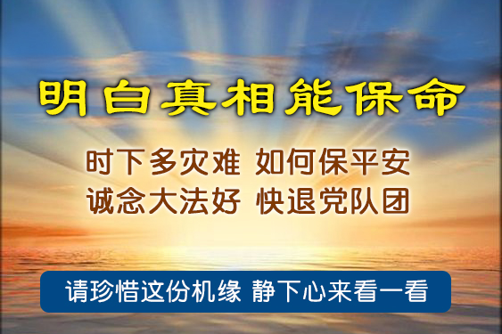
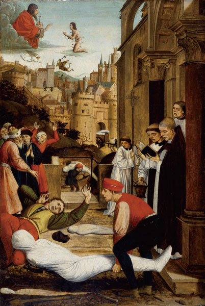

<a name=top>

<a target="_blank" href="https://git.io/bb99bbss">

<b>直连不必翻墙 🌼 https://bit.ly/2A4uPQb</b>

<tr><td width=900><h3><b><a href="https://git.io/kkopop">➤ 中国禁闻    </a></b></h3></tr>
</td>

<h2>请收藏本网址，连上免翻视频即时IP https://bit.ly/3ezRQKo </h2>

 

<h1>看更多真相 https://bit.ly/2RQM1hX</h1>

<h1><b><a href="https://bit.ly/2RQM1hX/awwkk/usdom/blob/master/forfor.md">红潮即将倾覆  天之将明</a></b></h1>

<h2 align="center"><a href="https://github.com/jkujkkj/bird/blob/master/bird02.md"><b>明真相能保命(二)</a></b></h2>

<h2 align="center"><a href="https://github.com/jkujkkj/bird/blob/master/bird03.md"><b>明真相能保命(三)</a></b></h2>

<h2 align="center"><a href="https://github.com/jkujkkj/bird/blob/master/bird04.md"><b>明真相能保命(四)</a></b></h2>

<h2 align="center"><a href="https://github.com/jkujkkj/bird/blob/master/bird05.md"><b>明真相能保命(五)</a></b></h2>

<a href=https://git.io/souye><h6 align="right">回首頁</h6></a>

<a name=top>

<a href =#60>60. 村里的传奇人物</a> 
<a href =#59>59. 一个海外同胞感叹：回国就像爬天梯</a> 
<a href =#58>58.大主教三封公开信 在传递神的启示</a> 
<a href =#57>57. 从一例强拆案看中共的荒唐司</a> 
<a href =#56>56. 村委会主任带村民一起听真相并退党</a> 
<a href =#55>55. 全球团结抗中共 干净网络当先锋</a> 
<a href =#54>54. 中共恶党是中国人一切灾难的总根源</a> 
<a href =#53>53. 上海疫情蔓延安徽 疑中共「进博会」瞒报惹祸</a> 
<a href =#52>52. 悔过自新才是人间正道</a> 
<a href =#51>51. 蓬佩奥能区分中共和中国　中国人民也能</a> 
<a href =#50>50. 罗马瘟疫的启示</a> 
<a href =#49>49. 看似黑夜漫漫 黎明已在眼前</a> 
<a href =#48>48. 日本广岛法轮功学员反迫害传递真相</a> 
<a href =#47>47. 他们为什么要退出中共各级组织？</a> 
<a href =#46>46. 专家：疫苗不会使生活「回到2019年的样子」</a> 
<a href =#45>45. 德媒：在中国被劳教　在吕嫩市获得幸福</a> 
<a href =#44>44. 瑞典多位议员：世界联合起来制裁中共</a> 
<a href =#43>43. 作恶必遭报 苍天放过谁？</a> 
<a href =#42>42. 知道秘密越多 越明白危险就在眼前</a> 
<a href =#41>41. 最新翻墙软件 突破封锁访问大纪元新唐人</a> 
<a href =#40>40. 美助卿：美国在收集中共活摘器官指控信息</a> 
<a href =#39>39. 无恻隐之心 非人也</a> 
<a href =#38>38. 每日三退声明精选（2020/10/15）</a> 
<a href =#37>37. 蓬佩奥：中共剥夺十四亿中国人基本权利</a> 
<a href =#36>36. 国际女童日的悲歌与祝愿</a> 
<a href =#35>35. 曾轻视生命的台裔女子是怎样走出磨难的</a> 
<a href =#34>34. 川普：疫情是中共的错 中共将付沉重代价</a> 
<a href =#33>33. 美国国务卿蓬佩奥再度为信仰自由发声</a> 
<a href =#32>32. 美国展开行动 制裁中共活摘器官</a> 
<a href =#31>31. 聆听世界各地民众的心声</a> 
<a href =#30>30. 「党员」们最担心的事情终于来了</a> 
<a href =#29>29. 两个世界中的教师</a> 
<a href =#28>28. 十天四颗心脏 中共器官按需供给引忧</a> 
<a href =#27>27. 天上月儿圆 人间团圆难</a> 
<a href =#26>26. 真相破迷 「等着退党」的中国民众</a> 
<a href =#25>25. 病由心造 境随心转 一位台湾老医师的体悟</a> 
<a href =#24>24. 真相如潮水 中共无法挡</a> 
<a href =#23>23. 这个世界从未辜负一份善良</a> 
<a href =#22>22. 美国高官再访台 全球瞩目台湾</a> 
<a href =#21>21. 奥地利首都举办烛光悼念活动</a> 
<a href =#20>20. 涓涓清流</a> 
<a href =#19>19. 京畿重地冤案多 现世报应逾五百</a> 
<a href =#18>18. 内蒙「文化起义」 反抗党文化「灭族」</a> 
<a href =#17>17. 川普以文明谈判方式推动世界和平</a> 
<a href =#16>16. 开卷有益的两本书</a> 
<a href =#15>15. 迟来的道歉 真挚的觉悟</a> 
<a href =#14>14. 穿越生死 生命得以重塑 一位直销员的故事</a> 
<a href =#13>13. 外媒披露新疆法轮功学员被关押在集中营</a> 
<a href =#12>12. 加拿大首都汽车游行　声援三退</a> 
<a href =#11>11. 多伦多明慧学校夏令营师生们感恩</a> 
<a href =#10>10. 愿人间不再有「被失踪」</a> 
<a href =#9>9. 国际抗共大潮起 华人感谢法轮功</a> 
<a href =#8>8. 澳媒：《明慧二十年报告》应入驻所有图书馆</a> 
<a href =#7>7. 华语媒体「天花板」的奇迹和价值</a> 
<a href =#6>6. 吉林「老公安」落马牵出江泽民的罪恶</a> 
<a href =#5>5. 伦敦唐人街 民众明法轮功真相 盼天灭中共</a> 
<a href =#4>4. 白宫顾问：中共释放病毒到全球 应追究责任</a> 
<a href =#3>3. 中共将要恢复对百姓敲骨吸髓模式</a> 
<a href =#2>2. 缺粮？陆媒称「吃剩菜暖心」 上海大搞举报</a> 
<a href =#1>1. 全球退党中心推出在线办理「退党证书」服务</a> 
-----------------------

<a href=#top><h6 align="right">回上方</h6></a>

<a name=60>

<h1 align="center"><b>村里的传奇人物</b></h1>

【明慧网二零二零年十一月二十一日】二零二零年九月下旬的一天，公公骑电动自行车路过一个十字路口时，由于未听到汽车鸣笛声，被一辆快速行驶的出租车撞出去五米多远。出租车的前挡风玻璃都被撞出一个大坑来，老人的身体在空中还翻了两、三个个。摔在地上时，公公已经是一动不动了。路人看见老人被撞的这么狠，都以为老人必死无疑了。
后来公公被送到了医院，经过各项检查，结果发现老人除了头部的一点点皮外伤之外，就是颈椎受了点轻伤，胳膊、腿有些许疼痛，需要养养。公公回家歇了几天，调养调养后，现在啥事也没有了，好着呢！

后来公公回忆说，当他被撞的那一剎那，彷佛瞬间进入了梦境一般。朦胧中，感觉到有一双大手将他轻轻的托了起来，然后又轻轻的将他放到了地上，当时老人的身体没有感觉到一丝疼痛。老人清楚的知道，是慈悲伟大的师父又一次救了他。公公每提及此事时，都要说一遍：「当时有一双大手将我轻轻托起……」感恩之情无以言表。

后来在处理后续交通事故时，连交警都说：「你家老爷子真是命大啊！那是个交通事故多发地。」就在公公出事后不久，离那个地方不远，又出了一起类似的车祸，骑车人当场就被撞死了。

金秋十月的一天，公公出门办事，正好碰上了本村主任。村主任上上下下的打量着公公，见公公神清气爽，面色红润，禁不住脱口而出：「老张啊！听说你又躲过了一劫，你是不是信了法轮功啊？」公公呵呵一笑说：「是呀！你是说对了，我是信了法轮功，才有今天的呀！」

村主任啧啧赞叹道：「真是不可思议啊！村里人都议论说你这次是在劫难逃啊！你咋又一次死里逃生了呢？我就寻思，只有法轮功才能这么神奇呀！只有法轮功才能出这样的奇迹呀！只有法轮功才能救了你啊！除了法轮功，谁又能做的到啊！」

公公今年七十六岁。八年前，公公曾患壶腹周围癌晚期，做了一次大手术，切除了部份的胃、胆管、胰管及十二指肠，之后再用塑料管子将切除的部份强行连接起来。手术前，北京专家曾断言，像我公公这种情况，如果保守治疗，最多活不过半年；如果做手术，即使手术很成功，最多也就是活三、五年的光景。

术后半个多月，公公低烧不退，伤口面临大面积溃疡感染。医生束手无策，老人被折磨的痛不欲生。危难之时，在家族中大法弟子的鼓励下，老人动了真念，也想好好学学大法，亲耳聆听大法师父的讲法。结果，就在老人下决心的当晚，持续了半个多月的烧退了，病痛减轻了大半。之后，公公的身体状况飞速好转，一天一个样。几天后，老人顺利的出院了。

公公从医院回家后，就真的开始认认真真的学大法了，他每天都坚持听大法师父的讲法录音。通过学大法，老人明白了，修炼就是要修心性、做好人，同化宇宙真、善、忍特性。所以村里不论谁家有个大事小情需要帮忙的时候，都能看到公公神采奕奕的身影。老人帮助别人也从不计较回报，就像变了个人一样，为人越来越和善、豁达。整天乐呵呵的，精神矍铄，满面红光。家人们也都看在眼里，喜在心上，无不感佩法轮大法的超常与美好。

现如今，八年过去了，老人身体倍儿棒，吃啥啥香；家里家外，啥活都能干，身体硬朗着呢！当时村里与公公同期得癌症的好几个人，都先后离世了。本来也被村民们认为活不了多久的公公，却越活越带劲儿。公公也因此成了村里的传奇人物。

【文章来源】http://big5.minghui.org/mh/articles/2020/11/21/415385.html

<a href=#top><h6 align="right">回上方</h6></a>

<a name=59>

<h1 align="center"><b>一个海外同胞感叹：回国就像爬天梯</b></h1>

大纪元2020年11月21日讯】“本来就是一件很简单的事情，就是父亲生病，就是海外居住的女儿要回家探望。在2020年的瘟疫下，回国的路，也是我们回家的路，变成了一架不可攀登的天梯！这架瘟疫和各种政策造出来的天梯，就直直地立在广大急需回国的同胞们面前。”

这是住在美国的华裔网友“百草园”日前在其博文“回国就像爬天梯”中的吐槽。

事情缘起于今年9月18号晚上，网友“百草园”收到了弟妹从大陆发来的信息：父亲病重住院。不管愿意不愿意，她，都立即成为了痛苦挣扎争取回国队伍里的一员。接下来，她遭遇了一道道难关。

<b>第一道关是签证关</b>
 
之前，她的十年签证已被领事馆吊销。如何拿到有效的回国签证？接到父亲病重消息的当天，她就向芝加哥领事馆发了电邮，标题就是：“父病危，需签证回国探视。”当时她还没意识到，等待自己的是一条漫长的办理签证之路。等待近一周之后，领事馆给她发来了以下的回复：1、医院出具的危重病情相关通知或证明；2、您与父亲的亲属关系证明（如亲属关系公证书、户口本、出生证等）；3、您在美住址，电话；您赴华后居住详细地址；4、您的中文姓名，美国护照首页和原中国签证页。

这当中，最难的是第2条，需要正式的文件，来证明她和父亲之间的关系。她在文中说，收到这个邮件，第一反应是吃惊，因为这么多年回国探亲，和办理签证，中国领事馆从来没有要求海外华人提供这类文件。当时，有一种在你危难时机，故意增加办签证难度的感觉。第二是不理解，难道领事馆的制定政策的人，认为会有人在瘟疫流行的时候，假冒家里人病危申请回国吗？不管怎样，跟家人说了领事馆的这个要求，弟弟和弟妹都说：我们现在天天跑医院，照顾父亲都来不及，没有时间给你办理这类文件。万般无奈，她只好在家里翻找。结果花了整整两周，她才把所有领事馆需要的材料都搞齐全了。

<b>第二道关是检测关</b>
 
在短短的几个月里，领事馆对新冠病毒检测的要求一变再变：六七月份的要求是，登机前，5天之内的新冠病毒检测阴性即可；九月份改为，要求登机前3天之内的检测是阴性；最近干脆改为新冠病毒检测要求是48小时之内的，同时还加了另一项IgM抗体检测的要求，而且这些要求是对美国直飞中国的飞机。对需要在第三国转机的人，对不起，你得在转机那地儿，把这两项要求，再来一遍！

网友“百草园”吐槽道：“晕！制定政策的领导，您知道不知道，您是对在外国居住要回国的人群出台政策，外国的医疗系统不会随着您的思维起舞。这样要求的结果，现在看，在我在的回国群里，大家回馈的信息是这样的：美国这两项检测都搞的地方有没有，是不是每个城市都有？没人知道。看到的大部分中小城市居住的人的答案是没有。而华人集中，有飞机直飞中国的大城市，比如纽约，旧金山，洛杉矶之类地方的华裔诊所，立马跟风开始做这类生意。其结果是，需要回国的人，无论你是在巴尔的摩、克利夫兰、南卡、北卡，都需要在你计划起飞前三天赶到纽约、旧金山这类的大城市，在那里住旅店，接受这些华裔诊所的检测。不知道亲亲读者们看明白没有，这就是说，这些人在冒险提前几天出现在公共场所，吃住都是在可能感染病毒的旅店饭店。这些人在检测开始时，刚从家里出来，也许没有感染病毒。可是等到上飞机的时候，只有上帝知道他们是不是已经感染了。这样的政策只能让那些乘坐飞机的人，更加地不保靠。因为，大部分的乘客，已经在外面逛了好几天了，他们都不是从家里直接登机的！”

<b>第三道关是机票关</b>
 
网友“百草园”说：“上半年看到留学生们回国，机票简直是天价，几万元，这里指的是美元不是人民币。还有，听说有一些有背景的富豪们，居然有包机回国的。感叹啊！这场瘟疫竟然让这个世界变得这么陌生。我现在还没有到买机票的那一步。不过已经被好心的网友拉进几个回国的群里。一个群为了方便大家聊天，大家的名字分别是某月某天A地飞B地，挺有创意的，也的确提供了有用的信息。这些群里的人们都在抱怨机票贵，而且订好的票常常被取消。我的一位朋友，她母亲来美国探亲，美国签证要过期了，据她说订了票，不行，退了，还没拿到退款，现在又花大价钱买了新票。而最近新出台的政策，使很多要回国的人员，放弃第三国转机的航线，都一窝蜂地买直飞航班。”

除了以上三关，还有很多其他的要求。比如，双阴检测的结果还要上传给大使馆，以获得他们批准的健康码。这个举动也是在48小时的时间里。没有健康码，不能登机。还有，买机票，一定要买五个一航班的，这才比较保靠，航班被取消的概率比较低。

签证关、检测关、机票关——“这些眼花缭乱的要求和门道”，变成了一架不可攀登的天梯！网友“百草园”感叹道：

“在2020年之前，回国，回家探望父母，是每年的必行之旅。我的每年回国之旅，都是在企盼和头疼中开始的。企盼，是盼望又可以见到自己分别一年的亲人了；头大，则是知道又要经历一路上20多小时的长途颠簸。以前总是在心里想：科技快发展吧，经历了波音737、747、777、787，最好波音公司能来一个波音999，把美国飞中国的时间，变成2、3个小时。以前从来没想过，到了2020年，回国的路，不是变快了，变短了。而是变成了一个可望不可及的梦，以前20多个小时行程，成了一个30小时、40小时，甚至很多天行程的天方夜谭。”

【文章來源】https://www.epochtimes.com/gb/20/11/21/n12564986.htm

<a href=#top><h6 align="right">回上方</h6></a>

<a name=58>

<h1 align="center"><b>大主教三封公开信 在传递神的启示</b></h1>

图为2014年11月18日，天主教前任驻美国大主教卡洛·玛丽亚·维格诺（Carlo Maria Viganò）在芝加哥圣名大教堂（Holy Name Cathedral）宣读使徒授权。

【大纪元2020年11月18日讯】前教廷驻美利坚合众国大使卡洛‧玛丽亚‧维加诺大主教分别于今年6月7日、10月25日和11月4日给川普总统发出三封公开信，笃信上帝、遵循神的教诲和指引的维加诺大主教，在信中深刻的揭示出美国社会中正在发生的危机背后的深层根源，并透露神将如何将人类带出困境。

目前美国正在发生的是一场正邪大战 神魔之争
大主教在致川普的第一封信中，就点明《圣经》中所述两个对立面——光明之子与黑暗之子已经形成，「这两个对立的实体作为永恒的敌人并存，就像上帝和撒旦是永恒的敌人一样。看来，黑暗之子正在与您（川普）展开激烈的战争。」

在第二封公开信中，他写道：「此刻，反上帝和反人类的全球阴谋，正在威胁着全世界的命运。」
大主教在第三封信中说，「我们已经看到，深层政府早已提前武装好自己，以从事历史上最严重的选举欺诈行径，以确保能够击败那个人（川普），因为他坚决反对黑暗之子想要建立的新世界秩序。」

大主教告诫人们，我们的敌人是与撒旦为伍的黑暗之子，它就是共产主义邪灵，它用全球化、新世界秩序等理念迷惑世人，排斥上帝、推行无神论，它正在与神争夺这个世界。

「他们屈服于政治腐败、全球化、统一思想、新世界秩序……他们通过把上帝驱除出法庭、学校、家庭、甚至教堂，来统治世界。」

大主教深刻洞悉了今年疫情以来，黑暗之子以健康危机为借口所实施的「大重构」计划的目的，就是要剥夺人民的自由和财产，进一步奴役人民，以建立全球暴政。

他写道：「（黑暗之子）在实施疫苗接种的同时，还将要求提供健康护照和数字身分证，并追踪全世界人口相互接触的情况。不接受这些措施的人，将被关进拘留营或被软禁，他们的所有财产将被没收。」
而在美国总统大选的次日，大主教一针见血的指出选举舞弊、主流媒体对事实真相的封杀、操纵或审查信息、掩盖突如其来的证据和无可辩驳的证词等，是犯罪行为。川普总统与神站在一起，代表正义和传统价值，正在与邪恶的共产邪灵进行一场博弈。

信中说，「在这场博弈中，您（川普）没有被击败，就像您的神圣职责一样（不可击败）。您所做的一切都与神站在一起。而其他人则被自己的恶习所蒙蔽和奴役，这源自对我们主的地狱般的仇恨。所以他们选择了与邪恶为伍。」

正义与神同行必将战胜与撒旦为伍的邪恶
大主教在信中鼓励川普总统，在这个「谎言和欺诈敢于冒犯天堂」的危急时刻，不要灰心，要敢于「迅速而毫不吝啬的做出回应」，要坚定的「反对魔鬼」，「不要被谎言所吓倒」。
因为与撒旦为伍的邪恶只知道仇恨，却永远无法懂得「爱」、「自由」、「信仰」、「文化」的价值是神赋予人战胜邪恶的强大正义力量。

他写道：「这个世界包括人、情感、制度、信仰、文化、传统和理想：这些人和价值观……因为他们被赋予了灵魂和心灵，因为他们被一种精神纽带绑在一起，这种纽带从上天那里汲取力量，从我们的对手想要挑战的上帝那里汲取力量。」

大主教明确指出，在这场战斗中，共产邪灵注定无法取胜，「在光明之子坚定而勇敢的反对面前，全球主义非人道的「大同」计划将会悲惨地遭到失败。」

大主教揭示结局，「黑暗之子的欺骗将崩溃，他们的阴谋将被揭露，他们的背叛将被彰显，他们恐吓的力量将一无所获，一切将被揭示：一场地狱的欺骗。」

因为光明之子与神同行，「我们有全能的主，有排兵布阵准备战斗的神，还有最神圣的圣女，她将敲碎那古蛇的头颅。神如果支持我们，谁还能反对我们呢？」。

《共产主义的终极目的》书中揭示，马克思在《共产党宣言》中称共产主义是「一个幽灵，共产主义的幽灵，在欧洲游荡」，绝非一时心血来潮。这个幽灵是在另外空间中由「恨」和宇宙低层各种败物构成的邪灵。它原本是一条蛇，到了表层空间的体现形式则是一条红龙。它与撒旦为伍。」

在这个正邪大战的关键时刻，在全能的神的护佑下，是时候敲碎那邪恶「古蛇」的头颅了，共产邪灵也将终结于此。
川普总统是神选之人 他是与黑暗之子对抗的「最后的守护者」

大主教信中写道：「在《圣经》中，圣保罗对我们提到 「阻止」邪恶秘密实现的人，即「kathèkon」（希腊语，最后的守护者）（帖撒罗尼迦后书 2：6-7）。」

也就是说，神已经安排了「最后的守护者」来阻止邪恶实现其终极目的、保护传统价值和宗教自由。大主教阐明，在宗教领域，这个阻碍邪恶的人是教会；在政治领域，是那些阻碍建立世界新秩序的人。

而教会已经被共产邪灵所渗透和同化，早已背叛了对神所发的誓言。川普总统却明确要捍卫宗教自由、捍卫传统价值。川普总统所代表的传统价值观，是神赋予的，是人类的普世价值，也是邪恶企图从这个世界上抹去的。
大主教在信中说，「美国第一次有您这样一位总统，勇敢捍卫生命权，不以谴责全世界基督徒受到迫害为耻，谈论耶稣基督和公民享有信仰自由的权利」。
「亲爱的总统先生，正是您，才是「阻碍」深暗势力的人，是黑暗之子最后攻击的人。」

神选定的人，必然会得到神的加持和帮助，大主教建议，「总统先生，没有什么比祈祷更有效的方法了，祈求主保护您，保护美国和全人类免受敌人的巨大攻击。」

大主教更进一步说明向万王之王进行虔诚祈祷的必要性：「祈求万王之王救赎您的国家，您将得到回报。您的见证将触动祂的心，来自上天的恩赐将倍增，前所未有。这对于实现胜利而言是不可或缺的。」
大主教最后发出誓言：「（我们）战无不胜！」

【文章来源】https://www.epochtimes.com/b5/20/11/17/n12556580.htm

<a href=#top><h6 align="right">回上方</h6></a>

<a name=57>

<h1 align="center"><b>从一例强拆案看中共的荒唐司</b></h1>

【大纪元2020年11月18日讯】我是加拿大公民，20年前逃离中国，以为来到自由民主的加拿大，从此开始了全新的生活。没想到我与中国还有一丝联系，就是我留在中国湖北宜昌点军区的一套私有房产。也就是这处房产，终于没有逃脱中共暴政的铁蹄。该房产2015年被当地政府划入征收范围，由于我不同意政府给出的征收条件而未达成协议。从那时起这栋楼一直被征收办封锁着，他们不仅切断了水电道路，而且在之后的几年里他们还多次指使他人撬开大门，入室行窃和破坏。今年9月区政府作出征收补偿决定并向法院申请强行拆除。值得指出的是区政府的这份决定书破绽百出，连我的出生日期都是随便编的。

刘忠平：从一例强拆案看中共的荒唐司
更新 2020-11-18 4:35 PM标签: 强拆, 法院, 证据, 法律依据 Facebook Twitter Line 复制链接 Print【字号】 大  中  小正体 简体
【大纪元2020年11月18日讯】我是加拿大公民，20年前逃离中国，以为来到自由民主的加拿大，从此开始了全新的生活。没想到我与中国还有一丝联系，就是我留在中国湖北宜昌点军区的一套私有房产。也就是这处房产，终于没有逃脱中共暴政的铁蹄。该房产2015年被当地政府划入征收范围，由于我不同意政府给出的征收条件而未达成协议。从那时起这栋楼一直被征收办封锁着，他们不仅切断了水电道路，而且在之后的几年里他们还多次指使他人撬开大门，入室行窃和破坏。今年9月区政府作出征收补偿决定并向法院申请强行拆除。值得指出的是区政府的这份决定书破绽百出，连我的出生日期都是随便编的。

法院对这一案件的审理过程可以说乱像丛生。
首先，法院没有给我发过一张传票，因为我不是中国公民，他们不具备司法管辖权，无法以正常途径向我递交传票，就以电子邮件的方式告知我区政府已经向法院申请强拆。

其次，法院没有给出案由，也给不出案由。房产是我的合法私有财产，其支配权与处置权完全属于我自己，其他任何人无此权力。在这个问题上不存在任何纠纷。

再看法院的审理过程，他们一开始就要求我提供自己的护照信息来确认自己的身份。而在我护照上的出生日期与区政府的决定书不相符，再说让自己来证明自己的身份实际上是无凭无据，所以我拒绝了这一要求，并提示他们可以从加拿大驻中国的领事机构取得我的身份信息。我知道法院本来就不敢去加拿大的领事机构核实我的身份。后来他们四处打听总算补上了这个漏洞。

在案件的审理过程中，法院没有向我出示过任何证据，无论是人证还是物证，实体证据还是虚拟证据，更没有或者说他们根本不可能拿出一个像样的，经过认证的文件，而且都是以电子邮件向我传递信息，从未以正式的文件传递途径向我递交合法有效的文件。

此外，法院审理这一案件没有提到任何法律依据，他们所有的依据不是所谓的国务院令和国务院制定的征收条例就是所谓最高法院的说明。普通人都懂得国务院是一个行政部门，最高法院是一个执法部门而非立法机构，最高法院的说明并不是法律。由此可见强拆事件在中国闹得烽火连天，狼烟遍地，完全是中共法院在政府的授意下执行行政当局的指令，非法侵犯民众的私有财产造成的乱象。

法院的几个法盲经过一番煞有介事的“审理”之后用依然电子邮件的方式给我传来了他们的裁定书。这份裁定书同样是一个具有中国特色的奇葩。

我指出过区政府决定书上我的出生日期是错误的，这本来是向法庭提供虚假信息，明显属于犯罪行为，但他们在裁定书上却说成是所谓的“笔误”，法院已经给予纠正。我不知道世界上有没有这样的先例，法院居然可以纠正原告诉状上的错误。这怎么看也不像是在审理案件，而是法院与政府在合谋串通，共同作案。

如前所述我曾向法院说明区政府在此前已经切断了水电和道路，这些行为即使在那个所谓的国务院条例上也是被禁止的。至于撬门入室，行窃破坏则更是赤裸裸的刑事犯罪。法院的裁定书也承认这一事实，只是接下来并不是对政府追责，转而辩称发生这些的原因是由于我未在规定的期限内与征收部门达成协议，法院似乎以为这样就能证明政府犯罪是合法行为了。他们已经完全忘记了门前还挂着“法院”的招牌，也完全不懂得我拒绝与政府签订协议是我的合法权利。在这些“法官”眼里，政府就是法，而法什么也不是。

法院做贼心虚在裁定书上也表现得淋漓尽致，他们回避了我是加拿大公民的身份，而代之“以居住在加拿大”来敷衍，无法反驳我作出的“房产是我的合法私有财产，其支配权与处置权完全属于我自己，其他任何人无此权力”的声明，只能语无伦次地重复人们早已生厌的而且与法律毫不相干“国有土地”还有“公共利益”之类的陈词滥调。

裁定书的结果自然毫无悬念地“批准”了区政府的“申请”。不过从以上述事实看来这其实是一家中共法院对一名超出他们管辖权的外国人作出的行政处分，实在是司法史上的一个奇观。

作为亲身经历者，我相信过去这些年在中国发生的难以数计强拆事件，将是中共对中国人民进行的不择手段非法掠夺的铁证。天网恢恢，疏而不漏，无论中共如何嚣张，也难逃天灭中共的厄运，也许这一天不会太久。

【文章来源】https://www.epochtimes.com/gb/20/11/18/n12558036.htm

<a href=#top><h6 align="right">回上方</h6></a>

<a name=56>

<h1 align="center"><b>村委会主任带村民一起听真相并退党</b></h1>

【明慧网二零二零年十一月十三日】（明慧记者章韵报导）中共病毒（武汉瘟疫）爆发后，作为退党服务中心的主力，海外法轮功学员义务通过各种形式向大陆民众传递真相、帮助人们「三退」保平安。法轮功学员在中共迫害面前劝三退，是从恶魔的手中救人，是对真、善、忍的坚守，是对道德、良知的维护，是劝世人远离邪恶脱离危险、得救度的大善行为。特别是在目前全球剿共的形势下，中国大陆的民众能接到海外的电话都感到非常幸运并表示感谢。

二零二零年十一月，一位中国湖南省某村的村委会主任，接到海外法轮功学员的真相电话，他认真听了一部份后，就打开免提扩音器，让所有在场的干部和村民都听到。过程中电话断了两次，但都重新连接上了，把所有的真相都听完了，他退了党，现场还有人高呼：「法轮大法好！」

一开始陈主任接到电话就很认真的听，学员讲：「中国人讲天时地利人和，今天的瘟疫也是天象变化造成的。两千年前，四次大瘟疫使得罗马帝国灭亡了，最后善良的百姓捧着基督徒的遗骨上街游行，乞求上天的宽恕才终止了最后的那场瘟疫。历史就是这么的惊人相似。这次的疫情是上天给人的警示，这都是老天在警示人啊！杀人偿命、善恶必报的天理是从以前传下来的。中共窃国以来，破坏道德，打击善良，迫害正信，毒害人民。历次政治运动就害死了八千多万中国人。今天的中国自然环境被强力破坏，传统道德丧失殆尽，贪污腐败盛行、黑社会、吸毒等等这一切都是宣传无神论！不信神佛、战天斗地的中共带来的恶果。中共执政这些年干了那么多坏事必遭天惩。天灭中共更是天意！天降瘟疫是无药可治的，只有顺天意求得神佛老天的护佑，才能真正的幸福平安。你看现在天灾人祸这么多，都是冲着共产党来的！所以赶紧退出来，抹去它的印记。先生，现在我就给你一个『顺福』的化名，退了这个党好吗？」

他回答说：「好啊！」学员说：「祝贺你脱离了中共邪恶组织。我再给你讲一下法轮功的真相，你在听吗？」

这时电话里传来了其他人的声音，估计是陈主任把电话的扩音器打开了，在招呼其他人来听，当他听到学员在问，他赶紧凑到电话前说：「在听，在听。」

他们在一起听学员讲法轮功的真相，当讲到：「法轮功修炼者，用『真、善、忍』的标准要求自己做好人中的好人，当时在中国有上亿人修炼。现在法轮功弘传全世界一百多个国家和地区。每年的五月十三日是世界法轮大法日，一百多个国家同时举行盛大的庆祝活动，从政府高官，国会议员到普通的民众普天同庆，以纪念和感恩真善忍给人类带来的希望和光明。另外，法轮大法在全世界获得各国政府褒奖，支持议案和信函超过四千五百项；这是我们中国人的骄傲，华人的骄傲。法轮功的主要著作《转法轮》，已被翻译成四十多语言在世界各地出版发行，是中华五千年文明历史中被翻译成外国文字最多的书籍。」

这时有人在电话里高呼：「法轮大法好！」陈主任小声说：「先听，先听着。」

当学员继续讲完《天安门自焚》伪案时，有回应说：「哦，是假的。」

当接着讲到：在贵州平塘县掌布风景区发现的二点七亿岁的「藏字石」 ，五百年前崩裂的巨石断面内惊现六个排列整齐的大字「中国共产党亡」，其中「亡」字特别的大。经专家考察证实，「藏字石」上未发现任何人工雕凿加工痕迹，乃天然形成，堪称世界奇观，国内多家媒体都报导了此新闻，但都隐去「亡」字。

电话那边响应说：「哦，是真的。」

当开始讲中共活体摘取法轮功学员器官的真相时，电话突然断了。学员继续回拨，接通后陈主任说：「还在，还在听。」

当讲完所有的法轮功真相后，最后学员说：「现在知道法轮功真相的人都会有福份喔，我也希望你们能有大福份，请你们都记住『法轮大法好，真善忍好！』这九字真言。遇到甚么大灾大难都会平安度过。」
陈主任说：「好，我们都记住了，谢谢你，太谢谢你了！再见！」

【文章来源】https://big5.minghui.org/mh/articles/2020/11/13/415058.html

<a href=#top><h6 align="right">回上方</h6></a>

<a name=55>

<h1 align="center"><b>全球团结抗中共 干净网络当先锋</b></h1>

 2020年11月10日上午，美国国务卿蓬佩奥在自由与民主中心发布会上发表讲话。

【大纪元2020年11月12日讯】二零二零年十一月十日，美国国务卿蓬佩奥（Mike Pompeo）表示，目前有近50个国家与170家电讯公司加入了美国领导的“干净网络”，这些国家的5G网络建设只使用可靠供应商，而不使用“华为”等中国公司提供的设备和技术。

《美国之音》报导，蓬佩奥说：“为了美国和整个世界的利益，在召集志同道合的国家结成联盟方面取得了巨大成功。近50个净网国家中，包括30个北约盟国中的27个，37个经合组织成员国中的31个，27个欧盟成员国中的26个，与12个波罗的海、亚得里亚海和黑海沿岸国家中的11个，几乎占世界总产值的三分之二；170家电讯公司行列中，涵盖了领先全球的许多公司”。

七月二十三日，蓬佩奥曾发表主题为“共产中国和自由世界的未来”的演讲，他坚定的承诺，要与中国人民一起，与爱好自由、志同道合的国家一起，击溃中共的极权暴政。打击中共，不只关乎信仰与理念的国际正义，是一场贸易战、经济战与军事战，更是科技战与资讯战，“干净网络”防止中共渗透，形成安全堡垒，更显迫切而重要。

中共早期即在国内利用“长城防火墙”控制民众访问国际互联网，并大量使用数据驱动技术以监测、控制和审查中国民众。此后，中共再以全方位的监视系统“金盾工程”、开发拦截信息软件，包括“人脸识别”与“步态识别”等系统，对民众的监控逐步升级。

位于德国柏林的智库“墨卡托基金会”中国问题研究所（MERICS）分析师丽贝卡‧阿切萨蒂（Rebecca Arcesati）说：中共一直在许多发展中国家积极推广其互联网和网络治理手册，最近一次是利用数字丝绸之路沿线的5G连接和智慧城市项目”。《金融时报》也报导，塞尔维亚是签署了中共的智慧城市配套项目的国家之一，包括由海康威视（Hikvision）提供的监控摄像头，海康威视是一家因涉嫌侵犯新疆人权而被美国列入黑名单的公司。

十月初，《华尔街日报》发表了一篇哈德逊学院（Hudson Institute）研究员克劳迪娅‧罗塞特（Claudia Rosett）的文章，指出中共利用联合国向全球搜集大数据，争夺国际新标准制定权，对全世界进行监控，从而输出其审查与监控人民的暴政模式。其中，“地理空间中心”将设在浙江省德清县，而“大数据研究中心”设在杭州，此即阿里巴巴集团的所在地。《华尔街日报》的文章，正传达了与德国智库相同的担忧和顾虑。

美国参议院情报委员会民主党副主席马克‧沃纳（Mark Warner）也认为中共企图控制下一代数字基础设施，此与美国的价值观完全相悖，例如透明度、包容不同意见与尊重人权等。他表示，“中共正在开发一种技术治理模型”，威胁与日俱增。

十月十四日，非政府组织“自由之家”（Freedom House）公布了年度网络自由（Freedom on the Net）报告，中共连续六年倒数第一，是65个国家中网络自由情况获得最差评分的国家。报告说，全球网络自由情况十年来持续下降，中共更趁“武汉肺炎”疫情之机，扩大网络监控、数据搜集和审查言论，用高科技手段进行社会控制。

十月二十三日，美国白宫副国安顾问博明（Matt Pottinger）指出，中共惯用统战，“建立档案嗜好是列宁主义政权的特征，透过收集与利用大数据，使得国家政策有利于北京为所欲为”。对数据进行建档的“深圳振华数据信息技术公司”，产品买家正是中共国安系统，这些官方掌握的数据档案，可让中共用来施压、勒索、威胁特定对象或污蔑、分化某一群体。

中共不仅处心积虑的监控网络、搜集大数据与染指5G，一般民众即使只是玩电子游戏当娱乐，也暴露于危险境地而不自知。

十月二十八日，曾任职美国国家安全局（NSA）的资安专家艾特尔（Dave Aitel）与智库“新美国安全中心”（CNAS）研究员司马乔丹（Jordan Schneider）投书《华尔街日报》指出，中共掌握全球电玩市场的程度，更甚于“抖音”（TikTok）或“微信”（WeChat）等软件，这已构成重大威胁与更迫切的国家安全问题。

这篇以“如果你打电玩，中共或许就在监视你”为题的文章中指出，过去十年来，中国科技巨擘“腾讯”投资或收购了全球数大知名电玩开发商等。中共藉由封锁不同政治立场的玩家，展现它控制电玩内容的影响力，也搜集美国民众的资料；再透过读取这些数百万名玩家的电脑，来从事各种情报活动；中共还逼迫好莱坞对北京敏感话题噤声，得以审查美国言论。

过去，中共运用科技手段去强化专制体制，箝制人民的言论自由，秽行劣迹斑斑可考；继而，它登堂入室的想藉由联合国“地理空间中心”与“大数据研究中心”的合法招牌，把审查与监控民众的丑恶行径延伸到海外；如今，亟思扩充5G网络建设的国家，与许多沉迷电玩的民众，正陷入中共的红色网络牢笼中而不自觉。举世各国的政府、议会都必须提高警觉，强化国家安全的架构体系；普罗大众也要健全资讯与通讯的安全意识，以确保网络自由与基本人权不受中共的渗透与侵犯。

【文章来源】https://www.epochtimes.com/gb/20/11/12/n12543682.htm

<a href=#top><h6 align="right">回上方</h6></a>

<a name=54>

<h1 align="center"><b>中共恶党是中国人一切灾难的总根源</b></h1>

中国农民是被划为劣等公民，在上世纪五六十年代，农村连最基本的温饱都不能保障。图：2014年2月20日拍摄于中国贵州省安顺市郊区照片。

【大纪元2020年11月11日讯】中共恶党自窃政七十多年来，给中国人带来了史无前例的灾难：自然环境的破坏—长江、黄河的截流造成两岸的生态环境的破坏；生存资源的掠夺性开采；有组织的诈骗；社会道德的整体堕落，黄、赌、毒泛滥。更为严重的是中共恶党依靠暴力革命，采用高压恐怖和欺骗的统治手段，不断搞运动，对恶党划定的所谓“阶级敌人”以及所有持异见人士、有信仰的人，统统遭到残酷的镇压甚至杀戮。

中共恶党窃国之初，就开始了它自己的“造神”运动，将其邪党党魁奉为神灵让中国人顶礼膜拜，天天学、月月讲其邪恶的理论，而对几千年来人们信奉的正神却大加污蔑、诋毁，砸烂寺庙与道观，让出家人还俗，杀害坚定的僧人、道士，宣扬无神论，否定善恶有报的天理，宣扬斗争哲学，与天斗、与地斗、与人斗，反天、反地、反人类，砸碎道德体系。纵容色情、暴力、欺诈等邪恶的东西充斥电视、媒体、网络以及社会的各个角落。

中共的邪恶本质，决定了它所做的一切都是危害人类的。宣传中，极力推崇拜金主义、享乐主义等物质上的追求，鼓吹时间就是效率，时间就是金钱，让人沉湎于醉生梦死的感官生活，失去了心法约束，自私、冷漠、不讲道德、没有公德心，放纵自我，灵魂扭曲，从上到下造就了极端腐败、黑暗的恶党官僚体系，实施奴隶制统治政策，让中国人丧失了传统的互助互敬、礼让谦和的善良本性，变的极端自私，无恶不做，为达目地不择手段。

人心的变坏，是各种犯罪的根源，而源头就是中共恶党的邪恶统治。如今各种灾难遍及中国大陆各个角落，是上天在警示人们：天灾是对做恶者的报应，人不治天治。也在告诫人们，中共气数已尽，别看它貌似强大，已是病入膏肓，它已经挽救不了自己行将灭亡的命运。

下面从不同的方面论述中共恶党给中国人带来的灾难。

<b>中国农民的苦难与贫穷</b>

众所周知，中华民族是世界上最勤劳的民族之一，仰仗中国人的勤劳智慧，在历史上曾经创造过举世瞩目的辉煌文明，人民安居乐业，社会祥和宁静。可是自从中共恶党窃政以来，中国人就没有好日子过了。中国农民就更是被划为劣等公民，在上世纪五六十年代，农村连最基本的温饱都不能保障，生生饿死四千万中国人。而且采用户籍制，农民家的孩子考学、择业都受到限制，没有特殊的才能，中国农村的孩子很难走出农村，永远摆脱不了农民劣等公民的命运。中共恶党从它建政初期就露出狰狞的面目，残害中国人的手段无所不用其极。

一九七八年，中共在走投无路的情况下，被迫实施农村家庭联产承包责任制，将土地承包给农民，通过农民的辛勤劳作，粮食产量大大提高，从粮食产量上看，似乎农民收入有了很大的增长。而实际情况却是，中共恶党的贪官污吏层层盘剥，再加上物价的疯狂暴涨，真正到农民手中的收入寥寥无几，致使农民越来越贫穷，买不起房，看不起病，上不起学，就是对中国农村的真实写照。

对待农民，中共恶党早就有一套邪恶的政策，中共早期的一份文件这样写道：怎么清算贫农呢？文件指出：“至于清算贫农，不要特别的说法、做法，只是说明：人民解放军是为人民作战，不上前线的人，应该负担公粮；先向他要今年的公粮，如果要了他还有，再向他追要去年的，要了去年的他还有，向他追要前年的：要得他不能生活了，一面救济他，一面给他分配生产工具，使他的生产、生活和我们的政权联系在一块，他才能同我们始终奋斗到底”。（摘自明慧网二零二零年八月二十日《慧眼识魔：历史的绝响引人深思》）中共从骨子里就是反人类的邪魔，它的存在就是对人类的摧残。

中共的贪官个个腰缠万贯，买豪宅，开豪车，过着花天酒地的生活。中国农民被中共恶党压榨的几乎一贫如洗，真正变成了恶党体制下的奴隶。

<b>中国工人的悲惨境遇</b>

中共窃政之初，进行了工商改造，把私有制标为公有制，剥夺资本家的私有财产归国有，并把资本家消灭。实行邪恶的社会主义那一套。可是中共恶党只会杀人，并不会治理国家，贪官污吏层出不穷，越反越腐，公有制走到崩溃边缘，不得已才改革开放，又将国有企业进行股份制改革，承包给个人，致使大批工人下岗，实际是失业，没有了生活来源。为了生存，有的下岗职工以捡垃圾为生，买不起菜就到市场上捡菜叶，冬天交不起取暖费，全家受冻的比比皆是。更有甚者，有的失业职工靠卖血来维持家庭所需和供孩子上学。在中共恶党的统治下，中国工人已沦为街头新乞丐阶层。

而中共恶党搞官商勾结，权贵阶层乘机侵吞国家资财，大量的国有资产变相的成为中共权贵、富商的家族产业，由2%的权贵阶层与富商掠夺了90%的中国财富，贫富差距居世界之最，形成了有中国特色的权贵资本家。这一点从被抓捕的高官巨贪家中搜出的亿万现金就可见中共的腐败已到了不可回旋的地步。这样一个腐败、魔鬼党怎么会不灭亡呢！

<b>教师和医生天职的沦丧造成中国道德的更快下滑</b>

中国有着五千年的文明传统，自古中国人就以仁、义、礼、智、信规范着自身的行为。中国古代的私塾教育也特别注重人心、道德、礼仪等方面，所学书本也只是《四书》、《五经》、《礼》、《易》等古代先贤的著作。老师的天职一是教导学生明理即怎样做人；二是教育学生识字即熟读圣贤书。那时的老师对学生很爱护，像慈父一样看护着学生，体现出师道尊严。而学生对老师也很尊重，真正做到：一日为师，终身为父。

而如今的教师在中共恶党的灌输洗脑下，已经失去了教师育人的天职，不知道身为教师应该以身作则，言谈举止要规范，引导学生向正的方面发展，而是以金钱的多少来横量教学的质量，以挣钱的多少来评价人的好坏，教师掌握了家长望子成龙，望女成凤的心理，公开收取家长送的红包，用“谁考第一给谁物质奖励和请谁吃饭”来刺激学生努力学习，大量的家庭作业压的学生没有一点空闲时间，没有孩童、少年的乐趣。教师在课堂上不真正教学生知识，而是利用寒、暑假来办各种辅导班挣钱，兼卖各种学习用品，凡事以钱为重，使学生不知道学习的目地和意义。学校把学生的成绩和教师的奖金挂钩，成绩第一的班级，教师会得到很多奖金。近几年来，高考的升学率虽然上升了不少，可是培养出来的学生却没有学到做人的道理，只是掌握了一点专业知识而已，长此下去，这样的教育培养出来的学生对于国家又有什么用处呢？教师天职的丧失是导致学生道德缺失的重要原因，而造成这一切的根源都是中共恶党统治的结果。

医生的天职是救死扶伤，医院是非盈利的福利机构，医术是不能用金钱来作交换的。在古代，真正医术高明的医生都是道德高尚的，有的甚至是修道中人，像孙思邈，带弟子时都是先教怎样做人，再传授医术。而在中共恶党统治下的中国医院，却完全变为最丰厚的社会盈利单位，医生和护士除了工资收入以外，还有超过工资几倍甚至几十倍的“红包”（注：患者除了交给医院的医疗费之外，额外再给医生的钱就叫“红包”）收入，而且医院为了挣钱，患者交不上钱或中途交的钱不够了，医生马上就把药停了，催促患者家属马上交钱，不交钱就不给治了，很多病人就是因为交不起钱被迫出院，回家等死，有的甚至交上了钱，医院也治不好，最后弄的人财两空，很是悲惨。有的病人不来医院还能多活几年，只要一到医院检查，医生的恐吓加上大量的医药费，用不了多久病人就会精神崩溃，很快愁苦的死去。现在中国的医生已经完全丧失了救死扶伤的天职，不管病人的死活，完全沦落为对患者金钱的掠夺者。造成中国患者这一切悲惨境遇的都是中共恶党统治带来的恶果。

<b>人心败坏导致社会乱象丛生</b>

一九九九年七月二十日，中共恶党悍然发动了对信仰“真、善、忍”的法轮功群体的全面镇压，并犯下了活摘法轮功学员器官牟利“这个星球上从未有过的罪恶”，迫害至今已持续二十一年。致使中国社会的道德急速下滑，如今的中国人在中共恶党的欺骗引导下，无论长幼，没有了心法的约束和伦理道德的规范，长辈不知怎样爱惜和教育晚辈，晚辈不知怎样孝敬和体恤长辈，只知自己享受，不管别人死活。

举例说明：河北省唐山市滦南县某农村一家有子女五人：三个闺女，两个儿子。他们的母亲瘫痪了，却没有一个儿女在跟前伺候，俩个儿媳妇一天玩三场麻将，也不去伺候婆婆。而且有一个闺女就和其母亲住在同一个村，却从不去母亲那里照看洗涮，只是他们姐妹弟兄五个该谁家伺候就轮流每天把饭送过去，也不查看其母亲是否有大小便需要清理，整个屋子骚臭刺鼻，呆不了人，最后他们的母亲去世时被发现身体都生蛆了，蛆又变成了蛹，人都被蛆盗了，一时成为当地人们谈论的话柄。如果人失去了做人的规范和理念，就会无所畏惧，为所欲为，这样的人太可怕了，这样的社会太恐怖了，这一切都是中共恶党统治中国七十多年来造成的恶果，也是中共恶党有意让中国人变成这种天不怕、地不怕，没有道德约束、如同魔鬼一般的人兽。

现在的中国人无人敢扶危救难、扶老携幼，因为有太多的报道：被救人家属贪财昧心，反咬一口，恩将仇报，向救人者索要大额的赔偿金，造成救人者心寒委屈，又无处伸冤，从此再也不敢“管闲事救人”了。这也是中共恶党造成的人心败坏，只认钱，不知善恶有报的社会败象的一大展现。

中国人现在没有安全的食品和环境，假、毒食品无处不在，地沟油、毒酒、毒米、毒奶粉、毒茶叶、毒胶囊不仅充斥在地方小的批发市场，甚至摆到了城市大型的超市和百货公司，再加上自然环境的污染造成生存环境的恶化，生活在中国，真的让人没有安全感。电视虽然有报道曝光，却治标不治本，根本杜绝不了假、毒食品的泛滥，解决不了根本问题，因为这一切的祸根就是中共恶党的统治带来的。

中共的公安警察和地方流氓黑社会勾结，收取保护费，很多的带有色情服务的场所如宾馆酒店、按摩店、洗头房等都有地方公安机构做保护伞，才能明目张胆的经营，挣肮脏钱，而真正经商的小商小贩却被城管追着到处跑，不让正常经营，理由是没给他们（城管）送贡品（钱、物），很多正当经商的商贩没办法只好像打游击一样，看见城管来了就跑，生活的很是悲惨。如今，中共使中国变的满目疮痍，到处都有变异败坏的现象存在，中共让中国人变的六亲不认，维钱是重，不讲道德，伤天害理，无恶不做，总之，这一切的根源就是中共恶党。

善恶有报是天理，正因为中共恶党发动了对“法轮功”的镇压，也加速了中共灭亡的脚步，就像《九评共产党》中说的：“这场运动给中共的棺材钉上了最后一颗钉子。”

二零零四年大纪元推出的系列社论—《九评共产党》一书将中共恶党的邪恶本质介绍的淋漓尽致，要想进一步的了解中共恶党，就请看看此书，他会让你耳目一新，找到剪断恶党束缚的金钥匙—退出中共恶党的一切组织，为自己选择一个美好的未来。只有让全体中国人看清中共的邪恶本质，中国人才能真正从内心摒弃恶党，过上正常人的生活；只有解体中共，才能拯救中国人；只有解体中共，才能还原中华五千年礼仪之邦的大国风貌。

天灭中共已经开启，愿善良的人都识正邪，明真相，退恶党，给自己选择美好光明的未来。

奉劝那些还在被中共恶党蒙蔽的中国人，赶快清醒吧，快快找真相来看一看，真相会让你认清中共恶党的邪恶本质，揭穿中共恶党的邪恶阴谋，远离中共恶党，不给其做陪葬。

【文章來源】https://www.epochtimes.com/gb/20/11/11/n12541244.htm

<a href=#top><h6 align="right">回上方</h6></a>

<a name=53>

<h1 align="center"><b>上海疫情蔓延安徽 疑中共「进博会」瞒报惹祸</b></h1>

图为11月6日，上海「进博会」现场。

【新唐人北京时间2020年11月11日讯】上海日前出现新的中共病毒确诊病例，而且疫情已跨省传播至安徽。早前网上曾传出上海爆出疫情，但官方否认。民众质疑，当局为上海「进博会」维稳瞒报，导致疫情扩散。

中共国家卫健委11月11日通报，上海浦东机场西区航司货运站一名51岁男子确诊，已有1名居住在安徽省的同事被传染。

上海当局9日已通报这起确诊病例，该患者自4月8日起在浦东机场从事搬运工作，期间没有离开过上海。自9日起，该患者居住的祝桥镇营前村被封村，居民大排长龙做核酸检测。

据通报，这名患者在机场工作时，每次进入都会测量体温、戴口罩，在发病前14天内没有高风险地区旅居史、没有病毒感染者接触史，近3个月内也没有其他医疗机构就诊史，而且也没有搬运过「国外冷冻食品」，感染源不明。

不过，在10月底，微博上曾疯传一张聊天对话截图。内容显示，上海浦东新区一名在家隔离的人员确诊，此人曾请水电工上门维修，导致其服务范围内的30多户人家被集中隔离，至少发现5例确诊病例。但官方随即对此消息「辟谣」。

就在上海传出疫情的期间，上海召开「进博会」，民众质疑当局为了维稳，瞒报疫情。

进入秋冬季节，大陆多地疫情出现升温迹象。11月8日，紧邻北京的天津爆出本土疫情，当地政府宣布「迅速进入战时状态」，并把疫情传播源头「甩锅」给一批德国进口的冷冻猪脚。目前，天津、上海三个地区升级为中风险地区。

此外，云南、山东青岛、新疆、山西等地也相继出现新一轮疫情。早前，上海防疫专家张文宏曾表示，今年秋冬季节出现第二波疫情是必然，而且第二波疫情反弹的力度会超过第一波。他还说，有80%的人是无症状感染者，这非常恐怖。
【文章来源】https://www.ntdtv.com/b5/2020/11/11/a102984253.html

<a href=#top><h6 align="right">回上方</h6></a>

<a name=52>

<h1 align="center"><b>悔过自新才是人间正道</b></h1>

【明慧网二零二零年十一月四日】据明慧网近日报导：根据明慧网报导的恶报案例整理统计，一九九九年七月中共疯狂迫害法轮功后，因为参与迫害，广东省遭恶报人数670人，祸及家人72人，恶报中死亡182人，恶报最多的部门是公安系统为152人，恶报中死亡最多的部门也是公安系统为63人，祸及家人最多的部门还是公安系统为29人，祸及家人中死亡最多的部门也是公安系统为18人。
广东省因迫害法轮功遭恶报凸显两个特点：一是，广东遭恶报的高层官员多，在此仅举几人。广东省是中国大陆重要省份之一，历届省委书记都是政治局委员，是中共江泽民集团迫害法轮功的重灾区，遭恶报的高层官员也特别多。

比如：中共中央政治局委员、中共广东省委书记张德江（后任中共政治局常委）。二零零五年十一月四日，张德江率团参加二零零五年中国广东-澳大利亚经济技术贸易合作交流会，十一月七日，被法轮功学员谢焱以「身体伤害罪、非法监禁罪」告上纽省高等法院，高院受理案件，传票送达张德江。张德江被控告的消息以及法轮功真相长城的内容引起了参加此次会议中外代表的震动，也震惊了中南海。

前中共广东省委书记李长春（后任中共邪党政治局常委），卖力执行首恶江泽民的迫害政策，二零零四年七月二日在访问法国期间，被法轮功学员以「酷刑罪同谋」罪名起诉。

黄华华，男，曾任中共邪党广州市委书记、广东省省长，是广东省迫害法轮功的主要责任人。二零零五年十月，因迫害法轮功在加拿大以「酷刑罪」被起诉，同时在美国以「酷刑罪、反人类罪和群体灭绝罪」被起诉。二零一零年八月黄华华访台，又被控告。

王华元，曾任中共广东省委副书记、中共浙江省委常委、纪委书记。二零一零年遭恶报被判处死刑，缓期二年执行。

任学锋，曾任广东省委副书记兼广州市委书记。二零一九年十一月三日官方称，中共重庆市委副书记任学锋「因病医治无效」死亡，年五十四岁。又有重庆消息称，任学锋曾经堕楼，送医院抢救。也有传言任学锋是「自杀身亡」。

朱明国，原广东省政协主席，跨三省市任十五年政法委书记。任职期间，至少有六十二名法轮功学员被迫害致死。二零一四年十一月二十八日，朱明国被调查，二零一六年十一月被判死缓。

陈绍基，原广东省政法委书记。陈绍基是广东省迫害法轮功的主要责任人。陈绍基曾任广东省政协主席、省委副书记、省委政法委书记、省公安厅厅长等要职。自一九九九年七月二十日，中共江氏集团迫害法轮功以来，特别是前几年作为广东省政法系统的首要负责人，陈绍基使广东地区的法轮功学员处在严重的被迫害之中。重庆市第一中级法院日前判处陈绍基死刑、缓期二年。

二是，广东省遭恶报公安系统有四个最多，凸显了做恶必须偿还，谁做恶谁遭报的天理。在此仅举几个遭恶报的实例：

梁国聚，广东省公安厅厅长，二零零二年三月至二零零七年五月，任省委常委、政法委书记、省公安厅厅长。梁国聚在任期间，操控广东省公检法疯狂迫害法轮功学员，手段极其残酷，致使至少十二名法轮功学员被迫害致死、多名法轮功学员被非法判刑、劳教。广东省是全国迫害法轮功最严重的省份之一，梁国聚也被「追查迫害法轮功国际组织」纳入首批通告的中共官员名单之中。二零一四年六月七日，梁国聚遭恶报，死于不治之症，时年六十六岁。

郑少东，公安部长助理、原广东省公安厅副厅长、刑侦局局长。郑少东迫害法轮功学员、维权人士不遗余力，从中捞取政治资本，往上爬。作恶多端，罪及家人。二零零六年八月中旬，其妻子陈某因抑郁症从住处十七楼跳下，自杀身亡。真是一人作恶，累及家人。

马伟灵，广东省公安厅原六一零办公室副主任。二零一六年五月二十日被判处有期徒刑十年，处以罚金一百万元。

姚国政，省公安厅政治部副主任。广东省公安厅是中共邪恶政治流氓集团的帮凶，广东邪恶势力的黑窝，助纣为虐。然而，天理昭昭，善恶有报。二零零六年六月二十日左右，政治打手姚国政因意外车祸医治无效，毙命。

何靖，广州市公安局副局长。何靖从一名县级市公安局局长，在中共迫害法轮功的短短四年中，一跃升入广州市白云区公安分局局长，仅仅两年又升任广州市公安局党委副书记、副局长。其中一个重要的原因是他紧紧追随江泽民，主抓迫害法轮功。何靖被判处无期徒刑。

祁晓林，广州国保的第一把手，任广州市委政法委副秘书长、市公安局党委副书记、副局长等职。他出手狠辣，使得广州在迫害法轮功学员和迫害异议人士的严酷程度上仅次于北京。二零一三年一月八日，祁晓林突然自缢身亡，年五十五岁。

王广平，广州市公安局国保支队副支队长，二零一零年六月十日神秘倒地猝死。王广平于二零零一年至二零零六年曾任广州市公安局「六一零」办副主任，这个五十四岁的「六一零」办副主任恰巧是在六月十日猝死的。

邱伟，深圳恶警。二零零八年十二月十日凌晨，驾车从深圳关内返回龙华，于下半夜两三点钟，在福龙路上遇到一伙人，将其截停，并从车中拖出来暴打。将其头部、臀部等多处用刀砍伤。邱伟当场昏迷，被救后，直到十二月十三日才醒过来，而他身上的财物，别人分文未取。

广东省各级政法委、六一零、法院、检察院、司法局等部门遭恶报的人数也特别多，这里不再列举。

中共迫害法轮功二十一年来，凡是迫害特别严重的地区，都是那里的主要负责人积极跟随中共江泽民集团特别紧，执行江泽民迫害政策特别坚决。广东省的张德江、李长春等人即是如此，其它省市亦是如此。如果没有这些忠实追随者，迫害就难以发动起来，也造不成严重后果。

其次是有一批类似政法委、六一零、公安局、法院、检察院、司法局等忠实执行机构和在这些机构中充当打手的各级官员。广东省遭恶报的670人中，公安局152人，司法局、监狱150人，县级以上政府100人，政法委、六一零82人，法院13人，检察院8人，乡镇政府61人，教育系统54人，普通世人40人，其它9人。其中类属「官衙」的人数合计为571人。这些数据说明这场迫害是由各级官员发起的，实施迫害与造成残酷后果也是由这些「官衙」中的打手们一手造成的。这些恶人（凶手）们遭到恶报，是罪有应得，是在兑现天理！

奉劝那些至今仍在追随中共迫害法轮功学员的人们，不要再继续作恶。广东省恶人们遭恶报的实例，是在惊醒所有仍在做恶的人。天网恢恢，疏而不漏，任何人做恶都得偿还，这是天理！目前，剿灭中共的大局正在世界形成，中共解体灭亡的日子就要到来。别再为中共卖命，不要做它的陪葬品，悔过自新才是人间正道！
【文章来源】http://big5.minghui.org/mh/articles/2020/11/4/414636.html

<a href=#top><h6 align="right">回上方</h6></a>

<a name=51>

<h1 align="center"><b>蓬佩奥能区分中共和中国　中国人民也能</b></h1>

【明慧网二零二零年十一月七日】十月二十七日，美国国务卿蓬佩奥（Michael Pompeo）受访时表示，他在很多场合使用“中共”而不是“中国”这个词汇，因为这样的叫法准确，真实反映了现实情况。他解释说，“是共产党引发挑战，而不是那些也想从中共压制中解脱出来的中国人”。
蓬佩奥重申，全球面临的麻烦、挑战，如武汉肺炎，都是中共带来的，而不是中国人民。“是中共专制政权（而不是中国人民）没有及时让世界知道，没能防止无尽苦难的发生”。

蓬佩奥解释说，中共在每个地方都想要控制和称霸：“一带一路”是掠夺性的经济活动，它想拥有政治影响力。“这对世界来说是危险的，我相信美国与其它热爱自由的国家，将以使世界变得更安全、更稳定的方式来反击中共这种做法”。

一场源自武汉的肺炎瘟疫（COVID-19病毒），因中共蓄意隐匿与造假而肆虐全球后，它“以疫谋霸”的野心暴露无遗，频频借着军事演习扩张势力，严重威胁国际社会的安宁与和平，引来各国政要诸多谴责。

七月二十三日，蓬佩奥呼吁全世界联合抗共，并揭穿了中共声称它代表14亿人民这一谎言。他承诺，美国不会再任由中共政权绑架中国人民；美国将带领自由世界，坚定地与中国人民站在一起，共同击溃中共的独裁暴政。九月二十七日，蓬佩奥受访时提及中共的穷兵黩武，并阐述了美国已结束“绥靖”政策、展开对抗中共的整体布局，包括建立全球联盟以反击中共。

七十年来，中国共产党为了维护它的独裁政权，宣传中经常灌输群众“爱党爱国”的口号，在它政权遭遇危机时往往高呼“亡党亡国”，这是中共阴狠狡诈的欺骗伎俩，企图将共产党和中国捆绑在一起。中共不间断地用“无神论”与“党文化”，对中国人洗脑荼毒，致使许多人相信了“反华势力”、“爱国必须爱党”与“吃共产党的饭”等谬论。

显而易见的，中共绝不等于中国。爱党之人不一定爱国，爱国之人也不一定爱党。“亡党”绝非“亡国”，中共灭亡了，中国依然存在。中共的官样文章中经常出现“党和国家”之类的话语，将共产党凌驾于国家之上，实际上是挟持了国家，这在国际社会中是不可思议的怪事。中国共产党在宣传中总是“党、国”不分，故意混淆了“党、国”的概念和界限，使得许多中国人“条件反射”般的把“党”和“国”混为一谈。

每当西方国家谴责中国的人权状况、批评中共的独裁专制时，中共便一概扣上“反华势力”的帽子，借机模糊了“反共”和“反华”的分别，也就是混淆“爱党”和“爱国”的概念。为了掠夺政治利益，中共更移花接木，恶意扭曲了爱国的定义：“爱党就是爱国”，“爱国就是爱党”；“亡党就是亡国”；“国丑就是党丑，党丑不能外扬”等等。

十月十七日，西班牙法轮功学员在巴塞罗那的加泰罗尼亚广场，向过往行人讲述法轮功在中国无辜遭受迫害的真相，呼吁制止中共暴行。许多民众都了解真相并签名声援反迫害。一位年轻的中国女士突然失去理智，撕毁了一张征集签名的表格。她把中共混同于中国，认为法轮功学员揭露中共的迫害会丢了中国人的脸。

法轮功学员秉持善意，耐心向她说，“在第二次世界大战时，纳粹做了很多坏事，受到全世界的谴责。但纳粹并不等于德国。同样的，中共也不能代表中国，中国人民是中共暴政的受害者。我们谴责中共的迫害暴行，但我们都热爱中国”。听闻细心讲解后，这位女士对自己的行为感到羞愧，表示道歉，并说愿意回去了解关于“三退”（退出中共党、团、队组织）保平安的真相。

中国并不等于中共，爱国也不等于爱党。中国有五千年的文明历史，而中共不过百年之久，它如何能代表中国呢？中国先后经历了二十多个朝代，哪一朝过去了，下一朝不再来？这些朝代从兴盛到灭亡，在历史中仅是一瞬间，中共有什么理由能把自己说成是中国呢？一旦共产党灭亡了，中国才会迎来真正的文明、昌盛。

偏狭的爱国主义和极端的民族主义，总是专制独裁者最后的避难所。在共产主义被世人唾弃之后，中共祭起了爱国主义和民族主义的大旗。每当西方国家批评中共时，它就说是反华；国内民众反对中共时，它就说你反政府；海外华人谴责中共时，它就说你不爱国。被中共长期洗脑的人会说：“没有共产党，哪有新中国。”

自苏联与东欧解体后，至今还坚持共产主义的国家只剩中国、北韩、越南与古巴而已，这些国家都与专制、集权、迫害连在一起；而抛弃了共产主义的东欧各国，迅速走向文明发展，人民生活水平普遍提高，这印证了“没有共产党，才有新中国”。

中共的谎言，有它一套荒诞不经的歪理逻辑。“党就是国，国就是党，爱党就是爱国，反对中共就是不爱国，就是搞政治”，逐步形成了：谁给中共提意见，谁就是搞政治。再进而延伸：给党的领导提意见，就是反党、不爱国与搞政治，甚至会被诬陷为“勾结外国反华势力”。

例如，二十一年来法轮功学员揭露中共与江氏集团的残酷迫害，中共就煽动民众说“法轮功给中国抹黑”、“法轮功不爱国”。指出中共的丑恶，就变成“不爱国了”？就成了“家丑不可外扬了”？上述在西班牙那位中国女士的言行，正是遭中共洗脑毒害之后的“制式反应”。

以往国际社会对于“中共”与“中国”的概念两者混淆不清，历经半世纪的姑息养奸与憧憬幻灭，如今已经摆脱思想误区，认清了中共根本不能代表全中国人民。蓬佩奥能区分“中共”与“中国”的分野，有智慧的中国人民也能。

其实，在中国大陆无人再相信共产党那套骗人的鬼话了，只是在“爱党就是爱国”这类谎言的长期洗脑下，良知与本性一时尚不能幡然觉悟而已。当然，中国人民在历次各种政治运动中，也逐渐跳出共产党的邪说桎梏，近期即有一例。

八月二十七日，中共党媒央广网微博挂出一段视频，中共外交部发言人赵立坚诳称：“中国共产党与中国人民鱼水情深，血肉相连，中国人民就是中国共产党的铜墙铁壁，谁都别想打破”。该视频一经贴出，中国民众一片骂声，一边倒地嘲讽挖苦中共毫无廉耻的外交辞令。

网友们怒呛中共：“铜墙铁壁的通俗说法就是炮灰”、“吃香喝辣从来不带上我们，当炮灰的时候一口一个血肉相连，我们不是铜墙铁壁”，乃至“让领导先走，让人民去死，一向是共产党的独门法宝”等等。

中共是全体人类的公敌，它把中国人民当作傀儡戏耍，也威胁着70亿人的福祉。如今，整个国际局势的图像也清晰地呈现出来，美国正引领世界抗击共产暴政、维护普世价值。眼下就是正义与邪恶的较量，各国政府和人民，包括九千万党员在内的中国广大民众，都必须在正邪之间抉择，不容回避闪躲，无一丝一毫的回旋空间或妥协余地。

值此汇聚全球力量的关键时刻，善恶系于一念之间。善良可贵的中国人民，不要沦为中共的殉葬品；彻底与红魔切割，是唯一自救保身之道；仍对中共抱持幻想的人，应该及时清醒，方可摆脱邪灵的钳制；所有中国民众都该挺身而出，跨出明智与理性的步伐，许下自己和子孙的美好未来。

【文章來源】http://www.minghui.org/mh/articles/2020/11/7/414460.html

<a href=#top><h6 align="right">回上方</h6></a>

<a name=50>

<h1 align="center"><b>罗马瘟疫的启示</b></h1>

大纪元在特稿《迫害法轮功遭报应实录》一文中表示，「历史和现实已经给人类留下了很多深刻的教训：曾经强大的罗马帝国因为迫害基督徒长达三百年而遭受四次大瘟疫，最后灭国。北魏太武帝、北周武帝、唐武宗、后周世宗之『三武一宗』的灭佛事件，令百姓受难，灭佛的皇帝都遭到恶报。史实表明，对修炼人的迫害会招致最严厉的天谴。」

强大的古罗马因迫害正信，招致瘟疫和天谴。受尽瘟疫折磨，尝尽亲人离丧的悲恸，罗马人开始觉醒和反思，公开谴责罗马王迫害基督徒。

公元680年，罗马瘟疫接近尾声。当时，罗马市民敬捧被迫害致死的基督徒塞巴斯蒂安的圣骨游行，并虔心忏悔，罗马城的大瘟疫因此停止。

若斯‧列菲林西（Josse Lieferinxe），〈圣塞巴斯蒂安代瘟疫灾区向神祈祷〉（Saint Sebastian Interceding for the Plague Stricken），1497年作，美国巴尔的摩市沃尔特斯艺术博物馆藏。（维基百科公共领域）

<b>面对中共病毒瘟疫，人类应如何选择？</b>

大纪元特稿《病毒针对共产党而来》一文说，「纵观共产党的历史，就是一部充满战乱、饥荒、瘟疫和死亡的黑暗史。中共70年暴政，害死八千万中国人，破坏中国传统文化和道德；尤其是近30年来，从1989年屠杀学生，到1999年镇压法轮功修炼者，以及现在对更广大民众的欺凌打压，中共享暴力和谎言给中华民族和世界带来深重灾难。」

「『中共瘟疫』向世界蔓延之势，清晰地勾勒出它循着与中共关系密切的国家、城市、组织和个人一路蔓延。」

「武汉瘟疫虽然给世人带来了病痛甚至死亡，但历史和现实都指出了消解瘟疫、趋吉避凶的明路：那就是认清灾厄的根源，明晓中共的真相；脱离中共、拒绝中共，就能远离灾厄、不受瘟疫侵害。」

【文章来源】https://www.epochtimes.com/b5/20/11/3/n12522144.htm

<a href=#top><h6 align="right">回上方</h6></a>

<a name=49>

<h1 align="center"><b>看似黑夜漫漫 黎明已在眼前</b></h1>

法轮功学员勇敢无惧的反迫害，他们将坚持下去，直到迫害停止、邪恶被灭尽。看似黑夜漫漫，黎明曙光已在眼前。

【大纪元2020年11月04日讯】明慧网近日报导，原吉林省体育学院教师车平平只因修炼法轮功，被非法关押在吉林女子监狱八监区，遭警察操控三个刑事犯人郑丹（杀人碎尸犯）、孙英杰、李金淼迫害凌虐，企图强制「转化」她放弃信仰。

47岁的车平平在任教期间，按照「真、善、忍」的标准做好人，深受师生喜爱，教学绩效优异。自一九九九年七月中共迫害法轮功后，车平平被关进洗脑班、拘留所，两度被非法判刑。二零一五年四月，她被非法关押在八监区，绝食抵制迫害，一直遭野蛮灌食长达八个月之久。

当时车平平每天被强制灌食三次，每次插管拔出时都鲜血淋漓，造成身体各器官功能衰竭，随时面临生命危险。原本130斤体重、1米66身高的她只剩下60斤，走路须靠人搀扶。车平平多次被关小号，四肢被固定捆绑半个月，眼睛两次被喷辣椒水，以致右眼视力模糊，视网膜脱落。

去年钱伟转任八监区长后，加剧迫害法轮功学员：关小号，不让睡觉、吃饭与洗澡等，许多法轮功学员被摧残的白发苍苍，吉林省女子监狱八监区还成为中共司法部每次视察的所谓「优秀监区」。钱伟用各种邪恶、阴毒的办法迫害车平平，让她每天都被虐待中。

江氏集团为了迫害法轮功学员，采取「名誉上搞臭，经济上截断，肉体上消灭」等手段，指挥非法组织「六一零办公室」执行「打死白打死」，「打死算自杀」、「不查身源、直接火化」的灭绝政策，迄今至少有四千五百多名法轮功学员被中共迫害致死，难以计数的法轮功学员在劳教所与监狱中遭受惨绝人寰的各种酷刑折磨与精神摧残。

中共为了逼迫法轮功学员放弃信仰「真、善、忍」，写下出卖灵魂的「三书」，达到所谓「转化」目的，警察刻意用残忍的酷刑使当事人面临极大的肉体痛苦，试图摧毁修炼人的精神意志。车平平承受的那些酷刑，细节让人不忍卒读；她的悲惨遭遇，尽显中共泯灭人性的邪恶本质；她的历劫苦难，是中国大陆千千万万法轮功学员被中共恣意迫害的写照。

优秀教师车平平无辜受害的处境，并非特例。吉林省另一个臭名昭著的公主岭市新生监狱，也是残害法轮功学员的魔窟，都如实反映了中共迫害法轮功的严峻情况。

公主岭新生监狱长期使用电刑加「约束带」，残忍迫害法轮功学员，逼迫他们转化，手段极其残忍，毫无人性可言。狱警先用电棍电刑，再上「约束带」：一寸宽的带子，将两腿双盘绑上，再将两只手反背身后，向头的方向拉至极限，将绑两手的带子从肩头拉过来把四肢和上身捆绑成一体，头扣在两腿前面朝地，一动不动，呼吸极其困难，昼夜不松绑。舒兰市法轮功学员徐洪玉即遭受这样的折磨，有些学员更受酷刑长达八、九个月。

新生监狱至少迫害致死法轮功学员梁振兴、马占芳、蔡福臣、王恩慧、张辉等；更多的法轮功学员被折磨致伤、致残。马占芳被劫持到新生监狱仅短短几个月的时间，于二零一二年五月七日被迫害致死。蔡福臣受尽残酷迫害，狱警经常将他「关小号」，多根电棍电击他的头部、生殖器等敏感部位，二零一零年九月十五日蔡福臣被迫害致死。

让世人钦佩的是，法轮功学员经受了那么多酷刑的非人折磨，仍然坚毅不移的信仰「真、善、忍」，慨然无悔的用金刚意志实践了笃信的理念，浩然正气震天铄地。正是他们秉持大善大忍的精神，始终以平和、理性、宽容的方式抵制迫害，感动了无数的人们，乃至加入反迫害的行列。

二十一年来，法轮功学员凭着对宇宙真理的正信，从这场残酷且隐晦的迫害中走过了荆棘与坎坷，在腥风血雨中把真相传播到中国大陆的各个角落。他们激浊扬清，成为正道的中流砥柱；他们超越生死，竭力捍卫信仰自由，守护修炼者的尊严。

中共不信神佛、仇视信仰，充满了斗争、仇恨、屠杀、谎言和恐惧，彻底悖离普世价值。施暴的警察固然凶残无度，躲在幕后操控、纵容、默许、包庇和奖励的中共才是这些罪行的最大根源。无怪乎今年十月一日，美国众议院提出一项法案，要求美国政府把中共视为「跨国犯罪组织」。一手主导迫害法轮功的中共与前党魁江泽民，确是名符其实的犯罪集团与恐怖分子。

天网恢恢，疏而不漏。从王立军、薄熙来，到李东生、周永康这些「六一零办公室」头目的相继落马，迫害佛法修炼人的这批恶徒已经走向穷途末路。法轮功学员勇敢无惧的反迫害，百忍成金，他们将一如既往的坚持下去，直到迫害停止、邪恶被灭尽。看似黑夜漫漫，黎明曙光已在眼前。

【文章来源】https://www.epochtimes.com/b5/20/11/4/n12524344.htm

<a href=#top><h6 align="right">回上方</h6></a>

<a name=48>

<h1 align="center"><b>日本广岛法轮功学员反迫害传递真相</b></h1>

【明慧网二零二零年十一月二日】二零二零年十一月一日，日本广岛的法轮功学员在广岛市中区和平公园附近开展讲真相征签活动，揭露中共长达二十一年对法轮功的迫害及其邪恶本质，了解真相的民众在举报迫害元凶江泽民的举报书上签名声援。

民众了解真相并在举报书上签名声援

武汉肺炎（中共病毒）爆发以来，在抗疫方面日本国民主要靠自觉遵守规定，保持着有条不紊的秩序。

疫情以来，虽然和平公园的游客流量大不如从前，但还是能看到很多世界各国的观光客。活动中法轮功学员打出制止中共活摘法轮功学员器官的横幅，准备了多种语言的数据，向人们讲述法轮功被迫害的真相，很多人都表示支持，纷纷在举报元凶江泽民的举报书上签名。尽管还在疫情期间，特别谨慎的日本民众，看到横幅和听过法轮功学员的讲述后，仍主动签上自己的名字。

有位中国人研修生骑车路过横幅前，打横幅的法轮功学员问他是中国人吗？他说是。法轮功学员边让他看横幅边说，中共做了很多坏事，老天要惩罚它，现在美国已经不让党员入境了，以后日本也会这样，劝他三退。他说没加过党组织。法轮功学员就告诉他记住九字真言，并给他真相资料，他很高兴地说谢谢。

一位日本男士，签完名后说以前经常去中国的上海等地，有很多中国朋友，可是跟他们提起人权、香港等事情时，他们都说不知道，没听说过。法轮功学员跟他讲了一会儿真相后，男士就详细问法轮功是甚么。听了法轮功学员的讲解之后，男士拿着日文法轮功数据高兴的用中文说：「加油加油！」

【文章来源】https://big5.minghui.org/mh/articles/2020/11/2/414551.html

<a href=#top><h6 align="right">回上方</h6></a>

<a name=47>

<h1 align="center"><b>他们为什么要退出中共各级组织？</b></h1>

 2020年9月26日，加拿大埃德蒙顿退党服务中心的志愿者和市民举行汽车游行，声援在三退大潮中退出中共的3.6亿勇士。

【大纪元2020年11月02日讯】自大纪元网站2004年12月3日发起「三退」(退党/团/队) 活动截止2020年11月1日傍晚，总计达到366,675,252人「三退」，昨日人数 65,888。

为什么会有这么多人「三退」？具体原因可以说不尽相同，但有些原因则是共同。

哪些原因是共同的呢？在回答这个问题之前，先让我们来看看最近发表的4篇「三退」声明，看看当事人是怎么说的。

l  我与邪灵恶党划清界限的三退声明

我是一名来自中国上海的西班牙归国留学生祁林，在今年因为中共病毒(又称新冠状病毒，COVID-19)被迫中断学业，回国落地隔离在隔离酒店的那些天我们遭受了中共邪党工作人员的粗暴对待，感受到这个残暴政权的无耻无情和治下人民的痛苦。在翻墙与西班牙的同学联络时，无意间看到了大纪元网站写的九评共产党和迫害法轮功的真相，一下子惊醒。震撼了在中共国生活多年习以为常已经麻木的我。

我为我曾是少先队员和高中大学时期是团员、党员而感到羞愧。回想起来过去种种一旦加入过它们，受到它们党文化的影响和洗脑就像是恶魔的印记一样深刻植入大脑影响终生，幸运的是此刻我已经醒悟，尽管这残酷真相让我十分痛苦撕碎了我以往对共产党的种种认知和幻想。

我下定了决心要去反对这个魔鬼组织，首先从声明退党退团退队开始，与过去的自己做一个切割。希望我能够摆脱这魔鬼的诅咒和邪恶的印记让我的人生拥抱真诚善良和正义，也感谢法轮功这么多年的付出坚持反共传播真相唤醒我们中国人同时提供了这个平台让我们能够和邪灵恶魔政党划清界限！

最后我想说：共产党你这个恶魔！你把多少中国人的生活都他妈毁了！你这是什么党？你害人不浅吶！

声明人:祁林 2020-10-30 中国上海

l  退党、团、队组织

我是三十年前的学生党员，那时年轻，不谙世事，只求进步，然刚入，就遭遇八九六四，这事让我看清了中共本质——所谓人民的政党政府，可以拿起枪坦克与人民为敌，那就必死无疑。我内心开始去党（一路走来有系列思考文字可凭）。我一直认为：在党，仅一纸表格和作为国家谎言的一部分，已没啥，成为一个清醒独立真实的我，并对中共说NO！这才重要，才不枉为人一生。我做到了！如今的中共已成人类公敌，大恶不赦，天必灭之！

这几天看到，要有个三退形式才算，那就在贵处备个案，我郑重声明：本人从今天起，彻底退出中共，包括下属相关组织，特此，多谢！

声明人:Wei er  2020-10-07  浙江

l  退出中国共青团

本人于2015年九月被迫加入中国共青团，当时自以为是一种荣耀。时过境迁，我开始通过外网慢慢了解了很多过往的真实历史，发现这个团体是一个非常虚伪、残酷、无情的中国共产党的副手，帮助学校行使专制，压迫包括我个人在内的无数青年学生！它比中国乃至世界历史上任何一个监视民众的机构都更加地恐怖、狡诈、疯狂！

对于这样的组织，我只感到无尽的恐惧，并萌生了退出此邪恶组织的想法。所谓的「团员证」只是一个空壳，我到现在不知自己的证件号码为多少，更不要指望它能证明团员身分了。该有的权利什么都拿不到，还要去履行所谓的「保护党的义务」！

今天，我遭到了学校的无理迫害。我深知中国共产党腐败无能，到处压榨无辜的人民，强迫我加入其下的各种邪恶组织。学校里更是胆大包天！人民苦不堪言还得天天说生活有多美好！

声明人:刘青铭 2020-10-14 河北省

l  声明三退

小时候因为生活环境较为封闭，获取外界信息的方式有限，而学校里身边的人都加入少先队，那时被灌输的想法是加入少先队表示自己品学兼优，是优秀学生的象征，后来加入共青团和共产党时也一直是这样认为的。直到后来偶然的机会浏览到了海外的信息，才突然感受到外面世界的自由与美好，再后来亲自到海外生活了一段时间，深切体会到自由民主社会对个人的尊重与关怀，才是真正的普世价值。

多年的经历到如今已经明白中国共产党的理念早已不再是口中所谓的「以人为本」，一切都是为自己政党的存续为核心利益，根本不关心个人的基本权利，必要时甚至会拿无辜的个体作炮灰，替罪羊和挡箭牌。这样的政党已无被继续拥戴的可能！因而在此声明，退出中国少年先锋队，中国共产主义青年团，以及中国共产党，从此不想再与上述政党和组织，或与其相关的组织或个人有任何关系。

声明人:陈云龙 2020-10-05

从上述4篇声明来看，如果说当事人当年加入中共组织是因为受骗、无知或者被迫，那么他们今天之所以选择与中共一刀两断，无非主要是因为两个原因，一个是亲身感受到了中共「这个残暴政权的无耻无情和治下人民的痛苦」，另一个就是通过「翻墙」了解到了被中共封锁的「很多过往的真实历史」，了解到了民主国家的「自由与美好」，从而彻底撕碎了「以往对共产党的种种认知和幻想」。而无论是他们的亲身感受还是「翻墙」获取的信息，可以说都关乎真相，区别仅在于前者是直接获的的真相，后者是间接获的的真相。

事实有力地证明：真相是戳穿中共谎言的利刃，真相是与中共一刀两断的强大推手，真相也是解体中共的神奇武器！

【文章来源】https://www.epochtimes.com/b5/20/11/1/n12518371.htm

<a href=#top><h6 align="right">回上方</h6></a>

<a name=46>

<h1 align="center"><b>专家：疫苗不会使生活「回到2019年的样子」</b></h1>

奥克兰大学(Auckland University) 微生物学家Siouxsie Wiles博士认为，无论开发出哪种疫苗，仍然可能不适用于新西兰。图为巴西利亚大学（the University of Brasilia)教授，诺华生物技术疫苗测试协调医生Gustavo Romero于2020年8月5日在大学医院向记者展示疫苗。( Andressa Anholete/Getty Images)

【大纪元2020年10月30日讯】（大纪元记者安琪新西兰编译报导）2020年开年以来，中共病毒(Covid-19)席卷全球，疫情愈演愈烈，一直没有退去的趋势。各国政府和民众都把希望寄托在疫苗的研发上。似乎只要有了疫苗，人类就能战胜该病毒。但奥克兰大学(Auckland University) 微生物学家Siouxsie Wiles博士对此持保留态度，她认为「生活再也不会回到2019年的样子了」。

Wiles认为，根据疫苗的有效性，无论开发出哪种疫苗，仍然可能不适用于新西兰。
 「这完全取决于疫苗是什么样的，」 她解释说，「一种好的疫苗可以阻止接种者被感染，而且没有不良影响，如果有足够多的人注射这种疫苗，就可以使那些身体太弱而不能注射疫苗的人受到保护……但是，如果开发出的疫苗只对部分人有效，而不是对所有人都有效，那就意味着仍然会有一些人染病。」
 
她说，在疫情不受控制的地区，效果较差的疫苗仍然可能会被采用。但对新西兰来说，情况就不同了。在新西兰，这种疾病已经出现，并在不需要封锁的情况下被多次扑灭。所以「如果疫苗不是特别有效，那么它可能不是我们想要的。」

她认为，虽然对该病毒的科学认识以及更好的治疗或预防很「重要」，但过去一年表明，新西兰能够有效地制止该病毒的传播，如果我们能继续实施并不断完善这些措施，我们可能将不需要特效药和疫苗。
她说：「微生物只是我们所说的疾病三角的一部分，它由宿主，环境和微生物组成。」 而「(疾病)三角最重要的部分是人们如何应对。」新西兰对Covid（中共病毒）采取的「有力」集体行动仍然是我们最好的防线之一。
她表示，新西兰迄今的反应表明，无论研制出什么疫苗，每个人都有责任帮助预防疫情爆发。她用「瑞士奶酪模型」做比喻解释说：「我们必须认为每一层防线都有漏洞。我们涂抹的保护层越多，感染病毒的可能性就越小。」
她说，新西兰的第一道防线是国家层面的，比如边境控制和两周的隔离，但许多步骤是个人发挥重要作用的步骤，比如使用追踪应用、洗手，以及在无法保持社交距离时戴上口罩。
她警告说，寄希望于疫苗能让生活「回到2019年的样子」是不现实的，而且像洗手这样小的个人行为对预防中共病毒传播「效果非常好」。

Wiles对人们将大大小小的疫情贴上新西兰应对「失败」的标签感到失望。她说，这不是失败，这是系统中固有的缺陷，我们会逐层抓住这些缺陷并不断地改进它。 「我试图让人们远离指责游戏……每次有人被感染就说是系统失败，这会使人们对整个系统失去信心，但它确实运行良好。」

她预计「至少在明年」，层层防御是必要的。「由于每个人的努力才起到了作用。就像最近的港口工人一样，他们一旦感到不适就去做检查，而不是等一天或继续去上班。这才是真正重要的。

【文章来源】https://www.epochtimes.com/b5/20/10/29/n12511998.htm

<a href=#top><h6 align="right">回上方</h6></a>

<a name=45>

<h1 align="center"><b>德媒：在中国被劳教　在吕嫩市获得幸福</b></h1>

【明慧网二零二零年十月二十八日】在德国西部城市吕嫩市二零二零年十月份的国际文化周，法轮功学员所呈现的金色中国龙，成为了文化周最闪亮的一点，吹去了疫情期间人们的烦闷，当地最大的日报《鲁尔日报》深入采访了把祥龙带入这座城市的法轮功学员郭居峰。报道标题是：在中国被劳教，在吕嫩市找到幸福。

图1：德国吕嫩市《鲁尔日报》的报道。

<b>由于修炼法轮功被关押到劳教所</b>

在金秋十月德国西部城市吕嫩市的国际文化周中，一条金色祥龙闪亮登场，让在场的德国人耳目一新，也在这座城市刮起了一阵中国风。

《鲁尔日报》在报道中说：在国际文化周的舞龙让人印象深刻，郭居峰居住在德国已经十二年了，他是隐藏在龙背后的“龙人”。他的家乡在八千公里外的中国东北黑龙江，他在文革后期出生，但是长大后，他却和社会有些“格格不入”。

接着《鲁尔日报》报道了郭先生学习法轮功并遭受迫害的经历：郭先生在一九九五年学习了法轮功，一种气功打坐，和其他气功不一样的是，法轮功学员都坚持真、善、忍原则。但是法轮功在一九九九年却被中国政府（中共）禁止了，数以千计的学员被绑架并被送入劳教所，这其中就有郭居峰。他经历了三个劳教所，在一个条件恶劣的石厂被强制劳动。郭先生说：“我们用双手和锤子工作，手套很快就破掉了。”

二零零八年，中国举办奥运会的时候，郭先生在中国的德企工作，他出差来到德国，就再没回去。如今他任职于一家德国公司，是一名电气工程师。在他的业余时间，他致力于中国文化，有时他将在德国的见闻写成文章，刊登在德国的中文报纸上。他还经常烹饪他故乡的饮食，精心装饰并拍下照片，闲暇时间他也会写中国的书法。

<b>编排舞龙成为新爱好</b>

图2：法轮功学员组成的舞龙队在德国西部城市吕嫩市的国际文化周中表演。

《鲁尔日报》介绍了郭先生编排舞龙的过程：郭先生编排了舞龙，他说：“对我们中国人来说，龙是极其特别的，是一种神圣的生命。”之后他深入研究了舞龙，并把龙呈现给了国际文化周的观众。郭先生说：“我制作了训练文件，还有相对应的视频教程，每个队员和动作都进行了编号，我们进行了深入的学习和训练。”

舞龙队员年龄覆盖二十七岁到七十二岁，四人来自吕嫩市，他说：“我特别高兴，在现场为观众带去快乐。我的目的是，通过龙为吕嫩市带来幸运，在演出现场出现了彩虹，这让我非常感动。”

让人印象深刻的是，郭先生积极的生活态度，以及他为社会无私付出的一切。他说“我很愿意住在这里。”他和他的同伴每周日会在丽波公园炼功。当然他也有一丝心痛，就是他十二年没有回到故乡和亲人团聚。

【文章来源】http://www.minghui.org/mh/articles/2020/10/28/414349p.html

<a href=#top><h6 align="right">回上方</h6></a>

<a name=44>

<h1 align="center"><b>瑞典多位议员：世界联合起来制裁中共</b></h1>

【明慧网二零二零年十月二十八日】（明慧瑞典记者站报导）二零二零年十月二十一日中午，有来自包括法轮功学员在内的、多个人权团体的代表在瑞典国会大厦旁集会，揭露中共的邪恶，谴责中共对民众和世界的祸害。八位瑞典议员到场声援，多位国会议员在接受媒体采访时表示，中共是当今世界最大的威胁之一。对于中共的邪恶不能再沉默了，全世界都要联合起来共同制裁中共。
国会议员：中共就是恶魔

图1：国会议员比约恩﹒索德（Björn Söder）先生在集会上发言。

国会议员比约恩﹒索德（Björn Söder）是和他的同事国会议员萨拉﹒吉尔（Sara Gille）一起来参加集会的。法轮功学员在集会现场打出「法轮大法好」、「活摘法轮功学员器官天理难容」、「打倒中共恶魔」（Eliminate The Demon Chinese Communist Party）等横幅。学员跟二位议员讲述了中共如何血腥迫害以「真、善、忍」为原则为人处世的善良法轮功学员，及活摘他们的人体器官贩卖牟利的罪恶。听完法轮功学员的陈述后，比约恩﹒索德指着「打到中共恶魔」的横幅说：「是的，那个横幅说得真好，它（中共）就是恶魔！」

集会后，比约恩﹒索德议员还把「打到中共恶魔」这个横幅作为主图贴在了他个人的网站上。并及时地把他当天参加声援抗议活动的感言及整个集会过程的图片，都放在了他的社交媒体上广泛传播。

<b>欧盟所有国家要联合起来制裁中共　清除中共渗透</b>
 

图2：国会议员汉斯﹒罗森贝耶（Hans Rothenberg）先生在集会上发言。

汉斯﹒罗森贝耶（Hans Rothenberg）表示，所有欧盟国家都要联合起来，共同合作制裁中共。他认为通过欧盟制裁中共领导人，这种制裁有的放矢会更有效。

弗雷德里克﹒马尔姆（Fredrik Malm）是对华政策跨国议会联盟（IPAC）的发起人之一，他表示，瑞典拒绝华为5G只是政府清除中共渗透的政策之一。他说：「对华政策跨国议会联盟联合了多国的议员，大家都对中国的走向以及中共政府对世界的威胁非常担忧。对此我们欧盟必须联合起来，全世界都要联合起来对付中共的威胁。」
<b>国会议员：大家联合起来共同维护人权，这非常的重要</b>
 

洛塔﹒约翰逊﹒福纳尔维（Lotta Johnsson Fornarve）在接受媒体采访时表示，她非常高兴看到大家走到一起来抗议正在中国发生着的对人权的犯罪。她说：「今天国会几乎各个党派都来了，我们大家联合起来共同维护人权，这非常地重要。这是一件令人高兴的事情，让人们看到了希望。」

国会议员珍妮﹒阿尔姆﹒爱立信（Janine Alm Ericsson）谴责中共对各族裔民众的迫害。她指出：「中共对法轮功、西藏、蒙古、新疆等多个团体的迫害，对香港反送中运动参与者的打压、迫害，都是没有法律约束的。中共政权对人权的蔑视，这是绝对不能接受的。」

<b>人权基金会主席：我们必须站出来维护普世价值、制止中共这个恶魔</b>

人权基金会──埃德斯塔姆基金会（The Edelstam Foundation）主席卡罗琳﹒埃德尔斯坦（Caroline Edelstam）女士在谈到中共二十多年来对法轮功及其他受迫害团体大规模活摘器官的罪行时，她呼吁应立即立法禁止瑞典人去中国移植器官。瑞典医疗系统不要与中共所谓的医疗系统合作、不要再和恶魔做生意。「我们要联合起来制裁中共，这也是作为民间组织监督政权的责任和功能。」

埃德尔斯坦女士说：「中共是一个令人难以置信的邪恶政权，是二战群体灭绝以来最凶残的罪恶。中共政权颠覆了人类最基本的价值观，极端独裁还企图统治全世界。」她认为了解中共历史的人，都清楚中共是甚么事都干得出来的。她说：「我们必须站出来维护普世价值、制止这个恶魔。」

【文章来源】https://big5.minghui.org/mh/articles/2020/10/28/414350.html

<a href=#top><h6 align="right">回上方</h6></a>

<a name=43>

<h1 align="center"><b>作恶必遭报 苍天放过谁？</b></h1>

【大纪元2020年10月26日讯】上海市是江泽民的大本营，自中共迫害法轮功以来，上海市一直紧随其后作恶，致使不少人遭到了恶报。据明慧网近日报导，中共迫害法轮功二十一年来，上海至少有75人遭恶报，在归纳出的五类恶报形式中，死亡人数最多，有23人，在五类参与迫害的人员中公检法司人员遭恶报人数最多，有38人，政法委「610」11人，政法系统合计49人，占恶报总数的百分之六十五。

据明慧网报导二十一年来，发生在这个大都市的对善良人的迫害一直不断，经核实有名有姓遭迫害致死的法轮功学员就有三十人，而致残致伤、被开除公职学业、取消退休金、家庭破裂、流离失所的更难计其数。

在这里列举几个恶人遭报的案例：

上海市公安局610头目谢安，男，一九七二年出生，二零一三年五月在家突然死亡，刚满40岁。谢安是上海迫害法轮功学员的元凶，上海各地区的法轮功学员被迫害案子都要经过他之手。

宝山区公安局国保科长魏志耘暴毙。魏志耘：女，二零零五年，自宝山区看守所调入宝山区公安局国保处，专司迫害法轮功，同年加入中共邪党，因迫害法轮功得力，后提升为国保科长，年薪十多万。二零零六年，上海开「六国峰会」期间，大肆迫害大法弟子，魏志耘获邪党奖励一万元。

二零零七年一月初，认识魏志耘的法轮功学员对她讲真相，劝诫与救度她。魏志耘却魔性大发，叫嚣：「我不相信因果，共产党给钱就为它办事，人总要死的，无所谓。」并恶言诋毁法轮功创始人，认为自己年轻，口出狂言要和法轮功创始人比比「看谁活得过谁」。

二零零七年一月二十九日，也就是魏志耘口出狂言二十多天后，她正常开车到单位上班。上午开例会之前，她正拨打着手机，突然倒地不省人事，随即瞳孔放大，大小便失禁，二目大睁，暴毙而亡，死状惨不忍睹，其五官扭曲肿胀，尸体变形膨大。包括魏志耘在内的任何人都不会想到，恶报来得如此快，如此惨，当年魏志耘四十二岁。

上海市高级法院院长壮年猝死。邹碧华，男，二零零八年七月任上海市长宁区法院院长，二零一二年十月任上海市高级法院副院长。邹碧华因积极追随江泽民利益集团迫害法轮功，非法审判多名法轮功学员，致使法轮功学员赵斌被迫害致死，何冰刚等被迫害致残。二零一四年十二月十日，邹碧华突发心脏病死亡，年仅四十七岁。

中共为了掩盖邹碧华因迫害法轮功遭恶报的事实，将邹碧华追授为所谓的「全国模范法官」、「上海市优秀共产党员」；利用广播、电视、报纸等媒体，把邹碧华捧为「公正为民的司法改革的擎旗者」，「锐意创新法治实践的探索者」以蒙骗世人，掩盖遭恶报真相。

上海市原政法委副书记陈旭遭恶报。上海市原政法委副书记、市检察院检察长陈旭，二零一七年三月初，涉嫌「严重违纪」被审查。据报导，除了陈旭的妻子、儿子、弟弟被调查外，因涉陈旭案而接受调查的上海政法系统的人已超过百人。

上海市委委员、市公安局长张学兵被双规。上海市委委员、市公安局长、党委书记职务张学兵。二零一三年三月二十八日，被撤销职务，同日宣布张学兵涉嫌严重政治问题、经济问题，实行「双规」。

据二零二零年八月十八日消息，上海市副市长、市公安局局长龚道安，涉嫌严重违纪违法，被查。

上海市浦东新区黄楼派出所副所长徐海清车祸死亡。徐海清，三十九岁，上海市浦东新区黄楼派出所副所长。二零一八年一月十四日，三位法轮功学员在他的派出所辖区讲真相，被不明真相的人诬告，被绑架至黄楼派出所。当时是下午四点多钟，只有徐海清和一个警察在派出所。三个学员跟他们讲真相，告诉他们法轮大法是正法，是教人做好人的。还讲了自己修炼法轮功后身心受益的实际情况，告诉警察，法轮功学员讲真相没有罪，是做好事，不要迫害法轮功学员，善待大法会得到福报的。几个法轮功学员讲了很长时间，徐海清也不听，还叫来几个警察，蛮横的强迫法轮功学员拍照，做笔录。两个七十多岁的学员叫家属接回家，后来保外就医；另一个六十岁左右的学员被送往拘留所。仅仅六天后，徐海清就出车祸身亡，留下六十多岁的父母与两个孩子（一个十三岁，一个四岁）。四位家人都痛不欲生。

丁隽是上海徐汇区看守所恶警，经常威胁、折磨、毒打被绑架的法轮功学员。二零零零年十二月，法轮功学员蒋业祥一进看守所，就遭到丁隽的毒打，在严寒的冬天里，丁隽让蒋业祥趴在冰冷的水泥地上，然后拿来冷水，一遍又一遍的往蒋业祥身上浇水。又拿来手铐，反铐蒋业祥的双手，用脚踹着蒋业祥的背，双手反复向上拉手铐，一边拉还一边说，「我就是魔鬼，你只要在我这儿，我就让你的半条命死在我这儿。」二零零二年，丁隽把被关押人员打死，后被判刑六年。

原上海市第一中级法院前党组书记、院长潘福仁被立案侦查。二零一七年七月二十五日，被以涉嫌受贿罪立案侦查并采取强制措施。潘福仁在任期间恶意冤判法轮功学员。二零零七年三月，被非法判刑三年的香港法轮功学员曾爱华一审上诉被上海市第一中级法院驳回，维持三年原判。整个审理过程秘密进行，未通知家属或律师，也未开庭审理。曾爱华后被押往上海市女子监狱，潘福仁负有直接责任。

古人都讲迫害修佛之人罪不可恕，法轮功是佛法修炼，法轮功学员都是信仰真善忍的好人，迫害这样的好人遭恶报是在兑现天理。自中共迫害法轮功以来已有数万人遭到恶报，他们中有以江泽民为首的中共各级官员，有大量的中共政法委、610、公检法司等司法人员，也有被中共利用的许多恶人等。他们为了眼前的一己私利毁掉了自己的生命和前程，还祸及家人，实乃可怜、可叹、可悲，更值得他人引以为戒！

目前，中共仍然在极力打压迫害法轮功，每天都有许多法轮功学员被抓捕、判刑，甚至被酷刑致死或活摘器官致死。据明慧网信息统计，仅在2019年就有近万名法轮功学员被中共绑架骚扰迫害。其中，绑架6，109人次（2709人已经回家），骚扰3，582人次，强制送洗脑班383人，抄家3，124人次。789名法轮功学员被中共冤判，有96名法轮功学员在迫害中含冤离世。

这些数据主要是由中共的各级党政官员、政法委、610、公检法司等各级人员造成的，他们在忠实执行迫害政策的同时，也注定了自己可怜、可叹、可悲的命运。

奉劝那些至今仍在追随中共迫害法轮功学员的人们，不要再存有侥幸心理，天网恢恢，疏而不漏。善恶到头终有报，只争来早与来迟。人做了恶都得偿还，这是天理，谁也躲不过，作恶必遭报 苍天放过谁？！

【文章来源】https://www.epochtimes.com/b5/20/10/26/n12502484.htm

<a href=#top><h6 align="right">回上方</h6></a>

<a name=42>

<h1 align="center"><b>知道秘密越多 越明白危险就在眼前</b></h1>

【明慧网二零二零年十月二十三日】「他们不说话，只是静静地听我们讲。毕竟在中共的监控下，又是大陆公检法系统的人，电话和一举一动都是被监听、监控的。不过，听完真相后，对方会跟我们连连道谢，这一类人特别多。」洛杉矶电话劝三退的快速退党服务中心（RTC）的义工小霞表示，早期时，经常会遇到挂断电话不听真相或口出恶语的人，但如今的形势完全变了，很多中共高官都是想方设法躲避中共监控，耐心听真相。
共产党的官员们，都感觉到了中共政权已经出现了问题，但是这个问题有多大？不同的人，说法也不同。越是接近中共政权中心的人，越是意识到问题有多大。

知道秘密最多的人，才明白危险已近在眼前。

<b>东德法庭上的证词</b>
 

1989年12月4日，就在柏林墙被推倒的一个月之后，东德埃尔福特市的一栋政府办公大楼楼顶冒出了阵阵黑烟。原来这里的秘密警察，已经预感到危险即将降临，因此急于销毁秘密档案。

火光引起一位女医生的注意，凭着勇气与正义感，她与赶来的市民们赤手空拳的冲进了秘密警察大楼，强行接管了正在被销毁的秘密档案。东德各地开始抢救秘密档案馆，180公里长的文件来不及销毁，被市民完整接手。

正是这些抢救回来的秘密档案，记录了东德共产党的罪行。

东德百姓从收到的电视信号、亲友传递的讯息中，获知了西德的真实情况，仅在1950年代就有270万东德居民越境到西德。1961年，东德修建柏林墙阻止居民逃向西方。

东德政府下令对越境者加以射杀。东德政府要焚烧的，就是这些下令打击、监视、屠杀普通民众的秘密文件。

这些被抢救回来的文件，成为判决东德共产党的重要证据。那么，有一个问题是，如果这些秘密档案当时被东德共产党完全烧掉了，那又怎么样呢？是不是就无法追究共产党屠戮人民的罪行了呢？

在判决东德共产党总书记克伦茨的法庭上，百姓纷纷出庭作证，证明他们的亲人在翻越柏林墙时，被东德士兵枪杀。

一位试图翻越柏林墙的东德市民，被东德卫兵击杀。死者的妹妹出庭时悲愤地指出，费希特在死以前忍受了五十分钟的剧痛，没有人（敢穿过无人地带）过来救他。她说了一句掷地有声，感人肺腑的话：「今天我来到这里，只是为了正义，而不是为了仇恨。」一个又一个证人出场，述说亲人在翻越柏林墙时被枪杀的证词。

即使没有东德的那些被抢救回来的秘案档案，东德共产党同样难逃法网，难逃普世价值天平上的善恶称量。

<b>岁月静好的背后</b>

在看起来一片岁月静好的中国大陆，在平静的水面下已是波涛汹涌。

所有的公务员，出国的护照被上缴，甚至到了乡长、村长的级别都要上缴。对于出国有公干者，严加审查，并以「互监」制度，让出国的人受其他人的牵制，让他无法单独投诚、脱逃。

在2019年，武汉肺炎疫情尚未爆发，世界与中共的关系表面上，因贸易等等因素还在维系。然而，危机四伏的中共已经令一些有良知的人无法坐等灾祸。

2019年11月22日，中共前特工王立强投诚澳洲。王是中共建政后第一个公开披露自己的中共特工身份。

中国问题专家横河表示，「这应该是中共70年来最严重的间谍叛逃事件，因为他是中共专业间谍在香港运作的一个枢纽，而他的上司则是在香港的中国情报机构的核心人物之一。此前唯一可比的是俞琼森，但俞本人并非出身间谍，没有实际操作，除了暴露了金无怠，很少有情报可以提供。」王立强全面地揭露了中共控制香港、台湾的舆论及民意，是网络状、细密的渗透，几乎将中共的铁幕戳了一个大洞。

王立强对媒体披露他之所以站出来，是因为他亲眼看到反送中期间，中共把香港搞成那样坏，令他非常痛心，他不想让台湾也变成香港那样，才冒着生命危险站出来，曝光中共针对香港及台湾的间谍系统。

而在2019年11月16日，一位中共官员冒死向《纽约时报》提供了400多页关于中共在新疆，以教育转化和职业培训为名，大规模拘禁维族人士和其他少数族裔的文件后，11月24日，华盛顿非政府组织「国际调查记者同盟」曝光了又一批有关新疆百万集中营的中共内部文件，美媒称，文件内容令人不寒而栗。

<b>2020年：觉醒的一年</b>
 

苏联的倒塌在西方的意料之外，东欧共产国家也是一样，当东德领导人昂纳克听到西方有人说东德政权还可以支撑下去时，「忍不住捧腹大笑」，时任法国总统的密特朗访问东德时，曾拍着当时的国务委员会秘书长克伦茨的肩膀说：「东德得继续存在下去。」这自然也是昂纳克等人大笑的原因之一。

中共政权也一样，自诩为世界第二大经济体，中共自认为至少还可以维系几十年的政权。然而，2020年的一场大瘟疫，一场已导致全球3500万人确诊，超过100万死亡的武汉肺炎，把中共谎言成性，漠视生命，自私狂妄的本性完完全全地展现出来。

一位从美国回来的人称，美国所有的普通人都知道是中共隐瞒了疫情，他们自己封城自救，却让500万人流向世界各地，他们为甚么不同时管住飞往世界各地的航班？连这位归国人士的美国房东都知道，有一位医师李文亮，因为说了实话而被警察传唤。

2020年的中共疫情，与2019年中共在香港反送中的数万枚催泪弹，两千多具「被自杀」尸体的暴力恶行，构成了一幅「谎言与暴力」的全息图象，中共的邪恶内核已一览无余。

有知情者，冒着生命危险将中共2020年1月3日下发的3号文发送到海外，早在1月初中共就勒令禁止病毒真相的公开。国家卫健委的「3号文」，「武汉悲剧的源头之一」被海外公开。

谎言仍在继续，真相已在路上。

一位中共高层幕僚坦率地对美国研究中国问题专家说林蔚说，「林蔚，我们已经走投无路了，每个人都清楚这个体制已经完了，我们进了死胡同。我们不知道下一步该怎么走，因为这里处处是雷，踏错一步就可能会粉身碎骨。」

香港《争鸣》杂志日前撰文披露，在2015年中纪委第52次常委会上，王岐山公开承认中共体制已经濒临崩溃的临界点。王说，党内腐败堕落状况、规模、深度已经到了变质、崩溃的临界点，「这不是你承认不承认、接受不接受的严峻事实。」

而中共红二代罗援，在2015年更是罕见地预言中共亡党之日，恐「共产党人骨灰难留」。

其实，早在1960年大饥荒时期，曾任民盟中央副主席的罗隆基就说过：「他们知道出了毛病，但到现在还不知道毛病出在哪里，检查纠正没有触及到基本问题，订的措施没有抓住要点，只会把事情愈搞愈糟，毛病愈出愈多……共产党讲唯物，实际上最唯心，说的是客观规律，实际上最不尊重客观规律。他们现在拿着1848年的资本论，解决1958年的问题。这是一个甚么制度？平心而论，我要对人类负责，就不能同意这个制度。」

半个世纪以后，人们才知道，罗隆基的这些当时被打为「反动」的言论，却说出了共产党的真相。

<b>世界从共产噩梦中醒来</b>
 

国际权威机构皮尤中心的一份调查显示，全世界一百余国家平均70%的人，反感中共。这是有史以来，从未有过的一幕，全世界投票，表决当今唯一的共产政权到底是甚么底色。

美国国务院于2020年10月14日正式公布将制裁10名中港高官，并警告国际金融机构，不要与被制裁人士有业务往来，否则将会受到二级制裁。而在此前，受到这样的制裁仅有伊朗、北朝鲜等政权。

与苏联、东欧共产国家的突然倒塌不同，中共是在全世界的注目下，一步一步地滑向深渊。这是不是上天在给予听信中共那些堂而皇之的陈词滥调者，更多的选择机会呢？世人是不是应该珍惜这来之不易的机会呢？

美国移民局于10月2日，将禁止共产党员入境写入《移民手册》，其涉及面超过中国大陆与共产党组织相关联的两亿人。

任何一个理智的人都知道，这个时候该做甚么。「与中共脱钩」，没有甚么事情比这个更重要了──据海外退党中心统计，在美国不许中共党员及附属组织成员移民的政策出台后，到全球退党服务中心办理「三退」证书的人数激增。据不完全统计，激增的人数大约一半来自中国大陆，一半来自海外各国。

或许还有在观望的华人：我是共产党员，入过党，我可以不说，我可以隐瞒，我也许就可以蒙混过关了。然而，对于加入共产党是可以追溯的，即使是入了籍，或者已经是绿卡持有者，一旦发现隐瞒共产党员的身份，绿卡可能被吊销，或被遣返，是非常严重的后果。

世界正在围堵中共，所有的党、团、队员，只要是它的一分子，都会面临被清算的危险，及早「三退」是明智的选择。

【文章来源】https://big5.minghui.org/mh/articles/2020/10/23/414142.html

<a href=#top><h6 align="right">回上方</h6></a>

<a name=41>

<h1 align="center"><b>最新翻墙软件 突破封锁访问大纪元新唐人</b></h1>

图为1989年12月22日，柏林墙开始被拆除，西德民众迎接翻墙前来投奔自由世界的东德民众。柏林墙的倒塌标志着东西德统一，也是共产主义势力在东欧分崩瓦解的里程碑事件。

【大纪元2020年10月21日讯】由于中共严密封锁网络，使中国大陆民众难以了解国内外真实情况。近日，海外人士制作翻墙浏览器，供中国大陆民众访问大纪元网站、新唐人网站。该最新翻墙软件支持微软系统和苹果电脑，欢迎大陆用户测试使用。

苹果版翻墙软件
2020年10月21日
近日推出苹果版软件，支持苹果手机和平板电脑。考虑到苹果iOS平台没有免费VPN／翻墙工具，特附带支持v2ray、trojan、shadowsocks和shadowsocksR协议的VPN客户端。

安装方法1（推荐）：
先在苹果机上点击并安装TestFlight软件，然后点击此处安装。

安装方法2：
用中国以外地区苹果账号登录应用商店，然后点击此处安装。

使用说明：
从屏幕边缘向内滑动可前进后退，向下滑动可刷新或切换网站。
支持黏贴链接和扫码添加VPN，可从第三方获取免费VPN。
切换VPN线路需要断开重连。有中文界面。

安卓版翻墙软件
此前发布的安卓版，支持安卓4.4及以上系统，文件小，下载方便。电脑版添加查看评论功能，推荐重新下载使用。（安卓手机翻墙软件）

短链接：
https://git.io/xiazai

https://git.io/上网

2020年4月15日：
v1.0.0

由于网络原因，如果长时间显示空白页，请关闭再重新打开多试几次。

更新：查看评论；Windows版添加“打开浏览器”快捷方式。请重新下载使用。

安卓 下载 apk （1.7M）
支持安卓4.4及以上系统。

Windows 系统 下载
请解压 epoch_access-1.0.1-win32.zip，双击 epoch_access.exe 使用。（如果系统提示软件来源不明，请点击更多信息，再点仍然运行。）

Mac 系统 下载
双击 epoch_access-1.0.1-mac.zip，出现 epoch_access 应用，按住键盘的 Control ⌃键并点击 epoch_access 应用，点击打开，再点击打开即可使用。

Linux 系统 下载
在终端中输入：
tar xf epoch_access-1.0.1-linux64.tar.xz
cd epoch_access-1.0.1-linux64.tar.xz
./epoch_access

短链接：
https://git.io/xiazai

https://git.io/上网

电脑翻墙软件
2020年3月25日：

下载地址和使用说明（这些链接可以不用翻墙在国内直接打开）：

由于网络原因，如果页面显示不完整，请点击刷新按钮多试几次。

Windows系统 下载
请解压 epoch_access-1.0.1-win32.zip，双击 epoch_access.exe 使用。（如果系统提示软件来源不明，请点击更多信息，再点仍然运行。）

Mac系统 下载
双击 epoch_access-1.0.1-mac.zip，出现 epoch_access 应用，按住键盘的 Control ⌃键并点击 epoch_access 应用，点击打开，再点击打开即可使用。

Linux系统 下载
在终端中输入：
tar xf epoch_access-1.0.1-linux64.tar.xz
cd epoch_access-1.0.1-linux64.tar.xz
./epoch_access

短链接：
https://git.io/xiazai

https://git.io/上网

【文章來源】https://www.epochtimes.com/gb/20/3/24/n11971400.htm

<a href=#top><h6 align="right">回上方</h6></a>

<a name=40>

<h1 align="center"><b>美助卿：美国在收集中共活摘器官指控信息</b></h1>

10月16日，美国国务院举行线上视频新闻会。上排右为美国国务院负责人权、民主和劳工事务的助理国务卿德斯特罗（Robert Destro），左为会议主持人。下排为美国国务院打击人口贩运问题的大使里士满（John Richmond）。（美国国务院视频截图）。

  
 【大纪元2020年10月21日讯】（大纪元记者李辰报导）在美国国务院10月16日举行的线上视频新闻会上，助理国务卿德斯特罗（Robert Destro）在回应法轮功受迫害问题时表示，美国已对中共活摘器官指控进行审视，正在持续收集相关信息，欢迎任何人提供信息和线索。

新闻会上，台湾大纪元记者提出以下问题：“美国国务卿蓬佩奥和国际宗教自由大使布朗巴克公开表达了对法轮功受到中共迫害的关注，这场迫害已经持续21年。中共的暴行之一是活摘器官。美国国务院是否会采取具体行动，制止中共的活摘器官行径？”

美国国务院负责人权、民主和劳工事务的助理国务卿罗伯特‧德斯特罗（Robert Destro）对此回应表示，“我无法想像还有比（活体）盗取他人肝脏的更加可怕的人权侵犯。我们对此有持续的报告。我们实际已对这些指控进行审视（We have actually looked into allegations of it）。”“我鼓励任何有线索的人和我们联系。”

美国国务院打击人口贩运问题的大使里士满（John Richmond）回应说，“摘取器官，是联合国打击贩运人口的《巴勒莫议定书》范畴下的一种剥削形式。”

“我们将继续收集有关这方面的信息。正如德斯特罗助理国务卿所说，我们呼吁人们向国际社会提供相关信息。这样，这个问题可以以细节、实例、数据的形式，在多边场合得以提出。”

法轮功，是以“真、善、忍”为原则的佛家性命双修功法，祛病健身效果神奇。中共官方统计显示，1999年前，法轮功学员人数达7千万～1亿人。中共恐惧法轮功学员人数超过中共党员，下令全力镇压。21年来，难以计数的法轮功学员被中共迫害致死、致疯、致残，甚至被活摘器官。

中共活摘法轮功学员器官的行径2006年首次在国际社会曝光。2020年6月10日，美国国务院在年度国际宗教自由报告中，收录了三大针对中共活摘器官罪行的调查报告，以及两位法轮功学员在2019年遭活摘器官的疑似案例。

明慧网表示，在中共迫害法轮功的浩劫中，超过百万法轮功学员失踪。与此同时，法轮功学员遭中共公检法人员非正常采血的例子20年来在明慧网上持续不断，不胜枚举。

“追查迫害法轮功国际组织”发布报告表示，活摘法轮功学员器官是中共主导的国家系统犯罪。

2020年8月2日，上海市法轮功学员沈芳遭警方暴力采血。沈芳责问为何要采她的血。警察说：“这是‘国家规定’的！”

血型匹配是器官移植的必要条件。

原南京师范大学俄语系教授和系主任、现旅居美国的法轮功学员张玉华向大纪元记者介绍，她2004年被非法关押在南京女子监狱期间、2009年被非法关押在江苏省女子劳教所期间，被数次抽血。但是监狱和劳教所都一律不给体检结果和抽血结果。
她说，这种抽血，只针对被关押的法轮功学员，不针对普通犯人，“劳教所的普通犯人还对我说：劳教所对你们法轮功真好，只给你们‘体检’，不给我们‘体检’。”

2016年6月22日，调查报告《血腥的器官摘取／大屠杀：更新版》，在美国华府发布。

三位联合作者：加拿大前亚太司长大卫‧乔高、美国资深调查记者伊森‧葛特曼和加拿大人权律师大卫‧麦塔斯表示，中国每年的器官移植数量约在6万至10万之间。在过去的十五年中，在大陆，估计进行了大约150万例器官移植手术。器官的主要来源是法轮功学员。

在2020年10月16日的线上视频新闻会上，美国国务院打击人口贩运问题的大使里士满，除了表示摘取器官可被列为非法贩运人口的罪行，他还在发言中说，人们透过政府执行法律，来制止人口贩运，但是，有些政府本身就充当了人口贩子，包括中共。

他表示，人口贩运是中共在全国以及新疆镇压宗教信仰群体和少数民族运动的一部分， “美国谴责中国共产党极其严重而广泛地贩运中国人民。”

【文章来源】  https://www.epochtimes.com/gb/20/10/20/n12489638.htm
  

<a href=#top><h6 align="right">回上方</h6></a>

<a name=39>

<h1 align="center"><b>无恻隐之心 非人也</b></h1>

2019年7月18日，华盛顿DC，法轮功学员以烛光悼念的方式，悼念那些为坚持信仰而被残酷折磨致死的中国大陆法轮功学员，呼吁中共停止迫害法轮功。。

  
【大纪元2020年10月20日讯】明慧网近日有两则报导，中共为了逼迫法轮功学员放弃信仰“真、善、忍”，警察刻意用残忍的酷刑使当事人面临极大的肉体痛苦，妄图摧毁修炼人的精神意志。法轮功学员无辜遭受种种折磨摧残的凄苦历程，让人一掬同情之泪，细节不忍卒读。  

广东省法轮功学员黄华杰是揭东县国土局建设用地股负责人，也是该县唯一的“土地估价师”。二零零四年十一月，黄华杰被中共警察绑架到梅州监狱（原称“广东重刑三监”），五年多被非法关押在“严管队”，近四年时间被关在阁楼里的“禁闭室”，遭受了各种折磨：暴打、地拖、饭菜里下毒药、野蛮灌食、强逼抽血、强行打毒针、灌药、用绳子绑四肢吊起来、遥控电椅伤害身体、电击、长时间不让睡觉等。最严重的一次迫害，把他的头直接撞墙，抬到“黑医院”缝了八针。

吉林省柳河县法轮功学员孙群英两次被非法劳动教养，在劳教所被非法关押五年，历经酷刑迫害。二零零二年四月，朝阳沟劳教所警察指使五、六个刑事犯人一起毒打孙群英，从后背到脚下全打成紫色，铁管子打弯后，把他的腿刮开一个大口子，鲜血直流，警察不给包扎还让他坐小板凳。五月中旬，警察用绳子把孙群英双手绑上，用手铐铐住，头夹在梯子空中间，一下也动不了。恶人用三角带、二根电棍一齐打孙群英，把他打得口吐鲜血，浑身是伤，不省人事。

二零零三年八月，孙群英被家属接回家，任谁都认不出他了：骨瘦如柴，满脸伤疤，面黄肌瘦，双眼视力严重受损，两腿走路不便，丧失劳动能力。孙群英长年被迫害，身心都受巨创，于二零二零年十月七日含冤离世。

黄华杰与孙群英的悲惨遭遇，并非特例，而是中国大陆千千万万法轮功学员遭受迫害的写照。中共一贯以种种酷刑，对非法关押的法轮功学员进行所谓“转化”，历经漫漫二十一年，迄今未曾停歇。

历来中共警察针对法轮功学员使用的暴力迫害，还包括电棍、手铐、脚镣、背铐；地牢、水牢、大粪池、死人床、坐板、蹲小号、坐铁椅子、坐老虎凳；上绳、铁钉钉指甲缝、铁钳子拧肉、用钳子拔指甲、用针扎十指；灌辣椒水、灌浓盐水、灌大粪汤；冬天浇凉水、脱衣服在外面冻，炎夏在太阳下曝晒；不让大小便；性虐待、把妇女关入男牢、强迫怀孕妇女流产、强奸与关入精神病院等上百种酷刑，甚至活体摘取法轮功学员器官。

正是中共指使警察对法轮功学员恣意虐待凌辱、肆无忌惮的施用酷刑，导致许多惨不忍睹、怵目惊心的案例在中国各地频频发生：沈阳市法轮功学员高蓉蓉被龙山劳教院警察唐玉宝、姜兆华电击七小时，脸部严重毁容；河北省警察何雪健强奸两名法轮功女学员。这些国际社会关注的事例，只是迫害真相的冰山一角；中共数不尽的滔天罪行，仍隐藏在幽暗的各劳教所、看守所与监狱中。

仅以山西省晋中监狱、山西女子监狱和新康监狱而言，迫害死了十六位蒙冤入狱的法轮功学员：长治市襄垣县的郭小文被送到晋中监狱仅六天，就被警察卫东指使犯人毒打致死，年仅四十岁。灵丘县的刘志斌被警察指使重刑犯轮番毒打致死，晋中监狱却让杀人犯做伪证，硬说刘志斌是心脏病猝死，还私自将遗体匆匆火化。灵石县曹双梅被山西女子监狱警察关在禁闭室长期摧残、不让睡觉、疯狂殴打。曹双梅被迫害离世后，监狱骗家属说是心脏病突发而死，凶手警察至今逍遥法外。

中共不信神佛、仇视信仰，充满了斗争、仇恨、屠杀、谎言和恐惧，悖离普世的良善价值。从中共迫害法轮功的残酷严峻，尽显它灭绝人性的邪恶本质。施暴的警察固然凶残无度，躲在幕后操控、纵容、默许、包庇和奖励的中共才是这些罪行的最大根源。无怪乎今年十月一日，美国众议院提出一项法案，要求美国政府把中共视为“跨国犯罪组织”。一手主导迫害法轮功的中共与前党魁江泽民，恰是名符其实的犯罪组织与头号恐怖分子。

正如《共产主义的终极目的》一书所说，共产主义的本质是一个“邪灵”，它的最终目的就是想破坏人的道德从而毁灭人类。孟子说：“无恻隐之心，非人也”。失去人性的悲悯，便与禽兽无异，只剩人形躯壳。

善恶终有报，中共泯灭人性的逆天极恶，最终逃不过人间法律的审判、宇宙天理的惩治。“恻隐之心，人皆有之”。所有参与迫害的中共公检法人员，切莫丧失仅存的理智良知，沦为江氏余孽任意操控的迫害工具，以致葬送自己的未来。
  
【文章来源】https://www.epochtimes.com/gb/20/10/20/n12488495.htm

<a href=#top><h6 align="right">回上方</h6></a>

<a name=38>

<h1 align="center"><b>每日三退声明精选（2020/10/15）</b></h1>

退党声明
年轻时20岁左右经长辈劝说加入中国共产党，当时想的也是在农村，要是能为父老乡亲办点实实在在的好事，在农村当了两年民兵班长，后来发现当官根本不是最初想的那么回事，净是些为了私利尔虞我诈勾心斗角，后来索性不干了，现在快40岁了，机缘巧合下看到了外面的世界，听到了真实的事情和新闻真正的认识到了共产党的邪恶，特此还是声明，退出共产党！
声明人: 小安
2020-10-15 07:58
河北省石家庄市

退团
精神自由以来，深刻意识到了共产党专制集权给人民带来的灾难，意识到这并不是一个符合普世价值的政党，并不是以人民权益为福祉，愿世上永无此邪恶黑帮政权，愿世界和平。
声明人: 柏木
2020-10-15 19:45
中国大陆

三退声明
在今天的中国讲真话都是一件危险的事情，搞不好就要坐牢，任志强就是一个眼前的例子，高智晟更是一个代表，其实还有无数的案例，因为共产党组织就是一个邪教黑帮组织，你戳穿它的谎言它就要打击你，你揭示它的罪恶，它更要打击你，它为什么不能接受别人的劝诫修正自己呢？因为它是一个魔鬼，它是不会变好的，不仅不会变好，它还要把人变得跟它一样坏。把人导向堕落和罪恶，这就是共产党干的事情。我们声明退出这个魔鬼组织，做一个真正的人。
声明人: 吴愉快 上官平 韩平 等 156人（详细三退名单请查阅网址）
2020-10-15 20:30
南京

退党
爱国不是爱党。党要为全中国人民谋幸福，而不是满世界撒币却让自己的国民生活在贫困之中。教育、医疗、养老、住房，这些民生问题，使普通百姓一生下来就注定一辈子无法感受幸福。我和妻子退党，也是为了让下一代找到真正的幸福。
声明人: 木子 等2人
2020-10-15 22:14

三退声明
鉴于当前环境，我无法正式脱离少先队，共青团和党组织。遂我郑重的在此声明，我退出少先队，不承认共青团和共产党，被迫做出的宣誓无效。
一个国家，最珍贵的就是文化，而共产党以文革的方式，大肆破坏文化古迹，迫害知识分子，使中华民族蒙受巨大损失。文化，是无法恢复的遗产之一。
六四事件，邓小平血腥镇压了无辜的学生和北京民众，一批优秀的年轻学子受害，正直的领导人赵紫阳被非法囚禁，而邓却盗取了他的成果，成为所谓改革开放的「先驱者」，这其实是赵紫阳的成果。
江泽民时代，共产党草菅人命，血腥的对待政见不同者，无数企业家和实干家被害，而江泽民和周永康等人，却享受着荣华富贵。他们残忍的迫害李洪志大师的追随者，称他们为「邪教」，不料却被吉林等东北的民众看破，联合反江，虽然他们失败了，但是我在这里支持公审江泽民！
在习统治时期，所谓反腐取得一定成效，但是，群众终究会看破，不推翻当前的制度，一味的巩固习的统治，终究会适得其反。和六四运动的要求相同，我要求开放申冤通道，民主选举，停止共党专治，放开言论自由等正当要求！
声明人: 小胡
2020-10-15 23:39
江苏无锡

退队
虽然没有加入过CCP党团，可在读书时期被迫要求加入中共少先队、戴过红领巾。现在了解真相后，前来办理办理退队。从去年12月开始通过此平台观看新唐人大纪元报道，更加坚信只有退出保平安，同时敬佩法轮功学员谢谢你们20几年来的付出。在这里请允许我诚心实意喊出在大陆被封杀的九字真言：「法轮大法好、真善忍好！」希望早日回归中华传统文化，彻底清除CCP邪党，大陆人民能够实现民主、自由、法治社会，在有生之年望看到，感谢！
声明人: 张x悦
2020-10-15 23:45
上海

【文章来源】https://www.epochtimes.com/b5/20/10/16/n12479679.htm

<a href=#top><h6 align="right">回上方</h6></a>

<a name=37>

<h1 align="center"><b>蓬佩奥：中共剥夺十四亿中国人基本权利</b></h1>

10月14日，美国国务卿在国务院的一次新闻发布会上讲话。

【美丽日报2020年10月16日讯】「不要忘记，从沿海的香港到边远的新疆，约有14亿人被剥夺了言论、集会、结社、新闻和选择自己未来的自由。」美国国务卿蓬佩奥14日接受美国国际共和学会（IRI）「约翰·麦肯自由奖」致词中如此谴责中共。

他在致词中谈到了去年拜访德国默德勒（Mödlareuth）村落时的情景。他说，「30年前将东德与西德隔离的部分障碍物、瞭望塔和铁丝网至今还在，这些历史遗迹提醒人们，邪恶剥夺了我们做人的自由。」

但邪恶并未消失。蓬佩奥表示，如今邪恶要求身处新疆沙漠、西藏高原、香港城市街道以及中共网络防火墙后面所有地区的人们都必须臣服，中共将上百万无辜民众投入集中营，并强迫他们劳动、放弃自己的信仰。

蓬佩奥说，中国共产党成立和毛执政初期一直在效仿斯大林，强迫人民放弃自己的信仰，现如今中共仍在打压上亿或更多基督徒、数百万法轮功修炼者、穆斯林、佛教徒和其他信仰者的宗教自由。

蓬佩奥表示，自由是永恒而普世的，是不会被庸俗的唯物主义和共产主义压制住的，他们（中国人）在寻找远远高于习近平思想或毛泽东「红宝书」的资源来指导他们的生活。

他呼吁全球宗教领袖、政府和民间社会团体像过去追逐自由那样，为中国遭压制的信仰团体提供支持与见证。

蓬佩奥还在当天的记者会上表示，中国共产党的核心特征之一就是，不断侵犯中国人的基本权利，共产党在历史上一直就在这样做，而「川普总统指示我们要努力维护每个中国人的自由和尊严，因为他们面对的是中共如此大范围的侵犯人权行径。」

蓬佩奥承诺，美国将竭尽全力建立一个全球联盟，「在中共采取与最基本、最根本人权自由不一致的行动时，这个全球联盟可以向中共施压，让中共付出代价。」

【文章来源】https://www.bldaily.com/news/p-467064.html

<a href=#top><h6 align="right">回上方</h6></a>

<a name=36>

<h1 align="center"><b>国际女童日的悲歌与祝愿</b></h1>

【明慧网二零二零年十月十三日】二零一一年十二月，联合国宣布每年的十月十一日为「国际女童日」（International Day of the Girl），此一主题日希望提高全世界对于女童面临不平等待遇的认知，以期提高女童在教育、医疗、营养、法律与安全方面的待遇。
儿童在文明社会上是弱势群体，其基本权益应该受到国家的保护。然而，中共迫害法轮功，完全不讲法律，没有道德底限，许多女童只因她们或家人修炼法轮功，就遭中共残酷迫害。「国际女童日」之际，她们的悲歌格外让人不舍与心痛。

<b>（一）十岁女孩送老师真相资料 被剥夺上学的权利</b>
 

二零零八年八月七日，四川省雅安市名山县蒙顶山镇中心小学四年级一班十岁的小女孩程思影，因向老师程中涛送了一份讲述法轮功真相的资料，遭到程老师举报，国保大队队长苟永琼伙同两个警察立即到该校，对程思影打耳光，用脚链、手铐锁住，把程思影关在一个小铁笼里。当晚，程思影的爸爸、妈妈也被绑架，家里的复印机等被抢劫一空。

四天后，程思影回家，到学校上课时，身上仍留有伤痕，程中涛竟把她的书包甩出教室，不让她上课。十岁女孩程思影只因希望老师看到真相，就被剥夺了上学的权利。其后程思影的爸爸、妈妈下落不明，小思影被迫流离失所。

<b>（二）目睹公安连番骚扰 女童受创精神失常</b>
 

二零零零年十月，河北省唐山市冀东油田叶淑霞夫妇带着年仅十一岁的女儿颖颖去北京反映情况，夫妇被关进了北京拘留所，孩子被隔离在拘留所外，举目无亲。在驻京办，当时年仅十一岁的颖颖和母亲同时被铐在暖气片上，被关押在驻京办事处。孩子好动，手铐无情的在孩子嫩小的手腕上越勒越紧，让人不忍。

颖颖的爸爸被关押在天津劳教所，妈妈和小颖颖在家，不断遭到公安人员的骚扰，这些人企图把颖颖妈妈也劫持到劳教所。甚至三更半夜闯入家中，当着颖颖的面，对颖颖妈妈大打出手。有一次半夜，公安人员使阴招，掐颖颖妈妈胳膊上的穴位，妈妈凄厉的惨叫声回荡在夜空，躺在地上不能动弹，幼小的颖颖目睹着这一切。对门的邻居隔门痛哭，泪流满面，又无能为力。

每次看到、听到这些公安来颖颖家企图绑架、骚扰，对门的邻居都心惊胆颤，何况与母亲相依为命的小颖颖呢？颖颖幼小的心灵经受了严重的摧残，后来渐渐精神失常。至今三十多岁，生活仍然不能自理。

<b>（三）女童遭警察暴打 被迫失学打工糊口</b>
 

黑龙江省伊春林区的秦月明修炼法轮功后，改掉了暴躁的脾气，女儿倩倩（秦荣倩）也跟着炼功，不久肝病不翼而飞。目睹这些变化，妻子王秀青和小女儿海龙也开始炼功。一九九九年七月，中共开始迫害法轮功，秦月明夫妇都被非法劳教。

二零零二年四月，金山屯区警察再次闯进家门抄家，当年十二岁的小海龙阻止警察拿家里的钱和东西时，警察齐友竟用公文夹狠狠的抽小海龙耳光。妈妈王秀青当时被打倒在地，警察拽着她的头发使劲往瓷砖地上磕，直至她昏迷，第二天即送劳教所迫害。抄家时，警察康凯、罗雨田与齐友等人对十四岁孩子倩倩连踢带打，跺手、踩脸，最后将秦荣倩捆上，劫持到拘留所，刑讯逼供一整天。

警察逼供一无所获，为泄私愤，把倩倩的年龄由十四岁改成十八岁，非法拘留一个月，拘留期间她又遭多次审讯，审讯时用绳子捆起来，直到打的脸变形肿大。小倩倩回家后，和妹妹被迫失学，流落街头，到处靠打童工糊口。（二零一二年二月二十六日，秦月明在佳木斯监狱被野蛮灌食致死，据悉他被强灌浓盐水时，灌到了肺里，濒死呼救时，警察与狱医全都视若无睹，秦月明痛苦离世。）

<b>（四）警察威胁四岁孩子：「再哭，把你送孤儿院去」</b>

甘肃省兰化机械厂职工李红平因坚持信仰「真、善、忍」，曾多次遭绑架、关押与毒打，被非法劳教。李红平的丈夫赵旭东也是法轮功学员，二零零四年二月在兰州市第二看守所被迫害致死。夫妻俩从二零零零年起再没见过面。直到二零零四年二月二十六日赵旭东遗体被火化之前，李红平才见了丈夫最后一面。

二零零零年过年前夕，李红平、赵旭东及公公、婆婆一家都被绑架。兰化公安处供销公司保卫科科长袁锦鸣等恶人将李红平四岁的女儿关在供销办公楼值班室里好几天，晚上幼小的孩子睡在两个小方凳上，夜里哭喊着：「我要妈妈，我要爸爸。」哭喊声连办公楼后的住户都听得见。毫无人性的警察却威胁孩子：「再哭，把你送孤儿院去。」孩子从小目睹警察一次次绑架亲人、戴手铐、戴着黑头套，受到很大的精神创伤。

中华民族曾经是历史上誉满全球的文明古国，尊老爱幼更是传统美德，女性与儿童素来都是受社会保护的群体。中共却泯灭人性的迫害无辜女童，对这些天真无邪的孩子们恐吓、关押、暴打，以致失学，甚至逼疯，数千年来的文明传统被摧毁殆尽。法轮功学员的稚幼孩子所遭受的迫害，就是一面展现中共邪恶至极的镜子，将它丧尽天良的魔鬼本质，暴露的一目了然。

中共迫害法轮功已逾二十一年，它戕害信仰自由、蔑视基本人权，殃及无辜的孩童们。今年十月一日，适逢中秋佳节。赏月之际，中国人都深刻体认了「没有国庆，只有国殇」。看着程思影、小颖颖、秦荣倩与李红平四岁女儿的悲惨遭遇，不由得让人衷心祈祷：希望今年是最后一个国殇日，明年此时，中国大陆的民众已经脱离中共铁蹄魔爪，迎来没有共产党的新中国，孩子们可以平安宁静的度过「国际女童日」。

【文章来源】http://big5.minghui.org/mh/articles/2020/10/13/413727.html

<a href=#top><h6 align="right">回上方</h6></a>

<a name=35>

<h1 align="center"><b>曾轻视生命的台裔女子是怎样走出磨难的</b></h1>

泰国台裔法轮功学员小真感谢法轮功使她身心受益。

【大纪元2020年10月13日讯】出生在泰国的台裔女子小真曾疾病缠身且是位完美主义者，遇到挫折时会轻视自己的生命。修炼法轮功后，她身心受益，珍惜生命，为他人着想。

小真毕业于泰国顶尖学府朱拉隆功大学（Chulalongkorn University）。大学时期她因学习美术应用艺术，加上自身优雅的气质，逐渐成为一位典型的完美主义者。这让她在后来的生活中吃了不少的苦头。

小真出生后身体就一直不好，她妈妈生她时难产，三天两夜才把她生出来。生出来后她一声都没哭，就在她将被丢到垃圾桶里的时候，她才微弱地哭了一声。

从小到大，她心脏跳得很快。上学的时候只要是户外的活动，她都无法参加，体质很差，根本跑不了步，走路也得走走停停。读小学二年级时，她又患上了胃病，进入初中时已发展成了胃溃疡；到高中时胃病就更严重了，只要人稍微一紧张，胃就开始分泌胃酸。上大学时，她又得了偏头痛，一直吃药，吃到结婚怀孕。

小真很相信缘份，她一直感觉有一种无形的力量在安排她的生命。小时候，她爸爸妈妈忙着做生意。她跟弟弟相差12岁，觉得自己很孤独。从小时起，她就在枕头前合十祷告说：「每一个帮助我的神，我希望我一定会当一个好人。」她就一直用这种方式跟心中的神沟通，那时她认为自己是一个好人。

结婚前，他在澳洲的台裔未婚夫（她现在的先生）跟她介绍过法轮功，说这个功法很好，还给她读过法轮功著作《转法轮》中的一些讲法。结婚前，他们还承诺等以后老了要一起学习这个功法。

2000年，在等待去澳洲的配偶签证前的一个月，小真在泰国还专门在网上查找当地的一个法轮功炼功点，并在那里买了一本泰文的《转法轮》（法轮功的主要著作）。因为她读书很慢，只读到二十页左右后就把书保存起来了，后来也没有再继续读。

来到澳洲后，小真和先生组织了家庭并很快有了大儿子。2010年她怀了第三胎，可是胎儿快20周的时候漏羊水，医生也找不出任何原因。

怀孕后她就一直卧床休息，因为第二胎意外流产，她对这一胎格外保护，可是羊水在两天内几乎漏得快没了。医生告诉她如果继续妊娠的话，胎儿可能会有残疾。小真仍坚持要保孩子。最终孩子还是没能保住，她身心承受了很大的痛苦。

她整个人的精神崩溃了，眼睛哭肿了，每天都非常抑郁。那段时间，她脑子里全是那个小生命，甚至想过结束自己的生命去陪伴他。家人都很担心她，想办法让她振作起来，甚至用一个星期的时间把她房间里的家具全都换上新的。可是她仍每天流泪。

那时她先生也不敢面对她，原本比较内向的丈夫，因为这次变故，变得比较压抑，身体也开始变得不太好。

直到有一天，她先生突然问她要不要读《转法轮》，于是她再次捧起了《转法轮》。她记得，当读到师父讲清理身体的这部分法时，她的喉咙就开始咳出黑黑的带脓的东西，还拉肚子；读到第二讲师父讲天目的问题时，她就感到头痛，尤其是在师父讲的天目的那个位置上感到疼。

五六天的时间，她读完了第一遍《转法轮》，合上这本书后，她终于明白了她刚失去的那个小生命去了哪里、他们之间的缘份是什么，这本书帮她打开了心结。

她过去心中的很多疑惑也有了答案，她要开始修炼了！出了月子后，她就带着大儿子陪先生去炼功点，在她学炼第五套功法时，她的头部、肩膀、手指等多处都能感到有小法轮在转动，她知道她的身体在被净化。自此，一直困扰她的胃病、大学时期的偏头痛等疾病随着修炼彻底消失了。她第一次感受到无病一身轻的滋味。

修炼后的小真体会到：「心理原来跟身体是连着的，心结打开后身体也会变轻。修炼大法 （法轮功）后，师父讲的法理就在帮助自己打开过去的心结。」现在小真对于很多事情都看开了，不再像过去那样被困扰了。

她过去总希望自己能有一儿一女，希望自己的先生帅气，希望自己比别的太太漂亮、生活得幸福；也很在意儿子上什么学校、先生在哪里上班，总是不由自主地想要过得比别人好。

修炼后她对儿子用鼓励的方式进行教育，她经常告诉儿子要努力加油，尽力做到最好就行。她不会因为孩子没做好就觉得身为父母会丢脸。她现在不会再去争名争利了，当别人好了，她都会发自内心地替别人高兴，因为她明白这其中的一切都是有因缘关系的。

过去她是典型的完美主义者，每一次遇到挫折时她都会选择逃避；跟先生生气了，她就去飚车，甚至割腕。当人家对她不好时，她就觉得她的人生不可以这样不完美，与其不完美还不如结束生命。

修炼法轮功后她回头一看，才发现这些都是自私的表现，她过去之所以那样做其实都是为了自己，当很多事情使自己不顺心的时候，就想结束掉，而她却忘记了考虑别人的感受。

「修炼后我才明白原来一切都不是偶然的。冥冥之中一切都是有安排的，通过发生在我身上这么多的事情让我明白生命是如此的珍贵！」

她还明白了，人的生命原来是神给的。那为什么神要给人生命呢？因为人的生命是为他的，不是为了自己的。

小真希望在中国被迫害的法轮功学员都能和他们自己的家人幸福团聚。目前在中国大陆发生了很多天灾人祸，中国人真的应该都思考思考，为什么有这么多灾难？这真的是上天的警示。

她希望发生在中国大陆的迫害能早日被制止，更多的中国人能有机缘修炼法轮功，从中获益。

【文章来源】https://www.epochtimes.com/b5/20/10/12/n12470810.htm

<a href=#top><h6 align="right">回上方</h6></a>

<a name=34>

<h1 align="center"><b>川普：疫情是中共的错 中共将付沉重代价</b></h1>

 2020年10月7日傍晚，美国总统川普（特朗普）在推特上发布一段视频，再次谈到自己感染中共病毒的经历，以及自己目前感觉很好。图为10月5日，川普从沃尔特·里德国家军事医疗中心返回白宫时竖起拇指。

【大纪元2020年10月08日讯】（大纪元记者苏静好综合报导）中共隐瞒病毒疫情，导致中共病毒（武汉病毒、新冠病毒）全球大流行。周三（10月7日）傍晚，美国总统川普（特朗普）在推特上发布一段视频，再次谈到自己感染中共病毒的经历，以及自己目前感觉很好。他重申，疫情爆发是中国（中共）的错，中共将为此付出巨大代价。

这段视频在白宫室外拍摄，川普表示，由Regeneron开发的一种名为REGN-EB3的抗体混合物（REGN.O）、礼来公司（Eli Lilly）的抗体疗法帮助了他的康复，他并表示他希望这些药物能得到更广泛应用。

川普还对美国人说，疫情爆发，传到美国，不是你们的错，是中国（中共）的错，「中国（中共）将付出沉重的代价」。

他表示，中共将为它们的所作所为付出巨大代价，「记住这一点」。

<b>参议员：中共在疫情上撒谎 需付出代价</b>
 
COVID-19（中共肺炎）于2019年底在武汉市首次出现，此后全球蔓延，感染近3600万人，在美国感染了750万人，并引发自大萧条以来全球性最严重的经济衰退。

美国乔治亚州参议员凯利·洛夫勒（Kelly Loeffler）一直致力于让中共为这场COVID-19危机付出代价。

周三，在福克斯商业新闻专访中，洛夫勒说：「中国（中共）知道这种病毒。它们没有警告我们。它们对我们撒谎，然后掩盖（疫情），然后还不承认。」

「这使世界各地的（大量）人丧生。它让人们失去生计，还影响了我们国家的每个人。我们必须追究中国（中共）的责任，并确保这种情况不再发生。」她说。

洛夫勒的言论与川普总统将COVID-19描绘为「（来自）中国的瘟疫」相呼应。她希望确保中共对其行为付出代价。

共和党参议员凯利·洛夫勒（Kelly Loeffler）于2020年9月30日在美国国会大厦。

她说，北京使世界卫生组织（WHO）参与掩盖病毒及其起源的同谋活动，并试图窃取有关疫苗和知识产权的信息。

为减缓疾病传播而实施的封锁措施导致至少六千万美国人暂时失业，并给经济造成数万亿美元损失。

洛夫勒上周五还发推说，川普总统和第一夫人梅拉尼娅感染了COVID-19，中共应该担责。

「记住：中国（中共）将这种病毒传播给了我们的总统@realDonaldTrump和第一夫人FLOTUS」，洛夫勒在推特上说，「我们必须让它们（中共）负责。」

<b>为两项提案背书 支持减少对中国供应链依赖</b>
 
为此，洛夫勒为《 打击中国（中共）法案》（BEAT China Act）背书，该法案旨在奖励那些将重要制造业（包括医药和医疗用品）带回美国的美国企业，可以实施降低税收，加速折旧和其它创造就业机会等优惠条件。

洛夫勒说，美企回流的结果可能是一个「良性循环」，创造了数百万个工作岗位。她并指出，乔治亚州汽车制造业工作岗位的扩大创造了数千个工作岗位，从而使其它部门增加了数千个工作岗位。

她也是《 EMPIL-DOC法案》的共同提案人，该法案建立了一个新的赠款计划，将使美国有更多机会与以色列合作开发药物，从而减少了美国对中国药物的依赖。根据美国食品药品监督管理局（FDA）数据，美国目前从海外（主要是中国）获得大约80%的关键药物成分。

川普政府一项长期政策就是「美国优先」，优先复兴美国制造业。但这并不是洛夫勒提议要求中共对其行为负责的唯一方式。她还投票赞成对在美国资本市场上市的中国公司实行更严格限制，并提出一项惩罚北京侵犯人权行为的决议。

【文章来源】https://www.epochtimes.com/b5/20/10/7/n12460441.htm

<a href=#top><h6 align="right">回上方</h6></a>

<a name=33>

<h1 align="center"><b>美国国务卿蓬佩奥再度为信仰自由发声</b></h1>

美国国务卿蓬佩奥资料照。

【大纪元2020年10月08日讯】两个月前，美国国务卿蓬佩奥发表声明谴责中共迫害法轮功，以法轮功学员马振宇案为例，要求中共立即停止对法轮功学员的虐待和凌辱，释放因信仰被监禁的法轮功学员。

蓬佩奥还呼吁罗马教廷对中共强硬，强烈表达对中共迫害宗教自由的关注。他表示，中共不仅严重迫害天主教徒，也严重迫害基督徒、藏传佛教徒、法轮功等所有宗教团体。

蓬佩奥9月18日在写给美国天主教杂志《第一件事》（First Things）的文章中说，「针对中国共产党按照其意志和极权纲领，无休止地打压所有宗教团体的行为，梵蒂冈应该有力和持久地表达教会向世界所教导的宗教自由和团结的理念。」

蓬佩奥说：「两年过去了，中梵协议并未使天主教徒免受中国共产党的蹂躏，更不用说中共对基督徒、藏传佛教徒，法轮功学员和其他宗教信徒的残酷迫害了。」「共产党当局继续关闭教堂，监视和骚扰信仰者，并坚称共产党是宗教事务的『最高权威』。」

蓬佩奥再次敦促梵蒂冈要站起来反对中共。「在今天，全球侵犯宗教自由最厉害的地方就是中国。」蓬佩奥说，「与所有共产主义政权一样，中共认为自己是最终的道德权威。」「中共正在以惊人的规模消灭（信仰）自由。」

蓬佩奥表示：「中共对中国的每个宗教小区进行打击，包括新教家庭教会、藏传佛教徒，法轮功学员等等，天主教徒当然也不会幸免。」

据近日明慧网报道，美国国务卿蓬佩奥通过视频，向佛罗里达州一个保守的基督教组织的盛大活动上发表演讲。蓬佩奥在演讲中谴责中共对法轮功的迫害。

蓬佩奥说，宗教自由是我们的首要自由。当我们每一个人可以自由的实践信仰的时候，我们才可以理解我们要如何生活。在中国，中共如此明目张胆地变本加厉地迫害人权。有一百万的维吾尔族人被关押在集中营。中国的基督教徒被强迫要悬挂毛像。

他说：「和平的法轮功修炼也在中国受到禁止。法轮功修炼者受到大规模的关押。我们和川普总统已经就这些迫害发声。我们也采取了行动，去追责那些有责任的人。同时，我们也呼吁全世界的盟友去做出同样的决定。」

他说：「我们的政府尊重生命，我们要让美国人民享有自由，享有自由信仰的权利。我要重申，美国是个独特的国家，不仅要保护自己的人民，还要帮助其它的国家，去保护他们国家的人民。」

蓬佩奥说，作为美国的外交官，他在世界各地行走，重申美国的立国之本，宗教自由的传统理念。世界上很多人不敢发声，但美国敢于挺身而出，为受迫害的民众发声，成为黑暗中的灯塔。

自中共窃政以来一直打压迫害宗教信仰，被其杀掉、致死致残、非法判刑、劳教的信仰民众达逾百万之多。

以法轮功受中共迫害为例：自中共发起迫害法轮功二十一年来，被中共非法剥夺人身自由、关押、劳教、诬判重刑的法轮功学员达数百万之多；成千上万的法轮功学员被中共迫害致残致死；被迫害得支离破碎、家破人亡的家庭千千万万！
据明慧网数据显示，截止二零一九年七月十日，有86050名法轮功学员被绑架，28143人被非法劳教，17963人被非法判刑，18838人被绑架关入洗脑班，809人被绑架进精神病院，各种迫害案例518940起。截至目前至少有实名实姓的4565名法轮功学员被迫害致死。而这只是法轮功学员被虐杀的冰山一角。

二零二零年上半年，被绑架骚扰的法轮功学员5313人。其中，绑架2654人（1408人已经回家，走脱2人），骚扰2659人，强制送洗脑班77人，抄家1687人，离家出走48人。

二零二零年上半年中共非法判刑法轮功学员132人，庭审100场，批捕66人，构陷到检察院、法院388人。上半年38名法轮功学员被迫害离世，有15人是在监狱、看守所、派出所非法关押中被迫害致死的。

最令人神共愤的是中共活摘器官的罪恶，被称为「这个星球上从未有过的邪恶」。二零一六年六月二十二日，加拿大前亚太司司长戴维·乔高（David Kilgour）、加拿大著名国际人权律师戴维·麦塔斯（David Matas）和中国问题专家兼调查记者伊森·葛特曼（Ethan Gutmann）发布了关于中共强摘器官的最新数据报告，报告显示中国器官移植手术数量每年约为六万～十万例，从二零零零年至今可能高达一百五十万例；而这些器官的主要来源是法轮功学员，时至今日活摘器官的罪恶仍在继续。

今年9月30日，美国国会众议院共和党「中国工作组」发布报告。报告建议，「针对中共侵犯人权的一切行径，包括从侵犯宗教自由到强摘人体器官，采取进一步的具体行动。」

「建议国会通过《制止掠夺性器官贩运法案》（H.R. 7805），该法案将授权对参与器官贩运的官员实施签证制裁。」

「此外，国会应要求特别针对中共在强摘器官问题上进行跨机构的评估。必要时，对中共器官移植系统的官员进行点名和制裁。」报告说。

8月14日，「应对中共当前危险委员会」提出美国对抗中共的路线图，其中一项要求美国「制裁所有侵犯人权、参与强摘人体器官群体灭绝行径、打压宗教自由……」的中共官员。

10月1日﹐美国联邦众议员斯科特·佩里在众议院提出法案﹐要求认定中共是跨国性有组织犯罪集团﹐并采取针对性的打击和制裁措施。

正像《九评共产党》所说：「纵观八十多年的中国共产党历史，其所到之处永远伴随着谎言、战争、饥荒、独裁、屠杀和恐惧；传统的信仰和价值观被共产党强力破坏；原有的伦理观念和社会体系被强制解体；人与人之间的关爱与和谐被扭曲成斗争与仇恨；对天地自然的敬畏与珍惜变成妄自尊大的『战天斗地』，由此带来的社会道德体系和生态体系的全面崩溃，将中华民族乃至整个人类拖向深重的危机。而这一切灾难都在共产党精密的策划、组织和控制下发生的。」

《共产主义的终极目的》结语中说：「归正人心，净化社会，回归传统，重建信仰，重新体认与神的联系，找回与神的纽带，这是每个人的责任，也是每个人得救的希望所在！神的慈悲与威严同在！神在看着每个人的内心。」

目前世界上有美国这座维护宗教信仰自由的「黑暗中的灯塔」的指引，有其它国家维护宗教信仰自由的共同发声，有世界剿灭中共大局的逐步形成，中共这个破坏宗教信仰自由的魔鬼的末日已经到来了。

解体、灭亡中共，彻底清除破坏世界宗教信仰自由的恶魔，是人类的当务之急！

【文章来源】https://www.epochtimes.com/b5/20/10/7/n12460140.htm

<a href=#top><h6 align="right">回上方</h6></a>

<a name=32>

<h1 align="center"><b>美国展开行动 制裁中共活摘器官</b></h1>

美国国会众议院中国工作组9月30日公布最新报告，向美国总统和国会提供430项打击中共威胁的建议，包括从侵犯宗教自由到强摘人体器官。图为美国国会大厦。

二零二零年九月三十日，美国国会众议院共和党「中国工作组」发布了标题为「美国必须果断行动（US must act decisively）」的报告并建议，「针对中共侵犯人权的一切行径，包括从侵犯宗教自由到强摘人体器官，采取进一步的具体行动。建议国会通过《制止掠夺性器官贩运法案》（H.R.7805），将授权对参与器官贩运的官员实施签证制裁」。

一九九九年七月，中共非法迫害法轮功，江氏集团以洗脑、酷刑、虐杀等手段，逼迫法轮功学员放弃信仰「真、善、忍」。明慧网报道，上百万法轮功学员被中共抓捕后失踪，从此杳无音信。血型匹配是器官移植的必要条件，中共针对法轮功学员的「非常规抽血」持续至今，且遍及全国。

今年八月二日，上海市法轮功学员沈芳遭中共暴力采血。四个男警察按住沈芳老太太的身体，欲强行采血，沈芳不配合，并责问他们为甚么要采她的血。警察回答说：「这是『国家规定』的」。

中共活摘法轮功学员器官的罪恶，在二零零六年首度曝光。加拿大著名人权律师戴维・麦塔斯（David Matas）与加拿大前亚太司司长戴维・乔高（David Kilgour）发表《血腥的器官摘取》的调查研究报告，用52种证据方法对比与验证，证实了中共活摘法轮功学员器官。麦塔斯认为，这是「这星球上前所未有的邪恶」。

十余年来，国际社会多个机构发布独立调查报告，证实中共强摘法轮功学员等良心犯的器官，向器官移植市场售卖图利，且数量惊人。

其中，追查迫害法轮功国际组织（简称「追查国际」，英文缩写WOIPFG）持续针对中国大陆31个省市的八百多家器官移植医院，调查强摘器官的情况。根据调查记录显示，患者支付庞大的费用便可买到「法轮功学员器官」，甚至有医生明确表示，最快「当天就可以进行移植手术」等。

今年三月，英国「独立人民法庭」在书面判决中作出结论：「强摘人体器官已在中国各地大规模发生多年，法轮功学员是其中主要的人体器官来源。」「本法庭认为，中共对法轮功学员的反人类罪行，无可置疑的已得到确认」。

四月三十日，美国联邦政府机构、美国国际宗教自由委员会（USCIRF）发布的最新年度宗教自由报告写道：「人权倡导者和科学家提供的证据显示，强制摘除囚犯器官仍在中国大规模进行，其中很多受害人是法轮功学员」。

五月二十七日，美国「应对中共当前危险委员会」（Committee on the Present Danger：China，简称CPDC）向总统特朗普和美国国会提出十多项建议，其中包括：要求特朗普总统带领美国、终结中共强摘人体器官的种族灭绝（organ genocide）恶行。

CPDC副主席弗兰克・盖夫尼（Frank Gaffney）表示，中共强摘法轮功学员器官的行径，构成大规模的反人类罪；美国急需发挥领导力，采取行动制止。

七月二十九日，美国维珍尼亚州四十八位州议员联署致信美国国务卿蓬佩奥（MichaelPompeo），要求国务院帮助制止中共迫害法轮功，关注中共强摘法轮功学员器官的罪行。这封公开信获得了弗州两党十四位州参议员和三十四位州众议员的联署支持。

八月二十四日，澳洲外交部长佩恩（Marise Payne）就法轮功团体递交的制止活摘器官请愿信表示关注。她表示，澳洲外交和贸易部（DFAT）正在严肃的监视中共非法活摘器官此事的进展，澳洲坚决反对中国从死囚身上摘取器官用于医疗移植的做法。

她表示，《移民法》已允许政府阻止侵犯人权者访问澳洲，DFAT正针对澳洲实施《全球马格尼茨基人权问责法》（The Global Magnitsky Human Rights Accountability Act）进行听证。

去年，澳洲法轮功团体再次发起制止活摘器官的征签活动。今年二月二十四日，请愿信委员会常设副主席、联邦议员艾略特（Justine Elliot）在联邦议会递交了逾3.6万份澳洲民众反对活摘器官的签名请愿信。

请愿信要求中共立即结束迫害法轮功，立即释放所有法轮功学员；敦促中共立即停止摘取所有良心犯的器官；拒绝发签证给迫害法轮功的中共官员与警察，并禁止他们入境。

WOIPFG最新的调查指出，在全球疫情未止的背景下，中共仍然继续活摘法轮功学员的器官，从未收敛歇手。中共灭绝人性的行径让中国人，乃至全世界，更清醒的认识它的邪恶本质。

随着中共活摘器官多项证据在全世界大量曝光，已有越来越多国家的国会议员们表示愤慨与谴责。活摘器官，是严重违反国际人权公约的罪行，多年来受到联合国、美国国会、欧洲议会高度关切，欧美议会相继提出了谴责中共活摘器官的决议案。

例如，二零一三年欧洲议会通过了第2013/2981（RSP）号决议案、二零一六年美国国会一致通过反对中共活摘器官的H.Res.343决议案、今年六月十二日比利时联邦参议院通过7-162号决议案，谴责中共活摘法轮功学员器官的恶行。六月二十三日，奥地利国会的人权委员会一致通过打击非法贩卖器官的决议案。

中共活摘法轮功学员器官是人神共愤的滔天罪恶，逾越普世的道德和伦理底线，延宕至今更是全体人类的耻辱。制止中共活摘罪行，是国际社会的共同心愿。举世各国议员铿锵有力的接续声援，正义之音振聋发聩，代表着更多的人们秉持良知，不再容忍这种前所未有的「反人类罪」邪恶暴行。

对于迫害人权者予以制裁，更是民主国家的共同趋向。至少已有28个国家已经制定或准备制定类似于美国的《全球马格尼茨基人权问责法》（The Global Magnitsky Human Rights Accountability Act），将制裁这些侵犯人权者，禁止其入境和冻结资产。

近期，国际社会要求严惩恶人的力道明显增强，「美国必须果断行动（US must act decisively）」不是空洞的口号，已逐步朝向落实。所有参与活摘器官、协同中共迫害人权者，将会面临跨国法律的追诉与审判，更难逃「善恶有报」的天理惩治。

【文章来源】https://hk.epochtimes.com/news/2020-10-05/22414387

<a href=#top><h6 align="right">回上方</h6></a>

<a name=31>

<h1 align="center"><b>聆听世界各地民众的心声</b></h1>

法轮功学员在旺角鼓油街设真相点，向大陆游客及香港市民讲述法轮功被中共迫害的真相。

【大纪元2020年10月07日讯】自一九九九年七月迄今，中共仍持续残酷的迫害法轮功，用欺骗、谎言来维持对法轮功的仇恨与镇压。二十一年来，海内外法轮功学员秉持大善大忍的精神，锲而不舍的澄清事实，唤醒世人的良知善念，全方位向社会各界讲清真相，已彻底曝光了中共的弥天谎言和迫害罪行。

世界各地的人们常常被法轮功学员真诚、慈悲的正念与坚定的信仰所感动，他们对法轮功的态度也从同情、理解，逐渐转为认同、支持，乃至挺身声援、协助反迫害。来自不同国家、不同族裔的无数东、西方民众，已日益明了真相，清醒的看透中共的邪恶本质。

<b>英国利物浦</b>
 
二零二零年十月四日，英国英格兰北部的法轮功学员在利物浦市中心向民众讲述修炼「真、善、忍」，却无辜遭受中共迫害的真相。许多路人主动过来找法轮功学员签名，竖起大拇指表示支持反迫害。一些先前了解过真相的人路过洪法点，也以手势表达赞同，说「做的真好」。

一位利物浦男士，上次已经签名支持过反迫害，但他坚持再签名一次。此时一位来自中国的法轮功女学员发放传单，因为她英文不好，只是面带微笑把传单发给路人，这位西人男士立刻走过来说：「你不会讲英文？我来帮你讲」。然后他向另外两名英国人讲述他所知道的事实情况，对方听了约十来分钟，连连点头，并且签了名。

法轮功学员介绍说，如同这位男士，很多明白真相的民众变成了「活传媒」，比如一家四口主动来征签，女主人知道很多关于中共活摘法轮功学员器官的事情，她讲得很生动，旁边的人听得目瞪口呆，直说中共的暴行太可恶了。一对老年夫妇接过「拒绝中共」（Reject CCP）的真相传单后离去，不久又走回来，签名说：「共产党太邪恶，散播病毒祸害世界，应该尽快结束它」。

一对英国夫妇带着两个孩子坐在洪法点附近，看着法轮功学员炼功，他们接过真相传单认真阅读，并高兴的收下法轮功学员亲手制作的精美小莲花。两个小孩念起了小莲花上的字：「法轮大法好，真善忍好」。旁边的父母连声称赞：这九个字实在太好了（注：在英文中也是9个单词——Falun Dafa is Good, Truthfulness, Companssion, Tolerance are good.）。

<b>德国慕尼黑</b>
 
八月二十一日，德国慕尼黑法轮功学员在霍亨索伦广场（Hohenzollern Platz）举办信息日活动，让民众了解法轮功和中共迫害的真相。民众明白情况后纷纷签名，许多人感谢法轮功学员给他们带来了真相。社会教育工作者米勒女士（Karoline Müller）表示，「法轮大法的准则（真、善、忍）太美妙了，这才是神和世人都应该遵循的」。

维格纳尔（Marcel Wegener）曾担任过多年的记者、编辑和主持人，他认为「真、善、忍」对当今世界非常重要，「真和善都是人类的基石。忍，宽容，正是中共害怕的」、「必须在世界各地制止中共迫害的蔓延，必须把它彻底根除」。

<b>美国纽约</b>
 
九月十八日，美国纽约法轮功学员在中领馆前讲真相，街道的另一边是游船码头的观光景点。很多游客了解真相后，表现出喜悦与感动。有人感动的流泪；有的激动拥抱；有的硬要塞钱支持；有的主动询问，能否为法轮功学员做些什么；有的表示，要把法轮功介绍给家乡的亲戚朋友；有的当场学炼功法；有的拍摄法轮功的横幅和学员炼功的场景；有的要求与法轮功学员合影留念；有的向学员双手合十行礼等等。

一位西人中年男士了解真相后，问法轮功学员为什么不去中领馆正门口讲真相。当听说是中领馆不让时，这名西人男士快速跑到领馆门前找到两名美国警察。只见他与警察说完后，表情认真的告诉该名学员，「警察说你们今后可以在街边拐角处（离领馆门只有两步之遥）发法轮功传单，讲述法轮功真相」。

<b>加拿大蒙特利尔</b>
 
九月十五日，在加拿大蒙特利尔市中心繁华的圣凯瑟琳大街上，法轮功学员在中领馆前用横幅让更多民众认识中共危害世界的真相。参加车队游行的法轮功学员鲁思（Ruth）表示，在整个游行过程中，许多民众的热情响应总让她感动不已。

有的路人向鲁思点头并竖起大拇指，有些直接到车窗前表达支持。在中领馆前车队暂时停下来的空隙，一位蓝衣女士敲开鲁思的车窗，对她竖起大拇指，说：「你们做得对。中共毁了我的国家」。这位女士告诉鲁思，她是西班牙人，在蒙特利尔生活40年了。她指的是中共渗透西班牙，在该国推行「一带一路」，而西班牙在武汉肺炎（即中共病毒，又名COVID-19）疫情中遭受重创。她在离开前，鼓励鲁思说：「请继续下去」。

八月二十二日，加拿大魁北克省法轮功学员在杜维尔（D’Youville）广场举行集会，向民众征签请愿书，要求加拿大政府运用《马格尼茨基法案》，制裁犯下严重侵犯人权罪行的中共高官。许多民众驻足在展板前仔细阅读，了解真相。当他们知道中共残酷迫害法轮功，甚至活体摘取法轮功学员器官来牟利的罪行时，都主动签署请愿书。

市民麦歇尔（Mercier）鼓励法轮功学员继续坚持讲真相，揭露中共罪行。他相信面临中国此时的局势，全世界正在觉醒，正是这样的活动能够「开启人们的眼界」。维罗尼克﹒罗艾尔（Véronique Ruel）女士说：「我反对中共的迫害，就像所有人一样。」她鼓励说：「你们的抗争就是我们的抗争，世界站在法轮功学员这一边」。

<b>日本</b>
 
武汉肺炎疫情重创了全球经济，餐饮业界首当其冲。日本餐饮界巨商「寿乐．天厨菜馆集团」的董事长夫人秦之敏（川村玉枝）近期向海外媒体披露了她在疫情下的省思与心境。

秦之敏曾是台湾明星，退出影视圈后，嫁到日本，除了协助丈夫管理餐厅，她还在台湾、中国大陆与夏威夷经营房地产。她直言不讳的说：「比起经营，没有什么比生命和健康更重要了。我在这场灾难中清醒了，彻底了解了中共的邪恶」。她强调：「被中共迫害的，已经是全世界的人，真的不仅仅是法轮功了」。

秦之敏愧疚的表示：「我觉得我们都欠法轮功一个道歉。虽然在台湾『101』等不少地方，看过法轮功学员呼吁大家了解中共残酷迫害和虐杀的真相。但听到的迫害事实，太令人难以接受了，与我们的生活相差太远，超出正常人的思维，我无法相信那些是真的。因此，很多人应该像我一样，对迫害表现出置若罔闻的漠视，没有谴责中共的罪恶，今天我们同样受到它的残害。这个教训太大了，因此我要向法轮功道歉，当年没有给予应有的同情与人道支持」。

秦之敏说，也因为香港人的抗争，她为此更加体会中共的恶毒，更加同情和理解法轮功学员，更加敬佩他们和平传达真相的勇气和坚韧的意志。她最后表示，只希望全世界的媒体和政府都能从教训中赶紧清醒，敢于对抗中共，找回良知，抵制邪恶。「希望未来，我们的社会，包括中国，都能不再受到中共的威胁，恢复平和的、没有恐惧的自由生活」。

<b>香港</b>
 

去年香港民众「反送中」运动时，警方不断公布被民众称为「被自杀」的案例，一具具身体刚坠楼就散架的尸体，让香港人回想起十多年前在铜锣湾看到「中共活摘法轮功学员器官」的模拟酷刑展。因此不少香港市民在社交媒体上留言，为自己曾经误解了法轮功而致歉。

在Facebook、Twitter等社群媒体，很多香港人转载了二零一九年十月二十六日美国福克斯新闻台（Fox News）发表的「幸存者和受害者关于骇人听闻的由国家政府批准的中国器官活摘」（Survivors and victims on shocking state-sanctioned organ harvesting in China）。

该报导介绍了由国际人权机构ETAC发起的「中国强制摘取良心犯器官问题独立法庭」（China Tribunal）的终审裁决。法庭宣布：「活摘人体器官已在中国各地大规模发生多年，法轮功学员是其中主要的人体器官来源，中共对法轮功学员的反人类罪行已无可置疑地得到确认」。报导指出，「骇人听闻的器官活摘，这是一场噩梦，被掩藏在公众视线以外，被销声匿迹近二十年」。

著名媒体的报导，与法轮功学员每年数次在香港的大游行、每天在各景点的讲真相，加上由「六一零办公室」操控香港青关会的暴力干扰，早已让全香港都知道中共活摘器官的事，但不少香港人因不了解中共的邪恶本质，多年来拒绝相信法轮功的相关指控。

<b>「法轮功学员讲的全是真的」</b>

有网民留言说，过去二十年香港人没有理会法轮功的指证，当恶法一个个到来，才知道所有不合理的事，只要和共产党扯上关系，就会变得合理。香港居民陈小姐表示，「反送中」抗争令香港人在亲身经历后看清了中共，回头再一看法轮功十多年不懈的呼吁，现在终于明白了，「法轮功学员讲的全是真的」。

一九九九年七月，中共与江氏集团动用整部国家机器，残酷迫害修炼「真、善、忍」的法轮功学员，无数善良的学员被非法关押在劳教所与监狱中，长期遭受酷刑折磨，迄今至少已有四千五百多人被迫害死亡。为了激发民众对法轮功的仇恨，中共举全国之力，动用党、政、军、特务与媒体不断炮制「假新闻」，编造一连串自焚、杀人、敛财等弥天谎言，在中共铺天盖地的造假污蔑下，许多民众被欺骗与迷惑，在迫害初期沉默噤声。

许多华人对法轮功的误解，大多因为偏信了中共喉舌的造假宣传。香港市民的迟来歉意与秦之敏的及时醒悟，反映了中共长年污蔑与构陷法轮功，荼毒了无数世人。所幸法轮功学员坚毅不懈的揭露迫害真相，许多人都已明了真相。形势丕变，现今与迫害的初期迥然不同。

<b>「德不孤，必有邻」 六百政要声援反迫害</b>
 
随着真相的广泛传播，多年来国际社会包括美国、加拿大、欧洲、澳洲与台湾议会已经数十次提案，持续针对中共迫害法轮功发出正义呼声。各国议会的提案，是人心归向与良知的抉择。制止迫害，传达了全球主流民意的真实心声。

谎言终不能长久，真相改变了环境。越来越多的世人认清了中共的魔鬼本质，迄今在网站公开发表声明退出中共（党、团、队组织）的人数，已逾三亿六千多万人。对比香港民众与秦之敏明白真相后的肺腑之言，迄今还有许多中国人明知中共邪恶，却不愿面对「中共残酷迫害法轮功」如此铁铮铮的事实。

法轮功学员理性平和、坚持不怠的反迫害历程，引领着世人的觉醒与支持，印证了「德不孤，必有邻」。二零二零年七月，来自三十个国家的606名政要与跨党派议员共同签署了一份联合声明，表达了对中国大陆法轮功学员持续遭受迫害的深切关注，赞扬法轮功学员二十一年来坚持和平理性、反抗中共暴政的精神，谴责中共侵犯人权，要求立即停止迫害法轮功，并无条件释放所有被关押的法轮功学员。

诚如前述那位加拿大女士所说，「世界站在法轮功学员这一边」。走过漫漫长夜，正义终将战胜邪恶。祝愿更多善良之士一起加入反迫害的行列，使这场残酷的迫害早日结束，让「真、善、忍」这一普世价值，重新在中原大地绽放光芒。

【文章来源】https://www.epochtimes.com/b5/20/10/7/n12458871.htm

<a href=#top><h6 align="right">回上方</h6></a>

<a name=80>

<h1 align="center"><b>「党员」们最担心的事情终于来了</b></h1>

【明慧网二零二零年十月四日】近日，一位男子去美国移民局申请永久居民身份（绿卡）面试时，移民官提出的第一个问题是：你是不是中共党员？这名男子回答，自己很久没交党费了。中共党章规定，半年不交党费，就算自动退党了。但是，移民官说，现在，移民局不接受被动的退党方式，需要有他「主动」退党的证明。

这位男子的妻子也是中共党员，她在面试时也被问到是否「主动」退党的问题。由于两个人没有主动退出中共，夫妇俩的绿卡申请被卡住。他们的遭遇再度引发舆论关注。

10月2日，美国移民局正式公布最新政策通知，「美国停止共产党或其它极权政党的下属、或隶属组织成员的移民身份调整！」也就是说，美国海关已开始执行新的准则，美国禁止曾经加入共产党的人申请美国绿卡和移民。

美国移民局10月2日公布禁止共产党员移民身份准入

9月17日，美国律师行移民顾问郑存柱称，一位美国公民的父亲是中共党员，入境时，海关人员问他是不是中共党员，得到肯定回答后，被拒绝入境，并被当场遣返回，其十年签证也被取消。

郑存柱表示，美国的移民政策一直拒绝共产党员的移民申请，但过去十多年来一直采取了比较宽松的政策。不过今年以来，中共隐瞒武汉肺炎疫情，在香港强推“港版国安法”等，让川普政府认识到，中共的本性是无法改变的，所以，美国改变了对中共的政策，开始严控中共党员入境或移民。

郑存柱建议：让她的父亲“赶紧退党”，尽快向移民局提交“退党声明”。
这是7月16日美媒报导美国或将全面禁止中共党员入境之后的第一例。郑存柱认为，这宗遣返案说明，美国已开始执行禁止中共党员入境的政策。中共党员不管是移民美国，还是到美国探亲、旅游，都可能面临在机场被遣返的风险。

上述两个案例：一个是申请美国永久居留权（绿卡）被拒；一个是入境美国被拒，并被遣返；唯一的共同的原因是，他们都是中共党员。

<b>从“个体”到“全部” 制裁逐步升级</b>

2020年7月9日，美国财政部以侵犯人权为由，对新疆党委书记陈全国等四名中共省部级高官实施冻结资产、禁止入境的严厉制裁。

8月7日，美国财政部以中共镇压香港民众“反送中”，宣布制裁包括香港特首林郑月娥等11名中港官员，这些官员从初始表示不在意、无所畏，当中资银行也开始冻结账户时，他们再也不发声示威了。

9月17日，中共党员在过美国海关时被拦截并遣返，成为第一例被制裁的普通党员。这也意味着国际社会对于中共的制裁，已经从“个案”升级至“全部”，只要明确入境者是中共党员，那么就会被禁止入境。

美国移民政策早在几十年前，就已有禁止“法西斯”与“共产党”入境的法条，但是在中共改革开放后，尤其加入WTO（世贸组织）之后，国际持宽容态度，期待中共能融入世界正常国家的序列。

然而，当中共成为世界第二大经济体之后，改“韬光养晦”为“战狼”“超限战”策略，大搞一带一路、孔子学院、大外宣等，携带着共产主义的意识形态四处出击，直至中共党媒喉舌的招牌挂在纽约时代广场，并花重金租用美国报纸替中共赤裸裸发声，美国才意识到后院着火了。

<b>90年过去了 国际社会认清中共本质</b>

“我们是怎么犯的这个错误？我们为什么会没有理解到中共的本质？原因很简单，因为我们没有注意到中共的意识形态。”6月24日美国国家安全顾问奥布莱恩分析美国误判中共的成因。

奥布莱恩说，美国对中共的误判“导致了自上世纪30年代以来美国外交政策上的最大的一次失败”。也就是说，从90年前的上世纪30年代，美国看中共就看走眼了。为什么？奥布莱恩说，关键是没有认清中共的本质。

“几十年来，美国两党、商界、政界、学术界、媒体一直抱着一种（错误）观念，认为中国的自由只是时间问题；先是经济，然后是政治。随着我们对中国越来越开放，这种想法变成，随着对中国投资的增加，对中共国科学家、工程师以至军官的培训，中共国会越来越变得和我们（美国）一样。”

“事实上，一位记者、前澳大利亚政府官员约翰·巴诺（John Barneau）已经注意到，中共是世界上最后一个从未与斯大林分离的执政共产党。”“共产主义体制下的个人只是被用来取得集体民族国家的工具，所以个人可以轻易地为了国家目的而被牺牲。”

而2020年中共隐瞒疫情、打压真相的暴行，让国际社会实实在在地认清了中共的本来面目，奥布莱恩说：“就在最近，从今年1月1日到4月4日，将近500名个人被判有罪，仅仅因为他们就武汉冠状病毒、病毒对中共的影响，以及中共掩盖疫情的事实，公开发声。”

对于中共的制裁，正在从“个体”到“全面”，从“暂时”到“长远”。
十月一日这一天，美国众议院共和党发布报告，标题为“美国必须果断行动（US must act decisively）”。报告认为，中共跟当年的苏联一样，将是美国世世代代的威胁。为了应对中共威胁，报告提供了430项政策建议。在这些建议中178项为立法措施，当中60%的立法措施内容已在跨党派支持下提出，已有三分之一的法案项目获得参众两院其中一院通过，这意味对于中共的制裁将是全面而持久的。

英国、德国、加拿大、法国等政要纷纷发表言论，对中共无视人权谎言欺世予以严正批驳。中共已被世界的“反共”声浪所淹没。一位体制内的人说，体制内人心惶惶，每人护照已被上缴了。

<b>中共面临彻底清算</b>

在东欧共产党解体之后，三十余年过去了。在三十年中对于共产主义的余毒，东欧国家一直在肃清中，出台“共产主义除垢法”，将那些曾经与共产党为伍，迫害人民的“害群之马”予以惩罚。

四面楚歌，岌岌可危的中共，是否会站到历史的审判台上？如果到了那一天，中共党员将如何面对。

2010年1月，波兰开始实施“共产主义除垢法”，4万人涉及其中，名单上的人退休金被削减1至2倍。
前共产党领导人也不例外，比如雅鲁泽尔斯基的每月的退休金会从过去的2千8百美元左右减少到1千6百美元左右。

2010年11月30日，捷克法院裁定，“法官在前共产主义时期的情况不应保密”。2011年1月7日，捷克司法部在自己的官方网站公布了一份近千名法官和检察官有前捷共党员身份的名单。其中法官618名，约占在职法官3076人总数的五分之一；检察官359名，约占在职检察官1272人总数的三分之一。

而在东德，“除垢法”令18万教师中的2万人被解聘；法官和检察官近一半被免职；4万2千名前东德政府官员被革职。

作为世界上共产主义的最后一个“堡垒”，世界认清了中共，并呼吁把中共与中国人民分开。气急败坏的中共眼看大势已去，勒令担任职务的党员上缴护照，企图以绑架人质维持其统治。为什么怕人家离开呢？为什么不让党员翻墙上网？为什么不让党员接触海外信息？其实，中共心里明明白白，纸糊的灯笼——一戳就穿，秋后的蚂蚱——没几天蹦跶了。

历史的指针已经转到前所未有的关键一刻，中共将从历史的舞台消失。每一个党员，都应为自己的未来着想，越早一天脱离这个令人鄙弃的组织，就越早一天得到救赎。

<b>结语：退出中共　自救良机</b>

总部在美国的“全球退出中共服务中心”于8月18日宣布，即日起该中心推出“在线办理退党证书”的服务，满足越来越多的华人民众办理退党证书的需求，方便广大民众在线办理退党（团队）证书。对于中国境内居民来说，要通过翻墙软件才能看到退党网站。

“退党证书”不仅为国际社会所认可，更是证实一个人主动退出中共的有效证据。于现实，于未来，于过去，都是不容错过的明智选择。

【文章来源】http://www.minghui.org/mh/articles/2020/10/4/413333.html

<a href=#top><h6 align="right">回上方</h6></a>

<a name=29>

<h1 align="center"><b>两个世界中的教师</b></h1>

【明慧网二零二零年十月五日】十月五日是「世界教师日」，这是一九九四年由联合国教科文组织和国际劳工组织共同发起的节日。世界教师日旨在赞扬和感谢全球教师为教育事业和人类做出的贡献。每年的这一天，全球有超过一百个国家举办庆祝活动。
古今中外，教师一向是受世人尊敬的职业，他们肩负传道、授业、解惑的责任，造福社会。被尊为至圣先师孔子的诞辰是九月二十八日，也是台湾的教师节；十月五日则是世界教师日。可见教师作育英才之功，无分畛域，备受人们的尊崇与重视。

可叹的是，当今中国大陆有一大批优秀的教师们，被剥夺了应有的工作与生存等权利。这群教师热心教育、正直廉洁，也是学生心目中的好老师，他们被中共开除工职，停止教学，被拘留关押、酷刑折磨，甚至被迫害致死。横遭这些非法且无理的待遇，只是因为他们按照「真、善、忍」的信仰来教书育人、热心负责的工作。

一九九九年七月起，中共与江氏集团采取抄家、罚款、恐吓、绑架、关押、株连、强制洗脑、酷刑等非法手段残酷迫害善良的法轮功学员，迄今至少有四千五百名法轮功学员已证实被迫害致死，遍布全国各省的法轮功学员被非法劳教、判刑，伤残、失学、失业、流离失所与家破人亡。

二十一年来，中国教育界被全面推到了迫害无辜、灭绝良知的这场空前的民族灾难中。各级教育部门对法轮功进行严厉批判，强迫教师与学生观看诽谤、攻击法轮功的电影，更在无数的班会与校会上无端声讨，煽动对法轮功的仇恨，并大搞「文革」式的表态过关，荼毒莘莘学子的纯净思想。

坚定修炼法轮功的教师们，遭到来自校方、「六一零办公室」与公安的野蛮迫害，他们被学校开除，被强迫送入各类「转化班」、「学习班」暴力洗脑，被绑架到劳教所、监狱和精神病院继续迫害。自一九九九年，仅清华大学就有三百多名教授、教师、博士、硕士、大学生被非法关押，开除，停止学业，或直接送入劳教所。

北京工商大学经济学院教师赵昕，二零零零年六月在北京海淀区紫竹院公园炼功，被绑架关押到看守所，仅三天被打成颈椎四、五、六节粉碎性骨折，全身瘫痪，左眼失明，经历六个月病痛的折磨后，于该年十二月去世，风华正茂的她年仅三十二岁。

哈尔滨市东北农业大学兽医系副教授刘丽梅，是硕士生导师。因坚持修炼法轮功，遭哈尔滨国保大队、万家劳教所关押迫害，身体受到严重摧残，二零零三年八月十二日被迫害致死，年仅四十一岁。警察还威胁家人不准跟别人说，并不许家人上前查看遗体。

四川省绵阳市音乐教师张燕，患有咽喉炎、鼻炎、痔疮、风湿、坐骨神经痛、头晕、神经衰弱等多种顽固疾病，久治不愈。一九九八年六月，张燕修炼法轮功后，所有宿疾很快不药而愈。她认真教学，主动课外辅导学生，不计报酬，并拒绝招生学校的高额回扣，赢得学生与家长的好评与尊重。张燕只因修炼法轮功，二十年来累遭绑架、非法劳教、判刑、解除公职等各种迫害，被非法拘禁二千二百零八天，于二零二零年二月含冤离世，年仅四十六岁。

赵昕、刘丽梅与张燕三位教师，因为坚持信仰而无辜遭受中共迫害的悲惨遭遇，正是千千万万法轮功学员的真实写照。在中国大陆以外，修炼法轮功的各国教师们，却有着天地悬殊的境遇，呈现了截然不同的风貌。

澳洲昆士兰西方人罗拉尔（Laurel）是一名高中女教师，夫妇俩从一九九九年开始修炼法轮功。罗拉尔：「那是一次机缘巧合，一位中国朋友送给了我和丈夫法轮功的著作《转法轮》，我们同时都被书中法理所吸引，从此一同走入修炼。我修炼前，身体出现问题，不能工作了。修炼法轮功后，身体迅速恢复健康，又重返学校工作了。在修炼法轮功的过程中，我明白了做事要多为别人着想，无论在工作或家庭中，我都要做好，一直在努力做一个更好的人。」

来自美国密执安州安娜堡（Ann Arbor）市的小学老师玛丽﹒曼西（Mary Manthey）说：「以往我经常陷入焦虑，罹患了抑郁症，完全无法应对人生。家人、朋友的关心与支持，都无法将我拯救出来。二零一七年四月，我开始修炼法轮功，通过阅读大法书籍，李洪志老师帮我走过了人生最黑暗的日子，他教导我如何成为一个诚实的、善良的、坚韧的，更精进的法轮功学员。我无法表达自己对李老师的感激之情，修炼法轮功让我得到了永恒的幸福。」

荣获二零零九年优良教育人员的台湾台中县中港高中教师张美娟，在该校国中部担任国文教师十四年，因用心带学生表现良好而获得学务处推荐，成为年度优良教师。二零零二年张美娟学炼法轮功后，她明显感到身心的转变。原本膝关节疼痛、不能久站，与子宫内膜异位造成的经痛，在她修炼法轮功后都不药而愈了。没有学炼的妈妈看到她身体的巨变，都主动向人介绍说，张美娟是炼法轮功炼好的。

二零零六年，张美娟开始担任班导师，用「真、善、忍」法理来带领这届学生。在与学生互动中，建构真诚、善良、坚忍的行为准则，该班三年都获得整洁与秩序模范班的荣耀。尤其在三年级「基测考试」后，别班的学生心情浮动，无心于课业，让学校忙着防堵学生的脱序行为。只有张美娟的班级不受外在环境转变的影响，仍然稳定的学习。这让专门管理学生事务的主任，两次公开对全校学生褒扬这个班级，并在导师会报中赞扬张美娟的教学绩效。

台湾花莲县明义小学教师李敏瑜，自幼对人生诸多疑惑都苦思不得其解，且身体衰弱的连医生都把不到脉。二零零一年她开始修炼法轮功，通读《转法轮》后，明白了人生的目的在于返本归真，先生及亲友莫不称赞她越来越年轻越漂亮了。

李敏瑜秉于身心受益，总想把法轮大法的美好，推荐给亲人、同事、学生。她在课堂里教导学生存好心、说好话。在每周的社团活动里，她教导学生们法轮功五套功法，读诵《洪吟》一书，并且藉由故事，让小朋友们知晓「真诚、善良、忍让」的法理，学生耳濡目染、渐受熏陶。在他们的内心深处，都知道了要「心存真善忍」、「努力做好人」。二零零三年九月，李敏瑜获得了花莲县特殊优良教师的殊荣。

二零零四年四月的校庆运动会上，李敏瑜引领全校四年级的三百多位小朋友，演炼法轮功的五套功法，现场的师生、家长、来宾莫不赞赏并致以热烈掌声。运动会当天设有法轮大法图片展、功法展示，并播放法轮大法弘传世界、天安门自焚伪案、全球公审江泽民等影片。她感慨地说，台湾的小朋友可以自由学炼法轮功，达到身心健康；而一水之隔的中国大陆，学生只要说一句「法轮大法好」、「真善忍好」，就要被迫退学、非法关押，真是天壤之别。

修炼法轮功的教师们在中国大陆内外，呈现「两个世界」中的对比，云泥之别的不同境遇，实在值得世人深思。海外自由修炼法轮功的教师们，衷心期盼这场迫害早日结束，中国大陆的民众能重获信仰「真、善、忍」的自由。

【文章来源】https://big5.minghui.org/mh/articles/2020/10/5/413291.html

<a href=#top><h6 align="right">回上方</h6></a>

<a name=28>

<h1 align="center"><b>十天四颗心脏 中共器官按需供给引忧</b></h1>

中国重庆一家医院的医生正在进行手术。

10天之内，中国武汉协和医院的医生先后为24岁的孙玲玲准备了4颗匹配的心脏。此前9个月，孙玲玲以体外心脏设备维持生命。

24岁的中国公民孙玲玲在日本（实习期间）患上了一种罕见的免疫系统疾病，这对她的心脏产生不可逆转性的损害。6月中旬，照顾她的医疗团队搭乘包机将她送到了中国的武汉协和医院。10天之内，4颗匹配的心脏先后到位。经过7小时的手术，她恢复良好，可以自己吃饭。

孙玲玲微笑着、举着胜利姿势的手势登上了中共各大新闻媒体的头版。
但是，由于中国的器官自愿捐献仍然处于起步阶段，专家质疑武汉协和医院如何能如此快速地获得孙的匹配器官——这是指控中共可怕地强制（活体）摘取器官的核心问题：杀害良心犯，售卖他们的器官牟利。
<b>器官「按需」匹配？</b>

6月16日，第一个匹配的心脏到位，来自武汉。孙玲玲的医生在评估供心的冠状动脉健康情况后，放弃了这颗心脏。

3天后，第二个匹配的心脏在湖南省找到。
6月25日，又有两颗匹配的心脏：供体之一是来自武汉的女性，另一供体来自广州市的男子。中共媒体报道，他们选择了后者，因为觉得男子的心脏功能会更佳。

「医生反对强摘器官组织（DAFOH）」的执行主任泰瑞（Torsten Trey）博士表示，「问题在于，这4颗心脏来自哪里？」

泰瑞（Torsten Trey）指出，根据美国政府2018年的最新数据，病人通常需等待6.9个月才能获得匹配的心脏。按照这个比例，为同一病人寻找到4个匹配的心脏——这意味着有4人在ICU病房或其它致命事故中死后捐献他们的器官——这大概需要等待2年的时间。

至2020年，超过1.56亿美国人——这个数字大概相当于美国人口的一半——同意捐献器官。而中国，虽然是世界上人口最多的国家，由于根深蒂固的「死后完尸」的传统观念，仅有一小部份人同意死后捐出器官。

孙玲玲的经历「是可能的，但非常不同寻常，即使是在任何自愿器官捐献系统健全的国家。」以色列特拉维夫大学外科和心脏移植学系主任拉维（Jacob Lavee）说。但是，他表示，在中国，「数天之内，发生这样一连串的器官捐献事件，引起对器官捐献性质的高度怀疑。」

泰瑞（Torsten Trey）认为，这遵循的是「按需系统」模式，他表示，孙的经历「超出想象」。

<b>双肺移植</b>

尽管今年上半年，病毒肆虐中国，但是中国的器官移植业照常营业。「追查迫害法轮功国际组织」的一个调查显示，广西省的一位护士告诉调查员，没有「明显的器官等待时间延迟」；虽然担心病毒感染，但是他们「有手术都会做！」只是可能不会像没有疫情时「那么疯狂地做」！

自2月下旬以来，中国至少进行了6例双肺移植手术，武汉至少两例。武汉是中共病毒（俗称武汉病毒、新冠病毒）大流行的始发地，也是中国器官移植业的热点地区。

但是，中国的医院很少提供器官来源的信息。
葛特曼（Ethan Gutmann）是《大屠杀》一书的作者，该书讲述的是中国非法的器官交易。

葛特曼说，孙的经历是中国器官移植业问题的例证。
他指出，和孙的案例相似，双肺移植的成功，中共中英文媒体予以广而告之，「其发出的信号是明显的：我们有器官。（器官移植手术）是安全的。过来吧。中国对商业是开放的。」

另一本关于调查中共强摘器官指控的书是《血腥的器官摘取》，书中引用了一位台湾的器官移植游客的经历，其在8个月内，两次前往上海，被提供了8个肾脏，直到最后一颗肾脏被他的身体接受（不排斥）。

葛特曼说，这样的做法，显示这个器官移植业拥有一个「巨大而稳定的器官库，这些器官，来自政治犯和宗教犯，已经进行了器官移植匹配」。

2019年6月，总部位于伦敦的独立人民法庭的出结论：「毫无疑问」，中共政权正在针对良心犯摘取器官。器官的主要来源是法轮功学员。法轮功是一种性命双修的修炼功法，过去20多年来，遭到中共的严重迫害。

今年3月，独立人民法庭发布一份长达160页的报告，报告表示「没有证据显示这种做法已经停止」，并表示，国际监督的缺乏，使得「很多人恐怖地和没有必要地丧生」。

今年7月，日本的富士电视台报道了孙玲玲的手术，遭到人权倡导者的批评。
日本人权团体SMG向富士电视台致信表示，鉴于中共侵犯人权的记录，推广中国的器官移植业，会「使观众受到伤害」。

<b>数据问题</b>

中国从2015年起开始建立自己的器官自愿捐献系统，承诺仅使用捐献的器官。但是研究人员指出了中共记录的数据存在问题。

《BMC医学伦理》（BMC Medical Ethics）于2019年11月发表的一项研究发现，中国的器官捐赠数据「几乎完全符合数学公式」，并得出结论认为，当局可能伪造了这些数据。

另一篇2月份发表在英国《医学杂志》（BMJ）上的研究发现，445份中国医学论文中的440篇论文，未能阐明供体是否同意捐献器官。

在「追查国际」最近的一次调查中，一名军方医生承认，他们从年轻的活人身上获得的「优质」器官，甚至向调查员提供观看器官供体的机会。

在对第四军医大西京医院肾移植科医生李国伟的跟踪调查中，2020年1月11日，李国伟说：「你只要敢看……我（就）可以把你领到床头叫你看一下……让你亲眼看到这个人就是二十来岁。」

1月13日，调查员在另一个调查中问李国伟：「你在国内这么多年，你是做，拿的法轮功的器官，但是你公开不能这样说，只能说是优质的没有病的，没有原发病的？」

李国伟承认：「对对，是这么个说法，你这么说，是对着的！」
「医生反对强摘器官组织（DAFOH）」的执行主任泰瑞（Torsten Trey）博士表示，中国最近发生的双肺移植和孙玲玲的心脏移植手术中所出现的「空前短暂的（器官）等待时间」，应该引起国际社会的警觉，国际社会「有责任拒绝不道德的医疗做法」。

「如果中国（中共）不允许独立和不经事先通知的审查，那么，国际器官移植界，应该和中共的器官移植系统脱钩。」

【文章来源】https://hk.epochtimes.com/news/2020-08-13/22755036

<a href=#top><h6 align="right">回上方</h6></a>

<a name=27>

<h1 align="center"><b>天上月儿圆 人间团圆难</b></h1>

【大纪元2020年09月27日讯】中秋月圆时，家家乐团圆；天上月儿圆，人间团圆难。在中共迫害法轮功的二十一年中，有多少法轮功学员被迫害得支离破碎、妻离子散、家破人亡、再难团圆……

在中秋节到来之际，笔者列举几个遭受中共残酷迫害的案例：

案例1：二零二零年四月二十二日，北京市顺义区49岁的法轮功学员高艳被中共迫害含冤离世。高艳与丈夫曾经被迫害流离失所十年，曾被非法劳教，长期被骚扰、恐吓。四月二十七日，高艳去世仅仅五天，家属还在料理丧事，顺义国保警察又上门绑架她丈夫杨玉良和女儿杨丹丹。而且此前，四月七日杨玉良的父亲刚刚去世。当时杨玉良就给他们看国家新闻出版总署第五十号令，并说：「新闻出版总署废止了对法轮功书籍的出版禁令。」警察矢口否认事实，说这是假的。不容分说抄走了七八本大法书籍。杨玉良跟他们说：「我爸四月七号刚去世，孩子她妈也是这月二十二号刚去世，家里刚走俩人，你们这是要干什么呀？！」但是警察不由分说，强行将父女俩带上警车。无端带到木林派出所后，又将二人带到顺义办案中心。欺骗杨玉良父女去做核酸检查（中共病毒检查），并敲诈勒索了体检费1000多元。

附近民众听了这事，都说，「警察太不是人了，人家家庭都这样了还整人，他们这是要遭报的！」对杨玉良家的遭遇表示出极大的同情。

案例2：重庆市合川区七十九岁的退休教师郑开源，二零一七年二月二十七日再次被合川区专门迫害法轮功的「610」、警察等绑架到五尊洗脑班非法关押十五天，遭药物迫害，全身肌肉出现萎缩，伴有剧烈疼痛，大脑发紧发痛，视物不明，记忆不清，小便失禁，人形枯瘦，说话声音变小，走路跌跌撞撞要人搀扶……他的妻子曾宪会也因修炼法轮功，被非法关押，洗脑、打毒针等酷刑折磨致死。

二零一六年六月十二日下午三点，合川区「610」出动五部警车二十多人将郑开源绑架到五尊洗脑班。五个人将七十八岁高龄的郑开源死死压住不能动弹，以检查身体为名强制抽血，并在肝、脾部位各注射一针毒剂。第二天，这伙人又将郑开源死死压住，在肝、脾部位又各注射一针毒剂。共注射四次毒针。

被强制注射毒针后，郑开源全身肌肉出现萎缩，肌肉萎缩时伴有长时间的全身性的难以忍受的剧烈疼痛，大脑像有不明物体流动发紧发痛，视物不明，神经错乱，昼夜难眠，小便失禁，人形枯瘦，走路跌跌撞撞要人搀扶……警察害怕郑开源死在洗脑班，第二天就把他送回了家。

二零一七年二月二十七日上午十点，郑开源再次被绑架到五尊洗脑班。吃了洗脑班饭菜后，郑开源再次全身肌肉出现萎缩，肌肉萎缩时伴有长时间的全身性的难以忍受的剧烈疼痛，大脑像有不明物体流动发紧发痛，视物不明，记忆不清，口干舌燥，昼夜难眠……

郑开源老人于二零一五年七月二十一日向最高人民检察院控告迫害元凶江泽民。二零一五年十一月十四日，郑开源又携儿子郑万建、郑策和媳妇邓桂香等人向最高检察院和最高法院投递《检举信》，反映妻子被迫害致死的情况，要求严惩祸首江泽民，追究其刑事罪责。

案例3：李惠云博士原是河北科技大学机械电子工程学院副教授，李惠云博士的专利成果在二零零三年德国国际发明博览会上获「国际发明先锋奖」，获二零零三年香港国际专利技术博览会「金奖」，第三届亚洲国际专利技术专利产品博览会「金牌奖」和「科技发明进步奖」。从这些荣誉中我们就知道了这位博士为了这个国家做出了何等突出的贡献，可是她却仅仅因为追求一种信仰，做一个好人，遭来了灭顶之灾。

据明慧网报导，2004年2月24日，李惠云夫妇被单位和当地「610」绑架到「河北省会法制教育培训中心」（黑监狱），在洗脑班里受尽非人的折磨。

李惠云的两只胳膊常常被靠背捆在椅子上，遭两个男帮教轮番殴打。有一次，其中一人朝她一巴掌打下去，打得她下颌的一侧脱位；他们一看她的脸歪向一侧，又狠狠地打她的另一侧。

李惠云在洗脑班里被折磨了五个多月后，仍不放弃信仰，于2004年8月10日被劳教两年，被送进石家庄劳教所五大队。进五大队后，她拒绝转化（放弃修炼），被狱警冠以精神分裂症送进精神病院遭受长达两个月的迫害。

她被逼服用超大剂量的镇静和抑制药，导致全身无力，经常晕厥，反应迟钝，像是「老年痴呆症」，间歇性神志不清、行为失控。

十多年来李惠云博士遭受连番的洗脑班迫害、二年劳教、二十九个月看守所非法关押、四年零十个月的判刑。二零一六年一月二日出狱，身体尚未恢复，二零一七年三月二十三日又再遭绑架，被非法关押至今。

2012年，李惠云年近80岁的母亲去狱中探望女儿时，看到她头发几乎全白，身体衰弱，面部变形，连自己的母亲也不认识。看着最有出息的女儿被摧残成这样，她的老母亲心如刀割、泣不成声。

案例4：二零二零年六月二十六日，大连市法轮功学员任海飞被甘井子街派出所绑架，非法扣押在甘井子街派出所期间，任海飞曾遭到警察暴力殴打、刑讯逼供，致使其心衰、肾衰，被送往中国人民解放军联勤保障部队第967医院（原210医院）抢救。

七月二十四日，任海飞被甘井子街派出所构陷到甘井子区检察院审核批捕，审核时限为7天。任海飞现在被非法关押在大连市看守所（姚家看守所）。其家属聘请的律师到看守所要求履行律师职责接见任海飞，看守所以疫情为由拒绝接见。

其年迈的老母亲在黑龙江老家受尽煎熬，其他亲人四处打听，心急如焚，为任海飞的生命安危担心。在这期间家属竟没有收到警方送达的任何法律文书。律师据此对甘井子街派出所有关责任人提起控告。

警察抄家抢走现金55万多，还搜走了大量TF卡和空U盘，价值20多万元。

案例5：辽宁省朝阳市建平县五十四岁的法轮功学员尹国志与妻子付景华只因信仰真、善、忍做好人，二十年来多次遭受迫害，一家人一直颠沛流离，经济窘迫。流离失所多年的尹国志于二零一九年九月二十六日在朝阳凌源被绑架，枉判十年重刑。

在付景华听到丈夫被绑架后，担心忧虑，自己又居无定所，孤苦伶仃。在极度悲苦与打击下于二零一九年十二月三十一日，在租住房中含冤离世。

桩桩件件，罄竹难书……中共迫害法轮功二十一年来，制造了多少这样灭绝人性、惨绝人寰的悲剧？多少本来合家欢乐的幸福家庭再也无法合家团圆？从明慧网上我们看到这样的人间悲剧仍然每天在不停的发生着，苦难中的人们盼望着这样的悲剧早日结束！

在中共迫害法轮功的二十一年当中，近亿法轮功学员和家人长期被污蔑、监控，数百万学员被中共绑架、关押、劳教、判刑及关洗脑班，被酷刑致死，被活摘器官致死的难以计数，数百万家庭被迫害得支离破碎、妻离子散、家破人亡……

据明慧网信息统计，仅在2019年就有近万名法轮功学员被中共绑架骚扰迫害。其中，非法绑架6,109人次（2,709人已经回家），骚扰3,582人次，强制送洗脑班383人，抄家3,124人次，离家出走91人。中共冤判789名法轮功学员，非法庭审851场，非法批捕435人，构陷到检察院、法院1,137人。有10名法轮功学员依法控告、起诉中共迫害法轮功元凶江泽民被非法抓捕。有96名法轮功学员在迫害中含冤离世。

二零二零年上半年，被绑架骚扰的法轮功学员5,313人。其中，绑架2,654人（1,408人已经回家，走脱2人），骚扰2,659人，强制送洗脑班77人，抄家1,687人，离家出走48人。

二零二零年上半年中共非法判刑法轮功学员132人，庭审100场，批捕66人，构陷到检察院、法院388人。上半年38名法轮功学员被迫害离世，有15人是在监狱、看守所、派出所非法关押中被迫害致死的。

就在刚刚过去的八月份至少有1,184名法轮功学员被绑架骚扰，抄家211人，判刑41人，庭审76场，非法构陷到法院、检察院87人。王凤臣、姜全德等六名法轮功学员被迫害致死。

截至目前为止，至少有实名实姓的4,565名法轮功学员被迫害致死。而这只是法轮功学员被虐杀的冰山一角。目前被活摘器官致死的法轮功学员的数量难以得知。

中秋月圆人难圆，多少家庭不团圆？值此「中秋节」之际，愿国际社会及有更多的人关注法轮功学员们的悲惨遭遇，愿这场灭绝人性、惨绝人寰的迫害早日结束，愿所有遭受迫害的法轮功学员的家人们不再悲伤流泪，愿月儿圆时人亦圆，愿人们都能够享有自由、平安与幸福！

【文章来源】https://www.epochtimes.com/b5/20/9/27/n12433671.htm

<a href=#top><h6 align="right">回上方</h6></a>

<a name=26>

<h1 align="center"><b>真相破迷 「等着退党」的中国民众</b></h1>

2020年3月1日，全球退出中共服务中心在纽约布碌仑八大道游行，打出「退党」巨幅横幅。

【大纪元2020年09月28日讯】（大纪元记者王奕然采访报导）「有的人一说就退，感觉对方就在等着你一样。」 美国佛州法轮功学员、向大陆打真相电话的退党义工李城芳说，「很多人说谢谢你，反复表达感谢。」

欧洲法轮功学员、退党义工高女士说，近日，大陆广东一位男士不仅自己退了党，还介绍其他人来听真相和退党。这位男士还对她说，「大家一起来反党。」

9月26日，6万多人在大纪元退党网站上声明退党、退团、退队（简称「三退」）；9月25日，5万多人三退。至9月27日，总计超过3.64亿中国人声明退出中共。

2004年11月，大纪元发表系列社论《九评共产党》，全面系统地剖析中共不光彩的起家历史、谎言欺骗与暴政杀戮的邪恶本性，揭露了中共给中华民族和全人类带来的深重灾难及必招天谴的宿命，从而引发退党大潮。

<b>听真相的人更多 三退比例更高 「感觉对方就在等着你（帮他退党）一样」</b>
 
马来西亚的法轮功学员、退党义工夏女士9月20日受访表示，感觉现在愿意了解真相的人更多了，退的比例也更高，9月19日她打真相电话碰到的一个党委书记，对方听了一会就挂，她又打， 他又接起电话听。她说，「现在愿意了解真相的比较多，他就静静地听。」

夏女士还表示，一位北京老先生近日主动要求退党和办理退党证书。她说，这位老先生可能之前就明白了法轮功和中共的真相，但是没认真对待退党的严肃性。现在国际局势和天象变化很快，这位老先生接到她打来的电话后，着急的表达要赶紧退党，否则担心不能来美探亲。

欧洲法轮功学员、退党义工李女士受访表示，她也感觉现在用心听真相的人比原来更多了。9月24日，她打真相电话。有6个退出党、团队、的。她介绍，如果每天打三十个左右的电话，多则十几个人退，少则有三四个人退的。

美国佛州法轮功学员、退党义工李城芳表示，每天打真相电话的情况有所不同，比如有的人三五分钟就退了，也有的人可能需要讲较长时间，9月21日的一通电话，她在电话中就讲了38分钟后，对方退了团；也有的人是静静地听，最后再退；或者有的人已经明白真相了，一说就退，「感觉对方就在等着你一样」；有时一天打电话3小时，十几个人三退。

欧洲法轮功学员、退党义工高女士9月25日受访表示，7月15日，广东一位30岁左右的男士在听了7分钟的电话真相后，以「明辉」化名退党，之后，这位男士还主动不断向她介绍自己的朋友来听法轮功学员讲真相和退党。「明辉」跟她说：「大家一起来反党。」

高女士说，「有的人接到电话真是非常非常高兴。」 一位小青年接到高女士的退党真相电话后说，「我知道共产党不好，但没想到他们这么不好。」

美国法轮功学员、退党义工陆女士表示，打电话会碰到有的人一讲就退，一听对方的反应，就知道这个人可能之前就明白真相了，对共产党没好感，她说，这种人稍微讲讲就同意退党、退团、退队。

<b>退党民众的心声</b>
 
此外，不少大陆民众在大纪元网站上声明退出中共党、团、队后，也留言写下他们的心声。

9月23日在大纪元退党网站上退党的大陆民众合晓松写道：「世风日下人心不古，道德败坏天怒人怨。」「作为一名90后，将近30年的风风雨雨，让我看清楚了当下社会的本质，不想与其同流合污，更不会为邪党卖命站台。感谢一直以来传递真相的所有中国同胞，自始至终相信邪不胜正。」

大陆民众兴茂写道：「我一直从事法律工作多年，入党几十年，眼看到法治与社会和各种不公，共产党员、国家官员贪腐弄权，造成了各种社会问题。我亲身经历，亲眼所见这个党的贪腐不公，早已不想和它为伍了，现特此声明退出共产党的一切组织，不再是其一份子。」

大陆民众王淑琴写道：「海外华人跟着共产党丢人，越来越受歧视，都是因为它无诚信、偷技术、特务活动猖獗、造冠状病毒⋯⋯并故意隐瞒。故意制造芬太尼毒品，并偷运到美国，毒害美国人，更不用说迫害信仰群体，对他们活摘器官⋯⋯」

「现在全世界反共大潮汹涌澎湃，激励人心。中国人的苦日子快要熬到头了。」

「我声明退出中国邪党的少先队。绝不为魔鬼当陪葬品。」

中国民众的退党大潮，也得到国际社会的支持。

<b>美国宾州众议院颁奖 声援3.6亿中国人退出中共</b>

2020年8月30日，大费城地区法轮功学员在费城中国城举办声援3.6亿中国人退出中共党、团、队的活动。美国宾州州众议员玛丽‧艾萨克森（Mary Isaacson）在活动前颁发褒奖令给大费城法轮大法学会，以声援这次退党集会。

宾夕法尼亚州州众议院褒奖令中说：「『退党』运动始于大纪元报社的系列社论《九评共产党》。2004年11月《九评共产党》发表后，迄今已有超过3.6亿中国人勇敢地站出来对共产党、共青团、少先队说『不』。中国的『退党』运动已成为世界上最大的草根运动。」

「中共在过去的七十多年间通过各种政治运动造成超过8千万中国人非正常死亡。这些运动包括土改运动、大跃进、文化大革命、天安门大屠杀、迫害法轮功、对新疆维族人和香港民主运动的镇压等。」

「法轮功学员，作为被中共迫害的最大群体，21年来被非法监禁和酷刑折磨。很多学员因中共政府操纵的活摘器官而丧失生命。」

「中共除了迫害中国自己的人民，还通过网络黑客、知识产权偷窃等手段从西方发达国家盗取资源，并且利用债务陷阱奴役发展中国家。中共还向世界范围内的大学、媒体、政府机构、国际组织（如联合国）等渗透。」

「宾夕法尼亚州州众议院宣布，全力支持和表彰大费城法轮大法学会组织的庆祝超过3.6亿中国人退出中共及其附属组织的退党集会。」褒奖令说。

【文章来源】https://www.epochtimes.com/b5/20/9/27/n12434558.htm

<a href=#top><h6 align="right">回上方</h6></a>

<a name=25>

<h1 align="center"><b>病由心造 境随心转 一位台湾老医师的体悟</b></h1>

台湾胡乃文医师在不断实修中体悟到修命与修心、道德和健康的直接关系。

【大纪元2020年09月24日讯】鹤发童颜、笑容可掬，已过古稀之年的台湾胡乃文医师，视病人如亲人、医术精湛。许多病人四处寻医后，才在他的诊断下找出真正的病因而被治愈。多年来，远道而来、慕名求诊的病患者纷至沓来，但胡医师说自己在法轮大法面前，只是个幼儿园的学生。

胡乃文1996年开始修炼法轮功（也称法轮大法），在之后的二十多年的行医中，他深刻地体悟到修命与修心、道德和健康的关系，同时学会了如何帮助病人和修炼自己。

法轮功1992年在中国大陆传出，教导人们遵循「真、善、忍」，修心向善。上亿修炼者身心受益，该功法至今洪传至世界一百多个国家和地区。

胡乃文上高中前并不知道自己在人生中要走哪条路，从未想过将来有一天会步入杏林。

大学时，胡乃文学习生物学，在研究所主修神经科学及内分泌，毕业之后则投入药理学，并被单位派去美国史丹佛研究院（SRI international）从事生命科学领域的研究。

他回忆道：「我在美国的研究院里那段时间，常在图书馆里查询当季最新的研究信息、科学文献，发现中国医学提到了一种治疗方法叫针灸，我是学西方神经科学的，心想神经和针灸一定有所关联。」

回到台湾后，胡乃文开始钻研针灸，并进一步深研中医，从针刺之术到《黄帝内经》，望闻问切、经络气血，彷佛踏进一个崭新的天地，探寻五千年神传文化的奥秘。当他考上中医执照时，已步入不惑之年。

胡乃文说，他从小身体就不好，即便是在青壮年时期，也总是脸色蜡黄、空虚乏力，常因心情紧张以致肠胃不好而苦恼。学西医时，曾摄取很多营养药剂、健康食品，常常吃也没啥用处。当上中医后，开始服用中药调理，但他很清楚自己的身体状况相当差。

继而他接触了各门各派的气功，希望藉此提高身体素质。

「我就到处去转，四处去看，终于在接近五十岁的时候，听到当时一个气功班上的同学提到了『法轮功』这个名词。当时人们几乎不知道有法轮功在传。我不断地打听询问，终于在1996年时找到一位学过法轮功的老先生。」

<b>从做好人做起</b>
 
1997年初，胡乃文上完法轮功九天学法教功班（看李洪志师父的讲法录像并学习功法）；11月，他第一次亲眼见到了李洪志师父。

那一年，法轮功的创始人李洪志师父来到台湾三兴小学讲法，他看到师父在那么忙碌嘈杂的环境当中，一直不愠不恼、平静祥和。「师父叮嘱我们不管在生活当中、工作当中，都要按照『真、善、忍』的标准做一个好人，要从好人做起、按照高层次的法修才能修成。」

李洪志师父慈悲宽厚、浩然正气的风范一直烙印在胡乃文的心中，自此之后，他便时时刻刻要求自己做一个好人，一个实践「真、善、忍」的修炼人。

渐渐地，他发现自己过去时常犯的毛病不见了，肠胃宿疾也消失了，不仅精神越来越好，智慧也源源不断涌出，对许多艰涩的医学古籍也有了更深的理解和领悟。

「一直到学了大法之后，我才明白不管是针灸也好，中医也好，都是中华古老文明的智慧结晶，完全领先于最尖端的西方医学。而法轮大法则远远超越这一切，不是气功，不是宗教，而是『修炼』。」

他悟到，「修炼」是人类文明中一个渊源久远、奥妙无穷的领域。法轮大法揭示了人体、生命及宇宙的奥秘。胡乃文在不断实修中体悟到修命与修心、道德和健康的直接关系。

<b>病由心造 境随心转</b>
 
胡乃文介绍说，在他刚修炼不久，一位老太太来找他看病，她是一位基督徒，每天都要祷告。他问她祷告忏悔时都说些什么？她说，她和上帝讲今天和谁发脾气了，明天又和谁不好了。当时他立刻想到师父讲的一段话：「有人说：这个忍很难做到，我脾气不好。脾气不好就改嘛，炼功人必须得忍。」（李洪志师父著作《转法轮》）

要想治病，得先治心，抒开心结，再谈病情。「于是，我和那位老太太说，我们讲的忏悔啊，您是不是每天忏了却没有悔呢？忏而不悔，悔而未改，就等于零。没想到老太太把我的话听进去了，流下许多眼泪。」

老太太下次来看诊时，包了一个好大的红包，告诉胡医师，她回家后改了乱发脾气的坏习惯，她的病竟然完全好了。

「这个真实案例让我证实，所有的病如果都能用大法的法理来衡量，那么人所称之为的『病』，其实什么也不是了。」

胡乃文悟到，病虽由心造，境也随心转，若能在苦中修去人心、升起正念，也就能从病痛中破茧而出。

他说，有一些病情，包括闻之色变的癌症，从中医理论来讲，可能是情绪过度喜、过度怒、过度惊、过度恐造成的，这些喜怒忧思悲恐惊的波动，也都是因为人的名利情放不下，导致人生病的。

所以当他和病人谈及病情时，在低层次上他会告诉病人那是生活习惯不当、养身方式不对所导致；在高层次上看，他让病人放下内心的欲望和执着，病人的「病」就会好了。

「病痛的本身不是问题，针对病痛的心境才是关键。」胡乃文说。

<b>修炼自己 帮助他人</b>
 
作为修炼人胡乃文知道怎样最能帮助病人。他说，有位年轻人每个星期来找他看一两次病。有一天他告诉年轻人：「你身体的状况我用药已没法治了，你最好去学法轮大法。」那个年轻人曾怕冷怕到连家中的窗户都要用胶带紧紧封起来，后来才上了法轮功九天班学习班。

第二天，小伙子竟然会流汗了！之后身体完全康复，没有再来诊所看过病了。

胡乃文还遇到过一位红斑狼疮的患者，每周都坐飞机从台南来台北找他看病。有一次他问患者要不要在台北住几天，顺便来上法轮功九天学法教功班。对方很快就答应了，上完九天班过后，再也没来找过他了。

胡乃文从和病人接触中体会到了如何修炼自己。他在给病人看病时，会这样来思考：对方为什么会得这样的病？他有什么放不下的执着心？我是否也有同样的执着？

「每天我都这样找自己，一天看五个病人，五个病人心里放不下的东西，都在我脑袋里转过一遍，五十个病人就向内找五十遍，一百个病人就向内找一百遍，我知道这一切都是让我来检讨自己的，整个看病的过程就是我修炼向内找自己问题的过程。」

尽管人生过去了大半辈子，但胡乃文认为自己在修炼上还是幼儿园的学生，无论遭遇什么，自己都在修炼的路上；不管发生什么，都有师父在身边。

行医35载，胡医师除问病看诊之外，还录像直播、著书。75岁高龄的他还繁忙于巡回讲座。他表示，自己现在不为名利，只为有缘人。「我希望看到人们能和大法牵上那根线、结好那份缘，进一步了解『法轮大法好』，『真、善、忍好』！」

【文章来源】https://www.epochtimes.com/b5/20/9/24/n12427921.htm

<a href=#top><h6 align="right">回上方</h6></a>

<a name=24>

<h1 align="center"><b>真相如潮水 中共无法挡</b></h1>

中共当局升级防火墙，收紧封堵海外互联网。但「自由门」或「无界浏览」等破网软件，正在中国大陆广泛流传，帮助民众突破中共网络封锁。图为法轮功学员研发的五大破网软件，其中代表「自由门」软件的图标为一只和平鸽。（大纪元图片）

【大纪元2020年09月21日讯】中共病毒（武汉病毒、COVID-19）侵袭全球后，中共极力掩盖疫情，所有真实信息都被它界定为「谣言」，并遭网络审查后逐一删除。科技杂志《联机》（WIRED）近日报导，很多被删除的信息并未消失，而被悄悄保存、藏在互联网某个角落：全球最大的代码存放网站和开源小区GitHub。该网站原是单纯的技术社群网站，相关代码可用于开发翻墙软件，因使用HTTPS协议，对所有流量进行加密。

中共禁止中国互联网使用脸书和推特等全球社交媒体平台，也严格监控微信和微博等国内平台。但是GitHub仍可访问，被一些用户称为「中国最后的言论自由之地」。尽管中共无法封住GitHub，仍屡屡要求GitHub与中共合作进行「自我审查」。

二零一九年九月，GitHub公布了中共国安部发出的「请求」，要求封锁海外独立媒体等新闻链接。该「请求」引用了中共诬蔑法轮功的言论，要求GitHub「清除附件链接中涉及法轮功的内容，至少让来自中国IP地址的访问用户看不到这些讯息」。

中共素来严格管控言论，企图箝制真实消息。数年来已有多位中国大陆的教授与学者，只因言论不被当局所喜，而遭剥夺教职或锒铛入狱。最近两位中国教授直言贾祸的境遇，让人看清了中共「不让人说真话」的邪恶本质。

原清华大学教授许章润因公开批评中共，今年七月被中共拘留一周，后遭清华大学开除；中共「红二代」前中央党校教授蔡霞也批评中共已沦为「政治殭尸」，于八月十七日遭该校开除党籍，并取消退休待遇。

许章润说，「追求真理、捍卫公义」是天下书生的共性，也是自由思想的根本。蔡霞则说，要保持她自身原则的一贯和坚定，她必须离开这个党，因为这个党已经背叛了党章上给人民的承诺，「不是我站在党的对立面，而是这个党自己扒下了它的虚伪」。

中共伪政权历七十载，充满斗争、仇恨、谎言和恐惧，惯以「一言堂」宰制思想，严控人民言论。很多中国人都深感无奈：共产党允许你说话，你才可以说话；党让你说什么话，你就必须得说什么话，因为党的政治纪律永远管着你。不只政治层面如此，专业领域亦然。

七月十日，香港公共卫生学院病毒学和免疫学专业医生闫丽梦受访表示，她冒险逃到美国的目的是告诉人们中共病毒的真相，她相信中共早在公布武汉肺炎之前就已经知道了病毒的存在，如果在中国讲出这些，她可能会被判刑入狱，更可能「被失踪并被谋杀」。其后，中共策划网络攻击闫丽梦，试图破坏她的声誉，想让她保持沉默。中共特务还要她的父母恳求她回家，她相信自己的生命处于危险之中，担心再也回不了家，再也见不到她的朋友或家人。

二零一九年十二月三十日，武汉肺炎「吹哨人」李文亮医生率先披露疫情、向外界发出防护预警，被中共诬指「造谣」遭公安抓捕训诫。首先报导此则新闻的新华社记者廖君却被国务院高调表彰为「作为疫情防控一线的巾帼奋斗者」与「逆行而上的女记者」。讽刺的是，中共国家卫健委等三个部门印发文件，李文亮等34名染病去世的医护人员被追授「先进个人」称号。

中共如此对待忠言举报之士，难怪闫丽梦选择奔逃异邦，在自由世界才能说出真相。半年多来，国际社会纷纷谴责中共对疫情的掩盖、压制、造假数据与管理失职，才导致病毒扩散全球，迄今逾3000万人确诊、96万人死亡（不含中共隐匿数字）。不仅各国经济损失难以估量，连民众的基本生活都受到巨大影响。如果中共一开始就重视李文亮的警告与闫丽梦的质疑，全世界就不会付出如此沉重的代价。

中共阻止别人说真话，却擅长造假欺世，以迫害法轮功为最。一九九九年七月，中共动用整部国家机器，非法迫害上亿名修炼「真、善、忍」的法轮功学员，不断制造「假新闻」，编造一连串自焚、杀人与敛财等弥天谎言，企图激发民众对法轮功的仇恨。其中荼毒世人最严重者，莫过于二零零一年一月二十三日炮制的「天安门自焚事件」，意图诬蔑陷害法轮功，以所谓的五人「自焚」谎言欺骗民众。

二零零三年十一月八日，揭露「天安门自焚真相」的纪录片《伪火》，荣获第五十一届哥伦布国际电影电视节荣誉奖。该片以精辟严谨的分析，证实了整出事件是中共栽赃法轮功而精心布局的阴谋与谎言，读者可在《伪火（中文版）》下载观看。十几年来，幸有《伪火》在海内外广泛传播，无数民众通过了解「自焚真相」从而明了中共迫害法轮功的真实情况。

GitHub曾经表示，在二零一六年之前GitHub已经收到过六次中共官方的类似请求，要求删除特定信息。法轮功真相铁证如山，掐住了中共的罩门死穴；真相如澎湃浪潮，岂是专制政权可以阻挡？

谎言只能迷惑一时，真相如镜让人警醒。多年来，中国民众纷纷透过动态网、无界网、自由门等突破中共网络封锁的软件，得以看到外界的真实信息，从而走出谎言的迷雾，看清了中共的真面目。广大的世人明了真相，犹如曙光穿破乌云，魔消道长之势已日益明晰。真相大白天下，黎明近在眼前，正义即将彰显。

【文章来源】https://www.epochtimes.com/b5/20/9/21/n12419346.htm

<a href=#top><h6 align="right">回上方</h6></a>

<a name=23>

<h1 align="center"><b>这个世界从未辜负一份善良</b></h1>

在浩如烟海的历史典籍中，许多行善积德改厄运得福报的实例很是耐人寻味。

【大纪元2020年09月19日讯】善良，是一生的坚守。有人说好人没好报，其实他看到的只是眼下，如果把眼光放的长远一些，就会发现，你所行的每一件善事都会在未来的某个时刻得到回报。

《红楼梦》中的王熙凤，半辈子飞扬跋扈，只因对刘姥姥不经意的一个小小善举，最终使得巧姐在贾家衰败之后被刘姥姥收留，有了一个安定的归宿。

这个世界真的不会辜负任何一份善良。

前几年我去长春，班长组织了一次同学聚会，一听到我去了，有一个同学特意开着车从另一个城市赶来，这个同学当时已是局长，平时都不和同学们联系，吃完饭这个当局长的同学和班长抢着买单。有女生开玩笑说我力度大，只有我来才能把这些人聚齐，还抢着买单。其实我能有什么力度，要说真有力度那也是善的力度。

当年，班长家境不好，一段时间没了生活费，而那个开车的局长是个纨绔子弟，早早地把生活费花没了，也没有了吃饭的钱，我看他俩可怜，去食堂打饭的时候也给他俩每人打一份，我供他俩吃了将近一个月的饭。

后来再开学，他俩经济好转之后，曾多次想请我吃饭，但是我都拒绝了。说到底，他们是在感谢我当年的善意啊！

还有一件事也让我感触颇深。前年我去一个公司应聘，当时已经很长世间不从事所学专业的工作了。我就给曾经的一位同事打电话，跟她咨询相关事宜，这位同事已经退休了，被一家小企业聘去，其实，这位同事也不懂我问她的问题，但是她的小企业中有懂的，她就跑去帮我打听，问到了就打电话告诉我，一点一滴的这样告诉我，断断续续的我们几乎通了一整天的电话，我终于把工作的所有程序理清了，从而得到了那份工作。

当我和一位朋友提起这件事时，朋友很惊讶，她说现在还有那样的同事吗？别说自己不知道，知道了也不告诉你，凭什么告诉你，同事之间哪有真正的情谊！还跑去帮你打听，还把你想不到的问题都整理给你，朋友觉得很不可思议。

其实我知道，这依然是我的善果。当年我和那个同事一起共事时，在业务上我很精明，但在干活上，我可以用「傻」来形容，虽然我在公司里背景深厚，但是我从来没有自诩过，不管是什么脏活、累活、没人愿意干的活我都干，那个同事因为年纪比我大很多，所以我格外照顾她。她的外甥找不到工作，正好我认识人的公司里招人，我就给推荐去了。没想到多年以后，换作这个同事来帮我。

世界像是一个回音壁，你怎样对待别人，别人就怎样对待你！

善有善报，因果不虚，只是有些不能即刻兑现。上天记录着你的每一份善行，总是在你意想不到的时候回馈给你温暖与好运，这个世界从未辜负一份善良。

【文章来源】https://www.epochtimes.com/b5/20/9/19/n12414848.htm

<a href=#top><h6 align="right">回上方</h6></a>

<a name=22>

<h1 align="center"><b>美国高官再访台 全球瞩目台湾</b></h1>

9月17日，美国国务院次卿克拉奇（后右）搭乘专机抵台。

【大纪元2020年09月18日讯】9月17日，美国国务次卿克拉奇率团访问台湾。这是自1979年台美断交41年以来，美国国务院派出的最高级别的官员访台，访团成员包括助理国务卿戴斯卓等。

克拉奇是主管经济增长、能源与环境的国务次卿。他是美国亿万富翁俱乐部的一员，在《Selling Power》杂志专访中称他是「美国梦的化身」。2000年，被安永会计师事务所评为「年度美国企业家」；同年，在「世界经济论坛」上荣获「技术先锋奖」。

克拉奇正在筹组美国主导的「可信赖伙伴联盟」或「经济繁荣网络」。台湾被美国称为「世界上一股良善的力量，一个民主的典范，一个可信的伙伴」。克拉奇访台期间，将与台湾方面就强化美台经贸合作进行对话，台湾有望加入「经济繁荣网络」。一旦台湾加入，就如同加入经贸版的印太战略联盟，与日、韩、新西兰、澳洲、印度、越南等国都有机会签订经贸协议，将带动台湾经济进一步的全球化发展。

克拉奇还将出席台湾前总统李登辉的告别礼拜。知情人士透露，美国政府派出次卿层级官员来台悼念李登辉，远远超出台湾方面的期待，这也显示美国对李登辉在台湾民主进程中所扮演角色的敬重。

台湾经济部长王美花曾讲，克拉奇可能年底到访台湾。克拉奇的访问却提前到了9月。这是8月9日美国卫生部长阿札尔访台后，美国政府再次派遣高官访台，彰显美国对台美关系的高度重视和坚定支持。

尤其是，克拉奇是在美国刚刚宣布美驻华大使布兰斯塔德提前离任、美国与中共关系再恶化之后成行的。美国与台湾海峡两岸的关系一降一升，对比鲜明，使得克拉奇此访更受国际社会关注。

就在克拉奇出访前一天，9月16日，美国驻联合国大使大使克拉夫特邀请台湾驻纽约最高级别官员李光章共进午餐。克拉夫特说，她和李光章讨论了种种话题，意在让美国发挥最大助力，帮助台湾在联合国更加活跃地参与各种事务。这是美国驻联合国大使与台湾驻美高官之间的第一次互动。

很显然，克拉夫特与李光章见面，不是偶然的安排，而是与克拉奇访台一起，构成美国全方位助力台湾做的特别安排。克拉夫特将此次见面称为「历史性」会晤。

人类历史已经走到最后从地球上铲除中共阶段。美国已确定了联合民主国家、中国人民共同「灭共」的战略。中共在最后灭亡前肯定会不断打压台湾，这一点是中共的邪恶本质决定的，是不可能改变的。就在克拉奇访台同一天，中共宣布在东海举行军事演习就是明证。但是，中共越打压，美国和世界各国将越支持台湾。这一历史趋势已经明确展现在世人面前。

为防止中共武力侵犯台湾，美国在西太平洋、南中国海全面加强军事防范的同时，加大了对台湾本土防卫的支持。据路透社报道，美国计划向台湾出售多达7种主要武器系统，包括水雷、巡航导弹和无人机。报导称，美国寻求向台湾一次性出售七种武器，将是打破多年惯例的罕见做法。

9月4日，美国在台协会与台湾对外贸易发展协会，在台湾共同举办了「重组供应链：促进理念相近伙伴间之韧性论坛」。美国、台湾、日本、欧盟及捷克五方代表罕见同台。这是外资企业纷纷撤离中国大陆、将供应链转移到周边国家和地区之际，召开的一次重要会议。

会议发表的声明称，美国在台协会与台湾外贸协会将强化供应链重组及韧性的咨商及合作；并在理念相近的区域，如印度、东盟10国以及捷克、匈牙利、波兰、斯洛伐克等维斯格勒四国集团，强化供应链的韧性，巩固台湾的新南向政策及美国的印太战略。

台湾政治大学教授李酉潭认为，美国邀请日本、欧盟、台湾一起参加，这是划时代的创举，是将台湾推向国际舞台非常重要的一步骤。

9月22日，欧盟投资论坛将首度在台湾登场，投资论坛的口号为「Go Europe！前进欧盟，共创商机」。欧盟驻台代表高哲夫说，在后疫情全球供应链重整的时代，与欧盟理念相近的台湾，能在欧洲新经济中扮演重要角色。高哲夫将论坛视为欧盟与台湾关系的「重要里程碑」。

9月9日，法国参议院邀请中华民国驻法代表吴志中出席有关调查委员会的听证会，分享台湾的抗疫经验。吴志中表示：「这是历史上的首次，参议院从未正式邀请过台湾的代表参加公听会，从此我们可看到，法国和台湾的关系正在明显改善。这是因为台湾防疫做得非常好，使台湾在欧洲形象大幅改善，这个历史意义非常重要。」

台湾与法国关系加强的另一个标志性事件是，8月25日，台湾外交部公布了将在法国南部设立「驻普罗旺斯台北办事处」的消息。这一事件被视为台湾的又一外交突破。这将是台湾今年在关岛、非洲的索马里兰之后，再增加一个驻海外的台湾代表机构。

外界认为，在欧洲，法国与中共关系相对密切。但是，国际大势已变，法国也在变。比如，9月6日，法国总统马克龙在回复30多名议员的质询信时表示，对中共镇压新疆维吾尔少数民族的做法，「予以最强烈谴责」。上述法国与台湾关系突破的两件事也表明法国在转向。

9月16日，菅义伟就任日本首相。菅义伟担任内阁官房长官期间，大力协助安倍晋三推动对台友好政策，多次公开表示日台共享自由、民主、人权、法治等价值，支持台湾参与世界卫生组织。预计菅义伟执政后将延续安倍对台友好路线。

9月18日至19日，日本前首相森喜朗将率团访问台湾，参加在真理大学礼拜堂举办的前总统李登辉告别式。8月9日，森喜朗曾率团访台，吊唁李登辉。这次再度专程率团到台湾祭悼，显示日本对日台关系的高度重视。

曾以独立参选人身分参选捷克总统的德拉霍斯表示，他已接受台湾学界邀请，将在10月21日出发前往台湾。这是继维特齐后，第2位计划访台的捷克「重量级人物」。

2020年，是台湾对抗中共取得一连串胜利的重要年份，包括总统大选、立法会选举、罢免高雄市长韩国瑜、补选陈其迈任高雄市长、防疫成为世界典范、美台关系全面提升、捷克参议院议长访台等。这些重要事件，使中华民国总统蔡英文的国际地位明显提升。今年，蔡英文已多次应邀在国际论坛发表演讲。

8月27日，在中共与澳洲关系持续恶化之际，澳洲智库「澳洲战略政策研究所」，特别邀请蔡英文在「印太领袖对话」视频会议上发表演讲。蔡英文呼吁台澳间加强合作，共同维护印太地区的稳定与和平。蔡英文是首位在澳洲智库发表演讲的台湾领导人。

8月12日，蔡英文应美国两大智库「哈德逊研究所」和「美国进步中心」邀请，发表视频演说。蔡英文说，香港的遭遇印证台湾站在民主自由的最前线，她已见到美国「敲响欧洲、亚洲、非洲等地对专制政权挑战的警钟」。未来4年，她将采取更审慎态度处理两岸关系，同时继续深化与美国合作，强化与其他理念相近民主国家的连结，确保台海和平稳定，捍卫台湾的民主自由，使台湾继续成为印太地区的民主自由堡垒。

6月19日，蔡英文应邀在第3届哥本哈根民主峰会视频会议上发表演讲，分享台湾防疫及民主经验。美国国务卿蓬佩奥、欧盟执委会副主席乔洛瓦、澳大利亚前总理特恩布尔等也出席了这次峰会。

台湾是华人世界自由民主的灯塔，认同并竭力维护自由、民主、法治、人权等普世价值，不断巩固和发展台湾人民已经享有的「信仰自由、言论自由、免于恐惧的自由、免于匮乏的自由」，坚决反对并顶住中共的压力，并持续取得胜利。所有这些，都是台湾最可宝贵的财富与资源，必将对700万香港人、14亿大陆人产生巨大影响，并赢得国际社会更广泛的支持。

随着美国灭共战役稳步向前推进，美台关系进一步全面提升，中共对台湾的持续打压，将有更多国家与地区发展同台湾的实质关系。

在全世界目光的关注下，在世界第一强国美国的大力支持下，台湾自由民主的灯塔必将放射出更加璀璨夺目的光华。

【文章来源】https://www.epochtimes.com/b5/20/9/17/n12411824.htm

<a href=#top><h6 align="right">回上方</h6></a>

<a name=21>

<h1 align="center"><b>奥地利首都举办烛光悼念活动</b></h1>

【明慧网二零二零年九月十七日】「大家晚上好，我们今天来到这里悼念在过去二十一年里被中共迫害致死的法轮功学员。法轮功是一种佛家修炼方法，教人按照『真善忍』做一个好人。但是在过去的二十一年里，中共血腥迫害法轮功学员，非法关押，酷刑折磨他们，甚至活摘他们的器官，因为法轮功学员不抽烟，不酗酒，身体健康……」
二零二零年九月十二日晚，在奥地利首都维也纳圣卡尔教堂（Karlskirche）前，来自欧洲多个国家的法轮功学员在烛光下肃穆静坐，间或会演示功法，前排摆放着横幅及部份被迫害致死的学员的照片。主持人通过扬声器向民众介绍着法轮功的美好，并揭露中共迫害法轮功学员的罪行。这里通常是年轻人的聚集地，这个周六的夜晚也不例外，有的年轻人静静的听着介绍，有的接过学员递上的真相数据，有的向学员询问更多的讯息。

在维也纳圣卡尔教堂前夜悼被迫害致死的法轮功学员，揭露中共迫害罪行

路人与学员交谈，了解更多相关真相

<b>俄罗斯游客：你们再传送真正的价值</b>
 

来自俄罗斯的心理理疗师科尔沙（Alla Kirsha）也是同样的想法，她也会签名支持法轮功学员，因为：「我相信中国也会像俄罗斯那样，没有专制，会开始有人性（的政府）。」所以她愿意通过签名促成这样的改变。

来自俄罗斯的心理理疗师科尔沙（Alla Kirsha）很高兴能够认识法轮功

「说到活摘器官我能想到的就是没有人性，太可怕了，我无法理解他们怎么可以去窃取别人的器官，怎么可以如此残忍？」她对迫害也无法理解：「他们（法轮功学员）无所求，我无法理解为甚么要迫害他们？」

她谈到自己在前苏联出生，所以非常清楚：「在共产党体系中高官是如何获利的。这些人是如此的健康，你们在传送真正的价值，这是真正有意义的。当然会让那些当权者不高兴。当人们健康以后，他们就无法获利，他们不想让人们自己管理自己。」

【文章来源】https://big5.minghui.org/mh/articles/2020/9/17/411916.html

<a href=#top><h6 align="right">回上方</h6></a>

<a name=20>

<h1 align="center"><b>涓涓清流</b></h1>

三位西方成功富商都是法轮功学员，从左到右：瑞典企业家瓦西柳斯•祖朴尼第斯（Vasilios Zoupounidis）、美国硅谷知名企业家、多家高科技公司的创始人、主席和合伙人克里斯•纪泽（Chris Kitze）、澳洲企业家马克•哈奇森（Mark Hutchison）。

【大纪元2020年09月13日讯】茫茫浊世，总有数不清的劣人劣事。前几天听闻大连市普兰店城区中小学生的午餐又出问题，许多学生出现了腹泻、腹痛等症状，多名学生送医就诊，一些家长反映孩子回来说学校午餐有异味、发臭，而给这些学校统一供餐的是同一家餐饮公司。

这样的新闻看多了，让人担忧、愤怒又失望，可叹我泱泱大国，食品安全乱象丛生，普天之下，可否有一块净土？焦虑之时，看到一则报道，事情不大，却让人充满希望。

有这样一个人，经营着一家汉堡店。在清洗鸡腿的时候，每次都把肉洗好几遍，把血水洗干净了，再用腌料腌制，即使是忙的不可开交的时候，也从来没有敷衍过。他的朋友说：「又不是自己吃，洗洗得了。」他却笑道：「对待别人就像对待自己一样。」

他的店每天面对的顾客是中小学生，还有学生家长。来的家长都说，他家的东西看着干净，他告诉家长：「你们看的见的干净，看不见的一样干净！」

他使用的油也经常换，炸出来的东西让人看着就有食欲。

有一天，一位家长带着女儿去买东西，一进店就点了好几样东西，他却说：「点这些有点多吧！孩子要是吃不了，大人又不爱吃，就浪费了，不好的。」那位家长于是说：「那好吧，就听你的，就少点一点吧！」然后又笑着说：「你做买卖真有商德。」他说：「做买卖是良心钱，不能光为了挣钱，得为别人着想，有德才有财。」

一天早上，他做了一锅鸡腿肉，打开锅一闻有股不新鲜的味儿，他马上就把肉收起来了，有来买的，他就说今天没有了。那些鸡腿后来都处理了，一份也没卖。他想：宁可自己赔钱，也不能冒着让顾客吃坏肚子的风险。

这不仅让人感慨，有人为了赚钱不顾别人的安全，而这个汉堡店的老板却为了别人的安全宁可不赚钱。看似很小的事，却彰显经营者的做人处事之道。这个汉堡店的老板是一位法轮大法修炼者，在经营过程中，他以「真、善、忍」为准则，处处为顾客着想，经商有德，诚而有信，得到了周围人的一致好评和敬佩。

如今，因为中共迫害正信，这些法轮大法修炼者在中国的处境很困难，但是就在如此困难的境遇下，他们还是堂堂正正的做人做事，坚持着善良，坚守着信仰，在这个纷乱的时代里，如同涓涓清流涤荡着浊世。

如果中国人都能认识到「真、善、忍」的好，大福将至。

【文章来源】https://www.epochtimes.com/b5/20/9/13/n12399895.htm

<a href=#top><h6 align="right">回上方</h6></a>

<a name=19>

<h1 align="center"><b>京畿重地冤案多 现世报应逾五百</b></h1>

奉劝中共迫害法轮功学员的人们停止做恶，悔过自新，将功赎罪，为自己及家人留个平安的未来！(Lintao Zhang/Getty Images)

【大纪元2020年09月15日讯】北京是一座悠久的文化名城，有着三千多年的古都历史。中共窃政以来，这里成了政治、经济、文化中心，每次暴政的形成与实施都是从这里开始，迫害法轮功更是如此。从一九九九年七月开始，大量中共高层组织并参与了这场惨绝人寰的血腥迫害，积下了累累罪恶。邪恶迫害也使众多的迫害者遭到了恶报。

据明慧网近日报导，从一九九九年七月至二零二零年八月，北京参与迫害法轮功的各类人员遭恶报的情况，据不完全统计，共有527人遭恶报，其中有50人殃及到82个家人。其中遭恶报人数最多的为公检法司人员，共有163人，占总恶报人数的31%。其中13人殃及到20个家人。中央直属机关遭恶报人数为94人，遭恶报类别最多的是死亡类，至少158人。

据明慧网显示，这些遭恶报的恶人（许多人是中央及各部门要员）其中：在海外被起诉和告上法庭的有：江泽民、罗干、刘京、李岚清、王茂林、贾春旺、曾庆红，贾庆林，李长春，吴官正，张德江，刘云山，张高丽，王渝生、郭传杰、陈竺、王旭东、陈至立、孙家正、吴建民、顾秉林、叶小文、张宪林、刘淇、吉林、郭金龙等。

被绳之以法、落马或遭恶报死亡的有（部分）：周永康、李东生、张文艺、郑少东、马晓东、马建、高昌礼、吴爱英、刘海洋、孙力军、傅政华、牟本理、刘铁男、衣俊卿、许杰、徐业安、苏荣、令计划、白恩培、莫建成、刘志军、何洪达、王永春、柴芳蓉、王建平、徐才厚、郭伯雄、谷俊山、田凤山、蒋洁敏、申维辰、鲁炜、史革新、柳春旭、苏志武、唐宁、朱铁志、徐怀谦、徐建一、邓本章、王俊国、胡一丁、田聪明、焦利、方静、陈虻、罗京、赵朴初等。

北京市市直机关有49人遭恶报，其中2人殃及3家人，党政官员5人，政法委、「610」、公检法司22人，企事业22人，这里不一一记述。遭恶报最多的区有：昌平56人，密云53人，市直机关49人，延庆45人，大兴39人，海淀37人，房山34人，平谷31人，顺义23人，朝阳22人。

北京是京畿重地，发起这场迫害法轮功运动的元凶、首恶及帮凶大部分都集中在北京，因此北京市成为迫害法轮功的重灾区。截止目前迫害仍然特别严重。据明慧网信息统计，七月份绑架729人，其中北京市44人，排在第六位。七月二十一日，北京法轮功学员王宇等10人同一天被绑架。北京东城分局参与绑架，北京市局负责，国安介入了。

北京许那、孟庆霞等十二位法轮功学员已被非法批捕，现被关押在北京东城区看守所。具体学员如下：许那、李宗泽、李立新、孟庆霞、邓静、郑玉洁、张任飞、李佳轩、王宇、郑艳美，还有一位男青年小强等十多人，分别在不同地点被绑架。据悉北京市国保大队、北京市公安局谋划了此次大规模绑架，被绑架的法轮功学员大部分是90后年轻人。

二零二零年七月十九日中午时分，北京画家、法轮功学员许那，被北京顺义区空港派出所所长带着国保绑架。七月二十日这些警察再次登门，非法抄家，把所有的电子产品和摄像机等都抢劫走了。

许那丈夫于宙北京大学毕业，通晓多种语言，音乐人，在二零零八年二月六日被迫害致死，遗体仍然被冷冻着。许那本人也多次被绑架关押，两次被非法判刑。此次许那被绑架，家中剩下年迈的父亲。

许那，一九六八年出生在吉林长春，毕业于北京广播学院（现中国传媒大学），职业画家。父亲是文联画家，母亲生前为吉林美院教师。

二零零八年一月二十六日，于宙在演出结束后与妻子许那驾车返家途中，行驶到通州区北苑路段被警察拦截，进行所谓奥运搜查，随即将他们抓到通州区看守所。二月六日，家属接到通知，时年42岁的于宙已去世。当时许那被非法关押在通州区看守所，却不被允许见上丈夫最后一面。随后许那被当局非法判刑三年。

二零二零年七月十六日晚，北京法轮功学员周晶被北京西城国保与西长安街派出所警察破门入室绑架，大门玻璃被砸毁，家中被翻得一团糟，两次被送至北京西城区办案中心（地址小马厂），由于体温高被拒收。

这些警察当着周围邻居的面把穿着睡衣的周晶劫持到警车上，绑架至西长安街派出所进行笔录、强制采集DNA，周晶不配合，零口供，没有签字。周晶被取保候审回家。

今年44岁的周晶女士，从江氏集团发动迫害至今，曾多次遭遇绑架、非法劳教等迫害，长期处于无自由环境下。曾在二零一七年十月十一日凌晨三点二十分左右，被北京安外派出所警察深夜破窗而入独居的家中迫害。这一恶行三年后又一次上演，中共的公检法610系统迫害法轮功学员，使用的都是流氓式的手法，随意抓捕、入室抢劫，肆无忌惮地践踏法律，制造恐怖与不安。

二零二零年七月十九日，北京昌平区法轮功学员孟庆霞与两位不知姓名的女学员一起被警察戴上手铐绑架到她位于昌平区沙河镇于辛庄村的家里抄家，据说，恶警抢劫了一台计算机。

孟庆霞，女，48岁，毕业于中央工艺美院服装系，是画家、教师。她工作认真负责，还是所在街道评价极高的好媳妇。一九九九年七月中共邪党迫害法轮功后，先后多次被绑架到洗脑班、看守所关押迫害，并被非法判刑五年，出狱后长期被骚扰、恐吓、监视。

二零二零年四月二十二日，北京市顺义区49岁的法轮功学员高艳被中共迫害含冤离世。高艳与丈夫曾经被迫害流离失所十年，曾被非法劳教，长期被骚扰、恐吓。四月二十七日，高艳去世仅仅五天，家属还在料理丧事，顺义国保警察又上门绑架她丈夫杨玉良和女儿杨丹丹。而且此前，四月七日杨玉良的父亲刚刚去世。当时杨玉良就给他们看国家新闻出版总署第五十号令，并说：「新闻出版总署废止了对法轮功书籍的出版禁令。」警察矢口否认事实，说这是假的。不容分说抄走了七八本大法书籍。杨玉良跟他们说：「我爸四月七号刚去世，孩子她妈也是这月二十二号刚去世，家里刚走俩人，你们这是要干什么呀？！」但是警察不由分说，强行将父女俩带上警车。无端带到木林派出所后，又将二人带到顺义办案中心。欺骗杨玉良父女去做核酸检查（中共病毒检查），并敲诈勒索了体检费1000多元。

附近民众听了这事，都说，「警察太不是人了，人家家庭都这样了还整人，他们这是要遭报的！」对杨玉良家的遭遇表示出极大的同情。

据明慧网信息统计，二零二零年上半年2654名法轮功学员被绑架。其中北京市142人，排在第六位。

法轮功人权已经成为当前国际社会最重要人权大案，中国在二零二零年再次被美国国际宗教自由委员会列为侵犯宗教自由的「特别关注国」，这是中国连续第二十一年被列为「特别关注国」。目前国际社会谴责中共迫害法轮功，要求立即停止迫害的呼声越来越高，全球剿灭中共的大局正在形成，末日的中共正在作垂死挣扎。

早在2013年7月19日，「清算江泽民迫害法轮大法国际组织」发布公告指出：「现政权当权者必须立即制止和停止这场血腥的屠戮和残酷的迫害！必须立即逮捕和惩办迫害法轮功学员的凶手！必须立即把迫害法轮功真相公布于众。中共这个危害人类道义正信，以强权暴力、血腥屠杀横行于世的邪党绝不能继续存在下去！」

北京逾五百人遭到恶报的现实，在昭告世人：天网恢恢，疏而不漏。善恶到头终有报，只争来早与来迟。人做了恶都得偿还，这是天理，谁也躲不过！

奉劝北京市（包括中国大陆其它省市）那些至今仍在追随中共迫害法轮功学员的人们，包括各级党政官员及政法委、610、公检法司、监狱、派出所、拘留所、洗脑班等直接参与迫害善良民众的所有人员，赶快悬崖勒马，停止做恶，悔过自新，将功赎罪。天灭中共是历史的必然，不要做中共的陪葬品了，为自己及家人留个平安的未来！

【文章来源】https://www.epochtimes.com/b5/20/9/15/n12404571.htm

<a href=#top><h6 align="right">回上方</h6></a>

<a name=18>

<h1 align="center"><b>内蒙「文化起义」 反抗党文化「灭族」</b></h1>

由雕刻家D. Erdenebileg和建筑师J. Enkhjargal设计的成吉思汗雕像，是世界上最大的骑马雕像，伫立在乌兰巴托尔附近的Tsonjin Boldog。

【大纪元2020年09月14日讯】中共推行的「宗教中国化」，其本质是取缔各民族文化和信仰，用党文化「一以贯之」。内蒙全民誓死反对中共取消蒙古语教学、率先抗拒中共「种族文化灭绝」的义举，必将唤醒不愿做「文化亡国奴」的各族人民，一场波澜壮阔的文化觉醒运动由此展开。美国凝聚的全球正义力量是灭共的外因；而中国各族人精神与文化上的觉醒，则是至关重要的灭共内因。自助者，天助之！

<b>中共邪灵破坏传统文化「毁人不倦」</b>
 
中国一朝天子、一朝文化、一朝服饰，朝朝代代结晶了璀璨的中华五千年神传文化。不同朝代的英王明君，开拓疆土，尤其蒙古元朝将中华文化远播欧亚大陆，对日后欧洲的文艺复兴也产生了深远影响。

中华神传文化，追求道家「天人合一」的思想；相信佛家「善恶有报」的因果定律；奉行儒家「仁义礼智信」、「温良恭俭让」的为人准则，为中国人建造了一套稳如盘石的道德体系，中华民族因此绵延五千年。中华民族素有「礼仪之邦」之美誉，中华儿女亦以「勤劳勇敢善良正义」为闻名于世。

创立共产党的马克思，是魔鬼撒旦的信徒，立志毁灭人类。在《Oulanem》中马克思写道：「我年轻的双臂已充满力量，将以暴烈之势，握住并抓碎你——人类。黑暗中，无底地狱的裂口对你我同时张开，你将堕入去，我将大笑着尾随，并在你耳边低语：『下来陪我吧，朋友！』」

马克思的同事、俄国无政府主义者Mikhail Bakunin说：「在这革命中，我们必须唤醒人们心中的魔鬼，以激起他们最卑鄙的激情。我们的使命是摧毁，而不是教诲。」

马克思在《共产党宣言》中开篇指出共产主义是「幽灵」；视马克思为祖宗的红色中共，自然也是邪灵恶魔，因此极端仇视、疯狂毁坏神传的中华文化。中共发动文化大革命，打断了中华民族知识精英的脊梁；「破四旧」将民族文化文物魁宝摧毁殆尽；辱骂我们的列祖列宗「没有一个好东西」，把历朝历代尊为圣人的孔子骂作「开历史倒车的复辟狂」、「虚伪狡诈的政治骗子」……中共还用传统文化为自己贴金，背地里偷换概念，破坏中国传统文化内涵。同时，它建立起一套反天、反地、反人性的党文化系统。

党文化鼓吹暴力、煽动仇恨、颠倒是非、谎言洗脑等等，集古今人类文化糟粕于一体。在党文化灌输下长大的年轻一代，与中华民族曾经的谦谦君子天差地别。一位90后小粉红觉醒后说：「我们这一代人，从开始记事起，就没离开过中共的仇恨洗脑教育，是喝着中共狼奶长大的。在那个懵懂无知的年纪，血腥、仇恨、漠视生命、『对敌人像严冬一样冷酷无情』等价值观，披着爱国主义的外衣，被不断地灌进我的心里…… 『犯我强汉者，虽远必诛』，『武解台湾』，『中美必有一战』等常挂在嘴边」。

中共现在推行的汉语教学内容，根本不是汉人的民族文化，而是彻头彻尾的中共党文化！所谓的「爱国主义」教育，就是爱中共邪党教育！建政后的中共大搞「种族文化灭绝」，在破坏汉文化的同时，也逐步把藏文化、维吾尔文化、蒙古文化摧残到濒临灭绝的地步。

<b>中共毁「一国两制60年不变」，迫害藏民铲除藏文化</b>
 
中英联合声明20年后，中共单方面废除香港「一国两制50年不变」，大规模镇压港人民主运动。然而，早在1951年，西藏和中共签订了十七条和平协议，包括不予变更西藏现行政治制度，西藏人民有实施民族区域自治的权利，维持达赖喇嘛、班禅额尔德尼固有地位及职权，尊重西藏人民宗教信仰和风俗习惯，保护喇嘛寺庙等内容，保证西藏「60年不变」。

和平协议签订不出三年，中国即对西藏暴力「改革」：把藏传佛教文化视为「封建迷信」，把藏人寺院当作「反革命窝子」，僧侣被划作「反革命分子」。据统计从1949至1979年，中共的统治造成全西藏120万人死亡（占西藏20%人口），6000多座寺院被毁，对西藏文化是一场难以弥补的浩劫。

1959年3月，西藏人大规模抗争中共驻军，当时十四世达赖喇嘛趁乱逃到印度，流亡至今仍未回西藏，让藏文化与宗教得以薪火传承下去。留在西藏的班禅额尔德尼，向中央上《七万言书》指出：中共改革对西藏佛教的严重破坏和藏民正在经历从未有的悲惨生活。班禅被中共关押十年，在文革中惨遭批斗、毒打。他51岁时猝然离世，疑遭中共毒杀。中共将他指定的转世灵童囚禁起来，自己重新指定新的班禅。

2008年中共血腥镇压藏人大规模和平抗议活动。随后，中共派遣驻寺工作人员，
严密监控僧尼的一举一动；强推「爱国主义教育」。从2017年开始，中共在拉萨发布一系列限令：父母不得带子女参加宗教活动，或是参观寺院等宗教场所等。
中共强迫藏人的孩子在学校用汉语学习所有课程，一周只有几堂藏文课程，而且愈来愈少。许多住在拉萨等都会地区的藏人小孩，已失去了完整表达藏语的能力；许多藏人家庭千方百计把孩子送往印度，去学习正统的西藏文化。达赖喇嘛西藏宗教基金会董事长达瓦才仁说：「你去看每个自焚的藏人，他们的遗言，都是我们要学藏文，我们要讲藏语。」迄今为止，藏人自焚人数超过150多人。

<b>维吾尔人向国际法庭告中共「种族灭绝」</b>

今年7月6日，两个流亡维吾尔人团体向海牙国际刑事法院，控告中共政府犯下「种族灭绝」和「反人类」罪行，引起国际关注，越来越多的中共罪行浮出水面。
根据联合国估算，至少有100万名新疆（东突厥斯坦）维吾尔族人遭到中国政府任意拘捕，他们被关进「再教育营」里，遭受洗脑、灌药、禁食、电击、拷打、全天候监视等非人道待遇。

此外，中共强迫维族人违反伊斯兰教规、吃猪肉和饮酒；对新疆妇女强迫结扎和做流产，减少维吾尔人出生。中共甚至派出110万汉人公务员，入住维吾尔家庭「结对认亲」，监视他们的一言一行一思，每天举行升旗仪式，唱红歌，评估他们的的中文水平，对伊斯兰教的忠诚度……任何细节都要记录在案，最后决定结对的「亲家」是送集中营，还是留在自己家里。

在文化灭绝方面，中共禁止维吾尔学童在学校以母语交谈；取消当地习俗和日常宗教活动；禁止当地教育读物上有维吾尔族文字；涂掉双语街道标志；推倒清真寺等。美国维吾尔协会主席伊利夏提说：2016年中共已经把维吾尔语在新疆各个学校停掉了。

<b>蒙文化被中共摧残，联合国下「病危通知」</b>
 
忽必烈建立了中国版图最大的蒙元帝国，其治下的中原「四隅无苦，八方无扰，致天下井然，俾众庶均安康矣」（《蒙古源流》）。马可波罗称赞忽必烈是「迄于今日世上从未见广有人民、土地、财货之强大君主」。而且元朝的戏曲——元曲，与唐诗、宋词构架了传统文化的三座高峰，成为中华民族的重要文化标识。
2019年底，联合国科教文组织对蒙古语下达「病危通知书」，把它列为世界极度濒临灭绝的语言和文字行列，已经到了灭绝的临界点状态。曾经无比辉煌的蒙古，它的语言如何沦丧到如此地步？

中共建政后，对蒙古人的杀戮和文化灭绝没有停止过。内蒙在文革前有一段时间被军管，非常多的蒙古人被杀；文革中在挖肃「内人党」运动中，上百万人受到牵连，30多万人被关押，10多万人致死致残，酷刑方式有老虎凳、吃炉渣、火柱烫、穿指甲、掏肝脏、割舌头、割鼻子等。中国流亡作家袁红冰说：「蒙古人所经历的悲剧，不只是一大批精英分子肉体上被消灭，更是这个民族经历一种『文化上的种族灭绝』的痛苦，是一种心灵的痛苦。」

如今在内蒙古（南蒙），说蒙语会受到歧视，在呼和浩特招工不要说蒙语的人，餐馆里也不许说蒙语。家长为了孩子的生存，不得不选择汉语。住在都市的的蒙古人多数不会说、不会写自己的语言，对自己的民族历史、草原文化一无所知。

<b>「宗教中国化」加速强灌党文化</b>
 
今年初，中共加大力度强推「宗教全球化」，召开五大宗教会议，要求用社会主义核心价值观重新「解读宗教经典，该修正的修正、该重译的重译」。中共篡改几千年流传下来的宗教经典，植入马列邪教的内容，从根本上毁灭人的正信。
中共同时大力清除伊斯兰文化相关的东西，比如铲除一切商铺、餐馆的清真标志；清除等公共场所出现的星月标志、清真寺图案与宗教文字。在内蒙，毁坏公共场合蒙古文化的标志，遮盖或清除蒙古文字。
中共一边毁灭民族文化，一边灌输党文化。蒙古语课本里原本介绍蒙古历史和人物的《少年成吉思汗》、《蓝色的蒙古高原》被删掉了，换上毛语录《为人民服务》和颠倒事实黑白的《一盏小桔灯》；而在汉人课本中，则加上了「习语录」。

去年，中共组织了18个少数民族和四大宗教人士参加红歌大赛，高唱《社会主义好》、《我们的生活充满阳光》。早在中共建政之初，中共的文艺工作者剽窃民族音乐精髓，大量「再创作」歌颂党的伪民歌，如藏族唱《北京的金山上》，蒙古族唱《草原上升起不落的太阳》，赫哲族唱《乌苏里江船歌》等等，侵蚀一代又一代人的思想。

<b>蒙人誓死捍卫母语，抱团抗拒党文化</b>
 
蒙古帝国缔造者——成吉思汗，幼时家穷，五兄弟为争夺食物经常打架。母亲拿了一把筷子教育他们：只要你们团结在一起，任何人也无法击败你们。成吉思汗牢记母亲教诲，团结了分散的蒙古部落，最终建立了庞大的蒙古帝国。「团结」一词，成为蒙古人的一种强大精神力量。

中共内蒙教育厅公布「从9月1日新学期开始，所有中、小学开始接受汉语《语文》教材」。9月1日当天，上万名蒙古学生集体抗议，拒绝上课；出租车司机、工人唱蒙古歌，加入学生抗议行列，发誓捍卫自己的文化和权利；9月2日，内蒙古广播电视台三百多位蒙古族员工，冒着失去工作、甚至被抓捕的危险，集体签字反对取消蒙语教学的规定。

网络上有一段视频：一名内蒙小伙子对在场的蒙古同胞说：「不管认识不认识，抓你们多少人到公安局，我都跟着去。大家记住我。」后来这段视频在推特上被演绎成「为捍卫语言，蒙古人全民抗暴，空前团结，只要警察抓一个人，所有人都跟着去要人」，广为热传，反映了网民对「团结灭共」的渴望。

文化是一个民族的灵魂。中共建政以来，不仅血腥杀戮了八千万中华儿女，也在杀死各民族的灵魂。当今的的汉人，已经失去了民族的根，把中共等同于「中国或中华民族」。如果任由中共肆意灭绝种族文化，用不了多久，中共治下的各民族也会把党文化当作自己的民族文化。

在全球灭共，全球围剿党文化（关闭孔子学院）的时代，内蒙古人在大陆至死不渝捍卫母语，率先抗拒党文化「灭族」，意义非凡！濒临灭族的各种人民，势必由此觉醒，勇敢地拒绝党文化，抛弃中共，找回自己民族中那曾经辉煌的文化与信仰！

【文章来源】https://www.epochtimes.com/b5/20/9/14/n12402163.htm

<a href=#top><h6 align="right">回上方</h6></a>

<a name=17>

<h1 align="center"><b>川普以文明谈判方式推动世界和平</b></h1>

挪威议员克里斯蒂安‧泰布尔-基德（Christian Tybring-Gjedde）提名川普角逐诺贝尔和平奖，以表彰他帮助以色列与阿拉伯联合酋长国达成和平协议。(MANDEL NGAN/AFP/Getty Images)

【大纪元2020年09月14日讯】2020年09月12日星期五，瑞典国会议员马格努斯‧雅各布布森（Magnus Jacobsson）继挪威议员克里斯蒂安‧泰布尔-基德（Christian Tybring-Gjedde）之后，再次提名川普总统获得2021年诺贝尔和平奖，因为川普政府促成了塞尔维亚（Serbia）和科索沃（Kosovo）之间的历史性经济协议。

雅各布布森在致挪威诺贝尔委员会的信中写道：「贸易和通讯是实现和平的重要基础。」同一个周三，挪威议员克里斯蒂安‧泰布尔-基德（Christian Tybring-Gjedde）提名角逐诺贝尔和平奖，以表彰他帮助以色列与阿拉伯联合酋长国达成和平协议。泰布尔-基德在福克斯新闻采访中说：「就他的功绩而言，我认为他在努力建立国家间和平方面比其他大多数和平奖提名人做得更多。」
川普总统一改美国以往用武力解决国际冲突的方法，而采用一对一和平谈判方式在敌对双方找到共识之处，使双方突破敌对防线走向合作，逐步进展到和平。川普总统解决国际冲突的新手段使人耳目一新，使世界对美国和川普政府刮目相看，也使美国国内对川普所谓好战的攻击不言自破。
2017年1月20日川普就职典礼之后， 在阿拉斯加航空公司从巴尔的摩飞往西雅图的飞机上，一名女性和她的丈夫被机组人员送下飞机。原因是这名反川普的女性，对坐在她身边的川普支持者大声指责咆哮。她当时说的一句话给人印象极其深刻。 她说：
「你假装站在道德制高点，但是你把那个男人的手指放在核弹按钮上。」 [1]
她在此指的那个男人是川普总统。这位女性，从外表上看是一位受过教育的人士，也可以说是大批知识界反川普的女性代表。这些人为反川普，事先给川普扣上了一顶「好战」 ，特别是要 「打核战，毁灭人类」 的帽子。 今天川普总统的具体行动与成果， 证明了这位女性和给川普总统扣上帽子人有多么的错误。
川普总统上任之初， 他在白宫与奥巴马总统会面。川普总统问奥巴马， 什么是美国政府最棘手的问题， 奥巴马回答说说，朝鲜问题是美国当时面临的最大问题，他已准备与朝鲜进行一场大战。在那之后，川金会面。川普说，他与金正恩的对话起初非常艰难，充满了烈火与愤怒，过后，川普说：「 我和金正恩建立了非常好的关系。」 当时很多人不理解为什么川普会与一个独裁者握手。今天， 我们能够明白川普总统的目的就是要建立世界和平秩序，拒绝大规模战争， 减少无辜的生命损失。
在上两个星期中，川普政府取得了三个中东地区实质性的和平进展。这包括，以色列与阿联酋关系正常化； 科索沃、塞尔维亚与以色列关系改进； 以及以色列、巴林关系正常化。
以色列与中东和平问题已经存在了几十年。过去各届的美国总统都在中东问题下过功夫， 但是， 谁也没有像川普政府这样， 在三年的时间里取得了如此巨大的进展。首先，我们要归功于川普团队找到了解决中东问题的实质性关键所在，依靠关键国家支持，绕过巴勒斯坦这一主要冲突，从边缘国家入手，通过细致漫长的对话，解决分歧，达成共识。当越来越多的中东国家承认以色列后，中东和平就将会成为现实。
所以，与所受的攻击相反，川普总统是站在人类文明的制高点上，以人性的对等谈话方式，解决争端，达到和平的目的。中东地区的国家和人民， 也因为川普总统坚守诺言， 愿以同样的行动回报合作。
此外，川普政府就是在对必须消除的恐怖主义份子采取行动时， 采用了定点消除方法，避免了对周围民众的伤害。 这些可在对伊斯兰国（ISIS）头目巴格达迪和对伊朗第二号人物、圣城旅指挥官苏莱曼尼的「斩首」行动中得到见证。
川普政府在中东地区取得的和平进展， 得到诺贝尔和平奖提名， 是实至名归。 希望挪威诺贝尔和平奖委员会能够公正地让世界看到， 这个奖项能够颁给川普总统， 一个对世界和平有实质贡献的人，

【文章来源】https://www.epochtimes.com/b5/20/9/14/n12402261.htm

<a href=#top><h6 align="right">回上方</h6></a>

<a name=16>

<h1 align="center"><b>开卷有益的两本书</b></h1>

2009年11月21日，6,000名法轮功学员排成金光灿烂的《转法轮》立体书图形。

【大纪元2020年09月09日讯】法轮大法的最主要书籍《转法轮》，一九九四年十二月由国务院广播电视部下属中国广播电视出版社出版发行。《转法轮》出版后，迅速成为中国最畅销书籍之一。翌年一月四日，《转法轮》首发式在北京公安大学礼堂举行。李洪志先生的《转法轮》一书揭示了宇宙特性「真、善、忍」，将修炼返本归真的法理，用最浅白的语言，深入浅出的娓娓道来，让各民族、阶层、年龄的人，都能够按照书中阐述的法理，不断提高心性，成为好人中的好人。

一九九六年一月，《转法轮》名列北京市的畅销书排行榜。二零零四年，经过数万澳大利亚人通过电话、手提电话短讯以及澳大利亚广播公司（ABC）网站投选超过五千种书籍，《转法轮》进入澳洲一百本最受欢迎书籍排行的第十四名，是在一百本最受欢迎书中唯一来自东方的气功修炼书籍。

二十四年来《转法轮》这本书已被翻译成英文、德文、俄文、日本，韩文、意大利文、希腊文与法文等四十一种语言，目前经授权出版的有二十种语言的版本。《转法轮》不只受西方读者欢迎，许多各族裔人士也通过阅读各语种的《转法轮》而走入修炼的行列。

今年八月八日出版的澳洲《新闻周刊》（News Weekly）杂志，刊登了该周刊的主要撰稿人之一、澳洲全国公民委员会（NCC）前主席彼得﹒维斯特摩尔（Peter Westmore）撰写的书评，介绍《明慧报告：法轮功在中国大陆被迫害二十年》（简称《明慧二十年报告》）。

书评题为「中共对中国人发动的战争」（The CCP’s war on the Chinese people）。维斯特摩尔在文中开篇表示：「对于那些担心中共在世界范围内滥用权力的人来说，这本书是必不可少的信息来源。该书提供了超过430页、有关中国法轮功学员所遭受迫害的最详尽的文献资料，应该入驻澳大利亚的每个图书馆，也应该成为澳洲所有议员办公室的参考书」。

《转法轮》让不同文化背景的西方人折服、拜读，这原本是全体中国人与修炼界的光荣，却遭到中共与江氏集团镇压与迫害，善良无辜的学员被非法关押在劳教所与监狱中，长期遭受酷刑折磨，迄今被核实的至少已有四千五百多人被迫害死亡。由于中共的严密封锁和打压，这只是实际数字的冰山一角。
多

年来，法轮功学员不畏自身安危，顶风冒雪向广大民众传递真相，百折不挠的揭露迫害，真相已大白于天下：中国人逐渐走出谎言的迷雾，看清了中共的邪恶本质；无数的世人被法轮功学员们真诚、慈悲与坚定的信仰与正念所感动，他们对法轮功的态度也从同情、理解，逐渐转为认同、支持；近年中国大陆各地纷传民众联名营救法轮功学员，多地检察院退卷或让法轮功学员无罪获释等，这些铁一般的事实，印证了人心已经觉醒、全民集体反迫害。

世界各地的法轮功学员也以游行集会、征集签名、反酷刑演示与文艺晚会等诸多方式，锲而不舍的向世人澄清事实，更以办电台、办报纸、办电视台，全方位向各国政府和议会讲述真相，彻底曝光中共的迫害罪行。
法轮功自一九九二年在中国传出，至今洪传到世界一百多个国家和地区，国际社会颁与法轮功的各类褒奖(包括奖状、奖杯、奖牌、奖旗等)合计已经超过三千六百项。这些来自世界各国的褒奖，标志着「真、善、忍」理念广为世人赞颂，也是国际社会频频以具体行动戳破中共诬陷法轮功的弥天谎言。

法轮功学员理性平和、坚毅不怠的反迫害历程，始终引领着世人的觉醒与支持。随着真相的广泛传播，魔消道长之势也日益明显。近年来，国际社会包括美国、加拿大、欧洲、澳洲与台湾议会已数十次提案，屡屡针对中共迫害法轮功发出正义呼声。这些不分畛域的声援纷至沓来，标志着反迫害已深植人心，犹如曙光穿破乌云，黎明已在眼前。

朋友，如果您对人生的意义彷徨无着，或想探询宇宙与生命的真相，建议您尽快请购一本《转法轮》来阅读，您会发现这真是一部无价的宝书，您也可以与全球上亿人一样从中身心受益。而各国民众若要进一步明了中共的魔鬼本质与它迫害法轮功的滔天罪恶，可以参考《明慧二十年报告》这本书，从而理解亿万法轮功学员坚忍反迫害的苦心孤诣，同添正念、凝聚正气，与法轮功学员一起迎接正义的春天。

【文章来源】https://www.epochtimes.com/b5/20/9/9/n12390520.htm

<a href=#top><h6 align="right">回上方</h6></a>

<a name=15>

<h1 align="center"><b>迟来的道歉 真挚的觉悟</b></h1>

秦之敏曾是台湾明星，与林青霞共演「真白蛇传」，饰演小青，19岁退出影视圈，嫁到日本，经历过独自创业的艰辛后，成为了丈夫仰仗和敬重的生意伙伴。图为生活照。

【大纪元2020年09月09日讯】武汉肺炎（即中共病毒，又名COVID-19）疫情重创了全球经济，餐饮业界首当其冲。日本餐饮界巨商「寿乐．天厨菜馆集团」的董事长夫人秦之敏（川村玉枝）近日向海外媒体披露了她在疫情下的省思与心境。

秦之敏曾是台湾明星，退出影视圈后，嫁到日本，除了协助丈夫管理餐厅，她还在台湾、中国大陆与夏威夷经营房地产。她直言不讳的说：「比起经营，没有什么比生命和健康更重要了。我在这场灾难中清醒了，彻底了解了中共的邪恶」。她强调：「被中共迫害的，已经是全世界的人，真的不仅仅是法轮功了」。

秦之敏愧疚的表示：「我觉得我们都欠法轮功一个道歉。虽然在台湾『101』等不少地方，看过法轮功学员呼吁大家了解中共残酷迫害和虐杀的真相。但听到的迫害事实，太令人难以接受了，与我们的生活相差太远，超出正常人的思维，我无法相信那些是真的。因此，很多人应该像我一样，对迫害表现出置若罔闻的漠视，没有谴责中共的罪恶，今天我们同样受到它的残害。这个教训太大了，因此我要向法轮功道歉，当年没有给予应有的同情与人道支持」。

她说，也因为香港人的抗争，她为此更加体会中共的恶毒，更加同情和理解法轮功学员，更加敬佩他们和平传达真相的勇气和坚韧的意志。她最后表示，只希望全世界的媒体和政府都能从教训中赶紧清醒，敢于对抗中共，找回良知，抵制邪恶。「希望未来，我们的社会，包括中国，都能不再受到中共的威胁，恢复平和的、没有恐惧的自由生活」。

秦之敏真挚的道歉让人动容，迟来的觉悟更弥足珍贵。随着真相广传，不乏类似的例子。

去年香港民众「反送中」运动时，警方不断公布被民众称为「被自杀」的案例，一具具身体刚坠楼就散架的尸体，让香港人回想起十多年前在铜锣湾看到「中共活摘法轮功学员器官」的模拟酷刑展。因此不少香港市民在社交媒体上留言，为自己曾经误解了法轮功而致歉。

在Facebook、Twitter等社群媒体，很多人转载了二零一九年十月二十六日美国福克斯新闻台（Fox News）发表的「幸存者和受害者关于骇人听闻的由国家政府批准的中国器官活摘」（Survivors and victims on shocking state-sanctioned organ harvesting in China）。该报导介绍了由国际人权机构ETAC发起的「中国强制摘取良心犯器官问题独立法庭」（China Tribunal）的终审裁决。法庭宣布：「活摘人体器官已在中国各地大规模发生多年，法轮功学员是其中主要的人体器官来源，中共对法轮功学员的反人类罪行已无可置疑地得到确认」。报导指出，「骇人听闻的器官活摘，这是一场噩梦，被掩藏在公众视线以外，被销声匿迹近二十年」。

著名媒体的报导，与法轮功学员每年数次在香港的大游行、每天在各景点的讲真相，加上由「六一零办公室」操控香港青关会的暴力干扰，早已让全香港都知道中共活摘器官的事，但不少香港人因不了解中共的邪恶本质，多年来拒绝相信法轮功的相关指控。

有网民留言说，过去二十年香港人没有理会法轮功的指证，当恶法一个个到来，才知道所有不合理的事，只要和共产党扯上关系，就会变得合理。香港居民陈小姐表示，这次「反送中」抗争令香港人在亲身经历后看清了中共，回头再一看法轮功十多年不懈的呼吁，现在终于明白了，「法轮功学员讲的全是真的」。

一九九九年七月，中共与江氏集团动用整部国家机器，残酷迫害修炼「真、善、忍」的法轮功学员，无数善良的学员被非法关押在劳教所与监狱中，长期遭受酷刑折磨，迄今至少已有四千五百多人被迫害死亡。为了激发民众对法轮功的仇恨，中共举全国之力，动用党、政、军、特务与媒体不断炮制「假新闻」，编造一连串自焚、杀人、敛财等弥天谎言，在中共铺天盖地的造假污蔑下，许多民众被欺骗与迷惑，在迫害初期沉默噤声。

许多华人对法轮功的误解，大多因为偏信了中共喉舌的造假宣传。香港市民的迟来歉意与秦之敏的及时悔悟，反映了中共长年污蔑与构陷法轮功，荼毒了无数世人。所幸二十一年来，法轮功学员锲而不舍的揭露迫害真相，许多人被法轮功学员真诚、慈悲与坚定的信仰所感动。形势丕变，现今已与迫害初期迥然不同。

随着真相的广泛传播，多年来国际社会包括美国、加拿大、欧洲、澳洲与台湾议会已经数十次提案，持续针对中共迫害法轮功发出正义呼声。各国议会的提案，是人心归向与良知的抉择。制止迫害，传达了全球主流民意的真实心声。

谎言终不能长久，真相改变了环境。越来越多的世人认清了中共的魔鬼本质，迄今在网站公开发表声明退出中共（党、团、队组织）的人数，已逾三亿六千多万人。对比香港民众与秦之敏明白真相后的肺腑之言，迄今还有许多中国人明知中共邪恶，却不愿面对「中共残酷迫害法轮功」如此铁铮铮的事实。

在过去七千多个日子里，海内外法轮功学员之所以不畏艰难、不厌其烦的向人们讲真相，只希望在大劫巨难来临前，众人能幸免遇难。这纯然是利他的珍贵情操与悲悯的无私胸怀。时间已经证明，法轮功学员苦口婆心的讲清真相、揭露谎言是大善大忍的义行，舍身忘我、不求回报，「只愿众生平安」树立了可敬的道德丰碑。

【文章来源】https://www.epochtimes.com/b5/20/9/9/n12390454.htm

<a href=#top><h6 align="right">回上方</h6></a>

<a name=14>

<h1 align="center"><b>穿越生死 生命得以重塑 一位直销员的故事</b></h1>

10年前罗立惠正值事业高峰之时患了绝症，是什么改变了她的命运，至今能健康地生活呢？

【大纪元2020年09月04日讯】「在直销里，我被名利情冲昏了头，觉得自己就是要成功，所以不断地冲、不断地冲，很快赚到了人生的第一桶金。但失去了健康后，只觉得过去汲汲追求的钱哪、名啊都不重要了，这几年赚到的财富变得什么也不是。」

罗立惠30岁那年跌入了人生的低谷，走到了人生中的十字路口。医生告诉她，她患的癌症已到了第四期 （末期）。
如今40岁的罗立惠完全是一位健康、幸福之人，是什么把她从死亡在线救了回来呢？
让我们读一读发表在明慧网上有关她的故事吧。

18年前，罗立惠22岁，她满怀对自我的希望、未来的憧憬，进入了台湾南科电子产业工作，从此过着和时间赛跑的生活，在滚滚红尘中拼搏。
许多人羡慕科技人员收入颇丰，她却每天在工作12小时以上的熬夜、加班、高压下拼搏。她问自己到底为了什么那样拼命？是为了用行尸走肉的身躯享受金钱带来的愉悦吗？

<b>风云突变</b>

那年罗立惠想，如果年轻时努力赚钱，未来就可以提早退休。就在她身体的体力大不如从前时，她接触到了直销。她揣想如果可以在赚钱的同时也从保健食品中获得了健康，那不是两全其美吗？于是她辞掉了电子业的工作做起了直销。
  
为了做出成绩来，她披星戴月、全力冲刺，在短短的三年内快速晋升，获得了让周围人跌破眼镜的职位。
「然而，当我收入达到最高峰的时候，我却看到人性最丑陋的那一面。因为这就是一个踩着下线往上爬，却没有办法带着所有伙伴一起成功的行业。我看到自己赚钱了，我的好朋友却被淘汰了，这件事情对我冲击很大！」

她没料到，自己的梦想——「工作三五年，享受一辈子」在你争我夺、你死我活的现实中破灭了。就在她挣扎着在道德与成就之间做出抉择时，她的身体状况把她打入了生命的绝望之中。医生问她：「你想知道你（癌症）是第几期吗？」
  
风云突变，来得太快！对一个30岁的年轻女子来讲着实太沉重了。她深刻地感受到自己的肉身已不堪一击，自己离死亡如此之近。
  
在医院里她同时接受电疗和化疗，真切地体会到，人一旦生了病，那就真的就什么也不是了，只能把自己交出来。医生护士叫你做什么就做什么，整个躯体完全交给别人主宰。
在这样无奈的情况下，她置之死地而后生，还对自己的资产做了后事交代，觉得该什么时候走就什么时候走吧！只是想到妈妈就很难过，难过自己这么大了，竟然还生病让家人担心。
人生无常，一场大病让罗立惠不得不停下追名逐利的脚步，在病禢上审视自己的人生目标。她认识到自己为名利情冲昏了头，而当她失去健康时，这一切却变得什么也不是。
  
在因病痛难以入眠的日日夜夜里，罗立惠问自己：为什么是我遭到这种不幸？
如今她平静地说：「现在回想之前的种种，我好像突然明白了为什么会生这场病！我甚至有一种体悟：是不是老天爷想透过这样的方式要我停下来，好从新检视自己留在世上的意义，找到一条真正的路？因为如果我没有生病，我是没有办法放下那些常人向往的东西的。」
  
<b>黑暗中的曙光</b>

就在最脆弱、最黑暗的日子里，她收到各方亲朋好友介绍的养身秘方，在五花八门的选择中，她看到了法轮功的光明与纯净。
她说：「大阿姨向我推荐了法轮功，我问她这要多少钱呢？大姨说法轮功不收钱、不收礼，义务教功，师父只看你向上向善的那颗心，直指人心！阿姨的这番话让我在心中喊着：这就是我要找的，我要修的就是这个！」
刚开始时，罗立惠并不明白修炼是怎么一回事，只是跟着其他法轮功学员一起学法（读法轮功著作）、炼功，在忍中提升自己的境界。
  
让她觉得最困难的就是炼第五套功法（打坐炼静功）时，该如何突破一个小时打坐的最后那一刻啊。每当忍痛忍到想哭时，她都会想起法轮功师父说的话：「在真正的劫难当中或过关当中，你试一试，难忍，你忍一忍；看着不行，说难行，那么你就试一试看到底行不行。如果你真能做到的话，你发现真是柳暗花明又一村！」（ 见李洪志师父著作：《转法轮》）

她咬牙忍着，知道在吃苦中消去身上不好东西的时候，她的身体也在不断地净化着。炼功不久，有一段时间她会像生理期一样排出黑色的血。一开始她有点害怕，和法轮功学员交流后，她理解了李洪志师父在书中写的法：「在常人社会中为了名、利，人与人之间的争夺，你睡不好、吃不好，你把身体已经搞的相当不象样了，在另外的空间看你的身体，那骨头都是一块块黑的。就这样的身体，一下子给你净化出来，一点反应没有也不行，所以你会有反应。」
  
后来她的心也慢慢稳定下来，黑血排了一段时间后就停止了，她感到自己一身轻。
罗立惠决心成为修炼人，就要努力做到，慢慢地她突破了打坐的关卡；于此同时，她的人生观、世界观、宇宙观也在一点一滴的学法中，飞快地升华着。
「我从小在爸妈的呵护疼爱下长大，衣食无缺，想要什么几乎就可以得到什么，因为这样，养成了一种什么都是自己说了算的强势个性，觉得大家都得听我的，不能被人说。

「虽然修炼的前几年，我不甚了解大法的内涵，连向内找是什么都不知道，但透过不断的学法，我开始懂得找自己，我意识到无论在家庭里还是在工作上，所遇到的一切事情都和修炼息息相关。」

罗立惠说，以前如果发生了冲击自己的事时，总会觉得这都是别人的问题，反正错的都是别人，维护的都是自己。但现在她不这样想了，「我会去思考，这件事情为什么会发生在我身上？是不是自己有哪里没有做好？是不是内心还有什么执着心没有去掉？」

她觉得修炼就像在人间云游一样，遇到的每一件事情、每一个人，甚至自己所拥有的能力都是有原因的，都是为了铺陈一条让自己升华的路。所以就应该在当下放下自我，理解别人所处的位置，真正设身处地站在对方的立场考虑。
  
「只要能够看自己、找自己，很多事情就会改变。」
她这样去做的时候，感觉心清如镜，豁然开朗，甚至忘记了自己曾经生过一场大病。
10年前30岁她开始修炼，现在40岁了，看起来反而更像个年轻人，身体状况比年轻时候还要好。以前因工作多睡不饱，觉得很累、很没精神，筋骨容易酸痛，现在神清气爽、脸色红润，每次回到家，爸爸看着她的脸都会说：「你炼功炼得不错喔！」

<b>拥有宇宙中最珍贵的价值</b>

不知不觉，一转眼10年过去了，罗立惠由一个陷入绝境的癌症晚期病人，变成了一个健康、美好的人。不知情的朋友根本就看不出她曾经在死亡在线苦苦挣扎过。
「回过头来，我常想如果不曾历经这一切，我没有办法知道自己为什么来到人世间。原本，我所追求的一切都是为了让自己的生活更好，但当我修炼法轮大法之后，我才发现那些都是最表面虚幻的东西。现在当我遇到人生中的任何困难、瓶颈和冲击时，我因为有大法不再迷茫、害怕，这才是最让我感到踏实富足的，也是人间任何东西都无法相比的。」
  
当她亲身体验到脆弱渺小的自己因修炼大法而拥有宇宙中最珍贵的价值时，她发现这世间再也没有别的路能带人们返回到最纯净美好的净土了，唯有法轮大法！
她诚恳地说：「我内心非常感谢师父，感谢命运中这场最珍贵的安排，让自己能停下脚步找到人生的真谛和方向。我很庆幸能在今生成为一个大法弟子，我会更加珍惜和精进，不辜负师父对我们的慈悲救度。」

【文章来源】https://www.epochtimes.com/b5/20/9/4/n12380415.htm

<a href=#top><h6 align="right">回上方</h6></a>

<a name=13>

<h1 align="center"><b>外媒披露新疆法轮功学员被关押在集中营</b></h1>

【大纪元2020年09月07日讯】（大纪元记者乔琦综合报导）意大利在线杂志《寒冬》9月6日披露，根据新疆当地政府2018年发布的一份文件，法轮功学员等三种宗教群体成员，必须送入集中营关押，直至「转化」。

报导说，法轮功学员等宗教成员是否被释放，取决于其必须放弃信仰等五个必要条件。

海外明慧网报导，新疆政法委在2017年初就部署了大抓捕法轮功学员的密令，从2017年7月开始，只要表明坚持修炼的法轮功学员，全部被抓入集中营（中共对外称「学习班」）关押。

对被关在集中营的法轮功学员，新疆政府以疫情为借口，剥夺家属探视权。很多人在那里绝食抗议，并遭受酷刑及精神折磨，至今生死未卜。

《寒冬》报导的新疆集中营所提出的「转化」，实际就是要求被关押者放弃宗教信仰。

中共对法轮功的迫害，始于1999年7月，全部围绕着「洗脑转化」（也称「再教育」）这一核心，针对大陆所有法轮功修炼者。石家庄法轮功学员袁平均2010年8月2日被关入「洗脑转化」班，不到10天即被迫害致死。

目前，几乎所有的新疆法轮功学员或被非法关押，或被限制人身自由，或被迫流浪在外；有的遭受酷刑，甚至连老人也不放过。新疆石河子法轮功学员严宜学，今年中共两会前被绑架，至今杳无音信。

新疆所有法轮功学员都在黑名单上，他们随时会因身分证报警被抓。此外，警察会频繁闯入法轮功学员家中拍照，原因是要更新法轮功学员脸部不同角度的照片，以便人脸识别采集信息。

多年来，新疆乌鲁木齐公检法司对法轮功学员不断进行骚扰、绑架、非法关押、洗脑迫害、判刑等。几乎上了黑名单上的法轮功学员都遭受此迫害。

【文章来源】https://www.epochtimes.com/b5/20/9/6/n12384992.htm

<a href=#top><h6 align="right">回上方</h6></a>

<a name=12>

<h1 align="center"><b>加拿大首都汽车游行　声援三退</b></h1>

【明慧网二零二零年九月一日】（明慧记者英梓渥太华报导）二零二零年八月三十日（周日）下午两点，由加拿大渥太华退党服务中心主办的汽车游行由大纪元办公室出发，途经市中心、中使馆、唐人街等地，向主流社会和华人小区传递天灭中共的真相，呼吁人们远离中共，三退保平安。

二零二零年八月三十日（周日）下午两点，由渥太华退党服务中心主办的汽车游行由大纪元办公室出发，途经市中心、中使馆、唐人街等地，呼吁人们远离中共，三退保平安。

<b>汽车游行获市民赞誉</b>

 >

退党服务中心协调人忻祈华女士接受采访时说：「中国人现在已经开始觉醒了，都知道共产党的邪恶，共产党迫害所有有信仰的人，我们举办这个活动就是告诉大家，现在天灭中共在即，退党保平安。希望大家能够抓紧时间到大纪元网上或者退党服务中心退党，远离中共、保平安。」

十二辆汽车首先通过渥太华主要高速干道417抵达加中使馆，然后开往唐人街、大统华超市（T&T）等华人集中的地点，汽车游行进行三小时。沿途许多路人竖起大拇指，表示赞赏。

汽车游行打出的信息包括，「加拿大退党服务中心（QuitCCP.ca）」、「中共不等于中国（CCP ≠　China）」、「中共是最邪恶病毒（CCP - the Most Evil Virus）」、「中共病毒祸害全世界 COVID-19=CCP Virus」、「远离中共 远离病毒（Stay Away from CCP　Stay Away from Virus）」、「庆祝3.6亿勇士退出中共（360 Million People Quitting CCP）」、「抛弃中共退党是福」、「天灭中共在即 退党保平安」。

同时打出的信息还有「世界需要真善忍（The world needs Zhen Shan Ren）」、「法轮大法洪传世界100多个国家（Falun Dafa Spread to Over 100 Countries）」、「法轮大法好（Falun Dafa Hao）」、「停止迫害法轮功（Stop the persecution of Falun Gong）」、「制止中共活摘器官（Stop Organ Harvesting in China）」。

参加游行的Ross Gillis先生接受采访时说，这是一个很好的机会，让人们在疫情期间，了解中共病毒的真相，这种通过字牌展示的方式是一个好主意。病毒攻击的是所有的人，不仅仅是华人，因此，每个人都必须小心（中共）。中共的谎言宣传都是错误的，每个细节都是假的、有害的，不单单是对华人，对世界上所有人都是危险的。

路过的John Kamau看到汽车游行的队伍后，竖起大拇指。他表达了对法轮功的支持，他说：「我喜欢他们传递的和平信息和对信仰的坚持。这些理念都是正道。祝他们一切顺利！」他说，自己在中使馆外面也看到过法轮功学员的和平抗议。

<b>华人软件工程师上网三退</b>
 

杨先生是一家跨国通信公司的软件工程师，他在接受采访时说，现在几件影响全世界的事情，如疫情、香港国安法这种最新的情况，都在向全世界展示中共政权对全世界造成的潜在危机和现实危害到底有多大。

他觉得全世界文明世界越来越清楚的意识到了中共的危险，所以说，以美国为领导的全球反独裁、反中共的国际联盟已经形成。这也让世界文明走向一个新的高度，尤其是为我们的祖国，中华文明真正的融入现代世界文明，提供了一个最好的契机。

他认为《九评》引发的三退大潮意义重大，影响力也很大，杨先生表示，自己也要到大纪元网站上进行三退。他说：「三退大潮引发的天灭中共的民众意愿和趋势，都注定了历史的潮流是不可违背的。……现在，美国也在全面禁止中共成员入境美国，这都是相关的。」

他认为区分中国和中共是让华人小区和国际社会认识中共的重要突破点，他说，中共的这种党国不分、故意混淆是非的说辞迷惑了许多人，好像中共代表了普通的中国人，代表了几千年悠久历史的文明古国──中国，这都是误区。普通的勤劳、善良的广大中国民众和华人群体，在某种意义上来说是被邪恶的中共组织和其邪恶的意识形态绑架和迷惑了，所以必须要区别这两个概念。

他还提到了中共对中国民众的舆论控制，他说，比如微信，其实就是中共的大外宣工具，也是控制海外华人和国内民众的监控机构和工具。

杨先生个人因为发表个人言论，多次被微信管理人员禁言、被踢出群、被警告和威胁。「这种审查制度被推广到海外，我身边的很多华人很明显的就自我限制、自我恐惧、自我屏蔽，好像主动的配合共产党的要求，我们虽身在自由开放的加拿大，却受到无形的钳制和压力，我觉得这是完全不能接受的。」

杨先生对海外华人尤其是法轮功团体长期的和平抗争非常敬佩，他说：「法轮功是有信念的，而且以信念为核心，去带动行动，以真善忍为原则去做事，不为私利，完全是基于自己真诚的一种信仰和信念。这个是当下，不但是华人，是整个社会都需要学习的。」

<b>香港华侨：中共毒害了中华传统、文明和民众思想</b>
 

上个世纪七十年代移民自香港的萧先生接受采访时说，共产党终于走到了尽头，我认为这是一个好消息。在被中共欺骗三、四十年之后，终于，西方国家都在觉醒。

他说：「中共是一艘即将沉没的船。中共几代人一直在毒害中国的传统、文明和民众的思想。如果中国人民希望他们的后代能够正常的成长并与世界其它地区和谐相处，那么根除和终结中共是唯一使世界更美好的解决方案。」

他建议海外华人能够独立思考，否则将被中共宣传洗脑，却不自知。他说，中共自一九四九年上台以来就改变了世界，因为他们的理念是西方标准无法接受的。中共是邪恶的，它在杀人，在说谎，并以非常邪恶的方式改变了中国人的观念。他认为，应该称当前的瘟疫为中共病毒，「因为它起源于这个政权。」

提到香港目前的处境，「因为香港警察对年轻人、年轻妇女、勇敢的人们所做的一切，让我感到心都碎了。」同时他也对香港青年人的勇气和对自由与民主的渴望感到钦佩。

他强调，人们终于开始区分中国和中共了。美国国务卿彭佩奥在演讲中已经将中共和中国人区分开来。他说：「当中国共产党走到尽头时，世界其它地区将在如何改变中国人民，让人们用正常的思维方式思考，以及如何与世界其它地区保持和谐方面大有作为，也将是一项艰巨的工作。」

他非常认同法轮功「真善忍」的信念，「虽然我不是法轮功修炼者，但我全心全意支持法轮功。」

【文章来源】https://big5.minghui.org/mh/articles/2020/9/1/411241.html

<a href=#top><h6 align="right">回上方</h6></a>

<a name=11>

<h1 align="center"><b>多伦多明慧学校夏令营师生们感恩</b></h1>

【明慧网二零二零年九月一日】（明慧记者章韵加拿大多伦多报导）二零二零年多伦多明慧学校的夏令营从七月六日开始到八月二十八日结束，历时八周，师生们深感在疫情的特别时期还可以有这个活动非常幸运，收获也很大。一位十岁的大法小弟子说：「这里的环境让我清楚了自己是大法小弟子。谢谢师父给我这么好的机会。」
今年招收的学生从两岁半到十三岁。除了每天的学法炼功外，大班（十至十三岁）的大法小弟子们还背《转法轮》，学校的课程也包括教授中国古典舞、中国传统文化、音乐、书法绘画、手工课等等。

 >

 >

明慧学校的大法小弟子们集体学法

【文章来源】https://big5.minghui.org/mh/articles/2020/9/1/411234.html

<a href=#top><h6 align="right">回上方</h6></a>

<a name=80>

<h1 align="center"><b>愿人间不再有「被失踪」</b></h1>

【正见新闻网2020年08月29日】八月三十日是「国际强迫失踪日」（International Day of the Disappeared），是为了被监禁、强迫失踪和绑架受害者所发起的节日。二零一零年底，联合国通过《保护所有人免遭强迫失踪国际公约》，用以保障强迫失踪受害者的司法权益和其家属的知情权利。

长期关注中国人权的读者，对于「被失踪」一词应当不陌生。遗憾的是，任何人在当今的中国大陆，都面临「被失踪」的威胁。例如武汉肺炎（即中共病毒，又名COVID-19）爆发后，不断有人因说出疫情真相，而被中共国保威胁或拘留；多名去现场采访报导的公民记者「被失踪」、遭破门而入的警察绑架。中共控制不住病毒，就控制传播真相的人。

美国福克斯新闻七月十日报导，香港公共卫生学院病毒学和免疫学专业医生阎丽梦受访表示，她冒险逃到美国的目的是告诉人们中共病毒的真相，她相信中共早在公布武汉肺炎之前就已经知道了病毒的存在，如果在中国讲出这些，她可能会被判刑入狱，更可能「被失踪并被谋杀」。

没有亲身经历中共迫害的人，很难想象中共有多么邪恶。中共一直以高压控制信息的流传，让人们生活在恐惧之中，无法也不敢听到真实的情况。去年香港「反送中」运动，从当地抗争者频频「被跳楼」、「被自杀」、「被失踪」，全世界都看清了中共的邪恶本质。 「跳楼」、「自杀」、「失踪」怎么被冠上个「被」字呢？个中大有玄机，世人不可不辨。

谈到「被失踪」，特别引人关注的是，自一九九九年以来，中国市场上出现了巨量无法解释来源的器官源。也就是在这一年，中共开始大规模抓捕法轮功学员，江氏集团以洗脑、酷刑、虐杀等手段，逼迫法轮功学员放弃信仰「真善忍」。中国大陆的各监狱、劳教所普遍对法轮功学员进行抽血等异常体检，而学员人数却大量转移消失，即「被失踪」，早已启人疑窦。

二零零六年三月初，中共在苏家屯等至少三十六个集中营，活体摘取法轮功学员器官的暴行被海外媒体曝光。虽然各种人权组织与许多国家的议会对此恶行予以谴责，然而国际社会的主流媒体却很少报导，因为中共迫害法轮功从初期的明目张胆，早已转为地下，秘密抓捕关押、非法开庭判刑与酷刑折磨，从表面上不太引人注目，间接迷惑了众多世人。

根据三位独立调查人士戴维•乔高（David Kilgour）、戴维•麦塔斯（David Matas）与伊森•葛特曼（Ethan Gutmann）在二零一六年六月公布的报告，中国每年的器官移植数量约在六至十万之间，远高于中共宣称的每年一万例，这意味着自中共迫害法轮功以来，中国有数量惊人的器官移植，从而导致大量法轮功学员失去生命。

以超速的人体器官为前提的移植手术，近年来在中国竟成为带来巨大利润的新兴产业。在白色的病房内，隐藏着中共和江氏集团灭绝人性的罪恶。自今年元月起，「追查国际」（追查迫害法轮功国际组织，WOIPFG）持续对涉嫌活摘法轮功学员器官的中国大陆医护人员展开追踪电话调查。证据显示，在武汉肺炎全球疫情未缓的背景下，中共仍然继续活摘法轮功学员的人体器官，从未收敛歇手。各医院的移植业务没停，医生照常手术，包括武汉肺炎的定点医院─重庆医大附属医院，又如安徽医科大学一附院、广西人民医院等皆然。

中共动用整个国家之力来摘取民众身体上的器官，骇人听闻。在其「打死白打、打死算自杀」、「不查身源、直接火化」的迫害政策下，近年中共历来否认活摘器官的指控，声称采用新的自愿捐献制度，取缔了强迫从死囚犯身上摘取器官的做法，企图转移国际上对它活摘暴行的关注。

近年随着法轮功学员坚持不懈的揭露迫害真相，中共污蔑法轮功的弥天谎言逐一被拆穿，它刻意掩盖的满盈万恶也陆续被曝光。活摘法轮功学员器官的罪行，经由国际权威杂志《自然》温迪•罗杰斯（Wendy Rogers）教授与杰弗里•尼斯（Geoffrey Nice）律师、《BMC医学伦理》（BMC Medical Ethics）的学者专家相继认证，及「追查国际」的缜密取证，中共已无法掩盖它残酷迫害法轮功的事实。

中共残酷迫害法轮功、活摘学员器官是泯灭人性与良知的灾难，逾越人类的道德底线，被加拿大著名人权律师戴维•麦塔斯（David Matas）形容为「这个星球上从未有过的邪恶」，严重违反国际人权公约，多年来受到联合国、美国国会、欧洲议会高度关切。随着活摘器官的多项证据在全世界大量曝光，引起了各界的极大震动与关注，已有越来越多国家的国会议员相继对此人神共愤的罪行表示愤慨与谴责。

二零零五年纽约《时代周刊》一篇报导曾评论中共的劳教所是真正的「法外之地」，有着法律管辖不到的特权与黑暗。更多见不得人的滔天罪行，迄今仍隐藏在幽暗的各劳教所、看守所与监狱中。谎言与暴力总是形影不离，无辜的国内民众身陷中共铺天盖地撒下的谎言迷雾中，因此难以明了真相。

法轮功学员只是一群遵循「真善忍」的善良好人，不该无辜遭到中共铺天盖地的残酷迫害；人权是普世价值，当代文明社会里，不容许「被失踪」的疑案发生；活摘器官这惨绝人寰的恶行，只能藏身在极权的赤色铁幕里。曾经参与迫害的中共各级官员，包括「六一零办公室」、公安、国保等公检法人员，这批丧心病狂的加害者，未来都将在法律的审判与严惩中，偿还其不可饶恕的罪恶。

自古善恶有报是天理，作恶者都难逃宇宙的铁则制裁。至盼明年的「国际强迫失踪日」来临之前，这场残酷迫害早已结束，红魔远离人间，世上不再有「被死亡」、「被失踪」等匪夷所思的怪象。

【文章来源】http://big5.zhengjian.org/node/261603

<a href=#top><h6 align="right">回上方</h6></a>

<a name=80>

<h1 align="center"><b>国际抗共大潮起 华人感谢法轮功</b></h1>

8月15日，加拿大退党服务中心举行了汽车游行。

「共产党是人类有史以来最邪恶的政权！而法轮功目前为止是最强大的反共力量。」7月底的这条推文反映出众多华人对中共本质的明辨，以及对法轮功的赞佩。
当前，美国引领国际抗共，自由阵营与中共极权的较量实为一场正邪大战。在此背景下，审视法轮功学员21年来讲真相、反迫害、揭露中共，其伟大意义愈加彰显。

<b>大陆移民说：谢谢你们的坚持</b>
 
据明慧网报导，8月15日下午，在多伦多，加拿大退党服务中心举行了别开生面的汽车游行。活动结束后，一位中国大陆男士在停车场找到法轮功学员，竖起大拇指说：「我很关注你们，过去我经常看到你们，但我没靠近你们。今天到这里，我特来说声：谢谢你们。」

「谢谢你们的坚持！谢谢你们所做的一切。如果没有你们的坚持，不会有今天的局势。你们真的了不起，非常感谢你们！」「我也跟我的朋友说过，法轮功一直坚持这么多年，一直在这样做，真了不起。你们真是咱们国家的希望。」

「你们刚才车队过来，我看见很震撼。我常开车经过太古广场都能看到你们打的横幅，在中领馆前也看到你们在给人们讲真相，我也接过资料来看。我是做生意的，我非常清楚中共的坏，最近越看历史，越知道共产党的坏。共产邪党不仅迫害法轮功，也迫害基督徒，因为我是基督徒。我今天看到你们车队的牌子，特别感动，做得很好，很棒。你们这种精神我特别钦佩。你们这样坚持，很了不起。就是你们这样坚持不懈，现在美国都明白了。」

<b>网友说：欠法轮功一份道歉和感谢</b>
 
7月28日，「一剑飘尘」在推特上写道，「我一直以来对法轮功都敬而远之。但现在我觉得华人欠法轮功一份道歉，他们遭受最大的迫害，也是最坚定的反共力量，谢谢法轮功。」

许多人跟帖表示认同：「同意。奥运那年在纽约法拉盛，所有华人上街站台中共，反对法轮功，辱骂法轮功，到现在我还觉得充满歉疚。」

「同意您的见解。法轮功二十多年不懈地反迫害、反中共暴政，是中国人民争取自由民主运动中的最坚强的群体。中共最恨最怕法轮功。真正反中共的人都会支持法轮功。」

「完全同意！还有法轮功开发维护的自由门，免费提供翻墙至今十几年如一日，并提供链接到了民运网站、美国之音、法广、油管、推特等几乎所有自由世界各大媒体网站，而在这些媒体中居然有点名诋毁法轮功的！法轮功从未谩骂过海外任何人和组织，华人欠法轮功组织一个道歉！一声感谢！」

「法轮功对反共的坚持不懈，的确让人尊敬。」「这个群体是我见过最团结的华人社团！」

以上网帖显示，越来越多的华人开始反思法轮功现象，他们发自内心地意识到了法轮功的奉献和非凡所在，中共妖魔化宣传越来越不灵了。
<b>法轮功讲真相的非凡意义</b>
 
一位网友说：「目前为止，没看到法轮功有做伤天害理的事，中共却一直迫害法轮功学员，不懂中共在害怕什么？」

这个问题触及实质。法轮功以「真、善、忍」为指导原则，修炼者说真话，做好人，于国于民有百利而无一害。然而，中共不仅禁止这种功法，还疯狂迫害不放弃信仰的修炼人，孰正孰邪？

中共害怕什么？它害怕广大民众同化「真、善、忍」。因为在追求真理、修心向善的过程中，人们自然会看穿中共的假、恶、暴本质，从而拒绝同流合污，中共的欺骗宣传将彻底失去市场，它的非法统治也将难以支撑。

一个推特上的帖子写道：「对法轮功的尊重是一个善良人的最起码标志。多少年来法轮功占据了大半个世界反共战场。」
这两句话揭示了正邪分界及反抗中共的意义——呵护良善，维护正义。

众所周知，由于中共发动镇压，剥夺了修炼者说话的权利，海内外法轮功学员才走上了讲真相之路。他们无权无势，手无寸铁，就凭着坚定的信念，以灵活多样的形式揭露中共：上书鸣冤，公开请愿，制作传单、光盘，创办媒体，举行集会、游行和文艺演出，追查和起诉迫害凶犯等等。

这些活动不为名利，亦无政治企图，只为制止迫害，捍卫普世价值，同时也是在堂堂正正地维护所有中国人的信仰自由、言论自由和知情权，破除中共谎言带给全世界的毒害。

不少网帖提到法轮功学员开发的破网软件：「我记得我第一把梯子就是无界，然后是自由门」，「他们一直在提供免费的VPN软件，就冲这一点，我心里就一直装着一份感谢。」

「google被禁，到国外网站寻编程和IC应用数据，以及了解整个外部世界，首次用的是他们的软件，应当谢谢他们。」
中共在本世纪初打造封锁互联网的「金盾工程」，前期投资即高达八亿美元，就是为了阻止大陆网民得到任何有关人权和自由的信息，特别是法轮功的真相信息。

2001年，美国法轮功学员成立了非盈利组织「全球网络自由联盟」，加盟的四家网络公司陆续开发出破网软件，一举撬动了中共的「网络长城」。

一位大陆网民曾向动态网致意：「我的言语无法表达对你们的感谢和敬佩。你们太伟大了，一般人没有胆量和毅力去和黑暗势力抗争。」
今年7月底，一位网友说：「好像没听说法轮功人士被收买的、当大外宣的，非常佩服他们几十年如一日的勇气和坚持。」
这两条评语打开了另一个话题：法轮功反迫害展现了中华传统道德精神：「富贵不能淫」、「威武不能屈」。勇者与黑暗抗争，开创光明。

今年4月25日，大陆前敦煌研究院研究员陈海涛在海外退团、退队，他在声明中谈到，他的母亲因为修炼法轮功而遭受迫害，「在中共对信息的屏蔽下，我并没有能力去系统地反思导致这不幸的原因。」「中国土地上的芸芸众生，有多少正如那时的我，在中共统治的高墙之内，会一度颓丧。」他为自己多年来被中共蒙蔽而产生的迟钝感到忏悔。

法轮功学员讲真相，正是要打破中共的信息封锁，改变暴政下的人心麻木和道德沉沦，唤醒良知、善念，鼓励人们追求真理、坚守正道。
从1999年「4·25」万人和平上访到今天，法轮功学员用生命、鲜血守护信仰，顶住了世上最残暴政权的打压，他们的事迹可歌可泣。

目前，疫情大流行，中共隐瞒信息招致多国谴责；中共持续侵害人权，引起国际关注，发生在香港和新疆的恐怖实际上是迫害法轮功手法的移植与重演。中共以经济利益胁迫世界，通过渗透和统战威胁着更大范围的言论、学术自由和信息安全。

有鉴于此，法轮功学员揭露中共的邪恶本质，是在向各国政府和民众发出预警；法轮功学员推动的「三退」大潮，将促成和平解体中共，是对人类的最大贡献。

法轮功的洪传与反迫害历程关乎中国民众的权利与自由，关乎中国社会道德的重建及传统文化的复兴，关乎人类的道德、信仰和正义。
多年来，许多中外学者和西方政要都谴责中共迫害、高度赞扬法轮功学员抵抗中共的义举，国际主流媒体也在更多地关注法轮功受迫害案。随着真相广传，随着国际形势的深刻变化，越来越多的华人正在觉醒，他们向法轮功表达感激和歉意，他们支持法轮功学员创办的媒体，并且纷纷退出党、团、队，给中共致命一击。

【文章来源】https://www.ntdtv.com/b5/2020/08/27/a102927559.html

<a href=#top><h6 align="right">回上方</h6></a>

<a name=80>

<h1 align="center"><b>澳媒：《明慧二十年报告》应入驻所有图书馆</b></h1>

【明慧网二零二零年八月二十四日】（明慧澳洲记者站报导）二零二零年八月八日出版的澳洲《新闻周刊》（News Weekly）杂志，刊登了该周刊的主要撰稿人之一、澳洲全国公民委员会（NCC）前主席彼得﹒维斯特摩尔（Peter Westmore）先生撰写的书评，介绍《明慧报告：法轮功在中国大陆被迫害二十年》（简称《明慧二十年报告》）。
文章题为「中共对中国人发动的战争」（The CCP』s war on the Chinese people）。维斯特摩尔在文中开篇表示：「对于那些担心中共在世界范围内滥用权力的人来说，这本书是必不可少的信息来源。该书提供了超过430页、有关中国法轮功学员所遭受迫害的最详尽的文献资料，应该入驻澳大利亚的每个图书馆，也应该成为澳洲所有议员办公室的参考书。」

二零二零年八月八日出版的澳洲《新闻周刊》（News Weekly）杂志，刊登了书评，介绍《明慧报告：法轮功在中国大陆被迫害二十年》一书。

中共的迫害已成为多个人权组织发布的许多独立报告的主题，但维斯特摩尔特别指出：「该书以一种简洁的方式条理明晰的汇集了这些数据文文件，并通俗易懂的介绍了法轮功修炼者的信仰。」「该书详尽细致的描述了自从迫害开始以来中共犯下的针对法轮功学员的令人发指的人权侵犯和迫害。」

他说：「这一切迫害也为中共政权摧毁法轮功运动中最骇人听闻、罪恶滔天的手段奠定了基础：谋杀修炼者以提供器官移植领域之前无法满足的器官需求。」

在概要介绍了《明慧报告》的主要内容之后，维斯特摩尔讲述了他的亲身经历，「多年前当我用谷歌搜索『中国』和『移植』这些词的时候。搜索的结果立即显示了证据，中国医院网站出现，邀请人们到中国旅行以获取器官，有些甚至还说，如果第一次器官移植失败，在数周内就可以提供替代器官。显然，这只能通过杀人以获取心脏、肝脏、肾脏、眼角膜和其它器官来实现。」

他还表示：「众所周知，中国境外的法轮功学员进行了反迫害，如今已成为世界上面对北京政权的迫害最有效力的反抗者，要求中共政权对自己的罪行负责。」

在文章的最后，维斯特摩尔说：「这本书值得在世界各地的图书馆被找到，也应该出现在议员办公室中，以便真相能够被揭示。」

澳洲全国公民委员会（NCC）是运营近八十年的民间智库组织，致力于恢复传统价值观。维斯特摩尔先生曾担任该智库主席多年，是《新闻周刊》杂志的发行人。

以下是书评的全文译文：

<b>文章题目：中共针对国民发动的战争</b>
 

对于那些担心中共在世界范围内滥用权力的人来说，这本书是必不可少的信息来源。该书提供了超过430页、有关中国法轮功学员所遭受迫害的最详尽的文献资料，应该入驻澳大利亚的每个图书馆，也应该成为澳洲所有议员办公室的参考书。

法轮大法，又称法轮功，是一种传统的中国修炼方法，倡导以真、善、忍作为个人生活应遵循的基本道德原则，还鼓励修炼人炼动作舒缓的打坐功法，不断提升道德修养，在公众场合经常能见到他们炼功。

法轮大法团体表示，法轮功学员有一亿人，遍及世界一百多个国家和地区。一九九九年，法轮功学员在中国首都北京举行的和平抗议，引起了时任中共领导人江泽民的强烈嫉恨。

明慧网以及明慧出版中心由法轮大法修炼者创办，旨在记录中共从一九九九年开始的对修炼者的迫害。

该书详尽细致的描述了自从迫害开始以来中共犯下的针对法轮功学员的令人发指的人权侵犯和迫害。

<b>独立报告</b>
 

中共针对法轮功学员的迫害已成为多个人权组织发布的许多独立报告的主题，但本书以一种简洁的方式条理明晰的汇集了这些数据文文件，并通俗易懂的介绍了法轮功修炼者的信仰。

中国共产党对法轮功的妖魔化宣传和迫害，在一定程度上是源自江泽民及其继任者针对一个完全自发成立的团体的嫉妒，因为这个团体比共产党更受尊敬，因此必须消除。

这一切也精准的诠释了法国作家所描述的「邪恶对美德表达的敬意」。

该书的第一部份论述了中共如何全方位的利用国家资源在中国国内迫害法轮功。书中还记录了关押法轮功学员的设施，包括监狱、洗脑中心、劳教所和精神病院等，指出警察、司法系统和中国各地的很多医院都参与了迫害。

此外，法轮功学员及其家庭，在教育系统、就业、住房等方面受到歧视，并且被剥夺了领取养老金的权利。孩子被迫反对父母，父母被迫反对孩子。

共产党在学校开展运动，妖魔化法轮功和法轮功学员，并孤立那些父母修炼法轮功的孩子。

在监狱系统内，法轮功学员会受到各种各样的酷刑折磨，包括殴打、强迫灌食、关禁闭、电击、关小号、水刑、窒息和性侮辱。

所有这些酷刑折磨的结果是，许多人被迫害致死，而幸存者常常身心受损导致终身残疾。

这一切迫害也为中共政权摧毁法轮功运动中最骇人听闻、罪恶滔天的手段奠定了基础：谋杀修炼者以提供器官移植领域之前无法满足的器官需求。

我本人亲自了解到这一黑幕，是多年前当我用谷歌搜索「中国」和「移植」这些词的时候。搜索的结果立即显示了证据，中国医院网站出现，邀请人们到中国旅行以获取器官，有些甚至还说，如果第一次器官移植失败，在数周内就可以提供替代器官。显然，这只能通过杀人以获取心脏、肝脏、肾脏、眼角膜和其它器官来实现。

对法轮功的迫害还延伸到中国以外，海外华人受到不断的监视，而谴责迫害的人则遭受持续的攻击。

众所周知，中国境外的法轮功学员进行了反迫害，如今已成为世界上面对北京政权的迫害最有力度的反抗者，要求中共政权对自己的罪行负责。

这本书值得在世界各地的图书馆被找到，也应该出现在议员办公室中，以便真相能够被揭示。

【文章来源】https://big5.minghui.org/mh/articles/2020/8/24/410895.html

<a href=#top><h6 align="right">回上方</h6></a>

<a name=7>

<h1 align="center"><b>华语媒体「天花板」的奇迹和价值</b></h1>

近期《大纪元时报》纽约版。

【大纪元2020年08月23日讯】近期，多位网友在推特上发文，称赞法轮功学员创办的媒体以及「九评编辑部」的著作，许多人跟帖表示认同，并且分享了自己的体会。这一现象表明：大批网民没有人云亦云，而是通过亲身体察做出独立的判断。良心媒体的努力实践正在获得越来越多的认可与支持。

这些推文和留言基本表达了四个观点，在此引用具体内容加以简析。

<b>第一，放下偏见，理性地对待法轮功学员创办的媒体</b>

6月22日，网友「牧羊犬」写道：「如果你已肉身翻墙，或者灵魂翻墙，且具备高中水平的外语能力，那么最好少看或不看中文的新闻。如果一定要看，我个人建议是看法轮功旗下的报纸或视频就行了。如果你暂时放弃成见，会逐步体会到，它们的媒体是今天华语媒体里的『天花板』，也是一支完善的正规军。他们的节目不是靠一篇文章或一个视频来赚钱，而是在意自己的声望和权威。」

一篇跟帖说，自己「翻墙」前对法轮功有偏见，「可是翻了墙之后我有亲自看新唐人的啊，我感觉他们没啥问题立场也很正，说他们有问题的多少被人带了节奏吧。」

另一位网友说，以前反感法轮功学员办的媒体，「现在也有点怀疑态度，但总体0k啦，现在我起码也订阅了它的频道了，也看一些吧。」

还有人写道：「现在的法轮功媒体不是三年前的那个水平了，美国的华文媒体没有一个能够超过它的，特别是大纪元时报的新闻报导。以前基本上是不看的，现在是每天必读的。不要带着框框去看待就可以了。」

所谓「法轮功旗下」，是指由法轮功学员创办的《大纪元时报》、新唐人电视台等媒体，它们以秉持客观、公正的立场、深刻揭露中共而引人注目。

众所周知，1999年，中共开始镇压法轮功，开足马力诋毁这一修炼群体，致使大批大陆和海外民众对法轮功产生了误解甚至仇视，法轮功的真相及中共的迫害事实被掩盖。在这种情况下，大纪元、新唐人等媒体应运而生，打破中共一言堂对信息的垄断。

由于中共妖魔化宣传的影响，许多华语读者对于披露法轮功真相的媒体有所排斥，不愿意接受这些媒体刊载的信息。但是，日久见人心，墙内墙外网友们的自发推荐和「放弃成见」等建议表明，大纪元、新唐人坚持不懈地走专业之路，报导真相、维护人权，终能消除偏见、赢得信任。

<b>第二，大纪元、新唐人不为任何势力或利益所左右</b>

今年7月6日，「津津乐道」发推说，「新唐人和大纪元是海外唯一没有被中共渗透的华文媒体，我个人看英文版大纪元更多。」

另一位网友说，大纪元报「是我目前看到的唯一的一份尚没有被共匪渗透的海外中文纸质媒体」。

几十年来，中共在海外收买和渗透了绝大多数华语媒体，从而输出它的欺骗宣传，对海外华人洗脑。与红媒形成鲜明对照的是，大纪元、新唐人敢于报导真实情况，大胆揭露中共本质及其侵犯人权的罪恶，为受迫害的中国民众发声。

现在，国内维权民众都知道大纪元。2018年7月26日深夜，北京市昌平区一住宅小区的部分业主因遭遇当局强拆向大纪元紧急求救：「请帮帮我们，让全世界关注中共的邪恶。」一名业主说：「我们只能把希望寄托在大纪元身上，我知道你们敢报导。」

大纪元网站总编黄万青说：「这么多年，我们一直面对巨大的挑战：中共不停地搞破坏、围堵我们。几乎报纸的每一个广告客户，中共都去打电话施压；我们办活动、记者申请采访证，中共都会进行干涉。但是，我们顽强地和它对抗，不仅存活下来，而且越办影响力越大。」

2019年11月19日凌晨，承印香港《大纪元时报》的新时代印刷厂遭人纵火破坏，这是该报社近年来遭到的第三次蓄意恶性攻击。香港大纪元随后发表声明说：「邪行恶作，只会让全世界的人们更快和更清楚地认识到共产制度的邪恶。大纪元在被中共的打压中已经走过了近二十年，暴力恐吓和全力打压，不会让我们退缩。」

当前，中共在大陆和香港肆意侵犯人权，勇于抗暴者受到严酷打压。一些人抱着「事不关己」、「娱乐至死」的麻木心态苟且度日，一些外国政府、商企和媒体为了利益而向中共屈服。因此，独立敢言、不畏暴政的良心媒体难能可贵。大纪元、新唐人展现的勇气对于抑制和清除邪恶、弘扬人间正气、提升社会道德起到了非常积极的作用。

<b>第三，大纪元、新唐人的立场正，水平高</b>

有人以「华语媒体的『天花板』」来形容大纪元、新唐人制作的高水平。后面的跟帖说：「法轮功可是人才辈出」，「法轮功的媒体内容不谈，制作水平华文媒体里属一流了。」「法轮功的电话采访曾经套出不少料，他们的英文媒体水平也不错。」「油管上经常看新唐人电视台的节目，无论节目质量还是主持人素质都很赞！」

一位网友说：「我已经收到英文版实体报纸the epoch times（大纪元），不一定会每篇看，但这是我对fake news（假新闻）的反击贡献微薄之力。」

今年7月6日，「津津乐道」在推特上强力推荐《魔鬼在统治着我们的世界》，推文写道：「看懂了这部巨著就能轻松看懂如今美国和西方混乱的根源。九评编辑部是全球14亿华人中最顶尖智慧的一个小群体，这部巨著用词之精炼、准确、生动，思想内涵之丰富，对共产主义意识形态认识之透彻，揭露之深刻，华文世界无人能望其项背。」「一定要通读，绝对醒脑，华文世界最警世的作品。」

「津津乐道」还说：「我个人不练法轮功也不信法轮功」，「九评编辑部」「在揭露共产意识形态对世界的渗透和危害方面居功至伟」。

这段点评凸显「九评编辑部」的价值，也反映出大纪元聚拢华人精英、高瞻远瞩的能力与现实。

2004年11月，大纪元推出系列社论《九评共产党》，首次揭露了共产党反人类、反宇宙的邪恶本性，「全面揭示中共建政以来的一切谎言邪说，帮助世人认清了中共的本质。」《九评》的发表和广泛传播开启了中国民众退出中共党、团、队的「三退」精神觉醒运动，在海内外引发巨大反响。

2006年9月，大纪元又发表系列社论《解体党文化》，深刻剖析了中共在中国大陆创造的「党文化」怪胎，揭露中共享无神论、唯物论系统地替代传统文化、否定传统文化的恶行，旨在帮助中国民众恢复正常思维，重建道德和文化。

《解体党文化》阐明：「中共不等于中国」，「爱国不等于爱党」，「人们混淆了党同政府、党同国家和党同民族的概念」，这些清晰的论述对于大陆和海外华人走出中共党文化误区极为有益，是不可多得的醒脑剂。

近一两年，美国副总统彭斯和国务卿蓬佩奥在多次演讲中越来越清楚地区分中国与中共，共产党与中国人民，明确表示要赋予中国人民力量，令中共十分恐慌。

2017年和2018年，大纪元又发表了「九评编辑部」的著作《共产主义的终极目的》和《魔鬼在统治着我们的世界》，进一步向世人揭示共产邪灵的伎俩、危害，指明回归传统之路。新唐人电视台制作了这三本巨著的视频版和播报版，供免费下载。

随着中共加速在海外渗透、扩张，中共企图称霸世界的野心以及共产意识形态的危害都暴露得更加明显，令人触目惊心。例如，今年美国多地发生暴乱，便是共产主义和社会主义因素在背后作祟所致。

2020年，中共隐瞒疫情、导致病毒向全球扩散；美中全面脱钩，美国反制中共、制裁中共侵害人权的官员和实体；《港版国安法》导致香港社会动荡、白色恐怖弥漫……诸多国际纷争都指向中共这个矛盾源。事实表明，共产极权与自由阵营的对决是当今世界的最中心、最重大议题。各国政府要想谋求和平、稳定的发展，必须对抗中共的挑战。

由此可见，「九评编辑部」著作不仅具有前瞻性，而且论断极为精准，堪称乱世中的福音。

<b>第四，大纪元揭示中共病毒的危害</b>
 
疫情大流行是2020年的头条新闻，事关全球民众安危。大纪元、新唐人紧密跟踪疫情动态，挖掘中共官方掩盖的真实死亡数据，发表了大量一线采访和评论解析，其中针对武汉、大连等疫情的采访被称为「真正的独家消息」。

今年1月24日，美籍华人张蒂娜去北京探友，在不经意间看到大纪元的视频，才惊觉疫情严重，于是决定提前返美。她回国后致电大纪元表示感谢。她说：「我要是不回来，后果不堪设想。我确实是大纪元新闻的受益者。」她向还没有看过大纪元的同胞建议说，「你的思想不要固化，有些东西要去看，要去听，尤其是大纪元这样有根有据、有录像、有声音的新闻平台。」

3月11日，大纪元特稿指出，病毒针对共产党而来，发出重要提示：「远离中共，谴责中共，不为中共站台，作为个人、组织和国家，都可能因此减轻甚至避免病毒侵害，选择美好未来。」

英文大纪元发行了有关疫情的报导特刊，并推出「中共病毒真相」网站，揭露中共的罪恶与危害，呼吁民众在此签署「谴责中共」的请愿信，加入全球问责。

一位网友谈到：「大纪元今年针对疫情制作了两期特刊，直接派送各家各户，在加拿大引起了很大反响。CBC首先站出来发难，说大纪元称中共病毒是种族歧视云云，结果被加拿大民众留言批了一个够。」

从4月开始，大纪元《新闻看点》栏目制作播出了11集「病毒有眼睛」特别报导，反响热烈。有观众反馈说：「感谢新闻看点为墙内国人传真相，因为你们传播的真实信息能让民众在灾难中做出正确判断从而获得了求生的可能性，传播真相就是救度生命。真心感谢你们辛勤的付出！！！」

<b>结语</b>
 
大纪元媒体集团创始人兼总裁唐忠表示：「重大的事情正在发生，我希望你真实地看到这一刻，并真正地看清这一切。」

面对海量的媒体信息，各地网民都在鉴别和思考。自由环境下，越来越多的华人读者体现出如此清醒的认识，令人欣慰。中共的一言堂和防火墙无法阻挡真相，也不可能阻拦所有人发声。

目前，中英文大纪元已经成为很多国家元首及政要的必读报纸和重要决策资料，美国总统川普也是英文大纪元的读者，还曾多次转发其评论文章。

大纪元、新唐人以弘扬普世价值、复兴传统文化为基点，以讲述真相为使命，他们传播的真实讯息呼应着人们对自由和真理的向往，因此开创了成功的奇迹。

【文章来源】https://www.epochtimes.com/b5/20/8/22/n12350032.htm

<a href=#top><h6 align="right">回上方</h6></a>

<a name=6>

<h1 align="center"><b>吉林「老公安」落马牵出江泽民的罪恶</b></h1>

江泽民是迫害法轮功的罪魁祸首

【大纪元2020年08月24日讯】8月以来，公安系统「打虎拍蝇」节奏不停，紧接18日上海公安局长龚道安后首位落马的正厅级官员，是19日在吉林省应急管理厅长任上被查的霍云成。

霍云成履历显示，自1981年进入吉林省公安厅，至2016年转往省政府任职，当中累积有30年公安系统工作经验。截至目前的反腐数据表明，公安系统落马官员，不论虎官还是蝇官，往往不止有经济腐败，还普遍涉及迫害法轮功，此番落马的龚道安不例外，霍云成也不例外，同时霍云成与龚道安一样，是可以倒查20年的「老公安」。

2000年至2006年，霍云成任吉林省公安厅外管处处长、治安警察总队总队长，在这期间发生的大规模迫害行动，霍云成可谓无役不与。例如，2002年3月5日长春市有线电视发生插播法轮功真相片事件，吉林省公安厅执行江泽民「杀无赦」的密令，非法抓捕了约五千名长春法轮功学员，几天内就有多人被酷刑虐杀甚至枪杀。自此也让「3月5日」这个平常日子成了敏感日。2003年3月5日前夕，吉林省公安厅坐镇指挥，长春市以及吉林全省范围内又一次爆发了针对法轮功学员的大搜捕。

据明慧网报导，2003年这次大搜捕，使各看守所、拘留所、戒毒所一时全都关满了法轮功学员，收纳不了的都送到长春市公安局国保大队（即原公安一处），后来证实，这里是一个备有诸多恶毒刑具的秘密窝点，位于长春市南部，人民大街东侧、长春雕塑公园南侧的半居民区（北纬43度48分44.14秒，东经125度19分32.16秒）。

长春电视插播事件，当时正值中共两会，据称，时任吉林省委书记王云坤在接到江泽民的密令后，立刻从北京赶回长春布置疯狂镇压。江泽民恼羞成怒下密令，是因插播的真相片《法轮大法洪传世界》、《是自焚还是骗局》揭穿了谎言宣传，尤其《是自焚还是骗局》说明了所谓「天安门自焚」是江泽民构陷法轮功的世纪伪案。

2006年2月至2007年，霍云成任省公安厅国保局副局长，长春市公安局副局长。霍云成在此任内搭档的一把手是高学章，他已于2019年落马，2020年3月提起公诉。

明慧网相关报导曾明确指出，霍云成在长春市公安局是主抓镇压的副局长。例如，受到迫害的知名人士之一高维喜，是多次带队参加国际比赛，拿过很多奖项的前国家冰球队教练，因坚持修炼法轮功，2008年被非法判刑7年，即便当时年近7旬，狱中酷刑一点不少。如高维喜这样为中国冰球事业立下过汗马功劳的人，都被迫害这么严重，可想而知长春当地其他法轮功学员所受迫害更惨烈，如高智晟律师采访过的王玉环，被迫害致死，遗体下落不明。

高智晟律师在给中共胡、温的第三封公开信中，其中很大篇幅列举了王玉环多次遭受酷刑迫害的细节。高律师这第三封也是最后一封公开信的标题为《必须立即停止灭绝我们民族良知和道德的野蛮行径》，特别提到并揭露江泽民设立、周永康主导的「610」办公室是「国家政权内且高于政权力量的黑社会组织」。

2007年7月至2011年，霍云成任松原市公安局局长。据明慧网2009年7月10日大陆各地简讯披露，「近日，霍云成主持秘密会议，密谋要行恶迫害大法弟子，……松原市区有些路段在上午10点多戒严，松原市及各县的警察被抽调到松原市执行保卫首恶的任务。」原来官方保密到家，2009年7月16日，江泽民在吉林省政府有关人员陪同下到访长春世界雕塑公园。如前述，长春世界雕塑公园附近，其实有酷刑折磨法轮功学员的秘密窝点。

而松原作为一个地级市，却有10多家医院可以做器官移植手术，连县级医院也可以做，被指此地有关押法轮功学员的集中营，松原地区附近可能存在庞大的活体器官库，可活摘器官移植牟利。《追查国际》电话调查录音显示，薄熙来和白书忠（原中共解放军总后勤部卫生部部长）皆承认活摘器官的命令是江泽民下达。

2011年8月至2016年，霍云成任白山市政法委书记，市公安局局长。期间，2015年7月中国大陆「诉江潮」兴起，白山地区法轮功学员依法向两高院控告迫害罪魁江泽民。据明慧网报导，霍云成操控公检法以及邮政等部门，非法扣押拆看控告状邮件、阻挠诉江，并对诉江的法轮功学员加重迫害。报导还特别提到，自霍云成担任白山市政法委书记、公安局局长以来，法轮功学员以各种管道给他讲真相，他仍继续行恶。

本轮公安系统反腐，已可读出一个关键信息，那就是落马者不论职位高低，普遍资历深。例如霍云成1981年进入吉林省公安系统，龚道安进入湖北省公安系统也是1981年，二人都是30年「老公安」，20年时间迫害法轮功，江泽民发动这场迫害，也把公安系统推向腐败深渊。

中共公安部长赵克志在7月会议上，再提肃清周永康等人流毒影响。但「刀刃向内」并不能「使公安队伍纪律作风形象发生根本性变化」，除非停止始作俑者的这场迫害。

近日还有内部消息指出，中共政法委书记郭声琨指示，要对全国各地区的法轮功学员实施所谓的「清零」行动。江泽民1999年7月公开镇压并下令要「三个月消灭法轮功」，迄今21年过去，法轮功没有被消灭，江泽民等迫害元凶首恶都被告上国际法庭。而且，江泽民是以中共的名义搞镇压的，迫害法轮功活摘器官是反人类罪，中共都要因此倒台的。

【文章来源】https://www.epochtimes.com/b5/20/8/24/n12352399.htm

<a href=#top><h6 align="right">回上方</h6></a>

<a name=5>

<h1 align="center"><b>伦敦唐人街 民众明法轮功真相 盼天灭中共</b></h1>

2020年8月16日，英国女演员、制片人艾琳（Eileen Von Skopnik）与朋友罗伯特（Robert）在伦敦唐人街赞赏和支持法轮功学员反迫害。

【大纪元2020年08月21日讯】8月16日，法轮功学员又来到伦敦唐人街摆放真相信息展板、播放明慧广播、展示法轮功功法、向民众讲真相，并征集制止中共迫害的签名。明真相的人们盼望中共早日解体。

明慧网报导，近几周以来，伦敦唐人街的餐馆店家陆续重新开张，法轮功学员恢复了在那里讲真相的活动。尽管与中共病毒（武汉肺炎）疫情大流行前相比，那里的游客数量仍较少，其中有些人还戴着口罩，但参加当天活动的法轮功学员们发现，人们彷佛普遍放慢了脚步，驻足认真观看展板和法轮功学员的功法演示。人们签名支持法轮功反迫害，有的还想学炼功法。

伦敦唐人街上的法轮功真相展板也吸引着越来越多华人的目光，参加活动的法轮功学员盼望中国人能够抓紧机缘了解真相，脱离共产邪恶，「三退」（中共党、团、队组织）保平安，为自己选择光明美好的未来。

人们看展板了解真相，签名支持法轮功学员反迫害。

路人仔细看真相展板。

【文章来源】https://www.epochtimes.com/b5/20/8/21/n12347917.htm

<a href=#top><h6 align="right">回上方</h6></a>

<a name=4>

<h1 align="center"><b>白宫顾问：中共释放病毒到全球 应追究责任</b></h1>

2020年7月7日，顾问凯利安·康威（Kellyanne Conway）在华盛顿特区白宫西翼外接受福克斯（FOX）采访后与记者交谈。

【大纪元2020年08月20日讯】（大纪元记者林燕综合报导）白宫资深顾问凯莉安‧康威（Kellyanne Conway）表示，贸易协议只是美中关系的一部分。中共释放病毒到全球，并且疫情处理上不透明，应该追究中共以及世界卫生组织（WHO）的责任。

对中美达成的第一阶段贸易协议，康威表示，这是一项历史性、可执行的书面双边贸易协议，但如「总统每天都非常清楚地表明，这是双方关系发展的一部分……。他说，『我现在以一种截然不同的方式看待中国，我以前从来没有这样看过他们』。因此，所有这些都必须成为谈论中国问题时的一部分内容。」

康威说：「我们一直在告诉习主席，让他将芬太尼和其它东西从我们国家带走、从我们孩子的身上和小区中移走，同时病毒也让美国人感到非常不安」。

她说，中共释放病毒到全球，并且疫情处理上不透明，应该追究中共以及世界卫生组织（WHO）的责任。

康威说，她看到目前的民调，越来越多的美国人关注中国问题。

<b>纳瓦罗：我们现在对中国（中共）都是鹰派</b>
 
中方近期加大速度购买美国农产品，创下史上最大的玉米订单、最大的大豆订单。但距离中美贸易协议半年期的计划目标额尚有一半多的缺口。

白宫贸易顾问彼特·纳瓦罗（Peter Navarro）周三表示，中方正在购买创历史数量的农产品，这很好。

但这不是事实的全部。纳瓦罗说，中国共产党现在在押注民主党总统候选人乔·拜登（Joe Biden），中方想等到11月美国大选后再进行未来的谈判，这是他们的战略。

「从现在起到11月3日，中共将要进行信息战，利用五毛军团之类的来影响美国的社交媒体、推动美国的媒体，与此同时，民主党人会不断指责川普政府应对疫情不力。」纳瓦罗说。

纳瓦罗还批评民主党说，他们不愿意谈论他们的政策纲领，比如：对美国人民加税4万亿美元的政策，计划关闭整个石油部门（指新绿色能源政策），他们就会不断批评川普。

纳瓦罗周一接受CNBC的「财经纵谈」（Squawk Box）采访时说：「在过去的十年中，它们（中共）利用大量国有补贴、知识产权盗窃、入侵我们的计算器等行为偷走了我们所有的工作。

「现在它们对我们所做的，简单说是用一种致命的中国（中共）病毒感染美国，这种致命病毒杀死了超过16万美国人，损失了数万亿美元财富，实实在在为我们造成了阻力，所以我们现在对中国（中共）都是鹰派。」

纳瓦罗说：「世界上的确是该有一位总统对杀死16万美国人负责，那就是共产中国的非民选领导人。」

【文章来源】https://www.epochtimes.com/b5/20/8/19/n12343803.htm

<a href=#top><h6 align="right">回上方</h6></a>

<a name=3>

<h1 align="center"><b>中共将要恢复对百姓敲骨吸髓模式</b></h1>

中共对财富吸血鬼式的贪婪和对生产力的极度破坏，造成对人民盘剥无度。

【大纪元2020年08月19日讯】至从中共窃取神州绑架了中国人民，大陆人民没过上一天好日子。除了各种政治运动整人、治人、杀人的「阶级斗争」外，还有无休止的强制洗脑，同时更让大陆人民在艰难贫困线下活着。在风调雨顺三年「大跃进」内竟然饿死四千多万人，期间中共竟然对外援助非洲粮食。人民根本谈不上什么生存的尊严，被敲骨吸髓来满足共产集团一切需要。相反，共产集团内的人绝大多数活得十分滋润。上层的特供自不必说，就是中下层的中共各级组织人员绝无与百姓同等。到了「改革开放」年代后，中共大大小小官员迅速聚敛钱财，普遍成了世界上最富有的国家官员。

中共是一群流氓痞子化妆成君子起家，目无王法。社会生产生活毫无法律保障，所有法律都对百姓制定并为随意政治迫害服务。流氓痞子不懂经济不懂生产，更不会组织社会化生产，当然谈不上法律保障，只会以「革命」旗号「合法化」抢夺人民财产，即「抓革命促生产」，自然生产力被破坏。中共从农村抢到城市，不仅抢夺财产还得肉体消灭「富有者」。从中共党肆虐大陆开始，大陆人民一直在腥风血雨中战战兢兢苟活，被榨干了血肉，也因此造成中共政权难以为继。于是，中共乘毛匪首之死改头换面，再次欺骗人民和全世界要「按经济规律办事」要「市场化」。诱惑松绑人民去发挥生产积极性，频频向世界发出假「改革」信号，一副道貌岸然憨态可掬，骗得全世界失去对共产意识形态政权的警惕性。

中共为其政权稳定改革开放后不得不改善大陆人民生活水平，但大陆人民只是生活方式改变了，物质生活略有提高，可是被奴役的地位并无改变，他们的劳动财富让财政富的流油到处「大撒币」、「四处统战」；让中共至上而下大小官员及官二代腰缠万贯。而民众：上不起学的孩童；治不起病的家庭；养不起儿女的父母；无法孝敬老人的青年比比皆是。

在压榨国人基础上中共全世界行骗偷窃，贸易顺差美国等国，统战之手出钱阔绰，迫害自己人民手段升级。迫害异见人士或法轮功学员经费无度，人民的钱中共说了算。中共邪恶之手伸向全世界，共产意识形态渗透全世界，到处拿钱施展「软实力」。习当局上台后更是登峰造极，自淫中共「躺着都比美国高，还怎么韬光养晦」。也就是说以前「冻僵」的身体，在美国等西方国家怀抱里获得温暖活过来了，养晦结束该是吐「毒舌」时候了。于是在国内：意识形态和行为回归「文革」；变新疆为集中营；迫害法轮功大面积升级；堵死任何政治经济变革和言论自由之路；以高科技手段和姿态更加疯狂独裁专制以权代法；痛击和杀戮香港同胞；狂妄叫嚣武统台湾；国际上疯狂一带一路、厉害国喧嚣、战狼狂犬、中美贸易战流氓尽耍，满世界释放「中共病毒」后竟然装扮「救世主」，鄙视耍弄全世界，与人类为敌之心昭然若揭。

终于，中共的狂妄彻底暴露了无人性本质和对人类生存的威胁，激怒全球，清醒了世界各国人民。中共遭到全世界在政治、经济、军事全面围剿，四面楚歌中经济陷于困境。此时，中共首先想到的抓人民做垫背「过苦日子」，紧紧捆绑中国人民「共克时艰」。在尚未出现大面积物质贫乏或供应不上时，中央就发布：猪鸡鸭鹅蛋奶列入「战时物质」。何为战时物质？说白了就是：抢拿你的没商量。当然是为保中共政权。

中国人民已经被盘剥压榨的皮包骨，即使改革开放松绑了国人，也只是让「一部分人先富」，这部分人当然是官本家、官二代居多。六亿国人月千元。假设月入三千元，维持教育、医疗、住房三座大山和物价不断上涨等生活成本都十分勉强，还要陪党「共克时艰」，只有被「敲骨吸髓」才能做到。于是从宏观到微观、从中央到地方各种敲骨吸髓政策纷纷出笼，还不断放风回归邪恶的计划经济「过苦日子」、「怀念粮票时代」、「恢复饥饿感」，让人民不得不依靠中共盘剥人民而来的施舍。这不叫「共克时艰」而是「克民抚共」。当下粮食危机号召节省没错，可中共首先告诉人民节省，人民需知道「粒粒皆辛苦」，似乎与「公款吃喝」及「大撒币」没啥关系，与造成「豪门酒肉臭，路有饿死瓢」的邪恶政策也无关。几万亿的外汇储备买粮食还有危机吗？是中共从来不把人民放在眼里，人民是其任意宰割奴役的对象，这一点过去还不断掩饰欺骗，现在去掉了掩饰欺骗的麻烦，直接瞪着血红的魔鬼眼睛拿着刀枪和皮鞭在中国人民面前挥舞。

还有什么央行下调人民币存款利率、房产上调交易利率、物价不断上涨等等等等。总之所有关乎人民生存的领域都是中共蚕食对象，人民都被剥皮、刮肉，直到敲骨吸髓，今后还会不断涌现这种无人道政策。由于财富的不足和紧缺，中共再也无法装点门面，只能赤裸裸露出魔鬼本性抢夺，当然也是灭亡的疯狂。中共所谓改革开放对人民略微的松绑，现在又从新捆绑结实。但中共对财富吸血鬼式的贪婪和对生产力的极度破坏，造成对人民盘剥无度。社会自然而然进入对人民「敲骨吸髓」这种模式。

【文章来源】https://www.epochtimes.com/b5/20/8/19/n12342272.htm

<a href=#top><h6 align="right">回上方</h6></a>

<a name=1>

<h1 align="center"><b>全球退党中心推出在线办理「退党证书」服务</b></h1>

「全球退党服务中心」推出在线办理退出中共党（团队）证书服务，图为该中心出具的退党（团队）证书（样本）。

【大纪元2020年08月19日讯】（大纪元记者林丹纽约报导）「全球退出中共服务中心」于8月18日宣布，即日起该中心推出「在线办理退党证书」的服务，方便广大退出中国共产党及共青团、少先队的民众在线办理退党（团队）证书。

全球华人退出中国共产党的大潮汹涌澎湃，越来越多中国及世界各地华人认清中共本质，加速公开声明退出中国共产党及其附属组织共青团、少先队。同时，进入2020年以后，以美国为首的西方国家抗击中共、制裁中共成大趋势，要求在「全球退党服务中心」办理退党（团队）证书以证明自己与共产党切割的华人也明显增多。为因应这一变化，「全球退党服务中心」从即日起推出在线办理「退党（团队）证书」的服务，满足越来越多的华人民众办理退党证书的需求。

图为纽约华人在反中共迫害的集会上，公开宣布退出中共的党（团队），并领取退党（团队）证书。

图为纽约华人在反中共迫害的集会上，公开宣布退出中共的党（团队），并领取退党（团队）证书。

全球退党服务中心主席易蓉18日表示，在这个全球声讨中共罪行的时代，华人朋友拿到一个可以证明自己已经和中共罪恶政权划清界限的证书，这是一件令人心里非常踏实的事情。不仅对得起自己良心，也可以在申请移民或入境等时候，提供给相关政府机构，作为重要的参考文件。

全球退党服务中心「退党（团队）证书」上登记的是退党（团队）人士的真实姓名，有其出生年月日及出生地，有唯一的退党证书编号（不同于大纪元退党网站查询密码），并有全球退党服务中心的落款、标志及退党中心主席的签名。

以前，办理有「全球退党服务中心」落款和退党中心主席签名的《退党证书》，需要本人或委托别人到位于纽约法拉盛的「全球退党服务中心」办公室办理，如果人在外地或外国，还涉及到邮寄的问题，而现在可以在线办理了。

在线办理退党证书成功后，退党网站会提供证书的直接下载链接，PDF版电子证书会发送到您提供的电子邮箱。每个证书带有一个独特的证书编号，此编号将是该证书的官方识别编号，可在退党中心网站进行查询验证。电子证书可以自行打印。

早在2004年11月，《大纪元时报》发表系列社论《九评共产党》，全面深刻揭露了共产党的邪恶、流氓本质，指出共产党是邪教、是反宇宙的力量，它的根本目的是毁灭人类，由此掀起全球退出中共党团队的大潮。2005年全球退党服务中心成立，致力于推动中国人退出中共党团队。曾加入过中共党、团、队的人，可到退党中心网站或大纪元网站公开声明退出，办理退党证书。

由全球退党服务中心颁发的《退党（团队）证书》获官方认可。美国《移民与国籍法》第212条规定，共产党员不能移民美国及归化美国；在办理绿卡和入籍时，需要调查申请人是否曾加入过共产党，与共产党是否有联系。尤其是美国政府当前正在考虑全面禁止中共党员及其家人入境美国，并撤销已发出的美国签证、驱逐身在美国的中共党员及其家属，这在中国人及海外华人中产生巨大反响，近期向退党中心咨询及办理退党证书的人士明显增多。在实践中，不少曾经加入中共组织的华人，在办理移民身份时，通过全球退党服务中心提供的平台办理退党，向移民局提交退党中心颁发的《退党证书》，以证明自己已经退出，与共产党一刀两断。

退党中心主席易蓉表示，随着提出办理退出中共党团队（三退）证书的华人越来越多，而且很多是来自不同国家和地区的人士，为了给大家提供更快和更便捷的服务，「全球退党服务中心」提供在线服务，所有加入过中共党团队的人，只要输入自己的信息，就能及时获得中英文版本的退党证书，可以在邮箱中实时收到，也可以下载，非常方便。

对于中国大陆的人士，只要他们能翻墙到「退党中心」的网站（Tuidang.org），就可以自己申请，也可以委托海外的亲朋好友帮助办理，也是非常方便；之前已经在大纪元退党网站或退党中心网站声明退党（团队）的人，也可以凭当时获得的唯一识别号，向退党中心证明自己已公开退党（团队），在线办理退党（团队）证书。如果需要退党中心协助查询当时的退党（团队）的档案记录，可以联系退党中心。

对于在线办理的「退党证书」与大纪元退党网站的证明有何不同，易蓉表示，为了中国大陆退党人士的安全，在大纪元退党网站和退党中心网站办理退党，可以使用真名，也可以使用化名，只要是真心实意退党，神看的是人心；大纪元退党网站出具的证明，是证明退出中共党团队组织的唯一特殊号码，同时为保护大陆三退人员的安全，隐去了名字；而「退党中心」颁发的退党证书，要求真实姓名、出生年月日及出生地，而且出具的是中英文版本。

易蓉表示，希望所有的华人朋友，抓紧时间三退，远离中共就能远离灾难，退出中共可保平安，也希望大家尽快将此好消息传给自己的亲朋好友，「祝福所有华人朋友平平安安，拥有美好未来。」

详情及在线办理《退党证书》网站：https://www.tuidang.org/。

【文章来源】https://www.epochtimes.com/b5/20/8/19/n12341202.htm

<a href=#top><h6 align="right">回上方</h6></a>

<a href=#top><h6 align="right">回上方</h6></a>

<a name=2>

<h1 align="center"><b>缺粮？陆媒称「吃剩菜暖心」 上海大搞举报</b></h1>

中共的「光盘行动」俨然一场运动，民众直呼文革再现。

【大纪元2020年08月19日讯】（大纪元记者张玉洁综合报导）中共的「光盘行动」俨然一场运动，继多地N-1、N-2点餐模式和餐厅就餐前称体重的消息之后，近日大陆媒体极力宣传吃剩菜，上海开始大搞举报行动，一些政府机关和学校食堂规定剩饭超重罚款，网友纷纷表达对中共这些做法的反感。

<b>陆媒称吃剩菜是「暖心一幕」 网友：吐了</b>

8月18日，大陆新浪、搜狐、凤凰等多家媒体高调报导宁夏一餐厅老板吃宴席剩菜，称这是「暖心一幕」。大陆媒体的这种宣传引发众多网友批评。

陆媒报导中称，该餐厅老板说，「看到这些炒菜没怎么动筷，我就坐下来品尝一下，一是不想浪费，二是通过品菜，找找厨师做菜是否存在问题。」还说，平时客人没怎么吃的菜就当作员工餐。

微博网友对此纷纷留言：「这宣传，吐了。」「变着法跳忠字舞？」「老同志这戏演过了，过了呀。」「折腾老百姓。」
「这就鼓励咱们吃剩菜剩饭了？？」「没怎么动筷也有动过的吧，这都敢吃！」

<b>上海大搞举报 学者：文革那一套</b>

上海市8月16日宣布，建立一套举报投诉机制，重点加强对商务宴请、婚丧嫁娶红白事等餐饮浪费行为的监管，如果被检举的人坚决不改，会遭到「批评曝光」。

自由亚洲电台8月18日引述独立学者吴祚来的分析表示，真的跟57、58年的大跃进似的，不知不觉把文革的方式搬出来了，本来是可以通过一种市场式的、文明方式来解决问题，现在却用很低级、很粗暴的方式，政治的方式来运作。

一位市民表示，当局此举流于形式，老百姓都是很节约的，因为老百姓根本没有浪费的条件。

18日当天，中共官媒中新网报导湖南长沙一个政府机关食堂推出「用餐新规」——用完餐后，必须将餐盘拿到回收处秤重，只要盘中剩菜超过125公克，将会从用餐人的卡中扣除1元人民币。

该餐厅还规定，每份餐的标准就是2荤菜（130克）、1素菜（110克）、200克米饭，以及1碗汤，若要调整份量需提前告知，否则不管什么原因，只要剩下就罚款。餐厅还会把吃剩的包心菜或白菜腌渍成菜干，作为早餐配菜。

另外，《环球时报》等官媒宣称，湖南耒阳市一所学校从2015年起巡查学生就餐过程，并称重剩饭，如果班级每人每天平均剩饭剩菜超过100克，将会取消学生奖学金评选资格，同时也对相关学生罚款100元人民币。

有微博网友说，「说真的，凡事最怕过犹不及。之前孩子学校就有『光盘行动』，菜里一堆肥肉片，孩子不敢盛，因为盛了必须光盘全部吃掉。小孩们个个宁肯饿肚子，然后放学回到家疯吃。」
「粮食危机了？」「最近这是怎么了？魔怔啦？」「文革的前奏……」「新时代的三反五反运动又来了。」「这样的『作秀』可能也是中国（中共）特色社会主义的一部分吧。」

【文章来源】https://www.epochtimes.com/b5/20/8/18/n12340572.htm

