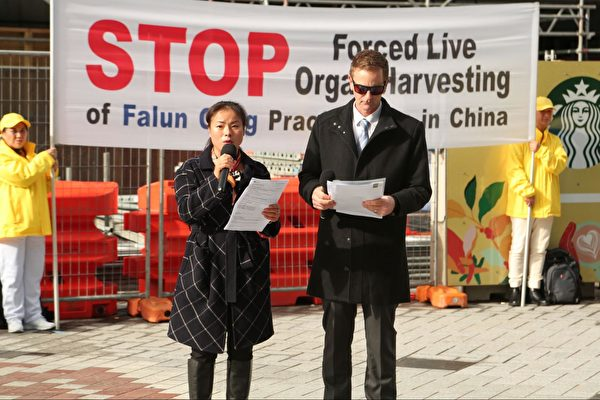

<a name=top>

<a target="_blank" href="https://github.com/sendtruth2020/goodnews2/blob/master/quit/letter.md">

<a href="https://github.com/dfchunsring/wer/blob/master/epgh.md"><b>免费突破封锁翻墙软件</b></a>
 

<b>请收藏本网址，连上免翻视频 https://bit.ly/2RQM1hX</b>

 
 

<b> 看更多真相   https://bit.ly/3ezRQKo  </b>

<h1><b></b></h1>

<h2 align="center"><a href="https://github.com/jkujkkj/bird/blob/master/bird02.md"><b>明真相能保命(二)</a></b></h2>

<h2 align="center"><a href="https://github.com/jkujkkj/bird/blob/master/bird03.md"><b>明真相能保命(三)</a></b></h2>

<h2 align="center"><a href="https://github.com/jkujkkj/bird/blob/master/bird04.md"><b>明真相能保命(四)</a></b></h2>

<h2 align="center"><a href="https://github.com/jkujkkj/bird/blob/master/bird05.md"><b>明真相能保命(五)</a></b></h2>

<h2 align="center"><a href="https://github.com/jkujkkj/bird/blob/master/bird05.md"><b>明真相能保命(六)</a></b></h2>
  
  
<a href=https://git.io/souye><h6 align="right">回首頁</h6></a>
 

<a name=top>
 
 
 
 
 
 
 
 
<a href =#33>33. 生活在假话大国里</a> 
<a href =#32>32. 那年我十三岁</a>  
<a href =#31>31. 易蓉：百年紅禍惡貫滿盈 解體中共刻不容緩</a>  
<a href =#30>30. 追查迫害法轮功国际组织公布第14批追查名单</a>  
<a href =#29>29. 我眼中的天大的事</a>  
<a href =#28>28. 赵云择主的启示</a>  
<a href =#27>27. 许那：是谁祸乱了我的祖国</a>  
<a href =#26>26. 让我们都站到诺亚方舟上</a>  
<a href =#25>25 从抵触到感谢 一位退休医生的转变</a> 
<a href =#24>24. 酷刑撼动不了正信</a>   
<a href =#23>23. 找回金色的岁月</a>  
<a href =#22>22. 广东疫情严峻 民众如何自救？</a> 
<a href =#21>21. 联合国12专家控大陆少数族群遭强摘器官</a>  
<a href =#20>20. 父亲节话为坚守信仰而受难的父亲们</a>   
<a href =#19>19. 二十二年画不圆的“家”</a>  
<a href =#18>18. 意大利蒂埃内市民学炼法轮功</a> 
<a href =#17>17. 德州通过决议谴责中共活摘器官 促国会制裁</a>     
<a href =#16>16. 躺平的最高境界是三退</a>  
<a href =#15>15. 超凡入圣的绘画震撼了我的心</a> 
<a href =#14>14. 32年前没有喊出的话</a>  
<a href =#13>13. 我的姥姥</a> 
<a href =#12>12. 两家悲、喜剧　警醒世人心</a>  
<a href =#11>11. 救赎与瘟疫一起到来</a> 
<a href =#10>10. 疫情带来新现象：近2000人上网学炼法轮功</a> 
<a href =#9>9. UCSD大学生：法轮大法伴随人生</a> 
<a href =#8>8. SK前能源专务董事：大法净化身心 适合所有人修炼</a> 
<a href =#7>7. 媳妇善待婆婆 以德报怨 全家四代受益</a> 
<a href =#6>6. 真善忍是指路灯　渥太华学员谢师恩</a> 
<a href =#5>5. 加拿大前司法部长：真善忍支撑古老和普世价值观</a> 
<a href =#4>4. 美国内华达州参议员褒奖世界法轮大法日</a> 
<a href =#3>3. 瑞典西人：修炼法轮功　全家受益</a> 
<a href =#2>2. “母亲节”话母亲们的悲惨遭遇</a> 
<a href =#1>1. 美好的缘分 生命的奇迹</a>   
  
--------------------------------------------  

 

<a href=#top><h6 align="right">回上方</h6></a>

<a name=33>

<h1 align="center"><b>生活在假话大国里</b></h1>

董存瑞炸碉堡另有故事！郅顺义是真正跟着董存瑞冲了上去，但董存瑞冲到碉堡前头后，却找不着董了。到底是谁炸了碉堡？没有目击证人！(公有领域)

【大纪元2021年07月21日讯】有一年，我去重庆，在亲戚家的沙发上，拾起一份当地的《重庆商报》，上面的一篇新闻一下吸住我的眼球。大意是，董存瑞的妹妹和董存瑞的几位战友，状告电影《董存瑞》的导演和《大众电影》杂志诽谤董存瑞的名誉。

里面的有些内容至今还记得。《大众电影》采访当时八十多岁高龄的电影导演郭维。郭维谈了他执导电影《董存瑞》的创作细节，说当时了解的情况是，没有人亲眼看见董存瑞炸碉堡，他的战友（指董存瑞的战友郅顺义）是真正跟着董存瑞冲上去了，但董存瑞冲到碉堡前头后，找不到他了……后来在现场发现一双鞋，专家根据这双鞋科学推理是董存瑞炸的碉堡。拍电影为了剧情，把鞋改成是媳妇为他做的袜底……
 
导演的一席话，像炸了一个惊雷。我读小学时，课本里写着董存瑞炸碉堡，却是推理出来的啊！那么，黄继光堵枪眼，邱少云被燃气弹烧，也是……
 
后来，我会翻墙了，看到墙内看不到的很多信息，天地豁然自由宽广了。历史的真相，让我触目惊心。那些伴我成长的英雄，撩开他们的面纱，让人「目瞪口呆」。
 
张思德，我读小学时，课本描绘他是烧砖窑垮而牺牲。其实，他烧鸦片死的。还有被中共煽动谋杀村长的刘胡兰，淫乱的白求恩……如果今天用道德和法律裁决，他们会绳之以法的，是罪人了。
 
可是至今，他们的名字在中共的英雄榜上「熠熠生辉」。
 
倒让我想起一位饭店老板的话来。
 
那晚，我和朋友去街边的小店吃夜宵。那条街曾经很是热闹，通夜灯火通明，车水马龙。而今正拆除。夜未深，街上一片漆黑，人影寥落。此光景，让人想到三十年河东，三十年河西，人事无常啊。
我们在一家小食店落座，等伙计上菜的时候，我和店主随意闲谈。
 
 
我说：「这条街以前那么热闹，现在拆了，政府会赔偿个好价钱吧。」
 
店主苦笑：「给点儿就打发了事，哪里会给好价钱哦。」
我：「那就去法院告它。」
 
店主：「都是假的，法院都是它开的，哪里告，都是假的。」
 
很多人心里都有数，中共的一切都是假的。它的法律是假的，它的法院是假的，它的英雄是假的，它的脱贫是假的，它的人权是假的，它的信仰自由是假的，它的一国两制是假的，它的疫情数据是假的，它说中共病毒不来自武汉实验室是假的，它抗日假的，它的党史假的……
 
我们生活在假话当政的社会里。

【文章来源】https://www.epochtimes.com/b5/21/7/21/n13103916.htm

<a href=#top><h6 align="right">回上方</h6></a>

<a name=32>

<h1 align="center"><b>那年我十三岁</b></h1>

【明慧网二零二一年七月十一日】十三岁那年，是一九九九年。那年的七月份，我身边修炼真、善、忍的普普通通的善良百姓遭遇了中共政府前所未有的打压。二十多年来，在我的心中留下了那些永不磨灭的记忆。又一个七月来了，这里分享几个记忆中的片段。
 
（一）
一九九九年暑假里，正是中共刚刚开始迫害法轮功。当时，我镇的男性法轮功学员，包括我父亲和法轮功学员杨舅，都被非法关押在镇政府里。一天中午，母亲做好了饭，让我和三姐（杨舅的女儿）去给被非法关押在镇政府的父亲送饭。
 
那一年，我十三岁，从未去过镇政府。头顶烈日，骑行在柏油马路上，内心有点忐忑：年幼的我并不知道父亲他们具体被非法关押在镇政府的哪里，也不知道镇政府的工作人员会如何对待我们，到底让不让我们见父亲。
那一段路并不算长，心路的未知却让我觉得很长，甚至还有些许的无助，有点硬着头皮的意味，烈日酷暑反倒无所谓了。
 
到了镇政府，我们慢慢进了大院。正不知如何寻找之时，被非法关押在楼上的三姐的父亲杨舅看见了我们，喊着三姐的名字，我的心才轻松了一些。
 
上了楼，关押父亲们的房间的门并未锁，也没人看管，我们顺利见到了父亲。父亲见到我，颇有些意外，问我：「你怎么来啦？」
 
说实话，当时听到这句话，我有点伤心，嘴上说：「来给你们送饭。」
 
一九九九年的夏天，去镇政府的路上，我第一次清楚的感觉到了中共迫害中的「难」。
 
（二）
二零零二年十月一日，凌晨三、四点钟，特警翻墙入院，直接敲响了我家卧室的门，随后强行非法搜查，连我的卧室也不放过，甚至把我的床铺被子都细细搜查。无果后，要绑架我的父亲。镇政法委书记（女）还伪善的对我说：「没事儿，就是让他们去『学习』几天，就回来了。」
 
当时已入秋，母亲要给父亲带件厚衣服，被我夺下，我指着政法委书记说：「她说的，（父亲）过几天就回来了，不带衣服。」
 
就这样，我的父亲在十月一日「国殇日」这天凌晨，被特警翻墙入室绑架，弟弟似乎有些被吓到。
 
过了一会儿，我和母亲醒悟：不能就这样让他们把人带走啊，我们何罪之有啊？！于是出门去镇政府要人。路过杨舅、杨舅妈家，大门落锁，门口赫然有一只女性的鞋子。
 
我和母亲匆忙赶到镇政府，政法委书记告知：我父亲已被送走了，具体地方不告诉我们。
 
正在这时，杨舅妈被一个高大的特警押着路过，杨舅妈双手被铐着。看见我们，她叫住我母亲，把家里的钥匙交给了我母亲，那时杨舅已被非法关押一段时间了。
 
当时政法委书记还向我和母亲卖好：杨舅妈被绑架到镇政府时，脚上只有一只鞋，是她「好心」的借一双鞋给杨舅妈，还劝我「安心」去上学。
 
那时我上寄宿学校，三个星期回家一次。三个星期后回家，同学的妈妈来车站接我们，对我说：「你杨舅妈被他们打死了！」我听了，眼泪立刻在眼里打转，在众人面前，只好强忍着。
 
回家后，妈妈等我吃完饭后，才告诉我：「跟你说件事，你杨舅妈被他们打死了。」我的眼泪终于忍不住了，母亲也流泪了，相对沉默良久。
 
后来，杨舅、杨舅妈的儿子结婚生子，当他们的孙子上小学的时候，学校让孩子们戴红领巾，孙子对老师说：「老师，我不戴，我奶奶就是被他们害死的！」没想到，却遭到了老师的训斥。听到这，我依旧想哭。
 
（三）
我的亲舅舅，因坚持信仰法轮大法，去北京上访，为法轮功说句公道话，被当地中共政府视为「重点对像」，屡次被非法抄家、关押、酷刑毒打、罚款，后被迫流离失所。直到他儿子结婚前夕才回家。
 
他儿子新婚第二天早上，全家还在熟睡中，县国保大队等人便入室绑架了我舅舅，后舅舅下落不明。我们去县派出所找人，国保大队指导员蛮横的说：「我不和你们对话，你们都出去。」国保大队长更是无理的说：「你们去告我们呀。」随后，我舅舅被非法劳教一年。
 
无独有偶，我的公公和大姑姐也因不放弃信仰而被非法劳教过。大姑姐也被视为「重点迫害对像」，所以她常年在外，类似流离失所。
 
我和丈夫结婚前夕，大姑姐也回家了。好在当时大家有所警觉，在我们结婚的前一天晚上，便把她送走了。果不其然，同样在我们新婚的第二天，乡政府的一大群人来家里，找大姑姐了，没有见到人，还不死心，非要我们告知大姑姐的所在地址。无论家人怎么跟他们讲道理，他们就是不走。无奈之下，丈夫只好在手机上随便找了一个地址给了他们，他们才离开。后来听说，他们竟然真的按那个随便抄的地址去外地找大姑姐了。
 
中共邪党自从一九九九年七月二十日以来一直迫害法轮功至今，以上只是我记忆里的几个片段，但足见中共邪党的邪恶和毫无人性。二零二一年的七月份记录下几个片段，是记忆，是事实，是证据。

【文章来源】http://big5.minghui.org/mh/articles/2021/7/11/428029.html

<a href=#top><h6 align="right">回上方</h6></a>

<a name=31>

<h1 align="center"><b>易蓉：百年紅禍惡貫滿盈 解體中共刻不容緩</b></h1>

全球退党服务中心主席易蓉发言指出，退党洪流，顺天意得民心，在和平解体中共的壮举中，写下壮丽的篇章。

【大纪元2021年07月13日讯】首先，我代表全球退党服务中心，向3亿8千万退出中共党、团、队的勇士们表示崇高的敬意与祝贺！
 
中共不是一个政党，而是一个恐怖的邪教组织。一百年来，有上亿中国人死于中共暴政统治。1921年至1949年，中共不择手段地颠覆中华民国；1949年中共窃政后，发动各种政治运动迫害民族精英，如镇反、三反、五反、反右、大跃进、人民公社、文化大革命；1989年镇压爱国学生；1999年镇压法轮功；对维族、藏族及蒙古族等少数民族进行肆意屠杀和种族清洗；破坏中华传统文化，毁灭人类道德；污染山川河流，破坏生态环境；彻底摧毁了东方明珠香港，并妄图武力犯台。
 
中共百年来犯下的反人类罪，给中华民族，给中国人民和全世界造成的危害，为历史之最。特别是1999年7月20日开始，中共残酷迫害法轮功，活摘器官，犯下无法想像的血腥罪行。
 
2020年开始的这场瘟疫，由于中共刻意隐瞒使其扩散到全世界，造成全球上亿人感染，几百万人死亡，给整个世界经济、人身安全造成了无法估量的损失。中共邪灵使人类处于极其危险的境地。
 
由于中共政权用极其狡猾的欺骗手段，蒙骗国际社会，使共产主义的意识形态得以成功地侵蚀国际社会。虽然醒悟太迟，但国际社会毕竟也开始真正地认识到中共的邪恶本质，并开始在世界范围内对中共从政治、经济、科技、贸易、文化、军事等多方面形成全球围剿中共的反共大联盟，中共在劫难逃。
 
百年红祸恶贯满盈，解体中共刻不容缓，善恶必报，天灭中共的号角已经吹响。中共无法逃脱神的惩罚！
 
22年来，全球法轮功学员和正义人士持之以恒地揭露中共的邪恶本质，唤醒了无数被洗脑欺骗的人们。特别是大纪元2004年发表的《九评共产党》，帮助越来越多的中国人认识到了中共的邪恶本质，认识到中共政权的存在，就是中华民族最大的不幸，就是中国民众苦难的根源，《九评共产党》引发了滚滚退党大潮，如今声明退出中共党、团、队的人数已达3亿8千万。退党洪流，顺天意得民心，在和平解体中共的壮举中写下壮丽的篇章。
 
中共邪恶政权已经彻底走向末路，风雨飘摇、大厦将顷，在红墙倒塌的前夜，在这历史的关键时刻，我们有责任将真相传播给每一个华夏儿女和世界所有善良的人们，唤醒更多的世人明白中共的邪灵本质，从内心抛弃中共。我呼吁更多中共体制内党政军官员，勇敢地站出来，抛弃中共罪恶政权，公开退出中共。我呼吁所有还在观望的可贵的中国人，抓住这万古机遇，汇入到退出中共、解体中共、打倒中共恶魔的伟大历史洪流中，迎接一个没有共产党的真正的新中国！
 
谢谢大家！
全球退党服务中心主席  易蓉
2021年7月10日于纽约州奥兰治县

【文章來源】https://www.epochtimes.com/gb/21/7/13/n13084455.htm

<a href=#top><h6 align="right">回上方</h6></a>

<a name=30>

<h1 align="center"><b>追查迫害法轮功国际组织公布第14批追查名单</b></h1>

追查国际第十四批立案，追查涉嫌参与迫害法轮功的部分责任单位、责任人名单。（追查国际）

【大纪元2021年07月13日讯】“追查迫害法轮功国际组织”（以下简称：追查国际）于2004年12月9日首次公开发布追查涉嫌参与迫害法轮功的部分责任单位、责任人名单，迄今共发布了14批名单。

截至2021年7月1日，总计：责任单位26,843个，责任人91,893人。其中“610”系统11,737人，政法委系统16,106人；涉嫌参与活摘法轮功学器官的医生9,519人，医疗单位891个。
 
追查国际公布第十四批立案追查涉嫌参与迫害法轮功的部分责任单位、责任人名单。总计：责任单位726个、责任人3,410名。

<b>名单组成：
</b>

中共各省、市“610办公室”名单55人，政法委名单397人，国保405人，公安1,815人，司法执行机构（包括监狱、教养院、劳改队）98人，司法-行政系统（司法局，司法厅，检察院，法院）36人，国家机关31人。
 
这些单位和个人隶属中共各级政法委、“610办公室”及公、检、法、司、监狱等系统。该批名单是在2020年6月29日第13批名单发表之后，截止2021年7月1日，“追查国际”组织通过追查、搜集和知情人举报等所获名单。
“追查国际”告诫所有参与迫害法轮功的人：中共正在解体，全面清算中共的大潮即将到来。迫害法轮功是群体灭绝罪、反人类罪，将面临人类有史以来，最严厉的审判和惩罚！任何执行命令的托词都不能作为豁免的理由，无论是最高层决策者，还是最底层的警察打手，所有参与者必须承担个人责任。自首坦白、揭露黑幕、争取立功赎罪，是唯一的出路！
 
追查国际一如既往，彻底追查迫害法轮功的一切罪行以及相关的机构、组织和个人，无论天涯海角，无论时日长短，必将追查到底，行天理，再现公道，匡扶人间正义，“这就是我们对神的承诺，我们永不放弃。”
 
追查名单请浏览：https://www.zhuichaguoji.org/node/133445
 
追查迫害法轮功国际组织
World Organization to Investigate the Persecution of Falun Gong
电话：347-448-5790；传真：347-402-1444
邮址：P.O.Box 84，New York，NY，USA 10116
网址：http://upholdjustice.org/
http://zhuichaguoji.org◇

【文章來源】https://www.epochtimes.com/gb/21/7/13/n13086523.htm

<a href=#top><h6 align="right">回上方</h6></a>

<a name=29>

<h1 align="center"><b>我眼中的天大的事</b></h1>

【明慧网二零二一年七月二日】二零二零年大年初二那天，我去姥姥家拜年，经常念叨的大姨也去了，我高兴极了。大姨不是我亲姨，是我舅妈的姐姐。在我刚上初中时，曾在大姨家住过几个月。那时姥姥也一起去了，妈妈有时间也去。
 
这次大姨给我带来个礼物，是一个装有系统的移动硬盘。大姨教我怎样上动态网、看真实的信息。我如获至宝，带回了家。
 
随着武汉疫情的发展，令我惊讶的事出现了，我看到国内、国外对武汉肺炎的报导一点都不一样。当武汉人一家一家的死、焚尸炉二十四小时不停地烧尸体时，国内报导却是「一片大好」……
到二零二零年四月时，武汉解封了，我所在城市也解封了。周围人都松了一口气，说这次瘟疫应该像非典一样，很快就过去了。非典时，我才几岁，所以没有印象。看到大家轻松，我也轻松。
 
没想到，瘟疫从中国跑到外国去了，然后疫苗出现了。当人们庆幸疫苗能挡住瘟疫时，又不断地传出毒株变异的消息。在我眼里，每一种毒株就相当于是每一种病，而每一种疫苗就是针对每一种病的盾牌。当毒株不断地变异而疫苗追不上毒株变异速度时，国外大量的死亡发生了。
 
为甚么会出现瘟疫？从动态网的文章中我知道了瘟疫是针对中共而来，因为中共迫害法轮功、活摘法轮功学员器官贩卖，犯下了滔天大罪。中共杀人应该偿命，可是中国是中共掌权，谁也管不了它，于是招来了瘟疫，是中共的罪恶招来的。
 
现在全球统计的染疫和死亡数据中，都不包括中国，因为国际社会知道中共报的数字是假的。尽管中共的数据是假的，但死的人却是真的。以前中共「闹革命」时常说「星星之火可以燎原」，而今却成了「星星之疫可以燎共」。
 
现在的中国各地疫情就像隐藏的暗火，不知何时「噗」的一下就会冒出来。不管中共怎样隐瞒，也不管周围人怎样慌乱，我一点都不怕。因为从大姨接送我上下学的那一刻起，「法轮大法好，真善忍好」就在我心里扎了根。我俩手牵手，边走边念着九字真言的情景，是我永远都忘不了的美好回忆。
 
以前，我听大姨讲神奇的故事，现在我却亲身遇到了神奇的故事。当同学们都为找工作而走后门时，我早已定下来的工作却泡汤了，原因是我家没走后门，被退回来了。我没气馁，因为我相信「法轮大法好，真善忍好」会给我带来福报。果不其然，不久前，有个从没在我校招工的外市单位来我校招工了，工资待遇比原来定下来的那地方高好几千元。走后门的同学都后悔，因为那个单位所在的城市，是同学们做梦都梦不到的好地方。
 
人活在世上会遇到许多大事，然而在我心中最大的事就是平安。人无论有多少钱财、多大的官职，能承载这些的唯有生命。而能真正保命保平安的唯有法轮功的九字真言。了解法轮功真相、退出中共党团队组织，并制止中共迫害法轮功的善良人就能躲过万劫。

【文章来源】http://big5.minghui.org/mh/articles/2021/7/2/427619.html

<a href=#top><h6 align="right">回上方</h6></a>

<a name=28>

<h1 align="center"><b>赵云择主的启示</b></h1>

【正见网2021年07月06日】

《三国演义》中赵云的出现着墨不多，但是每次出现都给人留下很深的印象，就是赵云的忠义本色，被演绎的充分完美。我上中学的时候，历史老师讲过一句「常山赵子龙浑身是胆」给我印象很深，所以在高中阅读《三国演义》时，很注意赵云这个人物。

赵云在跟上刘备前，还跟过两个主人，一个是袁绍，一个是公孙瓒，很多人都理解不了：这不是反复小人的做法吗？忘恩负义型吗？这是很多人只看其表不看其义造成的片面看法，也是中共党文化的障眼法。

袁绍和公孙瓒并不是仁义之主，为了达到个人目的是不择手段的，是可以采取伤害百姓，各种欺骗阴谋手段都使得出来。袁绍，在抢夺冀州时，完全不顾及原冀州牧的感受，可谓出师无名，只为强行夺取土地钱粮。袁绍面对冀州牧原是自己的家族门生，竟然毫无怜惜之心，反而利用门生的信任，骗得冀州，一旦骗得，袁绍又撕毁信义，毫无廉耻地栽赃董卓来杀掉公孙瓒的弟弟，独霸冀州。

赵云两次于公孙瓒惨败的时候，性命攸关之际，令公孙瓒扭转战局，并没有得到公孙瓒信任和重用。赵云从他的主公那里并没有得到恩与义，反而是赵云尽心力在帮他们。赵云后来还发现，他所跟随的这两个主人并不能称之为当世英雄，因为他们居然为了一己之私可以臣服于名声很坏的董卓。赵云曾对刘备说出了自己的看法，「某日误认公孙瓒为英雄；今观所为，亦袁绍等辈耳！」

忠义之士也要遇到仁义之主，方才能展现自己的胸襟与抱负。因此，赵云择主给我们今天人留下了的很大的启示：人不能盲从，一定要择其善者而从之，才能实现自己的理想与抱负。

2006年，在火车上遇到一个机关退休的干部，和他谈起了中共的流氓本性与邪教本质，劝其退出中共的党团队自救，他想了一下，表态同意，愿意用化名退出。他回到车厢里，没多长时间又过来了，小声说：「我这样的行为算不算不仁不义之人？已经坚定的入了党，今天又退出，好像不是好人的行为。」我就给他从恩义上分析，中共这么多年所做的，都是对不起百姓的事，摧毁传统文化，搞运动整死的都是有道德观念的好人，提拔重用的都是顺着它干坏事的，目的还是不想叫老百姓过上好日子。老百姓对中共有恩，中共所做的都是恩将仇报的事，当然它有罪恶目的隐藏其中，那就是毁人。它败坏人间道德，把社会搞到今天这样善恶不分的地步，人分不清是非，把魔鬼当亲人，当妈妈对待，才是最可怕的。我们退出的是魔鬼党，追寻的是传统回归路，反而是大好事。他想了想，点头认同。

中共这么多年给民众洗脑的目的是叫民众认同它，认同它的假、恶、斗，同时它披着传统文化的外衣，叫人把它当作传统观念中的皇帝，人只有等着它施恩的份，没有起来反对的权利，这本身就是谎言，传统文化之下的皇帝也不是为所欲为的，民众也不是任意宰割的，为什么有一朝一代之说？它违背了天意，民众是可以站出来推翻它的。

中共处处逆天意而行，本来是魔鬼，却用谎言把自己包装成救世主，人跟它走，结局是什么，中共是不敢叫人知道的，所以中共怕真相。人一旦知道真相，知道中共是魔鬼党，谁还会跟它走啊？除了被谎言灌输的太饱的理智不清的人。

人在世间是应该有选择权的，中共剥夺了人的选择政党的权利，罪恶目的是控制人作恶到一定时候被神佛销毁，那可是生命的彻底销毁，形神全灭。

赵云择主，是在乱世中选择仁义之主，想实现救国救民的远大志向。中共灌输给人谎言，不叫人选择传统价值观，叫人远离宇宙特性真、善、忍，蛊惑人诋毁真、善、忍，污蔑法轮功师父，打掉人对神佛、对宇宙真理的虔诚与尊重，实质是把人推向最坏人的深渊里不可自拔，等着被神佛销毁。

法轮功真相给了众生一次选择的机缘，是选择中共还是选择神佛给人指明的光辉前程，就在人的一念间。神佛看人心，大纪元退党网站就是神佛给的世人一次决裂中共魔鬼，选择投入神佛怀抱的机会。法轮功学员劝世人诚心敬念「法轮大法好、真善忍好」，也是一种选择，能诚心敬念者，危难之际，神佛就会出手相救，给人福报。相反，继续选择跟着中共魔鬼走，继续做背离宇宙特性真、善、忍的坏人，结局只能是生命的彻底毁灭。

今天的末劫时期的选择非同小可，不同于三国时代的乱世选择，那种仁义之间的选择是为了完善人类的文化，充实人对「义」的认知，为今天的生命选择奠定基础。今天的善恶选择才是生命在真正的宇宙劫难之中的真实表现。法轮功在救人，中共魔鬼在毁人，这就是今天的人类面临的躲不开的生命选择题。非此即彼，选择错了，生命将悔恨永远！

【文章来源】https://big5.zhengjian.org/node/268610
**

<a href=#top><h6 align="right">回上方</h6></a>

<a name=27>

<h1 align="center"><b>许那：是谁祸乱了我的祖国</b></h1>

现年53岁的北京画家、法轮功学员许那

【大纪元2021年06月22日讯】（编者按语：北京画家、法轮功学员许那，曾经在北京女子监狱经历过11种酷刑，并记录下了那段骇人的历史真相。作为一位中国艺术家和实践“真、善、忍”的修炼人，她深切表达了对自己民族的爱国情怀以及对中共统治下中国社会现状的忧虑。）
 
我越热爱我的祖国，我就越能认清到底是谁祸害了她、是谁霸占了她。我的祖国不是七十多岁，她有五千多岁了。她是大唐的国，大宋、大明、大清的国。
我的祖国代表的是这片土地上的山川河流及数千年的儒释道传统文化。但一百年前欧洲上空飘荡的一个“幽灵”来祸乱中华大地，使民众唯利是图，言必称国家之利、家庭之利、个人之利。整个国家“上下交征利”，背弃了“仁义礼智信”五常之德。它战天斗地，使山河不再。如今连绿水青山都要压榨出金山、银山。
 
我祖国的人民有的活了一辈子都不知道这个国家发生了什么，对历史与世界的认识充满了谬误与曲解。如当年德国人被强大的国家宣传机器鼓动，直到德国战败的最后一刻，都认为他们的祖国最强大、最正义，而盟军最无耻、不堪一击。
 
它反人类的邪恶本性确实不能一目了然。当年纳粹不也为德国人描画了一幅幅帝国梦想的蓝图吗？
 
德国知识分子得到了自我实现的机会，获得了荣誉感。纳粹满足了普通民众想要得到的物质利益，使他们有了获得感与幸福感。对于从个人处境出发、只想获得眼前利益的人，纳粹发现只要满足他们就可以对他们进行思想控制。
 
这个教训对今天的中国人尤其重要。那些为所谓爱国民族主义而热血沸腾的德国人，成了纳粹的帮凶，最终令他们的祖国蒙羞；而那些反抗纳粹的异见者，才是真正的爱国。

【文章來源】https://www.epochtimes.com/gb/21/6/21/n13037641.htm

<a href=#top><h6 align="right">回上方</h6></a>

<a name=26>

<h1 align="center"><b>让我们都站到诺亚方舟上</b></h1>

1675年法国画家所绘的诺亚方舟，描述诺亚建造船时的故事。

【大纪元2020年06月29日讯】世界范围内大瘟疫在继续，目前北京封城，凶猛的第二波疫情是否即将来临？有文章运用星象解析图作出预测，当二波疫情到来时，由于医学无法医治，人类将出现惊人的大淘汰。中共肺炎（武汉肺炎）的变种病毒，当它再次聚然爆发出来时，将会定时，定点，定数横扫人类，令全球死者无数。不止是瘟疫，人类还面临其他灾难，水灾，地震，饥荒和战争。

诺亚造方舟时，他周围的人谁都不信他得到神的旨意大洪水就要来了。洪水席卷地球而来时， 他的全家和动物种子在方舟中安然度过劫难，而地球上一切生命都没有了。老天降洪水于世界，是因为人类道德太败坏，只有诺亚是义人，才被上天留下。
 
人都以为避开瘟疫只需避开传染，殊不知，瘟疫是长眼的，瘟疫有眼是被历史证实的。明朝因为冤杀袁崇焕导致大瘟疫。当时瘟疫长眼不染清军，不染袁崇换旧部，瘟神不仅灭掉残酷凌迟活剐忠臣袁崇焕的昏庸朝廷，还灭掉了被谎言蒙蔽追随朝廷辱骂袁崇焕的明朝百姓。老天有眼，跟随大忠臣袁崇焕的人都在大瘟疫中安然无恙。自古言，人有正气瘟疫不染。
 
人有情。在亲情和友情中大部分人都能做到礼尚往来。但在“乂”字上却不容易做到。诺亚因为是“乂”人才被上天留下来。什么是“乂”？义包含公心和良知。当时朝庭“官宣”普天盖地诬陷袁崇焕是“秦桧”，百姓受朝廷谎言蒙骗，抢食袁崇焕尸肉，袁崇焕手下部将关宁铁骑对袁忠心耿耿不改初衷。这些人是不是乂人？当然是。他们之所以做到乂，首先因为他们了解真相，他们知道袁崇焕是被冤枉的，他们曾经跟随袁崇焕出生入死保卫大明朝。所以他们不为谎言所惑。其次，是因为他们有正义心，不惧权势，不为生死金钱所动摇，他们因为是“义”人而被苍天留下。 而听信朝廷谎言的百姓，却成为跟随罪恶走的牺牲品，与昏庸朝廷一起被瘟神灭掉。百姓之所以死，是因为不明真相。他们被权势所迷。可惜呀。这种灭，叫天灭。
 
诺亚造方舟启示我们： 灾难是由于人类道德败坏而导致，人若能提升道德改变自身行为，更多的人成为“义”人，那么二十一世纪的诺亚方舟上将承载更多得救的生命。
 
从历史角度看，人类历史上大瘟疫，通常都会经历不同阶段爆发。欧州14世纪洲黑死病以及百年前西班牙流感，都是第一波之后继发第二波，而第一波相对来说较轻微，而第二波爆发则波及面更广，致死率极高。今年人类能否逃过瘟疫之手，难关在后。
 
根据专家预测，第二波疫情是必定要来的，只是时间问题。那么在第二波瘟疫到来之前，我们是否具备了防疫能力，反省自身，自己是否是“乂”人，可以被上天留下来？历史经常出现惊人的相似，大家都知道，历史上罗马大瘟疫，是因为罗马帝国迫害有信仰的圣徒而导致，由于迫害基督徒，罗马城死者无计其数，当时尸体堆在街上无人收尸，直至整个国家向天忏悔瘟疫才停止。
 
圣经启示录十七章，大淫妇骑在七头十角兽上的预言已明显在应验中。
中共统治中国大陆70年中，屠杀了八千万中国人，有人说现在不屠杀了，你怎么知道不屠杀了？中共的报导都是不能信的。这个集权政府还在大规模迫害普通民众，这个集权政府，由军队和医院运作罪大恶极的生意：将活人放在手术台上取其器官后活活杀害，然后将器官高价卖出谋取暴利。每年这样的手术高至五、六万例。这样的罪行现在每天都在大陆医院发生着。和明朝残害忠臣袁崇焕相比，中共罪恶有过之而无不及。中共的残暴和无耻，它不就是圣经启示录里的大淫妇吗？
 
能够站到诺亚方舟上的人，是义人。“义”人首要的标准，是不能跟随邪恶走，在权力的淫威下，在金钱的诱惑下，你能否守住你的良知？在国际大都市上海，警察局发给举报法轮功学员的奖金是举报一次一千元。诸如此类的费用，每年要占据国家财政收入的4份之一，还有很多经费用于渗透海外各国。假如你在其中，你是否会贪图这一千元？这些问题都属于公心良知范畴。随着时间的进程，人们渐渐也都识破中共谎言，明白法轮功是教人向善的。圣经中说，谁帮助被迫害的有信仰的圣徒者就能在劫难中留下来。纵观当今人类，被迫害的圣徒是谁？法轮功修炼者因为坚守真善忍的信仰被中共迫害二十年，他们不就是当今世界的圣徒吗？法轮大法是佛法洪传。
 
很多中国同胞觉得中国现在有钱了，只要自己生活好就行了，管它中共迫害谁呢？却不知，历史上任何一个朝代，迫害佛法都会招来灾难，灾难不仅降临到迫害者身上，也会降临到迫害的追随者身上。不表态脱离它，就是在默认它，默认就是纵容。纵容邪恶的根本其实是因为“私”心。人的道德以什么作为试金石？人爱自己的子女父母，也是道德的一个层面，但是在佛法和公德的范畴，才能真正检测出人的道德底线所在。为什么圣经中说谁帮助被迫害的有信仰的圣徒者就能在劫难中留下来，就是这个道理。
 
站在现代科学顶峰的爱因斯坦坚信宇宙不是随意、偶然的，而是存在“因果律”。爱因斯坦说：“如果将来有什么理论能代表科学的话，那一定是佛法，因为佛法太完美了，已经达到了至善的境界。” 美国发明大王爱迪生在自己的实验室里立了一块石碑，上面刻着：“我深信有一位全智、全能，充满万有，至高至尊的神存在。”
 
让我们都站到诺亚方舟上，做一个有良知，有正义心的“义”人吧。
 
【文章來源】https://www.epochtimes.com/gb/20/6/29/n12218756.htm

<a href=#top><h6 align="right">回上方</h6></a>

<a name=25>

<h1 align="center"><b>从抵触到感谢 一位退休医生的转变</b></h1>

以前经常听到亲戚讲患有绝症的人通过修炼法轮大法身体得到康复，我都认为是瞎扯，现在却真实的发生在我身上了。

【新唐人北京时间2021年06月24日讯】我是一名退休医生，曾经我是众人眼中的好人，说话不会拐弯抹角，对领导不会阿谀奉承，工作不贪不占。这样的我，反而从领导岗位被撸了下来。老实的我成了被欺负和瞧不起的人，也让我怀疑做好人、善良人的人生信条是不是错了？

事业不顺，身心疲惫不堪，我得到糖尿病、退行性关节炎等毛病，我自己通过加强体育锻练，严格控制饮食，血糖却没有得到控制，只好通过口服降糖药二甲双胍（Metformin），把血糖降下来。可是降糖药副作用很大，容易出现低血糖和腹泻，所以我口袋里经常要放块糖，避免血糖太低。可是腹泻就不好控制了，几次在外面散步，还没来得及找到厕所，就控制不住的拉稀了。
 
有几位远房亲戚修炼法轮大法。每次节日聚会，他们都会跟我讲：法轮功祛病健身效果好，很多医院治不好的疑难杂症都通过修炼法轮功恢复健康。那时我根本就不相信，我想，如果是这样，那还要我们医院干什么？我反驳他们的理由一套又一套，在我的眼中，炼炼动作就能把病治好，简直就是一群没文化的农村老头、老太太搞的迷信活动。
 
后来有亲戚陆陆续续走入修炼，我一提这事就发火。不同以往的是，过去我们发生矛盾时，都会陷入冷战，形成一种难以逾越的隔阂。但是，自从亲戚修炼以后，无论我表现的多激烈，她始终笑脸以待，不再像从前那样满腔仇恨。慢慢的，我不再对她修炼大法横眉冷对。
 
后来亲戚给我一本《法轮功》，对我说：「中共今天打压这个，明天打压那个，后来又搞平反、拨乱反正，老百姓都知道共产党政策时时在变。大法书籍已经被翻译成四十种语言文字，有那么多不同文化背景、不同族裔、不同肤色的人在修炼大法。西方欧美发达国家的人民，生活和医疗条件比我们要好的多，难道外国人都是傻子？你为甚么不自己亲自了解一下，看看书中说的都是甚么？」
 
我花了大约一个星期的时间看完了这本书，我觉得书中用科学道理解释了很多超自然的现象，更多是叫人如何以及为何做好人的道理，解开了我心头长期郁结的块垒。后来亲戚了解我的情况后，开始教我炼功，我开始慢慢的炼五套功法了。
 
大概又过了一个月，我一直还吃着降糖药。某天晚上睡觉前才想起整天忘了吃药，心中一惊，自己怎么把这么重要的事忘了，得赶紧吃药补救。转念一想这一天也过去了，身体也没有不适，明天去测一下血糖再说。第二天，测了空腹血糖5.2，像年轻人一样正常。以前经常听到亲戚讲患有绝症的人通过修炼法轮大法身体得到康复，我都认为是瞎扯，现在却真实的发生在我身上了。我心里高兴的无以言表！紧接着，我把降糖药停了。过一段时间，我又去复检，还是正常值，接连几次检查都正常。就这样我把降糖药彻底扔了。现在十多年过去了，每年体检我的血糖都正常。我右膝盖退行性关节炎造成的活动受限，严重时下楼梯得一步一步的挪。炼功以后，也慢慢恢复，现在基本上没有不适感，跟年轻时一样爬山、登楼梯。
 
我这个人性格倔强，爱面子，不能被人说，一说就炸，很难控制自己的脾气，搞的家庭不和，家庭关系日益紧张。我曾经也想改变，但是就控制不住。
 
修炼后，书中的道理让我意识到自己个性上的自私，特别是学了关于遇到问题就要找找自己的道理后，当别人触及到我，脾气上来就要爆发的时候，书中讲的道理就会浮现在我的脑海中，我开始学习控制自己的脾气。妻子对我说：「一辈子跟你争斗、干仗，也没有让你这个倔驴低头，没想到一本书改变了你。」

【文章来源】https://www.ntdtv.com/b5/2021/06/24/a103150135.html
 
 
<a href=#top><h6 align="right">回上方</h6></a>

<a name=24>

<h1 align="center"><b>酷刑撼动不了正信</b></h1>

6月20日上午，新西兰部分法轮功修炼者在奥克兰市中心的伊莉萨白广场举行反迫害集会。

【大纪元2021年06月23日讯】二零二一年六月二十日，新西兰法轮功学员在奥克兰市中心的伊莉萨白广场集会，揭露中共针对信仰真、善、忍的法轮功修炼者长达二十二年的迫害。多位知名政要人士到场发表演讲，谴责中共的恶行。新西兰总理Jacinda Ardern与绿党联合党魁Hon Marama Davidson都对集会致上祝福。

在「6.26国际反酷刑日」即将到来之际，世人再次关注并谴责中共对法轮功学员的迫害。中共戕害基本人权、斲丧信仰自由，对无辜民众滥施酷刑，多年来备受国际社会谴责。中共的恶行违反了《联合国宣言》、《公民权利和政治权利国际公约》、《联合国禁止酷刑公约》等国际人权法律，更是当代文明社会的人类耻辱。
 
一九九九年七月，中共针对上亿法轮功学员开始了残酷迫害。在前党魁江泽民的指令和授意下，依照「名誉上搞臭，经济上截断，肉体上消灭」的原则，专事迫害法轮功的非法组织「六一零办公室」执行「打死白打死」，「打死算自杀」、「不查身源、直接火化」的灭绝政策。此后，大陆各地酷刑泛滥，虐死报导频传。据不完全统计显示，至少四千六百多名能核实的法轮功学员死于劳教所和监狱的迫害，他们都经受了各种酷刑。
 
中共滥施惨无人道的酷刑，是为了配合精神迫害，制造恐怖氛围，妄图让法轮功学员放弃修炼、写下背弃信仰、出卖灵魂的所谓「三书」（保证书、决裂书、揭批书）。中共暴力迫害法轮功学员使用的阴招，包括手铐、脚镣、背铐；地牢、水牢、死人床、坐板、蹲小号、坐铁椅子、坐老虎凳；上绳、铁钉钉指甲缝、用钳子拔指甲、用针扎十指；从鼻腔灌食、灌辣椒水、灌浓盐水、灌大粪汤；性虐待、把妇女关入男牢、强迫怀孕妇女流产、强奸；关入精神病院、注射破坏中枢神经药物、电针等上百种酷刑，甚至活体摘取法轮功学员器官，贩卖牟利并焚尸灭迹。
 
今年六月十五日明慧网报导，武汉市善良妇女钱有云于一九九八年五月经邻居同事介绍而修炼法轮功，身心获得健康，只因为坚持修炼，遭受中共长达二十年的迫害。钱有云曾多次被非法劳教、判刑，被非法拘禁在拘留所、看守所、洗脑班强迫「转化」；她遭受几十天的双手「吊铐」、大半月的关小号「反铐」、罚站（最长好几个月，且是冬天门窗对开），不让上厕所、不让吃东西、不让睡觉；被关在地下室低温空调冷冻长达九十小时、夏天三十九度高温曝晒蚊咬……等毫无人性的酷刑迫害。她几度被迫害至骨瘦如柴、面目皆非、精神恍惚、陷入昏迷等危险的境地。
 
江苏省徐州市沛县英语教师潘绪军，一九九六年八月开始修炼法轮功，原来的慢性鼻炎、中耳炎、直肠炎康复，家庭幸福、邻里和睦，广受学生爱戴。二零一五年五月潘绪军被警察绑架，二零一六年被法院枉判五年半，随后被劫入江苏省洪泽湖监狱迫害，冤狱期满的前十天，即二零二零年十一月八日被迫害致死，年仅55岁。
 
潘绪军因坚持按真善忍原则做好人，遭中共无理骚扰、绑架、强制洗脑、非法判刑等迫害，历经毒打、长时间不让睡觉、野蛮灌食、冬天用凉水灌脖子和棉鞋、不让睡觉、捂住嘴往鼻子里灌水、冷冻、开水烫脚、反背铐在车间货架上几小时、恐怖约束腰带（一种专门制作、限制双手在腰部的皮制腰带）、掐脖子六、七次近乎窒息等十余种酷刑折磨迫害。
 
二零二零年七月十五日，吉林省农安县公安绑架了近二十名法轮功学员，包括原国家粮食储备库保管员姜全德与妻子孙秀英。当时姜全德身体已瘦得皮包骨，警察也不放过他。直到姜全德极度虚弱，才被家属接回，他回家后始终靠输营养液生存，于八月二十五日含冤离世，身上仍有被施加酷刑后留下的疤痕，清晰可见。姜全德的儿子曾要求国保警察释放其母照顾父亲，被国保要挟：「保证书」不签字不能放人。姜全德临终之前嘱咐儿子，坚决不能签字。
 
姜全德历经了一年半劳教迫害，十一年冤狱酷刑折磨。在长春朝阳沟劳教所、奋进劳教所、长春公安一处、四平市石岭监狱与公主岭监狱，他遭受了种种惨绝人寰的折磨：被绑「老虎凳」、「坐床板」、「蒸馒头」、塑料袋套头窒息、手指与乳头上扎竹签、电棍电击全身，惨遭「毂轳大轮」、「上绳」与「摇猪手」等酷刑折磨。姜全德被「毂轳大轮」反复迫害十几次，被凌虐得遍体鳞伤、血肉模糊，右臂骨折致残。他的受害境遇，如实反映了中共迫害法轮功的严峻情况。
 
钱有云、潘绪军与姜全德承受的那些酷刑，细节让人不忍卒读；三人的悲惨遭遇，尽显中共灭绝人性的邪魔本质；他们的历劫苦难，是中国大陆千千万万法轮功学员被中共恣意施虐迫害的写照与缩影。
 
正如《共产主义的终极目的》一书所说，共产主义的本质是一个「邪灵」，它的最终目的就是想破坏人的道德从而毁灭人类。修心向善的法轮功学员，即使经受了那些酷刑的非人折磨，仍然坚毅不移的信仰真、善、忍，慨然无悔的用宝贵生命实践了笃信的理念。正是他们秉持历劫不改其志的节操，始终以平和、理性、宽容的方式抵制迫害，终让无数的世人，被法轮功学员真诚与坚定的信仰所感动，乃至加入反迫害的行列。
 
二十二年来，法轮功学员凭着对真理的信念，从这场残酷且隐晦的迫害中走过了艰难险阻，在腥风血雨中把真相传播到中国大陆的每个角落。红魔狂潮荼毒神州，法轮功学员激浊扬清，捍卫信仰自由，守护普世价值，成为正道的中流砥柱。
 
古往今来，历史告诉我们：迫害正信的邪恶只能逞凶一时，终究不会长久。宇宙的因果法则分明不爽，无论罪魁祸首或附和之徒都难逃罪责。从王立军、薄熙来，到李东生、周永康这些「六一零办公室」头目的相继落马，恶人已走向穷途末路。法轮功学员勇敢无惧的反迫害，坚忍不拔走到了今天，他们将一如既往坚持下去，直到迫害结束、正义彰显。
 
【文章来源】https://www.epochtimes.com/b5/21/6/23/n13041282.htm

<a href=#top><h6 align="right">回上方</h6></a>

<a name=23>

<h1 align="center"><b>找回金色的岁月</b></h1>

【明慧网二零二一年六月二十二日】（明慧欧洲记者站采访报导）「你爸出事了，现在公安局的人在家门口敲门呢，我没开。你爸现在没回家。」二零二一年四月七日，当赵帅听到身在海南琼海市的母亲语音留言后，立即跳了起来，马上和母亲视频联系。
 
通过家门口联网的监控摄像头，赵帅和母亲一起听到了门外频繁长时间的按门铃声，随后是持续的敲门声，到强力的拍门声，直至最后连续用脚踹门的声音，以及威胁声：「给你最后一次机会，不开门我破门了！」「快开门，要不我撬门了！」同时，他也看到了这些强盗行为的始作俑者──门外有至少六个警察，有穿制服的，也有便衣，其中一位带着相机。为了踹门更有力，警察甚至还在过道里退后了几步。除了各种胁迫，他们还试着去找物业、开锁匠，向邻居打听赵帅父母的情况，甚至打算找特警爆破大门。他们认定屋内有人。整个过程发生在深夜十点至十一点，持续了四十四分钟。
 
看着警察在家门外肆无忌惮，听着母亲在高压下紧张害怕的声音，远在海外的赵帅手也开始发抖，脑子嗡嗡的。赵帅一家都是法轮功学员，在过去二十多年里这样的场景已经发生了不知道多少次了，赵帅彷佛又回到了小时候。
 
<b>抄家──搬家──逃亡</b>

 
「嘭嘭嘭」，二零零二年元旦前夕，赵帅家那包了铁皮的薄木门又颤颤巍巍的被砸响了，母亲刚打开门，十来个警察蜂拥而入，完全不理会赵帅母亲的询问，大肆在两间卧室里翻箱倒柜，连厨房都没有放过。他们甚至把赵帅上学的书包都翻了个底朝天。而当时赵帅的父亲已被扣押在派出所了。
 
警察的频繁光顾让赵帅和母亲对警笛声产生了条件反射般的恐惧。听着由远而近，呼啸而来的警笛声，赵帅和母亲的心就会「咯登」一下，如同被揪住了一般，后背发凉，担心又是来抄家的。这份恐惧一直伴随了娘儿俩近二十年，现在回想起来，赵帅还是会感到后背发凉，手心冒汗。
 
与小时候不同的是，现在的赵帅经历的不仅仅是那份恐惧，他更看清了中共的疯狂，同时也感受到这份疯狂给他带来的重重压力。他与太太一起和母亲共同面对，希望能让母亲尽早脱离警察的骚扰。对赵帅的太太而言，她第一次感受到，中共对大陆法轮功学员的迫害就在眼前。
 
得知母亲在第二天的上午逃离了被警察盯梢的家后，赵帅才稍稍松了一口气，但随即他又想到了这次被绑架的父亲。他担心父亲会再次备受警察的折磨，再次为抗争而绝食。他把脸深深埋入双手，希望十七年前的那一幕不再重演。
 
<b>奄奄一息的父亲</b>

那是二零零三年的初冬，正在为高考备战的赵帅得到通知──父亲病危。当时他心里咯登一下，「父亲怎么会突然病危了。」去接人时，他已经认不出眼前这个瘦的脱了形的人，从这个人喉咙里发出的几个字，他确定这正是自己的父亲。「我没见过人能瘦成那样。」
 
赵帅父亲是典型的东北大汉，身高一米八多，体重近两百斤。但是当赵帅看到父亲时，他已经在被非法关押期间绝食抗议──没吃一粒米，没喝一口水──二十二天了，瘦的只剩了八十多斤。他无法站立，更不用说迈出简单的一小步。
 
赵帅当下决定要把父亲带回家，他一下子背起了父亲：「人瘦的如人干一样，我背他就如同背个空纸盒一般，就像是盖了层毯子似的，就那么轻啊，哪有人是那样的……而且当时他还被诊断为胆结石满贯，都是结石。」 赵帅伤感的回忆起当时的情形。
 
赵帅曾经在父亲被非法关押期间探望过父亲，知道他日渐瘦弱，但是看到父亲在绝食二十多天后脱形的样子，他深知中共一定在监狱里对父亲百般折磨。「那时我真是震惊了。」
 
在中共迫害法轮功二十多年的日子里，赵帅被同学排挤；在银行工作的父亲被调离工作岗位，被开除，多次被非法关押；曾在政府工作的母亲被迫放弃大好的晋升仕途，提前办理了退休。警察频繁的抄家和骚扰，迫使父母带着赵帅离开家乡鹤岗，一路南下逃至海南。为躲避无所不在的监控，三口之家平均每半年就得换一个住所。但无论生活如何拮据，如何颠沛流离，他们从未想过放弃信仰，始终按照真、善、忍做个好人。
是甚么力量支撑着他们？这就得从赵帅小时候说起。
 
<b>少年的家不平静</b>

 
赵帅常说自己没有童年。在他四、五岁的时候，父亲曾贷款打算搞副业做些生意，却因八九年那场特殊的运动而竹篮打水。从此家里背负着四万的债务，这相当于赵帅父母十年的工资收入。父母常因此吵架，虽然是避着他，可是赵帅还是会听到。
祸不单行的是，一九九三年，三十六岁的父亲被查出乙肝，疑似肝癌，用了很多药，病情还是没有好转。要知道赵帅的大伯和大姑都是因为肝癌四十岁不到就撒手人寰。为了治病，赵帅的父亲不放过任何可能性，四处寻找偏方，并学练各种气功，还找人算命等。为了给父亲治病，家里的电视和冰箱都卖了，但病情却未有丝毫起色。
 
父亲常常脸色铁青，还经常抽烟喝酒，有时喝的醉醺醺的回家。由于病痛的折磨，父亲不得不常请假，对赵帅的教育也通常用暴力解决，淘气的小赵帅没少挨爸爸的揍。
 
父亲的棍棒、母亲的训斥、双亲频繁的争吵，让赵帅害怕回家。每天最快乐的时光就是起早贪黑上下学时在公交车上度过的那一小时，静静的看着一幕幕后移的街景，心里默默的希望车一直这样开下去。冰雪模糊了车窗，他伸手去擦，又模糊了再擦。
 
<b>一家三口初识法轮大法</b>

守得云开见月明。赵帅记得那是九五年的一天，他当时正在姥姥家，父亲出差回来了，高兴的告诉大家他找到治病良方了──法轮功。随后的日子里，父亲的身体状态越来越好，不仅是父亲，全家人的生活都变得生机勃勃。
 
父亲开始关心照顾赵帅了。以前，因为病痛，担忧，也因为对自己各种爱好的专注──看小说，下围棋，打桥牌，赵帅的父亲常常会忽略家人。修炼法轮大法后，父亲居然也教赵帅炼功，这让赵帅很惊讶，以前那些气功，父亲都是自己练自己的，而从来都不会让他学。更不可思议的是父亲开始关心赵帅的学业，辅导他的功课，还开始做饭了。每天回家赵帅都能吃上热腾腾的饭菜了。上初中后，离家近了，赵帅在中午可以回家吃上父亲准备的饭菜，再也不用自己去买盒饭了。
 
没多久母亲也开始修炼法轮大法了。母亲曾患鼻窦炎，经常会感到呼吸困难，时不时需要往鼻子里滴药水，就这还经常得用嘴喘气，在东北那凛冽的寒冬，别提有多难受了。修炼后，鼻窦炎不药痊愈了。以前急性子的母亲常会因为赵帅考试不佳而生气责骂，修炼后她和父亲一样都变得耐心温和了，也不会因为赵帅的成绩问题而对他训斥施压。特别是父母再也不争吵了，他俩回家后经常会谈到自己今天又向谁介绍了法轮大法──这么好的功法，当然得让更多人知道，让大家都受益嘛！
 
当时十一岁的赵帅特别爱看《转法轮》等法轮功书籍。法轮功学员的心得体会他也读了一遍又一遍。他就像是突然开窍了一般，懂事了很多，知道要体谅父母了，不会再吵着要这个那个玩具了，也知道不应该去伤害生命或破坏东西了。以前淘气的赵帅会把外公家附近瓦厂的瓦片戳穿，还常爱抓些小动物，比如把蜻蜓的翅膀给撅了，把毛毛虫塞了满裤兜，学练手风琴时毛毛虫都爬出来了，吓了老师一跳。修炼后他不再玩弄动物了。
 
<b>金色的岁月</b>

 
赵帅也特别喜欢和父母一起去参加周末的集体学法和炼功。每个周日，他们会走半个小时左右到鹤岗的站前广场。那里站满了人，少说也有好几百。大家一起随着高音喇叭里播放的音乐炼功。最前面有几位老爷爷穿着金黄色的服装演示功法。那祥和的感觉尤为强烈。炼功后，大家会一起观看李洪志师父的讲法录像。
 
赵帅深切感受到炼法轮功后的不同：「其它的功法就是自己在家练动作，不修心。炼法轮功我们还上其他叔叔阿姨家去学法。看了书之后，感到看书很重要，看后，心结很快就打开了，（书中的内容）我都非常能接受，我们家的改变也很大。」一家人的日子蒸蒸日上，大家都变得很开心，更充实了，觉得活着特别有信心。身体好了，也能更全力投入学习工作了，母亲被提干，有了晋升的机会，父母的工资都涨了，不仅还清了欠的贷款，还有富余的钱添置了一处大房子，也是为了让大家可以在一起学法。
 
从赵帅上初中开始，寒暑假期间赵帅的父亲每天会在凌晨四点半叫醒他，让他一起参加清晨的集体炼功。在东北那滴水成冰，常常零下二、三十多度的冬日里，虽然有时会想在热被窝里多躺一会儿，赵帅还是会挣扎起床，把自己裹的只露出两只眼睛，走半小时到炼功点和大家一起在户外炼功。有时呼吸间就能感到鼻子里结了冰碴子，炼完功后，眉毛、鼻子和嘴边都是冰碴子，大家彼此对望，微笑中透出浓浓的幸福和温暖。
 
对赵帅而言，九五年至九九年这段刚开始修炼法轮功的岁月是金色的，如太阳般的存在：「特别温暖，特别光明，给人的感觉特别平和。那是我修炼的起点，那是我最珍贵的日子，每每想到，都感到特别舒服。当我在最难受的时候回想起这段时光，都会感到特别平和。现在想起时，还是特别的舒服。」
 
<b>险境中稳健成长</b>

 
从一九九九年七月二十日中共开始迫害法轮功，赵帅的父母因为不放弃信仰，多次流离失所。他的父亲赵锋慧两次被非法劳教，长达五年时间。然而赵帅也感受到修炼法轮大法的幸运，让他们动荡漂泊的生活不时柳暗花明。熟悉赵帅的人都会感叹赵帅的运气太好了，赵帅则告诉他们，这都是修炼法轮大法带来的美好。
 
赵帅的学习成绩一直就不是很好，再加上他因不愿同流合污，拒绝回答任何诬蔑大法的考题，对成绩的影响就更大了。但奇妙的是，他中考那年，黑龙江鹤岗最好的高中正好开了特长班，专门招收赵帅这样的美术生，于是没有父母陪考的赵帅被顺利的录取了，没花一分赞助费。
 
高考时，赵帅一心想要考到鹤岗人很向往的北京，就放弃了第一次高考时被录取的大学，选择重读一年。没想到在第二年高考后，他收到了来自北京首都师范大学的录取通知书，可是他完全不记得自己报考过这所大学。原来当年首师大新成立了一个学院，赵帅被该新学院下属的平面设计系录取了，他的心愿达成了。
 
大学毕业后赵帅一开始在军队从事设计工作，工作内容大多是为中共涂脂抹粉，没多久赵帅就辞职，开始了跨行跨界的各种工作。困难时他和父亲拾一些破铜烂铁，搭建小屋出租。他们还开过小旅馆，在各种行业打工。二零一零年左右，他们用来搭建临时公寓的破门上开出传说中的优昙婆罗花，让他们深受鼓舞。
 
赵帅跨专业在银行工作时，他从头学起，始终先他后我，尽量为贷款的客户着想，并用心为他们找到能稳定发展业务的技术支持，他做的风生水起，得到了省级先进的荣誉。出国前他在一家企业担任融资总监。
 
<b>抛弃所有背井离乡</b>

 
事业的顺遂，家庭的美满，物质生活的丰富……这些多少人梦寐以求的生活却并不能消除赵帅心中的不安，压抑及恐惧。
 
二零一八年警察的一个莫名其妙、看似没有危害性的电话，让赵帅清楚的意识到，他们全家一直都还在中共的监控之下，之前颠沛流离的生活随时可能会再现。
 
他希望父母终于能过上安定的生活，他希望自己幼小的女儿能有一个正常的生活环境，不用被迫学习中共灌输的党文化，他希望自己能如同父亲一般，告诉自己的女儿，按照真、善、忍的要求去生活……。他决定放弃国内优越的生活，带上父母妻女，逃离中共的统治。
 
然而最后能成行的仅仅是赵帅和妻女。他的父母依然被迫留在海南。如今父亲再次被警察绑架，状况不明。

赵帅和妻子于二零一七庆祝年女儿一周岁，拍摄于海南家中

<b>给后代一个没有中共的社会</b>

赵帅虽然又如大学期间失去了和父母的联系，但他认定父亲为法轮功发声是对的，父亲是他心目中的英雄。他说：「我爸爸对我的最大影响就是让我知道了大法，从他修炼后的变化看到了大法的美好及神奇，大法让我们的家庭变得幸福美满。他对大法的坚定、坚信让我明白我自己应该如何去做一个父亲。他的经历也让我看清中共到底是怎么回事。」
 
赵帅认为中共的统治不仅迫害了法轮功学员、他们的亲人，也祸及那些替中共卖命的人：「（中共）不给我爸护照，不让人走，把人留在那里，又祸害我们，这不是明摆着就是要整死人吗？真是疯狂的体制！公检法系统里的人，那些警察，如此的疯狂，放大到整个国家，这真是太可怕了！这（中共统治）是人类最可怕的！」
 
「我希望我的父母及所有的大法弟子能够在一个真正自由的环境下去实践自己的信仰，享有修炼的自由，不用再被他们继续迫害。我从小到大（在中共迫害法轮功下）的经历让我真心希望，这样的事情不要再发生在其他中国人的身上了。还有多少人和我父亲一样有这样的经历，有多少家庭和我们家一样，经历过如此的动荡。共产党迫害的是一个个家庭，不是个体。」他坚信：「共产党肯定会灭亡的，这样的事情不会再发生在未来，不会发生在下一代的身上了！」
 
为了实现这样的愿望，赵帅和太太一起在海外当义工，他希望和众多的法轮大法学员一起，通过传播真相，揭露中共的邪恶，唤醒更多人的良知。海外自由的修炼环境让赵帅又重新感受到了迫害前那段金色岁月的温暖，他希望有缘人也能自由的修炼法轮功，也同样感受到金色岁月的温暖和光明。

【文章来源】http://big5.minghui.org/mh/articles/2021/6/22/427210.html

<a href=#top><h6 align="right">回上方</h6></a>

<a name=22>

<h1 align="center"><b>广东疫情严峻 民众如何自救？</b></h1>

【明慧网二零二一年六月二十三日】（明慧之窗记者李佳报导）广州市荔湾区于五月二十一日发现二零二一年首例武汉肺炎患者，随后疫情迅速发展，短短七天已发展至第四代病毒感染，目前疫情已经波及到佛山市、湛江市、深圳市及东莞市。截至六月二十一日，广东全省累计确诊病例2706例。
 
广州这次疫情再次爆发的起因，与二零二零年五月时几乎完全相同，都和公检法单位人员不守法滥捕人民有关。但是这次疫情传播更为猛烈快速。
 
<b>广东两次疫情都和公安违法滥捕有关</b>

二零二零年三、四月间，广州公安国保非法拘押海珠区、天河区三位法轮功学员。很巧的是，随后广州疫情延烧，三元里一带居住的黑人居民中多人感染新冠肺炎，疫情传播快速。根据内部档案披露，至四月十日，广州确诊人数达数十人，广州被定性为疫区。
 
在多方压力下，广州政法、公安部门较快释放了三位法轮功学员，广州疫情也出现转机。经过一个多月的半封闭管理后，二零二零年中，工厂、学校逐步复工复学。
 
从去年五月至今年三月，广州市基本没有出现大规模关押骚扰法轮功学员的严重迫害事件。然而在二零二一年三、四月份以来，广东省广州市公安、国保支队警察，手持政法 部门指令，大规模拘禁法轮功学员，非法入室搜查法轮功学员的居所。
 
二零二一年四月二十六日，广州应士丹、赵颖等三位法轮功学员突然被广州天河公安分局绑架。四月上旬，广东省广州市荔湾区法轮功学员曾庆阳夫妇等四人也被绑架。紧接着，近一年情况稳定的广州，疫情瞬间恶化。
二零二一年五月二十一日荔湾区郭姓妇人确诊新冠肺炎，而且属毒性更大、传染性更强的印度变种病毒。据官方通报，截至六月二十一日，广东全省累计确诊病例2706例。截至五月底，广州深圳取消民航航班519架次，83条公交线路停驶。
 
<b>宁搅千江水，莫扰道人心</b>

古谚有云：「宁搅千江水，莫扰道人心」，意指千万不要破坏修炼人的修行。因为修炼人是带有使命的，他们的目标是教化人心，使道德回升，让善良的人得到救度。而破坏修炼人修行，即为扰乱上天安排，逆天而行。
从法律层面来讲，中国《宪法》第三十六条规定：公民享有信仰自由的权利，第三十七条规定：公民的人身自由不受侵犯，禁止非法拘禁和非法剥夺限制公民的人身自由。宪法是国家唯一的最高法律，其他任何部门订立的法是下位法，违背上位法的一切下位法都是无效的。
 
到目前为止，全国人大常委指定的法律中，也没有任何一条法律认定修炼法轮功非法。因此，公安部、政法委、国保（610办公室）内部颁布的所谓法轮功为某教等「规定」都违法。违法迫害的行为不但害人也会害己。
近年中共政法系大震荡，中央政法委秘书长陈一新六月十日通报，自二月以来，全国共有12,576名干警主动投案；27,364名干警被立案审查调查。72,312名干警被处理。
「干警」是指中共政法部门中官员、法官、检察官和警察的合称。
 
这些配合政策而落马的干警，具体原因各不相同，归纳有两大原因：第一，都涉及贪腐问题；第二，其中一大部份人参与迫害法轮功。
 
一位级别较高的政法系统官员对认识的法轮功学员说：想当初共产党利用我们整肃法轮功时，为了让我们放开手脚、无所顾忌，「无论对法轮功采取甚么手段，无论对法轮功造成甚么伤害，都不会受到追究处罚。我们也养成了不讲法律的习惯，在对待（迫害）法轮功之外的工作时也是如此。」
 
他说，「要说我们政法部门的人，有几个敢站出来说完全没有干过违纪违法的事呢？可谁知道我们干的那些事，都是共产党培养、纵容甚至是逼出来的呢？我们当初那么为共产党卖力，现在却成了共产党要清除的害群之马。你说讽刺不讽刺？」
 
相对地，这位官员在武汉视察期间，看到一些染疫民众通过念诵「法轮大法好，真善忍好」这九字真言就痊愈了。尤其是某村庄，确诊的人越来越多，但是得不到任何医疗救助。在无望之下，村干部带领村民喊「法轮大法好，真善忍好」，结果村中凡是喊此九字的人竟然都康复了。他终于如梦初醒，由此明白了共产党在害人，法轮功弟子在救人。
 
目前中共当局的迫害骚扰，不但使许多法轮功学员失去自由，还使许多广州百姓失去了解佛法真相的机会；特别是在当前疫情爆发期间，给广东百姓带来的伤害无法估量。
 
中国疾控中心研究员冯子健日前承认，造成广州本次疫情的是印度变种病毒，传播能力比先前提高了百分之一百。专家们更担心，两种变异毒株会在中国境内继续突变，令疫苗无效。
善恶有报，因为中共当局依然没有停止对广东法轮功学员的迫害，目前广东疫情持续延烧，处于半封城状态。
 
而中国其他地区、其他国家的政府机构，如果长期以来与中共走的很近，甚至在迫害法轮功问题上推波助澜，那么也会给本地区和本国人民带来灾祸。
 
<b>广东人如何自救 海内外武汉人有先例</b>

天无绝人之路，广州民众的出路在何方？要回答这个问题前，先来看看去年武汉疫情的例子。
 
二零二零年一月二十三日开始，武汉封城，瘟疫曝光。根据社交媒体上的求助信息，许多生活必要食物、用品供应不上，老年人有病不能上医院，很多人感染新冠肺炎后找不到床位住院治疗。不要说草根百姓，就是不少白领都陷入无助的困境；好些确诊的人得不到住院床位，更是陷入绝望的境地。
 
然而，绝处逢生的幸运者也有一些，他们或者因为自己的亲朋好友是法轮功学员，或者仅在街上采买就巧遇法轮功学员。法轮功学员们向武汉人传授的方法是：诚念「法轮大法好，真善忍好」九字真言，加上从内心同意退出中共党团队。这样不用花一分钱，也没有任何医疗副作用，就能避疫祛病。
 
留学美国的武汉大学博士罗碧雅就是亲身受益者。她表示，二零二零年四月上旬，她的一位哈佛同学确诊新冠肺炎，已住进加护病房。当时这位同学的病情非常不乐观，百分之六十肺坏死，不时昏迷，已签字放弃治疗。「他给我发邮件，说他快要死了。」
 
幸而，罗碧雅知道九字真言能救命，她就把「法轮大法好，真善忍好」九个字用电子邮件发给同学，让他念。同学信任她，接受了。
 
之后，经过不断诚念九字真言，这位哈佛同学得救了！目前他已经出院。罗碧雅补充，由于被共产党宣传误导，她以前对法轮功不接受，现在她彻底改变了对法轮功的印象。她说，自己胸闷时，也念了这九个字，「效果真的非常好。」她现在天天念诵九字真言，感觉身体向好的方向转变。
 
「福祸无门，唯人自招」。当前广东省疫情汹涌，但也有些区域风平浪静，疫情轻微，这些小区是相对比较尊重、善待法轮功学员的地区；个中奥秘，相信有智慧的广东人自能领会。

【文章来源】http://big5.minghui.org/mh/articles/2021/6/23/427311.html

<a href=#top><h6 align="right">回上方</h6></a>

<a name=21>

<h1 align="center"><b>联合国12专家控大陆少数族群遭强摘器官</b></h1>

最新报告详述了中共如何构建摘取政治犯器官（主要为法轮功学员）的庞大移植产业链。

【大纪元2021年06月15日讯】（大纪元记者吴旻洲台湾台北报导）联合国12位独立专家6月14日表示，他们握有“可靠消息”，在中国被拘留的少数族群，包括法轮功修炼者、维吾尔族、藏族、穆斯林和基督徒在内，可能遭到“强行摘除器官”，他们表示，对这些内容感到“极为震惊”。

联合国人权理事会与联合国特别程序一同开展工作。联合国特别程序则由特别报告员、特别代表、独立专家和工作组人员所组成，对具体国家人权状态予以监督、审查、建议和公开报导。

专家表示，少数族裔、宗教少数群体的被拘留者，可能在未被告知之下，被强行进行血液与器官检测，包括超音波和X光，而其他囚犯则不需要接受这种检查。检查结果会登记在一个活体器官来源资料库中，以利器官的分配。
“对于有报告指出囚犯或被拘留者因种族、宗教或信仰而受到歧视，我们深感关切。”专家表示，在中国，“强制摘取器官”似乎是针对不同地点被拘留的特定族裔或宗教少数群体，他们通常在没有任何理由或无出示逮捕令的情况下，遭到拘留。
 
根据收到的陈情者指控，从囚犯身上取出的最常见器官是心脏、肾脏、肝脏、角膜，以及不太常见的部分肝脏；这种具有医疗性质的贩运形式，据传涉及卫生部门的专业人员，包括外科医生、麻醉师和其他医学专家。
专家还说，他们曾在2006年和2007年间，向中共提出过这个问题，但中共并未针对器官分配的等待时间、器官来源的讯息提供足够的数据。
 
尽管自愿器官捐献系统也在逐步发展，但中国的器官移植、贩卖等严重侵犯人权行为的讯息，仍在不断涌现。囚犯或被拘留者，是否实质同意捐赠和器官分配，仍然缺乏独立监督，这种情况依然存在；甚至还有报导说，死者和囚犯家属，被阻止认领遗体。
 
专家呼吁，中共应对“摘取器官”的指控迅速做出回应，并允许国际人权机制进行独立监督。

【文章來源】https://www.epochtimes.com/gb/21/6/15/n13023877.htm

<a href=#top><h6 align="right">回上方</h6></a>

<a name=20>

<h1 align="center"><b>父亲节话为坚守信仰而受难的父亲们</b></h1>

【明慧网二零二一年六月十七日】父亲节要到了，在中共迫害法轮功的二十二年中，有多少法轮功学员被强行剥夺了信仰真、善、忍法轮大法的权利，并遭绑架、关押、劳教、判刑，甚至失去了生命，有多少法轮功学员的家庭被迫害得支离破碎、妻离子散？孩子失去父亲、母亲的照顾。在此列举部份迫害案例：
 
吉林长春市法轮功学员于春波（原籍榆树市）与妻子李凤霞（未修炼法轮功）二零二零年十一月十二日在家中遭绑架和非法抄家，后一直被非法关押。于春波七十岁的父亲在新年来临之际奔走于长春市朝阳区相关公检法各部门要求释放大儿子于春波及儿媳李凤霞，却均遭到推诿，失望而归。于春波未成年的女儿没有了父母的疼爱，泪眼望双亲回到身边团聚。二零二一年五月二十四日，于春波、李凤霞夫妇被非法秘密开庭。
 
于春波的弟弟于春海于一九九八年初开始修炼法轮大法，以真善忍的标准要求自己，待人真诚、善良、有着宽阔的胸怀，白天下地干活，日出而作、日落而息。利用别人午睡或夜间的空闲时间学法炼功，过着平凡而又平静的生活。二零零零年十一月半夜，于春海在睡梦中遭光明乡派出所所长常玉春、马宝龙等人绑架，被非法劳教两年。在苇子沟劳教所，于春海遭到毒打、体罚。一次一犯人拽着于春海的头逼他弯腰，另一犯人用力踹于春海，他的头一下撞在墙上，昏过去了。
 
二零零一年四月初，于春海被劫持到朝阳沟劳教所洗脑班，遭拳打脚踢、烟头烧、二十四小时不让睡觉、长时间盘腿不让拿下来等折磨，一次吸毒犯许辉用一米多长二十公分宽的床板子猛砍于春海数十下，将于春海臀部砍的血肉淋漓。打手们毫不避讳的讲：这是狱警让干的，这是所长让干的。二零零一年五月，仅剩一口气的于春海才回到家中，于二零零七年正月二十一日离开人世，年仅三十二岁，留下八岁及两岁的两个年幼孩子。
于春波的父亲呼吁说：「三十二岁啊！这是甚么年纪？正是壮年啊，留下两个可怜的小孙子，最大的八岁，最小的才两岁！古语说，白发人送黑发人，想来世间最惨痛的遭遇莫过于此，问世间哪个父母能承受如此之痛？而如今同样的事情又一次发生了。我的大儿子，唯一能给我养老的孩子，也是家中唯一的支柱于春波，于二零二零年十一月十二日，与我儿媳妇李凤霞在长春市的家中被抓走，家也被抄了。家里只剩下刚刚读高中的孙女，她正值学业紧张时期，面对父母双双被关押，失去家庭温暖和经济来源，天天以泪洗面，精神压力巨大。」
 
长春市农安县法轮功学员张敬元，是位德才兼备的小学英语教师，在家是一位好儿子，好丈夫，好父亲，二零二零年七月十五日被当地国保公安局绑架、非法抄家，被非法关押、构陷至今已经十个多月，并于二零二一年四月九日遭非法庭审。他所任教的小学的学生和家长都盼望张老师早日回到学校。他年过七旬、体弱多病的老母亲天天坐在屋后向村头望着，盼着，盼望孝顺的儿子早日回家团聚。张敬元的儿子刚满十八周岁，女儿才二十一周岁，都在校上学，都需要父亲的关照。
 
辽宁鞍山市法轮功学员王殿国与妻子于宝芳、儿子王宇，一家三口二零一七年七月四日晚，被警察砸门入室绑架、抢劫，于宝芳被非法关押在鞍山市女子看守所，于七月十七日被迫害致死；王殿国一直被非法关押。直到于宝芳离世一个小时之后，不法人员才让她儿子王宇去医院与母亲见最后一面，也不让他查看遗体。八月八日家属得知王殿国已被非法批捕，妻子的善后事宜都不能亲自处理。
 
二零二一年三月十六日，河北省张家口市宣化法院非法对法轮功学员杨建录判刑八年，罚金一万元。杨建录的律师有理有据的从法律、道德、良知多方面，论述了修炼法轮功无罪，指出公安搜家没有任何手续，也没有证人，检察院程序违法。律师还宣读了杨建录居住的村的415名村民集体签字按手印的书面内容。律师最后说：我的当事人是无罪的。杨建录的女儿为父亲辩护，她说，亲眼看见父亲修炼法轮功给家庭带来的美好，在世俗的道德下滑中，父亲教育我们做好人。她也从法律角度，论证了父亲修炼法轮功无罪，要求无罪释放父亲。
 
山东省青岛市法轮功学员、退休上校军官公丕启，退休前任山东省预备役高炮师副参谋长，二零零五年五月十三日，公丕启与妻子在家中被警察绑架。之后，公丕启的妻子被非法判刑五年，公丕启被绑架到部队，女儿在外上学断绝了生活来源、无家可归。二零一七年十月十七日，公丕启去法轮功学员宿桂花（当年七十岁）家串门，被蹲守在宿桂花家的警察绑架。公丕启一直被非法关押在在即墨普东镇青岛市第一看守所，女儿公晓燕在海外呼吁营救。二零一八年八月公丕启被非法判刑七年半，于二零二一年四月十二日晚在山东省济南监狱被迫害致死，遗体头部有伤，耳朵有血流出，头部肿胀并且湿漉漉。
 
这些父亲们在人世中都有自己所虔诚追求的崇高信仰，都有自己所挚爱的亲人，他们是这个世界上最好最好的人，值得人们去敬仰的父亲！可是在这场中共发起的长达二十二年的血腥迫害中，他们遭受的苦难是无法想象的，有的甚至失去了人身……
 
中共对法轮功的这场惨绝人寰的迫害已经持续了二十二年之久，直到如今仍在继续，有多少像他们这样的父亲被中共残酷的迫害或杀害？有多少家庭因此而支离破碎、妻离子散、家破人亡？！愿善良的人们关注法轮功学员遭受的迫害，关注中国大陆所有正在遭受中共迫害的民众，结束迫害！

【文章来源】http://big5.minghui.org/mh/articles/2021/6/17/427033.html

<a href=#top><h6 align="right">回上方</h6></a>

<a name=19>

<h1 align="center"><b>二十二年画不圆的“家”</b></h1>

【希望之声】一位长发披肩、面容清丽柔和的年轻女子站在一幅油画前，眼神中有着一丝缕缕的悲伤。
她身后的油画上是一个10岁左右的女孩儿，手捧着父母亲的骨灰盒，女孩肩上披着一件父亲留下的夹克，哭干了眼泪，满腹辛酸，凄苦无助，不知何去何从。父亲遗留下来的夹克包裹着她幼小身躯，显得极不相衬，却是今后唯一能安抚她的慰藉。女孩身后劳教所的灰墙，骨灰盒上年轻父母满脸幸福的婚纱照，显示了在中共专政的铁蹄下，又一个幸福家庭被蹂躏、吞噬。这幅画作名为《孤儿泪》，是《真善忍国际美展》其中的一幅。
 
画前的年轻女子名叫于铭慧，她与画作中的女孩有着相似的经历。

2013年6月，于铭慧手里拿着营救父亲的明信片站在“真善忍国际美展”画作“孤儿泪”前。（图片来源：明慧网）

2013年6月7日，正在英国各地巡回展出的《真善忍国际美展》来到英格兰北部著名城市约克市，在市政厅（York Guildhall）举行为期两周的展览。约克市市长朱莉•甘内尔（Julie Gunnell，Lord Mayor of City）女士出席开幕式致辞并剪彩。于铭慧向开幕式来宾讲述了自己的父母因为修炼法轮功遭受中共残酷迫害的真实故事。
 
<b>曾经温馨的家 不知道什么叫忧愁
</b>

在铭慧的印象里，曾经的家什么样？房子不大，特意用布帘给铭慧隔出个小空间：书桌、小台灯、小椅子，是小铭慧读书画画的地方。爸爸于宗海是个聪慧、幽默、颇有艺术气质的画家，对女儿百依百顺，他总能搞出点花样，一会讲故事、一会教画画，吃饭了，拿个筷子也学音乐指挥。在铭慧识字后，因为在图书馆工作，每周爸爸都抱回一摞书，铭慧看得非常快，坐那就不动地儿了；到中学，图书馆里儿童读物看得差不多了。妈妈王楣泓非常疼爱女儿，北方的冬天很冷，里三层外三层穿衣服，妈妈那双纤细的手给铭慧戴帽子、围围巾，给铭慧戴手套，每天一样不落细心地做好。
 
那时，入睡时铭慧耳边回旋着莫扎特的小夜曲；早晨醒来时，常常听到悦耳的法轮大法炼功音乐。爸爸妈妈都是单位的工作模范，小铭慧在学校也表现很好，学习好，小学是班长；初中一年级还是班长，而且几乎全票当选。后来又被老师指定为语文、英语两科课代表。老师表扬、同学喜欢，那时候，胖乎乎的铭慧总是乐呵呵的，不知道什么叫忧愁。
 
<b>少年噩梦 一夜之间全变了
</b>

22年前的1999年7月20日，家门被猛烈砸响，那一刻起，家的涵义在铭慧的心中完全改变了。
 
1999年7月20日中共在中国大陆开始迫害法轮功运动，千万家庭面临灭顶之灾，铭慧的家是其中之一。爸爸于宗海和各地法轮功义务辅导站站长于当日就被警察非法抓走。此后，于宗海因为上北京天安门讲“法轮大法好”，被抓回当地劳教1年；因为喷字“法轮大法好”被判重刑15年。母亲也因为讲“法轮大法好”，被判重刑11年。小铭慧也曾被关进洗脑班，那时她才12岁。
 
在别的独生子女在父母怀里撒娇时，小铭慧的少年就是在两个不同地点的监狱间辗转，坐火车、坐汽车，走遥远的路途，请求半个小时或十几分钟，隔着厚厚的玻璃，见爸爸、妈妈一面，听听昔日熟悉的声音。而常常这仅有的会面，又因为父母不肯放弃信仰而被取消，满怀希望长途跋涉而来的小铭慧，再啜泣着离去。一次，铭慧在牡丹江监狱的接见室从清早等到晚上，整整一天爸爸也没有出现。人家开始扫地了，开始撵人了，铭慧才低头一步一步地离去。
 
说起于家和法轮功的缘起，始于1994年的春天。
 
<b>不幸中与幸运相遇
</b>

爸爸于宗海出生于1957年，就职牡丹江市图书馆，从事美术宣传，在中国水墨画、油画、雕塑和书法方面都有涉猎，艺术感很强，摄影也不错。不但本单位，文化局有什么活都找他。因为工作勤恳认真，多次被单位评为市级劳动模范和省级先进工作者。
 
小铭慧3岁起，刚刚30多岁的爸爸身体却垮了：类风湿、骨髓炎、神经末梢炎、脊上韧带炎、骨质疏松等，都是难治的病，腰还扭滑了，一不对劲，不会动了，坐椅子15分钟，掉张纸，都得先蹲下再捡，连一小盆煤都端不动，家里活儿全落在妈妈身上。开始单位给配个辅工，帮着拿东西。后来，指节已变形，头疼、手疼、腰疼，那种又疼又酸难以形容的痛苦，让于宗海往往凌晨两点还无法睡着，他就用头撞墙，连续不断地撞。领导领着他到天津看病，看到他骨头片子象蜂窝煤一样。在哈尔滨类风湿医院，医生指着他前面一个身躯佝偻、双臂内扣，指骨严重变形的人说：你半年后就这样，这病治不了。看病归来的于宗海，看着年幼的女儿高兴地叫爸爸、爸爸，心都碎了。
 
爱好练气功的朋友神秘地对于宗海说：中国出了高人，在长春。小时候，听说姥爷老家曾有个武林高手：行走江湖、武艺高强，家里人亲眼见他在雪地走过，却没有脚印。那人说过：真正的高人，不强横，手都象棉花一样，非常柔软，叫棉里藏针。于宗海也学过武术，虽然没练成，但还相信世间一定有高人。
 
于宗海和朋友一起参加了法轮功长春第七期学习班，亲身聆听法轮功创始人李大师讲法，这期间在他身上发生了一连串他说不明白的奇迹：坐了一宿硬板火车，身上没疼、手脚关节没疼，腰也没疼；到了吉林大学鸣放宫礼堂前，那边有人喊：师父来了！于宗海感到整个天空旋转起来，他的身体也剧烈旋转起来，他紧紧抓住背后的栅栏。
 
师父来了，于宗海看见别人与师父握手，他也过去远远伸出手，一种从未有过的感觉荡过于宗海的身心，师父高大祥和，慈悲的面容也给他留下了深刻印象，他心里认定，如果世上真有佛，必定就是这般模样。
 
那是4月份最后一天，在封闭的礼堂里，于宗海真切感受到不知来处的和煦天风，听到了闻所未闻的佛家修炼的大法法轮大法。第二天师父讲开天目，他看到了另外空间的山水，是那种调不出、没见过的颜色，那种润、那种亮、那种透、那种灵、那种美丽，无法画出，也无法形容。他也看到一起听课的学员们的变化。开始时开门挤、散班关门时挤，因为前几天净化身体，大家都挤厕所。几天后，大家都礼让对方，自动有序进行。座位前面一个胖老头，前几天靠人扶着走，那天出门坐台阶上走不了了，师父过来温和地说：你站起来。他真站起来了；师父说：你走走。老人真走了，越走越顺畅、越走越快，后几天再不用人扶了。
 
参加法轮功学习班期间，于宗海饭量变得奇大：平时一小平碗饭都吃不下的他，能吃两个大馒头、一大碗粥，还吃了六个锅贴。不知不觉间，他忘了他的病，而那些痛苦和症状竟然全部消失了。于宗海观察着师父的音容笑貌、一言一行，心里赞叹：以前只是听说佛陀“慈悲与威严同在”，今天真真切切看到了、感受到了。那种包容一切、善待一切、无私无我却又强大无边的能量于无声中改变了一切、归正了一切。
学习班结束了，他对同伴说：我没听够。后来，他又参加了师父的大连第二期讲法班。他发自心底认定：这就是我要找的师父！大法太好了！
 
半年过去了，爸爸于宗海非但没有残疾，还完全健康了。1994年秋，图书馆分大米，200斤的麻袋，刚来的大学生上肩，都一个趔趄，掉地上了，实在太沉了，全单位只有一个力工能扛动。爸爸主动下楼，跟办公室主任说：“我跟他一起扛大米吧。”主任一听，眼睛睁老大：“你扛大米？！”爸爸竟然一口气连续扛了3袋，而他体重也只120多斤。一下子，整个系统都轰动了。过去爸爸一到医院，又打针又开药，又针灸又理疗……单位定点医院的大夫，挺长时间没见爸爸，见到他同事问：是不是人走了？同事幽默地回答：没走，跑了。
 
见证了于宗海的变化，不少人走入法轮功修炼，单位开党员会议，一半人带着法轮章。社会上炼的人也越来越多，爸爸于宗海也成了牡丹江市爱民区义务辅导员。还发生了一个趣事：爸爸照了张照片，拿了张十年前照片到炼功点，大家传看发现问题了：小于咋比十年前还年轻？
 
母亲王楣泓出身知识分子家庭，是牡丹江市地质勘察所高级工程师，在单位是业务骨干。1995年，王楣泓双侧乳房出现肿块，最后乳房被又硬又痛的肿块布满，医生建议切除双乳。王楣泓亲见丈夫身上的奇迹，也走入法轮功修炼。很快肿块消失，不用做手术了。
 
那时，一家人上班的上班，上学的上学，业余时间炼功，忙忙碌碌，高高兴兴。和别的父母不同，小铭慧不会被教育成不吃亏、争名夺利；反而被告诉：按“真、善、忍”做好人，多为别人着想，对名利随其自然。爸爸常逗铭慧：孩子，今天做没做到真、善、忍啊？
 
<b>苦难中的煎熬
</b>

每次去监狱见父母，他们都对铭慧笑，一再鼓励她；对他们自己遭受的迫害闭口不提。2010年，在大学学习设计专业的铭慧，被学校层层选中，派往海外深造，来到英国剑桥艺术学院时装设计系学习。在自由的环境中，铭慧通过明慧网，才了解到父母真实的境遇。
 
在江泽民流氓集团对法轮功学员
 实施“名誉上搞臭，经济上截断，肉体上消灭”、“打死白打死，打死算自杀”、“不查身源，直接火化”的灭绝政策下，公检法司整个系统成了迫害机器。公安系统抓人；检察院起诉；法院判刑；监狱非法关押。
在派出所，父母都遭到了毒手。父亲于宗海在牡丹江市西安分局共和派出所、桦林派出所、阳明刑警队，均遭酷刑。在审讯室，警察往口鼻里灌两瓶芥茉油，爸爸顿时呼吸困难、辛辣难耐；又被专业训练过的打手连续猛击头部，导致腮肉撕裂，血流如注；双脚面被铁环扣住、双手被反扣背后，三根铁条紧紧卡住前胸锁在铁椅子上9天8夜。在看守所被用一公升装满水的大雪碧瓶，包上毛巾（为避免没外伤）抡圆了砸头，头被砸晕，脖子被击入胸腔，再拔出来，转脖子，叫“砸大夯”。
 
2003年10月22日，妈妈王楣泓被牡丹江市新华派出所绑架过程中，警察苏雷用枪逼着妈妈，非法搜身。6、7个膀大腰圆的男警围殴妈妈王楣泓，把她从7楼拖拽到1楼，硬把她拖上车，又拽着头发从车里拖到二楼；一个彪形大汉拿着一本书不停地打妈妈的面部，把她脸打肿了，衣服拽坏了。在牡丹江市东安区国保大队，以队长张富为首的20多人轮流逼供，不让睡觉，妈妈被锁在铁椅子上3天3夜，脚全肿了。
 
父亲2002年被劫入牡丹江监狱；母亲2004年被劫入黑龙江省女子监狱。这两所监狱均因残酷迫害法轮功，在国际上臭名昭著。有十几名男性法轮功学员、几十名女性法轮功学员被这两所监狱迫害致死，多人被迫害致残。
迫害法轮功的专门机构“610”（非法组织，类似德国纳粹迫害犹太人的盖世太保）指令监狱，要强制法轮功修炼者放弃信仰，写决裂书、悔过书、揭批书、保证书，谩骂自己最敬仰的师父；羞辱自己心中神圣的信仰；向中共许诺不再信仰“真、善、忍”。中共把对法轮功学员的“转化率”和监狱政绩、警察升迁、犯人减刑挂钩，于是，在利益驱动下，人性最恶的部份被激发，惨无人道的迫害持续发生了。父亲在监狱的14年多被“一级严管”，因为不放弃信仰，被多次电击、被棒打、被“小白龙”（硬塑料管）抽。
 
2009年，李东生任“610”主任，加紧对法轮功的迫害。新来的主抓迫害法轮功的副狱长付润德给各监区下红头文件：各监区对法轮功必须百分之百转化，否则，整个监区领导全撤职。六监区副大队长毕海波等警察在马三家受训如何强制迫害法轮功放弃信仰，一个月后， 11月，对爸爸下狠手了，先多日不让爸爸睡觉，在爸爸头痛欲裂，极度困乏情况下，毕海波从别的监区调来一帮长期刻意培养的刑事犯打手上场了，他们有面临减刑的、有要出监的，都需要立功表现。上来先问：转不转化？爸爸用坚定的语气否定回答后，号称打人最凶、不见血不住手的犯人赵剑辉上来就把爸爸的手指用力后掰，口称：给你撅折！7、8个人开始暴打，拳头象雨点落下，顿时头上布满大包，又用硬铁棍插入于宗海口中把嘴撬开，两颗牙当时被撬掉，嘴里塞上袜子，再用封箱宽胶带将嘴缠上，双手后背缠紧、双腿缠住，再继续暴打……
 
爸爸肋骨被打断，全身上下伤痕累累，面目皆非，头肿得老大，依旧不转化。又把衣服扒光，拖到水房，好几个人先用大盆一盆一盆浇，然后把塑料管接水龙头，两个水龙头开到最大猛哧，肚脐、耳孔……从下午两点一直哧到半夜12点。此时北方的冬天早已零下十几度了，10个小时后，只留外号”呆鹤”的一个弱智暴力犯人直哧鼻孔，意欲置人于死地。近乎窒息的爸爸被强迫在转化书上签字。后来爸爸声明那东西作废时，又遭到猛烈迫害：高压电棍电击、毒打。
 
多年持续的迫害，爸爸胸骨突起、腿已经跛了，满口牙齿被打掉、打折、碎裂，几乎没有几颗残存。眼睛在车间受伤后延误治疗造成永久性的泪腺断裂。为整治他，监狱花样迭出，在飞尘迷漫的车间派人看着不许他闭眼睛，飞尘落入无泪的眼球，犹如插入一把干草，极度的干涩刺痛，爸爸双手紧紧抱头整夜整夜跪伏床上。
 
妈妈王楣泓在黑龙江女子监狱，日子一样不好过。在七监区妈妈被大队长杨华罚站，干车间最累的活，身边两台机器同时运转，7、8月份的气温都在30度左右，每台机器最高温度180度，每天高温作业14小时，妈妈的黑发变白了。

 
幼年时的于铭慧与母亲. (图片来源:明慧网)

 
2006年，因为妈妈不“转化”被严管，从早到晚坐小板凳，无论上厕所、刷碗，“包夹”走一步跟一步，半夜上厕所也得让“包夹”跟着，不让法轮功学员之间见面、说话。如果法轮功学员碰面说话，就会被训斥、辱骂。

2008年2月份，妈妈因为在床上盘腿炼功，被她们发现，警察张晓娟带着徐臻等几个犯人，闯进监舍，把妈妈王楣泓从床上拽下来，右腿膝盖先着地，妈妈腿瘸了好几天，右腿膝盖上部长期疼痛。
 
2011年12月，监狱又一次严重迫害法轮功学员，把妈妈和其他法轮功学员隔离，特意从车间调来一个长刑期杀人犯当“包夹”。两个“包夹”监控妈妈。
 
因为担心父母，在夜深人静的时候铭慧会忍不住哭起来。她一天一天数着父母出监的日子。
 
2014年，妈妈先从监狱回到没有爸爸、也没有铭慧的家。铭慧整个悬着的心落下了一半。2016年10月17日，爸爸在被超刑期多关了近1个月后，也终于活着走出了牡丹江监狱大门。铭慧得知这个消息，喜极而泣。
 
<b>最宝贵的财富</b>

有的父母给子女留下了丰厚的物质，有的父母给子女留下了温馨的记忆，铭慧的父母给铭慧留下了什么呢？
 
铭慧的记忆里爸爸总是乐观的：“孩子，剪指甲怎么剪？”“用指甲刀啊。”“没有指甲刀。”“那怎么剪？”“告诉你哦，用牙，咬。”“指甲是硬的啊。”“告诉你哦，咬咬，咬咬，它会软，就咬下来了。”“啊！”“还有一个，在地上，磨，水泥地。呵呵。”爸爸笑得那么开心，仿佛这监狱的接见室就是西海林那个昔日的家。
 
 
监狱有一种特殊的刑罚：不许说话，也不许别人跟你说话。时间长了，人会忘记语言。爸爸于宗海在历经多年关押严管后，组织语言已经有点困难了。在监狱他被问得最多的两句话，也是他回答最流利的两句话，就是：“法轮大法好不好？” “好。”“还炼不炼？”“炼。”无论春夏秋冬，无论白天黑夜，无论谁在问，也无论回答之后是什么结局，这不变的提问都得到了不变的回答。
 
在中共看守所、劳教所与监狱里，在生存和安全都无法保证的情况下，人性恶表现得淋漓尽致，人性善也愈显弥足珍贵。爸爸于宗海和法轮功修炼者也用行动证实着真、善、忍。比如：在为了一块发酸的发糕，人会趴在地上学狗的饥饿中，只有法轮功学员会把仅有的好一点的食物分给无人照顾的人。在劳教所，为了让人少吃，架在火上的粥是滚烫的，一碗咸菜摔在桌上，抢得着吃，抢不着不吃，排在最后一个的总是爸爸，他不跟任何人抢，所以，常常既喝不了粥，也吃不着菜。在监狱里，本来给爸爸存的钱不多，有时还被克扣不给。就是仅有的这点钱，买东西，爸爸和没人照顾的犯人，都是相同的一份。在那里对有些人来说，舔一口白糖，都是一种奢侈。看到一个没钱得了胃癌的犯人，爸爸把仅有的半袋白糖给了他。
 
再比如：在海林看守所，有一种活动叫“传电”，大家排坐一起，后边的人狠打前面人腰眼一拳，前面再打前面，无故挨打，会使人越打越恶、越打越狠。每次到爸爸，挨打后的爸爸从不动手打前面的人，因为大法师父教诲修炼人：“打不还手，骂不还口”。“断电了”，再从头来，但爸爸无论挨多少拳，都不动手。最后，监室停止了这种“传电”的恶作剧了。
也有不少良知尚存的犯人、警察，被唤醒心中的善良，暗中保护、帮助法轮功学员。监狱几次要开爸爸的“批斗会”，都因为无人发言不了了之。有人会在公开场合赞誉法轮功学员：“法轮，多好的人哪！”“某某和法轮比，一个天上，一个地下。”（在监狱，警察和犯人会称呼法轮功学员“法轮”。）
 
因为不肯背叛信仰，爸爸成了监狱的“难题”。 有一次一个叫杨庆华的犯人，来“解决”爸爸于宗海。杨庆华何许人？曾是肇东市黑道上的大哥，在集训监区当“大杂”（犯人总管），平时囚服外披着黑大衣，面容冷峻，后边跟着好几个人，有捧茶壶的、有抱猫的、有搭着衣服的，有一股说不出的压力，一进屋，屋里人不敢大喘气。而此时，正赶上杨庆华要从死刑缓两年执行变无期徒刑，急需立功的当口，被监狱选中了。杨庆华先给爸爸于宗海传信约见，然后一见面，先讲了一番“道理”：法轮，领导今天把任务交给我了，交给我，我就得完成任务，你怎么想，干什么的我不管，耽误我改造不行！挡我的道不行！今天你不写（四书），就叫你站着进来，躺着出去！杨庆华脸肉横起，眼露凶光，戴上了一副白手套（准备动手）。
 
瘦弱的爸爸平静地开口了：古代盗跖，讲先入、后出，均分，自古盗亦有道。胡耀邦算大领导了，回忆录，讲一生最后悔的事，明知彭德怀被冤枉却举手（同意处理他）。人做昧良心的事，良心，会永远受谴责的。我，一身绝症，活不起的人，大法师父没要我一分钱，治好了。我画画干私活，都用单位的东西，炼法轮功以后，我算了算，占多少便宜，买了（等值的）东西放到单位，没有人告诉我这么做，我也没告诉任何人。部门买东西我一个人，人家问发票开多少？我说我炼法轮功，实写实报。是师父教会我如何做一个好人。我姐，叫于真洁，是检察院会计，转正考试，都让抄，我姐不抄，我们修真的，最后检察院一把手听说了，找到我姐说：现在社会还有你这样的人，检察院用一个人都用你！
 
爸爸反问杨庆华：“如果你是我，会不会丧良心、骂自己的师父？”“今天，你打死我，我毫不怨你，从被抓进来那天起，我就没打算活着出去。四书，我不会写，我没给自己安排后路。”
这个黑道汉子从傲慢到惊讶，从强横到感动，最后对爸爸说：“法轮，人就该这么做！”
 
还有在看守所遇到被判死刑连杀五人的“杀人魔王”，爸爸和他铺挨铺，这个原本本份的农民，因为被欺凌就以恶治恶。爸爸给他讲做人的道理，还教他背大法师父的诗词，临刑前他难过地对爸爸说：“我认识你晚了！！”
有的贪官教育子女不要有良知，有的富豪教育子女不要相信任何人，而铭慧的父母却教育她遵循真、善、忍。看到爸爸受伤了，铭慧曾对警察表现出仇恨的眼神，爸爸看见了，就给她讲故事，要她永远看好的一面、仰望光明，告诉她警察也是身不由己，不要怨恨他们。
 
爸爸曾隔着铁窗，对面临高考的铭慧愧疚地说：孩子，爸爸什么也没帮到你。铭慧立刻张大了眼睛，一摆手，笑着说：爸爸，不是那样的！接下来一字一顿，认真地说：“爸爸，你给了我，最最宝贵的，精神财富！！”看着历经魔难的父母，那种不变的真诚、善良，犹如莲花，出淤泥而不染，于浊世散清香；犹如金刚，因为纯净而美丽，因为坚定而不可摧毁。
 
她为有此双亲感到无比自豪。
 
<b>艰难的团圆之路</b>

如今的铭慧已经整整10年没有见到爸爸妈妈了。在国内，在监狱的接见室，铭慧向爸爸转告妈妈的情况，向妈妈转告爸爸的情况。通常爸爸说，告诉你妈我挺好。妈妈说，告诉你爸我挺好。
 
妈妈出来后，去看爸爸，有时见到，有时见不到。即使见到，爸爸总是监区最后一个出来接见的，11点半停止会见，妈妈早早去等着排队，爸爸往往11点才出来，有时说不上几句话，有时就是隔着玻璃看一眼对方。不管说几句话，他们必定要谈到“孩子”。
 
即使铭慧已经长大，他们不叫名字，还叫她“孩子”。而一家三口人，已经20年没有面对面同在一个屋檐下。
 
一家人最后一次团聚，那是2001年。爸爸被非法通缉，好久没有回家了。一天，铭慧被妈妈领到江边，就在牡丹江畔，骤然铭慧见到了一个熟悉的身影，铭慧高兴地扑过去，拉住爸爸的手，把脸紧紧贴在爸爸身上。那是一位阿姨善意的安排，成了铭慧永远难忘的幸福记忆，有爸爸、有妈妈，也有牡丹江。
 
铭慧早盼着爸爸妈妈能来到自己身边，一家人团聚。可是去办理护照的父母都被告知，你们办不了护照，出不去。
父母均被开除公职，过了60岁，却没有生活来源。曾打好几份工维持学业的铭慧，还挤出一点钱，寄给父母。母亲王楣泓曾找了一份护理老人的工作。爸爸收了几个学生，教画画。在补交了一部份钱后，两人终于每月有一千多元人民币的社保开支，可以维持简单的生活了。
 
2019年，中共再次在全国范围内发动了对法轮功学员的所谓“清零”运动，调动派出所、居委会，对法轮功修炼者本人和家人施压，要求写放弃信仰的“保证书”，又开始大面积骚扰法轮功修炼者。铭慧爸爸妈妈离开老家牡丹江，来到哈尔滨市。
 
2020年11月23日，妈妈王楣泓在哈尔滨市学府书店内被哈西派出所警察绑架，这是她第4次被绑架。目前已经从行政拘留到批捕，构陷她的案件被交到检察院。哈尔滨市南岗区国保警察说只要妈妈放弃信仰，并签署保证书就可以放人，否则就判刑，并说明对法轮功一律这样。
 
在铭慧的记忆中，妈妈有一双非常漂亮的眼睛，看她时会泛起一种特殊的光泽。铭慧生下来就8斤，小时候，爸爸身体不好、又总是忙，妈妈背着铭慧干活：后面一个胖娃娃，前面端煤呀、洗衣服呀。上幼儿园，妈妈自行车前面有个小座椅，那是铭慧的“宝座”，早晨随妈妈离家，晚上随妈妈回家。上学了，还是妈妈送，妈妈接，课外班，还是妈妈送，妈妈接。学画画，学琴，手风琴很重，单薄的妈妈背着，走去走回，没听到她有一句怨言。铭慧把自己获奖得的小电脑和同学换了塑料手链，妈妈只是一笑。铭慧上初一，一个同学父母离异，没人交学费要辍学，铭慧把自己攒的零花钱、压岁钱全拿出去了，妈妈是欣慰的笑。用爸爸的话说，妈妈是一个非常质朴的人，对自己不太经意，不会化妆，也不爱打扮。别人要托付点事，可了不得了，全力以赴地做。尤其修炼以后，好象一下子就溶进真、善、忍中，别人是怎么按照法的要求去做好人，而她清风流水、自然而然展现着无私和善良。
 
比如1999年，姥爷给了妈妈两个集邮册，许多珍贵的邮票，价值超过50万元，但爸爸拿到单位请人估价时不翼而飞。知情者仅一人，当时那人妻子正患病。考虑再三，爸爸试探着对妈妈说，能不能不报案，报案恐怕这人得判10年以上，这个家就毁了。妈妈平淡地说了一句：行。从此对此事再未提起。当时，在小城，几万元就可买一套楼房。
 
从监狱回来，为节省开支，妈妈要等到菜市场散场再去买菜，别人挑剩的一元钱一堆处理；衣服经常是同修给的。可有个法轮功学员没有生活来源，她买啥都记着带她一份。听说谁困难、谁有正事需要，她兜里有多少钱她都掏出来。这就是铭慧的妈妈。
 
爸爸给这个家色彩，妈妈给这个家温馨，而铭慧给这个家快乐和无限憧憬——哪一天，这个家，会真正团圆？
（原文见《明慧网》，有删节。）

【文章來源】https://www.soundofhope.org/post/473267

<a href=#top><h6 align="right">回上方</h6></a>

<a name=18>

<h1 align="center"><b>意大利蒂埃内市民学炼法轮功</b></h1>

【明慧网二零二一年六月八日】二零二一年五月二十九日，意大利威尼托法轮功(又称法轮大法) 学员在维琴察省蒂埃内市举办活动，向当地市民介绍功法、教授炼功动作，同时讲述中共对法轮功长达二十多年的残酷迫害。这是因中共病毒疫情导致的限制关闭逐渐开放后，威尼托法轮功学员举行的首次集体活动。

意大利蒂埃内市民学炼法轮功。

活动在室内举行，人们坐满了房间，仔细地聆听着学员介绍法轮大法的原理、历史和法轮功在中国遭受的残酷迫害。除了播放教功录像，还有两位学员缓慢地重复动作，让人们可以轻松地跟上。其他学员则在一旁给学炼者具体指导，同时纠正不准确的动作。对学员们进一步向他们展示功法并善意地帮助纠正动作，人们表示感激。
  
许多人喜爱带有介绍法轮大法信息的折纸荷花，一些人签署了致意大利政府的请愿书，呼吁制止中共对法轮功学员的迫害和活摘器官。
  
得知所有法轮功活动都是免费的，均由志愿者义务提供后，一位女士深表感谢。她觉得在参加活动中获益良多。她在请愿书上签了名，并购买了包括《转法轮》在内的两本法轮大法书籍。
  
在活动结束前，有的市民询问了集体炼功的时间和地点，表达了他们想要继续学炼五套功法的兴趣。
  
「虽然不是每个人都会马上开始修炼法轮大法，但我希望每个人都能从这一天中受益，因为真、善、忍的原则真的可以帮助人。」蒂埃内的活动在热烈的掌声中圆满的地结束了。
  
【文章来源】http://big5.minghui.org/mh/articles/2021/6/8/426717.html

<a href=#top><h6 align="right">回上方</h6></a>

<a name=17>

<h1 align="center"><b>德州通过决议谴责中共活摘器官 促国会制裁</b></h1>

德克萨斯州共和党州长阿博特（Greg Abbott）。

  
【大纪元2021年06月09日讯】（英文大纪元记者Eva Fu报导／陈霆编译）德州正式通过一项决议，谴责中共为获取器官而系统性杀害良心犯。  

每年都有数千名来自世界各地的绝症患者飞往中国，在那里他们可在短短两个星期内完成器官移植手术。

德州通过的这项决议，警告人们不要到中国进行器官移植旅游，否则可能“不自觉地参与了强迫摘取器官的谋杀行为”。

该决议被称为“TX SCR3”，它还敦促美国国会和总统采取措施，起诉那些应对暴行担责的人，禁止他们进入美国，并禁止美国医疗机构和制药公司，与任何涉案的中国同行合作。

该决议在德州议会两院都一致通过。州长阿博特（Greg Abbott）于6月7日签署了该决议。

“这是一个代表2,900万德州人的重要信息，我们以最强烈的措辞谴责中国政府的行为，以及他们的人口贩运。”该决议的主要提案人、德州众议员沙欣（Matt Shaheen）日前接受《大纪元时报》兄弟媒体“新唐人电视台”采访时说。

“2,900万德州人的税款，绝不是用来支持这种暴行和可怕的侵犯人权行为。”

沙欣说，他第一次意识到这个问题是在三年前，当时法轮功学员（遭强摘器官的主要目标）向他寻求帮助。他说，他们中的一些人已多年没有得到被拘留的家人的消息了。

沙欣说：“我永远不会忘记那些会面。”他补充说，当他听到中共当局的所作所为时，“感到非常震惊”。

1990年代，法轮功在中国广泛流传。据中国政府估计，截至1999年，有7,000万至1亿人在修炼法轮功。同年7月，中共认为自己的权力受到了威胁，在全国发起了旨在消除这种信仰的迫害运动。此后，法轮功学员面临警察的骚扰、拘留、酷刑和摘取器官等迫害。

沙欣说，他曾写信给中国驻华盛顿大使馆，要求了解被拘留的德州法轮功学员家属的下落，但从未收到过回信。

曾就该决议向州参议院作证的胃肠科专家霍华德·蒙苏尔医生（Dr. Howard Monsour）说，在披露活摘器官和“其它许多虐待行为”的过程中，这是“一个非常重要的开始”。

“我认为，每个人见到了在中国被迫害、囚禁的人们后，都会对这些侵犯人权的行为有一种感觉，觉得有必要走出来把它公之于众。”蒙苏尔在4月底告诉新唐人电视台。

在肝脏移植方面有数十年经验的蒙苏尔说，中共政权强摘器官的做法“令人难以置信”。

“这可追溯到德国纳粹，以及他们对犹太人所做的事情，这个故事需要被说出来，”他说，“我们需要把这件事公诸于众，我们需要阻止这种行径。”

大约十年前，蒙苏尔是一个肝癌项目的主任，他遇到了一位病人，这个德州居民的病情已严重到无法通过肝脏移植来治疗。

在多家医院得到的相同答复后，这名男子飞往中国购买肝脏，价格为88,000美元。八个月后，该男子因癌症转移而去世。

“是的，我们都喜欢认为自己是有道德的人。但当我们面临死亡时，你知道，我们可能会尝试（去做）任何事情。”蒙苏尔说。

“我们真的要保护我们的人民，别让他们去做这种事。”

蒙苏尔在过去一年中，与许多医疗专业人员谈到了这个问题。许多人无法相信，他说因为“这听起来像一部恐怖电影”。

“人们无法相信，”他说，“这将是人们相信这一点的挑战，因为它听起来太可怕了。”

在州参议院的听证会上，一位受迫害的幸存者说，一天晚上，他看到一辆救护车来到他被关押的监狱。囚犯们躺在床上，面对墙壁，等待着叫到他们的名字。那晚有三个人被从他的牢房里带走，再也没有回来。

蒙苏尔希望，这项决议将有助于将这个消息传出去。

“我们相信自由，我不认为你会看到任何美国人，会反对去阻止此时仍在中国发生的事情。”他说。
  
【文章來源】https://www.epochtimes.com/gb/21/6/9/n13009046.htm

<a href=#top><h6 align="right">回上方</h6></a>

<a name=16>

<h1 align="center"><b>躺平的最高境界是三退</b></h1>
  

2019年5月16日，纽约部分法轮功学员在曼哈顿中城举行盛大游行庆祝世界法轮大法日。图为游行队伍中的退党方阵。

【大纪元2021年06月06日讯】 “躺平”一词初现网络之后迅速流行，反映出目前大陆民众的普遍心态，就是对自己作为韭菜的命运无可奈何之余，以放弃自己的追求和奋斗为代价来尽可能的保护自己。说起来这是很心酸的事情。这令笔者回想起很多年前看到的一则新闻，非洲出现了一种不长象牙的大象，分析认为这是物种自我保护的一种本能的进化，因为狩猎者猎杀大象是为了获取象牙，而没有象牙的大象对于狩猎者来说没有价值，反而会逃过劫难。人是万物之灵，一个人向往美好的生活并通过自己的毅力智慧和汗水为之奋斗，不仅是人的本性和天赋人权，而且对家庭和社会来说都是有积极意义的。所以当一个人反复权衡利弊而决定躺平的时候，说明这是最后的唯一能够保护自己的方式了。

躺平之所以引起广泛共鸣，根源于中共导致的社会不公。这种不公是整个社会的体制性的畸形，不是局部或个案，而且冰冻三尺非一日之寒。
  
分配制度不公的问题比较隐蔽，甚至很多人都意识不到。中共鼓噪几十年来GDP增长了多少多少，财政收入增长了多少多少，但是普通劳动者的工资却不见增加，本来应该归属于劳动者的财富，在分配环节就被悄悄偷走了。而普通民众在消费的环节，又要被狠狠压榨。对于人生存的基本需求，比如住房、医疗、教育等等，民主法治国家将其作为首要保障的社会福利，而在中共体制下，这恰恰是权贵集团垄断的暴利源泉。节节攀升的房价是政府、银行和开发商共谋的结果，医院会把付不起费的患者扔出病房，教育产业化是中共在全球的独创。其实这就是把刀架在你的脖子上赤裸裸的抢劫。升学、就业、升职等等方面的不公现象就明显多了。学校寄给你的录取通知书却被别人拿着去报到；复旦大学曾流传出一份照顾高官子女的录取名单。要知道，每一个名额背后都是一个平民子弟的被迫“落榜”。司法不公是最明目张胆的。中共自己说公检法是专政工具，外交部发言人说“不要拿法律当挡箭牌”。至于媒体，都是中共的喉舌，党媒姓党，不仅不会为你发声，而且会颠倒黑白倒打一耙。
  
中共治下的社会不公体现在时时处处，所以你的成绩、成就、地位、财富等等，与你的努力已经在相当大的程度上脱离了关系。特别是因为司法不公，你维护自己合法权利的举动可能招来更多的麻烦和灾祸。在这种大环境下，作为个体来说，躺平不失为在目前的阶段自我解脱的一种方式。
  
躺平不影响他人，影响的只是自己，而且是在牺牲自己对美好生活的追求，本来是自己的被迫选择，更是无可厚非。但是中共喉舌纷纷对躺平口诛笔伐，气急败坏的样子十分可笑。这倒不是因为中共关心你，鼓励你拼搏进取，而是因为中共就是只寄生虫，民众的躺平对中共来说就是釜底抽薪。
  
从某种意义上说，躺平就是尽可能的摆脱中共的摆布，不再被中共利用，不再给中共伤害自己的机会，从而达到自我保护的目的。那么，躺平的最高境界是三退。《九评共产党》引发的三退大潮浩浩荡荡，至今已经有三亿七千八百多万人宣布退出中共的党团队等组织。
  
中共网罗党团队员的方式可谓无所不用其极。特别是对小学生中学生这些未成年人，中共半欺骗半强制性地拉入少先队共青团，很多人都是稀里糊涂就成了队员团员。不要说这些队员团员，就是绝大多数中共党员，不仅不是中共体制的受益者，反而也是被中共收割的韭菜。那么中共煞费苦心网罗这些人，但是又不把他们当作“自己人”，原因何在？中共要的就是这些人举着拳头在中共血旗前发誓把生命献给中共。这是中共对这些人进行思想控制和愚弄利用的最大借口。
  
誓言不可以随便发，对涉及自己生命的誓言就更要慎重。倘若中共是一个为国为民大公无私的组织，或许也勉强配得上你的誓言。但是中共却是一个祸国殃民罪恶滔天的团伙，你真的愿意为了这样一个与人性为敌的邪恶组织献出生命吗？当然你加入中共党团队的时候，或是被中共强制，或是被中共欺骗，但是你确实发了那个恶毒的誓言，所以当你看清中共本质的时候，义正词严的三退就是你理所当然的选择。西方有谚，被骗一次，是骗子的耻辱；被骗两次，是你自己的耻辱。三退的意义就在于，这是你明明白白唾弃中共，主动摆脱中共的欺骗、思想钳制和利用，那么也就完全避免了与中共相关的伤害。这是思想层面的躺平。
  
现实生活中的完全躺平，真的很难做到，虽然可以委屈自己，但是至少还有家庭的责任，赡养父母抚养子女。而思想层面的躺平，却可以首先而且彻底地做到。古人云，哀莫大于心死。躺平也预示着一颗心的死亡，但是这颗心不是我们顽强不息的生命之心，而是对中共的幻想之心。躺平，埋葬对中共的幻想，抵制中共的谎言，从三退开始。

【文章来源】https://www.epochtimes.com/gb/21/6/6/n13002385.htm

<a href=#top><h6 align="right">回上方</h6></a>

<a name=15>

<h1 align="center"><b>超凡入圣的绘画震撼了我的心</b></h1>

2001年11月20日下午2时许，来自15个国家和地区的36名西人法轮功学员在天安门广场打出了写着「真善忍」的横幅，为法轮功进行和平请愿。

【大纪元2021年06月02日讯】在我们人类社会中，道德的提升与败坏有两种主要的因素在起著作用，一种是文艺艺术；一种是绘画艺术。这两种因素是引导人类走向的先锋。

因为今天看到明慧网推出的一段五分钟视频，介绍的是新唐人主办的全世界人物写实油画大赛的金奖得主陈肖平的几幅绘画作品和对她的介绍。看完后内心感到极为震撼，有一些体会，想写出来与朋友们共享与探讨。
  
大家知道，美术对于人类来讲，它会起到一种对人观念上的导向作用，会影响人类的审美观念。比如：如何对善与恶、美与丑的辨别，这些都与我们人类社会的道德是息息相关的，如果人把丑的东西当作美，把恶的东西当作善，那样人类社会的道德就将大崩溃。
  
现代的美术绘画被分为了两大类：一个是传统文化中的绘画技法，现在人把其叫作了「写实派」；另一类就是印象派和抽象派。谈到印象派与抽象派，使我想起了曾经在电视中看到的两个视频，一个是叫一个大猩猩拿着画笔，沾上墨汁在宣纸上作画，画的是乱七八糟，谁也看不懂。可是却被现代的媒体吹嘘成是什么抽象派的经典作品，由一位所谓的专家想象着给观众做着解释，把人带入他的思维后，似乎才能听懂他在说什么。
  
另一个视频，讲述的是一位所谓的绘画大师在作表演，在观众眼前摆放了好几张长方形的桌子，桌子上面铺有绘画的宣纸，旁边有画笔和各种彩墨。在画之前这位所谓的大师开始闭目念咒，然后做着各种奇怪的动作，就跟中国当年练气功的年代，有一个叫什么自然功的，那就是疯疯癫癫的，自己无法控制自己。跟这位绘画大师极其的相似。拿起笔开始作画，画的是什么很难看懂，再拿一块抹布沾上墨汁，还用手掌和肘等部位沾上墨汁，一边蹦跳一边往画上涂抹，画完后这幅画就被媒体渲染成是某某大师的经典杰作。
  
艺术应该给人一种纯善纯美的享受，让人受益。而把一堆大便摆在那就说成是艺术的经品，这是让人在享受什么？
  
然而当我看完明慧网推荐的这这段视频后，虽然只有短短的五分钟，但我的心却被这些画面震撼了。这些画让我领略到了艺术家们那高超绘画的技能，让我彷佛看到了那纯善纯真、活灵活现的人物形象，同时也感受到了绘画中散发出的慈悲与纯正的能量？
绘画中展现出的是慈悲与威严的同在，人性中善与恶的碰撞，正义与邪恶的较量，大法弟子的洪大慈悲与中共邪恶者疯狂迫害的对比，这一切的展现能不让人震撼吗？
  
介绍中的第一幅画表现的是一位法轮大法弟子打坐练功的神圣场景，这幅画展现出了炼功者内心的慈悲和面带祥和的心态，看上去是那样的舒适、恬静，给人的感觉，炼功者已置身于另外空间中那美好的圣境。
  
而在炼功者的头顶展现出的是五颜六色的功柱光芒四射，极其的玄妙壮观。在功柱的上方描绘了四个童真的小婴孩，非常的可爱。这种描绘展现出的是修炼者所修炼的果位和另外空间那美妙绝伦的壮观景象。让人惊叹，使人向往！
  
在中华五千年的文明史上，历朝历代那些艺术家们的绘画或雕刻中，展现出了许许多多神佛那神圣的形象。比如，佛的庄严、菩萨的慈悲、神态各异笑容可掬自由自在的罗汉形象，这些绘画和雕塑所展现出的形象在告诉人们神佛在另外空间的真实存在。给我们的子孙后代铺垫了在将来能够返本归真的道路，是一个极其珍贵的遗产。
  
当有一位观众欣赏完《纯真的呼唤》这幅作品后感慨道：「蛮震撼的！就是说：一个政府可以对人民做出这种事情来……」，真是不可思议。可想而知，这个政府是什么样的政府。作品中这位小女孩「她虽然连嘴都没开，但是可以传达到她内心的感受」。观众的评价给了这幅作品很高的赞赏。
  
因为在绘画中把人性的一面表现得淋漓尽致，并传达给了观众。触景生情，有正义有良知的人们当看到这些绘画后，他们的心岂能不被震撼？
  
1999年7月，大魔头江泽民与中共邪灵狼狈为奸，在中国开始了对修炼「真善忍」的法轮功学员进行了残酷的镇压、迫害，使大法弟子蒙难在中原。
绘画作品中，表现出了大法弟子在恶警疯狂的抓铺下，依然走向了天安门广场去证实大法，维护大法；大法弟子面对中共邪恶者的打骂、诬陷、凌辱，酷刑的折磨，以及对大法弟子器官的活摘。这一切疯狂的手段，都没能使大法弟子后退，更没有倒下。大法弟子在承受着魔难、痛苦和各种压力下，依然是前赴后继的走向街头、村庄，慈悲的给世人讲真相，救度着世人，完成着自己的使命。
  
还有一幅绘画，描写的是在2001年11月期间，那是中共打压最为残酷的年代，来自15个国家和地区的36名西人法轮功学员不惧中共的邪恶，义无反顾的来到了北京，勇敢的走向天安门广场打出了写着「真善忍」的横幅，为法轮功进行和平的请愿。
  
绘画中表现出了法轮功学员对大法坚定的意志和大善大忍的胸怀，震撼了天地，世人纷纷在觉醒，称赞和支持者大法弟子。
油画的金奖得主陈肖平说道：（能画出好的作品）「这个人一定是道德高尚，他才能出好的东西」。
  
是的。中国有句成语：近朱者赤近墨者黑。那些修炼真善忍，按照「真善忍」标准做好人的艺术家们，他们的言行必然是高尚的，他们的绘画作品也一定会打动人心，让人受益的。
  
朋友们，如果您看过这段视频后，当绘画中的慈悲与您心灵的本性产生共鸣时，您一定会被法轮大法「真善忍」的威德所震撼，被法轮功学员在中共残暴的迫害中那种坚定的信念，坚强的意志和不屈不挠的精神所折服。
  
在现实的社会中，法轮功学员与中共魔鬼进行了22年的较量，这是一场佛性与魔性，正义与邪恶的对决，在这场对决中每个世人都必须做出自己的选择，认同谁或者唾弃谁，这是上天在给人最后的机会啊！

【文章来源】https://www.epochtimes.com/b5/21/6/2/n12993985.htm

<a href=#top><h6 align="right">回上方</h6></a>

<a name=14>

<h1 align="center"><b>32年前没有喊出的话</b></h1>

2018年1月2日举行的“解体中共 清除毒瘤”游行人们打出的标语。

【大纪元2021年06月05日讯】转眼就三十二年了。那句没有喊出的话是什么呢？当时的爱国学生们，喊的是“反腐败，要自由”。因为同大多数的中国人一样，学生们对共产党还存有幻想。

幻想党真的会像其标榜的那样伟大、光荣和正确。幻想党会惩除贪污腐败。幻想党会开恩，赐予言论与新闻自由。幻想党真是那“亲爱的妈妈”。
  
结果呢？这“亲爱的妈妈”端起冲锋枪，将一粒一粒恶毒的开花弹射进了天真的、迸发着一腔热血的孩子们的胸膛；这“亲爱的妈妈”开着坦克，硬是活生生地把它自己称为“祖国的花朵，未来的希望”的学生们的躯体碾成了肉酱。
也许只有这些孩子们在倒下时，那死不瞑目的眼睛才能看清这“党妈妈”恐怖狰狞的邪恶面目！
  
三十二年前的我们是天真，幼稚，还是愚昧呢？要求党“反腐败”？那是反谁呢？
 
  
这反贪反腐，不就是要反那百分之九十九以上的共产党的官吗？那不就是反党吗？一贯“伟大光荣正确”的党怎么可能反对自己呢？要求党反腐，自己反自己，实在是无知的梦想！
天真得愚昧啊！要想新闻言论自由？那不就是意味着大家都有说出真相、知道真相的权利吗？不就是要把我党的那些见不得人的真相给抖出来？这不就是要砸我党“伟大光荣正确”的牌子吗？那样，党的脸往哪儿搁呢？党还怎么来面对那些爱党爱得要命的无知百姓呢？谁还会相信党的话呢？那党还怎么能掌握舆论导向、统一口径、统一领导、巩固专制政权呢？
  
从那以后，党变本加厉地压制言论自由、控制媒体网络。不仅在国内，连不少国外的媒体尤其是中文媒体早在党的控制之下了。要求独裁者实行新闻言论自由，那还怎么独裁？简直是愚不可及的妄想！
天真得愚昧啊！当时学生们的幻想来自几十年中共统治下的长期洗脑，祖国的花朵们从小就被教育要忠于党，这个愚忠如今仍在继续遗传着。被党长期洗脑，分不清党和国，分不清党和民。
在纪念“六四”的时候，海内外的同胞们所求的，不外乎是要求、请求、以致乞求党为“六四”平反，追查惩办元凶，允许纪念受难者，赔偿、抚恤受难者的家属，让流亡人士自由回国等等。似乎平反了，那成百上千人的血就没有白流，那些年轻的生命就没有白死。
  
难道当时学生们走上街头、手无寸铁地面对坦克冲锋枪，就是为了今天由“亲爱的党妈妈”亲自出来认可“六四”，为这个世界上最伟大、参与的人数最多、也是最惨烈的学生运动正名吗？似乎只要惩办一二名凶手，其余的凶手就不是凶手，而是身不由己的“好”人了。难道当时的政府不是共产党的政府，而是李鹏一人的政府？这种替罪羊的伎俩，是党惯用的脱身术。屡试不爽啊！何况李鹏还不是“六四”的凶手，因为“六四”没有凶手，天安门没死“一个人”。这是党一再强调的说法。
  
是啊！的确没死“一”个人！这九十多年来，共产党不知给中国的老百姓带来了多少灾难，涂炭了多少生灵，摧毁了多少家庭，破碎了多少中华儿女的理想，又毒害了多少人的灵魂！但每次它都能轻而易举地脱身，靠的就是替罪羊的伎俩。把责任往一二个人身上一推，就与“伟大的”党没关系了。仿佛当时不是党在执政掌权，而是不知怎的，就让一小撮党内的坏蛋篡了权。即使这样，那其余的“好”党员那时又在干什么呢？
  
三十二年过去了，三分之一个世纪啊！同胞们，我们该觉醒了，再不能帮助其玩脱身术了。更何况，现在的党岂不是更腐败、更邪恶、更独裁、更残暴、更猖獗、更善于迷惑人、更精通用利益控制人吗？
  
整个国家，整个中华民族已经被它引到了道德良知丧尽、肉欲横流的人吃人的人间地狱！神州大地早已非人可生活——空气、水、土壤都充满了会导致各种疾病绝症的污染。就这样通过每日的吃喝呼吸，百姓在“中国梦”中不知不觉地被慢性集体谋杀。
  
若我们现在仍旧执着于平反、惩办元凶，那我们实在是比当年的学生更天真、更幼稚、更愚昧！那从无数年轻的胸膛喷出的爱国爱民的热血，真的是白流了！
  
爱国的同胞们，我们该觉醒了。爱这样的党，拥护这样的政府，不就是要让我们的国家和人民继续被其欺压抢掠并胁迫引诱陷在罪恶死亡之中吗？觉醒吧！爱党不是爱国，乃是误国殃民！
同胞们，你若真是爱国爱民，那就让我们一起来呐喊吧。
  
“铲除中共邪党  结束独裁暴政！”这是三十二年前没有喊出的话。
  
“铲除中共邪党  结束独裁暴政！”这是三十二年后应该喊出的话。

【文章来源】https://www.epochtimes.com/gb/21/6/4/n13000181.htm

<a href=#top><h6 align="right">回上方</h6></a>

<a name=13>

<h1 align="center"><b>我的姥姥</b></h1>

【正见网2021年05月15日】
儿时姥姥家住平房，平房很宽敞，卧室和客厅都很大，房子外还有一个大花园，平地种着月季、牡丹，土坡上种着苹果树、梨树、李子树、金针花、向日葵，坡下还有一个葡萄藤，每到收获的季节结的葡萄又甜又大。
  
我家和姥姥家同住一个家属院，上小学时，有那么一两年，由于母亲到外地进修，父亲出差，我便住在姥姥家。每天都是姥姥叫我起床，刷牙、洗脸完毕后，吃早餐。早餐有白粥、馒头和泡菜。姥姥腌的泡菜特别香，长大出国后就再也吃不到那么好吃的泡菜了。
  
姥爷是自学成才，多才多艺，是学校单位的总务科科长，字写得很好，他给学校设计的园艺广受好评，还经常有外宾来参观。姥姥和姥爷非常恩爱，看他俩年轻时的照片就是一对俊男美女。儿时的记忆中，姥姥经常拿着她年轻时的照片对我说：“看我年轻时多美！你妈没有我美，你没你妈好看，真是一代不如一代！”姥姥是个骄傲自信的女强人。她是医院的主治医师，工作兢兢业业，对病人很认真负责，很受尊敬与欢迎。
  
姥姥是满族人，儿时家里很富裕。她经常说：“我们家族属于正黄旗。”但是姥姥的母亲在她五岁时就去世了，缺乏母爱的她，从小忍受了很多辛酸。三舅的女儿两岁时父母就离婚了，表妹是跟着爸爸过，我很庆幸表妹能有姥姥的呵护，姥姥很心疼没有母爱的表妹，她们相伴了很多年。表妹大学毕业后，成为一名很成功的企业家，姥姥跟着享了不少清福。
  
我小时候体弱多病，幸亏有姥姥在身边，看病吃药方便很多。但是姥姥是个严厉的姥姥，每次家人一起相聚吃饭后，洗锅碗就是我的事，还要擦桌扫地。一到快过年过节时，我就不敢去姥姥家，因为她一定会指使我干这干那，一想到这些，我就直打退堂鼓。
  
姥爷在我上小学六年级时，突发心梗去世了。姥姥非常伤心难过，常念叨着姥爷。日子总是要过下去，姥姥平复了心情后，学习唱歌、弹琴，经常外出旅游，日子过得很充实快乐。
  
我二十岁那年和妈妈随父亲移民来美国后，经历了几年艰辛的打拼，生活稍稳定后，决定把姥姥接来住些日子。姥姥满心欢喜地来美和我们团聚。那时我已经修炼法轮大法了，家里电视播放着新唐人，姥姥很爱看，说这是讲真话的可信的电视台。一次播放《九评共产党》，讲到“中共的那些军事家就很厉害的，把这些落难而逃，走难，就变成了是长征。还要加大放大这个里程数，说是二万五千里长征。计算起来根本就没有二万五千里，只有几千里而已。”“最多是上万，说成是二万五千里，多了一倍都不止。”看到这里，姥姥说：“讲得太对了！那就是逃跑，根本不是什么长征！”
  
姥姥在文革时被共产党迫害，经常被单位同事批斗，想起这些她总是很难过。姥爷因为是学校单位干部，被批斗的很厉害。一次，姥爷双手被捆绑在背后，被一群红卫兵从主席台上狠命地推倒在台下，头被磕的流出了血，鼻子也出血了。妈妈那时正值青春年华，由于受邪党毒害是个积极的“红卫兵”，她与姥爷坚决划清界线。每当想起这些往事，她总是很后悔。姥爷为人正派、工作出色，而且胸怀宽广，是“宰相肚里能撑船”，她很怀念过世的姥爷。
  
姥姥来美探亲正值中国新年，她观看了新唐人播放的神韵演出。她说太美了！就像到了天堂一样！中华五千年神传文化真是太精彩了！她深知共产党的邪恶，很爽快地办了“三退”。我给过世的姥爷“三退”了，一次在梦中见到了姥爷，他乐呵呵地笑着，看上去非常纯真和开心！
  
姥姥回国后，生活的很惬意，舅舅们都挺孝顺，孙女孙子们对她也很好。她歌唱的很棒，歌声嘹亮宽广，经常外出散步，交朋友聊天，已经是九十岁高龄的老人了，可是头脑还很灵活，身体硬朗。我想这都是她明白法轮大法真相，“三退”后得到的福报！

【文章来源】http://www.zhengjian.org/node/267337

<a href=#top><h6 align="right">回上方</h6></a>

<a name=12>

<h1 align="center"><b>两家悲、喜剧　警醒世人心</b></h1>

【明慧网二零二一年五月二十八日】五月的江汉平原，铺金叠翠，鸟语花香。在一个古老的小镇，相继上演了一出人间喜剧和悲剧，诠释一个亘古不变的天理。

<b>周家的喜剧</b>

小镇往东出两里，便是周家。这天是周家大喜大庆的日子，为儿子小明操办婚事，迎娶新娘。不只周家人个个笑逐颜开，连善良的村里人都如春风拂面一脸的高兴。
  
是啊，凡见证周家苦难过去的人，谁能不由衷的高兴哩。那时，小明才几岁，跟爷爷奶奶在家生活，爸妈在外地打工谋生，倒也相安无事。就在小明上小学那年，祸从天降。修炼法轮功的爸爸因到北京上访，中途被绑架，在市里关了些日子，后又转到小镇派出所关押。当时正是夏季，白天让他在烈日下暴晒，一动不让动；夜晚扔在地牢的水泥地上任蚊虫叮咬。有些黑心的人一时兴起，搧他几个嘴巴，踢他几脚，消气、取乐，也是常事。折磨了四十多天，才放了他。
  
为了生计，小明的爸爸与妈妈在市里租了铺位卖小笼包子，来往的顾客很多，生意不错。可没几天中共警察又绑架了他，没有也不需要任何借口，只要被盯上就不会放过。这次被关在市看守所长达七个月，他无路可走，只有绝食，躺在水泥地上八天八夜滴水不进，一看不行了，才通知家人接回。只几天功夫，他又缓过来了，又可以卖他的包子了。想不到的是魔掌再次伸向了他，被非法劳教两年，由于遭受毒药毒针的摧残，两年后出来时神情呆痴，不言不语，几近废人。中共对一个善良农民何等的心狠手辣肆无忌惮。这期间，爷爷含恨离世，奶奶哭瞎双眼。
  
而小明像棵树苗，在风雨中成长，小学，中学，大学，研究生，一路顺风，如有神助。如今，小明在南国都市一家央企供职，年薪几十万；新娘则在同一城市的公司任白领，收入颇丰。天赐洪福，羡煞故乡多少人。
华灯初放，夜幕降临，五彩缤纷的烟花在周家上空绽放，把福报的喜悦与千家万户善良人分享。
  
<b>姚家的悲剧</b>

周家的喜剧才落幕几天，一出悲剧在姚家悄悄上演。姚家在小镇的西头，离派出所不足三百米。
  
市里新建了一个外企工厂，要从各乡镇选派一些人到浙江培训三个月后，回厂上班。外企工人，多少人羡慕。姚家的儿子海浪就是其中的一员，这本是幸事。
  
可是谁曾料想，才二十多天，海浪突患脑溢血，发现的晚了，在重症监护室抢救了二十多天，一直昏迷不醒。医生无回天之力，下了病危通知，派车把人送回了家。
  
这噩耗搅的小镇人人心神不宁，怎么会这样呢？为别人惋惜，也为自己担心。六年前海浪的父亲走了，现在他又这样了，这二者是否有什么关系呢？
  
或许与他父亲还真有点关系。海浪的父亲在派出所干了一辈子“编外临时工”，后来改叫“协警”，都是一回事，说白了就是充当中共的打手。凡违法乱纪的事，坑人害人的事，伤天害理的事，都由他冲锋在前，大打出手。开始由于人性未泯，干起来免不了缩手缩脚，领导不满意：就这熊样，还想转正？于是他放开手脚的干，昧着良心的干，心狠手辣，一干就是几十年，这“协警”成了真正的“邪警”。
  
小镇人远远见了他就纷纷躲开，如同见了厉鬼，他还觉的挺威风，洋洋自得。特别是对法轮功学员的迫害，他更是干了许多恶事（如对周家小明爸抽过嘴巴子，后又死扣着身份证不给等等），无明中造下了天大的罪业。
即便这样为共产党卖命，中共也没给他转正，到头来被一脚踢出了大门。不久便得了肝癌，走了。小镇人心里雪亮：“遭报应了。”
  
没过几天，如日中天的海浪也走了，只留下了妻子和一双年幼的儿女在人生旅途上孤苦跋涉。
  
“善恶有报”的古训，被几十年的谎言宣传和刻意欺骗，冲淡了人们的记忆。写出以上短文，旨在唤醒人们对这天理颠扑不破的明晰认知，从而守住自己的善良，远离邪恶，拥有光明美好的明天。

【文章来源】https://www.minghui.org/mh/articles/2021/5/28/426220.html

<a href=#top><h6 align="right">回上方</h6></a>

<a name=11>

<h1 align="center"><b>救赎与瘟疫一起到来</b></h1>

《启示录》第六组挂毯中描述的：一道生命水的河，明亮如水晶，从神的宝座流出来。在河的两边有生命树，生产十二样果子，每月结新果，树上的叶子医治万民。不再有黑夜，因神来做光照。神所救赎的人要做王，直到永永远远。（维基公共领域）

道家陈抟老祖讲：「瘟亡不由运数，骂地咒天」，意思是能否平安躲过瘟疫，与人对天地神灵的态度有关，而与人过去的运数无关。
  
<b>从来都是瘟疫放过了人类，而不是人类战胜了瘟疫</b>

什么瘟疫是被人类彻底消灭的？恐怕没有，有的其实可能只是暂时没有出现而已，萨斯（SARS）、艾滋病、鼠疫等等，至今也没有特效药，人类还是在延续最古老的隔离方式防护。人们越来越信仰科学、越来越自信时，瘟疫的爆发就是对「人定胜天」的最大否定，面对瘟疫，人可控制的因素微乎其微。
  
历史上的每次瘟疫，几乎都是无法解开的谜。雅典瘟疫、古罗马瘟疫、欧洲黑死病，包括中国历代的大瘟疫、西班牙流感等等，几乎都是一样的情况：找不出爆发的根本原因及制止的办法，它突然降临扩散，然后，像是接到了无声指令，突然一下子就神秘消失了。

瘟疫的发生与结束，包括它散播的路向，似乎都有一只神秘的手在冥冥之中指挥，即使有先知预测在先，终是无法避免，最后的结局，从来都是瘟疫放过了人类，而不是人类战胜了瘟疫。
  
目前的科学仅限于在仪器能检测的范围内研究病毒，通过已知现象按经验推测，在表面物质空间抑制病毒的传播，讲卫生、多洗手、戴口罩等等，甚至把全身都包起来，似乎这样就会远离瘟疫，但病毒的诡异几乎不可捉摸：有人百般躲避防护，也难逃一死，身体强壮的不比身体衰弱的抵抗力更强，有人近距离接触甚至与病亡者紧靠以求速死，却完全不被感染。而且，即使同样遇到神医神药，有人可以救治，有人还是会死。
  
<b>纯精神的东西能制约病毒</b>

南宋文天祥被俘后，被囚于湿热腐臭、污秽不堪的牢狱中，那里充斥着各种秽气，在如此环境中生活三年，文天祥却没有生病，什么原因呢？他在《正气歌序》中说：吾善养吾浩然之气，即正气。
  
正气是什么？科学仪器看不见，也检测不出来，但这种纯精神的东西却能制约病毒。文天祥的例子，正符合《黄帝内经》中的「正气内存，邪不可干」，人体内存正气，就能阻挡病邪侵入。其实，文天祥曾遇神异之人教他修习大光明法，他的「正气」，源自于他信佛崇道的内修。

香港文天祥公园，有一块石碑描述文天祥的生平事迹，也刻有《正气歌》。

对瘟疫产生的原因，《黄帝内经》记载：「人气不足，天气如虚，人神失守，神光不聚，邪鬼干人。」这里的「邪鬼」，被现代唯物的医学看成形容病毒严重的比喻了，把「邪鬼」解释成肉眼可见的病毒等微生物，中医典籍中的「神、鬼」，也都被认为是迷信了。
  
现代科学认为气候异常导致瘟疫流行，而站在古代中医的角度看，瘟疫与普通疾病有很大不同，气候失常、寒暑错时，只是瘟疫产生的外因。
  
明代吴有性在《瘟疫论》中指出：「夫温疫之为病，非风、非寒、非暑、非湿，乃天地间别有一种异气所感」，这便是「疠气」，如果将「疠气」解释成现代医学的病毒，显然过于简单。  
  
古代西方认为瘟疫来源于另外空间，由邪灵或神灵的愤怒引起，黑死病当时就被认为是邪灵（evil spirits）进入了人体，现在也有科学家承认，有些病毒很可能存在于人类探测不到的更深空间，是更微观的物质。
  
如果导致瘟疫的邪灵不在现实空间，那么科学研究的所谓对症之药怎么探触得到它呢？邪灵只能由超越物质空间的神灵来降服。这样就不难理解，在三千年前的《波斯古经》里，医学被描述为是对抗邪灵的战争，古巴比伦的内科医生几乎全是祭拜神灵的祭司，而在中国古代，几千年来都是医道不分家，很多神医是修道之人，很多道士也多擅长镇瘟除疫。

在中国古代，几千年来都是医道不分家，很多神医是修道之人，很多道士也多擅长镇瘟除疫。图为神农氏像，出自明仇英《帝王道统万年图》。

<b>为什么神医难医天下病</b>

史载神医有回天之术，道士可施法持咒化解瘟疫，但即使是神医神僧，也只能治愈一部分病患，所谓神医难医天下病，这又是为什么呢？
  
有道之人行医，更懂得顺天道，他绝不会违逆天意。世间的一切安排都有定数，人间圣贤智勇都不能改变。中国有瘟神的说法，天庭中，雷神负责惩戒个人，瘟神则负责毁灭一个地区甚至整个国家。《封神演义》中的吕岳是主管瘟疫的大帝，他统辖六位瘟部正神，各自手下有瘟鬼无数，瘟鬼将瘟疫散在何地，那一地就会出现瘟疫，他们也是按照神的有序安排具体实施而已。
  
佛经中讲疾疫劫，认为疾疫乃超越人的「非人」放到人间的，不是人这层空间的物质因素。如果人德行放逸，行杀生、偷盗、邪淫等不合法度之事，不能守十善业，就会招来疾疫。
  
所以佛教认为，一个人得病与否，不取决于他是否被传染，而取决他自身的业力。业力大的，疾疫已经在暗处瞄准他了，必难逃脱，而没有此种病业之人，即使不防控，也不会染疫。在疾疫中，薄福之人就会因病丧命，这也就是民间讲的「神医医病难医命」的道理吧。
  
道教认为瘟疫是人亏天理造成的善恶报应，道教陈抟老祖在《心相篇》讲「瘟亡不由运数，骂地咒天」，能否平安躲过瘟疫，与人对天地神灵的态度有关，而与人过去的运数无关。人亵渎天地神灵，骂地咒天，是导致瘟疫流行的根本原因。「天地」在传统的东西方文化中，都与神灵有关，如今无神论者剥去了这层最根本的含义，「天地」被唯物化，只局限于科学所能探测到的自然界了。

有道之人行医，更懂得顺天道，他绝不会违逆天意。

在西方，瘟疫直接被说成是神对人的惩罚。古希腊掌管医药的神祗是阿波罗，他能救治病危，却也可以让传染病等瘟疫流行，惩戒亵渎神灵的人。
  
《圣经》六十多处提到瘟疫，明确指出：没有偶然发生的瘟疫，瘟疫是上帝的惩罚，惩罚那些背弃神、忤逆天意之人。当埃及法老的心刚硬时，耶和华就降下瘟疫，警示法老；当百姓淫乱、跪拜外邦人偶像时，神的怒气就向以色列人发作，于是瘟疫一下就蔓延在以色列人中。
  
古埃及的三次瘟疫，指向的是「没有摩西授记」的国家；古罗马三次大瘟疫，指向的是迫害基督徒的人。这定向的瘟疫只感染特定人群及特定地区，或致死致病，或重创促其衰败灭亡，惩罚完毕，神即收手撤离，在人间的表现，就是瘟疫突然消失了。瘟疫是人不治天治的结果，它的发生，证明掌管世界的神以公义平衡着一切。
  
<b>救赎与瘟疫一起到来</b>

瘟疫本身并不可怕，每一年都会有大大小小的瘟疫，它是天地间秩序的一种调节机制。这种调节机制是有规律的，万物按天经地义的法则运行，不顺应的人偏离法则，自然就会被甩离天地的运行轨道，这就是淘汰。违逆天道天理，在人间的表现就是道德败坏、丧尽人伦，这也就是史载疫疠不染孝悌贤良的道理。
  
当大多人关心的不过以「我」为中心、以家庭亲朋为半径的自我小世界的时候，他们认为他人与己无关、他人的痛苦与己无关，但瘟疫打乱了这一切。
  
人们躲在家里不敢暴露在外，对面街上就有人仆倒，隔壁单元就有人染疫而亡，空气中的病毒无所不在，防不胜防。
  
恐慌中，我们仰头向天希求神灵护佑，但我们已经离神太远啊！无神论、进化论的毒害使我们造业无数，战天斗地、亵渎神灵的共业，陷我们于灭顶之灾。不信神、否定神、侮辱神，瘟疫来袭，神怎么护佑你？
  
所以，如果人想自救，比物质上的防护更重要的，是需要精神上的反思，不只是基于政治层面的追究，更应该有个人的反省忏悔：我们为什么会远离神的教诲？那些伤天害理、灭绝人性的事件，我们是否曾经以工作为由主动或被动参与？为了自己家庭子女得到好处，为了保住自己的工作、薪水、正常的生活，我们是否曾违背良心助纣为虐？因恐惧懦弱，我们是否一直在甘当国家谎言的同谋？而那些敢于发声的勇士，都曾是我们嘲笑讥讽的对象，我们对他们的遭遇是否曾麻木不仁？
  
恐慌中，福音一定会来，因为神并没有抛弃我们，与瘟疫一起到来的，还有神的救赎，在灾难之中，神会将我们安定、将我们分别、将我们搭救：「虽有千人仆倒在你旁边，这灾却不得临近你。」

天梯

【文章来源】https://www.epochtimes.com/b5/20/3/6/n11920002.htm

  
  <a href=#top><h6 align="right">回上方</h6></a>

<a name=10>

<h1 align="center"><b>疫情带来新现象：近2000人上网学炼法轮功</b></h1>

宁静的力量。

【希望之声2021年5月26日】（本台记者詹妮综合报导）自从疫情开始在北美蔓延，网络上出现了一种新现象：想要了解和学炼法轮功的人，可以通过网上的介绍会和教功班，达到足不出户便可学习法轮功的目的。从首次网上教功班至今半年多时间，参加学炼的人数已由最初的36人，达到目前近2000人。网上教功得到受众的极大欢迎。
  
法轮功（又称法轮修炼大法）是由李洪志先生传出的佛家上乘修炼大法，按照宇宙演化原理修炼，同化宇宙最高特性“真、善、忍”，是真正性命双修的功法。自1992年5月在中国传出以来，短短数年，法轮功传遍中国；在海外，法轮大法已经传遍世界100多个国家和地区，使上亿人身心受益。
  
<b>近2000人网上学功</b>

法轮功网上教功协调人、加拿大法轮功学员雷时忠博士介绍说，疫情前，北美许多大城市，法轮功炼功点很多，想学炼法轮功的人很容易找到法轮功学员教他们炼功。但疫情破坏了这样的环境，于是加拿大法轮功学员就开始筹备通过网络的形式向民众教功。
  
雷时忠说，去年10月31日，加拿大法轮功学员举办了首次网上教功。首次班只有36人参加，半年多的时间，如今已发展到近2000人参加。
  
雷时忠介绍说，当初每周举办一个班，后来增加到每周两个班。从今年2月份开始，美国新英格兰法轮功学员加盟到加拿大学员中，已增加到每周三个班，现在每周有四个班。在此基础上还举办了法语班，中文班也将在近期开班。
  
雷时忠表示，疫情发生之后，人们意识到人在瘟疫面前的脆弱，人们希望找到一个有效的祛病健身的方法。据北美的民意调查显示，想打坐炼功的人数与疫情发生之前相比增加了30%。
  
<b>好评如潮：终于找到了能使身心提升的功法</b>

据了解，来参加介绍班的大多是因为想祛病健身，他们听说法轮功在祛病健身方面有奇效，一些行动有障碍的人，当得知他们也可以炼法轮功时，也特别高兴。很多人在学功的时候感受到了身体内强烈的能量流，当时病痛就得到了减缓，睡眠质量有明显提高。于是他们纷纷在留言中，赞扬法轮功的神奇。
  
加拿大安河金士顿（Kingston）市议员奥萨尼克（Lisa Osanic）在参加了今年5月1日大约两个小时的法轮功网上教功班后表示，“网上教功课让我太满意了，当晚我睡得非常好，我想是因为参加了学功班的缘故。我会观看更多网上课程学习炼功动作，并把这些动作都记住。”
  
一位叫费雷（Ferree）的女士第一天进班，只是想了解一下被中共残酷打压的法轮功究竟是什么。可是第二天，她却参加了全程将近两个小时的介绍班，还表示，“（我感到）全身发热，放松。”
  
一位来自卑诗省经营高级生态度假村的西尔克（Silke）女士说：“我几天前向神祈祷时说，请您给我指出一条修炼的路吧！”第二天无意间便在脸书上看到法轮功免费教功的消息，她立刻注册了！
  
桑尼亚（Sonnia）：“我上颚疼痛了几周，在参加介绍班时，疼痛完全消失了。”
  
德里斯（Derryce）：“我有严重的关节炎，但两臂炼（法轮功）动功时什么问题也没有了。”
  
纳什（Janice Nash）女士：“看到（法轮功的动作）时，让人看到时全身都放松了。”
  
洛斯梅里（Rosemery）：“我今天（跟着李老师录像）炼完功了，还感到身体里的能量流在循环。我想我终于找到了我要找的了！”
  
来自哥斯达黎加的乔琳达（Joelinda）太太：“（法轮功）太奇特了！我感到我的周天（meridian）都通了，我非常感激，炼功时一直想哭。”
一位非裔小伙：“我已经花了几千元寻求一种修炼方法，今天你们免费提供给大家，真是太感谢啦。”
  
更多留言的人表示：终身都在寻求一种身心提升的功法，今天终于找到了。

【文章来源】https://www.soundofhope.org/post/509030?lang=b5
  
  
 
<a href=#top><h6 align="right">回上方</h6></a>

<a name=9>

<h1 align="center"><b> UCSD大学生：法轮大法伴随人生</b></h1>

 2021年6月，就读于加州大学圣地亚哥分校（UCSD）的Philip Zhu将完成人生一个重要里程碑——大学毕业，毕业后他将继续在本校攻读博士。学有所成值得庆祝，不过他说，到美国学习更大的意义，是重新走回法轮功修炼。图为Philip Zhu（后排左）在UCSD校园炼法轮功。（大纪元）

【大纪元2021年05月14日讯】（大纪元记者杨婕美国圣地亚哥报导）今年6月，就读于加州大学圣地亚哥分校的Philip Zhu将完成人生一个重要里程碑——大学毕业，毕业后他将继续在本校攻读博士。学有所成值得庆祝，然而他说，到美国学习更大的意义，是重新走回法轮功修炼。

在中国时，Philip Zhu从小跟随父母修炼法轮功。但是1999年7月，中共开始了对法轮功的镇压，他的父母后来都被迫害。母亲被非法关押，在他6岁时被迫害致死；父亲为躲避中共绑架长期流离失所。他由不修炼的家人照顾。家人因为害怕，在家里不谈任何跟法轮功有关的事，加上社会环境的压力，他失去了修炼的机会。
  
几年前，他来到美国上大学。「我从小就知道大法好，知道大法能正人心。到了美国后，我更感到大法难得，机缘难遇，因此又重新走入修炼。」
回想起来，Philip说，「虽然在中国时我后来没有修炼，但是从小打下的修炼基础其实对我影响非常大。」
  
他举了一些在学业上的例子。「因为从小受大法影响，思维很开阔，不会陷在僵化的观念中，这对我的科学学科的学习特别有帮助，因此我的数理化成绩都很好。」
  
「而且我对名利也看得比较淡，很自然地没有对考试成绩的负担，不会为了应付考试学习，而是为了希望明白问题的根源而学习，所以往往能够静下心来思考得很深，考试成绩自然都很好，」他说，「其实这也是李洪志师父教导的，无求而自得，作为学生，不执着成绩，但是好好学习，自然就有好成绩。」
  
因此，虽然在中国升学考试竞争激烈，而他又因为父母修炼法轮功而受到更多压力。父母因为被单位开除，他也无法被分到按学区分配的好学校，但是他仍因为很好的成绩，通过考取的方式上了好学校，并且在这之后又考入了重点班。
  
在为人处事上，他说也从法轮功中受益良多。「虽然后来没有修炼的环境，但从小在大法修炼中学到的关于做人的法理，也一直伴随着以后的生活。要修「真」，所以不说假话，不骗人；修「善」，知道不应该占人便宜，也不会算计别人；修「忍」，和同学有矛盾就反思自己，不去指责抱怨别人。」
  
Philip说，重新修炼后，他继续从法轮大法中受益，而且他也有机会参加多种「讲真相」活动，尤其在UCSD校园，让更多人知道法轮功的美好和被中共迫害的真相。
  
Philip在中国时的同学、后来也在美国学习、工作的Eric谈起Philip留给他的印象时说：「Philip是很有探索精神的人，他对物理、化学特别感兴趣，很聪明，但他很随和，不会欺负人，同学们对他的印象都挺好的。」
Philip的美国校友、曾做过室友的Osvaldo Vazquez对Philip的印象是：「非常好的人，很安静，从来不跟人争吵，热心助人。」Vazquez说，自己和另一个室友经常会向Philip请教一些学业问题，「他总是非常耐心解答，直到我们清楚为止。」
  
Vazquez并说，Philip给他的另一个印象是「坚持自己的信仰」。他说：「我有时看到Philip在校园发法轮功的单张，并且和其他中国学生谈论法轮功，当遭受其他中国学生质疑时，他会坚持自己的信仰，这很好，认定自己的信仰。」
  
Philip说，因为在中国从小受迫害，环境的压力让他很内向。「其实我内心非常希望朋友们知道大法的真相，可是在那种压力下，哪怕是在最亲近的家人面前也没勇气开口提及与法轮功相关的话题。心里最强烈的想法却没有任何人可以交流，从小憋在心里十几年，也因此十分内向。直到重修大法后，我突破了心理压力，变得开朗了。有一年暑假回国，我的高中班主任也说我变得更开朗健谈了。」
  
他并说：「修炼给我带来最珍贵的收获之一，就是内心的祥和，思想中装的不是发泄、不满的恶念，而是遇到什么不顺利的事，都能理性、开心的坦然面对。」
  
他以最近遇到的一件事为例。「我用电锯做一件东西，不料发生了意外。当时我手指头被电锯压到了，出了很多血。看着手指的血流到地上，我首先想到的是我的师父李洪志先生说过的『好坏出自一念』的法理 ，所以我并没有慌张或抱怨，而能保持平静。过了一会血就止住了，一点儿也不影响我继续做事情。」
  
小学升中学，中学升高中，高中毕业到美国上大学，然后接着读博士。很多华人青年都在走这样一条路。对Philip来说，在没有父母的看护下走过这一段路，有另一层不易。但他说：「其实一路走来，虽然我非常感激其他家人对我身体上的照顾，但是我心灵的力量是来自大法的。我从修炼法轮大法中受益很多，因此我对我的师父李洪志先生心怀感恩。我也希望更多人了解法轮功真相，不随便听信中共的造谣诽谤。」

【文章来源】https://www.epochtimes.com/b5/21/5/14/n12948085.htm

<a href=#top><h6 align="right">回上方</h6></a>

<a name=8>

<h1 align="center"><b>SK前能源专务董事：大法净化身心 适合所有人修炼</b></h1>

SK能源蔚山炼油厂前专务董事金熙东。

SK能源蔚山炼油厂前专务董事金熙东自年轻起对于修炼一事就抱有极大渴求，大学时期也曾多次入寺修炼，但他认为，“当今的佛教修炼太过形式化，并非我一直所求”。

去年，他在位于首尔松坡区的河边公园散步时，接触到在那里炼功的法轮功学员，通过传单上的网址在天梯书店购买了《转法轮》一书后，他于8月份参加了在天梯书店开设的九天学习班。

SK能源是韩国最大的综合能源化工企业，金熙东任职的蔚山炼油厂拥有每年加工4,200万吨原油能力，保持全球同行业单厂炼油能力之纪录。由于身居要位，他的脾气暴躁易怒且固执，而修炼后，他首先体会到的是内心的改变，“由于此前我在公司担任要职，遇到问题需要雷厉风行地作出判断，也因此脾气暴躁，很容易发火。而修炼后，我能够尽力做到忍，不像以前，发生什么事情都是别人的错，学会了找自己的原因，不把责任归咎于别人，也不像以前那样经常和别人发生争执。”

他曾把在公司杀伐决断的作风带入家庭，在家中说一不二，而修炼后家庭也变得更和睦美满，“现在我明白听取家人和子女的意见也很重要，脾气变好了许多，周边的人也因为我的改变，对大法很认同，都知道大法好。”

曾喜欢在雨雪天气登山，享受山景风光的金熙东膝盖关节受损严重，时常感到疼痛，不得不放弃登山，而修炼后，今年71岁的他不仅上下楼梯台阶毫无滞碍，也重拾登山的爱好。另外，他讲述道，“之前我的腰和脊椎受过伤，每次换季的时候腰都很疼。神奇的是，去年8月修炼之后，疼痛基本消失，以前经常去韩医院接受针灸，现在也不需要了。”

他感叹，“可能是因为心灵修养提升了，身体也得到了净化。我作为初学者，体悟还不是很深，但大法真的非常好。”

感受到法轮大法的神奇与美好，金熙东希望更多人能够走入修炼，“大法没有其它的条条框框，无需戒肉，无需出家，适合人们在生活中修炼。修炼人至少能够成为善良的人，这样的人增加，我们的社会会更加和平。我希望更多的人能够和大法结缘。”

他还表达了期待法轮功创始人李洪志先生莅临韩国讲法的希冀。
  
【文章來源】https://www.epochtimes.com/gb/21/5/11/n12938320.htm

<a href=#top><h6 align="right">回上方</h6></a>

<a name=7>

<h1 align="center"><b>媳妇善待婆婆 以德报怨 全家四代受益</b></h1>

愿天下的婆婆和媳妇们，都能亲如一家人，共同为心爱的男人共创美满家庭

  
  【大纪元2021年05月20日讯】2021年5月13日第22届世界法轮大法日，海内外法轮功学员纷纷通过明慧网发表修炼心得文章，讲述修炼法轮功，如何按“真、善、忍”做人，身心受益，家庭和睦的故事，以表他们对法轮功创始人李洪志大师的感恩之情。
  
  我是农村妇女，今年五十六岁。1998年我开始修炼法轮大法，是慈悲的师父拯救了我的命运，使我变成了一个全新的我，给了我一个完整的家。而且我们六口之家，人人受益。

<b>一、以德报怨</b>

我结婚不久，婆婆就让我们搬出去住。除了两万元的债务，其它的什么也没有给我们。我们夫妻靠种田吃饭，年收入微薄。整整十年，我们才还完了这两万元的外债。可以想像，我们的日子是怎样过的。

我婆婆是村子里出了名的厉害人，我很老实。大伯嫂厉害，婆婆敢虐待我，不敢得罪大伯嫂；有好吃的东西，给大孙子吃，不给我儿子吃；过年杀了猪，叫大伯嫂去吃肉，不叫我们。

一次，一个债主来找我要钱，说是婆婆拿了给人家保媒的好处费，五百元。结果保媒没成，人家就来要钱。婆婆让我们还，我不愿意还，婆婆就蛊惑公公举锹来劈我，我被吓得休克了过去。

我丈夫脾气暴躁，嗜赌、好酒，不顺心就打我。我常常挨打，甚至被打伤，不得不去医院治疗。我在家只有干活的份儿，还得干大头。家务活我干，田里的农活我也得干，还得管孩子。我活得很苦、很累，经常以泪洗面。久而久之，我的精神遭到了很大的打击，公公、婆婆、丈夫不但欺负我，对孩子也不好，这成了我的一块心病。

每次见到和我要好的姐妹，我就和人家诉苦，诉不完的苦。两三个小时，就听我一个人絮叨，真是三天三夜也说不完。我悄悄攒了八百元钱，准备在孩子长大一点后，我就去法院起诉，跟丈夫离婚。

1998年8月，在本村一个好友的介绍下，我有幸走入了法轮大法的修炼。我看师父的讲法录像、听师父的讲法录音、读师父的著作《转法轮》。我知道了我为什么这样苦：人的所有苦难，都是生生世世欠下的业力造成的，人干坏事是产生业力的根源。我今生今世这么苦，是因为自己前世欠下的业债。

师父说：“因为人在以前做过坏事而产生的业力才造成有病或者魔难。遭罪就是在还业债，所以，谁也不能够随便改动它，改动了就等于欠债可以不还；也不能够随便任意去做，否则，就等于在做坏事。”[1]

法轮大法博大精深的法理温暖了我的心，“真、善、忍”的光辉驱散了压在我心头十几年如巨石般的阴霾，我终于见到了阳光。我的心敞亮了，我不再哭了，天天那个乐啊，街坊邻居都说我变成了另外一个人。

师父教导我们做好人，做更好的人，我要按师父的要求做。我主动接近婆婆，用善心对待公婆，他们对我再不好，我都不放在心上。他们不修炼，被尘世所迷；我是修炼人，是懂得天理的人，就应该高姿态。我该怎么对他们好，还怎么对他们好。

公公婆婆有四个子女，大伯哥全家远走他乡，是因为公婆霸气，大伯嫂一气之下非走不可；二伯哥不幸病亡；小姑子患病，无能为力；只有我和丈夫在公婆身边。公公婆婆单居，丈夫要么打工，要么打麻将去了，难得在家。公公婆婆抓不到儿子，家里的一些杂活就找我去帮忙。

我是炼功人，逢求必应。种菜、购物、洗衣服、有病请医生甚至去医院，婆婆都来找我。师父让我们为别人着想，我每次都是放下自己的活，去帮助公婆。我为他们跑前跑后，又忙又累，从没有怨言。

丈夫不出去打工，也不把田里的活搁在心上，而是麻将馆里的常客。我叫他下田干活，他就发火，骂我、打我。我不恨他，我该干活还干活。我知道自己是在还债，所以心态很好，打消了想离婚的念头，把八百元私房钱拿出来作为家用。

<b>二、孝敬公婆 做个更好的人</b>

中国人讲“百善孝为先”。常人中的好人都能做到对老人尽孝，我是修炼人，应该比常人做得更好，对老人更孝顺。虽然儿媳不是公婆生的，但是为人都有双重父母。作为儿媳，更应该善待公婆。

师父说：“在各种环境中都得对别人好，与人为善，何况你的亲人。”[1]那么我作为弟子，就要听师父的话。

公公婆婆为人处世蛮横，张嘴就骂人。我了解他们的脾气秉性，公婆骂我，我不还口。我记住师父说的：“作为一个炼功人，就得做到打不还手，骂不还口，用高标准要求自己。”[1]

修炼法轮大法前，我是绕着公公婆婆走，我想：惹不起，还躲不起吗？我对他们“惧而远之”，只求个平安。我修炼大法了，不能再那样了。公公婆婆一年比一年老，身体更是一年不如一年，没人照顾不行。

我就经常去看他们，有什么活就帮他们干；公公婆婆一旦有个头疼脑热，就及时去给他们买药；婆婆把他们两人的脏衣服拿出来叫我洗，我当时就给她洗干净。公公婆婆不但种自己的田，还包了大伯哥一家的田。由于他们年迈，干农活很吃力，就年年找我和丈夫去给他们干。丈夫出外打工，就找我干。公婆很自私，农活得先给他们干，他们的活干完了，才能干我们自己家的活。就这样，我一直干了十几年。

那一年，丈夫打工不在家。一天半夜，患脑血栓的公公“当当”来敲大门，我被惊醒。他说：“不好受。”因为半夜没车可坐，等到天刚放亮，我就带公公打车去了县医院。我楼上楼下地搀着他，他踉踉跄跄，我怕他摔倒，几乎是背着他上下楼。他感动地边哭边对我说：“还是你心眼儿好，我儿子就是在家，他也做不到。”

医生检查完了，说：“没事。”婆婆说公公磨人。我想：“老小孩，小小孩。公公就是老小孩。”我没怨恨他。

公公去世后，婆婆的衣食住行等事，就全靠我了。婆婆指望不上儿子。我是修炼人，不能袖手旁观。大法的法理讲慈悲，对谁都得好，何况是自己的家人，自己的婆婆呢！

婆婆爱吃面食，我就给她买馒头、面包、蛋糕等，也给她买牛奶，买奶粉等。婆婆经常生病，我为她请医生或者领她去医院。打点滴时，我陪着她。

后来婆婆肠道不好，经常把大便便在裤子里。每次我都给她清理干净，再把脏裤子洗净，有时一天洗两三次。一次，我给她清理大便，她感动地含着泪问我：“你不嫌我埋汰吗？我多埋汰。”我说：“我不嫌弃你。谁不得老啊，都有这一天。”

婆婆哭了，说：“你比我闺女都强。你对我这么好，我过意不去。你到我家后，我没对你好过，你没享着一天福。我这辈子还不上你了。”我说：“我不用你还。”她说：“你是个好孩子，你错不了。我谢你。”我告诉婆婆：“你谢谢大法师父吧！”我跟她说：“过去我恨你，现在我炼法轮功了，我不恨你了。你老了，我瞅你挺可怜的。”婆婆止不住地哭，一再重复着说：“你是个好孩子，你错不了，你是个好孩子，你错不了……”

去年冬天，我丈夫准备出去打工，可婆婆病重了。我劝丈夫说：“你别出去打工了。咱妈病重，你应该在她身边照顾她。你不在家，我活多，怕一时有照顾不到的地方。挣钱不在这一时，免的老人走后你后悔，留遗憾。”在我的劝说下，丈夫没去打工。当天就到婆婆身边去住了，日日夜夜守候着病危的婆婆。

二十几天后，婆婆安详离世，高龄八十七岁。婆婆的大儿子、大儿媳、大孙子均没有返乡送婆婆。婆婆的女儿已故，女婿也没有来。我和丈夫按民间的风俗安葬了婆婆。

婆婆的这场丧事，是在本村几名法轮功学员及家属的全力帮助下完成的。我丈夫非常感动，因为他没有亲人为他帮忙，他从内心里感谢法轮大法。自那以后，我丈夫对大法师父非常尊敬。

<b>三、儿孙获福报 儿媳护大法</b>

我儿子童年起就知道法轮大法好，支持我修炼，支持我讲真相救人，他也陪我去讲真相。儿子读小学时，学校发给学生每人一本诬蔑法轮功的课本。他看后说：“我妈是炼法轮功的，不是书里说的那样。”他在全班同学的面前，撕毁了那本害人的书。

儿子成年后开始打工。他给工友们讲大法真相，还帮人们三退（退出中共的党、团、队组织）保平安。后来，儿子得到了一个好心人的栽培，掌握了建筑工程技术，年收入可观。

孙子从小到大愿意和我在一起，和我睡在一起。朝夕相处中，幼小的孙子知道奶奶对他好，知道奶奶是炼功人，知道法轮功好。他懂事后，我给他念大法书，他爱听；我放大法弟子创作的歌曲和演出的视频，他爱看；我教他背师父《洪吟》中的诗词，现在他会背许多师父的诗词。他还能自己独立读《转法轮》。

孙子不仅仅学法，还能按照大法的要求去做。同学一旦欺负他，他从不还手，也不生气。师父给我孙子开智开慧，他的学习成绩优异，在班级名列前茅。

儿媳进门十余年来，从我身上看到了法轮大法的美好，法轮大法弟子是好人。她的性格外向，能言善辩，一旦遇到不公，她敢站出来打抱不平。

有一次，她在长途公交车上，后面坐着的一个男乘客公然诋毁大法师父，还说没人再炼法轮功了。儿媳立刻站起来，她转过身去，冲那人大声训斥道：“谁说没人炼了？！我就是炼法轮功的！法轮功是修佛的，是修善的，是让人做好人的，你说哪点不好？”那人被问的张口结舌，呆若木鸡。车上的所有乘客都注视着儿媳，佩服她的胆量和勇气。

还有一次，儿子带媳妇去省城医大看病，在那里遇到了两个同乡。他们在一起聊天，聊到了法轮功。其中一个人说：“法轮功不好，又自焚、又发传单的。”儿媳说：“法轮功咋不好？要是都炼法轮功，就没有坏人了。我婆婆就是炼法轮功的，她身体好，心眼儿也好，遇事总是为别人着想，和谁也不争不斗。”对方听她这么一说，就不再说什么了。

我和我们全家人都沐浴在法轮大法的佛光之中。我期盼所有的有缘人都知道法轮大法好，拥有光明的未来！

注：
[1] 李洪志师父著作：《转法轮》

【文章來源】https://www.epochtimes.com/gb/21/5/19/n12961605.htm

<a href=#top><h6 align="right">回上方</h6></a>

<a name=6>

<h1 align="center"><b>真善忍是指路灯　渥太华学员谢师恩</b></h1>

【明慧网二零二一年五月十日】（明慧记者英梓渥太华报导）二零二一年五月七日，在世界法轮大法日来临之际，加拿大首都渥太华部份法轮功学员交流了自己得法、修炼的心路历程，用亲身的经历见证了正法洪传的殊胜伟大，并表达了对师尊的敬意和感恩，同时祝师父七十华诞生日快乐！

<b>上百份贺信褒奖　十余城镇升旗、亮彩灯表达敬意</b>

戴工羽（右）和女儿展示将在加拿大城镇升起的法轮大法日旗帜。

加拿大法轮大法学会负责人戴工羽女士回忆二十二年前第一个法轮大法日时表示，往事历历在目。她说：「第一次庆祝世界法轮大法日是二零零零年，当时收到当年总督、副总理、文化承传部长等六十多位政要的贺信。之后每年我们都收到众多贺信和褒奖，累计近千封。这充份说明了，法轮大法的普世价值跨越了种族和文化，对一个更健康、和平、宽容和富有同情心的社会做出了贡献。」

戴工羽说，除了贺信和褒奖外，今年加拿大十多个城、镇政府会以特别的方式──升旗或亮彩灯，来庆祝法轮大法洪传二十九周年和庆祝「五一三」世界法轮大法日，对大法福泽社会和人民表达敬意。

戴工羽介绍，这些都是当地政府对法轮大法学员贡献的认可，对法轮大法的致意和对真、善、忍普世价值的认同。这种认可将帮助当地居民进一步认识到大法的益处，为其选择美好未来奠定基础。

<b>「真善忍是指路灯」</b>

戴工羽（右）和女儿展示将在加拿大城镇升起的法轮大法日旗帜。

韩裔法轮功学员李京玉（Kay Lee）退休前是联邦政府的系统分析师、特殊领域专家（SME）。二十年前的五月，她在机场偶然遇到来自世界各地参加加拿大法会的法轮功学员，并得到了一份传单。回家后，她按照传单上的网站，找到了《转法轮》。

「我如饥似渴的读着，爱不释手。从那时起，我知道我不需要阅读其它书了。这本书不仅回答了我生活中的所有问题，还给予了我更多……」读完后，她内心的震撼无与伦比。

修炼后，许多神奇的事情在李京玉身上发生了。她子宫里一个棒球大小的良性肿瘤不翼而飞了，因生活压力变得粗糙的皮肤越来越光滑、细嫩；持续的疲倦感也消失了。更重要的是，她的心变得更加平静、祥和，强烈的怨恨和负面情绪渐渐消退。

几年后，李京玉利用业余时间参与英文大纪元的制作工作，希望通过媒体把真实的信息传递出来。初期，她常常因报纸制作无法及时提交印刷厂，感到压力重重，甚至有放弃的想法。

接下来的一段经历让李京玉终身难忘。二零零七年，她在美国参加了为期两天的特别培训。期间她有幸见到了师父并聆听讲法。在问答环节，李京玉向师父提出了自己面临的困境。她单纯、率直的提问让在场的所有学员都笑了，师父也笑了。

之后，师父用缓慢、温和的语气回答了她的问题。第一句话就是「你太累了。」一句话，让李京玉深受感动，她感受到师父巨大的慈悲。接下来师父告诫她多学法，并建议让其他人分担一部份工作。然后师父停顿了一下，带着灿烂的笑容说：「不要放弃！」

李京玉说：「今年是我在大法中修炼的第二十年。真、善、忍原则是我日常生活中每一天都在闪亮的指路灯，让我积极乐观，内心平静，每天都感到幸福和满足。我要向师父表达最深的谢意，并祝师尊生日快乐。」

【文章来源】http://big5.minghui.org/mh/articles/2021/5/10/424829.html

<a href=#top><h6 align="right">回上方</h6></a>

<a name=5>

<h1 align="center"><b>加拿大前司法部长：真善忍支撑古老和普世价值观</b></h1>

【明慧网二零二一年五月十三日】（明慧记者英梓渥太华报导）加拿大对华政策跨国议会联盟联合主席、前加拿大司法部长、检察长、知名国际人权律师、学者考特勒（Irwin Cotler）先生在法轮大法洪传二十九周年之际，发出视频祝贺。他邀请人们共同参加世界法轮大法日的庆祝。他表示，真善忍既支撑了古老中国价值观念，又反映了普世的价值观。

加拿大对华政策跨国议会联盟联合主席、前加拿大司法部长、检察长、知名国际人权律师、学者考特勒（Irwin Cotler）先生在法轮大法洪传29周年之际，发出视频祝贺。

考特勒先生说，虽然，遗憾的是，我们无法再像往年一样，和法轮功学员、议员和支持者共同在议会山上庆祝，但是，还是他还是邀请大家参与庆祝活动。
「我很欣赏法轮功的价值基础，包括真善忍，这些准则既支撑了古老中国价值观念，又反映了普世的价值。」

考特勒表示，法轮大法日庆祝活动不仅标志对真善忍价值观的认可，希望也标志着在中国境内外自由庆祝真善忍的起点，这样，所有人都可以在精神上、身体上和心灵上受益。数以百万计的人因为认可真善忍的价值观而受益，而这些价值观与我们共同庆祝的古老中国的价值观和普世价值是一致的。

考特勒在视频中介绍，自一九九九年十一月首次参与选举以来，他一直参与营救被迫害法轮功学员的工作。

他说，遗憾的是，中共灭绝法轮功的运动也到了二十三年了。中共定罪的不仅是这种信仰的打坐活动的基本自由，而且按照中国政府的说法，它将法轮功定性为刑事犯罪等，因此导致（中共）国家精心策划的政策和手段──任意逮捕、监禁、酷刑，以及起诉、拘留和非法强摘器官──这是杰弗里﹒尼斯爵士（Jeffrey Nice）主持下的中国人权法庭所称的「反人类罪」。

他在视频中回忆了迫害刚刚发生时的故事，「我当选国会议员不久，我接手的第一位『政治犯』的案子就是我在麦吉尔大学的同事、法轮功学员张昆仑教授的案子。他去中国探访家人，不幸的是，因修炼法轮功，他被（非法）拘留，期间，他被任意逮捕、监禁、折磨。」

考特勒说：「由于此后各党派议员的全面参与，他得以获释。从此以后，在我的整个国会议员的生涯中，我一直与各党派同仁一起参与捍卫政治犯的人权，以抗议中共这些迫害和（非法）起诉的政策和做法。」

在制止活摘器官的过程中，让考特勒感到高兴的是，加拿大在打击活摘器官立法方面的进展。参议院已经通过了（制止活摘器官的）立法S-204，现在该法案已经到达众议院的审议。他说，我们最终将引入这项立法，解决和纠正非法强摘器官（的罪行）。

「我期待有更多的（法轮大法日的）庆祝活动，并希望法轮功自由地庆祝（他们的节日）。期待中国和国际上的中国人，以及参与修炼的所有人都受益。谢谢你。再次为庆祝活动奉上最佳祝福。」

【文章来源】http://big5.minghui.org/mh/articles/2021/5/13/425253.html

<a name=4>

<h1 align="center"><b>美国内华达州参议员褒奖世界法轮大法日</b></h1>

美国内华达州参议员凯莉‧安‧巴克（Carrie Ann Buck）褒奖世界法轮大法日。

【大纪元2021年05月03日讯】为庆祝2021年5月13日第22届「世界法轮大法」日，美国内华达州参议员凯莉‧安‧巴克（Carrie Ann Buck）签发褒奖令，褒奖世界法轮大法日。

参议员凯莉‧安‧巴克签在褒奖中称赞法轮功「真、善、忍」原则，表达对法轮大法创始人和修炼者的感谢，并肯定法轮功对社会做出的杰出贡献。

内华达州参议员凯莉‧安‧巴克签发褒奖令。（明慧网）

褒奖译文如下：
鉴于，法轮大法也称法轮功，是一种修炼，世界上数百万人已将这种修炼融入到他们的生活中；并且

鉴于，根植于古老的中国传统，法轮大法包括道德教导、打坐和四套缓慢的动功功法，对于改善健康、增加能量有独特的效果；并且

鉴于，法轮大法的核心是「真、善、忍」原则，「真、善、忍」是宇宙的特性。法轮大法鼓励人们在生活中遵循这一原则；并且

鉴于，许多修炼法轮大法的人身心获得巨大改善，比如精力充沛、思维敏锐、压力减缓，许多人找到了使他们获益匪浅的修炼方法；并且

鉴于，法轮大法由李洪志先生传播于世。李洪志先生是中国长春人，目前定居于美国。他五次获得诺贝尔和平奖提名；并获得自由之家颁发的国际宗教自由奖；也获得了欧洲议会萨哈罗夫奖提名；并且

鉴于，法轮大法的原则是「真、善、忍」，能提升人的心灵境界。法轮大法的书籍已被翻译成四十多种语言。法轮大法让人重德，改善人们的福祉。自从法轮大法于1992年5月13日从中国传播以来，一百多个国家和地区的近一亿人已从中受益；并且

鉴于，内华达州的法轮大法学员于1998年通过免费教功、游行、艺术展和教功班将法轮大法带给拉斯韦加斯和雷诺市的数万居民。法轮大法学员希望人们能享有健康、和睦的生活。

因此决定，值此特别的日子，我们褒奖法轮大法的美德，褒奖法轮大法对我们社会做出的杰出贡献；并且

进一步决定，我们与美国东西海岸的人们，以及世界各地的人们一道，褒奖第22届世界法轮大法日，以及法轮大法洪传于世29周年。

2021年5月13日
内华达州参议员
凯莉‧安‧巴克（Carrie Ann Buck）
数据源：明慧网， 内华达州参议员褒奖世界法轮大法日

【文章来源】https://www.epochtimes.com/b5/21/5/3/n12921790.htm

<a href=#top><h6 align="right">回上方</h6></a>

<a name=3>

<h1 align="center"><b>瑞典西人：修炼法轮功　全家受益</b></h1>

【明慧网二零二一年五月七日】（明慧记者何平瑞典采访报道）今年的五月十三日是第二十二届世界法轮大法日暨大法弘传29周年，同时也是法轮功（法轮大法）创始人李洪志师父七十岁华诞。来自瑞典北部于默奥市（Umeå）的西人法轮功学员伊娃一家向李洪志师父献上最诚挚的感恩和祝贺：“感谢师父把法轮大法传给了我们！恭祝师父生日快乐！”

瑞典法轮功学员伊娃（右）和约尔根（左）及他们的三个孩子，一家五口双手合十向师父表达最诚挚的感恩和祝贺：“恭祝师父生日快乐！”
大法改变了我的性格

拥有生物学硕士学位的伊娃（Eva）是瑞典一家报社记者，二零零六年开始修炼法轮功，她和丈夫约尔根（Jörgen）还有他们的三孩子居住在瑞典北部的于默奥市。他们夫妻恩爱，孩子们聪明善良又懂事，一家人其乐融融。

瑞典法轮功学员伊娃（Eva）在晨炼，她正在炼法轮功的第二套功法。

伊娃回顾起自己十五年来的修炼历程，总是按捺不住内心的喜悦和感恩，她说：“这一切都归功于法轮大法，我永远都感激师父。我曾是一个很有个性、特别执着自我的人，这些年我尝试着把自己的修炼贯穿于日常的工作生活中，时时提醒自己按照真、善、忍的原则去面对发生在身边的各种事情。我不再掩盖自己的缺点，有了问题，学会了先查找自己。观念一转变就会发现，往往出问题的原因都出自于我的自私和自我。我不会再埋怨、抱怨、去激化矛盾了。”

她接着说：“当然有时能做到，有时还不能做到，但我会遵循大法的要求努力来归正自己，尽量在下一次做好。这样一来，卓有成效的化解了矛盾，缓解了很多来自各方面的压力，逐渐我的性格也发生了改变。修大法使我在处理家庭社会的人际关系方面也得到了很好的改善。夫妻关系变得融洽、彼此尊重，家庭和睦。”

<b>丈夫恢复健康　精力充沛</b>

伊娃的丈夫约尔根是一位环境学博士、高中老师。伊娃介绍说，“约尔根以前是个唯物主义者，从不思考未经科学证实的东西，很固执。他对事情的看法总是持悲观态度，是一个很容易疲倦的人，每天必须要午睡。他的心脏还有问题，但医院也检查不出是什么病，医生就建议他服用抗抑郁的药物，被他拒绝。二零零七年我们结婚后，常常在一起探讨关于修炼的话题。”
  
约尔根看到伊娃的身心变化，很想知道伊娃为什么对法轮功如此的深信不疑，也开始看大法的书了。拜读了《转法轮》后，他发现这是引导人生命回归的一部天书，逐渐的他改变了自己的固执观念并意识到他不能再等了，决定要投入更多的精力来学法炼功。
  
二零零八年他正式走入了大法修炼，修炼后的约尔根身体很快恢复了健康，每天都精力充沛，脾气也变好了，对孩子更有耐心了。

<b>女儿得到意想不到的妙方</b>

伊娃夫妻俩十分注重培养孩子们的道德品质，按照《转法轮》书中的教导真诚地对待孩子。他们经常和孩子们一起讨论如何按照大法的要求做一个好人，孩子们也学炼功法，不过伊娃夫妇不会给他们规定固定时间。
  
女儿梅尔娃（Malva）懂事乖巧，但十岁的时候出现了令人烦恼的失眠症，夫妻俩尝试了很多的方法想帮助女儿来解决这个问题，均无效。伊娃回忆道，“那是一个夏天的傍晚，梅尔娃也过来和我们一起炼了功。我们把时间缩短了一点，这样梅尔娃就都坚持下来了。炼功后，当天晚上奇迹就发生了，梅尔娃不一会儿就睡着了。很显然，这是因为她刚刚和我们一起炼了功，我们都很开心。”

于是，伊娃和女儿商量，每天晚上在睡觉之前炼一会儿静功。“我们随着优美的炼功音乐，两腿盘坐，静静的入定，一片宁静祥和。每天的时间都不长，十几分钟。炼功后，梅尔娃感觉非常好、很快就入睡了，至今失眠的情况很少再出现。梅尔娃的弟弟有的时候肚子疼或头疼，也过来和我们一起炼一会儿功，很快不舒服的状态就消失了。以前梅尔娃由于睡眠不足，情绪很不稳定，特别容易生气、发脾气，现在她的心情也变好了，每天都很开心。”

看到女儿终于可以香甜的睡着了，孩子们在师父的看护下身心健康的成长，伊娃特别的开心。她激动地说，“法轮大法带给我和我家人的好处太多了，我们对师父感恩是说不尽也道不完。师父，谢谢您！”

【文章來源】https://www.minghui.org/mh/articles/2021/5/7/424321.html

<a name=2>

<h1 align="center"><b>“母亲节”话母亲们的悲惨遭遇</b></h1>

油画《孤儿泪》，作者：董锡强。画中的孩子捧着父母的骨灰盒，隐忍着泪水。父母双双被中共迫害致死。（明慧网）

【大纪元2021年05月06日讯】母亲节来临了，在中共对法轮功的血腥迫害中，我一家就失去了两位母亲。那年我与妻子被突然绑架，被无辜判刑、劳教，孩子在外读书，家中只剩下孤零零年近九旬的母亲，不久老人在恶警们的三番五次抄家的惊吓中，在思念儿子、儿媳的悲苦忧伤中，含冤离开了人世。

记得有一次看师父的讲法录像，母亲说了一句令我永远都难忘的话：“你们这个师父看的是人实际是神，你们好好修炼吧，妈给你们做饭支持你们。”母亲有六个儿女，她不识一个字，心地善良，满脑子都是传统理念，教育子女们不做坏事要做好人，善待别人，吃亏是福，让人怀念。

另一位就是孩子们的妈妈，十几年前被中共迫害致死。从牢狱出来之后，她身体极度虚弱，在讲真相救人中三次被绑架，日夜念念不忘多救人快救人。被迫害致死时年仅57岁。

在中共长达近22年的对法轮功的血腥迫害中，有多少善良的母亲被残酷迫害致死？有多少儿女痛失母亲，丈夫痛失妻子，老人痛失女儿？又有多少幸福善良的家庭被迫害得支离破碎、家破人亡？中共犯下的滔天罪恶真是罄竹难书啊！

在此仅举近期明慧网报导的部分迫害案例：
二零二一年四月二十三日，本应是武汉江夏区法轮功学员钱友云冤狱结束日。近日获悉，就在结束日的前几天，钱友云女士被劫持到湖北省武汉女子监狱继续非法关押迫害。这是钱友云第三次被劫持在这个黑窝。

北京市平谷区七十三岁的法轮功学员张淑香女士，二零一七年六月二十一日遭中共不法人员绑架，被非法判刑三年，关入北京女子监狱，二零一九年四月三日被120急救车送回家中，于二零二一年三月三十日含冤离世。
张淑香被北京女子监狱迫害得奄奄一息，送回家后一直卧床不起。当地司法所和派出所屡次骚扰她，她的养老金也被扣发，上述原因导致她病情恶化而离世。

成都法轮功学员杨静二零二一年三月十三日，在成都市武侯区红牌楼的家中被警察绑架，四月十九日被非法逮捕。杨静年已八旬的母亲认为红牌楼派出所及武侯区检察院对杨静的指控完全是子虚乌有，根本没有法律依据，正在奔走呼吁，讨回属于自己女儿的公道和正义。

昆明市58岁的法轮功学员王瑾女士，被绑架关押半年，面临被非法庭审，其89岁老母受警察野蛮抄家惊吓，于二零二一年四月五日哀伤去世。

山西太原古交市法轮功学员姜丽，女，四十多岁，家住山西省太原古交市，娘家在辽宁省清原县。姜丽修炼法轮大法前后，判若两人，修炼后她孝敬公婆，对丈夫体贴，一家人其乐融融。二零二零年十二月底被古交市警察从娘家绑架，非法关押在太原市看守所至今四个月。她母亲十分担心她，精神受到极大的冲击，突然离世。

二零二一年一月二十四日，辽宁省营口市鲅鱼圈区73岁的陈素（淑）珍老人在苦苦的期盼中离开了人世。她怀着对孩子的挂念，怀着对美好世界的向往走完了她人生的旅程。那一刻她的家人在哭泣，人们在诉说老妈妈临终未能见到自己的爱女边爱娜和女婿娄跃君。

廖光慧，今年70岁，是一位贤妻良母，因为修炼法轮大法，被绵阳市涪城区法院非法判刑三年，入成都女子监狱。可是，入狱仅四十多天，二零二一年三月十日凌晨，家人被监狱警察告知，称廖光慧“因摔倒，脑血管破裂”。目前，廖光慧已做了手术，在华西医院重症监护室，仍在昏迷中。

据明慧网最近报导，二零一八年～二零二零年，在中国大陆，65岁以上的老年法轮功学员因为信仰真、善、忍，遭中共迫害，三年间至少造成106人被迫害致死或被迫害离世、350人次被非法判刑、1694人次被绑架、807人次被非法抄家、870人次被骚扰，合计被迫害3827人次。这其中有多少是我们的母亲啊！
2013年7月19日，《清算江泽民迫害法轮大法国际组织》发布公告指出：“现政权当权者必须立即制止和停止这场血腥的屠戮和残酷的迫害！必须立即逮捕和惩办迫害法轮功学员的凶手！必须立即把迫害法轮功真相公布于众。中共这个危害人类道义正信，以强权暴力、血腥屠杀横行于世的邪党绝不能继续存在下去！”
八年过去了，可是这场邪恶至极的迫害仍然在进行着，许多的母亲被中共非法绑架、关押、冤判、甚至被秘密活摘器官，多少善良的家庭因此支离破碎、妻离子散、家破人亡，多少遭受迫害的家人们盼望着中共早日解体，迫害早日结束！

【文章來源】https://www.epochtimes.com/gb/21/5/6/n12928112.htm

<a href=#top><h6 align="right">回上方</h6></a>

<a name=1>

<h1 align="center"><b>美好的缘分 生命的奇迹</b></h1>

希望大家都去了解法轮大法，珍惜与大法美好的缘分，也创造自己生命的奇迹。

2月14日下午2点多，在德国一个大城市的一个新冠病毒（中共病毒、武汉病毒）检测中心里，一位五十出头的西方女士走进我的工作间。她妆扮得体，但双眉紧锁，两眼无光，满面愁容。

我微笑着亲切地招呼她坐下。不等我开口，她马上告诉我：「我三个月前测试过，是阳性。我很害怕。」

「您后来去医院检查过吗？」按照要求她应该再去医院检查一次。我一边接过她手中的测试者材料检查着，一边继续询问。

「我没敢去，因为（在测试的时候）已经弄得我很疼了。我怕他们（把我留在医院）不让我回家。」她带着哭腔嘀咕着。

我对她的行为略感意外，但马上也理解了，就一边签字，一边继续问：「那你做了什么呢？」我指的是她针对病毒做什么了。
「我一直藏在家里，只是吃和睡了。可现在到处都要这个（新冠病毒阴性）证明，我只好来了。」

虽然是所答非所问，我也可以理解。正好文字工作做完了，我就迈步到医柜前拿过测试棉棒，转过身在她面前正准备打开包装。按照要求，测试者必须当着被测试者的面撕开棉棒的封口。

这时她的样子把我惊得瞪大了眼睛：不知什么时候，她已经离开了座位，穿着高跟鞋的双脚是脚尖着地，踏着小碎步跟着我，我走到哪儿她跟到哪儿。双手还像打拱那样握在胸前，看得出在努力克制着不要发抖。脸上的所有线条——眉毛、眼睛、脸颊和嘴角，全都是呈现「八」字型。好像下一秒就要对我跪下，哭求我似的。

我虽然见识过许多紧张、焦虑、害怕的测试者，但这样子的我还从来没遇到。我马上意识到她内心一定是太痛苦了，我立即放下手中一切，跨出一大步，站到她正对面。

我眼睛瞪得大大的，直直地看着她的眼睛，左手轻轻托住她右肩，上身微微向她倾斜靠拢，我的声音还是很柔软，但是语气非常坚定，我非常肯定地对她说：「我给您做测试能操作得非常非常轻柔，保证不弄疼您，好多人在我这都经历过了，请您不要多想。而且我还有办法保证您能获得健康和阴性的证明。」

她眼神迷茫地看着我，嘴里「啊？啊？」地回应着，但还是顺从地跟着我回到了座位上。她再次坐下后情绪舒缓了一些。

我想先和她聊会天，帮助她平静。我记得她的姓氏有点罕见，就问她是哪个国家的人。她说是前南斯拉夫人。我就自我介绍是中国人。然后我就从共产邪党在哪里都不让人有自由和民主说起，又极简要地说了中共的杀人历史，最后我说：「民主和自由就是比共产主义好，中共真是魔鬼，您怎么认为？」

她一直点头，多次明确回答「是」，还补充说，现在在她故乡比原来好一点点，但在中国还是很糟糕。

她虽然因为注意力转移而轻松一点，但核心苦恼——测试是否疼痛和是否感染以及如何最终救治，还没解决，所以，她一不回答我的问题就立刻堕入愁苦之中，好可怜的人啊！

接下来我要准备测试了。口腔测试一般都比较简单顺利，测试者心理压力比较小。对于鼻腔测试，我先讲解了鼻腔的结构，为了进一步帮她放松，我说：「人生气的时候，鼻孔也会变大一点的。您可以现在马上冲我发火，我就（抓住时机）马上给您检测鼻子，肯定很舒服，怎么样？」

「我怎么能那样对您呢？我绝对不会对您发脾气的。绝对不会的。」她很认真地听我说话，听到这句，她不好意思地稍微扭动了几下身体，还有一瞬间露出拘谨的笑。看得出她是一个挺善良挺有教养的人。

我微笑地看着她，继续说：「我非常轻柔地给您检测完之后，您不仅感觉舒服，而且还能继续闻到香味，当然如果您做菜好吃的话。如果不好吃，那就不需要（鼻子能闻味）了。」

她被我逗得忍不住哈哈大笑，双肩颤动，脸上漾出淡淡的红晕。收住笑后，她晃着脑袋，表情倔强地说：「我做菜可好吃了。」她已经基本把负面情绪释放出来了，人也比较平和了。
接下来我正式开始测试。口腔测试不到一秒，当我告诉她（口腔测试）结束了，她闭上嘴，诧异地看着我：「啊？完了？」
「疼吗？」我明知故问。

「不疼，一点不疼！」她挑着眉毛大叫起来，她的语调里又难以置信又兴奋。下一瞬间整个人一下子就又轻松又开心了。
我又提醒她：「鼻腔检查可有点痒啊，要忍几秒啊。」她非常信任我了，很积极地配合，两秒就测好了。

「一点都不疼，太奇怪了！我看到电视里的都疼得嗷嗷叫！太感谢了！」她站起身，一连气地说着，上身不停地微微鞠着躬。

我已经在检测台前把棉棒放在检测药液里了，听见她快乐的话，我回过头冲她笑，可我还有点不放心。

就在她快要走出门去等候室时，我站在门口对她说：
「中国人几千年来都信神，神也在保护着人，让人知道保护的话（德语：Schutzwort）。几千年来人们在实践中也证实是有效的。如果您也想知道（在这次疫情中）保护的话，我很愿意告诉您。」

说完我就安安静静地看着她，她先愣了一下然后探过身来问我：「您信佛，是吗？」我很平静但是很肯定地说：「是，我信神。神对人都是很爱护的，会帮助人的。」
我心里很期待着她能愿意听下面这最重要的话，因为其它一切都只是测试，不能真的救命。

「我喜欢和佛有关的一切文化。」她一字一字地说着，十个指尖还指向胸口，眼睛瞪得大大的，直直地看着我。
「太好了！」口罩、面罩、头套，什么都挡不住我的欢笑。

「我可以教您怎么说，还可以给您写下来，写在纸上也行。」她不住地点头，同时在包里哗啦哗拉地翻找什么，很快就把手机推到我面前了。
「输入，输入。我发给我的好朋友，她正在门外等着我呢。我们俩可以一起念。」

我于是立刻输入「法轮大法好」的拼音，再教她发音。第三遍时她已经能够完全正确地独立地念出来了，然后她自己又主动当着我的面练习了三遍。
我没解释内涵，因为一说起来话长，可我工作中没时间，门口很可能已经有排队等候测试的人了，我最忙时每2分钟测试一个人。

我也没教她念「真善忍好」，因为据我观察，许多西方人发「真」的zh和「忍」的r时，都有点困难。一来需要更长的时间练，二来字数多难度更大，万一两句都没学会，还不如学会一句发音简单的。

二十多年的修炼使我的身心都脱胎换骨，我绝对相信：哪怕就是「法轮大法好」这五个字，只要人能诚心尊敬，大法救人性命易如反掌。人类如果了解大法是什么，就会明白哪怕终生只能得到大法中的一句话，都是极其珍贵极其珍贵，值得感恩的。

后来我在给不同的人测试的时候，至少听到她在等候室里大声地念「法轮大法好」有四五遍，发音完全正确，语调都是上扬的，语气欢乐舒展。

后来我趁着一个测试者刚离开、下一个还没进来的当口，冲到后台，去看一眼她的结果：测试条上非常清晰地显示出是阴性，干凈利落！最终结果还要再等几分钟确认，但这种毫无疑义的表现已经是不可能逆转的。我于是飞快地跑到等候室告诉她，以免她悬念，而她正和她的好朋友有说有笑呢。

听到自己的阴性结果，她一口气对我说了十来个「谢谢」。幸福之态溢于言表。她这时的样子──眉开眼笑，五官舒展，两眼亮闪闪的，神态轻松愉快——和十多分钟前那个快要崩溃的样子，简直判若两人。

大法救人之真实神奇，无法言表，无语尽述！

我实录下几天前这段真实经历，希望看到的人能打开心扉，去了解法轮大法，珍惜与大法美好的缘分，也创造自己生命的奇迹。祝您健康幸福！

【文章来源】https://www.epochtimes.com/b5/21/4/23/n12900882.htm

<a href=#top><h6 align="right">回上方</h6></a>
