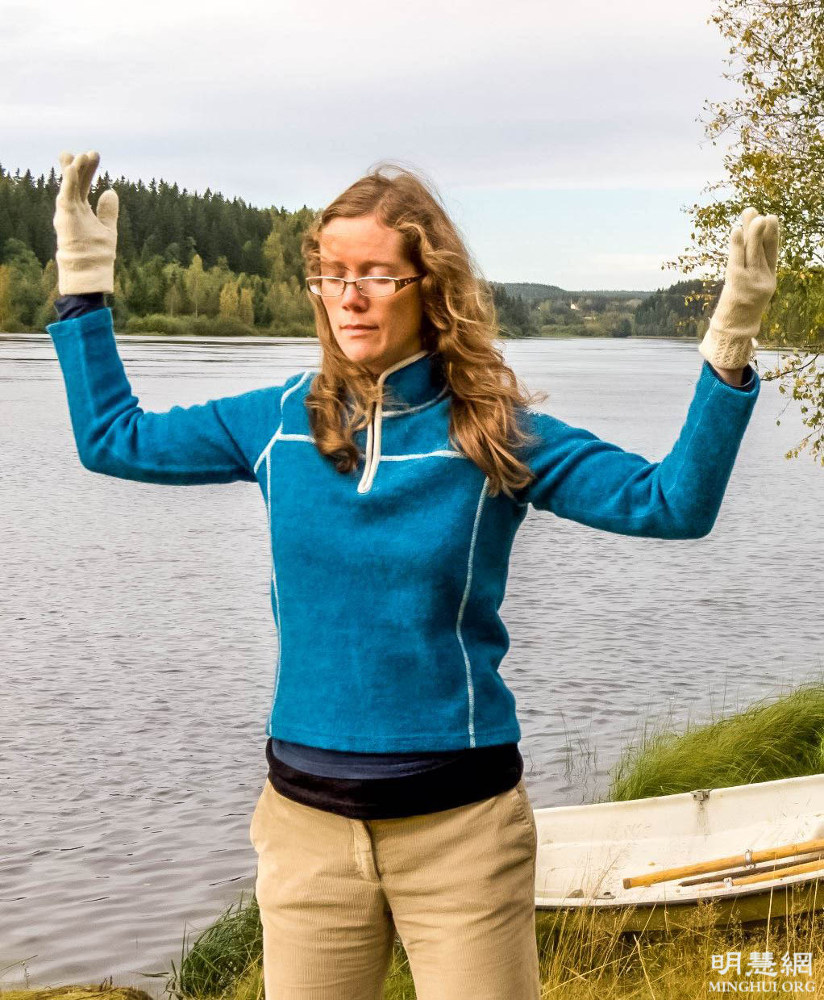

<a name=top>

<a target="_blank" href="https://git.io/bb99bbss">

<b>直连不必翻墙 🌼 https://bit.ly/2A4uPQb</b>

<tr><td width=900><h3><b><a href="https://git.io/kkopop">➤ 中国禁闻    </a></b></h3></tr>
</td>

<h2>请收藏本网址，连上免翻视频即时IP https://bit.ly/3ezRQKo </h2>

 

<h1>看更多真相 https://bit.ly/2RQM1hX</h1>

<h1><b><a href="https://bit.ly/2RQM1hX/awwkk/usdom/blob/master/forfor.md">红潮即将倾覆  天之将明</a></b></h1>

<h2 align="center"><a href="https://github.com/jkujkkj/bird/blob/master/bird02.md"><b>明真相能保命(二)</a></b></h2>

<h2 align="center"><a href="https://github.com/jkujkkj/bird/blob/master/bird03.md"><b>明真相能保命(三)</a></b></h2>

<h2 align="center"><a href="https://github.com/jkujkkj/bird/blob/master/bird04.md"><b>明真相能保命(四)</a></b></h2>

<h2 align="center"><a href="https://github.com/jkujkkj/bird/blob/master/bird05.md"><b>明真相能保命(五)</a></b></h2>

<h2 align="center"><a href="https://github.com/jkujkkj/bird/blob/master/bird05.md"><b>明真相能保命(六)</a></b></h2>

<a href=https://git.io/souye><h6 align="right">回首頁</h6></a>

<a name=top>

<a href =#4>4. 美国内华达州参议员褒奖世界法轮大法日</a> 
<a href =#3>3. 瑞典西人：修炼法轮功　全家受益</a> 
<a href =#2>2. “母亲节”话母亲们的悲惨遭遇</a> 
<a href =#1>1. 美好的缘分 生命的奇迹</a> 
<a href =#167>167. 一场怪病的痊愈</a> 
<a href =#166>166. 美国总统之乡通过决议案 抵制中共强摘器官</a> 
<a href =#164>164. 对抗中共假新闻 六位中国人成功插播真相</a> 
<a href =#163>163. 我的三退心路</a> 
<a href =#162>162. 武汉女孩哭诉洗脑班对母亲的身心摧残</a> 
<a href =#161>161. 一家三口死於中共迫害大陸移民三退表心跡</a> 
<a href =#160>160. 日本议员425寄语：立刻停止对法轮功的迫害</a> 

-----------------------

<a name=4>

<h1 align="center"><b>美国内华达州参议员褒奖世界法轮大法日</b></h1>

美国内华达州参议员凯莉‧安‧巴克（Carrie Ann Buck）褒奖世界法轮大法日。

【大纪元2021年05月03日讯】为庆祝2021年5月13日第22届「世界法轮大法」日，美国内华达州参议员凯莉‧安‧巴克（Carrie Ann Buck）签发褒奖令，褒奖世界法轮大法日。

参议员凯莉‧安‧巴克签在褒奖中称赞法轮功「真、善、忍」原则，表达对法轮大法创始人和修炼者的感谢，并肯定法轮功对社会做出的杰出贡献。

内华达州参议员凯莉‧安‧巴克签发褒奖令。（明慧网）

褒奖译文如下：
鉴于，法轮大法也称法轮功，是一种修炼，世界上数百万人已将这种修炼融入到他们的生活中；并且

鉴于，根植于古老的中国传统，法轮大法包括道德教导、打坐和四套缓慢的动功功法，对于改善健康、增加能量有独特的效果；并且

鉴于，法轮大法的核心是「真、善、忍」原则，「真、善、忍」是宇宙的特性。法轮大法鼓励人们在生活中遵循这一原则；并且

鉴于，许多修炼法轮大法的人身心获得巨大改善，比如精力充沛、思维敏锐、压力减缓，许多人找到了使他们获益匪浅的修炼方法；并且

鉴于，法轮大法由李洪志先生传播于世。李洪志先生是中国长春人，目前定居于美国。他五次获得诺贝尔和平奖提名；并获得自由之家颁发的国际宗教自由奖；也获得了欧洲议会萨哈罗夫奖提名；并且

鉴于，法轮大法的原则是「真、善、忍」，能提升人的心灵境界。法轮大法的书籍已被翻译成四十多种语言。法轮大法让人重德，改善人们的福祉。自从法轮大法于1992年5月13日从中国传播以来，一百多个国家和地区的近一亿人已从中受益；并且

鉴于，内华达州的法轮大法学员于1998年通过免费教功、游行、艺术展和教功班将法轮大法带给拉斯韦加斯和雷诺市的数万居民。法轮大法学员希望人们能享有健康、和睦的生活。

因此决定，值此特别的日子，我们褒奖法轮大法的美德，褒奖法轮大法对我们社会做出的杰出贡献；并且

进一步决定，我们与美国东西海岸的人们，以及世界各地的人们一道，褒奖第22届世界法轮大法日，以及法轮大法洪传于世29周年。

2021年5月13日
内华达州参议员
凯莉‧安‧巴克（Carrie Ann Buck）
数据源：明慧网， 内华达州参议员褒奖世界法轮大法日

【文章来源】https://www.epochtimes.com/b5/21/5/3/n12921790.htm

<a href=#top><h6 align="right">回上方</h6></a>

<a name=3>

<h1 align="center"><b>瑞典西人：修炼法轮功　全家受益</b></h1>

【明慧网二零二一年五月七日】（明慧记者何平瑞典采访报道）今年的五月十三日是第二十二届世界法轮大法日暨大法弘传29周年，同时也是法轮功（法轮大法）创始人李洪志师父七十岁华诞。来自瑞典北部于默奥市（Umeå）的西人法轮功学员伊娃一家向李洪志师父献上最诚挚的感恩和祝贺：“感谢师父把法轮大法传给了我们！恭祝师父生日快乐！”

瑞典法轮功学员伊娃（右）和约尔根（左）及他们的三个孩子，一家五口双手合十向师父表达最诚挚的感恩和祝贺：“恭祝师父生日快乐！”
大法改变了我的性格

拥有生物学硕士学位的伊娃（Eva）是瑞典一家报社记者，二零零六年开始修炼法轮功，她和丈夫约尔根（Jörgen）还有他们的三孩子居住在瑞典北部的于默奥市。他们夫妻恩爱，孩子们聪明善良又懂事，一家人其乐融融。

瑞典法轮功学员伊娃（Eva）在晨炼，她正在炼法轮功的第二套功法。

伊娃回顾起自己十五年来的修炼历程，总是按捺不住内心的喜悦和感恩，她说：“这一切都归功于法轮大法，我永远都感激师父。我曾是一个很有个性、特别执着自我的人，这些年我尝试着把自己的修炼贯穿于日常的工作生活中，时时提醒自己按照真、善、忍的原则去面对发生在身边的各种事情。我不再掩盖自己的缺点，有了问题，学会了先查找自己。观念一转变就会发现，往往出问题的原因都出自于我的自私和自我。我不会再埋怨、抱怨、去激化矛盾了。”

她接着说：“当然有时能做到，有时还不能做到，但我会遵循大法的要求努力来归正自己，尽量在下一次做好。这样一来，卓有成效的化解了矛盾，缓解了很多来自各方面的压力，逐渐我的性格也发生了改变。修大法使我在处理家庭社会的人际关系方面也得到了很好的改善。夫妻关系变得融洽、彼此尊重，家庭和睦。”

<b>丈夫恢复健康　精力充沛</b>

伊娃的丈夫约尔根是一位环境学博士、高中老师。伊娃介绍说，“约尔根以前是个唯物主义者，从不思考未经科学证实的东西，很固执。他对事情的看法总是持悲观态度，是一个很容易疲倦的人，每天必须要午睡。他的心脏还有问题，但医院也检查不出是什么病，医生就建议他服用抗抑郁的药物，被他拒绝。二零零七年我们结婚后，常常在一起探讨关于修炼的话题。”
  
约尔根看到伊娃的身心变化，很想知道伊娃为什么对法轮功如此的深信不疑，也开始看大法的书了。拜读了《转法轮》后，他发现这是引导人生命回归的一部天书，逐渐的他改变了自己的固执观念并意识到他不能再等了，决定要投入更多的精力来学法炼功。
  
二零零八年他正式走入了大法修炼，修炼后的约尔根身体很快恢复了健康，每天都精力充沛，脾气也变好了，对孩子更有耐心了。

<b>女儿得到意想不到的妙方</b>

伊娃夫妻俩十分注重培养孩子们的道德品质，按照《转法轮》书中的教导真诚地对待孩子。他们经常和孩子们一起讨论如何按照大法的要求做一个好人，孩子们也学炼功法，不过伊娃夫妇不会给他们规定固定时间。
  
女儿梅尔娃（Malva）懂事乖巧，但十岁的时候出现了令人烦恼的失眠症，夫妻俩尝试了很多的方法想帮助女儿来解决这个问题，均无效。伊娃回忆道，“那是一个夏天的傍晚，梅尔娃也过来和我们一起炼了功。我们把时间缩短了一点，这样梅尔娃就都坚持下来了。炼功后，当天晚上奇迹就发生了，梅尔娃不一会儿就睡着了。很显然，这是因为她刚刚和我们一起炼了功，我们都很开心。”

于是，伊娃和女儿商量，每天晚上在睡觉之前炼一会儿静功。“我们随着优美的炼功音乐，两腿盘坐，静静的入定，一片宁静祥和。每天的时间都不长，十几分钟。炼功后，梅尔娃感觉非常好、很快就入睡了，至今失眠的情况很少再出现。梅尔娃的弟弟有的时候肚子疼或头疼，也过来和我们一起炼一会儿功，很快不舒服的状态就消失了。以前梅尔娃由于睡眠不足，情绪很不稳定，特别容易生气、发脾气，现在她的心情也变好了，每天都很开心。”

看到女儿终于可以香甜的睡着了，孩子们在师父的看护下身心健康的成长，伊娃特别的开心。她激动地说，“法轮大法带给我和我家人的好处太多了，我们对师父感恩是说不尽也道不完。师父，谢谢您！”

【文章來源】https://www.minghui.org/mh/articles/2021/5/7/424321.html

<a name=2>

<h1 align="center"><b>“母亲节”话母亲们的悲惨遭遇</b></h1>

油画《孤儿泪》，作者：董锡强。画中的孩子捧着父母的骨灰盒，隐忍着泪水。父母双双被中共迫害致死。（明慧网）

【大纪元2021年05月06日讯】母亲节来临了，在中共对法轮功的血腥迫害中，我一家就失去了两位母亲。那年我与妻子被突然绑架，被无辜判刑、劳教，孩子在外读书，家中只剩下孤零零年近九旬的母亲，不久老人在恶警们的三番五次抄家的惊吓中，在思念儿子、儿媳的悲苦忧伤中，含冤离开了人世。

记得有一次看师父的讲法录像，母亲说了一句令我永远都难忘的话：“你们这个师父看的是人实际是神，你们好好修炼吧，妈给你们做饭支持你们。”母亲有六个儿女，她不识一个字，心地善良，满脑子都是传统理念，教育子女们不做坏事要做好人，善待别人，吃亏是福，让人怀念。

另一位就是孩子们的妈妈，十几年前被中共迫害致死。从牢狱出来之后，她身体极度虚弱，在讲真相救人中三次被绑架，日夜念念不忘多救人快救人。被迫害致死时年仅57岁。

在中共长达近22年的对法轮功的血腥迫害中，有多少善良的母亲被残酷迫害致死？有多少儿女痛失母亲，丈夫痛失妻子，老人痛失女儿？又有多少幸福善良的家庭被迫害得支离破碎、家破人亡？中共犯下的滔天罪恶真是罄竹难书啊！

在此仅举近期明慧网报导的部分迫害案例：
二零二一年四月二十三日，本应是武汉江夏区法轮功学员钱友云冤狱结束日。近日获悉，就在结束日的前几天，钱友云女士被劫持到湖北省武汉女子监狱继续非法关押迫害。这是钱友云第三次被劫持在这个黑窝。

北京市平谷区七十三岁的法轮功学员张淑香女士，二零一七年六月二十一日遭中共不法人员绑架，被非法判刑三年，关入北京女子监狱，二零一九年四月三日被120急救车送回家中，于二零二一年三月三十日含冤离世。
张淑香被北京女子监狱迫害得奄奄一息，送回家后一直卧床不起。当地司法所和派出所屡次骚扰她，她的养老金也被扣发，上述原因导致她病情恶化而离世。

成都法轮功学员杨静二零二一年三月十三日，在成都市武侯区红牌楼的家中被警察绑架，四月十九日被非法逮捕。杨静年已八旬的母亲认为红牌楼派出所及武侯区检察院对杨静的指控完全是子虚乌有，根本没有法律依据，正在奔走呼吁，讨回属于自己女儿的公道和正义。

昆明市58岁的法轮功学员王瑾女士，被绑架关押半年，面临被非法庭审，其89岁老母受警察野蛮抄家惊吓，于二零二一年四月五日哀伤去世。

山西太原古交市法轮功学员姜丽，女，四十多岁，家住山西省太原古交市，娘家在辽宁省清原县。姜丽修炼法轮大法前后，判若两人，修炼后她孝敬公婆，对丈夫体贴，一家人其乐融融。二零二零年十二月底被古交市警察从娘家绑架，非法关押在太原市看守所至今四个月。她母亲十分担心她，精神受到极大的冲击，突然离世。

二零二一年一月二十四日，辽宁省营口市鲅鱼圈区73岁的陈素（淑）珍老人在苦苦的期盼中离开了人世。她怀着对孩子的挂念，怀着对美好世界的向往走完了她人生的旅程。那一刻她的家人在哭泣，人们在诉说老妈妈临终未能见到自己的爱女边爱娜和女婿娄跃君。

廖光慧，今年70岁，是一位贤妻良母，因为修炼法轮大法，被绵阳市涪城区法院非法判刑三年，入成都女子监狱。可是，入狱仅四十多天，二零二一年三月十日凌晨，家人被监狱警察告知，称廖光慧“因摔倒，脑血管破裂”。目前，廖光慧已做了手术，在华西医院重症监护室，仍在昏迷中。

据明慧网最近报导，二零一八年～二零二零年，在中国大陆，65岁以上的老年法轮功学员因为信仰真、善、忍，遭中共迫害，三年间至少造成106人被迫害致死或被迫害离世、350人次被非法判刑、1694人次被绑架、807人次被非法抄家、870人次被骚扰，合计被迫害3827人次。这其中有多少是我们的母亲啊！
2013年7月19日，《清算江泽民迫害法轮大法国际组织》发布公告指出：“现政权当权者必须立即制止和停止这场血腥的屠戮和残酷的迫害！必须立即逮捕和惩办迫害法轮功学员的凶手！必须立即把迫害法轮功真相公布于众。中共这个危害人类道义正信，以强权暴力、血腥屠杀横行于世的邪党绝不能继续存在下去！”
八年过去了，可是这场邪恶至极的迫害仍然在进行着，许多的母亲被中共非法绑架、关押、冤判、甚至被秘密活摘器官，多少善良的家庭因此支离破碎、妻离子散、家破人亡，多少遭受迫害的家人们盼望着中共早日解体，迫害早日结束！

【文章來源】https://www.epochtimes.com/gb/21/5/6/n12928112.htm

<a href=#top><h6 align="right">回上方</h6></a>

<a name=1>

<h1 align="center"><b>美好的缘分 生命的奇迹</b></h1>

希望大家都去了解法轮大法，珍惜与大法美好的缘分，也创造自己生命的奇迹。

2月14日下午2点多，在德国一个大城市的一个新冠病毒（中共病毒、武汉病毒）检测中心里，一位五十出头的西方女士走进我的工作间。她妆扮得体，但双眉紧锁，两眼无光，满面愁容。

我微笑着亲切地招呼她坐下。不等我开口，她马上告诉我：「我三个月前测试过，是阳性。我很害怕。」

「您后来去医院检查过吗？」按照要求她应该再去医院检查一次。我一边接过她手中的测试者材料检查着，一边继续询问。

「我没敢去，因为（在测试的时候）已经弄得我很疼了。我怕他们（把我留在医院）不让我回家。」她带着哭腔嘀咕着。

我对她的行为略感意外，但马上也理解了，就一边签字，一边继续问：「那你做了什么呢？」我指的是她针对病毒做什么了。
「我一直藏在家里，只是吃和睡了。可现在到处都要这个（新冠病毒阴性）证明，我只好来了。」

虽然是所答非所问，我也可以理解。正好文字工作做完了，我就迈步到医柜前拿过测试棉棒，转过身在她面前正准备打开包装。按照要求，测试者必须当着被测试者的面撕开棉棒的封口。

这时她的样子把我惊得瞪大了眼睛：不知什么时候，她已经离开了座位，穿着高跟鞋的双脚是脚尖着地，踏着小碎步跟着我，我走到哪儿她跟到哪儿。双手还像打拱那样握在胸前，看得出在努力克制着不要发抖。脸上的所有线条——眉毛、眼睛、脸颊和嘴角，全都是呈现「八」字型。好像下一秒就要对我跪下，哭求我似的。

我虽然见识过许多紧张、焦虑、害怕的测试者，但这样子的我还从来没遇到。我马上意识到她内心一定是太痛苦了，我立即放下手中一切，跨出一大步，站到她正对面。

我眼睛瞪得大大的，直直地看着她的眼睛，左手轻轻托住她右肩，上身微微向她倾斜靠拢，我的声音还是很柔软，但是语气非常坚定，我非常肯定地对她说：「我给您做测试能操作得非常非常轻柔，保证不弄疼您，好多人在我这都经历过了，请您不要多想。而且我还有办法保证您能获得健康和阴性的证明。」

她眼神迷茫地看着我，嘴里「啊？啊？」地回应着，但还是顺从地跟着我回到了座位上。她再次坐下后情绪舒缓了一些。

我想先和她聊会天，帮助她平静。我记得她的姓氏有点罕见，就问她是哪个国家的人。她说是前南斯拉夫人。我就自我介绍是中国人。然后我就从共产邪党在哪里都不让人有自由和民主说起，又极简要地说了中共的杀人历史，最后我说：「民主和自由就是比共产主义好，中共真是魔鬼，您怎么认为？」

她一直点头，多次明确回答「是」，还补充说，现在在她故乡比原来好一点点，但在中国还是很糟糕。

她虽然因为注意力转移而轻松一点，但核心苦恼——测试是否疼痛和是否感染以及如何最终救治，还没解决，所以，她一不回答我的问题就立刻堕入愁苦之中，好可怜的人啊！

接下来我要准备测试了。口腔测试一般都比较简单顺利，测试者心理压力比较小。对于鼻腔测试，我先讲解了鼻腔的结构，为了进一步帮她放松，我说：「人生气的时候，鼻孔也会变大一点的。您可以现在马上冲我发火，我就（抓住时机）马上给您检测鼻子，肯定很舒服，怎么样？」

「我怎么能那样对您呢？我绝对不会对您发脾气的。绝对不会的。」她很认真地听我说话，听到这句，她不好意思地稍微扭动了几下身体，还有一瞬间露出拘谨的笑。看得出她是一个挺善良挺有教养的人。

我微笑地看着她，继续说：「我非常轻柔地给您检测完之后，您不仅感觉舒服，而且还能继续闻到香味，当然如果您做菜好吃的话。如果不好吃，那就不需要（鼻子能闻味）了。」

她被我逗得忍不住哈哈大笑，双肩颤动，脸上漾出淡淡的红晕。收住笑后，她晃着脑袋，表情倔强地说：「我做菜可好吃了。」她已经基本把负面情绪释放出来了，人也比较平和了。
接下来我正式开始测试。口腔测试不到一秒，当我告诉她（口腔测试）结束了，她闭上嘴，诧异地看着我：「啊？完了？」
「疼吗？」我明知故问。

「不疼，一点不疼！」她挑着眉毛大叫起来，她的语调里又难以置信又兴奋。下一瞬间整个人一下子就又轻松又开心了。
我又提醒她：「鼻腔检查可有点痒啊，要忍几秒啊。」她非常信任我了，很积极地配合，两秒就测好了。

「一点都不疼，太奇怪了！我看到电视里的都疼得嗷嗷叫！太感谢了！」她站起身，一连气地说着，上身不停地微微鞠着躬。

我已经在检测台前把棉棒放在检测药液里了，听见她快乐的话，我回过头冲她笑，可我还有点不放心。

就在她快要走出门去等候室时，我站在门口对她说：
「中国人几千年来都信神，神也在保护着人，让人知道保护的话（德语：Schutzwort）。几千年来人们在实践中也证实是有效的。如果您也想知道（在这次疫情中）保护的话，我很愿意告诉您。」

说完我就安安静静地看着她，她先愣了一下然后探过身来问我：「您信佛，是吗？」我很平静但是很肯定地说：「是，我信神。神对人都是很爱护的，会帮助人的。」
我心里很期待着她能愿意听下面这最重要的话，因为其它一切都只是测试，不能真的救命。

「我喜欢和佛有关的一切文化。」她一字一字地说着，十个指尖还指向胸口，眼睛瞪得大大的，直直地看着我。
「太好了！」口罩、面罩、头套，什么都挡不住我的欢笑。

「我可以教您怎么说，还可以给您写下来，写在纸上也行。」她不住地点头，同时在包里哗啦哗拉地翻找什么，很快就把手机推到我面前了。
「输入，输入。我发给我的好朋友，她正在门外等着我呢。我们俩可以一起念。」

我于是立刻输入「法轮大法好」的拼音，再教她发音。第三遍时她已经能够完全正确地独立地念出来了，然后她自己又主动当着我的面练习了三遍。
我没解释内涵，因为一说起来话长，可我工作中没时间，门口很可能已经有排队等候测试的人了，我最忙时每2分钟测试一个人。

我也没教她念「真善忍好」，因为据我观察，许多西方人发「真」的zh和「忍」的r时，都有点困难。一来需要更长的时间练，二来字数多难度更大，万一两句都没学会，还不如学会一句发音简单的。

二十多年的修炼使我的身心都脱胎换骨，我绝对相信：哪怕就是「法轮大法好」这五个字，只要人能诚心尊敬，大法救人性命易如反掌。人类如果了解大法是什么，就会明白哪怕终生只能得到大法中的一句话，都是极其珍贵极其珍贵，值得感恩的。

后来我在给不同的人测试的时候，至少听到她在等候室里大声地念「法轮大法好」有四五遍，发音完全正确，语调都是上扬的，语气欢乐舒展。

后来我趁着一个测试者刚离开、下一个还没进来的当口，冲到后台，去看一眼她的结果：测试条上非常清晰地显示出是阴性，干凈利落！最终结果还要再等几分钟确认，但这种毫无疑义的表现已经是不可能逆转的。我于是飞快地跑到等候室告诉她，以免她悬念，而她正和她的好朋友有说有笑呢。

听到自己的阴性结果，她一口气对我说了十来个「谢谢」。幸福之态溢于言表。她这时的样子──眉开眼笑，五官舒展，两眼亮闪闪的，神态轻松愉快——和十多分钟前那个快要崩溃的样子，简直判若两人。

大法救人之真实神奇，无法言表，无语尽述！

我实录下几天前这段真实经历，希望看到的人能打开心扉，去了解法轮大法，珍惜与大法美好的缘分，也创造自己生命的奇迹。祝您健康幸福！

【文章来源】https://www.epochtimes.com/b5/21/4/23/n12900882.htm

<a name=167>

<h1 align="center"><b>一场怪病的痊愈</b></h1>

【希望之声2021年4月28日】（本台记者慧光综合报导）
据大纪元台湾记者黄玉燕报道，在台中市有一位叫唯伦的女士，有一天早上起床时发觉右肩连带着手臂莫名的疼痛，于是找到中医诊治，没想到医生检查后说：你右臂的韧带严重老化，像八十岁老人的筋，可能是因为受伤的原因，医学上称为“沾黏”，导致手臂的筋很脆弱，目前医学界对这种病没有什么好办法，吃药也不会有多大作用，只能通过热敷、照红外线或针灸等辅助治疗方式缓解。

唯伦听到这话很伤心，但心里还是怀疑，自己才四十岁，感觉也不是那种难以忍受的病痛，怎么会这么严重呢？后来在朋友的建议下又去找西医大夫诊治，大夫说：“你这已不是‘沾黏’的问题，需要开刀动手术换成人工筋。”

这下唯伦才意识到问题的严重，可她对手术感到恐惧，就拒绝了。没想到接下来病情发展很快，右臂连着肩膀越来越痛，甚至深夜里经常被疼醒，每天只能靠安眠药入眠。后来发展到右臂上举很吃力，穿衣服都感到困难，很多活动都受影响。

这样的日子一直持续了两年，她感到十分痛苦。其实还不单纯是疾病的原因，期间老公有了外遇，同住的公公也成了陌路人，悲伤和苦恼无处诉说。她感觉就像是黑夜中在大海上漂流的一叶小舟，自己一直在风口浪尖上起伏颠簸，随时都有翻船落水的危险，而且看不到任何希望。她回忆说那时经常会产生一个念头——“活着不如死去的好”。

唯伦在一家公司担任会计，她的业务主管王先生看到她总是痛苦失落的样子，就关切的询问情况，唯伦就向其诉说了自己的病情。王先生对她说：法轮功的祛病健身效果很好，在台湾有很多人都体验到了法轮功的神奇，你不妨去试一试啊。

其实这位主管一年前就向她推荐过法轮功，并提出让她看法轮功的主要指导书《转法轮》，说这是一本好书，很值得看。因为王先生为人正直，是她敬重的人，所以王先生说的话她很相信，马上接受了王先生的建议。可是看过书之后她却对王先生说：“书中说的很好，但我做不到。”在王先生的鼓励下，她也曾学着练习功法，但最后还是放弃了，她说“盘腿实在太痛了，受不了。”

这一次王先生再度向她提起法轮功，她有了不一样的感觉。她意识到也没有别的选择了，那就“死马当做活马医”吧，于是再次捧起《转法轮》看。也许是这一次比较用心吧，看完后心中敞亮了很多。她忽然明白了一个道理，原来自己的病痛以及生活中的磨难其实都是有原因的，是自己生生世世的业力造成的，要想好病只有消去业力，这是最实实在在的一条路。她终于醒悟了，决定全心全意修炼法轮功，无论多苦多难都要坚持。她说：“我告诉自己，这次真的要修炼了！”那一天是2012年7月12日，这是她永远不会忘记的日子。

唯伦在打坐炼功

炼功后很快就出现了一件让她感到非常惊讶的事。她说：“自从手臂的病痛开始后就停经了，医生诊断说是子宫退化了，进入了更年期。虽然当时只有四十岁，这是一件很悲哀的事，但相对来说胳膊的问题更现实，子宫的事就顾不上了。可炼功当月月经就恢复正常了，当时就觉得法轮功实在是太神奇了。后来看到师父在《转法轮》中说‘经血之气是用来修命的’，我一下子就理解了。”

大约半年后的一天清晨，在炼法轮功第二套功法——法轮桩法的“头顶抱轮”动作时，平常抬不起来的右臂在不知不觉中缓缓抬起，超过了头顶，伸向了天空，彷佛两壁间真的有一个大法轮在旋转，她顿时感到无比激动！她在心中吶喊：我这只八十岁老奶奶的手臂终于抬起来了！

法轮功不仅在祛病健身方面效果显著，更重要的是能净化心灵，所以对心性方面要求很高。每个大法修炼者都会遇到心性考验，有时会突然出现，让人措手不及。有一天唯伦的一位很要好的朋友突然无缘无故的骂她，说了很多刺耳的话，让她难以忍受。如果是修炼前她马上会以牙还牙，跟对方大吵起来。可一想到自己是修炼人，遇到矛盾要做到忍，就强压住怒火，渐渐的就平息了。没想到第二天那位朋友竟主动找她道歉，说自己当时也不知道是怎么回事儿，怎么会发那么大的脾气。这件事让她印象深刻，也体会到了修炼的微妙。唯伦说：矛盾过后，我能清楚的感觉到身体内外有许多小法轮在旋转，非常明显。

唯伦从小就有自卑感，儿时曾经偷过钱、打过架，是家中表现不好的孩子，她也总以为自己是个没出息的孩子。有一天在打坐时，小时候的这些不好的表现竟然一一想起，就包括在恋爱中突然提出与男朋友分手的事，都想起来了。她马上意识到这些事虽然过去了，但都是自己做的不好，应该主动去面对，欠下的债要还，于是她主动去找当年自己曾经伤害过的人，向对方道歉。没想到对方都原谅了她，还鼓励她不要再去计较。

唯伦说，过去因为房子与债务的事，与公公有很大隔阂，也曾对他说过不敬的话。修炼后她主动向公公道歉，并请求原谅。一向不爱说话的公公竟然态度改变了，脸上有了笑容，一天清晨出外炼功时，公公突然对她说“多穿点衣服”，这让她很惊喜，因为多年来公公从来不跟她说这样关心的话。

如今唯伦已经在法轮大法中修炼九年了。她庆幸的说：“因为有这些不断发生在身边的小事，印证了《转法轮》书中说的法理都是真的，也督促着自己不断修下去。看到人世间纷纷扰扰的事，能清楚的看见事物的本质，不再为其烦扰。若不是因为走进大法修炼，我可能每天都活在怨恨中；若非大法带我走出黑暗，如今不知会漂流到哪里去，或许已经离婚、带着小孩四处漂泊。我感谢法轮大法带我走向新的人生，感谢师父给了我新的生命。”

【文章来源】https://www.soundofhope.org/post/499487?lang=b5

<a href=#top><h6 align="right">回上方</h6></a>

<a name=166>

<h1 align="center"><b>美国总统之乡通过决议案 抵制中共强摘器官</b></h1>

4月12日，三位弗吉尼亚州居民、法轮功学员在威斯特摩兰县委员会会议上发言后留影。

【大纪元2021年04月27日讯】（大纪元记者李辰报导）4月22日，美国弗吉尼亚州威斯特摩兰县（Westmoreland）通过决议案，呼吁「美国政府彻底调查中国器官移植业，以制止（中共）强摘法轮功学员器官」。

当天，威斯特摩兰县委员会投票，该决议案获全票通过。

决议案说，「广泛和可信的报告显示，在中国存在对良心犯——主要是法轮功修炼者以及其它宗教和少数群体成员的大规模杀戮，以获取器官做移植手术。」

该决议案也警示当地居民，以制止当地居民前往中国做器官移植手术而无意间成为中共强摘法轮功学员等良心犯器官的共谋。

4月22日，美国弗吉尼亚州威斯特摩兰县（Westmoreland）委员会会议现场。

4月12日，弗吉尼亚州居民、法轮功学员Tiny Tang曾在威斯特摩兰县委员会的会议上发言。她发言说，「2000年代初，中国医院广而告之，称（用于移植的）重要器官的等待时间短暂。这些人体器官来自哪里？广泛而可信的报导显示，中共杀害良心犯——其中大部分是法轮功学员，以出售器官。」

追查迫害法轮功的国际机构「追查国际」2016年指出，1999年江泽民迫害法轮功之后，中国器官移植数量出现同步爆炸性增长，仅1999年～2006年，中共官方报导的肝移植量就增长了180倍。
中共强摘法轮功学员器官的黑幕于2006年首次曝光，并获得多个可信的国际调查报告的证实。

2016年6月22日，中共强摘人体器官调查报告——《血腥的器官摘取／大屠杀：更新版》（Bloody Harvest/The Slaughter: An Update），在美国华盛顿DC国家记者俱乐部正式发布。

三位联合作者：加拿大前亚太司长戴维‧乔高、美国资深调查记者伊森‧葛特曼和加拿大人权律师戴维‧麦塔斯表示，在过去的十五年中，在大陆，估计进行了大约150万例器官移植手术。器官的主要来源是法轮功学员。
2016年，美国国会众议院一致通过343号决议案，要求中共立即停止停止迫害法轮功、停止强摘法轮功学员等良心犯器官。

弗吉尼亚州此次通过决议案的威斯特摩兰县，是美国首任总统乔治‧华盛顿的出生地。华盛顿被誉为美国国父、开国元勋。1787年，华盛顿主持制宪会议，制订《美国宪法》。该部宪法沿用至今。
弗吉尼亚州历史悠久，也被誉为美国总统之乡（Home of Presidents），是8位美国总统的诞生地。

威斯特摩兰县也是美国弗吉尼亚州通过抵制中共强摘器官决议案的第10个县。2021年以来，该州已有9个县通过相关决议案。

2021年3月，美国国会参众议员发起「制止强摘人体器官法案」。该法案如通过，将具有法律效力，授权美国政府拒绝或者撤销购买非法人体器官者的护照；对参与或支持强摘人体器官的外国官员和实体机构实施制裁。
以下是弗吉尼亚州威斯特摩兰县委员会通过的决议案全文：

<b>威斯特摩兰县委员会决议案</b>

根据最近有关（中共）国家支持的强摘良心犯器官的报告，对威斯特摩兰县居民和医疗界进行前往中国做器官移植手术的风险教育
  
鉴于，广泛和可信的报告显示，在中国存在对良心犯——主要是法轮功修炼者以及其它宗教和少数群体成员的大规模杀戮，以获取器官做移植手术；以及

鉴于，中国法庭（The China Tribunal），这个位于英国伦敦由大爵士、国际刑事法庭审判前南斯拉夫问题的检察官Geoffrey Nice QC主持的独立法庭，经过长期听证，在2019年6月18日做出判决，一致认定：在中国，杀戮被监禁者用于器官移植手术的行径正在继续，受害者包括被监禁的法轮功学员；以及

鉴于，「自由之家」在2017年发布的《中国精神之战》（The Battle for China’s Spirit）报告中指出，「现有证据表明，强摘被监禁的法轮功学员的器官用于器官移植手术的交易已经大规模发生，并可能正在继续；」以及

鉴于，由人权律师戴维‧麦塔斯（David Matas）、前加拿大亚太事务卿戴维‧乔高（David Kilgour）、记者伊桑‧葛特曼（Ethan Gutmann）在2016年6月发布的调查报告估计，中国正在以「工业规模、国家指导的器官移植系统、国际政策和资金支持、牵涉到军队和民营医疗系统」的方式进行器官移植，就如戴维‧乔高在2016年欧洲议会演讲中所描述的那样；以及

鉴于，法轮功，是以「真、善、忍」价值为核心，融合了「气功」打坐练习的精神修炼功法，20世纪90年代在中国广受欢迎；据多项估计，法轮功学员人数当时达到了七千万人以上；以及

鉴于，1999年7月，中国共产党发起了旨在消灭法轮功的全国性的严重迫害。成千上万的法轮功学员被非法拘留在中共的劳教再教育场所、拘留所和监狱中，普遍遭受酷刑迫害和精神折磨。

鉴于，2016年6月，美国国会众议院一致通过了343号决议案，谴责对法轮功学员和其他良心犯的系统性的、国家认可的强摘器官行径；以及

鉴于，威斯特摩兰县（Westmoreland County）居民在决定到中国进行器官移植旅游之前，应该被充分告知中国的器官来源，而威斯特摩兰县委员会应协助提升这方面的认知；

因此，现在威斯特摩兰县委员会决议，敦促美国政府彻底调查中共器官移植业、采取所有合理措施，以制止强制摘取法轮功学员的器官；以及

进一步决议，通知威斯特摩兰县居民和医疗界有关前往中国进行器官移植的风险，以帮助制止当地居民成为（中共）国家认可的强摘良心犯器官行径的共谋；以及

进一步决议，并向弗吉尼亚州州长、弗吉尼亚州议会、弗吉尼亚州的国会议员以及两位联邦参议员、弗吉尼亚州卫生署提供该决议案的副本。

2021年4月22日通过。
威斯特摩兰县委员会主席 达里‧费希尔（Darry Fisher）签字

【文章来源】https://www.epochtimes.com/b5/21/4/27/n12908242.htm

<a name=164>

<h1 align="center"><b>对抗中共假新闻 六位中国人成功插播真相</b></h1>

加拿大新境界影视的电影《永恒的五十分钟》剧照。

2002年3月5日，六位中国人在有线电视中插播，播放了未经审查的消息。由中共国家支持的谎言，因此在中国的两个城市得以曝光。插播时长50分钟。但是，这些人付出了生命的代价。

近日，「法轮大法信息中心」电视节目组制作了一部微型纪录片，题为「对抗假新闻王国」，重现了中国东北部城市的六位法轮功学员成功在中共控制的有线电视中插播，播放了这个信仰群体所遭受的迫害真相的故事。
这六人，被称为「电波六人」，他们分别是：梁振兴、周润君、雷明、刘海波、侯明凯和刘成军。他们都被迫害致死。

法轮功又称「法轮大法」，是基于佛家传统的精神修炼功法。至1999年下半年，中国法轮功修炼者达7千万～1亿人，遍及社会各阶层，上至政府高层，下至普通平民。

出于对其广受欢迎程度的恐惧，1999年7月20日，时任中共党魁江泽民发起了诋毁法轮功的运动，以将其暴力镇压「合法化」。

所谓的「自焚」事件在天安门广场上演，并由中共国家媒体向全国播放，此后，中共对法轮功的镇压运动升级。

2001年1月23日，中国黄历新年的前一天，五名中国人冒充法轮功学员公开自焚。据信，这是来自中共国家的命令，以妖魔化法轮功、煽动公众对法轮功的仇恨。

2001年8月14日，非政府机构「国际教育发展组织」发表一份正式声明表示，北京（导演）自焚，以诋毁法轮功。

虽然西方媒体、中国境外的国际机构认为这场所谓的「自焚」漏洞百出，但在中国境内，真相依然被掩盖。

纪录片说，「这是一个转折点……当警方和劳教所领导在酷刑折磨和杀害法轮功学员中失控时，中国数百万法轮功学员的希望，此时似乎不复存在了。」

不过，在中国东北，一个秘密计划正在一处出租房内进行着。

「电波六人」之一，梁振兴，吸纳了其他拥有不同技术和电气技术的法轮功学员，制定了电视插播计划。

2002年3月5日晚，身穿（电工）制服的法轮功学员骑着单车或搭乘的士抵达地点，在长春以及附近的松原市的8个有线频道中插播，在两个城市同一时间播出了法轮功真相片。

这部50分钟的真相片，没有被干扰打断，震惊了长春，覆盖了30万有线电视用户。近10万电视用户能够观看到「是自焚还是骗局？」以及「法轮大法洪传世界」真相片。

电视插播获得成功。

然而，电视插播的六名核心成员死于中共之手。刘海波在3月10日晚被捕，被拘押数小时后即死亡。

六人的生命没有白白逝去。接下来的数个月中，其它城市的其他法轮功学员进行了类似尝试，在中共控制的其它城市的电视频道中成功插播。

挑战中共迫害的信息运动自此开始也扩展至全球。

2006年，海外法轮功学员受到启发，成立了全球互联网自由联盟。这个位于美国的联盟机构开发了反审查软件，以帮助中国人突破中国防火墙，让中国人可以自由地访问中国境外网站。
加拿大新境界影视制作了这个故事的完整版， 电影名为「永恒的五十分钟」。

【文章来源】https://hk.epochtimes.com/news/2021-04-28/86680863

<a href=#top><h6 align="right">回上方</h6></a>

<a name=163>

<h1 align="center"><b>我的三退心路
</b></h1>

【明慧网二零二一年四月二十九日】近段时间看到网上分享越来越多的中国人觉醒、明白真相、声明三退的心声，很有感慨：真是天佑我神州大地，天佑我中华儿女。

我也想分享一下我的三退历程。从我记事起，就听说我的太爷爷因有房产、土地，被打成了「富农」，批斗、戴高帽子游街。十年的惨痛经历，记忆深深的烙印在了爷爷奶奶的心里。我只是听爷爷奶奶们断断续续的偶尔的讲述，不满十岁的我也知道太爷爷并没有错，共产党做的不对，但那时对共产党并无喜恶。

直到一九九九年，中共开始迫害法轮功，那时我的父母及家人亲戚学炼法轮功已有两年有余。一开始，我们都以为共产党不了解法轮功，误解了法轮功，父母亲人去北京、省政府说明情况，十多岁的我在家给省报写信，说明法轮功的真实情况。可后来中共迫害不断升级，非法大肆抓捕我认识的法轮功学员，非法抄家，关押，殴打，罚款成了家常便饭。

我家有七位亲人包括我的父母，不断的被非法抓捕，抄家，关押，殴打，罚款，侮辱性强迫劳动，监视，其中一位亲人还被非法劳教，我认识的一位女性法轮功学员在关押期间被打死。这些都是非法的，毫无法律依据的，十多岁的我开始意识到了共产党的邪恶。更让我觉得共产党邪恶的是，它的邪恶能使人扭曲了自己的人性和灵魂，实行自我阉割。

一次，我的父亲被非法关押一段时间后被放回，刚进院门，我的奶奶看见她被迫害的儿子刚进家门，脱下脚上的鞋，狠狠的朝我父亲的后背打去，一边打一边骂，大意就是为甚么不放弃，胳膊拧不过大腿云云。我当时看见这一幕震惊了，忍不住在心里大喊：「您的儿子甚么样您心里没个数吗？他真的违法犯罪了吗？他刚从魔窟里出来，受到虐待毒打了没有？您一点不关心吗？错的不是我爸，他坚持做好人，不背叛自己的师父没有错，您为甚么要打他？」但她不是不爱我父亲，她用母亲的身份威胁，压制我父亲放弃信仰，放弃自己的权利，以为在保护她的儿子。我觉得中共迫害我太爷爷的经历吓住了我的奶奶，而进行了不自觉地妥协，阉割。

可是如果最终中国人都被中共吓住了，妥协了，自我阉割了，中共会更加肆无忌惮地迫害中国人。诚如一位香港明星所言：「我也想妥协，但妥协后它们就会让我跪下，跪下之后它们还想要我命，人不一定要做正义的英雄，但不要去做邪恶的帮凶。」是的，中共的邪恶在我十多岁的时候便发觉意识到了。二零零五年可以在大纪元网站声明三退了，我毫不犹豫地退出了团队，实名堂堂正正的声明退出！天地可鉴！后来有幸看了《九评共产党》《解体党文化》、《共产主义的终极目的》等书，验证了我对共产党的认识，而且这几本书比我的认识更加全面深刻详实，让我受益匪浅。

此时，明白了一个简单的道理对比：法轮功学员十几年如一日的劝中国人三退保平安，不与邪恶为伍；中共让人加入时宣誓要把生命献给它，为其奋斗终身，随时准备牺牲。谁好谁坏？谁正谁邪？一目了然嘛！

【文章来源】http://big5.minghui.org/mh/articles/2021/4/29/423876.html

<a name=162>

<h1 align="center"><b>武汉女孩哭诉洗脑班对母亲的身心摧残</b></h1>

武汉武昌姑娘刘丹碧说起母亲被迫害致疯的样子就流泪了。

  
  【大纪元2021年04月20日讯】（大纪元记者施萍采访报导）4月18日，在纽约法轮功学员纪念“四二五”和平上访22周年的活动中，有两个年轻的女孩站在镜头前，控诉中共武汉政府以及公安局利用洗脑班对她们父母进行的罪恶摧残。

两人的父母都曾经只因为修炼法轮功就被抓进武汉的洗脑班——黑监狱，在里面受到了强制洗脑等非人折磨，出来之后都呈现出了不同程度的精神异常状态，其中一人甚至被家人送进精神病院治疗。而他们以前都是身心健康、积极乐观的好人。

<b>硚口区额头湾洗脑班</b>

  
“我本该三年前就站出来的”，一个叫刘丹碧的武昌女孩说，提起自己原来开朗活泼、似乎什么都难不倒的妈妈现在的样子，她的眼泪就扑簌簌地掉下来，心里既难过又后悔，“我妈妈是个爱美的人，可现在她是那么憔悴，每天要服用精神病药物，我从来没有想过她会变成这个样子……”

丹碧说，妈妈黄时群原本是一名幼师，自从1996年开始修炼法轮功之后，对幼儿园的孩子和家里的亲人们更加富有爱心。

刘丹碧的母亲黄时群曾经是一位开朗活泼的幼儿园老师。

2017年底，妈妈为让中国人知道法轮功真相，出去派发数据，遭人举报，被中共警察非法拘留10天；之后被送入所谓的“硚口区法制教育中心”即硚口区额头湾洗脑班中折磨。（详见明慧网报导）
丹碧听到这个消息后，想到了在明慧网上看到的关于武汉各洗脑班的种种骇人传闻，顿觉心头发紧。

“我以前感觉明慧网上说的法轮功学员受到的迫害经历离我很遥远，没想到这回一下子落到了自己的头上。”

她看到，武汉市为迫害法轮功学员成立了超过60个洗脑班，挂的名字都是什么“法教班”、“转化学习班”、“法制教育中心”等，实则都是中共吃人的黑监狱。而额头湾洗脑班就是其中关押学员时间最长、人次最多的一个。
从里面出来的人说，为了达到对法轮功学员的“转化”和“诛心”的目的，洗脑班分批次组织各色人等，对学员进行不分昼夜的“疲劳战”、“车轮战”，几天几夜不准睡觉，并强迫罚站、辱骂、殴打、关禁闭、吊铐、用高分贝的大喇叭播放诽谤法轮功的内容给人洗脑，把药物掺在饭菜里……直到学员过度疲劳、神志不清，甚至致残、致疯。

丹碧看到这些文字就已经感到害怕了，而当她在通话视频中看到妈妈那几乎认不出来了的痛苦不堪的脸庞时，她的心一下子就沉到了谷底。

“我不知道她经历了什么，她在洗脑班一个月体重暴跌了30斤，一夜一夜的睡不着觉，在地上走来走去；后来就发展成视力听力下降、眼睛不能看书、出门辨认不了方向；恐惧心慌、怕光怕声音，在家里连手机都要藏起来；身体剧痛，全身莫名其妙出现瘀青，肌肉抽搐、毛发脱落……她说似乎身体的每一个细胞都在受刑；原来那么活泼开朗的人变得焦躁和抑郁，我感觉她好像分分钟都要跳楼不活了……”

2018年的时候，有一次爸爸把妈妈送进了精神病院，几个月之后，妈妈回来了，但是看上去仍然在生死在线挣扎。

让丹碧不能容忍的是，共产党把妈妈迫害成这样了，仍然不罢休。今年过年前，中共官员又找上门来说，他们正在搞所谓“清零”运动，让妈妈签字不炼法轮功了，“以后就给你除名了，不来找你了。”
所谓的“清零”运动，就是中共通过各种手段威逼利诱，欺骗法轮功修炼者及其家属，要求他们放弃修炼，企图造成一种假象，欺骗14亿中国人，似乎他们已将法轮功修炼者“清零”了。

家人答应了中共官员的要求，交上了妈妈的一张照片和病例，以为这就没事了。可是，刚过正月十五，官员又找上门来。

“最近湖北省委组织部又找了我爸很多次，给我爸施加压力。”丹碧说，这回他们竟然逼得她的父母要离婚……

【文章來源】https://www.epochtimes.com/gb/21/4/19/n12891423.htm

<a href=#top><h6 align="right">回上方</h6></a>

<a name=161>

<h1 align="center"><b>一家三口死于中共迫害大陆移民三退表心迹</b></h1>

4月18日在纽约民众纪念“4‧25”和平上访22周年的集会上，大陆移民黄莹洲女士领取了三退证书。

  
  【大纪元2021年04月20日讯】（大纪元记者李霖昭纽约报导）4月18日在纽约民众纪念“4‧25”和平上访22周年的集会上，大陆移民黄莹洲女士领取了三退证书。她高兴地表示，“愿大家都知道我退出了（共产党相关组织）”。
  
  “以前加入（中共的组织），都不是我愿意的，我也没办法逃脱，没得选择，是被迫加入的。今天能在这里退出，我真的很开心。像是这根系着我的绳子断了，我解脱了，（脱离了）这种邪恶的东西。”黄莹洲说，这是她心甘情愿地退出，她小时候已从家人那里听到中共的残酷血腥，她也看到，中共的邪恶本性不会因时间而改变。

她向大纪元记者介绍了她对中共的认识过程。

<b>“共产党的东西都是假的”</b>

说着家庭的往事，黄莹洲语气变得沉重起来：“我的爷爷是被中共迫害死的，我的父亲跟奶奶因此受过很多很多的苦。”“我的爷爷也不算是地主，只是比普通的人（过得）好一点，他是个乡下的赤脚医生，人比较好，对来看病的人都比较好。”

她说，她爷爷很赞同孙中山的三民主义思想，于是被中共抓走迫害，后来被活活打死。“我父亲大概在八九岁的时候，我爷爷就被抓走了，我奶奶也被抓去关牛棚。我父亲就要躲在深山里，半夜都不敢回来，不能回来，因为这些人随时都会来抓捕他。”

黄父当时只能靠在山中觅食而侥幸存活。但黄莹洲的两个叔叔那时年纪小，可能四五岁左右，因在家中没人照料，都被饿死了。

黄女士说：“所以我一直都很痛恨（共产党）”，“那两代人承受了太多的苦难，但一直都没有办法申冤，我的心里因此一直非常难过。”

她还介绍，她的父亲因此将中共看得非常透。她说：“我父亲一直都跟我们说'共产党就是土匪'，共产党的东西都是假的。他们靠一帮流氓夺取政权，用欺骗手段蒙蔽了很多中国人，共产党会给人一点点甜头，用的都是一种欺骗、流氓土匪的手段。”

“父亲还告诉我，爷爷当年的遗言是'如果有一天共产党倒台了，一定要在我的坟头告知我'；而我父亲也一直希望能够亲眼见到共产党倒台，并表示如果他等不到共产党倒台，共产党倒台那一天，一定要在他的墓前告知他。”黄女士说。

<b>“希望更多中国人退出中共”</b>

黄女士说，自己在大陆成长过程中，最初对共产党并没有那么深刻的认识，直到她工作后，才真正开始认识到中共的本质。

“开始了解到毒奶粉、疫苗等问题，并意识到那些无良商人如何通过贿赂贪官来得到金钱或权力；很多人打着为了中国的幌子牟取自己的私利；还有很多勇于揭示真相的人，为一些公正的事情去发声时，却遭到政府的打压和迫害。”

她说：“我慢慢地开始相信，共产党的新闻表面上都富丽堂皇，但是实际上有很多灰暗的东西，都是在隐瞒，弱者没有一点点发声的地方。”

“在中国，这些很阴暗的东西都是被有权的人压制的，平民是根本得不到真相的，没有亲身经历的人，很多也是想象不到的，但是共产党的东西是假的。”

最后黄女士表示，自己今天能够从中共的桎梏中解脱出来，她非常骄傲，但是她忧心的是，大陆还有很多人不知道真相，还在受着中共的蒙蔽，她希望更多的中国人能够和她一样退出中共的相关组织，不与邪恶为伍。

她说：“请看清中共，了解中共的邪恶，有很多事情，请深入了解。”

与她同一天退出中共党团队的林天钟和刘巧铃也表示，他们今天之所以在集会上三退，是因为他们不喜欢中共的一党专制的独裁统治，他们希望大陆也能够像美国一样拥有民主制度。

 
【文章来源】https://www.epochtimes.com/gb/21/4/19/n12891450.htm

<a name=160>

<h1 align="center"><b>日本议员425寄语：立刻停止对法轮功的迫害</b></h1>

逗子市议会议员丸山治章2020年8月15日，向日本法务省出入国管理局递交参与活摘器官的中国医生的名单，要求日本政府禁止名单上的医生进入日本。

【大纪元2021年04月23日讯】（日本大纪元记者黎奈日本神奈川报导）日本神奈川县逗子市议员丸山治章，就中国人权问题，特别是法轮功被迫害，脏器被强摘等问题，多年来一直在日本社会向各界发声，呼吁关注。谈起99年法轮功学员的425上访，他强调对法轮功迫害关乎每个人，没有旁观者。他还引用中国的古典，警告中共当局立刻停止迫害。

说起99年425法轮功学员上访，丸山议员说，「22年的时间太长了，我知道在各个被迫害团体中，法轮功的人数是最多的，也是被迫害最严重的。中共犯下了人类历史上最大的群体灭绝罪。希望国际社会能够认识到这个问题，并尽快解决。「群体灭绝罪」不存在干涉内政的问题，是对人类的犯罪。」

他还强调，这些年他在做关于人权活动时，有些日本人会说「群体灭绝罪」这个问题太大了，我们个人做不了什么。对此，「我每次都说，30年或40年后，中共犯下的群体灭绝罪被写到历史教科书里，你的后代问起，你知道这件事情吗？你为它做了什么？你该怎么回答？」

他呼吁道，「做你能做的事，你可以把这件事告诉你的朋友，也可以在SNS上发信息。印度的特蕾莎修女说得好，爱的反面是不关心，去关心此事就是一个有爱意的行为。」

丸山议员还举了『易经』中的「积善之家必有余庆」来劝告中共当局，「群体灭绝罪是国家犯罪，已经犯了不可饶恕的罪行，如果再做下去会给你们的子孙造下更大的恶业。要听从祖先的教诲，不然国家都保不住了。」
最后他还说，我会和与我有共同理念的地方议员，利用各种机会，继续为中国人权，为最大的受害者法轮功发声，这次日本国会的「人权侵害制裁法案」共同声明对日本国会来说，是一个很大的进步，只要我的生命在，我就会一直做下去。

【文章来源】https://www.epochtimes.com/b5/21/4/23/n12899239.htm

