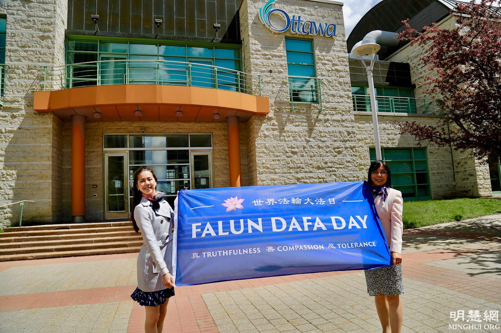

<a name=top>

<a target="_blank" href="https://github.com/sendtruth2020/goodnews2/blob/master/quit/letter.md">

<h2>请收藏本网址，连上免翻视频即时IP https://bit.ly/3ezRQKo </h2>

 

<h1>看更多真相 https://bit.ly/2RQM1hX</h1>

<h1><b></b></h1>

<h2 align="center"><a href="https://github.com/jkujkkj/bird/blob/master/bird02.md"><b>明真相能保命(二)</a></b></h2>

<h2 align="center"><a href="https://github.com/jkujkkj/bird/blob/master/bird03.md"><b>明真相能保命(三)</a></b></h2>

<h2 align="center"><a href="https://github.com/jkujkkj/bird/blob/master/bird04.md"><b>明真相能保命(四)</a></b></h2>

<h2 align="center"><a href="https://github.com/jkujkkj/bird/blob/master/bird05.md"><b>明真相能保命(五)</a></b></h2>

<h2 align="center"><a href="https://github.com/jkujkkj/bird/blob/master/bird05.md"><b>明真相能保命(六)</a></b></h2>
  
  
<a href=https://git.io/souye><h6 align="right">回首頁</h6></a>

<a name=top>

<a href =#15>15. 超凡入圣的绘画震撼了我的心</a>  
<a href =#14>14. 32年前没有喊出的话</a>     
<a href =#13>13. 我的姥姥</a> 
<a href =#12>12. 两家悲、喜剧　警醒世人心</a>  
<a href =#11>11. 救赎与瘟疫一起到来</a> 
<a href =#10>10. 疫情带来新现象：近2000人上网学炼法轮功</a> 
<a href =#9>9. UCSD大学生：法轮大法伴随人生</a> 
<a href =#8>8. SK前能源专务董事：大法净化身心 适合所有人修炼</a> 
<a href =#7>7. 媳妇善待婆婆 以德报怨 全家四代受益</a> 
<a href =#6>6. 真善忍是指路灯　渥太华学员谢师恩</a> 
<a href =#5>5. 加拿大前司法部长：真善忍支撑古老和普世价值观</a> 
<a href =#4>4. 美国内华达州参议员褒奖世界法轮大法日</a> 
<a href =#3>3. 瑞典西人：修炼法轮功　全家受益</a> 
<a href =#2>2. “母亲节”话母亲们的悲惨遭遇</a> 
<a href =#1>1. 美好的缘分 生命的奇迹</a> 
  

  

-------------------------------------

  

<a href=#top><h6 align="right">回上方</h6></a>

<a name=15>

<h1 align="center"><b>超凡入圣的绘画震撼了我的心</b></h1>

2001年11月20日下午2时许，来自15个国家和地区的36名西人法轮功学员在天安门广场打出了写着「真善忍」的横幅，为法轮功进行和平请愿。

【大纪元2021年06月02日讯】在我们人类社会中，道德的提升与败坏有两种主要的因素在起著作用，一种是文艺艺术；一种是绘画艺术。这两种因素是引导人类走向的先锋。

因为今天看到明慧网推出的一段五分钟视频，介绍的是新唐人主办的全世界人物写实油画大赛的金奖得主陈肖平的几幅绘画作品和对她的介绍。看完后内心感到极为震撼，有一些体会，想写出来与朋友们共享与探讨。
  
大家知道，美术对于人类来讲，它会起到一种对人观念上的导向作用，会影响人类的审美观念。比如：如何对善与恶、美与丑的辨别，这些都与我们人类社会的道德是息息相关的，如果人把丑的东西当作美，把恶的东西当作善，那样人类社会的道德就将大崩溃。
  
现代的美术绘画被分为了两大类：一个是传统文化中的绘画技法，现在人把其叫作了「写实派」；另一类就是印象派和抽象派。谈到印象派与抽象派，使我想起了曾经在电视中看到的两个视频，一个是叫一个大猩猩拿着画笔，沾上墨汁在宣纸上作画，画的是乱七八糟，谁也看不懂。可是却被现代的媒体吹嘘成是什么抽象派的经典作品，由一位所谓的专家想象着给观众做着解释，把人带入他的思维后，似乎才能听懂他在说什么。
  
另一个视频，讲述的是一位所谓的绘画大师在作表演，在观众眼前摆放了好几张长方形的桌子，桌子上面铺有绘画的宣纸，旁边有画笔和各种彩墨。在画之前这位所谓的大师开始闭目念咒，然后做着各种奇怪的动作，就跟中国当年练气功的年代，有一个叫什么自然功的，那就是疯疯癫癫的，自己无法控制自己。跟这位绘画大师极其的相似。拿起笔开始作画，画的是什么很难看懂，再拿一块抹布沾上墨汁，还用手掌和肘等部位沾上墨汁，一边蹦跳一边往画上涂抹，画完后这幅画就被媒体渲染成是某某大师的经典杰作。
  
艺术应该给人一种纯善纯美的享受，让人受益。而把一堆大便摆在那就说成是艺术的经品，这是让人在享受什么？
  
然而当我看完明慧网推荐的这这段视频后，虽然只有短短的五分钟，但我的心却被这些画面震撼了。这些画让我领略到了艺术家们那高超绘画的技能，让我彷佛看到了那纯善纯真、活灵活现的人物形象，同时也感受到了绘画中散发出的慈悲与纯正的能量？
绘画中展现出的是慈悲与威严的同在，人性中善与恶的碰撞，正义与邪恶的较量，大法弟子的洪大慈悲与中共邪恶者疯狂迫害的对比，这一切的展现能不让人震撼吗？
  
介绍中的第一幅画表现的是一位法轮大法弟子打坐练功的神圣场景，这幅画展现出了炼功者内心的慈悲和面带祥和的心态，看上去是那样的舒适、恬静，给人的感觉，炼功者已置身于另外空间中那美好的圣境。
  
而在炼功者的头顶展现出的是五颜六色的功柱光芒四射，极其的玄妙壮观。在功柱的上方描绘了四个童真的小婴孩，非常的可爱。这种描绘展现出的是修炼者所修炼的果位和另外空间那美妙绝伦的壮观景象。让人惊叹，使人向往！
  
在中华五千年的文明史上，历朝历代那些艺术家们的绘画或雕刻中，展现出了许许多多神佛那神圣的形象。比如，佛的庄严、菩萨的慈悲、神态各异笑容可掬自由自在的罗汉形象，这些绘画和雕塑所展现出的形象在告诉人们神佛在另外空间的真实存在。给我们的子孙后代铺垫了在将来能够返本归真的道路，是一个极其珍贵的遗产。
  
当有一位观众欣赏完《纯真的呼唤》这幅作品后感慨道：「蛮震撼的！就是说：一个政府可以对人民做出这种事情来……」，真是不可思议。可想而知，这个政府是什么样的政府。作品中这位小女孩「她虽然连嘴都没开，但是可以传达到她内心的感受」。观众的评价给了这幅作品很高的赞赏。
  
因为在绘画中把人性的一面表现得淋漓尽致，并传达给了观众。触景生情，有正义有良知的人们当看到这些绘画后，他们的心岂能不被震撼？
  
1999年7月，大魔头江泽民与中共邪灵狼狈为奸，在中国开始了对修炼「真善忍」的法轮功学员进行了残酷的镇压、迫害，使大法弟子蒙难在中原。
绘画作品中，表现出了大法弟子在恶警疯狂的抓铺下，依然走向了天安门广场去证实大法，维护大法；大法弟子面对中共邪恶者的打骂、诬陷、凌辱，酷刑的折磨，以及对大法弟子器官的活摘。这一切疯狂的手段，都没能使大法弟子后退，更没有倒下。大法弟子在承受着魔难、痛苦和各种压力下，依然是前赴后继的走向街头、村庄，慈悲的给世人讲真相，救度着世人，完成着自己的使命。
  
还有一幅绘画，描写的是在2001年11月期间，那是中共打压最为残酷的年代，来自15个国家和地区的36名西人法轮功学员不惧中共的邪恶，义无反顾的来到了北京，勇敢的走向天安门广场打出了写着「真善忍」的横幅，为法轮功进行和平的请愿。
  
绘画中表现出了法轮功学员对大法坚定的意志和大善大忍的胸怀，震撼了天地，世人纷纷在觉醒，称赞和支持者大法弟子。
油画的金奖得主陈肖平说道：（能画出好的作品）「这个人一定是道德高尚，他才能出好的东西」。
  
是的。中国有句成语：近朱者赤近墨者黑。那些修炼真善忍，按照「真善忍」标准做好人的艺术家们，他们的言行必然是高尚的，他们的绘画作品也一定会打动人心，让人受益的。
  
朋友们，如果您看过这段视频后，当绘画中的慈悲与您心灵的本性产生共鸣时，您一定会被法轮大法「真善忍」的威德所震撼，被法轮功学员在中共残暴的迫害中那种坚定的信念，坚强的意志和不屈不挠的精神所折服。
  
在现实的社会中，法轮功学员与中共魔鬼进行了22年的较量，这是一场佛性与魔性，正义与邪恶的对决，在这场对决中每个世人都必须做出自己的选择，认同谁或者唾弃谁，这是上天在给人最后的机会啊！

【文章来源】https://www.epochtimes.com/b5/21/6/2/n12993985.htm

<a href=#top><h6 align="right">回上方</h6></a>

<a name=14>

<h1 align="center"><b>32年前没有喊出的话</b></h1>

2018年1月2日举行的“解体中共 清除毒瘤”游行人们打出的标语。

【大纪元2021年06月05日讯】转眼就三十二年了。那句没有喊出的话是什么呢？当时的爱国学生们，喊的是“反腐败，要自由”。因为同大多数的中国人一样，学生们对共产党还存有幻想。

幻想党真的会像其标榜的那样伟大、光荣和正确。幻想党会惩除贪污腐败。幻想党会开恩，赐予言论与新闻自由。幻想党真是那“亲爱的妈妈”。
  
结果呢？这“亲爱的妈妈”端起冲锋枪，将一粒一粒恶毒的开花弹射进了天真的、迸发着一腔热血的孩子们的胸膛；这“亲爱的妈妈”开着坦克，硬是活生生地把它自己称为“祖国的花朵，未来的希望”的学生们的躯体碾成了肉酱。
也许只有这些孩子们在倒下时，那死不瞑目的眼睛才能看清这“党妈妈”恐怖狰狞的邪恶面目！
  
三十二年前的我们是天真，幼稚，还是愚昧呢？要求党“反腐败”？那是反谁呢？
 
  
这反贪反腐，不就是要反那百分之九十九以上的共产党的官吗？那不就是反党吗？一贯“伟大光荣正确”的党怎么可能反对自己呢？要求党反腐，自己反自己，实在是无知的梦想！
天真得愚昧啊！要想新闻言论自由？那不就是意味着大家都有说出真相、知道真相的权利吗？不就是要把我党的那些见不得人的真相给抖出来？这不就是要砸我党“伟大光荣正确”的牌子吗？那样，党的脸往哪儿搁呢？党还怎么来面对那些爱党爱得要命的无知百姓呢？谁还会相信党的话呢？那党还怎么能掌握舆论导向、统一口径、统一领导、巩固专制政权呢？
  
从那以后，党变本加厉地压制言论自由、控制媒体网络。不仅在国内，连不少国外的媒体尤其是中文媒体早在党的控制之下了。要求独裁者实行新闻言论自由，那还怎么独裁？简直是愚不可及的妄想！
天真得愚昧啊！当时学生们的幻想来自几十年中共统治下的长期洗脑，祖国的花朵们从小就被教育要忠于党，这个愚忠如今仍在继续遗传着。被党长期洗脑，分不清党和国，分不清党和民。
在纪念“六四”的时候，海内外的同胞们所求的，不外乎是要求、请求、以致乞求党为“六四”平反，追查惩办元凶，允许纪念受难者，赔偿、抚恤受难者的家属，让流亡人士自由回国等等。似乎平反了，那成百上千人的血就没有白流，那些年轻的生命就没有白死。
  
难道当时学生们走上街头、手无寸铁地面对坦克冲锋枪，就是为了今天由“亲爱的党妈妈”亲自出来认可“六四”，为这个世界上最伟大、参与的人数最多、也是最惨烈的学生运动正名吗？似乎只要惩办一二名凶手，其余的凶手就不是凶手，而是身不由己的“好”人了。难道当时的政府不是共产党的政府，而是李鹏一人的政府？这种替罪羊的伎俩，是党惯用的脱身术。屡试不爽啊！何况李鹏还不是“六四”的凶手，因为“六四”没有凶手，天安门没死“一个人”。这是党一再强调的说法。
  
是啊！的确没死“一”个人！这九十多年来，共产党不知给中国的老百姓带来了多少灾难，涂炭了多少生灵，摧毁了多少家庭，破碎了多少中华儿女的理想，又毒害了多少人的灵魂！但每次它都能轻而易举地脱身，靠的就是替罪羊的伎俩。把责任往一二个人身上一推，就与“伟大的”党没关系了。仿佛当时不是党在执政掌权，而是不知怎的，就让一小撮党内的坏蛋篡了权。即使这样，那其余的“好”党员那时又在干什么呢？
  
三十二年过去了，三分之一个世纪啊！同胞们，我们该觉醒了，再不能帮助其玩脱身术了。更何况，现在的党岂不是更腐败、更邪恶、更独裁、更残暴、更猖獗、更善于迷惑人、更精通用利益控制人吗？
  
整个国家，整个中华民族已经被它引到了道德良知丧尽、肉欲横流的人吃人的人间地狱！神州大地早已非人可生活——空气、水、土壤都充满了会导致各种疾病绝症的污染。就这样通过每日的吃喝呼吸，百姓在“中国梦”中不知不觉地被慢性集体谋杀。
  
若我们现在仍旧执着于平反、惩办元凶，那我们实在是比当年的学生更天真、更幼稚、更愚昧！那从无数年轻的胸膛喷出的爱国爱民的热血，真的是白流了！
  
爱国的同胞们，我们该觉醒了。爱这样的党，拥护这样的政府，不就是要让我们的国家和人民继续被其欺压抢掠并胁迫引诱陷在罪恶死亡之中吗？觉醒吧！爱党不是爱国，乃是误国殃民！
同胞们，你若真是爱国爱民，那就让我们一起来呐喊吧。
  
“铲除中共邪党  结束独裁暴政！”这是三十二年前没有喊出的话。
  
“铲除中共邪党  结束独裁暴政！”这是三十二年后应该喊出的话。

【文章来源】https://www.epochtimes.com/gb/21/6/4/n13000181.htm

<a href=#top><h6 align="right">回上方</h6></a>

<a name=13>

<h1 align="center"><b>我的姥姥</b></h1>

【正见网2021年05月15日】
儿时姥姥家住平房，平房很宽敞，卧室和客厅都很大，房子外还有一个大花园，平地种着月季、牡丹，土坡上种着苹果树、梨树、李子树、金针花、向日葵，坡下还有一个葡萄藤，每到收获的季节结的葡萄又甜又大。
  
我家和姥姥家同住一个家属院，上小学时，有那么一两年，由于母亲到外地进修，父亲出差，我便住在姥姥家。每天都是姥姥叫我起床，刷牙、洗脸完毕后，吃早餐。早餐有白粥、馒头和泡菜。姥姥腌的泡菜特别香，长大出国后就再也吃不到那么好吃的泡菜了。
  
姥爷是自学成才，多才多艺，是学校单位的总务科科长，字写得很好，他给学校设计的园艺广受好评，还经常有外宾来参观。姥姥和姥爷非常恩爱，看他俩年轻时的照片就是一对俊男美女。儿时的记忆中，姥姥经常拿着她年轻时的照片对我说：“看我年轻时多美！你妈没有我美，你没你妈好看，真是一代不如一代！”姥姥是个骄傲自信的女强人。她是医院的主治医师，工作兢兢业业，对病人很认真负责，很受尊敬与欢迎。
  
姥姥是满族人，儿时家里很富裕。她经常说：“我们家族属于正黄旗。”但是姥姥的母亲在她五岁时就去世了，缺乏母爱的她，从小忍受了很多辛酸。三舅的女儿两岁时父母就离婚了，表妹是跟着爸爸过，我很庆幸表妹能有姥姥的呵护，姥姥很心疼没有母爱的表妹，她们相伴了很多年。表妹大学毕业后，成为一名很成功的企业家，姥姥跟着享了不少清福。
  
我小时候体弱多病，幸亏有姥姥在身边，看病吃药方便很多。但是姥姥是个严厉的姥姥，每次家人一起相聚吃饭后，洗锅碗就是我的事，还要擦桌扫地。一到快过年过节时，我就不敢去姥姥家，因为她一定会指使我干这干那，一想到这些，我就直打退堂鼓。
  
姥爷在我上小学六年级时，突发心梗去世了。姥姥非常伤心难过，常念叨着姥爷。日子总是要过下去，姥姥平复了心情后，学习唱歌、弹琴，经常外出旅游，日子过得很充实快乐。
  
我二十岁那年和妈妈随父亲移民来美国后，经历了几年艰辛的打拼，生活稍稳定后，决定把姥姥接来住些日子。姥姥满心欢喜地来美和我们团聚。那时我已经修炼法轮大法了，家里电视播放着新唐人，姥姥很爱看，说这是讲真话的可信的电视台。一次播放《九评共产党》，讲到“中共的那些军事家就很厉害的，把这些落难而逃，走难，就变成了是长征。还要加大放大这个里程数，说是二万五千里长征。计算起来根本就没有二万五千里，只有几千里而已。”“最多是上万，说成是二万五千里，多了一倍都不止。”看到这里，姥姥说：“讲得太对了！那就是逃跑，根本不是什么长征！”
  
姥姥在文革时被共产党迫害，经常被单位同事批斗，想起这些她总是很难过。姥爷因为是学校单位干部，被批斗的很厉害。一次，姥爷双手被捆绑在背后，被一群红卫兵从主席台上狠命地推倒在台下，头被磕的流出了血，鼻子也出血了。妈妈那时正值青春年华，由于受邪党毒害是个积极的“红卫兵”，她与姥爷坚决划清界线。每当想起这些往事，她总是很后悔。姥爷为人正派、工作出色，而且胸怀宽广，是“宰相肚里能撑船”，她很怀念过世的姥爷。
  
姥姥来美探亲正值中国新年，她观看了新唐人播放的神韵演出。她说太美了！就像到了天堂一样！中华五千年神传文化真是太精彩了！她深知共产党的邪恶，很爽快地办了“三退”。我给过世的姥爷“三退”了，一次在梦中见到了姥爷，他乐呵呵地笑着，看上去非常纯真和开心！
  
姥姥回国后，生活的很惬意，舅舅们都挺孝顺，孙女孙子们对她也很好。她歌唱的很棒，歌声嘹亮宽广，经常外出散步，交朋友聊天，已经是九十岁高龄的老人了，可是头脑还很灵活，身体硬朗。我想这都是她明白法轮大法真相，“三退”后得到的福报！

【文章来源】http://www.zhengjian.org/node/267337

<a href=#top><h6 align="right">回上方</h6></a>

<a name=12>

<h1 align="center"><b>两家悲、喜剧　警醒世人心</b></h1>

【明慧网二零二一年五月二十八日】五月的江汉平原，铺金叠翠，鸟语花香。在一个古老的小镇，相继上演了一出人间喜剧和悲剧，诠释一个亘古不变的天理。

<b>周家的喜剧</b>

小镇往东出两里，便是周家。这天是周家大喜大庆的日子，为儿子小明操办婚事，迎娶新娘。不只周家人个个笑逐颜开，连善良的村里人都如春风拂面一脸的高兴。
  
是啊，凡见证周家苦难过去的人，谁能不由衷的高兴哩。那时，小明才几岁，跟爷爷奶奶在家生活，爸妈在外地打工谋生，倒也相安无事。就在小明上小学那年，祸从天降。修炼法轮功的爸爸因到北京上访，中途被绑架，在市里关了些日子，后又转到小镇派出所关押。当时正是夏季，白天让他在烈日下暴晒，一动不让动；夜晚扔在地牢的水泥地上任蚊虫叮咬。有些黑心的人一时兴起，搧他几个嘴巴，踢他几脚，消气、取乐，也是常事。折磨了四十多天，才放了他。
  
为了生计，小明的爸爸与妈妈在市里租了铺位卖小笼包子，来往的顾客很多，生意不错。可没几天中共警察又绑架了他，没有也不需要任何借口，只要被盯上就不会放过。这次被关在市看守所长达七个月，他无路可走，只有绝食，躺在水泥地上八天八夜滴水不进，一看不行了，才通知家人接回。只几天功夫，他又缓过来了，又可以卖他的包子了。想不到的是魔掌再次伸向了他，被非法劳教两年，由于遭受毒药毒针的摧残，两年后出来时神情呆痴，不言不语，几近废人。中共对一个善良农民何等的心狠手辣肆无忌惮。这期间，爷爷含恨离世，奶奶哭瞎双眼。
  
而小明像棵树苗，在风雨中成长，小学，中学，大学，研究生，一路顺风，如有神助。如今，小明在南国都市一家央企供职，年薪几十万；新娘则在同一城市的公司任白领，收入颇丰。天赐洪福，羡煞故乡多少人。
华灯初放，夜幕降临，五彩缤纷的烟花在周家上空绽放，把福报的喜悦与千家万户善良人分享。
  
<b>姚家的悲剧</b>

周家的喜剧才落幕几天，一出悲剧在姚家悄悄上演。姚家在小镇的西头，离派出所不足三百米。
  
市里新建了一个外企工厂，要从各乡镇选派一些人到浙江培训三个月后，回厂上班。外企工人，多少人羡慕。姚家的儿子海浪就是其中的一员，这本是幸事。
  
可是谁曾料想，才二十多天，海浪突患脑溢血，发现的晚了，在重症监护室抢救了二十多天，一直昏迷不醒。医生无回天之力，下了病危通知，派车把人送回了家。
  
这噩耗搅的小镇人人心神不宁，怎么会这样呢？为别人惋惜，也为自己担心。六年前海浪的父亲走了，现在他又这样了，这二者是否有什么关系呢？
  
或许与他父亲还真有点关系。海浪的父亲在派出所干了一辈子“编外临时工”，后来改叫“协警”，都是一回事，说白了就是充当中共的打手。凡违法乱纪的事，坑人害人的事，伤天害理的事，都由他冲锋在前，大打出手。开始由于人性未泯，干起来免不了缩手缩脚，领导不满意：就这熊样，还想转正？于是他放开手脚的干，昧着良心的干，心狠手辣，一干就是几十年，这“协警”成了真正的“邪警”。
  
小镇人远远见了他就纷纷躲开，如同见了厉鬼，他还觉的挺威风，洋洋自得。特别是对法轮功学员的迫害，他更是干了许多恶事（如对周家小明爸抽过嘴巴子，后又死扣着身份证不给等等），无明中造下了天大的罪业。
即便这样为共产党卖命，中共也没给他转正，到头来被一脚踢出了大门。不久便得了肝癌，走了。小镇人心里雪亮：“遭报应了。”
  
没过几天，如日中天的海浪也走了，只留下了妻子和一双年幼的儿女在人生旅途上孤苦跋涉。
  
“善恶有报”的古训，被几十年的谎言宣传和刻意欺骗，冲淡了人们的记忆。写出以上短文，旨在唤醒人们对这天理颠扑不破的明晰认知，从而守住自己的善良，远离邪恶，拥有光明美好的明天。

【文章来源】https://www.minghui.org/mh/articles/2021/5/28/426220.html

<a href=#top><h6 align="right">回上方</h6></a>

<a name=11>

<h1 align="center"><b>救赎与瘟疫一起到来</b></h1>

《启示录》第六组挂毯中描述的：一道生命水的河，明亮如水晶，从神的宝座流出来。在河的两边有生命树，生产十二样果子，每月结新果，树上的叶子医治万民。不再有黑夜，因神来做光照。神所救赎的人要做王，直到永永远远。（维基公共领域）

道家陈抟老祖讲：「瘟亡不由运数，骂地咒天」，意思是能否平安躲过瘟疫，与人对天地神灵的态度有关，而与人过去的运数无关。
  
<b>从来都是瘟疫放过了人类，而不是人类战胜了瘟疫</b>

什么瘟疫是被人类彻底消灭的？恐怕没有，有的其实可能只是暂时没有出现而已，萨斯（SARS）、艾滋病、鼠疫等等，至今也没有特效药，人类还是在延续最古老的隔离方式防护。人们越来越信仰科学、越来越自信时，瘟疫的爆发就是对「人定胜天」的最大否定，面对瘟疫，人可控制的因素微乎其微。
  
历史上的每次瘟疫，几乎都是无法解开的谜。雅典瘟疫、古罗马瘟疫、欧洲黑死病，包括中国历代的大瘟疫、西班牙流感等等，几乎都是一样的情况：找不出爆发的根本原因及制止的办法，它突然降临扩散，然后，像是接到了无声指令，突然一下子就神秘消失了。

瘟疫的发生与结束，包括它散播的路向，似乎都有一只神秘的手在冥冥之中指挥，即使有先知预测在先，终是无法避免，最后的结局，从来都是瘟疫放过了人类，而不是人类战胜了瘟疫。
  
目前的科学仅限于在仪器能检测的范围内研究病毒，通过已知现象按经验推测，在表面物质空间抑制病毒的传播，讲卫生、多洗手、戴口罩等等，甚至把全身都包起来，似乎这样就会远离瘟疫，但病毒的诡异几乎不可捉摸：有人百般躲避防护，也难逃一死，身体强壮的不比身体衰弱的抵抗力更强，有人近距离接触甚至与病亡者紧靠以求速死，却完全不被感染。而且，即使同样遇到神医神药，有人可以救治，有人还是会死。
  
<b>纯精神的东西能制约病毒</b>

南宋文天祥被俘后，被囚于湿热腐臭、污秽不堪的牢狱中，那里充斥着各种秽气，在如此环境中生活三年，文天祥却没有生病，什么原因呢？他在《正气歌序》中说：吾善养吾浩然之气，即正气。
  
正气是什么？科学仪器看不见，也检测不出来，但这种纯精神的东西却能制约病毒。文天祥的例子，正符合《黄帝内经》中的「正气内存，邪不可干」，人体内存正气，就能阻挡病邪侵入。其实，文天祥曾遇神异之人教他修习大光明法，他的「正气」，源自于他信佛崇道的内修。

香港文天祥公园，有一块石碑描述文天祥的生平事迹，也刻有《正气歌》。

对瘟疫产生的原因，《黄帝内经》记载：「人气不足，天气如虚，人神失守，神光不聚，邪鬼干人。」这里的「邪鬼」，被现代唯物的医学看成形容病毒严重的比喻了，把「邪鬼」解释成肉眼可见的病毒等微生物，中医典籍中的「神、鬼」，也都被认为是迷信了。
  
现代科学认为气候异常导致瘟疫流行，而站在古代中医的角度看，瘟疫与普通疾病有很大不同，气候失常、寒暑错时，只是瘟疫产生的外因。
  
明代吴有性在《瘟疫论》中指出：「夫温疫之为病，非风、非寒、非暑、非湿，乃天地间别有一种异气所感」，这便是「疠气」，如果将「疠气」解释成现代医学的病毒，显然过于简单。  
  
古代西方认为瘟疫来源于另外空间，由邪灵或神灵的愤怒引起，黑死病当时就被认为是邪灵（evil spirits）进入了人体，现在也有科学家承认，有些病毒很可能存在于人类探测不到的更深空间，是更微观的物质。
  
如果导致瘟疫的邪灵不在现实空间，那么科学研究的所谓对症之药怎么探触得到它呢？邪灵只能由超越物质空间的神灵来降服。这样就不难理解，在三千年前的《波斯古经》里，医学被描述为是对抗邪灵的战争，古巴比伦的内科医生几乎全是祭拜神灵的祭司，而在中国古代，几千年来都是医道不分家，很多神医是修道之人，很多道士也多擅长镇瘟除疫。

在中国古代，几千年来都是医道不分家，很多神医是修道之人，很多道士也多擅长镇瘟除疫。图为神农氏像，出自明仇英《帝王道统万年图》。

<b>为什么神医难医天下病</b>

史载神医有回天之术，道士可施法持咒化解瘟疫，但即使是神医神僧，也只能治愈一部分病患，所谓神医难医天下病，这又是为什么呢？
  
有道之人行医，更懂得顺天道，他绝不会违逆天意。世间的一切安排都有定数，人间圣贤智勇都不能改变。中国有瘟神的说法，天庭中，雷神负责惩戒个人，瘟神则负责毁灭一个地区甚至整个国家。《封神演义》中的吕岳是主管瘟疫的大帝，他统辖六位瘟部正神，各自手下有瘟鬼无数，瘟鬼将瘟疫散在何地，那一地就会出现瘟疫，他们也是按照神的有序安排具体实施而已。
  
佛经中讲疾疫劫，认为疾疫乃超越人的「非人」放到人间的，不是人这层空间的物质因素。如果人德行放逸，行杀生、偷盗、邪淫等不合法度之事，不能守十善业，就会招来疾疫。
  
所以佛教认为，一个人得病与否，不取决于他是否被传染，而取决他自身的业力。业力大的，疾疫已经在暗处瞄准他了，必难逃脱，而没有此种病业之人，即使不防控，也不会染疫。在疾疫中，薄福之人就会因病丧命，这也就是民间讲的「神医医病难医命」的道理吧。
  
道教认为瘟疫是人亏天理造成的善恶报应，道教陈抟老祖在《心相篇》讲「瘟亡不由运数，骂地咒天」，能否平安躲过瘟疫，与人对天地神灵的态度有关，而与人过去的运数无关。人亵渎天地神灵，骂地咒天，是导致瘟疫流行的根本原因。「天地」在传统的东西方文化中，都与神灵有关，如今无神论者剥去了这层最根本的含义，「天地」被唯物化，只局限于科学所能探测到的自然界了。

有道之人行医，更懂得顺天道，他绝不会违逆天意。

在西方，瘟疫直接被说成是神对人的惩罚。古希腊掌管医药的神祗是阿波罗，他能救治病危，却也可以让传染病等瘟疫流行，惩戒亵渎神灵的人。
  
《圣经》六十多处提到瘟疫，明确指出：没有偶然发生的瘟疫，瘟疫是上帝的惩罚，惩罚那些背弃神、忤逆天意之人。当埃及法老的心刚硬时，耶和华就降下瘟疫，警示法老；当百姓淫乱、跪拜外邦人偶像时，神的怒气就向以色列人发作，于是瘟疫一下就蔓延在以色列人中。
  
古埃及的三次瘟疫，指向的是「没有摩西授记」的国家；古罗马三次大瘟疫，指向的是迫害基督徒的人。这定向的瘟疫只感染特定人群及特定地区，或致死致病，或重创促其衰败灭亡，惩罚完毕，神即收手撤离，在人间的表现，就是瘟疫突然消失了。瘟疫是人不治天治的结果，它的发生，证明掌管世界的神以公义平衡着一切。
  
<b>救赎与瘟疫一起到来</b>

瘟疫本身并不可怕，每一年都会有大大小小的瘟疫，它是天地间秩序的一种调节机制。这种调节机制是有规律的，万物按天经地义的法则运行，不顺应的人偏离法则，自然就会被甩离天地的运行轨道，这就是淘汰。违逆天道天理，在人间的表现就是道德败坏、丧尽人伦，这也就是史载疫疠不染孝悌贤良的道理。
  
当大多人关心的不过以「我」为中心、以家庭亲朋为半径的自我小世界的时候，他们认为他人与己无关、他人的痛苦与己无关，但瘟疫打乱了这一切。
  
人们躲在家里不敢暴露在外，对面街上就有人仆倒，隔壁单元就有人染疫而亡，空气中的病毒无所不在，防不胜防。
  
恐慌中，我们仰头向天希求神灵护佑，但我们已经离神太远啊！无神论、进化论的毒害使我们造业无数，战天斗地、亵渎神灵的共业，陷我们于灭顶之灾。不信神、否定神、侮辱神，瘟疫来袭，神怎么护佑你？
  
所以，如果人想自救，比物质上的防护更重要的，是需要精神上的反思，不只是基于政治层面的追究，更应该有个人的反省忏悔：我们为什么会远离神的教诲？那些伤天害理、灭绝人性的事件，我们是否曾经以工作为由主动或被动参与？为了自己家庭子女得到好处，为了保住自己的工作、薪水、正常的生活，我们是否曾违背良心助纣为虐？因恐惧懦弱，我们是否一直在甘当国家谎言的同谋？而那些敢于发声的勇士，都曾是我们嘲笑讥讽的对象，我们对他们的遭遇是否曾麻木不仁？
  
恐慌中，福音一定会来，因为神并没有抛弃我们，与瘟疫一起到来的，还有神的救赎，在灾难之中，神会将我们安定、将我们分别、将我们搭救：「虽有千人仆倒在你旁边，这灾却不得临近你。」

天梯

【文章来源】https://www.epochtimes.com/b5/20/3/6/n11920002.htm

  
  <a href=#top><h6 align="right">回上方</h6></a>

<a name=10>

<h1 align="center"><b>疫情带来新现象：近2000人上网学炼法轮功</b></h1>

宁静的力量。

【希望之声2021年5月26日】（本台记者詹妮综合报导）自从疫情开始在北美蔓延，网络上出现了一种新现象：想要了解和学炼法轮功的人，可以通过网上的介绍会和教功班，达到足不出户便可学习法轮功的目的。从首次网上教功班至今半年多时间，参加学炼的人数已由最初的36人，达到目前近2000人。网上教功得到受众的极大欢迎。
  
法轮功（又称法轮修炼大法）是由李洪志先生传出的佛家上乘修炼大法，按照宇宙演化原理修炼，同化宇宙最高特性“真、善、忍”，是真正性命双修的功法。自1992年5月在中国传出以来，短短数年，法轮功传遍中国；在海外，法轮大法已经传遍世界100多个国家和地区，使上亿人身心受益。
  
<b>近2000人网上学功</b>

法轮功网上教功协调人、加拿大法轮功学员雷时忠博士介绍说，疫情前，北美许多大城市，法轮功炼功点很多，想学炼法轮功的人很容易找到法轮功学员教他们炼功。但疫情破坏了这样的环境，于是加拿大法轮功学员就开始筹备通过网络的形式向民众教功。
  
雷时忠说，去年10月31日，加拿大法轮功学员举办了首次网上教功。首次班只有36人参加，半年多的时间，如今已发展到近2000人参加。
  
雷时忠介绍说，当初每周举办一个班，后来增加到每周两个班。从今年2月份开始，美国新英格兰法轮功学员加盟到加拿大学员中，已增加到每周三个班，现在每周有四个班。在此基础上还举办了法语班，中文班也将在近期开班。
  
雷时忠表示，疫情发生之后，人们意识到人在瘟疫面前的脆弱，人们希望找到一个有效的祛病健身的方法。据北美的民意调查显示，想打坐炼功的人数与疫情发生之前相比增加了30%。
  
<b>好评如潮：终于找到了能使身心提升的功法</b>

据了解，来参加介绍班的大多是因为想祛病健身，他们听说法轮功在祛病健身方面有奇效，一些行动有障碍的人，当得知他们也可以炼法轮功时，也特别高兴。很多人在学功的时候感受到了身体内强烈的能量流，当时病痛就得到了减缓，睡眠质量有明显提高。于是他们纷纷在留言中，赞扬法轮功的神奇。
  
加拿大安河金士顿（Kingston）市议员奥萨尼克（Lisa Osanic）在参加了今年5月1日大约两个小时的法轮功网上教功班后表示，“网上教功课让我太满意了，当晚我睡得非常好，我想是因为参加了学功班的缘故。我会观看更多网上课程学习炼功动作，并把这些动作都记住。”
  
一位叫费雷（Ferree）的女士第一天进班，只是想了解一下被中共残酷打压的法轮功究竟是什么。可是第二天，她却参加了全程将近两个小时的介绍班，还表示，“（我感到）全身发热，放松。”
  
一位来自卑诗省经营高级生态度假村的西尔克（Silke）女士说：“我几天前向神祈祷时说，请您给我指出一条修炼的路吧！”第二天无意间便在脸书上看到法轮功免费教功的消息，她立刻注册了！
  
桑尼亚（Sonnia）：“我上颚疼痛了几周，在参加介绍班时，疼痛完全消失了。”
  
德里斯（Derryce）：“我有严重的关节炎，但两臂炼（法轮功）动功时什么问题也没有了。”
  
纳什（Janice Nash）女士：“看到（法轮功的动作）时，让人看到时全身都放松了。”
  
洛斯梅里（Rosemery）：“我今天（跟着李老师录像）炼完功了，还感到身体里的能量流在循环。我想我终于找到了我要找的了！”
  
来自哥斯达黎加的乔琳达（Joelinda）太太：“（法轮功）太奇特了！我感到我的周天（meridian）都通了，我非常感激，炼功时一直想哭。”
一位非裔小伙：“我已经花了几千元寻求一种修炼方法，今天你们免费提供给大家，真是太感谢啦。”
  
更多留言的人表示：终身都在寻求一种身心提升的功法，今天终于找到了。

【文章来源】https://www.soundofhope.org/post/509030?lang=b5
  
  
 
<a href=#top><h6 align="right">回上方</h6></a>

<a name=9>

<h1 align="center"><b> UCSD大学生：法轮大法伴随人生</b></h1>

 2021年6月，就读于加州大学圣地亚哥分校（UCSD）的Philip Zhu将完成人生一个重要里程碑——大学毕业，毕业后他将继续在本校攻读博士。学有所成值得庆祝，不过他说，到美国学习更大的意义，是重新走回法轮功修炼。图为Philip Zhu（后排左）在UCSD校园炼法轮功。（大纪元）

【大纪元2021年05月14日讯】（大纪元记者杨婕美国圣地亚哥报导）今年6月，就读于加州大学圣地亚哥分校的Philip Zhu将完成人生一个重要里程碑——大学毕业，毕业后他将继续在本校攻读博士。学有所成值得庆祝，然而他说，到美国学习更大的意义，是重新走回法轮功修炼。

在中国时，Philip Zhu从小跟随父母修炼法轮功。但是1999年7月，中共开始了对法轮功的镇压，他的父母后来都被迫害。母亲被非法关押，在他6岁时被迫害致死；父亲为躲避中共绑架长期流离失所。他由不修炼的家人照顾。家人因为害怕，在家里不谈任何跟法轮功有关的事，加上社会环境的压力，他失去了修炼的机会。
  
几年前，他来到美国上大学。「我从小就知道大法好，知道大法能正人心。到了美国后，我更感到大法难得，机缘难遇，因此又重新走入修炼。」
回想起来，Philip说，「虽然在中国时我后来没有修炼，但是从小打下的修炼基础其实对我影响非常大。」
  
他举了一些在学业上的例子。「因为从小受大法影响，思维很开阔，不会陷在僵化的观念中，这对我的科学学科的学习特别有帮助，因此我的数理化成绩都很好。」
  
「而且我对名利也看得比较淡，很自然地没有对考试成绩的负担，不会为了应付考试学习，而是为了希望明白问题的根源而学习，所以往往能够静下心来思考得很深，考试成绩自然都很好，」他说，「其实这也是李洪志师父教导的，无求而自得，作为学生，不执着成绩，但是好好学习，自然就有好成绩。」
  
因此，虽然在中国升学考试竞争激烈，而他又因为父母修炼法轮功而受到更多压力。父母因为被单位开除，他也无法被分到按学区分配的好学校，但是他仍因为很好的成绩，通过考取的方式上了好学校，并且在这之后又考入了重点班。
  
在为人处事上，他说也从法轮功中受益良多。「虽然后来没有修炼的环境，但从小在大法修炼中学到的关于做人的法理，也一直伴随着以后的生活。要修「真」，所以不说假话，不骗人；修「善」，知道不应该占人便宜，也不会算计别人；修「忍」，和同学有矛盾就反思自己，不去指责抱怨别人。」
  
Philip说，重新修炼后，他继续从法轮大法中受益，而且他也有机会参加多种「讲真相」活动，尤其在UCSD校园，让更多人知道法轮功的美好和被中共迫害的真相。
  
Philip在中国时的同学、后来也在美国学习、工作的Eric谈起Philip留给他的印象时说：「Philip是很有探索精神的人，他对物理、化学特别感兴趣，很聪明，但他很随和，不会欺负人，同学们对他的印象都挺好的。」
Philip的美国校友、曾做过室友的Osvaldo Vazquez对Philip的印象是：「非常好的人，很安静，从来不跟人争吵，热心助人。」Vazquez说，自己和另一个室友经常会向Philip请教一些学业问题，「他总是非常耐心解答，直到我们清楚为止。」
  
Vazquez并说，Philip给他的另一个印象是「坚持自己的信仰」。他说：「我有时看到Philip在校园发法轮功的单张，并且和其他中国学生谈论法轮功，当遭受其他中国学生质疑时，他会坚持自己的信仰，这很好，认定自己的信仰。」
  
Philip说，因为在中国从小受迫害，环境的压力让他很内向。「其实我内心非常希望朋友们知道大法的真相，可是在那种压力下，哪怕是在最亲近的家人面前也没勇气开口提及与法轮功相关的话题。心里最强烈的想法却没有任何人可以交流，从小憋在心里十几年，也因此十分内向。直到重修大法后，我突破了心理压力，变得开朗了。有一年暑假回国，我的高中班主任也说我变得更开朗健谈了。」
  
他并说：「修炼给我带来最珍贵的收获之一，就是内心的祥和，思想中装的不是发泄、不满的恶念，而是遇到什么不顺利的事，都能理性、开心的坦然面对。」
  
他以最近遇到的一件事为例。「我用电锯做一件东西，不料发生了意外。当时我手指头被电锯压到了，出了很多血。看着手指的血流到地上，我首先想到的是我的师父李洪志先生说过的『好坏出自一念』的法理 ，所以我并没有慌张或抱怨，而能保持平静。过了一会血就止住了，一点儿也不影响我继续做事情。」
  
小学升中学，中学升高中，高中毕业到美国上大学，然后接着读博士。很多华人青年都在走这样一条路。对Philip来说，在没有父母的看护下走过这一段路，有另一层不易。但他说：「其实一路走来，虽然我非常感激其他家人对我身体上的照顾，但是我心灵的力量是来自大法的。我从修炼法轮大法中受益很多，因此我对我的师父李洪志先生心怀感恩。我也希望更多人了解法轮功真相，不随便听信中共的造谣诽谤。」

【文章来源】https://www.epochtimes.com/b5/21/5/14/n12948085.htm

<a href=#top><h6 align="right">回上方</h6></a>

<a name=8>

<h1 align="center"><b>SK前能源专务董事：大法净化身心 适合所有人修炼</b></h1>

SK能源蔚山炼油厂前专务董事金熙东。

SK能源蔚山炼油厂前专务董事金熙东自年轻起对于修炼一事就抱有极大渴求，大学时期也曾多次入寺修炼，但他认为，“当今的佛教修炼太过形式化，并非我一直所求”。

去年，他在位于首尔松坡区的河边公园散步时，接触到在那里炼功的法轮功学员，通过传单上的网址在天梯书店购买了《转法轮》一书后，他于8月份参加了在天梯书店开设的九天学习班。

SK能源是韩国最大的综合能源化工企业，金熙东任职的蔚山炼油厂拥有每年加工4,200万吨原油能力，保持全球同行业单厂炼油能力之纪录。由于身居要位，他的脾气暴躁易怒且固执，而修炼后，他首先体会到的是内心的改变，“由于此前我在公司担任要职，遇到问题需要雷厉风行地作出判断，也因此脾气暴躁，很容易发火。而修炼后，我能够尽力做到忍，不像以前，发生什么事情都是别人的错，学会了找自己的原因，不把责任归咎于别人，也不像以前那样经常和别人发生争执。”

他曾把在公司杀伐决断的作风带入家庭，在家中说一不二，而修炼后家庭也变得更和睦美满，“现在我明白听取家人和子女的意见也很重要，脾气变好了许多，周边的人也因为我的改变，对大法很认同，都知道大法好。”

曾喜欢在雨雪天气登山，享受山景风光的金熙东膝盖关节受损严重，时常感到疼痛，不得不放弃登山，而修炼后，今年71岁的他不仅上下楼梯台阶毫无滞碍，也重拾登山的爱好。另外，他讲述道，“之前我的腰和脊椎受过伤，每次换季的时候腰都很疼。神奇的是，去年8月修炼之后，疼痛基本消失，以前经常去韩医院接受针灸，现在也不需要了。”

他感叹，“可能是因为心灵修养提升了，身体也得到了净化。我作为初学者，体悟还不是很深，但大法真的非常好。”

感受到法轮大法的神奇与美好，金熙东希望更多人能够走入修炼，“大法没有其它的条条框框，无需戒肉，无需出家，适合人们在生活中修炼。修炼人至少能够成为善良的人，这样的人增加，我们的社会会更加和平。我希望更多的人能够和大法结缘。”

他还表达了期待法轮功创始人李洪志先生莅临韩国讲法的希冀。
  
【文章來源】https://www.epochtimes.com/gb/21/5/11/n12938320.htm

<a href=#top><h6 align="right">回上方</h6></a>

<a name=7>

<h1 align="center"><b>媳妇善待婆婆 以德报怨 全家四代受益</b></h1>

愿天下的婆婆和媳妇们，都能亲如一家人，共同为心爱的男人共创美满家庭

  
  【大纪元2021年05月20日讯】2021年5月13日第22届世界法轮大法日，海内外法轮功学员纷纷通过明慧网发表修炼心得文章，讲述修炼法轮功，如何按“真、善、忍”做人，身心受益，家庭和睦的故事，以表他们对法轮功创始人李洪志大师的感恩之情。
  
  我是农村妇女，今年五十六岁。1998年我开始修炼法轮大法，是慈悲的师父拯救了我的命运，使我变成了一个全新的我，给了我一个完整的家。而且我们六口之家，人人受益。

<b>一、以德报怨</b>

我结婚不久，婆婆就让我们搬出去住。除了两万元的债务，其它的什么也没有给我们。我们夫妻靠种田吃饭，年收入微薄。整整十年，我们才还完了这两万元的外债。可以想像，我们的日子是怎样过的。

我婆婆是村子里出了名的厉害人，我很老实。大伯嫂厉害，婆婆敢虐待我，不敢得罪大伯嫂；有好吃的东西，给大孙子吃，不给我儿子吃；过年杀了猪，叫大伯嫂去吃肉，不叫我们。

一次，一个债主来找我要钱，说是婆婆拿了给人家保媒的好处费，五百元。结果保媒没成，人家就来要钱。婆婆让我们还，我不愿意还，婆婆就蛊惑公公举锹来劈我，我被吓得休克了过去。

我丈夫脾气暴躁，嗜赌、好酒，不顺心就打我。我常常挨打，甚至被打伤，不得不去医院治疗。我在家只有干活的份儿，还得干大头。家务活我干，田里的农活我也得干，还得管孩子。我活得很苦、很累，经常以泪洗面。久而久之，我的精神遭到了很大的打击，公公、婆婆、丈夫不但欺负我，对孩子也不好，这成了我的一块心病。

每次见到和我要好的姐妹，我就和人家诉苦，诉不完的苦。两三个小时，就听我一个人絮叨，真是三天三夜也说不完。我悄悄攒了八百元钱，准备在孩子长大一点后，我就去法院起诉，跟丈夫离婚。

1998年8月，在本村一个好友的介绍下，我有幸走入了法轮大法的修炼。我看师父的讲法录像、听师父的讲法录音、读师父的著作《转法轮》。我知道了我为什么这样苦：人的所有苦难，都是生生世世欠下的业力造成的，人干坏事是产生业力的根源。我今生今世这么苦，是因为自己前世欠下的业债。

师父说：“因为人在以前做过坏事而产生的业力才造成有病或者魔难。遭罪就是在还业债，所以，谁也不能够随便改动它，改动了就等于欠债可以不还；也不能够随便任意去做，否则，就等于在做坏事。”[1]

法轮大法博大精深的法理温暖了我的心，“真、善、忍”的光辉驱散了压在我心头十几年如巨石般的阴霾，我终于见到了阳光。我的心敞亮了，我不再哭了，天天那个乐啊，街坊邻居都说我变成了另外一个人。

师父教导我们做好人，做更好的人，我要按师父的要求做。我主动接近婆婆，用善心对待公婆，他们对我再不好，我都不放在心上。他们不修炼，被尘世所迷；我是修炼人，是懂得天理的人，就应该高姿态。我该怎么对他们好，还怎么对他们好。

公公婆婆有四个子女，大伯哥全家远走他乡，是因为公婆霸气，大伯嫂一气之下非走不可；二伯哥不幸病亡；小姑子患病，无能为力；只有我和丈夫在公婆身边。公公婆婆单居，丈夫要么打工，要么打麻将去了，难得在家。公公婆婆抓不到儿子，家里的一些杂活就找我去帮忙。

我是炼功人，逢求必应。种菜、购物、洗衣服、有病请医生甚至去医院，婆婆都来找我。师父让我们为别人着想，我每次都是放下自己的活，去帮助公婆。我为他们跑前跑后，又忙又累，从没有怨言。

丈夫不出去打工，也不把田里的活搁在心上，而是麻将馆里的常客。我叫他下田干活，他就发火，骂我、打我。我不恨他，我该干活还干活。我知道自己是在还债，所以心态很好，打消了想离婚的念头，把八百元私房钱拿出来作为家用。

<b>二、孝敬公婆 做个更好的人</b>

中国人讲“百善孝为先”。常人中的好人都能做到对老人尽孝，我是修炼人，应该比常人做得更好，对老人更孝顺。虽然儿媳不是公婆生的，但是为人都有双重父母。作为儿媳，更应该善待公婆。

师父说：“在各种环境中都得对别人好，与人为善，何况你的亲人。”[1]那么我作为弟子，就要听师父的话。

公公婆婆为人处世蛮横，张嘴就骂人。我了解他们的脾气秉性，公婆骂我，我不还口。我记住师父说的：“作为一个炼功人，就得做到打不还手，骂不还口，用高标准要求自己。”[1]

修炼法轮大法前，我是绕着公公婆婆走，我想：惹不起，还躲不起吗？我对他们“惧而远之”，只求个平安。我修炼大法了，不能再那样了。公公婆婆一年比一年老，身体更是一年不如一年，没人照顾不行。

我就经常去看他们，有什么活就帮他们干；公公婆婆一旦有个头疼脑热，就及时去给他们买药；婆婆把他们两人的脏衣服拿出来叫我洗，我当时就给她洗干净。公公婆婆不但种自己的田，还包了大伯哥一家的田。由于他们年迈，干农活很吃力，就年年找我和丈夫去给他们干。丈夫出外打工，就找我干。公婆很自私，农活得先给他们干，他们的活干完了，才能干我们自己家的活。就这样，我一直干了十几年。

那一年，丈夫打工不在家。一天半夜，患脑血栓的公公“当当”来敲大门，我被惊醒。他说：“不好受。”因为半夜没车可坐，等到天刚放亮，我就带公公打车去了县医院。我楼上楼下地搀着他，他踉踉跄跄，我怕他摔倒，几乎是背着他上下楼。他感动地边哭边对我说：“还是你心眼儿好，我儿子就是在家，他也做不到。”

医生检查完了，说：“没事。”婆婆说公公磨人。我想：“老小孩，小小孩。公公就是老小孩。”我没怨恨他。

公公去世后，婆婆的衣食住行等事，就全靠我了。婆婆指望不上儿子。我是修炼人，不能袖手旁观。大法的法理讲慈悲，对谁都得好，何况是自己的家人，自己的婆婆呢！

婆婆爱吃面食，我就给她买馒头、面包、蛋糕等，也给她买牛奶，买奶粉等。婆婆经常生病，我为她请医生或者领她去医院。打点滴时，我陪着她。

后来婆婆肠道不好，经常把大便便在裤子里。每次我都给她清理干净，再把脏裤子洗净，有时一天洗两三次。一次，我给她清理大便，她感动地含着泪问我：“你不嫌我埋汰吗？我多埋汰。”我说：“我不嫌弃你。谁不得老啊，都有这一天。”

婆婆哭了，说：“你比我闺女都强。你对我这么好，我过意不去。你到我家后，我没对你好过，你没享着一天福。我这辈子还不上你了。”我说：“我不用你还。”她说：“你是个好孩子，你错不了。我谢你。”我告诉婆婆：“你谢谢大法师父吧！”我跟她说：“过去我恨你，现在我炼法轮功了，我不恨你了。你老了，我瞅你挺可怜的。”婆婆止不住地哭，一再重复着说：“你是个好孩子，你错不了，你是个好孩子，你错不了……”

去年冬天，我丈夫准备出去打工，可婆婆病重了。我劝丈夫说：“你别出去打工了。咱妈病重，你应该在她身边照顾她。你不在家，我活多，怕一时有照顾不到的地方。挣钱不在这一时，免的老人走后你后悔，留遗憾。”在我的劝说下，丈夫没去打工。当天就到婆婆身边去住了，日日夜夜守候着病危的婆婆。

二十几天后，婆婆安详离世，高龄八十七岁。婆婆的大儿子、大儿媳、大孙子均没有返乡送婆婆。婆婆的女儿已故，女婿也没有来。我和丈夫按民间的风俗安葬了婆婆。

婆婆的这场丧事，是在本村几名法轮功学员及家属的全力帮助下完成的。我丈夫非常感动，因为他没有亲人为他帮忙，他从内心里感谢法轮大法。自那以后，我丈夫对大法师父非常尊敬。

<b>三、儿孙获福报 儿媳护大法</b>

我儿子童年起就知道法轮大法好，支持我修炼，支持我讲真相救人，他也陪我去讲真相。儿子读小学时，学校发给学生每人一本诬蔑法轮功的课本。他看后说：“我妈是炼法轮功的，不是书里说的那样。”他在全班同学的面前，撕毁了那本害人的书。

儿子成年后开始打工。他给工友们讲大法真相，还帮人们三退（退出中共的党、团、队组织）保平安。后来，儿子得到了一个好心人的栽培，掌握了建筑工程技术，年收入可观。

孙子从小到大愿意和我在一起，和我睡在一起。朝夕相处中，幼小的孙子知道奶奶对他好，知道奶奶是炼功人，知道法轮功好。他懂事后，我给他念大法书，他爱听；我放大法弟子创作的歌曲和演出的视频，他爱看；我教他背师父《洪吟》中的诗词，现在他会背许多师父的诗词。他还能自己独立读《转法轮》。

孙子不仅仅学法，还能按照大法的要求去做。同学一旦欺负他，他从不还手，也不生气。师父给我孙子开智开慧，他的学习成绩优异，在班级名列前茅。

儿媳进门十余年来，从我身上看到了法轮大法的美好，法轮大法弟子是好人。她的性格外向，能言善辩，一旦遇到不公，她敢站出来打抱不平。

有一次，她在长途公交车上，后面坐着的一个男乘客公然诋毁大法师父，还说没人再炼法轮功了。儿媳立刻站起来，她转过身去，冲那人大声训斥道：“谁说没人炼了？！我就是炼法轮功的！法轮功是修佛的，是修善的，是让人做好人的，你说哪点不好？”那人被问的张口结舌，呆若木鸡。车上的所有乘客都注视着儿媳，佩服她的胆量和勇气。

还有一次，儿子带媳妇去省城医大看病，在那里遇到了两个同乡。他们在一起聊天，聊到了法轮功。其中一个人说：“法轮功不好，又自焚、又发传单的。”儿媳说：“法轮功咋不好？要是都炼法轮功，就没有坏人了。我婆婆就是炼法轮功的，她身体好，心眼儿也好，遇事总是为别人着想，和谁也不争不斗。”对方听她这么一说，就不再说什么了。

我和我们全家人都沐浴在法轮大法的佛光之中。我期盼所有的有缘人都知道法轮大法好，拥有光明的未来！

注：
[1] 李洪志师父著作：《转法轮》

【文章來源】https://www.epochtimes.com/gb/21/5/19/n12961605.htm

<a href=#top><h6 align="right">回上方</h6></a>

<a name=6>

<h1 align="center"><b>真善忍是指路灯　渥太华学员谢师恩</b></h1>

【明慧网二零二一年五月十日】（明慧记者英梓渥太华报导）二零二一年五月七日，在世界法轮大法日来临之际，加拿大首都渥太华部份法轮功学员交流了自己得法、修炼的心路历程，用亲身的经历见证了正法洪传的殊胜伟大，并表达了对师尊的敬意和感恩，同时祝师父七十华诞生日快乐！

<b>上百份贺信褒奖　十余城镇升旗、亮彩灯表达敬意</b>

戴工羽（右）和女儿展示将在加拿大城镇升起的法轮大法日旗帜。

加拿大法轮大法学会负责人戴工羽女士回忆二十二年前第一个法轮大法日时表示，往事历历在目。她说：「第一次庆祝世界法轮大法日是二零零零年，当时收到当年总督、副总理、文化承传部长等六十多位政要的贺信。之后每年我们都收到众多贺信和褒奖，累计近千封。这充份说明了，法轮大法的普世价值跨越了种族和文化，对一个更健康、和平、宽容和富有同情心的社会做出了贡献。」

戴工羽说，除了贺信和褒奖外，今年加拿大十多个城、镇政府会以特别的方式──升旗或亮彩灯，来庆祝法轮大法洪传二十九周年和庆祝「五一三」世界法轮大法日，对大法福泽社会和人民表达敬意。

戴工羽介绍，这些都是当地政府对法轮大法学员贡献的认可，对法轮大法的致意和对真、善、忍普世价值的认同。这种认可将帮助当地居民进一步认识到大法的益处，为其选择美好未来奠定基础。

<b>「真善忍是指路灯」</b>

戴工羽（右）和女儿展示将在加拿大城镇升起的法轮大法日旗帜。

韩裔法轮功学员李京玉（Kay Lee）退休前是联邦政府的系统分析师、特殊领域专家（SME）。二十年前的五月，她在机场偶然遇到来自世界各地参加加拿大法会的法轮功学员，并得到了一份传单。回家后，她按照传单上的网站，找到了《转法轮》。

「我如饥似渴的读着，爱不释手。从那时起，我知道我不需要阅读其它书了。这本书不仅回答了我生活中的所有问题，还给予了我更多……」读完后，她内心的震撼无与伦比。

修炼后，许多神奇的事情在李京玉身上发生了。她子宫里一个棒球大小的良性肿瘤不翼而飞了，因生活压力变得粗糙的皮肤越来越光滑、细嫩；持续的疲倦感也消失了。更重要的是，她的心变得更加平静、祥和，强烈的怨恨和负面情绪渐渐消退。

几年后，李京玉利用业余时间参与英文大纪元的制作工作，希望通过媒体把真实的信息传递出来。初期，她常常因报纸制作无法及时提交印刷厂，感到压力重重，甚至有放弃的想法。

接下来的一段经历让李京玉终身难忘。二零零七年，她在美国参加了为期两天的特别培训。期间她有幸见到了师父并聆听讲法。在问答环节，李京玉向师父提出了自己面临的困境。她单纯、率直的提问让在场的所有学员都笑了，师父也笑了。

之后，师父用缓慢、温和的语气回答了她的问题。第一句话就是「你太累了。」一句话，让李京玉深受感动，她感受到师父巨大的慈悲。接下来师父告诫她多学法，并建议让其他人分担一部份工作。然后师父停顿了一下，带着灿烂的笑容说：「不要放弃！」

李京玉说：「今年是我在大法中修炼的第二十年。真、善、忍原则是我日常生活中每一天都在闪亮的指路灯，让我积极乐观，内心平静，每天都感到幸福和满足。我要向师父表达最深的谢意，并祝师尊生日快乐。」

【文章来源】http://big5.minghui.org/mh/articles/2021/5/10/424829.html

<a href=#top><h6 align="right">回上方</h6></a>

<a name=5>

<h1 align="center"><b>加拿大前司法部长：真善忍支撑古老和普世价值观</b></h1>

【明慧网二零二一年五月十三日】（明慧记者英梓渥太华报导）加拿大对华政策跨国议会联盟联合主席、前加拿大司法部长、检察长、知名国际人权律师、学者考特勒（Irwin Cotler）先生在法轮大法洪传二十九周年之际，发出视频祝贺。他邀请人们共同参加世界法轮大法日的庆祝。他表示，真善忍既支撑了古老中国价值观念，又反映了普世的价值观。

加拿大对华政策跨国议会联盟联合主席、前加拿大司法部长、检察长、知名国际人权律师、学者考特勒（Irwin Cotler）先生在法轮大法洪传29周年之际，发出视频祝贺。

考特勒先生说，虽然，遗憾的是，我们无法再像往年一样，和法轮功学员、议员和支持者共同在议会山上庆祝，但是，还是他还是邀请大家参与庆祝活动。
「我很欣赏法轮功的价值基础，包括真善忍，这些准则既支撑了古老中国价值观念，又反映了普世的价值。」

考特勒表示，法轮大法日庆祝活动不仅标志对真善忍价值观的认可，希望也标志着在中国境内外自由庆祝真善忍的起点，这样，所有人都可以在精神上、身体上和心灵上受益。数以百万计的人因为认可真善忍的价值观而受益，而这些价值观与我们共同庆祝的古老中国的价值观和普世价值是一致的。

考特勒在视频中介绍，自一九九九年十一月首次参与选举以来，他一直参与营救被迫害法轮功学员的工作。

他说，遗憾的是，中共灭绝法轮功的运动也到了二十三年了。中共定罪的不仅是这种信仰的打坐活动的基本自由，而且按照中国政府的说法，它将法轮功定性为刑事犯罪等，因此导致（中共）国家精心策划的政策和手段──任意逮捕、监禁、酷刑，以及起诉、拘留和非法强摘器官──这是杰弗里﹒尼斯爵士（Jeffrey Nice）主持下的中国人权法庭所称的「反人类罪」。

他在视频中回忆了迫害刚刚发生时的故事，「我当选国会议员不久，我接手的第一位『政治犯』的案子就是我在麦吉尔大学的同事、法轮功学员张昆仑教授的案子。他去中国探访家人，不幸的是，因修炼法轮功，他被（非法）拘留，期间，他被任意逮捕、监禁、折磨。」

考特勒说：「由于此后各党派议员的全面参与，他得以获释。从此以后，在我的整个国会议员的生涯中，我一直与各党派同仁一起参与捍卫政治犯的人权，以抗议中共这些迫害和（非法）起诉的政策和做法。」

在制止活摘器官的过程中，让考特勒感到高兴的是，加拿大在打击活摘器官立法方面的进展。参议院已经通过了（制止活摘器官的）立法S-204，现在该法案已经到达众议院的审议。他说，我们最终将引入这项立法，解决和纠正非法强摘器官（的罪行）。

「我期待有更多的（法轮大法日的）庆祝活动，并希望法轮功自由地庆祝（他们的节日）。期待中国和国际上的中国人，以及参与修炼的所有人都受益。谢谢你。再次为庆祝活动奉上最佳祝福。」

【文章来源】http://big5.minghui.org/mh/articles/2021/5/13/425253.html

<a name=4>

<h1 align="center"><b>美国内华达州参议员褒奖世界法轮大法日</b></h1>

美国内华达州参议员凯莉‧安‧巴克（Carrie Ann Buck）褒奖世界法轮大法日。

【大纪元2021年05月03日讯】为庆祝2021年5月13日第22届「世界法轮大法」日，美国内华达州参议员凯莉‧安‧巴克（Carrie Ann Buck）签发褒奖令，褒奖世界法轮大法日。

参议员凯莉‧安‧巴克签在褒奖中称赞法轮功「真、善、忍」原则，表达对法轮大法创始人和修炼者的感谢，并肯定法轮功对社会做出的杰出贡献。

内华达州参议员凯莉‧安‧巴克签发褒奖令。（明慧网）

褒奖译文如下：
鉴于，法轮大法也称法轮功，是一种修炼，世界上数百万人已将这种修炼融入到他们的生活中；并且

鉴于，根植于古老的中国传统，法轮大法包括道德教导、打坐和四套缓慢的动功功法，对于改善健康、增加能量有独特的效果；并且

鉴于，法轮大法的核心是「真、善、忍」原则，「真、善、忍」是宇宙的特性。法轮大法鼓励人们在生活中遵循这一原则；并且

鉴于，许多修炼法轮大法的人身心获得巨大改善，比如精力充沛、思维敏锐、压力减缓，许多人找到了使他们获益匪浅的修炼方法；并且

鉴于，法轮大法由李洪志先生传播于世。李洪志先生是中国长春人，目前定居于美国。他五次获得诺贝尔和平奖提名；并获得自由之家颁发的国际宗教自由奖；也获得了欧洲议会萨哈罗夫奖提名；并且

鉴于，法轮大法的原则是「真、善、忍」，能提升人的心灵境界。法轮大法的书籍已被翻译成四十多种语言。法轮大法让人重德，改善人们的福祉。自从法轮大法于1992年5月13日从中国传播以来，一百多个国家和地区的近一亿人已从中受益；并且

鉴于，内华达州的法轮大法学员于1998年通过免费教功、游行、艺术展和教功班将法轮大法带给拉斯韦加斯和雷诺市的数万居民。法轮大法学员希望人们能享有健康、和睦的生活。

因此决定，值此特别的日子，我们褒奖法轮大法的美德，褒奖法轮大法对我们社会做出的杰出贡献；并且

进一步决定，我们与美国东西海岸的人们，以及世界各地的人们一道，褒奖第22届世界法轮大法日，以及法轮大法洪传于世29周年。

2021年5月13日
内华达州参议员
凯莉‧安‧巴克（Carrie Ann Buck）
数据源：明慧网， 内华达州参议员褒奖世界法轮大法日

【文章来源】https://www.epochtimes.com/b5/21/5/3/n12921790.htm

<a href=#top><h6 align="right">回上方</h6></a>

<a name=3>

<h1 align="center"><b>瑞典西人：修炼法轮功　全家受益</b></h1>

【明慧网二零二一年五月七日】（明慧记者何平瑞典采访报道）今年的五月十三日是第二十二届世界法轮大法日暨大法弘传29周年，同时也是法轮功（法轮大法）创始人李洪志师父七十岁华诞。来自瑞典北部于默奥市（Umeå）的西人法轮功学员伊娃一家向李洪志师父献上最诚挚的感恩和祝贺：“感谢师父把法轮大法传给了我们！恭祝师父生日快乐！”

瑞典法轮功学员伊娃（右）和约尔根（左）及他们的三个孩子，一家五口双手合十向师父表达最诚挚的感恩和祝贺：“恭祝师父生日快乐！”
大法改变了我的性格

拥有生物学硕士学位的伊娃（Eva）是瑞典一家报社记者，二零零六年开始修炼法轮功，她和丈夫约尔根（Jörgen）还有他们的三孩子居住在瑞典北部的于默奥市。他们夫妻恩爱，孩子们聪明善良又懂事，一家人其乐融融。

瑞典法轮功学员伊娃（Eva）在晨炼，她正在炼法轮功的第二套功法。

伊娃回顾起自己十五年来的修炼历程，总是按捺不住内心的喜悦和感恩，她说：“这一切都归功于法轮大法，我永远都感激师父。我曾是一个很有个性、特别执着自我的人，这些年我尝试着把自己的修炼贯穿于日常的工作生活中，时时提醒自己按照真、善、忍的原则去面对发生在身边的各种事情。我不再掩盖自己的缺点，有了问题，学会了先查找自己。观念一转变就会发现，往往出问题的原因都出自于我的自私和自我。我不会再埋怨、抱怨、去激化矛盾了。”

她接着说：“当然有时能做到，有时还不能做到，但我会遵循大法的要求努力来归正自己，尽量在下一次做好。这样一来，卓有成效的化解了矛盾，缓解了很多来自各方面的压力，逐渐我的性格也发生了改变。修大法使我在处理家庭社会的人际关系方面也得到了很好的改善。夫妻关系变得融洽、彼此尊重，家庭和睦。”

<b>丈夫恢复健康　精力充沛</b>

伊娃的丈夫约尔根是一位环境学博士、高中老师。伊娃介绍说，“约尔根以前是个唯物主义者，从不思考未经科学证实的东西，很固执。他对事情的看法总是持悲观态度，是一个很容易疲倦的人，每天必须要午睡。他的心脏还有问题，但医院也检查不出是什么病，医生就建议他服用抗抑郁的药物，被他拒绝。二零零七年我们结婚后，常常在一起探讨关于修炼的话题。”
  
约尔根看到伊娃的身心变化，很想知道伊娃为什么对法轮功如此的深信不疑，也开始看大法的书了。拜读了《转法轮》后，他发现这是引导人生命回归的一部天书，逐渐的他改变了自己的固执观念并意识到他不能再等了，决定要投入更多的精力来学法炼功。
  
二零零八年他正式走入了大法修炼，修炼后的约尔根身体很快恢复了健康，每天都精力充沛，脾气也变好了，对孩子更有耐心了。

<b>女儿得到意想不到的妙方</b>

伊娃夫妻俩十分注重培养孩子们的道德品质，按照《转法轮》书中的教导真诚地对待孩子。他们经常和孩子们一起讨论如何按照大法的要求做一个好人，孩子们也学炼功法，不过伊娃夫妇不会给他们规定固定时间。
  
女儿梅尔娃（Malva）懂事乖巧，但十岁的时候出现了令人烦恼的失眠症，夫妻俩尝试了很多的方法想帮助女儿来解决这个问题，均无效。伊娃回忆道，“那是一个夏天的傍晚，梅尔娃也过来和我们一起炼了功。我们把时间缩短了一点，这样梅尔娃就都坚持下来了。炼功后，当天晚上奇迹就发生了，梅尔娃不一会儿就睡着了。很显然，这是因为她刚刚和我们一起炼了功，我们都很开心。”

于是，伊娃和女儿商量，每天晚上在睡觉之前炼一会儿静功。“我们随着优美的炼功音乐，两腿盘坐，静静的入定，一片宁静祥和。每天的时间都不长，十几分钟。炼功后，梅尔娃感觉非常好、很快就入睡了，至今失眠的情况很少再出现。梅尔娃的弟弟有的时候肚子疼或头疼，也过来和我们一起炼一会儿功，很快不舒服的状态就消失了。以前梅尔娃由于睡眠不足，情绪很不稳定，特别容易生气、发脾气，现在她的心情也变好了，每天都很开心。”

看到女儿终于可以香甜的睡着了，孩子们在师父的看护下身心健康的成长，伊娃特别的开心。她激动地说，“法轮大法带给我和我家人的好处太多了，我们对师父感恩是说不尽也道不完。师父，谢谢您！”

【文章來源】https://www.minghui.org/mh/articles/2021/5/7/424321.html

<a name=2>

<h1 align="center"><b>“母亲节”话母亲们的悲惨遭遇</b></h1>

油画《孤儿泪》，作者：董锡强。画中的孩子捧着父母的骨灰盒，隐忍着泪水。父母双双被中共迫害致死。（明慧网）

【大纪元2021年05月06日讯】母亲节来临了，在中共对法轮功的血腥迫害中，我一家就失去了两位母亲。那年我与妻子被突然绑架，被无辜判刑、劳教，孩子在外读书，家中只剩下孤零零年近九旬的母亲，不久老人在恶警们的三番五次抄家的惊吓中，在思念儿子、儿媳的悲苦忧伤中，含冤离开了人世。

记得有一次看师父的讲法录像，母亲说了一句令我永远都难忘的话：“你们这个师父看的是人实际是神，你们好好修炼吧，妈给你们做饭支持你们。”母亲有六个儿女，她不识一个字，心地善良，满脑子都是传统理念，教育子女们不做坏事要做好人，善待别人，吃亏是福，让人怀念。

另一位就是孩子们的妈妈，十几年前被中共迫害致死。从牢狱出来之后，她身体极度虚弱，在讲真相救人中三次被绑架，日夜念念不忘多救人快救人。被迫害致死时年仅57岁。

在中共长达近22年的对法轮功的血腥迫害中，有多少善良的母亲被残酷迫害致死？有多少儿女痛失母亲，丈夫痛失妻子，老人痛失女儿？又有多少幸福善良的家庭被迫害得支离破碎、家破人亡？中共犯下的滔天罪恶真是罄竹难书啊！

在此仅举近期明慧网报导的部分迫害案例：
二零二一年四月二十三日，本应是武汉江夏区法轮功学员钱友云冤狱结束日。近日获悉，就在结束日的前几天，钱友云女士被劫持到湖北省武汉女子监狱继续非法关押迫害。这是钱友云第三次被劫持在这个黑窝。

北京市平谷区七十三岁的法轮功学员张淑香女士，二零一七年六月二十一日遭中共不法人员绑架，被非法判刑三年，关入北京女子监狱，二零一九年四月三日被120急救车送回家中，于二零二一年三月三十日含冤离世。
张淑香被北京女子监狱迫害得奄奄一息，送回家后一直卧床不起。当地司法所和派出所屡次骚扰她，她的养老金也被扣发，上述原因导致她病情恶化而离世。

成都法轮功学员杨静二零二一年三月十三日，在成都市武侯区红牌楼的家中被警察绑架，四月十九日被非法逮捕。杨静年已八旬的母亲认为红牌楼派出所及武侯区检察院对杨静的指控完全是子虚乌有，根本没有法律依据，正在奔走呼吁，讨回属于自己女儿的公道和正义。

昆明市58岁的法轮功学员王瑾女士，被绑架关押半年，面临被非法庭审，其89岁老母受警察野蛮抄家惊吓，于二零二一年四月五日哀伤去世。

山西太原古交市法轮功学员姜丽，女，四十多岁，家住山西省太原古交市，娘家在辽宁省清原县。姜丽修炼法轮大法前后，判若两人，修炼后她孝敬公婆，对丈夫体贴，一家人其乐融融。二零二零年十二月底被古交市警察从娘家绑架，非法关押在太原市看守所至今四个月。她母亲十分担心她，精神受到极大的冲击，突然离世。

二零二一年一月二十四日，辽宁省营口市鲅鱼圈区73岁的陈素（淑）珍老人在苦苦的期盼中离开了人世。她怀着对孩子的挂念，怀着对美好世界的向往走完了她人生的旅程。那一刻她的家人在哭泣，人们在诉说老妈妈临终未能见到自己的爱女边爱娜和女婿娄跃君。

廖光慧，今年70岁，是一位贤妻良母，因为修炼法轮大法，被绵阳市涪城区法院非法判刑三年，入成都女子监狱。可是，入狱仅四十多天，二零二一年三月十日凌晨，家人被监狱警察告知，称廖光慧“因摔倒，脑血管破裂”。目前，廖光慧已做了手术，在华西医院重症监护室，仍在昏迷中。

据明慧网最近报导，二零一八年～二零二零年，在中国大陆，65岁以上的老年法轮功学员因为信仰真、善、忍，遭中共迫害，三年间至少造成106人被迫害致死或被迫害离世、350人次被非法判刑、1694人次被绑架、807人次被非法抄家、870人次被骚扰，合计被迫害3827人次。这其中有多少是我们的母亲啊！
2013年7月19日，《清算江泽民迫害法轮大法国际组织》发布公告指出：“现政权当权者必须立即制止和停止这场血腥的屠戮和残酷的迫害！必须立即逮捕和惩办迫害法轮功学员的凶手！必须立即把迫害法轮功真相公布于众。中共这个危害人类道义正信，以强权暴力、血腥屠杀横行于世的邪党绝不能继续存在下去！”
八年过去了，可是这场邪恶至极的迫害仍然在进行着，许多的母亲被中共非法绑架、关押、冤判、甚至被秘密活摘器官，多少善良的家庭因此支离破碎、妻离子散、家破人亡，多少遭受迫害的家人们盼望着中共早日解体，迫害早日结束！

【文章來源】https://www.epochtimes.com/gb/21/5/6/n12928112.htm

<a href=#top><h6 align="right">回上方</h6></a>

<a name=1>

<h1 align="center"><b>美好的缘分 生命的奇迹</b></h1>

希望大家都去了解法轮大法，珍惜与大法美好的缘分，也创造自己生命的奇迹。

2月14日下午2点多，在德国一个大城市的一个新冠病毒（中共病毒、武汉病毒）检测中心里，一位五十出头的西方女士走进我的工作间。她妆扮得体，但双眉紧锁，两眼无光，满面愁容。

我微笑着亲切地招呼她坐下。不等我开口，她马上告诉我：「我三个月前测试过，是阳性。我很害怕。」

「您后来去医院检查过吗？」按照要求她应该再去医院检查一次。我一边接过她手中的测试者材料检查着，一边继续询问。

「我没敢去，因为（在测试的时候）已经弄得我很疼了。我怕他们（把我留在医院）不让我回家。」她带着哭腔嘀咕着。

我对她的行为略感意外，但马上也理解了，就一边签字，一边继续问：「那你做了什么呢？」我指的是她针对病毒做什么了。
「我一直藏在家里，只是吃和睡了。可现在到处都要这个（新冠病毒阴性）证明，我只好来了。」

虽然是所答非所问，我也可以理解。正好文字工作做完了，我就迈步到医柜前拿过测试棉棒，转过身在她面前正准备打开包装。按照要求，测试者必须当着被测试者的面撕开棉棒的封口。

这时她的样子把我惊得瞪大了眼睛：不知什么时候，她已经离开了座位，穿着高跟鞋的双脚是脚尖着地，踏着小碎步跟着我，我走到哪儿她跟到哪儿。双手还像打拱那样握在胸前，看得出在努力克制着不要发抖。脸上的所有线条——眉毛、眼睛、脸颊和嘴角，全都是呈现「八」字型。好像下一秒就要对我跪下，哭求我似的。

我虽然见识过许多紧张、焦虑、害怕的测试者，但这样子的我还从来没遇到。我马上意识到她内心一定是太痛苦了，我立即放下手中一切，跨出一大步，站到她正对面。

我眼睛瞪得大大的，直直地看着她的眼睛，左手轻轻托住她右肩，上身微微向她倾斜靠拢，我的声音还是很柔软，但是语气非常坚定，我非常肯定地对她说：「我给您做测试能操作得非常非常轻柔，保证不弄疼您，好多人在我这都经历过了，请您不要多想。而且我还有办法保证您能获得健康和阴性的证明。」

她眼神迷茫地看着我，嘴里「啊？啊？」地回应着，但还是顺从地跟着我回到了座位上。她再次坐下后情绪舒缓了一些。

我想先和她聊会天，帮助她平静。我记得她的姓氏有点罕见，就问她是哪个国家的人。她说是前南斯拉夫人。我就自我介绍是中国人。然后我就从共产邪党在哪里都不让人有自由和民主说起，又极简要地说了中共的杀人历史，最后我说：「民主和自由就是比共产主义好，中共真是魔鬼，您怎么认为？」

她一直点头，多次明确回答「是」，还补充说，现在在她故乡比原来好一点点，但在中国还是很糟糕。

她虽然因为注意力转移而轻松一点，但核心苦恼——测试是否疼痛和是否感染以及如何最终救治，还没解决，所以，她一不回答我的问题就立刻堕入愁苦之中，好可怜的人啊！

接下来我要准备测试了。口腔测试一般都比较简单顺利，测试者心理压力比较小。对于鼻腔测试，我先讲解了鼻腔的结构，为了进一步帮她放松，我说：「人生气的时候，鼻孔也会变大一点的。您可以现在马上冲我发火，我就（抓住时机）马上给您检测鼻子，肯定很舒服，怎么样？」

「我怎么能那样对您呢？我绝对不会对您发脾气的。绝对不会的。」她很认真地听我说话，听到这句，她不好意思地稍微扭动了几下身体，还有一瞬间露出拘谨的笑。看得出她是一个挺善良挺有教养的人。

我微笑地看着她，继续说：「我非常轻柔地给您检测完之后，您不仅感觉舒服，而且还能继续闻到香味，当然如果您做菜好吃的话。如果不好吃，那就不需要（鼻子能闻味）了。」

她被我逗得忍不住哈哈大笑，双肩颤动，脸上漾出淡淡的红晕。收住笑后，她晃着脑袋，表情倔强地说：「我做菜可好吃了。」她已经基本把负面情绪释放出来了，人也比较平和了。
接下来我正式开始测试。口腔测试不到一秒，当我告诉她（口腔测试）结束了，她闭上嘴，诧异地看着我：「啊？完了？」
「疼吗？」我明知故问。

「不疼，一点不疼！」她挑着眉毛大叫起来，她的语调里又难以置信又兴奋。下一瞬间整个人一下子就又轻松又开心了。
我又提醒她：「鼻腔检查可有点痒啊，要忍几秒啊。」她非常信任我了，很积极地配合，两秒就测好了。

「一点都不疼，太奇怪了！我看到电视里的都疼得嗷嗷叫！太感谢了！」她站起身，一连气地说着，上身不停地微微鞠着躬。

我已经在检测台前把棉棒放在检测药液里了，听见她快乐的话，我回过头冲她笑，可我还有点不放心。

就在她快要走出门去等候室时，我站在门口对她说：
「中国人几千年来都信神，神也在保护着人，让人知道保护的话（德语：Schutzwort）。几千年来人们在实践中也证实是有效的。如果您也想知道（在这次疫情中）保护的话，我很愿意告诉您。」

说完我就安安静静地看着她，她先愣了一下然后探过身来问我：「您信佛，是吗？」我很平静但是很肯定地说：「是，我信神。神对人都是很爱护的，会帮助人的。」
我心里很期待着她能愿意听下面这最重要的话，因为其它一切都只是测试，不能真的救命。

「我喜欢和佛有关的一切文化。」她一字一字地说着，十个指尖还指向胸口，眼睛瞪得大大的，直直地看着我。
「太好了！」口罩、面罩、头套，什么都挡不住我的欢笑。

「我可以教您怎么说，还可以给您写下来，写在纸上也行。」她不住地点头，同时在包里哗啦哗拉地翻找什么，很快就把手机推到我面前了。
「输入，输入。我发给我的好朋友，她正在门外等着我呢。我们俩可以一起念。」

我于是立刻输入「法轮大法好」的拼音，再教她发音。第三遍时她已经能够完全正确地独立地念出来了，然后她自己又主动当着我的面练习了三遍。
我没解释内涵，因为一说起来话长，可我工作中没时间，门口很可能已经有排队等候测试的人了，我最忙时每2分钟测试一个人。

我也没教她念「真善忍好」，因为据我观察，许多西方人发「真」的zh和「忍」的r时，都有点困难。一来需要更长的时间练，二来字数多难度更大，万一两句都没学会，还不如学会一句发音简单的。

二十多年的修炼使我的身心都脱胎换骨，我绝对相信：哪怕就是「法轮大法好」这五个字，只要人能诚心尊敬，大法救人性命易如反掌。人类如果了解大法是什么，就会明白哪怕终生只能得到大法中的一句话，都是极其珍贵极其珍贵，值得感恩的。

后来我在给不同的人测试的时候，至少听到她在等候室里大声地念「法轮大法好」有四五遍，发音完全正确，语调都是上扬的，语气欢乐舒展。

后来我趁着一个测试者刚离开、下一个还没进来的当口，冲到后台，去看一眼她的结果：测试条上非常清晰地显示出是阴性，干凈利落！最终结果还要再等几分钟确认，但这种毫无疑义的表现已经是不可能逆转的。我于是飞快地跑到等候室告诉她，以免她悬念，而她正和她的好朋友有说有笑呢。

听到自己的阴性结果，她一口气对我说了十来个「谢谢」。幸福之态溢于言表。她这时的样子──眉开眼笑，五官舒展，两眼亮闪闪的，神态轻松愉快——和十多分钟前那个快要崩溃的样子，简直判若两人。

大法救人之真实神奇，无法言表，无语尽述！

我实录下几天前这段真实经历，希望看到的人能打开心扉，去了解法轮大法，珍惜与大法美好的缘分，也创造自己生命的奇迹。祝您健康幸福！

【文章来源】https://www.epochtimes.com/b5/21/4/23/n12900882.htm

<a href=#top><h6 align="right">回上方</h6></a>
