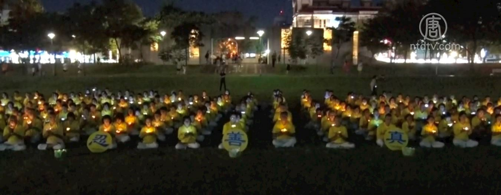
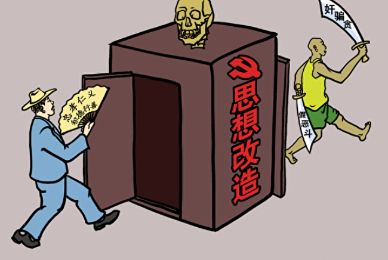
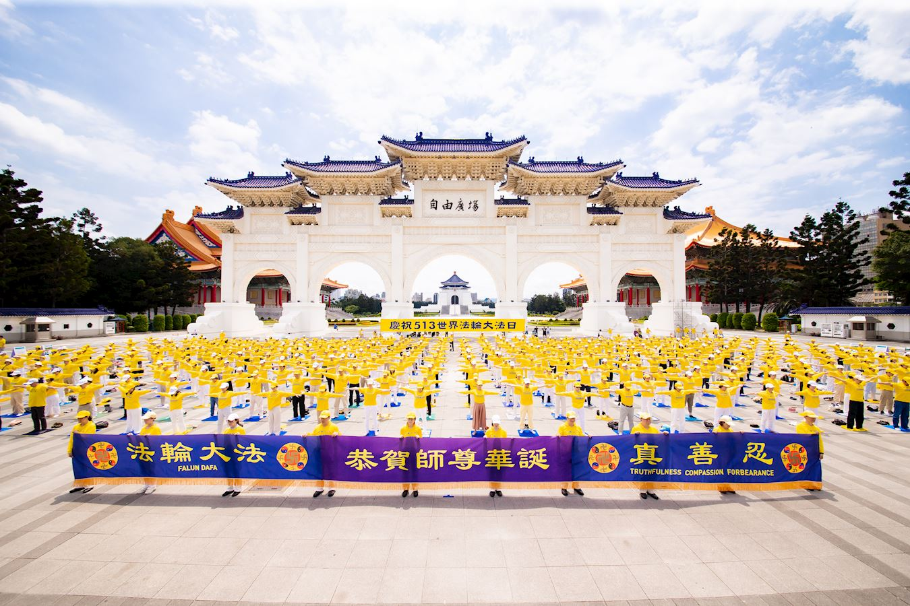
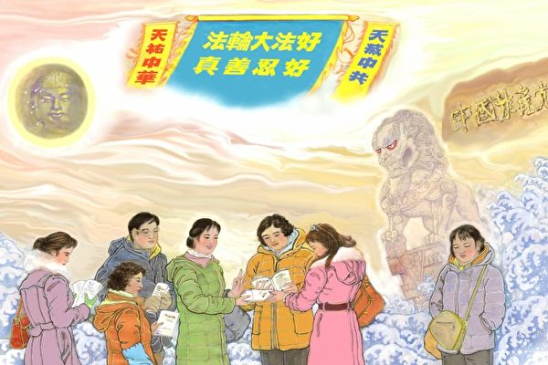

<a name=top>

<a target="_blank" href="https://git.io/bb99bbss">

<b>直连不必翻墙 🌼 必看精彩视频https://bit.ly/2A4uPQb</b>

<tr><td width=900><h3><b><a href="https://git.io/kkopop">➤ 中国禁闻  点击视频  </a></b></h3></tr>
</td>

<h2>请收藏本网址，连上免翻视频即时IP https://bit.ly/3ezRQKo </h2>

 

<h1>看更多真相 https://bit.ly/2RQM1hX</h1>

<h1><b><a href="https://bit.ly/2RQM1hX/awwkk/usdom/blob/master/forfor.md">红潮即将倾覆  天之将明</a></b></h1>

<h2 align="center"><a href="https://github.com/jkujkkj/bird/blob/master/bird02.md"><b>明真相能保命(二)</a></b></h2>

<h2 align="center"><a href="https://github.com/jkujkkj/bird/blob/master/bird03.md"><b>明真相能保命(三)</a></b></h2>

<h2 align="center"><a href="https://github.com/jkujkkj/bird/blob/master/bird04.md"><b>明真相能保命(四)</a></b></h2>

<a href=https://git.io/souye><h6 align="right">回首頁</h6></a>

<a name=top>

<a href =#149>149. 迎来生命的柳暗花明</a> 
<a href =#148>148. 危机四伏中的中共更显末日疯狂</a> 
<a href =#147>147. 为甚么要三退？</a> 
<a href =#146>146. 「粒粒皆辛苦」喂饱的是硕鼠</a> 
<a href =#145>145. 批中共隐匿疫情 阿扎尔：台湾树立正向典范</a> 
<a href =#144>144. 好人被强制采血　尽显中共邪恶</a> 
<a href =#143>143. 美制裁令中共官员炸锅 百姓轰动叫好</a> 
<a href =#142>142. 一个政法委书记的厄运</a> 
<a href =#141>141. 川普禁微信 首次触动中共防火墙内的心脏</a> 
<a href =#140>140. 疫情下的一次奇遇</a> 
<a href =#139>139. 给中国年轻公检法和610人员的公开信（图）</a> 
<a href =#138>138. 两位总统与《九评共产党》</a> 
<a href =#137>137. 麦塔斯：从十三个方面认识中共的本质</a> 
<a href =#136>136. 留守女孩报考北大考古专业被聚焦的背后</a> 
<a href =#135>135. 大连疫情升温 防疫草木皆兵</a> 
<a href =#134>134. 共党把中国人变得对生命如此冷漠</a> 
<a href =#133>133. 美国政府行政部门系列行动 声援法轮功</a> 
<a href =#132>132. 【瘟疫与中共】大连瘟疫来势汹汹 原因何在？</a> 
<a href =#131>131. 「天滅中共」卡車繞行休斯頓中領館</a> 
<a href =#130>130. 法輪功反迫害21周年 法國文化電台長文報導</a> 
<a href =#129>129. 美国国务院会见五位法轮功学员代表</a> 
<a href =#128>128. 迫害法轮功持续21年　天灭中共全面展开</a> 
<a href =#127>127. 台大医师的生命转折</a> 
<a href =#126>126. 蓬佩奥谈川普接见宗教受迫害者背后故事</a> 
<a href =#125>125. 结束迫害　恢复人类应有的尊严</a> 
<a href =#124>124. 巴黎民众：真善忍是一种强大的力量</a> 
<a href =#123>123. 迫害持续21年 元凶江泽民必遭清算</a> 
<a href =#122>122. 反迫害21周年　台湾嘉义学员传真相</a> 
<a href =#121>121. 德国民众：这是强大的内在力量</a> 
<a href =#120>120. 「九字真言」就是灵丹妙药</a> 
<a href =#119>119. 杜塞尔多夫中领馆前民众明真相</a> 
<a href =#118>118. 中共强推港版国安法 触发中国人退党</a> 
<a href =#117>117. 追查国际公布第13批迫害法轮功责任人名单</a> 
<a href =#116>116. 2020庚子年中国为何异象频现？</a> 
<a href =#115>115. 善化人心的力量</a> 
<a href =#114>114. 让我们都站到诺亚方舟上</a> 
<a href =#113>113. 奥地利比利时发声 谴责中共活摘人体器官</a> 
<a href =#112>112. 在日本名古屋炼功弘法</a> 
<a href =#111>111. 唐山30多法轮功学员遭绑架 韩玉芹被害死</a> 
<a href =#110>110 . 英国预言家：香港成功点燃大陆反共烈火</a> 
<a href =#109>109. 英媒报道中共活摘器官 “中国法庭”认定中共犯下种族灭绝罪</a> 
<a href =#108>108. 蓬佩奥敦促在自由与暴政间做出抉择</a> 
<a href =#107>107. 东北小伙子：法轮功是在救人啊</a> 
<a href =#106>106. 如何将自己的名字从黑色名册转入金色名册</a> 
<a href =#105>105. 中共修改中小学教材 学者：强化红色洗脑</a> 
<a href =#104>104. 美150议员提议制裁中共政治局委员及家属</a> 
<a href =#103>103. 中共「610办公室」几任高层的末路</a> 
<a href =#102>102. 企业董座修大法 公司举办九天班</a> 
<a href =#101>101. 八大调查指证中共强摘人体器官</a> 
<a href =#100>100. 中医缺席抗瘟疫？中共如何系统毁灭中医</a> 
<a href =#99>99. 坚信「与神同在」、才有「邪不压正」</a> 
<a href =#98>98. 疫情下的失业危机以中国为最</a> 
<a href =#97>97. 大陆美术作者：天灭中共就在眼前</a> 
<a href =#96>96. 德国市民签名支持法轮功学员反迫害</a> 
<a href =#95>95. 疫情象最后通牒　让世界远离中共</a> 
<a href =#94>94. 80余岁女高干让孙子翻墙声明：正式与魔鬼切割</a> 
<a href =#93>93. 沈中阳被免职 背后涉骇人器官黑幕</a> 
<a href =#92>92. 法国DAFOH电视会议：抵制强摘器官拒绝中共</a> 
<a href =#91>91. 最明智的选择</a> 
<a href =#90>90. 疫情追责、赔偿或制裁应实锤到中共头上</a> 
<a href =#89>89. 席海明：法轮功是令人敬佩的信仰团体</a> 
<a href =#88>88. 庆祝法轮大法日 西澳学员集体炼功 感恩师尊</a> 
<a href =#87>87. 同庆法轮大法日 台北学员恭祝师尊华诞</a> 
<a href =#86>86. 躲过黑死病的德国小镇</a> 
<a href =#85>85. 新竹法轮功学员欢庆世界法轮大法日</a> 
<a href =#84>84. 红眼石狮的故事</a> 
<a href =#83>83. 纪念四二五　荷兰法轮功学员中领馆和平抗议</a> 
<a href =#82>82. 大瘟疫改变舆论导向 全球开始反共</a> 
<a href =#81>81. 美发言人：中共官员能上推特 老百姓也该上</a> 
<a href =#80>80. 中共病毒在这个大家族里失去传染力</a> 
<a href =#79>79. 【抗疫良方】武汉百步亭居民染疫 获康复</a> 
<a href =#78>78. 大疫前的正信 向神祈祷</a> 
<a href =#77>77. 疫情下　乌克兰法轮功学员传播真相</a> 
<a href =#76>76. 不分贫富贵贱 瘟疫大难无处藏</a> 
<a href =#75>75. 《今日美国》刊文指出「疫情危机罪在中共」</a> 
<a href =#74>74. 澳洲议员：我们永远不应再相信中共</a> 
<a href =#73>73. 强制青少年入团入队 引老师家长反感</a> 
<a href =#72>72. 国际音乐节期间南澳法轮功学员传播真相</a> 
<a href =#71>71. 医生感染武汉肺炎 念真言康复 不奇怪</a> 
<a href =#70>70. 「笑臉爺爺」救人的每一天</a> 
<a href =#69>69. 感恩：黨出錢養活14億中國人的時候到了？</a> 
<a href =#68>68. 法轮功走进印度跨国IT公司 深受职工欢迎</a> 
<a href =#67>67. 无论尊卑贵贱　避疫只看人心</a> 
<a href =#66>66. 法轮功在逆境中领航</a> 
<a href =#65>65. 加拿大麦吉尔大学放映《马三家来信》　观众震动</a> 
<a href =#64>64. 黑夜中的烛光──纪念长春插播真相</a> 
<a href =#63>63. 一对年轻夫妻「破镜重圆」的故事</a> 
<a href =#62>62. 狱中奇缘 重刑犯孪生兄弟浪子回头</a> 
<a href =#61>61. 彌天大謊下的一點思考</a> 
<a href =#60>60. 沐浴在法光下的大家族</a> 
<a href =#59>59. 无论尊卑贵贱　避疫只看人心</a> 
<a href =#58>58. 他們怎麼康復的？</a> 
<a href =#57>57. 一个中国人的心声</a> 
<a href =#56>56. 雪打雷 藏玄机</a> 
<a href =#55>55.《刘伯温碑记》点明避开瘟疫的真言</a> 
<a href =#54>54.姥姥避瘟疫的法宝</a> 
<a href =#53>53.回国四天返美华人：大纪元报导救了我的命</a> 
<a href =#52>52.从罗瘟马大疫的戛然而止来看「武汉肺炎」</a> 
<a href =#51>51.危难中的人性光辉</a> 
<a href =#50>50.九字真言小故事：汶川地震山崩地裂的那一刻</a> 
<a href =#49>49.制止活摘器官是国际社会的共同愿望</a> 
<a href =#48>48.瘟疫中的千金良方</a> 
<a href =#47>47.印度那格浦的法轮功学员在大学教功受欢迎</a> 
<a href =#46>46.停止迫害法轮功 弃恶从善是正道</a> 
<a href =#45>45.无尽的感恩表达着人心所向、众望所归</a> 
<a href =#44>44.90后大陆留学生：从武汉疫情中清醒</a> 
<a href =#43>43.十九前的“伪火”：不攻自破的“世纪谎言”</a> 
<a href =#42>42.肺炎疫情快速扩散 中国民众需自救</a> 
<a href =#41>41.多伦多法轮功学员向李洪志大师贺新年</a> 
<a href =#40>40.神奇的逃命方法</a> 
<a href =#39>39.大法让我的苦变甜</a> 
<a href =#38>38.庆贺三亿五千万人退党</a> 
<a href =#37>37.给孩子的信–我们要退党退团退队</a> 
<a href =#36>36.保持善念 躲过中共引来的天灾</a> 
<a href =#35>35.见证大法好　昔日村支书成为坚定的大法徒</a> 
<a href =#34>34.铁蹄下「岁月静好」吗？</a> 
<a href =#33>33.千古冤 天象变</a> 
<a href =#32>32.武汉肺炎疫情恐遭隐瞒 国人如何自保？</a> 
<a href =#31>31.国画：山村福音</a> 
<a href =#30>30.声声「师父新年好」　大法洪恩泽人间</a> 
<a href =#29>29.2020中国人最期待的预言</a> 
<a href =#28>28.澳洲老少三代西人学员新年谢师恩</a> 
<a href =#27>27.二零二零新年祝愿</a> 
<a href =#26>26.中共迫害未停 世人已明真相</a> 
<a href =#25>25.中国第二十年被美列为「特别关注国」</a> 
<a href =#24>24.跟党走　下场可悲</a> 
<a href =#23>23.台湾人为大陆游客展现的独特「风景线」</a> 
<a href =#22>22.中共监控每个人 深圳人：我们的生命如贱土</a> 
<a href =#21>21.美国会议员：中共将垮台 支持中国人退党</a> 
<a href =#20>20.给上天留下自己赎罪的凭证</a> 
<a href =#19>19.北京高层安排后路 中国人怎么办？</a> 
<a href =#18>18.初衷：做一次良心上的选择</a> 
<a href =#17>17.航标灯</a> 
<a href =#16>16.《真善忍美展》绘画赏析 孩子的巨泪</a> 
<a href =#15>15.鼠疫来了 不三退的党员危矣</a> 
<a href =#14>14.香港人如水的力量赢得了世界的支持</a> 
<a href =#13>13.《转法轮》让我在浮躁的社会中内心平静</a> 
<a href =#12>12.一位中国老人的心声：做中华儿女 不当马列子孙</a> 
<a href =#11>11.向着幸福出发</a> 
<a href =#10>10.涛涛三次井下脱险记</a> 
<a href =#9>9.风雨中的坚守与等待</a> 
<a href =#8>8.西方地产大亨之子的佛法奇缘</a> 
<a href =#7>7.9月底武汉40名法轮功学员遭警察突击绑架</a> 
<a href =#6>6.追查国际追查中共雇凶破坏港大纪元印刷厂</a> 
<a href =#5>5.黑死病与罗马帝国的覆亡</a> 
<a href =#4>4.明慧网恶人榜更新 公布十万人名单</a> 
<a href =#3>3.仁者之勇</a> 
<a href =#2>2.认清中共残暴 港人对法轮功的认识愈加正面</a> 
<a href =#1>1.锲而不舍揭露中共 法轮功值得感谢</a> 

<a href=#top><h6 align="right">回上方</h6></a>

<a name=149>

<h1 align="center"><b>迎来生命的柳暗花明</b></h1>

【明慧网二零二零年八月十六日】（明慧记者沈容采访报导）生命落地，相逢人间，林恺馨自有记忆开始，感受到的是酸苦大于甘甜的五味杂陈……直到一九九九年，她的生命发生了转折，柳暗花明，她看见了生命的曙光。下面让我们看看她的故事。

<b>人生苦短</b>

「小时候我的身体很不好，只要一咳嗽感冒，就是一个礼拜不能吃饭喝水，有一次因为胃出血差点死掉，长大后还曾因重感冒昏迷了七天七夜。婚后我嫁到澎湖，怀孕后整个孕期吃不下任何东西，吃甚么吐甚么连喝水也吐，生第一胎时难产大出血，生完以后身体化脓好几个月，医生说我整个子宫都快坏掉了。时隔六年再生第二胎，一样大出血。」

生完两胎，命悬一线，恺馨耗尽所有元气。「此后，只要每年秋季风起，我就从秋天咳到冬天，咳到整晚没有办法睡觉。我还有恶性地中海型贫血，每天起床都眼冒金星，必须摸着墙壁停五分钟停五次，才能从卧室缓慢走到厨房。再加上严重的尿失禁、脊椎颈椎长骨刺、长达十四年的失眠，身体还被医生检查出有八公分大的肿瘤，可以说体无完肤、毛病不断。先生说我从头到脚没有一个地方是好的，我甚至觉得自己无法看着女儿长大！」

彷佛风中忽明忽暗的残烛，费力燃着羸弱的辉光，然而，即便感到油尽灯枯，她仍不断寻找一个让自己安身立命的理由。恺馨常在心里想着：「从小我当人家的女儿，长大后当人家的太太，生了孩子后当人家的妈妈，难道接下来就是等着病痛衰老死亡吗？我这一生应该有更重要的价值，不该只是这样而已啊！」

<b>看见生命的曙光</b>

一九九九年是恺馨生命转折的一年，向来不看电视的她在先生打开屏幕时，偶然看到这样的画面：美国纽约中央公园的如茵绿草地上，男女老少、各式族裔随着音乐做着整齐的动作，每个人的表情是那样祥和，这幅静谧的风景吸引过往路人的目光，也让她心头为之震动。恺馨回忆道：「刚好镜头带到一个年轻的黑人，他闭着眼睛，整个人非常宁静，那画面震撼了我。他们在做甚么？为甚么可以这么静，后来继续看下来才知道他们炼的是法轮功。」

古人有句话叫「朝闻道夕可死」，内心一股强烈求道的心，促使恺馨四处打听，并在得知讯息隔天，立即搭上从澎湖飞往台北的班机，在晨光熹微之际于中正纪念堂找到了炼功点。「我学过中医经络，我知道光是打通一条任督二脉可能都要练上几十年，可我只是学着他们的动作，一抱轮我的带脉就开了，在腰部自动旋转，一迭扣小腹就感到法轮进入了身体，整个劳宫穴都有法轮在转动！」

为找寻人生来世的意义，也让身体有所好转，恺馨用心研读佛经，还学过禅宗、练过打坐，但不管看过多少本秘籍，都远不及这一两个小时带给她的震撼，她说：「一般禅宗是很忌讳下面是空的，又是水沟，但我看那几位同修稳稳坐在水沟盖上，静定如山，我也就跟着坐下来。我看过很多打坐的书，还有一位禅宗名师的书籍我都买了，却从来没有任何感觉，可我第一次炼神通加持法所感受的一切功能，竟远远超过书中提到的所有现象。甚么叩齿甚么缩肛，都不是你人为的，它是自动的，手掌打出去，下面两个球非常具体在旋转着，这一切远超过我的想象，着实让我震惊不已！」

离开台北上飞机前，恺馨到书局寻找同修推荐的《转法轮》一书，却因卖完而空手而回。「我也不知道为甚么，自己都看过那么多佛经了，却只因没有买到这本书，心情非常难过和低落，好像失去了生命中很重要的东西。所以回到澎湖后就不断探询，终于从一位大陆媳妇手中，如获至宝地接过《转法轮》。」

宝书金光灿灿，字字珠玑，每句话都如雷鸣般震荡着她的心灵，天机尽泄！「我常常一边看，一边拍自己大腿，唉呀，原来是这样，唉呀，原来是那样，每天都处在突然间恍然明白了过去问自己、问别人、查书籍都得不到的答案，再继续看着看着，彷佛身处一种神圣的能量场中，觉得这一生再也没有甚么会让自己害怕了！」

心性上的苦，过关中的难，在一心修炼下成为生命升华的一个个台阶，她说：「以前婆婆给我带来很大的痛苦和压力，我常一个人在海边哭了好几回，哭到人家以为我要自杀。修炼大法后，我发现自己对婆婆的情绪，从苦痛到无奈再到平淡，最后没有了气愤和怨恨，就是很平静的感觉。因为我知道和婆婆就是一段缘，我不会无缘无故地去承受这些苦、经历这些事，一定都是有因由的。也许人家觉得我心性高、不动气，但这都是自己在法中获得的力量。」

大法的力量融化着恺馨因多年病痛累积的自以为是，她用心体会着甚么是「真、善、忍」，甚么是实修。「修炼后我才惊觉自己对先生有多么抱歉。那时因为脊椎病痛，一发作就要躺上一个多礼拜，许多大大小小的事情都得仰赖先生帮忙，可那时我不明白法理，觉得自己这么痛苦，先生还一天到晚往外跑，一味责怪对方，现在回想起来真是汗颜。那不都是因为我才导致先生没笑脸、不想回家吗？怎么能因自己有病就给人脸色看呢？」

恺馨慢慢归正自己的人心，一个个去掉从「自我」中生出的埋怨、指责、依赖、消极，让自己回复到善良、谦逊、体贴的初衷。「现在，我眼中看到的只有先生满满的优点，我真心感谢他所付出的一切，即便有时出现矛盾，但当我先向内找自己，想着应该要与人为善时，对方瞬间也像没事一样笑嘻嘻的，好像方才没有发生任何事情。」

<b>感受无病一身轻的美妙</b>
 

修炼大法不久后，恺馨不仅修掉一个个「自我」的人心，身体也像脱胎换骨般完全变了样，她描述道：「以前我去菜市场，因为身体不好连一公斤的东西都不能提，一提就好像子宫要掉到外面一样痛苦难受。所以先生都会跟在我后面帮我拿东西。现在别说一公斤了，二三十公斤的东西我都能提，我先生也觉得这个太太怎么完全变了一个人。」

一次恺馨先生和朋友讲电话，他说：「我太太修炼法轮大法之后，出现两个很大的变化，这是原本以为这一辈子都不可能发生的事情。第一是她竟然能清晨四点起床炼功，若以她过去那种身子根本就不可能，所以我孩子从小到大都是自己设定闹钟、张罗早餐的。第二是我太太长期失眠，任何一点风吹草动就能惊醒过来，现在她睡得比我还沉，有一回二十几台救护车在外头响老半天，她还能呼呼大睡。」

恺馨笑说，现在无论声音多大都能睡得很香，不管温度多低都感到全身发热似暖阳。「以前每年严冬对我来讲都像经历酷刑一样痛苦，因为我气血循环不好，血液到不了手脚末端，所以冬天时把脚放到被窝里，就像有几万只蚂蚁在啃咬，痛到无法入睡，但把脚放到外面又冻得不行，再加上长期失眠的问题，还真令人生不如死。但现在我一年四季再也没有冷过，寒流来袭我的手都是暖的，先生包裹着大棉被，我还能热到流汗，整天都觉得暖烘烘的好舒服。」

<b>与每位有缘人分享大法的美好</b>
 

在澎湖经营民宿多年的恺馨表示：「每回我和客人聊天时，他们都会问：你女儿都这么大了，为甚么你看起来这么年轻、皮肤这么好？这时我都会和他们分享修炼后的心得体会。有一回和一群来旅游的教授、博士生，从深夜聊到天亮，他们意犹未尽不肯睡，还告诉我其实每天在学校都有看到法轮功学员在炼功，但现在才知道原来法轮大法这么好，回去一定要去学。这样的例子实在太多了，我就借着一次次宝贵的机缘和他们结缘，许多客人感觉到我们的真诚和善良，每年都会来澎湖看望我们。」

<b>珍惜生命</b>
 

修炼大法以前，恺馨觉得人生充满坎坷与悲情，走上修炼之路后，她才体悟到师父对所有生命的珍惜，明白人来一世的意义与价值，她说：「当我心中装的是大法、是别人的时候，就不会再花心思去想自己碰上的麻烦和困难，只要第一念想到的是放大的大我，先他后我、无私无我，你走的就是一条被师父安排的、海阔天空的大道。」

因为大法，她仿若重生，也因为大法，她才知道人生内涵如此博大，原来每一个人的生命都如此珍贵。「我想对所有人说，大法是人世浑浑中最明亮的灯，指引人们一条最正确的路，只要你愿意去了解，你真的就会受惠，那是永远都难以想象的光明美好。」

【文章来源】https://big5.minghui.org/mh/articles/2020/8/16/410244.html

<a href=#top><h6 align="right">回上方</h6></a>

<a name=148>

<h1 align="center"><b>危机四伏中的中共更显末日疯狂</b></h1>

海外法轮功学员呼吁停止迫害法轮功。

【大纪元2020年08月17日讯】笔者最近在阅读8月11日以后的明慧网文章，发现中共对法轮功学员的血腥迫害一刻未停止，疯狂的迫害每日都在发生着……

例1：大庆市林甸县一中优秀教师王凤臣被迫害致死。大庆市林甸县一中优秀教师、法轮功学员王凤臣，被枉判四年，在呼兰监狱被迫害出现严重肿瘤病状，大量吐血，上不来气，生命垂危，于二零二零年八月九日含冤去世。

一九九九年七月中共江泽民团伙迫害法轮功后，王凤臣、冷秀霞夫妻屡遭迫害。二零零零年十月一日，冷秀霞进京上访，五天后被劫回，并被戴上脚镣子关进看守所。同时王凤臣也被非法关押，家中只剩下七岁的女儿，由年迈的婆婆照顾。冷秀霞被非法拘禁十四个月，由单位担保，勒索一千元钱，才把她放回家，并严密监控，限制自由。两个月后，王凤臣、冷秀霞再被绑架、抄家、关押。冷秀霞被判劳教三年，送进黑龙江省哈尔滨女子戒毒所。

二零一七年一月十八日下午，王凤臣、冷秀霞夫妻被闯进家的一伙便衣警察绑架、抄家。警察同时还暴力绑架了和王凤臣家居住同一小区的林甸县一中其他三位教师李连生、王坤夫妻和艾教杰。王凤臣和李连生、艾教杰在林甸县公安局遭到不同程度的酷刑折磨，被非法关押到林甸县看守所，冷秀霞被非法关押到大庆市看守所。

二零一七年十月十一日，林甸县法院对王凤臣、冷秀霞夫妻，以及艾教杰、李连生非法开庭。王凤臣和妻子冷秀霞被非法判刑四年、分别被勒索罚款三万元。二零一八年春，冷秀霞被非法关押到黑龙江女子监狱；王凤臣被非法关押在呼兰监狱。

二零二零年五月三十一日，呼兰监狱通知家人王凤臣病重，咳嗽两个多月，眩晕迷糊。家人电话联系监狱六监区大队长李闯，当晚将王凤臣送入监狱医院治疗并只告知家人说是肺炎，打消炎针治疗。

七月六日，哈尔滨农垦肿瘤医院发出病危通知，王凤臣大量吐血，上不来气，危在旦夕。而此时王凤臣的妻子冷秀霞正在黑龙江省女子监狱遭受迫害。

在家人一直恳求保外就医下，监狱就是不放人。王凤臣于八月九日星期日早晨五点左右在哈尔滨农垦肿瘤医院去世。

例2：湖北省武穴市五位法轮功学员郭平珍、龚月贵、刘艳峰、程学珍和廖元华，二零二零年七月二十三日被法院以法轮功学员制作和传播法轮功真相资料为借口非法判重刑。其中，郭平珍被非法判刑十年，勒索罚款两万元；龚月贵、刘艳峰和程学珍被非法判刑八年，勒索罚款两万元；廖元华被非法判刑四年，勒索罚款一万元。

例3：法轮功学员群体被绑架事件接连发生。二零二零年七月二十二日凌晨四时始，高密市政法委610与高密市公安局，以实行山东省政法委「扫黑除恶」的名义，在全市绑架46名善良的法轮功学员。

警察在入户绑架法轮功学员时，不讲法律，无执法程序，采用黑社会的暴力手段。这次绑架，高密市公安局组织了全市四百多个警察，成立了46个组，对全市46名法轮功学员，通过各种手段强行入户，暴力控制法轮功学员及家属，同时违法抄家抢劫。凡是手机、计算机、打印机、现金、法轮功书籍、法轮功创始人的照片、家用汽车及家里的钥匙等物品，一律抢走。

在非法抄家时，有的法轮功学员正告，他们的行为严重违法、侵犯人权，并要求警察出具证明时，大多警察根本不予理会；有个别的拿出一个证件来，一晃就收起来了，当法轮功学员说没看清或搜查证是假的（空白表格）时，有的警察说：出示了，就行了，你哪来的这么多毛病，收拾你们法轮功（学员）太简单了，想怎么整你，就怎么整你，整死你都活该，没人敢管。警察态度恶劣。

二零二零年七月二十六日早上九点钟左右，陕西省西安市公安局、红庙坡派出所有预谋的在西安市西大街老关庙绑架了大概有十多名法轮功学员。他们现在有的已经回家，有的现在还不知关押在什么地方。

自2020年6月份以来，内蒙古多伦县县城及农村地区有数十位法轮功学员被村委会或小区人员骚扰，他们或者打电话或者登门，询问是否还炼法轮功，声称只要写出「三书」（「保证书」、「悔过书」、「揭批书」），就不再受管控，所谓的「清零行动」。法轮功学员都不配合，并告知对方行为违法。多数村委会及小区人员拒绝执行上级的指令，不去骚扰法轮功学员。

大约8月1日，蔡木山乡小井滩村委人员登门骚扰萧玉萍，让她签字放弃信仰，萧玉萍拒绝。第二天，县国保队去她家把她绑架，说有人举报她家墙上贴有「法轮大法好」的剪纸。因体检不合格，把她释放。

8月4日，法轮功学员小冯被县国保队人员带走，原因是国保队查到他的身分证姓名与现在常用名不符，并且得知他是炼法轮功的。小冯被滞留在第一派出所两个多小时后放回。

8月6日，敖包山村的王立丰（女），被国保队绑架，当时去了两辆警车，声称有人举报王立丰。把她家墙上贴的一张剪纸福字、一副年历画摘下来作为证据，把王立丰关入看守所，拘留5天。她的父亲王学华也险些被绑架，他的老伴护着，警察没得逞。

以上是在8月11日以后五天内明慧网报道的几个案例，这些残酷迫害的事实，让我们看到了中共迫害法轮功仍然特别严重，制止中共迫害法轮功刻不容缓！

2020年8月11日，海外追查迫害法轮功国际组织（追查国际）发布最新公告，对中共中央政治局常委、中纪委书记赵乐际迫害法轮功进行追查。在迫害法轮功上，无论你势力多强大，地位多显赫，都逃脱不了天理人情的法网，人类的大审判。

据大纪元2020年08月15日讯：美国国务院发言人摩根·奥塔格斯（Morgan

Ortagus）谴责中共迫害法轮功，要求立即停止迫害。奥塔格斯谴责中共酷刑迫害法轮功，她说，「大量证据显示，中国（中共）政府至今仍继续镇压和虐待这个团体，据报导，法轮功学员遭受酷刑。」

在国际社会纷纷谴责中共迫害法轮功，要求立即停止迫害的时刻，中共及其江泽民集团为求自保和避免清算，把迫害法轮功作为一颗救命稻草，目前，内外交困、四面楚歌，危机四伏中的中共更显末日疯狂。

剿灭中共已经形成国际社会的共识，这场仍在持续的中共病毒（武汉肺炎）、在香港强推国安法以及对台湾的武力威吓和霸凌世界的野心，让世界更加看清了中共。全世界共同起来剿灭中共的日子已经不远了。

解体灭亡中共恶魔，让世界变得更加和平、安宁与美好。

【文章来源】https://www.epochtimes.com/b5/20/8/16/n12335651.htm

<a href=#top><h6 align="right">回上方</h6></a>

<a name=147>

<h1 align="center"><b>为甚么要三退？</b></h1>

【明慧网二零二零年八月十四日】二零零八年汶川地震，有一户人家小孩在屋里就哭，在院子就不哭，家人无奈就陪他在院子里玩，地震来了，房子塌了，他们全家人都在院子里，躲过了这一大难。
二零一五年天津塘沽大爆炸，有一个人出差到天津，马上要到那里了，他妻子给他打电话说孩子发高烧很吓人，让他马上回去，他没办法调头回家了。到家后孩子已退烧了。他看到天津爆炸的新闻后就知道，如果真去了后果不堪设想！

这两个都是真实的事例，有一个相同的地方，就是两个家庭都有法轮大法修炼者，家里其他人尽管没有修炼，但都相信法轮大法。

所以说多大的灾难，都有好人留下来，为甚么？有神佛保护。法轮大法是宇宙大法，如果人能分清善恶，对法轮大法有正面认识，善待大法，有灾难的时候神佛就会保护善良人。

而共产党是甚么？《共产党宣言》开始就说：「一个幽灵，共产主义的幽灵，在欧洲大陆徘徊。」西方说的「幽灵」，东方叫「魔鬼」，入党时为之奋斗终生的「共产主义」原来是个「魔鬼」，它没有「人性」，只有「魔性」，也就是中共所说的「党性」。

中共宣扬无神论，让人背弃神佛，不相信善恶有报，致使社会道德下滑，其根本目的是要毁灭人类。中共从未考虑老百姓的利益，以谎言和暴政毒害中国人，建政后造成八千万人非正常死亡，现在又要把中国带入「闭关锁国」的死胡同，用甚么「内循环」的谎话，让老百姓过苦日子。

古人云：宁搅三江水，不扰道人心，触犯神佛及修炼人会犯下大罪。中共对修炼「真善忍」宇宙大法的法轮功学员进行残酷迫害，自一九九九年江氏集团镇压法轮功以来，已有四千余人被迫害致死，无数修炼者在狱中遭受酷刑折磨，被打毒针、被灌食，甚至被活摘器官，引起国际社会对中共人权劫难的声讨与制裁。

中共≠中国，「天灭中共」是大势所趋、人心所向。现在老天要灭的就是中共这个「魔鬼」。当初加入其组织时，那个「为其奋斗，为其牺牲」的誓约是要兑现的，所以只有立即退出中共党、团、队组织（三退），才能解除那个誓约，才能远离「魔鬼」、邪恶、暴政和灾难，只有抛弃党性，回归善良，在老天最后淘汰中共时，才能得到神的保护。

【文章来源】https://big5.minghui.org/mh/articles/2020/8/14/410439.html

<a href=#top><h6 align="right">回上方</h6></a>

<a name=146>

<h1 align="center"><b>「粒粒皆辛苦」喂饱的是硕鼠</b></h1>

【明慧网二零二零年八月十四日】中共党媒8月11日报导说，中共最高层近日对制止餐饮浪费行为作出重要指示。中共在指出餐饮浪费现象触目惊心的同时，强调要确立粮食安全的危机意识。并要在全社会营造「浪费可耻、节约为荣」的氛围。
应该说，制止浪费、厉行节约是一个社会的基本公德，公民的美德，本无可厚非。但这话从中共嘴里说出来，总感觉别有一番滋味，有那么一点动机不纯，欲盖弥彰的味道。恐怕为厉行节约是假，面临粮食危机是真。

<b>今年「夏粮丰收」，你信吗？</b>
 

7月26日，中共官媒宣称，今年夏粮再获丰收，产量达到2,856亿斤，增产24.2亿斤，同比增长0.9%，创历史新高。央视2台则直接鼓吹说：疫情之下，夏粮喜获丰收，增强端牢「中国」饭碗的信心和底气。农业部长在接受记者采访时说：「今年夏粮丰收已成定局。」

但就在前一日，国家粮食和物资储备局微博发布消息称：「截至7月25日，主产区小麦累计收购3871.7万吨，同比减少695.0万吨，……主产区油菜籽累计收购63.8万吨，同比减少1.8万吨。」8月12日，中共粮食和物资储备局罕见承认，以小麦为主的夏粮收购同比减少了近千万吨，下降近20%。

中共应急管理部7月6日发布今年上半年自然灾害情况称，「经核定，各种自然灾害共造成4960.9万人次受灾，271人死亡失踪，91.3万人次紧急转移安置，1.9万间房屋倒塌，78.5万间房屋不同程度损坏，农作物受灾面积6170.2千公顷，直接经济损失812.4亿元。」与去年同期相比，受灾人次上升41.5%，直接经济损失上升15.3%。

中共7月6日公布自然灾害造成直接经济损失比去年同期上升，7月26日就宣称夏粮丰收成定局。7月19是长江2号洪峰来临时间，7月27号是3号洪峰通过时间，难道长江洪峰给夏粮带来了喜人的丰收？疫情期间，中共全国封村封户封路，不知道地里的粮食是如何种植和养护的。还有东三省、河南、山东、云南等多地的蝗灾难道也是中共指挥来给党国「运输」粮食来了？

今年「夏粮丰收」，你信吗？

<b>百姓过「紧日子」，维稳人员薪资反涨</b>
 

在提倡「禁止浪费」之前，中共高唱全国要准备过「苦日子」。

8月上旬，财政部发布《2020年上半年中国财政政策执行情况报告》指出，单就疫情和应对疫情的措施，就让全国一至六月份月收入增幅平均每月拉低11.5%。今年第一季度地方财政收入，除了西藏以外，其余30个省市区都是负增长。与西方国家不同的是，中共在疫情期间所谓的为企业降税减费多倾向于国有企业，民间中小企业只能是自生自灭。5月，复旦大学平安宏观经济研究中心发布《疫情下的中小企业》报告分析说，疫情下的中小企业现金流有很大的压力，但银行对中小微企业放贷不积极。

今年两会的《政府工作报告》中指出，各级政府必须真正过紧日子，中央政府要带头，中央本级支出安排负增长，其中非急需非刚性支出压减50%以上。而事实上，过紧日子的依旧是老百姓。政府部门特别是维稳部门的经费及工资不减反增。

中共河北保定市政府2020年5月20日下发各区的内部文件《保定市加强新时代公安派出所工作「三建三提升」实施方案（征求意见稿）》中明确显示，「建设优化基础设施和警力配备，构建长效经费装备保障体系」。说白了，就是公安享受特权，要人财物要啥给啥。

据2019年搜狐网「安徽公务员招考」的一条消息称，「2019年警察套改后工资：公安改革警察工资长38%，津贴可以涨1937元」。中共根据《关于全面深化公安改革若干重大问题的框架意见》贯彻落实警察生活待遇「高于地方、略低于军队」的原则。

给警察发钱干啥，好为党「铲事」，警察明着是国家维稳力量，实际上已经成了党卫军的一支重要分支，维护的是党的安危，而且各地警察已经演变成了社会最大的不稳定因素。哪里有强拆哪里必有警察帮凶，哪里有上访，哪里必有警察截访。公安系统还不断扩充辅警人员，每到所谓敏感日，利用这些人监控所谓敏感、异议及宗教人士。

公安部近年来不断地发布法令给警察扩权，这是将迫害明目张胆地合法化。疫情期间民众大量失业，中共却拿着百姓的血汗钱迫害百姓。中共连法西斯都不如，希特勒虽对犹太人实施迫害，但对日耳曼民族却情有独钟，30年代，德国人的就业率很高。

<b>三年大饥荒：茅台酒销量与「营养性死亡」</b>

共产国度永远是特权的天堂与百姓的炼狱。请看1959年～1961年三年大饥荒期间的几组数据。

据贵州《茅台酒厂志》记载，三年大饥荒期间，贵州茅台酒厂合计产量为2079吨。其中，出口139.86吨。上述产量，大约相当于700万听(355ml/听)可口可乐。按照茅台酒粮酒生产5：1的比例计算，即生产一斤酒，耗费粮食五斤，2079吨茅台酒，耗去原粮约1.04万吨。上述茅台酒年产量直到1978年才被超过。而茅台酒那个年代是普通人能喝得起的吗？

茅台酒产地仁怀县当时约有20万左右农民，年人均统计数字上的分配粮食为300斤左右。如果把生产茅台酒的粮食用来救济，每个人可平均分得100斤左右。也就是说，2079吨茅台酒约等于20万人3个月的口粮。而事实上，大饥荒期间的茅台酒用粮，不只是从当地供应，遵义、毕节、铜仁、贵阳、习水、湄潭等地1960年粮荒最严重的一年，每个县为酿酒提供10万计～117万斤粮食不等。

另一组数据是：1959年仁怀全县死亡6263人，1961年全县人口负增长，人口自然增长为负增长22.55‰，死亡率为31.39‰。湄潭大饥荒期间调用造酒粮食最积极，死亡民众最多：1960年4月共死亡12.2万人，占全县农村总人口的20％左右。死绝户2938户，离家逃荒4737人，孤儿4735人。同一时期，在抢粮运动中被打死1324人，关押死亡200余人，打伤致残175人。

据前新华社记者杨继绳《墓碑》一书统计，三年大饥荒约死亡3600多万人。这一死亡数字超过第一次世界大战死亡人数的两倍，前苏联乌克兰饥荒死亡人数的6倍，希特勒杀害的犹太人人数的6倍。唐山大地震死亡人数的150倍。

2013年8月23日，《中国社会科学报》刊登江苏师范大学特聘教授孙经先的文章，称中国大陆「3年困难时期」出现「营养性死亡」现象，「饿死三千万」是个谣言。「营养性死亡」暗含营养过剩致死的意思。无良教授借用学术媚共，此语一出，舆论哗然，也只有中共才能创造出如此奇葩的词汇为自己遮丑。

<b>「粒粒皆辛苦」遭遇共产硕鼠</b>

中共当局为强调度过今年的粮食危机，还引用了《悯农诗》中的「谁知盘中餐，粒粒皆辛苦」的诗句，意思要让全国人民勒紧裤腰带。

中共但凡在危机重重时就要把14亿百姓拉上垫背，美其名曰「共克时艰」。搞特权享特供时从来没有民众的份。中共国公务员们曾经的每年三公消费达9000亿元，可建造45艘航母。据2014年底的数据，中国财政供养人数达6400万人，超过当时英国人口总数。

庚子年疫情、洪灾、蝗灾、粮荒一起来，世界追责、中美脱钩，粮荒几乎成了大概率事件。更可怕的是，「粒粒皆辛苦」又遭遇了中共硕鼠。

近期，网络视频惊爆中储粮哈尔滨粮库玉米大量掺泥沙造假，中共经过官方调查后得出结论是爆料与事实不符，子虚乌有。与此同时，中储粮黑龙江分公司肇州直属库7月28日发布公告，要求外来人员禁止携带手机及其它录像、录音设备进入库区。

到底是「子虚乌有」还是「此地无银三百两」？百姓勒紧裤腰带养肥的是往粮库掺假的官方「硕鼠」罢了。

【文章来源】https://big5.minghui.org/mh/articles/2020/8/14/410440.html

<a href=#top><h6 align="right">回上方</h6></a>

<a name=145>

<h1 align="center"><b>批中共隐匿疫情 阿扎尔：台湾树立正向典范</b></h1>

美国卫生部长阿扎尔（Alex Azar）（左）率团抵台，10日上午至中华民国总统府，会见总统蔡英文（右），并发表谈话。

【大纪元2020年08月11日讯】（大纪元记者李怡欣台湾台北报导）11日下午，美卫生部长阿扎尔（Alex Azar，又译艾萨）受邀至台湾大学公卫学院发表专题演讲。阿扎尔以相当大篇幅，重批中共与WHO隐匿疫情，「中共本有机会向世界示警、并与世界携手抗疫」，却反其道而行，造成疫情一发不可收拾。相反地，台湾树立正向典范，是可信赖的朋友。
阿扎尔表示，疫情之初，中共政权（CCP）背离全球卫生合作精神，中共隐瞒疫情，导致病毒迅速蔓延至全球，「中共当局本有机会与世界共同抗疫，但他们选择隐匿疫情」造成严重后果。

相反地「如果疫情是出现在像台湾或美国这样的地方，可能早就被遏止了，也已迅速通报给主管机关、分享给专家和民众」；但中国却要求医生噤声，削弱国际社会应对能力。

阿扎尔亲自证实，直到病毒终于被通报，当时在中国境外还未出现确诊个案，美国CDC就多次向中国表明共同抗疫意愿，但北京一直拖到病毒已在海外传播开，才同意让国际专家调查，并且中共还反咬「美国一直无所作为」。

<b> WHO无视人命 因政治因素排除台湾</b>
 
阿扎尔指出，中国为了满足自身政治利益，自从疫情爆发以来，就一直游说反对WHO展开调查和改革。SARS与武汉肺炎都源起中国，但「问题不在病毒来自哪个国家，而是那个国家的应对方式」，他说，国际社会对卫生的期待其实很简单，「没有透明度，就无法取得任何进展。 除非彼此愿意分享疫情威胁信息，否则如何共同预防、遏止并对抗病毒？」

「实在令人费解。」阿扎尔说，对于为疫情做出贡献的台湾，有些人却出于「政治因素」阻挠其加入WHO，甚至出于政治因素不愿接收台湾的援助，即使全球疫情大流行，有更多人因此丧命。

<b>台湾是印太区域一颗耀眼星星</b>
 
阿扎尔盛赞台湾经济与民主成就，是印太区域的一颗耀眼星星。台湾在对抗武汉肺炎（中共病毒）上，有许多值得国际学习之处，因为成功抗疫，台湾不但是世界上确诊人数最少的国家之一，更是最早让体育赛事（棒球）开打的国家。

阿扎尔说，「台湾模式」以开放透明与相互合作对抗疫情，与「病毒起源国」形成鲜明对比；台湾树立正向典范，而中国（中共）却缺乏真诚的合作，「在此艰难的时刻，美国知道我们永远有台湾这个朋友。我们也会毫不避讳地告诉全世界，他们也可以依靠信赖台湾。」

<b>重申此行符合美国「一中政策」</b>
 
阿扎尔在演讲前与随行采访团媒体交流。阿扎尔重申，此行符合美国长久以来的「一中政策」，也完全符合美官员访台前例；美国支持台湾是民主、开放、透明的典范此一事实，台湾的民主与透明在印太区域具代表意义，美国相信台湾的民主「值得被保护」。

阿扎尔说，若中国一开始能更透明、与外界分享所知，则美国就能对武汉肺炎（中共病毒）信息学得更快更多，但中国既未分享第一代分离病毒，也未告知病毒可快速人传人，且有无症状传播现象，影响了美方防疫政策。

他也谈到，台湾正试图建立不依赖中国的口罩等防疫供应链，许多国家也正在这样做；12日阿扎尔将参观医用口罩厂，亲自了解台湾口罩国家队运作。

【文章来源】https://www.epochtimes.com/b5/20/8/11/n12322739.htm

<a href=#top><h6 align="right">回上方</h6></a>

<a name=144>

<h1 align="center"><b>好人被强制采血　尽显中共邪恶</b></h1>

【明慧网二零二零年八月十一日】明慧网报导，八月二日上海市石门二路派出所四个警察，到70岁的法轮功学员沈芳家敲门，老人不开门，警察就叫锁匠，强行打开家门。四个大男人按住老太太的身体，抓住她的手腕，强行采血，沈芳不配合，责问他们为甚么要采她的血？这些警察欺骗她说：「这是『国家规定』的」。沈老太太因为年岁大了，拧不过他们，被强行采了血。
其实，上海浦东新区近期已有十几位法轮功学员被中共警察强制采血，还有按指纹掌纹、录声音、照相等。如果法轮功学员不配合，警察就直接绑架。中共警察给法轮功学员强行采血，也不放过老人。二零一五年十月二十二日，山东德州市时年76岁的法轮功宋宝莲，被警察带到派出所强行采血后才放回家。

二零二零年七月十七日，在加拿大首都渥太华中使馆前的集会上，曾是飞机设计工程师的法轮功学员王威廉讲述了自己被中共非法关押期间，遭抽血采样的经历。他说，「我在媒体上看到，很多法轮功学员与我有同样遭遇。据加拿大资深人权律师戴维﹒麦塔斯和戴维﹒乔高的报告分析，这种大规模对法轮功学员的采集血样是中共活摘器官、进行血型匹配的一个步骤」。

中国法律明文规定，公民人身权利不受侵犯。在冠冕堂皇的「依法治国」的口号下，中共不仅侵犯民众的人身权利，监控手段也逐步升级：摄像头广布全国，滥用大数据、人脸识别与姿态识别等技术，强制采集个人信息等行为屡见不鲜，强制采血的疯狂行为仅是其中一端。

中共警察对公民强行采血，强制采集个人信息的恶行，已公然触犯法律。有法不依、执法犯法的行径，在中共号称这个「人权最好时期」却不断上演着。中共内外交迫之际，不择手段的加强监控民众，只暴露出它末日的恐惧心理，却尽失民心。

一九九九年七月二十日，中共与江氏集团出于妒嫉学炼法轮功者众多，动用整部国家机器迫害法轮功，对中国大陆的法轮功学员进行大抓捕，动用一切媒体、司法、军警、特务、党政、外交，进行了全方位的镇压，编造弥天谎言，厉行信息封锁，一场铺天盖地的诬蔑陷害就此展开。

中共与江氏集团对法轮功学员执行「肉体上消灭、经济上搞垮、名誉上搞臭」的灭绝政策，在其纵容、包庇下，对法轮功学员更施以「打死白打死、打死算自杀、不查身源、直接火化」的残酷手段，迄今经核实的至少有四千五百多名法轮功修炼者被迫害致死，难以计数的法轮功学员在劳教所与监狱中遭受惨绝人寰的各种酷刑折磨，甚至被活体摘取器官、遭贩卖牟利并焚尸灭迹。

历经漫漫二十一年，中共至今仍不遗余力的对无辜民众加剧迫害。据明慧网不完全信息统计，二零二零年上半年至少39名法轮功学员遭中共迫害去世，其中15人在中共的监狱、看守所与派出所非法关押时被迫害致死；上半年另有5313名法轮功学员遭中共警察绑架骚扰，132名法轮功学员被非法判刑，庭审100场，批捕66人，构陷到检察院、法院388人。

警察应当是人民的卫士、正义的化身，职司惩奸除恶、济弱扶倾，中共警察反而绑架、骚扰、强制采血，加害善良民众，违背了一般人的基本认知。中共与江氏集团对法轮功学员的迫害是系统实施、广泛分布且长期持续的罪恶，犯下恶行的警察固然罪无可赦，但在幕后操控、纵容、默许、包庇和奖励的中共才是这些罪行的最大根源。

随着真相广传，迄今声明退出共产党、共青团与少先队者已逾三亿六千万人，世人越来越看清了中共的真面目，红魔的解体覆亡已是指日可待。二零零二年六月，贵州省平塘县惊现藏字石，「中国共产党亡」六字位于距今2.7亿年的二迭统栖霞组深灰色岩中，没有人工雕凿及人为加工痕迹。这是苍天明示：中共灭亡已成定局。

法轮功学员炼功健身，做个道德高尚的好人，无端遭受中共迫害。从警察强制采血的恶行，人们看到了背后的邪党魔性。中共是「反人性、反自然」的流氓集团，它侵犯人身权利、践踏信仰自由，残酷迫害法轮功，侵害基本人权，完全背离普世价值。

邪不胜正是宇宙运行的法则，亘古不破。专擅「假、恶、斗」的中共，根本无法撼动这群实践「真、善、忍」的法轮功学员，只是在迫害中毁灭中共自己。真相大白天下，世人守护善良，就会让这场残酷迫害早日结束。

【文章来源】https://big5.minghui.org/mh/articles/2020/8/11/410288.html

<a href=#top><h6 align="right">回上方</h6></a>

<a name=143>

<h1 align="center"><b>美制裁令中共官员炸锅 百姓轰动叫好</b></h1>

8月7日，美国财政部宣布制裁11名中港官员，包括（从左到右）中联办主任骆惠宁、香港特首林郑月娥、港澳办副主任张晓明以及香港保安局局长李家超。

【大纪元2020年08月10日讯】美国新一轮制裁涉及中港11名官员，一些被制裁官员故作镇静的苍白表态，掩饰不了内心的颤抖。这一信息，当然第一时间传遍了中共大小官员，震动整个中共官场。

8月7日美国宣布制裁，中共高层尽管深陷北戴河会议，但也不得不回应。隔了1天，8月9日，港澳办被迫出面响应，所用的词汇充分反映了中共官场的惊恐。新华社报导的题目，罕见称美国的制裁是「歇斯底里」的，中共这样的用词，透露了美国制裁对中共官员的打击有多大。

<b>中共官员夜难眠</b>
 
老百姓中已经知道的都在叫好，更多的听到传闻还没弄清怎么回事，中共党媒的被迫响应，主动证实了美国对中共官员的制裁，将很快引起中国老百姓更大的轰动。中共官员只要离开家门，就可能感到随时被戳脊梁骨，看办公室里下属们的眼神，都可能个个带刺，这是中共官员们心虚的自然表现，也是骆惠宁等人无法掩饰的。

实际上，中共官员的下属们可能都很知趣，尽量小心翼翼地别惹事，但各个官员自己却会跟自己过不去。先前美国制裁陈全国等新疆官员，中共官场骚动一阵后，还没有平复，新一轮制裁又来，估计中共的部级和副部级以上官员们，再次坐不住了。美国若实施更大范围的人权制裁，可能人人有份。

能参加北戴河会议的应该是少数，可能几十人甚至上百人，但中共的副部级以上官员至少数百人，甚至上千人，绝大多数人的贪腐都不是小数目。他们这几天应该都在关注北戴河会议，希望探听风向，思考对策，避免在内斗中被波及。现在，更大的担忧来了，国外财产、家属怎么办？如果从美国转移到别处，其它国家跟进制裁又怎么办？中共官员苦心思忖后路，还要关注北戴河会议，他们当官以来，可能从没这么辛苦过，确实太伤脑筋，估计不少人彻夜难眠。

众多参与过对法轮功迫害和各种迫害的人，应该更加惊恐。

<b>港澳办情急之下说实话</b>
 
中共高层可能没有想到，美国的第二波制裁会来的如此迅速，范围如此之广，一时没有反应过来，等了一天才响应，完全措手不及，用词也显得气急败坏。如此重大的外交事件，中共外交部罕见保持沉默，王毅和杨洁篪刚刚喊话美中关系，变相放软、期待改善，没想到美国毫不客气，中共外交部一时也懵了。

北戴河会议可能正在激烈讨论美中关系的对策，此时再贸然升级对抗，无人敢出来负责。但港澳办被直接波及，只好由港澳办出来先回应。

港澳办的响应中，除证实被制裁外，还罕见说了实话，称美国「对香港反对派和激进势力在香港特别行政区第七届立法会选举中夺取过半数议席、实现夺权『三部曲』充满期待」。

如果民主派真获得35+席位，中共就会在香港失去控制力，听命中共的港府将寸步难行。人们早就看穿了中共的恐惧，但中共至少在表面上从不承认，竟然谎称「港版国安法」是为了香港人民。如今中共自己说了实话，强推「港版国安法」就是怕被选举夺权，中共毫无制度自信。

美国国务院、澳大利亚、加拿大、新西兰和英国的外交部8月9日发表联合声明，「我们支持香港人通过真正自由、公平和可信的选举，来选出立法会议员的合理期望。我们呼吁香港政府恢复被取消资格的候选人的资格，以便选举能够在《基本法》所规定的有利于行使民主权利和自由的环境中进行。北京在联合国登记的《中英联合声明》中向香港人民承诺了『一国两制』原则下的自治和自由，必须兑现其承诺。我们敦促香港政府尽快举行选举。」

真是怕什么来什么。北戴河会议正酣，栗战书却不得不跑回北京主持人大会议，以维持现在的香港立法会再非法运作一年。人大常委会的成员，很可能将成为下一轮制裁的目标。又一个高潮眼看来临。

<b>中共主动承认害怕制度对决</b>

港澳办还主动承认，强推「港版国安法」后，美国「取消对香港的所谓特殊待遇」，「在国际上纠合一些国家」，再到「制裁」。

中国老百姓可能只知道美国制裁，可能没想到还有其它国家，这个冲击太大了。港澳办也主动暴露了前因后果，这一切都源自中共强推「港版国安法」，中共的谎言露馅了。

港澳办还直接说了更大的实话，担心「香港打造成『自由堡垒』以对中国内地进行渗透颠覆、牵制」，「危害中国（中共）国家安全」。

港澳办情急之下，不小心泄漏了「港版国安法」的真正目标，原来中共害怕香港的选举影响了中国大陆，害怕共产党的制度在「一国两制」的对决中败阵，这一切都因为中共极度担心政权的合法性。

王毅和杨洁篪，都在呼吁美国继续承认中共政权，但美国正在与中共政权脱钩，只差正式断交了。中共继续拖延香港选举，势必引来更大风暴，各国的制裁很可能快速跟进。

美国的制裁还真是威力巨大，中共一下子就语无伦次了，说了不少实话。港澳办最想说的是最后一句，为「林郑月娥行政长官」等「点赞」，「继续竭力服务国家和香港」。

中共已经担心各级官员跳船了，但除了点赞，却没有任何实质的安抚办法。港澳办的响应，更多的是想稳住各级官员，继续欺骗老百姓。然而，内外情势危急，港澳办被迫说了实话，不但无法起到安抚作用，却在推波助澜，令中共官员更加恐惧，引起老百姓热议。

【文章来源】https://www.epochtimes.com/b5/20/8/10/n12318449.htm

<a href=#top><h6 align="right">回上方</h6></a>

<a name=142>

<h1 align="center"><b>一个政法委书记的厄运</b></h1>

【明慧网二零二零年八月十日】二零二零年七月二十六日早晨，黑龙江省哈尔滨市通河县浓河镇邪党政法委书记赵洪军，驾驶车牌号为「黑LBZ723」银灰色北京现代私家车，行驶至通河县浓河镇东胜村道口附近，与一辆停靠在休息区内的车牌号为「黑AT677大挂车发生严重追尾事故。轿车前部损毁严重，赵洪军当场死亡，死相非常惨烈，脑浆外溢，面目皆非无法辨认，交警查看驾驶证时，才知道是赵洪军。
赵洪军曾经先后担任过浓河镇政府秘书，浓河镇政法委书记，浓河镇镇长等职。赵洪军表面上为人平和，没有劣迹，有很多人都不理解，这样的一个人，怎么能落了一个如此悲惨的结局。其实，知情的人都知道他是因为执行江氏集团迫害法轮功的邪恶政策，遭到了报应！

约在二零零一年至二零零三年期间，赵洪军担任浓河镇政法委书记，那时是中共江泽民政治流氓集团迫害法轮功最严重的时期，政法委是执行江氏集团迫害政策的直接机构，迫害法轮功与官员的政治利益和经济利益挂钩，与官员的升迁任免挂钩。赵洪军为了保住自己的乌纱帽，不折不扣的执行了「上面」对法轮功的迫害政策。

浓河镇中学英语教师王茂杰，因不放弃对法轮功的信仰，被停止了工作，在二零零一年正月，王茂杰写了一份打工申请，里面叙述了自己因为修炼法轮功被停止工作的经过，声明要么恢复他的工作，要么让他出去打工。

二零零一年正月十三，浓河镇派出所警员夏立民、刘继成开着警车将王茂杰拉到镇政府。赵洪军与王茂杰谈话后，既没有恢复王茂杰的工作，也不让王茂杰外出打工，害怕王茂杰外出打工时，去北京上访，结果把王茂杰非法关进了通河县看守所，一共关了一百五十多天。在看守所内，王茂杰因不放弃对法轮功的信仰，遭到了不让睡觉，臀部被管教用塑料管打的鲜血渗出了短裤，戴三十八斤重的脚镣子等酷刑迫害。

因恐惧法轮功学员上访，二零零一年三月三十一日下午，浓河镇有六名法轮功学员被绑架进看守所，这些法轮功学员在看守所内五十天没给被子盖，开着窗户冻，有时不让睡觉，有的被非法关押一百多天，才放回。其中有三名法轮功学员由昌宝、姜淑媛、闫方军被非法劳教一年。在劳教所内，他们受到了非人的折磨，由昌宝从劳教所回来时，身上长满了疥疮，行走困难。

二零零二年四月下旬的一天早晨，浓河镇派出所警察钟玉春和新胜村的一村民二人跳大门，闯入法轮功学员魏明义、姜淑媛家，将正在熟睡的魏明义、姜淑媛夫妇惊醒。钟玉春谎称发生杀人案了，他们来看看。魏家把大门门锁开开，钟玉春二人离去，随后，浓河镇派出所所长郭大奇领着一群人闯入魏明义家，此时魏明义，姜淑媛夫妇正在做早饭。

这群人进屋之后，不让夫妇二人做饭，把魏明义、姜淑媛夫妇用手铐子铐在一起，然后翻箱倒柜，非法搜查。派出所长郭大奇执法犯法将魏家用于种地的二千九百元钱贷款揣进自己的衣服兜里，姜淑媛要，他不给。亲属去要，他只说拿了一千元。这件事被曝光以后，公安局和看守所很多人都知道了，郭大奇见瞒不住了，才承认拿了二千九百元。一百天后，姜淑媛的亲属才把二千九百元钱要回。

非法搜完家之后，郭大奇等将魏明义、姜淑媛夫妇强行拽上车，送往通河看守所，魏家的房门大门四场大开，屋内的物品就像遭到了土匪打劫一样，凌乱不堪。姜淑媛被非法劳教三年，魏明义被非法劳教两年。

魏明义、姜淑媛夫妇无儿无女，姜淑媛曾经患有胸膜炎、腹膜炎、骨结核、肠结核、肾结核等多种疾病，久治不愈，痛不欲生。一九九五年修炼法轮功以后，姜淑媛身体逐渐恢复健康。在中共江氏集团镇压法轮功以来，姜淑媛多次被非法拘留和劳教。魏明义在非法劳教之前，视力听力均正常，在劳教所里被迫害的视力下降，听力失聪。

二零零二年十月份，中共邪党召开十六大期间，加重迫害法轮功。通河县「六一零」办公室主任刘剑英在通河县植保公司院内，设立迫害法轮功学员的洗脑班，软硬兼施迫害法轮功学员。赵洪军在县「六一零」的指使下，曾经将浓河镇十多名法轮功学员送进洗脑班。

据不完全统计，从二零零一年到二零零三年，赵洪军担任浓河镇政法委书记期间，浓河镇法轮功学员十五人次被非法拘留，七人次被非法劳教，有的被劳教三年。仅二零零一年一年，对法轮功学员罚款三万元，少则二千元，多则六千元。当时一个劳动力一天的工钱是才挣三十元，这些罚款给法轮功学员生产生活造成了极大困难。十多名法轮功学员被送洗脑班，多名学员被迫流离失所。

赵洪军本人既没有骂过法轮功学员，也没打过法轮功学员，他也知道炼法轮功的学员是好人。中共镇压迫害法轮功二十多年来，政法委作为中共操控协调部门，一直是镇压迫害的幕后推手，对浓河镇法轮功学员所遭受的迫害，赵洪军负有不可推卸的责任。在邪党的镇压政策下，为了保住自己的官职，选择了随波逐流的跟着镇压法轮功。

法轮功是佛法，既有慈悲救度的一面，也同有威严的一面。赵洪军得到这样一个结局实在是令人痛心和惋惜。赵洪军生前有法轮功学员给他讲真相，希望他三退（退党、团、队），他说他不能退，他说他要保饭碗保工资。海外学员也给他打过电话劝善，他都没有退。

在这次车祸之前，据说他也发生过多次车祸，这应该是上天对他的警告。可是他没有警醒，直至惨祸的发生。谨以本文给那些还在参与迫害法轮功的政法工作的人员提个醒，执行上面的命令不是迫害法轮功的借口。为了官职，为了工作，为了饭碗迫害法轮功同样会遭恶报。

因为善恶有报是天理。无论你官职多大，无论你权势多高。无论你是一介布衣，平民百姓；无论你是富可敌国，达官显贵；君臣将相也概莫能外。有人说，「我也参与迫害过法轮功了，怎么没有报应呢？」在这里我要告诉您的是，不是你没有报应，是佛恩浩荡，是大法师父的无量慈悲，是你还有被救度的希望，是你还有被救度的机会。你应该把握住这千载难逢的机缘，悬崖勒马，弃恶从善，停止迫害法轮功。从而为自己和家人选择光明，拥有美好的未来。

【文章来源】https://big5.minghui.org/mh/articles/2020/8/10/410277.html

<a href=#top><h6 align="right">回上方</h6></a>

<a name=141>

<h1 align="center"><b>川普禁微信 首次触动中共防火墙内的心脏</b></h1>

图为微信的中国母公司腾讯。(GREG BAKER/AFP via Getty Images) 

【大纪元2020年08月08日讯】（大纪元记者林燕综合报导）美国总统川普（特朗普）周四（8月6日）颁发的禁止微信行政令首次触及中共网络监控的心脏，因为这款手机应用程序与中国经济和社会生活等方方面面都息息相关。

《华盛顿邮报》报导说，川普制裁令标志着美国首次试图通过建立自己的虚拟墙、与中共「长城防火墙」审查制度抗衡。

「显而易见的是，川普政府正对准一项对中国社会生活、商业和跨境商业而言、都非常核心的服务。」报导写道。

澳大利亚战略政策研究所国际网络政策中心副主任丹妮尔·凯芙（Danielle Cave）表示：「微信不仅仅是聊天应用程序。它是世界上为数不多的『多合一』超级应用程序之一，用户依靠它获取新闻、支付账单、预订旅行和在线购物。」

出于中国公司在隐私保护上向来无信用，所以尽管腾讯一再表示，其国际用户的数据存储在海外，微信在西方市场的业务仍十分有限，但微信对海外华人的控制力度却格外惊人。

川普周四写给国会领袖的信中说：「微信还能追踪到访美中国公民的个人和专有信息，从而使中共有了一种机制，能密切监察那些可能生平第一次享受自由社会益处的中国公民的情况。

「微信据报和TikTok一样，也会对中共认为具有政治敏感性的内容进行审查，还可能被用于进行有利于中共的虚假信息宣传活动。」

研究人员发现，微信到目前为止仍然是海外中国移民小区最受欢迎的新闻来源，这使得海外华人特别容易受到中共虚假信息的影响。

近年来，在纽约和其它地方的华人小区都爆发了微信上传播美国虚假政治新闻的争议。

2018年，美国「塔尔数字新闻中心」研究员人员张驰（音译）调查研究发现，79%的中文用户新闻来源来自微信聊天群。一项针对澳大利亚普通话使用者的调查也发现，60%的受访者表示微信是其新闻和信息的主要来源。

中国问题研究专家横河之前接受大纪元采访时表示，微信是中共干涉美国内政的重要工具，因为相当高比例的美国华人日前的主要信息来源就是微信，所以中共使用微信进行定向封锁信息的效果会比过去的任何一种工具都有效。

其次，中共当局依靠微信聊天记录监视中国境内政治异见人士、封锁海外用户账号和微信群的新闻也不断被曝光。

截止到今年4月，已有数千人海外华人加入到对微信的集体起诉。

5月30日，美国华人维权联盟委员会发出的一封公开信表示，腾讯以内容敏感和违规为由对海外微信用户进行审查和单向封闭、封号、封群，构成干涉美国华人言论自由，干预和破坏美国华人政治、干预美国总统大选，其行为严重触犯美国法律，是在美国宪法下对公民言论自由及合法权益的严重侵犯。

加拿大2019年联邦大选前，国会网络安全部门意外发出微信危险的警告，警告联邦国会议员及国会职员不要使用微信，因为它有「潜在网络安全风险」。

【文章来源】https://www.epochtimes.com/b5/20/8/7/n12314929.htm

<a href=#top><h6 align="right">回上方</h6></a>

<a name=140>

<h1 align="center"><b>疫情下的一次奇遇</b></h1>

一位患两种癌症的妇女诚念九字真言而治愈。

【大纪元2020年08月05日讯】两年前一位吉林法轮功学员在路上遇到一位约莫八十多岁蹲在路边痛苦不堪的老妇人，告诉她诚念九字真言「法轮大法好、真善忍好」的秘诀。老妇人念后就能站起来走路回家了。

今年2月份，这位法轮功学员邂逅遇到两年前见过的那位老妇人，才得知她当时还不到60岁，患了两种癌症，回家诚念九字真言后病痊愈了。

明慧网发表了法轮功学员写下的这段神奇经历。

今年2月下旬的一天，李莉（法轮功学员的化名）乘公交车去某地，下车后，还没走多远，一位50来岁的女士追上了她，亲切地向她问候，还像见到久别重逢的朋友一样挎着她的胳膊。

这突如其来的情景使李莉感到惊愕：「我不认识她呀，在这疫情疯狂蔓延的非常时期，人们都相互拉开了距离，可她怎么与我这么亲近？」

那位女士找了个合适的地方停下来，说要和李莉聊聊。

「姐，那年咱俩分手后，我就再也没见到过你。我一直盼望着能再见到你，今天可算如愿了，我好想你啊！」女士兴奋地说。

看着她那激动的神态与那双似曾相识的大眼睛，李莉在记忆中搜寻着，一下子想起了两年前的一幕。

那一天，李莉正好也路过这里，发现一位女士极其痛苦地蹲在路边，走进一看，只见她满脸皱纹，脸色枯黄、灰暗，身体极其瘦弱。看样子她足有八十多岁。

李莉问她：「怎么啦？」她没作声，眼光暗淡、呆滞。

又被连续问了几次后，她才仰起脸来看着李莉，嘴角颤动着，声音极其微弱。李莉蹲下身来，把耳朵贴近她的嘴，听她说什么。

「我是个要死的人了……别人都害怕，都躲着我……你不怕吗？」李莉勉强听到她说了这两句不连贯的话。

李莉赶紧对着她的耳朵大声说：「生命是宝贵的，我告诉你一个能得救的秘诀，就是诚心敬念『法轮大法好、真善忍好』，神佛就会保佑你，你的身体就有转机，就会越来越好。你现在就随着我念吧。」

听李莉这么说，她好像有了些精神，连连地点头，接着就开始跟着一遍又一遍地念「法轮大法好、真善忍好」……

念着念着，她的脸色开始起了变化，她能连贯地念出这九个字来，而且一次比一次念得清楚；再后来她自己站了起来，可以走路了。

李莉要送她回家，她说她的腿有劲了，还走给李莉看。

她一再谢谢李莉。李莉告诉她：「谢谢大法师父吧！」

「大法师父让我们讲真相、传福音，救度有缘得救的人。今天你能听到九字真言『法轮大法好、真善忍好』，是大法师父让我这么做的，真正救你的是大法师父。」

李莉又给她简单讲了「三退」（退出中共党、团、队）的事，她相信李莉说的，一口答应退党。

分手后，李莉好不遗憾，怎么没问问她究竟多大岁数了？得了什么病？怎么病成那样？那时她看上去真像有八十多岁。

此时，李莉看看眼前的她，她看上去才五十多岁。

她说：「姐，当时我没有气力给你细讲。又像落水的人好不容易抓到了救命的绳子，顾不上其它的了。现在我告诉你我是怎么回事吧。

「当时我还不到60岁，受两种癌症的折磨，住了很长时间的医院。那天，我刚刚结束一次化疗，身体极其虚弱、痛苦，我要求出院回家缓一缓。那天家里没人，我感到在家里憋得慌，想出来透透气。出门没走多远，就支撑不住了，连家都回不去了。

「路人见了我，都躲得远远的。我正在危难时，遇到了姐姐，你救了我。对，是大法师父救了我。」

她告诉李莉，回家后，她每天诚心敬念救命的九字真言「法轮大法好、真善忍好」，从早上起来到晚上睡觉，只要脑子一有闲空，就念，干家务活或走路时，都念；越念心里越舒服，浑身都有劲儿了。

就这样，她的身体越来越健康，跟没病时一样了，也不用化疗了，现在她什么都能做。

「法轮大法太好了，这九字真言太神奇了。我住院治疗，花光了积蓄，受了那么多的罪，医院也没治好我的病，还差点死掉。如果不是大法师父救了我，我哪有今天？！大法师父却不曾要过我一分钱。现在我的家人、孩子都相信『法轮大法好、真善忍好』，都知道是大法师父救了我的命。」

她又说，那年她让李莉帮她退出了中共恶党，但她一直着急她的家人与孩子的安全。她让李莉再给她讲一讲「三退」的事，她要讲给家人听。她把她女儿的小名告诉了李莉，让帮女儿退团、退队，还说，女儿曾说过要退出来的。

李莉告诉她，中共在中国窃权七十多年以来，完全是靠谎言与杀戮维持它的独裁统治。善恶有报是天理，现在已到了「人不治天治」的时候了。这次爆发的大瘟疫就是冲着恶党来的，就是「天灭中共」的表现。

中共病毒「武汉肺炎」发起时，中共极力隐瞒疫情，接着制造种种骗术、谎言误导民众，使疫情迅速在中国与全世界蔓延，造成全人类的大灾难。因为共产党是人类灾难的总祸根，是当前危害人类最大的「病毒」。

李莉继续说，共产党、共青团、少先队是共产党的组成部分。共产党灭亡时，党团队的成员就是它的殉葬品，所以一定要退出中共的邪恶组织，才有光明、美好的未来。

「你要告诉你的家人、孩子，不要听信中共恶党散布的谎言，千万别被它的宣传迷惑，一定要赶快退出来。不退出，就得去做它的陪葬品。」李莉叮嘱她说。

她答应了，还说：「中共恶党的那一套宣传我不看、也不听，不上它的当。我要永远念『九字真言』，我要永远得到法轮大法的保护，得到大法师父的保护。」

【文章来源】https://www.epochtimes.com/b5/20/8/5/n12309178.htm

<a href=#top><h6 align="right">回上方</h6></a>

<a name=139>

<h1 align="center"><b>给中国年轻公检法和610人员的公开信（图）</b></h1>

法轮功创始人李洪志先生在公安礼堂作报告，为公安部见义勇为基金会募集基金。

如果您是现职的公检法或610人员，而且您的年龄又是在刚刚参加工作到三、四十岁之间，那么，这封信就是写给您的了。您可能会问，为甚么要给这个年龄段的我们特别写信呢？

我们知道，中共迫害法轮功开始于一九九九年，至今已经二十一年了。今天处于这个年龄段的您那时或者还小，或者还没参加工作，对法轮功当年在社会上传播的盛况不怎么了解，特别是对法轮功与公安部领导机关和公安人员的良好关系知之甚少，而这个年龄段，今天又多是走在迫害法轮功第一线的。因此，在您的认识中，好像法轮功天生就是公检法和610的对立面──而历史事实正好相反！请您在百忙中抽空看看这封信，也许您会有意想不到的感受和新的认识。

<b>「法轮功于国于民有百利而无一害」</b>

法轮功是佛家上乘修炼大法，一九九二年五月，由创始人李洪志大师传出。一九九九年中共迫害法轮功前，短短七年间发展到大约一亿人，在全国城乡的公园、绿地、街头巷尾，每天都可看到晨炼的法轮功学员，优美的动作、动听的音乐，成为一道独特的风景。简单说，法轮功好在──

教人向善。法轮功学员对「真、善、忍」的信仰与实践，使人变的真诚、善良与宽容。家庭温馨，邻里和睦，社会安定。法轮功要求学员做到打不还手，骂不还口。

给人健康。法轮功祛病健身有奇效。一九九八年，北京、武汉、大连及广东省的医学专家，对大约3.5万名法轮功学员做了五次医学调查，结果表明，法轮功祛病健身的有效率高达98%，即使是被医院拒之门外的绝症患者，也能神奇康复。

福益社会。一九九八年下半年，全国人大一批老干部，为了响应社会上对法轮功的关注，对法轮功作了数月详细调查，得出了「法轮功于国于民有百利而无一害」的结论；并于当年年底，向中共中央政治局递交了调查报告。

弘传世界。法轮功至今已弘传世界一百多个国家和地区，法轮功的书籍翻译成四十种语言出版发行，并可在互联网上免费下载。李洪志先生和法轮功获得世界范围内的各种褒奖超过三千多项，「真、善、忍」的信仰，得到世界各族裔民众的爱戴和尊敬。

<b>公安系统修炼法轮功的大有人在</b>

法轮功修炼不分阶层、行业，人人只要想学都可修炼，而法轮功极佳的效果和口碑，迅速在全国掀起学功热。据说，就连当时中央政治局七常委的家属都有人在学法轮功，包括王冶坪。

当时还有一个今天看来挺耐人寻味的现象，公安系统中炼法轮功的人好像比其它部门更多。原来公安部的老部长王芳是个气功爱好者，他夫人是虔诚的佛教徒。王芳部长退休后，到公安部下属的中华见义勇为基金会任职。因为受到老部长影响，公安部和各地公安系统练气功的人相当多。尤其到了司长、局长、处长这一级，而当时有很多就是法轮功学员。法轮功研究会的成员叶浩（现在美国）和李昌（现在北京）当年分别是公安部的副局长、处长。全国上下公安系统的法轮功热由此可见一斑。

还有更耐人寻味的呢，因为修炼法轮功人数众多，从一九九四年起，中共指派公安人员就在法轮功中卧底摸情况，看来看去，不但未发现任何问题，反而发现法轮功好的不得了，歪打正着，许多卧底人员反而也炼起了法轮功。

<b>xxx</b>
法轮功与公安部机关和公安人员的珍贵善缘

一九九三年七月二十五日至八月三日，北京第11期法轮功学习班在北京公安大学举办，参加人数约2200人，主办单位为中国气功科研会功理功法委员会。

一九九三年九月二十一日，中国公安部主办的《人民公安报》刊登报导《法轮功为见义勇为先进分子提供康复治疗》一文，称公安部见义勇为先进分子「经调治后普遍收到了非常好的效果」，对法轮功师父李洪志先生和法轮功弟子赞誉有加。

一九九三年十二月二十七日，李洪志先生获中国公安部所属中华见义勇为基金会荣誉证书。

一九九四年五月十四、十五日，李洪志先生在北京公安大学礼堂，举办两场带功报告会，主办单位为中华见义勇为基金会。

一九九五年一月四日，《转法轮》首发式在北京公安大学礼堂举行。李洪志先生在首发式上讲法，讲法内容被收入发表在《转法轮法解》一书。与会者有国家气功协会的负责人，有其它部门的有关人员和国外友人。

一九九三年十二月二十七日，为了表彰和感谢李洪志大师的突出贡献，公安部见义勇为基金会特颁发了荣誉证书──公安部见义勇为基金会向李洪志大师颁发的【荣誉证书】。

【荣誉证书】正文写着：「法轮功研究会会长李洪志先生为发扬中华民族见义勇为传统美德，维护社会治安，匡扶社会正义，慷慨捐赠人民币肆仟元。特发此证，以资纪念。」

<b>一封「含金量」很高的《感谢信》</b>
 

您知道吗？法轮大法创始人李洪志大师和法轮功弟子，曾经是公安部最高上司的座上宾。李大师曾经带领众弟子义务为警察中的佼佼者──警察中的英模人物去除顽症，并受到公安部的高度赞誉。请看──

<b>中华人民共和国公安部</b>

<b>致中国气功科学研究会感谢信</b>
 

<b>中国气功科学研究会张震寰理事长：</b>
 

由中宣部和公安部联合召开的第三届全国见义勇为先进分子表彰大会，于日前胜利结束。参加会议的一些代表，因同犯罪分子英勇斗争而致伤残，在常规医务治疗后依然带着不同的病状。为帮助见义勇为有功人员解除病痛疾苦，中华见义勇为基金会曾正式向贵会提出请求，邀请中国法轮功主持人李洪志先生，在会议期间为见义勇为先进分子进行气功康复治疗。这一请求当即得到张建秘书长和管谦副秘书长及费德泉主任的大力支持。

8月24日李洪志先生应邀专程来公安部为王芳会长治病，8月30日，李洪志先生带领一些法轮功气功师（法轮功老学员），来到会议上为近百名会议代表治病，治病效果之显著得到了普遍的称赞。接受治疗者有的是因刀伤、枪伤留下的后遗症，经治疗后立刻解除了疼痛和麻木、乏力的症状；有的是脑外伤造成的后遗症，经治疗后立刻感到头脑清醒，解除了头痛、眩晕等症状；还有的是当场就消除了身上的肿瘤；有的是在24小时内就排除了胆结石；也有一些是胃病、心脏病、关节炎等症状患者，经治疗后都在当场感受到了消除症状的效果。在近百人的治疗中，除一位轻微病患者没有明显感受外，其余全部获得了不同程度的明显疗效。经法轮功治疗的代表们对中华见义勇为基金会作出这一安排非常感激，说这是为见义勇为先进分子做的又一实事，而直接为代表们做了这一实事的是中国气功科学研究会各位领导和李洪志先生。这也是支持全国人民群众发扬见义勇为精神的实际行动。为此，我会特向您及中国气功科学研究会各位领导和李洪志先生表示诚挚的感谢！

希望中华见义勇为基金会的事业继续得到贵会及社会各界的大力支持！

中华见义勇为基金会（章）一九九三年八月三十一日

《中华人民共和国公安部致中国气功科学研究会感谢信》（局部）

谎言终归是谎言，谎言终有破灭日；抹黑终归是抹黑，抹黑终有昭雪时。而历史已经说明了一切！

年轻的公检法和610人员们，当您看完今天这封信，法轮功是甚么，迫害法轮功意味着甚么，今后怎么对待法轮功，相信您心里应该有数了。

在这封信的尾声，请允许我把这些年对您重复了又重复的话再重复一遍：请您记住「法轮大法好，真善忍好！」这九字真言；「善待大法一念，天赐幸福平安！」

【文章来源】https://big5.minghui.org/mh/articles/2020/8/5/410058.html

<a href=#top><h6 align="right">回上方</h6></a>

<a name=138>

<h1 align="center"><b>两位总统与《九评共产党》</b></h1>

【明慧网二零二零年八月五日】二零二零年七月三十日，台湾前总统李登辉于台北过世，享寿九十八岁。二零零五年四月二十一日，李登辉在记者会上，高举《九评共产党》一书，并说要看清中共真面目就要看《九评共产党》。李登辉身为台湾首位民选总统，生前曾说共产主义是骗人的，共产主义理想是共产党是为了掌权和欺骗老百姓的借口。
李登辉在二零一四年接受《BBC》采访时曾表示，他年轻的时候曾经深入研究共产主义创始人马克思的著作《资本论》，后来觉得共产主义骗人，「工人与资本家的关系，并不是（马克思）说的那样子」。

无独有偶。捷克前总统哈维尔也推崇《九评》一书和声援退党。二零零五年五月二十五日，哈维尔在响应中国出现《九评共产党》所引发的退党浪潮与以和平方式令中共解体的看法时，表示说：「对抗共产主义最好的武器，不是采用武力器械，而是采用道德、理念和知识的武器，能够面对：危险而勇敢的站出来坚持真理是最有效的办法。」哈维尔是一九八九年捷克推翻共产党统治「天鹅绒革命」的灵魂人物，他在捷克共产党统治时期受过迫害，坐过牢，对共产党有着切身的体会和认识。

自二零零四年十二月，大纪元退党网站开启了退党渠道。十多年来浪潮持续高涨，迄今已有三亿六千万人公开表明「三退」（即退出中国共产党、共青团和少先队）。尤其今年七月十六日媒体报导，美国政府拟全面禁止中共党员及其家属入境美国，并授权联邦政府撤销中共党员及其家属的签证，已经取得签证者要撤销和驱逐出境，甚至禁止中共党员的子女就读美国大学。此消息传出后，谷歌搜索「退党」一词的搜索量迅猛增加，并引发了新一轮的退党浪潮，海外主动退党的人数每天都持续上升。如何退出中共、避免被美国制裁与连累家人，成为很多中国人切身的课题与抉择。

美国移民法明确规定，恐怖组织成员和共产党员不得移民美国。中共作恶多端，一贯以谎言和暴力维系政权，从三反、五反、文革、六四、迫害法轮功等，至少造成无辜的八千万人非正常死亡，天理不容。中共党员都曾宣誓将生命献给共产党、为共产党奋斗终生，那么，作为一个反社会反人类组织的成员，为自由社会不容应该是在意料之中的，退出中共这个邪恶组织才能从新赎回自由身。

近年来，美国政府对中国共产党员移民的审查已趋严格。明慧网在二零一九年五月底发布的《通告》指出，美国政府将更严格的审核签证申请、对人权及宗教迫害者拒发签证，已发签证者（包括「绿卡」持有者）也可能被拒绝入境。国务院官员透露，有28个国家已经制定或准备制定类似于美国的《全球马格尼茨基人权问责法》，对人权迫害者拒发签证、冻结资产。

《九评共产党》书中高举的「天灭中共」一词，其意指中共是危害全人类的邪灵恶党，只要坚守良知善念，顺应天意，神佛就会帮助世人清除红魔。退党网站上发表的「三退声明」可在「天灭中共」、清算其党徒时，作为自身清白、免受牵连的见证。

尤其因中共蓄意隐瞒，造成中共病毒（COVID-19）在全球大爆发，迄今逾1800万人确诊、68多万人死亡（不含中共隐匿数字）。中共毫无人性的做法让中国人，乃至全世界，更清醒地认识它的邪恶本质。

美国洛杉矶退党中心表示，最近办理「三退」的人数比以往增加了很多。有些人对中共隐匿疫情的做法很愤怒，想要退出来；有些人原本在中国大陆被中共蒙骗，听不到真实的消息，当突破了中共防火墙或置身美国了解真相后，觉得很羞辱，也要声明退出中共一切组织。

退党中心的义工说，现在想要三退者，包括刚从中国大陆出来的中国人，也有在美国生活了很长时间的老移民。甚至已经在美国生活了二十年，早已经是公民了，最近打电话给退党中心，说退了安心。

近年许多海外华人用「全球退党服务中心」签发的「三退证书」，做为办理身份的法律支持文件，已经得到美国和许多民主国家的认可，《九评共产党》一书更成为美国移民局官员审批身份时的重要参考书。在欧美各国著名旅游地的退党服务点上，已有成团成队的中共体系内官员，包括党委书记，公开「三退」，与邪恶划清界线，使生命远离罪恶，在共产党解体灭亡时，已退党的人不再与共产党共同承担责任。

以美国为首的自由世界，近期针对中共的全面打击，正迅速有序的展开。《魔鬼在统治着我们的世界》一书（第十八章）指出：「中共不是正常意义上的政党或政权，它不代表中国人民，而是共产邪灵在人间的代表。与中共交往就是与魔共舞，与中共友善就是在姑息魔鬼、助恶为虐，把人类推向绝路。反过来讲，对中共的反击就是一场正与邪的较量，这不是单纯的国家利益之争，更是为了人类的未来」。

在中共崩解覆亡之前，眼下正是弃暗投明的好机会，避免成为中共的陪葬品。超过3.6亿中国民众选择退出中国共产党、共青团、少先队，就表明彻底与中共切割，不再给中共当替罪羊，这是明智的选择。退党才能保平安，也是走向新生的第一步。

天堂与地狱并非遥不可及，只在方寸之间。善恶系于一念，畛分高下。那些还没有退出中共相关组织的人，应该马上清醒过来，与邪恶的红魔划清界线。机缘稍纵即逝，此时不退党，更待何时？切莫犹豫迟疑，它日徒留遗憾。

【文章来源】https://big5.minghui.org/mh/articles/2020/8/5/410042.html

<a href=#top><h6 align="right">回上方</h6></a>

<a name=137>

<h1 align="center"><b>麦塔斯：从十三个方面认识中共的本质</b></h1>

加拿大著名人权律师戴维·麦塔斯（David Matas）。

【大纪元2020年08月04日讯】2020年7月20日，英国法轮大法学会主办了一场网络国际研讨会。研讨会发言嘉宾是：国际人权律师戴维·麦塔斯（David Matas），美国国家安全委员会前高级主任罗伯特·斯伯丁（Robert Spalding），英国保守党人权委员会副主席、香港观察主席本尼迪克特·罗杰斯（Benedict Rogers），以及香港实业家及政治评论家袁弓夷（Elmer Gongyi Yuen）。四位应邀发言的专家结合自己研究专长和亲身经历揭露中共邪恶本质，声援法轮功团体坚持不懈的和平反迫害的正义之举。

戴维·麦塔斯在发言中谈到，他自2006年5月以来一直在针对中共大规模杀害法轮功修炼者用于器官移植的罪行进行调查，这些经历让他逐步认清了中共邪恶本质。他提醒人们，中共的邪恶是没有底线的，中共的欺骗掩盖是系统性的，中共已经把打压迫害和威胁扩展到海外，国际社会需要共同认清和对抗中共的邪恶。

以下是麦塔斯在研讨会上发言的要点：

我今天要介绍从2006年5月以来，我在我的研究工作中吸取的十三点教训。这项调查是关于在中共大规模活体摘取法轮功修炼者器官的罪行。

一、中共的统治无处不在。中共和中国国家之间的关系，与所有的民主国家都不同。在中国，国家工作人员都是党手中的拉线木偶。从上到下，政府机构，政治和法律结构中的每个官员背后，都有一个起主导作用的党官。行政系统和党系统在顶部融合，党主席也是国家主席。在这个国家的任何地方，都有党的官员指示政府官员。

二、中共不受法律约束，因为党统治国家，国家机关管不了党。法律制度和政治制度也是如此。党凌驾于法律之上，党告诉法律制度该做什么。党指示法院、警察、监狱、检察官、调查员、国防委员会，甚至法官。

三、党的不诚实行为是明目张胆的。中共撒谎无所顾忌。甚至都不会尝试把谎言编得圆滑一些。中共的宣传趋向于蛮横无理。

四、中共的掩盖行为是系统的。几乎每当有人从官方管道中找到支持批评该党观点的证据时，这些证据就会从官方网站上消失，官员们会否认他们曾在自己的网站上说过的话，而这些都可以在中共管控之外的互联网档案中获得。

五、中共扭曲词汇。党抽走词汇的标准含义，代之以它自己的定义。例如，对于中共来说，「自愿捐赠的器官」的来源包括囚犯；「捐赠器官」是指付费给家庭成员而获得器官；「法治」是指共产党的统治；「停止从囚犯那里获取器官」现在是指停止从死囚犯那里获取器官。还可以举更多的例子。

六、中共将宣传延伸到海外。与党的要员见面的政客或公务员，以及采访他们的媒体都成为其宣传的对象。中共积极进行海外的虚假宣传活动，包括故意散布假新闻或误导歪曲事实。

七、中共在国外进行骚扰活动。中共政府和共产党监视海外的反对派。国外的批评者可能会不断收到录音电话，或者其电子邮件被黑客入侵和被病毒感染。批评该党的网站会遭到网络攻击。

八、中共在海外使用其权力用于迫害。例如，被中国政府或共产党确认为法轮功修炼者的海外华人，除非他们以书面形式否认对法轮功的信仰，否则他们将被拒绝续签护照，认识法轮功修炼者或同情法轮功的人进入或离开中国会受到限制。

九、中共试图把审查延伸到海外。中国政府和共产党利用使馆工作人员试图钳制批评政府和党侵犯人权行为的言论，对于公共论坛和媒体亦是如此。中共领事馆和大使馆经常打电话给活动的主办方，要求他们取消某些活动。我们曾听到（英国保守党人权委员会副主席、香港观察主席）本尼迪克特·罗杰斯举的例子。对那些中共没能阻止的活动，中共会试图劝阻民众参加，其中的一个做法是中共使领馆向当地知名人士和政要发信，诋毁这个活动并劝阻他们不要参加。

十、中共利用海外华人组织。中共在国外建立和资助一些前台组织，做为其传声筒。例如学生会、华人老年协会以及孔子学院。

十一、中共霸凌海外。中共使领馆发出的信件中称，如果对中共受害者的困境表达任何同情，会「对双边关系产生不利影响」，或「对未来交流与合作产生负面作用。」在大纪元报纸上做广告的商家，以及摆放报纸的商家，会收到中共的威胁电话，用商业受影响来威胁商家。

十二、中共政府会以粗鲁无礼或欺骗迷惑两种方式响应外界批评。这两类方式只是表面形式不同，其实质并没有区别。

十三、中共拒绝承认过去的错误。该党政策不断变化，但本质从未改变，只是不断地在变换手法。中共不肯公开过去的历史真相，更不会去承担责任。

总的来说，从中共杀害法轮功修炼者以夺取他们器官的角度，我已经做了很多年的调查，在这些年的调查中，我从多方面深入地了解了这个党，我觉得看得更清晰了。人们要想了解中共，必须要通过表象看到它的本质。

【文章来源】https://www.epochtimes.com/b5/20/8/3/n12304082.htm

<a href =#136>136. 留守女孩报考北大考古专业被聚焦的背后</a> 

<a href=#top><h6 align="right">回上方</h6></a>

<a name=136>

<h1 align="center"><b>大疫前的正信 向神祈祷</b></h1>

山西吕梁9岁的留守儿童张美艳，在儿童节前一天，终于见到了3年没见面的母亲。然而娘俩只团聚了半日，又要分离。5月31日，美艳在载着母亲的摩托车后哭喊着：「妈妈，别走……」，直到累瘫倒地。

【大纪元2020年08月04日讯】最近，湖南耒阳的一位高考女生在大陆墙内的媒体上颇受关注。但不少人所关注、热议的，并不是她以文科676分的成绩考上北大考古专业这件事本身。因为高分进北大，在正常情况下，本就是一件惺忪平常的事。旁观者顶多羡慕的感慨一句，这孩子真厉害！

而现下，很多中国人的反应却不是这样。他们似乎在为这位高分女生选择考古这种冷门专业而感到担忧、遗憾。在这些人看来，「考古专业未来的就业前景并不是很好，尤其是对于她这种家庭并不富裕的孩子来说，应该选择一个热门的，未来好就业，能够赚到钱的专业」。

这话并非没有道理，但当事人却说，「我个人特别喜欢，……喜欢就够了呀！」且在她看来，「未来就业的话基本生活应该能保障」。可见，这女生挺有自知之明。在上学、就业都得靠「拼爹」的这样一个权力至上的奇葩国度，出身寒门的孩子也只能求个有学上、有饭吃而已。

她是否真心喜欢考古，我们不得而知。但她似乎懂得，在面对镜头时，不忘向外界透露她是因为「受我国考古学泰斗樊锦诗先生的影响」，才「选择了北京大学考古专业」。而樊锦诗又是谁呢？有媒体公开介绍了其生平：女，汉族，中共党员，现任敦煌研究院名誉院长、研究馆员，兰州大学兼职教授、敦煌学专业博士生导师；被誉为「敦煌女儿」；被评为「感动中国2019年度人物」。

看来，樊锦诗也是一位被体制看好的御用专家。假如能受她的影响，或者有机会受其栽培、提拔，即便是冷门，也是前途无量的。难怪有明白人跳出来喊道，「这是北大啊，会被国内最顶尖的教授带着」。还有知情者画出了这样的蓝图，「在北大读考古，来个直博，然后公费去国外大学交流一年，进个211基本过三年就副教授，这么稳的选择，还有人质疑？」

可见，围绕着考古是否太冷门而展开的争议其实意义不大。整件事的焦点更在于，一个出身寒门的孩子考上北大，为何会被如此聚焦、渲染、热炒？更何况，将其放在聚光灯下、让其成为话题的，并不是别人，而是独揽话语权、刻意引导舆论的中共官媒。

在现代社会，极权体制下的媒体一直都是暴政用来对人民洗脑、粉饰太平的得力武器，又称「笔杆子」。此时，中共已民心尽失、四面楚歌，如危墙一般，人人欲推之而后快。官媒们既然效命于中共，就得继续替主子遮丑、洗地、辩白，卖力的撑开它那个已掉了一地鸡毛的「伟、光、正」画皮。

就寒门女生考上北大考古专业一事而言，中共官媒想要「洗白」的是：

其一、北大是招录寒门的。以前将寒门退档那事纯属无心之失、操作失误，决非中国的最高学府势利、市侩，也更不可能有什么暗箱操作。考不上北大，决不是因为北大徇私舞弊，或有人利用职权、手段掉包、顶替了，而只是报考者自己不够勤奋、努力而已。

其二、「留守儿童」也可「鲤鱼跳龙门」，实现自己的人生价值。在官媒笔下，考上北大考古专业的女生是一个不到1岁就成了「留守儿童」的孩子。从小跟爷爷奶奶生活，后来去寄宿学校，刻苦、上进。高考前，能把书背上七遍。

官媒着力报导、烘托这个孩子，就是故意想让那些更多被强暴、被自杀、被虐待、挨饿受冻的「留守儿童」在人们的心中变得无足轻重，甚至根本就不存在。当曾对「留守儿童」抱有同情的人也开始觉得，这种由暴政制造的乱象其实只是偶然、突发的个案时，中共对P民的洗脑就再次取得了成功。这比将「留守儿童」的人数从几千万改成几百万，更能转移人们的注意力。

总之，中共官媒想说的是，北大没问题、「留守儿童」也不是事儿，只要你够努力、够聪明、够埋头苦学，就能「飞上枝头当凤凰」、功成名就。不用去管政府有什么问题，社会有什么不公，只管自己「闭门造车」就行。

可笑的是，中国的寒门有好几亿，怎么只冒出来这一支独苗？中国人勤劳、肯干，都闻名世界了。而北大每年招好几千人，中国的底层又那么多，至少得有一半是寒门才对啊！如今，刚招上来一位，就让她上了报纸、成了名人。但即便如此，她也只能报个冷门、图个温饱。这不恰恰说明了寒门难出贵子吗？

再加上权贵们横行霸道，随便买通关系，就能让自己的孩子顶替寒门学子。此外，大量的「留守儿童」无依无靠，连吃饭都成问题，更别提好好上学了。不公加上碾压，出身寒门的孩子又有多少能出人头地？恐怕只能继续当「韭菜」、成为被奴役的对象而已。

中共民心散尽，却依然不改洗脑、愚民的伎俩。这足以表明，中共毫无改弦更张、还民财富与权利的打算。中共继续制造谎言、想要一条道走到黑，不过是出于其邪恶本性的必然选择。只有远离中共、结束暴政，未来的中国才会有公平与正义可言。

【文章来源】https://www.epochtimes.com/b5/20/8/3/n12304085.htm

<a href=#top><h6 align="right">回上方</h6></a>

<a name=135>

<h1 align="center"><b>大连疫情升温 防疫草木皆兵</b></h1>

7月30日，沙河口区西安路的中央大道购物广场临时封闭，因五混检测出现阳性，其中一人当时正好在该广场，导致整个广场全部封闭，全员核酸检测。

【大纪元2020年07月31日讯】（大纪元记者顾晓华、林岑心采访报导）中共病毒（武汉肺炎）再次侵袭辽宁省大连市，疫情愈演愈烈，确诊病例持续攀升。上级下达死命令，全民核酸大排查，各区防疫草木皆兵。

7月30日，沙河口区西安路的中央大道购物广场临时封闭，因「五混」检测出现阳性，其中一人当时正好在该广场逛街，导致整个广场全部封闭，全员核酸检测，一直至晚上10时许才解封。

<b>「五混检测」现阳性 逛街者突被带走 广场被封锁</b>

30日中午12时许，位于西安路中央大道的购物广场内的电子城、超市等突然被全部封闭，现场出现救护车以及身穿白色防护服工作人员，现场一位女士说，有一位女性客人接到「这边（防疫中心）电话通知，问她在哪里，说在优客超市里逛街，然后告诉她『别动，在那里等着』，随后来车给接走了」。

大连核酸大排查采用五混检测法，五个人一组，一旦发现有一组呈阳性，这五个人就得重新检测，那位女士说：「那个人也不一定是有，是一组人做的检查，她只是碰巧在核酸检测里面，所以说是疑似。」「整个电子城和超市里的人都做了一遍核酸检测，晚上10点中央大道那边的封锁才解除。」

据悉，该女士所居住的候一小区30日也被用铁栅栏全部封锁，此外兴华路也被封闭。

<b>突然接到通知 被强制集中隔离</b>
 
7月22日，大连公布的一名确诊病例——一名58岁的石姓工人16日出现发烧、乏力等症状，22日确诊。石某居住在大连西岗区香炉礁工七巷（工人村小区），每天从香炉礁站搭乘地铁3号线到大连湾上班。他从18日至21日连续4天都有到工人村附近的棋牌室。

结果多名去过棋牌室的民众被强行集中隔离。造船厂工人付先生于7月22日下午4时许在上班时间突然接到防疫中心的电话，让他到棋牌室对面集合，这时他才知道自己成为了密切接触者，他与另外十余人被直接带到付家庄的海天白云酒店隔离。

付先生说：「我没有和他（石某）接触。我是去那间棋牌室，石某是下午3点多走了，我5点去的，我对他不熟悉，这人我都没见过，不认识。」

付先生现在非常后悔去了棋牌室，而且因为他连累了同一宿舍的其他工友，全部被隔离，「我住宿舍，我同宿舍的人也都被隔离了，我都没见过这人，就给我们工友都影响了，人家上班呢，现在挣不到钱。」

付先生还表示：「我在那待了10分钟时间，我的老乡在那里，坐下闲聊一会儿，就给我整进来了。我要不去棋牌室肯定没这个事了。人家（政府）一句话，咱们还得配合，没办法。」

另一位被集中隔离的造船厂工人杨先生也表示，「我跟他（石某）没接触，我去了棋牌室，我没见过石某，不认识他。」他们单位有4人被隔离，都是去了棋牌室。「在隔离期上了火，肛门囊肿都犯疼，十分难受，疼死我了，待得上火，憋屈，天热。」

被确诊的石某另外还去过嘉生鲜超市工人村店，导致这家超市关店，全员集中隔离。

该超市的店员李女士对记者说：「我和石某没有接触，我不认识这个人，我们在店里干活，消防员去我们店消毒，消完毒就把我们隔离了，我连家也没有回，换洗的衣服和东西都没带。」

李女士的先生也被集中隔离，她的先生根本不在此超市上班。

被中共官方指定的这些密接者全部都是被就地带走，无任何准备，也不允许他们回家拿必备衣物等。

<b>被集中隔离者担心隔离费与隔离期间工资</b>
 
付先生向大纪元记者透露，他不是第一次被隔离，过年时他回沈阳老家后回到公司上班，公司规定外地人员回来要在宿舍进行集中隔离，当时还说隔离期间每天给100元补助，结果至今未见发放。

付先生说：「隔离期间，那给你开什么工资了，都不用想，没上班能给你开支吗？」他说，他们单位工资一天上班含加班工资四百多，「你说这十四天隔离，六千多就没了。」

付先生还担心隔离是否要自费，「现在我们都不知道怎么回事呢，一开始说这隔离还自费呢，他们顶多给出住宿费，吃饭每天还60。」

他还透露，一起与他隔离的朋友在隔离期间被老板炒了鱿鱼。

杨先生也担心，「隔离期间的工资还给不给？没了工资，有没有补助啊？」

【文章来源】https://www.epochtimes.com/b5/20/7/31/n12297163.htm

<a href=#top><h6 align="right">回上方</h6></a>

<a name=134>

<h1 align="center"><b>共党把中国人变得对生命如此冷漠</b></h1>

【大纪元2020年07月31日讯】7月以来，全球新冠疫情（中共病毒）呈现上扬趋势，半年多的疫情史改变了人类社会的经济活动与社会生活，人类不可能再回到过去的生活模式了。特别是中国，今年1月以来，恐惧弥漫，空气总是浸着一层阴霾， 5月份后，加上经济萧条，洪灾频发，其他天灾和社会环境，让人们的脸上总是少见笑容。空气微粒中似乎总浮着一层害怕、阴愁。

在古代，天灾人祸大面积爆发，皇帝带着大臣们罪己诏，向天祈祷悔过，百姓们也总是悔改，互相帮助互相关爱，表现出对天地和生命的敬畏。然而，如今在中国，人们仍旧互相伤害、互相争名夺利，为追求感官快乐麻木不仁。贵州公交司机因为得不到拆迁赔款把一车人冲到湖泊；杭州一居民家丈夫为了占有一套房子杀害并尸解妻子；湖南众多人围观起哄一个年轻女孩跳楼……据悉，新冠稍缓解后，中共国众多城市的离婚率猛增……

更令人心寒的是，共产党更恶毒地迫害全中国呼吁人权的正义人士，包括香港人和法轮功学员。在洪灾爆发的城市乡村，共产党要求居民村民舍小家保大家，为了政权稳定，为了党官的安全，百姓的农田、房舍和生命都可以让洪水冲走。共产党要求人们捐款，而它把百姓的钱大把大把支持没有历史因缘的地位遥远的非洲国家。

中国，苦难的中国，怎么了？没错，共产党，祸国殃民，中华民族的自然与社会、历史与文化、人伦与信念，正在遭受它破坏的恶果。从动物进化人到丛林原则的市场经济，从计生到暴力革命，从毒奶粉到毒大米，从幼儿园老师强奸幼儿到大中学生杀害老师，从年轻人看破红尘式的麻木到戴着口罩跳广场舞的中年大妈……都有共产党变异中国人心与道德的幢幢鬼影。

尤其是现在中国的年轻人，很多人麻木生活着，没有理想，没有精神追求，要不醉生梦死只追求感官物欲，要不如看破了红尘，染着红黄白绿的头发，或剪破裤子，眼神焕散地走在街上，不关心民族与未来，只慑于共产党的利诱或淫威……

都说法轮功学员只要盘一盘自己的腿，或举一举自己的手，共产党610就要赶紧盗用国家人力物力资源，半夜破门，在人家家里偷装监控、跟踪、监听电话……从中央到小区工作人员，一帮人围着一个炼功人转，哪怕一个没有读过书的农村老太婆或是未成年的小娃，邻里亲友都受影响，用恐惧治国，能不变异人心吗？真是本茬人类的奇葩。

很多人都在盼望疫情尽快过去，等病毒消退了，我们又可以恢复到过去好日子。不过，人们不知道不知不觉中，已迷失了自己。就是并非医界专家，都有种暗暗感觉，过去的日子一去不复返了。在2012年禽流感流行后，中共国诺贝尔文学获奖者莫言，就说人类的好日子不多了，自己觉得活得连猪狗不如。

对坏人来说，好日子没有了。但人类还要生存，好人总会有好日子。怎么办？唯有三退，远离恶党，保得人的良知与善性，总会得到老天的眷顾。

【文章来源】https://www.epochtimes.com/b5/20/7/31/n12297841.htm

<a href=#top><h6 align="right">回上方</h6></a>

<a name=133>

<h1 align="center"><b>美国政府行政部门系列行动 声援法轮功</b></h1>

图为美国国务院。

【大纪元2020年07月27日讯】（大纪元记者李辰美国华盛顿DC报导）7月20日，法轮功学员反迫害21周年之际，美国政府行政部门采取系列行动，声援法轮功，要求中共必须停止迫害。

与此同时，美国国会及行政当局中国委员会（CECC）等联邦政府机构以及35位联邦参众议员，也向法轮功学员表达了声援。

<b>美国务卿发表官方声明 要求停止迫害法轮功</b>

7月20日，美国国务卿蓬佩奥（Mike Pompeo）在这一天发表官方声明，要求中共必须停止迫害法轮功。

声明写道：「我们要求中华人民共和国政府（中共）立即停止以卑劣的手段对法轮功学员进行虐待和凌辱，释放因自己的信仰被监禁的人员，例如马振宇等，并公布失踪学员的下落。」

「对法轮功学员持续21年的迫害已历时太久，必须被终止。」

 <b>美驻华大使馆转发国务卿声明</b>

同一天，美国驻华大使馆和领事馆的中英文网站，同时发布美国国务卿蓬佩奥要求中共必须停止迫害法轮功的中英文声明全文。

美国国务院发言人奥塔格斯（Morgan Ortagus），美国国务院人权、民主和劳工事务局，美国驻日内瓦外交使团转发了官方推特。

<b>美国务院高级官员会见五位法轮功学员</b>

7月20日，美国国务院负责人权、民主和劳工事务的助理国务卿德斯特罗（Robert Destro），在国务院会见了五位法轮功学员代表。国务院的国际宗教自由大使布朗巴克（Samuel Brownback）电话联机参加了会议。

会晤中，法轮大法信息中心执行主任布劳迪（Levi Browde）告诉美国国务院官员，对法轮功的迫害是进入二十一世纪后，中共发起的第一场大规模迫害；至今，中共对法轮功的迫害没有任何减轻迹象。活摘器官仍在继续。即便是中国疫情严重期间也没有停止对法轮功学员的迫害。

助理国务卿德斯特罗和宗教自由大使布朗巴克，详细询问了法轮功受迫害具体情况，特别关注活摘器官的问题以及《港版国安法》对香港法轮功学员的影响。布朗巴克大使并表示，中共先迫害法轮功，继而用同样的手段迫害其它团体。

受邀参加这次会晤的，包括曾在大陆遭受迫害的法轮功学员张玉华博士。她的丈夫马振宇目前被非法关押在苏州监狱，遭受酷刑折磨。国务卿蓬佩奥在他的官方声明中也提到了张玉华和马振宇的名字。

7月20日，美国国务院宗教自由大使布朗巴克（Sam Brownback）在其官方推特上写道：「面对中共施压、强迫放弃信仰的威胁，法轮功学员坚忍不屈，令我深受启迪。」

在此之前，布朗巴克也发来视频演讲。他在视频中说：「让明年不再是迫害的第22周年，而是法轮功学员拥抱自由，每个中国人都可以自由实践信仰的第一年。」

「中国共产党向信仰开战，这是一场他们赢不了的战争⋯⋯（因为）灵魂比政府强大。」

除了以上行政部门，至少还有以下联邦政府机构及联邦政要在此期间公开声援法轮功，谴责中共迫害：

<b>美国国际宗教自由委员会委员：彻查中共活摘器官行径</b>

美国国际宗教自由委员会（USCIRF）委员加里·鲍尔（Gary Bauer）也给法轮功学员发来视频，他在视频中说：

「本委员会敦促美国政府对这所有的指控进行彻底的、全面的调查，我们相信美国政府对此调查，能够将中共的罪恶曝光，并收到对此罪行采取具体行动所需要的国际社会的支持。在21世纪不应该有任何一个地方允许活摘器官罪行的发生。」

美国国际宗教自由委员会（USCIRF），是独立运作的跨党派美国联邦政府机构。

<b>国会CECC主席呼吁中共停止迫害</b>
 
7月21日，美国国会及行政当局中国委员会（CECC）发表了官方推特，要求中共停止迫害法轮功。

推特写道：「在过去的21年中，法轮功修炼者遭受任意拘留、酷刑、强迫劳动和其它令人震惊的侵犯人权行为。主席呼吁结束对法轮功的迫害，并要求联合国特别报告员对中共政府侵犯人权的行为进行调查。」

CECC的现任主席是民主党籍众议员麦戈文（Rep. Jim McGovern），现任共同主席是共和党籍参议员鲁比奥（Sen. Marco Rubio）。

<b>36位国会议员谴责中共迫害法轮功</b>
 
36位美国国会参众议员分别以信函、声明的形式或在采访中，表达了对法轮功学员的声援，谴责中共迫害，要求停止迫害法轮功。

民主党籍联邦参议员莱希（Sen. Patrick Leahy）在声明中写道：「法轮功是基于『真、善、忍』理念的中国传统信仰。」「法轮功在中国的困境需要我们的关注和谴责。」

民主党籍联邦参议员范浩伦（Sen. Chris Van Hollen）在声援信中写道：「在这个沉重的受难日，我的心与法轮功修炼者同在。」「我深深感谢华盛顿DC法轮大法学会和世界各地的法轮功学员们为将此重要真相传递给中国人民所做的努力。」

共和党籍联邦参议员约翰逊（Sen. Ron Johnson）写道，「21年来，中共对中国大陆的法轮功修炼者进行了深入的、全方位的、毫不留情的打击……大法修炼者们仍然坚强地、团结地对抗中共的压迫，我为你们持续的决心和毅力鼓掌。」

共和党籍联邦参议员柯林斯（Sen. Susan Collins）写道，「我很自豪能够为法轮功修炼者发声，谴责中共在中国大陆对他们的持续迫害。」

民主党籍联邦众议员波肯（Rep. Mark Pocan）写道，「在证据面前，（中共）对法轮功学员的任意关押和实施酷刑必须停止。这种残忍暴行必须停止。」

民主党籍联邦众议员唐考（Rep. Paul Tonko）写道，「尽管遭受了多年的迫害，法轮功的影响却在持续增长。」

共和党籍联邦众议员史密斯（Chris Smith）说，「我和我的国会同事们一起，要求中共停止迫害法轮功。」

共和党籍联邦众议员卡佛特（Rep. Ken Calvert）写道，「法轮功学员遭到虐待、酷刑、非法监禁，以及极其残酷地摘取器官。如此残酷的迫害绝不能容忍，必须停止。」

共和党籍联邦众议员哈茨勒（Rep. Vicky Hartzler）写道，「在法轮功学员被迫害21年之际，必须继续要求追究中共的责任。」

【文章来源】https://www.epochtimes.com/b5/20/7/26/n12285189.htm

<a href=#top><h6 align="right">回上方</h6></a>

<a name=132>

<h1 align="center"><b>【瘟疫与中共】大连瘟疫来势汹汹 原因何在？</b></h1>

大连某小区的核酸检测现场，人挤人。

【大纪元2020年07月27日讯】辽宁省大连当局因中共病毒的爆发于7月23日宣布进入战时状态之后，疫情继续升温。截至7月28日，大连疫情已扩至辽宁、吉林、黑龙江、福建、北京5地9市。

目前大连市已停运99条客运班线，要展开对百万人大规模的核酸检测。据大纪元一线采访报导，核酸检测现场人挤人，一片混乱。

中共病毒于今年1月在武汉爆发后，不断在大陆其它省市大面积传染或多次爆发，同时还蔓延全世界，至今已传染至189个国家，逾1,600万人感染，65万余人死亡。

大纪元特稿指出，「瘟疫虽无情，但并非无迹可循」，病毒的风向和目标是「冲着中共而来的」。

自中共1999年迫害法轮功以来，大连市成为中共迫害法轮功最严重的地区之一。

截至2018年4月25日，大连地区被迫害致死的法轮功学员至少一百四十多名。众多的学员被判刑、绑架、关押、劳教、关洗脑班、酷刑折磨，甚至被活摘器官。

<b>活摘器官的罪恶</b>
 
1999年7月20日，中共江泽民集团开始迫害法轮功；8月20日，江泽民连续10天到大连市视察。时任大连市长的薄熙来以拚命镇压法轮功，换取晋升为条件，和江做交易。

江视察后的两个月，薄熙来升为大连市委书记；数月后，又被提升为辽宁省省委常委，一年不到就升为代省长、省委副书记。

2004年，薄熙来任辽宁省省长期间，大连鸿峰生物科技有限公司成立，这是一家完全用中国人尸体制作「人体塑化标本」的公司。该公司得到蓬勃发展，向世界各地贩卖人体标本，并与海外机构合作进行巡回「人体展览」，从中牟取巨额利润。该公司董事长隋鸿锦称，该公司得到辽宁省、市领导的「关怀和支持」。

「追查迫害法轮功国际组织」（简称「追查国际」）调查的结果为，该公司的「新鲜人尸体」来源于对法轮功学员实施迫害的主要部门——公检法司。

薄熙来还在大连扩建新建大型监狱和劳教所，大量接收、迫害进京上访被捕的法轮功学员。「追查国际」指出，被非法抓捕而拒报姓名的法轮功学员最容易成为「新鲜尸体的主要来源」。

《大纪元时报》2013年8月27日公布的一份录音披露，2006年9月13日时任商务部长的薄熙来随同时任中共总理温家宝访问德国汉堡时，亲口承认了「江泽民下达了活摘法轮功学员器官的命令」。

薄熙来在大连率先以活摘器官和塑化加工尸体来推动、实施江氏对法轮功学员「在肉体上消灭」的灭绝政策，成为迫害的「急先锋」。

<b>实施监控管制</b>
 
薄熙来担任大连市长、市委书记期间，大建封闭式小区，利用高墙和摄像头加强对民众，尤其是对法轮功学员的监控。大连市内的街道从1997年的1,218条减少到2000年的996条。减少的道路主要是被封堵在小区中或被小区占用。

薄熙来在大连建立监控系统，并沿袭发展该模式日后于重庆耗资二百多亿元建立了号称「世界上最先进」的监控系统。

据明慧网报导，薄熙来在任大连市市长及辽宁省省长期间，辽宁省有大约90名法轮功学员被迫害致死。

<b>大连法轮功学员遭受迫害统计</b>

截至1999年，在大连地区约有十几万百姓学炼法轮功。中共江泽民集团对法轮功发动迫害后，大连十几万法轮功学员几乎人人受到中共不法人员的骚扰和迫害。

据明慧网报导，1999年7月至2017年7月，大连法轮功学员遭中共迫害人数的统计如下：

数以万计的人被非法传讯、罚款、拘留、洗脑和关押；
数千人被送进戒毒所、看守所和洗脑班；
上千人被非法劳教；
近三百人被非法判刑；
几十人被关进精神病院并遭破坏神经及不明药物摧残；
135名法轮功学员被迫害致死；
11名法轮功学员失踪，杳无音讯。

<b>近年大连当局的迫害依然严重</b>
 
2020年6月，大纪元获得有关中共大连「610」（专门迫害法轮功的非法机构）整改的内部文件，公布了中共大连市委统战部机关委员会于2017年12月27日印发的《省委第一巡视组巡视反馈意见整改落实工作方案》。该文件中针对法轮功的内容有整整3页纸。

这些内容包括，加大反X教宣传的力度，改变过去「只做不说」的做法，要大张旗鼓地在各类媒体上广泛宣传；对全市在籍、在册的法轮功等人员，进行逐一「转化」（逼迫放弃修炼），保持对法轮功等的高压态势，还提出打击海外法轮功学员的办法等。

大纪元还获得2018年5月18日大连市委政法委制作的「2018年度市直党群部门单位『重点工作』『职责工作』『规定工作』指标」的内部文件。其中直接迫害法轮功的指标内容占了18分；政法委中维稳和综治指标内容共占了54分（两个百分比加起来，对法轮功的迫害指标数相当高）。

这也是大连当局至今仍对法轮功学员迫害严重的重要原因。仅在2020年中国传统新年期间（2020年1月25日～27日），辽宁省被非法关押的大连市法轮功学员仍有120人。

4月，正当疫情在武汉肆虐期间，大连市公交车上却出现滚动播放的宣传片，攻击法轮功，给乘客洗脑。宣传片中的截图为海外法轮功学员向人们传递真相信息，车载九字吉言「敬念法轮大法好，真善忍好，远离瘟疫」的标语，却没敢截图「退出中共，远离瘟疫」等警世信息。

7月10日、11日，大连公安国保指使、伙同金普新区（普兰店）公安局、各派出所众多警力，对大连市各地区的法轮功学员进行了非法大抓捕。涉及的地区有大连市旅顺区、金州区、瓦房店市、金普新区（普兰店）、庄河市、甘井子区等。

据不完全统计，在这期间，至少三十多名法轮功学员及家属被绑架并被非法抄家，甚至还包括九十多岁的老人，抢劫资金累计三百多万。至今还有多名法轮功学员被非法关押在大连各地区看守所。

<b>近两百人遭厄运</b>
 
据明慧网不完全统计，截至2019年2月1日，仅大连地区，至少有185人遭遇厄运，他们都曾迫害过法轮功学员。

他们中包括省长、「610」主任、政法委书记、法院院长、大学教授、警察、派出所所长、学校党书记、狱警、街道干部、村民等。见以下数例：

薄熙来，原辽宁省长，曾任大连市长，于2013年9月22日被判无期徒刑。在其操纵和指挥下，辽宁省成为迫害法轮功最严重的省份之一，大连则成为最严重的城市之一。

王庆国，辽宁省公安厅副厅长，于2014年9月30日患癌病死。在任职期间积极参与、指挥迫害法轮功学员。

胡家耿，大连中山区政法委书记，2014年7月25日，突然病死，死时五十多岁。他在生前是大连迫害法轮功最卖力者之一。

李威，辽宁省大连市中级法院院长，涉严重「违纪」，于2015年1月15日被双开。在其任期内，大连中院对大批法轮功学员进行非法判刑。

21年来，参与迫害者厄运连连，如今大连疫情又来势汹汹。《太上感应篇》有云：「祸福无门，惟人自召；善恶之报，如影随形。」

【文章来源】https://www.epochtimes.com/b5/20/7/27/n12287474.htm

<a href=#top><h6 align="right">回上方</h6></a>

<a name=131>

<h1 align="center"><b>「天灭中共」卡车绕行休斯顿中领馆</b></h1>

2020年7月24日，美国德州休斯顿，中共驻休斯顿总领事馆关闭，一辆挂有「天灭中共 与神同行」的卡车绕行四周。

【大纪元2020年07月25日讯】（大纪元记者宋安报导）美国时间7月24日下午4点，是中共驻休斯顿总领事馆关闭的最后期限，大批媒体聚集在领馆外，一辆挂着「天灭中共，与神同行」的大卡车绕行四周，共同记录此历史时刻。

24日一大早，中领馆仍有人员对一些物品进行打包，并将装裹东西的箱子和塑料袋一一搬至接应的车辆内载走。中午，休斯顿总领馆的中共血旗被降下，国徽摘掉，大门上锁。

下午4点，美国的执法官员到达领馆外，警察将领馆外围进行隔离封锁。4点03分，中领馆人员从占据了四十多年的大院中全部撤离，标志着一个时代的结束。

【文章来源】https://www.epochtimes.com/b5/20/7/25/n12283043.htm

<a href=#top><h6 align="right">回上方</h6></a>

<a name=130>

<h1 align="center"><b>法轮功反迫害21周年 法国文化电台长文报导</b></h1>

法轮功学员反迫害21周年，2020年7月20日，法国主流媒体法国文化电台（France Culture）发表长文，报导法轮功学员一路反迫害的历程。

【大纪元2020年07月24日讯】今年是法轮功学员反迫害21周年，2020年7月20日，法国主流媒体法国文化电台（France Culture）发表长文，报导法轮功学员一路反迫害的历程。

下面是全文翻译：

（中共）对法轮功修炼者的迫害已经是第20个年头，从迫害一开始，这些精神信仰者就被（非法）抓捕、投入监狱或者杀害，更有甚者，迫害者（中共）还有权力强摘那些人（法轮功学员）的器官，并被人指控这是一种反人类罪。

说中国的法轮功修炼者是被强摘器官的受害者并不是凭空捏造。现在有记者、英国广播公司（BBC）等主流媒体、政治家、大赦国际（Amnesty International）等非政府组织和世界各地的医生组织都在说这个话题，并越来越持之以恒、重复为此事发声。

文中引用了精神科博士亚历克西斯‧吉宁（Alexis Genin）在人权宣言70周年纪念会上的一段发言视频中的话，吉宁先生说：「事实证明，法轮功学员是强摘器官事件的受害者。我们有大量的遇害者家属的证词，参与活摘器官手术的医生也讲话了，现在唯一需要找到的就是活摘规模的证据。」

<b>相当恐怖的强摘器官现象</b>
 
强摘人体器官到底是怎样的一个情景？

据世界反强摘医生组织法国方面负责人哈罗德‧金（Harold King）博士说：「全世界都应该知道这种强摘器官现象的存在。」金博士引用了一位曾参与强摘器官手术的医生的证词，描述了这种野蛮行为：「强摘器官是指从健康和活着的人身上摘除所有重要器官（无论是否使用），这显然导致了被强摘器官者死亡。」

<b>一切从1999年开始</b>
 
法轮功与强摘器官之间的联系始于21世纪初期，因为从那时起，这种精神信仰和一切活动在中国就开始被禁止了。

依据记者、研究员和美国密执安州罗素‧柯克研究中心成员马可‧雷斯宾蒂（Marco Respinti）的观点，他认为中国共产党讨厌所有宗教，并将其分为三类，分别称为红色类、灰色类和黑色类。

他解释说：「红色是由佛教、天主教等公认的宗教组成。灰色类的集会和活动都拒绝加入官方宗教组织，但不一定有被抓捕的危险。黑色类是独裁者眼中最糟糕的一类，因为他们被中国共产党看作是『敌人』。法轮功成员自1999年以来就属于这一类别，因此遭到抓捕和迫害。」

直到2006年，人们才将法轮功成员被监禁与器官移植联系起来。亚历克西斯‧吉宁（Alexis Genin）医生说：「第一个证词来自一名逃往美国的中国医生的妻子，她致电新闻界说明她的丈夫曾从成千的法轮功学员那里摘取过器官。 」

2007年3月，联合国酷刑问题特别报告员曼弗雷德‧诺瓦克（Manfred Nowak）证实了有关中共酷刑的传言是真实的。然后，由国际律师戴维‧马塔斯（David Matas）和加拿大前国务卿戴维‧基尔普（David Kilpour）对同一主题进行严谨的调查。我们还可以增加欧洲议会在2013年对一项谴责中（共）国政府授权摘除器官决议案的投票一事。

奇怪的是，事实上，从那时起，即在21世纪初，中国的器官移植数量增加了，但最令人不安的是，与此同时，所谓的捐赠器官的数量大增，器官移植市场的收益，估计每年达数十亿欧元。

有人估算了每年差不多会有9万例移植手术（该数字来自难以核实的预测），而需要移植者的等待时间却非常短。但是，专家们知道，等待移植器官的病人在移植之前必须是病人。等待时间可能需要数月或数年。但是在中国却不需要，那里可以用从未见过的极短的时间就能找到合适的肝脏、肾脏或心脏。因为有一个「器官储备库」，库源是来自于法轮功成员的器官。

<b>由国家组织的贩卖 似曾相识</b>
 
我们知道在墨西哥或某些东欧国家中存在的黑手党贩运器官网，他们是通过在这里卖个肾脏，到那里卖个眼角膜等来赚钱。这和贩卖法轮功成员的器官相比，那可是差远去了。中国那里是直接由国家来大规模镇压法轮功，然后贩卖他们的器官，这就是中共和它的独裁。

前国家秘书长、前国会议员弗朗索瓦•霍塔利尔（Françoise Hostalier）女士直接指出：「据我所知，在人类历史上唯一做到这一点（指活摘器官）的政治制度是纳粹政权。」

弗朗索瓦‧霍塔利尔提请人们：「是时候睁大眼睛看看我们应该和中国（中共）保持怎样的关系了。」

<b>法轮功不是邪教</b>
 
法轮功也叫法轮大法。他是既有静功打坐和舒缓而灵活动作相结合的功法。他们遵循三个字的原则「真、善、忍」。我们有时可以看到法轮功炼功者在公园或城市的广场上炼功。

法轮功由李洪志（先生）创始于20世纪90年代初期。最初，这一运动得到了中国当局的支持。但是随着规模不断扩大，到90年代中期达到六千万人，共产党的独裁统治感到恐惧并改变了态度。以「邪教」为名开始镇压迫害。

（法国）国民议会外交事务委员会议员弗雷德里克‧杜马斯（Frédérique Dumas）女士解释说：「情况并非如此，对我来说，法轮功绝对不是x教。他们信奉人类的谐和（「真、善、忍」）。在法轮功的具体实践中，也没有任何东西可以和邪教相联系。」她还补充说：「邪教是指你试图操纵人们并从他们那里获取金钱，而法轮功是免费的。」她强调说，在法国，法轮功绝对不是一个x教。

法轮功从来没有被反邪教机构（Miviludes）视为x教。

【文章来源】https://www.epochtimes.com/b5/20/7/24/n12281524.htm

<a href=#top><h6 align="right">回上方</h6></a>

<a name=129>

<h1 align="center"><b>美国国务院会见五位法轮功学员代表</b></h1>

【明慧网二零二零年七月二十一日】二零二零年七月二十日，是法轮功学员反迫害整整二十一周年，美国国务院负责人权、民主和劳工事务的助理国务卿罗伯特﹒德斯特罗（Robert Destro）会见了五位法轮功学员代表，国际宗教自由大使塞缪尔﹒布朗巴克（Samuel Brownback）电话联机参加了会议。
法轮功学员代表、法轮大法信息中心的执行主任列维﹒布劳迪（Levi Browde）感谢美国政府在各方面给予的帮助，并表示美国政府多年的帮助无论对美国法轮功学员，还是对中国大陆遭受迫害的学员，都是极大的支持和鼓励。布劳迪还对川普总统在回归传统方面所作的努力表示了赞赏。

布劳迪介绍说，二十一年后的今天，中共对法轮功的迫害没有任何减轻的迹象。活摘器官仍在继续。即便是中国疫情严重期间也没有停止对法轮功学员的迫害。

布劳迪还指出，对法轮功的迫害是进入二十一世纪之后中共进行的第一场大规模的迫害，各种迫害手段，如洗脑、转化、酷刑等等，都是先在法轮功学员身上实验，待到成熟之后，近年把这些手段同样使用到其它被其迫害的团体身上。在活摘器官方面更是如此。布朗巴克大使表示，的确如此，中共先迫害法轮功，继而用同样的手段迫害其它团体。

布劳迪还介绍了中国大陆法轮功学员二十一年来在自身遭受严重迫害的情况下，靠着千千万万的家庭数据点，坚持不懈的向亿万中国同胞讲述真相，使他们能够分清善恶正邪，唤醒他们的良知。这不仅对中国人民，甚至对与中国密切交往的世界各国都具有重要意义。

曾任南京师范大学俄语系主任、教授的法轮功学员张玉华博士去年应邀在美国国务院主办的第二届宗教自由部长级会议上发言，讲述丈夫马振宇和自己遭受的残酷迫害。今天张玉华博士也受邀参加了会见。她感谢美国政府为营救她丈夫马振宇所作的努力，并介绍了六月份明慧网报导苏州监狱酷刑折磨马振宇、企图逼迫他放弃信仰。张玉华博士说，「对我丈夫的迫害几乎发生在每一位被关押的、不放弃信仰的法轮功学员身上。放弃信仰是极其痛苦的精神折磨，但不放弃，就会有极其痛苦的肉体折磨。」她希望美国政府能够继续给予支持与帮助。

德斯特罗助理国务卿和布朗巴克大使详细地询问了许多问题，并特别关注活摘器官的问题以及港版国安法对法轮功学员的影响。他们对法轮功学员所遭受的灭绝人性的迫害表示极大的同情，同时对法轮功学员二十一年来坚守信仰、抵抗暴政表示敬佩，鼓励法轮功学员继续坚持不懈，并随时向美国政府通报迫害情况。

【文章来源】http://big5.minghui.org/mh/articles/2020/7/21/409343.html

<a href=#top><h6 align="right">回上方</h6></a>

<a name=128>

<h1 align="center"><b>迫害法轮功持续21年　天灭中共全面展开</b></h1>

【明慧网二零二零年七月二十日】21年前，中共党魁和中共互相利用，通过非法特务组织「610」，对上亿的法轮功学员实施「名誉上搞臭、肉体上消灭、经济上搞垮」的群体灭绝性迫害，倾举国之力、施百余种酷刑、甚至活体摘取法轮功学员器官，打压信仰真善忍的法轮功修炼者。
21年后的今天，天灭中共正全面展开，参与迫害的中共官员们也正面临着全面的清算。

图：长江流域灾情不断，图为流域受灾情况。

<b>迫害带来灭顶之灾 天灭中共全面展开</b>

去年神韵演出的最后一个节目，史诗般的精准预言了中共实施迫害为中国带来的灭顶之灾──大洪水，如今真实的在中国大陆上演。

到目前为止，全国27个省份遭遇大洪水，长江流域、淮河流域纷纷告急。中共水利部称，6月以来，全国433条河流发生超警戒以上洪水，其中33条河流发生超历史洪水，大半个中国都泡在洪水中，数亿人受灾。

7月17日，长江第2号洪水的警告再度发出，上涨速度会超过此前的「1号洪水」。长江水文网显示，三峡库区入库流量已经上涨到每秒6万立方米，出库流量每秒3万3千立方米，水位达到159.86米。三峡大坝持续大量泄洪，为中下游地区带来深重灾难。

不仅如此，始于去年的中共病毒，造成全球性瘟疫，并加速扩散。截至到美东时间17日8点，约翰﹒霍普金斯大学统计的数据显示，中共病毒已经扩散到了189个国家和地区。全球确诊感染中共病毒总人数超过了1400万，死亡人数超过了60万。

如今，病毒传播的速度不断加快达到了惊人的速度。路透社统计，从7月13日的1300万例到1400万例，仅仅用了4天的时间，也就是近100个小时当中，全球新增了100万确诊病例。

从香港出逃到美国的病毒学家闫丽梦在接受美国福克斯新闻采访时披露，中共和世卫组织连手隐瞒掩盖病毒人传人和病毒本身真相。她表示：这是迄今为止，人类遇到的最厉害的病毒；人们迄今仍不了解它；不要指望「群体免疫」，也不要指望目前阶段会有疫苗；这个病毒非常特殊、非常恐怖；其传播速度非常快，现在是大约世界上每600人就有1人感染，直到有一天，可能每10个人就有一个人感染，几乎谁都逃不掉。她还说了这样一句：「时间已经不多了。」

不止一位专家预警，今年入秋之后，疫情有可能会更加严重。换言之，9月或10月，新一波疫情或将不期而至，并以更加狰狞的面目蔓延全球。

除了遭遇大洪水、大瘟疫、大规模的蝗灾、火灾、极端性气候等等灾难，中共还不断在国际上挑起纷争，在香港实施港版《国安法》、对台湾进行武力威胁、在印度边界挑起流血冲突、对澳大利亚和加拿大的报复性行动、并煽动仇恨大外宣……种种恶行激怒了全世界，加速了国际反共大联盟的形成。

<b>30国600政要联署制止迫害 全球365万人联署惩办恶首</b>
 

今年「7﹒20」前夕，来自英国、奥地利、澳大利亚、比利时、加拿大、丹麦、印度尼西亚、新西兰、波兰、瑞典、瑞士、荷兰、美国、法国、意大利、爱尔兰等30个国家和地区的600余位政要签署了联合声明，支持法轮功，谴责迫害。

截至7月18日，美国已有16个州及华盛顿DC的29名美国参众议员为法轮功学员发来支持信，谴责中共侵犯人权的恶劣行径，要求停止迫害法轮功。

华盛顿州国会众议员洁米﹒赫雷拉﹒布特勒（Jaime Herrera Beutler）在信中说：「法轮功对中国和中共产生了深远的影响，带来了近代中国历史上规模最大的信息自由运动。我将继续坚决支持那些寻求自由、逃离迫害和压迫的人。」

密苏里州国会众议员威廉﹒拉齐﹒克莱（William Lacy Clay）在信中说：「我要赞扬法轮功在全世界展现出的风范，体现在其道德教化、炼功与平和之中；我与你们共同谴责（中共）对法轮功学员的残酷虐待。」

加拿大联邦反对党领袖熙尔（Andrew Scheer）在给法轮大法佛学会的支持信中说，自1999年中共开始打压法轮功以来，无数法轮功学员被非法抓捕、拘留、劳教及洗脑（强迫法轮功学员放弃修炼）。「国会国际人权委员会聆听了许多专家令人信服的证词，相关证词展示了令人震惊的迫害手段，法轮功学员被强迫劳动、酷刑折磨、任意处决及强摘器官。」

澳洲联邦议员克里斯滕森（George Christensen）说：「中共对和平的法轮功学员长达21年的迫害表明，中共政权是残酷无情的。中共试图扼杀所有其无法完全控制的事物，特别是中共强制活摘法轮功学员器官已犯下反人类罪。 」

另外，从2015年7月到2020年7月15日，全球37个国家超过365万民众联署刑事举报，向中共最高检、最高法院举报江泽民迫害法轮功的反人类罪行，要求法办元凶江泽民。

7月15日，加拿大法轮大法学会将14名参与迫害的中共高官名单提交给加拿大外交部长，要求加拿大使用马格尼茨基法惩办恶人。

<b>美拟禁中共党员及家属入境</b>
 

《纽约时报》7月17日，援引多名消息人士的话说，川普政府正在起草一份可能全面禁止中共党员及其家属入境美国的政令，包括取消已经入境美国的中共党员及其家属的签证，并限制中共军方人员和国营企业主管入境。白宫国家安全委员会一位发言人没有证实上述消息，但表示不会排除任何可能进一步制裁中共官员的决定。

中共声称有9200万党员。《纽约时报》引述一项政府内部的估计说，如果把他们的家人也算进来的话，受这项禁令影响的人可能高达2亿7千万人。

<b>「退党」上热搜 天灭中共进行时</b>
 

图：来自全球的谷歌搜索「退党」数据。

美国要禁中共党员入境的消息一出，谷歌上搜索「退党」的频率骤升。

正如闫丽梦博士所说，「时间已经不多了。」全球退党服务中心主席易蓉在18日的声明中也提到，天灭中共大势所趋，天灭中共正在进行时！摆在还未退出中共党团队的中国人面前的机会与时间不多了，唯有抓紧时间三退，抓紧时间自救。

全球退党服务中心发起了一项征签倡议活动：终结共产党，「打倒中共恶魔」。她说，历史已经走到了最后的关键时刻，所有的生命都必须在正与邪，善与恶之间做出选择，摆放自己的位置。不仅中国人才需要退出中共，我们也要唤起国际社会人们心中的正义和良知，帮助他们尽快认清中共的邪恶，帮助他们尽快作出抛弃中共，远离共产邪恶的正确选择。

她说，当人们从内心发出「打倒中共恶魔」的呼声，便能远离瘟疫远离灾难，也必定得到神的眷顾和救度。我们相信全世界善良的人们都在急切地期盼着结束中共罪恶统治的时刻早日到来。

【文章来源】http://big5.minghui.org/mh/articles/2020/7/20/409261.html

<a href=#top><h6 align="right">回上方</h6></a>

<a name=127>

<h1 align="center"><b>台大医师的生命转折</b></h1>

【明慧网二零二零年七月十九日】（明慧记者清汉台湾嘉义采访报导）命运把人抛入最低潮时，往往是「人生转折」的最佳时期。修炼法轮大法十七年的黄士维医师，心中充满感激的说：「感谢师父再造之恩，在我人生最低潮的时候拉我一把，让我有这个机会走入大法修炼，那一瞬间，我感到是最幸福的生命，这是我要的，我也知道这是一个万古机缘。」

<b>朝闻道夕可死</b>
 
目前是台大医院云林分院泌尿科主任的黄士维，从住院医师、总医师、主治医师，到现在的泌尿科主任，已行医二十一年。每天，除了临床医疗、研究、行政、教学等忙碌的工作，他还拥有美满的家庭，一双可爱的女儿，充实而幸福的生活，都来自于年轻时的一次人生转折。
 
黄士维回忆说：「我是二零零三年十二月开始修炼法轮功的。在这之前，我生了一场病，后来病虽然好了，却开始失眠，而且越来越严重，半夜醒过来就很难入眠。」尝试吃安眠药，咨询精神科同事，也看了中医，仍然无法解决失眠的痛苦，朋友建议他试试气功，他和母亲就去公园找，刚好遇到母亲的一位朋友，向他们推荐法轮功。
母亲那位朋友以前严重失眠，早上起床就想到晚上不知怎么睡觉，修炼法轮功后就好了。一听到法轮功，士维跟妈妈说：我来炼法轮功。谈起刚炼功时的情形，士维欣喜的说：「也许是我有这个缘份，第一天炼功时，就可以单盘炼功一个小时。」
 
几天后，学员推荐他阅读李洪志大师的著作《转法轮》。他回忆：「记得那天晚上回家，看了三讲，看完后我就睡着了。我用三天时间把那本书看完时，我知道这是一本修炼的书，在教人如何修炼，而且把修炼背后，为甚么要这样修炼讲的很清楚。看完《转法轮》这本书后，我突然间领会，找到了我要的，那时的感觉真的是『朝闻道，夕可死』。」
 
<b>与人为善，尽量考虑别人</b>
 
修炼法轮功不仅给他带来了健康，还让他的道德升华，成为一个更负责的医师，更体贴的主管。黄士维说：「修大法后最大差别是，你知道一切顺其自然，凡事不能强求，该是你的就是你的，不该是你的就不会是你的。再来是知道要把工作做好，把自己的利益先放一边。」
 
士维本来个性就很随和，修炼后更是会向内找，跟同事有矛盾时，会想矛盾的原因。他平时尽量与人为善，考虑别人。他说，医疗院所是一个需要很多人力的机构，需要排班，很多纠纷都来自于排班：「当一个主管，我会尽量替员工着想，因为每个人情况不同，很多人在强调齐头式的公平，我的做法跟别人不太一样，你要知道，有的人结婚有小孩，或者是家里有变故，在考虑整体的情况下，我愿意替员工想这个事情，来安排他们的工作。」

士维一天要看六、七十个病人，在病人心里是位比较愿意倾听，能体谅病人的医师：「修炼前我就是比较和善的医生，病人的要求我会酌情考虑，需要帮忙的我会帮忙，修炼后，我更会考虑这些事情。」
 
他说，人与人之间的矛盾，比较不放在心上，今天不高兴明天就忘了，「后来自己悟到，我很容易有怨，职场上会有抱怨，家庭会有抱怨，怨老婆啊，怨小孩啊，会有很多抱怨，在不断的抱怨当中。」士维说：「有一次脚痛，后来我悟到那个痛是怨导致的，不能怨，当你怨时，就是怨老天不公，要把怨恨心修掉。」
 
<b>从信仰中开阔眼界领悟真谛</b>
 
很多学医的人过于相信实证科学，因为他们看到了医学治疗对人体的改善，士维从信仰中开阔了眼界，意识到实证科学的局限性。修炼后他发现，不可能一方面迷信实证科学，一方面又相信精神信仰，他很快选择了信仰。他发现现代科学局限在一个层面，科学没办法解释的，就认为是伪科学或不符合科学，追根究底，就是当年被科学下的定义所限制，只要不符合这个定义的，就认为是科学不承认的，但当你亲身去体验时，会发现那些是真实存在的。士维说：「事实上，当我越多的读大法书籍时，反而更能够了解为甚么会这样，不是科学有错，而是它局限在一个框框里看事情，框框以外的，就交给信仰，后来科学更固执，框框以外的全都不相信。」

黄士维（左二）和台大流行病学与预防医学研究所所长及台大医院云林分院院长在研究成果发表会场。

士维曾经在一次演讲中，谈到信仰、精神层面的问题，他举实例印证动物比如牛啊羊啊，听了美好纯正的音乐长得又壮又健康。他说，万物皆有灵，植物动物都是有灵的，每个细胞都有灵，纯真纯善纯美的讯息对人是有益的。

<b>坚持正义　传播真相</b>
 
士维身为主管，医疗工作繁忙，还要照顾好家庭，同时，作为一个法轮功学员，面对中共对法轮功的残酷迫害，甚至活摘法轮功学员器官的罪恶，他也义不容辞的站出来，揭露中共暴行。
 
「中共活摘器官是对人类最大的羞辱，是天理难容的。」担任「台湾国际器官移植关怀协会」副理事长的黄士维表示，当他去研究、了解这个事情时，发现这是真的，而且规模非常大，他气愤填膺的说，这是这个星球上前所未见的邪恶，是对人类尊严最大的践踏：「人类道德败坏到这么严重才会发生，大部份人漠视，保持沉默，不想理会，所以我选择把它讲出来，让更多人知道这个残忍的事情，了解中共的邪恶。」
 
穿了二十一年白袍的黄士维走出诊间时说：「人世间荣华富贵不是我要的，大法才是我追寻的。大浪淘沙，中间会有魔难，都是要把你甩下来的，不让你修到底。」「坚修到底是很难的，可再苦也不能落队，那就要修到底。」

【文章来源】http://big5.minghui.org/mh/articles/2020/7/19/409194.html

<a href=#top><h6 align="right">回上方</h6></a>

<a name=126>

<h1 align="center"><b>蓬佩奥谈川普接见宗教受迫害者背后故事</b></h1>

美国总统川普（特朗普）2019年7月17日下午在白宫与来自中国、土耳其、朝鲜、伊朗和缅甸在内的17个国家的宗教迫害幸存者会面，其中包括法轮功学员张玉华（左一）。

【大纪元2020年07月18日讯】（大纪元记者林燕综合报导）美国国务卿蓬佩奥（Mike Pompeo）周五（7月17日）演讲时，谈及2019年美国总统川普（特朗普）在白宫接见宗教迫害幸存者背后的故事。

他说，总统川普用自己的方式、将原本几分钟的活动延至半小时，除了倾听这些幸存者的个人遭遇以及要求，还重申美国人对宗教自由的承诺。
蓬佩奥周五受邀出席2020家庭领袖峰会（2020Family Leader Summit）、发表主题为「我的信念，我的工作，我的国家」（My Faith, My Work, My Country）的演讲。
他解释说，美国国务院已连续两年举办「促进宗教自由部长级会议」（Ministerial to Advance Religious Freedom），邀请世界各地的国家和宗教领袖齐聚一堂，以保护这一基本自由。

而去年的同一天（7月17日），国务院的宗教自由无任所大使山姆·布朗巴克（Sam Brownback）将来自17个国家、27位宗教迫害幸存者带入白宫椭圆形办公室。
蓬佩奥说：「这次活动原定几分钟，并且已经制定了计划，但我们现在都知道了，川普总统当时以他自己的方式做了此事。

「总统花了将近半小时问宗教迫害幸存者一些非常个人的问题，倾听他们房屋被烧毁、家人被监禁的故事，总统还重申了美国人对宗教自由的承诺。
「这届政府尊崇并明白我们的权利来自上帝，而不是政府。」蓬佩奥说。

<b>接见宗教受迫害者 川普询问法轮功学员情况</b>
 
 
川普总统在白宫召见的宗教迫害幸存者中包括来自中国的法轮功学员张玉华女士。这是白宫首次正式与遭受中共迫害的法轮功学员会见。
川普当时听到张玉华介绍，其丈夫因为修炼法轮功至今仍被关押在中国监狱时问她：「在哪个监狱？」

张玉华回答说：「江苏省苏州监狱。我很担心我丈夫，因为在这个监狱有一名法轮功学员坐牢三年，回家的第二天吐了很多血后就死了。」
她说，就像那个美国营救回来的、被朝鲜关押的年轻人一样，回到美国几天后就死了。
 
她告诉川普总统，活摘法轮功学员器官仍在发生着，她请求川普总统帮助制止中共政权发动的这场迫害。
川普总统对张玉华女士连声说：「我明白。」
 
<b>蓬佩奥：美国将响应中共对信仰的迫害</b>
 
蓬佩奥周五表示，美国将响应中共对信仰的迫害，例如：对维吾尔人的大规模拘留，以「习近平语录」取代教堂中的「摩西十诫」等等。
「没有哪届政府像我们一样敢于打破我们这个时代的威胁。」他说。
 
他谈及，东海岸的外交政治精英们长期以来都认为，美国与中国的贸易往来越多，中国将变得越自由，他们对美国人的风险就越小，但这些都没能成为今天的现实。
「我们知道这些事情是完全错误的，并给全美人民带来了威胁」，蓬佩奥表示，「在中共试图粉碎世界的自由时，我们不会袖手旁观。」
 
他还提到，中共现在正在粉碎香港的自由，威胁台湾的民主自由，并试图统治世界通讯网络；而近期媒体报导的中共强行要少数民族妇女大规模堕胎、绝育的行为更是「最严重的侵犯人权」。
 
<b>美国用事实戳穿中共谎言 付诸行动</b>
 
蓬佩奥表示，美国用事实戳穿中共谎言、并付诸行动。
他表示，美国政府已对中共官员实行经济制裁和旅行限制，美国政府会每天都在提及中共病毒（冠状病毒）的来源以及中共掩盖疫情的真相，美国政府也正在重新修订与香港的协议，因为共产党削弱了当地人民的自由。
 
同时，美国政府也在努力阻止中共窃取美国的知识产权，并希望带来公平的贸易环境。
「我们在国外捍卫这些权利的能力必须从我们自己在国内树立有力的榜样开始。」蓬佩奥说，「在这方面，美国为世界其它地方定下了基调，我们的政府捍卫未出生婴儿的生命权，这是历史上过去几届政府都没有的。」

<b>蓬佩奥幽默回应央视给他扣帽「人类公敌」</b>
 
蓬佩奥也用美式幽默回应央视对他的谩骂。他开玩笑说，大家应该注意到，中国共产党对他不太满意。
 
「几周前，中国（中共）国家电视台称我为『人类的公敌』；在堪萨斯州，一些我熟知的人也说：『是』。」他的这句话引得全场大笑。
 
他继续说：「瞧，这是——我猜是因为川普总统和我对（对抗中共）很认真，所以我们将面对他们更多的回击，但我们会为美国人民做正确的事。」
蓬佩奥的发言旋即赢来全场掌声。

【文章来源】https://www.epochtimes.com/b5/20/7/18/n12265894.htm

<a href=#top><h6 align="right">回上方</h6></a>

<a name=125>

<h1 align="center"><b>结束迫害　恢复人类应有的尊严</b></h1>

>

【明慧网二零二零年七月十六日】「七﹒二零」被法轮功学员及家人们称为最黑暗的日子，这个日子刻骨铭心，难以忘记！
记得那几天我们地区逾百法轮功学员抛下在人间的一切，舍生忘死，毅然走向了北京，走向了天安门……

那天妻子在去北京的中途被截回软禁在单位。女儿侥幸和当地的一位同修去了北京，后被劫持到丰台体育场，在被转移途中跳车把腿摔伤，辗转回到本地。我被绑架进看守所，刑拘了二十多天后取保候审才回到家。

转瞬间已过去整整二十一年了，那场由中共江泽民集团一手发起的血腥迫害仍然在延续着，成为当今人类最大、最严重、最邪恶的人权灾难！

在中共迫害法轮功的二十一年当中，近亿法轮功学员和家人长期被污蔑、监控，数百万学员被中共绑架、关押、劳教、判刑及关洗脑班，被酷刑致死，被活摘器官致死的难以计数，数百万家庭被迫害得支离破碎、妻离子散、家破人亡……

据明慧网的记录，截止二零一九年七月十日，有86050名法轮功学员被绑架，28143人被非法劳教，17963人被非法判刑，18838人被绑架关入洗脑班，809人被绑架进精神病院，各种迫害案例518940起。截至目前至少有实名实姓的4476名法轮功学员被迫害致死。而这只是法轮功学员被虐杀的冰山一角。

据明慧网信息统计，二零二零年上半年，中共警察在全国范围内的二十八个省、自治区、直辖市的238个城市抓捕骚扰法轮功学员5313人。其中，绑架2654人（1408人已经回家，走脱2人），骚扰2659人，强制送洗脑班77人，抄家1687人，离家出走48人。

二零二零年上半年中共非法判刑法轮功学员132人，庭审100场，批捕66人，构陷到检察院、法院388人。上半年38名法轮功学员被迫害离世，有15人是在监狱、看守所、派出所非法关押中被迫害致死的。

中共迫害法轮功没有任何道德底线，对90岁的老人一样下狠手毒打。据明慧网信息统计，上半年中共非法抓捕骚扰65岁以上老年法轮功学员540人；90岁以上6人，80～90岁140人，70～80岁278人，65～70岁116人。其中，绑架356人，年龄最长者90岁。骚扰184人，年龄最长者92岁。

中共公检法敲诈勒索法轮功学员现金2862994元。其中，警察抄家、敲诈勒索2477994元，法院罚金385000元。

在此仅举几个「七﹒二零」之前发生的被中共迫害致死的案例：

辽宁鞍山市67岁的法轮功学员王殿国，被非法判刑四年，被劫持到大连市监狱，于六月十六日下午四点被迫害致死。王殿国与妻子于宝芳、儿子王宇，二零一七年七月四日晚八点多被一群身份不明的人用铁锤子锁、铁钎子撬门，入室绑架、抢劫，仅十三天，妻子于宝芳于七月十七日在鞍山市女子看守所被迫害致死。王殿国一直被非法关押，二零一八年四月二十四日遭非法庭审。

辽宁省朝阳市法轮功学员李国俊女士，依法控告迫害法轮功的元凶江泽民，遭到中共警察打击后 ，被非法判刑11年，在朝阳市看守所与辽宁省女子监狱期间，遭惨无人道的迫害，致生命垂危，保外回家六个月后，于二零二零年五月五日含冤离世，年仅五十三岁。

在弥留之际，李国俊道出了她内心深处的一句话：法轮功没有错！

五月十三日，河南省禹州市六十多岁的法轮功学员张志温被警察入室绑架，被非法关押在许昌市看守所。

十五日上午，家人去看守所给张志温送衣物和药品（张志温有糖尿病，每天须打胰岛素），看守所拒收所有物品，家人反复陈述张每天须打胰岛素，家人被告知：看守所知道情况，这里啥药都有，不收家人带去的药品。

五月十七日上午，家人给王晓伟打电话询问张志温情况，被告知：张志温已去世。

河北唐山市丰润区30多名法轮功学员二零二零年六月十八日早上四点多钟被警察到家中绑架、非法抄家、恐吓，多名法轮功学员被非法关押到看守所；68岁的法轮功学员韩玉芹当天被端明路派出所人员迫害致死。

下午六点多钟，家属接到警察电话，得知韩玉芹已去世。家属在丰润区中医院见到了遗体，看到韩玉芹头发蓬乱，鼻中有血迹。痛哭悲愤的家属要求派出所警察穿上制服给死者行礼。在家属的强烈要求下，出来一个自称是所长的人穿上警服在韩玉芹的遗体前鞠躬行礼，并说：「大姨对不起。」

河北省唐山市法轮功学员曹进兴二零一七年六月七日被唐山市路北区文化路派出所警察绑架，被枉判七年，二零一八年十一月被非法关押到河北冀东监狱。二零二零年五月三十日上午八点多，冀东监狱通知家属称曹进兴死于「心脏骤停」。

二零二零年四月二十二日，北京市顺义区49岁的法轮功学员高艳被中共迫害含冤离世。高艳与丈夫曾经被迫害流离失所十年，曾被非法劳教，长期被骚扰、恐吓。四月二十七日，高艳去世仅仅五天，家属还在料理丧事，顺义国保警察又上门绑架她丈夫杨玉良和女儿杨丹丹。而且此前，四月七日杨玉良的父亲刚刚去世。

附近民众听了这事，都说，「警察太不是人了，人家家庭都这样了还整人，他们这是要遭报的！」

山东省菏泽市单县法轮功学员孟庆梅，二零二零年六月十四日在山东省济南女子监狱被迫害致死，终年76周岁。孟庆梅二零一三年四月被绑架，被诬判三年，出狱还不到一年，二零一七年五月二十日在单县龙王庙乡发放真相材料被绑架，再次被诬判三年半。

广东汕市今年74岁的法轮功学员李荣丰，被非法关押在在潮阳区看守所近一年，二零二零年六月二十日被迫害离世。李荣丰老人于二零一二年喜得大法，二零一九年七月八日被绑架关押，二零二零年六月初开始绝食抗议非法关押。

黑龙江牡丹江市海林市今年六十六岁的女医生、法轮功学员王淑坤，二零二零年六月末被骗去单位，遭警察毒打，并胁迫她承认已经上访29年的丈夫于小鹏也炼法轮功（从而便于关押），于七月二日早含冤离世。

这些仅是今年「七﹒二零」之前发生的部份致死案例，他们中的大部份都已是花甲、古稀老人，却遭受到如此悲惨遭遇和残酷的迫害。自中共迫害法轮功以来，究竟有多少这样的悲剧在重演？桩桩件件，罄竹难书啊！

截至七月十三日，中共病毒在中国大陆以外感染逾一千三百万人，造成至少五十七万人死亡。中共在隐瞒疫情，给世界带来巨大灾难的情况下，一面在香港强推《港版国安法》，毁掉一国两制，一面又疯狂的打压法轮功，残酷迫害善良民众。中共的逆天叛道、倒行逆施使得天怒人怨、人神共愤，天灾人祸不断，人民怨声载道。同时引发了国际社会的强烈义愤和谴责，世界的反共浪潮正在形成，剿灭中共，维护世界和平成为人类的共同心声。

愿人类关注「七﹒二零」这个人间充满邪恶、恐怖与黑暗的日子，令人类蒙受巨大耻辱的日子，帮助中国人民解体中共，结束迫害，恢复人类应有的尊严！

【文章来源】http://big5.minghui.org/mh/articles/2020/7/16/409081.html

<a href=#top><h6 align="right">回上方</h6></a>

<a name=124>

<h1 align="center"><b>巴黎民众：真善忍是一种强大的力量</b></h1>

【明慧网二零二零年七月十六日】（明慧记者周文英巴黎报导）二零二零年七月十二日下午，巴黎部份法轮功学员在巴黎人权广场，进行了法轮功功法演示、讲真相和征集签名反迫害的活动。受中共病毒的影响，法国逐步解封两星期后，往日的旅游景点，外国游人并不多。但法轮功学员的功法演示，吸引了法国民众驻足观看和了解真相。

游人观看展板，了解法轮功真相

游人了解真相，签字反迫害

托玛（Thomas）女士与丈夫和朋友在人权广场遇见法轮功，当她知道中共迫害修炼真、善、忍的好人，甚至活体摘取法轮功学员的器官牟取暴利，她很震惊，在二十世纪的今天，还有活摘这样的事情存在，而且是在中国，这样一个在世界上很重要的国家。她说：「活摘是恐怖、残忍的，人没有权利对人类做出这样的事情，中国政府是恐怖的，要停止、制止这一切。干这些事的人应该遭到惩罚，不能让这些继续下去，要在全世界揭露它，让人们都知道所发生的这一切。」她还说：「真善忍是人类的价值，要坚持下去。」

正在读大学的玛丽尔（Maryle），毕业后将成为工程师。她说：「我和其他的青年一样，只是从时事新闻中获得信息，我从来都没有听说过活摘器官的事，这很令人震惊，是非常卑鄙、无耻的行为，应该在全世界范围内揭露出来。」她接着说，「面对这样的残酷事实，显然，人们都应该有所作为，签字是我力所能及的事情，所以我签字。」

她认为：「真善忍是一种强大的力量，来回应你们揭露的暴行。是极其正面的价值，横幅上的这三个字，鼓励人们签字反迫害，你们选择了这种方式来揭露暴力，揭露罪恶。」

巴什尔马拉维（Bashir Maleoui）是房地产投资人。他认为，「中国有几千年的历史，长久以来为人们所认知，真善忍是很好的价值，承传和倡导了几千年。」他还表示，「不能因为人们的宗教、信仰，而剥夺他们的自由，应该停止各种形式的迫害，无论是何种形式的，甚么原因，都是不道德的。」

安娜玛丽阿斯特拉（Anne-Marie Astrera）是法国公司职员。她表示，「真、善、忍是每个人都应该遵从和追随的。应该维护正义的理念，要停止这一切迫害。」

一些在巴黎工作的年轻华人来到人权广场，法轮功学员告诉他们：「共产党讲与天斗，与地斗，与人斗。与天斗，就是反天，与地斗，就是反地，与人斗，就是反人类。它反天，反地，反人类，上天会饶它吗？入过党、团、队的人，如果不把毒誓抹去，你就是它一伙的，等到天灭它的时候，你就跟着它一起毁灭了。现在有三亿五千多万人退出了中共党、团、队，这是天象，天意。今天就是给你这个机会，让你选择，顺天意，保平安。在大纪元网站声明一下，用化名、笔名、小名都可以。错过这个机会，后悔也来不及了。」他们在法轮功学员的帮助下，退出了中共相关组织。临走，还拿了《九评共产党》、《共产主义的终极目的》等真相数据。

经历了今年春夏的这场瘟疫，人们逐渐清醒。有法国游人说，不应该相信中国共产党，它说的都是谎言。我们应该停止向中国输出工厂，应该在本国生产。还说这次的瘟疫告诉我们，对中共的依赖是多么的危险。

【文章来源】https://big5.minghui.org/mh/articles/2020/7/16/409083.html

<a href=#top><h6 align="right">回上方</h6></a>

<a name=123>

<h1 align="center"><b>迫害持续21年 元凶江泽民必遭清算</b></h1>

法轮功学员游行中「法办江泽民」的横幅。

【大纪元2020年07月15日讯】今年7月20日，是前中共独裁者江泽民发动迫害法轮功21年。这场迫害是中华五千年历史上乃至于世界历史上最邪恶的一场迫害。

目前，迫害仍在持续。据明慧网初步统计，2020年上半年，中共警察在28个省、自治区、直辖市的238个城市，非法抓捕、骚扰法轮功学员5,313人。6月18日早上4点多钟，河北省唐山市丰润区公安分局及下属派出所出动大批警察，到三十多名法轮功学员家中实施绑架、抄家、恐吓。68岁的法轮功学员韩玉芹，当天在端明路派出所被迫害致死。

21年来，全世界法轮功学员，特别是中国大陆法轮功学员，在极端艰难困苦的情况下，以大真、大善、大忍之心，用最和平的方式，百遍、千遍、万遍地向世人讲清法轮功真相，揭露中共对法轮功的迫害，对邪恶产生了极大的震慑作用，同时也唤醒了许多人的良知。

一大批参与迫害的中共官员，包括政法委官员、610办公室官员、警官、检察官、法官、狱警等，都遭到了恶报。有的被以「反腐打虎」的名义判刑，如原中共政治局常委、中央政法委书记周永康，被判无期徒刑；有的暴病而死，如原中共政治局委员、中央军委副主席徐才厚，在审判前病亡；有的遭遇车祸等暴毙。离开高压与欺骗，这场迫害一天也维持不下去了。

但是，为什么现在还有人继续迫害法轮功？我认为，主要有以下四个原因：

第一，江泽民建立起来的那套迫害机器还在运转。1999年7月20日江泽民开始迫害法轮功之后，主要依靠中央政法委和610办公室执行迫害任务。21年来，4任中央政法委书记罗干、周永康、孟建柱、郭声琨，都是江泽民、曾庆红提拔重用的。中共政法系统一直掌控在江、曾手上。610办公室是一个从中央到地方延伸到最基层的庞大组织体系，是专门为迫害法轮功而建立的。因为610办公室在国内外已臭名昭著，现在中共不敢公开用610办公室这个招牌对外宣传了，但是，这套体系还存在。迫害法轮功的两大元凶江泽民、曾庆红，仍然通过他们在中央政法委的亲信，操控610办公室体系实施对法轮功的迫害。

第二，江泽民为达到铲除法轮功的目的，纵容整个迫害体系对法轮功学员采取一切流氓手段进行迫害。据明慧网报导，中共对法轮功学员的酷刑折磨多达一百多种。其中，最邪恶的是大规模活摘法轮功学员器官。因此，从江泽民、曾庆红到中央政法委书记，到中央610办公室主任，到各级公、检、法、司官员，到参与活摘的医生，共同形成了一个「血债帮」，他们手上沾满了法轮功学员的鲜血，欠下了累累血债。他们一直担心被清算，千方百计维持对法轮功的迫害。

第三，江泽民原以为以举国之力可以很快铲除法轮功，但是，事情的发展完全出乎他的意料之外，他把古今中外所有流氓手段都使出来了，也消灭不了法轮功；相反，法轮功学员前赴后继地反迫害。于是，江泽民采取了放纵官员腐败换取官员支持他迫害法轮功的办法，在提拔重用官员时，只要追随他迫害法轮功，无论这个官员怎么腐败，他都不管。因此，他提拔重用了一大批严重腐败分子。这些人上台后，大搞权钱交易，拚命捞线。这样，形成了一个以江泽民为总后台的严重腐败分子的利益共同体。这是一帮没有任何底线的「人权恶棍」，只要有官当，有钱赚，就会维持对法轮功的迫害。

第四，为了防止被清算，江泽民、曾庆红一直在安排他们在中共最高层的代理人。原中共政治局委员、重庆市委书记薄熙来、孙政才都是其人选。但是，这两个「接班人」都被抓捕，被判处无期徒刑。他们还有另外一个人选，就是现任中共政治局常委、中纪委书记赵乐际。赵乐际是江、曾开始迫害法轮功之后，提拔重用的最年轻的省长、省委书记、中共政治局常委。

今年受审的原陕西省委书记赵正永，受贿金额高达7.1亿元。赵乐际当陕西省委书记时，赵正永是陕西省长；赵乐际调中央后，赵正永继任陕西省委书记。赵正永是严重腐败分子，赵乐际的屁股能干净吗？近两年来，陕西查处了一大批严重腐败分子，都是赵乐际、赵正永的部下。这一窝官员全都烂透了，赵乐际能不腐败吗？因此，赵乐际被江、曾提拔重用为中共政治局常委、中纪委书记后，对反腐败根本不上心。

今年大瘟疫、大洪水爆发后，赵乐孙对这两件涉及千千万万老百姓生死的大事根本不关心，倒是对迫害法轮功格外用力。近期，明慧网接连曝光了赵乐际迫害法轮功的两个举措：一是5月赵乐际到某市调研时，主动提出要听取当地610办公室官员的汇报。二是6月赵乐际派他的秘书到湖南听取湖南省政法委关于法轮功的汇报。目前，中国大陆持续迫害法轮功，与江、曾的代理人赵乐际暗中推动有直接关系。

中共迫害法轮功21年，导致了极其严重的后果，最严重的罪行是大规模活摘法轮功学员器官。它超越了一切道德、伦理、法律底线。

去年6月17日，英国伦敦「独立人民法庭」做出判决：中共反人类罪成立，其活摘良心犯器官已大规模存在多年，并仍在进行，法轮功学员是器官供应的最主要来源。法庭表示，中共强摘器官，是本世纪最严重的暴行之一。

中共迫害法轮功21年，将「假、恶、斗」贯穿于经济、政治、文化、社会生活的一切领域，导致2020年瘟疫从武汉传遍全世界，给全人类带来空前未有的大灾难。

江泽民、曾庆红是中共最黑恶势力的总代表，他们种下的恶果，他们必须偿还。2020年的今天，以美国为首的整个自由世界已经打响了「灭共」战役。

7月14日，美国总统川普签署了《香港自治法案》和「正式终止美国对香港的特殊待遇」的行政令。川普总统说：「没有哪个政府比这个（中共）政权更严苛地对待中国（人）了。」川普的上述最新行动表明：美国与中共势不两立，美国将对中共犯罪集团的恶人实行最严厉的打击。

截止7月11日，全球200名政治家共同签署了一份联合声明，旨在声援法轮功学员并共同制止中共对法轮功持续21年的迫害。声明首先表达了对中国境内法轮功学员持续遭受迫害的深切关注。其中特别提到，「法轮功学员占被中共关押并遭受酷刑者总数的66%」。「法轮功遭受的迫害是近代以来信仰团体遭到的最严厉迫害」。声明列举了国际社会谴责中共迫害法轮功的决议案，以及英国「独立人民法庭」的调查结论；要求立即停止迫害法轮功，无条件释放所有被关押的法轮功学员。这份声明代表了全世界一切有良知的政治家的共同心声。

中共迫害法轮功21年，以江泽民、曾庆红为首的「血债帮」，已经从内部将中共搞垮了，现在只不过维持着一个躯壳而已。中共已经成了全世界最腐败的政党，中共的腐败之癌已到了晚期的末后了。

2020年，大瘟疫之后是大洪水，大半个中国都泡在水中，大暴雨还在持续。还有地震、蝗灾、猪瘟、风灾、火灾、爆炸、溃堤、溃坝、泥石流、山体滑坡、桥梁垮塌、车祸等各种天灾人祸接踵而至。这都是中共迫害法轮功21年、持续不断作恶的结果。

如今，中共已成孤家寡人。中共睁眼看世界，满眼是敌人，全中国人民是敌人，全世界人民是敌人，上、下、左、右、内、外，包括中共党内，到处是敌人。一有风吹草动，就吓得要死，怕得要命，真正到了「风声鹤戾，草木皆兵」的地步。这就离中共彻底解体不远了，离最后的大审判不远了。

善有善报，恶有恶报；不是不报，时候未到；时候一到，一切都报。我坚信：将赵乐际及其后台江泽民、曾庆红等迫害法轮功的元凶押上审判台的那一天，不久就会到来。

【文章来源】https://www.epochtimes.com/b5/20/7/15/n12258207.htm

<a href=#top><h6 align="right">回上方</h6></a>

<a name=122>

<h1 align="center"><b>反迫害21周年　台湾嘉义学员传真相</b></h1>

【明慧网二零二零年七月十三日】（明慧记者清汉台湾嘉义报导）中共病毒爆发以来，许多接近中共的国家受创严重。而毗邻海峡对岸，一直摒弃中共的台湾，遭受的疫情相对最轻，民众能够自由行动。
二零二零年七月十一日，台湾嘉义法轮功学员在嘉义市文化公园举办活动纪念「反迫害二十一周年」，以和平理性方式讲述法轮功真相，希望唤醒人们心中善念，制止中共的反人类罪行，并呼吁国际社会共同制止中共迫害宗教、言论自由，法办元凶江泽民。

活动以「支持正义、唤醒良知、解体中共、结束迫害」为主轴，有法轮功五套功法演炼，有图片展：包括「法轮功在世界展风采」、「三亿人退出中共」、「法轮功是佛法」等展现大法美好及揭露中共邪恶真相内容，从早上开始即游客如织，学员们还在公园各处发放真相资料。

华灯初上时，公园中心点的大草原，大屏幕开始播放大法美好与中共迫害的真相影片，游客们站在周边望着。最后，开始了烛光夜悼，学员手捧闪亮着烛光的大型莲花，队伍前摆着莲花灯，还有大型真、善、忍圆形展板，远远望去，两百多位学员手心捧着点点光明，场面肃穆感人，除了悼念被迫害致死的法轮功学员外，手捧莲花的学员心中更充满希望。

<b>在嘉义最繁华地段传播反迫害真相</b>
 

法轮大法从一九九二年传出已有二十八年，弘传世界一百多个国家和地区，一亿多人通过修炼法轮大法身心受益，数亿法轮功学员的家人和亲友，因为支持大法得到福报，世人认同大法明白真相后，诚念「法轮大法好真善忍好」得到身心健康，逢凶化吉，遇难呈祥的例子更是层出不穷。

法轮功学员表示，一九九九年「七﹒二零」，前中共党魁江泽民悍然发动了对法轮功的镇压，践踏法律、侵犯人权、践踏普世价值，在全国发动了对信仰真、善、忍的法轮功修炼群体的疯狂迫害。二十多年来，对人类历史上罕见的对信仰群体的残酷迫害，造成中国无数幸福家庭家破人亡、妻离子散。迄今，中共仍然造谣污蔑，肆意打压迫害法轮功，每天仍有大量学员被绑架、关押、判刑，甚至被活摘器官，迫害致死。法轮功学员说：「所以今天晚上我们在嘉义最繁华商圈旁的文化公园，向来自各地的游客讲清法轮功真相。」

<b>「这个活动很好，应该多办」</b>

一位退休的游客看到法轮功学员静坐很祥和，能静下来真好，他欣然接了大法数据说：「大陆不应该禁止修炼法轮功，每人都要有信仰，对个人社会都有帮助，听了学员讲真相，今天才真正了解大陆如何迫害法轮功。」

有游客向讲真相的学员气愤的说：「这种邪恶组织坏到这样，就是要制裁。」也有学员发走纸莲花时，其中一个小男孩瞪大了眼直夸：「好漂亮的莲花。」学员向他们讲了大法的美好和法轮功被迫害的真相，女孩还问学员：「这功要去哪里炼？」最后三位孩子都跟学员念「法轮大法好真善忍好」并答应要常念「九字真言」。活动结束时，有游客鼓励学员说：「这个活动很好，应该多办，现在正是时候。」

<b>让世人了解中共本质　站出来对邪恶发声</b>
 

高职老师退休的林澄铃二零一三年开始修炼法轮大法时已有六十五岁，她要把大法的美好告诉大家，她欣悦的说：「得法后身心受益，心情跟着不一样了，家人间及人际关系改善，场变得祥和，后来才感觉，矛盾、争吵无形中没有了。整个身体状况非常好，以前身体不好，十几年吃安眠药、眼睛的疾病，出门要带药，现已不碰这东西，四个孙子在明慧班，我感受这是很大福份，感谢师父的安排。」

女儿、女婿先得法，介绍她修大法，那时澄铃是资深天主教徒，看女儿一家人生活有很大改变，女儿知道她睡眠不是很好：「妈，来修大法炼功会睡得比较好，去上九天班。」就这样走入了大法修炼，现在全家修炼，包括上明慧班的四个孙子。

目前澄铃在新唐人做证实法工作，她体悟这是一个讲真相救人的电视台，真实报导，广传传统文化，主要揭露邪恶，让世人知道中共邪恶本质。她说，由这次中共病毒的爆发，让世界的媒体了解真相，了解中共是极权暴政，泯灭人性，对人权不重视，对法轮功二十一年的迫害还在进行，她说：「今天学员用和平、炼功的方式，让世人了解大法美好，告诉世人中共病毒的原因，选择善恶，要与邪恶切割才能保平安。关键时刻不要保持沉默，民众有义务对邪恶谴责，站出来发声。」

【文章来源】http://big5.minghui.org/mh/articles/2020/7/13/408951.html

<a href=#top><h6 align="right">回上方</h6></a>

<a name=121>

<h1 align="center"><b>德国民众：这是强大的内在力量</b></h1>

【明慧网二零二零年七月十三日】（明慧记者德祥德国慕尼黑报导）当特雷萨﹒艾博讷尔女士（Theresa Ebner）看到法轮功学员在红十字广场展示功法时，情不自禁地跟着学员比划着冲灌的动作。之后她签名声援法轮功学员反迫害，认为尽管遭受中共迫害，法轮功学员们还坚持修炼，她觉得这是一种强大的内在力量，并表示自己要到炼功点学炼法轮功。

二零二零年七月十一日，德国慕尼黑法轮功学员在红十字广场（Rotkreuzplatz）举办信息日活动。

二零二零年七月十一日，德国慕尼黑的法轮功学员在红十字广场举办信息日活动。学员们挂起「法轮大法好」和呼吁人们签名制止中共迫害法轮功的横幅，还有介绍功法和揭露中共迫害的展板。伴随着祥和的炼功音乐，学员们展示了法轮功的功法，吸引了不少民众观看。

法轮功是佛家上乘功法，遵循真、善、忍的原则，在全世界都是免费教功。从一九九二年在中国传出后，全世界有上亿人修炼法轮功。一九九九年七月，当时的中共恶首江泽民出于对法轮功创始人的妒嫉及对修炼人数众多的恐惧，利用手中权力，动用整部国家机器开始对法轮功实行全面迫害。

慕尼黑法轮功学员举办活动的目的，就是要告诉德国民众，甚么是法轮功，中共如何迫害法轮功，人们怎样才能帮助法轮功共同制止中共的迫害。很多人表示，中共的暴行完全不可理喻。了解了真相的人纷纷在请愿书上签名，呼吁德国政府帮助制止中共的迫害。文章开头提到的艾博讷尔女士就是其中的一位。

「从九十年代我就听说过法轮大法。」艾博讷尔女士说，「我知道关于这场迫害，也知道这些人（法轮功学员）所承受的苦难，他们仅仅希望做个好人，朴实谦虚，没有奢华的东西。」

艾博讷尔女士认为这是「（中共）政府在恐惧」，「他们（中共）得有多害怕，才会对这些跟他们（中共）毫不相干的人（法轮功学员）进行迫害。」

「这些人承受着身体上的痛苦。不仅仅是修炼的人，其整个家庭也受到迫害、折磨，被杀害或驱逐，器官被盗走。」艾博讷尔女士说，「尽管如此他们还能坚持修炼。这是一种我梦想能够拥有的内在力量。我现在还没有这种能力，但也许我正朝着这个方向努力。」

离开之前，艾博讷尔女士希望人们不仅能看到法轮功学员们「精彩的（炼功）动作」，还能感觉到这些动作，并洞察到这种感受，从中领略到另一种视野──「一个崭新的视野」。

还有一位年轻的妈妈和朋友一起签名，她认为中共活摘法轮功学员器官就是「人类道德败坏的体现，这就是谋杀」。她还认为中共之所以能够贩卖这些器官，正因为社会道德的低下，才造成了目前这种状况，很多人对此罪行视而不见，或装聋作哑，只顾经济利益。

【文章来源】http://big5.minghui.org/mh/articles/2020/7/13/408952.html

<a href=#top><h6 align="right">回上方</h6></a>

<a name=120>

<h1 align="center"><b>「九字真言」就是灵丹妙药</b></h1>

【明慧网二零二零年七月十日】一九九七年我开始修炼法轮大法，今年七十岁。慈悲伟大的师父把我从地狱中捞起洗净，不断的净化我的身心，将业力满身的我造就成为今天的大法弟子。我用任何语言也表达不尽对师父的感恩！我的家人及亲友也都受益良多。仅举几个例子来证实大法的超常和师父的慈悲伟大！
我丈夫以前患有高血压、前列腺炎、胆囊炎、颈椎增生等多种疾病，在我修炼这些年中，他也受益，他的这些病都消失了。

我母亲经常诚心敬念「法轮大法好！真善忍好！」九十六岁了，身体还很硬朗，她亲口告诉我，她有过两次病危，但都在大法师父的护佑下闯过来了。

就在去年十月份，我有个外甥体检时发现患食道癌，已到晚期，全家人都非常难过。我知道后就去看望他。原本健壮的他现已瘦得皮包骨，吞咽困难，情绪很低落，非常绝望。

我安慰他及全家人，要振作起来，不要那么消沉和悲伤，有办法能让他好起来。我就给他和家人讲了我的一个朋友的经历：朋友的丈夫得了膀胱癌，我告诉他诚心敬念「法轮大法好！真善忍好！」这是大法师父救人的真言。朋友的丈夫很相信，说每天都会诚心敬念。过了一些日子，他就专门到香港去做检查，结果是：没有癌细胞了，膀胱癌彻底好了！

外甥的姐姐当时正好也在场，就对他说：前些年她得了忧郁症，也是听了我的话，敬念这「九字真言」后忧郁症就好了。现在还经常念呢。

听他姐姐这么一说，外甥就更加相信了。

我还告诉他一定要退出少先队这个中共邪党的组织才会有美好的未来，共产邪灵是毁灭人类的恶魔，做了很多恶事，神正在清算中共的罪恶，你加入了它的组织就是它的一份子，都要被清算的，就会为它做陪葬。退出来就与它无关了，就会得到神佛的护佑。外甥表示要退出这个邪恶组织，也会诚心敬念「九字真言」。

过了几天，我再去看望外甥，他已判若两人：神清气爽，脸色红润，体重也增加了，整个人都胖了。他说现在可以吃东西，也能睡觉了！

我高兴的看着他，是大法的超常力量改变了他，是他因相信大法，有了正信正念，同时退出邪党组织、清除了邪灵，师父救了他。

最近他到医院做食道肿瘤切除手术，一切顺利，目前身体正在康复中。他非常感恩李洪志大师对他的救度！

今年黄历正月初八的下午，我嫂子突然浑身抽搐发抖，人很虚弱。家人赶紧打「120」救护车将她送医院治疗。诊断结果是细菌通过血液进入尿道，肾被病毒侵蚀造成肾衰竭，就直接送重症室抢救去了。

过了三天我才知道此事。当时人还没脱离危险，大家都很揪心，因正巧在武汉疫情肆虐时期，到处都被封，也没法去探望她。我想嫂子为人很善良、正直，很支持大法，尊敬李洪志师父，所以她不会有事的。我在心里默默求师父救救她！然后告诉侄女进病房探视时告诉她妈要诚心敬念：「法轮大法好！真善忍好！」这九字真言，你妈妈一定会转危为安的。

一个星期后，嫂嫂真的转危为安，转到普通病房。又住一个星期就出院回家了。

她说：「感谢李洪志师父的救命之恩！」

在这二十几年的修炼道路上，我见证了许多现代科学根本解释不了的超常现象。感悟到法轮大法的洪大慈悲，是真正度人的佛法大道！

【文章来源】https://big5.minghui.org/mh/articles/2020/7/10/408818.html

<a href=#top><h6 align="right">回上方</h6></a>

<a name=119>

<h1 align="center"><b>杜塞尔多夫中领馆前民众明真相</b></h1>

【明慧网二零二零年七月十日】多年来，德国杜塞尔多夫及周边地区的法轮功学员一直定期在中共的领事馆前讲真相。二零二零年七月七日，学员们又一次来到这里演示功法，并向民众发放传单。学员们还拉起大型有关退党、中共活摘法轮功学员器官、天安门自焚伪案真相等横幅。中共领馆的工作人员和每个到领馆办事的人都能清晰地看到这些横幅。不时有路过的德国民众向学员了解中共对法轮功迫害的真相。

图1～2：法轮功学员在中共领馆对面演示功法

<b>「你们要坚持下去，别放弃」</b>

一位德国男士特地开车来到法轮功学员面前，向他们讲述了自己的经历。原来这位男士来中共领馆办事，但是带的零钱不够，领馆又要求交的钱必须正合适，他就告诉领馆工作人员要问问周围的人。领馆人员却警告他，不准跟法轮功学员接触，甚至不准跟学员旁边的德国警察接触。他想办法换了零钱并跟领馆前的警察讲了自己的经历。这位警察听到后哈哈大笑，并跟他说：「这里（中共领馆）常常发生一些奇怪的事。」

临走时，这位男士开车到学员的真相点前，了解到了中共对法轮功的迫害。他对学员们说：「太让人惊讶了，你们就几个人，却让领馆的工作人员如此紧张。你们做的真好！你们要坚持下去，别放弃。」

<b>中国人很好，中共很邪恶</b>
 

学员们多年来一直定期在中共领馆对面的一片空地上讲真相。这片空地和附近不少房产都属于一位老先生。

这位男主人特地允许法轮功学员每周定期来这里。在学员活动快结束时，这位老先生正好路过真相点，并跟一位学员聊了起来。他告诉学员，自己已经把中共看透了。他说：「我知道中国人其实很好，但是中共是个非常邪恶的政党。」

他对中共在各地并购企业并在各方面的渗透表示担忧。临走前，他还把自己的电话号码给了一位法轮功学员，希望能和她保持联系。

<b>中国女士感谢法轮功学员</b>
 

一位来领馆办事的中国女士看到法轮功学员「天要灭中共 三退保平安」的横幅时，显得很激动，还质问学员，怎么敢在领馆对面搭这样的横幅。

一位德国学员平静的跟她讲：「我们很珍惜、尊重中国人。您要知道中国不是中共。」后来这位女士渐渐平静下来，并认真的听了这位学员讲述中共对中国人的种种恶行。临走时，这位女士友好的向学员道谢。

【文章来源】https://big5.minghui.org/mh/articles/2020/7/10/408828.html

<a href=#top><h6 align="right">回上方</h6></a>

<a name=118>

<h1 align="center"><b>中共强推港版国安法 触发中国人退党</b></h1>

【大纪元2020年07月08日讯】（大纪元记者徐绣惠洛杉矶报导）中共政府强行实施「港版国安法」，彻底废除一国两制，此举不仅引发国际关注，同时也触发部分中国人开始思考中国共产党体制本身的各种弊端，进而促成新一波的退党潮。

1989年，北京天安门大屠杀一个月后出生的段代利从小就是一个循规蹈矩的学生，他的父母来自农村，为了寻求更好的机遇到城市工作，但因为没有城市户口，一家人在大都市里吃了很多苦头。

段代利说：「我们在城市里颠沛流离，但我从小就觉得是父母能力不行，不是中共体制、农村户口的问题。」直到2017年2月份，他和妻子赴海外度蜜月才看到了不同的信息、听见了不一样的声音。

尽管事隔多年，段代利仍印象深刻，他说：「我看到了《石涛评述》、《中国禁闻》，当下就像打开潘多拉的盒子，突然发现自己的世界观粉碎了，自己被中共洗脑了一辈子。」

回到中国后，段代利开始「翻墙」，此前他对谷歌搜寻一无所知，也从没有网络「翻墙」的概念。段代利渐渐了解中共发家的「黑历史」：三反、五反、反右、大跃进、文革、六四天安门屠杀、迫害法轮功、活摘人体器官……中共历史上发动的一连串血腥、残暴运动，让段代利几乎无法承受，因为中共的执政史实在是太泯灭天良，令人发指。

真正让段代利决定与中共分道扬镳，不再受其约束的转折点是香港人自2019年开始的反送中运动。他说：「香港人从19年开始反送中，他们上街头受伤、流血、被自杀，但却越挫越勇，为什么香港人可以持续一年抵抗中共极权？」这个问题一直在段代利心中萦绕，他意识到民主、法治才是国际社会的常态，人皆有之的「自由」是普世追求的价值。

2020年中国病毒（武汉肺炎、新冠肺炎、COVID-19）疫情在全世界蔓延，中共刻意隐瞒疫情，甚至在全球疲于奔命应付疫情时强推「港版国安法」的种种行径让段代利难以接受。他说：「中共怎么可以这么可耻，我真的要崩溃、受不了了。」

迁居美国后，段代利慎重地发表了声明退出少先队、共青团，彻底与中共划清界线。他说：「任何一个有良知的中国人都应该站出来。」

无独有偶，洛杉矶的中国新移民傅宇东也在看到香港人抗争后决定退出中共党、团、队。傅宇东表示，在中共的教育制度下，从小学校、老师和教科书都将中国共产党形容成「中国人民和中华民族的先锋队」。他也是被灌输这样的理念而长大，一心想为人民服务，他说：「我以前一直认为中共是为老百姓服务的，是一个优秀的组织。」但踏入社会开始工作后，傅宇东渐渐发现中国社会体制的腐败。

傅宇东参加公司党小组会议时发现，所有的流程和决议早都已提前安排好，开会就是走过场加举手，甚至在推选干部时都不知道候选人是谁、从哪来。他说：「相信每个坐在台下的人脑子里都觉得这太傻了、太假了，但是所有人都跟木偶一样举手、鼓掌、完成了形式过程。」

傅宇东渐渐不再参加这些会议，开始向往正常的民主生活。他认为从这次横扫全国乃至肆虐全球的「中共肺炎」事件开始，到撕毁《中英联合声明》，中共已将全中国无辜百姓推到了人类公敌的悬崖边缘。它强推香港国安恶法、完全否认一国两制，把香港从一个民主法治地区彻底变成中国大陆的一个普通城市。

他说：「我看到墙内很多无知的人们都在说为什么全世界都针对中国，都没有人帮中国说话。仿佛看到当年无知的自己。中共一系列的开倒车行径将中国人推向深渊。」傅宇东认为中国人不该为「中共」殉葬，始作俑者是中共执政，而不是无辜的中国人。

傅宇东说：「有着兽性和奴性的中共党员实在是太多太多。他们心里根本没有国的概念和家的概念，时时刻刻在算计如何欺压百姓敛财害命！」中国经济的野蛮发展，掠夺性地开发自然资源，污染了土地、河川和空气，制造出过剩的产能和贫富差距极端化的仇恨；公民的生命权、财产权、自由权、信仰权、言论权、集会结社权和游行示威权无一例外都被中共政权没收。

傅宇东表示，中共一直与自由、人权等普世价值为敌，视法律为儿戏。目前由中共病毒疫情肆虐全球，中共制造的虚假信息遍布全世界，这几乎是前所未有的灾难和损失。他呼吁：「中国共产党罪责难逃，全球一同推翻中共独裁统治暴政。还世界和平安定！愿荣光归香港！」

【文章来源】https://www.epochtimes.com/b5/20/7/7/n12240040.htm

<a href=#top><h6 align="right">回上方</h6></a>

<a name=117>

<h1 align="center"><b>追查国际公布第13批迫害法轮功责任人名单</b></h1>

追查国际于2020年7月3日公布了第13批立案追查涉嫌参与迫害法轮功的部分责任单位、责任人名单。

【大纪元2020年07月06日讯】7月3日，追查迫害法轮功国际组织（追查国际）公布了第13批立案追查涉嫌参与迫害法轮功的部分责任单位、责任人名单。

此批名单是该组织在 2019年7月1日第12批名单发表之后，截止2020年6月29日通过追查、搜集、及知情人的举报等所获取。
责任单位总计2,622个 、责任人9,695名，其中包括中共各省、市「610办公室」447人，政法委674、国安74、国保786、公安4,042。
此外，名单中还列出司法执行机构（ 包括监狱、教养院、劳改队）1,646人、司法行政系统（ 司法局、司法厅、检查院、法院 ）1,540人、国家机关351人。
追查国际自2004年12月9日首次公布涉嫌参与迫害法轮功的单位和个人以来，共发布了13批名单，共涉及责任单位26,117个、责任人88,483名， 其中「610」系统 11,682 人、政法委系统15,709 人，涉嫌参与活摘法轮功学器官的医疗单位891个、医生9,519 人。
追查国际本次公布的名单详情请查看：
第13批立案追查涉嫌参与迫害法轮功的部分责任单位、责任人名单

【文章来源】https://www.epochtimes.com/b5/20/7/5/n12234695.htm

<a href=#top><h6 align="right">回上方</h6></a>

<a name=116>

<h1 align="center"><b>2020庚子年中国为何异象频现？</b></h1>

访民们抛撒大量写着自己冤屈的传单，呼吁国际社会关注中国大陆的人权状况、揭露官员腐败及司法不公的现象。

【大纪元2020年07月05日讯】7月居然飘起了雪，而且不是在北方，是在中国最南部，纬度比台湾、香港更低，常年气候温氲的海南，是不是很惊悚？

按史书上的记载，上一次海南六月飞雪是1506年，明朝年间。
网友热议：

「哇！一年四季夏天的海南还下雪了。」
「6-7月下雪表示有冤屈 死去的灵魂正在悲伤……。」
「我曾经读过古人的对联：海南地温不容雪；四川山高不见丘。庚子年，海南下雪，四川山崩，看来，改朝换代在即！」
跨入庚子年，这才仅仅半年多时间，中国已有多地出现异象。尤以北京为最，可以说是异象频现，引人瞩目。

先是3月18日，京津冀突发狂风天气。当天，北京西郊颐和园昆明湖掀起巨浪，波涛汹涌，浪花被风打成水雾袭向湖边游人和树木。
颐和园的前身是清漪园，是清王朝修建的著名皇家园林，园内的昆明湖面积约占颐和园的四分之三。位于昆明湖中南湖岛上的广润灵雨祠，俗称龙王庙，常作为园中的祈雨之所。
有北京老人说，颐和园湖水涨潮反常，是中国又要改朝换代了，「从1884年慈禧太后退居颐和园后，至今约140年间共出现过三次涨潮：第一次是1908年11月初，慈禧死前10天左右；第二次1916年6月初，即袁世凯死前3天；第三次是1976年8月初，毛泽东死前半个月左右。现在潮水又起，难道北京真要出大事了？」

接下来是5月21日，当天下午3点，中共全国政协会议在大会堂登场，拉开了今年「两会」的序幕。就在外界聚焦北京之时，下午3点多，北京突然变天，变的漆黑一片，马路上的车灯及建筑物的灯光纷纷点亮，像提前进入了夜晚一样。随后还下起了雨，并伴随着电闪雷鸣。而当天的雷电也颇为奇异，微博上北京网民留言说：
「这雷也太大声了吧，把我家狗都给吓跑了。」

「这辈子没见过这么大的雷，门都震了，吓死个人。」
「巨大一声，我以为世界末日了。」
「黑啊，真黑啊！不知道黑中心在酝酿什么黑计划，引来天象示警！！」

再接下来，第二波疫情突发后不久，6月25日下午，北京天色大变，哗啦啦，哐哐哐，伴随着狂风大雨惊雷，多地狂下了7小时冰雹，不少车辆的玻璃被击碎，吓的不少居民直呼「这跟天上下板砖好像没什么区别？像世界末日」。

更令人称奇的是，不少网友发现这些冰雹不仅大如鸡蛋，而且酷似中共病毒（新冠病毒），惊叹「怎么北京连下个冰雹，也要下病毒来」。而且，连续128日未通报有本土病例的昌平区，当天就发现了确诊病例，一举打破了零确诊纪录。天意呀！

有网友写道：「庆丰七年一月，楚地大疫，死者枕籍，烧人尸日夜不停，至于空中黑气弥漫，有丹麦国检测，二氧化硫含量超常量千倍。三月又传蝗灾，五月共党两会开会之际，黑云密布，白昼登为黑夜，六月洪灾，国中26省为泽国，毁民宅无数，受灾民众达千万，七月黔地山中传亡共之音，声若牛吼，十数日不绝，远近人皆惊！」
中国古人信奉天人感应，认为天能影响人事、预示灾祥，而天有异象，则必有大事发生，一般都是灾。因此，从传统文化的角度看，庚子年中国异象不断，尤其作为中国首都的北京异象频频，很可能预示着中共气数将尽！

事实上中共当下也正处在其少有的黑暗时刻：本已严峻的经济因受到疫情打击，失业潮滚滚而来；香港乱局变本加厉；隐瞒疫情导致国际追责；战狼外交使其空前孤立；全国性的疫情二次爆发迫在眉睫……

英国通灵师汉米尔顿-帕克（Craig Hamilton-Parker）曾成功预言川普在2016年当选美国总统、2019年的澳洲野火、香港反送中抗争，还有发生在英国的大洪水事件。去年，他又发布了「2020年世界预测」，当中包括中东掀起战争、美国总统川普成功连任、欧洲会发生新的经济危机，而中共政权则将面临新革命、北京将变天。
不管他的2020年预测准确度如何，北京变天是迟早要来的事情！

【文章来源】https://www.epochtimes.com/b5/20/7/5/n12233615.htm

<a href=#top><h6 align="right">回上方</h6></a>

<a name=115>

<h1 align="center"><b>善化人心的力量</b></h1>

【明慧网二零二零年七月三日】老子在《道德经》中曾讲：「人之心善，我以善敬之；人之不善，我以善化之。」古今中外，人同此心，心同此理。

<b>美国「缓刑之父」的由来</b>
  
这是一个100多年前的故事。
 
美国波士顿住着一位老人，在法院外面摆摊修鞋为生，每当法院开庭时他就去旁听。1841年的一天早晨，一个衣衫褴褛、满脸悔意的年轻人被带进了法院，老人凭着多年观察犯人的经验，觉得他是因为在公共场所酗酒闹事被抓。这是一种轻微的罪行，只要被告委托别人交一小笔保释金，便可判一年监外执行。

老人看着这个充满悔意与惶恐的年轻人，心中顿生恻隐之情。他敢肯定这是一个穷人家的孩子，很难拿出保释金。年轻人说，他家里还有祖父和女友，拿不出钱来保释。老人告诉法官，自己可以为年轻人担保，将他保释出去。年轻人感激涕零。老人的古道热肠和年轻人的悔意也感动了法官，他同意了鞋匠的请求，延期三周审理。
三周后，年轻人走进法院时像换了一个人。这三周他滴酒不沾，勤劳工作，照料祖父，空余时间还去做义工。年轻人所在街区警察和教堂牧师为他作证签名。法官一见大喜，当即释放了年轻人，只象征性地罚了他一美分。从此，这个年轻人变成了一个终生戒酒、守法勤劳的好公民。
 
此后的17年间，老人为2000多人提供担保将他们保释，他的爱心改变了他们的命运。老人的善举也深深影响了美国司法体制。后来，美国麻省通过一项法律，专门设立了「缓刑司」，实施「仁心仁术」的新制度。不出几年，美国三十多个州纷纷效仿，取得了可喜的成绩。
这位修鞋老人就是100多年前被载入美国法律史册的约翰﹒奥古斯都，他被誉为美国「缓刑之父」。
一个修鞋匠讲不出甚么大道理，在法庭上也不用他讲大道理，但他的善心却感化了这些人、改变了这些人。这就是善的力量。古人云「善化人心」，就是这个道理。
 
<b>广东浪子明真相 从新做人</b>
 
法轮功的主要著作《转法轮》中讲，「真、善、忍」是宇宙的特性，法轮功修炼者就是修炼「真、善、忍」，同化宇宙特性。法轮功福益社会、善化人心的例子不计其数。
广东大法弟子心羽在明慧网刊登的《明真相 得福报》一文中讲了她的经历。她弟弟过去游手好闲，起先开店做生意，开一家关一家；后来又沉溺于赌博，结果欠下巨额赌债。几年来到处找亲朋好友借钱，拆东墙补西墙，到最后没有一个亲戚敢借钱给他。
父母也对儿子伤透了心，后来给他找了份协警的工作之后，就不再管他。再后来，他因欠高利贷，被债主逼到走投无路想自杀，哭着找到心羽，求她帮他把十九万八千元欠款还上。
心羽想不能见死不救，但也只有大法才能救了他。虽然十九万八是一笔巨款，但只要能让他走回正道，心羽愿意真心真意帮他。现在的世人绝大多数都是共产邪灵附体的受害者，是邪灵利用了人的贪婪与欲望，让人在赌博中迷失本性。弟弟走到今天这一步，他也是受害者。于是心羽和他推心置腹的谈了一中午，帮他还清了欠款。
 
心羽曾在几年前给弟弟做过三退，但当时讲真相可能还不够全面，所以这次又给他更深入的讲了大法真相，讲了大法如何教人做好人，道德升华造福社会的道理。
心羽还告诉弟弟：你现在的工作是一名协警，可能将来会接触到一些迫害大法弟子的案件。大法弟子都是好人，你在工作中如果遇到这类案件，一定要善待大法弟子。

弟弟说：「姐，你肯帮我确实我没有想到。我本来想，如果连你都不管我了，我就不活了，一了百了。现在我明白了，我过去错的太厉害了，我发誓一定改邪归正，从新做人。我一定会做一名真正的好警察，也绝不会参与迫害，若遇到了也一定善待他们。大法这么好，中共迫害大法伤天害理啊！姐，你修炼大法后的变化我和全家人其实都看在眼里，我从你身上感受到了真正的善！」我让他有时间回家看看《转法轮》，平时诚念「法轮大法好，真善忍好」，他连声说好。

接下来的日子里，家人、单位都看到弟弟在一天天变好，不光是彻底戒赌了，工作积极了，也会照顾家里了，连父母都说以前用棍棒打都没办法让他回头，也唯有大法才能善化人心啊！浪子回头金不换！

<b>辽宁浪子修大法，脱胎换骨</b>

一位辽宁法轮功学员在《修炼法轮功让我的丈夫浪子回头》一文中说，一九九六年法轮大法已经传遍中华大地，偶然的机缘，我丈夫在同学的介绍下学到了法轮大法，我的家从此发生了翻天覆地的变化，因为我丈夫修炼了。
 
我丈夫原来是当地出了名的打架大王、好战份子，杀打不怕，走哪打到哪。在学校因为经常打架被学校开除，在单位里更是惹不起的小霸王。我俩之间也是战争不断，我经常被他打的伤痕累累、满头大包。丈夫更是出名的大酒包，每顿必喝，喝多了就耍酒疯。公公说：「我怎么养了这么一个土匪儿子！」公婆整天为他提心吊胆，生怕他又闯出甚么祸来。邻居敢怒不敢言，远远躲着。

苦日子终于有了尽头。我修炼法轮功了，身心受益，按照「真善忍」法理严格要求自己，没有了怨恨，善待公婆，善待丈夫，没有了想离婚又不敢离的痛苦。这一切让丈夫也感受到了法轮大法美好。

有一天丈夫的同学来家串门，劝丈夫有时间看看大法书、炼炼功，于是丈夫开始修炼了。就在他听师父讲法录音的第二讲时，烟酒全戒了。
大法真真切切的改变着他，脸上的杀气没了，懂得孝顺父母了，家里活抢着干，不再打老婆骂孩子，远离狐朋狗友，不再吊儿郎当，学会了为别人着想，脱胎换骨。

我大伯哥脑梗、心衰等多种疾病，生活不能自理，嫂子过世，侄女在外地工作，于是我丈夫辞去了出租车的工作，他承担起照顾大哥的重担，几年来全天候照顾，无怨无悔，擦屎接尿，洗涮、照顾的非常到位，周围的人都很敬佩，这不是一般人能做到的。

亲朋好友看到我丈夫的巨大变化，由衷感叹法轮大法的神奇美好。公婆看到了儿子转变，非常兴奋，感谢师父挽救了他们的儿子，从此公婆和我父亲修炼法轮大法了。

【文章来源】https://big5.minghui.org/mh/articles/2020/7/3/408480.html

<a href=#top><h6 align="right">回上方</h6></a>

<a name=114>

<h1 align="center"><b>让我们都站到诺亚方舟上</b></h1>

1675年法国画家所绘的诺亚方舟，描述诺亚建造船时的故事。

【大纪元2020年06月29日讯】世界范围内大瘟疫在继续，目前北京封城，凶猛的第二波疫情是否即将来临？有文章运用星象解析图作出预测，当二波疫情到来时，由于医学无法医治，人类将出现惊人的大淘汰。中共肺炎（武汉肺炎）的变种病毒，当它再次聚然爆发出来时，将会定时，定点，定数横扫人类，令全球死者无数。不止是瘟疫，人类还面临其他灾难，水灾，地震，饥荒和战争。

诺亚造方舟时，他周围的人谁都不信他得到神的旨意大洪水就要来了。洪水席卷地球而来时， 他的全家和动物种子在方舟中安然度过劫难，而地球上一切生命都没有了。老天降洪水于世界，是因为人类道德太败坏，只有诺亚是义人，才被上天留下。

人都以为避开瘟疫只需避开传染，殊不知，瘟疫是长眼的，瘟疫有眼是被历史证实的。明朝因为冤杀袁崇焕导致大瘟疫。当时瘟疫长眼不染清军，不染袁崇换旧部，瘟神不仅灭掉残酷凌迟活剐忠臣袁崇焕的昏庸朝廷，还灭掉了被谎言蒙蔽追随朝廷辱骂袁崇焕的明朝百姓。老天有眼，跟随大忠臣袁崇焕的人都在大瘟疫中安然无恙。自古言，人有正气瘟疫不染。

人有情。在亲情和友情中大部分人都能做到礼尚往来。但在「乂」字上却不容易做到。诺亚因为是「乂」人才被上天留下来。什么是「乂」？义包含公心和良知。当时朝庭「官宣」普天盖地诬陷袁崇焕是「秦桧」，百姓受朝廷谎言蒙骗，抢食袁崇焕尸肉，袁崇焕手下部将关宁铁骑对袁忠心耿耿不改初衷。这些人是不是乂人？当然是。他们之所以做到乂，首先因为他们了解真相，他们知道袁崇焕是被冤枉的，他们曾经跟随袁崇焕出生入死保卫大明朝。所以他们不为谎言所惑。其次，是因为他们有正义心，不惧权势，不为生死金钱所动摇，他们因为是「义」人而被苍天留下。 而听信朝廷谎言的百姓，却成为跟随罪恶走的牺牲品，与昏庸朝廷一起被瘟神灭掉。百姓之所以死，是因为不明真相。他们被权势所迷。可惜呀。这种灭，叫天灭。

诺亚造方舟启示我们： 灾难是由于人类道德败坏而导致，人若能提升道德改变自身行为，更多的人成为「义」人，那么二十一世纪的诺亚方舟上将承载更多得救的生命。

从历史角度看，人类历史上大瘟疫，通常都会经历不同阶段爆发。欧州14世纪洲黑死病以及百年前西班牙流感，都是第一波之后继发第二波，而第一波相对来说较轻微，而第二波爆发则波及面更广，致死率极高。今年人类能否逃过瘟疫之手，难关在后。

根据专家预测，第二波疫情是必定要来的，只是时间问题。那么在第二波瘟疫到来之前，我们是否具备了防疫能力，反省自身，自己是否是「乂」人，可以被上天留下来？历史经常出现惊人的相似，大家都知道，历史上罗马大瘟疫，是因为罗马帝国迫害有信仰的圣徒而导致，由于迫害基督徒，罗马城死者无计其数，当时尸体堆在街上无人收尸，直至整个国家向天忏悔瘟疫才停止。

圣经启示录十七章，大淫妇骑在七头十角兽上的预言已明显在应验中。

中共统治中国大陆70年中，屠杀了八千万中国人，有人说现在不屠杀了，你怎么知道不屠杀了？中共的报导都是不能信的。这个集权政府还在大规模迫害普通民众，这个集权政府，由军队和医院运作罪大恶极的生意：将活人放在手术台上取其器官后活活杀害，然后将器官高价卖出谋取暴利。每年这样的手术高至五、六万例。这样的罪行现在每天都在大陆医院发生着。和明朝残害忠臣袁崇焕相比，中共罪恶有过之而无不及。中共的残暴和无耻，它不就是圣经启示录里的大淫妇吗？

能够站到诺亚方舟上的人，是义人。「义」人首要的标准，是不能跟随邪恶走，在权力的淫威下，在金钱的诱惑下，你能否守住你的良知？在国际大都市上海，警察局发给举报法轮功学员的奖金是举报一次一千元。诸如此类的费用，每年要占据国家财政收入的4份之一，还有很多经费用于渗透海外各国。假如你在其中，你是否会贪图这一千元？这些问题都属于公心良知范畴。随着时间的进程，人们渐渐也都识破中共谎言，明白法轮功是教人向善的。圣经中说，谁帮助被迫害的有信仰的圣徒者就能在劫难中留下来。纵观当今人类，被迫害的圣徒是谁？法轮功修炼者因为坚守真善忍的信仰被中共迫害二十年，他们不就是当今世界的圣徒吗？法轮大法是佛法洪传。

很多中国同胞觉得中国现在有钱了，只要自己生活好就行了，管它中共迫害谁呢？却不知，历史上任何一个朝代，迫害佛法都会招来灾难，灾难不仅降临到迫害者身上，也会降临到迫害的追随者身上。不表态脱离它，就是在默认它，默认就是纵容。纵容邪恶的根本其实是因为「私」心。人的道德以什么作为试金石？人爱自己的子女父母，也是道德的一个层面，但是在佛法和公德的范畴，才能真正检测出人的道德底线所在。为什么圣经中说谁帮助被迫害的有信仰的圣徒者就能在劫难中留下来，就是这个道理。

站在现代科学顶峰的爱因斯坦坚信宇宙不是随意、偶然的，而是存在「因果律」。爱因斯坦说：「如果将来有什么理论能代表科学的话，那一定是佛法，因为佛法太完美了，已经达到了至善的境界。」 美国发明大王爱迪生在自己的实验室里立了一块石碑，上面刻着：「我深信有一位全智、全能，充满万有，至高至尊的神存在。」

让我们都站到诺亚方舟上，做一个有良知，有正义心的「义」人吧。

【文章来源】https://www.epochtimes.com/b5/20/6/29/n12218756.htm

<a href=#top><h6 align="right">回上方</h6></a>

<a name=113>

<h1 align="center"><b>奥地利比利时发声 谴责中共活摘人体器官</b></h1>

2019年9月24～28日联合国首脑峰会期间，法轮功学员呼吁制止中共迫害法轮功、制止中共活摘法轮功学员的器官。

【大纪元2020年06月28日讯】（英文大纪元记者Eva Fu报导、李辰编译）随着两个欧洲国家奥地利和比利时加入反对非法器官交易的行列，中共活摘人体器官的残忍行径今年6月再次受到人们关注。

十几年来，中共政权面临着越来越多的指控——正在大规模杀害良心犯，向器官移植市场售卖他们的器官。

6月23日，奥地利国会议员古德伦‧库格勒（Gudrun Kugler）表示：「我们对此深表关切，这显然无法忍受。」 库格勒提出了一项打击非法贩卖器官和人口的决议案。该议案获得国会的人权委员会的一致通过。

库格勒议员办公室发出一份声明，「一次又一次地出现了这样的报告：非法贩运人体器官发生在中国，这种行径与所有的人权和道德标准相抵触。」

她补充说，包括维吾尔族穆斯林、法轮功学员和基督徒在内的少数民族和宗教少数群体，尤其受到此类虐待。

该决议要求奥地利政府与世界卫生大会，设在维也纳的联合国毒品和犯罪问题办公室，人权事务高级专员办事处和理事会等国际机构合作，以保护贩卖器官受害者；要求欧洲委员会，在可能的情况下为此提供支持。

声明说，奥地利议会针对奥地利公民去年10月的一项请愿作出了这一决定。请愿书说：「我们奥地利人不要被无辜杀害的中国人的器官。」

2019年6月，英国伦敦的独立人民法庭经过为期一年的调查，研究了50多名证人的证词，发现有明确的证据表明，强制（活摘）人体器官在中国已经存在多年，而且是「大规模的」。

「这一结论表明，非常多的人没有理由地可怕地死去。还有更多人可能会遭受类似的遭遇。」法庭的主席、英国御用大律师尼斯爵士（Sir Geoffrey Nice QC）表示。尼斯爵士曾主导国际刑事法庭对前南斯拉夫总统米洛舍维奇（Slobodan Milosevic）的起诉。

2020年3月，独立人民法庭发布了最终的书面审判，表示「没有证据」显示这种滥用器官移植的行径已经停止，称这是「最大可能的侵犯一个人的人权」。

6月12日，比利时也通过一项决议案，谴责在中国持续发生的强制性活摘人体器官的行径。去年4月，比利时通过一项法案，官方正式禁止其公民出国器官移植。违反者可能面临最高20年的监禁，并处以120万欧元（135万美元）的罚款。

法轮大法信息中心对奥地利议会通过的决议案表示欢迎，称该决议在「重要时刻」通过，因为中国（中共）最近推动一项香港《国安法》，这一新的法律包括在香港这座城市设立一个北京的安全机构。

6月25日，法轮大法信息中心的一份德语新闻通告表示，担心香港法轮功学员「可能很快会成为系统性器官盗窃的受害者」。

中共强制性活摘人体器官问题自2006年首度曝光以来，持续受到国际关注。

去年8月，由168名成员组成的美国共和党全国委员会一致通过了一项决议，谴责这一「卑鄙行为」。

今年5月，监督机构——美国「应对中共当前危险委员会」（CPDC）向美国总统和国会提出12条建议，其中之一即是对「器官群体灭绝」问题的响应。

美国、加拿大、捷克和意大利，近年来都开始或采取措施制止中共滥用器官移植。

【文章来源】https://www.epochtimes.com/b5/20/6/27/n12216554.htm

<a href=#top><h6 align="right">回上方</h6></a>

<a name=112>

<h1 align="center"><b>在日本名古屋炼功弘法</b></h1>

【明慧网二零二零年六月二十五日】二零二零年六月二十一日（星期日），日本中部地区法轮功学员在爱知县名古屋（Nagoya）市最繁华地段──「荣」（Sakae）举办活动，他们挂起了真相横幅，并现场演示功法。

 >

二零二零年六月二十一日（星期日），日本法轮功学员在爱知县名古屋市最繁华地段──「荣」举办弘法活动。

当天阳光明媚、天气很好。因中共病毒疫情的影响，日本从三月份开始，民众尽量减少外出，之后日本政府又颁布了紧急状态令。直到五月下旬，日本政府宣布解除紧急状态令，人们可以跨越县市移动后，外出人员增加了很多，但人们外出时都戴着口罩。

当天法轮功学员打出了「法轮大法好」、「真善忍」的中英文横幅和「停止迫害法轮功」、「法轮功弘传世界」的彩色图片日文横幅。人们从四面八方都可以看到横幅内容。法轮功学员们静静地炼功 ，场面非常祥和。有市民坐在旁边，静静观看，有的路人表示要阅读真相资料，对法轮功做进一步的了解。

【文章来源】https://big5.minghui.org/mh/articles/2020/6/25/408178.html

<a href=#top><h6 align="right">回上方</h6></a>

<a name=111>

<h1 align="center"><b>唐山30多法轮功学员遭绑架 韩玉芹被害死</b></h1>

绘画：中共的暴力绑架。

【大纪元2020年06月24日讯】6月18日凌晨4点钟，河北省唐山市丰润区公安局及辖区各派出所突然出动警力，非法抓捕三十多名法轮功学员，其中68岁的法轮功学员韩玉芹当天被迫害致死。

明慧网报导，当天从早上4点开始，警察对多名法轮功学员进行敲门，非法抄家、抓人、拆锅（拆掉收看海外独立媒体新唐人电视台的节目，包括法轮功真相节目的卫星接收器）等违法行为。

有的法轮功学员不开门，警察就把门踹得变了形，再找开锁的人撬门；有的法轮功学员在里面反转锁心并用铁棍支住了门，才得以制止警察的恶行。

据知情人士透露，丰润区公安局欲通过此次行动绑架50名法轮功学员，到目前得知已有36人被绑架。大部分法轮功学员被非法抄家，当时不在家的法轮功学员的家门被贴上了封条，有的人被戴上手铐脚镣送进了看守所。

小韩庄法轮功学员韩玉芹（韩玉琴），凌晨5点被丰润区端明路派出所绑架到派出所后，当日下午4点多钟，被迫害致死，详情待查。

据悉，当天上午她的家人去看她时，她就是哭；中午家人给她送饭时，她还是哭；下午她被送到医院抢救无效。派出所找她家属想私了，家属说给多少钱也不要，「好好的人被你们抓去就死了，我们要人！」

整个过程中，许多法轮功学员一直与相关人员讲述法轮功真相。有的人与警察从凌晨4点一直僵持到下午4点，最后警察接到电话后都撤走了。有人猜测可能是因为韩玉琴被迫害致死后他们怕被追究责任，连守门的警察也都撤走了，并放回了一些法轮功学员。

报导说，在实施大抓捕的前一两天，各片居委会给所在地的法轮功学员打电话，要求签所谓放弃修炼的「三书」（「认罪书」、「悔过书」、「保证书」）。

有的法轮功学员回答道：「我肯定不签」。居委会说：「这是上边的命令。」有的法轮功学员告诉居委会人员：「你就告诉派出所，就说是我说的，我的癌症都炼好了，不炼不行，肯定不签字。就这样跟他们汇报去，不连累你们。」

那天，城西法轮功学员岳维芳早晨4点左右被非法抄家、恐吓，当场晕倒。她儿子将其送去医院住进了ICU，直到现在。

杨成辉和他的儿子现被非法关押在丰润看守所，他的家被贴封条；张月军被非法关押在唐山第一看守所。

北关村王先玲的丈夫郭子洪被绑架后，现已回家。肖慧君的丈夫被绑架后，现已回家。

到目前已知被绑架的法轮功学员有：

丰润区尚古庄法轮功学员钱淑娟、张桂芹、邱瑞旺、邱瑞常、王力军、杨丽艳、邱凤如（未修炼法轮功）；

北关村王先玲、韩秀荣，杨成辉、张月君；

城西肖慧君（被永济街派出所绑架）、费兰英；

小韩庄法轮功学员韩玉芹，曹庄子村朱国泰等人；其中多人被非法抄家，法轮功书籍及家中打印设备等被抢走。

【文章来源】http://big5.minghui.org/mh/articles/2020/6/25/ -408162.html

<a href=#top><h6 align="right">回上方</h6></a>

<a name=110>

<h1 align="center"><b>英国预言家：香港成功点燃大陆反共烈火</b></h1>

英国当代最著名的预言家汉米尔顿-帕克言预测，2020年香港人在抗争运动中将赢得胜利，并帮助大陆人赢得自由。图为2020年1月1日港岛元旦大游行，市民高举「脱共」等标语。

【大纪元2020年06月23日讯】英国当代最著名的预言家汉米尔顿-帕克（Craig Hamilton-Parker）曾成功预言川普在2016年当上美国总统，2019年澳洲森林大火、香港反送中抗争，及约翰逊接任英国首相等。汉米尔顿-帕克每年底都会预言来年重大事件，并在YouTube网站和其个人网站上发表。他对2020年六大重大事件的预言，半年来已应验大半，包括中共病毒疫情、中美博弈、香港成为主战场。他更预言香港人在抗争运动中将赢得胜利，还帮助大陆人赢得自由。

<b>预言2020年香港抗争引发大陆革命</b>
 
2019年圣诞节前夕，他发出对2020年的六个大的预测和很多小预测，其中包括中东爆发战争、川普连任、中国发生革命、欧洲出现经济危机，朝鲜会发射带有实弹弹头的导弹、日本夏季奥运会停止、美国航海家2号（Voyager 2）太空探测器发出神秘讯息（有人会将其解读为与外星人的联系）、中国致命烟雾导致一大群人窒息、灵性与慈善的思考在世界各地悄悄地发展等。

其中有关香港和中国大陆的预测方面，在成功预测2019年香港爆发反送中运动后，他预测2020年「香港抗争会进一步发展，从而引发中国大陆出现新动乱；在面对中共政府被推翻的情况下，习近平被迫同意做出重大改变。就长期而言，将根据孙中山的三民主义建立真正民主，将来，西藏将成为一个独立的国家。」

<b>中共欲取代美国主导全世界</b>
 
的确，香港抗争运动还在继续，即使中共人大要强推国安法，但很多香港人、特别是年轻人依旧在抗争，只是改变了方式，更多地运用美国、英国等国际力量来对抗中共。

中共人大强推港版国安法，引香港各界抗争。图为5月24日香港「反恶歌法 反国安法」游行。

6月20日，美国之音发表《四面出击 越来越咄咄逼人 北京到底要干什么？》的分析文章，列举了近来中共的疯狂行为，分析其背后的原因是中共称霸世界的邪恶野心。

比如，5月底，中共抛弃一国两制的遮羞布，宣布将在香港实施新的《国家安全法》；5月上旬，两艘中共海警船在钓鱼岛海域驱逐一艘日本渔船；6月10日，两艘中国政府船只在西沙群岛海域再次撞击一艘越南渔船；6月16日，共军一架歼-10战机短暂飞进台湾防空识别区，迫使台湾动用战斗机驱离，这是一周内中共军机第三次进入台湾空域；6月15日，中印爆发四十多年来最严重的边境冲突，双方用棍棒和石块互殴，死伤惨重。

美国史丹福大学胡佛研究所现代亚洲项目研究员奥斯林（Michael Auslin）表示，中共选择在这个时机试图解决这些旧的纷争，一半是出于对过去和现在的自信，另一半可能是因为对未来的不安。

他解释说，中共目前是亚洲最强大的国家，但同时又清楚地意识到自己面临强大的邻国以及包括美国在内的强大对手，再加上意识到未来中国经济面临巨大压力，（中共）自己缺乏合法性等，再加上疫情，所以，中共觉得现在是行动的最好时间。

白宫前国家安全顾问H.R.麦克马斯特（H.R. McMaster）5月19日在《大西洋月刊》上发表的《中国眼中的世界》（How China Sees the World）一文中也表达类似观点。他说，中国领导人相信现在存在一个稍纵即逝的战略机会，可以强化中共的统治、并令世界秩序向有利自己喜欢的方向改变，于是中共四处出击，来转移内部矛盾。

美国约翰·霍普金斯大学全球事务教授布兰兹说，中共一直以来希望打造一个以北京为中心、适合威权体制的世界秩序，最终终结美国领导的国际秩序，从而主导全球事务。

中共这些挑衅，已激起全球的警惕和愤怒。

<b>世界正看清中共 美称其为流氓及全球公敌</b>

6月19日在丹麦哥本哈根举行的视讯峰会上，美国国务卿蓬佩奥公开表示，中共不但迫害中国人民，还在危害着全人类：「中国共产党不仅在自家地盘是一个流氓，它正在影响着我们所有人。它在冠状病毒问题上撒谎，然后让病毒传播到世界的其它地方，同时向世界卫生组织施加压力，让世卫帮助它掩盖疫情。」

他提醒说，目前全世界都在选边站，各国在美国与中共之间做选择的实质是「在自由和暴政之间做选择」，是在正义与邪恶之间的选择。

美国如此明确公开地表态，这还是首次，这标志着全球反共进入了一个新阶段：美国带头竖起了反共大旗，世界各国在中美、恶善之间选边站，全球会形成两大阵营，一边是自由民主国家，一边是专制强权的中共。

另一种方式的「世界大战」正在开始。

<b>全球围剿中共 习正坐在火山口上</b>
 
5月以来，因中共隐瞒疫情而深受其害的一百多个国家，连手准备起诉中共。慈禧太后当年面临的是八国联军的围剿，而如今习近平面临的是一百多国的围剿，这种压力中共难以承受。

过去三十多年，中共凭借每年8%以上的GDP增长，让民众经济上的宽松，换取对中共政治上的依赖。最近几年，中共的GDP增速不断下降，纸面上的6%都保不住，今年两会中共国务院第一次没有给出GDP指标，专家认为是因为数字太低了，不敢摆在台面上。

更关键的是在大陆，中国经济处于崩溃边缘，失业人口之多，直接威胁到中共的统治。李克强最近提出的「地摊经济」，根本苦衷就是失业率太高。业内专家认为大陆失业率在20%（7,000万人），而不是官方公布的4%。李克强透露，中国有6亿人每月收入只有1,000元人民币，而且有2亿人在外资企业工作。

一旦中共与全球为敌，这2亿人也面临失业危险，届时2.7亿人如果没有饭吃，在香港抗争的鼓舞下，他们一定会起来造反，社会将出现动荡。一些有胆识有能力的人，就像农民起义一样会揭竿而起，那些地方官员也会出现诸侯割据，群雄争霸的局面，那时中共的中央集权制必然会土崩瓦解。

国际上，随着《九评共产党》的多语种版本的流传，西方人开始思考，他们理解的社会主义，与中共正在实施的社会主义的本质是什么，中国政府不是一般意义上的政权，而是被共产幽灵附体操控的反人类政权。

从过往美国制裁行动来看，以美国为首的西方自由社会，将全方位围剿中共，至少体现在十大方面：

一、贸易上，对中共商品征收高关税，禁止某些中共产品的出口；
二、经济上，断绝对中共的投资和银行贷款等；
三、科技上，对很多高科技产品实施禁运，拒绝中共留学生到美国学习高科技，阻止中共对外科技交流等；
四、外交上，孤立中共，在地域政治上令中共周边各国都起来反对中共；
五、金融上，就如同制裁叙利亚、黎巴嫩那样，拒绝中共和香港的美元交易，中共依赖外贸的经济会立刻崩溃；
六、人员上，中共想用「全民间谍」的方式从美国偷技术、在美国本土搞共产思潮的渗透，都将不再可能；
七、价值观上，美国公开批评中共的存在是对全人类正常生活方式的威胁，中美之争还包括道德良知的博弈；
八、制裁名单上，美国不但将制裁韩正那样的高官，还禁止中共普通党员获得美国绿卡和国籍；
九、香港和台湾当然是中美之争的焦点；
十、当冷战方式无法解决冲突时，美国将出动军队，与中共展开真正的军事较量。

美国在十大方面全方位围剿中共，将很大程度上令习近平的统治无法进行下去。若这一切按照英国预言家预测的那样，届时香港人将赢得胜利，保住香港的民主自由，还帮助大陆人赢得自由。

【文章来源】https://www.epochtimes.com/b5/20/6/22/n12205226.htm

<a href=#top><h6 align="right">回上方</h6></a>

<a name=109>

<h1 align="center"><b>英媒报道中共活摘器官 “中国法庭”认定中共犯下种族灭绝罪</b></h1>

曾铮后来写了一本书《静水流深》，来讲述她在劳教所中的经历，图中为她在这本书的发布会上的照片（曾铮提供）。

【希望之声2020年6月21日】（本台记者宇宁综合编译）独立人民法庭“中国法庭（China Tribunal）”在对“中共活摘器官”的罪行进行了长达18个月的调查后，今年三月份公布了调查报告，显示中共对法轮功学员和维吾尔族人犯下了种族灭绝罪。英国镜报近日采访了曾经差一点惨遭“活摘”的、目前旅居美国的法轮功学员曾铮，她警告说这种中共的“活摘”罪行已经扩展到了维吾尔族和港人身上， 国际社会有责任停止这一罪行。

<b>法轮功学员曾铮揭露曾被原因不明地验血和检查全身器官</b>
  
英国每日镜报近日采访了曾经在法庭上作证的、现在旅居美国的法轮功学员曾铮。曾铮回忆说，当时她被关押在劳教所的时候， 曾经被送到当地的医学机构检查视力，那里的医生还摸了她的多个器官。 一个月后，她又和上千名囚犯一起被铐着镣铐、送到一所医院进行X光检查。 奇怪的是运送她们的那辆大巴的窗帘全是拉下来的。 同一段时间， 她们还被送到劳教所的后面的一个小诊所中验血 ，但是却没有人告诉她们这些检查的原因。她也是在了解到中共的“活摘”罪行后纔开始怀疑那些检查的动机。

她说：“直到那个时候，我才意识到我多险。 如果我没有告诉那位医生我曾经患过丙肝，我可能也被活摘器官了。”

许多法轮功学员也都经历过与曾铮类似的事情，一位曾经于2008年被关在辽宁马山家劳教所中的女子也回忆说， 她曾经于被九个警察按在床上抽血，当时她质问那些警察，“你们为什么抽我的血？”却没有得到回答， 她是最后一个被抽血的，因为她一直在拒绝警察的这个要求。 这名法轮功学员还表示，她在中国大陆被捕5次 ， 两次被关入劳教所。 她说：“我在拘留所的一位朋友跟我讲， 警方威胁她说要活摘她的心脏。 这是她亲口告诉我的， 她当时还说如果有机会，她会非常愿意为此做人证。 ”

曾铮还揭露在劳教所的日子里，遭受了非人的待遇。她甚至困惑自己是不是进入了历史书中的纳粹集中营。 

她说：“那种痛苦是难以想象的， 我们一进入劳教所就被迫低头半蹲着，眼睛还必须盯着自己的脚。 哪怕那些警察和我们说话，我们也不允许抬眼看他们。 而且这种姿势一蹲就是十五六个小时， 很多老年妇女忍不住都晕倒了； 然后那些预警就用电棍电她们 ，把她们电醒。 第二天我们又被迫保持这种姿势16个小时， 而且我们还必须背监规。 当时我觉得自己快疯了，我已经无法忍受了 ，这完全是一种酷刑迫害。 他们还强迫我蹲在太阳地里，然后我 一动一个警察就用脚踢我；而且太阳转移方向了我也得跟着，我必须被放在烈日下烤着。”

曾铮最后通过英国每日镜报采访呼吁国际社会制止中共迫害法轮功，和“活摘”法轮功学员器官的罪行， 她说：“其实中国大陆的每一个人都受到（中共）的监控， 我们至少应该大声疾呼‘这种事情不该发生’， 并站出来揭露中共的这种邪恶本质。 我们应该帮助中国大陆人获得海外的自由信息，各国政府还应该颁布法令，禁止本国公民去中国大陆做器官移植手术。 ”

<b>“中国法庭”：“中共活摘”法轮功学员的罪行确凿 属种族灭绝罪 </b>
 “ 
 独立人民法庭“中国法庭（China Tribunal）”今年3月份公布的报告中写道：“毫无疑问， 中共一直在对法轮功学员和维吾尔族人采取种族灭绝的行为，并一直在对这两个团体的成员进行严重的身体上和精神上的伤害， 其故意施加的对这两羣人生活方式的伤害的目的在于全面消灭这两个羣体。

在十多年里， 上千名无辜的人仅仅因为他们信仰“真、善、忍”和习练这一健康的功法，而被中共认定危害了中共的利益。这些无辜的人们从而成为中共极权政府打压的目标。他们被杀害， 他们的器官被按需出售；而由于国际社会和要求尊重人权的国家对所指控罪行的残忍性难以置信，因此中共按需杀人的行为并未得到国际社会的阻止。 ”

“中国法庭”在去年6月份公布的判决中写道：“强摘人体器官（罪行）已在中国各地大规模发生多年， 法轮功学员是其中一个----而且可能是主要的---人体器官来源。”

<b>“中共活摘器官”的罪证之一：高一喜被残害</b>
 
“中国法庭”今年3月份的报告中还收集了牡丹江法轮功学员高一喜惨遭“活摘器官”的案例。高一喜因为修炼法轮功于2016年4月19日被杀害，时年45岁。

高一喜的亲人指证说， 高一喜被强行解剖完毕后， 他的大脑、小脑、心脏、肝脏、胆、脾脏和左右肾等部位全被取走， 只剩下一具空的尸体；在手术后那些人又对他的尸体进行了缝合，整个过程中有大量鲜血流出， 让人怀疑解剖时人还是活的。 

“追查国际”调查人员于2016年6月21日致电牡丹江“610”办公室科长朱家滨问询此事。  朱家滨居然在电话中亲口承认， 他杀害了高一喜，并将高一喜的器官“卖了”， 因为“这样来钱快”，他还称他没有将高一喜当人看，甚至对调查人员叫嚣：“我的名字就是‘屠夫’， 我就是活摘器官的屠夫，如果你有胆子站在我面前，我现在就可以活摘你的器官。”

<b>维吾尔族人医师见证“中共活摘”罪行</b>
 
来自于新疆维吾尔族的恩威尔（Enver Tothi ）现在是伦敦的一位uber司机， 他也在“中国法庭”上介绍了他在新疆时作为医师“活摘器官”的情况。

在中共打压新疆维吾尔族人的行动中，维吾尔族人成了“中共活摘”罪行的新受害人， 有几十份证词显示，很多维吾尔族人，在没有犯罪或犯了很轻微的罪行就被送入了中共的再教育营。在那里他们被铐起来，被套上黑色的夹克， 他们被迫生活在非常糟糕的环境下，被禁止说维吾尔族语，而且也会被定期被抽血和做器官检查，但是却从来没有人告诉他们对他们进行这些检查的原因。

“中国法庭”判决书得出的结论是：“（中共）器官强摘（罪行）时至今日仍在持续。”

该法庭还表示：“为获取器官而杀人的行为本质之邪恶无以伦比，甚至比上世纪大规模犯罪的杀戮相比也有过之而无不及。 本法庭许多成员认为，（中共对中国境内的法轮功学员和维吾尔族人的）种族灭绝发生的概率相当高，甚至很高。”

法庭因此敦促国际法院或联合国进行调查是否有种族灭绝罪的发生；并根据联合国《防止及惩治种族灭绝罪公约》采取相关诉讼行动。

【文章来源】https://www.soundofhope.org/post/391507?lang=b5

<a href=#top><h6 align="right">回上方</h6></a>

<a name=108>

<h1 align="center"><b>蓬佩奥敦促在自由与暴政间做出抉择</b></h1>

【明慧网二零二零年六月二十日】（明慧记者王英编译报导）六月十九日，美国国务卿蓬佩奥在哥本哈根民主峰会上（Copenhagen Democracy Summit）就「欧洲面临的中共挑战」发表演讲。他表示，中共不仅对本国人民行恶，它的恶行影响了全世界的人。

图：美国国务卿蓬佩奥通过视频在哥本哈根民主峰会上演讲

第三届哥本哈根民主高峰会六月十八日至十九日以视讯方式举行，蓬佩奥、欧盟执委会副主席尤洛娃（Věra Jourová）、香港众志秘书长黄之锋等人应邀发表演说。

<b>作为驻德士兵　蓬佩奥曾亲眼目睹暴政</b>
 

蓬佩奥在讲话中历数中共的种种不当行为，违背中英条约中（港人治港「一国两制」）五十年不变的承诺，隐瞒疫情真相，对国内残忍的人权压迫，加剧与各国边界纠纷等等。

蓬佩奥年轻时曾作为美国士兵派驻德国，他说，「当时我就在铁幕周围巡逻，亲眼目睹了暴政。在担任中央情报局局长时，我也与各种独裁政权打过交道。」

他认为，「那些压迫自己人民的人是懦夫，是短视的。民主政府是尊重人的尊严和人的自由的政府体系。」

「现在欧洲被迫要在美国和中共之间做出选择。长久以来，西方怀着美好的愿景，认为我们可以改变中共，改善中国人民的生活。我们当时期待着。」

蓬佩奥提到，三十年前，东欧和前苏联的民主浪潮不断上升，这使我们（也许有道理）相信，自由会传到每个国家，这是不可避免的。所以我们保持接触政策。我们向威权主义政权敞开了大门，尽管我们知道它反对民主价值观。

几十年来，美国人和欧洲公司对中国投资充满信心。他说，「我曾经营一家小企业，我们在中国开展业务。我们将供应链外包到了深圳等地。我们向解放军所属的学生开放了我们的教育机构。我们曾经欢迎中共政府支持的公司对我们的国家进行投资。」

他强调，「我们必须清楚一系列事实，就是我们正在与谁或与甚么在打交道。我认为我们已经看到了这一点。我认为，全世界每天都越来越看清这一点。」

他说，中共下令结束香港的自由，这违反了联合国条约，侵犯了香港人的权利，这是中共违反的众多国际条约之一。

<b>中共恶行无国界　影响了所有人</b>
 

蓬佩奥指责中共并不局限在中国国内和周边作恶，中共的恶行影响了所有的人。「中共就武汉肺炎（中共病毒）撒谎，让病毒扩散到全世界。现在数十万人死亡，全球经济遭受重创。即使大瘟疫已经几个月的时间了，我们仍然无法获得活病毒样本，我们也无法进入武汉实验室调查，而且仍然无法获得去年十二月武汉患者的信息。」

他说，中共正在推动虚假信息和恶意网络运动，破坏美国政府，在美国和欧洲之间制造不和，并且让发展中国家背负债务，让他们被迫依赖中共。

「你们已经都看到了。这个会议中的每个人都知道，中共胁迫其它国家与中共的华为公司进行业务往来；它通过购买港口和重要的基础设施，对欧洲进行侵略。」他说。

他说，我们必须摆脱经济联系的盲目性，并看到中共的挑战不仅仅是即将到来。来自中共的国有企业的每笔投资都应引起怀疑。正如美国一样，欧洲也面临着来自中共的挑战，就像南美、非洲、中东和亚洲的朋友面临的一样。

<b>在暴政和自由之间做出抉择，不要有任何犹豫</b>
 

蓬佩奥在本周早些时候有机会与欧盟的同行交谈。「我知道欧洲担心美国希望欧洲在美国和中共之间进行选择。」

他说，「事情不是那么简单，是中共在强迫人们做出选择。这个选择不是与美国之间，是要在自由和暴政之间做出抉择。」

他对于欧洲正在挑战中清醒过来表示欣慰，「但也有人质疑民主方式是否可以取胜。但是民主并不像中共所认为的那样脆弱。民主是强大的。我们击败了法西斯。我们赢得了冷战。」

他说，独裁政权反而是脆弱的。所以中共宣传人员极力控制信息和言论，以保持对权力的控制。

他赞扬近期欧洲国家对中共的抵制，「对华政策跨国议会联盟」每周都在增加新的成员；面对中共企图对丹麦报纸进行审查，丹麦勇敢的直面中共；英国正努力摆脱华为；捷克人坚定地抵制中共的强制外交；瑞典人关闭了所有在其土地上的孔子学院。」

「我希望我能听到更多来自欧洲的有关中国挑战的公开声明」。蓬佩奥说，「美国也准备与欧洲站在一起，让我们说清楚一点，更重要的是，让我们果断地采取行动。在暴政和自由之间做出选择，不要有任何犹豫。」

蓬佩奥表示，美方在刚结束的中美高级外交官员会晤上一直强调，「光听中共说甚么是不够的，我们要看到它们的行动。我们可以看到他们的行动，中共在香港、西藏、新疆、在印度的举动，他们在菲律宾、马来西亚、印度尼西亚和越南等经济区的举动，以及对澳大利亚的胁迫，因为澳大利亚大胆地要求对中共病毒进行调查，调查病毒如何从武汉到米兰，如何从武汉到德黑兰，从武汉到俄克拉荷马市、比利时和西班牙，并在全球范围内摧毁经济的。」

<b>美正确定遏制香港自由的责任人</b>
 

蓬佩奥表示，中共似乎打算通过一项国家安全法（《港版国安法》），该法将否认中共向香港人民承诺的、将维持五十年的许多自由权利。

他说，九月香港将举行一系列选举（香港立法会选举）。「如果这些选举被推迟、延迟、取消，或以某种不公正和公开的方式处理，我认为这将告诉我们需要了解的一切有关中共在香港自由方面意图。」

他说，川普总统已经非常明确地表明，中共对待香港的方式与深圳和上海一样，我们也将一视同仁。

蓬佩奥还说，总统也明确表示，我们有责任追究那些未能履行这些协议的中国国内的人。因此，我们正在通过决策流程来确定那些决策者是谁，以及使他们承担责任的适当机制。我们不想伤害香港人民。他们热爱自由。中共拒绝给予香港人民自由，我们有责任追究有关各方的责任。

他最后说，香港人的反应会是如何？坦率地说，中国大陆的人也热爱自由，他们也在看着。永远不要忘记，当我们看到中共的统一主义面孔时，那十亿多的人也有不同的想法，他们也会看着这种情况如何发展。我知道台湾人民肯定在注视着这种情况。

【文章来源】https://big5.minghui.org/mh/articles/2020/6/20/407958.html

<a href=#top><h6 align="right">回上方</h6></a>

<a name=107>

<h1 align="center"><b>东北小伙子：法轮功是在救人啊</b></h1>

【明慧网二零二零年六月十九日】（明慧记者章韵报导）中共病毒（武汉肺炎）爆发后，中共一再掩盖疫情，拖延瞒报，使疫情扩散到全中国，以至全世界。目前中共病毒（武汉肺炎）疫情再次肆虐北京，确诊病例持续增加，中共现在还在继续欺骗民众。

为了对世间可贵的生命负责，海内外法轮功学员不断的给中国国内民众送去真正保命的「护身符」：请不要听信邪党的蛊惑，远离中共，退出邪党的党团队，诚心念诵「法轮大法好，真善忍好」九字真言。得到真言的民众感谢法轮功学员的善心帮助。

<b>东北小伙子：法轮功是在救人啊</b>

东北一位小伙子接到海外学员的讲真相电话，他说：「啊，你是法轮功啊，这个时候还来电话？」学员说：「是啊，法轮功就是在这个危险时刻把平安带给大家，让人能度过劫难啊。」
 
他很认真的听了近一小时的真相。最后他敞开心扉跟学员做了交流，还说自己的身体不是很好，学员就把九字真言告诉他，要他有时间就念。他激动的说：「你们法轮功真好，真的太谢谢你了。」
看他一直不停的谢，学员说：「你不用谢我，要谢就谢大法师父吧，是他教导我们要善待人。」他说：「对，谢谢你们师父！你知道吗？我突然想起一句话来，佛教中有句话叫『普度众生』。看来你们是在救人啊，法轮功真的是在普度众生啊！」

<b>武汉一家三口三退：现在我们都不怕了</b>

武汉一位十三岁的小女孩接到电话，学员问她现在的情况怎么样，她说：「我们都不能上学，也不敢出去，真的很害怕，武汉死了那么多人。」学员说：「阿姨可以告诉你不会染上这个病毒的灵丹妙药，你就不会怕了。」她说：「太谢谢阿姨了。」她转头把爸爸妈妈也叫过来一起听。
 
学员对小女孩说：「阿姨告诉你一个真正的灵丹妙药。面对现在这个病毒，人类是没有办法研究出医治的药，因为这个病毒会变种，根本就没有疫苗能跟上病毒的变化速度，所以人是没办法的。阿姨告诉你的办法是非常关键的，救了很多的人。你要相信并记住，如果再次疫情爆发的时候，或者是在地震洪水其它的灾难中，你记住阿姨告诉你的秘诀，就不怕了，因为你有了护身符。」

女孩说：「好的，阿姨我相信你，我爸妈也在听，你告诉我们吧。」一家三口听完法轮功真相和「三退」意义后，都退了党团队。
女孩说：「阿姨，太谢谢您了，我们一家现在都不用怕了。我们记住『法轮大法好！真善忍好！』我会天天念的。我也告诉我的同学和朋友的。阿姨您真好！再见！」

<b>佛教徒：我相信法轮功学员说的了</b>

一位山东的佛教徒接到海外学员的电话，说：「现在的疫情看上去挺可怕的，有甚么办法预防吗？」学员说：「你有信仰就好，我可以跟你说一下避难的办法。」她问：「你是法轮功的，我是佛教徒，我们能讲通吗？」学员说：「能，只要心诚。信神的人一定会得到神的保佑。」
 
学员给她讲中共迫害法轮功长达二十多年的邪恶，让全中国的老百姓都仇恨法轮功，迫害佛法，罪大至极，又讲了善恶有报和刘伯温的预言。

她说：「谢谢你告诉我这些，我非常相信善恶有报的天理。」
学员说：「你这就对了，这次的瘟疫就是因为中共的暴政和对正信的迫害而起的，现在中共政权贪腐淫乱，大官大贪小官小贪，动辄上亿的贪，更恶劣的是中共迫害正信，残酷镇压信仰真善忍的法轮功学员，成千上万法轮功学员被酷刑折磨致死致残，中共还制造天安门自焚骗局污蔑法轮功，活摘法轮功学员器官牟取暴利。这些都是要偿还，要遭天谴的。天降瘟疫是对著作恶的中共来的。只有退出中共，才能躲过灾难。」

她回答说：「这个我同意，我会退出。但国内都说疫情已经没了。」
学员问：「你相信吗？中共一直都在撒谎骗全世界，现在全球都在谴责和制裁它，因为它的末日就到了。所以一定要清醒。你知道吗？在古代一旦发生大瘟疫，君王、各级官员大多会向上天忏悔，反省自己是不是上对的起神明下对的起百姓？有过失赶快改正，这时瘟疫会停止消退。中共在天降瘟疫时不但不反省自己，让千万无辜的百姓惨死，还宣扬自己抗疫有功，在百姓处于死亡边沿时还贪占用来救命的救灾物质，在老百姓要断粮时还趁机卖高价菜牟利。等待中共的将是更大的天谴。所以你一定要记住我给你的『九字真言』，会躲过这场劫难的。」

她很认真的听完了所有的真相内容和现在海外声讨中共的真实情况。她说：「我这次真的明白你们所说的了，我以前还怀疑过，我现在真的是感觉到你们是真为人好的，你们的心是真诚的，你们真的非常的善良，我真正感受到了。你们真的是在救人啊！太谢谢了，等疫情没了后，我一定请你到我家做客，我会热烈欢迎您！」

<b>甘肃某医院医生护士齐念九字真言</b>

今年五十八岁的甘肃某医院的一名主治医师接到海外电话，非常感动，他感谢法轮功学员关心他这个一直在疫情前线抢救病人的医生。他说：「天天在跟病人打交道的过程都非常的担心自己说不准哪天就染上了。」当学员告诉他能躲开这场瘟疫的秘诀后，他激动的说：「我有救了。我念一次给你听好吗？看看是否对。『法轮大法好！真善忍好！』对吗？」
 
听完学员给他讲的法轮功真相和中共的邪恶历史后，他说：「都明白了，法轮功真的了不起！谢谢你们！谢谢你们师父！」
同一间医院的一位护士长和护士们一起接到了海外法轮功学员的真相电话，她们静静的听着学员的电话：能打通您的电话我真的为您高兴。您知道吗？在这次武汉肺炎流行的一二月份，电话公司的用户减少了二千万。你想想，这些人都去哪儿啦？为甚么连手机都销号了？可以肯定，他们是再也接不到电话了。虽然政府一直在隐瞒这次瘟疫死亡的人数，从电信公司无意公布的数据中我们可以推测。在为那些死去的人感到痛心的同时，我们每个人都会想，为甚么会有这么厉害的瘟疫，我们怎样才能躲过它？」

护士长问：「怎么躲？我们听听。」
学员说：「其实这次的瘟疫并不是第一次，在古今中外的历史上，都有过很多次大瘟疫。瘟疫的发生也都是有原因的。东汉末年，当权者昏庸无道，全国性大瘟疫有二十多次。古罗马帝国因为迫害基督徒经历了四次大瘟疫。罗马暴君尼罗火烧罗马城，然后嫁祸于基督徒，大批基督徒被杀、被投入斗兽场，被猛兽撕咬。听信谎言参与迫害基督徒的古罗马人，很快遭到了报应，在瘟疫高峰期每天有一万人死亡，罗马在四次瘟疫中大约六千万人丧生。回到眼前，这次的瘟疫是不是同样因为统治者的暴政和对正信的迫害而起的呢？肯定是的。」

她们静静听着不吱声，学员继续说：「天降瘟疫是对著作恶的中共来的。你也许会说，为甚么瘟疫会伤害到一般老百姓？因为每个入过党团队的人都是中共的一份子，都发誓为它奋斗终身，为它献出生命。如果我们不退出中共就要替它承担罪过，为它陪葬。只有退出中共，才能躲过灾难。」护士长回应一句：「哦，原来是这样！」

学员继续说：「现在国内的法轮功学员冒着生命危险在告诉民众保命的良方，国外的法轮功学员不辞辛苦自费打电话给国内的同胞，这是老天给我们自救的机会，我们要珍惜呀，你只需在善与恶之间做出良心的选择就可以了。」

护士长说：「非常感谢给我们讲了这么多，我们明白了。也都记住你给我们的九字真言了。」然后她们就一起说：「『法轮大法好！真善忍好！』对吗？我们都记住了。谢谢！」

【文章来源】https://big5.minghui.org/mh/articles/2020/6/19/407909.html

<a href=#top><h6 align="right">回上方</h6></a>

<a name=106>

<h1 align="center"><b>如何将自己的名字从黑色名册转入金色名册</b></h1>

【明慧网二零二零年六月十七日】这里说的两个名册不是常人中的甚么名册，而是在天神手中掌握的对创世以来所有生命进行最后大审判的那个善、恶名册。随着最后时刻的逼近，世人能够转换名册的机会越来越少了，但毕竟神还在等待世人醒悟。这对于我们现在已经上了黑色名单的世人，简直就是一个太宝贵的时间和机会，这些人还可以在善与恶之间做出最后的抉择。因为已经去世的人已经失去了改正的机会，所以这个机会只留给现世的迷中人。
在历史上神给人留下了许多启示。如《米开朗基罗（11）〈最后的审判〉》一文中描述：米开朗基罗按《圣经》记载将受审判的人群分成两群，基督的右边是符合标准而被选择的善良人们，他们在天使（福泽之灵）的协助下，随着神抬起的右臂升往天界；而基督左边的恶人则顺神的手势，被护法天使打入地狱，同时恶鬼也拖住他们往下堕落。善恶人群之间，七个天使吹着号角（如《启示录》中描述），宣告末日审判的到来。另有两个大天使各持一册记载了众生行为的书卷，分别向善、恶人群展示，以示审判的公正。

宗教中认为，审判依据的书卷有两种，一种记载恶行，相当于众生的犯罪记录；另一种则记录了信奉主、获得永生者的名册──生命册。米开朗基罗把记录罪行的书画得比生命册要大的多，似乎意味着罪孽深重的生命将大量被淘汰。」

在二零二零年三月二十七日，明慧网一篇文章《看见瘟神……》，其中有一段：「我看见另外空间出现了两个册子，一本是金色的，里面记载的人都是三退的人，这样的人都有好去向。还有一本黑色的册子，上面记载的人都是额前带有邪党标志的人（入过党、团、队的人），这样的人就危险了。」

那么，掌握在神手中的名册，世人怎么能够改动呢？说能改动，是因为那里面全是神如实记录的每个世人在世间表现出来的善与恶的言行，以及造成善果和恶果的大小。当作了恶的人受到善化决定弃恶从善的时候，当他真正改变自己的时候，他的名字就被神记录到善的名册中来了。

这就出现一个问题，就是人必须对善与恶有个正确的理解。如果不能真正的理解善和恶的内涵，人就不知道自己做的到底是对还是错。也就是说，人理解的善与恶必须与神对善与恶的判定标准相一致，所以我们对任何事物好与坏的衡量都要用自己的头脑来判断，是否符合了天理。

就拿法轮功来说，法轮功是教人按真、善、忍做好人的佛家大法，教人说真话，办真事，真诚相处，善待他人，宽容忍让。在矛盾面前打不还手，骂不还口，事事为他人着想。从几千年来流传下来的价值观，无论是黑人、白人、黄种人都一致认为这样做人是对的，这就是现代人所说的普世价值。而在中国大陆却出现了相反的做法，中共江泽民一伙制造天安门自焚伪案欺骗中国人，让中国人从小孩到成年人都仇恨和恐惧法轮功、远离真善忍，坑害了何止几亿人。

其实，中共江泽民集团并不是不知道法轮功是好的，只是因为它们自身的邪恶，使得它们在纯正的法轮功面前生出极大的威胁感。所以他们才想方设法的要铲除法轮功。但是，法轮功那么正，找不到任何铲除的理由，怎么办？那就采用造假、造谣、撒谎、欺骗、栽赃、陷害、污蔑、诽谤、暴力、酷刑残害、株连等等邪恶手段，这是中共害死八千万中国人的惯用手段。

本来受到广大善良人欢迎的法轮功，在中共的大力造假宣传中却被抹黑了，那人们听信了这样恶毒的谎言，对法轮功就会做出错误的判断，错误的判断就会导致错误的思想言行。然而，这种污蔑佛法，残酷迫害修炼人的行为和思想是人间的大恶，这样的人就会被神列入黑名册，而这一切却都是中共造成的。那么，中共不是害了很多人吗？被害的人如何解脱、逃离不幸的结局呢？

所以说，了解法轮功真相，看清中共的邪恶本质是当务之急，也是生命选择善恶的关键所在。如果你在这一件事情上做对了，就可以直接将自己的名字转入金色名册，一瞬间就可以完成，因为神看人心。

现在已有三亿五千万人退出了中共的党、团、队，挣脱了覆灭的命运。目前还有许多名人和觉醒者都公开声明与中共决裂，这是他们明白真相之后的自救，也是在启发同样受中共所害的人马上行动起来，赶快抛弃中共，远离邪恶，得到神的保护。

上一波大疫的冲击尚未停止，下一波疫情已经抬头。性命攸关的思考和选择迫在眉睫。

明朝预言家刘伯温曾经预言：「贫者一万留一千，富者一万留二三，贫富若不回心转，看看死期在眼前；」「世上有人行大善，遭了此劫不上算。」望朋友们深思。机会稍纵即逝，万望珍惜。我们希望那部金色名册上有你的名字。

【文章来源】https://big5.minghui.org/mh/articles/2020/6/17/407773.html

<a href=#top><h6 align="right">回上方</h6></a>

<a name=105>

<h1 align="center"><b>中共修改中小学教材 学者：强化红色洗脑</b></h1>

中共最新修订的中小学教材大幅增加政治内容，近日下令中小学今年9月必须使用最新修订教材，并下令大学要加强思想政治教育。

【大纪元2020年06月17日讯】（大纪元记者张玉洁综合报导）中共最新修订的中小学教材大幅增加政治内容，近日下令中小学今年9月必须使用最新修订教材，并下令大学要加强思想政治教育。海外学者认为，中共修改教材就是要继续欺骗，强化对国民洗脑。

<b>中小学统编教材增加大量洗脑内容</b>
 
在中共教育部的要求下，大陆中小学从今年9月开始必须使用《2020年义务教育国家课程教学用书目录》中的教材，尤其是道德与法治、语文、历史，要全部使用统编教材。对于未按规定执行的地方和学校，「要严肃处理，责令纠正」。

旅居美国的独立评论人士陈奎德对自由亚洲电台表示，对中共要从反面来看，中共要出台什么东西，一定是这个方面出现了大问题；经历香港反送中运动、中美贸易战和疫情，中共政权四面楚歌，所以要加强对年轻人的控制。但是，很多大陆民众正通过各种渠道获得信息。

【文章来源】https://www.epochtimes.com/b5/20/6/16/n12190316.htm

<a href=#top><h6 align="right">回上方</h6></a>

<a name=104>

<h1 align="center"><b>美150议员提议制裁中共政治局委员及家属</b></h1>

图为美国国会众议院和参议院的部分共和党人在美国国会大厦举行新闻发布会。

【大纪元2020年06月15日讯】（大纪元记者王祥报导）美国国会众议院共和党人正在提议美国对中共高官实施制裁，包括限制中共最高权力机构中央政治局所有25名委员及其家属的美国签证。

美国国会众议院约150名议员组成的「共和党研究委员会」（the Republican Study Committee）上周三（6月10日）发布一份国家安全战略，名为「强化美国以及应对全球威胁」（Strengthening America & Countering Global Threats）。

该报告旨在「反击中共破坏美国利益、重塑世界秩序和推广替代性治理理论的行为」，代表有史以来国会对中国共产党（CCP）提出的最严厉制裁方案。

「中共是一个拥有九千万成员的庞大组织，许多中国人被迫加入中共。全面禁止中共成员的签证可能会导致意想不到的后果。」报告写到，「但是，禁止中共高层领导，包括25名中共中央政治局委员、中央委员会的205名中央委员和171名候补委员、以及中共19大的所有2280名代表及其配偶和子女在内，则是适当的。」

报告说：「在中共针对美国从事知识产权盗窃和经济间谍活动的同时，不应让中国（中共）政府官员、中共高官及其家人在美国学习，这一点是毋庸置疑的。」

「国会应终止对中国（中共）政府官员、现役军人、中共高官及其直系亲属的签证，特别是学生签证和旅游签证，直到中方结束从美国大学和研究机构进行知识产权盗窃为止。」报告中说。

报告中援引澳大利亚战略政策研究所的一份报告说，自2007年以来，大约有500名中国（中共）军事科学家被派往美国学习。中共军方（PLA）一直在派遣军人到包括美国在内的西方大学学习科学和工程学，这是广泛搜集西方军事技术的一部分。

报告指出：「当中国（中共）试图推广一种替代性的治理理论时，美国必须加倍珍视我们的自由、民主和人权价值观，这是我们应对中国（中共）威胁战略的一部分。」

报告建议，「禁止中国（中共）内阁成员、现役军人和中共高官在美国学习，直到总统证明中共已停止在美国大学和研究机构盗窃美国知识产权的努力。」

除了限制中共高官及家人签证，报告还提出，基于中共在海外的影响力运动、拘留新疆维吾尔人以及打击香港自治，建议制裁中共的整个统战部官员和中共高层领导人，并点名中共中央政治局常委韩正。

【文章来源】https://www.epochtimes.com/b5/20/6/15/n12187376.htm

<a href=#top><h6 align="right">回上方</h6></a>

<a name=103>

<h1 align="center"><b>中共「610办公室」几任高层的末路</b></h1>

2013年以来，中共专职镇压法轮功的「610办公室」的各级主要负责人仕途不妙，除李东生、张越、孙力军等相继落马，黄明、傅政华等人也坏消息不断。

【大纪元2020年06月10日讯】（大纪元记者古清儿报导）中共迫害法轮功已进入第21年。2013年以来，中共专职镇压法轮功的「610办公室」的各级主要负责人仕途不妙，除李东生、张越、孙力军等相继落马，黄明、傅政华等人也坏消息不断。

中共中央「610办公室」（又称：中央防范办），其前身为「中共中央处理法轮功问题领导小组办公室」，成立于1999年6月10日，是避开宪法和正常法律程序成立的「盖世太保」机构。「610办公室」于2018年3月被习当局裁并，其职能并入中共政法委、公安部后，仍继续指挥和协调对法轮功的迫害。

迫害法轮功的「610」指挥链在中央一级有三层，第一层是领导小组，第二层是中央「610办公室」，第三层是公安部「610办公室」。近年来，在「610」指挥链上的人均祸事不断。

<b>中央「610办」 历任主任</b>
 
中共中央「610办公室」自成立以来，一直是一个隐秘机构，出镜率很低。至今为止的公开数据显示，中央「610办公室」有5任办公室主任：王茂林（1999年6月∼2001年9月）、刘京（2001年9月∼2009年10月）、李东生（2009年10月∼2013年12月）、刘金国（2014年1月∼2015年1月）、傅政华（2015年9月∼2016年5月）。

傅政华离任后，当局对接任者讳莫如深。有海外报导披露是由黄明接任（2016年5月∼2018年3月）。黄明于2018年3月从公安部调去应急管理部后，「610办公室」主任的接任者再次成谜。

据悉，从刘京开始，中央「610办公室」主任均由中共公安部一名副部长（正部长级）兼任。

「610办公室」自1999年6月成立到2013年之前，其名字几乎没有在央级官媒上出现过。在2013年之后，随着李东生被调查，「610办公室」开始被中共官媒公开报导。在落马官员的通告中开始出现「610」相关的头衔。

<b>xxx</b>
傅政华连失三大职务
在2015年9月∼2016年5月期间担任中央「610办公室」主任的傅政华，2020年，接连失去包括中共司法部长在内的三个职务，之后当局公布傅已去政协任闲职。

4月20日，傅政华卸任司法部党组副书记一职。29日，傅政华被免去司法部部长职务。5月5日，傅政华不再任中共 「中央全面依法治国委员会办公室」副主任。

出身刑事侦查的傅政华，曾长期在北京公安局任职，在江派高官、前北京市委书记刘淇及孟建柱的提拔下，于2010年升任北京市公安局长。隶属江派的傅政华，在江派大佬周永康被习当局调查时倒戈，随后职位开始升迁。不过，当时有报导说，傅政华并不获习信任。

2013年8月起，傅政华兼任中共公安部副部长；2015年2月，兼任中央「610办公室」主任，成为正部长级副部长；2016年5月，担任中共公安部常务副部长；2018年3月，转任中共司法部部长、党组副书记。

据海外「追查迫害法轮功国际组织」（下称「追查国际」）的多次追查通告显示，傅政华作为北京公安局长，是北京市迫害法轮功的主要负责人。

在傅政华任中共公安部副部长及中央「610办」主任期间，超过20万名法轮功学员及家属依法按照当局实施的立案登记制，向当局最高司法机关控告迫害元凶江泽民，但部分地区参与「诉江」的法轮功学员却遭到了当地「610」和公安机关的骚扰、绑架，有的学员甚至被迫害致死。评论认为，时任中央「610办」主任的傅政华难逃罪责。

<b>黄明被调离政法委</b>
 
黄明从2016年5月开始一直担任中共公安部党委副书记、副部长，同时还兼任中共「610」办公室主任。2018年3月，黄明被调离政法系统，并脱离实际业务，转至应急管理部，先后任党委书记、副部长等职。

时政评论员李林一表示，黄明自从调离中共公安部、调入应急管理部后，一直没能升任部长。即便应急管理部部长王玉普「失踪」多时、大陆在今年年初疫情很严重的情况下，黄仍未被当局任命为应急部部长，从这点来说，黄的仕途不妙。

黄明现年63岁，在江苏省公安厅工作长达26年。从2008年11月起，先后任中共公安部部长助理、办公厅主任等职；2009年8月升任中共公安部副部长；2016年4月，黄明升任正部级副部长，同时还担任政法委委员。当时港媒引述可靠消息说，黄明兼任中央「610办」主任。「610办」主任为正部级。

曾任江苏省公安厅厅长的黄明被指是周永康政法系嫡系之一，其升迁靠的就是在江苏时拍周的马屁，为周家人在江苏营商敛财提供方便支持，他也是去无锡周家祖坟烧香叩头的高官之一。

有海外中文媒体引述知情人的消息透露，周永康落马后，黄明一直是周永康项目组约谈的主要对象。消息来源说，「周永康被抓后，据说黄明一度被吓得半死。」

<b>xxx</b>
孙力军落马
2020年4月19日，手握实权的中共公安部副部长孙力军落马，5月8日被正式免去公安部副部长职务。官方通报将孙力军视为与周永康、孟宏伟同级的「大老虎」。

孙力军的公开身分最主要的有五个，公安部副部长、公安部一局国保局局长、公安部26局反×教局（公安部「610办公室」）局长和中共中央「610办公室」副主任、公安部港澳台办主任。

其中，其任职的三个系统也是镇压法轮功的最主要的指挥系统。国保局是中共最重要的镇压工具，类似于纳粹德国的盖世太保，即政治警察。「610办公室」是专为迫害法轮功组建的「盖世太保」组织。

孙力军被指从系统上属于上海帮，曾任中共政治局委员兼政法委书记孟建柱的秘书。

在对孙力军的通报中，「不知敬畏」这一罪名在中共官方的通报中首次出现。观察人士认为，这是孙力军「反习」的委婉说法。 有中共内部知情人士对大纪元披露，孙力军是江派人马，属于倒习势力。近期传出的政变风声也与孙有关。

孙力军被曝参与709维权律师大抓捕、香港黑警暴力镇压、武汉维稳，及迫害法轮功等罪恶行动。 据明慧网报导，孙力军2013年接管公安部一局并任中央「610办公室」副主任之后，迫害法轮功学员的案件急剧增加。

<b>xxx</b>
张越贪腐超1.5亿
2016年4月16日，中共中纪委官网宣布中共河北省委常委、政法委书记张越落马，张越于2018年7月被判刑15年，被指控受贿1.569亿余元。

和李东生一样，官方在张越的落马通告中专门点出他是公安部26局反×教局（公安部「610办公室」）局长。公安部「610办公室」是中央政法委三级指挥链上的最后一环。

数据显示，张越在2003年11月至2007年12月期间担任中共公安部26局局长。其被指犯下大量迫害维权人士、异议人士以及法轮功的罪恶，并牵涉许多冤案、惨案等。

被称为「河北王」的张越，早年靠时任北京市公安局局长的强卫提拔，曾官至北京市公安局副局长。后来，因卖力迫害法轮功，被周永康看中而搭上关系。在周的安排下，张2007年被调至河北省担任河北省公安厅党委书记、省公安厅厅长、省委常委、政法委书记等职务。

河北省是迫害法轮功的严重省份之一。据明慧网不完全统计，2015年5月至2016年5月，至少有1251名法轮功学员遭绑架、抄家、上门骚扰、拘留等迫害。

<b>李东生被判15年</b>

在2009年10月∼2013年12月担任中央「610办公室」主任的李东生，于2016年1月12日被判刑15年。

在2013年12月20日李东生被免职时，中共官喉新华网的报导中公开提及其隐秘头衔：中共中央「防范和处理X教问题」领导小组副组长、「610办公室」主任。这也是中共官方首次把「610」这个秘密组织公布在正式对外的官方通告中。

1999年6月，李东生以央视副台长的身分担任中央「610办公室」副主任；随后升任广电总局副局长、中宣部副部长；2009年10月，没有任何公安背景的李东生从宣传系统突然调任公安部副部长（正部长级）；2009年接替刘京任中央「610办公室」主任。

1999年7月20日，中共江泽民集团开始全面迫害法轮功，李东生是中共镇压法轮功的主要实施人之一。

李东生利用掌控的宣传系统散布谎言、制造仇恨。李东生令CCTV和新华社连手于2001年1月23日阴谋策划了一场嫁祸法轮功的「天安门自焚伪案」；之后，又连续制作嫁祸法轮功的「傅义彬京城杀人案」、「浙江毒杀乞丐案」等系列恶性血案妖魔化法轮功，煽动整个社会、全民敌视法轮功。

在「610」机构的操控下，中国2千多种报纸、9千多种期刊杂志及1960余家广播电台、电视台、广播电视台跟进铺天盖地地宣传这些污蔑谎言。仅头半年时间，中共媒体在海内外对法轮功的诬蔑报导和诽谤文章就达三十多万篇（次）以上。

据不完全统计，从1999年7月21日到2005年为止的6年半中，李东生主导的「焦点访谈」共播出102集诋毁法轮功的节目，其中从1999年7月20日开始到年底的5个多月就占了39集。

此外，李东生还负责全国洗脑迫害，并以「610办公室」的特殊身分四处进行所谓「视察」，策划对法轮功的迫害。

【文章来源】https://www.epochtimes.com/b5/20/6/1/n12151317.htm

<a href=#top><h6 align="right">回上方</h6></a>

<a name=102>

<h1 align="center"><b>企业董座修大法 公司举办九天班</b></h1>

【明慧网二零二零年六月三日】（明慧记者黄宇生台湾采访报导）台湾某材料科技公司的杨董事长，二零二零年三月份开始修炼法轮功（又称法轮大法），体会到法轮大法的真谛与美好，因而迫不及待的向员工分享修炼心得，希望员工们也能身心受益。

在公司会议室里举办的法轮功九天学法班，新学员们跟着教功录像带炼功。

<b>利用公司例会办理法轮功真相说明会</b>
 
杨董买了十多本《转法轮》送给公司的员工。有人初读《转法轮》时，觉得和曾接触的其它经书不一样，没有艰涩难懂的字句，文字浅显易懂但内涵深刻，也有人说，书中提到的理论，让他想到量子力学，觉得讲的很科学。
后来，杨董邀请法轮功学员到公司举办真相说明会，介绍法轮功的洪传，四二五事件，以及这么多年来法轮功在中国受到的迫害，法轮功学员如何去讲真相，告诉世人中共到底做了甚么事情，譬如中共活摘器官的恶行，最后分享大法的美好，以及学员修炼的心得。
在杨董的鼓励下，有六位员工想要参加五月份的法轮功九天学法炼功班。为了免除公司下班后往返学法点的时间，从五月四日开始，杨董请学员到公司举办九天学法教功班，每天傍晚五点下班后两个小时，通过观看李洪志师父讲法录像带、教功带，一连九天下来，顺利于五月十二日圆满完成。
谈到自己走入修炼法轮功的因缘，事业有成的杨董表示，去年开始，他就通过大纪元、新唐人等媒体报导，一直关心香港反送中的报导，以及后来香港警察暴力镇压的发展……相关的讯息量很多；今年初，中共病毒的疫情席卷全球，因为注重时局的变化，所以杨董在心情上有点担心、忧郁，导致睡眠质量不好。
六年前他认识一名法轮功学员，知道她早上起来炼功，气色很好，杨董此时突然升起想学功的念头。因为疫情未歇，二月份开始，他出差的情况减少，呆在台湾的时间变多了，加上学员很热忱的讲解与协助，所以他安排参加完整的法轮功九天学法班。

<b>忧郁改善活力增加　晨炼若置身仙境</b>

修炼两个月以来，忧郁的心情逐渐改善，他描述自己炼功的这段时间，「早上在这么优美的环境晨炼，闭上眼睛盘坐炼功，张开眼睛那一刻感觉是非常的奇妙，好像是在仙境的感觉，只能体会难以言传。」「炼完五套功法之后，身体会比较舒畅，一天工作下来觉得好像没那么累。」
杨董回想到今年三、四月期间，一位很好的股东也是老友过世，杨董当时和财务主管下南部，到好友灵前捻香致意。当他从北部开车到台南，抵达后，仅短暂停留十分钟，捻完香、吃个饭后，又开好几个小时的车程北上，全程都是杨董开车，一旁财务部的会计，看到杨董精神饱满，就说：「好神奇！老板怎么一点都不会累？」
谈到鼓励员工学炼法轮功的初衷，杨董表示，「我比较喜欢交流，所以我们开会时，常常会做分享，如这个月发生甚么事情？国家发生甚么事情？或是世界发生甚么事情？既然我接触修炼，学了法轮功这个功法，当然会想跟大家分享这种奇妙的感觉。」他也希望带动员工企业，帮助员工的心灵提升。
这次公司举办的九天班，杨董几乎是全程陪同，也体会到第二次和第一次上课的感受不同。他特别期许参与的员工，「九天班的结束，才是真正修炼的开始」，并勉励员工要持之以恒，并落实「真善忍」的精神，尤其是「忍」，他认为，是要透过时间累积坚持不懈来实践。

<b>五一三心愿：洪扬大法</b>
 
获知每年的五月十三日是李洪志师父的生日，杨董表达了自己的心愿，「希望我们共同把大法的美好分享给更多人。」他很佩服法轮功学员，面对中共的打压，长期以和平理性及无畏的精神，表达对信仰自由的要求。
他同时觉得，这么多学员义务洪扬大法，一定会使「真善忍」的美好很快传遍世界，他也希望自己能在其中发挥小小的影响力。
<b>xxx</b>
「真善忍」引领人境界升华
员工嘉琪（化名）说，自己以前没有接触过气功，她特别感动于每位教功的学员，每天都好有毅力，从大老远的地方赶过来，甚至假日适逢母亲节，也是风雨无阻的来，只为了给新学员带来完整的学炼过程。「我感觉他们都是一种安静、安详、温和的方式，很容易亲近，而且是很愿意奉献，无私的付出，很感动。」
嘉琪表示，从李洪志老师的讲法中可以感觉到，「师父强调真善忍，希望我们放下执着心，希望每个人都是真正的好人。」她认为，矛盾是因为主观成见不同，每个人对善恶、好坏或真假的标准不同，但是在「真善忍」的普世标准下，大家就会有共同的认识、放下偏执，朝向更美好的境界提高。
公司的林经理提到，他参加九天班之前，先看过《转法轮》，书中解答了他以前很多对于宗教的疑惑。通过阅读《转法轮》这本书和观看李洪志师父讲法录像带，很多他以前不清楚的地方，现在渐渐的有了了解。
此外，对于法轮功同时有心法和动作，是性命双修的功法，林经理觉得很特别、非常好。在学功时，他感受到手掌的热流。他表示九天班结束后，会持续去炼，「因为想了解长期下来对身心的改变，所以会想来尝试看看。」

【文章来源】https://big5.minghui.org/mh/articles/2020/6/3/407051.html

<a href=#top><h6 align="right">回上方</h6></a>

<a name=101>

<h1 align="center"><b>八大调查指证中共强摘人体器官</b></h1>

2019年7月1日，香港七一大游行队伍中的制止中共活摘器官横幅。

【大纪元2020年06月08日讯】（大纪元记者李辰美国华盛顿DC报导）中共强摘人体器官黑幕2006年首度曝光。14年来，国际社会至少发布了八大调查报告，指证中共强摘法轮功学员和其他良心犯的人体器官。

美国国际宗教自由委员会（USCIRF）多次敦促，美国政府启动官方调查。

<b>调查报告之一</b>
 
2006年7月6日，加拿大渥太华。
加拿大前亚太司司长乔高（ David Kilgour）和国际人权律师麦塔斯（David Matas）发布《关于调查指控中共摘取法轮功学员器官的报告》，确认了活摘指控。
人权律师麦塔斯表示，此罪行是「这个星球上前所未有的邪恶」。
 
<b>调查报告之二</b>

2014年8月12日，美国华盛顿DC，国家民主基金会。
独立调查记者伊森•葛特曼（Ethan Gutmann）为新书《大屠杀：大规模屠杀，活摘器官，中共对异议人士的秘密解决方式》，举行发布会。
 
葛特曼现场受访表示，中共军方医院站在活摘人体器官的最前线。他还说，军方医院人员早期强摘维吾尔人、新疆人士的器官，在1999年实施对法轮功的迫害政策后，中共大规模的强摘法轮功学员器官。
 
<b>调查报告之三</b>
 
2016年5月19日，「追查迫害法轮功国际组织」(简称：追查国际)，历经10年调查，发表了一份21万多字的综合报告，得出如下结论：
1、活摘法轮功学员器官是江泽民下令中共主导的国家系统犯罪。
2、活人器官供体库最初的主体来源涉嫌是数百万被非法抓捕的上访法轮功学员。
3、六大类证据揭示中国存在着庞大的活人器官供体库。
4、中共活摘法轮功学员器官没停反增，而且两次出现了大量的突击移植，2015年只用了捐献的器官是骗局。
5、大量数据分析得出：大量法轮功学员因活摘器官被中共虐杀。
 
<b>调查报告之四</b>
 
2016年6月22日，美国华盛顿DC，国家记者俱乐部。
中共强摘人体器官的最新调查报告——《血腥的器官摘取／大屠杀：更新版》（Bloody Harvest/The Slaughter: An Update），正式发布。
 
三位联合作者：加拿大前亚太司长戴维‧乔高、美国资深调查记者伊森‧葛特曼和加拿大人权律师戴维‧麦塔斯比奥斯表示，在过去的十五年中，在大陆，估计进行了大约150万例器官移植手术。器官的主要来源是法轮功学员。
 
<b>调查报告之五</b>
 
2018年，《隐性的群体灭绝：法轮功在中国》发表在国际种族灭绝研究协会（IAGS）《种族灭绝研究与预防》（Genocide Studies and Prevention）期刊上。
 
该论文历时2年，由4人合作完成。研究论文作者认为，中共1999年起对法轮功群体的迫害，构成隐性群体灭绝。
论文作者是：加拿大曼尼托巴大学副教授张玛丽（Maria Cheung）、反强摘器官医生组织（DAFOH）执行主管特雷（Torsten Trey）、国际人权律师麦塔斯（David Matas）与多伦多律师安里乍得（Richard An）等。

<b>调查报告之六</b>
 
2018年7月2日，西班牙马德里。第27届世界器官移植大会在这里举行。
中共强摘器官研究中心（China Organ Harvest Research Center，COHRC）发布了题为《中共在改革的幌子下持续强摘器官》（Transplant Abuses Continues Despite the Claim of Reform）的最新研究报告。
 
报告不仅证实中共继续大规模强摘人体器官，而且指出：中共正在以「一带一路」 以及与其它地区扩张器官共享协议等手段，令国际社会卷入强摘器官的罪恶。
 2019年9月，中共强摘器官研究中心更新了这一报告。
 
<b>调查报告之七</b>
 
2019年6月，英国伦敦。
英国独立人民法庭就中共强摘人体器官的指控做出判决，判决表示，中国（中共）强摘良心犯器官的行为已存在多年，并仍然存在，法轮功学员是器官供应的最主要来源。
 
2020年3月1日，英国独立人民法庭首次正式发布了长达160页的「全文判决报告」。法庭表示，中共强摘器官，是本世纪最严重暴行之一。
 
<b>调查报告之八</b>
 
2020年3月，美国华盛顿DC。
「共产主义受难者基金会」研究员、澳大利亚国立大学博士罗伯逊（Matthew Robertson）发布调查报告——《中国的器官获得和法外行刑：证据的评估》。
 
该报告收集了来自中国300多个医院的相关数据、中共内部讲话和通知、临床医学论文等资料分析后指出，中共当局从法轮功学员和维吾尔人等群体身上，以法外方式获取器官是最合理的解释。
罗宾逊对相关数据进行统计分析后认为，中国官方的这些数据是按照某种数学模型伪造出来的人工数字，其中必然还存在第二个隐藏的器官来源。
 
这份报告也发表在著名医学杂志《BMC医学伦理》（BMC Medical Ethics）上。
除了以上八大调查报告，还有几本书指证中共强摘人体器官。
书名分别是：《血腥的活摘器官》、《国家掠夺器官：器官移植在中国被滥用 的黑幕》、《前所未有的邪恶迫害》等。

<b>专家要求美国政府启动官方调查</b>
 
美国国际宗教自由委员会（USCIRF）主席托尼‧珀金斯（Tony Perkins）向大纪元表示，「我们敦促美国政府进一步调查这些指控，并根据调查结果对中国（中共）和所有购买器官的第三国采取适当行动。」
USCIRF副主席纳迪娜‧马恩扎（Nadine Maenza）说，「USCIRF敦促美国政府对（中共）强摘人体器官的指控进行全面彻底的调查。」
USCIRF委员加里‧鲍尔（Gary Bauer）近日受访表示，「USCIRF一直对中共继续强摘包括法轮功学员在内的囚犯器官的报告，感到担忧。有足够的可信的证据保证，美国政府应对这些指控展开正式调查。」
 
自2007年起，美国国际宗教自由委员会（USCIRF）在每一年的年度报告中关注中共强摘人体器官的指控。
USCIRF是跨党派独立运作的美国联邦政府机构。美国主流社会认为，USCIRF的建议是评估宗教信仰自由方面的黄金标准。
 
【文章来源】https://www.epochtimes.com/b5/20/6/7/n12168705.htm

<a href=#top><h6 align="right">回上方</h6></a>

<a name=100>

<h1 align="center"><b>中医缺席抗瘟疫？中共如何系统毁灭中医</b></h1>

中医是传统文化的一部分，中国传统文化是神传文化，中医必定离不开神传文化的根。

【大纪元2020年06月05日讯】中共病毒（又称新冠病毒）持续肆虐全球，伤亡惨重。在一片愁云惨雾的阴影下，医学专家们束手无策，人们期待的疫苗何时面世依然不可知；而中共政府打着中医旗号推出的莲花清瘟胶囊，不仅在海外遭到西医抵制，也遭到业内人士批评，被指是忽悠百姓，并不是真正的中医。

今年二月初，武汉肺炎爆发最严重的阶段，一些中医师希望到武汉参与救治。但当时「中医就不要添乱了」的呼声很高，他们根本排不上号。一些民间中医师自发组织到武汉，根本不给他们机会，只是让他们到小区参与心理干预，他们利用自带的中药及针灸技能，治疗一些其它病患者。但回来以后遭到整肃，有的被吊销执照。

在这次瘟疫大流行中， 中医处境尴尬。中医曾是人们治病防病的主要工具，有着几千年历史，历史上对抗过数百次瘟疫。为何在本次瘟疫大流行时缺席？中医界人士认为，在中国大陆，真正的中医已经灭亡，所剩只是中医的皮毛，根本代表不了真正的中医。

<b>被掩盖的真相</b>

也许有人说，中医参与了瘟疫治疗。2003年萨斯期间，广州中山大学第一附属医院介入中医治疗，媒体报导称效果不错，「零死亡，零后遗症。」2020年中共病毒肺炎（又称新冠肺炎）爆发，中医也介入治疗；有报导称效果达到95%。

加拿大公立学院中医教授刘新生（Jonathan Liu）点明：「2003年的Sars重症病人都去了西医院，中医院接的都是轻症病人，而且是用中西医结合治疗。其实当时很多中医根本没排上号，做做样子，西医根本不让他插手。但中医界为了生存，夸大了它的作用。后来有个别教授爆出真相，但很快文章被删掉了。」

本次瘟疫也是一样，很多中医师去的是方舱医院，都是轻症和疑似病例。金银谭、协和等几家医院才是真正的重症病患所在地。刘新生说：「其实很多中医师根本没排上号，西医根本不让他们插手。也有个别病人去了中医院，那是中西结合治疗：西医也上，支持疗法也上。中医实际上等于是缺席治疗。」

「现在的中医跟灭亡差不多，只剩下一点表皮，有些小病还能治，相当于一个摆设，实质的东西很少。」刘新生说。
中医精髓被阉割
中医是传统文化的一部分，中国传统文化是神传文化，中医必定离不开神传文化的根。刘新生认为，中医精髓涉及修炼的文化，对生命、宇宙、人体的认识于实证科学是完全不一样的。认识世界不局限在肉眼看到的。古人相信天、地、人三才，认为在目不可及的地方，早就有生命存在，对世界怀有更大的慈悲之心，更广大的善心。

《黄帝内经》的黄帝是修道的；道家的修真无为的思想和老子的《道德经》一脉相承，认识了道术，人体的五脏系统与人的精神相关，喜、怒、忧、思、悲、恐、惊，影响各脏腑；自然环境，道家讲方位，阴阳五行，与人体息息相关。

「中医中药，辩证论治，古人已经实践过了，后人只要模仿学习就行了。」 刘新生说，「中医有不同门派，治疗方法非常多，是不同层面的治法。现代中医课本只是选取其中一种、一个门派的经验而已，而且不是最好的一种。」

中共是马列无神论，与中国传统文化根本对立。中共窃政初期，就提出废除中医，认为中医是迷信。因当时西医也不发达，加上中医界的抵制，这件事就停止了。但几十年来，中共一方面利用中医牟利，另一方面又从本质上系统的毁灭中医。

<b>打掉中医精英</b>

「不是中医没有好东西，而是活生生被（中共）糟蹋了。」原北京天健堂中医师赵中元说。中共窃政以后，出台了一系列西式中医的政策。一些祖祖辈辈都行医的老中医，积攒了大量的医疗知识。但中共把他们当作牛鬼蛇神给扫除了，导致中医很多技术全部断掌、失传。

据报导，温州一位知名老中医潘德孚，治疗了很多癌症，结果还是受到打压，把他的行医执照收了。不允许有立足之地。

浙江中医师倪海清用一个祖传秘方，治疗了数百个晚期癌症病人。他申请国家专利，和一个乡镇医院合作，专门治医院不治的癌症患者。缓解和治好了很多人。但医政部门给他定了个卖假药的罪给抓了，判刑10年。原因是他的药没有经过药监局审批生产。

戏剧性的是，入狱前，倪海清在医院检查出肾癌晚期，结果看守所不收，让他回家休养。他用自己的药方治疗自己的肾癌。1年半后到医院检查，发现晚期肾癌变为良性。他把医院的检查单给检察官看，说这不是假药，确实有疗效啊。

但这个结果不是没有证明他是否买假药，而是证明他能否服刑。结果检查官说，既然你能够服刑了，那赶紧进监狱吧。抓他的警察说，即便你救了1万个人，你买的也是假药。
赵中元说：「中共对中医的打压是全方位的。首先就是利益。没有利益的事，共产党不会去干。它不但在国外竞争，它也与民争利。」
为什么现在中共提倡中医？赵中元认为：「只是利益考虑。是由于医保压力太大，想用中医来节约成本，也不是真心扶持中医。」

<b>歪曲中医内涵</b>

1956年，中国建立中医学院，当时的教材把神传文化部分都删掉了。刘新生认为，在中共推行无神论和阶级斗争的高压下，中医想存活下去，不自觉地回避中医阴阳五行学说，把中医的辩证论治和马列的唯物辩证法结合起来，搞中西医结合，参与了大量实证科学的东西，用西医来改造中医，阉割了中医的精髓，把内涵完全歪曲了。

他认为，目前中医学院的教材阉割了许多中医精华，用脏腑理论完全取代了其它的辩证方法，六经很少用《易经》几乎不提了，阴阳八卦和天时地利配合起来指导临床，中医学院根本就不讲，认为是迷信；神传文化更不能提了。古人真正看病是天目开了，华佗、扁鹊可以透视。这些都不讲了，没有修炼内涵。把中医的精髓破坏掉了。

「针灸其实可以治很多病的，但在中国大陆被边缘化了。」刘新生分析，主要是因为经济利益，压制针灸。前几年，在北京，一次针灸4元人民币。在大陆高物价的环境下，这个价钱是没法活的，导致变相收费。相反，卖药挣大钱。这就造成一种畸形现象：中医学院中医系比针灸系好分配；卖药的医生比针灸医生收入高。

课程设置失衡，传统文化教育的缺失。没有一定的传统文化底蕴，学生如何理解中医？刘新生指出，许多学生连中医经典《内经》《伤寒论》都不能熟读。《黄帝内经》非常博奥，就算教授讲完了也不太理解，学了也用不上。

这样一来，必定导致中医学院的学生视野比较狭窄。刘新生亲身经历大陆的中医教育体制：「理论学了很多，5年时间中，大概50%学的是西医，50%是中医，结果是中医也不行，西医也不行，成了夹生饭，学生毕业后不好分配。上临床没有师承，医疗水平较差。」
学生也是受害者，在大陆这种体制下，中医院为了挣钱，大量用西药。科班出身的看不着病，效果也不好。只有到了年资高一点的医生才发现，用西医也没管用，开始花时间去研究中医，慢慢的开方子也不错。

<b>中医西医化</b>

在中国大陆，任何一家中医院都在用西医，其诊疗方法、用药原则基本套用西医。如给病人开各种化验单，B超、X光等，甚至伽玛刀也用了…..中医中药在这里成了辅助手段，配合西医治疗，减毒增效，提高免疫力，称为「中西结合」。

望、闻、问、切，是中医的灵魂。这「四诊」都有严格的规范和学问。刘新生认为，现在的中医连这些基本功都渐渐遗忘了，传统的中医诊病方法被简化，用西医诊疗方法替代。病人找中医看病，切脉可有可无，中医师直接开一张化验单，依赖现代器械诊疗，多数中医在开处方时也大多使用西药或者中成药，真正根据病人的个体差异辨证施治、灵活开方的中医已经很少见。

青蒿素是一些中医引为傲的成果。刘新生认为，它是西药一类，以西医理论指导应用于临床。西方许多植物药也是一样，它表面上中药，关键是以什么理论为指导的药物。中医不是什么打青蒿素、麻黄素这些东西，这是从中药里提纯出来的成分。中医用的不是这些东西，而是四性、五味、生长、浮沉、归经。这些理论西医根本不懂，也不承认。

「大陆中医界偏向西医，好处还是利益。中医院光卖中药，真的挣不了多少钱。西医的手术，各种检查来钱多，因此向西医学，伽玛刀也弄，机器越大，收钱越理直气壮，老百姓也愿意掏钱。」 刘新生说。

「其实，很多病几付中药就好了，又省钱，病人又少痛苦。但是医生没钱挣，医院没钱挣。已经进入一个死胡同。老百姓懵懵懂懂，也不懂中共对中医的阉割，觉得中医在大发展。其实不是，是往后退了。」

刘新生说，十神散治瘟疫效果很好，但中医学院课本里没有。 湖北抗疫，搞了个统一的方子，又是西医的思维。中医不是千人一方，而是千人千方，辩证论治，特别是热症。过去是守在床前，根据病情变化随时加减药物。

西医是实证科学，认识血管、神经、肌肉、骨骼，分血液科、神经科等。刘新生认为，西药确实能缓解症状，但它压的层面浅，很容易复发，发了再重新治；中医关注的层面更深、更广一些。可惜，博大精深的中医，如今成了西医的辅助品：减毒、增效，提供免疫能力。民间中医还稍微有点空间，但在大陆那种畸形经济环境，导致收费特别贵，普通人难以承担。

 <b>利益驱使 全面造假</b>

刘新生说：「尽管西医界也在造假，而整个的中医界都在造假。比如临床试验，动物实验，药物观察。为什么？还是利益。」
东汉张仲景的方子完全是公共财产，当然不能拿来申请专利。于是，那些教授天天指导学生做药物试验，他发明一个方子，利用自己的学生来做试验，弄一个数据，申请专利，再转给中药厂，转让费就是几百万，上千万。如果变成成药成批生产，利润更多，可以发大财。
「实际上，很多科研都是造假。」 刘新生说，「不仅科研造假，中医院临床病例也造假。」

2000年左右，中医管理局经常检查，理由是如果中医院大量用西医，那就把中医院取缔了。在这种情况下，中医师就改病例，把所有用过西药的病例都改掉，应付上面检查，这已经是业界公开的秘密了。「好多中药疗效根本没达到，都是西医创造疗效。」刘新生说。
张仲景200多个方子，台湾都有生产；而大陆的制药企几乎都不生产。药厂生产的都是国家药监局批的西药。 「为什么？就为了挣钱。好多药治不好病，花了钱治不好病。」 刘新生说。

刘新生说， 有些有良心的中医师说出来一些真相。南京一位教授说，东方的古方能治病，老百姓负担也不大，为什么很多教授排斥经方?其实背后还是利益。

「中共治下的社会就是上面一套，下面一套，互相骗，把中医变成一个不伦不类的东西。其后果就是害了中医，害了中国人。」刘新生说。

中国百姓的医疗费用为什么那么高呢？刘新生分析，好多西药治不好病，花钱也治不好；而真正的传统中医中药这个宝库，却被中共毁灭殆尽。尽管大陆有良知的中医师呼吁挽救中医，可是没有点到本质上。

<b>出路何在？</b>

事实上，自从中共迫害法轮功之后，人们连气功都很少提了。神传文化、特异功能、有神论、天道，都不能讲的。中医的精髓是神传文化，离开了中医的根，如何谈振兴中医？

「实证科学障碍了很多人，看到了就承认，看不到就不承认。」 刘新生说，今天的瘟疫流行就是这样，防御讲距离、戴手套，口罩，到底多大用处？谁也说不清。为什么要2米，空气是流动的，2米能防护吗？加拿大的死亡案例大多在老人院，他们根本没有跟外界接触；美国确诊病例66%是居家的人；台湾、日本没有模仿中国搞居家令，并没有大爆发，这怎么解释？

刘新生认为，只要共产党的意识形态存在一天，就不可能百业兴盛。谈恢复正统中医，基本是无渊之水，无本之木，谈的都是皮毛。只有先解除共产党的意识形态，没有思想束缚了，才能自由的去提倡应该提倡的东西。

【文章来源】https://www.epochtimes.com/b5/20/6/4/n12162144.htm

<a href=#top><h6 align="right">回上方</h6></a>

<a name=99>

<h1 align="center"><b>坚信「与神同在」、才有「邪不压正」</b></h1>

图为5月24日上万港人游行反对港版国安法，一抗争者在「天灭中共」标语旁手持香港旗和美国国旗。

正与邪是人类在相生相克的理念中所对应的两个名词。由于相生相克的理所以人类才会出现，有正必有邪、有好必有坏；有明白的就有胡涂的、有不惧中共邪恶的、就有为个人利益贪生怕死的等等 。

中国人常说一句话叫邪不压正。因为正义和善良是神传给人类的普世价值，是人的本性与精神支柱，是人类所崇尚、所要维护的；而邪恶却是被人类所厌恶、所要唾弃的。所以人类社会才会出现邪不压正。
然而在当今的社会里，我们却常常看到一些令人匪夷所思的事情。特别是在中国大陆，谁要是在马路上，帮助摔倒的老人或者是被车撞的人送往医院，不但没人夸你，都会说你傻，甚至还会讹你。这是为什么呢？就是因为人类的道德败坏了，社会没有了正气。

人类一旦没有了正气，那邪气就会上升，可能就会出现邪压正的现象。在历史上这方面的例子很多，无论是在西方还是东方，我们不难发现凡是宗教被迫害的时候，都是处于人类道德败坏的时候，也就是正气不足，邪气占上风的时候。比如：基督教的被迫害，现在人们都知道基督教是名门正教，耶稣是拯救人类的神，可是为什么会被当时的罗马帝国迫害呢？就是因为那时人类道德的败坏，导致魔鬼霍乱世间，使罗马帝国那些恶人们在魔鬼的控制下，不承认耶稣的传法讲道，排除异己，无视神的再三警告，使社会的邪气压倒了正气，才使得耶稣和他的弟子遭到残酷的迫害。

而如今的中国也是如此，在中共邪灵的肆虐下，毁灭了中华民族五千年的传统文化，给中国人强制灌输无神论、进化论，以及它的党文化。用假恶斗替代了仁义礼智信，使得中华大地道德败坏、妖雾弥漫，阴气不断上升，最终导致了1999年中共对法轮功真善忍的迫害。
今天的香港反送中运动持续快一年了，面对香港人民的抗争，中共的镇压不断升级，宁可让自身经济崩溃，宁可让自己在世界上成为孤家寡人，它也要强行出台《香港国家安全法》。有朋友说：香港人民如此的坚强，不怕流血牺牲，不惧中共的淫威，为什么中共还敢迫害香港人民？于是对邪不压正产生了怀疑。可是大家想过没有，就在这次抗争中香港目前就有2千6百多艺人；有近3百万人联名签署支持中共，充当着中共的帮凶；在中国大陆有多少人为中共镇压香港人民举着双手欢迎；又有多少西方国家，为了本国的利益，在香港问题上不敢站出来对中共说：不！这么多人的行为，有意无意都在给中共邪灵增加着邪气。那你说，在这个时候邪不压正还会出现吗？

那么是不是我们对中共的恶行就没有办法了？当然不是。在人类历史的任何时期，无论所出现邪气有多么的强盛，那都是暂时的表面现象，是不会长久的。在此我们举几个例子：

<b>一：压制的只是表面</b>
 
我们都知道，中共在1999年7月开始对法轮功进行残酷的迫害。当时中共党魁江泽民叫嚣：三个月内消灭法轮功。尽管中共流氓集团采用了古今中外最邪恶的手段来对付法轮功学员，劳教、判刑、酷刑折磨、活摘器官等等，目的就是要叫法轮功学员放弃修炼。然而二十年过去了，法轮功不但没被打倒，如今在全世界已经洪传了一百一十四个国家和地区，全世界各国对法轮功的褒奖多达三千六百多项，在今年的「5.13」法轮大法日中，美国国会大厦上面专门插上了美国国旗向李洪志大师致敬。法轮功学员可以自豪的说：中共邪灵对法轮功的迫害是彻底的失败，中共邪灵的邪气永远都压不倒法轮功的正气。

在这二十年的迫害当中，法轮功学员冒着极大的风险，风雨无阻一直坚持不懈的给世人讲真相，在告诉人们：法轮大法好、真善忍好；在告诉人们：中共是魔鬼，要远离它、唾弃它。

大家知道神韵七个艺术团每年都要在全世界巡回演出，弘扬中华民族纯正的传统文化，目的都是要带动人类回归传统，让人类的正气回升。

在这次香港问题上，香港人民经过了近一年的抗争，中共动用了黑社会、香港黑警对手无寸铁的香港人民进行了各种暴力镇压，抓扑、死伤了许多香港人民。然而香港人民没有被吓倒、没有向中共屈服。尽管香港人民没能制止住中共出台《香港国家安全法》，但是那么多香港人民不屈不挠、不畏强暴的精神，震撼了天地，给全世界人民做出了表帅，特别是让中国大陆有正义感的同胞看到了希望。难道这还不是香港人民压不倒的正气吗？

<b>二：人间戏</b>
 
有人说：人世间就是一场戏。的确如此，而且是在久远年代早已导好的戏。我们都知道全世界出现过许多预言家，他们在几百年前甚至上千年前都预言了我们今天所要发生的事件。如果这些预言都是真的话，我们就可以肯定人类社会的一切都是神在久远的年代就已经安排好了的。为什么要安排这一切？在笔者看了，那是神的慈悲，是神在让人选择自己的未来，也是在给人最后的机会。

就拿香港发生的这场抗争来说，中共与香港人民是这场大戏的主角，而其他国家的人，即使观众也是演员。为什么？因为在这场大戏中神在给人机会，每个人都必须要在这场大戏中选择自己的未来。其实人自己的未来是掌握在自己的手里，就看你是选择善还是选择恶；是选择自身的利益还是选择远离中共恶魔，是想当人、当神，还是想下地狱，这些谁也代替不了谁，只能靠自己去抉择。这也许就是这场大戏真正的目的之所在吧！

【文章来源】https://www.ntdtv.com/b5/2020/06/03/a102862562.html

<a href=#top><h6 align="right">回上方</h6></a>

<a name=98>

<h1 align="center"><b>疫情下的失业危机以中国为最</b></h1>

有估计中国失业人口约2.05亿。这超过劳动人口的四分之一，直接威胁到国民基本生计。「兜住民生底线」成了中共政权的最新难题。图为招聘会场外排队找工作大批人群。

【大纪元2020年05月31日讯】就在中共官方不断发出「保就业」的历史最强音时，墙内的主流媒体上也及时出现了国际劳工组织发布的两项「失业」数据。

4月7日，该组织宣称，「在全球33亿劳动人口中，已有81%受到新冠疫情影响」；「其中，中高收入国家劳动人口将遭遇更大冲击」。该组织还预测，「第二季度全球劳动人口总工时缩减6.7%」，并以此换算出，会有「1.95亿名全职雇员失业」。

5月27日，该组织又发布了相关报告，声称由于疫情，「此前有工作的18岁至29岁年轻人中，大约每6人中就有1人失业」。同时，该组织还特别强调美国和巴西的问题。其援引美国劳工部的数据称，「4月份美国失业率升至14.7%」。而巴西央行行长也表示，「巴西失业率可能会超过15%」。

假如中国人看到这样的数据，就对美洲的失业情况感到悲观、恐惧，那么中共转移视线外加继续洗脑的目的也就达到了。中共利用官媒来传递这样的消息，无非是想告诉中国人，对于「保就业」，政府只能尽力而为（是否真尽力还两说）；假如保不了，那也不能怨政府，我们的失业情况比美洲，尤其是比美国强多了，应该知足了。

中国的失业情况是否真比美国、巴西等国好，仅从中共非得针对失业来设定两个标准就足见端倪。其它国家统计失业数据时，只在人数、比例或时长上下功夫。而中共有关部门却非得在统计方法上钻牛角尖。然而，失业数据到底是通过「调查」得来的，还是「登记」得来的，这本身就是在玩猫腻。

更令人感到无语的是，这两种被官方视为无比严谨，以至于推行了几十年的标准，却在今年4月官媒发布的《中国实际失业率有多高？》一文中被证实，「两套失业统计：都需要大幅改进」，因为登记失业率「存在明显漏算」，调查失业率「没有很好的处理农民工的失业统计问题，也有很大改进空间」。

问题是，两套都存在着「明显漏算」的统计标准到底是如何出炉的？又怎会在中国使用那么多年？若非疫情爆发，恐怕还得继续使用下去。或许，答案只有一个：中共当局从未想过要让人知道中国最真实的失业数据。

既如此，对于今天官媒所发布的《中国实际失业率有多高？》，就仍要用怀疑的眼光去解读。比如，文中虽有数据显示，中国「真实失业率或已达到20%以上」，「目前新增失业人数可能已经超过7000万」，但实际发生的情况却极有可能比这些数据更糟。

最近，中共央行针对30个省（直辖市、自治区）的3万多户城镇家庭进行调查，结果显示，「一半以上的家庭，已经在破产的边缘」。一个家庭破产，最关键的原因就是没有收入来源。面对如此惊悚的现状，有文章特别指出，中国「负债家庭的主要劳动力，恰恰是当前最年富力强的中青年」，他们的「收入来源主要依靠工资，因此，如长时间欠薪或失业，则将面临巨大的债务压力，一旦无力偿还，就意味着家庭的破产」。

试想，若每个家庭只有一人失业，仅城镇中就有一半以上的劳动人口失业。对于这样的失业规模，中共当局并非没有意识到。于是，中国目前有很多地方都在「松绑地摊经济」，鼓励「自主就业」。

此前，在中共的政令下，小老百姓摆地摊儿就是「违法」的。如今，中共朝令夕改，无异于自扇耳光。这也足以看出，解决就业问题已成为摆在中共面前的「生死关」。想起几个月前，曾有中国人发视频说，「坚持不上岗，拖死共产党」。今天看来，这话怕是要「一语成谶」。

连「自信」的中共都恐慌了，中国的失业问题还不严重么！赶紧转移视线，让官媒拿它国的失业率来遮丑，这同样是一种怕得要死的表现。中共怕中国人失业，更怕中国人知道自己要失业。但中共把中国人蒙在鼓里，就万事大吉了吗？这显然是不现实的。因为失业就意味着要饿肚子，而饿肚子的感觉，人人皆知。因此，民主国家的民选政府时刻都不忘给失业者发救济，决不敢让老百姓饿肚子。
同样面临着失业，被极权中共遗忘、抛弃的中国人才是最可悲的。美国也好，美洲也罢，其失业率再高，也不会活活把人饿死。面对失业，自由、民主国家的民众或许会担忧，但不像中国人那么恐慌、绝望，甚至因没饭吃而选择自杀。

数月前，欧美国家以及亚洲的日、韩、台政府给本国民众发钱的消息早已让中国人如雷贯耳。在此之后，中共只要往外捐钱，国内就开始出现民怨沸腾、骂声一片。

可见，中国的失业率比之美国、巴西是高是低，对饥寒交迫的中国人来说，并不是当务之急。中共难道不知，饿肚子的人哪还有闲情去嘲笑他人？在接下来漫长、且愈演愈烈的失业危机中，中国人只会更明显的感受到，自己并不是「靠共产党养活的」；要想不饿肚子，决不能靠无良的政府，而只能靠自救。

更重要的是，一旦中国人发现，自己的失业以及食不果腹，全是由中共或狂征暴敛、或泄漏病毒、隐瞒疫情、或输出假货、搞「战狼外交「所致，中共的结局也就可想而知了。中国人若找到了病根儿，还不对症下药吗？认清了中共才是中国社会一切灾难的根源，所有的危机都会迎刃而解。对此时的中国人来说，抛弃中共无疑是摆在面前的一剂良方。

【文章来源】https://www.epochtimes.com/b5/20/5/30/n12148925.htm

<a href=#top><h6 align="right">回上方</h6></a>

<a name=97>

<h1 align="center"><b>大陆美术作者：天灭中共就在眼前</b></h1>

图为纽约法拉盛的法轮功学员真相数据点，「九字真言避大难，退出中共保平安」的展板，每天在提醒过往的路人，记住「法轮大法好、真善忍好」的救世真言。

【大纪元2020年05月23日讯】（大纪元记者夏松报导）一位大陆美术作者给大纪元投稿一幅画，他表示，希望世界上更多的人们直观看到、感觉到中共解体就在眼前，赶紧脱离中共，走向美好的未来。

去年年底，来势汹汹的中共病毒在武汉爆发，两个月内迅速蔓延全球。这场瘟疫浩劫，不仅给武汉人、湖北人、中国人带来巨难，也让全世界损失惨重。截止5月22日，全球530万人确诊感染，34万人离世，世界疫情一波未平，中国东北二波再起。
中共一方面掩盖疫情、消声国内真实信息、销毁活的病毒样本，另一方面对病毒源头进行全方位、战狼式「甩锅」。然而天网恢恢、疏而不漏，全世界越来越多的人看清事实真相。中共的所作所为，反而加速了中共的灭亡。
作者表示，他是一位美术作者，有创作电影海报多年的经历。这次花了足足三个月时间，用心画出题为「天灭中共 红魔解体」的一幅图。

作者表示，花了足足三个月时间，用心画出此图。他希望世界上更多的人们直观看到、感觉到中共解体就在眼前，赶紧脱离中共。（作者提供）

近日，中共两会在北京举行，天降异象。北京从惊雷到大雨倾盆，再到突然白昼如夜，还伴有冰雹。这种白天突然变成黑夜的现象，古人称之为「昼晦」，是有异常大事发生的天象。

史书记载，「日正昼而复晦者，阴反为阳，臣反制君也」（《洪范 传》），「昼而晦冥若夜者，阴侵阳，臣将侵君之象也」（《洪范五行传》），「正昼皆暝，阴为阳，臣制君也」（《汉书·卷二十七下之上》），「日昼昏，臣蔽君之明，有篡弒」（《宋史·志第五》）。

「历史上，多数王朝的末年，都伴随着天灾瘟疫，给那一王朝政权送终。」 大纪元3月10日发表特稿指出， 「以史为鉴，纵览如今武汉瘟疫在世界各国的扩散趋势，不难看出，病毒就是冲着中共而来的。」

特稿说，「武汉瘟疫虽然给世人带来了病痛甚至死亡，但历史和现实都指出了消解瘟疫、趋吉避凶的明路：那就是认清灾厄的根源，明晓中共的真相；脱离中共、拒绝中共，就能远离灾厄、不受瘟疫侵害。」

实际上，国内外很多感染中共病毒的人士，甚至是重症患者，或是认清中共邪恶，或是听闻法轮功真相后，发自内心念「法轮大法好，真善忍好」九字真言，康复的例子很多。还有越来越多的大陆人退出共产党、团、队组织，以求「退党保平安」。

作者表示，希望让世界上更多的人们直观看到感觉到中共解体就在眼前，惊醒世人，赶紧脱离中共，珍惜生命，走向未来。

【文章来源】https://www.epochtimes.com/b5/20/5/22/n12130310.htm

<a href=#top><h6 align="right">回上方</h6></a>

<a name=96>

<h1 align="center"><b>德国市民签名支持法轮功学员反迫害</b></h1>

【明慧网二零二零年五月二十六日】二零二零年五月二十三日星期六，德国北威州部份法轮功学员在杜伊斯堡市（Duisburg）中心，举办了反迫害讲真相活动。这是中共病毒肆虐全球，德国也深受其害，禁足两个月。五月德国疫情缓慢走低，中旬有限解禁。这次讲真相的活动也是解禁后的第一次信息日活动。
尽管还有一些禁令限制，比如要保持1.5米距离，与人们讲话时要尽量戴口罩，签名后的笔一定要消毒处理后才可再次使用等等。法轮功学员遵守当地法规的同时，在祥和优美的炼功音乐下，学员们舒展缓慢的炼功动作，在法轮功学员们炼功的祥和场面下，来来往往的人们明显都很放松了，开始很多民众从紧张的不敢接传单，到慢慢地僵局打破了，人们还主动到信息台前要签名支持法轮功反迫害。至少三、四组人走过来表示想学功法。

法轮功学员和民众讲真相

一位德国女士走过来说：「今天总算能看到有提升心灵方面的活动了，现在这样的现象太少见到。」她表示自己在家里也打坐，法轮功还是第一次看到。主动要了几份法轮功真相材料说要回家好好了解一下法轮功。

一位中年德国人和他的女伴走过去又返回来，直接就到桌子前签名，学员想给他们讲真相。他表示，我在别的几个城市都看到过你们的活动，都了解了，我已经签过名，今天是让她签。他的女伴签名后很高兴地接过传单才离去。

有两个德国女学生先跟学员了解法轮功是甚么，为甚么被迫害，签过名后又很认真地问在哪里有炼功点，本地学员告诉了她们地点和时间，并给了她们联系电话，她们才满意地离开。

还有一位德国中年男士手里举着手机一直站那里，等学员给一对夫妇讲真相，他们签名离开时追过来问：「我能不能拍照片呀？」学员想先给他讲真相，他说：「我都了解，我一直跟进这个话题有好几年了。」接着就历数了他了解的法轮功真相，例如迫害二十年了，还有活摘器官等。他了解到了全面也正面的法轮功真相，他表示想拍照片放到他的Whatsapp里发给大家，说这么好的功，对健康非常好，这个时候肯定有人想学。他还表示我就是想替你们宣传宣传法轮功。于是拍了一张集体炼功照片，拿了一朵莲花挂坠，心满意足地走了。

今天在中共病毒仍然肆虐全球的情形下，人们虽然戴着口罩，但是人们都能够敞开心境了解法轮功真相并接受正面的信息，准备的几张征签表下午五点前已经全部签满。下午五点来钟快结束时，来了几个要签名的民众，最后就只能让他们在表的空白处签名了。一位西人妇女也要了真相材料，说：「我来就是想签名，还有没有空白的征签表？」最后她在已经签满的表上空白处签名。

一九九九年自中共邪党江魔头发起迫害法轮功，已经整整二十一个年头过去了。二零二零年伊始，由于中共邪恶本性：谎言、欺骗、造假、栽赃、陷害，致使武汉肺炎肆虐全球。在一月下旬武汉被封城后，还通过世卫组织谭得塞说这个病毒不会人传人，使其在世界各国又肆意扩散传播了近两个月，直到三月中旬德国才开始采取应对，北威州人口稠密，确诊红标迅速蔓延成了德国二号重灾区。人人面临染疫死亡威胁，人们也被禁足两个月。

在这样的背景下，解禁以来的第一个弘法活动，也遇到了不理解的民众，有人说：「你们弄出来的病毒传染死多少我们的人？！」学员藉此话题告诉这个人：「中共邪党是一个专制政权，它不是中国民众，无数中国人民也在被它迫害打压和杀戮，这次疫情正好是中共作为中共残害全人类的一个力证。」很多人听到这里一下就明白过来了，越来越多的世人已经和正在清醒过来，正在识破中共的欺骗谎言，一听到被中共迫害就能够产生出共鸣，大多数的签名都是世人主动做的。

【文章来源】http://big5.minghui.org/mh/articles/2020/5/26/406868.html

<a href=#top><h6 align="right">回上方</h6></a>

<a name=95>

<h1 align="center"><b>疫情象最后通牒　让世界远离中共</b></h1>

天滅中共

【明慧网二零二零年五月二十三日】“要与中国断绝关系！美国要闭关锁国吗？没有中国，美国人穿什么，吃什么？”网上充斥着极端“爱国主义”者的声音，在一些人看来，与中共脱钩，就是在世界上孤立自己，他们不过是又一次故作姿态，在中共的人权、六四等等问题上，西方也曾经制裁中国，但做足文章之后，照样和中共做生意。
然而，武汉肺炎（中共病毒）却像最后通牒一样，让世界惊醒。虽然中共拿出20亿美元抗疫（并非给世卫的援助），但在日前召开的世界卫生大会（WHA），由欧盟起草、澳大利亚倡议和修订的、独立彻查世卫与病毒起源的提案，已经获得了122个国家支持，包括英国、俄罗斯、加拿大、纽西兰、所有欧盟世卫成员国，甚至过去作为中共“大票仓”的50个非洲国家，也加入了调查行列。世界对中共的谴责已经远远超出公共卫生领域，涉及政治、外交、经济、文化各个层面。

<b>远离中共病毒</b>

曾经有一句话这样概括国家关系：“没有不变的朋友，只有不变的利益。”多少年来被很多人奉为准则。
然而，当利益的获取从风平浪静演变为火中取栗，甚至与虎谋皮，那谁还会舍命求财呢？
 
很多人认为，资本是逐利的，谁也不舍得放弃中国这么大的市场，所以对这些人来说，美国的强硬出乎预料。但是我们换个角度来看，资本是逐利的，但资本首先考虑的是安全，二者相比，安全性无疑是第一位的。中共隐瞒真相欺骗世界，怎么能让人感到安全呢？

现在，全球都在承受着中共病毒带来的损害，丧失了如此多的生命，百姓失业，政府投入巨资抗疫。美国确诊人数已超过150万，死亡人数高达9万，疫情以来新增2000多万人失业，失业率达14.7%，是三十年代大萧条以来最高。
 
美国已经认识到，中共是最危险的敌人。5月13日，美国总统川普（特朗普）在推特上写道：“我已经说了很长时间，与中国（中共）打交道是一件非常费时费力事。我们刚达成一项大的贸易协议，墨水都没干，世界就被来自中国的瘟疫袭击。100笔贸易协议也无法弥补损失——所有无辜失去的生命！”
 
美国的错误就在于以前误判了中共，从中美70年代建交开始，美国以为打开国门、经济发展就可以促使中国走向民主，美国企业也加大在中国投资，并且获得了中共给予的种种好处。但却养虎为患，养肥了中共，却使中国走向官僚资本主义，走向独裁。
 
美国以前把中共当成了一个正常的政党，一个正常的贸易伙伴，而没有看清中共的邪恶本质。1989年“六四”开枪，西方国家继续和中共贸易往来；1999年江泽民集团迫害法轮功，在海外掀起诉江大潮，在西班牙和阿根廷国际法庭获胜，而美国在中共压力下，以国家元首享有豁免权而没有支持；活摘法轮功学员器官，美国政府也没有强有力的明确表态，只有英国的独立法庭判决中共活摘器官是仍然存在。特朗普上台后，也只是在经济问题上对中国强硬，直到去年才开始制裁中国迫害人权者。直至现在，美国仍然存在大量的机构与中共合作，中共大外宣也强势渗透到美国，毒害美国华人。
 
中共病毒让所有的暧昧与借口都无处藏身。在认识到中共的毒性后，美国共和党、民主党都明白无误地要远离中共，特朗普表示甚至可以“断绝整个关系”。
不仅美国，澳大利亚总理莫里森也表示，澳大利亚政府将永远坚持自己的立场（指推动新冠疫情国际调查），即使以牺牲与中国之间的贸易关系为代价。
澳大利亚政要坚持独立调查，被中共拒绝。中共驻澳洲大使成竞业回应，澳洲推动调查的行为可能招致中国抵制澳洲农产品，中国游客对是否来澳洲会“三思”，留学生的父母会考虑“这（澳洲）是不是送他们的孩子来上学的最好地方”。
 
惩罚措施很快出台，中共表示要对澳洲大麦加征80%的惩罚关税，并已经对澳洲四大牛肉厂商发出进口禁令，在事先没有任何通知的情况下，向澳洲政府出具了暂停进口的文件，称（澳洲这些肉厂）去年违反了技术性很高的标签和证明规定。

澳洲联邦贸易部长伯明翰称，这是“经济胁迫”，“澳洲不会因为经济胁迫或威胁而改变在重大公共卫生问题上的政策立场，就像我们不会改变我们在国家安全问题上的政策立场一样。当然，澳洲人也希望政府会做出这样的决定，全世界几十万逝去的死者理应获得（疫情的）透明性并调查，以防止这样的事件重演。”

从中共病毒的梦魇中苏醒过来的世界，正在默默地发生着改变，中国社科院金融学家提醒大家注意两个现象，前不久，九国央行签署货币互换协议，但不包括中国央行；互换网络中的货币也没有人民币。他认为，一个排斥人民币、排斥中共的同盟正在形成。
世界正在远离中共而去。
 
<b>将中共与中国分开</b>

澳大利亚政要坚持独立调查，被中共拒绝。中共驻澳洲大使成竞业回应，澳洲推动调查的行为可能招致中国抵制澳洲农产品，中国游客对是否来澳洲会“三思”，留学生的父母会考虑“这（澳洲）是不是送他们的孩子来上学的最好地方”。
 
 中共与中国人民的利益混为一谈。选择去哪里留学、旅游是中国老百姓自己的事情，中共有什么权利代表中国人来选择，又怎么能裹胁中国人的利益对澳洲政府施压？
智库洛伊研究所资深中国问题专家麦克格雷戈对《悉尼晨锋报》表示 “他（澳洲大使成竞业）口中的中国消费者，实际上说的是中共政府，是政府主导的抵制行为，而不是消费者主导的抵制行为”。
 
这表明，国际社会已经把中共和中国分开，就像当年国际社会将苏共与苏联分开一样，外界已经认清邪恶的根源是苏共，苏联人民也是受害者，所以赫鲁晓夫上台后也只能去斯大林化，进一步将独裁者斯大林与苏联分开，因为这是全球去共产主义浪潮下不可避免的。
 
今天的中共就像当年的苏共，被全世界认识到其危害性，国际社会将中共与中国剥开，认为中国人民也是受害者。
疫情是面照妖镜，现出了中共的原形。孟子曾说：“人必自侮，然后人侮之；家必自毁，而后人毁之；国必自伐，而后人伐之。”中共的命运是它自己造成的，而非所谓“敌对势力”所为。国际社会对中共的追责之声一浪高过一浪，天灭中共乃大势所趋。
 
明智的中国人要分清，国际社会针对的是中共，而非中国人。中国人应该爱中华民族，而不是爱中共，远离中共才是我们的安全保障。
 
【文章來源】http://www.minghui.org/mh/articles/2020/5/23/406691.html

<a href=#top><h6 align="right">回上方</h6></a>

<a name=94>

<h1 align="center"><b>80余岁女高干让孙子翻墙声明：正式与魔鬼切割</b></h1>

法轮功纽约游行 

我今年80多岁了，党龄也快70年了，现在让外孙子帮我翻墙、打字，我要退党。

小时候家乡闹毛子，很多俄罗斯人经常到村里强奸妇女，在这种担惊受怕的环境下长大，在老家，不恨日本人，最恨俄国鬼子。老家非常穷，女孩很早出去干活谋生，我也为了餬口进了省城。很快中共建政，我到东北局工作，胡里胡涂入了团和党，成了当时的「进步青年」，其实对我来说能填饱肚子是最大的满足。

对于苏联，我的印象一直没变，那就是个土匪强奸犯国家。因为工作关系，见过毛泽东一次，他很喜欢游泳，姿势不标准，就是漂着划水，寒暄了几句，当时觉得大家口中的「红太阳」也就是个普通人。后来印象最深的就是上一个庚子年的自然灾害，现在看其实是毛泽东制造的人为饥荒，我去排队买东西时饿晕过去，差点丢了性命。那还是在城里，农村就更惨，饿死很多人。

后来工作调动到了北京。文革开始了，康生把我老伴叫去，威逼利诱，让他给自己的领导写黑材料，老伴胆小，迫不得已在一个虚构的证据上签了字，他为此愧疚了一生。之后我们一家几口人被流放到西北五七干校改造思想，也就是俗称的「修理地球」，那鬼地方盐碱地、走几十里不见人烟，吃不上喝不上，女儿在那边造纸厂患上了尘肺病，儿子那时小，在泥巴坑里学游泳，后来回城才敢把头放进水里练换气。

流放西北那些年成了我一生的辛酸回忆，这辈子都没有再回西北看过一眼。

工作到退休，晚年生活还算平稳，没想到今年庚子年又发生大灾。老伴生前最喜欢听外孙子讲墙外的事，总是问海外华人媒体又说了什么，江泽民出了什么事，海外有什么新消息。他级别比我高，参加革命早，属于离休干部，他可能最清楚共产党没实话，还是墙外的消息真。现在老伴不在了，外孙子就给我讲。我知道了现在「二毛」习近平的所作所为，隐瞒疫情病毒传到全世界，还想开倒车，重新把国家带回毛泽东时代，变成第二个朝鲜，变回那个人吃人的社会，变成亲人互相检举揭发的牢狱，这事我绝对不能答应，我老伴如果还活着也坚决不能答应。

我们作为党员，这辈子是得到了一些共产党的好处，但是我们其他方面、我们的家人亲戚、朋友，也为此付出了惨痛代价，有良心上的，也有钱财和生命上的。我的老家到现在也没有脱贫，之前去老家看二哥，那是我们见的最后一面，家里只有一个土炕，这就是所谓的小康社会。

通过这次疫情，我经历的第二个庚子年，让我彻底辨明了中共的丑恶面目，它只会给老百姓带来不幸，现在还给全世界带来不幸。我这个年纪了，虽然也不参加任何党员活动了，党费都不找我要了，但是我要退出共产党，和它永别，划清界限，从此永无瓜葛。我知道我的思想可能很多地方已经跟不上时代，自由民主那些我不懂，但是我希望我的孩子、孙子辈，能过上他们期待的生活。

在此我声明退出中共的党团队，这个黄俄，和那个苏联、强奸中国妇女的毛子都是一丘之貉。这是一个垂暮老者的觉悟，虽然也不知道自己还能活多少年。希望没有共产党的中国能好起来，少些人祸。

声明人:张爱缘
2020-05-08

【文章来源】https://www.ntdtv.com/b5/2020/05/23/a102854423.html

<a href=#top><h6 align="right">回上方</h6></a>

<a name=93>

<h1 align="center"><b>沈中阳被免职 背后涉骇人器官黑幕</b></h1>

沈中阳的名字是随着中共活体摘取法轮功学员器官罪行而名声大噪的。

【大纪元2020年05月24日讯】据大纪元2020年05月20日讯：在日前的中共全国政协常委会上，现任天津市政协副主席、市第一中心医院院长沈中阳被撤销全国政协委员资格。

沈中阳是中国人体器官移植领域重量级人物，曾担任天津市第一中心医院器官移植中心主任、武警总医院肝移植研究所所长，因涉嫌活体摘取法轮功学员器官已被「追查国际」予以追查。

天津市第一中心医院官网上介绍沈中阳的身分时这样写道：「沈中阳，著名器官移植专家，从事肝移植临床和基础研究20余年。1998年他创建第一个器官移植专业学科，培养了大批器官移植工作者，并带领团队先后协助全国近70家医疗单位开展临床肝移植工作。20年间，他带领团队累计完成肝脏移植超过万例。」

在中共官媒吹捧沈中阳的报导和中共官方网站公布的资料中，曾无意间暴露了这样两个重要数据：其一，中共统战部网站的报导《农工党党员沈中阳：攻坚克难

勇攀医学之巅》中披露，由沈中阳领导的天津第一中心医院截至2010年总共进行了5,000例肝移植手术；其二，百度百科对沈中阳的介绍数据显示，截至2014年沈中阳累计完成了近万例肝移植手术，是全国总量的四分之一。

据海外追查迫害法轮功国际组织（追查国际）的调查，东方器官移植中心参与肝脏和肾脏移植的医生共有110名，其中包括46名主任医师和医师、13名主治医师。（「追查国际」调查了数百家中国医院的医生编制，对其进行了编目。）

自1999年以来，由于全球法轮功学员坚持不懈的传播真相，中共江泽民集团活摘法轮功学员器官等惊人罪恶在国际上广泛曝光。

2016年6月，加拿大前亚太国务卿戴维·乔高（David Kilgour）、资深调查记者伊森·葛特曼（Ethan Gutmann）和加拿大人权律师戴维·麦塔斯（David Matas），在美国国家记者俱乐部联合发布中共强摘人体器官的调查报告。报告基于对中国数百家移植医院的调查，发现中国移植行业可以「按需移植」，而且，数百家被调查的中国器官移植机构中，仅几家医院每年完成的移植手术量就超过了中共官方所说的每年1万－1.5万例；过去十年来，器官移植数量惊人，器官最主要来源是法轮功学员。

十多年来，「追查国际」经过持续系统的追查，包括对5名中共政治局常委、1名军委副主席、政治局委员、国防部长、前解放军总后勤部卫生部长等，对中国865家器官移植医院的上万通电话调查，对9500多名移植执业医生的几十万份公开媒体报导、医生论文、医院网站备份和数据库数据的多轮搜索和分析论证，共采集到2000多个电话录音证据，获取了上万条资料证据。

2016年6月13日，美国国会众议院一致通过343号决议案。决议案作出六项决定，其中四项针对中共，两项针对美国。内容包括：要求中共立即停止摘取所有良心犯器官；立即停止对法轮功持续十七年的迫害，释放所有法轮功修炼者和其他良心犯；要求中共允许针对器官移植滥用进行独立调查；要求美国国务院就禁止向参与强摘器官和人体组织的中国人和其它国家人士提供入境签证的实施情况，向国会提交年度报告等。

2016年6月29日下午，三位独立调查员——戴维·乔高、伊森·葛特曼、戴维·麦塔斯又受邀来到欧洲议会举办听证会，并提交了关于中共活摘良心犯器官的最新调查报告，促请欧盟行动制止中共活摘器官。戴维·麦塔斯说：「这个更新版调查报告的最终结论是，中共令整个国家参与到大规模谋杀之中，而受害者主要是无辜的法轮功学员，但也有维吾尔族人、藏族人以及家庭教会成员，中共这样做的目的是获得用于移植的器官。」

麦塔斯指出，「当大规模犯罪发生、数以万计的人被杀害时，不仅受害者数量巨大，犯罪者的人数也非常巨大。」

「有第一线的犯罪者，有发出指令的机构，也有策划者，不同环节有不同的人。」他列举道，「进行血液和器官检查的人在其中，识别谁是法轮功的那些狱警在其中，做移植手术的医护人员在其中，负责镇压法轮功的『610』官员，散播对法轮功的仇视的人，他们也在其中。」

在中国大陆，像江泽民、薄熙来、周永康、孟建柱、孙力军、王立军等握有生杀大权的政界人物以及手握手术刀（屠刀）的中共卫生部原副部长黄洁夫、沈中阳、郑树森之流，都是活摘器官罪恶的首犯。可是在当今的中国，这些利用活摘器官屠杀人的行径却未能被视为犯罪，这些涉嫌屠杀成百上千人命的罪犯却被视为功臣而标榜嘉奖。尽管国际社会予以强烈谴责，要求立即停止活摘器官的罪恶，可是这种罪恶仍然在进行着。

据大纪元2017年09月23日讯：九月份，离中共十九大召开只有一个月。此时，逃亡美国的中国富商郭文贵，大曝中共高官为何得了癌症还活着的秘密。因为他们可以换器官续命，「活摘器官，按需杀人」。他曝出，江绵恒换肾3次，杀了5个人；孟建柱为母亲换肾，杀囚取器官；李友换肝，供体选了几十个。

郭文贵还爆料，孟建柱的妈妈又换肝又换肾，孟建柱的妻子也换过两次肾。为寻找活肾，孟的心腹孙力军等人从狱中积极找囚犯配对，杀人取器官，并一度为此杀错了人。为掩盖真相，他们又将为孟母做手术者和知情者都灭口。孙力军现为公安部副部长兼公安部一局局长，是孟建柱的前秘书。这些以牺牲他人生命来换取自己生命延续的权贵们，就是今天那些享有特权的中共高层代表人物之一。

中共两会正在进行着，数千代表人民行使权力的所谓「人民」的代表、委员们，有谁能为人民说句话：不要再进行活摘器官的罪恶啦？

沈中阳落马必定会使活摘器官黑幕的裂口逐渐撕大，更多的真相会逐渐曝光出来。善恶到头终有报是天理，天灭中共是历史的必然。大批参与活摘器官的高官已经遭到报应。生活在随时可能被活摘器官的人们，期盼着所有参与活摘器官罪恶的刽子手们都能早日得到应有的恶报，期盼着发起这场活摘器官罪恶的中国共产党早日解体灭亡，期盼着活摘器官的罪恶不再重演，期盼著作为人类能有个最起码的人身自由和保障！

【文章来源】https://www.epochtimes.com/b5/20/5/23/n12132030.htm

<a href=#top><h6 align="right">回上方</h6></a>

<a name=92>

<h1 align="center"><b>法国DAFOH电视会议：抵制强摘器官
拒绝中共</b></h1>

【明慧网二零二零年五月二十二日】（明慧记者周文英报导）二零二零年五月七日下午，法国「医生反对活摘器官协会」（DAFOH）举行了网上电视会议，主题是：疫情当前，结束沉默，推动人类价值和自由理念。

会议全景图

在中共病毒肆虐全球，法国仍未解除禁足令的情况下，法国「医生反对活摘器官协会」举行了网上电视会议，揭露中共迫害法轮功的罪行，以及这次疫情中，中共对世界的隐瞒和欺骗，使人们从中认清中共的本质。会上发言的有法国议员、经济学家、宗教社会学家和医疗工作者等。电视会议受到各界人士的称赞。

法国医生反对活摘器官协会主席金（King）先生介绍了中国器官移植的状况。器官移植界信息不透明，器官移植数目出奇的快速增长。根据独立调查报告，这些器官来自于中国的法轮功学员及异议人士，而且是在活人、健康的人体上，没有任何道德合约的情况下获得的。据医生反对活摘器官协会分析，中共对2003年的萨斯疫情、活摘器官、以及这次的武汉肺炎疫情的处理上是一脉相承的，在本质、意图和使用的方法上都是掩盖事实：矢口否认、灭迹和传递假信息。在社交媒体上大肆宣传，转移视线，隐蔽他们的犯罪，这就是中共的一贯做法。

<b>省议员：承诺继续抵制不道德的器官摘取</b>

法国索恩-卢瓦尔（Saône-et-Loire）省议员柯尔露（Mme Corneloup）女士

柯尔露（Mme Corneloup）女士是法国索恩-卢瓦尔（Saône-et-Loire）省议员，她曾致力于法国《生物伦理法》的修改。她在电视讲话中表示：「很显然，法轮功学员是这场迫害的受害者，还有一些异议人士。当迫害采用了活摘器官这种形式的时候，作为议员，当然要行动起来（制止）。」
 
柯尔露女士说：「尽管这事发生在离我们几千公里以外，我们也应该揭露，我们应该感到与我们有关，人类中的一部份人的事情，和我们所有的人都有关。」
「我认为我们的角色，是揭露（活摘器官），并尽可能让更多的人知道，来阻止器官贩卖。」

「无论是器官贩卖还是我们正经历的这场瘟疫，缺乏透明度，这完全是不利的。因为今天我们还不知道中国的武汉肺炎（新冠病毒）零号病人，和与之有关的人，以及确切时间。这些因素都极为重要。因此我认为我们一定要力争获得最大的透明度。」

最后她说：「我的承诺是继续在这条路上，抵制不道德的器官摘取。」

<b>经济战学院院长：中共政权威胁到人类的未来</b>
 

法国经济战学院院长，智能经济学专家哈比罗先生（M. Harbulot）。

法国经济战学院院长，智能经济学专家哈比罗先生（M. Harbulot）说：「我非常震惊的是，中国除了它传递假信息、欺骗的谎言，还一直都不接受国际的基本援助进行现场的详细调查，以阻止疫情的复发。」
 
他提出了问题：「法国政界的绝大多数以致全部，以及全世界的其它民主国家，今天要面对这样的问题：为了短暂利益，为获得中国的合同为借口，还要继续保持沉默吗？ 」
他认为答案非常重要，「因为关系到每个被疫情感染的国家的人民。政界、商界、金融界面对这样的处境：为了实现眼前利益，盲目与中国进行商业往来，将世界中国化。我不肯定，无论是法国人，或其他国家的人包括意大利人，愿意在极其严重的独裁统治下，没有言论自由的可能，像今天的中国人那样生活。」

他表明：「中共政府从去年12月疫情爆发至今，未能承认基本的错误。2020年的今天，人们怎么能接纳这样的政府。」
「这是人类历史上的第一次，一个政权威胁到人类的未来。」

<b>宗教专家：拒绝要挟，问责中共</b>
 

宗教社会学家，东亚宗教专家，也是《Bitter Winter》 杂志社经理的安托维尼（INTROVIGNE）先生。

宗教社会学家，东亚宗教专家，也是《Bitter Winter》 杂志社经理的安托维尼（INTROVIGNE）先生在讲话中指出：中国（中共）用混杂技术来试图消除世界对疫情的批评。

中国（共）有一个巨大的宣传工具，一边是一大批政治记者，另一边是一千万妖精（五毛）每天在互联网和社交媒体上煽动宣传。

中国（共）继续进行宗教迫害，利用全球目光集中在瘟疫上，而很少注意到中国的人权迫害，因而进行大抓捕。对基督教徒和牧师的抓捕，对法轮功学员的抓捕从来没有停止过，还有维吾尔人。

活摘器官还在继续，法轮功学员受到很大伤害。

安托维尼先生呼吁像法国这样的人权国家应该问责中共，而不能为他们的商业要挟折腰，要绝对拒绝要挟，现在是时候了。

【文章来源】https://big5.minghui.org/mh/articles/2020/5/22/406680.html

<a href=#top><h6 align="right">回上方</h6></a>

<a name=80>

<h1 align="center"><b>最明智的选择</b></h1>

法轮功学员在纽约法拉盛举行纪念4.25中南海和平上访20周年活动。图为游行队伍中的「三退」方阵。

【大纪元2020年05月17日讯】最近中共鼓吹「全国疫情防控阻击战取得重大战略成果」，鼓吹复工和防疫两必胜，实际上是在欺骗人民，自欺欺人。

天灭中共的大势在世间表现越来越明显，中共越来越倒霉，最后中共肯定在世间无立锥之地。灭，尽也。——《说文》；灭，绝也。——《尔雅·释诂》，从「灭」字表面意思来看，中共不绝，天灭不止。

自武汉肺炎（中共病毒）疫情以来有很多文章分析了中共病毒，认为病毒是为了消灭中共的才出现的，是完全针对中共而来的，是天灭中共的一部分，所以只要认清中共邪恶，摆脱中共，和十恶不赦的中共划清界限，就可以躲过瘟疫，公开声明三退是好办法之一；大法弟子介绍的诚念真念「法轮大法好，真善忍好」是更好的办法，因为可以得到正法加持。

对于被中共毒害多年，没有信仰的人来说，「天灭」的确很难理解，用中国传统文化的说法解释就是「天地不容」。指大逆不道、罪孽深重的人与事，「灭」就是消灭，就像打扫垃圾一样清理干净。

中共一贯用「伟光正」包装邪恶本质；用「人民民主专政」包装「独裁本质」，包装「红色法西斯主义」，包装「为了党的事业随意屠杀合法」；用「社会主义公有制」包装「抢劫人民光荣」；用「坚持党的领导」剥夺人民意志；用「枪杆子里面出政权」维持血腥统治；用「反恐」的名义迫害「信仰自由」；用「维稳」的名义镇压人民；在血旗下搞邪教宣誓仪式黑弥撒。确实毒害蒙蔽了不少群众，至今还有不少人拥护中共。

中共是被邪恶生命操纵的，它们宣传「无神论」是想要彻底操纵人民，把人民当做傀儡；党文化经常鼓吹少数人管住大多数，实际上就是为了独裁；特别注重「树立权威」，就是欺骗人民盲从，不让人民自己思考。从目前的情况来看，中共已经十恶不赦、不可救要，继续鼓吹「党的领导」就是想要害死人民群众。

最近有不少文章认为中共病毒一定会二次爆发，猜测会在何时何地爆发。笔者认为如果从正邪大战的角度来分析，中共病毒肯定会再次爆发，而且最后肯定是在中国大陆。
共产主义是反天、反地、反人类的邪恶势力，一切正的生命都想要除之而后快，正邪大战早就开始了，过去美苏冷战、各种军备竞赛就是正邪大战在世间的具体体现。

前苏联解体之后，中共就是共产邪恶主义的代表，朝鲜小兄弟不过是个陪衬。中共没有像前苏联一样正面对抗「过刚则易折」，使用「统战、经济收买、威逼利诱、邪党文化入侵、间谍战、欺骗人民、封锁网络、大文宣、愚民……」等更加复杂的战术，欺骗了全世界，数量巨大的人民中了红毒，有意或者无意，直接或者间接支持了中共无恶不作，迫害信仰、践踏人权、屠杀学生、迫害西藏新疆台湾香港同胞、迫害法轮功、活摘器官如同搞撒旦教邪教仪式活人祭、制造生物武器、隐瞒肺炎疫情、草菅人命……邪恶到肆无忌惮，从表面来看好像拥有绝对优势，可以为所欲为。但是「邪不压正」，「正义可能会迟到，绝对不会缺席」。

从迫害法轮功失败，被人揭了邪恶老底，连中共前党魁都被全球起诉；到中美贸易战失败、香港失败、台湾失败；再到武汉肺炎失控，中共病毒传播全世界，很多民主国家索赔中共；中共节节败退，败局已定，负隅顽抗而已。笔者最担心的不是中共什么时候死，担心的是没有三退的好几亿群众就可能失去机会，被中共拖入万劫不复的深渊。
从目前的情况来看，不管中共有没有隐瞒真实情况，中共病毒在中国大陆似乎风平浪静，在中国以外肆虐，从灭共战术的角度来分析有可能是先清除中共外围据点，调兵遣将，完成十面埋伏、天罗地网，最终在中国大陆大决战消灭中共。

这段时间可能也是中国人民最后的自救机会，所以尽快「三退保平安」才是最明智的选择，早「三退」有可能算起义，可以将功赎罪；晚一步就可能成陪葬品，中共是反人类的，结局一定很惨，千万别跟着其陪葬。

【文章来源】https://www.epochtimes.com/b5/20/5/16/n12115191.htm

<a href=#top><h6 align="right">回上方</h6></a>

<a name=90>

<h1 align="center"><b>疫情追责、赔偿或制裁应实锤到中共头上</b></h1>

「解体中共」是顺天意顺民心之举；是真正能达到追责、赔偿和制裁且不伤害中国百姓的前提条件；是世界各国政府对中国人民和世界人民应该承担的道义。

【大纪元2020年05月17日讯】中共隐匿疫情使全世界损失惨重，理应受追责、赔偿或制裁，但应实锤中共统治集团头上促其迅速解体方能达到目的，否则会出现以下两个基本问题。

第一，如果瘟疫后中共魔鬼政权仍在，会更加肆无忌惮和疯狂，对全世界人民生命威胁时刻都在。共产党以毁灭人类为目的而出现，《共产主义的终极目的》一书清晰阐明，全人类都不应忽视这本书的告诫。中共政权是世界共产中坚也是最后堡垒，不铲除中共政体人类永远不得安宁终被毁灭。这次武汉肺炎表面是中共隐匿疫情，实质上是中共毫无人性——魔鬼本性的必然。即使无神论者也会看到中共政权毫无人性的本质。仅举几例说明中共集团的非人作为：

◆在全球被中共病毒威胁杀戮和生产生活遭重创中，中共不仅毫无愧疚还利用病毒企图将恶事变成中共的好事。疫情前扫光全世界口罩及有关医疗物质、禁止国内口罩出口；疫情中扮演「送温暖」角色，用回卖口罩和防疫其它方面「援助」、赤裸裸要外国政要给中共唱赞歌等等方式树立自己「伟光正」形象，欺骗玩弄世界。

◆如此人命关天、关乎世界未来的重大事件，中共却世界范围内寻机甩锅企图嫁祸国外把水搅浑，坚决不许世界或世卫到中共调研病毒起因防患未然，让人类永远找不到病毒防范办法及教训，只有中共自己清楚掌握。有朝一日中共完全可作杀人武器，定向杀人来威胁剿灭全世界拒绝中共价值观的人群，这是否中共阴谋奴役世界的战略部分？绝非仅仅面子问题，否则完全可与世界共同合作防患未然。

◆国内，中共利用疫情加强加深控制人民维稳中共。中共对疫情不灵敏，对人民一举一动却有高度嗅觉。将窃取、骗取的世界先进科技伺机用于人民身上制作「健康码」；抓捕为疫情真相和为民众发声的人士；加强网上删贴、粉红进攻力度、舆论宣传战极度疯狂；香港仍在秋后算账中；不断加强迫害「真善忍」修己救人为使命的法轮功；《大国战疫》一类无耻欺骗洗脑宣传在人民尸体上时时高歌；连医院、瘟疫数字都被中共流氓政治化。

◆趁疫情军事挑衅台湾，而不是支持救助自己的同胞，企图乘各国忙于疫情之机消灭台湾民主制度奴役台湾人民。

……
见死不救禽兽不如，视生命如草芥，没一丝人性。
中共疫情期间所作所为令许多国家愤怒，中共却更猖狂的四面出击，一直在欺骗世界向人类挑战，显然中共无惧世界。因为多年的「活摘器官」反人类滔天罪恶都几近被世界忽略，所以本就迷信暴力、谎言和金钱的中共，更嘲笑人类的正义良知、自由民主和人权的普世价值观等都是虚伪的，就像「共产教义」一样看不起世上一切富人，只是利用富人消灭富人达到共他人财产目的而已；只有它的丛林法则、它的专横跋扈、邪恶暴力和金钱统战才是实际而管用的。因此根本就无视全世界的愤怒，魔鬼中共并非豪赌而是自信暴力、谎言和金钱能战无不胜，更不信违反天理，必被天灭的真理。

第二，中共将把世界各国对其追责、赔偿或制裁轻而易举转嫁中国百姓身上；再连手统战各国为富不仁利益集团和政客转嫁到各国百姓身上。如同以前一样，让世界格局朝着有利中共方向再度发展。这对世界民众特别是中国民众不公平，相当于助纣为虐。因为中共是世界仅为利益而养大的，他们只看见被中共绑架的「中国市场」，完全不顾中共反人类性质，法西斯和前苏联残害人类的历史教训全抛到脑后。当中共毒蛇冻僵之际被西方世界暖醒后首先咬残了中国民众：红利被中共利益集团瓜分、专制更加残酷疯狂、加深洗脑毒害民众、人民水深火热。接着吞咬世界：到处收买统战、用市场补贴和各种流氓手段抢夺世界市场，霍乱政治经济秩序，让美国等西方国家民众大量失业、生活动荡，肥了很多国家既得利益者和中共，全世界民众被共产意识形态侵蚀而遭殃，人们越来越物质化，忘却了上帝教诲，看不见神的警示。

最后全世界无论穷人富人都被中共这个毒蛇吞咬，「中共病毒」施虐全世界，而且这个病毒来历、规模、是否可控、是否常伴人类、今后对世界的危险等等，至今只有中共清楚世界为迷。看过神韵艺术团演出的人，是否还记得大概是零八年一首女高音独唱之词「天地两茫茫，世人向何方，迷中不知路，指南有真相」；「贫富都一样，大难无处藏，网开有一面，快快找真相」。多年前神的使者法轮功学员就在提醒，现在更应该深思探究，他们毕竟是修行之人明晓天机，而且以救人为己任。可是中国和世界大多数人们都忽视了他们的善意善行，无视他们为救度众生被魔鬼迫害、虐杀、活摘器官，只把他们当作普通修炼团体或等同普通宗教团体，甚至认为弱势群体。还有被中共欺骗的许多民众尤其中国民众认为是政治团体，其实他们完全是救人的善良群体。

「解体中共」是顺天意顺民心之举；是真正能达到追责、赔偿和制裁且不伤害中国百姓的前提条件；是世界各国政府对中国人民和世界人民应该承担的道义。如何解体中共而不牵连中国人民和世界人民，在中国人看来无需复杂工程，只要能做到以下任意一项中共就应会解体：

◎让中国人民信息畅通与世界相连，中国民众就会明真相。流氓货色中共在国人面前形同贴上标签的强盗和贼，心虚失灵无法为所欲为。为此要么互联网被开放，要么卫星信号强壮到中国人民室内天线就可获得真相，堪比航母与核弹更管用和现实，而且中国和世界人民财产生命损失会降低到最小级别。如果作为国家战略中要解体中共，这两点世界容易做到。二十多年来法轮功学员用自己省吃俭用的微博能力向世人讲真相、尽力让世人看清中共的邪恶，就是为防止世人被邪灵主宰的中共侵害和毁灭，救度中国和世界人民。可仅仅一个修炼的民间群体，而且被中共毫无人性以迫害、虐杀、活摘器官牟利等等强权压制，向世人讲真相毕竟有限，所以世界各国助力中国人民明真相解体中共，即为道义也是为子孙后代不再受共产邪灵的侵害。

◎冻结中共官员国外财产并公示全世界，让全世界人民特别是中国人民看看这些自称共产主义者的无产阶级「先进分子」，是否「无产和先进」，看看朗朗乾坤下中共魔鬼的狰狞，让共产伪君子画皮脱落，觉醒的人民就不会任其摆布；同时逼迫中共统治集团内部瓦解，让还有良知的中共分子能忏悔、悔过放弃共产主义害人思想，主动削弱打击共产流氓专制体制，向人民赎回自己。如此中共的军力也形同摆设。

◎对中共活摘器官的反人类滔天罪恶，如果形成全世界主要国家的追查制裁，并全力让中国人民知道，中共无处遁形也将迅速瓦解解体。这更是世界各国政府和人民对人类、天理应该承担道义与责任。

简单有效的解体中共害人政权，像前苏联和东欧人民对世界的期望一样，也是中国人民对世界的期望。当然无论怎样「天灭中共」已是必然，中共在瘟疫中自以为得计却搬石头砸自己脚，随时面临灭亡下场。

【文章来源】https://www.epochtimes.com/b5/20/5/16/n12115236.htm

<a href=#top><h6 align="right">回上方</h6></a>

<a name=89>

<h1 align="center"><b>席海明：法轮功是令人敬佩的信仰团体</b></h1>

南蒙古议会主席席海明。图为2019年9月14日，多团体齐聚德国科隆谴责中共，声援香港民众五大要求。席海明在集会上发言。

【大纪元2020年05月15日讯】（大纪元记者黄芩德国报导）2020年5月13日是法轮功创始人李洪志先生华诞，也是第21届「世界法轮大法日」，法轮功弘传世界28年来，亿万人受益，很多人看清了中共迫害法轮功的真相，对法轮功创始人李洪志先生和修炼「真、善、忍」的法轮功学员表示敬佩。

南蒙古议会主席席海明对本报记者表示，他得知5月13日是「世界法轮大法日」，表示祝贺。他说，「今天是法轮大法日，也是李洪志先生的生日。法轮功是坚持真、善、忍，没有内斗，作为一种力量一种团体存在，影响不能低估，这和李洪志先生的努力是分不开的。李洪志先生还有法轮功学员这种精神值得我们尊敬。」

<b>法轮功学员素质高 能保持纯净心态</b>

「我在德国跟法轮功学员经常有接触，按老百姓的话说，他们都是好人，都是教育程度比较高的人。」席海明表示，「中共说法轮功骗人，是x教。我虽然没读过法轮功的书，但我相信法轮功肯定有他的道理。他们真诚地信仰真、善、忍，法轮功除促进健康外，劝人行善积德，符合中国的传统道德，也符合人性。」
 
席海明认为法轮功是信仰团体，「没有要求推翻共产党，也没说要打倒谁，只是坚持自己的信仰，是和平的。」他说自己是藏传佛教教徒，没有炼过法轮功，「通过很多炼法轮功的朋友讲，炼法轮功对身体是有好处，是于民有利的团体。法轮功给我的印象是正面的。」
 
「当然不排除也有个别文化程度不高的来西方避难或冒充法轮功的。」他说，「总体上给我的印象法轮功素质高，教育程度高，都是了解世界、有自己信仰、能保持纯洁心态的人，不像共产党的官员混吃混喝，追求物质利益。」
 
「我佩服有信仰的人。没有信仰的人在这个物欲横流的世界里很难长期坚持。」席海明说，「我本人也尝到其中的甜酸苦辣。共产党有权有势，站在它的对立面，要有非常坚韧的精神和内涵才能顶住。很多人最后走下坡路都是被共产党的金钱所收买。」
 
<b>法轮功没有内斗 令人敬佩的信仰团体</b>

席海明认为法轮功没有内斗，是令人敬佩的修炼团体。「到现在为止我没有看到法轮功有内斗，我不敢说他们没有矛盾，但至少没有看到公开内斗的现象。这也说明信仰团体跟政治团体的区别。」
「我跟朋友说，李洪志先生了不起，还能让法轮功团体在共产党高压下坚持。前些年法轮功是中共打击的重点对象，到现在也没放松。」他说。
「我感到法轮功不简单。」席海明说自己出国二十多年，从94年就开始跟海外民运接触，「海外民运派系多是出了名了，除了其中有中共的挑拨、离间、煽动之外，政治团体跟信仰团体不同。政治团体有各种各样欲望的人等加入进来，因此海外民运比较艰难，共产党在其中如鱼得水，挑拨这个、离间那个，煽风点火，激化矛盾，所以海外民运内斗得很厉害。」
「多年来我发现法轮功没有内斗这个特点，让我们海外从事政治活动的人尊重。我只是猜测这和他们的宗教信仰、精神上的修炼有关系，让人很敬佩。」
 
<b>中共容忍不了「真善忍」 反衬其假恶暴</b>

自1999年7月，中共开始迫害法轮功，二十多年来迫害一直没停。对此，席海明表示，「作为一个信奉宗教自由者，我对中共对各种宗教包括对法轮功的残酷镇压表示谴责，另外也对法轮功多年的坚持表示很敬佩。」
 
「中共连『真、善、忍』都容忍不了，反衬了中共的假、恶、暴。法轮功是修炼团体，不是要介入政治，是社会的稳定力量。」他认为，「因为共产党自己是靠搞阴谋诡计掌权的，一个团体势力大了就怕控制不了，所以就打压法轮功。」
 
「共产党对法轮功大开杀戒，马三家监狱里把法轮功学员活生生地往死里整，对法轮功的女学员惨无人道的、没有人性的折磨。」

席海明认为，「法轮功遵循的真、善、忍原则，与共产党是溶不了的，共产党是假的、恶的。中共采取了很多邪恶的办法逼迫法轮功学员放弃信仰，但法轮功的队伍越来越壮大。法轮功没有被打倒，这就表示信仰的力量，法轮功现在有自己的报纸、电视台，他们是出于信仰而奋斗的可敬的人。」

「中共对法轮功的迫害，用共产党的话来说，搬起石头砸自己的脚，把完全信仰修炼的团体变成反对共产党的强大力量。」他说。
 
<b>中共最大危害是毒害了中国人的未来</b>

「中国人的状况令人可悲和痛心。在国内中共封闭互联网，不让翻墙，上街还用面部识别，在中国搞成一个大监狱。」席海明认为，「中共最大的危害是毒害了中国人的未来，毒害了中国人民，使中国民众与时代脱落伍。」
 
「人有没有信仰完全不一样。」席海明说，「共产党的邪恶文化，通过屠杀、收买民众，让官员腐败，让老百姓只注重发财，吃喝嫖赌都行。人的基本道德、准则和人的价值都没了。中国现在变成了没有灵魂的人间地狱，别看发展了，人们在物质的欲望中沉沦。」

席海明还提到，「中共容忍不了真正有信仰的人，共产党自己要当神。中共不相信灵魂，因为它是作恶的魔鬼。」他说中共推翻寺庙，更换教堂和寺庙的画像。中共不仅对法轮功进行邪恶迫害，对维吾尔人搞集中营，对西藏人践踏他们的宗教领袖和信仰，「我们蒙古人也是被奴役，被殖民地，被中共残暴统治。」

「法轮功的《九评共产党》对共产党是看透了，对共产党不能抱希望。」席海明说，「共产党不倒，中国人民没有自由，法轮功也没有信仰自由。我希望早日结束共产专制，中国获得各个民族的自由与解放，也获得信仰的自由。」
 
<b>中国社会堕落 跟中共迫害「真善忍」有直接关系</b>

席海明认为目前中国社会的堕落，跟中共迫害「真、善、忍」有直接关系，「中共把整个社会控制起来。现在你在家里，它都可以通过网络控制、监控。中共享钱、权和色利诱老百姓，整个社会变得邪恶，道德沦丧，作为一个正派的人在中国很难活下去。」
 
「中共扼杀人的善良，在中共这个恶魔的统治下，人性的恶不断发扬，不断壮大，整个变成邪恶的人间地狱，人变成动物的生存本能，满足物欲的层次。」席海明说，「就像猪有猪食吃就挺好，哪天就送屠宰场。」

最后，席海明表示，「我自己是学历史的，每一个王朝在末期都会出现信仰团体，法轮功和香港人民最终会给共产党送终。共产党是兔子尾巴长不了，这个没有任何疑义。」

【文章来源】https://www.epochtimes.com/b5/20/5/15/n12110343.htm

<a href=#top><h6 align="right">回上方</h6></a>

<a name=88>

<h1 align="center"><b>庆祝法轮大法日 西澳学员集体炼功 感恩师尊</b></h1>

 2020年5月10日，澳大利亚西澳州部分法轮功学员适应疫情下的社交集会限制，在首府珀斯市三处举办小型的集体炼功，庆祝「世界法轮大法日」。图为在国王公园的一处炼功场景。（林文责／大纪元）

【大纪元2020年05月12日讯】（大纪元记者周鑫澳洲珀斯报导）在州政府放松疫情下的集会限制后，5月10日周日，澳大利亚西澳州部分法轮功学员在首府珀斯多处举行小型集体炼功，以此庆祝「世界法轮大法日」，表达对大法师父李洪志先生的深深敬意和感恩。

「世界法轮大法日」是全球法轮功修炼者自发创立的节日。为了感谢大法洪传于世，惠及世界各族裔，他们于5月13日——李洪志先生生日这一天——在世界各地举办庆祝活动。今年的5月13日是第21届「世界法轮大法日」。
约2周前，西澳州政府放宽了中共病毒疫情下的集会限制，允许不超过10人的聚会。于是，珀斯法轮功学员在北桥（Northbridge）和国王公园（Kings Park）举行小型集体炼功活动。北桥是珀斯唐人街，国王公园是最受珀斯人欢迎的游玩之地。

2020年5月10日，澳大利亚西澳州部分法轮功学员适应疫情下的社交集会限制，在首府珀斯市三处举办小型的集体炼功，庆祝「世界法轮大法日」。图为在珀斯唐人街的炼功场景。（周鑫／大纪元）

【文章来源】https://www.epochtimes.com/b5/20/5/12/n12102753.htm

<a href=#top><h6 align="right">回上方</h6></a>

<a name=87>

<h1 align="center"><b>同庆法轮大法日 台北学员恭祝师尊华诞</b></h1>

【明慧网二零二零年五月十日】（明慧记者沈容、郑语焉、方慧台湾台北采访报导）二零二零年五月九日，艳阳高照下的台北市自由广场里暖意融融，来自台湾北部地区的部份法轮功学员，欢欣齐聚，以宁静祥和的炼功活动和真相图片展，普天同庆「五一三世界法轮大法日」，并诚敬恭祝师尊六十九岁华诞！

台北部份法轮功学员二零二零年五月九日齐聚自由广场炼功弘法，一同欢庆师尊华誔暨世界法轮大法日。

一九九二年五月十三日，法轮功在中国长春由李洪志先生传出，短短几年间相继传遍欧美澳亚四大洲，二十八年来，亿万人在大法修炼中获得了身体的健康和心灵的升华。有学员说：「是大法『真、善、忍』的教导，让我在红尘中抵御诱惑，保持内心的阳光与善良！」有学员说：「是师父将我从濒死绝境中救回，当自己命悬一线时，才深刻体会到师父洪大的慈悲。」有人说：「是法轮大法博大精深的法理一层一层解开心中的迷惑，让我找到生命的根。」
在感恩的日子里，大家齐声高颂「恭祝师父生日快乐，法轮大法好、真善忍好」，响彻云霄、回荡天际的祝福，是法轮功学员心中对李洪志师父的无限感恩！

【文章来源】http://big5.minghui.org/mh/articles/2020/5/10/405150.html

<a href=#top><h6 align="right">回上方</h6></a>

<a name=86>

<h1 align="center"><b>躲过黑死病的德国小镇</b></h1>

【明慧网二零二零年四月十日】在德国巴伐利亚南部有一个小镇，叫上阿玛高（Oberammergau），位于阿尔卑斯山脚下，傍依安珀河（Amper）流经的谷底。小镇面积30.06平方公里，居民5254人。
虽然小镇的面积很小，当地十年一回的精彩大戏──《耶稣受难记》戏剧表演却让小镇世界闻名。

<b>历史由来</b>
 
1440年到1700年俗称黑死病的瘟疫席卷欧洲，整个欧洲都笼罩在「黑死病」的阴影里。上阿玛高小镇也不例外，全镇有1/10的居民死于黑死病。1633年，笃信天主教的当地神父率领镇民立誓，如果上帝怜惜他的子民，帮助镇民度过这场灾难，他们将每十年举办一场《耶稣受难记》的演出。神奇的事情发生了，自那以后果然再没有镇民因黑死病而死亡。
于是，小镇镇民按照誓言，次年便如约上演以描写耶稣受难前后事迹为题材的宗教剧。首次参与演出的村民约有60人，从1634年开始，每隔十年就大规模上演一次《耶稣受难记》，一直持续到现在。
<b>吸取历史的正面教训</b>
 
法轮功师父明示：「其实瘟疫本身就是针对人心、道德变坏、业力大了而来的。如果这瘟疫是神安排的，甚么办法能管用呢？因为这是神要做的。有人也知道是这样，也去求神保佑，可能还是不管用。为甚么呢？因为人心不好了、业力大到就是应该淘汰了，为甚么保佑你？人应该向神真心的忏悔，自己哪里不好，希望给机会改过，这才是办法，这才是灵丹妙药。」[1]
法轮功师父说：「人类对大法在世间的表现能够体现出应有的虔诚与尊重，那会给人、给民族或国家带来幸福或荣耀。」[2]
在中共迫害法轮功开始，西方国家都转载中共的报导，等于帮助中共在迫害。后来通过大法弟子讲真相，各国政府及世人普遍明白了真相。但是为了经济利益，还是没有公开表明正确的态度。其中涉及的国家，组织，企业，个人。不该明确表示忏悔吗？如果真心忏悔，远离中共，奇迹注定也会在今天发生。
注﹕
[1] 李洪志师父经文：《理性》
[2] 李洪志师父著作：《精进要旨》〈论语〉

【文章来源】http://big5.minghui.org/mh/articles/2020/4/10/403585.html

<a href=#top><h6 align="right">回上方</h6></a>

<a name=85>

<h1 align="center"><b>新竹法轮功学员欢庆世界法轮大法日</b></h1>
二零二零年五月二日上午，台湾新竹市赤土崎公园传来优美祥和的音乐，新竹法轮功（又称法轮大法）学员为了庆祝即将来临的「5.13世界法轮大法日」，同时恭贺法轮功创始人李洪志先生华诞，齐聚一堂展示五套功法，并交流修炼心得，期盼新竹市民藉此了解法轮大法的美好。

台湾新竹法轮功学员在赤土崎公园恭贺法轮功创始人李洪志先生华诞

台湾新竹法轮功学员在赤土崎公园展示五套功法

<b>修炼法轮功后，二十年的烟瘾戒掉了</b>
 

郑舜仁全家福：「希望藉由参加活动让人更了解法轮大法的美好。」

曾学习、接触过各类宗教书籍和法门的郑舜仁，两年多前，在一次偶然的机会中，与同事聊到关于信仰和修炼的话题，因此得知《转法轮》一书。「我一时好奇就把书请回家看，看完后觉得，哇！这本书真的太好了，解答我很多心中的疑问！」

谈到得法的经过，那份寻获至宝的喜悦心情，他仍记忆犹新：「其他宗教都只讲究外在的形式，但是读了《转法轮》之后，师父把修炼的每个过程都阐述得很清楚，让我深深被打动，我就很坚定的告诉自己，要修炼法轮大法。」

「修炼后，抽了二十年的烟瘾真正戒掉了！我的精神、体力和气色都变好了。」郑舜仁表示，得法之后，家人看到他的巨大转变，也开始一起走入修炼。

一对好动活泼的双胞胎儿子郑淞译与郑淞允都表示，开始修炼后，让他们改变最大的就是去掉了爱发脾气的个性。郑淞译说，「以前生气的时候，不管别人怎么说，我都觉得我就是对的。但现在我会想到是不是自己有做错才引起别人的犯错。」「如果是对方的错，我会忍住，心中不断默念『法轮大法好、真善忍好』，让自己平静下来，不要爆发情绪。」

郑淞允则说，「同学嘲笑我的时候，我会想到真善忍的『忍』，就可以控制我的脾气，不要生气。」

【文章来源】https://big5.minghui.org/mh/articles/2020/5/6/404810.html

<a href=#top><h6 align="right">回上方</h6></a>

<a name=84>

<h1 align="center"><b>红眼石狮的故事</b></h1>

很久以前，一个村庄的人们道德已经变得很坏了，神要毁了这个村庄。一位菩萨还想挽救村中有善心的人，想再给人一次机会，于是他下到人间，化成一个乞讨者，来到村里挨家挨户的乞讨，可是，没有一个人肯给他一口饭吃。

他走到村口，发现一个老太太正在给佛上香，就走上前去讨饭。老太太为难地说：「我就这一碗饭了，给你半碗吧，留下这半碗要给佛上供的。」菩萨临行时指着村口的一对石狮子对她说：「你甚么时候看见这对狮子的眼睛红了，就是要发大水了，你就赶快往山上跑，切记。」

老太太马上把这个消息告诉了村里的人们，结果全村的人没有一个相信她，还讥笑她、讽刺她，说这石头做的狮子眼睛怎么会变红呢?

一天，村里几个游手好闲的人想拿老太太开玩笑，便用红染料把石狮子的眼睛染红了。当老太太看到石狮子的眼睛红了，便焦急的向村里的人们大喊: 「快跑啊! 要发大水了」。村里的人看到老太太真的上了当，都笑弯了腰。老太太还是不停地喊，可没人当真，也没有一个人听她的。老太太见大家都不理她，只好一个人往山上跑。结果发大水了老太太边跑边回头，只见大水迅速的上涨起来，霎时间整个村庄淹没在一片汪洋里，再也听不到人们的狂笑。

一个善念让老太太有缘听到了菩萨的告诫。而村里人听到老太太的告诫后，心出恶念，嘲笑并愚弄老太太，甚至恶作剧真的把狮子的眼睛染红了。最后，善念让善人得救，而恶念却让恶者丧生。

过去二十多年里，法轮大法学员不断广传真相，广传九字吉言「真善忍好，法轮大法好」就是让人们远离迫害，远离中共，在大事大非面前做出善良的选择，从而远离灾难。

俗话说，一正压百邪，「真善忍」是最正的，在大灾难来临时，能够相信「法轮大法好，真善忍好」，就能远离劫难，为自己赢得美好的未来。

【文章来源】https://big5.minghui.org/mh/articles/2020/2/18/401291.html

<a href=#top><h6 align="right">回上方</h6></a>

<a name=83>

<h1 align="center"><b>大疫前的正信 向神祈祷</b></h1>

【明慧网二零二零年五月一日】二十一年前，一九九九年四月二十五日，逾万名法轮功学员到位于北京府右街的国务院信访办上访，要求释放此前在天津被当地警察暴力抓捕的四十五名法轮功学员，同时要求允许法轮功的书籍合法出版，并给予法轮功修炼民众一个合法的炼功环境。没有口号，没有标语，自此千千万万个法轮功学员踏上了一条和平理性的正法之路。面对中共邪党残暴的非法镇压，海内外大法弟子传播真相，弘扬大法；反迫害二十一载坚持不懈。
为纪念四二五和平上访，二零二零年四月二十四日，部份荷兰法轮功学员们来到中共邪恶政权住荷兰大使馆前和平抗议，展示法轮大法的美好，揭露中共对大法弟子残酷的迫害。同二十一年前一样，没有口号，没有喧嚣。当天悬挂的横幅上书写着中英文「法轮大法」，「世界需要真善忍」，「解体中共」，「制止迫害」。其中一个横幅「中共隐瞒疫情导致全球灾难」揭露了中共恶党病毒对全世界的伤害。

 >

纪念四二五，荷兰学员在中领馆前举行和平抗议活动

受中共病毒疫情的影响，很多公司、学校、商店被迫关闭，但荷兰政府依然批准了荷兰法轮大法协会的请愿申请。由于人员的限制，十几名大法弟子参加了当日的活动。他们分别来自于荷兰各地，有西人，有华人。有的居住在荷兰几十年了，还有的是饱受中共残酷迫害而逃离中国的难民。
四二五的亲历者冯女士每年都要参加纪念活动。当谈到当年的经历时她感慨良多：「在我周围，有几位曾经一起参加四二五上访的同修被迫害离世。我来到海外已经七年了，为了纪念四二五和平上访，每年这一天我都要参加抗议活动，『解体中共，结束迫害』，是我最大的心愿。」
荷兰学员寇克涵（Gökhan Tunc）是一名土耳其人，从小随父母来到荷兰。此前他患有严重的皮肤病，饱受疾病的折磨。修炼法轮大法后，身体上所有的疾病不翼而飞，皮肤光滑红润，身心受益。他得知这么好的大法遭到中共的迫害，心中很难过，多次加入当地学员的活动中。
二十一年来，从荷兰首都阿姆斯特丹的达姆广场，到鹿特丹的市中心，还是荷兰东部的偏远城镇，都留下了法轮功学员的足迹，告诉人们法轮大法的美好，真善忍的法理；坚持讲清真相，揭露中共恶党对大法弟子的残酷迫害。使千千万万名民众明白了真相，从谎言中觉醒，做出自己正义的选择，在起诉江泽民的征签表上签字，支持法轮功学员反迫害的正义之举。

支持反迫害，民众在在起诉江泽民的征签表上签字

【文章来源】https://big5.minghui.org/mh/articles/2020/5/1/404613.html

<a href=#top><h6 align="right">回上方</h6></a>

<a name=82>

<h1 align="center"><b>大瘟疫改变舆论导向 全球开始反共</b></h1>

中共隐瞒疫情致全球大流行，越来越多的国家正在对其采取法律行动——追责。（大纪元图片）

【大纪元2020年05月01日讯】（英文大纪元记者BOWEN XIAO报导／李言编译）专家告诉《大纪元时报》，国际局势正在发生，各国开始认真考虑与北京的关系。由于共产党对爆发于武汉的疫情反应不力，各国领导人对中共越发警惕。

在两党的共同努力下，澳大利亚最近呼吁针对北京在中共病毒（武汉肺炎）疫情中的应对进行独立审查。外交部长佩恩（Marise Payne）表示，这项调查需要「国际合作」，且「必须得以落实」。佩恩发表上述言论后，中国（中共）大使成竞业威胁说，如果澳方不让步，中方将对澳大利亚进行「经济打击」。佩恩后来予以回击，对大使的威胁拒不买账。

在英国，保守派议员兼外交事务委员会主席汤姆‧图根哈特（Tom Tugendhat）等政要直指中共隐瞒疫情，并散布谎言阻碍全球应对疫情，同时质疑允许华为的5G技术进入英国是否正确。

英国情报界（MI6和MI5）也认为该国需要重新评估与中方的关系。

德国总理默克尔（Angela Merkel）敦促中国（中共）在该病毒的起源问题上「增加透明度」，指这将有益于全球应对。

法国总统马克龙（Emmanuel Macron）表示，认为中国（中共）比西方民主国家的抗疫更成功是「天真」的想法，而且两者无法相提并论。

德国内政部在4月22日的信中说，中共外交官与该国官员接触，试图说服他们就北京的抗疫举措作出正面评价。该部表示：「联邦政府未顺应这些要求。」

唐宁街此后将「中国」从其病毒比较图中删除，原因是担心该政权的统计数据不准确。该图包括来自其它多个国家的数据。

在美国，诸多诉讼已被提交，从州检察长、美国律师事务所到普通美国人，他们都试图就中国（中共）失败的应对寻求正义，他们认为这种应对导致瘟疫在全球蔓延。

法医专家证人兼法律分析师卡罗尔‧利伯曼（Carole Lieberman）表示，如此一来，即使不考虑「诉讼所寻求的数万亿美元」，中共的声誉也「遭受了无法弥补的打击」。「在可预见的未来，全世界将对与中国（中共）有关系的一切保持警惕。」

<b>此次瘟疫将是对中共「致命的一击」</b>
 
大纪元获得的内部政府文件突显出中共如何故意低报中共病毒病例数字、审查人们对于疫情爆发的讨论，从而助长了疾病传播。

「多年来，人们或多或少地在放任（中共）有毒的婴儿产品、宠物食品、致癌产品、伪劣产品等等。」利伯曼继续说道：「但是，冠状病毒（中共病毒）将是（对中共）致命的一击。」

来自西班牙、捷克共和国、土耳其、荷兰、加拿大和爱尔兰等多国的官员公开抱怨说，他们从中国购买的抗疫医疗用品都是劣质品。有的国家从中国购买的病毒快速检测剂的不准确率高达70%～80%。

调查公司麦克劳克林（McLaughlin＆Associates）于4月进行的一项民意调查（pdf）发现，75%的美国人认为美国应该结束对中国医疗设备进口的依赖。

情报和安全战略公司「黑色行动伙伴公司」（Black Ops Partners Corporation）董事长兼首席执行官卡西‧弗莱明（Casey Fleming）表示，自由世界国家将开始团结起来，要求中共承担责任，「不仅要对其（中共）错误的响应（疫情），还要对其所造成的经济和人身损失承担责任。」

他告诉《大纪元时报》：「我们需要做出预见：中国（中共）在这一过程中将尝试控制舆论、转移视线，及进行胁迫。」

《大纪元时报》报导过一些中国人的遭遇，包括「吹哨」的医生、公民记者、学者和商人，这些人因揭露真相而受到该（中共）政权打压。

中共的行径引发各方更强有力的反弹。日本提供20亿美元的援助资金，帮助其公司将生产线移出中国。在2019年的「无国界记者世界新闻自由指数」（Reporters Without Borders World Press Freedom Index）排名中，这个共产主义国家的「新闻自由」位居全球第177位（共180个国家入列）。

<b>越来越多的人在觉醒——反对中共</b>
 

「应对中国（中共）威胁委员会（Committee on the Present Danger: China）」副主席弗兰克‧加夫尼（Frank Gaffney）说，毫无疑问，越来越多的人在觉醒，意识到中共的真实面目。

他告诉《大纪元时报》，那些承受了中共所制造的痛苦的国家，将会好好想一想中共是怎么回事，「特别是有证据表明，如果这（中共病毒）不是它们释放出的武器，也肯定起到了武器的作用。」

加夫尼曾在里根执政期间担任助理国防部长，负责国际安全政策事务。他说，尽管要让像中国（中共）这样的外国对自己的行动完全负责很困难，「至少我们会做一些事情，以其人之道还治其人之身。」

「我认为供应链肯定在脱钩，您会看到这一点，已经开始了。」他说：「我认为，计划与中国人开展业务的公司，正在重新思考。」

同时，印度推出的一项新政策要求，外国直接投资现在需要得到政府的批准，这可能会使中印关系进一步恶化。

然而，反对中共的不仅仅是政客和领导人，每天都有更多人开始发声，表达大同小异的观点。

当美国人努力应对生活中从未遇到过的这场危机时，「皮尤研究中心」（Pew Research Center）在4月21日进行的一项民意测验发现，现在有66%的美国人对中国（中共）持负面看法，这是自该中心于2005年首次提出这一问题以来所记录的最高百分比。民主党人和共和党人也持有类似观点。

在4月17日进行的英国YouGov民意测验中，占50%的多数投票表示，他们「根本」不相信中国（中共）报告的CCP virus（中共病毒）死亡人数。赢得32%次高选票的第二种观点是他们「不完全相信它们」。

弗莱明说，中共的掩盖使大流行病在世界其它地方成倍恶化，标志着全世界公民在觉醒，「充分理解中国共产主义是真正的邪恶」。

反对中共的情绪日渐高涨，可能会导致美国和西方公司纷纷做出改变，与共产主义中国脱钩，并在全球范围内分散其供应链风险。弗莱明补充说，他同时也注意到美国的国家安全政策正在发生变化，正如在新版《国家反情报》策略中所看到的那样。

弗莱明说：「COVID-19（中共肺炎）迫使全世界待在家中，失去自由和收入，并有大量的空闲时间关注大流行、中共的反应及其所造成的大屠杀。」

「理所当然的，全世界的公民和政府都希望追究违法者的责任。这样一来，他们就将剥去共产主义中国（中共）的画皮，使其邪恶本质暴露无遗。」他补充说。

【文章来源】https://www.epochtimes.com/b5/20/5/1/n12076168.htm

<a href=#top><h6 align="right">回上方</h6></a>

<a name=81>

<h1 align="center"><b>美发言人：中共官员能上推特 老百姓也该上</b></h1>

图为美国国务卿麦克·蓬佩奥（Mike Pompeo，右）和国务院发言人摩根·奥塔格斯（Morgan Ortagus，左）出席简报会。 (Alex Wong/Getty Images) 

【大纪元2020年05月01日讯】（大纪元记者王祥综合报导）美国国务院发言人摩根·奥塔格斯（Morgan Ortagus）近日接受「美国之音」采访时说：「如果它们（中共官员）想在推特上交流，就应该让（中国的）普通老百姓也能上推特交流。」

「我们觉得这是一个有趣的现象」，她说，「中国共产党官员自己上推特，却不让老百姓上。这是很不幸的。」

近期，中共掌控的国家媒体持续对美国国务卿麦克·蓬佩奥（Mike Pompeo）进行近乎谩骂的人身攻击。同时，中共外交部发言人也不断在推特上针对美国发布疫情假信息、撕裂美国社会和故意吹捧中共的「伟光正」领导。

奥塔格斯说：「过去我们遇到假信息时，我们通常会说这还没到需要国务卿或我（发言人）去响应的程度，不值得去回应；不过我们看到的一些共产党官员发的假信息令人震惊，我们认为有必要反击。这就是为什么你看到我们更加积极主动（响应）。」

她举例说，中共官员毫无理由地指称是美国军队到中国散播的病毒。

「全世界都知道病毒来自武汉、来自中国，然后传播到全世界；一个负责任的国家会说，我们将开放我们的国家，我们将保持透明，我们将提供数据，让科学家、医生和调查人员深入了解这种流行病的起源。」奥塔格斯说，「了解这些不仅对美国，对全世界也同样重要。」

对中共谩骂国务卿蓬佩奥，奥塔格斯回答说：「国务卿蓬佩奥只不过是要求透明，而且也不只是对中国（中共），也针对朝鲜。因为朝鲜声称，中共病毒（新冠病毒）确诊数为零，这十分可笑。此外，我们也对伊朗、俄罗斯提出了这样的要求。」

「世界上许多专制国家的人民都因为新冠病毒（中共病毒）、公共医疗基础设施贫乏而遭受苦难，中国（中共）驻华盛顿特区的大使等人表示，美国和中国需要共同努力、解决大流行病问题。我们同意这一点，因此我们要求透明和开放。」她说。

她强调说：「不需要过度急于辩解，而谩骂更不是一个负责任政府官员应有的行为。」奥塔格斯希望，中方能停止不实信息宣传，把精力集中在提供数据，帮助找到病毒起源上。

<b>网民：我就是老百姓 因推特发文坐牢</b>

中文网民在奥塔格斯的受访视频下留言说：「我就是老百姓，为推特（发文）坐了几个月牢。」

「（奥塔格斯说得）完全正确。只要华大妈（外交部发言人华春莹）一出来，我就怼她。为什么你可以用推特，国人不可以用？你这是违法犯罪，（按照中共法律）应该被抓起来。不管怎样，看见就打。」

对中共利用推文空间的不对等性进入国际社会，网民一直质疑说：「为什么华春莹可以开推特官方账号来分裂自由世界？中共官方允许美国发言人在中国互联网上随便发文吗？」

大陆敢言媒体人、公民记者、网络大V陈杰人4月30日被中共湖南省桂阳县法院重判15年监禁、罚金701万元，指陈「藉『网络大V』身分，利用讯息网络有偿发布虚假讯息或负面讯息……攻击、诋毁党政、司法机关及其工作人员」。

据悉，陈常年发文揭露中共官场腐败。2018年，中共官媒新华社在检察机关还没有开始审理陈杰人之前、就不署名地刊文指陈犯罪。罪名跟2年后宣判的一模一样。

陈杰人2003年以《中国青年报》记者身分揭露武汉女大学生卖淫现象，造成轰动后被解雇；2005年作为「公益时报」主编，签发批评文章，触怒当局再被炒；2011年10月因「批评政府过多」遭《人民日报》解除人民网江苏窗口执行总编职务。

<b>中美外交部发言人的三次争锋</b>
 
迄今为止，中美外交部的两名女发言人至少在推特上进行了三次隔空争锋。第一次是争执「1月份中共都做了啥」，华春莹意图再次甩锅给美国，说1月3日中方就通报疫情给美方；奥塔格斯回击说，到1月3日为止，中共做的是下令销毁病毒样本、让武汉医生噤声，以及在网上审查民意。

第二次是争执中共隐瞒病毒的「高致命性」。华春莹想藉世界卫生组织（WHO）为中共贴金，结果被奥塔格斯点破谎言。她说：「一派胡言。现在你叫它『高致病性』了，可上个月你们的官员还阻止了世卫组织（WHO）在报告中将#COVID19（中共病毒疾病，俗称武汉肺炎、2019冠状病毒疾病）称为『危险病原体』。」

第三次是争执针对中共12月31日发布的一份通告。这次是华春莹主动找上门，要奥塔格斯在发言前先了解武汉卫生委员会发布的通告，结果因通告本身内容「没有证据显示人传人」遭打脸；更无耻的是，12月30日（通告发出的前一天）李文亮等医生刚刚发出预警，但随后李医生被中共当局训诫，他也因染疫而死。

奥塔格斯毫不示弱地回复华春莹说，你们噤声医生，直到1月20日都拒绝承认人传人，结果造成如今的灾难性后果。

【文章来源】https://www.epochtimes.com/b5/20/4/30/n12073913.htm

<a href=#top><h6 align="right">回上方</h6></a>

<a name=80>

<h1 align="center"><b>中共病毒在這個大家族裡失去傳染力</b></h1>

法轮功学员向人们传播保平安的良方「九字真言」——「法轮大法好、真善忍好」。（明慧网）

【大纪元2020年04月19日讯】自中共病毒（武汉肺炎）爆发后，法轮功学员不断向人们，包括他们的亲朋好友传播能救命保平安的秘诀，许多中共肺炎患者亲身体验到真言治愈疫病的神奇。

近期，明慧网对此有不少相关报导，在此仅举数例。

<b>中共病毒在这个大家族里失去了传染力</b>

法轮功学员张芳（化名）的家族有三十多口人。她家有四口人住在武汉，其余二十多人住在农村老家。年前大家计划回老家过团年。住在武汉的四口人因封城去不了，其余的人在老家一起吃了年夜饭，很开心。

正月初一，张芳的堂兄发烧、咳嗽，当时以为是一般的感冒。到正月初三，他实在受不了，去医院检查，被确诊为中共病毒（武汉肺炎）。

正月初七，堂嫂给张芳打电话，说堂兄住院了。张芳立即给堂兄打电话询问，并告诉他：「现在对武汉肺炎没有特效药，但是你不要怕，如果你相信，就诚心敬念『九字真言』可保平安。」当天堂兄没反对，也没接受。

堂兄的家族中有修炼法轮功的，除他外，其他人都要了法轮功真相护身符，也支持法轮功，还做了「三退」。堂兄受中共虚假宣传的毒害，曾公开攻击法轮功，经张芳多次给其讲真相后，他嘴上不攻击了，但脑子里还信中共的那一套说辞。

正月初八，张芳又给堂兄打电话，给他进一步讲真相，并列举了念「九字真言」康复的实例。这一次他问什么是「九字真言」，听她解释后，还跟着她念了两边「法轮大法好、真善忍好」，并同意继续念。

正月初九，张芳再次给堂兄打电话问其情况。堂兄说，他初八念「九字真言」后，当晚就不发烧了，直到现在也没再发过烧，身体感觉很轻松。不久堂兄就病愈出院了。

堂嫂相信法轮功，喜欢看法轮功著作，说看书可以消除各种烦恼，还喜欢听明慧广播中「神传文化」的故事，有时也打坐炼功。这次堂兄得了中共病毒后，堂嫂帮他端茶倒水的，属于密切接触者。

村里在堂兄确诊后无力将整个家族都隔离，只把堂嫂一人弄去单独隔离了14天。堂嫂在里面每天看法轮功著作，14天后平安回家。

堂兄还有儿子、孙女，都与他有密切的接触，但没人染上病毒；家族里的二十多人和堂兄一起吃过饭、聊过天，也没一人被传染。

村里的人好奇地问：「这武汉肺炎在你们家怎么就失去了传染力了呢？」

<b>绝望的儿子闻秘诀 逢凶化吉</b>

刘刚是位七十多岁的退休职工，修炼法轮功已二十多年了。在2020年过年期间，武汉肺炎迅速蔓延，人心惶惶。他特地准备了一些法轮功真相资料，花了二百元钱，坐返程车到外地去给一位朋友送数据，并给她做了「三退」，也给返程的司机做了「三退」。

那天，朋友告诉他，她三十多岁的儿子咳嗽好几天了，年前曾接触过很多从外地来打工的人，担心是感染上了武汉肺炎。儿子一直到正月十五也不好，吃药也不好使。药房也不准卖退烧药、治咳嗽药。

她儿子的病情一天天加重，阵阵发冷，不发烧，但咳嗽，而且胸口憋闷，已不吃东西了，近乎崩溃。儿子怕隐瞒病情，日后被罚，就收拾东西准备去医院隔离。

朋友既怕儿子染上了肺炎，不治丧命；又怕儿子去了医院，自己的家就要被封门，隔离14天；还怕儿子不是肺炎，但一去集体隔离场所后会真的染上肺炎。全家人都吓得不知所措了，如惊弓之鸟，也不敢和别人商量。

朋友说曾有一家人因咳嗽被邻居听到后举报了，结果来了一大堆人又翻腾又消毒，把家里折腾得乱七八糟，还封门14天，结果谁也没有病。

刘刚冒险想办法让这位朋友得到了「九字真言」护身符，还有明慧网发表的中共病毒重患者诚心念「九字真言」被治愈的真相资料，让她儿子也照着念。她儿子在绝望中照念了。

第二天，朋友给刘刚发了一张图，双手合十表示感谢，说早上醒来，她儿子就平稳了。以后天天念「九字真言」，他的病全好了。

<b>妹妹念真言 两次复查显阴性</b>

一位法轮功学员的妹妹染上了中共肺炎，他妹妹第一次打电话告诉他说是确诊了，需要到医院住院，当时她本人不想去，但她单位的领导让她明天一定要去医院。他就告诉妹妹说：「念『法轮大法好、真善忍好』，心诚则灵，一定会好的。」妹妹很相信，就念了一夜。

第二天，妹妹单位的领导强行要她去复查一遍，一查结果是阴性的。领导仍不放心，又要她去查一遍，查后依旧是阴性，这才准许她回家。

妹妹好了之后，就没有再念「九字真言」了。一个星期后，她又开始连续两天发烧40℃，她接着又开始念真言，现在已经好转，说话也有劲了。

全家人都发自内心感谢李大师的救度之恩。

<b>两位亲戚几天后痊愈</b>
 
她（湖北法轮功学员）的大外甥的媳妇感染了中共病毒，在家隔离治疗。她就给他们打电话，大外甥接的。听到他说话的语气很沮丧，精神压力很大，她就告诉他：「不要着急，以前跟你们讲过的，诚念『法轮大法好、真善忍好』这九字真言，就有神佛保佑的。你帮她念，她自己也要念，只要诚心一定会好的！」

隔天，她再打电话去询问。大外甥说话的语气已平和多了，说他媳妇的病情好多了。几天后，她再联系他们，得知她完全好了。

她还经历了一件事。一天，八十多岁的姑妈给她来电话，说她的小儿子得了中共肺炎，心里着急得不行。姑妈叫儿子念「九字真言」，但儿子不听。所以姑妈要她给儿子打电话劝说。她叫姑妈不要着急，要帮儿子念「九字真言」。他们家的人也多次听过她讲真相，都做了「三退」。

第一次，她给姑妈的小儿子打电话，他不接；她就给姑妈的大儿子打电话，告诉大儿子要让其弟念「九字真言」能保平安。大儿子在电话那头大声地问道：「就是念『法轮大法好、真善忍好』吗？」她说：「是，要诚心诚意地念。」他说「好」。

第二天，她又给姑妈的小儿子打电话，他接了。她问：「你哥哥给你打电话了吧？」他说：「打了，我念了，好多了。」她说：「大姐都是惟愿你们好，如果你曾有过对师父不好的言行，在心里向师父认个错道个歉。师父慈悲，一定会救你的。」他说「好」。

几天后，他的病情开始好转，烧也退了；又过几天后，他就彻底好了。

<b>武汉汉口百步亭小区亲戚神奇康复</b>

武汉这次突发的瘟疫让人始料不及，封城更是使人深受其害。1月23日，法轮功学员江弘（化名）刚到儿子家，就听孙子说他在武汉的舅舅和表弟逃了出来，回到外婆家。江弘细问才知道武汉已封城，已经死了很多人了，儿媳的弟媳（下简称弟媳）都快崩溃了。

弟媳一家就居住在武汉汉口百步亭小区，疫情期间曾举办「万家宴」，造成大规模人群聚集性感染，那里是中共病毒的重灾区，她母亲已感染上中共肺炎，正出现发烧、胸闷、呼吸困难等症状；她自己也有轻微的咳嗽症状。因没有床位，医生要她母亲在家自行隔离。所以弟媳很害怕，不停地与姑姐（江弘的儿媳）通过微信联系。

江弘的儿媳让弟媳快告诉其母，诚念「九字真言」：「法轮大法好，真善忍好」，能逢凶化吉、遇难呈祥。

弟媳明白真相，也做过「三退」（声明退出中共的党团队组织），于是告诉母亲诚念「九字真言」；之后还请江弘帮母亲做「三退」，江弘当即上大纪元退党网站给她母亲发表了「三退」声明。

几天后，弟媳母亲的所有症状都消失了，身体全好了，至今安然无恙。自此她每天早晚都念「九字真言」，由衷地感谢大法师尊的救命之恩。

<b>「九字真言让我渡过难关」</b>

一位湖南妇女接到海外法轮功学员的电话，才听了几句关心祝福的话，一听说保命良方后，就激动地连连说道：「我已经加入你们了！」

学员细问缘由，她说不久前自己出现严重的胸闷、气短、发烧等症状，但得不到检测及医院收治。就在她身体非常难受的时刻，接到了法轮功学员的救命电话。

她说：「我真的非常感谢你们，帮助我渡过了难关，现在身体已经完全好了，太神奇了！」她重复说道：「我已经加入你们了。」意思是她相信法轮大法真的好。现在她每天早晨起床的第一件事，就是先反复念诵九字真言「法轮大法好、真善忍好」。

法轮功学员听到她身旁有说话的人，就问她是否也把这个美好讯息跟朋友都分享了，身边都是家人朋友吗？她说：「他们全都知道了，都退了（三退）！」这时候一位男士凑过来，大声连喊两遍：「法轮大法好，退党保平安！」那位女士又说：「我们现在感觉活着有信心了！」

【文章来源】https://www.epochtimes.com/b5/20/4/19/n12043339.htm

<a href=#top><h6 align="right">回上方</h6></a>

<a name=79>

<h1 align="center"><b>【抗疫良方】武汉百步亭居民染疫 获康复</b></h1>

诚念九字真言「法轮大法好、真善忍好」，疾病痊愈。

【大纪元2020年04月19日讯】近日，湖北省辖区内一中等城市的退休女职工、法轮功学员投稿明慧网，用亲身经历，讲述家人和亲戚通过诚念「 法轮大法好、真善忍好」九字真言逢凶化吉的真实故事。

<b>染中共肺炎的亲戚奇迹康复</b>

报导说，武汉这次突发的瘟疫让人始料不及，封城更是使人深受其害。2020年1月23日，江弘（化名）刚到她儿子家，就听孙子说他在武汉的舅舅和表弟逃了出来，已回到外婆家。她细问才知道因武汉封城，已经死了很多人，儿媳的弟媳（下简称弟媳）都快崩溃了。

弟媳一家正好居住在武汉汉口百步亭小区，因中共掩盖疫情，那个小区在1月18日还举行了「万家宴」，之后很快成了瘟疫重灾区。当时她母亲已染上了中共肺炎，正出现发烧、胸闷、呼吸困难等症状；她自己也有轻微的咳嗽症状。

因没有床位，医生让她母亲在家自行隔离。她对此感到非常害怕，不停地与姑姐（江弘的儿媳）通过微信联系。

江弘的儿媳让弟媳告诉其母，赶快诚念九字真言——「法轮大法好、真善忍好」，能逢凶化吉、遇难呈祥。

弟媳明白法轮功真相，也做过「三退」（退出中共的党团队组织），于是告诉母亲诚念九字真言；还与江弘多次电话联系，让给她母亲做「三退」。江弘当即上大纪元退党网站给其母发了「三退」声明。

几天后，她母亲所有的中共肺炎的症状一并消失，身体全好了，至今安然无恙。自此她每天早晚都念九字真言，衷心地感谢法轮大法师尊的救命之恩！

<b>大孙子念真言 手足口病治愈</b>

为了让更多人了解法轮功真相，江弘还讲述了家中其他亲人也曾受益与法轮功的神奇经历。

江弘的大孙子今年12岁，在2009年冬天时，2岁多的孙子由他姑奶奶带着去樱花水都洗澡，不幸染上了手足口病，发高烧。白天，江弘和儿子、儿媳带者孙子一起去儿子的同学所在的七医院就诊，化验结果证实孩子染上了手足口病。医生给他开了药。

小孙子吃药后也没有用。 夜里12点，一家5人，包括爷爷，开车去本市最好的医院就诊。住院手续办好了，医生打针时却找不到护士，就让他们一家人先回家，第二天一早再来。

回家后，江弘见孙子烧得满脸通红、腿抽筋，就在他耳边诚念「法轮大法好、真善忍好」，并告诉他自己也跟着念九字真言；同时也对儿媳说：「你心疼儿子，你也念『法轮大法好、真善忍好』九字真言， 师父会管的。一人炼功，全家受益！」

他们三人诚心敬念了一个多小时，到第二天早上5点多时，孙子烧退了，还喊道：「奶奶，我要喝牛奶！」就这样，小孙子的病就好了。

早上，大家问他爷爷，孙子还去不去医院。爷爷在公安局上班，受无神论思想和中共诬蔑法轮功的毒害较深，可这次在事实真相面前，他也不得不承认「九字真言」真好，就对大家说：「好了，就不去了。」

后来孙子上幼儿园时被同学传染，又感染上手足口病了。这次，他就在家观看2012年神韵（海外洪传中国传统文化的舞台艺术表演）新年晚会的光盘，诚念：「法轮大法好、真善忍好」，很快也恢复了健康。

【文章来源】https://www.epochtimes.com/b5/20/4/19/n12043884.htm

<a href=#top><h6 align="right">回上方</h6></a>

<a name=78>

<h1 align="center"><b>大疫前的正信 向神祈祷</b></h1>

【大纪元2020年04月12日讯】中共病毒（武汉肺炎，俗称新冠病毒）爆发三个多月来，因中共刻意隐瞒真相，导致疫情蔓延全球一百多个国家，目前已有170多万人感染，逾10万人死亡，短期内似无趋缓消停的迹象。

四月十日，美国总统川普发推文表示，本周日将有数百万的基督徒纪念复活节，“在这个神圣的时刻，让我们向神祈祷帮助治愈（染疫）的病患，抚慰人们悲痛的心灵”。上个月川普总统即曾宣布，三月十五日为国家祷告日，他呼吁美国人民向神祈祷，寻求上帝的保护和力量。

无独有偶，日前，澳洲总理莫里森拍摄视频祷告说：“愿上帝保佑全体内阁成员保持坚强和团结，保佑我们每天都能团结面对（疫情的）挑战。”他还向天父祷告：“愿您赋予国家力量，赋予我们智慧、判断力与勇气，愿您的和平与慈爱在此刻降临”。

日本长野县的善光寺，三月二十五日也举行仪式，祈祷神佛慈悲世间，平息瘟疫。主持祈祷仪式的副住持柏木寛照表示，“对自然、神佛要有敬畏谦卑之心，灾难当前互相帮助，这是做人最可贵的品行”。

二零一零年诺贝尔文学奖得主、秘鲁作家尤萨（Mario Vargas Llosa）发表文章表示，人类的恐惧不会消失，因为科学无法安抚人的恐惧感。他认为，面对瘟疫，人们除了祈祷与认罪悔改，别无他法。

证诸中外历史，如瘟疫等天灾都是纲常不振、人心崩坏之际出现的。历史是前人留给后世宝贵的智慧，因此，明晓因果、回归信仰是正本清源之道。自古以来，社会风气颓废、道德沦丧之时，往往伴随着瘟疫的大流行。古代敬畏天地神明，笃信善恶有报，千百年来，报应之说深植人心。有云“作善降之百祥，作不善降之百殃”，先贤睿智，引人深思。

中共窃政七十年来，充满了斗争、仇恨、屠杀、谎言和恐惧，把人们心中的道德理念、善恶标准彻底颠倒与破坏。中共推崇的“造假、邪恶、斗争”蹂躏了华夏大地，加上长期灌输“无神论”的邪恶学说，导致许多中国人视“三尺头上有神灵”为封建迷信，诋毁为愚夫愚妇之说。在瘟疫面前，只有回归谦卑、从内心崇尚良善，才能获得神佛的护祐，躲过劫难。

以科学数据的分析与归纳会发现，肺炎疫情向世界扩散的路径，总是依循着与中共关系密切的国家、城市、组织和个人一路攀沿。在这场瘟疫中染疾或不幸丧生的个人，许多是共产党员；而疫情最严重的几个国家，过去数年明显都是亲共者，几无例外，正所谓大疫有眼。

既然此番病毒是冲着中共而来，任何与中共为伍的国家或个人，都可能成为病毒选择性感染的目标；追本溯源，“无神论”殆为罪恶渊薮与致病主因。欲远离灾厄、不受瘟疫侵害，首要便是归正人心、回归道德与向神佛祈祷。美国总统与澳洲总理等政要呼吁祈祷，恰是一盏指路灯，揭示了消解瘟疫、趋吉避凶的康庄大道：正己信神，远离中共。

在天灾人祸面前，权力与财富已不足恃。神佛端看人心，敬天信神就会获得福报。平安走过瘟疫劫难是全人类的共同心愿，在此生死存亡的关键时刻，救命的灵丹妙药其实只在一念之间，心真挚而出善念，定能得到上天的眷顾与神佛的庇祐。

以史为鉴，许多王朝的末后，都伴随着天灾瘟疫。十九世纪法国人杰洛姆的名画《基督殉道者最后的祈祷》，描绘的是历史上罗马竞技场的真实情景，画面右侧的那群祈祷者，他们不是在求谁饶命，而是祈祷神宽恕罗马人无知的罪行。许多学者认为，罗马帝国因迫害基督徒而招来天谴，经四次瘟疫之后，最终罗马一蹶不振，帝国崩解。

借着这次中共肺炎在世界各国的扩散趋势，很多人看清了中共是世上最大的病毒，也是全人类的公敌。保命要诀就是退出中共，从内心回归良善，就有幸出现奇迹。至诚感动天地，信神向佛的一念之善，世人有望远离瘟疫与重获新生。

【文章來源】https://www.epochtimes.com/gb/20/4/12/n12023864.htm

<a href=#top><h6 align="right">回上方</h6></a>

<a name=77>

<h1 align="center"><b>疫情下　乌克兰法轮功学员传播真相</b></h1>

【明慧网二零二零年四月十二日】乌克兰第二大城市哈尔科夫对「中共疫情」也采取了应对措施，其中包括社交团体人数不得超过十人。从三月下旬至四月，在不违背市政厅的管制条例下，当地法轮功学员来到户外集体炼功，传播真相。
哈尔科夫市民经过炼功场地，或停下来阅读展板、真相数据，或询问法轮功功法，或听法轮功学员讲述中共迫害「真善忍」信仰的真相。

在不违背市政厅的管制条例下，当地法轮功学员来到户外集体炼功，传播真相

一位女士说，她看了一个关于塑化尸体展的视频。对法轮功学员遭到的残酷迫害，她感到非常震惊。她表示，她很清楚共产主义政权不仅在中国，也在乌克兰，给人们都带来了太多的痛苦。

法轮功学员告诉民众：「中共病毒在全世界流行，因为人们整日奔波，为了追求金钱、权力，忘记了善良，真诚，忘记了对他人的尊重。现在人们被迫呆在家里，或许是上天让人们有机会审视自己，改善自己，多向神祈祷。」哈尔科夫市民听到法轮功学员分享的理解，表示赞同。市民赞成法轮功学员说的，同时也表示，如果每个人能认识到道德在生活中的重要，每个人多提醒自己的亲友，对周围的世界多增添一点善良，我们生存的世界也会变得美好。

有几个人看到法轮功学员炼功，对功法也产生了兴趣，跟着炼习。他们得知法轮大法网址，就跟着网上的功法演示一起学。

有些市民路过炼功点，取走了真相报纸。第二天，他们来到炼功点，说看完了报纸，并说：「伙伴们，你们做的太好了，也非常需要。请你们坚持下去，我们也会支持你们。」他们表示支持法轮功学员的努力，主动要求签署诉江请愿书。

很多路人接过真相报纸和小莲花后，脸上的焦虑被喜悦所取代。第二天，他们经过炼功点，告诉法轮功学员他们把莲花挂在家里最好的地方，经常地欣赏它们。

通过交谈，法轮功学员得知有不少人，特别是年轻人，已经知道了中共迫害法轮功的罪恶。他们通过电视纪录片，或者从社交网络上看到了真相内容。

有些年轻人说，他们从社交媒体上得知了中共向世界提供了中共病毒传播的造假数据，也了解到中共对法轮功学员的诽谤消息。他们对法轮功学员说，看过网上的纪录片（中共迫害法轮功）后，就会去签名反迫害，起诉中共前党魁江泽民发起的镇压暴行。其中一个年轻人阅读展板时表示，正是由于中共迫害信仰犯下的罪恶，导致疫病在中国流行。

法轮功学员卡莉娜说，虽然现在路上行人比以前少很多，但人们的态度发生了很大的变化。人们害怕瘟疫，但也更愿意与人分享各自的理解，更专注地交流。

【文章来源】http://big5.minghui.org/mh/articles/2020/4/12/403742.html

<a href=#top><h6 align="right">回上方</h6></a>

<a name=76>

<h1 align="center"><b>不分贫富贵贱 瘟疫大难无处藏</b></h1>

【大纪元2020年04月07日讯】人类如此的不幸，在21世纪的今天，不得不面对一场全球性的瘟疫。无论发达国家，还是不发达国家，无论是贫富贵贱，在这场瘟疫面前，都无处躲藏。

现代的医学，对这场瘟疫束手无策，再顶级的医疗专家，谈到治疗方案，除了尝试各种鸡尾酒疗法，更多的要依赖人体的免疫力。疫苗的研发，看起来远水不解近渴。居家隔离、避免外出、社交距离，成了最后没有办法的办法。

某些「科学家」在实验室的疯狂，合成了一种超级病毒，令所有科学家都一筹莫展。人类一直标榜的科学，一下子伤到了人类自己，这一伤的确不轻。科学家们无法知道多少人会死去，更不知道瘟疫何时会褪去。

夏天的太阳，成了人们仅有的希望。所有人都期盼，高温最后可以挽救这一切，或者，祈祷大自然以某种方式，帮人类驱赶这万恶的病毒。

政府大量举债，支付国民不要去工作，人们短暂享受了突如其来的假期，又很快陷入了无期的茫然。两个星期、一个月、两个月的等待中，美好的愿望正在破灭，所有人都在问，这一切什么时候是尽头！

无名的恐惧，正在蔓延，国家元首、百万富翁、著名演员、知名媒体人、体坛明星，还有更多身边的普通人，被看不见的病毒侵蚀，一些人与这个世界永别。

经济崩溃、社会停摆，失去了工作的人们意识到，能活着，多么重要，能躲过病毒的侵袭，又是多么幸运！最原始的农牧业才是根本，吃饱肚子才是必须，其它的种种玩乐享受，已经失去了诱惑力。

金钱、地位、声望、享乐……多少人曾梦寐以求，如今在瘟疫面前，所有人发现，我们从未有过如此的平等，只能无奈的等待着，被命运选择！

每个人多多少少都在思考，这一切为何发生？又是如何发生的？
政府官员、世界卫生组织、跨国公司、商界奇才、科技翘楚、医学专家……他们也只能祈祷上帝，大多数人终会明白，这个世界上或许没有人可以再依赖，又或许不由自主的渴望造物主的救赎！

也许人们会忏悔，我们可曾做错了什么？难道人类真的在承受上天的惩罚？曾去过教堂的人们，是否真心的开始祈祷，向上帝反思自己的罪过？笃信过神佛道的人们，是否虔诚思量，有过哪些出格的所作所为？

也许，有人会彼此谴责，谁该为世界的堕落承担责任？仔细想想，每个人可曾坚守良知与正义，可曾对丑恶做过无奈的妥协？又是否在道德沦丧中视而不见、随波逐流？也有人可能在想，假如可以侥幸熬过此关，更大的灾难会不会再来。

如果真能认真的反思，人们应该能看到，世间已经颠倒，黑白不再清晰，善恶难以分明，真伪也难辨别，好坏也失去了标准。我们的生活中，可否有过应该遵循的准则？

过去数千年，古人曾留下过不少做人的信条，古训也比比皆是。不幸的是，今天的人们，似乎早已忘记，更不大相信善恶有报的天理。

瘟疫突如其来，大难无处藏。愿人类能真正醒悟，重拾做人的根本，明善恶，辨好坏，识真伪，幸运的人们才可能有机会走出灾难，迈向人类的未来！

【文章来源】https://www.epochtimes.com/b5/20/4/7/n12009389.htm

<a href=#top><h6 align="right">回上方</h6></a>

<a name=75>

<h1 align="center"><b>《今日美国》刊文指出「疫情危机罪在中共」</b></h1>

【明慧网二零二零年四月六日】（明慧记者王英编译报导）《今日美国》（USA Today）四月五日刊登作者马瑞恩﹒史密斯（Marion Smith）的文章说，随着中共病毒（武汉肺炎）瘟疫席卷全球，一个事实越来越清楚：是中国共产党引发了这场危机。

图：共产主义受难者基金会执行主任马瑞恩﹒史密斯

史密斯说，中共的手上沾满了人们的鲜血。如果这次疫情证明了甚么，那就是证明了共产主义仍然是对整个世界的严重威胁。共产主义越早被扫入历史的垃圾箱，我们所有的人就会越安全。

他提到，从中共病毒（武汉肺炎）在中国中部出现的那一刻起，中共采取的行动就使瘟疫成为可能，然后变得不可避免。中共掩盖了武汉发生的一切，禁止知情人发声，让吹哨人保持沉默。中共声称疫情不严重，但同时它却从其它国家偷走了医疗用品。

他强调，中共在每一个阶段都撒了谎。现在已至少有五万人死于中共病毒，而且这个数字每分钟都在增加。

史密斯还痛批中共的「中国特色社会主义」的罪恶之处就是压迫。他说，阻止疫情蔓延的唯一方法是更快地传播信息，从而为人民和其它国家提供预防瘟疫的事实和时间。中共使这成为不可能。从去年十二月开始，中共当局就镇压了任何谈论中共病毒（武汉肺炎）的人。

<b>中共的审查制度</b>
 

他还提到，李文亮医生在社交媒体上对外披露武汉疫情后，半夜遭到警察传唤，被迫写下「自我批评」，这是一种经典的中共享来压制异议者的手段，强迫他们承认所谓的犯罪。当中国记者撰写有关疫情的报导时，他们的工作受到了审查。当普通市民进入社交媒体分享事实时，他们的帖子被删除。中共竭尽全力掩盖真实情况。

他说，真实的情况令人恐惧，虽然很多情况还不被外人了解。美国情报机构得出的结论是，中共有系统地隐藏了实际病患的人数和死亡人数。一月中旬，北京仍然声称只有几十人感染了中共病毒。我的组织已经收到中国内部持不同政见者提供的消息，因此实际感染人数和死亡人数可能要高得多。

中共的谎言使世界陷入一种虚假的安全感。中共通过掩饰中共病毒的程度，使其他国家认为情况已经得到控制，或者至少他们有更多的准备时间。白宫一位高级官员指出，中共的数据使美国医学界认为「这很严重，但范围很小，我们看不到重要的数据。」

他谴责中共的掩盖导致其他国家的准备计划不足。中共的谎言不仅在于他们掩盖感染人数，他们还掩盖了中共病毒本身的性质。北京这样做违反了中国签署的国际条约义务，包括《国际卫生条例（2005）》。

<b>如果中共不掩盖真相</b>
 

一月二十日前，中共一直否认中共病毒可以人传人。但是与此同时，中共官员和国营公司正紧急从澳大利亚、欧洲和世界各地购买大量医疗用品，尤其是口罩和手套等个人防护用品。简而言之，北京囤积了全世界的救生资源，却错误地宣称人们的生命没有危险。

他痛批中共的掩盖导致的结果是「悲惨的」。中共的行径降低了其它国家控制中共病毒爆发的能力。在某些情况下，疫情已经发生，但没有人知道，因为中共对疫情的蔓延撒谎。疫情的蔓延只是时间问题。

现在，世界正面临第二次世界大战以来从未见过的动荡。许多国家都封国了，边界已关闭，经济正在崩溃。各国政府正在动员进行长期抗疫，全球几十亿人生活在恐惧之中。

但是，如果中共当初不掩盖真相，所有这些都是可预防的。

如果北京当初允许中国的医生发出警报，并遏制威胁，那么中共病毒可能已经被阻止了。

如果北京准确地描述中共病毒的传播方式，那么从纽约到新德里的人们就可以做好相应的准备。

如果北京给出了实际的感染人数和死亡人数，那么其它国家将意识到这一危险，并采取必要的措施。

但是中共并不诚实，史密斯说，中共撒谎了，中共现在仍然在撒谎。结果，超过一百万人感染了中共病毒，数百万人可能在年底前丧生。

中共的手上沾满了人们的鲜血。如果中共病毒（武汉肺炎）疫情证明了甚么，那就是证明了共产主义──它的逻辑、残暴和无能──仍然是对整个世界的严重威胁。

史密斯对中共处理疫情不负责任的态度表示愤怒：共产主义越早被扫入历史的垃圾箱，我们所有的人就会越安全。

作者马瑞恩﹒史密斯（Marion Smith）是共产主义受难者基金会执行主任。

许多网民读了这篇文章后纷纷留言，表达自己的心声：

Captiva：这是迄今为止关于中国的最准确的文章。当席卷全球的这场瘟疫结束时，应立即问责中共，立即迫使中共领导人和中共政权下台，或面临全球从未见过的严厉制裁。中共欠全球的债，这笔债永远无法偿还。

Chris：很明显，中共政权是全人类的威胁。

Xiaofeixia：这是中共政权统治世界的战略。中共必须为瘟疫大流行承担责任。

Shut the Nonsense：让世界记住瘟疫是由中共病毒引发的。

Jiujitsu：这是战争行为。中共病毒攻击了世界上每一个国家。

White Goodman：整个世界现在就需要对中共采取行动。不要等到疫情结束。

【文章来源】http://big5.minghui.org/mh/articles/2020/4/6/403459.html

<a href=#top><h6 align="right">回上方</h6></a>

<a name=74>

<h1 align="center"><b>澳洲议员：我们永远不应再相信中共</b></h1>

【明慧网二零二零年三月二十九日】（明慧澳洲墨尔本记者站报导）「世界绝不能原谅中共政府给我们所有人造成的巨大痛苦。它撒谎。它掩盖。它让武汉病毒逃离中国边境。」这是澳大利亚维州立法委员会成员伯尼-斐恩（Bernie Finn MP）在他的官方脸书所发表的帖文。

<b>中共(CCP)应该受到全世界的谴责</b>
 

2020年3月23日斐恩议员在他的脸书上发表了红底白字的醒目贴文，这是他在三天之内第二次表达对中共的愤怒。

「世界绝不能原谅中共政权给我们所有人带来的巨大痛苦。它撒谎。它掩盖。它让武汉病毒逃离中国边境（扩撒到全世界）。我们永远不应该忘记这一点。」

3月28日，斐恩议员第三次就中共传播病毒一事在脸书发帖。他说：「无论是生活在澳洲的中国人还是生活在他们祖国的中国人，我的问题是针对中共政府的，它撒谎、掩盖疫情，并造成武汉病毒不仅杀死了自己的人民而且肆虐全世界。无论中共小丑如何表演，我的立场非常明确：中国人民──好；中共政府──坏。」

斐恩议员对网友说：「我的愤怒是针对那些允许这种病毒传播的人。中共（CCP）应该受到全世界的谴责。」

图1：澳大利亚维州立法委员会成员斐恩（Bernie Finn MP）2020年3月23日的脸书帖文。

图2：澳大利亚维州立法委员会成员斐恩（Bernie Finn MP）2020年3月21日的脸书帖文。中文翻译：「中共政权不是澳大利亚的朋友。它这次确实努力的证明了这一点。我们永远不应该再相信或信任它！」。

<b>维州网民：需要勇于说出真相的小区领袖</b>
 

斐恩议员的脸书帖文受到各方关注。多数跟贴赞扬他的言论切中要害、说出真相，也有中共粉红跟帖谩骂。正面的网友评论道：「武汉病毒（中共病毒）让世界上绝大多数的人意识到世界上有一个邪恶的政权。」「一个非法的政权领导着一个伟大的国家。」「当有如此众多的中共粉丝在这里发表评论时，您就完全正确了！」

华人网友们表示：「亲爱的斐恩先生，谢谢您区分中共和中国人的描述。」「感谢您，作为在澳大利亚生活了20年的移民，我绝对接受包括法治和民主在内的那些价值观！在现代，任何专制制度都不可被接受。」「这不是仇恨言论，事实是，中共才是每天发生的许多可憎事情的源头。」

还有一位网友说：「维多利亚州的人民需要像您这样的人，一个勇于说出真相的小区领袖，中共对武汉病毒向世界的传播负有责任。」

自2006年11月当选以来，伯尼-斐恩一直是代表西部大都会地区维多利亚州立法委员会的成员。从1992年10月至1999年9月，他曾是维多利亚州立法委员会特拉马琳（Tullamarine）选区的成员。二十年来，他一直支持法轮功学员和平反迫害的义举，并在各种集会上和维州议会内强烈谴责中共的人权迫害。

【文章来源】http://big5.minghui.org/mh/articles/2020/3/29/403127.html

<a href=#top><h6 align="right">回上方</h6></a>

<a name=73>

<h1 align="center"><b>强制青少年入团入队 引老师家长反感</b></h1>

【明慧网二零二零年四月一日】在三月上旬疫情期间，即中共病毒（武汉肺炎）爆发期间，即便全国学生不能到学校上学，中共也不忘让全国的适龄儿童和青少年加入少先队、共青团组织。
此时，学生虽然不能上学，但已经开始在网上上课。学校让学生们通过手机、计算机使用「钉钉软件」上网学习，达到了休学不停课。随后，许多学校强制让各个年级的学生通过「钉钉软件」入团、入队。

入团、入队的操作步骤是：首先让家长在手机上关注公众号，选择入少先队还是共青团，然后填写学生的真实姓名、身份证号、民族、手机号等，最后提交。然后，还要把完成操作的截屏图片发给学生的班主任，如果不提交截屏图片，学生班主任会反复催促家长，说这是「强制性」的。

各教育局强制各校区这样做，各校区强迫老师、家长这样做，无形中教育局、学校、老师充当了中共邪党黑恶势力的帮凶。

这一事件引起了许多家长和老师的反感。

河北省宁晋县的一位家长反映：「那个上面第一段写着愿意参加的怎么怎么样，我的孩子不愿意参加，我就不在手机上操作了。」

「可是，里面的管理员说，不入队或入团就是反对国家、反党。」

家长说，「谈不上反对国家、反党，就是在手机上操作不操作的问题。如果强制要求家长必须让孩子入，必定引起家长们的反感。」

管理员回答说，「这是工作。」

河北省宁晋县的一名小学生交给了当地法轮功学员一份退队声明，内容是：「在网课开始后，班主任强迫我通过手机入少先队。先关注河北共青团，然后填写真实姓名、手机号、身份证号、民族，我妈妈替我填写的，我根本就不愿意入少先队，现在声明退出。声明人：小乐」。

河北省宁晋县的一位小学老师姓邱，他告诉当地的法轮功学员：「近期，受到学校校长的反复催促，必须让本班学生全部入少先队，完成『回家工程』。全学区都这样做，这是教育局的要求。」

邱老师说，向上反映意见也不解决问题。在这种强迫的形式下，各班班主任要求家长给自己的孩子注册入少先队。在手机上根据流程填写孩子的真实姓名、手机号、身份证号、民族等。」

他说，「不是家长、学生自愿加入的。因为我不愿意让我的学生入少先队，是校长们强迫我这样做的。」

中共绑架人为其陪葬由来已久。中共病毒（武汉肺炎）的爆发就是中共灭亡前的一幕。很多此前跟随中共的、为中共站台的、不愿意脱离中共的、选择听从中共的人都在疫情中看到了中共的邪恶和无耻，因此选择了三退。

为了给自己输血，中共不顾疫情对青少年已经形成的伤害，还试图强行绑架中国的所有青少年，用他们稚嫩的生命换取中共自己的苟延残喘。希望更多的老师和家长能挺身保护自己的孩子。

【文章来源】http://big5.minghui.org/mh/articles/2020/4/1/403224.html

<a href=#top><h6 align="right">回上方</h6></a>

<a name=72>

<h1 align="center"><b>国际音乐节期间南澳法轮功学员传播真相</b></h1>

【明慧网二零二零年三月十八日】二零二零年二月九日，南澳法轮功学员利用公众假日，在阿德莱德市中心举办炼功、讲真相活动，揭露中共活摘器官罪恶及对法轮功的迫害，受到市民和游客的关注和支持，纷纷踊跃签名支持反迫害。当日适逢阿德莱德国际音乐节（Womadelaide）期间，许多前往植物公园观赏表演的市民和游客，经过法轮功学员的信息台，了解了真相。
法轮功学员祥和平静的功法展示，吸引人们停下脚步，拍照和询问。人们了解到中共迫害人权和信仰、活摘器官的邪恶，表示震惊和谴责。几个小内有超过一百人在制止迫害的征签表上签名。

民众踊跃签名反迫害

在阿德莱德大学工作的一位五十多岁西人，在征签表签名后与学员交谈，表示非常担忧中共通过孔子学院等方式，进行的影响和渗透。学员介绍他看九评系列文章，并给他一张英文版《九评共产党》DVD光盘，他很高兴接受。说看完后会传给其他人看，并打算给大学通信期刊上写相关话题的文章。

一位前往看音乐会表演的西人也谈到，共产主义思想对西方的渗透令人担忧。「我了解2018年的一项调查，很多年轻人不懂得甚么是社会主义，以为有福利好。」现在的高税收、高福利、大量国家干预实质上是社会主义的做法，而社会主义经济导向共产极权。「我们都知道共产党的恐怖，共产极权杀的人比一战和二战死亡人数的总和还多，是一个非常邪恶的政权。」他签名支持反迫害，并非常感谢法轮功学员做的唤醒良知的努力。

附近红绿灯旁，一波一波的行人不时接过真相传单，在征签表签名。一些中国留学生，听到法轮功学员说「武汉肺炎疫情如火如何自救」，也接下明慧真相传单。一个学生接过传单，看到有征签表，不假思索立即签名。学员问是否已经三退（退出党团队）？他大声回答道：「早就退了！我从来就对它（中共）没半点希望！」

【文章来源】http://big5.minghui.org/mh/articles/2020/3/18/-402637.html

<a href=#top><h6 align="right">回上方</h6></a>

<a name=71>

<h1 align="center"><b>医生感染武汉肺炎 念真言康复 不奇怪</b></h1>

【明慧网二零二零年三月二十五日】有人说，这真是一件奇怪的事情。一对夫妇，都是医生，在武汉一起感染了武汉肺炎，有甚么比这更不幸的吗？幸好他们的外甥告诉他们一个秘方，他们诚心一试，很快康复了，这对医生夫妇，不禁感激涕零。那么，大家要问了，是甚么秘方如此神奇？原来很简单，诚心念诵九字真言而已，这九字真言就是：「法轮大法好，真善忍好」。
这事乍一听似乎有些玄虚，细究都有确证。见证此事的人是医生夫妇的外甥张先生，首次刊登此文的媒体是讲真话的明慧网。

明慧网报导这种事情，不止一例两例了，自武汉肺炎爆发以来，在中国大陆，因为真心念九字真言而绝处逢生的例子，时有发生，屡见报导。而以上一对夫妇本是西医医生，能把现代医学手段搁一边，相信现代医学没法儿解释的秘方──念真言，这才是值得深思的一个现象。

其实呢，这对医生夫妇也有过思想上的翻江倒海，他们怎么想的呢？他们是西医，知道对付病毒没有特效药，靠打针吃药也不过是希望得到些微缓解，不想一点也没有缓解。于是不得不寻思，这武汉肺炎，传播途径如此广泛，潜伏期如此没规律，更可怕的是不少病例居然完全没有发病症状，不少病例「治愈」出院后居然又很快复发了。这都暴露出现代医学的严重局限。这个时候，经外甥一提醒，他们终于回过头把注意力转到中医上来了。

中医的讲法是，你为甚么感染上病毒了，是因为你阳气不足。阳气不足也就是正气不足，正气不足你的体质就差，就没抵抗力杀死那个病毒。武汉肺炎，按照中医讲就是邪气，你只要把你的阳气充足起来，就能把这个邪气给镇住。你的症状就能改变过来。就这么简单。现在中国不是国学热吗？中医学说也跟着升温，用中国古老的医学理论来看，武汉肺炎这是属于「邪气」。中国古人是如何防范瘟疫的呢？翻翻中医的经典著作吧，《黄帝内经》有段文字讲的是，黄帝问岐伯，五疫来了，无论大小，都容易染上，且病状相似，无法通过外部措施治疗，请问如何可以避免被五疫感染？岐伯说，不被感染的人，通常正气存在体内，邪气自然感染不上了。

举个我国古代的例子，大家都知道宋朝末年的民族英雄文天祥，文天祥在他的《正气歌》序言中，谈到他被俘后关入土牢中的经历。土牢里面，当然密不通风，幽暗潮湿，粪尿腐鼠，污秽不堪，正是邪气滋长瘟疫滋生的地方。文天祥在这种环境中被关押了两年，不染疫疾，身体健康，他总结说是因为他注意修养天地之正气。文天祥所言正是中医的道理，就是《黄帝内经》所说「正气存内，邪不可干」。这个道理古人都懂，看来古人重德行善，原来是关乎自身健康的。

那么，如何获得这种正气呢？法轮功师父在《法轮功》一书中讲：「炼到高功夫的人，他发出的不是气，而是高能量团，是表现为光的形式的高能量物质，颗粒很细，密度很大，这就是功，这时才能对常人起制约作用，才能给人看病。」也就是说，古人所称的「气」不仅是物质，还带有能量，还能向高能量物质转化，所以正气本身就是正的能量，邪气就是负面的物质，例如风、寒、暑、湿、燥、火，或是看不到的病毒、细菌等，都在古人的邪气概念中。正气的能量可以抵御或消灭邪气。

二零零三年，科学家进行了一个生物医学实验，对法轮功修炼能量场进行探测，结果发现，法轮功炼功场能明显增强心肌细胞的收缩活性，证明了炼功场提供了某种科学未知的能量物质。二零零五年四月十四日，山东济南的法轮功学员，使用一种叫做「MDI多功能显微诊断仪」的仪器，对法轮功学员的血液进行分析发现，法轮功学员与一般人相比，活细胞和干细胞分布更加均匀，细胞活力更加强大，细胞间质间无任何沉积物，棘形细胞几乎没有，更令人称奇的是，每个细胞周圈从里到外均有紫、蓝、黄、白的光环，非常美丽。分析显示，法轮功学员身体带有一种特别的纯正的能量。虽然这种能量物质不在可见光频率范围，所以人的肉眼看不见，但它客观上具有放射性，具有确实的杀菌消毒作用。这么说，要想获得驱邪的正气，只要好好修炼法轮功就够了。

问题来了，修炼了法轮功好说，现在还没修炼呢？这种能驱邪的正气，怎样尽快在我们身体上产生呢？最简便的方法是，真心诚意地念诵「真善忍好，法轮大法好」。有人问：这难道也有科学上的依据吗？有的。

二零一六年，美国杂志发表了一篇关于意念作用的研究报告，报告称：「当人在正常心态下向一个冰杯内吐气时，凝附着的是一种无色透明的物质；而当人处在怨恨、暴怒、恐怖、嫉妒的心情下，凝聚起的物质便显现出不同的颜色，通过化学分析得知，人的负面思维会使人的体液产生毒素。」反之，人存善念，经常口念正的东西，常念「法轮大法好，真善忍好」，会对自己身体产生正面积极的作用，能提高自身「正气」，提升自身正的能量。从而提升自身的免疫力，或者起到杀灭病毒的作用。

总之，要把能招揽「武汉肺炎病毒」的这种邪气从身体里或者身边赶跑，就要有效调动我们自身的正气。要把自身的正气有效调动起来，最快捷，最有效的方法就是念「真善忍好，法轮大法好」这一真言。当然，念的时候，一定要真心诚意地念，反复地念。

这么说来，那对感染武汉肺炎的医生夫妇，单凭念真言就能快速康复，细究起来，原来并不奇怪啊。

【文章来源】http://big5.minghui.org/mh/articles/2020/3/25/402911.html

<a href=#top><h6 align="right">回上方</h6></a>

<a name=70>

<h1 align="center"><b>「笑臉爺爺」救人的每一天</b></h1>

【明慧網二零二零年三月十六日】（明慧記者沈容採訪報）七十六歲的張山河，童顏鶴髮，慈眉善目，退休二十多年的他，總是笑眼彎彎地拉著一個行李箱，將世間最珍貴的「禮物」送給世界各地的有緣人。張山河笑說，這是他一生中最殊聖的機緣。那是甚麼珍貴的「禮物」呢？
二零零零年，在同事邀請下，他參加了海關的法輪功社……他回憶：「我雖然練過太極拳、瑜珈術、通臂拳，卻仍小病不斷，令人折騰。可是法輪功很神奇，才煉沒多久，甚麼痛風、肌肉酸痛、頸椎骨刺都沒有了，甚麼時候消失的我都不知道！」

親身感受到沉痾頓愈的輕鬆愉悅，他捨棄練了二十五年的太極拳，專心只學煉法輪功。「我花了半年時間看完《轉法輪》，剛開始覺得這是一本讓我們做好人的書，我認為做人就該照著師父說的去做，毫無疑問。再後來，我開始從書中明白為甚麼我會當人；做人的目的和使命是甚麼；我們是從哪裏來的，最終該往哪裏去。」

走入修煉的第一年，張山河正巧符合退休年齡。他想：「法輪大法這麼好，如果申請退休，不但每個月可以領到退休金，還能自由自在的參加法會，讓更多人了解大法，這不是一舉多得嗎？」

在家人的理解與支持下，張山河將生活中節省下來的退休俸用於講清真相上，每個月添購各種光碟片、不同語言版本的大法資料和精美書籤。他悟到，大法弟子的智慧、能力和財富本是師父給予的，終將用於救人之用。

他說：「你想一個常人給醫生看好一個病都感激涕零，那麼大法讓我們得到的是生命本質的改變，全身甚麼毛病都沒有了，那怎麼能比呢？何況身外之財本來就不是我的，都是大法的，只是暫時交給我保管而已，我出於善念將這麼好的大法介紹給大家，這不是一件很好的事情嗎？」

張山河以恭敬純淨的心，將資料裝在乾淨透明的塑膠套裏。他說：「我們的簡介都寫得非常好。外表慎重美觀，人們也更能珍惜。」

張山河以晨煉迎接精神抖擻的每一天。

他把講真相融入在日常生活當中，隨時準備各種不同的資料以備不時之需。「例如搭公車時，若有人在公車上讓座給我，我一定高高興興地坐下，為甚麼呢？因為我會誇獎他家教好、有愛心，並利用和對方聊天的同時，向他介紹法輪大法，他們都會高興地接受，甚至旁邊的乘客看到也會伸手過來拿取。」

「我喜歡抓住每一個與人接觸的機會，因為師父說我們身邊遇到的每一個人都是有緣人，把這麼偉大的一部宇宙大法介紹給他們，這過程不僅可以告訴他世界上發生了迫害人權的大事，還會打開他塵封已久的機緣，讓他明白千萬年所等待的終於來了。」

<b>為講真相克服困難學習各國語言</b>
 

當然，要主動向陌生人寒暄聊天、介紹大法，並不是一件容易的事，張山河坦言剛開始不免有些難為情，也怕遭到對方冷眼拒絕，但他思考：「做不正的事情才要難為情，我做的可是天下最正的事，有甚麼好怕的呢？」心念一擺正，所有怕心也就煙消雲散了。

現在的他已能熟練親切地用各國語言跑遍世界各地，再艱澀的咬字與發音，在他救人心切下，一切都不是問題。「我會向當地同修學習當地打招呼的語言，碰到英國人就說英文，碰到法國人說法文，碰到菲律賓人說菲律賓語，當他們聽到我用當地語言問候時，都顯得很驚訝很開心，雖然有些語言很難學，比如德語的打招呼就很長，但為了符合他的觀念和興趣，再難也要學。我希望自己是個敲門磚，能讓他們卸下心防，接下神聖的大法簡介。」

從歐洲的意大利、瑞士、瑞典、法國，到東南亞的印尼、泰國、日本、香港，從加拿大、美國到賽班島，在外人看來，張山河好似環遊世界好不愜意，但他說：「我的心和一般人是不同的，像我到了羅浮宮，我只注意哪邊有中國人就往哪邊去。我知道有的同修沒有時間，有的同修則沒有錢，我有退休金也有時間，不管是派發報紙、遊行、打腰鼓還是舉展板，哪裏需要我，我就去哪裏。」

二十年來，張山河日復一日、從不間斷站在景點、街道和馬路口，貼心考慮每個人的心情，為無數有緣人帶來世間最珍貴的禮物。

「當我站在真相展板前面時，能感受到中國遊客躊躇害怕、不敢接資料的心情。將心比心，當理解他們的顧慮後，炎熱夏天時我會準備扇子，過年時準備喜慶的紅包袋，遇到小朋友時就提供同修家中孩子不再需要的玩具，和包裝好的真相資料一起遞給他們，大人小孩都很喜歡。」也遇到有導遊或領隊有意見，不過，「我還真的遇過許多中國人義正詞嚴地和領隊講，我們就是想要啊！」

<b>把握時間抄法背法</b>
 

二十年的面對面講真相，張山河體會到學法的重要，只有學好法，才能修好自己，只有學好法，講出的話才有純善的正念和威力，也才能真正救了人。所以除了每天在煉功點學法煉功外，他也抓緊時間抄法、背法。

張山河表示：「三年前，有一個同修和我說《轉法輪》很難背，背了下句忘了上句。我就將大陸同修背法的體悟和他交流，沒想到三年後，他告訴我已經背了三遍多了，我聽了很慚愧，下定決心要奮起直追。現在我每天將法抄在紙上，然後利用走路的時候、等車的時候背誦，我看年輕人是低頭滑手機，我是低頭在背法。我感覺到背法真的很快樂，本來通讀不懂的地方，經過反覆默念和背誦，更能明白大法每一層次所展現的內涵和深義。」

由於學法紮實，突然之間遇到考驗和關難的時候，張山河也能把自己當作一個真正的大法弟子去面對。他說：「兩個多月前曾出現血便和吐血昏迷的症狀，我很清楚好壞出自人的一念，修煉人沒有病。晚上加強發正念、否定這一切後，隔天起床除了失血過多有些虛弱外，一點事都沒有。我沒有去看醫生、沒有吃藥，也沒有任何難過痛苦的感覺，到現在都是健健康康的。」

大法弟子的每一天是為他的，那種快樂充實的感受難以言喻。張山河表示：「我不在意自己今年多大歲數了，也沒有甚麼年老的觀念。現在，時間對我的意義就是把三件事情做好，抓緊分分秒秒多救人。當我按照師父所說的話去做好時，真的是非常踏實又快樂！」

他說：「我希望有朝一日當自己回過頭來看的時候，能夠不負師恩地說我做了我該做的，那才是最幸福的！」

【文章來源】http://big5.minghui.org/mh/articles/2020/3/16/402469.html

<a href=#top><h6 align="right">回上方</h6></a>

<a name=69>

<h1 align="center"><b>感恩：黨出錢養活14億中國人的時候到了？</b></h1>

【明慧網二零二零年三月十一日】在中國新冠病毒肺炎疫情出現緩和跡象之際，武漢市委書記王忠林要求在市民中開展「感恩教育」，引起中國民眾的極大反感和憤怒。
英國《衛報》報導稱，王忠林的講話遇到了公眾的諸多嘲諷，《長江日報》似乎刪掉了最初的報導文章。中國媒體據報接到指示不要發表這一文章，也不准發表評論或提及這一事件。

美國《紐約時報》報導也提及這一事件引起的公眾嘲諷和憤怒。

說到感恩，通常是指感激上天對自己的惠顧和悲憫。也指感激別人對自己的恩德。

感恩作為中華民族的傳統美德，在中國傳統文化中一直佔據著非常重要的地位，講「滴水之恩，當湧泉相報」，「誰言寸草心，報得三春暉」。

德國著名哲學家阿爾伯特﹒史懷哲（Albert Schweitzer）曾說過：教育自己要有感恩之心，指的是凡事不要覺得理所當然，而是始終尋找並珍惜所有善舉背後的仁慈。訓練自己，永遠不要延遲該有的感激言辭和行動。

「感恩教育」事件後，有中國媒體人發出了「（中共）稍有良心，此時都不會要求驚魂未定的武漢人感恩」一文。

這次武漢肺炎疫情爆發，武漢封城，各地強制隔離，這樣下去，要不了多久，中國經濟就會垮；經濟垮了，共產黨就完了。共產黨對這個非常清楚，所以他們的第一要務是保住權柄。目前中共正根據其內部的三個戰略，力推復工。（1）轉移國內人民的注意力；（2）藉機吹捧自己，吹噓自己的治理模式和治理疫情的能力（包括所謂的制度性優勢）；（3）推卸責任，要把武漢肺炎的源頭嫁禍給美國，大力進行反美宣傳。

習近平武漢作秀和王忠林要求武漢人感恩，均是對上述第二條復工戰略的實行。

其實，如果實在不敢給人民自由，要想博得中國人的感恩，中共不需要那麼著急復工，只需用黨自己的錢來養活14億中國人、直到武漢肺炎完全消失即可。共產黨不是一貫宣傳說黨養育、養活了中國人民嗎？為了人民的利益，你們拿錢養活中國人民的時候到了？

【文章來源】http://big5.minghui.org/mh/articles/2020/3/11/402316.html

<a href=#top><h6 align="right">回上方</h6></a>

<a name=68>

<h1 align="center"><b>法轮功走进印度跨国IT公司 深受职工欢迎</b></h1>

印度浦那的法轮功学员在一家跨国IT公司教法轮功功法，受到同事们的欢迎。

【大纪元2020年03月11日讯】3月6日，印度浦那（Pune）法轮功学员阿南德（Anand），在他工作的一家位于浦那玛格珀特（Pune Magarpatta）地区的跨国IT公司里介绍法轮功并传授功法，深受同事们的欢迎。

明慧网报导，阿南德修炼法轮功（也称法轮大法）后，感觉身心受益，他表示炼功使他精力更加充沛。渐渐地他开始向他所在公司的人力资源部门（HR）介绍法轮功。

该公司为全球客户提供电信服务，在印度有12,000名员工，在浦那的部门就有2,500名职工。

早在2018年8月，阿南德获得了人力资源部门的许可，第一次在公司向大约五十名员工介绍了法轮功，并且教这些员工们学炼了法轮功的第一套和第二套功法。许多人进一步咨询了这一功法，想更多地了解法轮功。

2020年3月初，阿南德再次找到公司人力资源中心部门（HR）推荐在国际妇女节上，向女职工们介绍法轮功，并且与人力资源中心部门分享了所有法轮功视频和书籍。该部门表示对这次会议很感兴趣。他们经过讨论后决定邀请浦那（Pune）法轮功学员们前来向愿意学炼法轮功的女员工们教功。

浦那的部门有大约七百名女职工，3月6日下午3点至7点之间，法轮功学员们为大约七十五名职工教授了法轮功的第一套和第二套功法。

浦那法轮功学员在跨国IT公司教功以及讲解法轮功在全球弘传的盛况。（明慧网）

浦那部门的职工们在学炼法轮功（明慧网）

在学习了第一套功法之后，许多员工表示感到精力非常充沛。他们分享了经验，这是一次非常不同的炼习，从未经历过的如此轻松的锻炼。

学炼完第二套功法之后，一些员工分享说，他们感觉自己体内像有能量在流动，手掌中感觉到不断流动的能量流。法轮功功法受到所有女性员工的一致好评，甚至人力资源部门都说这是一次非常好的锻炼。

教功后，法轮功学员还向员工们讲述了法轮功的修炼原则“真、善、忍”，教人做好人，提升人的道德水准，以及法轮功洪传至全球一百多个国家和地区的盛况。

最后，法轮功学员们派发给所有学功人法轮功真相传单，让大家了解中共害怕人们相信“真、善、忍”，残酷迫害法轮功修炼者的事实真相，并向她们介绍了法轮大法的视频链接及法轮大法网站（falundafaindia.org ）。

浦那的法轮功学员们还计划在更多其它公司和大专院校中传播法轮功。

法轮功是佛家上乘的修炼法门，由李洪志先生于1992年在中国长春传出，在短短的几年里，迅速传遍大江南北，上亿人走入修炼，使人们提高了身体素质和道德水准，于国于民百利而无一害。

而以江泽民为首的中共邪恶集团出于对法轮功的妒忌和对“真、善、忍”修炼原则的惧怕，于1999年7月20日对法轮功发动了灭绝人性的迫害，打死、打伤、打残无以计数的法轮功修炼者，甚至活摘他们的器官，给他们及其家庭带来深重的灾难。

至今法轮功受到各族裔民众的欢迎，获得数千项国际褒奖。在印度法轮功得到广泛传播，2003年2月，印度已公开发行印度文《法轮功》。2004年9月，印度法轮大法佛学会在孟买注册。

自此，在印度许多地方人们建立了法轮功炼功点。法轮功尤其受到广大学校师生们的喜爱，常常有数千人在学校集体学炼法轮功。

【文章来源】https://www.epochtimes.com/gb/20/3/11/n11932395.htm

<a href=#top><h6 align="right">回上方</h6></a>

<a name=67>

<h1 align="center"><b>无论尊卑贵贱　避疫只看人心</b></h1>

【明慧网二零二零年二月二十一日】「瘟疫」在古今、中外与历史同在，有的国家民族在瘟疫中灭亡了，有的则走过来了。无论是为政者的王者，还是各司其职的臣属，或者一个普通的百姓，在各个朝代都有着不畏疫情，最终平安无恙的厚德厚福之人。
下面是发生在北宋时期，宋仁宗当政时，君、臣、民在瘟疫来临时，三个不同的角色祛瘟驱疫的真实故事。

<b>宋仁宗打碎「犀角」</b>
 

据《宋史》记载，国境内突发大瘟疫，众多百姓受难，宋仁宗不是下令处罚官吏，也不是照样歌舞升平遮盖灾情，而是脱下天子的龙袍，「暂离正殿，不受朝贺」，诚挚地表达愧于奉天行道的天子职责，减少膳食，诚惧内省，查察自己的掌政是否违反人道？是否符合天道？

京师发生大瘟疫时，宋仁宗先想到的就是穷困贫病的人家，就命令太医找来善于把脉的人，就近在各县衙门为贫民开设了公诊、给药。

为了帮助百姓抗瘟疫，仁宗命宫中的太医为百姓研究抗疫的药方，合出药来。他又命内侍拿出高贵药材，内侍拿来了两个犀角，让太医鉴定分析药性是否合用。其中有一个是稀有的「通天犀」，当时仁宗内侍李舜举知道通天犀是珍稀宝药，就请求留下这个犀角供皇上御用。

岂知，仁宗皇帝一点都不高兴，说道：「我岂是贵异物而贱百姓的人？」说着就把通天犀打碎了，让其入药医治百姓。

在宋仁宗宽厚为民的亲政下，许多忠臣、贤良官吏都得到鼓舞，响应了仁政，最终瘟疫逐渐退去，京师转危为安。

<b>赵抃敬天重德　疫不扰民</b>
 

赵抃，北宋衢州西安人，仁宗景佑元年（1034年）进士，官至参知政事，以为人宽厚清正着称。是一位深受百姓爱戴的清官，不近声色，乐善好施，苏东坡、曾巩等人都嘉许他的高洁为人。

《宋史》记载，赵抃在白天所做的事情，每夜一定恭敬地拜告上天，若是不敢禀告的事情，他就一定不敢去做。赵抃体恤百姓，简易为政，在他治理的地区出现了「岁丰无盗、狱冷无冤」的清明景象。

熙宁年间，赵抃越州为官，吴越一带发生灾役。在救灾期间，他主持赈济，早晚操劳，从未稍微懈怠，把灾荒的灾害减到最低程度。「是时旱疫，他郡民死者殆半，独抃所抚循，无失所。」当时因旱灾与瘟疫流行，其他郡的民众死亡者大概有一半，只有赵抃所救灾的地区，没有流离失所的情形。对此，曾巩曾有《越州赵公救灾记》，称赞他：「其施虽在越，其仁足以示天下；其事虽行于一时，其法足以传后。」

<b>三代积德　瘟疫不来</b>
 

也是在宋仁宗年间，浙江缙云人管师仁还在读书，一年过年的大年初一，他早起出门，突然遇到了几个身形高大、面目狰狞的鬼，于是叱问它们来此何干。来者说：「我们是疫鬼，在新年的第一天，将要在人间散布瘟疫。」管师仁问：「我们家会有吗？」疫鬼说「没有」。

管师仁十分奇怪，就问因何得以避免？疫鬼说：「祖先三代积德行善的，我们就不能进入家中，不会有瘟疫。」而管师仁家是三代人都积德，且看见别人做恶劣的事就制止，看见别人有善良的举动就赞扬，疫鬼自然不会侵扰。果然，那一年瘟疫流行，管师仁一家安然无恙。

天垂异象示吉凶。如果把天灾瘟疫看作是一面镜子，那么反省自己的过失，并能够在行动中重德行善，一丝不苟，无论是君王臣子，还是黎民百姓，他所承担责任的范围，瘟气就会退避，正气就会回升。

历史是留给后人宝贵的智慧，自古以来，社会礼崩乐坏、道德沦丧，瘟疫的流行往往结伴而来。「举头三尺有神明」，在瘟疫面前，只有消除恐惧，守望相助，从内心回归道德和良善，才能获得神佛的保护，逃过劫难，走向未来。

【文章来源】http://big5.minghui.org/mh/articles/2020/2/21/401489.html

<a href=#top><h6 align="right">回上方</h6></a>

<a name=66>

<h1 align="center"><b>法轮功在逆境中领航</b></h1>

2019年5月16日，来自欧洲、亚洲、南美洲、北美洲、非洲、大洋洲六大洲的近万法轮功修炼者在曼哈顿中城举行盛大游行，庆祝世界法轮大法日。

【大纪元2020年03月03日讯】法轮功组织是人类近代史上一个最特殊的群体，而且他们是一个在逆境中领航世界的群体。

据维基百科记载，法轮功又名法轮大法、法轮佛法，是由李洪志先生于1992年5月在中国吉林省首次公开传出的气功修炼法。法轮功以「真、善、忍」作为功法理念，《转法轮》为其主要书籍；「真、善、忍」在法轮功体系被认为是造就宇宙万物的原理和要素，也就是宇宙的特性。

据路透社报导，至1999年，因中国大陆修炼法轮功的人数太多（大约有1亿人），江泽民发起了一场镇压法轮功的政治运动，集人类社会邪恶手段之大全。国际特赦组织曾在一份报告中说，北京当局于1999年7月开始，对所有法轮功修炼者，施加包括劳改、意识型态改造（亦有称「洗脑」）、再教育及法律范畴外的威胁措施（拘留、强制劳动及刑求等）。美国国会研究报告指出，在宣告「法轮功为非法组织」时，中国共产党进行了多方面的宣传战。美国国会众议院2010年要求停止镇压的605号决议文指，「中共当局在过去十年，在世界范围内以大量资源长期污蔑法轮功」；2019年6月21日，美国国务卿迈克•蓬佩奥在国务院新闻发布会上说，在中国，（中国）政府对许多信仰者——法轮功学员、基督徒和藏传佛教徒的加剧迫害已成了一种政治常态。

据中国官媒报导，近20年来，几乎所有国内的法轮功学员都接受了各种形式的「思想改造」，对于那些信仰坚定者给予了相应的法律制裁。

更甚的是，中共还活摘法轮功学员的器官贩卖，这是中共主导的国家群体灭绝犯罪、反人类罪。历史上纳粹屠杀犹太人的悲剧重演。

尽管中共倾一国之力，逾20年对法轮功学员实施惨无人道的迫害，可法轮功组织不仅没有因此被消失，反而其组织规模及国际影力越来越大，并且在宗教门派林立的世界各国，扮演着一个精神领航者的重要角色。

截至2019年，法轮功在全世界已超过140个国家和地区设有分属机构，在国内至少有2000万∼3000万学员还在继续坚持修炼。目前，法轮功组织在国际上拥有自己的出版社、报纸、电视台、电台、网站、演艺团、影视拍摄基地、大学等国际知名品牌。其发展势头非常之迅猛，在其学员当中，不仅有社会底层的工人和农民，而且还有许多高等学府、智库的学者专家和各国政府的政要。

为什么法轮功在逆境中还能处于领航地位呢？其力量源自对「真、善、忍」正信执着追求的精神。正是他们拥有这种精神，才能使其生生不息，并且不断发扬光大。对于无神论者来说，这种精神力量之强大，可能永远都是无法想象的。

精神文明才是一个国家最寳贵的财富。我虽然不炼法轮功，但是我相信，随着中共政权的解体，法轮功在未来新中国道德重建上必将扮演着一个更加重要的领航者角色。因为民族的道德重建比国家重建更加重要。这也许就是上天赋予给法轮功学员的历史使命吧！

【文章来源】https://www.epochtimes.com/b5/20/3/3/n11912375.htm

<a href=#top><h6 align="right">回上方</h6></a>

<a name=65>

<h1 align="center"><b>加拿大麦吉尔大学放映《马三家来信》　观众震动</b></h1>

【明慧网二零二零年三月四日】「充满强大力量」，「非常震惊」，一封飘洋过海求救信背后的故事，引起了高校学府师生们内心深深的震动。二零二零年二月二十八日晚，纪实片《马三家来信》在加拿大蒙特利尔的麦吉尔大学（McGill University）放映，主人公法轮功学员孙毅的遭遇，带给了这座加拿大顶级学府里学子们深深的感动和思考。

加拿大蒙特利尔的麦吉尔大学放映纪实片《马三家来信》。放映后，导演李云翔通过视频与观众互动

影片中，真实纪录的镜头下，孙毅用平静温和的语气，描述自己的经历：因为修炼法轮功，被关进中国大陆臭名昭著的马三家劳教所，遭受酷刑折磨，做高强度奴工。冒着生命危险，他写下二十封求救信，夹在奴工产品万圣节装饰中。美国俄勒冈州的朱莉收到其中一封，公布于众，引发国际关注。中共迫于外界压力，废除劳教所制度，但对孙毅的迫害并没有停止，最终孙毅不得不与家人分离，逃离中国。

观众古埃特（Gouit）说：「这是一部充满强大力量的电影」，「不是某几个情节，而是整部电影都给人深刻的印象。」

麦吉大学学生伊施卡（Ishika）说，用绘画表现的劳教所场景，给她留下深刻印象，「尤其是酷刑折磨的情境，虽然只是画出来的画面，也足以让人内心深受触动。」她表示，孙毅家人的遭遇令人心酸，「看到他的妻子被迫离婚，还有对他周围亲人造成的伤害与痛苦，这些也非常触动人的内心。」伊施卡还表示，中共对人权的迫害是不能容忍的，国际社会应该施加压力，「各个国家都施加压力，阻止这种事情的发生。」

在麦大读研究生的米歇尔（Michelle）说，整个晚上自己都很难过，孙毅一家人的悲惨遭遇令人嘘唏不已，「影片非常扣人心弦，我们期待着一个美好结局，却没想到是结局令人悲伤。」她表示，电影所展现的现实，让人警醒，尽管劳教制度已被废除，但中共仍在用其它方式迫害民众。

当晚的放映活动上，曾被关押在马三家劳教所的法轮功学员高女士也来到现场，观众纷纷提问，询问甚么是法轮功，中共为何要迫害法轮功，迫害是否还在继续， 是甚么让法轮功学员在残暴政权面前勇敢无畏。

高女士的经历感动了观众古埃特（Gouit），她说：「看着这位女士，我非常敬佩。」「我难以想象她逃离她的国家，离开自己的祖国有多么痛苦，这令人心碎。」

她表示，之前对中共在人权迫害上的骇人听闻有所了解，但都不如今晚看到的这样「令人震惊」，影片促使她当晚一直在思考，自己能做些甚么。

当晚，导演李云翔通过视频与观众互动的话给了她启迪，李导演说：「孙毅一共写了二十封信，只有朱莉一个人将信件曝光。如果是你收到了这封信，你会怎么做？是扔掉，保留，还是像朱莉那样？」

最后古埃特说，她要通过脸书传播今晚的活动和电影，让更多人们知道发生在中国的迫害。

【文章来源】http://big5.minghui.org/mh/articles/2020/3/4/401997.html

<a href=#top><h6 align="right">回上方</h6></a>

<a name=64>

<h1 align="center"><b>黑夜中的烛光──纪念长春插播真相</b></h1>

【明慧网二零二零年三月四日】时序进入三月，吉林省长春市的人们，难忘十八年前动人心魄的一幕。二零零二年三月五日晚，长春市有四个城区的部份居民，八个频道的有线电视用户接收到了插播内容，看到了《法轮大法洪传世界》与《是自焚还是骗局》录像，时间长达五十分钟，有幸观看的人都震惊不已。霎时百万长春民众知道了自焚真相，明白了法轮功广传世界的实情，人们互相打电话告知让亲朋好友观看电视，顷刻间中共造假的弥天谎言一一被揭穿。
自一九九九年迄今，中共仍持续残酷迫害法轮功，用欺骗与诬陷来维持民众对法轮功的仇恨和迫害。因为突破封锁之不易，当年在中国大陆电视上插播真相，是法轮功学员制止迫害所采取的途径之一。新华网等中共喉舌一直不敢公布插播电视的内容，其实就是天安门自焚伪案、一千四百假例与中共造假、污蔑法轮功创始人等，都是中国人应该了解的真相。长春电视插播事件，就像黑夜中的一盏烛光，足以照亮幽暗，带领人们走出中共谎言的迷障。

在逾二十年对法轮功的迫害中，中共编造的「一言堂」谎言更是逐步升级、变本加厉，从「不让吃药」，到「自杀」，「杀人」，企图掩盖它虐杀法轮功学员、活摘器官等罪行，持续欺骗并误导广大的善良民众。许多海内外华人对法轮功的误解或仇视，大多因为相信了这些中共喉舌的造假宣传。但这些栽赃陷害的卑劣伎俩却不堪事实的检验，当这些破绽百出的谎言被拆穿后，往往令中共颜面扫地，窘迫难堪至极。

二零零一年一月二十三日的「天安门自焚事件」，中共与江氏集团为诬蔑法轮功，以炮制弥天谎言欺骗海内外人士。如果把中央电视台的「天安门自焚事件」录像画面进行慢镜头分析，便会暴露出很多疑点，说明这场「自焚」事件完全是一场有预谋的骗局。国际教育发展组织于该年八月十四日在联合国会议上，就天安门自焚事件，强烈谴责中共的「国家恐怖主义行为」，所谓「天安门自焚事件」是对法轮功的构陷，涉及惊人的阴谋与谋杀。声明中说：从录像分析表明，整个事件是「政府一手导演的」。中国代表团面对确凿的证据，没有辩词。该声明已被联合国备案。

二零零三年十一月八日，由新唐人电视台制作、揭露「天安门自焚真相」的纪录片《伪火》，从各国参赛的六百多部影片中脱颖而出，获得第五十一届哥伦布国际电影电视节荣誉奖。《伪火》影片以触目惊心的画面和精辟严谨的分析，揭示了「天安门自焚」案的诸多疑点，从而证实了整个事件是中共为了栽赃法轮功而炮制的伪案。获奖影片《伪火》的视频可在《伪火（中文版）》下载观看。

为了阻止「天安门自焚真相」的传播，主导迫害的江氏集团曾密令对电视插播「自焚真相」的法轮功学员刘成军等人「杀无赦」，导致多人被活活折磨致死。谎言终难长久，真相早已大白。现在中国大陆，很多网民透过动态网、无界网、自由门等突破中共网络封锁的软件，得以看到外界的真实信息，长春插播堪称是帮助中国人明白真相的正义之举。

举世尽知，在中共极权统治的七十年里，中国大陆是一个真实信息被严厉封锁的社会。梁振兴、周润君、刘伟明与刘成军等十八位法轮功学员所做的电视插播，实际上是把真实的讯息与法轮功真相带给中国民众，他们应该赢得赞颂表扬而不是惨遭酷刑虐杀。在不公不义的对待下，得允许人有说话的权利。推而言之，世界各国的法律几乎都将紧急危难时的自卫行为视为无罪，更何况是无私救人的慈悲义举。

历年来国际社会颁与法轮功的各类褒奖（包括奖状、奖杯、奖牌、奖旗等）合计已经超过三千六百项，这些来自世界各国的「李洪志大师日」、「法轮大法日」、「法轮大法周」、「法轮大法月」等，表彰了对李洪志先生和法轮大法的嘉奖，都对法轮功给社会带来的幸福祥和予以万分的推崇，并一致对中共迫害法轮功表达强烈的谴责。

浊恶难掩好人芬芳，世间正义依然彰显。二零零七年九月，「亚太人权基金会」授予因电视插播传递真相而被中共迫害致死的法轮功学员刘成军「丹心汗青奖」。二零一一年美国《标准周刊》发表了一篇长篇报导，标题是《进入细微的电波──几位不为人知的中国烈士如何帮助全世界的自由事业》，赞颂该插播真相的壮举帮助中国人获得自由世界的信息。

中共的历史就是残暴迫害且反复愚弄民众的历史，它专属喉舌的谎言宣传，完全是为了维护少数人的权利，事件的真相及民众的利益从来不在其考虑之列。法轮功学员是实践宇宙特性「真、善、忍」的修炼人，却无辜遭中共迫害，当自身蒙冤受害时，依然让中国人不受谎言所惑，展现的是悲天悯人的高尚情操。

这群长春插播真相的义士们，将垂范后世。随着真相广传中原，历史已经证明，法轮功学员制止迫害、揭露谎言是大善大忍的义行，十八年前在神州大地电视插播的英勇事迹将成为不朽的丰碑。

【文章来源】http://big5.minghui.org/mh/articles/2020/3/4/401977.html

<a href=#top><h6 align="right">回上方</h6></a>

<a name=63>

<h1 align="center"><b>一对年轻夫妻「破镜重圆」的故事</b></h1>

 

【大纪元2019年07月09日讯】我老家在豫东的一个小村庄，我曾在本地行政村当会计。同村有个年轻人叫「顺子」，二十年前，他和媳妇破镜重圆的故事，为村民们所津津乐道。

一九九八年岁尾，顺子二十二岁，结婚才一年多，有个三个月的小女儿，挺可爱。

有道是人生无常。黄历腊月初，顺子感到身体特别不适，到市医院检查，得的是尿毒症。治这种病很费钱，家里没钱，央求村干部出面，贷款两万。拿到医院里，没几天就所剩无几。而顺子的病情急剧恶化。医生告诉家人：「他这病治不好，回去准备后事吧。」然后又说：「有个办法，我听几个同事说，学法轮功很神奇，不妨让他试一试。」

回家后，顺子卧床不起，浑身水肿，不能动，不吃不喝，一直昏睡，就还剩一口气没咽。

顺子爹对媳妇说：「人是不中了，看光景就是十天半月的事。你不用在这陪着了，给娘家捎个信，把嫁妆拉回去。趁年轻，遇上合适的，再成个家吧。」媳妇抱着女儿坐车走了。临走时，一步一回头，哭得像个泪人。

媳妇走后，顺子爹才忽然想起医生「让他试一试」的话。他知道我修大法，就来我家找我。我随他一起去看顺子，他那脸色跟死人一样，脸肿的吓人。听到我的声音，睁眼了。我安慰他：「顺子，没事儿，别害怕，大法能救你。只要你放下心，好好学法，一定会逢凶化吉。」他说：「好。」

我递给他一本《转法轮》，告诉他，这本书不是一般的书，是天书。看了以后，师父会给你净化身体，可能会呕吐、拉肚子，那都是好事，说明师父已经管你了。

我走后，顺子开始躺着看书，一看就被吸引住了。看哪，看哪，看到第四天，呕吐了一阵子黑血。顺子娘对老伴说：「咱哥（指我）说的一点不错，看这书真灵。」顺子吐完以后，迷迷瞪瞪的坐了起来，说了一声 「我饿」。娘给他盛了一大碗面条，他全吃了。

一个星期以后，顺子的水肿消去，能正常吃饭了，身上也有气力了。在床上躺不住了，到街上去遛弯。

再说顺子媳妇，在娘家愁眉苦脸的，年也没过好。晚上睡不着，想的都是顺子和公婆的好处。再走一家，那一步也不是好迈的。

正月初的一天，她在家闷得慌，出去走走，迎面碰见一个妇女，是婆家那个村的，和娘家这村有亲戚，来拜年的。那妇女对她说：「顺子好了，前天，我看见他在街上玩。」

顺子媳妇喜出望外，抱着女儿回来了。随后，嫁妆也拉回来了，破碎的小家庭完满恢复。一家人都感激法轮功师父，对人说：「没有大法的救度就没俺这一家」。

后来，顺子爹也走上了修炼的路。再后来，顺子家又添了一儿一女，家境逐渐好转，一家人健康快乐。

【文章来源】https://www.epochtimes.com/b5/19/7/9/n11374288.htm

<a href=#top><h6 align="right">回上方</h6></a>

<a name=62>

<h1 align="center"><b>狱中奇缘 重刑犯孪生兄弟浪子回头</b></h1>

孪生兄弟蔡忠华和蔡忠民。（明慧网）

【大纪元2020年02月27日讯】年已六旬的蔡忠华，曾在黑社会打混，吸毒、贩毒、走私毒品，做尽坏事，被判无期徒刑，孪生弟弟蔡忠民则被判30多年刑期，家人手足对同是重刑犯的兄弟俩早已死心，然而一段奇遇，却让兄弟二人浪子回头。

<b>哥哥：“以前不信有神才敢做坏事”</b>
 

“我的人生起伏太大，不到三十岁，就有房、有地、有车……什么都有，觉得很不错，那都是用不正当手段取得的……不过，一天，忽然间锒铛入狱，仿佛从天跌下来……”蔡忠华说。

然而，“没想到却有幸得到大法”。蔡忠华回忆自己于2004年在嘉义鹿草监狱幸遇法轮功的经历。

蔡忠华当时遇到一位从台南移监至鹿草的受刑人，两人在一起做完手工品后，蔡忠华看到他手拿起狱中图书馆书架上的一本《转法轮》在看。

这位初学的狱友热心地向蔡忠华推荐法轮功，一开始蔡忠华没有理会对方，三个多月后，偶然路过狱中的书柜，便顺手把书架上的《转法轮》取了回来，但是一个多月来却没有翻阅，这位狱友不间断地鼓励他，蔡忠华当时正在申请假释，因为两年多都未通过，所以心情起伏很大，没能安下心来看书。

拖了几个月后，蔡忠华终于开始看《转法轮》，但是没炼功。

有一次蔡忠华问狱友：“炼法轮功有什么好处？”对方回说“精神、身体会变好”，并分享自己还能感受到法轮转。

蔡忠华不相信，对方鼓励他试试，由于狱中的空间很小，只能盘坐炼第五套，没法炼动功，刚开始学后一个礼拜，蔡忠华没有感受到法轮，质疑狱友可能在诓骗他，对方微笑说个人机缘不同。

没想到，不到一个月，果然感受到头顶有能量在转，隔天早晨，他用餐时，一如以往席地盘坐，感觉有能量在脚踝转，晚上睡觉时丹田也感到有东西在转。那位狱友说：“没错，是真的。”

从那天起，两人就在监狱利用时间，一遍接一遍地看法轮功书籍，包括大法师父在其他各地讲法的经书。

监狱中的舍房一间约有近十位犯人，有人看到蔡忠华炼功，就取笑他：“是不是被关太久（当时已被关近12年），精神不正常？”

面对其他犯人的冷言冷语，蔡忠华耐心且严肃地劝说对方：“别开玩笑。请不要污蔑大法！这是真的！真的有神，不要以为没看到就不存在！”并劝他们出狱后不要再做坏事。

蔡忠华说：“宇宙中有神存在。以前不相信有神，才敢做坏事，做没有道德的事；如果相信有神，打死都不敢去做。”

修炼法轮功后的蔡忠华开始变化，他开始有耐心与包容，加上脾气也改善了很多，和大家相处得比以前更好。后来有两位同房狱友主动向他借法轮功书，他欣然答应并教他动作。

就这样时光飞逝，两年后蔡忠华终于获准假释出狱，便到嘉义找法轮功炼功点炼功学法。

出狱后，蔡忠华曾有两次几乎要发生严重的致命车祸，不是因为车速很快几乎刹不住，就是行驶间机油不足机车顿时停下，蔡忠华回想只要稍微角度一偏，后面车子肯定撞上，蔡忠华心底明白，是师父保护了他。

出狱后的六、七年间，蔡忠华生活不太稳定，工作一直更换，最近几年开始好转。他表示，修炼后心性变化很大，以前为了名利，会不择手段想办法得到；得法后把名利看淡，朋友叫他用不道德的方式去赚钱，他会反过来劝善，并且诚恳向对方表示，自己也不可能再去赚取那样的钱财了。

<b>“这辈子唯一作对的事”</b>
 
此外，修炼后，蔡忠华的身体健康也改善很大，在监狱中的14年，身体变得很差：心绞痛、肠胃炎、胰脏炎、脊椎不适等毛病很多，修炼法轮功后无病一身轻。以前运动时，跑几步就会很虚，现在运动时感觉到身心轻松自在，中气十足精神好。

出狱后，蔡忠华和弟弟同住，看到弟弟每餐吃七八颗抗忧郁的药，便鼓励他一起修炼，一开始弟弟不相信，蔡忠华说：“亲兄弟，没理由骗你！”

三个多月后，弟弟跟着一起炼，“没想到，不但不药而愈，现在比我还精进！”他说。

“这辈子什么事情都做错，唯一做对的事情就是炼法轮功学大法。”蔡忠华说，“很感谢师父度我、帮我，如果没有师父，我现在就不会坐在这边。”“我有机缘当师父的弟子，这辈子很荣幸！我会克制自己，做好大法弟子该做的事情！”

现在的蔡忠华认为，此生能得大法已心满意足，没有遗憾。

孪生兄弟蔡忠华和蔡忠民。（明慧网）

<b>弟弟修炼大法忧郁症不药而愈</b>
 
和哥哥同样是更生人（指曾犯罪，但已接受法律处罚、悔过更新的人）的弟弟蔡忠民二零零九年得法，得法前他在监狱被关将近十年多，期间经过母亲过世、与妻子离婚等家庭变故，让他心情很压抑，后来罹患忧郁、躁郁症。

蔡忠民未修炼大法前，吃喝嫖赌样样来，生活糜烂让已走入修炼的哥哥蔡忠华很着急。蔡忠华时常关心弟弟，提醒他去买一本《转法轮》来看。不过当时蔡忠民对哥哥的苦口婆心不在乎。

半年后的某一天，天将亮，蔡忠民刚从外面打牌回来，在家门口遇到哥哥去晨炼，兄弟俩相遇，看着哥哥，蔡忠民内心涌出歉意，隔天便主动找哥哥带他去买《转法轮》。

但是，没看几页就犯困，一个多月仍没看完一遍。有一天哥哥说：“炼功点同修鼓励你去炼功，顺便带《转法轮》去学法。”

在炼功点上，蔡忠民和同修一起学法时，随手翻开书本的页数，竟然是他先前停顿的那一页，他很震惊，当下清醒过来，如此巧合那是几百分之一的机会。加上哥哥的鼓励，蔡忠民学完功，也顺利上完法轮功九天学习班。

修炼大法前，蔡忠民罹患忧郁、躁郁症，在监狱时，服用医生开的药，出狱后仍然继续服药，虽然曾经私自停药，但是撑不过五、六天，身体状况会恍惚、不安稳及胡思乱想。

修炼后，明白身体与业力的关系，不想服药，没想到日子一天天过去，至今十年，一直没再吃过精神科医师开的药。“当心性提高，身体的不健康因素也获得改善，真是奇妙又超常的事。”他说。

以前，蔡忠民在黑社会打混，吸毒贩毒走私毒品，做尽坏事，周遭的朋友多是不正派的人，因此未进监狱服刑前，家人手足对同是重刑犯的兄弟俩早已死心，在兄弟俩服刑期间家人都未曾探望过他们。

哥哥当时被判无期徒刑，蔡忠民则被判30多年刑期。后来，哥哥于服刑十三年半左右获假释；蔡忠民则是十年半后获假释。

<b>“修炼让我从本性上彻底改变”</b>
 
“如果我没有得法，没有深入了解大法及师父的法理，可能我今天会继续待在监狱或死在监狱，修炼让我从本性上彻底改变，把根深蒂固的偏差观念一点点去掉，自己也感觉到心性在提高。”

修大法后的蔡忠民，遵循“真、善、忍”的法理，从一个逞凶斗狠的人变得平和，他说：“越深入学炼大法，心胸会越宽大，去容纳很多事情，而且会因为越修炼，心情越愉悦。”

现在的蔡忠民不再和人争斗，觉得内心有说不出的“平静，以及从未有过的喜悦。”因此，他说，能修炼法轮功是一件很庆幸的事情。虽然曾有过寂寞或想放弃的念头，想到人生苦短，曾自问：如此好的机会为何不好好把握？

“修炼后，内心更明白做人该有的态度，加上同修之间互相鼓励交流，让我一路走来更加坚定。”

蔡忠民说：“自己是更生人，比一般同修造的业还要多、还要大，如果一般弟子是从地狱被师父捞起来，那我和哥哥应该是在第十八层最底层被捞起来的。我这样做尽坏事的人师父都肯救度，师父多么慈悲，我很感恩！”

【文章来源】https://www.epochtimes.com/gb/20/2/26/n11898373.htm

<a href=#top><h6 align="right">回上方</h6></a>

<a name=61>

<h1 align="center"><b>彌天大謊下的一點思考</b></h1>

【明慧網二零二零年二月二十日】一九五八年，共產黨吹響了「大躍進」的號角，一呼百應，國人心潮澎湃地戰天鬥地，日日放衛星，天天奪高產。隨後，大飢荒襲來。我們沒有躍進到天堂，而是在飢寒交迫中發抖。
二零零八年，有人提出地震預測，而中共立即闢謠。不久汶川山搖地動，繁華夷為平地。六萬多人死亡，一萬多人失蹤。

去年的冬天，武漢醫生發出了疫情預警，隨後中共央視高調闢謠。二十多天後，疫情蔓延，武漢封城。目前已經幾萬人感染，上千人病逝。

謊言是比鴆酒更烈的毒藥，謊言是比刀槍更利的凶器。每個人都可能成為受害者。彌天大謊下，我們應理性地選擇。

人性中真誠如靈魂，善良如血肉，勇敢如脊梁。那些敢於制止浮誇，敢於預報災情的人，他們顧念人危，所以真誠相告。

人性中的勇敢與怯懦時時都在較量。

如果我們不崇尚誠實，謊言就會成為殺手；

如果我們不維護正義，邪惡就肆無忌憚；

可惜的是，在中國，不敢說真話的人比比皆是，不敢聽真話的人處處都有，不敢信真話的大有人在。

歷史上週世宗柴榮，英明蓋世，卻惡疾而亡，時年三十九歲，只因為他迫害了佛法。自從中共一九九九年非法鎮壓法輪佛法以來，中共的詆毀宣傳欺騙、毒害了所有的中國人。而眼下很多的中國人，因從小受無神論灌輸，還根本不知道迫害佛法是忤逆重罪、將承受可怕的天懲。

中共採取鞭打、電刑、冷凍、捆綁、烙燙、吊刑、強姦等等一百多種酷刑，造成已核實姓名的四千多人被迫害致死。可是，法輪大法修煉者在自身遭受嚴重迫害的情況下，還冒著危險傳播真相，幫助更多人得到光明的未來。

藥品可以治病，醫生可以救人，而真相可以濟世。當誠實人人恪守，當真相人人傳遞，災難就會過去，春天就會到來。

有人說，我們的精神要對得起我們承受的苦難。多災多難之後，我們終於明白：編造謊言、容忍謊言、相信謊言，是國家的恥辱，是民族的災難之源。我們終於懂得：九字真言，來之不易，彌足珍貴，寧可信其有，不可信其無。

生死之間，愚昧和智慧的裁判權在上天而不在人的觀念。

願您誠念「法輪大法好、真善忍好」這九字真言，並馬上退黨保平安！

【文章來源】http://big5.minghui.org/mh/articles/2020/2/20/401430.html

<a href=#top><h6 align="right">回上方</h6></a>

<a name=60>

<h1 align="center"><b>沐浴在法光下的大家族</b></h1>

【明慧网二零一九年九月六日】今年在我七十岁的生日的那天，老家来了许多亲戚给我过生日。其中有八十五岁的大伯哥，也有大姑姐、大姑姐家的外孙媳妇和五岁的重外孙女，共来了二十一人，再加上我们家七人，共计二十八人，四世同堂，心里感触真的很深！这二十八口的大家族、祖孙四代，如果没有大法的保护，这些人今天是坐不到一起的。
大姑姐的身体奇迹般的好了

再说大姑姐今年七十六岁了，年轻时嫁给大姐夫因是长辈包办婚姻，她从心里不满意，没有好心情，没有几年就落了一身病，全身浮肿没有力气，不能下地干活，勉强做点家务，四处求医求仙，想求得有个好身体，结果谁也没有给她治好、看好，甚么偏方都用了也不见好转。从年轻时她就想自己活不了几年了，过一天少两个半天，混日子吧。

自从大姑姐修炼了大法，她的身体奇迹般的好了，身体轻松了能上山下地干活了。而且冬天不怕冷，冬天在河边洗衣服，那河水是刺骨凉的，学了大法以后她感觉水是温的。她说：「这个大法太神奇了，这回我活的有劲头了。」

大姑姐没有文化，现在能通读《转法轮》！她丈夫后来也得法了，但是不太精进。在一年的春天四月底、五月初的时候，农村是种花生季节，那两天刚好下过雨，家家都在抢种，姑姐夫开着手扶拖拉机到山上种花生，一直干到天黑，回来的时候要下山坡，大儿子已骑摩托车前边走了，姑姐夫开着手扶拖拉机在后边，大姑姐在最后，眼看着姐夫的车在山下的拐弯处，「銧当」一声车就没影了。大姑姐知道是车掉沟里了，在山坡上喊她的大儿子：「你爹翻车了，快回来」。山里喊话有回音，她儿子听了之后，把摩托转过头来就往回走，一看他爹被扣在车底下看不见人，就哭了。他爹在车底却说你哭甚么，我有师父保护！还不快去找人。他儿子骑车回村里找人帮忙，姐夫从车底下爬了出来后，大伙都围着说真命大、真幸运。姑姐夫说是大法师父保护了我。起来开着车回家了，人、车都没事。

<b>相信大法　益寿延年</b>
 

从八十五岁的老哥说起吧，他们家上一代没有活过五十岁的，在大哥过六十岁生日的时候，老家的亲戚都在心里说老哥今年六十岁了，终于超出上一辈的年龄，心里都松了一口气，感到很欣慰！

大哥如今八十五岁腰板儿挺直，下地上山干活推着小车年轻人也赶不上。大哥在八十二岁那年的秋天，在家里没事，闲蹓跶到果园转转，看到树上还有两个漏摘的苹果，就伸手去摘，树枝有点高，一下没站稳就摔倒在后边的树墩桩子上了，树桩正好顶在他腰的部位，费了好大劲，好不容易爬了起来回到了家，晚上疼痛难忍，怎么也不能入睡。

大嫂打电话给城里的儿子。儿子接到电话连夜开车赶了回来，拉到县城医院拍片检查，医生看过片子后说没事回家养养就好了。大哥在心里想：哎呀，是大法师父保护我呀！要不然这下还不得摔个筋断骨折的。大哥是没有文化的农村人，九九年七二零之前炼过几天法轮功，后因他惧怕邪党迫害就放下了，但他心里知道大法好！

<b>从新修大法　获新生</b>
 

大伯哥的大女婿是在九九年七二零之前得法的，七二零之后因邪党人员经常上门骚扰迫害，抓他到洗脑班和派出所，他受不了就不炼了。后来，身体出现了高血压、糖尿病等症状，用了大量的药物也无法控制，后来发展到他的腿呈紫红色，医生告诉他，再发展下去就得截肢了。同修告诉他，你还是学大法吧。他想那就试试看吧。结果他从新修大法时间不长，没吃一分钱的药，他的腿就恢复到原样。他高兴的说师父还管我，以后我就跟师父走。

<b>明白真相获福报</b>
 

还有老伴老家本村的小叔子，我们两家关系很好，他这个人很聪明，可就是做生意不顺，总是赔钱，生活艰难。在我受迫害的时候，他们帮助过我，我告诉小叔子法轮功真相，他明白了，并且告诉别人天安门自焚是假的，还把真相光盘传给别人看。从那以后，他家得到了福报，日子过的越来越好。

二零一六年的春天，他们夫妻到乡镇买东西，小叔子开着三轮车，在乡镇的山岔路口被一辆轿车撞出去好几米远摔在地上，旁观者也有认识他的，都说完了、完了，这人是完了。过了好大一会，人才苏醒过来，送到医院，经过各种检查一切正常，在医院观察了几天就回家了。别人都说小叔子：你今天还能站在这，你家是积了大德了，做大好事了。我告诉他，是你认可大法，帮助大法弟子，控告首恶，得福报了！是大法师父保护了你。

小叔子夫妻俩从心里感谢大法！感谢师父！我过生日这天他们夫妻也都来了，我也很受感动！

我们这一大家族能够有今天这个场面，是大法所赐。

原文: http://big5.minghui.org/mh/articles/2019/9/6/392338.html

<a href=#top><h6 align="right">回上方</h6></a>

<a name=59>

<h1 align="center"><b>无论尊卑贵贱　避疫只看人心</b></h1>

【明慧网二零二零年二月二十一日】「瘟疫」在古今、中外与历史同在，有的国家民族在瘟疫中灭亡了，有的则走过来了。无论是为政者的王者，还是各司其职的臣属，或者一个普通的百姓，在各个朝代都有着不畏疫情，最终平安无恙的厚德厚福之人。
下面是发生在北宋时期，宋仁宗当政时，君、臣、民在瘟疫来临时，三个不同的角色祛瘟驱疫的真实故事。

<b>宋仁宗打碎「犀角」</b>
 

据《宋史》记载，国境内突发大瘟疫，众多百姓受难，宋仁宗不是下令处罚官吏，也不是照样歌舞升平遮盖灾情，而是脱下天子的龙袍，「暂离正殿，不受朝贺」，诚挚地表达愧于奉天行道的天子职责，减少膳食，诚惧内省，查察自己的掌政是否违反人道？是否符合天道？

京师发生大瘟疫时，宋仁宗先想到的就是穷困贫病的人家，就命令太医找来善于把脉的人，就近在各县衙门为贫民开设了公诊、给药。

为了帮助百姓抗瘟疫，仁宗命宫中的太医为百姓研究抗疫的药方，合出药来。他又命内侍拿出高贵药材，内侍拿来了两个犀角，让太医鉴定分析药性是否合用。其中有一个是稀有的「通天犀」，当时仁宗内侍李舜举知道通天犀是珍稀宝药，就请求留下这个犀角供皇上御用。

岂知，仁宗皇帝一点都不高兴，说道：「我岂是贵异物而贱百姓的人？」说着就把通天犀打碎了，让其入药医治百姓。

在宋仁宗宽厚为民的亲政下，许多忠臣、贤良官吏都得到鼓舞，响应了仁政，最终瘟疫逐渐退去，京师转危为安。

<b>赵抃敬天重德　疫不扰民</b>
 

赵抃，北宋衢州西安人，仁宗景佑元年（1034年）进士，官至参知政事，以为人宽厚清正著称。是一位深受百姓爱戴的清官，不近声色，乐善好施，苏东城、曾巩等人都嘉许他的高洁为人。

《宋史》记载，赵抃在白天所做的事情，每夜一定恭敬地拜告上天，若是不敢禀告的事情，他就一定不敢去做。赵抃体恤百姓，简易为政，在他治理的地区出现了「岁丰无盗、狱冷无冤」的清明景象。

熙宁年间，赵抃越州为官，吴越一带发生灾役。在救灾期间，他主持赈济，早晚操劳，从未稍微懈怠，把灾荒的灾害减到最低程度。「是时旱疫，他郡民死者殆半，独抃所抚循，无失所。」当时因旱灾与瘟疫流行，其他郡的民众死亡者大概有一半，只有赵抃所救灾的地区，没有流离失所的情形。对此，曾巩曾有《越州赵公救灾记》，称赞他：「其施虽在越，其仁足以示天下；其事虽行于一时，其法足以传后。」

<b>三代积德　瘟疫不来</b>
 

也是在宋仁宗年间，浙江缙云人管师仁还在读书，一年过年的大年初一，他早起出门，突然遇到了几个身形高大、面目狰狞的鬼，于是叱问它们来此何干。来者说：「我们是疫鬼，在新年的第一天，将要在人间散布瘟疫。」管师仁问：「我们家会有吗？」疫鬼说「没有」。

管师仁十分奇怪，就问因何得以避免？疫鬼说：「祖先三代积德行善的，我们就不能进入家中，不会有瘟疫。」而管师仁家是三代人都积德，且看见别人做恶劣的事就制止，看见别人有善良的举动就赞扬，疫鬼自然不会侵扰。果然，那一年瘟疫流行，管师仁一家安然无恙。

天垂异象示吉凶。如果把天灾瘟疫看作是一面镜子，那么反省自己的过失，并能够在行动中重德行善，一丝不苟，无论是君王臣子，还是黎民百姓，他所承担责任的范围，瘟气就会退避，正气就会回升。

历史是留给后人宝贵的智慧，自古以来，社会礼崩乐坏、道德沦丧，瘟疫的流行往往结伴而来。「举头三尺有神明」，在瘟疫面前，只有消除恐惧，守望相助，从内心回归道德和良善，才能获得神佛的保护，逃过劫难，走向未来。

【文章来源】http://big5.minghui.org/mh/articles/2020/2/21/401489.html

<a href=#top><h6 align="right">回上方</h6></a>

<a name=58>

<h1 align="center"><b>他們怎麼康復的？</b></h1>

【明慧網二零二零年二月十九日】豬鼠年之交，新冠病毒在中國武漢爆發並迅速蔓延全國乃至全球。更令人憂心的是，該病毒目前仍然難以救治，甚至難以防護。讓人擔憂無望之際，卻傳出幾例新冠病毒感染者神奇康復的事例。那麼，他們是如何康復的？

<b>新冠病毒迅速蔓延──難以救治、難以防護</b>

難以救治。此前成功救治美國一名確診患者的研究藥物瑞德西韋，二月初開始在武漢進行臨床試驗，但效果並不那麼神奇。該藥物只適用於輕症，而具體藥效還要繼續觀察。專家稱，這種新病毒不只攻擊肺部，對腎臟、心臟、肝、循環系統、血液系統都有致命打擊，很多重症患者死於多器官衰竭。

難以防護。國際權威醫學期刊《柳葉刀》二月十三日發表的論文引述多個臨床病例證實，即使沒有症狀的人也可以高效傳播武漢冠狀病毒；治癒後仍會攜帶病毒並繼續傳染他人；戴口罩難以防護。

例如，日本「鑽石公主號」郵輪的檢疫官在登船幫乘客檢疫後，自己也感染了病毒。檢疫官全程佩戴口罩與手套。

高傳染性。仍以日本「鑽石公主號」郵輪為例。該事件緣於二零二零年二月一日，一名八十歲香港老人確診感染新冠病毒，此前曾登上「鑽石公主號」。郵輪上共有三千七百一十一人，截至二月十六日，有一千二百一十九人的檢測結果出爐，其中確認感染的有三百五十五人，感染比例相當高。根據這個比例來推測，武漢市感染人數可能遠遠高於中共官方公布的數據。而武漢封城前，有五百萬人離開武漢。

就在新冠病毒快速蔓延、難以防護的情況下，中共政府又要求復工，前景著實讓人擔憂。

<b>喜訊──康復的事例</b>
 

就在疫情讓很多人非常擔憂之際，明慧網有喜訊傳出，幾名新冠病毒感染者康復：

<b>明慧網二零二零年二月十五日文章《妹妹武漢出現肺炎症狀　念九字真言三天痊癒》</b>
，作者的妹妹家在武漢，一月二十三日出現武漢肺炎症狀。作者是法輪功學員，二十七日得知消息後立即告訴妹妹誠心念誦「法輪大法好，真善忍好」九字真言，並將大法音樂發給她聽，她照做了。第二天，妹妹燒退了，症狀改善，但還感覺有些胸悶，呼吸有些困難。作者叮囑她繼續誠念九字真言，多聽法輪大法音樂。到了第三天，妹妹完全好了，可以做家務了。此前，作者給妹妹講過法輪功真相，並做過三退（退出中共黨、團、隊）。

<b>明慧網二零二零年二月十五日文章《老伴的新型冠狀病毒症狀就這樣消失了》</b>
，作者家位於中國新冠病毒重災區，大年一過就被封城，接著居住小區也被封。一天下午，七十六歲的老伴開始咳嗽，體溫很快升到38.5度，很像新冠病毒的表現。老伴不敢去醫院，害怕被隔離。當時已是晚上，藥店已關門，兩位都是老人，晚上行動不方便。

作者是法輪功學員，對老伴說：「現在沒有別的辦法了，只有大法，只有大法師父能救你了。快念九字真言吧。」老伴說她念了，作者說：「你沒有真念。平時我給你講大法的事，你總是不在乎，有時還說些不敬師不敬法的話。過新年那天，我針對當前的大瘟疫，又給全家人詳細講了一次真相，但由於你們成天被惡黨謊言洗腦，對我講的真相似信非信，一邊念九字真言，一邊看歌頌惡黨的電視，唱歌頌惡黨的歌曲。你這樣腳踩兩隻船，根本沒有誠意，不是真心，師父怎麼保護你呢？！」作者又說：「我一人煉功，我們全家人都受了益的。可是你們都不知感恩，家裏敬有師父的法像，你們誰都沒有去敬拜過師父。你現在到師父法像前去叩拜師父，給師父認錯，求師父救你吧！」

求生的慾望讓老伴變了，這次她真信了，立即去叩拜師父，給師父認錯，有空就誠心誠意的念「法輪大法好，真善忍好」。師父管她了：十點鐘上床睡覺，不一會就大汗淋淋。早晨三點，體溫降到37.7度，下午一點多鐘體溫恢復正常，既不咳嗽，嗓子也不疼了。只過了二十小時就完全好了！

<b>明慧網二零二零年二月八日文章《武漢肺炎　同學念九字吉言兩日得愈》，</b>
作者二月二日聯繫武漢一位同學，得知同學陪妻子就診，不幸染疾，症狀和武漢肺炎完全一致。但醫院沒有床位，就是不給確診，讓在家自行隔離。家裏有不滿十歲的小孩，還有兩位老人，情況危急。很早以前，作者就給這位同學講過法輪大法真相、做過三退。就問他「九字吉言」是否記得，同學說忘記了。作者告訴他九字吉言「真善忍好，法輪大法好」，並囑咐他不停的念，全家都念，可能會有轉機。兩天後，同學說，「今早醒來，所有症狀消失了，一身輕。」

如果您相信上述病人痊癒是得到了神佛的保護，我們希望您也同樣能得到神佛的保護。如果您認為這是精神作用，我們認為物質和精神是一性的，希望您也能受益於九字真言所帶來的強大、正面的精神作用，不被疫情捲走寶貴的生命。

【文章來源】http://big5.minghui.org/mh/articles/2020/2/19/401370.html

<a href=#top><h6 align="right">回上方</h6></a>

<a name=57>

<h1 align="center"><b>一个中国人的心声</b></h1>

神目如电，暗室亏心，善恶有报，分毫不差。共产党的无神论毒害了很多中国人。

【大纪元2020年02月10日讯】当今的中国风雨飘摇，雾霾、鼠疫、禽流感病毒、武汉疫情、中美贸易战……‪2月4日，海外媒体“中国数字时代”发表清华大学法学教授许章润的文章。文章说，“豕鼠交替之际，九衢首疫，举国大疫，一时间神州肃杀，人心惶惶。公权进退失据，致使小民遭殃，疫疠散布全球，中国渐成世界孤岛。”海外华人无一不希望中华民族强大，同胞生活安定，国泰民安。所以不禁会问‘这是怎么了？’这不是一个民族应有的正常生活状态。‬

是的，今天我想说，中国同胞们，醒来吧！中国不等于中共，认清其党本质则是当前中华民族自救的唯一出路。自中共篡权至今，从三反、五反、肃反、文化大革命破四旧摧毁传统文化、六四学运枪杀学生、迫害法轮功活摘器官、破坏香港真普选以及制定‘送中条例’在‘反送中游行’中安插中共特务、军警、伙同黑社会扭曲事实、升级暴力冲突屠杀学生……

中共为让中国人承认它执政合法性，曾答应给农民土地、答应给工人工厂、答应给知识分子自由，至今无一兑现。香港回归后，什么五十年不变，只要党的需要就可以随时改变。今天，什么脸皮都不要了，香港‘反送中’事件、隐瞒武汉疫情、实为制造生物武器病毒外泄引发大规模疫情传播等等，让世界逐渐认清中共。

历次政治运动中哪一次不是先治而后定罪？挑动民族仇恨，让人民斗人民，从精神、舆论上彼此折磨？一切造假外宣、祸国殃民的做法，其基点有一件事是真心为老百姓吗？（为民着想的党官不过是江河一栗），一切只不过是为了其政权统治的合法性，粉饰太平假相给国际社会看其党的人权‘假进步’，事实证明，其党的本性就是‘假、恶、斗’，枪杆子里出政权。

很多中国人还真的被中共制造出的假象蒙住了双眼，认为是中国社会进步了，中国经济学家何清涟女士在其《威权统治下的中国现状与前景》一文中说“中国政府近年来耗费巨大人力财力的海外统战工作相当成功。应该说，今天中国政府的外交经验早已远非毛泽东时代那种孤陋寡闻、自以为是的状态可比，最擅长的策略莫过于扩大统一战线。” 中共的大外宣在政治、军事、外交、金融、教育、影视等诸多领域开展，编造政绩与大好形式，而这一切与百姓的实际生活关系大吗？中国人当前面临的主要三大问题：就业、住房和医疗却无一解决，社会分化现象越来越严重。老无所养、老无所依， 有人说：病不起，连死都死不起了。

武汉疫情肆虐中国大地之时，《纽约时报》发表文章《病毒和恐慌背后，中共的治理逻辑》，作者张彦认为，中国政府并没有与人们就病毒疫情进行成年人的对话，或是制定在其他地方有过成效的合理政策，而是直接进入了全面封锁模式。

香港《端传媒》发表文章《无法抵达的物资：民间救援为何迟迟送不到一线医生手上》说，截至1月29日，湖北省有近136家医院发布了医疗物资申援信息。截至1月28日，全国湖北以外地区，已有74家医疗团体发出求援呼喊，其中甚至包括不少知名医院。一些志愿者发现，就算物资运到了半途，也会凭空“消失”。从海外进入的物资亦面临同样的“险境”。文章说，信任危机下，民间的救援管道急剧收缩。与此同时，中共把国际社会救助的20万医用口罩转手送给菲律宾。这就是真相！

中共，为着权力做面子工程而不顾国民死活的做法源于“无神论”人不过是一堆蛋白质之说，草菅人命，由来已久。中国人，则在“无神论”观念中逐渐道德沦丧，而后互相伤害、发国难财也是早已有之。

中国强大吗？如果真是这样，为什么中国人还被封锁在互联网大墙内？出国还要政治审查？在国际社会里申请难民、移民到欧美等国？而不是美帝国主义国家或法英澳等的国民去中国申请难民或是移民到中国呢？是假强大吧！现在，如果你在中国，到大街上喊一声“法轮大法好”你就会被抓被酷刑，甚至活摘器官，而在中国以外的任何国家都不会，不奇怪吗？ 如果你要求“真普选”、“结束一党专政”，你就会被判刑，这与六十年前有何不同？不是号称“进步、有人权”了吗？

今天，那些敢于挑战邪恶政权、追求自由独立思考的人群（不管动机是否为已），却是真正为中国和中国人的未来发声、努力着，但被已挑起民族仇恨情绪、不分对错的人视为“社会不稳定因素”、“异已分子”、“勾结外国势力”、“与党和国家对立”……情何以堪！那些给人贴标签、扣帽子的人，不管是不是中共党内人士，在中国及海外华人中都普遍存在。各扫门前雪，不管他人瓦上霜的自私心理，伤害着自己、亲人及同胞，也在阻挡着中国真民主的发展，无意中为中共暴政恶势力充当着保护伞。当然，今天这些人中，有人也在逐渐觉醒，认清中共政权的本质与圈套。 

近年来，在人心不古、道德沦丧、追名逐利、金钱至上等社会风气驱动下，中国人在恶性因果中循环。地沟油、毒奶粉、假鸡蛋、假疫苗…… 中国各地上访的访民每天数以万计，有的人数十年如一日、变卖家产一无所有，只为了一个公道沉冤得雪…… 曾听一位出租车司机说：“唉，现在中国除了日期不能造假，什么都可能是假的了，就连父母、孩子都可能是假的。”

我们不禁会问：今天的中国怎么了？也许有人会说：“是中国人素质低，人心不行了，外国人也有作奸犯科的，哪里都有好人、坏人……”。国外民主国家，没有一个政党是带头耍流氓、欺负老百姓的，贪污腐败到登峰造极、做恶到人神共愤的地步。是谁把中国人变成了这样？！

真正的中华民族，信天敬神，曾有仁、义、礼、智、信的人性美德，那里曾被称为神州大地，礼仪之邦，拥有五千年的文明史，像一颗璀璨的明珠，是世界上文化遗产保留最多最完整的地方，是各民族朝圣的一方国土。

自中共篡权后，与天斗，与地斗，甚至也要管人的思想的狂妄心理，扫清一切与之邪说相抵的人、事、物，摧毁着中国人与上天相连的正统文化，踩着八千万冤魂的血建立了一个不断造假的党文化系统，指鹿为马、秋后算账，株连九族的惨烈故事还在今天不断上演。国已不国！今天，那里的天不再蓝、米不再香，已经不是我们的家园。

一个台湾同胞曾说“当人没有底线的时候，就是没有‘德’了，没有基本价值观的人就会不择手段、为所欲为，没有礼义廉耻”。国外正常社会，都有一个普世的价值观，尊重人性尊严与信仰的自由。而这些基本的权利在当今的中国却成了奢侈品，中国人要用人身安全、财产、甚至是生命为之交换的向往与追求。

我醒了！亲爱的中国同胞，希望你们也醒来吧！认清中共本质，摆脱它的束缚，传正道、复正气，做一个真正的炎黄子孙，华夏儿女！有一天，历史走过这一页，中共解体、中华民族回归时，可以无悔的说：我当初做了该做的！

【文章来源】https://www.epochtimes.com/gb/20/2/10/n11858120.htm

<a href=#top><h6 align="right">回上方</h6></a>

<a name=56>

<h1 align="center"><b>雪打雷 藏玄机</b></h1>

【明慧网二零二零年二月十七日】二零一九年十二月，「新冠肺炎」在湖北武汉爆发，迅速蔓延全中国。中共掩盖疫情，救灾无方，死亡人数至今成谜。在疫情持续肆虐下，近日中国各地异象频现，北京「雪打雷」，湖北、河南等地发生罕见的电闪雷鸣和雨雪冰雹天气。有识者都认为其中大有玄机，不可不察。
武汉巨雷 北京雪打雷

二零二零年二月十三日中午，武汉的一声巨响，震惊了很多当地市民，在江夏、光谷、南湖等地，都有人听到了巨响声。有人说，像打雷、像地震。当天夜里，北京下雨，十四日转为大范围降雪，成为去年入冬以来的第七场降雪。在北京南四环外，有人录到了在阴云笼罩下，大雪满天，伴随雷声，一道道闪电十分醒目。

上述现象，民间叫「雪打雷」，正月打雷，从中国民俗来看，是不吉利的。

河南当地流传的说法，称「正月打雷黄土堆」，意即瘟疫降临，坟头激增。一段据称是河南十四日晚的视频显示，伴随着天空中的巨响，一道道闪电似乎要把夜空撕裂。不只是湖北和河南，其它多个省份的网友也纷纷提及自己所在地区的正月有罕见的雷电交加天气。

<b>二十一年前 北京六月飞雪</b>
 

北京天呈异象，二十年前亦有。一九九九年七月十九日，就在中共镇压法轮功前夕，明慧网转载《北京晨报》的报导，六月十四日上午十一时左右，在北京市海淀区魏公村上空，许多人目睹了一场罕见的「六月飞雪」，大概持续二十分钟。京城这场六月雪，苍天预示人间将有奇冤。

一九九九年七月二十日，中共与江氏集团全面发动迫害法轮功，实行「肉体上消灭、经济上搞垮、名誉上搞臭」的灭绝政策，更施以「打死白打死、打死算自杀、不查身源、直接火化」的残酷手段。迄今已经核实的至少有四千三百多名修炼者被迫害致死，难以计数的法轮功学员在劳教所与监狱中遭受惨绝人寰的各种酷刑折磨，甚至被活体摘取器官、遭贩卖牟利并焚尸灭迹。

<b>十九年前 石家庄六月飞雪</b>
 

左志刚的「六月飞雪」，更是许多人已经听说过的事例。二零零一年五月三十日，三十三岁的河北省石家庄青年左志刚正准备第二天结婚，被公安强行挟持到兴华街派出所。次日下午，家属被通知左志刚用自己的半袖上衣在派出所「上吊自杀」。

左志刚是菲力普驻中国公司的优秀电器维修工程师，所谓的自杀发生在婚礼前夜。家属在火葬场发现诸多异常：尸体的脖颈部有明显伤痕，背部有伤坑，后背大面积皮肤呈紫色；左脸部有钝器击打的肿块。据称身高1.72米的左志刚是在1.6米高的门上上吊的，腿部弯曲上吊。家属质疑：用半袖上衣来自杀是否很困难，且不合常理？

河北省石家庄市检察院检察技术鉴定书显示，法医只做了简单的尸表检验，认定缢死的特征不明显，不足以认定是自缢死亡。公安部门不让看尸检报告，并不断催家属火化遗体。

五月三十日左志刚被迫害致死当天，石家庄连日的酷热高温忽然陡降，一时间寒冷异常，降下漫天大雪，足有一尺多厚。随后，石家庄市流行鼠疫，人心惶惶，民众纷纷议论：六月飞雪，定有奇冤。

<b>古代窦娥冤 天降六月雪</b>
 

古时窦娥冤，天降六月雪；中共迫害法轮功，恶贯满盈，堪称古今中外最大冤案，成万上亿的好人蒙受不白之冤，天显异象以示冤情。天网恢恢，疏而不漏。上述现世报应的鲜明事例，有据可查，果报昭彰，值得人们深思。

鉴往知来，那些曾经参与迫害法轮功的中共官员与警察，应速幡然悔悟、诚心悔改才是正路。前年八月起，中国大陆爆发非洲猪瘟并蔓延至全国所有省市；去年甘肃省与内蒙古出现了多起鼠疫，乃至武汉「新冠肺炎」。衷心祝愿更多的世人能发挥良知，选择正义与善良，远离灾祸，走向未来。

【文章来源】http://big5.minghui.org/mh/articles/2020/2/17/401290.html

<a href=#top><h6 align="right">回上方</h6></a>

<a name=55>

<h1 align="center"><b>《刘伯温碑记》点明避开瘟疫的真言</b></h1>

【大纪元2020年02月07日讯】历史上将要发生的大事，许多先知、先觉和高人通过观察天象，能预知未来，并巧妙地用独特的语言记录下来，如诸葛亮写了《马前课》、邵雍写了《梅花诗》、刘伯温写了《烧饼歌》等等。

当人们把已经发生过的事情与这些著名的预言对照时，发现都有很高程度的吻合，而这些预言也越来越引起世人的关注。

刘伯温又名刘基，是明朝开国宰相。为人豁达正直，廉洁奉公，不仅是一代明相，而且是一位得道高人，他为后世留下了许多预言，包括广为人知的《烧饼歌》。

《陕西太白山刘伯温碑记》是在一场地震中被震出的，几年前才流传于民间。这意味着石碑所记的内容与现在相关。刘伯温碑记不仅预言了将要发生的一场大瘟疫，还点化世人如何破解。

<b>在猪鼠年的瘟疫</b>
 
在《刘伯温碑记》中，不仅指出了在猪鼠年将有大灾发生，而且指明是一场发生在冬季的瘟疫。碑文写道，「若问瘟疫何时现，但看九冬十月间。」「九愁尸体无人捡，十愁难过猪鼠年。」

古人敬顺天意，提出：「推天道以明人事」，是指通过探索推演宇宙、自然运动变化的规律，从而使人明白人类社会发展和个人生存变化的规律、明白做人的道理，达到「与天地合其德」，使自己的行为绝不偏离正道。预言的目的并不是故作玄虚，而是警醒世人分清善恶。

碑记中写道，「行善之人得一见，作恶之人不得观，世上有人行大善，遭了此劫不上算。」

在这样的灾难中，却有大善之人在传送着福音，他们不辞辛苦、不畏风险，告诉人们要重德行善。只要真心诚意，上天就会化解灾难，如果有人告诉你从瘟疫中避祸的方法，一定不要随意拒绝、错过得到救度的机会。

在这样一个关键的历史时刻，一个人却因为自己的无神论观念不信神不信佛，而失去救度的机会，那实在是非常遗憾的事情，就是「不上算」。

对于疫灾的范围，碑记是这样写的：「三愁湖广遭大难，四愁各省起狼烟。」疫灾会首先从「湖广」发生，然后全国各省都会波及，在疫灾中「天下乱纷纷」，为了应对瘟疫，到处是紧张的气氛，如「狼烟」四起。

<b>避祸有真言 有人行大善</b>
 
疫灾中，避祸的真言是什么呢？

《刘伯温碑记》一再警醒世人，所谓「天道无亲，惟德是辅」，只有对于天地的敬畏、善良的德行，才是真正的避祸之道。「善」在碑记中出现了数次，「行善之人得一见」，「世上有人行大善」，「除非善乃能保全。」

在碑记结尾，刘伯温用拆字的方式，像谜一样，告诉人们最为宝贵的三个字：

「七人一路走，引诱进了口，三点加一勾，八王二十口，人人喜笑，个个平安。」

「七人一路走，引诱进了口」，是「眞」字（「真」的古代写法）。「眞」的上部似「七」，下部由「人」、「一」组成；将「引」字的「弓」进了「口」，就是「目」字，「引」字中「一竖」移至左侧，这「一竖」加「目」组成「眞」的中间部分。

「三点加一勾」，是「忍」字。这里是将「三（个）点加（到）一（个）勾」中，将一「点」加到「勾」上部「刀字头」中，成了「刃」，将二「点」加到「勾」下部「厶」中成了「心」，上下从新组合成「忍」。

「八王二十口」，是「善」字。善自上至下由八（倒放）、王、廿、口组成。

这三个字，就是「眞、善、忍」。中国文字蕴藏了无尽的智慧，给后世留下了探寻天道真机的线索。如果世人有缘可以了解碑记道出的「真言」，碑记最后写道，「人人喜笑，个个平安。」

<b>疫情虽凶猛 自救有灵丹</b>
 
从2019年末发生了鼠疫，到2020年1月初武汉肺炎疫情爆发，从1月23日武汉封城开始，浙江、广东、河南等地施行「一级响应」，疫情蔓延，目前还没有找到有效的防治办法。

面对凶猛的疫情，自救有良方，当法轮功学员告诉您诚念「法轮大法好、真善忍好」时，一定要牢记在心，这九字真言携带的都是宇宙中的纯正能量，能帮人增强信心、增加正能量。

在您动真心的一念之间，一切都在改变！

法轮大法是佛家修炼的上乘功法，学炼者以「真、善、忍」为原则要求自己，因为祛病健身、提升道德水平的效果卓著，传播至全世界一百多个国家和地区，而唯独在中国受到残酷迫害。中共为污蔑法轮功，炮制「天安门自焚」骗局，那些参与所谓自焚的人根本不是法轮功学员，是中共精心设计、导演的，「围攻中南海」更是栽赃，请不要被中共的谎言欺骗，法轮大法是正法，识破谎言，大法就会护佑所有明白真相的可贵的中国人！

中国有句老话：心诚则灵。在疫情中请牢记「法轮大法好，真善忍好」，并转告您的亲朋好友，以及一见一过的任何人，有句话叫「救人一命胜造七级浮屠」，在危难中让福音传遍四方，让所有的有缘人都得到救度！

【文章来源】https://www.epochtimes.com/b5/20/2/7/n11852128.htm

<a href=#top><h6 align="right">回上方</h6></a>

<a name=54>

<h1 align="center"><b>姥姥避瘟疫的法宝</b></h1>

【明慧网二零二零年二月十日】二零二零年大年之前，在外地做生意的亲属都回家来了。不久就听到了有关武汉肺炎疫情方面的消息。亲属们都庆幸自己今年没去武汉！但对疫情还是感到很紧张。
这时有人突然说起我姥姥当年避瘟疫的事情，大家的心里好像又都踏实了很多。

提起我姥姥，家族中的人都很敬佩。接触过她的人都说她善良、心胸宽、心眼好、一生从来不负面谈论别人，总是善意的帮助别人。现在让我来说说姥姥避瘟疫的故事。

那是二十世纪四、五十年代的事。辽宁黑山县半拉门镇，郝家与杨家两个村屯紧挨着。杨家有个男子在外经商。有一年这位男子回家过大年，回家不久就开始拉肚子，两三天后就死了。

这名男子的丧事办完之后，村里陆续有人也开始拉肚子，小小的村子每天能死三、五个人。当时谁也不知这是种甚么病，有的说是传染病，叫「火痢拉」，我现在就笼统的称它瘟疫吧。

这一下人们都非常害怕，特别是紧邻的郝家村，为了避免疫情扩散到本村，郝家与杨家两村之间夹上杖子，隔离开了，两边的人互不往来。

我姥姥是郝家村人。郝家村里有个姓张的老头，非常珍惜自己的妻子，他怕妻子被传染上这病，不让妻子与外界接触，每天大门不出二门不迈，可他妻子还是染上了这瘟疫，一天一宿人就没了。就这样，这瘟疫不知不觉的在郝家村蔓延开了。

不久，姥姥的婆婆也染上了瘟疫，炕吃炕拉。接着姥姥的妯娌也病倒了。家里的其他人都不敢去伺候，怕传染上啊！也不让姥姥去。

姥姥觉得不能见死不救，不讲仁义，于是天天伺候婆婆和妯娌，这屋送饭、那屋送饭，吃喝拉撒全管。最终她的婆婆去世了，妯娌的病好了！姥姥虽然天天伺候这俩位病人，却甚么病也没得。

乡亲们议论纷纷，都说姥姥孝顺婆婆，善待妯娌，心地善良，积了大德了，受到老天爷护佑，瘟神不敢找她。

姥姥不识字，但一生信守中华传统美德。姥姥三十五岁时，三十七岁的姥爷就去世了，家里留下三个孩子：大女儿十一岁（我的母亲）、儿子七岁，小女儿三岁。姥姥当时生活很艰难，但是她把三个孩子都培养成人，终身未再嫁人。乡亲们说，姥姥不但人品好，守妇道，而且在她眼里没有看不上的人，从来不负面谈论别人。

婆媳关系历来是难题，姥姥对自己的婆婆、对自己的儿媳妇都非常好，无论出现甚么矛盾，姥姥都能善意化解。比如儿媳妇爱发脾气，周围的人都说儿媳妇不对，姥姥却说：「小珍这人其实挺好。」在姥姥的善心感化下，姥姥的儿媳妇小珍对姥姥也是发自内心的关心，家里很和睦。

一九九七年，三十八岁的我开始修炼法轮大法，明白了人生的意义是返本归真，按照「真善忍」不断提高自己的道德。姥姥那时已经八十多岁了。我回老家时，她一听「法轮大法」，「真善忍」就特别高兴，特别赞同，认为这可是法宝，比「仁义礼智信」更高。我平时远在他乡，家里没人教她炼功，没人给她读法，姥姥每天就自己念「法轮大法好，真善忍好」。

姥姥九十六岁时无疾而终。我们家族的人都知道姥姥的这些经历，也很认同「真善忍」。

法轮大法「真善忍」是佛家大法，他让一个人的道德、精神达到一个很高的境界，从微观上改变一个人，使修炼人向正直纯洁的方向回归。大法师父讲：「一正压百邪」[1]，心正百邪不侵。法轮大法「真善忍」，使我从自私变的做事先考虑别人，家人有目共睹。

中共江泽民集团迫害法轮功二十年了，为了迫害法轮功，编造了「天安门自焚」等无数的陷害法轮大法和大法修炼人的假新闻，煽动民众仇恨法轮功。今天的中国人最大的道德选择，是真相与谎言之间的选择，是法轮大法「真、善、忍」与共产党的假、恶、斗之间的选择。我周围的十五位亲属几乎都是在外地做生意的，他们都选择了「三退」（退出中共的党、团、队组织）。

亲属们在一起议论，说：「怪不得这一年阴差阳错的都没去武汉，这些年做生意还特别顺利，都是因为我们选择对了，顺应了天意，记住了『法轮大法好，真善忍好』。」

愿人们都能明白大法真相，平安度过这场武汉肺炎造成的大劫难！

注﹕
[1] 李洪志师父著作：《转法轮》

【文章来源】http://big5.minghui.org/mh/articles/2020/2/10/400954.html

<a href=#top><h6 align="right">回上方</h6></a>

<a name=53>

<h1 align="center"><b>回国四天返美华人：大纪元报导救了我的命</b></h1>

图为1月28日的北京街头，空空荡荡。

【大纪元2020年02月12日讯】（大纪元记者施萍采访报导）2月9日，大纪元媒体集团前台人员接到一个华人女观众的电话，说她曾经于1月24日回了趟中国大陆。她因为住地的互联网有问题，不得已用了自己的美国手机上网，登陆了平时并没有太注意的大纪元的YouTube频道，得知武汉肺炎疫情蔓延。她立即买飞机票，于28日顺利抵美，赶在大陆封城封省之前逃离了危险。她对《大纪元时报》说：「是你们的报导挽救了我的命和我们全家的命。我要是不回来，后果不堪设想。」

这位华人观众张蒂娜是北京人，1月24日回国探望生病的朋友。之前她的一个当医生的朋友就提醒她最好别回国，但是已经答应朋友，于是还是坐飞机回去了。

「24号时的飞机场、大街上没有几个戴口罩的；25号的时候，（政府）叫大家不要出去，让大家都戴口罩，但又说（这个病）传染性不高。」

她26号上街买菜时看到，北京大街上人人戴口罩，市场中买菜的人看上去很匆忙，人与人之间的距离离得老远，交完钱马上就跑。那时候武汉已经封城了，但是中国的网络上什么疫情的消息也没有。

她心里犯嘀咕，就想上网看看，但是朋友家的网络又不好使，上不去网。她就把自己美国的手机拿出来，竟然发现谷歌、YouTube都能上去，她就浏览各个媒体。无意中她碰到了大纪元YouTube频道上的《新闻看点》栏目。

她看了大纪元的报导之后，才得知武汉肺炎已经全面爆发，并迅速向全国以及世界各国扩散，情况非常严峻；再回头看看国内的报导，搜狐、新浪上什么疫情的消息都没有，依然是歌舞升平，岁月静好。到底哪个是真实的呢？

「《新闻看点》李沐阳老师的新闻都配有影像和录音，图片和解说，让人信服，而且也符合我在当地看到的情况。他的形象、面容和声音，都带着一种正能量，我感觉可信，真实、可靠，我认为大纪元的新闻是真实的，所以我当机立断就买了回程机票。」

张蒂娜不仅自己回来了，还通知了众多的好朋友，并在回家的飞机上给朋友及孩子买了高价返美机票，当其中一人到达美国的那一天，正好是他们省封省的时候，让大家感到好惊险。

到家之后，蒂娜让对她匆匆返美不理解的丈夫看了英文大纪元新闻，她的美国丈夫看到中共政府的掩盖与欺骗，气得大喊大叫、大骂中共政府。

「因为我——他的妻子是中国人，他知道中国人多么勤劳、善良，而这个政府为什么掩盖疫情不报出来？你（中共政府）能在1月3号就开始向美国大使馆通报30次，为什么1月20号才告诉人民？」

张蒂娜说，她和她的朋友们都对不断扩撒的疫情揪着心，对中共政府层层隐瞒无比气愤，同时也对中国人的沉默而痛心、无奈：「连我先生一个外国人都咆哮了，想去奋争，中国人都在干什么呢？疫情大爆发，当地什么真实的新闻都没有。」

她对一个湖北朋友说，「『天上九头鸟、地上湖北佬』，你们湖北人都在干什么呢？⋯⋯我希望更多武汉人能够站出来吶喊。」

当记者问她为什么给大纪元打电话说出自己的故事？蒂娜说，从大陆回美后她一直在思考，天天跟踪大纪元，发现她信任大纪元而对自己、对朋友做出的决定都是正确的，大纪元揭露的东西被证明都是事实。

「是大纪元挽救了我的生命，没有大纪元，我还被蒙在鼓里呢，一直在中国待着，心怀恐惧，你不知道去超市、坐电梯或者上厕所，什么时候就染上这个病了。我听了大纪元的话，提早回来了，就避免了这个危险，那么大纪元在客观上就是挽救了我的生命，而这个病是高度传染的病，那么大纪元也挽救了我们全家的命。」

她说，「我非常非常佩服大纪元媒体的全体同仁，他们勇敢、正直、善良，能够站在事实真相面前出来揭露和暴露，别人没有这个胆量。」

她想对她的朋友们以及那些还没有看大纪元的中国人说，「你的思想不要固化，有些东西要去看，要去听，尤其是大纪元这样有根有据、有录像、有声音的新闻平台」；「通过这个疫情，你应该猛醒了」。

张蒂娜预见，这次疫情过后，中国将会出现大移民潮，因为中国人都看到了「这个政府的组织机制的混乱、人员设备的不配套、设施不齐全、抢救不及时」；人在大陆「有一种不安全的感觉，人会有生命危险，很恐惧」，她自己再也不想回去了。

她相信，这次疫情也会增加大纪元的可信度，大纪元的品牌能够提高到另一个新的高度。

「因为大纪元对疫情的爆发都是真实地播报，事实证明大纪元揭露的东西都是真实的，帮助了很多人。」

「我就是看了大纪元新闻，知道了问题的严重性，所以说，其实不是我自己做的决定，是大纪元给我做的抉择，救了我的命。」她说，「我作为一个人、一个中国人，我不能撒谎，我客观地、实事求是地告诉大家，我确实是大纪元新闻的受益者。」

【文章来源】https://www.epochtimes.com/b5/20/2/11/n11862181.htm

<a href=#top><h6 align="right">回上方</h6></a>

<a name=52>
 
 <h1 align="center"><b>从罗瘟马大疫的戛然而止来看「武汉肺炎」</b></h1>

【正见网2020年02月05日】

<b>罗马帝国的衰亡原因</b>

罗马帝国是迄今为止历时最久、民族与文化最多样化的帝国，人口曾达1.2亿，两倍于公元元年的汉朝；其疆土之辽阔，比印度孔雀帝国和中国汉帝国之和还大。然而由于对基督圣徒们的惨厉迫害，成了这个强大帝国命运的转折点，从而在强大的瘟疫肆虐下，西罗马帝国在5世纪就被蛮族轻松征服，第四次大瘟疫让东罗马帝国人口减少了2,500万至5,000万，从此走向衰落。

最臭名昭著的是罗马的尼罗皇帝在公元64、65年间对基督教的迫害。尼罗统治期间的几位罗马史学家证实，公元64年7月18日夜，尼罗为建造新的罗马城故意纵火，而后嫁祸于基督徒。在他指使下，不少针对基督徒的谣言流传开来，他们被诬蔑为杀婴祭神并啖肉饮血、耽于狂饮和乱伦等，社会上的所有恶行都被归罪于基督徒。

古罗马史学家塔西佗在《编年史》中记载：「在皇帝的私人竞技场上，一些基督徒被蒙上兽皮，让狼狗活活咬死，另一些人被紧紧地捆在十字架上，点燃后作为黑夜中的火炬。身穿驭手服装的皇帝和人群混在一起欣赏这一壮丽奇观。」

四年后，尼罗本人被杀。公元65年，罗马爆发严重瘟疫，据记载有3万人丧生。

此后罗马帝国先后又有10位皇帝对基督圣徒惨厉迫害。由于对圣徒们的迫害，从而遭到了可怕的报应，先后又有三次大瘟疫降临罗马，那惨烈的场景难以用语言来描述。

《圣徒传》的作者兼历史学家约翰．傅克斯这样写道：

「因无人埋葬而在街道上开裂、腐烂的尸体——腹部肿胀，大张着的嘴里如洪流般喷出阵阵脓水，眼睛通红，手则朝上高举。尸体重迭着尸体，在角落里、街道上、庭院的门廊里以及教堂里腐烂……在海上的薄雾里，有船只因其罪恶船员，遭到上帝愤怒的袭击而变成了漂浮在浪涛之上的坟墓。」

「四野满是变白了的挺立着的谷物，根本无人收割贮藏，大群快要变成野生动物的绵羊、山羊、牛及猪，这些牲畜已然忘却了曾经放牧他们的人类的声音。在君士坦丁堡，死亡人数不可记数……尸体只好堆在街上，整个城市散发着恶臭。」

「每一个王国、每一块领地、每一个地区及每一个强大的城市，其全部子民都无一遗漏地被瘟疫玩弄于股掌之间。」

当时的人们用尽了人类的智慧，把能够想到的一切方式、方法都用上了，就是这样也无法制止这场瘟疫的肆虐，在极度绝望又无可奈何的在等待死亡降临之时，是神佛慈悲于人，给了人们启迪。

公元680年，人们逐渐的清醒了，相信了神说的话。开始谴责、声讨罗马帝国统治者对基督圣徒的迫害、谴责罗马社会道德的沦丧，罗马市民纷纷走出家门敬捧基督圣徒塞巴斯蒂安的圣骨进行大游行，并虔诚的向神忏悔，人们的虔诚之心，得到了神佛的谅解，从此罗马城的大瘟疫就此彻底消失。

罗马城的这一神迹惊醒很多周边的国家，人们都纷纷请求敬奉基督圣徒塞巴斯蒂安圣骨，并虔诚的忏悔。公元1575年米兰和1599年里斯本两地的大瘟疫中，诚心忏悔的居民也敬捧圣骨绕市而行，瘟疫由此停止。

<b>以史为鉴</b>
 

人类的历史在不断的重复着。当我们从两千多年前通过时空隧道来看今天的中国时，会发现一个惊人相似的故事。

中共党魁江泽民与当年罗马帝国的统治者尼罗是何等的相似。中国江泽民为了迫害法轮功，不惜动用四分之一的国民经济收入来迫害法轮功，在刚开始迫害期间它就叫嚣：三个月内消灭法轮功。对法轮功学员采取的政策是：名誉上搞臭、经济上截断、肉体上消灭。

中共为了达到迫害法轮功的目地，在2001年1月23日（除夕）下午，天安门广场「突发」5人自焚事件。事发仅2个小时，新华社以超乎寻常的速度向全世界发出英语新闻，声称「自焚者是五名法轮功学员」。然后是全国各个电台、电视台、各大媒体、报纸，全面刊登、滚动播放这个由中共利用国家整个机器在造假的节目，从而毒害中国人民。

美国之音记者为了证实真伪，打电话向北京公安局和公安部查证，答复竟然是不知道有这回事。喉舌的宣传口径竟然抢到了公安调查的前面！

2001年8月14日，在联合国倡导和保护人权附属委员会第53届会议上，天安门自焚案被当场揭穿。国际教育发展组织（IED）发言说： 「我们的调查表明，真正残害生命的恰恰是中共当局……我们得到了一份该事件（天安门自焚案）的录像片，并从中得出结论，该事件是由这个政府一手导演的。」面对确凿证据，中共代表团哑口无言，没有辩辞。该声明已被联合国备案。

这二十年来，尽管中共换了几任党魁，但对法轮功学员的迫害从未停止。从中央到基层、从军队到地方、从武警到公安，层层都设立了迫害法轮功学员的组织。从看守所、劳教所、监狱到所谓的法制学习班（洗脑班），都变成了迫害法轮功学员的邪恶场所。

据明慧网统计，截至目前为止，被迫害死的，有名可查的共有4363人，致伤致残的，妻离子散、流离失所的更是无法计算。

还有让人更可怕的—活摘法轮功学员的器官高价出售，从而牟取暴利。二零零六年，加拿大著名人权律师戴维•麦塔斯（David Matas）和加拿大前亚太司司长戴维•乔高（David Kilgour）共同编写《血腥的器官摘取》的研究报告，用52种证据方法对比、验证，证明活摘法轮功学员器官的存在，并称中共活摘法轮功学员的器官是「这星球上前所未有的邪恶」。

在这里我们无法更详细的去说法轮功学员被迫害的真实情况。就以上的几个例子和数据就足以看出，中共与江泽民的所做所为比起罗马帝国的尼罗来说，是有过之而无不及。

大家冷静地想一想，罗马帝国的四次大瘟疫是冲着谁来的？而中国出现的非典和这次武汉肺炎又是冲着谁来的？

也许有人会问：是共产党与江泽民迫害了法轮功，我们也没有啊！为什么瘟疫会降临到我们头上？

同胞啊！我们扪心自问，在迫害法轮功期间有几个人没跟着中共邪党走，没有签字、没有表态？没有嘲笑、歧视过法轮功学员？只要你拥护了中共，你就是在壮大它、你就成为了它的一份子。

中国古人有句话：神目如电。神绝不会冤枉任何一个好人的。

也许有的人看明白了，也知道自己那时处于害怕；或者是稀里胡涂跟着中共干了缺德事。那现在该怎么办呢？

无论你有信仰还是没信仰，大家多多少少都知道，神佛是慈悲的，他不会去计较人的过错，但是他要看人心。如果你能相信神的使者—法轮功学员的慈悲劝告：退出中共的党团队组织；诚念：法轮大法好 真善忍好。你一定会得到神佛的庇护，一定会走过这场劫难。在此祝朋友们好运！

【文章来源】http://big5.zhengjian.org/node/256780

<a href=#top><h6 align="right">回上方</h6></a>

<a name=51>

<h1 align="center"><b>危难中的人性光辉</b></h1>

这些绝处逢生故事中的主人翁，他们只做了一件事，诚心念“法轮大法好、真善忍好”。

【大纪元2020年02月02日讯】明慧网近日报导，武汉肺炎爆发一个多月来，无论确诊病例或死亡案例，都持续急速攀升。但是中国人已经不再相信中共官方通报的数字，很多人在面临灾祸时都相信法轮功学员告诉他们的自救方法：一，诚念“法轮大法好、真善忍好”，可能获得天助。二，尽快做“三退”（即退出中国共产党、共青团和少先队），也能保平安。

现在很多海外法轮功学员打到武汉的电话，包括公检法的人员都集体听真相并表示感谢，有的退出党、团、队。武汉警察说：谢谢法轮功还想着我们；一位自称“政法委”者，从开始喊要“共同抗战”到最后说谢谢；加拿大多伦多法轮功学员打电话到一个警察高官的家里，起初老人家拿起电话就喊：“又是法轮功”，用湖北话大骂出口。这时他旁边的儿子对他说：“爸，人家是为我们好”，老人家就不喊了。

疫情凶猛之际，世人明白了真相，也感受到佛法修炼者的慈悲。一位法轮功学员打电话给北京某区的宣传部副部长。学员说明来意，对方刚开始很气愤地说：“现在国难当头，你还叫我退党？”“正是因为国难当头，我才告诉你怎么避难”。法轮功学员清晰理性地讲述了两者的因果关系。最后，这位官员明白了法轮功学员二十年来究竟是为谁辛苦为谁忙，感恩表示：“国难当头，你们（指法轮功学员）还在救人，真的辛苦了”。

法轮功学员是修善的，自己身心受益了要告诉别人，何况现今人们正面临着瘟疫般的生命危险呢？“红眼狮子”的故事，可概述法轮功学员救人之忱，也许能让执迷不悟者从中获得启发。一位老婆婆虔诚信仰神佛，她在洪水来袭时，一遍又一遍地向人们讲述着神谕，希望人们能因此躲过这场灾难。有人相信她的话，跟着她跑到山上而脱困。回头一看，整个村子一片汪洋，人们都在洪水里挣扎。

一九九九年七月二十日中共与江氏集团动用整部国家机器，残酷迫害修炼“真、善、忍”的法轮功学员，无数善良的学员被非法关押在劳教所与监狱中，长期遭受酷刑折磨，迄今至少已有四千三百多人被迫害死亡。

在不公不义的对待下，得允许人有说话的权利。在过去二十年间，笃信善恶有报的法轮功学员之所以不畏艰难、不厌其烦地向人们讲真相，劝民众退出中共党、团、队组织，完全是出于崇高且纯善的目的──救人，希望在大劫来临前，众人能幸免于难。最可贵的是，法轮功学员秉持大善大忍的精神，在自己遭受巨大苦难的同时，冒着失去工作、家庭、自由乃至生命的危险在劝善、示警、救人，是利他的珍贵情操与悲悯的无私胸怀。

谎言只能迷惑一时，日久真相让人清醒。很多网民透过动态网、无界网、自由门等突破中共网络封锁的软件，得以看到外界的真实资讯，中国人逐渐走出谎言的迷雾，看清了中共的邪恶本质。迄今在退党网站公开表明“三退”（即退出中国共产党、共青团和少先队）的人数超过三亿五千万，中共覆灭之期已经不远。

历史终将证明，信奉马列主义、专擅“假、恶、斗”的中共，无法撼动这群实践“真、善、忍”的法轮功学员，只是在迫害中毁灭中共它自己。那些还没有退出党、团、队、尚被谎言蒙在鼓里的人，甚至为虎作伥、助纣为虐的中共公检法各级人员，应该马上幡然醒悟，与红魔划清界线，走向新生与光明。

如今中国尚有十亿民众身陷危难中，又逢武汉肺炎疫情升温。保命要诀就在眼前，不花钱、不费力，只要诚念九字吉言“法轮大法好、真善忍好”，就能得到神佛护佑。法轮功学员苦口婆心地讲清真相、揭露谎言是无私忘我的义行，“不求任何回报，只愿你平安”，树立了人间至高的道德丰碑，更是人性光辉升华成神性慈悲的体现。

【文章來源】https://www.epochtimes.com/gb/20/2/2/n11838853.htm

 <a href=#top><h6 align="right">回上方</h6></a>

<a name=50>

<h1 align="center"><b>九字真言小故事：汶川地震山崩地裂的那一刻</b></h1>

【明慧网二零二零年二月三日】这是一个发生在汶川地震中的一个真实故事。讲的是一位法轮功学员的儿媳（文中简称儿媳），在汶川地震山崩地裂的那一刻，惊心动魄、化险为夷的经历。以下是这位学员叙述的故事。
我是一名退休的女工程师，今年七十八岁。我与儿子修炼法轮大法已有二十多年了。在这二十多年中，师父的法光沐浴着我们全家。

从一九九九年七月二十日中共开始迫害法轮功起，我和儿子也遭到过多次迫害，有很长一段时间没有过正常生活。儿媳小静怀孙子时，在临盆的前一天，她还得去当地「六一零」要被绑架的丈夫，差点被蛮横的警察推倒。孙子两岁时，儿媳抱着孩子去探望被迫害的丈夫。有一年除夕，家人还没来得及吃团圆饭，警察就闯入家门绑架了我儿子。警察常年在楼下监控我家，还曾用暴力破坏门锁、强行闯入家中。这一切都给儿媳带来严重的心理伤害。

二零零八年五月十二日，儿媳因公到汶川开会。她想借此机会和一同事去青城山游玩。离家临走时，她公公说：「小静呀，这人出门在外说不定会遇上甚么事，你遇到危险时千万要诚心敬念『法轮大法好』呀！」儿媳听后不耐烦的说：「知道了！」

那天，她和同事开心的游山玩水，刚刚爬到一座山的山顶时，突然山崩地裂，地动山摇，瞬间她所在的地方被震开一道道沟壑，山顶顿时响起一片哀嚎，惊叫声、石头崩滚的声音交织在一起，人们惊慌失措，四处乱跑，没跑几步就被滚滚的山石碾压而过，山体滑坡，瞬间不知有多少人被埋没……

儿媳和同事被眼前的景象吓的魂不附体，儿媳一下想起临行时公公的嘱咐，她拽着同事的手说：「快和我一起念『法轮大法好』！」儿媳用尽全力没命的大声喊：「法轮大法好！真善忍好！法轮大法好！真善忍好！法轮大法好……」

惊恐万状的同事也跟儿媳一起喊：「法轮大法好！真善忍好！法轮大法好！真善忍好……」

瞬间，那些石头就像长了眼睛一般，绕着她俩滚滚而下，她俩边喊，边在找到的一个树窝下躲着，仍旧不停的念着「法轮大法好！法轮大法好！真善忍好……」

不知过了多久，周围渐渐平息了，只见刚刚满山的人群，只剩她俩，而且毫发未伤。刚刚还在赞赏的美景奇峰，此刻好似人间地狱，一片残垣断壁，横尸遍野，遗体有的残缺不全，有的身首异处，有的脑浆迸裂……目睹此景，她俩像烂泥一样瘫软在地上……

她的同事被突然天降的灾难、法轮大法的神奇，震惊的好像失去了思维，是啊，她因和同事一起，在这类似世界末日之时高声诚念了「法轮大法好！」而得到了神佛的护佑，保全了性命……

这位大法弟子家和儿媳娘家的亲人像热锅上的蚂蚁急得团团转，一趟趟去查「死亡名单」。终于，在度日如年中惊喜的盼回了劫后余生的儿媳。

儿媳的同事回家后把遇到的神奇和看到的惨烈景象一遍一遍向亲朋好友讲述；儿媳更是激动的把死里逃生的经历告诉她身边的每个人，并以此劝很多人做了「三退」保命。

朋友，至此，您应该已经听明白了：「法轮大法好，真善忍好」这九个字是来救度末法末劫时世上的好人的。希望所有的善良的人们特别是中国大陆的人，把握这稍纵即逝的机缘，牢记「法轮大法好！」在危难中您就会得到大法的护佑，并拥有美好的未来！

【文章来源】http://big5.minghui.org/mh/articles/2020/2/3/400656.html

 <a href=#top><h6 align="right">回上方</h6></a>

<a name=49>

<h1 align="center"><b>制止活摘器官是国际社会的共同愿望</b></h1>

针对中共器官移植滥用问题，日韩台的NGO组织发表《东京宣言》，并成立“中国器官移植滥用亚洲咨询委员会”。图为“制止在中国的活摘器官”图文征选，高永中的铜奖作品：泣官。（台湾国际器官移植关怀协会提供）

【大纪元2020年02月04日讯】国际社会再度聚焦“中共活摘法轮功学员器官”。二零二零年一月，法国《生物伦理法》的修改程序从国会进入参议院审理阶段。四位参议员再次提出修订案，要求对在海外实行器官移植的法国公民建立国家登记制度，跟踪海外器官来源。

法国对于器官贩卖罪行日益关注。继二零一九年九月，法国多位议员在国会提出关于“器官捐赠”的多项修改提案后，法国于二零一九年十一月签署了《欧洲理事会反对人体器官贩卖公约》，正式成为第二十五个签约国，为更有效地制止非法器官攫取和贩卖而迈出重要一步。

法国卫生部长 Agnès Buzyn表示，“该公约将非法从活体或死者身上摘取器官定为犯罪，在欧洲，甚至全世界范围内有效，这是法国捍卫的原则，并依此制定我们的法律”。

二零一九年十一月三十日，日本、韩国、台湾的NGO组织发表《东京宣言》，提出11点声明，并成立“中国器官移植滥用亚洲咨询委员会”，联合更多亚洲专家的力量采取进一步行动，包括防止移植旅游需求面的扩大、遏止对中国器官移植医护人员的培训、要求各国政府不准涉嫌参与活摘器官的人员入境等等。

针对中共器官移植滥用问题，日本的移植旅游考量会(SMG Network)、韩国的器官移植伦理协会（KAEOT）与台湾国际器官移植关怀协会（TAICOT），及加拿大的医学界、法律界以及生命伦理界等九位专家教授提出了关于前往中国进行移植旅游的现况分析，并揭露中共强摘法轮功学员活体器官的罪恶。依据人类普世的价值，与会者敦促各国国会，推进立法或修法，以阻止本国患者去中国买卖来源不明的器官做移植。

法国《生物伦理法》的修改、《欧洲理事会反对人体器官贩卖公约》的签署与《东京宣言》的发表，三者一致向国际社会宣示：各国的患者不会也不应该成为中共活摘器官的帮凶。《东京宣言》让日本、韩国、台湾有了共同发声的平台，集结亚洲遏止“反人类罪”的力量；法国《生物伦理法》的修改，等于对欧美提供示范，希望各国能够采取相应立法措施，更强而有力的共同遏止这种前所未有的邪恶暴行。

去年二月十八日，美国阿肯色州众议院通过一零二二号决议案，谴责中共迫害法轮功和活摘法轮功学员器官的罪行。决议要求中共立即停止摘取法轮功学员器官，并立即停止迫害法轮功，释放所有被关押的法轮功学员；二月二十七日，加拿大国会外交和国际发展常设委员会通过《S-240法案》，将在海外移植未经许可的器官视为刑事犯罪，且不接受参与过非法器官交易者以移民或难民身份进入加拿大。

一九九九年七月，中共公开镇压法轮功。江氏集团与中共以洗脑、酷刑、虐杀等手段，逼迫法轮功学员放弃信仰“真善忍”，更对法轮功学员进行大规模活摘器官，残酷暴行被称为“这个星球上前所未有的罪恶”。加拿大自由党国会议员博里什﹒瑞兹纽斯科基（Borys Wrzesnewskyj）用“当今时代最黑暗的罪恶”来形容强摘人体器官。他说: “自二战以来，我们从未看到过像中国那样，由一个国家、一个政府运作的工业规模的人类恐怖”。

前述美国与加拿大的决议案，并不罕见。中共活摘法轮功学员器官，并进行器官买卖牟取不法暴利，严重违反国际人权公约，受到联合国、美国国会、欧洲议会高度关切。随着中共活摘器官多项证据在全世界大量曝光，引起了各界的极大震动与关注，越来越多国家的国会议员相继对这种人神共愤的罪行表示愤慨与谴责，制止迫害成为国际主流社会的共同愿望。已颁布相关立法的国家，包括以色列、西班牙、意大利、挪威和台湾等，在阻止其公民从中国非法获得器官方面，已有了显着成效。

二零一二年十月三日，一百零六位美国国会议员联名致信，要求美国国务院公开所掌握的中共活体摘取法轮功学员器官的罪行。二零一三年六月二十七日，美国国会众议院281号决议案，要求中共立即停止针对法轮功学员的强摘器官行为，并要求美国国务院对中国的器官移植业进行全面和透明的调查，起诉那些参与这滔天罪行的人。决议还要求中共立即停止对法轮功的残酷迫害，立即释放所有法轮功修炼者

二零一三年三月二十一日，澳洲联邦参议院通过了一份议案，就联合国和欧洲理事会提议的一项防止贩卖器官，打击贩卖被摘除的人体器官的国际协议，要求澳洲政府支持联合国和欧理会的倡议并反对活体摘取器官的行为。各地民众极为关注此事，许多人主动签名声援反迫害，仅仅新州一地在短时间内就收到逾十万份澳洲市民签名的请愿书，递交该州上议院，强烈要求制止中共对法轮功学员活摘器官的暴行，并支持新州立法禁止非法器官移植和交易。

二零一三年十二月十二日，欧洲议会高票通过一项紧急议案，要求“中共立即停止活体摘除良心犯，以及宗教信仰和少数族裔团体器官的行为”。

近期法国《生物伦理法》的修改、《欧洲理事会反对人体器官贩卖公约》与《东京宣言》，代表了世人逐渐觉醒，中共已无法掩盖它残酷迫害法轮功的事实。可预见的是，对无辜法轮功学员的残酷迫害与活摘器官，这批丧心病狂的加害者，最后都将在法律的审判与严惩中偿还其罪恶。正如各国议员的诚挚呼吁，祝愿更多的人们能站在善良的一方，汇聚国际正义，共同让这场迫害结束，活摘器官从此绝迹于人间。

【文章來源】https://www.epochtimes.com/gb/20/2/3/n11842618.htm

 <a href=#top><h6 align="right">回上方</h6></a>

<a name=48>

<h1 align="center"><b>瘟疫中的千金良方</b></h1>

【明慧网二零二零年二月一日】瘟疫中是否存在千金良方呢？这里有个传说，或许对您有启发灵感的作用。
故事说的是，一位御厨告老还乡后，富贵在身，名望在上。终日闲来无事，闲情难耐，于是雇了一伙机灵能干的人，开了个酒馆。因为都是乡里乡亲的，酒馆渐渐成了大家消遣叙旧的地方。有事无事到酒馆坐坐，请客会友，热闹非常。

后来小镇隶属的县府一带，闹了很大的瘟疫，距京城也只有百里之遥。朝廷特派医组专员下来医治，但很长时间也找不出病源，用了很多药都不对症。

疫情越闹越大，眼看百姓一个个接连死去，人人都心惊胆战，恐慌不已。即使再富裕的人，有钱也买不到药，因为根本不知道甚么药可以治。

人们看着刚才还好好的人，一回头就已倒地身亡；昔日繁华热闹的街面，早已冷冷清清；那些无家可归的人，又身负沉痾，没走几步便断绝了性命，横倒七歪的躯体陈列在大街上。惊恐麻木间，大家皆叹人生无常，如幻如梦。这也难坏了宫廷上下各级官员，吓坏了宫廷内外达官显贵。荣华富贵，功名利禄，霎时一文不值，能保命才是关键。

老御厨看到这情景，早早关了酒馆，断绝与外界联系，整日躲进豪宅。尽管宅子被他死死的封着，但病魔还是隔着铜墙铁壁伸向了御厨，他开始体力不支，时常抽搐，头晕目眩，便血呕吐。

御厨觉得自己时日不多，登上自家高楼，看着城区内外，远近民舍。看着看着，陡然悲情丛生，怜悯万分。垂泪叹息着：唉，功名何在呀？想我一代御厨，名满天下，却也难抵疫情。福祸旦夕，谁人可保？

他想了想：反正自己也是快要死的人了，守些金银和满仓衣物食粮又有何用？还不如舍给那些孤苦贫家，让他们吃饱饱的，好好的穿上遮体的衣服，也不枉人世一场，让不幸染病的他们可以体面的去见祖先。还是都舍了吧。

人能动真念时，真是太珍贵了。

这样想着，御厨对疫情的恐惧和胆怯消失了。一股浩然正气充满内心，感觉身体也有了气力。随即他做了决定：敞开酒馆大门，吩咐那些胆大的人，每天熬粥煮汤施舍穷人，又吩咐佣人，把储备的衣物取出，送给那些衣不遮体的人。对于那些寒湿露骨的尸体，也派人整理好给予安葬。

很多富甲人家，看御厨这样一做，也纷纷效仿。反正都是一死，还不如死的有价值，有意义一些。大家对疫情的怕逐渐消失了。冷清的街面，也逐渐变得有生气了。

后来，大街小巷充满了人情味儿，满是关注，满是安抚，满城尽是温文细语，打斗的没有了，闹霸的绝迹了，连娼妓都自重了。一个月后，御厨惊奇的发现，他的身体渐渐康复了，气色回复了先前的红润。

一天，御厨在睡梦中，看到有道人骑着仙鹤向他飞来，飞到他身边时，唱偈到： 「大德善化千金方，济世岂用草药汤？天外玄功金丹做，观汝德至救疟殃。快接仙丹吧！」

梦中，御厨双手一接，便猛然醒来。豁然看到，手中真有一盒仙丹，御厨不禁欢喜万分，对着道人飞来的方向，一拜再拜。第二天，御厨按照丹盒内的帖方，把部份丹药在几口大锅中化开，一一送给方圆内外的病人，效果真是神奇，病人瞬间便都康复了。

御厨又亲自把丹药送到京城皇宫。肆虐了几个月的疫情，在御厨的德行善化中彻底解决了。皇上闻之仙丹的来历后，沐浴更衣，独处静室，忏悔思过，随后聚精会神，带着虔诚和敬意写下了几个大字：「千金良方──德」。

【文章来源】http://big5.minghui.org/mh/articles/2020/2/1/400559.html

 <a href=#top><h6 align="right">回上方</h6></a>

<a name=47>

<h1 align="center"><b>印度那格浦的法轮功学员在大学教功受欢迎</b></h1>

【明慧网二零二零年一月二十六日】在印度中部那格浦市（Nagpur）的安娜然黑﹒贡德瓦大学（Annasaheb Gundewar College）里，有一位青年教授德拉伊﹒安巴德（Dhiraj Ambade）是英语语言文学系系主任，也是一位法轮功学员，六年前他得法后从中受益良多，曾经有两次把大法介绍给了他的同行们，也很想把法轮功介绍给他的学生们。这个愿望终于变成了现实。
二零二零一月二十二日这一天上午，那格浦的部份学员们来到了他所在的大学， 使大学教授们感到惊讶的事情发生了，在法轮功学员介绍到法轮功是修炼「真、善、忍」的高德大法时，平时都站不了十五分钟的学生们次序井然地静了下来。大约有近一百五十名大学生和六名教授与教师前来学炼法轮功的第一、二、五套功法。学炼前后有近四十分钟的时间，师生们静心聆听法轮功学员讲述在中国大陆发生的长达二十年的对法轮功学员的残酷迫害，以及法轮功学员在修炼中如何从中受益的修炼心得。最后结束前，学员们为学生们与教师教授们派发了法轮功真相传单。

结束时，西里吉里瓦尔（Dr. b.v.shrigiriwar）博士为教功的法轮功学员们赠送了鲜花，并且表示感谢学员们前来教授法轮功。

图1：学员们在大学教法轮功

图2：上：大学校长赠送鲜花给法轮功学员表示感谢。下：学员在讲迫害真相；其他学员们在派发真相传单

部份学生跑上炼功台告诉学员说：「这个法轮功能量好强，我们都感受到了。」 临走前要求与学员留影。

一位女教授告诉学员，这个功法能量很强，我竟然感受到了我的身体内都发生了变化。

另一位女教授说：「学炼功法时，我感受到了内心的平静。」 还有一位女教授说：「这个功法很好，我已经从德拉伊教授（法轮功学员）那里学炼了法轮功，原来我的右手臂抬起来很痛很困难，现在都好多啦，右臂已经能够举上去了。」

【文章来源】http://big5.minghui.org/mh/articles/2020/1/26/400063.html

 <a href=#top><h6 align="right">回上方</h6></a>

<a name=46>

<h1 align="center"><b>停止迫害法轮功 弃恶从善是正道</b></h1>

 2019年7月18日，法轮功学员在华盛顿DC举行法轮功反迫害20周年大游行。图为法轮功学员持“停止迫害法轮功”的横幅呼吁中共停止迫害。

【大纪元2020年01月29日讯】2020年一开年，“武汉肺炎”在武汉市集中爆发，并蔓延全国。然而，国难当头，中共仍在迫害法轮功。

1999年6月，武汉市电视台台长赵致真，受命拍摄诬蔑法轮功创始人李洪志先生的专题片，并在1999年7月22日通过中央电视台向全国反复播出，成为中共抹黑、攻击、谩骂法轮功，煽动对法轮功的仇恨，把法轮功学员当“敌人”进行血腥镇压的洗脑工具。

20年来，武汉是中共迫害法轮功的重灾区之一。

许多法轮功学员被迫害致伤、致残、致疯、致死，妻离子散、家破人亡。武昌区彭惟圣一家5口人多次被绑架、抄家、拘禁、洗脑、劳教和判刑。彭惟圣被迫害致疯，妻子李莹秀和小儿子彭敏被迫害致死，女儿彭燕和长子彭亮分别被非法判刑3年。

武汉的一些医院和医生涉嫌活摘法轮功学员器官。

在“追查迫害法轮功国际组织”发布的调查报告中，广州军区武汉总医院泌尿外科主任唐礼功等29名医生，同济医院陈知水等82名医生，协和医院曾甫清等48名医生榜上有名。至2014年底，同济医院进行肾移植手术近3000例。

法轮功，又称法轮大法，1992年5月13日，由李洪志先生从中国东北的长春市传出。因净化身心有奇效，迅速传遍全中国，传到全世界。

1999年7月20日，中共发动对法轮功的疯狂大迫害。至今20年过去了，法轮功不仅没有被迫害倒，相反，洪传到全世界110多个国家和地区。

法轮功创始人李洪志先生，因对人类身心健康的卓越贡献，受到超越国界、党派、种族、性别、年龄、职业、语言、文化背景、宗教信仰的各阶层人士，发自内心的敬仰与推崇。

莫尔达瓦女法官、法轮功学员塔基亚娜说：“用尽世界上所有的金子都无法衡量我们对李洪志师父的感激，感谢师父在当今这个混乱不安的时代对生命的拯救。师父的无量慈悲，我们将永远珍藏在心里。法轮大法在人类社会的洪传将为千秋万代留下永恒的典范。”“法轮大法带给我们善良和真正的未来！全世界的人们，珍惜吧！”

据明慧网统计，截至目前，国际社会颁发给李洪志先生和法轮功的各类褒奖，超过3600项。一些地方政府纷纷设立“法轮大法周”、“法轮大法月”、“李洪志大师日”等，表达对李洪志先生的感谢，对法轮功群体的欢迎。

台湾宜南县一家工厂的老板林崇祺，一家十口人都修炼法轮功。

林崇祺说：“我在大法中受益最大的是，对于人生态度的改变，感到非常轻松愉快。待人处事都用真善忍法理作指导，对事物的观察力变得敏锐清晰，一目了然其间的因果，等于智慧开了。在生意上，最大的不同就是利益之心较淡，抱着服务客户为优先的态度，生意反而变得更好。法轮大法赐给我崭新的生命，从中我亲身体验到‘一人炼功全家受益’的殊胜，我们全家在大法中受到的恩惠，用尽人间语言也难形容其中一二。”

台湾是中国大陆以外华人修炼法轮功人数最多的地区。台湾法轮功学员人人都有信仰自由，炼功自由，阅读法轮功书籍的自由，开法会的自由，集会、游行的自由，举办大型排字活动的自由等，法轮功的书籍在台湾有出版自由，台湾法轮大法学会是合法注册的团体。

在台湾的大街小巷，到处都是色彩鲜艳的“法轮大法好，真善忍好”的条幅、标牌。在台湾的机场、码头、车站、最著名的景点，包括海拔最高的阿里山，风光秀美的日月潭，台北的自由广场，高雄的六合夜市，到处都有法轮功学员学法、炼功、讲真相的身影。

在台湾，没有一个政党把法轮功学员当“敌人”对待，相反，都把法轮功学员当成必须争取的选民。无论哪个党执政，都充分保障法轮功学员的修炼自由。不少政要还积极参加法轮功学员组织的法会、集会、联署等，对法轮功给台湾带来的安定、祥和、美好给予充分肯定或褒奖。

法轮功在台湾的洪传，成为推动2300万台湾人礼敬神佛、人心向善、安居乐业的一股强大正面力量。

同为法轮功，海峡两岸，对比鲜明，恰如“两个世界两重天”。

在中共持续迫害法轮功20年的情况下，法轮功在全球，特别是在台湾的广泛传播充分证明：这场迫害是完全错误的。

20年来，中共遭遇的所有天灾人祸，与迫害法轮功有很大关系。法轮功的核心理念是“真、善、忍”，迫害法轮功的结果，必然是“假、恶、斗”盛行。

20年的“假、恶、斗”积累下来，导致中国大陆呈现道德败坏，法纪废驰，腐败丛生，黑恶横行，世风日下，人心魔变的景象。

善恶有报是天理。

积极追随江泽民迫害法轮功的原中共政治局常委、中央政法委书记周永康，原中共政治局委员、中央军委主席徐才厚、郭伯雄，原中共政治局委员、重庆市委书记薄熙来等，都已遭到恶报，或身死，或在狱中苦煎熬。

原湖北省政法委书记，首任610办公室主任杨永良患绝症死亡；原湖北省政法委书记、公安厅厅长吴永文，副厅长董国祥，副厅长郭唐寅被查；原湖北司法厅副厅长鲁志宏被公诉。

原武汉市政法委书记兼公安局长杨世洪被判死缓；原武汉市中级法院院长王晨被判刑8年；原武汉市检察院检察长孙光骏被移送司法查处；原武汉市委政法委常务副书记周滨被查。

中共20年的迫害，天怒人怨；20年的罪恶，人神共愤；20年的恶报，惊心动魄。中国的当政者该醒了。

在“武汉肺炎”肆虐之际，我再次奉劝中国的当政者，立即停止迫害法轮功，立即法办迫害法轮功的元凶江泽民。

如果继续作恶，人不治，天必治。

【文章來源】https://www.epochtimes.com/gb/20/1/29/n11828860.htm

 <a href=#top><h6 align="right">回上方</h6></a>

<a name=45>

<h1 align="center"><b>无尽的感恩表达着人心所向、众望所归</b></h1>

【明慧网二零二零年一月二十六日】在鞭炮声中人们度过了2020年的除夕之夜，晨时笔者打开了明慧网，中国大陆民众恭贺法轮大法创始人李洪志师父的精美贺卡和诚挚的贺词，再一次映入眼帘。
四川成都市一封贺词中说：「跟随师父走过二十多年的风风雨雨，慈悲伟大的师父，我们所有的一切皆是您的给予，我们所有的一切都是您的承受与恩泽，任何语言都难以表达弟子的深深感恩：师父您辛苦了！我们（成都市）一家祖孙三代弟子给师父拜年了！」

吉林省辽源市东丰县两家族共计三十余人在贺信中说，感谢师尊对众生的慈悲苦度，两家族中大法弟子和亲人在大法中受益良多，法轮大法净化人心，法理博大，法力无边，两家族人心服口服。

黑龙江哈尔滨市母女三人大法弟子恭祝慈悲伟大的师尊过年好！她们在贺词中说：每逢佳节，倍念师尊，合十跪拜，热泪满襟。千言万语，难以表述师父的慈悲伟大；万语千言，无法表达对师尊的无尽感恩！

师尊辛苦了！弟子虔诚的给慈悲伟大的师尊拜年了！感谢师尊洪恩浩荡！

正法已近尾声，在这值千金值万金的宝贵时间里，弟子一定听师父的话，真修实修，尽快修好自己，救度更多众生，兑现誓约，不辜负师尊的慈悲苦度，圆满随师还！

吉林省通化柳河县九十五岁老人恭祝李大师过年好！我今年九十五岁了。我天天都念「法轮大法好」，已经念十三年了。我原来心脏不好，血压高，现在特别健康。感谢李大师的保护，我特别想念您！

一位湖北省公安县个体企业老板祝贺李大师新年快乐！他说我是一位做装修工作的个体户。我接触过炼法轮功的人，他们与别人就是不一样，质量好，守信誉，办事放心。我相信大法好，工作顺利，效益好，是大法给我带来的福份。要有人说法轮功不好的话，我都会公开告诉他：法轮大法好，法轮大法是正法，为大法说公道话。要过年了，我们全家祝大法师父新年快乐！

吉林省通化柳河县90多岁的老兵夫妇二人恭祝李大师过年好！他们说：我是90多岁的老兵，我们夫妻俩每天都念：「法轮大法好！真善忍好！」身体健康，事事顺利。感谢李大师救度之恩！盼李大师早日回国！谢谢李大师！

河北唐山丰润区一大法弟子及家属恭祝师尊过年好！他们在贺词中写到：这一世我能成为大法弟子的家属太幸福了，我有一个幸福、美满、和睦的大家庭。家人是大法弟子，经常给我讲不失不得的法理，我受益匪浅。在工作中也能严格要求自己，不贪不占了，感觉自己活的很轻松。孩子、大人一切都顺利，我们全家沐浴在佛恩浩荡中。李大师的宇宙大法从生命的本质上改变了大法弟子，逐渐回归了传统，使每个生命找回在家庭和社会的正确位置。大法弟子按「真、善、忍」严格要求自己，才有了这一切。我由衷的敬佩李大师的法轮大法能有这么大威力，能使人身体健康，道德升华！在这滚滚浊世中，就像一股清流，给这世风日下的社会带来希望。在此恭祝李大师过年好！您辛苦了！叩拜李大师！

河北省华北油田一家四口敬祝法轮大法师父新年快乐！我们一家是普通人，我们全家人从内心知道法轮大法好，却不敢公开赞扬大法，因为我们清楚的知道共产党太邪恶了！太恶毒了！坏透了！我们很无奈，只好借2020新年祝福师父新年快乐！新年好！请大师回中国来救救我们这个没有希望了的国家吧！

四川省开江县一明真相世人恭祝李大师新年快乐！贺词中写到：我今年81岁。去年老伴的昔日同修来家做客，唤醒了老伴从新走回大法修炼。这些天来，老伴身体、心灵一天一个变化。我也托李大师的福，观看了大法真相视频《一个中纪委人员的人生故事》、《义诉》、《为你而来》、《从中共男牢房里逃出来的女子》等。这让我从骨子里看清中共的邪恶。我如梦方醒，也真正认识到大法、大法师父才是这个世界上真正的救世主；也看到大法弟子经受这么多年的迫害，还是对大法如此的坚韧、对宇宙大法如此的坚信。这些大法弟子是如此的可贵。我虽说还没走进大法修炼，但我也在拜读李大师的经书，使我对人生有了从新认识，感觉到前面枉活了80年。今后的路，决不能稀里胡涂走。感谢李大师唤醒了我！感谢大法恩泽人类！感谢李大师佛光普照众生！

黑龙江哈尔滨市明真相的世人恭祝李大师过年好！贺词中说：我家十多口老少四代全家人在新春佳节之际，感谢佛恩浩荡，全家人向李洪志大师献上最诚挚的新年祝福和感恩：恭祝李洪志大师过年好！感谢大师将高德大法洪传于世，救度无量众生！

我们很荣幸成为大法弟子的家人，非常支持亲人修炼大法，坚信「法轮大法好，真善忍好」，并受益得福报。我家人有患重病不治而愈的；有考试开智开慧取得超常成绩的；有遇难呈祥的。使全家身心健康快乐！和睦幸福！盼望大师早日回归中国团聚！

北京某传媒员工恭祝李大师新年好！送走了2019年，迎来了充满希望与光明的2020年，在新年到来之际，我们某传媒员工给慈悲伟大的李大师拜年，恭祝李洪志大师新年好！盼望您早日回归中土，恩泽众生。我们会牢记「法轮大法好，真善忍好，李洪志大师好」，让法轮大法的佛光普照神州华夏，驱除雾霾，还神州净土。

封封贺词表达着对大法师父的无尽感恩，句句话语浸透着得救众生的人心所向、众望所归。每年的元旦、新年、五一三、中秋节都是得救众生表达感恩的神圣时节，是人间亘古未有的众生表达崇敬与信仰的独特风景线，也是给人类带来美好与希望的时刻。

今天的中国大陆已经被中共邪灵祸害得山河破碎、千疮百孔、世风日下、民不聊生，只有法轮大法这片净土在潜移默化的净化、改变着社会，使道德回升，给人类带来了希望。愿人类记住「法轮大法好」、「真善忍好」平安度过劫难，迈入人类的新纪元！

【文章来源】http://big5.minghui.org/mh/articles/2020/1/26/400315.html

 <a href=#top><h6 align="right">回上方</h6></a>

<a name=44>

<h1 align="center"><b>90后大陆留学生：从武汉疫情中清醒</b></h1>

专家指出，武汉肺炎疫情在「政治第一」要求下遭到严重延误，酿成人权灾难。图为2020年1月26日天安门前。

【大纪元2020年01月28日讯】（大纪元记者伊铃报导）「这次武汉疫情，让我彻底看明白了，共产党真的太坏了。那些官员就是一群草包，根本不懂处理危机，也根本不把老百姓的死活当回事。」1月26日早晨，30岁的大陆留学生杨帅（化名）情绪激动，愤怒地谴责中共官员不作为。

杨帅来自大陆，大学毕业后到美国读研究生，后转来加拿大留学，拥有三个硕士文凭，目前在多伦多一家银行任会计师。

1月26日早晨，杨帅从网络看到一条新闻，说湖北省长王晓东、武汉市市长周先旺终于出来说话了。王晓东称：疫情令党中央和全国人民揪心，对此非常痛心，非常内疚及非常自责。

「道歉有用吗？早干什么去了？这么多人死了，这么多感染者正在全国、全世界播散病毒。道什么歉？下台！就是下台！」杨帅对《大纪元时报》说。

湖北省长道歉消息一出来，立即招来海外华人一片骂声。杨帅说，今天早晨，微信朋友圈全部刷屏，纷纷臭骂中共官员：「去死吧，这时道歉有用吗？早干什么去了？」「一群草包！」

<b>从武汉疫情中看清中共的丑恶</b>
 
武汉新型冠状病毒发展一个多月了，疫情还在不断扩散。武汉市市长周先旺在湖北疫情防控工作新闻会表示，受新年和疫情影响，目前已有500多万人离开武汉，仍有900万人留在城内。市区有2,209宗留院治疗的疑似病例。

这只是武汉市长的一面之词，真实的病毒感染数据，可能比之要高出许多。武汉市于1月23日上午10时封城，市内巴士、地铁等停驶，机场、火车站等出城通道关闭，市民无特殊原因，不能出城。

杨帅说：「一个月前疫情就已经出现了，为了所谓的维稳，拚命掩盖疫情；掩盖不住了才报出来，还报假的，不敢把真相讲出来。然后突然封城。」

「你要封就早封，现在已经向外扩散那么多天了，而且当天还有那么多人逃出去。什么准备都没有就封城了，医疗资源短缺，物资供应不足，还拒绝外援。」杨帅说。

他说：「实在太失望了，（共产党）太无能了，平时一个个高腔高调，真正危机来了，却是如此的一塌糊涂，任凭老百姓哭天喊地，什么能力都没有，什么办法都没有。」

「共产党的官太好当了，只要懂得欺上瞒下就行。至于老百姓的死活，根本就不在他们眼里。」杨帅说。

<b>小粉红的转变</b>
 
去年香港反送中运动以来，杨帅始终站在中共政府的立场上，谴责抗议者为「暴徒，一群吃饭没事干的反共分子」。

一次在公交车上，杨帅的邻座是一位台湾移民，谈起香港反送中及台湾大选的话题，两人观念相左，发生剧烈争吵。杨帅指责邻座是「反共、反华、台独分子」。

在刚刚过去的圣诞节5人聚餐中，杨帅一个人舌战另外4个人。整整4个小时的辩论，他始终在为中共辩护。

当时，一位刚从大陆来的80后青年说：「防火墙、封网、删帖，大陆人根本没有言论自由，更别说选举权了。当局至少应该给中国人一个机会吧，什么机会都没有。这么明显的问题摆在这里，你还这么维护中共，只能说共产党的洗脑太成功。」

这次武汉疫情爆发以来，杨帅一直在关注，朋友圈里几乎都是对中共政府的抱怨、谴责。杨帅开始醒悟。

「怪不得我父母要移民来加拿大，他们实在是看不下去了。」杨帅说，他父母是中共的中层干部，这次疫情发生后，也一直在谴责政府处理不力，官员办事太离谱。

杨帅说：「共产党从来不承认错误。犯错之前找理由，犯错时找理由，犯错之后还是找理由。就是不知道好好做事，做正确的事。」

「这次武汉肺炎疫情，我算彻底看透了共产党的丑恶，真的是太坏了，简直就是无耻！」杨帅说。

【文章来源】https://www.epochtimes.com/b5/20/1/27/n11825997.htm

 <a href=#top><h6 align="right">回上方</h6></a>
 

<a name=43>

<h1 align="center"><b>十九前的“伪火”：不攻自破的“世纪谎言”</b></h1>

【明慧网二零二零年一月二十二日】十九年前的1月23日，大年除夕，中共炮制了一场以污蔑法轮功为目的的“天安门自焚”伪案。自1999年7月20日，中共及江氏集团开动整个国家机器镇压法轮功以来，抓捕了大量法轮功学员，却发现这场空前的迫害没有法律依据，不得不进一步炮制谎言，煽动民众对法轮功的仇恨，为迫害找借口。但这一伪案由于破绽百出，十九年来，不断被海内外各方揭露为一则不攻自破的“伪火”。
炮制世纪谎言

镜头中谎称法轮功学员自焚，但处处是破绽。

穿便服进入烧伤者隔离室？

记者无任何防护，采访重度烧伤的刘思影

电视上播出的刘思影重度烧伤，要严格消毒隔离，减少感染机会。但是，刘思影却在做了气管切开手术后的第4天，就接受央视的采访。而中央电视台记者不穿隔离衣、不戴口罩帽子、手拿话筒进行现场采访，难道，是北京积水潭医院烧伤整形科的医务人员不懂得医学常识？

<b>500度高温坐如钟</b>

电视上的王进东，浑身烧得焦黑，两腿间盛汽油的塑料雪碧瓶却完好无损。

有常识的人都知道，汽油着起火来，能达到500多度。且不说这是500℃高温的汽油之火，即使人将手伸进100℃的沸水中，也不会“岿然不动”。而中共喉舌媒体报道中的“自焚”者王进东，全身烧伤却能坐得稳如泰山。

有观众称：做菜时一点热油溅到胳膊上，都能让人烫得跳起。那“自焚”要是真的，王进东出于身体的自然反应，必然会有强烈的反应。

<b>500度高温塑料瓶不化</b>
 

王进东的衣服被大火“烧”破，可两腿间装有汽油的塑料雪碧瓶却翠绿如新，最易燃烧的头发也完好无损。

有人做过试验：装着汽油的塑料瓶如果点燃，5秒钟瓶子开始变软，7秒钟收缩变形，10秒钟缩成一个小疙瘩。

难道王进东两腿间的塑料瓶是特殊材料做的？

<b>镜头事后“补拍”</b>
 

王进东“假烧”的破绽，连炮制“自焚”案的参与者、在此案中自始至终采访的女记者李玉强也不得不承认。

2002年初，在河北省“法制教育培训中心”（实为逼迫法轮功学员放弃信仰的洗脑班），李玉强与被非法关押的法轮功学员“座谈”。当法轮功学员质问：“王进东两腿间的塑料雪碧瓶为什么烧不破？”面对铁证，她只好吐露了实情：“雪碧瓶是他们放进去的，镜头是事后‘补拍’的。”她还辩解道：“早知道被识破就不拍了。”

<b>突发事件 镜头却稳定清晰</b>
 

“自焚”是突发事件，但央视拍摄的镜头却是水平移动的，而且王进东喊口号的声音非常清晰，说明摄像机可以录音。现实是，2001年时的监控摄像头还没有跟踪拍摄及录音功能。显然，是事先安排的专业人员在操作，才使录影稳定清晰，而且镜头紧跟事件发展移动，远景、近景和特写俱全。

<b>《伪火》揭穿谎言</b>
 

国际教育发展组织于该年八月十四日在联合国会议上，就天安门自焚事件，强烈谴责中共当局“国家恐怖主义”的行为：所谓“天安门自焚事件”是对法轮功的构陷，涉及惊人的阴谋与谋杀。声明中说：从录影分析表明，整个事件是“政府一手导演的”。中国代表团面对确凿的证据，没有辩词。该声明已被联合国备案。

当中共喉舌亦步亦趋之时，国外媒体进行了独立调查。二零零一年二月四日，《华盛顿邮报》头版头条发表了调查报告《自焚的火焰照亮了中国的黑幕——当自焚的动机乃加强对法轮功的斗争》。记者亲自到自焚身亡的刘春玲的家乡开封实地调查，邻居们说从来没有人看见过刘春玲炼法轮功。

令中共极度难堪的是，二零零三年十一月八日由新唐人电视台制作、揭露“天安门自焚真相”的纪录片《伪火》，从各国参赛的六百多部影片中脱颖而出，获得第五十一届哥伦布国际电影电视节荣誉奖。该奖项在纪录片领域享有盛誉，其历史仅次于“奥斯卡”。《伪火》影片以触目惊心的画面和精辟严谨的分析，揭示了“自焚”案的诸多疑点，从而证实了整个事件是中共栽赃法轮功而炮制的伪案。中共为了阻止“自焚真相”的传播，江氏集团曾下令对电视插播“天安门自焚真相”的法轮功学员“杀无赦”，导致长春法轮功学员刘成军等多人被活活折磨致死。

面对真相，中共理屈词穷，然而在过去的十九年中，中共居然将“天安门自焚”编入小学教材，给幼小的心灵灌输谎言，毒害涉世未深的学生；并且屡屡在中共喉舌媒体刊发，均没有署名、无人承责，显见中共对于这一场“伪火”的根底，是多么的心虚！

<b>作恶者被追责</b>

一场“伪火”骗局却使无数法轮功学员惨遭迫害，数十万人遭受了非法劳教、判刑，逾4363名法轮功学员在酷刑折磨、精神迫害中被迫害致死，其中有827人经受过精神病院迫害，包括药物迫害、注射不明药物等，甚至被活摘器官，手段之卑劣令人不寒而栗。

在刚刚过去的2019年，中共以“七十周年大庆”维稳为借口，疯狂抓捕好人，凸显中共的末日恐惧。吉林省四平市公安局把它当作“政治任务”、“论功行赏”——参与绑架法轮功学员的警察被“奖励”记十分，而抓捕其他真正的犯罪嫌疑人只记一分，以此鼓动不明真相的警察在无知中作恶，迫害修炼“真、善、忍”的好人。

然而，在中共邪恶而残暴的打压之下，法轮功学员不畏生死坚持讲真相，在过去的二十一年时间里，日日夜夜发送着真相传单，揭开了谎言迷雾，认清了中共的魔鬼本质，唤醒了一个又一个世人，迄今在退党网站公开表明“三退”（即退出中国共产党、共青团和少先队）的人数已逾三亿五千万。事实证明，再强大的谎言，也是谎言，再残暴的魔鬼，也是魔鬼，邪不胜正，正义长存。

而谎言制造者正在接受惩罚。一意孤行迫害法轮功的元凶江泽民在国内被超过二十万法轮功学员控告，在西班牙等国际法庭被判以反人类罪等罪行。参与迫害者不仅仅将遭到制裁，其实他们中为数众多的人已厄运缠身。据明慧网《迫害法轮功19年间逾两万人遭恶报》一文统计，从一九九九年七月至今二十余年来，参与迫害而遭厄运者逾两万人，正所谓善恶有报，天理昭昭！

真相无远弗届，正义已然苏醒。自二零一九年五月，明慧网刊发《通告》，美国国务院官员并告知美国法轮功学员可以提交迫害者名单，对人权及宗教迫害者拒发签证，在明慧网上的十万“恶人榜”均在提交范围之内，对此正义之举，28个国家都开始各自制定类似美国的《全球马格尼茨基人权问责法》的制裁机制。

希望大陆所有相关人员引以为戒，对迫害政策不予配合、执行，不要堵死自己和家人前往西方国家定居、学习、旅游或经商之路。尚未作恶者，洁身自好、切勿作恶；已经作恶者，立即改邪归正、将功补过。

【文章来源】https://www.minghui.org/mh/articles/2020/1/22/399645.html

 <a href=#top><h6 align="right">回上方</h6></a>

<a name=42>

<h1 align="center"><b>肺炎疫情快速扩散 中国民众需自救</b></h1>

图为武汉一家医院外身穿一级防疫服的医护人员。

【大纪元2020年01月21日讯】武汉新型肺炎疫情正在迅速蔓延至大陆多省及周边国家。

据中共官方公布数据，截止到20日下午6时，大陆共报告新型冠状病毒感染的肺炎病例224宗，其中确诊病例217宗。在确诊的217宗病例中，包括武汉市198宗、北京市5宗、广东省14宗。还有疑似病例7宗，包括四川2宗、云南1宗、上海市2宗、广西1宗、山东1宗。

20日凌晨的官方通报称，北京以及深圳都出现病例，分别有2宗及1宗确诊病例；深圳另有8宗观察病例在市第三人民医院隔离治疗。

此外，浙江省卫健委网站20日消息，1月17日以来，该省温州、舟山、台州、杭州陆续发现5例出现发热等呼吸道症状患者，5名患者都是从武汉来浙江的，目前均在定点医院隔离治疗。

韩国出现一新型冠状病毒肺炎确诊病例。

中国武汉去年12月爆发不明肺炎，今年1月8日确定为新型冠状病毒，世界卫生组织13日将此病毒定名为“2019新型冠状病毒”（2019—nCoV）。

随着武汉新型冠状病毒感染的肺炎病例蔓延，一些国家已宣布开始对来自武汉的旅客进行入境检查。其中美国疾病控制与预防中心（CDC）17日宣布，即日起美国的三个机场对从中国武汉直飞或转机前往美国的旅客进行入境检查，以检测旅客是否存在发烧等新型冠状病毒的相关症状。加拿大三大国际机场将开始对武汉旅客进行预防性筛查。

目前至少已有6个亚洲国家和地区开始对来自中国武汉的旅客进行筛查，其中包括泰国和日本。

根据英国研究机构日前公布的最新研究报告显示，全球范围内武汉新型冠状病毒病发症的数量应该已经超过1700例，同当初武汉公布的感染数字差别极大，引发外界质疑当局隐瞒疫情。

此次的肺炎疫情扩散，在一定程度上重演了2002年中共隐瞒萨斯疫情的剧情。为何这样说？

2020年1月1日，武汉市公安局官方微博发布消息称，“关于当前武汉市肺炎疫情的情况，8名散布谣言者被依法查处。”

早在20天前，已经有武汉民众在发出肺炎疫情的真实情况，当局并没有采取积极应对措施疫情扩散，而是封锁消息，抓捕迫害传递真相的民众，延误了民众对疫情的预防和应对。

“辟谣”只不过是中共政府欺骗和对付民众的手段之一，政府为维护其统治及政权稳定，严密封锁信息流通，不仅仅是疫情消息，它把所有不想让民众知道的信息和真相都说成是“谣言”。

中共成功地做到了把每一次天灾都变成巨大的人祸。

2002年11月萨斯在中国广东省爆发，中共官方实行新闻封锁，隐瞒疫情，延误了防御病毒扩散的时机，造成疫情蔓延全球。直到2003年3月底，在世界舆论的压力下，中国官方才开始向公众报导“非典”信息。北京当局剥夺民众知情权，漠视人命的处理方法，使全世界付出了沉重的经济及生命代价，令世界震惊。

中共官方媒体第一篇关于萨斯报导是2003年4月2日发表的，题为“非典型肺炎疫情已得到有效控制”，第二天卫生部长张文康在中外记者会上说：“我负责任地说，在中国工作、生活、旅游都是安全的”。

世界卫生组织2003年4月16日在北京召开的新闻会上说，中国官方所报的死亡和感染人数和实际数目相差很大。

此次，中共政府对肺炎疫情所采取的政策方法，和历史上唐山大地震、萨斯流行时没有本质上的变化，一切都以政治优先为考量，一切都以所谓的“政权稳定”为优先。

中国民众将面临着严峻危险的局面，因为经过几十年的时间，从唐山大地震、萨斯以及其间发生的所有天灾人祸，千百万中国民众生命的消逝，都没有能够使中共有丝毫的警醒、忏悔和改变，所以，中共政府对疫情的隐瞒和对真相的封锁，是比大瘟疫本身更加危险的“人祸”。

中共视民众的生命如草芥，其“与天斗、与地斗、与人斗”的策略和本质从未改变过。

对于广大民众而言，千万不能把希望和信任寄托到中共身上。中国民众需要自救。

在疫情面前，真相就是健康和生命。积极打破中共的各种资讯封锁，及时得到瘟疫的真实信息，寻找到了解事实真相的方法渠道，是中国民众自救的有效出路。

所有的中国民众，都应该在可能随时发生的天灾人祸面前，互相扶助，寻找一条自救之路，面对中共政府所认定和封锁的“谣言” ——真相，要广泛的传播。传播所有被封锁的真相，是目前中国民众自救避难的有效方法。

【文章來源】http://www.epochtimes.com/gb/20/1/20/n11808420.htm

<a href=#top><h6 align="right">回上方</h6></a>

<a name=41>

<h1 align="center"><b>多伦多法轮功学员向李洪志大师贺新年</b></h1>

2018年12月23日，数百名法轮功学员在多伦多市政广场向李洪志大师贺新年。

【大纪元2018年12月24日讯】（大纪元记者伊铃报导）2018年即将过去，新的一年就要到来。数百名法轮功学员于12月23日下午汇集在多伦多市政广场，怀着无比虔诚的心情，感谢师父的慈悲救度，向李洪志大师致以新年问候：「恭祝师尊新年好，法轮大法好！」

<b>修大法获得身心健康</b>

孙女士于1994年开始修炼法轮功。修炼不久，身体即恢复健康，头痛病、胃病消失。

孙女士说：「修炼后，不仅身体获得健康，更重要是精神上的改变。法轮功教导人要重德修善。与人为善，重道德，做事做人先为别人着想。修炼后改变了发脾气的毛病，对家人也和睦了。」

在中共迫害法轮功，使孙女士的家庭遭受重大变故。「是师父给我勇气，坚强地走过来了。」她说。

孙女士的女儿Alina一岁半就开始跟着姥爷修炼法轮功，能背诵李洪志大师的著作《洪吟》诗词。孙女士说，她从小就跟别的孩子不一样，跟同学发生矛盾时，会用修炼人的标准要求自己，不跟同学争，善待同学、朋友。一路跟随修炼大法，健康成长，远离世俗的恶习。

「20多年的修炼，虽然遇到各种磨难，都是师父一路呵护走过来的。过程中无时无刻离不开师父的慈悲呵护。对师父的感恩无法用语言表达。」孙女士说。

孙女士和女儿Alina恭祝师尊新年好。

<b>全家感恩师父慈悲救度</b>

李女士于1995年得法，修炼后多种疾病消失。在中共打压法轮功后，多次遭受关押迫害，都凭借对大法坚定的信念走过来。她说：「一路走来，离不开师父的慈悲呵护，对师父的感恩无法用语言表达。」

李女士的女儿从小跟随妈妈修炼，真善忍的种子从小就埋在心里，出国留学后，更坚定的修炼大法。

李女士的女婿David Xie从小跟随家人修炼。因为年纪小，没完全明白大法是什么，一度放松了修炼。来加拿大留学后，一个偶然的机会，又重新走回修炼。「大法的种子从小就已经植入心灵，『真善忍好』对我来说，是自然而然的事。感恩师父仍然给我修炼的机缘。」他说。

李女士（右）全家恭祝师尊新年好。

【文章来源】http://www.epochtimes.com/b5/18/12/24/n10929045.htm

 <a href=#top><h6 align="right">回上方</h6></a>

<a name=40>

<h1 align="center"><b>神奇的逃命方法</b></h1>

【明慧网二零二零年一月九日】说到「逃命」，眼前便会浮现出人们奔跑的样子。是呀，洪水来了要逃，地震来了要逃，大火来了也要逃，而且逃慢了命就会没了。可是现在的灾难实在是太多太多，看得见的能躲，看不见的咋办？就像瘟疫、各种疾病以及突发的险情，那真是防不胜防。
就拿我来说吧，从二十岁的某一天开始，突然对生活有了畏惧感。那天早晨我去公园体育器械上做仰卧起坐，没想到刚做一个就天旋地转了，还差点儿从两米高处掉下来：这是怎么了？回家做前滚翻、后滚翻也天旋地转。天天这样锻炼的我突然遭遇这个变故，受打击成度可想而知。

参加工作后，一次单位要求献血，我报名参加了。医生看到我时说了句让我差点哭的话：「还不知道谁给你献血呢？」从此我知道自己严重贫血，而且血压低。由于常常站着伏案设计图纸，腰也不好了，后腰眼儿经常痛，年纪轻轻的就跟单位医生都混熟了。

结婚后怀孕两次都流产了，第三次住院保胎才保住。孩子从半岁多开始看医生，每月都要去医院。没办法，我自动解聘回家照顾孩子。后来我的身体也越来越不好，眩晕、妇科病、乳腺增生、心脏突然难受然后虚脱。那时我妈已经去世，是因乳腺癌，因此我的思想压力很大，常常是婆婆请假看孩子，我去医院看病。可每次都是失望而归，因为每次都查不出病来，医生还说：「你这不叫病。」

一九九六年孩子四岁时，我俩迎来了生命的曙光，那一年我修炼了法轮功，从此我不用再抱着胖胖的儿子每月去两次医院了。本来我并不知道偶然间得到的《转法轮》是一本宝书，是我在邻居家看到时觉的喜欢，就让邻居帮着请了一本。而邻居也是刚学，还不懂法轮功是修炼。

没想到在看书过程中，小腹里到处有东西在转，当时吓一跳，以为又怀孕了，因为那感觉就像胎儿的小拳头在到处捶。看完一遍书后我像换了一个人，啥不好的症状都没了，第二天天没亮找到炼功点，学了炼功动作。

从此我与医院无缘了，不经意间发现孩子也不再生病了。有一次他咳嗽的很厉害，他爸就买了很多药。第二天早晨他在幼儿园上楼梯时，我远远的看见他吐了一身。晚上回家后，他爸看到棉服上一条条的黄色药渍，就不再让他吃药了，过两天孩子也不再咳了。

小时候我最想拥有的是「阿拉伯神灯」，因为它能实现自己的愿望，想要甚么来甚么，可我知道那是神话。而今，我拥有了比「阿拉伯神灯」更神奇的法宝，那就是「法轮大法好，真善忍好」。看似简单的九个字，威力却巨大无比，因为谁心里装了这九字吉言，谁就会逢凶化吉、遇难呈祥，得大福报。

中国古代有神医，可人不知道还有比神医更厉害的医生。神医治的是已经出现的病，而更厉害的医生治的是还未显露出来的病。关于这一点，只有那些修行高的人才能知道，普通人永远不会知道，也不许他们知道。

关于这方面的神奇故事，在法轮功真相故事中多得数不胜数。「法轮大法好，真善忍好」是保命的最高诀语，就像治未发现的病的神医一样，能使人防患于未然（就是能提前躲避灾难）。愿所有善良人都能把「法轮大法好，真善忍好」牢记心里，退出中共党、团、队，平安的度过天灭中共的大劫难。

【文章来源】http://big5.minghui.org/mh/articles/2020/1/9/397209.html

 <a href=#top><h6 align="right">回上方</h6></a>

<a name=39>

<h1 align="center"><b>大法让我的苦变甜</b></h1>

【明慧网二零二零年一月十六日】在苦尽甘来的日子里，蘸黄河水为墨汁，也写不尽我对师父对大法的感恩；用尽人类的语言也表达不了师父救度我的浩荡洪恩！
我今年六十九岁，在人生的苦海里苦苦煎熬、挣扎了大半辈子。二零一七年是我这一生中的转折点──这年六月，我喜得法轮大法。师父把我这个苦命的人，从苦海中捞起，使我的身心和家庭生活发生了巨变，师父把我变成了一个全新的我，也给了我一个全新的家！

<b>在苦海中煎熬的日子</b>
 

九岁时我就没了妈，修炼法轮功前，我被病痛折磨着：息肉、囊肿、痔疮都长在肛门上，还有严重的心脏病、心绞痛，丹参药一次就得吃四、五粒，说犯病就犯病，着急上火也犯病。有一回心脏病发作，我从耳朵到心脏就像被一根钢针扎着似的，疼的感觉自己马上就不行了，一下子瘫软到地上。我把两个孙女吓哭了，撕心裂肺的喊：「奶奶！奶奶……」我的小肚子拧劲的疼，不排气，肚子胀了十多年，鼓鼓的，别人开玩笑说我怀孕了。

为了活命，我在本市和外地多次住院，也不见效。那时家里经济条件不好，加上我住院、吃药花钱，日子过的更艰难了。可是屋漏偏逢连夜雨，不顺心的事一件接一件。我那已经娶妻生子的儿子患上了忧郁症，他走到哪儿躺到哪儿，就像个痴呆傻子似的，有时儿子离家出走音讯皆无。为了供两个孙女上学，儿媳只好去外地打工。

我忍着病痛也去打工，给人薅草，一小时挣五元钱，一天挣五十元钱，第二天我就拿着这点钱去找儿子。我舍不得坐车，有时一走就是一整天。我经常拖着病身子到处找儿子，手里拿着他们俩口子的照片找儿子，到处留电话号码。有时儿子一走就是一整年，有时走十个月八个月，有时两、三个月。那几年找儿子我跑遍了全城，找不到儿子，我死的心都有了。自己有病，还要找儿子，难中加难。我自己可怜自己，那些年心酸的眼泪永远止不住，流不完。

医院看不好我的病，我就供了狐、黄、白、柳等附体，初一、十五烧香磕头。可是我的病越来越重，腿、脚都疼，有时疼的一步也挪不了。到后来，我上不去楼，一扶楼梯像被电打一样疼。我啥活都不能干了，煮不了饭，洗不了衣服，我成了亲人的累赘和负担。洗脸时，孙女把水温热乎了，我才敢把手放到水里，不然像过电一样疼。孩子扶着我挪出楼，我不能见风，整个头捂的严严的，只露出眼睛，眼睛还会被风吹的很生疼，一直疼到脑子里。我被病痛折磨的死去活来，躺在床上等着死神的降临，等着咽下最后这口气。

<b>修大法苦尽甘来</b>
 

一天，一位法轮功学员看我病病怏怏的，一点精神都没有，就给我介绍法轮功，讲法轮大法的美好，祛病健身的种种奇迹，我抱着试试的心态，开始看她借给我的《转法轮》。

我做梦都不敢想自己还能苦尽甘来，可看完一遍《转法轮》后，真的苦尽甘来了，我的身心发生了巨变：学大法三天，我烧了家里供的附体，我身上哪儿也不疼了；我一气上到四楼，好像有人推着我上去似的；我隆起的肚子也下去了，能正常排气了，折磨我多年的心脏病也好了。我不用家人搀扶、伺候了，我的病全好了。

快六十七岁的我在物业公司当了清洁工，扫楼梯，冬天还扫雪。我全身有使不完的劲儿，别人打扫两栋楼的卫生，我打扫三栋楼的卫生，每栋楼都是七层高，我跑上跑下的。居民问累不累？我说不累。大伙说：「这老太太真了不起，这么大岁数，还能当清洁工。」

一天，我的手被划了一道很深的大口子，鲜血直流。二孙女劝我去医院，我不去，她着急了，怕我不打预防破伤风的针会被感染。我告诉孙女：「没事，我手上的伤明天就能好。」孙女不相信，可我对师父、对大法深信不疑，我那么多的重病都好了，手上的这点伤口算甚么？也一定能好。第二天，二孙女一看，我手上那么深的伤口不但好了，而没有留下一丝疤痕。我手指上冻裂的小伤口还没好呢，可那么深的伤口居然在这么短的时间里愈合了。这是现代科学解释不了的奇迹，二孙女十分震惊，也更支持我修炼法轮大法了。学校放假时，大孙女回来了，我给大孙女讲真相，她和我争犟。二孙女对她姐姐说：「别跟奶奶争犟了，奶奶手上的伤口愈合的太神奇啦！」

<b>家人也受益</b>
 

我修炼法轮功不到两年，不但本人身心受益，家人也受益。读高中的二孙女在学校的成绩直线上升。

去年过完年，患忧郁症的儿子奇迹般的康复了，去外地打工去了，挣了钱就往家里寄，供两个孩子上学，大大的缓解了儿媳肩上的压力。冬天，儿子回来，还帮我扫雪、干活呢！

法轮大法太神奇了！我这颗整天为儿子担忧、被压抑的心一下子透亮了，我感到从未有过的喜悦和幸福，我的心里一天到晚甜滋滋的……

我的人生发生了天翻地覆的巨变。以前的我像生活在地狱里，现在的我兴高采烈的，心里亮堂堂的。感恩慈悲伟大的师父救了我，救了我的家庭，感恩大法让我彻底的摆脱了那些苦难而又无助的日日夜夜，感恩师父和大法让我知道怎样重德向善，做一个道德回升的好人。

【文章来源】http://big5.minghui.org/mh/articles/2020/1/16/398895.html

 <a href=#top><h6 align="right">回上方</h6></a>

<a name=38>

<h1 align="center"><b>庆贺三亿五千万人退党</b></h1>

2019年7月15日，全球退党服务中心负责人易蓉女士在纪念720反迫害20周年纽约中领馆前的集会上发言。

【大纪元2020年01月16日讯】据媒体报导，在退党网站公开表明「三退」（即退出中国共产党、共青团和少先队）的人数即将达到三亿五千万。唾弃中共已然成为中国社会的主流民意，一个崭新的时代已经来临。

<b>《九评共产党》引发退党潮</b>

二零零四年底《九评共产党》一书，彻底揭露中共的邪恶本质，由此引发全球华人的退党大潮，澎湃难挡。十五年来，大量的中国民众将退党声明张贴在公共场所，「天灭中共」、「退党保平安」、「退党得福报」等标语随处可见，传递佳音的人越来越多，更多人因退出中共而受益。

中共伪政权历七十载，充满斗争、仇恨、屠杀、战乱、谎言和恐惧，欠下了八千万条人命的血债。许多人过去对共产党认识模糊或心存幻想，看了《九评》后，才认清了中共是古今中外最邪恶的政治流氓集团：反人性、反自然，杀人如麻、专制独裁，破坏民族文化、暴力恐怖统治，尤以二十年来残酷迫害修炼「真、善、忍」的法轮功学员为最。

<b>迫害法轮功 天要灭中共</b>
 
自一九九九年江氏集团与中共镇压法轮功，非法抓捕法轮功学员，关入劳教所、监狱和洗脑班，迄今至少有四千三百多名法轮功学员被迫害致死，中原大地，处处腥风血雨。二零零六年三月媒体揭露了中共大规模活体摘取法轮功学员器官、贩卖牟利并焚尸灭迹，更是人神共愤、天理难容，被称为「这个星球上前所未有的罪恶」。

中共不等于中国，中共泯灭人性的党文化与中国敬天信神的传统文化格格不入。纵观古今中外，「暴政必亡」是颠扑不破的真理。《九评共产党》书里曾提出「天灭中共」，其意指中共是危害全人类的邪灵恶党，人类要坚守良知善念，顺应天意，神佛就会帮助世人清除红魔。

二零零二年六月，贵州省平塘县惊现藏字石，「中国共产党亡」六字位于距今2.7亿年的二迭统栖霞组深灰色岩中，没有人工雕凿及人为加工痕迹。这正是上苍明示：天要灭中共。随着「三退」人数如滚雪球般的持续扩大，「天灭中共」已是历史的必然。从一般党、团员到政界、军队高层干部，更有驻外的中国领事馆官员家属以公开退党方式表达唾弃暴政，印证了天意不可违，更是民心思变的写照。

<b>「三退」除邪灵 平安得福报</b>
 
在中国，很多人当年加入少先队、共青团或共产党，并不是真心诚意想参加，但不管是主动或被动，只要是参加过共产党的组织，就在灵魂深处打上了红魔的烙印，所以退出中共及相关组织就是救赎自身的灵魂，使生命远离罪恶，在共产党解体灭亡时，已退党的人不再与共产党共同承担责任，免受牵连。

随着中共长期灌输「无神论」邪说，现在许多中国人不相信神佛的存在，鄙视「三尺头上有神灵」为迷信，不理解为何「三退」后能得福报。其实，「三退」就解除了当年加入党、团、队时所发过的毒誓，不再归中共邪灵管了，改归神佛管。「三退」后的人因此万事顺、福报多。

举例说：某婶娘「三退」了，从借来的五千元送煤气起家，到开洗浴中心、搞房地产，资产从零发展到上千万，成了当地有名富户；一位住在偏僻山沟里的阿姨，「三退」后甚么都顺，一次刮暴风，别人的苞米秧都刮倒了，她家的苞米却毫无影响，秋天别人家都歉收，她家却是个大丰收；一位学校教务主任看了《九评共产党》，做了「三退」，一次意外车祸中全家三口毫发无损，其子俊儿参加县公办教师招聘，考前全家都估计他考不上，结果榜上有名；一个叫杰的大学生，干部招聘没考上，「三退」后顺利考上公务员，进了个好单位；有一家全家做了「三退」后，小外孙的膀胱癌三天转为良性；一个在昆明火车站等车的人去了一趟厕所，出来后惊呆了：满地鲜血，原来就在他去厕所的那会儿，歹徒来杀人，他因「三退」幸运的躲过了。这些实例看似偶然、巧合，可冥冥之中自有天意。选择「三退」的人，都能逢凶化吉，遇难呈祥。

<b>与邪恶切割 选择新生路</b>
 
持续不断的「三退」大潮，更是从精神、思想、文化等各层面，对中共的彻底否定，也是中国民众认清中共、抛弃中共的具体行动。过去的「三退」，多是一个人退、用化名退，现在的「三退」是全家退、集体退，如今用真名公开「三退」已屡见不鲜。在欧美各国著名旅游地的退党服务点上，已有成团成队的中共体系内官员，包括党委书记公开「三退」，勇于与邪恶划清界线，为将来预作安排。

三亿五千万名勇士能毅然与中共恶势力决裂，幡然悔悟的义举让世人感到振奋。诸多有党、政、军、特与喉舌背景的人士唾弃中共，表明了：在事实真相与历史洪流面前，人内心深处的善良本性、道德和良知，会被感召、复苏，人人都可重新选择未来的生命道路。

近年大量中共官员想为自己寻找退路，纷纷将家人和资产转移到国外，妄图在中共垮台之日能全身而退。然而中共迫害法轮功，严重触犯了「反人类罪」、「酷刑罪」与「群体灭绝罪」，这番处心积虑注定徒劳无功。无论逃到天涯海角，都会被追查究责并绳之以法。

<b>十万「恶人榜」 作恶无处逃</b>
 
明慧网在二零一九年五月底发布的《通告》指出，美国政府将更严格地审核签证申请、对人权及宗教迫害者拒发签证，已发签证者（包括「绿卡」持有者）也可能被拒绝入境。美国国务院官员透露，有28个国家已经制定或准备制定类似于美国的《全球马格尼茨基人权问责法》，对人权迫害者拒发签证、冻结资产。官员更明确告知，近年有多人因迫害人权被拒发签证，皆因参与迫害法轮功。

去年十一月底，美国、加拿大、英国、澳大利亚及新西兰组成的五眼联盟国收到法轮功学员最新整理出的一批严重迫害法轮功的恶人名单。迄今，明慧网更新了迫害法轮功的中共恶人名单，「恶人榜」上已超过十万人。美国政府表示，只要有受迫害事实就可提交恶人名单，即便恶人或家属已经入境美国，也可吊销签证、将恶人和家属递解出境，以防堵他们妄图通往「避罪天堂」的大门。

参与迫害法轮功者，出国频频碰壁。与此呈现鲜明对比的是，近年许多海外华人用「全球退党服务中心」签发的「三退证书」，做为办理身份的法律支持文件，已经得到美国和许多民主国家的认可，《九评共产党》一书更成为美国移民局官员审批身份时的重要参考书。

<b>勿心存侥幸 快退党保命</b>
 
在中共崩解覆亡之前，眼下正是行恶者弃暗投明的好机会，不该坐待成为中共的陪葬品。只要曾经迫害法轮功，或早或迟都将出现在这些民主国家的制裁名单上，切勿存侥幸心理。他们唯一的出路就是退出中共的相关组织，忏悔自救，并对迫害政策不予配合、执行，不要堵死自己和家人未来之路。

邪恶之所以横行，就是旁人默不作声或袖手旁观。在正邪大战过程中，每多一个人站出来，中共就多一份恐惧，就会更快解体。那些还没有退出、尚被蒙在鼓里的人，甚至为虎作伥、助纣为虐的人应该马上清醒过来，与邪恶划清界线。

四分之一的中国人退出中共，是顺天应人的壮举，中共任何形式的封锁都挡不住这股趋势。持续不断的「三退」浪潮，开创了一条解体中共的康庄大道。如今尚有十亿人身陷危难中，保命要诀就在眼前，真诚祝愿世人秉持良知，速速退党、抹去兽记，方保康泰平安。

【文章来源】http://www.epochtimes.com/b5/20/1/16/n11797632.htm

 <a href=#top><h6 align="right">回上方</h6></a>

<a name=37>

<h1 align="center"><b>给孩子的信–我们要退党退团退队</b></h1>

泽希：

再过几天，你就要过你的五岁生日了。 时间过得真快，五年过去，你由襁褓中的宝宝，变成一个活泼好动的小男孩，真令人欣慰，祝你生日快乐！

我们要送你两份礼物，一份是一辆玩具车，你一定喜欢，另一份你今天看不见，摸不到，但你长大后会明白—我们要退出中共党团队。

我们作为父母亲，真希望能为你付出一切，给你最好的，让你无忧无虑的成长。

但是这里是被中共统治的中国。这个党告诉世人，他是真理的惟一标准，他是中国的救星，人民的领导者…… 但是他不是伟大的上帝，而是一个以一个个谎言荼毒像你一像天真可爱的孩子的骗子，以一场场血腥暴力摧毁每一个中国人的生命的匪帮。

孩子，对不起，我们没能让你迁离这片多灾多难的土地，没能让你在理想的环境下生活。我们十多年前也没看清中共邪恶的一面，加入了中共党团队，这个使你以至全体国民陷入无尽苦难的组织。但是我们作为父母和十三亿中国人的一份子，得要为你以至全国人民争取希望，把这万恶的邪灵逐出神州大地！

但愿你长大后，你会见证着自由、民主在中国降临的时刻，那时你不用向强权低头，能按着良知做事。你将明白，我们给你的生日礼物的意义所在。我们作为父母，我们不强求你飞黄腾达，但求你做一个有良知，能为国家作贡献的中国人。

夜深了，在此搁笔，祝福你健康快乐！

退中共党团队声明人：爱你的父母

【文章来源】http://www.epochtimes.com/b5/20/1/5/n11768659.htm

 <a href=#top><h6 align="right">回上方</h6></a>

<a name=36>

<h1 align="center"><b>保持善念 躲过中共引来的天灾</b></h1>

武汉的不明肺炎仍然在蔓延，周日（5日）的时候武汉当局宣布已经有59个病例，而截至周一，香港方面宣布疑似病例已经有21例。

【大纪元2020年01月08日讯】现今世界不少高官权势的人在干坏事，特别是中共的官员，而且干坏事都是极其残暴的、灭绝人性的。中共甚至发展到在海外光天化日下，明目张胆地，众目睽睽下，长时间在干着残暴的屠杀百姓。

香港的反送中从去年的6月9月200万人游行、最终要求5大诉求之今，半年都过去了，中共解放军仍然在众目睽睽下镇压香港。而全香港人民在苦难中依然在守护着香港。

而在过去中国境内，不说过去的十年文革、8964等，说目前还发生的在对民众的镇压：不论是法轮功也好、西藏的藏族也好、新疆的维吾尔族人也好、还有地下的基督徒或异议人士，在中共信息的封锁，他们的命运更难想象。人们听的都是来自流亡者、逃亡者或国内翻墙等受难的人的投诉。

当年独立的西藏，被迫在1951年与中共签订了所谓的《17条协议》后，恶梦就开始，中共没有执行协议内容要的尊重西藏人民的信仰自由，繁荣西藏。反而在西藏为所欲为，杀害近120万西藏人、摧毁众多的寺院，而其达赖喇嘛也踏上逃亡之路。多少年过去了，直到今天，西藏已被中共以维护“稳定”为理由，像监狱一般给中共控制，像动物一样被看管起来。那里的藏人要想自由，就得冒着被中共军队射杀的危险，越过喜马拉雅雪山山脉才能逃出那座监狱。

中共再把镇压藏人的那一套手段运用到新疆的维吾尔族人身上，而且已经有百万的人被关在集中营里。既便国际人标组织和人权活动人士，披露和谴责中共在新疆把百万穆斯林关进集中营，中共马照跑，舞照跳。

而在全球，几乎各国街头景点，每天都有法轮功学员在呼吁中共停止迫害法轮功、停止活摘学员器官，20年了，但中共迫害仍然延续着。而香港反送中被拘捕送到中国的集中营、会不会面临像法轮功一样被活摘器官呢？

在世界各地，中共也通过各国当地的中国领事馆、外交政治、公会、商会、教育文化、媒体等各各方面渗透全球，中共官员与各地官员的贪污腐败，长年互相勾结。已经反映到各地下层人民的生活压力，“柴米油盐葱姜蒜醋茶”等生活费的提升，穷困的人民离乡背井，到处移民，有的民不聊生。

而此时，世界的人不只是耳闻，还通过了香港的反送中真正眼见为实，目睹、已经看到了生命在邪恶的中共手上是脆弱的。了解真相的、正直的、有良心的、有道德理念的人突然间更加清醒中共是这个世纪祸害人类的大毒瘤，是要清除的。所以世界的人看到了给与香港支持，有能力的在执定法律制止。但6个月过去了，香港的反送中，残暴的中共仍然在制造暴乱乱港。

眼睁睁的看到香港的反送中还没解决，那远在中国国内被封锁的那堵墙内的人民命运更难想象。在过去，远古的人类，道德高尚时的人们大多都相信善恶有报。因为相信善恶有报，所以诸恶莫作。远古的人也相信人不治天治的至理名言，就是人治不了的事或没办法治的时候，天就会来处理了。

人间处理坏人就用法律，而天处理人间无法处理的事就用天灾。有一句古语：“天灾人祸”，就已经告诉人天灾的发生是人祸没有决解，也就是人类的道德良心不行了，造成了许许多多的祸害，好人已经都到了不好当的地步了，那天就来收尾了。

2020年新的一年刚到，大家可能都看到了，善恶有报，邪恶的中共真引来了祸害，猪瘟没解决、鼠瘟来了、不明肺炎也来了，下来还不知道会怎样呢？而这个世界是互相相通的，中共引来天大的祸害，会不会殃及无辜全球的人们，怎么平安躲过这一年？

若在瘟疫来时保持个人卫生，有了病源的症状赶快去看医生外，每个人还得想想这之前在为人处事方面，在别人苦难时，有没有落井下石，违背道德良心。审查自己，避免祸及子孙。特别是跟中共瞎起哄的人或者是五毛党或中共代理人，这些人要特别注意了，中共给权给钱，没命享受还不行。

现在还有的人特别叫中国人三退保平安，因为共产党干了很多缺德事，丧尽天良了。而很多中国人也被骗加入了中共的邪恶组织成为党团队员，还要为中共奋斗一生。这次天要收中共了，香港反送中，街头不就能看到“天灭中共”吗。而现今众多祸害的源头也来自中国，都不是偶然的。如果“天灭中共”的话，谁会跟它去呢？

有的人可能不信，历史是有借监与警示的。当年古罗马帝皇尼禄火烧罗马城，嫁祸于基督徒，造谣煽动罗马民众加入迫害。大批基督徒被杀，被投入斗兽场，在罗马人的观看呼喊声中，被猛兽撕裂…等等，最后古罗马帝国在4场瘟疫中衰亡崩溃。

说得更白一点，天是注重人讲道德良心的，谁没有良心的，谁就不平安。
2020年鼠年，大家要保持善念，愿大家都平安。

【文章来源】http://www.epochtimes.com/gb/20/1/8/n11776203.htm

 <a href=#top><h6 align="right">回上方</h6></a>

<a name=35>

<h1 align="center"><b>见证大法好　昔日村支书成为坚定的大法徒</b></h1>

【明慧网二零二零年一月七日】我当兵回家后，村民推荐我担任中共邪党村委书记。我这个人脾气不好，爱较真，凡事愿争个你对我错。为村子里的事务，操心上火，得了一身的病：胃病、食管裂孔，疝气等等，四处求医问药，治疗无效，痛苦无奈。妻子更是百病缠身，只能坐在炕上喘气，更不用说做其它了，是有名的药篓子。就这样妻子一病就是将近三十年。
一九九八年，村子里来人教人学炼法轮功，放大法师父讲法录像，想不到妻子看完师父的讲法录像后，折磨了她半辈子的病就好了，妻子甚么活都能干了，真是太奇迹了！

村里还有一个罗锅腰也直起来了。从此，村里学大法的有一百多号人。这些学大法的把村风也带起来了。正气上升，打架斗殴的现象少了，找我解决家务事的也少了。

可是到一九九九年七月，上面下来命令：不准学法轮功了！村里学法轮功的人很多都去上访，包括我妻子、弟媳妇，后来一个个的都被抓回来了，弟媳妇被非法关进看守所。后来「六一零」要办转化班，叫我把村里学法轮功的骨干都送去「转化」。我就有点不明白了：这些人犯了甚么错了？没干坏事啊？可是，我是书记得听上边的指挥，不然就得开会被点名批评，我就把自己的妻子、弟媳妇等几个法轮功学员的名单报给了「六一零」，并协助他们挨个抓到车上。

我把妻子送到「六一零」转化班后，我心里觉的不对劲，空落落的，晚上躺在床上想：这个法轮功是好，可是上边不让炼就不炼了呗？为啥还非得讨个公道？非要炼？我看看书上都写了些啥？

我起身下床，翻出妻子藏起来的法轮功书，拿出妻子经常看的那本《转法轮》看。看了一会，我就关灯睡觉了。可是，我刚一闭眼，就看到很多大大小小的像风车一样的东西满家转，五颜六色、金光闪闪的。从来没见到过这么神奇的东西。可是，我一拉开灯，就没有了；一关灯就有。我就觉的不可思议，后来我听妻子说这是法轮。

我觉的这个法轮功不一般，是超出常人的东西。后来我就经常看法轮功书，因为大法书从头到尾都是教人遇到问题先考虑别人，不能争、不能斗，就按真善忍的要求去做。我就爱看，根本不是共产党污蔑的那个样。

不知不觉，我的一身病也好了。我这才明白为甚么共产党花了那么大的本钱也不能改变这些法轮功学员的心。原来这是一本天书。

由于每次乡里开会都会点我的名批评我，说村里还有那么多学法轮功的我不管。可我看到妻子一身病学法轮功好了。二零零零年我干脆就提出辞去村委书记职务，一心和妻子修炼法轮功了。

有时，村子里的法轮功学员愿意来我家学法、切磋，我就给他们提供环境。我们还以各种方式讲真相救人。

尽管上面管得很严，精神压力很大，为了身体健康，为了幸福的家庭，我坚持炼下来了。不久我身体奇迹般康复。苦恼折磨我多年的食管裂孔、疝气、胃病不治而愈。法轮功太神奇了！法轮大法确实是好，只要按真、善、忍做好人，身体没有不健康的。现在，我和妻子健康稳定的走在修炼法轮大法的大道上。

一人炼功，全家受益。我的小孙子，活泼可爱，从小我们就教他认贴在墙上的「法轮大法好」、「真善忍好」。很小还不会说话的时候，我们大人一说「法轮大法好，真善忍好」，孩子就会把小头扭向「法轮大法好，真善忍好」的方向。三岁那年，我在家里摘野菜。小孙子满地跑，突然他一下卧在地上站不起来了，我们心急火燎的把他弄到医院。可是县、市、省医院几乎所有专家都看了个遍，也没有断出小孙子得的是啥病。断不出病，就没法下药治疗，医生都很无奈，我们很难受。就这样我们在医院专家门诊来回折腾了好多天，也没有结果。最后看医院没希望了，我们把孙子从医院抱了回家。回家后，我把小孙子往炕上一放说：「没有办法了，交给师父吧！」我话刚一落，小孙子立刻站了起来，高兴的直拍小手。我们都惊奇的不得了！真的太神奇了！

中共迫害大法，真的是太自不量力了，那真是拿着石头打天啊。迫害救人的高德大法真的要遭到报应！如不迷途知返，倒霉的是自己和家人啊！希望相关人员赶快醒悟，认同大法好，三退保平安！我们全家老少感恩师父的无量慈悲！

叩拜师父！

【文章来源】http://big5.minghui.org/mh/articles/2020/1/7/398662.html

 <a href=#top><h6 align="right">回上方</h6></a>

<a name=34>

<h1 align="center"><b>铁蹄下「岁月静好」吗？ </b></h1>

近日，周永康残余势力频频在海外抛出江泽民「露面」的小道消息后，23日胡锦涛提「剔除毒瘤论」。随后24日，周永康又炒上个月「维稳论」。

【大纪元2020年01月08日讯】岁月静好是人追求现世安稳的美好愿望，现实中岁月静好的人是希望一种不问世事，不着灾不惹祸过自己小日子的人。而现实社会是善恶同在的，有平静如水亦有波涛汹涌。于是就有种说法：你岁月静好了，必然有人为你负重前行。

当下的中国社会，在中共的统治下，犹如一个大监狱，遍地贪官污吏，官商勾结欺压百姓，监控百姓的镜头无处不在。中共最希望百姓如绵羊般听话，任其宰割。而把那些维权抗争和坚持信仰的人作为严厉打击的对象。如那些为受中共迫害辨护的人权律师们，被威胁恐吓，有的被关在监狱。如果像他们这样的人选择岁月静好，还有谁能为弱势群体发声呢？

从另一个角度讲，由于你的沉默，使得恶人更肆无忌惮，因为没人去制止它行恶，这等于间接的支持它了。而恶人猖狂起来，所有的人都可能成为受害人，自我保护下的间接助恶，躲不了为其陪葬。当然中国的百姓都知道这个恶党很凶残，什么坏事都能干出来，以我们自身微弱的力量，那不是以卵击石白白牺牲吗？这么想也可以理解，因为中共毫无人性，而且它有军队、警察，人们常说小胳膊怎么能拧过大腿呢？由于害怕而躲起来，不敢听不敢看真相。你可知道，中共这个恶魔看你这样表现，它在偷偷的乐呢！乐你完全被它征服了，别看你像小绵羊般听话，看它需不需要，需要时照样整你没商量。

从古到今如果上天允许越邪恶越能称王称霸，好人早就在地球上不见了，人类也就成了动物世界了。正因为天佑善良，邪不压正是万古不变的真理，好人总是能得到上天庇护。兵家常说知已知彼方能百战百胜，战胜敌人不一定都得硬拼，你知道中共邪党最怕什么吗？它们最怕人民觉醒，《九评共产党》一书把它的画皮完全揭露出来了，这是上天护佑善良刺向邪恶的利剑。所以中共连提都不敢提这本书，它怕人们去找这本书，大家都看清它了，它不就倒了吗？！

邪恶害怕一本书远远大于害怕一件新式武器的程度，证明这本《九评共产党》一书刺到了它的七寸，随着越来越多善良人不断看清邪恶而觉醒，刺向邪恶的利剑会越来越多，直到它死亡。因此我们弱民不用跟它硬碰硬，既能保护好自己，又能解体这恶党。谁不希望有一个好的生存环境呢！为了自己和自己的下一代，主动去了解真相，因此你知道了恶党的恶，在思想上不认可它，行为上把自己发誓为它「奋斗终生」的毒誓作废，作「三退」（退出党团队，用小名、笔名、化名、真名都可以）就可以了。我们都选择完了，上天自有安排，天灭中共在即，不要错过这万古的机缘！ 

铁蹄下的岁月静好怎么能静好呢？！就如人们常说的雪崩下的雪花没一片是无辜的，人无远虑必有近忧，希望岁月静好的人，用这上天给与的最好办法，割掉中华大地上的这颗毒瘤，为除恶出一分力，站在善的一边，才能有一个无愧于心的美好未来。

【文章来源】http://www.epochtimes.com/b5/20/1/8/n11776272.htm

 <a href=#top><h6 align="right">回上方</h6></a>

<a name=33>

<h1 align="center"><b>千古冤 天象变</b></h1>

准备第二天结婚的左志刚被中共迫害致死。

【大纪元2019年11月26日讯】打开十一月二十四日的明慧网，首先映入眼帘的是：共有十位法轮功学员被迫害致死，他们分别来自北京、山东、四川与陕西等地。霎时感到冤气冲天，久久难以平息。

一九九九年七月二十日，中共与江氏集团发动全面镇压法轮功，采行“肉体上消灭、经济上搞垮、名誉上搞臭”的灭绝政策，更施以“打死白打死、打死算自杀、不查身源、直接火化”的残酷手段。迄今至少有四千三百多名修炼者被迫害致死，难以计数的法轮功学员在劳教所与监狱中遭受惨绝人寰的各种酷刑折磨，甚至被活体摘取器官、遭贩售牟利并焚尸灭迹。

为了激发民众对法轮功的仇恨，中共举全国之力，动用党、政、军、特务与媒体不断炮制“假新闻”，编造一连串自焚、杀人、敛财等弥天谎言，在它铺天盖地的造假污蔑下，许多民众被欺骗与迷惑，在迫害初期沉默噤声。法轮功学员是实践“真、善、忍”的修炼人，却无辜遭中共迫害。正因为人间正义未伸张，无怪乎天显异象警世人。

二十年前的七月十九日，就在迫害前夕，明慧网转载《北京晨报》的报导，六月十四日上午十一时左右，在北京市海淀区魏公村上空，许多人目睹了一场罕见的“六月飞雪”，约莫持续二十分钟。京城这场六月雪，苍天预示人间将有奇冤。

二零零一年五月三十日，三十三岁的河北省石家庄青年左志刚正准备第二天结婚，被公安强行挟持到兴华街派出所。次日下午，家属被通知左志刚用自己的半袖上衣在派出所“上吊自杀”。

左志刚没有理由自杀，他是菲力普驻中国公司的优秀电器维修工程师，怎么可能在结婚前自杀呢？家属在火葬场发现诸多异常：尸体的脖颈部有明显伤痕，背部有伤坑，后背大面积皮肤呈紫色；左脸部有钝器击打的肿块。据称身高1.72米的左志刚是在1.6米高的门上上吊的，腿部弯曲上吊，用半袖上衣来自杀也是困难且不合常理。

河北省石家庄市检察院检察技术鉴定书显示，法医只做了简单的尸表检验，认定缢死的特征不明显，不足以认定是自缢死亡。公安部门不让看尸检报告，并不断催家属火化遗体，被家人拒绝。五月三十日当天，石家庄连日的酷热高温忽然陡降，一时间寒冷异常，降下漫天大雪，足有一尺多厚。随后，石家庄市流行鼠疫，人心惶惶，民众纷纷议论：六月飞雪，定有奇冤。

左志刚的悲惨遭遇，不是个案或特例，而是千千万万中国大陆法轮功学员受迫害的缩影。二十年来中国各省灾难遍地，南旱北涝、持续高温、地震、沙尘暴、六月降雪、雹灾、雾霾、地陷等等不一而足。这些灾害都是上天在警示人：古时窦娥冤，天降六月雪；中共迫害法轮功，恶贯满盈，堪称古今中外最大冤案，成万上亿的好人蒙受不白之冤，天显异象以示冤情。所谓天灾，实肇因于人祸。

因果论与“业”的概念，深深影响了千百年来中国人的思想：无论行善或作恶，历经长短不一的时间后，都会得到相对的回应，称为“报应”。随着中共长期灌输“无神论”邪说，现在许多中国人不相信神佛的存在，鄙视“三尺头上有神灵”为迷信，甚至口出狂言，无惧报应云云。

古籍《太上感应篇》有云：“祸福无门，惟人自召；善恶之报，如影随形”。近年因迫害法轮功而遭恶报者频频发生，明慧网已公布了二万余实名案例，其中包括中共中央与地方官员、公安科长、“六一零”头目、派出所所长与居委会主任等。这些斑斑可考的实例，如发聩警钟，正是上苍启示世人。神目如电，报应不爽，应验了“多行不义必自毙”古训，足堪炯戒。

天网恢恢，疏而不漏。邪恶可能逞凶一时，但终究不能长久。法轮功学员信仰“真、善、忍”何罪之有？更不该无端遭受迫害。上述现世报应的鲜明事例，有据可查，果报昭彰，值得人们深思。

自《九评共产党》一书问世以来，迄今声明退出共产党、共青团与少先队者已逾三亿四千万人，世人越来越看清了中共的真面目，其党的解体覆亡已是指日可待。二零零二年六月，贵州省平塘县惊现藏字石，“中国共产党亡”六字位于距今2.7亿年的二叠统栖霞组深灰色岩中，没有人工雕凿及人为加工痕迹。这正是上天警示：天灭中共。

鉴往知来，那些曾经参与迫害法轮功的中共官员与警察，应速幡然悔悟、诚心悔改才是正路。若再追随恶党、迫害走在神路上的修炼人，那无疑是自掘坟墓，自断未来；尽早声明退党、停止助纣为虐，方是救赎自保之道。奉劝所有行恶之徒赶紧悬崖勒马、忏悔救赎，及时将功补过，以免它日恶报加身，悔恨已晚。

去年八月起，中国大陆爆发非洲猪瘟并蔓延至全国所有省市；今年甘肃省与内蒙古出现了多起鼠疫，无疑是苍天慈悲，一再警示。衷心祝愿更多的世人能发挥良知，站在正义与善良的一方，让这场迫害早日结束，红魔彻底灭尽，人间不再有奇冤。

【文章來源】http://www.epochtimes.com/gb/19/11/26/n11681748.htm

 <a href=#top><h6 align="right">回上方</h6></a>

<a name=32>

<h1 align="center"><b>武汉肺炎疫情恐遭隐瞒 国人如何自保？</b></h1>

武汉爆发不明原因病毒性肺炎，并已扩散到香港、新加坡等地。

【大纪元2020年01月06日讯】武汉“不明原因肺炎”疫情持续扩散，在短时间内从27宗快速上升至59宗案例，其中重症病患有7人。对此，香港大学感染及传染病中心总监何柏良说，有充分理由相信事件涉及新型病毒，且怀疑已经会人传人。截止1月4日，香港已有14例从武汉回港的相关病例个案，5人表示未到过疫情爆发地华南海鲜市场。武汉官方称，病原已排除萨斯（SARS），然而当局至今仍未公布病原及感染途径，专家质疑当局隐瞒疫情。

综合媒体报导，何柏良1月4日上午出席《香港商业电台》节目时表示，如果病毒是经野生动物传给人类，潜伏期可能只有3至5天，但是短时间内确诊个案上升，估计武汉可能已经有人传人的情况。

另外，据中共武汉市卫健委3日最新通报，已追踪到163名与患者密切接触的人并进行医学观察。据报，患者已被全部转院到武汉市一家传染病院，家属被拒绝探视。

不明肺炎疫情引发民众恐慌，纷纷猜测是萨斯重临。目前武汉涉事商场周边药店的板蓝根、口罩已经断货。但对于这次疫情具体是什么类型病毒引发，当局仍未公布。

<b>“病原容易辨识 当局混淆视听”</b>
 
中共一直不公布何种病原，让原卫生部官员、中国健康教育研究所所长陈秉中感到费解，“如果这个都不能认证，说明医疗水平太低了，这样看起来，说明当局是有意隐瞒。”陈秉中质疑，种种迹象表明是想把真实情况隐瞒起来，再观察几天。陈秉中还认为，大陆有专家知道，但都不敢说。

《大纪元》记者致电武汉市中心医院宣传科，询问最新的肺炎患者是否确定是何种病毒，宣传科工作人员回应称，目前医院拒绝一切采访，拒绝回答疫情的相关问题，要记者看武汉市卫健委的官网。记者再致电武汉市卫生健康委医政医管处，无人接听电话。

对于医院的回应，前陕西电视台资深编辑马晓明表示，医院的回应极不负责任，肯定是政府施加压力，医院无权自己对外接受采访，公布事实真实情况。

马晓明表示，现在政府在许多事情上都掩盖真相，这是一种犯罪行为，剥夺了人民的知情权，越掩盖越会起反作用。

武汉汉口火车站附近的一名女市民表示，她听说是“7个人被感染，是火车站那边（华南海鲜批发市场）传过来的，就是萨斯，但小区没有通知防范的措施”。

当局曾隐瞒疫情 酿成2003年萨斯大爆发
这次疫情令人想起2003年发生萨斯，一开始是在广州等几个城市有一些病例，可是中共当局隐瞒疫情，给大爆发创造了条件。

陈秉中说明，“当时我经历得很清楚，当时正赶上中共开两会，江泽民就说这个时候不要报告疫情，会把这个重大的政治活动冲淡了。那次造成世界很多国家，几千人死亡。这次如果还是这样做，就会重蹈覆辙。”

<b>勿相信共产党 疫情来时当自保</b>
 

对共产党这个政权，我们听其言之外，更要观其行。它建政七十年来，口口声声宣传它“无私，全心全意为中国劳苦大众”，然而它实际上却从来没有爱过中国人，它唯一的目标就是保住这个政党和执政权。为了“维稳”，什么肺炎、什么萨斯、什么鼠疫、什么新型流感…有多少中国人因疫情死亡，共产党其实完全不在意，它在意的只有疫情会不会危及统治。

目前当局已信用破产，在中国大陆，特别是湖北武汉的朋友们，请务必自己提高警觉、避免出游，并经常保持双手清洁，尤其在触摸口、鼻或眼之前；触摸扶手或门把等公共设施后；或当手被呼吸道分泌物污染时，如咳嗽或打喷嚏后。

从宏观的角度来说，从1949年建政以后，共产党不断发动各种政治运动，整风、三反、五反、反右、文革、六四天安门、迫害法轮功…杀地主、杀资本家、杀中共自己队伍中还有良知的人、杀知识分子、杀学生、杀有信仰的人，杀害的都是精英，中国有三分之二以上的家庭遭受迫害，根据《九评共产党》一书估计，约有八千万中国人被共产党在各种政治运动中害死，超过两次世界大战的死亡人数总合，当时几乎每位中国人都有被中共害死的至亲好友。翻开共产党的历史，可说就是一部杀人的历史，这七十年是中国人的血泪受难史。

这样一个泯灭人性、杀人如麻的政权已经到达国家恐怖主义的程度，竟然还宣传自己“无私，全心全意为人民服务”，实在是罪恶滔天。所幸现在觉醒的中国人越来越多，现在已经有三亿四千多万中国人退出共产党、团、队了，他们以行动拒绝谎言与仇恨，支持良知与正义。也请您一起加入这场中国人的精神觉醒运动，赶快退出共产党相关组织，让神州大地脱离邪恶的掌控，走回正道，也为您与家人预约一个美好幸福的未来！

【文章來源】http://www.epochtimes.com/gb/20/1/6/n11772255.htm

 <a href=#top><h6 align="right">回上方</h6></a>

<a name=31>

<h1 align="center"><b>国画：山村福音</b></h1>

<b>法轮大法好
法徒传乡亲
十里踏雪夜
百户送福音
喜鹊枝头笑
真相处处闻
九评揭恶党
三退除邪根
一朝明心志
万古感洪恩</b>

【文章来源】http://big5.minghui.org/mh/articles/2019/12/28/397617.html

 <a href=#top><h6 align="right">回上方</h6></a>

<a name=30>

<h1 align="center"><b>声声「师父新年好」　大法洪恩泽人间</b></h1>

【明慧网二零二零年一月二日】二零二零新年来临之际，中国大陆与世界各国的民众纷纷向明慧网寄发新年贺卡与祝福语，诚心敬祝法轮功创始人李洪志先生新年快乐，期盼李大师早日回国。
法轮功洪传至今二十七载，恩泽世界一百多个国家和地区，「真、善、忍」的普世原则深植人心，福祉五湖四海。今天中原大地仍经历着一场史无前例的浩劫，在中共血雨腥风逾二十年的残酷迫害中，李洪志师父教导下的法轮功学员，承受身心巨难，不顾个人安危，向民众广传真相，拨云散雾，越来越多明白真相的民众由此感谢李大师的浩荡洪恩。

近日各地的法轮功学员陆续向李洪志师父拜年，来自学员们的感恩、家属得福报者的感激，通过贺卡、贺词、视频与闪画等形式，雪片般地汇向明慧网，向李大师祝贺新年。这些法轮功学员们来自不同国家、不同族裔，遍及社会各阶层，受益于法轮大法赐给他们崭新的生命，从原本药罐子变成无病一身轻，「一人炼功，全家受益」，很多人亲身体会了心性提升、身体健康，家庭平安幸福的感受。「法轮大法好」、「真善忍好」、「谢谢师父」，是他们共同的心声。

法轮大法传世以来，不仅学炼者身心健康，法轮功学员们的家人及明白真相的世人也因为相信大法好、支持大法，从而得到善报和福寿──诸如疑难病症彻底康复，贫困生活得到改善，耄耋老人绝处逢生，在危急车祸中安然无恙等。

最早在台湾义务教法轮功、目前住在宜兰的何来琴女士回忆说：「因为偏头痛困扰了我二十多年，找遍名医束手无策，经由中国大陆的亲戚建议，一九九四年六月到中国大陆参加」法轮功济南第二期学习班「，听李洪志师父讲法九天，长达二十多年的多种宿疾神奇般消失，有如脱胎换骨、喜获重生」。

四川省德阳一位民众于十年前罹患胃癌，每天痛苦的不断呻吟，生不如死。幸运的遇上法轮功学员告诉他真相，帮他退出了中共的党、团、队组织，嘱咐要诚心敬念「法轮大法好，真善忍好」。几个月后他的身体完全恢复健康。如今十年过去了，他与全家人由衷的感激大法师父的救命之恩，祝愿大师新年快乐。

不同文化背景的各族裔人士，也一样沐浴在法光中。西人迈克﹒安德森（Michael Anderson）居住在澳洲墨尔本，一家五口老少三代修炼法轮大法而深深受益，全家和睦幸福。安德森的太太安吉拉说：「法轮大法教导我更无私地对待别人，包括儿子、丈夫、同事和朋友，甚至街上的陌生人。大法也让我对人生有了更透彻的理解，其实是从更宽广的视角去理解，内心永存感恩」。

来自德国的莫妮卡﹒弗仁舍（Monika Frensche）女士，一次跌下了阶梯，右脚顿时失去知觉，她一直念着「师父」和「真善忍」。第二天她整只脚都变形了，去医院检查的结果是骨折，护士和医生都无法相信她是走路过来的。他们想给弗仁舍打石膏，她没同意。两星期后，医生看了弗仁舍的腿部片子，很震惊地说：「这真是个奇迹。已经看不到甚么问题了」。此事让她更加信师信法，感激修炼大法的神奇境遇。

一九九九年「七﹒二零」，首恶江泽民叫嚣「三个月消灭法轮功」。二十年过去了，法轮功不但没有被消灭，反而在法轮功学员坚持不懈的讲真相中，中国大陆直接参与迫害法轮功的公检法司、政府系统的人员也逐渐觉醒，不愿为虎作伥，充当中共迫害法轮功的工具；有的利用自己的特殊条件或明或暗的保护着法轮功学员；更有的走入了大法修炼，踏上返本归真之路。

疾风知劲草，日久见人心。「恭祝师尊新年好」之声响遍全球各地与中国大陆，再次证明中共对法轮功迫害的彻底失败，任何谎言与暴力都改变不了法轮功学员对「真、善、忍」的坚定信仰，更无法阻挡真理在世间的弘扬。受人点滴之恩，尚且铭感五内。声声传颂「师父新年好」，表达民众衷心感恩于万一，见证了法轮功真相大白于世，尽显大法的威德光耀人间。

【文章来源】http://big5.minghui.org/mh/articles/2020/1/2/398482.html

 <a href=#top><h6 align="right">回上方</h6></a>

<a name=29>

<h1 align="center"><b>2020中国人最期待的预言</b></h1>

中古时期启示录中的预言图画——天神大战恶龙

【大纪元2019年12月27日讯】预言，是对未来将发生的事情，所做出的预报或者断言，通常，是具有非凡预知超能力的人，通过神力或者非凡的能力，对未来即将出现事实的宣布。预言，也通常与所谓的现代科学规律相悖，或者不符合所谓的逻辑推断。所以，很多人不相信预言，即使真的应验，也被认为是巧合。

能够做出准确预言的人，通常也是修行之人，在中国尤其如此，特别是重大天象的预言，往往不能明言，甚至不能广示众人，因为天机不可泄漏。中国历朝的天子，都很重视上天的警示，期望能依天意而行事；敬天信神、善恶有报，也是百姓生活中的信条。因此，中国古人擅长天文，很早就使用阴阳历法，既符合太阳的运转周期，也符合月亮的的运转周期。即使中国大陆现在采用了西洋历法，或阳历，但中国古代的阴阳历法，或阴历，并未消失。

中华文明绵延5000年，朝代更迭。明君谨遵天意而行时，必修正己身、仁行天下，也多有贤臣相助，即有天朝盛世、安居乐业、百业同兴、万邦归一，此朝往往持续数百年。反之，昏君当道时，不知天意或不信天意，必骄奢淫逸、暴虐无常，则必有奸臣当道，国势尽衰、冤民遍地、诸业荒废、内外烽烟，最终免不了改朝换代。

2019年将去，2020年来临，一些预言也相继出世。作为华夏子孙，无论身处家乡，还是漂泊海外，都对2020的中国有所期待。

2019年风云变幻，让人目不暇接，2020的中国怎会波澜不惊？

2019年的中国，是正处盛世，还是国势大衰？大多数人都有清晰的答案，中国历史上，从来没有过这么多华人，离开汉地，迁移海外，带头的人，恰恰都在红朝的朝堂之上。无需圣人的预言，人们已经看到了，2020的中国，正如历史上那些末世的王朝，面临改朝换代。70年的红朝，已经无可奈何花落去。

一干新旧红朝的大臣，刚刚板着面孔，心虚的亮出了种种新式火器，再赌70年红朝之运，天安门城楼上的人，心里都清楚，今日之红朝，将是中国历史上，又一个短命的王朝。

中国5000历史，主要是大一统的王朝时代。三皇五帝后，公元前的夏、商、周，都有数百年之久；春秋战国549年，秦朝再次大一统，仅有15年；然后，汉朝跨越了公元纪年，延续了400余年；三国纷争60年后，又是短暂的西晋36年；东晋和五胡十六国、南北朝之后，隋朝又是短暂的38年；唐朝近300年，出现了贞观之治；五代十国后，北宋167年，南宋偏安152年，岳飞还是保不下来；元朝维系108年后，明朝和清朝都是276年，也都有过盛世。民国在大陆仅37年，现偏安台湾。

中国历史上，哪一朝不去，哪一朝不来，哪个人又可万岁？

70年红朝之短暂，全因红朝之朝廷，逆天叛道之果。今日之红朝，自知走投无路。

弹丸之香港，港人到处举起“天灭中共”，不只是口号，更是2020中国人最期待的预言，人们渴望，红祸褪去后，中华大地开启新的纪元。

【文章来源】http://www.epochtimes.com/gb/19/12/27/n11748518.htm

 <a href=#top><h6 align="right">回上方</h6></a>

<a name=28>

<h1 align="center"><b>澳洲老少三代西人学员新年谢师恩</b></h1>

【明慧网二零一九年十二月二十八日】（明慧澳洲记者站报导）墨尔本西人学员迈克﹒安德森（Michael Anderson）一家五口老少三代都是法轮大法（也叫法轮功）修炼人，新年来临，感念师恩浩荡，全家人向法轮大法创始人李洪志先生献上最诚挚的新年祝福和感恩：「师尊新年快乐！感谢师尊将高德大法洪传于世，我们全家在方方面面都因修炼法轮大法而深深受益，和睦幸福。」

墨尔本西人学员迈克（中）一家五口老少三代修炼人恭祝师尊新年快乐。

<b>大法修炼可把每个人内心的美好善良焕发出来</b>
 

迈克说：」当法轮大法的修炼进入我的生活时，最初的感受是，我与世界和周围的人祥和如一体，而持续多年的修炼，我的生活始终保持在这种溶洽的氛围中，我想，这是大多数人在内心渴望得到的。

「法轮大法所传授的普世价值『真善忍』，是我每天牢记的价值观，身为一个大家庭中的儿子、父亲和丈夫，以修炼人的心态对待生活中的问题，使我和家人都深深受益。比如，当我和我的儿子都有足够理由发生争论时，我放下对自己理由的坚持，能够心平气和地对儿子提出解决问题的建议和有意义的指导。

「法轮大法的修炼可以把每个人内心的美好善良焕发出来。一家人遵循『真善忍』，互相支持，我感到，每个人的内心都获得了惊人的力量，而这种力量的加持是持续不断的。」

<b>从更精彩的视角理解人生</b>
 

安德森的太太安吉拉从二零零六年开始修炼大法。她说：「在修炼前自己对他人常常很不耐烦，还是个挺自私的人，法轮大法教导我们要善，对待他人要有耐心，以慈悲心真诚的处理身边发生的各种事情。」

谈到初炼法轮功的经历，安吉拉记忆犹新，「因为丈夫介绍，我开始修炼法轮大法。我清楚地记得第一次炼功时，有股强大的能量流通过全身。整整一天，我都觉得自己就像飘在云朵上面。从那天起，我就知道已经找到了自己应该归属的大法。」

「我从年轻时，就一直在渴求某种能让灵魂快乐而又平静的东西。在一个忙于工作、家庭和社交的世界里，我总觉得缺少些甚么。所以当我遇到法轮大法时，就好像回到了家。」

安吉拉认为法轮大法不仅帮助她找到了内心的宁静，还把她变成了一个更好的母亲和妻子，使她与别人的关系更加密切，还能够更好地处理生活中大大小小的难题。

「修炼让我的生活在很多方面变得非常充实。就家庭生活来说，按照修炼人标准要求自己，遇到矛盾向内找，我们总是保持溶洽和平衡的关系。而在修炼前，一出问题我总是找别人的不是。如果首先找自己错在哪里，我发现问题很快都能解决。」

「几乎每次当我这样看待问题时，一座看起来难以逾越的高山，就变成了一条波光粼粼的河流，我可以自在的乘船顺流而下。」「大法教会我更无私地对待别人，包括儿子、丈夫、同事和朋友，甚至街上的陌生人。」

「法轮大法也让我对人生有了更透彻的理解，其实是从更精彩的视角去理解，内心永存感恩。」

墨尔本西人学员迈克一家五口老少三代因修炼大法，健康和睦。

<b>希望更多世人能够通过修炼大法受益</b>
 

迈克的岳母克里斯已修炼十年，她从小在基督徒家庭长大，修炼前对佛、道一无所知，她说：「读完李洪志大师的著作后，本能的感觉到这就是我一直在等待的东西。大法的法理也让我更明了有关生命的起源、为甚么我们在这里、我们要去甚么地方等等许多问题。通过修炼，我的人生彻底改变了，心性获得了不断的提升。」

她说：「我曾经是一个压力重重的人，总是感到担忧，在开始修炼之前，我身患多种疾病。修炼之后，我逐渐了解了这一切的发生都是有原因的，很多道理明白后，我发现自己的承受能力明显增强，不再经常为琐事担忧了，身轻体健。」

「我和另外四位家人同修，经常以修炼人的心态讨论我们的日常事务，因此，我们能够相互支持和相互学习，并珍视我们拥有的美好环境。我感到，在我们家里存在强大的纯净能量。」

她说：「我现在是一个更加宽容和善良的人，只希望更多的人能够了解并也能从法轮大法的修炼中受益。能以如此简单的方式去提高自己，我永远感谢师尊传授我们这一高德大法。」

迈克代表家人最后说：「我们也希望祝福大陆可贵的中国人新年快乐。我们如此幸运能在法轮大法中修炼，感到与中国以及中国民众有一种特殊的缘份。就像我们的家庭成员所感受的，希望中国家庭中的每一个人终有一天，也都能感受到大法的美好，并获得身心的升华。」

【文章来源】http://big5.minghui.org/mh/articles/2019/12/28/397641.html

 <a href=#top><h6 align="right">回上方</h6></a>

<a name=27>

<h1 align="center"><b>二零二零新年祝愿</b></h1>

“三尺头上有神灵”，人无论做什么都是在给自己做，这也就是善有善报，恶有恶报的天理。

【大纪元2019年12月25日讯】新岁来临，所谓“一元复始，万样更新”，象征世间除旧布新。终年奔波忙碌的人们，静思过往，反省今年得失；更策励未来，对新的一年抱持期待与祝愿。

相传，中国古时候有一种叫“年”的怪兽，身体庞大、头长触角，脾气暴躁、凶猛异常，给人们带来很大的灾难。年兽最怕红色、火光和炸响，因此每到腊月底，人们就在门上张贴红色对联、点上红烛，再燃放爆竹，以驱赶年兽。除夕守更待岁，初一清早，走亲串友，恭贺彼此平安度过了年兽的侵害。此风俗越传越广，逐渐成为中国民间最隆重的传统节日。

其实七十年来，也有个现代“年兽”正肆虐华夏大地，那就是中国共产党。古代年兽面目可憎，人人皆畏惧可辨；现代“年兽”却巧饰伪装，迷惑世间。

中国素有神州之称。神留给中国人许多正统文化，包括修己仁人、安身立命等，先贤圣哲曾经留下许多处世的良方宝典。可惜现今的中国，让人生超然致远的此等理念逐渐式微，取而代之的是霸道蛮横的斗争哲学，心中乏善念，人人为近敌。深究原因，其来有自。

《九评共产党》一书指明了中共是危害全人类的邪灵恶党，它独奉“无神论”，掀起的“文化大革命”让中华民族历经史无前例的浩劫。现在许多中国人唯物是尚，不信神佛。在党文化的熏染下，许多人漠视传统价值，道德日益下滑。终日所思所想，尽是追逐感官刺激与现实利益，因而精神生活贫瘠，普遍心灵空虚，逐渐迷失善良本性，助恶为虐而不自知。

最显着的实例就是二十年来，中共残酷迫害上亿名法轮功学员，它彻底破坏了人们心中的道德理念，颠倒善恶是非，导致“假、恶、斗”横行全中国，世人受中共谎言蒙蔽而推波助流，有以致之。

一九九二年五月从中国传出的法轮功，强调重德修善，“真、善、忍”的普世价值得到各族裔民众的珍视与敬仰。一九九九年七月，中共与江氏集团却动用整部国家机器迫害法轮功，编造一连串自焚、杀人与敛财等弥天谎言，对法轮功学员非法关押、酷刑折磨，迄今至少有四千三百名法轮功学员被迫害致死。大规模活体摘取法轮功学员器官、贩售牟利并焚尸灭迹，更是人神共愤、天理难容的恶行，被称为“这个星球上前所未有的罪恶”。

红魔乱世，浊浪滔滔，中原蒙难。多年来，幸有各地法轮功学员锲而不舍地揭露谎言、讲清真相，中国人逐渐走出迷障。在今年十二月十日“国际人权日”前夕，“全球声援中国民众控告江泽民迫害法轮功的刑事举报联署活动”公布了最新统计。从二零一五年七月到二零一九年十二月五日，全球37个国家超过350万民众联署刑事举报，向中共最高检、最高法院举报江泽民迫害法轮功的反人类罪行，要求法办元凶江泽民。形势丕变，对法轮功的迫害显然已是穷途末路了。

真相广传之际，世人真诚与善良的本性也逐渐苏醒。迄今在退党网站公开表明“三退”（即退出中国共产党、共青团和少先队）的人数已逾三亿四千八百万。十几年来，大量的中国民众将退党声明张贴在公共场所，“天灭中共”、“退党保平安”、“退党得福报”等标语随处可见，相信和传递的人越来越多，更多人因退出中共而受益。

在世风日下、道德滑坡之际，许多人蔑视“仁、义、礼、智、信”为封建思想，枯渴困顿中的世人找不到生命的出路。人心沉沦的年代，世人无不渴求平安。趋吉避凶是生命的本能，新年来临之际，找到真正的幸福或心灵的归宿成为人人严肃面对的重要课题。

面对未知的吉凶祸福，眼下也是转机。在中共崩解覆亡之前，此时正是行恶者弃暗投明的好机会，以免成为中共的陪葬品。从众多中国人迷途知返的果敢行动来看，良知觉醒的人性光辉终将带动风行草偃的效应，促使更多中共官员与党员勇于弃邪归正。那些还没有“三退”、尚被蒙在鼓里的人，甚至为虎作伥、助纣为虐的人应该马上清醒过来，选择与邪恶切割。

古代年兽早已远离，现代“年兽”一息尚存。如今尚有十亿人身陷危难中，保命要诀就在眼前，唯有尽速退党，抹去兽记，方保康泰平安。头上三尺有神灵，这是神佛给每个中国人选择将来的珍贵机会。只要坚守良知善念，顺应天意，神佛就会帮助世人清除红魔。新年伊始，祝愿所有中国人坚定的走在神指向的道路上，必定会得到上天的护佑和福报。

【文章来源】http://www.epochtimes.com/gb/19/12/25/n11745057.htm

 <a href=#top><h6 align="right">回上方</h6></a>

<a name=26>

<h1 align="center"><b>中共迫害未停 世人已明真相</b></h1>

2019年1月至9月法轮功学员遭中共非法判刑人数按刑期分布示意图。（明慧网）

【大纪元2019年12月12日讯】据不完全信息统计，二零一九年十一月份至少有49名法轮功学员被非法判刑，77人被非法庭审，44人被抓捕，124人被构陷到检察院、法院，13名65岁以上老年法轮功学员被冤判和非法庭审。仅今年一至十一月份，就有683人遭非法判刑，89名法轮功学员被迫害离世。

打开十一月二十四日的明慧网，首先映入眼帘的是：共有十位法轮功学员被迫害致死，他们分别来自北京、山东、四川与陕西等地。在中共迫害法轮功长达二十年之后的今天，它仍不遗余力地对无辜民众加剧迫害，制造出许许多多的妻离子散、家破人亡的冤案。

中共一贯以集权统治，法律不过是箝制与镇压民众的工具、愚弄舆论的幌子。江氏集团成立专责迫害法轮功的黑机关，即“六一零办公室”执行迫害政策，非法指挥全国公检法各级人员实施迫害。警察、检察官与法官成了流氓犯罪集团的傀儡，昧着良心迫害法轮功，所谓审判变成了对宪法和法律的肆意践踏和亵渎。在法庭上公检法人员拼凑假证据、假证人，罗织“莫须有”的罪名，强行指定所谓的援助律师做有罪辩护，恐吓被迫害中的法轮功学员的家属，制造冤假错案。

中共为制造冤假错案，对律师挺身为法轮功学员做无罪辩护而进行疯狂打压。明慧网二零一九年九月十八日报导，甘肃金昌市司法局逼迫全市十一家律师事务所的一百零三名律师及二百四十三名工作人员必须签署“自愿书”，禁止律师为法轮功学员无罪辩护，只有让遭迫害的法轮功学员放弃修炼，才允许律师给当事人辩护。

正义律师每每为法轮功学员做无罪辩护：法轮功学员没有破坏任何一部中国法律的实施，信仰无罪，应该无罪释放法轮功学员。他们的正义辩护每每令中共司法人员难堪与嫉恨。在非法庭审中，公检法人员起初只是强词夺理，最后都被律师辩驳得语无伦次，尴尬无奈，律师经常问公检法“法轮功学员到底破坏了那一条法律，造成了什么社会危害？”相关人员无法回答，成了法盲。来时气汹汹，走时灰溜溜。

在中国现行法律中，没有任何一条法律认定修炼法轮功违法。信仰自由、言论自由是中国《宪法》赋予公民的基本权利，《刑法》的原则是“法无明文不定罪”。法轮功学员没有违法任何法律，警察抓捕法轮功学员本身就是非法的，属于黑帮绑架行为。律师为法轮功学员做无罪辩护，只是依法论法的事实反映而已，却踩在了中共的痛处，难怪公检法人员理屈而词穷。

谎言终不长久，真相渐入人心。随着各地法轮功学员百折不挠的揭露迫害实况，呼唤良知与善念，已有无数的世人被法轮功学员真诚、慈悲与坚定的信仰所感动，真相广泛传播海内外，早年受中共铺天盖地谎言蒙蔽的中国人逐渐走出迷雾，看清中共的邪恶本质。近年中国大陆各地纷传民众联名营救法轮功学员，多地检察院退卷或让法轮功学员无罪获释等，都是人民面对中共暴政，挺身选择善良的义举，印证了人心已觉醒、全民集体反迫害。

反迫害也从被动转为主动：迫害法轮功的魁首及爪牙沦为法轮功在全世界起诉的对象。从二零零二年以来，江泽民及罗干、周永康、薄熙来、夏德仁、赵致真、黄华华等六十名严重参与迫害法轮功的中共官员，在全球五大洲三十多个国家及地区遭到刑事控告其触犯“反人类罪”、“酷刑罪”、“群体灭绝罪”。

就在十二月十日“国际人权日”前夕，“全球声援中国民众控告江泽民迫害法轮功的刑事举报联署活动”公布了最新统计。从二零一五年七月到二零一九年十二月五日，全球37个国家超过350万民众联署刑事举报，向中共最高检、最高法院举报江泽民迫害法轮功的反人类罪行，要求法办元凶江泽民。

不仅如此，近年来国际社会包括美国、加拿大、欧洲、澳洲与台湾议会已数十次提案，屡屡针对中共迫害法轮功发出正义呼声。各国议会的提案，是人心归向与良知的抉择。制止迫害，传达了全球主流民意的真实心声。无论从历年美国国会与国务院的报告，从联合国人权大会年度报告，都指出制止迫害是世人的一致愿望。

走过漫漫长夜，正义终将战胜邪恶。无论首恶或帮凶，都逃不过人间法律、道德法庭的终极审判。迄今在网站公开表明“三退”（即退出中国共产党、共青团和少先队）的人数已逾三亿四千七百万人，越来越多的民众已经觉醒、不再对中共心存幻想，邪党解体败亡之期指日可待。对可贵的中国民众而言，在中共崩解覆亡之前，眼下正是退党自救的关键时刻，也是行恶者弃暗投明的最后机会，避免成为中共的陪葬品、尽快退党保平安才是明智之举。

【文章来源】http://www.epochtimes.com/gb/19/12/12/n11717546.htm

 <a href=#top><h6 align="right">回上方</h6></a>

<a name=25>

<h1 align="center"><b>中国第二十年被美列为「特别关注国」</b></h1>

【明慧网二零一九年十二月二十三日】据明慧网二零一九年十二月二十二日报导，二零一九年十二月二十日，美国国务院网站发表新闻声明：美国对违反宗教自由者采取行动。声明中指出，根据《国际宗教自由法》，因「系统的、持续的严重违反宗教自由的行为」，美国国务院将中共等国家再度指定为违反宗教自由「特别关注国」。
据新唐人北京时间2019年12月21日讯：周五， 美国国务卿蓬佩奥，在国务院网站发表新闻声明，题为：美国对违反宗教自由的人采取行动。

根据1998年《国际宗教自由法》，美国国务院于2019年12月18日将缅甸、中国、厄立特里亚、伊朗、朝鲜、巴基斯坦、沙特阿拉伯、塔吉克斯坦和土库曼斯坦，因「系统的、持续的严重违反宗教自由的行为」，重新指定为「特别关注国」。

今年6月，英国「独立人民法庭」在伦敦举行终审判决，裁定中共犯下「反人类罪行」。法庭指控，中共强迫器官摘取已在中国大规模地进行多年，法轮功学员的器官供应是主要来源之一。

「独立人民法庭」主席 Geoffrey Nice QC说，中共下令医生残杀这些无辜的生命，仅仅因为他们信仰真、善、忍，他们是法轮功学员。

12月10日，国际人权日当天，在美国国会举行的「全球反迫害制止中共暴行、声援退党大潮」研讨会上，美国国际宗教自由委员会委员加里﹒鲍尔（Gary Bauer）说：「我们了解到，单就今年而言，中共政府抓捕了数千名法轮功学员，只是因为他们坚持自己的信仰，或者平和地与他人分享。对于世界各国都在报导的中共活摘良心犯器官的情况，宗教自由委员会极为关切。」

过去的二十年中，在中国大陆被中共侵犯人权最严重的群体要数法轮功。据明慧网的不完全统计，截止2019年7月10日，有86,050名法轮功学员被绑架，28,143人被非法劳教，17,963人被非法判刑，18,838人被绑架关入洗脑班，809人被绑架进精神病院，各种迫害案例518,940起。

截至目前至少有4,363名法轮功学员经核实被迫害致死。而这只是法轮功学员被虐杀的冰山一角。

被活摘器官致死的法轮功学员难以计数。据加拿大人权律师戴维﹒麦塔斯、加拿大前亚太司司长戴维﹒乔高和调查记者伊森﹒葛特曼等三人发布了一份新报告。他们在对中国712家医院开展肝肾移植的公开记录进行了细致的取证调查之后断定，中国医院每年进行六万到十万例器官移植。

据最新数据显示，至2015年中国大陆器官移植数量达150万例之多，其中大多数器官供体来自被非法关押的法轮功学员。

这场对法轮功修炼者的迫害发生后，美国自始至终一直站在制止迫害的前面。从二零零二年开始，美国国会先后通过「188号」、「304号」、「605号」和「343号」决议案，要求中国停止对法轮功学员的迫害。二零一六年六月十三日，美国国会众议院一致通过343号决议案，要求中共立即停止针对法轮功学员和其他良心犯的「强摘器官」行径；决议要求中共立即停止对法轮功已持续十七年的迫害，立即释放所有法轮功修炼者和其他良心犯。决议还要求对中共器官移植系统进行可信、透明和独立的调查。

2018年5月29日，美国国务院发布了2017年度《国际宗教自由报告》，中国再次被列为「特别关注国」。2018年10月4日，美国副总统彭斯在就美中关系发表的演讲中，直接点出中国依然没有宗教自由。中共对法轮功、基督教、新疆维族人、佛教等的迫害，尤其是强摘法轮功学员器官的罪恶已引起全世界的关注。

今年10月27日是「国际宗教自由日」，在谈到中国的宗教自由状况时，蓬佩奥说：「在中国，政府对各种信仰的人，包括法轮功修炼者、基督教徒和藏传佛教信徒等等的严厉迫害是常态。中国共产党自成立以来，对一切宗教信仰都表现出极端的敌视。中国共产党要求把它独尊为神。」

今年以来美国政府、美国国会、国务院等对中共迫害法轮功给予了前所未有的关注，包括美国总统、副总统、国会、国务院等政要都站出来为停止迫害法轮功发声。

2019年9月23日，川普在联合国总部主持全球呼吁保护宗教自由活动并发表主题演讲。

川普说：「今天，美利坚合众国以明确的声音呼吁那些国家结束宗教迫害；制止打击信仰者的罪行；释放良心犯；废除限制宗教和信仰自由的法律。保护弱势群体，手无寸铁的人和被压迫者。」并说：「作为总统，保护宗教自由是我的最高优先事项之一。」

目前有近二十一万法轮功学员及家人控告迫害法轮功的元凶江泽民，逾三百万国际社会正义人士联署举报江泽民，近三亿五千万民众抛弃中共退出中共邪恶组织，国际社会越来越多的国家关注法轮功，要求中共政权停止迫害法轮功。加上新疆问题，香港问题，中美贸易战，中共已经陷入内外交困、四面楚歌的困局，彻底解体灭亡的时间表正在加速。

《九评共产党》【公告】中说：「中国共产党的统治是中国历史上最黑暗，也是最荒谬的一页，又以江泽民发动的对『真善忍』的镇压最为邪恶。这场运动给中共的棺材钉上了最后一颗钉子。」俗话说多行不义必自毙，中共这辆死亡列车正在冲向终点！

【文章来源】http://big5.minghui.org/mh/articles/2019/12/23/397392.html

 <a href=#top><h6 align="right">回上方</h6></a>

<a name=24>

<h1 align="center"><b>跟党走　下场可悲</b></h1>

【明慧网二零一九年十二月二十一日】古往今来，迫害修行人都没有好下场！人做神看账上留，目前，追随中共犯罪集团迫害法轮功的坏人恶报死亡、坐牢的案例大量出现。比如新闻联播污蔑法轮功的罗京；导演天安门假自焚栽赃法轮功的导演陈虻；中央政法委书记周永康；利用军队活摘法轮功学员器官的军委副主席徐才厚；在辽宁省大连建造尸体加工厂的薄熙来；中共河北省委书记周本顺、政法委书记张越、保定市副市长、公安局长潘静苏被逮捕……
遭恶报者，只因为他们甘心听命于中共，在恶毒的谎言欺骗下丧失了做人的良知，或为一点点利益，或为一官半职，明知道法轮功学员都是善良人，依然助恶为虐、落井下石，因为他们的恶行，致使多少法轮功学员家破人亡、妻离子散，使不明真相的世人仇恨法轮功，也给自己种下了恶果！

1.保定市徐水县法院审判员郑贺田遭报猝死

郑贺田，二零零二年任河北省保定市徐水县法院审判员，徐水县大王店镇北街人。郑贺田积极追随江氏流氓集团迫害法轮功。二零零二年七月，在对几名法轮功学员非法庭审中，郑贺田故意歪曲错用法律条款，胡说刑法第三百条怎样适用法轮功学员，并叫嚣「用三百条给你们（指发法轮功真相数据的学员）定罪太准确了！」说完这话仅仅一两个月，原本身体健康的郑贺田，突发心脏病死亡，成了中共和江泽民的陪葬品！

2.保定市徐水区正村乡西公村村书记赵申遭报毙命

赵申，保定市徐水区正村乡西公村村书记，四十多岁，身体高大健壮，积极配合邪党迫害法轮功学员。二零零三年七月向法庭出具证明，声称曾经在自己家里、村里捡到过法轮功真相传单，徐水县法院以这份所谓「证言」给一名法轮功学员定罪并判了重刑。当年秋天赵申因琐事与同村人发生纠纷，被对方用铁器把头打了个窟窿住进医院，出院后几个月突发脑出血而死。

3.撕毁法轮功真相标语，保定市徐水区漕河镇南亭村卫生清洁工王双喜猝死

王双喜，保定市徐水区漕河镇南亭村卫生清洁工，时年七十三岁。他经常撕毁村里张贴的法轮大法真相标语，有法轮功学员劝其不要这样干，给他讲真相也不听，黄历二零一六年十一月十四日，王双喜没有任何征兆的突然猝死。村里人们都议论说，「他撕法轮功的标语遭报应了」。为了每月区区几百元卫生清扫费，听信中共谎言仇恨法轮佛法，阻挡世人了解法轮功真相遭到恶报。

4.绑架、毒打法轮功学员，保定市徐水区公安局国保警察刘国凯遭报累及家人

刘国凯，男，五十七岁 保定市徐水区公安局国保大队警察，北下关村人，外号「老黑」。一九九九年七﹒二零中共迫害法轮功开始后，为了转成公安局正式编制，积极参与迫害法轮功学员，非法抓捕、绑架、毒打、酷刑折磨、抄家。二零零三年，刘国凯先后主导和参与绑架了漕河镇法轮功学员钱秀珍和她的儿子荆奇、女儿荆颖，最后家中只剩下有严重精神障碍的小儿子，警察和乡镇人员仍不断到家里抄家威胁，失去了亲人的照料，钱秀珍的小儿子在巨大的恐惧和饥寒交迫中绝望的上吊自杀了！二零零二年刘国凯领人带着狼狗（警犭）驱车几百里疯狂追捕法轮功学员，和衡水市深州国保警察蹲坑半年，准备绑架一位徐水县流离失所的法轮功学员，未果，刘国凯等人又跨越千里追捕这一对夫妻，后来女法轮功学员在迫害中离世，男学员被毒打后劳教。

刘国凯追随中共迫害善良的法轮功学员，恶行最终招来恶报，二零零六年刘国凯内脏器官得了重病，开刀做了大手术，差点死掉，在家待了很长时间才有所恢复，后来调离国保大队，没有了以前的邪劲儿。恶报还累及其家人，二零一四年，刘国凯的妻子过马路时被一辆疾驶的轿车撞飞，当场死亡。

5.散发诬蔑法轮功的宣传画，保定市徐水县「610办」主任张全祝遭报

张全祝，四十八岁，保定市徐水区人，二零一三年任保定市徐水县「610办公室」主任。任职期间多次向全县村镇发放并张贴污蔑法轮大法的宣传画，要求乡镇、村干部上门骚扰法轮功学员，二零一八年五月，张全祝任徐水区国土资源局党组副书记、副局长，因公款吃喝被河北省巡视组发现后免职（徐水国土资源局全体吃喝被集体免职）。

6.毁坏法轮功真相张贴，城管遭报车祸身亡

此外，二零一六年春，保定市徐水区四个城管开车出去喝酒，过路口时发生严重车祸，四人全部被撞死。这些城管一直卖力的撕毁、涂抹法轮功学员张贴的教人向善的法轮功真相粘贴，阻挡世人明白真相，终于招致恶报，走完了自己短暂的人生。

古语云：「宁搅千江水，不扰道人心」，就是说，迫害修炼人的罪业真的是太大了，甚至是生生世世都偿还不清。以史为鉴：后周世宗柴荣亲自用大斧子砍毁菩萨像，胸生恶疮而死，年仅三十九岁。再如：文革前后，追随中共卖力砸庙砸佛像的人没一个有好下场，经历过这些事的农村老一辈都记忆犹新。

天网恢恢，疏而不漏，善恶必报。整理这些事例并不是幸灾乐祸，更不是因为怨恨！只想警醒世人，前车之鉴，不要对法轮功学员行恶！法轮功是真正佛家高德大法，真善忍是普世的价值，对法轮功迫害，是犯下如天重罪，是真正在迫害自己。法轮功学员都在冒着被抓、坐牢、酷刑迫害、甚至失去生命的巨大危险，向人讲清真相，只想教中国同胞摆脱中共谎言毒害明白真相，切莫仇恨、迫害法轮功。

二零一九年五月，美国政府官员告知法轮功学员，对中共迫害法轮功者（包括直接实施迫害者、制定具体政策者、下达命令者及协同者）实行制裁：一、拒发签证，包括移民签证和非移民签证（如：旅游、探亲、商务等）。二、已发签证者（包括「绿卡」持有者），也将被拒绝入境。二零一九年七月，法轮功学员向美国国务院递交了第一批中共迫害法轮功的恶人名单，十月初递又交了第二批…

奉劝世人引以为戒，不要再听信中共谎言害人害己，立即退出中共党、团、队，抹去给它发下的毒誓，善待法轮功，给自己和家人留下一条光明之路，只有这样才能在未来的大淘汰中保全性命！

【文章来源】http://big5.minghui.org/mh/articles/2019/12/21/397292.html

 <a href=#top><h6 align="right">回上方</h6></a>

<a name=23>

<h1 align="center"><b>台湾人为大陆游客展现的独特「风景线」</b></h1>

火车站旁民宅顶楼的鲜明横幅和等候游览车之处的真相展板，是当地法轮功学员在苏澳新站，为中国大陆游客准备的一道独特风景线。

【大纪元2019年12月18日讯】大陆游客从台湾花莲乘火车赴台北都要在宜兰县的「苏澳新站」接驳游览车。当地法轮功学员每天到火车站，在游客短暂停留时，在匆匆一走一过之间传递真相信息，日复一日，迄今8年。

明慧网报导，短短一个钟头里，这个车站就会经常涌入数百名中国大陆游客，他们一出火车站剪票口，映入眼帘的就是「法轮大法好」与「世界需要真善忍」的鲜明横幅。

这是一名铁路警察有感于法轮功学员的无私付出，向他们建议，在民宅顶楼的醒目处悬挂横幅，俨然成为苏澳新站的独特「风景线」。

来此地向中国大陆游客讲真相的宜兰法轮功学员，来自士农工商各行各业，秉于身心受益，他们在「苏澳新站」的前站与后站，藉助广播和展板向游客们介绍以「真、善、忍」为修炼原则的法轮功，以及中共残酷迫害法轮功的事实真相。

过往游客中，有人看到举展板的法轮功学员，会点头致意或报以微笑，有的竖起大拇指表示佩服与赞许，或双手合十表达谢意，也有人说：「加油，你们辛苦了。」

<b>大陆游客：真相展板 对抗邪恶的利器</b>
 
法轮功学员在列车抵达前就聚集在车站出口处，手持真相展板，吸引许多中国大陆游客的目光。

一位长期在此讲真相的法轮功学员林先生，是苏澳镇一家塑料袋工厂的企业主。他表示以前有的游客会骂人，现在这种情况比较少了，因为很多人已经明白真相。

他印象最深刻的一次，一位中国游客提醒他：这些真相展板无形中是与邪恶对抗的利器，「绝对不能放歪或倒下」。

法轮功学员林先生是一位数学教师，他表示，有的游客会跟着学员喊出「法轮大法好」、「真善忍好」。常常一群人时他们不表态，但落单时会个别做「三退」（退出中国共产党、共青团和少先队）。

2004年11月，大纪元推出系列社论《九评共产党》，揭露共产党反天、反地、反人类的邪教本质，大陆百姓从中获得启发与感召，纷纷公开声明「三退」，退出曾加入的共产党组织，向世间最邪恶的政权说「不」。

至今，在大纪元退党网站上声明退出中共组织的人数突破三亿。「三退」人员来自社会各界。

高中教师曾先生，经常与妻子一起来车站讲法轮功真相，他说来台湾东部观光的中国游客，「苏澳新站」是必经之地，有的游客主动表明在其它景点已经退出中共党团队组织了，或是曾拿过真相数据，因此在这里彼此简单交谈几句话，就能进一步了解真相。

中国大陆游客在「苏澳新站」有机会拿到法轮功真相资料。

<b>500元的心意</b>
 
一对林姓法轮功学员夫妇，两人都已80多岁。林太太说许多中国大陆游客最常提出的问题就是：你们一天拿多少工资？

这时，林太太都会和颜悦色地告诉他们，台湾所有景点的法轮功学员都是志愿的义工，无论是制作展板或真相资料，完全是自掏腰包，纯粹只是为了让中国人明白真相。

另一位刘姓法轮功学员说，偶遇中国游客也是法轮功学员，对方表示感动于台湾同修讲真相的努力，大声喊出「法轮大法好」、「真善忍好」。

有一次，一位旅客递给刘姓学员一包红纸，表示要赞助学员讲真相，她以为是「三退」名单就收下了。之后她发现竟然是五百元人民币，因无法退还，就拿来买「播放器材」作为讲真相之用。

刘姓法轮功学员是一位音乐教师，她说有位中国游客曾经向她表示，他遇到病痛时都会默念「法轮大法好」。

<b>秉于身心受益 讲真相不停歇</b>
 
住宜兰龙潭的美发师陈女士，原本罹患多种疾病，每天靠着药物控制。长达十五年的肾脏出血、二公分的子宫肿瘤、头痛不能吹风、膝盖骨质疏松（每三个月需打一次类固醇）、坐骨神经痛，可谓百病缠身，几乎每天吃消炎药，一停药就发烧。日子过得浑浑噩噩，艰辛至极。修炼法轮功以后，短时间内这些痼疾都消失了。

陈女士表示，有些中国游客似乎不敢独自拿真相资料，但若有人先拿一份后，其他人都会跟着拿。有些游客拿取数据后，当场就阅读起来。很多游客即使坐上游览车后，依然目不转睛注视着真相展板。

近80岁的游太太，她的故事正如千千万万法轮功学员受益的缩影。因为修炼法轮功，游太太面色红润，经常笑脸迎人。原本一字不识的她，借着学《转法轮》而能识字。才学炼半个月，长期失眠、耳朵积水、睫毛倒插与脚气病都不药而愈，真正是无病一身轻。

「修炼法轮功是我一生中最大的幸福。」她说。

法轮功学员陈医师表示，自古邪不胜正，中共无理镇压法轮功，迫害修炼「真、善、忍」的善良民众，20年来弥天谎言与诬陷抹黑，阻挡不了真相的传播，很多中国游客到台湾亲身接触后就明白了一切。

「而许多游客明白真相后的诚挚反馈，鼓舞着法轮功学员坚持不懈地讲清真相，直至这场迫害结束。」陈医师说。

【文章来源】http://www.epochtimes.com/b5/19/12/17/n11728703.htm

 <a href=#top><h6 align="right">回上方</h6></a>

<a name=22>

<h1 align="center"><b>中共监控每个人 深圳人：我们的生命如贱土</b></h1>

美国媒体披露，中共正在将监视14亿人口的能力提高到一个新水平。图为一名男子于2013年10月31日在北京天安门广场检查监视镜头。

【大纪元2019年12月19日讯】（大纪元记者张婷编译报导）美媒称，中共正在将监控近14亿人口的能力提高到令人不安的新水平，中共致力于打造数字极权国家。

《纽约时报》查看的警察和私人数据库显示，中共当局正在将旧有的和最先进的技术（电话扫描仪、脸部识别摄像头、脸部和指纹数据库等）组合成用于威权控制的工具。

报导表示，一旦组合起来并全面投入使用，这些工具就可以协助警察随时掌握街上行人的身分，并了解他们与哪些人见了面，还能辨认哪些人是党员哪些不是。美国和其它国家／地区使用其中一些技术来追踪恐怖分子或贩毒集团，但中共政府想用这些技术来跟踪每个人。

<b>中共的监控技术已经危及个人隐私</b>
 
在中国，这些技术的推出危及个人隐私。《纽时》发现，中共当局将数百万人的个人数据存储在甚至连基本安全措施保护都没有的服务器上。该报还发现，私人承包商和中间商可以广泛访问中共政府收集的个人数据。

报导说，打造这种监控网还只是刚刚开始，但正在席卷中国各个城市。监视网络由地方警察控制。

就其本身而言，中共的任何新的监控技术都没有超出美国或其它国家的技术能力。但是，这些技术组合在一起，它们可以将中共的间谍活动推上一个新水平，使其摄像头和软件变得更智能、更先进。这也正在加强中共警察的能力。

尽管加强监控表面上的原因是追踪罪犯，但这也让中共警察能够监控中国网民的不满和对香港抗议活动的同情，以及对警察及官员的批评等。而且，这种监控经常瞄准外地工和少数民族等弱势群体。

<b>深圳技术工人：我们的生命贱如尘土</b>
 
深圳的一名技术工人艾格尼丝•欧阳（Agnes Ouyang）在力求提高人们的隐私意识，但却引起了当局的审查。她说：「每个人的数据都是一条线索。」

「它可以被政府使用，也可以被大公司的老板利用来跟踪我们。我们的生命贱如尘土。」

去年，当欧阳正前往深圳工作时，两名警察指称她擅自穿越马路，需要向他们出示身分证。被她拒绝后，警察便粗暴地抓住她，并用手机拍了她的脸部照片。

片刻之后，他们的面部识别系统就识别了欧阳，并给她发了张罚单。

「这太荒谬了。」欧阳女士说，「道德水平低下的执法人员拥有高科技武器。」

《纽时》表示，高科技监视正在重塑中国人的生活。共产党长期以来一直奉行至高无上的统治，中国缺乏强大的司法体系或其它审查方法来遏制中共政府的越界。

欧阳女士知道会有危险，但还是选择公开投诉。她于晚上11点在微信上发了段她与警察冲突事件的视频。到第二天早上她上班的时候，已经有数万人看到。之后，她的帖子就消失了。在她看到警察以同样的方式对待另一位妇女时，欧阳女士写了第二个帖子。但该帖子只存活了两个小时便消失了。之后，警察打电话给她要求会面。

「我问，你们怎么找到我的？」欧阳说，「他（警察）说，『对于警察来说，找一个人很容易的。』」

会面后，警察告诉她，她必须闭嘴。她的帖子已经被更高级的官员看到，并让该市警察感到尴尬。

欧阳女士说，这种经历是中国发生威权主义转折的一个标志，她的一些朋友私下里谈论想要出国。她说，她没有离开的计划，但生活在一个到处都是监视和控制的国家，她对自己的未来表示担忧。

「你对此感到不舒服。」欧阳说，「但是，如果你不这样做，那么就不可能有生活。没有出路。」

<b>中国多市效仿郑州 安装先进监控系统</b>
 
今年4月，警察来到工业城市郑州的一栋公寓区，三天内在公寓区的大门安装了4个摄像头，两个小白盒。该园区里面有一些廉价酒店。

这个监控系统一旦激活后，就可以搜索个人数据。这些盒子是「国际移动用户标识符撷取器」（IMSI catcher），可以收集手机的识别号码。而摄像头则可以记录脸部信息。系统试图将这些数据放在一起，如果相同的脸部信息和手机信息同时同地出现，系统就会更加确信这些信息来自同一个人。

今年4月的仅4天时间，这个盒子就识别了67,000多部手机。摄像头撷取了逾23,000个人脸图像。

根据郑州公安局的一个数据库，这一单一系统只是整个城市监控网络的一部分。后者覆盖了对车牌号、电话号码、脸部识别和社交媒体信息的监控。

其它中国城市也正在效仿郑州。自2017年以来，政府采购文件和官方报告显示，贵州、浙江和河南省的警察已经购买了类似的系统。文件显示，四川省中型城市自贡的警察购买了156套该技术。

在武汉，警方在一份采购文件中说，他们想要这些系统能够「全面收集公共场所所有互联网用户的身分，他们的互联网行为，他们所在地点，他们的动向以及识别他们的手机信息。」

即使对中共警察来说，这种程度的控制也是前所未有的。消息人士表示，改进的技术可以帮助他们与在北京的中共公安部分享信息。

在郑州，警察可以使用软件创建一组人员名单（黑名单）。他们可以为某个人什么时候接近哪个特定地点创建虚拟警报。他们甚至可以获得有关特定人员的每小时或者每天的更新信息。他们可以监控这些人与哪些人见了面，特别是如果两个人都在黑名单上。

郑州公寓楼区的经理梁建正（Liang Jianzheng，音译）表示，11月份，在《纽时》向监控公司询问了该系统后，一组施工人员出现了，并取下了摄像头和小白盒。他们并没有解释为何要这么做。

【文章来源】http://www.epochtimes.com/b5/19/12/18/n11731162.htm

 <a href=#top><h6 align="right">回上方</h6></a>

<a name=21>

<h1 align="center"><b>美国会议员：中共将垮台 支持中国人退党</b></h1>

美国联邦众议员莱特（Ron Wright，右）。

【大纪元2019年12月16日讯】（大纪元记者李辰美国华盛顿DC报导）美国联邦众议员莱特（Ron Wright）对大纪元表示，自由和共产主义不可能共存，而自由无法被剥夺，中共终将垮台；支持中国人采取行动退党。

议员莱特说，「为自己的权利而抗争的香港人付出了根本性的牺牲。很多人被（谋）杀。但是他们依然抗争。这感动了全世界的人，他们的勇气、决心和对自由的渴望，已经感动了每一个人。」

「中共不可能永远地践踏自由。自由是来自神的赐予，是我们与生俱来的权利。所有人都追寻和渴望自由。」

「尤其是香港发生的事情实在是启迪人心，热爱自由的人们遍布世界。」

「我认为，最终，中共政权将会垮台。因为共产主义和自由，两者是不可能共存的。」

得知目前超过3.4亿中国人声明退出中共的党、团、队组织，议员莱特表示欣喜，「这是巨大的人群，几乎相当于美国人口总数。」

「这是很重要的事情，我很高兴他们离开了共产党。因为在共产主义控制下，不可能拥有真正的自由和个人的自由。」

2004年，《大纪元时报》发表了系列社论《九评共产党》，讲清了中共的本质和杀人历史，从而引发退党大潮。

莱特议员表示，从香港事件中看到，中共无法剥夺人民的自由，「在历史上发生过这样的事情——一旦人们知道自由是什么，一旦体验了自由，他们是不会放弃的。这就是在香港所发生的事情，这就是香港人所抗争的。」

香港人的抗争目前已经辐射到中国大陆。广东茂名文楼镇村民示威抗议当局强建火葬场，村民模仿香港抗争提出「光复茂名，时代革命」，提出五大要求；令中共突然踩剎车让步。

议员莱特还说，中共不等同于中国，「（中国）共产党不是中国，不是中国人，它是共产主义。」

「我很振奋，人们可以藉助一个机构来退出共产党的组织，非常高兴中国人在采取（退党）这样的行动。」

【文章来源】http://www.epochtimes.com/b5/19/12/16/n11725052.htm

 <a href=#top><h6 align="right">回上方</h6></a>

<a name=20>

<h1 align="center"><b>给上天留下自己赎罪的凭证</b></h1>

【明慧网二零一九年十二月十五日】辽宁省沈阳市和平区检察院，已经第二次将构陷法轮功学员李淑萍、李玉华的案卷退给和平区公安局。这两位老年女学员都是2019年7月10日被和平区公安局非法抓捕的。五个月来家属无时无刻不在惦念着身陷囹圄的亲人，无时无刻不在盼望亲人平安归来，真是度日如年啊！
请问和平区公安局的有关人员，常听你们说：「知道法轮功学员都是好人，是被冤枉的，也不愿意管法轮功的案子。」那么既然检察院已经二次退卷，那不正好是给你们顺水推舟做好人的机会吗？为甚么还不放她们回家呢？她们都是善良无私的好人，都是受人尊敬的修炼人，谁愿意迫害好人呀！

只有中共最仇恨好人，它恨不得让好人都消失，因为它的本质就是由恨和恶构成的。中共容不下好人，要么想方设法置好人于死地，要么想方设法把好人变坏，成为它的帮凶，利用完再干掉。只要谁跟着它的邪劲儿走，那就是在毁人中自毁。

只要不是被中共邪灵附体的人，谁真心实意赌上身家性命干违背天理之事？不抓判法轮功学员也没缺吃少穿，抓判法轮功学员也没多得甚么，更何况法轮功被迫害是千古奇冤，形势很快会变过来的。清算这笔血债时，谁想叫法轮功学员作证，也得有凭良知做事的事实啊！

中共特工王立强为甚么向澳大利亚政府投诚？中共盗窃国外军事技术、知识产权、不惜一切代价搅乱国际社会正常秩序，遭到全世界围剿。王立强身在其中能看清楚，更重要的是他了解外面和平民主的自由世界，思维能跳出中共邪恶骗局的怪圈，再加上被中共利用作恶后卸磨杀驴、灭口的前车之鉴，他对中共彻底绝望而选择向自由社会投诚。如果我们的思想不被中共枷锁禁锢，能经常利用翻墙软件看看怪圈以外的真实世界，对比中共谎言、暴力、专制下中国内忧外患的处境，也会清醒智慧地早一些为自己打算！

据明慧网报导，2019年7月10日被沈阳市公安局非法抓捕的法轮功学员还有姚秀兰、刘秀春、赵吉元、牟乐、易小琴、李振东、刘耀凤等二十人，加上之后陆续被抓共计四十余人。有的已经被放回家，有的被构陷到检察院、法院等还在被关押。请问沈阳市公检法的人员，抛开中共的流氓逻辑，真正让自己的良知说话，这些信仰「真善忍」的人是不是当今社会最高尚的人？假如你有急事要办需要把孩子托付给人看管，都是陌生人你最信任谁？你一定会选择法轮功学员对不对？

当初江泽民及其帮凶信手抓来《刑法》第三百条打压法轮功学员，那只不过是穷凶极恶找根棍棒，拿刑法几百条都一样！2015年江泽民被二十万法轮功学员实名控告到高检高法，今年12月10日世界人权日，国外又有几百万人签名呼吁制裁江泽民。其实江泽民被送上法庭之时，也是清算所有追随者之日，那时再想赎罪就没有机会了！神留着江的皮囊，是给更多在无知中被它利用的公检法司人员赎罪的机会，这是大法的洪大慈悲！对于十恶不赦不配救度的主要帮凶来说，天惩早已开始。你看那些高官死的死、判的判，无一例外都是迫害法轮功的急先锋遭到恶报。据2017年统计全国就有一百三十多个公安局长、七十多个法院院长有同样悲惨的结局。这不是我们希望的，我们只盼世人得救。

香港民众持续抗争，中美贸易战中共死扛也扛不住，高层内部份崩离析，特工王立强投诚，中共拼命搞乱国际秩序的丑恶行径被大起底，中共解体已在旦夕之间。

公检法司的朋友们，请用心想一想自己，如果中共这条破船即将沉没，那么还在船上为它效力的人会怎样？如果中共这辆破车已经冲到悬崖边上，那么还在车上做梦的人会怎样？醒醒吧！千万不要给它当陪葬！请抓住这稍纵即逝的机缘，赶快声明退出党、团、队，抛弃中共！

真心希望沈阳地区公检法司人员，尽快明白善恶有报的天理，善待大法、善待修炼人。立即释放李淑萍、李玉华及所有被非法关押的法轮功学员，不再参与迫害，给上天留下你弃恶向善的凭证！同时搜集迫害法轮功学员的人的罪证，举报立功赎罪，这是唯一出路。

【文章來源】http://big5.minghui.org/mh/articles/2019/12/15/397038.html

 <a href=#top><h6 align="right">回上方</h6></a>

<a name=19>

<h1 align="center"><b>北京高层安排后路 中国人怎么办？</b></h1>

中共高层为自己准备后路，其实也在预示着红朝将沉。在这历史上前所未有的大变局下，在面临着多种危机下，普通的中国人该如何保住自己的身家性命呢？图为乌云密布的北京天安门广场。

【大纪元2019年12月12日讯】如果两年前有人说中共将很快走向覆亡，很多人认为是痴人说梦，那么在2019年即将走过之际，越来越多的人，无论是西方政要，还是中共官员和普通民众，已经相信这并非是什么不切实际的幻梦。因为中共正在往死路上狂奔。

一方面，中共在美国川普政府不断加征关税下，原本畸形的经济更加不堪，国内经济下行，百业萧条，失业率剧增，滞涨明显，而备受打击的民营企业家们和外企除了不再进行投资外，还选择将资金和产业转移到他国。尽管中共当局推出一系列政策意图缓解危机，但这些政策或者是说了难以推行，或者是引鸩止渴。此外，早已丧失民心的中共当局，绝不想改弦更张，拥抱普世价值，而是继续以暴力镇压、打压任何异议之声。

另一方面，中共的倒行逆施和对世界控制的野心，比如对香港抗议民众的打压，对法轮功、新疆维吾尔族、西藏人等的迫害，比如通过「一带一路」输出中共的价值观，以经济利益换取政治利益等，让世界更多国家越来越清醒地意识到中共的存在，就是对世界的巨大危害。尤其在美国川普政府调整国家安全战略，明确将中共视为头号对手，并明确区分中共与中国人的不同，从多方面打击中共对西方的渗透和扩张后，不少西方国家以及曾与中共交好的国家也选择了或追随美国的脚步，或与中共拉开了距离。中共正面临着全球反共的态势。

内外压力下，中南海无法不担心随时可能爆发的政治危机，一旦权力不保，生命、财产也都面临着失去的危险。面对着这样的危机，中共高层也早已为自己准备了后路。

近日，据全民共振平台发言人李一平披露，中共体制内的大家族在过去就已经形成共识，把子女安排到海外，整个家族已经安排好了后路，而老一代在国内搞政治，进行统治。等船要沉了，大家就一起逃亡。这个一起逃亡之路已经安排好了，习近平上台后也不敢堵绝，因为怕这些人和他拚死一搏。

据透露，北京最高层的逃亡之路有两条，一是从中南海到西山的空军基地，有一条秘密通道；二是从中南海到人民大会堂，再到北京国际机场，有另一条秘密通道。 这两条通道其中的一部分在1989年邓小平下令武力镇压学生的时候曾启用过一次。现在，这两条逃亡之路依然畅通无阻，时时刻刻准备着。

中共高层虽然早已安排好了退路，但恐怕有一点他们是无法左右的，那就是人算不如天算，冥冥中自有高层生命安排一切。如果老天不允许他们离开中国，不允许他们在残害中国和中国人后继续享有荣华富贵，而是接受人民的审判，那么他们所做的一切安排只能说是白费心机。

无疑，中共高层为自己准备后路，其实也在预示着红朝将沉。在这历史上前所未有的大变局下，在面临着多种危机下，普通的中国人该如何保住自己的身家性命呢？

在即将到来的一年，中国人可能面临的主要有三大危机，一是金融和实体经济危机。10月21日，美国纽约州立大学客座教授Walden Bello在华府智库「政策研究学会」介绍其新书《纸糊之龙：中国和下一次崩溃》（Paper Dragons: China and the Next Crash）时指出，巨大的房地产泡沫、动荡的股市、影子银行的兴起，以及庞大的国企债务，这四大漏洞使得中国的整个经济系统「非常脆弱」，可能引发严重的金融危机和实体经济崩溃，并对全球经济造成巨大冲击。

他表示，中国的房地产泡沫已经巨大到不可操控，可能爆破。对此，中共当局面临着两难的选择，「一方面，工人抱怨说，房地产泡沫已经使拥有和租公寓超出了他们的能力范围。因此加剧了社会动荡。另一方面，房地产价格急剧下跌可能会拖累中国的其它经济体，因为房地产占国内生产总值（GDP）的15％至20％。」而且还有许多其它工业部门大量投资房地产以获取收益，一旦房地产崩盘，对它们的影响也是相当大的。

众所周知，自2015年暴跌以来，中国股市基本处于动荡状态，Bello认为，波动的股市不仅导致个人财产蒸发殆尽，还可能引发国家性危机。与此相类似的，还有不断爆雷的影子银行。至于中国国企的债务，他指出，可能高达12.5万亿美元。这种巨大的债务，使中国经济变得越来越脆弱。

Bello的分析在中国正在得到印证。民众最直观的感觉是钱毛了，物价飞涨，比如因猪瘟，猪肉价格暴涨，而且消费降级，房子也卖不动了，没有可投资的项目了，已经投资的损失惨重，跑路的公司越来越多，从银行取美元，向国外汇款越来越难了。而中共当局则加强外汇管制，严格控制资金外流，高调注资国企，打压民企，推广区块链等。

对此，海外有自媒体呼吁民众为了保住财产，除了抛售房产，向海外转移资金外，还可以多换美元。

第二个是粮食危机。近日，中共农业农村部在相关会议上表示，对多种粮食作物具有危害性的害虫草地贪夜蛾今年入侵中国大陆并定殖，发生面积1,500多万亩，实际危害面积246万亩。明年恐进入爆发阶段，目前包括云南、广西、广东、海南等周年繁殖区严阵以待。

而且加上大量耕地被侵占，还有过度使用农药，土壤板结和盐碱化严重，中国粮食明年或面临减产的风险。虽然中共可以从他国进口粮食，但美元储备正在减少的中共，有多大意愿将外汇花在中国人身上呢？因此，海外自媒体给出的建议是可以屯粮。

换美元、屯粮虽然没有错，也可能有助于在经济和粮食危机中渡过难关，但面对第三个危机时，这些显然是次要的了。这第三个危机就是可能不期而至的瘟疫。自今年9月以来，中共官媒披露大陆共出现五例鼠疫，以中共一贯隐瞒真相的做法，情况到底有多严重，民众并不知晓。而且猪年出现猪瘟，鼠年前出现鼠疫，绝不是什么好兆头。

历史早已告诉我们，王朝末年多天灾、多瘟疫是不争的事实，而瘟疫夺走成千上万的生命的例子并不罕见。比如鼠疫曾在亚、欧三次流行时，就夺去了1亿3,000万性命。

为什么王朝末年多天灾和瘟疫？在古人看来，任何天灾瘟疫都是上天对君王的警告，警告其要施行德政，修正错误，而王朝末年的君王或昏聩或残暴或亲小人远贤臣，因此往往忽视来自上天的警告。最终，一个个王朝在天谴中走到了尽头。

当今中共政权也是如此。事实上，中共统治中国70多年来，其所行恶事罄竹难书，上天一直在示警，然而一个个敢与天斗地斗的中共党魁，却从来置若罔闻，直至今天仍在残害中国人。如今中共的气数已到，大劫也将至。

明朝宰相也是预言家的刘伯温的《金陵塔碑文》，曾对将在中国爆发的瘟疫作了如下描述：「贫者一万留一千，富者一万留二三，若问瘟疫何时现，且看九冬十月间……十愁难过猪鼠年」。而猪年还有一个多月走过，鼠年正在走来。鼠疫或者其它的瘟疫在鼠年会不会大爆发？

如果鼠年瘟疫大爆发，那一定是冲着中共来的。要知道，中国民间文化一直认为，人发了什么誓言，一定要兑现的，如果中共被上天销毁，那些追随中共并发誓要将生命献给它的党、团、队员，能逃脱厄运吗？再换美元、屯粮也没有用的啊。唯一的办法就是抹去毒誓，退出中共。是以，在纷乱的时局中，中国人要明白，真正的远离中共才是最安全的。

【文章来源】http://www.epochtimes.com/b5/19/12/11/n11716423.htm

 <a href=#top><h6 align="right">回上方</h6></a>

<a name=18>

<h1 align="center"><b>初衷：做一次良心上的选择</b></h1>

1989年12月22日，柏林墙开始被拆除，西德民众迎接翻墙前来投奔自由世界的东德民众。柏林墙的倒塌标志着东西德统一，也是共产主义势力在东欧分崩瓦解的里程碑事件。

【大纪元2019年12月12日讯】观看了一个纪录片，讲述共产极权统治下的东德，一批年轻人为了追求自由民主，成功翻越柏林墙，逃到自由民主的西德。但也有不幸运的，一个叫克里斯‧格夫洛伊的刚满20岁的东德青年翻越柏林墙时，被一个叫因格‧亨利的守墙士兵射杀了。几个月后，柏林墙被推倒，克里斯‧格夫洛伊就成为了历史上最后一位因偷越柏林墙的遇难者。一九九二年二月，在柏林墙倒塌了两年后，因格‧亨利奇因为杀人罪被告上了法庭。在公开审理中，因格‧亨利奇为自己辩护说：「那个时候我只是在遵循法律和来自上级的命令。」但是法官西奥多‧塞德尔不这么认为，他说：「并不是合法的每件事都是正确的。」

塞德尔认为：像因格‧亨利奇这些士兵只是「处于一条很长的责任链条的最终端」，但是「当你代表权力机构来杀人时，任何人都没有权利漠视自己的良心，」因为「他们违反了最基本的人权。」最终，因格‧亨利奇被柏林法院以杀人罪判处三年半有期徒刑。

这个案例被当作「最高良知准则」流传于世。作为一个心智健全的军人，不执行上级的命令是有罪的，但是，出于良知，打不准是无罪的。世人把这种良心上的选择通俗的概括为「枪口抬高一厘米」。

每个人都有这种良心上的选择权。但是，在中共极权统治下的中国大陆，这种最基本的人权都没有了，只剩下了「听党话，跟党走」。在中共迫害法轮功将近二十年中，表现的最明显。迫害元凶江泽民下达了一系列迫害密令，如「名誉上搞臭，经济上截断，肉体上消灭」、「打死白打死」、「不查身源，直接火化」、「对法轮功不讲法律」等。这些密令没有文件，只是口头传达，不仅不合法，而且直白的表述邪恶至极，当你在执行这些邪恶的密令时，可曾想到人还有良心在。

中共很热衷于搞运动，每次运动过后都是对传统文化、道德与人心的破坏，十年「文革」是最狠的，中华五千年文化被毁于一旦，人心的变异、道德的败坏一发不可收，人的善念与良知一点点被摧毁，到了迫害法轮功时，人已经没有了修炼文化，不相信神佛的存在，不相信善恶有报的天理，人把迫害法轮功当作工作的一部分，把「执行命令」当作表现自己升官发财的机会与途径，因为迫害修炼人遭了报应，也不会联系到善恶有报的天理，更不会想到「枪口抬高一厘米」会有福报。

如果中国人能站在中共毁灭人类的目地与角度思考问题，会发现中共迫害法轮功就是在毁灭你、我、他。「听党话，跟党走」的也不是中共的「功臣」，根本就不是传统意义上的彪炳千秋的功臣名将，而是助纣为虐的帮凶，遭受恶报就是迟早的事。

二零一九年四月二十一日明慧网刊登了《河南郑州监狱610头目遭恶报患喉癌晚期》，揭露了漠视自己良心，盲目追随中共迫害法轮功者的610头目李喜龙遭恶报的事实。

河南省郑州﹙新密﹚监狱专门负责迫害法轮功学员的610（所谓反×教办公室）头目李喜龙，五十多岁，二零一八年底遭恶报，喉癌晚期，命在旦夕。

郑州监狱蒋姓监狱长在车祸中腿被撞断；二零一六年二月，郑州监狱九监区副大队长李广星锁骨摔断；二零一六年七月底，九监区监区长（又称大队长）尚红章腿被车撞断；监狱服刑人员黑亮充当中共的打手，对法轮功学员，特别是老年法轮功学员，非打即骂，因为表现积极，被中共于二零一八年九月底释放回家，十二月份在荥阳市出车祸死亡。当时黑亮乘坐的是一辆七人座小客车，车祸时，车内另外六人都平安无事，就他一人被甩出车外，并且头部着地，当时就被摔的脑浆涂地，面目全非，死时才三十五岁。

河南省荥阳市公安局长夏日红，二零一七年六月十四日突然暴死在办公室。当时郑州市公安局并对该恶徒追认为所谓「革命烈士」，对家属发放巨额抚恤金。几个月后，事情发生戏剧性的变化，上级查到夏日红在世期间利用职权，贪污了公款二千多万元，他是个荥阳最邪恶的贪污犯之一，撤销了其「烈士」称号，停发抚恤金。

漠视良心，盲目执行中共迫害法轮功的密令，就会遭恶报。中共高官如薄熙来、周永康等被中共法律判无期徒刑，就是助中共为虐的报应。

相反，在善与恶的较量中，做出良心上的选择，「枪口抬高一厘米」的一定是福报。

<b>县副书记的福报</b>
 

某县一副书记，主管政法委工作，江泽民邪恶集团迫害初期，他被谎言欺骗，伙同他人强迫一位女法轮功学员放弃了修炼。二零零四年十月，他的一个亲戚因修炼法轮功，被绑架到县看守所，这位亲戚的家属托亲戚找到他帮忙，他说：「您杀人放火，我都可以帮您解决，但是这是政治问题，不行！」

后来这位炼法轮功的亲戚给他写信讲法轮功真相，他有所领悟，及时悬崖勒马，指示公安局长不要再劳教这位法轮功学员，让这个学员单位领回去「教育」。

他的一个同学也是法轮功学员，不断的给他讲述大法的美好和迫害的残酷，他终于明白了法轮功是真正的佛法，法轮功学员是善良的，开始暗中保护学员。二零零八年奥运期间，下级机关报上来一个劳教三十多名法轮功学员的名单，他给压下来了。

从此以后，他家里福报连连，自己高升到市政府就职，儿女双双考上名牌大学，毕业后都找到满意的工作，外孙女也调到满意的工作单位。他和老伴身体都非常好，老伴六十多岁了还能自己开车，全家其乐融融。

<b>副县长逢凶化吉</b>
 

某县一个副县长，曾经在市委大院看到一个女学员穿着印有「真善忍」字样的背心，出于善良的本性，他说，「嗯，真善忍是好。」

大法被迫害后，一个法轮功学员的儿子被单位无故辞退，其母亲到市政府讲真相，秘书阻拦不让进门，副县长看见后让她进去了，并仔细听取了学员的陈述和法轮功的真相，答应帮助她的儿子，并建议她先给县长写封信。不久这位法轮功学员儿子的工作顺利恢复。

前些年，中纪委查副县长的贪腐问题，他说我一共收了多少多少万，我退出来上缴，结果上缴后，就啥事也没有了。这么大的事情改过后，就能够逢凶化吉，这也是保护法轮功学员的福报啊！

<b>「综治办」书记的善举</b>
 

二零零九年，被非法判刑的法轮功学员A刑满出狱，他儿子开车去接他，当地「综治办」主任等人也开车去接A，目地是想把A送进洗脑班继续迫害。A不配合他们的要求，就是给他们讲真相，这样僵持了一个多小时。

这个「综治办」主任经常和法轮功学员打交道，或多或少明白一些真相，知道A是当地有名的好人，出于良心和对法轮功学员的佩服，最后同意A坐儿子的车回家，只是让A回家后上镇政府报一声到，A也没去。这事就不了了之了。

无论如何，这个主任还有善待法轮功学员的一念，不久他被提升为书记。

<b>校长升迁路</b>
 

某县一高中校长，他学校的一名教师是法轮功学员，经常给他讲法轮功真相，他明白后就保护这个学员。这个学员给学生和家长讲真相，他睁一只眼闭一只眼。

二零零四年，这位法轮功学员的丈夫（也修炼法轮功）被国保人员约谈，威胁说你们俩口子必须进去一个！校长赶紧请公安人员吃饭，保护了教师和她丈夫。

前几年，学校有个高二的学生的父母亲修炼法轮功，公安人员绑架了他母亲，他母亲抗议绝食，父亲被公安局逼的流离失所。于是这名学生带着年迈有病的爷爷，坐着轮椅去市委门口申冤！没想到学生也被非法关押到市看守所去了。校长听说此事后，出面把学生保释，孩子只关押了三、四天就回来上学了。

二零一七年，这位教师因为讲法轮功真相被绑架到看守所，这时这位校长已经离开了学校，但是他还是联系继任校长，嘱咐他保留教师的职位，不要上报教育局。

校长本人因为这些善举，顺利升迁为局长、县开发区副主任，孩子也考上了一流大学，毕业后找到满意的工作，受到了周围人的赞叹和羡慕。

中共摧毁人的良心是为了害人，法轮功学员讲真相是在唤醒人的正念与良知，实实在在的救人，也确实能救了人。今天三亿四千多万人退出中共的党、团、队组织就是个证明。

中共企图通过迫害法轮功，断绝了所有人的生路，它没有想到法轮功真相的力量，人能明白真相，作出基于良心上的选择，神佛就会给予人生路。善与恶的选择中，神佛就看人心，一念善恶，就是天壤之别。对于那些善恶不分，拒绝真相，还在跟着中共迫害法轮功的，将会在劫难逃，会在天灭中共的劫难中充当中共的殉葬品！

人在世间，天理良心才是人真正离不开的东西，对人的生命真正有益的东西，中共摧毁人的良心，摧毁天理，是为了毁灭人类这个目地。法轮功真相给了每个人一次平等选择的机缘，面对中共的谎言与暴政，还要不要天理良心，敢不敢作出良心上的选择，对每个生命来说，是生与死的考验。

看上去平平常常，一个行为，一句话，一个念头的事，但是表现上就是福报与恶报。为了自己以及家人的未来，做一次良心上的选择吧！

【文章来源】http://www.epochtimes.com/b5/19/12/12/n11718196.htm

 <a href=#top><h6 align="right">回上方</h6></a>

<a name=17>

<h1 align="center"><b>航标灯</b></h1>

【明慧网二零一四年六月十五日】航标灯是为保证船舶在夜间安全航行而安装在某些航标上的一类交通灯，如果坏了，船舶安全可想而知。
人活在世上也有个航标灯，就是道德。可是在当代中国大陆许多人眼里，却不知「道德」为何物。唯利是图成了做人的标准，有的人做了损人利己的事，当别人要他别太缺德，要有点道德时，有的损人利己者就会说：「道德？道德多少钱一斤？」

在中共「无神论」的迷惑下，道德在人们眼里一文不值，因此中国社会就被中共祸乱成了今天的模样。有句成语叫「物极必反」。临危难时刻法轮功给人指出了生路，可是中共为了一己之私竟然迫害法轮功，使得十三亿中国人被卷入了迫害之中。许多人认为中共迫害的是法轮功，不炼的人就受不到迫害。可是恰恰相反，真正受迫害的正是普通的民众。

如果你稍加留意就会发现，那些诚心敬念「法轮大法好，真善忍好」的人，都会身体越来越健康；学习越来越进步；生意越来越红火。我同学的母亲二零零七年被大医院判了死刑，病床上的她闻听了「法轮大法好，真善忍好」，至今依然健康的活着，谁都想不到她曾是个癌症晚期患者。

中共不叫民众知道法轮功真相，是在剥夺民众的生存权，因为法轮功真相是人的生命能够获救的「航标灯」。愿「法轮大法好，真善忍好」记在你心里，愿你躲过黑暗中的万千礁石──中共的谎言。

【文章来源】http://big5.minghui.org/mh/articles/2014/6/15/293484.html

 <a href=#top><h6 align="right">回上方</h6></a>

<a name=16>

<h1 align="center"><b>《真善忍美展》绘画赏析 孩子的巨泪</b></h1>

〈无家可归〉，沈大慈，油画，36英寸×48英寸，2003年。

<b>以全部的善和不忍人之心，画家画出了这幅以孩子为主题的绘画。无辜的孩子无辜地和大人一同承受着苦难。孩子的泪是一个无法抗拒的请求，它要求我们行动——劈开锁，把禁锢的门打开，我们携手走进去，来到了真善忍所应许的，全新的天地。</b>
 

这是一幅《真善忍美展》早期的绘画。小女孩把手撑在贴上封条的家门上，脸和身子微微倾斜，双腿无辜地立着，肩上是红书包，胸前挂一串家门的钥匙。她的头上是交叉的大封条，封条下悬一铁锁。封条后，门正上方贴一红纸，上面写着：「真善忍」。地下一片凌乱。

小女孩用力推门的手、朝前使劲的脚，和门上的封条、锁形成了这幅画中隐含的张力。整扇木门堵在她面前，如一道铁墙。门上贴的「真善忍」红纸有如一个应许，一个珍贵的秘密，锁在门后不得而入。

这幅画没有远景。门挡在画中央，没有出路，更没有朝无限展开的视平线。因此，我们的视线只能在小女孩的脸和一朵朵盛放的金黄向日葵之间游移。那一张红脸蛋成了画的焦点：脸是多么温柔、稚气，然而一双大黑眼里却流溢出稚气未脱的不解和悲愤。过早地，这一双大黑眼里含藏过重的情感。小孩也会愤怒，也会流出悲愤的泪。小孩的泪和大人不一样，更纯洁，不含一丝杂质。一串巨泪凝结在她稚气的脸上，透明，惊心动魄，像是一串沉重的问号。

就像没有人会见到小孩落井而不搭救一样，没有人会见到这串巨泪而不讶然失色：「什么？发生了什么事？」

和大人不同，孩子没有学会忍耐。没有学会和大人一样把泪水合着血、打落的牙齿往肚里吞。还没有学会大人灼热、干燥的愤怒。于是，孩子稚气的脸上生出了一串巨大、透明的泪。这串泪垂挂在她的小脸上，超出了脸所能负荷。

多年以后，当人们看见这幅画时将一眼看出来：这是被查封的法轮大法修炼人的家。到那时，门上的「真善忍」三个字也将获得全新的意义。人们将深叹：在一个黑暗的时代，这三个字蕴藏的洪大内涵被关在一扇紧闭的门后，成为最大的禁忌。在那黑暗的时代，无数的修炼人被夺去了自由和生命，他们的孩子一夜之间成为无家可归的孤儿。中国大地上，出现了成千上万流离失所的法轮功孤儿。那一双封条的张贴者也将广为人知。610：那是黑暗办公室的编码，一个耻辱的数字。

以全部的善和不忍人之心，画家画出了这幅以孩子为主题的绘画。正如那一朵过早地垂落下来的向日葵，在美善的，属于生命的大自然中，生出了不自然的，为死亡所统领的事件。孩子甜美的脸上生出了咸苦的泪。在这幅表面平静的绘画中，隐藏了使人难安的张力。无辜的孩子无辜地和大人一同承受着苦难。我们需要做的，是走上前去，撕开封条，劈开铁锁，把禁锢的门打开。孩子的泪是一个无法抗拒的请求：它要求我们行动。

劈开锁，把禁锢的门打开，我们携手走进去，来到了真善忍所应许的，全新的天地。

【文章来源】https://www.epochweekly.com/b5/269/10645.htm

 <a href=#top><h6 align="right">回上方</h6></a>

<a name=15>

<h1 align="center"><b>鼠疫来了 不三退的党员危矣</b></h1>

【大纪元2019年11月30日讯】11月28日，共党控制的陆媒纷纷报导内蒙四王子旗出现肺鼠疫，至此，今年9月以来，陆媒报导中国大陆共出现5例鼠疫。但网传至少长春、河北出现了未报导的鼠疫。中国大陆百姓心里还是慌的，到底有多严重，谁都蒙在鼓里。因为中共历来的撒谎和辟谣让百姓根本不信媒体。

交通要道截人流量体温、内蒙草原撒药、医院楼房隔离、村庄封锁……为什么慌？因为鼠疫就是黑死病，可通过空气飞沫等途径传播，死亡率可达100%，历史上在亚欧三次流行夺去了1亿3000万性命。地球上有70亿人，感染概率也不高，中国人为什么如此怕？除了共产党保权导致民众不知真相外，还有一个原因，中国人骨子里有一种民间信仰，认为瘟疫感染或暴尸街头的人都不得善终，直接下地狱受刑，甚至销毁没得转世。

世界上由瘟疫毁掉一个朝代或帝国的事件可时有发生。西方历史上，一个值得人类铭记的教训就是古罗马帝国的没落。公元64年尼罗迫害基督徒，不可一世的罗马帝国后来被四次的黑死病灭掉，罗马城里40%的人死亡。历史学家伊瓦格瑞尔斯对这场可怕的瘟疫作了这样的描述：「有些人的身上，从头部开始的，眼睛充血、面部肿胀，继而是咽喉不适，再然后，这些人就永远地从人群中消失了。……有些人的内脏流了出来；有些人身患腹股沟腺炎，脓水四溢，并且发高烧，这些人会在两三天内死去……」

《圣徒传》的作者约翰也记载了黑死病灭罗马的惨状：到处都是「因无人埋葬而在街道上开裂、腐烂的尸体」，四下都有倒毙街头，他们腹部肿胀，张开的嘴里如洪流般喷出阵阵脓水……尸体迭着尸体，在角落里、街道上、庭院的门廊里或者教堂里腐烂。在海上的薄雾里，有船只因其船员遭到了「上帝的愤怒的袭击而变成了漂浮在浪涛之上的坟墓。」「在一天当中，多达12,000人到16,000人离开了这个世界。罗马帝国全境约三分之一的人口死于瘟疫。」

现在科学认为，疾病的流行是由细菌或病毒引起的，实证科学无法证明何瘟疫的流行总是一波波的，而且全国性的流行基本都是与改朝换代有关。不过，不是所有感染人都会死去。《圣徒传》还说，瘟疫像长了眼似的，有的亲人由于太痛苦，抱着感染或死去的亲人，企图一起死，但偏偏没有感染。这个现象现在科学更是难以解释。

《正见网》专门研究「人与环境」的周先生曾说：「历代明君往往把天灾视为上天的警示，并反省自己的修为，进而修正错误，从黄帝到明清帝王，从泰山祭祀到天坛地坛的造设，这样的事例太多。而不行仁德之政的末世之王，或昏聩或残暴，往往无视上天的警示，国内无道德，天道紊乱，大地凋零，朝代灭亡的命运最终无可避免。」

反观现代中国大陆，有人戏称《西游记》里的乌鸡国，原因是中华国土东北西北东南被送外国后，形状如鸡，关键是共产党如把国民党这个中华代表的政府推到井里的皇帝一样，妖怪夺取了一片土地自称为皇，1949年后就不断地改造自然改造思想，革中华文化的命，以致今天中国大陆道德崩溃、人心变异、生态毁坏。共产党不信神，要求百姓讲「共产主义理想」、「奉献精神」，百姓贡献了，而领导在声色犬马，包二奶，成亿成万贪污……百姓知道后会变本加厉地变自私。共产党把百姓中优秀份子拉进去入党，并以先进模范宣扬，让人感觉这个党好像是先进的……十亿国人被洗脑，人性变异，有些人现在也认为「我也不信党了，只信自己和金钱。」恰恰又中了鬼计了。因为共产党就是让你什么都不信，腾出灵魂的空间好让它占据。

《共产主义的终极目的》一书中说：「信神只需要一个坚定的正念，反神、排神却可能出于一千个不同的邪念。俗话说，从善如登，从恶如崩。道德滑下来的人顺水推舟，每一次向欲望和懦弱妥协，都会使人滑向邪魔的掌控，直到有一天难以自拔，甚至深陷险境仍然冥然不觉……不是在禁欲中洗脑，就是在纵欲中狂欢；不是在邪教教义中着魔，就是在滚滚红尘中迷失——共产党就是不让你理智清醒地做一个人。」

特别是中共迫害信仰「真、善、忍」的法轮功学员后，中国人的道德更是下滑得历害。共产党所有骗术中最阴毒的一招是它利用了人心中的善，又愚弄了人的善，最终逼人灭绝心中的善……在几乎所有人都被物质欲望和感官享乐征服的时候，有谁知道，共产党正在狞笑着，给人类倒数计时。历史总是在重复上演，只不过换了主角和场景。中共对法轮大法修炼者的迫害，和历史上尼罗对基督教的迫害何其相似。而自1999年中共迫害法轮功后，从数据和数据来看，中国大陆天灾明显增加，如罕见的沙尘暴、赤潮、台风、水灾、矿难、SARS、禽流感等接连不断。

刘伯温的《金陵塔碑文》对将流行中国的瘟疫作如下描述：「贫者一万留一千，富者一万留二三，若问瘟疫何时现，且看九冬十月间……十愁难过猪鼠年」。

如果说瘟疫真的是冲着中共来的话，那这鼠疫与中共没有关系吗？其中的因果不是很明显？那些党团队员怎么办？因为入党团队时发誓说要把生命献给它。中国民间文化说，人发的誓言要还愿的。如果共产党要被打入地狱，到现在不肯三退的党员，将去哪里呢？不危险吗？

【文章来源】http://www.epochtimes.com/b5/19/11/30/n11691210.htm

 <a href=#top><h6 align="right">回上方</h6></a>

<a name=14>

<h1 align="center"><b>香港人如水的力量赢得了世界的支持</b></h1>

美国总统川普（特朗普）11月27日签署《香港人权与民主法案》。图为资料图。

【大纪元2019年12月04日讯】美国总统川普（特朗普）在美国当地时间周三（11月27日）签署了《香港人权与民主法案》后，香港时间周四晚上，正值感恩节至，香港民众在中环爱丁堡广场举行「人权法案感恩节集会」，感谢川普签署人权法案及对香港民众的支持。参加集会的香港市民挤满了爱丁堡广场，估计有约10万人参加。

在香港已历经近半年的、抵抗暴政的、捍卫民主自由的全民抗争运动后，迎来了《香港人权与民主法案》的签署，美国国会议员和川普总统坚定地站在港人一边，用实际行动给予香港民众精神上的极大支持。但在这里，我认为要感谢的，恰恰是几百万不畏强权，抗争暴政的香港民众，正是他们，用牺牲和勇气使世界认清了中共的邪恶面目，认清了中共对国内人民的洗脑和高压、认清了中共对香港理性抗争采取的暴力和抹黑，认清了中共对全球各民主国家的邪恶渗透和居心叵测的图谋。

正如11月6日赵紫阳政治秘书鲍彤在其87岁生日时所言「今天在这我们大家都关心香港，都希望香港成功，祝福香港！香港能不能成功？我讲两句话：第一句话，香港已经成功了！她成功擦亮了国际社会的眼睛，尽管还没有擦亮大陆所有人的眼睛。第二香港能不能成功，不取决于别的东西，只取决于一个，力量。」

港人的力量来自哪里？面对暴政的镇压，毫不畏惧的争取民主、自由，因为这是港人原有的东西，他们不想失去，为了下一代。在形式上，港人用「Be Water」，没有真正的领袖，每个人都是自发参与。水是至柔的，但水却是最坚韧的，水滴石穿的力量是非凡的，每一个水滴坚持着，尚能将坚硬的石头砸出一个洞来，无数的水滴聚集而成的瀑布具有怎样的力量就不言而喻了。

根据警方11月29日公布的数据显示，已有5890人遭到拘捕，其中40%是学生，不满18岁的有910人，被捕者年龄最小的仅11岁，最大的83岁。拘捕了这么多人，却无法动摇港人捍卫民主自由的决心，这就是「Be Water」的强大力量所在。这种力量来自人与人的团结和关爱，不论是「和理非」还是「勇武派」，大家共进共退「绝不割席」，尽自己所能去「保护自己的手足」。

港人的力量更表现在11月24日的区议会选举中，本次投票人数创香港1997年以来投票人数的最高记录，有多达294万人。「沉默的大多数」选民看清了中共和港府的嘴脸，他们选择了用手中的选票「踢走亲共的建制派」，结果民主派大获全胜，在452个议席中，一举夺得385席，创1997年来最高记录。这次区议会选举，也让中共高层和全世界看明白了，什么是香港的真正民意。

连续几个月来，有中共公安混入的港警滥施暴力，他们使用大量催泪弹、布袋弹、橡胶子弹、海绵弹、近距离实弹射击，以及港人及学生被自杀、被性侵、被送中等等。同时，大陆和香港众多亲共媒体用「暴徒」、「反华」、「港独」，甚至「恐怖分子」等词句，抹黑着香港民众。

中共对香港的所作所为正在擦亮着国际社会的眼睛，使身处民主国家的善良民众看到了中共身上的邪、骗、煽、痞、间、抢、斗、灭、控九大邪恶基因。而中共在香港问题的处理上，也将这些基因暴露在光天化日之下，因为之前中共对国内民众的打压是为所欲为的，由于媒体喉舌控制在中共手中，暴露给国际社会的中共罪恶可能不及实际的十分之一。

香港在与中共极权的对抗中，赢得了世界上正义的力量，美国通过《香港人权与民主法案》后，欧盟、英国、加拿大、日本、意大利、荷兰等多个西方国家都在响应并跟进，另外包括全球3700多位各国学者的近万名声援者近日在香港监察网站发表公开信，批评香港警方的暴力执法。

实事评论员唐靖远指出，中共对自由世界的渗透蚕食使西方国家深感不安，也正在觉醒。目前的反共声浪才只是初始阶段，未来会越来越高。如果各国结成包围网，那才是中共最怕的。

正与邪的较量中，越来越多的力量聚集于正义的一边，因为邪永远不能压正，迄今为止有近3亿5千万中国人选择退出中共邪恶组织，不与邪恶为伍，使邪恶的元气大伤，天灭中共的时刻即将到来，香港将见证历史的伟大时刻。神佑香港！荣光必回归香港，荣光已属于香港。

【文章来源】http://www.epochtimes.com/b5/19/12/3/n11698321.htm

 <a href=#top><h6 align="right">回上方</h6></a>

<a name=13>

<h1 align="center"><b>《转法轮》让我在浮躁的社会中内心平静</b></h1>

【明慧网二零一九年十二月四日】我在贫困中熬过，也知道有钱的滋味；我走过仕途的路，也经历过经商的打拼，但是，真正使我精神上充实起来，真正使我活的明白，真正使我知道了人活在世间的真正的目地的，是《转法轮》。这就是我人生五十多年的心历路程，这就是我为甚么炼法轮功的原因。
我是大专学历，算是一个有文化的人吧，在政府机关呆过，后下海经商有自己的公司，有一个美满的家庭。这样一个人走进大法修炼，让身边有的人感到无法理解。下面说说我是怎样开始炼起法轮功的。

<b>一、走出贫穷山沟</b>
 

上个世纪六十年代初，我出生在一个穷乡僻壤的小山村，幼年和少年时期，给我留下最深的记忆就是：贫穷。冬天穿的那件薄棉袄，袄袖变得越来越短，因为一件薄棉袄我得穿好几年。棉袄袖短，屋里又没有火炉，冬天两个手都长冻疮，一个无名指，因为冻疮长久不好，肉烂了，连骨头都露了出来。这个手指上留下了永不消失的伤疤。

吃饭就更不用说了，没饿死就算幸运的了。每年只有过年才能吃上几个白面馒头，一年到头，除了能吃上一点玉米面饼外，其它时间全部是靠地瓜粉、地瓜叶充饥。记得有一年连续吃了几个月的糖渣（就是榨糖后的残料），没有盐味，更没有油，现在连猪都不会吃。由于吃的时间太长就一直拉肚子，那一年真是在死亡在线熬过来的。

上初中的时候，学校老师都是自己刻板给学生油印复习资料，那时的老师只向学生收工本费。有一个学期复习资料费一共是三元钱，老师让学生期末考试以前交上。我知道家里穷，一直没有向家长要。马上最后一天了，班里只剩下我一个人还没有交，实在没办法我才向父亲开口。父亲当着我的面摸遍了身上所有的口袋，只掏出了不到一元钱，说：实在没有这么多，再等几天吧。我低头转身离开，两行泪水禁不住往下流……我很担心这书还能不能再继续念下去。

山沟的贫困，家境的贫穷，让我暗下决心：一定要考上大学跳出农门，吃上「国库粮」。

八十年代初，我考上了一所高等专科学校。这消息在我们小山村引起了不小的轰动，因在我之前，不只我村，包括周围几个村，从没有哪个孩子因考学而走出了这片山沟。

<b>二、步入官场</b>
 

毕业后，我校十几个同学一起被分配到了某市一个政府机关工作。吃苦长大的农家孩子，能到政府机关工作，有个「国家干部」身份，会倍加珍惜，努力上进。

初入单位的时候，除了刚参加工作的兴奋外，我完全是懵懂无知的，也没有任何亲戚朋友的指点。随着时间的推移和用心观察，我发现，在当前，政府机关工作其实就是权力的运用。而且人们都在把手中的权力运用到极致，就是充份利用手中的权力显示自己的重要，充份利用手中的权力获取自己的利益。作为政府机关工作人员，为了得到提拔、得到权力，大部份人都是巴结领导，说奉承的话，说违心的话，有时候说的都十分肉麻，这个时候表面看这人是一个谨小慎微、一脸谦卑的人；而对外人，对自己手下的人，在求自己办事的人面前，则变成了完全不同的人，是个高高在上的人，又是一个身价特高、一身傲气的人。

在这样的氛围中，我从一个年轻书生也开始变的世故、世俗，变的越来越看重物质利益。于是我在工作中努力表现「积极」，并尽量接近领导，对领导唯命是从。不知不觉中也学会了巴结奉承，业务上也学的开始虚夸，果然不久被「提干」。又经过几年的努力表现，职务再一次得到提升，刚过而立之年，我就成为局里的中层干部。在我们学校一块分配来的同学中，我是最早得到提拔重用的，也是局里最年轻的中层。

虽然得到了提拔重用，内心总是有一种隐隐的不安的感觉。说实话，虽然中国的官场就是这样，自己也身处其中，但在我的内心深处是看不惯的，是不认同的，甚至有时是苦闷的。因为我觉的这样没有了自己的人格，身处矛盾、苦恼中。然而更让人不快的是单位同事之间的人际关系。

我发现，平时同事们一块吃喝聊天，兄弟长兄弟短的很「融洽」，其实真正的人与人之间的关系很复杂，有时甚至是非常紧张的。大家在互相提防着，在暗中较劲，就连我们一块分来的同学之间都没有一句真心话。大家都是表面一套，背后一套，都把自己的心深藏起来。工作上几乎没有相互帮助，谁遇到麻烦都是冷眼相看，甚至希望别人工作上出漏洞、出问题。

在这种环境下，时间越久越感到压抑，越觉得心累，越活越觉的没有了自我。有一次一个外地地方官员跟我讲了一句话：「现在的中国就是这样，官场上是『酒盅不深淹死人，筷子不长打断筋』，老百姓是『嫌贫恨富』」。仔细想想，这总结的很到位。在机关没提拔当官是失败，是没有能力；谁被提拔谁就成了妒嫉的对像，就要想尽办法把你搞下去，明争暗斗，恍如没有硝烟的战场。

也许是自己提拔太快挡了别人升迁路的原因，也许是命运的安排吧，由于种种原因，我被迫离开了单位。

<b>三、下海经商</b>
 

不能走仕途之路，那我就去挣钱，我要用钱证明自己的能力，我要用钱体现自己的人生价值。这样，三十多岁的我开始了下海经商的人生经历。

一九九九年，我成立了一个公司。起初是承揽做一些小工程项目，属于小打小闹阶段。经过几年的努力，公司有了一点积累，我就开始做大项目。

做大项目，就必须和社会方方面面联系，从书记、市长到地痞流氓，各层人等都有不同程度的接触、了解、交往；与税务、银行到政府职能部门，都得打交道，搞好关系。因为要保证项目正常运转，都需要这些人，需要这些部门的认可、帮助，离开这些人，离开这些部门寸步难行。

和这些人、和这些部门打交道，在办公室办事只是走形式，真正起作用的是在背后。一个是饭局，一个是水局，就是一起吃饭，一块洗桑拿。那时候我每天都有饭局应酬，从豪华酒店到农家小院，从海参鲍鱼到山菜野味，变着法的来回吃。吃完喝完就是洗脚桑拿，就是KTV唱歌，这已经成了请客吃饭的标准流程。可以看到，不管哪个城市，生意最火的就是高档饭店和桑拿洗浴中心。

当然，仅这些是远远不够的，甚至是不起甚么作用的。请客吃饭只是加深交流感情的表面方式，真正办事还必须单独送礼。大官大送，小官小送；大事大送，小事小送；过年过节必须送。当喝酒喝的尽兴、搂着脖子表白是亲兄弟关系的时候，我清楚的知道，这个时候送多大的礼都是可以的了。

通过和不同的人、不同的人群接触打交道，我发现过去在单位时的视觉真是太窄了。那时只是感觉单位优越，人家求自己办事，只是一种孤芳自赏的优越感，不知道真正的社会啥样。通过自己开公司，通过和不同社会阶层人群打交道，我发现这社会真是三教九流各有各的道行。

越接触这些人，随着对这个社会了解的越多越深，我的那种失望、空虚、压抑感越重。因为不管和谁交往交流，谈论的话题除了官场人事传闻，除了社会桃色新闻，除了个人的显摆，没有任何其它东西了，全是这个，时间长了就觉得无聊，特别是看到几乎所有和我接触的人，目地都是为了利益，我维护公司的利益就像守山头一样，而我身边所有的人都属于攻山头的人。

有时扪心自问：难道这就是我要的生活，这就是自己人生追求的吗？当喝酒喝的晕晕乎乎的时候，当声在卡拉OK扯着嗓子喊的时候，当开着好车在众人面前显摆的时候，当在同学面前主动掏钱买单的时候，除了得到别人的一点恭维还有甚么？难道这就是人生的成功？

越思考这个问题的时候，就越感到精神上的空虚。

正在此时，我的人生有了重大转折。

<b>四、幸遇法轮大法</b>
 

二零零八年春天，给我们公司项目做工程的一个老乡到我的办公室闲聊。他突然问我：知不知道《转法轮》这本书，想不想看？我隐隐约约觉得他说的好像是法轮功的书，就没太在意的说：「看看吧。」

拿到《转法轮》后，我在办公室里开始看。说是看，实际就是随便翻。因为根据自己的人生阅历，根据自己对社会的了解，自以为对这个社会已经看的很透，还有甚么道理不懂？也就没在意朋友推荐给我时说的。

过了不到十天，那个老乡又来找我，问我看没看书。我说随便翻了翻。他说要从头到尾的仔细读，劝我认真的看一遍，体会体会。这个时候我就想：到底这是甚么样的书？书里面有甚么高深的大道理吗？那就仔细看看吧。

这次我就让自己静下心读《转法轮》。这一读，就感觉这部书像磁石一样，一下子把我吸引住了。那天除了去吃午饭，一天都没有出办公室的门，用了一天多的时间读完了这本书。为甚么这部书一下子吸引住了我？因为这些年的人生困惑、不解的事物，在这部书里全都找到答案。我好像大海中没有方向的一叶小舟，突然看到了航行的灯塔一样。这样不到十天的时间，我又连续看了三、四遍，就感觉一遍比一遍清晰，一遍比一遍明白。

有一天晚饭后，我坐在床上看书，读了不到一个小时吧，读着读着，突然泪流满面，不停的流泪，像个非常委屈的孩子一样的哭。一个是有一种莫名的激动，就好像找到了多少年梦寐以求的东西；再一个就是后悔的心情，后悔怎么这么晚才得到这本书！后悔虚度了那么多年华，特别是，如果早得到这本书，早知道这些做人的道理，许多不该做的事不就不会去做，能避免的错不就避免了吗！当时就是这种复杂而强烈的感觉。知道法轮功是被中共镇压的，但仍暗下决心：我一定修炼法轮功！谁也阻挡不了我！

这样我就开始炼起了法轮功。

炼功一个多月，有一天我突然意识到，折磨我二十多年的鼻炎，不知哪天已经不治而愈，而且走路轻盈，精力充沛。当然给我带来最大的变化是精神上的，我就像脱胎换骨了一样，有了做人的标杆，我知道今后如何做人了。

当时项目刚刚启动起来，我就严格按照炼功人的标准要求自己，就是规规矩矩的做项目。到这个项目最后结束，我没有拖欠施工队一分钱的工程款。被不良施工队多讹诈了一笔钱也没放在心上。应该交的各项税款全部交齐；应该交政府部门的各项规费一分不少；并且做到了工程上没有任何偷工减料。

这一切有目共睹，以至于在这个项目结束的时候，一个经常跟我接触的部门人员对我说：「你知道人家都在背后说你甚么吗？都说你傻，不会做生意。」因为变着法的少交税，贿赂领导减免、拖欠政府规费已经是大家心知肚明的「潜规则」。我没有这样做，就成了行业中的另类。

炼法轮功确实改变了我，确实使我生活、工作变得有规有矩踏踏实实的感觉。我活的明白了，在迷茫中找到了人生的航向，真正明白了生命的意义。

我活的轻松、释然了。因为我放淡了那种追求物质利益的心，没有了那种为证明自己有能力而活给别人看的心。在今天这种躁动的社会氛围中，我能平静下来，安定下来。因有了做人的准则，我的心变的平和、淡定，知道了如何做人做事，对别人有伤害的事坚决不做。生活中遇到矛盾、遇到困难，我知道如何用一个炼功人的标准去对待、去解决。

我也活的坚毅、理性了。因为我有了自己的信念，知道了甚么是错的，甚么是对的，我懂得了一个人生命中最重要、最珍贵的就是坚守善念，无论发生甚么事情，我都会守住自己心中的善。一句话，我不再随波逐流。

【文章来源】http://big5.minghui.org/mh/articles/2019/12/4/396229.html

 <a href=#top><h6 align="right">回上方</h6></a>

<a name=12>

<h1 align="center"><b>一位中国老人的心声：做中华儿女 不当马列子孙</b></h1>

共产主义是西来幽灵，中国人要做中华儿女，不做马列子孙。

【大纪元2019年12月03日讯】中央电视台的发言人经常发表演说，强烈谴责外国反华势力粗暴干涉中国内政，现在的中国人也一起跟着骂外国势力，表现着爱国主义。可是谁都没有认真的想一想，什么才是真正的外国反华势力，也就无知的将中共自己才是真正的反华势力。

中华五千年文明从三皇五帝开始也不知改换了多少个朝代，更换了多少个皇帝，中国人都一直遵循着中华民族的道德理念，连皇帝的登基大典都要首先拜天神敬祖先大赦天下。中国人都知道人是神造化的，从古到今都是敬神佛、重德行善、相信因果报应。一直严格的遵守着中国人的仁义道德，信仰老子的道德经，孔子的仁、义、礼、智、信，这就是中国人的内政并影响着全人类，才使中华民族稳定地走到今天。中华民族繁荣着中华文化，用鲜血捍卫着中国领土的完整。中华民国政府军同中国人民用鲜血奋战了十四年，打败了日本的侵略，在1945年光复了中国，找回了中华民族的尊严。正准备调整生息重建家园之际，可是还没等缓口气就被德国的一个马克思主义武装的中共军队用了三年的时间推翻了国民政府，建立了共产邪党的「新中国」。从此中华民族大地灾难不断，中国人不断被中共残害至今。

马克思这个邪灵魔鬼不但侵略了全中国的领土，又用它的理念统治了全中国人的思想，错误的认为是中国人自己推翻了前一个政权，这都是中国人自己的内政，没有从本质上认清这外国势力完全推翻了中华五千年的传统内政。从此强迫灌输让中国人相信自己是猴子变的，都成了高级动物，不信神佛，不怕因果报应，战天斗地闹革命。讲的是阶级斗争，制造的是仇恨，用武力建立了独裁专政。用的是欺骗和谎言，强制中国人要听党的话跟中共邪党走，在这个环境中要求中国人从小就要发「毒誓」，强迫加入中共的邪恶的组织（党、团、队）。生要为党献身，死要见马克思做它的鬼。这个邪灵操控中共的历届党魁及其跟随者不但侵占了中国领土又毁掉了中华文明，彻底改变了中国人的传统道德理念，将中国人变成了马克思的革命战士。这个邪灵附体了中国人，被附体的党魁们计划着搞运动，残酷的杀害中国人。被附体的民众高呼着口号，吃穿是它给的，花的钱也是它给的，真是爹亲娘亲不如它亲。表面的长相看似中国人，实质早已沦为它的奴隶，失尽了中国人的尊严。

什么是罪恶？那就是杀戮、栽赃、陷害和暴力。更邪恶的是让中国人自相残杀。日本侵略中国是外国人杀害中国人，马克思侵略中国是让中国人杀害自己的同胞，它统治的所有国家都是残酷的杀害自己人。从建国一开始就发动土改流血斗争，杀光了地主富农，抢光了他们的土地和财产，从此让农民分得了土地，过上了有房有地的生活。可是还没到五年，就从互助组、初级社、高级社，最后成立了人民公社开始了大跃进。收回了农民所有的土地，又收缴每户的所有粮食、猪、羊、食品，成立了大食堂。每天吃上了丰盛的饭菜，真好像让人过上了共产主义的天堂生活。可是不到半年就吃光了收上来的食物开始了大饥荒，吃的是由国家配给的每天四两皮粮，吃的是「瓜菜代」，扒光了树皮挖光了草根，也不知饿死了多少人，到处能见到死人，胆大的敢吃死人肉，还说动物植物的油花是圆的，人肉的油花是长的。有一位当事人，是一位山东某县农村的十五六岁的少女，她说：「有一天她家进来一个要饭的，是一位不到40岁的男人，我二哥给了他三片地瓜叶，那人接过地瓜叶急忙放进嘴里就往外走，刚走出大门就倒地而死。」那时候死人是司空见惯的。

它建政的前三十年叫计划经济社会。从粮票、布票、棉花票、线票、肉票、糖票，有全国的、地方的各种票证样样俱全。每个人的穿衣吃饭到日用品过得都是定量的生活，而更可怕的是，都生活在运动之中。每个人都是「运动员」。被批斗的人每天要穿上厚厚的衣服，还得保管好每天挨批斗时挂在脖子上的大牌子和大尖帽，心里想着能否活到明天，怎样应付挨打，怎样保命。斗别人的人每天要背诵毛的语录，吃饭前要在毛像前表忠心做汇报，从城市到农村每个角落都不能落下。运动一开始先由工作队进驻，开会做宣传培养积极分子，物色挨批斗之人。本着毛主席的「没有矛盾要制造矛盾再解决矛盾」的方针，无论从城市的工矿企事业、机关单位到农村的生产队都能挖出敌人。在批斗会中由积极分子打先锋，敢于出手表现好的还能火线入党，都成了杀人凶手。群众也要挥舞着拳头高呼着口号，也都成了帮凶。这前三十年是公开杀人，在批斗会上杀人是误杀，公审大会叫枪杀。当年在东北某个县城的一次公审大会上由县法院院长宣读罪状下达杀人令，是因为一位快初中毕业的中学生在厕所墙壁上用粉笔写了「打倒共产党」的字，这位不到十八岁的少年就这样被拉到刑场上枪杀了。那时候每个人都是提心吊胆的生活着，说不定被谁举报，挂上反党反社会的罪名，立刻就命悬一线。从土改、肃反、三反、五反、三年大饥荒、反右派到文化大革命，足足杀害了中国八千万人，这都是在光天化日之下被残酷杀害或饿死的中国人。

后四十年叫中国特色的社会主义，从邓小平的「让一部分人先富起来」开始，农民失地工人下岗，大片肥沃土地变成了高楼大厦。国家的支柱产业——石油、化工、电力、通讯、工厂都变成了公司，红二代官二代一夜之间都成了亿万富翁。失业的工人农民又得低着头回到新老板那里打工卖命，给多少钱干多少活都由老板说了算，拖欠工资时有发生，一旦老板逃跑就血本无归。这四十年没有了运动也看不到公开杀人了，说走入法治社会了。它们养活了相当于军队的武警、特警、公检法，可是这法律都长在当权者的嘴上，它说谁有罪谁就有罪，它说判多少年就判多少年，先由政法委定框子，再由法院判刑。它们将抓捕的人送进黑监狱、拘留所，用尽了各种酷刑，直到将人打死，再通知家属说是突发病死亡，不允许做尸检鉴定强行火化。从六四学潮到迫害法轮功和镇压少数民族，也不知杀害了多少人。这后四十年是不公开杀人，在拘留所、黑监狱和军队医院照样杀人，将活生生的好人活摘了器官，这前后七十年就是它真实的杀人历史。

不信报应不等于没有报应，不怕报应不等于不报应，近几年的反腐败有无数的高官落马，都是些参与迫害法轮功的人或其他道德堕落之徒，如周永康、徐才厚、郭伯雄、薄熙来、王立军之流早已在清城监狱安家落了户，很多有名有姓迫害法轮功的凶手在车祸、恶病中丧生。这仅仅是恶报的警钟，邪党解体之日就是大清算的开始，那些历次迫害好人的恶徒，一个都逃不掉。天灭中共谁也挡不住，贵州藏字石「中国共产党亡」早已昭示天下，七十年中它犯下的累累罪行必遭清算。加入过它组织被打上兽印而不退出的人会成为它的陪葬品。从它的一切组织中退出来，才能为自己与家人选择美好幸福的未来。

共产党进入中国，毁掉了中华万里江山。伟大的中国领土完全被马克思侵略占领。唯一剩下的只是一块小小的台湾还飘扬着中华民族的国旗。只有台湾两千三百万人口还在延续着中国民族的血脉，只有台湾人还继承着中华五千年文明。而多年来中共一直用金钱、利益收买拉拢台湾人，如果国民党的国共合作真的得逞，那台湾一定是第二个香港。所以台湾民众一定要万分珍惜你们的自由，拒绝中共的一切渗透，远离中共。你们如果还不了解中共，请看看《九评共产党》、《共产主义的终极目的》及《魔鬼在统治我们的世界》等书籍。

香港人一定要抗争到底，我们大陆人用特殊的方式支持你们，自由的旗子一定会在香港上空高高飘扬。

当前在「天灭中共」之际，只有清除掉马克思的毒瘤总根才是人类美好幸福的选择，彻底清除邪灵，清除党文化的流毒，还我中华，回归中华传统，做真正的中国人！

【文章来源】http://www.epochtimes.com/b5/19/12/3/n11697525.htm

 <a href=#top><h6 align="right">回上方</h6></a>

<a name=11>

<h1 align="center"><b>向着幸福出发</b></h1>

【明慧网二零一九年九月九日】每当重提那段往事的时候，洋子都会发自内心的说：「感恩吶！感恩！」
洋子是我妻子的朋友，退休前在一所大学财务部门工作。她和她的丈夫相识的时候，她丈夫是部队一名连级军官，浓眉大眼，近一米八的个头，英俊魁梧，真是郎才女貌的一对。后来他们有了儿子，小家庭幸福美满。丈夫转业后，他们夫妻双双远渡重洋到日本留学。回国后他们有了自己的产业，现在一年的租金收入近三十万元。他们的儿子也很优秀，英俊潇洒，考取了日本的一所大学，毕业后留在日本东京一家旅游部门任职。儿子娶了媳妇，买了二层洋房，孙女已经五、六岁了，活泼可爱。

一年前，洋子走到了她人生中最艰难的时期。她的丈夫有了外遇，开始骂她，甚至诅咒她「快点死」。洋子的精神几乎崩溃，她怨恨丈夫毁了原本幸福的家，心灵的折磨使她难以自拔，心中只有恨，甚至想杀了丈夫。

那段时间，洋子所有的朋友，从小学到大学的同学，单位同事都劝她离婚。我妻子每天和她微信联系，谈的也是离婚。妻子绞尽脑汁想帮助她赶快走出困境。然而洋子的精神已经承受到了极限，处于崩溃的边缘，妻子担心她会出事。

洋子请了律师。律师说须有证据。洋子开始「打的」跟踪丈夫的行踪并拍照。当她摸清了丈夫情妇的住宅后。开始偷偷的看丈夫微信通话记录、照片，并且买了录音笔对他们的通话秘密录音。当得知那个情妇出远门旅游后，她发现丈夫还往情妇家跑。那天晚上，洋子给丈夫下了安眠药，她丈夫喝了药后开始昏睡。洋子从丈夫身上拿到钥匙后，打车直奔那个情妇家。打开门进去后，洋子惊呆了，情妇家是按照自己家的装饰复制的，连防盗门都是一样的，洋子丢的几件首饰也在那里。洋子的肺都要气炸啦，恨不得立即杀掉丈夫。

此时的洋子理智完全丧失，她回家冲到厨房拿起菜刀，疯狂的扑向熟睡中的丈夫，这时她丈夫突然睁开眼睛，对她说：「媳妇，怎么了？」洋子一下子被惊醒，本能的把菜刀藏在背后，战战兢兢的后退到厨房，把刀放下。

妻子每天都向我诉说着洋子的不幸。我也很同情她的遭遇，我对妻子说：「洋子杀不了她的丈夫的，神在看着呢，人的行为、思想，神佛都能知道。他们夫妻都明白法轮功被迫害的真相，几年前都退出了中共党团队组织，神佛会保护着他们的，他们会走过劫难的。」

妻子说：「洋子要杀丈夫时，她丈夫突然就睁开了眼睛，看来真有神佛保护啊。」

妻子还说洋子曾问她：「你老公有外遇吗？对你好吗？」妻子告诉她：「我丈夫炼法轮功，修炼真善忍做好人，在外面不搞女人，没有外遇，对我好。」洋子说：「你真幸福，真羡慕你！」

我对妻子说：「我们大法弟子中也有离婚的，但都是在中共迫害下被迫或强制离婚的，有的甚至被迫害的妻离子散，家破人亡。」

我还对妻子说：「夫妻之缘是前世注定的，今生的磨难也是在历史的长河中种下的因果。我们不能落井下石，都应该学会包容，帮帮他们，挽救这个家庭，给洋子的丈夫一次改过的机会。」

我叫妻子转告洋子：「诚念法轮大法好！真善忍好！神佛会帮助她很快的从病痛中、苦恼中解脱出来，会遇难呈祥，从新找回曾经的幸福。一旦走极端，后果不堪设想。」

那天，妻子约洋子吃饭。妻子告诉洋子：「念法轮大法好、真善忍好会保平安的。」洋子说：只要保我平安，我就信。妻子说：「保你平安，也保大哥平安，保你们全家平安，度过劫难。」洋子说：「他要是有信仰就好了。」其实，洋子是很在意丈夫的。

后来，我用优盘复制了新唐人电视台的视频《我们告诉未来》、《和师父在一起的日子》、《风雨天地行》、《细语人生》系列专题节目「见证法轮大法的神奇」。还下载了明慧广播传统文化录音：《中华文化中的警戒色欲的故事》、《拒色得福　贪色致祸》、《克制贪欲》、《溺邪淫福禄尽削　拒色诱增寿荫后》、《为善自然获福》《崇善广德　恩泽四方》等传统故事。

妻子告诉洋子和她丈夫一起看这些节目，看这些节目人不容易想坏事。中华民族传统文化中就讲「万恶淫为首 百善孝为先」的道理，纵欲淫乱遭现世报应的实例比比皆是。后来，洋子告诉妻子，这些节目她全看了。

我对妻子说：「人生中有很多魔难，需要夫妻牵手共同渡过。其实，很多离婚的家庭，就是因为一点小事，互不相让，酿成大错。自古以来，中华民族传统中，妻子就有相夫教子的责任。你应该告诉洋子珍惜夫妻缘，多一些宽容，挽救他，帮助他改过自新。否则，她的丈夫会继续堕落的。」

后来，妻子告诉了洋子，希望他们夫妻牵手再创幸福家园。不久，洋子在微信中给妻子发过来一张「向着幸福出发」的图片，并告诉说他们和好了，她丈夫说媳妇遇到高人啦，今后一定对媳妇好。

一年过去了，每当回首往事的时候，洋子就对妻子说：「感恩吶，感恩！」她还说：「咱们的感情是用金钱换不来的。你们俩口子尽做好事。你大哥说了，你老公有水平，我说他是最优秀的。」妻子说：「感恩呢，你就感恩大法师父吧！是大法救了你们。」

我和妻子为洋子一家祝福！妻子也更加相信法轮大法好。

【文章来源】http://big5.minghui.org/mh/articles/2019/9/9/392487.html

 <a href=#top><h6 align="right">回上方</h6></a>

<a name=10>

<h1 align="center"><b>涛涛三次井下脱险记</b></h1>

【明慧网二零一九年十一月二十七日】涛涛是妹妹的女婿，入过伍，当过兵，曾在某邪党恶徒手下当过勤务兵（警卫兵），六、七年前他与外甥女定亲时，用真名做了三退（退出了中共的党、团、队组织）。

前一段时间，听说了涛涛在矿井下逢凶化吉的事。我们相隔千里之遥，想见到不是那么容易。但前几天，有一次见面的机缘，他给我讲了他三次井下躲过劫难的经历。下面是他的简述：

「我在一个金矿上班，经常到矿井下工作。矿井下的温度很高，都在38、39、40°C，因矿井下太热，所以到矿井下工作只穿一条短裤。有一次，我们领导叫我们再到井下去，我当时就跟我们领导发火了：「我们都连续到井下三天了，我就是不下去！」结果那天矿井下塌方，那几个下去的人被堵在里面两天后才被救出来。由于井下的温度太高，又没有水喝，哎呀，真是都渴的不行不行的，到后来连自己的尿都喝了。就是把尿尿在裤头上，再拧裤头喝到嘴里。 而我当时太幸运了！不知怎的那天就是不想下去，怎么叫我下去我也不下去……

还有一次，我们几个，大概七、八个人下到矿井下，刚送上电，那几个人，就是和我一起下去的同事全被电倒了，就我没事。因为井下有水，井下都是水，下去都得穿着靴子。他们的靴子都漏，就我的不漏，就我没被电倒。」

涛涛说到这里，有些唏嘘，囔囔的说：「就我幸运，真的，算我最幸运了。」他没再往下说，低着头，好似思绪又回到了井下……

我打断了他的沉思，迫不及待的问：「那第三次呢？」涛涛抬起头望着我，我看到他的眼里蓄着泪水，声音有些哽咽的说：

「再有一次，真是生死大劫！那天我和同事在井下正往前走着，突然一个拳头大小的石头掉下来砸在我的安全帽上，我知道不好，掉头就跑，边跑边喊：『快跑！快跑！』跟在我身后边的那个同事没反应过来，还抬着头愣愣的看着矿顶上。」

涛涛边说边学那个同事抬头愣愣的看矿顶的样子。「就在这时，一块巨大的石头掉下来砸在那个同事身上，只露出一双脚和小腿。石头太大了，比人还大，人根本搬不动，后来用铲车才把巨石铲走，那个人也被铲的零碎了。当时我要不跑连我也一起会被砸到石头底下……你知道吗？同事们都说我：『你的命真大，一定是有神佛保佑你！才让你躲过生死大劫！』真的，我太幸运了！」

他说到这里时虽还惊恐不已，但更多的是庆幸自己的劫后余生。

我静静的听完了他的故事，对他说：「他们说对了，你真的是有神佛保佑着！你还记得六、七年前，你退了你曾入过的党团队吗？『天灭中共，三退保命！天灭中共，三退保平安！』不是一句口号，不是一个标语，它是实实在在真实存在的！涛涛，是你退出了邪党组织，劫难来时，是神佛保佑了你！你才能逢凶化吉、化险为夷，躲过劫难！」

他听后若有所思。我递给他一个护身符，并告诉他：「以后不论遇到任何事都别忘了念：法轮大法好！真善忍好！」会有神佛保佑。他说：「记住了！」接过护身符装在上衣口袋里。

【文章来源】http://big5.minghui.org/mh/articles/2019/11/27/395906.html

 <a href=#top><h6 align="right">回上方</h6></a>

<a name=9>

<h1 align="center"><b>风雨中的坚守与等待</b></h1>

【明慧网二零一九年十一月二十三日】

（一）

在中国五千年的传统文化中，流传着许多忠贞不渝的爱情故事。无论丈夫遭遇贫穷或当官被贬为平民，妻子都不嫌贫爱富、不另攀高枝，无论缘定终身的未婚夫是考中状元还是沦为乞丐，苦苦等待的未婚妻都海枯石烂心不变。

当今，在中共倡导一切向钱看的社会里，未婚女子傍大款、给有钱男人当「小三」不足为奇；已婚妻子不甘贫穷，嫌贫爱富，抛弃孩子和家庭另攀高枝的家庭悲剧也不计其数。

但是，一位法轮功学员的妻子望穿秋水、苦苦等待丈夫十几年的故事，令我十分感动。

那是初夏的一天，我走在一条行人熙熙攘攘的路上，突然被人从后面拍了一下，接着又被人拽着胳膊往回走，这一连串的动作当时还真让我有点发蒙，就听那人说：「还认识我吗？」接着她兴奋地喊了一声还在往前走的她的丈夫。我恍然大悟，她是祥宇（化名）的妻子。

我和祥宇并不认识，但他炼法轮功遭受酷刑折磨、被冤判重刑的事我有耳闻。我和祥宇的妻子曾见过两次面，今天走在路上与他们擦肩而过，祥宇的妻子认出了我。别说她按捺不住内心的喜悦，我们能在路上相遇，我也感到意外和惊喜。

祥宇白皙的脸上带着善良的微笑，他稳重而又祥和，经妻子介绍后，他很有礼貌的和我握了手，我们交谈一小会儿，便分手了。我目送这对夫妻渐渐远去的背影，在心里默默为他们祝福。患难夫妻，忠贞不渝，谁不敬佩呢？

二十年前，江泽民流氓集团疯狂迫害法轮功，不许百姓按「真、善、忍」做好人。祥宇为了证实大法，身陷囹圄，被中共非法判重刑十几年。经历九死一生的魔难后，他的脸上依然是善良、平和的微笑。

很多人都以为祥宇的妻子会弃他而去，而祥宇的妻子却在伤痛中，等了他十几年，这种等待，这种坚守，令人敬佩。

祥宇从魔窟回家时，很多素不相识的人去监狱大门口迎接他。听到祥宇回到家乡的喜讯后，在外地工作的亲人驱车赶回家乡，宴请祥宇，他的同学也一次次邀请他……

（二）

一九九九年七月二十日，江泽民一手挑起了一场惨绝人寰的对法轮功学员的迫害，江泽民的帮凶罗干等人炮制了「天安门自焚」伪案的骗局，嫁祸法轮功，煽动中国百姓和全世界对法轮功的仇恨，把恨的物质注入人的心中，毒害了多少百姓？

祥宇不背叛高德大法──法轮大法，他对大法的信念坚如盘石。公安人员对他实施惨无人道的多种酷刑折磨：连续数日刑讯逼供，双手吊起上大挂、戴支棍、锁地环、浇凉水、坐铁椅子等酷刑，他多次昏死过去。他的铮铮铁骨和高贵的品行令人敬佩，其中也包括一些警察。

高墙能挡住人的身躯，却永远挡不住修炼人修佛向善的心。在外地监狱被非法关押期间，他被罚站、押小号，多次被殴打得遍体鳞伤，多次被折磨得生命垂危、奄奄一息。人们无法想象他经历了多少次的九死一生，经历了怎样的魔难。他用生命捍卫真理的浩然正气感天动地！

（三）

祥宇遭绑架后，他的妻子被中共株连，也遭牢狱之灾，失去令人羡慕的工作。妻子回家后，和孩子艰难度日，饱尝辛酸，常常以泪洗面。这些年来，从小没吃过苦的她，做过保姆、保洁员等工作，做保洁员不但要打扫各房间的卫生，还要打扫厕所。

她不但要照顾好孩子，还要去丈夫的老家看望公婆，牵挂着被中共关在铁窗里的丈夫。在丈夫被非法关押的这十几年里，从家到监狱，在这条路途上，不知留下了她多少沉重的脚步，洒下过多少辛酸的泪水。

有时她千里迢迢赶到监狱，狱方不让夫妻相见，百般要求，依然遭拒绝。与丈夫近在咫尺却不能相见，望着高墙，她的心都碎了。

每一分每一秒都让她感到那么的漫长，这十几年的光阴里，又有多少个分分秒秒？她对丈夫是那么的忠贞，即使再苦、再累、再艰难，她都默默地承受着，丈夫能回来就是她的希望。这期间，也曾有众多的好心人向她们母子俩伸出了援助之手，帮助她娘俩渡过一个又一个的难关。好人一定有好报，因为这是天理，上天在看着我们每一个人。

这个善良之家的不幸遭遇，是中共江泽民流氓集团迫害千千万万个家庭的缩影。这场对法轮功的迫害是人类历史上最邪恶的，是偷偷摸摸的，是不可告人的，是最怕曝光的。使用的迫害手段也是最卑鄙、最下流的、最可耻的。想抓谁就抓谁，想打谁就打谁，想判谁就判谁，想害谁就害谁，充份暴露了中共恶党的邪恶、暴政、流氓的本性。

在这个物欲横流的社会里，祥宇的妻子为甚么能苦苦等了十几年呢？她说，炼法轮功的丈夫是好人，在今天的中国社会里，这样的好人太难找了。祥宇的妻子虽然不是如花似玉的女人，但个人外貌形像好、气质好，这十几年里，她也遇到过一些对她有非分之心的男人，她有时严厉斥责，有时给他们讲做人的道理，日久天长，有的人不但没有了邪念，反而对她很尊重。

（四）

目前，魔鬼江泽民是共产邪灵选中毁灭人类的人间邪恶代理、恨的化身，正在利用迫害法轮功，沦丧人类道德，来达到毁灭全人类的目地这一天大阴谋，正在全球范围内被彻底揭穿。大法在救人，元凶江泽民与中共在毁人，谁正？谁邪？善良的人都会看得清清楚楚。

法轮功是佛家高德大法，是救人的佛法。所以每个人对大法的一思一念都很重要，因为人的念头决定着自己的命运与未来。希望那些还在被中共利用迫害法轮功的人猛醒，都能及时清醒地认识到，迫害法轮功就是在迫害自己，最终走上与中共共毁之路。

今天，历史已经走到了危急关头，这一刻无比重要。真心盼望迷中的人，快快睁开您的慧眼，辨别善恶真假，守住心底的善良，别被中共邪灵偷走。匡扶正义，善待好人，从而在劫难面前得到神佛的保护，有个美好的未来！

【文章来源】http://big5.minghui.org/mh/articles/2019/11/23/396134.html

 <a href=#top><h6 align="right">回上方</h6></a>

<a name=8>

<h1 align="center"><b>西方地产大亨之子的佛法奇缘</b></h1>

加拿大地产大亨富二代乔•契布卡（右一）。

乔•契布卡，是个富家公子，他的父亲是一位白手起家、实力雄厚的加拿大地产大亨。他子承父业，努力工作，并赚了很多钱，过着一般人难以想象的奢侈生活。
他曾无限度地追求昂贵的服装和汽车，穿德国名牌的西服和500美元一件的意大利名牌衬衫，他曾拥有过18辆汽车，也拥有同样多的女朋友，还有更多其他的奢侈挥霍。这样的一个人，居然能与佛法结缘，可能连他自己都没有想到。

契布卡大学毕业后，就参与了家族的投资业务。可能是因为家庭与投资业务搅在一起，他与父亲之间的关系也变得紧张起来，他们经常争吵，以致发展到几乎无法愈合的地步。

在30岁出头的时候，他开始对自己的生活和财富感到不满足。经常感到一种无名的空虚，却又无法摆脱这种空虚；无论做什么，都好像在填补他自己都感到茫然的一个空洞。金钱、美女、派对，所有这些都无法填补那种缺失的感觉。

为了寻求精神的解脱，他休假一年。他先后去了埃及、以色列和印度，在印度的8个月里，他会见了一个又一个的宗教门派领袖，参观了一座又一座的寺庙。最后，他觉得好像只要他有钱，每个人都会给他一个答案。但是，这些都解决不了他心中的困惑。

从印度回来一年多后，契布卡的妈妈接触到了一种古老的东方功法──法轮功，也叫法轮佛法。 起初，他还经常跟妈妈开玩笑说：「妳几乎每个月都要研究一个不同的精神流派，法轮功也是其中之一。」

随着时间的推移，契布卡看到妈妈在生活中的巨大变化，她变得更快乐、更满足，这引起了他对法轮功的关注。最触动他的是，学炼法轮功不收费。联想到自己在印度寻求精神解脱的经历，他感受很深，真正纯正的教导，一定是免费的。法轮功的这个原则，使他对法轮功产生了敬意。

随后，他开始跟妈妈一起炼功，真的就像童话电影《绿野仙踪》演的那样，如果想要寻找答案，答案其实就在自己家的后院，而不是在数千英里之外的他乡。

契布卡越来越体会到，法轮功的功法很简单，但能量却非常强大。他惊喜地发现，自己终于能控制自己的大脑了，不再陷入压力和紧张中了。炼完功后，「晚上，我睡得像婴儿一样安宁。」现在，他深深的体会到了什么是真正的慈悲和怜悯，感受到了平静和满足，职业道德也有了改善， 甚至在父亲去世之前，愈合了他与父亲之间的裂痕。

1999年7月20日，中共开始迫害法轮功。这个在西方大都市郊区长大的富家子弟，从来不知道歧视是什么，迫害是什么，宣传是什么。为了制止中共对法轮功的残酷迫害，他成了一名人权倡导者。

2018年已届50岁的契布卡，仍然喜欢开名车、穿好衣服和洽谈生意。但是他更加明白了，什么是生活中最优先的事情，安宁不再取决于外部事物，而是取决于如何以真、善、忍来对待他人，对待自己。

【文章来源】https://www.epochtimes.com.tw/n268092/html

 <a href=#top><h6 align="right">回上方</h6></a>

<a name=7>

<h1 align="center"><b>9月底武汉40名法轮功学员遭警察突击绑架</b></h1>

中共警察肆意绑架法轮功学员并非法抄家、抢劫。

【大纪元2019年11月20日讯】9月23日上午，以武汉市东西湖区舵落口大市场派出所为主的一百多个警察，在该大市场内，按监控录像中截取的照片绑架了40名法轮功学员。

明慧网报导，此次绑架是在湖北省武汉市政法委、武汉市维稳办的授意下，由武汉市公安局统一部署、以武汉市东西湖区公安分局为主、其它区公安分局配合所进行的行动。据内部知情人士透露，此次计划是要绑架40名法轮功学员。

据知情人士讲，由于临近「十一」、「武汉军运会」，早在几个月前，东西湖区舵落口大市场派出所警察就开始使用监控器收集、整理有关法轮功学员的录像资料，并转换制作成一套光盘共8盘，作为资料保存，又将光盘资料中法轮功学员的录像制作成相片，贴在四角方形收藏袋（专用来装被抢劫来的法轮功学员的包物及现金等）上，以备大绑架用。

<b>大绑架</b>
 
2019年9月23日上午，武汉市东西湖区舵落口大市场内到处是警察，从轻轨站出口就可见警察的身影。这些警察一般躲藏在面包车内，根据录像照片对号绑架法轮功学员后，将他们送到舵落口大市场派出所内，又返回来继续绑架学员。

当日早上，警察在舵落口大市场内绑架了超过30名法轮功学员。现已知有：

硚口区的郭诗惠、王红玉、徐宝珠、余婆婆（89岁）、梁婆婆、王明刚、邓秀琴、吴凤云夫妇、古田五路一名70多岁的女学员、赵玉仙、刘爱云、张三梅、罗姓、殷婆婆；许姓、丁姓、余姓、高姓、齐姓、李姓、两名黄姓男学员；张福贵、一名住硚口区电源厂宿舍的80多岁的男学员、汉阳区的张红、一对年轻夫妻、赵高荣（71岁）。

随后，警察又按录像到家里绑架了硚口区宗关街的吴权胜、向婆婆夫妇（并非法抄家）、硚口区古田的肖滨焕等几名法轮功学员，凑足了要绑架学员的人数40人。

<b>非法关押</b>
 
被绑架的法轮功学员首先被非法关押在舵落口大市场派出所内，警察对他们进行分类关押，即有信息数据（前文所述录像数据）的学员和无信息数据的后来被非法拘留的法轮功学员。

除吴凤云夫妇、赵高荣、余婆婆（89岁）、古田五路一名70多岁的女性法轮功学员当天回家外，其余学员多数分别被非法拘留15天。

无信息资料的学员，比如法轮功学员邓秀琴，她被武汉市东西湖区公安分局舵落口大市场派出所警察非法抄家、拘留5天，被非法关入武汉市第一拘留所，后被放回家。

针对有信息资料（前文所述录像资料）的法轮功学员，警察将抢劫来的他们的包包及钱物放入按事先准备好的、贴有学员相片的四角方形收藏袋里。然后，将学员交给所在地公安分局。

<b>赵高荣被绑架到洪山公安分局迫害</b>
 
法轮功学员赵高荣（71岁）在9月23日早上到东西湖大市场购买食品，8点50分，被一帮人围住，强行推上一辆面包车。她随身携带的小拖车里的东西全被抢走。这帮人把她绑架到洪山公安分局，非法审问无果后，说送她回家。

有5个警察跟她一起到其家中，非法抄了她的家，把她家里翻得一片狼藉。她的个人财物、生活费、一千多元现金被抢走。

在赵高荣家，有一个戴口罩的人说：「把她捆起来。」接着这人就把她按住并往地上压。赵高荣只有蹲着，最后蹲不住了，只有坐在小凳子上。这个人又用手压在她的双肩上，使她动弹不得。

后来赵高荣又被劫持到洪山公安分局。经过一天的折磨，没吃没喝，她的心、胃感到剜心透骨的疼痛。警察只好找来医生。她就给他们讲法轮功真相，当晚11点15分，她才回到家。

<b>岁余婆婆被绑架到硚口区公安分局</b>
89 
9月23日，硚口区89岁的余婆婆被武汉市东西湖区公安分局舵落口大市场派出所警察绑架后，与硚口区其他学员被劫持到硚口区公安分局非法讯问，强迫按手印、抽血、照相。余婆婆抵制，警察最终没能给她抽血、照相。

期间，警察欺骗余婆婆的家属，谎称余婆婆在武昌的派出所，让家属去找，企图趁她家中无人时，带锁匠撬门扭锁。

等警察上余婆婆家欲非法抄家时，发现家属识破了警察的意图，没有离开家。警察就要家属配合他们非法抄家，家属让他们出示搜查证，警察说没有。家属指其违法，并正告道：如果老人有差失，就找上门，要警察抵命。凌晨1点，余婆婆被送回家。

<b>洗脑迫害</b>
 
除吴凤云夫妇、赵高荣、余婆婆（89岁）、梁婆婆、郭诗惠、邓秀琴、徐宝珠、古田五路一名70多岁的女学员已回家外，其余被绑架的学员都被非法拘留，至今仍没有回家，被关入洗脑班继续迫害。

这次被绑架的法轮功学员中，居住在硚口区的比较多，据称硚口区公安分局成立了一个「项目组」。目前，硚口区额头湾洗脑班整夜灯火通明，硚口区所属的一些小区的已退休的工作人员被重新召回，被派到额头湾洗脑班包夹（监管）法轮功学员。

报导说，估计这次被绑架的、仍没有回家的法轮功学员都被关押在硚口区额头湾洗脑班遭洗脑迫害。

舵落口大市场内，有两个二十多年来一直非法关押法轮功学员的场所：武汉市第一拘留所和武汉市第一看守所。被非法关押的法轮功学员到关押期满时，这两个场所也不放人。

【文章来源】http://www.epochtimes.com/b5/19/11/19/n11666088.htm

 <a href=#top><h6 align="right">回上方</h6></a>

<a name=6>

<h1 align="center"><b>追查国际追查中共雇凶破坏港大纪元印刷厂</b></h1>

追查迫害法轮功国际组织发布通告，追查中共雇凶纵火破坏香港《大纪元时报》印刷厂。

【大纪元2019年11月21日讯】11月19日，追查迫害法轮功国际组织发布通告，追查中共雇凶纵火破坏香港《大纪元时报》印刷厂。

11月19日凌晨，承印香港《大纪元时报》的印刷厂遭中共雇凶纵火，导致部分印刷设备与当日报纸严重受损。

追查国际强烈谴责中共对香港《大纪元时报》的破坏，对香港市民自由与基本人权的肆意践踏，并且将此事件列为重点追查案例，必将追查到底，誓将涉案凶手和中共幕后的黑手，送上法庭绳之以法！

中共并不是第一次蓄意破坏承印香港《大纪元时报》的印刷厂的设备。

2006年3月，中共雇凶打烂印刷厂的玻璃门，闯入工厂破坏设备。

2012年10月，香港《大纪元时报》印刷厂大门被人撬坏。

2012年12月，七名歹徒携带数包工具，意图闯入香港《大纪元时报》印刷厂，被工厂大厦保安员发现并报警，歹徒逃走。

香港警方对所有上述这些破坏活动无一破案。

这次印刷厂被恶意纵火事件，是多年来香港《大纪元时报》被中共歹徒蓄意破坏案的延续。这些中共歹徒伪装成黑衣抗议者，明火执仗、肆无忌惮地纵火破坏，除了想要阻止大纪元报导真相之外，还企图栽赃民主抗争人士，挑动社会纷争。这正是中共挑动民众互斗，祸害中国人的一贯做法。

反送中运动以来，香港《大纪元时报》全力报导真相，把香港的现况向港人和全世界进行如实报导，得到香港市民的赞赏和喜爱。

过去的18年里，香港《大纪元时报》一直坚持报导真相、揭露中共的罪恶。

追查国际通告，回顾历史，中共成立以来，从来没有停止过对中国人的杀戮。据估计，中共导致大约8,000万中国人非正常死亡。超过了两次世界大战死亡人数的总和。特别是，中共大量活摘法轮功学员器官的罪恶，超越了人类有史以来的任何犯罪，是这个星球上从未有过的邪恶。这是在彻底地毁灭着人类的道德与良知。他们不仅残害法轮功学员，也危害全社会。

事实证明，中共绝不是一个理性正常的组织或政党，而是由一群犯下反人类罪行的犯罪分子操控的超级国家犯罪集团。它的思维逻辑和行事原则是反人类的，其所犯罪行和邪恶程度是人类从没有的。中共是全人类的公敌！

追查国际严正告诫那些中共的打手，中共邪党正在解体，全面清算即将到来！中共迫害法轮功是群体灭绝罪、反人类罪！无论谁参与了，都要面对审判，都必须承担道义和法律的惩罚。自首坦白、举报恶人罪行，是唯一的出路！仍然执迷不悟、助纣为虐的人，就将失去赎罪的机会。法网恢恢，疏而不漏，善恶有报是天理！

追查国际将履行宗旨，在全球范围内彻底追查迫害法轮功的一切罪行以及相关的机构、组织和个人，无论天涯海角，无论时日长短，必将追查到底，行天理，再现公道。

追查迫害法轮功国际组织

World Organization to Investigate the Persecution of Falun Gong

电话：001-347-448-5790；传真：001-347-402-1444；

邮信地址：PO.Box 84，New York，NY 10116，USA

网址：http://www.zhuichaguoji.org，http://www.upholdjustice.org   

【文章来源】http://www.epochtimes.com/b5/19/11/20/n11669715.htm

 <a href=#top><h6 align="right">回上方</h6></a>

<a name=5>

<h1 align="center"><b>黑死病与罗马帝国的覆亡</b></h1>

[法]居勒－埃里‧德洛内（Jules Elie Delaunay，1828-1891），《被瘟疫侵袭的罗马城》（Peste à Rome），1869年作，巴黎奥塞美术馆藏。（艺术复兴中心提供）

【新唐人北京时间2019年11月16日讯】北京确诊两例肺鼠疫后，业内人士称，中国至少4个省市恐已鼠疫扩散。鼠疫也叫黑死病，历史上记载多起最具毁灭性的大瘟疫，都与黑死病有关。其中罗马帝国因4次可怕大瘟疫而覆亡。

古罗马是迄今为止历时最久、民族与文化最多样化的帝国，人口曾达1.2亿，两倍于公元元年的汉朝。

漫步现今的罗马，诸多建筑遗迹仍让人追想古帝国的辉煌：神庙、城墙、广场，喷泉、凯旋门、浴场，当年无不精致奢华，圆形竞技场和马戏场的规模更加令人叹止。然而，罗马帝国也以背离道德文明著称。

在历史上，古罗马帝国迫害基督教近300年，在这期间，罗马发生了多次大瘟疫，其惨烈的情景令人类刻骨铭心。多次大瘟疫后，古罗马帝国的人口减少至2500万至5000万，其覆亡至今仍给世人留下深刻的警示。

根据罗马史学家塔西图（Tacitus）的记述，公元54年至68年间，古罗马皇帝尼罗（Nero）故意在罗马城纵火，然后嫁祸于基督徒。

后来，盖勒流也采取同样手段，15天内在尼科米底亚皇宫制造了两起火灾并诬蔑为基督信徒所为，迫使当时的皇帝戴克瑞安（Diocletian）下狠心迫害基督信徒。

为了煽动民众的反基督教情绪，古罗马的一些理论家编造了不少针对基督信徒的谣言，诸如诬蔑他们在拜神时要杀死婴儿并喝其血、吃其肉，还说他们狂饮等等，所有古罗马社会的恶行都被强加在基督信徒身上。

古罗马史学家塔西佗在《编年史》中记载：「在皇帝的私人竞技场上，一些基督徒被蒙上兽皮，让狼狗活活咬死，另一些人被紧紧地捆在十字架上，点燃后作为黑夜中的火炬。身穿驭手服装的皇帝和人群混在一起欣赏这一壮丽奇观。」

4年后，尼罗本人被杀。公元65年，罗马爆发严重瘟疫（后世学者认为可能是重症疟疾），据载有3万人丧生。

1世纪末期图密善（81—96年在位）当政末期，图密善是第一个要求人民把他当作「我们的主和上帝」来崇拜的君主。基督徒不愿苟同，因此又遭迫害。据载，图密善的侄女尤利亚、堂兄弟克勒蒙斯也因信仰分别被流放与杀害。

漫步现今的罗马，诸多建筑遗迹仍让人追想古帝国的辉煌。

<b>第一次大瘟疫</b>
 

图拉真皇帝（98—117年在位）当政后，让猛兽撕裂咬碎了安提阿第二任主教依纳爵，也让后者凭借「我是神的禾穗！」等名句流芳百世。图拉真与普林尼的对话也显示他在小亚细亚的迫害越演越烈。

这三位皇帝身后的125年爆发了一次蝗灾，紧接着是第一次全国性的大瘟疫（奥罗修斯大瘟疫），夺走100万人的生命。

一位教会历史学家约翰见证了第一次瘟疫，他这样写道：

「有时，当人们正在互相看着对方进行交谈的时候，他们就开始摇晃，然后倒在街上或者家中。」

墓地用完之后，死者被葬于海中。大量的尸体被送到海滩上。成千上万具尸体「堆满了整个海滩，就如同大河上的漂浮物，而脓水则流入海中。」

虽然所有船只穿梭往来，不停地向海中倾倒它们装载的可怕货物，但要清理完所有死尸仍然是不可能的。因此，查士丁尼皇帝决定采取一种新的处理尸体的办法──修建巨大的坟墓，每一个坟墓可容纳7万具尸体。

「每一个王国、每一块领地、每一个地区以及每一个强大的城市，其全部子民都无一遗漏地被瘟疫玩弄于股掌之间。」

<b>第二次大瘟疫</b>
 

公元166年，罗马发生第二次大瘟疫，史书称之为「安东尼时期黑死病」，最高峰时期每天死2,000人，皇帝Marcus Aurelius 也未能幸免。15年左右的时间内死了500万人，罗马帝国人口减少1/3，君士坦丁堡死了一半人。

到3世纪初，罗马帝国试图阻止所有民众归信基督，来自北非迦太基的年轻母亲佩蓓图与其侍从斐丽西达等的殉道就发生在这一时期，《殉道者言行录》中收有佩蓓图的狱中笔记。

在狱中，佩蓓图从清晰的梦中异象预知自己将殉难。被带上法庭时，她对前来劝说的父亲说：「你可以相信，我们不是孤身一人，一切都在神力的把握之中。」被送上斗兽场的前晚，她写道：「我意识到我不是和野兽斗争，我是在和邪恶斗争。我知道我会是胜利的一方。」

<b>第三次大瘟疫</b>
 

德修斯（Decius）成为第7位迫害正信的罗马帝王，他把帝国的衰落归罪于宗教信仰自由，将迫害基督徒作为首要目标，为保证统治强制推行思想统一。

公元250年，也是他篡权的第二年，他命令基督徒必须在选定的反悔日放弃自己的信仰，否则将受到地方总督的审判。身为基督徒的政府官吏或被罚为奴隶，或被没收家产；最坚定者被处死。平民处境更是悲惨至极。

同年，第三次大瘟疫（西普里安瘟疫）来袭，波及整个帝国，持续了约20年之久，死者总计2500万，是人类历史上最为严重的瘟疫之一。

在瘟疫高峰期的251至266年间，罗马城每天有5000人丧生。公元270年，帝王克劳狄二世也死于瘟疫。

<b>第四次大瘟疫</b>
 

罗马帝国发起的最大一场宗教迫害，发生在戴克里先帝王（284—305年在位）时期。

公元303年，戴克里先皇帝发出敕令，开始了「罗马帝国政府发动的最大一场宗教迫害」，众多摧毁教会、收缴《圣经》和屠杀教士的暴行发生。

公元541年到公元591年期间，第四次大瘟疫（查士丁尼鼠疫）传入君士坦丁堡，帝王查士丁尼也染上了瘟疫。君士坦丁堡人，从庶民到贵族，度过了痛苦不堪的3个月，入冬时病状变得更加致命并转成了传染性肺炎。

这次黑死病瘟疫持续到公元700年，其间反复爆发，最高峰时期每天死1万人。共造成3000万至5000万人丧生，这次大瘟疫引起的饥荒和内乱，使东罗马帝国元气大伤，走向崩溃。

教会历史学家伊瓦格瑞尔斯亲身经历了四次瘟疫。他说，「每个人感染疾病的途径各不相同，根本不可能一一加以描述……，也有一些人甚至就居住在被感染者中间，并且还不仅仅与被感染者，而且还与死者有所接触，但他们完全不被感染。

还有人因为失去了所有的孩子和亲人而主动拥抱死亡，并且为了达到速死的目的而和病人紧紧靠在一起，但是，仿佛疾病不愿意让他们心想事成似的，尽管如此折腾，他们依然如故。」

当时幸存者约翰已清晰的认识到：这是上帝的惩罚！

他写道：「也许，在我们之后的世界的剩余岁月里，我们的后人会为我们因自己的罪行而遭受到的可怕灾祸感到恐怖与震惊，并且能因我们这些不幸的人所遭受的惩罚而变得更加明智，从而能将他们自己从上帝的愤怒以及未来的苦难当中解救出来。」

然而，在21世纪的今天，罗马帝国迫害正信的一幕仍在神州大地上重演。自1999年，以江泽民为首的中共在中国掀起了对一群信仰「真、善、忍」的民众的血腥镇压，随后发展到活体摘除法轮功学员器官牟利的罪恶。

如今20年过去了，中共政权对手无寸铁的修炼人的灭绝式镇压，不但没有成功反而使中共走向崩溃，截止目前，已有3.45多亿中国人退出中共党、团、队，为自己选择美好的未来。

【文章来源】https://www.ntdtv.com/b5/2019/11/16/a102708562.html

 <a href=#top><h6 align="right">回上方</h6></a>

<a name=4>

<h1 align="center"><b>明慧网恶人榜更新 公布十万人名单</b></h1>

明慧網惡人榜15日更新，共公布了105,580名迫害法輪功學員的名單。

【大纪元2019年11月17日讯】11月16日，明慧网恶人榜更新，这个网站是明慧网的副网，迄今为止，共收集了105,580名参与迫害法轮功学员者的名单，并将他们的个人信息和恶行等记录在案。

恶人榜名单上的人，涵盖中共各级人员，从宣传、文化教育、演艺、媒体、军队、公检法、宗教系统、企事业单位等，上至发动迫害法轮功的中共前党魁江泽民，下至参与迫害的居委会村委会工作的基层人员。

恶人榜设立的目的在于制止迫害、维护善良、支持正义。

今年5月31日，明慧网编辑部发布《通告》，在美国的一些宗教及信仰团体日前被告知，美国政府意在更加严格的审核签证申请，对人权及宗教迫害者拒发签证，包括移民签证和非移民签证（如旅游、探亲、商务等），已发签证者（包括“绿卡”持有者）也可能被拒绝入境。美国国务院官员并告知美国法轮功学员可以提交迫害者名单。

《通告》内容请海内外法轮功学员立即行动起来，更完整地搜集、整理迫害者信息，并向明慧网提交名单，包括迫害者本人及其亲属、子女、资产的信息，以便定位迫害者。

同时，《通告》请美国法轮功学员顺便搜集和提交那些在美国参与中共海外迫害的迫害者个人信息，比如在神韵艺术团和神韵交响乐团演出剧场外、在法轮大法修炼心得交流会场外，在法拉盛、真相点等场所参与中共海外迫害者。台湾、香港、韩国、西班牙等其它国家或地区的法轮功学员也请提供当地参与中共海外迫害的迫害者、及其亲属、子女、资产的信息。

《通告》发表以后，恶人榜编辑部的志愿者们通过五个月的工作，更新了明慧网恶人榜。明慧网感谢众多大陆法轮功学员的付出和配合。

明慧网报导，美国国务院官员告知，名单收悉，会审核所有提交之个人，依法处理。还告知，近年在中国有多人因迫害人权被拒发签证，且皆因迫害法轮功学员。国务院官员肯定明慧网是可信赖、可引用的信息来源，称赞法轮功学员递交的材料详细、清晰，是各国受迫害信仰团体中做得最好的，欢迎提交更多迫害人的名单。

法轮功是佛家大法，在1992年5月，以气功形式在中国北京正式传出，法轮功以“真、善、忍”教化人心，其祛病健身的神奇功效也迅速获得社会各阶层的欢迎。

1999年，中共官方报导说，在短短7年中，就有上亿人学炼法轮功。这个数字超过共产党员的人数，加上法轮功强调敬畏天地神明，重德修善，这与中共无神论、斗争意识形态相驳，中共前党魁江泽民处于妒忌以及对手中权力不稳的恐惧，开始下令调查法轮功，但调查得出的结论却是“于国于民有百利而无一害”。

此后，江泽民集团开始从舆论上污蔑、抹黑法轮功，并制造事端，其“名誉上搞臭，经济上截断，肉体上消灭”的迫害政策，使无数法轮功学员遭到非法抓捕、判刑、劳教、酷刑折磨、甚至被活摘器官，该迫害政策持续至今。

<b>明慧网恶人名单</b>

https://library.minghui.org/criminal/html/lastname/

【文章來源】http://www.epochtimes.com/gb/19/11/17/n11660745.htm

 <a href=#top><h6 align="right">回上方</h6></a>

<a name=3>

<h1 align="center"><b>仁者之勇</b></h1>

【明慧网二零一九年十一月十四日】中国古人认为：宅心仁厚之人，也必定是勇敢之士。「仁者必有勇」（《论语﹒宪问》），因为在行仁取义的道路上，有时前面荆棘密布，后面财狼虎豹，如果没有勇气勇敢，可能寸步难行。
在两千年多前的齐国，有个全国出了名的胆小之人，陈不占。当时齐国大臣崔杼与宦官贾举合谋，将齐庄公用计骗到了自己家中，并图谋陷害。陈不占听闻此事后，吓得他在吃饭时将勺子掉到了地上，在乘坐马车时抖得连马车都上不去。但是他还是去营救国君了。在他看来：救国君是道义所在，胆子小是自心所在，不能因为害怕就逃避自己身为臣子的责任。因为心怀仁义，所以勇敢前行。

历史的车轮滚滚向前，岁月的脚步匆匆过往。在物欲横流、人心冷漠的今朝，当身边人困厄危险时，袖手旁观的人多，见义勇为的人少。那么，仁者之勇消逝殆尽了吗？其实，并没有消失，只是你要留意。

当萍水相逢者微笑着给你讲佛法修炼，当你在家门有精致的法轮功小册子，当你收到暖心的真相电话，其实这些都是在迫害、打压、暴力下的勇敢。修炼者为甚么要讲清真相？因为中共的造谣诽谤欺骗了所有的中国人。被欺骗的众生，如果参与到迫害佛法中，就会造下毁佛之罪。历史上三武一宗虽然贵为九五至尊，但是都因为迫害佛法而恶疾而死，家破国亡，迫害佛法之罪是如山如天之罪，是在走向地狱之门。

修炼者虽然自身正承受严重迫害，但是为了救度谎言中众生，就放下了内心的恐惧、舍弃了生活的舒适，走上了讲真相之路。有中共打压，有警察追查，因为讲真相，有的修炼者被抓捕，被折磨致死；因为发传单，有的修炼者被诬告，被迫流离失所。

据报导，四川省巴中市九位法轮功学员2019年1月被巴州区法院枉法判刑，其中：82岁张明朗五年；89岁张新伟三年；70岁岳映聪四年；70岁代万义三年；71岁祝天贵二年六个月。他们都是七八十岁的老人，他们见识过镇反肃反，他们经历过文化大革命，他们清楚六四内幕，他们深知中共的凶残狠毒、卑鄙无耻。所以，在他们的内心，恐惧的阴影挥之不去；在他们的脑海，恐怖的日子历历在目。但是他们没有因为害怕而袖手旁观、明哲保身，他们选择慈悲坚韧的走出来讲真相。他们的被冤判，也使他们的处境也更加雪上加霜。

因为心怀众生，所以不再犹豫；因为顾念人危，所以勇往直前。仁者之勇，不是没有恐惧，而是在高压下，能够挺直脊梁；在暴力下，不卑不亢；在恐惧中，勇往直前。

在这个世界上，毫无恐惧、不知害怕的人，寥寥无几；在这个人间里，放下惶恐、不畏危险的人，难能可贵。当真相来到你面前，希望你不要惧怕，希望你不要拒绝，真相能让你明辨是非，真相能给你未来希望，真相为你而来，真相值得珍惜珍视。

仁者之勇，值得敬仰，让人欣慰，发人深省。

【文章来源】http://big5.minghui.org/mh/articles/2019/11/14/395814.html

 <a href=#top><h6 align="right">回上方</h6></a>

<a name=2>

<h1 align="center"><b>认清中共残暴 港人对法轮功的认识愈加正面</b></h1>

港人杨先生表示，这几年香港人对中共的认识提高了，与法轮功学员坚持不懈地讲述真相分不开。

【大纪元2019年11月07日讯】（大纪元记者蔡溶采访、萧律生报导）随着香港民众抗争运动的推进，港人越来越看清中共的嘴脸，对法轮功的认识也越来越正面。港人杨先生表示，这几年香港人对中共的认识提高了，与法轮功学员坚持不懈地讲述真相分不开。

11月1日，港人杨先生接受大纪元记者采访时说，“我们中国人在共产党管制之下，其实都是不幸的。”“全世界的人可能知道得很少。”

他提到法轮功：法轮功在2000年已被时任中共党魁江泽民集团迫害得走投无路，但是法轮功学员“够坚韧”，在全世界，不停地揭露中共，让人们看清共产党是个邪恶政权，将共产党的残暴手段曝露在全世界人面前。

“所以现今的国际社会，都知道共产党这一帮邪恶之徒，已经做了很多阴险的事，（从而）更加了解了（中共）。”杨先生说，“我们香港人为何可以在这几年，（对中共）我们的意识提高了？其实法轮功的宣传（揭露）和我们民主派的宣传其实都有帮助。”

他认为，这些揭露真相的行动，唤醒越来越多的人，对中国人大有益处。

法轮功又称法轮大法，由李洪志先生于1992年5月13日从长春传出。此后法轮功不仅在中国大陆遍地开花，拥有上亿的修炼者，还洪传至全球114个国家和地区，修者身体素质提高，个人道德回升，给社会带来了积极意义。

然而，自1999年7月20日起，在中共前党魁江泽民发动的疯狂的打压迫害下，海内外法轮功学员开始了长达20年的和平理性抗争，使越来越多的民众了解到法轮功的真实情况，不再听信中共的谎言宣传。

而这次香港民众的抗争，面对警察的残酷迫害，香港人明白，这背后是中共在一手操控。当出现市民“被自杀”等事件后，港人越来越认清中共的邪恶，也逐渐相信中共活摘法轮功学员器官的真相。

港人杨先生在接受大纪元采访时说，最初参加法轮功学员发起的退党（三退）潮，即加入100万人退党潮时，就了解到中共活摘法轮功学员器官一事，当时多数香港人不相信，但他相信。

2004年11月大纪元发表系列社论《九评共产党》，系统的阐述共产党的本质就是“暴力”与“谎言”，大陆民众觉醒掀起了三退（退出共产党、共青团、少先队）大潮，并将三退声明发往大纪元。

2005年1月12日，《大纪元郑重声明》中说，如果有一天，神指使人类的谁对共产党清算时，大纪元储存的记录可以为声明退出共产党和共产党其它组织的人作证。

如今，三退人数已达345,209,959。

2006年3月9日，大纪元首先报导，一位名叫安妮的苏家屯血栓医院的前职工，冒着生命危险向国际社会揭开了中共活摘法轮功学员器官的黑幕。此后，法轮功学员被中共活摘器官的证据不断被发现。

海外追查迫害法轮功国际组织，从2006年3月10日起，开始了面向中国大陆系统调查。经过十多年来持续系统追查，获得了两千多个电话录音证据、上万条资料证据。

2006年7月12日，加拿大前亚太国务卿、七届资深国会议员大卫•乔高和国际人权律师大卫•麦塔斯，发布第一版《乔高-麦塔斯调查报告》，结论显示“曾经发生，且至今仍然继续存在，对非自愿的法轮功学员进行大量器官摘取”，是“这星球上前所未有的邪恶”。

此后，该报告被翻译成18种语言，几年来持续更新、补充证据至第三版。

杨先生说，到了今时今日，每一个反抗共产党的人，应该都会相信中共活摘法轮功学员器官了。

“因为有8.31这个事件，有陈同学（陈彦霖）的死亡事件，还有悄无声息被自杀、被浮尸在海上的人。”杨先生说，“已经是实在太多了。这种怀疑是值得我们去相信，共产党和警方能做出这样的阴险事。”

杨先生说，中共对港人的镇压，牵动了整个西方社会，也让西方社会更加认清了共产党是十恶不赦的，无论是在政治上的残暴，还是经济上的欺骗，都是不可信的。

此外，不少香港市民在社交媒体上留言，为自己之前对法轮功的误解致歉：

“我曾经不肯信法轮功的人被共产党活摘器官，我想向他们道歉。”“抱歉，我一直被中共蒙蔽了。法轮功死了很多人，感谢大纪元锲而不舍勇敢披露真相。”“我在此道歉。”

“经过今次事件，我才明白以前中共对法轮功的打压是何其残忍。”“真正见识中共残暴才相信法轮功是真正被迫害。”

“谢谢你们的勇敢，可能有好多事情我们还需时间去了解，同时真心感谢你们的付出！！”

“以往不信，现在不得不信。”“支持法轮功。”“真金不怕火炼。”“法轮功，对不起！

【文章來源】http://www.epochtimes.com/gb/19/11/7/n11639377.htm

 <a href=#top><h6 align="right">回上方</h6></a>

<a name=1>

<h1 align="center"><b>锲而不舍揭露中共 法轮功值得感谢</b></h1>

2019年7月21，香港，法轮功学员举行反迫害20年大游行。图为“复兴文明善良 回归中华传统”的竖幅。

【大纪元2019年11月01日讯】香港前立法会议员梁国雄今年7月在法轮功反迫害20周年集会上表示：“我觉得很唏嘘，20年前很少人支持法轮功，或者同情法轮功，现在香港人在‘送中条例’的时候看到了中共的本质，越来越多人对于反对中共的专制，觉得应该支持并且自己参与。我觉得法轮功在这个过程里用他们活生生的经验告诉其他人。”

近期，同样的感触是来自不少香港市民在社交媒体上表示，法轮功十多年不懈的呼吁，现在终于明白了，为自己以前对法轮功的误解致歉。这些留言的缘起是，美国福克斯新闻（Fox News）10月26日刊登了一则题为“幸存者和受害者披露令人震惊的中共活摘器官行为”的深度报导指出，中共强摘器官是从1990年代开始的，最初是小规模的，是从死囚犯身上强行摘取器官，但在2000年左右规模开始激增，关键原因是法轮功被镇压，直到今天也没有停止。

香港人应该对2013年“林慧思事件”记忆犹新，香港女教师林慧思路见打压法轮功学员讲真相的青关会（中共610系统外围组织），以及现场不作为的港警，因而怒斥：“如果共产党做得对的话，干嘛做这种缺德事，邪恶得不得了，你别以为我们不出声，共产党做什么你心知肚明，交换器官日日都有，共产党杀人贩卖器官全世界都知道，你们警方还在维护这种共匪。”

中共“按需杀人”活摘器官全世界都知道，是因包括香港在内的全球法轮功学员长年锲而不舍揭露真相。尤其在香港这个地方，对一般人而言只是中国大陆的南大门，但对法轮功学员犹如“虎口”，险恶不在话下。

外媒《路透社》在“From 1997 to 2017: Hong Kong in pictures”专辑中，为每一年的香港选出了一张代表照片，2001年是法轮功，图说：“数名法轮功的成员正在炼功。法轮功自从在1999年被中共政府打压后，就持续待在香港抗议。”在《路透社》2014年题为〈为香港的灵魂而战〉（Special Report: The battle for Hong Kong’s soul）的特别报导中，开篇首先访问法轮功学员Lau Wai-hing，并从她长期在铜锣湾商业区向行人讲述法轮功真相的开始说起。

这20年来，法轮功学员在香港市区真相点上的横幅标语“天灭中共、天佑中国”，以及法轮功学员主办的香港《大纪元时报》真相报导，可以说都让中共又恨又怕。

香港大纪元成立于2001年，香港新闻大事件从萨斯（SARS）爆发、反23条立法，到雨伞运动，香港《大纪元时报》无役不与，乃至时下的“反送中”抗议现场也没有缺席，但报纸却于活动正盛的8月中旬遭到中共黑手打压从一超商下架。

深度参与香港反送中运动的年轻人David Ng获悉香港《大纪元时报》被下架后表示：《大纪元时报》是香港极少数拒绝中共收买、渗透、恐吓的良心媒体。从反送中运动开始，香港《大纪元时报》坚持在最前线报导香港实况，记者戴着头盔冲在新闻第一线实况报导，最近还被亲共背景的人袭击，专业精神毋庸置疑。David Ng说：香港大纪元通过第一手采访报导，加上独家稿件和相片，给全世界带来香港的真实新闻，对抗中共党媒的泼污。

香港大纪元暨新唐人采访主任梁珍说：“香港人民并不独行，因你我都在现场。”从“反送中”开始迄今5个多月的时间，香港大纪元总是将香港民众努力争取自由、对抗警察暴力的第一线报导即时传送给国际社会。

7年前，香港《独立媒体》网2012年9月8日刊文《法轮功对香港很重要》，作者jackso开头就写道：“我认为法轮功对香港十分重要，但我必先声明，我不是法轮功人，法轮功在香港一直宣布中国共产党及官员的罪行，经年的坚持令小弟感动。”

今年，香港前立法会议员梁国雄表示，很多香港人在“反送中”修例的过程中，才清楚看清中共的本质。对于香港法轮功学员20年来，不间断的揭露中共邪恶本质、真相及反共的意志，梁国雄表示感谢。相信不仅香港，还有世界其他国家地区应该都无异议，在揭露中共方面，法轮功确实值得感谢。

【文章来源】http://www.epochtimes.com/gb/19/11/1/n11627189.htm

 <a href=#top><h6 align="right">回上方</h6></a>
